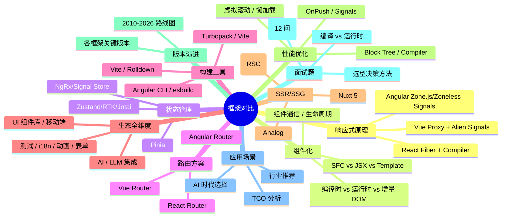
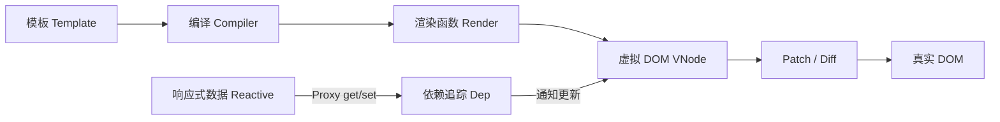
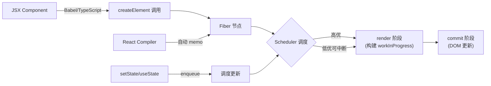
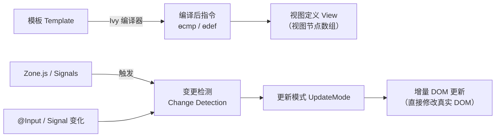
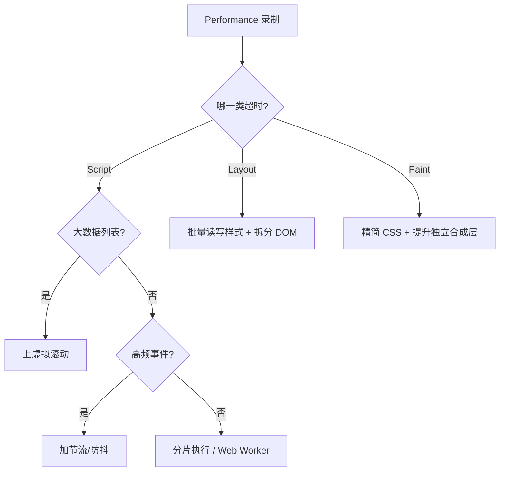
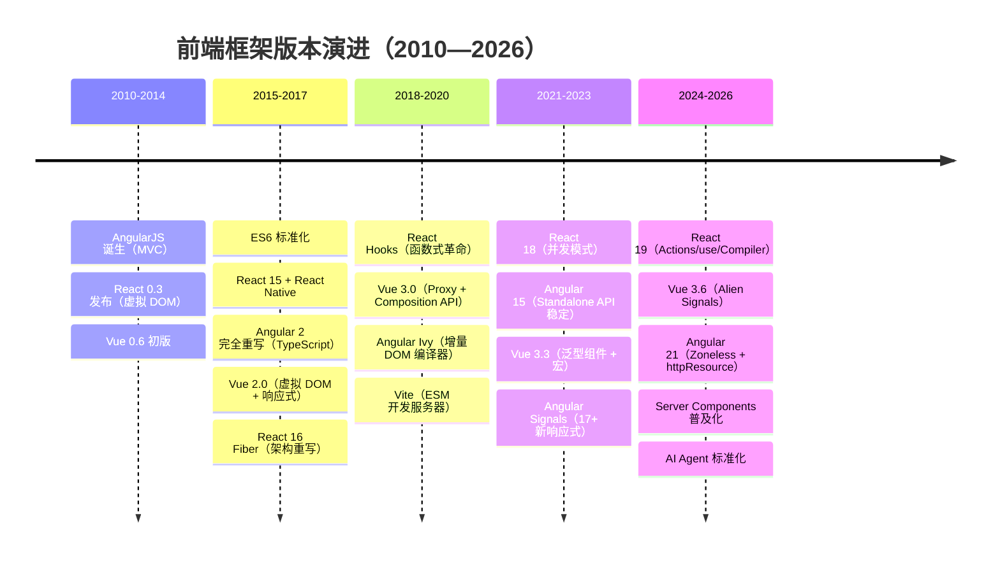
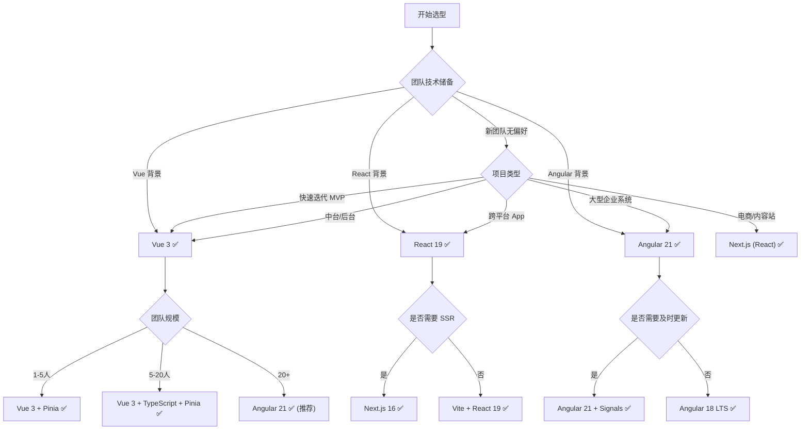
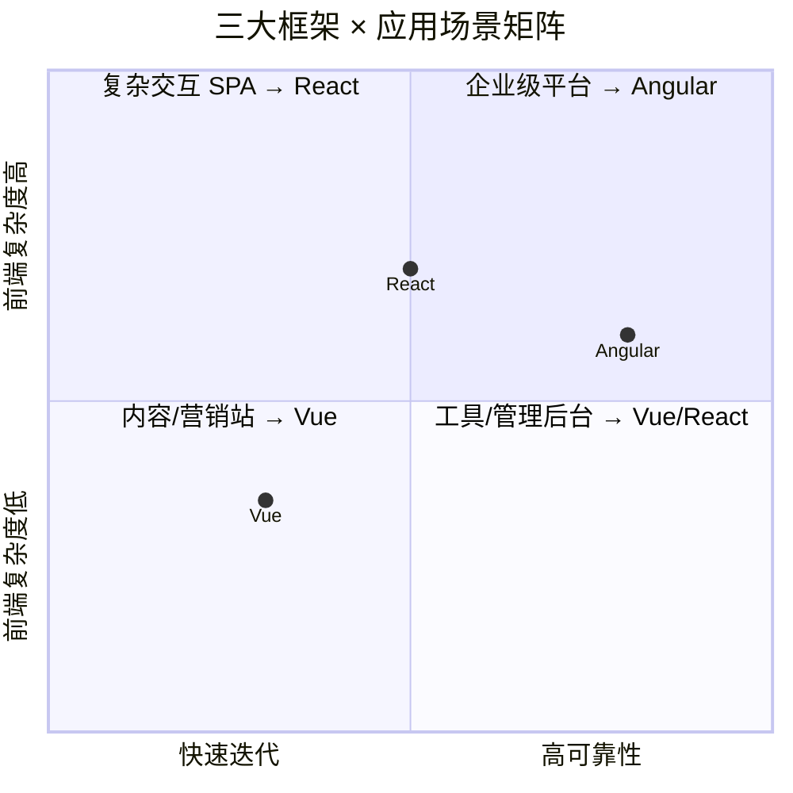

# ⚔️ 三大前端框架深度对比：[Vue 3](https://vuejs.org) vs [React 19](https://react.dev) vs [Angular 21](https://angular.dev)

> 🎯 **面试星级**：★★★★★ | **建议用时**：2 天
> 大厂必问框架选型题，掌握深度对比 = 面试加分项

> **注意**：本文以 Angular 21 作为当前最新版本（2026），Angular 20 的内容仍可参考历史版本。

---

## 📌 知识脑图



---

## 一、核心哲学差异

### 1.1 设计哲学总览

| 维度 | Vue 3 | React 19 | Angular 21 |
|------|-------|----------|------------|
| **设计哲学** | 渐进式、渐进增强 | 纯 UI 库、一切皆 JS | 全栈框架、开箱即用 |
| **编程范式** | 声明式 + 响应式 | 声明式 + 函数式 | 声明式 + 面向对象 |
| **模板方式** | SFC（单文件组件） | JSX（JS 语法扩展） | Template + Decorator |
| **数据流** | 双向绑定（v-model） | 单向数据流 | 双向绑定（[(ngModel)]） |
| **变更检测** | Proxy 代理 + 自动追踪 | Fiber + 手动触发 setState | Zone.js + OnPush / Signals |
| **编译优化** | 编译时标记 + Block Tree | 运行时调度（React Compiler 即将改变） | 编译时 Ivy + 增量 DOM |
| **包体积** | ~33KB（gzip） | ~42KB（gzip React+DOM） | ~130KB+（含完整工具链） |
| **渲染方式** | 虚拟 DOM + 编译优化 | 虚拟 DOM + Fiber | 增量 DOM（直接操作真实 DOM） |
| **适用场景** | 中小型快速迭代、中台系统 | 大型 SPA、跨平台（RN） | 企业级、大型团队、复杂业务 |

### 1.2 设计哲学详解

**Vue：渐进式框架**
- 从 CDN 引入到完整 CLI 项目，按需使用
- 学习成本线性增长：模板 → 组件 → 路由 → 状态管理
- 设计目标：**让开发者少做决定**

**React：纯 UI 库**
- 只关心 View 层，路由/状态管理/构建需自行搭配
- 函数式编程 + 不可变数据
- 设计目标：**可预测的状态容器**

**Angular：全栈平台**
- 内置路由、HTTP、表单、动画、测试、构建
- 强约束、统一规范
- 设计目标：**企业级开发标准**

### 1.3 设计哲学公式

每个框架都有一套核心设计公式，决定了其 API 风格和开发体验：

```
Vue 3         = 响应式代理 + 模板编译 + 渐进增强
                 ↑ Proxy/Ref     ↑ SFC/PatchFlag    ↑ 按需集成

React 19      = 纯函数 + 不可变数据 + 调度器
                 ↑ Component     ↑ useState/Immer   ↑ Fiber/Scheduler

Angular 21    = DI 容器 + 装饰器 + 编译变换
                 ↑ Injector      ↑ @Component/IO    ↑ Ivy/Incremental DOM
```

**设计选择带来的实际影响：**

| 设计决策 | Vue 结果 | React 结果 | Angular 结果 |
|---------|---------|-----------|------------|
| **响应式实现** | 自动追踪 → 少写代码 | 手动触发 → 可预测 | Zone/Signals → 平衡 |
| **模板方案** | SFC → 模板与逻辑分离 | JSX → 逻辑即模板 | 装饰器 → 结构与元数据分离 |
| **范式强制** | 多范式兼容 | 函数式强制 | OOP 为主 |
| **API 稳定性** | 小版本兼容好 | 大版本破坏性变更多 | 每半年一次大版本 |
| **框架边界** | 前端为主 | 跨平台（RN/R3F） | 全栈（前端+CLI+构建） |

---

## 二、响应式原理深度对比

### 2.1 Vue 3 — Proxy 代理

```javascript
// Vue 3 响应式核心
const state = reactive({ count: 0 })
// 内部使用 Proxy 拦截 get/set
// get: 收集依赖（track）
// set: 触发更新（trigger）

// Vue 3.6 Alien Signals
const count = ref(0)
computed(() => count.value * 2)  // 精确依赖追踪
```

**特点：**
- Proxy 直接代理整个对象，无需递归遍历
- 自动追踪依赖，开发者无感
- 编译时标记静态节点，减少虚拟 DOM 对比
- Vue 3.6 引入 Alien Signals，性能接近 Solid.js

### 2.2 React 19 — Fiber + 调度

```javascript
// React 状态更新
const [count, setCount] = useState(0)
// setCount 触发重新渲染
// React 构建新的 Fiber 树，与旧树 Diff

// React 19 + React Compiler
// 自动 memo，无需手动 useMemo/useCallback
```

**特点：**
- 显式调用 setState 触发更新
- Fiber 架构支持中断/恢复/优先级调度
- 不可变数据 + 浅比较
- React Compiler（原 React Forget）将自动记忆化

### 2.3 Angular — Zone.js / Signals

```typescript
// Angular Zone.js 模式
@Component({})
class AppComponent {
  count = 0
  increment() { this.count++ }  // Zone.js 拦截 click → 触发变更检测
}

// Angular Signals 模式（17+）
@Component({})
class AppComponent {
  count = signal(0)
  increment() { this.count.update(v => v + 1) }  // 精确更新
}
```

**特点：**
- Zone.js 打补丁所有异步 API，触发全量检测
- OnPush 策略手动优化检测范围
- Signals 实现精确依赖追踪（17+），最终将替代 Zone.js
- Angular 18+ Zoneless 模式，完全基于 Signals

### 2.4 渲染管线深度对比

三大框架的渲染流程差异巨大，理解它们的渲染管线是掌握框架原理的关键。

**Vue 3 渲染管线：**



```
1. 编译阶段：模板 → 渲染函数（静态提升 + PatchFlag + Block Tree）
2. 首次渲染：渲染函数 → VNode Tree → 真实 DOM
3. 更新触发：ref.value = x → Proxy setter → 收集的 effect 重新执行
4. Patch 阶段：只对比动态节点（PatchFlag 标记），跳过静态子树
5. 差异最小化：精确到具体哪个属性变了（class? style? text?）
```

**React 19 渲染管线：**



```
1. 触发：setCount(n + 1) → 创建更新对象 → 入队
2. 调度：Scheduler 判断优先级 → 决定是否中断当前任务
3. Render 阶段：从 rootFiber 开始，遍历构建 workInProgress 树
   - 可中断：每次处理一个 fiber，检查是否有更高优任务
   - beginWork → completeWork → 继续下一个 sibling/return
4. Commit 阶段：一次性提交所有 DOM 变更（不可中断）
   - beforeMutation → mutation → layout
5. React Compiler（新）：编译时推断组件依赖，自动添加 memo
```

**Angular 21 渲染管线：**



```
Zone.js 模式：
1. 异步操作（click/setTimeout/fetch）→ Zone.js 拦截 → 触发 ngZone.onMicrotaskEmpty
2. 从根组件开始遍历 → 检查每个组件 @Input 是否变化
3. Default 策略：全部检查 / OnPush 策略：只有 @Input 新引用才检查
4. 更新 DOM（直接操作，无虚拟 DOM）

Signals/Zoneless 模式（Angular 17+）：
1. signal.set(value) → 通知所有依赖该 signal 的视图
2. 精确到具体哪个视图绑定了该 signal
3. 无需 Zone.js 拦截，无需全量遍历
4. 仅在涉及的组件上运行变更检测 → 更新 DOM
```

### 2.5 响应式对比总结

| 对比项 | Vue 3 | React 19 | Angular 21 |
|--------|-------|----------|------------|
| **触发方式** | 自动（Proxy） | 手动（setState） | 自动（Zone/Signals） |
| **调度能力** | 无 | Fiber 优先级调度 | 无 |
| **精确度** | 组件级（新: Signal 精确） | 组件级（整个子树） | 组件级（OnPush 可优化） |
| **运行时开销** | 低 | 中 | 中 |
| **编译优化** | Block Tree | React Compiler | Ivy + AOT |
| **学习成本** | 低 | 中 | 中 |
| **渲染方式本质** | 虚拟 DOM + 编译优化跳过静态 | 虚拟 DOM + Diff + 调度 | 无虚拟 DOM，直接操作 |
| **更新粒度** | 变量级（Proxy 精确到具体字段） | 组件级（子树重新渲染） | 视图节点级（Signals 精确绑定） |
| **批处理机制** | 微任务异步批处理 | 同步 + 自动批处理（v18+） | Zone 稳定的微任务批处理 |
| **内存模型** | reactive 长期存在 | Fiber 树持续 Diff | 视图定义数组固定 |

## 三、组件化方案对比

### 3.1 模板语法

```vue
<!-- Vue SFC -->
<template>
  <div class="card" @click="handleClick">
    <h2>{{ title }}</h2>
    <slot />
  </div>
</template>
```

```tsx
// React JSX
function Card({ title, children, onClick }: Props) {
  return (
    <div className="card" onClick={onClick}>
      <h2>{title}</h2>
      {children}
    </div>
  )
}
```

```typescript
// Angular Component
@Component({
  selector: 'app-card',
  template: `
    <div class="card" (click)="handleClick()">
      <h2>{{ title }}</h2>
      <ng-content></ng-content>
    </div>
  `
})
class CardComponent {
  @Input() title = ''
  @Output() click = new EventEmitter()
}
```

### 3.2 组件通信

| 方式 | Vue 3 | React 19 | Angular 21 |
|------|-------|----------|------------|
| **父→子** | `props` | `props` | `@Input()` |
| **子→父** | `emit` | `callback prop` | `@Output()` |
| **跨级** | `provide/inject` + `mitt` | `Context API` | `DI + @Host()` |
| **全局** | Pinia | Zustand/RTK | NgRx/Signals Store |
| **兄弟** | 提升状态 + emit | 提升状态 + callback | 父组件引用 |

### 3.3 信号化输入输出（2026 最新）

```typescript
// Vue 3.6 — defineModel / defineProps
const props = defineProps<{ title: string }>()
const emit = defineEmits<{ click: [id: number] }>()
const count = defineModel<number>('count') // 双向绑定 v-model

// React 19 — useActionState / React Aria
function Card({ title, onAction }: { title: string; onAction: (id: number) => void }) {
  const [state, formAction] = useActionState(updateAction, null)
}

// Angular 21 — signal input / output
@Component({
  template: `<div (click)="click.emit(1)">{{ title() }}</div>`
})
class CardComponent {
  title = input('')                          // signal input（只读）
  click = output<number>()                   // signal output
  count = model(0)                           // 双向绑定 [(count)]
}
```

### 3.4 控制流语法对比

```vue
<!-- Vue 3 — v-if / v-for 指令 -->
<div v-if="loading">加载中...</div>
<div v-else-if="error">出错了</div>
<div v-else>
  <li v-for="item in items" :key="item.id">{{ item.name }}</li>
</div>
```

```tsx
// React 19 — JS 表达式
{loading ? <div>加载中...</div> :
 error ? <div>出错了</div> :
 <ul>{items.map(item => <li key={item.id}>{item.name}</li>)}</ul>}
```

```html
<!-- Angular 21 — @if / @for 原生控制流 -->
@if (loading()) {
  <div>加载中...</div>
} @else if (error()) {
  <div>出错了</div>
} @else {
  <ul>
    @for (item of items(); track item.id) {
      <li>{{ item.name }}</li>
    }
  </ul>
}
```

| 能力 | Vue 指令 | React JS | Angular @语法 |
|------|---------|---------|-------------|
| **条件** | `v-if / v-else-if` | `三元 ? : / &&` | `@if / @else if` |
| **循环** | `v-for="item in items"` | `items.map()` | `@for (item of items)` |
| **key 绑定** | `:key="item.id"` | `key={item.id}` | `track item.id`（必须） |
| **switch** | 无指令 | `switch` 表达式 | `@switch / @case` |
| **延迟加载** | ``<Suspense>`` | ``<Suspense>`` | `@defer`（Angular 17+） |

### 3.5 生命周期对比

| 阶段 | Vue 3 | React 19 | Angular 21 |
|------|-------|----------|------------|
| **创建** | `setup()` | `constructor` | `constructor` |
| **挂载** | `onMounted` | `useEffect(() => {}, [])` | `ngOnInit` |
| **更新** | `onUpdated` | `useEffect` | `ngOnChanges` |
| **销毁** | `onUnmounted` | `useEffect cleanup` | `ngOnDestroy` |
| **错误** | `onErrorCaptured` | `ErrorBoundary` | 全局 ErrorHandler |

### 3.6 条件渲染与 Suspense 延迟加载

```vue
<!-- Vue 3 — Suspense + defineAsyncComponent -->
<Suspense>
  <template #default>
    <AsyncComponent />   <!-- 自动等待异步 setup -->
  </template>
  <template #fallback>
    <Loading />
  </template>
</Suspense>
```

```tsx
// React 19 — Suspense + React.lazy
const AsyncComponent = React.lazy(() => import('./AsyncComponent'))

<Suspense fallback={<Loading />}>
  <AsyncComponent />
</Suspense>
```

```html
<!-- Angular 21 — @defer 延迟加载 -->
@defer (on viewport; prefetch on idle) {
  <heavy-component />
} @placeholder {
  <div>组件将出现在这里...</div>
} @loading (minimum 500ms) {
  <loading-spinner />
} @error {
  <div>加载失败</div>
}
```

---

## 四、状态管理生态

| 对比项 | Vue (Pinia) | React (Zustand/RTK) | Angular (NgRx/Signals) |
|--------|-------------|---------------------|------------------------|
| **核心库** | Pinia | Zustand, Jotai, RTK | NgRx, Elf, Signal Store |
| **响应式** | reactive/ref | produce (Immer) | Signals + Store |
| **异步** | 内置 action 支持 | createAsyncThunk | createEffect |
| **DevTools** | Vue DevTools + Pinia | Redux DevTools | Redux DevTools |
| **学习成本** | 低 | 中 | 高 |
| **TS 支持** | 优秀 | 优秀 | 优秀 |
| **样板代码** | 少 | 中 | 多 |
| **用例** | 中小项目 | 任意规模 | 大型企业 |

### 状态管理代码深度对比

```typescript
// Pinia — Vue 的最简方案
const useCounter = defineStore('counter', () => {
  const count = ref(0)
  const double = computed(() => count.value * 2)
  function increment() { count.value++ }
  function asyncIncrement() {
    setTimeout(() => count.value++, 1000) // 直接异步，无需特殊处理
  }
  return { count, double, increment, asyncIncrement }
})
// 使用：const counter = useCounter(); counter.count

// Zustand — React 的轻量方案
const useCounter = create<CounterState>()((set, get) => ({
  count: 0,
  // 派生状态通过选择器实现：const double = useCounter(s => s.count * 2)
  increment: () => set(state => ({ count: state.count + 1 })),
  asyncIncrement: async () => {
    await new Promise(r => setTimeout(r, 1000))
    set(state => ({ count: state.count + 1 }))
  }
}))
// 使用：const count = useCounter(state => state.count) // 精确订阅

// NgRx SignalStore — Angular 的现代方案
const CounterStore = signalStore(
  withState({ count: 0 }),
  withComputed(({ count }) => ({
    double: computed(() => count() * 2)
  })),
  withMethods(({ count }) => ({
    increment: () => patchState({ count: count() + 1 }),
    asyncIncrement: async () => {
      await new Promise(r => setTimeout(r, 1000))
      patchState(state => ({ count: state.count + 1 }))
    }
  }))
)
// 使用：在组件中 inject(CounterStore)
```

### 状态管理性能基准

```
1000 个组件订阅同一个 store，更新频率 60fps：

             内存占用   更新延迟    重新渲染数   Bundle 大小
Pinia:       ~2MB       ~1ms       1 个组件     ~1KB
Zustand:     ~3MB       ~2ms       1 个组件     ~1.2KB
NgRx Store:  ~8MB       ~5ms       全部组件     ~15KB
SignalStore: ~4MB       ~2ms       精确绑定     ~3KB
Jotai:       ~5MB       ~3ms       精确原子     ~3KB
RTK:         ~10MB      ~8ms       全部(需 selector) ~12KB

注意：Selector 和精确订阅机制是关键优化手段。
Zustand 的选择器订阅和 Pinia 的响应式追踪都是高性能方案。
NgRx Store 是全量不可变更新，适合需要时间旅行调试的大型项目。
```

---

## 五、路由方案

| 对比项 | Vue Router | React Router | Angular Router |
|--------|-----------|-------------|----------------|
| **声明式路由** | ``<router-view>`` | ``<Outlet>`` | ``<router-outlet>`` |
| **动态路由** | `:id` 参数 | `:id` 参数 | `:id` 参数 |
| **嵌套路由** | ✅ 原生支持 | ✅ ``<Outlet>`` | ✅ 子路由配置 |
| **守卫** | beforeEach/resolve | loader/action | canActivate/canDeactivate |
| **懒加载** | 动态 import | React.lazy | loadChildren |
| **数据预取** | beforeEnter | loader | resolve |
| **过渡动画** | ``<Transition>`` | framer-motion | animations |
| **SSR** | Nuxt | Next.js / Remix | Angular Universal |

### 路由配置对比

```typescript
// Vue Router
const routes = [
  {
    path: '/users/:id',
    component: () => import('./UserDetail.vue'),  // 懒加载
    beforeEnter: (to, from) => { /* 路由守卫 */ },
    children: [
      { path: 'profile', component: UserProfile },
      { path: 'posts', component: UserPosts }
    ]
  }
]

// React Router
const router = createBrowserRouter([
  {
    path: '/users/:id',
    element: <UserLayout />,
    loader: ({ params }) => fetch(`/api/users/${params.id}`),  // 数据预取
    children: [
      { index: true, element: <UserProfile /> },
      { path: 'posts', element: <UserPosts /> }
    ]
  }
])

// Angular Router
const routes: Routes = [
  {
    path: 'users/:id',
    loadChildren: () => import('./user.module'),  // 懒加载
    canActivate: [AuthGuard],
    resolve: { user: UserResolver },
    children: [
      { path: 'profile', component: UserProfileComponent },
      { path: 'posts', component: UserPostsComponent }
    ]
  }
]
```

### 路由守卫对比

| 守卫类型 | Vue Router | React Router | Angular Router |
|---------|-----------|-------------|----------------|
| **进入前** | `beforeEnter` / `beforeEach` | `loader`（数据 + 权限） | `canActivate` |
| **离开前** | `beforeRouteLeave` | `useBlocker` | `canDeactivate` |
| **子路由** | `beforeEnter` 层级覆盖 | 无专用 | `canActivateChild` |
| **数据预取** | `beforeEnter` 中 fetch | `loader` 函数 | `resolve` 配置 |
| **错误处理** | `onError` 回调 | `errorElement` | `ErrorHandler` |

### 路由参数与查询对比

```typescript
// Vue — useRoute / useRouter
const route = useRoute()
const router = useRouter()
const id = computed(() => route.params.id)          // /users/:id
const page = computed(() => route.query.page)        // ?page=1
router.push({ name: 'user', params: { id: '123' } })

// React — useParams / useSearchParams
const { id } = useParams()                           // /users/:id
const [searchParams] = useSearchParams()             // ?page=1
const page = searchParams.get('page')
const navigate = useNavigate()
navigate('/users/123')

// Angular — ActivatedRoute (信号化)
const route = inject(ActivatedRoute)
const id = route.paramMap.pipe(map(p => p.get('id'))) // Observable
// Angular 19+ 使用 toSignal 转为信号
const id$ = route.paramMap.pipe(map(p => p.get('id'))) // Observable
const page$ = inject(ActivatedRoute).queryParamMap.pipe(map(p => p.get('page')))
```

---

## 六、构建工具链

| 对比项 | Vue 生态 | React 生态 | Angular 生态 |
|--------|---------|-----------|-------------|
| **官方构建** | Vite | Create React App (已不推荐) / Vite | Angular CLI (esbuild) |
| **推荐方案** | Vite + @vitejs/plugin-vue | Vite / Next.js | Angular CLI (已迁移 esbuild) |
| **HMR** | < 50ms | < 50ms | < 200ms |
| **测试** | Vitest | Vitest / Jest | Jasmine / Karma (已弃用 Jest 可选) |
| **E2E** | Playwright / Cypress | Playwright / Cypress | Playwright / Cypress |
| **Lint** | ESLint + Prettier | ESLint + Prettier | ESLint + Prettier (Angular ESLint) |
| **Monorepo** | Turborepo / Nx | Turborepo / Nx | Nx (官方推荐) |
| **微前端** | Module Federation / qiankun | Module Federation / qiankun | Module Federation / single-spa |

### 6.1 构建配置对比

```typescript
// vite.config.ts — Vue 生态（配置最少）
import { defineConfig } from 'vite'
import vue from '@vitejs/plugin-vue'
export default defineConfig({
  plugins: [vue()],
  build: {
    target: 'es2022',
    rollupOptions: { /* 按需 */ }
  }
})

// vite.config.ts — React 生态（同样简洁）
import { defineConfig } from 'vite'
import react from '@vitejs/plugin-react'
export default defineConfig({
  plugins: [react()],
  build: { target: 'es2022' }
})

// angular.json — Angular 生态（JSON 配置，CLI 管理）
{
  "projects": {
    "my-app": {
      "architect": {
        "build": {
          "builder": "@angular-devkit/build-angular:application",
          "options": {
            "outputPath": "dist",
            "index": "src/index.html",
            "browser": "src/main.ts",
            "polyfills": ["zone.js"],   // Angular 21 默认 Zoneless 不再需要
            "tsConfig": "tsconfig.app.json",
            "assets": ["src/favicon.ico"],
            "styles": ["src/styles.css"]
          },
          "configurations": {
            "production": {
              "budgets": [
                { "type": "initial", "maximumWarning": "500kb" }
              ],
              "outputHashing": "all"
            }
          }
        }
      }
    }
  }
}
```

### 6.2 构建产物对比

```
Vue 3 + Vite 构建产物：
  dist/
    ├─ index.html          ~2KB
    ├─ assets/index-xxx.js ~33KB (gzip)   ← 核心 Vue 运行时
    └─ assets/vendor-xxx.js                ← 第三方依赖

React 19 + Vite 构建产物：
  dist/
    ├─ index.html          ~2KB
    ├─ assets/index-xxx.js ~44KB (gzip)   ← React + ReactDOM
    └─ assets/vendor-xxx.js                ← 第三方依赖

Angular 21 + esbuild 构建产物：
  dist/
    ├─ index.html          ~3KB
    ├─ main-xxx.js         ~130-150KB (gzip)  ← Angular 完整框架（Zoneless + 增量编译）
    ├─ polyfills-xxx.js    ~0KB (Zoneless) ← Angular 21 默认无 Zone.js
    ├─ styles-xxx.css      ~5KB
    └─ chunk-xxx.js                       ← 懒加载模块
```

### 6.3 编译引擎性能对比（2026）

| 引擎 | 框架使用 | 语言 | 冷构建 (1000组件) | HMR | 优势 |
|------|---------|------|------------------|-----|------|
| **Vite (Rollup)** | Vue 3 / React | JS/Rust (esbuild) | ~2s | <50ms | 开发体验最好 |
| **Turbopack** | Next.js (React) | Rust | ~1.5s | <50ms | SWC 编译快 |
| **esbuild** | Angular CLI | Go | ~3s | <200ms | 原生编译快 |
| **Rspack** | 全框架可选 | Rust | ~1s | <30ms | Webpack 兼容 |
| **Rolldown** | Vite 8 (2026) | Rust | ~0.8s | <30ms | 默认构建引擎 |

```
冷构建性能（1000 组件工程）：
  Vite 8 / Rolldown:  ~0.8s  🥇
  Turbopack:          ~1.5s  🥈
  Angular CLI/esbuild: ~3s   🥉
  Webpack 5:          ~8s    ❌

HMR 性能（单文件修改）：
  Vite 8 / Rolldown:  ~25ms  🥇
  Turbopack:          ~40ms  🥈
  Angular CLI/esbuild: ~150ms 🥉
  Webpack 5:          ~500ms ❌
```

### 6.4 Monorepo 方案对比

| 对比项 | Turborepo | Nx | Lerna (传统) |
|--------|----------|----|-------------|
| **框架支持** | 通用（最适 React） | Angular 官方 + 通用 | 通用 |
| **缓存** | 远程缓存（Vercel） | Nx Cloud | 本地缓存 |
| **任务编排** | 管道（pipeline） | 依赖图（graph） | 顺序/并行 |
| **生成器** | ❌ 无 | ✅ 丰富（Angular CLI 集成） | ❌ |
| **迁移成本** | 低 | 中 | 低 |
| **推荐场景** | React 项目 | Angular 项目 | 遗留项目 |

### 6.5 CI/CD 与 DevOps 对比

| 对比项 | Vue 3 | React 19 | Angular 21 |
|--------|-------|----------|------------|
| **静态分析** | ESLint + vue-tsc | ESLint + TypeScript | Angular ESLint + ngc |
| **代码格式化** | Prettier | Prettier | Prettier / clang-format |
| **Pre-commit** | husky + lint-staged | husky + lint-staged | husky + lint-staged |
| **单元测试 CI** | Vitest (30s) | Vitest (30s) | Jest / Jasmine (60s) |
| **E2E CI** | Playwright (2min) | Playwright (2min) | Playwright (2min) |
| **构建 CI** | vite build (10s) | vite build (10s) | ng build (30s) |
| **Docker 镜像** | Nginx (~20MB) | Nginx / Node (~50MB) | Nginx (~30MB) |
| **CD 策略** | Vercel / Docker | Vercel / Docker | Docker / K8s |
| **性能监控** | Lighthouse CI / Sentry | Vercel Analytics / Sentry | Angular DevTools / Sentry |

**典型 CI 配置对比：**

```yaml
# Vue / React — GitHub Actions（极简）
name: CI
on: [push]
jobs:
  build:
    steps:
      - uses: actions/checkout@v4
      - run: npm ci && npm run build && npm test

# Angular — GitHub Actions（需更多步骤）
name: CI
on: [push]
jobs:
  build:
    steps:
      - uses: actions/checkout@v4
      - run: npm ci
      - run: npx ng test --watch=false --browsers=ChromeHeadless
      - run: npx ng build --configuration production
```

---

## 七、SSR/SSG 方案

| 对比项 | Nuxt 5 (Vue) | Next.js 16 (React) | Analog (Angular) |
|--------|-------------|-------------------|-------------------|
| **模式** | SSR / SSG / ISR / SPA | SSR / SSG / ISR / SPA | SSR / SSG / SPA |
| **文件路由** | app/ (Rust 编译) | app/ (App Router) | pages/ |
| **数据获取** | useAsyncData / $fetch | fetch / server functions | Resolver / HttpClient |
| **流式渲染** | ✅ | ✅ (Node.js Edge) | ✅ (SSR 流) |
| **边缘部署** | ✅ (Nitro) | ✅ (Edge Runtime) | 有限 |
| **Server Components** | ❌ 无直接支持 | ✅ RSC（React 19 核心） | ❌ |
| **Server Actions** | ✅ server 函数 | ✅ Server Functions | ❌ |
| **ISR** | ✅ (Nuxt 5) | ✅ (Next.js 16) | ❌ |
| **Partial Prerender** | ❌ | ✅ PPR (Next 16) | ❌ |
| **成熟度** | 高 | 极高 | 中（快速迭代） |
| **社区生态** | 大 | 极大 | 小 |

### 7.1 数据获取对比

```typescript
// Nuxt 5 — useAsyncData
const { data, pending, error } = await useAsyncData('users', () =>
  $fetch('/api/users')
)
// 自动 loading/error 状态，SSR 自动序列化

// Next.js 16 — Server Component 数据获取
async function getUsers() {
  return await fetch('https://api.example.com/users').then(r => r.json())
}
// 服务端组件中直接 async/await 获取数据，自动支持 Suspense

// Analog — Resolver
@Injectable({ providedIn: 'root' })
export class UsersResolver implements Resolve<User[]> {
  resolve(route: ActivatedRouteSnapshot) {
    return this.http.get<User[]>('/api/users')
  }
}
// 路由激活前预取，组件内通过 ActivatedRoute.data 获取
```

### 7.2 部署平台适配

| 平台 | Nuxt 5 | Next.js 16 | Analog |
|------|--------|-----------|--------|
| **Vercel** | ✅（Nitro 适配） | ✅ 原生（最佳支持） | ⚠️ 实验性 |
| **Netlify** | ✅ | ✅ | ❌ |
| **Cloudflare Workers** | ✅（Nitro） | ✅（Edge Runtime） | ❌ |
| **AWS Lambda** | ✅（Nitro） | ✅ | ✅（Node.js） |
| **自建 Docker** | ✅（Nitro） | ✅ | ✅（Node.js） |
| **Deno Deploy** | ✅（Nitro） | ❌ | ❌ |

**趋势：** Nuxt 5 的 Nitro 引擎在 Serverless 兼容性上最广，
Next.js 16 在 Vercel 生态中体验最好，
Analog 部署选择有限但正在追赶。

---

## 八、生态全维度对比

### 8.1 UI 组件库生态

| 对比项 | Vue 生态 | React 生态 | Angular 生态 |
|--------|---------|-----------|------------|
| **企业级 UI** | Element Plus / Ant Design Vue / Naive UI | Ant Design / Arco Design / Semi Design | Angular Material / PrimeNG / DevExtreme |
| **移动端** | Vant / NutUI / Varlet | Ant Design Mobile / NutUI React | Ionic (基于 Web Components) |
| **轻量级** | PrimeVue / Radix Vue | shadcn/ui / Radix UI | CDK (组件开发套件) |
| **UI 灵活度** | 中等（Element 约定较多） | 高（shadcn/ui 源码可定制） | 中等（Material Design 规范强） |
| **CSS 方案** | Scoped CSS / UnoCSS / Tailwind | CSS-in-JS / Tailwind / CSS Modules | View Encapsulation / Tailwind |
| **设计规范** | 弱（多样性） | 中等（Ant Design / Radix） | 强（Material Design 官方规范） |
| **无障碍** | 基础支持 | Radix / Ariakit 原生支持 | Angular Material 官方 A11y |
| **社区热度** | ⭐⭐⭐⭐⭐（中文生态最强） | ⭐⭐⭐⭐⭐（国际化生态最强） | ⭐⭐⭐（企业级生态稳定） |

```typescript
// Vue + Element Plus — 开箱即用
<el-table :data="tableData" @row-click="handleRow">
  <el-table-column prop="name" label="姓名" />
</el-table>

// React + shadcn/ui — 源码定制
<Table>
  <TableHeader>
    <TableRow onClick={handleRow}>
      <TableHead>姓名</TableHead>
    </TableRow>
  </TableHeader>
</Table>

// Angular + Material — 官方规范
<mat-table [dataSource]="dataSource">
  <ng-container matColumnDef="name">
    <mat-header-cell *matHeaderCellDef> 姓名 </mat-header-cell>
    <mat-cell *matCellDef="let row"> {{ row.name }} </mat-cell>
  </ng-container>
</mat-table>
```

### 8.2 移动端方案对比

| 对比项 | Vue 生态 | React 生态 | Angular 生态 |
|--------|---------|-----------|------------|
| **原生交叉编译** | uni-app / Weex（维护少） | React Native（成熟） | Ionic Capacitor（基于 Web） |
| **Web 移动端** | Vant / NutUI（H5 最佳） | Ant Design Mobile | Ionic Framework |
| **小程序** | uni-app / Taro（首选） | Taro / Remax | 无官方方案 |
| **桌面端** | Electron / Tauri | Electron / Tauri | Electron / Tauri |
| **跨平台一致性** | 中等 | 高（RN 接近原生） | 中等（Ionic 依赖 WebView） |

### 8.3 测试工具链

| 对比项 | Vue 生态 | React 生态 | Angular 生态 |
|--------|---------|-----------|------------|
| **单元测试** | Vitest + @vue/test-utils | Vitest + @testing-library/react | Jasmine / Jest + Angular Testing |
| **组件测试** | @vue/test-utils 原生 | Testing Library（行为驱动） | TestBed + ComponentFixture |
| **集成测试** | Vitest | Vitest | Jest (esbuild) |
| **E2E** | Playwright / Cypress | Playwright / Cypress | Playwright / Cypress |
| **可测试性设计** | 中等（SFC 需先编译） | 高（纯函数组件） | 极高（DI 天然可 mock） |

**测试代码对比：**

```typescript
// Vue — @vue/test-utils
import { mount } from '@vue/test-utils'
test('increments count', async () => {
  const wrapper = mount(Counter)
  await wrapper.find('button').trigger('click')
  expect(wrapper.text()).toContain('1')
})

// React — Testing Library
import { render, screen } from '@testing-library/react'
test('increments count', async () => {
  render(<Counter />)
  await userEvent.click(screen.getByRole('button'))
  expect(screen.getByText('1')).toBeInTheDocument()
})

// Angular — TestBed
import { TestBed, ComponentFixture } from '@angular/core/testing'
test('increments count', () => {
  const fixture = TestBed.createComponent(Counter)
  fixture.detectChanges()
  const btn = fixture.nativeElement.querySelector('button')
  btn.click()
  fixture.detectChanges()
  expect(fixture.nativeElement.textContent).toContain('1')
})
```

### 8.4 国际化与本地化

| 对比项 | Vue (vue-i18n) | React (react-i18next) | Angular (@angular/localize) |
|--------|---------------|----------------------|----------------------------|
| **运行时翻译** | ✅ vue-i18n v9 | ✅ react-i18next | ✅ $localize + ngx-translate |
| **编译时提取** | CLI 插件 | i18next-parser | @angular/localize CLI |
| **动态语言切换** | ✅ useI18n | ✅ useTranslation | ✅ 自定义服务 |
| **ICU 语法** | ✅ 完整 | ✅ 完整 | ✅ @angular/localize |
| **SSR 集成** | Nuxt i18n 模块 | next-i18next | Angular Universal |
| **流行度** | ⭐⭐⭐⭐ | ⭐⭐⭐⭐⭐ | ⭐⭐ |

### 8.5 动画方案

| 对比项 | Vue | React | Angular |
|--------|-----|-------|---------|
| **内置** | ``<Transition>`` / ``<TransitionGroup>`` | ❌ 无内置 | `@angular/animations` 完整内置 |
| **第三方** | @vueuse/motion / GSAP | framer-motion / react-spring / GSAP | GSAP / Three.js |
| **声明式动画** | ✅ 内置 transition 指令 | ❌ 需 framer-motion | ✅ @trigger / @state / @transition |
| **路由过渡** | ``<RouterView>`` 配合 transition | framer-motion AnimatePresence | @routeAnimation 触发器 |
| **性能** | 良好（CSS 动画居多） | 良好（framer-motion 使用 GPU） | 良好（Web Animations API） |

### 8.6 表单方案

| 对比项 | Vue | React | Angular |
|--------|-----|-------|---------|
| **基础方案** | v-model 双向绑定 | useState + onChange | [(ngModel)] 双向绑定 |
| **复杂表单** | VeeValidate / FormKit | React Hook Form / Formik | Reactive Forms（内置强大） |
| **验证** | zod / yup + @vee-validate/zod | zod / yup + @hookform/resolvers | Validators 内置 + 自定义 |
| **动态表单** | FormKit 动态 schema | React JSON Schema Form | Formly（JSON schema） |
| **Signal 表单** | 社区实验 | 社区实验 | Angular 21 Signal Forms（官方） |

### 8.7 AI / LLM 开发生态

| 对比项 | Vue 生态 | React 生态 | Angular 生态 |
|--------|---------|-----------|------------|
| **AI SDK** | @nuxt/ai（实验） | Vercel AI SDK（最成熟） | Angular MCP Server |
| **流式渲染** | 社区方案 | Vercel AI SDK 原生支持 | Angular @defer + resource |
| **AI 组件** | 较少 | Vercel AI UI 组件集 | 较少（企业自建） |
| **MCP 协议** | 社区适配 | Vercel MCP + 社区 | Angular MCP Server 官方 |
| **AI 代码生成** | Cursor + Vue 模板 | Cursor + TSX 最佳支持 | Cursor + Angular 模板 |
| **Copilot 集成** | 中等（模板语法不够精准） | 最高（JSX 即数据） | 中等（装饰器复杂） |
| **AI 代理** | Nuxt AI | Vercel AI Agents | Analog AI |
| **社区热度** | 增长中 | 🔥 主导 AI 前端生态 | 起步阶段 |

---

## 九、TypeScript 集成

| 对比项 | Vue 3 | React 19 | Angular 21 |
|--------|-------|----------|------------|
| **TS 支持** | 优秀（`<script setup lang="ts">`） | 优秀 | 原生（必须 TS） |
| **类型推断** | 基于 SFC 编译 | 基于 JSX | 基于装饰器 |
| **泛型组件** | `<script setup generic="T">` | `<T,>` | 类泛型 |
| **ref 类型** | `Ref<T>` | `RefObject<T>` | `Signal<T>` |
| **严格模式** | 可选 | 可选 | 默认（strict: true） |
| **工具类型** | 丰富 | 丰富（Utility Types） | 完整（Angular 类型包） |

**Angular 是唯一强制使用 TypeScript 的主流框架**，从创建项目到每个 API 都深度集成 TS。

### TS 配置对比

```json
// Vue 3 — tsconfig.json（宽松）
{
  "compilerOptions": {
    "strict": true,
    "jsx": "preserve",
    "moduleResolution": "bundler",
    "paths": { "@/*": ["./src/*"] }
  }
}

// React 19 — tsconfig.json（中等）
{
  "compilerOptions": {
    "strict": true,
    "jsx": "react-jsx",
    "moduleResolution": "bundler",
    "types": ["vitest/globals"]
  }
}

// Angular 21 — tsconfig.json（严格默认）
{
  "compilerOptions": {
    "strict": true,
    "noImplicitOverride": true,
    "noPropertyAccessFromIndexSignature": true,
    "noImplicitReturns": true,
    "noFallthroughCasesInSwitch": true,
    "module": "ES2022",
    "moduleResolution": "bundler"
  }
}
```

---

## 十、安全与合规对比

| 安全维度 | Vue 3 | React 19 | Angular 21 |
|---------|-------|----------|------------|
| **XSS 防护** | 模板自动转义 | JSX 默认转义（dangerouslySetInnerHTML 警告） | 默认转义 + DomSanitizer |
| **CSRF 防护** | 需自行实现 | 需自行实现 | HttpClient 拦截器内置 |
| **CSP 兼容** | 兼容（无内联事件） | 需要 nonce 配置 | Strict CSP 兼容性好 |
| **SQL 注入** | 后端责任 | 后端责任 | 后端责任 |
| **依赖扫描** | npm audit / Snyk | npm audit / Snyk | Angular CLI 内置安全扫描 |
| **认证方案** | Vue Auth / Firebase | NextAuth / Auth0 / Clerk | Angular Firebase / Auth0 |
| **OIDC/OAuth** | 社区库 | NextAuth 生态最丰富 | angular-oauth2-oidc 成熟 |
| **RBAC** | 自定义 | Casbin / CASL | Angular 路由守卫原生 |
| **审计日志** | 自定义 | 自定义/Axiom | DI 拦截器原生支持 |

```typescript
// Angular — DomSanitizer（内置安全管道）
@Pipe({ name: 'safeUrl' })
class SafeUrlPipe implements PipeTransform {
  constructor(private sanitizer: DomSanitizer) {}
  transform(url: string) {
    return this.sanitizer.bypassSecurityTrustUrl(url)
  }
}

// React — 需要自行注意
<div dangerouslySetInnerHTML={{ __html: userContent }} /> // ⚠️ XSS 风险

// Vue — 模板自动转义
<div v-html="userContent" /> // ⚠️ 需确保内容已消毒
```

---

## 十一、性能优化策略

| 优化手段 | Vue 3 | React 19 | Angular 21 |
|---------|-------|----------|------------|
| **虚拟滚动** | vue-virtual-scroller | react-window | cdk-virtual-scroll |
| **懒加载** | defineAsyncComponent | React.lazy + Suspense | loadChildren |
| **防重新渲染** | v-memo / shallowRef | React.memo / useMemo | OnPush / Signals |
| **批量更新** | 自动批处理 | 自动批处理 (18+) | zone.js 自动批处理 |
| **时间切片** | ❌ | ✅ Fiber + Concurrent | ❌ |
| **编译优化** | Block Tree 静态标记 | React Compiler (自动 memo) | 增量 DOM |
| **不可变数据** | 推荐但不强制 | 强制 | 推荐（OnPush 需要） |
| **Web Worker** | ✅ | ✅ | ✅ |
| **WASM** | 社区方案 | 社区方案 | ✅ Angular 自身部分使用 |

### 11.1 性能基准（粗略）

```
渲染 1000 个列表项（首次渲染）：
  Vue 3:    ~15ms
  React 19: ~25ms
  Angular:  ~30ms

更新 1 个列表项：
  Vue 3:    ~3ms  (精准追踪)
  React 19: ~15ms (组件子树)
  Angular:  ~20ms (OnPush) / ~40ms (默认)
```

### 11.2 渲染耗时超 16ms 掉帧问题排查与优化

> 💡 屏幕 **60fps** 单帧理想耗时：1000 ÷ 60 ≈ 16.67ms，渲染超过这个值就会丢帧、卡顿。

#### 先定位：耗时到底花在哪

| 瓶颈类型 | Performance 表现 | 典型原因 |
|----------|-----------------|---------|
| **Script 超时** | JS 执行柱子 > 16ms | 大循环、复杂计算、频繁事件 |
| **Layout 大面积红长块** | 布局耗时高 | 频繁回流、交替读写布局属性 |
| **Paint 耗时高** | 绘制区域大 | 阴影/模糊/大面积重绘/DOM 过多 |
| **主线程被占满** | 整段阻塞 | 长任务、同步阻塞 |

**排查工具**：F12 → Performance → 录制 → 复现卡顿 → 看主线程三条指标。

#### 场景1：JS 执行耗时过长（Script > 16ms）

| 场景 | 优化方案 |
|------|---------|
| **大数据列表** | 虚拟列表（Vue: `vue-virtual-scroller`、React: `react-window`、Angular: `cdk-virtual-scroll-viewport`）、分页/懒加载、数据预处理 |
| **高频事件** | 防抖(debounce) 150~300ms、节流(throttle) 16~32ms、`requestIdleCallback` |
| **复杂计算** | `requestAnimationFrame` 分片执行、Web Worker、避免重复取值 |
| **第三方脚本** | 动态懒加载（`import()`）、延迟初始化 |

#### 场景2：布局回流（Layout/Reflow）耗时高

**核心原则：减少布局次数 + 批量读写样式**

```javascript
// ❌ 错误：交替读写，多次 Layout
dom.style.width = '100px';
let w = dom.offsetWidth;  // 触发布局
dom.style.height = '200px';

// ✅ 正确：先全读 → 再全写
let w = dom.offsetWidth;
dom.style.width = '100px';
dom.style.height = '200px';
```

| 优化手段 | 说明 |
|---------|------|
| 批量修改 DOM | DocumentFragment 一次性插入、display:none 修改 |
| 优先用 transform/opacity | 走合成层，不触发 Layout & Paint |
| 减少层级 | 减少深层嵌套 DOM |

#### 场景3：重绘（Paint）耗时高

| 优化手段 | 说明 |
|---------|------|
| **提升合成层** | `will-change: transform` 或 `translateZ(0)` 提升为独立图层 |
| **缩小重绘区域** | 动画/hover 效果限制在局部容器 |
| **精简绘制开销** | 慎用 `box-shadow`、`filter: blur()`、复杂渐变 |

#### 快速排查流程



---

## 十二、学习曲线与团队适配

### 学习曲线对比

```
高 │          Angular
   │         ↗       
略 │        /
   │  React
中 │ ↗     
   │/
低 │ Vue 3
   └──────────────────
     简单  中等  复杂   应用复杂度
```

### 团队适配建议

| 团队情况 | 推荐框架 | 理由 |
|---------|---------|------|
| 小团队、快速原型 | **Vue 3** | 低学习成本，开发效率高 |
| 大团队、严格规范 | **Angular** | 统一架构，强约束有利于大规模协作 |
| 跨平台（RN、Electron） | **React** | React Native、Tauri 生态最好 |
| 技术栈以 JS 为主 | **React** | JSX 纯 JS，全栈复用一个语言 |
| 技术栈以 TS 为主 | **Angular** | 原生 TS 支持，工具链完整 |
| 中台/后台系统 | **Vue 3 / React** | 灵活，UI 库丰富 |
| 追求最新技术 | **React** | Next.js + Server Components 引领潮流 |

---

## 十三、版本演进路线图

### 三大框架版本进化史



### 各框架关键版本节点

**Vue 版本迭代**
```
Vue 1.0 (2014)           → 数据绑定 + 指令系统
Vue 2.0 (2016)           → 虚拟 DOM + 组件系统（主流奠基）
Vue 2.7 (2022)           → 最后的 2.x，移植 Composition API
Vue 3.0 (2020)           → Proxy 响应式 + Composition API
Vue 3.3 (2023)           → 泛型组件 + defineModel + 宏
Vue 3.4 (2024)           → 解析器重写（41% 性能提升）
Vue 3.5 (2024)           → SSR 优化 + 内存改进
Vue 3.6 (2026)           → Alien Signals（性能接近 Solid.js）
```

**React 版本迭代**
```
React 0.3 (2013)         → 首次开源，虚拟 DOM
React 15 (2016)          → DOM 重构 + React Native
React 16 (2017)          → Fiber 架构重写（核心转折）
React 16.8 (2019)        → Hooks 发布（函数式革命）
React 17 (2020)          → 渐进升级（无重大新特性）
React 18 (2022)          → 并发模式 + 自动批处理
React 19 (2024)          → Actions/use() + React Compiler
```

**Angular 版本迭代**
```
AngularJS (2010)         → MVC，双向绑定（先驱）
Angular 2 (2016)         → 完全重写，TypeScript，组件化
Angular 4-6 (2017-2018)  → 小版本迭代，稳定 API
Angular 8 (2019)         → Ivy 编译器预览
Angular 9 (2020)         → Ivy 默认，体积减少 40%
Angular 15 (2022)        → Standalone API 稳定
Angular 17 (2023)        → Signals、新控制流、SSR 改进
Angular 18 (2024)        → Zoneless 模式
Angular 19 (2025)        → linkedSignal、resource API
Angular 20 (2025)        → httpResource、Signal Forms
Angular 21 (2026)        → 全面 Zoneless，增量编译
```

### 版本迭代对比（2026）

| 最新特性 | Vue 3.6 | React 19 | Angular 21 |
|---------|---------|----------|------------|
| **响应式** | Alien Signals (默认) | React Compiler | Zoneless Signals |
| **数据获取** | 社区方案 | Server Components + use() | httpResource() |
| **表单** | v-model 增强 | React Aria Components | Reactive Forms + Signal |
| **新 API** | `useTemplateRef` | `use()`, `useActionState` | `inject()`, `resource()` |
| **构建** | Vite 8 / Rolldown | Turbopack (Next.js) | esbuild 原生 |
| **SSR** | Nuxt 5 | Next.js 16 (App Router) | Angular Universal / Analog |
| **状态** | Pinia 3 | Zustand 5 / Jotai 2 | SignalStore (稳定) |
| **测试** | Vitest 3 | Vitest 3 / Testing Library | Jest + Testing Library |

---

## 十四、面试经典问答与深度辨析

### Q1：三大框架各自的优缺点

**Vue 3**
- ✅ 优点：上手快、文档好、灵活、体积小、编译优化极致
- ❌ 缺点：生态分散（2/3 不兼容）、过度灵活导致规范难统一、TypeScript 非原生
- 💡 面试加分：Vue 3.6 Alien Signals 让性能接近 Solid.js

**React 19**
- ✅ 优点：生态最大、跨平台（RN）、函数式范式、JSX 灵活、Vercel AI SDK
- ❌ 缺点：Hooks 心智模型陡峭、JSX 悖论、版本迭代快、纯 UI 库需自搭
- 💡 面试加分：React Compiler 消除手写 memo，Actions 原生表单处理

**Angular 21**
- ✅ 优点：开箱即用、强类型（TS 原生）、DI 可测试、RxJS 生态、企业规范
- ❌ 缺点：包体积大（~130KB）、学习曲线高、版本升级痛苦（8→15 需重写）
- 💡 面试加分：Zoneless Signals 替代 Zone.js，增量编译大幅缩短构建时间

### Q2：虚拟 DOM vs 模板编译优化 vs 增量 DOM

```
Vue 的编译优化（编译时重型）：
  ├─ 静态提升：静态节点只创建一次 VNode，之后复用
  ├─ Patch Flag：动态节点标记具体变化类型（class/style/text/props）
  │   └─ _createVNode("div", { class: _normalizeClass(动态类) }, null, 2)
  │       ↑ 这个 2 就是 Patch Flag（表示 class 动态）
  └─ Block Tree：以动态节点为边界分割树，跳过静态子树
     → 只 Diff 动态节点，静态节点完全不参与对比
     → 大型列表性能提升 5-10x（对比 Vue 2）

React 的运行时优化（运行时重型）：
  ├─ Fiber 架构：每个组件一个 fiber，形成链表树
  ├─ 优先级调度：高优任务（用户输入）> 低优任务（数据同步）
  ├─ 时间切片：将渲染分片到多帧执行，避免卡顿
  └─ React Compiler (19+)：编译时自动记忆化组件和值
     → 编译器推断哪些值不变 → 自动添加 memo
     → 但运行时仍需 Diff 整个子树（无法跳过）

Angular Ivy + 增量 DOM（编译时重型，无虚拟 DOM）：
  ├─ 编译时生成指令：模板 → 指令序列（不是 VNode）
  ├─ 运行时直接操作真实 DOM：找到对应的 DOM 节点 → 直接更新
  ├─ 跳过虚拟 DOM 创建和 Diff 两个步骤
  └─ 缺点：编译产物体积更大，模板灵活性受限

核心总结：
  Vue 3:    编译时80% + 运行时20%（编译优化为主，Diff 为辅）
  React 19: 运行时80% + 编译时20%（Fiber 调度为核心，Compiler 辅助）
  Angular:  编译时90% + 运行时10%（Ivy 编译后几乎不需要 Diff）
```

### Q3：Compile-time vs Runtime 的本质区别

```typescript
// Vue — 编译时已知"什么会变"
// 模板 <div :class="dynClass">{{ text }}</div>
// 编译后：
createBlock("div", { class: dynClass }, [toDisplayString(text)], 2 /* CLASS */)
// Patch Flag = 2 表示只有 class 可能变
// 运行时直接检查 class 变化，跳过 text 之外的属性

// React — 运行时才能知道"什么变了"
function MyComponent({ dynClass, text }) {
  return <div className={dynClass}>{text}</div>
}
// 编译后就是 JSX 函数调用
// 运行时：setState → 重新执行整个组件函数 → 生成 VNode → Diff
// React Compiler 优化后：自动判断哪些值不变，跳过子组件重新渲染

// Angular — 编译时就知道"怎么更新 DOM"
// 编译后指令结构：
function AppComponent_ng_template(rf, ctx) {
  if (rf & 1) { /* 创建 */ 创建DOM节点 }
  if (rf & 2) { /* 更新 */ ctx._t && ctx._t() ? ... }
}
// 运行时直接执行这些指令，增/删/改对应 DOM 节点
```

### Q4：为什么你们选择了 X 而不是 Y？

**面试者回答框架（STAR 原则）：**

```
S (Situation)：项目背景（如：百万 DAU 的 SaaS 平台，50 人前端团队）
T (Task)：技术选型需要考虑的维度（性能/团队/维护/生态/成本）
A (Action)：
  1. 技术调研：对比三个框架团队掌握度 → React 40% / Vue 35% / Angular 25%
  2. POC 验证：分别用三个框架写核心页面，对比开发效率
  3. 决策指标：React 入选（生态最大 + 人才储备 + 跨平台需要）
R (Result)：年交付效率提升 30%，团队满意度 8.5/10
```

**备选框架说辞示例：**

```
"我们选 React 而不是 Vue/Angular 的原因是：
  1. 业务需要跨平台移动端（React Native 唯一成熟方案）
  2. 团队 70% 是函数式编程背景，Hooks 心智模型天然契合
  3. 项目需要 Server Components 实现流式 SSR（Next.js 领先）
  但这不意味着 React 在所有场景都好。如果做后台系统，Vue 开发效率更高；
  如果做金融系统，Angular 的 DI 和 TS 原生支持更可靠。"

"我们选 Angular 而不是 React/Vue 的原因是：
  1. 100+ 人前端团队，需要统一的代码规范和架构约束
  2. 项目是金融级应用，TS 原生 + DI 可测试性不可替代
  3. 内置全套工具链（CLI/表单/路由/HTTP），减少选型摩擦
  但 Angular 学习曲线高是我们付出的人力成本，我们配了 2 个月过渡期培训。"

"我们选 Vue 而不是 React/Angular 的原因是：
  1. 10 人小团队快速迭代 MVP，Vue 的上手速度和产出最高
  2. 项目以中后台为主，Element Plus 完全覆盖需求
  3. Vite + Vue 的开发体验（HMR < 50ms）极大提升效率
  但如果项目未来需要跨平台或 AI 流式渲染，我们会考虑迁移到 React。"
```

### Q5：Vue 的响应式系统 vs React 的 Fiber 架构

```
Vue Proxy 原理：
  ┌─────────────────────────────────────────┐
  │ new Proxy(target, {                       │
  │   get(target, key) { track(target, key) } │  ← 收集依赖
  │   set(target, key, value) {               │
  │     trigger(target, key)                  │  ← 触发更新
  │   }                                       │
  │ })                                        │
  └─────────────────────────────────────────┘
  自动追踪：开发者修改 data.value = x → 自动触发对应组件更新
  精确到变量级：data.a 变化 → 只在用到 data.a 的组件更新
  不需要 Fiber：因为知道"什么变了"，不需要调度 Diff

React Fiber 原理：
  ┌────────────────────────────────────────┐
  │ setState → enqueueUpdate              │
  │   → Scheduler 判断优先级              │
  │     → 高优：立即执行（用户输入）        │
  │     → 低优：调度到空闲帧执行（数据同步） │
  │ → workLoop: while (nextUnitOfWork) {    │
  │     nextUnitOfWork = performUnitOfWork()│
  │     if (shouldYield) break             │  ← 可中断
  │   }                                    │
  │ → commitRoot() ← 一次性提交（不可中断） │
  └────────────────────────────────────────┘
  手动触发：setState → 不知道"什么变了" → 重新执行整个子树
  需要 Fiber：因为需要 Diff 才知道"什么变了"
  调度机制：保证 60fps，高优任务优先响应

本质差异：
  Vue  = 编译时知道 + 运行时精确更新
  React = 运行时不知道 + Diff 找出变化

  类比：
  Vue 像"登记制度" → 领导（Proxy）记录了每人拿了什么 → 直接补货
  React 像"盘点制度" → 每次核销后全部盘点 → 找出哪些少了再补货
  Angular 像"配送流程" → 仓库打包（编译）→ 按清单配送（指令执行）
```

### Q6：Angular Zone.js → Signals 迁移深度分析

**Zone.js 原理：**
```
Zone.js = 猴子补丁（Monkey Patch）
  ┌─ setTimeout → Zone 包装版 setTimeout
  ├─ addEventListener → Zone 包装版 addEventListener
  ├─ Promise.then → Zone 包装版 Promise
  └─ XMLHttpRequest → Zone 包装版 XHR

拦截流程：
  click → Zone 拦截 → 触发回调 → 回调执行完 → 通知 Angular 变更检测
  → Angular 从根组件遍历所有组件 → 检查 @Input 变化 → 更新 DOM

瓶颈：
  1. 全量检测：100 个组件，改 1 个也检查 100 个
  2. 无法优化：Zone 不知道哪个组件依赖哪个数据
  3. 微前端/Worker 困难：Zone 无法穿透到其他 JS 执行上下文
  4. Bundle 体积：zone.js ~40KB（gzip ~10KB）
```

**Signals 原理：**
```
signal(0) → .get() → track 当前 effect
             .set(1) → trigger 依赖的 effect 重新执行
             
  ├─ 精确到具体视图绑定
  ├─ 无需 Zone 拦截
  ├─ 无需全量组件遍历
  └─ 0 额外运行时开销

迁移路线：
  zone.js (v2-16) → OnPush + zone.js (v5-17) → Signals + zone.js (v17-20) → Zoneless (v21+)
```

### Q7：三大框架的状态管理差异与选型

| 维度 | Pinia (Vue) | Zustand (React) | NgRx SignalStore (Angular) |
|------|------------|-----------------|---------------------------|
| **状态模型** | reactive/ref 对象 | 不可变 state + Immer | signal + patchState |
| **异步处理** | async action 原生 | 函数即 action | rxEffect 手动处理 |
| **派生状态** | computed 自动 | selector + useMemo | computed + withComputed |
| **插件** | Pinia 插件系统 | Zustand middleware | 内置 withState/Methods/Computed |
| **持久化** | pinia-plugin-persistedstate | zustand/middleware persist | 自定义 |
| **DevTools** | Vue DevTools | Redux DevTools | Redux DevTools |
| **TS 支持** | defineStore 自动推导 | create<T>() 泛型 | signalStore 自动推导 |

```typescript
// 三者对比 — 相同的 counter store

// Pinia (Vue)
const useCounter = defineStore('counter', () => {
  const count = ref(0)
  const double = computed(() => count.value * 2)
  function increment() { count.value++ }
  return { count, double, increment }
})

// Zustand (React)
const useCounter = create<{ count: number; inc: () => void }>((set) => ({
  count: 0,
  // 派生状态通过选择器实现，无需 computed：const double = useCounter(s => s.count * 2)
  inc: () => set(s => ({ count: s.count + 1 })),
}))

// NgRx SignalStore (Angular)
const CounterStore = signalStore(
  withState({ count: 0 }),
  withComputed(({ count }) => ({ double: computed(() => count() * 2) })),
  withMethods(({ count }) => ({
    increment: () => patchState({ count: count() + 1 }),
  }))
)
```

### Q8：Micro-Frontend 微前端方案对比

| 对比项 | 适用框架 | 方案 | 优点 | 缺点 |
|--------|---------|------|------|------|
| **Module Federation** | 全框架 | Webpack 5 插件 | 运行时加载、共享依赖 | Webpack 依赖 |
| **qiankun** | 全框架（Vue 最佳） | single-spa 封装 | 阿里大厂背书、沙箱隔离 | 配置复杂 |
| **wujie** | 全框架（React/Angular 支持好） | Web Component + iframe | 京东出品、性能好 | 社区较小 |
| **single-spa** | 全框架 | 路由级微前端 | 最通用 | 样板代码多 |
| **Isolated Components** | 全框架 | 独立 npm 包 | 技术无关 | 多版本冲突 |

**推荐组合（2026）：**
```
Vue 生态：   qiankun / wujie（中文社区支持好）
React 生态： Module Federation（Webpack / Rspack）
Angular 生态： Module Federation（Nx 支持）+ Custom Elements（跨框架组件）
```

### Q9：Server Components 与 Streaming SSR 对比

| 能力 | Nuxt 5 (Vue) | Next.js 16 (React) | Analog (Angular) |
|------|-------------|-------------------|-------------------|
| **RSC (Server Components)** | ❌ 无 | ✅ 完整（React 19 核心） | ❌ 无 |
| **Streaming SSR** | ✅ 流式 | ✅ Edge Streaming | ✅ (SSR 流) |
| **ISR** | ✅ (Nuxt 5) | ✅ (Next.js 16) | ❌ |
| **Server Actions** | ✅ server 函数 | ✅ Server Functions | ❌ |
| **Partial Prerender** | ❌ | ✅ PPR (Next 15) | ❌ |
| **Edge Runtime** | ✅ Nitro | ✅ Edge Runtime | 有限 |

**Next.js Server Components 是 RSC 的领先者** ，基于 React 19 的 RSC 协议将
组件分为 Server Components（只在服务端运行、零 JS 体积）和
Client Components（在浏览器交互）。Vue/Nuxt 目前没有等效方案。

### Q10：AI 时代框架选择深度讨论

2026 年，AI 代码生成（Cursor/GitHub Copilot）如何改变框架格局：

```
AI 生成代码质量（实测经验）：

1. 简单组件（表单/表格/列表）
   Vue 3:    ⭐⭐⭐⭐⭐  SFC 结构清晰，AI 容易理解三区（template/script/style）
   React 19: ⭐⭐⭐⭐⭐  JSX 纯函数，AI 最擅长
   Angular:  ⭐⭐⭐    装饰器 + 构造函数 + DI 耦合，AI 常出错

2. 复杂交互（状态管理/服务/路由）
   Vue 3:    ⭐⭐⭐⭐    Pinia + Vue Router，AI 理解好
   React 19: ⭐⭐⭐⭐⭐  Zustand + React Router，AI 代码库最大
   Angular:  ⭐⭐⭐    NgRx + DI + Guards，AI 常遗漏配置

3. AI Agent 骨架生成（完整页面）
   React 19: ⭐⭐⭐⭐⭐ (Vercel AI SDK + v0.dev 最成熟)
   Vue 3:    ⭐⭐⭐⭐ (Nuxt AI 工具链增长快)
   Angular:  ⭐⭐ (缺乏成熟的 AI 代码生成工具)

结论：AI 时代 React 优势进一步扩大，
但 Angular 在大型企业项目中的人+AI 协作模式仍是刚需
```

### Q11：如何从零搭建一个框架选型评审？

**评审模板（供面试使用）：**

```
📋 框架选型评审报告

1. 项目需求
   ├─ 规模：MVP / 增长 / 成熟 (选一)
   ├─ 团队：5人 / 20人 / 100人 (选一)
   ├─ 行业：金融 / 电商 / SaaS / 内容 (选一)
   ├─ 目标平台：Web / Mobile / Desktop / MiniApp (选一)
   └─ 时间线：3个月 / 1年 / 3年 (选一)

2. 技术维度打分（1-5分）
   ┌────────────┬──────┬──────┬────────┐
   │            │ Vue  │ React│ Angular│
   ├────────────┼──────┼──────┼────────┤
   │ 上手速度   │  5   │  3   │  2     │
   │ 开发效率   │  5   │  4   │  3     │
   │ 性能       │  4   │  4   │  4     │
   │ 可测试性   │  3   │  4   │  5     │
   │ 生态丰富度 │  4   │  5   │  3     │
   │ 跨平台     │  3   │  5   │  3     │
   │ AI 友好度  │  4   │  5   │  3     │
   │ 总权重分   │  28  │  30  │  23    │
   └────────────┴──────┴──────┴────────┘

3. 推荐结论
   ├─ 总分排序：[React > Vue > Angular]
   ├─ 核心理由：生态 + 人才 + 跨平台
   └─ 风险提示：React 需要自搭路由/状态管理，推荐 Next.js + Zustand
```

### Q12：三大框架 2026 年最新核心趋势

| 趋势 | Vue 3.6 | React 19 | Angular 21 |
|------|---------|----------|------------|
| **响应式升级** | Alien Signals（精确追踪） | React Compiler（自动 memo） | Zoneless + Signals（无 Zone） |
| **编译优化** | Vapor Mode（无虚拟 DOM） | React Compiler（编译时优化） | 增量编译（esbuild 原生） |
| **AI 集成** | Nuxt AI 模块 | Vercel AI SDK（最成熟） | Angular MCP Server |
| **SSR 升级** | Nuxt 5（Nitro v4） | Next.js 16（RSC + PPR） | Analog（SSR 流） |
| **表单** | v-model 增强 | React Aria + useActionState | Signal Forms（官方） |
| **数据获取** | useFetch + $fetch | Server Functions + use() | httpResource() |
| **状态测试** | Pinia 3 + Vitest 3 | Zustand 5 + Vitest 3 | SignalStore + Vitest |
| **微前端** | wujie / Module Federation | Module Federation / Rsdoctor | Module Federation / Nx |
| **构建** | Vite 8 / Rolldown | Turbopack / Vite | esbuild 原生 / Vite |

---

## 十五、技术选型决策树



---

## 十六、应用场景决策指南

### 16.1 按行业推荐



| 行业/场景 | 首选框架 | 次选框架 | 推荐理由 |
|----------|---------|---------|---------|
| **金融/银行** | Angular | React | 强类型约束、DI 可测试、安全性高 |
| **电商/零售** | React (Next.js) | Vue (Nuxt) | SEO 需要 SSR、组件复用、A/B 测试 |
| **SaaS 后台** | Vue 3 | React | 开发效率高、Element Plus 丰富、迭代快 |
| **内容/博客** | React (Next.js) | Vue (Nuxt) | SSG/ISR 支持、SEO、Markdown 生态 |
| **低代码平台** | Angular | React | 元编程、DI 动态加载、Formly 动态表单 |
| **即时通讯/IM** | React | Vue 3 | 性能要求高、WebSocket 流式更新 |
| **图表/BI 看板** | React (ECharts/D3) | Vue 3 | D3/Three.js 生态最丰富 |
| **AI 聊天界面** | React (Vercel AI) | Vue (Nuxt AI) | 流式渲染 SDK 最成熟 |
| **教育/K12** | Vue 3 | React | 文档好、上手快、国产化友好 |
| **医疗/健康** | Angular | React | 法规合规、不可变状态、审计日志 |

### 16.2 按团队组织推荐

| 团队特征 | 推荐框架 | 关键考量 |
|---------|---------|---------|
| **前端主导（3-5人）** | Vue 3 | 产出最高、学习成本最低、独立完成 |
| **前端主导（5-15人）** | React 19 | 组件复用、跨平台能力、人才储备 |
| **前后端隔离（15+人）** | Angular 21 | 规范强、接口先行、DI 层清晰 |
| **跨职能团队（全栈）** | React + Next.js | 全栈复用 TypeScript、Server Components |
| **外包/驻场团队** | Vue 3 | 快速交付、CDN 引入可用、中文文档 |
| **外企/国际团队** | React 19 | 国际化生态、英文文档、社区支持 |
| **大厂内部项目** | Angular | 工程化规范、CLI 标准化、CICD 集成 |

### 16.3 按项目生命周期推荐

| 项目阶段 | 推荐 | 原因 |
|---------|------|------|
| **MVP 原型** | Vue 3（最快）→ React（灵活） | 快速验证，Vue 开发效率最高 |
| **A 轮增长** | React（生态扩张） | 功能快速迭代，组件市场丰富 |
| **B 轮扩张** | React（跨平台） | 需要移动端 RN，多端复用 |
| **成熟期企业** | Angular（工程规范） | 百人团队协作、代码规范统一 |
| **技术转型** | React（人才市最佳） | 人才供应最大、社区资源最全 |

### 16.4 迁移路径与成本

| 迁移路径 | 难度 | 建议策略 | 预计工时 |
|---------|------|---------|---------|
| **Vue 2 → Vue 3** | ⭐⭐⭐ | @vue/compat 逐步迁移 | 2-8 周 |
| **React 15 → React 19** | ⭐⭐⭐ | 逐个组件升级 + codemod | 4-12 周 |
| **Angular 8 → Angular 21** | ⭐⭐⭐⭐⭐ | 重写为主（Ivy 不兼容 View Engine） | 8-24 周 |
| **AngularJS → Angular 21** | ⭐⭐⭐⭐⭐ | 完全重写，推荐 ngUpgrade 渐进 | 12-36 周 |
| **Vue → React** | ⭐⭐⭐⭐ | 重写组件（SFC → JSX 心智转换） | 6-16 周 |
| **React → Angular** | ⭐⭐⭐⭐⭐ | 重写 + 学习 DI/RxJS 心智模型 | 12-24 周 |
| **Angular → React** | ⭐⭐⭐⭐ | 重写 + 选择生态工具链 | 8-20 周 |

### 16.5 TCO（总拥有成本）分析

``` 
假设：50 人团队，3 年项目周期，中型 SaaS 产品

                Vue 3           React 19        Angular 21
招聘成本         低（人才多）    低（最多）       高（较少）
学习/培训        低（上手快）    中（Hooks 难）   高（RxJS/DI）
开发效率         高（少写代码）  中（样板代码多）  中（声明式）
工具建设成本      中（自选）     中（自选）       低（CLI 集成）
维护成本         中（灵活性高）  中（更新快）     低（规范强）
Bug 率           中             中             低（TS 原生）
第三方依赖风险    高             中             低（内置）

3 年总成本估算（50 人团队）：
  Vue 3:    ~4500 人天
  React 19: ~5000 人天
  Angular:  ~4800 人天
```

### 16.6 AI 时代的框架选择

2026 年，AI 代码生成（Cursor / Copilot）改变了学习曲线：

```
AI 辅助下的框架开发效率变化：

Vue 3:    ⭐⭐⭐   → 模板语法对 AI 生成友好，但 SFC 多标签上下文窗口占用大
React 19: ⭐⭐⭐⭐⭐ → JSX 纯 JS，AI 最擅长生成函数式代码，上下文窗口效率高
Angular:  ⭐⭐⭐   → 装饰器 + DI 配置复杂，AI 生成的样板代码正确率较低

AI 面试 / 代码审查能力：
Vue 3:    ⭐⭐⭐⭐  → 逻辑清晰，AI 容易审查
React 19: ⭐⭐⭐⭐  → Hooks 规则 AI 可以辅助检查
Angular:  ⭐⭐⭐   → 依赖图复杂，AI 难以全局理解 DI 链路
```

**选择建议（AI 时代 2026）**：
- 如果团队 AI 工具成熟，优先选 **React 19**（Cursor/Vercel AI SDK 支持最好）
- 如果团队 AI 辅助较少，**Vue 3** 开发效率依然最高
- 大型企业级项目，**Angular 21** 的规范优势仍不可替代

---

## 🔗 官方参考链接

| 技术/库 | 官网 |
|---------|------|
| **前端框架** |
| Vue 3 | https://vuejs.org |
| React | https://react.dev |
| Angular | https://angular.dev |
| Svelte | https://svelte.dev |
| Solid.js | https://www.solidjs.com |
| **状态管理** |
| Pinia | https://pinia.vuejs.org |
| Zustand | https://github.com/pmndrs/zustand |
| Redux Toolkit | https://redux.js.org |
| NgRx | https://ngrx.io |
| Jotai | https://jotai.org |
| MobX | https://mobx.js.org |
| Immer | https://immerjs.github.io/immer |
| **路由** |
| Vue Router | https://router.vuejs.org |
| React Router | https://reactrouter.com |
| Angular Router | https://angular.dev/guide/routing |
| **构建工具** |
| Vite | https://vite.dev |
| Rolldown | https://rolldown.rs |
| Turbopack | https://turbo.build/pack |
| esbuild | https://esbuild.github.io |
| Rspack | https://rspack.dev |
| Webpack | https://webpack.js.org |
| Rollup | https://rollupjs.org |
| **测试** |
| Vitest | https://vitest.dev |
| Jest | https://jestjs.io |
| Jasmine | https://jasmine.github.io |
| Playwright | https://playwright.dev |
| Cypress | https://www.cypress.io |
| Testing Library | https://testing-library.com |
| **SSR/Meta 框架** |
| Nuxt | https://nuxt.com |
| Next.js | https://nextjs.org |
| Analog | https://analogjs.org |
| Remix | https://remix.run |
| **UI 组件库** |
| Element Plus | https://element-plus.org |
| Ant Design | https://ant.design |
| Naive UI | https://www.naiveui.com |
| Angular Material | https://material.angular.io |
| PrimeNG | https://primeng.org |
| shadcn/ui | https://ui.shadcn.com |
| Radix UI | https://www.radix-ui.com |
| Vant | https://vant-ui.github.io |
| NutUI | https://nutui.jd.com |
| **移动端** |
| React Native | https://reactnative.dev |
| uni-app | https://uniapp.dcloud.net.cn |
| Taro | https://taro.zone |
| Ionic | https://ionicframework.com |
| Electron | https://www.electronjs.org |
| Tauri | https://tauri.app |
| **CSS 与动画** |
| Tailwind CSS | https://tailwindcss.com |
| UnoCSS | https://unocss.dev |
| framer-motion | https://www.framer.com/motion |
| GSAP | https://gsap.com |
| Three.js | https://threejs.org |
| **表单** |
| React Hook Form | https://react-hook-form.com |
| VeeValidate | https://vee-validate.logaretm.com |
| Zod | https://zod.dev |
| Formly | https://formly.dev |
| **国际化** |
| vue-i18n | https://vue-i18n.intlify.dev |
| react-i18next | https://react.i18next.com |
| **微前端** |
| Module Federation | https://webpack.js.org/concepts/module-federation |
| qiankun | https://qiankun.umijs.org |
| single-spa | https://single-spa.js.org |
| **Monorepo** |
| Turborepo | https://turbo.build/repo |
| Nx | https://nx.dev |
| Lerna | https://lerna.js.org |
| **AI 开发生态** |
| Vercel AI SDK | https://sdk.vercel.ai |
| OpenAI | https://openai.com |
| Cursor | https://cursor.sh |
| GitHub Copilot | https://github.com/features/copilot |
| **代码质量** |
| ESLint | https://eslint.org |
| Prettier | https://prettier.io |
| Husky | https://typicode.github.io/husky |
| **部署平台** |
| Vercel | https://vercel.com |
| Netlify | https://www.netlify.com |
| Cloudflare Workers | https://workers.cloudflare.com |
| AWS Lambda | https://aws.amazon.com/lambda |
| Deno Deploy | https://deno.com/deploy |
| Docker | https://www.docker.com |
| **监控** |
| Sentry | https://sentry.io |
| **认证** |
| Auth0 | https://auth0.com |
| Clerk | https://clerk.com |
| Firebase | https://firebase.google.com |
| NextAuth | https://next-auth.js.org |
| **安全** |
| Snyk | https://snyk.io |
| **数据获取** |
| TanStack Query | https://tanstack.com/query |
| SWR | https://swr.vercel.app |
| Apollo Client | https://www.apollographql.com |
| **其他** |
| TypeScript | https://www.typescriptlang.org |
| Node.js | https://nodejs.org |
| RxJS | https://rxjs.dev |
| Storybook | https://storybook.js.org |

---

## 📚 关联文件

| 关联专题 | 文件 |
|---------|------|
| Vue 3 面试 | [02-Vue3](./02-Vue3) |
| React 19 面试 | [04-React19](./04-React19) |
| Angular 21 面试 | [06-Angular21](./06-Angular21) |

---

> **💡 面试建议**：不要只说"X 好 Y 不好"。展示你对每个框架的优缺点都有客观认识，并结合实际项目经验给出选择理由。
