# 第一部分：核心基础

## 1️⃣ React 是什么？

### 📌 核心定义

**React** 是由 Facebook 开发的 JavaScript 库，用于构建用户界面。它通过**组件化思想**和**声明式编程**，帮助开发者高效构建交互式、动态的 Web 应用。

```typescript
// React 的三大特性：
// 1. 声明式：描述你想要什么，而不是如何实现
// 2. 组件化：封装独立可复用的 UI 单元
// 3. 虚拟 DOM：高效批量更新真实 DOM
```

### 🎯 React 的核心角色

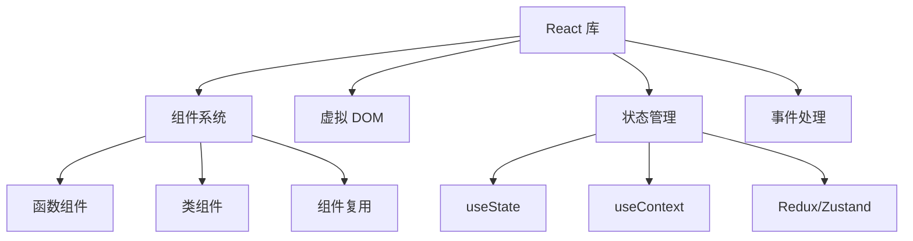

### 📊 React vs 其他框架

| 特性 | React | Vue | Angular |
|-----|-------|-----|---------|
| 学习曲线 | 🟡 中等 | 🟢 平缓 | 🔴 陡峭 |
| 灵活性 | ✅ 极高 | ⚠️ 中等 | ❌ 受限 |
| 生态系统 | ✅ 最庞大 | ⚠️ 中等 | ✅ 完整 |
| 性能 | ✅ 优秀 | ✅ 优秀 | ✅ 优秀 |
| 企业应用 | ✅ 完美 | ⚠️ 可行 | ✅ 完美 |

### 🗺️ 课程学习路径

```mermaid
graph LR
    A["第1章<br/>React 概述"] --> B["第2章<br/>环境搭建"]
    B --> C["第3章<br/>组件化基础"]
    C --> D["第4章<br/>高效渲染"]
    D --> E["第5章<br/>Tailwind CSS"]
    E --> F["第6章<br/>状态管理"]
    F --> G["第7章<br/>TypeScript"]
    G --> H["第8章<br/>路由系统"]
    H --> I["第9章<br/>数据请求"]
    I --> J["第10章<br/>Context API"]
    J --> K["第11章<br/>Hooks 深入"]
    K --> L["第12章<br/>useReducer"]
    L --> M["第13章<br/>Redux/RTK"]
    M --> N["第14章<br/>全栈实战"]
```

### 🎨 React 五大设计理念深度解析

React 的设计哲学可以概括为 **"UI = f(state)"** — 视图是状态函数的输出。这个简洁公式背后是五大设计理念的支撑。

#### ① 声明式（Declarative）

> **核心思想**：描述"想要什么"，而非"怎么做"

```jsx
// ❌ 命令式（jQuery 思维）
const div = document.createElement('div');
div.className = 'card';
div.textContent = 'Hello';
parent.appendChild(div);

// ✅ 声明式（React 思维）
function Card({ text }) {
  return <div className="card">{text}</div>;
}
```

**为什么重要？**
- **认知负荷降低**：开发者的精力集中在"什么状态对应什么 UI"，而非 DOM 操作的细节
- **可预测性**：给定相同 props + state，永远渲染相同结果
- **React 帮你做"脏活"**：Diff 对比、批量更新、DOM 操作全由框架管理
- **本质是抽象**：声明式将"如何操作 DOM"的复杂性封装在框架层

#### ② 组件化（Component-Based）

> **核心思想**：UI = 组件树（compose(Component₁, Component₂, ...)）

```jsx
// 组件 = 独立单元
function UserCard({ user }) {
  return (
    <Card>
      <Avatar src={user.avatar} />
      <Name>{user.name}</Name>
      <Stats posts={user.postCount} />
    </Card>
  );
}
```

**为什么重要？**
- **单一职责**：每个组件只做一件事，降低复杂度
- **可复用性**：组件像乐高积木，自由组合
- **可测试性**：每个组件独立测试，无需渲染整个页面
- **并行开发**：组件是天然的开发边界，团队可并行工作

#### ③ 虚拟 DOM（Virtual DOM）

> **核心思想**：在内存中维护 UI 的轻量级表示，批量计算差异后再操作真实 DOM

```
状态变化 → 新虚拟 DOM → Diff(旧虚拟DOM, 新虚拟DOM) → Patch(真实DOM)
```

**虚拟 DOM 的核心价值：**

1. **声明式编程**：开发者只需描述UI状态，框架处理DOM更新细节
2. **跨平台抽象**：同一套组件代码可渲染到Web、Native、Terminal等多平台
3. **性能保底**：即使开发者未做优化，也能保证基本性能
4. **高效 Diff**：O(n)复杂度的差异比较算法，比手动操作更可靠

**虚拟 DOM 的本质是"性能保底"**：React 通过虚拟 DOM 保证即使在没有手动优化的情况下，性能也不会太差。React 的设计原则是 **"默认足够快，需要极致时可手动优化"**。

**虚拟 DOM 的终极评价：** 它不是最快的 UI 更新方案（直接操作 DOM 或 Fine-grained Reactivity 更快），但它是**最优雅的折衷方案**——在开发体验（声明式）、性能（批量更新）、跨平台（抽象层）之间找到了最佳平衡点。React Compiler 的目标是通过编译时优化减少不必要的 Diff，进一步提升性能。

#### ④ 函数式编程（Functional）

> **核心思想**：纯函数 + 不可变数据

```jsx
// ❌ 可变数据（违反函数式）
function BadList({ items }) {
  items.push('new item');  // 直接修改 props
  return <ul>{items.map(/* ... */)}</ul>;
}

// ✅ 不可变数据
function GoodList({ items }) {
  return <ul>{[...items, 'new item'].map(/* ... */)}</ul>;
}
```

**为什么重要？**
- **可预测性**：纯函数 → 相同输入永远相同输出
- **时间旅行调试**：不可变数据允许保存/回放状态快照
- **并发安全**：不可变数据天然支持 React 18+ 的并发渲染
- **易于推理**：无需追踪"谁修改了什么"

#### ⑤ 一次学习，随处编写（Learn Once, Write Anywhere）

```
React DOM      → Web 应用
React Native   → iOS / Android 原生应用
React Three    → 3D 场景（Three.js 封装）
React Ink      → 命令行终端 UI
React 360      → VR 应用
React PDF      → PDF 文档生成
```

**设计决策：** React 将"平台无关的 UI 逻辑"与"平台特定的渲染"彻底分离。`react` 包只关心组件树、状态、生命周期；渲染到哪个平台由 `react-dom`/`react-native` 等负责。这是 React 跨平台的架构基石。

### React 19 核心新特性

| 特性 | 说明 | 适用场景 |
|------|------|---------|
| **Server Components** | 组件在服务端渲染，零客户端JS | 静态内容、数据展示 |
| **Server Actions** | 服务端表单处理，无需API层 | 表单提交、数据变更 |
| **React Compiler** | 自动memo化，减少手动优化 | 所有React应用 |
| **use() Hook** | 在渲染时读取Promise/Context | 数据获取、异步操作 |
| **Asset Loading** | 组件级资源加载管理 | 图片、字体、脚本 |

---

### 💡 一个公式理解 React

```
UI = f(state)
│     │
▼     ▼
视图  纯函数  状态
```

- **f** 是 React 组件（理想中的纯函数，实际可能包含副作用）
- **state** 包括 props / state / context
- React 在 **f 变化时** 自动重新计算 UI

> ⚠️ **注意**：公式 `UI = f(state)` 描述的是**渲染逻辑**这一层。完整的 React 组件还会涉及**副作用**（`useEffect` / `useLayoutEffect`、外部 IO、订阅等），实际公式更接近 `UI = f(state) + Effects`。`React 19` 引入的 `use()` / `Actions` 等机制让"渲染 + 副作用"的边界更模糊，但**核心思想**仍是"UI 是状态的派生"。

**与 Vue / Angular 的核心差异：**

| 维度 | React | Vue | Angular |
|------|-------|-----|---------|
| **UI 公式** | UI = f(state) | UI = template + state | UI = class + template |
| **更新时机** | setState → 全量重渲染 | Proxy 自动追踪 → 精确更新 | Zone.js → 全量检测 / Signals 精确 |
| **数据流** | 单向（强制） | 双向（v-model 可选） | 双向（[(ngModel)]） |
| **副作用** | useEffect 显式管理 | watchEffect 自动追踪 | 生命周期 + Observable |
| **范式的本质** | **纯函数式**: 状态快照不可变 | **响应式**: 状态变化自动追踪 | **面向对象**: 类 + 装饰器 |

---

## 2️⃣ React 版本迭代史（2013—2026）

> React 的演进史，就是前端声明式编程的进化史。

### 版本演进路线图

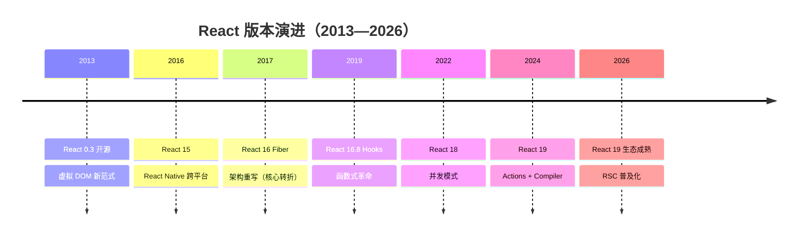

### 关键版本逐代解析

| 版本 | 年份 | 核心变化 | 对开发者的影响 |
|------|------|---------|--------------|
| **React 0.3** | 2013 | 虚拟 DOM，JSX 首次开源 | 开创性范式：声明式 UI |
| **React 15** | 2016 | DOM 重构 + React Native | 跨平台能力，一次学习随处编写 |
| **React 16** | 2017 | **Fiber 架构重写** | 可中断渲染，优先级调度 |
| **React 16.8** | 2019 | **Hooks** 发布 | 函数组件拥有状态，告别 class |
| **React 17** | 2020 | 渐进升级桥梁版 | 无重大新特性，平滑过渡 |
| **React 18** | 2022 | 并发模式、自动批处理 | 更好的用户体验，Suspense 完善 |
| **React 19** | 2024 | Actions、use()、React Compiler | 表单革新、自动记忆化、RSC |

### React 15 → 16 → 17 → 18 → 19 核心变化

| 维度 | 15 (DOM) | 16 (Fiber) | 17 | 18 (Concurrent) | 19 (Compiler) |
|------|---------|-----------|-----|-----------------|---------------|
| **架构** | Stack 栈递归 | Fiber 链表中断 | 桥接 | 并发模式 | 编译优化 |
| **渲染** | 同步不可中断 | 可中断/恢复 | 渐进升级 | 自动批处理 | 自动记忆化 |
| **组件** | class 为主 | class + function | 过渡 | 函数为主 | 函数 + Server |
| **状态** | setState | setState + Hooks(2019) | Hooks 完善 | useDeferredValue | Actions + use() |
| **编译** | 无 | 无 | React Refresh | 基础优化 | **React Compiler** |
| **生态** | 早期 | Redux 为主 | Context 增强 | Suspense + Streaming | RSC 主流 |

**Fiber 架构核心突破：**
```typescript
// Fiber 节点结构（简化）
interface Fiber {
  tag: WorkTag          // 节点类型
  key: string | null    // 唯一标识
  type: any             // 函数/类/原生标签
  stateNode: any        // 对应真实 DOM

  return: Fiber | null  // 父节点
  child: Fiber | null   // 第一个子节点
  sibling: Fiber | null // 右边兄弟节点

  pendingProps: any     // 新 props
  memoizedProps: any    // 旧 props
  memoizedState: any    // 状态
  updateQueue: any      // 更新队列

  lanes: Lanes          // 优先级
  alternate: Fiber | null // workInProgress 树关联
}
```

Fiber 将原本不可中断的**递归渲染**（Stack Reconciler）改造成了可中断/恢复的**链表遍历**（Fiber Reconciler），这是 React 并发能力的基石。

---

## 3️⃣ React 19 新特性详解

### 🌟 重要特性速览

```
React 19 (2024)
├─ React Compiler (自动优化)
├─ Actions (统一表单处理)
├─ use() Hook (异步数据)
├─ useOptimistic() (乐观更新)
├─ useFormStatus/useActionState (原 useFormState)
├─ Server Components 支持
└─ Web Components 增强
```

### 🔧 React Compiler 详解

#### 问题背景

手动优化 React 性能很复杂：

```typescript
import { memo, useCallback, useMemo } from 'react';

// ❌ 需要手动记忆化
const MyComponent = memo((props) => {
  const handleClick = useCallback(() => {}, []);
  const value = useMemo(() => expensiveComputation(), [dep]);
  return <Child onClick={handleClick} value={value} />;
});
```

#### 解决方案：Compiler 自动优化

```typescript
// ✅ 自动转换，无需手动记忆化
function MyComponent(props) {
  const handleClick = () => {};        // ← Compiler 自动缓存
  const value = expensiveComputation(); // ← Compiler 自动缓存
  return <Child onClick={handleClick} value={value} />;
}
```

**性能收益：**
- 自动消除不必要的重新渲染
- 减少 90%+ 的手写优化代码
- 编译时静态分析，极低运行时开销（仍需要运行时支持）

### 🎯 Actions 机制

```typescript
// 注意：useFormStatus 需要从 'react-dom' 导入
import { useFormStatus } from 'react-dom';
import { useActionState } from 'react';

async function submitForm(prevState, formData) {
  const username = formData.get('username');
  const password = formData.get('password');
  try {
    const response = await fetch('/api/login', {
      method: 'POST',
      body: JSON.stringify({ username, password })
    });
    return { success: true, message: '登录成功!' };
  } catch (error) {
    return { success: false, message: '登录失败' };
  }
}

export function LoginForm() {
  const [state, formAction] = useActionState(submitForm, null);
  const { pending } = useFormStatus();

  return (
    <form action={formAction}>
      <input name="username" />
      <button type="submit" disabled={pending}>
        {pending ? '登录中...' : '登录'}
      </button>
      {state?.message && <p>{state.message}</p>}
    </form>
  );
}
```

**改进点：**
- ✅ 自动加载状态管理
- ✅ 简化异步操作处理
- ✅ 内置乐观更新支持

### ⏳ `use()` Hook - 异步数据获取与 Context 读取

`use()` 是 React 19 新增的 Hook，可用于：
1. 读取 Promise（需配合 Suspense 使用）
2. 读取 Context（与 `useContext` 类似，但可在条件语句中调用）

```typescript
import { use, Suspense } from 'react';

// 方式 1：读取 Promise
function DataComponent() {
  const data = use(fetchPromise); // fetchPromise 是一个 Promise 对象
  return <div>{data.title}</div>;
}

// 方式 2：读取 Context（React 19 新用法）
function ThemedButton() {
  const theme = use(ThemeContext); // 也可用 useContext(ThemeContext)
  return <button style={{ color: theme }}>按钮</button>;
}
```

> ⚠️ **注意**：`use()` 可以在条件语句中调用（与 Hooks 规则不同），但 Promise 必须在 Suspense 边界内使用。

### ⏱️ React 18 vs 19 关键变化

| 特性 | React 18 (2022) | React 19 (2024) |
|------|-----------------|-----------------|
| 并发模式 | useTransition/useDeferredValue opt-in | 默认启用，并发特性为内置行为 |
| startTransition | ✅ | ✅ 增强 |
| use() | ❌ | ✅ |
| useOptimistic | ❌ | ✅ |
| Server Components | 实验性 | ✅ 稳定 |
| ref 传参 | forwardRef | 直接传 ref |
| Compiler | 实验性 | ✅ 自动 memo |

---

### 🚀 React 在 2026 年的最新进展

#### React 技术发展演进时间线

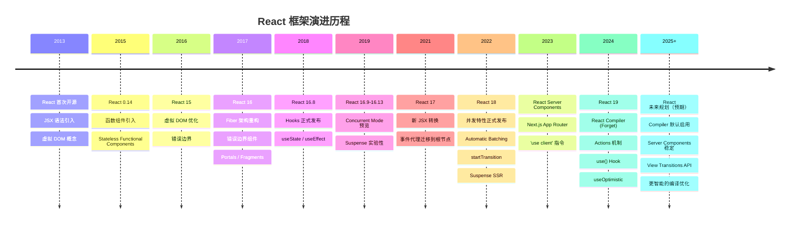

#### React Compiler 工作原理

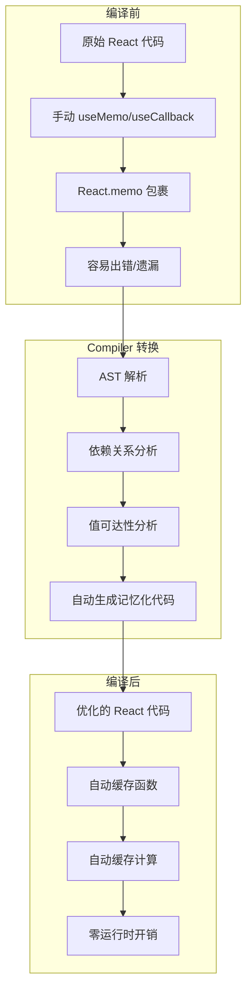

#### Compiler 优化对比

| 优化项 | 手动优化 | Compiler 自动优化 |
|--------|---------|------------------|
| 函数缓存 | useCallback | 自动识别并缓存 |
| 计算缓存 | useMemo | 自动识别并缓存 |
| 组件缓存 | React.memo | 自动包裹 |
| 依赖数组 | 手动维护 | 自动推导 |
| 性能收益 | 60-70% | 90%+（实验阶段） |
| 代码量 | 增加 30% | 减少 50% |

#### React Server Components 成为默认

```jsx
// app/page.jsx - 默认就是 Server Component
export default async function Page() {
  const data = await fetch('https://api.example.com/data')
  return <DataDisplay data={data} />
}

// app/component.client.jsx - 需要交互时标记
'use client'
export function InteractiveComponent() {
  const [count, setCount] = useState(0)
  return <button onClick={() => setCount(c => c + 1)}>{count}</button>
}
```

#### RSC 架构工作原理

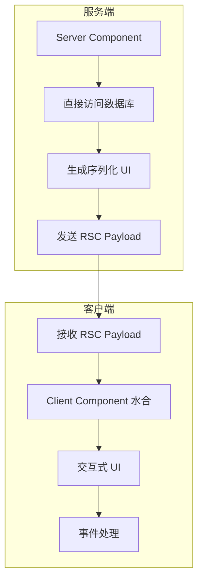

#### View Transitions API 集成（实验性）

> ⚠️ View Transitions API 在 React 19 中仍处于实验阶段，尚未正式发布。

```jsx
// React 实验性支持 View Transitions
// import { ViewTransition } from 'react'  // 尚未稳定

function PageTransition({ children }) {
  // 可用原生 document.startViewTransition 实现
  return <div>{children}</div>
}
```

#### 2026 年 React 生态工具链

| 工具 | 最新版本 | 关键变化 |
|------|----------|----------|
| React | 19 | Compiler 推荐启用，RSC 稳定 |
| Next.js | 15+ | App Router 默认，Turbopack |
| React Router | 7+ | 统一客户端/服务端路由 |
| Redux | 5+ | RTK 简化，更好的 TS |
| Zustand | 5+ | 更轻量，持久化内置 |
| TanStack Query | 5+ | 更精细缓存，SSR 优化 |
| React Testing Library | 16+ | 更好的异步测试 |

### 🎯 Ant Design 版本与 React 18/19 兼容性

| React 版本 | Ant Design 版本 | 兼容状态 | 说明 |
|-----------|----------------|---------|------|
| React 16-17 | antd 4.x | ✅ 兼容 | v4 已停止功能更新，仅维护 |
| React 18 | antd 5.x | ✅ 原生支持 | 默认完全兼容，推荐使用 |
| React 19 | antd 5.x (≥5.22.6) | ⚠️ 需补丁 | 需安装 `@ant-design/v5-patch-for-react-19` |
| React 18+ | antd 6.x | ✅ 原生支持 | 最低要求 React 18，无需额外补丁 |
| React 19 | antd 6.x | ✅ 原生支持 | 完全兼容，可移除 v5 兼容补丁 |

#### 升级策略

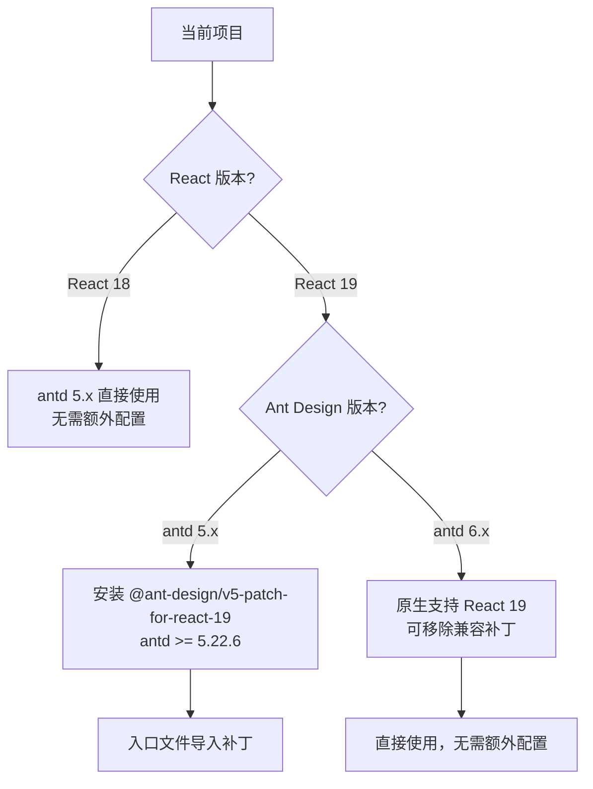

**升级路径建议：**

| 步骤 | 操作 | 说明 |
|------|------|------|
| 1️⃣ | React 18 → React 19 | 先升级到 React 18.3（过渡版），解决废弃 API 警告后再升 19 |
| 2️⃣ | antd 5.x 升级最新 | 确保 `antd >= 5.22.6`，获得最佳 React 19 兼容 |
| 3️⃣ | 安装兼容补丁 | `npm install @ant-design/v5-patch-for-react-19 --save` |
| 4️⃣ | 入口导入补丁 | `import '@ant-design/v5-patch-for-react-19'` |
| 5️⃣ | (可选) 升级 antd 6.x | v6 原生支持 React 19，移除兼容补丁 |

#### 已知问题

| 问题 | 影响范围 | 解决方案 |
|------|---------|---------|
| Wave 点击波纹效果异常 | 全局 Button、Tag 等 | 安装兼容补丁或升级 v6 |
| Modal/Notification/Message 静态方法失效 | `Modal.confirm()`、`message.success()` 等 | 安装兼容补丁；hooks 调用方式不受影响 |
| `element.ref` 访问移除 | 依赖 ref 的组件 | React 19 中 `ref` 是常规 prop，避免直接访问 `element.ref` |
| Next.js 15 + React 19 兼容 | SSR 场景 | 安装 `@ant-design/nextjs-registry` + 兼容补丁 |
| `findDOMNode` 废弃警告 | 使用类组件的场景 | v6 已移除相关兼容逻辑，推荐迁移到函数组件 |

> 💡 **升级到 antd 6.x 可完全解决上述问题**：v6 最低要求 React 18，原生支持 React 19，无需 `@ant-design/v5-patch-for-react-19` 补丁包。v5 主分支将进入 1 年维护期，不再提供功能更新。

#### 2026 年前端框架格局

| 框架 | 定位 | 2026 状态 |
|------|------|-----------|
| React 19 + Next.js | 全栈应用首选 | 最广泛使用 |
| Angular 21 | 企业级应用 | Zoneless 默认，性能大幅提升 |
| Vue 3.6 + Nuxt 5 | 渐进式开发 | Vapor Mode 实验性，性能接近 Solid |
| Svelte 5 | 编译时优化 | Runes 响应式，轻量级首选 |
| Solid.js | 细粒度响应式 | 性能标杆，生态增长中 |
| Astro 5 | 内容型网站 | Islands 架构，零 JS 默认 |

#### React 生态全景图

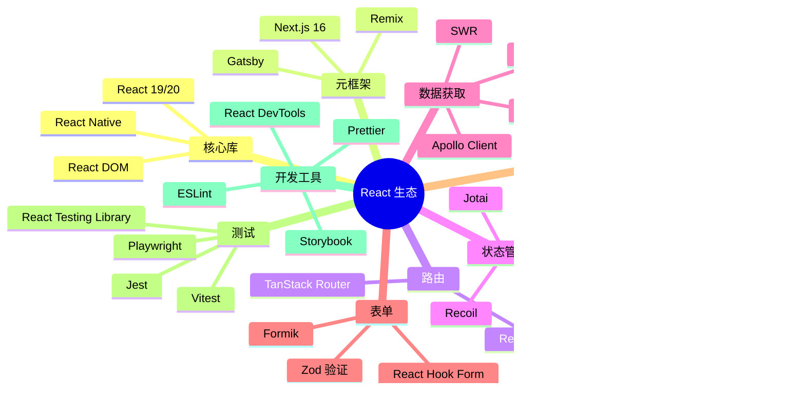

---

## 4️⃣ JSX 与 Babel

### 📝 JSX 详解

JSX 是 **JavaScript XML**，让你能在 JS 中写 HTML 结构。JSX 本质是 `React.createElement` 的语法糖，经 Babel 编译为 AST → createElement 调用 → React 元素对象 → 虚拟 DOM → 真实 DOM。

```jsx
// 原始 JSX
const element = <h1 className="greeting">Hello, {name}!</h1>;

// Babel 编译后
const element = React.createElement(
  "h1",
  { className: "greeting" },
  "Hello, ", name, "!"
);
```

### 🔄 JSX 转换流程图

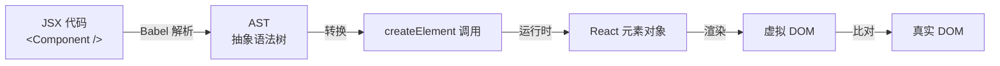

### ⚙️ JSX 规则

```jsx
// ✅ 使用 Fragment 避免多余 DOM
return (
  <>
    <p>Hello</p>
    <p>World</p>
  </>
);

// ✅ 属性驼峰命名
<div className="card" data-testid="card" />

// ✅ 表达式插值
<p>Count: {count * 2}</p>

// ✅ 条件渲染
{showTitle ? <h1>Title</h1> : null}
{showTitle && <h1>Title</h1>}
```

> 🔗 **链式思考**：JSX 是 React 的"模板语言"，本质是 `createElement` 函数的语法糖。Vue 采用 SFC（单文件组件）用 `<template>` 分离模板和逻辑，Angular 则用 `@Component` 装饰器绑定模板、样式和逻辑。三者的组件化本质相同——都是"模板/渲染函数 + 状态 + 属性"，差异在代码组织和编译策略：JSX 灵活但难以编译优化，Vue SFC 结构清晰且易于 PatchFlag 优化，Angular 装饰器配置式且有 AOT 编译。详见 [04-框架对比](../框架对比/) 的"组件化方案对比"。

---

## 5️⃣ 组件与 Props 深度剖析

### 🧩 组件解剖

```typescript
import { ReactNode } from 'react';

interface CardProps {
  title: string;
  children: ReactNode;
  onClick?: (id: string) => void;
  disabled?: boolean;
}

function Card({ title, children, onClick, disabled = false }: CardProps) {
  return (
    <div className="card" style={{ opacity: disabled ? 0.5 : 1 }}>
      <h2>{title}</h2>
      <div className="card-body">{children}</div>
      <button onClick={() => onClick?.(title)} disabled={disabled}>Click Me</button>
    </div>
  );
}
```

### 📊 Props 完整对比

| 特征 | Props | State |
|------|-------|-------|
| 来源 | 父组件 | 组件自身 |
| 可修改 | ❌ 只读 | ✅ 可修改 |
| 默认值 | Component.defaultProps | useState 初值 |
| 影响重建 | ✅ Props 变化默认重新渲染 | ✅ State 变化默认重新渲染 |

### 🎯 Props 高级用法

```typescript
// 解构 + 默认值
function Card({ title = '默认标题', children }) {
  return (
    <div>
      <h2>{title}</h2>
      {children}
    </div>
  );
}

// Spread 批量传递
const productProps = { name: '手机', price: 2999, stock: 10 };
<ProductCard {...productProps} />

// 回调呼叫（子→父通信）
function Parent() {
  const handleChildEvent = (data: string) => console.log(data);
  return <Child onAction={handleChildEvent} />;
}

// 使用 eslint 防止 props 被非法修改
// eslint.config.js
// export default [{ rules: { "react/no-direct-mutation-state": "error" } }];
```

### 🔄 React.Component vs React.PureComponent

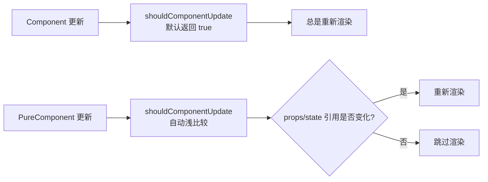

**注意：** PureComponent 进行**浅比较**，引用类型只比较地址。如需深比较的数据变更，必须创建新对象。

> ⚠️ **易错点**：直接在现有对象上修改属性然后 `setState` 不会触发 PureComponent 重新渲染。务必使用展开运算符或 Object.assign 创建新对象。

### 🆚 类组件与函数组件对比

> 面试高频考点：理解两种组件范式的本质差异与演进方向。

#### 语法与结构对比

```jsx
// 类组件（Class Component）
import React, { Component } from 'react';

class ClassCounter extends Component {
  constructor(props) {
    super(props);
    this.state = { count: 0 };
    this.handleClick = this.handleClick.bind(this);
  }

  handleClick() {
    this.setState({ count: this.state.count + 1 });
  }

  render() {
    return (
      <div>
        <p>Count: {this.state.count}</p>
        <button onClick={this.handleClick}>+1</button>
      </div>
    );
  }
}

// 函数组件（Function Component）+ Hooks
import { useState } from 'react';

function FunctionCounter() {
  const [count, setCount] = useState(0);

  return (
    <div>
      <p>Count: {count}</p>
      <button onClick={() => setCount(count + 1)}>+1</button>
    </div>
  );
}
```

#### 核心差异对比表

| 维度 | 类组件 | 函数组件 |
|------|--------|----------|
| **语法基础** | ES6 Class | 函数 |
| **状态管理** | `this.state` + `this.setState` | `useState` / `useReducer` |
| **生命周期** | `componentDidMount` 等方法 | `useEffect` Hook |
| **`this` 绑定** | 需要手动绑定（构造器或箭头函数） | 无 `this` 概念 |
| **代码量** | 较多（模板代码） | 简洁 |
| **可读性** | 生命周期分散 | 逻辑集中 |
| **性能** | 差异可忽略 | 差异可忽略（现代引擎中实例开销极小） |
| **复用机制** | HOC / Render Props | 自定义 Hooks |
| **React 19 支持** | ✅ 兼容 | ✅ **官方推荐** |

#### 生命周期对照

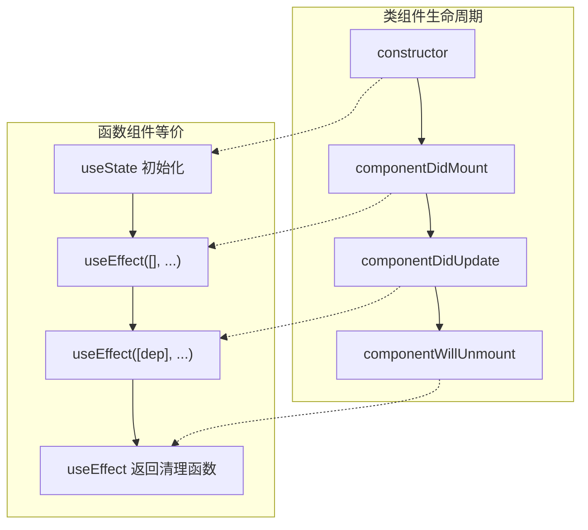

#### 状态管理对比

```jsx
// 类组件状态管理
class ClassComponent extends React.Component {
  constructor(props) {
    super(props);
    this.state = { user: null, loading: false };
    this.fetchUser = this.fetchUser.bind(this);
  }

  async fetchUser() {
    this.setState({ loading: true });
    const user = await getUser();
    this.setState({ user, loading: false });
  }

  render() {
    const { user, loading } = this.state;
    return loading ? <Spinner /> : <UserCard user={user} />;
  }
}

// 函数组件状态管理
function FunctionComponent() {
  const [user, setUser] = useState(null);
  const [loading, setLoading] = useState(false);

  const fetchUser = async () => {
    setLoading(true);
    const userData = await getUser();
    setUser(userData);
    setLoading(false);
  };

  return loading ? <Spinner /> : <UserCard user={user} />;
}
```

#### 选择建议

| 场景 | 推荐 | 原因 |
|------|------|------|
| 新项目开发 | ✅ **函数组件** | React 官方推荐，生态主流 |
| 需要复用状态逻辑 | ✅ **函数组件** | 自定义 Hooks 更灵活 |
| 维护旧项目 | ⚠️ 看情况 | 已有类组件无需强制重构 |
| 需要 Error Boundaries | ✅ **函数组件** | React 19 可通过 ErrorBoundary + `use()` 统一处理异步错误 |
| 需要 getSnapshotBeforeUpdate | ✅ **类组件** | 函数组件暂无等价 Hook |

> 💡 **React 演进方向**：从 React 16.8 Hooks 发布后，函数组件已成为主流。React 19 的 Compiler、Actions 等新特性均围绕函数组件设计。类组件不会被移除，但新功能不再为其扩展。

### 🧩有状态/无状态、受控/非受控组件

> 这两组概念是 React 组件分类的核心维度，面试高频考点。

#### 一、有状态组件 & 无状态组件

**状态（state）**：组件内部**私有数据**，数据变化驱动视图更新。

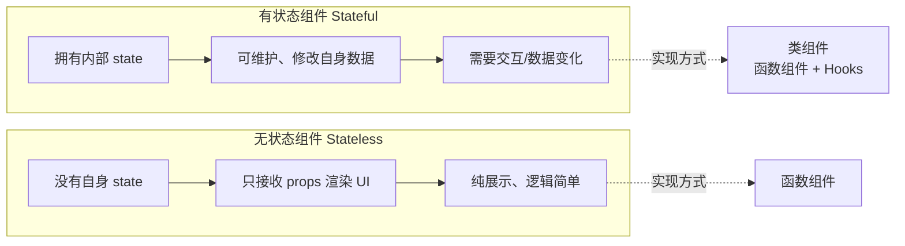

**无状态组件（Stateless）**

- 特点：**没有自身 state**，只接收 `props` 渲染 UI，纯展示
- 实现方式：**函数组件**（主流）
- 适用：纯展示、逻辑简单、仅接收父组件数据

```jsx
// 无状态函数组件
function Hello(props) {
  return <div>{props.name}</div>;
}
```

**有状态组件（Stateful）**

- 特点：**拥有内部 state**，可维护、修改自身数据
- 实现方式：
  1. 类组件（`class Component`）
  2. 函数组件 + **Hooks**（`useState`/`useReducer`，现在主流）
- 适用：需要交互、数据变化、表单、计数器等

```jsx
// 函数组件 + Hooks（有状态）
import { useState } from 'react';

function Counter() {
  const [count, setCount] = useState(0);
  return <button onClick={() => setCount(count + 1)}>{count}</button>;
}
```

| 维度 | 无状态组件 | 有状态组件 |
|------|-----------|-----------|
| 内部 state | ❌ 无 | ✅ 有 |
| 数据来源 | 仅 props | props + state |
| 实现方式 | 函数组件 | 类组件 / 函数组件 + Hooks |
| 可变数据 | ❌ 不可修改 | ✅ 可通过 setState/useState 修改 |
| 适用场景 | 展示、列表、文案 | 表单、计数器、交互逻辑 |
| 测试难度 | 🟢 简单 | 🟡 中等 |
| 性能 | 🟢 更快（无需跟踪状态） | 🟡 略慢（需要状态管理） |

#### 二、受控组件 & 非受控组件

> **专针对表单元素**：`input` / `textarea` / `select` 等表单标签，依据**数据来源**划分。

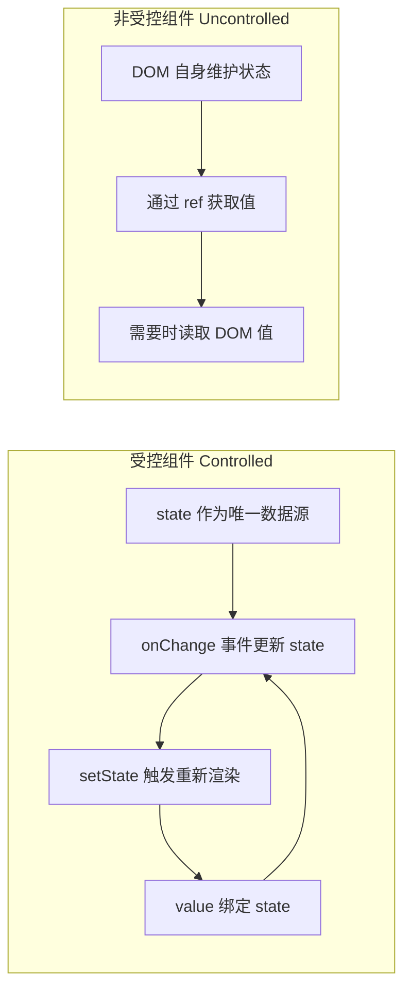

**受控组件（Controlled）**

- 核心：**表单值由 React state 完全控制**，视图 ↔ state 双向绑定
- 规则：
  1. `value` 绑定组件 state
  2. 通过 `onChange` 事件更新 state
- 特点：数据统一托管在 React，**完全可控**，推荐业务使用

```jsx
import { useState } from 'react';

function InputDemo() {
  const [val, setVal] = useState('');
  return (
    <input
      value={val}
      onChange={(e) => setVal(e.target.value)}
    />
  );
}
```

**非受控组件（Uncontrolled）**

- 核心：**表单值由 DOM 原生控制**，React 不托管 state
- 规则：
  1. 使用 `defaultValue` 设置默认值
  2. 通过 **ref** 直接获取 DOM 取值
- 特点：简单粗暴，适合**一次性取值**（文件上传、简单搜索）

```jsx
import { useRef } from 'react';

function InputDemo() {
  const inputRef = useRef(null);
  const getVal = () => {
    console.log(inputRef.current.value); // 直接读DOM
  };
  return (
    <>
      <input ref={inputRef} defaultValue="默认值" />
      <button onClick={getVal}>获取值</button>
    </>
  );
}
```

| 维度 | 受控组件 | 非受控组件 |
|------|---------|-----------|
| 数据源 | React state | DOM 自身 |
| 值获取 | state 变量 | ref 读取 |
| 表单验证 | ✅ 容易 | ❌ 困难 |
| 实时校验 | ✅ onChange 即时校验 | ❌ 需手动触发 |
| 动态控制 | ✅ 随意修改 value | ❌ 不方便 |
| 适用场景 | 复杂表单、需要验证 | 文件上传、简单一次性输入 |

#### 三、两组概念对比总结

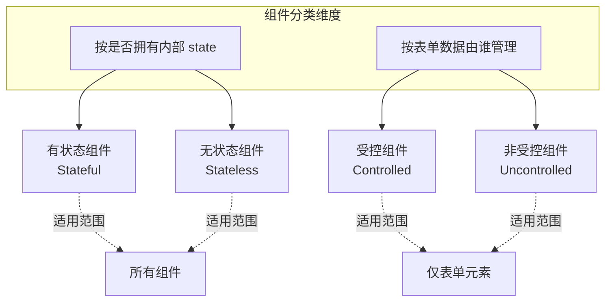

**快速记忆：**
- 无状态 = 纯展示，靠 props
- 有状态 = 内部存数据，靠 state/Hooks
- 受控表单 = state 管值，onChange 更新（推荐）
- 非受控表单 = DOM 管值，ref 取值

#### 四、使用场景建议

| 场景 | 推荐方案 | 原因 |
|------|---------|------|
| 大部分表单、复杂交互 | ✅ **受控组件** | 数据可控，支持验证、格式化 |
| 纯展示、列表、文案 | ✅ **无状态函数组件** | 简单高效，无需状态管理 |
| 文件上传 | ✅ **非受控组件** | 文件输入框是只读的，只能用 ref |
| 简单搜索框（无需实时校验） | ✅ **非受控组件** | 一次性取值，更简单 |
| 需要动态禁用/修改表单 | ✅ **受控组件** | value 由 state 控制，随心所欲 |
| 首次渲染后不再关心的值 | ✅ **非受控组件** | 无需维护 state |

---

## 6️⃣ React 事件机制

### 📌 合成事件（SyntheticEvent）

React 的事件并非绑定在真实的 DOM 节点上，而是通过**事件代理（Event Delegation）**的方式，将所有事件统一绑定在根容器上。当事件冒泡到根容器时，React 将事件内容封装并交由真正的处理函数运行。

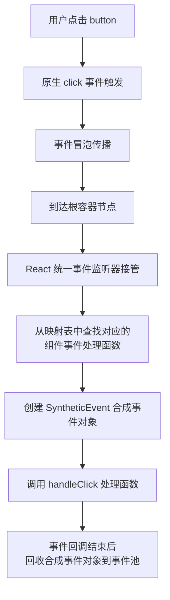

**React 事件与原生 HTML 事件的区别：**

| 对比项 | 原生事件 | React 事件 |
|--------|---------|-----------|
| 命名方式 | 全小写 `onclick` | 小驼峰 `onClick` |
| 处理函数语法 | 字符串 `"handle()"` | 函数 `{handleClick}` |
| 阻止默认行为 | `return false` | `e.preventDefault()` |
| 执行顺序 | 先执行 | 后执行（冒泡到根容器） |

> 💡 React 17+ 将事件代理从 document 迁移到 root DOM 容器，为微前端和多版本 React 共存提供更好的隔离性。

### 🔄 React 各版本事件代理演进

| 版本 | 事件代理位置 | 事件池机制 | 主要变化 |
|------|-------------|-----------|---------|
| **React 16** | `document` | ✅ 启用 | 所有事件代理到 document，需 `e.persist()` |
| **React 17** | `root DOM 容器` | ❌ **移除** | 事件代理从 document 迁移到 root，不再需要 persist |
| **React 18** | `root DOM 容器` | ❌ 已移除 | 同 React 17，保持向后兼容 |
| **React 19** | `root DOM 容器` | ❌ 已移除 | 同 React 18 |

#### 详细说明

**React 16 及以前：document 事件代理**
```jsx
// React 16：所有事件绑定在 document 上
<div id="root">
  <button onClick={handleClick}>Click</button>
</div>
// 事件监听器绑定在 document 上
// 事件冒泡到 document 后被 React 接管
```

**React 17+：root DOM 容器事件代理**
```jsx
// React 17+：事件绑定在 root 容器上
<div id="root">
  <button onClick={handleClick}>Click</button>
</div>
// 事件监听器绑定在 #root 上
// 更好的微前端隔离性，多版本 React 可共存
```

**React 18+：移除事件池**
```jsx
// React 16-17：需要调用 persist() 保留事件对象
function handleClick(e) {
  e.persist(); // 必须调用，否则异步访问会被回收
  setTimeout(() => {
    console.log(e.target); // React 16-17 需要 persist
  }, 100);
}

// React 18+：直接访问，无需 persist
function handleClick(e) {
  setTimeout(() => {
    console.log(e.target); // React 18+ 直接可用
  }, 100);
}
```

#### 事件代理迁移影响

| 影响场景 | React 16 | React 17+ | 解决方案 |
|---------|----------|-----------|---------|
| 微前端多版本共存 | ❌ 事件冲突 | ✅ 隔离 | 无 |
| 第三方库依赖 document 事件 | ✅ 正常工作 | ⚠️ 可能失效 | 使用 `stopPropagation` 阻止 |
| 事件对象异步访问 | ❌ 需要 persist | ✅ 直接访问 | 无 |

> 🔗 **链式思考**：React Hooks 的核心设计是"函数即组件"，每次渲染重新执行函数，通过链表维护状态顺序。Vue 的 Composition API（`ref`/`reactive`/`computed`）同样是把状态逻辑抽取到函数中，但依赖 Proxy 自动追踪而非手动声明依赖。Angular 的 `inject()` 函数（Angular 14+）则是 DI 驱动的依赖注入，与 React/Vue 的"按需调用"不同，Angular 的状态来自 Service 注入，而非函数调用。详见 [04-框架对比](../框架对比/) 的"组件化方案对比"。

---

## 7️⃣ Hooks 系统完全指南

### 🎣 Hooks 工作原理

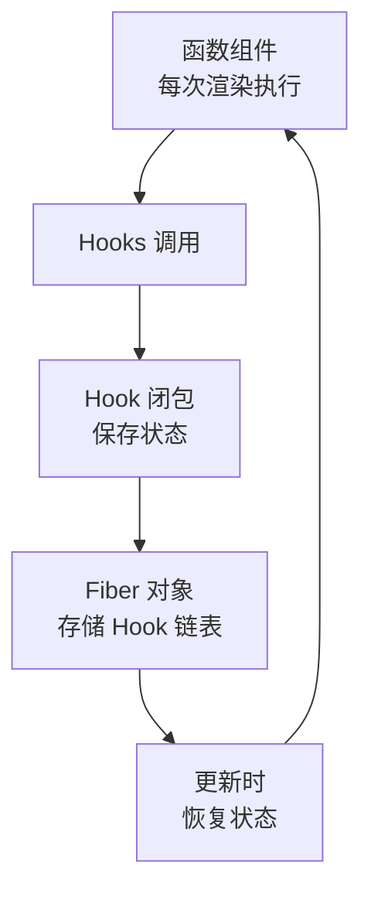

### 📍 useState - 状态管理

```typescript
const [count, setCount] = useState(0);

// 函数式初始化（避免重复计算）
const [state, setState] = useState(() => expensiveComputation());

// 更新函数（基于前一个状态）
setState(prev => prev + 1);
```

**规则 ⚠️：**
- ✅ 只在组件顶层调用
- ✅ 只在函数组件中调用
- ❌ 不要在循环、条件、嵌套函数中调用

### 📍 useEffect - 副作用管理

```typescript
function EffectDemo() {
  useEffect(() => {
    console.log('挂载 + 每次渲染后');
    return () => console.log('清理副作用');
  }); // 没有依赖数组，每次都运行

  useEffect(() => {
    console.log('仅在挂载时运行');
    return () => console.log('卸载时清理');
  }, []); // 空依赖数组，仅一次

  useEffect(() => {
    console.log('count 或 name 变化时运行');
  }, [count, name]); // 指定依赖

  return null;
}
```

**常见模式：**

```typescript
// 数据获取（处理竞态条件）
useEffect(() => {
  let ignore = false;
  fetchData().then(data => { if (!ignore) setData(data); });
  return () => { ignore = true; };
}, []);

// 事件监听
useEffect(() => {
  const handleResize = () => console.log('resized');
  window.addEventListener('resize', handleResize);
  return () => window.removeEventListener('resize', handleResize);
}, []);

// 定时器
useEffect(() => {
  const timer = setInterval(() => console.log('tick'), 1000);
  return () => clearInterval(timer);
}, []);

//⚠️ 闭包冻结（Stale Closure）风险
function StaleClosureExample() {
  const [count, setCount] = useState(0);

  // ❌ 闭包陷阱
  useEffect(() => {
    const timer = setInterval(() => {
      console.log(count); // 永远是 0！
      setCount(count + 1); // 永远是 1
    }, 1000);
    return () => clearInterval(timer);
  }, []); // 空依赖，count 被冻结

  // ✅ 使用函数式更新
  useEffect(() => {
    const timer = setInterval(() => {
      setCount(prev => prev + 1); // 正确的做法
    }, 1000);
    return () => clearInterval(timer);
  }, []);
}
```

### ⚡ StrictMode 双重调用

React 严格模式下，开发环境的 useEffect 会执行两次，用于检测副作用的清理是否正确。

```typescript
function App() {
  return (
    <StrictMode>
      <Main />
    </StrictMode>
  );
}

// 开发环境：组件挂载 → 卸载 → 重新挂载
// 用于检测：清理函数是否正确、是否有内存泄漏
```

### 🌊 useEffect 异步请求完全指南

#### 请求竞态与取消（AbortController）

```typescript
useEffect(() => {
  const controller = new AbortController();

  const fetchData = async () => {
    try {
      const res = await fetch('/api/products', {
        signal: controller.signal,
      });
      const data = await res.json();
      setProducts(data);
    } catch (err) {
      if (err instanceof DOMException && err.name === 'AbortError') {
        console.log('请求已取消');
        return;
      }
      console.error('请求失败', err);
    }
  };

  fetchData();

  return () => {
    controller.abort(); // 组件卸载时取消请求
  };
}, []);
```

#### 自定义 useDebounce 防抖 Hook

```typescript
function useDebounce<T>(value: T, delay: number): T {
  const [debouncedValue, setDebouncedValue] = useState(value);

  useEffect(() => {
    const timer = setTimeout(() => {
      setDebouncedValue(value);
    }, delay);

    return () => clearTimeout(timer);
  }, [value, delay]);

  return debouncedValue;
}

// 使用
function SearchComponent() {
  const [query, setQuery] = useState('');
  const debouncedQuery = useDebounce(query, 500);

  useEffect(() => {
    if (debouncedQuery) {
      searchAPI(debouncedQuery);
    }
  }, [debouncedQuery]);

  return <input value={query} onChange={e => setQuery(e.target.value)} />;
}
```

#### 搜索功能完整示例

```typescript
function SearchProducts() {
  const [query, setQuery] = useState('');
  const [results, setResults] = useState<Product[]>([]);
  const [loading, setLoading] = useState(false);

  useEffect(() => {
    if (!query) {
      setResults([]);
      return;
    }

    const fetchProducts = async () => {
      setLoading(true);
      try {
        const res = await fetch(`/api/products?q=${query}`);
        const data = await res.json();
        setResults(data);
      } catch (err) {
        console.error('搜索失败', err);
      } finally {
        setLoading(false);
      }
    };

    fetchProducts();
  }, [query]);

  return (
    <div>
      <input value={query} onChange={e => setQuery(e.target.value)} placeholder="搜索产品..." />
      {loading && <div>搜索中...</div>}
      <ul>
        {results.map(product => (
          <li key={product.id}>{product.name}</li>
        ))}
      </ul>
    </div>
  );
}
```

### 📍 useContext - 跨组件通信

```typescript
const ThemeContext = createContext<'light' | 'dark'>('light');

function ThemeProvider({ children }: { children: ReactNode }) {
  const [theme, setTheme] = useState<'light' | 'dark'>('light');
  return (
    <ThemeContext.Provider value={theme}>
      {children}
    </ThemeContext.Provider>
  );
}

function ThemedButton() {
  const theme = useContext(ThemeContext);
  return <button style={{
    background: theme === 'light' ? '#fff' : '#333',
    color: theme === 'light' ? '#000' : '#fff'
  }}>按钮</button>;
}
```

### 📍 useReducer - 复杂状态逻辑

```typescript
type Action =
  | { type: 'ADD_TODO'; payload: Todo }
  | { type: 'REMOVE_TODO'; payload: number }
  | { type: 'TOGGLE_TODO'; payload: number };

function todoReducer(state: State, action: Action): State {
  switch (action.type) {
    case 'ADD_TODO':
      return { ...state, todos: [...state.todos, action.payload] };
    case 'REMOVE_TODO':
      return { ...state, todos: state.todos.filter(t => t.id !== action.payload) };
    case 'TOGGLE_TODO':
      return {
        ...state,
        todos: state.todos.map(t => t.id === action.payload ? { ...t, completed: !t.completed } : t)
      };
    default:
      return state;
  }
}

function TodoApp() {
  const [state, dispatch] = useReducer(todoReducer, initialState);
  return (
    <div>
      {state.todos.map(todo => (
        <input type="checkbox" checked={todo.completed}
          onChange={() => dispatch({ type: 'TOGGLE_TODO', payload: todo.id })} />
      ))}
    </div>
  );
}

// 🎯 Action Creator 模式

// Action Creator 统一创建 action 对象，避免直接在组件中写 action 字面量。

const addItem = (product: Product): CartAction => ({
  type: 'ADD_ITEM',
  payload: product,
});

const removeItem = (id: number): CartAction => ({
  type: 'REMOVE_ITEM',
  payload: id,
});

const updateQuantity = (id: number, quantity: number): CartAction => ({
  type: 'UPDATE_QUANTITY',
  payload: { id, quantity },
});

// 使用
dispatch(addItem(product));
dispatch(removeItem(id));
```

#### 🎯 useReducer + Immer 草案模式

使用 `use-immer` 以可变语法写不可变逻辑：

```typescript
import { useImmerReducer } from 'use-immer';

function cartReducer(draft: CartState, action: CartAction) {
  switch (action.type) {
    case 'ADD_ITEM': {
      const existing = draft.items.find(i => i.id === action.payload.id);
      if (existing) {
        existing.quantity += 1;
      } else {
        draft.items.push({ ...action.payload, quantity: 1 });
      }
      break;
    }
    case 'REMOVE_ITEM':
      draft.items = draft.items.filter(i => i.id !== action.payload);
      break;
    case 'UPDATE_QUANTITY':
      const item = draft.items.find(i => i.id === action.payload.id);
      if (item) item.quantity = action.payload.quantity;
      break;
    case 'CLEAR_CART':
      draft.items = [];
      draft.coupon = null;
      draft.discount = 0;
      break;
  }
}
```

### 📍 useRef - 访问 DOM 和保存值

```typescript
// 访问 DOM 元素
function TextInput() {
  const inputRef = useRef<HTMLInputElement>(null);
  const focusInput = () => { inputRef.current?.focus(); };
  return <><input ref={inputRef} /><button onClick={focusInput}>Focus Input</button></>;
}

// 保存可变值（不触发重新渲染）
function StopWatch() {
  const intervalRef = useRef<number | null>(null);
  const start = () => { intervalRef.current = setInterval(() => {}, 1000); };
  const stop = () => { if (intervalRef.current) clearInterval(intervalRef.current); };
  return <><button onClick={start}>Start</button><button onClick={stop}>Stop</button></>;
}
```

### 📍 useCallback & useMemo - 性能优化

```typescript
// ❌ 问题：每次重新创建函数，导致子组件重新渲染
function Parent() {
  const handleClick = () => console.log('clicked');
  return <Child onClick={handleClick} />;
}

// ✅ useCallback 缓存函数
function Parent() {
  const handleClick = useCallback(() => console.log('clicked'), []);
  return <Child onClick={handleClick} />;
}

// ✅ useMemo 缓存计算结果
function Component() {
  const expensiveValue = useMemo(() => complexComputation(data), [data]);
  return <div>{expensiveValue}</div>;
}
```

### ⚠️ useCallback 安全使用完全指南

useCallback 本身不是不安全 API，问题大多来自**误用、依赖项写错、闭包陷阱、搭配组件重渲染**。

#### 核心作用回顾

`useCallback(fn, deps)`：缓存函数引用。
- 依赖不变 → 返回同一个函数引用
- 依赖变化 → 重新创建新函数
- 常配合 `React.memo`、子组件 props、`useEffect`、事件监听使用

#### 主要安全 / 稳定性风险

##### 1️⃣ 闭包陷阱（最常见、最隐蔽）

**现象**：函数里拿到的状态 / 变量永远是旧值，逻辑错乱、接口参数错误、状态不更新。

**原因**：useCallback 只在依赖数组变化时重建函数；如果依赖没加全，函数会锁住旧闭包快照。

```typescript
// ❌ 错误：漏掉 count 依赖
const handleClick = useCallback(() => {
  console.log(count); // 永远输出初始值，不会更新
}, []);
```

**风险后果**：业务逻辑错误、接口传参错误、表单提交数据旧值、定时器/轮询逻辑异常。

##### 2️⃣ 依赖项滥用 / 缺失（衍生风险）

- **依赖漏写** → 闭包旧值
- **依赖滥加** → useCallback 彻底失效

```typescript
// ❌ 每次渲染 deps 都变，函数每次重建，缓存完全无效
const handle = useCallback(() => {}, [obj, arr]);
// 字面量对象 / 数组每次渲染都是新引用，导致缓存失效
```

- 依赖写死空数组 `[]` 强行锁函数：短期看似稳定，长期迭代极易引入隐性 bug。

##### 3️⃣ 搭配 React.memo 失效 & 反向性能问题

父组件频繁渲染，把 useCallback 函数传给 memo 子组件：
- 依赖正确：子组件不会重渲染（预期）
- 依赖错误 / 频繁变化：子组件照样频繁重渲染，白加缓存

**隐性风险**：过度使用 useCallback + memo，增加内存、增加依赖维护成本，得不偿失。

##### 4️⃣ 异步逻辑 + useCallback 组合风险

setTimeout、Promise、接口请求、定时器在缓存函数中：
- 函数被缓存，但内部状态是闭包旧值
- 定时器 / 事件监听残留旧函数，造成重复执行、内存泄漏

```typescript
const fetchData = useCallback(() => {
  setTimeout(() => {
    console.log(id); // 旧 id
  }, 1000);
}, []);
```

##### 5️⃣ 事件解绑 / 原生 DOM 监听内存泄漏

如果把 useCallback 函数绑定到 addEventListener、第三方库监听：
- 依赖变化 → 生成新函数
- 旧函数没手动解绑 → 多个监听共存 → 内存泄漏、多次触发

##### 6️⃣ 严格模式下重复执行（React 18+）

React 18 严格模式会双重执行函数：useCallback 会执行两次创建函数；若内部有副作用、计数、上报、接口，会出现重复请求、重复埋点。

#### 哪些场景必须谨慎 / 不用 useCallback

| 场景 | 原因 |
|------|------|
| 仅组件内部调用、不传给子组件、不进 useEffect | 完全没必要，徒增维护成本 |
| 函数内部频繁依赖临时对象 / 数组 | 缓存基本失效，优先用 useMemo 稳定引用 |
| 一次性执行、初始化函数 | 直接写普通函数即可 |

#### 安全使用规范（避坑最佳实践）

##### 1️⃣ 依赖项严格遵守 ESLint 规则

- 开启 `react-hooks/exhaustive-deps` 强制校验
- 所有用到的 state、props、外部函数必须进依赖
- **不要手动屏蔽 ESLint 警告**（99% 会埋坑）

##### 2️⃣ 稳定对象 / 数组引用（解决依赖频繁变更）

把字面量对象、数组抽进 `useMemo`，再作为 `useCallback` 依赖：

```typescript
const params = useMemo(() => ({ id, name }), [id, name]);

const handle = useCallback(() => {
  api.fetch(params);
}, [params]);
```

##### 3️⃣ 异步 / 定时器场景处理

- 异步逻辑优先把实时值通过**参数传入**，不要依赖闭包
- 组件卸载时清除定时器、移除监听

##### 4️⃣ 解绑监听防泄漏

```typescript
const handler = useCallback(() => {}, []);

useEffect(() => {
  window.addEventListener('click', handler);
  return () => window.removeEventListener('click', handler);
}, [handler]); // 依赖 handler，自动解绑旧函数
```

##### 5️⃣ 区分「该不该缓存」

只在以下场景使用 useCallback：
- 传给 `React.memo` 子组件的回调
- 作为 `useEffect` / 定时器 / 事件监听依赖
- 自定义 Hook 对外暴露回调
- 其余场景：直接写普通函数

#### 安全结论

| 维度 | 结论 |
|------|------|
| API 本身 | 安全，无底层漏洞 |
| 最大威胁 | 闭包旧值、依赖不全、引用不稳定、内存泄漏 |
| 安全底线 | 开启 hooks 依赖校验 + 对象用 useMemo 稳引用 + 监听/定时器配套清理 + 按需使用 |

### ⏱️ useEffect vs useLayoutEffect

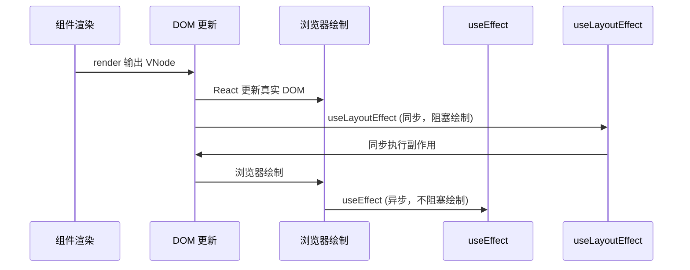

| 特性 | useEffect | useLayoutEffect |
|------|-----------|----------------|
| 执行时机 | 浏览器绘制后（异步） | DOM 更新后绘制前（同步） |
| 阻塞绘制 | ❌ 不阻塞 | ✅ 阻塞 |
| 适用场景 | 数据获取、订阅、日志 | DOM 测量、样式调整 |
| 推荐度 | ⭐ 优先使用 | ⚠️ 特殊场景使用 |

### 📋 Hooks 与 Class 生命周期对照

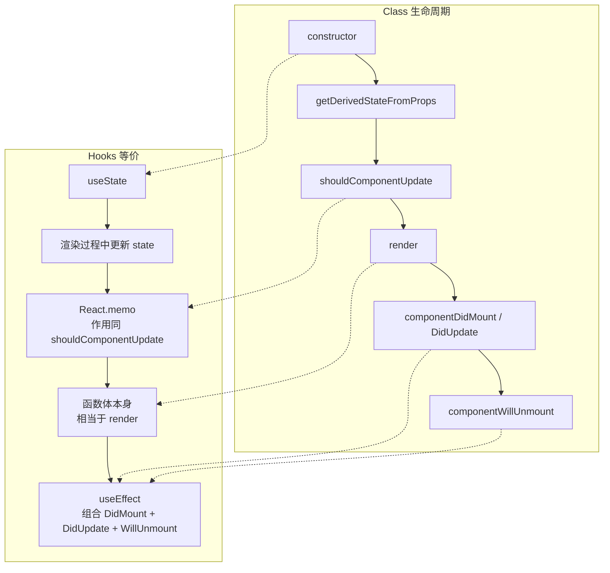

### 📍 React 19 新增 Hooks

```typescript
// use() - 异步数据获取
import { use } from 'react';
function DataComponent() {
  const data = use(fetchPromise);
  return <div>{data}</div>;
}

// useOptimistic() - 乐观更新
import { useOptimistic } from 'react';
function TodoList() {
  const [optimisticTodos, addOptimisticTodo] = useOptimistic(todos);
  const handleAdd = async (todo: Todo) => {
    addOptimisticTodo([...optimisticTodos, todo]);
    await saveTodo(todo);
  };
  return <ul>{optimisticTodos.map(todo => <li key={todo.id}>{todo.text}</li>)}</ul>;
}

// useFormStatus() - 表单状态（需从 react-dom 导入）
import { useFormStatus } from 'react-dom';
function SubmitButton() {
  const { pending } = useFormStatus();
  return <button disabled={pending}>{pending ? '提交中...' : '提交'}</button>;
}

// useActionState() - 表单结果（React 19 中 useFormState 已重命名）
import { useActionState } from 'react';
function LoginForm() {
  const [state, formAction] = useActionState(login, null);
  return (
    <form action={formAction}>
      <input name="email" type="email" />
      <button type="submit">登录</button>
      {state?.error && <p>{state.error}</p>}
    </form>
  );
}
```

---

## 8️⃣ 自定义 Hooks 设计模式

### 🎣 常用自定义 Hooks

```typescript
// useAsync - 异步操作管理
function useAsync<T>(asyncFunction: () => Promise<T>, immediate = true) {
  const [state, setState] = useState<{
    status: 'idle' | 'pending' | 'success' | 'error';
    data: T | null;
    error: Error | null;
  }>({ status: 'idle', data: null, error: null });

  const execute = useCallback(async () => {
    setState({ status: 'pending', data: null, error: null });
    try {
      const response = await asyncFunction();
      setState({ status: 'success', data: response, error: null });
      return response;
    } catch (error) {
      setState({ status: 'error', data: null, error: error as Error });
    }
  }, [asyncFunction]);

  useEffect(() => { if (immediate) execute(); }, [execute, immediate]);

  return { ...state, execute };
}

// useLocalStorage - 本地存储 Hook
function useLocalStorage<T>(key: string, initialValue: T) {
  const [storedValue, setStoredValue] = useState<T>(() => {
    try {
      const item = window.localStorage.getItem(key);
      return item ? JSON.parse(item) : initialValue;
    } catch { return initialValue; }
  });

  const setValue = (value: T | ((val: T) => T)) => {
    try {
      const valueToStore = value instanceof Function ? value(storedValue) : value;
      setStoredValue(valueToStore);
      window.localStorage.setItem(key, JSON.stringify(valueToStore));
    } catch (error) { console.error(error); }
  };

  return [storedValue, setValue] as const;
}

// useDebounce - 防抖 Hook
function useDebounce<T>(value: T, delay: number): T {
  const [debouncedValue, setDebouncedValue] = useState(value);
  useEffect(() => {
    const handler = setTimeout(() => setDebouncedValue(value), delay);
    return () => clearTimeout(handler);
  }, [value, delay]);
  return debouncedValue;
}
```

---

## 9️⃣ 生命周期与 Fiber 架构

### 🔄 组件生命周期（React 16+）

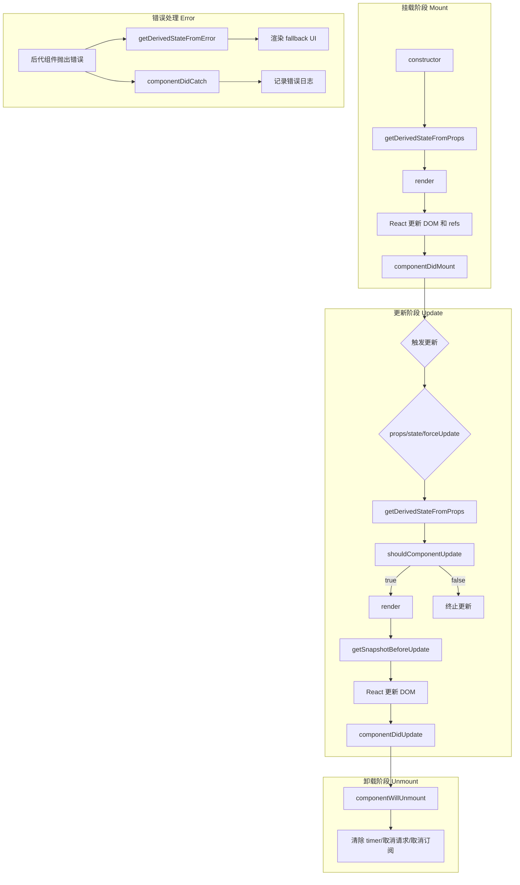

#### 废弃的三个生命周期（React 16.3+）

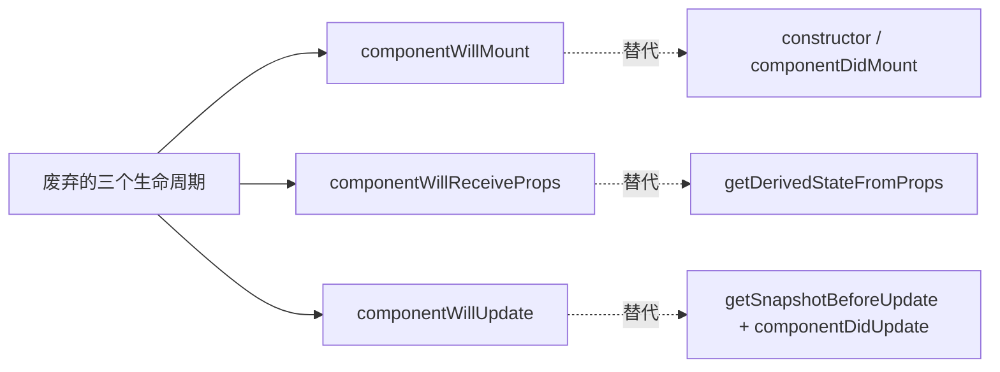

**核心废弃原因（Fiber 架构导致）：**

React 15 的 Stack Reconciler 采用递归同步渲染，一旦开始就不能中断。而 Fiber 架构将渲染过程改造为**可中断的异步任务**，这意味着 `render` 阶段可能被打断后重新执行。这直接导致了三个 `will` 生命周期在一次更新中可能被**多次调用**，产生严重的副作用问题：

```
Stack Reconciler (React 15):
  开始渲染 → 同步执行 → 完成
  生命周期只调用一次 ✅

Fiber Reconciler (React 16+):
  开始渲染 → 执行一部分 → 浏览器需要控制权 → 暂停
  → 恢复渲染 → 重新执行 render 前的生命周期
  → 生命周期可能被调用多次 ❌
```

**逐个分析：**

| 废弃方法 | 问题 | 替代方案 |
|---------|------|---------|
| `componentWillMount` | 在 render 前执行，可能因中断被调用多次；SSR 中不触发 | `constructor` 或 `componentDidMount` |
| `componentWillReceiveProps` | 每次 props 变化前调用，容易用 `this.state` 存派生值，破坏单一数据源；可被多次调用 | `static getDerivedStateFromProps` 或 `getDerivedStateFromProps` |
| `componentWillUpdate` | render 前调用，无法可靠读取 DOM；可能被多次调用 | `getSnapshotBeforeUpdate` + `componentDidUpdate` |

##### 1. componentWillMount → constructor / componentDidMount

```javascript
// ❌ 废弃写法
class UserProfile extends React.Component {
  componentWillMount() {
    // 危险：Fiber 中可能被多次调用
    this.fetchData(this.props.userId);  // 重复请求
    this.state = { data: null };         // 可能被覆盖
  }

  fetchData(userId) {
    fetch(`/api/users/${userId}`)
      .then(res => res.json())
      .then(data => this.setState({ data }));
  }

  render() {
    return <div>{this.state.data?.name || 'Loading...'}</div>;
  }
}

// ✅ 替代方案 1：异步操作放 componentDidMount
class UserProfile extends React.Component {
  state = { data: null };

  componentDidMount() {
    this.fetchData(this.props.userId);  // 只调用一次
  }

  fetchData(userId) {
    fetch(`/api/users/${userId}`)
      .then(res => res.json())
      .then(data => this.setState({ data }));
  }

  render() {
    return <div>{this.state.data?.name || 'Loading...'}</div>;
  }
}

// ✅ 替代方案 2：同步初始化放 constructor
class UserProfile extends React.Component {
  constructor(props) {
    super(props);
    // 同步初始化 state
    this.state = {
      data: null,
      derivedValue: computeExpensiveValue(props.someProp)
    };
  }
  // ...
}
```

**对比：**

| 场景 | componentWillMount | constructor | componentDidMount |
|------|-------------------|-------------|-------------------|
| 初始化 state | ✅ 可以（但 constructor 更早） | ✅ 最佳 | ❌ 已渲染 |
| 异步请求 | ⚠️ 重复调用 | ❌ 不合适 | ✅ 只执行一次 |
| DOM 操作 | ❌ DOM 不存在 | ❌ DOM 不存在 | ✅ DOM 已挂载 |
| 事件监听 | ❌ 组件未挂载 | ❌ 组件未挂载 | ✅ 可以绑定 |

##### 2. componentWillReceiveProps → getDerivedStateFromProps / 直接计算

```javascript
// ❌ 废弃写法：破坏单一数据源
class EmailInput extends React.Component {
  state = {
    email: this.props.email  // 用 state 存派生数据
  };

  componentWillReceiveProps(nextProps) {
    // 每次 props 变化都会调用
    if (nextProps.email !== this.props.email) {
      this.setState({
        email: nextProps.email  // 派生 state，来源不唯一
      });
    }
  }

  render() {
    return <input value={this.state.email} />;
  }
}
// 问题：email 有 props 和 state 两个来源，读哪个？

// ✅ 方案 1：getDerivedStateFromProps（有派生需求时）
class EmailInput extends React.Component {
  state = { email: '' };

  static getDerivedStateFromProps(props, state) {
    // 返回要更新 state 的对象，返回 null 表示不更新
    if (props.email !== state.prevEmail) {
      return {
        email: props.email,
        prevEmail: props.email  // 记住上一次的 props
      };
    }
    return null;
  }

  render() {
    return <input value={this.state.email} />;
  }
}

// ✅ 方案 2：完全受控组件（推荐）
function EmailInput({ email, onChange }) {
  return <input value={email} onChange={e => onChange(e.target.value)} />;
}

// ✅ 方案 3：非受控组件 + key 重置
function EmailInput({ email, onChange }) {
  const [localValue, setLocalValue] = useState(email);
  // key 变化时重新创建组件
  return <input key={email} defaultValue={email}
    onChange={e => setLocalValue(e.target.value)} />;
}
```

**componentWillReceiveProps vs getDerivedStateFromProps 对比：**

| 特性 | componentWillReceiveProps | getDerivedStateFromProps |
|------|--------------------------|------------------------|
| 调用时机 | 接收新 props 后、render 前 | 接收新 props 后、render 前 |
| 返回值 | 无 | 返回要更新 state 的对象或 null |
| 访问 this | ✅ 可以访问当前 props/state | ❌ 静态方法，无法访问 this |
| 副作用 | ✅ 可以（但可能导致重复调用） | ❌ 纯函数，禁止副作用 |
| 多次调用 | ✅ Fiber 中可能多次 | ✅ 多次调用但纯函数无影响 |
| 推荐度 | ⚠️ 废弃 | ⭐ 有派生需求时使用 |

> ⚠️ **重要**：`getDerivedStateFromProps` 应极少使用。大多数场景下，**完全受控组件**（props 作为唯一数据源）才是正确答案。

##### 3. componentWillUpdate → getSnapshotBeforeUpdate + componentDidUpdate

```javascript
// ❌ 废弃写法：无法可靠获取 DOM
class ChatList extends React.Component {
  state = { messages: [] };

  componentWillUpdate() {
    // 危险：Fiber 中可能被多次调用
    // 且此时 DOM 还未更新，但无法获取可靠的滚动位置
    this.scrollHeight = this.list.scrollHeight;  // 可能不准确
  }

  render() {
    return (
      <div ref={el => this.list = el}>
        {this.state.messages.map(msg => <div key={msg.id}>{msg.text}</div>)}
      </div>
    );
  }

  componentDidUpdate() {
    // 如果新消息到来，恢复滚动位置
    if (this.shouldScroll) {
      this.list.scrollTop = this.scrollHeight;
    }
  }
}

// ✅ 正确写法：getSnapshotBeforeUpdate
class ChatList extends React.Component {
  state = { messages: [] };

  // 在 React 更新 DOM 之前同步调用
  // 返回值会传给 componentDidUpdate 的第三个参数
  getSnapshotBeforeUpdate(prevProps, prevState) {
    const list = this.listRef.current;
    if (prevProps.messages.length < this.props.messages.length) {
      // 新消息到来，记录当前滚动信息
      return {
        scrollHeight: list.scrollHeight,
        scrollTop: list.scrollTop,
        clientHeight: list.clientHeight
      };
    }
    return null;
  }

  componentDidUpdate(prevProps, prevState, snapshot) {
    // snapshot 就是 getSnapshotBeforeUpdate 返回的值
    if (snapshot) {
      const list = this.listRef.current;
      // 如果之前在底部，新消息后自动滚到底部
      const isAtBottom =
        snapshot.scrollTop + snapshot.clientHeight >= snapshot.scrollHeight - 50;
      if (isAtBottom) {
        list.scrollTop = list.scrollHeight;
      }
    }
  }

  render() {
    return (
      <div ref={this.listRef}>
        {this.props.messages.map(msg => <div key={msg.id}>{msg.text}</div>)}
      </div>
    );
  }
}
```

**componentWillUpdate vs getSnapshotBeforeUpdate 对比：**

| 特性 | componentWillUpdate | getSnapshotBeforeUpdate |
|------|---------------------|------------------------|
| 调用时机 | render 前（DOM 更新前） | render 后、DOM 更新前（Pre-commit 阶段） |
| 读取 DOM | ⚠️ 可读但不可靠（可能被多次调用） | ✅ 可靠（只调用一次） |
| 返回值 | 无 | 返回值传给 componentDidUpdate |
| 适用场景 | 几乎没有安全场景 | DOM 测量/快照 |
| 推荐度 | ⚠️ 废弃 | ⭐ 唯一的 DOM 快照方案 |

#### 新旧生命周期完整对比

```mermaid
flowchart TD
    subgraph "Class 生命周期 (React 16+)"
        C1["constructor"]
        C2["static getDerivedStateFromProps<br/>(替代 componentWillReceiveProps)"]
        C3["shouldComponentUpdate"]
        C4["render"]
        C5["getSnapshotBeforeUpdate<br/>(替代 componentWillUpdate)"]
        C6["componentDidMount / DidUpdate"]
        C7["componentWillUnmount"]
        C8["componentDidCatch / getDerivedStateFromError"]
    end

    subgraph Hooks 等价实现
        H1["useState 初始化<br/>(替代 constructor 中的 state 初始化)"]
        H2["useEffect + 依赖项<br/>(自动跟踪 props 变化)"]
        H3["React.memo + useMemo<br/>(替代 shouldComponentUpdate)"]
        H4["函数体本身<br/>(替代 render)"]
        H5["useEffect 清理函数<br/>(替代 componentWillUnmount)"]
        H6["useRef<br/>(替代 getSnapshotBeforeUpdate 中的 DOM 测量)"]
    end

    C1 -.-> H1
    C2 -.-> H2
    C3 -.-> H3
    C4 -.-> H4
    C5 -.-> H6
    C6 -.-> H2
    C7 -.-> H5
```

#### Hooks 替换 Class 生命周期完整示例

```javascript
// ========== Class 组件写法 ==========
class TimerWithLifecycle extends React.Component {
  constructor(props) {
    super(props);
    this.state = { seconds: 0, message: '' };
  }

  static getDerivedStateFromProps(props, state) {
    if (props.resetOnPropChange !== state.prevProp) {
      return { seconds: 0, prevProp: props.resetOnPropChange };
    }
    return null;
  }

  componentDidMount() {
    this.interval = setInterval(() => {
      this.setState(prev => ({ seconds: prev.seconds + 1 }));
    }, 1000);

    document.title = `Timer: ${this.state.seconds}s`;
  }

  componentDidUpdate(prevProps, prevState) {
    if (prevState.seconds !== this.state.seconds) {
      document.title = `Timer: ${this.state.seconds}s`;
    }
  }

  componentWillUnmount() {
    clearInterval(this.interval);
  }

  getSnapshotBeforeUpdate() {
    return window.scrollY;  // DOM 快照
  }

  render() {
    return <div>Seconds: {this.state.seconds}</div>;
  }
}

// ========== Hooks 写法 ==========
function TimerWithHooks({ resetOnPropChange }) {
  const [seconds, setSeconds] = useState(0);

  // 等价 getDerivedStateFromProps
  const prevPropRef = useRef(resetOnPropChange);
  useEffect(() => {
    if (resetOnPropChange !== prevPropRef.current) {
      setSeconds(0);
      prevPropRef.current = resetOnPropChange;
    }
  }, [resetOnPropChange]);

  // 等价 componentDidMount + componentDidUpdate + componentWillUnmount
  useEffect(() => {
    const interval = setInterval(() => {
      setSeconds(prev => prev + 1);
    }, 1000);

    document.title = `Timer: ${seconds}s`;

    return () => clearInterval(interval);  // 等价 componentWillUnmount
  }, [seconds]);

  return <div>Seconds: {seconds}</div>;
}
```

### 🏗️ Fiber 架构

Fiber 架构将虚拟 DOM 从递归不可中断的 Stack Reconciler 重构为可中断的 Fiber 链表结构，引入时间切片和优先级调度机制。

```mermaid
flowchart TB
    subgraph React 15: Stack Reconciler
        S1["递归遍历 Virtual DOM"] --> S2["同步更新 DOM"]
        S2 --> S3["过程中不可中断"]
        S3 --> S4["长时间占用主线程<br/>导致卡顿/掉帧"]
    end

    subgraph React 16+: Fiber Reconciler
        F1["虚拟 DOM → Fiber 链表"] --> F2["可中断的异步渲染"]
        F2 --> F3["时间切片 + 优先级调度"]
        F3 --> F4{"浏览器空闲?"}
        F4 -->|是| F5["继续执行 Fiber 工作单元"]
        F4 -->|否| F6["让出主线程"]
        F5 --> F7["完成 Reconciliation"]
        F7 --> F8["一次性提交 DOM 更新"]
    end
```

**Fiber 架构核心概念：**
- **Fiber Node**：每个组件对应一个 Fiber 节点，构成 Fiber 树（单链表结构）
- **双缓冲**：`current` 树（当前 UI）和 `workInProgress` 树（内存中构建的新树）
- **时间切片（Time Slicing）**：将一个渲染任务拆分成多个小单元，每执行完一个单元就让出主线程
- **优先级调度**：任务分优先级，高优先级任务（如用户输入）可打断低优先级任务（如数据加载）

### 🔄 Reconciliation（协调）过程

```mermaid
flowchart TD
    A["触发更新: setState / props 变化"] --> B["进入 Render 阶段<br/>可中断"]
    B --> C["从 Fiber Root 开始遍历"]
    C --> D["构建 workInProgress 树"]
    D --> E{"节点是否可复用?"}
    E -->|是| F["复用旧 Fiber，更新 props"]
    E -->|否| G["创建新 Fiber"]
    F --> H["收集 effectTag"]
    G --> H
    H --> I{"还有更多节点?"}
    I -->|是| J["深度优先遍历"]
    J --> D
    I -->|否| K["workInProgress 树构建完成"]
    K --> L["进入 Commit 阶段<br/>不可中断"]
    L --> M["根据 effect 链表执行 DOM 操作"]
    M --> N["current 指针切换"]
    N --> O["触发生命周期回调"]
```

| 阶段 | 是否可中断 | 主要工作 |
|------|-----------|---------|
| Render | 可中断 | 构建 workInProgress 树，diff 对比，标记 effect |
| Pre-commit | 不可中断 | 读取 DOM 快照（getSnapshotBeforeUpdate） |
| Commit | 不可中断 | 执行 DOM 操作，触发生命周期 |

---

## 🔟 代码复用方案对比

### 🧩 HOC vs Render Props vs Hooks

```mermaid
flowchart LR
    subgraph 代码复用方案演进
        A["HOC<br/>高阶组件"] --> B["Render Props"]
        B --> C["Hooks<br/>React 16.8+"]
    end

    A --> A1["优点: 逻辑复用<br/>不影响内部逻辑"]
    A --> A2["缺点: props 命名冲突<br/>嵌套层级深"]

    B --> B1["优点: 数据共享灵活"]
    B --> B2["缺点: 嵌套地狱"]

    C --> C1["优点: 简洁直观<br/>解决props覆盖和嵌套地狱"]
    C --> C2["限制: 只能在顶层调用"]
```

| 维度 | HOC | Render Props | Hooks |
|------|-----|-------------|-------|
| 模式 | 装饰器模式 | 函数作为 children | 组合式函数 |
| 命名冲突 | ⚠️ 容易冲突 | ✅ 不冲突 | ✅ 不冲突 |
| 嵌套层级 | 深 | 深（嵌套地狱） | 浅 |
| 模板代码 | 多 | 多 | 少 |
| 推荐度 | ⭐⭐ | ⭐ | ⭐⭐⭐⭐⭐ |

**HOC 示例：**

```javascript
function withSubscription(WrappedComponent, selectData) {
  return class extends React.Component {
    constructor(props) {
      super(props)
      this.state = { data: selectData(DataSource, props) }
    }
    render() {
      return <WrappedComponent data={this.state.data} {...this.props} />
    }
  }
}
```

**Render Props 示例：**

```javascript
class DataProvider extends React.Component {
  state = { name: 'Tom' }
  render() {
    return <div>{this.props.render(this.state)}</div>
  }
}
// 使用: <DataProvider render={data => <h1>Hello {data.name}</h1>} />
```

---

