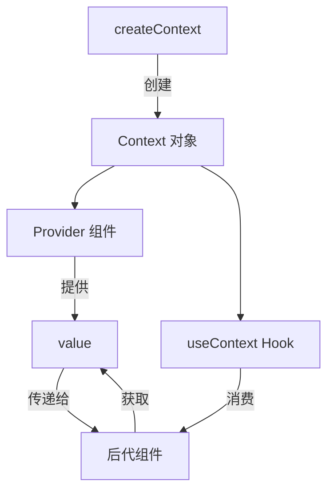
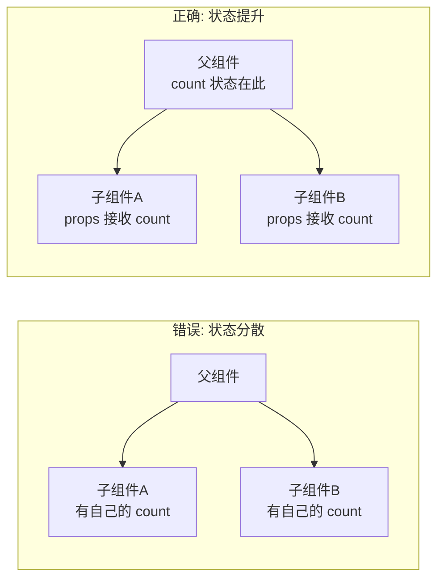
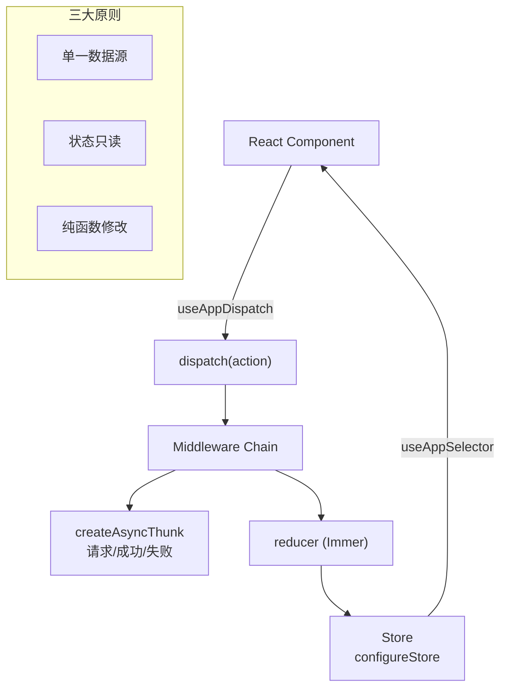
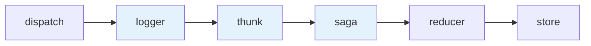
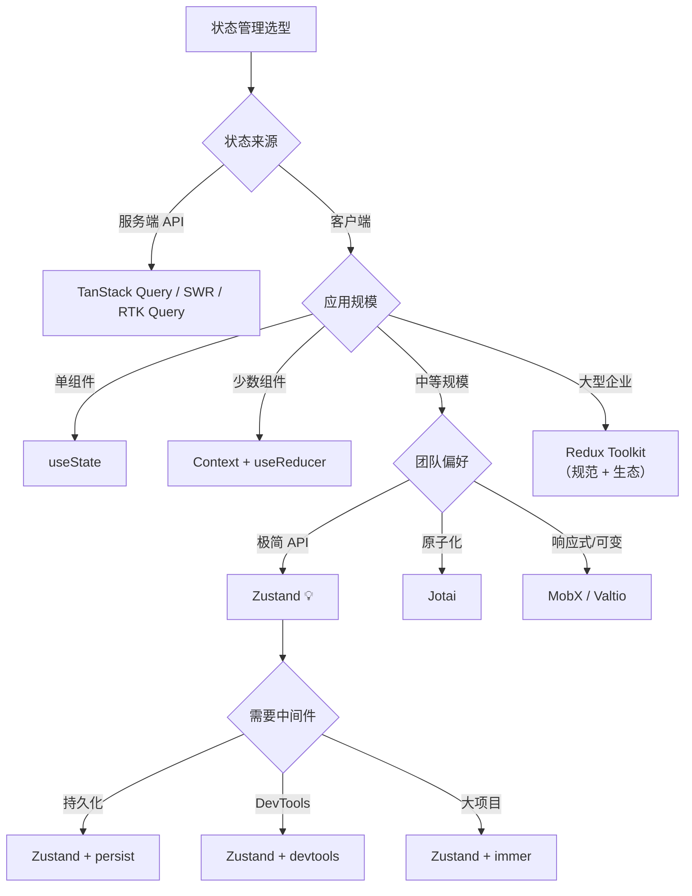
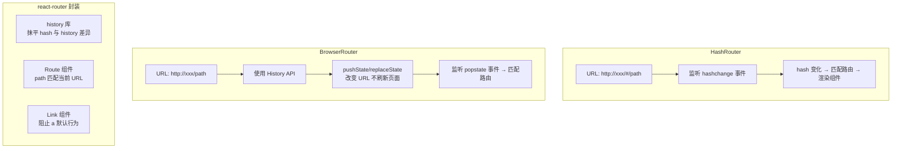

# 第二部分：高级特性

## 1️⃣ Context API 深度应用

### 🔄 Context 完整工作流



### 🎯 实战：主题系统

```typescript
// theme-context.ts
interface ThemeContextType {
  theme: { primary: string; background: string; text: string };
  toggleTheme: () => void;
  currentThemeName: 'light' | 'dark';
}

const ThemeContext = createContext<ThemeContextType | undefined>(undefined);

const themes = {
  light: { primary: '#007bff', background: '#ffffff', text: '#000000' },
  dark: { primary: '#0d6efd', background: '#1a1a1a', text: '#ffffff' }
};

export function ThemeProvider({ children }: { children: ReactNode }) {
  const [themeName, setThemeName] = useState<'light' | 'dark'>('light');
  const value: ThemeContextType = {
    theme: themes[themeName],
    toggleTheme: () => setThemeName(prev => prev === 'light' ? 'dark' : 'light'),
    currentThemeName: themeName
  };
  return <ThemeContext.Provider value={value}>{children}</ThemeContext.Provider>;
}

export function useTheme() {
  const context = useContext(ThemeContext);
  if (!context) throw new Error('useTheme must be used within ThemeProvider');
  return context;
}

### 🛒 实战：购物车 Context

interface CartItem {
  id: number;
  name: string;
  price: number;
  quantity: number;
  image: string;
}

interface CartContextType {
  items: CartItem[];
  addItem: (item: CartItem) => void;
  removeItem: (id: number) => void;
  updateQuantity: (id: number, quantity: number) => void;
  clearCart: () => void;
  totalAmount: number;
  totalCount: number;
}

const CartContext = createContext<CartContextType | undefined>(undefined);

export function CartProvider({ children }: { children: React.ReactNode }) {
  const [items, setItems] = useState<CartItem[]>([]);

  const addItem = useCallback((item: CartItem) => {
    setItems(prev => {
      const existing = prev.find(i => i.id === item.id);
      if (existing) {
        return prev.map(i =>
          i.id === item.id ? { ...i, quantity: i.quantity + item.quantity } : i
        );
      }
      return [...prev, item];
    });
  }, []);

  const totalAmount = useMemo(() =>
    items.reduce((sum, item) => sum + item.price * item.quantity, 0),
    [items]
  );

  const totalCount = useMemo(() =>
    items.reduce((sum, item) => sum + item.quantity, 0),
    [items]
  );

  return (
    <CartContext.Provider value={{
      items, addItem,
      removeItem: (id) => setItems(prev => prev.filter(i => i.id !== id)),
      updateQuantity: (id, qty) => setItems(prev =>
        prev.map(i => i.id === id ? { ...i, quantity: qty } : i)
      ),
      clearCart: () => setItems([]),
      totalAmount, totalCount,
    }}>
      {children}
    </CartContext.Provider>
  );
}

export function useCart() {
  const context = useContext(CartContext);
  if (!context) throw new Error('useCart must be used within CartProvider');
  return context;
}
```

#### 购物车持久化（localStorage）

```typescript
export function CartProvider({ children }: { children: React.ReactNode }) {
  const [items, setItems] = useState<CartItem[]>(() => {
    try {
      const saved = localStorage.getItem('cart');
      return saved ? JSON.parse(saved) : [];
    } catch {
      return [];
    }
  });

  // 自动持久化
  useEffect(() => {
    localStorage.setItem('cart', JSON.stringify(items));
  }, [items]);

  // 多标签同步
  useEffect(() => {
    const handleStorage = (e: StorageEvent) => {
      if (e.key === 'cart' && e.newValue) {
        setItems(JSON.parse(e.newValue));
      }
    };
    window.addEventListener('storage', handleStorage);
    return () => window.removeEventListener('storage', handleStorage);
  }, []);

  // ... rest of the provider
}
```

> 🔗 **链式思考**：React 状态管理生态最为多元——从内置的 `useState`/`useReducer` 到第三方 Zustand/Redux/Jotai，体现"轻核心 + 重生态"哲学。Vue 的 Pinia 是官方统一方案，深度集成响应式系统。Angular 的 NgRx SignalStore 则结合了 RxJS 和 Signals。选择策略：小型应用用内置方案，中型应用用 Zustand/Pinia/SignalStore，大型应用用 Redux/NgRx。详见 [框架对比](../框架对比/) 的"状态管理生态"。

---

## 2️⃣ 状态管理完全指南

### 📊 状态管理全景图

| 本地状态 | 跨组件共享 | 全局状态 | 服务器状态 |
| :--- | :--- | :--- | :--- |
| `useState` | Context API | Redux | TanStack Query |
| `useReducer` | `useMemo`(值) | Zustand | SWR |
| `useRef` | | Jotai | Apollo |
| | | MobX | RTK Query |
| | | Valtio | |
| | | Legend State | |

### 🧭 状态管理分类与演进

**四个象限分类法：**

| 象限 | 范围 | 典型方案 | 核心问题 |
|------|------|---------|---------|
| **本地** | 单个组件内 | useState / useReducer / useRef | 表单输入、UI 开关 |
| **共享** | 组件树内 | Context API / 组合提升 | 主题、语言、用户 |
| **全局（客户端）** | 整个应用 | Redux / Zustand / Jotai / MobX | 缓存数据、复杂交互 |
| **全局（服务端）** | 服务端来源 | TanStack Query / SWR / Apollo | API 数据同步 |

**版本演进时间线：**

```
2014: Redux 发布（Flux 理念 + 单一状态树）
2015: MobX 发布（响应式可变状态）
2016: Redux 成为 React 标配
2018: React Context + useReducer（内置替代方案）
2019: Recoil 发布（原子化先驱，Meta）
      SWR 发布（stale-while-revalidate）
2020: Zustand 发布（极简 API，~1KB）
      Jotai 发布（原子化改进，Recoil 竞争者）
      TanStack Query v3（服务器状态管理）
2021: Valtio 发布（Proxy 响应式）
      Redux Toolkit 成为官方推荐
2022: Legend State 发布（高性能信号式）
2023: Zustand v4 + Middleware
      Jotai v2（突破性改进）
2024-2026: React 19 + Signal 状态库融合
           Server State + Client State 界限模糊
           Zustand v5 / Jotai v2 稳定
```

### 💡 实战：useState 状态模式

#### SKU 选择器

```typescript
interface SKU {
  color: string;
  size: string;
  stock: number;
  price: number;
}

function SKUSelector({ skus }: { skus: SKU[] }) {
  const [selectedColor, setSelectedColor] = useState('');
  const [selectedSize, setSelectedSize] = useState('');

  const availableSizes = useMemo(() =>
    [...new Set(skus.filter(s => !selectedColor || s.color === selectedColor).map(s => s.size))],
    [skus, selectedColor]
  );

  const currentSKU = useMemo(() =>
    skus.find(s => s.color === selectedColor && s.size === selectedSize),
    [skus, selectedColor, selectedSize]
  );

  return (
    <div>
      <div className="mb-4">
        <label className="block mb-2">颜色：</label>
        <div className="flex gap-2">
          {[...new Set(skus.map(s => s.color))].map(color => (
            <button key={color}
              onClick={() => { setSelectedColor(color); setSelectedSize(''); }}
              className={`px-4 py-2 rounded ${selectedColor === color ? 'bg-blue-500 text-white' : 'bg-gray-200'}`}>
              {color}
            </button>
          ))}
        </div>
      </div>

      <div className="mb-4">
        <label className="block mb-2">尺寸：</label>
        <div className="flex gap-2">
          {availableSizes.map(size => (
            <button key={size}
              onClick={() => setSelectedSize(size)}
              className={`px-4 py-2 rounded ${selectedSize === size ? 'bg-blue-500 text-white' : 'bg-gray-200'}`}>
              {size}
            </button>
          ))}
        </div>
      </div>

      {currentSKU && (
        <div className="p-4 bg-gray-50 rounded">
          <p>价格：¥{currentSKU.price}</p>
          <p>库存：{currentSKU.stock > 0 ? `${currentSKU.stock}件` : '已售罄'}</p>
        </div>
      )}
    </div>
  );
}
```

#### 状态提升（Lifting State Up）



```typescript
function Parent() {
  const [count, setCount] = useState(0);

  return (
    <div>
      <CounterDisplay count={count} />
      <CounterControls count={count} setCount={setCount} />
    </div>
  );
}

function CounterDisplay({ count }: { count: number }) {
  return <h2>计数：{count}</h2>;
}

function CounterControls({ count, setCount }: {
  count: number;
  setCount: React.Dispatch<React.SetStateAction<number>>;
}) {
  return (
    <div>
      <button onClick={() => setCount(c => c + 1)}>+</button>
      <button onClick={() => setCount(c => c - 1)}>-</button>
    </div>
  );
}
```

#### Immer：复杂状态简化

```typescript
import { produce } from 'immer';

interface User {
  name: string;
  address: { city: string; district: string; detail: string };
  hobbies: string[];
}

const [user, setUser] = useState<User>({
  name: '张三',
  address: { city: '北京', district: '海淀', detail: '...' },
  hobbies: ['读书', '跑步'],
});

// Immer：以可变的方式写不可变逻辑
function updateAddress(district: string) {
  setUser(produce(draft => {
    draft.address.district = district;
  }));
}

function addHobby(hobby: string) {
  setUser(produce(draft => {
    draft.hobbies.push(hobby);
  }));
}

// State 不可变更新速查
// ❌ 直接修改：todos.push('c'), setTodos(todos) → 不触发渲染
// ✅ 添加：setTodos([...todos, 'c'])
// ✅ 删除：setTodos(todos.filter(t => t !== 'a'))
// ✅ 修改：setTodos(todos.map(t => t === 'a' ? 'A' : t))
```

### 🎯 主流方案快速对比

| 方案 | 范式 | Bundle | Star | 学习曲线 | TS 支持 | 适用规模 |
|------|------|--------|------|---------|---------|---------|
| **useState** | 不可变 | 0KB（内置） | — | 🟢 极低 | ✅ | 单组件 |
| **Context + useReducer** | 不可变 | 0KB（内置） | — | 🟢 低 | ✅ | 小功能 |
| **Zustand** | 不可变 | ~1KB | 50k+ | 🟢 低 | ✅ 优秀 | 中/大型 |
| **Jotai** | 原子不可变 | ~3KB | 22k+ | 🟢 低 | ✅ 优秀 | 中/大型 |
| **Valtio** | 可变（Proxy） | ~2KB | 9k+ | 🟢 低 | ✅ 好 | 中/大型 |
| **MobX** | 可变（Proxy） | ~16KB | 27k+ | 🟡 中 | ⚠️ 一般 | 中/大型 |
| **Redux Toolkit** | 不可变（Immer） | ~12KB | 60k+ | 🔴 中-高 | ✅ 优秀 | 大型企业 |
| **TanStack Query** | 不可变（缓存） | ~13KB | 45k+ | 🟡 中 | ✅ 优秀 | 任意（服务端） |
| **Legend State** | 信号式 | ~3KB | 4k+ | 🟢 低 | ✅ 好 | 中/大型 |

### 🏆 方案深度对比

#### 1. [Zustand](https://github.com/pmndrs/zustand) — 极简全局状态（💡 推荐首选）

```typescript
import { create } from 'zustand';
import { devtools, persist, subscribeWithSelector } from 'zustand/middleware';

interface BearStore {
  bears: number;
  fishes: number;
  addBear: () => void;
  consumeFish: (n: number) => void;
}

export const useBearStore = create<BearStore>()(
  subscribeWithSelector(
    devtools(
      persist(
        (set) => ({
          bears: 0,
          fishes: 10,
          addBear: () => set((s) => ({ bears: s.bears + 1 })),
          consumeFish: (n) => set((s) => ({ fishes: s.fishes - n })),
        }),
        { name: 'bear-storage' }
      ),
      { name: 'BearStore' }
    )
  )
);

// 组件外读写
const bears = useBearStore.getState().bears;
useBearStore.getState().addBear();
useBearStore.subscribe((s) => console.log('changed:', s.bears));

// 选择器自动优化重渲染
function BearCounter() {
  const bears = useBearStore((s) => s.bears);
  return <h1>{bears} bears</h1>;
}

// 组合多个选择器
const { bears, fishes } = useBearStore((s) => ({ bears: s.bears, fishes: s.fishes }), shallow);
```

**Zustand vs Context 核心差异：**
- Context 导致 Provider 嵌套地狱，Zustand 无 Provider
- Context 会重渲染所有消费者，Zustand 选择器精确订阅
- Zustand 可在组件外读写（Router/Promise 回调）

#### 2. Redux Toolkit — 大型企业标准

```typescript
import { createSlice, configureStore } from '@reduxjs/toolkit';
import { useDispatch, useSelector } from 'react-redux';

// slice：action + reducer 自动生成
const counterSlice = createSlice({
  name: 'counter',
  initialState: { value: 0 },
  reducers: {
    increment: (state) => { state.value += 1; },      // Immer 可变写法
    decrement: (state) => { state.value -= 1; },
    incrementByAmount: (state, action) => { state.value += action.payload; },
  },
});

// 异步 thunk
const incrementAsync = createAsyncThunk('counter/fetchCount', async (amount: number) => {
  const response = await fetch('/api/count');
  return response.json() as number;
});

const store = configureStore({
  reducer: { counter: counterSlice.reducer },
  middleware: (gDM) => gDM().concat(logger),
});

// Hooks 封装 + TypeScript 类型
type RootState = ReturnType<typeof store.getState>;
type AppDispatch = typeof store.dispatch;
export const useAppSelector = useSelector.withTypes<RootState>();
export const useAppDispatch = useDispatch.withTypes<AppDispatch>();

function Counter() {
  const count = useAppSelector((s) => s.counter.value);
  const dispatch = useAppDispatch();
  return <button onClick={() => dispatch(increment())}>{count}</button>;
}
```



**Redux 中间件洋葱模型：**



#### 3. Jotai — 原子化状态

```typescript
import { atom, useAtom, useAtomValue, useSetAtom } from 'jotai';
import { atomWithStorage, splitAtom, loadable } from 'jotai/utils';

// 基础原子
const countAtom = atom(0);

// 派生原子（懒计算，自动缓存）
const doubledAtom = atom((get) => get(countAtom) * 2);

// 异步原子
const userAtom = atom(async () => {
  const res = await fetch('/api/user');
  return res.json();
});

// 存储原子（自动持久化）
const themeAtom = atomWithStorage('theme', 'light');

// 拆分原子（数组管理）
const itemsAtom = atom([{ id: 1, text: 'hello' }]);
const itemAtomsAtom = splitAtom(itemsAtom);

function Counter() {
  const count = useAtomValue(countAtom);       // 只读
  const setCount = useSetAtom(countAtom);       // 只写
  return <button onClick={() => setCount(c => c + 1)}>{count}</button>;
}

// 异步 + loading 状态
function User() {
  const user = useAtomValue(loadable(userAtom));
  if (user.state === 'loading') return <Spinner />;
  if (user.state === 'hasError') return <Error message={user.error} />;
  return <div>{user.data.name}</div>;
}
```

| 维度 | Context API | Jotai | Recoil（已停更） |
|------|-------------|-------|-----------------|
| 渲染优化 | ❌ 所有消费者重渲染 | ✅ 仅关联原子变化 | ✅ 仅关联原子变化 |
| 组合性 | ❌ 多层 Provider 嵌套 | ✅ 原子自由组合 | ✅ 原子自由组合 |
| 异步支持 | ❌ 需手动管理 | ✅ loadable / 异步原子 | ✅ selector |
| Bundle | 0KB | ~3KB | ~15KB |
| 维护状态 | ✅ 活跃 | ✅ 活跃 | ❌ Meta 已不推荐 |

#### 4. MobX — 可变响应式

```typescript
import { makeAutoObservable } from 'mobx';
import { observer } from 'mobx-react-lite';

// 可观察状态（class-based）
class TodoStore {
  todos: Todo[] = [];
  filter: 'all' | 'active' | 'completed' = 'all';

  constructor() {
    makeAutoObservable(this);  // 自动将属性转为 observable
  }

  // action：修改状态
  addTodo(text: string) {
    this.todos.push({ id: Date.now(), text, completed: false });
  }

  // computed：自动衍生
  get filteredTodos() {
    if (this.filter === 'all') return this.todos;
    return this.todos.filter(t => t.completed === (this.filter === 'completed'));
  }
}

const todoStore = new TodoStore();

// 组件自动追踪依赖
const TodoList = observer(({ store }: { store: TodoStore }) => (
  <ul>
    {store.filteredTodos.map(todo => (
      <li key={todo.id}>{todo.text}</li>
    ))}
  </ul>
));
```

**MobX 与 Zustand 核心差异：**
- MobX 可变响应式（类似 Vue reactive），Zustand 不可变（类似 React setState）
- MobX 自动追踪依赖，Zustand 手动选择器
- MobX 更适合 OOP 思维，Zustand 更适合函数式

#### 5. Valtio — Proxy 响应式

```typescript
import { proxy, useSnapshot } from 'valtio';

// Proxy 代理对象，类似 Vue reactive
const state = proxy({
  count: 0,
  user: { name: 'John', todos: [] as Todo[] },
});

// mutations
state.count++;
state.user.todos.push({ id: 1, text: 'hello' });

// 组件订阅快照（不可变）
function Counter() {
  const snap = useSnapshot(state);        // 只读快照
  return <button onClick={() => state.count++}>{snap.count}</button>;
}

// 派生状态
const doubled = ref(0);
subscribe(state, () => { doubled.value = state.count * 2; });
```

#### 6. Legend State — 信号式高性能

```typescript
import { observable, useObservable, batch } from '@legendapp/state';

// 信号式状态（类似 Angular Signals）
const state = observable({
  count: 0,
  user: { name: '' },
});

// 精确依赖追踪，无需选择器
function Counter() {
  const count = useObservable(state.count);
  return <button onClick={() => state.count.set(c => c + 1)}>{count}</button>;
}

// 批量更新（合并触发）
batch(() => {
  state.count.set(5);
  state.user.name.set('Jane');
});
```

### 📊 八维对比矩阵

| 维度 | useState | Zustand | Redux Toolkit | Jotai | MobX | Valtio | TanStack Query |
|------|----------|---------|--------------|-------|------|--------|----------------|
| **范式** | 不可变 | 不可变 | 不可变(Immer) | 不可变 | 可变 | **Proxy** | 不可变 |
| **Bundle** | 0KB | ~1KB | ~12KB | ~3KB | ~16KB | ~2KB | ~13KB |
| **模板代码** | 无 | 极少 | 中 | 少 | 少 | 极少 | 少 |
| **组件外访问** | ❌ | ✅ | ✅ | ✅ | ✅ | ✅ | ✅ |
| **异步支持** | ❌ | Promise | createAsyncThunk | atom(async) | flow | proxy + | ✅ 内置 |
| **中间件** | — | persist/imber | thunk/saga | utils | — | — | 查询/变更 |
| **DevTools** | React DevTools | Zustand DevTools | **Redux DevTools** | Jotai DevTools | MobX DevTools | — | React Query Devtools |
| **SSR 友好** | ✅ | ✅ | ✅ | ✅ | ⚠️ | ✅ | ✅ |

### 🎯 技术选型决策树



### 📊 性能基准（粗略）

```
# 更新 1000 个状态项 + 订阅组件重渲染（ms）
Zustand:     ~2ms  （选择器精确订阅）
Jotai:       ~3ms  （原子级依赖追踪）
MobX:        ~4ms  （自动追踪）
Valtio:      ~3ms  （Proxy + 快照对比）
Redux:       ~8ms  （全量 selector 检查）
Context:     ~15ms （所有消费者重渲染）

# Bundle 体积（gzip）
Zustand:     1.2KB
Valtio:      1.8KB
Jotai:       2.5KB
MobX:        12KB
RTK:         10KB
TanStack Q:  11KB
```

> 🔗 **链式思考**：React Router v6.4+ 引入的 `loaders`/`actions` 本质是"声明式数据获取"，在路由匹配时自动加载数据——这与 Vue Router 的导航守卫 + 手动数据获取模式不同，更接近 Angular Router 的 `resolve` 守卫。三者都支持懒加载和嵌套路由，但 React Router 以 URL 为中心，Vue Router 以组件树为中心，Angular Router 以配置为中心。详见 [框架对比](../框架对比/) 的"路由方案"。

---

## 3️⃣ 路由完全指南

### 📍 React Router 实现原理



### 🛣️ 完整路由配置

```typescript
import { createBrowserRouter, RouterProvider, Outlet } from 'react-router-dom';

const router = createBrowserRouter([
  {
    path: '/',
    element: <RootLayout />,
    children: [
      { index: true, element: <Home /> },
      { path: 'about', element: <About /> },
      {
        path: 'dashboard',
        element: <DashboardLayout />,
        children: [
          { index: true, element: <DashboardHome /> },
          { path: 'settings', element: <Settings /> },
        ],
      },
      { path: 'products/:id', element: <ProductDetail /> },
      { path: '*', element: <NotFound /> }
    ]
  }
]);

function RootLayout() {
  return <div><Header /><Outlet /></div>;
}

export default function App() {
  return <RouterProvider router={router} />;
}
```

**参数读取与导航：**

```typescript
function ProductDetail() {
  const { id } = useParams<{ id: string }>();
  const navigate = useNavigate();
  return <div>Product: {id}<button onClick={() => navigate('/')}>返回</button></div>;
}

// 受保护路由
function ProtectedRoute({ children }: { children: ReactNode }) {
  const isAuthenticated = useAuth();
  return isAuthenticated ? children : <Navigate to="/login" />;
}
```

### 📍 loaders / actions (v6.4+)

```typescript
const router = createBrowserRouter([
  {
    path: '/products/:id',
    element: <ProductDetail />,
    loader: async ({ params }) => {
      const product = await fetch(`/api/products/${params.id}`);
      return product.json();
    },
    action: async ({ request, params }) => {
      const formData = await request.formData();
      await fetch(`/api/products/${params.id}`, { method: 'PUT', body: formData });
      return { success: true };
    },
  },
]);

function ProductDetail() {
  const product = useLoaderData();
  const actionData = useActionData();
  return (
    <div>
      <h1>{product.name}</h1>
      <Form method="put">
        <input name="price" defaultValue={product.price} />
        <button type="submit">更新</button>
        {actionData?.success && <p>更新成功</p>}
      </Form>
    </div>
  );
}
```

**defer / Await（延迟数据加载）：**

```typescript
async function loader() {
  const reviewsPromise = fetch('/api/reviews').then(r => r.json());
  return defer({
    product: await fetch('/api/product').then(r => r.json()),
    reviews: reviewsPromise,
  });
}

function ProductPage() {
  const data = useLoaderData();
  return (
    <div>
      <ProductDetail product={data.product} />
      <Suspense fallback={<ReviewsSkeleton />}>
        <Await resolve={data.reviews}>
          {(reviews) => <ReviewsList reviews={reviews} />}
        </Await>
      </Suspense>
    </div>
  );
}
```

---

## 4️⃣ 表单系统

### 📋 受控组件完整示例

```typescript
interface FormData {
  name: string;
  email: string;
  password: string;
  agreeTerms: boolean;
}

function RegistrationForm() {
  const [formData, setFormData] = useState<FormData>({
    name: '', email: '', password: '', agreeTerms: false
  });
  const [errors, setErrors] = useState<Partial<FormData>>({});

  const handleChange = (e: ChangeEvent<HTMLInputElement>) => {
    const { name, type, value, checked } = e.target;
    setFormData(prev => ({ ...prev, [name]: type === 'checkbox' ? checked : value }));
  };

  const validate = (): boolean => {
    const newErrors: Partial<FormData> = {};
    if (!formData.name) newErrors.name = '姓名必填';
    if (!formData.email) newErrors.email = '邮箱必填';
    if (!formData.password || formData.password.length < 6) newErrors.password = '密码至少6个字符';
    setErrors(newErrors);
    return Object.keys(newErrors).length === 0;
  };

  const handleSubmit = async (e: FormEvent) => {
    e.preventDefault();
    if (!validate()) return;
    await submitForm(formData);
  };

  return (
    <form onSubmit={handleSubmit}>
      <input name="name" value={formData.name} onChange={handleChange} />
      {errors.name && <span>{errors.name}</span>}
      <input type="email" name="email" value={formData.email} onChange={handleChange} />
      <input type="checkbox" name="agreeTerms" checked={formData.agreeTerms} onChange={handleChange} />
      <button type="submit">提交</button>
    </form>
  );
}
```

---

## 5️⃣ 组件设计模式

### 🎭 复合组件 (Compound Component)

```typescript
const AccordionContext = createContext(null);

function Accordion({ children }) {
  const [openIndex, setOpenIndex] = useState(null);
  return (
    <AccordionContext.Provider value={{ openIndex, setOpenIndex }}>
      <div className="accordion">{children}</div>
    </AccordionContext.Provider>
  );
}

function Item({ index, children }) {
  const { openIndex, setOpenIndex } = useContext(AccordionContext);
  const isOpen = openIndex === index;
  return (
    <div className="accordion-item">
      <button onClick={() => setOpenIndex(isOpen ? null : index)}>{children}</button>
      {isOpen && <div>{children}</div>}
    </div>
  );
}

Accordion.Item = Item;
// 使用: <Accordion><Accordion.Item index={0}>内容</Accordion.Item></Accordion>
```

### 🎨 Render Props 模式

```typescript
function MouseTracker({ render }: { render: (data: MousePosition) => ReactNode }) {
  const [position, setPosition] = useState({ x: 0, y: 0 });
  useEffect(() => {
    const handleMouseMove = (e: MouseEvent) => setPosition({ x: e.clientX, y: e.clientY });
    window.addEventListener('mousemove', handleMouseMove);
    return () => window.removeEventListener('mousemove', handleMouseMove);
  }, []);
  return render(position);
}
```

### 🔧 Control Props（受控属性）

```typescript
function Toggle({ on, onChange, defaultOn = false }) {
  const isControlled = on !== undefined;
  const [internalOn, setInternalOn] = useState(defaultOn);
  const isOn = isControlled ? on : internalOn;

  function toggle() {
    if (isControlled) onChange?.(!isOn);
    else setInternalOn(!isOn);
  }

  return <button onClick={toggle}>{isOn ? 'ON' : 'OFF'}</button>;
}
```

### 💡 State Reducer（状态归约器）

```typescript
function useToggle({ reducer = defaultReducer } = {}) {
  const [state, dispatch] = useReducer(reducer, { on: false });
  return { on: state.on, toggle: () => dispatch({ type: 'toggle' }) };
}

function customReducer(state, action) {
  switch (action.type) {
    case 'toggle': return { on: !state.on };
    default: return state;
  }
}
```

---

