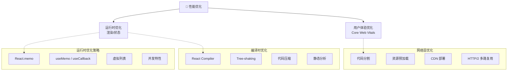
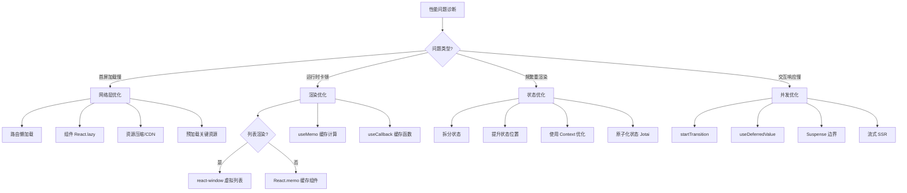
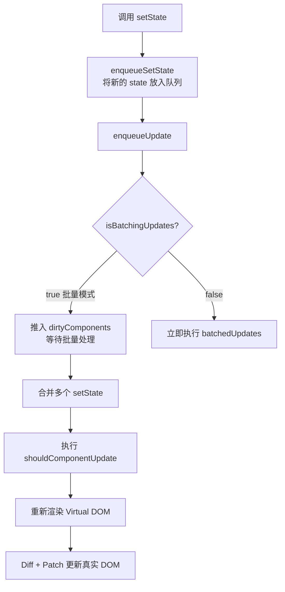
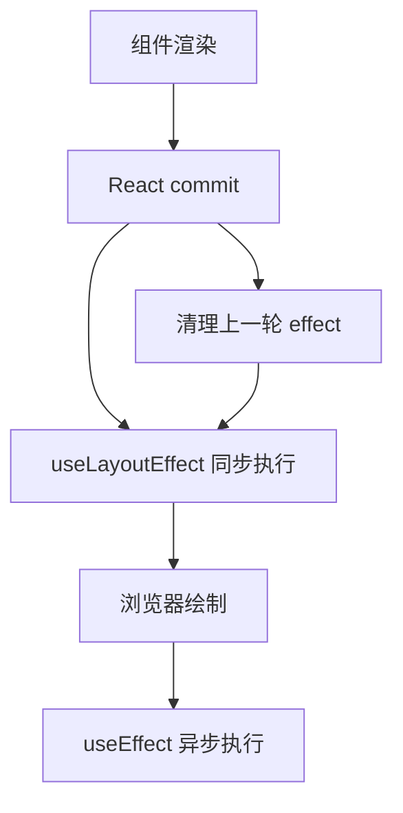

# 第四部分：性能优化

## 1️⃣ 性能优化完全指南

### 📊 优化策略金字塔



#### 性能优化决策树



### 🎯 渲染优化技巧

```typescript
// ❌ 问题 1：列表没有正确的 key
{items.map((item, index) => <li key={index}>{item.name}</li>)} // ❌

// ✅ 解决
{items.map((item) => <li key={item.id}>{item.name}</li>)} // ✅

// ❌ 问题 2：不必要的重新渲染
function Parent() {
  const [count, setCount] = useState(0);
  return <ExpensiveChild onUpdate={() => {}} />; // ❌ 每次创建新函数
}

// ✅ 解决方案：React.memo + useCallback
const MemoChild = React.memo(ExpensiveChild);
function Parent() {
  const handleUpdate = useCallback(() => {}, []);
  return <MemoChild data="data" onUpdate={handleUpdate} />;
}

// ❌ 问题 3：在渲染时创建新对象
function Parent() {
  const style = { color: 'red' }; // ❌ 每次都创建新对象
  return <Child style={style} />;
}

// ✅ 解决：提取到常量
const CONST_STYLE = { color: 'red' };
```

### 🚀 代码分割与懒加载

```typescript
// React.lazy + Suspense
const HeavyComponent = lazy(() => import('./HeavyComponent'));

function App() {
  return (
    <Suspense fallback={<LoadingSpinner />}>
      <HeavyComponent />
    </Suspense>
  );
}

// 路由级别代码分割
const Admin = lazy(() => import('./pages/Admin'));
const routeConfig = [
  { path: '/admin', element: <Admin /> }
];
```

### 🎯 React.memo 最佳实践

```typescript
const ExpensiveList = React.memo(function ExpensiveList({ items, onItemClick }) {
  return items.map(item => (
    <div key={item.id} onClick={() => onItemClick(item.id)}>{item.name}</div>
  ));
});
```

**useMemo / useCallback 合理使用：**

```typescript
// ✅ 需要：计算开销大
const sortedList = useMemo(() => items.sort((a, b) => a.name.localeCompare(b.name)), [items]);

// ✅ 需要：作为依赖传递给 useEffect/React.memo
const handleClick = useCallback((id) => dispatch({ type: 'SELECT', payload: id }), [dispatch]);

// ❌ 不需要：简单计算
const fullName = `${firstName} ${lastName}`;
```

### 📋 虚拟列表

```typescript
import { FixedSizeList } from 'react-window';

function VirtualList({ items }) {
  const Row = ({ index, style }) => <div style={style}>{items[index].name}</div>;

  return (
    <FixedSizeList height={400} itemCount={items.length} itemSize={50} width={300}>
      {Row}
    </FixedSizeList>
  );
}
```

### 🔄 setState 流程（批量更新机制）



**setState 是同步还是异步？**

| 场景 | 是否批量 | 行为 |
|------|---------|------|
| React 生命周期 | ✅ 批量 | 异步合并 |
| 合成事件处理器 | ✅ 批量 | 异步合并 |
| 原生事件 | ❌ 非批量 | 同步更新 |
| setTimeout / Promise | ❌ 非批量（React 18 前） | 同步更新 |

> React 18 中，Promise、setTimeout、原生事件中也能自动批处理。

```typescript
// React 18 中以下代码只触发一次渲染（自动批处理）
setTimeout(() => {
  setCount(c => c + 1);
  setFlag(f => !f);
}, 1000);
```

---

## 2️⃣ React 18 并发特性

### ⚡ startTransition - 非紧急更新

```typescript
function SearchUsers() {
  const [searchTerm, setSearchTerm] = useState('');
  const [results, setResults] = useState<User[]>([]);
  const [isPending, startTransition] = useTransition();

  const handleSearch = (value: string) => {
    setSearchTerm(value); // 紧急更新
    startTransition(() => { // 非紧急更新
      setResults(performExpensiveSearch(value));
    });
  };

  return (
    <>
      <input value={searchTerm} onChange={(e) => handleSearch(e.target.value)} />
      {isPending && <span>搜索中...</span>}
      <ul>{results.map(user => <li key={user.id}>{user.name}</li>)}</ul>
    </>
  );
}
```

### 🎯 useDeferredValue - 延迟值

```typescript
function List({ searchTerm }: { searchTerm: string }) {
  const deferredSearchTerm = useDeferredValue(searchTerm);

  const filteredItems = useMemo(() => {
    return items.filter(item => item.name.includes(deferredSearchTerm));
  }, [deferredSearchTerm]);

  return <ul>{filteredItems.map(item => <li key={item.id}>{item.name}</li>)}</ul>;
}
```

### 🎯 并发特性速览

| 特性 | 说明 |
|------|------|
| startTransition | 标记非紧急更新 |
| useDeferredValue | 延迟更新某个值 |
| Automatic Batching | Promise/setTimeout 中也能自动批处理 |
| Suspense SSR | 服务端流式渲染 + 选择性水合 |
| useId | SSR 场景下生成唯一 ID |
| useSyncExternalStore | 订阅外部存储，避免撕裂问题 |

### 🔄 自动批处理（Automatic Batching）

批处理：多个状态更新 → 合并为一次渲染 → 减少 DOM 开销、提升性能。

#### React 17 及更早

只在 React 合成事件（如 onClick）里自动批处理；在 setTimeout、Promise、原生事件里，每次 setState 都会触发一次渲染。

#### React 18 全场景自动批处理

```typescript
// 1. 同步事件（本来就批）：React 17/18 都只渲染 1 次
const handleClick = () => {
  setCount(c => c + 1);
  setFlag(f => !f);
};

// 2. 异步场景（关键升级）：React 17 渲染 2 次，React 18 自动批，只渲染 1 次
setTimeout(() => {
  setCount(c => c + 1);
  setFlag(f => !f);
}, 1000);

// 3. Promise / fetch：React 18 同样自动批
fetch("/api").then(() => {
  setLoading(false);
  setData({});
});

// 4. 原生事件监听：React 18 也会批处理
window.addEventListener("resize", () => {
  setW(window.innerWidth);
  setH(window.innerHeight);
});
```

#### 强制立即渲染（跳出批处理）

```typescript
import { flushSync } from "react-dom";

setTimeout(() => {
  flushSync(() => setCount(c => c + 1)); // 立即渲染
  setFlag(f => !f);                       // 这次仍会批
}, 1000);
```

#### 原理

React 18 新的并发渲染架构可以跨事件循环跟踪更新。同一"事件批次"内的所有 setState 会被收集，统一计算、一次提交。不阻塞主线程，可中断、可恢复。

#### 迁移要点

- 必须用 `createRoot`：旧的 `ReactDOM.render` 不会开启自动批处理
- 行为更一致：不用再记"哪里会批、哪里不会"
- 性能默认更好：异步代码渲染次数大幅减少
---

## 3️⃣ 图片和资源优化

```typescript
// 响应式图片
function ResponsiveImage() {
  return (
    
  );
}

// 延迟加载（Intersection Observer）
function LazyImage({ src, alt }: { src: string; alt: string }) {
  const imgRef = useRef<HTMLImageElement>(null);
  const [isLoaded, setIsLoaded] = useState(false);

  useEffect(() => {
    const observer = new IntersectionObserver(
      ([entry]) => {
        if (entry.isIntersecting) {
          const img = entry.target as HTMLImageElement;
          img.src = src;
          setIsLoaded(true);
          observer.unobserve(img);
        }
      },
      { rootMargin: '50px' }
    );
    if (imgRef.current) observer.observe(imgRef.current);
    return () => observer.disconnect();
  }, [src]);

  return ;
}
```

---


## 🤖 React in AI Era：AI 时代 React 的核心优势

> AI 时代并不消灭 React，反而让 React 的声明式 UI 和组件化思维变得更加重要。

### 为什么 AI 时代 React 更重要？

```
AI 生成代码的核心挑战：
  ├─ 如何保证生成代码的质量？
  ├─ 如何让生成代码可维护？
  └─ 如何让生成代码可预测？

React 的答案：
  ├─ 声明式 UI → 描述"要什么"，LLM 更容易理解和生成
  ├─ 纯函数组件 → 给定输入确定输出，AI 生成结果可测试
  ├─ 组件化 → 小单元生成，组合验证
  └─ TypeScript → AI 类型提示提升生成准确率
```

### AI 辅助 React 开发的核心场景

| 场景 | 工具/方式 | 效率提升 |
|------|----------|---------|
| **组件生成** | Copilot / Cursor 根据描述生成组件 | 3-5x |
| **测试生成** | AI 自动生成单元测试 + 边界用例 | 5-10x |
| **样式编写** | Tailwind CSS + AI 提示 | 2-3x |
| **代码迁移** | Class → Hooks / Vue → React | 10x+ |
| **Bug 修复** | AI 分析错误栈 + 定位修复 | 3-5x |
| **性能分析** | AI 识别重渲染 + 建议优化 | 2x |
| **文档生成** | 组件 props 自动生成文档 | 5x |

### React for AI：构建 AI 应用的最佳前端选择

```tsx
// AI Chat Stream 组件（React 天然适合流式 UI）
function AIChat() {
  const [messages, setMessages] = useState<Message[]>([]);
  const [isStreaming, setIsStreaming] = useState(false);

  async function sendMessage(text: string) {
    setIsStreaming(true);
    const response = await fetch('/api/chat', {
      method: 'POST',
      body: JSON.stringify({ message: text }),
    });

    const reader = response.body!.getReader();
    const decoder = new TextDecoder();

    // 流式读取，React 的声明式更新完美适配
    while (true) {
      const { done, value } = await reader.read();
      if (done) break;
      const chunk = decoder.decode(value);
      setMessages(prev => {
        const last = prev[prev.length - 1];
        return last?.role === 'assistant'
          ? [...prev.slice(0, -1), { ...last, content: last.content + chunk }]
          : [...prev, { role: 'assistant', content: chunk }];
      });
    }
    setIsStreaming(false);
  }

  return (
    <div>
      {messages.map((msg, i) => (
        <MessageBubble key={i} message={msg} />
      ))}
      {isStreaming && <TypingIndicator />}
    </div>
  );
}
```

### React Server Components 在 AI 时代的价值

```tsx
// Server Component：在服务器端调用 AI API，不暴露 API Key
// app/ai-insights/page.tsx
export default async function AIInsightsPage() {
  const insights = await callLLMApi('分析用户行为数据，给出建议');
  // 数据在服务器端渲染完成，直接返回 HTML
  return <InsightsView data={insights} />;
}

// Client Component：交互式 AI 对话
// app/ai-chat/page.tsx
'use client';
export default function AIChat() {
  // 客户端处理流式响应、用户交互
  return <ChatUI />;
}
```

**RSC 在 AI 时代的核心价值：**
1. **API Key 安全**：服务器端调用 AI API，不暴露密钥
2. **减少客户端 JS**：AI 处理结果在服务端渲染，客户端只需展示
3. **流式 SSR**：AI 生成内容可以边生成边推送
4. **资源优化**：大模型推理在服务端，客户端零负担

### 总结：React in AI Era 的不可替代性

```
React 的核心优势在 AI 时代被放大：
  ├─ 声明式 UI → LLM 更容易理解和生成
  ├─ 组件化 → AI 生成的小单元可组合验证
  ├─ Server Components → 安全的 AI API 调用
  ├─ Streaming SSR → AI 流式输出原生支持
  ├─ 庞大的生态系统 → AI 工具链最完善
  └─ TypeScript 深度集成 → AI 类型感知，准确率提升 30%+
```

---

## 最佳实践总结

### 🎯 React 开发黄金法则

```
1️⃣ 优先使用函数组件和 Hooks
   → 更简洁、更易测试、更好的代码复用

2️⃣ 合理拆分组件
   → 单一职责、易于维护和测试

3️⃣ 使用 TypeScript
   → 类型安全、IDE 智能提示、减少运行时错误

4️⃣ 为列表提供稳定的 key
   → 避免在 map 中使用索引

5️⃣ 避免在渲染时创建新对象
   → 提取到常量或使用 useMemo

6️⃣ 及时清理副作用
   → 在 useEffect 中返回清理函数

7️⃣ 使用受控组件处理表单
   → 更易验证、变换、条件提交

8️⃣ 分离关注点
   → 逻辑与 UI 分离，使用自定义 Hooks

9️⃣ 使用 React.memo 优化纯展示组件
   → 避免不必要的重渲染

🔟 充分利用 React DevTools
   → 分析性能瓶颈、调试组件状态
```

---

## 🛡️ ErrorBoundary 错误边界详解

> 💡 **要点**：ErrorBoundary 是 React 提供的错误捕获机制，可以防止组件崩溃导致整个页面白屏。

### 捕获范围

| 能捕获 | 不能捕获 |
|--------|---------|
| 渲染期间子组件抛出的错误 | 事件处理中的错误 |
| 生命周期方法中的错误 | 异步代码中的错误（setTimeout/requestAnimationFrame） |
| 构造函数中的错误 | 服务端渲染错误 |
| 类组件中的错误 | ErrorBoundary 自身抛出的错误 |

### 完整实现

```typescript
import { Component, ErrorInfo, ReactNode } from 'react';

interface ErrorBoundaryProps {
  children: ReactNode;
  fallback?: ReactNode;
  onError?: (error: Error, errorInfo: ErrorInfo) => void;
}

interface ErrorBoundaryState {
  hasError: boolean;
  error: Error | null;
}

class ErrorBoundary extends Component<ErrorBoundaryProps, ErrorBoundaryState> {
  constructor(props: ErrorBoundaryProps) {
    super(props);
    this.state = { hasError: false, error: null };
  }

  static getDerivedStateFromError(error: Error): ErrorBoundaryState {
    return { hasError: true, error };
  }

  componentDidCatch(error: Error, errorInfo: ErrorInfo) {
    // 将错误上报到监控系统
    this.props.onError?.(error, errorInfo);
    // 可以在此处记录日志、上报 Sentry 等
    console.error('Error caught by boundary:', error, errorInfo);
  }

  render() {
    if (this.state.hasError) {
      return this.props.fallback || (
        <div role="alert">
          <h2>页面出现异常</h2>
          <p>{this.state.error?.message}</p>
          <button onClick={() => this.setState({ hasError: false, error: null })}>
            重试
          </button>
        </div>
      );
    }
    return this.props.children;
  }
}

// 使用
<ErrorBoundary fallback={<ErrorUI />} onError={(e) => reportError(e)}>
  <MyComponent />
</ErrorBoundary>
```

---

## 🔄 useEffect 生命周期与执行顺序

### useEffect vs useLayoutEffect

| 特性 | useEffect | useLayoutEffect |
|------|-----------|----------------|
| **执行时机** | 浏览器绘制**之后**（异步） | 浏览器绘制**之前**（同步） |
| **阻塞绘制** | 否 | 是 |
| **触发时机** | commit 后异步调度 | commit 后同步执行 |
| **适用场景** | 数据获取、事件绑定、日志 | DOM 测量、同步更新布局 |
| **SSR 警告** | 无 | 在 SSR 中会警告 |

### 执行顺序



```typescript
function Parent() {
  useEffect(() => {
    console.log('1: Parent useEffect');
    return () => console.log('1-1: Parent cleanup');
  });
  useLayoutEffect(() => {
    console.log('0: Parent useLayoutEffect');
    return () => console.log('0-1: Parent layout cleanup');
  });
  return <Child />;
}

function Child() {
  useEffect(() => {
    console.log('3: Child useEffect');
    return () => console.log('3-1: Child cleanup');
  });
  useLayoutEffect(() => {
    console.log('2: Child useLayoutEffect');
    return () => console.log('2-1: Child layout cleanup');
  });
  return <div>Child</div>;
}

// 首次渲染输出顺序:
// 0: Parent useLayoutEffect → 2: Child useLayoutEffect
// → (浏览器绘制)
// → 1: Parent useEffect → 3: Child useEffect
//
// 卸载时清理顺序:
// 3-1: Child cleanup → 1-1: Parent cleanup
// 0-1: Parent layout cleanup → 2-1: Child layout cleanup
```

---

## 📦 React 不可变数据

> 💡 **要点**：React 通过引用比较判断状态是否变化，直接修改对象/数组不会触发重新渲染。

```typescript
// ❌ 错误：直接修改状态
const [user, setUser] = useState({ name: 'Alice', age: 25 });
user.age = 26;      // 直接修改原对象
setUser(user);      // 引用不变，React 不会重新渲染

// ✅ 正确：创建新对象
setUser({ ...user, age: 26 });

// ✅ 函数式更新（依赖前一次状态时）
setUser(prev => ({ ...prev, age: prev.age + 1 }));
```

### 数组不可变更新

| 操作 | 变异方法（❌） | 不可变方法（✅） |
|------|-------------|----------------|
| **添加** | `arr.push(item)` | `[...arr, item]` |
| **删除** | `arr.splice(i, 1)` | `arr.filter((_, idx) => idx !== i)` |
| **替换** | `arr[i] = newVal` | `arr.map((v, idx) => idx === i ? newVal : v)` |
| **排序** | `arr.sort()` | `[...arr].sort()` |
| **反转** | `arr.reverse()` | `[...arr].reverse()` |

### 深层嵌套更新

```typescript
const [state, setState] = useState({
  user: {
    profile: {
      address: { city: 'Beijing', street: 'Main St' }
    }
  }
});

// 更新深层属性
setState(prev => ({
  ...prev,
  user: {
    ...prev.user,
    profile: {
      ...prev.user.profile,
      address: {
        ...prev.user.profile.address,
        city: 'Shanghai'
      }
    }
  }
}));

// 简化方案：使用 Immer
import { produce } from 'immer';

setState(produce(draft => {
  draft.user.profile.address.city = 'Shanghai';
}));
```

### 不可变数据的好处

1. **简化调试**：状态变更可追踪，每次修改产生新引用
2. **性能优化**：`React.memo` / `useMemo` 通过引用比较快速判断变化
3. **时间旅行**：Redux DevTools 可以回溯到任何历史状态
4. **可预测性**：纯函数保证相同输入 → 相同输出


---

