## 🔬 React 面试重难点深度解析

> 以下内容针对技术面试中的高频难点，涵盖底层原理、易错陷阱和高频追问点。

---

## 🧬 虚拟 DOM 原理深度讲解

### 虚拟 DOM 的本质

虚拟 DOM 本质上就是一个**普通的 JavaScript 对象树**，是真实 DOM 的轻量级抽象表示。

```typescript
// 虚拟 DOM 节点（React Element）的核心数据结构
interface ReactElement {
  $$typeof: Symbol;          // 标记为 React 元素（防 XSS）
  type: string | Function;   // 'div' / 'span' / 组件函数
  key: string | null;        // Diff 优化标识
  ref: Ref | null;           // DOM 引用
  props: {
    children?: ReactElement | ReactElement[];
    [propName: string]: any;
  };
  _owner: Fiber | null;      // 创建该元素的 Fiber 节点
}
```

```typescript
// 一个 JSX 表达式编译后的虚拟 DOM
// <div className="container"><h1>Hello</h1></div>

// JSX 编译后（React 17 及以前）：
React.createElement(
  'div',
  { className: 'container' },
  React.createElement('h1', null, 'Hello')
)

// JSX 编译后（React 17+ 新 JSX 转换，自动导入 jsx）：
import { jsx as _jsx, jsxs as _jsxs } from 'react/jsx-runtime';
_jsxs('div', { className: 'container', children: [
  _jsx('h1', { children: 'Hello' })
]})

// 生成的虚拟 DOM 对象：
{
  $$typeof: Symbol.for('react.element'),
  type: 'div',
  key: null,
  ref: null,
  props: {
    className: 'container',
    children: [{
      $$typeof: Symbol.for('react.element'),
      type: 'h1',
      key: null,
      ref: null,
      props: { children: 'Hello' },
    }]
  }
}
```

**与真实 DOM 的关键区别：**

| 维度 | 真实 DOM | 虚拟 DOM |
|------|---------|----------|
| **数据结构** | 浏览器 C++ 对象，属性极多（>200 个） | 普通 JS 对象，仅 5-6 个属性 |
| **创建开销** | 高（需解析 HTML/CSS，构建渲染树） | 极低（new Object） |
| **修改开销** | 触发重排/重绘、样式计算、合成 | 无（纯 JS 对象比较） |
| **读写速度** | 慢（跨引擎边界） | 快（全 JS 堆内存） |
| **内存占用** | 大 | 小（仅保留渲染所需字段） |

---

###  JSX 到虚拟 DOM 的编译链路

JSX 不是模板引擎，而是**语法糖**，编译后直接变成 `React.createElement()` 调用。

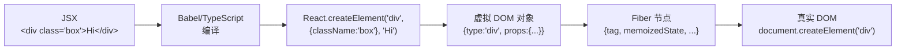

**编译产出对比（React 17 vs 19）：**

```typescript
// JSX 源码
function Greeting({ name }: { name: string }) {
  return <div className="greeting">Hello, {name}</div>;
}

// React 17 编译结果（需要 React 在作用域内）
import React from 'react';
function Greeting({ name }) {
  return React.createElement('div', { className: 'greeting' }, 'Hello, ', name);
}

// React 17+ / 19 编译结果（自动导入，无需手动 import React）
import { jsx as _jsx } from 'react/jsx-runtime';
function Greeting({ name }) {
  return _jsx('div', { className: 'greeting', children: ['Hello, ', name] });
}
```

**为什么改用了 `jsx()` 函数？** 新函数做了两点优化：
1. **自动导入**：无需每个文件手动 `import React`，Tree Shaking 友好
2. **简化参数**：`jsx()` 比 `createElement()` 少了 `key`/`ref` 等参数处理，减少编译体积

---

### 虚拟 DOM 的全生命周期

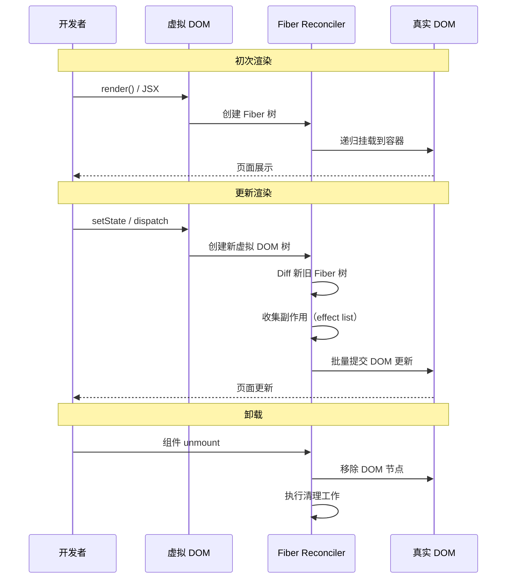

**三个阶段详细说明：**

| 阶段 | 名称 | 做什么 | 是否可中断 | 产生什么 |
|------|------|--------|-----------|---------|
| **Render** | 协调（Reconciliation） | 创建虚拟 DOM，Diff 比较，标记变更 | ✅ 可中断（Fiber 时间切片） | Fiber 树的副作⽤标记 |
| **Commit** | 提交 | 根据副作⽤标记操作真实 DOM | ❌ 不可中断（同步执行） | DOM 变更 |
| **Cleanup** | 清理 | 执⾏ useEffect 清理函数 | ❌ 同步 | 副作⽤清理 |

---

### 虚拟 DOM 为什么能提升性能

**❌ 常见误解："虚拟 DOM 比真实 DOM 快"**

虚拟 DOM **不一定比直接操作 DOM 快**。它的核⼼价值是：
- 提供**声明式编程模型**（描述 UI 状态，而非操作步骤）
- 在**没有手动优化**的情况下性能不太差（性能保底）
- **批量处理** DOM 变更，减少重排/重绘次数

```typescript
// 场景：连续修改 100 次列表
for (let i = 0; i < 100; i++) {
  list.appendChild(newItem);  // 直接操作 DOM → 100 次重排
}

// React 虚拟 DOM 的做法：
// 1. 100 次 setState 合并为一次更新
// 2. Diff 计算出最小变更集
// 3. 一次批量更新 DOM → 1 次重排
```

**性能对比的真实情况：**

| 场景 | 直接 DOM 操作 | 虚拟 DOM |
|------|-------------|---------|
| 单次简单更新（改文本） | ✅ 最快 | ❌ 有额外比较开销 |
| 复杂树结构差异更新 | ❌ 难优化 | ✅ Diff 自动计算最小变更 |
| 频繁批量更新 | ❌ 多次重排 | ✅ 批量合并，一次重排 |
| 跨平台渲染 | ❌ 仅浏览器 | ✅ 可输出到 Native/Canvas/PDF |

**真实性能瓶颈在哪？** 虚拟 DOM 的**比较（Diff）本身也有开销**。这就是 React Compiler（React Forget）的⽬标——跳过不必要的比较，直接在编译时优化。

---

### 虚拟 DOM 到 Fiber 的映射

React 16+ 中，虚拟 DOM 并不直接参与 Diff，而是先转换成 **Fiber 节点**，再在 Fiber 树上进行 Diff：

```typescript
// 虚拟 DOM 与 Fiber 节点的映射关系
interface Fiber {
  tag: WorkTag;              // 节点类型（FunctionComponent = 0, HostComponent = 5, ...）
  type: string | Function;   // 与虚拟 DOM 的 type 一致
  key: string | null;        // 与虚拟 DOM 的 key 一致
  pendingProps: any;         // 新的 props（来自虚拟 DOM）
  memoizedProps: any;        // 旧的 props
  memoizedState: any;        // 组件状态（Hook 链表头）

  // Fiber 树结构（单向链表）
  return: Fiber | null;      // 父节点
  child: Fiber | null;       // 第一个子节点
  sibling: Fiber | null;     // 下一个兄弟节点

  // 副作⽤标记
  flags: Flags;              // Placement / Update / Deletion / Passive
  subtreeFlags: Flags;       // 子树副作⽤标记（React 18 优化）
  deletions: Fiber[] | null; // 待删除的子节点

  // 双缓冲
  alternate: Fiber | null;   // current ↔ workInProgress 互指
}
```

**虚拟 DOM → Fiber 的转换流程：**

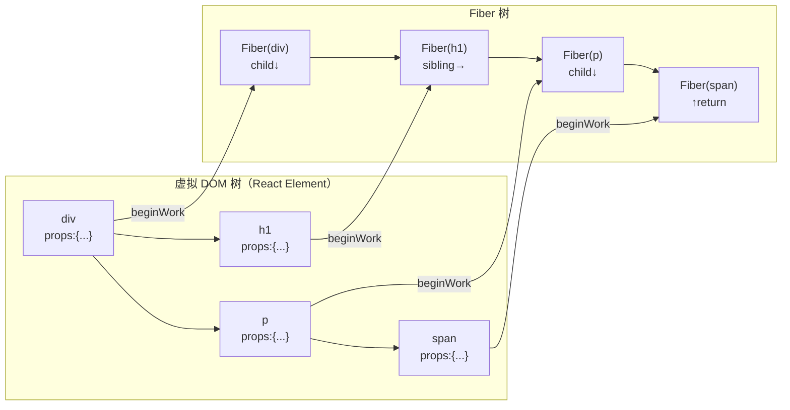

**为什么需要 Fiber 这一层？** 虚拟 DOM 树是普通树结构（只能用递归遍历），Fiber 将其转为**链表结构**（可用循环遍历），使得遍历过程可中断/恢复——这是并发模式的基础。

---

#### 6. 批量更新机制

React 不会每次 setState 都立即更新，而是批量收集后一次提交：

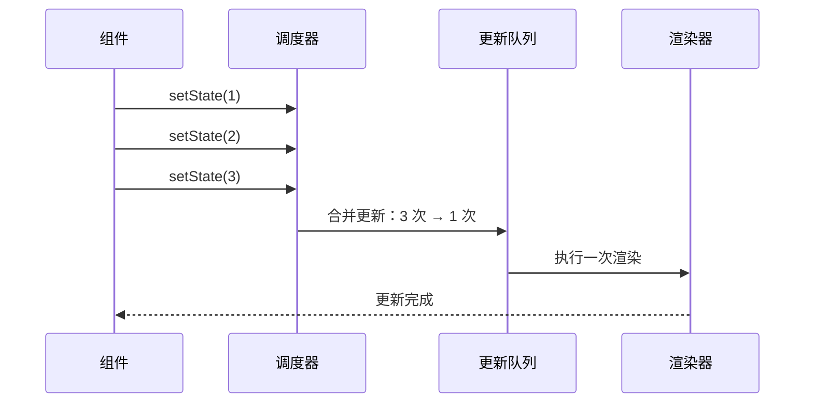

```typescript
// React 18+ 自动批量更新
function handleClick() {
  setCount(c => c + 1);   // 不会立即渲染
  setFlag(f => !f);       // 不会立即渲染
  setText('hello');       // 不会立即渲染
  // 三次 setState 合并为一次渲染
}

// 如果需要"非批量"（React 18 需要 flushSync）
import { flushSync } from 'react-dom';
function handleClick() {
  flushSync(() => setCount(c => c + 1));  // 立即渲染
  flushSync(() => setFlag(f => !f));      // 第二次渲染
}
```

**批量更新的演进：**

| 版本 | 机制 | 范围 |
|------|------|------|
| **React 15** | 事务机制（Transaction） | 仅合成事件内 |
| **React 16-17** | 批量更新 + unstable_batchedUpdates | 合成事件 + 生命周期 |
| **React 18+** | 自动批量更新（无需手动） | 所有场景（Promise、setTimeout 等） |

---

#### 7. key 的精准含义

key 不是"索引"，而是**稳定标识符**，帮 Diff 算法判断元素是"移动"还是"新建"：

```typescript
// ❌ 用索引作 key（列表顺序会变时）
{items.map((item, index) => <Item key={index} data={item} />)}

// ✅ 用唯一 ID 作 key
{items.map(item => <Item key={item.id} data={item} />)}
```

**key 不同导致的 Diff 行为差异：**

```mermaid
flowchart TD
    subgraph NoKey["无 key / 索引作 key"]
        A["旧: [A, B, C]<br/>新: [C, A, B]"]
        A --> A1["比较索引0: A≠C → 销毁 A 创建 C"]
        A1 --> A2["比较索引1: B≠A → 销毁 B 创建 A"]
        A2 --> A3["比较索引2: C≠B → 销毁 C 创建 B"]
        A3 --> A4["结果: 3 次销毁 + 3 次创建"]
    end

    subgraph WithKey["有 key（正确做法）"]
        B["旧: {a→A, b→B, c→C}<br/>新: {c→C, a→A, b→B}"]
        B --> B1["key=c: C 复用，位置从 3→1"]
        B1 --> B2["key=a: A 复用，位置从 1→2"]
        B2 --> B3["key=b: B 复用，位置从 2→3"]
        B3 --> B4["结果: 0 次销毁/创建，3 次移动"]
    end
```

**没有 key 时的表现：** 新旧列表按索引逐个比较，索引 0 → 索引 0，索引 1 → 索引 1。一旦结构变化（头部插入或排序），所有元素都匹配不上，触发全量重建。

---

#### 8. 虚拟 DOM 的演进与 React 19

| 版本 | 虚拟 DOM 的角色 | 关键技术 |
|------|----------------|---------|
| **React 15** | Stack 递归遍历虚拟 DOM 树，同步、不可中断 | `createElement` + `diff` + `patch` |
| **React 16+** | 虚拟 DOM 作为 Fiber 的"输入"，Diff 在 Fiber 树上执⾏ | Fiber 链表 + 双缓冲 + 时间切片 |
| **React 18** | 并发渲染下虚拟 DOM 可多次创建（丢弃低优先级） | Lane 优先级 + Suspense |
| **React 19** | React Compiler 在编译时跳过虚拟 DOM 的比较 | 编译时优化 + useMemo 自动注入 |

**React Compiler 对虚拟 DOM 的影响：** Compiler 不再是"每次渲染都创建新虚拟 DOM → Diff"，而是**在编译时分析组件依赖**，跳过未变化组件的重新渲染，直接从源头减少虚拟 DOM 创建次数。但虚拟 DOM 作为**核心抽象层**仍然存在（处理跨平台、手写优化等场景）。

---

---

## 📌 Portals（createPortal）深度解析

### 基本概念

`createPortal` 允许你将组件渲染到**父组件 DOM 树之外**的 DOM 节点中，但组件的**React 树层级关系不变**（事件冒泡、Context 仍按 React 树传递）。

```jsx
import { createPortal } from 'react-dom';

function Modal({ children, onClose }) {
  return createPortal(
    <div className="modal-overlay" onClick={onClose}>
      <div className="modal-content" onClick={e => e.stopPropagation()}>
        {children}
        <button onClick={onClose}>关闭</button>
      </div>
    </div>,
    document.body  // 挂载到 body 上
  );
}
```

### 典型使用场景

```jsx
// 场景 1：Modal 弹窗（脱离父容器 overflow:hidden 的限制）
function App() {
  const [show, setShow] = useState(false);
  return (
    <div style={{ overflow: 'hidden' }}>
      <button onClick={() => setShow(true)}>打开弹窗</button>
      {show && (
        <Modal onClose={() => setShow(false)}>
          <p>弹窗内容</p>
        </Modal>
      )}
    </div>
  );
}

// 场景 2：Tooltip / Dropdown（避免被父容器裁剪）
function Tooltip({ children, text }) {
  const [position, setPosition] = useState({ top: 0, left: 0 });
  return (
    <>
      <span
        onMouseEnter={(e) => setPosition({ top: e.clientY + 10, left: e.clientX })}
        onMouseLeave={() => setPosition({ top: 0, left: 0 })}
      >
        {children}
      </span>
      {position.top !== 0 && createPortal(
        <div style={{ position: 'fixed', top: position.top, left: position.left }}>
          {text}
        </div>,
        document.body
      )}
    </>
  );
}

// 场景 3：Loading 覆盖层（全局遮罩）
function LoadingOverlay() {
  return createPortal(
    <div className="loading-mask">
      <Spinner />
    </div>,
    document.getElementById('loading-root')
  );
}
```

### ⚠️ 事件冒泡穿透问题（面试高频追问）

```jsx
function Parent() {
  const handleClick = () => console.log('Parent clicked');

  return (
    <div onClick={handleClick}>
      <button>按钮</button>
      {createPortal(
        <button onClick={() => console.log('Portal clicked')}>Portal 按钮</button>,
        document.body
      )}
    </div>
  );
}
// 点击 Portal 按钮 → 控制台输出：
// "Portal clicked" ✅
// "Parent clicked" ✅ 事件沿 React 树冒泡到 Parent
```

**关键规则：**

| 行为 | 说明 |
|------|------|
| 事件冒泡 | Portal 内的事件**沿 React 树冒泡**，不是 DOM 树 |
| Context 传递 | Portal 组件**可以访问**父组件的 Context |
| DOM 层级 | Portal 挂载到指定 DOM 节点，脱离父组件 DOM 树 |
| 阻止冒泡 | `e.stopPropagation()` 只阻止 React 树冒泡，不阻止 DOM 树冒泡 |

```jsx
// 阻止冒泡的正确方式
function Modal({ onClose }) {
  return createPortal(
    <div
      className="modal-overlay"
      onClick={(e) => {
        e.stopPropagation();  // 阻止 React 树冒泡到父组件
        onClose();
      }}
    >
      <div className="modal-content" onClick={e => e.stopPropagation()}>
        内容
      </div>
    </div>,
    document.body
  );
}
```

### createPortal vs ReactDOM.render

| 维度 | createPortal | ReactDOM.render（已废弃） |
|------|-------------|------------------------|
| React 树关系 | 保持父子关系 | 创建新的 React 树 |
| 事件冒泡 | 沿 React 树冒泡 | 独立事件系统 |
| Context | 共享父组件 Context | 独立 Context 树 |
| 卸载 | 随父组件卸载 | 需手动卸载 |

---

## 🏗️ Fiber 架构深度解析

### Lane 优先级模型

React 18 引入 **Lane** 模型替代之前的 `ExpirationTime`，提供更精细的优先级控制。

```typescript
// 简化的 Lane 定义（源码 lanes.js）
type Lane = number;
type Lanes = number;

// 优先级从高到低
const SyncLane           = 0b0000000000000000000000000000001;  // 同步（紧急更新）
const InputContinuousLane = 0b0000000000000000000000000000100; // 连续输入（拖拽）
const DefaultLane        = 0b0000000000000000000000000010000;  // 默认（普通更新）
const TransitionLane1    = 0b0000000000000000000000001000000;  // 过渡（startTransition）
const IdleLane           = 0b0100000000000000000000000000000;  // 空闲
```

**Lane 的位运算优势：**
```typescript
// 1. 快速判断是否包含某个 Lane
const includes = (lanes: Lanes, lane: Lane) => (lanes & lane) !== 0;

// 2. 快速合并 Lane
const mergeLanes = (a: Lanes, b: Lanes) => a | b;

// 3. 快速移除 Lane
const removeLane = (lanes: Lanes, lane: Lane) => lanes & ~lane;
```

**不同更新来源对应的 Lane：**

| 更新来源 | Lane | 优先级 |
|---------|------|--------|
| `flushSync` / `ReactDOM.flushSync` | SyncLane | 最高 |
| 用户输入（click/keydown） | InputContinuousLane | 高 |
| `useState` 普通更新 | DefaultLane | 中 |
| `startTransition` | TransitionLane | 低 |
| `requestIdleCallback` 回调 | IdleLane | 最低 |

### Scheduler 调度器原理

React 的 Scheduler 是一个**独立于 React 的通用任务调度库**，核心机制是 **MessageChannel + 时间切片**。

```typescript
// Scheduler 核心逻辑（简化）
let scheduledHostCallback = null;
let channel = new MessageChannel();
let port = channel.port2;

channel.port1.onmessage = performWorkUntilDeadline;

function performWorkUntilDeadline() {
  if (scheduledHostCallback) {
    const hasMoreWork = scheduledHostCallback();
    if (hasMoreWork) {
      port.postMessage(null);  // 有更多工作，继续调度
    }
  }
}

// 时间切片：每个切片最多 5ms
function requestHostCallback(callback) {
  scheduledHostCallback = callback;
  port.postMessage(null);  // 在下一个宏任务中执行
}

// shouldYieldToHost：判断是否需要让出主线程
function shouldYieldToHost() {
  const timeElapsed = performance.now() - startTime;
  return timeElapsed > 5;  // 超过 5ms 就让出
}
```

**为什么用 MessageChannel 而不是 requestIdleCallback？**
- `requestIdleCallback` 在高频事件中可能被浏览器节流
- `requestIdleCallback` 的回调时机不可控（浏览器空闲时才调用）
- `MessageChannel` 保证在宏任务中执行，时机更可预测

### 双缓冲机制（Double Buffering）

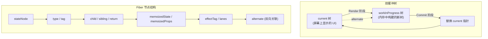

**双缓冲的作用：**
- `current` 树：当前屏幕显示的 UI，**始终完整可读**
- `workInProgress` 树：在内存中构建，构建过程中可以**安全中断**
- Commit 阶段一次性替换：`current = workInProgress`，用户无感知

### Fiber 节点关键字段

```typescript
interface Fiber {
  // 身份信息
  tag: WorkTag;           // 函数组件/类组件/HostComponent 等
  key: string | null;     // 用于 diff 的 key
  type: any;              // 函数/类/原生标签名
  stateNode: any;         // 对应的真实 DOM 节点

  // 树结构
  return: Fiber | null;   // 父 Fiber
  child: Fiber | null;    // 第一个子 Fiber
  sibling: Fiber | null;  // 右边兄弟 Fiber

  // 状态
  memoizedProps: any;     // 上次渲染的 props
  memoizedState: any;     // 上次渲染的 state（Hook 链表头）
  pendingProps: any;      // 新 props
  updateQueue: any;       // 更新队列

  // 副作用
  effectTag: EffectTag;   // Placement / Update / Deletion
  firstEffect: Fiber | null;  // 第一个有副作用的子 Fiber
  lastEffect: Fiber | null;   // 最后一个有副作用的子 Fiber

  // 调度
  lanes: Lanes;           // 优先级
  childLanes: Lanes;      // 子树的优先级

  // 双缓冲
  alternate: Fiber | null; // 对应的 current/workInProgress 节点
}
```

> 🔗 **链式思考**：React Fiber 的核心设计是"可中断渲染"，通过链表结构 + 优先级调度实现。这解决了 React 的"运行时不知道什么变了"的固有问题——既然需要全量 Diff，那至少让 Diff 可以被中断。Vue 3 不需要 Fiber，因为 Proxy 精确知道什么变了，Diff 范围极小，通常 1ms 内完成。Angular 21 的 Zoneless + Signals 同样不需要全量检测——Signal 变化只会更新依赖它的视图。三种架构本质是"精确追踪 vs 全量 Diff + 可中断"的不同选择。详见 [框架对比](../框架对比/) 的"响应式原理深度对比"。

### ⚠️ 面试高频追问

**Q: Fiber 为什么选择链表而不是树？**
> 链表可以随时暂停/恢复遍历（只需保存当前节点指针），而递归树需要栈帧，无法中断。

**Q: SyncLane 和 DefaultLane 的区别？**
> SyncLane 用于 `flushSync` 和事件处理，是同步不可中断的；DefaultLane 用于普通 `setState`，可以被高优先级任务打断。

**Q: 为什么 Scheduler 用 5ms 作为时间切片？**
> 5ms 是经验值，既能让 React 有足够时间处理工作单元，又不会阻塞浏览器的 16ms 帧预算（60fps）。

---
> 🎯 **面试星级**：★★★★★ | 本章深入 React 源码，适合中高级面试

## 🏗️ Fiber 架构源码分析

### 🔄 Fiber 节点结构

```typescript
// packages/react-reconciler/src/ReactFiber.ts
interface Fiber {
  // 1. 节点类型
  tag: WorkTag;           // 组件类型（FunctionComponent、ClassComponent 等）
  type: any;              // 组件函数/类
  key: string | null;     // key 属性

  // 2. 树结构
  return: Fiber | null;   // 父节点
  child: Fiber | null;    // 第一个子节点
  sibling: Fiber | null;  // 下一个兄弟节点
  index: number;          // 子节点索引

  // 3. 状态
  pendingProps: any;       // 新 props
  memoizedProps: any;      // 上次渲染的 props
  memoizedState: any;      // 上次渲染的 state
  updateQueue: UpdateQueue | null;  // 更新队列

  // 4. 副作用
  flags: Flags;           // 副作用标记（Placement、Update、Deletion）
  subtreeFlags: Flags;    // 子树的副作用标记
  deletions: Fiber[] | null;  // 需要删除的子节点

  // 5. 调度优先级
  lanes: Lanes;           // 优先级 lanes
  childLanes: Lanes;      // 子节点优先级

  // 6. 替换（双缓冲）
  alternate: Fiber | null;  // 替换 fiber（workInProgress ↔ current）
}
```

### 📍 Fiber 双缓冲机制

```typescript
// packages/react-reconciler/src/ReactFiber.ts
// 双缓冲：同时维护两棵 Fiber 树
// current: 屏幕上显示的树
// workInProgress: 正在内存中构建的树

function createWorkInProgress(current: Fiber, pendingProps: any): Fiber {
  let workInProgress = current.alternate;

  if (workInProgress === null) {
    // 首次渲染，创建新的 fiber
    workInProgress = createFiber(current.tag, pendingProps, current.key);
    workInProgress.type = current.type;
    workInProgress.stateNode = current.stateNode;
    workInProgress.alternate = current;
    current.alternate = workInProgress;
  } else {
    // 复用 alternate
    workInProgress.pendingProps = pendingProps;
    workInProgress.flags = NoFlags;
    workInProgress.subtreeFlags = NoFlags;
    workInProgress.deletions = null;
  }

  // 复制状态
  workInProgress.memoizedProps = current.memoizedProps;
  workInProgress.memoizedState = current.memoizedState;
  workInProgress.updateQueue = current.updateQueue;
  workInProgress.lanes = current.lanes;

  return workInProgress;
}

// 提交阶段：交换 current 和 workInProgress
function commitRoot(root: FiberRoot) {
  // 1. 执行所有副作用
  commitMutationEffects(root, finishedWork);

  // 2. 切换 current 指针
  root.current = finishedWork;

  // 3. 触发 useEffect
  commitPassiveMountEffects(root);
}
```

### 📍 Fiber 调度器（Scheduler）

```typescript
// packages/scheduler/src/forks/Scheduler.js
// 基于 MessageChannel 的微任务调度

let scheduleCallback = function(callback) {
  const channel = new MessageChannel();
  const port = channel.port2;

  channel.port1.onmessage = function() {
    callback();
  };

  port.postMessage(null);
};

// 优先级管理
const ImmediatePriority = 1;    // 立即执行
const UserBlockingPriority = 2; // 用户阻塞（如点击）
const NormalPriority = 3;       // 普通（如数据更新）
const LowPriority = 4;          // 低优先级（如分析）
const IdlePriority = 5;         // 空闲时执行

// 调度流程
function scheduleRootUpdate(root, update, lane) {
  // 1. 创建更新对象
  const update = createUpdate(lane);

  // 2. 加入更新队列
  enqueueUpdate(root.current, update);

  // 3. 调度渲染
  scheduleConcurrentWork(root, lane);
}

// 可中断渲染
function performConcurrentWorkOnRoot(root, lanes) {
  // 1. 检查是否有更高优先级的任务
  if (hasHigherPriorityWork(root)) {
    // 中断当前渲染
    return performConcurrentWorkOnRoot.bind(null, root, lanes);
  }

  // 2. 渲染组件
  renderRootSync(root, lanes);

  // 3. 提交更新
  commitRoot(root);
}
```
---

### 📍 workLoop 核心循环 —— Fiber 如何"边干边让"

Fiber 的核心是一个 `while` 循环，每次检查时间是否用完，用完了就让出主线程：

```typescript
// packages/react-reconciler/src/ReactFiberWorkLoop.ts

// 同步渲染：不可中断
function workLoopSync() {
  while (workInProgress !== null) {
    performUnitOfWork(workInProgress);
  }
}

// 并发渲染：时间切片可中断
function workLoopConcurrent() {
  while (workInProgress !== null && !shouldYield()) {
    performUnitOfWork(workInProgress);
  }
  // 如果 workInProgress !== null，说明被中断了
  // Scheduler 会在下一个宏任务中恢复
}

// 判断是否让出主线程（每 5ms 检查一次）
function shouldYield(): boolean {
  const timeElapsed = performance.now() - startTime;
  return timeElapsed > 5; // 5ms 时间片
}
```

**中断恢复流程：**

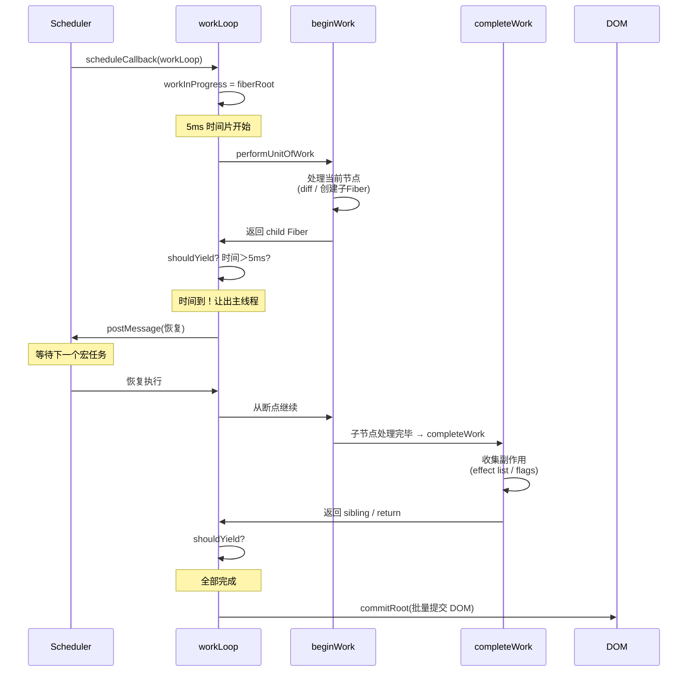

---

### 📍 beginWork / completeWork —— Fiber 的"递"与"归"

Fiber 遍历是**先序深度优先遍历**，分为两个阶段：

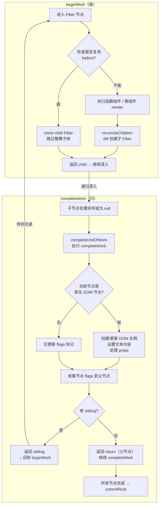

```typescript
// 核心遍历函数
function performUnitOfWork(unitOfWork: Fiber): void {
  const current = unitOfWork.alternate;
  let next: Fiber | null;

  // ① beginWork（递）：处理当前节点，返回子节点
  next = beginWork(current, unitOfWork, renderLanes);
  unitOfWork.memoizedProps = unitOfWork.pendingProps;

  if (next !== null) {
    // 有子节点 → 继续深入（深度优先）
    workInProgress = next;
  } else {
    // ② completeWork（归）：没有子节点，开始回溯
    completeUnitOfWork(unitOfWork);
  }
}

// 回溯函数
function completeUnitOfWork(unitOfWork: Fiber): void {
  let completedWork = unitOfWork;
  do {
    const current = completedWork.alternate;
    const returnFiber = completedWork.return;

    // ① 执行 completeWork：创建 DOM / 收集 flags
    next = completeWork(current, completedWork, renderLanes);

    // ② 收集子节点的 flags 到当前节点
    if (returnFiber !== null) {
      // flags 冒泡：子节点的变化向上传递
      returnFiber.flags |= completedWork.flags;
    }

    // ③ 转向兄弟节点
    if (completedWork.sibling !== null) {
      workInProgress = completedWork.sibling;
      return; // 回到 performUnitOfWork 的 beginWork
    }

    // ④ 没有兄弟 → 回到父节点继续 completeWork
    completedWork = returnFiber;
  } while (completedWork !== null); // 全部完成
}
```

**核心洞察：** `beginWork` 是"向下递"，负责创建子 Fiber（调用组件 render、执行 diff）；`completeWork` 是"向上归"，负责创建 DOM 实例、更新 props、将副作用冒泡到父节点。这个"递→归→递→归"的模式让遍历过程可以**在任意节点暂停**（只需记住当前 `workInProgress` 指针）。

---

### 📍 完整更新链路 —— 从 setState 到 DOM 变更

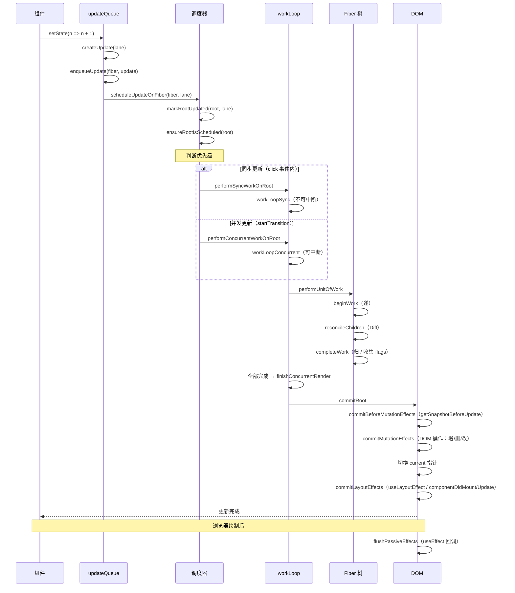

```typescript
// 更新入口 → 调度关键路径
function scheduleUpdateOnFiber(fiber: Fiber, lane: Lane): void {
  // 1. 找到 FiberRoot
  const root = markUpdateLaneFromFiberToRoot(fiber, lane);

  // 2. 标记 root 有更新
  markRootUpdated(root, lane);

  // 3. 确保 root 被调度
  ensureRootIsScheduled(root);
}

// 从任意 Fiber 回溯到 FiberRoot
function markUpdateLaneFromFiberToRoot(fiber: Fiber, lane: Lane): FiberRoot {
  let node = fiber;
  let parent = fiber.return;

  // 沿 return 链向上回溯到根
  while (parent !== null) {
    node = parent;
    parent = parent.return;
  }

  // node 现在是 RootFiber（最顶层 Fiber）
  // node.stateNode 就是 FiberRoot
  return node.stateNode;
}
```

---

### 📍 FiberRoot vs RootFiber —— 两棵"根"的区别

```typescript
// FiberRoot：容器级别（每个 ReactDOM.createRoot 一个）
interface FiberRoot {
  containerInfo: Element;         // 挂载的 DOM 容器（如 document.getElementById('root')）
  current: Fiber;                // 指向当前显示的 RootFiber
  finishedWork: Fiber | null;    // 构建完成的 workInProgress 树
  pendingLanes: Lanes;           // 待处理的优先级
  callbackNode: any;             // Scheduler 回调
  callbackPriority: Lane;        // 回调优先级
  expirationTimes: number[];     // 过期时间
}

// RootFiber：组件树的根 Fiber 节点
interface Fiber {
  tag: WorkTag;                  // HostRoot（值为 3）
  stateNode: FiberRoot;          // 反向指向 FiberRoot
  child: Fiber;                  // 真正的根组件（如 <App/>）
  // ... 其他 Fiber 字段
}
```

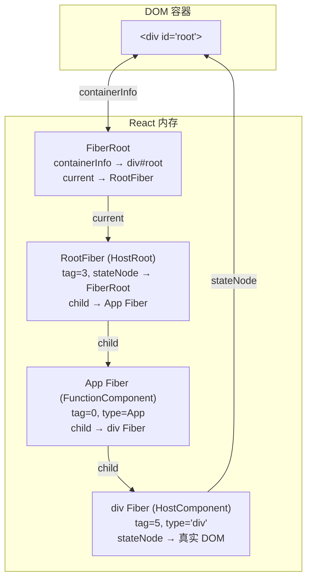

**关键区别：**

| 维度 | FiberRoot | RootFiber |
|------|----------|-----------|
| **数量** | 每个 `createRoot` 一个 | 每个 FiberRoot 一个（`current` 指向） |
| **角色** | 容器状态管理 | 组件树根节点 |
| **DOM 关联** | `containerInfo` 持有真实 DOM 容器 | 通过 `stateNode` 反向持有 FiberRoot |
| **更新** | 持有 `pendingLanes`、`finishedWork` | 作为 fiber 树的遍历起点 |
| **双缓冲** | `current` 指向当前显示的 RootFiber | `alternate` 指向 workInProgress 版本 |

---

### 📍 bailout 机制 —— 如何跳过未变化子树

React 在 `beginWork` 中会做 bailout 判断——如果能确定子树没有变化，**直接跳过整棵树**，不执行任何 reconciliation：

```typescript
// beginWork 简化逻辑
function beginWork(current: Fiber | null, workInProgress: Fiber, renderLanes: Lanes): Fiber | null {
  // 1. 非首次渲染且 props/state/context 都没变 → 尝试 bailout
  if (current !== null) {
    const oldProps = current.memoizedProps;
    const newProps = workInProgress.pendingProps;

    // props 没变 + 自身无更新 + context 没变 + 子树无更新
    if (oldProps === newProps &&
        !hasLegacyContextChanged() &&
        !checkScheduledUpdate(workInProgress, renderLanes)) {

      // 检查子树是否需要更新
      if (includesSomeLane(renderLanes, workInProgress.childLanes)) {
        // 子树有更新 → 不能完全跳过，但可以克隆子树
        cloneChildFibers(current, workInProgress);
        return workInProgress.child;
      }

      // 整棵子树都没更新 → bailout！
      return null;
    }
  }

  // 2. 需要更新 → 执行组件渲染和 reconciliation
  // ...
}
```

**bailout 的四个必要条件（必须全部满足）：**

| 条件 | 含义 | 不满足的典型场景 |
|------|------|----------------|
| `oldProps === newProps` | props 引用没变 | 父组件渲染传了新对象 `{...x}` |
| `!hasLegacyContextChanged()` | Context 没变 | Context.Provider 的值变了 |
| `!checkScheduledUpdate()` | 自身没有待处理更新 | 组件调用了 setState |
| `childLanes 不包含当前 Lane` | 子树没有待处理更新 | 子组件调用了 setState |

**这就是 `React.memo` / `useMemo` 的原理**：通过保持 props 引用稳定，让 `oldProps === newProps` 成立，触发 bailout，跳过子树的 reconciliation。

---

### 📍 subtreeFlags 优化 —— React 18 的位运算革命

React 18 之前，commit 阶段通过 **effect list**（单向链表）遍历有副作用的节点：

```
React 17 及以前（effect list）：
currentFiber.firstEffect → fiberA → fiberB → fiberC → lastEffect
遍历：从 firstEffect 沿 nextEffect 指针逐个处理
问题：effect list 需要在 completeWork 中构建，无法利用树结构
```

React 18 用 **subtreeFlags 位掩码**替代 effect list：

```
React 18+（subtreeFlags）：
每个 Fiber 节点用 32 位整数的位运算标记子树的副作用类别

const PerformedWork = 0b000000000001;  // 已执行工作
const Placement    = 0b000000000010;  // 新增/移动
const Update       = 0b000000000100;  // 更新
const Deletion     = 0b000000001000;  // 删除
const Snapshot     = 0b000010000000;  // getSnapshotBeforeUpdate
const Passive      = 0b000100000000;  // useEffect

// 合并子树 flags
function bubbleProperties(completedWork: Fiber): void {
  let newSubtreeFlags = NoFlags;
  let child = completedWork.child;
  while (child !== null) {
    newSubtreeFlags |= child.subtreeFlags;  // 合并子树的 flags
    newSubtreeFlags |= child.flags;         // 合并节点自身的 flags
    child = child.sibling;
  }
  completedWork.subtreeFlags = newSubtreeFlags;
}

// commit 时快速跳过：整棵子树无副作用则跳过
function commitMutationEffects(root: FiberRoot, renderLanes: Lanes): void {
  commitMutationEffectsOnFiber(root.current, renderLanes);
}

function commitMutationEffectsOnFiber(fiber: Fiber, renderLanes: Lanes): void {
  // ⚡ 位运算检查：子树是否有任何副作用？
  if ((fiber.subtreeFlags & MutationMask) === NoFlags) {
    // 整棵子树都无需操作 → 直接跳过
    return;
  }

  // 有副作⽤ → 遍历子节点
  let child = fiber.child;
  while (child !== null) {
    commitMutationEffectsOnFiber(child, renderLanes);
    child = child.sibling;
  }

  // 处理当前节点的 flags
  if (fiber.flags & Placement) { /* 插入/移动 DOM */ }
  if (fiber.flags & Update) { /* 更新 DOM 属性 */ }
  if (fiber.flags & Deletion) { /* 删除 DOM */ }
}
```

**effect list vs subtreeFlags 对比：**

| 维度 | effect list（React 17） | subtreeFlags（React 18+） |
|------|----------------------|------------------------|
| **数据结构** | 独立链表 | 位掩码（32 位整数） |
| **构建方式** | completeWork 中手动连接 | completeWork 中位运算合并 |
| **子树检查** | 必须遍历链表 | O(1) 位运算判断 `subtreeFlags & mask` |
| **内存占用** | 链表指针（8 字节 × n） | 1 个整数（4 字节） |
| **跳过整棵子树** | 不支持 | ✅ `subtreeFlags === NoFlags` 直接 return |

**性能收益：** 对于一棵有 10 万 Fiber 节点的树，如果只有 100 个节点有副作⽤，subtreeFlags 可以用 O(1) 判断跳过 99.9% 的子树遍历，而 effect list 必须遍历完整的链表（至少要把 100 个节点串起来）。这是 React 18 大规模应用性能提升的关键原因之一。

React 的 diff 算法基于三个大胆假设，将 O(n³) 复杂度降低到 O(n)：

| 假设 | 含义 | 复杂度影响 |
|------|------|-----------|
| **不同类型的元素产生不同的树** | 如果根节点类型不同，直接销毁重建，不比较子树 | 从 O(n³) → O(n²) |
| **通过 key 标识哪些元素在不同渲染中保持稳定** | 相同 key 的元素可以复用 | 从 O(n²) → O(n) |
| **同层比较，不跨层级移动** | 只比较同一层级的节点，不跨层级移动 | O(n) |

### 单节点 Diff（新子节点只有一个）

```typescript
// 简化逻辑
function reconcileSingleElement(returnFiber, currentFiber, element) {
  const key = element.key;

  // 1. current 存在且 key 相同
  if (currentFiber !== null) {
    if (currentFiber.key === key) {
      // 2. type 相同 → 复用节点，更新 props
      if (currentFiber.type === element.type) {
        const existing = createFiberFromElement(element);
        existing.return = returnFiber;
        return existing;  // 复用
      }
      // 3. type 不同 → 删除旧节点，创建新节点
      deleteRemainingChildren(returnFiber, currentFiber);
      return createFiberFromElement(element);
    }
    // key 不同 → 删除旧节点
    deleteRemainingChildren(returnFiber, currentFiber);
  }

  // 4. 创建新 Fiber
  return createFiberFromElement(element);
}
```

### 多节点 Diff（新子节点有多个）

多节点 diff 分为三步处理：

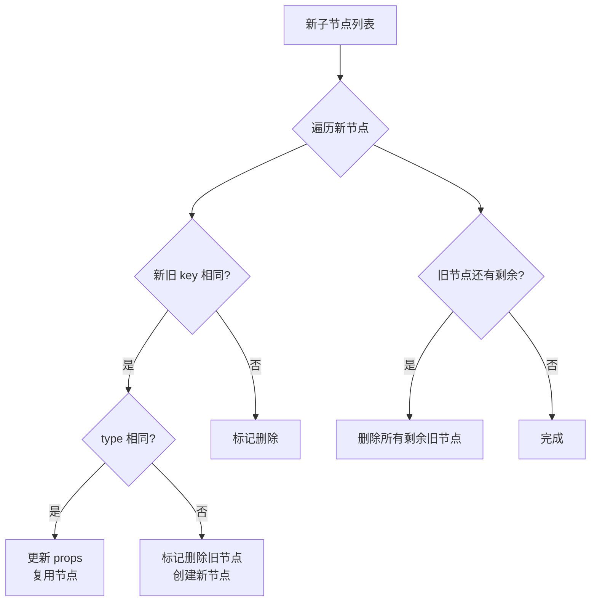

**具体的多节点 diff 规则：**

```
情况 1: 新节点按顺序遍历
  新: [A, B, C]
  旧: [A, B, C]
  → 逐个比较，全部复用

情况 2: 有新节点插入
  新: [A, B, C, D]
  旧: [A, B, C]
  → 前三个复用，D 标记为 Placement

情况 3: 有旧节点删除
  新: [A, C]
  旧: [A, B, C]
  → A 复用，B 标记为 Deletion，C 复用

情况 4: 节点移动（key 相同但位置不同）
  新: [A, C, B]
  旧: [A, B, C]
  → A 复用，C 移动到 B 前面，B 移动到 C 后面
  → 通过 key 快速定位可复用节点
```

### effectTag 的作用

```typescript
// effectTag 标记了需要在 Commit 阶段执行的操作
const Placement = 0b000000000010;   // 新增节点
const Update = 0b000000000100;       // 更新节点
const Deletion = 0b000000001000;     // 删除节点
const ChildDeletion = 0b000001000000; // 删除子节点
```

### ⚠️ key 的正确使用（面试必问）

```jsx
// ❌ 错误：用 index 作为 key
{items.map((item, index) => <Item key={index} {...item} />)}
// 问题：列表重排时 index 变化，导致所有节点重新创建

// ✅ 正确：用唯一 ID 作为 key
{items.map(item => <Item key={item.id} {...item} />)}

// ❌ 错误：用随机数作为 key
{items.map(item => <Item key={Math.random()} {...item} />)}
// 问题：每次渲染 key 都变，所有节点重新创建
```

---
## 🔍 Reconciliation 算法

### 🔄 Diff 算法实现

```typescript
// packages/react-reconciler/src/ReactChildFiber.ts
function reconcileChildren(current, workInProgress, nextChildren) {
  if (current === null) {
    // 首次渲染：创建新的 fiber
    workInProgress.child = mountChildFibers(
      workInProgress,
      null,
      nextChildren
    );
  } else {
    // 更新：reconcile
    workInProgress.child = reconcileChildFibers(
      workInProgress,
      current.child,
      nextChildren
    );
  }
}

// 单节点 reconcile
function reconcileSingleElement(returnFiber, currentFirstChild, element) {
  const key = element.key;
  let child = currentFirstChild;

  while (child !== null) {
    if (child.key === key) {
      // key 相同，检查 type
      if (child.type === element.type) {
        // type 相同，复用 fiber
        deleteRemainingChildren(returnFiber, child.sibling);
        const existing = useFiber(child, element.props);
        existing.return = returnFiber;
        return existing;
      } else {
        // type 不同，删除所有子节点
        deleteRemainingChildren(returnFiber, child);
        break;
      }
    } else {
      // key 不同，删除当前节点
      deleteChild(returnFiber, child);
    }
    child = child.sibling;
  }

  // 创建新的 fiber
  const created = createFiberFromElement(element);
  created.return = returnFiber;
  return created;
}

// 多节点 reconcile（双端比较）
function reconcileChildrenArray(returnFiber, currentFirstChild, newChildren) {
  let resultingFirstChild = null;
  let previousNewFiber = null;
  let oldFiber = currentFirstChild;
  let lastPlacedIndex = 0;
  let newIdx = 0;
  let nextOldFiber = null;

  // 1. 遍历新旧节点，从头部开始比较
  for (; oldFiber !== null && newIdx < newChildren.length; newIdx++) {
    if (oldFiber.index > newIdx) {
      nextOldFiber = oldFiber;
      oldFiber = null;
    } else {
      nextOldFiber = oldFiber.sibling;
    }

    // 尝试复用
    const newFiber = updateSlot(returnFiber, oldFiber, newChildren[newIdx]);

    if (newFiber === null) {
      // key 不同，跳出循环
      if (oldFiber === null) {
        oldFiber = nextOldFiber;
      }
      break;
    }

    // 标记位置
    lastPlacedIndex = placeChild(newFiber, lastPlacedIndex, newIdx);

    // 连接 fiber 链表
    if (previousNewFiber === null) {
      resultingFirstChild = newFiber;
    } else {
      previousNewFiber.sibling = newFiber;
    }
    previousNewFiber = newFiber;
    oldFiber = nextOldFiber;
  }

  // 2. 处理剩余节点
  if (oldFiber === null) {
    // 新节点还有剩余，全部插入
    for (; newIdx < newChildren.length; newIdx++) {
      const newFiber = createChild(returnFiber, newChildren[newIdx]);
      if (newFiber === null) continue;

      lastPlacedIndex = placeChild(newFiber, lastPlacedIndex, newIdx);

      if (previousNewFiber === null) {
        resultingFirstChild = newFiber;
      } else {
        previousNewFiber.sibling = newFiber;
      }
      previousNewFiber = newFiber;
    }
  } else {
    // 旧节点还有剩余，全部删除
    const existingChildren = mapRemainingChildren(returnFiber, oldFiber);
    for (; newIdx < newChildren.length; newIdx++) {
      const newFiber = updateFromMap(
        existingChildren,
        returnFiber,
        newIdx,
        newChildren[newIdx]
      );
      if (newFiber !== null) {
        if (newFiber.alternate !== null) {
          // 复用了旧节点，从 map 中删除
          existingChildren.delete(
            newFiber.key === null ? newIdx : newFiber.key
          );
        }
        // 判断是否需要移动
        lastPlacedIndex = placeChild(newFiber, lastPlacedIndex, newIdx);
        if (previousNewFiber === null) {
          resultingFirstChild = newFiber;
        } else {
          previousNewFiber.sibling = newFiber;
        }
        previousNewFiber = newFiber;
      }
    }

    // 删除剩余的旧节点
    existingChildren.forEach(child => deleteChild(returnFiber, child));
  }

  return resultingFirstChild;
}
```

### 📍 Key 的作用原理

```typescript
// 为什么需要 key？
// 1. 身份识别：帮助 Diff 算法识别哪些节点是同一个
// 2. 状态保持：确保组件状态在列表重排时保持一致
// 3. 性能优化：避免不必要的重新创建

// 使用 index 作为 key 的问题
// 旧列表：[A(0), B(1), C(2)]
// 新列表：[B(0), A(1), C(2)]  // B 和 A 交换了位置

// 使用 index 作为 key 时：
// Diff 结果：
//   index 0: A → B（更新）
//   index 1: B → A（更新）
//   index 2: C → C（不变）
// 结果：3 次更新

// 使用唯一 key 时：
// Diff 结果：
//   key="a": A → A（移动到位置 1）
//   key="b": B → B（移动到位置 0）
//   key="c": C → C（不变）
// 结果：2 次移动，0 次更新
```

---

## ⏳ Suspense 深入原理

### 工作机制

Suspense 的核心原理是：**子组件在 "等待" 时抛出一个 Promise**，React 捕获这个 Promise 并显示 fallback。

```jsx
// Suspense 的工作流程（简化）
// 1. React 渲染子组件
// 2. 子组件触发异步操作（数据加载/代码分割）
// 3. 组件 throw 一个 Promise（不是 return）
// 4. React 捕获 Promise，暂停渲染
// 5. 显示 Suspense 的 fallback
// 6. Promise resolve 后，React 重新渲染子组件

function App() {
  return (
    <Suspense fallback={<Loading />}>
      <LazyComponent />  {/* 代码分割，加载时 throw Promise */}
    </Suspense>
  );
}
```

### Suspense 的三种使用场景

```jsx
// 场景 1：代码分割（React.lazy）
const LazyDashboard = React.lazy(() => import('./Dashboard'));

function App() {
  return (
    <Suspense fallback={<Spinner />}>
      <LazyDashboard />
    </Suspense>
  );
}

// 场景 2：数据获取（配合框架如 Next.js / Relay）
async function fetchUser(id) {
  const res = await fetch(`/api/users/${id}`);
  return res.json();
}

// 在支持 Suspense 的数据获取库中
function UserProfile({ id }) {
  const user = use(fetchUser(id));  // React 19 的 use() Hook
  return <div>{user.name}</div>;
}

// 场景 3：图片加载（配合 lazy loading）
function LazyImage({ src }) {
  const [loaded, setLoaded] = useState(false);
  return (
     setLoaded(true)}
      style={{ opacity: loaded ? 1 : 0 }}
    />
  );
}
```

### 多个 Suspense 嵌套

```jsx
function App() {
  return (
    <Suspense fallback={<PageSkeleton />}>
      <Header />
      <Suspense fallback={<SidebarSkeleton />}>
        <Sidebar />
      </Suspense>
      <Suspense fallback={<ContentSkeleton />}>
        <Content />
      </Suspense>
    </Suspense>
  );
}
// 规则：内层 Suspense 优先处理
// 如果 Content 加载慢，只显示 ContentSkeleton
// 如果 Sidebar 也加载慢，显示 SidebarSkeleton
// 如果 Header 加载慢，显示整个 PageSkeleton
```

### Suspense + ErrorBoundary 配合

```jsx
function App() {
  return (
    <ErrorBoundary fallback={<ErrorPage />}>
      <Suspense fallback={<Loading />}>
        <AsyncComponent />
      </Suspense>
    </ErrorBoundary>
  );
}
// ErrorBoundary 捕获错误，Suspense 捕获 Promise
// 两者配合处理异步组件的所有状态
```

### ⚠️ Suspense 的关键规则

| 规则 | 说明 |
|------|------|
| fallback 必须是有效 React 元素 | 不能是 `null`，需要用 `<Loading />` 而不是 `Loading` |
| Suspense 不是数据获取 Hook | 它是 UI 组件，用于声明等待状态的 UI |
| 缓存策略由框架实现 | React 本身不提供数据缓存，需配合 Next.js/Relay 等 |
| SSR 中的行为 | 服务端只渲染已加载的内容，未加载的留空 |

---

## 🌐 SSR 原理深度解析

### 服务端渲染 vs 客户端渲染

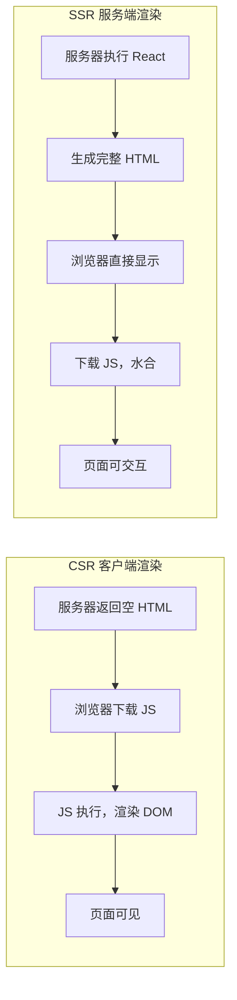

### React SSR 核心 API

```jsx
// 1. renderToString（同步，React 18 推荐用 renderToPipeableStream）
import { renderToString } from 'react-dom/server';

const html = renderToString(<App />);
// 返回完整的 HTML 字符串

// 2. renderToNodeStream（流式，React 18 已废弃，推荐 renderToPipeableStream）
import { renderToNodeStream } from 'react-dom/server';

const stream = renderToNodeStream(<App />);
stream.pipe(res);  // 流式发送到客户端

// 3. renderToPipeableStream（React 18 新增，推荐）
import { renderToPipeableStream } from 'react-dom/server';

const { pipe, abort } = renderToPipeableStream(<App />, {
  onShellReady() {
    // Shell 准备好，可以开始流式发送
    res.statusCode = 200;
    pipe(res);
  },
  onShellError(error) {
    // Shell 渲染出错
    res.statusCode = 500;
    res.send('<h1>Something went wrong</h1>');
  },
  onError(error) {
    console.error(error);
  }
});

// 4. renderToReadableStream（Web Streams API）
import { renderToReadableStream } from 'react-dom/server';

const stream = await renderToReadableStream(<App />, {
  onError(error) {
    console.error(error);
  }
});
```

### Hydration（水合）过程

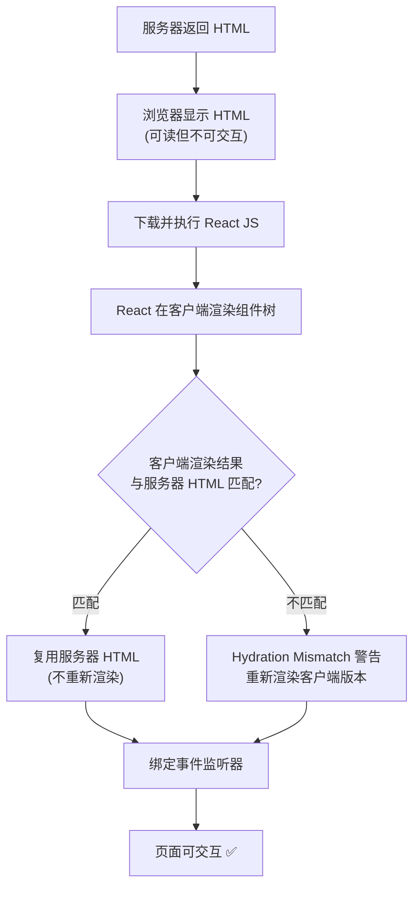

**Hydration Mismatch 常见原因：**

| 原因 | 示例 | 解决方案 |
|------|------|---------|
| 日期/时间 | `new Date().toLocaleString()` | `useEffect` 中设置，或 `suppressHydrationWarning` |
| 随机数 | `Math.random()` | 用 state 存储随机值 |
| 浏览器 API | `window.innerWidth` | 用 `useEffect` 或条件渲染 |
| localStorage | `localStorage.getItem('key')` | 用 `useEffect` 或 cookies |

```jsx
// 解决日期 mismatch
function CurrentTime() {
  const [time, setTime] = useState('');
  useEffect(() => {
    setTime(new Date().toLocaleString());
  }, []);
  return <span>{time || '...'}</span>;  // 服务器渲染 '...'，客户端渲染实际时间
}

// suppressHydrationWarning（谨慎使用）
<span suppressHydrationWarning>
  {new Date().toLocaleString()}
</span>
```

### 流式 SSR（Streaming SSR）

```jsx
// React 18 的 Streaming SSR
import { renderToPipeableStream } from 'react-dom/server';

app.get('/', (req, res) => {
  const { pipe, abort } = renderToPipeableStream(<App />, {
    // Shell 先发送（快速显示页面骨架）
    onShellReady() {
      res.statusCode = 200;
      pipe(res);
    },
    // 所有内容加载完成后发送
    onAllReady() {
      // 可选：等所有 Suspense 内容加载完再发送
    },
    onError(error) {
      console.error(error);
    }
  });

  // 超时自动中止
  setTimeout(abort, 10000);
});
```

**Streaming SSR 的优势：**
- 首屏加载更快（Shell 先发送）
- Suspense 边界内的内容可以逐步加载
- 不需要等待所有数据加载完才发送 HTML

### 选择性 Hydration（Selective Hydration）

```jsx
// React 18 + Suspense 实现选择性水合
// 1. 服务器标记 Suspense 边界
// 2. 客户端优先水合用户交互的区域
// 3. 其他区域可以延迟水合

function App() {
  return (
    <Layout>
      <Header />  {/* 优先水合 */}
      <Suspense fallback={<ContentSkeleton />}>
        <Content />  {/* 可以延迟水合 */}
      </Suspense>
      <Suspense fallback={<SidebarSkeleton />}>
        <Sidebar />  {/* 可以延迟水合 */}
      </Suspense>
    </Layout>
  );
}
// 用户点击 Content 时，React 优先水合 Content
```

---

## ⚡ React.memo 深入原理与滥用陷阱

### 浅比较实现原理

```typescript
// React.memo 内部使用 shallowEqual 进行比较
function shallowEqual(objA: any, objB: any): boolean {
  if (Object.is(objA, objB)) return true;

  if (typeof objA !== 'object' || objA === null ||
      typeof objB !== 'object' || objB === null) {
    return false;
  }

  const keysA = Object.keys(objA);
  const keysB = Object.keys(objB);

  if (keysA.length !== keysB.length) return false;

  for (const key of keysA) {
    if (!Object.prototype.hasOwnProperty.call(objB, key) ||
        !Object.is(objA[key], objB[key])) {
      return false;
    }
  }

  return true;
}
```

### React.memo 不生效的常见陷阱

```jsx
// ❌ 陷阱 1：内联对象作为 props
function Parent() {
  return (
    <MemoizedChild style={{ color: 'red' }} />
    // 每次渲染都创建新对象 → shallowEqual 返回 false → 重新渲染
  );
}

// ✅ 修复：用 useMemo 缓存对象
function Parent() {
  const style = useMemo(() => ({ color: 'red' }), []);
  return <MemoizedChild style={style} />;
}

// ❌ 陷阱 2：内联函数作为 props
function Parent() {
  const handleClick = () => console.log('clicked');
  // 每次渲染都创建新函数
  return <MemoizedChild onClick={handleClick} />;
}

// ✅ 修复：用 useCallback 缓存函数
function Parent() {
  const handleClick = useCallback(() => console.log('clicked'), []);
  return <MemoizedChild onClick={handleClick} />;
}

// ❌ 陷阱 3：Context 变化穿透
const ThemeContext = createContext('light');

function Parent() {
  const [theme, setTheme] = useState('light');
  return (
    <ThemeContext.Provider value={theme}>
      <MemoizedChild />  {/* 即使 memo 了，Context 变化仍会触发重渲染 */}
    </ThemeContext.Provider>
  );
}

// ✅ 修复：拆分 Context，避免不必要的更新
const ThemeUpdateContext = createContext(() => {});

function Parent() {
  const [theme, setTheme] = useState('light');
  return (
    <ThemeUpdateContext.Provider value={setTheme}>
      <ThemeContext.Provider value={theme}>
        <MemoizedChild />  {/* 现在只有 theme 变化时才重渲染 */}
      </ThemeContext.Provider>
    </ThemeUpdateContext.Provider>
  );
}
```

### React.memo vs useMemo vs useCallback

| API | 用途 | 返回值 | 使用场景 |
|-----|------|--------|---------|
| `React.memo` | 缓存**组件** | 包裹后的组件 | 避免父组件更新导致子组件重渲染 |
| `useMemo` | 缓存**计算结果** | 缓存的值 | 昂贵计算、避免每次渲染重新创建对象 |
| `useCallback` | 缓存**函数** | 缓存的函数 | 作为 props 传递的回调函数 |

```jsx
// 三者配合使用的完整示例
const MemoizedList = React.memo(function List({ items, onItemClick }) {
  // React.memo 避免父组件更新时重渲染
  return (
    <ul>
      {items.map(item => (
        <li key={item.id} onClick={() => onItemClick(item.id)}>
          {item.name}
        </li>
      ))}
    </ul>
  );
});

function Parent() {
  const [count, setCount] = useState(0);
  const [filter, setFilter] = useState('');

  // useMemo 缓存过滤后的列表（避免每次渲染重新计算）
  const filteredItems = useMemo(
    () => items.filter(item => item.name.includes(filter)),
    [items, filter]
  );

  // useCallback 缓存回调函数（避免子组件重渲染）
  const handleItemClick = useCallback((id) => {
    console.log('Clicked:', id);
  }, []);

  return (
    <div>
      <button onClick={() => setCount(c => c + 1)}>Count: {count}</button>
      <MemoizedList items={filteredItems} onItemClick={handleItemClick} />
    </div>
  );
}
```

### ⚠️ 什么时候不需要 React.memo

| 场景 | 原因 |
|------|------|
| 子组件很简单 | 重渲染成本低，memo 的比较成本反而更高 |
| props 总是变化 | memo 总是失败，没有缓存效果 |
| 使用了内联对象/函数 | 不修复引用问题，memo 无效 |
| React 19 + Compiler | Compiler 自动处理 memo，无需手动添加 |

---

## 🔗 forwardRef 与 useImperativeHandle

### forwardRef 基本用法

```jsx
// ❌ 问题：函数组件默认不接收 ref
function TextInput() {
  return <input />;
}

// ✅ 解决：用 forwardRef 包裹
const TextInput = forwardRef(function TextInput(props, ref) {
  return <input ref={ref} />;
});

// 使用
function Parent() {
  const inputRef = useRef(null);
  useEffect(() => {
    inputRef.current.focus();  // 直接操作子组件 DOM
  }, []);
  return <TextInput ref={inputRef} />;
}
```

### useImperativeHandle 暴露组件方法

```jsx
// 问题：直接暴露整个 DOM 元素太危险
// 解决：用 useImperativeHandle 只暴露需要的方法

const FancyInput = forwardRef(function FancyInput(props, ref) {
  const inputRef = useRef(null);
  const [value, setValue] = useState('');

  // 只暴露特定方法，而不是整个 input DOM
  useImperativeHandle(ref, () => ({
    focus: () => inputRef.current?.focus(),
    clear: () => {
      setValue('');
      inputRef.current?.value = '';
    },
    getValue: () => value,
  }), [value]);

  return (
    <input
      ref={inputRef}
      value={value}
      onChange={e => setValue(e.target.value)}
    />
  );
});

// 使用
function Parent() {
  const fancyRef = useRef(null);

  return (
    <>
      <FancyInput ref={fancyRef} />
      <button onClick={() => fancyRef.current?.focus()}>聚焦</button>
      <button onClick={() => fancyRef.current?.clear()}>清空</button>
      <button onClick={() => console.log(fancyRef.current?.getValue())}>获取值</button>
    </>
  );
}
```

### React 19 的 ref 变化

```jsx
// React 18：需要 forwardRef
const MyInput = forwardRef((props, ref) => {
  return <input ref={ref} />;
});

// React 19：ref 直接作为 prop
function MyInput({ ref, ...props }) {
  return <input ref={ref} />;
}
// 不再需要 forwardRef 包裹！

// React 19 的 ref cleanup
function MyInput({ ref }) {
  useEffect(() => {
    return () => {
      // 组件卸载时的清理逻辑
      console.log('Cleaning up ref');
    };
  }, []);

  return <input ref={ref} />;
}
```

### 面试高频问题

**Q: 什么时候用 forwardRef？**
> 需要父组件直接访问子组件 DOM 或暴露子组件方法时。React 19 不再需要。

**Q: useImperativeHandle 的第二个参数为什么需要依赖数组？**
> 确保暴露的方法在依赖变化时更新。如果省略，闭包中可能捕获过期的值。

**Q: 能否用 useRef 代替 forwardRef？**
> 不能。ref 不能作为 prop 传递给函数组件（React 18），必须用 forwardRef。React 19 解决了这个问题。

---

## 📦 useSyncExternalStore 原理与使用

### 解决什么问题（Tearing 问题）

```jsx
// 问题：并发模式下，外部状态可能导致 Tearing（UI 不一致）
// 旧方案：多个组件分别 subscribe 外部状态
// 问题：组件 A 读取的是新值，组件 B 读取的是旧值

// useSyncExternalStore 确保所有组件在同一时间点读取相同值
import { useSyncExternalStore } from 'react';
```

### 基本用法

```jsx
// 自定义一个外部 store
function createStore(initialState) {
  let state = initialState;
  const listeners = new Set();

  return {
    getState: () => state,
    setState: (newState) => {
      state = typeof newState === 'function' ? newState(state) : newState;
      listeners.forEach(listener => listener());
    },
    subscribe: (listener) => {
      listeners.add(listener);
      return () => listeners.delete(listener);
    },
  };
}

// 使用 useSyncExternalStore 订阅
function useStore(store) {
  const state = useSyncExternalStore(
    store.subscribe,     // 订阅函数
    store.getState,      // 获取当前值
    // 可选：服务端渲染时的初始值
    () => store.getState()
  );
  return state;
}

// 使用
const store = createStore({ count: 0 });

function Counter() {
  const { count } = useStore(store);
  return (
    <div>
      <p>{count}</p>
      <button onClick={() => store.setState(s => ({ ...s, count: s.count + 1 }))}>
        +1
      </button>
    </div>
  );
}
```

### React 19 的 useOptimistic + useActionState

```jsx
// useOptimistic：乐观更新
function TodoList({ todos }) {
  const [optimisticTodos, addOptimisticTodo] = useOptimistic(
    todos,
    (currentTodos, newTodo) => [...currentTodos, { ...newTodo, sending: true }]
  );

  const handleAdd = async (text) => {
    const newTodo = { id: Date.now(), text };
    addOptimisticTodo(newTodo);  // 立即显示
    await saveTodo(newTodo);      // 等待服务器响应
  };

  return (
    <ul>
      {optimisticTodos.map(todo => (
        <li key={todo.id} style={{ opacity: todo.sending ? 0.5 : 1 }}>
          {todo.text}
        </li>
      ))}
    </ul>
  );
}
```

### 与 Redux/MobX 的关系

```jsx
// Redux 使用 useSyncExternalStore（React 18+）
// redux/src/hooks/useSelector.ts
import { useSyncExternalStore } from 'react';

export function useSelector(selector) {
  return useSyncExternalStore(
    store.subscribe,
    () => selector(store.getState())
  );
}

// MobX 使用 useSyncExternalStore 兼容 React 18
// @mobx-react-lite 使用 useSyncExternalStore 包装 observer 组件
```

### 面试高频问题

**Q: useSyncExternalStore 解决什么问题？**
> 解决并发模式下的 Tearing 问题，确保所有组件在同一时间点读取外部状态的相同值。

**Q: getSnapshot 函数为什么必须返回稳定引用？**
> 如果每次调用返回新对象，会导致无限循环（每次渲染都触发重新渲染）。

**Q: subscribe 函数什么时候调用？**
> 组件挂载时调用，返回的清理函数在组件卸载时调用。

---

## 🔧 React 事件机制深入

### 事件委托完整链路

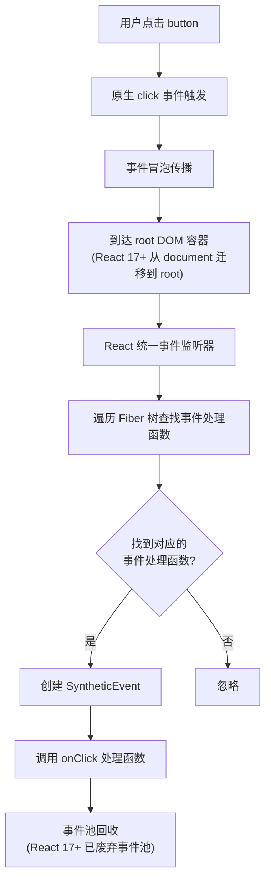

### React 17+ 事件系统变化

| 变化 | React 16 | React 17+ |
|------|---------|-----------|
| 事件绑定位置 | `document` | 根 DOM 容器 |
| 事件池 | 复用 SyntheticEvent（性能优化） | 废弃事件池（更安全） |
| 与原生事件交互 | 在 document 上拦截 | 在 root 上拦截 |
| 多版本 React 共存 | 困难（共享 document） | 可行（各自 root） |

### e.stopPropagation() vs 原生 stopPropagation

```jsx
function App() {
  return (
    <div onClick={() => console.log('React: App')}>
      <button
        onClick={(e) => {
          e.stopPropagation();  // 阻止 React 树冒泡
          console.log('React: Button clicked');
        }}
      >
        点击
      </button>
    </div>
  );
}

// 同时绑定原生事件
document.querySelector('button').addEventListener('click', () => {
  console.log('Native: Button clicked');  // ✅ 仍然执行
});

// 点击按钮输出：
// "Native: Button clicked" ✅ 原生事件不受 React stopPropagation 影响
// "React: Button clicked" ✅ React 事件处理函数执行
// React 的 stopPropagation 不会阻止原生事件冒泡！
```

### 如何正确阻止原生事件

```jsx
// 方案 1：使用原生事件的 stopPropagation
function App() {
  const buttonRef = useRef(null);

  useEffect(() => {
    const button = buttonRef.current;
    const handleNativeClick = (e) => {
      e.stopPropagation();  // 阻止原生事件冒泡
      console.log('Native: stopped');
    };
    button.addEventListener('click', handleNativeClick);
    return () => button.removeEventListener('click', handleNativeClick);
  }, []);

  return <button ref={buttonRef}>按钮</button>;
}

// 方案 2：使用 e.nativeEvent.stopImmediatePropagation
function App() {
  return (
    <button onClick={(e) => {
      e.nativeEvent.stopImmediatePropagation();  // 阻止所有后续事件
      console.log('Stopped all');
    }}>
      点击
    </button>
  );
}
```

### 事件执行顺序

```jsx
function App() {
  return (
    <div
      onClickCapture={() => console.log('1. React Capture')}
      onClick={() => console.log('4. React Bubble')}
    >
      <button
        onClickCapture={() => console.log('2. React Capture')}
        onClick={() => console.log('3. React Bubble')}
      >
        点击
      </button>
    </div>
  );
}

// 同时有原生事件：
// div.addEventListener('click', () => console.log('5. Native Bubble'), false);
// div.addEventListener('click', () => console.log('6. Native Capture'), true);

// 点击按钮输出顺序：
// 1. React Capture (外层 div)
// 2. React Capture (button)
// 6. Native Capture (外层 div) ← 原生捕获在 React 捕获之后！
// 3. React Bubble (button)
// 4. React Bubble (外层 div)
// 5. Native Bubble (外层 div) ← 原生冒泡在 React 冒泡之后！
```

### 面试高频问题

**Q: React 事件和原生事件的执行顺序？**
> 捕获阶段：React Capture → Native Capture；冒泡阶段：React Bubble → Native Bubble。

**Q: 为什么 React 要把事件委托到 root 而不是 document？**
> 为微前端和多版本 React 共存提供更好的隔离性，避免不同版本 React 的事件系统冲突。

**Q: React 17+ 为什么废弃事件池？**
> 事件池是为了性能优化（复用 SyntheticEvent 对象），但带来了异步访问事件属性的复杂性。现代浏览器性能足够，不需要这个优化。

---

