# React 深入浅出解析

---

## 1. React 世界观

### 1.1 什么是 React？

React 是一个用于构建用户界面的 **JavaScript 库**，而非完整框架。核心哲学：

- **声明式**：你描述"想要什么"，React 负责"怎么做"
- **组件化**：UI 由独立可复用的组件构成
- **一次学习，随处编写**：Web（React DOM）、移动端（React Native）、桌面端

### 1.2 核心目标：快速响应

React 设计哲学的核心是 **快速响应**。制约快速响应的两大瓶颈：

| 瓶颈 | 根源 | React 方案 |
|------|------|-----------|
| **CPU 瓶颈** | 组件渲染耗时过长（>16ms），掉帧卡顿 | **时间切片**：长任务拆分到各帧，每帧预留 5ms 给 JS |
| **IO 瓶颈** | 网络请求等待，用户感知延迟 | **Suspense + useTransition**：延迟展示 loading，减少闪烁感知 |

> 解决这两大瓶颈的关键，是将**同步的不可中断更新**变为**异步的可中断更新**——这正是 Fiber 架构和 Concurrent 模式的根本动机。

### 1.3 核心理念概览

| 理念 | 说明 | 示例 |
|------|------|------|
| 声明式 | 描述 UI 最终状态 | `<div>{count}</div>` |
| 组件化 | 封装逻辑与视图 | `<Button />` |
| 状态驱动 | 状态变化 → UI 自动更新 | `setState()` → 渲染 |
| 单向数据流 | 数据从父到子传递 | props 向下传递 |
| 不可变数据 | 不修改原数据，创建新副本 | `[...arr, item]` |

### 1.4 知识链路总览

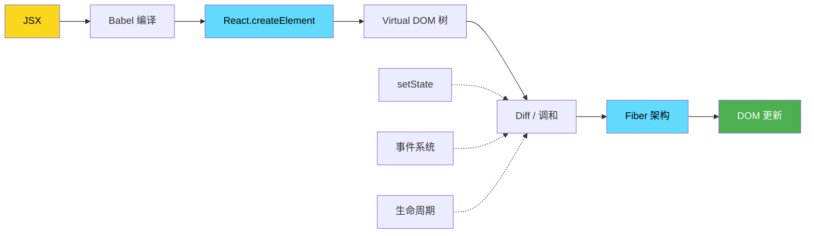

---

## 2. JSX：JavaScript 的语法扩展

### 2.1 什么是 JSX？

JSX 是 JavaScript 的语法扩展，看起来像 HTML，实际被 Babel 编译为 `React.createElement()` 调用。

```jsx
// JSX 写法
const el = <h1 className="greeting">Hello</h1>;

// 编译后
const el = React.createElement('h1', { className: 'greeting' }, 'Hello');

// 编译后的执行结果（Virtual DOM 对象）
const vdom = { type: 'h1', props: { className: 'greeting' }, children: ['Hello'] };
```

### 2.2 JSX 编译过程

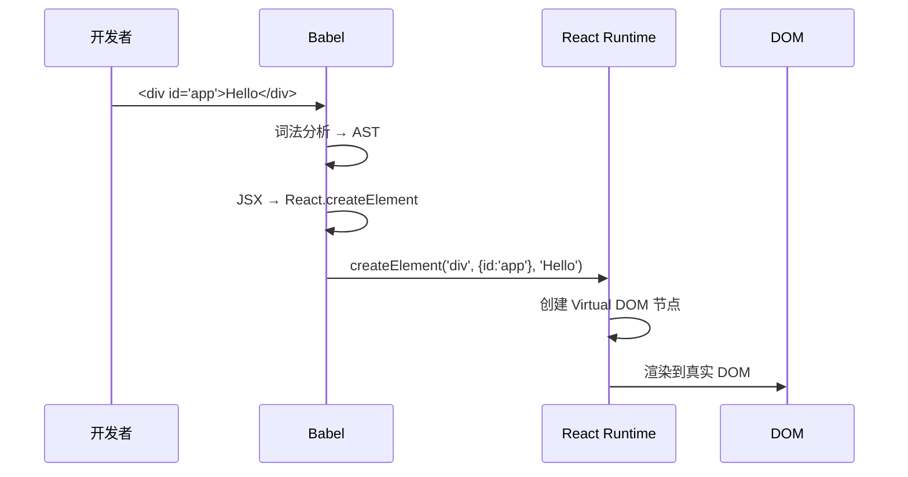

### 2.3 为什么选择 JSX？

| 方案 | 代表 | 优点 | 缺点 |
|------|------|------|------|
| **JSX** | React | **完整 JS 能力**、类型安全 | 需编译 |
| 模板语法 | Vue/Angular | 门槛低 | **功能受限**（指令需学习） |
| Hyperscript | Vue render | 灵活 | **代码冗长**、可读性差 |

> **💡 JSX 本质是语法糖**：核心优势是在 JS 中获得完整的表达式能力，无需学习模板 DSL。

```jsx
// JSX 的强大表达式能力
const items = data.map(item => <li key={item.id}>{item.name}</li>);
{flag && <Component />}
{condition ? <A /> : <B />}
{obj?.prop ?? 'default'}
```

### 2.4 JSX 规则速查

| 规则 | ✅ 正确 | ❌ 错误 |
|------|---------|---------|
| 单根节点 | `<div>...</div>` 或 `<>...</>` | `<div></div><p></p>` |
| 闭合标签 | `<br />` | `<br>` |
| 驼峰命名 | `className`、`onClick` | `class`、`onclick` |
| JS 表达式 | `{count}`、`{fn()}` | `{if}`、`{for}` |

---

## 3. Virtual DOM：React 的虚拟灵魂

### 3.1 什么是 Virtual DOM？

Virtual DOM 是真实 DOM 的轻量级 JavaScript 对象抽象。

```javascript
// Virtual DOM 节点
const vnode = {
  type: 'div',
  props: { className: 'container' },
  children: [
    { type: 'h1', props: {}, children: ['Hello'] }
  ]
};

// 对应的真实 DOM
// <div class="container"><h1>Hello</h1></div>
```

### 3.2 为什么需要 Virtual DOM？

> **核心原因不是"性能"——而是声明式编程范式。**

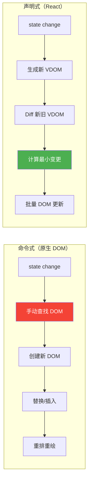

| 维度 | 直接操作 DOM | React Virtual DOM |
|------|-------------|-------------------|
| 编程范式 | **命令式**（如何做） | **声明式**（做什么） |
| 代码维护 | 手动管理 DOM 状态 | 框架自动协调 |
| 跨平台 | 仅浏览器 | Web / Native / Canvas |
| 性能 | 简单场景更快 | **复杂场景更优** |

### 3.3 协调（Reconciliation）

每次 props/state 变动时，组件渲染出新元素树，React 框架与旧树做 Diff 对比，将变动最终体现在 DOM 中——这个过程称为 **协调**。

### 3.4 Diff 的理论背景

> **🔑 理论上，将两棵任意树做完全比较的算法复杂度为 O(n³)**。如果 React 采用该算法，1000 个元素需要十亿级计算量。

React 通过以下 **三个限制** 将复杂度降为 **O(n)**：

| 限制 | 规则 | 示例 |
|------|------|------|
| **只同层比较** | 节点跨层级不尝试复用 | `<div><p/></div>` → `<div><span/></div>` |
| **类型决定结构** | 不同类型产生不同的树 | `div`→`span` 直接销毁重建 |
| **Key 稳定标识** | 同层通过 key 识别节点 | 列表顺序变化时复用 DOM |

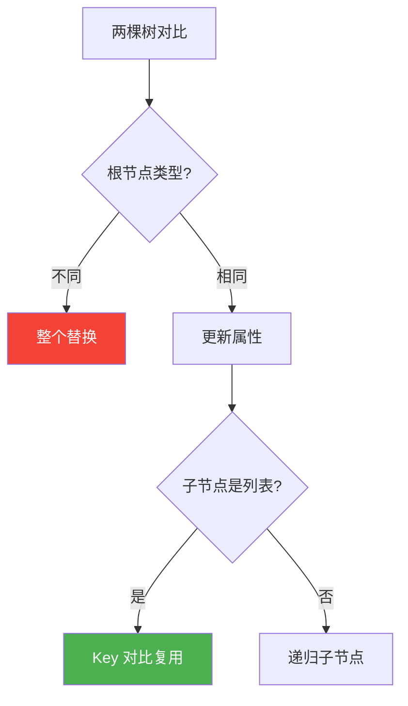

```jsx
// 策略 1：类型不同 → 替换
// <div>旧</div> → <span>新</span> → 整个替换

// 策略 2：类型相同 → 更新属性
// <div className="a"> → <div className="b"> → 只改 className

// 策略 3：Key 优化列表
<ul>
  <li key="a">A</li>      // key="a" 复用
  <li key="b">B</li>      // key="b" 复用
  <li key="c">C</li>      // key="c" 新插入
</ul>
```

> **⚠️ 常见误用**：用数组索引作为 key。当列表顺序变化时，索引 key 会导致性能下降和状态错乱。
>
> ```jsx
> // ❌ 错误
> items.map((item, index) => <li key={index}>{item.name}</li>)
> // ✅ 正确
> items.map(item => <li key={item.id}>{item.name}</li>)
> ```

---

## 4. 组件生命周期

### 4.1 React 15（旧版）——"will 时代"

```mermaid
graph TD
    subgraph "创建 Mount"
        A1[constructor] --> A2[componentWillMount]
        A2 --> A3[render]
        A3 --> A4[componentDidMount ✅]
    end

    subgraph "更新 Update"
        B1[componentWillReceiveProps] --> B2[shouldComponentUpdate]
        B2 --> B3[componentWillUpdate]
        B3 --> B4[render]
        B4 --> B5[componentDidUpdate ✅]
    end

    subgraph "卸载 Unmount"
        C1[componentWillUnmount ✅]
    end

    style A2 fill:#f44336,color:#fff
    style B1 fill:#f44336,color:#fff
    style B3 fill:#f44336,color:#fff
    style A4 fill:#4CAF50,color:#fff
    style B5 fill:#4CAF50,color:#fff
```

### 4.2 React 16（新版）——"did 时代"

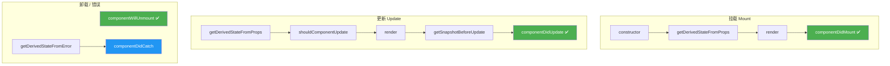

### 4.3 为什么改生命周期？

> **🔑 核心原因**：React 16 引入 **Fiber 架构** 支持异步渲染，旧的生命周期（will 系列）在异步模式下**可能被多次调用**，导致不安全操作（重复订阅、内存泄漏）。

| ❌ 废弃（不安全） | ✅ 替代方案 | 原因 |
|------|------|------|
| `componentWillMount` | constructor + componentDidMount | 异步渲染可能多次调用 |
| `componentWillReceiveProps` | `getDerivedStateFromProps`（静态方法） | 避免副作用 |
| `componentWillUpdate` | `getSnapshotBeforeUpdate` | DOM 更新前安全获取快照 |

---

## 5. 数据流：组件之间的沟通之道

### 5.1 单向数据流

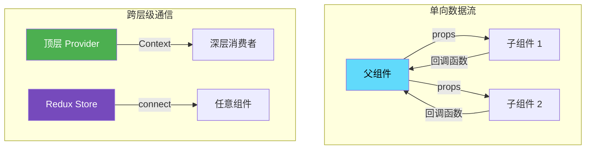

### 5.2 通信方式速查

| 场景 | 方案 | 复杂度 |
|------|------|--------|
| 父子通信 | props（父传子）、回调（子传父） | ⭐ |
| 兄弟通信 | 状态提升到共同父组件 | ⭐⭐ |
| 跨层级 | Context API | ⭐⭐ |
| 复杂状态 | Redux / Zustand | ⭐⭐⭐ |
| 逻辑复用 | children / render props / Hooks | ⭐⭐ |

### 5.3 props vs state

| 维度 | props | state |
|------|-------|-------|
| 来源 | **父组件传入** | **组件自身定义** |
| 可变性 | **只读**（不可修改） | **可变**（通过 setState） |
| 触发渲染 | 父组件重新渲染 | setState 调用 |
| 作用域 | 跨组件传递 | 组件内部私有 |

### 5.4 Context API

```jsx
const ThemeContext = React.createContext('light');

function App() {
  return (
    <ThemeContext.Provider value="dark">
      <Toolbar />
    </ThemeContext.Provider>
  );
}

function ThemedButton() {
  const theme = useContext(ThemeContext);
  return <button className={theme}>按钮</button>;
}
```

---

## 6. setState：同步还是异步？——版本决定答案

> 🔑 **一句话回答**：setState 的表现因 React 版本和调用上下文而异，不存在"单纯同步/异步"的结论。

### 6.1 React 15 / 16 / 17（legacy 模式）

#### 核心机制：`isBatchingUpdates` 锁

React 通过全局变量 `isBatchingUpdates` 管控批量更新：

| 执行上下文 | `isBatchingUpdates` | setState 行为 | 原因 |
|------------|---------------------|---------------|------|
| **生命周期钩子** | `true`（React 预先锁上） | **异步**（入队等待） | 批量合并，避免重复渲染 |
| **合成事件**（onClick 等） | `true`（事件系统预先锁上） | **异步**（入队等待） | 批量合并，避免重复渲染 |
| **setTimeout / setInterval** | `false`（异步回调逃逸管控） | **同步**（立即更新） | 执行时锁已被释放 |
| **原生 DOM 事件**（addEventListener） | `false`（React 无法管控） | **同步**（立即更新） | 不受 React 事务管控 |

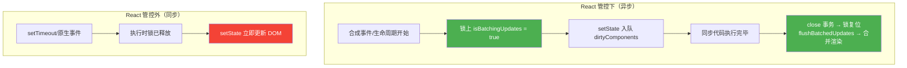

```jsx
// 🔍 经典面试题（React 15/16/17 类组件）
class App extends React.Component {
  state = { count: 0 };

  increment = () => {
    // React 合成事件：isBatchingUpdates = true
    this.setState({ count: this.state.count + 1 });
    console.log(this.state.count); // 输出 0（异步，尚未更新）
  };

  triple = () => {
    // 三次 setState 合并为一次
    this.setState({ count: this.state.count + 1 });
    this.setState({ count: this.state.count + 1 });
    this.setState({ count: this.state.count + 1 });
    console.log(this.state.count); // 输出 0（合并后只算一次 +1）
    // 最终 count = 1，不是 3（对象形式覆盖，不是累加）
  };

  reduce = () => {
    setTimeout(() => {
      // setTimeout：isBatchingUpdates = false（同步）
      this.setState({ count: this.state.count - 1 });
      console.log(this.state.count); // 输出最新值（同步更新）
    }, 0);
  };
}
```

#### 批处理内部机制

```
进入合成事件 → ReactUpdates.batchedUpdates()
    ↓
initialize（空）
    ↓
isBatchingUpdates = true
    ↓
  setState({count:1}) → enqueueSetState → enqueueUpdate
                        → isBatchingUpdates=true → 入队 dirtyComponents
  setState({count:2}) → 入队 dirtyComponents
  setState({count:3}) → 入队 dirtyComponents
    ↓
close → isBatchingUpdates = false
      → flushBatchedUpdates → 合并 state → 一次 DOM 操作 ✅
```

> **💡 为什么三次 `setState({count: this.state.count + 1})` 结果只是 +1 而不是 +3？**
>
> 因为对象形式的 setState 是**合并**而非累加。三个 `{count: 0+1}` 入队后，合并取最后一个，最终 `count = 1`。
> 若想累加，必须使用**函数形式**：
> ```jsx
> this.setState(prev => ({ count: prev.count + 1 }));
> this.setState(prev => ({ count: prev.count + 1 }));
> this.setState(prev => ({ count: prev.count + 1 }));
> // 结果 count = 3 ✅
> ```

### 6.2 React 18：自动批处理（All Batching）

React 18 无论是 `createRoot`（并发模式）还是 `legacy` 模式，**所有场景都自动批处理**：

```jsx
// React 18 — setTimeout 也批处理 ✅
setTimeout(() => {
  setCount(c => c + 1);
  setFlag(f => !f);
  // 只触发一次重渲染
}, 0);

// Promise 回调也批处理 ✅
fetch('/api').then(() => {
  setCount(c => c + 1);
  setFlag(f => !f);
  // 只触发一次重渲染
});

// 原生事件也批处理 ✅
el.addEventListener('click', () => {
  setCount(c => c + 1);
  setFlag(f => !f);
  // 只触发一次重渲染
});

// 💡 如果非要退出批处理（罕见场景）
import { flushSync } from 'react-dom';
flushSync(() => setCount(c => c + 1)); // 强制同步刷新
```

| React 版本 | 合成事件/生命周期 | setTimeout | 原生事件 | Promise |
|------------|-----------------|------------|----------|---------|
| 15/16/17 | 异步批处理 | **同步** | **同步** | **同步** |
| **18** | 异步批处理 | **异步批处理** ✅ | **异步批处理** ✅ | **异步批处理** ✅ |

### 6.3 函数组件（useState）的特殊性

```jsx
// 函数组件 + useState（React 16.8 ~ 18）
function Counter() {
  const [count, setCount] = useState(0);

  function handleClick() {
    setTimeout(() => {
      setCount(count + 1);
      console.log(count); // 始终输出旧值！
      // ⚠️ 原因不是"异步"而是"闭包捕获"
      // count 是本次渲染的常量，不会因 setCount 改变
    }, 0);
  }

  // 正确做法：使用函数式更新
  function handleClickFixed() {
    setTimeout(() => {
      setCount(c => c + 1); // ✅ 从队列中取最新值
    }, 0);
  }
}
```

> **⚠️ 关键区分**：类组件的 setTimeout 中 setState **同步更新 DOM 与 state**，但函数组件的 setTimeout 中 setCount 虽会**同步触发调度**，但当前函数作用域内的 `count` 变量**已被闭包锁定**——这是 JavaScript 闭包机制，与 setState 的同步/异步无关。

### 6.4 三种调用方式

```jsx
// 1️⃣ 对象形式（后面覆盖前面）
this.setState({ count: 1 });
this.setState({ count: 2 }); // 最终 count = 2

// 2️⃣ 函数形式（推荐：基于前一个状态累加）
this.setState((prevState, props) => ({
  count: prevState.count + 1
}));

// 3️⃣ 回调（获取更新后的值）
this.setState({ count: 10 }, () => {
  console.log(this.state.count); // 10（更新完成后）
});
```

### 6.5 this.forceUpdate——强制跳过性能优化

```javascript
this.forceUpdate(callback);
```

`forceUpdate` 在创建 Update 时设置 `tag: ForceUpdate`：

```javascript
// this.forceUpdate → enqueueForceUpdate
const update = createUpdate(eventTime, lane, suspenseConfig);
update.tag = ForceUpdate;     // ⚡ 标记强制更新
```

**关键作用**：跳过 `shouldComponentUpdate` 和 `PureComponent` 的浅比较逻辑，无论 state/props 是否变化强制重新渲染。

```javascript
const shouldUpdate =
  checkHasForceUpdateAfterProcessing() ||  // ForceUpdate → true
  checkShouldComponentUpdate(...);          // 正常 SCU 判断
```

### 6.6 版本速查表

| 版本 | 类组件 setState 行为 | 函数组件 useState | 关键变化 |
|------|---------------------|-------------------|----------|
| **React 15** | 合成事件/生命周期异步；setTimeout 同步 | — | Stack Reconciler |
| **React 16** | 同上（Fiber 不影响 setState 同步/异步） | Hooks 引入 | Fiber 架构 |
| **React 17** | 同上 | 闭包捕获旧值 | 过渡版本 |
| **React 18** | **所有场景自动批处理** | 所有场景自动批处理 | `createRoot` + 自动批处理 |
| **React 19** | 同上 | 同上 | + useActionState / useOptimistic |

---

## 7. 不可变数据：为什么对 React 至关重要？

### 7.1 什么是不可变数据？

```javascript
// ❌ 可变操作：直接修改原对象
user.age = 25;       // 引用不变 → React 无法检测变化
arr.push(item);      // 引用不变 → UI 不更新

// ✅ 不可变操作：创建新对象
const user2 = { ...user, age: 25 };  // 新引用 → React 可检测
const arr2 = [...arr, item];          // 新数组 → 触发渲染
```

> **🔑 核心原因**：React 通过 `Object.is`（`===`）做 **浅比较**。直接修改原对象引用不变 → React 认为数据没变 → **UI 不更新**。

### 7.2 不可变操作实践

```javascript
// 对象更新
const updated = { ...obj, key: 'newValue' };
const nested = { ...obj, a: { ...obj.a, b: 'new' } };

// 数组更新
const added = [...arr, item];          // 末尾添加
const removed = arr.filter((_, i) => i !== index);  // 删除
const updated = arr.map((item, i) => i === index ? newItem : item);  // 修改
const sorted = [...arr].sort(compareFn);  // 排序（先拷贝）
```

### 7.3 Immer——可变写法，不可变结果

```javascript
import { produce } from 'immer';

const nextState = produce(currentState, draft => {
  // 看起来是可变操作
  draft.items.push(newItem);
  draft.user.name = '新名字';
  // 但 produce 返回的是全新对象
});
```

---

## 8. 事件系统：React 的合成事件

### 8.1 什么是合成事件？

**SyntheticEvent** 是跨浏览器原生事件的包装器，拥有与原生事件相同的接口。

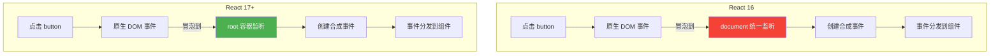

### 8.2 React 16 vs React 17

| 特性 | React 16 | React 17 |
|------|----------|----------|
| 监听节点 | `document`（全局） | `root` 容器（局部） |
| 事件池 | ✅ 有（对象复用） | ❌ **移除** |
| `e.persist()` | ✅ 需要（异步访问） | ❌ 不需要 |
| 嵌套 React | ❌ 不兼容 | ✅ **兼容多版本** |

```jsx
// React 16：事件池导致的问题
function handleChange(e) {
  setTimeout(() => {
    console.log(e.target.value); // ❌ TypeError: e.target is null
  }, 100);
}
// 解决方案：e.persist()

// React 17+：无需 persist
function handleChange(e) {
  setTimeout(() => {
    console.log(e.target.value); // ✅ 正常
  }, 100);
}
```

### 8.3 合成事件 vs 原生事件

| 维度 | 原生 DOM 事件 | React 合成事件 |
|------|-------------|---------------|
| 绑定方式 | `addEventListener` | JSX 属性 `onClick={fn}` |
| 兼容性 | 手动处理 | **自动处理** |
| 内存 | 每个元素监听 | **委托到根节点** |
| 阻止冒泡 | `stopPropagation` | `stopPropagation`（仅 React 事件） |

---

## 9. Stack Reconciler：旧的协调机制

### 9.1 什么是 Reconciler？

Reconciler 是 React 的 **差异比较引擎**，在状态变化时计算 VDOM 的最小更新操作。

### 9.2 Stack Reconciler 的工作方式

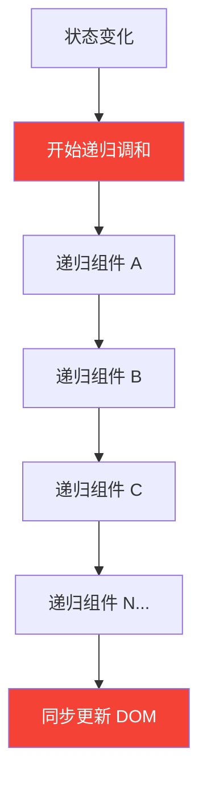

### 9.3 Stack 的三大问题

| 问题 | 表现 | 后果 |
|------|------|------|
| **同步递归** | 一旦开始无法中断 | 占用主线程过长 |
| **阻塞主线程** | JS 执行 > 16ms | **掉帧、卡顿** |
| **无优先级** | 动画和输入同等对待 | 用户操作不响应 |

---

## 10. Fiber：React 16 的全新架构

### 10.1 迭代动机

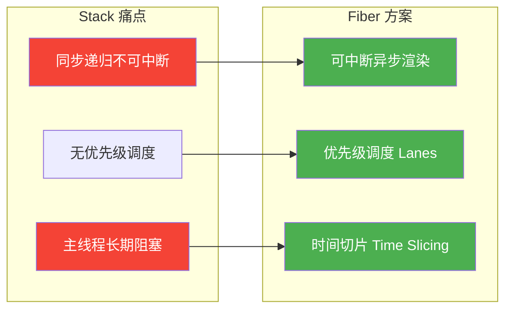

### 10.2 Fiber 心智模型——代数效应（Algebraic Effects）

> **🔑 代数效应**是函数式编程概念，用于将**副作用**从函数调用中分离。React 团队践行代数效应思想来实现**可中断的异步更新**。

React 为何选择 Fiber 而非 Generator 实现可中断更新？

| 方案 | 优势 | 缺陷 |
|------|------|------|
| **Generator** | 原生支持中断/恢复 | **传染性**（调用链都需改）、**中间状态上下文关联**（无法复用已计算结果） |
| **Fiber** | 无传染性、可复用中间状态 | 需自行实现调度 |

> Generator 的中间状态上下文关联：假设已计算出 x 和 y，高优任务插队后因上下文丢失，x 无法复用需重新计算——Fiber 通过全局保存 `alternate` 对解决这一问题。

简言之，**Fiber = React 自己实现的协程**（纤程），支持：
- 任务不同优先级
- 可中断与恢复
- 恢复后可复用之前的中间状态

每个任务更新单元即为 `React Element` 对应的 **Fiber 节点**。

### 10.3 Fiber 核心概念

Fiber 节点是一个 **工作单元**，也是 **组件实例的扩展**：

```javascript
const fiberNode = {
  tag: HostComponent,        // 节点类型（ClassComponent、FunctionComponent 等）
  type: 'div',               // 具体类型
  key: null,                 // 唯一标识
  stateNode: divElement,     // 对应真实 DOM | 组件实例

  return: parentFiber,       // 指向父节点（类似链表）
  child: firstChildFiber,    // 指向第一个子节点
  sibling: nextSiblingFiber, // 指向兄弟节点

  pendingProps: {},          // 新 props
  memoizedProps: {},         // 旧 props
  memoizedState: {},         // 当前 state
  updateQueue: null,         // 更新队列

  effectTag: NoEffect,       // 副作用标记（位运算）
  nextEffect: null,          // 下一个副作用
  firstEffect: null,         // 第一个副作用
  lastEffect: null,          // 最后一个副作用

  expirationTime: NoWork,    // 过期时间
  alternate: currentFiber,   // 双缓存替代节点
};
```

### 10.4 三层架构

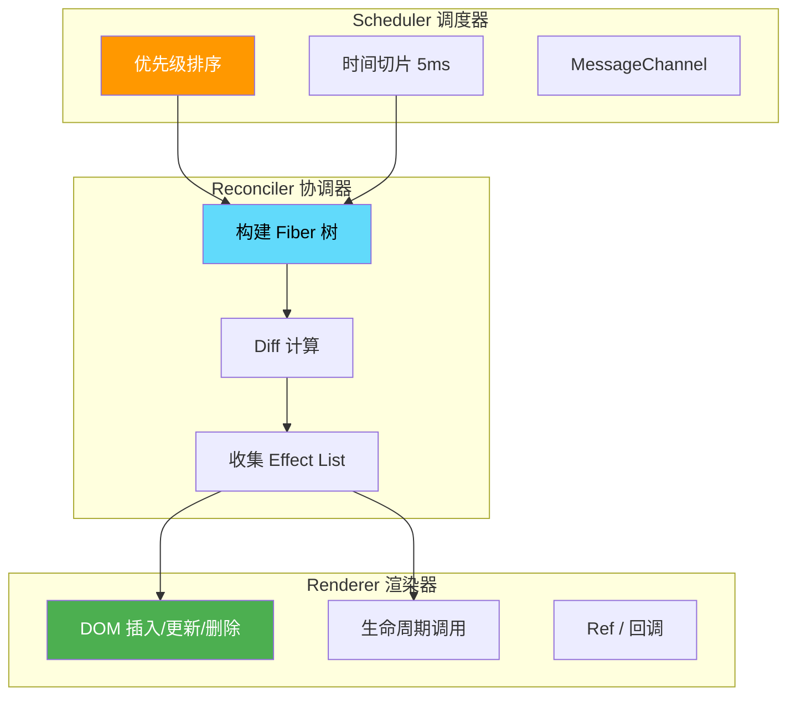

### 10.5 双缓存机制（Double Buffering）

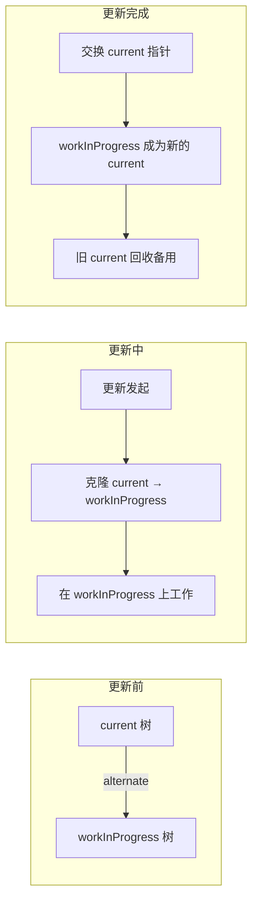

### 10.6 可中断渲染——时间切片

```
开始渲染
    ↓
处理 Fiber A (5ms) → 检查剩余时间（还有 11ms）
    ↓
处理 Fiber B (8ms) → 检查剩余时间（还有 3ms，不够下一个）
    ↓
让出主线程 🎯 → 用户点击按钮 → 立即响应 ✅
    ↓
继续渲染 Fiber C → Fiber D → 完成 → 提交 DOM
```

> **💡 类比**：就像打包行李——不必一次整理完所有物品。整理 5 分钟后有人敲门，先去开门，回来继续。

---

## 11. Fiber 深入：核心数据结构与调度机制

### 11.1 FiberRootNode 与 FiberNode

Fiber 架构的实体由 **FiberRootNode** 和 **FiberNode** 两个构造函数构成：

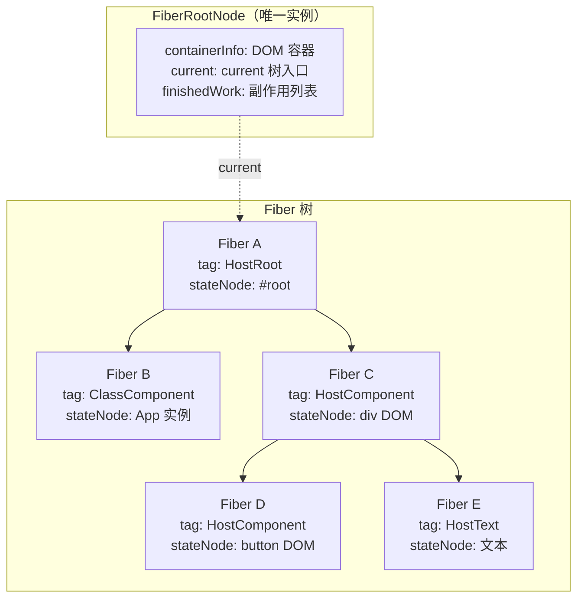

```javascript
// FiberRootNode：整个应用的根（只有一个）
function FiberRootNode(containerInfo, tag, hydrate) {
  this.tag = tag;
  this.current = null;               // current 树入口
  this.containerInfo = containerInfo; // 容器 DOM 节点
  this.finishedWork = null;          // workLoop 结束后的副作用列表
  this.finishedExpirationTime = NoWork;
}

// FiberNode：每个组件对应一个
function FiberNode(tag, pendingProps, key, mode) {
  this.tag = tag;                    // 节点类型
  this.key = key;
  this.elementType = null;
  this.type = null;
  this.stateNode = null;             // DOM 实例 / 组件实例
  this.return = null;                // 父节点
  this.child = null;                 // 第一个子节点
  this.sibling = null;               // 兄弟节点
  this.pendingProps = pendingProps;  // 待更新 props
  this.memoizedProps = null;         // 当前 props
  this.memoizedState = null;         // 当前 state
  this.updateQueue = null;           // 更新队列
  this.effectTag = NoEffect;         // 副作用标记
  this.nextEffect = null;
  this.firstEffect = null;
  this.lastEffect = null;
  this.expirationTime = NoWork;
  this.childExpirationTime = NoWork;
  this.alternate = null;             // 双缓存替代节点
}
```

**tag 类型枚举**：

| 值 | 常量 | 含义 |
|----|------|------|
| 0 | FunctionComponent | 函数组件 |
| 1 | ClassComponent | 类组件 |
| 2 | IndeterminateComponent | 未知（未确定函数还是类） |
| 3 | HostRoot | Fiber 树根节点 |
| 4 | HostPortal | Portal 子树 |
| 5 | HostComponent | 原生 DOM（div, span 等） |
| 6 | HostText | 文本节点 |
| 7 | Fragment | Fragment |

### 11.2 effectTag 与位运算

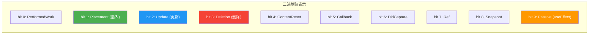

```javascript
// effectTag 取值（二进制表示）
export const NoEffect =         0b000000000000;
export const PerformedWork =    0b000000000001;
export const Placement =        0b000000000010;  // 1号位 = 插入
export const Update =           0b000000000100;  // 2号位 = 更新
export const PlacementAndUpdate=0b000000000110;  // 1号位 + 2号位 = 插入+更新
export const Deletion =         0b000000001000;  // 3号位 = 删除
export const Ref =              0b000010000000;
export const Snapshot =         0b000100000000;
export const Passive =          0b001000000000;  // useEffect

// 位运算操作
let effectTag = Update;                    // 0b000000000100
effectTag |= Ref;                          // 添加 Ref → 0b000010000100
effectTag &= ~Ref;                         // 移除 Ref → 0b000000000100
(effectTag & Update) === Update;           // true（判断是否包含 Update）
(effectTag & Placement) === Placement;     // false（不包含 Placement）
```

> **💡 为什么用位运算？** 一个 32 位整数可以标记 32 种不同操作。通过 `|` 叠加多个标记、`&` 判断是否包含、`& ~` 移除标记，**比对象或数组更高效**。

### 11.3 任务调度器（Scheduler）

Scheduler 是独立于 react 和 react-dom 的模块，负责统一管理任务执行。

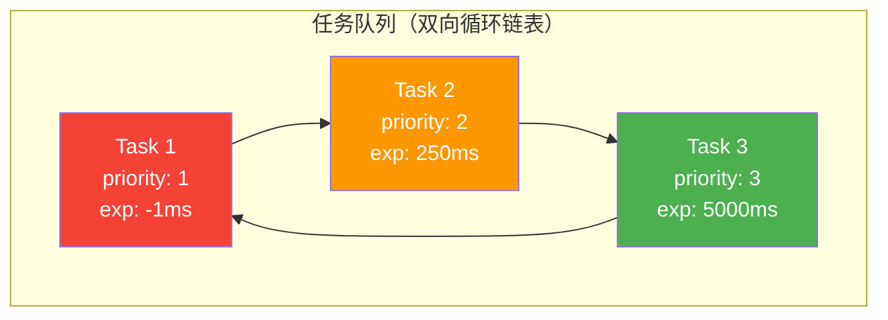

**5 级优先级**：

| 优先级 | 值 | 过期时间 | 场景 |
|--------|----|----------|------|
| ImmediatePriority | 1 | **-1ms**（立即过期） | 饥饿任务 |
| UserBlockingPriority | 2 | **250ms** | 用户点击/输入 |
| NormalPriority | 3 | **5000ms** | 普通数据更新 |
| LowPriority | 4 | **10000ms** | 非关键更新 |
| IdlePriority | 5 | **≈12天** | 空闲时执行 |

#### 为什么 React 不用 requestIdleCallback？

| 原因 | 说明 |
|------|------|
| **兼容性** | 浏览器支持不完整 |
| **触发不稳定** | 切换 tab 后频率急剧降低 |

React 自行实现了功能更完备的 polyfill——**Scheduler**，核心方案：

```
浏览器一帧的生命周期：
task(宏任务) → 微任务 → RAF → 重排/重绘 → RIC

React 的选择：使用 MessageChannel（宏任务）替代 RIC
  ├─ RAF：在重排/重绘前执行，不适合作为空闲回调
  └─ MessageChannel：一帧绘制完成后通过 postMessage 触发 ✅
```

#### 时间切片：初始 5ms + 动态调整

```
workLoopConcurrent 伪代码：
  while (workInProgress !== null && !shouldYield()) {
    // shouldYield 检查当前帧剩余时间
    performUnitOfWork(workInProgress);
  }
```

- **初始分配**：每个时间切片 **5ms**（源码中 `frameInterval`）
- **动态调整**：运行中根据 `fps` 动态分配任务可执行时间
- **中断恢复**：`performConcurrentWorkOnRoot` 在中断后返回自身作为 **continuation callback**，Scheduler 检测返回值为 function 时保留该任务，下次空闲继续执行

#### 优先级排序：小顶堆

Scheduler 内部维护两个队列：

| 队列 | 用途 | 数据结构 |
|------|------|---------|
| `timerQueue` | 未就绪任务（延迟未到） | **小顶堆**（最小堆） |
| `taskQueue` | 已就绪任务（可立即执行） | **小顶堆** |

> 小顶堆确保 O(1) 复杂度获取最早过期的任务。

**调度流程**：

```
unstable_scheduleCallback(priority, callback)
    ↓
计算 startTime 和 expirationTime
    ↓
判断：startTime > currentTime ?
    ├─ 是 → insertDelayedTask（timerQueue）
    └─ 否 → insertScheduledTask（taskQueue）
                ↓
         requestHostCallback(flushWork)
                ↓
         MessageChannel → performWorkUntilDeadline
                ↓
         flushTask → 取 taskQueue 堆顶最高优先级任务执行
                ↓
         任务完成 → pop(taskQueue)；
         返回函数 → 保留回调（continuation），下次继续
```

> **💡 MessageChannel 的作用**：`postMessage` 的回调在浏览器一帧绘制完成后触发，确保不阻塞渲染。比 `setTimeout` 触发时机更靠前。

---

## 12. ReactDOM.render 渲染链路全解

### 12.1 状态更新完整调用链

从触发更新到 DOM 渲染，经历以下关键节点：

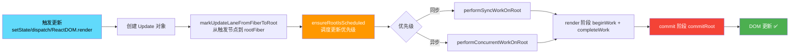

### 12.2 Update 对象与更新队列

每次触发状态更新（`setState`/`dispatch`/`ReactDOM.render`）都会创建 **Update 对象**：

```javascript
const update = {
  eventTime:     performance.now(),  // 任务创建时间
  lane:          SyncLane,           // 优先级（Lane 模型）
  tag:           UpdateState,        // 更新类型：UpdateState | ReplaceState | ForceUpdate
  payload:       { count: 1 },       // 更新的数据（setState 的第一个参数）
  callback:      null,               // 更新完成回调（setState 第二个参数）
  next:          null,               // 指向下一个 Update（形成链表）
};
```

#### updateQueue——环形链表

Fiber 节点上的 `updateQueue` 保存所有待处理的 Update：

```javascript
const queue = {
  baseState:     fiber.memoizedState,  // 当前 state
  firstBaseUpdate: null,               // 上次跳过的低优 Update 链表头
  lastBaseUpdate:  null,               // 上次跳过的低优 Update 链表尾
  shared: {
    pending:     null,                  // 本次新增的 Update（环形链表 🔄）
  },
  effects:       [],                    // 含 callback 的 Update（触发 setState 回调）
};
```

**环形链表工作机制**：

```
多次 setState 产生的 Update 构成环形链表：
  shared.pending 始终指向最后一个插入的 Update

  enqueue(u3) 后：    u3 ──┐
                      ^    │
                      └────┘

  enqueue(u4) 后：    u4 ──> u3
                      ^      │
                      └──────┘

render 阶段剪开环：
  shared.pending 的环被剪开，连接到 baseUpdate 尾部
  baseState → u1(上次跳过) → u2(上次跳过) → u3(本次) → u4(本次)
  ↓ 遍历逐个计算，低优跳过保留到下次
  最终结果 → fiber.memoizedState（本次渲染的 state）
```

> **💡 为什么是环形链表？** 方便快速在链表尾部追加。`shared.pending` 始终指向最后一个节点，`pending.next` 就是第一个节点，O(1) 复杂度完成追加。

### 12.3 从 JSX 到 DOM 的全链路

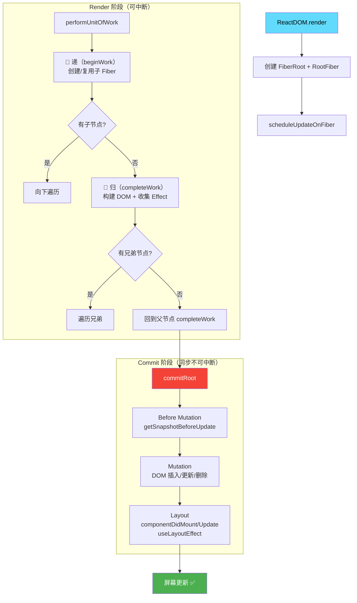

### 12.4 Render 阶段核心——beginWork & completeWork

**beginWork（递）——创建/复用子 Fiber：**

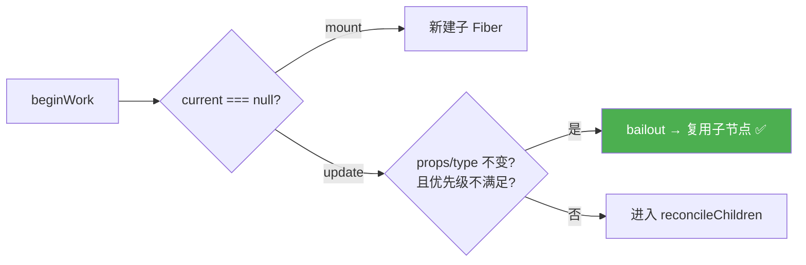

关键要点：
1. **mount 时**：`current === null`，通过 `mountChildFibers` 创建子 Fiber——不设 `effectTag`（优化：只在 rootFiber 设 Placement，避免每个节点都插入 DOM）
2. **update 时**：`current !== null`，满足 `props/type 不变 && 优先级不够` 则直接复用子节点（`bailoutOnAlreadyFinishedWork`）
3. **reconcileChildren**：mount 用 `mountChildFibers`（无 effectTag），update 用 `reconcileChildFibers`（有 effectTag）

**completeWork（归——收集 effect、构建 DOM）：**

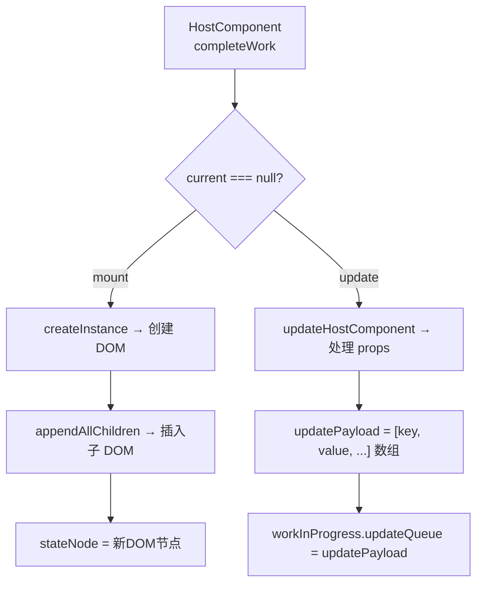

关键要点：
1. **mount 时**：`createInstance` 创建 DOM → `appendAllChildren` 自底向上构建整棵 DOM 树 → "归"到 rootFiber 时离屏 DOM 树已就绪
2. **update 时**：`updateHostComponent` 生成 `updatePayload` 数组（偶数为 prop key，奇数为 prop value），等待 commit 阶段渲染
3. **effectList**：每执行完 completeWork，含 effectTag 的节点被追加到单向链表 `effectList` 中（`firstEffect` → `nextEffect` → ... → `lastEffect`），commit 阶段只需遍历 `effectList`，无需再遍历整棵 Fiber 树

### 12.5 Commit 三子阶段深度解读

| 阶段 | 执行内容 | 用户看到 |
|------|---------|---------|
| **Before Mutation** | `getSnapshotBeforeUpdate`、**调度 useEffect** | ❌ 不可见 |
| **Mutation** | DOM 插入/更新/删除、`componentWillUnmount`、**解绑旧 ref** | ❌ 不可见 |
| **Layout** | `componentDidMount/Update`、`useLayoutEffect` 回调、**赋值新 ref** | ✅ **可见** |
| layout 之后 | `root.current = finishedWork` <br/>（切换 current Fiber 树指向） | ✅ |

#### Before Mutation——useEffect 异步调度三步走

```
beforeMutation 阶段：
  ① scheduleCallback(NormalPriority, flushPassiveEffects)
                          ↓
mutation 阶段：(DOM 操作)
                          ↓
layout 阶段：
  ② layout 之后 → rootWithPendingPassiveEffects = effectList
                          ↓
  ③ flushPassiveEffects 被触发 → 遍历 rootWithPendingPassiveEffects
       └─ 先执行所有 useEffect 销毁函数（全部销毁）
       └─ 再执行所有 useEffect 回调函数（全部执行）
```

> **💡 为何 useEffect 要异步？** 防止同步执行时阻塞浏览器渲染。且必须"全部销毁再全部执行"——因为多个组件可能共用同一个 `ref`，交错执行会导致 ref.current 值不一致。

#### Mutation——getHostSibling 的指数级复杂度

`getHostSibling` 寻找 DOM 兄弟节点时，由于 Fiber 树和 DOM 树并非完全对应，需跨层级遍历。例如：
```
Fiber: div → p → Item → li               DOM: div → p → li
               ↳ sibling: Item.child = li (兄弟节点的子节点才是 DOM 兄弟)
```
当同父节点下多个插入操作时，插入顺序靠后的节点需反复查找，时间复杂度指数级。

#### Layout——current Fiber 树切换时机

`root.current = finishedWork` 在 **mutation 之后、layout 之前**执行：
- `componentWillUnmount`（mutation 阶段）读到的 current 是旧树（旧 DOM）
- `componentDidMount/Update`（layout 阶段）读到的 current 是新树（新 DOM）✅

### 12.6 Lanes 优先级模型

> **📌 注**：React 17 legacy 模式仍以 expirationTime 为主。Lanes 完全生效于 **React 18 Concurrent 模式**。

```mermaid
graph LR
    subgraph "ExpirationTime（React 16）"
        A[绝对值比较] --> B[优先级粒度不够细]
        B --> C[中断恢复困难]
    end

    subgraph "Lanes 车道（React 17+/18）"
        D[位运算操作] --> E[更精细的优先级]
        D --> F[支持多同级更新]
        D --> G[更好的中断恢复]
    end
```

---

```mermaid
graph TD
    A[beginWork] --> B{当前 Fiber 类型}
    B -->|FunctionComponent| C[执行函数 → get 子元素]
    B -->|ClassComponent| D[调用 render → get 子元素]
    B -->|HostComponent| E[取 props.children → get 子元素]

    C --> F[reconcileChildren]
    D --> F
    E --> F

    F --> G{子元素类型}
    G -->|单个 Element| H[reconcileSingleElement]
    G -->|Text| I[reconcileSingleTextNode]
    G -->|Array| J[reconcileChildrenArray]
    G -->|Portal| K[reconcileSinglePortal]
```

### 13.2 协调单个元素

依据 **key** 判断：

```
新元素的 key === 旧 Fiber 的 key ?
    ├─ 是 → 复用 Fiber + 更新 props
    └─ 否 → 删除旧 Fiber + 创建新 Fiber
```

### 13.3 多节点 Diff——两轮遍历算法

多节点 Diff 通过 **两轮遍历** 处理更新、新增、删除、移动四种情况。

#### 第一轮遍历：处理更新

从 `newChildren[0]` 开始与 `oldFiber` 同层比对：

```
i = 0
遍历 newChildren[i] vs oldFiber:
  ├─ key 相同 + type 相同 → 复用，i++，继续
  ├─ key 相同 + type 不同 → 标记 Deletion，继续
  ├─ key 不同 → 跳出第一轮 ❌
  └─ newChildren 或 oldFiber 遍历完 → 跳出第一轮
```

#### 第二轮遍历：处理剩余

遍历结束后处理四种结果：

| 结果 | 含义 | 操作 |
|------|------|------|
| 新旧都遍历完 | 纯更新 | ✅ 无需额外操作 |
| newChildren 剩余 | 新增节点 | 剩余节点标记 `Placement` |
| oldFiber 剩余 | 删除节点 | 剩余 oldFiber 标记 `Deletion` |
| **两者都剩余** | **节点移动** | 进入移动判断算法 ⬇ |

#### 移动判断：lastPlacedIndex

当新旧都未遍历完，将剩余 `oldFiber` 存入 `Map<key, fiber>`，然后遍历 `newChildren` 通过 `key` 查找复用：

```javascript
// 核心逻辑：lastPlacedIndex 标记最右侧可复用的位置
let lastPlacedIndex = 0;

遍历剩余 newChildren:
  在 Map 中通过 key 找到 oldFiber
  oldIndex = oldFiber 在原数组中的位置

  if (oldIndex >= lastPlacedIndex) {
    // 节点不需要移动（相对位置不变）
    lastPlacedIndex = oldIndex;
  } else {
    // 节点需要向右移动
    标记 Placement;
  }
```

---

**Demo：abcd → acdb**

```
第一轮：a 复用 (oldIndex=0, lastPlacedIndex=0)
       c vs b: key不同 → 跳出第一轮

第二轮：剩余 oldFiber: b(1), c(2), d(3)
       newChildren: c, d, b

  c: oldIndex=2 >= lastPlacedIndex=0 → lastPlacedIndex=2 ✅ 不动
  d: oldIndex=3 >= lastPlacedIndex=2 → lastPlacedIndex=3 ✅ 不动
  b: oldIndex=1 <  lastPlacedIndex=3 → ❌ b 向右移动
```

> **💡 重要**：React 默认保持前面节点不动，将后面的节点向后移动。所以应尽量避免将节点从后面移到前面（这会导致前面所有节点都被标记移动）。

---

## 14. Concurrent 模式与 React 18

### 14.1 什么是 Concurrent 模式？

```mermaid
graph TD
    A[用户输入] --> B{优先级?}
    B -->|高<br/>点击/输入| C[紧急更新<br/>立即渲染 ✅]
    B -->|低<br/>数据获取| D[过渡更新<br/>可中断/延迟]

    D --> E[让出主线程]
    E --> F[高优任务插队]
    F --> G[空闲时继续低优任务]

    style C fill:#f44336,color:#fff
    style D fill:#4CAF50,color:#fff
```

### 14.2 useTransition 与 useDeferredValue

```jsx
// useTransition：区分紧急 vs 非紧急
function SearchPage() {
  const [query, setQuery] = useState('');
  const [isPending, startTransition] = useTransition();

  function handleChange(e) {
    // 🚀 紧急：立即更新输入框
    setQuery(e.target.value);
    // 🐢 非紧急：搜索结果可延迟
    startTransition(() => setSearchQuery(e.target.value));
  }

  return (
    <>
      <input value={query} onChange={handleChange} />
      {isPending && <Spinner />}
      <SearchResults />
    </>
  );
}

// useDeferredValue：延迟非关键值
function SearchPage({ query }) {
  const deferredQuery = useDeferredValue(query);
  const isStale = query !== deferredQuery;
  return (
    <>
      <input value={query} />
      <div style={{ opacity: isStale ? 0.5 : 1 }}>
        <SearchResults query={deferredQuery} />
      </div>
    </>
  );
}
```

> **💡 类比**：你在餐厅点餐。服务员先记下你的主菜（紧急），甜点可以后补（过渡更新）。

### 14.3 React 18 关键变化

| 特性 | 说明 | 使用场景 |
|------|------|---------|
| **自动批处理** | 所有场景自动批量更新 | setTimeout、Promise、原生事件 |
| **useTransition** | 标记非紧急状态更新 | 搜索框、页面切换 |
| **useDeferredValue** | 延迟更新非关键值 | 大列表筛选 |
| **Suspense SSR** | 流式传输 + 选择性注水 | 服务端渲染 |

---

## 15. Hooks：函数组件的逆袭

### 15.1 设计动机

> **💡 类比理解**：React Logo 是原子（atom）符号。类组件就像"原子"——封装完整，不可分割。而 Hooks 更像是"电子"（electron），更贴近 React 底层的运行规律（schedule→render→commit），比类组件的生命周期抽象层次更低、更灵活。
>
> —— Dan Abramov, React Conf 2018

```mermaid
graph LR
    subgraph "类组件痛点"
        A[逻辑分散在各生命周期]
        B[this 绑定问题]
        C[代码复用困难<br/>HOC / Render Props 嵌套]
    end

    subgraph "Hooks 方案"
        D[按逻辑分组<br/>useEffect / useCallback]
        E[函数闭包<br/>无 this 陷阱]
        F[自定义 Hooks<br/>轻松复用]
    end

    A --> D
    B --> E
    C --> F

    style A fill:#f44336,color:#fff
    style B fill:#f44336,color:#fff
    style D fill:#4CAF50,color:#fff
    style F fill:#4CAF50,color:#fff
```

### 15.2 底层机制：链式存储

```javascript
// Hooks 以单向链表挂载在 Fiber 节点上
fiber.memoizedState = {
  queue: null,       // useState 更新队列
  baseState: null,   // 当前值
  next: {            // 下一个 Hook
    tag: Effect,     // useEffect
    create: () => {},
    destroy: null,
    deps: [],
    next: {          // 下一个 Hook
      // useRef / useCallback / useMemo / useContext
    }
  }
};
```

#### Dispatcher 机制：mount 与 update 分离

> **🔑** React 内部通过当前 Fiber 状态决定使用 `mount` 还是 `update` 的 Dispatcher。

```javascript
// mount 时的 Hook 实现
const HooksDispatcherOnMount = {
  useState: mountState,
  useEffect: mountEffect,
  useRef: mountRef,
  // ...
};

// update 时的 Hook 实现
const HooksDispatcherOnUpdate = {
  useState: updateState,
  useEffect: updateEffect,
  useRef: updateRef,
  // ...
};

// render 前根据条件选择 dispatcher
ReactCurrentDispatcher.current =
  current === null || current.memoizedState === null
    ? HooksDispatcherOnMount    // 首次渲染
    : HooksDispatcherOnUpdate;  // 后续更新
```

这就是为何在嵌套函数中调用 Hook 会直接抛错——此时 `dispatcher` 已被替换为 `ContextOnlyDispatcher`，所有 Hook 都指向 `throwInvalidHookError`。

> **⚠️ 两条铁律**（因为基于链表顺序匹配 + dispatcher 切换时机）：
> 1. **只在函数最顶层调用 Hooks**——不能放在 `if` / `for` / 嵌套函数中
> 2. **只在 React 函数组件中调用 Hooks**——不能放在普通 JS 函数中

### 15.3 常用 Hooks 详解

```jsx
// useState：惰性初始值（避免昂贵计算）
const [data] = useState(() => expensiveComputation());

// useEffect：清理函数避免竞态条件
useEffect(() => {
  let cancelled = false;
  fetch(`/api/user/${id}`).then(data => {
    if (!cancelled) setUser(data);
  });
  return () => { cancelled = true; };
}, [id]);

// useMemo + useCallback：性能优化
const filtered = useMemo(() => items.filter(fn), [items, fn]);
const handleClick = useCallback((id) => track(id), []);

// useRef：保持引用 + 存储可变值
const ref = useRef(null);
const prevRef = useRef();
useEffect(() => { prevRef.current = value; });
```

### 15.4 useEffect vs useLayoutEffect

```mermaid
graph TD
    subgraph "执行时机对比"
        A[组件渲染到屏幕] -->|同步| B[useLayoutEffect<br/>DOM 变更后立即执行]
        A -->|异步| C[useEffect<br/>浏览器绘制后才执行]
    end

    style B fill:#FF9800,color:#fff
    style C fill:#2196F3,color:#fff
```

#### useEffect 异步调度机制

`useEffect` 的执行分三个阶段：

```
commit 阶段：
  beforeMutation:  scheduleCallback(NormalPriority, flushPassiveEffects)  ①
  mutation:        useLayoutEffect 销毁函数同步执行
  layout:          schedulePassiveEffects 收集待执行 effect             ②
  layout 之后:     rootWithPendingPassiveEffects = effectList

浏览器绘制后：
  flushPassiveEffects 被触发:
    阶段一：遍历 pendingPassiveHookEffectsUnmount，执行所有 useEffect 销毁函数
    阶段二：遍历 pendingPassiveHookEffectsMount，执行所有 useEffect 回调函数 ③
```

> **💡 为什么必须"全部销毁再全部执行"？** 多个组件可能共用同一个 `ref`。如果 A 组件销毁 → A 组件回调 → B 组件销毁，A 回调中修改的 `ref.current` 可能影响 B 销毁时的行为。必须 `A销毁 → B销毁 → A回调 → B回调` 确保逻辑一致。

#### useLayoutEffect 的工作流

```javascript
mutation 阶段 → 执行所有 useLayoutEffect 销毁函数（commitHookEffectListUnmount）
layout 阶段   → 执行所有 useLayoutEffect 回调函数（commitHookEffectListMount）
```

`useLayoutEffect` 的销毁和回调在同一个 commit 阶段**同步执行**，会阻塞浏览器绘制。

#### 场景选择

| 维度 | useEffect | useLayoutEffect |
|------|-----------|-----------------|
| 执行时机 | **浏览器绘制之后**（异步） | **DOM 更新后、绘制之前**（同步） |
| 阻塞绘制 | ❌ 不阻塞 | ✅ 阻塞 |
| 场景 | 数据请求、事件订阅、日志 | **DOM 测量**、滚动位置、动画 |

> 大部分场景优先用 `useEffect`。仅在需要读取 DOM 布局（如获取元素宽高）或同步触发重绘时才用 `useLayoutEffect`。

---

## 16. Redux：可预测的状态容器

### 16.1 三大原则

```mermaid
graph TD
    subgraph "三大原则"
        A[单一数据源<br/>Single Source of Truth]
        B[状态只读<br/>只能通过 dispatch 修改]
        C["纯函数修改<br/>Reducer = (state, action) => newState"]
    end

    subgraph "工作流"
        D[View] -->|dispatch| E[Action]
        E -->|传入| F[Reducer]
        F -->|返回| G[New State]
        G -->|通知| H[Store]
        H -->|更新| D
    end

    style A fill:#764ABC,color:#fff
    style B fill:#764ABC,color:#fff
    style C fill:#764ABC,color:#fff
```

### 16.2 createStore dispatch 核心

```javascript
function dispatch(action) {
  // 1. 校验 action 是否有 type
  if (typeof action.type === 'undefined') {
    throw new Error('Actions must have a type');
  }

  // 2. 🔒 禁止在 reducer 中 dispatch（防死循环）
  if (isDispatching) {
    throw new Error('Reducers may not dispatch actions.');
  }

  // 3. 执行 reducer，计算新 state
  try {
    isDispatching = true;  // 上锁
    currentState = currentReducer(currentState, action);
  } finally {
    isDispatching = false; // 解锁
  }

  // 4. 触发所有监听器
  const listeners = currentListeners = nextListeners;
  for (let i = 0; i < listeners.length; i++) listeners[i]();

  return action;
}
```

### 16.3 中间件——洋葱模型

```mermaid
graph LR
    A[dispatch] --> B[中间件 1<br/>redux-thunk]
    B --> C[中间件 2<br/>logger]
    C --> D[中间件 3<br/>saga]
    D --> E[reducer]

    style B fill:#FF9800,color:#fff
    style C fill:#4CAF50,color:#fff
    style D fill:#2196F3,color:#fff
```

```javascript
// applyMiddleware：对 dispatch 的增强
function applyMiddleware(...middlewares) {
  return createStore => (...args) => {
    const store = createStore(...args);

    const middlewareAPI = {
      getState: store.getState,
      dispatch: (...args) => dispatch(...args)
    };

    const chain = middlewares.map(m => m(middlewareAPI));
    dispatch = compose(...chain)(store.dispatch);

    return { ...store, dispatch };
  };
}

// redux-thunk
function thunk({ dispatch, getState }) {
  return next => action => {
    if (typeof action === 'function') {
      return action(dispatch, getState); // 支持函数 action
    }
    return next(action);
  };
}
```

---

## 17. 现代状态管理：Zustand 与新一代方案

### 17.1 为什么 Redux 不再是唯一选择？

Redux 的核心痛点：**样板代码多**（action type / action creator / reducer / dispatch）、**异步流复杂**（thunk / saga）、**TS 类型推导繁琐**。新一代状态库更聚焦"最小 API、最大效率"。

### 17.2 Zustand——极简状态管理

> **最受欢迎的 Redux 替代品**，~1KB，无需 Provider 包裹，API 直白。

```jsx
import { create } from 'zustand';

// 创建一个 store（无需 Provider）
const useStore = create((set, get) => ({
  count: 0,
  todos: [],
  increment: () => set(state => ({ count: state.count + 1 })),
  addTodo: (text) => set(state => ({
    todos: [...state.todos, { id: Date.now(), text }]
  })),
  // 异步操作直接写，无需中间件
  fetchTodos: async () => {
    const res = await fetch('/api/todos');
    set({ todos: await res.json() });
  }
}));

// 组件中使用
function Counter() {
  const count = useStore(state => state.count);
  const increment = useStore(state => state.increment);
  return <button onClick={increment}>{count}</button>;
}

// 在组件外读取/修改（非 React 环境也适用）
import { useStore } from './store';
const { count } = useStore.getState();
useStore.setState({ count: 0 });
```

**Zustand 核心优势**：

| 特性 | Redux | Zustand |
|------|-------|---------|
| 样板代码 | action + reducer + dispatch + connect | **一行 create** |
| Provider 包裹 | ✅ 必须 `<Provider store>` | ❌ **不需要** |
| 异步 | thunk / saga / RTK Query | **直接 async/await** |
| 组件外访问 | ❌ 困难 | ✅ `getState()` / `subscribe()` |
| 体积 | ~11KB | **~1KB** |
| TypeScript | 类型推导复杂 | **自动类型推导** |

**中间件扩展**：

```jsx
import { persist } from 'zustand/middleware';

// 自动持久化到 localStorage
const useStore = create(
  persist(
    (set) => ({
      theme: 'light',
      toggleTheme: () => set(s => ({ theme: s.theme === 'light' ? 'dark' : 'light' })),
    }),
    { name: 'app-storage' }
  )
);

// 调试中间件（redux-devtools 兼容）
import { devtools } from 'zustand/middleware';
const useStore = create(devtools((set) => ({ ... })));
```

### 17.3 Jotai——原子状态

> 灵感来自 Recoil，以**原子（atom）**为最小状态单元，支持派生状态和懒加载。

```jsx
import { atom, useAtom } from 'jotai';

// 基础原子
const countAtom = atom(0);

// 派生原子（类似 computed 或 selector）
const doubleAtom = atom(get => get(countAtom) * 2);

// 异步原子
const userAtom = atom(async () => {
  const res = await fetch('/api/user');
  return res.json();
});

function Counter() {
  const [count, setCount] = useAtom(countAtom);
  const [double] = useAtom(doubleAtom);
  return (
    <div>
      <span>{count} x2 = {double}</span>
      <button onClick={() => setCount(c => c + 1)}>+</button>
    </div>
  );
}
```

### 17.4 TanStack Query（React Query）——服务端状态

> 专治**异步数据获取与缓存**，与 UI 状态库互补而非对立。

```jsx
import { useQuery, useMutation, useQueryClient } from '@tanstack/react-query';

function TodoList() {
  // 自动缓存 + 重新获取 + 后台刷新
  const { data, isLoading, error } = useQuery({
    queryKey: ['todos'],
    queryFn: () => fetch('/api/todos').then(r => r.json()),
    staleTime: 5 * 60 * 1000, // 5分钟内认为数据新鲜
  });

  const queryClient = useQueryClient();

  // 自动乐观更新 + 失败回滚
  const mutation = useMutation({
    mutationFn: (newTodo) => fetch('/api/todos', {
      method: 'POST', body: JSON.stringify(newTodo)
    }),
    onSuccess: () => queryClient.invalidateQueries({ queryKey: ['todos'] }),
  });

  if (isLoading) return <Spinner />;
  return (
    <>
      {data?.map(todo => <li key={todo.id}>{todo.text}</li>)}
      <button onClick={() => mutation.mutate({ text: 'New' })}>Add</button>
    </>
  );
}
```

### 17.5 状态管理选型速查

| 场景 | 推荐方案 | 原因 |
|------|---------|------|
| **全局 UI 状态**（主题/语言/侧边栏） | **Zustand** | 零模板、无 Provider、可组件外访问 |
| **服务端数据**（API 缓存/分页/重试） | **TanStack Query** + Zustand | 职责分离，Query 管异步缓存，Zustand 管 UI 状态 |
| **复杂客户端状态**（复杂表单/多步骤向导） | **Zustand** 或 **Jotai** | 细粒度订阅避免无效渲染 |
| **大型企业级（规范为王）** | **Redux Toolkit (RTK)** | 约定大于配置，团队规范成熟 |
| **原子化细粒度状态** | **Jotai** | 免 key 管理、自动派生、React 原生体验 |
| **跨组件/跨框架通信** | **Zustand** | 组件外 getState/subscribe 能力强 |

> **💡 2026 年主流实践**：**Zustand + TanStack Query** 组合已成为多数 React 新项目的默认选型，取代了"全家桶 Redux"的时代。

---

## 18. 路由方案

### 18.1 Hash vs History

```mermaid
graph TD
    subgraph "Hash 模式"
        H1["URL: example.com/#/about"]
        H2["hashchange 事件监听"]
        H3["无需服务端配置"]
    end

    subgraph "History 模式"
        B1["URL: example.com/about"]
        B2["popstate 事件监听"]
        B3["需服务端配置<br/>所有路径指向 index.html"]
    end

    style H1 fill:#4CAF50,color:#fff
    style B1 fill:#2196F3,color:#fff
```

```javascript
// Hash 模式
window.location.hash = '/about';
window.addEventListener('hashchange', () => {
  renderRoute(window.location.hash.slice(1));
});

// History 模式
window.history.pushState({}, '', '/about');
window.addEventListener('popstate', () => {
  renderRoute(window.location.pathname);
});
```

### 18.2 React-Router v6 核心

```jsx
<BrowserRouter>
  <Routes>
    <Route path="/" element={<Home />} />
    <Route path="/users" element={<Users />}>
      <Route path=":id" element={<UserDetail />} />
    </Route>
    <Route path="*" element={<NotFound />} />
  </Routes>
</BrowserRouter>

// 编程式导航
const navigate = useNavigate();
navigate('/dashboard', { replace: true });

// URL 参数
const { id } = useParams();
const [searchParams, setSearchParams] = useSearchParams();
```

---

## 19. SSR：服务器端渲染

### 19.1 为什么需要 SSR？

```mermaid
graph LR
    subgraph "纯浏览器端渲染"
        A[请求 HTML] --> B[空壳 HTML]
        B --> C[下载 JS]
        C --> D[AJAX 请求数据]
        D --> E[渲染内容<br/>⏱ 慢]
    end

    subgraph "SSR 服务器端渲染"
        F[请求 HTML] --> G[完整 HTML<br/>含内容]
        G --> H[下载 JS]
        H --> I[注水 Hydrate<br/>⏱ 快 ✅]
    end

    style E fill:#f44336,color:#fff
    style G fill:#4CAF50,color:#fff
```

### 19.2 React SSR API 演进

```javascript
// v16 之前：renderToString（同步，一次性生成）
const html = ReactDOMServer.renderToString(<App />);

// v16：renderToNodeStream（流式，边渲染边发送）
ReactDOMServer.renderToNodeStream(<App />).pipe(response);

// v18+（推荐）：renderToPipeableStream（流式 + Suspense）
// renderToNodeStream 已废弃
ReactDOMServer.renderToPipeableStream(<App />).pipe(response);

// 浏览器端：hydrate → hydrateRoot（v18+）
// v16
ReactDOM.hydrate(<App />, document.getElementById('root'));
// v18+
import { hydrateRoot } from 'react-dom/client';
hydrateRoot(document.getElementById('root'), <App />);
```

### 19.3 脱水（Dehydrate）与注水（Hydrate）

```
服务器端：
  获取数据 → renderToString/renderToPipeableStream → 生成 HTML
  同时将数据嵌入 HTML（<script>window.__DATA__ = {...}</script>）
                                      ↓ 这叫"脱水"
浏览器端：
  直接显示 HTML 内容（用户立刻看到页面）
  加载 JS → 用 __DATA__ 初始化状态 → hydrate（绑定事件）
                                      ↓ 这叫"注水"
```

> **⚠️ 关键**：服务器端和浏览器端传给组件的数据**必须一致**，否则 React 会抛出一致性警告（v16 前甚至会导致闪烁）。

---

## 20. CSS-in-JS：组件化样式方案

### 20.1 为什么要 CSS-in-JS？

CSS 在组件化开发中缺少四个能力：

| 能力 | 问题 | CSS-in-JS 方案 |
|------|------|---------------|
| **作用域隔离** | CSS 全局作用域会互相影响 | 自动生成唯一类名 |
| **源码关联** | CSS 文件和组件分离 | 在 JS 中写 CSS |
| **数据响应** | 样式无法响应 props/state | 模板字面量嵌入变量 |
| **复用扩展** | 难以按组件复用样式 | 样式组合 + 继承 |

### 20.2 emotion 示例

```jsx
/** @jsxImportSource @emotion/react */
import { css } from '@emotion/react';

function Card({ highlighted, children }) {
  return (
    <div
      css={css`
        padding: 16px;
        border-radius: 8px;
        background: ${highlighted ? '#ffeb3b' : '#fff'};
        box-shadow: 0 2px 4px rgba(0, 0, 0, 0.1);
        &:hover {
          box-shadow: 0 4px 12px rgba(0, 0, 0, 0.15);
        }
      `}
    >
      {children}
    </div>
  );
}
```

### 20.3 CSS-in-JS 实现方式

| 方式 | 原理 | 代表库 |
|------|------|--------|
| 内联 style | 通过 DOM API 设置 `element.style` | 原生 |
| className 关联 | 通过 DOM API 关联现有 CSS 类 | CSS Modules |
| 动态 style 标签 | 在 document 中插入 `<style>` | emotion、styled-components |
| CSSOM 修改 | 通过 CSSStyleSheet 修改规则 | 少数库 |
| 编译期剥离 | 构建时生成静态 CSS 文件 | Linaria |

---

## 21. TypeScript + React

### 21.1 为什么需要 TypeScript？

```typescript
// 没有 TypeScript 的风险
const card = { title: '任务', status: new Date().toString() };
card.step = 'ongoing';       // ❌ 随意添加属性
card.stop = 'done';          // ❌ 拼错属性名
if (card.step === 'done') {} // ❌ 一直为 false（拼错了）
```

> **TypeScript 可以在开发阶段就捕获这类错误**，无需等到运行时。

### 21.2 组件类型定义

```jsx
// Props 接口
interface ButtonProps {
  label: string;
  variant?: 'primary' | 'secondary';
  disabled?: boolean;
  onClick: (e: React.MouseEvent<HTMLButtonElement>) => void;
  children?: React.ReactNode;
}

// 函数组件
const Button: React.FC<ButtonProps> = ({
  label, variant = 'primary', disabled, onClick, children
}) => (
  <button className={`btn btn-${variant}`} disabled={disabled} onClick={onClick}>
    {label}{children}
  </button>
);

// Hooks 类型
const [count, setCount] = useState<number>(0);
const divRef = useRef<HTMLDivElement>(null);
const [form, setForm] = useState<{ name: string; age: number }>({ name: '', age: 0 });
```

### 21.3 泛型组件

```jsx
function List<T>({
  items,
  render
}: {
  items: T[];
  render: (item: T) => React.ReactNode;
}) {
  return <>{items.map(render)}</>;
}
```

---

## 22. 性能优化

### 22.1 核心原则

```mermaid
graph TD
    A[React 性能优化] --> B[减少渲染次数]
    A --> C[减少渲染范围]
    A --> D[减少计算量]
    A --> E[减少包体积]

    B --> F[React.memo / PureComponent]
    B --> G[shouldComponentUpdate]

    C --> H[状态下沉]
    C --> I[组件拆分]

    D --> J[useMemo / useCallback]
    D --> K[虚拟列表]

    E --> L[代码分割 React.lazy]
    E --> M[Tree Shaking]
```

### 22.2 避免不必要渲染

```jsx
// ❌ 未优化：父组件更新 → 所有子组件重渲染
function Parent() {
  const [count, setCount] = useState(0);
  return (
    <div>
      <ExpensiveList />     {/* count 变化也重渲染 */}
      <button onClick={() => setCount(c => c + 1)}>{count}</button>
    </div>
  );
}

// ✅ React.memo：跳过 props 未变化的渲染
const ExpensiveList = React.memo(({ items }) => {
  return items.map(item => <li key={item.id}>{item.name}</li>);
});

// ✅ 状态下沉：只让使用状态的组件重渲染
function Parent() {
  return (
    <div>
      <ExpensiveList />
      <CounterButton />
    </div>
  );
}
function CounterButton() {
  const [count, setCount] = useState(0);
  return <button onClick={() => setCount(c => c + 1)}>{count}</button>;
}
```

### 22.3 虚拟列表 + 懒加载

```jsx
// 虚拟列表：只渲染可视区域（react-window）
import { FixedSizeList } from 'react-window';
<FixedSizeList height={400} itemCount={10000} itemSize={50}>
  {({ index, style }) => (
    <div style={style}>{items[index].name}</div>
  )}
</FixedSizeList>

// 懒加载：代码分割
const LazyComponent = React.lazy(() => import('./HeavyComponent'));
<Suspense fallback={<Loading />}>
  <LazyComponent />
</Suspense>
```

---

## 23. 设计模式

### 23.1 高阶组件（HOC）

> 参数为**组件**，返回**新组件**的函数。

```javascript
function withLoading(WrappedComponent) {
  return function EnhancedComponent({ isLoading, ...props }) {
    if (isLoading) return <div className="loading">加载中...</div>;
    return <WrappedComponent {...props} />;
  };
}
```

### 23.2 Render Props

> 通过值为函数的 prop 共享逻辑。

```jsx
class MouseTracker extends React.Component {
  state = { x: 0, y: 0 };
  render() {
    return (
      <div onMouseMove={e => this.setState({x: e.clientX, y: e.clientY})}>
        {this.props.render(this.state)}
      </div>
    );
  }
}
// 使用
<MouseTracker render={({x, y}) => <h1>位置: {x}, {y}</h1>} />
```

### 23.3 组合组件（Compound Components）

> 父组件隐式传递信息给子组件，无需显式的 props。

```jsx
const TabsContext = React.createContext();

function Tabs({ children }) {
  const [activeIndex, setActiveIndex] = useState(0);
  return (
    <TabsContext.Provider value={{ activeIndex, setActiveIndex }}>
      {children}
    </TabsContext.Provider>
  );
}

function Tab({ index, children }) {
  const { activeIndex, setActiveIndex } = useContext(TabsContext);
  return (
    <div onClick={() => setActiveIndex(index)}
         style={{ color: activeIndex === index ? 'red' : 'gray' }}>
      {children}
    </div>
  );
}

// 优雅的使用方式
<Tabs>
  <Tab index={0}>Tab A</Tab>
  <Tab index={1}>Tab B</Tab>
  <Tab index={2}>Tab C</Tab>
</Tabs>
```

### 23.4 HOC vs Render Props vs Hooks

| 维度 | HOC | Render Props | Hooks |
|------|-----|-------------|-------|
| Props 冲突 | ⚠️ 可能命名冲突 | ✅ 无冲突 | ✅ 无冲突 |
| 嵌套地狱 | 😰 多层 HOC 难读 | 😱 嵌套层级深 | ✅ 扁平调用 |
| 类型推导 | ❌ 困难 | ❌ 困难 | ✅ 类型友好 |
| 调试 | 🔍 组件栈深 | 🔍 运行时难调试 | ✅ 直接可调试 |

> **结论**：Hooks 是最优雅的逻辑复用方式。

---

## 24. React 17→18→19：演进与未来

### 24.1 版本时间线

```mermaid
timeline
    title React 版本演进
    2016 : React 15 : Stack Reconciler
    2017 : React 16 : Fiber 架构 : 生命周期重写
    2019 : React 16.8 : Hooks 发布
    2020 : React 17 : 为并发奠基 : JSX 新转换
    2022 : React 18 : Concurrent 模式 : 自动批处理
    2024 : React 19 : Actions : useActionState : RSC 稳定
```

### 24.2 React 17（承上启下）

| 变化 | 说明 |
|------|------|
| 新 JSX 转换 | 自动引入 `react/jsx-runtime`，无需手动 import React |
| 事件系统重构 | 从 `document` → `root` 节点，兼容多版本嵌套 |
| 移除事件池 | 不再复用合成事件，无需 `e.persist()` |
| Lane 模型 | 更精细优先级，为 Concurrent 模式铺路 |

### 24.3 React 18（并发时代）

| 特性 | 说明 |
|------|------|
| **自动批处理** | 所有场景自动批量更新 |
| **useTransition** | 区分紧急与非紧急更新 |
| **useDeferredValue** | 延迟非关键值更新 |
| **Suspense SSR** | 流式传输 + 选择性注水 |
| **startTransition** | 标记非紧急状态更新 |

### 24.4 React 19（API 革新）

> 🔥 React 19 是自 Hooks 以来 API 表面变化最大的一次发布。

```jsx
import { useActionState, useOptimistic, use } from 'react';
import { useFormStatus } from 'react-dom';

// 1️⃣ useActionState：表单异步操作
const [state, formAction, isPending] = useActionState(
  async (prevState, formData) => {
    const res = await fetch('/api/update', { method: 'POST', body: formData });
    return res.json();
  },
  null
);

// 2️⃣ useOptimistic：乐观更新（先显示结果，再等服务器确认）
function LikeButton({ postId, likes }) {
  const [optimisticLikes, addOptimistic] = useOptimistic(likes);

  async function handleLike() {
    addOptimistic(likes + 1);      // 🚀 立即显示 +1
    await fetch(`/api/like`, { method: 'POST' });
    // 成功 → 自动更新为真实值，失败 → 自动回滚
  }

  return <button onClick={handleLike}>👍 {optimisticLikes}</button>;
}

// 3️⃣ use()：render 中读取 Promise/Context
// ⚡ 与其他 Hooks 不同，use() 可在条件/循环中使用
function Post({ id }) {
  if (!id) return <p>暂无数据</p>;
  const post = use(fetch(`/api/posts/${id}`).then(r => r.json()));
  return <h1>{post.title}</h1>;
}

// 在条件语句中安全使用 use() ✅
function ThemeButton() {
  const theme = use(ThemeContext);
  if (theme === 'dark') {
    const special = use(SpecialDarkContext); // ✅ 条件内用 use
    return <DarkButton extra={special} />;
  }
  return <LightButton />;
}

// 4️⃣ useFormStatus：获取父表单提交状态（需在 Client Component 中使用）
// ⚡ 自动读取最近祖先 `<form>` 的提交状态，无需 props 传递
function SubmitButton() {
  const { pending, data, method, action } = useFormStatus();
  return <button disabled={pending}>{pending ? '提交中...' : '提交'}</button>;
}
```

**Server Components 稳定**：

```jsx
// Server Component（运行在服务器，直接访问数据库）
async function PostList() {
  const posts = await db.query('SELECT * FROM posts');
  return <ul>{posts.map(p => <li key={p.id}>{p.title}</li>)}</ul>;
}

// Server Action（"use server" 标记）
"use server";
export async function createPost(formData) {
  await db.insert('posts', { title: formData.get('title') });
  revalidatePath('/posts');
}

// Client Component 调用 Server Action
"use client";
import { createPost } from './actions';
function NewPostForm() {
  const [state, formAction] = useActionState(createPost, null);
  return <form action={formAction}>...</form>;
}
```

**其他重要变化**：

| 变化 | 旧版本 | React 19 |
|------|--------|----------|
| forwardRef | 需要使用 forwardRef | **ref 可以直接作为 prop** |
| React Compiler (原 React Forget) | 手动 useMemo/useCallback | **编译期自动记忆化，零运行时开销** |
| Document Metadata | 需要用 react-helmet | `<title>` **直接写在组件中** |
| Asset Loading | 手动管理 | **自动预加载/预初始化** |
| Web Components | 兼容性差 | **更好支持** |
| useFormState | 存在 | **移除**，替换为 useActionState |
| hydrateRoot | ReactDOM.hydrate | **hydrateRoot** |
| renderToNodeStream | ReactDOMServer.renderToNodeStream | **已废弃**，改用 renderToPipeableStream |

