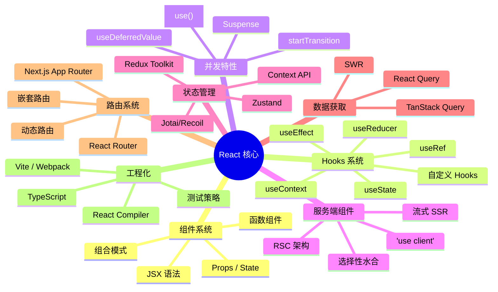
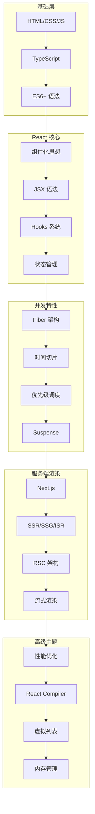

# 🚀 [React 19](https://react.dev) 完整学习指南

> 🎯 **面试星级**：★★★★★ | **建议用时**：5 天
> React 19 系统学习指南，融合核心原理、高级特性、工程实践与面试题，从入门到精通、源码级原理、React Compiler 深度、项目实战重难点、内存泄漏排查、深度面试追问题

### 🎯 React 核心概念关系图

### 📈 React 技术栈完整知识体系

---

## 目录

- [01 - 核心基础](./01-核心基础)
- [02 - 高级特性](./02-高级特性)
- [03 - 工程实践](./03-工程实践)
- [04 - 性能优化](./04-性能优化)
- [05 - 深入原理](./05-深入原理)
- [06 - React 19 新特性](./06-React19新特性)
- [07 - 调试与场景](./07-调试与场景)
- [08 - React深入浅出解析](./08-React深入浅出解析)