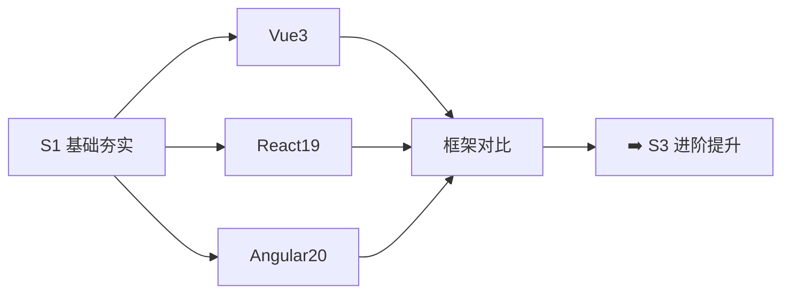

# S2 框架深入 🔵

> **学习目标**：深入掌握三大框架（Vue 3、React 19、Angular 20）的核心原理与实践

## 内容章节

- [01-Vue3 学习指南](./01-Vue3学习指南) — Vue 3 系统学习：Composition API、响应式原理、路由、状态管理、SSR
- [02-Vue3 面试](./02-Vue3) — Vue 3 面试题精讲：源码级原理、Vue 3.4+ 新特性、内存泄漏排查
- [03-React19 学习指南](./03-React19学习指南) — React 19 系统学习：Hooks、Concurrent、Server Components、Compiler
- [04-React19 面试](./04-React19) — React 19 面试题精讲：Fiber、Render 调度、性能优化
- [05-Angular20 学习指南](./05-Angular20学习指南) — Angular 20 系统学习：Signals、Ivy、Zoneless、RxJS
- [06-Angular20 面试](./06-Angular20) — Angular 20 面试题精讲：依赖注入、变更检测、路由守卫
- [07-框架对比](./07-框架对比) — Vue 3 vs React 19 vs Angular 20 横向对比

## 学习路线

