---
title: 性能优化与选型
---
## 十一、性能优化策略

| 优化手段 | Vue 3 | React 19 | Angular 21 |
|---------|-------|----------|------------|
| **虚拟滚动** | vue-virtual-scroller | react-window | cdk-virtual-scroll |
| **懒加载** | defineAsyncComponent | React.lazy + Suspense | loadChildren |
| **防重新渲染** | v-memo / shallowRef | React.memo / useMemo | OnPush / Signals |
| **批量更新** | 自动批处理 | 自动批处理 (18+) | zone.js 自动批处理 |
| **时间切片** | ❌ | ✅ Fiber + Concurrent | ❌ |
| **编译优化** | Block Tree 静态标记 | React Compiler (自动 memo) | 增量 DOM |
| **不可变数据** | 推荐但不强制 | 强制 | 推荐（OnPush 需要） |
| **Web Worker** | ✅ | ✅ | ✅ |
| **WASM** | 社区方案 | 社区方案 | ✅ Angular 自身部分使用 |

### 11.1 性能基准（粗略）

```
渲染 1000 个列表项（首次渲染）：
  Vue 3:    ~15ms
  React 19: ~25ms
  Angular:  ~30ms

更新 1 个列表项：
  Vue 3:    ~3ms  (精准追踪)
  React 19: ~15ms (组件子树)
  Angular:  ~20ms (OnPush) / ~40ms (默认)
```

### 11.2 渲染耗时超 16ms 掉帧问题排查与优化

> 💡 屏幕 **60fps** 单帧理想耗时：1000 ÷ 60 ≈ 16.67ms，渲染超过这个值就会丢帧、卡顿。

#### 先定位：耗时到底花在哪

| 瓶颈类型 | Performance 表现 | 典型原因 |
|----------|-----------------|---------|
| **Script 超时** | JS 执行柱子 > 16ms | 大循环、复杂计算、频繁事件 |
| **Layout 大面积红长块** | 布局耗时高 | 频繁回流、交替读写布局属性 |
| **Paint 耗时高** | 绘制区域大 | 阴影/模糊/大面积重绘/DOM 过多 |
| **主线程被占满** | 整段阻塞 | 长任务、同步阻塞 |

**排查工具**：F12 → Performance → 录制 → 复现卡顿 → 看主线程三条指标。

#### 场景1：JS 执行耗时过长（Script > 16ms）

| 场景 | 优化方案 |
|------|---------|
| **大数据列表** | 虚拟列表（Vue: `vue-virtual-scroller`、React: `react-window`、Angular: `cdk-virtual-scroll-viewport`）、分页/懒加载、数据预处理 |
| **高频事件** | 防抖(debounce) 150~300ms、节流(throttle) 16~32ms、`requestIdleCallback` |
| **复杂计算** | `requestAnimationFrame` 分片执行、Web Worker、避免重复取值 |
| **第三方脚本** | 动态懒加载（`import()`）、延迟初始化 |

#### 场景2：布局回流（Layout/Reflow）耗时高

**核心原则：减少布局次数 + 批量读写样式**

```javascript
// ❌ 错误：交替读写，多次 Layout
dom.style.width = '100px';
let w = dom.offsetWidth;  // 触发布局
dom.style.height = '200px';

// ✅ 正确：先全读 → 再全写
let w = dom.offsetWidth;
dom.style.width = '100px';
dom.style.height = '200px';
```

| 优化手段 | 说明 |
|---------|------|
| 批量修改 DOM | DocumentFragment 一次性插入、display:none 修改 |
| 优先用 transform/opacity | 走合成层，不触发 Layout & Paint |
| 减少层级 | 减少深层嵌套 DOM |

#### 场景3：重绘（Paint）耗时高

| 优化手段 | 说明 |
|---------|------|
| **提升合成层** | `will-change: transform` 或 `translateZ(0)` 提升为独立图层 |
| **缩小重绘区域** | 动画/hover 效果限制在局部容器 |
| **精简绘制开销** | 慎用 `box-shadow`、`filter: blur()`、复杂渐变 |

#### 快速排查流程

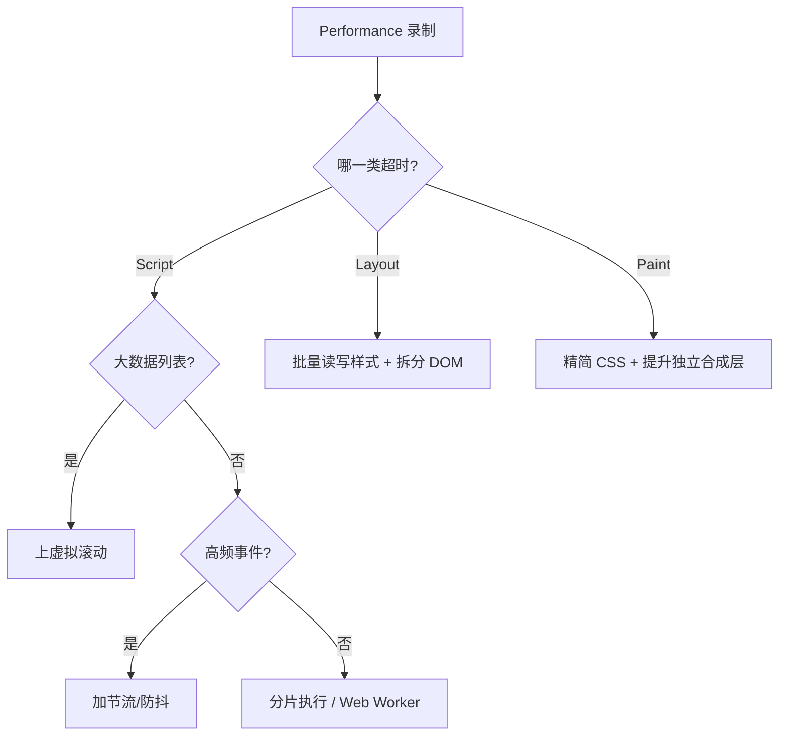

---

## 十二、学习曲线与团队适配

### 学习曲线对比

```
高 │          Angular
   │         ↗
略 │        /
   │  React
中 │ ↗
   │/
低 │ Vue 3
   └──────────────────
     简单  中等  复杂   应用复杂度
```

### 团队适配建议

| 团队情况 | 推荐框架 | 理由 |
|---------|---------|------|
| 小团队、快速原型 | **Vue 3** | 低学习成本，开发效率高 |
| 大团队、严格规范 | **Angular** | 统一架构，强约束有利于大规模协作 |
| 跨平台（RN、Electron） | **React** | React Native、Tauri 生态最好 |
| 技术栈以 JS 为主 | **React** | JSX 纯 JS，全栈复用一个语言 |
| 技术栈以 TS 为主 | **Angular** | 原生 TS 支持，工具链完整 |
| 中台/后台系统 | **Vue 3 / React** | 灵活，UI 库丰富 |
| 追求最新技术 | **React** | Next.js + Server Components 引领潮流 |

---

## 十三、版本演进路线图

### 三大框架版本进化史

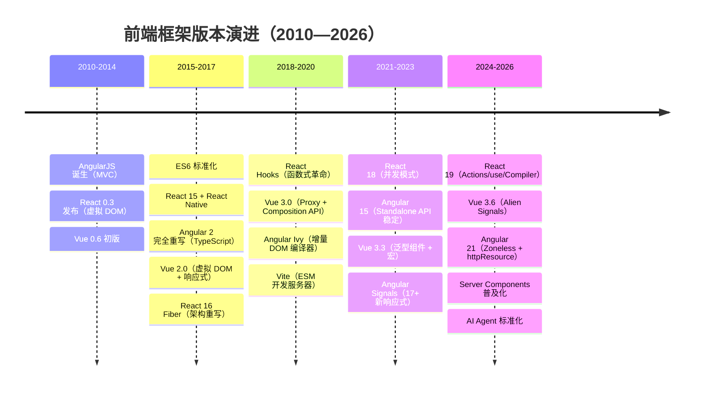

### 各框架关键版本节点

**Vue 版本迭代**
```
Vue 1.0 (2014)           → 数据绑定 + 指令系统
Vue 2.0 (2016)           → 虚拟 DOM + 组件系统（主流奠基）
Vue 2.7 (2022)           → 最后的 2.x，移植 Composition API
Vue 3.0 (2020)           → Proxy 响应式 + Composition API
Vue 3.3 (2023)           → 泛型组件 + defineModel + 宏
Vue 3.4 (2024)           → 解析器重写（41% 性能提升）
Vue 3.5 (2024)           → SSR 优化 + 内存改进
Vue 3.6 (2026)           → Alien Signals（性能接近 Solid.js）
```

**React 版本迭代**
```
React 0.3 (2013)         → 首次开源，虚拟 DOM
React 15 (2016)          → DOM 重构 + React Native
React 16 (2017)          → Fiber 架构重写（核心转折）
React 16.8 (2019)        → Hooks 发布（函数式革命）
React 17 (2020)          → 渐进升级（无重大新特性）
React 18 (2022)          → 并发模式 + 自动批处理
React 19 (2024)          → Actions/use() + React Compiler
```

**Angular 版本迭代**
```
AngularJS (2010)         → MVC，双向绑定（先驱）
Angular 2 (2016)         → 完全重写，TypeScript，组件化
Angular 4-6 (2017-2018)  → 小版本迭代，稳定 API
Angular 8 (2019)         → Ivy 编译器预览
Angular 9 (2020)         → Ivy 默认，体积减少 40%
Angular 15 (2022)        → Standalone API 稳定
Angular 17 (2023)        → Signals、新控制流、SSR 改进
Angular 18 (2024)        → Zoneless 模式
Angular 19 (2025)        → linkedSignal、resource API
Angular 20 (2025)        → httpResource、Signal Forms
Angular 21 (2026)        → 全面 Zoneless，增量编译
```

### 版本迭代对比（2026）

| 最新特性 | Vue 3.6 | React 19 | Angular 21 |
|---------|---------|----------|------------|
| **响应式** | Alien Signals (默认) | React Compiler | Zoneless Signals |
| **数据获取** | 社区方案 | Server Components + use() | httpResource() |
| **表单** | v-model 增强 | React Aria Components | Reactive Forms + Signal |
| **新 API** | `useTemplateRef` | `use()`, `useActionState` | `inject()`, `resource()` |
| **构建** | Vite 8 / Rolldown | Turbopack (Next.js) | esbuild 原生 |
| **SSR** | Nuxt 5 | Next.js 16 (App Router) | Angular Universal / Analog |
| **状态** | Pinia 3 | Zustand 5 / Jotai 2 | SignalStore (稳定) |
| **测试** | Vitest 3 | Vitest 3 / Testing Library | Jest + Testing Library |

---

## 十四、面试经典问答与深度辨析

### Q1：三大框架各自的优缺点

**Vue 3**
- ✅ 优点：上手快、文档好、灵活、体积小、编译优化极致
- ❌ 缺点：生态分散（2/3 不兼容）、过度灵活导致规范难统一、TypeScript 非原生
- 💡 面试加分：Vue 3.6 Alien Signals 让性能接近 Solid.js

**React 19**
- ✅ 优点：生态最大、跨平台（RN）、函数式范式、JSX 灵活、Vercel AI SDK
- ❌ 缺点：Hooks 心智模型陡峭、JSX 悖论、版本迭代快、纯 UI 库需自搭
- 💡 面试加分：React Compiler 消除手写 memo，Actions 原生表单处理

**Angular 21**
- ✅ 优点：开箱即用、强类型（TS 原生）、DI 可测试、RxJS 生态、企业规范
- ❌ 缺点：包体积大（~130KB）、学习曲线高、版本升级痛苦（8→15 需重写）
- 💡 面试加分：Zoneless Signals 替代 Zone.js，增量编译大幅缩短构建时间

### Q2：虚拟 DOM vs 模板编译优化 vs 增量 DOM

```
Vue 的编译优化（编译时重型）：
  ├─ 静态提升：静态节点只创建一次 VNode，之后复用
  ├─ Patch Flag：动态节点标记具体变化类型（class/style/text/props）
  │   └─ _createVNode("div", { class: _normalizeClass(动态类) }, null, 2)
  │       ↑ 这个 2 就是 Patch Flag（表示 class 动态）
  └─ Block Tree：以动态节点为边界分割树，跳过静态子树
     → 只 Diff 动态节点，静态节点完全不参与对比
     → 大型列表性能提升 5-10x（对比 Vue 2）

React 的运行时优化（运行时重型）：
  ├─ Fiber 架构：每个组件一个 fiber，形成链表树
  ├─ 优先级调度：高优任务（用户输入）> 低优任务（数据同步）
  ├─ 时间切片：将渲染分片到多帧执行，避免卡顿
  └─ React Compiler (19+)：编译时自动记忆化组件和值
     → 编译器推断哪些值不变 → 自动添加 memo
     → 但运行时仍需 Diff 整个子树（无法跳过）

Angular Ivy + 增量 DOM（编译时重型，无虚拟 DOM）：
  ├─ 编译时生成指令：模板 → 指令序列（不是 VNode）
  ├─ 运行时直接操作真实 DOM：找到对应的 DOM 节点 → 直接更新
  ├─ 跳过虚拟 DOM 创建和 Diff 两个步骤
  └─ 缺点：编译产物体积更大，模板灵活性受限

核心总结：
  Vue 3:    编译时80% + 运行时20%（编译优化为主，Diff 为辅）
  React 19: 运行时80% + 编译时20%（Fiber 调度为核心，Compiler 辅助）
  Angular:  编译时90% + 运行时10%（Ivy 编译后几乎不需要 Diff）
```

### Q3：Compile-time vs Runtime 的本质区别

```typescript
// Vue — 编译时已知"什么会变"
// 模板 <div :class="dynClass">{{ text }}</div>
// 编译后：
createBlock("div", { class: dynClass }, [toDisplayString(text)], 2 /* CLASS */)
// Patch Flag = 2 表示只有 class 可能变
// 运行时直接检查 class 变化，跳过 text 之外的属性

// React — 运行时才能知道"什么变了"
function MyComponent({ dynClass, text }) {
  return <div className={dynClass}>{text}</div>
}
// 编译后就是 JSX 函数调用
// 运行时：setState → 重新执行整个组件函数 → 生成 VNode → Diff
// React Compiler 优化后：自动判断哪些值不变，跳过子组件重新渲染

// Angular — 编译时就知道"怎么更新 DOM"
// 编译后指令结构：
function AppComponent_ng_template(rf, ctx) {
  if (rf & 1) { /* 创建 */ 创建DOM节点 }
  if (rf & 2) { /* 更新 */ ctx._t && ctx._t() ? ... }
}
// 运行时直接执行这些指令，增/删/改对应 DOM 节点
```

### Q4：为什么你们选择了 X 而不是 Y？

**面试者回答框架（STAR 原则）：**

```
S (Situation)：项目背景（如：百万 DAU 的 SaaS 平台，50 人前端团队）
T (Task)：技术选型需要考虑的维度（性能/团队/维护/生态/成本）
A (Action)：
  1. 技术调研：对比三个框架团队掌握度 → React 40% / Vue 35% / Angular 25%
  2. POC 验证：分别用三个框架写核心页面，对比开发效率
  3. 决策指标：React 入选（生态最大 + 人才储备 + 跨平台需要）
R (Result)：年交付效率提升 30%，团队满意度 8.5/10
```

**备选框架说辞示例：**

```
"我们选 React 而不是 Vue/Angular 的原因是：
  1. 业务需要跨平台移动端（React Native 唯一成熟方案）
  2. 团队 70% 是函数式编程背景，Hooks 心智模型天然契合
  3. 项目需要 Server Components 实现流式 SSR（Next.js 领先）
  但这不意味着 React 在所有场景都好。如果做后台系统，Vue 开发效率更高；
  如果做金融系统，Angular 的 DI 和 TS 原生支持更可靠。"

"我们选 Angular 而不是 React/Vue 的原因是：
  1. 100+ 人前端团队，需要统一的代码规范和架构约束
  2. 项目是金融级应用，TS 原生 + DI 可测试性不可替代
  3. 内置全套工具链（CLI/表单/路由/HTTP），减少选型摩擦
  但 Angular 学习曲线高是我们付出的人力成本，我们配了 2 个月过渡期培训。"

"我们选 Vue 而不是 React/Angular 的原因是：
  1. 10 人小团队快速迭代 MVP，Vue 的上手速度和产出最高
  2. 项目以中后台为主，Element Plus 完全覆盖需求
  3. Vite + Vue 的开发体验（HMR < 50ms）极大提升效率
  但如果项目未来需要跨平台或 AI 流式渲染，我们会考虑迁移到 React。"
```

### Q5：Vue 的响应式系统 vs React 的 Fiber 架构

```
Vue Proxy 原理：
  ┌─────────────────────────────────────────┐
  │ new Proxy(target, {                       │
  │   get(target, key) { track(target, key) } │  ← 收集依赖
  │   set(target, key, value) {               │
  │     trigger(target, key)                  │  ← 触发更新
  │   }                                       │
  │ })                                        │
  └─────────────────────────────────────────┘
  自动追踪：开发者修改 data.value = x → 自动触发对应组件更新
  精确到变量级：data.a 变化 → 只在用到 data.a 的组件更新
  不需要 Fiber：因为知道"什么变了"，不需要调度 Diff

React Fiber 原理：
  ┌────────────────────────────────────────┐
  │ setState → enqueueUpdate              │
  │   → Scheduler 判断优先级              │
  │     → 高优：立即执行（用户输入）        │
  │     → 低优：调度到空闲帧执行（数据同步） │
  │ → workLoop: while (nextUnitOfWork) {    │
  │     nextUnitOfWork = performUnitOfWork()│
  │     if (shouldYield) break             │  ← 可中断
  │   }                                    │
  │ → commitRoot() ← 一次性提交（不可中断） │
  └────────────────────────────────────────┘
  手动触发：setState → 不知道"什么变了" → 重新执行整个子树
  需要 Fiber：因为需要 Diff 才知道"什么变了"
  调度机制：保证 60fps，高优任务优先响应

本质差异：
  Vue  = 编译时知道 + 运行时精确更新
  React = 运行时不知道 + Diff 找出变化

  类比：
  Vue 像"登记制度" → 领导（Proxy）记录了每人拿了什么 → 直接补货
   React 像"盘点制度" → 每次核销后全部盘点 → 找出哪些少了再补货
   Angular 像"配送流程" → 仓库打包（编译）→ 按清单配送（指令执行）
```

> **💡 面试追问：Fiber 树的 `workInProgress` 和 `current` 双缓冲机制具体是怎么工作的？为什么需要两棵树？**
>
> **双缓冲机制：**
> ```
> current 树（已渲染）：← 当前屏幕上显示的内容
>   rootFiber → AppFiber → ...（已完成 commit）
>
> workInProgress 树（构建中）：← 基于 current 克隆
>   rootFiber → AppFiber → ...（beginWork 处理中，可被中断）
> ```
>
> **为什么需要两棵树：**
> 1. **可中断渲染**：workInProgress 构建到一半被中断，current 树不变，UI 不闪烁
> 2. **快速回退**：高优任务插入，低优任务的 workInProgress 直接丢弃
> 3. **高效 DOM 复用**：commit 后 `root.current = finishedWork`，无需深度复制
>
> **类比**：git 的 detached HEAD 模式，修改不影响 main 分支。

> **💡 面试追问：React 的优先级调度中，`lane` 模型相比 `expirationTime` 模型有什么优势？**
>
> **lane 模型（React 18+）用 31 位二进制表示优先级：**
> ```typescript
> SyncLane: 0b0001, InputContinuous: 0b0100, DefaultLane: 0b10000
> ```
>
> **优势对比：**
> ```
> expirationTime 问题：无法表达"两个更新属于同一批"、高优插入需重新计算
> lane 优势：位运算合并（A|B 表示双重优先级）、批量处理、细粒度控制
> ```
> SyncLane（用户输入）> InputContinuous（拖拽）> DefaultLane（数据加载），低优 lane 一直未执行时自动提升优先级。

---

**🔗 追问链 B：Fiber 调度体系全解**

> **B-①：Fiber 节点内部有哪些核心字段？`alternate`、`return`、`child`、`sibling`、`lanes`、`memoizedState` 各自的作用是什么？**
>
> **Fiber 节点结构：**
> ```typescript
> interface Fiber {
>   tag: WorkTag          // 节点类型（Function/Class/Host/Portal...）
>   type: any             // 对应组件函数/类/DOM 标签
>   key: string | null    // Diff 复用依据
>
>   // 🌲 树结构
>   return: Fiber | null  // 父节点（DFS 回溯用）
>   child: Fiber | null   // 第一个子节点
>   sibling: Fiber | null // 下一个兄弟节点
>
>   // 🔄 双缓冲
>   alternate: Fiber | null // 指向 current / workInProgress 的对应节点
>
>   // ⏱ 优先级
>   lanes: Lanes           // 当前节点未完成的更新（31位 bitmask）
>   childLanes: Lanes      // 子节点未完成的更新（bailout 优化）
>
>   // 📦 状态
>   memoizedState: any     // 已提交的状态（Hooks 链表头）
>   updateQueue: UpdateQueue | null // 待处理的更新队列
>
>   // 🏷 副作用
>   flags: Flags           // 副作用标记（Placement/Update/Deletion/Ref）
>   subtreeFlags: Flags    // 子树副作用标记（快速跳过）
> }
> ```

> **B-②：`beginWork` 和 `completeWork` 在 Fiber 深度优先遍历中各负责什么？为什么需要这两个阶段？**
>
> **两阶段分工：**
> ```
> beginWork（"向下探索"阶段）：
>   ├─ 根据 workInProgress 的 updateQueue 计算新状态
>   ├─ Diff 子节点 → 生成新的 child Fiber 链表
>   ├─ 标记 effectTag（子节点变化/属性变化/删除）
>   └─ 如果子树没有更新（bailout）→ 跳过整棵子树
>
> completeWork（"向上冒泡"阶段）：
>   ├─ 创建或更新 DOM 实例（HostComponent）
>   ├─ 将子节点的 flags 冒泡到父节点
>   └─ 收集 Effect 链表（useEffect/useLayoutEffect）
> ```
> **为什么需要两阶段：** 向下阶段计算"什么变了"，向上阶段执行"DOM 操作"。如果只有向下阶段，删除节点时无法通知父节点更新 DOM；如果只有向上阶段，无法在遍历子节点前预先优化（bailout）。

> **B-③：React 的时间切片（Time Slicing）是如何通过 `MessageChannel` 实现的？`shouldYield` 的判断标准是什么？**
>
> **时间切片实现：**
> ```typescript
> const channel = new MessageChannel()
> const port = channel.port2
> let taskQueue: Task[] = []
> let isPerformingWork = false
>
> channel.port1.onmessage = () => {
>   isPerformingWork = true
>   const deadline = performance.now() + 5  // 5ms 时间片
>   do {
>     workLoop(deadline)
>   } while (taskQueue.length && performance.now() < deadline)
>   isPerformingWork = false
>   if (taskQueue.length) port.postMessage(null)  // 下一片
> }
>
> function shouldYield(): boolean {
>   return performance.now() >= deadline  // 超过 5ms 让出
> }
> ```
> **判断标准：** `deadline = currentTime + yieldInterval(5ms)`。React 选择 5ms 是因为浏览器一帧约 16.6ms，预留 11ms 给浏览器处理布局/绘制/事件响应。超过 5ms → `shouldYield = true` → 暂停 workLoop → `postMessage` 安排下一片。

> **B-④：高优 lane 不断插入导致低优 lane 永久饥饿时，React 如何处理？**
>
> **饥饿处理机制：**
> ```
> 1. 批次计时：每个批次创建时记录 startTime
> 2. 超时检查：渲染循环中检查低优批次是否等待过久（默认 500ms）
> 3. MarkStarved：将超时批次的 lane 标记为 Starved
> 4. 强制跳过高优插入：低优批次标记后，React 会阻塞高优插入
>    └─ 表现：低优更新终于被执行，UI 短暂显示旧数据后更新
> 5. 避免策略：合理使用 startTransition 划分优先级
> ```
> **开发建议：** 如果发现间歇性 UI 卡顿后突然跳变，可能是优先级饥饿——将非紧急更新用 `startTransition` 包裹，让调度器更合理分配时间片。


### Q6：三大框架的状态管理差异与选型

| 维度 | Pinia (Vue) | Zustand (React) | NgRx SignalStore (Angular) |
|------|------------|-----------------|---------------------------|
| **状态模型** | reactive/ref 对象 | 不可变 state + Immer | signal + patchState |
| **异步处理** | async action 原生 | 函数即 action | rxEffect 手动处理 |
| **派生状态** | computed 自动 | selector + useMemo | computed + withComputed |
| **插件** | Pinia 插件系统 | Zustand middleware | 内置 withState/Methods/Computed |
| **持久化** | pinia-plugin-persistedstate | zustand/middleware persist | 自定义 |
| **DevTools** | Vue DevTools | Redux DevTools | Redux DevTools |
| **TS 支持** | defineStore 自动推导 | create<T>() 泛型 | signalStore 自动推导 |

```typescript
// 三者对比 — 相同的 counter store

// Pinia (Vue)
const useCounter = defineStore('counter', () => {
  const count = ref(0)
  const double = computed(() => count.value * 2)
  function increment() { count.value++ }
  return { count, double, increment }
})

// Zustand (React)
const useCounter = create<{ count: number; inc: () => void }>((set) => ({
  count: 0,
  // 派生状态通过选择器实现，无需 computed：const double = useCounter(s => s.count * 2)
  inc: () => set(s => ({ count: s.count + 1 })),
}))

// NgRx SignalStore (Angular)
const CounterStore = signalStore(
  withState({ count: 0 }),
  withComputed(({ count }) => ({ double: computed(() => count() * 2) })),
  withMethods(({ count }) => ({
    increment: () => patchState({ count: count() + 1 }),
  }))
)
```

### Q7：Micro-Frontend 微前端方案对比

> **💡 面试追问：跨框架微前端中，两个不同框架的子应用如何共享同一个全局状态？**
>
> **三种方案：**
> ```
> 1. 自定义事件协议（轻量）：window.dispatchEvent(new CustomEvent(...))
> 2. 共享 RxJS Subject（中型）：BehaviorSubject 跨框架消费
> 3. Module Federation 共享 Store（工程化）：暴露全局 store 实例
> ```
> **推荐（2026）：** 小型用 EventBus，中型用共享 Signal/Subject，大型用 Module Federation。Angular 生态可通过 Angular Elements 将状态服务封装为 Web Component。

| 对比项 | 适用框架 | 方案 | 优点 | 缺点 |
|--------|---------|------|------|------|
| **Module Federation** | 全框架 | Webpack 5 插件 | 运行时加载、共享依赖 | Webpack 依赖 |
| **qiankun** | 全框架（Vue 最佳） | single-spa 封装 | 阿里大厂背书、沙箱隔离 | 配置复杂 |
| **wujie** | 全框架（React/Angular 支持好） | Web Component + iframe | 京东出品、性能好 | 社区较小 |
| **single-spa** | 全框架 | 路由级微前端 | 最通用 | 样板代码多 |
| **Isolated Components** | 全框架 | 独立 npm 包 | 技术无关 | 多版本冲突 |

**推荐组合（2026）：**
```
Vue 生态：   qiankun / wujie（中文社区支持好）
React 生态： Module Federation（Webpack / Rspack）
Angular 生态： Module Federation（Nx 支持）+ Custom Elements（跨框架组件）
```

### Q8：Server Components 与 Streaming SSR 对比

| 能力 | Nuxt 5 (Vue) | Next.js 16 (React) | Analog (Angular) |
|------|-------------|-------------------|-------------------|
| **RSC (Server Components)** | ❌ 无 | ✅ 完整（React 19 核心） | ❌ 无 |
| **Streaming SSR** | ✅ 流式 | ✅ Edge Streaming | ✅ (SSR 流) |
| **ISR** | ✅ (Nuxt 5) | ✅ (Next.js 16) | ❌ |
| **Server Actions** | ✅ server 函数 | ✅ Server Functions | ❌ |
| **Partial Prerender** | ❌ | ✅ PPR (Next 15) | ❌ |
| **Edge Runtime** | ✅ Nitro | ✅ Edge Runtime | 有限 |

**Next.js Server Components 是 RSC 的领先者** ，基于 React 19 的 RSC 协议将
组件分为 Server Components（只在服务端运行、零 JS 体积）和
Client Components（在浏览器交互）。Vue/Nuxt 目前没有等效方案。

> **💡 面试追问：React Server Components 中，服务端和客户端组件的分界点如何确定？**
>
> **决策树：**
> ```
> 需要交互（useState/useEffect/事件）？ → ✅ 客户端组件（'use client'）
> 纯展示且数据来自服务端？ → ✅ 服务端组件
> 包含敏感逻辑（API Key）？ → ✅ 服务端组件
> 引用了客户端组件库？ → 用 'use client' 封装为边界
> ```
>
> **常见分界策略：** 页面级别以"交互边界"划分——数据获取放服务端组件（直接 await DB），交互部分（按钮/表单）放客户端组件。

> **💡 面试追问：Nuxt 5 的 Nitro 引擎和 Next.js 的 Edge Runtime 在部署平台兼容性上有什么根本差异？**
>
> **Nitro 的 Adapter 模式** 通过适配层（vercel/netlify/cloudflare/deno/node 各一个 adapter）与平台解耦，新增 Deno 支持只需写一个 adapter。**Next.js Edge Runtime** 与 Vercel 深度绑定，实现了有限的 Web API 子集，Deno 虽然也有 Web API 但实现细节不同（如 Headers 迭代器行为差异），缺少 Next.js 依赖的内部 API。

---

**🔗 追问链 C：SSR 三框架对决**

> **C-①：Nuxt 5（Nitro）、Next.js 和 Analog（Angular）的流式 SSR 实现方案有什么本质差异？**
>
> **流式实现对比：**
> ```
> Next.js 16（Web Streams API）：
>   └─ renderToReadableStream(React tree)
>   └─ 支持 Suspense 边界 → 每个 Suspense 独立流式传输
>   └─ 选择性 hydration：HTML 流到哪，hydration 到哪
>
> Nuxt 5（Nitro + h3）：
>   └─ renderToString → 流式写入（非真正的流式渲染）
>   └─ 通过 Web Streams / Node Streams adapter 转换
>   └─ 异步组件通过 Suspense 处理，但非原生流式
>
> Analog（Angular）：
>   └─ render() API 生成可读流
>   └─ Angular 21 支持流式 SSR + 延迟加载（@defer）
>   └─ 每个 @defer 块作为独立流式边界
> ```
> **性能差距：** Next.js 的 RSC + Stream 是目前最成熟的流式 SSR，首字节时间 TTFB 尤其优秀。

> **C-②：三大框架的 hydration 策略有什么根本差异？**
>
> **策略对比：**
> | 维度 | Next.js (React) | Nuxt (Vue) | Analog (Angular) |
> |------|----------------|------------|-------------------|
> | **策略** | 选择性 hydration | 全量 hydration | 全量 + 可延迟 |
> | **粒度** | 组件级（Suspense） | 应用级 | 组件级（@defer） |
> | **重复执行** | 服务端+客户端各一次 | 服务端+客户端各一次 | 服务端+客户端各一次 |
> | **差异化** | 服务端产物含 RSC Payload | 纯 HTML | 纯 HTML |
> | **JS 体积** | 零（SC）+ 客户端（CC） | 全部 | 全部 |
> | **中断恢复** | ❌ 不可中断 | ❌ 不可中断 | ❌ 不可中断 |
> ```text
> ⭐ React 的选择性 hydration = 先交互先激活，未 hydration 的区域保留功能（表单输入不丢失）
> ⭐ Vue/Nuxt 的全量 hydration = 要么全部交互，要么全部静态
> ⭐ Angular 的延迟加载 = @defer 块的 hydration 可推迟到可见时触发
> ```

> **C-③：SSR 中"双端复用"（同构代码）的边界在哪里？哪些代码不能跨端共享？**
>
> **可复用：**
> ```
> ✅ 纯逻辑（数据校验、格式化、类型定义）
> ✅ 状态管理定义（Pinia store / Zustand store — 工厂函数模式）
> ✅ 路由配置（不含动态 import）
> ```
> **不可复用：**
> ```
> ❌ window/document/globalThis 引用
> ❌ localStorage/sessionStorage/cookie（需用 API Route 代理）
> ❌ 第三方库中使用了浏览器 API（如 chart.js 直接操作 canvas）
> ❌ 动态 import + 运行时环境判断（SSR 中全部打包）
> ```
> **最佳实践：** 将所有浏览器 API 调用封装在 `onMounted` / `useEffect` / `ngAfterViewInit` 中，服务端渲染阶段不执行。

### Q9：AI 时代框架选择深度讨论

2026 年，AI 代码生成（Cursor/GitHub Copilot）如何改变框架格局：

```
AI 生成代码质量（实测经验）：

1. 简单组件（表单/表格/列表）
   Vue 3:    ⭐⭐⭐⭐⭐  SFC 结构清晰，AI 容易理解三区（template/script/style）
   React 19: ⭐⭐⭐⭐⭐  JSX 纯函数，AI 最擅长
   Angular:  ⭐⭐⭐    装饰器 + 构造函数 + DI 耦合，AI 常出错

2. 复杂交互（状态管理/服务/路由）
   Vue 3:    ⭐⭐⭐⭐    Pinia + Vue Router，AI 理解好
   React 19: ⭐⭐⭐⭐⭐  Zustand + React Router，AI 代码库最大
   Angular:  ⭐⭐⭐    NgRx + DI + Guards，AI 常遗漏配置

3. AI Agent 骨架生成（完整页面）
   React 19: ⭐⭐⭐⭐⭐ (Vercel AI SDK + v0.dev 最成熟)
   Vue 3:    ⭐⭐⭐⭐ (Nuxt AI 工具链增长快)
   Angular:  ⭐⭐ (缺乏成熟的 AI 代码生成工具)

结论：AI 时代 React 优势进一步扩大，
但 Angular 在大型企业项目中的人+AI 协作模式仍是刚需
```

> **💡 面试追问：AI 代码生成对 Angular 的装饰器和 DI 配置生成"正确率较低"的根本原因是什么？**
>
> **三大原因：**
> ```
> 1. 上下文窗口利用率低：装饰器+构造函数+类属性+生命周期分散，占用大量上下文
> 2. DI 配置图谱复杂：AppModule→FeatureModule→Component 多层提供者
> 3. 模板语法特殊：*ngIf/@if 并存、pipe/事件/属性绑定语法独特
> ```
> **实测（2026）：** "带分页用户列表"首次生成成功率——Vue 85%、React 90%、Angular 55%。

> **💡 面试追问：WebAssembly + Rust（Leptos/Dioxus）在未来 3-5 年是否会取代三大框架？**
>
> **不会取代，但会侵蚀特定场景：**
> ```
> 短期侵蚀（2026-2028）：
>   ├─ 性能关键型（图表/BI 看板）
>   ├─ 大型游戏/3D 编辑器
>   ├─ 低延时交易 UI（金融）
>   └─ WASM 组件嵌入现有应用
> 长期趋势：混合渲染（部分 WASM + 大部分 JS）
> 相反，三大框架会吸收 WASM 优势（Angular 21 增量编译已用 Rust 重写部分编译器）
> ```

### Q10：如何从零搭建一个框架选型评审？

**评审模板（供面试使用）：**

```
📋 框架选型评审报告

1. 项目需求
   ├─ 规模：MVP / 增长 / 成熟 (选一)
   ├─ 团队：5人 / 20人 / 100人 (选一)
   ├─ 行业：金融 / 电商 / SaaS / 内容 (选一)
   ├─ 目标平台：Web / Mobile / Desktop / MiniApp (选一)
   └─ 时间线：3个月 / 1年 / 3年 (选一)

2. 技术维度打分（1-5分）

| 评估维度 | Vue | React | Angular |
| :--- | :---: | :---: | :---: |
| 上手速度 | 5 | 3 | 2 |
| 开发效率 | 5 | 4 | 3 |
| 性能 | 4 | 4 | 4 |
| 可测试性 | 3 | 4 | 5 |
| 生态丰富度 | 4 | 5 | 3 |
| 跨平台 | 3 | 5 | 3 |
| AI 友好度 | 4 | 5 | 3 |
| **总权重分** | **28** | **30** | **23** |

3. 推荐结论
   ├─ 总分排序：[React > Vue > Angular]
   ├─ 核心理由：生态 + 人才 + 跨平台
    └─ 风险提示：React 需要自搭路由/状态管理，推荐 Next.js + Zustand
```

> **💡 面试追问：假设团队决定从 Vue 3 迁移到 React 19，迁移过程中最大的技术债务是什么？**
>
> **迁移债务清单（按影响排序）：**
> ```
> 1. 心智模型转换（4-8周）：响应式自动追踪→手动setState、SFC→JSX、v-model→受控组件
> 2. 状态管理迁移：Pinia→Zustand、provide/inject→Context（性能特性不同）
> 3. 测试框架重写：@vue/test-utils→@testing-library/react（测试哲学不同）
> 4. 生态工具替换：Element Plus→Ant Design、Vue Router→React Router
> 5. ESLint 规则集和 tsconfig 配置更换
> ```
> **估算：** 50 人项目通常需要 6-16 周，核心挑战不是代码重写，而是团队心智转换。

### Q11：三大框架 2026 年最新核心趋势

| 趋势 | Vue 3.6 | React 19 | Angular 21 |
|------|---------|----------|------------|
| **响应式升级** | Alien Signals（精确追踪） | React Compiler（自动 memo） | Zoneless + Signals（无 Zone） |
| **编译优化** | Vapor Mode（无虚拟 DOM） | React Compiler（编译时优化） | 增量编译（esbuild 原生） |
| **AI 集成** | Nuxt AI 模块 | Vercel AI SDK（最成熟） | Angular MCP Server |
| **SSR 升级** | Nuxt 5（Nitro v4） | Next.js 16（RSC + PPR） | Analog（SSR 流） |
| **表单** | v-model 增强 | React Aria + useActionState | Signal Forms（官方） |
| **数据获取** | useFetch + $fetch | Server Functions + use() | httpResource() |
| **状态测试** | Pinia 3 + Vitest 3 | Zustand 5 + Vitest 3 | SignalStore + Vitest |
| **微前端** | wujie / Module Federation | Module Federation / Rsdoctor | Module Federation / Nx |
| **构建** | Vite 8 / Rolldown | Turbopack / Vite | esbuild 原生 / Vite |

---

> **💡 面试追问：Vue 3 + Alien Signals vs React 19 + Compiler vs Angular 21 + Zoneless Signals，哪个框架的响应式方案最接近"终极方案"？**
>
> **各方案评分：**
> ```
> Vue 3 + Alien Signals：⭐⭐⭐⭐（最佳平衡）
>   ├─ 自动追踪（开发体验最好）、Vapor Mode 可选兼顾兼容性与性能
>   └─ 缺点：需兼容 Options API 生态
>
> React 19 + Compiler：⭐⭐⭐⭐（最有潜力）
>   ├─ 纯函数+编译时自动 memo、Compiler 消除闭包陷阱
>   └─ 缺点：Compiler 仍在早期，虚拟 DOM 兼容层仍存在
>
> Angular 21 + Zoneless：⭐⭐⭐（工程化成熟）
>   ├─ Zone.js 完全移除正确、resource() 声明式数据获取
>   └─ 缺点：Signals 和 RxJS 共存增加复杂度
> ```
> **结论：** 没有唯一的终极方案。Vue 走"渐进式极致化"，React 走"编译器驱动"，Angular 走"工业级标准化"——三条不同的演进路径。

> **💡 面试追问：三大框架都在向编译时优化倾斜（Vue Vapor Mode、React Compiler、Angular Ivy），未来是否会完全消灭虚拟 DOM？**
>
> **支持消灭：** Svelte 5 + Solid.js 证明编译时命令式 DOM 更高性能；虚拟 DOM 的跨平台优势在减小。
> **反对消灭：** 虚拟 DOM 提供声明式最小成本抽象；Server Components 依赖它作序列化协议；动态 UI 需要运行时灵活性。
> **结论（2026）：** 不会完全消灭。短期会"瘦身"（Vapor Mode 可选、Compiler 减少比较量），长期"选择性编译"——部分组件命令式、部分虚拟 DOM，两种范式共存。

> **💡 面试追问：如果让你设计一个"终极前端框架"，你会从 Vue、React、Angular 中各取哪些特性？**
>
> **设计：**
> ```
> 从 Vue 取：响应式系统（ref/reactive）、SFC 三区分离、渐进式设计
> 从 React 取：纯函数组件范式、Fiber 优先级调度、Server Components
> 从 Angular 取：DI 容器（可测试性）、CLI 工具链、完整类型安全
> ```
> **为什么不存在？** 设计哲学本质矛盾——"自动追踪 vs 显式触发""编译时 vs 运行时""强约束 vs 灵活"。权衡不可避免：自动性→失去可预测性，灵活性→失去规范性。

> **💡 面试追问：作为一名面试官，你问过候选人最满意的框架对比问题是哪个？好的回答应包含哪些要素？**
>
> **最佳问题：** "从零搭建百万用户 SaaS 平台，不考虑现有技术栈，如何做选型决策？"
> **好回答六要素：**
> ```
> ① 先问需求（行业/团队/时间线/目标平台）
> ② 用评分框架打分（性能/生态/可测试性/维护性）
> ③ 展示客观认识（不贬低其他框架）
> ④ 承认风险（如"React 生态碎片化，用 Next.js+Zustand 减少选型"）
> ⑤ 展示实践深度（"实际项目中遇到过 XXX 问题"）
> ⑥ 有前瞻性（"未来需要 Server Components 的话..."）
> ```

---

**🔗 追问链 E：Diff 算法终极对比**

> **E-①：Vue 和 React 的 Diff 都基于"同层比较"的假设，这个假设的前提是什么？什么场景下会被打破？**
>
> **同层假设的合理性：**
> ```
> 前提 1：DOM 操作中跨层级移动节点的场景极少（<0.1%）
> 前提 2：如果跨层级移动 → 直接销毁重建，代价可接受
> 前提 3：O(n³) 的完整 Tree Edit Distance 不可接受
> ```
> **被打破的场景：** CSS `order` 属性改变 Flex 子项视觉顺序（DOM 结构不变但视觉变了）、Portal 渲染（Teleport 跨层级但 DOM 操作由框架处理）、虚拟滚动中节点回收复用（DOM 结构动态变化）。

> **E-②：Vue 的双端 Diff 和 React 的仅右移优化在不同列表操作场景下的时间复杂度分别是多少？**
>
> **性能矩阵：**
> ```
>                   尾部插入    头部插入    中间插入    随机重排
> Vue 双端 Diff      O(n)       O(n)       O(n)~O(n²)  O(n)~O(n²)
> React 仅右移       O(n)       O(n²)※     O(n)~O(n²)  O(n)~O(n²)
> ```
> ※ React 在头部插入时通过 key 映射表降为 O(n)
>
> **为什么 Vue 双端更优？** 双端指针在头插/尾插时只需 O(1) 判断新旧头尾是否匹配，React 必须遍历旧列表建立 key→index 映射（O(n) 建立 + O(n) 匹配）。
>
> **为什么 React 不做双端？** Fiber 是单向链表结构（只有 `child` 和 `sibling`，无 `previousSibling`），无法反向遍历。这是架构设计（Fiber 链表）限制 Diff 策略的典型案例。

> **E-③：Vue 3 中 Diff 的"最长递增子序列"（LIS）优化具体是怎么工作的？**
>
> **LIS 原理：**
> ```typescript
> // 场景：旧列表 [A, B, C, D, E]，新列表 [A, C, D, B, E]
> // 1. 建立 key→index 映射（新列表）：A:0, C:1, D:2, B:3, E:4
> // 2. 在旧列表中找对应新索引：A(0), B(3), C(1), D(2), E(4)
> // 3. 计算最长递增子序列：[0, 1, 2, 4] → A, C, D, E（不需要移动）
> // 4. 非 LIS 的节点（B）需要移动
>
> function getSequence(arr: number[]): number[] {
>   const result = [0], prev = [arr.length]
>   for (let i = 1; i < arr.length; i++) {
>     if (arr[i] > arr[result[result.length - 1]]) {
>       prev[i] = result[result.length - 1]
>       result.push(i)
>     } else {
>       // 二分查找替换
>       let l = 0, r = result.length - 1
>       while (l < r) {
>         const mid = (l + r) >> 1
>         if (arr[result[mid]] < arr[i]) l = mid + 1
>         else r = mid
>       }
>       if (arr[i] < arr[result[l]]) {
>         if (l > 0) prev[i] = result[l - 1]
>         result[l] = i
>       }
>     }
>   }
>   // 回溯构建最终序列（省略）
>   return result
> }
> ```
> **效果：** 将需要移动的 DOM 操作降到最低。上例中只需移动 B 一个节点，而非传统 Diff 的 4 次移动。

> **E-④：有无 key 的情况下，Vue 和 React 的 Diff 行为分别退化成什么模式？无 key 时性能反而更快的说法对吗？**
>
> **无 key 的行为：**
> ```
> Vue 无 key：退化成"就地复用"——同位置节点直接 patch，不做 key 匹配
>   └─ 性能：O(n) 极快，但可能复用错误的 DOM 状态（输入框值错乱）
> React 无 key：退化成"位置匹配"——同位置 Fiber 节点直接复用
>   └─ 性能：O(n) 极快，但同样有状态错乱风险
> ```
> **无 key 是否更快？** 对——O(n) 对比有 key 的 O(n) + 映射表构建开销。小列表（<10 项）无 key 快 20-30%。**但**无 key 的风险是状态错乱（input/scroll/动画），面试中应回答"稳定性优先，静态列表可不给 key，动态增删列表必须给稳定 key"。

**🔗 追问链 F：编译时 vs 运行时权衡**

> **F-①：Svelte 5、Solid.js、Vue Vapor 和 React Compiler 在"编译时优化"这条路上分别走到多远？**
>
> **编译器激进程度排序（从高到低）：**
> ```
> Svelte 5（编译时最激进）：
>   ├─ 编译器将模板/逻辑编译为命令式 DOM 操作
>   ├─ 运行时仅 ~2KB（几乎是元编程辅助）
>   └─ 限制：动态 UI 场景需运行时降级
>
> Solid.js（编译时响应式）：
>   ├─ JSX 编译为 Signal 创建 + DOM 创建 + Effect
>   ├─ 无虚拟 DOM，精确更新
>   └─ 限制：JSX 语法受编译限制
>
> Vue Vapor Mode（可选编译时）：
>   ├─ 组件级选择 Vapor 或传统模式
>   ├─ Vapor 组件编译为命令式 DOM，传统保持虚拟 DOM
>   └─ 限制：跨模式组件通信有性能边界
>
> React Compiler（运行时辅助）：
>   ├─ 编译时自动注入 memo/useCallback
>   ├─ 不改变运行时架构（Fiber + 虚拟 DOM 仍在）
>   └─ 限制：仅在"减少不必要渲染"层面优化
> ```
> **本质差异：** Svelte/Solid 是"放弃虚拟 DOM"，Vue Vapor 是"提供虚拟 DOM 替代路径"，React Compiler 是"保留虚拟 DOM 但优化其使用"。

> **F-②：编译时优化根本做不到的事情有哪些？为什么这些事必须交给运行时？**
>
> **编译时无法处理的问题：**
> ```
> 1. 动态模板（运行时才确定渲染什么）
>    └─ 例：<component :is="dynamicComponent">
>    └─ 编译器不知道 dynamicComponent 是什么，无法预先生成优化代码
>
> 2. 条件分支的依赖收集
>    └─ 例：if (show) { <ExpensiveChart /> }
>    └─ 编译器无法预测 show 为 false 时 ExpensiveChart 是否应该创建
>
> 3. 跨组件/跨模块的响应式传播
>    └─ 例：provide/inject、Context、DI
>    └─ 编译器看不到完整的组件树
>
> 4. 与第三方非编译式库的交互
>    └─ 例：使用 D3.js 直接操作 SVG DOM
>    └─ 编译器无法侵入第三方代码
> ```
> **结论：** 编译时和运行时分担不同责任。编译时做"可静态分析的优化"，运行时做"动态决策"。理想框架 = 编译时做 80% 预优化 + 运行时做 20% 动态适配。

> **F-③：从 2024-2026 的演进趋势看，前端框架在"编译 + 运行时"混合模式下，下一个演进方向是什么？**
>
> **未来方向预测：**
> ```
> 短期（2026-2027）：
>   ├─ 按需编译：生产环境只编译当前页面用到的组件
>   ├─ 增量编译：修改只重新编译受影响的部分
>   └─ 动态降级：Vapor Mode 无法处理时自动切换到传统模式
>
> 中期（2027-2028）：
>   ├─ 编译器 + AI 联合优化：AI 分析代码模式生成编译时优化
>   ├─ 跨框架编译：同一套代码编译到 Vue/React/Angular 运行时
>   └─ 部分计算下沉 WASM：高频计算在 WASM 中执行
>
> 长期（2028+）：
>   ├─ 自适应运行时：根据设备性能自动选择编译策略
>   ├─ 编译器不再是"前端构建工具"，而是"关键运行时组件"
>   └─ qwik-like 的懒加载编译：只下载当前交互需要的代码
> ```

**🔗 追问链 G：微内核架构设计**

> **G-①：如果让你从零实现一个最小响应式内核（Signal 系统），核心代码大概需要多少行？核心数据结构是什么？**
>
> **最小 Signal 系统实现（~50 行）：**
> ```typescript
> // 1. 全局依赖跟踪上下文
> let currentEffect: (() => void) | null = null
> const effectStack: (() => void)[] = []
>
> // 2. 依赖存储（每个 Signal 对应一组订阅者）
> type Subscriber = () => void
> const subscribers = new Map<symbol, Set<Subscriber>>()
>
> // 3. Signal 工厂
> function signal<T>(initial: T) {
>   const key = Symbol()
>   return {
>     get value() {
>       if (currentEffect) {
>         if (!subscribers.has(key)) subscribers.set(key, new Set())
>         subscribers.get(key)!.add(currentEffect)
>       }
>       return initial  // 简化：实际需存到闭包
>     },
>     set value(val: T) {
>       initial = val
>       subscribers.get(key)?.forEach(fn => fn())
>     }
>   }
> }
>
> // 4. computed（派生值）
> function computed<T>(fn: () => T) { /* 类似但包含缓存逻辑 */ }
>
> // 5. effect（副作用）
> function effect(fn: () => void) {
>   function wrapper() {
>     const prev = currentEffect
>     currentEffect = wrapper
>     fn()
>     currentEffect = prev
>   }
>   wrapper()
> }
> ```
> **核心数据结构：** `Map<SignalKey, Set<Subscriber>>` —— 一个 Signal 到其订阅者的多对多映射 + 全局 `currentEffect` 栈管理依赖收集上下文。

> **G-②：插件化渲染器架构（如 Vue 的 `createRenderer`）是如何设计的？如何支持跨平台？**
>
> **渲染器架构：**
> ```typescript
> // 1. 定义渲染器接口（宿主环境需要实现的 API）
> interface HostConfig {
>   createElement(type: string): HostElement
>   createText(text: string): HostText
>   insert(el: HostElement, parent: HostElement, anchor?: HostElement): void
>   remove(el: HostElement): void
>   patchProp(el: HostElement, key: string, value: any): void
>   setElementText(el: HostElement, text: string): void
>   // ...
> }
>
> // 2. 核心渲染器使用 HostConfig 操作 DOM
> function createRenderer(hostConfig: HostConfig) {
>   function mount(vnode: VNode, parent: HostElement) {
>     const el = hostConfig.createElement(vnode.type)
>     hostConfig.insert(el, parent)
>     // ... 递归挂载子节点
>   }
>   function patch(oldVNode: VNode, newVNode: VNode) {
>     // ... Diff 逻辑，使用 hostConfig
>   }
>   return { render(vnode, container) { /* ... */ } }
> }
>
> // 3. 浏览器平台适配（Vue 默认）
> const domConfig: HostConfig = {
>   createElement: (type) => document.createElement(type),
>   insert: (el, parent, anchor) => parent.insertBefore(el, anchor),
>   // ...
> }
> const renderer = createRenderer(domConfig)
>
> // 4. Native 平台适配（Weex / NativeScript）
> const nativeConfig: HostConfig = {
>   createElement: (type) => native.createElement(type),
>   insert: (el, parent) => native.addChild(parent, el),
>   // ...
> }
> const nativeRenderer = createRenderer(nativeConfig)
> ```
> **设计模式：** 策略模式（Strategy）—— 框架核心的 Diff/渲染逻辑与平台操作解耦。这允许 Vue 同时支持 Browser、Weex、NativeScript、Canvas（通过 vue-pdf）等多平台。

> **G-③：跨平台适配器设计中，"共享逻辑"和"平台差异"如何做干净的分离？对比三大框架的跨平台策略。**
>
> **策略对比：**
> | 维度 | Vue（createRenderer） | React（React Native） | Angular（Ionic/Angular Elements） |
> |------|---------------------|----------------------|----------------------------------|
> | **共享层** | 响应式 + 虚拟 DOM | Fiber + Reconciler | 组件 + DI + 模板编译 |
> | **平台层** | HostConfig 接口 | Renderer Interface | 平台特定 provider |
> | **UI 组件** | Web 标准 | RN 原生组件 | Ionic 组件库 |
> | **样式** | CSS | RN StyleSheet | CSS + Shadow DOM |
> | **跨平台数** | 5+（Browser/Weex/NativeScript/Canvas/SSR） | 2（Web + RN，社区：Skia/Ink） | 3（Web + Mobile + Desktop） |
>
> **Git-① 提到的"最小 Signal 内核"就是"共享逻辑"的典型——所有平台共享同一个响应式系统。不同平台只需实现渲染器和宿主 API。三大框架的跨平台策略本质相同：** 核心架构（Diff/响应式/组件模型）不变，适配层换为不同平台实现。**


### 🔵 React 19 面试题（56题）

### Q1：说说 React 的渲染流程（Trigger → Render → Commit）

**三阶段模型：**

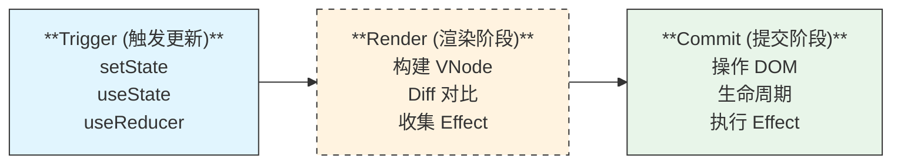

**详细过程：**

```
1️⃣ Trigger（触发阶段）
   ├─ 首次渲染：createRoot → render
   ├─ 状态更新：setState / useReducer / useState dispatch
   └─ 强制更新：forceUpdate / useSyncExternalStore

2️⃣ Render（渲染阶段 — 可中断）
   ├─ 深度优先遍历 Fiber 树
   ├─ 构建 workInProgress 树
   ├─ Diff 对比 → 标记 effectTag（Placement/Update/Deletion）
   ├─ 收集 Hooks 链表
   └─ 时间切片：每 5ms 让出主线程

3️⃣ Commit（提交阶段 — 不可中断）
   ├─ Pre-mutation：getSnapshotBeforeUpdate
   ├─ Mutation：DOM 操作（插入/更新/删除），同步执行
   ├─ Layout：useLayoutEffect 同步执行
   ├─ Passive：useEffect 异步调度执行
   └─ current 指针切换到 workInProgress 树
```

**面试追问：** *Render 阶段为什么可以中断？哪些生命周期在 Render 阶段会被多次调用？*
> Fiber 架构将渲染拆分为最小工作单元（每个 Fiber 节点）。`componentWillMount`、`componentWillReceiveProps`、`componentWillUpdate` 在 Render 阶段执行，可能被多次调用，因此在 React 16+ 被标记为 UNSAFE_。

> **💡 面试追问：React 的 `requestIdleCallback` 和 `MessageChannel` 在调度中分别扮演什么角色？为什么 React 不用 `requestIdleCallback` 做主调度？**
>
> **调度双引擎：**
> ```
> MessageChannel（主调度器）：
>   └─ 每个 Fiber 节点处理完后 postMessage → 下次宏任务继续
>   └─ 优先级高，50ms 内触发，适合短时间切片
> requestIdleCallback（后备/低优任务）：
>   └─ 浏览器空闲时执行，不保证触发时机
>   └─ 用于低优先级任务和数据预取
> ```
> **为什么不用 rIC 做主调度：** rIC 在 Safari 不支持、触发间隔不可控（可能 50ms+，导致卡顿）、Chrome 下最低 50ms 间隔不够激进。MessageChannel 提供更确定性的调度，在主流浏览器中均能达到约 5ms 的切片粒度。

### Q2：useEffect 的完整执行时序是什么？

```typescript
function Lifecycle() {
  useEffect(() => {
    console.log('1. 浏览器绘制后异步执行');
    return () => console.log('3. 清理（下次 effect 前/unmount 时）');
  });

  useLayoutEffect(() => {
    console.log('2. DOM 更新后、浏览器绘制前同步执行');
    return () => console.log('4. 清理');
  });
}
```

**执行顺序：**
```
Render → DOM 更新 → useLayoutEffect（同步）→ 浏览器绘制 → useEffect（异步）
```

### Q3：React 19 Actions 是什么？解决了什么问题？

**核心问题：** 表单提交需要手动管理 loading、error、success 状态，代码冗余：

```typescript
// ❌ React 18 中管理表单状态
const [pending, setPending] = useState(false);
const [error, setError] = useState<Error | null>(null);
const [data, setData] = useState(null);

async function handleSubmit(formData: FormData) {
  setPending(true);
  setError(null);
  try {
    const result = await submitAPI(formData);
    setData(result);
  } catch (e) {
    setError(e as Error);
  } finally {
    setPending(false);
  }
}

// ✅ React 19 Actions：useActionState + useFormStatus
const [state, formAction, pending] = useActionState(async (prev, formData) => {
  const result = await submitAPI(formData);
  return result;
}, null);
```

**Actions 的四大能力：**
1. **自动管理 pending**：`useFormStatus` 读取最近的 `<form>` 的 pending 状态
2. **乐观更新**：`useOptimistic` 假设请求成功提前展示结果
3. **渐进增强**：`<form action={formAction}>` 即使 JS 未加载也能提交
4. **表单重置**：`formAction` 成功后自动调用 `form.reset()`

### Q4：React 中 key 的作用和最佳实践？

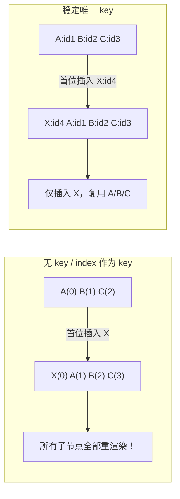

**最佳实践：**
```
✅ 使用唯一且稳定的 ID（`item.id` / `crypto.randomUUID()`）
❌ 不要使用数组 index（插入/删除/排序时 bug）
❌ 不要使用随机数（每次渲染都不同，导致不必要重建）
❌ 不要使用 Math.random()（完全破坏缓存）
⚠️ 只有静态列表可用 index（不增删改排）
```

### Q5：React 18 Concurrent Mode 解决了什么问题？

**核心价值：** 紧急更新不被非紧急更新阻塞。

```
用户输入（紧急）     ❌ 被数据加载（非紧急）阻塞 → 界面卡顿
                    ✅ Concurrent: 输入优先，数据加载可中断
```

| 特性            | React 17（同步） | React 18（Concurrent）      |
| --------------- | ---------------- | --------------------------- |
| 渲染            | 一次更新完整执行 | 可中断/恢复                 |
| 优先级          | 无优先级         | 任务分 urgency / transition |
| 用户输入        | 被所有更新阻塞   | **高优更新跳队优先**        |
| Suspense        | 基础支持         | 流式 SSR + 选择性 hydration |
| startTransition | ❌                | ✅ 标记非紧急更新            |

### Q6：React 19 `use()` 与 useEffect 数据获取的区别？

```typescript
// 方式 1：useEffect + useState（React 18 及以前）
function User() {
  const [user, setUser] = useState(null);
  useEffect(() => {
    fetch('/api/user').then(r => r.json()).then(setUser);
  }, []);
  if (!user) return <Spinner />;
  return <div>{user.name}</div>;
}

// 方式 2：use() + Suspense（React 19）
function User() {
  const user = use(fetchUserPromise);  // 直接消费 Promise
  return <div>{user.name}</div>;
}

// 父组件提供 Suspense 边界
function App() {
  return (
    <Suspense fallback={<Spinner />}>
      <User />
    </Suspense>
  );
}
```

| 维度     | useEffect + useState         | use() + Suspense            |
| -------- | ---------------------------- | --------------------------- |
| 代码量   | 多（loading/error 手动管理） | 少（Suspense 管理 loading） |
| 错误处理 | 手动 catch 设置 error        | ErrorBoundary 统一处理      |
| 竞态条件 | 需手动处理（ignore flag）    | 自动处理                    |
| 灵活性   | 高（完全控制）               | 受限于 Suspense 边界        |

> **💡 面试追问：`use(Promise)` 和 `await` 在 Suspense 中的行为有什么核心差异？**
>
> **核心差异：**
> ```
> use(Promise)：
>   └─ 只能用于 React 组件/Render 阶段
>   └─ 抛出 Promise → Suspense 边界捕获 → 显示 fallback
>   └─ Promise resolve 后从抛出点继续执行
>   └─ 无位置限制（可在条件/循环中使用）
>
> await：
>   └─ 只能在 async 函数中使用
>   └─ 暂停当前函数执行，不会抛出到 Suspense
>   └─ 需要手动处理 loading/error 状态
> ```
> **经验教训：** `use()` 更适合"渲染阶段的数据依赖"（如从 Context 中读取 Promise），`await` 适合"事件处理中的异步操作"（如表单提交）。

### Q7：React 合成事件（SyntheticEvent）是什么？

**为什么需要合成事件？**

```
原生事件问题：
  ├─ 浏览器兼容性差异（e.target / e.preventDefault 命名不同）
  ├─ 内存泄漏风险（事件未卸载）
  └─ 无法在 Fiber 架构中优化

合成事件的优势：
  ├─ 跨浏览器统一接口
  ├─ 事件池（React 16 前）减少 GC
  ├─ 事件委托到 root 节点（React 17 前 document → React 17+ root）
  └─ 与 Fiber 架构深度集成（优先级调度）
```

```typescript
// React 16：事件委托到 document
document.addEventListener('click', ReactEvent.listener);

// React 17+：事件委托到 root 节点
root.addEventListener('click', ReactEvent.listener);

// React 19：基于 createRoot 的事件系统
function handleClick(e: React.MouseEvent) {
  // e 是 SyntheticEvent，但行为与原生事件一致
  e.preventDefault();  // 跨浏览器
  e.stopPropagation();
}
```

### Q8：React Hooks 为什么不能放在条件/循环中？

**根本原因：** Hooks 存储在 Fiber 节点的 **单向链表** 中，依赖**调用顺序**来匹配状态。

```typescript
// Hooks 在 Fiber 中的存储结构
fiber.memoizedState = {
  queue: { pending: null },      // useState 的更新队列
  next: {                        // 指向下一个 Hook
    queue: { pending: null },    // useEffect 的 effect 链表
    next: {
      queue: { pending: null },  // useRef
      next: null
    }
  }
}

// ✅ 正确：每次渲染，Hooks 调用顺序和数量一致
function Good() {
  const [a] = useState(0);       // Hook #1
  const [b] = useState(0);       // Hook #2
  useEffect(() => {}, []);        // Hook #3
}

// ❌ 错误：条件语句导致 Hook 数量不一致
function Bad({ flag }) {
  const [a] = useState(0);       // Hook #1
  if (flag) {
    const [b] = useState(0);     // flag=false 时 Hook #2 不存在
  }
  useEffect(() => {}, []);       // flag=false 时变成了 Hook #2（本应是 #3）
  // → React 无法匹配正确的状态！
}
```

#### 🔥 React 19 例外：`use()` 可在条件中调用

React 19 新增的 `use()` Hook 打破了传统 Hooks 规则——它**可以在条件语句、循环、甚至提前 return 之后调用**：

```typescript
function ConditionalComponent({ showData }: { showData: boolean }) {
  // ❌ 传统 Hooks 不能在条件中
  // if (showData) {
  //   const [data] = useState(null); // 错！
  // }

  // ✅ use() 可以在条件中调用
  if (showData) {
    const data = use(fetchData());
    return <div>{data}</div>;
  }

  return <div>No data</div>;
}
```

**为什么 `use()` 可以例外？**
- `use()` 是**类 Promise 消费者**，不创建新的状态槽位
- 它通过当前 Fiber 的 Suspense 边界实现暂停/恢复，不依赖链表顺序匹配
- 这也是 React 19 对 Hooks 规则的一次"松绑"，但 **useState/useEffect/useCallback 等仍然必须遵守顺序规则**

### Q9：Server Component vs Client Component 的区别？

```tsx
// 🖥️ Server Component（默认）
// app/page.tsx
export default async function Page() {
  const data = await db.query('SELECT * FROM posts');
  // 1. 在服务器端执行（可访问数据库/文件系统/AI API）
  // 2. 不发送 JS bundle 到客户端
  // 3. 不可用 useState/useEffect/事件处理
  return <PostList posts={data} />;
}

// 💻 Client Component（需 'use client'）
// app/counter.tsx
'use client';
export function Counter() {
  // 1. 在客户端执行
  // 2. 可交互（事件/状态/副作用）
  // 3. 发送 JS bundle 到客户端
  const [count, setCount] = useState(0);
  return <button onClick={() => setCount(c => c + 1)}>{count}</button>;
}
```

| 维度             | Server Component | Client Component |
| ---------------- | ---------------- | ---------------- |
| 执行位置         | **服务器**       | **浏览器**       |
| 访问 DB/FS       | ✅ 直接           | ❌ 只能通过 API   |
| useState/Effects | ❌ 不可用         | ✅ 可用           |
| JS Bundle        | **0KB**          | 发送到客户端     |
| 数据获取         | 直接 await       | use/useEffect    |
| API Key 安全     | ✅ 安全           | ❌ 暴露风险       |

### Q10：React.memo 和 useMemo 的区别？

| 特性         | React.memo           | useMemo      |
| ------------ | -------------------- | ------------ |
| **作用对象** | 组件                 | 值/计算      |
| **比较方式** | props 浅比较（默认） | 依赖数组比较 |
| **返回值**   | 新的组件             | 缓存的值     |
| **使用场景** | 避免组件重渲染       | 避免重复计算 |

```typescript
// React.memo：缓存整个组件
const ExpensiveComponent = React.memo(function Expensive({ data }) {
  return <div>{/* 复杂渲染 */}</div>;
});

// useMemo：缓存计算值
function Parent({ items }) {
  const sorted = useMemo(
    () => items.sort((a, b) => a.name.localeCompare(b.name)),
    [items]
  );
  return <ExpensiveComponent data={sorted} />;
}

// useCallback：缓存函数（等价于无参数的 useMemo）
const handleClick = useCallback(() => doSomething(id), [id]);
// 等价于：const handleClick = useMemo(() => () => doSomething(id), [id]);

// ⚠️ 安全提醒：useCallback 依赖不全 → 闭包陷阱
// ❌ 错误：const handle = useCallback(() => api.report(count), []);
// ✅ 正确：const handle = useCallback(() => api.report(count), [count]);
```

### Q11：React 19 Compiler 如何实现自动记忆化？

**原理：** Compiler 在编译阶段分析函数的作用域和依赖关系，自动推断哪些值和函数需要缓存。

```typescript
// 编译前（开发者写的代码）
function ProfilePage({ user }) {
  const title = user.name + '\'s Profile';
  const handleClick = () => showProfile(user.id);
  return <div onClick={handleClick}>{title}</div>;
}

// 编译后（React Compiler 自动转换）
function ProfilePage({ user }) {
  const $ = _c(2);                                        // 分配缓存槽
  let title, handleClick;

  if ($[0] !== user) {                                    // 依赖变化？
    title = user.name + '\'s Profile';
    handleClick = _F(() => showProfile(user.id));         // 自动缓存
    $[0] = user;
    $[1] = [title, handleClick];                         // 更新缓存
  } else {
    [title, handleClick] = $[1];                          // 复用缓存
  }

  return <div onClick={handleClick}>{title}</div>;
}
```

**关键机制：**
- `_c(n)`：分配 n 个缓存槽位
- `_F(fn)`：自动缓存函数引用
- 闭包语义感知：分析哪些外部变量被捕获
- 无手动依赖数组：Compiler 自动推导 `$[0] !== user`

> **💡 面试追问：React Compiler 在处理"外部可变引用"（比如 ref.current、全局对象）时有什么限制？**
>
> **三大限制：**
> ```
> 1. ref.current 突变不可感知
>    └─ Compiler 无法追踪 ref.current 的变化
>    └─ 解决方案：使用 useRef 声明式 RefObject，Compiler 忽略 ref.current
>
> 2. 全局/闭包中的可变变量
>    └─ Compiler 只分析函数作用域内的变量
>    └─ 模块级 let/const 对象突变 → Compiler 不缓存
>
> 3. ! 非标准模式
>    └─ Compiler 为了安全会保守跳过某些模式
>    └─ 通过 'use no memo' 指令手动退出
> ```
> **最佳实践：** 将副作用和可变操作封装到自定义 Hook 中，用 `'use memo'` 标记纯计算组件。

### Q12：React Fiber 架构如何实现可中断渲染？

**核心数据结构：Fiber 链表**

```typescript
// 对比：Stack Reconciler vs Fiber Reconciler

// React 15：函数调用栈（不可中断）
function render15(element) {
  if (typeof element.type === 'function') {
    const children = element.type(element.props);
    render15(children);  // 递归，必须执行完
  }
  // 直接操作 DOM
  document.appendChild(element);
}

// React 16+：Fiber 链表（可中断）
function workLoop(fiber: Fiber) {
  while (fiber && shouldYield() === false) {  // 每次检查是否让出
    fiber = performUnitOfWork(fiber);         // 处理一个 Fiber 节点
    if (fiber === null) {                     // 遍历完成
      commitRoot();                           // 提交 DOM 更新
      break;
    }
  }
  if (fiber) {
    requestIdleCallback(() => workLoop(fiber)); // 下次空闲继续
  }
}
```

**调度机制：** React 通过 `requestIdleCallback` 或 `MessageChannel` 实现时间切片，每次处理一个 Fiber 节点后检查是否超时（约 5ms），超时则让出主线程。

### Q13：React 事件机制与原生事件的区别？

| 对比项       | 原生 DOM 事件              | React 合成事件                            |
| ------------ | -------------------------- | ----------------------------------------- |
| **绑定方式** | `element.addEventListener` | `onClick={handler}`                       |
| **事件委托** | 分散绑定                   | **统一委托到 root**（React 17+）          |
| **跨浏览器** | 需兼容性处理               | ✅ 统一接口                                |
| **阻止冒泡** | `e.stopPropagation()`      | ✅ 同样支持                                |
| **性能**     | 多个 listener              | 内存中 1 个 listener                      |
| **异步访问** | 始终可访问                 | React 16 需 `e.persist()`，React 17+ 无需 |

### Q14：React Fiber 与 Vue 3 虚拟 DOM 的区别？

| 维度 | React Fiber | Vue 3 Virtual DOM |
|------|------------|-------------------|
| **数据结构** | 链表（Fiber Tree） | 树（VNode Tree） |
| **调度方式** | 可中断、优先级调度 | 同步更新 |
| **更新机制** | 双缓冲 | 一次性更新 |
| **优化策略** | Time Slicing | Block Tree + PatchFlag |

### Q15：React 19 Actions 与 Vue 3 的区别？

| 维度 | React Actions | Vue 3 |
|------|--------------|-------|
| **异步处理** | 原生支持 | 需要手动管理 |
| **状态管理** | 自动 pending | 需要 ref |
| **错误处理** | 原生支持 | 需要 try/catch |
| **乐观更新** | useOptimistic | 需要手动实现 |

### Q16：React Server Components 与 SSR 的区别？

| 维度 | RSC | SSR |
|------|-----|-----|
| **执行环境** | 服务端 | 服务端 |
| **输出** | 可序列化的组件 | HTML 字符串 |
| **客户端 JS** | 不包含服务端组件 | 包含所有组件 |
| **交互性** | 无（纯数据） | 有（Hydration） |

### Q17：类组件的 shouldComponentUpdate 与 React.memo 的关系？

**本质相同**：都是防止不必要的重渲染，但应用对象不同。

```typescript
// 类组件：shouldComponentUpdate 控制实例是否更新
class List extends React.Component {
  shouldComponentUpdate(nextProps) {
    return nextProps.items !== this.props.items; // 浅比较
  }
  render() { /* ... */ }
}

// 函数组件：React.memo 包裹组件实现同样效果
const List = React.memo(function List({ items }) {
  return /* ... */;
});

// 自定义比较函数
const List = React.memo(
  () => { /* ... */ },
  (prevProps, nextProps) => prevProps.items === nextProps.items
);
```

| 维度 | shouldComponentUpdate | React.memo |
|------|----------------------|------------|
| 适用组件 | 类组件 | 函数组件 |
| 比较方式 | 手动实现 | 默认浅比较，可自定义 |
| 返回值 | boolean（是否更新） | boolean（是否跳过） |
| 实现位置 | 组件内部 | 组件外部包裹 |

### Q18：React 中 setState 是同步还是异步？

**结论：看执行上下文。**

```typescript
class Example extends React.Component {
  state = { count: 0 };

  handleClick = () => {
    // ✅ React 合成事件：异步（批量）
    this.setState({ count: this.state.count + 1 });
    console.log(this.state.count); // 0（未更新）
  };

  componentDidMount() {
    // ✅ 生命周期：异步（批量）
    this.setState({ count: 1 });
    console.log(this.state.count); // 0

    // ❌ 原生事件：同步（React 17-）/ 异步（React 18+ 自动批处理）
    document.addEventListener('click', () => {
      this.setState({ count: 2 });
      console.log(this.state.count); // React 17-: 2, React 18+: 0
    });

    // ❌ setTimeout：React 17- 同步，React 18+ 自动批处理
    setTimeout(() => {
      this.setState({ count: 3 });
      console.log(this.state.count); // React 17-: 3, React 18+: 0
    }, 0);
  }
}
```

| 场景 | React 17- | React 18+ |
|------|-----------|-----------|
| 合成事件 | 异步（批量） | 异步（批量） |
| 生命周期 | 异步（批量） | 异步（批量） |
| setTimeout/Promise | **同步** | **异步（自动批处理）** |
| 原生事件 | **同步** | **异步（自动批处理）** |
| flushSync | — | ✅ 强制同步 |

#### 🔥 React 19 函数组件中的更新行为

```typescript
function FunctionComponent() {
  const [count, setCount] = useState(0);

  // ✅ React 18+ 所有场景自动批处理
  const handleClick = () => {
    setCount(c => c + 1); // 不会立即渲染
    setCount(c => c + 1); // 合并为一次渲染
  };

  // ✅ React 19 Actions 中的状态更新自动批处理
  const [state, formAction] = useActionState(async (prev, formData) => {
    setCount(c => c + 1); // 在 Action 中也是异步批量
    await save(formData);
    return { success: true };
  }, null);

  // ⚡ flushSync 强制同步（React 18+，需要时用）
  const handleSync = () => {
    flushSync(() => setCount(1)); // 立即渲染
  };
}
```

**最佳实践总结：**

| 版本 | 行为变化 | 对开发者的影响 |
|------|---------|--------------|
| React 17- | 合成事件内异步批量；setTimeout/Promise 同步 | 需注意异步场景下可能多次渲染 |
| React 18+ | **所有场景自动批处理** | 行为更一致，性能更好 |
| React 19 | Actions 内自动批处理 + 支持 `useOptimistic` 乐观更新 | 表单场景减少手动状态管理 |

### Q19：自定义 Hook 的命名规范和设计原则？

**命名规范：** 必须以 `use` 开头（React 通过命名检测 Hook 规则，相关 ESLint 规则依赖此前缀）。

```typescript
// ✅ 正确命名
function useLocalStorage<T>(key: string, initialValue: T) { /* ... */ }
function useWindowSize() { /* ... */ }
function useDebounce<T>(value: T, delay: number): T { /* ... */ }

// ❌ 错误：不以 use 开头
function localStorage(key, initial) { /* ... */ }
// 后果：ESLint 无法检查 Hook 调用规则，建议不通过
```

**设计原则（S-I-D）：**

```typescript
// 1️⃣ Single Responsibility（单一职责）
// ❌ 一个 Hook 做太多事
function useUserAndTheme() {
  const [user, setUser] = useState(null);
  const [theme, setTheme] = useState('light');
  return { user, theme };
}

// ✅ 拆分为独立 Hook
function useUser() { /* ... */ }
function useTheme() { /* ... */ }

// 2️⃣ 返回值一致性
function useData<T>(url: string) {
  const [state, setState] = useState<{
    data: T | null;
    loading: boolean;
    error: Error | null;
  }>({ data: null, loading: true, error: null });
  // ... 统一返回 { data, loading, error }
  return state;
}

// 3️⃣ 输入输出清晰
function useDebounce<T>(value: T, delay: number): T {
  // 输入明确，输出单一
  const [debouncedValue, setDebouncedValue] = useState(value);
  useEffect(() => {
    const timer = setTimeout(() => setDebouncedValue(value), delay);
    return () => clearTimeout(timer);
  }, [value, delay]);
  return debouncedValue;
}
```

### Q20：React 中受控组件和非受控组件的选择策略？

```typescript
// 受控组件（推荐大多数场景）
function ControlledForm() {
  const [email, setEmail] = useState('');
  const handleSubmit = () => {
    // 提交时可以读取最新 state，无需访问 DOM
    submitAPI(email);
  };
  return (
    <form onSubmit={handleSubmit}>
      <input value={email} onChange={e => setEmail(e.target.value)} />
      <button>提交</button>
    </form>
  );
}

// 非受控组件（简单场景/文件上传）
function UncontrolledForm() {
  const inputRef = useRef<HTMLInputElement>(null);
  const handleSubmit = () => {
    // 需要时才从 DOM 读取
    console.log(inputRef.current?.value);
  };
  // defaultValue 只初始化一次，后续变化不影响
  return <input ref={inputRef} defaultValue="默认值" />;
}
```

**选择策略树：**

```
需要实时校验/格式化？ → ✅ 受控组件
仅提交时读取一次值？ → ✅ 非受控组件
文件上传（<input type="file">）？→ ✅ 非受控（只读）
动态控制表单值（禁用/填充）？→ ✅ 受控组件
第三方 JS 库集成（如富文本）？→ ✅ 非受控 + ref
```

### Q21：forwardRef 的作用和 React 19 的变化？

```typescript
// React 18：必须用 forwardRef
const Input = forwardRef<HTMLInputElement, InputProps>((props, ref) => {
  return <input ref={ref} {...props} />;
});

// React 19：ref 可直接作为 prop
function Input({ ref, ...props }: InputProps & { ref: Ref<HTMLInputElement> }) {
  return <input ref={ref} {...props} />;
}
// React 19 不再需要 forwardRef，ref 可以和 props 一样传递

// useImperativeHandle：控制暴露给父组件的方法
const FancyInput = forwardRef(function FancyInput(_, ref) {
  const inputRef = useRef<HTMLInputElement>(null);
  useImperativeHandle(ref, () => ({
    focus: () => inputRef.current?.focus(),
    clear: () => { inputRef.current!.value = ''; },
    scrollToView: () => inputRef.current?.scrollIntoView(),
  }), []);
  return <input ref={inputRef} />;
});
```

| 版本 | 传递 ref 方式 | 是否需要 forwardRef |
|------|-------------|-------------------|
| React 16-18 | forwardRef 包裹 | ✅ 必须 |
| React 19 | ref 直接作为 prop | ❌ 不需要（但 forwardRef 仍可用） |

### Q22：React Portal 的使用场景和事件冒泡机制？

```typescript
import { createPortal } from 'react-dom';

function Modal({ children, onClose }: { children: ReactNode; onClose: () => void }) {
  return createPortal(
    <div className="modal-overlay" onClick={onClose}>
      <div className="modal-content" onClick={e => e.stopPropagation()}>
        {children}
      </div>
    </div>,
    document.body // 挂载到 body，脱离父容器 DOM 层级
  );
}

function App() {
  return (
    <div onClick={() => console.log('App clicked')}>
      <Modal onClose={() => console.log('close')}>
        <p>弹窗内容</p>
      </Modal>
    </div>
  );
}
// 点击弹窗内容 → "close" ✅（父子关系由 React 树决定，不是 DOM 树）
```

**关键规则：**
- **事件冒泡**：沿 React 组件树冒泡，不是 DOM 树
- **Context**：Portal 内可访问父组件的 Context
- **CSS 隔离**：DOM 层级独立，不受父容器 overflow/z-index 限制

### Q23：ErrorBoundary 为什么必须是类组件？函数组件怎么实现错误处理？

```typescript
// ErrorBoundary 必须是类组件的原因：
// 只有类组件有 componentDidCatch 和 getDerivedStateFromError 生命周期
class ErrorBoundary extends React.Component<
  { children: ReactNode; fallback?: ReactNode },
  { hasError: boolean; error: Error | null }
> {
  state = { hasError: false, error: null };

  static getDerivedStateFromError(error: Error) {
    return { hasError: true, error };
  }

  componentDidCatch(error: Error, info: React.ErrorInfo) {
    console.error('Caught:', error, info.componentStack);
    // 上报错误监控
  }

  render() {
    if (this.state.hasError) {
      return this.props.fallback || <h2>出错了：{this.state.error?.message}</h2>;
    }
    return this.props.children;
  }
}

// 函数组件方案：封装 ErrorBoundary 为 Hook 或使用第三方库
// react-error-boundary（推荐）
import { ErrorBoundary } from 'react-error-boundary';

function Fallback({ error, resetErrorBoundary }: {
  error: Error;
  resetErrorBoundary: () => void;
}) {
  return (
    <div role="alert">
      <p>Something went wrong:</p>
      <pre>{error.message}</pre>
      <button onClick={resetErrorBoundary}>重试</button>
    </div>
  );
}

function App() {
  return (
    <ErrorBoundary FallbackComponent={Fallback} onError={logError}>
      <MyComponent />
    </ErrorBoundary>
  );
}

// React 19 中 use() + ErrorBoundary 处理异步错误
function AsyncComponent() {
  const data = use(fetchData());
  return <div>{data}</div>;
}
// 异步错误被 ErrorBoundary 捕获
```

| 能捕获 | 不能捕获 |
|--------|---------|
| 渲染错误 | 事件处理错误 |
| 生命周期错误 | 异步代码（setTimeout） |
| 构造函数错误 | 服务端渲染错误 |
| 子组件树错误 | ErrorBoundary 自身错误 |

### Q24：React 19 useOptimistic 的实现原理和适用场景？

```typescript
import { useOptimistic, useTransition } from 'react';

interface Todo { id: number; text: string; done: boolean; }

function TodoList({ todos: initialTodos }: { todos: Todo[] }) {
  const [optimisticTodos, addOptimisticTodo] = useOptimistic(
    initialTodos,
    (state, newTodo: Todo) => [...state, { ...newTodo, pending: true }]
  );

  const [, startTransition] = useTransition();

  const handleSubmit = async (formData: FormData) => {
    const text = formData.get('text') as string;
    const tempId = Date.now();

    // 1. 乐观更新：立即在 UI 中显示
    addOptimisticTodo({ id: tempId, text, done: false });

    try {
      // 2. 实际提交
      const saved = await saveTodo({ text });
      // useOptimistic 会自动回退到实际数据
    } catch {
      // 3. 失败时自动回滚
      console.error('Failed to save');
    }
  };

  return (
    <form action={handleSubmit}>
      <input name="text" />
      <ul>
        {optimisticTodos.map(todo => (
          <li key={todo.id} style={{ opacity: todo.pending ? 0.5 : 1 }}>
            {todo.text}
          </li>
        ))}
      </ul>
    </form>
  );
}
```

**适用场景：**
- ✅ 消息发送（即时显示，后台发送）
- ✅ 点赞/收藏（即时 UI 反馈）
- ✅ 删除操作（立即移除，失败恢复）
- ✅ 表单提交（乐观显示结果）

**原理：** useOptimistic 在底层维护一个"乐观状态"，当 `addOptimisticTodo` 调用时，React 立即用更新函数计算新的乐观状态并渲染；当实际数据返回后，React 自动丢弃乐观状态，切换到真实数据。

### Q25：Hooks 闭包陷阱（Stale Closure）的成因和解决方案？

```typescript
function Timer() {
  const [count, setCount] = useState(0);

  // ❌ 问题：闭包捕获了过时的 count
  useEffect(() => {
    const timer = setInterval(() => {
      console.log(count);      // 始终是 0
      setCount(count + 1);     // 始终设置为 1
    }, 1000);
    return () => clearInterval(timer);
  }, []); // 空依赖数组，count 被冻结在首次渲染的值

  return <div>{count}</div>;
}
```

**成因：** `useEffect` 的回调闭包捕获了创建时的 `count` 值（首次渲染时为 0），后续渲染虽然创建了新的 `count`，但 effect 的闭包中引用的是旧的 `count`。

**四种解决方案：**

```typescript
// ✅ 方案 1：函数式更新（适用于 setState 场景）
useEffect(() => {
  const timer = setInterval(() => {
    setCount(prev => prev + 1); // 不依赖外部 count
  }, 1000);
  return () => clearInterval(timer);
}, []);

// ✅ 方案 2：添加依赖项（适用于非 setState 场景）
useEffect(() => {
  const timer = setInterval(() => {
    setCount(count + 1);
    sendLog(count); // 需要最新 count 的其他操作
  }, 1000);
  return () => clearInterval(timer);
}, [count]); // 依赖变化时重新创建 timer

// ✅ 方案 3：useRef 保存最新值
const countRef = useRef(count);
useEffect(() => { countRef.current = count; }, [count]);

useEffect(() => {
  const timer = setInterval(() => {
    console.log(countRef.current); // ✅ 总是最新
    setCount(countRef.current + 1);
  }, 1000);
  return () => clearInterval(timer);
}, []);

// ✅ 方案 4：useCallback + ref（适用于回调函数）
function useLatestCallback<T extends (...args: any[]) => any>(fn: T): T {
  const ref = useRef(fn);
  ref.current = fn;

  return useCallback((...args: any[]) => ref.current(...args), []) as T;
}
```

#### 🔗 useCallback 与闭包陷阱的特殊关系

```typescript
// ❌ 典型错误：useCallback 闭包捕获旧值
const [count, setCount] = useState(0);

const handleClick = useCallback(() => {
  // ❌ count 被锁在首次创建时的值（通常是 0）
  api.report(count);
  setCount(count + 1); // 始终是 count + 1 = 1
}, []); // 空依赖 → 闭包冻结

// ✅ 正确：补齐依赖
const handleClick = useCallback(() => {
  api.report(count);
  setCount(count + 1);
}, [count]); // count 变化时重建函数

// ✅ 更优：能用函数式更新就用函数式
const handleClick = useCallback(() => {
  setCount(prev => prev + 1); // 无需依赖 count
}, []); // 无需 count 依赖

// ✅ 如果还要读取最新值做其他操作：useRef
const countRef = useRef(count);
useEffect(() => { countRef.current = count; }, [count]);

const handleClick = useCallback(() => {
  api.report(countRef.current); // 总是最新值
}, []);
```

**核心原则：** useCallback 的闭包陷阱本质与 useEffect 一致——依赖数组决定了函数能"看到"哪些变量。补齐依赖或用 ref 绕过闭包。

### Q26：React HOC、Render Props、Hooks 三种复用方案对比？

```typescript
// 1️⃣ HOC（高阶组件）- 装饰器模式
function withLoading<P>(WrappedComponent: React.ComponentType<P>) {
  return function WithLoading(props: P & { loading: boolean }) {
    const { loading, ...rest } = props as any;
    if (loading) return <Spinner />;
    return <WrappedComponent {...rest} />;
  };
}
const UserListWithLoading = withLoading(UserList);

// 2️⃣ Render Props - 函数作为 children
function DataProvider({ children }: { children: (data: any) => ReactNode }) {
  const [data, setData] = useState(null);
  useEffect(() => { fetchData().then(setData); }, []);
  return children(data);
}
// 使用
<DataProvider>
  {data => data ? <UserList data={data} /> : <Spinner />}
</DataProvider>

// 3️⃣ Hooks - 组合式函数
function useData<T>(url: string) {
  const [data, setData] = useState<T | null>(null);
  const [loading, setLoading] = useState(true);
  useEffect(() => {
    fetch(url).then(r => r.json()).then(d => { setData(d); setLoading(false); });
  }, [url]);
  return { data, loading };
}
// 使用
function UserList() {
  const { data, loading } = useData<User[]>('/api/users');
  if (loading) return <Spinner />;
  return <List data={data} />;
}
```

| 维度 | HOC | Render Props | Hooks |
|------|-----|-------------|-------|
| 代码量 | 多 | 多 | 少 |
| 命名冲突 | ⚠️ props 合并可能冲突 | ✅ 不会 | ✅ 不会 |
| 嵌套层级 | 深（多层包裹） | 深（回调嵌套） | 浅（扁平） |
| 静态类型 | ⚠️ 复杂 | ⚠️ 复杂 | ✅ 友好 |
| Tree Shaking | ❌ 困难 | ❌ 困难 | ✅ 容易 |
| 学习曲线 | 中 | 中 | 低 |
| **推荐度** | ⭐⭐ | ⭐ | ⭐⭐⭐⭐⭐ |

### Q27：useMemo 和 useCallback 什么时候必须用？

```typescript
// ✅ 必须用 useMemo：计算开销大
function ExpensiveList({ items, filter }: { items: Item[]; filter: string }) {
  const filteredItems = useMemo(
    () => items
      .filter(item => item.name.includes(filter))
      .sort((a, b) => expensiveCompare(a, b)),
    [items, filter]
  );
  return <List data={filteredItems} />;
}

// ✅ 必须用 useCallback：作为 React.memo 子组件的 props
const MemoChild = React.memo(Child);

function Parent() {
  const handleClick = useCallback((id: number) => {
    dispatch({ type: 'SELECT', payload: id });
  }, [dispatch]);

  return <MemoChild onClick={handleClick} />; // 无 useCallback → 每次都新函数 → memo 失效
}

// ✅ 必须用 useCallback：作为 useEffect 的依赖
function Component({ id }: { id: number }) {
  const fetchItem = useCallback(async () => {
    const res = await fetch(`/api/items/${id}`);
    return res.json();
  }, [id]);

  useEffect(() => {
    fetchItem().then(setItem);
  }, [fetchItem]); // fetchItem 引用不变 → 避免无限循环
}

// ❌ 不需要：简单计算
const fullName = firstName + ' ' + lastName; // 不用 useMemo

// ❌ 不需要：作为原生事件处理函数
function Button() {
  const handleClick = () => console.log('clicked'); // 每次渲染新函数，但原生元素无影响
  return <button onClick={handleClick}>Click</button>;
}
```

| 场景 | 是否需要 | 原因 |
|------|---------|------|
| 昂贵计算（排序/过滤/格式化） | ✅ useMemo | 避免每次渲染重复计算 |
| React.memo 子组件的 props | ✅ useCallback | 保持引用稳定 |
| useEffect 的依赖函数 | ✅ useCallback | 防止无限循环 |
| 简单计算 | ❌ 不需要 | 开销小于 Hook 本身 |
| 原生元素事件 | ❌ 不需要 | DOM 元素不检查 props 引用 |

#### ⚠️ useCallback 安全风险补充

| 风险 | 原因 | 解决方案 |
|------|------|---------|
| **闭包陷阱** | 依赖漏写，函数锁住旧值 | 开启 `exhaustive-deps` ESLint 规则，补齐所有依赖 |
| **缓存失效** | 依赖中传入字面量对象/数组，每次渲染都是新引用 | 用 `useMemo` 稳定引用后做依赖 |
| **内存泄漏** | 监听/定时器中使用缓存函数，解绑时用了旧引用 | `useEffect` 返回清理函数，将 handler 加入依赖 |
| **反向性能** | 滥用 useCallback + React.memo，比较开销大于重渲染开销 | 只在传给 memo 子组件 / useEffect 依赖时使用 |
| **异步旧值** | setTimeout/Promise 中读取闭包捕获的旧 state | 用 ref 保存最新值，或用函数式更新 `setState(prev => ...)` |

### Q28：React 中 useEffect 的清理函数什么时机执行？

```typescript
function EffectCleanup() {
  const [count, setCount] = useState(0);

  useEffect(() => {
    console.log('Effect 执行', count);

    return () => {
      console.log('清理', count); // 捕获创建时的 count
    };
  }, [count]);

  // 执行顺序：
  // 挂载:   Effect 执行 0
  // count=1: 清理 0 → Effect 执行 1
  // count=2: 清理 1 → Effect 执行 2
  // 卸载:   清理 2
}
```

**三个执行时机：**

| 时机 | 说明 |
|------|------|
| **依赖变化** | 重新执行 effect 前，先清理上一次 effect |
| **组件卸载** | 组件从 DOM 移除前，执行最后一次清理 |
| **StrictMode 开发环境** | 组件挂载→卸载→重新挂载，检测清理是否遗漏 |

```typescript
function DataFetcher({ id }: { id: number }) {
  useEffect(() => {
    const controller = new AbortController();

    fetch(`/api/data/${id}`, { signal: controller.signal })
      .then(res => res.json())
      .then(data => setData(data));

    // 清理：id 变化或组件卸载时，取消进行中的请求
    return () => controller.abort();
  }, [id]);
}
```

### Q29：React 中 Context 的性能问题如何优化？

```typescript
// ❌ 问题：Context value 每次渲染都创建新对象
function App() {
  const [user, setUser] = useState({ name: 'Alice' });

  // 每次 App 渲染都创建新对象 → 所有消费者都重渲染
  return (
    <UserContext.Provider value={{ user, setUser }}>
      <Profile />
      <Settings />
    </UserContext.Provider>
  );
}

// ✅ 方案 1：拆分 Context（高频/低频分开）
const UserContext = createContext<User | null>(null);
const UserDispatchContext = createContext<Dispatch | null>(null);

function App() {
  const [user, dispatch] = useReducer(userReducer, null);

  return (
    <UserDispatchContext.Provider value={dispatch}>
      <UserContext.Provider value={user}>
        <Profile />    {/* 只关心 user */}
        <Settings />   {/* 只关心 dispatch */}
      </UserContext.Provider>
    </UserDispatchContext.Provider>
  );
}

// ✅ 方案 2：useMemo 缓存 value
function AppProvider({ children }: { children: ReactNode }) {
  const [state, dispatch] = useReducer(reducer, initialState);

  const value = useMemo(() => ({ state, dispatch }), [state]);

  return (
    <AppContext.Provider value={value}>
      {children}
    </AppContext.Provider>
  );
}

// ✅ 方案 3：对于不需要 Context 的组件，使用 React.memo
const MemoizedProfile = React.memo(Profile);
// 或者用 useMemo 包裹 JSX
```

**Context 优化的核心原则：**
1. **拆分细粒度**：读和写分开，高频更新和低频更新分开
2. **缓存 value**：Provider 的 value 用 useMemo 包装
3. **局部状态优先**：能用 props 传递就不要用 Context

### Q30：React 19 中 useActionState 和 useFormStatus 如何配合使用？

```typescript
import { useActionState } from 'react';
import { useFormStatus } from 'react-dom';

// 服务端 Action 函数
async function submitOrder(_prev: any, formData: FormData) {
  const items = formData.get('items');
  const address = formData.get('address');

  try {
    const order = await fetch('/api/orders', {
      method: 'POST',
      body: JSON.stringify({ items, address }),
    });
    return { success: true, orderId: order.id };
  } catch (e) {
    return { success: false, error: '提交失败，请重试' };
  }
}

// 提交按钮子组件（使用 useFormStatus 获取最近的 form 状态）
function SubmitButton() {
  const { pending, data } = useFormStatus();
  // pending: 表单是否正在提交
  // data: 当前 FormData

  return (
    <button type="submit" disabled={pending}>
      {pending ? (
        <span className="flex items-center gap-2">
          <Spinner /> 提交中...
        </span>
      ) : (
        '提交订单'
      )}
    </button>
  );
}

// 表单主组件
function OrderForm() {
  const [state, formAction] = useActionState(submitOrder, null);

  return (
    <form action={formAction}>
      <input name="address" required />
      <input type="hidden" name="items" value={JSON.stringify(cartItems)} />

      <SubmitButton />

      {state?.success && (
        <div className="success">下单成功！订单号：{state.orderId}</div>
      )}
      {state?.error && (
        <div className="error">{state.error}</div>
      )}
    </form>
  );
}
```

### Q31：React 事件代理机制中，e.stopPropagation() 为何不能阻止原生事件冒泡？

```typescript
function App() {
  useEffect(() => {
    // 原生事件绑定在 root 上
    document.getElementById('root')?.addEventListener('click', () => {
      console.log('Native: root clicked'); // 仍然会执行！
    });
  }, []);

  return (
    <div onClick={() => console.log('React: div clicked')}>
      <button onClick={(e) => {
        e.stopPropagation();
        console.log('React: button clicked');
      }}>
        点击
      </button>
    </div>
  );
}

// 点击按钮输出：
// "React: button clicked"
// "React: div clicked"  — ❌ 奇怪，不是阻止了吗？
```

**原因：** React 的事件代理机制中，`e.stopPropagation()` 阻止的是 **React 合成事件的冒泡**，但是原生事件已经通过事件代理冒泡到了 root 节点上才被 React 拦截处理。具体来说：

1. 用户点击 `<button>` → 原生事件冒泡到 `root` 节点
2. React 在 root 上的统一监听器捕获到该事件
3. React 创建合成事件，在 **Fiber 树**上模拟事件冒泡
4. `e.stopPropagation()` 阻止的是这个**模拟的冒泡过程**
5. 原生事件本身已经冒泡完成

**正确阻止原生事件冒泡：**

```typescript
// ✅ 使用 addEventListener 在捕获阶段阻止
function Button() {
  const ref = useRef<HTMLButtonElement>(null);

  useEffect(() => {
    const el = ref.current;
    const handler = (e: Event) => e.stopPropagation();
    el?.addEventListener('click', handler);
    return () => el?.removeEventListener('click', handler);
  }, []);

  return (
    <button ref={ref} onClick={(e) => {
      e.nativeEvent.stopImmediatePropagation(); // 立即阻止所有监听器
    }}>
      点击
    </button>
  );
}
```

### Q32：React 中如何实现组件间通信？（所有方式总结）

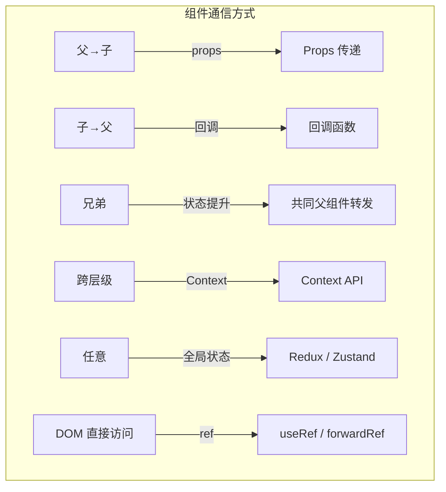

```typescript
// 1️⃣ 父→子：Props
function Child({ name }: { name: string }) {
  return <div>{name}</div>;
}
function Parent() {
  return <Child name="Alice" />;
}

// 2️⃣ 子→父：回调函数
function Child({ onAction }: { onAction: (data: string) => void }) {
  return <button onClick={() => onAction('hello')}>触发</button>;
}
function Parent() {
  return <Child onAction={(data) => console.log(data)} />;
}

// 3️⃣ 兄弟：状态提升
function Parent() {
  const [count, setCount] = useState(0);
  return (
    <>
      <CounterDisplay count={count} />
      <CounterControls onIncrement={() => setCount(c => c + 1)} />
    </>
  );
}

// 4️⃣ 跨层级：Context
const ThemeCtx = createContext('light');

// 5️⃣ 全局：Zustand
const useStore = create((set) => ({ count: 0, inc: () => set(s => ({ count: s.count + 1 })) }));

// 6️⃣ 修改子组件：forwardRef + useImperativeHandle
const Child = forwardRef((_, ref) => {
  useImperativeHandle(ref, () => ({ focus: () => console.log('focus') }));
  return <input />;
});
```

| 方式 | 复杂度 | 适用场景 | 耦合度 |
|------|--------|---------|--------|
| Props | 🟢 低 | 父子直接传递 | 高 |
| 回调函数 | 🟢 低 | 子传父 | 高 |
| 状态提升 | 🟡 中 | 兄弟组件 | 中 |
| Context | 🟡 中 | 跨层级共享 | 低 |
| 全局状态（Zustand/Redux） | 🔴 高 | 任意组件 | 低 |
| ref + forwardRef | 🟡 中 | 命令式操作 | 高 |

### Q33：React 合成事件与原生事件混用需要注意什么？

```typescript
function MixedEvents() {
  const ref = useRef<HTMLDivElement>(null);

  // 原生事件绑定
  useEffect(() => {
    const el = ref.current;
    const nativeHandler = () => console.log('1. Native');
    el?.addEventListener('click', nativeHandler);
    return () => el?.removeEventListener('click', nativeHandler);
  }, []);

  // React 事件
  const reactHandler = () => console.log('2. React');

  return <div ref={ref} onClick={reactHandler}>点击</div>;
}
// 输出：1. Native → 2. React

// 注意：混合使用时的执行顺序
// 原生事件在捕获/冒泡阶段执行
// React 事件在原生事件冒泡到 root 后执行
```

**注意事项总结：**

| 问题 | 说明 |
|------|------|
| 执行顺序 | 原生事件先于 React 事件（因为 React 事件代理在 root） |
| 阻止冒泡 | 原生 `e.stopPropagation()` 阻止 React 事件处理 |
| 内存泄漏 | 原生事件需在 useEffect 清理函数中移除 |
| 优先级 | React 事件可享受并发优先级调度，原生事件不能 |
| **最佳实践** | 优先使用 React 事件，避免混用 |

### Q34：React 中 key 使用数组索引有什么危害？

```typescript
// ❌ 危害：列表重排时状态错乱
function BuggyList() {
  const [items, setItems] = useState([
    { id: 1, name: 'A', input: '' },
    { id: 2, name: 'B', input: '' },
  ]);

  const moveToTop = (index: number) => {
    const [removed] = items.splice(index, 1);
    items.unshift(removed);
    setItems([...items]); // 使用索引作为 key
  };

  return (
    <>
      {items.map((item, index) => (
        <div key={index}> {/* ❌ 索引作为 key */}
          <input
            value={item.input}
            onChange={e => {
              const newItems = [...items];
              newItems[index].input = e.target.value;
              setItems(newItems);
            }}
          />
          <button onClick={() => moveToTop(index)}>置顶</button>
        </div>
      ))}
    </>
  );
}
// 问题：输入框内容在置顶操作后会错乱
// 因为 React 按 key 匹配组件，索引 0 → 'B' 但输入框显示的仍是之前的 value
```

**使用索引作为 key 的三个危害：**

| 危害 | 场景 | 表现 |
|------|------|------|
| 状态错乱 | 有状态组件（input/checkbox）的列表重排 | 状态与元素不匹配 |
| 性能下降 | 列表插入/删除/排序 | 所有子节点重新创建 |
| 动画失效 | 使用 TransitionGroup 或 framer-motion | 元素被错误识别为新增/删除 |

### Q35：React 18 的自动批处理（Automatic Batching）是怎么实现的？

```typescript
// React 17 及以前：仅在合成事件中批处理
function handleClick() {
  // 合成事件内 → 批处理（1 次渲染）
  setCount(c => c + 1);
  setFlag(f => !f);
}

setTimeout(() => {
  // setTimeout 中 → 不批处理（2 次渲染）
  setCount(c => c + 1); // 第 1 次渲染
  setFlag(f => !f);     // 第 2 次渲染
}, 0);

// React 18：所有场景自动批处理
function handleClick() {
  setCount(c => c + 1);
  setFlag(f => !f);
  // 1 次渲染 ✅
}

setTimeout(() => {
  setCount(c => c + 1);
  setFlag(f => !f);
  // 1 次渲染 ✅（React 18 新行为）
}, 0);

fetch('/api/data').then(() => {
  setLoading(false);
  setData(result);
  // 1 次渲染 ✅
});
```

**实现原理：** React 18 引入了一个全局的"更新上下文"（更新批次），所有更新在同一个微任务/宏任务中被收集，当当前执行栈清空时统一提交。这通过 `startTransition` 内部的机制扩展到所有异步场景。

**如果想跳过批处理：**

```typescript
import { flushSync } from 'react-dom';

function handleClick() {
  flushSync(() => setCount(c => c + 1)); // 立即渲染
  flushSync(() => setFlag(f => !f));     // 第二次渲染
}
```

> **💡 面试追问：React 18 的自动批处理（Automatic Batching）在微任务和事件处理器中的行为有什么区别？用 `flushSync` 强制退出批处理时需要注意什么？**
>
> **批处理范围差异：**
> ```
> 事件处理器：✅ 自动批处理（React 17 已支持）
> setTimeout/Promise/microtask：✅ 自动批处理（React 18 新增）
> 原生事件：✅ 自动批处理（React 18 新增）
> ```
> **`flushSync` 注意事项：**
> ```
> 1. 每次 flushSync 触发一次独立的渲染 → 性能代价
> 2. flushSync 之间 DOM 会同步更新 → 可能出现布局抖动
> 3. flushSync 内不能嵌套 flushSync → 会抛异常
> 4. 应在真实的"需要同步 DOM 操作"场景使用（如测量布局）
> ```

### Q36：React 中 props 和 state 的本质区别？

| 维度 | props | state |
|------|-------|-------|
| 来源 | 父组件传入 | 组件内部初始化 |
| 可变性 | **不可变**（只读） | 可通过 setState/useState 修改 |
| 触发渲染 | 父组件重新渲染传入新 props | 调用 setState/useState dispatch |
| 作用范围 | 当前组件及其子组件 | 当前组件 |
| 默认值 | `Component.defaultProps` | `useState(initialValue)` |

```typescript
// props：父组件控制，组件自身不可修改
function Child({ name, onAction }: { name: string; onAction: () => void }) {
  // name 只读，不能修改
  // name = 'new name' ❌
  return <button onClick={onAction}>{name}</button>;
}

// state：组件自有，通过 setState 修改
function Counter() {
  const [count, setCount] = useState(0); // 组件自有状态
  return <button onClick={() => setCount(c => c + 1)}>{count}</button>;
}

// 核心原则：props 向下流动，state 本地管理
// props → 组件 → state
//    ↓              ↓
//  子组件          setState
```

### Q37：React 中 PureComponent 和 Component 的区别？

```typescript
import React, { PureComponent, Component } from 'react';

// Component：默认每次调用 setState 都重新渲染（shouldComponentUpdate 返回 true）
class RegularList extends Component<{ items: string[] }> {
  render() {
    console.log('RegularList rendered');
    return <ul>{this.props.items.map(i => <li key={i}>{i}</li>)}</ul>;
  }
}

// PureComponent：自动浅比较 props/state（shouldComponentUpdate 自动实现）
class PureList extends PureComponent<{ items: string[] }> {
  render() {
    console.log('PureList rendered');
    return <ul>{this.props.items.map(i => <li key={i}>{i}</li>)}</ul>;
  }
}

function Parent() {
  const [count, setCount] = useState(0);
  const items = ['A', 'B', 'C'];

  return (
    <div>
      <button onClick={() => setCount(c => c + 1)}>{count}</button>
      {/* ⚠️ items 每次渲染都创建新数组！PureComponent 浅比较 → 引用不同 → 还是重新渲染 */}
      <PureList items={items} />
      <RegularList items={items} />
    </div>
  );
}
```

**PureComponent 的局限性：**

| 问题 | 示例 | 后果 |
|------|------|------|
| 浅比较 | `{ a: { b: 1 } }` 与 `{ a: { b: 1 } }` | 引用不同 → 重新渲染 |
| 内联对象 | `items={['A']}` | 每次新引用 → 重新渲染 |
| 内联函数 | `onClick={() => {}}` | 每次新引用 → 重新渲染 |
| 深层嵌套 | `data.list.items` | 只比较 data 引用，内部变化检测不到 |

**三者对比：**

| 维度 | Component | PureComponent | React.memo |
|------|-----------|--------------|------------|
| 适用 | 类组件 | 类组件 | 函数组件 |
| 比较策略 | 不比较（总是渲染） | props 浅比较 | props 浅比较（可自定义） |
| 性能 | 可能过度渲染 | 避免部分重渲染 | 避免部分重渲染 |
| 使用建议 | 简单场景 | 纯展示组件 | 纯展示函数组件 |

### Q38：React 中 Fragment（<></>）的作用和原理？

```typescript
// ❌ 问题：JSX 必须有一个根元素
function Table() {
  return (
    <table>
      <tr>
        <td>A</td>
        <td>B</td>
      </tr>
      {/* <td>C</td> <td>D</td> 不能直接放，需要额外包裹 */}
    </table>
  );
}

// ✅ 使用 Fragment：不产生额外 DOM 节点
function Table() {
  return (
    <table>
      <tr>
        <Columns />
      </tr>
    </table>
  );
}

function Columns() {
  return (
    <>
      <td>列1</td>
      <td>列2</td>
    </>
  );
  // 编译为：
  // React.createElement(React.Fragment, null,
  //   React.createElement('td', null, '列1'),
  //   React.createElement('td', null, '列2')
  // );
}
```

| 写法 | 是否产生 DOM 节点 | 是否支持 key |
|------|-----------------|-------------|
| `<></>` | ❌ 无 | ❌ 不支持 |
| `<Fragment></Fragment>` | ❌ 无 | ✅ 支持 |
| `<div></div>` | ✅ 有 | ✅ 支持 |

```typescript
// Fragment 需要 key 的场景：循环列表
function Glossary({ items }: { items: { term: string; desc: string }[] }) {
  return (
    <dl>
      {items.map(item => (
        <Fragment key={item.term}>
          <dt>{item.term}</dt>
          <dd>{item.desc}</dd>
        </Fragment>
      ))}
    </dl>
  );
}
```

**原理：** `React.Fragment` 是一个特殊的组件类型，React 在渲染时不会为其创建 DOM 节点，只渲染其子节点。源码中通过 `REACT_FRAGMENT_TYPE` 标记，在 commit 阶段跳过 DOM 操作。

### Q39：React 中 ref 的几种使用方式及各自适用场景？

```typescript
import { useRef, createRef, forwardRef, useImperativeHandle, useCallback } from 'react';

// 1️⃣ useRef（函数组件，推荐）
function TextInput() {
  const inputRef = useRef<HTMLInputElement>(null);
  const focusInput = () => inputRef.current?.focus();
  return <><input ref={inputRef} /><button onClick={focusInput}>聚焦</button></>;
}

// 2️⃣ createRef（类组件）
class ClassInput extends React.Component {
  inputRef = createRef<HTMLInputElement>();
  componentDidMount() { this.inputRef.current?.focus(); }
  render() { return <input ref={this.inputRef} />; }
}

// 3️⃣ 回调 Refs（更精细的控制）
function CallbackInput() {
  const [height, setHeight] = useState(0);

  const measureRef = useCallback((node: HTMLInputElement | null) => {
    if (node !== null) {
      setHeight(node.getBoundingClientRect().height);
    }
  }, []); // 注意：回调 ref 在组件更新时不会重新调用（除非 deps 变化）

  return <input ref={measureRef} />;
}

// 4️⃣ forwardRef（透传 ref 到子组件 DOM）
const FancyButton = forwardRef<HTMLButtonElement, { children: ReactNode }>(
  (props, ref) => <button ref={ref} className="fancy">{props.children}</button>
);

// 5️⃣ useImperativeHandle（控制暴露的 API）
const CustomInput = forwardRef<{ focus: () => void; clear: () => void }, {}>(
  (_, ref) => {
    const inputRef = useRef<HTMLInputElement>(null);
    useImperativeHandle(ref, () => ({
      focus: () => inputRef.current?.focus(),
      clear: () => { inputRef.current!.value = ''; },
    }), []);
    return <input ref={inputRef} />;
  }
);
```

**ref 的使用场景总结：**

| 场景 | 推荐方式 | 原因 |
|------|---------|------|
| 管理焦点/文本选择 | useRef | 最简洁 |
| 媒体播放（video/audio） | useRef | DOM 控制 |
| 动画触发 | useRef + callback ref | 可获取 DOM 测量值 |
| 保存可变值（不触发渲染） | **useRef** | `.current` 修改不触发重渲染 |
| 与第三方库集成（D3/Chart） | callback ref | 可获取 DOM 测量和通知 |
| 暴露子组件方法 | forwardRef + useImperativeHandle | 封装性好 |

### Q40：React 中 StrictMode 的作用和检测机制？

```typescript
import { StrictMode } from 'react';

const root = createRoot(document.getElementById('root'));
root.render(
  <StrictMode>
    <App />
  </StrictMode>
);
```

**StrictMode 在开发环境做的检测：**

| 检测项 | 机制 | 目的 |
|--------|------|------|
| **不安全的生命周期** | 警告 UNSAFE_componentWillMount 等 | 引导迁移到安全生命周期 |
| **副作用双重调用** | 挂载→卸载→重新挂载 | 检测 useEffect 清理是否遗漏 |
| **Ref 回调重复调用** | 创建→清理→创建 | 检测 ref 清理是否正确 |
| **过时 API 检测** | 检测 findDOMNode / context 旧用法 | 引导迁移 |
| **意外的副作用** | 多次调用 reducer/state 初始化函数 | 检测纯函数性 |

```typescript
function TestComponent() {
  useEffect(() => {
    console.log('Effect runs'); // 开发环境会打印两次
    return () => console.log('Cleanup');
  }, []);

  return <div>Test</div>;
}

// 非 StrictMode：挂载 → "Effect runs" → 卸载 → "Cleanup"
// StrictMode 开发环境：挂载 → "Effect runs" → 卸载 → "Cleanup" → 挂载 → "Effect runs"
// 这帮助检测：如果 cleanup 没有正确执行，内存泄漏会暴露
```

**双重调用只发生在开发环境，生产环境不受影响。**

React 实现方式：StrictMode 通过 `React.StrictMode` 组件标记子树，Fiber 节点上设置 `mode` 标志位为 `StrictMode`。在 commit 阶段，如果检测到 `StrictMode` 标志，开发环境的渲染器会执行双重生命周期。

### Q41：React 中如何实现条件渲染？各方式对比？

```typescript
function ConditionalRendering({ user, loading, error }: {
  user: User | null;
  loading: boolean;
  error: Error | null;
}) {
  // 1️⃣ 三元运算符（最常用）
  return (
    <div>
      {loading ? (
        <Spinner />
      ) : error ? (
        <Error message={error.message} />
      ) : user ? (
        <Profile user={user} />
      ) : (
        <LoginPrompt />
      )}
    </div>
  );

  // 2️⃣ && 短路运算（适用于"有则显示"场景）
  // return <div>{show && <Panel />}</div>;

  // 3️⃣ 提前 return（逻辑复杂时）
  // if (loading) return <Spinner />;
  // if (error) return <Error message={error.message} />;
  // if (!user) return <LoginPrompt />;
  // return <Profile user={user} />;

  // 4️⃣ IIFE（立即执行函数，不推荐）
  // return <div>{(() => { if (loading) return <Spinner />; })()}</div>;

  // 5️⃣ 变量存储（逻辑复杂时）
  // let content: ReactNode;
  // if (loading) content = <Spinner />;
  // else if (error) content = <Error />;
  // else content = <Profile />;
  // return <div>{content}</div>;
}
```

| 方式 | 代码量 | 可读性 | 复杂度 | 推荐度 |
|------|--------|--------|--------|--------|
| 三元运算符 | 少 | 高 | 2-3 分支 | ⭐⭐⭐⭐⭐ |
| `&&` 短路 | 最少 | 高 | 布尔判断 | ⭐⭐⭐⭐⭐ |
| 提前 return | 中 | 高 | 多分支 | ⭐⭐⭐⭐ |
| 变量存储 | 中 | 中 | 复杂逻辑 | ⭐⭐⭐ |
| IIFE | 多 | 低 | 极少用 | ⭐ |

**选择原则：** 2-3 个分支用三元；纯布尔判断用 `&&`；4+ 分支或逻辑复杂用提前 return。

#### 🔥 React 19 条件渲染新写法：`use()` + 条件判断

```typescript
import { use, Suspense } from 'react';

function ConditionalData({ id }: { id: string | null }) {
  // ✅ use() 可以在条件中调用（与传统 Hooks 不同）
  if (id === null) {
    return <p>请选择一条数据</p>;
  }

  const data = use(fetchData(id)); // 条件中调用 use()
  return <div>{data.name}</div>;
}
// 传统 Hooks 不能在条件中调用，但 use() 可以！
```

### Q42：React 中 dangerouslySetInnerHTML 的危险性和安全替代方案？

```typescript
function DangerousExample() {
  const html = '';

  // ❌ 危险：直接插入 HTML，可能触发 XSS
  return <div dangerouslySetInnerHTML={{ __html: html }} />;
}

// ✅ 安全方案 1：DOMPurify 净化 HTML
import DOMPurify from 'dompurify';

function SafeHTML({ html }: { html: string }) {
  const clean = DOMPurify.sanitize(html); // 移除危险标签/属性
  return <div dangerouslySetInnerHTML={{ __html: clean }} />;
}

// ✅ 安全方案 2：React 默认转义（绝大多数场景）
function SafeExample({ text }: { text: string }) {
  // React 默认转义 HTML 实体，不会执行脚本
  return <div>{text}</div>;
  // 输入 '<script>alert(1)</script>' → 显示为文本，不会执行
}

// ✅ 安全方案 3：使用更安全的渲染方式（富文本）
// 推荐使用 Quill、Slate、TipTap 等成熟的富文本编辑器
```

**为什么 `dangerouslySetInnerHTML` 是危险的？**

```typescript
// React 默认行为：转义所有 HTML
const userInput = '<script>alert("XSS")</script>';
<div>{userInput}</div>
// 渲染为文本：&lt;script&gt;alert("XSS")&lt;/script&gt;

// dangerouslySetInnerHTML 跳过转义
<div dangerouslySetInnerHTML={{ __html: userInput }} />
// 直接插入 HTML，脚本会执行！
```

**安全使用建议：**
1. 绝大多数场景不需要它（直接用 `{text}` 即可）
2. 必须用时，先用 DOMPurify 等库净化
3. 服务端渲染的 HTML 片段可以使用，但确保服务端输出安全
4. 使用 `__html` 属性名是 React 故意设计的警示

### Q43：React 中 useEffect 与 useLayoutEffect 的选择策略？

```typescript
function EffectStrategy() {
  const [width, setWidth] = useState(0);
  const ref = useRef<HTMLDivElement>(null);

  // ✅ useEffect：绝大多数场景
  // 执行时机：浏览器绘制后，不阻塞渲染
  useEffect(() => {
    fetchData().then(setData);
    // 数据获取、日志、订阅——不需要用户立刻看到变化
  }, []);

  // ⚡ useLayoutEffect：需要同步读取/修改 DOM 的场景
  // 执行时机：DOM 更新后、浏览器绘制前，阻塞渲染
  useLayoutEffect(() => {
    if (ref.current) {
      const rect = ref.current.getBoundingClientRect();
      setWidth(rect.width); // 测量 DOM → 同步更新 state → 在绘制前合并
    }
  }, []);

  return <div ref={ref}>Width: {width}px</div>;
}
```

**决策树：**

```
需要读取或修改 DOM？→ YES → 用户能看到变化前的闪烁？→ YES → useLayoutEffect
                    ↓                     ↓
                   NO                    NO
                    ↓                     ↓
               useEffect            useEffect
```

**选择原则：**

| 场景 | 选择 | 原因 |
|------|------|------|
| 数据获取 | `useEffect` | 数据显示晚一点没关系 |
| 事件监听 | `useEffect` | 不阻塞绘制 |
| 日志上报 | `useEffect` | 不需要用户感知 |
| 订阅/定时器 | `useEffect` | 不涉及 DOM |
| 测量 DOM 尺寸 | `useLayoutEffect` | 需要在绘制前获取 |
| DOM 动画/滚动位置 | `useLayoutEffect` | 需要在绘制前设置 |
| 避免闪烁 | `useLayoutEffect` | 同步更新 state 后合并绘制 |

**SSR 警告：** `useLayoutEffect` 在 SSR 中会触发警告，因为它需要在浏览器环境中执行。

### Q44：React 中列表渲染为什么需要 key？Diff 算法如何利用 key？

```typescript
// 场景：列表头部插入新元素
// 旧列表：[{ id: 1, name: 'A' }, { id: 2, name: 'B' }]
// 新列表：[{ id: 3, name: 'C' }, { id: 1, name: 'A' }, { id: 2, name: 'B' }]

// ❌ 无 key / index 作为 key
// React 按索引比较：
//   index 0: A → C（类型相同？都是对象 → type 相同 → 复用，更新 props）
//   index 1: B → A（复用，更新 props）
//   index 2: — → B（新增）
// 结果：没有节点被复用为原来的样子，全部更新了一遍

// ✅ 唯一 key
// React 按 key 匹配：
//   key=3: 没有旧节点 → 新建
//   key=1: 旧有 key=1 → 复用（A），无需更新
//   key=2: 旧有 key=2 → 复用（B），无需更新
// 结果：只新建了 C，A 和 B 完美复用

// Diff 算法对 key 的处理：
function reconcileChildren(currentFirstChild, newChildren) {
  let oldFiber = currentFirstChild;
  let newIdx = 0;

  // 第 1 轮遍历：逐个比较 key
  for (; oldFiber && newIdx < newChildren.length; newIdx++) {
    const newChild = newChildren[newIdx];
    // 如果 key 相同且 type 相同 → 可复用
    if (oldFiber.key === newChild.key && oldFiber.type === newChild.type) {
      // 复用 Fiber，更新 props
      const clone = useFiber(oldFiber, newChild.props);
      // ...
    } else {
      break; // key 不匹配，跳出循环
    }
    oldFiber = oldFiber.sibling;
  }

  // 第 2 轮：处理剩余节点（通过 key map 快速查找可复用的）
  if (oldFiber) {
    const existingChildren = mapRemainingChildren(oldFiber);
    for (; newIdx < newChildren.length; newIdx++) {
      const matched = existingChildren.get(newChildren[newIdx].key);
      if (matched) {
        // 复用，标记移动
      } else {
        // 新建
      }
    }
  }
}
```

**核心机制：** React 通过 key 建立了"旧节点→新节点"的映射，使得 Diff 算法能在 O(1) 时间内找到可复用的节点，避免全量重建。

> **💡 面试追问：React 的 Diff 中，reconcileChildren 的双指针遍历和 React 的仅右移优化分别适用于什么场景？Vue 的双端 Diff 为什么在 React 中不做？**
>
> **场景差异：**
> ```
> React 的右移优化：
>   └─ 适用：尾部插入（最常见场景）→ O(n) 完美
>   └─ 不适用：头部插入 → O(n²) 需要映射表
>
> Vue 的双端 Diff：
>   └─ 适用：头/尾插入 → 四种情况快速匹配
>   └─ 复杂度：始终 O(n) ~ O(n²) 取决于移动次数
> ```
> **为什么 React 不做双端 Diff：** Fiber 架构基于单向链表，无反向索引。Vue 的虚拟 DOM 有 children 数组支持双端遍历。Fiber 的"一次只有一个单向链表"架构不允许反向遍历。这是架构设计选择带来的 Diff 策略差异。

### Q45：React 16+ 为什么废弃三个 will 生命周期？

**三个废弃的生命周期：**
- `componentWillMount`
- `componentWillReceiveProps`
- `componentWillUpdate`

**根本原因：Fiber 架构的引入。**

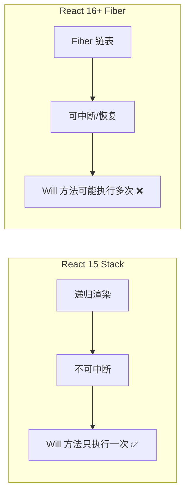

**具体问题分析：**

| 废弃方法 | Fiber 下的问题 | 风险 |
|---------|---------------|------|
| **componentWillMount** | 可能被中断后重复调用 | 重复请求 API、重复初始化 |
| **componentWillReceiveProps** | 可能被调用多次，且容易在内部调用 setState | 多次 setState 覆盖、状态不一致 |
| **componentWillUpdate** | 可能被中断，此时读取的 DOM 快照不准确 | 滚动位置错误、动画错乱 |

```typescript
// ❌ 废弃用法：componentWillMount 中发起请求
class UserProfile extends React.Component {
  componentWillMount() {
    // Fiber 中可能执行多次！❌
    fetch(`/api/user/${this.props.id}`)
      .then(r => r.json())
      .then(user => this.setState({ user }));
    // 结果：重复请求，浪费带宽，数据可能被覆盖
  }
}

// ✅ 正确做法：componentDidMount 中发起请求
class UserProfile extends React.Component {
  componentDidMount() {
    // 只会执行一次 ✅
    fetch(`/api/user/${this.props.id}`)
      .then(r => r.json())
      .then(user => this.setState({ user }));
  }
}
```

**替代方案对应表：**

| 废弃方法 | 推荐替代 | 说明 |
|---------|---------|------|
| componentWillMount | constructor / componentDidMount | 初始化放 constructor，异步放 componentDidMount |
| componentWillReceiveProps | getDerivedStateFromProps / 完全受控组件 | 静态方法，纯函数，无副作用 |
| componentWillUpdate | getSnapshotBeforeUpdate + componentDidUpdate | DOM 快照在 Pre-commit 阶段只执行一次 |

### Q46：React 类组件中事件绑定 this 的几种方式？

```typescript
// 方式 1：constructor 中 bind（官方推荐）
class Counter1 extends React.Component {
  constructor(props) {
    super(props);
    this.state = { count: 0 };
    this.handleClick = this.handleClick.bind(this); // 只绑定一次
  }
  handleClick() { this.setState(s => ({ count: s.count + 1 })); }
  render() { return <button onClick={this.handleClick}>{this.state.count}</button>; }
}

// 方式 2：public class fields 语法（最简洁，推荐）
class Counter2 extends React.Component {
  state = { count: 0 };
  handleClick = () => { // 箭头函数自动绑定 this
    this.setState(s => ({ count: s.count + 1 }));
  };
  render() { return <button onClick={this.handleClick}>{this.state.count}</button>; }
}

// 方式 3：render 中 bind（不推荐：每次渲染创建新函数）
class Counter3 extends React.Component {
  render() {
    return <button onClick={this.handleClick.bind(this)}>
      {this.state.count}
    </button>;
  }
}

// 方式 4：箭头函数包裹（不推荐：每次渲染创建新函数）
class Counter4 extends React.Component {
  render() {
    return <button onClick={() => this.handleClick()}>
      {this.state.count}
    </button>;
  }
}
```

| 方式 | 性能 | 推荐度 | 说明 |
|------|------|--------|------|
| constructor bind | ✅ 只绑定一次 | ⭐⭐⭐⭐ | 传统的标准做法 |
| class fields (箭头函数) | ✅ 只绑定一次 | ⭐⭐⭐⭐⭐ | 最简洁，无需 bind |
| render bind | ❌ 每次创建新函数 | ⭐⭐ | 可能引发子组件不必要渲染 |
| 箭头函数包裹 | ❌ 每次创建新函数 | ⭐ | 同左，且可读性差 |

### Q47：React 中 setState 的合并策略是什么？

```typescript
// setState 的两种用法

// 1️⃣ 对象形式（浅合并）
class Example extends React.Component {
  state = { count: 0, name: 'Alice' };

  handleClick = () => {
    this.setState({ count: this.state.count + 1 });
    // 只更新 count，name 不受影响
    // 等价于：this.state = { ...this.state, count: 1 }
  };

  // 多次对象形式 setState 会合并：
  handleMultiple = () => {
    this.setState({ count: this.state.count + 1 }); // 无效
    this.setState({ count: this.state.count + 1 }); // 无效
    this.setState({ count: this.state.count + 1 }); // 最终 +1
    // 合并为：Object.assign({}, { count: 0+1 }, { count: 0+1 }, { count: 0+1 })
    // 结果：count = 1（不是 3）
  };

  // 2️⃣ 函数形式（基于前一个状态）
  handleCorrect = () => {
    this.setState(s => ({ count: s.count + 1 })); // ✅
    this.setState(s => ({ count: s.count + 1 })); // ✅
    this.setState(s => ({ count: s.count + 1 })); // ✅
    // 队列执行：0→1→2→3
    // 结果：count = 3
  };
}
```

**合并原则：**

| 形式 | 合并行为 | 适用场景 |
|------|---------|---------|
| `setState({ key: value })` | 浅合并（Object.assign） | 不依赖前一个 state |
| `setState(prev => ({ key: prev.key + 1 }))` | 队列依次执行 | 依赖前一个 state |
| 多次对象形式 | 最后一次覆盖前面（非 count 累加） | 避免：连续累加 |
| 多次函数形式 | 依次执行（count 累加） | ✅ 推荐连续更新 |

### Q48：React 中函数组件每次渲染都有独立闭包是什么意思？

```typescript
function Counter() {
  const [count, setCount] = useState(0);

  const handleClick = () => {
    setTimeout(() => {
      alert(count); // 点击时的 count 值，不是最新的
    }, 3000);
  };

  return (
    <div>
      <p>{count}</p>
      <button onClick={() => setCount(c => c + 1)}>+1</button>
      <button onClick={handleClick}>3 秒后显示 count</button>
    </div>
  );
}
// 操作：count=0 → 快速点 3 次 +1 → 点"3 秒后显示" → 再点 5 次 +1
// 3 秒后 alert 显示：3（点击 handleClick 时闭包捕获的 count 值）
// 不是 8（当前最新值）
```

**核心概念：** 每次渲染都是独立的快照。

```typescript
// 每次渲染的"快照"：
// 第 1 次渲染：count=0 → handleClick 闭包捕获 count=0
// 第 2 次渲染：count=1 → handleClick 闭包捕获 count=1
// 第 3 次渲染：count=2 → handleClick 闭包捕获 count=2
// ...

function Counter() {
  const [count, setCount] = useState(0);

  // 每次渲染都有独立的：
  const count = 0;           // 独立的 count 值
  const handleClick = () => { // 独立的函数闭包
    alert(0);
  };

  // 返回的 JSX 也是独立的
  return <div>0</div>;
}
```

**与类组件的对比：**

```typescript
// 类组件：this.state.count 始终指向最新值
class ClassCounter extends React.Component {
  state = { count: 0 };
  handleClick = () => {
    setTimeout(() => {
      alert(this.state.count); // 始终是最新值
    }, 3000);
  };
}

// 函数组件：闭包捕获的是渲染时的值
function FunctionCounter() {
  const [count, setCount] = useState(0);
  const handleClick = () => {
    setTimeout(() => {
      alert(count); // 点击时的值
    }, 3000);
  };
}
```

#### 🔥 独立闭包 + useCallback 的相互作用

```typescript
function ClosureWithUseCallback() {
  const [count, setCount] = useState(0);

  // ❌ useCallback + 空依赖 = 闭包永久锁住旧值
  const handleClick = useCallback(() => {
    // count 永远指向首次渲染的值（0）
    console.log(count); // 始终 0
  }, []);

  // ✅ 依赖补齐：count 变化时重建函数
  const handleClickCorrect = useCallback(() => {
    console.log(count); // 当前渲染时的 count
  }, [count]);

  // ✅ useRef 绕过闭包：函数稳定、读取最新值
  const countRef = useRef(count);
  useEffect(() => { countRef.current = count; }, [count]);

  const handleClickRef = useCallback(() => {
    console.log(countRef.current); // 总是最新值
  }, []); // 无需依赖，永远稳定

  return <button onClick={handleClickRef}>Click</button>;
}
```

**理解独立闭包对 useCallback 的关键影响：**
- useCallback 的**依赖数组决定闭包快照的范围**
- 空依赖 `[]` → 函数永远锁定首次渲染的值
- 补齐依赖 → 函数在依赖变化时重建，捕获新快照
- `useRef` 是唯一能在稳定函数中读取最新值的方式

### Q49：React 中 getDerivedStateFromProps 的真实使用场景？

```typescript
// 官方警示：大多数场景不需要 getDerivedStateFromProps
// 只有在 props 变化时需要重置组件内部 state 时才使用

// ❌ 错误用法：直接复制 props 到 state（完全受控组件可以解决）
static getDerivedStateFromProps(props, state) {
  return { email: props.email }; // ❌ 多余，直接用 props.email
}

// ✅ 场景 1：props 变化时重置内部状态
class EmailInput extends React.Component<{ email: string }> {
  state = {
    email: this.props.email,   // 初始化用 props
    prevEmail: this.props.email, // 记住上一次的 props
  };

  static getDerivedStateFromProps(props: { email: string }, state: { prevEmail: string }) {
    // props.email 变化时才重置（不是每次父组件渲染都重置）
    if (props.email !== state.prevEmail) {
      return {
        email: props.email,
        prevEmail: props.email,
      };
    }
    return null; // 不更新
  }

  handleChange = (e: React.ChangeEvent<HTMLInputElement>) => {
    this.setState({ email: e.target.value });
  };

  render() {
    return <input value={this.state.email} onChange={this.handleChange} />;
  }
}

// ✅ 场景 2：根据 props 计算派生数据
class List extends React.Component<{ items: Item[]; filter: string }> {
  state = {
    filteredItems: this.computeFilteredItems(this.props),
    prevProps: this.props,
  };

  static getDerivedStateFromProps(props: typeof this.props, state: { prevProps: typeof this.props }) {
    // 只有 props 变化时才重新计算
    if (props.items !== state.prevProps.items || props.filter !== state.prevProps.filter) {
      return {
        filteredItems: props.items.filter(i => i.name.includes(props.filter)),
        prevProps: props,
      };
    }
    return null;
  }

  computeFilteredItems(props: typeof this.props) {
    return props.items.filter(i => i.name.includes(props.filter));
  }
}
```

**两种场景总结：**

| 场景 | 说明 | 更推荐的替代方案 |
|------|------|----------------|
| 缓存计算结果 | props 变化重新计算派生数据 | **useMemo**（函数组件） |
| props 变化重置 state | 如编辑表单中外部数据变化重置 | **key 属性**：`<EmailInput key={user.id} />` 或完全受控组件 |

### Q50：React 中 useState 和 useReducer 如何选择？

```typescript
// ✅ useState：简单独立的状态
function Counter() {
  const [count, setCount] = useState(0);
  return <button onClick={() => setCount(c => c + 1)}>{count}</button>;
}

// ✅ useReducer：复杂相关状态（多个值需要一起更新）
interface State { count: number; step: number; }
type Action =
  | { type: 'INCREMENT' }
  | { type: 'DECREMENT' }
  | { type: 'SET_STEP'; payload: number };

function reducer(state: State, action: Action): State {
  switch (action.type) {
    case 'INCREMENT': return { ...state, count: state.count + state.step };
    case 'DECREMENT': return { ...state, count: state.count - state.step };
    case 'SET_STEP':  return { ...state, step: action.payload };
  }
}

function Counter() {
  const [state, dispatch] = useReducer(reducer, { count: 0, step: 1 });
  return (
    <div>
      <p>Count: {state.count}</p>
      <button onClick={() => dispatch({ type: 'INCREMENT' })}>+</button>
      <input type="number" value={state.step}
        onChange={e => dispatch({ type: 'SET_STEP', payload: +e.target.value })} />
    </div>
  );
}

// ✅ useReducer：下一个 state 依赖前一个（dispatch 引用稳定）
function HeavyComponent() {
  const [state, dispatch] = useReducer(reducer, initialState);
  // dispatch 引用稳定，不会导致子组件重渲染
  return <ExpensiveChild onAction={dispatch} />; // 无需 useCallback
}

// 用 useState 的等价写法（需要 useCallback）
function HeavyComponent() {
  const [state, setState] = useState(initialState);
  const dispatch = useCallback((action: Action) => {
    setState(prev => reducer(prev, action));
  }, []);
  return <ExpensiveChild onAction={dispatch} />;
}
```

**选择策略：**

```
状态类型简单（数字/布尔/字符串）？→ ✅ useState
状态类型复杂（对象/数组/多个值）？→ ❌ 感觉 setState 麻烦？→ ✅ useReducer
更新逻辑涉及前一个状态？→ ✅ useReducer（dispatch 引用稳定）
更新逻辑在组件外可复用？→ ✅ useReducer（reducer 是纯函数，可单独测试）
```

| 维度 | useState | useReducer |
|------|----------|------------|
| 状态结构 | 简单值 | 复杂对象/数组 |
| 更新逻辑 | 内联在组件中 | 独立 reducer 函数 |
| 可测试性 | 低（需渲染组件） | 高（纯函数） |
| dispatch 稳定性 | 需 useCallback | ✅ 始终稳定 |
| 适用场景 | 2-3 个独立状态 | 多个相关状态 |

#### 💡 补充：useState 惰性初始化（Lazy Initializer）

```typescript
// ❌ 直接传值：每次渲染都会计算 initialValue
const [state, setState] = useState(expensiveComputation(props.data));
// expensiveComputation 每次渲染都会被调用，只是返回值被忽略

// ✅ 惰性初始化：传函数，只在首次渲染执行一次
const [state, setState] = useState(() => expensiveComputation(props.data));
// 函数只在组件挂载时调用一次，后续渲染跳过
```

**适用场景：** 初始化成本高（大数组排序、复杂对象构建、localStorage 读取）：
```typescript
const [items, setItems] = useState(() => {
  const saved = localStorage.getItem('cache');
  return saved ? JSON.parse(saved) : [];
});
// localStorage 读取只在挂载时执行一次
```

### Q51：React 中 useEffect 的依赖比较机制（Object.is 比较）？

```typescript
useEffect(() => {
  console.log('Effect runs');
}, [dep]);
// React 使用 Object.is 逐个比较依赖项
// Object.is(NaN, NaN) === true
// Object.is(+0, -0) === false
// Object.is({}, {}) === false（对象/函数每次渲染都是新引用）

// ❌ 陷阱：对象/函数作为依赖
function Search({ query }: { query: string }) {
  const options = { page: 1, size: 10 }; // 每次渲染新对象

  useEffect(() => {
    fetchSearch(query, options);
  }, [query, options]); // options 每次都是新引用 → 无限循环！
}

// ✅ 方案 1：将对象拆为原始值
useEffect(() => {
  fetchSearch(query, { page: 1, size: 10 });
}, [query]); // 只用 query

// ✅ 方案 2：useMemo 稳定引用
const options = useMemo(() => ({ page: 1, size: 10 }), []);
useEffect(() => {
  fetchSearch(query, options);
}, [query, options]);

// ✅ 方案 3：ref 保存（真的需要变化时读取最新值）
const optionsRef = useRef({ page: 1, size: 10 });
useEffect(() => {
  fetchSearch(query, optionsRef.current);
}, [query]);
```

**Object.is 与 === 的区别：**
- `Object.is(NaN, NaN)` → `true`（`NaN === NaN` → `false`）
- `Object.is(+0, -0)` → `false`（`+0 === -0` → `true`）
- 其他情况与 `===` 一致

**依赖比较的最佳实践：**
1. 优先使用原始值（string/number/boolean）作为依赖
2. 对象/函数作为 props 传入时，父组件用 useMemo/useCallback 稳定引用
3. 避免将不必要的引用类型放入依赖数组
4. ESLint `react-hooks/exhaustive-deps` 规则帮你检查

### Q52：React 中 ref 回调的执行时机？

```typescript
function RefCallback() {
  const [show, setShow] = useState(true);

  // ref 回调：在 DOM 挂载/卸载时同步执行
  const measureRef = useCallback((node: HTMLDivElement | null) => {
    if (node !== null) {
      // DOM 已挂载，可以读取尺寸
      console.log('Mounted:', node.getBoundingClientRect().width);
    } else {
      // DOM 已卸载
      console.log('Unmounted');
    }
  }, []);

  return (
    <div>
      <button onClick={() => setShow(s => !s)}>Toggle</button>
      {show && <div ref={measureRef}>Hello</div>}
    </div>
  );
}

// 执行时序：
// 首次挂载：DOM 创建 → ref 回调(node) → useEffect 回调
// 卸载：ref 回调(null) → useEffect 清理
// 更新：ref 回调(null) → 更新 DOM → ref 回调(node) → useEffect
```

**与 useEffect 的时序对比：**

```typescript
function OrderOfExecution() {
  const ref = useRef<HTMLDivElement>(null);

  // 第 1 个执行：ref 回调（DOM 可用）
  const cbRef = useCallback((node) => {
    if (node) console.log('1. Ref callback: DOM ready');
    else console.log('1. Ref callback: DOM removed');
  }, []);

  // 第 2 个执行：useLayoutEffect（DOM 已更新，浏览器未绘制）
  useLayoutEffect(() => {
    console.log('2. useLayoutEffect');
  });

  // 第 3 个执行：useEffect（浏览器已绘制）
  useEffect(() => {
    console.log('3. useEffect');
  });

  return <div ref={cbRef}>Order</div>;
}
// 输出顺序：
// 1. Ref callback: DOM ready
// 2. useLayoutEffect
// 3. useEffect
```

### Q53：React 中 forceUpdate 的使用场景和替代方案？

```typescript
// 类组件：forceUpdate 强制重新渲染
class ForceUpdateExample extends React.Component {
  data: string[] = []; // 不是 state

  addData = (item: string) => {
    this.data.push(item); // 直接修改实例属性
    this.forceUpdate(); // 强制触发重渲染（跳过 shouldComponentUpdate）
  };

  render() {
    return <ul>{this.data.map((d, i) => <li key={i}>{d}</li>)}</ul>;
  }
}

// ❌ forceUpdate 的问题：
// 1. 破坏了 React 的可预测性
// 2. 跳过 shouldComponentUpdate 优化
// 3. 通常意味着状态没放在正确的位置

// ✅ 替代方案：将数据放入 state
class BetterExample extends React.Component {
  state = { data: [] as string[] };

  addData = (item: string) => {
    this.setState(s => ({ data: [...s.data, item] }));
  };

  render() {
    return <ul>{this.state.data.map((d, i) => <li key={i}>{d}</li>)}</ul>;
  }
}

// ✅ 函数组件无 forceUpdate，用递增 key 或 useState 替代
function FunctionForceUpdate() {
  const [, forceUpdate] = useReducer(x => x + 1, 0); // forceUpdate Hack
  // 或
  const [, setTick] = useState(0);
  const forceUpdate = () => setTick(t => t + 1);

  return <button onClick={forceUpdate}>Force Update</button>;
}
```

**forceUpdate 的替代方案：**

| 方案 | 类组件 | 函数组件 | 说明 |
|------|--------|---------|------|
| 放入 state | ✅ | ✅ | 正确的 React 方式 |
| useReducer Hack | ❌ | ✅ | `useReducer(x => x + 1, 0)` |
| 递增 key | ✅ | ✅ | 重新创建整个组件 |
| forceUpdate | ✅ | ❌ | 尽量不用 |

### Q54：React 中 createElement、cloneElement、isValidElement 的用途？

```typescript
import { createElement, cloneElement, isValidElement, ReactNode } from 'react';

// 1️⃣ createElement：创建 React 元素（JSX 的底层实现）
// <div className="box">Hello</div>
// 编译为：
createElement('div', { className: 'box' }, 'Hello');
// 参数：type, props, ...children

// 2️⃣ cloneElement：克隆并扩展元素
function List({ children }: { children: ReactNode }) {
  return (
    <ul>
      {React.Children.map(children, (child, index) => {
        if (isValidElement(child)) {
          // 克隆子元素并注入额外 props
          return cloneElement(child, {
            key: index,          // 自动分配 key
            className: 'list-item',
            'data-index': index,
          });
        }
        return child;
      })}
    </ul>
  );
}
// 使用
<List>
  <li>Item 1</li> {/* 自动变成 <li key={0} className="list-item" data-index={0}> */}
  <li>Item 2</li>
</List>

// 3️⃣ isValidElement：验证是否为 React 元素
function SafeRender({ children }: { children: ReactNode }) {
  if (isValidElement(children)) {
    return cloneElement(children, { className: 'wrapper' });
  }
  return <div className="wrapper">{children}</div>;
}

// 4️⃣ React.Children 工具集
function ChildrenUtils({ children }: { children: ReactNode }) {
  return (
    <div>
      <p>子元素数量：{React.Children.count(children)}</p>
      {React.Children.map(children, child => <div className="child">{child}</div>)}
      {/* React.Children.toArray、forEach、only 等 */}
    </div>
  );
}
```

**使用场景总结：**

| API | 用途 | 典型场景 |
|-----|------|---------|
| `createElement` | 创建新元素 | JSX 编译目标，或动态创建元素 |
| `cloneElement` | 克隆并扩展 | 高阶组件/布局组件中注入 props |
| `isValidElement` | 类型判断 | 安全处理 children |
| `React.Children` | children 操作 | 遍历、计数、转换子元素 |

### Q55：React 中 Profiler 如何使用？如何分析渲染性能？

```typescript
import { Profiler, ProfilerOnRenderCallback } from 'react';

// Profiler：测量组件渲染性能
const onRender: ProfilerOnRenderCallback = (
  id,               // Profiler 的 id
  phase,            // 'mount' | 'update' | 'nested-update'
  actualDuration,   // 本次渲染实际耗时（ms）
  baseDuration,     // 子树最优渲染耗时（缓存情况）
  startTime,        // 开始时间
  commitTime,       // commit 时间
  interactions      // 交互集合（与 scheduler 相关）
) => {
  console.table({ id, phase, actualDuration, baseDuration });

  // 警告：渲染超过 16ms（60fps 一帧）
  if (actualDuration > 16) {
    console.warn(`⚠️ ${id} 渲染超时：${actualDuration.toFixed(2)}ms`);
  }
};

function App() {
  return (
    <Profiler id="App" onRender={onRender}>
      <Profiler id="Sidebar" onRender={onRender}>
        <Sidebar />
      </Profiler>
      <Profiler id="MainContent" onRender={onRender}>
        <MainContent />
      </Profiler>
    </Profiler>
  );
}

// 自定义 Hook：自动追踪渲染原因和耗时
function useRenderTrace(componentName: string) {
  const renderCount = useRef(0);
  const startTime = useRef(performance.now());

  renderCount.current++;

  useEffect(() => {
    const duration = performance.now() - startTime.current;
    console.log(`[${componentName}] render #${renderCount.current}: ${duration.toFixed(2)}ms`);

    // React DevTools 中查看渲染原因
    // 勾选 "Highlight updates when components render"
    // 勾选 "Record why each component rendered"
  });
}
```

**Profiler 的最佳实践：**

| 场景 | 操作 | 目标 |
|------|------|------|
| 首屏性能 | Profiler 包裹根组件 | 找出首次渲染慢的子树 |
| 交互性能 | Profiler 包裹交互区域 | 找出更新渲染慢的组件 |
| 列表性能 | Profiler 包裹列表组件 | 检查列表重渲染次数 |
| Context 性能 | Profiler 包裹消费组件 | 检查 Context 变化导致的重渲染 |


### Q56：React Hooks 安全使用综合指南（useCallback / useEffect / useMemo / useRef）

#### useCallback 安全要点

| 风险 | 原因 | 解决方案 |
|------|------|---------|
| **闭包陷阱** | 依赖漏写，函数锁住旧值 | 开启 `exhaustive-deps` ESLint 规则，补齐所有依赖 |
| **缓存失效** | 依赖中传入字面量对象/数组，每次渲染都是新引用 | 用 `useMemo` 稳定引用后做依赖 |
| **内存泄漏** | 监听/定时器中使用缓存函数，解绑时用了旧引用 | `useEffect` 返回清理函数，将 handler 加入依赖 |
| **反向性能** | 滥用 + React.memo，比较开销大于重渲染开销 | 只在传给 memo 子组件 / useEffect 依赖时使用 |
| **异步旧值** | setTimeout/Promise 中读取闭包捕获的旧 state | 用 ref 保存最新值，或用函数式更新 |

#### useEffect 安全要点

| 风险 | 原因 | 解决方案 |
|------|------|---------|
| **无限循环** | 依赖数组遗漏或引用类型每次变化 | 补齐依赖，对象用 useMemo 稳定引用 |
| **竞态条件** | 异步请求返回顺序与发起顺序不一致 | AbortController 取消过期请求，或 flag 变量控制 |
| **内存泄漏** | 事件监听/定时器/订阅未清理 | 返回清理函数，组件卸载时取消 |
| **重复执行** | StrictMode 双重调用导致副作用重复 | 确保清理函数完整，生产环境不受影响 |
| **遗漏清理** | 只关注 mount 逻辑，忘记 unmount 清理 | StrictMode 帮助检测，开发环境双重调用暴露问题 |

#### useMemo 安全要点

| 风险 | 原因 | 解决方案 |
|------|------|---------|
| **内存浪费** | 缓存了简单计算，开销大于 Hook 本身 | 只缓存复杂计算（排序/过滤/格式化） |
| **依赖漏写** | 计算结果使用的变量未进依赖 | 开启 exhaustive-deps 规则 |
| **对象引用不稳定** | useMemo 返回的对象被外部依赖用于 useEffect | 确保依赖数组完整，否则导致无限循环 |
| **过度使用** | 所有值都用 useMemo 包裹 | 简单值直接用，复杂值按需缓存 |

#### useRef 安全要点

| 风险 | 原因 | 解决方案 |
|------|------|---------|
| **过度依赖 ref 读值** | 用 ref 绕过 React 数据流，可能导致 UI 与状态不一致 | 优先用 state，ref 只保存不参与渲染的值 |
| **ref 穿透 DOM** | 直接暴露整个 DOM 给父组件 | useImperativeHandle 限制暴露的方法 |
| **SSR 不兼容** | ref.current 在服务端为 null，未做防御 | 使用前判空 `ref.current?.xxx()` |
| **清理遗漏** | ref 保存的定时器/订阅在卸载时未清理 | useEffect 清理函数中释放 ref 持有的资源 |

#### 综合安全检查清单

```typescript
// ✅ useCallback 安全检查
const handle = useCallback(() => {
  // 检查 1：所有用到的 state/props 是否都在依赖中？
  doSomething(count, id);
}, [count, id]); // 缺一个就是闭包陷阱

// ✅ useEffect 安全检查
useEffect(() => {
  const controller = new AbortController();
  fetchData(controller.signal);
  // 检查 2：有清理函数吗？
  return () => controller.abort();
  // 检查 3：依赖完整吗？
}, [id]);

// ✅ useMemo 安全检查
const sorted = useMemo(() => {
  // 检查 4：计算复杂吗？简单值不需要 useMemo
  return items.sort((a, b) => expensiveCompare(a, b));
  // 检查 5：依赖完整吗？
}, [items]);

// ✅ useRef 安全检查
const timerRef = useRef<NodeJS.Timeout | null>(null);
useEffect(() => {
  timerRef.current = setInterval(tick, 1000);
  // 检查 6：ref 资源在卸载时清理了吗？
  return () => {
    if (timerRef.current) clearInterval(timerRef.current);
  };
}, []);
```

**核心口诀：** 依赖写全、引用稳住、副作用清干净、不滥用缓存。

---


### 🟢 Vue 3 面试题（57题）

### Q1：说一说你对 Vue 响应式的理解？（必问）

**核心机制：Proxy 代理 + 依赖收集 + 调度更新**

```typescript
// 简化的响应式核心
const targetMap = new WeakMap()
let activeEffect = null

function reactive(target) {
  return new Proxy(target, {
    get(target, key, receiver) {
      const value = Reflect.get(target, key, receiver)
      track(target, key)                    // 依赖收集
      if (isObject(value)) return reactive(value)  // 懒代理
      return value
    },
    set(target, key, value, receiver) {
      const result = Reflect.set(target, key, value, receiver)
      trigger(target, key)                  // 触发更新
      return result
    }
  })
}
```

**三个核心阶段：**

```
1️⃣ 初始化（Reactive）
   Vue 3 使用 Proxy 代理整个对象，拦截 get/set 操作
   与 Vue 2 的 Object.defineProperty 递归遍历所有 key 不同
   Proxy 支持动态新增属性、数组索引操作，无需 Vue.set/Vue.delete

2️⃣ 依赖收集（Track）
   getter 触发时，将当前活动的 effect（渲染 watcher / computed / watch）
   添加到 targetMap 中对应 key 的依赖集合中
   ↓
   数据结构：targetMap → Map(target → Map(key → Set(effect)))

3️⃣ 派发更新（Trigger）
   setter 触发时，从 targetMap 取出所有依赖该 key 的 effect
   将 effect 推入异步更新队列（微任务）
   同一 tick 内多次数据变更合并为一次 DOM 更新
```

**与 React 的本质差异：**

| 维度 | Vue 3（Proxy） | React（setState + Fiber） |
|------|---------------|--------------------------|
| 触发方式 | 自动（赋值即触发） | 手动（setState） |
| 知道"什么变了" | ✅ 精确到属性 | ❌ 不知道，需全量 Diff |
| 调度机制 | 组件级更新 | Fiber 优先级调度 |
| 运行时开销 | 低（只更新变化部分） | 中（全量 VNode 对比） |

> **💡 面试追问：Vue 3 的 Proxy 响应式为什么不直接代理整个对象？为什么使用 WeakMap 作为 targetMap？**
>
> **懒代理策略：**
> ```javascript
> function reactive(target) {
>   // 1. 先检查是否已经代理过（防止重复代理）
>   if (target[ReactiveFlags.IS_REACTIVE]) return target
>   // 2. 懒代理：只代理当前层，子对象在 getter 中按需代理
>   return new Proxy(target, {
>     get(target, key, receiver) {
>       if (key === ReactiveFlags.IS_REACTIVE) return true
>       track(target, key)  // 收集依赖
>       const res = Reflect.get(target, key, receiver)
>       // 关键：返回子对象时再递归代理
>       return isObject(res) ? reactive(res) : res
>     }
>   })
> }
> ```
> **为什么用 WeakMap：** key 为原始对象，当原始对象被 GC 时，WeakMap 中的对应条目自动释放，避免内存泄漏。

> **💡 面试追问：依赖收集（track）和派发更新（trigger）在高频场景（如拖拽、动画）下有什么优化手段？**
>
> **高频优化手段：**
> ```
> 1. shallowRef/shallowReactive：跳过深层代理，减少依赖数量
> 2. markRaw：标记对象不需要响应式
> 3. triggerRef：合并批量更新为一次触发
> 4. customRef：自定义依赖收集和触发时机
> 5. readonly：只读对象不收集依赖
> ```
> 适合动画帧的写法：`customRef((track, trigger) => ({ get() { track(); return val }, set(v) { val = v; trigger() } }))`，可控制只在 requestAnimationFrame 中触发。

---

**🔗 追问链 A：响应式系统原理深潜**

> **A-①：Vue 3 的 Proxy handler 中 `receiver` 参数在原型链继承场景下如何保证正确的 `this` 指向？**
>
> **原型链场景：**
> ```typescript
> const parent = reactive({ count: 0 })
> const child = reactive(Object.create(parent))
> child.count++  // 触发 get → receiver 是 child，不是 parent
> ```
> **关键机制：** `Reflect.get(target, key, receiver)` 中的 `receiver` 指向原始调用对象（child）。当 child 自身没有 `count` 时，`target` 是 parent，但 `receiver` 是 child。这意味着：
> - `track()` 以 `child` 为 key 收集依赖（而非 parent）
> - 如果 parent 也有响应式属性，child 和 parent 的依赖互不干扰
> - **验证：** `child.hasOwnProperty('count')` → false，但 `child.count` 触发的是 parent 的 getter

> **A-②：Vue 3 的响应式如何在 `Set` / `Map` 上工作？`size` 和 `has()` 如何被追踪？**
>
> **Set/Map 的特殊处理：**
> ```typescript
> const set = reactive(new Set([1, 2, 3]))
> // Proxy handler 针对集合类型重写了特定方法
> const handler = {
>   get(target, key, receiver) {
>     if (key === 'size') {        // size 是 getter，需手动 track
>       track(target, ITERATE_KEY)
>       return Reflect.get(target, key, target)
>     }
>     if (key === 'has') {
>       return function(val) {
>         track(target, val)        // 追踪具体元素
>         return target.has(val)
>       }
>     }
>     if (key === 'add') {
>       return function(val) {
>         const result = target.add(val)
>         trigger(target, ITERATE_KEY)  // 新增元素触发
>         return result
>       }
>     }
>   }
> }
> // 原理：Set.size 是 getter，size 变化通过 ITERATE_KEY 触发
> // Map.get(key) 通过 key-dependent track 实现精确追踪
> ```

> **A-③：`ref().value` 底层是如何实现响应式的？`ref` 和 `reactive` 在源码层面是什么关系？**
>
> **ref 的核心实现（简化）：**
> ```typescript
> class RefImpl<T> {
>   private _value: T
>   public dep?: Dep
>
>   constructor(value: T) {
>     this._value = toReactive(value)  // 如果 value 是对象，转为 reactive
>   }
>
>   get value() {
>     trackRefValue(this)  // 主动收集依赖
>     return this._value
>   }
>
>   set value(newVal) {
>     this._value = toReactive(newVal)
>     triggerRefValue(this)  // 主动派发更新
>   }
> }
> // ⭐ 关键：ref 不是用 Proxy，而是用 getter/setter 的 class
> // ref(对象) 内部：_value = reactive(value) → 深层响应式
> // ref(原始值) 内部：_value = value → 无深层代理
> ```

> **A-④：Vue 3.5+ 的 Alien Signals 相比 3.4 之前的响应式系统具体改进了什么？**
>
> **Alien Signals 改进（Vue 3.5+）：**
> ```
> 问题（3.4 之前）：
>   ├─ 依赖图是"组件级"的 → 整组件重新执行 render
>   ├─ computed 的惰性求值可能导致意外的"拉取"链
>   └─ effect 嵌套时依赖收集不够精确
>
> Alien Signals 改进：
>   ├─ 引入精确的 Signal 图（变量级依赖追踪）
>   ├─ 类比 Solid.js 的 signal → computed → effect 链路
>   ├─ computed 的值缓存更智能（值相等时不传播）
>   ├─ 减少 40-60% 不必要的组件更新
>   └─ 与 Vapor Mode 共享同一个响应式运行时
> ```
> **与其他框架 Signal 对比：**
> | 特性 | Vue Alien Signals | React 19 Signals | Angular Signals |
> |------|------------------|------------------|----------------|
> | **自动追踪** | ✅ | ❌ 需 `.value` 访问 | ✅ |
> | **计算缓存** | ✅ 值相等不传播 | ✅ 依赖不变不执行 | ✅ |
> | **批处理** | ✅ 微任务合并 | ✅ 自动批处理 | ✅ Zone 配合 |
> | **与模板集成** | 原生 | 需 `useSignal()` | 原生 |
> | **框架独立** | ❌ 绑定 Vue | ❌ 绑定 React | ❌ 绑定 Angular |

### Q2：Vue 3 的编译优化具体做了什么？

**三大优化策略：**

```vue
<template>
  <!-- 原始模板 -->
  <div>
    <span>静态文本</span>          <!-- 静态提升 -->
    <span :class="dynamic">动态</span>  <!-- Patch Flag -->
  </div>
</template>
```

```
1️⃣ 静态提升（Static Hoisting）
   编译时将静态节点提升到 render 函数外部，只创建一次
   ↓ 后续渲染复用，不再创建和对比

2️⃣ Patch Flag（补丁标记）
   为动态节点标记具体变化类型：
   └─ 1: TEXT        → 文本变化
   └─ 2: CLASS       → class 变化
   └─ 4: STYLE       → style 变化
   └─ 8: PROPS       → props 变化
   └─ 16: FULL_PROPS → 完整 props
   → Diff 时只检查带标记的节点，跳过静态节点

3️⃣ Block Tree（块树）
   以动态节点为边界将模板分割为独立的"块"
   → 块内部静态节点直接跳过
   → 只对比块之间的动态节点
```

**面试追问：** *Vue 3 的编译优化和 React Compiler 有什么区别？*
> Vue 3 的编译优化从 3.0 就是核心设计（Patch Flag + Block Tree），而 React Compiler 在 React 19 才正式发布，且仍处于早期阶段。Vue 是"编译时优先"，React 是"运行时优先 + 编译器辅助"。

### Q3：watch 和 computed 的区别以及怎么选用？

**核心区别：**

| 维度 | computed | watch |
|------|----------|-------|
| **本质** | 基于现有数据派生新值 | 监听数据变化执行副作用 |
| **缓存** | ✅ 有缓存，依赖不变不重新计算 | ❌ 无缓存，变化即触发 |
| **返回值** | 必须 return 一个值 | 通常不 return，执行逻辑 |
| **异步** | ❌ 不支持异步 | ✅ 支持异步 |
| **默认执行** | 定义时立即计算 | 默认懒执行（`immediate: true` 可改） |
| **使用场景** | 模板中需要派生的数据 | 数据变化后的副作用操作 |

**选型口诀：**
```
computed → 模板中要展示的"派生值"（从已有数据计算得出）
watch  → 数据变化后要做的"事情"（发请求、操作 DOM、存 localStorage）
```

```javascript
// ✅ computed 场景：从已有数据派生展示值
const firstName = ref('张')
const lastName = ref('三')
const fullName = computed(() => `${firstName.value} ${lastName.value}`)

// ✅ watch 场景：数据变化后执行副作用
const keyword = ref('')
watch(keyword, (newVal, oldVal) => {
  // 防抖搜索
  const timer = setTimeout(() => fetchSearch(newVal), 300)
  return () => clearTimeout(timer)
})

// 特殊场景：watch 监听多个值
watch([firstName, lastName], ([newFirst, newLast]) => {
  console.log('姓名变化', newFirst, newLast)
})
```

**Vue 3.4+ computed 额外优化：**
computed 在依赖值变化但计算结果不变时，不会通知下游 watcher，减少不必要的组件更新。

```javascript
const count = ref(0)
const isEven = computed(() => count.value % 2 === 0)
// count 从 0 → 2 时，isEven 结果不变，下游 watcher 不再触发
```

> **💡 面试追问：computed 为什么不能执行异步操作？如果计算属性内部调用了 async/await 会怎样？**
>
> **异步不可行的根本原因：**
> ```
> Vue 的响应式系统是同步拉取（pull）模型：
>   - track() 在 get 中同步执行，无法收集异步操作完成后的依赖
>   - computed 的 scheduler 依赖同步的比较结果决定是否通知下游
> ```
> **async computed 的问题：** `computed(async () => await fetch(url))` 返回 Promise，模板中不会自动展平 Promise，且无法自动追踪异步结果中的响应式依赖。
>
> **替代方案：** `watchEffect` + `ref` 手动管理异步结果，或在 Vue 3.5+ 中利用 `useAsyncState` / `@vueuse/core` 的 `computedAsync`。

### Q4：ref 和 reactive 的核心区别和使用场景？

| 维度 | ref | reactive |
|------|-----|----------|
| 适用类型 | 任何类型（原始值 + 对象） | 仅对象 |
| 访问方式 | `.value` | 直接访问 |
| 模板解包 | ✅ ref 在模板自动解包 | ✅ 直接使用 |
| 深层代理 | ✅ | ✅ |
| 重新赋值 | ✅ `ref.value = newVal` | ❌ 会丢失响应 |
| 解构响应式 | ❌ 失去响应性 | ❌ 失去响应性 |
| TS 类型 | `Ref<T>` | `UnwrapNestedRefs<T>` |

**选型口诀：**
```
基本类型用 ref，复杂对象 ref/reactive 都可行
需要重新赋值用 ref，单纯修改属性用 reactive
需要解构用 toRefs，深层追踪都可选
```

### Q5：Composition API 如何实现逻辑复用？

```typescript
// composables/useMouse.ts — 抽取逻辑
export function useMouse() {
  const x = ref(0)
  const y = ref(0)

  function update(e: MouseEvent) {
    x.value = e.pageX
    y.value = e.pageY
  }

  onMounted(() => window.addEventListener('mousemove', update))
  onUnmounted(() => window.removeEventListener('mousemove', update))

  return { x, y }
}

// 使用 — 任意组件的逻辑完全一致
const { x, y } = useMouse()
const { x: dx, y: dy } = useDrag()
```

**与 React Hooks 的核心差异：**

| 维度 | Vue composable | React Hooks |
|------|---------------|-------------|
| **调用位置** | 任意位置（非顶层也可） | 必须组件顶层 |
| **条件调用** | ✅ 支持 | ❌ 不支持 |
| **循环调用** | ✅ 支持 | ❌ 不支持 |
| **生命周期** | onMounted/onUnmounted 显式 | useEffect 隐式 |
| **响应式** | 响应式数据自动追踪 | setState 手动触发 |

> **💡 面试追问：composable 和 React Hooks 本质差异的根源在于什么？composable 的可复用性为什么比 Hooks 高？**
>
> **根源差异：** 响应式系统的设计哲学不同。
> ```
> Vue composable 是基于"响应式对象的引用传递"：
>   - ref/reactive 保持对原始值的引用
>   - 解构后仍可保持关联（通过 toRefs）
>
> React Hooks 是基于"不可变快照"：
>   - 每次重新执行都创建新闭包
>   - 必须依赖 Hooks 调用顺序保证一致性（Rules of Hooks）
> ```
> **composable 可复用性高的原因：** 可在 composable 内部嵌套、条件/循环调用、返回非响应式值，甚至可以组合多个 composable（`useUser() { return { ...useAuth(), ...useProfile() } }`）。React Hooks 受 Rules of Hooks 限制，不能出现在 if/for 内部。

### Q6：Vue 中组件之间的通信方式？

**一、父子通信：**

```vue
<!-- 1. Props（父→子） -->
<Child :title="title" :count="count" />

<!-- 2. Emit（子→父） -->
<!-- 子组件触发 -->
const emit = defineEmits<{ (e: 'update', id: number): void }>()
emit('update', 1)
<!-- 父组件监听 -->
<Child @update="handleUpdate" />

<!-- 3. v-model（双向绑定） -->
<Child v-model:title="title" v-model:content="content" />
<!-- 等价于 -->
<Child :title="title" @update:title="title = $event" />
```

**二、跨级通信：**

```vue
<!-- 4. provide/inject（祖先→所有后代） -->
<!-- 祖先提供 -->
provide('theme', ref('dark'))
<!-- 任意后代消费 -->
const theme = inject('theme')

<!-- 5. $attrs（透传未声明 props） -->
<!-- 父组件传递的属性，子组件未声明为 props 的会自动继承到根元素 -->

<!-- 6. slot（内容分发） -->
<Child>
  <template #header> 头部插槽 </template>
  <template #default> 默认插槽 </template>
</Child>
```

**三、全局通信：**

```
├─ Pinia（推荐全局状态管理，替代 Vuex）
├─ mitt / Event Bus（事件总线，适合简单跨组件通信）
├─ Vue Router（路由参数：query / params / state）
└─ 全局属性（app.config.globalProperties）
```

**面试追问：** *v-model 在 Vue 3 中的变化？*
> Vue 3 的 v-model 可绑定多个值：`v-model:title`、`v-model:content`。默认使用 `modelValue` prop + `update:modelValue` emit。不再需要 `.sync` 修饰符。组件使用 `defineModel` 编译宏简化双向绑定。

### Q7：Vue Router 中的导航钩子有哪些？执行顺序？

**导航钩子分类：**

```
全局守卫：
  ├─ beforeEach         → 全局前置守卫（最常用，鉴权）
  ├─ beforeResolve      → 全局解析守卫（所有组件准备就绪）
  └─ afterEach          → 全局后置钩子（日志、标题）

路由级守卫：
  └─ beforeEnter        → 路由配置中独享守卫

组件级守卫：
  ├─ beforeRouteEnter   → 进入组件前（不能访问 this）
  ├─ beforeRouteUpdate  → 路由复用同一组件时
  └─ beforeRouteLeave   → 离开组件时（可阻止离开）
```

**完整导航解析流程：**

```
  ① 失活组件 → beforeRouteLeave
  ② 全局 → beforeEach
  ③ 复用组件 → beforeRouteUpdate（如果复用）
  ④ 路由配置 → beforeEnter
  ⑤ 解析异步路由组件
  ⑥ 激活组件 → beforeRouteEnter
  ⑦ 全局 → beforeResolve
  ⑧ 导航确认，更新 DOM
  ⑨ 全局 → afterEach
```

**常见应用场景：**

```typescript
// 鉴权守卫
router.beforeEach((to, from, next) => {
  const token = localStorage.getItem('token')
  if (to.meta.requiresAuth && !token) {
    next('/login')
  } else {
    next()
  }
})

// 路由参数变化刷新数据（组件复用）
onBeforeRouteUpdate(async (to, from) => {
  const data = await fetchData(to.params.id)
  // 更新组件数据
})
```

> **💡 面试追问：Vue Router 4 中导航守卫的 `next()` 函数在 Vue Router 4 中被标记为已弃用，为什么？正确的写法是什么？**
>
> **弃用原因：**
> ```
> 误导性：开发者以为 next() 像 Koa 的 next() 会等待下一个中间件
> 类型不安全：next('/login') 和 next(false) 返回值类型不一致
> 重复调用风险：忘记 return 时可能多次调用 next()
> ```
> **正确写法（Vue Router 4）：** 守卫函数直接返回特定值，不再需要 `next()` 参数。
> ```typescript
> router.beforeEach((to, from) => {
>   if (to.meta.requiresAuth && !isLoggedIn()) return '/login'
>   if (to.meta.isAdmin && !isAdmin()) return { name: 'Forbidden' }
>   // 不 return / return undefined → 确认导航
> })
> ```

### Q8：你知道 nextTick 的原理吗？

**核心结论：** Vue 的数据变更 → DOM 更新是异步的，nextTick 用于在 DOM 更新完成后执行回调。

```javascript
import { ref, nextTick } from 'vue'

const count = ref(0)
count.value = 1
console.log(document.querySelector('div').textContent)  // 还是旧值

await nextTick()
console.log(document.querySelector('div').textContent)  // 新值
```

**为什么需要异步更新？**
```
如果没有异步批处理，每次改数据都立即更新 DOM：
  count.value = 1  → 立即更新 DOM
  count.value = 2  → 立即更新 DOM
  count.value = 3  → 立即更新 DOM
→ 三次 DOM 操作，性能浪费

Vue 的批处理策略：
  ① 同一 tick 内所有数据变更合并为一次更新
  ② 通过 nextTick 暴露 DOM 更新完成的时机
```

**底层原理：**

```
① 数据变更 → 触发 setter → 通知 Watcher
② Watcher 推入异步更新队列（去重 + 排序）
③ 同一次事件循环中的多次数据变更合并为一次 DOM 更新
④ 使用微任务（Promise.then）优先执行 nextTick 回调
   └─ 降级方案：MutationObserver → setImmediate → setTimeout
```

**异步更新的好处：**
- **去重**：多次赋值同一属性，只触发一次更新
- **合并**：同一 tick 多次数据变更合并为一次 DOM 操作
- **性能**：避免频繁 DOM 重排重绘

### Q9：你怎么理解 Vue 中的 Diff 算法？

**核心思想：** 同层比较 + 双端指针 + 编译优化

```
传统 Diff 复杂度 O(n³) → Vue 和 React 都优化为 O(n)
优化策略：
  ① 只做同层比较（不跨层级移动）
  ② 同层节点用 key 复用
  ③ 类型不同直接替换
```

**Vue 3 Diff 的具体流程：**

```
patch 过程：
  1. 判断新旧节点类型是否相同
     ├─ 不同 → 直接替换
     └─ 相同 → 进入精细化 Diff

  2. 类型相同 → 对比属性
     └─ 只检查 PatchFlag 标记的动态属性
     └─ 静态节点完全跳过

  3. 子节点对比
     ├─ 双端遍历（头头、尾尾、头尾、尾头对比）
     ├─ 最长递增子序列优化移动
     └─ 最小化 DOM 操作
```

**Vue 3 与 React Diff 对比：**

| 维度 | Vue 3 Diff | React Diff |
|------|-----------|-----------|
| **策略** | 同层比较 + 双端遍历 | 同层比较 + 右移优化 |
| **前置优化** | Patch Flag 跳过静态节点 | 无前置优化（全量 Diff） |
| **列表比较** | 双端指针（头/尾交叉） | 仅右端移位 |
| **编译辅助** | Block Tree 分割 | React Compiler（19 新） |
| **整体策略** | 编译时 + 运行时 | 纯运行时 |

**为什么 Vue 的 Diff 通常比 React 快？**
```
Vue 在编译阶段就知道哪些节点是动态的（Patch Flag）
→ 运行时只对比标记部分
→ 跳过大量静态节点

React 在运行时不知道哪些节点变了
→ 必须全量对比新旧两棵 VNode 树
```

> **💡 面试追问：Vue 的虚拟 DOM Diff 中，`key` 的作用原理是什么？使用 `index` 作为 key 为什么在列表动态增删时会导致问题？**
>
> **Diff 中 key 的原理：**
> ```javascript
> // patchChildren 时，key 用于判断"同一节点"
> // 相同 key + 相同 tag → 复用 DOM 节点（打补丁）
> // 不同 key → 销毁旧节点，创建新节点
> ```
> **index 作为 key 的问题：**
> ```
> 例：[{id:1},{id:2},{id:3}] → 删除 index=1 → [{id:1},{id:3}]
> 新列表 index:  0(id:1), 1(id:3)
> key(index):    0, 1
> → Vue 认为 key 0 和 1 不变，复用 DOM
> → 但 key 1 的内容从 {id:2} 变成了 {id:3}
> → DOM 内容错误更新，且可能导致输入框/动画状态错乱
> ```

### Q10：Vue 3 的 Teleport 和 Suspense 是什么？

```vue
<!-- Teleport：将子组件渲染到 DOM 的其他位置 -->
<template>
  <Teleport to="body">
    <Modal v-if="showModal">
      这个 Modal 会被渲染到 body 下
    </Modal>
  </Teleport>
</template>

<!-- Suspense：处理异步组件的加载状态 -->
<template>
  `<Suspense>`
    <template #default>
      <AsyncComponent />  <!-- 异步组件加载完成前显示 fallback -->
    </template>
    <template #fallback>
      <LoadingSpinner />
    </template>
  </Suspense>
</template>
```

### Q11：Vue 3 中如何进行 TypeScript 类型推导？

```typescript
// 泛型 props —— Vue 3.3+
defineProps<{
  title: string
  count?: number
  items: Item[]
}>()

// 泛型 emit
const emit = defineEmits<{
  (e: 'update', id: number): void
  (e: 'delete', id: number): void
}>()

// 泛型 ref
const list = ref<Item[]>([])

// 泛型组件（Vue 3.3+）
const GenericComponent = defineComponent(<T extends Item>(props: { items: T[] }) => {
  // 组件逻辑
})
```

### Q12：说说 Vuex/Pinia 的使用及理解？

**Vuex 是 Vue 2 时代的官方状态管理方案（Vue 3 推荐 Pinia），采用 Flux 单向数据流架构。**

```
核心概念：
  ├─ State        → 存储状态（单一状态树）
  ├─ Getters      → 派生状态（类似 computed）
  ├─ Mutations    → 唯一修改 state 的途径（同步）
  ├─ Actions      → 处理异步操作，提交 mutations
  └─ Modules      → 模块化拆分，每个模块有自己的 state/mutations/actions
```

```javascript
// Vuex 使用示例
const store = createStore({
  state: { count: 0, user: null },
  getters: {
    doubleCount: (state) => state.count * 2
  },
  mutations: {
    INCREMENT(state) { state.count++ }  // 同步修改
  },
  actions: {
    async fetchUser({ commit }, id) {
      const user = await api.getUser(id)
      commit('SET_USER', user)           // 提交 mutation
    }
  }
})

// 组件中使用
import { useStore } from 'vuex'
const store = useStore()
store.dispatch('fetchUser', 1)    // 派发 action
store.commit('INCREMENT')         // 提交 mutation
```

**为什么 Vuex 被 Pinia 取代？**

| 维度 | Pinia | Vuex |
|------|-------|------|
| **Mutations** | ❌ 无，直接在 actions 修改 | ✅ 需要 mutations |
| **TypeScript** | ✅ 原生完美支持 | ⚠️ 支持有限 |
| **模块化** | 独立 Store，无嵌套 modules | 嵌套 modules |
| **Bundle** | ~1KB | ~10KB |
| **HMR** | ✅ 支持热更新 | ❌ 不支持 |
| **DevTools** | ✅ Vue DevTools 6+ | ✅ |
| **Setup 语法** | ✅ Composition API | ❌ Options API |

> **💡 面试追问：Pinia 中 `$patch` 的批量更新原理是什么？与多次分别修改 state 有什么区别？**
>
> **`$patch` 原理：** Pinia 内部通过 `skipHydrate` + 批量关闭响应式通知来合并更新。
> ```typescript
> store.$patch({ count: store.count + 1, name: 'new' })
> // 内部等效：
> store.count = 2   // 不触发 effect
> store.name = 'new' // 不触发 effect
> // commit 后统一触发一次 watcher
> ```
> **与多次修改的区别：** 多次分别修改（`store.count++; store.name='new'`）会触发两次 watcher 和执行两次 DOM 更新。`$patch` 将所有变更合并为一次，减少 50%+ 的组件更新次数。`$patch` 还支持回调函数形式处理复杂逻辑：`store.$patch((state) => { state.count++; state.name = 'new' })`。

---

**🔗 追问链 D：状态管理演进**

> **D-①：Pinia、Zustand 和 Angular SignalStore 在架构设计上的本质差异是什么？**
>
> **三者的架构对比：**
> ```
> Pinia（Vue）—— 基于 Composition API 的"代理模式"
>   └─ Store 本质是 reactive({ state, getters, actions })
>   └─ 通过 Vue 响应式系统自动追踪依赖
>   └─ 与 Vue DevTools 原生集成
>
> Zustand（React）—— 基于不可变快照的"发布-订阅模式"
>   └─ Store 本质是一个闭包 (set, get) => {}
>   └─ 通过 selector 选择订阅（手动优化）
>   └─ 与 React 无关 — 可在任意框架使用
>
> SignalStore（Angular）—— 基于 Signals 的"函数式 reducer 模式"
>   └─ Store 本质是 Signals 的组合（computed + state）
>   └─ 通过 Angular 的 Signal 图精确追踪
>   └─ 与 Angular DevTools 集成
> ```
> | 维度 | Pinia | Zustand | SignalStore |
> |------|-------|---------|-------------|
> | **核心机制** | Proxy reactive | 发布-订阅 | Signal 图 |
> | **不可变性** | ❌ 可变 | ✅ 不可变 | ❌ 可变 |
> | **框架耦合** | 强（Vue） | 弱（通用） | 强（Angular） |
> | **学习曲线** | 🟢 低 | 🟢 低 | 🟡 中 |
> | **TS 类型** | ✅ 强 | ✅ 强 | ✅ 强 |

> **D-②：三大框架为何在 2024-2026 年纷纷从"外部状态管理"转向"内置 Signal 方案"？背后驱动的共同逻辑是什么？**
>
> **驱动逻辑链条：**
> ```
> 外部状态方案的问题：
>   ├─ 额外的运行时开销（Pinia 1KB、Zustand 2KB、NgRx 30KB）
>   ├─ 与框架响应式系统的"阻抗不匹配"（Redux 的不可变 vs React 的不可变 vs Vue 的可变）
>   └─ DevTools 集成需要额外适配
>
> 内置 Signal 方案的本质不同：
>   ├─ 响应式图 = 框架运行时的自然延伸（复用同一套依赖追踪）
>   ├─ 零额外运行时成本（Signal 在核心框架中已存在）
>   ├─ 编译器可优化（编译时分析 Signal 依赖关系）
>   └─ 跨组件通信无需中间件（Signal 自动传播）
> ```
> **共同方向：** 从 "Store-in-the-middle" 架构 → "Distributed-reactive" 架构。不再是"中心化 Store"，而是"组件/服务本地状态 + 自动跨组件传播"。

> **D-③：服务端状态（Server State）和客户端状态（Client State）在三大框架中应该如何划分边界？各自的推荐工具链是什么？**
>
> **边界划分原则：**
> ```
> 客户端状态（Client State）：
>   ├─ UI 状态：loading/error/selected/expanded
>   ├─ 组件本地状态：表单输入/拖拽位置/动画状态
>   ├─ 全局 UI：主题/侧边栏/偏好设置
>   └─ 推荐：Vue → ref/Pinia / React → useState/Zustand / Angular → signal
>
> 服务端状态（Server State）：
>   ├─ 数据库数据：用户列表/商品/文章
>   ├─ 认证状态：token/session
>   ├─ 实时数据：WebSocket/轮询
>   └─ 推荐：Vue → useFetch/Pinia / React → TanStack Query/SWR / Angular → resource()
> ```
> **趋势：** `resource()` / TanStack Query / Nuxt `useFetch` 等方案正在模糊边界——它们既是"服务端状态客户端缓存"，又提供了 `isLoading` / `error` 等客户端 UI 状态，实现了"自动同步"模式，开发者不需要手动划分。

### Q13：Vue 3 的 Vapor Mode 是什么？

**Vapor Mode** 是 Vue 3 实验性的无虚拟 DOM 编译策略：

```
传统模式： Template → VNode → Diff → DOM
Vapor Mode： Template → 命令式 DOM 操作（跳过 VNode 和 Diff）
```

| 维度 | 传统模式 | Vapor Mode |
|------|---------|-----------|
| 虚拟 DOM | ✅ 使用 | ❌ 跳过 |
| 运行时 | ~32KB | ~6KB（-80%） |
| 更新性能 | 依赖 Diff 算法 | 精确更新（接近原生 JS） |
| 灵活性 | 高（动态模板） | 受限（静态分析） |
| 状态 | Vue 3.x 默认 | 实验性，可选 |

**一句话总结：** Vapor Mode = Vue 的 Solid.js 模式 — 编译时直接生成命令式 DOM 操作代码，跳过虚拟 DOM。

> **💡 面试追问：Vapor Mode 与现有的响应式系统（ref/reactive）能否混合使用？混合使用时的边界如何处理？**
>
> **混合使用模式（Vue 3.6+）：** 单个组件可选择 Vapor 或传统模式，不可在同一组件内混用。
>
> **边界处理策略：**
> ```
> 1. 组件层级分界：父级使用 Vapor Mode → 子级使用传统模式
>    └─ Vapor 编译时生成 slot 接收传统子组件的 VNode
> 2. 状态传递：ref/reactive 在两种模式下完全兼容
> 3. 边界组件（Bridge Component）：显式声明 <script vapor> 或 <script non-vapor>
> ```
> **限制：** Vapor 组件不能使用 `this`、不支持 `<Transition>` 动画组件（需特殊处理）、Teleport 目前不兼容。

### Q14：Vue 3 的响应式和 React 19 的 Signals 有什么区别？

| 维度 | Vue 3 Proxy | React 19 Signals |
|------|------------|------------------|
| **实现方式** | Proxy 代理整个对象 | Signal 对象 + get/set |
| **依赖追踪** | 自动（getter/setter） | 手动（signal.value） |
| **粒度** | 对象属性级 | Signal 级 |
| **调度机制** | 组件级更新 | Signal 级更新 |
| **包体积** | ~33KB | ~5KB（独立库） |

```typescript
// Vue 3 响应式
const state = reactive({ count: 0 })
state.count++  // 自动触发组件更新

// React 19 Signals（第三方库）
import { signal } from '@preact/signals'
const count = signal(0)
count.value++  // 只更新使用 count 的组件
```

**核心差异：**
- Vue：Proxy 代理 → 收集所有依赖该对象的组件 → 批量更新
- Signals：每个 signal 独立追踪 → 精确更新单个组件

---

### Q15：provide/inject 如何保持响应式？

```typescript
// ✅ 正确：提供响应式数据
import { provide, ref, reactive } from 'vue'

const theme = ref('light')  // ref 保持响应式
provide('theme', theme)

// 子组件消费
const theme = inject('theme')  // theme 是 Ref<string>
theme.value = 'dark'  // ✅ 触发更新

// ❌ 错误：提供原始值
provide('theme', 'light')  // ❌ 原始值无法响应式
```

```typescript
// ✅ 提供响应式对象
const user = reactive({ name: 'test', age: 0 })
provide('user', user)

// 子组件修改
const user = inject('user')
user.name = 'new name'  // ✅ 触发更新
```

**面试追问：** *provide/inject 和 Pinia 的区别？*
> provide/inject 适合组件树内的状态共享（如主题、语言），Pinia 适合全局状态管理（如用户信息、购物车）。provide/inject 的响应式需要手动保证（ref/reactive），Pinia 天然响应式。

---

### Q16：effectScope 和 React 的 cleanup 函数对比？

```typescript
// Vue 3 effectScope
const scope = effectScope()
scope.run(() => {
  const count = ref(0)
  const double = computed(() => count.value * 2)

  watch(count, () => {
    console.log('count changed')
  })

  onScopeDispose(() => {
    console.log('scope disposed')  // 自动清理
  })
})
scope.stop()  // 触发所有清理

// React useEffect cleanup
useEffect(() => {
  const timer = setInterval(() => {}, 1000)

  return () => {
    clearInterval(timer)  // 手动清理
  }
}, [])
```

| 维度 | Vue effectScope | React cleanup |
|------|----------------|---------------|
| **清理时机** | scope.stop() 自动 | 组件卸载或依赖变化 |
| **清理范围** | 所有 effect | 单个 effect |
| **组合能力** | 可嵌套、合并 | 无 |
| **内存管理** | 自动释放 | 手动管理 |

---

### Q17：KeepAlive 的 LRU 缓存淘汰策略实现？

```typescript
// LRU（Least Recently Used）缓存淘汰策略
class LRUCache {
  private cache: Map<string, any> = new Map()
  private max: number

  constructor(max: number) {
    this.max = max
  }

  get(key: string): any | undefined {
    if (!this.cache.has(key)) return undefined

    // 命中缓存：移到末尾（最近使用）
    const value = this.cache.get(key)
    this.cache.delete(key)
    this.cache.set(key, value)
    return value
  }

  set(key: string, value: any) {
    // 已存在：删除旧值
    if (this.cache.has(key)) {
      this.cache.delete(key)
    }
    // 超出容量：删除第一个（最久未使用）
    else if (this.cache.size >= this.max) {
      const firstKey = this.cache.keys().next().value
      this.cache.delete(firstKey)
    }
    this.cache.set(key, value)
  }
}

// KeepAlive 缓存逻辑
if (keepAlive) {
  // 1. 检查缓存
  if (cache.has(key)) {
    // 命中：移到末尾
    const vnode = cache.get(key)
    cache.delete(key)
    cache.set(key, vnode)
  } else {
    // 未命中：加入缓存
    cache.set(key, cloneVNode(vnode))
    // 超出 max：删除第一个
    if (cache.size > max) {
      const firstKey = cache.keys().next().value
      cache.delete(firstKey)
    }
  }
}
```

---

### Q18：Vue 3 的 PatchFlag 优化具体原理？

```typescript
// PatchFlag 告诉运行时"哪些属性是动态的"
// Diff 时只检查带标记的节点

// 示例：
// <div class="static" :class="dynamic">text</div>
// 编译结果：PatchFlag = CLASS (2)

// 运行时 diff 逻辑
function patchElement(oldVnode, vnode) {
  const el = (vnode.el = oldVnode.el)

  // 1. 只更新带 PatchFlag 的属性
  const { patchFlag } = vnode

  if (patchFlag & PatchFlags.CLASS) {
    // 只更新 class
    if (oldVnode.class !== vnode.class) {
      hostSetClass(el, vnode.class)
    }
  }

  if (patchFlag & PatchFlags.STYLE) {
    // 只更新 style
    if (oldVnode.style !== vnode.style) {
      hostSetStyle(el, vnode.style)
    }
  }

  if (patchFlag & PatchFlags.TEXT) {
    // 只更新文本
    if (oldVnode.children !== vnode.children) {
      hostSetElementText(el, vnode.children)
    }
  }

  if (patchFlag & PatchFlags.PROPS) {
    // 只更新动态 props
    const newProps = vnode.dynamicProps!
    for (let i = 0; i < newProps.length; i++) {
      const key = newProps[i]
      if (oldVnode[key] !== vnode[key]) {
        hostPatchProp(el, key, vnode[key])
      }
    }
  }
}
```

**面试追问：** *为什么 Vue 3 的 Diff 通常比 React 快？*
> Vue 在编译阶段就标记了哪些节点是动态的（PatchFlag），运行时只对比标记部分，跳过大量静态节点。React 在运行时不知道哪些节点变了，必须全量对比新旧两棵 VNode 树。

> **💡 面试追问：PatchFlag 使用位运算（& 和 |）来检查标记，为什么选择位运算而非对象属性检查？**
>
> **位运算的优势：**
> ```typescript
> // PatchFlag 定义（2 的幂次）
> TEXT    = 1  (0001)  文本变化
> CLASS   = 2  (0010)  class 变化
> STYLE   = 4  (0100)  style 变化
> PROPS   = 8  (1000)  props 变化
>
> // 组合标记（一个节点可能同时有 class + style 变化）
> patchFlag = CLASS | STYLE  = 0010 | 0100 = 0110
>
> // 检查时一行位运算
> if (patchFlag & CLASS) { /* class 变了 */ }
> if (patchFlag & STYLE) { /* style 变了 */ }
> ```
> **相比对象属性：** 位运算 O(1) 常数时间，一条 CPU 指令完成；对象属性检查涉及属性查找和比较。同时单个数字即可携带多种状态信息（如 dynamicProps 数组只需存储属性名，不做重复检查）。

---

### Q19：defineModel 的编译时优化原理？

```typescript
// defineModel 在编译时直接生成高效的 getter/setter
// 避免运行时创建 computed 对象

// 传统方式（需要 computed 包装）
const modelValue = computed({
  get: () => props.modelValue,
  set: (value) => emit('update:modelValue', value)
})

// defineModel 方式（编译器直接生成）
// 编译器生成类似：
const model = __useModel(props, 'modelValue', emit)

// __useModel 内部实现：
function __useModel(props, name, emit) {
  return computed({
    get: () => props[name],
    set: (value) => emit(`update:${name}`, value)
  })
}

// 优化点：
// 1. 编译时静态分析，无需运行时遍历 props
// 2. 减少 computed 的额外对象创建
// 3. 更好的 Tree-shaking 支持
```

---

### Q20：Vue 3 内存泄漏排查方法？

```typescript
// 1. 使用 Chrome DevTools Memory 面板
// - 堆快照对比：查找 Detached 节点
// - 分配时间线：观察内存增长趋势

// 2. 代码层面排查
function checkMemoryLeaks() {
  // 检查 1：全局变量
  // ❌ 错误
  window.globalData = someLargeObject

  // 检查 2：事件监听器
  // ❌ 错误
  window.addEventListener('resize', handler)
  // ✅ 正确
  onUnmounted(() => window.removeEventListener('resize', handler))

  // 检查 3：定时器
  // ❌ 错误
  setInterval(() => {}, 1000)
  // ✅ 正确
  const timer = setInterval(() => {}, 1000)
  onUnmounted(() => clearInterval(timer))

  // 检查 4：闭包引用
  // ❌ 错误
  function createClosure() {
    const largeData = new Array(1000000).fill('data')
    return () => largeData  // 闭包持有 largeData
  }

  // 检查 5：effectScope
  // ✅ 正确
  const scope = effectScope()
  scope.run(() => {
    // effect 和 watch 会自动清理
  })
  onUnmounted(() => scope.stop())
}

// 3. 使用 Vue DevTools 的性能分析
// - 组件渲染次数
// - 内存使用情况
// - 垃圾回收频率
```

---

### Q21：v-if 和 v-for 哪个优先级更高？如何优化？

**Vue 2 中：** `v-for` 优先级高于 `v-if`（同时使用时，每次渲染都会先循环再判断）

**Vue 3 中：** `v-if` 优先级高于 `v-for`（这改变了 Vue 2 的行为）

```vue
<!-- ⚠️ 不推荐同时使用 -->
<li v-for="item in list" v-if="item.active" :key="item.id">

<!-- 推荐优化方式 1：计算属性过滤 -->
<script setup>
const activeList = computed(() => list.filter(item => item.active))
</script>
<template>
  <li v-for="item in activeList" :key="item.id">{{ item.name }}</li>
</template>

<!-- 推荐优化方式 2：template 外层包裹 v-if -->
<template v-if="list.length">
  <li v-for="item in list" :key="item.id">{{ item.name }}</li>
</template>
<template v-else>
  <li>暂无数据</li>
</template>
```

**为什么不让它们同时出现？**
- `v-if` 和 `v-for` 同时使用时语义不清晰
- 计算属性过滤更明确，性能更好（避免不必要的循环）

---

### Q22：Vue 组件 data 为什么必须是个函数而根实例没有此限制？

**核心原因：组件复用需要隔离数据。**

```javascript
// ❌ 如果 data 是对象，所有组件实例共享同一份数据
const data = { count: 0 }
const comp1 = createComponent(data)
const comp2 = createComponent(data)
comp1.count++  // comp2.count 也变成了 1 ❌

// ✅ data 是函数，每个实例有独立的数据副本
function data() {
  return { count: 0 }  // 每次调用返回新对象
}
const comp1 = createComponent(data())
const comp2 = createComponent(data())
comp1.count++  // comp2.count 仍为 0 ✅
```

**根实例为什么可以是对象？**
- 整个应用只有一个根实例（`new Vue({...})`），不存在复用问题
- 但为了保持一致，Vue 3 中的根组件也推荐使用函数形式

```javascript
// Vue 2 根实例可以是对象
new Vue({
  data: { count: 0 }  // ✅ 仅此一个实例
})

// Vue 3 组合式 API（统一语法）
<script setup>
import { ref } from 'vue'
const count = ref(0)  // 天然隔离
</script>
```

---

### Q23：你知道 Vue 中 key 的作用和工作原理吗？

**key 的核心作用：** 在虚拟 DOM Diff 中标识节点的唯一性，帮助 Vue 高效复用和重新排序 DOM 元素。

```vue
<!-- ✅ 正确使用 key -->
<div v-for="item in list" :key="item.id">{{ item.name }}</div>

<!-- ❌ 不推荐使用 index 作为 key -->
<div v-for="(item, index) in list" :key="index">{{ item.name }}</div>
```

**key 的工作原理：**

```
列表渲染时，Vue 通过 key 判断新旧节点的对应关系：

  ① 同 key → 复用 DOM 节点，只更新变化的属性
  ② 新 key → 创建新 DOM 节点
  ③ 旧 key 消失 → 删除旧 DOM 节点

使用 index 作为 key 的隐患：
  列表头部插入/删除时，所有元素 index 变化
  → Vue 认为所有元素都变了 → 不必要的 DOM 操作
  → 可能导致状态错乱（如表单输入框内容错位）
```

```javascript
// 示例：不使用 key 或使用 index 的隐患
const list = reactive([
  { id: 1, name: 'A' },
  { id: 2, name: 'B' }
])
// 插入到头部
list.unshift({ id: 3, name: 'C' })
// 如果用 index 作为 key：
// 原来 key=0 是 A，现在 key=0 是 C → Vue 复用 DOM 但内容错乱

// ✅ 用 id 作为 key，即使插入头部也能正确对应
```

**面试要点：**
- key 只在 `v-for` 中使用？❌ — 条件渲染、组件切换时也可以使用 key 强制销毁重建
- 使用 `:key="Math.random()"` 可以强制组件重新渲染

---

### Q24：谈一谈你对 Vue 组件化的理解？

**组件化是 Vue 的核心设计思想之一，本质是将 UI 拆分为独立、可复用、可组合的模块。**

```
组件化的三大好处：
  ① 复用性：相同功能复用同一组件，减少重复代码
  ② 可维护性：每个组件职责单一，便于开发和测试
  ③ 协作性：团队可并行开发不同组件，通过 props/emit 交互
```

**Vue 组件化的层级：**

```
原子组件（Atoms）
  └─ 基础 UI 元素：Button、Input、Icon
  └─ 高度通用、无业务逻辑

分子组件（Molecules）
  └─ 组合原子：SearchBar、FormField
  └─ 简单业务逻辑

有机体组件（Organisms）
  └─ 复杂模块：Header、Sidebar、DataTable
  └─ 包含业务逻辑和状态

页面组件（Templates/Pages）
  └─ 组装有机体：HomePage、UserPage
  └─ 负责数据获取和页面布局
```

**Vue 组件化的核心机制：**

```vue
<!-- 1. Props → 外部传入数据 -->
<script setup>
defineProps<{ title: string; items: Item[] }>()
</script>

<!-- 2. Emit → 内部触发事件 -->
<script setup>
const emit = defineEmits<{ (e: 'click', id: number): void }>()
</script>

<!-- 3. Slot → 内容分发，灵活组合 -->
<template>
  <div class="card">
    <slot name="header" />
    <slot />
    <slot name="footer" />
  </div>
</template>

<!-- 4. Provide/Inject → 跨级共享 -->
<script setup>
provide('theme', ref('dark'))
</script>
```

---

### Q25：谈一谈对 Vue 设计原则的理解？

**Vue 的设计原则可以概括为：渐进式、数据驱动、组件化。**

```
① 渐进式（Progressive）
   从视图层库 → 路由 → 状态管理 → 构建工具
   按需引入，不强制全盘接受
   可以逐步将 Vue 引入现有项目

② 数据驱动（Data-Driven）
   数据变化自动驱动视图更新
   开发者只需关注数据逻辑，不用操作 DOM
   与 jQuery 的命令式 DOM 操作形成鲜明对比

③ 组件化（Component-Based）
   页面由组件树构成
   每个组件有独立的作用域和生命周期
   组件间通过 props/emit 通信

④ 声明式渲染（Declarative Rendering）
   用模板语法声明"视图应该是什么样"
   Vue 负责将其同步到真实 DOM
   而非命令式地一步一步操作 DOM
```

```vue
<!-- 声明式 vs 命令式 -->
<!-- Vue 声明式 -->
<template>
  <div>{{ message }}</div>
  <button @click="message = '新内容'">更新</button>
</template>

<!-- jQuery 命令式 -->
<button id="btn">更新</button>
<script>
  $('#btn').click(function() {
    $('div').text('新内容')  // 手动操作 DOM
  })
</script>
```

**设计原则的体现：**
- **易上手**：模板语法贴近 HTML，学习曲线平缓
- **灵活**：Options API / Composition API 按需选择
- **高性能**：Proxy 响应式 + 编译优化，运行时开销低
- **生态丰富**：官方维护路由、状态管理、构建工具

---

### Q26：谈谈你对 MVC、MVP 和 MVVM 的理解？

```
三者都是"关注点分离"的架构模式，核心目标是分离 UI、业务逻辑和数据。
```

**MVC（Model-View-Controller）**

```
Model → 数据层（存取数据、业务逻辑）
View  → 视图层（展示 UI）
Controller → 控制层（接收用户输入、协调 Model 和 View）

交互流程：
  用户操作 → Controller → 更新 Model → Model 通知 View 更新

缺点：Controller 和 View 耦合较紧，测试和维护成本高
```

**MVP（Model-View-Presenter）**

```
Model     → 数据层
View      → 接口（抽象视图）
Presenter → 中间人（持有 View 接口引用，处理所有逻辑）

交互流程：
  用户操作 → View → Presenter → 更新 Model → Presenter 更新 View

特点：View 和 Model 完全解耦，Presenter 可单元测试
缺点：Presenter 代码膨胀（上帝类）
```

**MVVM（Model-View-ViewModel）**

```
Model      → 数据层
View       → 视图层（DOM）
ViewModel  → 视图模型（Vue 的响应式数据就是 ViewModel）

交互流程：
  用户操作 → View → ViewModel（自动响应）→ Model
  Model 变化 → ViewModel（自动响应）→ View 更新

特点：数据双向绑定，ViewModel 和 View 通过响应式自动同步
      Vue 的 data/computed 就是 ViewModel 层
      开发者只需关注 Model 和 ViewModel
```

**Vue 中的 MVVM：**

```vue
<script setup>
// ViewModel：响应式数据 + 逻辑
const count = ref(0)
const doubled = computed(() => count.value * 2)
function increment() { count.value++ }
</script>

<template>
  <!-- View：声明式模板 -->
  <p>{{ count }} × 2 = {{ doubled }}</p>
  <button @click="increment">+1</button>
</template>
```

---

### Q27：你了解哪些 Vue 性能优化方法？

```
渲染优化：
  ├─ 合理使用 v-once（只渲染一次）
  ├─ 合理使用 v-memo（Vue 3.2+，条件性跳过渲染）
  ├─ 使用 shallowRef / shallowReactive 减少深层响应式开销
  ├─ 大数据列表使用虚拟滚动（vue-virtual-scroller）
  └─ KeepAlive 缓存组件状态

编译优化：
  ├─ 模板中尽量使用静态内容（静态提升）
  ├─ 动态绑定使用具体类型（Patch Flag 优化）
  └─ 使用函数式组件（无状态组件，渲染开销低）

状态管理：
  ├─ 避免不必要的数据响应式（Object.freeze 冻结静态数据）
  ├─ 合理拆分组件，减小组件更新范围
  ├─ computed 精细化依赖，避免过度计算
  └─ 大数据集合使用 immutable 更新策略

加载优化：
  ├─ 路由懒加载（动态 import）
  ├─ 异步组件（defineAsyncComponent）
  ├─ 图片懒加载（v-lazy 指令）
  └─ 按需引入 UI 组件库（tree-shaking）
```

```javascript
// 1. v-once：静态内容只渲染一次
<template>
  <div v-once>{{ staticContent }}</div>  <!-- 不会响应式更新 -->
</template>

// 2. v-memo：条件性跳过渲染
<div v-for="item in list" :key="item.id" v-memo="[item.id, item.active]">
  {{ item.name }}
</div>

// 3. shallowRef：大数据列表减少响应式开销
const list = shallowRef([/* 大数据 */])  // 只追踪引用变化，不深层代理

// 4. 路由懒加载
const UserPage = () => import('./views/UserPage.vue')

// 5. 异步组件
const HeavyComponent = defineAsyncComponent(() => import('./HeavyComponent.vue'))
```

**面试要点：** 性能优化的核心原则是"减少不必要的计算和渲染"。
- 先 profiling（Chrome Performance + Vue DevTools）
- 找到瓶颈后针对性优化
- 避免过早优化

---

### Q28：你对 Vue 3.0 的新特性有没有了解？

**Vue 3.0 的主要新特性可以归纳为以下几类：**

```
一、响应式系统重写
   └─ Object.defineProperty → Proxy
   └─ 支持 Map/Set/WeakMap/WeakSet
   └─ 懒代理（按需代理，而不是递归全部）
   └─ 解决 Vue 2 中的常见问题：
       ├─ 对象新增/删除属性 → 无需 Vue.set/Vue.delete
       └─ 数组索引/长度变化 → 直接支持

二、Composition API（核心特性）
   └─ setup() / <script setup>
   └─ ref / reactive / computed / watch
   └─ 逻辑复用：composables（替代 mixins）
   └─ 更好的 TypeScript 类型推导

三、编译优化
   └─ 静态提升（静态节点只创建一次）
   └─ Patch Flag（标记动态节点，跳过静态对比）
   └─ Block Tree（分段管理动态节点）
   └─ Tree-shaking 友好（只打包使用到的 API）

四、新增内置组件
   └─ Teleport → 将子组件渲染到 DOM 任意位置
   └─ Suspense → 异步组件加载状态管理
   └─ Fragment → 支持多根节点模板
   └─ KeepAlive → 组件缓存（Vue 2 已有，Vue 3 增强）

五、更好的 TypeScript 支持
   └─ 源码用 TS 重写
   └─ 泛型组件（Vue 3.3+）
   └─ 完美类型推导

六、其他改进
   └─ 体积减小（~30KB → ~12KB gzipped）
   └─ 性能提升（渲染速度提升 1.3~2 倍）
   └─ Vite 官方构建工具支持
   └─ Vapor Mode（实验性，无虚拟 DOM 模式）
```

```vue
<!-- Composition API 示例 -->
<script setup lang="ts">
import { ref, computed, onMounted } from 'vue'

const count = ref(0)
const doubled = computed(() => count.value * 2)
const { x, y } = useMouse()

onMounted(() => {
  console.log('组件挂载')
})
</script>
```

---

### Q29：什么是递归组件？

**递归组件是指组件在模板中调用自身的组件，常用于树形结构、嵌套菜单、评论列表等场景。**

```vue
<!-- TreeNode.vue -->
<script setup lang="ts">
interface TreeNode {
  label: string
  children?: TreeNode[]
}

defineProps<{
  node: TreeNode
}>()
</script>

<template>
  <div class="tree-node">
    <span class="tree-node__label">{{ node.label }}</span>
    <div v-if="node.children?.length" class="tree-node__children">
      <TreeNode
        v-for="(child, index) in node.children"
        :key="index"
        :node="child"
      />
    </div>
  </div>
</template>
```

**使用递归组件时需要注意：**

```
① name 属性：组件需要有一个 name（或通过文件名自动推断）
   在 Vue 3 中，<script setup> 会自动根据文件名推断组件名

② 终止条件：必须有递归终止条件（如 children 为空）
   否则会栈溢出 → RangeError: Maximum call stack size exceeded

③ 性能考虑：深层树形结构考虑虚拟滚动
```

```javascript
// 使用示例
const treeData = ref({
  label: '根节点',
  children: [
    { label: '子节点 1', children: [
      { label: '叶子节点 1-1' },
      { label: '叶子节点 1-2' }
    ]},
    { label: '子节点 2' }
  ]
})
```

```vue
<template>
  <TreeNode :node="treeData" />
</template>
```

---

### Q30：Vue 如果想要扩展/继承某个现有组件怎么做？

**Vue 中扩展组件有多种方式，推荐优先使用组合而非继承。**

```
方式一：Composition API（推荐）
  将可复用逻辑抽取为 composable 函数
  任意组件按需组合使用

方式二：组件包装（Wrapper Component）
  在父组件中包裹子组件，通过 props/emit 透传
  可以添加额外的样式或逻辑

方式三：HOC（高阶组件）
  通过函数封装，返回增强后的组件

方式四：插槽扩展（Slot）
  通过命名插槽让调用方自定义渲染内容

方式五：extends/mixins（Vue 2 方式，Vue 3 不推荐）
  选项合并，优先级低
```

```vue
<!-- ✅ 推荐：组件包装 -->
<script setup lang="ts">
import BaseButton from './BaseButton.vue'

defineProps<{
  icon?: string
  label?: string
}>()
</script>

<template>
  <BaseButton v-bind="$attrs">
    <span v-if="icon" class="btn-icon">{{ icon }}</span>
    <span class="btn-label"><slot /><slot>
  </BaseButton>
</template>

<!-- ✅ 推荐：插槽扩展 -->
<template>
  <div class="card">
    <slot name="header" />
    <slot />
  </div>
</template>

<!-- ❌ 不推荐：mixins（来源不清晰、命名冲突） -->
<script>
const mixin = {
  data() { return { count: 0 } },
  methods: { increment() { this.count++ } }
}
export default { mixins: [mixin] }  // 不知道 count/increment 从哪来
</script>
```

---

### Q31：Vue 为什么要求组件模板只能有一个根元素？

**Vue 2 强制要求单根节点，Vue 3 引入了 Fragment 支持多根节点。**

```vue
<!-- Vue 2：必须单根 -->
<template>
  <div>  <!-- 只能有一个根 -->
    <header>标题</header>
    <main>内容</main>
  </div>
</template>

<!-- Vue 3：支持多根（Fragment） -->
<template>
  <header>标题</header>
  <main>内容</main>
</template>
```

**Vue 2 为什么强制单根？**

```
① 渲染机制限制
   Vue 2 的虚拟 DOM 以组件为单位挂载
   组件渲染函数必须返回单个 VNode
   多根节点无法直接挂载到父组件的 DOM 树中

② 属性继承
   父组件传递的未声明 props / class / style
   Vue 2 需要确定继承到哪个根元素上
   单根时直接继承，多根时不知道继承给谁
```

```vue
<!-- Vue 2 属性继承问题 -->
<Child class="custom-class" />
<!-- Child 模板 -->
<template>
  <!-- Vue 2：class 自动应用到 div -->
  <div class="child">
    <span>内容</span>
  </div>
</template>
```

**Vue 3 如何支持多根？**
- 引入 Fragment 虚拟节点，组件可以返回多个根节点
- `$attrs` 不再自动继承，需要显式绑定 `v-bind="$attrs"`
- 多根时如果父组件传递了 class/style，不会自动继承到子组件

---

### Q32：你知道 Vue 双向数据绑定的原理吗？

**Vue 的双向数据绑定是 v-model 指令，本质是语法糖：v-bind + v-on。**

```vue
<!-- v-model 本质 -->
<input v-model="message" />

<!-- 等价于 -->
<input :value="message" @input="message = $event.target.value" />

<!-- 组件上的 v-model -->
<Child v-model="count" />
<!-- 等价于 -->
<Child :modelValue="count" @update:modelValue="count = $event" />
```

**Vue 3 中 v-model 的实现原理：**

```javascript
// 编译器将 v-model 编译为
// <input v-model="message">
// 编译结果：
h('input', {
  value: message,
  onInput: ($event) => { message = $event.target.value }
})

// 组件 v-model
// <Child v-model:title="title">
// 编译结果：
h(Child, {
  title: title,
  'onUpdate:title': ($event) => { title = $event }
})
```

**Vue 3 中自定义组件使用 v-model：**

```vue
<!-- ✅ 使用 defineModel 编译宏（Vue 3.4+） -->
<script setup>
const model = defineModel<string>()
</script>
<template>
  <input :value="model" @input="model = $event.target.value" />
</template>

<!-- 等价于： -->
<script setup>
const props = defineProps<{ modelValue: string }>()
const emit = defineEmits<{ (e: 'update:modelValue', value: string): void }>()
const model = computed({
  get: () => props.modelValue,
  set: (value) => emit('update:modelValue', value)
})
</script>
```

**v-model 修饰符：**

```vue
<input v-model.trim="text" />     <!-- 自动去除首尾空格 -->
<input v-model.number="age" />    <!-- 自动转数字 -->
<input v-model.lazy="text" />     <!-- 懒同步（change 事件触发） -->
```

---

### Q33：简单说一说 Vue 生命周期的理解？

**生命周期是 Vue 组件从创建到销毁的整个过程，Vue 在不同阶段提供钩子函数让开发者介入。**

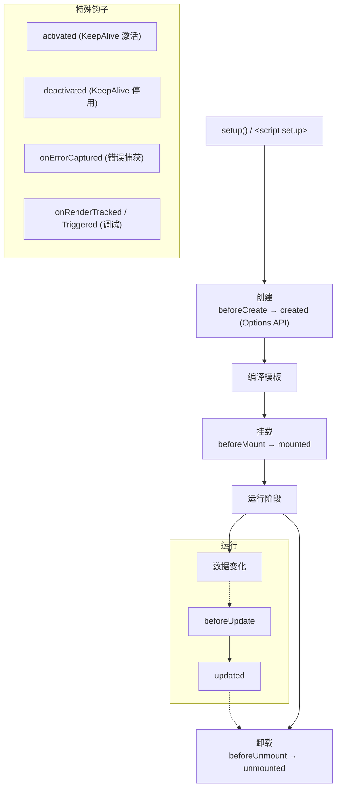

**Options API 与 Composition API 生命周期对应：**

```vue
<script setup>
// Composition API 生命周期（都带 on 前缀）
import {
  onBeforeMount, onMounted,
  onBeforeUpdate, onUpdated,
  onBeforeUnmount, onUnmounted,
  onActivated, onDeactivated,
  onErrorCaptured
} from 'vue'

onMounted(() => {
  console.log('组件已挂载')
})

onBeforeUnmount(() => {
  console.log('组件即将卸载，清理副作用')
  // 清理定时器、取消订阅、移除事件监听
})
</script>
```

**Vue 3 与 Vue 2 生命周期对比：**

| Vue 2 | Vue 3 | 说明 |
|-------|-------|------|
| beforeCreate | setup() | Vue 3 中没有 beforeCreate，setup 替代 |
| created | setup() | Vue 3 中没有 created，setup 替代 |
| beforeMount | onBeforeMount | - |
| mounted | onMounted | DOM 已创建，可访问 $el |
| beforeUpdate | onBeforeUpdate | 数据变化，DOM 更新前 |
| updated | onUpdated | DOM 已更新，避免在此修改数据 |
| beforeDestroy | onBeforeUnmount | 组件卸载前，清理副作用 |
| destroyed | onUnmounted | 组件已卸载 |
| activated | onActivated | KeepAlive 缓存激活 |
| deactivated | onDeactivated | KeepAlive 缓存停用 |

**生命周期的常见应用场景：**

```typescript
// 1. 数据请求 → onMounted
onMounted(async () => {
  const data = await fetch('/api/data')
  list.value = data
})

// 2. 事件监听 → onMounted + onBeforeUnmount
onMounted(() => window.addEventListener('resize', handleResize))
onBeforeUnmount(() => window.removeEventListener('resize', handleResize))

// 3. 父组件更新时重置子组件状态 → onBeforeUpdate
onBeforeUpdate(() => {
  if (props.resetKey) resetState()
})

// 4. 错误处理 → onErrorCaptured
onErrorCaptured((err, instance, info) => {
  console.error('组件错误:', err, info)
  return false  // 阻止错误继续传播
})
```

**面试要点：**
- `created` / `setup()` 中不能访问 DOM（DOM 还未创建）
- `mounted` 中可访问 DOM，但子组件不一定全部挂载完
- `nextTick` 等待 DOM 更新完成
- 在 `onBeforeUnmount` 清理副作用（定时器、事件监听、WebSocket）避免内存泄漏

---

### Q34：Vue 2 和 Vue 3 的核心区别是什么？（必问）

**一、响应式系统**

| 维度 | Vue 2 | Vue 3 |
|------|-------|-------|
| **实现方式** | Object.defineProperty | Proxy |
| **数组监听** | 需要重写数组方法 | ✅ 原生支持 |
| **新增属性** | Vue.set / Vue.delete | ✅ 直接赋值 |
| **懒代理** | ❌ 递归全部代理 | ✅ 按需代理 |
| **Map/Set** | ❌ 不支持 | ✅ 支持 |

**二、API 风格**

```vue
<!-- Vue 2：Options API -->
<script>
export default {
  data() { return { count: 0 } },
  computed: { doubled() { return this.count * 2 } },
  methods: { increment() { this.count++ } },
  mounted() { console.log('mounted') }
}
</script>

<!-- Vue 3：Composition API -->
<script setup>
import { ref, computed, onMounted } from 'vue'
const count = ref(0)
const doubled = computed(() => count.value * 2)
function increment() { count.value++ }
onMounted(() => console.log('mounted'))
</script>
```

**三、架构变化**

```text
├─ 体积：~30KB → ~12KB（gzipped，Tree-shaking）
├─ 性能：渲染速度提升 1.3~2 倍
├─ 多根节点：Fragment 支持
├─ 编译优化：静态提升 + Patch Flag + Block Tree
├─ TypeScript：源码 TS 重写，完美类型推导
├─ 逻辑复用：mixins → composables
├─ 脚手架：Vue CLI → Vite
└─ 状态管理：Vuex → Pinia
```

**四、破坏性变更**

```text
├─ 移除：$on / $off / $once（Event Bus）
├─ 移除：过滤器（filters）
├─ 移除：inline-template 属性
├─ 移除：$children（不推荐使用 $parent）
├─ 改变：v-model 绑定机制（modelValue + update:modelValue）
├─ 改变：$listeners 合并到 $attrs
├─ 改变：自定义指令生命周期钩子名
└─ 改变：生命周期 beforeDestroy → beforeUnmount / destroyed → unmounted
```

---

### Q35：谈谈你对虚拟 DOM 的理解？

**虚拟 DOM（Virtual DOM）是用 JavaScript 对象来描述真实 DOM 结构的一种数据结构。**

```javascript
// 真实 DOM
<div class="container">
  <span>Hello</span>
</div>

// 虚拟 DOM（VNode）
const vnode = {
  type: 'div',
  props: { class: 'container' },
  children: [
    { type: 'span', props: {}, children: 'Hello' }
  ]
}
```

**为什么需要虚拟 DOM？**

```
① 跨平台能力
   VNode 是 JS 对象，可渲染到不同平台
   → Web：DOM、Canvas
   → 移动端：Weex、NativeScript
   → SSR：将 VNode 渲染为 HTML 字符串

② 最小化 DOM 操作
   直接操作 DOM 是昂贵的
   → 数据变化 → 生成新 VNode → Diff → 批量更新 DOM
   → 避免频繁的回流和重绘

③ 声明式编程
   开发者描述"视图应该什么样"
   框架负责同步到真实 DOM
   无需关注 DOM 操作的细节
```

**虚拟 DOM 的优缺点：**

```text
✅ 优点：
   ├─ 跨平台：不依赖浏览器 DOM API
   ├─ 声明式：开发者只需关心状态，无需操作 DOM
   ├─ 批处理：多次数据变更合并为一次 DOM 更新
   └─ 抽象层：可在不同渲染目标间切换

❌ 缺点：
   ├─ 额外开销：创建 VNode + Diff 需要 CPU 计算
   ├─ 内存占用：维护 VNode 树需要额外内存
   └─ 极致场景不如原生：极小规模更新时，直接 DOM 操作更快
```

**Vue 3 对虚拟 DOM 的优化：**

```text
Vue 3 并不是"全量虚拟 DOM"，而是"编译优化 + 虚拟 DOM"：

① 编译阶段标记动态节点（Patch Flag）
② 静态节点提升到渲染函数外部
③ Block Tree 分割，只对比动态分支
④ Vapor Mode（实验性）直接跳过虚拟 DOM
   → 纯命令式 DOM 操作，类似 Solid.js
```

---

### Q36：什么是 SPA 单页应用？有什么优缺点？

**SPA（Single Page Application）指整个应用只有一个 HTML 页面，通过前端路由切换视图，无需每次跳转都重新加载页面。**

```text
传统多页应用（MPA）：
  点击链接 → 浏览器请求新 HTML → 白屏 → 渲染

单页应用（SPA）：
  点击链接 → JS 动态替换内容 → 无白屏 → 流畅切换
```

**优缺点对比：**

```text
✅ 优点：
   ├─ 流畅体验：页面切换无刷新，类原生 App 体验
   ├─ 前后端分离：前端独立开发部署，后端只提供 API
   ├─ 组件化开发：利于团队协作和维护
   ├─ 富交互能力：适合复杂交互的 Web 应用
   └─ 本地数据持久化：localStorage/IndexedDB 缓存数据

❌ 缺点：
   ├─ SEO 不友好：内容由 JS 渲染，搜索引擎爬虫可能无法抓取
       → 解决方案：SSR（Nuxt.js）/ SSG（VitePress）
   ├─ 首屏加载慢：需要下载所有 JS 资源后才渲染
       → 解决方案：路由懒加载、代码分割、SSR
   ├─ 内存管理：长期运行可能出现内存泄漏
       → 解决方案：及时清理监听器、定时器
   └─ 浏览器兼容：依赖 History API 或 Hash 路由
```

**Vue 3 SPA 优化实践：**

```javascript
// 1. 路由懒加载
const routes = [
  { path: '/user', component: () => import('./views/User.vue') }
]

// 2. 预加载（hover 时预加载）
const User = () => import('./views/User.vue')
const preload = () => User()  // 提前触发加载

// 3. KeepAlive 缓存页面
<router-view v-slot="{ Component }">
  <KeepAlive>
    <component :is="Component" />
  </KeepAlive>
</router-view>

// 4. 异步组件
const HeavyComponent = defineAsyncComponent(() => import('./Heavy.vue'))
```

---

### Q37：Vue 中 mixins 的优缺点？为什么 Vue 3 推荐用 composables？

**Mixins 是 Vue 2 中逻辑复用的主要方式，但存在明显缺陷。**

```javascript
// Vue 2 mixins
const searchMixin = {
  data() { return { keyword: '' } },
  methods: {
    search() { console.log('搜索:', this.keyword) }
  }
}

const paginationMixin = {
  data() { return { page: 1, total: 0 } },
  methods: {
    nextPage() { this.page++ }
  }
}

export default {
  mixins: [searchMixin, paginationMixin]
  // ❌ 问题：不知道 keyword/page 从哪来的
  // ❌ 问题：两个 mixin 如果都有 init() 方法，后一个覆盖前一个
}
```

**Mixins 的缺陷：**

```text
① 来源不清晰
   组件中使用的 data/methods 不知道来自哪个 mixin
   大型项目中"xxx 是从哪来的"排查困难

② 命名冲突
   多个 mixin 定义了相同的 data/methods 名称
   后引入的覆盖先引入的，无声无息

③ 隐式依赖
   mixin 之间可能相互依赖（mixin A 依赖 mixin B 的数据）
   这种依赖是隐式的，不直观
```

**Composables 如何解决这些问题：**

```typescript
// Vue 3 composables（显式导入，来源清晰）
import { useSearch } from './composables/useSearch'
import { usePagination } from './composables/usePagination'

const { keyword, search } = useSearch()
const { page, total, nextPage } = usePagination()

// ✅ 来源清晰：变量名明确来自哪个 composable
// ✅ 无命名冲突：可以解构重命名
// ✅ 无隐式依赖：每个 composable 独立
// ✅ TypeScript 友好：完整类型推导
```

```typescript
// 如果需要 composable 之间通信，显式传参
export function usePagination(search: ReturnType<typeof useSearch>) {
  // 显式依赖，一目了然
  const nextPage = () => {
    search.query()  // 显式调用
  }
}
```

---

### Q38：Vue 中 scoped 样式的原理是什么？

**scoped 通过 PostCSS 为每个组件的元素添加唯一的属性选择器，实现样式隔离。**

```vue
<template>
  <div class="container">
    <span class="text">Hello</span>
  </div>
</template>

<style scoped>
.container { padding: 20px; }
.text { color: red; }
</style>

<!-- 编译后 -->
<div class="container" data-v-7ba5bd90>
  <span class="text" data-v-7ba5bd90>Hello</span>
</div>

<style>
.container[data-v-7ba5bd90] { padding: 20px; }
.text[data-v-7ba5bd90] { color: red; }
</style>
```

**scoped 的注意事项：**

```vue
<!-- 1. 子组件根元素会继承父组件的 scoped 属性 -->
<template>
  <Child />  <!-- Child 的根元素会自动添加父组件的 data-v-xxx -->
</template>

<!-- 2. 深度选择器（修改子组件样式） -->
<style scoped>
:deep(.child-class) {
  color: red;  /* 穿透 scoped，影响子组件 */
}

/* 3. 插槽内容（父组件控制插槽样式） */
:slotted(.slot-class) {
  font-weight: bold;
}

/* 4. 全局样式（当前组件中定义全局样式） */
:global(.global-class) {
  font-size: 16px;
}
</style>

<!-- 5. 非 scoped 样式 + scoped 样式混用 -->
<style>
/* 全局样式，不会加 data-v-xxx */
</style>
<style scoped>
/* 局部样式，加 data-v-xxx */
</style>
```

**scoped 的弊端及缓解方案：**

```text
❌ 弊端：每个元素都加 data 属性 → 选择器性能略微下降
❌ 弊端：:deep 使用不当导致样式泄漏
❌ 弊端：动态生成的 DOM 没有 data-v-xxx 属性，样式不生效

✅ 缓解：
   ├─ 大部分场景性能差异可忽略
   ├─ 使用 CSS Modules（Vue 3 支持）
   ├─ 使用原子化 CSS（Tailwind CSS / UnoCSS）
   └─ 合理使用 :deep，避免滥用
```

---

### Q39：Vue 的自定义指令是什么？如何创建？

**自定义指令用于对普通 DOM 元素进行底层操作，适合 DOM 操作相关的逻辑复用。**

```javascript
// 全局注册（main.js）
import { createApp } from 'vue'
const app = createApp(App)
app.directive('focus', {
  mounted(el) { el.focus() }     // 自动聚焦
})

// 局部注册
<script setup>
import { vFocus } from './directives/focus'
</script>
```

**Vue 3 指令生命周期钩子：**

```typescript
const myDirective = {
  // 绑定元素的父组件挂载时
  created(el, binding, vnode, prevVnode) {},
  // 挂载元素时
  mounted(el, binding, vnode, prevVnode) {},
  // 元素更新时
  updated(el, binding, vnode, prevVnode) {},
  // 父组件更新时
  beforeUpdate(el, binding, vnode, prevVnode) {},
  // 卸载前
  beforeUnmount(el, binding, vnode, prevVnode) {},
  // 卸载时
  unmounted(el, binding, vnode, prevVnode) {}
}
```

**常见自定义指令示例：**

```typescript
// 1. v-debounce：防抖输入
const vDebounce = {
  mounted(el, binding) {
    let timer
    el.addEventListener('input', () => {
      clearTimeout(timer)
      timer = setTimeout(() => binding.value(), binding.arg || 500)
    })
  }
}

// 2. v-lazy：图片懒加载
const vLazy = {
  mounted(el) {
    const observer = new IntersectionObserver(([{ isIntersecting }]) => {
      if (isIntersecting) {
        el.src = el.dataset.src
        observer.unobserve(el)
      }
    })
    observer.observe(el)
  }
}

// 3. v-permission：权限控制
const vPermission = {
  mounted(el, binding) {
    const userPermissions = ['admin', 'editor']
    if (!userPermissions.includes(binding.value)) {
      el.parentNode?.removeChild(el)
    }
  }
}
```

```vue
<!-- 使用 -->
<input v-focus />
<input v-debounce:300="handleSearch" />

<button v-permission="'admin'">删除</button>
```

---

### Q40：动态组件和异步组件有什么区别？

**动态组件：** 通过 `<component :is="...">` 在不同组件间动态切换。

**异步组件：** 组件按需加载，减少首屏包体积。

```vue
<!-- 动态组件 -->
<script setup>
import CompA from './CompA.vue'
import CompB from './CompB.vue'

const current = ref('CompA')
</script>
<template>
  <component :is="current" />
  <button @click="current = 'CompB'">切换到 B</button>
</template>
```

```javascript
// 异步组件
import { defineAsyncComponent } from 'vue'

// 基础用法
const AsyncComp = defineAsyncComponent(() => import('./HeavyComp.vue'))

// 完整配置
const AsyncComp = defineAsyncComponent({
  loader: () => import('./HeavyComp.vue'),
  loadingComponent: LoadingSpinner,    // 加载中显示
  delay: 200,                          // 延迟 200ms 显示 loading
  errorComponent: ErrorComponent,      // 加载失败显示
  timeout: 3000,                       // 超时时间
  suspensible: false                   // 是否可被 Suspense 暂停
})
```

```vue
<!-- 动态组件 + 异步组件结合 -->
<script setup>
const tabs = [
  { name: '用户管理', comp: defineAsyncComponent(() => import('./UserManager.vue')) },
  { name: '角色管理', comp: defineAsyncComponent(() => import('./RoleManager.vue')) }
]
const active = ref(tabs[0])
</script>
<template>
  <component :is="active.comp" />
</template>
```

**核心区别：**

```text
动态组件：
  ├─ 目的：运行时切换组件
  ├─ 加载时机：都已加载到内存
  ├─ 切换代价：VNode Diff + 重建/复用
  └─ 配合 KeepAlive：可缓存

异步组件：
  ├─ 目的：按需加载，代码分割
  ├─ 加载时机：首次渲染时才加载
  ├─ 切换代价：需要加载网络资源
  └─ 配合 Suspense：可显示 fallback 状态
```

---

### Q41：Vue 2 的过滤器在 Vue 3 中为什么移除了？

**Vue 2 的过滤器（filters）用于文本格式化：**

```vue
<!-- Vue 2 过滤器 -->
<template>
  <div>{{ date | formatDate('YYYY-MM-DD') }}</div>
</template>
<script>
export default {
  filters: {
    formatDate(value, format) {
      return dayjs(value).format(format)
    }
  }
}
</script>
```

**为什么移除？**

```text
① 与函数重复
   过滤器本质就是一个函数
   Vue 3 中可以用 computed 或普通函数替代
   增加一种 API 徒增学习成本

② 不灵活
   过滤器的参数传递方式受限
   不支持异步过滤器
   无法在 JS 逻辑中复用

③ Tree-shaking 不友好
   过滤器注册是全局的
   打包时无法确定哪些过滤器被使用
```

**Vue 3 中的替代方案：**

```vue
<!-- 方案 1：计算属性 -->
<script setup>
import { computed } from 'vue'
const formattedDate = computed(() => dayjs(props.date).format('YYYY-MM-DD'))
</script>
<template>
  <div>{{ formattedDate }}</div>
</template>

<!-- 方案 2：工具函数 -->
<script setup>
import { formatDate } from '@/utils/format'
</script>
<template>
  <div>{{ formatDate(date, 'YYYY-MM-DD') }}</div>
</template>

<!-- 方案 3：全局属性 -->
<script setup>
import { getCurrentInstance } from 'vue'
const { proxy } = getCurrentInstance()
</script>
<template>
  <div>{{ proxy.$formatDate(date) }}</div>
</template>
```

---

### Q42：Vue 的事件修饰符有哪些？

**事件修饰符让模板中的事件处理更简洁，由 `v-on` 指令的点（.）后缀表示。**

```vue
<!-- 1. 事件冒泡/捕获相关 -->
<template>
  <!-- .stop → 阻止冒泡（stopPropagation） -->
  <button @click.stop="handleClick">点击</button>

  <!-- .prevent → 阻止默认行为（preventDefault） -->
  <form @submit.prevent="onSubmit">提交</form>

  <!-- .self → 只在 event.target 是自身时触发 -->
  <div @click.self="onClick">只响应自身点击</div>

  <!-- .capture → 在捕获阶段触发 -->
  <div @click.capture="onCapture">捕获阶段</div>

  <!-- .once → 只触发一次 -->
  <button @click.once="handleOnce">只执行一次</button>

  <!-- .passive → 提升滚动性能（不调用 preventDefault） -->
  <div @scroll.passive="onScroll">滚动优化</div>
</template>
```

```vue
<!-- 2. 键盘事件修饰符 -->
<template>
  <input @keyup.enter="submit" />          <!-- 回车键 -->
  <input @keyup.esc="cancel" />            <!-- 退出键 -->
  <input @keyup.space="select" />          <!-- 空格键 -->
  <input @keyup.delete="clear" />          <!-- 删除键 -->
  <input @keyup.tab="nextField" />         <!-- Tab 键 -->
  <input @keyup.up="prev" />               <!-- 方向键 -->
  <input @keyup.down="next" />

  <!-- 组合键 -->
  <div @click.ctrl="onCtrlClick">Ctrl + 点击</div>
  <div @click.alt.exact="onAltExact">只按 Alt（无其他修饰键）</div>
</template>
```

```vue
<!-- 3. 鼠标事件修饰符 -->
<template>
  <div @click.left="onLeft">左键</div>     <!-- .left / .right / .middle -->
  <div @contextmenu.prevent="onRight">右键</div>
</template>

<!-- 4. 其他 -->
<template>
  <!-- 串联使用 -->
  <button @click.stop.prevent="handleClick">串联修饰符</button>

  <!-- exact：精确匹配修饰键 -->
  <button @click.ctrl.exact="onCtrlOnly">只按 Ctrl，不按其他</button>

  <!-- 原生事件中的 Vue 修饰符 -->
  <div @click="handleClick" @click.shift="handleShiftClick">
    原生事件
  </div>
</template>
```

**Vue 3 的变化：**
- 键盘修饰符不再限制为原生的 `keyCode`，改用 `key` 值（如 `enter`、`esc`）
- 推荐使用 `.exact` 精确控制组合键

---

### Q43：Vue 的过渡动画是如何实现的？

**Vue 提供了 `<Transition>` 和 `<TransitionGroup>` 内置组件实现过渡动画。**

```vue
<!-- 单个元素过渡 -->
<template>
  <button @click="show = !show">切换</button>
  <Transition name="fade">
    <p v-if="show">Hello Vue Transition</p>
  </Transition>
</template>

<style scoped>
/* Vue 自动添加的过渡类名 */
.fade-enter-active,
.fade-leave-active {
  transition: opacity 0.5s ease;
}
.fade-enter-from,
.fade-leave-to {
  opacity: 0;
}
</style>
```

**过渡类名执行顺序：**

```text
进入（enter）：
  enter-from  →  enter-active  →  enter-to（动画结束后移除）

离开（leave）：
  leave-from  →  leave-active  →  leave-to（动画结束后移除）

结合 CSS 的 transition/animation：
  ├─ Transition 会自动检测 CSS transition 或 animation
  ├─ 由 transitionend / animationend 事件触发结束
  └─ 可通过 :duration 手动控制时长
```

**进阶用法：**

```vue
<!-- 1. 自定义 class（配合第三方库） -->
<Transition
  name="custom"
  enter-active-class="animate__animated animate__fadeIn"
  leave-active-class="animate__animated animate__fadeOut"
>
  <p v-if="show">Animate.css 动画</p>
</Transition>

<!-- 2. JS 钩子 -->
<Transition
  @before-enter="onBeforeEnter"
  @enter="onEnter"
  @after-enter="onAfterEnter"
  @enter-cancelled="onEnterCancelled"
  @leave="onLeave"
>
  <p v-if="show">JS 动画</p>
</Transition>

<!-- 3. 列表动画 -->
<TransitionGroup name="list" tag="ul">
  <li v-for="item in items" :key="item.id">{{ item.text }}</li>
</TransitionGroup>

<style>
.list-enter-active, .list-leave-active {
  transition: all 0.5s ease;
}
.list-enter-from, .list-leave-to {
  opacity: 0;
  transform: translateX(30px);
}
/* 移动过渡（其他元素移动填补位置） */
.list-move {
  transition: transform 0.5s ease;
}
</style>
```

**Vue 2 与 Vue 3 过渡的区别：**

```text
Vue 2：
  <transition> 使用 v-if/v-show 控制
  类名：v-enter / v-enter-active / v-enter-to
  leave 类名类似

Vue 3：
  <Transition>（大写）
  类名：v-enter-from（代替 v-enter）
  新增 appear 属性（首次渲染动画）
  新增 mode="out-in" 模式控制离开/进入顺序
```

---

### Q44：说说 Vue 的 slot（插槽）及其作用域插槽？

**插槽（Slot）是 Vue 组件内容分发的机制，父组件可以向子组件的指定位置传递模板内容。**

```vue
<!-- 基础插槽 -->
<!-- Child.vue -->
<template>
  <div class="card">
    <header><slot name="header" /></header>
    <main><slot /></main>          <!-- 默认插槽 -->
    <footer><slot name="footer" /></footer>
  </div>
</template>

<!-- 父组件使用 -->
<Child>
  <template #header>  <!-- v-slot:header 简写 -->
    <h1>标题</h1>
  </template>
  <p>默认插槽内容</p>
  <template #footer>
    <span>底部信息</span>
  </template>
</Child>
```

**作用域插槽（Scoped Slot）：**

```vue
<!-- 子组件定义作用域插槽 -->
<!-- List.vue -->
<script setup>
const props = defineProps<{ items: Item[] }>()
</script>
<template>
  <ul>
    <li v-for="(item, index) in items" :key="item.id">
      <slot :item="item" :index="index">
        {{ item.name }}  <!-- 默认内容 -->
      </slot>
    </li>
  </ul>
</template>

<!-- 父组件使用作用域插槽 -->
<template>
  <List :items="users">
    <template #default="{ item, index }">
      <span>{{ index + 1 }}. {{ item.name }} - {{ item.email }}</span>
    </template>
  </List>
</template>
```

**插槽的核心价值：**

```text
① 内容分发：组件可以预留"插口"，由父组件决定渲染什么
② 逻辑复用：组件控制结构和逻辑，父组件控制内容
③ 布局组件：常用于布局类组件（Dialog、Card、Table）
④ 作用域插槽：子组件将数据传递给父组件的插槽内容
```

**Vue 2 与 Vue 3 插槽语法对比：**

```vue
<!-- Vue 2 -->
<Child v-slot:default="{ item }">...</Child>
<!-- 简写 -->
<Child #default="{ item }">...</Child>

<!-- Vue 3（与 Vue 2 简写兼容） -->
<Child #default="{ item }">...</Child>
<!-- 动态插槽名 -->
<Child #[dynamicSlotName]="{ item }">...</Child>
```

---

### Q45：Vue 的模板编译原理是怎样的？

**Vue 模板编译将 `.vue` 文件中的 `<template>` 编译为 JavaScript 渲染函数，分为三个阶段：**

```text
Template
  │
  ① 解析（Parse）
  │   把模板字符串解析为 AST（抽象语法树）
  │   └─ 词法分析 → 生成 token
  │   └─ 语法分析 → 构建 AST 节点
  │
  ② 转换（Transform）
  │   对 AST 进行优化和标记
  │   └─ Vue 3：标记静态节点、Patch Flag
  │   └─ 静态提升：将静态节点提出到 render 外部
  │   └─ 缓存事件处理函数
  │
  ③ 生成（Generate）
  │   将转换后的 AST 生成为 render 函数代码
  │   └─ createElementVNode / createBlock 调用
  │
  render 函数 → 执行 → 虚拟 DOM → 真实 DOM
```

```javascript
// 示例编译结果
// <div class="container"><span>{{ msg }}</span></div>

// 编译后（简化）
import { createElementVNode as _createVNode, toDisplayString as _toStr, openBlock as _openBlock, createBlock as _createBlock } from 'vue'

export function render(_ctx, _cache) {
  return (_openBlock(), _createBlock('div', { class: 'container' }, [
    _createVNode('span', null, _toStr(_ctx.msg), 1 /* TEXT */)
  ]))
}
```

**Vue 2 与 Vue 3 编译对比：**

```text
Vue 2 编译：
  ├─ 无静态标记
  ├─ 每次渲染都重新创建静态节点
  └─ 运行时 Diff 全量对比

Vue 3 编译（优化）：
  ├─ Patch Flag：标记动态节点类型（TEXT/CLASS/PROPS...）
  ├─ 静态提升：静态节点只创建一次，后续复用
  ├─ Block Tree：以动态节点为界分割，只对比动态分支
  └─ 事件缓存：事件处理函数只创建一次
```

---

### Q46：Vue 3 为什么推荐使用 Vite 而不是 Webpack？

**Vite 基于原生 ESM 的开发服务器，相比 Webpack 在开发体验上有质的提升。**

```text
核心差异：

              Webpack（Vue CLI）           Vite
  ──────────────────────────────────────────────
  开发模式    全部打包后再启动            按需编译，秒级启动
  热更新      全量/局部打包              基于 ESM 的按需更新
  构建工具    Webpack + babel             Rollup + esbuild
  TypeScript  babel/ts-loader            esbuild（快 10-100x）
  配置复杂度  高度可配，但学习成本高      开箱即用，简洁
  生产构建    Webpack 打包                Rollup 打包
```

**Vite 的优势：**

```text
① 极速冷启动
   不需要打包整个应用
   浏览器直接请求 ESM 模块
   按需编译，只处理当前页面需要的模块

② 高效热更新
   文件变化时只重新编译变更的模块
   Webpack 需要重新构建整个模块图
   Vite 开发服务器几乎即时响应

③ 内置优化
   CSS 预处理器开箱支持
   静态资源自动处理
   图片、JSON 导入优化
```

**Vite 不足及注意事项：**

```text
❌ 开发与生产行为差异
   开发使用 esbuild，生产使用 Rollup
   极端情况可能出现不一致

❌ 兼容性
   需要现代浏览器支持 ESM
   旧浏览器需要 Polyfill

❌ 生态
   部分 Webpack 插件无法直接迁移
   但 Vite 插件生态已成熟
```

---

### Q47：watchEffect 和 watch 有什么区别？什么场景用哪个？

**两者都是监听响应式数据变化执行副作用，但使用场景和机制不同。**

```typescript
import { ref, watch, watchEffect } from 'vue'

const keyword = ref('')
const user = ref(null)

// watch：需要显式指定监听源
watch(keyword, (newVal, oldVal) => {
  console.log(`keyword 从 ${oldVal} 变为 ${newVal}`)
  fetchSearch(newVal)
})

// watchEffect：自动追踪内部用到的所有响应式依赖
watchEffect(() => {
  console.log('keyword 或 user 变化了')  // 自动追踪 keyword 和 user
  // 初始化时会立即执行一次
})
```

**核心区别：**

| 维度 | watch | watchEffect |
|------|-------|-------------|
| **监听源** | 显式指定 | 自动追踪 |
| **立即执行** | 默认否（`immediate: true`） | ✅ 默认立即执行 |
| **旧值** | ✅ 可获取 | ❌ 无法获取 |
| **依赖粒度** | 精确控制监听哪些数据 | 自动收集，可能过度监听 |
| **配置项** | deep / immediate / flush | flush / onTrack / onTrigger |
| **使用场景** | 特定数据变化后执行逻辑 | 副作用与依赖自动同步 |

**选型建议：**

```typescript
// ✅ 用 watch 的场景
// 1. 需要旧值
watch(count, (newVal, oldVal) => {
  trackAnalytics('count', oldVal, newVal)
})

// 2. 需要精确控制监听源
watch([firstName, lastName], ([newFirst, newLast]) => {
  fullName.value = `${newFirst} ${newLast}`
})

// 3. 需要配置 deep / flush
watch(deepObj, handler, { deep: true, flush: 'post' })

// ✅ 用 watchEffect 的场景
// 1. 自动追踪多个依赖
watchEffect(() => {
  localStorage.setItem('draft', JSON.stringify(draft.value))
})

// 2. 依赖关系动态变化
watchEffect(() => {
  if (isAuthorized.value) {
    fetchUserData(userId.value)   // 只有 isAuthorized 为 true 才追踪 userId
  }
})
```

**watchPostEffect / watchSyncEffect：**

```typescript
// watchEffect 的 flush 配置简写
watchEffect(callback, { flush: 'post' })   // DOM 更新后触发（同 watchPostEffect）
watchEffect(callback, { flush: 'sync' })   // 数据变化同步触发（同 watchSyncEffect）
// 默认 flush: 'pre'，DOM 更新前触发
```

---

### Q48：toRef、toRefs、toRaw、unref 分别有什么用？

**这些工具函数用于处理 ref 和 reactive 之间的转换。**

```typescript
import { reactive, ref, toRef, toRefs, toRaw, unref, isRef } from 'vue'

const state = reactive({
  name: '张三',
  age: 25,
  job: '前端工程师'
})

// 1. toRef：将 reactive 的单个属性转为 ref
const nameRef = toRef(state, 'name')
nameRef.value = '李四'     // ✅ 修改 ref 同时更新 reactive
console.log(state.name)   // '李四'

// 2. toRefs：将 reactive 的所有属性转为 ref（常用于解构）
const { name, age } = toRefs(state)
// 解构后仍保持响应式
name.value = '王五'
console.log(state.name)   // '王五'

// ❌ 直接解构 reactive 会丢失响应式
const { name, age } = state  // 普通变量，不再响应式

// 3. toRaw：获取响应式对象的原始对象
const rawState = toRaw(state)
console.log(rawState === state)  // false（原始对象和 proxy 对象不同）

// 4. unref：ref 取值语法糖
// val = isRef(val) ? val.value : val
const value = ref('hello')
console.log(unref(value))    // 'hello'（等于 value.value）
console.log(unref('hello'))  // 'hello'（原始值直接返回）
```

**实际应用场景：**

```typescript
// 场景 1：setup 返回多个响应式值
function useUser() {
  const user = reactive({
    id: 1,
    name: '张三',
    email: 'test@example.com'
  })

  // 返回 toRefs 让解构保持响应式
  return { ...toRefs(user) }
}
const { id, name, email } = useUser()  // 保持响应式

// 场景 2：将 prop 传递给 composable
// 父组件
const props = defineProps<{ title: string }>()
// 子组件用 toRef 将 prop 转为 ref 传给 composable
useTitle(toRef(props, 'title'))

// 场景 3：传递 prop 给 watch
watch(toRef(props, 'title'), (newVal) => {
  document.title = newVal
})
```

---

### Q49：shallowRef、shallowReactive、triggerRef 的使用场景？

**浅层响应式 API 用于性能优化，避免不必要的深层代理开销。**

```typescript
import { shallowRef, shallowReactive, triggerRef, ref, isReactive } from 'vue'

// 1. shallowRef：只追踪 .value 的变化，不深层代理
const list = shallowRef([
  { id: 1, name: 'A' },
  { id: 2, name: 'B' }
])

// ✅ 替换整个 value 触发更新
list.value = [{ id: 3, name: 'C' }]

// ❌ 修改内部属性不会触发更新
list.value[0].name = 'Modified'  // 不会触发响应式更新

// 2. shallowReactive：只代理第一层，不深层递归
const state = shallowReactive({
  user: { name: '张三', address: { city: '北京' } }
})
state.user = { name: '李四' }     // ✅ 第一层修改触发更新
state.user.name = '王五'          // ❌ 深层修改不触发更新

// 3. triggerRef：手动触发 shallowRef 的更新
const list = shallowRef([{ id: 1, name: 'A' }])
list.value[0].name = 'Modified'
triggerRef(list)  // ✅ 手动触发依赖更新
```

**性能对比与选型：**

```text
性能排序（从快到慢）：
  shallowRef > ref
  shallowReactive > reactive

使用场景：

shallowRef：
  ├─ 大数据列表（只做整体替换，不修改内部项）
  ├─ 第三方库实例（不需要深层响应式）
  └─ 对象引用不变，只想监听整体替换

shallowReactive：
  ├─ 顶层状态容易变化但深层数据不变
  ├─ 与 immutable 库配合使用
  └─ 性能敏感且深层数据不需要响应式

triggerRef：
  ├─ 需要手动控制更新时机
  ├─ 配合 shallowRef 修改内部数据后触发
  └─ 批量修改后一次性触发更新
```

```typescript
// 实战：大型表格数据优化
const tableData = shallowRef([])

// 获取数据（整体替换）
async function fetchData() {
  const data = await api.getTableData()
  tableData.value = data  // ✅ 整体替换触发更新
}

// 单行修改（需要手动触发）
function updateRow(id, newData) {
  const row = tableData.value.find(item => item.id === id)
  if (row) {
    Object.assign(row, newData)
    triggerRef(tableData)  // 手动触发更新
  }
}
```

> **💡 面试追问：Custom Renderer API 和 `shallowRef` / `triggerRef` 如何配合实现高性能虚拟列表？**
>
> **关键技术组合：**
> ```typescript
> // 使用 shallowRef 存储列表数据（避免深层代理 10w+ 条数据）
> const items = shallowRef<VirtualItem[]>([])
>
> // triggerRef 在数据批量修改后手动触发更新
> function updateItem(index: number, data: Partial<VirtualItem>) {
>   Object.assign(items.value[index], data)
>   triggerRef(items)  // 只触发一次渲染
> }
>
> // Custom Renderer + DOM 回收复用
> const renderer = createRenderer({
>   createElement(type) { /* 回收池复用 DOM */ },
>   patchProp(el, key, value) { /* 直接操作 DOM */ },
>   // ...
> })
> ```
> **性能收益：** 对比 ref 全量代理，shallowRef + triggerRef 减少 95%+ 的 Proxy 创建开销，100,000 条数据首次渲染提升 3-8 倍。

---

### Q50：Vue 3 中 `<script setup>` 和 `setup()` 函数有什么区别？

**`<script setup>` 是 `setup()` 函数的语法糖，编译时自动转换，更简洁。**

```vue
<!-- 方式 1：<script setup>（推荐） -->
<script setup lang="ts">
import { ref, computed } from 'vue'
import Child from './Child.vue'

const count = ref(0)
const doubled = computed(() => count.value * 2)
function increment() { count.value++ }
</script>
<template>
  <p>{{ count }} × 2 = {{ doubled }}</p>
  <button @click="increment">+1</button>
  <Child />
</template>
```

```typescript
// 方式 2：setup() 函数（传统写法）
import { ref, computed } from 'vue'
import Child from './Child.vue'

export default {
  components: { Child },
  setup() {
    const count = ref(0)
    const doubled = computed(() => count.value * 2)
    function increment() { count.value++ }

    return { count, doubled, increment }
    // ❌ 容易忘记 return
    // ❌ 需要手动注册组件
  }
}
```

**核心区别：**

```text
<script setup> 的便利：
  ├─ 自动 return：所有顶层绑定自动暴露给模板
  ├─ 自动注册：import 的组件自动可用
  ├─ 更少模板代码：无需 export default / setup() / return
  ├─ 更好的 IDE 支持：类型推导更准确
  └─ 编译优化：静态分析更精确

setup() 函数的优势：
  ├─ 更灵活：支持 async setup()（返回 Promise）
  ├─ 兼容 Vue 2 迁移：混用 Options API
  ├─ 动态渲染：可以条件式返回不同渲染函数
  └─ 无编译依赖：可在非 SFC 场景使用
```

**`<script setup>` 的特殊能力：**

```vue
<!-- 1. 定义 props -->
<script setup lang="ts">
const props = defineProps<{ title: string; count?: number }>()
const emit = defineEmits<{ (e: 'update', id: number): void }>()
const slots = defineSlots<{ default(props: { item: Item }): any }>()

// 2. 顶层 await（自动转换为 async setup）
const data = await fetch('/api/data')

// 3. 动态组件自动注册
import MyComponent from './MyComponent.vue'
// 直接用 <MyComponent /> 无需手动注册

// 4. 使用 useSlots / useAttrs
import { useSlots, useAttrs } from 'vue'
const slots = useSlots()
const attrs = useAttrs()
</script>
```

**不推荐混用的场景：**

```vue
<!-- ❌ 尽量避免同时使用 setup() 和 <script setup> -->
<script>
export default { setup() { /* ... */ } }
</script>
<script setup>
// 两个 setup 会合并，行为不可预测
</script>
```

---

### Q51：readonly、shallowReadonly、isRef、isReactive、isProxy 的作用？

**这些工具函数用于响应式数据的类型判断和只读保护。**

```typescript
import { ref, reactive, readonly, shallowReadonly, isRef, isReactive, isProxy, toRaw } from 'vue'

// 1. readonly：创建只读代理（深层）
const state = reactive({ count: 0, user: { name: '张三' } })
const readOnlyState = readonly(state)
readOnlyState.count++   // ❌ Warning: 只读，无法修改
readOnlyState.user.name = '李四'  // ❌ 深层只读

// 2. shallowReadonly：浅层只读
const shallowReadonlyState = shallowReadonly(state)
shallowReadonlyState.count++  // ❌ 第一层只读
shallowReadonlyState.user.name = '李四'  // ✅ 深层可修改
```

```typescript
// 3. 类型判断
const a = ref(0)
const b = reactive({})
const c = readonly(b)

console.log(isRef(a))         // true
console.log(isReactive(b))    // true
console.log(isReactive(c))    // true（readonly 包裹 reactive 仍是 reactive）
console.log(isProxy(b))       // true（reactive / readonly 都是 proxy）
console.log(isProxy(a))       // false（ref 不是 proxy）

// 4. 实际应用场景
function useUserState() {
  const user = reactive({ name: '张三', age: 25 })
  const originalUser = toRaw(user)  // 获取原始对象，用于提交给 API

  return {
    user: readonly(user),   // ✅ 对外暴露只读引用，防止外部修改
    updateName(name: string) {
      user.name = name      // ✅ 内部通过方法修改
    }
  }
}

// 调用方只能通过 updateName 修改，无法直接修改 user
// const { user, updateName } = useUserState()
// user.name = '李四' ❌ TypeScript 报错 + 运行时警告
```

---

### Q52：Vue 3 中全局 API 有哪些变化？

**Vue 3 不再提供全局构造函数，改为通过 createApp 创建应用实例。**

```javascript
// Vue 2（全局污染）
import Vue from 'vue'
Vue.component('MyComponent', MyComponent)
Vue.directive('focus', { /* ... */ })
Vue.mixin({ /* ... */ })
Vue.prototype.$http = axios  // 挂载到原型
// 所有 Vue 实例共享，影响所有测试和第三方插件

// Vue 3（应用隔离）
import { createApp } from 'vue'
const app = createApp(App)
app.component('MyComponent', MyComponent)
app.directive('focus', { /* ... */ })
app.mixin({ /* ... */ })
app.config.globalProperties.$http = axios
app.mount('#app')
// 每个 createApp 创建独立的应用实例，不影响其他应用
```

**常用全局 API 迁移对照：**

```text
Vue 2                        Vue 3
─────────────────────────────────────────────
new Vue({...})               createApp(App)
Vue.component()              app.component()
Vue.directive()              app.directive()
Vue.mixin()                  app.mixin()
Vue.use()                    app.use()
Vue.prototype.xxx            app.config.globalProperties.xxx
Vue.nextTick()               nextTick()（从 vue 导入）
Vue.set()                    ❌ 不再需要
Vue.delete()                 ❌ 不再需要
Vue.observable()             reactive()
Vue.version                  app.version
```

**Vue 3 中移除的全局 API：**

```typescript
// 1. Vue.extend() — 使用 defineComponent 替代
// Vue 2
const MyComponent = Vue.extend({ /* 选项 */ })
// Vue 3
import { defineComponent } from 'vue'
const MyComponent = defineComponent({ /* 选项 */ })

// 2. Vue.nextTick() → 从 vue 导入
import { nextTick } from 'vue'

// 3. Vue.set / Vue.delete → Proxy 支持直接操作
// Vue 2
Vue.set(obj, key, value)     // 新增属性需特殊处理
Vue.delete(obj, key)         // 删除属性需特殊处理
// Vue 3
obj[key] = value            // ✅ 直接赋值
delete obj[key]             // ✅ 直接删除
```

**应用实例配置：**

```typescript
const app = createApp(App)

// 全局错误处理
app.config.errorHandler = (err, instance, info) => {
  console.error('全局错误:', err, info)
}

// 全局警告处理
app.config.warnHandler = (msg, instance, trace) => {
  console.warn('全局警告:', msg)
}

// 性能追踪（开发模式）
app.config.performance = true

// 自定义组件解析
app.config.compilerOptions.isCustomElement = (tag) => tag.startsWith('app-')
```

---

### Q53：Vue 模板 ref 的深入理解？ref 在 DOM 和组件上的使用？

**模板 ref 用于获取对 DOM 元素或子组件实例的引用。**

```vue
<script setup>
import { ref, onMounted } from 'vue'
import Child from './Child.vue'

// 1. DOM 元素引用
const inputRef = ref(null)
onMounted(() => {
  inputRef.value.focus()  // ✅ 访问 DOM 元素
})

// 2. 子组件引用
const childRef = ref(null)
onMounted(() => {
  console.log(childRef.value)  // 子组件的实例或 expose 的内容
})

// 3. 函数式 ref（自定义控制）
const dynamicRef = ref(null)
const setRef = (el) => {
  if (el) {
    dynamicRef.value = el
    el.style.color = 'red'
  }
}

// 4. v-for 中的 ref
const itemRefs = ref([])
onMounted(() => {
  console.log(itemRefs.value)  // 所有匹配元素的数组
})
</script>

<template>
  <!-- DOM ref -->
  <input ref="inputRef" />

  <!-- 子组件 ref -->
  <Child ref="childRef" />

  <!-- 函数式 ref -->
  <div :ref="setRef">动态 ref</div>

  <!-- v-for 中的 ref -->
  <li v-for="item in list" :key="item.id" :ref="el => itemRefs[item.id] = el">
    {{ item.name }}
  </li>
</template>
```

**Vue 3 中 ref 的变化：**

```text
Vue 2：
  ├─ this.$refs.xxx 访问
  ├─ 组件上使用 ref 获取组件实例（全部暴露）
  └─ v-for 中的 ref 是数组

Vue 3：
  ├─ 同名的 ref 变量访问
  ├─ 组件上使用 ref 默认只能获取 expose 的内容
  ├─ v-for 中的 ref 不再自动为数组
  └─ 推荐使用函数式 ref（更灵活）
```

**组件 ref 的暴露控制（expose）：**

```vue
<!-- Child.vue -->
<script setup>
import { ref } from 'vue'

const internalData = ref('内部数据')  // 不对外暴露
const publicMethod = () => {
  console.log('对外暴露的方法')
}

// 显式暴露，外部只能访问这些
defineExpose({ publicMethod })
</script>

<!-- Parent.vue -->
<script setup>
const childRef = ref(null)
onMounted(() => {
  childRef.value.publicMethod()    // ✅ 可访问
  console.log(childRef.value.internalData)  // ❌ undefined
})
</script>
```

**ref 的 TS 类型：**

```typescript
// DOM ref
const inputRef = ref<HTMLInputElement | null>(null)

// 组件 ref（配合 InstanceType）
import Child from './Child.vue'
const childRef = ref<InstanceType<typeof Child> | null>(null)

// 泛型组件 ref
const genericRef = ref<{ method(): void } | null>(null)
```

---

### Q54：Vue 3 中 CSS v-bind() 变量注入是什么？

**CSS v-bind() 允许在 `<style>` 中直接绑定响应式数据，是 Vue 3.2+ 的特性。**

```vue
<script setup>
import { ref } from 'vue'

const themeColor = ref('#3eaf7c')
const fontSize = ref(16)
const gradient = ref('linear-gradient(135deg, #3eaf7c, #2196f3)')
</script>

<template>
  <div class="card">
    <p>主题色：{{ themeColor }}</p>
    <button @click="themeColor = '#ff6b6b'">切换颜色</button>
  </div>
</template>

<style scoped>
.card {
  /* 绑定响应式变量 */
  color: v-bind(themeColor);
  font-size: v-bind(fontSize + 'px');
  background: v-bind(gradient);
  border: 2px solid v-bind(themeColor);
}
</style>
```

**编译原理：**

```text
CSS v-bind 编译过程：
  ① 编译时提取 <style> 中的 v-bind() 表达式
  ② 生成对应的 CSS 自定义属性（CSS Variables）
  ③ 在组件实例上监听这些数据变化
  ④ 数据变化时更新 CSS 自定义属性值

编译结果：
  .card[data-v-xxx] {
    color: var(--xxx-themeColor);
    font-size: var(--xxx-fontSize);
  }

  组件实例上：
  el.style.setProperty('--xxx-themeColor', newValue)
```

**注意事项：**

```vue
<script setup>
const primaryColor = ref('#3eaf7c')
const spacing = ref(8)

// 支持表达式
const bgColor = computed(() => {
  return `rgba(${hexToRgb(primaryColor.value)}, 0.1)`
})
</script>

<style scoped>
.card {
  color: v-bind(primaryColor);
  padding: v-bind(spacing + 'px');
  background: v-bind(bgColor);
}

/* ⚠️ 不支持 @keyframes 中的 v-bind */
/* ⚠️ 不支持媒体查询中的 v-bind */
/* ⚠️ 不支持在非 scoped 样式中使用 */
</style>
```

---

### Q55：Vue 3.3+ 有哪些重要新特性？

**Vue 3.3（Rurouni Kenshin）是 3.x 的一个重要功能版本。**

```typescript
// 1. 泛型组件（Generic Component）
interface Item {
  id: number
  name: string
}

const ListItem = defineComponent(<T extends Item>(props: { items: T[] }) => {
  return () => (
    <ul>
      {props.items.map(item => (
        <li key={item.id}>{item.name}</li>
      ))}
    </ul>
  )
})

// 2. defineOptions：直接在 <script setup> 中设置组件选项
<script setup lang="ts">
defineOptions({
  name: 'MyComponent',
  inheritAttrs: false
})
</script>

// 3. defineSlots：类型安全地定义插槽
<script setup lang="ts">
defineSlots<{
  default(props: { item: Item; index: number }): any
  header(props: {}): any
  footer(props: {}): any
}>()
</script>

// 4. toRef 增强：支持 getter
const count = ref(0)
const doubleRef = toRef(() => count.value * 2)  // 类似于 computed

// 5. 更多 Props 类型推导
const props = defineProps({
  title: { type: String, required: true },
  count: { type: Number, default: 0 }
})
// 不需要单独定义接口，直接从运行时声明推导
```

**Vue 3.4+ 新增：**

```typescript
// 6. defineModel 稳定版
const model = defineModel<string>({ required: true })
// 等价于：
const props = defineProps<{ modelValue: string }>()
const emit = defineEmits<{ (e: 'update:modelValue', value: string): void }>()

// 7. computed 缓存优化
// 依赖变化但结果不变时，不通知下游

// 8. 改进的异步组件水合（SSR）
```

**Vue 3.5+ 新增：**

```typescript
// 9. useId：生成唯一 ID（SSR 友好）
const id = useId()

// 10. 数据响应式性能改进
// 内存占用降低约 60%
// 依赖追踪速度提升约 30%
```

---

### Q56：Vue 的错误处理机制是怎样的？

**Vue 提供了多层级的错误处理方案，从组件级到应用级。**

```typescript
// 1. 组件级错误捕获（onErrorCaptured）
import { onErrorCaptured, ref } from 'vue'

const error = ref(null)

onErrorCaptured((err: Error, instance: ComponentPublicInstance | null, info: string) => {
  console.error('捕获到错误:', err.message)
  console.log('错误来源组件:', instance)
  console.log('错误类型信息:', info)  // 如 'render function'

  error.value = err

  // 返回 false 阻止错误继续向上传播
  return false
})

// 2. 全局错误处理（app.config.errorHandler）
const app = createApp(App)
app.config.errorHandler = (err: unknown, instance: ComponentPublicInstance | null, info: string) => {
  // 上报错误
  reportError({
    error: err instanceof Error ? err.message : String(err),
    component: instance?.$options?.name || 'unknown',
    info,
    url: window.location.href,
    timestamp: Date.now()
  })

  // 可以配合第三方服务（Sentry、Bugsnag）
}
```

**错误传播层级：**

```text
错误传播路径（从下到上）：

  子组件 onErrorCaptured
      │ （不返回 false 则继续传播）
  父组件 onErrorCaptured
      │
  根组件 onErrorCaptured
      │
  app.config.errorHandler（全局）
      │
  window.onerror（浏览器）
```

```typescript
// 3. 全局警告处理
app.config.warnHandler = (msg: string, instance: ComponentPublicInstance | null, trace: string) => {
  console.warn(`[Vue Warn]: ${msg}`, trace)
}

// 4. 异步错误处理（需要使用错误边界）
// ❌ 异步错误不会被 onErrorCaptured 捕获
setTimeout(() => { throw new Error('async error') }, 1000)

// ✅ 使用 try-catch 手动处理
async function fetchData() {
  try {
    const res = await api.getData()
    data.value = res
  } catch (err) {
    error.value = err
  }
}

// 5. 渲染错误边界组件
// ErrorBoundary.vue
<script setup>
const hasError = ref(false)
const errorInfo = ref('')

onErrorCaptured((err, instance, info) => {
  hasError.value = true
  errorInfo.value = `错误: ${err.message}\n位置: ${info}`
  return false
})
</script>
<template>
  <div v-if="hasError" class="error-boundary">
    <h2>组件渲染出错</h2>
    <pre>{{ errorInfo }}</pre>
    <button @click="hasError = false">重试</button>
  </div>
  <slot v-else />
</template>
```

---

### Q57：Options API 和 Composition API 怎么选？可以混用吗？

**两种 API 风格各有适用场景，Vue 3 官方推荐 Composition API，但也完全兼容 Options API。**

```vue
<!-- Options API：适合简单组件、Vue 2 迁移 -->
<script>
export default {
  name: 'Counter',
  data() { return { count: 0 } },
  computed: { doubled() { return this.count * 2 } },
  methods: { increment() { this.count++ } },
  mounted() { console.log('mounted') }
}
</script>

<!-- Composition API：适合复杂逻辑、需要逻辑复用 -->
<script setup lang="ts">
import { ref, computed, onMounted } from 'vue'
import { useMouse } from './composables/useMouse'
import { useStorage } from './composables/useStorage'

const count = ref(0)
const doubled = computed(() => count.value * 2)
const { x, y } = useMouse()
const saved = useStorage('key', 'default')

function increment() { count.value++ }
onMounted(() => console.log('mounted'))
</script>
```

**选型建议：**

```text
选 Options API：
  ├─ 组件逻辑简单（5 个以内状态）
  ├─ 团队 Vue 2 迁移过渡期
  ├─ 不需要逻辑复用
  └─ 开发者更熟悉 Options API

选 Composition API：
  ├─ 组件逻辑复杂（多个状态和副作用）
  ├─ 需要抽取可复用逻辑
  ├─ 需要更好的 TypeScript 支持
  ├─ 大型项目（逻辑组织更清晰）
  └─ 新项目
```

**可以混用吗？**

```vue
<!-- ✅ 可以在同一个组件中混用 -->
<script>
import { ref, onMounted } from 'vue'

export default {
  // Options API
  data() { return { count: 0 } },
  methods: { increment() { this.count++ } },

  // Composition API
  setup() {
    const message = ref('Hello')
    onMounted(() => console.log('setup mounted'))

    return { message }
  }
}
</script>

<!-- ⚠️ 注意事项：
  1. setup() 中返回的 ref 在模板中自动解包
  2. Options API 可以通过 this 访问 setup 返回的值
  3. setup 中可以通过 getCurrentInstance() 访问 Options API 的数据
  4. 不推荐在 <script setup> 和 setup() 中同时定义
-->
```

**迁移策略：**

```text
渐进式迁移（Vue 2 → Composition API）：
  ① 先在 Options API 组件中使用 setup() 选项
  ② 逐步将 data/computed/methods 迁移到 setup
  ③ 抽取 composables 共享逻辑
  ④ 完全迁移后改为 <script setup>
```

---


### 🔴 Angular 21 面试题（20题）

### Q1：Angular 的变更检测机制是什么？Zone.js 和 Signals 有什么区别？

**Angular 变更检测的演进三阶段：**

```
阶段一：Zone.js（Angular 2-17）
  └─ 拦截所有异步操作（setTimeout/Promise/DOM 事件）
  └─ → 触发全量变更检测（从根组件遍历整棵树）
  └─ → 优点：开发者完全无感
  └─ → 缺点：过度检测，每个异步操作都检查

阶段二：OnPush（Angular 5+）
  └─ 仅在 @Input 改变 / 组件内事件 / Signal 变化时检测
  └─ → 性能大幅提升

阶段三：Signals + Zoneless（Angular 17+，21 默认）
  └─ 精确依赖追踪，Signal 变化仅更新相关组件
  └─ 完全取消 Zone.js，不再拦截异步操作
  └─ → 性能最好，调试最清晰
```

| 特性 | Zone.js | OnPush | Zoneless + Signals |
|------|---------|--------|-------------------|
| **检测范围** | 全量组件树 | 仅单组件 | 精确到依赖 |
| **Bundle** | +40KB | 0KB | 0KB |
| **异步拦截** | ✅ 自动 | ❌ | ❌ |
| **微前端兼容** | ❌ 差 | ✅ 好 | ✅ 极好 |

**面试追问：** *为什么要从 Zone.js 迁移到 Zoneless？*
> Zone.js 无法精确知道哪个组件变了，每次异步操作都触发全量检测。而且 Zone.js 在微前端和 Web Worker 中难以集成。Signals 提供了精确依赖追踪，不需要 Zone.js 的补丁。

> **💡 面试追问：Angular 中 `@Injectable({ providedIn: 'root' })` 的 tree-shaking 是如何实现的？为什么懒加载模块中使用 `providedIn: 'root'` 不会导致 'NotInitialized' 问题？**
>
> **Tree-shaking 原理：**
> ```
> 1. 编译时：Angular 编译器分析 providedIn 注入树
> 2. 如果没有组件/服务引用该 Injectable，编译器标记为"未使用"
> 3. 构建工具（esbuild/Webpack）在摇树时移除该 Injectable 的代码
> 4. 相比 providers: [] 方式（始终打包），providedIn 通过引用计数实现"按需打包"
> ```
> **懒加载不初始化问题：** `providedIn: 'root'` 的服务不会被"急切"创建。Angular 的注入器是懒创建的——只有在组件树中实际注入时，才会创建实例。如果某个懒加载模块 never 注入某个 root 服务，该服务 never 被实例化。

### Q2：Angular 依赖注入（DI）的核心原理是什么？

**DI 的三大核心角色：**

```typescript
// 1. 注入器（Injector）— DI 容器
// Angular 有层级注入器：
//   根注入器 → 模块注入器 → 组件注入器
//   从子到父逐层查找，直到找到 Provider

// 2. 提供者（Provider）— 告诉注入器如何创建依赖
@Injectable({ providedIn: 'root' })  // 根级（Tree-shakable）
// 或
@Component({
  providers: [UserService]  // 组件级（每个组件独立实例）
})

// 3. 注入令牌（InjectionToken）— 不基于类的依赖
export const API_URL = new InjectionToken<string>('API_URL')
providers: [{ provide: API_URL, useValue: 'https://api.example.com' }]
```

**查找规则（从子到父）：**
```
组件注入器 → 父组件注入器 → ... → 根注入器
（查找第一个匹配的 Provider，不会向上继续）
```

**三种注入方式：**
```typescript
// 方式 1：构造函数注入（传统）
constructor(private userService: UserService) {}

// 方式 2：inject() 函数（Angular 14+，现代推荐）
private userService = inject(UserService);
private apiUrl = inject(API_URL);

// 方式 3：@Optional（可选注入）
constructor(@Optional() private logger?: LoggerService) {}
```

> **💡 面试追问：Angular 中 Signal-based `input()` 和 `model()` 如何与 `ChangeDetectionStrategy.OnPush` 配合工作？相比 `@Input()` 有什么根本改进？**
>
> **配合原理：**
> ```
> Signal input() / model() 通过"精确依赖追踪机制"工作：
>   ├─ 父组件 Signal 变化 → 组件被标记为 Dirty
>   ├─ OnPush 只在该组件被标记时检测
>   └─ 不触发父组件或兄弟组件的检测
>
> @Input() + OnPush 的问题：
>   ├─ 通过引用变化检测（=== 比较）
>   ├─ 对象内部变化无法检测（需要不可变更新）
>   └─ 组件树从上到下遍历，仍会检测子组件
> ```
> **根本改进：** `input()` 是基于 Signal 的"推送"模式——数据变化精确推送到消费组件，无需全树遍历。而 `@Input()` 是基于 Zone.js 的"拉取"模式——异步事件后从根全量遍历。

### Q3：Signals 和 Observables 的核心区别？

| 维度 | Signals | Observables (RxJS) |
|------|---------|-------------------|
| **同步/异步** | ✅ 同步（立即获取值） | ❌ 异步（subscribe 才能获得） |
| **当前值** | ✅ `signal()` 总有值 | ❌ 需要 BehaviorSubject 或初始值 |
| **依赖追踪** | ✅ 自动（computed 自动收集） | ❌ 需 pipe 手动组合 |
| **内存消耗** | 低（无订阅链路） | 较高（整个 Observable 链） |
| **学习曲线** | 🟢 低 | 🔴 陡峭（操作符繁多） |
| **框架依赖** | 无 | RxJS 库 |
| **取消订阅** | 无需 | 需 unsubscribe / async pipe |
| **多播** | 天然 | share / shareReplay |

**何时用哪个？**

```typescript
// ✅ Signals：本地组件状态、UI 状态
count = signal(0)
user = signal<User | null>(null)
filteredItems = computed(() =>
  this.items().filter(i => i.name.includes(this.search()))
)

// ✅ Observable：异步操作、数据流
users$ = this.http.get<User[]>('/api/users')
clicks$ = fromEvent(element, 'click')
formValue$ = this.form.valueChanges.pipe(debounceTime(300))

// ✅ resource()：两者结合（Angular 19+）
userResource = resource({
  request: () => this.userId(),
  loader: ({ request }) => this.http.get(`/api/users/${request}`)
})
```

### Q4：Angular 的生命周期执行顺序？哪些在 SSR 中不执行？

```
组件创建
  ├─ constructor（SSR ✅）
  ├─ ngOnChanges（SSR ✅）— @Input 绑定变化时触发
  ├─ ngOnInit（SSR ✅）— 组件初始化完成
  ├─ ngDoCheck（SSR ⚠️ 不触发）
  ├─ ngAfterContentInit（SSR ✅）
  ├─ ngAfterContentChecked（SSR ⚠️ 不触发）
  ├─ ngAfterViewInit（SSR ✅）
  └─ ngAfterViewChecked（SSR ⚠️ 不触发）

组件销毁
  └─ ngOnDestroy（SSR ✅）— 清理资源
```

**关键注意：**
- `ngOnChanges` 仅在 `@Input` 有值传递时触发
- `constructor` 中不要做复杂初始化（依赖可能还没准备好）
- `ngOnInit` 才是业务初始化的正确位置

### Q5：Angular 的 `@Input` / `@Output` / `@ViewChild` 原理？

```typescript
@Component({ selector: 'app-child', template: `...` })
export class ChildComponent {
  // @Input：属性绑定（父→子）
  // Angular 编译时在组件上注册输入属性
  // 变更检测时对比新旧值，触发 ngOnChanges
  @Input() title = ''
  @Input({ required: true }) userId!: number  // Angular 16+

  // @Output：事件发射（子→父）
  // 基于 RxJS Subject，emit() 触发父组件的事件绑定
  @Output() itemClick = new EventEmitter<number>()

  // @ViewChild：获取子组件/DOM 引用
  // 在 ngAfterViewInit 之后可用
  @ViewChild('header') headerEl!: ElementRef
  @ViewChild(ChildComponent) childComp!: ChildComponent
}
```

**信号化输入输出（Angular 17+）：**
```typescript
@Component({})
export class ModernComponent {
  // signal input（只读）
  title = input('')               // 自动推导类型
  userId = input.required<number>()  // 必填

  // signal output
  itemClick = output<number>()       // emit 代替 EventEmitter

  // model（双向绑定）
  count = model(0)                   // => [(count)]="value"
}
```

### Q6：Angular Router 的路由守卫有哪些？执行顺序？

```typescript
const routes: Routes = [{
  path: 'admin',
  canActivate: [AuthGuard],           // 进入前检查（权限）
  canDeactivate: [UnsavedGuard],      // 离开前检查（未保存）
  canActivateChild: [ChildGuard],     // 子路由激活前检查
  canMatch: [LoadGuard],              // ✅ canLoad 已废弃，使用 canMatch
  resolve: { data: UserResolver },    // 路由激活前预取数据
  children: [/* ... */]
}]

// 典型实现
@Injectable({ providedIn: 'root' })
export class AuthGuard {
  canActivate(route: ActivatedRouteSnapshot, state: RouterStateSnapshot) {
    const auth = inject(AuthService)
    if (!auth.isLoggedIn()) {
      return inject(Router).parseUrl('/login')  // 重定向
    }
    return true
  }
}
```

**执行顺序：**
```
① canDeactivate（离开当前路由）
② canActivateChild / canActivate（进入新路由）
③ resolve（数据预取）
④ 组件实例化 → ngOnInit
```

> **💡 面试追问：Angular 中 Observable 的取消机制（unsubscribe / async pipe / takeUntil）和 Signals 的销毁机制有什么区别？RxJS Interop 在两者间如何桥接？**
>
> **取消 vs 销毁差异：**
> ```
> Observable：必须手动取消（unsubscribe）
>   └─ 不取消会导致内存泄漏、重复订阅、状态不一致
> Signals：自动依赖追踪，无需手动取消
>   └─ 组件销毁时 Signal 自然失去消费者
>   └─ effect() 需传入 { manualCleanup: true } 或组件销毁自动清理
> ```
> **RxJS Interop 桥接（@angular/core/rxjs-interop）：**
> ```typescript
> // Observable → Signal
> count$ = new BehaviorSubject(0)
> count = toSignal(count$)  // 自动 subscribe，组件销毁自动 unsubscribe
>
> // Signal → Observable
> search = signal('')
> search$ = toObservable(search)  // 信号变化时 push 到 Observable
> ```
> **最佳实践：** 组件内用 Signal，跨组件/HTTP 用 Observable，通过 RxJS Interop 桥接。

### Q7：Angular 如何处理表单？Reactive Forms vs Template-driven？

| 维度 | Reactive Forms | Template-driven Forms |
|------|---------------|---------------------|
| **数据模型** | 显式 `FormGroup` | 隐式（模板绑定） |
| **可测试性** | ✅ 优秀 | ❌ 困难 |
| **灵活性** | ✅ 高（动态增减控件） | ⚠️ 有限 |
| **验证** | 代码中定义 | 模板指令 |
| **复杂场景** | ✅ 推荐 | ❌ 不推荐 |

```typescript
// ✅ Reactive Forms（推荐）
@Component({})
export class LoginFormComponent {
  form = new FormGroup({
    email: new FormControl('', [Validators.required, Validators.email]),
    password: new FormControl('', [Validators.required, Validators.minLength(6)]),
  })

  onSubmit() {
    if (this.form.valid) {
      this.auth.login(this.form.value)
    }
  }
}
```

### Q8：Angular 中如何防止内存泄漏？最佳实践？

| 方案 | 适用场景 | 代码量 |
|------|---------|--------|
| **`takeUntilDestroyed`**（Angular 16+） | Observable 订阅 | 少 |
| **`async` 管道** | 模板中的 Observable | 0 |
| **Signals/`resource()`** | 新代码首选 | 少 |
| **`ngOnDestroy` 手动取消** | 旧代码兼容 | 多 |

```typescript
// ✅ 最佳方案：takeUntilDestroyed（Angular 20+ 推荐）
@Component({})
export class ModernComponent {
  private destroyRef = inject(DestroyRef)

  ngOnInit() {
    this.service.data$
      .pipe(takeUntilDestroyed(this.destroyRef))
      .subscribe(data => this.data.set(data))
  }
  // 无需 ngOnDestroy
}

// ✅ 几乎 0 代码方案：async 管道
@Component({
  template: `{{ users$ | async }}`  // 自动 subscribe/unsubscribe
})
export class SimpleComponent {
  users$ = this.http.get('/api/users')
}
```

### Q9：Angular 19+ 的 `resource()` 和 `httpResource()` 是什么？

```typescript
const userId = signal(1)

// resource()：声明式数据获取
const userResource = resource({
  request: () => ({ id: userId() }),  // 依赖信号，变化时重新加载
  loader: ({ request, abortSignal }) =>
    fetch(`/api/users/${request.id}`, { signal: abortSignal }).then(r => r.json())
})

// httpResource()：HttpClient 便捷封装（Angular 20+）
const userResource = httpResource<User>(() => `/api/users/${userId()}`)

// 模板中直接使用
@if (userResource.isLoading()) { <Spinner /> }
@else { <div>{{ userResource.value().name }}</div> }
```

**优势：**
- 声明式：描述"数据从哪里来"，不用手动管理 loading/error
- 响应式：依赖 Signal 变化自动重新请求
- 取消：`abortSignal` 自动取消过期请求
- 少代码：替代大量 `effect + subscribe` 模式

> **💡 面试追问：Angular 装饰器（@Component/@Directive/@Injectable）在 Angular 21 中是否正在被编译时 API 替代？未来是否会完全移除装饰器？**
>
> **演进路径：**
> ```
> @Component（保留）→ 核心元数据，难以替代
> @Directive（保留）→ 同上
> @Injectable（保留但可选）→ 可与 tree-shakable 配置共存
> @Input/@Output（正在被替代）→ input()/output() signals 函数
> @HostBinding/@HostListener（正在被替代）→ host 属性
> @Pipe（保留）→ 无直接替代
> @NgModule（已过时）→ standalone + imports 替代
> ```
> **是否完全移除装饰器：** Angular 团队计划逐步"缩减装饰器使用范围"，但不会完全移除。`@Component`/@Directive/@Injectable 作为框架核心元数据标记将继续存在。Angular 21 新增的编译时宏（如 `input()`/`output()`/`viewChild()`）表明"从装饰器向函数式 API 迁移"是长期趋势。

### Q10：Angular 21 Zoneless 模式下如何迁移？

**迁移四步骤：**

```typescript
// 第一步：从 angular.json 移除 zone.js polyfills
// "polyfills": ["zone.js"] → 删除

// 第二步：确保组件使用 OnPush 或 Signals
@Component({
  changeDetection: ChangeDetectionStrategy.OnPush
})
export class MyComponent {
  // 使用 Signals 替代部分 Observable
  count = signal(0)
}

// 第三步：使用 resource()/httpResource() 替代手动 subscribe
const data = httpResource(() => '/api/data')

// 第四步：测试中移除 zone.js/testing
// "polyfills": ["zone.js", "zone.js/testing"] → 删除
```

**不兼容场景：**
- 依赖 Zone.js 自动检测的旧组件（改用 Signals + markForCheck）
- `NgZone` API 的使用（`onStable`、`runOutsideAngular`）
- 第三方库依赖 Zone.js 的自动检测

### Q11：Angular 的 AOT 和 JIT 编译有什么区别？

| 维度 | JIT（Just-in-Time） | AOT（Ahead-of-Time） |
|------|-------------------|---------------------|
| **编译时机** | 浏览器运行时 | 构建阶段 |
| **包体积** | 大（需要编译器） | 小（无编译器） |
| **启动速度** | 慢（先编译后运行） | 快（直接执行） |
| **错误检测** | 运行时 | 编译时 |
| **默认模式** | 开发 | **生产** |

**AOT 的好处：**
- 模板错误在构建时捕获，而非运行时
- 减少 bundle 体积（无需在浏览器中编译模板）
- 更快的首次渲染（无需等待编译）

### Q12：Angular 中如何实现跨组件通信？

| 方式 | 适用范围 | 方向 |
|------|---------|------|
| `@Input` / `@Output` | 父子组件 | 双向 |
| `@ViewChild` / `@ContentChild` | 父访问子 | 父→子 |
| `Service + DI` | 任意组件（推荐） | 全局 |
| `provide/inject`（Angular 14+） | 组件树范围 | 祖先→后代 |
| `@Output` + Event Bus | 任意组件 | 全局 |
| NgRx / SignalStore | 全局状态 | 全局 |

```typescript
// ✅ 首选：Service + DI
@Injectable({ providedIn: 'root' })
export class SharedStateService {
  private user = signal<User | null>(null)
  readonly user$ = this.user.asReadonly()

  updateUser(user: User) { this.user.set(user) }
}

// 服务端注入，无需在构造函数做任何事情
@Component({})
export class AnyComponent {
  private shared = inject(SharedStateService)
  user = this.shared.user$
}
```

### Q13：如何优化大型 Angular 应用的性能？

```
📦 构建优化
  ├─ AOT 编译（默认）
  ├─ 延迟加载（loadChildren）
  └─ Tree Shaking

⚡ 变更检测优化
  ├─ OnPush 策略（最关键，20-30% 提升）
  ├─ Signals 替代 Observable
  └─ trackBy 函数

🎨 渲染优化
  ├─ 虚拟滚动（cdk-virtual-scroll）
  ├─ 图片懒加载
  └─ 避免模板中的方法调用

📡 网络优化
  ├─ HTTP 缓存 + 拦截器缓存
  ├─ 请求合并（batch requests）
  └─ 预加载关键资源

🛠️ 工程化
  ├─ Nx Monorepo 模块化
  ├─ 代码规范 + ESLint
  └─ Lighthouse CI 性能预算
```

---

### Q14：Standalone 组件 vs NgModule 有什么区别？

| 维度 | Standalone | NgModule |
|------|-----------|----------|
| 导入方式 | 组件内 `imports` | NgModule 内 `imports` |
| 模块文件 | ❌ 不需要 | ✅ 需要 |
| 懒加载 | ✅ 支持 | ✅ 支持 |
| 推荐度 | ✅ Angular 17+ 推荐 | ⚠️ 旧项目兼容 |
| 适用场景 | 新项目 | 遗留项目 |

### Q15：纯管道 vs 非纯管道的区别？

- **纯管道**：只在输入值变化时重新计算（通过引用比较），性能好
- **非纯管道**：每次变更检测都重新计算，性能较差

```typescript
@Pipe({ name: 'pure', pure: true })    // 纯管道
@Pipe({ name: 'impure', pure: false }) // 非纯管道
```

### Q16：Angular 模块加载方式有哪些？

```
Eager（立即加载）: 在 AppModule 中直接导入 → 包含在初始 Bundle 中
Lazy（懒加载）: loadChildren / loadComponent → 按需加载代码块
Preload（预加载）: PreloadAllModules → 在初始加载后后台加载
```

### Q17：Angular 有哪些跨平台能力？

```
Web        → @angular/platform-browser
Mobile     → @angular/platform-browser + Capacitor/Cordova
Native     → NativeScript (Angular + NativeScript)
SSR        → @angular/ssr (Angular Universal)
Desktop    → Electron + Angular
PWA        → @angular/service-worker
```

### Q18：Angular 变更检测与 React 的区别？

| 维度 | Angular | React |
|------|---------|-------|
| **检测方式** | Zone.js 自动 | 手动 setState |
| **检测粒度** | 组件级 | 组件级 |
| **优化策略** | OnPush + Signals | memo + useMemo |
| **调度机制** | Zone.js 调度 | Fiber 调度器 |

```typescript
// Angular：Zone.js 自动检测
@Component({
  template: `<p>{{ data }}</p>`
})
export class MyComponent {
  data = 'initial';
  update() {
    this.data = 'updated';  // Zone.js 自动触发检测
  }
}

// React：手动触发
function MyComponent() {
  const [data, setData] = useState('initial');
  const update = () => setData('updated');  // 手动触发
}
```

### Q19：Angular DI 与 React Context 的区别？

| 维度 | Angular DI | React Context |
|------|-----------|---------------|
| **层级** | 多级注入器 | 单一 Provider |
| **性能** | 精确更新 | 全量更新 |
| **类型安全** | 强类型 | 较弱 |
| **Tree-shaking** | 支持 | 不支持 |


### Q20：Angular Zone.js → Signals 迁移深度分析

**Zone.js 原理：**
```
Zone.js = 猴子补丁（Monkey Patch）
  ┌─ setTimeout → Zone 包装版 setTimeout
  ├─ addEventListener → Zone 包装版 addEventListener
  ├─ Promise.then → Zone 包装版 Promise
  └─ XMLHttpRequest → Zone 包装版 XHR

拦截流程：
  click → Zone 拦截 → 触发回调 → 回调执行完 → 通知 Angular 变更检测
  → Angular 从根组件遍历所有组件 → 检查 @Input 变化 → 更新 DOM

瓶颈：
  1. 全量检测：100 个组件，改 1 个也检查 100 个
  2. 无法优化：Zone 不知道哪个组件依赖哪个数据
  3. 微前端/Worker 困难：Zone 无法穿透到其他 JS 执行上下文
  4. Bundle 体积：zone.js ~40KB（gzip ~10KB）
```

**Signals 原理：**
```
signal(0) → .get() → track 当前 effect
             .set(1) → trigger 依赖的 effect 重新执行

  ├─ 精确到具体视图绑定
  ├─ 无需 Zone 拦截
  ├─ 无需全量组件遍历
  └─ 0 额外运行时开销

迁移路线：
  zone.js (v2-16) → OnPush + zone.js (v5-17) → Signals + zone.js (v17-20) → Zoneless (v21+)
```

> **💡 面试追问：Zone.js 是如何 patch `Promise` / `setTimeout` / `addEventListener` 的？如果第三方库用 `__zone_symbol__` 绕过会怎样？**
>
> **Monkey Patch 机制：**
> ```javascript
> function patchSetTimeout(zone) {
>   const original = globalThis.setTimeout
>   globalThis.setTimeout = function(callback, delay, ...args) {
>     return original(zone.wrap(callback), delay, ...args)
>   }
> }
> // 异步完成 → Zone 触发 onMicrotaskEmpty → NgZone.tick() → 变更检测
> ```
>
> **`__zone_symbol__` 绕过：** 第三方库使用 `globalThis['__zone_symbol__setTimeout']` 绕过 Zone.js 的 patch，导致 Angular 不会触发变更检测，UI 不更新。
>
> **解决方案：** `NgZone.run()` 手动触发、迁移到 Signals 模式、或 `ChangeDetectorRef.markForCheck()`。


### Q21：Angular Signals 与 Vue 3 Signals 的区别？

| 维度 | Angular Signals | Vue 3 Signals |
|------|----------------|---------------|
| **实现方式** | Signal 函数 | Proxy |
| **依赖追踪** | 手动 read() | 自动 getter |
| **更新粒度** | Signal 级 | 组件级 |
| **生态整合** | RxJS 深度整合 | 独立生态 |


### 21. Token 刷新拦截器（完整实现）

```ts
@Injectable()
export class AuthInterceptor implements HttpInterceptor {
  private isRefreshing = false
  private pendingRequests: {
    req: HttpRequest<any>
    next: HttpHandler
  }[] = []

  intercept(req: HttpRequest<any>, next: HttpHandler) {
    // 跳过登录/刷新接口
    if (req.url.includes('/auth/')) {
      return next.handle(req)
    }

    return next.handle(this.addToken(req)).pipe(
      catchError((err: HttpErrorResponse) => {
        if (err.status === 401 && !this.isRefreshing) {
          this.isRefreshing = true

          return this.authService.refreshToken().pipe(
            switchMap((newToken) => {
              this.isRefreshing = false
              // 重试所有等待的请求
              this.pendingRequests.forEach(({ req, next }) => {
                next.handle(this.addToken(req, newToken)).subscribe()
              })
              this.pendingRequests = []

              return next.handle(this.addToken(req, newToken))
            }),
            catchError((refreshError) => {
              this.isRefreshing = false
              this.authService.logout() // 刷新失败，强制登录
              return throwError(() => refreshError)
            })
          )
        }

        // 刷新中，缓存请求
        if (err.status === 401 && this.isRefreshing) {
          return new Observable(observer => {
            this.pendingRequests.push({
              req,
              next: {
                handle: (r) => {
                  observer.next(r)
                  observer.complete()
                  return EMPTY
                }
              } as any
            })
          })
        }

        return throwError(() => err)
      })
    )
  }

  private addToken(req: HttpRequest<any>, token?: string) {
    return req.clone({
      setHeaders: {
        Authorization: `Bearer ${token || this.authService.getAccessToken()}`
      }
    })
  }
}
```

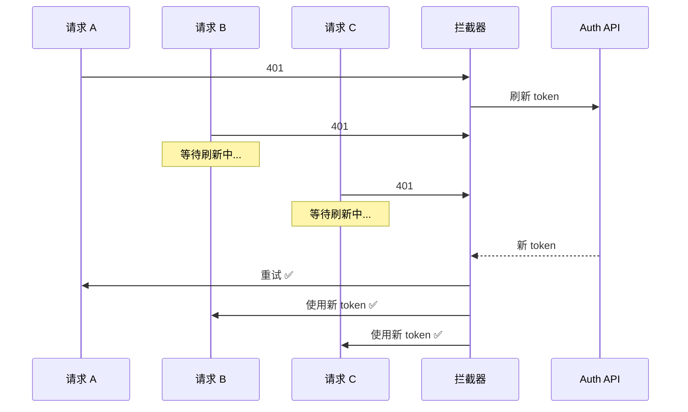

> **🤔 追问：如果刷新 token 的接口本身返回 401（Refresh Token 也过期了），当前实现是否会陷入死循环？`switchMap` 取消上一个刷新请求后，`pendingRequests` 中的旧请求使用新 token 重试时如果再次 401，应该直接登出还是再次刷新？多标签页场景下如何避免每个标签页都独立刷新 token？**
>
> **✅ 答案：**
>
> ① **死循环防护**——刷新请求的拦截器加白名单判断：URL 是 `/api/auth/refresh` 时跳过 Token 注入和 401 重试。
>
> ② **再次 401**——给 `error.config._retry` 加标志位：若重试请求再次 401 则直接登出，不再二次刷新。
>
> ③ **多标签页**——`BroadcastChannel` 方案：一个标签页刷新时广播 `refreshing` 事件，其他标签页监听后挂起自己的请求；刷新完成后广播新 token，各标签页更新本地存储并重试请求。

---

### 22. Angular DI 原理深度

#### 分层注入器

```txt
Angular 注入器是分层的（树形结构）：
┌─────────────────────────────────────────────┐
│  Platform Injector                           │
│  ├─ 全局单例（如 HttpClient, Location）        │
│  └─ 应用内所有组件共享                         │
├─────────────────────────────────────────────┤
│  Root Injector (ModuleInjector)              │
│  ├─ providedIn: 'root' 的服务                  │
│  └─ 懒加载模块有自己的 ModuleInjector          │
├─────────────────────────────────────────────┤
│  Component Injector                          │
│  ├─ providers 数组中的服务                      │
│  ├─ 每个组件实例都有自己的实例                   │
│  └─ 子组件可以访问父组件的注入器                 │
└─────────────────────────────────────────────┘

查找规则：从当前组件注入器向上查找，直到找到为止
```

##### Resolution Modifiers（解析修饰符）

```ts
// @Host   - 只从当前组件及其宿主组件查找，不往上
@Component({
  providers: [LoggerService],
  viewProviders: [LoggerService] // 只对视图子组件可见
})
class ParentComponent {
  // @Host - 只在本组件注入器查找，找不到就报错
  constructor(@Host() private logger: LoggerService) {}
}

// @Self   - 只从当前组件注入器查找
class ChildComponent {
  constructor(@Self() private logger: LoggerService) {}
  // 只查找本组件的 providers，不找父组件
}

// @SkipSelf - 跳过当前组件注入器，从父组件开始查找
class GrandChildComponent {
  constructor(@SkipSelf() private logger: LoggerService) {}
  // 跳过本组件直接找父组件
}

// @Optional - 找不到返回 null，不报错
class OptionalComponent {
  constructor(@Optional() private logger?: LoggerService) {}
}
```

##### providedIn 的 tree-shakable

```ts
// ❌ 传统方式：无论如何都会被打包
@Injectable()
class LegacyService {} // 在 NgModule providers 中注册

// ✅ Tree-shakable：未使用时不会被打包
@Injectable({ providedIn: 'root' })
class OptimizedService {}

// 按需模块
@Injectable({ providedIn: AdminModule })
class AdminOnlyService {}
// 只有 AdminModule 被导入（或懒加载）时才会被打包
```

---

### 23. takeUntilDestroyed 防止内存泄漏（Angular 21+）

Angular 21+ 推荐使用 `takeUntilDestroyed`，基于 `DestroyRef`，无需手动管理 `Subject` 和 `ngOnDestroy`。

```ts
import { takeUntilDestroyed } from '@angular/core/rxjs-interop'
import { DestroyRef, inject } from '@angular/core'

@Component({
  template: `<div>{{ data$ | async }}</div>`
})
export class MonitorComponent implements OnInit {
  private readonly destroyRef = inject(DestroyRef)

  ngOnInit() {
    // 多个订阅，统一管理，无需 ngOnDestroy
    this.webSocketService.messages$
      .pipe(takeUntilDestroyed(this.destroyRef))
      .subscribe(msg => this.handleMessage(msg))

    this.alarmService.alarms$
      .pipe(takeUntilDestroyed(this.destroyRef))
      .subscribe(alarm => this.handleAlarm(alarm))

    // 定时轮询
    interval(30000)
      .pipe(takeUntilDestroyed(this.destroyRef))
      .subscribe(() => this.refresh())
  }
}
```

> 若在 `constructor` 中使用，无需传入 `destroyRef`（自动注入）：
> ```ts
> constructor() {
>   someObservable.pipe(takeUntilDestroyed()).subscribe(...)
> }
> ```

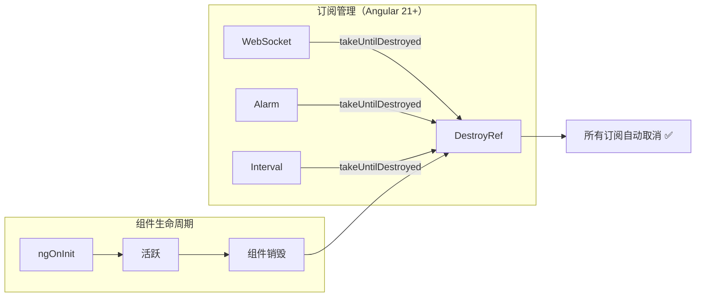

---

### 24. Angular 20+ 新特性一览

| 特性 | 描述 | 版本 |
|------|------|------|
| **Signals** | 细粒度响应式状态管理 | v16 (developer preview) → v17 (stable) |
| **Signal Forms** | 基于 Signal 的表单 API（未来替代 ReactiveForms） | v18 (developer preview) |
| **Deferrable Views** | `@defer` 模板懒加载 | v17 |
| **Control Flow** | `@if` / `@for` / `@switch` 替代 `*ngIf` / `*ngFor` | v17 |
| **httpResource** | Signal-based HTTP 请求 | v19 (developer preview) |
| **ESBuild** | 默认构建器（替代 Webpack） | v17 |
| **Vite** | 开发服务器（可选） | v17 |
| **i18n 改进** | 增量式国际化构建 | v18 |
| **New Injector** | 基于 `inject()` 函数，不再需要构造函数注入 | v14+ |
| **takeUntilDestroyed** | 基于 DestroyRef 的自动取消订阅 | v16 |

---

> 💡 **追问链 D：Angular 深度实践**
>
> **Q1（概念区别）：** Angular 的 `HttpInterceptor` 和 React 的 axios interceptor / fetch wrapper 在拦截机制上的本质区别是什么？Angular 的依赖注入体系如何让拦截器做到"零侵入"全局生效？
>
> **✅ 答案：** Angular 的 HttpInterceptor 通过 DI 系统注册（`provideHttpClient(withInterceptors())`），所有 HttpClient 发出的请求自动经过拦截器链，对业务代码完全透明。React 的 axios interceptor 在实例上配置，混用 fetch 则无法拦截；fetch wrapper 需手动替换所有调用点。本质区别：Angular DI + 平台级能力让拦截器成为"基础设施"，React 的拦截器是"工具函数"。
>
> **Q2（底层机制）：** Token 刷新拦截器中 `switchMap` 为什么能防止并发刷新？如果刷新请求在发送过程中 `pendingRequests` 中的请求又被触发了新的 401，`switchMap` 取消前一个刷新后，如何处理正在等待中的旧请求？
>
> **✅ 答案：** `switchMap` 在新值到来时取消前一个内部 Observable。但连续 401 时用 `switchMap` 会导致反复发起刷新。**正确做法**：改用 `exhaustMap`——它在内部 Observable 未完成时忽略新请求，确保只发一次刷新。等待队列中的请求在刷新完成后统一用新 token 重试。`switchMap` 只适用于"取消旧结果"而非"防并发"。
>
> **Q3（边界/未来）：** 多标签页场景下，每个 Angular 应用实例独立刷新 token，可能导致 Refresh Token 被反复刷新而过期。如何通过 `BroadcastChannel` 或 Service Worker 实现跨标签页共享刷新状态？Angular 21+ 的 Signal + httpResource 出现后，HttpInterceptor + RxJS 的拦截模式还会是推荐实践吗？
>
> **✅ 答案：** BroadcastChannel 方案：
>
> ① 标签页 A 检测 401 → 广播 `{ type: 'REFRESHING' }`；
>
> ② B 收到后挂起所有请求；
>
> ③ A 刷新成功 → 广播 `{ type: 'TOKEN_UPDATED', token }`；
>
> ④ B 更新本地 token，唤醒队列重试。Signal + httpResource 解决"声明式数据获取"问题（页面渲染时自动请求），而 HttpInterceptor 解决"所有请求的横切关注点"（注入 token、处理 401、日志），两者关注点不同，HttpInterceptor + RxJS 仍是推荐的横切关注点方案。

---

## 十五、技术选型决策树

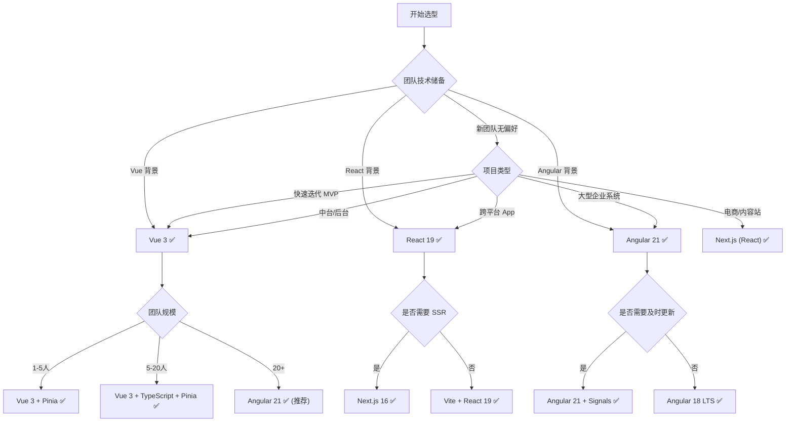

---


## 十六、应用场景决策指南

### 16.1 按行业推荐

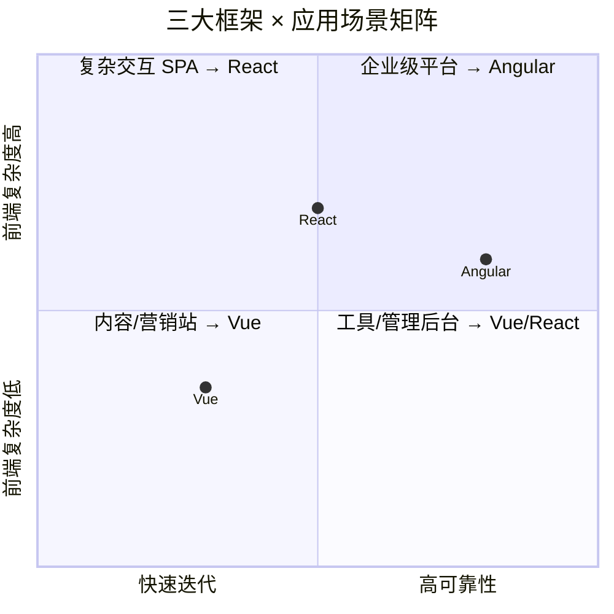

| 行业/场景 | 首选框架 | 次选框架 | 推荐理由 |
|----------|---------|---------|---------|
| **金融/银行** | Angular | React | 强类型约束、DI 可测试、安全性高 |
| **电商/零售** | React (Next.js) | Vue (Nuxt) | SEO 需要 SSR、组件复用、A/B 测试 |
| **SaaS 后台** | Vue 3 | React | 开发效率高、Element Plus 丰富、迭代快 |
| **内容/博客** | React (Next.js) | Vue (Nuxt) | SSG/ISR 支持、SEO、Markdown 生态 |
| **低代码平台** | Angular | React | 元编程、DI 动态加载、Formly 动态表单 |
| **即时通讯/IM** | React | Vue 3 | 性能要求高、WebSocket 流式更新 |
| **图表/BI 看板** | React (ECharts/D3) | Vue 3 | D3/Three.js 生态最丰富 |
| **AI 聊天界面** | React (Vercel AI) | Vue (Nuxt AI) | 流式渲染 SDK 最成熟 |
| **教育/K12** | Vue 3 | React | 文档好、上手快、国产化友好 |
| **医疗/健康** | Angular | React | 法规合规、不可变状态、审计日志 |

### 16.2 按团队组织推荐

| 团队特征 | 推荐框架 | 关键考量 |
|---------|---------|---------|
| **前端主导（3-5人）** | Vue 3 | 产出最高、学习成本最低、独立完成 |
| **前端主导（5-15人）** | React 19 | 组件复用、跨平台能力、人才储备 |
| **前后端隔离（15+人）** | Angular 21 | 规范强、接口先行、DI 层清晰 |
| **跨职能团队（全栈）** | React + Next.js | 全栈复用 TypeScript、Server Components |
| **外包/驻场团队** | Vue 3 | 快速交付、CDN 引入可用、中文文档 |
| **外企/国际团队** | React 19 | 国际化生态、英文文档、社区支持 |
| **大厂内部项目** | Angular | 工程化规范、CLI 标准化、CICD 集成 |

### 16.3 按项目生命周期推荐

| 项目阶段 | 推荐 | 原因 |
|---------|------|------|
| **MVP 原型** | Vue 3（最快）→ React（灵活） | 快速验证，Vue 开发效率最高 |
| **A 轮增长** | React（生态扩张） | 功能快速迭代，组件市场丰富 |
| **B 轮扩张** | React（跨平台） | 需要移动端 RN，多端复用 |
| **成熟期企业** | Angular（工程规范） | 百人团队协作、代码规范统一 |
| **技术转型** | React（人才市最佳） | 人才供应最大、社区资源最全 |

### 16.4 迁移路径与成本

| 迁移路径 | 难度 | 建议策略 | 预计工时 |
|---------|------|---------|---------|
| **Vue 2 → Vue 3** | ⭐⭐⭐ | @vue/compat 逐步迁移 | 2-8 周 |
| **React 15 → React 19** | ⭐⭐⭐ | 逐个组件升级 + codemod | 4-12 周 |
| **Angular 8 → Angular 21** | ⭐⭐⭐⭐⭐ | 重写为主（Ivy 不兼容 View Engine） | 8-24 周 |
| **AngularJS → Angular 21** | ⭐⭐⭐⭐⭐ | 完全重写，推荐 ngUpgrade 渐进 | 12-36 周 |
| **Vue → React** | ⭐⭐⭐⭐ | 重写组件（SFC → JSX 心智转换） | 6-16 周 |
| **React → Angular** | ⭐⭐⭐⭐⭐ | 重写 + 学习 DI/RxJS 心智模型 | 12-24 周 |
| **Angular → React** | ⭐⭐⭐⭐ | 重写 + 选择生态工具链 | 8-20 周 |

### 16.5 TCO（总拥有成本）分析

```
假设：50 人团队，3 年项目周期，中型 SaaS 产品

                Vue 3           React 19        Angular 21
招聘成本         低（人才多）    低（最多）       高（较少）
学习/培训        低（上手快）    中（Hooks 难）   高（RxJS/DI）
开发效率         高（少写代码）  中（样板代码多）  中（声明式）
工具建设成本      中（自选）     中（自选）       低（CLI 集成）
维护成本         中（灵活性高）  中（更新快）     低（规范强）
Bug 率           中             中             低（TS 原生）
第三方依赖风险    高             中             低（内置）

3 年总成本估算（50 人团队）：
  Vue 3:    ~4500 人天
  React 19: ~5000 人天
  Angular:  ~4800 人天
```

### 16.6 AI 时代的框架选择

2026 年，AI 代码生成（Cursor / Copilot）改变了学习曲线：

```
AI 辅助下的框架开发效率变化：

Vue 3:    ⭐⭐⭐   → 模板语法对 AI 生成友好，但 SFC 多标签上下文窗口占用大
React 19: ⭐⭐⭐⭐⭐ → JSX 纯 JS，AI 最擅长生成函数式代码，上下文窗口效率高
Angular:  ⭐⭐⭐   → 装饰器 + DI 配置复杂，AI 生成的样板代码正确率较低

AI 面试 / 代码审查能力：
Vue 3:    ⭐⭐⭐⭐  → 逻辑清晰，AI 容易审查
React 19: ⭐⭐⭐⭐  → Hooks 规则 AI 可以辅助检查
Angular:  ⭐⭐⭐   → 依赖图复杂，AI 难以全局理解 DI 链路
```

**选择建议（AI 时代 2026）**：
- 如果团队 AI 工具成熟，优先选 **React 19**（Cursor/Vercel AI SDK 支持最好）
- 如果团队 AI 辅助较少，**Vue 3** 开发效率依然最高
- 大型企业级项目，**Angular 21** 的规范优势仍不可替代


---

> **💡 面试建议**：不要只说"X 好 Y 不好"。展示你对每个框架的优缺点都有客观认识，并结合实际项目经验给出选择理由。
