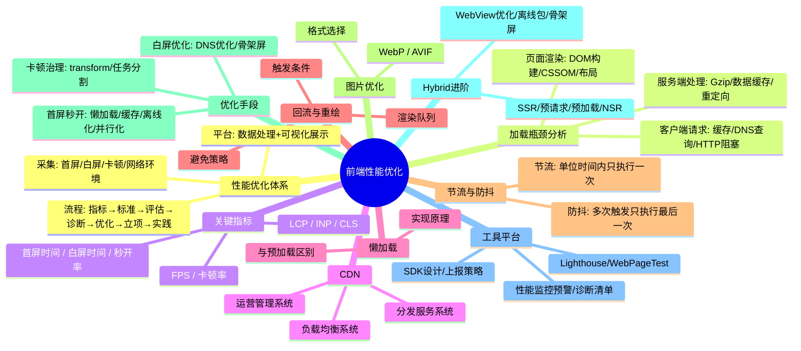
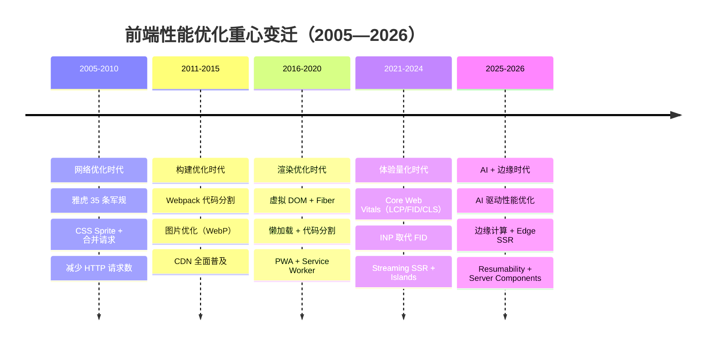
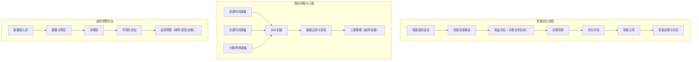
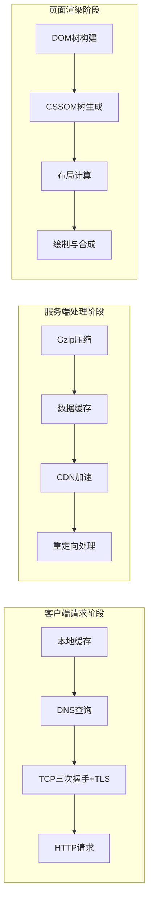
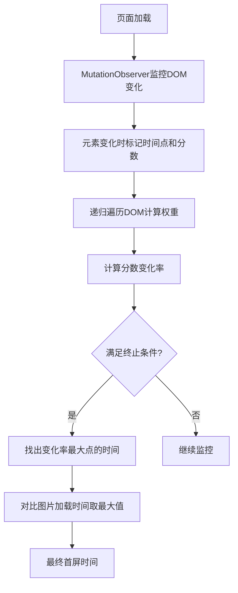
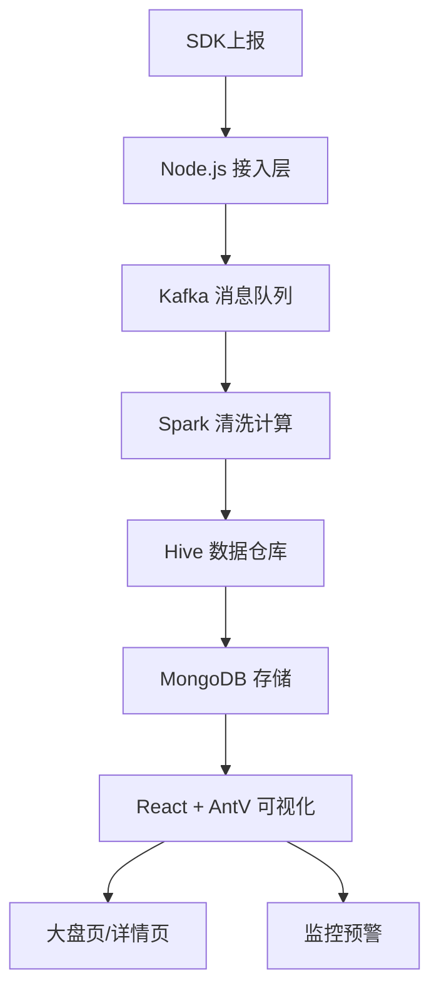
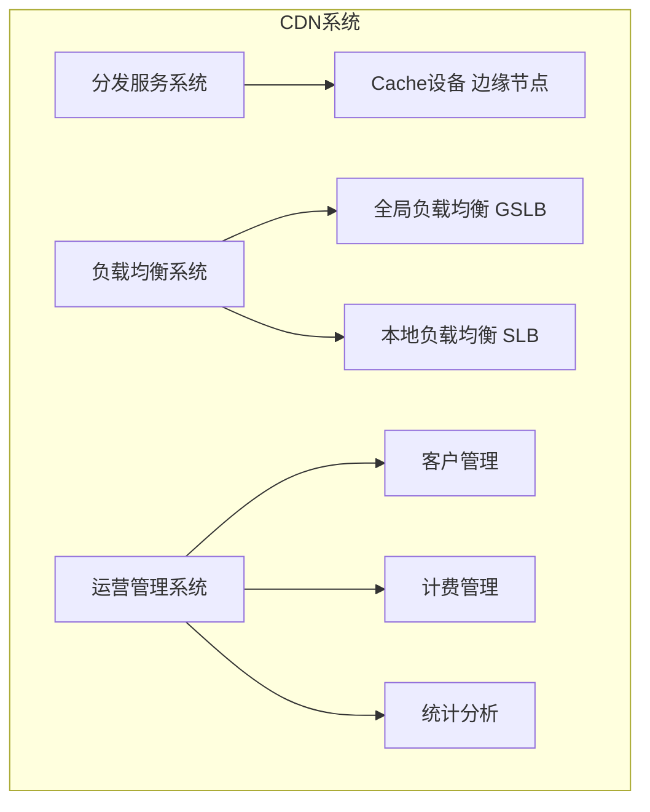
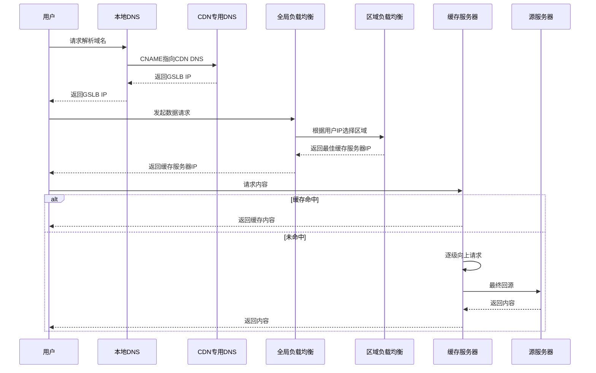

# ⚡ 前端性能优化知识详解版（含 Mermaid 图解）

> 🎯 **面试星级**：★★★★★ | **建议用时**：3 天
> 基于拉钩教育《前端性能优化方法与实战》系统梳理，涵盖性能体系、瓶颈分析、指标采集、SDK设计、监控平台、诊断优化、混合架构等全链路知识

## 🧠 知识脑图



---

## 📈 性能优化技术演进史

> 性能优化的重心随 Web 应用形态的演变而不断迁移。

### 四个时代的性能重心



### Core Web Vitals（2024+）

| 指标 | 全称 | 衡量维度 | 目标值 | 优化策略 |
|------|------|---------|--------|---------|
| **LCP** | Largest Contentful Paint | 加载性能 | ≤2.5s | 预加载关键资源、CDN、图片优化 |
| **INP** | Interaction to Next Paint | 交互响应 | ≤200ms | 减少主线程阻塞、代码分割 |
| **CLS** | Cumulative Layout Shift | 视觉稳定 | ≤0.1 | 预留图片尺寸、避免动态插入内容 |

> ⚠️ **注意**：FID（First Input Delay）已于2024年3月被INP正式取代。

---

## 🏗️ 一、性能优化体系总览

> 💡 **要点**：前端性能优化体系包括三大核心：性能优化流程、指标采集及上报、性能监控预警平台。体系化思考是性能优化的基础，将零散工作系统化。



### 1️⃣ 性能优化流程

1. **性能指标设定**：选择可衡量、关注用户体验的关键指标
2. **性能标准确定**：设定优化目标（如秒开率 > 90%）
3. **收益评估**：关联产品目标（如 VPPV 提升 10%、订单转化率提升 8%）
4. **诊断清单**：接入性能平台，根据标准诊断问题
5. **优化手段**：根据诊断结果选择具体优化方案
6. **性能立项**：成立项目组，获取业务支持
7. **性能实践**：上线跟踪、效果评估、沉淀文档/代码

> 📝 **关键认知**：不要忽视"性能立项"环节。性能优化是跨团队工程，需要产品经理和后端同事的支持。将性能目标翻译为业务收益（如转化率提升），能让项目获得更多资源支持。

### 2️⃣ 关键指标设定及标准

| 指标 | 维度 | 标准 | 说明 |
|------|------|------|------|
| **白屏时间** | 加载 | ≤ 300ms | 输入内容回车到第一个字符出现 |
| **首屏时间** | 加载 | ≤ 1.5s（秒开 < 1s） | 白屏时间 + 渲染时间 |
| **秒开率** | 加载 | ≥ 90% | 1s 内打开用户占比（阿里首创） |
| **LCP** | 加载 | < 2.5s | 最大内容绘制 |
| **INP** | 交互 | < 200ms | 2024 取代 FID |
| **CLS** | 视觉 | < 0.1 | 累计布局偏移 |
| **FPS** | 流畅 | 连续 3 帧 ≥ 20 | 低于此值判定卡顿 |

---

## 🌐 二、页面加载全过程瓶颈分析

> 💡 **要点**：从 URL 输入到页面加载可分为三个阶段：客户端请求、服务端数据处理、页面渲染。每个阶段都有特定的性能瓶颈点。



### 1️⃣ 客户端请求阶段瓶颈

- **本地缓存**：未配置强缓存/协商缓存，每次请求都走完整流程。以 58 列表页为例，无缓存时 DNS 385ms + TCP 436ms + 数据 412ms ≈ 1233ms；有缓存几乎毫秒级完成
  - 强缓存：`Cache-Control: max-age=31536000`
  - 协商缓存：`Etag` / `Last-Modified`
- **DNS 查询**：每次需从手机到移动信号塔再到认证 DNS 服务器
  - 优化：`<link rel="dns-prefetch">` 预解析
- **HTTP 请求阻塞**：浏览器同域名连接数限制（默认 6 个）
  - 优化：域名散列或 HTTP/2 多路复用

### 2️⃣ 服务端处理阶段瓶颈

- **Gzip 压缩**：文本类资源可压缩至原来的 1/3
- **数据缓存**：Service Worker / 本地存储 / CDN 减少重复请求
- **重定向**：302 / META / JS 重定向会引发新的 DNS 查询和 TCP 握手

### 3️⃣ 页面渲染阶段瓶颈

- **DOM 树构建**：标签不语义化需额外容错；DOM 节点过多；`<script>` 阻塞（用 defer/async）
- **CSSOM 生成**：CSS 嵌套过深增加解析时间
- **布局计算**：流模型遍历所有元素，频繁触发重排性能急剧下降

---

## 📊 三、性能指标采集

> 💡 **要点**：性能指标采集分手动和自动化两种。不同业务场景需选择不同方案：服务端模板用 DOMContentLoaded，SPA 用 MutationObserver。

### 1️⃣ 首屏时间采集

#### 手动采集（埋点方式）

```javascript
FMP.Start();
// 首屏关键内容加载完毕（头图、价格、购买按钮等）
FMP.End();
// 首屏时间 = FMP.End() - FMP.Start()
```

**优点**：兼容性强、去中心化
**缺点**：与业务耦合、覆盖率不足、结果因人而异

#### 自动化采集 - 服务端模板业务

使用 `DOMContentLoaded`：
```
首屏时间 = domContentLoadedEventEnd - fetchStart
```

#### 自动化采集 - SPA 业务

SPA 下 Performance API 失效（index.html 加载后触发 DOMContentLoaded，但页面还是空白）。需使用 **MutationObserver** 方案：



**核心逻辑**：
- 递归遍历 DOM 元素，按层级赋予权重（第一层 1 分，每增一层 +0.5）
- 排除 SCRIPT/STYLE/META/HEAD 标签，超出可视范围返回 0 分
- 终止条件：超过 30s / 4 轮且 1s 内分数不变 / 9 次且分数不变
- 图片处理：获取 IMG src 和 DIV 背景图 URL，用 `performance.getEntriesByName()` 获取下载时间，与 DOM 时间比较取最大值

### 2️⃣ 白屏时间采集

```
浏览器端：白屏时间 FP = domLoading - navigationStart
App 端：白屏时间 FP = WebView 初始化时间 + 浏览器端白屏时间
```

App 下多了 WebView 初始化时间，需在创建 WebView 和开始网络连接时分别打点获取。

### 3️⃣ 卡顿指标采集

**H5 场景**：`requestAnimationFrame` 计算 FPS

```javascript
function isBlocking(fpsList, below = 20, last = 3) {
    let count = 0;
    for (let i = 0; i < fpsList.length; i++) {
        if (fpsList[i] && fpsList[i] < below) count++;
        else count = 0;
        if (count >= last) return true;
    }
    return false;
}
```

**App 场景**：
- Android：`mChoreographer.getFrameTimeNanos()` 单帧渲染时长 > 250ms 严重卡顿，连续 5 次 > 50ms 卡顿
- iOS：`CFRunLoopObserverContext` 监控 RunLoop 节点间耗时

### 4️⃣ 网络环境采集

端外（微信内）无法直接获取网络类型，通过图片测速：

```
请求 1x1 和 3x3 两张图片 → 记录加载时间 → 计算网速 → 概率分布判定
2G(750-1400ms) / 3G(230-750ms) / 4G/WiFi(0-230ms)
```

---

## 📦 四、性能 SDK 及上报策略设计

> 💡 **要点**：SDK 将指标采集封装为 Perf API（FMP/FP/BLOCK），一键初始化。上报需考虑日志过滤、数据抽样、网络自适应等策略。

### 1️⃣ SDK 设计

```javascript
// npm 接入
import { perfInit } from '@common/perf';
perfInit();

// 外链接入
<script src="https://s1.static.com/common/perf/1.0.0/perf.min.js"></script>
<script>try { perfInit(); } catch (err) { console.warn(err); }</script>
```

**设计要点**：
- 原生 JS 实现跨技术栈采集
- try catch 容错，不影响宿主页面
- 适配层统一不同终端（PC/移动端/小程序）
- 提供调试参数（`?PERF_DEV_MODEL=PERF_DEV_MODEL`）开启诊断模式

### 2️⃣ 上报策略

| 策略 | 说明 |
|------|------|
| **日志过滤** | 丢弃负值/非数值/超过 15s 等异常数据 |
| **数据抽样** | 日活千万级抽样 10%，活动时可动态降低 |
| **网络自适应** | 强网上报，弱网存储本地延后上报 |
| **空闲上报** | App 空闲时（如凌晨）批量上报 |
| **优先 Native** | 复用客户端连接，支持延时/批量 |

---

## 🖥️ 五、性能监控预警平台

> 💡 **要点**：数据流 SDK→Kafka→Spark/Hive→MongoDB→React/AntV 可视化。功能包括大盘页、详情页、监控预警。



**数据处理**：
- 入库：Node.js 接收 → URL 解析 key-value → 空数据/异常数据删除 → Kafka
- 清洗：去重、补全缺失、舍弃超范围数据
- 计算：首屏分布、秒开率、瀑布流时间（DNS/TCP/请求/传输/解析/加载）

**预警规则**：
- 超出标准 10%：企业微信通知
- 超出 20%：邮件通知
- 超出 30%：短信通知

---

## 🔍 六、诊断清单

| 维度 | 诊断思路 | 案例 |
|------|---------|------|
| **全量 vs 增量** | 是否一次性加载过多数据？ | App 列表页首屏只拉 4 条，滚动再加载 |
| **同步 vs 异步** | 接口串行阻塞？可否并行？ | 导航位和商品列表并行请求 |
| **实时 vs 缓存** | 非实时数据可否缓存？ | 榜单/排行数据定时更新 |
| **原片 vs 压缩** | 图片是否是原图？ | 先展示低质量图，用户关注时加载清晰图 |

**问题诊断流程**：用户反馈 → 确认共性/个例 → 共性问题看均值/分位值 → 定位终端 → 查看瀑布流 → 优化

> 📝 **AB 测试**：优化前后需先做 AA 测试（波动率 < 万分之一），再在订单标记 version=A/B，通过埋点统计转化率。

---

## 🌐 七、CDN

### 1️⃣ CDN 的概念

> CDN（内容分发网络）通过将内容缓存到离用户最近的节点来加速交付，由分发服务系统、负载均衡系统、运营管理系统三大子系统组成。



### 2️⃣ CDN 的工作原理



> 📝 **扩展**：CDN 使用场景包括第三方库引用加速、静态资源缓存分发、直播流媒体传送。性能上降低延迟减轻服务器负载，安全上防御 DDoS 和 MITM。

---

## 💤 八、首屏秒开优化（4 重保障）

> 💡 **要点**：懒加载减少非关键内容请求，缓存避免重复请求，离线化静态化本地，并行化增加请求通道。

### 1️⃣ 懒加载

> 现代推荐使用 **Intersection Observer API**，性能优于传统 scroll 事件监听。

```javascript
const lazyImages = document.querySelectorAll('img[data-src]');
const imageObserver = new IntersectionObserver((entries) => {
    entries.forEach(entry => {
        if (entry.isIntersecting) {
            const img = entry.target;
            img.src = img.dataset.src;
            img.removeAttribute('data-src');
            imageObserver.unobserve(img);
        }
    });
}, { rootMargin: '100px 0px', threshold: 0.01 });
lazyImages.forEach(img => imageObserver.observe(img));
```

### 2️⃣ 缓存

- **接口缓存**：端内走 Native 请求（WebView 初始化前即可请求数据）
- **强缓存**：`Cache-Control: max-age=31536000`
- **协商缓存**：Etag + If-None-Match

### 3️⃣ 离线化

适合首页/列表页等无需登录场景，支持 SEO。

```javascript
// Webpack 预渲染
new PrerenderSpaPlugin(
    path.join(__dirname, '../dist'),
    ['/', '/about', '/contact']
)
```

### 4️⃣ 并行化 - HTTP/2

HTTP/2 多路复用解决串行传输和同域名 6 连接限制，不再需要合并 JS/CSS 和域名散列。

---

## 🔄 九、回流与重绘

### 1️⃣ 概念及触发条件

- **回流（Reflow）**：元素尺寸/结构变化导致重新布局，影响范围分全局和局部
- **重绘（Repaint）**：仅样式变化不影响布局

**触发回流**：首次渲染、窗口大小变化、元素尺寸/位置/内容变化、字体变化、DOM 增删、激活 CSS 伪类、查询某些属性（offsetTop/scrollTop/clientWidth/getComputedStyle）
**触发重绘**：color/background/outline/border-radius/visibility/box-shadow 变化

> ⚠️ 回流必定触发重绘，重绘不一定引发回流。

### 2️⃣ 避免策略

- 低层级 DOM 操作
- 避免 table 布局
- `will-change` 提前告知浏览器
- 修改 class 而非逐条修改样式
- `position: absolute/fixed` 脱离文档流
- `DocumentFragment` 批量操作
- `display: none` 后操作
- **读写分离**：利用渲染队列，批量处理写操作后再读

---

## 🎯 十、节流与防抖

### 1️⃣ 概念

- **防抖**：连续触发只执行最后一次（按钮提交 / 搜索联想 / 表单验证）
- **节流**：单位时间只执行一次（拖拽 / resize / 滚动 / 动画）

### 2️⃣ 实现

```javascript
// 防抖
function debounce(fn, wait) {
    let timer = null;
    return function() {
        const context = this, args = [...arguments];
        if (timer) { clearTimeout(timer); timer = null; }
        timer = setTimeout(() => { fn.apply(context, args); }, wait);
    };
}

// 节流 - 时间戳版（立即执行第一次，停止不再执行）
function throttle(fn, delay) {
    let preTime = Date.now();
    return function() {
        const context = this, args = [...arguments], nowTime = Date.now();
        if (nowTime - preTime >= delay) {
            preTime = Date.now();
            return fn.apply(context, args);
        }
    };
}

// 节流 - 定时器版（延迟执行第一次，停止后执行最后一次）
function throttle(fun, wait) {
    let timeout = null;
    return function() {
        let context = this, args = [...arguments];
        if (!timeout) {
            timeout = setTimeout(() => {
                fun.apply(context, args);
                timeout = null;
            }, wait);
        }
    };
}
```

---

## 🖼️ 十一、图片优化

1. CSS 代替修饰类图片
2. 按需裁剪适配屏幕宽度
3. 小图 Base64 / 雪碧图
4. 现代格式：**WebP**（小 25-35%）/ **AVIF**（小 50%）/ **JPEG XL**（小 60%）
5. SVG 矢量不失真，适合 Logo

---

## 🛠️ 十二、加载与渲染优化

### 1️⃣ Resource Hints

| 类型 | 用途 |
|------|------|
| `preload` | 提前加载当前页关键资源 |
| `prefetch` | 预取下一页可能用到的资源 |
| `preconnect` | 提前建立源站连接 |
| `dns-prefetch` | 仅提前解析 DNS |
| `modulepreload` | 预加载 ES Module 及其依赖 |

### 2️⃣ 代码分割

```javascript
// React
const Home = React.lazy(() => import('./pages/Home'));
// Vue 3
const HeavyChart = defineAsyncComponent(() => import('./components/HeavyChart.vue'));
```

### 3️⃣ HTTP/2 vs HTTP/3

| 特性 | HTTP/2 | HTTP/3 |
|------|--------|--------|
| 传输协议 | TCP | QUIC (基于 UDP) |
| 队头阻塞 | 传输层(TCP) | 无 |
| 连接建立 | 1次 TCP + 协商 | 0-RTT / 1-RTT |
| 头部压缩 | HPACK | QPACK |

### 4️⃣ 渲染优化

**content-visibility**：一行 CSS 实现长列表虚拟渲染
```css
.long-list-item {
    content-visibility: auto;
    contain-intrinsic-size: 200px;
}
```

**will-change / GPU 加速**：
```css
.gpu-accelerated { transform: translateZ(0); }
```

**Critical CSS**：首屏关键样式内联 `<head>`，非关键 CSS 通过 preload + onload 异步加载

**字体优化**：`font-display: swap` 配合 `size-adjust` 减少 CLS；使用 woff2 + subset

---

## 💤 十三、白屏优化与卡顿治理

### 1️⃣ DNS 查询优化

- **dns-prefetch**：减少约 150ms
  ```html
  <meta http-equiv="x-dns-prefetch-control" content="on" />
  <link rel="dns-prefetch" href="https://s.google.com/" />
  ```
- **客户端预解析**：App 启动时 1x1 WebView 预解析域名
- **IP 直连**：SDK 解析域名直接请求 IP（需解决 HTTPS 证书问题）
- **httpDNS**：避免运营商劫持

### 2️⃣ 骨架屏

自动化生成骨架屏步骤：
1. 遍历 DOM 元素，计算宽高位置，转换为百分比
2. CLI 工具自动生成骨架屏代码
3. Puppeteer 注入页面自动运行

### 3️⃣ 卡顿治理

- 用 `transform` 替代 `height/width/margin/padding` 做动画
- `DocumentFragment` 批量操作 DOM
- 复杂任务分割为队列定时执行

---

## 📱 十四、Hybrid 性能优化

> 💡 **要点**：WebView 初始化约 400ms（占首屏 40%），池化后可减少约 200ms。通过离线包、骨架屏、SSR、接口预加载综合优化。

### 1️⃣ App 启动阶段

**WebView 全局池化**：App 启动时创建 WebView 实例存入公共池，后续直接取用，减少初始化时间约 200ms。

### 2️⃣ 白屏阶段

- **离线包**：静态资源打包下载到本地，摆脱网络限制
- **骨架屏**：WebView 启动时覆盖骨架图，加载完成后渐隐
- **SSR**：CSR 第六帧才显示内容，SSR 第三帧即可

### 3️⃣ 首屏渲染阶段

- **接口预加载**：Native 在 WebView 初始化同时发起请求
- **预判预加载**：根据用户操作路径预测并提前获取数据

---

## 📦 十五、离线包设计

> 💡 **要点**：离线包将静态资源打包到本地，通过全量包 + 差分包实现高效更新。差分包（~200K）远小于全量包（~600K）。

**差分包**：`bsdiff` 生成差分包，`bspatch` 合并本地版本成新全量包

**部署流程**：FE 打包 → 离线包发 CDN → 管理后台配置 → 客户端下载 → 请求拦截走本地资源

**管理后台**：全局开关、列表页（版本号/包类型/发布时间）、详情页

> ⚠️ 做好开关功能，异常时及时关闭保证用户正常访问。

---

## 👻 十六、骨架屏及 SSR

### 1️⃣ 图片骨架屏

流程：UI 设计图 → 前端上传 CDN → 客户端配置文件 → WebView 启动覆盖 → 加载完成渐隐

注意事项：
- 区分首次/二次使用（首次下载，二次对比变更）
- 传给接口当前分辨率获取最适配图片
- 展示和销毁以日志形式记录

### 2️⃣ SSR 优化

**白屏 100ms 进阶**：
- 服务端性能远高于手机，CSR 600ms → SSR 300ms
- **LRU-Cache**：页面级缓存，缓存渲染后的页面
- **Redis**：跨进程数据接口缓存，减少 100ms

> ⚠️ 注意服务端安全（如订单信息不要出现在页面源码中），做好 CSR 降级。

---

## 🔮 十七、预请求、预加载及预渲染

- **预请求**：封装 `preReq`，Axios `BeforeFetch` 钩子统一拼装参数
- **预加载**：根据用户操作路径判断时机，`afterFetch` 钩子存储数据供下个路由使用
- **预渲染（NSR）**：离线包提供模板 + 预加载提供数据 → V8 引擎客户端渲染 → 放置在可视区域外

---

## 🔭 十八、前沿性能技术

### 1️⃣ Edge Computing

```javascript
// Cloudflare Workers 边缘渲染
export default {
    async fetch(request) {
        const url = new URL(request.url);
        if (url.pathname === '/product') {
            const product = await getProductFromKV(url.searchParams.get('id'));
            return new Response(renderHTML(product), {
                headers: { 'Content-Type': 'text/html' }
            });
        }
        return fetch(request);
    }
};
```

### 2️⃣ Islands Architecture

Astro 框架将交互组件视为独立"岛屿"，`client:load` / `client:visible` 控制加载时机，静态部分零 JS。

### 3️⃣ Streaming SSR

React 18+ `renderToPipeableStream` 分块发送 HTML，浏览器尽早渲染 Shell。

### 4️⃣ bfcache

冻结整个页面到内存，前进/后退瞬时恢复。避免 `unload` 事件和 `Cache-Control: no-store`。

---

## 🚀 十九、2025/2026 性能优化新趋势

### 1️⃣ INP 优化

```javascript
// scheduler.yield() 让出主线程
async function processLargeArrayModern(arr) {
    for (let i = 0; i < arr.length; i++) {
        processItem(arr[i]);
        if (i % 100 === 0) {
            await scheduler.yield();
        }
    }
}
```

### 2️⃣ 2026 前瞻

| 技术 | 预期影响 |
|------|---------|
| AI 驱动优化 | 优化效率 3x ↑ |
| Speculative Loading | LCP 30% ↓ |
| WebTransport (QUIC) | 延迟降低 50% |
| Resumability (Qwik) | 首屏 JS 90% ↓ |
| Server Components | 客户端 JS 50% ↓ |

---

**扩展阅读：**
- [web.dev / vitals](https://web.dev/vitals/) - Core Web Vitals 官方指南

- [Chrome DevTools Performance](https://developer.chrome.com/docs/devtools/performance/)

- [PageSpeed Insights](https://pagespeed.web.dev/) - Google 在线性能检测

  
