# 🛠️ 前端工程化知识详解版（含 Mermaid 图解）

> 🎯 **面试星级**：★★★★☆ | **建议用时**：2 天
> 前端工程化核心知识全面梳理，涵盖模块化、[Webpack](https://webpack.js.org)/[Vite](https://vite.dev)、[Babel](https://babeljs.io)、Monorepo、微前端、CI/CD 等核心考点

## 🧠 知识脑图

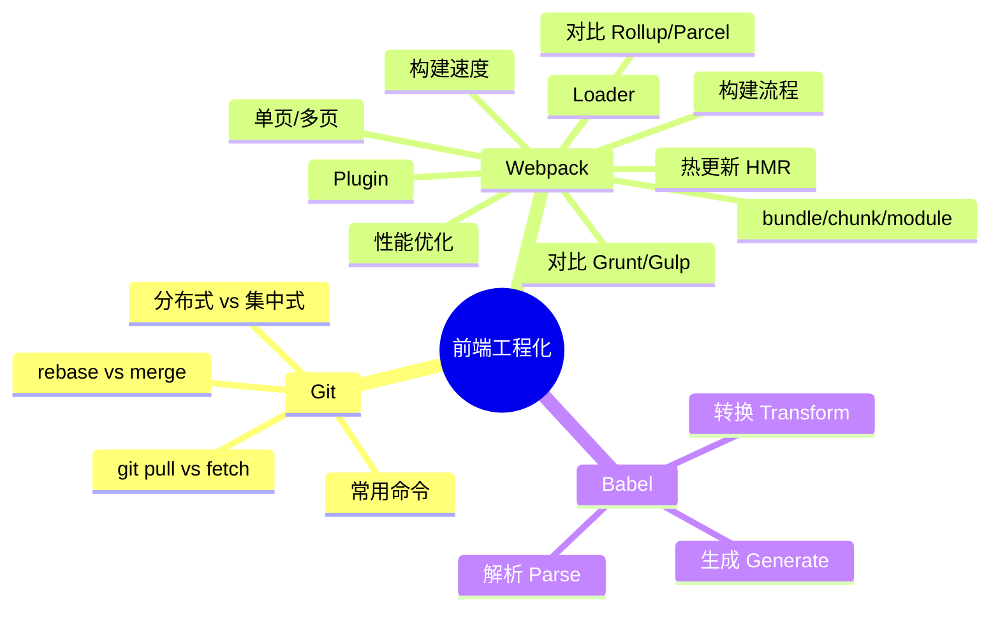


---

## 📖 目录

- [🧠 知识脑图](#🧠-知识脑图)
- [📦 零、模块化规范](#📦-零模块化规范)
- [🔀 一、Git](#🔀-一git)
- [📦 二、Webpack](#📦-二webpack)
- [🔧 三、Babel](#🔧-三babel)
- [🏗️ 四、现代构建工具](#🏗️-四现代构建工具)
- [⚡ 五、包管理器和运行时](#⚡-五包管理器和运行时)
- [🏛️ 六、Monorepo](#🏛️-六monorepo)
- [🧩 七、微前端 (Micro-Frontends)](#🧩-七微前端-micro-frontends)
- [✅ 八、代码质量和测试](#✅-八代码质量和测试)
- [🚀 九、CI/CD 与部署](#🚀-九cicd-与部署)
- [🔮 十、2025/2026 工程化新趋势](#🔮-十20252026-工程化新趋势)

---

## 📈 前端构建工具演进史（2012—2026）

> 构建工具的发展史，就是前端工程化从"刀耕火种"走向"现代化"的缩影。

### 构建工具进化时间线

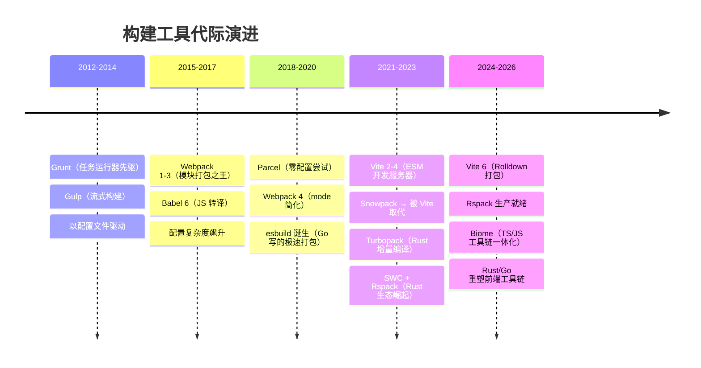

### 构建工具代际对比

| 代际 | 代表工具 | 核心机制 | 启动速度 | 打包速度 | 配置复杂度 |
|------|---------|---------|---------|---------|----------|
| **1.0 时代** | Grunt / Gulp | 任务流水线 | 中等 | 慢 | 简单 |
| **2.0 时代** | Webpack 1-4 | Bundle 打包 | 慢(10-30s) | 慢 | 极复杂 |
| **2.5 时代** | Parcel / Rollup | 零配置/ESM | 中等 | 中等 | 简单 |
| **3.0 时代** | **Vite** / Snowpack | **ESM 原生** | **快(<1s)** | 中等 | 简单 |
| **3.5 时代** | esbuild / SWC | **Go/Rust 编译** | 极快 | **极快** | 低 |
| **4.0 时代** | **Rspack** / Turbopack / **Rolldown** | Rust 增量编译 | 极快 | 极快 | 中 |

### 关键构建工具性能基准

```bash
# 冷启动 dev server（10,000 模块项目，约略值）
Webpack 5:    ~30s
Vite 5:       ~2s    # ESM + esbuild pre-bundle
Turbopack:    ~1.5s  # Rust 增量编译
Rspack:       ~1s    # Rust + 并行

# 完整生产构建（同上）
Webpack 5:    ~60s
Vite 5:       ~20s   # Rollup 打包
esbuild:      ~3s    # Go 极致并行
Rspack:       ~4s    # Rust
Turbopack:    ~5s    # Rust（尚在开发）
Rolldown:     ~3s    # Rust（Vite 6 内置）
```

### 为什么 Rust/Go 正在重塑工具链？

```typescript
// 🔴 JavaScript 构建工具（Webpack）— 单线程 + 解释执行
// 每个模块的解析/转换在 JS 主线程串行执行
// 大量 AST 创建 + GC 压力

// 🟢 Rust 构建工具（Rspack/Turbopack）— 多线程 + 编译执行
// 1. 并行解析：每个 CPU 核解析一个文件
// 2. 增量编译：仅重新处理变化的模块
// 3. 零 GC：Rust 的所有权系统避免垃圾回收
// 4. 直接生成原生代码：无需 JIT 预热

// 性能差异来源：
// Rust 工具处理 1000 个模块 ≈ JS 工具处理 10 个模块
```

---

## 📦 零、模块化规范

### 1️⃣ CommonJS 和 ES Module 的区别

> 💡 **要点**：CJS 运行时加载、值拷贝；ESM 编译时加载、动态引用。Tree Shaking 依赖 ESM 的静态结构。

**一句话总结：CJS 是运行时的值的拷贝，ESM 是编译时的值的引用。**

| 对比维度 | CommonJS (CJS) | ES Module (ESM) |
| :--- | :--- | :--- |
| **加载时机** | 🕒 **运行时加载**（同步），可写在 if 语句里 | 🛠️ **编译时加载**（静态），必须在文件顶层 |
| **导出机制** | 📄 导出值的 **浅拷贝**（内部变化不影响外部） | 🔗 导出值的 **动态引用**（内部变化外部同步） |
| **运行环境** | 🟢 Node.js（服务端为主） | 🌐 浏览器原生支持 + Node.js (v14+) |
| **`this` 指向** | 当前模块对象 | `undefined` |

### 2️⃣ 为什么 Tree Shaking 必须依赖 ES Module？

> 💡 **要点**：ESM 的静态导入/导出结构使得 Webpack 在 AST 阶段即可分析无用代码并删除，而 CJS 的动态特性让打包工具无法确定依赖关系。

因为 ESM 是**静态结构**。Webpack 在构建的 **AST（抽象语法树）分析阶段**，不需要执行代码，就能清楚地知道模块导入了哪些变量、又使用了哪些变量。而 CJS 是动态引入的（`require(condition ? 'a' : 'b')`），打包工具在运行前无法确定依赖，因此不敢随便删代码。

> ⚠️ **注意**：Tree Shaking 需配合 `sideEffects` 配置使用，否则可能误删有副作用的代码（如 CSS 导入、polyfill）。生产环境下务必检查 package.json 中的 sideEffects 字段。

### 3️⃣ ESM 的静态分析能力深度拆解

> 💡 **要点**：ESM 的静态结构让打包工具能在编译时做依赖分析、Tree Shaking、Scope Hoisting 和确定循环依赖。这是 ESM 相比 CJS 最核心的优势。

**ESM 静态结构的底层含义：**

```javascript
// ✅ 顶层声明 — 编译时可知
import { ref, computed } from 'vue'
export const count = ref(0)

// ❌ 动态导入 — 运行时才知（特殊处理）
const module = await import('./dynamic.js')

// ❌ CJS 风格 — 完全动态
let lib
if (isDev) { lib = require('vue') }   // 打包工具无法分析
```

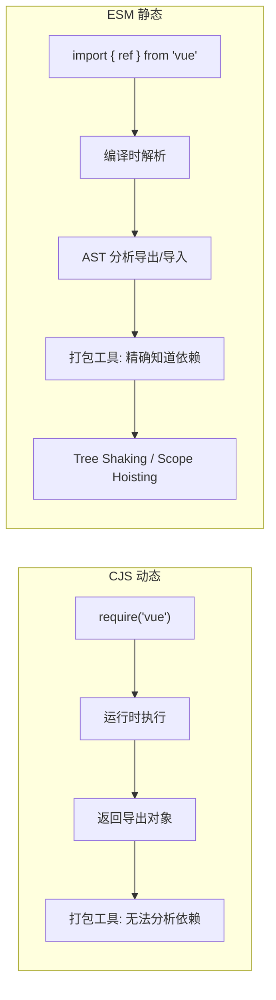

**ESM 的四种导入/导出形式及其打包产物：**

| 形式 | 代码 | Tree Shaking | 产物影响 |
|------|------|-------------|---------|
| **命名导入** | `import { ref } from 'vue'` | ✅ 完美 | 仅打包 ref，体积最小 |
| **默认导入** | `import Vue from 'vue'` | ⚠️ 受限 | 打包整个默认导出对象 |
| **命名空间导入** | `import * as Vue from 'vue'` | ❌ 无法 | 打包全部导出 |
| **动态导入** | `import('./page.vue')` | ✅ 按需 | 单独 chunk，懒加载 |

**CJS vs ESM 的循环依赖处理：**

```javascript
// a.js (CJS)  — 循环依赖返回未完成的对象
const b = require('./b')     // 得到 b 的部分导出
module.exports = { a: 1, getB() { return b } }

// a.js (ESM) — 循环依赖通过实时绑定正常工作
import { b } from './b.js'
export const a = 1
export function getB() { return b }  // b 始终是最新值
```

| 特性 | CJS | ESM |
|------|-----|-----|
| **循环依赖** | 返回不完整副本 | 实时绑定，始终正确 |
| **值的传递** | 值拷贝（原始类型） | 动态引用（始终最新） |
| **异步加载** | 同步 `require` | `import()` 原生异步 |
| **Top-level await** | ❌ 不支持 | ✅ 支持 |
| **HMR 兼容性** | 需完整模块替换 | 单文件热替换 |
| **静态分析** | ❌ 无法 | ✅ 完整 |

### 4️⃣ 打包工具的输出格式对比

> 💡 **要点**：bundler 支持输出 CJS/ESM/UMD/IIFE 四种格式，库作者需根据消费端选择。ESM 是 2026 年的绝对主流。

| 格式 | 加载方式 | 适用场景 | Tree Shaking |
|------|---------|---------|-------------|
| **ESM** | `import` / `<script type="module">` | 现代化项目、Vite/Webpack 环境 | ✅ 完美 |
| **CJS** | `require()` | Node.js 服务端、老旧 Webpack 项目 | ❌ 不支持 |
| **UMD** | `<script>` / AMD / CJS 通用 | CDN 直接引用、兼容所有环境 | ❌ 不支持 |
| **IIFE** | `<script>` 全局变量 | 浏览器直接加载、jQuery 插件 | ❌ 不支持 |

```javascript
// 库的 package.json 输出规范（2026 推荐）
{
  "type": "module",
  "main": "./dist/index.cjs",       // CJS 入口（老项目兼容）
  "module": "./dist/index.js",      // ESM 入口（bundler 优先读取）
  "exports": {
    ".": {
      "import": "./dist/index.js",  // ESM 环境
      "require": "./dist/index.cjs" // CJS 环境
    },
    "./styles": "./dist/style.css"
  }
}
```

**模块格式的选择建议：**
- **业务代码**：ESM（`<script type="module">` 或 bundler 消费）
- **发布到 npm 的库**：双格式（ESM + CJS），`exports` 字段区分
- **CDN 分发**：UMD 或 ESM + importmap
- **浏览器直接引用**：IIFE 或 ESM

---

## 🔀 一、Git

### 1️⃣ [Git](https://git-scm.com) 和 [SVN](https://subversion.apache.org) 的区别

> 💡 **要点**：Git 分布式 vs SVN 集中式是根本区别。Git 分支更轻量（指针 vs 目录复制），支持离线工作，内容完整性由 SHA-1 保证。

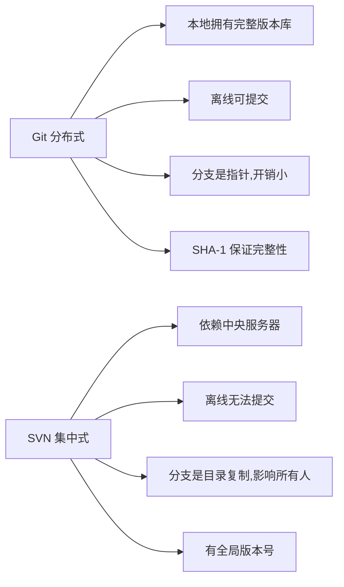

- git 和 svn 最大的区别在于 git 是分布式的，而 svn 是集中式的。因此我们不能再离线的情况下使用 svn。如果服务器出现问题，就没有办法使用 svn 来提交代码。
- svn 中的分支是整个版本库的复制的一份完整目录，而 git 的分支是指针指向某次提交，因此 git 的分支创建更加开销更小并且分支上的变化不会影响到其他人。svn 的分支变化会影响到所有的人。
- svn 的指令相对于 git 来说要简单一些，比 git 更容易上手。
- **GIT把内容按元数据方式存储，而SVN是按文件：**因为git目录是处于个人机器上的一个克隆版的版本库，它拥有中心版本库上所有的东西，例如标签，分支，版本记录等。
- **GIT分支和SVN的分支不同：**svn会发生分支遗漏的情况，而git可以同一个工作目录下快速的在几个分支间切换，很容易发现未被合并的分支，简单而快捷的合并这些文件。
- **GIT没有一个全局的版本号，而SVN有**
- **GIT的内容完整性要优于SVN：**GIT的内容存储使用的是SHA-1哈希算法。这能确保代码内容的完整性，确保在遇到磁盘故障和网络问题时降低对版本库的破坏

### 2️⃣ 经常使用的 git 命令？

> 💡 **要点**：掌握 init/add/commit/branch/checkout/status 等核心命令即可覆盖日常绝大多数工作场景。

```bash
git init                     # 新建 git 代码库
git add                      # 添加指定文件到暂存区
git rm                       # 删除工作区文件，并将删除放入暂存区
git commit -m [message]      # 提交暂存区到仓库区
git branch                   # 列出所有分支
git checkout -b [branch]     # 新建并切换到该分支
git status                   # 显示有变更文件的状态
```

### 3️⃣ git pull 和 git fetch 的区别

> 💡 **要点**：git fetch 仅下载远程变更不合并，git pull = git fetch + git merge，更便捷但可能引入冲突。

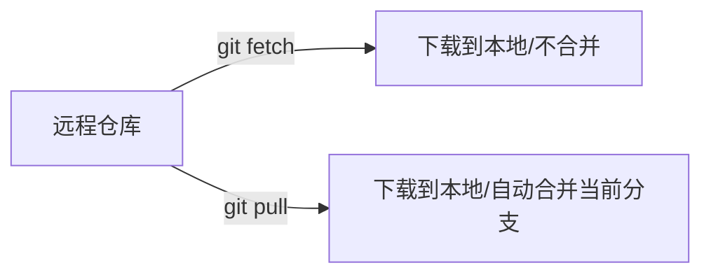

- git fetch 只是将远程仓库的变化下载下来，并没有和本地分支合并。
- git pull 会将远程仓库的变化下载下来，并和当前分支合并。

### 4️⃣ git rebase 和 git merge 的区别

> 💡 **要点**：merge 保留分支历史（非线性），rebase 使提交历史线性整洁。选择取决于团队对历史整洁度的要求。

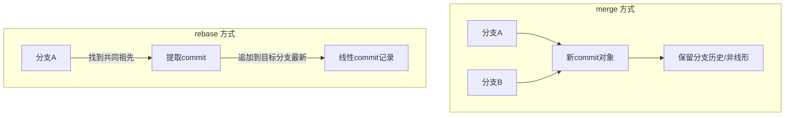

git merge 和 git rebase 都是用于分支合并，关键**在** **commit 记录的处理上不同**：

- git merge 会新建一个新的 commit 对象，然后两个分支以前的 commit 记录都指向这个新 commit 记录。这种方法会保留之前每个分支的 commit 历史。
- git rebase 会先找到两个分支的第一个共同的 commit 祖先记录，然后将提取当前分支这之后的所有 commit 记录，然后将这个 commit 记录添加到目标分支的最新提交后面。经过这个合并后，两个分支合并后的 commit 记录就变为了线性的记录了。

### 5️⃣ Git 工作流策略对比

> 💡 **要点**：Git Flow 适合版本发布严格的成熟项目，GitHub Flow 适合持续交付，Trunk-based 适合 CI/CD 高频发版。2026 年主流趋势是 Trunk-based + 特性分支 + 短生命周期 MR。

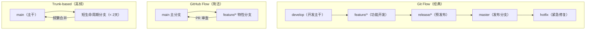

**三种工作流对比：**

| 维度 | Git Flow | GitHub Flow | Trunk-based |
|------|---------|------------|-------------|
| **分支数量** | 多（master/develop/release/hotfix/feature） | 少（main + feature） | 极少（main + 短期 feature） |
| **发布节奏** | 固定版本（周/月） | 持续交付 | 每日多次 |
| **适用规模** | 大型项目、版本发布严格 | 中小型、SaaS | CI/CD 成熟团队 |
| **PR/MR 周期** | 长（develop → release → master） | 短（feature → main） | 极短（< 2天） |
| **回滚复杂度** | 低（tag 版本回退） | 中 | 高（需 revert commit） |
| **2026 推荐度** | ⚠️ 传统项目 | ✅ 团队级 | ✅✅ CI/CD 成熟 |

**场景化推荐：**
- **企业级产品（固定版本发布）** → Git Flow：master + develop + release + hotfix
- **SaaS / Web 应用（持续迭代）** → GitHub Flow：main + feature branch + PR
- **CI/CD 成熟团队（每日多频发版）** → Trunk-based：main 直接 + 短分支
- **开源项目** → GitHub Flow（贡献者友好）

### 6️⃣ Conventional Commits 与 commit 规范

> 💡 **要点**：Conventional Commits 定义提交信息格式 `type(scope): message`，配合 semantic-release 自动生成 CHANGELOG 和版本号。commitlint + husky 强制执行。

**提交信息格式：**

```plaintext
<type>(<scope>): <subject>     # 标题行（≤ 72 字符）
                               # 空行
<body>                         # 正文（可选）
                               # 空行
<footer>                       # 页脚（可选，如 BREAKING CHANGE、Closes #123）
```

**常见 type 及其语义：**

| type | 含义 | 版本影响 | 示例 |
|------|------|---------|------|
| `feat` | 新功能 | 次版本（minor） | `feat(login): add SSO authentication` |
| `fix` | bug 修复 | 补丁（patch） | `fix(router): resolve memory leak on unmount` |
| `BREAKING CHANGE` | 不兼容变更 | 主版本（major） | `feat(core)!: drop Node.js 16 support` |
| `docs` | 文档 | 无 | `docs(readme): update installation guide` |
| `refactor` | 重构 | 无 | `refactor(state): migrate to signals` |
| `test` | 测试 | 无 | `test(hooks): add useCallback coverage` |
| `chore` | 构建/工具 | 无 | `chore(deps): upgrade vite to v8` |
| `style` | 代码格式 | 无 | `style: run prettier on entire codebase` |
| `perf` | 性能优化 | 无 | `perf(virtual-list): reduce re-render by 60%` |

**自动化版本管理：**

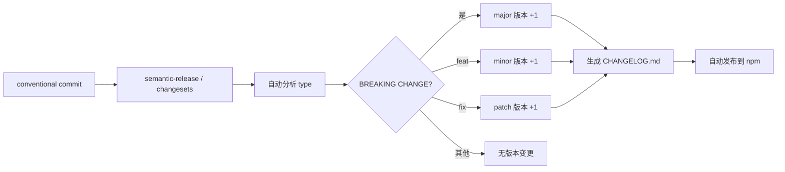

**前端项目推荐 Git 规范：**

```yaml
# .gitlint（提交信息检查规则）
# 标题行：type(scope): subject
# scope 可选值：core/router/store/components/hooks/utils/styles/deps/ci
# 标题 ≤ 72 字符，正文 ≤ 72 字符每行

# .gitignore（前端项目标准）
node_modules/
dist/
.next/
.cache/
coverage/
*.log
.env.local
.env.*.local
.DS_Store
*.tsbuildinfo
```

---


## 📦 二、Webpack

### 1️⃣ **[Webpack](https://webpack.js.org)**与**[Grunt](https://gruntjs.com)**、**[Gulp](https://gulpjs.com)**的不同？

> 💡 **要点**：Grunt/Gulp 是任务运行器（自动化流程），Webpack 是模块打包器（构建依赖图），两者定位完全不同。

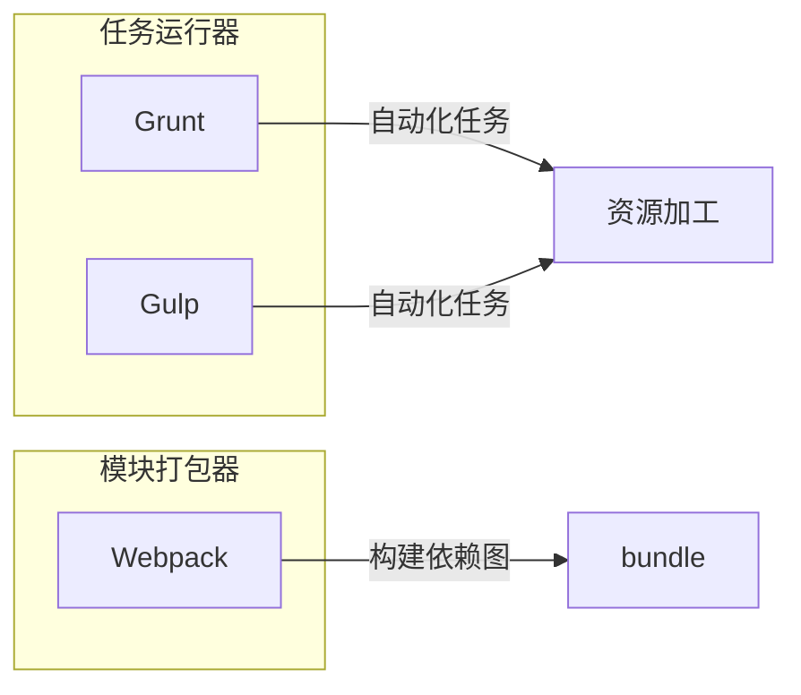

**Grunt、Gulp是基于任务运行的工具**：它们会自动执行指定的任务，就像流水线，把资源放上去然后通过不同插件进行加工，它们包含活跃的社区，丰富的插件，能方便的打造各种工作流。

**Webpack是基于模块化打包的工具:** 自动化处理模块，webpack把一切当成模块，当 webpack 处理应用程序时，它会递归地构建一个依赖关系图 (dependency graph)，其中包含应用程序需要的每个模块，然后将所有这些模块打包成一个或多个 bundle。

因此这是完全不同的两类工具，而现在主流的方式是用npm script代替Grunt、Gulp，npm script同样可以打造任务流。

### 2️⃣ **webpack**、**[rollup](https://rollupjs.org)**、**[parcel](https://parceljs.org)**优劣？

> 💡 **要点**：大型项目选 Webpack（生态强），库开发选 Rollup（Tree-shaking 优秀），实验项目可选 Parcel（零配置）。

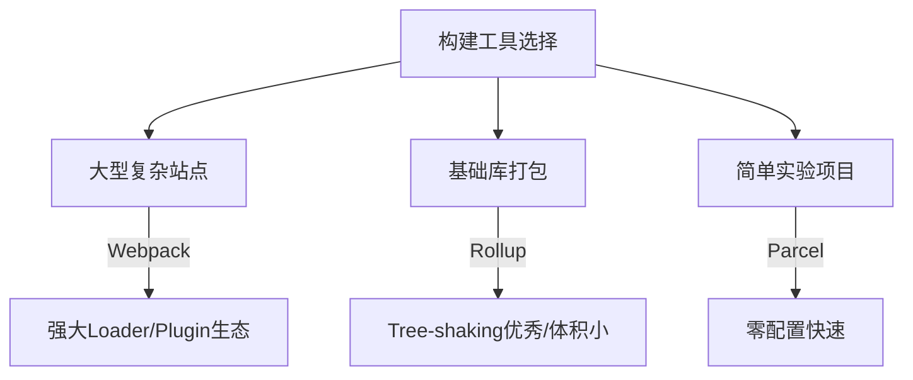

- webpack适用于大型复杂的前端站点构建: webpack有强大的loader和插件生态,打包后的文件实际上就是一个立即执行函数，这个立即执行函数接收一个参数，这个参数是模块对象，键为各个模块的路径，值为模块内容。立即执行函数内部则处理模块之间的引用，执行模块等,这种情况更适合文件依赖复杂的应用开发。
- rollup适用于基础库的打包，如vue、d3等: Rollup 就是将各个模块打包进一个文件中，并且通过 Tree-shaking 来删除无用的代码,可以最大程度上降低代码体积,但是rollup没有webpack如此多的的如代码分割、按需加载等高级功能，其更聚焦于库的打包，因此更适合库的开发。
- parcel适用于简单的实验性项目: 他可以满足低⻔槛的快速看到效果,但是生态差、报错信息不够全面都是他的硬伤，除了一些玩具项目或者实验项目不建议使用。

### 3️⃣ 有哪些常⻅的**Loader**？

> 💡 **要点**：Loader 用于处理非 JS 文件，从右到左链式执行。常见如 babel-loader（ES6→ES5）、css-loader、file-loader 等。

- file-loader：把文件输出到一个文件夹中，在代码中通过相对 URL 去引用输出的文件
- url-loader：和 file-loader 类似，但是能在文件很小的情况下以 base64 的方式把文件内容注入到代码中去
- source-map-loader：加载额外的 Source Map 文件，以方便断点调试
- image-loader：加载并且压缩图片文件
- babel-loader：把 ES6 转换成 ES5
- css-loader：加载 CSS，支持模块化、压缩、文件导入等特性
- style-loader：把 CSS 代码注入到 JavaScript 中，通过 DOM 操作去加载 CSS。
- eslint-loader：通过 ESLint 检查 JavaScript 代码

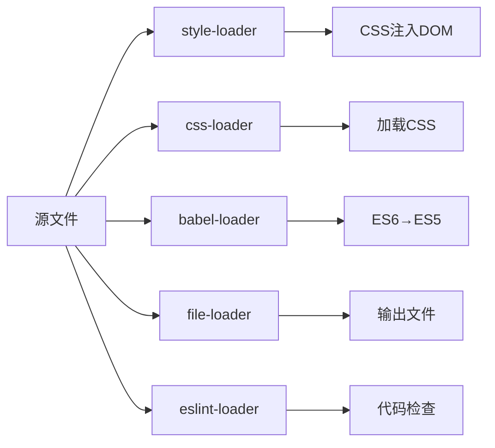

> 💡 **提示**：Loader 的执行顺序是**从右向左**（或从下到上），类似于函数组合 `compose(f, g, x)`。因为 Webpack 选择了 compose 函数式编程方式，这种方式的表达式执行是从右向左的。

### 4️⃣ 有哪些常⻅的**Plugin**？

> 💡 **要点**：Plugin 可监听 Webpack 生命周期事件，实现压缩（UglifyJsPlugin）、提取 CSS（MiniCssExtractPlugin）、分析体积（BundleAnalyzer）等功能。

- define-plugin：定义环境变量
- html-webpack-plugin：简化html文件创建
- uglifyjs-webpack-plugin：通过 UglifyES 压缩 ES6 代码
- webpack-parallel-uglify-plugin: 多核压缩，提高压缩速度
- webpack-bundle-analyzer: 可视化webpack输出文件的体积
- mini-css-extract-plugin: CSS提取到单独的文件中，支持按需加载

### 5️⃣ **bundle**，**chunk**，**module**是什么？

> 💡 **要点**：module 是源码模块，chunk 是多个模块组合的代码块，bundle 是打包输出的最终文件。Webpack 从 entry 递归构建依赖图。

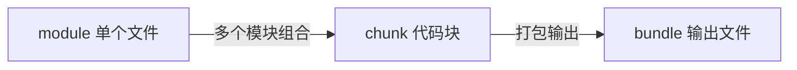

- bundle：是由webpack打包出来的文件；
- chunk：代码块，一个chunk由多个模块组合而成，用于代码的合并和分割；
- module：是开发中的单个模块，在webpack的世界，一切皆模块，一个模块对应一个文件，webpack会从配置的 entry中递归开始找出所有依赖的模块。

### 6️⃣ **Loader**和**Plugin**的不同？

> 💡 **要点**：Loader 在 module.rules 中配置（模块转换规则），Plugin 在 plugins 中配置（扩展构建流程）。Loader 处理文件，Plugin 介入生命周期。

**不同的作用:**

- **Loader**直译为"加载器"。Webpack将一切文件视为模块，但是webpack原生是只能解析js文件，如果想将其他文件也打包的话，就会用到 loader 。 所以Loader的作用是让webpack拥有了加载和解析非JavaScript文件的能力。
- **Plugin**直译为"插件"。Plugin可以扩展webpack的功能，让webpack具有更多的灵活性。 在 Webpack 运行的生命周期中会广播出许多事件，Plugin 可以监听这些事件，在合适的时机通过 Webpack 提供的 API 改变输出结果。

**不同的用法:**

- **Loader**在 module.rules 中配置，也就是说他作为模块的解析规则而存在。 类型为数组，每一项都是一个 Object ，里面描述了对于什么类型的文件（ test ），使用什么加载( loader )和使用的参数（ options ）
- **Plugin**在 plugins 中单独配置。 类型为数组，每一项是一个 plugin 的实例，参数都通过构造函数传入。

### 7️⃣ **webpack**的构建流程**?**

> 💡 **要点**：Webpack 构建流程：初始化参数 → 创建 Compiler → 确定入口 → 递归编译模块（Loader 处理）→ 组装 Chunk → 输出 Bundle → 写入文件。

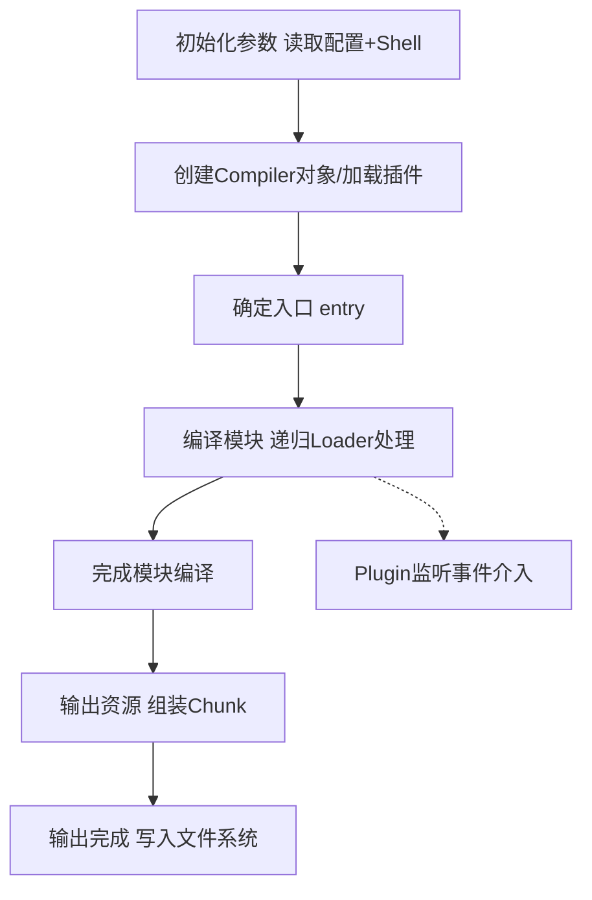

Webpack 的运行流程是一个串行的过程，从启动到结束会依次执行以下流程：

1. 初始化参数：从配置文件和 Shell 语句中读取与合并参数，得出最终的参数；
2. 开始编译：用上一步得到的参数初始化 Compiler 对象，加载所有配置的插件，执行对象的 run 方法开始执行编译；
3. 确定入口：根据配置中的 entry 找出所有的入口文件；
4. 编译模块：从入口文件出发，调用所有配置的 Loader 对模块进行翻译，再找出该模块依赖的模块，再递归本步骤直到所有入口依赖的文件都经过了本步骤的处理；
5. 完成模块编译：在经过第4步使用 Loader 翻译完所有模块后，得到了每个模块被翻译后的最终内容以及它们之间的依赖关系；
6. 输出资源：根据入口和模块之间的依赖关系，组装成一个个包含多个模块的 Chunk，再把每个 Chunk 转换成一个单独的文件加入到输出列表，这步是可以修改输出内容的最后机会；
7. 输出完成：在确定好输出内容后，根据配置确定输出的路径和文件名，把文件内容写入到文件系统。

在以上过程中，Webpack 会在特定的时间点广播出特定的事件，插件在监听到感兴趣的事件后会执行特定的逻辑，并且插件可以调用 Webpack 提供的 API 改变 Webpack 的运行结果。

### 8️⃣ 编写**loader**或**plugin**的思路？

> 💡 **要点**：Loader 是"翻译官"（单一职责），通过链式操作转换文件内容。Plugin 通过监听 Webpack 广播的事件介入构建生命周期。

Loader像一个"翻译官"把读到的源文件内容转义成新的文件内容，并且每个Loader通过链式操作，将源文件一步步翻译成想要的样子。

编写Loader时要遵循单一原则，每个Loader只做一种"转义"工作。每个Loader的拿到的是源文件内容（source），可以通过返回值的方式将处理后的内容输出，也可以调用 this.callback() 方法，将内容返回给webpack。还可以通过this.async() 生成一个 callback 函数，再用这个callback将处理后的内容输出出去。此外 webpack 还为开发者准备了开发loader的工具函数集——loader-utils。

相对于Loader而言，Plugin的编写就灵活了许多。webpack在运行的生命周期中会广播出许多事件，Plugin 可以监听这些事件，在合适的时机通过 Webpack 提供的 API 改变输出结果。

### 9️⃣ **webpack** 热更新的实现原理？

> 💡 **要点**：HMR（热模块替换）通过 WebSocket 推送新模块 hash，浏览器拉取更新代码，HotModulePlugin 对比替换模块，失败则回退到 live reload。

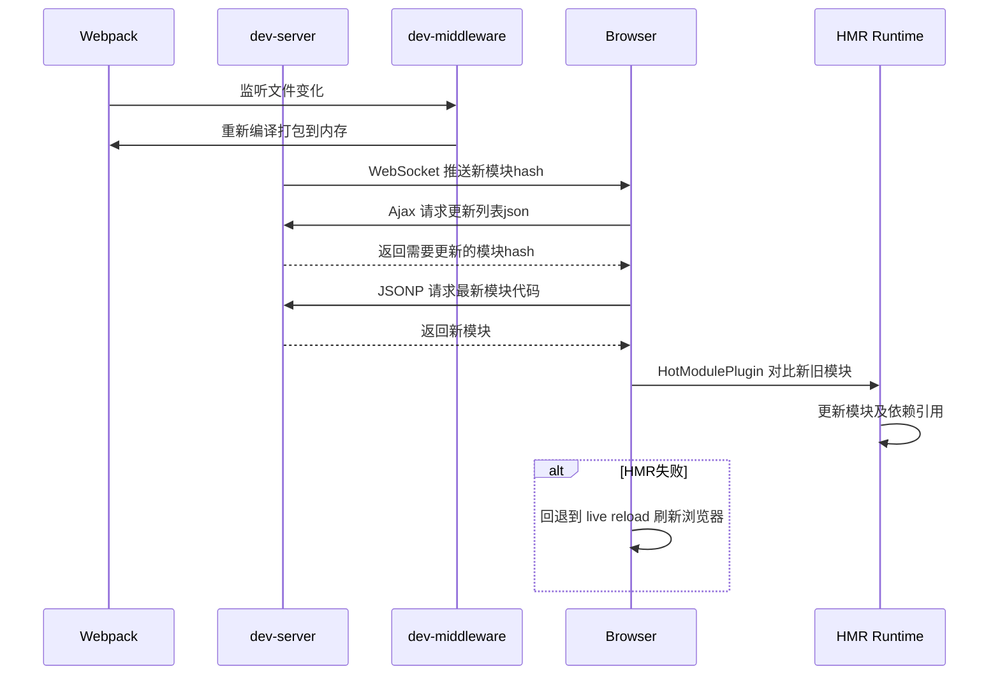

webpack的热更新又称热替换（Hot Module Replacement），缩写为HMR。 这个机制可以做到不用刷新浏览器而将新变更的模块替换掉旧的模块。

原理：

1. 第一步，在 webpack 的 watch 模式下，文件系统中某一个文件发生修改，webpack 监听到文件变化，根据配置文件对模块重新编译打包，并将打包后的代码通过简单的 JavaScript 对象保存在内存中。
2. 第二步是 webpack-dev-server 和 webpack 之间的接口交互，主要是 dev-server 的中间件 webpack-dev-middleware 和 webpack 之间的交互，webpack-dev-middleware 调用 webpack 暴露的 API对代码变化进行监控，并且告诉 webpack，将代码打包到内存中。
3. 第三步是 webpack-dev-server 对文件变化的一个监控，当我们在配置文件中配置了devServer.watchContentBase 为 true 的时候，Server 会监听这些配置文件夹中静态文件的变化，变化后会通知浏览器端对应用进行 live reload。
4. 第四步主要是通过 sockjs 在浏览器端和服务端之间建立一个 websocket ⻓连接，将 webpack 编译打包的各个阶段的状态信息告知浏览器端，浏览器端根据这些 socket 消息进行不同的操作。服务端传递的最主要信息还是新模块的 hash 值。
5. webpack-dev-server/client 端并不能够请求更新的代码，也不会执行热更模块操作，而把这些工作又交回给了webpack，webpack/hot/dev-server 的工作就是根据 webpack-dev-server/client 传给它的信息以及 dev-server 的配置决定是刷新浏览器呢还是进行模块热更新。
6. HotModuleReplacement.runtime 是客户端 HMR 的中枢，它接收到新模块的 hash 值，它通过 JsonpMainTemplate.runtime 向 server 端发送 Ajax 请求，服务端返回一个 json，该 json 包含了所有要更新的模块的 hash 值，获取到更新列表后，该模块再次通过 jsonp 请求，获取到最新的模块代码。
7. 在第 10 步中，HotModulePlugin 将会对新旧模块进行对比，决定是否更新模块，在决定更新模块后，检查模块之间的依赖关系，更新模块的同时更新模块间的依赖引用。
8. 最后一步，当 HMR 失败后，回退到 live reload 操作，也就是进行浏览器刷新来获取最新打包代码。

> 🔥 **Tip**：HMR 的核心价值在于保持应用状态的同时更新模块。相比 live reload 会丢失所有状态，HMR 大幅提升开发体验。

### 1️⃣0️⃣ 如何用**webpack**来优化前端性能？

> 💡 **要点**：核心策略：代码压缩、CDN 加速、Tree Shaking 删除无用代码、Code Splitting 按需加载、SplitChunksPlugin 提取公共库。

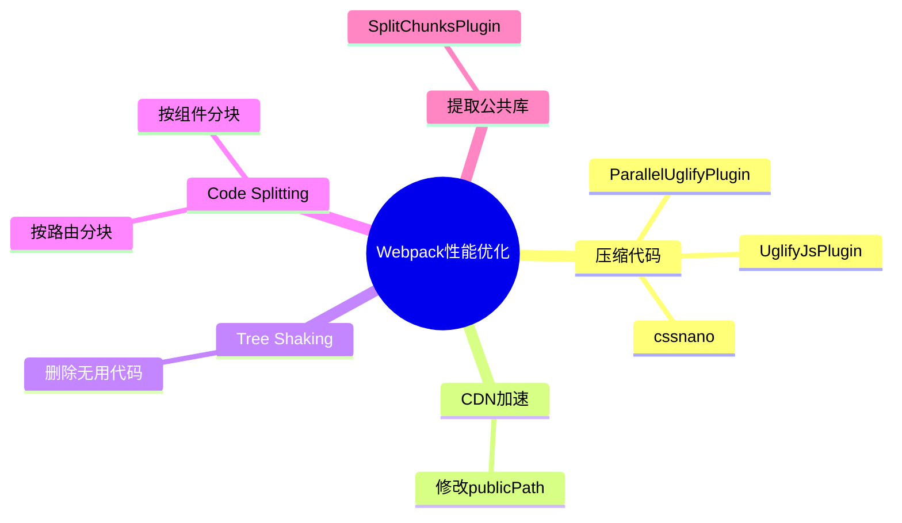

### 1️⃣1️⃣ 如何提高**webpack**的打包速度**?**

> 💡 **要点**：多进程编译（thread-loader）、外部扩展（externals）、Webpack 5 持久化缓存、缓存策略、缩小文件搜索范围（include）。

- thread-loader: 利用进程并行编译loader，替代已废弃的 HappyPack，配置在 babel-loader 前
- 外部扩展(externals): 将不怎么需要更新的第三方库脱离webpack打包，不被打入bundle中，从而减少打包时间，比如jQuery用script标签引入
- Webpack 5 持久化缓存: 设置 `cache: { type: 'filesystem' }`，替代 DllPlugin 的预编译策略，缓存中间产物到磁盘
- 利用缓存: babel-loader.cacheDirectory 可以利用缓存提高rebuild效率
- 缩小文件搜索范围: 比如babel-loader插件,如果你的文件仅存在于src中,那么可以 include: path.resolve(__dirname,'src') ,当然绝大多数情况下这种操作的提升有限，除非不小心build了node_modules文件

### 1️⃣2️⃣ 如何提高**webpack**的构建速度？

> 💡 **要点**：SplitChunksPlugin 提取公共代码、externals 分离第三方库、Webpack 5 持久化缓存、thread-loader 多线程加速。

1. 多入口情况下，使用 SplitChunksPlugin 来提取公共代码（替代已废弃的 CommonsChunkPlugin）
2. 通过 externals 配置来提取常用库
3. 利用 Webpack 5 持久化缓存（`cache: { type: 'filesystem' }`），替代 DllPlugin
4. 使用 thread-loader 实现多线程加速编译（替代已废弃的 HappyPack）
5. 使用 terser-webpack-plugin（Webpack 5 内置，production 模式默认启用）并开启 parallel 提升压缩速度
6. 使用 Tree-shaking 和 Scope Hoisting 来剔除多余代码

### 1️⃣3️⃣ 怎么配置单⻚应用？怎么配置多⻚应用？

> 💡 **要点**：SPA 单入口标准配置即可；MPA 需 AutoWebPlugin 自动化构建，注意公共代码抽离和入口配置灵活性。

单⻚应用可以理解为webpack的标准模式，直接在 entry 中指定单⻚应用的入口即可。多⻚应用的话，可以使用webpack的 AutoWebPlugin 来完成简单自动化的构建，但是前提是项目的目录结构必须遵守他预设的规范。 多⻚应用中要注意的是：

- 每个⻚面都有公共的代码，可以将这些代码抽离出来，避免重复的加载
- 随着业务的不断扩展，⻚面可能会不断的追加，所以一定要让入口的配置足够灵活，避免每次添加新⻚面还需要修改构建配置

---

### 🎯 Webpack 面试题精选

> 💡 **高频考点**：Loader/Plugin 机制、构建流程、HMR 原理、Tree Shaking 条件、代码分割、性能优化。

**1️⃣ Loader 和 Plugin 的本质区别是什么？**

| 维度 | Loader | Plugin |
|------|--------|--------|
| 定位 | 模块转换器 | 构建扩展器 |
| 运行时机 | 模块解析阶段（编译前/中） | 整个构建生命周期（hook） |
| 输入输出 | 接收源文件内容，返回转换后内容 | 接收 compiler/compilation 对象，无直接 I/O |
| 数量 | 每个模块可链式使用多个 | 多个 Plugin 各司其职 |
| 配置方式 | `module.rules` 数组 | `plugins` 数组（实例化） |

```javascript
// Loader 本质：导出函数的模块
export default function loader(source) {
  const result = source.replace(/console\.log\(.+?\)/g, '')
  return result
}

// Plugin 本质：包含 apply 方法的类
class MyPlugin {
  apply(compiler) {
    compiler.hooks.emit.tapAsync('MyPlugin', (compilation, callback) => {
      compilation.assets['my-file.js'] = { source: () => '// injected', size: () => 12 }
      callback()
    })
  }
}
```

**2️⃣ Webpack 构建流程（编译全链路）**


关键阶段：（1）**初始化**：合并配置、创建 Compiler、注册 Plugin；（2）**构建**：从 entry 递归解析模块，Loader 逐个转换；（3）**生成**：组装 Chunk → Tree Shaking → 代码分割 → 输出 assets。

**3️⃣ Tree Shaking 的实现条件和原理？**

必要条件：ES Module 静态结构（`import`/`export` 顶层声明，不可动态）。

| 条件 | 说明 |
|------|------|
| **ESM** | 必须是 `import`/`export`，CommonJS 不支持 |
| **sideEffects** | `package.json` 中标记 `"sideEffects": false`，告知 Webpack 可安全移除 |
| **生产模式** | `mode: 'production'` 自动启用 TerserPlugin 擦除死代码 |
| **usedExports** | `optimization.usedExports: true` 标记未使用导出（默认开启） |

原理：Webpack 静态分析模块导出，标记已使用的 export，再交由 TerserPlugin 擦除未标记的死代码。

**4️⃣ 代码分割的几种方式？**

```javascript
// 方式1：多入口 entry
module.exports = { entry: { pageA: './src/pageA.js', pageB: './src/pageB.js' } }

// 方式2：SplitChunksPlugin（提取公共依赖）
module.exports = {
  optimization: {
    splitChunks: {
      chunks: 'all',
      cacheGroups: {
        vendor: { test: /[\\/]node_modules[\\/]/, name: 'vendor', chunks: 'all' }
      }
    }
  }
}

// 方式3：动态 import（懒加载）
const Admin = () => import('./pages/Admin.vue')
```

最佳实践：vendor 包独立 chunk（长期缓存），按路由/页面做懒加载，公共组件提取公共 chunk。

**5️⃣ Webpack HMR 为什么大型项目越来越慢？**

模块越多 → 构建依赖图越庞大 → 每次变更需要重新编译整个 chunk/module 链。Webpack 每次 HMR 都要重建模块依赖关系、生成新的 bundle 片段、通过 WebSocket 推送完整代码块。而 Vite 仅编译单个变更的 ESM 文件，浏览器原生加载，复杂度始终为 O(1)。

**6️⃣ Webpack 5 相比 4 的核心改进？**
- **持久化缓存**（Persistent Cache）：二级缓存（内存 + 磁盘），二次构建提速 80%
- **Module Federation**：运行时加载远程模块
- **Tree Shaking 增强**：嵌套模块的深层分析
- **HMR 改进**：`output.clean` 替代 CleanWebpackPlugin
- **内置资源模块**（Asset Modules）：替代 `file-loader`/`url-loader`/`raw-loader`

**📊 知识体系盘点（Webpack 核心能力矩阵）**

| 能力维度 | 核心机制 | 关键技术 | 面试深度 |
|---------|---------|---------|---------|
| **模块打包** | 依赖图递归构建 | Loader 链 / Plugin 系统 | ⭐⭐⭐⭐⭐ |
| **代码优化** | Tree Shaking / 压缩 | TerserPlugin / sideEffects | ⭐⭐⭐⭐ |
| **代码分割** | SplitChunks / 动态 import | cacheGroups / lazy loading | ⭐⭐⭐⭐ |
| **开发体验** | HMR / SourceMap | WebSocket / dev-server | ⭐⭐⭐ |
| **生态集成** | Loader + Plugin | 社区 10000+ 插件 | ⭐⭐⭐⭐ |

**🎯 应用场景与选型建议**

| 场景 | 推荐程度 | 理由 |
|------|---------|------|
| 大型存量项目（Webpack 4/5） | ✅ 首选 | 生态成熟，存量 Loader/Plugin 无需迁移 |
| 微前端主应用（Module Federation） | ✅ 首选 | MF 为 Webpack 5 原生功能 |
| 新项目（中小型） | ❌ 不推荐 | Vite 开发体验更好，启动更快 |
| 组件库/库开发 | ⚠️ 可用但非最佳 | Rollup Tree Shaking 更彻底 |
| 需要兼容 IE11 / 旧浏览器 | ✅ 可选 | Webpack 的 CJS 兼容性处理最成熟 |

**⚠️ Webpack 优劣势总览**

| 维度 | 优势 | 劣势 |
|------|------|------|
| **生态** | 最丰富的 Loader/Plugin 生态（10000+） | 配置复杂，学习曲线陡峭 |
| **功能** | 功能最全面（代码分割、MF、HMR 等） | 部分功能有更优替代（如 MF 可用 wujie） |
| **性能** | 5.x 持久化缓存大幅提速 | 冷启动/热更新远慢于 Vite |
| **社区** | 文档最完善，问题可搜索最多 | Rust 工具链正在快速取代 |
| **维护** | 活跃维护，Webpack 5 LTS | 创新放缓，重心转向 Turbopack/Rspack |

---

## 🔧 三、[Babel](https://babeljs.io)

### 1️⃣ **Babel**的原理是什么**?**

> 💡 **要点**：Babel 三步流程：Parse（词法+语法分析生成 AST）→ Transform（traverse 遍历修改 AST）→ Generate（AST 转回代码）。这是所有编译工具的通用范式。


babel 的转译过程也分为三个阶段：

- **解析 Parse**: 将代码解析生成抽象语法树（AST），即词法分析与语法分析的过程；
- **转换 Transform**: 对于 AST 进行变换一系列的操作，babel 接受得到 AST 并通过 babel-traverse 对其进行遍历，在此过程中进行添加、更新及移除等操作；
- **生成 Generate**: 将变换后的 AST 再转换为 JS 代码, 使用到的模块是 babel-generator。

> 📝 **总结**：Babel 的"解析 → 转换 → 生成"三步流程是所有编译工具的通用范式，SWC、esbuild 等现代工具也遵循类似的架构。

---

### 🎯 Babel 面试题精选

> 💡 **高频考点**：编译原理三阶段、AST 操作、Polyfill 策略（@babel/polyfill vs core-js）、Plugin/Preset 区别、配置方式。

**1️⃣ Babel 编译流程的三阶段是什么？**


解析（@babel/parser）→ 转换（@babel/traverse + plugins/presets）→ 生成（@babel/generator）。

**2️⃣ Babel Plugin 和 Preset 的区别与执行顺序？**

| 维度 | Plugin | Preset |
|------|--------|--------|
| 定位 | 单个转换功能 | 一组 Plugin 的集合 |
| 示例 | `@babel/plugin-transform-arrow-functions` | `@babel/preset-env` |
| 执行顺序 | Plugin **先于** Preset | Plugin 从左到右，Preset **从右到左** |
| 配置 | 细粒度控制 | 开箱即用（按目标环境） |

```javascript
// babel.config.js - 执行顺序：myPlugin → preset-react → preset-env
module.exports = {
  plugins: ['myPlugin'],
  presets: ['@babel/preset-env', '@babel/preset-react'],
}
```

**3️⃣ `@babel/preset-env` 和 `core-js` 如何实现按需 Polyfill？**

```javascript
// babel.config.js - useBuiltIns 按需注入
module.exports = {
  presets: [
    ['@babel/preset-env', {
      targets: { browsers: ['> 1%', 'last 2 versions'] },
      useBuiltIns: 'usage',   // 'entry' | 'usage' | false
      corejs: 3,
    }],
  ],
}
```

- `useBuiltIns: 'usage'`：自动检测代码中用到的 ES6+ API，仅注入对应的 polyfill
- `useBuiltIns: 'entry'`：根据 targets 在入口全量引入所需 polyfill
- `useBuiltIns: false`：不自动 polyfill，手动引入
- core-js 3 支持所有新 API（含 `Array.prototype.flat`、`globalThis` 等）

**4️⃣ Babel 和 TypeScript 编译的区别？**

| 对比 | Babel + @babel/preset-typescript | tsc（TypeScript 编译器） |
|------|----------------------------------|--------------------------|
| 类型检查 | ❌ 不检查，仅剥离类型 | ✅ 完整类型检查 |
| 速度 | 快（仅剥离类型，不进行类型分析） | 慢（完整类型推导和检查） |
| 输出 | CJS/ESM/UMD 均可 | 仅 JS 代码 |
| Polyfill | 配合 core-js 灵活控制 | 不处理 polyfill |
| 最佳实践 | **开发用 tsc 检查，构建用 Babel 编译** |

**5️⃣ 手写一个简单的 Babel Plugin？**

```javascript
// babel-plugin-remove-console.js
module.exports = function () {
  return {
    visitor: {
      CallExpression(path) {
        const callee = path.get('callee')
        if (callee.isMemberExpression()
          && callee.get('object').isIdentifier({ name: 'console' })
          && callee.get('property').isIdentifier({ name: 'log' })) {
          path.remove() // 移除所有 console.log 调用
        }
      },
    },
  }
}
```

**6️⃣ Babel 6 → 7 → 8 的关键变化？**
- **Babel 7**：`babel-*` → `@babel/*` 命名空间，`preset-env` 取代 `preset-es2015/2016/2017`，支持 TypeScript，`babel.config.js` 项目级配置
- **Babel 8**：默认 `useBuiltIns: 'usage'`，移除 `@babel/polyfill`，完全采用 `core-js` 3，性能优化 30%，移除 `babel-upgrade` 等废弃工具

**📊 知识体系盘点（Babel 核心能力矩阵）**

| 能力维度 | 核心机制 | 关键技术 | 面试深度 |
|---------|---------|---------|---------|
| **编译原理** | Parse → Transform → Generate | 词法/语法分析、AST、Visitor | ⭐⭐⭐⭐⭐ |
| **Polyfill** | 按需注入 + core-js | preset-env / useBuiltIns | ⭐⭐⭐⭐ |
| **插件体系** | Plugin + Preset | 执行顺序、自定义 Plugin | ⭐⭐⭐⭐ |
| **TypeScript** | 类型剥离 vs 类型检查 | @babel/preset-typescript | ⭐⭐⭐ |
| **工具链集成** | Webpack / Vite / CLI | babel-loader / vite-plugin | ⭐⭐⭐ |

**🎯 应用场景与选型建议**

| 场景 | 推荐方案 | 理由 |
|------|---------|------|
| 老旧项目兼容 IE11/ES5 | ✅ Babel + preset-env + core-js | 最成熟的降级方案 |
| 新 TypeScript 项目 | ⚠️ Babel 剥离类型 + tsc 单独检查 | 开发 tsc 检查，构建 Babel 转译 |
| 库/组件库发布 | ✅ @babel/preset-env + @babel/preset-react | 输出 CJS/ESM 双格式 |
| 极致构建速度需求 | ❌ 考虑 SWC（快 10-15x） | Babel 是 JS 编写，SWC 是 Rust |
| 自定义代码转换（如国际化） | ✅ 手写 Babel Plugin | Visitor 模式灵活强大 |

**⚠️ Babel vs SWC 优劣势对比（2026 年视角）**

| 维度 | Babel | SWC |
|------|-------|-----|
| **速度** | 慢（JS 解释执行） | 快 10-15x（Rust 编译执行） |
| **生态** | 最丰富（10000+ Plugin） | 快速增长，核心功能完善 |
| **配置复杂度** | 中等（preset/plugin 组合） | 低（开箱即用） |
| **Polyfill** | core-js 深度集成 | 需配合 Babel 做 polyfill |
| **TypeScript** | 仅剥离类型（快） | 原生支持 + 类型检查 |
| **调试友好度** | 极高（成熟 SourceMap） | 良好，偶有兼容问题 |

---

## 🏗️ 四、现代构建工具

### 1️⃣ [Vite](https://vite.dev)

> 💡 **要点**：基于 ESM 的开发服务器，[esbuild](https://esbuild.github.io) 预构建依赖实现秒级启动，生产构建使用 Rollup。热更新仅编译变更模块，大型项目中大幅优于 Webpack。2024-2026 年已成为前端新项目主流选择。

Vite 是由 Vue 作者 Evan You 开发的下一代前端构建工具，目前已成为 Vue、React、Svelte 官方推荐构建工具。

**基于 ES Module 的开发服务器：**
- 开发阶段无需打包，浏览器直接通过 `<script type="module">` 加载 ESM
- 服务器按需编译，仅编译当前页面需要的模块
- 利用浏览器原生解析，省去打包时间

**为什么比 Webpack 快：**
- Webpack 冷启动需要全量打包构建依赖图，项目越大越慢
- Vite 冷启动：esbuild 预构建依赖 + 按需编译源码 → 秒级启动
- 依赖预构建使用 esbuild（Go 编写），比 Webpack 使用 JavaScript 快 10-100 倍

**热更新原理（与 Webpack 对比）：**

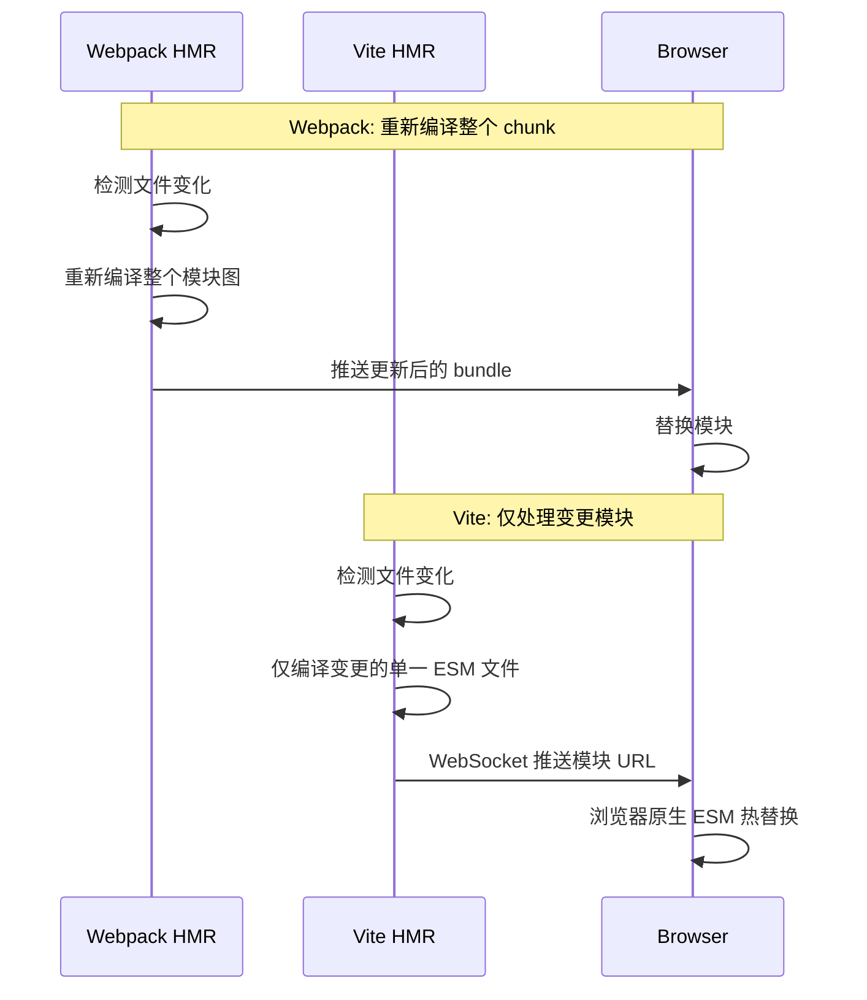

- Webpack HMR：文件变化 → 重新打包整个模块链 → 推送完整 chunk
- Vite HMR：文件变化 → 仅编译变更文件 → 推送 ESM 更新 URL → 浏览器原生加载
- 大型项目中 Vite 热更新保持在毫秒级，Webpack 随项目增大线性变慢

**构建基于 Rollup：**
- 生产构建使用 Rollup，成熟的 Tree-shaking 和代码分割
- 提供 Rollup 兼容层，可使用 @rollup/plugin-* 插件

**插件机制：**
- 兼容 Rollup 插件接口
- Vite 特有钩子：config、configResolved、configureServer 等
- 官方插件：@vitejs/plugin-vue、@vitejs/plugin-react

**与 Vue/React 的集成：**
- Vue：@vitejs/plugin-vue（SFC 支持）、@vitejs/plugin-vue-jsx
- React：@vitejs/plugin-react（Fast Refresh、JSX 编译）
- 脚手架工具：create-vite 快速创建项目

**Vite vs Webpack 详细对比：**

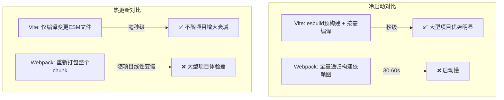

| 对比维度 | Vite (v8) | Webpack (v5) |
|---------|-----------|--------------|
| **核心架构** | 开发 ESM 原生，构建 Rollup | 全量打包，兼容 CJS/ESM |
| **冷启动速度** | 秒级（esbuild 预构建） | 30-60s（全量构建） |
| **HMR 速度** | 毫秒级，不随项目增大衰减 | 随项目增大线性变慢 |
| **生产构建** | Rollup 构建，Tree-shaking 强 | 功能全面但输出较大 |
| **配置复杂度** | 零配置起步，渐进式 | 配置繁多，学习曲线陡 |
| **ESM 兼容** | 原生支持，开发直接加载 ESM | 需构建后支持 |
| **TypeScript** | 原生支持，esbuild 转译 | 需 ts-loader / babel-loader |
| **CSS 处理** | 内置 PostCSS / CSS Modules | 需额外 loader 配置 |
| **代码分割** | manualChunks 配置 | SplitChunksPlugin（更灵活） |
| **微前端** | 需插件（vite-plugin-federation） | Module Federation 原生 |
| **SSR** | 内置 SSR 构建支持 | 需额外 node 配置 |
| **插件生态** | Rollup 兼容 + Vite 特有 | 最丰富的 Loader/Plugin 生态 |
| **适用场景** | 新项目 / 现代浏览器 | 存量项目 / 复杂兼容需求 |

**Vite 配置要点对比 Webpack：**

```javascript
// vite.config.js - 简洁配置
import { defineConfig } from 'vite'
import react from '@vitejs/plugin-react'
import path from 'path'

export default defineConfig({
  plugins: [react()],
  resolve: {
    alias: { '@': path.resolve(__dirname, 'src') }
  },
  build: {
    rollupOptions: {
      output: {
        manualChunks: {
          vendor: ['react', 'react-dom'],
          utils: ['lodash-es']
        }
      }
    },
    target: 'es2020' // 现代浏览器，默认 es2020
  },
  server: {
    port: 3000,
    proxy: {
      '/api': 'http://localhost:8080'
    }
  }
})
```

```javascript
// webpack.config.js - 等效配置更复杂
const path = require('path')
const HtmlWebpackPlugin = require('html-webpack-plugin')

module.exports = {
  entry: './src/main.jsx',
  output: {
    path: path.resolve(__dirname, 'dist'),
    filename: '[name].[contenthash].js'
  },
  resolve: {
    alias: { '@': path.resolve(__dirname, 'src') },
    extensions: ['.js', '.jsx', '.ts', '.tsx']
  },
  module: {
    rules: [
      { test: /\.jsx?$/, exclude: /node_modules/, use: 'babel-loader' },
      { test: /\.tsx?$/, exclude: /node_modules/, use: 'ts-loader' },
      { test: /\.css$/, use: ['style-loader', 'css-loader', 'postcss-loader'] }
    ]
  },
  plugins: [new HtmlWebpackPlugin({ template: './index.html' })],
  devServer: { port: 3000, proxy: { '/api': 'http://localhost:8080' } },
  optimization: {
    splitChunks: { chunks: 'all', cacheGroups: { vendor: { test: /[\\/]node_modules[\\/]/, name: 'vendor' } } }
  }
}
```

> 💡 **总结**：Vite 通过架构创新（ESM 开发 + esbuild 预构建 + Rolldown 生产）解决了 Webpack 冷启动慢和 HMR 随项目增大衰减的核心痛点，已成为新项目的事实标准。存量 Webpack 项目不建议大规模重构，可考虑渐进迁移或使用 Rspack 作为替代。

### 🎯 Vite 面试题精选

> 💡 **高频考点**：Vite 的 ESM 架构、HMR 原理、与 Webpack 对比、预构建机制、SSR 支持。

**1️⃣ Vite 的开发服务器为什么比 Webpack 快？**

核心在于 Vite 利用浏览器原生 ESM 支持，开发阶段无需打包：

| 环节 | Webpack | Vite |
|------|---------|------|
| 冷启动 | 全量递归构建依赖图，生成一个完整 bundle | esbuild 预构建依赖（Go 编写，快 10-100x），源码按需编译 |
| 热更新 | 重新编译整个 chunk，随项目增大线性变慢 | 仅编译变更的单一 ESM 文件，浏览器原生替换 |
| 依赖处理 | 全部打包到 bundle | 预构建后缓存，浏览器直接加载 ESM |

**2️⃣ Vite 为什么生产构建用 Rollup 而不是 esbuild？**

> 💡 **要点**：esbuild 速度快但缺乏成熟的 Tree Shaking 和代码分割能力，Rollup 生态更完善。

- **Tree Shaking**：Rollup 的 Tree Shaking 更成熟可靠，能深度消除未使用代码
- **代码分割**：Rollup 的 `manualChunks` 比 esbuild 更灵活精细
- **插件生态**：Rollup 有大量生产级插件，esbuild 插件生态弱
- **产物质量**：Rollup 对 ESM/CJS 互操作、chunk 命名、sourcemap 等处理更好
- **Rolldown**：Vite 8 已默认使用 Rust Rolldown 替代 Rollup，兼顾速度与功能

**3️⃣ Vite 如何处理 CSS、图片等静态资源？**

Vite 通过内置机制处理，无需额外配置：

```javascript
// vite.config.js
import { defineConfig } from 'vite'

export default defineConfig({
  // CSS: 内置 PostCSS、CSS Modules、CSS 预处理器
  css: {
    modules: { localsConvention: 'camelCaseOnly' },
    preprocessorOptions: {
      scss: { additionalData: `@import "./src/styles/variables.scss";` }
    }
  },
  // 静态资源: 小于阈值自动内联为 base64
  build: {
    assetsInlineLimit: 4096, // 4KB
    assetsDir: 'assets',     // 资源输出目录
  }
})
```

- CSS：内置 PostCSS、CSS Modules、Less/Sass/Stylus 支持
- 图片/字体：自动处理为内联（< 4KB）或独立文件
- JSON：自动 Tree Shaking
- WASM：`?init` 后缀导入
- Web Worker：`?worker` 后缀导入

**4️⃣ Vite 的依赖预构建解决了什么问题？**

> 💡 **要点**：将 CJS/UMD 依赖转为 ESM，合并大量内部模块减少 HTTP 请求。

- **CJS → ESM 转换**：很多 npm 包仍是 CJS 格式，浏览器无法直接加载
- **请求瀑布**：lodash-es 等 ESM 包有数百个内部文件，裸加载会产生大量请求
- **实现方式**：esbuild 快速预构建并缓存到 `node_modules/.vite/deps/`，依据 lock 文件变更自动失效重建

**5️⃣ Vite 的 HMR 实现原理是怎样的？**

> 💡 **要点**：基于 WebSocket 推送模块 URL，浏览器原生 ESM 热替换。

1. 文件变更 → Vite 开发服务器监听文件系统
2. 仅编译变更文件，生成对应的 ESM 模块 URL
3. 通过 WebSocket 将新模块 URL 推送到浏览器
4. 浏览器用动态 `import()` 加载新模块，替换旧模块

与 Webpack 的本质区别：Webpack 重新打包整个 chunk 推送完整 bundle；Vite 仅编译单个 ESM 文件推送 URL，浏览器原生加载。

**6️⃣ Vite 的 `defineConfig` 和 `loadEnv` 有什么作用？**

```javascript
import { defineConfig, loadEnv } from 'vite'

export default defineConfig(({ command, mode }) => {
  // 加载环境变量
  const env = loadEnv(mode, process.cwd(), 'VITE_')
  return {
    define: {
      __APP_VERSION__: JSON.stringify(env.VITE_APP_VERSION),
    },
    // command: 'serve' | 'build'
    // mode: 'development' | 'production'
  }
})
```

- **`defineConfig`**：提供 TypeScript 类型提示，支持函数式配置（根据 command/mode 动态返回）
- **`loadEnv`**：加载指定 `mode` 下的环境变量，`VITE_` 前缀自动暴露给客户端（`import.meta.env`）

**7️⃣ Vite 如何支持 SSR？**

Vite 内置 SSR 支持，无需额外工具：

```javascript
export default defineConfig({
  ssr: {
    external: ['react', 'react-dom/server'],
    noExternal: ['some-esm-only-package'],
  },
  build: {
    ssr: 'src/entry-server.ts',
    outDir: 'dist/server',
  }
})
```

- 开发阶段：Node.js 直接加载 ESM 源码，HMR 同样适用
- 生产构建：单独输出 SSR 包（CJS 格式），便于 Node.js 环境使用
- 流式 SSR：支持 `renderToPipeableStream`（React 18+）

**8️⃣ Vite 的插件机制与 Rollup 插件有何关系？**

- Vite 完全兼容 Rollup 插件（实现 Rollup 插件接口）
- Vite 扩展了独有钩子：`config`、`configResolved`、`configureServer`、`transformIndexHtml`、`handleHotUpdate`
- 开发阶段：插件作用于按需编译的 ESM 文件
- 构建阶段：插件直接传递给 Rollup/Rolldown

**9️⃣ Vite 8 相比 Vite 7 有哪些关键更新？**

| 特性 | Vite 7 | Vite 8 |
|------|--------|--------|
| 生产构建 | Rolldown | Rolldown 稳定版（Rust，快 5-8x） |
| HMR 延迟 | ~30ms | ~15ms（减少 50%） |
| SSR 构建 | 内置优化 | 原生边缘 SSR、Server Components |
| 内存使用 | 降低 30% | 再降低 20% |
| CSS 处理 | Lightning CSS | Lightning CSS + 自动代码分割 |
| 多框架 SSR | 需手动配置 | 自动检测框架、开箱即用 |

**🔟 Vite 项目如何进行性能优化？**

**配置层面：**
```javascript
export default defineConfig({
  build: {
    target: 'es2020',
    minify: 'esbuild',
    sourcemap: false,
    rollupOptions: {
      output: {
        manualChunks(id) {
          if (id.includes('node_modules')) {
            if (id.includes('react')) return 'react-vendor'
            if (id.includes('antd')) return 'antd'
            return 'vendor'
          }
        }
      }
    }
  },
  server: {
    warmup: {
      clientFiles: ['./src/pages/**/*.tsx', './src/components/**/*.tsx']
    }
  }
})
```

**工程层面：**
- 代码分割：`manualChunks` 拆分 vendor/UI 库/业务代码
- 懒加载：路由和组件使用 `import()` 动态导入
- 依赖优化：`optimizeDeps.include` 强制预构建
- 图片压缩：`vite-plugin-imagemin`
- Gzip/Brotli：`vite-plugin-compression`
- PWA：`vite-plugin-pwa`

**1️⃣1️⃣ Vite 和 Webpack 在微前端场景下如何选择？**

| 维度 | Vite + vite-plugin-federation | Webpack + Module Federation |
|------|-------------------------------|----------------------------|
| 成熟度 | 快速发展中 | 非常成熟 |
| 构建速度 | 快（开发/生产） | 慢（尤其大型项目） |
| 推荐场景 | 新项目、中小型微前端 | 大型存量项目、复杂依赖共享 |

**推荐方案：** Module Federation（`vite-plugin-federation` / `@module-federation/vite`）> Web Components > iframe > 基座模式（qiankun/wujie）

**1️⃣2️⃣ Vite 为什么选择 esbuild 做预构建而不是全流程？**

> 💡 **要点**：esbuild 快但不灵活，适合重复性高的预构建；Rollup/Rolldown 慢但功能强，适合需要 Tree Shaking 的生产构建。

**esbuild 优势：** 启动极快，适合频繁预构建；做 CJS→ESM 转换、模块合并；不涉及 Tree Shaking

**esbuild 不足：** Tree Shaking 不够精细；代码分割能力弱；插件生态弱；不支持代码降级

**总结：** 各取所长——esbuild 负责"快"的预构建、转译、压缩；Rollup/Rolldown 负责"精"的生产打包优化。

**1️⃣3️⃣ Vite 8 为什么要从 Rollup 迁移到 Rolldown？迁移成本和注意事项有哪些？**

> 💡 **要点**：Rolldown 是 Vite 团队用 Rust 开发的 Rollup 替代品，兼容 Rollup API 但性能提升 5-8x。Vite 8 默认使用 Rolldown 生产构建，迁移对大多数项目透明。

**为什么迁移？**

| 维度 | Rollup（JS） | Rolldown（Rust） |
|------|-------------|-----------------|
| **语言** | JavaScript | Rust（通过 napi-rs 提供 Node.js 绑定） |
| **打包速度** | 基准 | 快 5-8x（大型项目 10x+） |
| **并行能力** | 单线程 | 多线程并行解析/代码生成 |
| **内存占用** | 高（AST 常驻 + GC 压力） | 低（Rust 所有权系统，无 GC） |
| **Tree Shaking** | 成熟 | 兼容 Rollup 实现 + 增量分析 |
| **插件 API** | Rollup 插件接口 | **完全兼容 Rollup 插件接口** |

**Rolldown 的核心架构优势：**

```mermaid
flowchart LR
    subgraph Rollup JS 架构
        A["JS 解析器"] --> B["AST（JS 堆内存）"]
        B --> C["GC 回收"]
        C --> D["串行代码生成"]
    end
    subgraph Rolldown Rust 架构
        E["Rust 解析（oxc_resolver）"] --> F["AST（Rust 原生内存）"]
        F --> G["并行代码生成"]
        G --> H["零拷贝输出"]
    end
```

- **Rust 解析器**：使用 oxc（ oxidized compiler）解析，比 acorn（Rollup 使用的 JS 解析器）快 20x
- **零拷贝 AST**：AST 在 Rust 层直接处理，无需序列化到 JS 堆
- **并行代码生成**：无依赖的 chunk 可以并行生成，Rollup 只能串行
- **增量编译**：缓存中间产物，仅重新处理变更模块

**迁移成本评估：**

| 场景 | 迁移成本 | 说明 |
|------|---------|------|
| 纯 Vite 项目（无自定义 Rollup 插件） | **几乎为零** | `vite.config.ts` 无需修改，Rolldown 自动生效 |
| 使用了 Rollup 插件 | **低** | Rolldown 兼容大部分 Rollup 插件，少数需适配 |
| 自定义 `output.manualChunks` | **零成本** | API 完全兼容，配置不变 |
| 使用了 `@rollup/plugin-*` | **低** | 主流插件已兼容，不兼容的有替代方案 |
| 自定义 Rollup 插件（使用 Rollup 内部 hook） | **中** | 需检查 Rolldown 兼容性矩阵 |

**Vite 7 → Vite 8 构建配置变化示例：**

```javascript
// vite.config.ts — Vite 7 配置（底层 Rollup）
export default defineConfig({
  build: {
    rollupOptions: {
      output: {
        manualChunks: { vendor: ['react', 'react-dom'] }
      }
    }
  }
})

// vite.config.ts — Vite 8 配置（底层 Rolldown，API 不变）
export default defineConfig({
  build: {
    rollupOptions: {
      output: {
        manualChunks: { vendor: ['react', 'react-dom'] }
      }
    }
    // Vite 8 新增 Rolldown 专属优化选项
    modulePreload: { polyfill: false }, // Rolldown 原生支持
    cssMinify: 'lightningcss',          // Lightning CSS 集成
  }
})
```

**潜在 Breaking Changes 注意事项：**

| 变更点 | 影响 | 迁移措施 |
|-------|------|---------|
| `this.parse` 在 Rolldown 中行为差异 | 自定义插件中直接调用 JS 解析器 | 使用 Rolldown 兼容 API |
| `emitFile` 的 `referenceId` 格式变化 | 少数组件引用方式不同 | 升级插件版本 |
| CSS 处理从 PostCSS 迁移到 Lightning CSS | 少数 PostCSS 插件可能不兼容 | 检查 PostCSS 插件兼容性 |
| 模块解析不再遵循 `resolveId` 的完整 Rollup 语义 | 自定义 resolve 插件需调整 | 使用 `@rolldown/plugin-compat` |

**性能数据实测（1000 模块项目）：**

```bash
# 生产构建时间对比
Vite 7 (Rollup):  ~15s
Vite 8 (Rolldown): ~2s    # 提升 7.5x

# 内存使用
Vite 7 (Rollup):  ~500MB
Vite 8 (Rolldown): ~180MB  # 降低 64%

# 首屏构建（冷启动）
Vite 7: ~20s
Vite 8: ~3s
```

**总结：** Rolldown 迁移对绝大多数项目是透明的，核心收益是生产构建速度提升 5-8x、内存降低 60%+。只有深度使用 Rollup 自定义插件的项目需要少量适配工作。Vite 8 的 Rolldown 迁移策略是"兼容优先"，确保现有配置不做任何修改即可获得性能提升。

**1️⃣4️⃣ Vite 的 `manualChunks` 配置原理是什么？splitChunks 和它有什么区别？**

> 💡 **要点**：`manualChunks` 是 `build.rollupOptions.output` 下的配置项，用于自定义代码分割策略，决定哪些模块被打包到同一个 chunk 中。Vite 8 中该配置兼容 Rolldown。它与 Webpack 的 `splitChunks` 实现机制完全不同。

**`manualChunks` 的本质：**

```mermaid
flowchart LR
    subgraph Vite 构建流程
        A["源码模块"] --> B["依赖图构建"]
        B --> C["Tree Shaking"]
        C --> D["Chunk 分组阶段"]
        D --> E["manualChunks 介入"]
        E --> F["输出 Chunk 文件"]
    end
```

`manualChunks` 在 Rollup/Rolldown 的 **chunk 分组阶段** 介入，决定模块 → chunk 的映射关系。

**两种配置方式：**

```javascript
// vite.config.ts
export default defineConfig({
  build: {
    rollupOptions: {
      output: {
        // 方式一：对象形式 — 按模块路径匹配
        manualChunks: {
          'react-vendor': ['react', 'react-dom', 'react-router-dom'],
          'ui-vendor': ['antd', '@ant-design/icons'],
          'utils': ['lodash-es', 'dayjs'],
        },
        // 方式二：函数形式 — 动态决策
        manualChunks(id, { getModuleInfo, getModuleIds }) {
          // id: 模块的绝对路径
          // getModuleInfo: 获取模块元信息
          // getModuleIds: 获取所有模块 ID

          if (id.includes('node_modules')) {
            // 按包名分组到 vendor
            if (id.includes('react')) return 'react-vendor'
            if (id.includes('antd')) return 'antd'
            return 'vendor' // 兜底 vendor
          }
          // 按目录分组业务代码
          if (id.includes('/src/pages/')) {
            const match = id.match(/\/src\/pages\/([^/]+)\//)
            if (match) return `page-${match[1]}`
          }
        }
      }
    }
  }
})
```

**函数形式的参数详解：**

| 参数 | 类型 | 说明 | 使用场景 |
|------|------|------|---------|
| `id` | `string` | 模块绝对路径 | 按路径/包名分组 |
| `getModuleInfo(moduleId)` | `(id: string) => ModuleInfo` | 获取模块的元信息（导入导出、依赖关系） | 按模块特性分组 |
| `getModuleIds()` | `() => Iterable<string>` | 获取所有模块 ID | 全局分析后决策 |

**`manualChunks` 的工作原理（底层 chunk 分配算法）：**

```mermaid
flowchart TD
    A["模块 A (react)"] --> D{manualChunks 匹配?}
    B["模块 B (react-dom)"] --> D
    C["模块 C (antd)"] --> D
    D -->|"manualChunks 返回 'react-vendor'"| E["chunk: react-vendor"]
    D -->|"manualChunks 返回 'antd'"| F["chunk: antd"]
    D -->|"manualChunks 返回 undefined"| G["Rollup 默认分组算法"]
    G --> H["按入口/共享程度动态分组"]
```

1. Rollup/Rolldown 在构建完成后、输出前，遍历所有模块
2. 对每个模块调用 `manualChunks(id, ...)`
3. 如果返回字符串 → 该模块分配到对应的命名 chunk
4. 如果返回 `undefined` → 走 Rollup 默认的 chunk 分配逻辑（按入口文件、共享模块数等）
5. 同一个 chunk 名称下的所有模块合并为一个文件

**`manualChunks` vs Webpack `splitChunks` 对比：**

| 对比维度 | Vite `manualChunks` | Webpack `splitChunks` |
|---------|---------------------|----------------------|
| **实现方式** | 声明式（声明哪些模块放一起） | 条件式（声明分割条件） |
| **配置复杂度** | 低（显式指定） | 高（cacheGroups / minSize / minChunks 等） |
| **灵活性** | 中（适合已知依赖分组） | 高（自动分析共享度、大小、引用次数） |
| **自动优化** | ❌ 需手动维护分组策略 | ✅ 自动计算最优分割点 |
| **底层机制** | Rollup 的 chunk 分配阶段 | Webpack 的 seal 阶段 |
| **Tree Shaking** | 独立进行（先 Tree Shaking 再分组） | 与分割联动 |
| **适用场景** | 库/框架分离、固定 vendor | 复杂多入口、自动共享提取 |

**最佳实践：**

```javascript
// ✅ 推荐：对象形式 + 函数形式混合使用
manualChunks: {
  // 固定 vendor 分组（稳定、缓存友好）
  'react-vendor': ['react', 'react-dom'],
  'state': ['zustand', '@reduxjs/toolkit'],
},
// 函数形式处理动态场景
manualChunks(id) {
  if (id.includes('node_modules')) return 'vendor' // 兜底
}

// ❌ 避免：函数内做耗时操作
manualChunks(id, { getModuleInfo }) {
  // 避免在函数内递归遍历所有依赖 — 每个模块都会调用一次
  const info = getModuleInfo(id)
  // 少量 getModuleInfo 可以，大量遍历影响性能
}
```

**`manualChunks` 对缓存策略的影响：**

```javascript
// 合理的分组策略 → 最大化缓存命中率
manualChunks: {
  // 🟢 不常变更的第三方库 → 长期缓存
  'react-vendor': ['react', 'react-dom', 'react-router-dom'],
  'ui-lib': ['antd', '@ant-design/icons'],
  // 🟡 经常更新的业务代码 → 各自独立 chunk
  // （函数形式按路由/页面分组）
  manualChunks(id) {
    if (id.includes('/src/pages/')) {
      const page = id.match(/\/pages\/(.+?)\//)?.[1]
      if (page) return `page-${page}`
    }
  }
}
// 结果：
// react-vendor.[hash].js    → react 升级才变
// ui-lib.[hash].js          → antd 升级才变
// page-home.[hash].js       → home 页面变更
// page-about.[hash].js      → about 页面变更
```

**常见面试追问：**

> **Q: `manualChunks` 对象形式和函数形式哪个性能更好？**
> A: 对象形式更好，因为它只做一次静态匹配；函数形式对每个模块都执行一次，大型项目中可能有数千次调用。但函数形式更灵活。

> **Q: `manualChunks` 配置后 chunk 体积过大怎么办？**
> A: 可以配合 `chunkSizeWarningLimit` 和 `maxChunkSize`（Vite 8/Rolldown）进一步拆分。或在函数形式中增加条件判断，分割大型 vendor。

> **Q: Vite 8 迁移到 Rolldown 后 `manualChunks` 配置要改吗？**
> A: **完全不需要改**。Rolldown 100% 兼容 Rollup 的 `output.manualChunks` API，Vite 8 中该配置行为完全一致，只是底层执行更快。

**📊 知识体系盘点（Vite 核心能力矩阵）**

| 能力维度 | 核心机制 | 关键技术 | 面试深度 |
|---------|---------|---------|---------|
| **ESM 架构** | 开发 ESM 原生 + 生产 Rollup | 按需编译 / esbuild 预构建 | ⭐⭐⭐⭐⭐ |
| **HMR** | WebSocket + ESM 热替换 | 模块 URL 推送 / 按需编译 | ⭐⭐⭐⭐ |
| **性能优化** | 预构建 / 按需编译 / 缓存 | optimizeDeps / warmup | ⭐⭐⭐⭐ |
| **SSR** | 内置 SSR 支持 | 流式 SSR / 边缘 SSR | ⭐⭐⭐ |
| **插件生态** | Rollup 兼容 + Vite 独有 | transformIndexHtml / configureServer | ⭐⭐⭐ |
| **生产构建** | Rolldown（Rust） | Lightning CSS / code splitting | ⭐⭐⭐⭐ |

**🎯 应用场景与选型建议**

| 场景 | 推荐程度 | 理由 |
|------|---------|------|
| 新项目（Vue/React/Svelte） | ✅✅ 首选 | 秒级启动，零配置，官方推荐 |
| 大型存量 Webpack 项目 | ⚠️ 谨慎迁移 | Rspack 更平滑（Webpack 兼容） |
| SSR / SSG 项目 | ✅ 推荐 | 内置 SSR，Nuxt/Next 均基于 Vite |
| 库 / SDK 项目 | ❌ 非最优 | Rollup/tsup Tree Shaking 更强 |
| 微前端场景 | ⚠️ 发展中 | Module Federation 2.0 逐步成熟 |
| IE11 兼容项目 | ❌ 不推荐 | Vite 定位于现代浏览器 |

**⚠️ Vite vs Webpack vs Rspack（2026 年全面对比）**

| 维度 | Vite 8 | Webpack 5 | Rspack |
|------|--------|-----------|--------|
| **冷启动** | ~1s（ESM 原生） | ~30s（全量打包） | ~1.5s（Rust） |
| **HMR 延迟** | ~15ms | ~200-1000ms | ~50ms |
| **生产构建** | ~2s（Rolldown Rust） | ~30s | ~4s |
| **配置复杂度** | 低 | 高 | 中（兼容 Webpack） |
| **Webpack 兼容** | 不兼容 | 原生 | 高度兼容 |
| **微前端** | @module-federation/vite | Module Federation 原生 | 兼容 MF |
| **SSR** | 内置 | 需手动配置 | 发展中 |
| **适用场景** | 新项目首选 | 存量维护 | Webpack 迁移首选 |

### 2️⃣ [esbuild](https://esbuild.github.io)

> 💡 **要点**：Go 编写的打包/转译/压缩工具，比 JS 工具快 10-100 倍。Vite 底层使用 esbuild 进行依赖预构建，但不适合替代 Webpack 全功能。

**Go 语言编写，极快的构建速度：**
- 使用 Go 编译为原生代码，充分利用多核 CPU
- 并行解析和代码生成，无需 AST 序列化
- 比 JavaScript 编写的同类工具快 10-100 倍

```mermaid
pie title 构建耗时对比 (秒, 越小越好)
    "esbuild" : 3
    "Rspack" : 5
    "Vite (Rollup)" : 10
    "Turbopack" : 12
    "Webpack" : 45
```

**核心功能：**
- **打包**：支持 ESM / CommonJS 模块
- **压缩**：内置压缩器（minify），比 Terser 快 10-20 倍
- **转译**：支持 TypeScript / JSX → JavaScript，支持 ES2024+ → ES2015

**与 Webpack/Vite 的关系：**
- Vite 底层使用 esbuild 进行依赖预构建
- 非 Webpack 的完整替代：缺少 HMR、代码分割、丰富的插件生态
- 最佳实践：Vite（开发用 esbuild，构建用 Rollup）+ esbuild（单独用于转译/压缩）

### 3️⃣ [Turbopack](https://turbo.build/pack)

> 💡 **要点**：[Vercel](https://vercel.com) 开发的 Rust 增量打包器，函数级缓存仅重新计算变更部分。Next.js 15+ 默认打包器，已支持生产构建，生态逐步成熟。

- Vercel 开发的 **Rust 增量打包器**，基于 Next.js 团队
- **Next.js 15+ 默认打包器**（开发和生产环境均已支持）
- 核心优势：函数级别的增量缓存，仅重新计算变更部分

**与 Webpack/Vite 的对比：**

```mermaid
graph TD
    subgraph 开发体验对比
        A["Turbopack"] -->|Rust增量/函数级缓存| A1["极速冷启动"]
        B["Vite"] -->|ESM按需加载| B1["秒级启动"]
        C["Webpack"] -->|全量打包| C1["启动慢/热更新随项目增大变慢"]
    end
```

- 优势：大型项目中比 Vite 更快（Vite 冷启动需处理大量 ESM 请求）
- 劣势：生态不如 Vite 成熟，目前主要绑定 Next.js 生态
- Next.js 15+ 已支持 Turbopack 生产构建，可作为独立的打包器使用

### 4️⃣ [SWC](https://swc.rs) (Speedy Web Compiler)

> 💡 **要点**：Rust 编写的 JS/TS 编译器，比 Babel 快 10-15 倍。被 Next.js、[Deno](https://deno.com)、Parcel 等广泛采用，支持转译、压缩和打包。

**Rust 编写的 JS/TS 编译器，作为 Babel 的替代：**

**与 Babel 速度对比：**

```mermaid
pie title 单线程转译1000个文件耗时 (秒)
    "SWC" : 3
    "esbuild" : 2
    "Babel" : 30
```

- SWC 比 Babel 快 10-15 倍（Rust vs JavaScript 实现）
- 自带解析器，支持 JS/TS/JSX，无需第三方依赖
- 被 Next.js、Deno、Parcel 等广泛采用

**编译流程对比：**

```mermaid
flowchart LR
    subgraph Babel流程
        A["源码"] --> B["@babel/parser"] --> C["AST"] --> D["@babel/traverse 插件"] --> E["修改AST"] --> F["@babel/generator"] --> G["目标代码"]
    end
    subgraph SWC流程
        H["源码"] --> I["swc_parser"] --> J["AST"] --> K["swc_visit 插件"] --> L["修改AST"] --> M["swc_codegen"] --> N["目标代码"]
    end
```

- 两者流程相似（解析 → 转换 → 生成），但 SWC 全程 Rust 实现
- SWC 还支持压缩（swc_minifier）和打包（spack）

### 5️⃣ [Rspack](https://rspack.dev)

> 💡 **要点**：字节跳动（ByteDance）的 Rust 打包器，高度兼容 Webpack API 和生态，可直接迁移 Webpack 配置，性能提升 5-10 倍。

- **字节跳动（ByteDance）** 开发的 Rust 打包器
- **Webpack 兼容 API**：配置、Loader、Plugin 生态高度兼容
- 性能：比 Webpack 快 5-10 倍

**核心特点：**
- 使用 Rust 编写核心打包逻辑
- 支持 webpack 配置直接迁移（rspack.config.js 兼容 webpack.config.js）
- 提供 @rspack/plugin-compat 兼容 webpack-loader
- 内置常见 Loader（css-loader、less-loader、sass-loader 等）
- 支持 Module Federation、HMR、Tree Shaking 等 Webpack 核心特性

**适用场景：**
- 大型 Webpack 项目迁移，最低迁移成本
- 需要 Webpack 生态但追求更快构建速度的团队

---

## ⚡ 五、包管理器和运行时

### 1️⃣ [pnpm](https://pnpm.io)

> 💡 **要点**：硬链接 + 软链接的 node_modules 结构，全局 store 内容寻址存储，节省 50-70% 磁盘空间，严格依赖隔离消除幽灵依赖。

**硬链接 + 软链接的 node_modules 结构：**
- **内容寻址存储**：所有包版本存储在全局 store 中
- **硬链接**：项目中文件通过硬链接指向 store，不重复存储
- **软链接**：依赖关系通过符号链接组织，形成严格的嵌套结构

**磁盘空间节省：**

```mermaid
graph LR
    subgraph npm/yarn 平铺结构
        A["项目A"] --> B["node_modules/react v18"]
        C["项目B"] --> D["node_modules/react v18"]
        B -.->|两份磁盘副本| D
    end
    subgraph pnpm 链接结构
        E["项目A"] -->|硬链接| F["全局store/react v18"]
        G["项目B"] -->|硬链接| F
        E -->|软链接| H["node_modules/.pnpm"]
        G -->|软链接| H
    end
```

- 多个项目共享同一版本的依赖，只需一份磁盘存储
- 比 npm/yarn 节省 50-70% 磁盘空间

**与 npm/yarn 的对比：**

```mermaid
graph TD
    subgraph 特性对比
        A["npm: 扁平node_modules"] --> A1["重复存储/幽灵依赖"]
        B["yarn: 扁平node_modules"] --> B1["重复存储/幽灵依赖"]
        C["pnpm: 硬链接+软链接"] --> C1["全局共享/严格隔离"]
    end
```

| 特性 | npm | yarn | pnpm |
|------|-----|------|------|
| node_modules 结构 | 扁平（hoist） | 扁平 | 硬链接 + 软链接 |
| 磁盘空间 | 重复存储 | 重复存储 | 全局共享 |
| 安装速度 | 中等 | 较快 | 最快 |
| Monorepo 支持 | workspaces | workspaces | workspace（更完善） |
| 严格性 | 可访问未声明依赖 | 可访问未声明依赖 | 仅可访问声明的依赖 |

**pnpm workspace 实现 monorepo：**
- `pnpm-workspace.yaml` 定义 workspace
- 自动 link 内部 package
- 支持 `pnpm --filter` 过滤操作

### 2️⃣ [Bun](https://bun.sh)

> 💡 **要点**：Zig 编写的一体化 JS 运行时，集运行、打包、转译、包管理、测试于一身。基于 JavaScriptCore 引擎，启动比 [Node.js](https://nodejs.org) 快 4 倍。

**一体化的 JavaScript 运行时（Zig 编写）：**
- 集运行时、打包器、转译器、包管理器、测试运行器于一体
- 基于 WebKit 的 JavaScriptCore 引擎，启动比 Node.js 快 4x
- 兼容大部分 Node.js API

**核心内置工具：**
- **Bun runtime**：原生 TypeScript/JSX 支持，无需配置
- **Bun package manager**：比 npm/yarn/pnpm 快 10-30x
- **Bun bundler**：内置打包器（兼容 esbuild API）
- **Bun test**：兼容 Jest API 的测试运行器

**与 Node.js/Deno 对比：**

```mermaid
graph TD
    subgraph Node.js v22+
        N1["V8 引擎"] --> N2["npm 包管理器"]
        N1 --> N3["CommonJS / ESM"]
        N1 --> N4["Jest / Mocha 测试"]
    end
    subgraph Deno
        D1["V8 引擎"] --> D2["URL 导入模块"]
        D1 --> D3["原生 TypeScript"]
        D1 --> D4["安全权限模型"]
    end
    subgraph Bun
        B1["JavaScriptCore"] --> B2["内置包管理器"]
        B1 --> B3["内置打包器"]
        B1 --> B4["内置测试运行器"]
        B1 --> B5["原生 TypeScript"]
    end
```

| 特性 | Node.js | Deno | Bun |
|------|---------|------|-----|
| 引擎 | V8 | V8 | JavaScriptCore |
| 包管理 | npm | URL / npm: | 内置（极快） |
| TypeScript | 需配置 | 原生 | 原生 |
| 测试 | 需安装 | 内置 | 内置 |
| 启动速度 | 慢 | 中 | 快 |
| 生态 | 最丰富 | 一般 | 快速增长 |

### 3️⃣ [Deno](https://deno.com)

> 💡 **要点**：安全优先的 JS/TS 运行时，Rust + V8 引擎，默认无文件/网络/环境权限，原生支持 [TypeScript](https://www.typescriptlang.org)，支持 URL 导入和 npm: 前缀。

**安全优先的 JS/TS 运行时（Rust + V8）：**
- 默认无文件、网络、环境变量访问权限（需 `--allow-*` 显式授权）

**原生 TypeScript 支持：**
- 内置 TypeScript 编译器（基于 SWC），无需额外配置
- 直接运行 `.ts` 文件

**URL 导入模块：**
```javascript
import { serve } from "https://deno.land/std@0.220.0/http/server.ts"
```
- 无需 node_modules，直接从 URL 导入
- 支持 npm 包（通过 `npm:` 前缀）

**与 Node.js 对比：**

| 特性 | Node.js | Deno |
|------|---------|------|
| 模块系统 | CJS + ESM | ESM 优先 |
| TypeScript | 需配置转译 | 原生支持 |
| 包管理 | npm / node_modules | URL 导入 / npm: |
| 安全模型 | 默认全部权限 | 默认无权限 |
| 标准库 | 内置但分散 | 统一标准库（deno_std） |
| 配置文件 | package.json | deno.json(c) |

---

### 🎯 包管理器综合对比

> 💡 **要点**：pnpm 是 2026 年前端项目首选包管理器（严格隔离 + 磁盘高效），Bun 是潜力股（极速安装），npm/yarn 逐步被替代。锁文件是版本锁定的核心机制。

**四大包管理器核心对比：**

| 维度 | npm | yarn | pnpm | Bun |
|------|-----|------|------|-----|
| **发布时间** | 2010 | 2016 | 2017 | 2023 |
| **引擎** | JavaScript | JavaScript | JavaScript | Zig (JavaScriptCore) |
| **安装速度** | 基准 | 快 1.5x | 快 2-3x | 快 10-30x |
| **磁盘占用** | 高（重复存储） | 高（重复存储） | 低（硬链接） | 低（缓存策略） |
| **node_modules** | 扁平 | 扁平 | 内容寻址（嵌套） | 扁平 |
| **幽灵依赖** | ❌ 存在 | ❌ 存在 | ✅ 严格隔离 | ⚠️ 部分 |
| **Monorepo** | workspaces | workspaces | workspaces（最佳） | workspaces |
| **锁文件** | package-lock.json | yarn.lock | pnpm-lock.yaml | bun.lock |
| **插件生态** | 最丰富 | 丰富 | 兼容 npm | 兼容 npm |
| **2026 推荐** | ❌ 存量维护 | ❌ 存量维护 | ✅✅ 首选 | ✅ 新项目考虑 |

**锁文件机制深度解析：**

```mermaid
flowchart LR
    subgraph 安装流程
        A["package.json"] --> B["读取依赖声明"]
        B --> C{"锁文件存在?"}
        C -->|"有"| D["校验锁文件 vs package.json"]
        C -->|"无"| E["解析依赖树"]
        E --> F["计算版本 + 子依赖"]
        F --> G["生成锁文件"]
        G --> H["写入 node_modules"]
        D -->|"一致"| H
        D -->|"不一致"| F
    end
```

**锁文件作用：**
- **版本锁定**：固定依赖版本树，确保团队和 CI 环境安装一致
- **完整性校验**：存储 integrity hash，防止包被篡改
- **性能优化**：锁文件存在时跳过版本解析，CI 安装快 3-5x
- **冲突检测**：多人更新依赖时，锁文件 diff 可见可审查

**四大锁文件格式对比：**

| 特性 | package-lock.json | yarn.lock | pnpm-lock.yaml | bun.lock |
|------|------------------|-----------|---------------|---------|
| **格式** | JSON | 自定义文本 | YAML | 二进制 |
| **可读性** | ✅ 较好 | ⚠️ 一般 | ✅ 好 | ❌ 不可读 |
| **嵌套结构** | ✅ 显式嵌套 | ⚠️ 扁平列表 | ✅ 显式嵌套 | ❌ 不透明 |
| **Git merge** | ⚠️ 易冲突 | ✅ 冲突少 | ✅ 冲突少 | ⚠️ 不可 merge |
| **完整性** | integrity | integrity | integrity | checksum |
| **CI 加速** | `npm ci` | `yarn install --frozen-lockfile` | `pnpm install --frozen-lockfile` | `bun install --frozen-lockfile` |

**包管理器选择决策树：**

```mermaid
graph TD
    A["新项目选包管理器"] --> B{"团队规模?"}
    B -->|"1-10 人"| C{"对磁盘敏感?"}
    B -->|"10+ 人"| D{"Monorepo?"}
    C -->|"是"| E["pnpm"]
    C -->|"否"| F{"尝鲜?"}
    F -->|"是"| G["Bun"]
    F -->|"否"| E
    D -->|"是"| E
    D -->|"否"| H{"CI 速度优先?"}
    H -->|"是"| G
    H -->|"否"| E
```

**workspace 配置规范：**

```yaml
# pnpm-workspace.yaml — 标准 Monorepo workspace 配置
packages:
  - "apps/*"           # 应用项目
  - "packages/*"       # 共享包
  - "tooling/*"        # 工具/配置
```

```json
// package.json — workspace 引用规范
{
  "name": "@myapp/web",
  "dependencies": {
    "@myapp/ui": "workspace:*",          // 引用 workspace 包，锁定本地版本
    "@myapp/utils": "workspace:^1.0.0",  // 按 semver 匹配
    "react": "^19.0.0"                   // 外部依赖正常声明
  },
  "devDependencies": {
    "typescript": "^5.8.0"
  },
  "pnpm": {
    "overrides": {                       // 版本覆盖，统一子依赖版本
      "react": "^19.0.0"
    }
  }
}
```

---

## 🏛️ 六、Monorepo

### 1️⃣ 什么是 Monorepo

> 💡 **要点**：单仓库管理多项目。优势：代码共享、原子提交、统一构建。挑战：仓库体积大、构建时间长。需要 Turborepo / Nx 等工具支持。

**Single Repo vs Multi Repo：**

```mermaid
graph LR
    subgraph Multi-Repo 多仓库
        MR1["项目A - 独立仓库"]
        MR2["项目B - 独立仓库"]
        MR3["项目C - 独立仓库"]
    end
    subgraph Monorepo 单仓库
        M1["一个 Git 仓库"]
        M1 --> M2["├── apps/app-a"]
        M1 --> M3["├── apps/app-b"]
        M1 --> M4["├── packages/shared"]
        M1 --> M5["└── packages/utils"]
    end
```

**Monorepo 的优势：**
- **代码共享**：多个项目共享组件、工具库、类型定义
- **原子提交**：跨项目的修改可在一次提交中完成
- **统一构建**：共享构建配置、lint 规则、测试框架
- **依赖管理**：统一的版本控制，避免依赖冲突

**Monorepo 的挑战：**
- 仓库体积大（git 操作变慢）
- 构建时间长（需优化增量构建）
- 权限管理不够精细
- 需要专门工具（Turborepo / Nx / Lerna）

### 2️⃣ [Turborepo](https://turbo.build/repo)

> 💡 **要点**：Vercel 的轻量 Monorepo 工具，专注任务编排和缓存。与 pnpm/npm workspaces 配合，本地+远程缓存使构建时间趋近于零。

**Vercel 的 Monorepo 工具：**
- 专注于任务编排和缓存
- 与 pnpm / npm / yarn workspaces 配合使用

**流水线任务编排：**
```json
{
  "pipeline": {
    "build": {
      "dependsOn": ["^build"],
      "outputs": ["dist/**"]
    },
    "test": {
      "dependsOn": ["build"],
      "inputs": ["src/**"]
    },
    "lint": {}
  }
}
```

**缓存策略（Remote Caching）：**
- 本地缓存：内容可寻址缓存，跳过未变更的任务
- 远程缓存（Vercel Remote Cache）：团队共享缓存
- 缓存命中时直接恢复产物，构建时间趋近于 0

**与 Nx 对比：**

| 特性 | Turborepo | Nx |
|------|-----------|-----|
| 缓存 | 本地 + 远程(Vercel) | 本地 + 远程(Nx Cloud) |
| 并行执行 | ✓ | ✓ |
| 依赖图 | 命令行 | 可视化 UI |
| 代码生成 | ✗ | ✓（强大的 generators） |
| 学习曲线 | 低 | 中高 |
| 与 Vercel 集成 | 深度集成 | 通用 |

### 3️⃣ [Nx](https://nx.dev)

> 💡 **要点**：功能全面的 Monorepo 工具，智能依赖分析（nx affected）、强大的代码生成器、依赖图可视化。适合需要复杂工作流的大型团队。

**任务编排和计算缓存：**
- 智能依赖分析，仅重新计算受影响的包（`nx affected`）
- 计算缓存，跳过未变更的任务
- 分布式任务执行（Nx Cloud）

**代码生成（Code Generation）：**
```bash
nx generate @nx/react:component my-component
```
- 丰富的生成器：组件、库、服务等
- 支持自定义生成器

**依赖图可视化：**
```bash
nx graph
```
- 浏览器中实时显示项目依赖关系
- 帮助理解 monorepo 结构

**与 Turborepo 对比：**

```mermaid
graph TD
    subgraph Turborepo
        T1["轻量 / 简单配置"]
        T2["Vercel 生态"]
        T3["缓存优先"]
    end
    subgraph Nx
        N1["功能全面 / 配置复杂"]
        N2["生成器 / 插件"]
        N3["依赖图可视化"]
        N4["affected 命令"]
    end
```

- 小团队 / 轻量项目 → Turborepo
- 大型项目 / 需要代码生成 → Nx
- 两者都支持 pnpm/npm/yarn 作为包管理器

### 4️⃣ pnpm workspace + [Changesets](https://github.com/changesets/changesets)

> 💡 **要点**：pnpm workspace 管理 monorepo 依赖，Changesets 实现交互式版本管理和自动发布（版本号 + CHANGELOG），配合 CI 实现自动化。

**pnpm workspace 配置：**
```yaml
# pnpm-workspace.yaml
packages:
  - "packages/*"
  - "apps/*"
```

```bash
pnpm add lodash --filter @myapp/ui          # 给特定包安装依赖
pnpm add @myapp/utils --filter @myapp/web   # 引用 workspace 内部包
```

**Changesets 版本管理和发布：**

```mermaid
flowchart LR
    A["开发功能"] --> B["pnpm changeset 记录变更"]
    B --> C["提交代码"]
    C --> D["CI 检测到 changeset"]
    D --> E["pnpm changeset version"]
    E --> F["自动更新版本号 + CHANGELOG"]
    F --> G["CI 自动发布到 npm"]
```

- `pnpm changeset`：交互式生成变更记录
- `pnpm changeset version`：自动升级版本、生成 CHANGELOG
- 配合 CI 实现自动化发布流程

### 🎯 Monorepo 工具全景对比

> 💡 **要点**：2026 年 Monorepo 生态三分天下：Turborepo（轻量缓存）、Nx（全功能）、pnpm workspace + Changesets（简单直接）。选择取决于团队规模和需求复杂度。

**四大方案全面对比：**

| 维度 | pnpm workspace + Changesets | Turborepo | Nx | Lerna（遗留） |
|------|----------------------------|-----------|-----|-------------|
| **定位** | 包管理 + 版本发布 | 任务编排 + 缓存 | 全功能 Monorepo 平台 | 多包管理（已维护模式） |
| **配置复杂度** | 低 | 低 | 中高 | 中 |
| **缓存机制** | ❌ 无 | ✅ 本地 + 远程（Vercel） | ✅ 本地 + 远程（Nx Cloud） | ❌ 无 |
| **并行执行** | pnpm --parallel | ✅ 原生 | ✅ 原生 | ✅ |
| **依赖图** | ❌ | CLI | 可视化 UI | ❌ |
| **affected** | ❌ | ✅（通过 Git） | ✅（原生） | ❌ |
| **代码生成** | ❌ | ❌ | ✅ 强大 | ❌ |
| **分布式** | ❌ | ❌ | ✅ Nx Cloud | ❌ |
| **版本发布** | ✅ Changesets | ❌ | ❌ | ✅ |
| **Lerna 兼容** | ❌ | ❌ | ✅ 迁移向导 | ✅ 原生 |
| **学习曲线** | ⭐ | ⭐⭐ | ⭐⭐⭐⭐ | ⭐⭐⭐ |

**场景化推荐：**

```mermaid
graph TD
    A["选择 Monorepo 工具"] --> B{"主要需求"}
    B -->|"包管理 + 自动发布"| C["pnpm + Changesets"]
    B -->|"缓存加速 + 简单易用"| D["Turborepo + pnpm"]
    B -->|"影响分析 + 代码生成 + 大团队"| E["Nx + pnpm"]
    B -->|"从 Lerna 迁移"| F{"迁移方向"}
    F -->|"最小改动"| G["Nx（内置 Lerna 兼容）"]
    F -->|"轻量化"| H["Turborepo + Changesets"]
    C --> I["推荐场景：中小团队 / 简单 Monorepo"]
    D --> J["推荐场景：前端项目 / Vercel 生态"]
    E --> K["推荐场景：大型企业 / 多语言 Monorepo"]
```

**Monorepo 迁移策略（从 Multi-Repo 迁移过来）：**

| 阶段 | 步骤 | 关键操作 | 风险 |
|------|------|---------|------|
| **1. 评估** | 分析仓库间的依赖关系图谱 | `nx graph` 或 `madge` 可视化依赖 | 依赖地狱 |
| **2. 合并** | 将多个仓库合并到一个 Git 仓库 | `git subtree` 或 `git filter-repo` 保留历史 | 历史丢失、大文件 |
| **3. 结构化** | 统一目录结构（apps/packages/tooling） | `apps/web/`, `packages/ui/`, `tooling/eslint/` | 命名冲突 |
| **4. 依赖统一** | 提取公共依赖到根 package.json | `"react": "^19.0.0"` 统一版本 | 版本不兼容 |
| **5. 构建优化** | 引入 Turborepo/Nx 缓存 + 影响分析 | `turbo.json` pipeline 配置 | 缓存失效策略 |
| **6. 发布流水线** | 配置 Changesets 或 semantic-release | CI 自动版本 + CHANGELOG | 版本冲突 |

```plaintext
# 推荐 Monorepo 目录结构（2026）
my-monorepo/
├── apps/                          # 可部署的应用
│   ├── web/                       # Web 应用（Vite + React）
│   ├── admin/                     # 管理后台（Vite + Vue）
│   └── docs/                      # 文档站点（Astro）
├── packages/                      # 共享库
│   ├── ui/                        # UI 组件库
│   ├── utils/                     # 工具函数
│   ├── config-eslint/             # ESLint 共享配置
│   └── config-typescript/         # TypeScript 共享配置
├── tooling/                       # 工具配置
│   └── scripts/                   # 内部脚本
├── pnpm-workspace.yaml
├── turbo.json
├── package.json
└── .npmrc
```

**Monorepo 最佳实践（2026）：**
1. **包粒度适中**：UI 组件按类别分包，避免每组件一个包
2. **公共配置共享**：ESLint/TypeScript/Prettier 配置提取为共享包
3. **依赖版本统一**：`pnpm overrides` / `resolutions` 统一子依赖版本
4. **CI 影响分析**：`nx affected` / `turbo filter` 只构建变更包
5. **版本独立 vs 同步**：库包独立版本（Changesets），应用包跟随 CI
6. **禁止循环依赖**：`dependency-cruiser` 或 `nx lint` 检查包间循环引用

---

## 🧩 七、微前端 (Micro-Frontends)

### 1️⃣ 微前端概念

> 💡 **要点**：将前端拆分为独立子应用，各自独立开发部署、技术栈无关。适用于大型企业应用。核心挑战：性能、体验统一、CSS/JS 隔离、通信。

**原理和适用场景：**
- 将前端应用分解为多个独立子应用
- 每个子应用独立开发、独立部署、独立技术栈
- 适用于大型企业级应用、多团队协作场景

**与 Monolith 架构对比：**

```mermaid
graph TD
    subgraph Monolith 单体架构
        M1["单个应用"]
        M1 --> M2["单个代码仓库"]
        M1 --> M3["单个部署单元"]
        M1 --> M4["技术栈固定/团队耦合"]
    end
    subgraph Micro-Frontends 微前端
        F1["主应用容器"]
        F1 --> F2["子应用A - React"]
        F1 --> F3["子应用B - Vue"]
        F1 --> F4["子应用C - Angular"]
        F2 --> F5["独立仓库/部署/团队"]
        F3 --> F5
        F4 --> F5
    end
```

**优势：** 技术栈无关、独立部署、独立团队、增量升级
**挑战：** 首屏加载性能、统一体验、CSS/JS 隔离、通信复杂度

### 2️⃣ [Module Federation](https://module-federation.io) (Webpack 5)

> 💡 **要点**：Webpack 5 内置，运行时远程加载模块，无需构建时引用或 npm 发布。支持共享依赖避免重复加载，自动版本匹配。

**运行时加载远程模块：**
- Webpack 5 内置功能
- 子应用暴露模块，主应用运行时远程加载
- 无需构建时引用，无需 npm 发布

```javascript
// 远程应用 webpack.config.js
new ModuleFederationPlugin({
  name: "remote_app",
  filename: "remoteEntry.js",
  exposes: {
    "./Button": "./src/Button",
  },
})

// 主应用 webpack.config.js
new ModuleFederationPlugin({
  name: "host",
  remotes: {
    remote_app: "remote_app@http://localhost:3001/remoteEntry.js",
  },
})
```

**共享依赖：**
- 避免重复加载 React/Vue 等公共库
- 自动版本匹配，版本不兼容时自动加载

**与 iframe 对比：**

| 特性 | Module Federation | iframe |
|------|-----------------|--------|
| 样式隔离 | CSS scoped / CSS Modules | 完全隔离 |
| JS 隔离 | 沙箱机制 | 完全隔离 |
| 通信成本 | 共享内存 / 事件 | postMessage |
| UI 体验 | 无缝集成 | 有边界感 |
| 首屏加载 | 共享资源 / 按需加载 | 独立加载 |

### 3️⃣ [qiankun](https://qiankun.umijs.org)

> 💡 **要点**：基于 [single-spa](https://single-spa.js.org) 的微前端框架，提供完整的应用生命周期（bootstrap/mount/unmount）和 Proxy 沙箱 JS 隔离机制。

**基于 single-spa 的微前端框架（蚂蚁集团）：**

**应用生命周期：**
```mermaid
flowchart LR
    A["注册应用"] --> B["预加载"]
    B --> C["bootstrap 初始化"]
    C --> D["mount 挂载"]
    D --> E["unmount 卸载"]
    E -->|重新激活| D
    E --> F["unload 销毁"]
```

**沙箱隔离：**
- **CSS 隔离**：Scoped CSS（添加唯一前缀）或 Shadow DOM（实验性）
- **JS 隔离**：Proxy 沙箱，拦截 window 操作
  - 启动时快照 window 属性
  - 卸载时还原 window 状态
  - 支持多实例沙箱

**核心 API：**
```javascript
import { registerMicroApps, start } from 'qiankun'

registerMicroApps([
  {
    name: 'react-app',
    entry: '//localhost:3001',
    container: '#container',
    activeRule: '/react',
  },
])
start()
```

### 4️⃣ [wujie](https://wujie-micro.github.io)（无界）

> 💡 **要点**：基于 Web Component + iframe 的微前端方案，iframe 提供天然 JS 隔离，Web Component 同步 UI，几乎零改造接入成本。

**基于 Web Component + iframe 的微前端（腾讯）：**

**核心架构：**
- **iframe 提供 JS 隔离**：子应用运行在隐藏 iframe 中
- **Web Component 渲染 UI**：iframe 内的 DOM 通过 Web Component 同步到主应用
- **Proxy 通信**：主应用和子应用通过 proxy 双向通信

**与 qiankun 对比：**

```mermaid
graph TD
    subgraph qiankun
        Q1["基于 single-spa"]
        Q2["Proxy 沙箱 JS 隔离"]
        Q3["手动 CSS 隔离"]
        Q4["需修改子应用构建配置"]
    end
    subgraph wujie
        W1["iframe + Web Component"]
        W2["天然 JS 隔离"]
        W3["天然 CSS 隔离"]
        W4["无需修改子应用"]
    end
```

| 特性 | qiankun | wujie |
|------|---------|-------|
| JS 隔离 | Proxy 沙箱 | iframe（天然隔离） |
| CSS 隔离 | Scoped CSS | Shadow DOM + iframe |
| 子应用改造成本 | 中等（需暴露生命周期） | 低（几乎零改造） |
| 兼容性 | 高（ES5 兼容） | 依赖 Web Component |
| 维护方 | 蚂蚁集团 | 腾讯（活跃维护） |

---

### 🎯 微前端面试题精选

> 💡 **高频考点**：微前端方案选型、JS/CSS 隔离机制、qiankun vs wujie vs Module Federation、应用通信、性能优化。

**1️⃣ 三种主流微前端方案的核心对比？**

| 方案 | 核心机制 | JS 隔离 | CSS 隔离 | 改造成本 | 适用场景 |
|------|---------|---------|---------|---------|---------|
| **Module Federation** | Webpack 5 运行时加载模块 | 无原生隔离（依赖 shared） | CSS Modules/Scoped | 低 | 模块级别的共享 |
| **qiankun** | single-spa + Proxy 沙箱 | Proxy 拦截 window | Scoped CSS / Shadow DOM | 中 | 大型企业应用 |
| **wujie** | iframe + Web Component | iframe 天然隔离 | 天然隔离 | 低 | 快速集成遗留系统 |

**2️⃣ 微前端如何实现 JS 隔离？深剖 Proxy 沙箱原理**

```mermaid
flowchart LR
    subgraph qiankun Proxy 沙箱
        A["子应用 mount"] --> B["快照 window"]
        B --> C["Proxy 拦截 get/set"]
        C --> D["子应用操作 window"]
        D --> E["子应用 unmount"]
        E --> F["还原 window 快照"]
    end
    subgraph wujie iframe 沙箱
        G["子应用运行在隐藏 iframe"] --> H["天然 Window 隔离"]
        H --> I["DOM 同步到主应用 UI"]
    end
```

qiankun 启动时快照 window 属性，挂载时通过 Proxy 收集变更，卸载时还原；wujie 直接利用 iframe 的独立上下文，零侵入但依赖 Web Component。

**3️⃣ Module Federation 如何共享依赖不重复加载？**

```javascript
// 宿主和远程应用配置相同的 shared 依赖
shared: {
  react: { singleton: true, requiredVersion: '^19.0.0', eager: false },
  'react-dom': { singleton: true, requiredVersion: '^19.0.0' },
}
```

- `singleton: true`：全局只加载一次 React，子应用使用宿主提供的实例
- `requiredVersion`：版本匹配，不兼容时自动加载独立版本
- `eager: false`：异步加载，不影响首屏

**4️⃣ 微前端的样式隔离方案？**
- **Scoped CSS**（qiankun）：给所有 CSS 添加 `data-app-xxx` 属性选择器 → 兼容性好但选择器优先级问题
- **Shadow DOM**：原生 DOM 隔离，完全独立 → 兼容性问题（弹窗/全局样式穿透）
- **CSS Modules**：构建时生成唯一 class 名 → 需统一构建工具
- **iframe**（wujie）：天然隔离 → 无兼容性成本
- **CSS Variables**：通过 CSS 自定义属性共享主题变量 → 辅助方案

**5️⃣ 微前端如何保证用户体验一致性？拦截路由对比**
- **状态管理共享**：主应用通过 props / 自定义事件下发全局状态
- **样式主题**：CSS Variables 定义品牌色、间距等 token，子应用引用
- **错误边界**：每个子应用独立 error boundary，不影响其他应用
- **性能优化**：预加载（qiankun `prefetch`）、按需加载、统一骨架屏

**📊 知识体系盘点（微前端核心能力矩阵）**

| 能力维度 | 核心方案 | 关键技术 | 面试深度 |
|---------|---------|---------|---------|
| **JS 隔离** | Proxy 沙箱 / iframe | 快照还原 / 独立上下文 | ⭐⭐⭐⭐⭐ |
| **CSS 隔离** | Scoped CSS / Shadow DOM / iframe | 属性选择器 / 样式穿透 | ⭐⭐⭐⭐ |
| **应用通信** | 自定义事件 / props / shared store | EventBus / 状态同步 | ⭐⭐⭐⭐ |
| **生命周期** | bootstrap / mount / unmount | 单例 / 多实例管理 | ⭐⭐⭐⭐ |
| **性能优化** | 预加载 / 按需加载 / 公共依赖 | MF shared / qiankun prefetch | ⭐⭐⭐ |

**🎯 应用场景决策树**

```mermaid
graph TD
    A["需要微前端"] --> B{"技术栈统一吗？"}
    B -->|"统一（Vue/React）"| C{"模块耦合程度"}
    B -->|"不统一（多技术栈）"| D{"集成旧系统？"}
    C -->|"低耦合/独立"| E["Module Federation"]
    C -->|"高耦合/共享"| F["qiankun"]
    D -->|"是"| G["wujie（零改造）"]
    D -->|"否/新项目"| H["qiankun / MF 2.0"]
```

**⚠️ 三大方案优劣势总览**

| 方案 | 核心优势 | 核心劣势 | 团队规模 | 维护成本 |
|------|---------|---------|---------|---------|
| **Module Federation** | 共享依赖不重复加载 / 模块级粒度 / 无需容器 | 无原生 JS 隔离 / 需统一构建工具 / 调试困难 | 3-5 团队 | 中 |
| **qiankun** | 完整应用生命周期 / 成熟沙箱 / 活跃社区 | 改造成本中 / Scoped CSS 兼容问题 / 首屏慢 | 5-10 团队 | 中高 |
| **wujie** | 零改造成本 / 天然隔离 / 高兼容性 | 依赖 Web Component / 性能开销 / iframe 边界感 | 3-8 团队 | 低 |

**🎯 场景化推荐**
- **模块共享（组件级）** → Module Federation：多个独立项目共享组件/工具库
- **大型 SPA 拆分（应用级）** → qiankun：企业后台统一门户，每个模块独立团队
- **遗留系统集成** → wujie：旧版 jQuery 应用嵌入 React/Vue 新系统
- **多技术栈并存** → 优先 wujie（零耦合），组织成熟后 qiankun

---

## ✅ 八、代码质量和测试

### 1️⃣ [ESLint](https://eslint.org) + [Prettier](https://prettier.io)

> 💡 **要点**：ESLint 负责代码质量（Flat Config 替代 .eslintrc），Prettier 负责代码格式化。配合使用：ESLint 找问题，Prettier 统一风格。

**ESLint Flat Config（ESLint 9+）：**
```javascript
// eslint.config.js
import js from "@eslint/js"
import tseslint from "typescript-eslint"
import reactHooks from "eslint-plugin-react-hooks"

export default [
  js.configs.recommended,
  ...tseslint.configs.recommended,
  {
    plugins: { "react-hooks": reactHooks },
    rules: {
      "react-hooks/rules-of-hooks": "error",
      "no-unused-vars": "warn",
    },
  },
]
```

- Flat Config 替代了传统的 `.eslintrc` 格式
- 不再有 `extends` 字段，直接组合配置数组
- 原生支持 ESM 和 TypeScript

**Prettier 代码格式化：**
```javascript
// .prettierrc
{
  "semi": true,
  "singleQuote": true,
  "tabWidth": 2,
  "trailingComma": "all",
  "printWidth": 100
}
```

**配合使用规则：**
- `eslint-config-prettier`：关闭 ESLint 中与 Prettier 冲突的规则
- `eslint-plugin-prettier`：将 Prettier 作为 ESLint 规则运行（不推荐，影响性能）
- 推荐：ESLint 负责代码质量，Prettier 负责代码格式化

### 2️⃣ [Husky](https://typicode.github.io/husky) + [lint-staged](https://github.com/lint-staged/lint-staged)

> 💡 **要点**：Husky 管理 Git hooks，lint-staged 仅检查暂存文件提升效率，[commitlint](https://commitlint.js.org) 规范提交信息格式（type(scope): message）。

**Git hooks 管理（Husky 9+）：**
```bash
npx husky init
```

```bash
# .husky/pre-commit
npx lint-staged
```

```bash
# .husky/commit-msg
npx --no -- commitlint --edit $1
```

**提交前代码检查：**
```javascript
// lint-staged.config.js
export default {
  "*.{ts,tsx,js,jsx}": ["eslint --fix", "prettier --write"],
  "*.{css,scss}": ["prettier --write"],
  "*.{json,md}": ["prettier --write"],
}
```

**commitlint 规范提交信息：**
```javascript
// commitlint.config.js
export default { extends: ["@commitlint/config-conventional"] }
```

- 格式：`type(scope?): message`
- 常见 type：feat / fix / chore / docs / refactor / test / style

### 3️⃣ [Vitest](https://vitest.dev)

> 💡 **要点**：基于 Vite 的测试框架，兼容 [Jest](https://jestjs.io) API。原生支持 ESM 和 TypeScript，支持测试 HMR 热更新，esbuild 转译速度远超 Jest。

**基于 Vite 的单元测试框架：**

**与 Jest 对比：**

| 特性 | Jest | Vitest |
|------|------|--------|
| 底层 | jsdom + Node.js | Vite + esbuild |
| 配置文件 | jest.config.js | vite.config.ts |
| HMR 热更新 | 不支持 | 支持（测试热更新） |
| TypeScript | @types/jest / ts-jest | 原生支持 |
| ESM | 配置复杂 | 原生支持 |
| 速度 | 中等 | 快（esbuild 转译） |
| API 兼容性 | - | 兼容 Jest API |

**配置示例：**
```javascript
// vite.config.ts
import { defineConfig } from "vitest/config"

export default defineConfig({
  test: {
    globals: true,
    environment: "jsdom",
    setupFiles: "./src/test/setup.ts",
    coverage: {
      provider: "v8",
      reporter: ["text", "json", "html"],
    },
  },
})
```

```typescript
// src/components/Counter.test.ts
import { describe, it, expect } from "vitest"
import { render, screen } from "@testing-library/react"
import Counter from "./Counter"

describe("Counter", () => {
  it("renders initial count", () => {
    render(<Counter />)
    expect(screen.getByText("Count: 0")).toBeDefined()
  })
})
```

### 4️⃣ [Playwright](https://playwright.dev)

> 💡 **要点**：微软的跨浏览器 E2E 测试工具，支持 Chromium/Firefox/Safari。Auto-wait 自动等待、网络拦截、Trace Viewer 调试，原生支持并行执行。

**跨浏览器 E2E 测试（微软）：**

**核心特性：**
- 支持 Chromium / Firefox / Safari（WebKit）
- Auto-wait：自动等待元素就绪
- 网络拦截：Mock API 请求
- 移动端模拟：模拟 iPhone / Android 设备
- 视频录制、截图、Trace Viewer 调试

**与 Cypress 对比：**

| 特性 | Cypress | Playwright |
|------|---------|------------|
| 浏览器支持 | 仅 Chromium | Chromium + Firefox + Safari |
| 语言 | JS/TS | JS/TS / Python / Java / C# |
| 架构 | 同进程（受限于浏览器） | 独立进程 + CDP 协议 |
| iframe 支持 | 有限 | 良好 |
| 并行执行 | Dashboard 付费 | 原生支持 |
| 调试体验 | 时间旅行 | Trace Viewer |
| 社区 | 成熟 / 资料多 | 快速增长 |

**示例：**
```typescript
import { test, expect } from "@playwright/test"

test("登录流程", async ({ page }) => {
  await page.goto("https://example.com/login")
  await page.fill("[data-testid=username]", "admin")
  await page.fill("[data-testid=password]", "password")
  await page.click("[data-testid=submit]")
  await expect(page).toHaveURL(/dashboard/)
})
```

### 5️⃣ 测试金字塔

> 💡 **要点**：遵循 70/20/10 原则：70% 单元测试（函数/组件）、20% 集成测试（模块协作）、10% E2E 测试（核心用户路径）。

**单元测试 / 集成测试 / E2E 测试：**

```mermaid
graph TD
    subgraph 测试金字塔
        T1["E2E 测试 (少量/慢/高成本)"]
        T2["集成测试 (中等)"]
        T3["单元测试 (大量/快/低成本)"]
    end
    T1 -->|验证关键用户路径| A["Playwright / Cypress"]
    T2 -->|验证模块间协作| B["Testing Library / Vitest"]
    T3 -->|验证独立函数/组件| C["Vitest / Jest"]
```

**测试策略建议（遵循 70/20/10 原则）：**
- **单元测试**（70%）：函数、组件、工具类 → Vitest / Jest
- **集成测试**（20%）：API 调用、组件组合、状态管理 → Testing Library
- **E2E 测试**（10%）：核心用户路径 → Playwright / Cypress

**测试覆盖率的意义：**
- **行覆盖率**（line）：代码行执行比例
- **分支覆盖率**（branch）：if/else 等分支覆盖比例
- **函数覆盖率**（function）：函数调用比例
- **语句覆盖率**（statement）：语句执行比例

> 覆盖率不是目标，测试质量更重要。100% 覆盖率也不能保证无 bug。

### 6️⃣ 测试策略与方法论

> 💡 **要点**：AAA（Arrange-Act-Assert）是测试编写标准范式，Given-When-Then 是行为描述规范。2026 年前端测试趋势是从测试金字塔转向测试奖杯（Testing Trophy），更强调集成测试。

**测试方法论对比：**

| 方法论 | 核心思想 | 代码组织 | 适用场景 |
|--------|---------|---------|---------|
| **AAA**（Arrange-Act-Assert） | 准备→执行→断言 | 三段式结构 | 单元/集成测试（最通用） |
| **Given-When-Then** | 给定→当→则 | BDD 风格描述 | 行为驱动、验收测试 |
| **TDD**（测试驱动） | 先写测试再实现 | 红→绿→重构 | 纯函数/工具库 |
| **BDD**（行为驱动） | 按用户行为写测试 | 自然语言描述 | E2E / 业务场景 |

```typescript
// AAA 模式（Vitest）
describe('Counter', () => {
  it('increments count when button clicked', () => {
    // Arrange（准备）
    render(<Counter initialCount={0} />)
    const button = screen.getByRole('button', { name: 'Increment' })

    // Act（执行）
    fireEvent.click(button)

    // Assert（断言）
    expect(screen.getByText('Count: 1')).toBeDefined()
  })
})

// Given-When-Then 模式（Playwright）
test('user can login successfully', async ({ page }) => {
  // Given 用户已打开登录页面
  await page.goto('/login')

  // When 输入正确凭据并提交
  await page.fill('[data-testid=username]', 'admin')
  await page.fill('[data-testid=password]', 'password')
  await page.click('[data-testid=submit]')

  // Then 跳转到仪表盘
  await expect(page).toHaveURL(/dashboard/)
  await expect(page.locator('text=Welcome')).toBeVisible()
})
```

**前端组件测试策略（按框架）：**

| 框架 | 组件测试方案 | 推荐库 | 测试重点 |
|------|------------|-------|---------|
| **React** | 渲染 + 交互 + 快照 | Testing Library + Vitest | 用户行为、可访问性 |
| **Vue** | 挂载 + trigger + 插槽 | @testing-library/vue + Vitest | Props、emit、slot |
| **Angular** | TestBed + fixture + DI | TestBed + Jest/Vitest | 依赖注入、变更检测 |
| **通用** | 纯函数/工具测试 | Vitest / Jest | 输入输出、边界条件 |

```typescript
// React 组件测试（Testing Library — 以用户视角测试）
import { render, screen } from '@testing-library/react'
import userEvent from '@testing-library/user-event'

describe('SearchBox', () => {
  it('calls onSearch with debounced input', async () => {
    const onSearch = vi.fn()
    render(<SearchBox onSearch={onSearch} />)

    await userEvent.type(screen.getByRole('textbox'), 'hello')
    await vi.waitFor(() => expect(onSearch).toHaveBeenCalledWith('hello'))
  })
})

// Vue 组件测试
import { mount } from '@vue/test-utils'
import Counter from './Counter.vue'

describe('Counter.vue', () => {
  it('emits increment event', async () => {
    const wrapper = mount(Counter, { props: { count: 0 } })
    await wrapper.find('button').trigger('click')
    expect(wrapper.emitted('increment')).toBeTruthy()
  })
})
```

**Mock 策略对比：**

| 策略 | 工具 | 适用场景 | 优点 | 缺点 |
|------|------|---------|------|------|
| **手动 Mock** | `vi.mock('./module')` | 局部依赖替换 | 简单直接 | 维护成本高 |
| **MSW（Mock Service Worker）** | `msw` | API 请求 Mock | 不侵入代码、真实网络请求 | 配置稍复杂 |
| **依赖注入** | Props / DI Token | 组件测试 | 测试隔离性最好 | 需改造生产代码 |
| **Snapshot** | `toMatchSnapshot()` | UI 回归测试 | 快速发现意外变更 | 假阳性多，需频繁更新 |
| **Faker** | `@faker-js/faker` | 生成测试数据 | 数据真实、覆盖边界 | 非确定性（种子修复） |

```typescript
// MSW 示例 — 拦截 API 请求，无需 Mock 组件内部逻辑
import { http, HttpResponse } from 'msw'
import { setupServer } from 'msw/node'

const server = setupServer(
  http.get('/api/users', () => {
    return HttpResponse.json([{ id: 1, name: 'Alice' }])
  }),
)

beforeAll(() => server.listen())
afterEach(() => server.resetHandlers())
afterAll(() => server.close())

it('fetches and displays users', async () => {
  render(<UserList />)
  expect(await screen.findByText('Alice')).toBeDefined()
})
```

### 7️⃣ 工程化质量保障体系

> 💡 **要点**：前端质量保障不能仅靠测试，需要构建代码规范→静态检查→单元测试→集成测试→E2E→性能监控的完整质量门禁（Quality Gate）体系。

**前端质量保障体系全景：**

```mermaid
flowchart TD
    subgraph 开发阶段（本地）
        A1["TypeScript 类型检查"] --> A2["ESLint 代码规范"]
        A2 --> A3["Prettier 自动格式化"]
        A3 --> A4["Husky + lint-staged 预处理"]
    end
    subgraph CI 阶段（自动）
        A4 --> B1["Lint 检查失败则拦截"]
        B1 --> B2["单元测试 + 覆盖率门禁"]
        B2 --> B3["集成测试"]
        B3 --> B4["构建产物校验"]
    end
    subgraph CD 阶段（部署后）
        B4 --> C1["E2E 测试（Playwright）"]
        C1 --> C2["性能 Budget 检查"]
        C2 --> C3["Lighthouse CI 评分"]
        C3 --> C4["错误监控（Sentry）"]
    end
    subgraph 持续监控
        C4 --> D1["Web Vitals 采集"]
        D1 --> D2["覆盖率趋势"]
        D2 --> D3["回归告警"]
    end
```

**Quality Gate 配置示例：**

```javascript
// vitest.config.ts — 覆盖率门禁
import { defineConfig } from 'vitest/config'

export default defineConfig({
  test: {
    coverage: {
      provider: 'v8',
      reporter: ['text', 'json-summary', 'html'],
      thresholds: {
        statements: 80,
        branches: 75,
        functions: 80,
        lines: 80,
      },
    },
  },
})
```

```yaml
# .gitlab-ci.yml — 质量门禁阶段
quality-gate:
  stage: quality
  script:
    # 覆盖率检查（失败则 Pipeline 中断）
    - pnpm run test:coverage
    # 构建产物校验（确保不超出大小预算）
    - npx bundlesize
    # 依赖安全审计
    - pnpm audit --audit-level=high
  rules:
    - if: $CI_MERGE_REQUEST_IID
    - if: $CI_COMMIT_BRANCH == $CI_DEFAULT_BRANCH
```

```json
// bundlesize.json — 性能预算
{
  "files": [
    { "path": "./dist/js/main.*.js", "maxSize": "100 kB" },
    { "path": "./dist/js/vendor.*.js", "maxSize": "150 kB" },
    { "path": "./dist/css/main.*.css", "maxSize": "30 kB" },
    { "path": "./dist/**/*.js", "maxSize": "400 kB" }
  ]
}
```

**质量保障工具链选型（2026）：**

| 环节 | 推荐工具 | 备用方案 | 检查内容 |
|------|---------|---------|---------|
| **类型检查** | TypeScript（tsc） | Bun run check | 类型错误、空值安全 |
| **代码规范** | ESLint 9+ / Biome | Oxlint | 代码风格、反模式 |
| **自动格式化** | Prettier / Biome | dprint | 缩进、分号、引号 |
| **提交规范** | commitlint + husky | lefthook | 提交信息格式 |
| **单元测试** | Vitest | Jest / Bun test | 函数逻辑、组件渲染 |
| **组件测试** | Testing Library | @vue/test-utils / TestBed | 用户交互、状态变化 |
| **E2E 测试** | Playwright | Cypress / WebdriverIO | 用户完整流程 |
| **性能预算** | bundlesize / Lighthouse CI | Webpack Bundle Analyzer | 产物体积、性能评分 |
| **安全审计** | pnpm audit / Socket | Snyk / Dependabot | 依赖漏洞、许可证合规 |
| **API Mock** | MSW | nock / miragejs | 接口 Mock、网络模拟 |

---

## 🚀 九、CI/CD 与部署

### 1️⃣ [GitLab CI/CD](https://docs.gitlab.com/ee/ci/)

> 💡 **要点**：GitLab CI 是深度集成在 GitLab 仓库的 CI/CD 平台，使用 `.gitlab-ci.yml` 定义 Pipeline，Runner 异步执行 Job。支持自托管 Runner、Docker/K8s 执行器、多环境部署、Review Apps 自动预览、父子 Pipeline。相比 GitHub Actions，GitLab CI 在自托管、Monorepo、企业级安全扫描方面更强大。

**📋 项目构建规范（标准化 Pipeline）**

```yaml
# .gitlab-ci.yml — 前端项目标准化 Pipeline
stages:
  - .pre                # 预处理（依赖安装）
  - lint                # 代码规范
  - typecheck           # TypeScript 类型检查
  - test                # 单元测试 + 覆盖率
  - build               # 生产构建
  - deploy              # 部署（分 preview / production）
  - e2e                 # E2E 测试（部署后运行）
  - .post               # 后处理（通知/清理）

variables:
  NODE_IMAGE: "node:22-alpine"
  PNPM_VERSION: "9"
  BUILD_DIR: "dist"
  CACHE_KEY: ${CI_COMMIT_REF_SLUG}

# 缓存策略：node_modules + pnpm store + 构建缓存
cache:
  key: $CACHE_KEY
  paths:
    - node_modules/
    - .pnpm-store/
    - .cache/
  policy: pull-push

before_script:
  - corepack enable
  - corepack prepare pnpm@$PNPM_VERSION --activate
  - pnpm install --frozen-lockfile

# ============ Lint ============
lint-job:
  stage: lint
  script:
    - pnpm run lint
  rules:
    - if: $CI_MERGE_REQUEST_IID
    - if: $CI_COMMIT_BRANCH == $CI_DEFAULT_BRANCH

# ============ TypeCheck ============
typecheck-job:
  stage: typecheck
  script:
    - pnpm run typecheck
  rules:
    - if: $CI_MERGE_REQUEST_IID
    - if: $CI_COMMIT_BRANCH == $CI_DEFAULT_BRANCH

# ============ Test + Coverage ============
test-job:
  stage: test
  script:
    - pnpm run test:ci -- --coverage
  coverage: '/All files[^|]*\|[^|]*\s+([\d\.]+)/'
  artifacts:
    reports:
      coverage_report:
        coverage_format: cobertura
        path: coverage/cobertura-coverage.xml

# ============ Build ============
build-job:
  stage: build
  script:
    - pnpm run build
  artifacts:
    paths:
      - $BUILD_DIR/
    expire_in: 1 week

# ============ Deploy Preview ============
deploy-preview:
  stage: deploy
  script:
    - pnpm dlx vercel deploy --preview --token $VERCEL_TOKEN
  environment:
    name: review/$CI_COMMIT_REF_SLUG
    url: https://preview-$CI_COMMIT_REF_SLUG.vercel.app
  rules:
    - if: $CI_MERGE_REQUEST_IID

# ============ Deploy Production ============
deploy-production:
  stage: deploy
  script:
    - pnpm dlx vercel deploy --prod --token $VERCEL_TOKEN
  environment:
    name: production
    url: https://your-app.com
  rules:
    - if: $CI_COMMIT_BRANCH == $CI_DEFAULT_BRANCH
```

**🎯 应用场景与策略**

| 场景 | Pipeline 策略 | 关键配置 |
|------|-------------|---------|
| **SPA 标准发布** | lint → test → build → deploy | `rules` 按分支触发，生产/预览双环境 |
| **Monorepo 多包** | 父子 Pipeline + `changes` 规则 | `trigger` + `needs` 条件链 |
| **SSR 应用** | build → deploy（含服务端） | Docker 镜像构建 + K8s 部署 |
| **微前端集成** | 子应用独立 Pipeline + 主应用编排 | `needs` 跨 Pipeline 依赖等待 |
| **库/NPM 发布** | test → build → publish | `only: tags` 触发 npm publish |
| **紧急修复（Hotfix）** | 跳过 lint/typecheck，快速 deploy | `rules` + `allow_failure` 标记 |
| **定时构建（Nightly）** | 完整全量构建 + 性能基线 | `schedule` 触发 + 性能报告 artifacts |

**🔄 流程化与标准化**

```mermaid
flowchart LR
    subgraph 开发阶段
        A["本地开发"] --> B["git push / MR 提交"]
        B --> C["pre-commit hook（Husky）"]
        C --> D["lint-staged 代码检查"]
    end
    subgraph CI 阶段
        D --> E["GitLab Runner 触发"]
        E --> F["Stage 1: Lint + TypeCheck"]
        F -->|快速失败| G["Stage 2: Test"]
        G -->|通过| H["Stage 3: Build"]
        H --> I{"分支判断"}
    end
    subgraph CD 阶段
        I -->|MR 分支| J["Deploy Preview"]
        J --> K["自动生成 Preview URL"]
        K --> L["Reviewer 确认"]
        I -->|main 分支| M["Deploy Production"]
        M --> N["CDN 预热 / 版本标记"]
        N --> O["监控告警就绪"]
    end
    subgraph 后处理
        L --> P["MR 合并"]
        P --> Q["自动关闭 Preview 环境"]
        O --> R["Slack/钉钉通知"]
    end
```

**标准化 Pipeline 执行原则：**

1. **分阶段快速失败**：Lint/TypeCheck 最先执行，失败即停止，避免浪费构建资源
2. **依赖缓存分层**：`cache` 缓存 `node_modules`（锁文件未变则直用），`artifacts` 传递构建产物
3. **环境隔离**：每个分支独立环境（review/$slug），main 分支为生产环境
4. **产物可追溯**：每次构建的 artifacts 关联 commit SHA，支持一键回滚
5. **安全准入**：敏感变量进 CI/CD Settings，Pipeline 日志自动脱敏

**🔧 GitLab Runner 配置与策略**

```yaml
# config.toml — 前端项目专用 Runner（Docker 执行器）
concurrent = 4                     # 并行 Job 数（根据服务器核数配置）

[[runners]]
  name = "frontend-dedicated-runner"
  url = "https://gitlab.com/"
  token = "YOUR_RUNNER_TOKEN"
  executor = "docker"
  tags = ["frontend", "docker"]    # 标签精确匹配 Job
  [runners.docker]
    image = "node:22-alpine"
    volumes = [
      "/cache",                     # 持久化缓存
      "/var/run/docker.sock:/var/run/docker.sock"
    ]
    extra_hosts = ["host.docker.internal:host-gateway"]
    shm_size = "256m"               # 增加共享内存防止 OOM
    memory = "4g"                   # 限制容器内存
    cpu_limit = "2"                 # 限制 CPU 核数
    oom_kill_disable = false
    pull_policy = "if-not-present"  # 优先使用本地镜像
  [runners.cache]
    Type = "s3"
    ServerAddress = "s3.amazonaws.com"
    AccessKey = "YOUR_ACCESS_KEY"
    SecretKey = "YOUR_SECRET_KEY"
    BucketName = "gitlab-runner-cache"
    Path = "frontend-cache"
    Shared = true                   # 多 Runner 共享缓存
```

**Runner 部署策略对比：**

| 策略 | 适用场景 | 优点 | 缺点 |
|------|---------|------|------|
| **共享 Runner**（GitLab SaaS） | 小项目、免费额度 | 零维护 | 排队慢、受限 400min/月 |
| **专用 Docker Runner** | 中型团队、日常构建 | 快速、可控 | 需维护服务器 |
| **K8s Runner**（autoscaling） | 大型团队、高并发 | 自动扩缩容 | 配置复杂 |
| **Windows Runner** | 需要 Windows 构建 | 兼容性 | 成本高 |

**🎯 企业级 GitLab CI 标准化实践**

```yaml
# 模板复用 — 统一前端项目构建规范
# templates/frontend-base.yml
.default-rules:
  rules:
    - if: $CI_MERGE_REQUEST_IID
    - if: $CI_COMMIT_BRANCH == $CI_DEFAULT_BRANCH
    - if: $CI_COMMIT_TAG

.default-cache:
  cache:
    key: ${CI_COMMIT_REF_SLUG}
    paths:
      - node_modules/
      - .pnpm-store/
    policy: pull-push

.lint-job:
  stage: lint
  script:
    - pnpm run lint
  rules: !reference [.default-rules, rules]

.test-job:
  stage: test
  script:
    - pnpm run test:ci
  coverage: '/All files[^|]*\|[^|]*\s+([\d\.]+)/'
  artifacts:
    reports:
      coverage_report:
        coverage_format: cobertura
        path: coverage/cobertura-coverage.xml

# 项目引用模板
include:
  - project: 'frontend/ci-templates'
    ref: main
    file: 'templates/frontend-base.yml'
  - local: 'ci/variables.yml'           # 项目级变量覆盖
  - local: 'ci/deploy.yml'              # 项目级部署配置
```

**GitLab CI 独有特性深度解析：**

| 特性 | 说明 | 前端场景价值 |
|------|------|------------|
| **父子 Pipeline** | `trigger` 触发子 Pipeline，支持 `strategy: depend` 等待 | Monorepo 每个包独立 Pipeline |
| **Merge Trains** | 合并队列按序执行 Pipeline，自动合并 MR | 避免并发合并导致的测试冲突 |
| **Review Apps** | 自动创建/销毁预览环境，`on_stop` 关闭 | PR 自动预览 + 分支删除自动销毁 |
| **CI/CD Includes** | 分布式模板，支持 `local`/`project`/`remote`/`template` | 跨项目统一构建规范 |
| **环境自动停止** | `environment:action: stop` 自动销毁环境 | 节约 Preview 环境资源 |
| **内置 SAST/DAST** | 安全扫描集成（Ultimate） | 依赖漏洞扫描 + 代码安全分析 |
| **Caching 策略** | `key` 支持变量插值，`policy: pull/push/pull-push` | 精确缓存控制，减少传输 |

**📊 GitLab CI Pipeline Performance Benchmark（前端项目）**

| 阶段 | 无缓存（首次） | 有缓存（二次+） | 加速比 |
|------|-------------|---------------|-------|
| `pnpm install` | ~60s | ~8s | 7.5x |
| `pnpm run lint` | ~20s | ~20s（不变） | - |
| `pnpm run test:ci` | ~45s | ~45s（不变） | - |
| `pnpm run build` | ~30s | ~18s（持久化缓存） | 1.7x |
| **总耗时** | ~155s | ~91s | 1.7x |

**GitLab CI 最佳实践（2026）：**
1. **分阶段快速失败**：lint/typecheck 最先执行，快速反馈
2. **缓存读写分离**：`policy: pull-push` 避免并发写入冲突，MR 源分支 `pull` 只读
3. **Job 标签化**：`tags: ["frontend", "docker"]` 精确匹配专用 Runner
4. **产物轻量化**：`artifacts:expire_in` 设置合理过期时间（preview 7天，production 30天）
5. **安全扫描常态化**：`dependency_scanning` + `sast` 集成至 Pipeline
6. **Pipeline 可观测**：`needs` 控制执行顺序，`timeout` 设置 Job 超时上限
7. **模板标准化**：公共模板（.default-rules/.default-cache）复用，减少重复配置

### 2️⃣ [Docker](https://www.docker.com) 前端部署

> 💡 **要点**：多阶段构建分离构建环境和运行环境，减小镜像体积。[Nginx](https://nginx.org) 配置 `try_files` 处理 SPA 路由，静态资源设置强缓存。

**Dockerfile 编写（多阶段构建）：**
```dockerfile
# 构建阶段
FROM node:22-alpine AS builder
WORKDIR /app
COPY package*.json ./
RUN npm ci
COPY . .
RUN npm run build

# 运行阶段
FROM nginx:alpine
COPY --from=builder /app/dist /usr/share/nginx/html
COPY nginx.conf /etc/nginx/conf.d/default.conf
EXPOSE 80
CMD ["nginx", "-g", "daemon off;"]
```

**Nginx 配置 SPA：**
```nginx
server {
    listen 80;
    server_name example.com;

    root /usr/share/nginx/html;
    index index.html;

    # SPA 路由：所有路径返回 index.html
    location / {
        try_files $uri $uri/ /index.html;
    }

    # 静态资源缓存
    location /assets/ {
        expires 1y;
        add_header Cache-Control "public, immutable";
    }

    # Gzip 压缩
    gzip on;
    gzip_types text/css application/javascript text/html;
}
```

**与 CDN 部署对比：**

```mermaid
graph LR
    subgraph Docker 部署
        D1["构建镜像"] --> D2["推送镜像仓库"]
        D2 --> D3["服务器拉取运行"]
        D3 --> D4["Nginx 提供服务"]
    end
    subgraph CDN 部署
        C1["构建产物"] --> C2["上传到 CDN/S3"]
        C2 --> C3["CDN 边缘节点缓存"]
        C2 --> C4["用户就近访问"]
    end
```

| 特性 | Docker + Nginx | CDN（Vercel / Netlify） |
|------|---------------|----------------------|
| 部署复杂度 | 中等 | 低 |
| 服务器控制 | 完全控制 | 有限 |
| 可扩展性 | 手动/自动伸缩 | 自动全球 CDN |
| 成本 | 固定服务器成本 | 按流量计费 |
| 适用场景 | 企业/私有化部署 | 公开网站/SaaS |

### 3️⃣ K8s + Helm 项目部署

> 💡 **要点**：Kubernetes（K8s）是容器编排的事实标准，Helm 是 K8s 的包管理器（Chart = 预配置的 K8s 资源集合）。前端项目在 K8s 中通常以 Deployment + Service + Ingress 模式部署，Helm Chart 实现环境差异化和版本化管理。

**前端项目在 K8s 中的部署架构**

```mermaid
graph TD
    subgraph 用户层
        U["用户浏览器"] --> D["DNS 解析"]
    end
    subgraph 集群入口
        D --> I["Ingress（Nginx/Traefik）"]
        I --> S["Service（ClusterIP）"]
    end
    subgraph 工作负载
        S --> P["Pod（Nginx + 静态文件）"]
        S --> SP["Pod（SSR 服务）"]
    end
    subgraph 配置管理
        CM["ConfigMap（Nginx 配置）"]
        SC["Secret（SSL 证书/API 密钥）"]
        PV["PVC（持久化日志/上传）"]
    end
    P --> CM
    P --> SC
    style P fill:#4CAF50,color:#fff
    style SP fill:#2196F3,color:#fff
```

**核心 K8s 资源清单（前端 SPA）**

```yaml
# deployment.yaml — 前端应用部署
apiVersion: apps/v1
kind: Deployment
metadata:
  name: frontend-app
  namespace: production
  labels:
    app: frontend
    env: production
spec:
  replicas: 3                          # 生产至少 3 副本
  strategy:
    type: RollingUpdate                # 滚动更新，零停机
    rollingUpdate:
      maxSurge: 1                      # 最多超量 1 个 Pod
      maxUnavailable: 0                # 最少可用 Pod 数量
  selector:
    matchLabels:
      app: frontend
  template:
    metadata:
      labels:
        app: frontend
    spec:
      containers:
        - name: nginx
          image: registry.example.com/frontend:v1.2.3
          imagePullPolicy: IfNotPresent
          ports:
            - containerPort: 80
              protocol: TCP
          resources:
            requests:                  # 请求资源（调度依据）
              cpu: "200m"
              memory: "128Mi"
            limits:                    # 限制资源（防止 OOM）
              cpu: "500m"
              memory: "256Mi"
          livenessProbe:               # 存活检查 — 重启死锁容器
            httpGet:
              path: /healthz
              port: 80
            initialDelaySeconds: 10
            periodSeconds: 15
          readinessProbe:              # 就绪检查 — 暂停流量直到就绪
            httpGet:
              path: /
              port: 80
            initialDelaySeconds: 5
            periodSeconds: 10
          volumeMounts:
            - name: nginx-config
              mountPath: /etc/nginx/conf.d
      volumes:
        - name: nginx-config
          configMap:
            name: frontend-nginx-config

---
# service.yaml — 集群内服务暴露
apiVersion: v1
kind: Service
metadata:
  name: frontend-service
  namespace: production
spec:
  type: ClusterIP                       # 集群内访问，Ingress 代理
  ports:
    - port: 80
      targetPort: 80
      protocol: TCP
  selector:
    app: frontend

---
# ingress.yaml — 外部域名接入
apiVersion: networking.k8s.io/v1
kind: Ingress
metadata:
  name: frontend-ingress
  namespace: production
  annotations:
    kubernetes.io/ingress.class: "nginx"
    nginx.ingress.kubernetes.io/ssl-redirect: "true"
    cert-manager.io/cluster-issuer: "letsencrypt-prod"
spec:
  tls:
    - hosts:
        - app.example.com
      secretName: app-tls
  rules:
    - host: app.example.com
      http:
        paths:
          - path: /
            pathType: Prefix
            backend:
              service:
                name: frontend-service
                port:
                  number: 80
```

**Helm Chart 管理（环境差异化 + 版本化发布）**

```plaintext
frontend-chart/
├── Chart.yaml                    # Chart 元数据（名称/版本/依赖）
├── values.yaml                   # 默认值（开发环境）
├── values-production.yaml        # 生产环境覆盖
├── values-staging.yaml           # 预发布环境覆盖
├── templates/
│   ├── _helpers.tpl             # 模板辅助函数
│   ├── deployment.yaml          # Deployment 模板
│   ├── service.yaml             # Service 模板
│   ├── ingress.yaml             # Ingress 模板
│   ├── configmap.yaml           # ConfigMap 模板
│   ├── hpa.yaml                 # 自动扩缩容
│   └── _NOTES.txt              # 部署后提示信息
└── .helmignore                  # 排除文件
```

**Helm 模板核心示例：**

```yaml
# Chart.yaml
apiVersion: v2
name: frontend-app
description: Frontend SPA deployed on Kubernetes
type: application
version: 1.2.3
appVersion: 1.2.3

# values.yaml（默认值）
replicaCount: 2
image:
  repository: registry.example.com/frontend
  tag: latest
  pullPolicy: IfNotPresent
service:
  type: ClusterIP
  port: 80
ingress:
  enabled: true
  host: app.example.com
  tls: true
resources:
  requests:
    cpu: "200m"
    memory: "128Mi"
  limits:
    cpu: "500m"
    memory: "256Mi"
env: development

# values-production.yaml（生产环境覆盖）
replicaCount: 5
env: production
resources:
  requests:
    cpu: "500m"
    memory: "256Mi"
  limits:
    cpu: "1000m"
    memory: "512Mi"

# templates/deployment.yaml（Go 模板语法）
apiVersion: apps/v1
kind: Deployment
metadata:
  name: {{ .Values.env }}-frontend-app
  namespace: {{ .Values.env }}
spec:
  replicas: {{ .Values.replicaCount }}
  selector:
    matchLabels:
      app: frontend
  template:
    spec:
      containers:
        - name: nginx
          image: "{{ .Values.image.repository }}:{{ .Values.image.tag }}"
          imagePullPolicy: {{ .Values.image.pullPolicy }}
          resources:
            requests:
              cpu: {{ .Values.resources.requests.cpu }}
              memory: {{ .Values.resources.requests.memory }}
            limits:
              cpu: {{ .Values.resources.limits.cpu }}
              memory: {{ .Values.resources.limits.memory }}
```

**Helm 常用命令：**

```bash
# 部署/升级（安装 Chart）
helm upgrade --install frontend-app ./frontend-chart \
  --namespace production \
  --values ./frontend-chart/values-production.yaml \
  --set image.tag=v1.2.3

# 回滚到上个版本
helm rollback frontend-app 1 --namespace production

# 查看发布历史
helm history frontend-app --namespace production

# 渲染模板（调试）
helm template ./frontend-chart \
  --values ./frontend-chart/values-staging.yaml

# 打包 Chart
helm package ./frontend-chart -d ./charts

# 添加 Helm 仓库
helm repo add frontend-charts https://charts.example.com
```

**K8s 部署策略对比：**

| 策略 | 命令方式 | 适用场景 | 优势 | 劣势 |
|------|---------|---------|------|------|
| **RollingUpdate**（滚动更新） | 默认策略 | 生产环境 | 零停机、逐步替换 | 回滚慢 |
| **Recreate**（重建） | `strategy.type: Recreate` | 开发/测试 | 简单快速 | 有停机时间 |
| **Blue-Green**（蓝绿部署） | 双 Deployment + Service 切流 | 关键生产 | 瞬时切流、快速回滚 | 资源翻倍 |
| **Canary**（金丝雀） | Service Mesh / Flagger | 灰度发布 | 小比例验证、风险可控 | 配置复杂 |

```mermaid
flowchart LR
    subgraph RollingUpdate
        R1["旧 Pod v1"] --> R2["创建 v2 Pod"]
        R2 --> R3["逐步替换 v1 → v2"]
        R3 --> R4["全部 v2"]
    end
    subgraph Blue-Green
        B1["Service 指向 Blue（v1）"] --> B2["部署 Green（v2）"]
        B2 --> B3["验证 Green"]
        B3 --> B4["切流 Service → Green"]
    end
    subgraph Canary
        C1["v1 100% 流量"] --> C2["v2 5% 流量"]
        C2 --> C3["逐步增加 v2 比例"]
        C3 --> C4["v2 100% 流量"]
    end
```

**HPA（自动扩缩容）配置：**

```yaml
# hpa.yaml — 根据 CPU/内存/请求数自动伸缩
apiVersion: autoscaling/v2
kind: HorizontalPodAutoscaler
metadata:
  name: frontend-hpa
  namespace: production
spec:
  scaleTargetRef:
    apiVersion: apps/v1
    kind: Deployment
    name: production-frontend-app
  minReplicas: 3                     # 最小副本（保障可用性）
  maxReplicas: 20                    # 最大副本（防无限扩容）
  metrics:
    - type: Resource
      resource:
        name: cpu
        target:
          type: Utilization
          averageUtilization: 70     # CPU 利用率 > 70% 扩容
    - type: Resource
      resource:
        name: memory
        target:
          type: Utilization
          averageUtilization: 80     # 内存 > 80% 扩容
```

**K8s + Helm 最佳实践：**

| 实践 | 说明 | 示例 |
|------|------|------|
| **不可变镜像标签** | 始终使用具体版本，不用 `latest` | `image.tag: v1.2.3` ✅ / `latest` ❌ |
| **健康检查** | liveness + readiness 双探针 | `httpGet` 路径 `/healthz` + `/` |
| **资源限制** | 设置 requests + limits 防止资源争抢 | CPU 200m/500m，内存 128Mi/256Mi |
| **环境隔离** | namespace 隔离 + values 文件覆盖 | `production` / `staging` / `dev` |
| **ConfigMap 配置** | Nginx/环境变量通过 ConfigMap 挂载 | `kubectl create configmap` |
| **Secret 管理** | 敏感信息用 Secret + 外部密钥管理 | Hasicorp Vault / Sealed Secrets |
| **Pod 反亲和** | 不同 Pod 分布在不同节点 | `podAntiAffinity` 提高可用性 |
| **Ingress 统一入口** | TLS 终止 + 路由规则 + 限流 | Nginx Ingress Controller |
| **Helm 版本管理** | Chart 版本与应用版本同步 | `version: 1.2.3` + `appVersion: 1.2.3` |
| **GitOps 集成** | ArgoCD / Flux 自动同步 Git → 集群 | Git 仓库作为唯一真相源 |

**前端项目在 K8s 中的 CI/CD 全流程：**

```mermaid
flowchart LR
    A["代码提交"] --> B["GitLab CI Pipeline"]
    B --> C["pnpm install"]
    C --> D["lint + typecheck + test"]
    D --> E["pnpm build"]
    E --> F["Docker build & push"]
    F --> G["helm upgrade --install"]
    G --> H["kubectl rollout status"]
    H --> I["健康检查通过"]
    I --> J["Slack 通知"]
```

```yaml
# .gitlab-ci.yml — K8s 部署阶段（GitLab CI + Helm + K8s）
deploy-k8s:
  stage: deploy
  image:
    name: alpine/helm:3.15
    entrypoint: [""]
  variables:
    KUBECONFIG: ${CI_PROJECT_DIR}/kubeconfig
  before_script:
    - apk add --no-cache curl kubectl
    - echo "$KUBE_CONFIG_BASE64" | base64 -d > $KUBECONFIG
    - kubectl config use-context production
  script:
    # 更新镜像版本
    - helm upgrade --install frontend-app ./frontend-chart
      --namespace production
      --values ./frontend-chart/values-production.yaml
      --set image.tag=${CI_COMMIT_TAG:-$CI_COMMIT_SHORT_SHA}
      --set image.repository=${CI_REGISTRY_IMAGE}
      --wait --timeout 5m
    # 验证部署状态
    - kubectl rollout status deployment/production-frontend-app
      --namespace production --timeout=3m
  rules:
    - if: $CI_COMMIT_BRANCH == $CI_DEFAULT_BRANCH
  environment:
    name: production
    url: https://app.example.com

# 回滚 Job（手动触发）
rollback-k8s:
  stage: deploy
  script:
    - helm rollback frontend-app ${ROLLBACK_REVISION}
      --namespace production --wait --timeout 5m
  rules:
    - if: $CI_PIPELINE_SOURCE == "web"  # 手动触发
  when: manual                          # 手动执行
```

### 4️⃣ 部署策略

> 💡 **要点**：静态部署适合 Jamstack（零配置 CDN），容器化部署适合企业应用（Docker + K8s），云函数部署适合边缘计算（低延迟）。

**静态部署（[Vercel](https://vercel.com) / [Netlify](https://www.netlify.com) / [Cloudflare Pages](https://pages.cloudflare.com)）：**
- 零配置部署静态站点
- 全球 CDN 加速，自动 HTTPS
- 自动 Preview Deploy 预览
- 适合 Jamstack / SSG 站点

**容器化部署（Docker + [K8s](https://kubernetes.io)）：**
- 环境一致性（开发/测试/生产）
- 水平伸缩、滚动更新、健康检查
- 适合大型 / 企业级应用

**云函数部署（[AWS Lambda@Edge](https://aws.amazon.com/lambda/edge) / [Cloudflare Workers](https://workers.cloudflare.com)）：**
- 边缘计算，全球低延迟
- 按需付费，无服务器
- 适合 SSR / API 代理
- 限制：冷启动、执行时间限制

**部署策略对比：**

```mermaid
graph TD
    subgraph 选择部署策略
        A["前端项目"] --> B{"需求分析"}
        B -->|静态站点 / Jamstack| C["静态部署"]
        B -->|SSR / API 服务| D["容器化部署"]
        B -->|边缘计算 / 低延迟| E["云函数部署"]
        B -->|混合方案| F["静态 CDN + 云函数 API"]
    end
```

---

## 🔮 十、2025/2026 工程化新趋势

### 1️⃣ [Biome](https://biomejs.dev)（统一工具链）

> 💡 **要点**：Biome（原 Rome）是 Rust 编写的统一前端工具链，集 Lint、Format、Check 于一身，比 ESLint + Prettier 快 100 倍，2025 年成为新项目首选。

**Biome 配置示例：**

```json
// biome.json
{
  "$schema": "https://biomejs.dev/schemas/2.0.0/schema.json",
  "organizeImports": { "enabled": true },
  "linter": {
    "enabled": true,
    "rules": {
      "recommended": true,
      "correctness": {
        "noUnusedVariables": "warn",
        "noUnusedImports": "error"
      }
    }
  },
  "formatter": {
    "enabled": true,
    "indentStyle": "space",
    "indentWidth": 2,
    "lineWidth": 100
  },
  "javascript": {
    "formatter": {
      "quoteStyle": "single",
      "semicolons": "always"
    }
  }
}
```

**与 ESLint + Prettier 对比：**

| 特性 | ESLint + Prettier | Biome |
|------|------------------|-------|
| 语言 | JavaScript | Rust |
| 速度 | 基准 | 快 100x |
| 配置复杂度 | 高（需多个包） | 低（单文件） |
| 功能 | Lint + Format | Lint + Format + Check |
| 插件生态 | 丰富 | 快速增长 |
| 迁移成本 | - | 低（兼容大部分规则） |

**2025 年状态**：Biome 2.0 发布，支持 TypeScript 5.x、React、Vue、Svelte，Vercel、Shopify 等公司已采用。

### 2️⃣ [Rolldown](https://rolldown.rs)（Vite 官方打包器）

> 💡 **要点**：Rolldown 是 Vite 团队用 Rust 开发的打包器，目标替代 Rollup，兼容 Rollup API 但性能提升 10-20 倍，2025 年进入稳定阶段。

**Rolldown 架构：**

```mermaid
graph TD
    A["Vite 开发服务器"] -->|esbuild 预构建| B["依赖预构建"]
    C["Vite 生产构建"] -->|Rolldown| D["打包输出"]
    E["Rollup 插件"] -->|兼容| D
    F["Webpack 配置"] -->|迁移工具| D
```

**配置示例：**

```javascript
// rolldown.config.js
import { defineConfig } from 'rolldown';

export default defineConfig({
  input: 'src/main.ts',
  output: {
    dir: 'dist',
    format: 'esm',
    sourcemap: true,
  },
  plugins: [
    // 兼容 Rollup 插件
    typescript(),
    nodeResolve(),
    commonjs(),
  ],
  // 性能优化
  treeshake: true,
  minify: true,
});
```

**性能对比：**

| 工具 | 冷启动 | 热更新 | 生产构建 |
|------|--------|--------|---------|
| Rollup | 10s | 5s | 15s |
| Rolldown | 1s | 0.5s | 2s |
| 提升 | 10x | 10x | 7.5x |

**2026 年状态**：Vite 8 已稳定使用 Rolldown 进行生产构建，生态成熟。

### 3️⃣ Vite 8 新特性

> 💡 **要点**：Vite 8（2026 年发布）引入 Rolldown 稳定版生产构建、Lightning CSS 集成、原生边缘 SSR、React Server Components 支持、改进的 HMR、更智能的依赖预构建。

**Vite 8 核心更新：**

```javascript
// vite.config.ts
import { defineConfig } from 'vite';

export default defineConfig({
  // 新特性：原生边缘 SSR 支持
  ssr: {
    noExternal: ['some-package'],
    external: ['another-package'],
    // 自动检测框架适配
    target: 'node', // 'edge' | 'node'
  },
  
  // 新特性：智能依赖预构建
  optimizeDeps: {
    include: ['lodash-es'],
    exclude: ['my-local-package'],
    // 自动预热常用依赖
    preload: true,
  },
  
  // 新特性：改进的 HMR + 模块热回退
  server: {
    hmr: {
      overlay: true,
      protocol: 'wss',
      // 模块热回退：HMR 失败时自动全量刷新
      fallback: true,
    },
    warmup: {
      clientFiles: ['./src/components/**/*.tsx'],
      ssrFiles: ['./src/server/**/*.ts'],
    },
  },
  
  // 新特性：Rolldown 稳定版 + Lightning CSS
  build: {
    // Rolldown 已为默认打包器
    cssMinify: 'lightningcss', // 新：Lightning CSS 压缩
    rollupOptions: {
      output: {
        manualChunks: {
          vendor: ['react', 'react-dom'],
        },
      },
    },
  },
});
```

**Vite 8 性能提升：**
- 生产构建速度对比 Vite 5 提升 8-10 倍（Rolldown 成熟）
- HMR 响应时间减少 60%
- 内存使用降低 40%
- SSR 构建优化，减少 50% 构建时间
- Lightning CSS 压缩比原生 CSS 快 10 倍

### 4️⃣ [Module Federation 2.0](https://module-federation.io)

> 💡 **要点**：Module Federation 2.0（2025）支持跨构建工具共享模块、改进的版本解析、异步加载优化，成为微前端标准方案。

**Module Federation 2.0 配置：**

```javascript
// 宿主应用配置
import { ModuleFederationPlugin } from '@module-federation/core';

export default {
  plugins: [
    new ModuleFederationPlugin({
      name: 'host',
      remotes: {
        // 支持跨构建工具共享
        reactApp: 'react_app@http://localhost:3001/remoteEntry.js',
        vueApp: 'vue_app@http://localhost:3002/remoteEntry.js',
      },
      shared: {
        react: {
          singleton: true,
          requiredVersion: '^19.0.0',
        },
        'react-dom': {
          singleton: true,
          requiredVersion: '^19.0.0',
        },
      },
    }),
  ],
};
```

**2.0 新特性：**
- ✅ 跨构建工具兼容（Webpack、Rspack、Vite）
- ✅ 改进的版本解析和冲突处理
- ✅ 异步加载优化，减少首屏延迟
- ✅ 支持 React Server Components 共享
- ✅ 更好的 TypeScript 类型推导

### 5️⃣ 2026 工程化前瞻

| 技术 | 描述 | 预期影响 |
|------|------|---------|
| **AI 代码生成** | Copilot、Cursor 等 AI 工具深度集成到工程化流程 | 开发效率 2x ↑ |
| **零配置构建** | 自动检测项目结构并生成最优配置 | 配置时间 90% ↓ |
| **边缘构建** | 构建任务分发到边缘节点，减少 CI 时间 | 构建时间 50% ↓ |
| **WebAssembly 工具** | 更多工具用 Rust/WASM 重写，性能提升 10-100x | 构建速度 10x ↑ |
| **Monorepo 智能化** | AI 分析依赖关系，自动优化构建顺序 | 构建时间 30% ↓ |
| **统一工具链** | Biome、Oxlint 等替代传统多工具组合 | 配置复杂度 70% ↓ |

**2026 工程化最佳实践：**
1. **优先使用 Rust 工具链**：Rolldown、Biome、Rspack 等
2. **AI 辅助开发**：集成 Copilot/Cursor 提升编码效率
3. **边缘优先部署**：SSR/SSG 部署到边缘节点
4. **零配置优先**：使用 Vite、Astro 等开箱即用工具
5. **Monorepo 标准化**：pnpm workspace + Turborepo/Nx
6. **持续性能监控**：CI/CD 集成性能预算，防止回归

---

### 🎯 工程化综合面试题精选

> 💡 **高频考点**：构建工具选型决策、Monorepo 架构、微前端 vs Monolith、工程化趋势理解。

**📊 前端工程化全貌知识体系**

| 知识域 | 包含内容 | 面试频率 | 掌握要求 |
|--------|---------|---------|---------|
| **构建工具** | Webpack / Vite / esbuild / Rspack / Rollup | ⭐⭐⭐⭐⭐ | 原理 + 场景选型 + 对比 |
| **编译转译** | Babel / SWC / TypeScript | ⭐⭐⭐⭐ | 编译三阶段 + Polyfill 策略 |
| **包管理** | npm / yarn / pnpm / Bun | ⭐⭐⭐ | 幽灵依赖 + 内容寻址 + 安装机制 |
| **Monorepo** | Turborepo / Nx / pnpm workspace | ⭐⭐⭐ | 缓存 + affected + 规模决策 |
| **微前端** | Module Federation / qiankun / wujie | ⭐⭐⭐⭐ | 隔离机制 + 选型对比 + 通信 |
| **代码质量** | ESLint / Prettier / Biome | ⭐⭐⭐ | Flat Config + 统一工具链 |
| **CI/CD** | GitHub Actions / GitLab CI / Docker | ⭐⭐⭐ | Pipeline 设计 + 缓存策略 |
| **测试** | Vitest / Playwright / 测试金字塔 | ⭐⭐⭐ | 框架对比 + 覆盖面 |

**1️⃣ 如何为一个新项目选择合适的构建工具？**

| 项目类型 | 推荐方案 | 理由 |
|---------|---------|------|
| 中小型 SPA（Vue/React） | Vite | 秒级启动、零配置、生态成熟 |
| 大型企业应用（Webpack 存量） | Rspack（迁移）/ Webpack 5（维持） | 兼容现有配置，逐步迁移 |
| 组件库 / SDK 开发 | Rollup / tsup | Tree-shaking 优秀，输出 ESM/CJS/UMD |
| 微前端主应用 | Webpack 5 + Module Federation | MF 原生支持，共享依赖 |
| 库开发（追求极致速度） | esbuild / tsx | 极速构建，简单配置 |

**2️⃣ Monorepo 的利与弊？什么规模应该采用？**

**优势：** 代码共享避免重复、原子提交跨包变更、统一构建/测试/发布流程、依赖管理统一。

**挑战：** 仓库体积大（git 操作慢）、构建时间长（需 Turborepo/Nx 缓存）、权限管理困难、工具链要求高。

```mermaid
graph LR
    subgraph "中小团队 < 5 人"
        A["Multi-Repo 即可"] --> A1["简单直接 / 无需复杂工具链"]
    end
    subgraph 中型团队 5-20 人
        B["pnpm workspace + Changesets"] --> B1["代码共享 / 自动发布"]
    end
    subgraph "大型团队 > 20 人"
        C["Nx / Turborepo + pnpm"] --> C1["缓存加速 / affected / 依赖图"]
    end
```

**3️⃣ pnpm 的 node_modules 结构解决了 npm/yarn 的哪些问题？**

| 问题 | npm/yarn（平铺） | pnpm（内容寻址） |
|------|------------------|------------------|
| **幽灵依赖** | 可引用未声明的包 | 严格隔离，仅访问 `package.json` 声明 |
| **磁盘浪费** | 多项目重复存储相同版本 | 全局 store 硬链接，节省 50-70% |
| **依赖冲突** | 嵌套安装导致多版本副本 | store 内版本唯一，通过软链组织 |
| **安装速度** | 串行下载 | 并行 + 硬链接，快 2-3x |

**4️⃣ 前端工程化中常见的性能优化手段？**

```mermaid
flowchart TD
    subgraph 构建优化
        A["持久化缓存（Webpack 5 / vite）"]
        B["Thread-loader / esbuild 并行"]
        C["按需编译（Vite ESM）"]
    end
    subgraph 产物优化
        D["Tree Shaking 删除死代码"]
        E["代码分割 + 按需加载"]
        F["图片压缩 + 字体 subset"]
    end
    subgraph 部署优化
        G["CDN 边缘节点"]
        H["静态资源强缓存（immutable）"]
        I["Gzip / Brotli 压缩"]
    end
    subgraph 运行时
        J["懒加载路由/组件"]
        K["虚拟列表 / 虚拟滚动"]
        L["Web Worker 多线程"]
    end
```

**5️⃣ ESLint Flat Config（ESLint 9+）相比传统 .eslintrc 有什么变化？**

- **配置即数组**：`extends` 被移除，直接组合配置对象数组
- **原生 ESM**：`eslint.config.js` 支持 `import`/`export`
- **扁平化**：不再有继承层级，每个配置段明确作用范围（`files` 字段）
- **TypeScript 原生**：`typescript-eslint` 作为标准插件
- **性能提升**：配置解析更快，无需解析多层 extends

```javascript
// eslint.config.js（Flat Config）
import js from '@eslint/js'
import tseslint from 'typescript-eslint'
export default [
  js.configs.recommended,
  ...tseslint.configs.recommended,
  { rules: { 'no-console': 'warn' } },
]
```

**6️⃣ 前端 CI/CD Pipeline 的关键环节和最佳实践？**

```yaml
# 关键 Pipeline 阶段
stages:
  - lint        # 代码规范检查
  - typecheck   # TypeScript 类型检查
  - test        # 单元测试 + 集成测试
  - build       # 生产构建
  - deploy      # 部署（分 preview / production）
  - e2e         # E2E 测试（部署后运行）
```

最佳实践：
1. **分阶段执行**：lint/typecheck 快速失败 → test → build → e2e
2. **依赖缓存**：缓存 `node_modules` 和 `.cache` 加速后续构建
3. **Preview Deploy**：PR 自动部署预览环境，便于 Review
4. **环境变量管理**：CI/CD Variables / Secrets 管理，不硬编码
5. **构建产物精简化**：`dockerignore` / `.npmignore` 排除冗余文件

**📊 工程化全栈全景：各层工具选型总表**

| 层级 | 类别 | 推荐方案（2026） | 性价比方案 | 迁移目标 |
|------|------|-----------------|-----------|---------|
| **构建** | 新项目 | ✅ Vite 8 | — | — |
| | 存量 Webpack | ⚠️ Rspack 迁移 | 维持 Webpack 5 | Rspack |
| | 库开发 | ✅ Rollup / tsup | esbuild | Rolldown |
| | 极致构建 | esbuild（单次） | — | — |
| **编译** | Polyfill | ✅ Babel + preset-env | — | — |
| | 极致速度 | ✅ SWC（生产） | Babel（开发） | SWC |
| | TypeScript | Babel 剥离 + tsc 检查 | SWC | — |
| **包管理** | 默认 | ✅ pnpm | npm | pnpm |
| | 运行时 | Bun（新建） | Node.js（存量） | Bun |
| **Monorepo** | 小团队 | pnpm workspace | — | — |
| | 中团队 | ✅ pnpm + Changesets | — | — |
| | 大团队 | ✅ Nx / Turborepo | — | — |
| **微前端** | 模块共享 | ✅ Module Federation 2.0 | — | — |
| | 应用拆分 | ✅ qiankun | wujie | MF 2.0 |
| | 旧系统集成 | ✅ wujie | — | — |
| **代码质量** | 新项目 | ✅ Biome | — | — |
| | 存量 ESLint | ✅ ESLint 9+ Flat Config | — | Biome |
| **测试** | 单元测试 | ✅ Vitest | Jest | Vitest |
| | E2E 测试 | ✅ Playwright | Cypress | — |
| **CI/CD** | 默认 | ✅ GitHub Actions | — | — |
| | GitLab 生态 | ✅ GitLab CI | — | — |
| **部署** | 静态站点 | ✅ Vercel / Netlify | — | — |
| | 容器化 | ✅ Docker + K8s | — | — |
| | 边缘函数 | ✅ Cloudflare Workers | Lambda@Edge | — |

**🎯 工程化黄金法则（2026）**

1. **Rust 优先**：构建/编译/格式化工具选 Rust 编写（Rolldown / Rspack / SWC / Biome）
2. **零配置优先**：Vite / Astro 开箱即用，避免手动配置
3. **标准优先**：ESM 标准 > CommonJS，内容寻址 > 平铺
4. **缓存优先**：持久化缓存 + 远程缓存，让构建时间趋近于 0
5. **AI 辅助**：AI 代码生成 + AI 工程化（自动配置、依赖分析）
6. **边缘部署**：SSR/SSG 部署到边缘节点，全球低延迟

---

## 📎 官方参考链接

### 构建工具
| 工具 | 官网 |
|------|------|
| Grunt | <https://gruntjs.com> |
| Gulp | <https://gulpjs.com> |
| Webpack | <https://webpack.js.org> |
| Rollup | <https://rollupjs.org> |
| Parcel | <https://parceljs.org> |
| esbuild | <https://esbuild.github.io> |
| Vite | <https://vite.dev> |
| Turbopack | <https://turbo.build/pack> |
| SWC | <https://swc.rs> |
| Rspack | <https://rspack.dev> |
| Rolldown | <https://rolldown.rs> |

### 编译器 / 转译器
| 工具 | 官网 |
|------|------|
| Babel | <https://babeljs.io> |
| TypeScript | <https://www.typescriptlang.org> |
| Terser | <https://terser.org> |

### 运行时 / 包管理器
| 工具 | 官网 |
|------|------|
| Node.js | <https://nodejs.org> |
| Bun | <https://bun.sh> |
| Deno | <https://deno.com> |
| npm | <https://www.npmjs.com> |
| yarn | <https://yarnpkg.com> |
| pnpm | <https://pnpm.io> |

### Monorepo / 版本管理
| 工具 | 官网 |
|------|------|
| Turborepo | <https://turbo.build/repo> |
| Nx | <https://nx.dev> |
| Changesets | <https://github.com/changesets/changesets> |

### 微前端
| 工具 | 官网 |
|------|------|
| Module Federation | <https://module-federation.io> |
| single-spa | <https://single-spa.js.org> |
| qiankun | <https://qiankun.umijs.org> |
| wujie | <https://wujie-micro.github.io> |

### 代码质量
| 工具 | 官网 |
|------|------|
| ESLint | <https://eslint.org> |
| Prettier | <https://prettier.io> |
| Biome | <https://biomejs.dev> |
| Husky | <https://typicode.github.io/husky> |
| lint-staged | <https://github.com/lint-staged/lint-staged> |
| commitlint | <https://commitlint.js.org> |

### 测试
| 工具 | 官网 |
|------|------|
| Jest | <https://jestjs.io> |
| Vitest | <https://vitest.dev> |
| Playwright | <https://playwright.dev> |
| Cypress | <https://www.cypress.io> |
| Testing Library | <https://testing-library.com> |

### CI/CD 与部署
| 工具 | 官网 |
|------|------|
| GitHub Actions | <https://github.com/features/actions> |
| GitLab CI | <https://docs.gitlab.com/ee/ci/> |
| Docker | <https://www.docker.com> |
| Kubernetes | <https://kubernetes.io> |
| Nginx | <https://nginx.org> |
| Vercel | <https://vercel.com> |
| Netlify | <https://www.netlify.com> |
| Cloudflare Pages | <https://pages.cloudflare.com> |
| Cloudflare Workers | <https://workers.cloudflare.com> |
| AWS Lambda@Edge | <https://aws.amazon.com/lambda/edge> |

### 版本控制
| 工具 | 官网 |
|------|------|
| Git | <https://git-scm.com> |
| SVN | <https://subversion.apache.org> |

### 相关框架
| 工具 | 官网 |
|------|------|
| React | <https://react.dev> |
| Vue | <https://vuejs.org> |
| Svelte | <https://svelte.dev> |
| Astro | <https://astro.build> |

---

### 📌 导航

| [⬅️ 上一章：性能优化](./02-性能优化.md) | [🏠 返回主指南](../README.md) | [➡️ 下一章：算法题解](./04-算法题解.md) |
|:---:|:---:|:---:|

