# 🌐 计算机网络：前端面试必备

> 🎯 **面试星级**：★★★★☆ | **建议用时**：2 天
> 协议栈 + 安全 + CDN + 缓存 + CORS — 前端日常碰到的网络知识全在这儿

---

## 📌 知识脑图

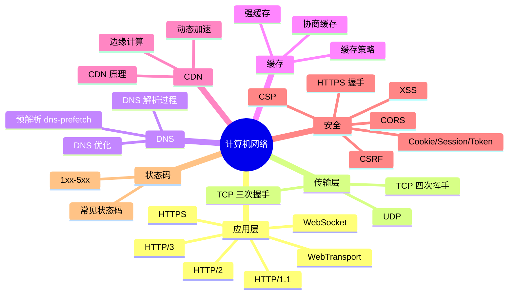

---

## 零、网络分层模型

### 0.1 OSI 七层模型

OSI（Open System Interconnection）七层模型是国际标准化组织制定的网络通信理论模型，从下到上共七层：

```
 7️⃣ 应用层     ├─ HTTP / HTTPS / FTP / DNS / SMTP
 6️⃣ 表示层     ├─ SSL/TLS / 数据加密 / 格式转换
 5️⃣ 会话层     ├─ 建立/管理/终止会话（NetBIOS / RPC）
 4️⃣ 传输层     ├─ TCP / UDP（端到端可靠/不可靠传输）
 3️⃣ 网络层     ├─ IP / ICMP / ARP（路由与寻址）
 2️⃣ 数据链路层 ├─ Ethernet / PPP / MAC 地址（帧传输）
 1️⃣ 物理层     ├─ 网线 / 光纤 / 无线电（比特流传输）
```

| 层级 | 名称 | 核心功能 | 常见协议/设备 |
|------|------|---------|-------------|
| 7 | **应用层** | 为用户应用提供网络服务 | HTTP、HTTPS、FTP、DNS、SMTP、WebSocket |
| 6 | **表示层** | 数据格式转换、加密解密、压缩 | SSL/TLS、JPEG、ASCII、加密算法 |
| 5 | **会话层** | 建立、管理和终止会话连接 | NetBIOS、RPC、SIP |
| 4 | **传输层** | 端到端可靠/不可靠传输、流量控制 | **TCP**（可靠）、**UDP**（不可靠）、端口号 |
| 3 | **网络层** | 逻辑寻址、路由选择、分组转发 | **IP**（IPv4/IPv6）、ICMP、ARP、路由器 |
| 2 | **数据链路层** | 帧封装、MAC 寻址、差错检测 | Ethernet、PPP、VLAN、交换机、MAC 地址 |
| 1 | **物理层** | 比特流传输、物理接口规范 | 网线、光纤、集线器、中继器、无线电波 |

### 0.2 核心原则：分层解耦

每层只关心相邻层的接口，不需要知道其他层的实现细节：
- **下层为上层提供服务**：物理层传比特 → 链路层传帧 → 网络层传包 → 传输层传段 → 应用层传数据
- **每层独立演化**：应用层从 HTTP/1.1 升级到 HTTP/3，底层只需从 TCP 换成 QUIC，互不影响

### 0.3 数据封装过程（发送方）

```
应用层数据 (Data)
    ↓ 加上 TCP/UDP 头部
传输层 段/数据报 (Segment/Datagram)
    ↓ 加上 IP 头部
网络层 包 (Packet)
    ↓ 加上 MAC 头部和尾部
数据链路层 帧 (Frame)
    ↓ 转换成比特流
物理层 比特 (Bits)
```

每经过一层，数据会被加上该层的**头部**（Header），接收方再逐层解封装。

### 0.4 TCP/IP 四层模型（事实标准）

OSI 七层模型是理论标准，而实际互联网遵循更简化的 **TCP/IP 四层模型**：

| OSI 七层 | TCP/IP 四层 | 对应协议 |
|---------|------------|---------|
| 5~7 应用层、表示层、会话层 | **应用层** | HTTP、HTTPS、DNS、FTP、WebSocket |
| 4 传输层 | **传输层** | TCP、UDP |
| 3 网络层 | **网络层** | IP、ICMP、IGMP |
| 1~2 物理层、数据链路层 | **网络接口层** | Ethernet、Wi-Fi、ARP |

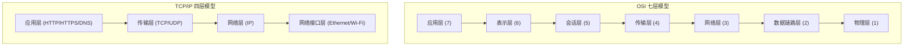

### 0.5 前端常见协议所属层级

| 协议 | 所属层 | 前端使用场景 |
|------|-------|------------|
| **HTTP/HTTPS** | 应用层 | 页面请求、API 调用 |
| **DNS** | 应用层 | 域名解析 |
| **WebSocket** | 应用层 | 实时通信 |
| **SSL/TLS** | 表示层（TCP/IP 归应用层） | 加密通信 |
| **TCP** | 传输层 | 可靠数据传输 |
| **UDP** | 传输层 | QUIC（HTTP/3）、视频流 |
| **IP** | 网络层 | 网络寻址 |

### 0.6 面试追问（网络分层模型）

- **Q**：为什么要有网络分层？
- **A**：① 解耦各层职责，便于独立开发和升级；② 降低复杂度，每层只关注自己负责的功能；③ 标准化接口，不同厂商设备可以互联互通。

- **Q**：OSI 七层模型中，HTTP 和 HTTPS 分别在哪一层？
- **A**：HTTP 在**应用层**（第 7 层），HTTPS 在应用层（第 7 层）底层依赖表示层（第 6 层）的 TLS/SSL 加密。

- **Q**：TCP 和 IP 分别在哪一层，功能有什么区别？
- **A**：TCP 在**传输层**（第 4 层），负责端到端的可靠传输、流量控制和拥塞控制；IP 在**网络层**（第 3 层），负责寻址和路由选择，不保证可靠交付。

- **Q**：一个 HTTP 请求从发送到收到响应，数据在各层经历了怎样的封装和解封装过程？
- **A**：发送端：应用层(HTTP) → 传输层(TCP 段) → 网络层(IP 包) → 链路层(帧) → 物理层(比特)；接收端反向逐层解封装。

- **Q**：前端开发需要关注网络分层吗？知道这些有什么实际意义？
- **A**：① 理解 HTTPS 加密是在表示层/会话层做的，不是应用层；② 调试网络问题时能定位问题在哪一层（如 DNS 解析 → 网络层，请求超时 → 传输层，403/404 → 应用层）；③ 理解 HTTP/3 为什么用 UDP 做传输层（QUIC）；④ 理解 WebSocket 为什么能跨域（握手基于 HTTP，通信在应用层）。


## 一、HTTP 发展史

### 1.1 HTTP/0.9 → HTTP/1.1

| 版本 | 时间 | 关键特性 |
|------|------|---------|
| HTTP/0.9 | 1991 | 仅 GET 请求，纯文本响应，无头部 |
| HTTP/1.0 | 1996 | 增加 Header、状态码、Content-Type，每个请求新建 TCP 连接 |
| HTTP/1.1 | 1997 | 持久连接（Keep-Alive）、管线化（Pipelining）、Host 头、分块传输 |

**HTTP/1.1 核心问题：**
- **队头阻塞**：管线化虽支持并发请求，但响应必须按顺序返回
- **头部冗余**：每次请求携带完整头部，Cookie/User-Agent 等重复发送
- **不支持优先级**：请求无法标记优先级

### 1.2 HTTP/2

| 特性 | 说明 |
|------|------|
| **二进制分帧** | 取代文本传输，解析效率更高 |
| **多路复用** | 一个 TCP 连接并行多个 Stream |
| **头部压缩** | HPACK 算法，减少冗余头部 |
| **服务端推送** | Server Push（已废弃，Chrome 106 移除） |

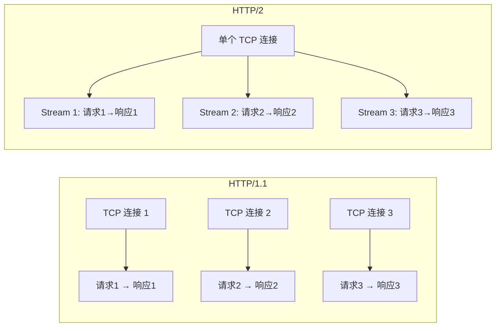

**HTTP/2 的问题：**
- **TCP 层面的队头阻塞**：虽然 Stream 层解决了，但 TCP 层丢包会导致所有 Stream 阻塞
- **连接数限制（HTTP/1.1 问题，HTTP/2 多路复用已解决）**：单个域名并发连接数受限
- **握手延迟**：TCP + TLS 需要 2-3 个 RTT

> **💡 追问：HTTP/2 多路复用中，Stream 的优先级和依赖关系如果配置不当会导致什么问题？实际项目中如何正确配置？**
>
> **配置不当的后果：** 低优 Stream 占满带宽 → 高优资源（CSS/JS）被阻塞 → 首屏渲染延迟。**正确策略：** 关键 CSS/JS 设为最高优先级并标记为 `weight=256`，图片等延迟加载资源设为低优先级 `weight=1`。HTTP/2 的 server push（已废弃）就是因为优先级配置过于抽象、浏览器难做优化而被放弃。

### 1.3 HTTP/3

基于 **QUIC**（Quick UDP Internet Connections）协议：

| 特性 | 说明 |
|------|------|
| **基于 UDP** | 避免 TCP 队头阻塞 |
| **0-RTT 连接** | 首次 1-RTT，后续 0-RTT |
| **内置 TLS 1.3** | 加密默认、不可降级 |
| **连接迁移** | 切换网络时连接不中断 |
| **独立流** | 一个流丢包不影响其他流 |

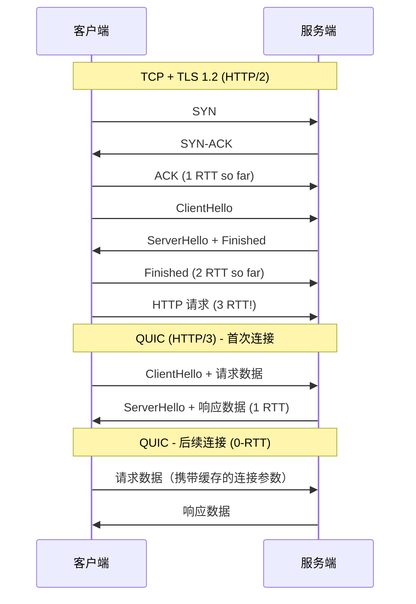

---

**🔗 追问链 A：HTTP 协议演进与性能边界**

> **A-①：HTTP/1.1 的管道化（pipelining）为什么在实际中失败了？HTTP/2 的多路复用和它有什么本质不同？**
>
> **pipelining 失败原因：** (1) 队头阻塞（HOL blocking）——第一个请求响应未到达前，后续响应的数据即使准备好了也无法发送，因为 TCP 保证有序交付；(2) 浏览器和代理服务器的实现问题——大部分服务器没有按序响应，中间代理可能丢弃管道请求。**HTTP/2 的突破：** 二进制分帧 + 多路复用 → 将 HTTP 消息拆分为更细粒度的帧（frame），不同 Stream 的帧可以交错传输，避免了队头阻塞。核心区别是：pipelining 是"请求级别的并行"，HTTP/2 是"帧级别的并行"。

> **A-②：HTTP/2 的头压缩 HPACK 具体是怎么工作的？为什么 Cookie 这种频繁变化的头部压缩率很低？**
>
> **HPACK 原理：** 服务端和客户端维护一个动态表（dynamic table），常见头（`:method: GET`、`:path: /index`）在静态表中有固定索引，后续请求只需发送索引号。新增的自定义头按频率管理——高频头在动态表中保留，低频头用 Huffman 编码。**Cookie 压缩率低的原因：** Cookie 内容每次请求几乎完全不同（用户行为随机变化），无法在动态表中命中，每次都需要 Huffman 编码传输完整的 Cookie 内容。**结论：** 减小 Cookie 体积（减少不必要的 cookie 字段、使用 token 替代 session）对 HTTP/2 性能提升比 HTTP/1.1 时代更关键。

> **A-③：从 HTTP/3 到 WebTransport，"传输层革命"对前端开发者意味着什么？未来页面的实时通信架构会变成什么样？**
>
> **影响：** (1) 全双工实时通信不再依赖 WebSocket——WebTransport 基于 QUIC + Stream API，天然支持双向流、可靠/不可靠混合传输；(2) 网页游戏/视频会议等低延迟场景不再需要 Flash 或 WebSocket 补丁方案——直接用 WebTransport 的 unidirectional stream 发送游戏状态帧、用 bidirectional stream 做控制信令。**(3) 架构变化：** 从"HTTP 请求→响应" + "WebSocket 长连接"双轨制 → 统一为 "QUIC 持久连接 + 独立 Stream" 单轨制——HTTP、WebSocket、WebTransport 都在同一 QUIC 连接上复用：通过 Stream ID 区分流量类型，优先级由应用层通过 `sendStream.priority()` 控制。

---

## 二、HTTPS 与 TLS

### 2.1 TLS 握手过程

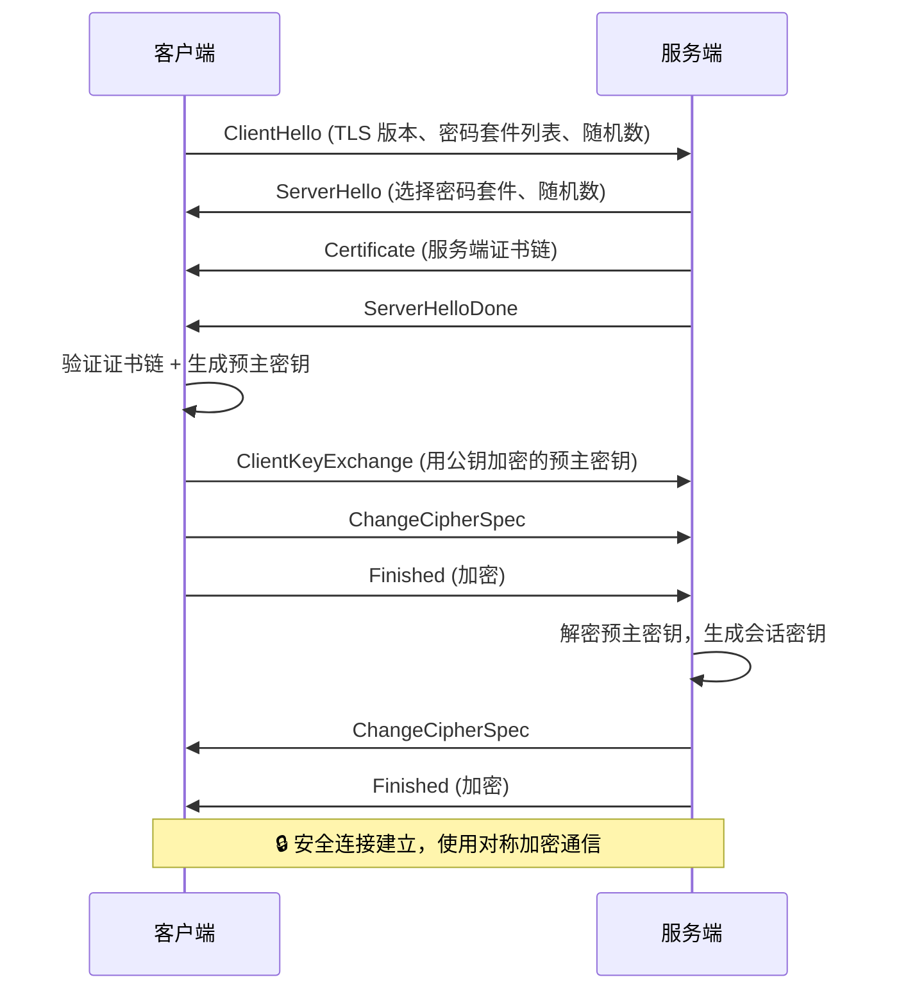

### 2.2 为什么用混合加密？

| 加密方式 | 优点 | 缺点 |
|---------|------|------|
| **对称加密** | 速度快、适合大数据 | 密钥分发不安全 |
| **非对称加密** | 公钥可公开、密钥分发安全 | 速度慢、不适合大数据 |

**HTTPS 方案**：非对称加密传输对称密钥 → 对称加密通信数据

### 2.3 证书验证链

```
浏览器内置根证书 → 根 CA 签发 → 中间 CA → 服务器证书
                    ↓
  浏览器验证签名、有效期、域名、吊销状态（OCSP）
```

### 2.4 面试追问

- **Q**：HTTPS 一定安全吗？
- **A**：HTTPS 保证传输加密，但不保证服务器可信。中间人可以通过伪造证书攻击（如代理软件安装根证书）。

- **Q**：如何验证证书是否被吊销？
- **A**：OCSP（在线证书状态协议）或 CRL（证书吊销列表）。

- **Q**：HTTPS 对性能有多大影响？
- **A**：现代环境下 HTTPS 性能开销 <1%：
  - **加密计算**：AES-GCM 有 CPU 硬件指令集（AES-NI）加速，开销可忽略
  - **握手开销**（主要瓶颈）：TLS 1.2 需 2 RTT，TLS 1.3 优化为 1 RTT，支持 0-RTT 会话恢复
  - **优化手段**：Session Resumption（Session ID / Ticket）、TLS False Start、HTTP/2 多路复用、HTTP/3 基于 QUIC 实现 0-RTT 建连
  - **实际影响**：首次访问增加 10-50ms（取决于 RTT），后续访问通过会话复用几乎无感知

---

## 三、TCP 与 UDP

### 3.1 TCP 三次握手

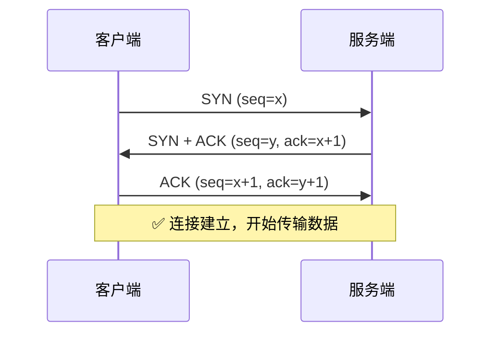

**为什么是三次而不是两次？**
- 防止已失效的连接请求突然传到服务端
- 两次握手 → 服务端无法确认客户端是否收到自己的 SYN+ACK
- 三次握手双方都能确认对方的接收能力正常

> **💡 追问：SYN Flood 攻击如何利用 TCP 三次握手？Linux 的 SYN Cookie 如何防御？**
>
> **攻击原理：** 攻击者发送大量 SYN 包但不完成握手（不回复最后的 ACK），服务端为每个半连接分配资源（内存中的 TCB 控制块），耗尽服务器资源。**SYN Cookie：** 服务端收到 SYN 时不分配 TCB，而是用源/目标 IP+端口 + 时间戳计算一个加密 Cookie 作为 SYN+ACK 的 seq。收到 ACK 时验证 Cookie 合法性通过才分配 TCB。**局限：** 丢失了部分 TCP 选项（如 SACK、WScale），高流量下可能影响正常连接。

### 3.2 TCP 四次挥手

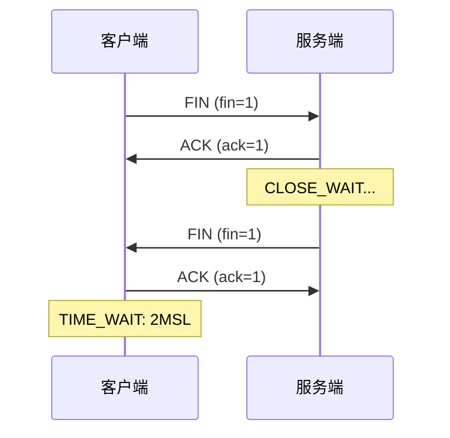

### 3.3 TCP 拥塞控制

**慢启动**：初始发送窗口为 1，每收到一个 ACK 翻倍，直到阈值
**拥塞避免**：超过阈值后线性增长
**快速重传**：收到 3 个重复 ACK 就重传丢失包
**快速恢复**：重传后降低阈值，继续拥塞避免

### 3.4 TCP vs UDP

| 对比项 | TCP | UDP |
|--------|-----|-----|
| **连接性** | 面向连接 | 无连接 |
| **可靠性** | 可靠（重传、确认） | 不可靠（可能丢包） |
| **顺序** | 保证顺序 | 不保证顺序 |
| **速度** | 较慢 | 快 |
| **头部大小** | 20-60 字节 | 8 字节 |
| **应用** | HTTP、FTP、SMTP | DNS、VoIP、视频流、QUIC |

---

**🔗 追问链 B：传输层可靠性与性能权衡**

> **B-①：TCP 的快速重传（Fast Retransmit）和选择性确认（SACK）解决了什么问题？如果没有它们，丢包场景下的性能有多差？**
>
> **快速重传：** 收到 3 个重复 ACK 时立刻重传，无需等待超时（RTO 通常 200ms+）。**SACK：** 接收方告知发送方"已收到哪些段"，只需重传丢失的段。**无 SACK 的损失：** 丢一个包 → Go-Back-N 重传所有后续未确认数据，有效带宽减半。

> **B-②：TCP 的拥塞控制算法 CUBIC 和 BBR 的根本区别是什么？BBR 为什么在跨国连接上吞吐量更高？**
>
> **CUBIC（Linux 默认）：** 填满缓冲区直到丢包 → 降低速率 → 再探测，导致 bufferbloat。**BBR（Google）：** 主动探测最大带宽和最小 RTT，计算最优发送速率，保持缓冲区最小。**跨国优势：** 传统算法在高带宽×高延迟网络中极易触发丢包，BBR 不依赖丢包信号，吞吐量高 2-10 倍。

> **B-③：QUIC 的 0-RTT 如何保证安全？重放攻击怎么防？**
>
> **0-RTT 原理：** 首次连接后缓存服务端参数，后续直接在首个数据包发加密请求。**安全：** 密钥基于前向安全参数，即使被破解也只能解密首次请求。**重放防御：** (1) 服务端拒绝幂等性敏感的 0-RTT 请求；(2) 基于源连接 ID 去重。

---

## 四、DNS 解析

### 4.1 解析流程

```
用户在浏览器输入 www.example.com
        ↓
1. 浏览器缓存 → 有则返回
2. 操作系统缓存 → hosts 文件
3. 本地 DNS 服务器（如 114.114.114.114）
4. 根域名服务器 → 查 .com 的 NS
5. .com 顶级域名服务器 → 查 example.com 的 NS
6. example.com 权威 DNS → 返回 IP
```

### 4.2 DNS 优化

| 优化手段 | 说明 |
|---------|------|
| **dns-prefetch** | 提前解析页面中将要使用的域名 |
| **preconnect** | 不仅解析 DNS，还完成 TCP/TLS 握手 |
| **CDN 智能调度** | GEO DNS 就近返回节点 IP |

```html
<!-- DNS 预解析 -->
<link rel="dns-prefetch" href="//cdn.example.com">
<!-- 预连接（更激进） -->
<link rel="preconnect" href="//api.example.com">
```

---

## 五、浏览器缓存机制

### 5.1 缓存位置

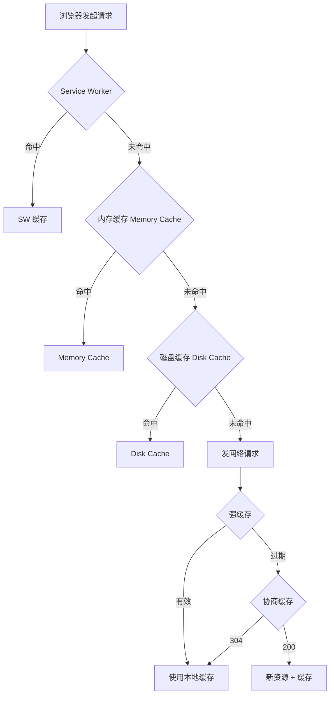

### 5.2 强缓存

| 头部 | 说明 | 优先级 |
|------|------|--------|
| **Cache-Control** | `max-age=3600` 相对时间 | 高 |
| **Expires** | `Expires: Wed, 22 Oct 2025 07:28:00 GMT` 绝对时间 | 低（HTTP/1.0） |

```
Cache-Control 常用指令：
  max-age=seconds     → 缓存有效时间
  public             → 可被中间缓存缓存
  private            → 仅浏览器可缓存
  no-cache           → 使用前需验证（协商缓存）
  no-store           → 禁止任何缓存
  must-revalidate    → 过期后必须验证
  immutable          → 资源永不更新（配合版本号）
```

### 5.3 协商缓存

| 头部对 | 方向 | 原理 |
|--------|------|------|
| **Last-Modified / If-Modified-Since** | 响应/请求 | 基于文件修改时间（秒级） |
| **ETag / If-None-Match** | 响应/请求 | 基于文件内容哈希（精确） |

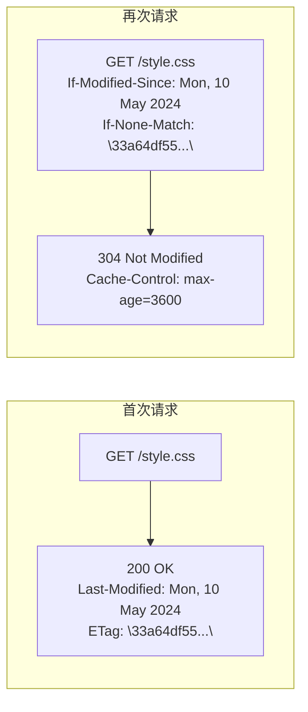

### 5.4 最佳缓存策略

| 资源类型 | 策略 | 原因 |
|---------|------|------|
| **HTML** | `no-cache` | 内容频繁更新 |
| **JS/CSS** | `max-age=31536000 + 文件名哈希` | 版本号变化强制更新 |
| **图片/字体** | `max-age=3600 + ETag` | 可长期缓存 |
| **API 响应** | `no-cache` 或短期 `max-age` | 数据需要及时更新 |

```nginx
# Nginx 配置示例
location /static/ {
    expires 1y;
    add_header Cache-Control "public, immutable";
}

location /api/ {
    add_header Cache-Control "no-cache";
}
```

---

**🔗 追问链 C：缓存策略的精确控制与陷阱**

> **C-①：`Cache-Control: no-cache` 和 `no-store` 有什么区别？`must-revalidate` 和 `proxy-revalidate` 在 CDN 场景下有什么不同？**
>
> **no-cache：** 每次回源验证，匹配 ETag 时返回 304 不传 body。**no-store：** 不缓存任何副本。**must-revalidate：** 约束所有缓存节点（浏览器+CDN）过期后必须回源。**proxy-revalidate：** 只约束 CDN，浏览器按自己策略。**典型陷阱：** `max-age=3600, must-revalidate` 下前 3600s 浏览器不回源，F5 刷新（`max-age=0`）才能绕过。

> **C-②：ETag 的强验证和弱验证有什么区别？多机部署时 ETag 为什么会失效？怎么解决？**
>
> **强验证（`"hash"`）：** 逐字节一致。**弱验证（`W/"hash"`）：** 语义相同即可。**多机失效：** Nginx 默认用 INode+时间生成 ETag，多台服务器 INode 不同 → 相同内容 ETag 不同 → 用户请求切到不同服务器后返回 200 而非 304。**解决：** 用内容 MD5 自定义 ETag，或用 Last-Modified 替代。

> **C-③：Service Worker 缓存和 HTTP 缓存同时存在时，浏览器查找顺序是怎样的？SW 能做什么 HTTP 缓存做不了的事？**
>
> **顺序：** SW 拦截 → `caches.open('v1')` 查找 → fetch → HTTP 磁盘缓存 → 网络。**SW 独有能力：** (1) 缓存 POST 响应（HTTP 缓存默认不缓存）；(2) 自定义过期 + 降级策略（旧数据替代白屏）；(3) 缓存流式响应。

---

## 六、CDN 原理与实践

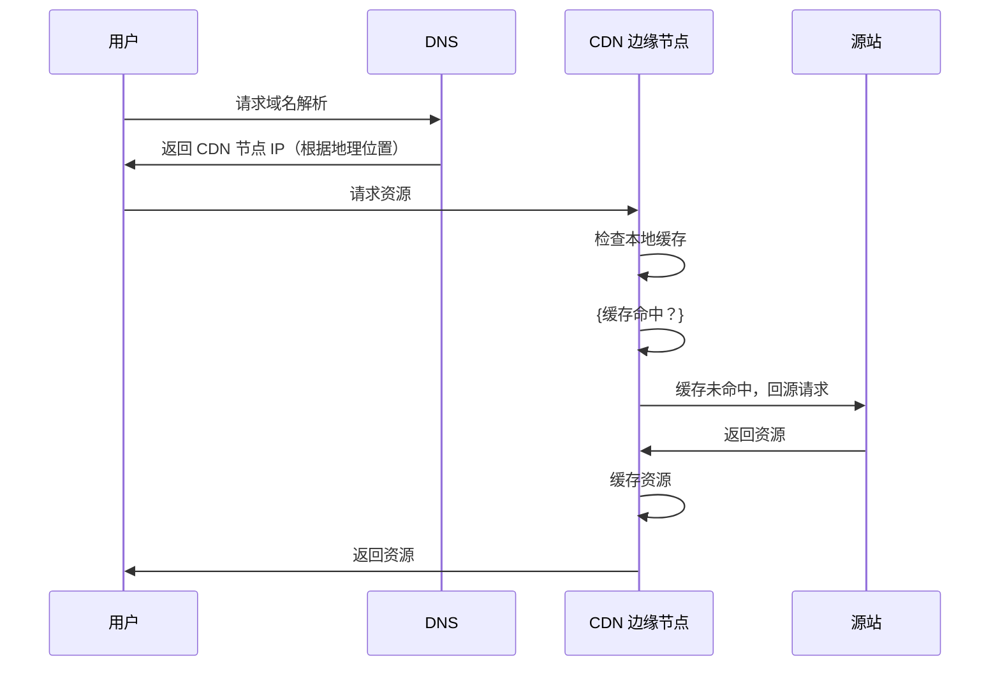

### 6.2 CDN 优化策略

| 策略 | 说明 |
|------|------|
| **预热** | 提前将热门资源推送到 CDN 节点 |
| **动态加速** | DCDN，优化动态请求的传输路径 |
| **边缘计算** | Cloudflare Workers、Edge Functions 在 CDN 节点执行代码 |
| **多 CDN** | 多个 CDN 提供商冗余，故障切换 |

### 6.3 CDN 适合缓存的内容

| 内容 | 缓存策略 |
|------|---------|
| **静态资源（JS/CSS/图片）** | 长期缓存 + 版本号 |
| **字体文件** | 长期缓存（字体很少变） |
| **视频流** | 分片缓存 |
| **API 响应** | 短期缓存或不缓存 |
| **HTML 页面** | 协商缓存 |

---

## 七、CORS 跨域

### 7.1 同源策略

> **同源** = 协议 + 域名 + 端口 三者完全相同

| 页面 URL | 请求 URL | 是否同源 |
|----------|---------|---------|
| `https://a.com/page` | `https://a.com/api` | ✅ |
| `https://a.com/page` | `http://a.com/api` | ❌（协议不同） |
| `https://a.com/page` | `https://b.com/api` | ❌（域名不同） |
| `https://a.com/page` | `https://a.com:8080/api` | ❌（端口不同） |

### 7.2 简单请求与非简单请求

**简单请求条件（全部满足）**：
1. Method：GET / HEAD / POST
2. Content-Type：`text/plain` / `multipart/form-data` / `application/x-www-form-urlencoded`
3. 无自定义头部

**非简单请求**：浏览器先发 **OPTIONS 预检请求**

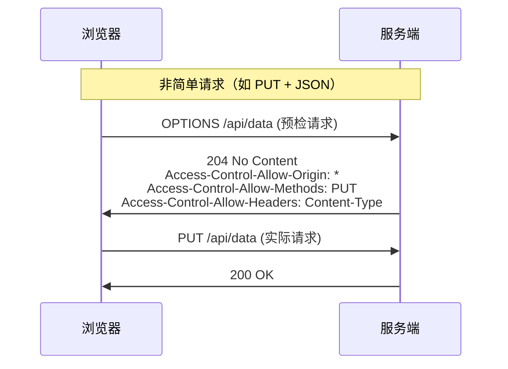

### 7.3 跨域相关头部

| 响应头 | 说明 | 示例 |
|--------|------|------|
| `Access-Control-Allow-Origin` | 允许的源 | `*` 或 `https://a.com` |
| `Access-Control-Allow-Methods` | 允许的方法 | `GET, POST, PUT` |
| `Access-Control-Allow-Headers` | 允许的请求头 | `Content-Type, Authorization` |
| `Access-Control-Allow-Credentials` | 是否允许带 Cookie | `true`（此时 Origin 不能为 `*`） |
| `Access-Control-Max-Age` | 预检结果缓存时间 | `86400`（24 小时） |
| `Access-Control-Expose-Headers` | 允许 JS 读取的响应头 | `X-Total-Count` |

> **💡 追问：CORS 预检请求如果频繁发送会影响性能吗？`Access-Control-Max-Age` 设置多大最合适？如果预检请求响应被缓存后，后端更新了 CORS 策略怎么办？**
>
> **性能影响：** 每个非简单请求多一次 OPTIONS 往返（约 50-200ms），高频 API 调用时累积延迟显著。**Max-Age 建议：** CDN 静态 API 设 86400（24h），动态 API 设 600（10min）兼顾安全。**缓存失效：** 浏览器按 Max-Age 缓存预检结果，期间后端策略更新无效。**强制刷新：** (1) 修改 URL（加版本号）；(2) 等缓存过期；**(3) 预检本身带 `If-None-Match` 可协商，但大部分浏览器不支持**。**最佳实践：** 不要让 CORS 策略频繁变化，变更时对接 Max-Age 过期时间做好灰度部署。

### 7.4 常见跨域解决方案

| 方案 | 适用场景 | 优缺点 |
|------|---------|--------|
| **CORS** | 后端可控 | 最标准，支持所有 HTTP 方法 |
| **JSONP** | 仅 GET、后端不可加头 | 只能 GET，有安全风险 |
| **Proxy 代理** | 开发环境（Webpack/Vite Proxy） | 配置简单，生产环境需 Nginx |
| **Nginx 反向代理** | 生产环境同源策略 | 透明，后端无感知 |
| **postMessage** | iframe 跨域通信 | 需双方代码配合 |
| **WebSocket** | 跨域双工通信 | 协议本身支持跨域 |

---

## 八、网络安全（前端视角）

### 8.1 XSS（跨站脚本攻击）

| 类型 | 说明 | 示例 |
|------|------|------|
| **反射型** | 恶意脚本在 URL 中，服务端未过滤直接返回 | `?q=<script>alert(1)</script>` |
| **存储型** | 恶意脚本持久化存储在服务器 | 评论区插入 `<script>` |
| **DOM 型** | 前端 JS 直接解析 URL 中的恶意内容 | `location.hash` 未转义 |

**防御措施：**
- 输入过滤 / 输出转义（HTML 实体编码）
- CSP（Content-Security-Policy）
- HttpOnly Cookie（防脚本读取）
- 避免 `innerHTML`、`dangerouslySetInnerHTML`

```typescript
// ❌ 危险
element.innerHTML = userInput

// ✅ 安全（自动转义）
element.textContent = userInput

// ✅ React/Vue 默认转义
<div>{userInput}</div>  // React 自动转义
```

### 8.2 CSRF（跨站请求伪造）

**攻击流程：**
```
1. 用户登录 A 银行
2. 用户未登出访问恶意网站 B
3. B 的页面自动发起请求：img src="bank.com/transfer?to=B&amount=1000"
4. 浏览器自动携带 A 银行的 Cookie，请求成功！
```

**防御措施：**
- **SameSite Cookie**：`SameSite=Strict`（最有效）
- **CSRF Token**：表单中嵌入随机 Token
- **Referer/Origin 验证**：检查请求来源
- **验证码**：敏感操作要求验证码

```http
Set-Cookie: session=abc123; SameSite=Strict; Secure; HttpOnly
```

### 8.3 CSP（内容安全策略）

```http
Content-Security-Policy:
  default-src 'self';
  script-src 'self' 'nonce-abc123' https://cdn.example.com;
  style-src 'self' 'unsafe-inline';
  img-src 'self' data: https://*;
  connect-src 'self' https://api.example.com;
  frame-ancestors 'none';
```

| 指令 | 作用 |
|------|------|
| `default-src` | 默认策略 |
| `script-src` | 允许的 JS 来源 |
| `style-src` | 允许的 CSS 来源 |
| `img-src` | 允许的图片来源 |
| `connect-src` | 允许的 API 请求目标 |
| `frame-ancestors` | 允许嵌入的父页面（防 Clickjacking） |
| `report-uri` | 违规上报地址 |

### 8.4 HTTPS 中间人攻击

**攻击方式**：代理服务器安装根证书，解密所有流量

**防御**：
- **HSTS**（HTTP Strict Transport Security）：强制浏览器使用 HTTPS
- **证书锁定**：仅信任特定证书
- **SRI**：子资源完整性校验

```http
# HSTS（一次性告诉浏览器，未来半年强制 HTTPS）
Strict-Transport-Security: max-age=15768000; includeSubDomains; preload
```

---

**🔗 追问链 D：前端安全纵深防御**

> **D-①：XSS 的三种类型中哪一种最难防御？为什么 CSP 防不了 DOM 型 XSS？**
>
> **DOM 型最难：** 攻击代码在浏览器端由 JS 操作 DOM 时产生（如 `location.hash` → `innerHTML`），服务端看不到。**CSP 的局限：** CSP 限制"从哪里加载脚本"，DOM 型 XSS 不加载外部脚本，而是执行已有的内联脚本。**更有效方案：** 避免 `innerHTML`、使用 Trusted Types API 强制所有 HTML 插入经安全策略验证。

> **D-②：SameSite=Strict 能防住 CSRF 但不能防 XSS，根本原因是什么？**
>
> **CSRF：** 利用 Cookie 的"自动携带"——恶意站外请求自动附带用户 Cookie。**SameSite=Strict** → 浏览器不发送跨站 Cookie → CSRF 失败。**XSS 绕过的原因：** XSS 脚本运行在合法域名上下文中，发请求是**同源**的，SameSite 不拦截。**结论：** SameSite 只防站外伪造请求，不防站内恶意脚本。

> **D-③：SRI 如何防止 CDN 被攻陷后引入恶意代码？hash 应由谁生成？**
>
> **SRI：** `<script integrity="sha384-xxx">`，浏览器加载后计算 hash 对比，不匹配则拒绝执行。**hash 生成者：** 第三方信任方——CI/CD 从源站计算后注入，而非 CDN 提供（攻陷 CDN 后 hash 也能改）。**自动化：** Vite 的 `vite-plugin-sri`、Webpack 的 `webpack-subresource-integrity` 构建时自动注入。

---

## 九、Cookie / Session / Token

### 9.1 Cookie 属性

| 属性 | 说明 |
|------|------|
| `Name=Value` | 键值对 |
| `Expires / Max-Age` | 过期时间 |
| `Domain` | 域名限定 |
| `Path` | 路径限定 |
| `Secure` | 仅 HTTPS 传输 |
| `HttpOnly` | JS 不可读取（防 XSS） |
| `SameSite` | 跨站请求策略：`Strict` / `Lax` / `None` |

**Cookie 大小限制**：每个域名最多 20-50 个，每个最大 4KB

### 9.2 Cookie vs LocalStorage vs SessionStorage

| 特性 | Cookie | localStorage | sessionStorage |
|------|--------|-------------|----------------|
| **容量** | 4KB | 5-10MB | 5-10MB |
| **自动发送** | ✅ 同域请求自动携带 | ❌ | ❌ |
| **过期时间** | 手动设置 | 永不过期 | 关闭标签页清除 |
| **httponly** | ✅ 支持 | ❌ | ❌ |
| **作用域** | 域名 + 路径 | 域名 | 标签页 |

### 9.3 JWT 结构

```
JWT = Header.Payload.Signature
                    ↓
eyJhbGciOiJIUzI1NiIsInR5cCI6IkpXVCJ9.
eyJzdWIiOiIxMjM0NTY3ODkwIn0.
doZjgSg4SA1sXzYq8s0E4P0GQ0A
```

**安全实践：**
- `access_token`：短期（15min），存储在内存 / sessionStorage
- `refresh_token`：长期（7天），存储在 HttpOnly Cookie
- Refresh Token Rotation（每次刷新更换 refresh_token）

> **💡 追问：JWT 的 Signature 部分如果密钥泄露，攻击者可以做什么？如何最小化泄露后的影响？**
>
> **泄露后果：** 攻击者可用密钥签发任意身份、任意过期时间的 token，完全绕过认证。**无法做的事：** 无法解密 Payload（Signature 不加密，但 Payload 只是 Base64 编码未加密，本身可读）。**最小化影响：** (1) 立即更换密钥，所有旧 token 失效； (2) 维护 token 黑名单（或 short-lived token）； (3) 使用 RS256（非对称）而非 HS256（对称）——HS256 泄露后攻击者既能签也能验，RS256 只有签名方需要密钥，验证方只需公钥。

---

## 十、HTTP 状态码

### 10.1 1xx 信息

| 状态码 | 含义 | 说明 |
|--------|------|------|
| **100** | Continue | 继续发送请求体 |
| **101** | Switching Protocols | 协议切换（如 WebSocket 升级） |

### 10.2 2xx 成功

| 状态码 | 含义 | 说明 |
|--------|------|------|
| **200** | OK | 请求成功 |
| **201** | Created | 创建成功（POST） |
| **204** | No Content | 无返回体（DELETE） |
| **206** | Partial Content | 范围请求（视频分片） |

### 10.3 3xx 重定向

| 状态码 | 含义 | 说明 |
|--------|------|------|
| **301** | Moved Permanently | 永久重定向（搜索引擎更新 URL） |
| **302** | Found | 临时重定向 |
| **304** | Not Modified | 协商缓存命中 |
| **307** | Temporary Redirect | 临时重定向（保持请求方法） |
| **308** | Permanent Redirect | 永久重定向（保持请求方法） |

### 10.4 4xx 客户端错误

| 状态码 | 含义 | 说明 |
|--------|------|------|
| **400** | Bad Request | 请求格式错误 |
| **401** | Unauthorized | 未登录/无有效 Token |
| **403** | Forbidden | 已认证但无权限 |
| **404** | Not Found | 资源不存在 |
| **405** | Method Not Allowed | 方法不允许 |
| **408** | Request Timeout | 请求超时 |
| **409** | Conflict | 资源冲突 |
| **429** | Too Many Requests | 请求频率限制 |

### 10.5 5xx 服务端错误

| 状态码 | 含义 | 说明 |
|--------|------|------|
| **500** | Internal Server Error | 服务器内部错误 |
| **502** | Bad Gateway | 网关或代理错误 |
| **503** | Service Unavailable | 服务暂时不可用（过载/维护） |
| **504** | Gateway Timeout | 网关超时 |

---

## 十一、WebSocket 与 SSE

### 11.1 WebSocket 核心原理

> **一句话理解**：WebSocket 就像 HTTP 的"升级模式"——先通过 HTTP 握手建立连接，然后切到纯二进制帧通信，省掉每次请求的 HTTP 头部开销，实现真正的服务端推送。

#### 握手：HTTP 升级到 WS

WebSocket 的第一次连接就是一次普通 HTTP 请求，带 `Upgrade: websocket` 告诉服务端"我想升级"：

```
客户端 → 服务端：
GET /ws HTTP/1.1
Upgrade: websocket                ← 我要升级到 WebSocket
Connection: Upgrade                ← 这是连接级升级
Sec-WebSocket-Key: dGhlIHNhbXBsZSBub25jZQ==  ← 16 字节随机数
Sec-WebSocket-Version: 13          ← 固定版本
Sec-WebSocket-Protocol: chat, json ← 可选：子协议协商
Sec-WebSocket-Extensions: permessage-deflate ← 可选：扩展协商
Origin: https://example.com        ← 来源校验（防跨站滥用）

服务端 → 客户端：
HTTP/1.1 101 Switching Protocols
Upgrade: websocket
Connection: Upgrade
Sec-WebSocket-Accept: s3pPLMBiTxaQ9kYGzzhZRbK+xOo=  ← 对 Key 的签名
Sec-WebSocket-Protocol: chat       ← 选中第一个能处理的子协议
```

> **面试重点：`Sec-WebSocket-Accept` 怎么算？**
> ```
> Accept = Base64( SHA-1( Key + "258EAFA5-E914-47DA-95CA-C5AB0DC85B11" ) )
> ```
> 这个固定 UUID 是协议规定的"暗号"：客户端用它验证对面确实是一个 WebSocket 服务端，而不是普通 HTTP 服务器误接了请求。

**握手完成后，该 TCP 连接进入 WebSocket 模式**，双方可以直接互发帧，不再走 HTTP 协议。

#### 数据帧（Frame）：最关键的二进制协议

握手之后，所有数据都封装在 **帧** 里。帧头只有 **2~14 字节**，远小于 HTTP 头部。

```
 0                   1                   2                   3
 0 1 2 3 4 5 6 7 8 9 0 1 2 3 4 5 6 7 8 9 0 1 2 3 4 5 6 7 8 9 0 1
+-+-+-+-+-------+-+-------------+-------------------------------+
|F|R|R|R| opcode|M| Payload len |    Extended payload length    |
|I|S|S|S|  (4)  |A|     (7)     |             (16/64)           |
|N|V|V|V|       |S|             |                               |
| |1|2|3|       |K|             |                               |
+-+-+-+-+-------+-+-------------+ - - - - - - - - - - - - - - - +
|     Extended payload length continued, if payload len == 127  |
+ - - - - - - - - - - - - - - - +-------------------------------+
|                               |Masking-key, if MASK set to 1  |
+-------------------------------+-------------------------------+
|       Masking-key (continued)  |         Payload Data          |
+--------------------------------+-------------------------------+
```

**大白话拆解帧结构：**

| 部分 | 大小 | 白话解释 |
|------|------|---------|
| **FIN** | 1 bit | 这是不是最后一块？大消息要切碎时用 |
| **Opcode** | 4 bits | 这是啥？`1`=文字、`2`=二进制、`8`=关闭、`9`=心跳 |
| **MASK** | 1 bit | 客户端发的必须 `1`（掩码），服务端发的必须 `0` |
| **Payload Length** | 7/16/64 bits | 数据多长？小数字用 7 位、大数字用扩展长度 |
| **Masking-Key** | 4 bytes | 随机掩码密钥，客户端用来把数据"搅浑" |
| **Payload** | 变长 | 真正的数据 |

> **💡 面试必问：为什么客户端要加掩码（Masking），服务端不用？**
>
> 防止**缓存污染攻击**。想象一个恶意网页开 WebSocket 往一个 HTTP 代理服务器发数据。如果不掩码，攻击者可以精确构造 TCP 字节，让代理误以为收到了一个合法的 HTTP 响应（比如 `HTTP/1.1 200 OK`），从而污染代理缓存，后续用户访问就会被返回恶意内容。
>
> 掩码相当于把数据用随机密钥"异或"一下，攻击者无法预知最终的字节内容，中间代理就不会把 WS 帧误认为 HTTP。服务端不在浏览器环境运行，不存在这种攻击路径，所以不需要掩码。

**帧类型速查：**

| Opcode | 名字 | 干啥用 |
|--------|------|--------|
| `0x0` | 延续帧 | 分片消息的中间片段 |
| `0x1` | 文本帧 | UTF-8 文本（最常用） |
| `0x2` | 二进制帧 | ArrayBuffer / Blob |
| `0x8` | 关闭帧 | 优雅关闭连接 |
| `0x9` | Ping | 心跳探测 |
| `0xA` | Pong | 心跳回复 |

#### 分片：大消息的"切片传输"

消息太大时自动拆成多个帧：

```
"HelloWorld" 分为 3 帧：
  帧1: FIN=0, Opcode=0x1, Payload="Hello"  ← 首帧（标记类型为文本）
  帧2: FIN=0, Opcode=0x0, Payload="Worl"   ← 中间帧（延续）
  帧3: FIN=1, Opcode=0x0, Payload="d"      ← 末帧（FIN=1 标记结束）
```

什么时候发生分片？浏览器缓冲快满时、流式传输（服务端边生成边发）时。

#### 握手时的两个可选协商

**子协议（Subprotocol）**：在握手时告诉服务端"我支持什么格式"，服务端挑一个：

```typescript
const ws = new WebSocket('wss://example.com/ws', ['graphql-ws', 'json'])
// 服务端响应时会返回选中的协议
```

常见：`json`、`graphql-ws`（GraphQL 订阅）、`wamp`（RPC over WS）。

**扩展（Extensions）**：传输层面的优化协商，最常用的是 `permessage-deflate`：

```
Sec-WebSocket-Extensions: permessage-deflate; client_max_window_bits=15
```

每帧数据用 **DEFLATE 压缩**，文本可压缩 70-90%。代价是 CPU 开销，但实时推送场景下网络节省远大于 CPU 消耗。

```typescript
// 检查是否成功协商了压缩
console.log(ws.extensions)  // "permessage-deflate"
```

### 11.2 连接生命周期

```
new WebSocket(url)  →  CONNECTING  →  OPEN  →  CLOSING  →  CLOSED
                          ↑             |          ↑
                          |             ↓          |
                          +—— 重连 —— CLOSED ←—— 异常断开
```

| 状态 | readyState | 什么意思 |
|------|-----------|---------|
| **CONNECTING** | 0 | TCP 握手 + WS 升级中 |
| **OPEN** | 1 | 连接已建立，可收发数据 |
| **CLOSING** | 2 | 正在关闭，等对方确认 |
| **CLOSED** | 3 | 连接已断开 |

**关闭连接时可以带状态码说明原因：**

```typescript
ws.close(1000, '正常关闭')

const CLOSE_CODES: Record<number, string> = {
  1000: '正常关闭',
  1001: '服务端宕机/页面离开',
  1002: '协议错误',
  1003: '不支持的数据类型',
  1006: '异常关闭（没有收到关闭帧）',
  1009: '消息太大',
  1011: '服务端内部错误',
}
```

### 11.3 WebSocket 优化策略

#### 连接优化：少建连、早建连

| 策略 | 做法 | 收益 |
|------|------|------|
| **连接带复用** | 一个连接承载多路逻辑消息（不是每类消息开一个 WS） | 减少服务端 fd 占用 |
| **连接预热** | 页面加载完立刻建 WS，不等用户操作 | 用户点击时零等待 |
| **协议降级** | WS 连不上 → 降级 SSE → 降级长轮询 | 兼容性兜底 |

连接池示例（维护多个连接，按负载分配）：

```typescript
class WebSocketPool {
  private pool: WebSocket[] = []
  private url: string

  constructor(url: string, private size = 3) {
    this.url = url
    for (let i = 0; i < size; i++) this.pool.push(this.create())
  }

  private create(): WebSocket {
    const ws = new WebSocket(this.url)
    ws.addEventListener('close', () => {
      this.pool = this.pool.filter(c => c !== ws)
      if (this.pool.length < this.size)
        setTimeout(() => this.pool.push(this.create()), 1000)
    })
    return ws
  }

  acquire(): WebSocket | null {
    const alive = this.pool.filter(c => c.readyState === WebSocket.OPEN)
    if (alive.length === 0) return null
    return alive.reduce((a, b) =>
      (a.bufferedAmount ?? 0) <= (b.bufferedAmount ?? 0) ? a : b
    )
  }
}
```

#### 数据优化：少发字节

| 策略 | 做法 | 减多少 |
|------|------|--------|
| **消息合并** | 多条小消息攒一起发，减少帧头 | 高频场景 30%+ |
| **二进制编码** | Protobuf / MessagePack 替代 JSON | 体积缩 60-80% |
| **permessage-deflate** | 握手时协商压缩，每帧 DEFLATE 压缩 | 文本缩 70-90% |
| **增量更新** | 只发变化字段，不发全量 | 取决于变化率 |
| **优先级队列** | 高优消息（操作指令）插队先发 | 降低关键操作延迟 |

消息合并示例（攒一批再发，不超过 16ms 延迟）：

```typescript
class BatchedWebSocket {
  private ws!: WebSocket
  private buffer: string[] = []
  private timer: ReturnType<typeof setTimeout> | null = null
  private readonly MAX_DELAY = 16
  private readonly MAX_SIZE = 1024 * 64

  send(data: string): void {
    this.buffer.push(data)
    if (this.buffer.length === 1)
      this.timer = setTimeout(() => this.flush(), this.MAX_DELAY)
    const size = this.buffer.reduce((s, d) => s + d.length, 0)
    if (size >= this.MAX_SIZE) {
      clearTimeout(this.timer!)
      this.flush()
    }
  }

  private flush(): void {
    if (this.buffer.length === 0) return
    this.ws.send(JSON.stringify(this.buffer))
    this.buffer = []
    this.timer = null
  }
}
```

二进制编码方案选型：

| 方案 | 体积比 JSON | 需要库 | 适合 |
|------|------------|--------|------|
| **JSON** | 1x | 无 | 通用 |
| **MessagePack** | ~0.7x | `@msgpack/msgpack` | 通用，体积/便利平衡 |
| **Protocol Buffers** | ~0.3x | `protobufjs` | 高性能、结构化数据 |
| **CBOR** | ~0.5x | `cbor-js` | IoT、流式 |
| **手写二进制** | 最小 | 无（DataView） | 游戏帧同步、音视频 |

手写二进制协议示例（1 字节类型 + 4 字节长度 + 负载）：

```typescript
class BinaryProtocol {
  static encode(type: number, payload: unknown): ArrayBuffer {
    const data = new TextEncoder().encode(JSON.stringify(payload))
    const buf = new ArrayBuffer(5 + data.byteLength)
    const view = new DataView(buf)
    view.setUint8(0, type)
    view.setUint32(1, data.byteLength)
    new Uint8Array(buf, 5).set(data)
    return buf
  }

  static decode(buf: ArrayBuffer) {
    const view = new DataView(buf)
    return {
      type: view.getUint8(0),
      payload: JSON.parse(new TextDecoder().decode(new Uint8Array(buf, 5))),
    }
  }
}
```

#### 心跳保活 + 断线重连

> **为什么需要心跳？** 中间代理（Nginx、负载均衡器）有 idle timeout，一段时间没数据就自动断开 TCP 连接。心跳就是定期发一个"我还活着"的信号。

**三个核心机制：**

| 机制 | 做法 | 目的 |
|------|------|------|
| **Ping/Pong** | 客户端每 30s 发 `{ type: '__ping__' }`，服务端回 `__pong__` | 探测连接是否存活 |
| **指数退避重连** | 断线后 1s→2s→4s→8s→...→30s 上限重试 | 避免雪崩 |
| **消息确认** | 每条消息带 `msgId`，重连后发 `sync(lastMsgId)` 补漏 | 消息不丢、不重复 |

```typescript
// 心跳 + 重连核心逻辑（不含事件系统）
let ws: WebSocket
let reconnectAttempt = 0
let pingTimer: ReturnType<typeof setInterval>
let lastMsgTime = Date.now()

function connect() {
  ws = new WebSocket('wss://example.com')
  ws.binaryType = 'arraybuffer'

  ws.addEventListener('open', () => {
    reconnectAttempt = 0
    lastMsgTime = Date.now()
    pingTimer = setInterval(() => {
      if (Date.now() - lastMsgTime >= 30000)
        ws.send(JSON.stringify({ type: '__ping__' }))
    }, 30000)
  })

  ws.addEventListener('message', () => { lastMsgTime = Date.now() })

  ws.addEventListener('close', (e) => {
    clearInterval(pingTimer)
    if (e.code === 1000) return                     // 主动关闭，不重连
    if (reconnectAttempt >= 10) return               // 超限，放弃
    const delay = Math.min(1000 * 2 ** reconnectAttempt + Math.random() * 1000, 30000)
    reconnectAttempt++
    setTimeout(connect, delay)
  })
}
```

**指数退避速查（base=1s，上限 30s）：**

| 第几次 | 等多久 |
|--------|--------|
| 1 | 1.0~2.0s |
| 2 | 2.0~3.0s |
| 3 | 4.0~5.0s |
| 4 | 8.0~9.0s |
| 5 | 16.0~17.0s |
| 6+ | 30.0~31.0s |

#### 背压处理（Backpressure）

> **问题**：你发得比网络传输快 → 浏览器内部缓冲不断堆积 → 内存暴涨 → 卡死。

**解决方案**：监控 `ws.bufferedAmount`，超阈值时排队等缓冲区清空再发：

```typescript
class BackpressuredWebSocket {
  private ws!: WebSocket
  private queue: string[] = []
  private draining = false

  send(data: string): void {
    if (this.draining || this.ws.bufferedAmount > 1024 * 1024) {
      this.queue.push(data)
      if (!this.draining) { this.draining = true; this.drain() }
      return
    }
    this.ws.send(data)
  }

  private drain(): void {
    const next = () => {
      if (this.queue.length === 0) { this.draining = false; return }
      if (this.ws.bufferedAmount > 256 * 1024) { setTimeout(next, 50); return }
      this.ws.send(this.queue.shift()!)
      requestAnimationFrame(next)
    }
    next()
  }
}
```

> **关键点**：`bufferedAmount` 是浏览器底层 TCP 缓冲区的未发送字节数。大于 1MB 时排队，降到 256KB 以下恢复发送。用 `requestAnimationFrame` 保证不阻塞主线程。

### 11.4 生产环境要点

#### Nginx 反向代理 WebSocket

WebSocket 走 Nginx 时，关键是让 Nginx 认得 `Upgrade` 头，并且不要因为长连接没数据就掐断：

```nginx
map $http_upgrade $connection_upgrade {
    default  upgrade;
    ''       close;
}

server {
    location /ws {
        proxy_pass http://ws_backend;
        proxy_http_version 1.1;
        proxy_set_header Upgrade $http_upgrade;        # 关键：放行 Upgrade
        proxy_set_header Connection $connection_upgrade;
        proxy_read_timeout 3600s;                      # 长连接超时设大
        proxy_buffering off;                           # WS 不需要缓冲
        proxy_cache off;
    }
}
upstream ws_backend {
    server 127.0.0.1:8080;
    keepalive 32;
    ip_hash;                                           # 会话保持
}
```

#### 常见坑

| 问题 | 根因 | 解法 |
|------|------|------|
| **代理断连** | 中间件 idle timeout | 心跳保活 + `proxy_read_timeout` 设大 |
| **负载均衡漂移** | 请求被分到不同后端 | `ip_hash` 一致性哈希 |
| **连接数打满** | fd 上限 | 水平扩展 / 调大 `ulimit -n` |
| **内存泄漏** | `addEventListener` 没清理 | `AbortController` 统一回收 |
| **WSS 证书错** | IP 直连、自签名 | 用域名 + 合法证书 |
| **消息乱序** | 异步处理导致 | 消息带 seq 号，接收端排序 |

#### WS 与 HTTP/2 共存

大部分 CDN 不支持 WS over HTTP/2，WS 实际走 HTTP/1.1 升级通道。需要显式开启：

| CDN | 是否支持 WS | 配置方式 |
|-----|------------|---------|
| Cloudflare | ✅ 默认支持 | 无需额外配置 |
| Akamai | ✅ 需开启 | Property Manager 开启 WebSocket |
| Fastly | ✅ 需开启 | 启用 WebSocket 功能 |
| AWS CloudFront | ✅ 2021 后支持 | 创建 WebSocket 行为 |

---

### 11.5 WebSocket vs SSE：怎么选

> **一句话区分**：WS 是"双向管道"，SSE 是"服务端单向广播"。如果只需要服务端推消息，SSE 更简单；需要客户端也发消息，上 WS。

| 对比项 | WebSocket | SSE (EventSource) |
|--------|-----------|-------------------|
| **通信方向** | 全双工 | 服务端→客户端（单工） |
| **协议** | 独立协议 (RFC 6455) | HTTP 流 (`text/event-stream`) |
| **握手** | HTTP Upgrade (101) | 普通 HTTP GET |
| **传输格式** | 文本 + 二进制 | 仅文本 (UTF-8) |
| **自动重连** | ❌ 自己实现 | ✅ 浏览器内置 |
| **消息 ID** | ❌ 自己实现 | ✅ `id:` 字段自动追踪断点续传 |
| **连接数限制** | 每个域名 6~30 个 | 每个域名 6 个（HTTP/2 无限制） |
| **服务端实现** | 需专用库 (ws、Socket.IO) | 标准 HTTP 服务即可返回流 |
| **暂停/恢复** | ❌ 自己实现 | ✅ `EventSource.close()` |
| **浏览器支持** | 全部现代浏览器 | IE 不支持（可用 polyfill） |

**选型决策：**

```
需要客户端发数据？ ──是──→ WebSocket
       │
       否
       ↓
只需服务端推送？   ──是──→ SSE（直播字幕、通知、股价）
       │
       否
       ↓
需要二进制或超低延迟？──→ WebSocket（游戏、协同编辑）
       │
       否
       ↓
       SSE 足够（日志流、状态监控）
```

---

### 11.6 SSE 补充

#### 自带断线续传（EventSource 最实用的特性）

服务端返回 `id:` 字段后，浏览器断开重连时会自动发 `Last-Event-ID`，服务端据此从断点恢复：

```typescript
// 服务端响应格式：
// id: 1001
// event: message
// data: {"text": "hello"}
//
// 断连后浏览器自动重发：
// GET /api/events
// Last-Event-ID: 1001     ← 浏览器自动附带
```

#### HTTP/2 下 SSE 获得质变

| 指标 | HTTP/1.1 | HTTP/2 |
|------|---------|--------|
| 同域名连接数 | 最多 6 个 | 无限制（多路复用） |
| 头部开销 | 每个连接完整头部 | HPACK 压缩 |
| 队头阻塞 | 有 | 无 |

```typescript
// HTTP/2 下可以在一个 TCP 连接上打开多个 EventSource
['/api/news', '/api/weather', '/api/stock'].forEach(url => {
  new EventSource(url)     // HTTP/1.1 占 3 个连接，HTTP/2 共享 1 个
})
```

#### 自定义重连（服务端控制重连间隔）

```typescript
// 服务端返回 retry: 5000  ← 告诉浏览器等 5 秒再重连（默认 2-3 秒）

// 需要更复杂的退避策略？自己包装一层：
class SmartSSE {
  private es!: EventSource
  private delay = 3000

  constructor(private url: string, private maxDelay = 30000) { this.connect() }

  private connect() {
    this.es = new EventSource(this.url)
    this.es.onerror = () => {
      this.es.close()
      setTimeout(() => {
        this.delay = Math.min(this.delay * 2, this.maxDelay)
        this.connect()
      }, this.delay)
    }
  }

  close() { this.es.close() }
}
```

---

## 十二、HTTP/3 与 WebTransport

### 12.1 QUIC 协议特性

| 特性 | 优势 |
|------|------|
| **0-RTT 连接** | 首次 1-RTT，后续 0-RTT 建立连接 |
| **用户空间实现** | 快速迭代，不依赖操作系统更新 |
| **连接迁移** | 从 WiFi 切到 5G 不断连 |
| **前向纠错** | 减少重传，提高弱网性能 |
| **无队头阻塞** | 一个流丢包不影响其他流 |

### 12.2 WebTransport（HTTP/3 上层协议）

WebTransport 是基于 QUIC 的全双工通信 API，是 WebSocket 的下一代替代方案：

```typescript
// WebTransport（实验性 API）
const transport = new WebTransport('https://example.com:443')

await transport.ready

// 单向流（服务端→客户端）
const reader = transport.receiveStreams().getReader()
const { value: stream } = await reader.read()
const { value: data } = await stream.readable.getReader().read()

// 不可靠数据报（类似 UDP）
const writer = transport.datagrams.writable.getWriter()
writer.write(new TextEncoder().encode('hello'))
```

| 对比 | WebSocket | WebTransport |
|------|-----------|--------------|
| **底层** | TCP | QUIC (UDP) |
| **可靠性** | 可靠流 | 可靠 + 不可靠 |
| **多路复用** | 一个连接一个流 | 多个流无队头阻塞 |
| **连接迁移** | ❌ | ✅ |
| **浏览器支持** | 全部 | Chrome 正在推进 |

---

## 十三、面试高频问答

### Q1：从输入 URL 到页面呈现的过程？

```
1. 用户输入 URL
2. 浏览器进程处理：检查是否合法 URL，否则搜索
3. DNS 解析（递归查询）
4. TCP 三次握手（HTTPS 还要 TLS 握手）
5. HTTP 请求（可能：缓存命中则直接返回）
6. 服务端处理并返回响应
7. 浏览器解析 HTML → 构建 DOM 树
8. 解析 CSS → 构建 CSSOM 树
9. 合并为 Render Tree
10. Layout（计算几何位置）
11. Paint（绘制像素）
12. Composite（合成图层）
13. ✅ 页面呈现
```

### Q2：HTTP/2 的队头阻塞是什么？HTTP/3 怎么解决的？

```
HTTP/2 队头阻塞 → TCP 层面
  └─ TCP 保证有序传输，一个包丢失 → 所有流都要等待重传

HTTP/3 (QUIC) 解决方案 → UDP 层面多路复用
  └─ 每个流独立传输，一个流丢包不影响其他流
  └─ 应用层控制重传，避免 TCP 层的串行阻塞
```

### Q3：为什么不用 Cookie 存 Token？

| 方案 | 安全性 | 灵活性 | 适用场景 |
|------|--------|--------|---------|
| `localStorage` 存 token | ❌ XSS 可窃取 | ✅ JS 可控 | 不推荐 |
| **HttpOnly Cookie** | ✅ XSS 不可读 | ❌ JS 不可控 | ✅ 推荐 |
| **混合方案** | ✅ 两层防护 | ✅ 兼顾 | ✅ 最佳实践 |

### Q4：HTTPS 中间人攻击怎么防？

```
防御层次：
1. 浏览器证书验证 → 拒绝自签名/过期证书
2. HSTS → 强制 HTTPS，防 SSL Stripping
3. 证书锁定 → 只信任特定证书
4. SRI → HTML 引入资源时校验完整性
```

### Q5：状态码 301 vs 302 vs 307 vs 308？

| 状态码 | 含义 | 方法是否改变 |
|--------|------|------------|
| **301** | 永久重定向 | POST → GET |
| **302** | 临时重定向 | POST → GET |
| **307** | 临时重定向 | 方法不改变 |
| **308** | 永久重定向 | 方法不改变 |

> **💡 追问：301 如果被浏览器永久缓存了，网站从 HTTP 迁移到 HTTPS 后如何让用户清除旧的 301 缓存？**
>
> **先清除旧重定向再迁移：** 迁移前先用 302 临时重定向验证 HTTPS 正常 → 确认无误后改为 301。如果 301 已被浏览器永久缓存，只能：(1) 等缓存过期（`Cache-Control` 中的 max-age）；(2) 在旧的 HTTP 端口上返回 307 临时重定向，浏览器会重新请求；(3) 使用 HSTS 的 preload 列表，但 HSTS 控制的是"强制 HTTPS"，不是清除 301。**最佳实践：** 任何改变站点结构的重定向，先用 302 灰度观察，确认无误后切 301。

### Q6：CDN 缓存失效怎么办？

```
常见方案：
1. 版本号（推荐）：URL 携带版本参数或文件名 Hash
2. 强制刷新：CDN 控制台手动刷新节点缓存
3. 设置较短的 max-age + ETag 协商缓存
4. 带时间戳的 URL（不推荐，破坏缓存）
```

### Q7：WebSocket 心跳机制怎么设计？

```typescript
// 客户端心跳
const ws = new WebSocket('wss://example.com')
let heartbeatTimer: ReturnType<typeof setInterval>

function startHeartbeat(): void {
  heartbeatTimer = setInterval(() => {
    ws.send(JSON.stringify({ type: 'ping' }))
  }, 30000)
}

ws.addEventListener('open', startHeartbeat)

ws.addEventListener('message', (event: MessageEvent) => {
  const data = JSON.parse(event.data)
  if (data.type === 'pong') {
    // 收到服务端 pong，连接正常
  }
})

ws.addEventListener('close', () => {
  clearInterval(heartbeatTimer)
  // 自动重连...
})
```

> **💡 追问：WebSocket 断线重连时，如何保证消息不丢失、不重复？有没有比心跳更好的连接保活方案？**
>
> **消息可靠性方案：** (1) 客户端维护 `lastMsgId`，重连后发 `sync(lastMsgId)` 拉取遗漏消息；(2) 服务端维护消息队列，每个客户端记录确认位置 (ack pointer)；(3) **幂等处理**：服务端消息带唯一 ID，客户端去重。**心跳替代方案：** HTTP/2 的 `PING` 帧（QUIC 丢包检测更精准）、Service Worker 接管 WebSocket 连接（页面刷新不中断）、WebTransport 的 `sendStream` 双向流自带可达性确认。

---

**🔗 追问链 E：面试综合场景**

> **E-①：面试官问"从输入 URL 到页面展示"时，如果要求重点分析"哪些步骤可以做性能优化"，按收益排序的 Top 5 是什么？**
>
> **按收益排序：**
> ```
> 1. DNS 预解析 + preconnect（50-200ms）：提前建立连接
> 2. CDN 加速静态资源（100-500ms）：地理就近分发
> 3. HTTP 缓存 + SW 缓存（200ms-数秒）：避免重复请求
> 4. HTTP/2 多路复用（50-200ms）：减少连接数
> 5. 关键渲染路径优化（100ms-1s）：减少 DOM 深度 / CSS 阻塞
> ```

> **E-②：前端如何区分 DNS 劫持、TCP 失败、TLS 失败、服务端 500？每个阶段用什么 API 判断？**
>
> **分层定位：** DNS 阶段——发请求到已知 IP 的 CDN（绕过 DNS），如果通则说明是 DNS 问题。TCP/TLS——fetch 返回的 `TypeError` + `navigator.connection` 辅助判断。应用层——`response.status === 500`。**核心 API：** `PerformanceObserver` 观察 `dns-start`、`connect-start`、`secureConnectionStart`、`responseStart` 的时间差，精确定位瓶颈层。

> **E-③：如何设计一个前端网络性能监控 SDK？需要采集哪些指标？**
>
> **指标：** DNS 解析、TCP 建连、TLS 握手、TTFB、内容下载（`PerformanceResourceTiming`）+ FCP/LCP（`Paint Timing API`）。**无侵入：** `PerformanceObserver` 注册回调，无需改业务代码。`sendBeacon()` 在页面卸载时上报，不阻塞页面关闭。

---

> **💡 学习建议**：网络是前端面试的高频考点，建议结合抓包工具（Chrome DevTools Network 面板 + Wireshark）直观理解协议交互过程。
