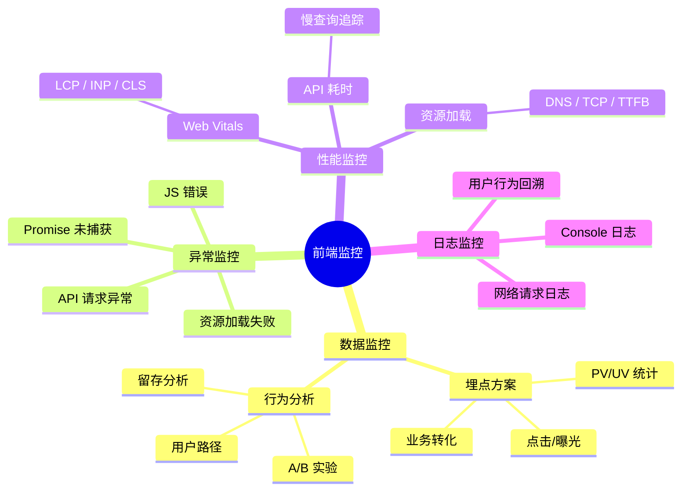
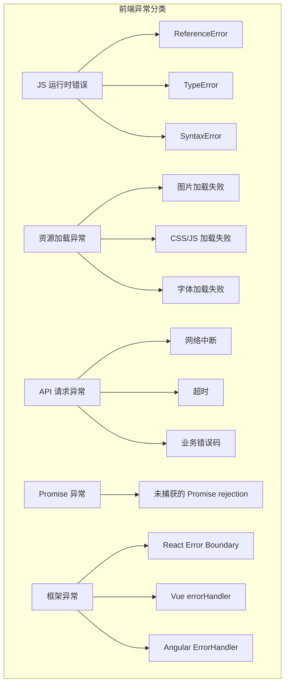
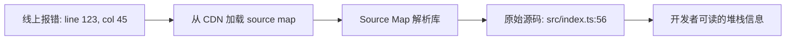
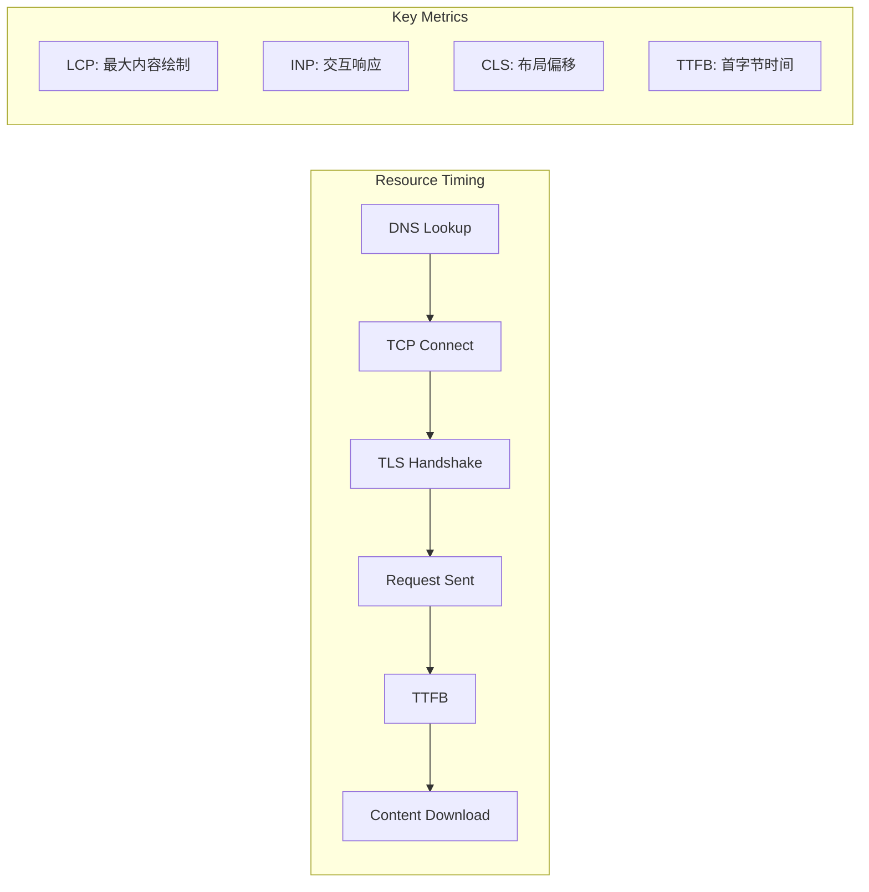
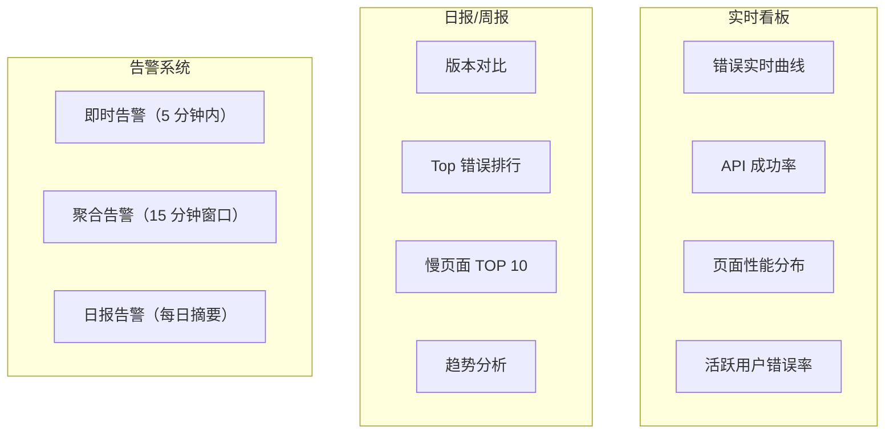

# 📊 前端监控与埋点知识详解（含 Mermaid 图解）

> 🎯 **面试星级**：★★★★☆ | **建议用时**：1.5 天
> 前端监控体系涵盖埋点、异常上报、性能监控、行为分析，是线上应用质量保障的关键基础设施

---

## 📑 目录

- [一、前端监控体系总览](#一前端监控体系总览)
- [二、埋点方案设计](#二埋点方案设计)
- [三、异常监控与上报](#三异常监控与上报)
- [四、性能监控](#四性能监控)
- [五、页面数据上报策略](#五页面数据上报策略)
- [六、线上代码运行质量观察](#六线上代码运行质量观察)
- [七、版本发布监控与灰度](#七版本发布监控与灰度)
- [八、柔性降级](#八柔性降级)
- [九、监控工具选型](#九监控工具选型)
- [十、面试题精选](#十面试题精选)

---

## 📈 前端监控体系总览



### 前端监控的三个核心层次

| 层次 | 关注点 | 核心指标 | 工具/方案 |
|------|--------|---------|----------|
| **应用层** | 业务数据、用户行为 | PV/UV、转化率、点击率 | 自定义埋点 |
| **性能层** | 页面加载、交互响应 | LCP、INP、CLS、TTFB | Web Vitals |
| **异常层** | 错误、崩溃、异常 | JS Error 率、API 成功率 | Sentry / 自建 |

---

## 一、埋点方案设计

### 1. 业界常见的埋点方案

| 方案 | 原理 | 优点 | 缺点 | 适用场景 |
|------|------|------|------|---------|
| **代码埋点** | 开发人员在业务代码中手动插入埋点代码 | 精确控制、数据丰富 | 侵入性强、维护成本高 | 核心业务路径 |
| **可视化埋点** | 通过可视化工具圈选元素，自动生成埋点 | 无需开发介入、灵活调整 | 覆盖有限、无法处理动态内容 | 运营活动页 |
| **无埋点（全埋点）** | 自动采集所有用户交互事件 | 全面无遗漏、接入成本低 | 数据量大、需后端清洗 | 行为分析初期 |
| **声明式埋点** | 通过 data 属性声明埋点，由 SDK 自动采集 | 低侵入、与业务解耦 | 灵活性有限 | 中大型项目首选 |

### 2. 声明式埋点示例

```html
<!-- data-stat 属性声明埋点 -->
<button data-stat="{ event: 'click', page: 'home', module: 'banner', target: 'entry' }">
  立即参与
</button>
```

```typescript
// 声明式埋点 SDK 核心逻辑
interface StatEvent {
  event: string;
  page: string;
  module: string;
  target?: string;
  extra?: Record<string, string>;
}

class StatSDK {
  private queue: StatEvent[] = [];
  private idleTimer: number | null = null;

  init() {
    document.addEventListener('click', (e) => {
      const target = (e.target as HTMLElement).closest('[data-stat]');
      if (!target) return;
      try {
        const event = JSON.parse(target.getAttribute('data-stat')!);
        this.enqueue(event);
      } catch { /* ignore malformed */ }
    });
  }

  private enqueue(event: StatEvent) {
    this.queue.push(event);
    this.scheduleFlush();
  }

  private scheduleFlush() {
    if (this.idleTimer) return;
    // 利用 requestIdleCallback 在浏览器空闲时上报
    this.idleTimer = requestIdleCallback(() => this.flush(), { timeout: 3000 });
  }

  private flush() {
    if (this.queue.length === 0) return;
    const events = this.queue.splice(0, this.queue.length);
    // 使用 sendBeacon 保证页面卸载时也能发送
    navigator.sendBeacon('/api/stat', JSON.stringify(events));
    this.idleTimer = null;
  }
}
```

### 3. 埋点数据模型设计

```typescript
// 通用埋点数据模型
interface TrackEvent {
  // 基础信息
  event: string;           // 事件名称：page_view / click / exposure
  page: string;            // 页面标识：/home / /detail/123
  module: string;          // 模块标识：header / banner / footer
  timestamp: number;       // 事件时间戳

  // 用户信息
  userId?: string;         // 登录用户 ID
  deviceId: string;        // 设备唯一标识
  sessionId: string;       // 会话 ID

  // 环境信息
  ua: string;              // User-Agent
  url: string;             // 当前页面 URL
  referrer: string;        // 来源页

  // 业务扩展
  target?: string;         // 目标标识
  value?: number;          // 数值（如金额、时长）
  extra?: Record<string, string | number>;  // 扩展字段
}
```

---

## 二、异常监控与上报

### 1. 异常分类



### 2. 异常捕获与上报

```typescript
// 全局异常捕获
class ErrorMonitor {
  init() {
    // 1. JS 运行时错误
    window.onerror = (msg, source, line, col, error) => {
      this.report({
        type: 'js_error',
        message: msg,
        stack: error?.stack,
        source,
        line,
        col,
      });
    };

    // 2. Promise 未捕获异常
    window.addEventListener('unhandledrejection', (event) => {
      this.report({
        type: 'promise_error',
        message: event.reason?.message || String(event.reason),
        stack: event.reason?.stack,
      });
    });

    // 3. 资源加载失败
    window.addEventListener('error', (event) => {
      const target = event.target;
      if (target && (target instanceof HTMLScriptElement
          || target instanceof HTMLLinkElement
          || target instanceof HTMLImageElement)) {
        this.report({
          type: 'resource_error',
          source: (target as HTMLElement).tagName,
          url: (target as HTMLScriptElement).src
            || (target as HTMLLinkElement).href
            || (target as HTMLImageElement).src,
        });
      }
    }, true);
  }

  private report(error: ErrorReport) {
    // 错误采样率：只上报 10% 的高频错误
    if (error.type === 'js_error' && Math.random() > 0.1) return;

    // 去重：相同错误 5 秒内不重复上报
    const key = `${error.type}:${error.message}`;
    if (this.isDuplicate(key)) return;

    // 使用 sendBeacon 或 Image 上报（不影响主流程）
    const payload = JSON.stringify({ ...error, timestamp: Date.now() });
    navigator.sendBeacon('/api/error', payload);
  }

  private dedupCache = new Map<string, number>();
  private isDuplicate(key: string): boolean {
    const now = Date.now();
    const last = this.dedupCache.get(key);
    if (last && now - last < 5000) return true;
    this.dedupCache.set(key, now);
    return false;
  }
}
```

### 3. Source Map 还原



```typescript
// 使用 source-map 库还原
import { SourceMapConsumer } from 'source-map';

// 注意：source map 不应上传到 CDN（安全风险），应存储在内部系统
async function resolveStack(rawStack: string): Promise<string> {
  const lines = rawStack.split('\n');
  const resolved = await Promise.all(
    lines.map(async (line) => {
      const match = line.match(/(.+)\((.+):(\d+):(\d+)\)/);
      if (!match) return line;
      const [, context, file, lineNum, colNum] = match;
      const consumer = await loadSourceMap(file);
      if (!consumer) return line;
      const pos = consumer.originalPositionFor({
        line: parseInt(lineNum),
        column: parseInt(colNum),
      });
      return `${context}(${pos.source}:${pos.line}:${pos.column})`;
    })
  );
  return resolved.join('\n');
}
```

### 4. 如何快速定位异常位置

| 手段 | 做法 | 效果 |
|------|------|------|
| **Source Map** | 生产环境保留 source map 至内部系统 | 将压缩代码映射回源码 |
| **错误聚合** | 按错误 message + stack 指纹聚合 | 同一 Bug 自动归并 |
| **用户行为回溯** | 记录用户操作时间线（click / input / route） | 复现问题路径 |
| **环境信息** | 记录 UA、设备、网络、版本 | 快速判断影响范围 |
| **版本关联** | 每次发布记录 commit 和构建时间 | 确定是哪个版本引入的 Bug |

---

## 三、性能监控

### 1. Web Vitals 采集

```typescript
// Web Vitals 性能采集
import { onLCP, onINP, onCLS, onTTFB } from 'web-vitals';

function reportWebVitals(metric: any) {
  const body = {
    name: metric.name,
    value: metric.value,
    rating: metric.rating,  // 'good' | 'needs-improvement' | 'poor'
    delta: metric.delta,
    id: metric.id,
    ts: Date.now(),
    url: location.href,
    ua: navigator.userAgent,
  };
  // 按采样率上报（避免高频上报）
  if (Math.random() < 0.5) {
    navigator.sendBeacon('/api/vitals', JSON.stringify(body));
  }
}

onLCP(reportWebVitals);
onINP(reportWebVitals);
onCLS(reportWebVitals);
onTTFB(reportWebVitals);
```

### 2. API 请求监控

```typescript
// 拦截 fetch 和 XMLHttpRequest
class APIMonitor {
  private originalFetch: typeof fetch;

  init() {
    this.monitorFetch();
    this.monitorXHR();
  }

  private monitorFetch() {
    this.originalFetch = window.fetch;
    window.fetch = (input, init) => {
      const startTime = performance.now();
      const url = typeof input === 'string' ? input : input.url;

      return this.originalFetch(input, init).then(async (response) => {
        const duration = performance.now() - startTime;
        const cloned = response.clone();

        // 慢请求追踪（> 1s）
        if (duration > 1000) {
          this.report({
            type: 'slow_api',
            url,
            method: init?.method || 'GET',
            duration,
            status: response.status,
            size: parseInt(cloned.headers.get('content-length') || '0'),
          });
        }
        return response;
      }).catch((error) => {
        // 网络异常上报
        this.report({
          type: 'api_error',
          url,
          method: init?.method || 'GET',
          error: error.message,
        });
        throw error;
      });
    };
  }

  private monitorXHR() { /* 类似 fetch 拦截 */ }
  private report(data: any) { /* 上报逻辑 */ }
}
```

### 3. 性能指标采集



```typescript
// 使用 Performance API 采集
function collectPerformanceMetrics() {
  // Navigation Timing
  const nav = performance.getEntriesByType('navigation')[0] as PerformanceNavigationTiming;
  if (nav) {
    return {
      dns: nav.domainLookupEnd - nav.domainLookupStart,
      tcp: nav.connectEnd - nav.connectStart,
      tls: nav.secureConnectionStart ? nav.connectEnd - nav.secureConnectionStart : 0,
      ttfb: nav.responseStart - nav.requestStart,
      domInteractive: nav.domInteractive,
      domComplete: nav.domComplete,
      loadEvent: nav.loadEventEnd - nav.loadEventStart,
    };
  }

  // 资源加载统计
  const resources = performance.getEntriesByType('resource');
  const totalSize = resources.reduce((sum, r: any) => sum + (r.transferSize || 0), 0);
  const totalCount = resources.length;
  const failedCount = resources.filter((r: any) => r.responseStatus >= 400).length;

  return { totalSize, totalCount, failedCount };
}
```

---

## 四、页面数据上报策略

### 1. 合理上报，不影响核心功能

| 策略 | 实现方式 | 效果 |
|------|---------|------|
| **采样上报** | 按比例抽取用户上报（如 10%） | 减少 90% 请求量 |
| **批量上报** | 聚合多条数据一次性发送 | 减少 HTTP 请求数 |
| **空闲上报** | `requestIdleCallback` 在浏览器空闲时上报 | 不阻塞主线程 |
| **离线缓存** | IndexedDB 暂存，网络恢复后发送 | 确保数据不丢失 |
| **分级上报** | 错误立即上报，埋点批量延迟上报 | 关键数据优先 |
| **sendBeacon** | 页面卸载时使用 `navigator.sendBeacon` | 不阻塞页面跳转 |

### 2. 上报策略对比

| 方案 | 实时性 | 对主线程影响 | 数据完整性 | 实现复杂度 |
|------|--------|-------------|-----------|----------|
| **XHR/fetch 同步** | 高 | 阻塞 | 高 | 低 |
| **XHR/fetch 异步** | 高 | 低 | 页面关闭可能丢失 | 低 |
| **sendBeacon** | 中 | 极低 | 页面关闭也能发送 | 低 |
| **requestIdleCallback** | 低 | 极低 | 取决于空闲时间 | 中 |
| **Service Worker** | 中 | 无 | 高 | 高 |

### 3. 上报优先级分级

```typescript
enum ReportPriority {
  HIGH = 1,    // 错误、异常 → 立即上报
  NORMAL = 2,  // 性能数据 → 空闲时批量上报
  LOW = 3,     // 埋点数据 → 延迟批量上报
}

interface ReportItem {
  priority: ReportPriority;
  data: any;
  timestamp: number;
}

class ReportManager {
  private buffer: ReportItem[] = [];
  private isFlushing = false;

  add(item: ReportItem) {
    if (item.priority === ReportPriority.HIGH) {
      // 高优先级立即发送
      this.immediateReport(item.data);
    } else {
      this.buffer.push(item);
      this.scheduleFlush();
    }
  }

  private scheduleFlush() {
    if (this.isFlushing) return;

    if ('requestIdleCallback' in window) {
      requestIdleCallback(() => this.flush(), { timeout: 5000 });
    } else {
      // 降级：setTimeout 兜底
      setTimeout(() => this.flush(), 2000);
    }
  }

  private flush() {
    this.isFlushing = true;
    const batch = this.buffer.splice(0, 50);
    if (batch.length > 0) {
      navigator.sendBeacon('/api/report', JSON.stringify(batch.map(b => b.data)));
    }
    this.isFlushing = false;
  }
}
```

---

## 五、线上代码运行质量观察

### 1. 核心质量指标

| 维度 | 指标 | 健康阈值 | 告警阈值 |
|------|------|---------|---------|
| **错误率** | JS Error Rate | < 0.1% | > 0.5% |
| **API 成功率** | API Success Rate | > 99.5% | < 99% |
| **页面性能** | LCP / INP / CLS | Good 占比 > 75% | Good 占比 < 50% |
| **资源加载** | Resource Fail Rate | < 0.1% | > 0.5% |
| **用户影响** | Crash Free Rate | > 99.9% | < 99.5% |

### 2. 质量看板设计



### 3. 版本发布对比分析

```typescript
// 版本发布后的质量对比
interface VersionCompareResult {
  version: string;
  deployTime: number;
  metrics: {
    before: { errorRate: number; lcp: number; apiSuccess: number };
    after: { errorRate: number; lcp: number; apiSuccess: number };
  };
  // 自动判断发布是否健康
  health: 'healthy' | 'warning' | 'critical';
}

function compareVersions(current: VersionCompareResult) {
  const threshold = {
    errorRate: { diff: 0.003 },   // 错误率上升 < 0.3%
    lcp: { diff: 0.5 },          // LCP 增加 < 500ms
    apiSuccess: { diff: -0.01 }, // API 成功率下降 < 1%
  };

  const issues: string[] = [];

  if (current.metrics.after.errorRate - current.metrics.before.errorRate
      > threshold.errorRate.diff) {
    issues.push('错误率异常上升');
  }

  return {
    version: current.version,
    health: issues.length === 0 ? 'healthy'
      : issues.length <= 1 ? 'warning' : 'critical',
    issues,
  };
}
```

---

## 六、版本发布监控与灰度

### 1. 发布过程监控要点

| 阶段 | 监控项 | 告警条件 | 处置动作 |
|------|--------|---------|---------|
| **灰度发布** | 错误率、性能、业务指标 | 任一指标超阈值 | 立即终止灰度，自动回滚 |
| **全量发布后 5min** | 错误率尖峰 | 错误率 > 5 倍基线 | 自动回滚 |
| **全量发布后 30min** | 性能回归 | LCP/INP 均值 > 基线 20% | 降级/回滚 |
| **全量发布后 24h** | 用户反馈、Crash 率 | Crash 率 > 0.5% | 修复后热修复 |

### 2. 监控告警分级

```yaml
告警分级:
  P0: 核心功能不可用，5分钟内响应
    - 页面白屏率 > 1%
    - 登录/支付成功率 < 90%
    - 触发自动回滚

  P1: 功能异常，30分钟内响应
    - 错误率上升 > 0.5%
    - 核心 API 成功率 < 95%
    - LCP 恶化超过 1s

  P2: 体验问题，24小时内修复
    - 非核心功能错误
    - 单项性能指标下降
    - 低影响兼容性问题
```

---

## 七、柔性降级

### 1. 降级策略

| 降级层级 | 条件 | 降级动作 |
|---------|------|---------|
| **UI 降级** | 某模块接口超时 | 隐藏模块，显示骨架屏/占位 |
| **数据降级** | 实时数据不可用 | 展示缓存数据或默认值 |
| **功能降级** | 第三方服务不可用 | 禁用相关交互，提示"暂不可用" |
| **渲染降级** | 浏览器能力不足 | 降级为静态 HTML，关闭动画 |
| **资源降级** | CDN 资源加载失败 | 切回本地资源或低清版本 |

### 2. 降级实现示例

```typescript
// 柔性降级组件
function withDegradation<T>(
  fetcher: () => Promise<T>,
  fallback: T,
  options?: { timeout?: number; retryCount?: number }
) {
  let retries = options?.retryCount ?? 2;

  async function fetchWithTimeout(): Promise<T> {
    const controller = new AbortController();
    const timer = setTimeout(() => controller.abort(), options?.timeout ?? 3000);

    try {
      const result = await fetcher();
      clearTimeout(timer);
      return result;
    } catch {
      clearTimeout(timer);
      if (retries > 0) {
        retries--;
        return fetchWithTimeout();
      }
      return fallback;
    }
  }

  return fetchWithTimeout();
}

// 使用示例
const userData = await withDegradation(
  () => fetch('/api/user').then(r => r.json()),
  { name: '未知用户', avatar: '/default-avatar.png' },
  { timeout: 2000, retryCount: 1 }
);
```

---

## 八、监控工具选型

### 1. 业界主流监控方案

| 方案 | 费用 | 埋点 | 异常监控 | 性能监控 | 自建难度 |
|------|------|------|---------|---------|---------|
| **Sentry** | 免费额度 + 付费 | ❌ | ✅ 强大 | ✅ | 低（SaaS） |
| **友盟** | 免费 | ✅ | ✅ | ✅ | 低 |
| **神策** | 付费 | ✅ 自定义 | ✅ | ✅ | 中 |
| **埋点自建** | 服务器成本 | ✅ 灵活 | 需自己实现 | 需自己实现 | 高 |
| **Grafana + Prometheus** | 开源免费 | ❌ | ⚠️ 需配合 | ✅ 适合 | 高 |
| **阿里云 ARMS** | 付费 | ✅ | ✅ | ✅ | 低 |

### 2. 自建 vs 第三方方案决策

| 维度 | 自建方案 | 第三方方案 |
|------|---------|-----------|
| **成本** | 前期开发成本高，后期无许可费 | 按量付费，大流量成本高 |
| **灵活性** | 完全自定义，数据 100% 可控 | 受限于平台能力 |
| **数据安全** | 数据不出公司网络 | 数据上云，需合规审查 |
| **维护成本** | 需专人维护 | 厂商负责维护 |
| **成熟度** | 需自己打磨 | 开箱即用，功能完善 |

**推荐策略**：初期使用 Sentry（异常监控）+ 自建轻量埋点系统；流量大后切换到自建全链路监控。

---

## 九、面试题精选

### 1. 前端监控体系包含哪些层次？

前端监控体系通常包含三个核心层次：
- **数据监控**（埋点）：PV/UV、用户行为、业务转化
- **异常监控**：JS 错误、API 异常、资源加载失败
- **性能监控**：页面加载、交互响应、核心 Web 指标

三个层次互为补充，数据监控回答"用户怎么用"，异常监控回答"哪里出了问题"，性能监控回答"体验怎么样"。

### 2. 如何合理上报数据，不影响主页面功能？

- **采样上报**：高频事件按百分比采样，错误/关键事件 100% 上报
- **批量上报**：聚合多条数据后一次性发送
- **空闲上报**：`requestIdleCallback` 利用浏览器空闲时间
- **sendBeacon**：页面卸载时可靠发送，不阻塞跳转
- **优先级分级**：错误立即上报，埋点批量延迟

### 3. 如何快速定位到异常的具体位置？

1. 保留 Source Map 至内部系统，配合 `source-map` 库还原源码位置
2. 采集完整的堆栈信息、环境信息、用户操作时间线
3. 按错误指纹聚合同类错误，关联发布版本
4. 建立慢查询追踪和用户行为回溯机制

### 4. 灰度发布如何与监控系统联动？

- 灰度期间实时对比新老版本的错误率、性能、业务指标
- 设置阈值自动门禁：任一指标超阈值自动终止灰度
- 灰度流量标签传递至后端，便于按版本分析数据
- 监控看板按版本维度展示数据，支持一键回滚

### 5. 什么是柔性降级？在前端如何实现？

柔性降级指在依赖服务不可用时，系统以降级姿态继续提供服务，而非直接崩溃。前端实现方式：
- 接口超时：使用 `AbortController` + 超时控制
- 数据降级：提供 fallback 默认数据
- UI 降级：显示骨架屏或错误占位
- 资源降级：CDN 资源加载失败时切换至本地资源

### 6. 业界常见的埋点方案有哪些？各自优缺点？

| 方案 | 适用阶段 | 优点 | 缺点 |
|------|---------|------|------|
| **代码埋点** | 核心业务路径 | 精确可控，数据质量高 | 侵入性强，维护成本高 |
| **可视化埋点** | 运营活动页 | 无需开发介入，方便调整 | 不支持动态内容，覆盖有限 |
| **无埋点** | 初期的行为分析 | 接入成本低，数据全面 | 数据量大需要清洗 |
| **声明式埋点** | 中大型项目 | 低侵入，与业务解耦 | 灵活性不如代码埋点 |

---

## 📌 导航

| [⬅️ 上一章：前端工程化](./03-前端工程化.md) | [🏠 返回主指南](../README.md) | [➡️ 下一章：Node.js与服务端](./07-Node.js与服务端.md) |
|:---:|:---:|:---:|
