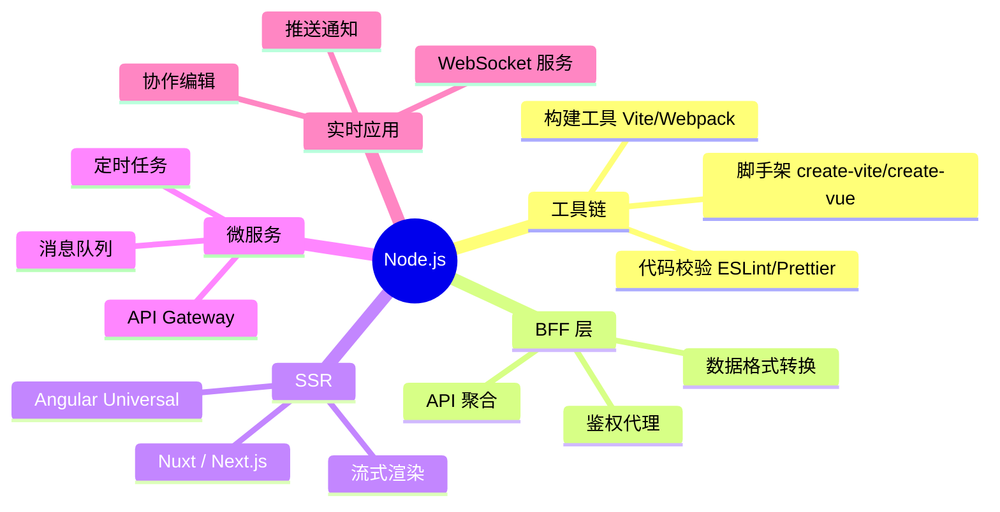
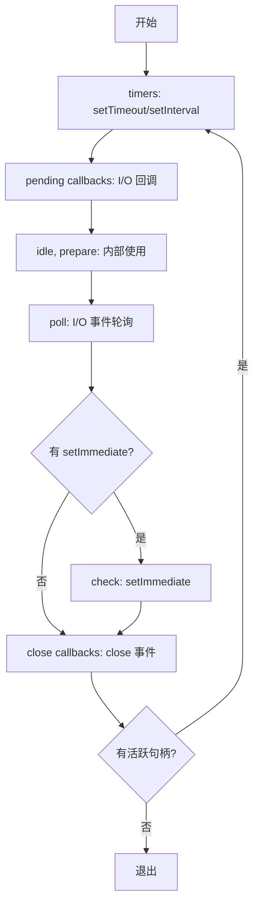
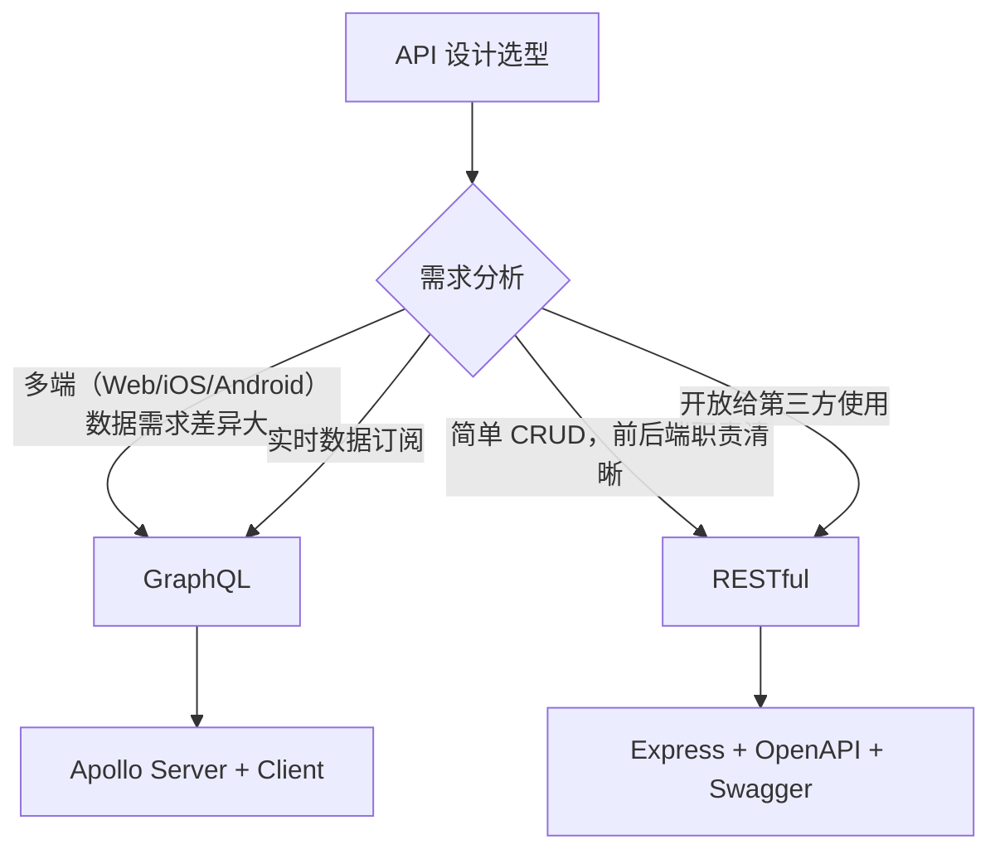
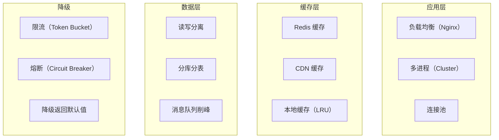
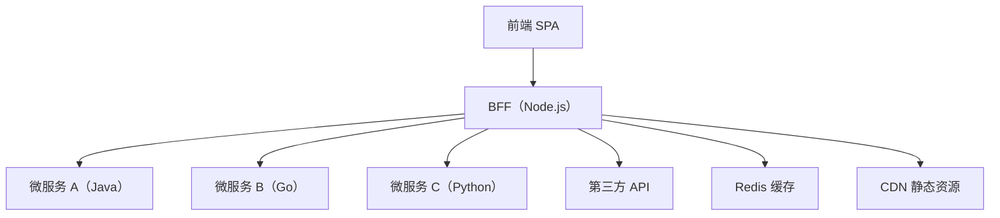

# 🖥️ Node.js 与服务端知识详解（含 Mermaid 图解）

> 🎯 **面试星级**：★★★★☆ | **建议用时**：1.5 天
> Node.js 在前端工程化、SSR、BFF 层、工具链开发中的广泛应用，使其成为前端进阶的必备技能

---


## 📈 Node.js 应用全景



---

## 一、Node.js 概述与应用场景

### 1. Node.js 适用场景

| 场景 | 适用性 | 典型技术栈 | 原因 |
|------|--------|-----------|------|
| **BFF（Backend For Frontend）** | ✅ 非常适用 | Express / Fastify | 前端团队可控，按需聚合 API |
| **SSR（服务端渲染）** | ✅ 非常适用 | Nuxt / Next / Analog | 前后端同构，提升首屏速度 |
| **CLI 工具** | ✅ 非常适用 | Commander / Inquirer | 跨平台，生态丰富 |
| **构建工具** | ✅ 非常适用 | Vite / Webpack / Rollup | JS 生态核心 |
| **实时应用** | ✅ 适用 | Socket.io / WS | 事件驱动，非阻塞 I/O |
| **API 网关** | ✅ 适用 | Express / Fastify | 轻量，高吞吐 |
| **CPU 密集型** | ❌ 不适用 | - | 单线程阻塞事件循环 |

### 2. Node.js 选型对比

| 框架 | 类型 | 性能 | 生态 | 学习成本 | 适用规模 |
|------|------|------|------|---------|---------|
| **Express** | Web 框架 | 中等 | 最大 | 低 | 中小型 |
| **Fastify** | Web 框架 | 高 | 中 | 低 | 中大型 |
| **Koa** | Web 框架 | 中等 | 中 | 中 | 中小型 |
| **NestJS** | 全栈框架 | 中等 | 大 | 高 | 大型企业 |
| **Hono** | Web 框架 | 极高 | 小 | 低 | 边缘计算 |
| **Egg.js** | 企业框架 | 中等 | 中 | 中 | 中大型 |
| **Midway** | 全栈框架 | 中等 | 中 | 中 | 中大型 |

---

## 二、Node.js 运行时原理

### 1. 事件循环（Event Loop）



**事件循环阶段详解：**

| 阶段 | 执行内容 | 关键特征 |
|------|---------|---------|
| **timers** | `setTimeout` / `setInterval` 回调 | 最小延迟时间后执行，非精确时间 |
| **pending callbacks** | 延迟到下一轮的 I/O 回调 | 如 TCP 错误回调 |
| **idle, prepare** | 系统内部使用 | 无需关注 |
| **poll** | **核心阶段**：获取新的 I/O 事件 | 无回调时等待或跳过 |
| **check** | `setImmediate` 回调 | 在 poll 空转后立即执行 |
| **close callbacks** | `close` 事件回调 | socket.on('close') 等 |

### 2. process.nextTick vs setImmediate vs setTimeout

```javascript
// 执行顺序示例
console.log('1: 同步代码');

setTimeout(() => console.log('2: setTimeout'), 0);

setImmediate(() => console.log('3: setImmediate'));

process.nextTick(() => console.log('4: nextTick'));

Promise.resolve().then(() => console.log('5: Promise.then'));

// 输出：1 → 4 → 5 → 2/3（setTimeout 和 setImmediate 顺序取决于性能）
```

| API | 执行时机 | 微任务/宏任务 | 用途 |
|-----|---------|-------------|------|
| `process.nextTick` | 当前阶段结束，下一阶段开始前 | 微任务 | 优先处理，但滥用会导致 I/O 饿死 |
| `setTimeout(fn, 0)` | timers 阶段 | 宏任务 | 延迟执行，有最小 1ms 延迟 |
| `setImmediate` | check 阶段 | 宏任务 | 当前 poll 阶段完成后立即执行 |
| `Promise.then` | 每个阶段之间 | 微任务 | 异步回调的标准方式 |

---

## 三、RESTful vs GraphQL

### 1. 核心差异

| 对比维度 | RESTful | GraphQL |
|---------|---------|---------|
| **数据获取** | 服务端决定返回结构 | 客户端声明所需字段 |
| **请求方式** | 多个端点，HTTP 方法语义 | 单一端点，Query/Mutation |
| **版本管理** | URL 或 Header 版本化 | 无版本，通过字段演进 |
| **缓存** | 天然支持 HTTP 缓存 | 需手动配置缓存 |
| **类型系统** | 无（可通过 OpenAPI） | 内建强类型 Schema |
| **学习成本** | 低 | 中 |
| **批量查询** | 需 N+1 优化 | DataLoader 解决 |
| **文件上传** | 原生支持 | 需额外处理 |

### 2. 选型决策



### 3. RESTful 最佳实践

```javascript
// Express RESTful API 示例
import express from 'express';
const router = express.Router();

// 资源命名：复数名词
// GET /api/users?page=1&limit=20&sort=createdAt
router.get('/users', async (req, res) => {
  const { page = 1, limit = 20, sort = 'createdAt' } = req.query;

  // 分页
  const skip = (page - 1) * limit;
  const users = await User.find()
    .sort({ [sort]: -1 })
    .skip(skip)
    .limit(limit);

  // 统一响应格式
  res.json({
    code: 0,
    data: {
      list: users,
      total: await User.countDocuments(),
      page: Number(page),
      limit: Number(limit),
    },
  });
});

// 错误处理中间件
router.use((err, req, res, next) => {
  res.status(err.status || 500).json({
    code: err.code || -1,
    message: err.message || 'Internal Server Error',
  });
});
```

### 4. GraphQL 核心示例

```graphql
# Schema 定义
type User {
  id: ID!
  name: String!
  email: String!
  posts: [Post!]!
}

type Post {
  id: ID!
  title: String!
  content: String!
  author: User!
}

type Query {
  user(id: ID!): User
  users(page: Int, limit: Int): [User!]!
  searchPosts(keyword: String!): [Post!]!
}

type Mutation {
  createUser(name: String!, email: String!): User!
  updateUser(id: ID!, name: String): User!
}
```

```javascript
// Apollo Server Resolvers
const resolvers = {
  Query: {
    user: async (_, { id }) => {
      return await User.findById(id);
    },
    users: async (_, { page = 1, limit = 20 }) => {
      return await User.find().skip((page - 1) * limit).limit(limit);
    },
  },
  User: {
    // 自动处理关联数据，配合 DataLoader 避免 N+1
    posts: async (user) => {
      return await Post.find({ author: user.id });
    },
  },
};
```

---

## 四、高并发解决方案

### 1. 高并发核心策略



### 2. Node.js 并发处理

```javascript
// 多进程 Cluster 模式
import cluster from 'cluster';
import os from 'os';

if (cluster.isPrimary) {
  const cpuCount = os.cpus().length;
  console.log(`Master ${process.pid} 启动，fork ${cpuCount} 个 Worker`);

  // 根据 CPU 核心数创建进程
  for (let i = 0; i < cpuCount; i++) {
    cluster.fork();
  }

  // 进程退出时自动重启
  cluster.on('exit', (worker, code, signal) => {
    console.log(`Worker ${worker.process.pid} 退出`);
    cluster.fork();
  });
} else {
  // Worker 进程运行应用
  const app = express();
  app.listen(3000);
}
```

### 3. 限流策略

```javascript
// Token Bucket 限流中间件
class TokenBucket {
  constructor(capacity, fillRate) {
    this.capacity = capacity;      // 桶容量
    this.fillRate = fillRate;       // 每秒填充速率
    this.tokens = capacity;         // 当前令牌数
    this.lastFill = Date.now();
  }

  take(count = 1) {
    this.refill();
    if (this.tokens >= count) {
      this.tokens -= count;
      return true;
    }
    return false;
  }

  refill() {
    const now = Date.now();
    const elapsed = (now - this.lastFill) / 1000;
    this.tokens = Math.min(this.capacity, this.tokens + elapsed * this.fillRate);
    this.lastFill = now;
  }
}

// 限流中间件
function rateLimit(capacity, fillRate) {
  const bucket = new TokenBucket(capacity, fillRate);
  return (req, res, next) => {
    if (bucket.take()) {
      next();
    } else {
      res.status(429).json({
        code: 429,
        message: 'Too Many Requests',
        retryAfter: Math.ceil(1 / fillRate),
      });
    }
  };
}

app.use('/api', rateLimit(100, 10)); // 每秒 10 个请求
```

### 4. 熔断器模式

```javascript
// Circuit Breaker 熔断器
class CircuitBreaker {
  constructor(fn, options = {}) {
    this.fn = fn;
    this.failureThreshold = options.failureThreshold || 5;     // 连续失败次数
    this.successThreshold = options.successThreshold || 2;     // 恢复所需成功次数
    this.timeout = options.timeout || 30000;                   // 熔断持续时间
    this.failureCount = 0;
    this.successCount = 0;
    this.state = 'CLOSED';  // CLOSED / OPEN / HALF_OPEN
    this.nextAttempt = Date.now();
  }

  async call(...args) {
    if (this.state === 'OPEN') {
      if (Date.now() > this.nextAttempt) {
        this.state = 'HALF_OPEN';
      } else {
        throw new Error('Circuit breaker is OPEN');
      }
    }

    try {
      const result = await this.fn(...args);
      this.onSuccess();
      return result;
    } catch (error) {
      this.onFailure();
      throw error;
    }
  }

  onSuccess() {
    this.failureCount = 0;
    if (this.state === 'HALF_OPEN') {
      this.successCount++;
      if (this.successCount >= this.successThreshold) {
        this.state = 'CLOSED';
        this.successCount = 0;
      }
    }
  }

  onFailure() {
    this.failureCount++;
    if (this.failureCount >= this.failureThreshold) {
      this.state = 'OPEN';
      this.nextAttempt = Date.now() + this.timeout;
    }
  }
}
```

---

## 五、Node.js 中间件实践

### 1. 中间件模式

```javascript
// Koa 洋葱模型中间件
import Koa from 'koa';
const app = new Koa();

// 中间件按顺序执行，像洋葱一样层层剥开
app.use(async (ctx, next) => {
  console.log('1: 请求进入');
  await next();                     // 等待后续中间件执行
  console.log('6: 响应离开');
});

app.use(async (ctx, next) => {
  console.log('2: 日志中间件');
  const start = Date.now();
  await next();
  const ms = Date.now() - start;
  console.log(`5: ${ctx.method} ${ctx.url} - ${ms}ms`);
});

app.use(async (ctx) => {
  console.log('3: 路由处理');
  ctx.body = { message: 'Hello World' };
  console.log('4: 响应已设置');
});

// 输出：1 → 2 → 3 → 4 → 5 → 6（洋葱模型）
app.listen(3000);
```

#### koa-compose 核心实现

```typescript
// Koa 中间件洋葱模型的核心：koa-compose
function compose(middlewares: Function[]) {
  return function (context: any, next?: Function) {
    let index = -1;

    function dispatch(i: number): Promise<void> {
      // 禁止一个中间件中多次调用 next
      if (i <= index) {
        return Promise.reject(new Error('next() called multiple times'));
      }
      index = i;

      const fn = i === middlewares.length ? next : middlewares[i];
      if (!fn) return Promise.resolve();

      try {
        return Promise.resolve(fn(context, dispatch.bind(null, i + 1)));
      } catch (err) {
        return Promise.reject(err);
      }
    }

    return dispatch(0);
  };
}

// 使用
const composed = compose([middleware1, middleware2, middleware3]);
composed(ctx).then(() => console.log('所有中间件执行完毕'));
```

### 2. 常见中间件分类

| 类别 | 中间件 | 作用 |
|------|--------|------|
| **安全** | `helmet` | 设置安全相关 HTTP 头 |
| **CORS** | `@koa/cors` | 跨域资源共享 |
| **日志** | `morgan` / `koa-logger` | 请求日志 |
| **解析** | `body-parser` / `koa-body` | 请求体解析 |
| **限流** | `express-rate-limit` | IP 限流 |
| **压缩** | `compression` / `koa-compress` | Gzip/Brotli 压缩 |
| **缓存** | `apicache` | 响应缓存 |
| **鉴权** | `passport` / `jsonwebtoken` | JWT / OAuth |

### 3. BFF 中间件注意事项

```javascript
// BFF 层常见问题与最佳实践

// 1. API 聚合 — 避免 N+1 请求
app.get('/api/user-dashboard', async (ctx) => {
  const [user, orders, notifications] = await Promise.all([
    userService.getUser(ctx.state.userId),
    orderService.getOrders(ctx.state.userId),
    notificationService.getUnread(ctx.state.userId),
  ]);

  ctx.body = {
    user,
    orderCount: orders.length,
    recentOrders: orders.slice(0, 5),
    unreadCount: notifications.length,
  };
});

// 2. 超时控制 — 避免上游服务慢导致 Node 阻塞
app.get('/api/search', async (ctx) => {
  const controller = new AbortController();
  const timer = setTimeout(() => controller.abort(), 3000);

  try {
    const results = await fetch('http://upstream/api/search', {
      signal: controller.signal,
    });
    ctx.body = await results.json();
  } catch (err) {
    if (err.name === 'AbortError') {
      ctx.status = 504;
      ctx.body = { code: -1, message: '上游服务超时' };
    }
  } finally {
    clearTimeout(timer);
  }
});

// 3. 请求重试（幂等接口）
async function withRetry(fn, retries = 2) {
  for (let i = 0; i <= retries; i++) {
    try {
      return await fn();
    } catch (err) {
      if (i === retries) throw err;
      await new Promise(r => setTimeout(r, 1000 * (i + 1)));
    }
  }
}
```

---

## 六、SSR 与 BFF

### 1. 架构对比

| 方案 | 渲染位置 | SEO | 首屏速度 | 维护成本 |
|------|---------|-----|---------|---------|
| **CSR（SPA）** | 浏览器 | ❌ | 慢 | 低 |
| **SSR** | 服务端 | ✅ | 快 | 中 |
| **SSG** | 构建时 | ✅ | 极快 | 低（内容固定） |
| **ISR** | 按需 | ✅ | 快 | 中 |
| **流式 SSR** | 服务端（边渲染边推） | ✅ | 极快（TTFB 不变） | 高 |

### 2. Node.js 作为 BFF 层的核心职责



| 职责 | 说明 | 示例 |
|------|------|------|
| **API 聚合** | 合并多个下游接口为一个接口 | 用户信息 + 订单 + 通知 |
| **数据裁剪** | 按前端需要格式化数据 | 删除无用字段，过滤敏感信息 |
| **鉴权统一** | 在 BFF 层统一处理鉴权 | JWT 校验、Session 管理 |
| **缓存策略** | 缓存热点数据 | Redis 缓存用户信息 |
| **格式转换** | 数据格式适配 | 时间戳转日期、枚举转中文 |
| **降级熔断** | 非核心服务不可用时的降级 | 缓存数据 + 默认值兜底 |

---

## 七、Node.js 性能优化

### 1. 常见优化手段

| 优化方向 | 具体措施 | 效果 |
|---------|---------|------|
| **事件循环** | 避免同步阻塞操作，使用 Worker Threads | 保持高吞吐 |
| **内存** | 避免内存泄漏，使用 Stream 处理大文件 | 减少 GC 压力 |
| **缓存** | 热点数据使用 Redis / 本地缓存 | 减少数据库查询 |
| **连接池** | 数据库连接复用 | 减少连接建立开销 |
| **压缩** | Gzip / Brotli 压缩响应体 | 减少网络传输 |
| **集群** | Cluster 模式利用多核 CPU | 提升 4-8 倍吞吐 |
| **日志** | 使用 pino 替代 console.log | 日志写入不阻塞 |

### 2. 内存泄漏排查

```bash
# 使用 heapdump 采集堆快照
node --require heapdump app.js
kill -USR2 <pid>  # 触发堆快照

# 使用 clinic 诊断
npx clinic doctor -- node app.js

# 使用 0x 火焰图
npx 0x app.js
```

```javascript
// 常见内存泄漏场景
// 1. 全局变量
global.cache = {};  // ❌ 不会被 GC

// 2. 闭包引用
function createLeak() {
  const largeData = new Array(1000000).fill('*');
  return function() {
    console.log(largeData.length); // ❌ largeData 被闭包持有
  };
}

// 3. 定时器未清理
setInterval(() => {
  // ❌ 没有引用定时器 ID，无法清理
  doSomething();
}, 1000);

// ✅ 正确做法
const timer = setInterval(() => doSomething(), 1000);
clearInterval(timer);  // 不再需要时清理
```

---

## 八、面试题精选

### 1. Node.js 适用于怎样的场景？

Node.js 适合 I/O 密集型场景：BFF 层（API 聚合）、SSR（服务端渲染）、CLI 工具、实时应用（WebSocket）、构建工具。不适合 CPU 密集型场景（如复杂图像处理、数据分析）。

### 2. RESTful 和 GraphQL 的关系和区别？

RESTful 是面向资源的架构风格，GraphQL 是面向查询的数据获取语言。REST 适合简单、稳定的接口，天然支持 HTTP 缓存；GraphQL 适合多端、数据需求差异大的场景，客户端灵活指定字段。可以共存：主体用 REST，复杂查询场景用 GraphQL。

### 3. 如何解决高并发问题？

- **应用层**：负载均衡（Nginx）、多进程（Cluster）、连接池
- **缓存层**：Redis 缓存、CDN 缓存、本地缓存
- **数据层**：读写分离、分库分表、消息队列削峰
- **降级**：限流（Token Bucket）、熔断（Circuit Breaker）、降级默认值

### 4. Node.js 作为 BFF 中间件服务有哪些注意事项？

- 超时控制：给上游请求设置超时，避免 Node 线程被慢服务阻塞
- 降级熔断：非核心服务不可用时提供降级数据
- 错误处理：统一错误格式，区分客户端和服务端错误
- 性能监控：采集 API 耗时、错误率、内存和 CPU 使用
- 日志规范：结构化日志，关联 Trace ID 便于链路追踪
- 安全防护：鉴权统一、请求校验、CORS 配置、防 SQL 注入

### 5. 什么是事件循环？Node.js 事件循环有哪些阶段？

事件循环是 Node.js 实现非阻塞 I/O 的核心机制。主要阶段：timers（定时器回调）→ pending callbacks（延迟 I/O 回调）→ poll（I/O 事件轮询）→ check（setImmediate）→ close callbacks（关闭事件）。

### 6. process.nextTick 和 setImmediate 的区别？

`process.nextTick` 在当前阶段结束、下一阶段开始前执行（微任务），优先级高于 Promise；`setImmediate` 在 check 阶段执行（宏任务）。`process.nextTick` 如果递归调用会导致 I/O 饿死，建议优先使用 `setImmediate`。

### 7. Node.js require 机制与模块循环

#### require 加载流程（5 步）


1. **Resolve**：解析绝对路径，处理 `./`、`/`、`node_modules` 查找
2. **Loading**：根据扩展名读取文件（`.js`/`.json`/`.node`）
3. **Wrapping**：将代码包装为 `(function(exports, require, module, __filename, __dirname) { ... })`
4. **Execution**：执行包装后的函数，`module.exports` 决定导出内容
5. **Caching**：模块缓存到 `require.cache`，下次 require 直接返回缓存

#### 循环引用问题

```javascript
// a.js
const b = require('./b');
console.log('a.js: b.name =', b.name);
module.exports = { name: 'module-a' };

// b.js
const a = require('./a');
console.log('b.js: a =', a);  // 此时 a 是空对象 {}！
module.exports = { name: 'module-b' };

// main.js
require('./a');

// 执行顺序：
// 1. main.js require('./a') → a.js 开始执行
// 2. a.js 第 3 行 require('./b') → 进入 b.js
// 3. b.js 第 3 行 require('./a') → 从缓存中找到 a（尚未执行完，仅返回 {}）
// 4. b.js 输出: a = {}（空对象）
// 5. b.js 导出 { name: 'module-b' }
// 6. 回到 a.js: b.name = 'module-b'
// 7. a.js 导出 { name: 'module-a' }
```

#### module.exports vs exports

```javascript
// exports 是 module.exports 的引用
// 初始时: exports === module.exports === {}

// ✅ 可以添加属性
exports.name = 'hello';  // 相当于 module.exports.name = 'hello'

// ❌ 不能重新赋值，会断开引用
exports = { name: 'world' };  // 使 exports 指向新对象，module.exports 仍是原对象

// ✅ 正确导出
module.exports = { name: 'world' };
```

---
