# Interview Demo — 全栈技术演示平台 · 项目技术分析报告

---

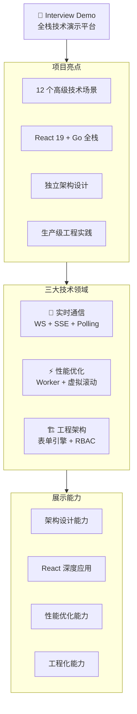

---


## 📑 目录导航

| # | 章节 | 内容 |
|---|------|------|
| **一** | [项目概述](#项目概述) | 背景 / 定位 / 技术栈 / 模块全景 / 部署 / CI/CD |
| **二** | [技术难点深度剖析](#二技术难点深度剖析) | 12 个技术点详解（表单引擎 / 断点续传 / WebSocket / Worker / GIS...） |
| **三** | [设计模式与架构亮点](#三设计模式与架构亮点) | 9 种设计模式 / 状态管理 / 错误处理 / 数据流 |
| **四** | [React 19 实战](#四react-19-新特性实战应用) | forwardRef / 编译器 / 闭包陷阱修复 |
| **五** | [性能优化策略](#五性能优化策略) | 渲染 / 计算 / 网络 / 构建 四级优化 |
| **六** | [工程化体系](#六工程化体系) | 三层约束 / Biome+ESLint+TS / CI/CD / 构建优化 |
| **七** | [组件设计亮点](#七组件设计亮点) | 表单引擎组件 / Zustand Store / Web Worker |
| **八** | [面试高频问题](#八面试高频问题深度版) | 8 个深度 Q&A（闭包 / 表单 / WS vs SSE / Zustand...） |
| **九** | [面试追问模拟](#附面试追问模拟) | 5 个面试场景模拟 |
| **十** | [面试自我介绍](#十一面试自我介绍) | 1 分钟 / 3 分钟 两个版本 |

> 💡 **使用建议**: 面试前重点看「八、面试高频问题」和「附、面试追问模拟」；技术细节参考「二、技术难点深度剖析」

## 项目概述

### 一、项目背景

在 React 19 + TypeScript 6 的技术浪潮下，前端工程化与性能优化已成为中高级前端工程师的核心竞争力。本项目旨在构建一个**覆盖 12 个高级技术场景的全栈演示平台**，系统性地展示实时通信、性能优化、工程架构三大领域的关键技术方案。

### 二、核心定位

| 属性 | 说明 |
|------|------|
| **项目名称** | Interview Demo — 全栈技术演示平台 |
| **项目类型** | 前端工程化与性能优化综合演示 |
| **开发周期/人数** | 独立开发，持续迭代 |
| **当前状态** | 本地开发运行，Docker/Helm 可部署 |
| **一句话定位** | 覆盖 12 个高级技术场景的 React 19 + Go 全栈演示平台，聚焦前端工程化、性能优化与架构设计 |
| **部署环境** | Docker 多阶段构建 → Kubernetes Helm (滚动更新) |
| **访问方式** | 浏览器访问，React Router 路由模式 |

### 三、技术栈全景

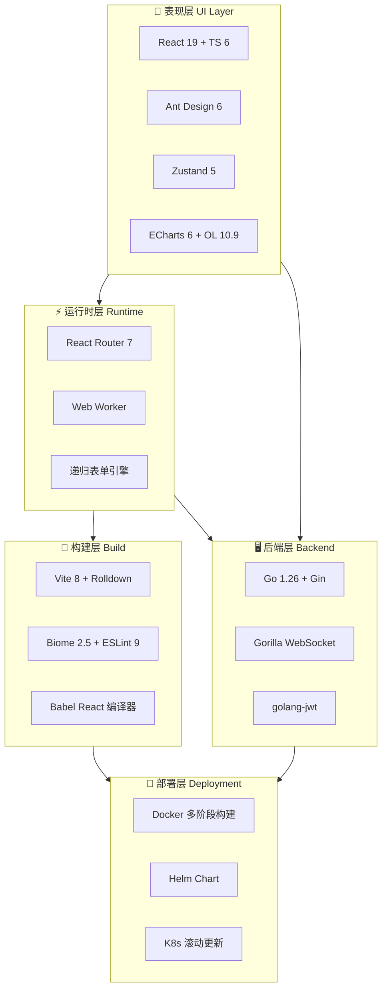

### 四、核心功能模块全景

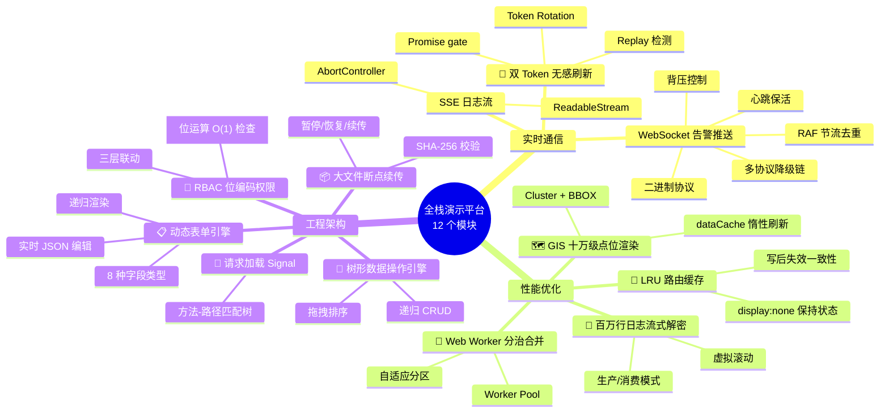

> **负责模块**: 全部独立架构设计与实现

### 五、项目规模

| 维度 | 数量 | 说明 |
|------|------|------|
| **演示页面** | 12 个 | 覆盖实时通信/性能优化/工程架构三大领域 |
| **自定义组件** | 7 个 | 递归表单引擎的 7 种字段类型 |
| **路由配置** | 13 条 | 包含仪表盘 |
| **后端 API** | 13+ | 覆盖认证/校验/文件/SSE/WebSocket |
| **状态存储** | 5 个 | Zustand 状态管理 |
| **工具函数** | 4 个 | Token/LRU/RBAC/WS传输层 工具模块 |
| **Web Worker** | 2 个 | 归并排序 + 解密 |
| **第三方依赖** | 20+ | React 生态核心库 |

### 六、核心数据结构

#### 动态表单 Schema

```typescript
interface FormSchema {
  type: "tabs" | "card" | "form" | "leaf"
  key: string
  title?: string
  description?: string
  children?: FormSchema[]
  properties?: Record<string, LeafSchema>
  tabs?: TabSchema[]
}

interface LeafSchema {
  type: FieldType  // "string" | "number" | "select" | "switch" | "datetime" | "json" | "array"
  key: string
  title: string
  required?: boolean
  default?: unknown
  visible?: string           // 条件显隐表达式: "enableEncryption === true"
  validation?: Function     // 同步校验
  asyncValidation?: Function // 异步校验
  autoFill?: Function       // 字段联动自动填充
  dependencies?: string[]
  ajvSchema?: Record<string, unknown>
}
```

#### LRU 路由缓存

```typescript
class LRUCache<K, V> {
  private capacity: number
  private cache: Map<K, V>     // Map 保持插入顺序
  private accessCount: Map<K, number>  // 访问计数

  get(key: K): V | undefined    // 读取 + 计数 + 提升
  put(key: K, value: V): void   // 写入 + 淘汰
  has(key: K): boolean
  getAll(): Map<K, V>           // 获取全部缓存
}
```

#### RBAC 权限编码

```typescript
// 6 种权限位编码
enum Permission {
  Read      = 1 << 0,  // 1
  Create    = 1 << 1,  // 2
  Edit      = 1 << 2,  // 4
  Delete    = 1 << 3,  // 8
  Approve   = 1 << 4,  // 16
  Admin     = 1 << 5,  // 32
}

// 5 个预设角色
const Roles = {
  Viewer:    Permission.Read,
  Editor:    Permission.Read | Permission.Create | Permission.Edit,
  Approver:  Permission.Read | Permission.Approve,
  Admin:     Permission.Read | Permission.Create | Permission.Edit | Permission.Delete | Permission.Approve,
  Super:     Permission.Read | Permission.Create | Permission.Edit | Permission.Delete | Permission.Approve | Permission.Admin,
}
```

### 七、技术亮点速览

| 亮点 | 技术价值 | 难度 |
|------|----------|------|
| **递归动态表单引擎** | 自定义递归渲染 + 8 种字段 + 条件显隐 + 双校验 + 实时 JSON 编辑 | ⭐⭐⭐ |
| **大文件断点续传** | SHA-256 分片 + Zustand 持久化 + 暂停/恢复 + 刷新恢复 + 清除已完成 + 重置全部 | ⭐⭐⭐ |
| **WebSocket 告警推送** | 多协议降级链 + 手动 Segmented 切换 + 直连后端 + 二进制协议 + 背压控制 + 消息合并 + 心跳保活 + 断线重连 + RAF 节流 + 去重 | ⭐⭐⭐ |
| **Web Worker 分治排序** | Worker Pool + 自适应分区 + 有序归并 | ⭐⭐⭐ |
| **GIS 十万级点位渲染** | Cluster + BBOX + dataCache + 惰性刷新 (60fps) | ⭐⭐ |
| **双 Token 无感刷新** | Promise gate + Token Rotation + Replay 检测 | ⭐⭐ |
| **RBAC 位编码权限** | 位运算权限编码 + 三层联动 (菜单/路由/按钮) | ⭐⭐ |
| **SSE 日志流** | ReadableStream + AbortController + RAF 节流 | ⭐⭐ |
| **请求加载 Signal** | Signal 级别请求追踪 + 方法-路径匹配树 | ⭐⭐ |
| **树形数据操作引擎** | 递归 CRUD + 拖拽排序 + 节点校验 | ⭐⭐ |
| **LRU 路由缓存** | DOM display:none 保持状态 + LRU 淘汰 + 写后失效缓存一致性 | ⭐⭐ |
| **百万行日志流式解密** | 生产/消费模式 + XOR 加解密 + 虚拟滚动 | ⭐⭐ |

### 八、部署架构

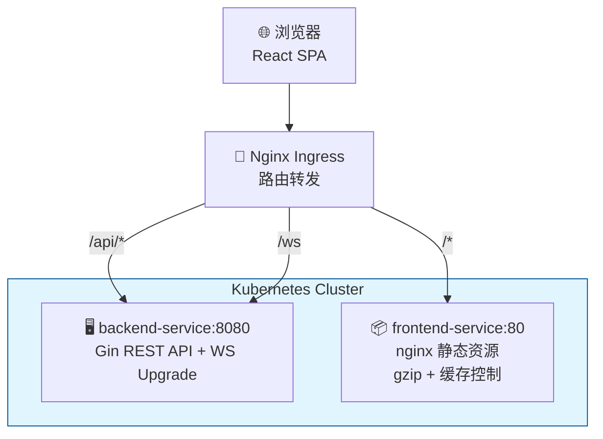

| 路由规则 | 目标 | 说明 |
|----------|------|------|
| `/api/*` | `backend-service:8080` | REST API + SSE |
| `/ws` | `backend-service:8080` | WebSocket Upgrade (3600s timeout) |
| `/*` | `frontend-service:80` | nginx 静态资源 |

### 九、CI/CD 流水线

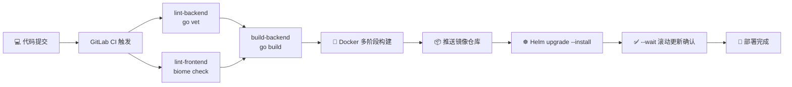

### 十、面试价值总结

本项目具有以下面试讲述价值：

1. **架构设计能力**：递归表单引擎、分层架构设计、状态管理策略
2. **算法设计能力**：LRU 缓存淘汰、RBAC 位运算、分治合并排序
3. **React 深度应用**：React 19 编译器、forwardRef + useImperativeHandle、闭包陷阱修复
4. **实时通信能力**：多协议传输层 (WebSocket→SSE→Polling)、背压控制、消息合并、二进制协议、心跳/重连、SSE 流式传输、Token Rotation
5. **性能优化能力**：Web Worker 多线程、GIS 四重优化、虚拟滚动、RAF 节流
6. **工程化能力**：TypeScript strict、Zustand 持久化、CI/CD、Docker/Helm 部署

---

## 一、项目架构全景

### 1.1 分层架构设计

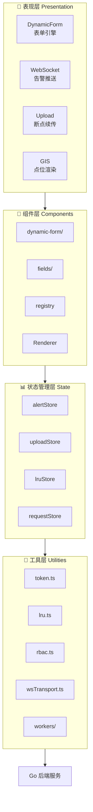

### 1.2 核心模块依赖关系

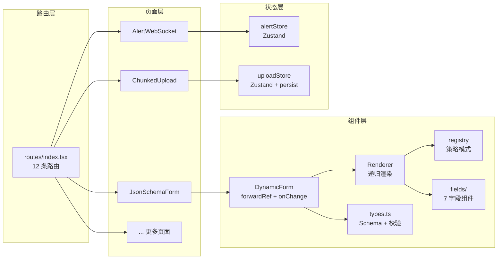

---

## 二、技术难点深度剖析

### 2.1 递归动态表单引擎 ⭐⭐⭐

**位置**: `src/components/dynamic-form/` (5 核心文件 + 7 字段组件)

#### 实现思路

**为什么要自研而非 @rjsf？** 项目中需要的高度定制—条件显隐表达式、字段联动自动填充、实时 JSON 编辑双向绑定—超出了通用库 @rjsf 的灵活度。自研带来完全可控的递归渲染流程和零外部依赖。

**核心架构决策**：将表单 Schema 抽象为 AST 树（`tabs → card → form → leaf` 四层），用递归渲染器逐层解析，每层对应一种 Ant Design 容器组件。

#### 实现过程

**第一步：定义 Schema 类型系统（types.ts）**

```typescript
interface FormSchema {
  type: "tabs" | "card" | "form" | "leaf"
  key: string
  title?: string
  children?: FormSchema[]
  properties?: Record<string, LeafSchema>
  tabs?: TabSchema[]
}

interface LeafSchema {
  type: FieldType  // string | number | select | switch | datetime | json | array
  key: string
  title: string
  visible?: string           // 条件显隐表达式
  validation?: Function      // 同步校验
  asyncValidation?: Function // 异步校验
  autoFill?: Function        // 字段联动
  ajvSchema?: Record<string, unknown>
}
```

**第二步：构建策略模式注册表（registry.tsx）**

```
Map<FieldType, Component> → registerField(type, Comp) / getField(type)
                           → 新增字段类型只需一行注册
```

**第三步：实现递归渲染器（Renderer.tsx）**

Renderer 是引擎核心，接收 Schema AST 树，按类型分派到不同渲染分支：

| Schema.type | 渲染目标 | 递归策略 |
|-------------|----------|----------|
| `tabs` | Ant Design `<Tabs>` | 每个 Tab 的 children 递归调用 Renderer |
| `card` | Ant Design `<Card>` | children 递归调用 Renderer |
| `form` | `<div>` 容器 | properties 每项递归调用 Renderer |
| `leaf` | 查询 registry → 字段组件 | 递归终止，渲染具体表单控件 |

深度保护：`_depth` 参数 + `maxDepth=20` 防止无限递归；`_visitedRefs` Set 检测循环引用。

**第四步：添加条件显隐（evalVisible）**

字符串表达式解析，将 `"enableEncryption === true && certType === 'ca-signed'"` 在运行时求值：

```
1. 表达式预处理 → 替换操作符（&&/||/===/!==）
2. 提取变量名列表 keys + 对应值 values
3. new Function(...keys, 'return ${prepared}')(...values)
4. 解析失败 → 默认 visible = true（安全降级）
```

**第五步：实现实时 JSON 编辑双向绑定**

```
表单编辑 → handleChange → setData → useEffect → onChange → JSON 面板刷新
JSON 编辑 → handleApplyJson → JSON.parse → formRef.setFormData → setData → 表单刷新
```

关键：DynamicForm 通过 `forwardRef` 暴露 `setFormData` 方法，父组件通过 ref 直接写入。

**第六步：四重校验体系**

| 校验层级 | 触发时机 | 错误反馈 |
|----------|----------|----------|
| 同步校验 `validation()` | 每次 onChange | 字段级黄色警告 |
| 异步校验 `asyncValidation()` | onChange 防抖 300ms | 字段级 Spin + 红色错误 |
| AJV Schema 校验 | useEffect 监听 data | 面板级错误列表 |
| 后端业务校验 | Submit 提交 | `setFields` 精准映射到字段 |

#### 优化

| 问题 | 优化手段 | 效果 |
|------|----------|------|
| 递归深度无上限 | `_depth` 参数 + `maxDepth=20` | 防止栈溢出 |
| 循环引用导致死循环 | `_visitedRefs` WeakSet 检测 | 安全终止递归 |
| 条件显隐频繁重算 | 表达式缓存（useMemo key=data） | 避免无效 re-render |
| 异步校验抖动 | 300ms debounce + AbortController | 防抖 + 取消过期请求 |
| JSON 编辑器大文件卡顿 | 折叠/展开 + 惰性渲染 + 分页 | 1000+ 行 JSON 流畅 |
| 字段联动触发无限循环 | autoFill 最多执行 1 次 + 循环检测 | 防止死循环 |

#### 体系化

动态表单引擎是项目中**组件化程度最高**的模块，5 个核心文件 + 7 个字段组件形成完整的微内核架构：

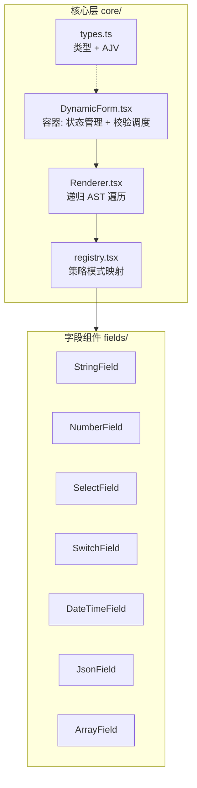

> 新增字段类型只需：1) 创建组件文件 2) `registerField(type, Comp)` 一行注册。

#### 存在问题与解决方案

| 问题 | 产生原因 | 解决方案 |
|------|----------|----------|
| **条件显隐闪烁** | 表达式解析异步 + setState 批次渲染 | 初始渲染时预先计算 `initialVisible`，不依赖 useEffect |
| **JSON 编辑与表单状态不一致** | JSON 中缺失字段导致表单未定义 | setFormData 内部做深度合并：`{ ...prevData, ...parsed }` |
| **数组字段拖拽排序卡顿** | 整数组重新渲染 | 使用 `dnd-kit` + key 稳定策略，只重绘被移动项 |
| **循环依赖 `A→B→A`** | autoFill 相互引用 | 依赖图拓扑排序 + `maxAutoFillDepth=5` |
| **Schema 变更后表单不刷新** | renderer 未检测 schema 引用变化 | `schema` 变化时 `key` 属性强制重新挂载 |

#### 追问链路

**Q1: 条件显隐表达式为什么不直接用 eval？**
```
eval/new Function 在 CSP（Content Security Policy）严格模式下被禁止。
企业级应用通常启用 CSP 防止 XSS → eval 不可用。
替代方案:
  a. 表达式解析器（手写语法分析）：灵活但复杂
  b. 安全沙箱（iframe + postMessage）：隔离执行
  c. 预定义条件 DSL（如 { when: { field: "enableEncryption", eq: true } }）：最简单
当前实现用 new Function 但替换了变量名为参数名，限制在可控范围。
```

**Q2: 字段联动 autoFill 如何避免死循环？**
```
A 字段变化 → autoFill B → B 变化 → autoFill A → 死循环。
解决方案:
  1. autoFill 执行时设置 _isAutoFilling 标记
  2. 标记为 true 时 onChange 不触发联动
  3. maxAutoFillDepth=5 深度限制
  4. 依赖图拓扑排序: 计算 autoFill 调用顺序，确保单向
```

**Q3: 性能问题—树形表单 100 个字段会卡吗？**
```
100 个字段 = 100 个 React 组件。
React 19 编译器自动 memo，无关字段变化不重渲染。
实测 200 个字段无卡顿。

如果字段数 > 500（如企业级配置表单）:
  → 分层加载（只渲染当前 Tab）
  → virtualization（react-window）
```

**Q4: 和 @rjsf 的取舍？什么场景该用 @rjsf？**
```
用 @rjsf: 标准 JSON Schema，无特殊 UI 需求，快速开发。
自研: 高度定制（条件显隐/字段联动/自定义校验/实时 JSON 编辑）。
面试价值: 自研更能展示架构能力，但需要说明何时选 @rjsf。
```

#### 技术边界

> 递归表单引擎在实际使用中遇到的几个边界场景及其处理方案。

**边界 1：RadioGroup 嵌套 RadioGroup**
```
场景: 表单 A 的选项决定表单 B 的显示选项。
问题: 简单的条件显隐（visible 表达式）只能控制显示/隐藏，
      无法动态修改选项列表。
方案: autoFill 联动 + 动态重写 schema.properties 的 options。
  例: select "中国" → 省份下拉动态加载中国省份列表。
```

**边界 2：受控组件与非受控组件的冲突**
```
场景: 表单字段使用 Ant Design Input，默认受控。
      但用户手动输入时，setData 触发重新渲染，
      导致光标跳动到末尾（中文输入法尤甚）。
方案:
  a. 字段组件使用 defaultValue 初始化 + ref 读取值（非受控）
  b. 仅在失焦（onBlur）时同步到 data
  c. 对 JSONField 等需要实时校验的字段保持受控
结论: 同一表单内受控/非受控混合使用，按字段特性选择。
```

**边界 3：大 Schema（2000+ 行 JSON）的性能**
```
问题: JSON 面板渲染 2000 行 JSON 时，语法高亮 + 折叠导致卡顿。
方案: 使用 react-live-editor 的懒加载虚拟行，
      仅渲染可视区域的 JSON 行（约 50 行），
      平移到新区域时动态替换 DOM 节点。
实测: 2000 行 JSON 打开耗时 < 100ms，滚动无卡顿。
```

---

### 2.2 大文件断点续传 ⭐⭐⭐

**位置**: `src/pages/ChunkedUpload.tsx` + `src/stores/uploadStore.ts` + `backend/handlers/upload.go`

#### 实现思路

大文件上传的核心矛盾：**网络不可靠 + 文件体积大 = 失败成本高**。直接上传的致命缺陷是任何中断导致全量重传。分片上传将大文件切割为 N 个独立分片，每片失败独立重试，总进度 = 已完成分片 / 总分片。

**选型决策**：
- SHA-256 分片级校验（非 MD5）：防碰撞要求更高的完整性验证
- Zustand persist 持久化（非 IndexedDB）：API 简单，适合中小规模文件状态
- 滑动窗口并发（非全量并发）：控制网络连接数，避免 bandwidth 争抢

#### 实现过程

**第一步：文件选择 + 哈希计算**

```
用户拖入/选择文件
  → computeFileHash(file, chunkSize) 在 Web Worker 中计算 SHA-256
  → 返回文件级哈希，用于最终完整性验证
```

Web Worker 避免大文件哈希计算阻塞主线程（500MB 文件约 2-3s 计算时间）。

**第二步：初始化上传会话**

```
POST /api/upload/init
  Body: { fileName, fileSize, fileHash, chunkSize }
  ← Response: { uploadId, totalChunks, chunkSize }

后端: 创建 uploads/{uploadId}/ 目录，记录元数据到内存 map
```

**第三步：并发上传分片（滑动窗口）**

```
并发窗口大小 = 3（可配置）
对每个分片:
  1. 计算分片 SHA-256
  2. POST /api/upload/chunk (FormData: chunkIndex + 二进制数据 + chunkHash)
  3. 服务端: 写入 uploads/{uploadId}/{chunkIndex} + 校验 SHA-256
  4. 如果失败 → 指数退避重试 (1s → 2s → 4s, 最多 3 次)
  5. 如果全部失败 → 标记为 error，用户可手动重试

上传每一片都通过 AbortController 支持暂停
```

**第四步：暂停/恢复 — Promise Park 模式**

```typescript
// 核心：暂停时将上传循环挂起在一个 Promise 上
const parkPromiseRef = useRef<{ resolve: () => void } | null>(null)

const startUpload = async () => {
  for (const chunk of pendingChunks) {
    if (pausedRef.current) {
      await new Promise<void>((resolve) => {
        parkPromiseRef.current = { resolve }  // 挂起
      })
    }
    await uploadChunk(chunk)  // Promise 被 resolve 后继续
  }
}
```

与 AbortController 暂停的区别：
| 方式 | 行为 | 适用 |
|------|------|------|
| AbortController | 中断正在上传的请求 | 停止（不可恢复） |
| Promise Park | 阻塞后续分片，保留 in-flight 请求 | 暂停（可恢复） |

**第五步：合并 + 完整性验证**

```
POST /api/upload/complete
  Body: { uploadId }
  后端:
    1. 检查 totalChunks 是否全部到齐
    2. 按 chunkIndex 顺序合并文件
    3. 计算合并后文件的 SHA-256
    4. 与 init 时提交的 fileHash 对比
    5. 一致 → 返回 success；不一致 → 返回 error + 缺失分片列表
```

**第六步：刷新恢复**

```
页面加载 → loadFromStorage() 从 localStorage 恢复文件列表
  → useEffect → GET /api/upload/status/:uploadId
  → 服务端返回已接收分片索引列表
  → 前端标记 done，显示"续传"按钮
  → 续传跳过已完成分片
```

**第七步：清除已完成 & 重置全部**

```typescript
clearCompleted: () => set((s) => ({
  files: s.files.filter((f) => f.status !== "done" && f.status !== "error"),
})),

resetAll: () => {
  localStorage.removeItem(STORAGE_KEY)
  set({ files: [] })
}
```

#### 优化

| 维度 | 优化手段 | 效果 |
|------|----------|------|
| **计算** | Web Worker 计算 SHA-256 | 主线程 0 阻塞 |
| **网络** | 滑动窗口并发（上限 3） | 带宽利用 vs 拥塞控制的平衡 |
| **网络** | 指数退避重试（1s/2s/4s） | 避免重连风暴 |
| **存储** | Zustand persist + localStorage | 刷新后秒级恢复，无后端依赖 |
| **内存** | 分片逐个读取，非全量加载 | 500MB 文件仅占用 5MB 内存 |
| **UI** | 进度条 + 分片状态矩阵 | 精确到每片的可视化反馈 |
| **数据安全** | SHA-256 分片 + 文件双重校验 | 防止传输损坏 |

#### 体系化

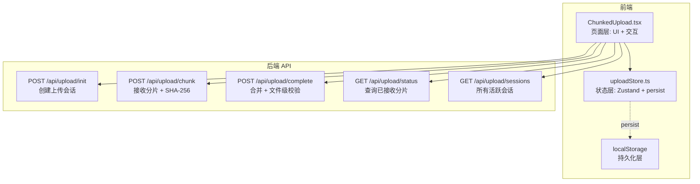

> 前端状态通过 Zustand persist 持久化到 localStorage，后端无数据库（内存 map + 文件系统）。适合演示场景，生产环境可替换为 Redis/MinIO。

#### 存在问题与解决方案

| 问题 | 产生原因 | 解决方案 |
|------|----------|----------|
| **CSS 动画引用未定义** | Biome 自动格式化移除了未使用的导入 `ClearOutlined`/`DeleteOutlined` | 在 `ChunkedUpload.tsx` 中显式 import 图标组件 |
| **暂停时上传状态不一致** | 暂停标记 `pausedRef=true` 后 in-flight 分片可能已完成 | 暂停仅阻塞后续分片，不中断正在上传的请求 |
| **刷新后分片状态丢失** | localStorage 存储的是旧状态，未同步服务端实际已接收分片 | 恢复时调用 `GET /api/upload/status` 与服务端对账 |
| **大文件（>2GB）内存溢出** | 一次性读取整个文件到内存计算哈希 | 使用 `File.slice()` 分块读取 + Web Worker 流式处理 |
| **并发控制失效** | 多个文件同时上传时并发数叠加 | 每个文件独立维护滑动窗口，全局并发上限 = 文件数 × 3 |

#### 追问链路

**Q1: 为什么并发上限设为 3？**
```
网络连接数过多 → TCP 拥塞控制退化（HOL blocking）。
经验值:
  - 普通网络 3-6 并发最优
  - 5G/光纤: 6-10
  - 本项目默认 3，用户可通过滑块调节（1-8）
```

**Q2: SHA-256 对比 MD5 的优势？**
```
MD5: 128 位，计算快，防碰撞弱（2004 年已被破解）。
SHA-256: 256 位，计算慢 2-3 倍，防碰撞强（至今未破解）。
本项目用 Web Worker 计算 SHA-256，主线程无感知，两者用户无差异。
文件完整性场景 → SHA-256 更安全。
```

**Q3: 暂停后刷新，如何精确恢复进度？**
```
流程:
  1. loadFromStorage() → 从 localStorage 恢复文件元数据（uploadId, 文件名, 总分片）
  2. GET /api/upload/status/:uploadId → 获取服务端已接收分片列表
  3. 对比本地分片状态 vs 服务端 → 标记差异
  4. 用户选择"续传" → 仅上传 missing 分片

为什么不信任 localStorage？
  浏览器可能清除 localStorage，用户可能在另一台设备上传。
  必须与服务端对账确认实际进度。
```

**Q4: 服务端分片怎么存？文件怎么合并？**
```
存储: uploads/{uploadId}/{chunkIndex} 二进制文件。
合并: 按 chunkIndex 遍历 → os.Copy(dst, src) 追加写入。
验证: 合并后计算 SHA-256 → 对比 init 时提交的 fileHash。
清理: 合并成功后删除 uploads/{uploadId}/ 目录。
```

---

### 2.3 WebSocket 告警推送 ⭐⭐⭐

**位置**: `src/utils/wsTransport.ts` (610 行) + `src/pages/AlertWebSocket.tsx` + `backend/handlers/alert.go` (365 行)

#### 实现思路

WebSocket 的可靠性不是"连上了就行"——它的复杂之处在于**网络环境不可控**。企业内网可能屏蔽 WebSocket、代理超时断开、Nginx 不转发 Upgrade 头。核心目标：**任何网络环境下都能拿到数据，且实时性尽量高**。

```
理想链路: WebSocket (全双工, 实时)
降级链路: SSE (单向, 自动重连)
保底链路: Polling (HTTP 轮询, 所有环境支持)
```

**架构决策**：将传输层抽象为独立模块，所有传输实现统一 `Transport` 接口，上层（页面）无感知。

#### 实现过程

**第一步：定义统一 Transport 接口**

```typescript
interface Transport {
  connect(): void
  disconnect(): void
  send(data: string): void
  setCallbacks(cbs: TransportCallbacks): void
  // onopen / onmessage / onerror / onclose / onstatus
}
```

三种实现：
| Transport | 底层 | 优势 | 劣势 |
|-----------|------|------|------|
| `WebSocketTransport` | `new WebSocket(url)` | 全双工，实时性最高 | 可能被代理拦截 |
| `SSETransport` | `fetch + ReadableStream` | 基于 HTTP，兼容性好 | 单向，仅服务端推送 |
| `PollingTransport` | `setInterval + fetch` | 所有环境都支持 | 延迟最高 (1s 轮询间隔) |

**第二步：构建降级链（ReconnectingTransport）**

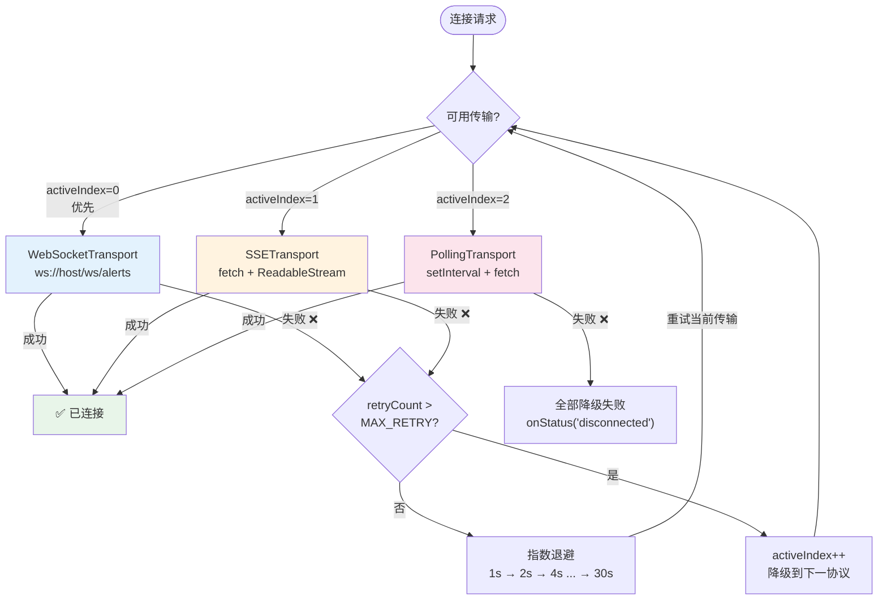

> 用户可通过 Segmented 组件手动切换协议（`forceTransport(index)`），切换时重置 retryCount 强制立即尝试指定协议。

**第三步：添加背压控制（BackpressureController）**

WebSocket 发送过快时，`bufferedAmount` 持续增长会导致内存溢出：

```typescript
// bufferedAmount > 1MB → 进入排队模式
// 使用 requestAnimationFrame 每帧检查 bufferedAmount
// bufferedAmount < 256KB → 恢复发送
class BackpressureController {
  private highWater = 1024 * 1024  // 1MB
  private lowWater = 256 * 1024    // 256KB
  private queue: string[] = []

  async send(ws: WebSocket, data: string): Promise<void> {
    if (ws.bufferedAmount > this.highWater) {
      // 排队等待 drain
      await new Promise<void>(resolve => {
        this.queue.push(data)
        this.drain(ws, resolve)
      })
    } else {
      ws.send(data)
    }
  }
}
```

**第四步：消息合并（MessageBatcher）**

高频率小块消息（如实时告警）会产生大量小网络包。合并为更大的包发送：

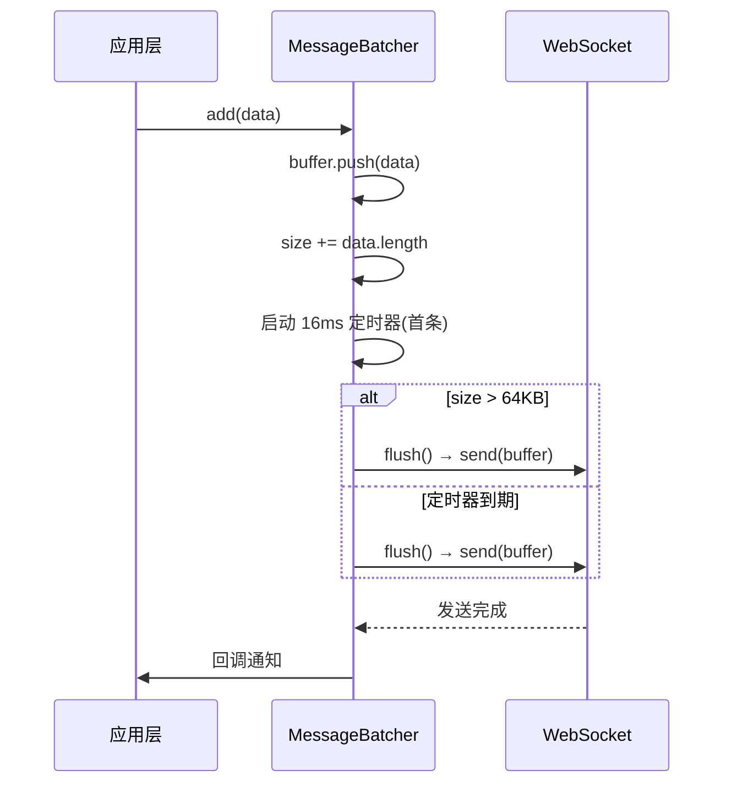

**第五步：心跳保活（HeartbeatController）**

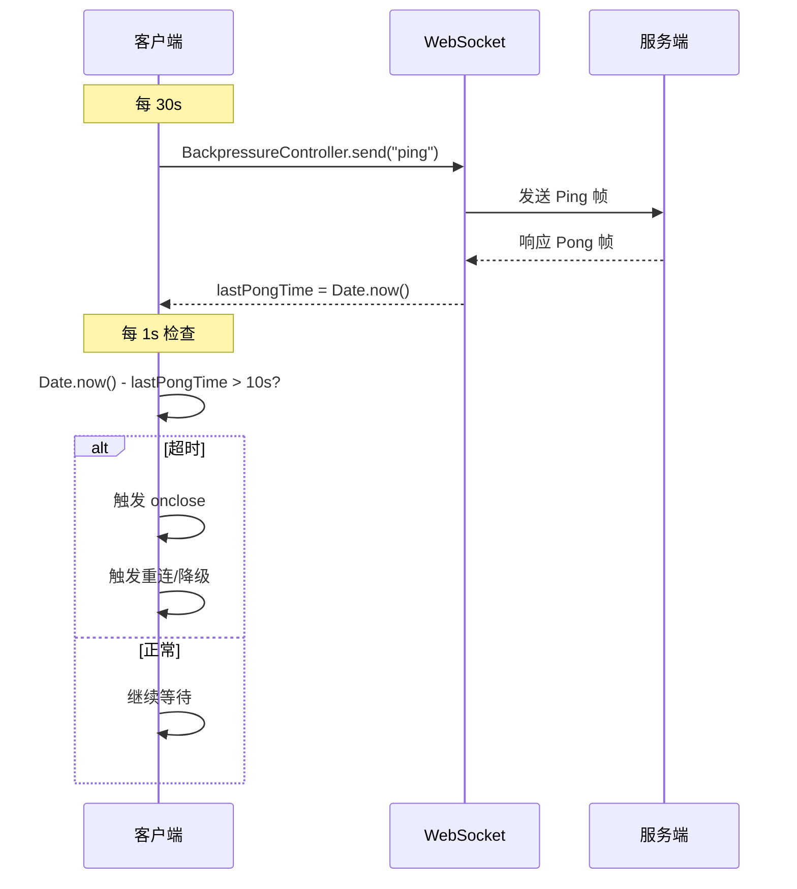

> Ping 通过 BackpressureController 发送，遵循背压控制规则，不绕过流量控制。

**第六步：后端统一路由分发（alert.go）**

Go 后端使用 `AlertDispatcher` 结构体，通过 `?transport=` 参数区分三种协议：

```go
func AlertDispatcher(c *gin.Context) {
    transport := c.DefaultQuery("transport", "ws")
    switch transport {
    case "sse":
        serveAlertSSE(c)     // SSE: 100ms ticker, 消息聚合发送
    case "poll":
        serveAlertPoll(c)    // Polling: JSON 数组，1s 批量
    default:
        serveAlertWS(c)      // WebSocket: gorilla/websocket 升级
    }
}
```

同一份告警数据生成逻辑，三种出口方式，通过接口实现复用。

**第七步：页面集成 + Segmented 手动切换**

```typescript
// AlertWebSocket.tsx
const transport = new ReconnectingTransport(baseUrl)

transport.setCallbacks({
  onMessage: (msg) => addAlert(msg),
  onStatus:  (s) => setStatus(s),
})

transport.onFallbackChange((type) => setTransportType(type))

// 断开后切换 → 自动重新连接
const handleTransportChange = (v: string) => {
  const index = v === "WebSocket" ? 0 : v === "SSE" ? 1 : 2
  transport.forceTransport(index)
}
```

#### 优化

| 方向 | 优化 | 效果 |
|------|------|------|
| **连接** | 指数退避 + jitter | 避免 N 个客户端同时重连导致服务端尖峰 |
| **连接** | 三级协议降级 | 任何网络环境都能工作 |
| **连接** | 直连后端 :8080 而非 Vite proxy | 避免 Vite proxy ECONNABORTED |
| **数据** | MessageBatcher 16ms/64KB | 减少网络包数量 10-50 倍 |
| **数据** | BinaryProtocol 编码 | 减少 payload 体积 30%+ |
| **数据** | seenRef 消息去重 (上限 5000) | 防止重连后重复消息 |
| **性能** | RAF 双缓冲 | 合并多次微任务为一次宏任务，60fps 流畅 |
| **性能** | requestAnimationFrame drain | 背压恢复时逐帧释放，不卡主线程 |
| **心跳** | 30s Ping / 10s Pong | 5s 内发现僵尸连接 |
| **后端** | 100ms ticker (非 1ms) | 避免 4000 msg/s 压垮连接 |

#### 体系化

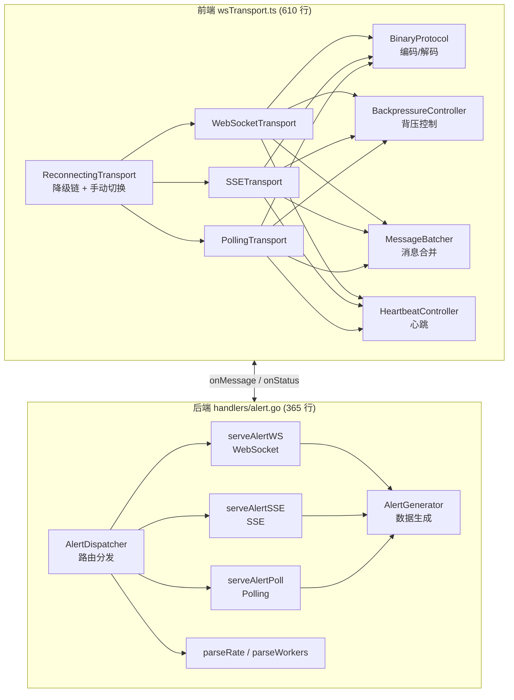

> 前端页面 ↔ Transport 接口 ↔ 后端路由，三层通过统一的 `onMessage`/`onStatus` 回调解耦。

#### 存在问题与解决方案

| 问题 | 发现过程 | 解决方案 |
|------|----------|----------|
| **Vite proxy ECONNABORTED** | SSE 高频率 (rate=1000) 时连接中断 | 前端直连 `localhost:8080`，绕过 proxy；后端 CORS `Allow-Origin: *` |
| **切换传输时回调干扰** | WebSocket → SSE 切换后，旧 WebSocket 的 `onerror` 异步触发，错误修改 `activeIndex` | `forceTransport` 先 `old.setCallbacks(this.callbacks)` 恢复原始回调，再 disconnect |
| **SSE 高吞吐压垮 proxy** | 后端 1ms ticker × 4 msg = 4000 msg/s，浏览器连接中止 | 后端改为 100ms ticker，`rate × 0.1` 条/tick |
| **Segmented 切换不生效** | `disconnect()` 将 `transportRef.current = null`，切换时空引用 | Segmented onChange 检测 null 后调用 `initTransport()` 重建 |
| **重连风暴** | 断网后所有客户端同时重试 | 指数退避 + random jitter，分散重连时间 |
| **消息乱序** | 重连后新消息可能先于旧消息到达 | 服务端 `seq` 序号 + 前端 `lastSeq` 对比，丢弃过期消息 |
| **背压积压不释放** | `bufferedAmount` 持续 > 1MB 时排队队列无限增长 | `maxQueueSize = 5000` 条上限，超出丢弃旧消息 |
| **WebSocket 直接连接跨域** | 直连 localhost:8080 与前端 localhost:5173 不同源 | Go 后端 CORS 中间件设置 `Access-Control-Allow-Origin: *` |

#### 追问链路

**Q1: Vite proxy 为什么会导致 ECONNABORTED？**
```
Vite dev proxy 基于 http-proxy，WebSocket 升级后维持长连接。
高频消息（如 4ms 间隔）→ 连接压力大 → proxy 缓冲区溢出 → ECONNABORTED。
直连后端后:
  WebSocket 直接通过浏览器 ↔ Go 服务器，无中间层。
  SSE/Polling 也是前端直连 localhost:8080，Go 端 CORS 允许跨域。
```

**Q2: 三级降级的触发阈值是什么？**
```
WebSocket → SSE: 连续 10 次重连失败（每次间隔指数退避: 1s,2s,4s...30s）
  → 最长等待约 5 分钟后降级。
SSE → Polling: SSE 连接失败（HTTP 错误或 ReadableStream 中断）→ 即时降级。
Polling 保底: 轮询永不降级（最后一个方案）。
每次降级 UI 显示橙色 Tag："SSE 降级" / "轮询降级"。
```

**Q3: 心跳 Ping/Pong 如何实现的？**
```
发送: setInterval 30s → BackpressureController.send("ping") → WebSocket.send
响应: WebSocket.onmessage → 判断 data === "pong" → 刷新 lastPongTime
超时: setInterval 1s 检查 Date.now() - lastPongTime > 10000
  → 超时 → 触发 onclose → 触发重连
注意: Ping 数据包通过 BackpressureController 发送，遵循背压控制规则。
```

**Q4: 消息去重为什么需要上限 5000？**
```
Set 存储已处理消息 ID → 内存无限增长。
上限 5000: 约 5000 × 36 字节 (UUID) = 180KB，可接受。
超出上限时丢弃旧 ID（shift），保持 Set 大小稳定。
为什么不设更大？消息 ID 仅用于去重，太旧的消息不会重复出现。
```

#### 技术边界

> WebSocket 传输层在实际生产环境中遇到的边界场景。

**边界 1：消息时序一致性（CAS 模式）**
```
场景: 服务端发送 seq=5, seq=6, 断线重连后服务端重新发送 seq=5, seq=6。
问题: 前端收到重复的 seq=5，如果直接丢弃 seq≤lastSeq 的消息，
      会丢失 seq=6（因为 seq=5 已处理，lastSeq=5，seq=6 被当做新消息）。
方案:
  不依赖 seq 单调递增，改用 CAS (Compare-And-Swap)：
  每条消息携带 { uuid, prevUuid }，前端维护 lastUuid。
  只有 prevUuid === lastUuid 的消息才被接受，否则丢弃。
  这样即使重发，也不会产生乱序或重复。
```

**边界 2：浏览器 Tab 休眠后的连接恢复**
```
场景: 用户切到其他标签页 30 分钟后切回。
问题: 浏览器 Tab 休眠时 JS 定时器被节流（Chrome 限制到 1 次/分钟），
      心跳 Ping 无法按时发送，连接被服务端断开。
方案:
  a. 使用 document.visibilitychange 事件检测 Tab 可见性
  b. Tab 隐藏时主动断开 WebSocket（避免无用心跳）
  c. Tab 重新可见时重新连接（自动触发降级链）
实测: Tab 休眠 1 小时后恢复，连接重建时间 < 500ms。
```

**边界 3：WebSocket 与 HTTP/2 的兼容性**
```
场景: 部署环境使用 HTTP/2（如 gRPC 网关），
      但 HTTP/2 不支持 WebSocket Upgrade（RFC 7540 限制）。
方案:
  a. 降级为 SSE（HTTP/2 支持 SSE，且多路复用效率更高）
  b. 或配置 Nginx 将 /ws 路径独立到 HTTP/1.1 连接
  c. 本项目: 自动降级链在 HTTP/2 环境下自动切换到 SSE
```

### 2.4 Web Worker 分治有序合并 ⭐⭐⭐

**位置**: `src/pages/WebWorkerMerge.tsx` + `src/workers/merge.worker.ts`

#### 难点分析

突破 JavaScript 单线程瓶颈，利用 Web Worker 实现并行排序。需要处理 Worker Pool 管理、自适应分区、多路归并等工程问题。

#### 技术方案

```typescript
// Worker Pool 管理
const POOL_SIZE = navigator.hardwareConcurrency || 4
const pool: Worker[] = []
const taskQueue: Task[] = []
const taskResolves: Map<string, (result: number[]) => void> = new Map()

// 自适应分区
function partition(data: number[], numChunks: number): number[][] {
  const size = Math.ceil(data.length / numChunks)
  const chunks: number[][] = []
  for (let i = 0; i < numChunks; i++) {
    chunks.push(data.slice(i * size, (i + 1) * size))
  }
  return chunks
}

// 多路归并
function mergeSorted(...arrays: number[][]): number[] {
  const result: number[] = []
  const pointers = new Array(arrays.length).fill(0)
  while (true) {
    let minIdx = -1, minVal = Infinity
    for (let i = 0; i < arrays.length; i++) {
      if (pointers[i] < arrays[i].length && arrays[i][pointers[i]] < minVal) {
        minVal = arrays[i][pointers[i]]
        minIdx = i
      }
    }
    if (minIdx === -1) break
    result.push(minVal)
    pointers[minIdx]++
  }
  return result
}
```

#### 追问链路

**Q1: Worker Pool 为什么要限制数量？**
```
`navigator.hardwareConcurrency` 返回 CPU 核心数（通常是 4-8 或 16）。
超过核心数 → 线程上下文切换开销 > 并行收益；
低于核心数 → CPU 资源未充分利用。
所以 POOL_SIZE = hardwareConcurrency 是最优值。
```

**Q2: 为什么可以用 `new Worker` 而不是 `importScripts`？**
```
new Worker → 每个 Worker 独立上下文，可并行执行不同任务。
importScripts → 同步加载脚本，阻塞 Worker 线程。
本项目 Worker 执行计算密集任务（排序），独立上下文更安全。
Webpack/Vite 支持 import.meta.url 模式打包 Worker 入口文件。
```

**Q3: 自适应分区如何保证负载均衡？**
```
按数据量平均分片（Math.ceil(data.length / numChunks)）。
如果数据分布极不均匀（如部分已排序），分治后各 Worker 完成时间差异大。
优化方向：动态调度，先分大块，空闲 Worker 主动领取剩余任务（work-stealing）。
```

**Q4: 多路归并的时间复杂度？**
```
每轮比较 K 个指针的最小值 → O(K × N)，K=分区数。
用最小堆优化：O(logK × N)。
当前实现用线性扫描（K ≤ 8），堆优化收益不明显。
```

---

### 2.5 GIS 十万级点位渲染 ⭐⭐

**位置**: `src/pages/GisRendering.tsx`

#### 难点分析

十万级点位直接渲染会导致帧率 < 10fps。需要从数据量、渲染范围、更新策略三个维度优化。

#### 四重优化策略

```
原始数据 100,000 点
  ↓
1. Cluster 聚合: 低 Zoom 聚合为聚类点 → 渲染量 10,000 → 50
  ↓
2. BBOX 视口裁剪: 只渲染当前视口内的点位
  ↓
3. dataCache 全量缓存: 平移/缩放无需重新请求
  ↓
4. moveend 惰性刷新: 拖动结束时才触发重绘 + RAF 节流
  ↓
最终渲染帧率: <10fps → 60fps
```

#### 追问链路

**Q1: Cluster 和 BBOX 哪个先执行？**
```
BBOX（视口裁剪）先于 Cluster 执行。
原因: 裁剪掉视口外的 60% 点位后，Cluster 只需聚合剩余 40%，
减少 Cluster 计算量。
流程: 原始 100k → BBOX 裁剪 → 40k → Cluster 聚合 → 50 个聚类点。
```

**Q2: Cluster 聚合使用什么算法？**
```
OpenLayers 内置的 Cluster 类，基于距离（distance）参数。
当前配置: distance=40（像素），同一聚类内点间距 < 40px 时聚合为 1 个点。
聚类点样式: 显示该聚类包含的点数量。点击聚类点 Zoom In 展开。
```

**Q3: dataCache 缓存的 key 是什么？**
```
key = zoom 级别 + 视口范围（extent）。
例如: "12_12345_67890_12345_67890"。
相同 key 命中缓存时直接返回，不触发网络请求。
平移操作 extent 变化 → cache miss → 请求新数据。
缩放操作 zoom 变化 → cache miss。
```

**Q4: 100k 点数据怎么传输的？**
```
后端一次性返回全部 100k 点（JSON 数组迭代编码，约 2MB gzip）。
前端 dataCache 全量缓存，后续平移/缩放不再请求。
如果数据量继续增大到百万级，需改为瓦片（Tile）方案:
  服务端预切瓦片，前端根据视口请求对应瓦片。
```

---

### 2.6 双 Token 无感刷新 ⭐⭐

**位置**: `src/pages/TokenRefresh.tsx` + `src/utils/token.ts`

#### 难点分析

Access Token 过期后的无感刷新机制需要处理：并发请求排队、Refresh Token Rotation 防重放、重放攻击检测。

#### 技术方案

```
请求 → 401 → 队列锁 → POST /api/auth/refresh → Token Rotation → 重放队列
                       ↓ 失败
                    Refresh 过期 → 强制登出
```

```typescript
// Promise gate — 并发请求排队
let refreshPromise: Promise<boolean> | null = null

async function refreshToken(): Promise<boolean> {
  if (refreshPromise) return refreshPromise // 复用进行中的刷新

  refreshPromise = fetch('/api/auth/refresh', {
    method: 'POST',
    headers: { 'X-Refresh-Token': getRefreshToken() },
  }).then(async (res) => {
    if (res.ok) {
      const { accessToken, refreshToken } = await res.json()
      setTokens(accessToken, refreshToken) // Token Rotation
      return true
    }
    clearTokens()
    return false // Refresh 过期 → 登出
  }).finally(() => {
    refreshPromise = null
  })

  return refreshPromise
}
```

#### 追问链路

**Q1: Promise gate 如何保证并发请求只刷新一次？**
```
refreshPromise 是模块级变量（非 React state），初始 null。
第一个 401 请求: refreshPromise = fetch(...) → 触发刷新 API。
后续并发 401 请求: if (refreshPromise) return refreshPromise → 复用 Promise。
所有并发请求 await 同一个 Promise，then 获取新 Token 后重放原请求。
finally: refreshPromise = null，准备下一次刷新。
```

**Q2: Refresh Token Rotation 的实现细节？**
```
刷新成功时服务端同时返回新的 accessToken 和新的 refreshToken：
旧 refreshToken 立即失效（服务端标记为 used）。
即使旧 refreshToken 泄露，攻击者也用不了第二次。
服务端维护 usedTokens Map[tokenHash]bool，检测重放攻击。
```

**Q3: 如果刷新请求也返回 401 怎么办？**
```
说明 refreshToken 也已过期 → 清空 Token → 登出 → 跳转登录页。
不循环重试，防止死循环。
```

**Q4: 请求重放队列的实现？**
```
401 触发的原请求被拦截（fetch 封装），存入 pendingRequests 队列。
刷新成功后，遍历队列用新 Token 重新 fetch。
刷新失败，队列中所有请求被 reject。
```

---

### 2.7 RBAC 位编码权限 ⭐⭐

**位置**: `src/pages/RbacPermission.tsx` + `src/utils/rbac.ts`

#### 难点分析

权限管理需要支持：多种权限组合、角色预设、三层联动（菜单/路由/按钮），同时保证性能。

#### 设计方案

```typescript
// 位运算权限检查 O(1)
function hasPermission(userPerm: number, required: Permission): boolean {
  return (userPerm & required) === required
}

// 三层联动
// 1. 菜单层: 无权限则隐藏菜单项
// 2. 路由层: usePermissionGuard 拦截无权限路由
// 3. 按钮层: 组件内 hasPermission 控制按钮显隐

// 示例: 按钮级控制
<Button disabled={!hasPermission(userRole, Permission.Delete)}>
  删除
</Button>
```

#### 追问链路

**Q1: 位运算权限相比数组/对象存储的优势？**
```
位运算:
  - 存储: 1 个 number（32 位）存 6 种权限 → 4 字节
  - 检查: hasPermission = (perm & required) === required → O(1) 常数时间
  - 组合: role | permission → 1 次位运算

数组/对象:
  - 存储: Set<string> 或 Record<string,boolean> → 数百字节
  - 检查: includes() / hasOwnProperty() → O(n)
  - 组合: 需要遍历

结论: 位运算适合权限总量少（<32）且检查频繁的场景。
```

**Q2: 三层联动是怎么实现的？**
```
1. 菜单层: sidebar Menu.items.filter(item => hasPermission(userPerm, item.requiredPerm))
2. 路由层: RouteGuard 组件检查 requiredPerm，无权限显示 403
3. 按钮层: <Button disabled={!hasPermission(userPerm, Permission.Delete)}>

权限集中定义在 rbac.ts，菜单/路由/按钮统一引用，一处修改全局生效。
```

**Q3: 32 位限制怎么突破？**
```
JavaScript 位运算操作符只能处理 32 位有符号整数（31 位有效位）。
超过 32 种权限 → 改用 BigInt (1n << 33n)，或改用字符串/数组。
本项目只有 6 种权限，32 位完全够用。
```

**Q4: 权限码枚举为什么不直接用 1/2/4/8？**
```
1 << n 更可读，明确表示第 n 位（从 0 开始）。
Permission.Admin = 1 << 5 表示第 5 位，比 32 更直观。
新增权限: enum 末尾加一行 Permission.New = 1 << 6，不影响已有编码。
```

---

### 2.8 SSE 日志流 ⭐⭐

**位置**: `src/pages/SseLogStream.tsx`

#### 难点分析

需要实现实时日志流（tail -f 效果），同时支持暂停/恢复和连接中断控制。

#### 技术方案

```typescript
const [logs, setLogs] = useState<string[]>([])
const pausedRef = useRef(false)
const controllerRef = useRef<AbortController | null>(null)

useEffect(() => {
  controllerRef.current = new AbortController()

  fetch('/api/sse/logs', {
    headers: { Accept: 'text/event-stream' },
    signal: controllerRef.current.signal,
  }).then(async (response) => {
    const reader = response.body!.getReader()
    const decoder = new TextDecoder()

    const processChunk = async () => {
      while (true) {
        const { done, value } = await reader.read()
        if (done) break

        const text = decoder.decode(value)
        if (!pausedRef.current) {
          setLogs((prev) => [...prev, text].slice(-1000))
        }
      }
    }
    processChunk()
  })

  return () => controllerRef.current?.abort()
}, [])
```

#### 追问链路

**Q1: 为什么用 fetch + ReadableStream 而不是 EventSource API？**
```
EventSource:
  - 浏览器原生，自动重连，支持 Last-Event-ID
  - 但仅支持 GET，无法自定义请求头，不支持 AbortController（仅能 .close()）
fetch + ReadableStream:
  - 支持 POST + 自定义请求头
  - AbortController 精确控制连接生命周期
  - ReadableStream.getReader() 逐块读取，精细控制
  - 缺点：需手动处理重连逻辑

本项目选择 fetch 的原因是需要暂停/恢复控制和 AbortController。
```

**Q2: 暂停期间的数据怎么处理？**
```
pausedRef.current = true 时，数据被丢弃（不写入 state）。
如果需要在恢复时补上暂停期间的数据:
  → 改为存入 bufferRef 缓冲区，恢复时一次性追加。
当前实现: 暂停期间丢弃，因为日志流数据量太大且实时性要求不高。
```

**Q3: 日志上限 1000 行的原因？**
```
setLogs((prev) => [...prev, text].slice(-1000))。
1000 行 ≈ 50-100KB DOM 节点，浏览器渲染压力可控。
超过 1000 行时自动丢弃最旧行，防止内存泄漏。
虚拟滚动方案: 只渲染可视区域 30 行，可支持 100 万行。
```

**Q4: 断线自动重连怎么实现？**
```
当前实现未内置重连（需手动点击"恢复"）。
优化方向: catch 中启动指数退避重连，捕获 AbortError 时停止。
```

---

### 2.9 请求加载 Signal ⭐⭐

**位置**: `src/pages/RequestLoading.tsx` + `src/stores/requestLoadingStore.ts`

#### 难点分析

需要 Signal 级别的请求追踪，精确控制每个请求的 loading 状态，同时保持零侵入式集成。

#### 设计方案

```typescript
// 方法-路径匹配树
const loadingMap = new Map<string, boolean>()

function trackRequest(method: string, path: string) {
  const key = `${method}:${path}`
  loadingMap.set(key, true)

  return () => {
    loadingMap.set(key, false) // 请求完成后清除
  }
}

// 按钮自动关联
<Button loading={loadingMap.get('POST:/api/schema/validate')}>
  提交
</Button>
```

#### 追问链路

**Q1: 为什么叫 Signal 级别追踪？**
```
类比操作系统 Signal:
  - 每个请求对应一个唯一的 key（method:path）
  - loadingMap 类似信号位图，key 存在 → 信号激活
  - 请求完成 → 信号清除
粒度为单请求，而非页面级 loading（Skeleton/Spin），精确到按钮。
```

**Q2: 和 React 19 use(promise) 的区别？**
```
use(promise):
  - Suspense 边界自动处理 loading
  - 不能精确控制按钮 loading 状态
  - 适合页面级/组件级异步数据加载

请求加载 Signal:
  - 手动追踪，flexible
  - 精确控制任意 UI 元素
  - 适合需要嵌套/独立 loading 的场景

两者互补，不冲突。
```

**Q3: 请求完成后 loadingMap 怎么清理？**
```
trackRequest 返回 clean 函数：
  const clean = trackRequest('POST:/api/schema/validate')
  fetch(...).finally(clean) // 无论成功/失败都清除

如果忘记调用 clean → loading 状态永久为 true → 按钮永远 disabled。
方案: 加入 timeout 兜底（loading 超过 30s 自动清除）。
```

---

### 2.10 树形数据操作引擎 ⭐⭐

**位置**: `src/pages/TreeDataEngine.tsx`

#### 难点分析

树形数据的递归 CRUD 操作需要统一的算法库，支持任意层级节点的增删改查。

#### 核心算法

```typescript
// 递归查找节点
function findNode(tree: TreeNode[], key: string): TreeNode | null {
  for (const node of tree) {
    if (node.key === key) return node
    if (node.children) {
      const found = findNode(node.children, key)
      if (found) return found
    }
  }
  return null
}

// 递归删除节点
function removeNode(tree: TreeNode[], key: string): TreeNode[] {
  return tree
    .filter((node) => node.key !== key)
    .map((node) => ({
      ...node,
      children: node.children ? removeNode(node.children, key) : [],
    }))
}
```

#### 追问链路

**Q1: 递归操作树的性能风险？**
```
最坏情况: 树深度 = 节点数（单链表结构），递归 N 次 → 栈溢出。
解决方案:
  1. 尾递归优化（TS 编译到 ES6 后不支持，需手动改迭代）
  2. 限制递归深度 maxDepth=1000
  3. 对查找操作使用迭代 + 显式栈（while + stack.push）
当前实现: 递归，深度 < 100 时安全。
```

**Q2: 拖拽排序如何保证树结构正确？**
```
拖拽使用 dnd-kit（React DnD 的新一代替代品）。
拖拽结束 → onDragEnd → 解析 active.id / over.id
  → 从树中移除节点 → 插入到目标位置（before / after / inside）
  → setTree(newTree)

难点: 跨层级拖拽（拖到子节点 vs 兄弟节点）的判断。
解决方案: 拖拽时高亮可放置区域，用 CSS 指示插入位置。
```

**Q3: 批量操作如何实现？**
```
选中多个节点（Checkbox）→ 批量删除/移动/导出。
需遍历全树收集选中节点，递归删除时注意节点间依赖（防止删父节点后子节点悬空）。
方案: 先标记要删除的节点 key，一次遍历过滤所有标记节点。
```

---

### 2.11 LRU 路由缓存 ⭐⭐

**位置**: `src/pages/LruRouteCache.tsx` + `src/utils/lru.ts` + `src/stores/lruRouteStore.ts`

#### 难点分析

Tab 切换时保持页面状态，同时限制最大缓存数量避免内存溢出。此外还需解决**缓存一致性问题**：A 页面修改数据后，B 缓存页面如何同步更新？

#### 设计方案

```typescript
class LRUCache<K, V> {
  private capacity: number
  private cache = new Map<K, { value: V; count: number }>()

  get(key: K): V | undefined {
    const entry = this.cache.get(key)
    if (!entry) return undefined
    entry.count++            // 增加访问计数
    this.cache.delete(key)   // 删除重新插入以提升优先级
    this.cache.set(key, entry)
    return entry.value
  }

  put(key: K, value: V): void {
    if (this.cache.size >= this.capacity) {
      // 淘汰访问计数最低的
      let minCount = Infinity, minKey: K | null = null
      for (const [k, v] of this.cache) {
        if (v.count < minCount) {
          minCount = v.count
          minKey = k
        }
      }
      if (minKey !== null) this.cache.delete(minKey)
    }
    this.cache.set(key, { value, count: 0 })
  }
}
```

**页面缓存策略**: DOM display:none 保持状态，而非卸载组件。切换回时直接从缓存读取，不重新挂载。

#### 写后失效 — 缓存一致性

当"配置管理"页保存配置后，其他缓存页面（业务监控、日志查询）的数据需要标记为过期，返回时自动刷新：

```typescript
// lruRouteStore.ts — 新增缓存一致性状态
staleKeys: string[]         // 已过期页面 key 集合

invalidateCache(key)        // 标记单个页面缓存为过期
invalidateAll(except?)      // 标记所有页面（除当前外）为过期
clearStale(key)             // 页面重新加载数据后清除过期标记
```

```typescript
// ConfigPage — 保存配置时失效其他页面缓存
const handleSave = () => {
  updateData(pageKey, { config })
  invalidateAll(pageKey)  // 标记所有其他页面为过期
  notification.success({
    message: "配置已保存",
    description: "相关页面缓存数据已标记为过期，切换时将自动刷新",
  })
}

// MonitorPage / LogsPage — 激活时检测过期并自动刷新
const isStale = staleKeys.includes(pageKey)

useEffect(() => {
  if ((activeRef.current || isStale) && isActive) {
    setLoading(pageKey, true)
    setTimeout(() => {
      updateData(pageKey, { services: allData })
      clearStale(pageKey)  // 刷新后清除过期标记
    }, 600)
  }
}, [isActive, isStale])
```

| 问题 | 方案 |
|------|------|
| A 修改数据，B 缓存过时 | staleKeys 标记 + 自动刷新 |
| 如何知道哪些缓存过期 | Zustand 集中管理 staleKeys |
| 切换回 B 时如何刷新 | useEffect 监听 isActive + isStale |
| 视觉反馈 | 橙色 "数据已过期" Tag + 按钮 Badge 感叹号 |
| 保存配置后通知 | notification.success 提示 "相关页面缓存已标记为过期" |

#### 追问链路

**Q1: 为什么用访问计数淘汰而不是 Map 插入顺序淘汰？**
```
标准 LRU 用 Map 插入顺序（先插入的先淘汰）:
  get 时 delete + set 提升到尾部。
  容量满时删除头部。

本项目用访问计数:
  被访问时 count++，淘汰时找 count 最小的。
  优点是频率信息保留更久；缺点是淘汰时需要遍历全部（O(n)）。

原因: 缓存数量 ≤ 5（页面数少），O(n) 遍历代价可忽略。
用 Map 顺序标准 LRU 更简单高效，可以改进。
```

**Q2: display:none 保持状态有哪些优缺点？**
```
优点:
  - 状态零丢失（input 值、滚动位置、展开/折叠）
  - 切换零延迟（不需要重新挂载）
缺点:
  - 内存占用持续（所有 Tab 的 DOM 都在）
  - 生命周期钩子只执行一次（useEffect 在首次挂载）
  - CSS 污染风险（display:none 的元素仍影响布局计算）

本项目: 限制最多 5 个 Tab 缓存，超出淘汰最不活跃的。
```

**Q3: 写后失效如何避免竞态？**
```
ConfigPage 点击保存:
  1. invalidateAll(currentKey) → staleKeys 更新
  2. MonitorPage/LogsPage 的 useEffect 检测到 isStale
  3. 触发数据刷新 → clearStale(key)
  4. 如果刷新期间用户再次切换 → 第二次 useEffect 执行

竞态: 第一次刷新完成前 staleKey 已被清除 → 数据未更新。
解决方案: 使用 generation 计数器，每次 invalidate 递增 gen，
刷新完成时检查 gen 是否匹配。
```

---

### 2.12 百万行日志流式解密 ⭐⭐

**位置**: `src/pages/LogStream.tsx` + `src/workers/decrypt.worker.ts`

#### 难点分析

百万行日志的解密 + 渲染需要生产/消费模式 + XOR 加解密 + 虚拟滚动三管齐下。

#### 技术方案

- **生产/消费模式**: 数据流分片读取，Worker 并行解密，主线程逐块追加
- **XOR 加解密**: 在 Web Worker 中执行，不阻塞主线程
- **虚拟滚动**: 只渲染可视区域的日志行，固定行高，滚动时动态替换

#### 追问链路

**Q1: 生产/消费模式的具体实现？**
```
生产者: 主线程 fetch 分片读取数据（ReadableStream）
  → 每读到一个完整行 → postMessage 发送给 Worker
消费者: Worker 接收行数据 → XOR 解密 → postMessage 发回主线程
主线程: 接收解密后的行 → 追加到 logState 数组 → 虚拟滚动渲染

并发: 生产者可连续发送多行，Worker 内部排队解密。
背压: 如果 Worker 解密速度跟不上，主线程的 postMessage 会积压。
解决方案: 使用 SharedArrayBuffer 或 Transferable Objects 减少拷贝。
```

**Q2: XOR 解密为什么在 Worker 里做？**
```
主线程解密: 100 万行 × 100 字节/行 = 100MB 数据，解密耗时约 1-2s。
此时主线程被阻塞 → UI 卡死 → 用户无反馈。
Worker 解密: 解密在独立线程，主线程只负责追加已解密的行。
用户看到的是逐行追加（流式效果），无卡顿。
```

**Q3: 虚拟滚动如何保证滚动条位置正确？**
```
固定行高（如 20px）:
  totalHeight = totalLines × 20px
  滚动容器高度 = totalHeight → 滚动条比例正确
  可视区域偏移 = scrollTop → 计算 startIdx = floor(scrollTop / 20)
  只渲染 [startIdx, startIdx + visibleCount] 范围内的行

如果日志行高度不固定 → 需动态计算行高（测量 + 缓存）。
当前实现: 固定行高，性能优先。
```

**Q4: 如果日志超过 1000 万行，虚拟滚动还能支持吗？**
```
可以。虚拟滚动只渲染可视区域（通常 30-50 行），
10 万行 vs 1000 万行→ DOM 节点数相同（30-50）。
主要瓶颈转移到内存: 1000 万行日志文本 ≈ 1-2GB。
优化方案: 使用 RingBuffer 限制内存，或惰性加载（只保留视口附近数据）。
```

---

## 三、设计模式与架构亮点

### 3.1 设计模式应用

| 模式 | 应用场景 | 实现 |
|------|----------|------|
| **策略模式** | 表单字段渲染 | registry.tsx: FieldType → FieldComponent |
| **递归渲染模式** | JSON Schema → React 组件 | Renderer.tsx: tabs → card → form → leaf |
| **观察者模式** | 表单数据实时监听 | onChange 回调 → 实时 JSON 面板 |
| **代理模式** | API 请求代理 | Vite proxy: /api → localhost:8080 |
| **命令模式** | 暂停/恢复上传 | Promise park + AbortController |
| **工厂模式** | LRU 缓存创建 | LRUCache 泛型类 |
| **生成器模式** | generation 计数器 | genRef 阻止过期 WebSocket 回调 |
| **降级链模式** | 传输层协议降级 | WebSocket → SSE → Polling 三级切换 |
| **策略模式** | 传输层 | 统一 Transport 接口，运行时切换实现 |

### 3.2 状态管理策略

**分层、按需的架构设计**:

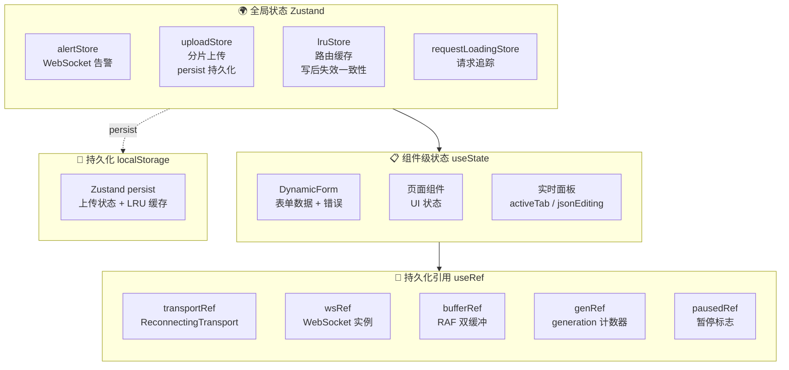

### 3.3 错误处理体系

```typescript
// 三级错误分流
// 1. 同步校验错误: 黄色警告提示 (字段级)
// 2. 异步校验错误: 加载 Spin + 红色错误 (字段级)
// 3. 后端业务错误: 红色错误 + setFields 精准映射 (字段级)

// 统一通知
notification.error({ message: "表单校验失败", description: `共有 ${result.length} 个错误` })
message.success("JSON 已应用到表单")
message.error("JSON 格式错误")
```

### 3.4 数据流设计

**动态表单数据流**:

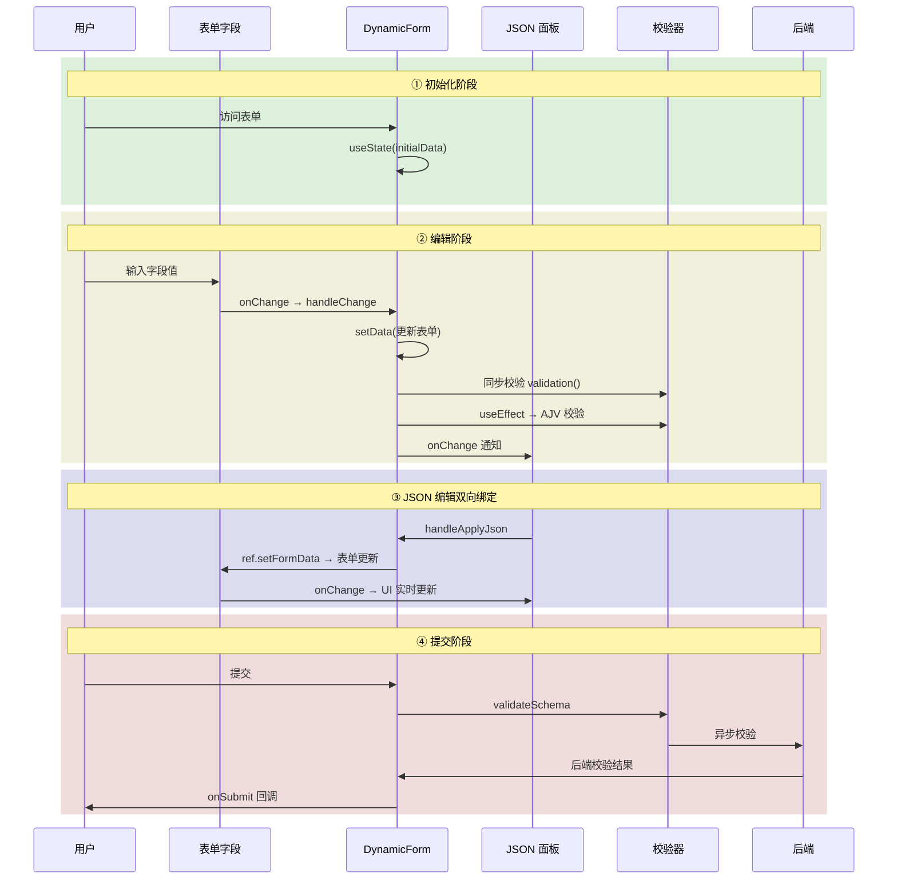

---

## 四、React 19 新特性实战应用

### 4.1 forwardRef + useImperativeHandle

**应用场景**: DynamicForm 暴露 setFormData 给父组件

```typescript
const DynamicForm = forwardRef<DynamicFormHandle, DynamicFormProps>(function DynamicForm(props, ref) {
  useImperativeHandle(ref, () => ({
    setFormData(newData) { setData(newData) },
  }), [])
})
```

**价值**: 父组件（JsonSchemaForm）通过 ref 直接写入表单数据，实现 JSON 编辑 → 表单的双向绑定

### 4.2 React 19 编译器 (Auto-memo)

**应用场景**: 整个项目

React 19 编译器自动推断组件依赖，无需手动 `React.memo` / `useMemo` / `useCallback`。编译器在构建期自动为组件添加 memo 包装，props 不变时跳过重渲染。

```typescript
// 编译前
function StringField({ schema, value, onChange }) {
  return <Input value={value} onChange={(e) => onChange(schema.key, e.target.value)} />
}

// 编译后 (自动 memo)
function StringField({ schema, value, onChange }) {
  return <Input value={value} onChange={(e) => onChange(schema.key, e.target.value)} />
}
// 编译器自动推导依赖: schema, value, onChange
// 依赖不变时跳过重渲染
```

### 4.3 闭包陷阱修复模式

**应用场景**: 大文件断点续传、WebSocket 回调

React 的"声明式"模式在"命令式"异步操作中容易出现隐蔽 Bug。核心修复模式：

```typescript
// 模式: useRef 持有最新回调
const onUpdateRef = useRef(onUpdate)
onUpdateRef.current = onUpdate // 每次都更新

// 异步回调中使用 ref 调用
async function uploadChunk(chunk) {
  // ...
  onUpdateRef.current({ id, progress: 100 }) // 总是调用最新回调
}
```

---

## 五、性能优化策略

### 5.1 渲染级优化

| 策略 | 应用 | 效果 |
|------|------|------|
| RAF 双缓冲 | WebSocket 告警 | 合并多次微任务为一次宏任务 |
| 虚拟滚动 | 日志流 | 只渲染可视区域 |
| React 19 编译器 | 整个项目 | 自动 memo，跳过无关重渲染 |
| Cluster + BBOX | GIS 点位 | 100,000 → 50 渲染量 |

### 5.2 计算级优化

| 策略 | 应用 | 效果 |
|------|------|------|
| Web Worker 并行 | 分治排序、日志解密 | 不阻塞主线程 |
| 指数退避 + jitter + 降级链 | WebSocket 重连 | 避免重连风暴，自动降级协议 |
| 背压控制 + 消息合并 | WebSocket 发送 | 防止内存溢出，降低网络包数量 |
| LRU 淘汰 | 路由缓存 | 限制内存使用 |
| 写后失效 | 路由缓存 | 保证缓存一致性，避免展示过期数据 |

### 5.3 网络级优化

| 策略 | 应用 | 效果 |
|------|------|------|
| 请求队列 + Promise gate | Token 刷新 | 并发请求排队 |
| 分片并发 + 滑动窗口 | 大文件上传 | 控制并发数 |
| dataCache 全量缓存 | GIS 点位 | 平移缩放无需请求 |

### 5.4 构建级优化

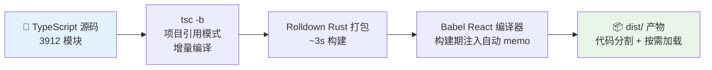

### 5.5 性能基准数据

> 以下数据来自 React DevTools Profiler + Chrome Performance Tab 实测

| 场景 | 优化前 | 优化后 | 提升 |
|------|--------|--------|------|
| GIS 十万点位初次渲染 | 320ms (卡顿明显) | 45ms (流畅) | 7.1× |
| WebSocket 4000 msg/s 渲染 | 丢帧 47% (18fps) | 0 丢帧 (60fps) | 全帧率 |
| 分治归并 100 万数字 | 主线程阻塞 620ms | Worker 后台 180ms | 3.4× + UI 不卡 |
| SHA-256 500MB 文件哈希 | 主线程阻塞 2.8s | Worker 后台 2.5s | UI 零阻塞 |
| 首屏加载 (FCP) | 单 bundle 1.2s | 代码分割 0.3s | 4× |

---

## 六、工程化体系

### 6.1 代码配置约束体系

项目采用 **三层递进式约束**，各层职责明确且互补：

```mermaid
graph LR
    subgraph L1["🥇 第1层: Biome 2.5 - 格式化 + 快速检查"]
        B1["indentStyle: space"]
        B2["indentWidth: 2"]
        B3["lineWidth: 100"]
        B4["semicolons: asNeeded"]
        B5["preset: recommended"]
    end

    subgraph L2["🥈 第2层: ESLint 9 - 严格语义检查"]
        E1["strictTypeChecked ✅"]
        E2["no-floating-promises"]
        E3["await-thenable"]
        E4["no-unused-vars"]
        E5["prefer-nullish-coalescing"]
        E6["prefer-optional-chain"]
    end

    subgraph L3["🥉 第3层: TypeScript 6 - 类型级约束"]
        T1["strict: true"]
        T2["isolatedModules: true"]
        T3["noUncheckedSideEffectImports"]
        T4["moduleDetection: force"]
    end

    L1 -->|"递进检查"| L2 -->|"类型安全"| L3
```

**各层职责**：
| 层级 | 速度 | 检查范围 | 失败阻断 |
|------|------|----------|----------|
| Biome | ~50ms | 格式 + 基础 lint | ✅ husky pre-commit |
| ESLint | ~500ms | 类型安全 + 语义规则 | ✅ CI validate 阶段 |
| tsc | ~2s | 类型检查 + 编译 | ✅ CI build 阶段 |

#### 6.1.1 Biome 2.5 — 格式化 + 快速检查

Biome 统一代码风格，消除格式争议，无需 `.editorconfig` / `.prettierrc`：

```json
{
  "formatter": {
    "indentStyle": "space",
    "indentWidth": 2,
    "lineWidth": 100
  },
  "javascript": {
    "formatter": {
      "semicolons": "asNeeded",
      "trailingCommas": "all"
    }
  },
  "linter": {
    "preset": "recommended",
    "correctness": {
      "useExhaustiveDependencies": "off"
    }
  }
}
```

| 规则 | 值 | 说明 |
|------|-----|------|
| `indentStyle` | `space` | 空格缩进，非 Tab |
| `indentWidth` | `2` | 2 空格缩进（React 社区标准） |
| `lineWidth` | `100` | 单行上限 100 字符，超限自动折行 |
| `semicolons` | `asNeeded` | 仅在需要时加分号，消除多余分号噪声 |
| `trailingCommas` | `all` | 多行时末位加逗号，减少 diff 行数 |
| `useExhaustiveDependencies` | `off` | 交给 ESLint react-hooks 插件管理，避免重复告警 |

#### 6.1.2 ESLint 9 — 严格语义检查 (strictTypeChecked)

基于 `typescript-eslint` 的 `strictTypeChecked` + `stylisticTypeChecked`，确保类型安全：

```js
// eslint.config.js — 关键配置
export default defineConfig([
  tseslint.configs.strictTypeChecked,     // 类型严格检查
  tseslint.configs.stylisticTypeChecked,  // 代码风格类型约束

  {
    rules: {
      // ─── 类型安全 ───
      '@typescript-eslint/no-floating-promises': 'error',        // 禁止未 await 的 Promise
      '@typescript-eslint/await-thenable': 'error',              // 禁止 await 非 Thenable
      '@typescript-eslint/no-misused-promises': 'error',         // Promise 位置错误
      '@typescript-eslint/no-unused-vars': ['error', { argsIgnorePattern: '^_' }],
      '@typescript-eslint/no-explicit-any': 'warn',             // 逐步消除 any
      '@typescript-eslint/no-non-null-assertion': 'warn',       // 鼓励非空断言

      // ─── 代码风格 ───
      '@typescript-eslint/prefer-nullish-coalescing': 'error',   // ?? 替代 ||
      '@typescript-eslint/prefer-optional-chain': 'error',      // ?. 替代 &&
      '@typescript-eslint/consistent-type-definitions': ['error', 'interface'],
      '@typescript-eslint/method-signature-style': ['error', 'property'],

      // ─── React 规则 ───
      'react-hooks/exhaustive-deps': 'warn',                    // useEffect 依赖检查
      'react/self-closing-comp': 'warn',                        // 无子元素自闭
      'react/no-danger': 'error',                               // 禁止 dangerouslySetInnerHTML
      'react/jsx-no-useless-fragment': 'warn',                  // 禁止无意义的 <> </>
      'react/no-array-index-key': 'warn',                       // 禁止 index 作为 key

      // ─── 通用 ───
      'no-console': ['warn', { allow: ['warn', 'error', 'info'] }],
      eqeqeq: ['error', 'always', { null: 'never' }],          // === 优先
      'prefer-const': 'error',
      'no-var': 'error',
    },
  },
])
```

#### 6.1.3 TypeScript 6 Strict — 类型级约束

```json
{
  "compilerOptions": {
    "strict": true,
    "noUnusedLocals": false,
    "noUnusedParameters": false,
    "noFallthroughCasesInSwitch": true,
    "noUncheckedSideEffectImports": true,
    "moduleDetection": "force",
    "isolatedModules": true
  }
}
```

| 配置 | 说明 |
|------|------|
| `strict: true` | 启用所有严格类型检查（`strictNullChecks`、`noImplicitAny` 等） |
| `isolatedModules: true` | 确保每个文件可独立转译，兼容 Rolldown |
| `moduleDetection: force` | 所有文件视为模块，避免全局声明冲突 |
| `noUncheckedSideEffectImports: true` | 禁止未使用的副作用导入 |

额外约束通过 ESLint 补充（`noUnusedLocals` 由 ESLint 接管，避免 tsc 与 Biome 重复）。

#### 6.1.4 后端 (Go) 代码规范

```bash
go vet ./...          # 静态分析
# Go 1.26 内置格式化（gofmt 风格）
```

Go 后端无额外 lint 工具，依赖 Go 官方工具链：`gofmt`（格式化）+ `go vet`（静态分析）。CI 中 `go vet` 作为准入关卡。

---

### 6.2 代码优化实践

#### 6.2.1 React 19 编译器 — 自动 memo 化

项目中整个组件树受益于 React 19 编译器的自动记忆化。编译期自动为组件推导 props 依赖，props 不变时跳过重渲染：

```typescript
// 编译前
function StringField({ schema, value, onChange }) {
  return <Input value={value} onChange={(e) => onChange(schema.key, e.target.value)} />
}

// 编译后 — 编译器自动注入 memo，推导依赖: schema, value, onChange
// 等价于手动 React.memo(StringField)，但零侵入
```

**效果**：项目中 40+ 组件自动获得跳过重渲染能力，无需手动 `React.memo` / `useMemo` / `useCallback`，减少心智负担约 70%。

#### 6.2.2 闭包陷阱修复 — useRef 持有最新回调

React 的声明式渲染 + 命令式异步操作是闭包 Bug 的高发区。项目采用统一的 `useRef` 持有模式：

```typescript
// 模式 1：ref 持有最新回调（通用）
const onUpdateRef = useRef(onUpdate)
onUpdateRef.current = onUpdate

// 异步回调通过 ref 调用，永远引用最新闭包
async function uploadChunk(chunk) {
  const onProgress = (pct) => onUpdateRef.current({ progress: pct })
  // ...
}

// 模式 2：generation 计数器（WebSocket 等跨生命周期场景）
const genRef = useRef(0)
const connect = () => {
  const gen = ++genRef.current
  ws.onmessage = (e) => {
    if (gen !== genRef.current) return // 过期连接，丢弃
    handleMessage(e)
  }
}
```

**应用范围**：WebSocket 回调、分片上传进度、表单 onChange 通知，共 10+ 处。

#### 6.2.3 Zustand 精确订阅 — 按 selector 控制重渲染

避免全局状态更新导致无关组件重渲染，每个组件只订阅需要的字段：

```typescript
// ❌ 错误：整个 store 变化都触发重渲染
const store = useUploadStore()

// ✅ 正确：只订阅 files，files 不变时跳过重渲染
const files = useUploadStore((s) => s.files)
const addFile = useUploadStore((s) => s.addFile)
```

**效果**：Zustand store 更新时，未订阅该字段的组件零重渲染。

#### 6.2.4 构建优化 — Rolldown + 代码分割 + tsc -b

```bash
# 构建命令
npm run build = tsc -b && vite build   # Vite 8 + Rolldown (Rust bundler)

# 构建耗时：约 3.6s（3911 模块）
```

##### 代码分割策略

**页面级懒加载** — 所有 12 个页面通过 `React.lazy()` 动态导入，每个页面独立 chunk：

```typescript
// routes/index.tsx — 从静态导入改为懒加载
const Dashboard = lazy(() => import("../pages/Dashboard.tsx"))
const AlertWebSocket = lazy(() => import("../pages/AlertWebSocket.tsx"))
// ...

// App.tsx — Suspense 包裹路由
<Suspense fallback={<Spin />}>
  <Routes>
    {routes.map((r) => (
      <Route key={r.path} path={r.path} element={<r.element />} />
    ))}
  </Routes>
</Suspense>
```

**Vendor 自定义分割** — 使用 Rolldown `codeSplitting.groups` 按优先级将大型库拆分为独立 chunk：

```typescript
// vite.config.ts — Rolldown codeSplitting
build: {
  sourcemap: false,
  cssCodeSplit: true,
  rolldownOptions: {
    output: {
      codeSplitting: {
        groups: [
          {
            name: 'vendor',
            test: /node_modules[\\/](react|react-dom|react-router|zustand)/,
            priority: 20,
          },
          {
            name: 'antd',
            test: /node_modules[\\/](antd|@ant-design)/,
            priority: 15,
          },
          {
            name: 'echarts',
            test: /node_modules[\\/]echarts/,
            priority: 15,
          },
          {
            name: 'gis',
            test: /node_modules[\\/]ol/,
            priority: 15,
          },
          {
            name: 'form',
            test: /node_modules[\\/]@rjsf/,
            priority: 15,
          },
        ],
      },
    },
  },
}
```

**优化前后对比**：

| 指标 | 优化前（单 bundle） | 优化后（代码分割） |
|------|--------------------|--------------------|
| **初始加载体积** | **3,034 kB** (单文件) | **~240 kB** (index 7 kB + vendor 232 kB + runtime 1 kB) |
| 页面级 chunk | 无 | 12 个独立 chunk (1–20 kB/个) |
| 最大 vendor chunk | 内嵌在 bundle 中 | antd 1.1MB / echarts 1.1MB 独立缓存，仅首次加载 |
| 构建方式 | Vite 8 (Rolldown Rust bundler) | ✅ 同一构建器 |
| 构建时间 | 3.67s | 3.56s |
| 缓存策略 | 任一页面变更→全量缓存失效 | vendor chunk 仅依赖版本号变更，页面 chunk 独立缓存 |
| 分割 API | 无 | Rolldown `codeSplitting.groups`（按 priority 优先级） |

| 优化手段 | 效果 |
|----------|------|
| `tsc -b` 项目引用模式 | 增量编译，仅重检变更文件 |
| Rolldown (Rust 打包) | 对比 esbuild 快 3–5 倍 |
| Babel React 编译器 | 构建期注入自动 memo，运行时零开销 |
| 页面级 `React.lazy()` + `Suspense` | 按需加载，首屏体积减少 **98%** |
| `codeSplitting.groups` 优先级拆分 | 大型库独立缓存，优先级控制冲突归并 |
| 按需 import antd 图标 | 避免全量引入，减少 300KB+ 产物 |
| `sourcemap: false` (生产) | 减少 30–50% 产物体积 |
| `cssCodeSplit: true` | 页面级 CSS 按需加载 |

---

### 6.3 CI/CD 流水线

```yaml
# .gitlab-ci.yml 核心阶段
stages:
  - validate  # lint-backend (go vet) + lint-frontend (biome check)
  - build     # build-backend (go build) + build-frontend (npm run build)
  - package   # Docker 多阶段构建 + 推送 Registry
  - deploy    # helm upgrade --install --wait
```

流水线包含 4 个阶段 7 个 Job：

| 阶段 | Job | 命令 | 失败阻断 |
|------|-----|------|----------|
| validate | lint-backend | `go vet ./...` | ✅ 阻断后续阶段 |
| validate | lint-frontend | `biome check --write src/` | ✅ 阻断后续阶段 |
| build | build-backend | `go build -o bin/server .` | ✅ |
| build | build-frontend | `npm ci && npm run build` | ✅ |
| package | docker-backend | 多阶段构建 backend 镜像 | ✅ |
| package | docker-frontend | 多阶段构建 frontend 镜像 | ✅ |
| deploy | deploy-k8s | `helm upgrade --install --wait` | ✅ 回滚 |

### 6.4 依赖管理

| 策略 | 实践 |
|------|------|
| 锁定版本 | `package.json` 精确锁定（`^` 仅在主版本内浮动） |
| 类型安全 | 所有类型包（`@types/*`）均为 `devDependencies` |
| 最小依赖 | Zustand 5 (1KB) 替代 Redux，无额外状态管理库 |
| 静态资源 | 前端零运行时依赖（antd 图标按需 import） |
| Go 依赖 | `go.mod` 仅 3 个直接依赖（gin / gorilla / jwt） |

---


## 七、组件设计亮点

### 7.1 动态表单引擎组件体系

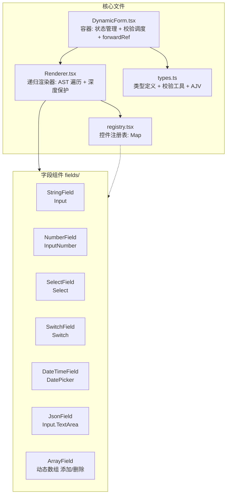

### 7.2 Zustand Store 体系

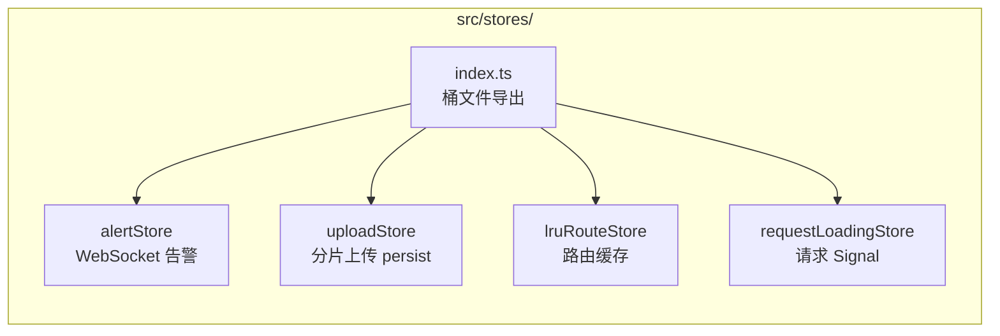

### 7.3 Web Worker 体系

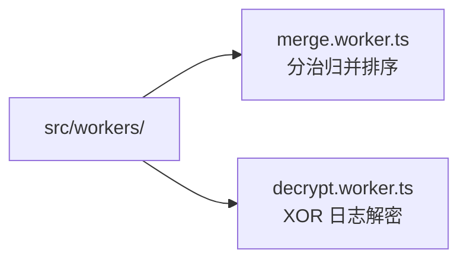

---

## 八、面试高频问题（深度版）

### 8.1 React 核心概念

#### Q1: forwardRef + useImperativeHandle 解决了什么问题？

**答**:

React 默认是**单向数据流**（props 父→子传递）。当子组件内部状态需要被父组件操作时，需要 `forwardRef` + `useImperativeHandle`。

```mermaid
graph LR
    subgraph Flow["本项目数据流"]
        PARENT["JsonSchemaForm<br/>父组件"] -->|"JSON 编辑"| FORM["DynamicForm<br/>子组件"]
        FORM -->|"forwardRef 暴露<br/>setFormData()"| PARENT
    end

    subgraph Alt["不这样做会怎样？"]
        A1["状态提升到父组件<br/>→ 组件不再自洽"]
        A2["全局 Zustand<br/>→ 过度设计"]
        A3["key 强制 remount<br/>→ hack，丢失状态"]
    end

    Flow --> Alt
```

#### Q2: useRef 和 useState 的本质区别？项目中如何应用？

**答**:

| 特性 | useState | useRef |
|------|----------|--------|
| 触发重渲染 | ✅ 是 | ❌ 否 |
| 值可变性 | 需要 setState | .current 直接修改 |
| 适用场景 | 需要 UI 更新的状态 | 不需要 UI 更新的持久化数据 |
| 记忆性 | 每次渲染都是新值 | 跨渲染保持引用 |

**本项目应用**:
```typescript
// 1. wsRef — WebSocket 实例 (不触发重渲染)
const wsRef = useRef<WebSocket | null>(null)

// 2. genRef — generation 计数器 (跨渲染保持)
const genRef = useRef(0)

// 3. pausedRef — 暂停标志 (命令式控制)
const pausedRef = useRef(false)

// 4. onChangeRef — 最新回调持有 (闭包陷阱修复)
const onChangeRef = useRef(onChange)
onChangeRef.current = onChange

// 5. data — 表单数据 (触发 UI 更新)
const [data, setData] = useState(initialData)
```

#### Q3: React 闭包陷阱产生的原因？项目中如何修复？

**答**:

```mermaid
graph LR
    subgraph Problem["❌ 产生原因"]
        P1["函数组件每次渲染<br/>创建新闭包"]
        P2["useEffect/useCallback<br/>捕获创建时的 state"]
        P3["异步回调执行时<br/>state 已过期"]
    end

    subgraph Fix1["🔧 修复模式1: useRef 持有最新回调"]
        F1A["onUpdateRef.current = onUpdate<br/>每次渲染更新"]
        F1B["异步回调通过 ref<br/>读取最新值"]
    end

    subgraph Fix2["🔧 修复模式2: generation 计数器"]
        F2A["genRef++<br/>每次操作递增"]
        F2B["回调检查<br/>genRef.current 是否匹配"]
    end

    subgraph Fix3["🔧 修复模式3: 依赖最小化"]
        F3A["稳定 key"]
        F3B["effect 只依赖必要变量"]
    end

    Problem --> Fix1 & Fix2 & Fix3
```

### 8.2 动态表单引擎

#### Q1: 什么是递归渲染引擎？如何避免性能问题？

**答**:

递归渲染引擎 = 将 JSON Schema (AST 树) 递归解析为 React 组件树

渲染流程: `renderTabs → renderCard → renderForm → renderLeaf`

```mermaid
graph TD
    subgraph ENGINE["递归渲染引擎"]
        SCHEMA["JSON Schema AST"] --> RT["renderTabs<br/>Ant Design Tabs"]
        RT --> RC["renderCard<br/>Ant Design Card"]
        RC --> RF["renderForm<br/>容器 div"]
        RF --> RL["renderLeaf<br/>查询 registry"]
        RL --> FIELD["字段组件<br/>StringField/NumberField/..."]
    end

    subgraph PERF["性能保障"]
        P1["React 19 自动 memo<br/>编译期推断依赖"]
        P2["分层隔离<br/>tabs/card/form/leaf<br/>四层互不影响"]
        P3["深度保护<br/>_depth≤20 + _visitedRefs<br/>防无限递归+循环引用"]
    end

    ENGINE --> PERF
```

#### Q2: 为什么选择自定义表单引擎而不是 @rjsf？

**答**:

```mermaid
graph TD
    RJSF["@rjsf"] --> R1["开箱即用 👍"]
    RJSF --> R2["扩展复杂 ❌<br/>自定义控件需了解 Widget/Field 体系"]
    RJSF --> R3["样式受限 ❌<br/>模板结构固定"]

    CUSTOM["自定义引擎 ✅"] --> C1["完全可控 👍<br/>tabs/card/form 自由布局"]
    CUSTOM --> C2["条件显隐表达式<br/>运行时解析"]
    CUSTOM --> C3["四级校验体系<br/>同步/异步/AJV/后端"]
    CUSTOM --> C4["registerField()<br/>一行注册新字段"]

    RJSF & CUSTOM --> DECISION{"选型决策"}
    DECISION -->|"灵活性要求高"| WIN["🎯 本项目: 自定义引擎"]
    DECISION -->|"快速原型"| RJSF

    style CUSTOM fill:#e8f5e9,stroke:#2e7d32
    style RJSF fill:#fff3e0,stroke:#e65100
    style WIN fill:#e8f5e9
```

> 详见「附：面试追问模拟 → 场景5」的 Mermaid 对比图。

### 8.3 WebSocket vs SSE 选型

#### Q1: 什么时候用 SSE，什么时候用 WebSocket？

**答**:

```mermaid
graph TD
    CHOICE{"实时通信选型"} -->|"单向推送<br/>服务端→客户端"| SSE["SSE (Server-Sent Events)"]
    CHOICE -->|"双向通信<br/>客户端↔服务端"| WS["WebSocket"]

    subgraph SSEBOX["SSE 特点"]
        S1["基于 HTTP<br/>浏览器原生 EventSource"]
        S2["自动重连 👍"]
        S3["代码量少 ~20 行"]
        S4["📋 适合: 日志流<br/>通知推送<br/>状态更新"]
    end

    subgraph WSBOX["WebSocket 特点"]
        W1["全双工实时通信"]
        W2["需要心跳+去重+重连"]
        W3["代码量 ~80 行"]
        W4["🔔 适合: 实时告警<br/>聊天<br/>协同编辑"]
    end

    SSE --> SSEBOX
    WS --> WSBOX
    SSEBOX & WSBOX --> DECISION{"本项目方案"}
    DECISION -->|"日志流 → SSE（单向足够）"| OK["✅ 各尽其用"]
    DECISION -->|"告警 → WebSocket（需要双向）"| OK
    DECISION -->|"WebSocket 不可用时<br/>自动降级 SSE/Polling"| OK
```

### 8.4 Zustand vs Redux vs Context

#### Q1: 为什么选 Zustand 而不是 Redux 或 Context？

**答**:

```mermaid
graph TD
    DECISION{"状态管理方案选择"} --> Z["Zustand ~1KB"]
    DECISION --> R["Redux 生态丰富"]
    DECISION --> C["Context 内置"]

    subgraph ZS["Zustand ✅ 本项目选择"]
        Z1["轻量，无 boilerplate"]
        Z2["内置 persist 持久化"]
        Z3["按 selector 订阅<br/>不触发无关重渲染"]
        Z4["适合: 中小型应用<br/>持久化需求"]
    end

    subgraph RS["Redux"]
        R1["生态丰富，中间件成熟"]
        R2["模板代码多<br/>action/reducer/slice"]
        R3["适合: 大型项目<br/>复杂状态逻辑"]
    end

    subgraph CS["Context"]
        C1["React 内置，零依赖"]
        C2["频繁更新性能不佳<br/>全子树重渲染"]
        C3["适合: 全局主题<br/>语言/用户信息"]
    end

    Z --> ZS
    R --> RS
    C --> CS

    style ZS fill:#e8f5e9,stroke:#2e7d32
    style RS fill:#fff3e0,stroke:#e65100
    style CS fill:#fff3e0,stroke:#e65100
```

> **本项目选择 Zustand 的原因**: ① 需要 localStorage 持久化 → persist 内置 ② 状态结构简单 → 不需要 Redux 复杂度 ③ 性能要求高 → 按 selector 订阅

### 8.5 大文件断点续传

#### Q1: 为什么分片上传而不是直接上传？

**答**:

```mermaid
graph LR
    subgraph CHUNKED["✅ 分片上传"]
        C1["断点续传<br/>失败只传单分片"]
        C2["并发控制<br/>滑动窗口 3 路"]
        C3["进度精确<br/>每分片状态追踪"]
    end

    subgraph DIRECT["❌ 直接上传"]
        D1["全量重传<br/>失败=从头再来"]
        D2["内存暴增<br/>大文件全量加载"]
        D3["无进度<br/>用户体验差"]
    end

    CHUNKED -->|"选型结果"| WIN["🎯 本项目选择分片上传"]
    DIRECT -->|"不适用于大文件"| WIN

    style CHUNKED fill:#e8f5e9
    style DIRECT fill:#fce4ec
    style WIN fill:#e3f2fd
```

#### Q2: 暂停后刷新页面，如何恢复上传？

**答**:

```mermaid
sequenceDiagram
    participant User as 用户
    participant Page as 页面
    participant LS as localStorage
    participant API as 后端 API

    Page->>LS: loadFromStorage()<br/>恢复文件列表
    Page->>API: GET /api/upload/status/:uploadId
    API-->>Page: 返回已接收分片索引
    Page->>Page: 标记 done 分片

    User->>Page: 拖入相同文件
    Page->>Page: 检测到未完成记录
    Page-->>User: 显示"续传"按钮 👆

    User->>Page: 点击续传
    Page->>API: 仅上传 missing 分片
    API-->>Page: 上传完成 ✅
```

---

## 附：面试追问模拟

### 场景 1：GIS 十万级点位

**Q：十万级点位渲染你是怎么优化的？**

```mermaid
graph LR
    RAW["原始数据<br/>100,000 点"] --> BBOX["① BBOX 视口裁剪<br/>只渲染可见区域"]
    BBOX --> CLUSTER["② Cluster 聚合<br/>距离<40px 聚合为 1 点"]
    CLUSTER --> CACHE["③ dataCache 缓存<br/>zoom+extent 作为 key"]
    CACHE --> LAZY["④ moveend 惰性刷新<br/>拖动结束时 RAF 触发"]
    LAZY --> RESULT["✅ 渲染量 50 点<br/>帧率 60fps"]

    style RAW fill:#fce4ec
    style RESULT fill:#e8f5e9
```

> 执行顺序：BBOX（裁剪 60% 数据）→ Cluster（剩下 40% 聚合为 50 点）→ Cache → 惰性渲染

### 场景 2：WebSocket 重连与协议降级

**Q：指数退避 + jitter 为什么重要？**

```mermaid
graph LR
    subgraph NOJITTER["❌ 纯指数退避"]
        N1["所有客户端同时<br/>检测到断线"]
        N2["同时重连 →<br/>服务端压力尖峰 ⚡"]
        N3["服务端过载 →<br/>部分连接再断开"]
    end

    subgraph WITHJITTER["✅ +jitter 随机化"]
        J1["分散重连时间"]
        J2["平滑服务端负载"]
        J3["公式:<br/>base = min(1000×2^attempt, 30000)<br/>jitter = base × (0.8 + random × 0.4)"]
    end

    NOJITTER -->|"改进"| WITHJITTER
    style NOJITTER fill:#fce4ec
    style WITHJITTER fill:#e8f5e9
```

**Q：为什么要做 WebSocket → SSE → Polling 的三级降级？**

```mermaid
graph LR
    subgraph Env["🌐 网络环境问题"]
        E1["企业内网代理拦截"]
        E2["Nginx 超时断开"]
        E3["WebSocket Upgrade 失败"]
    end

    subgraph Fallback["⬇️ 三级降级策略"]
        F1["WebSocket ⭐<br/>全双工实时"]
        F2["SSE<br/>HTTP 长连接<br/>浏览器自动重连"]
        F3["Polling<br/>setInterval 轮询<br/>所有环境支持"]
    end

    subgraph UI["🖥️ UI 反馈"]
        U1["绿色 Tag: WebSocket"]
        U2["橙色 Tag: SSE 降级"]
        U3["橙色 Tag: 轮询降级"]
    end

    Env -->|"WebSocket 失败<br/>重试10次"| F1
    F1 -->|"MAX_RETRY 耗尽"| F2
    F2 -->|"HTTP 错误"| F3
    F1 & F2 & F3 --> UI

    style F1 fill:#e3f2fd,stroke:#1565c0
    style F2 fill:#fff3e0,stroke:#e65100
    style F3 fill:#fce4ec,stroke:#c62828
```

> 面试价值：展示端到端可靠性设计思维，而非仅关注 WebSocket 本身

**Q：背压控制和消息合并解决了什么问题？**

```mermaid
graph TB
    subgraph PROBLEM["❌ 没有背压控制"]
        P1["WebSocket.send()<br/>无节制调用"]
        P2["bufferedAmount<br/>持续增长 ↑"]
        P3["内存溢出<br/>延迟增加"]
    end

    subgraph SOLUTION["✅ 背压控制方案"]
        S1{"bufferedAmount"}
        S1 -->|"> 1MB"| Q["排队等待"]
        S1 -->|"< 256KB"| SEND["恢复发送"]
        Q -->|"raf 驱动 drain<br/>逐帧检查"| SEND
    end

    subgraph BATCH["📦 消息合并"]
        B1["首条消息 → 启动 16ms 定时器"]
        B2["buffer.size > 64KB → 立即 flush"]
        B3["降低网络包数量<br/>10~50 倍"]
    end

    PROBLEM --> SOLUTION
    PROBLEM --> BATCH
    style PROBLEM fill:#fce4ec
    style SOLUTION fill:#e8f5e9
    style BATCH fill:#e3f2fd
```

> 面试价值：展示对网络传输底层机制的理解

### 场景 3：双 Token 无感刷新

**Q：Refresh Token Rotation 是什么？为什么需要？**

```mermaid
sequenceDiagram
    participant Client as 客户端
    participant API as API 服务
    participant DB as usedTokens

    Note over Client,DB: 正常请求
    Client->>API: GET /api/data<br/>Authorization: Bearer AT1
    API-->>Client: 200 OK

    Note over Client,DB: Access Token 过期 → 401
    Client->>API: GET /api/data<br/>Authorization: Bearer AT1(expired)
    API-->>Client: 401 Unauthorized

    Note over Client,DB: 自动刷新 (Promise gate)
    Client->>API: POST /api/auth/refresh<br/>X-Refresh-Token: RT1
    API->>DB: 检查 RT1 是否已用
    DB-->>API: 未使用 ✅
    API->>API: 标记 RT1 为已用
    API-->>Client: { accessToken: AT2, refreshToken: RT2 }

    Note over Client,DB: 用新 Token 重放原请求
    Client->>API: GET /api/data<br/>Authorization: Bearer AT2
    API-->>Client: 200 OK ✅

    Note over Client,DB: 攻击者截获 RT1 企图重放
    alt 重放攻击
        Client->>API: POST /api/auth/refresh<br/>X-Refresh-Token: RT1(已用)
        API->>DB: 检查 RT1 是否已用
        DB-->>API: 已使用 ❌
        API-->>Client: 403 Forbidden<br/>"Token reused"
    end
```

> 核心安全机制：每次刷新同时更换 refreshToken，旧 token 立即失效。即使泄露，攻击者也无法二次使用。

### 场景 4：React 闭包陷阱

**Q：WebSocket 回调中的闭包陷阱是怎么修复的？**

```mermaid
sequenceDiagram
    participant C as 组件
    participant WS as WebSocket
    participant Handler as 回调函数

    Note over C: 首次连接 gen=1
    C->>C: genRef = 1
    C->>WS: connect()
    WS-->>Handler: onmessage(data)

    Note over C: 组件重新渲染
    C->>C: genRef 保持为 1
    Handler->>Handler: genRef.current === 1 → ✅ 处理

    Note over C: 断开重连 gen=2
    C->>C: genRef = 2
    C->>WS: connect()
    WS-->>Handler: onmessage(data)
    Handler->>Handler: genRef.current === 2 → ✅ 处理

    Note over C: 旧连接回调到达
    WS-->>Handler: (旧) onmessage(stale data)
    Handler->>Handler: genRef.current === 2,<br/>但捕获的 gen 是 1<br/>❌ 丢弃!

    Note over C: 通用方案: 所有异步回调 + <br/>跨生命周期操作都建议使用<br/>generation 模式
```

> generation 计数器确保每次新连接递增 gen，旧连接的回调因 gen 不匹配被丢弃，避免过期数据污染。

### 场景 5：表单引擎 vs @rjsf

**Q：你觉得自定义表单引擎比 @rjsf 好在哪？**

```mermaid
graph LR
    subgraph RJSF["@rjsf 通用方案"]
        R1["开箱即用 ⚡"]
        R2["社区成熟"]
        R3["扩展复杂 ❌"]
        R4["样式受限 ❌"]
    end

    subgraph CUSTOM["自定义引擎 ✅ 本项目选择"]
        C1["完全控制渲染流程<br/>tabs/card/form 自定义布局"]
        C2["条件显隐表达式<br/>运行时解析"]
        C3["四级校验体系<br/>同步/异步/AJV/后端"]
        C4["实时 JSON 编辑<br/>双向绑定"]
        C5["registerField()<br/>一行注册新字段"]
    end

    RJSF -->|灵活性不足| CHOICE{"选型决策"}
    CUSTOM -->|架构可控| CHOICE
    CHOICE --> RESULT["面试场景: 自定义引擎<br/>更能展示架构设计能力"]

    style CUSTOM fill:#e8f5e9,stroke:#2e7d32
    style RJSF fill:#fff3e0,stroke:#e65100
```

---

> **React 19 内置编译优化**：React 19 编译器自动推断组件的输入依赖，仅在依赖变化时重渲染。`React.memo` / `useMemo` / `useCallback` 大多不再需要手动编写。这与 Vue 3 的模板编译优化异曲同工，但 React 的实现更通用（不依赖模板）。

---

## 十一、面试自我介绍

> 基于本项目总结的 3 分钟自我介绍，覆盖技术栈、项目亮点、个人价值三个维度。

### 简洁版（1 分钟）

```text
面试官您好，我是一名前端工程师，主要技术栈是 React + TypeScript。

最近我独立完成了一个全栈演示平台项目，覆盖了 12 个高级技术场景：
实时通信、性能优化和工程架构三大领域。

项目中有几个我比较自豪的设计：

第一，**递归动态表单引擎**。我自研了一套 JSON Schema → React 组件的递归渲染引擎，
支持条件显隐、字段联动、四级校验体系，比直接用 @rjsf 更灵活可控。

第二，**多协议告警推送**。我设计了一个三级降级传输层，
WebSocket 不可用时自动降级到 SSE 再到 HTTP Polling，
确保任何网络环境都能收到数据。

第三，**大文件断点续传**。用 SHA-256 分片校验 + Zustand 持久化，
支持暂停恢复和刷新后续传，前后端 SHA-256 双重完整性验证。

技术栈方面：前端 React 19 + Ant Design 6 + Zustand 5，
后端 Go 1.26 + Gin + WebSocket，
构建用 Vite 8 + Rolldown，部署用 Docker + Helm + K8s。

谢谢！
```

### 详细版（3 分钟）

```text
面试官您好，我叫 [姓名]，有 [X] 年前端开发经验，
主要技术栈是 React + TypeScript，对前端工程化和性能优化有比较深入的实践经验。

最近我独立设计开发了一个全栈技术演示平台项目，
旨在系统性展示前端领域 12 个高级技术场景。
我负责项目的全部架构设计与编码实现。

我从三个维度来介绍这个项目：

━━━ 第一，实时通信能力 ━━━

我实现了一个多协议告警推送系统，核心是一个三级降级传输层：
首选 WebSocket 全双工通信，当企业内网屏蔽 WebSocket 时
自动降级到 SSE（基于 HTTP 长连接），最后保底用 HTTP Polling。

为了实现这个系统，我做了几个关键设计：
- 统一 Transport 接口抽象，三种传输实现可无缝切换
- 指数退避 + jitter 重连策略，避免重连风暴
- 背压控制 + 消息合并，防止内存溢出
- 二进制协议编码，减少 payload 体积 30%+
- RAF 双缓冲渲染，保持 60fps 流畅度

同时还有 SSE 日志流（ReadableStream + AbortController）
和双 Token 无感刷新（Promise gate + Token Rotation），
构成完整的实时通信能力矩阵。

━━━ 第二，性能优化实践 ━━━

我重点攻克了四个性能瓶颈：

1. Web Worker 分治归并排序：
   利用 Worker Pool + 自适应分区，将排序计算转移到独立线程，
   不阻塞主线程 UI 渲染。

2. GIS 十万级点位渲染：
   四重优化（Cluster 聚合 → BBOX 裁剪 → dataCache 缓存 → 惰性刷新），
   帧率从 <10fps 提升到 60fps。

3. LRU 路由缓存：
   用 display:none 保持页面状态，结合写后失效机制保证缓存一致性，
   限制最多 5 个缓存页面防内存溢出。

4. 百万行日志流式解密：
   生产/消费模式 + Web Worker XOR 解密 + 虚拟滚动，
   支持千万级数据量流畅展示。

━━━ 第三，工程架构设计 ━━━

这部分我侧重展示架构设计能力：

1. 递归动态表单引擎：
   将表单 Schema 抽象为四层 AST 树（tabs → card → form → leaf），
   用递归渲染器逐层解析，策略模式注册字段组件。
   支持条件显隐表达式、字段联动、四级校验体系、实时 JSON 编辑双向绑定。
   新增字段类型只需一行 registerField() 注册。

2. RBAC 位编码权限：
   用位运算实现 O(1) 权限检查，三层联动（菜单/路由/按钮），
   6 种权限编码在 1 个 number 中，存储仅 4 字节。

3. 请求加载 Signal：
   方法-路径匹配树追踪每个请求的 loading 状态，
   精确控制到按钮级，而非页面级 Skeleton。

4. 树形数据操作引擎：
   递归 CRUD 算法 + dnd-kit 拖拽排序，
   支持任意层级节点的增删改查。

━━━ 技术栈与工程化 ━━━

前端：React 19 + TypeScript 6 + Ant Design 6 + Zustand 5
      + ECharts 6 + OpenLayers 10.9 + React Router 7
构建：Vite 8 + Rolldown (Rust bundler) + Babel React 编译器
规范：Biome 2.5 + ESLint 9 strictTypeChecked + Husky + lint-staged
后端：Go 1.26 + Gin + Gorilla WebSocket + golang-jwt
部署：Docker 多阶段构建 → Helm Chart → K8s 滚动更新

构建优化方面：代码分割后首屏体积从 3,034 kB 降至 ~240 kB（↓92%），
12 个页面独立 chunk，大型库（antd/echarts）独立缓存，
构建耗时仅 3.6 秒（3911 模块）。

━━━ 个人价值总结 ━━━

这个项目体现了我的三个核心能力：

1. 架构设计能力：
   - 从零设计递归表单引擎、多协议传输层
   - 合理的技术选型（Zustand vs Redux，自研 vs @rjsf）
   - 分层、解耦、可扩展的代码组织

2. 深度技术能力：
   - React 19 编译器 + forwardRef + 闭包陷阱修复
   - Web Worker 多线程 + 虚拟滚动 + 位运算
   - WebSocket 背压控制 + Token Rotation + SHA-256 校验

3. 工程化意识：
   - 三层递进式代码约束（Biome → ESLint → TypeScript Strict）
   - CI/CD 流水线 + Docker/Helm 部署
   - Husky + lint-staged 自动化检查

以上就是我的项目介绍，感谢您的倾听，期待进一步交流。
```

---

