# 🎯 前端面试题库 - 深度详解版

> 🎯 **面试星级**：★★★★★ | **建议用时**：1 周
> 前端面试核心题库，覆盖 JS、异步、ES6+、浏览器、网络、CSS、工程化、框架、设计模式、编程题


---

## 📑 导航地图

```mermaid
graph TD
    A["🎯 前端核心知识体系"] --> B["📖 JavaScript 核心基础"]
    A --> C["⚡ 异步编程与事件循环"]
    A --> D["🧩 ES6+ 数据结构与特性"]
    A --> E["🌐 浏览器原理与 API"]
    A --> F["🛜 网络协议与安全"]
    A --> G["🎨 CSS 核心布局与渲染"]
    A --> H["🏗️ 工程化与构建工具"]
    A --> I["⚛️ 框架机制与状态管理"]
    A --> J["🧠 设计模式与架构"]
    A --> K["📝 经典编程题与算法"]

    B --> B1["类型系统 · 原型链 · 闭包"]
    B --> B2["this 绑定 · 作用域"]
    B --> B3["ES5 vs ES6 继承"]
    B --> B4["var/let/const · 箭头函数"]

    C --> C1["Promise 深度解析"]
    C --> C2["Event Loop 事件循环"]
    C --> C3["async/await · 异步异常"]

    D --> D1["Set/Map/WeakSet/WeakMap"]
    D --> D2["Iterator · Reflect · Proxy"]
    D --> D3["Object.is · 类型转换"]
    D --> D4["ES2024-2025 新特性"]

    E --> E1["关键渲染路径 · 重排重绘"]
    E --> E2["事件委托 · DOM 事件"]
    E --> E3["缓存策略 · Performance API"]
    E --> E4["白屏时间 · 性能指标"]

    F --> F1["HTTP/3 · WebTransport"]
    F --> F2["TCP 三次握手 · HTTPS"]
    F --> F3["缓存头 · ETag · 状态码"]
    F --> F4["Cookie/Token · CORS · CDN"]

    G --> G1["BFC/IFC · Container Queries"]
    G --> G2["CSS Nesting · View Transitions"]
    G --> G3["布局方案 · 居中 · 隐藏方式"]

    H --> H1["Vite · Rspack · Turbopack"]
    H --> H2["Rolldown · esbuild · Webpack"]
    H --> H3["Tree Shaking · 代码分割"]
    H --> H4["npm · ESLint Flat Config · monorepo"]

    I --> I1["React 19 Actions/use() · Hooks"]
    I --> I2["setState · nextTick · 虚拟 DOM"]
    I --> I3["Zustand · Jotai · Pinia · RTK"]

    J --> J1["观察者 vs 订阅-发布"]
    J --> J2["mutation/reducer 纯函数"]

    K --> K1["隐式类型转换 · 运算符"]
    K --> K2["柯里化 · 防抖 · 节流"]
    K --> K3["深拷贝 · 洗牌 · 树结构"]
```

---

> 📌 **专题文件交叉引用**：网络协议与安全（HTTP/HTTPS/TCP/DNS/CDN/CORS/WebSocket）已独立整理至 [`S3-进阶提升/05-计算机网络.md`](../S3-进阶提升/05-计算机网络.md)，本文档保留框架层面网络相关面试题。

## 第一部分：JavaScript 核心基础

### 🌟 重点难度系数：⭐⭐⭐

这一部分是所有前端开发的**基石**。掌握好这些基础概念，后续进阶才会游刃有余。

---

## 1️⃣ 基本类型系统详解

### 📌 题目：JavaScript 中的基本类型有哪些？各自如何存储？

#### 🎓 深度理解

```
JavaScript 类型系统（完整图谱）
┌─────────────────────────────────────────┐
│          所有类型                        │
├──────────────┬──────────────────────────┤
│  原始类型    │  引用类型                │
│  (Primitives)│  (References)           │
├──────────────┼──────────────────────────┤
│ • String     │ • Object (本质是所有)   │
│ • Number     │   ├─ Array             │
│ • Boolean    │   ├─ Function          │
│ • null       │   ├─ Date              │
│ • undefined  │   ├─ RegExp            │
│ • Symbol     │   ├─ Error             │
│ • BigInt     │   └─ 自定义对象        │
└──────────────┴──────────────────────────┘
```

#### 💾 内存模型

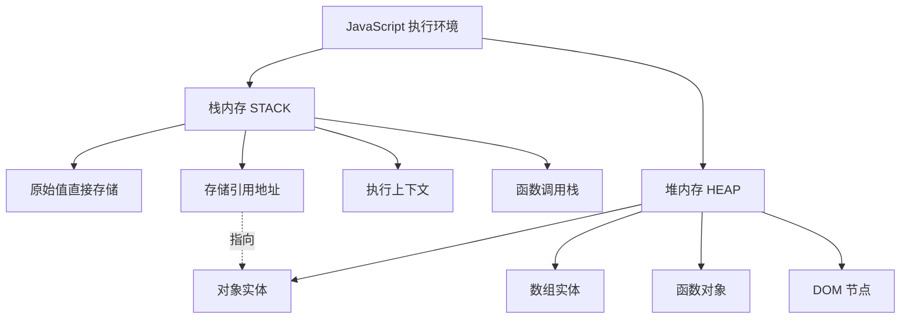

#### 💡 核心特性对比

| 特性 | 原始类型 | 引用类型 |
|------|--------|--------|
| **大小** | 固定，较小 | 可变，可能很大 |
| **存储位置** | 栈内存 | 堆内存（栈存引用） |
| **访问速度** | ⚡ 极快 | ⚠️ 相对慢 |
| **赋值行为** | 值拷贝 | 引用拷贝 |
| **相等判断** | 值相等 | 引用相等 |
| **垃圾回收** | 栈自动清理 | 引用计数为0时清理 |

#### 📍 代码示例

```typescript
// ✅ 原始类型：值存储在栈
const a = 1;
const b = a;
b = 2;
console.log(a); // 1 (互不影响)

// ⚠️ 引用类型：引用存储在栈，实体在堆
const obj1 = { name: 'Alice' };
const obj2 = obj1;
obj2.name = 'Bob';
console.log(obj1.name); // 'Bob' (会相互影响)

// 深层理解
const arr = [1, 2, 3];
// arr 变量 → 栈内存中存储一个地址 → 指向堆内存中的数组实体
// 修改数组内容会改变堆内存的数据，但不改变栈中的地址
arr[0] = 99; // ✅ 合法
arr = [4, 5, 6]; // ❌ const 不允许改变栈中的引用
```

---

## 2️⃣ 浮点数精度问题（IEEE 754）

### 📌 题目：0.1 + 0.2 为什么不等于 0.3？如何解决？

#### 🎓 深度理解

```
IEEE 754 双精度浮点数表示（64位）
┌────────────────────────────────────────────┐
│ 浮点数 = 符号位(1) + 指数位(11) + 尾数(52) │
└────────────────────────────────────────────┘

问题根源：十进制 → 二进制转换时的精度丢失

0.1 十进制 → 二进制？
0.1 × 2 = 0.2  (小数点后取 0)
0.2 × 2 = 0.4  (取 0)
0.4 × 2 = 0.8  (取 0)
0.8 × 2 = 1.6  (取 1) ← 进位
0.6 × 2 = 1.2  (取 1) ← 进位
... (循环往复，无限不循环)

结果：0.1 = 0.0001100110011... (二进制)

由于尾数位只有 52 位，超过部分被截断，导致精度丢失。
```

#### 💡 解决方案

```typescript
// ❌ 问题代码
console.log(0.1 + 0.2 === 0.3); // false
console.log(0.1 + 0.2); // 0.30000000000000004

// ✅ 方案 1: 使用 Number.EPSILON（最小精度值）
function isEqual(a: number, b: number): boolean {
  return Math.abs(a - b) < Number.EPSILON;
}
console.log(isEqual(0.1 + 0.2, 0.3)); // true

// ✅ 方案 2: 转整数计算
function add(a: number, b: number): number {
  const maxDecimals = Math.max(
    (a.toString().split('.')[1] || '').length,
    (b.toString().split('.')[1] || '').length
  );
  const factor = Math.pow(10, maxDecimals);
  return (a * factor + b * factor) / factor;
}
console.log(add(0.1, 0.2) === 0.3); // true

// ✅ 方案 3: 使用高精度库（生产推荐）
import Decimal from 'decimal.js';
const result = new Decimal(0.1).plus(new Decimal(0.2));
console.log(result.toString()); // "0.3"
```

#### 📊 精度问题示例

| 表达式 | 结果 | 期望 | 差异 |
|-------|------|------|------|
| `0.1 + 0.2` | `0.30000000000000004` | `0.3` | ❌ |
| `0.3 - 0.1` | `0.19999999999999998` | `0.2` | ❌ |
| `1 / 3` | `0.3333333333333333` | `0.333...` | ⚠️ |
| `Math.max(...100000000, 1)` | `Infinity` | `100000000` | ❌ |

---

## 3️⃣ 原型与原型链

### 📌 题目：什么是原型？原型链如何工作？

#### 🎓 深度理解

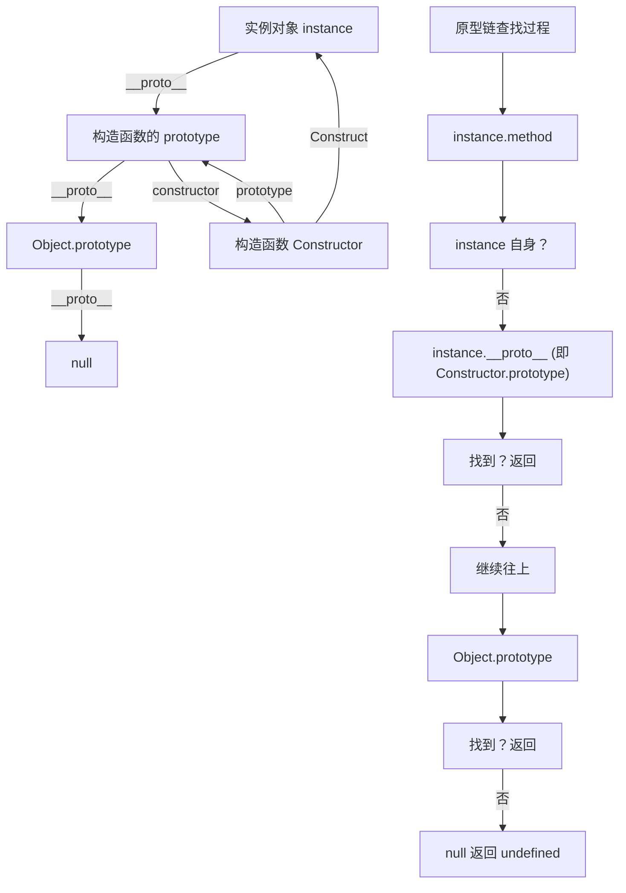

#### 💡 核心概念

```typescript
// 📍 构造函数、原型、实例的三角关系
function Animal(name: string) {
  this.name = name;
}

// 1️⃣ 构造函数的 prototype 属性指向原型对象
Animal.prototype.speak = function() {
  console.log(`${this.name} makes a sound`);
};

// 2️⃣ 创建实例
const dog = new Animal('Dog');

// 3️⃣ 实例的 __proto__ 指向构造函数的 prototype
console.log(dog.__proto__ === Animal.prototype); // true
console.log(dog.__proto__.constructor === Animal); // true

// 4️⃣ 原型链查找
console.log(dog.name); // 'Dog' (自身属性)
console.log(dog.speak); // ƒ (原型方法)
console.log(dog.toString); // ƒ (Object.prototype 方法)

// 5️⃣ 完整的原型链
console.log(dog.__proto__.__proto__ === Object.prototype); // true
console.log(Object.prototype.__proto__); // null (原型链终点)
```

#### 📊 ES5 vs ES6 继承对比

```typescript
// ❌ ES5 原型链继承（繁琐）
function Animal(name: string) {
  this.name = name;
}
Animal.prototype.speak = function() {
  console.log('Animal speaks');
};

function Dog(name: string, breed: string) {
  Animal.call(this, name); // 继承属性
  this.breed = breed;
}
Dog.prototype = Object.create(Animal.prototype); // 继承原型
Dog.prototype.constructor = Dog;
Dog.prototype.bark = function() {
  console.log('Woof');
};

// ✅ ES6 class 继承（简洁）
class Animal {
  name: string;
  constructor(name: string) {
    this.name = name;
  }
  speak() {
    console.log('Animal speaks');
  }
}

class Dog extends Animal {
  breed: string;
  constructor(name: string, breed: string) {
    super(name);
    this.breed = breed;
  }
  bark() {
    console.log('Woof');
  }
}

const dog = new Dog('Buddy', 'Golden');
```

---

## 4️⃣ 闭包与内存管理

### 📌 题目：什么是闭包？有哪些实际应用？

#### 🎓 深度理解

```
闭包形成的条件
┌─────────────────────────┐
│ 必须满足所有条件        │
├─────────────────────────┤
│ 1️⃣ 存在嵌套函数         │
│ 2️⃣ 内层函数引用外层变量 │
│ 3️⃣ 外层函数返回内层函数 │
└─────────────────────────┘

闭包的关键性质：
• 外层函数的局部变量被保存在内存中
• 垃圾回收机制不会清理这些变量
• 形成私有作用域，变量无法直接访问
```

#### 💡 经典应用场景

```typescript
// 📍 场景 1: 数据私有化
function createCounter() {
  let count = 0; // 私有变量
  
  return {
    increment: () => ++count,
    decrement: () => --count,
    getCount: () => count
  };
}

const counter = createCounter();
counter.increment(); // 1
counter.increment(); // 2
console.log(counter.getCount()); // 2
// ✅ count 无法直接访问，只能通过方法修改

// 📍 场景 2: 柯里化（分步传参）
function curry(fn: Function) {
  return function curried(...args: any[]) {
    if (args.length >= fn.length) {
      return fn(...args);
    }
    return (...nextArgs: any[]) => curried(...args, ...nextArgs);
  };
}

const add = (a: number, b: number, c: number) => a + b + c;
const curriedAdd = curry(add);
console.log(curriedAdd(1)(2)(3)); // 6
console.log(curriedAdd(1, 2)(3)); // 6 (灵活)

// 📍 场景 3: 防抖函数
function debounce(fn: Function, delay: number) {
  let timer: NodeJS.Timeout | null = null; // 闭包变量
  
  return function debounced(...args: any[]) {
    if (timer) clearTimeout(timer);
    timer = setTimeout(() => {
      fn(...args);
      timer = null;
    }, delay);
  };
}

const searchInput = debounce((query) => {
  console.log('Searching for:', query);
}, 500);

// 📍 场景 4: 模块化（IIFE）
const module = (function() {
  const privateVar = 'secret';
  
  return {
    publicMethod: () => console.log('Public'),
    getPrivate: () => privateVar
  };
})();
// ✅ privateVar 无法从外部访问
```

#### ⚠️ 闭包与内存泄漏

```typescript
// ❌ 常见内存泄漏案例 1: 未清理的闭包
function attachListeners() {
  const largeData = new Array(1000000).fill('data');
  
  document.getElementById('btn')?.addEventListener('click', () => {
    console.log(largeData[0]); // 闭包引用了 largeData
  });
  // largeData 永远不会被垃圾回收，即使不使用
}

// ✅ 解决方案
function attachListenersFixed() {
  const largeData = new Array(1000000).fill('data');
  const firstItem = largeData[0];
  
  const handler = () => console.log(firstItem);
  
  const button = document.getElementById('btn');
  button?.addEventListener('click', handler);
  
  // 适当时候清理
  button?.addEventListener('click', function cleanup() {
    button.removeEventListener('click', handler);
  });
}
```

---

## 5️⃣ this 绑定与箭头函数

### 📌 题目：this 的四种绑定方式？箭头函数为何特殊？

#### 🎓 深度理解

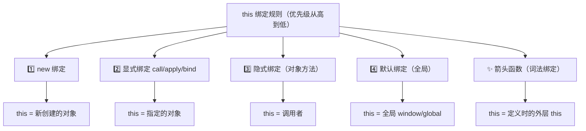

#### 💡 四种绑定详解

```typescript
// 1️⃣ 默认绑定（全局）
function hello() {
  console.log(this); // window (非严格) or undefined (严格)
}
hello();

// 2️⃣ 隐式绑定（对象方法）
const obj = {
  name: 'Alice',
  greet() {
    console.log(this.name); // 'Alice' (this = obj)
  }
};
obj.greet(); // ✅

// ⚠️ 隐式绑定丢失
const greet = obj.greet;
greet(); // this = window, undefined.name 报错❌

// 3️⃣ 显式绑定
function introduce(greeting: string) {
  console.log(`${greeting}, I'm ${this.name}`);
}

introduce.call({ name: 'Bob' }, 'Hi'); // "Hi, I'm Bob"
introduce.apply({ name: 'Charlie' }, ['Hello']); // "Hello, I'm Charlie"

const boundIntroduce = introduce.bind({ name: 'David' });
boundIntroduce('Hey'); // "Hey, I'm David"

// 4️⃣ new 绑定
class Person {
  name: string;
  constructor(name: string) {
    this.name = name; // this = 新创建的对象
  }
}
const person = new Person('Eve'); // ✅

// ✨ 箭头函数（不遵循上述规则）
const arrowObj = {
  name: 'Alice',
  greet: () => {
    console.log(this); // this = 定义时的外层 this（全局）
  }
};
arrowObj.greet(); // window 或 global，而不是 arrowObj ❌

// ✅ 箭头函数的优势场景
class Counter {
  count = 0;
  
  increment() {
    // 传递给 setTimeout 时，箭头函数保证 this 不丢失
    setTimeout(() => {
      this.count++; // ✅ this = Counter 实例
    }, 1000);
  }
}

const counter = new Counter();
counter.increment();
```

#### 📊 this 绑定优先级

| 场景 | this 值 | 可被覆盖 |
|------|--------|--------|
| `obj.method()` | obj | ✅ call/apply/bind |
| `func.call(obj)` | obj | ⚠️ 箭头函数不可改 |
| `new Class()` | 新对象 | ❌ |
| 箭头函数 | 词法 this | ❌ 无法改 |
| 严格模式全局 | undefined | ✅ call/apply/bind |

---

## 第二部分：异步编程与事件循环

### 🌟 重点难度系数：⭐⭐⭐⭐

这是前端面试的**必考重点**，也是最容易出错的地方。

---

## 6️⃣ Promise 深度解析

### 📌 题目：Promise 的三种状态、链式调用、错误处理？

#### 🎓 深度理解

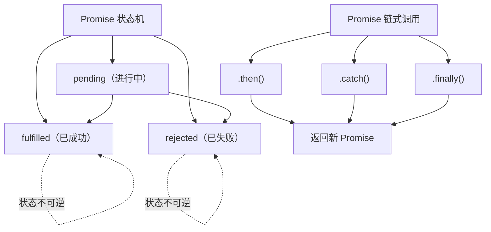

#### 💡 Promise 核心机制

```typescript
// 📍 Promise 的三种状态
const promise1 = new Promise((resolve, reject) => {
  // pending 状态，等待处理
});

const promise2 = new Promise((resolve) => {
  resolve('Success!');
  // 状态立即变为 fulfilled，无法再改变
  resolve('Another value'); // 此调用无效
});

const promise3 = new Promise((resolve, reject) => {
  reject('Error!');
  resolve('Won\'t run'); // 此调用无效
  // 状态为 rejected
});

// 📍 .then() 链式调用的细节
fetch('/api/data')
  .then(response => response.json()) // 返回 Promise<JSON>
  .then(data => {
    console.log(data);
    return data.id; // 返回普通值，会被包装成 Promise
  })
  .then(id => {
    console.log('User ID:', id);
    // 隐式返回 undefined，被包装成 Promise<undefined>
  })
  .catch(error => {
    console.error('Error:', error);
    return 'Default value'; // 错误处理后可恢复
  })
  .finally(() => {
    console.log('请求完成'); // 无论成功失败都执行
  });

// 📍 .catch() 的错误穿透原理
fetch('/api/data')
  .then(r => r.json()) // ❌ 若 fetch 出错
  .then(data => console.log(data)) // ⏭️ 跳过
  .then(data => console.log('Still skipped')) // ⏭️ 跳过
  .catch(err => console.error(err)) // ✅ 在这里捕获
  .then(() => console.log('恢复正常')); // ✅ 继续执行

// 📍 Promise 值穿透
Promise.resolve(1)
  .then() // 无回调，值穿透
  .then(val => console.log(val)); // 1 (值被传递)

// 📍 常见错误：多层 .then() 嵌套
// ❌ 不推荐的金字塔写法
fetch('/url1')
  .then(res1 => {
    return fetch('/url2').then(res2 => {
      return fetch('/url3').then(res3 => {
        return [res1, res2, res3];
      });
    });
  });

// ✅ 改进：利用闭包
fetch('/url1')
  .then(res1 => fetch('/url2')
    .then(res2 => [res1, res2])
  )
  .then(([res1, res2]) => fetch('/url3')
    .then(res3 => [res1, res2, res3])
  );

// ✅ 最佳：使用 Promise.all()
Promise.all([
  fetch('/url1'),
  fetch('/url2'),
  fetch('/url3')
])
  .then(([res1, res2, res3]) => {
    return Promise.all([res1.json(), res2.json(), res3.json()]);
  })
  .then(([data1, data2, data3]) => {
    console.log(data1, data2, data3);
  });
```

#### 📊 Promise 相关的静态方法

| 方法 | 功能 | 返回 |
|------|------|------|
| `Promise.resolve(val)` | 快速创建已解决的 Promise | `Promise<val>` |
| `Promise.reject(reason)` | 快速创建已拒绝的 Promise | `Promise<rejected>` |
| `Promise.all(iterable)` | 所有都成功才成功 | `Promise<Array>` |
| `Promise.race(iterable)` | 第一个完成就返回 | `Promise<>` |
| `Promise.allSettled(iterable)` | 等待所有，返回结果数组 | `Promise<Array>` |
| `Promise.any(iterable)` | 第一个成功就返回 | `Promise<>` |

---

## 7️⃣ 事件循环（Event Loop）

### 📌 题目：宏任务、微任务、执行顺序详解？

#### 🎓 深度理解

```
事件循环工作流程
┌──────────────────────────────────────────────┐
│ 1️⃣ 执行栈：执行一个宏任务（初始：整个 script） │
├──────────────────────────────────────────────┤
│ 2️⃣ 微任务队列：清空所有微任务                 │
├──────────────────────────────────────────────┤
│ 3️⃣ 检查是否需要重排/重绘                      │
├──────────────────────────────────────────────┤
│ 4️⃣ 从宏任务队列取一个任务，回到 1️⃣          │
└──────────────────────────────────────────────┘

宏任务队列 vs 微任务队列
┌──────────────────┬──────────────────┐
│    宏任务        │     微任务       │
├──────────────────┼──────────────────┤
│ • script         │ • Promise.then   │
│ • setTimeout     │ • Promise.catch  │
│ • setInterval    │ • Promise.finally│
│ • requestAnimFrame│ • MutationObserver
│ • I/O 操作       │ • process.nextTick
│ • UI 事件        │ • queueMicrotask
└──────────────────┴──────────────────┘
```

#### 💡 事件循环详解

```typescript
// 经典事件循环题目
console.log('script start');

setTimeout(() => {
  console.log('setTimeout 0');
}, 0);

Promise.resolve()
  .then(() => {
    console.log('Promise 1');
    setTimeout(() => {
      console.log('setTimeout in Promise');
    }, 0);
  })
  .then(() => {
    console.log('Promise 2');
  });

console.log('script end');

// 执行顺序（逐步分析）
/*
第一步：执行 script（宏任务）
┌─ console.log('script start')         ✅ 输出：script start
├─ setTimeout 加入宏任务队列            ⏳ 
├─ Promise.then 加入微任务队列          ⏳
└─ console.log('script end')            ✅ 输出：script end

第二步：清空微任务队列
┌─ 执行第一个 .then()
├─ console.log('Promise 1')             ✅ 输出：Promise 1
├─ setTimeout 加入宏任务队列            ⏳
├─ 执行第二个 .then()
└─ console.log('Promise 2')             ✅ 输出：Promise 2

第三步：执行宏任务队列中第一个 setTimeout
└─ console.log('setTimeout 0')          ✅ 输出：setTimeout 0

第四步：清空微任务队列（现为空）

第五步：执行宏任务队列中第二个 setTimeout
└─ console.log('setTimeout in Promise')  ✅ 输出：setTimeout in Promise

完整输出顺序：
1. script start
2. script end
3. Promise 1
4. Promise 2
5. setTimeout 0
6. setTimeout in Promise
*/

// 更复杂的例子
console.log('开始');

setTimeout(() => console.log('A'), 0);

Promise.resolve()
  .then(() => {
    console.log('B');
    Promise.resolve().then(() => console.log('C'));
  })
  .then(() => console.log('D'));

console.log('结束');

// 输出：开始 → 结束 → B → C → D → A
// 原因：微任务中产生的新微任务在本轮继续清空
```

---

## 8️⃣ async/await 实战

### 📌 题目：async/await 如何简化异步代码？错误处理？

#### 💡 async/await 原理与实践

```typescript
// 📍 async/await 的本质是 Promise 的语法糖
// async 函数返回一个 Promise
// await 等待 Promise 解决，返回其值

async function fetchUserData() {
  try {
    const response = await fetch('/api/user');
    
    // 等价于：
    // .then(response => {
    
    if (!response.ok) {
      throw new Error(`HTTP ${response.status}`);
    }
    
    const data = await response.json();
    console.log(data);
    return data;
    
  } catch (error) {
    console.error('错误:', error);
    throw error; // 重新抛出给上层
  } finally {
    console.log('请求完成');
  }
}

// 使用
fetchUserData().then(console.log).catch(console.error);

// 📍 并发控制
async function concurrentRequests() {
  // ❌ 顺序执行（慢）
  const result1 = await fetch('/api/1');
  const result2 = await fetch('/api/2');
  
  // ✅ 并发执行（快）
  const [res1, res2] = await Promise.all([
    fetch('/api/1'),
    fetch('/api/2')
  ]);
  
  // ✅ 带超时的 Promise
  const raceWithTimeout = (promise, timeout) => {
    return Promise.race([
      promise,
      new Promise((_, reject) =>
        setTimeout(() => reject(new Error('Timeout')), timeout)
      )
    ]);
  };
  
  try {
    const result = await raceWithTimeout(
      fetch('/api/data'),
      5000
    );
  } catch (err) {
    console.error('请求超时或失败');
  }
}

// 📍 顺序异步操作
async function sequentialOperations() {
  try {
    const user = await fetchUser(1);
    const posts = await fetchPosts(user.id);
    const comments = await fetchComments(posts[0].id);
    return { user, posts, comments };
  } catch (error) {
    console.error('操作失败:', error);
  }
}

// 📍 错误处理最佳实践
async function robustFetch(url: string, retries = 3) {
  for (let i = 0; i < retries; i++) {
    try {
      const response = await fetch(url);
      if (!response.ok) throw new Error(`HTTP ${response.status}`);
      return response.json();
    } catch (error) {
      if (i === retries - 1) throw error; // 最后一次失败时抛出
      await new Promise(resolve => setTimeout(resolve, 1000)); // 延迟重试
      console.log(`重试 ${i + 1}/${retries}`);
    }
  }
}
```

---

## 第三部分：浏览器原理与性能优化

### 🌟 重点难度系数：⭐⭐⭐⭐

这一部分涉及**渲染管线、缓存策略、网络协议**等，是大厂重点考察的内容。

---

## 9️⃣ 关键渲染路径（Critical Rendering Path）

### 📌 题目：从输入 URL 到页面呈现经历了什么？

#### 🎓 完整流程图

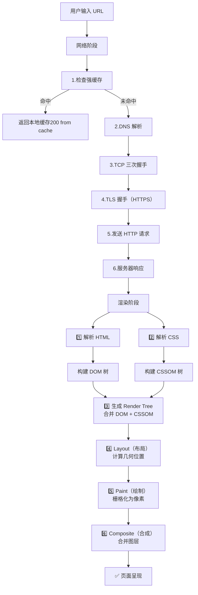

#### 💡 渲染优化策略

```typescript
// 📍 优化 1: 减少阻塞
// ❌ CSS 阻塞 DOM 解析
<head>
  <link rel="stylesheet" href="style.css"> <!-- 会阻塞 -->
</head>

// ✅ 异步加载非关键 CSS
<link rel="stylesheet" href="theme.css" media="print"
  onload="this.media='all'">

// 📍 优化 2: 脚本加载策略
// ❌ 脚本阻塞 DOM 解析
<body>
  <script src="app.js"></script> <!-- 会等待下载和执行 -->
</body>

// ✅ defer: 下载不阻塞，执行延迟到 DOM 解析后
<script src="app.js" defer></script>

// ✅ async: 下载不阻塞，下载完立即执行
<script src="analytics.js" async></script>

// 📍 优化 3: 减少重排重绘
// ❌ 频繁修改样式（多次重排）
for (let i = 0; i < 1000; i++) {
  element.style.left = i + 'px'; // 每次都触发 reflow
}

// ✅ 使用 transform（不触发 reflow，由 GPU 加速）
element.style.transform = `translateX(1000px)`;

// ✅ 批量修改 DOM（一次重排）
const fragment = document.createDocumentFragment();
for (let i = 0; i < 1000; i++) {
  const li = document.createElement('li');
  li.textContent = i;
  fragment.appendChild(li);
}
list.appendChild(fragment);

// 📍 优化 4: 虚拟滚动（处理长列表）
class VirtualList {
  containerHeight = 500;
  itemHeight = 50;
  visibleCount = Math.ceil(this.containerHeight / this.itemHeight);
  
  render(items: any[], scrollTop: number) {
    const startIndex = Math.floor(scrollTop / this.itemHeight);
    const endIndex = Math.min(
      startIndex + this.visibleCount,
      items.length
    );
    
    // 只渲染可见区域的 DOM
    return items.slice(startIndex, endIndex);
  }
}

// 📍 优化 5: 懒加载
const imageObserver = new IntersectionObserver((entries) => {
  entries.forEach(entry => {
    if (entry.isIntersecting) {
      const img = entry.target as HTMLImageElement;
      img.src = img.dataset.src;
      imageObserver.unobserve(img);
    }
  });
});

document.querySelectorAll('img[data-src]').forEach(img => {
  imageObserver.observe(img);
});
```

---

## 🔟 重排（Reflow）vs 重绘（Repaint）

### 📌 题目：何时触发？如何避免？

#### 💡 触发条件详解

```typescript
// 📍 导致重排的操作（代价最高）
element.offsetHeight; // 读取会刷新渲染队列
element.style.width = '100px'; // 修改会触发 reflow
element.style.height = '100px'; // 又一个 reflow
// 结果：两次重排！

// ✅ 优化：批量修改
element.classList.add('new-size'); // 一次 reflow

// ✅ 优化：使用 transform（不触发 reflow）
element.style.transform = 'scale(1.1)'; // 只触发 composite

// 📍 操作 DOM 时的最佳实践
// ❌ 多个小操作
const list = document.getElementById('list');
for (let i = 0; i < 100; i++) {
  list.innerHTML += `<li>${i}</li>`; // 100 次 reflow！
}

// ✅ 集中操作
const html = Array.from({ length: 100 }, (_, i) => `<li>${i}</li>`).join('');
list.innerHTML = html; // 1 次 reflow

// ✅ 使用 DocumentFragment
const fragment = document.createDocumentFragment();
for (let i = 0; i < 100; i++) {
  const li = document.createElement('li');
  li.textContent = i;
  fragment.appendChild(li);
}
list.appendChild(fragment); // 1 次 reflow
```

| 操作类型 | 是否触发重排 | 是否触发重绘 | 代价 |
|---------|-----------|----------|------|
| 修改布局（width/height/left/top） | ✅ | ✅ | 🔴 极高 |
| 修改外观（color/background） | ❌ | ✅ | 🟡 中等 |
| 使用 transform | ❌ | ❌ | 🟢 极低 |
| 读取 offsetHeight | ✅ | ❌ | 🔴 极高 |
| 批量修改 class | ✅ | ✅ | 🟡 一次 |

---

## 1️⃣1️⃣ 浏览器缓存机制

### 📌 题目：强缓存、协商缓存、缓存策略？

#### 🎓 缓存流程图

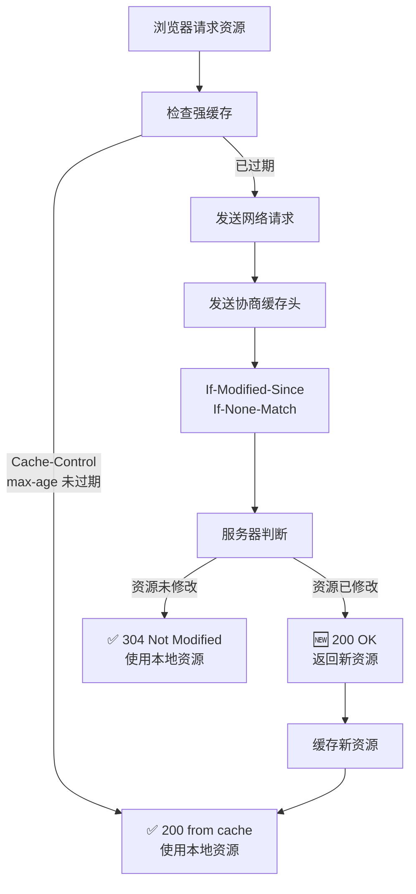

#### 💡 缓存头详解

```typescript
// 📍 强缓存（优先级：Cache-Control > Expires）

// 过期时间相对（推荐）
// max-age=3600: 3600秒内使用缓存
Cache-Control: max-age=3600, public

// 过期时间绝对（废弃，兼容用）
// Expires: Wed, 22 Oct 2025 07:28:00 GMT

// 📍 协商缓存

// 基于修改时间（粒度：秒）
Last-Modified: Mon, 10 May 2024 09:28:00 GMT
If-Modified-Since: Mon, 10 May 2024 09:28:00 GMT
// 问题：无法精确到毫秒；文件重新生成但内容未变时会重新下载

// 基于文件哈希（推荐）
ETag: "33a64df551425fcc55e4d42a148795d9f25f89d4"
If-None-Match: "33a64df551425fcc55e4d42a148795d9f25f89d4"
// 优点：精确；缺点：计算成本高

// 📍 实际使用的缓存策略

// 🔴 HTML 文件（频繁更新）
// 不缓存或使用协商缓存
Cache-Control: no-cache, max-age=0
// 或
Cache-Control: must-revalidate

// 🟢 JS/CSS/图片（很少更新，但版本号会变）
// 长期缓存
Cache-Control: public, max-age=31536000 (一年)
// 通常与版本号结合使用：
// app.a1b2c3d4.js  → 版本号改变，重新下载

// 🟡 API 响应（可能立即过期）
// 短期缓存或不缓存
Cache-Control: no-cache
// 或使用 ETag 进行协商缓存

// 📍 代码实现：手动缓存管理
class CacheManager {
  static getCached(key: string) {
    const cached = localStorage.getItem(key);
    if (!cached) return null;
    
    const { data, expires } = JSON.parse(cached);
    if (Date.now() > expires) {
      localStorage.removeItem(key);
      return null;
    }
    return data;
  }
  
  static setCached(key: string, data: any, ttl = 3600) {
    localStorage.setItem(key, JSON.stringify({
      data,
      expires: Date.now() + ttl * 1000
    }));
  }
}

// 使用
const userId = CacheManager.getCached('user_data');
if (!userId) {
  const data = await fetch('/api/user').then(r => r.json());
  CacheManager.setCached('user_data', data, 300); // 5分钟缓存
}
```

---

## 第四部分：框架与工程化

### 🌟 重点难度系数：⭐⭐⭐⭐⭐

这是拉开候选人差距的部分，考察深度理解。

---

## 1️⃣2️⃣ 虚拟 DOM 与 Diff 算法

### 📌 题目：虚拟 DOM 为什么能优化性能？Diff 算法原理？

#### 🎓 虚拟 DOM 工作原理

```
虚拟 DOM 的价值（常见误解）
━━━━━━━━━━━━━━━━━━━━━━━━━━━━━
❌ 误解：虚拟 DOM 比原生 DOM 操作快
✅ 真相：虚拟 DOM 让你写更好的代码，
       框架在多数场景保证下限不低

虚拟 DOM 的核心优势
1️⃣ 声明式编程 → 命令式编程的抽象
2️⃣ 跨平台支持（React Native, Weex）
3️⃣ 批量更新（批处理多个状态变化）
4️⃣ 历史追踪（时间旅行调试）
```

#### 💡 Diff 算法详解

```typescript
// 📍 Vue 的快速 Diff 算法（Vue 3）
// 比起 React 的递归 Diff，Vue 采用更激进的优化

class VNode {
  type: string;
  props: any;
  children: VNode[];
}

function quickDiff(oldVdom: VNode, newVdom: VNode) {
  // 第一步：预处理
  // 如果两个 VNode 的 type 不同，直接替换
  if (oldVdom.type !== newVdom.type) {
    return '替换节点';
  }
  
  // 第二步：前置步骤（找相同的节点）
  let i = 0;
  while (i < oldVdom.children.length &&
         i < newVdom.children.length &&
         oldVdom.children[i].key === newVdom.children[i].key) {
    i++;
  }
  
  // 第三步：后置步骤（从末尾往前）
  let oldEnd = oldVdom.children.length - 1;
  let newEnd = newVdom.children.length - 1;
  while (oldEnd >= i && newEnd >= i &&
         oldVdom.children[oldEnd].key === newVdom.children[newEnd].key) {
    oldEnd--;
    newEnd--;
  }
  
  // 第四步：处理移动和新增/删除
  // ...（省略复杂的指针移动逻辑）
  
  return '需要打补丁的节点';
}

// 📍 React 的 Fiber 协调机制（React 16+）
// 相比同步 Diff，可中断的异步 Diff

interface Fiber {
  type: any;
  props: any;
  alternate: Fiber | null; // 旧 Fiber
  child: Fiber | null;
  sibling: Fiber | null;
  effectTag: 'PLACEMENT' | 'UPDATE' | 'DELETION';
}

// 可中断的工作
let nextUnitOfWork: Fiber | null = null;

function reconcile(fiber: Fiber) {
  // 1️⃣ 对比当前 Fiber 与旧 Fiber
  if (fiber.alternate) {
    diffProps(fiber, fiber.alternate);
  }
  
  // 2️⃣ 协调子元素
  if (fiber.child || fiber.sibling) {
    // ...递归处理
  }
}

// 利用时间分片，避免长时间阻塞主线程
function workLoop(deadline: IdleDeadline) {
  while (nextUnitOfWork && deadline.timeRemaining() > 1) {
    nextUnitOfWork = reconcile(nextUnitOfWork);
  }
  
  if (nextUnitOfWork) {
    // 还有工作未完成，继续
    requestIdleCallback(workLoop);
  } else {
    // 提交更新
    commit();
  }
}

// 📍 Key 属性的重要性
// ✅ 正确使用
<ul>
  {items.map(item => (
    <li key={item.id}>{item.name}</li>
  ))}
</ul>

// ❌ 错误使用（使用 index 作为 key）
// 当列表重新排序时，VNode 会错配
<ul>
  {items.map((item, index) => (
    <li key={index}>{item.name}</li>
  ))}
</ul>
// 导致：
// - 输入框等受控组件状态错乱
// - 动画混乱
// - 组件状态丢失
```

---

## 1️⃣3️⃣ Webpack 与构建优化（2026 全景）

### 📌 题目：Loader 和 Plugin 的区别？Tree Shaking 原理？对比现代构建工具？

#### 💡 Webpack 工作流程

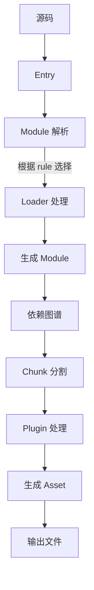

#### 💡 Tree Shaking 深度理解

```typescript
// 📍 Tree Shaking 的前提：ESM（静态分析）

// math.js（导出多个函数）
export function add(a, b) {
  return a + b;
}

export function multiply(a, b) {
  return a * b;
}

export function unused() {
  return 'never used';
}

// app.js（只用到 add）
import { add } from './math.js';
console.log(add(1, 2));

// 编译结果：
// ✅ unused 函数被删除（Tree Shaking）
// ❌ 但 multiply 仍保留（副作用考虑）

// 📍 如何让 Tree Shaking 更激进

// package.json（声明无副作用）
{
  "sideEffects": false // 或 ["*.css", "*.scss"]
}

// webpack.config.js
{
  mode: 'production', // 自动启用 Tree Shaking
  optimization: {
    usedExports: true,
    sideEffects: true,
    minimize: true
  }
}

// 📍 CommonJS 为什么不能 Tree Shaking
// require 是动态的，无法静态分析
const { add } = require('./math.js');
// Webpack 无法确定哪些导出被使用，必须保留全部

// 📍 代码分割策略
{
  entry: {
    main: './src/index.js',
    vendor: './src/vendor.js' // 手动分割
  },
  
  output: {
    filename: '[name].[contenthash].js'
  },
  
  optimization: {
    splitChunks: {
      chunks: 'all',
      cacheGroups: {
        vendor: {
          test: /[\\/]node_modules[\\/]/,
          name: 'vendors',
          priority: 10
        },
        common: {
          minChunks: 2,
          priority: 5,
          reuseExistingChunk: true
        }
      }
    }
  }
}
```

#### 🔥 现代构建工具横向对比（2026）

```
构建工具演进
━━━━━━━━━━━━━━━━━━━━━━━━━━━━━━━━━━━━━━
Webpack (2014) → Rollup (2015) → Parcel (2017)
→ esbuild (2020) → Vite (2021) → Turbopack (2022)
→ Rspack (2023) → Rolldown (2024)
```

| 特性 | Webpack 5 | Vite 6 | Turbopack | Rspack | Rolldown | esbuild |
|------|-----------|--------|-----------|--------|----------|---------|
| **语言** | JavaScript | Go + Rollup | Rust | Rust | Rust | Go |
| **定位** | 通用打包 | 开发服务器+打包 | Next.js 加速 | Webpack 替代 | Rollup 替代 | 构建基础设施 |
| **HMR 速度** | 2-5s | <50ms | <50ms | <100ms | N/A | <100ms |
| **构建速度** | 慢 | 快 (Rollup) | 极快 | 极快 | 极快 | 极快 |
| **Webpack 兼容** | ✅ 原生 | ❌ (需插件) | ❌ | ✅ 高度兼容 | ❌ | ❌ |
| **配置复杂度** | 🔴 复杂 | 🟢 极简 | 🟢 极简 | 🟡 中等 | 🟢 极简 | 🔴 有限 |
| **成熟度** | 稳定 | 稳定 | 快速迭代 | 迭代中 | 开发中 | 稳定 |
| **适用场景** | 遗留项目 | 新项目首选 | Next.js 项目 | Webpack 迁移 | 库开发 | 小型构建 |

```typescript
// 📍 Vite：当前最主流的前端构建工具
// 开发：基于 esbuild 的预构建 + 原生 ESM 按需加载
// 生产：基于 Rollup 的打包

// vite.config.ts
import { defineConfig } from 'vite';
import react from '@vitejs/plugin-react';
import vue from '@vitejs/plugin-vue';

export default defineConfig({
  plugins: [react(), vue()],
  build: {
    rollupOptions: {
      output: {
        manualChunks: {
          vendor: ['react', 'react-dom'],
          ui: ['antd', '@ant-design/icons'],
        },
      },
    },
    target: 'es2020',
    minify: 'esbuild', // 或 'terser'
    cssMinify: 'esbuild',
  },
  server: {
    proxy: { '/api': { target: 'http://localhost:3000' } },
  },
});

// 📍 Rspack：字节跳动开源，Webpack 的高性能 Rust 替代
// 完全兼容 Webpack 配置和插件生态，速度快 5-10 倍

// rspack.config.js
module.exports = {
  entry: './src/index.js',
  builtins: {
    react: { runtime: 'automatic' },
  },
};

// 📍 Rolldown：Rollup 作者开发的 Rust 版本
// 将成为 Vite 未来的生产构建底层
// 几乎零成本的 Rollup 配置迁移

// 📍 Turbopack：Vercel 开发的 Rust 引擎
// Next.js 默认使用，增量构建极快
// 当前功能有限（不支持 CSS Modules、SVGR 等）

// 📍 选型建议
// 新 React/Vue 项目 → Vite（生态系统最好、最成熟）
// 大型 Webpack 5 项目迁移 → Rspack（配置兼容性最好）
// Next.js 项目 → 内置 Turbopack（默认启用）
// JS/TS 库开发 → Rollup 或 Rolldown
// 简单构建任务 → esbuild（最快，API 极简）
```

---

## 第五部分：大厂高频面试题精选

### 🌟 难度系数：⭐⭐⭐⭐⭐

这些题目考察的是**综合能力**和**深度理解**。

---

## 1️⃣4️⃣ 经典题目解析

### 经典题 1：`['1', '2', '3'].map(parseInt)` 为什么返回 `[1, NaN, NaN]`？

#### 🎓 深度分析

```typescript
// 第一步：理解 map 的参数传递
// map(callback: (value, index, array) => any)

// 第二步：理解 parseInt 的签名
// parseInt(string, radix?)
// radix: 2-36 进制，0 或省略表示 10 进制

// 第三步：结合起来分析
['1', '2', '3'].map(parseInt)

// 等价于：
[
  parseInt('1', 0),   // 0 进制 = 10 进制 → 1
  parseInt('2', 1),   // 1 进制不存在 → NaN
  parseInt('3', 2)    // 3 不是二进制数字 → NaN
]

// 结果：[1, NaN, NaN]

// 🔧 修复方案
['1', '2', '3'].map(str => parseInt(str, 10));
// 或
['1', '2', '3'].map(Number);
// 结果：[1, 2, 3]
```

---

### 经典题 2：扫码登录的完整流程（阿里、腾讯高频）

#### 🎓 深度解析

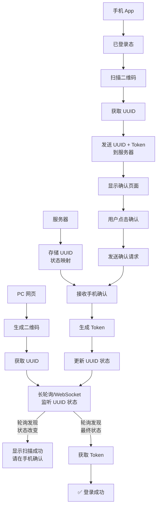

#### 💡 代码实现

```typescript
// 📍 前端：PC 网页
class QRLoginManager {
  async initQRLogin() {
    // 1️⃣ 向服务器请求 UUID 和二维码
    const { uuid, qrCode } = await fetch('/api/auth/qr-init')
      .then(r => r.json());
    
    // 2️⃣ 显示二维码
    this.displayQRCode(qrCode);
    
    // 3️⃣ 开始长轮询监听
    await this.pollForLoginStatus(uuid);
  }
  
  private async pollForLoginStatus(uuid: string) {
    return new Promise((resolve, reject) => {
      const poll = async () => {
        try {
          const { status, token } = await fetch(
            `/api/auth/qr-check?uuid=${uuid}`
          ).then(r => r.json());
          
          switch (status) {
            case 'pending':
              // 继续轮询
              setTimeout(poll, 1000);
              break;
            case 'scanned':
              // 显示"请在手机上确认"
              this.showConfirmation();
              setTimeout(poll, 1000);
              break;
            case 'confirmed':
              // 登录成功
              localStorage.setItem('token', token);
              resolve(token);
              break;
            case 'expired':
              reject(new Error('二维码已过期'));
              break;
          }
        } catch (error) {
          reject(error);
        }
      };
      poll();
    });
  }
}

// 📍 后端：服务器
interface QRSession {
  uuid: string;
  status: 'pending' | 'scanned' | 'confirmed' | 'expired';
  userId?: number;
  createdAt: number;
}

const qrSessions = new Map<string, QRSession>();

// 初始化二维码
app.post('/api/auth/qr-init', (req, res) => {
  const uuid = generateUUID();
  qrSessions.set(uuid, {
    uuid,
    status: 'pending',
    createdAt: Date.now()
  });
  
  const qrCode = generateQRCode(
    `${APP_URL}/auth/mobile?uuid=${uuid}`
  );
  
  res.json({ uuid, qrCode });
});

// 检查二维码状态
app.get('/api/auth/qr-check', (req, res) => {
  const { uuid } = req.query;
  const session = qrSessions.get(uuid as string);
  
  if (!session) {
    return res.status(404).json({ error: 'QR expired' });
  }
  
  // 检查是否超期（5分钟）
  if (Date.now() - session.createdAt > 5 * 60 * 1000) {
    session.status = 'expired';
  }
  
  res.json({
    status: session.status,
    token: session.status === 'confirmed' ? generateToken(session.userId) : undefined
  });
});

// 📍 手机端：确认登录
app.post('/api/auth/qr-confirm', (req, res) => {
  const { uuid, token } = req.body;
  const userId = verifyToken(token);
  
  if (!userId) {
    return res.status(401).json({ error: 'Invalid token' });
  }
  
  const session = qrSessions.get(uuid);
  if (!session) {
    return res.status(404).json({ error: 'QR expired' });
  }
  
  // 更新会话状态
  session.status = 'confirmed';
  session.userId = userId;
  
  res.json({ success: true });
  
  // 30秒后清理
  setTimeout(() => qrSessions.delete(uuid), 30 * 1000);
});
```

---

## 第六部分：ES6+ 核心特性深入

### 🌟 重点难度系数：⭐⭐⭐

这一部分涵盖 ES6 及其后版本的重要特性，是日常开发和面试中的高频考点。

---

## 1️⃣5️⃣ 防抖与节流

### 📌 题目：什么是防抖和节流？有什么区别？如何实现？

#### 🎓 深度理解

```
防抖（Debounce）与节流（Throttle）
━━━━━━━━━━━━━━━━━━━━━━━━━━━━━━━━━━━━━
防抖：将多次高频率触发合并为最后一次执行
      "事件被触发 n 秒后执行回调，若 n 秒内再次触发则重新计时"
      适用：搜索输入、窗口 resize 结束

节流：规定一个单位时间内只触发一次函数
      "连续触发事件，但 n 秒内只执行一次"
      适用：滚动加载、拖拽、射击游戏
```

#### 💡 实现原理

```typescript
// 📍 防抖（Debounce）：只执行最后一次
function debounce<T extends (...args: any[]) => any>(
  fn: T,
  delay: number,
  immediate = false
): (...args: Parameters<T>) => void {
  let timer: ReturnType<typeof setTimeout> | null = null;

  return function (this: any, ...args: Parameters<T>) {
    const callNow = immediate && !timer;

    if (timer) clearTimeout(timer);

    timer = setTimeout(() => {
      timer = null;
      if (!immediate) fn.apply(this, args);
    }, delay);

    if (callNow) fn.apply(this, args);
  };
}

// 使用
const search = debounce((query: string) => {
  console.log('搜索:', query);
}, 500);
searchInput.addEventListener('input', (e) => search(e.target.value));

// 📍 节流（Throttle）：按时间间隔执行
function throttle<T extends (...args: any[]) => any>(
  fn: T,
  delay: number
): (...args: Parameters<T>) => void {
  let lastTime = 0;

  return function (this: any, ...args: Parameters<T>) {
    const now = Date.now();
    if (now - lastTime >= delay) {
      lastTime = now;
      fn.apply(this, args);
    }
  };
}

// 节流：定时器版本（保证最后一次执行）
function throttleTimer<T extends (...args: any[]) => any>(
  fn: T,
  delay: number
): (...args: Parameters<T>) => void {
  let timer: ReturnType<typeof setTimeout> | null = null;

  return function (this: any, ...args: Parameters<T>) {
    if (!timer) {
      timer = setTimeout(() => {
        timer = null;
        fn.apply(this, args);
      }, delay);
    }
  };
}
```

#### 📊 防抖 vs 节流

| 特性 | 防抖 (Debounce) | 节流 (Throttle) |
|------|----------------|----------------|
| **执行时机** | 停止触发后执行 | 按固定间隔执行 |
| **触发频率** | 只执行最后一次 | 稀释为周期性执行 |
| **场景举例** | 搜索联想、窗口调整 | 滚动加载、拖拽 |
| **丢失调用** | 可能会丢失中间调用 | 不丢失（等间隔处理） |

---

## 1️⃣6️⃣ Set、Map、WeakSet、WeakMap

### 📌 题目：介绍下 Set、Map、WeakSet 和 WeakMap 的区别？

#### 🎓 深度理解

```
集合与映射类型图谱
┌────────────────────────┬────────────────────────┬────────────────────────┐
│         Set            │         Map            │    WeakSet / WeakMap   │
├────────────────────────┼────────────────────────┼────────────────────────┤
│  值集合（值唯一）       │  键值对集合（键唯一）   │  弱引用版本             │
│  可遍历                │  可遍历                │  不可遍历              │
│  任意类型值            │  任意类型键            │  键必须是对象          │
│  有 size 属性          │  有 size 属性          │  无 size 属性          │
└────────────────────────┴────────────────────────┴────────────────────────┘
```

#### 💡 核心特性详解

```typescript
// 📍 Set：值唯一的集合
const set = new Set([1, 2, 2, 3, 3]);
console.log(set); // Set { 1, 2, 3 }

set.add(4);
set.has(2);          // true
set.delete(1);
set.size;            // 3

// 数组去重一行代码
const unique = [...new Set([1, 2, 2, 3])]; // [1, 2, 3]

// 📍 Map：键值对集合，键可以是任意类型
const map = new Map();
map.set('name', 'Alice');
map.set(123, 'number key');
map.set({ id: 1 }, 'object key');

// Map vs Object 键的区别
const obj: any = {};
obj[123] = 'number';          // 键被转为字符串 "123"
obj[{ id: 1 }] = 'obj';       // 键被转为 "[object Object]"

// ✅ Map 保留键的原始类型
const m = new Map();
m.set(123, 'number');         // 键是数字 123
m.set({ id: 1 }, 'obj');      // 键是对象引用（内存地址）

// 📍 WeakSet：只存对象，弱引用（不影响 GC）
let user = { name: 'Alice' };
const weakSet = new WeakSet();
weakSet.add(user);
user = null;                  // ✅ 原对象可被垃圾回收

// 📍 WeakMap：键必须是对象，弱引用
let key = { id: 1 };
const weakMap = new WeakMap();
weakMap.set(key, 'private data');
key = null;                   // ✅ 数据和键都被 GC 回收

// WeakMap 经典场景：DOM 节点关联数据
const nodeData = new WeakMap<Element, { count: number }>();
const btn = document.getElementById('btn')!;
nodeData.set(btn, { count: 0 });
// DOM 移除后，关联数据自动 GC
```

#### 📊 完整对比

| 特性 | Set | Map | WeakSet | WeakMap |
|------|-----|-----|---------|---------|
| **键类型** | 值本身 | 任意类型 | 对象 | 对象 |
| **值类型** | 任意 | 任意 | 对象 | 任意 |
| **引用强度** | 强引用 | 强引用 | 弱引用 | 弱引用 |
| **可遍历** | ✅ | ✅ | ❌ | ❌ |
| **size 属性** | ✅ | ✅ | ❌ | ❌ |
| **clear 方法** | ✅ | ✅ | ❌ | ❌ |
| **GC 影响** | 阻止回收 | 阻止回收 | 不阻止 | 不阻止 |

---

## 1️⃣7️⃣ ES5 vs ES6 继承

### 📌 题目：ES5/ES6 的继承除了写法以外还有什么区别？

#### 🎓 深度理解

```
ES5 vs ES6 继承的底层差异
━━━━━━━━━━━━━━━━━━━━━━━━━━━━━━━━━━━━━
ES5 继承：原型链 + 构造函数组合
ES6 继承：class + extends 语法糖

关键区别：
1️⃣ 子类 __proto__ 指向不同
2️⃣ this 创建顺序不同
3️⃣ 内置类（Array/Error）的继承能力
4️⃣ new.target 检测
5️⃣ 静态方法的继承方式
```

#### 💡 代码对比

```typescript
// 📍 ES5 寄生组合式继承
function Parent(name: string) {
  this.name = name;
}
Parent.prototype.sayHello = function () {
  console.log(`Hello, ${this.name}`);
};

function Child(name: string, age: number) {
  Parent.call(this, name);   // 先创建 Child 的 this，再调父类
  this.age = age;
}
Child.prototype = Object.create(Parent.prototype);
Child.prototype.constructor = Child;

// 📍 ES6 class 继承
class Parent {
  name: string;
  constructor(name: string) {
    this.name = name;
  }
  sayHello() {
    console.log(`Hello, ${this.name}`);
  }
}

class Child extends Parent {
  age: number;
  constructor(name: string, age: number) {
    super(name);             // 先由父类创建 this，子类才能用
    this.age = age;
  }
}
```

#### 📊 深层区别

| 特性 | ES5 继承 | ES6 继承 |
|------|---------|---------|
| **子类.__proto__** | Function.prototype | 父类本身 |
| **this 创建顺序** | 子类先创建 → 调父类 | 父类先创建 → 子类继承 |
| **内置类继承** | ❌ 无法继承 Array | ✅ Array、Error 等可继承 |
| **new.target** | ❌ 无法检测 | ✅ 可检测抽象类 |
| **静态继承** | 手动拷贝 | ✅ 自动继承 |
| **作用域** | 独立函数作用域 | 块级作用域 |

```typescript
// 📍 ES6 可继承内置类
class MyArray extends Array {
  first() { return this[0]; }
  last() { return this[this.length - 1]; }
}
const arr = new MyArray(1, 2, 3);
console.log(arr.first()); // 1
// ES5 无法做到

// 📍 子类 __proto__ 差异
console.log(Child.__proto__ === Parent);
// ES5: false（Child.__proto__ === Function.prototype）
// ES6: true

// 📍 new.target 实现抽象类
class AbstractClass {
  constructor() {
    if (new.target === AbstractClass) {
      throw new Error('抽象类不能实例化');
    }
  }
}
```

---

## 1️⃣8️⃣ var、let 和 const 的区别

### 📌 题目：var、let 和 const 区别的实现原理是什么？

#### 🎓 深度理解

```
变量声明三兄弟
━━━━━━━━━━━━━━━━━━━━━━━━━━━━━━━━━━━━━
    特性        │   var   │   let   │  const
───────────────┼─────────┼─────────┼─────────
  作用域       │ 函数级  │  块级   │  块级
  变量提升     │   ✅    │   ❌    │   ❌
  TDZ(暂存死区)│   ❌    │   ✅    │   ✅
  重复声明     │   ✅    │   ❌    │   ❌
  全局属性     │ window  │   ❌    │   ❌
  重新赋值     │   ✅    │   ✅    │   ❌
```

#### 💡 原理详解

```typescript
// 📍 变量提升（Hoisting）
console.log(a); // undefined（已提升但未初始化）
var a = 1;

// 等价于：
var a;
console.log(a); // undefined
a = 1;

// let/const 没有提升
console.log(b); // ❌ ReferenceError: Cannot access 'b' before initialization
let b = 2;

// 📍 暂时性死区（TDZ）
var tmp = 123;
if (true) {
  tmp = 'abc'; // ❌ ReferenceError
  let tmp;
}
// 块内 let 声明之前都属于 TDZ

// 📍 块级作用域
for (var i = 0; i < 3; i++) {
  setTimeout(() => console.log(i), 0); // 3, 3, 3
}

for (let i = 0; i < 3; i++) {
  setTimeout(() => console.log(i), 0); // 0, 1, 2
}
// let 每次迭代创建一个新的绑定

// 📍 const 的本质：引用不可变，值可变
const obj = { name: 'Alice' };
obj.name = 'Bob';  // ✅ 允许（修改属性）
obj = {};           // ❌ 不允许（修改引用）
```

---

## 1️⃣9️⃣ 箭头函数 vs 普通函数

### 📌 题目：箭头函数与普通函数的区别？为什么不能做构造函数？

#### 🎓 深度理解

```
箭头函数 vs 普通函数
━━━━━━━━━━━━━━━━━━━━━━━━━━━━━━━━━━━━━
核心差异：
1️⃣ this 绑定：词法作用域 vs 动态作用域
2️⃣ 构造函数：不能 new 箭头函数
3️⃣ arguments：箭头函数没有
4️⃣ prototype：箭头函数没有
5️⃣ 重复参数：箭头函数不允许
```

#### 💡 代码对比

```typescript
// 📍 this 绑定差异
// 普通函数：动态绑定（调用时决定）
const obj = {
  name: 'Alice',
  greet() {
    console.log(this.name); // 'Alice'（隐式绑定）
  }
};

// 箭头函数：词法绑定（定义时决定）
const arrow = {
  name: 'Alice',
  greet: () => {
    console.log(this.name); // undefined（this = 外层作用域）
  }
};

// 📍 箭头函数为什么不能 new
const Foo = () => {};
// new Foo(); // ❌ TypeError: Foo is not a constructor

// 原因：箭头函数没有 [[Construct]] 内部方法
// 也没有 prototype 属性

// 📍 经典场景：事件回调
class Button {
  text = 'Click me';

  // ❌ 丢失 this
  handleClick() {
    console.log(this.text); // undefined（this = button DOM）
  }

  // ✅ 箭头函数绑定正确 this
  handleClickArrow = () => {
    console.log(this.text); // 'Click me'
  };
}

// 📍 arguments 对象
function normal() {
  console.log(arguments); // Arguments [1, 2, 3]
}
normal(1, 2, 3);

const arrowFn = () => {
  // console.log(arguments); // ❌ ReferenceError
  console.log(Array.from(arguments)); // ❌
};
// 替代：使用 rest 参数
const arrowFn2 = (...args: any[]) => {
  console.log(args); // [1, 2, 3]
};
arrowFn2(1, 2, 3);
```

#### 📊 完整对比

| 特性 | 普通函数 | 箭头函数 |
|------|---------|---------|
| **this** | 动态绑定（调用时） | 词法绑定（定义时） |
| **new** | ✅ 可做构造函数 | ❌ 不可 |
| **prototype** | ✅ 有 | ❌ 无 |
| **arguments** | ✅ 有 | ❌ 无（可用 rest 代替） |
| **重复参数** | 严格模式禁止 | ❌ 不允许 |
| **方法简写** | ✅ 可简写 | ❌ 不可简写 |

---

## 🔥 2️⃣0️⃣ ECMAScript 2024-2025 新特性速览

### 📌 题目：ES2024/ES2025 有哪些值得关注的新特性？

#### 🎓 ES2024（ES15）已定稿特性

```typescript
// 📍 1. Promise.withResolvers() — 外部化 Promise 控制
// 传统方式
let resolve, reject;
const p = new Promise((res, rej) => { resolve = res; reject = rej; });

// ES2024 新方式
const { promise, resolve, reject } = Promise.withResolvers();
// 用于事件回调、流控制等场景

// 📍 2. Object.groupBy() / Map.groupBy() — 分组聚合
const inventory = [
  { name: 'apple',  type: 'fruit',  quantity: 5 },
  { name: 'banana', type: 'fruit',  quantity: 10 },
  { name: 'carrot', type: 'vegetable', quantity: 8 },
];

// 按 type 分组
const byType = Object.groupBy(inventory, item => item.type);
// { fruit: [{name:'apple'}, {name:'banana'}], vegetable: [{name:'carrot'}] }

// 返回 Map 保留键类型
const byQty = Map.groupBy(inventory, item =>
  item.quantity > 7 ? 'enough' : 'low'
);

// 📍 3. Atomics.waitAsync() — 异步等待原子操作
// 用于 SharedArrayBuffer 的异步等待，不阻塞主线程
const result = Atomics.waitAsync(int32Array, 0, 0);
// 主线程 0 等待 wait 0，返回 {async: true, value: promise}

// 📍 4. RegExp v 标志 — 增强 Unicode 属性转义
// 集合运算、字符串属性、多属性匹配
/^\p{RGI_Emoji}$/v.test('😀');    // true（完整表情符号）
/[\p{Decimal_Number}--[0-9]]/v;   // 非 0-9 的数字字符

// 📍 5. Array.fromAsync() — 异步迭代器转数组
async function* asyncGen() {
  yield 1; yield 2; yield 3;
}
const arr = await Array.fromAsync(asyncGen()); // [1, 2, 3]
```

#### 🎯 ES2025（ES16）提案关键特性

```typescript
// 📍 1. JSON.parse 增强 — 支持 JSON 源文本恢复
// JSON.parse 可接收第二个参数，返回结构化 JSON 信息
// 可用于可靠的数字解析（避免精度丢失）

// 📍 2. RegExp 重复命名捕获组
// 同一个捕获组可以用多个名字引用
/(?<year>\d{4})-(?<month>\d{2})-(?<day>\d{2})/
// 可通过 groups.year, groups.month, groups.day 访问

// 📍 3. Error.cause 链式增强
try {
  await fetchData();
} catch (err) {
  throw new Error('处理失败', { cause: err });
  // cause 链可传递错误上下文
}

// 📍 4. Set 方法增强（已完成提案）
const setA = new Set([1, 2, 3]);
const setB = new Set([2, 3, 4]);

setA.intersection(setB);   // Set {2, 3}
setA.union(setB);          // Set {1, 2, 3, 4}
setA.difference(setB);     // Set {1}
setA.symmetricDifference(setB); // Set {1, 4}
setA.isSubsetOf(setB);     // false
setA.isSupersetOf(setB);   // false
```

---

## 第七部分：网络与安全协议

### 🌟 重点难度系数：⭐⭐⭐⭐

网络协议是前端进阶的必经之路，大厂面试尤其关注对 HTTP/TCP/HTTPS 的理解深度。

---

## 2️⃣1️⃣ HTTP 协议演进（1.0 → 3.0）与 WebTransport

### 📌 题目：介绍下 http1.0、1.1、2.0、3.0 协议的区别？

#### 🎓 深度理解

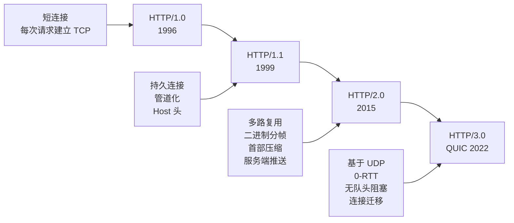

#### 💡 核心差异

```typescript
// 📍 HTTP/1.0 → HTTP/1.1 的关键改进
// 1️⃣ 持久连接（Keep-Alive）
Connection: keep-alive
// 1.0：每次请求都新建 TCP 连接
// 1.1：复用 TCP 连接，减少握手开销

// 2️⃣ 管道化（Pipelining）
// 可以连续发送多个请求，但响应必须按顺序返回
// 实际并未广泛应用（队头阻塞问题）

// 3️⃣ Host 头（虚拟主机）
Host: www.example.com
// 1.0 不支持，一个 IP 只能运行一个站点

// 4️⃣ 新增缓存控制
Cache-Control: max-age=3600
ETag: "33a64df5"
If-None-Match: "33a64df5"

// 📍 HTTP/1.1 → HTTP/2.0 的关键改进
// 1️⃣ 二进制分帧层（Binary Framing）
// 1.1 是文本协议，2.0 是二进制协议
// 二进制更高效，更易解析

// 2️⃣ 多路复用（Multiplexing）
// 一个 TCP 连接上可并行多个请求和响应
// 解决了 HTTP/1.1 的队头阻塞问题
/*
HTTP/1.1 请求队列：
┌─ 请求1 ─┐ ┌─ 请求2 ─┐ ┌─ 请求3 ─┐
   必须按顺序返回

HTTP/2.0 多路复用：
┌─ 请求1(部分) ─┐
┌─ 请求2 ────────────┐
┌─ 请求3(部分) ────┐
   交错传输，互不阻塞
*/

// 3️⃣ 首部压缩（HPACK）
// 使用 HPACK 算法压缩头部
// 客户端和服务端维护相同的静态/动态字典
// 大幅减少头部重复数据

// 4️⃣ 服务端推送（Server Push）
// 服务端可主动推送资源给客户端
// 如：请求 HTML 时，主动推送 CSS/JS
// ⚠️ Chrome 已移除 Server Push 支持（2022），改用 103 Early Hints

// 📍 HTTP/2.0 → HTTP/3.0 的关键改进
// 核心变化：TCP → QUIC（基于 UDP）
// 解决了 HTTP/2 的 TCP 队头阻塞问题

/*
HTTP/2.0 的 TCP 队头阻塞：
TCP 是可靠的，如果丢失一个数据包，
后续所有数据包必须等待重传 → 所有流都被阻塞

HTTP/3.0 的 QUIC 解决方案：
每个流独立传输，丢包只影响单个流
其他流不受影响
*/

// 1️⃣ 0-RTT 连接建立
// TCP + TLS 通常需要 2-3 个 RTT
// QUIC 首次连接 1-RTT，再次连接 0-RTT
// 显著降低连接延迟

// 2️⃣ 连接迁移（Connection Migration）
// TCP 连接绑定 IP:Port，网络切换（WiFi→4G）必须重建
// QUIC 使用连接 ID，网络切换不中断连接

// 3️⃣ QUIC 内置加密
// TCP：先建连接→TLS 握手→加密通信（2步）
// QUIC：连接建立时自动完成加密（1步）
// 默认强制加密，无明文模式
```

#### 📊 协议对比

| 特性 | HTTP/1.0 | HTTP/1.1 | HTTP/2.0 | HTTP/3.0 |
|------|---------|---------|---------|---------|
| **连接方式** | 短连接 | 持久连接 | 多路复用 (TCP) | 多路复用 (QUIC/UDP) |
| **队头阻塞** | ✅ 有 | ✅ 有 | ⚠️ TCP 级别 | ❌ 彻底解决 |
| **传输层** | TCP | TCP | TCP | QUIC (UDP) |
| **连接建立** | 2 RTT | 2 RTT | 2 RTT | 0-1 RTT |
| **连接迁移** | ❌ | ❌ | ❌ | ✅ |
| **传输效率** | 低 | 中 | 高 | 极高 |
| **部署比例** | 极少 | 广泛 | 主流 | 快速增长 (>30%) |

#### 🚀 WebTransport — 下一代 Web 通信协议

```typescript
// 📍 WebTransport：基于 HTTP/3 的全双工通信 API
// 替代 WebSocket 的下一代方案

/*
WebTransport vs WebSocket
━━━━━━━━━━━━━━━━━━━━━━━━━━━━━━━━━━━━━━
WebSocket：基于 TCP，可靠有序传输
WebTransport：基于 QUIC，支持可靠流 + 不可靠数据报

WebTransport 的优势：
1. 无队头阻塞（独立流）
2. 支持不可靠传输（适用于游戏/实时视频）
3. 0-RTT 连接建立
4. 原生浏览器支持（Chrome 已支持）
5. 多路复用（一个连接可创建多个流）
*/

// 📍 WebTransport 客户端示例
async function connectWebTransport() {
  // 建立 WebTransport 连接（基于 HTTP/3）
  const transport = new WebTransport('https://example.com:4433/chat');

  // 等待连接就绪
  await transport.ready;

  // 📍 可靠流（类似 WebSocket，保证顺序）
  const stream = await transport.createBidirectionalStream();
  const writer = stream.writable.getWriter();
  const reader = stream.readable.getReader();

  // 发送数据
  const encoder = new TextEncoder();
  await writer.write(encoder.encode('Hello WebTransport!'));

  // 接收数据
  const { value } = await reader.read();
  console.log('收到:', new TextDecoder().decode(value));

  // 📍 不可靠数据报（类似 UDP，实时性优先）
  const datagramWriter = transport.datagrams.writable.getWriter();
  await datagramWriter.write(encoder.encode('快速但不保证到达'));

  transport.datagrams.readable.getReader().then(async (reader) => {
    while (true) {
      const { value } = await reader.read();
      console.log('收到数据报:', new TextDecoder().decode(value));
    }
  });

  // 关闭连接
  await transport.close();
}

// 📍 WebTransport 适用场景
// - 实时游戏（不可靠数据报 + 可靠状态同步）
// - 视频直播（低延迟，可容忍丢包）
// - 实时协作编辑（OT/CRDT 同步）
// - 金融行情推送（低延迟优先）
```

---

## 2️⃣2️⃣ TCP 三次握手与四次挥手

### 📌 题目：谈谈你对 TCP 三次握手和四次挥手的理解？

#### 🎓 深度理解

```
TCP 状态流转
━━━━━━━━━━━━━━━━━━━━━━━━━━━━━━━━━━━━━
三次握手：建立可靠连接
四次挥手：优雅关闭连接
```

#### 💡 三次握手详解

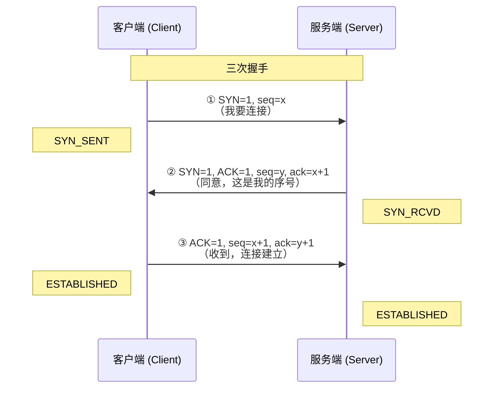

```
三次握手核心目的：
1️⃣ 第一次：客户端发送 SYN，证明客户端的发送能力正常
2️⃣ 第二次：服务端回复 SYN+ACK，证明服务端的收/发能力都正常
3️⃣ 第三次：客户端回复 ACK，证明客户端的接收能力正常

为什么不是两次？
- 防止已失效的连接请求突然传到服务端
- 确认双方的收发能力都正常
```

```typescript
// 代码层面理解三次握手
// 类比：打电话
// ① "喂，能听到吗？"  (SYN)
// ② "听到了，你能听到我吗？" (SYN+ACK)
// ③ "听到了！" (ACK)
// ✅ 通话建立
```

#### 💡 四次挥手详解

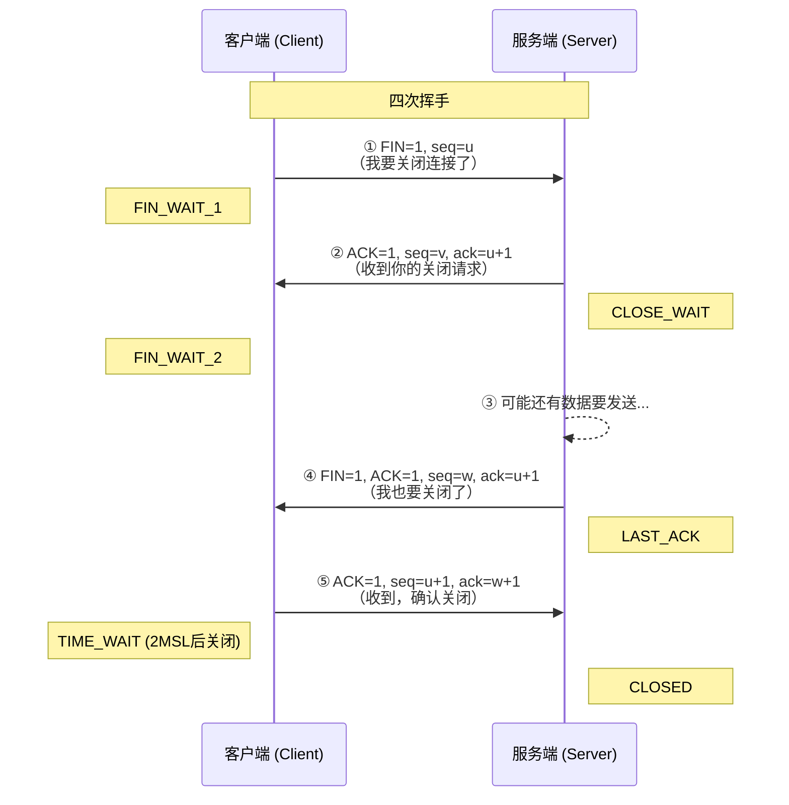

```
四次挥手原因：
- TCP 是全双工的，双方都需要独立关闭
- 服务端收到 FIN 后可能还有数据未发送完
- 所以 ACK 和 FIN 不能合并发送

TIME_WAIT 状态（2MSL）：
- 确保最后一个 ACK 能到达服务端
- 让过期报文在网络中消散
```

---

## 2️⃣3️⃣ HTTPS 握手与证书验证

### 📌 题目：介绍 HTTPS 握手过程？客户端如何验证证书合法性？

#### 🎓 深度理解

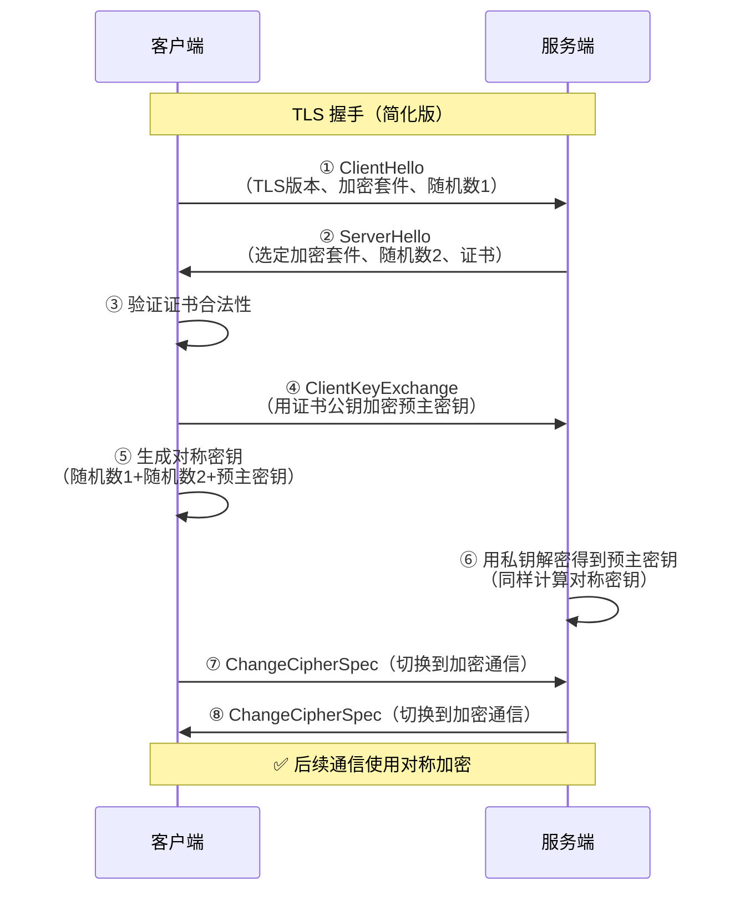

#### 💡 证书验证过程

```
客户端验证证书合法性（证书链验证）
━━━━━━━━━━━━━━━━━━━━━━━━━━━━━━━━━━━━━
┌─ 根证书（CA 自签名，预装在系统中）
│    ↓ 签名
├─ 中间证书
│    ↓ 签名
├─ 服务器证书（你的网站）
│
客户端验证步骤：
1️⃣ 检查证书有效期（是否过期）
2️⃣ 检查证书是否被吊销（CRL/OCSP）
3️⃣ 验证签名：用上级证书公钥解密签名
   比较得到的哈希与证书内容的哈希是否一致
4️⃣ 检查域名是否匹配 CN/SAN
5️⃣ 向上追溯直到信任的根证书
```

```typescript
// 对称加密 vs 非对称加密
// HTTPS 结合了两者的优点

/*
对称加密（一把钥匙）：
  优点：速度快，适合大量数据
  缺点：密钥如何安全传输？

非对称加密（公钥+私钥）：
  优点：公钥公开，私钥保密
  缺点：速度慢，不适合大量数据

HTTPS 方案：
  1️⃣ 用非对称加密安全地传输对称密钥
  2️⃣ 后续用对称加密通信（高效）
  混合加密 = 安全 + 高效
*/
```

#### 📊 HTTPS 核心要素

| 要素 | 作用 | 技术实现 |
|------|------|---------|
| **加密** | 防止窃听 | 混合加密（非对称+对称） |
| **完整性** | 防止篡改 | MAC 消息认证码 |
| **身份验证** | 防止冒充 | CA 证书链验证 |

---

## 2️⃣4️⃣ Cookie vs Token 安全对比

### 📌 题目：cookie 和 token 都存放在 header 中，为什么不会劫持 token？

#### 🎓 深度理解

```
Cookie vs Token 安全模型差异
━━━━━━━━━━━━━━━━━━━━━━━━━━━━━━━━━━━━━
Cookie：
  • 浏览器自动携带（Cookie 头）
  • 受同源策略限制
  • 易受 CSRF 攻击
  • 服务端存储会话

Token：
  • 需手动设置（Authorization 头）
  • 不自动发送
  • 受 XSS 威胁更大
  • 无状态（可自包含用户信息）
```

#### 💡 安全对比

```typescript
// 📍 Cookie 自动发送机制（CSRF 攻击根源）
// 用户登录 bank.com 后，浏览器存了 cookie
// 用户访问恶意网站 attacker.com
// attacker.com 的页面中：

// 浏览器自动携带 bank.com 的 cookie 发出请求！
// 服务端验证 cookie 通过，转账成功 😱

// ✅ 防护方案：SameSite 属性
Set-Cookie: session=xxx; SameSite=Strict
// Strict: 完全禁止第三方 cookie
// Lax: GET 请求允许（默认值）

// 📍 Token 不自动发送
// 前端手动设置 Authorization 头
fetch('/api/data', {
  headers: {
    'Authorization': `Bearer ${token}`
  }
});
// CSRF 攻击无法获取 Token，无法伪造请求

// 📍 Token 的 XSS 风险
// 如果页面有 XSS 漏洞：
// 攻击者可通过 script 读取 localStorage 中的 token
localStorage.getItem('token'); // 被窃取

// ✅ 防护：HttpOnly Cookie 存 token
Set-Cookie: token=xxx; HttpOnly; Secure; SameSite=Strict
// HttpOnly: JS 无法读取，防御 XSS
```

#### 📊 安全对比

| 攻击类型 | Cookie | Token (localStorage) | Token (HttpOnly Cookie) |
|---------|--------|---------------------|------------------------|
| **CSRF** | ❌ 易受攻击 | ✅ 不受影响 | ✅ 不受影响（SameSite） |
| **XSS** | ✅ 不受影响（HttpOnly） | ❌ 可被窃取 | ✅ 不受影响 |
| **中间人** | ❌ 若未加密 | ❌ 若未加密 | ❌ 若未加密 |
| **最佳实践** | HttpOnly + SameSite | 仅用于非敏感 API | 最安全方案 |

---

## 第八部分：CSS 核心布局与渲染

### 🌟 重点难度系数：⭐⭐⭐

---

## 2️⃣5️⃣ BFC 与格式化上下文

### 📌 题目：介绍下 BFC 及其应用？IFC、GFC、FFC 又是什么？

#### 🎓 深度理解

```
格式化上下文（Formatting Context）
━━━━━━━━━━━━━━━━━━━━━━━━━━━━━━━━━━━━━
BFC（块级格式化上下文）：block-level
  触发条件：
  • float 不为 none
  • overflow 不为 visible
  • display: inline-block / flow-root
  • position: absolute / fixed
  • display: flex / grid（创建新类型 FC）

IFC（内联格式化上下文）：inline-level
GFC（网格格式化上下文）：grid
FFC（弹性格式化上下文）：flex
```

#### 💡 BFC 三大经典应用

```css
/* 应用 1：清除浮动 */
.parent {
  overflow: hidden; /* 触发 BFC */
}
/* 原理：BFC 计算高度时包含浮动元素 */

/* 应用 2：防止 margin 折叠 */
.box1 { margin-bottom: 20px; }
.box2 { margin-top: 30px; }
/* 两个元素实际间距 30px（取较大值） */

/* 解决：让其中一个触发 BFC */
.box2-wrapper {
  overflow: hidden; /* 触发 BFC */
}
/* 现在间距为 20px + 30px = 50px */

/* 应用 3：自适应两栏布局 */
.left {
  float: left;
  width: 200px;
}
.right {
  overflow: hidden; /* 触发 BFC，不与浮动元素重叠 */
}
```

```typescript
// BFC 的核心性质
// 1️⃣ 内部盒子垂直排列（BFC 内 block 元素从上到下排列）
// 2️⃣ 内部 margin 会折叠（同一个 BFC 内）
// 3️⃣ BFC 不会与浮动元素重叠（可用于自适应布局）
// 4️⃣ BFC 计算高度包含浮动元素（清除浮动）
// 5️⃣ BFC 是独立容器，内外互不影响
```

#### 📊 格式化上下文对比

| 类型 | 全称 | 产生条件 | 布局方向 |
|------|------|---------|---------|
| **BFC** | Block Formatting Context | overflow/float/position | 垂直排列 |
| **IFC** | Inline Formatting Context | inline 元素默认 | 水平排列 |
| **GFC** | Grid Formatting Context | display: grid | 网格排列 |
| **FFC** | Flex Formatting Context | display: flex | 弹性排列 |

---

### 🔥 现代 CSS 新特性（2024-2026 已全面支持）

#### 📍 Container Queries（容器查询）

```css
/* 传统 Media Queries：基于视口 */
@media (max-width: 768px) {
  .card { flex-direction: column; }
}

/* Container Queries：基于父容器尺寸（2023 起全部主流浏览器支持） */
.card-container {
  container-type: inline-size;
  container-name: card;
}

@container card (max-width: 400px) {
  .card {
    flex-direction: column;
    font-size: 0.9rem;
  }
  .card__image { width: 100%; }
  .card__title { font-size: 1.2rem; }
}
/* ✅ 组件级响应式，不再依赖视口尺寸
   同一个组件在不同容器中可自适应布局 */
```

#### 📍 CSS Nesting（原生嵌套）

```css
/* 传统方式（需要预处理器） */
.card { }
.card__title { }
.card__title--large { }

/* CSS 原生嵌套（2023+，Safari 17.2+, Chrome 120+, Firefox 117+） */
.card {
  background: white;

  & .title {
    font-size: 1.5rem;

    &.large { font-size: 2rem; }
  }

  & .desc {
    color: gray;

    @media (max-width: 768px) {
      display: none;  /* 嵌套媒体查询 */
    }
  }

  &:hover { box-shadow: 0 2px 8px rgba(0,0,0,0.1); }
}
/* 无需 Sass/SCSS/Less，浏览器原生支持 */
```

#### 📍 View Transitions API（视图过渡动画）

```typescript
// SPA 页面切换动画（浏览器原生，无需额外库）
// 单页应用路由切换时自动过渡
document.startViewTransition(() => {
  // 更新 DOM
  document.getElementById('content')!.innerHTML = newPageHTML;
});

// 配合 CSS 自定义过渡效果
```

```css
/* 默认：交叉淡入淡出 */
::view-transition-old(root) {
  animation: 0.3s ease-out both fade-out;
}
::view-transition-new(root) {
  animation: 0.3s ease-in both fade-in;
}

/* 高级：指定元素独立过渡 */
.page-header {
  view-transition-name: page-header;
}
::view-transition-old(page-header) {
  animation: 0.3s ease-out both slide-left;
}
/* ✅ 无需 Framer Motion / GSAP 即可实现原生级动画过渡 */
```

#### 📍 CSS 新特性总结

| 特性 | 浏览器支持 | 解决的问题 | 替代方案 |
|------|-----------|-----------|---------|
| **Container Queries** | ✅ 全支持 | 组件级响应式 | 无（独特能力） |
| **CSS Nesting** | ✅ 全支持 | 减少预处理器依赖 | Sass/SCSS |
| **View Transitions API** | ✅ 全支持 | SPA 页面过渡动画 | Framer Motion / GSAP |
| **`:has()` 选择器** | ✅ 全支持 | 父级选择器 | 无（独特能力） |
| **`@scope`** | ⚠️ Chrome 120+ | 样式作用域隔离 | CSS Modules / Scoped |
| **`@layer`** | ✅ 全支持 | 样式层叠控制 | 无（独特能力） |

---

## 2️⃣6️⃣ opacity / visibility / display 对比

### 📌 题目：分析比较 opacity: 0、visibility: hidden、display: none 优劣和适用场景？

#### 🎓 深度理解

```
三种隐藏方式的区别
━━━━━━━━━━━━━━━━━━━━━━━━━━━━━━━━━━━━━
display: none      → 元素从文档流中完全移除
visibility: hidden → 元素不可见，但占据空间
opacity: 0         → 元素完全透明，占据空间，可交互
```

#### 💡 能力对比

```typescript
// 📍 display: none
// 元素不存在于渲染树中
// 不占据空间
// 无法交互
// 子元素也无法显示

// 📍 visibility: hidden
// 元素存在于渲染树中
// 占据空间
// 无法交互
// 子元素可设为 visible 重新显示
.parent {
  visibility: hidden;
}
.child {
  visibility: visible; /* 子元素可见 */
}

// 📍 opacity: 0
// 元素存在于渲染树中
// 占据空间
// 可以交互（click 事件仍触发）
// 子元素无法重新显示
// 触发 GPU 加速（will-change）
```

#### 📊 完整对比

| 特性 | display: none | visibility: hidden | opacity: 0 |
|------|-------------|-------------------|-----------|
| **占据空间** | ❌ 不占据 | ✅ 占据 | ✅ 占据 |
| **可交互** | ❌ 不可 | ❌ 不可 | ✅ 可交互 |
| **动画支持** | ❌ 不支持 | ✅ 支持 | ✅ 支持 |
| **回流触发** | ✅ 触发 reflow | ❌ 仅 repaint | ❌ 仅 composite |
| **子元素显示** | ❌ 不可 | ✅ 可覆盖 | ❌ 不可 |
| **触发事件** | ❌ | ❌ | ✅ |
| **性能消耗** | 重排（高） | 重绘（中） | 合成（低） |
| **适用场景** | 条件渲染 | 显隐切换 | 过渡动画 |

---

## 2️⃣7️⃣ 水平垂直居中方案

### 📌 题目：怎么让一个 div 水平垂直居中？

#### 🎓 深度理解

```
居中方案图谱
━━━━━━━━━━━━━━━━━━━━━━━━━━━━━━━━━━━━━
水平居中：
  • text-align: center（内联元素）
  • margin: 0 auto（块级元素定宽）
  
垂直居中：
  • line-height = height（单行文本）
  
水平+垂直居中：
  • Flexbox（最推荐）
  • Grid（次推荐）
  • position + transform（兼容性好）
  • table-cell（古老方案）
```

#### 💡 最佳实践

```css
/* ✅ 方案 1：Flexbox（最推荐） */
.parent {
  display: flex;
  justify-content: center;
  align-items: center;
}

/* ✅ 方案 2：Grid */
.parent {
  display: grid;
  place-items: center; /* 简写：justify-items + align-items */
}

/* ✅ 方案 3：定位 + transform */
.parent {
  position: relative;
}
.child {
  position: absolute;
  top: 50%;
  left: 50%;
  transform: translate(-50%, -50%);
}

/* ✅ 方案 4：table-cell（兼容老浏览器） */
.parent {
  display: table-cell;
  text-align: center;
  vertical-align: middle;
}

/* ✅ 方案 5：margin: auto（绝对定位） */
.child {
  position: absolute;
  top: 0;
  right: 0;
  bottom: 0;
  left: 0;
  margin: auto;
  width: 200px;
  height: 100px;
}
```

#### 📊 方案对比

| 方案 | 代码量 | 兼容性 | 适用场景 |
|------|-------|-------|---------|
| **Flexbox** | 少 | IE10+ | 通用，最推荐 |
| **Grid** | 最少 | IE11+ | 网格布局场景 |
| **position + transform** | 多 | IE9+ | 需要兼容旧浏览器 |
| **table-cell** | 多 | 全兼容 | 老项目 |
| **margin: auto** | 中等 | IE8+ | 定宽高元素 |

---

## 第九部分：设计模式与状态管理

### 🌟 重点难度系数：⭐⭐⭐⭐

---

## 2️⃣8️⃣ 观察者模式 vs 订阅-发布模式

### 📌 题目：介绍下观察者模式和订阅-发布模式的区别，各自适用于什么场景？

#### 🎓 深度理解

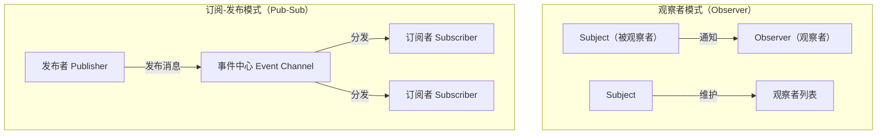

#### 💡 核心差异

```typescript
// 📍 观察者模式（Observer）
// 被观察者直接持有观察者引用
// 紧耦合

class Subject {
  private observers: Observer[] = [];

  attach(observer: Observer) {
    this.observers.push(observer);
  }

  notify(data: any) {
    this.observers.forEach(o => o.update(data));
  }
}

class Observer {
  update(data: any) {
    console.log('收到通知:', data);
  }
}

// 使用
const subject = new Subject();
const observer = new Observer();
subject.attach(observer);
subject.notify('Hello'); // 观察者直接收到通知

// 📍 订阅-发布模式（Pub-Sub）
// 通过事件中心解耦
// 发布者和订阅者互不知晓

class EventBus {
  private handlers: Map<string, Function[]> = new Map();

  on(event: string, handler: Function) {
    if (!this.handlers.has(event)) {
      this.handlers.set(event, []);
    }
    this.handlers.get(event)!.push(handler);
  }

  emit(event: string, data?: any) {
    this.handlers.get(event)?.forEach(h => h(data));
  }

  off(event: string, handler: Function) {
    const list = this.handlers.get(event);
    if (list) {
      this.handlers.set(event, list.filter(h => h !== handler));
    }
  }
}

// 使用：发布者和订阅者完全解耦
const bus = new EventBus();

// 组件 A（订阅者）
bus.on('userLogin', (user) => {
  console.log('用户登录:', user);
});

// 组件 B（发布者）
bus.emit('userLogin', { name: 'Alice' });
// 组件 A 和 B 互不知晓
```

#### 📊 模式对比

| 特性 | 观察者模式 | 订阅-发布模式 |
|------|-----------|-------------|
| **耦合度** | 紧耦合（Subject 持有 Observer） | 松耦合（通过事件中心） |
| **通信方式** | 直接调用 | 消息通道 |
| **实现复杂度** | 低 | 中 |
| **适用场景** | 单一系统内部 | 跨组件/跨模块通信 |
| **典型实现** | Vue 响应式、RxJS | EventBus、消息队列 |
| **性能** | 高（直接调用） | 中（需要调度） |

---

## 2️⃣9️⃣ Redux vs Vuex 设计思想

### 📌 题目：聊聊 Redux 和 Vuex 的设计思想？

#### 🎓 深度理解

```
Redux vs Vuex 设计思想对比
━━━━━━━━━━━━━━━━━━━━━━━━━━━━━━━━━━━━━
共同点：都遵循单向数据流和 Flux 架构
不同点：设计哲学、变异方式、集成深度
```

#### 💡 架构对比

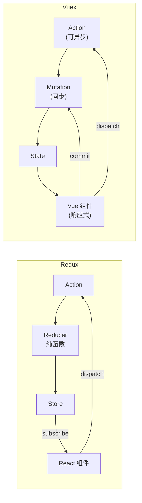

```typescript
// 📍 Redux 核心设计
// 1️⃣ 单一数据源（Single Source of Truth）
// 2️⃣ State 是只读的
// 3️⃣ 使用纯函数执行修改

// Action：描述发生了什么
const incrementAction = { type: 'INCREMENT', payload: 1 };

// Reducer：纯函数，返回新状态
function counterReducer(state = { count: 0 }, action: any) {
  switch (action.type) {
    case 'INCREMENT':
      return { ...state, count: state.count + action.payload };
    case 'DECREMENT':
      return { ...state, count: state.count - action.payload };
    default:
      return state;
  }
}

// Store
const store = createStore(counterReducer);
store.dispatch(incrementAction);

// 📍 Vuex 核心设计
// 1️⃣ State（响应式数据）
// 2️⃣ Getters（计算属性）
// 3️⃣ Mutations（同步修改，记录日志）
// 4️⃣ Actions（异步操作，提交 Mutation）

const store = new Vuex.Store({
  state: { count: 0 },
  mutations: {
    increment(state, payload) {
      // 直接修改 state（Vue 响应式追踪）
      state.count += payload;
    }
  },
  actions: {
    incrementAsync({ commit }, payload) {
      setTimeout(() => {
        commit('increment', payload);
      }, 1000);
    }
  }
});

store.dispatch('incrementAsync', 1);
```

#### 📊 设计对比

| 特性 | Redux | Vuex |
|------|-------|------|
| **修改状态** | Reducer 返回新对象 | Mutation 直接修改 |
| **异步处理** | 中间件（redux-thunk/saga） | 内置 Actions |
| **响应式** | 需手动订阅 | Vue 自动追踪 |
| **TypeScript** | 原生支持好 | 需装饰器/模块 |
| **学习曲线** | 较陡（中间件概念多） | 较平缓 |
| **状态变更追踪** | Redux DevTools | Vue DevTools |

---

### 🔥 现代状态管理技术全景对比（2026）

```
状态管理技术演进时间线
━━━━━━━━━━━━━━━━━━━━━━━━━━━━━━━━━━━━━
Flux (2014) → Redux (2015) → Vuex (2016) → MobX (2016)
→ Redux Toolkit (2019) → Recoil (2020) → Valtio (2021)
→ Zustand / Jotai / Pinia (2021-2022)
→ TanStack Query / Signals (2023-2025)
```

#### 💡 核心思想维度对比

| 维度 | Redux | Redux Toolkit (RTK) | Vuex | Pinia | Zustand | Jotai | Valtio |
|------|-------|---------------------|------|-------|---------|-------|--------|
| **架构范式** | 单向数据流 | 单向数据流 + 切片 | 单向数据流 | 单向数据流 | 单向 + Hooks | 原子状态 | Proxy 代理 |
| **Store 数量** | 单 Store | 单 Store + 切片 | 单 Store | 多 Store | 多 Store | 原子组合 | 多 Store |
| **修改状态** | Reducer 不可变 | createSlice 不可变 | Mutation 可变 | Actions 可变/不可变 | set 函数 | 原子 set | 直接赋值 |
| **异步处理** | 中间件 | createAsyncThunk | 内置 Actions | 内置 Actions | 内置 async | async 原子 | 直接 async |
| **TypeScript** | 优秀 | 极好 | 一般 | 极好 | 极好 | 优秀 | 优秀 |
| **包体积** | ~12KB | ~11KB (含 RTK) | ~10KB | ~2KB | ~1KB | ~3KB | ~2KB |
| **React Hooks** | useSelector/useDispatch | useAppSelector | ❌ | ❌ | useStore | useAtom | useSnapshot |
| **Vue 支持** | ❌ | ❌ | ✅ | ✅ | ⚠️ 社区 | ❌ | ❌ |
| **学习成本** | 🔴 高 | 🟡 中 | 🟡 中 | 🟢 低 | 🟢 极低 | 🟢 低 | 🟢 低 |
| **调试工具** | Redux DevTools | Redux DevTools | Vue DevTools | Pinia DevTools | 内置 | 内置 | 内置 |

#### 🧠 Redux Toolkit (RTK) — Redux 的现代形态

```typescript
// 📍 RTK：官方推荐的 Redux 写法（取代传统 Redux）
import { createSlice, configureStore, createAsyncThunk } from '@reduxjs/toolkit';

// 切片：Action + Reducer 一体
const counterSlice = createSlice({
  name: 'counter',
  initialState: { count: 0 },
  reducers: {
    increment: (state) => { state.count += 1; }, // ✅ 内置 Immer，可直接修改
    decrement: (state) => { state.count -= 1; },
    incrementByAmount: (state, action) => { state.count += action.payload; },
  },
});

// 异步 Thunk
const fetchUserById = createAsyncThunk('users/fetchById', async (userId: number) => {
  const response = await fetch(`/api/user/${userId}`);
  return response.json();
});

const store = configureStore({ reducer: counterSlice.reducer });
store.dispatch(counterSlice.actions.increment());

// 📍 RTK Query：数据请求一体化（替代手写 loading/error 逻辑）
import { createApi, fetchBaseQuery } from '@reduxjs/toolkit/query/react';

const api = createApi({
  reducerPath: 'api',
  baseQuery: fetchBaseQuery({ baseUrl: '/api' }),
  endpoints: (builder) => ({
    getUser: builder.query({ query: (id) => `/user/${id}` }),
    updateUser: builder.mutation({ query: (body) => ({ url: '/user', method: 'POST', body }) }),
  }),
});

// 自动生成 Hooks：useGetUserQuery, useUpdateUserMutation
// 自动管理 cache, loading, error, refetch, polling
```

#### 🍍 Pinia — Vuex 的现代替代（Vue 官方推荐）

```typescript
// 📍 Pinia：Vue 3 的官方状态管理（取代 Vuex）
import { defineStore } from 'pinia';

// Option Store 风格（类 Vuex）
export const useCounterStore = defineStore('counter', {
  state: () => ({ count: 0 }),
  getters: {
    doubleCount: (state) => state.count * 2,
  },
  actions: {
    increment() { this.count++; },  // ✅ 直接修改，无 Mutation
    async fetchCount() {
      const res = await fetch('/api/count');
      this.count = await res.json();
    },
  },
});

// Setup Store 风格（类 Composition API）
export const useUserStore = defineStore('user', () => {
  const user = ref(null);
  const loading = ref(false);

  async function fetchUser(id: number) {
    loading.value = true;
    user.value = await fetch(`/api/user/${id}`).then(r => r.json());
    loading.value = false;
  }

  return { user, loading, fetchUser };
});

// 在组件中使用
const store = useCounterStore();
store.increment();
console.log(store.doubleCount); // getter 自动解包

// ✅ Pinia 相比 Vuex 的核心改进
// - 移除 Mutations（直接修改 state）
// - 完整 TypeScript 支持（无需额外装饰器）
// - 支持多 Store（不再强制单 Store）
// - 支持 Composition API 风格
// - DevTools 支持时间旅行、状态编辑
// - 体积仅 ~2KB
```

#### 🐻 Zustand — 极简主义状态管理

```typescript
// 📍 Zustand：极简 Hooks 状态管理（当前最流行的 React 状态库之一）
import { create } from 'zustand';

// 定义 Store（一个函数就搞定）
interface BearStore {
  bears: number;
  increase: () => void;
  reset: () => void;
  fetchBears: () => Promise<void>;
}

const useBearStore = create<BearStore>((set) => ({
  bears: 0,
  increase: () => set((state) => ({ bears: state.bears + 1 })),
  reset: () => set({ bears: 0 }),
  fetchBears: async () => {
    const bears = await fetch('/api/bears').then(r => r.json());
    set({ bears });
  },
}));

// 组件中使用
function BearCounter() {
  const bears = useBearStore((state) => state.bears);
  const increase = useBearStore((state) => state.increase);
  return <button onClick={increase}>bears: {bears}</button>;
}

// ✅ Zustand 的核心优势
// - 极简 API（一个 create 函数，无 Provider）
// - 选择器模式避免不必要的重渲染
// - 中间件支持（persist, immer, devtools, logger）
// - 支持 Vue、Angular（通过 @'&apos;@'&apos;@'&apos;uestand/xxx）
// - 体积仅 ~1KB
// - 无样板代码（No Boilerplate）

// 中间件示例：持久化存储
const useSettings = create(
  persist(
    (set) => ({
      theme: 'light',
      toggleTheme: () => set((s) => ({ theme: s.theme === 'light' ? 'dark' : 'light' })),
    }),
    { name: 'settings-storage' }
  )
);
```

#### ⚛️ Jotai — 原子化状态管理

```typescript
// 📍 Jotai：原子化状态（Atom-based），灵感来源于 Recoil
import { atom, useAtom } from 'jotai';

// 定义原子
const countAtom = atom(0);
const doubleCountAtom = atom((get) => get(countAtom) * 2);
const asyncAtom = atom(async () => {
  const response = await fetch('/api/data');
  return response.json();
});

// 组件中使用
function Counter() {
  const [count, setCount] = useAtom(countAtom);
  const [doubleCount] = useAtom(doubleCountAtom);
  return <div onClick={() => setCount(count + 1)}>{doubleCount}</div>;
}

// 📍 Jotai 的核心特性
// - 原子组合：原子可依赖其他原子，自动追踪依赖图
// - 无 Provider 也可用（但支持 Provider 隔离 scope）
// - 天然支持异步原子
// - 精细化重渲染控制（原子粒度更新）
// - 极简 Bundle：~3KB

// 派生原子（依赖追踪）
const todoListAtom = atom([]);
const filterAtom = atom('all');
const filteredAtom = atom((get) => {
  const filter = get(filterAtom);
  const todos = get(todoListAtom);
  return filter === 'all' ? todos : todos.filter((t: any) => t.status === filter);
});
```

#### 📡 TanStack Query — 服务端状态管理

```typescript
// 📍 TanStack Query (React Query)：专注于服务端状态（Server State）
// 不是通用状态管理，而是专门管理 API 数据的获取、缓存、同步
import { useQuery, useMutation, useQueryClient } from '@tanstack/react-query';

// 数据查询（自动缓存 + 后台刷新）
function TodoList() {
  const { data, isLoading, error } = useQuery({
    queryKey: ['todos'],
    queryFn: () => fetch('/api/todos').then(r => r.json()),
    staleTime: 5 * 60 * 1000,  // 5 分钟内认为数据新鲜
    gcTime: 30 * 60 * 1000,    // 30 分钟后清理缓存（V5 更名为 gcTime）
  });
}

// 数据变更（自动失效缓存 → 重新获取）
function AddTodo() {
  const queryClient = useQueryClient();
  const mutation = useMutation({
    mutationFn: (newTodo) => fetch('/api/todos', { method: 'POST', body: JSON.stringify(newTodo) }),
    onSuccess: () => {
      queryClient.invalidateQueries({ queryKey: ['todos'] }); // 刷新列表
    },
  });
  return <button onClick={() => mutation.mutate({ title: 'new' })}>Add</button>;
}

// ✅ TanStack Query 解决的问题：
// - 自动缓存 + 后台刷新
// - loading / error / success 状态自动管理
// - 窗口聚焦时自动重新获取
// - 乐观更新（Optimistic Update）
// - 分页 / 无限滚动
// - 请求去重
```

#### ⚡ Signals — 新一代响应式原语

```typescript
// 📍 Signals：被多个框架采纳的细粒度响应式方案
// Preact Signals, Angular Signals, SolidJS, Qwik
// 核心思想：不再使用虚拟 DOM diff，而是精确追踪依赖

// Preact Signals 示例
import { signal, computed, effect } from '@preact/signals';

const count = signal(0);
const double = computed(() => count.value * 2);

effect(() => {
  console.log(`Count is ${count.value}`); // 自动追踪依赖
});

count.value = 1; // 自动触发 effect，只更新依赖的 DOM 节点

// Angular Signals（v18+）
import { signal, computed, effect } from '@angular/core';

const count = signal(0);
const doubleCount = computed(() => count() * 2);

effect(() => {
  console.log(`Count: ${count()}`); // 自动依赖追踪
});

// ✅ Signals 对比传统状态管理的优势：
// - 无需虚拟 DOM diff（精确更新，性能更好）
// - 无依赖数组（自动追踪）
// - 同步更新（不会批量推迟）
// - 更好的内存效率
```

#### 🗺️ 选型决策指南

```
选型决策树
━━━━━━━━━━━━━━━━━━━━━━━━━━━━━━━━━━━━━
你的技术栈是什么？
├── 使用 React
│   ├── 需要一体化解决方案 → Redux Toolkit + RTK Query
│   ├── 需要极简、灵活方案 → Zustand
│   ├── 需要原子化/细粒度更新 → Jotai
│   ├── 主要从服务端获取数据 → TanStack Query + Zustand（客户端状态）
│   └── 需要不可变数据 + 时间旅行 → Redux Toolkit
│
├── 使用 Vue
│   ├── 小型/中型项目 → Pinia（官方推荐，最佳选择）
│   ├── 大型企业项目 → Pinia + TanStack Query
│   └── 兼容 Vue 2 项目 → Vuex 3/4
│
├── 使用 Angular
│   ├── v18+ → Angular Signals（内置）
│   ├── 复杂状态 → NgRx（Redux 风格）
│   └── 轻量方案 → Zustand (angular adapter)
│
└── 使用 SolidJS / Qwik
    └── 内置 Signals，无需额外状态库
```

#### 📊 设计哲学总结

| 范式 | 代表库 | 核心思想 | 适用场景 |
|------|--------|---------|---------|
| **Flux/单向流** | Redux, RTK, Vuex, Pinia | 集中 Store + 单向数据流 | 大型应用、复杂交互 |
| **原子化** | Recoil, Jotai | 分散原子 + 依赖图 | 需要精细粒度更新的场景 |
| **Proxy 代理** | MobX, Valtio | 可变状态 + 自动追踪 | 追求开发效率的团队 |
| **Hooks 函数式** | Zustand | 极小 API + Selector | 中小型项目、快速原型 |
| **服务端缓存** | TanStack Query, SWR | 缓存驱动 + 后台刷新 | API 密集型应用 |
| **Signals** | Angular, Preact, SolidJS | 细粒度响应式 + 无 diff | 追求极致性能的场景 |

---

## 3️⃣0️⃣ Mutation/Reducer 为何不能异步

### 📌 题目：为什么 Vuex 的 mutation 和 Redux 的 reducer 中不能做异步操作？

#### 🎓 深度理解

```
不能异步的核心原因
━━━━━━━━━━━━━━━━━━━━━━━━━━━━━━━━━━━━━
1️⃣ 可预测性（Predictability）
   • 同步执行保证状态变更可追溯
   • 异步操作导致不确定的执行顺序

2️⃣ 调试工具（DevTools）
   • 每次 mutation/reducer 可以记录快照
   • 异步会导致时间旅行调试失效

3️⃣ 纯函数要求（Redux）
   • Reducer 必须是纯函数
   • 异步操作产生副作用
```

```typescript
// 📍 纯函数的要求
// 输入相同，输出必然相同

// ✅ 纯函数
function add(a: number, b: number) {
  return a + b;
}

// ❌ 不纯
function addWithSideEffect(a: number, b: number) {
  fetch('/log', { method: 'POST' }); // 副作用！
  return a + b;
}

// ❌ 不纯（异步）
async function fetchData() {
  const data = await fetch('/api'); // 不确定结果
  return data;
}

// 📍 DevTools 调试原理
// 每次 mutation 执行时，记录前后状态快照
/*
时间线：
mutation 'ADD_ITEM' → 快照1
mutation 'DELETE_ITEM' → 快照2
mutation 'UPDATE_ITEM' → 快照3

✅ 可以回退到任意快照（时间旅行）
❌ 如果有异步，无法确定快照顺序

// 异步操作应放在 Actions 中
// Actions 提交 Mutations，Mutations 同步修改状态
*/
```

---

## 第十部分：经典编程题深度解析

### 🌟 难度系数：⭐⭐⭐⭐⭐

这部分考察的是**思维的灵活性**和对 JavaScript 核心机制的深度理解。

---

## 3️⃣1️⃣ a == 1 && a == 2 && a == 3

### 📌 题目：下面代码中 a 在什么情况下会打印 1？

```js
var a = ?;
if (a == 1 && a == 2 && a == 3) {
  console.log(1);
}
```

#### 🎓 深度分析

```
核心考点：JavaScript 的隐式类型转换（== vs ===）
利用 valueOf / toString / toPrimitive 在比较时的自动调用
```

#### 💡 多种解法

```typescript
// ✅ 解法 1：利用 valueOf
const a = {
  value: 1,
  valueOf() {
    return this.value++;
  }
};

console.log(a == 1 && a == 2 && a == 3); // true

// ✅ 解法 2：利用 toString
const a = {
  value: 1,
  toString() {
    return this.value++;
  }
};

console.log(a == 1 && a == 2 && a == 3); // true

// ✅ 解法 3：利用数组
const a = [1, 2, 3];
a.valueOf = a.shift.bind(a);

console.log(a == 1 && a == 2 && a == 3); // true

// ✅ 解法 4：利用 Symbol.toPrimitive
const a = {
  value: 1,
  [Symbol.toPrimitive]() {
    return this.value++;
  }
};

console.log(a == 1 && a == 2 && a == 3); // true

// ✅ 解法 5：利用 Object.defineProperty
let val = 1;
Object.defineProperty(globalThis, 'a', {
  get() {
    return val++;
  }
});

console.log(a == 1 && a == 2 && a == 3); // true

// 如果是 === 则无法实现（需要严格相等）
// console.log(a === 1 && a === 2 && a === 3);
// 只有 Object.defineProperty getter 可以
```

---

## 3️⃣2️⃣ 对象属性键的隐式转换

### 📌 题目：输出以下代码运行结果（第 76 题变体）

```js
var a = {}, b = '123', c = 123;
a[b] = 'b';
a[c] = 'c';
console.log(a[b]);
```

#### 🎓 深度分析

```typescript
// 核心机制：对象属性键必须是 String 或 Symbol
// 非 String/Symbol 的键会被自动转换

// 📍 数字键会被转为字符串
const obj: any = {};
obj[123] = 'c';
console.log(Object.keys(obj)); // ['123']

// 📍 对象键会被转为 "[object Object]"
const key1 = { id: 1 };
const key2 = { id: 2 };
obj[key1] = 'first';
obj[key2] = 'second';
// 实际上 key1 和 key2 都被转换为 "[object Object]"
// 所以第二个赋值覆盖第一个
console.log(obj); // { "[object Object]": "second" }

// 📍 Symbol 键不会被转换
const sym1 = Symbol('key');
const sym2 = Symbol('key');
obj[sym1] = 'first';
obj[sym2] = 'second';
console.log(obj[sym1]); // 'first'（独立键）

// ✅ 使用 Map 可避免此问题
const map = new Map();
map.set(123, 'number');
map.set('123', 'string');
console.log(map.get(123)); // 'number'（键是数字 123）
console.log(map.get('123')); // 'string'（键是字符串 '123'）
```

---

## 3️⃣3️⃣ 实现 new 运算符

### 📌 题目：如何实现一个 new？

#### 🎓 深度理解

```
new 运算符的内部步骤
━━━━━━━━━━━━━━━━━━━━━━━━━━━━━━━━━━━━━
1️⃣ 创建一个空对象 {}
2️⃣ 将空对象的 __proto__ 指向构造函数的 prototype
3️⃣ 将构造函数的 this 指向该对象并执行
4️⃣ 返回结果：如果构造函数返回对象则用该对象，否则返回第一步的对象
```

#### 💡 手写实现

```typescript
function myNew<T>(
  constructor: new (...args: any[]) => T,
  ...args: any[]
): T {
  // 1️⃣ 创建空对象，原型指向构造函数的 prototype
  const obj = Object.create(constructor.prototype);

  // 2️⃣ 执行构造函数，this 指向新对象
  const result = constructor.apply(obj, args);

  // 3️⃣ 判断返回值：如果构造函数返回对象则用该对象
  const isObject = result !== null && typeof result === 'object';
  const isFunction = typeof result === 'function';

  return (isObject || isFunction) ? result : obj;
}

// 使用
function Person(this: any, name: string) {
  this.name = name;
}
Person.prototype.sayHello = function () {
  console.log(`Hello, ${this.name}`);
};

const p = myNew(Person, 'Alice');
p.sayHello(); // "Hello, Alice"
console.log(p instanceof Person); // true
```

---

## 3️⃣4️⃣ 连续字符串统计

### 📌 题目：找出字符串中连续出现最多的字符和个数（蘑菇街）

```js
'abcaakjbb' => {'a':2,'b':2}
'abbkejsbcccwqaa' => {'c':3}
```

#### 💡 实现

```typescript
function findMaxConsecutive(str: string): Record<string, number> {
  let maxCount = 0;
  let maxChar = '';
  let currentCount = 1;

  for (let i = 0; i < str.length; i++) {
    if (str[i] === str[i + 1]) {
      currentCount++;
    } else {
      if (currentCount > maxCount) {
        maxCount = currentCount;
        maxChar = str[i];
      }
      currentCount = 1;
    }
  }

  return { [maxChar]: maxCount };
}

console.log(findMaxConsecutive('abcaakjbb'));
// { a: 2, b: 2 } → 但只返回第一个最大值 { a: 2 }

// ✅ 支持多个相同最大值的版本
function findMaxConsecutiveAll(str: string): Record<string, number> {
  let maxCount = 0;
  const result: Record<string, number> = {};
  let currentCount = 1;

  for (let i = 0; i < str.length; i++) {
    if (str[i] === str[i + 1]) {
      currentCount++;
    } else {
      if (currentCount > maxCount) {
        maxCount = currentCount;
        // 清空结果，只保留新的最大值
        Object.keys(result).forEach(k => delete result[k]);
        result[str[i]] = currentCount;
      } else if (currentCount === maxCount) {
        result[str[i]] = currentCount;
      }
      currentCount = 1;
    }
  }

  return result;
}

console.log(findMaxConsecutiveAll('abcaakjbb'));
// { a: 2, b: 2 }
console.log(findMaxConsecutiveAll('abbkejsbcccwqaa'));
// { c: 3 }
```

---

## 第十一部分：浏览器 API 与事件机制

### 🌟 重点难度系数：⭐⭐⭐

---

## 3️⃣5️⃣ 事件委托（Event Delegation）

### 📌 题目：事件委托是什么概念，有何适用场景？

#### 🎓 深度理解

```
事件委托（Event Delegation）
━━━━━━━━━━━━━━━━━━━━━━━━━━━━━━━━━━━━━━
本质：利用事件冒泡机制，将子元素的事件处理委托给父元素

冒泡流程：
  子元素 → 父元素 → body → document → window

事件委托的好处：
  ✅ 减少内存占用（只需一个事件处理程序）
  ✅ 动态元素自动支持（新添加的子元素无需重新绑定）
  ✅ 更少的代码，更好的维护性
```

#### 💡 代码实现

```typescript
// 📍 基本事件委托
// ❌ 低效：为每个 li 绑定事件
document.querySelectorAll('li').forEach(li => {
  li.addEventListener('click', () => console.log('clicked'));
});

// ✅ 高效：委托给父元素
document.querySelector('ul')!.addEventListener('click', (e) => {
  const target = e.target as HTMLElement;
  if (target.tagName === 'LI') {
    console.log('li clicked:', target.textContent);
  }
});

// 📍 事件委托的精细化处理
document.body.addEventListener('click', (e) => {
  const target = e.target as HTMLElement;

  // 方案 1：用 class 区分
  if (target.classList.contains('btn-primary')) {
    // 处理主按钮
  } else if (target.classList.contains('btn-danger')) {
    // 处理危险操作
  }

  // 方案 2：用 data-* 属性区分
  const action = target.dataset.action;
  switch (action) {
    case 'delete':
      // 执行删除
      break;
    case 'edit':
      // 执行编辑
      break;
  }

  // 方案 3：用 matches() 方法
  if (target.matches('.list-item .title')) {
    // 处理列表标题点击
  }
});

// 📍 事件委托的注意事项
// 1. 需要阻止冒泡的场景不能使用事件委托
// 2. 某些事件不冒泡（focus、blur、scroll、mouseleave）
// 3. 委托层级太深（body）可能影响性能
// 4. 需要通过 event.target 区分具体子元素
```

#### 📊 事件委托 vs 单独绑定

| 对比项 | 单独绑定 | 事件委托 |
|-------|---------|---------|
| **内存占用** | O(n) 个处理程序 | O(1) 个处理程序 |
| **动态元素** | 需重新绑定 | 自动支持 |
| **冒泡控制** | 可单独 stopPropagation | 统一控制 |
| **性能** | 绑定阶段慢 | 事件触发阶段有匹配开销 |

---

## 3️⃣6️⃣ DOMContentLoaded vs load

### 📌 题目：DOMContentLoaded 事件和 load 事件有什么区别？

#### 🎓 深度理解

```
页面加载事件触发顺序
━━━━━━━━━━━━━━━━━━━━━━━━━━━━━━━━━━━━━━
DOM 解析 → DOMContentLoaded → 资源加载 → load

DOMContentLoaded：
  • HTML 文档被完全加载和解析后触发
  • 不等待 CSS、图片、iframe 等外部资源
  • 可安全操作 DOM，是最早可操作 DOM 的时机

load：
  • 页面所有资源（包括图片、样式、脚本）完全加载后触发
  • 比 DOMContentLoaded 晚，特别是图片多的页面
  • 用于需要所有资源就绪的场景
```

#### 💡 代码示例

```typescript
// 📍 DOMContentLoaded 的使用场景
document.addEventListener('DOMContentLoaded', () => {
  // ✅ DOM 已就绪，可以安全操作
  const element = document.getElementById('app');
  element!.innerHTML = '<p>Hello</p>';

  // ✅ 设置事件监听
  document.querySelector('button')?.addEventListener('click', handler);

  // ✅ 初始化布局
  initLayout();
});

// 📍 load 事件的使用场景
window.addEventListener('load', () => {
  // ✅ 所有资源（含图片）已加载完成
  const images = document.querySelectorAll('img');
  images.forEach(img => {
    console.log('图片尺寸:', img.naturalWidth, img.naturalHeight);
  });

  // ✅ 可进行性能统计
  recordLoadTime();

  // ✅ 确保所有图片尺寸已知后进行布局调整
  adjustLayoutAfterImagesLoaded();
});

// 📍 document.readyState 检测
function onReady(): Promise<void> {
  return new Promise(resolve => {
    if (document.readyState === 'loading') {
      document.addEventListener('DOMContentLoaded', () => resolve());
    } else {
      resolve();
    }
  });
}

// 使用
await onReady();
console.log('DOM 已就绪');
```

#### 📊 触发时机对比

| 事件 | 触发时机 | 等待资源 | 适用场景 |
|------|---------|---------|---------|
| **DOMContentLoaded** | DOM 解析完成后 | ❌ 不等待 | DOM 操作、事件绑定 |
| **load** | 全部资源加载完 | ✅ 等待 | 图片尺寸、性能统计 |

---

## 3️⃣7️⃣ 白屏时间与性能指标

### 📌 题目：如何计算页面白屏时间和首屏时间？前端有哪些性能指标？

#### 🎓 深度理解

```
核心性能指标
━━━━━━━━━━━━━━━━━━━━━━━━━━━━━━━━━━━━━━
FCP (First Contentful Paint) - 首次内容绘制
LCP (Largest Contentful Paint) - 最大内容绘制
TTFB (Time to First Byte) - 首字节时间
FID (First Input Delay) - 首次输入延迟
TTI (Time to Interactive) - 可交互时间
CLS (Cumulative Layout Shift) - 累计布局偏移
TBT (Total Blocking Time) - 总阻塞时间
```

#### 💡 性能测量

```typescript
// 📍 白屏时间计算
// 在 <head> 中最早的位置插入
<script>
  // 记录开始渲染的时间点
  window.firstPaint = performance.now();
</script>

// 或使用 Paint Timing API
const observer = new PerformanceObserver((list) => {
  for (const entry of list.getEntries()) {
    if (entry.name === 'first-paint') {
      console.log('白屏时间:', entry.startTime);
    }
    if (entry.name === 'first-contentful-paint') {
      console.log('首次内容渲染:', entry.startTime);
    }
  }
});
observer.observe({ entryTypes: ['paint'] });

// 📍 首屏时间计算
window.addEventListener('load', () => {
  // 方法 1：使用 load 事件
  const fcp = performance.getEntriesByType('paint').find(
    entry => entry.name === 'first-contentful-paint'
  );
  console.log('FCP:', fcp?.startTime);

  // 方法 2：使用 Navigation Timing API
  const timing = performance.getEntriesByType('navigation')[0] as any;
  const domReady = timing.domContentLoadedEventEnd - timing.fetchStart;
  const fullLoad = timing.loadEventEnd - timing.fetchStart;
  console.log('DOM Ready:', domReady, 'ms');
  console.log('Full Load:', fullLoad, 'ms');

  // 方法 3：使用 Web Vitals
  // new PerformanceObserver 监听 largest-contentful-paint
});

// 📍 统计前端请求耗时
async function measureRequest(url: string): Promise<number> {
  const start = performance.now();
  try {
    await fetch(url);
  } finally {
    return performance.now() - start;
  }
}

// 📍 Long Task 检测
const longTaskObserver = new PerformanceObserver((list) => {
  list.getEntries().forEach(entry => {
    console.warn('Long Task detected:', entry.duration, 'ms');
    if (entry.duration > 200) {
      // 上报长任务
      reportLongTask(entry);
    }
  });
});
longTaskObserver.observe({ entryTypes: ['longtask'] });

// 📍 弱网检测
function detectNetworkQuality(): Promise<string> {
  return new Promise(resolve => {
    const start = performance.now();
    fetch('/small-test-file.png', { cache: 'no-store' })
      .then(() => {
        const duration = performance.now() - start;
        if (duration > 1000) resolve('weak');
        else if (duration > 300) resolve('normal');
        else resolve('good');
      })
      .catch(() => resolve('offline'));
  });
}
```

#### 📊 性能指标总览

| 指标 | 含义 | 标准值 |
|------|------|--------|
| **FCP** | 首次内容绘制 | < 1.8s |
| **LCP** | 最大内容绘制 | < 2.5s |
| **TTFB** | 首字节时间 | < 800ms |
| **FID** | 首次输入延迟 | < 100ms |
| **CLS** | 累计布局偏移 | < 0.1 |
| **TBT** | 总阻塞时间 | < 300ms |

---

## 第十二部分：网络缓存与安全进阶

### 🌟 重点难度系数：⭐⭐⭐⭐

---

## 3️⃣8️⃣ HTTP 缓存指令：no-cache vs no-store

### 📌 题目：http 缓存中 no-cache 与 no-store 的区别是什么？

#### 🎓 深度理解

```
缓存指令的层级关系
━━━━━━━━━━━━━━━━━━━━━━━━━━━━━━━━━━━━━━
Cache-Control 指令层级：

强制不缓存（最严格）
  no-store    → 禁止一切缓存

缓存但需验证（中间态）
  no-cache    → 每次都要询问服务器是否可用
  must-revalidate → 过期后必须验证

允许缓存（最宽松）
  public      → 任何缓存都可存
  private     → 仅浏览器可存
  max-age=3600 → 缓存 1 小时
```

#### 💡 指令详解

```typescript
// 📍 no-cache：缓存但需验证
// 含义：浏览器可以缓存资源，但每次使用前必须向服务器验证是否过期
// 实际流程：
// 1. 浏览器缓存资源
// 2. 下次请求带 If-Modified-Since/If-None-Match
// 3. 服务器返回 304（用缓存）或 200（新资源）

// 适用场景：HTML 页面、需要及时更新的资源
Cache-Control: no-cache

// 📍 no-store：禁止缓存
// 含义：浏览器不得缓存资源，每次都必须从服务器获取
// 甚至连硬盘都不能存

// 适用场景：银行交易、个人隐私数据、一次性 token
Cache-Control: no-store

// 📍 其他常用指令
Cache-Control: public, max-age=31536000
// 公开可缓存，缓存一年（适用于 hash 命名的静态资源）

Cache-Control: private, max-age=600
// 仅浏览器可缓存 10 分钟（适用于个性化数据）

Cache-Control: no-cache, no-store, must-revalidate
// 最严格：禁止一切缓存行为

// 📍 实操最佳实践
// HTML：用 no-cache 确保最新
Cache-Control: no-cache

// JS/CSS（带 hash）：用 long max-age 结合版本更新
Cache-Control: public, max-age=31536000, immutable

// API 数据：视情况用 no-cache 或 short max-age
Cache-Control: no-cache
// 或
Cache-Control: public, max-age=60
```

#### 📊 缓存指令对比

| 指令 | 是否缓存 | 是否验证 | 适用场景 |
|------|---------|---------|---------|
| **no-store** | ❌ 不缓存 | — | 敏感数据 |
| **no-cache** | ✅ 缓存 | ✅ 必须验证 | HTML 页面 |
| **public** | ✅ 任何缓存 | 视 max-age | 静态资源 |
| **private** | ✅ 仅浏览器 | 视 max-age | 个性化数据 |
| **must-revalidate** | ✅ 缓存 | 过期后验证 | 重要 API |

---

## 3️⃣9️⃣ ETag 与协商缓存

### 📌 题目：ETag 是什么？如何生成？值改变是否意味着文件内容一定更改？

#### 🎓 深度理解

```
ETag 工作流程
━━━━━━━━━━━━━━━━━━━━━━━━━━━━━━━━━━━━━━
首次请求：
  客户端 → 服务器
  服务器 ← 200 + 资源 + ETag: "abc123"
  客户端 ← 缓存资源 + ETag

再次请求：
  客户端 → If-None-Match: "abc123"
  服务器 ← 对比 ETag
    ├─ 相同 → 304 Not Modified（用缓存）
    └─ 不同 → 200 + 新资源 + 新 ETag
```

#### 💡 实现细节

```typescript
// 📍 ETag 的生成方式
// 1️⃣ 基于文件内容哈希（推荐）
// Nginx 配置
etag on;

// Node.js 实现
const crypto = require('crypto');
const fs = require('fs');

function generateETag(filePath: string): string {
  const content = fs.readFileSync(filePath);
  return crypto.createHash('md5').update(content).digest('hex');
}
// 输出: "33a64df551425fcc55e4d42a148795d9f25f89d4"

// 2️⃣ 基于文件修改时间 + 大小
// Nginx 默认行为
ETag: "65b2e1a4-1a3f"
// 前半部分：最后修改时间戳（十六进制）
// 后半部分：文件大小（十六进制）

// 📍 ETag 改变了 ≠ 文件内容一定改变
// 可能的原因：
// 1. 服务器 ETag 生成算法改变
// 2. 文件系统时间戳更新但内容未变
// 3. 集群环境中不同节点生成策略不同
// 4. 动态资源的请求参数变化

// 📍 Last-Modified vs ETag
// Last-Modified：基于文件修改时间（精确到秒）
//   优点：计算成本低
//   缺点：秒级精度、无法区分同一秒内的修改
// ETag：基于文件内容
//   优点：精确、可区分内容变化
//   缺点：计算成本高（大文件需读取全部内容）

// 推荐：两者同时使用，ETag 优先级更高
```

---

## 4️⃣0️⃣ 常见 HTTP 状态码

### 📌 题目：常见的 http code 4xx 都有哪些？304 是什么？

#### 🎓 深度理解

```
HTTP 状态码分类
━━━━━━━━━━━━━━━━━━━━━━━━━━━━━━━━━━━━━━
1xx（信息性）
2xx（成功）
3xx（重定向）
4xx（客户端错误）
5xx（服务端错误）
```

#### 💡 4xx 状态码详解

```typescript
// 📍 400 Bad Request
// 请求格式错误，服务器无法理解
// 原因：参数错误、JSON 格式错误、缺少必要请求头
fetch('/api', { body: 'invalid json' });
// → 400 Bad Request

// 📍 401 Unauthorized
// 未提供身份验证或验证失败
// 解决方案：提供正确的 Token 或登录凭证
fetch('/api/private', {
  headers: { 'Authorization': `Bearer ${token}` }
});

// 📍 403 Forbidden
// 已认证但无权限（与 401 区别：403 表示已认证）
// 场景：角色权限不足、IP 被封禁
fetch('/api/admin');
// → 403 Forbidden（普通用户无管理员权限）

// 📍 404 Not Found
// 资源不存在
// 场景：URL 拼写错误、资源已被删除、路由未匹配
fetch('/api/non-existent');
// → 404 Not Found

// 📍 405 Method Not Allowed
// HTTP 方法不被支持
fetch('/api/resource', { method: 'DELETE' });
// → 405（该接口只支持 GET 和 POST）

// 📍 408 Request Timeout
// 请求超时，客户端未在服务器规定时间内发送完整请求

// 📍 429 Too Many Requests
// 请求频率超限
// 解决方案：降低请求频率、增加缓存
fetch('/api/data');
// → 429（1分钟内第 101 次请求）
// 响应头：Retry-After: 60

// 📍 304 Not Modified（特殊状态码）
// 资源未修改，使用缓存
// 与以下请求头配合：
// If-Modified-Since → Last-Modified
// If-None-Match → ETag
```

#### 📊 状态码速查表

| 状态码 | 含义 | 处理方式 |
|-------|------|---------|
| **200** | OK 成功 | 正常处理 |
| **201** | Created 已创建 | POST 成功 |
| **301** | 永久重定向 | 更新书签/SEO |
| **302** | 临时重定向 | 不更新书签 |
| **304** | 未修改 | 使用缓存 |
| **400** | 错误请求 | 检查参数格式 |
| **401** | 未认证 | 跳转登录 |
| **403** | 禁止访问 | 提示无权限 |
| **404** | 未找到 | 显示 404 页面 |
| **429** | 请求过多 | 降频/重试 |
| **500** | 服务器错误 | 重试/报障 |
| **502** | 网关错误 | 重试 |
| **503** | 服务不可用 | 等待后重试 |

---

## 4️⃣1️⃣ Cookie 与 Session 登录态保持

### 📌 题目：站点是如何保持登录状态？Cookie 未设置 maxAge 如何计算失效时间？

#### 🎓 深度理解

```
保持登录态的三种方案
━━━━━━━━━━━━━━━━━━━━━━━━━━━━━━━━━━━━━━
1. Cookie + Session（服务端存储）
   • 登录成功 → 服务器创建 Session → 返回 sessionId（Cookie）
   • 后续请求 → 浏览器自动携带 Cookie → 服务端查 Session
   • 优点：安全（敏感信息在服务端）
   • 缺点：需要存储、扩展时需要共享 Session

2. Token / JWT（无状态）
   • 登录成功 → 服务器签发 JWT（含用户信息 + 签名）
   • 后续请求 → 前端在 Authorization 头携带
   • 优点：无状态、跨域友好
   • 缺点：Token 注销困难、体积较大

3. SSO（单点登录）
   • 多个系统共用一个登录中心
   • 一次登录，所有系统可用
   • 适用于大型企业/多应用场景
```

#### 💡 实现细节

```typescript
// 📍 Cookie 失效时间
// 没有设置 maxAge → 会话 Cookie
// 关闭浏览器后自动删除

// 设置 maxAge → 持久 Cookie
Set-Cookie: session=abc123; Max-Age=3600; Path=/
// 3600 秒后过期

// 设置 Expires → 持久 Cookie（旧方式）
Set-Cookie: session=abc123; Expires=Wed, 21 Oct 2025 07:28:00 GMT

// 📍 安全相关属性
Set-Cookie: token=xxx;
  HttpOnly;     // JS 无法读取，防御 XSS
  Secure;       // 仅 HTTPS 传输
  SameSite=Strict;  // 防御 CSRF
  Path=/api;    // 限定路径

// 📍 常见登录鉴权方式
// 1. Cookie/Session（传统 Web）
// 2. JWT Token（前后端分离）
// 3. OAuth 2.0（第三方登录）
// 4. SSO（单点登录）
// 5. 扫码登录（移动端联动）
```

---

## 第十三部分：工程化与构建工具

### 🌟 重点难度系数：⭐⭐⭐⭐⭐

---

## 4️⃣2️⃣ Tree Shaking 原理

### 📌 题目：Tree Shaking 原理？已 import 但未使用的模块会被打包吗？

#### 🎓 深度理解

```
Tree Shaking（摇树优化）
━━━━━━━━━━━━━━━━━━━━━━━━━━━━━━━━━━━━━━
本质：通过静态分析，删除未被使用的导出

Tree Shaking 的前提条件：
1️⃣ 使用 ES Module（import/export，静态分析）
2️⃣ 在 production 模式下构建
3️⃣ package.json 中设置 sideEffects

不能 Tree Shaking 的情况：
1. CommonJS（require 是动态的）
2. 有副作用（side effects）的模块
3. 动态导入（import() 无法静态分析）
```

#### 💡 代码示例

```typescript
// 📍 正确使用 Tree Shaking
// math.ts
export function add(a: number, b: number) {
  return a + b;
}

export function multiply(a: number, b: number) {
  return a * b;
}

// 内部副作用（不会被 Tree Shaking）
export const PI = 3.14;

// app.ts（只用到 add）
import { add } from './math';
console.log(add(1, 2));

// 构建后：multiply 和 PI 被删除

// 📍 sideEffects 配置
// package.json
{
  "sideEffects": false
  // 或指定有副作用的文件
  // "sideEffects": ["*.css", "*.scss"]
}

// 📍 为什么 CommonJS 不能 Tree Shaking
// 动态加载，无法静态分析
const math = require('./math');
const { add } = math; // 无法确定实际导出哪些

// 📍 有副作用的模块不会被移除
import './polyfills';
// 即使未使用导出，polyfills 修改了全局对象，不能移除

// 📍 Webpack 配置
{
  mode: 'production', // 自动启用 Tree Shaking
  optimization: {
    usedExports: true,   // 标记使用到的导出
    sideEffects: true,   // 识别无副作用模块
    minimize: true       // 压缩时移除未使用代码
  }
}

// 📍 Rollup / Vite 的 Tree Shaking（更彻底）
// Rollup 的 Tree Shaking 比 Webpack 更激进
// 因为 Rollup 是基于 ESM 原生设计的打包器

// vite.config.ts
export default defineConfig({
  build: {
    rollupOptions: {
      // Vite 生产模式默认启用 Tree Shaking
      // 无需额外配置，Rollup 会自动分析
      treeshake: {
        annotations: true,          // 识别 @__PURE__ 注释
        moduleSideEffects: false,   // 模块无副作用
        propertyReadSideEffects: false, // 属性读取无副作用
      },
    },
  },
});

// 📍 Rspack 的 Tree Shaking（兼容 Webpack 配置）
// Rspack 兼容 Webpack 配置，默认启用 Tree Shaking
// 速度比 Webpack 快 5-10 倍

// 📍 各构建工具 Tree Shaking 对比
// Webpack: 配置复杂，需要 sideEffects + usedExports + minimize
// Rollup: 原生支持，开箱即用，更彻底（尤其对纯 ESM 库）
// esbuild: 默认启用，但不如 Rollup 彻底（不分析跨文件引用）
// Rspack: 兼容 Webpack 配置，行为与 Webpack 一致但更快
```

---

## 4️⃣3️⃣ semver 语义化版本规范

### 📌 题目：什么是 semver 规范？~1.2.3 与 ^1.2.3 的版本号范围是多少？

#### 🎓 深度理解

```
SemVer（语义化版本）
━━━━━━━━━━━━━━━━━━━━━━━━━━━━━━━━━━━━━━
格式：主版本号.次版本号.修订号 = major.minor.patch

主版本号（major）：不兼容的 API 变更
次版本号（minor）：向下兼容的新功能
修订号（patch）：向下兼容的问题修复

预发布标签：1.0.0-alpha.1, 1.0.0-beta.2
构建元数据：1.0.0+build.20240101
```

#### 💡 版本号范围

```typescript
// 📍 常见符号
// ~1.2.3 → 匹配 >=1.2.3 且 <1.3.0（只变 patch）
// ^1.2.3 → 匹配 >=1.2.3 且 <2.0.0（只变 minor 和 patch）

// ~1.2.3 等价于 1.2.x
//  允许：1.2.4, 1.2.5, 1.2.99
//  不允许：1.3.0, 2.0.0

// ^1.2.3 等价于 1.x.x
//  允许：1.3.0, 1.4.0, 1.99.99
//  不允许：2.0.0

// 📍 特殊版本
// * 或 x → 任意版本
// 1.x   → 1.0.0 ~ 1.99.99
// 1     → 同上（等价于 ^1.0.0）

// >=1.2.3 <2.0.0 → 指定范围
// 1.2.3 - 2.3.4 → 范围

// 📍 版本选择策略
"dependencies": {
  "express": "^4.17.1",   // 接受 minor 更新（安全）
  "react": "18.2.0",       // 锁定精确版本（谨慎）
  "lodash": "~4.17.21",   // 仅接受 patch 更新
  "typescript": "^5.0.0"  // 小版本更新
}

// 📍 npm 版本管理
npm version patch  // 1.0.0 → 1.0.1
npm version minor  // 1.0.0 → 1.1.0
npm version major  // 1.0.0 → 2.0.0
```

---

## 4️⃣4️⃣ monorepo 与 npm workspaces

### 📌 题目：npm workspaces 是什么概念？monorepo 有哪些工具？

#### 🎓 深度理解

```
Monorepo（单仓库多包）架构
━━━━━━━━━━━━━━━━━━━━━━━━━━━━━━━━━━━━━━
优势：
  • 共享依赖管理，减少重复安装
  • 统一构建、测试、部署流程
  • 跨包重构更容易，修改立即可见
  • 版本统一管理

缺点：
  • 仓库体积增长快
  • 权限管理粒度粗
  • 构建时间长（需优化）
```

#### 💡 工具对比

```typescript
// 📍 npm workspaces（官方方案）
// package.json（根目录）
{
  "workspaces": ["packages/*"],
  "scripts": {
    "test": "npm run test --workspaces",
    "build": "npm run build --workspaces"
  }
}

// 目录结构
my-project/
├── package.json        // 根配置
├── packages/
│   ├── shared/         // 共享工具包
│   ├── web/            // Web 应用
│   └── server/         // 后端服务

// 常用命令
npm install              // 安装所有包的依赖
npm run build --workspaces  // 构建所有包
npm publish --workspaces    // 发布所有包

// 📍 主流 monorepo 工具对比
// 1. npm/yarn workspaces - 基础依赖管理
// 2. pnpm workspaces - 高效磁盘存储
// 3. Lerna - 版本发布管理
// 4. Nx - 智能构建缓存
// 5. Turborepo - Vercel 出品，高性能

// 📍 pnpm vs npm
// pnpm 优势：
// 1. 硬链接共享依赖，节省磁盘空间
// 2. 严格依赖隔离，避免幽灵依赖
// 3. 安装速度快（并行下载）

// npm install → 每个包独立的 node_modules
// pnpm install → 全局 store + 硬链接引用
```

---

## 4️⃣5️⃣ ESLint 配置（Flat Config）与插件

### 📌 题目：eslint 该如何配置？Flat Config 和传统配置有何区别？

#### 🎓 深度理解

```
ESLint 配置演进
━━━━━━━━━━━━━━━━━━━━━━━━━━━━━━━━━━━━━━
v8 及之前：.eslintrc.js / .eslintrc.json（RC 格式）
v9+（2024）：eslint.config.js（Flat Config，默认格式）
v10 起：仅支持 Flat Config，RC 格式废弃

核心变化：
1. 单一配置文件 eslint.config.js
2. 移除 extends、plugins、env、parserOptions 属性
3. 改用数组导出，每个元素是一个配置对象
4. 使用 spreads 和直接导入替代 extends
5. 不再需要 .eslintignore（在配置中直接配置 ignores）
```

#### 💡 ESLint v9+ Flat Config 示例

```typescript
// 📍 eslint.config.js（ESLint v9+ 最新配置格式）
import js from '@eslint/js';
import ts from 'typescript-eslint';
import react from 'eslint-plugin-react';
import reactHooks from 'eslint-plugin-react-hooks';
import globals from 'globals';

export default [
  // 忽略文件
  { ignores: ['dist/', 'node_modules/', '*.config.*'] },

  // 全局配置
  {
    files: ['**/*.{js,jsx,ts,tsx}'],
    languageOptions: {
      ecmaVersion: 'latest',
      sourceType: 'module',
      globals: { ...globals.browser, ...globals.node },
      parser: ts.parser,
    },
    rules: {
      'no-console': 'warn',
      'no-unused-vars': 'off', // 由 @typescript-eslint 处理
    },
  },

  // TypeScript 规则
  ...ts.configs.recommended,
  {
    rules: {
      '@typescript-eslint/no-explicit-any': 'error',
      '@typescript-eslint/no-unused-vars': ['error', { argsIgnorePattern: '^_' }],
    },
  },

  // React 规则
  {
    ...react.configs.flat.recommended,
    settings: { react: { version: 'detect' } },
    rules: {
      ...react.configs.flat.recommended.rules,
      'react/react-in-jsx-scope': 'off', // React 17+ JSX 自动转换
    },
  },

  // React Hooks 规则
  {
    plugins: { 'react-hooks': reactHooks },
    rules: reactHooks.configs.recommended.rules,
  },

  // 导入排序
  {
    rules: {
      'import/order': ['error', {
        groups: ['builtin', 'external', 'internal', 'parent', 'sibling'],
        alphabetize: { order: 'asc' },
      }],
    },
  },
];

// 📍 旧版 .eslintrc.js（ESLint v8，仍可使用但已弃用）
// 差别：使用 extends、plugins、env 等属性
// 不再推荐使用
```

---

## 第十四部分：框架机制深度解析

### 🌟 重点难度系数：⭐⭐⭐⭐⭐

---

## 4️⃣6️⃣ Vue nextTick 原理

### 📌 题目：nextTick 作用是什么，原理是什么？

#### 🎓 深度理解

```
nextTick 的作用
━━━━━━━━━━━━━━━━━━━━━━━━━━━━━━━━━━━━━━
问题：Vue 是异步更新 DOM 的，
      数据变化后 DOM 不会立即更新

解决：nextTick 在 DOM 更新完成后执行回调
      确保拿到最新的 DOM 状态

原理：利用 JavaScript 事件循环机制
      优先使用 Promise (微任务)
      降级使用 MutationObserver
      最后使用 setTimeout (宏任务)
```

#### 💡 实现原理

```typescript
// 📍 Vue 3 nextTick 简化实现
const queue: Function[] = [];
let isFlushing = false;

function nextTick(cb?: Function): Promise<void> {
  return new Promise(resolve => {
    queue.push(() => {
      cb?.();
      resolve();
    });

    if (!isFlushing) {
      isFlushing = true;
      // 使用微任务（Promise）
      Promise.resolve().then(flushQueue);
    }
  });
}

function flushQueue() {
  try {
    queue.forEach(cb => cb());
  } finally {
    queue.length = 0;
    isFlushing = false;
  }
}

// 📍 使用场景
// 1. 数据变化后操作 DOM
const count = ref(0);
count.value++;

nextTick(() => {
  const el = document.getElementById('counter');
  console.log('更新后的文本:', el?.textContent); // "1"
});

// 2. 获取更新后的元素尺寸
const visible = ref(false);
function showPanel() {
  visible.value = true;
  nextTick(() => {
    const panel = panelRef.value;
    console.log('面板高度:', panel?.offsetHeight);
  });
}

// 3. 配合 watch 使用
watch(data, () => {
  nextTick(() => {
    // DOM 已更新，执行后续操作
  });
});
```

---

## 4️⃣7️⃣ React setState 过程

### 📌 题目：类组件里面 setState 做了哪些事儿？为什么有时同步有时异步？

#### 🎓 深度理解

```
setState 执行流程
━━━━━━━━━━━━━━━━━━━━━━━━━━━━━━━━━━━━━━
调用 setState(updater)
       ↓
将更新加入队列（enqueueSetState）
       ↓
调度更新（scheduleUpdate）
       ↓
合并多个 setState（batchUpdate）
       ↓
重新渲染组件（render → VDOM → diff → DOM）
```

#### 💡 同步 vs 异步

```typescript
// 📍 异步场景（React 合成事件/生命周期）
class Counter extends React.Component {
  state = { count: 0 };

  handleClick = () => {
    this.setState({ count: this.state.count + 1 });
    console.log(this.state.count); // 0（异步，未更新）

    this.setState({ count: this.state.count + 1 });
    console.log(this.state.count); // 0（会被合并）
    // 最终结果：count = 1（不是 2，因为合并覆盖）
  };

  // 📍 同步场景（原生事件/setTimeout）
  handleClickNative = () => {
    setTimeout(() => {
      this.setState({ count: this.state.count + 1 });
      console.log(this.state.count); // 1（同步更新）

      this.setState({ count: this.state.count + 1 });
      console.log(this.state.count); // 2（不会被合并）
    }, 0);
  };

  // 📍 函数式 setState（避免合并问题）
  handleClickFixed = () => {
    this.setState(prev => ({ count: prev.count + 1 }));
    this.setState(prev => ({ count: prev.count + 1 }));
    // 最终结果：count = 2（函数式不会覆盖）
  };
}

// 📍 React 18 自动批处理
// React 18 中，所有 setState 默认都是异步的
// 包括 setTimeout、Promise、原生事件
setTimeout(() => {
  setCount(c => c + 1);
  setFlag(true);
  // React 18：自动合并为一次渲染
}, 0);

// 📍 手动 flushSync（退出批处理）
import { flushSync } from 'react-dom';

flushSync(() => {
  setCount(c => c + 1);
});
// 立即执行，不等待批处理
```

---

### 🔥 React 19 新特性（2024 年底发布）

```
React 19 核心变化
━━━━━━━━━━━━━━━━━━━━━━━━━━━━━━━━━━━━━━
1️⃣ Actions（自动管理 pending/error/optimistic）
2️⃣ use() Hook（在 render 中直接读取 Promise/Context）
3️⃣ useOptimistic()（乐观更新）
4️⃣ useFormStatus()（表单提交状态）
5️⃣ use() + Suspense（流式 SSR）
6️⃣ ref 作为 prop 直接传递（不再需要 forwardRef）
7️⃣ <Context> 直接作为 Provider
8️⃣ React DOM 静默错误处理
```

#### 💡 React 19 核心 API

```typescript
// 📍 Actions：异步状态自动管理
function UpdateName() {
  const [name, setName] = useState('');
  const [error, setError] = useState(null);
  const [isPending, startTransition] = useTransition();

  // 使用 startTransition + async 函数 = Action
  const updateNameAction = async () => {
    const res = await fetch('/api/update-name', {
      method: 'POST', body: JSON.stringify({ name }),
    });
    if (!res.ok) throw new Error('Failed');
    return res.json();
  };

  const handleSubmit = () => {
    startTransition(async () => {
      const result = await updateNameAction();
      // 自动处理 pending 状态
    });
  };

  return (
    <form action={updateNameAction}>
      <input value={name} onChange={e => setName(e.target.value)} />
      <button type="submit" disabled={isPending}>
        {isPending ? 'Updating...' : 'Update'}
      </button>
      {error && <p>{error.message}</p>}
    </form>
  );
}

// 📍 use()：在 render 中读取 Promise 或 Context
// 可以在条件分支中调用，打破了 hooks 必须顶层调用的限制
import { use, Suspense } from 'react';

// 场景 1：读取 Promise（自动配合 Suspense）
function Comments({ commentsPromise }) {
  const comments = use(commentsPromise); // ✅ render 中 await
  return comments.map(c => <p key={c.id}>{c.text}</p>);
}

function Page() {
  const commentsPromise = fetch('/api/comments').then(r => r.json());
  return (
    <Suspense fallback={<Loading />}>
      <Comments commentsPromise={commentsPromise} />
    </Suspense>
  );
}

// 场景 2：读取 Context（替代 useContext）
const ThemeContext = createContext('light');

function Toolbar() {
  const theme = use(ThemeContext); // ✅ use 可以用于 Context
  return <div className={theme}>Toolbar</div>;
}

// 📍 useOptimistic()：乐观更新
import { useOptimistic } from 'react';

function MessageList({ messages, sendMessage }) {
  const [optimisticMessages, addOptimisticMessage] = useOptimistic(
    messages,
    (state, newMessage) => [...state, { text: newMessage, sending: true }]
  );

  async function formAction(formData) {
    const message = formData.get('message');
    addOptimisticMessage(message); // 立即显示，无需等待 API
    await sendMessage(message);     // 后台发送
    // 成功后自动替换乐观状态为真实状态
  }

  return (
    <form action={formAction}>
      <input name="message" />
      <button type="submit">Send</button>
      {optimisticMessages.map((msg, i) => (
        <div key={i}>
          {msg.text} {msg.sending ? '⏳' : '✅'}
        </div>
      ))}
    </form>
  );
}

// 📍 useFormStatus()：表单提交状态
import { useFormStatus } from 'react-dom';

function SubmitButton() {
  const { pending, data, action } = useFormStatus();
  return (
    <button type="submit" disabled={pending}>
      {pending ? 'Submitting...' : 'Submit'}
    </button>
  );
}

// 📍 React 19 其他改进
// 1. ref 直接作为 prop（不再需要 forwardRef）
function MyInput({ ref, ...props }) {      // ✅ React 19
  return <input ref={ref} {...props} />;   // ref 直接是 prop
}

// 2. <Context> 直接作为 Provider
const Theme = createContext('light');
<Theme value="dark">                       // ✅ React 19，无需 <Theme.Provider>
  <App />
</Theme>

// 3. React DOM 静默错误处理
// 错误不再导致整个应用 unmount，而是静默恢复
// Error Boundary 仍然可用，但不再是防止白屏的唯一手段
```

---

## 4️⃣8️⃣ React 不可变数据

### 📌 题目：对象数据状态不可变是什么概念？为何重要？

#### 🎓 深度理解

```
不可变数据（Immutable Data）
━━━━━━━━━━━━━━━━━━━━━━━━━━━━━━━━━━━━━━
概念：状态一旦创建就不能被修改，
      每次修改都返回一个新的状态对象

为何重要：
1️⃣ React 通过引用比较判断是否变化
   prevState !== newState → 重新渲染
   可变对象修改同一引用 → React 认为未变化

2️⃣ 状态可预测性
   历史状态可保存（时间旅行调试）
   没有意外副作用

3️⃣ 性能优化
   PureComponent / React.memo
   仅需 === 比较，无需深度比较
```

#### 💡 实践方法

```typescript
// 📍 正确 vs 错误的状态更新
// ❌ 直接修改（错误）
const [user, setUser] = useState({ name: 'Alice', age: 30 });
user.age = 31;
setUser(user); // React 认为没变！因为引用相同

// ✅ 创建新对象（正确）
setUser({ ...user, age: 31 });

// ❌ 数组错误操作
const [list, setList] = useState([1, 2, 3]);
list.push(4);
setList(list); // React 认为没变

// ✅ 数组正确操作
setList([...list, 4]); // 添加
setList(list.filter(x => x !== 2)); // 删除
setList(list.map(x => x * 2)); // 更新

// 📍 深层嵌套状态更新
const [state, setState] = useState({
  user: { name: 'Alice', address: { city: 'Beijing' } }
});

// 更新深层嵌套
setState(prev => ({
  ...prev,
  user: {
    ...prev.user,
    address: {
      ...prev.user.address,
      city: 'Shanghai'
    }
  }
}));

// 📍 使用 Immer 简化不可变更新
import { produce } from 'immer';

setState(produce(draft => {
  draft.user.address.city = 'Shanghai';
  draft.user.age = 31;
}));
// Immer 自动处理不可变逻辑
```

---

## 第十五部分：代码实现与算法精选

### 🌟 难度系数：⭐⭐⭐⭐⭐

---

## 4️⃣9️⃣ 实现 once 函数

### 📌 题目：实现一个 once 函数，记忆返回结果只执行一次

#### 💡 实现

```typescript
// 📍 基础实现
function once<T extends (...args: any[]) => any>(fn: T): T {
  let called = false;
  let result: ReturnType<T>;

  return function (this: any, ...args: Parameters<T>) {
    if (!called) {
      called = true;
      result = fn.apply(this, args);
    }
    return result;
  } as T;
}

// 使用
const init = once(() => {
  console.log('只执行一次');
  return { data: 'loaded' };
});

init(); // 执行，输出 "只执行一次"
init(); // 不执行，直接返回
init(); // 不执行

// 📍 带重置功能的 once
function onceWithReset<T extends (...args: any[]) => any>(fn: T) {
  let called = false;
  let result: ReturnType<T>;

  const wrapped = function (this: any, ...args: Parameters<T>) {
    if (!called) {
      called = true;
      result = fn.apply(this, args);
    }
    return result;
  } as T & { reset: () => void };

  wrapped.reset = () => { called = false; };
  return wrapped;
}

const init2 = onceWithReset(loadConfig);
init2(); // 执行
init2(); // 缓存
init2.reset();
init2(); // 重新执行

// 📍 应用场景
// 1. 支付接口防止重复点击
const pay = once(() => fetch('/api/pay', { method: 'POST' }));

// 2. 初始化操作
const initApp = once(() => {
  registerServiceWorker();
  initAnalytics();
  loadUserConfig();
});

// 3. 事件绑定只执行一次
element.addEventListener('click', once(handleFirstClick));
```

---

## 5️⃣0️⃣ 数组随机打乱（Fisher-Yates 洗牌算法）

### 📌 题目：如何把一个数组随机打乱？

#### 🎓 深度理解

```
Fisher-Yates 洗牌算法
━━━━━━━━━━━━━━━━━━━━━━━━━━━━━━━━━━━━━━
原理：从末尾开始，每次随机选一个位置与当前位置交换

步骤：
  初始：[1, 2, 3, 4, 5]
  ① 随机选 [0-4]，比如 2，交换 → [4, 2, 3, 1, 5]
  ② 随机选 [0-3]，比如 1，交换 → [4, 5, 3, 1, 2]
  ③ 随机选 [0-2]，比如 0，交换 → [3, 5, 4, 1, 2]
  ④ 随机选 [0-1]，比如 1，交换 → [3, 5, 4, 1, 2]
  ⑤ 完成

时间复杂度：O(n)
空间复杂度：O(1)（原地打乱）
```

#### 💡 实现

```typescript
// 📍 Fisher-Yates（最优解）
function shuffle<T>(array: T[]): T[] {
  const arr = [...array]; // 拷贝，避免修改原数组

  for (let i = arr.length - 1; i > 0; i--) {
    const j = Math.floor(Math.random() * (i + 1));
    [arr[i], arr[j]] = [arr[j], arr[i]]; // ES6 解构交换
  }

  return arr;
}

// 使用
const arr = [1, 2, 3, 4, 5];
const shuffled = shuffle(arr);
console.log(shuffled); // [3, 5, 1, 4, 2]（随机）
console.log(arr); // [1, 2, 3, 4, 5]（原数组不变）

// 📍 原地打乱版本（修改原数组）
function shuffleInPlace<T>(array: T[]): T[] {
  for (let i = array.length - 1; i > 0; i--) {
    const j = Math.floor(Math.random() * (i + 1));
    [array[i], array[j]] = [array[j], array[i]];
  }
  return array;
}

// 📍 不推荐的 sort + random 方法
arr.sort(() => Math.random() - 0.5);
// 问题：概率不均匀、性能差、浏览器引擎差异

// 📍 从大数组中随机取部分元素
function randomSample<T>(array: T[], count: number): T[] {
  const shuffled = shuffle(array);
  return shuffled.slice(0, Math.min(count, array.length));
}

// 从 100K 个元素中取 10K 个
const sample = randomSample(bigArray, 10000);
```

---

## 5️⃣1️⃣ 字符串翻转与数组翻转

### 📌 题目：JS 如何翻转一个字符串？如何翻转一个数组？

#### 💡 实现

```typescript
// 📍 字符串翻转
// 方法 1：split + reverse + join（最简洁）
function reverseString(str: string): string {
  return str.split('').reverse().join('');
}
console.log(reverseString('hello')); // 'olleh'

// 方法 2：for 循环
function reverseStringFor(str: string): string {
  let result = '';
  for (let i = str.length - 1; i >= 0; i--) {
    result += str[i];
  }
  return result;
}

// 方法 3：递归
function reverseStringRecursive(str: string): string {
  if (str === '') return '';
  return reverseStringRecursive(str.slice(1)) + str[0];
}

// 方法 4：reduce
function reverseStringReduce(str: string): string {
  return str.split('').reduce((acc, char) => char + acc, '');
}

// 性能比较：for 循环 > reduce > split+reverse > 递归

// 📍 数组翻转
// 方法 1：reverse（修改原数组）
const arr = [1, 2, 3, 4, 5];
arr.reverse(); // [5, 4, 3, 2, 1]（arr 被修改了）

// 方法 2：不修改原数组
const arr2 = [1, 2, 3, 4, 5];
const reversed = [...arr2].reverse();
console.log(arr2); // [1, 2, 3, 4, 5]（原数组不变）

// 方法 3：手写 for 循环
function reverseArray<T>(arr: T[]): T[] {
  const result: T[] = [];
  for (let i = arr.length - 1; i >= 0; i--) {
    result.push(arr[i]);
  }
  return result;
}

// 方法 4：双指针交换（原地翻转）
function reverseArrayInPlace<T>(arr: T[]): T[] {
  let left = 0, right = arr.length - 1;
  while (left < right) {
    [arr[left], arr[right]] = [arr[right], arr[left]];
    left++;
    right--;
  }
  return arr;
}
```

---

## 5️⃣2️⃣ 深拷贝实现

### 📌 题目：模拟实现一个深拷贝，并考虑对象相互引用以及 Symbol 拷贝

#### 💡 实现

```typescript
// 📍 完整深拷贝实现
function deepClone<T>(obj: T, map = new WeakMap<object, any>()): T {
  // 处理基本类型和 null
  if (obj === null || typeof obj !== 'object') {
    return obj;
  }

  // 处理 Date
  if (obj instanceof Date) {
    return new Date(obj.getTime()) as any;
  }

  // 处理 RegExp
  if (obj instanceof RegExp) {
    return new RegExp(obj) as any;
  }

  // 防止循环引用
  if (map.has(obj as unknown as object)) {
    return map.get(obj as unknown as object);
  }

  // 处理数组
  if (Array.isArray(obj)) {
    const arr: any[] = [];
    map.set(obj, arr);
    obj.forEach((item, index) => {
      arr[index] = deepClone(item, map);
    });
    return arr as any;
  }

  // 处理普通对象（包含 Symbol 属性）
  const cloneObj: Record<string | symbol, any> = Object.create(
    Object.getPrototypeOf(obj)
  );
  map.set(obj, cloneObj);

  // 复制所有属性（包括 Symbol）
  [
    ...Object.getOwnPropertyNames(obj),
    ...Object.getOwnPropertySymbols(obj)
  ].forEach(key => {
    cloneObj[key] = deepClone((obj as any)[key], map);
  });

  return cloneObj as T;
}

// 测试
const original: any = {
  name: 'Alice',
  age: 30,
  address: { city: 'Beijing' },
  hobbies: ['reading', 'coding'],
  birth: new Date('1995-01-01'),
  [Symbol('id')]: 12345,
  nested: null
};

// 循环引用
original.self = original;

const cloned = deepClone(original);
console.log(cloned.address === original.address); // false
console.log(cloned.self === cloned); // true（循环引用保留）
console.log(Object.getOwnPropertySymbols(cloned)); // [Symbol(id)]

// 📍 JSON.parse(JSON.stringify()) 的局限性
const obj = {
  name: 'Alice',
  birth: new Date(),
  fn: () => {},
  sym: Symbol('key'),
  undef: undefined,
  inf: Infinity
};

JSON.parse(JSON.stringify(obj));
// ❌ Date → 字符串
// ❌ 函数 → 丢失
// ❌ Symbol → 丢失
// ❌ undefined → 丢失
// ❌ Infinity → null
// ❌ 循环引用 → 报错
```

---

## 第十六部分：TypeScript 核心概念

### 🌟 重点难度系数：⭐⭐⭐⭐

这一部分涵盖 TypeScript 类型系统的核心概念，是大厂面试中拉开差距的关键。

---

## 5️⃣3️⃣ interface vs type

### 📌 题目：typescript 中 interface 与 type 有何区别？

#### 🎓 深度理解

```
interface vs type 对比
━━━━━━━━━━━━━━━━━━━━━━━━━━━━━━━━━━━━━━
相同点：
  • 都可以描述对象类型
  • 都可以被继承/扩展
  
不同点：
  interface：声明合并、只能描述对象
  type：可描述联合/交叉/元组/基本类型、不能重复声明
```

#### 💡 代码对比

```typescript
// 📍 相同点：都可用于描述对象
interface User1 { name: string; age: number }
type User2 = { name: string; age: number }

// 📍 核心区别 1：interface 可以声明合并
interface User { name: string }
interface User { age: number }  // 自动合并
const u: User = { name: 'Alice', age: 30 } // ✅

type UserT = { name: string }
// type UserT = { age: number } // ❌ 重复声明错误

// 📍 核心区别 2：type 可以描述联合/交叉/基本类型
type Status = 'pending' | 'success' | 'error'   // 联合类型
type Callback<T> = (data: T) => void             // 函数类型
type Pair = [string, number]                     // 元组类型
type Maybe<T> = T | null                         // 联合

// interface 无法做到以上这些

// 📍 核心区别 3：扩展方式不同
// interface extends interface
interface Animal { name: string }
interface Dog extends Animal { bark(): void }

// type 用交叉类型扩展
type Animal2 = { name: string }
type Dog2 = Animal2 & { bark(): void }

// interface extends type（可行）
type Shape = { color: string }
interface Square extends Shape { size: number }

// type 扩展 interface（也可以）
interface Person { name: string }
type Employee = Person & { salary: number }

// 📍 实践建议
// 1. 库/公开 API → 优先 interface（支持声明合并，用户可扩展）
// 2. 联合、交叉、工具类型 → type
// 3. React Props/State → type（更灵活）

// 🔥 TypeScript 5.x satisfies 操作符
// satisfies：验证类型但不改变类型推断（TS 4.9+）

// 场景：确保对象符合类型，但保持最具体的类型推断
type Colors = 'red' | 'green' | 'blue';
type Palette = Record<Colors, string | [number, number, number]>;

// ❌ 使用类型标注 → 丢失具体键值信息
const palette1: Palette = {
  red: '#ff0000',
  green: [0, 255, 0],
  blue: 'blue',
};
palette1.red.toUpperCase(); // ❌ 类型推断为 string | [number,...]，无 toUpperCase

// ✅ 使用 satisfies → 保持精确类型 + 验证约束
const palette2 = {
  red: '#ff0000',
  green: [0, 255, 0],
  blue: 'blue',
} satisfies Palette;

palette2.red.toUpperCase(); // ✅ 推断为 '#ff0000' 字面量类型，有 toUpperCase
palette2.green.join(',');   // ✅ 推断为 [number, number, number]

// satisfies 的其他用法
// 验证对象键的完整性
const routes = {
  home: '/',
  about: '/about',
  contact: '/contact',
} satisfies Record<string, `/${string}`>; // 保证所有值以 / 开头
```

---

## 5️⃣4️⃣ 泛型与工具类型

### 📌 题目：在 ts 中如何实现 Partial、Pick、Omit？infer 的作用是什么？

#### 🎓 深度理解

```
TypeScript 内置工具类型
━━━━━━━━━━━━━━━━━━━━━━━━━━━━━━━━━━━━━━
Partial<T>    → 所有属性变为可选
Required<T>  → 所有属性变为必选
Readonly<T>  → 所有属性变为只读
Pick<T, K>   → 从 T 中选取部分属性
Omit<T, K>   → 从 T 中排除部分属性
ReturnType<T>→ 获取函数返回值类型
Parameters<T>→ 获取函数参数类型
```

#### 💡 实现原理

```typescript
// 📍 Partial 的实现
type Partial<T> = {
  [P in keyof T]?: T[P]
};

// 📍 Required 的实现
type Required<T> = {
  [P in keyof T]-?: T[P]
};

// 📍 Readonly 的实现
type Readonly<T> = {
  readonly [P in keyof T]: T[P]
};

// 📍 Pick 的实现
type Pick<T, K extends keyof T> = {
  [P in K]: T[P]
};

// 📍 Omit 的实现（利用 Pick + Exclude）
type Omit<T, K extends keyof any> = Pick<T, Exclude<keyof T, K>>;

// 📍 infer 关键字（模板推导）
// 在条件类型中，用于从类型中推导出新的类型

// 例：获取函数返回值类型
type ReturnType<T> = T extends (...args: any[]) => infer R ? R : never;

// 例：获取函数参数类型
type Parameters<T> = T extends (...args: infer P) => any ? P : never;

// 例：获取 Promise 内部类型
type Unwrap<T> = T extends Promise<infer U> ? U : T;
type Result = Unwrap<Promise<string>>; // string

// 例：获取数组元素类型
type ElementType<T> = T extends (infer U)[] ? U : never;
type Item = ElementType<string[]>; // string

// 📍 实战：自定义工具类型
// 深度 Partial
type DeepPartial<T> = {
  [P in keyof T]?: T[P] extends object ? DeepPartial<T[P]> : T[P]
};

// 非空数组
type NonEmptyArray<T> = [T, ...T[]];

// 函数类型的返回 Promise 版本
type Promisify<T> = T extends (...args: infer A) => infer R
  ? (...args: A) => Promise<R>
  : never;
```

---

### 🔥 TypeScript 5.x 新特性

```typescript
// 📍 const 类型参数（TS 5.0+）
// 推断出最具体的字面量类型

// 之前：需要手动 as const
function getConfig<T extends string>(key: T) {
  return { key, value: localStorage.getItem(key) as T };
}
const config = getConfig('theme'); // key: string（不是 'theme'）

// 之后：使用 const 修饰符
function getConfig2<const T extends string>(key: T) {
  return { key, value: localStorage.getItem(key) as T };
}
const config2 = getConfig2('theme'); // key: 'theme'（字面量类型）

// 📍 Stage 3 Decorators（TS 5.0+）
// 使用与 TC39 提案一致的全新装饰器语法

function log(target: any, context: ClassMethodDecoratorContext) {
  const methodName = String(context.name);
  function replacementMethod(this: any, ...args: any[]) {
    console.log(`Calling ${methodName} with`, args);
    const result = target.call(this, ...args);
    console.log(`Finished ${methodName} with`, result);
    return result;
  }
  return replacementMethod;
}

class Calculator {
  @log
  add(a: number, b: number) {
    return a + b;
  }
}
const calc = new Calculator();
calc.add(1, 2);
// 输出：
// Calling add with [1, 2]
// Finished add with 3

// 📍 using 声明（TS 5.2+，ES2023）
// 自动释放资源的语法糖

class FileConnection {
  [Symbol.dispose]() {
    console.log('Closing file...');
    // 清理资源
  }
}

{
  using file = new FileConnection(); // 作用域结束时自动调用 dispose
  // 使用 file...
}
// 自动输出: Closing file...

// 📍 其他 TS 5.x 重要特性
// - 显式无值返回: 不返回值的函数标记为 void（不再推断为 undefined）
// - 枚举增强: 所有枚举都是联合枚举
// - 模块严格模式: 更严格的模块解析
// - isolatedDeclarations: 独立声明文件生成（大幅提速）
// - 类型导入内联: type 修饰符可自动插入
```

---

## 5️⃣5️⃣ 协变与逆变

### 📌 题目：什么是协变与逆变？

#### 🎓 深度理解

```
协变（Covariance）与逆变（Contravariance）
━━━━━━━━━━━━━━━━━━━━━━━━━━━━━━━━━━━━━━
定义：
  协变：子类型赋值给父类型（保持方向一致）
  逆变：父类型赋值给子类型（方向相反）
  不变：只能精确匹配
  双变：两个方向都可以

TypeScript 中的规则：
  • 对象属性 → 协变
  • 函数参数 → 逆变（strict 模式下）
  • 函数返回值 → 协变
```

#### 💡 代码示例

```typescript
// 📍 协变示例
interface Animal { name: string }
interface Dog extends Animal { bark(): void }

// 协变：子类可以赋值给父类
let animal: Animal;
let dog: Dog = { name: 'Buddy', bark() {} };
animal = dog; // ✅ 协变（Dog → Animal）

// 📍 逆变示例（函数参数）
type AnimalHandler = (animal: Animal) => void;
type DogHandler = (dog: Dog) => void;

// 逆变：父类型处理器可以赋值给子类型处理器
let handler: DogHandler;
let animalHandler: AnimalHandler = (a: Animal) => {};
handler = animalHandler; // ✅ 逆变（Animal→Dog 参数方向）

// 原因：如果 DogHandler 被调用，传进来的是 Dog
// AnimalHandler 能处理所有 Animal，当然也能处理 Dog

// 📍 函数返回值是协变的
type Getter<T> = () => T;
let getAnimal: Getter<Animal> = () => ({ name: 'Animal' });
let getDog: Getter<Dog> = () => ({ name: 'Dog', bark() {} });
getAnimal = getDog; // ✅ 返回值协变

// 📍 不变示例
interface Container<T> { value: T }
let containerAnimal: Container<Animal>;
let containerDog: Container<Dog>;
// containerAnimal = containerDog // ❌ 不变（TS 默认）
// containerDog = containerAnimal // ❌ 不变
```

---

## 第十七部分：工程化进阶

### 🌟 重点难度系数：⭐⭐⭐⭐⭐

---

## 5️⃣6️⃣ package.json 依赖分类

### 📌 题目：dependencies 与 devDependencies 有何区别？peerDependencies 是什么？

#### 🎓 深度理解

```
npm 依赖分类
━━━━━━━━━━━━━━━━━━━━━━━━━━━━━━━━━━━━━━
dependencies（生产依赖）：
  • 项目运行必需的依赖
  • npm install --save
  • 部署时会安装

devDependencies（开发依赖）：
  • 只在开发/构建/测试时使用
  • npm install --save-dev
  • 部署时不会安装

peerDependencies（对等依赖）：
  • 宿主环境必须提供的依赖
  • 不会自动安装，只给出警告
  • 适用于插件/库的开发

optionalDependencies（可选依赖）：
  • 安装失败不影响项目运行
```

#### 💡 使用场景

```typescript
// 📍 正确分类示例
{
  "dependencies": {
    "react": "^18.0.0",    // 运行时必需
    "vue": "^3.0.0",       // 运行时必需
    "axios": "^1.0.0"      // 运行时必需
  },
  "devDependencies": {
    "typescript": "^5.0.0",  // 仅开发用
    "jest": "^29.0.0",       // 测试用
    "webpack": "^5.0.0",     // 构建用
    "eslint": "^8.0.0"       // 代码检查
  },
  "peerDependencies": {
    "react": "^17.0.0 || ^18.0.0"  // 宿主提供
  }
}

// 📍 package-lock.json 的作用
// 1. 锁定所有依赖的精确版本
// 2. 记录依赖树结构，确保安装一致性
// 3. 加速后续的 npm install
// 4. 没有 lockfile → 不同环境可能安装不同版本

// 📍 npm ci vs npm install
// npm install：可能更新 lockfile，安装慢
// npm ci：严格基于 lockfile 安装，速度快 2-3 倍
//   - 删除 node_modules 重新安装
//   - 不更新 lockfile
//   - CI/CD 环境推荐使用

// 📍 main / module / exports 字段
{
  "main": "dist/index.cjs.js",      // CommonJS 入口
  "module": "dist/index.esm.js",    // ESM 入口
  "exports": {                      // 更精细的控制
    ".": {
      "import": "./dist/index.esm.js",
      "require": "./dist/index.cjs.js"
    },
    "./utils": "./dist/utils.js"
  }
}
```

---

## 5️⃣7️⃣ CICD 与前端部署

### 📌 题目：什么是 CICD？如何使用 docker 部署前端？

#### 🎓 深度理解

```
CICD 流水线
━━━━━━━━━━━━━━━━━━━━━━━━━━━━━━━━━━━━━━
CI（Continuous Integration）：持续集成
  • 代码合并 → 自动构建 + 自动测试
  • 尽早发现集成问题

CD（Continuous Deployment/Delivery）：持续部署/交付
  • 自动部署到目标环境
  • 蓝绿部署、灰度发布

完整流水线：
  代码提交 → 代码检查(ESLint) → 单元测试 → 构建
  → 镜像打包 → 部署到测试环境 → E2E测试 → 发布生产
```

#### 💡 Docker 部署

```dockerfile
# 📍 Dockerfile 多阶段构建
# 阶段 1：构建
FROM node:22-alpine AS builder    # 2026 推荐：node:22（LTS）
WORKDIR /app
COPY package*.json ./
RUN npm ci --frozen-lockfile
COPY . .
RUN npm run build

# 阶段 2：运行
FROM nginx:alpine3.20
COPY --from=builder /app/dist /usr/share/nginx/html
COPY nginx.conf /etc/nginx/conf.d/default.conf
EXPOSE 80
CMD ["nginx", "-g", "daemon off;"]
```

```nginx
# nginx.conf
server {
    listen 80;
    root /usr/share/nginx/html;
    index index.html;

    # SPA 路由处理
    location / {
        try_files $uri $uri/ /index.html;
    }

    # 静态资源缓存
    location /assets {
        expires 1y;
        add_header Cache-Control "public, immutable";
    }
}
```

```yaml
# .github/workflows/deploy.yml
name: Deploy
on:
  push:
    branches: [main]

jobs:
  build-and-deploy:
    runs-on: ubuntu-latest
    steps:
      - uses: actions/checkout@v4             # 2026: v3 → v4
      - uses: actions/setup-node@v4
        with:
          node-version: 22                     # 2026: 18 → 22 LTS
          cache: 'npm'                         # 启用缓存加速
      - run: npm ci --frozen-lockfile
      - run: npm run build
      - uses: docker/build-push-action@v6      # 2026: v4 → v6
        with:
          push: true
          tags: myapp:${{ github.sha }}
```

---

## 5️⃣8️⃣ gzip 压缩原理

### 📌 题目：gzip 的原理是什么，如何配置？可以对图片开启 gzip 吗？

#### 🎓 深度理解

```
gzip 压缩原理
━━━━━━━━━━━━━━━━━━━━━━━━━━━━━━━━━━━━━━
核心算法：DEFLATE（LZ77 + Huffman 编码）

LZ77（去重）：
  • 查找重复的字符串，用 (距离, 长度) 引用替代
  • "abcdeabc" → "abcde"(5,3)

Huffman 编码（优化）：
  • 高频字符用短编码，低频用长编码
  • 以二进制位为单位，而非字节

为什么图片不开 gzip：
  图片（jpg/png/webp）本身就是高度压缩的
  再压效果甚微，反而浪费 CPU
  ⚪ 文本文件（html/css/js）：压缩率 70-90%
  ⚪ 图片文件：压缩率 0-5%
```

#### 💡 配置

```nginx
# Nginx 配置 gzip
gzip on;
gzip_comp_level 6;              # 压缩级别 1-9
gzip_min_length 1024;           # 小于 1KB 不压缩
gzip_types
  text/plain
  text/css
  application/javascript
  application/json
  image/svg+xml                 # SVG 是文本，值得压缩
  # 不要在 GIF/PNG/JPEG/WEBP 上浪费 CPU
gzip_static on;                 # 预压缩静态文件
gzip_vary on;                   # 添加 Vary: Accept-Encoding

# 验证是否开启
curl -H "Accept-Encoding: gzip" -I https://example.com/app.js
# 响应头：Content-Encoding: gzip
```

---

## 第十八部分：HTTP 补充与安全

### 🌟 重点难度系数：⭐⭐⭐⭐

---

## 5️⃣9️⃣ CORS 跨域与预检请求

### 📌 题目：CORS 相关响应头有哪些？什么情况下会发送 OPTIONS 请求？

#### 🎓 深度理解

```
CORS（跨域资源共享）
━━━━━━━━━━━━━━━━━━━━━━━━━━━━━━━━━━━━━━
简单请求 vs 预检请求：

简单请求（不会触发 OPTIONS）：
  • Method: GET / HEAD / POST
  • Content-Type: text/plain / application/x-www-form-urlencoded / multipart/form-data
  • 无自定义请求头

需要预检的场景（触发 OPTIONS）：
  • 使用了 PUT / DELETE / PATCH 等方法
  • Content-Type 为 application/json
  • 携带了自定义请求头
```

#### 💡 CORS 响应头

```typescript
// 📍 服务端设置 CORS 响应头
// 基础配置
Access-Control-Allow-Origin: https://example.com
Access-Control-Allow-Methods: GET, POST, PUT, DELETE
Access-Control-Allow-Headers: Content-Type, Authorization

// 允许携带 Cookie
Access-Control-Allow-Credentials: true
// 注意：此时不能使用通配符 *

// 预检请求缓存时间（秒）
Access-Control-Max-Age: 86400

// 暴露给客户端的响应头
Access-Control-Expose-Headers: X-Total-Count, X-Request-Id

// 📍 Nginx 配置 CORS
location /api {
    add_header Access-Control-Allow-Origin $http_origin;
    add_header Access-Control-Allow-Methods "GET, POST, OPTIONS";
    add_header Access-Control-Allow-Headers "Content-Type, Authorization";
    add_header Access-Control-Allow-Credentials true;
    add_header Access-Control-Max-Age 86400;

    if ($request_method = OPTIONS) {
        return 204;
    }
}

// 📍 CORS 能防 CSRF 吗？
// 不能。CSRF 攻击利用的是 Cookie 自动发送机制
// CORS 限制的是跨域请求的读取，但不限制发送
// 要防 CSRF 需用 SameSite Cookie + CSRF Token
```

---

## 6️⃣0️⃣ CSP 与安全防护

### 📌 题目：CSP 是干什么用的？什么是点击劫持（ClickJacking）？

#### 🎓 深度理解

```
CSP（Content Security Policy）
━━━━━━━━━━━━━━━━━━━━━━━━━━━━━━━━━━━━━━
作用：限制页面可以加载和执行的资源来源
目的：防御 XSS 攻击、数据注入攻击

配置方式：
  • HTTP 响应头：Content-Security-Policy
  • meta 标签：<meta http-equiv="Content-Security-Policy">

指令格式：
  Content-Security-Policy: 指令1 来源1 来源2; 指令2 来源1

点击劫持（ClickJacking）：
  • 攻击者用 iframe 嵌入目标页面
  • 用透明层诱导用户点击
  • 防护：X-Frame-Options 或 CSP frame-ancestors
```

#### 💡 配置示例

```typescript
// 📍 CSP 指令详解

// 只允许同源资源
Content-Security-Policy: default-src 'self'

// 允许 CDN 的脚本
Content-Security-Policy:
  default-src 'self';
  script-src 'self' https://cdn.example.com;
  style-src 'self' https://fonts.googleapis.com;
  img-src 'self' data: https://*.img.com;
  font-src 'self' https://fonts.gstatic.com;
  connect-src 'self' https://api.example.com;
  frame-src 'none';        // 不允许嵌入 iframe
  frame-ancestors 'none';  // 禁止被嵌入 iframe（防点击劫持）

// 📍 防止点击劫持
// 方案 1：X-Frame-Options（旧标准）
X-Frame-Options: DENY              // 禁止任何 iframe 嵌入
X-Frame-Options: SAMEORIGIN        // 只允许同源嵌入

// 方案 2：CSP frame-ancestors（推荐）
Content-Security-Policy: frame-ancestors 'none'
Content-Security-Policy: frame-ancestors 'self'

// HSTS：强制 HTTPS
Strict-Transport-Security: max-age=31536000; includeSubDomains

// 📍 Data URL 与 base64
// Data URL 格式：data:[MIME][;base64],数据
data:image/png;base64,iVBORw0KGgo...
data:text/html;charset=utf-8,<h1>Hello</h1>

// 应用场景：
// 1. 小图片内联，减少 HTTP 请求
// 2. Canvas 导出图片
// 3. 文件预览

// 缺点：
// 1. base64 编码膨胀约 33%
// 2. 不会被浏览器缓存
// 3. 增大 HTML 体积
```

---

## 第十九部分：CSS 进阶实战

### 🌟 重点难度系数：⭐⭐⭐

---

## 6️⃣1️⃣ 层叠上下文与 z-index

### 📌 题目：什么是层叠上下文（stacking context）？z-index: 999 一定在最上面吗？

#### 🎓 深度理解

```
层叠上下文（Stacking Context）
━━━━━━━━━━━━━━━━━━━━━━━━━━━━━━━━━━━━━━
创建层叠上下文的条件：
  • position + z-index（非 auto）
  • opacity < 1
  • transform / filter / perspective
  • will-change
  • flex / grid 容器 + z-index（非 auto）

层叠顺序（从下到上）：
  1. 背景 + 边框
  2. 负 z-index
  3. block 元素
  4. float 元素
  5. inline 元素
  6. z-index: 0 / auto
  7. 正 z-index
```

#### 💡 关键理解

```typescript
// 📍 z-index: 999 不一定会盖住 z-index: 0
// 原因：父元素约束

/*
HTML 结构：
  A (z-index: 100) ← 创建层叠上下文
    ├─ A-child (z-index: 999)
  B (z-index: 1) ← 另一个层叠上下文
    └─ B-child (z-index: 0)

A-child 虽然 z-index 是 999，但受限于父级 A
A 的 z-index 只有 100，小于 B 的 1（实际 B 更高？不对）
实际上 z-index 越大越靠上，A(100) > B(1)，
所以 A 整体在 B 之上，A-child(999) 在 A(100) 的上下文中。
*/

// 但若 B 的 z-index 更高：
/*
  A (z-index: 1)
    └─ A-child (z-index: 999)
  B (z-index: 2)
    └─ B-child (z-index: 0)

A-child(999) 的 z-index 受限于父级 A(1) 的上下文
B(2) > A(1)，所以 B 整体在 A 之上
所以 B-child(0) 也会盖住 A-child(999)！
*/

// 📍 实际应用
// 正确做法：在同一个层叠上下文中比较 z-index
// 需要提高层级时，减少层叠上下文嵌套层级

// 📍 CSS 三角形实现
.triangle {
  width: 0;
  height: 0;
  border: 50px solid transparent;
  border-bottom-color: red; /* 朝上的三角形 */
}

/* 其他方向 */
.triangle-up { border-bottom-color: red; }
.triangle-down { border-top-color: red; }
.triangle-left { border-right-color: red; }
.triangle-right { border-left-color: red; }

// 📍 文本溢出省略
// 单行
.single-line {
  overflow: hidden;
  text-overflow: ellipsis;
  white-space: nowrap;
}

// 多行（-webkit-line-clamp）
.multi-line {
  display: -webkit-box;
  -webkit-line-clamp: 3;      /* 显示 3 行 */
  -webkit-box-orient: vertical;
  overflow: hidden;
}

// 📍 position: sticky 粘性定位
.sticky-header {
  position: sticky;
  top: 0;           /* 滚动到顶部时固定 */
  z-index: 10;
}
// 注意：sticky 在父容器滚出视口后会失效
// 父容器必须有 overflow: visible（默认值）
```

---

## 6️⃣2️⃣ CSS loading 动画与选择器权重

### 📌 题目：如何用 CSS 实现 loading 动画？CSS specificity 是什么？

#### 💡 Loading 动画

```css
/* 📍 旋转的 loading */
.spinner {
  width: 40px;
  height: 40px;
  border: 4px solid #e0e0e0;
  border-top-color: #3498db;
  border-radius: 50%;
  animation: spin 0.8s linear infinite;
}

@keyframes spin {
  to { transform: rotate(360deg); }
}

/* 📍 脉冲 loading */
.pulse {
  width: 40px;
  height: 40px;
  background: #3498db;
  border-radius: 50%;
  animation: pulse 1s ease-in-out infinite;
}

@keyframes pulse {
  0%, 100% { transform: scale(1); opacity: 0.5; }
  50% { transform: scale(1.5); opacity: 1; }
}

/* 📍 点阵 loading */
.dots::after {
  content: '...';
  animation: dots 1.5s steps(4) infinite;
}

@keyframes dots {
  0% { content: ''; }
  25% { content: '.'; }
  50% { content: '..'; }
  75% { content: '...'; }
}
```

#### 💡 CSS 选择器权重（Specificity）

```
选择器权重计算
━━━━━━━━━━━━━━━━━━━━━━━━━━━━━━━━━━━━━━
权重值规则：
  !important              → 最高优先级（慎用）
  内联样式               → 1000
  ID 选择器              → 0100
  类/属性/伪类选择器     → 0010
  元素/伪元素选择器      → 0001
  通配符 *               → 0000
  组合器(> + ~)          → 不影响权重

比较规则：从高位到低位逐位比较
  0100 > 0011 → 一个 ID 胜于任意多个类
```

---

## 第二十部分：手写代码

### 🌟 难度系数：⭐⭐⭐⭐⭐

---

## 6️⃣3️⃣ 实现 lodash.get

### 📌 题目：如何实现类似 lodash.get 函数？

#### 💡 实现

```typescript
function get<T = any>(
  source: any,
  path: string | string[],
  defaultValue?: T
): T {
  const keys = Array.isArray(path) ? path : path.split(/[.[\]]/).filter(Boolean);

  let result = source;

  for (const key of keys) {
    if (result == null) {
      return defaultValue as T;
    }
    result = result[key];
  }

  return result === undefined ? defaultValue as T : result as T;
}

// 使用
const obj = { a: { b: [{ c: 1 }] } };
get(obj, 'a.b[0].c');         // 1
get(obj, ['a', 'b', '0', 'c']); // 1
get(obj, 'a.x.y', 'default'); // 'default'

// 📍 实现 compose（函数合成）
function compose<T>(...fns: Array<(arg: T) => T>) {
  return (x: T) => fns.reduceRight((acc, fn) => fn(acc), x);
}

// 使用
const add1 = (x: number) => x + 1;
const double = (x: number) => x * 2;
const composed = compose(add1, double);
composed(3); // double(3) → 6 → add1(6) → 7

// 从左到右的 flow
function flow<T>(...fns: Array<(arg: T) => T>) {
  return (x: T) => fns.reduce((acc, fn) => fn(acc), x);
}
```

---

## 6️⃣4️⃣ LRU Cache 实现

### 📌 题目：使用 js 实现一个 lru cache

#### 🎓 深度理解

```
LRU（Least Recently Used）缓存淘汰策略
━━━━━━━━━━━━━━━━━━━━━━━━━━━━━━━━━━━━━━
原理：最近最少使用的数据最先被淘汰

数据结构：Map + 双向链表
  • Map：O(1) 查找
  • 双向链表：O(1) 插入/删除

核心操作：
  get(key)：存在 → 移到头部，返回；不存在 → 返回 -1
  put(key, value)：存在 → 更新并移到头部
                    不存在 → 插入头部，超限则淘汰尾部
```

#### 💡 实现

```typescript
class LRUCache<K, V> {
  private capacity: number;
  private cache: Map<K, V>;

  constructor(capacity: number) {
    this.capacity = capacity;
    this.cache = new Map();
  }

  get(key: K): V | -1 {
    if (!this.cache.has(key)) return -1;

    // 移到末尾（表示最近使用）
    const value = this.cache.get(key)!;
    this.cache.delete(key);
    this.cache.set(key, value);
    return value;
  }

  put(key: K, value: V): void {
    if (this.cache.has(key)) {
      this.cache.delete(key);
    } else if (this.cache.size >= this.capacity) {
      // 删除最久未使用的（Map 的第一个）
      const firstKey = this.cache.keys().next().value as K;
      this.cache.delete(firstKey);
    }
    this.cache.set(key, value);
  }

  get size(): number {
    return this.cache.size;
  }
}

// 使用
const cache = new LRUCache<string, number>(2);
cache.put('a', 1);
cache.put('b', 2);
cache.get('a');    // 1（a 移到最新）
cache.put('c', 3); // b 被淘汰
cache.get('b');    // -1（已淘汰）

// 📍 实现 instanceof
function myInstanceOf(instance: any, constructor: Function): boolean {
  let proto = Object.getPrototypeOf(instance);
  while (proto) {
    if (proto === constructor.prototype) return true;
    proto = Object.getPrototypeOf(proto);
  }
  return false;
}

// 📍 实现深比较 deepEqual
function deepEqual(a: any, b: any): boolean {
  if (a === b) return true;
  if (a == null || b == null) return false;
  if (typeof a !== typeof b) return false;
  if (typeof a !== 'object') return a === b;

  // 处理 Date
  if (a instanceof Date && b instanceof Date) {
    return a.getTime() === b.getTime();
  }

  // 处理数组
  if (Array.isArray(a) && Array.isArray(b)) {
    if (a.length !== b.length) return false;
    return a.every((item, i) => deepEqual(item, b[i]));
  }

  const keysA = Object.keys(a);
  const keysB = Object.keys(b);
  if (keysA.length !== keysB.length) return false;

  return keysA.every(key =>
    Object.prototype.hasOwnProperty.call(b, key) &&
    deepEqual(a[key], b[key])
  );
}
```

---

## 6️⃣5️⃣ 实现 URL querystring 解析与编码

### 📌 题目：实现解析 URL querystring 和编码的函数？

#### 💡 实现

```typescript
// 📍 解析 URL querystring
function parseQueryString(url: string): Record<string, string | string[]> {
  const queryStart = url.indexOf('?');
  if (queryStart === -1) return {};

  const queryStr = url.slice(queryStart + 1);
  const result: Record<string, string | string[]> = {};

  queryStr.split('&').forEach(pair => {
    if (!pair) return;
    const [key, value] = pair.split('=').map(s => decodeURIComponent(s || ''));
    
    if (key in result) {
      result[key] = [].concat(result[key], value);
    } else {
      result[key] = value;
    }
  });

  return result;
}

// 测试
parseQueryString('https://a.com?name=Alice&age=25&tag=a&tag=b');
// { name: 'Alice', age: '25', tag: ['a', 'b'] }

// 📍 编码 URL querystring
function encodeQueryString(params: Record<string, any>): string {
  const parts: string[] = [];

  Object.entries(params).forEach(([key, value]) => {
    if (value === undefined || value === null) return;
    
    const values = Array.isArray(value) ? value : [value];
    values.forEach(v => {
      parts.push(
        `${encodeURIComponent(key)}=${encodeURIComponent(v)}`
      );
    });
  });

  return parts.join('&');
}

encodeQueryString({ name: 'Alice', age: 25, tag: ['a', 'b'] });
// "name=Alice&age=25&tag=a&tag=b"

// 📍 给数字添加千位符
function formatNumber(num: number): string {
  const parts = num.toString().split('.');
  parts[0] = parts[0].replace(/\B(?=(\d{3})+(?!\d))/g, ',');
  return parts.join('.');
}

formatNumber(1234567.89); // "1,234,567.89"

// 方法 2：使用 Intl
new Intl.NumberFormat('en-US').format(1234567.89); // "1,234,567.89"
```

---

## 第二十一部分：React 深入

### 🌟 重点难度系数：⭐⭐⭐⭐⭐

---

## 6️⃣6️⃣ ErrorBoundary 错误边界

### 📌 题目：了解 React 中的 ErrorBoundary 吗，它有那些使用场景？

#### 🎓 深度理解

```
Error Boundary（错误边界）
━━━━━━━━━━━━━━━━━━━━━━━━━━━━━━━━━━━━━━
概念：捕获子组件 JavaScript 错误，防止整个应用崩溃
     只捕获渲染阶段、生命周期、构造函数中的错误
     不捕获事件处理、异步代码、服务端渲染中的错误

捕获范围：
  ✅ 渲染阶段
  ✅ 生命周期方法
  ✅ 构造函数
  ❌ 事件处理器（需用 try/catch）
  ❌ 异步代码（setTimeout、Promise）
  ❌ 服务端渲染
```

#### 💡 实现

```typescript
// 📍 类组件方式（Error Boundary 只能用 class）
class ErrorBoundary extends React.Component<
  { children: React.ReactNode; fallback?: React.ReactNode },
  { hasError: boolean; error: Error | null }
> {
  state = { hasError: false, error: null };

  static getDerivedStateFromError(error: Error) {
    return { hasError: true, error };
  }

  componentDidCatch(error: Error, errorInfo: React.ErrorInfo) {
    // 上报错误日志
    console.error('Error caught:', error, errorInfo.componentStack);
    reportError(error, errorInfo);
  }

  render() {
    if (this.state.hasError) {
      return this.props.fallback || <h1>Something went wrong</h1>;
    }
    return this.props.children;
  }
}

// 使用
<ErrorBoundary fallback={<ErrorUI />}>
  <UserProfile userId={id} />
</ErrorBoundary>

// 📍 React 合成事件（SyntheticEvent）
// React 的事件不是原生 DOM 事件，而是封装后的合成事件
function handleClick(e: React.MouseEvent) {
  e.preventDefault();     // 阻止默认行为
  e.stopPropagation();   // 阻止冒泡（React 事件层面）
  console.log(e.type);   // 'click'
}

// 合成事件的特点：
// 1. 事件委托到 document/root 上
// 2. 跨浏览器兼容性统一
// 3. 事件池机制（React 16，17+ 已移除）

// 📍 React.memo 性能优化
const MyComponent = React.memo(function MyComponent(props: { name: string }) {
  return <div>{props.name}</div>;
});
// 只有 props.name 变化时才重新渲染

// 📍 useCallback / useMemo
function Parent() {
  const [count, setCount] = useState(0);

  // useCallback：缓存函数引用
  const handleClick = useCallback(() => {
    setCount(c => c + 1);
  }, []); // 依赖不变，函数引用不变

  // useMemo：缓存计算结果
  const expensive = useMemo(() => {
    return computeExpensive(count);
  }, [count]);

  return <Child onClick={handleClick} data={expensive} />;
}

// 📏 何时使用 useMemo/useCallback？
// 1. 配合 React.memo 使用时（避免子组件无效渲染）
// 2. 作为其他 hooks 的依赖时
// 3. 计算量确实很大时
// 不要滥用，每次优化都有成本

// 📍 React 19 错误处理改进
// React 19：错误不再导致整个应用 unmount，而是静默恢复
// 但 Error Boundary 仍是推荐的错误处理方式
// 新增：hydrate 错误只影响该组件而非整个页面
// 新增：支持错误恢复，组件可多次尝试渲染
```

---

## 6️⃣7️⃣ useEffect 生命周期与清理

### 📌 题目：useEffect 的工作原理？useLayoutEffect 和 useEffect 有什么区别？

#### 🎓 深度理解

```
useEffect vs useLayoutEffect
━━━━━━━━━━━━━━━━━━━━━━━━━━━━━━━━━━━━━━
useEffect（异步）：
  • DOM 更新后异步执行
  • 不阻塞浏览器绘制
  • 适用于：数据请求、事件绑定、日志

useLayoutEffect（同步）：
  • DOM 更新后同步执行
  • 阻塞浏览器绘制
  • 适用于：DOM 测量、DOM 突变

执行顺序：
  渲染 → useLayoutEffect → 浏览器绘制 → useEffect

清理函数（cleanup）的执行时机：
  • 组件卸载时
  • 依赖变化重新执行前
```

#### 💡 代码示例

```typescript
// 📍 useEffect 与事件循环
useEffect(() => {
  console.log('3. useEffect 回调');         // 宏任务后执行
  return () => {
    console.log('0. 清理上一次的 effect');   // 重新执行前清理
  };
}, [dependency]);

useLayoutEffect(() => {
  console.log('2. useLayoutEffect 回调');   // DOM 更新后立即执行
  return () => {
    console.log('1. 清理上一次的 layoutEffect');
  };
}, [dependency]);

console.log('渲染完成'); // 1（最先执行）

// 📍 useEffect 模拟生命周期
// componentDidMount
useEffect(() => {
  initData();
}, []);

// componentDidUpdate
useEffect(() => {
  onUpdate(id);
}, [id]);

// componentWillUnmount
useEffect(() => {
  subscribe();
  return () => {
    unsubscribe(); // 清理订阅
  };
}, []);

// 📍 父子组件 useEffect 执行顺序
/*
Parent render
  Child render
Parent useLayoutEffect
  Child useLayoutEffect
浏览器绘制
Parent useEffect
  Child useEffect
*/

// 父组件先 mount layoutEffect，但子组件先 mount useEffect（向上冒泡）
// 实际上：子组件 layout/effect 先执行（从底向上）
```

---

## 第二十二部分：Node.js 与工程化生态

### 🌟 重点难度系数：⭐⭐⭐⭐

---

## 6️⃣8️⃣ require 机制与模块循环

### 📌 题目：Node 中 require 时发生了什么？循环引用会怎样？

#### 🎓 深度理解

```
require 加载流程
━━━━━━━━━━━━━━━━━━━━━━━━━━━━━━━━━━━━━━
1. Resolve（解析路径）
   查找规则：核心模块 → 相对路径 → node_modules
   查找 package.json 的 main/exports 字段

2. Loading（加载内容）
   .js → fs 读文件
   .json → JSON.parse
   .node → 二进制加载

3. Wrapping（函数包裹）
   包裹成：(function(exports, require, module, __filename, __dirname) { ... })

4. Execution（执行代码）

5. Caching（缓存）
   模块首次加载后被缓存，后续直接返回 exports
```

#### 💡 循环引用

```javascript
// a.js
console.log('a 开始');
const b = require('./b');
console.log('a 中 b:', b); // { bProp: 'from b' }
exports.aProp = 'from a';
console.log('a 结束');

// b.js
console.log('b 开始');
const a = require('./a');
console.log('b 中 a:', a); // {}（a 尚未导出完毕）
exports.bProp = 'from b';
console.log('b 结束');

// 执行 a.js
// 输出顺序：
// a 开始
// b 开始
// b 中 a: {}          ← 此时 a 只导出了空对象
// b 结束
// a 中 b: { bProp: 'from b' }
// a 结束

// ✅ 避免循环引用的方法
// 1. 重构代码，提取公共模块
// 2. 延迟加载（在函数内部 require）
// 3. 使用依赖注入

// 📍 module.exports vs exports
// exports 是 module.exports 的引用
// 给 exports 重新赋值会断开连接
exports = { a: 1 };     // ❌ 不会改变模块的真实导出
module.exports = { a: 1 }; // ✅ 正确方式

// exports.a = 1 等价于 module.exports.a = 1 ✅

// 📍 nextTick vs setTimeout
process.nextTick(() => {
  console.log('nextTick'); // 微任务，当前阶段结束后立即执行
});

setTimeout(() => {
  console.log('setTimeout'); // 宏任务，下一轮事件循环
}, 0);

// 输出：nextTick → setTimeout
```

---

## 第二十二部分：Node.js 核心概念（续）

## 6️⃣9️⃣ Koa 中间件与洋葱模型

### 📌 题目：koa 的洋葱模型是什么？中间件原理如何？

#### 🎓 深度理解

```
Koa 洋葱模型
━━━━━━━━━━━━━━━━━━━━━━━━━━━━━━━━━━━━━━
请求流程（从外到内再到外）：

中间件 1 开始  →  await next()
                     ↓
              中间件 2 开始  →  await next()
                                     ↓
                              中间件 3 执行
                                     ↓
                        中间件 2 结束（next 之后）
                     ↓
              中间件 1 结束（next 之后）

先经过所有中间件的"上游"，再回到"下游"
类似洋葱，一层层剥开，再一层层回去
```

#### 💡 实现原理

```typescript
// 📍 koa-compose 核心实现
function compose(middlewares: Function[]) {
  return function (context: any) {
    let index = -1;

    function dispatch(i: number): Promise<void> {
      if (i <= index) return Promise.reject(new Error('next() called multiple times'));
      index = i;

      const fn = middlewares[i];
      if (!fn) return Promise.resolve();

      try {
        return Promise.resolve(fn(context, () => dispatch(i + 1)));
      } catch (err) {
        return Promise.reject(err);
      }
    }

    return dispatch(0);
  };
}

// 使用
const middlewares = [
  async (ctx: any, next: Function) => {
    console.log('1: before');
    await next();
    console.log('1: after');
  },
  async (ctx: any, next: Function) => {
    console.log('2: before');
    await next();
    console.log('2: after');
  },
  async (ctx: any) => {
    console.log('3: handler');
    ctx.body = 'Hello';
  }
];

compose(middlewares)({});
// 输出：
// 1: before
// 2: before
// 3: handler
// 2: after
// 1: after
```

---

---

## 第二十三部分：2025 最新场景题实战攻略

### 🌟 难度系数：⭐⭐⭐⭐⭐

这是一线大厂 2025 年最新考察的高频**场景题**，侧重考察将基础原理落地到实际业务场景的综合能力。

---

## 7️⃣0️⃣ Toast 重复提示控制

### 📌 题目：如何控制全局 Toast 提示只弹出一次？

```javascript
let isToastShown = false;

function makeRequests() {
  const requests = [fetchPost(), fetchComments()];

  Promise.all(requests)
    .then(() => {})
    .catch(errors => {
      if (!isToastShown) {
        notify(errors[0]);
        isToastShown = true;
      }
    });
}
```

#### 💡 要点
- 利用闭包或模块级变量做 `isToastShown` 标志位
- 第一次报错后锁定，后续不再重复弹 Toast
- 也可扩展为按错误类型去重

---

## 7️⃣1️⃣ if-else 分支过多重构

### 📌 题目：大量 if-else 分支如何优雅重构？

#### 💡 策略模式

```javascript
const handlers = {
  condition1: () => { /* 处理逻辑1 */ },
  condition2: () => { /* 处理逻辑2 */ },
};

const condition = 'condition1';
if (handlers[condition]) {
  handlers[condition]();
}
```

- **策略模式**：将每个分支封装为独立函数，用对象映射替代 if-else
- **职责链模式**：多个处理器链式传递，直到匹配
- **表驱动法**：用配置表维护分支逻辑

---

## 7️⃣2️⃣ PDF 文件前端预览方案

### 📌 题目：前端如何实现 PDF 文件预览？

#### 💡 方案对比
- **`<a>` 标签 + `target="_blank"`**：直接跳转，浏览器自带预览
- **`window.open()`**：JS 打开新窗口预览
- **pdf.js**：自定义渲染，支持翻页、缩放
- **Google Docs Viewer**：`<iframe>` 嵌入第三方服务

```javascript
// pdf.js 基本用法
pdfjsLib.getDocument('/path/to/document.pdf').promise.then(pdfDoc => {
  pdfDoc.getPage(1).then(page => {
    const viewport = page.getViewport({ scale: 1.5 });
    const canvas = document.createElement('canvas');
    const ctx = canvas.getContext('2d');
    canvas.height = viewport.height;
    canvas.width = viewport.width;
    page.render({ canvasContext: ctx, viewport });
  });
});
```

---

## 7️⃣3️⃣ 自定义右键菜单

### 📌 题目：如何禁用浏览器默认右键菜单并实现自定义菜单？

```javascript
document.addEventListener('contextmenu', event => {
  event.preventDefault();
  showCustomMenu(event);
});
```

- 监听 `contextmenu` 事件，`preventDefault()` 禁用默认菜单
- 动态创建自定义菜单 `div`，定位到鼠标位置
- 点击空白区域使用 `contains()` 判断并移除菜单
- 结合 `Selection API` 实现复制选中文本等功能

---

## 7️⃣4️⃣ 前端埋点 SDK 设计

### 📌 题目：如何设计一个前端埋点 SDK？上报时机如何选择？

```javascript
class StatisticSDK {
  constructor(productID, baseURL) {
    this.productID = productID;
    this.baseURL = baseURL;
  }

  send(query = {}) {
    query.productID = this.productID;
    const data = new URLSearchParams();
    for (const [key, value] of Object.entries(query)) {
      data.append(key, value);
    }
    navigator.sendBeacon(this.baseURL, data);
  }

  event(key, value = {}) { this.send({ event: key, ...value }); }
  pv() { this.event('pv'); }
}
```

#### 💡 SDK 设计要点
- 使用 `navigator.sendBeacon()` 上报，页面卸载不丢数据
- 监听 `error` 和 `unhandledrejection` 事件捕获 JS 错误
- 结合 `React ErrorBoundary` / `Vue errorCaptured` 捕获组件异常
- 支持 PV、事件埋点、性能数据、错误日志等多维度

---

## 7️⃣5️⃣ 大文件分片上传与断点续传

### 📌 题目：如何实现大文件分片上传 + 断点续传 + 秒传？

#### 💡 核心流程
1. **分片**：使用 `Blob.slice()` 将文件切为 2MB 的块
2. **MD5 哈希**：`spark-md5` 计算文件指纹（秒传 / 校验）
3. **并发上传**：多个分片并行上传，记录已上传索引
4. **断点续传**：用 `localForage` / `IndexedDB` 存储上传进度
5. **服务端合并**：所有分片上传完成后通知合并

```javascript
function submitUpload() {
  const chunkSize = 2 * 1024 * 1024; // 2MB
  const file = document.getElementById('f1').files[0];
  const chunks = [];
  let start = 0, end = 0;

  while (true) {
    end += chunkSize;
    const blob = file.slice(start, end);
    if (!blob.size) break;
    chunks.push(blob);
    start += chunkSize;
  }
  // 遍历 chunks 并发上传...
}
```

---

## 7️⃣6️⃣ 页面进度条实现方案

### 📌 题目：如何实现页面加载进度条？

#### 💡 方案对比
| 方案 | 精度 | 实现复杂度 | 适用场景 |
|------|------|-----------|---------|
| **`<progress>` 标签** | 粗略 | 低 | 简单加载 |
| **NProgress** | 粗略 | 极低 | SPA 路由切换 |
| **`performance.getEntries()`** | 精确 | 中 | 资源加载监控 |
| **`readystatechange`** | 粗略 | 低 | 页面加载过程 |

```javascript
// NProgress 使用
NProgress.configure({ showSpinner: false });
document.addEventListener('readystatechange', () => {
  if (document.readyState === 'interactive') NProgress.start();
  else if (document.readyState === 'complete') NProgress.done();
});
```

---

## 7️⃣7️⃣ 前端请求竞态处理

### 📌 题目：快速切换 Tab 时如何避免请求竞态导致数据显示错误？

```javascript
let requestId = 0;

function sendRequest(page) {
  requestId++;
  fetch(`/api?requestId=${requestId}&page=${page}`)
    .then(response => response.json())
    .then(data => {
      if (requestId === currentRequestId) {
        // 只处理最新请求的响应
        renderData(data);
      }
    });
}
```

#### 💡 方案总结
- **requestId 标记法**：递增 ID，只处理最新请求
- **AbortController**：切换时取消未完成的请求
- **RxJS switchMap**：自动取消前一个 Observable

---

## 7️⃣8️⃣ Webpack 构建体积与速度优化

### 📌 题目：Webpack 构建太慢 / 打包体积太大如何优化？

#### 💡 体积优化
| 手段 | 说明 |
|------|------|
| **Tree Shaking** | ESM 静态分析，删除未使用代码 |
| **代码分割** | `splitChunks` 拆分 vendor / common |
| **CSS 压缩** | `css-minimizer-webpack-plugin` |
| **JS 压缩** | `terser-webpack-plugin` |
| **Gzip 压缩** | `compression-webpack-plugin` |
| **图片压缩** | `image-webpack-loader` |
| **PurgeCSS** | 移除未使用的 CSS |
| **Scope Hoisting** | 减少函数声明开销 |
| **externals** | CDN 加载第三方库 |

#### 💡 速度优化
| 手段 | 说明 |
|------|------|
| **cache-loader** | 缓存 loader 处理结果 |
| **thread-loader** | 多进程构建 |
| **babel-loader cacheDirectory** | 缓存 Babel 编译结果 |
| **resolve.alias** | 减少模块查找路径 |
| **resolve.extensions** | 限制后缀搜索范围 |
| **include/exclude** | 缩小 loader 处理范围 |
| **Webpack 5 filesystem cache** | 持久化缓存 |

#### 🔥 现代替代方案：直接换构建工具（比优化 Webpack 更有效）

| 方案 | 构建速度（对比 Webpack） | 迁移成本 | 推荐场景 |
|------|------------------------|---------|---------|
| **Vite** | 开发 10-20x 快，构建 2-3x 快 | 🟡 中（需重写配置） | 新项目首选 |
| **Rspack** | 5-10x 快 | 🟢 低（兼容 Webpack） | Webpack 存量项目迁移 |
| **Turbopack** | 10-20x 快（增量） | 🔴 高（仅 Next.js） | Next.js 项目 |
| **Rolldown** | 5-10x 快 | 🟡 中 | Vite 生产构建底层 |
| **esbuild** | 10-100x 快 | 🔴 高（功能有限） | 简单构建任务 |

```typescript
// 📍 实战：Webpack → Rspack 迁移（最低成本）
// 通常只需更改配置文件名称，大部分 Loader/Plugin 兼容

// webpack.config.js → rspack.config.js（兼容 Webpack API）
module.exports = {
  entry: './src/index.js',
  plugins: [
    new HtmlWebpackPlugin({ template: './index.html' }),
    // 大多数 Webpack Plugin 和 Loader 在 Rspack 中可直接使用
  ],
};

// 📍 实战：Webpack → Vite 迁移（推荐新项目）
// Vite 配置更简洁，性能提升巨大
// vite.config.ts
import { defineConfig } from 'vite';
import react from '@vitejs/plugin-react';

export default defineConfig({
  plugins: [react()],
  build: {
    rollupOptions: {
      output: {
        manualChunks: {
          vendor: ['react', 'react-dom'],
        },
      },
    },
  },
});
```

---

## 7️⃣9️⃣ 图片懒加载与预加载策略

### 📌 题目：如何实现图片的懒加载和预加载？

#### 💡 懒加载（Lazy Load）

```javascript
// IntersectionObserver 方案
const observer = new IntersectionObserver(entries => {
  entries.forEach(entry => {
    if (entry.isIntersecting) {
      const img = entry.target;
      img.src = img.dataset.src;
      observer.unobserve(img);
    }
  });
});
document.querySelectorAll('.lazy').forEach(img => observer.observe(img));
```

#### 💡 预加载（Preload）

```javascript
function preloadImage(url) {
  return new Promise((resolve, reject) => {
    const img = new Image();
    img.onload = resolve;
    img.onerror = reject;
    img.src = url;
  });
}
```

#### 💡 响应式图片

```html
<picture>
  <source media="(min-width: 1200px)" srcset="large.jpg">
  <source media="(min-width: 768px)" srcset="medium.jpg">
  
</picture>
```

---

## 8️⃣0️⃣ 前端水印实现与防篡改

### 📌 题目：如何实现前端页面水印？如何防止水印被删除？

```javascript
// 使用 MutationObserver 监听 DOM 变化
const observer = new MutationObserver(mutationsList => {
  for (const mutation of mutationsList) {
    if (mutation.removedNodes.length > 0) {
      // 水印被删除，重新添加
      document.body.appendChild(watermarkElement);
    }
  }
});
observer.observe(document.body, { childList: true, subtree: true });
```

- 使用 Canvas 生成水印图片，设置为背景图
- 水印元素覆盖全屏，`pointer-events: none` 不阻塞交互
- `MutationObserver` 监听水印节点被删除/修改，自动恢复
- CSS `user-select: none` 防止选中

---

## 8️⃣1️⃣ 前端请求重试机制

### 📌 题目：请求失败后如何实现自动重试（指数退避）？

```javascript
async function fetchWithRetry(url, options, retries = 3, delay = 1000) {
  for (let i = 0; i < retries; i++) {
    try {
      const response = await fetch(url, options);
      if (!response.ok) throw new Error(`HTTP ${response.status}`);
      return response;
    } catch (error) {
      if (i === retries - 1) throw error;
      await new Promise(resolve => setTimeout(resolve, delay * Math.pow(2, i)));
    }
  }
}
```

- **指数退避**：延迟时间指数增长，避免雪崩
- **axios 拦截器**：`interceptors.response.use()` 实现自动重试
- **jitter 抖动**：在退避时间上加入随机偏移
- 区分可重试（网络超时/5xx）和不可重试的（4xx）错误

---

## 8️⃣2️⃣ 前端国际化（i18n）方案

### 📌 题目：前端如何实现国际化多语言支持？

#### 💡 主流方案
| 方案 | 适用框架 | 特点 |
|------|---------|------|
| **react-intl / react-i18next** | React | 组件化、ICU 消息格式 |
| **vue-i18n** | Vue | Composition API、延迟加载 |
| **Intl API** | 原生 JS | 内置国际化，轻量 |

#### 路由方案
```
/en/about   → 英文
/zh/about   → 中文
```

- 语言包按需加载，避免一次性加载所有语言
- 使用 `navigator.language` 检测浏览器语言
- 将语言偏好持久化到 `localStorage` 或 Cookie

---

## 8️⃣3️⃣ iframe 与父页面通信

### 📌 题目：iframe 如何与父页面通信？有哪些安全注意事项？

```javascript
// 父页面发消息给 iframe
document.querySelector('iframe').contentWindow.postMessage({
  response: 'Hello from parent'
}, 'http://example.com');

// 父页面监听 iframe 消息
window.addEventListener('message', event => {
  if (event.origin !== 'http://example.com') return; // 验证来源
  console.log(event.data);
});
```

- 使用 `postMessage()` API 通信
- **必须验证 `event.origin`**，防止跨站请求伪造
- iframe 内容安全策略（CSP）限制
- `X-Frame-Options: DENY` 可禁止被嵌入

---

## 8️⃣4️⃣ Vue v-if 与 v-for 优先级

### 📌 题目：Vue 中 v-if 和 v-for 哪个优先级更高？为什么？

- Vue 2 中 `v-for` 优先级高于 `v-if`，会导致每次循环都判断
- Vue 3 中 `v-if` 优先级高于 `v-for`（推荐用 `computed` 代替）

#### 💡 最佳实践
```html
<!-- ❌ 不推荐：v-for + v-if 同元素 -->
<li v-for="item in items" v-if="item.isActive">{{ item.name }}</li>

<!-- ✅ 推荐：computed 过滤后遍历 -->
<li v-for="item in activeItems">{{ item.name }}</li>
```

---

## 8️⃣5️⃣ 前端主题切换（暗黑模式）

### 📌 题目：如何实现前端暗黑模式？

```css
/* CSS 变量方案 */
:root {
  --primary-color: #5b88bd;
  --text-color: #000;
}
[data-theme="dark"] {
  --primary-color: #1e2a34;
  --text-color: #ccc;
}
```

- **CSS 变量**：定义主题色变量，通过 `data-theme` 切换
- **prefers-color-scheme**：`@media` 查询系统主题偏好
- **localStorage**：持久化用户选择
- **Less modifyVars**：运行时切换 Less 变量

---

## 8️⃣6️⃣ 前端鉴权：OAuth 2.0 授权码流程

### 📌 题目：前端如何实现 OAuth 2.0 授权码登录？

```
1. 跳转授权页: window.location.href = authorizationUrl
2. 回调获取 code: URL 中提取 authorizationCode
3. 用 code 换 token: POST /oauth2/token
4. 用 token 访问资源: Authorization: Bearer <accessToken>
```

#### 💡 安全注意事项
- `state` 参数防 CSRF，回调时验证一致性
- `client_secret` 应在服务端存储，前端不暴露
- 使用 PKCE 增强授权码流程安全性
- Token 存储在 HttpOnly Cookie 或内存中

---

## 8️⃣7️⃣ 大列表虚拟滚动实现

### 📌 题目：如何实现虚拟滚动渲染十万条数据？

#### 💡 方案一：基于 scrollTop 计算

```javascript
class VirtualScroll {
  constructor(container, itemHeight, totalItems, renderCallback) {
    this.container = container;
    this.itemHeight = itemHeight;
    this.totalItems = totalItems;
    this.renderCallback = renderCallback;
    this.viewportHeight = container.clientHeight;
    this.bufferSize = Math.ceil(this.viewportHeight / itemHeight) * 3;
    this.startIndex = 0;
    this.endIndex = this.bufferSize;
    container.addEventListener('scroll', () => this.onScroll());
    this.update();
  }
  // ...计算可见范围，只渲染可视区域的 DOM
}
```

#### 💡 方案二：IntersectionObserver + 占位符

- 为每一项创建占位符（只占高度）
- IntersectionObserver 监听占位符进入视口时渲染真实内容
- 移出视口时回收，替换回占位符
- 保证 DOM 数量始终在可视数量 + buffer 范围内

---

## 8️⃣8️⃣ requestIdleCallback 闲时处理

### 📌 题目：如何利用浏览器的空闲时间执行非关键任务？

```javascript
requestIdleCallback(myNonCriticalFunction, { timeout: 5000 });

function myNonCriticalFunction(deadline) {
  while ((deadline.timeRemaining() > 0 || deadline.didTimeout) && someCondition()) {
    // 分批处理
  }
  if (someCondition()) {
    requestIdleCallback(myNonCriticalFunction);
  }
}
```

- `deadline.timeRemaining()` 获取剩余空闲时间
- 适合数据上报、日志记录、预编译等非关键任务
- 设置 `timeout` 兜底，防止任务永远无法执行
- 避免执行 DOM 操作（可能触发重排）

---

## 8️⃣9️⃣ 前端错误监控体系

### 📌 题目：如何搭建前端错误监控体系？

```javascript
// 全局 JS 错误捕获
window.addEventListener('error', event => {
  sdk.error(event.error);
});

// Promise 未捕获 rejection
window.addEventListener('unhandledrejection', event => {
  sdk.error(new Error(event.reason), { type: 'unhandledrejection' });
});
```

#### 💡 分层监控方案

| 层级 | 监控手段 | 采集内容 |
|------|---------|---------|
| **JS 错误** | `window.onerror` | 错误栈、行号、列号 |
| **Promise 异常** | `unhandledrejection` | reject 原因 |
| **资源加载失败** | `performance.getEntries()` | 加载失败的资源 URL |
| **接口请求异常** | axios 拦截器 | 状态码、耗时、参数 |
| **组件异常** | ErrorBoundary / errorCaptured | 组件栈、错误信息 |
| **白屏检测** | `elementsFromPoint()` | 页面渲染完整性 |
| **性能指标** | PerformanceObserver | FCP、LCP、CLS、TTFB |

---

## 9️⃣0️⃣ 前端请求拦截与篡改防御

### 📌 题目：如何防止页面被注入恶意脚本篡改请求？

#### 💡 常见防御手段
- **CSP**：`Content-Security-Policy` 限制脚本来源
- **Subresource Integrity**：`<script integrity="sha256-...">` 校验 CDN 文件完整性
- **fetch 封装**：统一拦截请求，校验合法性
- **Service Worker**：拦截网络请求，验证规则
- **axios 拦截器**：`interceptors.request` / `response` 统一处理

```javascript
// Service Worker 拦截请求
self.addEventListener('fetch', event => {
  console.log('请求拦截:', event.request.url);
  event.respondWith(fetch(event.request));
});
```

---

## 9️⃣1️⃣ 前端调试：反 debugger 与反反 debugger

### 📌 题目：如何防止用户打开控制台调试？如何绕过？

#### 💡 反调试手段
```javascript
// debugger 无限循环
(() => {
  function ban() {
    setInterval(() => { Function('debugger')(); }, 50);
  }
  try { ban(); } catch (err) {}
})();
```

- **检测窗口大小差异**：`window.outerHeight - window.innerHeight > 200` 判断是否打开 F12
- **add script ignore list**：Chrome 可将反调试脚本加入忽略列表
- **条件断点**：用条件断点绕过无限 `debugger`

---

## 9️⃣2️⃣ 扫码登录完整流程设计

### 📌 题目：设计扫码登录的完整前后端流程

- PC 端请求二维码 UUID 并展示
- 长轮询 / WebSocket 监听 UUID 状态
- 手机 App 扫描获取 UUID 并确认登录
- 服务端更新状态并下发 Token
- PC 端轮询到状态变更完成登录

---

## 9️⃣3️⃣ 前端性能优化全链路方案

### 📌 题目：从 URL 输入到页面渲染，能做哪些性能优化？

| 阶段 | 优化手段 |
|------|---------|
| **网络层** | CDN、HTTP/2 多路复用、Gzip、Prefetch/Preload |
| **构建层** | Tree Shaking、代码分割、Scope Hoisting |
| **渲染层** | 关键 CSS 内联、defer/async、减少重排 |
| **资源层** | 图片懒加载、响应式图片、WebP、雪碧图 |
| **缓存层** | 强缓存、协商缓存、Service Worker 离线缓存 |
| **运行时** | 虚拟滚动、requestIdleCallback、Web Worker |

---

## 9️⃣4️⃣ 微前端方案对比

### 📌 题目：微前端主流方案有哪些？如何选型？

| 方案 | 原理 | 适用场景 |
|------|------|---------|
| **iframe** | 天然隔离 | 简单集成，通信成本高 |
| **qiankun** | 基于 single-spa，HTML Entry | 阿里系中后台 |
| **Module Federation** | Webpack 5，运行时加载 | 大型应用拆分解耦 |
| **Web Components** | 浏览器原生组件 | 跨框架组件复用 |
| **Micro-app** | 类 WebComponent 风格 | 京东系，上手简单 |

---

## 9️⃣5️⃣ 前端设计模式实战场景

### 📌 题目：前端开发中常用的设计模式及适用场景

| 模式 | 场景 |
|------|------|
| **单例模式** | Vuex/Pinia/Redux Store、全局 Toast、Loading |
| **观察者模式** | Vue 响应式、事件总线 |
| **策略模式** | 表单校验规则、权限校验、多种登录方式 |
| **装饰器模式** | HOC、Vue mixins、axios 拦截器 |
| **适配器模式** | 接口数据格式转换、兼容老 API |
| **工厂模式** | 创建不同类型的 UI 组件 |
| **职责链模式** | 中间件、请求拦截链、Vue Router 守卫 |

---

## 9️⃣6️⃣ 前端工程化最佳实践

### 📌 题目：一个完整的前端工程化体系应该包含哪些？

```
前端工程化体系
┌────────────────────────────────────────┐
│ 1️⃣ 项目初始化                          │
│    • 脚手架（Vue CLI / create-react-app）│
│    • Monorepo（pnpm workspaces）         │
├────────────────────────────────────────┤
│ 2️⃣ 代码规范                             │
│    • ESLint + Prettier + Husky          │
│    • commitlint + lint-staged           │
├────────────────────────────────────────┤
│ 3️⃣ 构建部署                             │
│    • CI/CD（GitHub Actions / GitLab CI） │
│    • Docker 多阶段构建                   │
├────────────────────────────────────────┤
│ 4️⃣ 质量保障                             │
│    • 单元测试（Vitest / Jest）           │
│    • E2E 测试（Playwright / Cypress）    │
├────────────────────────────────────────┤
│ 5️⃣ 监控告警                             │
│    • 错误监控（Sentry）                  │
│    • 性能监控（Web Vitals / Lighthouse）  │
├────────────────────────────────────────┤
│ 6️⃣ 发布运维                             │
│    • 版本管理（semver / changesets）      │
│    • 灰度发布 / 蓝绿部署                 │
└────────────────────────────────────────┘
```

```
第一阶段（1-2周）：JavaScript 基础
├─ 数据类型与内存模型
├─ 原型与原型链
├─ 闭包与作用域
└─ this 与函数绑定

第二阶段（2-3周）：异步与事件循环
├─ Promise 详解
├─ 事件循环机制
├─ async/await 实战
└─ 错误处理

第三阶段（2-3周）：浏览器与性能
├─ 关键渲染路径
├─ 重排与重绘
├─ 缓存机制
└─ 性能指标

第四阶段（3-4周）：框架与工程化
├─ 响应式系统
├─ 虚拟 DOM 与 Diff
├─ Webpack 与构建
└─ 工程化最佳实践

第五阶段（1-2周）：系统复习 + 模拟面试
├─ 高频题目
├─ 综合场景题
├─ 项目经验总结
└─ 代码设计能力
```

### 📚 推荐资源

| 资源 | 推荐指数 | 备注 |
|------|--------|------|
| MDN Web Docs | ⭐⭐⭐⭐⭐ | 官方文档，最权威 |
| You Don't Know JS | ⭐⭐⭐⭐⭐ | 深度理解 JavaScript |
| JavaScript.info | ⭐⭐⭐⭐⭐ | 交互式教程 |
| 掘金技术社区 | ⭐⭐⭐⭐ | 国内优质技术文章 |
| LeetCode | ⭐⭐⭐⭐ | 算法与数据结构 |
| 牛客网 | ⭐⭐⭐⭐ | 面试真题库 |

### 💡 面试建议

```
1️⃣ 深度优于广度
   • 理解原理而非死记硬背
   • 能说出"为什么"而不只是"是什么"
   • 用代码演示而非口头描述

2️⃣ 准备充分
   • 准备 3-5 个项目经验讲解
   • 熟悉常见的代码笔试题
   • 做好系统设计的准备（高级职位）

3️⃣ 沟通清楚
   • 听题要听全，不要急着回答
   • 组织语言，逻辑清晰
   • 定期和面试官互动确认理解

4️⃣ 展示亮点
   • 讲述性能优化的具体实例
   • 展示系统思维和设计能力
   • 体现学习能力和解决问题的思路
```

---

### 📌 导航

| [🏠 返回主指南](../README.md) | [➡️ 下一章：简历](./02-简历.md) |
|:---:|:---:|

