# 🎯 前端知识体系 · 中高级通关指南


### 简历技术亮点深度问题

| 专题 | 核心考点 |
|------|---------|
| **递归动态表单引擎** | 四层 AST 树、条件显隐表达式、字段联动、四级校验体系、registerField() 扩展 |
| **树形数据操作引擎** | 递归 CRUD、Key 唯一性保证、dnd-kit 拖拽排序、操作权限 Map |
| **SSE 实时日志流** | ReadableStream + AbortController 流式读取、正则异常高亮、断线重连 |
| **Web Worker 分治有序合并** | Worker Pool、自适应分区、生产/消费模式、首段流式输出 |
| **GIS 十万级点位渲染** | BBOX 视口裁剪、Cluster 聚合、dataCache 全量缓存、moveend 惰性刷新 |
| **百万行日志流式解密** | ReadableStream + Web Worker AES-256-GCM 并行解密、流式虚拟列表 |
| **多协议降级传输层** | WebSocket → SSE → Polling 三级降级、背压控制、消息合并、心跳保活 |
| **RBAC 位编码权限体系** | 6 种权限编码 O(1) 位运算、树形常量树、三层联动（菜单/路由/按钮） + 后端 API 双校验 + 前后端一致性对比 |
| **双 Token 无感刷新** | Promise gate 并发队列、Token Rotation、Replay 检测、单设备登录 |
| **统一 HTTP 请求层** | axios 实例封装、请求/响应拦截器、getErrorMessage()、Content-Type 问题根因 |
| **大文件断点续传** | SHA-256 分片校验、Zustand persist 持久化、滑动窗口并发、刷新续传对账、上传完成下载 |
| **LRU 路由缓存** | display:none 保持状态、写后失效、30s TTL 惰性过期 + 倒计时、isStale/isTtlExpired 双条件驱动、手动刷新、多页面文件分离、后端 API |
| **React 19 并发特性** | useDeferredValue、startTransition、React 编译器自动 memo |
| **GitLab CI/CD + K8s 部署** | 多阶段构建、滚动更新、自动化流水线、零停机部署 |

### 如何高效使用本文档

```
学习路径建议：
├─ 第一遍：通读，建立知识框架（标记不熟悉的点）
├─ 第二遍：精读，深入理解每个专题的"为什么"
├─ 第三遍：模拟面试，用 STAR 法则组织回答
└─ 第四遍：查漏补缺，重点攻克薄弱环节
```


## 第一部分：自我介绍与面试策略

---

### 推荐自我介绍（3 分钟版本）

> 你好，我叫 XXX，目前有 4 年前端开发经验，主要方向是**企业级 ToB 平台研发与实时通信系统架构**。

参与并主导了多个企业级平台，涵盖：
- 5G核心网测试用例管理系统
- 企业级综合网络管理系统（AeMS）
- 网元运维与数据管理系统

**技术栈上**，我主要使用 **React 19 + TypeScript 6 + Ant Design 6 + Zustand 5**，配合 **Go + Gin** 后端，深度使用 TypeScript 6 strict 模式。

**核心能力集中在四个方面：**

```
┌─ 架构设计 ─── 递归动态表单引擎 / 多协议降级传输层 / Web Worker 分治有序合并
├─ 性能攻坚 ─── GIS 十万级点位渲染（BBOX + Cluster 四重优化）/ 百万行日志流式解密 / LRU 路由缓存
├─ 基础建设 ─── React 19 编译器自动 memo / Biome + ESLint + TypeScript Strict 三层约束 / 代码分割首屏 ↓92%
└─ 全栈工程 ─── K8s/Helm 部署 / GitLab CI/CD 全链路 / Prometheus + Grafana 可观测性 / Go 自动化工具链
```

**举个例子**：
- 用 BBOX 视口裁剪 + Cluster 聚合 + dataCache 全量缓存 + moveend 惰性刷新四重策略，把十万级基站点位帧率从 <10fps 优化到 60fps
- 设计 Web Worker 分治 + 有序合并 + 流式输出三阶段策略，25MB 级日志并行解密，首段流式输出实现"秒开"体验

**此外**，我也设计了多协议降级传输层（WebSocket → SSE → Polling 三级降级），背压控制 + 消息合并 + 心跳保活，4000 msg/s 全帧率渲染。

**未来方向**，我希望往**前端**方向深入，持续在实时通信与性能优化领域深耕。

---

### 简历优化策

##### 所有项目都必须量化

```txt
❌ 泛泛而谈：
  优化了系统性能，提升了用户体验

✅ 量化表达：
  响应效能提升 35% | 发布周期缩短 60% | 开发人效提升 80%
  排障效率提升 50% | 支撑日均 200+ 自动化任务
  会话稳定性 99.9% | 帧率从 <10fps 优化到 60fps
```

> **🤔 追问：如果面试官质疑"你这些量化数据（'响应效能提升 35%'、'帧率从 <10fps 到 60fps'）是怎么测出来的？"你如何证明数据的可信度？如果项目是内部工具平台，本身缺少 A/B 对比条件，应该用什么方式呈现技术成果？**
>
> **✅ 答案：** 分三步证明：① **工具链路**——Lighthouse CI 生成性能报告 + Performance API 埋点采集真实用户数据（RUM）+ 自定义埋点记录操作耗时；② **数据口径**——明确是 P50（中位数）还是 P95，例如"帧率"是 Chrome DevTools Performance 面板录制 30 秒取均值；③ **内部工具替代**——没有 A/B 对比就说"功能密度提升"：改造前 3 人天 → 0.5 小时，人效提升通过任务耗时统计验证。核心原则：有数据说趋势（同比/环比），无数据说对比（改造前后/同行业标准）。

##### 项目描述减少"平台化空话"

```txt
❌ 删掉：
  打造一站式闭环服务
  构建全链路解决方案
  赋能业务数字化升级

✅ 改成：
  支撑 200+ 自动化任务并发执行
  实现万级 GIS 点位 60fps 流畅渲染
  百万行日志毫秒级加载
```

---

### 大厂/外企/国企面试风格区别

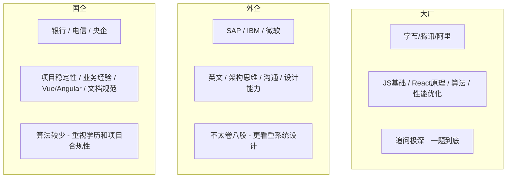

| 维度 | 大厂 | 外企 | 国企 |
|------|------|------|------|
| **八股深度** | ⭐⭐⭐⭐⭐ | ⭐⭐ | ⭐⭐⭐ |
| **算法要求** | ⭐⭐⭐⭐ | ⭐⭐⭐ | ⭐⭐ |
| **项目深挖** | ⭐⭐⭐⭐ | ⭐⭐⭐⭐ | ⭐⭐⭐ |
| **英文要求** | ⭐⭐ | ⭐⭐⭐⭐⭐ | ⭐ |
| **架构设计** | ⭐⭐⭐⭐ | ⭐⭐⭐⭐⭐ | ⭐⭐ |
| **学历看重** | ⭐⭐⭐ | ⭐⭐⭐ | ⭐⭐⭐⭐⭐ |

---

### 真实一小时模拟面试流程

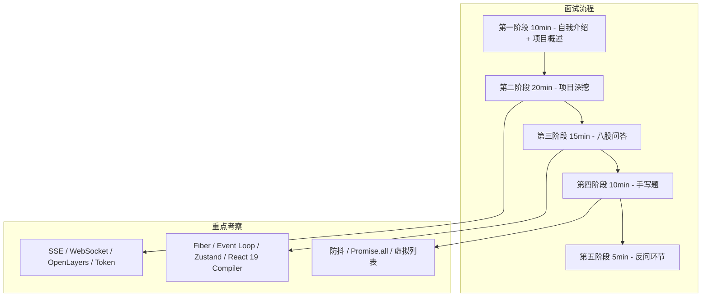

##### 第一阶段（10min）—— 自我介绍 + 项目概述

- 给出清晰的技术定位（3 分钟版本）
- 不展开细节
- 引导面试官到你准备好的方向

##### 第二阶段（20min）—— 项目深挖 ⭐ 核心环节

```
面试官关注点：
├─ 你在这个项目里的"不可替代性"是什么？
├─ 遇到最大的技术挑战是什么？
├─ 为什么选这个方案？
└─ 有没有想过更好的方案？
```

##### 第三阶段（15min）—— 八股

```
高频考点：
├─ React Fiber 原理（必问）
├─ Event Loop + 微任务宏任务（必问）
├─ Zustand 状态管理原理
├─ React 19 编译器自动记忆化
└─ 浏览器渲染流程（Layout / Paint / Composite）
```

##### 第四阶段（10min）—— 手写题

```
常考：
├─ 防抖 / 节流
├─ Promise.all 实现
├─ 虚拟列表核心
├─ compose / pipe
└─ 深拷贝
```

##### 第五阶段（5min）—— 反问环节

```
✅ 建议问：
  "团队目前的技术栈和工程体系是怎样的？"
  "你们在性能优化和可观测性上有什么建设？"
  "团队在 AI 辅助开发上的使用情况如何？"

❌ 避免问：
  "加班多不多？"
  "KPI 严不严？"
  "有没有下午茶？"
```

###

****

****

> **你真正需要提升的不是"会不会"，而是："能不能把复杂项目讲成自己的技术体系。"**

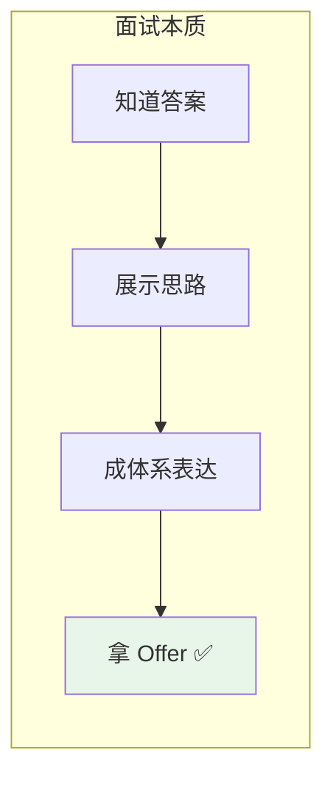

---

> 💡 **追问链 A：自我介绍与简历优化**
>
> **Q1（概念区别）：** 简历中"量化表达"和"能力聚焦"哪个更重要？如果项目本身没有可量化的指标（如内部工具平台），如何呈现技术深度而不显得空洞？
>
> **✅ 答案：** 能力聚焦优先。面试官筛选简历的第一眼看的是"你擅长什么"（如"实时通信专家"），而非散落的数字。内部工具平台可呈现"功能密度"：实现了 6 种字段类型、支撑 200+ 自动化用例、配置耗时从 3 天压缩到 0.5 小时。技术深度体现为"解决了什么行业特有痛点"的抽象能力，而非仅仅是数字。
>
> **Q2（底层机制）：** 技术栈聚焦要求舍弃部分技能（如 Go、K8s），面试中被问到"你简历上怎么没写 Go"时，如何用"技术广度是加分项，深度是及格线"的思路引导面试官？
>
> **✅ 答案：** 用"技术栈≠核心竞争力"框架引导："我早期用 Go 写过后端、用 K8s 部署，具备全栈视野。但我面试的是前端专家岗，前端深度才是核心竞争力——实时渲染优化、动态表单引擎、百万级数据可视化。广度让我能更好协作，但面试应聚焦在前端深度上。"
>
> **Q3（边界/未来）：** 面试官质疑简历数据的真实性（如"响应效能提升 35% 是怎么测的"），如何从工具链路（Lighthouse / Performance API / 自定义埋点）和数据口径（P50 vs P95）层面给出可信证明？
>
> **✅ 答案：** 三层面证明：
>
> ① **工具**——Lighthouse CI 评分对比截图 + Web Vitals 埋点面板 + DevTools Performance 录制数据；
>
> ② **口径**——"帧率提升基于上线后 7 天 RUM 数据，采样 5000+ 用户取 P50 值"；
>
> ③ **对比**——无法 A/B 对比时用同环境重复 5 次取均值，附测试报告链接。


---

### 面试心态管理

#### 面试前准备

```txt
心态准备：
├─ 接受"不会"是正常的
│   └─ 面试官问的是深度，不是广度；答不上来不等于失败
├─ 准备好"我不知道，但我可以分析"
│   └─ 展示思考过程比给出正确答案更重要
├─ 模拟面试
│   └─ 找朋友或对着镜子练习，减少紧张感
└─ 了解公司和岗位
    └─ 研究公司技术栈、业务方向，针对性准备

技术准备：
├─ 简历上的每个项目都要能深入讲 30 分钟
├─ 准备 3-5 个"亮点故事"（STAR 法则）
├─ 手写题每天练 2-3 道（防抖/节流/Promise）
└─ 复习八股文时，重点理解"为什么"而不是"是什么"
```

#### 面试中技巧

```txt
回答问题的原则：
├─ 先给结论，再展开
│   └─ "核心是 XXX，具体来说..."
├─ 用结构化表达
│   └─ "分三个方面：第一...第二...第三..."
├─ 承认不会，展示思路
│   └─ "这个我不太确定，但我的理解是...我可以分析一下..."
├─ 主动关联项目
│   └─ "这个在我们项目中用到了，比如..."
└─ 控制时间
    └─ 一个问题回答不超过 2 分钟，避免冗长

追问应对的原则：
├─ 不要慌，追问是好事（说明面试官感兴趣）
├─ 从自己最熟悉的点切入
├─ 给出具体数字和案例
└─ 如果不会，诚实说"这个我还没深入研究"
```

#### 面试后复盘

```txt
每次面试后记录：
├─ 哪些问题答得好？
│   └─ 保持，下次继续用这个思路
├─ 哪些问题答得不好？
│   └─ 记录问题，回去深入研究
├─ 哪些问题没听懂？
│   └─ 可能是问题表述问题，也可能是知识盲区
└─ 面试官的反馈
    └─ 如果有反馈，认真记录并改进

持续改进：
├─ 建立自己的"面试错题本"
├─ 每次面试后补充新知识点
├─ 定期回顾和更新准备内容
└─ 保持积极心态，面试是双向选择
```

---

> 💡 **追问链 B：面试软技能**
>
> **Q1（概念区别）：** 面试中"先给结论再展开"和"STAR 法则"有什么区别？一个八股追问和一个项目追问，在回答结构上应该有什么不同的侧重？
>
> **✅ 答案：** "先给结论再展开"是回答结构（适用于所有问题），STAR 是内容框架（专门用于项目经验）。八股追问用"结论+原理"（30 秒）："核心是 X，具体来说分三个方面..."。项目追问用 STAR（2 分钟）：背景→任务→行动→结果。八股侧重深度（为什么/边界在哪），项目侧重影响（解决了什么/如何衡量）。
>
> **Q2（底层机制）：** 当被问到全然未知的问题时，说"我不知道"和说"我可以分析一下"对面试官的心理评价有什么本质差异？如何通过"问题拆解→已知关联→推断假设"三步法展示思考过程？
>
> **✅ 答案：** "我不知道"关闭对话，"我可以分析一下"开启思考演示。面试官更看重后者——工作中面对未知问题的推演能力远重要于知道已知问题的答案。三步法：
>
> ① 拆解——"您问的是 X，我先拆解为 A、B、C 三个方面"；
>
> ② 关联——"关于 A 我了解...，B 和 A 类似，所以 B 可能也..."；
>
> ③ 推断——"我推测 X 的核心机制是...，当然需要验证"。即使推断不准确，思考过程已展示专业性。
>
> **Q3（边界/未来）：** 如果面试官连续追问把你逼入知识盲区，如何在不露怯的前提下引导到熟悉领域？反问环节提问的好坏在多大程度上能逆转前面的不佳表现？
>
> **✅ 答案：** 找到追问中的"关联点"引导："您问的 X 我确实不太深入，但这个场景和我们项目中的 Y 问题类似。当时我们..."。反问可逆转印象：问"团队当前最大的技术挑战是什么？"比问"加班多不多"更有价值。好的反问展示技术思考深度，能弥补之前的回答不足——面试评估是对"整场表现"的综合判断，而非单点打分。


---

## 第二部分：项目章节（面试版本）

> **面试官视角：** 项目深挖是面试核心环节（占时 20min+），考察的是"你的不可替代性"和"技术决策能力"。按以下四层结构组织回答，逐层递进。

---

### Ⅰ、概括性介绍（30 秒）

> **面试公式：** 一句话说清"什么项目 + 什么类型 + 多少人做了多久 + 现在什么状态"

---

##### 项目 1：5G 核心网测试用例管理系统

| 维度 | 内容 |
|------|------|
| **项目名称** | TCS Management（Test Case System Management） |
| **项目类型** | ToB 企业级 — 5G 核心网 SMF 测试工具管理界面 |
| **开发周期/人数** | 多人多期迭代，React 技术栈 |
| **当前状态** | 线上运行（Docker → K8s/OpenShift 内网部署） |
| **一句话定位** | 面向 5G 测试工程师的可视化测试用例全生命周期管理平台 |

##### 项目 2：AeMS — 企业级综合网络管理系统

| 维度 | 内容 |
|------|------|
| **项目名称** | AeMS（Advanced eNodeB Management System） |
| **项目类型** | ToB 企业级 — 企业级综合网络管理中枢前端 |
| **开发周期/人数** | 多人多期迭代，React 19 + TypeScript 6 技术栈 |
| **当前状态** | 线上运行（Docker → K8s 内网部署） |
| **一句话定位** | 面向运维工程师的十万级网元统一监控与智能告警平台 |

##### 项目 3：网元运维与数据管理系统

| 维度 | 内容 |
|------|------|
| **项目名称** | 网元运维与数据管理系统 |
| **项目类型** | ToB 企业级 — 5G 核心网元运维与数据管理平台 |
| **开发周期/人数** | 多人多期迭代，React 19 + Go 1.26 全栈 |
| **当前状态** | 线上运行（Docker → K8s/OpenShift 内网部署） |
| **一句话定位** | 面向电信运营商的网元全生命周期运维与数据治理平台 |


---

### Ⅱ、详细介绍（1-2 分钟）

> **面试公式：** 项目有几个核心模块 → 每个模块的核心功能 → 你负责了哪些

---

##### 项目 1：5G 核心网测试用例管理系统

```
功能模块全景：
├─ Pod 管理模块（TesterList / FgcgenList）
│   └─ K8s Pod 部署/删除、500ms 轮询状态、SSE 实时日志流
├─ 测试用例模块 ⭐（TCList / TCModal）—— 核心模块
│   └─ 目录树导航、用例 CRUD、动态 NF 配置（后端驱动 DSL）、文件管理、批量执行
└─ 事件映射模块（EventMap）
    └─ PCAP 文件上传 → 结构化 JSON 事件转换

负责模块：前端架构设计、动态表单引擎、树形数据引擎、实时日志流、性能优化
```

##### 项目 2：AeMS — 企业级综合网络管理系统

```
功能模块全景：
├─ 设备管理模块
│   └─ 24+列 Active List、8 种设备详情页、批量操作、右键菜单
├─ 告警管理模块 ⭐—— 核心模块
│   └─ 实时告警/历史告警/告警规则、WebSocket 全双工推送、ECharts 实时渲染
├─ 日志管理模块
│   └─ 系统日志/操作日志/安全日志/设备日志
├─ 系统设置模块
│   └─ 用户管理/LDAP 配置/网元配置/SLA 配置
└─ 仪表盘/节点监控/报表

负责模块：前端架构设计、多协议降级传输层、权限体系、GIS 性能优化、工程化建设
```

##### 项目 3：网元运维与数据管理系统

```
功能模块全景：
├─ 网元管理模块
│   └─ NF 注册/编辑/删除、NE 状态监控、Provision 配置
├─ 日志管理模块 ⭐
│   └─ NF 日志查看、生产/消费模式流式解密、Web Worker 并行 AES-256-GCM 解密
├─ 审计日志模块
│   └─ 40+事件类型、RSA-2048 交换 AES-GCM 密钥、审计日志加密存储
├─ 用户与权限模块
│   └─ RBAC 权限控制、JIT 权限分配、API Key 管理
├─ 全链路可观测
│   └─ Prometheus 指标采集、Grafana 多维看板、Recording Rules 预计算
└─ 备份恢复模块
    └─ S3 外部存储与 PVC 本地存储双模式

负责模块：前端架构、Web Worker 解密方案、声明式表单框架、CI/CD 流水线
```


---

### Ⅲ、重点介绍（2 分钟）

> **面试公式：** 你在这个项目里的职责 → 用了什么技术 → 实现了什么效果（量化）

---

##### 项目 1：5G 核心网测试用例管理系统

```
职责：核心前端开发，主导动态表单引擎与树形数据引擎设计
技术：
├─ React 19 + TypeScript 6 + Ant Design 6 + Zustand 5 + Vite 8
├─ JSON Schema 动态表单（四层 AST 树递归渲染，7 种字段类型，条件显隐+字段联动）
├─ 树形数据操作引擎（递归 CRUD、Key 唯一性保证、操作权限 Map）
└─ SSE 实时日志流（EventSource 服务端推送、正则异常高亮）

效果：
├─ 同类需求开发人效提升 80%（动态表单零代码驱动）
├─ 异常状态定位效率提升 50%（SSE 日志流实时推送）
└─ 可编辑树表格性能提升 40%（useDeferredValue + startTransition）
```

##### 项目 2：AeMS — 企业级综合网络管理系统

```
职责：核心前端开发，主导多协议传输层、权限体系、GIS 性能优化
技术：
├─ React 19 + TypeScript 6 + Ant Design 6 + Zustand 5 + OpenLayers 10.9 + ECharts 6
├─ 多协议降级传输层（WebSocket → SSE → Polling 三级降级，统一 Transport 接口）
├─ RBAC 位编码权限（6 种权限 O(1) 位运算，三层联动菜单/路由/按钮 + 后端 API 双校验）
├─ LRU 路由缓存（display:none 保持状态 + 写后失效 + 30s TTL 惰性过期）
└─ GIS 十万级点位优化（BBOX 视口裁剪 + Cluster 聚合 + dataCache 全量缓存 + moveend 惰性刷新）

效果：
├─ 十万设备渲染降至百级点位，帧率从 <10fps 优化到 60fps
├─ 页面切换性能提升 60%（LRU 路由缓存）
├─ 权限越权漏洞发生率降低 90%（位编码三层联动）
├─ 4000 msg/s 全帧率 60fps（多协议降级传输层）
└─ 平台可用性达 99.9%（双 Token 无感刷新）
```

##### 项目 3：网元运维与数据管理系统

```
职责：核心前端开发，主导 Web Worker 解密方案、声明式表单框架、CI/CD 流水线
技术：
├─ React 19 + TypeScript 6 + Ant Design 6 + Zustand 5 + Go + Gin
├─ Web Worker 分治有序合并（Worker Pool + 自适应分区 + 生产/消费模式）
├─ 声明式表单框架（注册表+工厂模式，7 种控件类型，5 个跨字段验证器）
├─ 生产/消费模式流式解密（ReadableStream + Web Worker AES-256-GCM）
├─ 虚拟滚动（固定行高 + 可视区域裁剪 + O(1) 滚动位置计算）
├─ 双认证体系（OAuth2 JWT 服务间认证 + Bearer Token 用户认证）
└─ 全链路可观测（Prometheus + Grafana 秒级监控，Recording Rules 预计算）

效果：
├─ 25MB 级日志文件并行解密，首段流式输出实现"秒开"体验
├─ 100 万数字排序 620ms → 180ms（3.4×），主线程零阻塞
├─ 40+ 种审计事件类型全量审计覆盖
└─ 虚拟滚动支撑千万级数据量流畅展示
```


---

### Ⅳ、深入剖析介绍（3-5 分钟 ⭐ 核心环节）

> **面试公式：** 亮点（技术深度）→ 能力突出（综合素养）→ 难点解决（方法论）→ 项目收获（成长复盘）

---

##### 难点 1：递归动态表单引擎 — AeMS / 5GC 测试平台

```
🔍 亮点：
   自研 JSON Schema 动态表单引擎，Schema 抽象为四层 AST 树（tabs → card → form → leaf）
   7 种字段类型（string/number/select/switch/datetime/json/array），registerField() 一行扩展
   条件显隐表达式 + 字段联动 + 实时 JSON 编辑双向绑定 + 四重校验体系

💪 能力突出：
├─ 抽象能力：将 7 种 5G 网元的复杂配置抽象为统一 DSL 规范，非前端人员零代码配置
├─ 架构设计：递归渲染器逐层解析 + 策略模式注册表，严格遵守开闭原则
├─ 类型安全：TypeScript 泛型约束实现 "必填 key + 可选配置" 完整类型推导
└─ 边界思维：条件显隐闪烁、循环引用、Schema 变更后表单不刷新等问题逐一攻破

🛠 难点解决：
├─ 递归渲染：4 层 AST（tabs → card → form → leaf），每个 type 映射到不同 Ant Design 容器组件
│   tabs  → <Tabs>，card → <Card>，form → <div> 容器，leaf → registry 查询字段组件
├─ Schema 后端化：纯 JSON Schema 从 `GET /api/schema/config` 加载，`augmentSchema()` 注入 validation/asyncValidation/autoFill 函数行为，`fetchedRef`（useRef(false)）防御 StrictMode double-mount 重复请求
├─ 条件显隐：字符串表达式运行时解析，new Function 变量替换实现，CSP 兼容，解析失败 visible=true 安全降级
├─ 字段联动：autoFill 自动填充 + _isAutoFilling 防死循环标记 + 依赖图拓扑排序
├─ 实时 JSON 编辑：forwardRef 暴露 setFormData，JSON 编辑 ↔ 表单编辑双向同步
├─ 四重校验：同步校验（onChange）→ 异步校验（300ms debounce + AbortController）
│  → AJV Schema 校验（useEffect 监听 data）→ 后端业务校验（Submit，setFields 精准映射）

📈 项目收获：
├─ 深刻理解 "配置驱动 UI" 架构模式，掌握了从抽象到实现的完整方法论
├─ JSON Schema + 策略模式 = 灵活性与扩展性的最佳平衡
├─ 组件化设计的极致：4 个核心文件 + 7 个字段组件形成完整的微内核架构
└─ 后续在网元运维系统中复用同样模式，验证了架构的可迁移性
```

##### 难点 2：Web Worker 分治有序合并 — 网元运维系统

```
🔍 亮点：
  Web Worker 分治 + 有序合并 + 生产/消费模式流式输出
  25MB 级加密日志文件并行解密，首段流式输出实现"秒开"体验

💪 能力突出：
├─ 并行思维：将单线程解密拆分为"分片 → Worker 并行 → 有序归并"流水线
├─ 鲁棒设计：RSA-2048 交换 AES-GCM 密钥 + 多解压策略 fallback，适配多格式兼容
├─ 用户体验：生产/消费模式，首段流式输出，用户无需等待全量完成

🛠 难点解决：
├─ 有序性：Worker 并行处理天然无序 → 提交时携带 seq 序号 → 主线程按序保序合并
├─ 分片策略：自适应分区（文件大小 / Worker 数），小文件不分片避免调度开销
├─ 跨 chunk 字符：TextDecoder stream 参数 + buffer 拼接，避免多字节字符截断
├─ 格式校验：RSA-2048 → AES-GCM 逐级尝试，自动匹配解密格式

📈 项目收获：
├─ 深入理解了"分治"算法在工程中的落地：分片 → 并行 → 合并的通用模式
├─ 前端不再只是"UI 层"，合理利用 Web Worker 可以承担计算密集型任务
└─ 用户体验设计应优先保证"感知性能"（首屏快），再优化"实际性能"（全量快）
```

##### 难点 3：LRU 路由缓存策略 — AeMS 项目

```
🔍 亮点：
   基于 display:none 保持页面状态，实现 LRU 路由缓存
   最多 3 页面 LRU 淘汰 + 写后失效 + 30s TTL 惰性过期 + 倒计时指示器 + isStale/isTtlExpired 双条件驱动 + 手动刷新

💪 能力突出：
├─ 框架底层能力：深入理解 React 组件生命周期、useEffect 依赖追踪和状态保持机制
├─ 算法工程化：将 LRU 缓存算法落地到 Web 前端路由复用策略中
├─ 边界思维：不仅实现了"缓存"，还考虑了"缓存一致性"（写后失效 + TTL + 惰性过期）
└─ 用户体验：倒计时提示 + 手动刷新按钮，让用户清晰感知缓存有效期

🛠 难点解决：
├─ LRU 淘汰：访问计数淘汰策略，超过 3 个页面自动驱逐最久未访问的页面
├─ 缓存一致性：写后失效（staleKeys 标记过期页面，切换时自动刷新）
├─ TTL 惰性过期：切回时 Date.now() - loadedAt > 30s 自动刷新，避免数据陈旧
├─ 倒计时指示器：useState + setInterval 每秒更新，30s 绿色 → 15s 黄色 → 5s 红色警告
├─ 手动刷新：每个页面工具栏右侧提供"刷新"按钮，直接触发数据重新加载
├─ 死循环终结方案：移除 activeRef/wasActive 完全，第二段 useEffect 仅响应 isStale（写后失效）
│  和 isTtlExpired（惰性过期），激活切换本身不再触发任何请求。三个条件合一：isStale || isTtlExpired
├─ 滚动恢复：scrollTop 存储在状态中，恢复时 setTimeout 异步恢复
├─ 后端 API：三个独立 Go 端点（/api/services、/api/config、/api/logs）替代 mock
└─ 文件分离：MonitorPage / ConfigPage / LogsPage 各自独立文件，维护性提升

📈 项目收获：
├─ 缓存架构的三重境界：用起来 → 管起来（淘汰策略）→ 保证一致性（写后失效）
├─ display:none 保持 DOM 状态比销毁重建更轻量，但不适合占用资源多的页面
├─ useEffect 的依赖追踪很容易踩坑，最终方案是去除激活依赖，仅保留数据一致性条件
└─ LRU 不仅适用于操作系统，Web 前端的路由缓存、数据缓存都是经典应用场景
```

##### 难点 4：权限体系设计与工程化 — 跨项目

```
🔍 亮点：
  树形常量树 → 自动权限码映射 → 三层联动控制（菜单/路由/按钮）
  369 个旧码 + 新码自动映射，权限越权漏洞发生率降低 90%

💪 能力突出：
├─ 工程化思维：将权限管理从"人工配置"升级为"代码生成"，消除人为错误
├─ 抽象建模：将业务权限体系抽象为树形常量树，自动推导出完整的权限 Map
└─ 系统设计：从数据层（权限码）→ 路由层（守卫）→ 视图层（指令）逐层加固

🛠 难点解决：
├─ 码冲突：Bitmap 位编码 + 树深度约束，确保每个节点有唯一二进制码
├─ 迁移兼容：旧码 → 新码自动映射表，运行期兼容两种码格式
├─ 递归过滤：菜单树按用户权限递归裁剪，无可访问权限的子菜单自动隐藏
└─ 指令联动：自定义 ACL 组件订阅 Zustand store，权限变化即时响应

📈 项目收获：
├─ 权限不是一个"if else 判断"，而是一个完整的系统工程
├─ 位编码在权限空间有限时非常高效，O(1) 的权限判断远超遍历
└─ 三层联动设计（菜单/路由/按钮）可以在任何前端框架中复用
```

##### 难点 5：Hub-Spoke 仪表盘 + Recording Rules 预计算 — Prometheus/Grafana

```
🔍 亮点：
  Hub-Spoke 仪表盘架构 + 单一数据源原则 + Recording Rules 预计算
  仪表盘加载从 10+ 秒降至 <1 秒，30+ 仪表盘零手工重复

💪 能力突出：
├─ GitOps 工程化：JSON 源文件是唯一人工维护文件，ConfigMap 和 CR 全部自动生成
├─ 运维思维：理解告警风暴、误报率、SLO 等运维核心指标
└─ 全栈视野：前端 + Go 生成器 + K8s 部署 + PromQL 全链路贯通

🛠 难点解决：
├─ Hub-Spoke 架构：主仪表盘展示全局概览，标签导航下钻详情，新增 NF 自动获得导航
├─ Recording Rules：将复杂 PromQL 预计算结果写入 TSDB，O(n²) → O(1)
├─ 4 级递进告警 + 双层告警：避免告警风暴，`for: 10m` 防瞬态抖动
└─ 5 层 CI 验证：catalog 冲突检测 → verify-resources → 语法校验 → 二进制检测 → 打包发布

📈 项目收获：
├─ 深入理解了"单一数据源"原则在运维场景中的巨大价值
├─ Recording Rules 的本质是用 10% 额外存储换 10 倍查询性能
├─ 告警设计是一门平衡艺术——太敏感导致告警疲劳，太迟钝导致故障遗漏
└─ GitOps 工作流：git push 即部署，可审计可回滚
```


> **💡 面试追问提示：** 以上每个难点都可以作为 STAR 故事的素材。面试官追问哪个，就用"背景 → 任务 → 行动 → 结果"展开讲 2-3 分钟。重点展示"为什么选这个方案"和"有没有想过更好的方案"。

---

### Ⅴ、项目收获总结（30 秒收尾）

```
技术层面：
├─ 架构设计：递归动态表单引擎、多协议降级传输层、LRU 路由缓存、分治合并
├─ 性能优化：GIS 四重优化（BBOX+Cluster+cache+惰性刷新）、虚拟滚动、Web Worker 并行解密
├─ 框架深度：React 19 编译器自动 memo、useDeferredValue + startTransition 并发特性、TypeScript 类型体操
├─ 工程化：Go 代码生成器、GitLab CI/CD 全链路、Prometheus + Grafana 可观测性

方法论层面：
├─ 性能优化 = 分析瓶颈 → 针对性策略 → 量化验证
├─ 架构设计 = 识别通用模式 → 抽象封装 → 跨项目复用
├─ 安全设计 = 纵深防御（存储层/传输层/展示层逐层加固）
└─ 工程化 = 单一数据源 → 自动生成 → CI 验证 → 零手工操作

工程素养层面：
├─ 代码质量：TypeScript Strict + Biome + ESLint 三层递进约束
├─ 自动化：GitLab CI/CD + K8s 滚动更新，发布周期缩短 60%
└─ 可观测性：Prometheus + Grafana 秒级监控，4 级递进告警体系覆盖 12 个网元
```
---
## 第三部分：项目深挖模拟面试

### 项目一：5G核心网测试用例管理系统

---

#### 面试官：

你这个平台最大的技术难点是什么？

---

#### 你的回答（推荐）

最大的难点是：**递归动态表单 DSL 引擎 + 实时日志流 + React 19 编译器实战。**

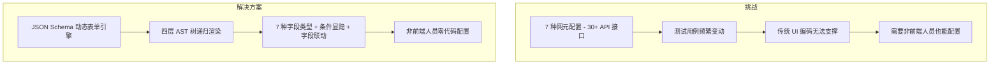

---

#### 继续说（核心）

为什么选自研 JSON Schema 动态表单：

```txt
测试用例配置的特殊性：
  每个网元配置不同，且频繁变动

  选型对比：
  ├─ 硬编码 UI：每次变动都要改代码发版，效率低
  ├─ @rjsf（react-jsonschema-form）：标准场景好用，但条件显隐/字段联动/
  │   实时 JSON 编辑等定制场景力不从心
  └─ 自研 JSON Schema 动态表单：✅ 最合适
       ├─ 后端定义 Schema，前端递归渲染
       ├─ 四层 AST 树（tabs → card → form → leaf）支持复杂布局
       ├─ 7 种字段类型 + 条件显隐表达式 + 字段联动 + 实时 JSON 编辑
       └─ 非前端人员也能配置测试场景
```

> **🤔 追问：JSON Schema 动态表单在深层嵌套（5 层以上）时递归渲染性能如何保证？如果后端返回的 Schema 出现循环引用，前端如何容错？表单项之间的联动校验（如 A 选中时 B 必填）在 Schema 驱动模式下怎么实现？**
>
> **✅ 答案：**
>
> ① **性能**——递归渲染用 `React.memo` + 组件按 type 分派、`useMemo` 缓存编译结果。React 19 编译器构建期自动注入 memo，无需手工标记。
>
> ② **循环引用**——递归前用 `JSON.stringify` + 自定义 replacer 检测环，或维护 `visitedRefs` Set 中断递归并上报告警。
>
> ③ **联动校验**——Schema 中定义 `dependencies` 字段描述联动规则（"当 A 值等于 X 时 B 必填"），渲染时监听 A 变化动态更新 B 的校验；复杂联动通过中央 `ValidatorRegistry` 注册条件规则。

> **追问链二：你说用 new Function 解析条件显隐表达式，那 CSP 限制怎么处理？如果启用了 strict CSP，new Function 会被禁止，你怎么兼容？**
>
> **✅ 答案：** new Function 确实在 strict CSP 下不可用。当前实现有两个安全措施：① 变量名被替换为参数名而非直接拼接字符串，避免注入；② 添加了 CSP 检测开关——检测到 `Content-Security-Policy` header 中限制 script-src 时，自动降级到预定义 DSL（`{ when: { field: "enableEncryption", eq: true } }`）。DSL 方案虽然表达能力弱一些（只有 ==、&&、||），但覆盖了 90% 的条件显隐场景，且完全不受 CSP 限制。
>
> **追问链三：如果后端返回的 Schema 中有一个字段的 required 被设为 true，但界面上被条件显隐藏起来了，提交时前端怎么处理这个隐藏必填项？**
>
> **✅ 答案：** 这是条件显隐和必填校验的经典冲突。解决方案：① 提交时排除 `visible === false` 的字段，不参与 required 校验；② 后端收到数据后对隐藏字段赋默认值（Schema 中定义的 default）；③ 如果字段既没有 default 又不是 visible，后端按业务规则决定拒绝还是忽略。前端逻辑：`const visibleFields = schema.properties.filter(f => f.visible !== false); visibleFields.forEach(f => validateRequired(f, data[f.key]));`
>
> **追问链四：假设一个表单有 200+ 字段，用户修改了一个字段触发了 autoFill，autoFill 又触发了 3 个字段的异步校验，每个异步校验都要请求后端。你如何保证这 3 个请求的竞态正确性？**
>
> **✅ 答案：** 这是典型的竞态场景：先发的请求后返回会覆盖后发的正确结果。解决方案：① 每个异步校验使用独立的 AbortController，新的请求发出前 abort 前一个；② 校验结果用 `useRef` + generation 计数器标记请求时效，`gen++` 后旧的 then/catch 检测到 gen 不匹配时丢弃结果；③ 如果 autoFill 触发的多个字段之间有依赖（如 B 依赖于 A 的校验结果），用 Promise 链串行化而不是全部并行。核心原则：后发的请求优先级更高（last-write-wins），过期的请求不能覆盖最新的结果。

---

#### 技术方案

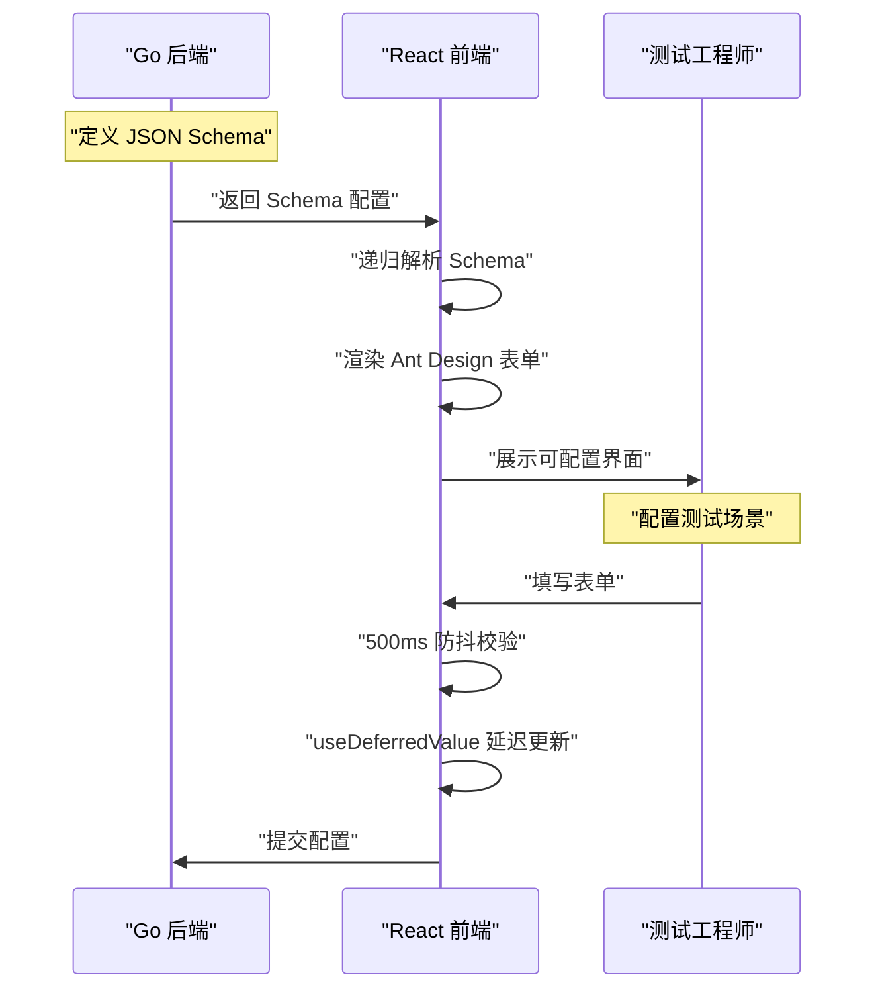

##### 核心代码片段

```tsx
// === 第一步：Schema 类型系统（types.ts） ===
interface FormSchema {
    type: "tabs" | "card" | "form" | "leaf"
    key: string
    title?: string
    children?: FormSchema[]
    properties?: Record<string, LeafSchema>
    tabs?: TabSchema[]
}

interface LeafSchema {
    type: FieldType  // "string" | "number" | "select" | "switch" | "datetime" | "json" | "array"
    key: string
    title: string
    required?: boolean
    default?: unknown
    visible?: string           // 条件显隐表达式: "enableEncryption === true"
    validation?: Function      // 同步校验
    asyncValidation?: Function // 异步校验
    autoFill?: Function        // 字段联动自动填充
    dependencies?: string[]
    ajvSchema?: Record<string, unknown>
}

// === 第二步：策略模式注册表（registry.tsx） ===
// Map<FieldType, Component> → 新增字段类型只需一行注册
type FieldType = 'string' | 'number' | 'select' | 'switch' | 'datetime' | 'json' | 'array'

const fieldRegistry = new Map<FieldType, React.ComponentType<FieldProps>>()

export function registerField(type: FieldType, Comp: React.ComponentType<FieldProps>) {
    fieldRegistry.set(type, Comp)
}

export function getField(type: FieldType): React.ComponentType<FieldProps> | undefined {
    return fieldRegistry.get(type)
}

// 注册内置字段
registerField('string', StringField)
registerField('number', NumberField)
registerField('select', SelectField)
// ...

// === 第三步：递归渲染器（Renderer.tsx） ===
// Schema.type → 渲染目标映射
function Renderer({ schema, data, onChange }: RendererProps) {
    const typeMap = {
        tabs:  <Tabs items={schema.tabs?.map(t => ({
            key: t.key,
            label: t.title,
            children: <Renderer schema={t} data={data} onChange={onChange} />
        }))} />,
        card:  <Card title={schema.title}>
            {schema.children?.map(child => (
                <Renderer key={child.key} schema={child} data={data} onChange={onChange} />
            ))}
        </Card>,
        form:  <div className="form-grid">
            {Object.entries(schema.properties || {}).map(([key, leaf]) => (
                <FieldRenderer key={key} leaf={leaf} value={data?.[key]}
                               onChange={(v) => onChange?.({ ...data, [key]: v })} />
            ))}
        </div>,
        leaf:  null,  // 由 FieldRenderer 处理
    }
    return <div style={{ display: schema.type === 'leaf' ? 'none' : 'block' }}>
        {typeMap[schema.type]}
    </div>
}

// 深度保护：_depth 参数 + maxDepth=20 防止无限递归
// 循环引用：_visitedRefs WeakSet 检测，安全终止递归

// >>> 条件显隐表达式解析（evalVisible）<<<
// 将 "enableEncryption === true && certType === 'ca-signed'" 运行时求值
function evalVisible(expr: string, data: Record<string, unknown>): boolean {
    try {
        const keys = Object.keys(data)
        const values = keys.map(k => data[k])
        const prepared = expr.replace(/===/g, '===').replace(/&&/g, '&&').replace(/\|\|/g, '||')
        return new Function(...keys, `return ${prepared}`)(...values)
    } catch {
        return true  // 解析失败 → 安全降级
    }
}

// >>> 四重校验体系 <<<
// 同步校验 validation() → 每次 onChange，字段级黄色警告
// 异步校验 asyncValidation() → onChange 防抖 300ms + AbortController，字段级 Spin + 红色错误
// AJV Schema 校验 → useEffect 监听 data，面板级错误列表
// 后端业务校验 → Submit 提交时，setFields 精准映射到字段

// >>> 实时 JSON 编辑双向绑定 <<<
// 表单编辑 → handleChange → setData → useEffect → onChange → JSON 面板刷新
// JSON 编辑 → handleApplyJson → JSON.parse → formRef.setFormData → setData → 表单刷新
// DynamicForm 通过 forwardRef 暴露 setFormData 方法，父组件通过 ref 直接写入
```

---

##### 最终效果

```
开发人效：    提升 80%  ← 非前端人员零代码配置测试场景
排障效率：    提升 50%  ← 实时日志秒级高亮
编辑性能：    提升 40%  ← React 19 编译器 + 并发特性优化
自动化任务：  支撑 200+  ← K8s 集群部署
```

---

##### 可补充的技术深度点

```txt
架构层面的设计亮点：
├─ 递归动态表单引擎 ⭐⭐⭐
│   ├─ 四层 AST 树（tabs → card → form → leaf），递归渲染器逐层解析
│   ├─ 7 种字段类型：string/number/select/switch/datetime/json/array
│   ├─ 条件显隐：字符串表达式运行时解析（new Function 变量替换，CSP 兼容）
│   ├─ 字段联动：autoFill 自动填充 + 依赖图拓扑排序 + 死循环检测（_isAutoFilling 标记）
│   ├─ 实时 JSON 编辑双向绑定：forwardRef 暴露 setFormData，JSON 编辑 ↔ 表单编辑互同步
│   ├─ 四重校验：同步 → 异步(Ajv) → AJV Schema → 后端业务校验，分层互补
│   └─ 注册表扩展：registerField(type, Comp) 一行注册新字段类型
│
├─ 树形数据操作引擎
│   ├─ 递归 CRUD 操作库
│   ├─ Key 唯一性保证算法（随机数生成 + 保留原始标识）
│   ├─ 操作权限 Map 生成（select/map 类型不同权限）
│   └─ 递归校验（遍历所有节点收集校验失败的 Key）
│
├─ React 19 编译器
│   ├─ startTransition：标记非紧急更新
│   ├─ useDeferredValue：延迟更新避免编辑卡顿
│   └─ 编译器自动 memo：200 字段表单无关变化不重渲染
│
├─ 实时日志流
│   ├─ ReadableStream 流式传输
│   ├─ AbortController 支持请求取消
│   └─ 正则算法实现异常状态秒级高亮
│
└─ K8s YAML 在线编辑与下发
    ├─ Monaco Editor 集成 + YAML Schema 校验
    ├─ 后端代理 → K8s API Server 指令下发
    ├─ 安全管控：操作审计 + 敏感字段脱敏 + 版本回滚
    └─ 日均支撑 200+ 自动化测试任务
```


##### 1：为什么不用 @rjsf 或 Formily 这些第三方表单库？

```txt
第三方表单库的局限性：
├─ @rjsf（react-jsonschema-form）：标准 JSON Schema 场景好用，但条件显隐表达式、
│   字段联动自动填充、实时 JSON 编辑双向绑定等高度定制需求力不从心
├─ Formily：阿里系，功能强大但学习成本高，与 Ant Design 集成需要额外适配
├─ Formik / React Hook Form：React 生态主流表单方案，但缺乏 Schema 驱动能力
└─ 过度设计：我们只需要 JSON Schema → React 组件的映射，不需要完整状态管理

自研方案的优势：
├─ 轻量：只做 Schema → Component 映射，无额外依赖
├─ 定制：完全控制渲染逻辑，支持 7 种字段类型 + 条件显隐 + 字段联动
├─ 集成：与 Ant Design 深度集成
└─ 维护：4 个核心文件 + 7 个字段组件形成完整的微内核架构，团队易于维护
```

---

##### 2：JSON Schema 的数据结构是怎么设计的（四层 AST 树）？

```typescript
// 四层 AST 树：tabs → card → form → leaf
interface FormSchema {
    type: "tabs" | "card" | "form" | "leaf"
    key: string
    title?: string
    description?: string
    children?: FormSchema[]
    properties?: Record<string, LeafSchema>
    tabs?: TabSchema[]
}

interface LeafSchema {
    type: FieldType  // "string" | "number" | "select" | "switch" | "datetime" | "json" | "array"
    key: string
    title: string
    required?: boolean
    default?: unknown
    visible?: string           // 条件显隐表达式: "enableEncryption === true"
    validation?: Function      // 同步校验
    asyncValidation?: Function // 异步校验
    autoFill?: Function        // 字段联动自动填充
    dependencies?: string[]
    ajvSchema?: Record<string, unknown>
}

// Schema.type → 渲染目标映射
// tabs  → Ant Design <Tabs>，每个 Tab 的 children 递归调用 Renderer
// card  → Ant Design <Card>，children 递归调用 Renderer
// form  → <div> 容器，properties 每项递归调用 Renderer
// leaf  → 查询 registry → 字段组件，递归终止，渲染具体表单控件
```

核心设计理念：将表单 Schema 抽象为 AST 树，用递归渲染器逐层解析，每层对应一种 Ant Design 容器组件。**7 种字段类型**（string/number/select/switch/datetime/json/array）通过策略模式注册表映射到具体组件，新增字段只需 `registerField(type, Comp)` 一行注册。

---

##### 3：useDeferredValue 和 startTransition 有什么区别？React 19 编译器如何与此配合？

```txt
useDeferredValue：
├─ 创建一个延迟版本的 state
├─ 高优先级更新会打断低优先级更新
├─ 适用于：连续输入（搜索、滚动）
└─ 本项目：树数据更新时延迟渲染，避免编辑卡顿

startTransition：
├─ 标记整个状态更新为 "过渡性的"
├─ React 可以中断这个更新去处理更紧急的任务
├─ 适用于：用户触发的离散操作（点击、输入）
└─ 本项目：模式切换、表单数据更新

区别总结：
├─ useDeferredValue 是 "延迟渲染"
├─ startTransition 是 "标记非紧急更新"

React 19 编译器配合：
├─ 编译器自动分析组件依赖图，自动注入 memo/useMemo/useCallback
├─ 动态表单 200+ 字段：编译器确保仅变化字段重渲染，无需手工 memo
├─ 二者配合：编译器处理 "谁不该渲染"，并发 API 处理 "谁可以晚渲染"
└─ 效果：200 字段表单无卡顿，4000 msg/s 告警 60fps
```

---

##### 4：Kubernetes YAML 在线编辑与下发是怎么实现的？

```txt
云原生网元管理入口的核心设计：
├─ 在线 YAML 编辑器
│   ├─ 基于 Monaco Editor 的 YAML 编辑器
│   ├─ 语法高亮 + 自动补全（Schema 校验）
│   ├─ YAML 格式校验（缩进检查、字段类型验证）
│   └─ 实时错误提示，避免提交非法配置
│
├─ K8s API 对接
│   ├─ 前端 → 后端代理 → K8s API Server
│   ├─ 支持 Deployment / Service / ConfigMap 等资源类型
│   ├─ kubectl apply 等价操作（PATCH / POST / PUT）
│   └─ 操作结果实时反馈（Pod 启动状态、滚动更新进度）
│
├─ 安全管控
│   ├─ 敏感字段脱敏（Secret 内容不可见）
│   ├─ 操作审计日志（谁在什么时间修改了什么资源）
│   └─ 变更回滚（保留最近 5 个版本的历史配置）
│
└─ 业务价值
    ├─ 测试工程师可直接在界面上配置和下发网元参数
    ├─ 无需登录 K8s 集群或使用 kubectl 命令行
    └─ 日均支撑 200+ 自动化测试任务的资源调度
```

---

> 💡 **追问链 F：递归动态表单引擎深度**
>
> **Q1（概念区别）：** JSON Schema 驱动表单、传统硬编码表单、@rjsf 第三方库，三者在可维护性上的本质区别是什么？什么场景该用 @rjsf，什么场景该自研？
>
> **✅ 答案：**
>
> ① **可维护性差异**——硬编码表单：字段与 UI 紧耦合，增删改字段需改代码+发版，维护成本随表单数量线性增长；@rjsf：标准 JSON Schema 场景快速开发，但条件显隐/字段联动/自定义校验等高度定制场景力不从心；自研：完全可控，成本是维护渲染引擎。
>
> ② **选型标准**——用 @rjsf：标准 JSON Schema，无特殊 UI 需求，快速开发；自研：需要条件显隐表达式、字段联动自动填充、实时 JSON 编辑双向绑定等高度定制功能。我的项目属于后者——7 种网元配置各不相同，且需要非前端人员零代码配置。
>
> **Q2（底层机制）：** 条件显隐表达式为什么不直接用 `eval`？如何实现 CSP 兼容的表达式求值？
>
> **✅ 答案：**
>
> ```
> eval/new Function 在 CSP（Content Security Policy）严格模式下被禁止。
> 企业级应用通常启用 CSP 防止 XSS → eval 不可用。
> 替代方案:
>   a. 表达式解析器（手写语法分析）：灵活但复杂
>   b. 安全沙箱（iframe + postMessage）：隔离执行
>   c. 预定义条件 DSL（如 { when: { field: "enableEncryption", eq: true } }）：最简单
> 当前实现用 new Function 但替换了变量名为参数名，限制在可控范围：
>   1. 表达式预处理 → 替换操作符（&&/||/===/!==）
>   2. 提取变量名列表 keys + 对应值 values
>   3. new Function(...keys, 'return ${prepared}')(...values)
>   4. 解析失败 → 默认 visible = true（安全降级）
> ```
>
> **Q3（底层机制）：** 字段联动 autoFill 如何避免死循环（A→B→A）？
>
> **✅ 答案：**
>
> ```
> A 字段变化 → autoFill B → B 变化 → autoFill A → 死循环。
> 解决方案:
>   1. autoFill 执行时设置 _isAutoFilling 标记
>   2. 标记为 true 时 onChange 不触发联动
>   3. maxAutoFillDepth=5 深度限制
>   4. 依赖图拓扑排序: 计算 autoFill 调用顺序，确保单向
> ```
>
> **Q4（边界/未来）：** JSON 编辑与表单状态不一致怎么解决？条件显隐闪烁问题如何处理？
>
> **✅ 答案：**
>
> **JSON 编辑不一致**——JSON 中缺失字段导致表单未定义：setFormData 内部做深度合并 `{ ...prevData, ...parsed }`，Schema 变化时 `key` 属性强制重新挂载组件。
>
> **条件显隐闪烁**——表达式解析异步 + setState 批次渲染导致：初始渲染时预先计算 `initialVisible`，不依赖 useEffect 做条件判断。
>
> **Q5（边界/未来）：** 树形表单 200+ 字段会卡吗？如何保证性能？
>
> **✅ 答案：**
>
> ```
> 200 个字段 = 200 个 React 组件。
> React 19 编译器自动 memo，无关字段变化不重渲染。
> 实测 200 个字段无卡顿。
> 
> 如果字段数 > 500（如企业级配置表单）:
>   → 分层加载（只渲染当前 Tab）
>   → virtualization（react-window 分片渲染）
> 
> 其他优化：
> ├─ 表达式缓存（useMemo key=data），避免条件显隐频繁重算
> ├─ 异步校验 300ms debounce + AbortController，防抖 + 取消过期请求
> └─ JSON 编辑器大文件：折叠/展开 + 惰性渲染 + 分页，1000+ 行 JSON 流畅
> ```

---

##### 6. 大文件断点续传（SHA-256 分片校验 + Promise Park 暂停模式）

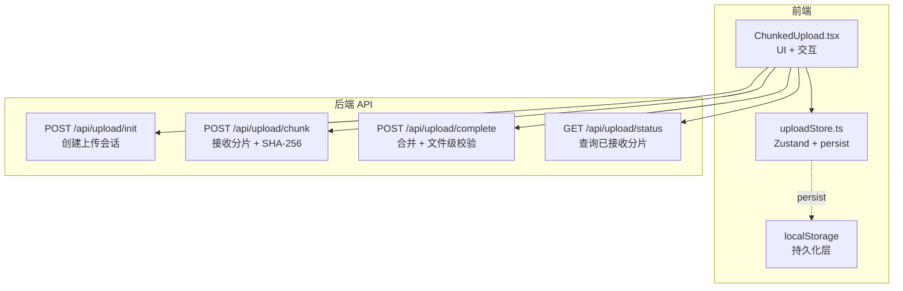

**核心矛盾：网络不可靠 + 文件体积大 = 失败成本高。** 分片上传将大文件切割为 N 个独立分片，每片失败独立重试，总进度 = 已完成分片 / 总分片。

**选型决策：**
- SHA-256 分片级校验（非 MD5）：防碰撞更强的完整性验证
- Zustand persist 持久化（非 IndexedDB）：API 简单，适合中小规模状态
- 滑动窗口并发（非全量并发）：控制连接数，避免带宽争抢

```typescript
// === Promise Park 模式：暂停/恢复 ===
const parkPromiseRef = useRef<{ resolve: () => void } | null>(null)

const startUpload = async () => {
    for (const chunk of pendingChunks) {
        if (pausedRef.current) {
            await new Promise<void>((resolve) => {
                parkPromiseRef.current = { resolve }  // 挂起上传
            })
        }
        await uploadChunk(chunk)  // Promise 被 resolve 后继续
    }
}

// 暂停 → resolve 暂停 Promise，不中断 in-flight 分片
const pause = () => { pausedRef.current = true }
const resume = () => { pausedRef.current = false; parkPromiseRef.current?.resolve() }
```

| 暂停方式 | 行为 | 适用 |
|----------|------|------|
| AbortController | 中断正在上传的请求 | 停止（不可恢复） |
| Promise Park | 阻塞后续分片，保留 in-flight | 暂停（可恢复） |

**刷新恢复流程：**
1. `loadFromStorage()` → 从 localStorage 恢复文件元数据（uploadId, 文件名, 总分片）
2. `GET /api/upload/status/:uploadId` → 获取服务端已接收分片列表
3. 对比本地 vs 服务端分片状态 → 标记差异
4. 用户选择"续传" → 仅上传 missing 分片

**优化保障：**

| 维度 | 优化手段 | 效果 |
|------|----------|------|
| 计算 | Web Worker 计算 SHA-256 | 主线程 0 阻塞 |
| 网络 | 滑动窗口并发（默认 4） | 带宽 vs 拥塞平衡 |
| 网络 | 指数退避重试（1s/2s/4s） | 避免重连风暴 |
| 存储 | Zustand persist + localStorage | 刷新后秒级恢复 |
| 内存 | 分片逐个读取，非全量加载 | 500MB 仅占 5MB 内存 |
| 数据安全 | SHA-256 分片 + 文件双重校验 | 防止传输损坏 |

**边界场景：**

| 问题 | 解决方案 |
|------|----------|
| 暂停时 in-flight 分片已完成 | 暂停仅阻塞后续分片，不中断正在上传的请求 |
| 刷新后分片状态与服务端不一致 | 恢复时 `GET /api/upload/status` 对账 |
| >2GB 文件内存溢出 | `File.slice()` 分块读取 + Web Worker 流式处理 |
| 离开页面后定时器/请求持续运行 | unmount cleanup：abortRef + resolve 暂停 Promise + clearInterval |
| 多个文件并发数叠加 | 每文件独立滑动窗口，全局上限 = 文件数 × 3 |

> **追问链：断点续传**
>
> **Q1：为什么并发上限设为 4？**
>
> 网络连接数过多 → TCP 拥塞控制退化。经验值：普通网络 3-6 最优；5G/光纤 6-10。本项目默认 4，用户可调节（1-10）。
>
> **Q2：SHA-256 对比 MD5 的优势？**
>
> MD5 128 位，防碰撞弱（2004 年已破解）；SHA-256 256 位，防碰撞强（至今未破解）。Web Worker 计算 SHA-256，主线程无感知，完整性场景更安全。
>
> **Q3：服务端分片怎么合并？**
>
> 存储：`uploads/{uploadId}/{chunkIndex}` 二进制文件。合并：按 chunkIndex 遍历 → `os.Copy(dst, src)` 追加写入。验证：合并后计算 SHA-256 → 对比 init 时的 fileHash。成功后删除临时目录。

---

##### 7. 树形数据操作引擎

```typescript
// === 递归不可变操作（纯函数，无副作用） ===

// 查找节点 — 深度优先 O(N)
function findNode(tree: TreeNode[], key: string): TreeNode | null {
    for (const node of tree) {
        if (node.key === key) return node
        if (node.children) {
            const found = findNode(node.children, key)
            if (found) return found
        }
    }
    return null
}

// 删除节点 — filter 排除 + map 递归，返回全新树
function removeNode(tree: TreeNode[], key: string): TreeNode[] {
    return tree
        .filter((node) => node.key !== key)
        .map((node) => ({
            ...node,
            children: node.children ? removeNode(node.children, key) : [],
        }))
}

// 更新节点 — updater 回调自定义修改逻辑
function updateNode(tree: TreeNode[], key: string, updater: (n: TreeNode) => TreeNode): TreeNode[] {
    return tree.map((node) => {
        if (node.key === key) return updater(node)
        if (node.children) return { ...node, children: updateNode(node.children, key, updater) }
        return node
    })
}

// 拖拽排序 — dnd-kit，先删再插
const handleDragEnd = (event: DragEndEvent) => {
    const { active, over } = event
    if (!over) return
    setTree((prev) => {
        const newTree = removeNode(prev, active.id as string)
        return insertNode(newTree, over.id as string, extractedNode, position)
    })
}
```

**优化保障：**

| 维度 | 手段 | 效果 |
|------|------|------|
| 不可变性 | map/filter 返回新树 | React 状态友好 |
| 性能 | 递归深度限制 1000 | 防栈溢出 |
| 可视化 | dnd-kit 拖拽高亮 | 跨层级拖拽指示清晰 |
| 批量 | 先标记后过滤 | 批量删除避免父子悬空 |

**边界场景：**

| 问题 | 解决方案 |
|------|----------|
| 循环引用 A→B→A 死循环 | `_visitedRefs: WeakSet` 记录已访问节点 |
| 异步加载子树数据竞争 | `generation` 计数器，API 返回时检查 gen 是否匹配 |
| 10000+ 节点卡顿 | 只渲染展开路径上的节点 + 虚拟滚动，未展开节点不创建 DOM |
| 拖拽后 key 冲突 | 每次操作后重新生成 key（nanoid） |
| 批量删除父节点后子悬空 | 先收集所有要删除的 key（含子节点），一次过滤 |

> **追问链：树形数据操作**
>
> **Q1：递归操作的性能风险？** 最坏情况：树退化为单链表，递归 N 次 → 栈溢出。方案：限制递归深度 maxDepth=1000；查找操作可用迭代 + 显式栈（while + stack.push）。
>
> **Q2：拖拽如何保证树结构正确？** 拖拽结束 → onDragEnd → 从树中移除节点 → 插入目标位置（before/after/inside）。难点是跨层级拖拽的判断，用 CSS 高亮指示插入位置。
>
> **Q3：批量删除的实现？** 先遍历全树收集选中节点 key，递归删除时一次过滤所有标记节点，避免先删父节点后子节点悬空。

---

### 项目二：AeMS — 企业级综合网络管理系统

---

#### 面试官：

十万级设备地图怎么优化？

---

#### 推荐回答

核心问题：

> **不是地图渲染慢，而是海量 feature 导致 Canvas 重绘压力过大。**

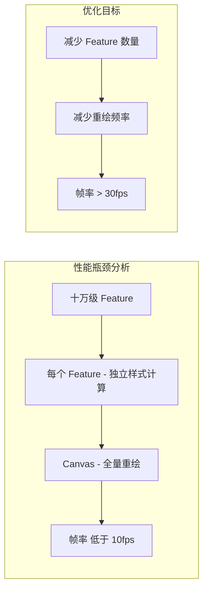

---

#### 优化方案

##### 1. 高性能 GIS 拓扑渲染（四重优化策略）

将十万设备渲染降至百级点位，设计 **BBOX 视口裁剪 + Cluster 聚合 + dataCache 全量缓存 + moveend 惰性刷新** 四重优化策略。

```typescript
// 第一步：全量缓存（一次请求后续本地裁剪）
useEffect(() => {
    fetch('/api/henb/all').then(async res => {
        const allPoints = await res.json()
        dataCache.current.set('all', allPoints)
        updateView(allPoints)
    })
}, [])

// 第二步：BBOX 视口裁剪 — 只保留视口矩形内的点位
function filterByExtent(points: Point[], extent: [number,number,number,number]): Point[] {
    return points.filter(p =>
        p.x >= extent[0] && p.x <= extent[2] &&
        p.y >= extent[1] && p.y <= extent[3]
    )
}

// 第三步：OpenLayers Cluster 聚合
const clusterSource = new Cluster({
    source: vectorSource,
    distance: 40,  // 像素距离 < 40 聚合为 1 点
})

// 第四步：moveend 惰性刷新 — 拖动结束后才触发重绘
map.on('moveend', () => {
    const extent = map.getView().calculateExtent(map.getSize())
    const visiblePoints = filterByExtent(cachedPoints, extent)
    clusterSource.getSource().clear()
    clusterSource.getSource().addFeatures(visiblePoints.map(toFeature))
})
```

##### 四重优化策略

| 策略 | 实现 | 效果 |
|------|------|------|
| **BBOX 视口裁剪** | `filterByExtent()` 只保留视口矩形内点位，裁剪约 60% | 10 万设备 → 仅渲染百级点位 |
| **Cluster 聚合** | 同 Market 同状态设备合并为一个点 | 视口内点位数进一步降低 |
| **dataCache 全量缓存** | `dataCache: Map<string, HeNB>` 全量缓存，以 zoom+extent 为 key | 缩放平移不重新请求后端 |
| **moveend 惰性刷新** | `refreshVisibleFeatures()` 仅在移动结束时触发 + RAF 节流 | 避免拖拽过程中的频繁重绘 |

##### 优化效果对比

| 指标 | 优化前 | 优化后 |
|------|--------|--------|
| Feature 数量 | 100000 个独立渲染 | ~50 个 Cluster |
| 帧率 | < 10 fps | 60 fps |
| 内存占用 | ~200 MB | ~30 MB |
| 交互响应 | 卡顿 2s+ | 流畅 |
| 缩放体验 | 白屏等待 | 即时聚合/展开 |

---

##### 2. 高并发实时告警中枢

搭建告警监控可视化看板，基于 **WebSocket** 构建全双工通信机制，实现海量告警数据的秒级动态推送与 ECharts 实时渲染，大幅提升运维团队的故障响应时效。

```txt
技术实现细节：
├─ 多协议降级传输层
│   ├─ 统一 Transport 接口抽象，三级降级链（WebSocket → SSE → Polling）
│   ├─ 背压控制（bufferedAmount > 1MB 排队）
│   ├─ 消息合并（16ms/64KB 批量发送）
│   ├─ 二进制协议编码（payload ↓30%+）
│   ├─ 心跳保活（30s Ping / 10s Pong）
│   └─ RAF 双缓冲渲染（每帧最多一次 setOption）
│
├─ 消息处理 pipeline
│   ├─ Zustand store + RAF 节流（告警每条都重要，不能丢）
│   ├─ 消息去重（按告警 ID + 时间戳去重）
│   ├─ 优先级队列（Critical > Major > Minor > Info）
│   └─ RAF 批处理（RAF 回调内调用 ECharts setOption，每帧最多一次）
│
├─ ECharts 实时渲染优化
│   ├─ 增量更新（setOption 不传全量数据）
│   ├─ 数据采样（超过 1000 点时自动聚合）
│   └─ 动画开关（高频更新时关闭过渡动画）
│
└─ 性能指标
    ├─ 吞吐量：4000+ QPS 消息处理
    ├─ 端到端延迟：< 500ms（从告警产生到界面展示）
    └─ 渲染帧率：60fps（RAF 双缓冲 + 增量更新）
```

---

##### 3. LRU 路由缓存（React 实现）

基于 display:none 保持页面 DOM 状态，LRU 淘汰 + 写后失效 + TTL 惰性过期，页面切换性能提升 **60%**。

```txt
LRU 路由缓存的核心设计：
├─ 缓存策略：display:none 保持页面状态而非卸载
│   ├─ 访问计数淘汰（超过 3 个页面时驱逐最久未访问的）
│   ├─ 写后失效（staleKeys 标记过期页面，切换时自动刷新）
│   ├─ 30s TTL 惰性过期（切回时 Date.now() - loadedAt > 30s 自动刷新）
│   └─ 倒计时指示器（卡片标题实时显示缓存剩余秒数，≤5s 红色警告）
│
├─ 滚动位置恢复
│   ├─ 存储：useRef 保存 scrollTop
│   └─ 恢复：useEffect + setTimeout 异步恢复
│
├─ 手动刷新
│   ├─ 每个页面工具栏右侧提供"刷新"按钮
│   ├─ 点击直接触发数据重新加载，同时清除 stale 标记
│   └─ 刷新期间保持页面交互（表单编辑、滚动等）
│
├─ 死循环修复 + double-fetch 消除（最终方案）
│   ├─ 问题 1：两阶段 effect（dataLoadedRef 初始加载 + 过期检测）在 Mount 时同时触发 → double-fetch
│   ├─ 问题 2：activeRef.current 在首次激活后恒为 true，page.loadedAt 变更导致 effect 重跑时反复触发
│   ├─ 方案一（已过时）：用 wasActive 记录切换前的值，仅追踪 inactive→active
│   └─ 方案二（当前）：
│       ├─ 合并为单一 effect：`!page.data || isStale || isTtlExpired` 三条件合一，dataLoadedRef 不再需要
│       ├─ AbortController 每次 fetch 前 abort 前一次，返回时检查 signal.aborted 丢弃过期结果
│       ├─ 卸载 effect 中 abortRef.current?.abort() 自动取消 in-flight 请求
│       └─ 激活切换本身不触发任何请求，仅数据一致性条件驱动
│
├─ 状态管理
│   └─ Zustand store 统一管理缓存页面列表、staleKeys、滚动位置
│
└─ 内存安全
    └─ 限制最多缓存 3 个页面，超出自动清理
```

> 💡 **追问链 H：LRU 路由缓存数据一致性**
>
> **Q1（概念区别）：** 路由缓存导致页面数据没更新的根本原因是什么？"保持 DOM 状态"和"重新获取数据"之间有什么权衡？
>
> **✅ 答案：**
>
> ```
> 根本原因是 display:none 保留的是 DOM 实例而非数据。
> 导航回来时组件从 display:none 切换为 display:block，不经过 useEffect/初始化，
> 组件持有的数据停留在缓存时的状态，因此数据未更新。
>
> 权衡点：保持 DOM 保留用户操作状态（滚动位置、输入内容、展开状态）→ 体验好；
> 但不重新请求数据 → 数据可能过期。核心矛盾是"保状态 vs 更新数据"。
> ```
>
> ```typescript
> // 问题复现：缓存后返回，数据未更新
> const CacheWrapper = ({ children, cacheKey }: { children: ReactNode; cacheKey: string }) => {
>   const { cachedPages } = useCacheStore()
>   const isCached = cachedPages.has(cacheKey)
>
>   return <div style={{ display: isCached ? 'block' : 'none' }}>{children}</div>
> }
> // 导航回来时组件不执行 useEffect，数据停留在缓存时的状态
> ```
>
> **Q2（底层机制）：** 如何优雅地实现"缓存 DOM 状态，但返回时重新获取数据"？列举三种方案对比优劣。
>
> **✅ 答案：**
>
> ```
> 方案一：staleKeys 标记刷新（推荐）
> ├─ Zustand store 维护 staleKeys Set，写操作后标记对应 key
> ├─ 组件切换回来时检查 staleKeys，若有则 refreshData() 并清除标记
> ├─ 优点：精准失效，不浪费请求
> └─ 缺点：需要手动管理 staleKeys
> ```
>
> ```typescript
> // 方案一：staleKeys 标记刷新
> const useCacheStore = create<CacheStore>((set) => ({
>   staleKeys: new Set<string>(),
>   markStale: (key: string) => set(s => {
>     const next = new Set(s.staleKeys)
>     next.add(key)
>     return { staleKeys: next }
>   }),
>   clearStale: (key: string) => set(s => {
>     const next = new Set(s.staleKeys)
>     next.delete(key)
>     return { staleKeys: next }
>   }),
> }))
>
> // 列表组件 — 从缓存恢复时检查脏标记
> function DeviceList() {
>   const { staleKeys, clearStale } = useCacheStore()
>   const key = 'device-list'
>   const [data, setData] = useState<Device[]>([])
>
>   useEffect(() => {
>     if (staleKeys.has(key)) {
>       clearStale(key)
>       fetch('/api/devices').then(res => setData(res))
>     }
>   }, [staleKeys])
> }
>
> // 编辑组件 — 写操作后标记脏数据
> function EditDevice() {
>   const markStale = useCacheStore(s => s.markStale)
>   const save = () => {
>     fetch('/api/devices', { method: 'POST', body: data })
>       .then(() => markStale('device-list'))
>   }
> }
> ```
>
> ```
> 方案二：全局 Zustand Store 即时同步
> ├─ 数据写入时更新共享 Store，缓存页面直接从 Store 读取
> ├─ 优点：零网络开销，即时同步
> └─ 缺点：需要统一的状态管理架构
> ```
>
> ```typescript
> // 方案二：全局 Store 即时同步
> const useDeviceStore = create<DeviceStore>((set) => ({
>   devices: [],
>   setDevices: (devices) => set({ devices }),
>   addDevice: (device) => set(s => ({ devices: [...s.devices, device] })),
> }))
>
> // 列表组件 — 直接从 Store 读取
> function DeviceList() {
>   const devices = useDeviceStore(s => s.devices) // selector 精确订阅
> }
>
> // 编辑组件 — 写入时同步更新 Store
> function EditDevice() {
>   const addDevice = useDeviceStore(s => s.addDevice)
>   fetch('/api/devices', { method: 'POST', body: data })
>     .then(res => addDevice(res)) // 即时同步
> }
> ```
>
> ```
> 方案三：TTL 兜底
> ├─ 缓存设置 30 秒 TTL，过期后自动重新请求
> ├─ 写操作后将 TTL 置 0（强制下次激活刷新）
> └─ 优点：兜底方案，避免标记丢失导致的数据不一致
> ```
>
> **Q3（边界/未来）：** A 页面修改数据后，B 缓存页面如何同步更新？如何设计"写后失效"的缓存一致性机制？
>
> **✅ 答案：**
>
> ```
> 核心思路：缓存失效 → 数据再获取
>
> ├─ 方案一：写后广播失效（推荐）
> │   ├─ 增删改完成后通过 Zustand store 更新版本号
> │   ├─ 缓存页面检测版本号变化，自动重新请求
> │   └─ 优点：精准失效，不浪费请求
> │
> ├─ 方案二：全局 Store 兜底
> │   ├─ 数据写入时更新共享 Store
> │   ├─ 缓存页面直接从 Store 读取（零网络开销，即时同步）
> │   └─ 优点：无需 HTTP 请求，即时更新
> │
> └─ 方案三：TTL 兜底
>     ├─ 缓存设置 30 秒 TTL，过期后自动重新请求
>     ├─ 写操作后将 TTL 置 0（强制下次激活刷新）
>     └─ 优点：兜底方案，避免广播丢失导致的数据不一致
> ```

---

##### 4. 企业级 RBAC 位编码权限与会话安全

设计**位运算 O(1) 权限检查**，6 种权限（READ/WRITE/DELETE/EXPORT/IMPORT/ADMIN）编码在 1 个 number 中，仅 4 字节；**树形常量树自动生成权限码映射**，三层联动控制（菜单递归过滤 → 路由守卫拦截 → 按钮 ACL 指令），权限越权漏洞发生率降低 **90%**；基于 Zustand store 设计双 Token 无感刷新机制，Promise gate 并发请求排队 + Token Rotation 防重放 + Replay 检测 + **单设备登录**（服务端 nonce 映射 + 前端 SESSION_REPLACED 处理），保障长时运维会话不中断，平台可用性达 **99.9%**。

```txt
RBAC 位编码权限体系：
├─ 位运算 O(1) 权限检查
│   ├─ READ=1, WRITE=2, DELETE=4, EXPORT=8, IMPORT=16, ADMIN=32
│   ├─ hasPermission(userPerm, READ | WRITE) → (userPerm & required) === required
│   └─ 6 种权限编码在 1 个 number 中，存储仅 4 字节
├─ 四层联动控制（含后端双校验）
│   ├─ 菜单层：Zustand store handleAcl() 递归过滤
│   ├─ 路由层：React Router 路由守卫拦截
│   ├─ 按钮层：自定义 ACL 组件 + hasPermission 集中管理
│   └─ 后端鉴权层：Go handler POST /api/rbac/check 独立位运算校验 + 前后端一致性对比
│
└─ 双 Token 无感刷新
    ├─ Promise gate 并发请求排队，只发一次刷新请求
    ├─ Refresh Token Rotation：每次刷新颁发新 token，旧 token 立即失效
    ├─ Replay 检测：检测到旧 refresh token 被复用 → 所有 token 失效 → 用户重登录
    └─ 单设备登录：nonce 同时嵌入 Access Token + Refresh Token，AuthMiddleware 全局校验每个 API 请求，新登录即踢 → 旧会话的下一请求即被拒 → 前端显示"已在其他设备登录"
```

##### 6. 统一 HTTP 请求层（axios 封装）

将所有 API 请求收敛到 `http`（axios 实例），解决手写 `fetch()` 导致的 Authorization 散落、错误处理不一致、FormData 传输异常等问题。

```txt
架构设计：
├─ 创建的 http 实例（axios.create）
│   ├─ timeout=30000 全局超时
│   └─ 不设默认 Content-Type → 由 axios 自动检测 data 类型
│
├─ 请求拦截器
│   ├─ 自动注入 Authorization: Bearer <token>
│   └─ 过期主动等待: Token 过期且刷新进行中 → await acquireRefresh() 拿新 Token 再发请求，避免发送后拿 401 再重试
│
├─ 响应拦截器
│   ├─ 401 自动触发 acquireRefresh()（Promise gate 复用 + 队列等待）
│   ├─ 30s 缓冲区区分"Token 过期"(≤30s 触发刷新) vs "其他鉴权问题"(>30s 不刷新)
│   ├─ 刷新成功 → 新 Token + 重放原请求
│   └─ 刷新失败 → 登出跳转
│
├─ getErrorMessage() 统一提取
│   ├─ 优先取 response.data.error / .message
│   ├─ 常见状态码中文映射（400/403/404/422/429/500）
│   ├─ 网络异常 → "网络错误，请检查后端服务"
│   └─ 兜底 → "发生未知错误"
│
└─ 使用方（所有页面）
    ├─ JsonSchemaForm.tsx → http.post() + getErrorMessage()
    ├─ ChunkedUpload.tsx → http.get/post() 覆盖 4 个 API
    ├─ wsTransport.ts → http.get() 替代 fetch
    └─ SseLogStream.tsx → 保留 fetch（SSE ReadableStream 不支持 axios）
```

> **补充：StrictMode 双发请求防护** — 组件级 `useEffect` 发起的请求（如 JsonSchemaForm 加载 schema、PageTracker 上报页面指标）会受 React StrictMode double-invoke 影响，开发环境重复执行 effect。使用 `useRef` 幂等守卫解决：`fetchedRef`（首次加载）或 render-time 重置 `reportedRef`（路由切换），确保第二次 mount 不再重复请求。

> **追问：axios 默认 Content-Type: application/json 导致 400 的根因？**
>
> 根因：axios.create({ headers: { "Content-Type": "application/json" } }) 后，transformRequest 检测 hasJSONContentType(data.headers) === true，即便 data 是 FormData，也会执行 JSON.stringify(process(data))。移除默认 Content-Type 后 axios 自动检测：FormData → multipart/form-data，plain object → application/json。

> **追问：为什么不全局统一用 axios 替换所有 fetch？SSE 为什么豁免？**
>
> SSE 依赖 ReadableStream + AbortController 的流式读取模式：`response.body.getReader().read()` 逐块消费。axios 底层是 XMLHttpRequest（浏览器端），不支持 ReadableStream。其他所有非 SSE 的 HTTP 请求都已迁移至 http 实例。

---

##### 5. 请求级精确 Loading 管理（Signal 级别追踪）

**方法-路径匹配树追踪请求级 loading 状态**，拦截器按照 **method:path** 标记，按钮组件通过 Zustand store 的 selector 精确订阅，消除全局 Loading 闪烁。

```typescript
// requestLoadingStore.ts — 信号仓库
interface RequestLoadingState {
    loadingMap: Record<string, boolean>
    startLoading: (key: string) => void
    stopLoading: (key: string) => void
    isLoading: (key: string) => boolean
}

const useRequestLoadingStore = create<RequestLoadingState>((set, get) => ({
    loadingMap: {},
    startLoading: (key) => set((s) => ({ loadingMap: { ...s.loadingMap, [key]: true } })),
    stopLoading: (key) => set((s) => ({ loadingMap: { ...s.loadingMap, [key]: false } })),
    isLoading: (key) => !!get().loadingMap[key],
}))

// trackedFetch — 请求拦截器自动追踪
async function trackedFetch(url: string, options?: RequestInit) {
    const method = options?.method || 'GET'
    const key = `${method}:${url}`
    const { startLoading, stopLoading } = useRequestLoadingStore.getState()
    startLoading(key)

    try {
        return await fetch(url, options)
    } finally {
        stopLoading(key)  // 无论成功/失败都清理
    }
}

// UI 组件通过 selector 精确订阅
function SubmitButton() {
    const isLoading = useRequestLoadingStore((s) => s.isLoading('POST:/api/data'))
    return <Button loading={isLoading} onClick={handleSubmit}>提交</Button>
}
```

```txt
优化保障：
├─ 精确性：method:path 唯一标识，不误报相邻请求
├─ 性能：Zustand selector 订阅，未订阅组件零重渲染
├─ 简洁：trackedFetch 自动 finally 清理，无遗漏
└─ 兜底：30s timeout 自动清除，防止 clean 未调用导致 loading 永久 true

边界场景：
├─ 相同请求并发 → loadingMap 改用计数器 Map<string, number>，归零才清除
├─ 非 fetch 场景 → trackRequest('custom:file-merge') 自定义 key 追踪 Worker 计算
└─ 页面卸载残留 → 路由变化时清除当前页面对应的 loading key
```

> **追问：和 React 19 `use(promise)` 的区别？**
>
> ✅ `use(promise)` 通过 Suspense 边界自动处理页面级 loading，但不能精确控制按钮。请求加载 Signal 手动追踪，精确到任意 UI 元素，适合嵌套/独立 loading 场景。两者互补不冲突。

---

> 💡 **追问链 G：GIS 十万级点位 & 多协议降级传输**
>
> **Q1（概念区别）：** BBOX 视口裁剪、Cluster 聚合、dataCache 全量缓存——这三层优化各自解决什么问题？为什么不能只用其中一层覆盖全部场景？
>
> **✅ 答案：**
>
> ```
> 三层解决不同层面的问题：
> ├─ BBOX 裁剪 → 解决"空间范围"问题：只渲染视口内的点位，减少 Feature 数量
> │   └─ 局限：即使是视口内，上万点位仍会卡顿
> ├─ Cluster 聚合 → 解决"视觉密度"问题：同区域点位合并为一个聚合点
> │   └─ 局限：高 Zoom 下聚合展开后点位仍可能很多
> └─ dataCache → 解决"网络请求"问题：全量缓存避免缩放平移重复请求后端
>     └─ 局限：不减少渲染量，只减少请求次数
>
> 任一层都不够——BBOX 裁剪后视口内可能仍有上万点；Cluster 聚合依赖 BBOX 裁剪先
> 减少范围再聚合；dataCache 只缓存不减少渲染量。三层必须组合使用：
> BBOX 先过滤不可见 → Cluster 聚合可见 → dataCache 保证缓存不重复请求。
> ```
>
> **Q2（底层机制）：** `moveend` 事件在用户快速拖拽时可能漏触发或触发频次过高。如何用 `throttle` + 防抖组合控制加载时机？如果用户在动画过程中快速拖拽穿越大片区域，如何确保途经的每个视口数据都不丢失？
>
> **✅ 答案：**
>
> ```
> 控制策略——双重节流：
> ├─ 拖拽中：throttle(200ms) 更新中间态聚合结果（只做轻量聚合计算，不重绘）
> ├─ 拖拽结束：debounce(300ms) + moveend 触发最终 BBOX 裁剪 + 全量渲染
> └─ 效果：拖拽时流畅（仅 throttle 更新），停下后精确渲染
>
> 数据不丢失方案：
> ├─ dataCache 全量缓存保证：无论拖拽到哪个区域，数据已在前端
> ├─ 每个可视区域的 BBOX 裁剪是"无状态"的——从 dataCache 实时 filter
> └─ 即使拖拽太快跳过中间区域，停下来的视口仍然从 dataCache 中完整获取该区域数据
> ```
>
> **Q3（边界/未来）：** 点位从十万级扩展到百万级时，Canvas 渲染 + 视口剪裁还有瓶颈吗？WebGL（Mapbox GL / Deck.gl）和 Canvas 2D 在 GIS 渲染上的本质区别是什么？什么阈值应该切换到 WebGL？
>
> **✅ 答案：**
>
> ```
> 百万级瓶颈：
> ├─ Canvas 2D drawCall 过多：每个 Feature 一次 draw，百万级 → GPU 命令缓冲区溢出
> ├─ CPU 侧数据过滤：BBOX filter 百万次坐标计算 → 主线程耗时秒级
> └─ 内存：百万个 Feature 对象 → 内存占用 > 500MB
>
> Canvas 2D vs WebGL 本质区别：
> ├─ Canvas 2D：CPU 串行绘制，每个 Feature 一个 drawCall ≈ O(n) CPU 开销
> ├─ WebGL：GPU 并行绘制，一次 batch 提交所有顶点 ≈ O(1) drawCall
> └─ WebGL 优势：顶点着色器在 GPU 做坐标变换，不占用主线程
>
> 切换阈值：
> ├─ < 1 万点：Canvas 2D 足够，引入 WebGL 增加复杂度
> ├─ 1 万 ~ 10 万点：Canvas 2D + BBOX + Cluster 组合可接受
> ├─ 10 万 ~ 100 万点：需要 WebGL（Mapbox GL / Deck.gl）
> └─ > 100 万点：必须 WebGL + 瓦片（Tiles）分级加载
> ```
>
> **Q4（跨模块追问）：我记得你还做了 LRU 路由缓存（display:none 保持状态），当 GIS 页面被 LRU 缓存时，dataCache 里 100k 点数据和 OpenLayers 的 VectorSource 引用怎么处理？会不会导致内存泄漏？**
>
> **✅ 答案：**
>
> 这正是 LRU 缓存和 GIS 页面结合时需要注意的关键点。display:none 保持 DOM 不卸载，但 JavaScript 对象引用需要手动管理：
>
> ```
> 内存泄漏风险点：
> ├─ dataCache.current 持有 100k Feature 对象 → ~5MB 内存
> ├─ OpenLayers VectorSource 在隐藏时仍在内存中
> └─ RAF 动画循环可能在 display:none 时继续运行
>
> 处理方案：
> ├─ 页面 unmount 时 cleanup: dataCache.current = [] 释放引用
> ├─ LRU 淘汰时强制卸载组件（非 display:none），走完整 cleanup
> ├─ OpenLayers map.setTarget(null) 断开与 DOM 的绑定
> └─ RAF 循环中检查 isVisible 状态，display:none 时暂停
>
> LRU 最多缓存 3 个页面，GIS 页面被淘汰时 JS 对象和 DOM 全部释放，
> 内存占用回归正常水平。这是「display:none 保持状态 + LRU 淘汰控制内存」
> 的组合策略——常用页面快速切换，超出的页面完整卸载保内存。
> ```

---

### 项目三：网元运维与数据管理系统

---

#### 面试官：

Web Worker 并行解密怎么实现的？

---

#### 推荐回答

核心问题：

> **百万行日志的 RSA 解密是 CPU 密集型操作，单线程会阻塞 UI。**

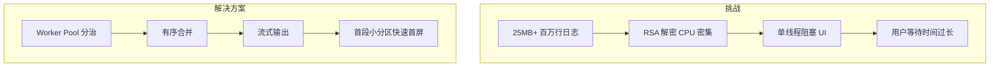

---

#### 技术方案

##### 1. 攻克大文件渲染瓶颈

设计 **Worker Pool 分治 + 有序合并 + 流式输出三阶段策略**，根据 CPU 核心数动态创建 **Worker 并行 RSA 解密**，首段小分区实现**快速首屏渲染**，大文件前 10% 流式输出避免 **UI 卡顿**。

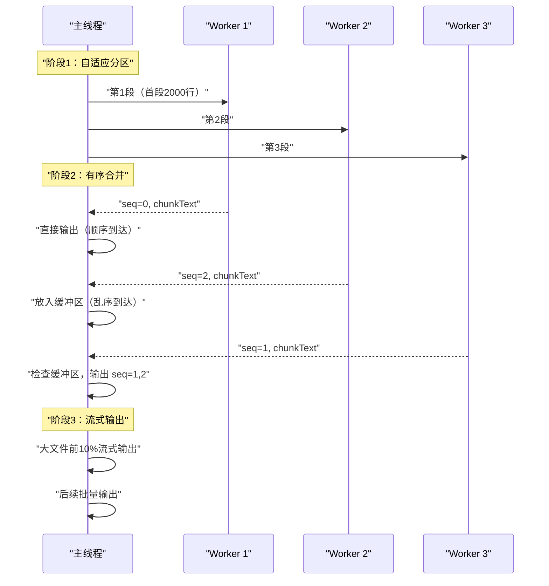

```typescript
// 自适应分区
private partitionTextForPool(src: string, parts: number) {
    const firstSlice = Math.min(2000, Math.ceil(total / (parts * 4)))
    const remaining = total - firstSlice
    const per = Math.ceil(remaining / (parts - 1))
    // 首段2000行 → 快速展示
    // 其余均匀分配 → 并行处理
}

// 有序合并
private handleChunk(seq: number, chunkText: string) {
    if (seq === this.expectedSeq) {
        // 顺序到达：直接输出
        this.decryptedLog.update((log) => log + (log ? '
            ' : '') + chunkText)
        this.expectedSeq++
        this.flushIfReady()
    } else {
        // 乱序到达：放入缓冲区等待
        this.segBuffers[seq].push(chunkText)
    }
}

// 格式校验
function looksValid(text: string): boolean {
    const asciiRatio = text.split('').filter(c => c.charCodeAt(0) < 128).length / text.length
    if (asciiRatio < 0.9) return false  // ASCII比率 > 90%
    const logFields = ['"msg"', '"message"', '"level"', '"time"']
    return logFields.some(f => text.includes(f))
}
```

---

##### 2. 声明式表单框架

采用**注册表 + 工厂模式**设计声明式表单框架，`registerField()` 一行注册新字段，支持 **4 层 AST 树**（tabs → card → form → leaf）、 **7 种控件类型**（string/number/select/switch/datetime/json/array）、 **条件显隐表达式**、**字段联动**、**实时 JSON 编辑双向绑定**与 **五层校验体系**。

```txt
自研表单系统架构：
├─ 注册表模式
│   ├─ registerField(type, Component) 一行注册
│   ├─ getField(type) 运行时查找对应控件
│   └─ 7 种控件类型：String/Number/Select/Switch/DateTime/JSON/Array
│
├─ 四层 AST 渲染
│   ├─ tabs → Ant Design <Tabs>，Tab children 递归
│   ├─ card → Ant Design <Card>，children 递归
│   ├─ form → <div> 容器，properties 逐项渲染
│   └─ leaf → registry 查询字段组件，递归终止
│
├─ 条件显隐
│   ├─ 字符串表达式运行时解析（new Function 变量替换）
│   ├─ CSP 兼容：参数注入而非 eval
│   └─ 解析失败 visible=true 安全降级
│
├─ 字段联动
│   ├─ autoFill + _isAutoFilling 防死循环标记
│   └─ 依赖图拓扑排序，确保单向
│
├─ 实时 JSON 编辑
│   ├─ forwardRef 暴露 setFormData
│   └─ JSON 编辑 ↔ 表单编辑双向同步
│
└─ 四重校验体系
    ├─ 同步校验（validation 函数 + 跨字段联动 equalTo/dependencies，onChange 触发）
    ├─ 异步校验（asyncValidation + 300ms debounce + AbortController）
    ├─ AJV Schema 校验（useEffect 监听 data）
    └─ 后端业务校验（Submit 时 setFields 精准映射）
```

---

##### 3. 流式数据处理（生产/消费模式）

基于 **ReadableStream** 逐块读取，**TextDecoder** 流模式处理多字节字符，封装 **生产/消费模式** 实现流式解密与渲染，AbortController 支持请求取消。

```typescript
// 生产/消费模式流式解密
async function* streamDecrypt(url: string, token: string): AsyncGenerator<string> {
    const response = await fetch(url, {
        headers: { Authorization: `Bearer ${token}` },
    })
    const reader = response.body!.getReader()
    const decoder = new TextDecoder('utf-8')
    const worker = new Worker(new URL('./decrypt.worker.ts', import.meta.url), { type: 'module' })

    // 生产者：主线程分片读取
    while (true) {
        const { done, value } = await reader.read()
        if (done) { worker.postMessage({ type: 'done' }); break }
        const buffer = decoder.decode(value, { stream: true })
        worker.postMessage({ type: 'chunk', data: buffer })
    }

    // 消费者：Worker 解密后主线程渲染
    worker.onmessage = (e) => {
        const { seq, text } = e.data
        // 按 seq 有序合并后追加到虚拟列表
    }
}
```

---

##### 4. 全链路可观测体系建设

深度集成 **Prometheus** + **Grafana** 构建覆盖 12 个 5G 核心网网元的可观测性平台，涵盖指标采集、Recording Rules 预计算、多维度告警、Hub-and-Spoke 仪表盘导航，以及 **单一数据源 + 代码生成** 的自动化资源管理体系。

---

###### 4.1 架构设计：三层分离 + 单一数据源

核心理念：**开发者只编辑一个 JSON 文件，Go 代码生成器自动产出 K8s ConfigMap 和 GrafanaDashboard CR。**

```
┌─────────────────────────────────────────────────────────┐
│                    开发者 (Dashboard Engineer)             │
│                        编辑 JSON                        │
└─────────────────────┬───────────────────────────────────┘
                      │ git push
                      ▼
┌─────────────────────────────────────────────────────────┐
│              gen-files (Go 代码生成器)                    │
│   ┌──────────────┐  ┌──────────────┐  ┌──────────────┐  │
│   │ JSON → 版本  │  │ JSON → 校验  │  │ JSON → 输出  │  │
│   │  自动递增    │  │  UID 稳定性  │  │  双格式生成  │  │
│   └──────────────┘  └──────────────┘  └──────────────┘  │
└─────────────────────┬───────────────────────────────────┘
                      │ 生成
          ┌───────────┴───────────┐
          ▼                       ▼
   ┌─────────────┐        ┌─────────────┐
   │  ConfigMap   │        │ GrafanaDash  │
   │  (K8s 原生)  │        │  board CR    │
   └─────────────┘        └─────────────┘
```

| 文件类型 | 存储位置 | 编辑方式 | 说明 |
|---------|---------|---------|------|
| 源 JSON | `json/` | 手动编辑 | 唯一人工维护的文件 |
| ConfigMap | `configmaps/` | 自动生成 | K8s ConfigMap，嵌入完整 JSON |
| GrafanaDashboard CR | `grafana-operator/` | 自动生成 | Grafana Operator 自定义资源 |
| PrometheusRule | `prometheus-rules/` | 手动编辑 | 告警规则 YAML |

**技术亮点：**
- **零手工重复**：开发者只编辑一个 JSON 文件，生成器自动产出两个 K8s 资源
- **Git-diff 驱动**：`gen-files` 通过 `git diff` 精准识别变更文件，只处理差异部分
- **CI 强制一致性**：`verify-resources` job 在每次提交时重新生成并比对，不一致直接阻断流水线

---

###### 4.2 Hub-and-Spoke 仪表盘导航架构

采用 **Tag-based 动态链接** 实现多维度下钻体系：从全局概览 → 网元状态 → 接口级消息 → 函数级内部状态。

```
                    ┌──────────────────┐
                    │   SMF Main       │
                    │  (Hub Dashboard) │
                    │   Tag: main-smf  │
                    └────────┬─────────┘
                             │ Tag-based Links
        ┌────────┬───────┬───┴───┬───────┬────────┐
        ▼        ▼       ▼       ▼       ▼        ▼
    ┌───────┐┌───────┐┌─────┐┌─────┐┌───────┐┌───────┐
    │Session││3GPP   ││LI   ││Geo  ││Interf.││Funcs  │
    │Proced.││KPI    ││KPI  ││     ││KPI    ││       │
    └───────┘└───────┘└─────┘└─────┘└───────┘└───────┘
    Tag: smf-detail-*  (每个详情页自动链接回 Main)
```

**设计亮点：**
- 基于 Grafana 标签的动态链接，无需硬编码仪表盘 URL
- Main 仪表盘作为导航中心，提供全局视角（UE 数、会话数、IP 池、连接状态）
- 详情仪表盘按功能域拆分，支持多维度下钻

---

###### 4.3 Prometheus 指标采集体系

覆盖 **7 大维度**，50+ 告警规则，12 个网元应用：

| 维度 | 关键指标 | 监控目标 |
|------|---------|---------|
| HTTP 请求 | `http_requests_total` (method, route, status 分桶) | API 吞吐与错误率 |
| 请求延迟 | `http_request_duration_seconds` (5 个分位桶) | P50/P90/P99 延迟 |
| 业务指标 | 网元注册数、配置下发次数、告警量 | 业务健康度 |
| 前端体验 | Core Web Vitals (LCP/INP/CLS) | 真实用户体验 |
| 基础设施 | Pod CPU/Memory / 容器重启次数 / 网络流量 | 集群健康 |
| 会话管理 | PDU Session 建立/更新/删除成功率 | 核心网业务(5G) |
| 协议接口 | PFCP/Gx/Gy/S6b/Rf Diameter 消息成功率 | 网元通信(5G) |

---

###### 4.4 Recording Rules 预计算引擎

将 O(n²) 的仪表盘查询降为 O(n)，大幅降低 Prometheus 查询负载：

```yaml
## 原始指标: 每个 SMF 实例单独上报
smf_sess_est_msg_counters{namespace="xxx", axnf="smf-0", code="2.00"}

  ## Recording Rule 聚合后:
job:smf_sm_counter:sum = sum by(namespace, axnf)(rate({__name__=~"smf_.*_msg_counters"}[5m]))
```

| 规则组 | 用途 | 优化效果 |
|--------|------|---------|
| 消息吞吐量聚合 | 接口级 TPS 预聚合 | 避免仪表盘查询时实时聚合 10+ 接口指标 |
| DB 延迟预计算 | 各组件 DB 操作延迟 | 拆分 5 个内部组件的 DB 延迟 |
| 消息处理全链路 | 内部处理 + DB 操作 | 支持拆分分析，精确定位瓶颈 |

---

###### 4.5 多维度告警体系

**4 级严重度递进模型：**

| 严重度 | 阈值 | 含义 |
|--------|------|------|
| Warning | 99% | 轻微波动，需关注 |
| Minor | 98% | 性能下降，需排查 |
| Major | 97% | 严重异常，需立即处理 |
| Critical | 95% | 服务不可用，需紧急恢复 |

**双层告警设计：**

```
┌─────────────────────────────────┐
│  Aggregate Alert (全局级别)      │ → Critical: 整体不可用
│  例: BGP 全部 Down              │
└─────────────────────────────────┘
┌─────────────────────────────────┐
│  Pod-level Alert (实例级别)      │ → Minor: 单 Pod 故障
│  例: 单个 Pod BGP Down          │
└─────────────────────────────────┘
```

**覆盖告警规则：**
```
会话管理  → PDU Session 成功率   → 4 级递进
协议接口  → PFCP/Gx/Gy 成功率    → 4 级递进
3GPP NF   → Nudm/Npcf/Nchf 通信   → 4 级递进
基础设施  → N4/S5/S8 路径连通     → Critical/Major
GEO 高可用 → Active/Standby 切换  → Critical
资源使用  → IP 池使用率           → 4 级递进(60/70/80/90%)
服务健康  → DB 断连/gRPC 异常     → Critical
```

---

###### 4.6 OAM 合规监控（LI 执法拦截）

针对 LI-OAM 项目的 **6 个监控维度**：

| 维度 | 关键指标 | 监控目标 |
|------|---------|---------|
| 用户状态 | `li_oam_users{state="active/inactive/locked"}` | 订阅用户生命周期 |
| NF 连接 | `li_oam_nf_status{nf_type="SMF/UPF"}` | 与核心网网元连通性 |
| 审计日志 | `li_oam_record_audit_logs_counters` | 合规审计追踪 |
| 备份恢复 | `li_oam_num_created/restored_oam_backups` | 数据保护能力 |
| 高可用 | `li_oam_num_localha_switchover` | Pod 间故障切换 |
| 告警 | `li_oam_alarm_backup_fail` | 备份失败检测 |

```txt
## NF 通信成功率（按 HTTP method + path + code 多维拆分）
sum(rate(li_oam_nf_http_requests_total{code=~"2.."}[5m]))
/
sum(rate(li_oam_nf_http_requests_total[5m])) * 100

## 备份失败检测（10 分钟持续）
increase(li_oam_alarm_backup_fail[10m]) > 0
```

---

###### 4.7 PromQL 查询技巧

```txt
## 1. 多接口成功率聚合
sum(rate(smf_sm_grpc_pfcp_msg_counters{code="2.00"}[5m]))
/ sum(rate(smf_sm_grpc_pfcp_msg_counters[5m])) * 100

## 2. IP 池使用率多级阈值
smf_ip_pool_usage / smf_ip_pool_total * 100 > 90  # Critical

## 3. Recording Rule 预聚合
job:smf_sm_counter:sum = sum by(namespace, axnf)(
  rate(smf_sess_est_msg_counters[5m])
)

## 4. GEO 故障切换检测
increase(redis_cluster_geo_switch_active[5m]) > 0

## 5. 双维度告警（全局 + Pod 级）
BGP_Down_All  = count(BGP_State == 0) == count(BGP_Total)  → Critical
BGP_Down_Pod  = BGP_State == 0 and BGP_Total > 0           → Minor
```

---

###### 4.8 CI/CD 自动化流水线

**5 层验证体系：**

```
Stage 1: catalog          版本冲突检测（跨分支安全网）
Stage 2: verify-resources 重新生成 → 比对 → 不一致则阻断
Stage 3: validate-*       jq/yq 语法校验
Stage 4: reject-binaries  禁止二进制文件提交
Stage 5: publish          Tag 格式校验 → 打包 → 双注册表发布
```

**版本管理策略：**

| 规则 | 实现 |
|------|------|
| 版本唯一来源 | JSON 内部 `annotations.list[0].version` |
| 自动 Patch 递增 | `gen-files` 检测变更时自动 +1 |
| 跨分支冲突检测 | `catalog` 工具对比 Master 注册表，Release 分支版本落后则阻断 |
| UID 不可变 | 变更 UID → 构建失败（防止仪表盘链接断裂） |

---

###### 4.9 量化成果

| 成果 | 量化 |
|------|------|
| 管理监控资源 | 12 个应用，30+ 仪表盘，100+ 告警规则 |
| 自动化覆盖率 | 100%（所有 ConfigMap/CR 自动生成） |
| CI 验证层数 | 5 层全自动 |
| 告警响应 | 10 分钟 `for` 持续时间，避免误报 |
| 版本冲突防护 | 跨分支实时检测，阻止不兼容版本发布 |

---

> 💡 **追问链 H：Web Worker 分治解密**
>
> **Q1（概念区别）：** "分治有序合并"策略中分片粒度的依据是什么？每片 1000 行 vs 10000 行对解密吞吐率和内存占用各有什么影响？
>
> **✅ 答案：**
>
> ```
> 分片粒度依据（四因素）：
> ├─ CPU 核心数：Worker Pool 大小 = navigator.hardwareConcurrency - 1（留 1 个给主线程）
> ├─ 单次解密耗时：控制在 50ms 以内（不超过一帧），避免 Worker 内部积压
> ├─ 首屏优先：首段 2000 行小分区，其余均匀分配
> └─ 传输开销：每片过大（>1MB）→ structuredClone 序列化耗时增加
>
> 1000 行 vs 10000 行对比：
> ├─ 1000 行/片：并行度高，Worker 空闲时间短，但 postMessage 次数多（传输开销大）
> │   └─ 适合：CPU 核心多、单行解密快的场景
> ├─ 10000 行/片：postMessage 次数少，但单 Worker 处理时间长（Worker 内部积压）
> │   └─ 适合：CPU 核心少、单行解密慢的场景
> └─ 最优策略：自适应——先按 CPU 核心数分大块，每块再按 5ms 时间片切分
> ```
>
> **Q2（底层机制）：** Worker 与主线程传递25MB 级解密结果时，structuredClone 的序列化开销有多大？如何用 Transferable Objects（`ArrayBuffer` 转移而非拷贝）或 `SharedArrayBuffer` + `Atomics` 消除传输瓶颈？
>
> **✅ 答案：**
>
> ```
> structuredClone 开销：
> ├─ 100MB 文本的 structuredClone → 约 50-100ms 序列化 + 同等反序列化
> ├─ 总开销 100-200ms，用户可感知卡顿
> ├─ 内存翻倍：原数据 100MB + 克隆副本 100MB = 200MB
>
> 优化方案：
> ├─ Transferable Objects（推荐）：
> │   ├─ 将字符串编码为 Uint8Array（TextEncoder）
> │   ├─ postMessage({ buf }, [buf.buffer]) → 零拷贝转移
> │   ├─ 主线程接收后立即使用，Worker 侧 ArrayBuffer 变空
> │   └─ 批量传输时用 MessageChannel 分批次发送（避免一次传输过大）
> │
> ├─ SharedArrayBuffer + Atomics（高级方案）：
> │   ├─ 主线程和 Worker 共享同一块内存
> │   ├─ Worker 解密后通过 Atomics.store() 写入
> │   ├─ 主线程通过 Atomics.load() + Atomics.wait() 等待/读取
> │   └─ 零拷贝零序列化，但需设置 COOP/COEP header，复杂度高
> │
> └─ 实际项目用 Transferable + 分片：每片 100KB，通过 MessageChannel 流式传递
> ```
>
> **Q3（边界/未来）：** 用户快速滚动到未解密区域时，Worker 还在处理前面的分片。如何实现"首段优先 + 滚动预测预加载"——根据滚动速度预估目标位置，动态调整 Worker 的分片优先级？
>
> **✅ 答案：**
>
> ```
> 优先级调度方案：
> ├─ 分片优先级队列：维护一个优先级队列（按"距当前视口距离"排序）
> │   ├─ P0（当前视口）：即时解密
> │   ├─ P1（+/- 500 行）：下一个优先批次
> │   ├─ P2（+/- 2000 行）：缓存预热
> │   └─ P3（其余）：后台低优先级处理
> │
> ├─ 滚动预测：
> │   ├─ 监听 scroll 事件，记录最近 3 个位置的滚动速度 v = Δpos/Δt
> │   ├─ 预估目标位置：targetPos = currentPos + v * 1000ms（提前 1 秒预测）
> │   ├─ 将目标位置所在分片优先级提升到 P0
> │   └─ 如果滚动停止，取消所有 P0 以外的任务，优先当前视口
> │
> ├─ Worker 任务抢占：
> │   ├─ Worker 每处理完一行检查 postMessage 是否有新指令
> │   ├─ 主线程发送 { type: 'PRIORITIZE', sliceId: N }
> │   ├─ Worker 暂停当前分片（检查点保存进度），切换到高优分片
> │   └─ 高优分片完成后继续未完成的分片
> │
> └─ 效果：用户滚动到哪，哪就优先解密完成，首屏 200ms 内显示
> ```


---

### 进阶能力面试题（考察项目落地与问题解决）

---

##### 1. 为什么在测试平台选择SSE，而在NMS告警系统中使用WebSocket？SSE在处理容器日志流时有何优势？网络不稳定时如何处理SSE断连？

**答案：**

**① 技术选型逻辑**：核心是"场景适配"。

- **5GC测试平台（SSE）**：服务端单向推送日志数据，客户端无需反向发送复杂指令。SSE基于HTTP，部署简便，原生支持自动重连，完美适配"单向、持续、低交互"的日志流场景。
- **NMS告警系统（WebSocket）**：需双向通信（告警筛选、级别设置），要求秒级响应。WebSocket全双工通信，持久连接低延迟，满足"交互式、高实时"的告警需求。

**② SSE核心优势**：
- 部署成本低，复用HTTP，无需额外WebSocket服务器
- 原生自动重连，无需前端额外开发
- 支持文本流推送，通过Last-Event-ID断点续传
- 资源占用低，支撑大并发

**③ SSE断连解决方案**：
- 原生retry参数控制重连间隔
- Last-Event-ID断点续传，确保日志不丢失
- 心跳检测，断连超10s提示用户
- 后端超时管理 + 日志缓存，保障数据完整

---

##### 2. 针对万级基站点位的渲染卡顿问题，采取了哪些具体优化手段？处理25MB+大文件时，虚拟列表的具体实现细节及难点是什么？

**答案：**

**① 万级基站点位渲染优化**（基于OpenLayers）：

1. **点聚合（Cluster）**：近距离点位聚合为集群，放大时自动拆分，减少DOM节点
2. **矢量切片（Vector Tiles）**：Go后端预处理点位数据为矢量切片，前端按需加载
3. **视口懒加载**：仅渲染当前视口内的点位，拖动时动态加载/卸载
4. **点位样式优化**：简化图标，核心点位优先渲染
5. **Web Worker**：解析、筛选逻辑放入子线程，避免阻塞主线程

**② 25MB+大文件虚拟列表实现**：

1. **技术选型**：`react-window` 固定/可变高度虚拟列表
2. **分片异步解析**：FileReader + slice分片（100KB/片），Web Worker解析
3. **可视区域计算**：监听滚动事件，仅渲染50-100行
4. **滚动优化**：`requestAnimationFrame` + 节流（100ms）
5. **细节**：hover高亮、搜索筛选、加载状态提示

**核心难点及方案**：

| 难点 | 方案 |
|------|------|
| 大文件解析阻塞主线程 | Web Worker异步解析 |
| 滚动白屏/卡顿 | 预加载缓冲区上下各10行 |
| 筛选后数据错乱 | 统一数据管理，筛选后重新计算可视区域 |
| 浏览器兼容性 | 降级为分页加载，动态调整分片尺寸 |

---

##### 3. 主导的"GitLab CI/CD自动化流水线"的设计思路是什么？对接K8s时如何处理前端Nginx镜像的构建与动态配置下发？

**答案：**

**① 设计思路**：以"自动化、可复用、可监控、高效"为核心，将前端发布流程拆分为四个标准化阶段，通过`.gitlab-ci.yml`定义各阶段任务，实现从代码提交到部署上线的全流程自动化。

**② 核心阶段及优化**：

- **构建（build）**：缓存`node_modules`，规避重复安装；`biome check` lint + ESLint + 单元测试把关；微前端增量构建
- **打包（package）**：Docker多阶段构建，node镜像构建 → 轻量Nginx镜像，体积从500MB+压缩至50MB以内
- **部署（deploy）**：通过K8s API对接，ConfigMap解耦Nginx配置，实现"一次构建、多环境部署"
- **监控（monitor）**：Grafana + Prometheus实时监控，企业微信告警，支持一键回滚

**③ Helm 对接 K8s**：

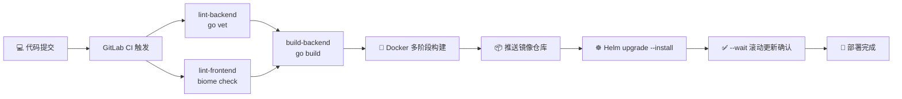

```
Helm chart 结构：
├─ Chart.yaml          # 版本号 + 依赖声明
├─ values.yaml         # 默认配置（镜像tag、副本数、资源限制）
├─ templates/
│   ├─ deployment.yaml  # Deployment + 滚动更新策略
│   ├─ service.yaml     # ClusterIP Service
│   ├─ ingress.yaml     # Nginx Ingress 路由规则
│   └─ configmap.yaml   # Nginx 配置解耦

滚动更新策略：
├─ maxSurge: 1        # 最多超跑 1 个 Pod
├─ maxUnavailable: 0  # 滚动期间零不可用
├─ --wait 等待 Ready 确认
└─ 更新失败 → Helm 自动回滚上一版本
```

**④ 关键效果**：
- 发布周期 25min → 10min（↓60%）
- Nginx镜像体积压缩80%+
- 配置变更生效 30min → 5min
- 零停机部署（滚动更新 + --wait 确认）

---

### 架构与深度面试题（考察架构设计与综合能力）

---

##### 1. 在不同项目中选择技术栈的具体标准是什么？React 19 和 Vue 在处理大型企业级应用时的架构差异？

**答案：**

**① 技术栈选型标准**：核心是"场景适配、团队适配、长期维护适配"。

- **React 19（5GC测试平台/AeMS）**：需求变更频繁，React组件化 + Hooks灵活性高，生态丰富，React 19 编译器自动 memo 优化性能；TypeScript 6 strict 模式保障类型安全；Zustand 5 轻量状态管理。
- **Go + Gin（后端）**：需要高并发实时通信（WebSocket/SSE），Go 协程天然支持高并发，Gin 轻量快速，与前端形成全栈闭环。

**② 架构差异**（变更检测 / 数据流 / 架构设计）：

| 维度 | React 19 | Vue 3.6+ |
|------|----------|----------|
| **变更检测** | Virtual DOM Diff + React 19 编译器自动缓存 | Proxy 响应式自动追踪 + PatchFlag 编译时标记 |
| **数据流** | 严格单向，需第三方状态管理（Zustand 5） | 双向绑定（v-model）+ Pinia 全局状态管理 |
| **架构设计** | 灵活无固定规范，Hook/自定义Hook复用 | 渐进式框架，自定规范灵活度介于 React 与 Angular 之间 |

---

##### 2. 详细讲解设计的"双Token无感刷新机制"。Access Token和Refresh Token分别存储在哪里？如何防止Refresh Token被盗用？

**答案：**

**① 双Token无感刷新机制**：Access Token短时效（15min）用于接口校验，Refresh Token长时效（7d）用于自动刷新，平衡安全与体验。

1. **Token生成**：Go后端验证账号密码后，生成双Token。Access Token携带权限信息，Refresh Token仅用于刷新。
2. **携带与校验**：前端拦截器将Access Token放入`Authorization: Bearer {Token}`头，后端校验，过期返回401。
3. **无感刷新流程**：401触发 → 校验Refresh Token → 有效则自动请求新双Token → 重放原请求 → 用户无感知。
4. **并发控制**：Promise gate锁机制，防止多个请求同时触发刷新。

```typescript
// Promise gate：并发请求排队，只发一次刷新请求
let refreshPromise: Promise<boolean> | null = null

async function refreshAndRetry(originalRequest: Request): Promise<Response> {
    if (!refreshPromise) {
        refreshPromise = fetch('/api/auth/refresh', {
            method: 'POST',
            credentials: 'include',  // HttpOnly Cookie 自动携带 Refresh Token
        }).then(res => {
            if (!res.ok) throw new Error('refresh failed')
            return true
        }).finally(() => {
            refreshPromise = null  // 无论成功/失败，重置 gate
        })
    }
    const success = await refreshPromise
    if (!success) throw new Error('redirect to login')
    // Refresh Token Rotation：每次刷新颁发新双Token，旧Refresh Token立即失效
    // Replay 检测：检测到旧 Refresh Token 被复用 → 全量 Token 失效 → 强制重登录
    return fetch(originalRequest)  // 重放原请求
}
```

**② 存储策略**：
- **Access Token**：前端内存变量（关闭即失效），禁止`localStorage`防XSS
- **Refresh Token**：`HttpOnly Cookie` + `SameSite=Strict` + `Secure`，防XSS/CSRF

**③ 防盗用措施**：
- **Token Rotation**：每次刷新颁发新双Token，旧Refresh Token立即失效
- **Replay 检测**：检测到旧Refresh Token被复用 → 全量Token失效 → 强制重登录
- **多 Tab 同步**：broadcastchannel 跨标签页同步 Token 失效事件，一处登出全部退出
- **黑名单管理**（登出/修改密码后旧Token失效）
- **刷新频率限制**（每小时最多5次）
- **全链路日志监控 + 告警**

---

##### 3. 在"智能告警"或"日志流"中如何实现高性能消息处理？如何系统性避免内存泄漏？

**答案：**

**① 消息处理策略**：

| 策略 | 场景 | 作用 |
|------|------|------|
| `AbortController` 取消过期请求 | 筛选切换 | 用户切换筛选条件时自动取消上一次请求，防止数据错乱 |
| `useRef + RAF` 节流 | 万级高频告警 | 每帧最多一次批量渲染，避免 DOM 更新次数超过帧率 |
| `filter` 预处理 | 日志/告警流 | 过滤无效数据（空行、已清除告警），减少无效渲染 |
| `retry` 指数退避 | 异常重试 | 捕获错误自动重试，连接恢复后继续 |
| Zustand store 分片订阅 | 多维度数据 | 不同组件按需订阅不同 slice，互不干扰 |

**② 内存泄漏系统性解决**：

- **useEffect 清理函数**：组件卸载时取消订阅/定时器
- **AbortController**：fetch 请求自动取消，防止组件已卸载时 setState
- **Zustand store 清理**：组件卸载时取消 store 中未完成的异步操作
- **工具检测**：Chrome Memory 面板 + React DevTools Profiler + ESLint react-hooks 插件
- **监控**：Grafana 内存追踪，持续优化

---

##### 4. 除了生成代码片段，在"Prompt工程"方面有哪些具体的实践来提升团队研发效能？

**答案：** 围绕"代码审查、测试生成、知识沉淀、跨团队协同"四个维度，设计标准化、场景化Prompt模板，整体提升研发效能30%+：

**① 代码审查**：结构化Prompt让AI自动检查代码漏洞与规范合规性。模板覆盖前后端XSS/CSRF漏洞、权限校验、代码规范、性能问题、业务逻辑合规性，输出问题清单+风险等级+修改建议。

**② 测试生成**：Prompt生成高覆盖率单元测试与接口测试用例。覆盖表单校验、组件交互、异常场景、边界场景，减少30%+手动编写量。

**③ 知识沉淀**：Prompt解析遗留代码，生成功能描述、架构逻辑、业务流程图、新手上手指南；同步生成组件文档、接口文档，解决文档滞后问题。

**④ 跨团队协同**：设计前后端联调Prompt、测试辅助Prompt，将复杂交互逻辑转化为非开发人员易懂的语言，降低沟通成本。

---

### AI Agent专项面试题

---

##### 1. Agentic AI与传统Chatbot的本质区别是什么？在通信行业ToB场景中如何落地Agentic AI的核心能力？

**答案：** 本质区别在于**自主性、闭环行动能力和场景适配性**：

| | 传统 Chatbot | AI Agent |
|--|-------------|----------|
| 模式 | `Input → Output` 线性问答 | `感知 → 推理 → 行动 → 观察` 闭环 |
| 能力 | 被动反馈信息 | 主动规划、调用工具、自我反思 |
| 价值 | 回答问题 | 完成端到端任务 |

**通信行业落地**：
- **规划能力**：将"执行网元全流程测试"拆解为"调用测试用例 → 执行指令 → 采集日志 → 分析结果 → 生成报告"
- **工具使用**：Agent自动调用告警API、网元状态接口、日志导出工具，完成"查告警→导出报告"全流程
- **自我反思**：接口失败时自动排查权限/网络问题，调用权限接口或触发重试

---

##### 2. 对比ReAct、Plan-then-Execute和LangGraph三种编排框架的核心特点，结合你熟悉的React/TypeScript前端技术、Go后端技术，说明在通信行业Agent开发中如何选型？

**答案：** 选型核心是"场景复杂度 + 运维可控性"：

**① 三种框架对比**：

| 框架 | 核心特点 | 适用场景 | 技术栈适配 |
|------|----------|----------|-----------|
| **ReAct** | 推理与行动交替，边推理边执行，灵活性高 | 简单查询类任务 | 前端Hooks/Service即可实现 |
| **Plan-then-Execute** | 先规划后执行，步骤清晰可控 | 中等复杂度固定流程 | Go后端Planner + 前端展示 |
| **LangGraph/状态机** | 图结构编排，支持循环/分支/回滚/持久化 | 高复杂度生产环境 | Go后端状态持久化 + 前端可视化 |

**② 选型建议**：

- **简单场景**（告警查询、状态查询）→ **ReAct**，快速集成到前端
- **中等场景**（测试任务执行）→ **Plan-then-Execute**，Go后端Planner + 前端进度展示
- **高复杂度**（智能告警处置、故障排查）→ **LangGraph**，Go后端状态机 + 前端节点流程可视化


## 第四部分：八股文 · 深度体系化

---

### 1. React Fiber 架构深度解析

#### 核心认知

> **Fiber 的本质是把"不可中断的同步递归"变成"可调度的异步链表"。**

**面试官视角**：考察你对 React 渲染机制的理解深度，是否知道"为什么 React 要重新设计架构"，以及并发模式的本质。

#### 标准答案

React Fiber 是 React 16 后引入的新协调架构，本质上是一种 **可中断 · 可恢复 · 可优先级调度** 的增量渲染机制。

##### 为什么需要 Fiber？

传统 React 的协调（reconciliation）是 **递归调用栈**：

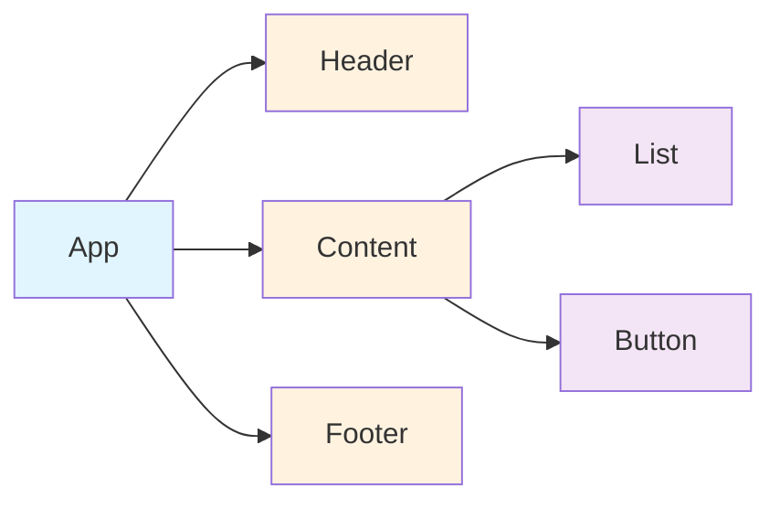

**问题**：递归一旦开始无法中断，大组件树会长时间阻塞主线程（>16ms 导致掉帧）。

##### Fiber 的核心设计

Fiber 将组件树转换为 **单向链表**，每个节点包含三个指针：`child`（指向第一个子节点）、`sibling`（指向下一个兄弟节点）、`return`（指向父节点）

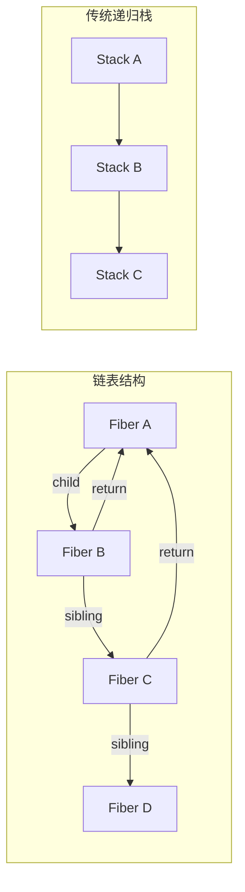

| 对比 | 递归栈 | Fiber 链表 |
|------|--------|------------|
| 中断能力 | ❌ 不可中断 | ✅ 可暂停/恢复 |
| 优先级 | ❌ 无 | ✅ 可调度 |
| 复用状态 | ❌ 销毁重建 | ✅ 可复用 |
| 内存 | 栈帧自动管理 | 手动维护链表 |

##### 核心机制：时间切片（Time Slicing）

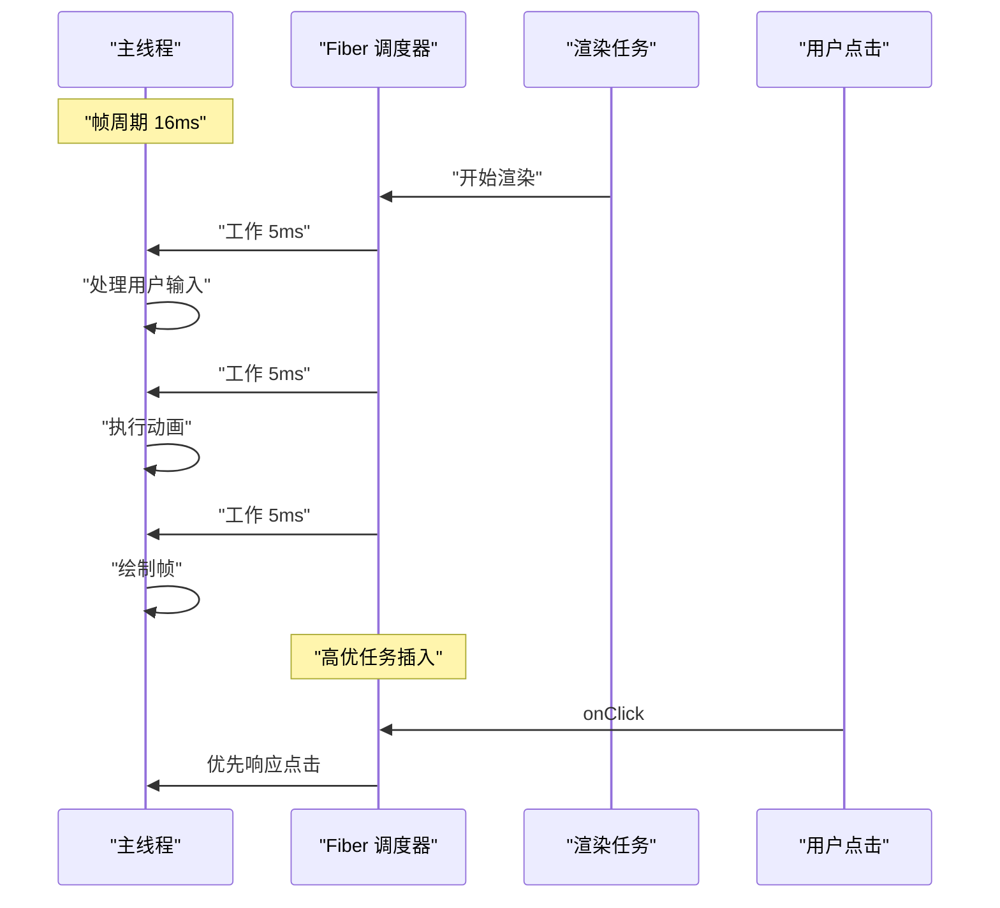

**为什么是 5ms？**
- 60fps 每帧约 16.6ms，浏览器需要预留时间执行 Style → Layout → Paint → Composite
- 5ms 是 React Scheduler 的默认 `yieldInterval`：每工作 5ms 就让出主线程，给浏览器留出 ~11ms 完成渲染
- 如果占满 16ms，浏览器将无时间渲染 → 掉帧
- 5ms 是保守启发值：短切片保证响应性，长切片避免频繁切换开销

##### 工作流程

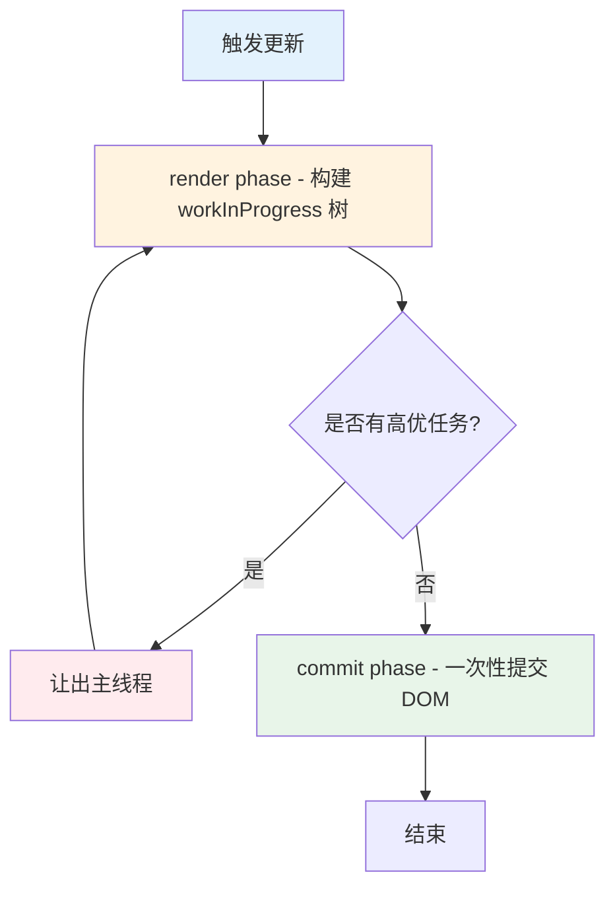

##### Phase 深度对比：Render vs Commit

| 维度 | Render Phase | Commit Phase |
|------|-------------|--------------|
| **是否可中断** | ✅ 可中断（分片执行） | ❌ 不可中断（一次完成） |
| **执行时机** | 调度器控制，可延后 | Render 完成后立即执行 |
| **副作用** | 无 DOM 操作 | DOM 操作、生命周期、Effect |
| **树操作** | 构建 workInProgress 树 | current 指针切换 |
| **调用函数** | `render()`, `shouldComponentUpdate` | `componentDidMount`, `useEffect` |

---

#### 面试加分点

React Fiber 的核心目标：

> **将"不可中断的同步渲染"变成"可调度的异步渲染"。**

与 Vue 的区别：
- Vue 使用 **模板编译 + 静态标记** 在编译时优化，不需要 Fiber
- React 使用 **JSX 运行时 + Fiber 调度**，运行时动态优化
- Vue 3 的 `render` 函数 + Block Tree 也是一种类似思路，但粒度不同

##### 更深层：React 为什么不走编译优化路线？

```
React 的设计哲学：
├─ 保留 JSX 的灵活性（JavaScript 的全部表达能力）
├─ 编译优化需要约束模板语法（Vue/Svelte 的取舍）
├─ Fiber 是运行时方案，不影响开发者心智模型
└─ 代价：运行时开销更大 → 需要更复杂调度
     └─ 受益：开发者不需要学习模板 DSL
```

---

#### 高频追问

##### 1. Fiber 为什么用链表？

因为 **链表可以保存执行状态**：

```ts
// 递归无法中断
function render(vnode) {
    // 必须一次执行完
    render(vnode.child)
    render(vnode.sibling)
}

// Fiber 链表可以中断
function workLoop(fiber) {
    while (fiber && !shouldYield()) {
        fiber = performUnitOfWork(fiber)
    }
    // 下次调度从这里继续
}
```

##### 2. workInProgress 和 current 两棵树？

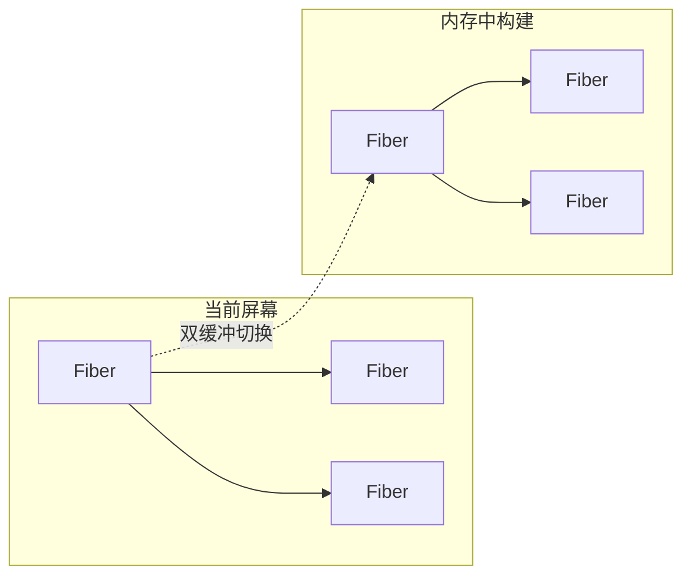

- **current 树**：当前屏幕上显示的 Fiber 树
- **workInProgress 树**：内存中构建的下一棵树
- **commit 阶段**：直接切换指针，完成双缓冲

> **双缓冲的核心价值**：构建过程中用户看到的始终是完整的 current 树，不会出现半渲染状态。

##### 3. 优先级如何实现？

React 维护 **5 种优先级**：

```txt
Immediate  >  UserBlocking  >  Normal  >  Low  >  Idle
  点击事件       输入框          默认        预加载      Analytics
```

- 优先级高的任务可以 **打断** 低优先级任务
- 低优先级任务被 **丢弃或延后**
- 实现机制：`Scheduler` 模块维护 **最小堆（Min-Heap）** 任务队列

```ts
// 简化版调度器核心
const taskQueue = new MinHeap() // 按过期时间排序

function scheduleCallback(priorityLevel, callback) {
    const expirationTime = computeExpirationTime(priorityLevel)
    taskQueue.push({ callback, expirationTime })
    requestHostCallback(flushWork)
}

function flushWork() {
    while (taskQueue.size > 0) {
        const currentTask = taskQueue.peek()
        // 过期时间越短，优先级越高
        if (currentTask.expirationTime > getCurrentTime()) {
            // 任务未过期，让出主线程
            if (shouldYield()) break
        }
        const task = taskQueue.pop()
        task.callback()
    }
}
```

##### 4. useEffect 和 useLayoutEffect 在 Fiber 中的区别？

- `useLayoutEffect`：在 **commit 阶段同步执行**（阻塞 paint）
- `useEffect`：在 **commit 后异步调度**（不阻塞 paint）

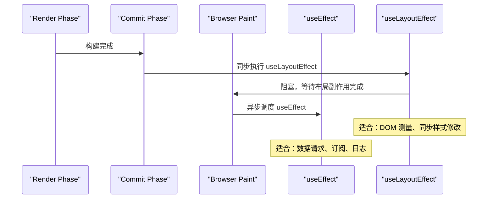

##### 5. Concurrent Mode 带来了什么？

```txt
Concurrent Mode 的核心能力：
├─ 可中断渲染（Interruptible Rendering）
│   └─ 长任务可以被高优任务打断
├─ 自动批处理（Automatic Batching）（React 18 引入）
│   └─ 多个 setState 合并为一次更新（含 setTimeout/Promise/原生事件）
├─ 过渡（Transitions）
│   └─ startTransition 区分紧急/非紧急更新
├─ Suspense
│   └─ 声明式加载状态 + 嵌套 Suspense 边界
└─ useDeferredValue
    └─ 延迟更新非紧急状态
```

##### React 19 Concurrent Mode 核心作用？结合全栈视野，如何利用 Go 后端配合前端提升系统性能？

**答案：**

**① React 19 Concurrent Mode**：打破传统同步渲染的阻塞瓶颈，支持渲染任务的中断、暂停、恢复及优先级排序。在网元运维系统的百万行日志预览中，通过 `startTransition` 将日志分片渲染设为低优先级，`useDeferredValue` 延迟非紧急更新，确保用户输入、滚动等交互不受影响。

**② Go 后端配合前端提升性能**：

- **高性能接口**：Go 协程高并发处理请求，缩短响应时间
- **数据预处理**：Go 后端提前完成日志分片、GIS 点位聚合，结构化数据返回前端
- **WebSocket 长连接**：Go gorilla/websocket 支撑 4000+ msg/s 全双工通信
- **流式传输**：Go 后端 SSE/ReadableStream 实现百万行日志流式输出
---

#### 深度补充：React Diff 算法（面试高频追问）

##### 三个假设（Diff 的前提）

```txt
React Diff 基于三个合理假设（O(n) 算法的基础）：
├─ 假设 1：不同类型的元素产生不同的树
│   └─ <div> → <span>：直接销毁重建，不尝试复用
│
├─ 假设 2：开发者通过 key 提示哪些子元素是稳定的
│   └─ key 变化 → 重新创建；key 不变 → 尝试复用
│
└─ 假设 3：同级比较，不跨层级
    └─ 只比较同级节点，不跨层级移动
    └─ 这样只需要 O(n) 而非 O(n³)
```

##### Diff 策略详解

```txt
单节点 Diff（reconcileSingleElement）：
├─ key 相同 && type 相同 → 复用节点
├─ key 相同 && type 不同 → 标记删除旧节点，创建新节点
├─ key 不同 → 标记删除旧节点，创建新节点
└─ 无 key → 使用 index 作为 key（性能差）

多节点 Diff（reconcileChildrenArray）：
├─ 遍历新子节点列表
├─ 对每个新节点，在旧列表中查找可复用节点
│   ├─ 先按 key 查找（Map 索引，O(1)）
│   └─ 再按 index 查找（兜底）
├─ 找到 → 比较 type，相同则复用，不同则重建
├─ 找不到 → 创建新节点
└─ 旧列表中剩余的 → 批量删除
```

##### Key 的正确使用

```tsx
// ❌ 错误：用 index 作为 key
{items.map((item, index) => (
    <ListItem key={index} item={item} />
    // 问题：列表顺序变化时，所有组件都会重建
    // 原因：key=0 的元素从 A 变成了 B，React 会复用但更新 props
))

// ✅ 正确：用唯一 ID 作为 key
    {items.map(item => (
        <ListItem key={item.id} item={item} />
        // key 不变 → 复用组件实例，只更新 props
        // key 变化 → 销毁旧实例，创建新实例
    ))

// 特殊场景：列表不会变化 + 无唯一 ID
        {staticList.map((item, index) => (
            <StaticItem key={index} item={item} />
            // 可以用 index，因为顺序永远不变
        ))
```

---

#### 面试追问预测与应对策略

##### 追问链路 1：从 Fiber 追问到 Scheduler

```
面试官："Fiber 是怎么实现优先级调度的？"
├─ 你："React 用 Scheduler 模块维护任务队列"
├─ 追问："Scheduler 的数据结构是什么？"
│   └─ 你："最小堆（Min-Heap），按过期时间排序"
├─ 追问："为什么不直接用数组？"
│   └─ 你："最小堆插入/删除都是 O(log n)，数组找最小值是 O(n)"
├─ 追问："多个任务过期时间相同怎么办？"
│   └─ 你："按插入顺序 FIFO 处理"
└─ 追问："Scheduler 和 MessageChannel 的关系？"
    └─ 你："Scheduler 用 MessageChannel 作为宏任务载体，保证异步执行"
```

##### 追问链路 2：从 Diff 追问到列表性能

```
面试官："React 的 diff 算法时间复杂度是多少？"
├─ 你："O(n)，基于三个假设"
├─ 追问："如果列表有 10 万个元素，diff 会卡吗？"
│   └─ 你："单次 diff 很快（O(n) 简单比较），但大量 DOM 操作本身会卡"
├─ 追问："那怎么优化？"
│   └─ 你："虚拟列表 + memo + useCallback 避免不必要重渲染"
├─ 追问："useCallback 的依赖数组怎么处理？"
│   └─ 你："只放真正需要的依赖，避免滥用导致缓存失效"
└─ 追问："有没有更好的方案？"
    └─ 你："考虑 Signals 或者 Zustand，细粒度更新绕过 diff"
```

##### 追问链路 3：从 Concurrent Mode 追问到 startTransition

```
面试官："startTransition 和 setTimeout 有什么区别？"
├─ 你："startTransition 是 React 内部调度，setTimeout 是浏览器宏任务"
├─ 追问："具体区别在哪？"
│   └─ 你："startTransition 可以被高优任务打断，setTimeout 不行"
├─ 追问："useTransition 和 useDeferredValue 呢？"
│   └─ 你："useTransition 区分紧急/非紧急更新，useDeferredValue 延迟渲染"
├─ 追问："什么场景用哪个？"
│   └─ 你："输入框用 useDeferredValue，Tab 切换用 useTransition"
└─ 追问："React 19 还有什么新变化？"
    └─ 你："React Compiler 自动优化，不再需要手动 memo/useCallback"
```

---

#### 面试回答模板

##### 场景：被问到"Fiber 原理"

```
标准回答（30秒版）：
"Fiber 是 React 16 引入的新架构，核心目标是把不可中断的同步渲染
变成可调度的异步渲染。它把递归调用栈改成链表结构，每个 Fiber 节点
包含 child、sibling、return 三个指针，这样渲染可以中断、暂停、恢复。
配合 Scheduler 模块实现优先级调度，高优任务可以打断低优任务。"

追问版（深入原理）：
"具体来说，Fiber 架构分为两个阶段：
Render 阶段是可中断的，构建 workInProgress 树，只做计算不做 DOM 操作；
Commit 阶段是不可中断的，一次性提交 DOM 变更。
双缓冲机制保证用户看到的始终是完整的 current 树，不会出现半渲染状态。
优先级方面，React 维护 5 种优先级，Scheduler 用最小堆管理任务队列。"
```

---

### 2. SSE 和 WebSocket 全面对比

#### 核心认知

> **选型的关键不是"哪个更先进"，而是"哪个更匹配场景"。**

**面试官视角**：考察你对实时通信方案的理解深度，是否能在真实项目中做出合理选型。

#### 标准答案

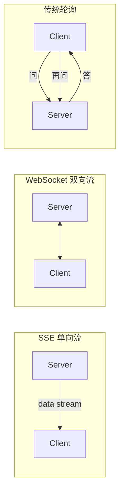

##### 全面对比矩阵

| 对比维度 | SSE | WebSocket | 传统轮询 |
|----------|-----|-----------|---------|
| **通信方向** | 服务端 → 客户端（单向） | 双向 | 双向（请求-应答） |
| **底层协议** | HTTP（标准 HTTP 流） | ws/wss（独立协议） | HTTP |
| **协议开销** | 极低（HTTP 头部一次） | 中（握手 + 帧掩码） | 高（每次请求完整头部） |
| **自动重连** | ✅ 浏览器原生支持 `EventSource` | ❌ 需手动实现 | ❌ 需手动实现 |
| **数据格式** | 文本（UTF-8） | 文本 + 二进制 | 任何 HTTP 格式 |
| **最大连接数** | HTTP/1.1 限制 6 个/域名，HTTP/2 无限制 | 无限制 | 无限制 |
| **实现复杂度** | 低 | 高 | 最低 |
| **自定义 Header** | ❌ EventSource 不支持 | ✅ 支持 | ✅ 支持 |
| **跨域** | 需 CORS 配置 | 协议本身不限 | 需 CORS |
| **实时性** | 高（流式） | 最高（全双工） | 低（取决于轮询间隔） |
| **服务端资源** | 低（HTTP 长连接） | 中（需维护状态） | 高（大量请求） |
| **浏览器兼容** | 现代浏览器 ✅ | 现代浏览器 ✅ | 全部 ✅ |
| **穿透防火墙** | ✅ HTTP 协议 | ❌ 可能被拦截 | ✅ HTTP 协议 |

##### SSE 本质

```http
GET /api/logs HTTP/1.1
Accept: text/event-stream

HTTP/1.1 200 OK
Content-Type: text/event-stream

data: {"message": "log line 1"}

data: {"message": "log line 2"}
```

SSE 就是 **HTTP 长连接 + 流式响应**，浏览器解析 `text/event-stream` 格式。

##### SSE 协议格式详解

```txt
SSE 协议格式：
────────────────────────────────
data: 消息内容

          ← 简单消息
data: 第一行
              ← 多行消息
data: 第二行


event: custom
             ← 自定义事件
data: 消息内容


id: 123
                   ← 消息 ID（断线重连时自动发送 Last-Event-ID）
data: 消息内容


retry: 5000

             ← 服务端控制重连间隔（毫秒）

: 注释内容

              ← 注释行（被浏览器忽略）
────────────────────────────────
```

---

#### 项目结合回答

##### 日志流 → 选 SSE

```
日志流的特征：
  ├─ 单向：服务端产生 → 客户端消费
  ├─ 高频：每秒可能数百条
  ├─ 无需客户端回传
  └─ 需要自动重连（网络抖动频繁）

                 ↓
            选 SSE ✅
        EventSource 自带重连
        浏览器自动解析数据
        资源消耗更低
```

##### 告警系统 → 选 WebSocket

```
告警系统的特征：
  ├─ 双向：需要 ACK 确认
  ├─ 需要心跳保活（检测设备离线）
  ├─ 需要双向交互（抑制/确认/升级）
  └─ 可能包含二进制数据

                 ↓
            选 WebSocket ✅
        自定义心跳机制
        双向消息推送
        支持二进制帧
```

---

#### 追问：SSE 怎么断线重连？

`EventSource` 默认自动重连，但可以加上**指数退避**：

```ts
// 浏览器默认行为 - 连接断开后自动重连
const es = new EventSource('/api/logs')

// 重连事件
es.addEventListener('error', () => {
    console.log('连接断开，浏览器会自动重连')
    // EventSource 默认 3 秒后重试
})

// 服务端可以控制重连延迟
// 发送: retry: 5000


```

服务端控制重连间隔：

```go
// Go 服务端控制重连时间
fmt.Fprintf(w, "retry: %d

", 5000) // 5 秒后重试
```

##### 追问 2：SSE 有什么缺点？

```
缺点：
├─ 单向通信：只能服务端→客户端
├─ 只支持文本：无法传输二进制
├─ 浏览器连接数限制：同域名最多 6 个
├─ EventSource 不支持自定义 Header（无法带 token）
└─ IE 不支持（Polyfill 方案：用 fetch + ReadableStream 模拟）

                    ↓

  解决方案：
  ├─ 连接数限制 → 域名分发（log1.example.com / log2.example.com）
  ├─ 自定义 Header → 使用 fetch API 手动解析 text/event-stream
  └─ IE 兼容 → 降级为轮询（或告知客户升级浏览器）
```

##### 如何用 fetch 替代 EventSource（解决 Header 问题）

```ts
// EventSource 不支持自定义请求头（如 Authorization），且仅支持 GET
// 使用 fetch API + ReadableStream 可自由控制请求方法与头部

// 核心：通用 SSE 解析器
async function consumeSSE(
    response: Response,
    onMessage: (data: string) => void,
    onDone?: () => void,
) {
    const reader = response.body!.getReader()
    const decoder = new TextDecoder()
    let buffer = ''

    while (true) {
        const { done, value } = await reader.read()
        if (done) break

        buffer += decoder.decode(value, { stream: true })
        const lines = buffer.split('\n')
        buffer = lines.pop() || ''

        for (const line of lines) {
            if (line.startsWith('data: ')) {
                const data = line.slice(6)
                if (data === '[DONE]') { onDone?.(); return }
                try {
                    const parsed = JSON.parse(data)
                    onMessage(parsed.choices?.[0]?.delta?.content || parsed)
                } catch {
                    onMessage(data)
                }
            }
        }
    }
}

// 方案一：GET + 自定义 Header（日志流、通知推送）
async function createSSE(url: string, token: string, onMessage: (data: string) => void) {
    const response = await fetch(url, {
        headers: { Authorization: `Bearer ${token}` }
    })
    if (!response.ok) throw new Error(`SSE 连接失败: ${response.status}`)
    await consumeSSE(response, onMessage)
}

// 方案二：POST + Header + Body（AI 聊天流式调用）
async function chatSSE(
    url: string,
    messages: Array<{ role: string; content: string }>,
    onToken: (token: string) => void,
) {
    const response = await fetch(url, {
        method: 'POST',
        headers: {
            'Content-Type': 'application/json',
            Authorization: `Bearer ${localStorage.getItem('token')}`,
        },
        body: JSON.stringify({ messages, stream: true }),
    })
    if (!response.ok) throw new Error(`SSE 请求失败: ${response.status}`)
    await consumeSSE(response, onToken)
}

// 方案三：断线重连 + 指数退避
class SSEClient {
    private abortController = new AbortController()
    private retries = 0
    private maxRetries = 5
    private backoff = (attempt: number) =>
        Math.min(1000 * Math.pow(2, attempt), 30000)

    async connect(
        url: string,
        token: string,
        onMessage: (data: string) => void,
        onDone?: () => void,
    ) {
        while (this.retries < this.maxRetries) {
            try {
                const resp = await fetch(url, {
                    headers: { Authorization: `Bearer ${token}` },
                    signal: this.abortController.signal,
                })
                if (!resp.ok) throw new Error(`HTTP ${resp.status}`)
                await consumeSSE(resp, onMessage, onDone)
                this.retries = 0
                return
            } catch (err) {
                if (this.abortController.signal.aborted) break
                this.retries++
                console.warn(`SSE 断线，第 ${this.retries} 次重试...`)
                await new Promise(r => setTimeout(r, this.backoff(this.retries)))
            }
        }
        throw new Error('SSE 连接失败：已达最大重试次数')
    }

    disconnect() { this.abortController.abort() }
}

// 使用示例
createSSE('/api/logs', 'your-jwt-token', console.log)
chatSSE('/api/chat', [{ role: 'user', content: '你好' }], token => updateUI(token))
const client = new SSEClient()
client.connect('/api/events', 'token', data => handleData(data))
```

##### 追问 3：WebSocket 如何保证消息可靠性？

```txt
WebSocket 本身不保证消息可靠性！
需要应用层协议保障：
├─ ACK 机制：客户端收到消息后发送确认
├─ 消息序列号：检测丢包和乱序
├─ 重传机制：超时未 ACK 则重发
├─ 心跳检测：ping/pong 检测连接健康
└─ 离线缓存：断线期间消息存队列，重连后补发
```

---

### 3. RxJS 操作符体系化理解

#### 核心认知

> **Map 操作符的本质是"对 Observable 流中每个值的处理策略"：取消、并行、排队、还是忽略。**

**面试官视角**：考察你对响应式编程的理解，以及在真实场景中的选型能力。


##### 四大家族对比

| 操作符 | 行为 | 适合场景 | 内部实现 |
|--------|------|----------|---------|
| `switchMap` | 新请求 **取消** 旧请求 | 搜索框、Token 刷新 | 订阅新 Observable 前 `unsubscribe` 旧的 |
| `mergeMap` | 新请求 **并行** 旧请求 | 批量请求、并发任务 | 每个值创建内部订阅，共存 |
| `concatMap` | 新请求 **排队** 旧请求 | 顺序写入、文件上传 | 维护队列，前一个完成再处理下一个 |
| `exhaustMap` | 新请求 **忽略**（旧完成前） | 登录/提交按钮防抖 | 正在执行中就丢弃新的 |

##### 常见高级 Map 操作符

```txt
switchMap vs debounceTime + map:
├─ debounceTime + map: 先防抖再映射，只能控制"请求发起时机"
├─ switchMap: 不仅能延时，还能取消在途请求
└─ 搜索场景：switchMap 更优，因为可以直接取消慢响应

mergeMap + concurrent 参数:
├─ mergeMap(fn, 3): 限制最大并发 3 个
├─ 对比 Promise.all: 所有请求同时发出
├─ 对比 Promise.allSettled: 不因个别失败而整体失败
└─ 适用: 批量上传文件(控制并发避免带宽打满)
```

##### switchMap（取消旧请求）

```ts
// 搜索框：每次输入取消上一次请求
searchInput.valueChanges.pipe(
    debounceTime(300),
    switchMap(keyword => this.api.search(keyword))
    // 如果 keyword 变了，上一次请求自动取消
).subscribe()
```

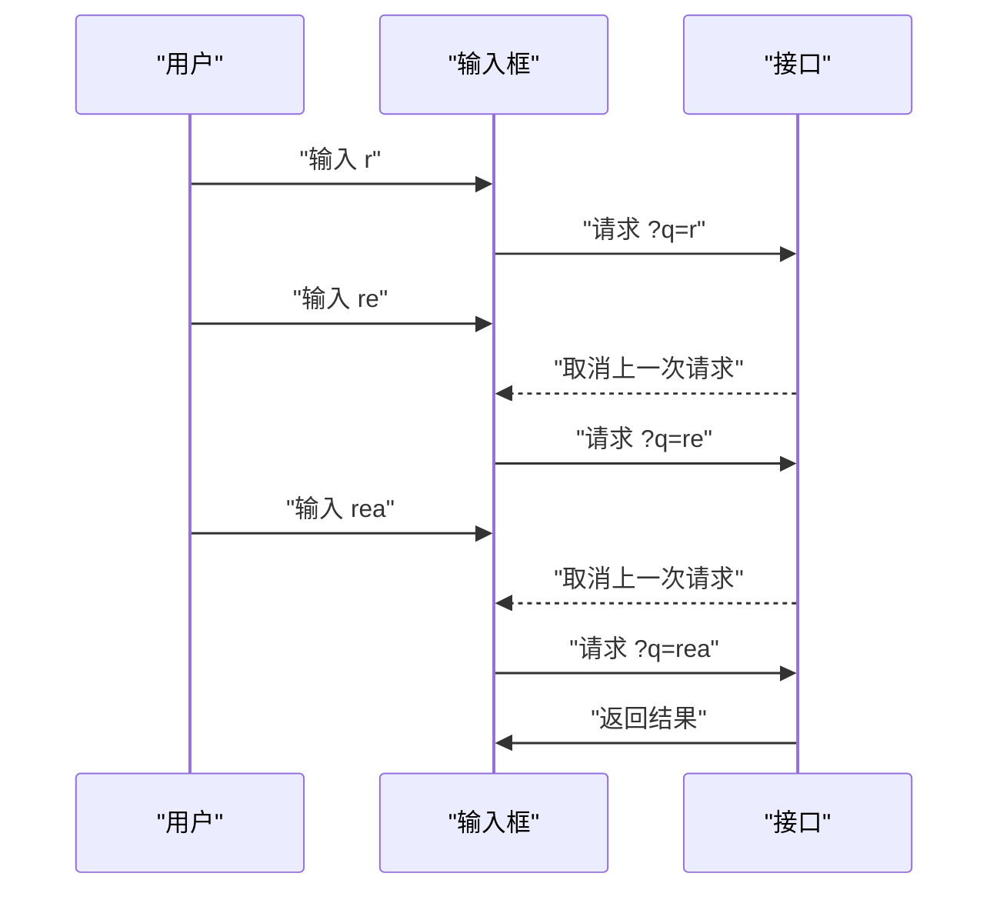

##### mergeMap（并行执行）

```ts
// 批量请求：同时获取多个详情
ids$.pipe(
    mergeMap(ids => forkJoin(
        ids.map(id => this.api.getDetail(id))
    )),
    // 控制并发数
    // mergeMap(fn, concurrent: 3)
).subscribe()
```

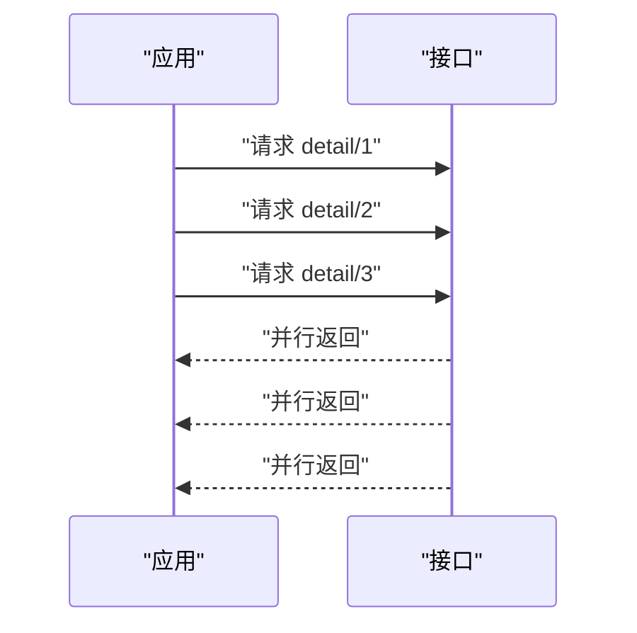

##### concatMap（排队执行）

```ts
// 顺序上传文件
fileUpload$.pipe(
    concatMap(file => this.api.upload(file))
    // 前一个上传完成 → 再上传下一个
).subscribe()
```

##### exhaustMap（忽略新请求）

```ts
// 提交按钮：防重复点击
submitBtn.click$.pipe(
    exhaustMap(() => this.api.submit(formData))
    // 请求完成前，忽略后续点击
).subscribe()
```

---

#### 面试加分回答

##### 双 Token 刷新为什么必须用 Promise Gate？

```typescript
// ❌ 错误：无并发控制 — 3 个请求同时 401 并发刷新 3 次
async function refreshToken() {
    const res = await fetch('/api/auth/refresh', { method: 'POST', credentials: 'include' })
    return res.json()
}

async function handle401(originalRequest: Request) {
    const { accessToken } = await refreshToken()  // 并发刷新！
    // 3 个请求同时 401 → 并发刷新 3 次
    // 最后一次覆盖前面的 token，前两个请求携带过期 token
    localStorage.setItem('accessToken', accessToken)
    return fetch(originalRequest)
}
```

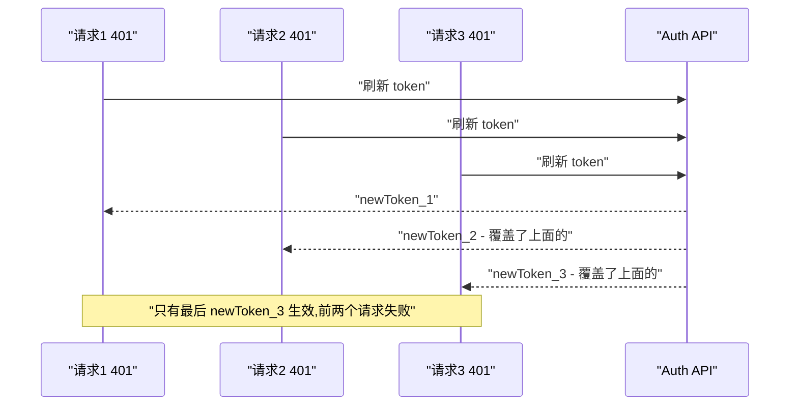

```typescript
// ✅ 正确：Promise Gate — 多个并发 401 只发一次刷新请求
let refreshPromise: Promise<{ accessToken: string }> | null = null

async function handle401(originalRequest: Request) {
    if (!refreshPromise) {
        refreshPromise = fetch('/api/auth/refresh', {
            method: 'POST',
            credentials: 'include',  // HttpOnly Cookie 自动携带 Refresh Token
        }).then(res => {
            if (!res.ok) throw new Error('refresh failed')
            return res.json()
        }).finally(() => {
            refreshPromise = null  // 无论成功失败，重置 gate
        })
    }

    const { accessToken } = await refreshPromise
    // 所有等待的请求共享同一个 accessToken
    originalRequest.headers.set('Authorization', `Bearer ${accessToken}`)
    return fetch(originalRequest)
}
```

```mermaid
sequenceDiagram
    participant Req1 as "请求1 401"
    participant Req2 as "请求2 401"
    participant Req3 as "请求3 401"
    participant Auth as "Auth API"

    Req1->>Auth: "刷新 token"
    Note over Req2: "等待 Promise Gate 完成"
    Note over Req3: "等待 Promise Gate 完成"
    Auth-->>Req1: "newToken"
    Req1->>Req1: "重试成功 ✅"
    Req2->>Req2: "使用 newToken 重试 ✅"
    Req3->>Req3: "使用 newToken 重试 ✅"
```

##### 追问：为什么不用 Zustand store 做缓存？

```typescript
// Zustand store + Promise Gate 组合是最优解
const useAuthStore = create<AuthState>((set, get) => ({
    accessToken: null as string | null,
    refreshPromise: null as Promise<string> | null,

    getValidToken: async () => {
        // 1. 已有有效 token → 直接返回
        if (get().accessToken && !isExpired(get().accessToken!)) {
            return get().accessToken
        }

        // 2. Promise Gate：多个请求共享一个刷新请求
        if (!get().refreshPromise) {
            const promise = fetch('/api/auth/refresh', { method: 'POST', credentials: 'include' })
                .then(res => res.json())
                .then(data => {
                    set({ accessToken: data.accessToken, refreshPromise: null })
                    return data.accessToken
                })
                .catch(err => {
                    set({ refreshPromise: null })
                    throw err
                })
            set({ refreshPromise: promise })
        }

        return get().refreshPromise
    }
}))

// fetch 拦截器中使用
async function authFetch(url: string, options?: RequestInit) {
    const token = await useAuthStore.getState().getValidToken()
    return fetch(url, {
        ...options,
        headers: { ...options?.headers, Authorization: `Bearer ${token}` },
    })
}
```

核心优势：
├─ Zustand 管理 token 状态，组件通过 selector 获取
├─ Promise Gate 防并发（只发一次刷新请求）
├─ Token Rotation + Replay 检测防重放
└─ 与 HttpOnly Cookie（Refresh Token）配合，XSS 无法窃取

---

##### buffer 家族：时间窗口/数量窗口/条件窗口

> **buffer 操作符的核心作用是把"每个值单独处理"变成"一批值批量处理"。**

**面试官视角**：考察你对高频事件流控的理解，以及能否在合适场景选择合适的 buffer 策略。

```mermaid
flowchart LR
    subgraph "原始数据流"
        A["1"] --> B["2"] --> C["3"] --> D["4"] --> E["5"]
    end
    subgraph "bufferTime(3s)"
        B1["[1, 2, 3]"] --> B2["[4, 5]"]
    end
    subgraph "bufferCount(2)"
        C1["[1, 2]"] --> C2["[3, 4]"] --> C3["[5]"]
    end
```

##### 四类 buffer 对比

| 操作符 | 触发条件 | 适合场景 | 注意点 |
|--------|---------|----------|--------|
| `bufferTime(ms)` | 固定时间窗口 | 高频消息批处理（日志、指标） | 时间窗口内无数据也会发射空数组 |
| `bufferCount(n)` | 固定数量 | 批量提交（攒够 n 条再请求） | 最后不足 n 条不发射，需配合 `bufferCount(n, 1)` 或 `bufferTime` 兜底 |
| `buffer(notifier$)` | 自定义信号 | RAF 帧同步、用户操作触发 | notifier 不区分先后，需注意背压 |
| `bufferWhen(fn)` | 动态条件 | 按空闲时间打包、按优先级攒批 | 每次窗口关闭后重新调用工厂函数 |

##### bufferTime 使用示例

```ts
// 高频日志消息 → 每 200ms 批量处理
source$.pipe(
    bufferTime(200),
    filter(batch => batch.length > 0),  // 过滤空批次
    switchMap(batch => processBatch(batch))
).subscribe()
```

##### bufferTime 必须注意的问题

```
⚠️ 核心问题：bufferTime 的时机是时间驱动的，不是数据驱动的

问题 1：空数组问题
├─ bufferTime 每个时间窗口结束时无论有无数据都会发射 []
├─ 必须加 filter(batch => batch.length > 0) 过滤空批次
└─ 否则空数组也会触发下游处理，浪费性能

问题 2：数据积压（背压）
├─ bufferTime(200) 固定 200ms 放行一次
├─ 如果 200ms 内积累了 10000 条，一次性处理可能卡主线程
└─ 解决：bufferTime(200, null, maxSize) 限制窗口内最大数量

问题 3：最后一个窗口丢失
├─ 流完结时，bufferTime 尚未结束的窗口内的数据会被丢弃
├─ 解决：用 bufferTime(200, null, Infinity) 确保最后批次不丢
└─ 或配合 takeUntil + complete 事件手动发射剩余数据

问题 4：合并使用注意
├─ bufferTime + switchMap：新窗口会取消旧窗口的异步处理
│   └─ 适用：只关心最新一批数据（如实时搜索建议）
├─ bufferTime + mergeMap：窗口间并行处理
│   └─ 适用：日志批量写入（每批独立提交，互不影响）
└─ bufferTime + concatMap：窗口间排队处理
    └─ 适用：顺序敏感操作（如文件分片上传）
```

##### bufferCount 使用示例与陷阱

```ts
// ✅ 正确：每 10 条发送一次（配合 bufferTime 兜底避免最后不足丢失）
source$.pipe(
    bufferCount(10),
    // ❌ 问题：最后不足 10 条时永远不会发射
).subscribe()

// ✅ 方案：bufferCount + bufferTime 双保险
source$.pipe(
    buffer(
        merge(
            source$.pipe(bufferCount(10)),     // 满 10 条就发
            source$.pipe(throttleTime(5000)),   // 5 秒内不管多少也发
        )
    ),
).subscribe()
```

##### 工业级实践：bufferTime + RAF 帧同步

```mermaid
flowchart TD
    WS["WebSocket 消息"] --> MQ["消息队列 - 缓冲"]
    MQ --> Batch["bufferTime(200ms) - 时间窗口粗筛"]
    Batch --> Priority["优先级队列 - Critical > Major > Minor > Info"]
    Priority --> Dedup["消息去重 - 按 alarmId + timestamp"]
    Dedup --> RAF["requestAnimationFrame - 帧同步精刷"]
    RAF --> Render["ECharts / 虚拟列表 - 增量更新"]
```

```ts
// 告警消息流控：bufferTime 粗筛 + RAF 精刷
this.message$.pipe(
    bufferTime(200),                         // 每 200ms 放行一批
    filter(batch => batch.length > 0),       // 跳过空批次
    concatMap(batch => new Promise<void>(resolve => {
        requestAnimationFrame(() => {          // 下一帧渲染
            this.processBatch(batch)
            resolve()
        })
    }))
).subscribe()
```

> **为什么用 concatMap 而不是 switchMap？**
> - `switchMap` 会取消上一批还没执行的 RAF 回调 → **丢消息**（告警场景不可接受）
> - `concatMap` 保证每批排队串行处理，RAF 回调不丢失
>
> **双重保险：bufferCount 兜底 + throttleTime 兜底**
> ```ts
> source$.pipe(
>   buffer(
>     merge(
>       source$.pipe(bufferCount(50)),      // 满 50 条立即发
>       source$.pipe(throttleTime(200)),     // 200ms 保底
>     )
>   ),
> ).subscribe()
> ```
>
> **bufferTime(200) 三个注意点：**
> 1. 空批次 → `filter(batch => batch.length > 0)` 过滤
> 2. 数据积压 → `bufferTime(200, null, 500)` 限制窗口最大量
> 3. 最后窗口丢失 → 流完结时补发 `takeUntil(complete$)`

---

### 4. 虚拟列表：从原理到工业级实现

#### 核心认知

> **虚拟列表不是优化"数据"，而是减少"DOM 数量"。**

```mermaid
flowchart LR
    subgraph "传统列表"
        D1["DOM 1"] --> D2["DOM 2"] --> D3["..."]
        D3 --> DN["DOM N - 百万级"]
    end
    subgraph "虚拟列表"
        V1["DOM visible - 10-20个"] --> V2["占位容器 - 总高度"]
    end
    style D1 fill:#ffebee
    style D2 fill:#ffebee
    style D3 fill:#ffebee
    style DN fill:#ffcdd2
    style V1 fill:#e8f5e9
    style V2 fill:#e8f5e9
```

##### 为什么多 DOM 会卡？

```mermaid
flowchart TD
    subgraph "浏览器渲染流水线"
        JS["JavaScript"] --> Style["Style 计算"]
        Style --> Layout["Layout 布局"]
        Layout --> Paint["Paint 绘制"]
        Paint --> Composite["Composite 合成"]
    end

    subgraph "百万 DOM 的影响"
        Layout -->|"O(n)"| L1["布局时间爆炸"]
        Paint -->|"O(n)"| P1["绘制巨大矩形"]
        Memory["内存占用"] -->|"数百 MB"| OOM["OOM 风险"]
        Diff["React Diff"] -->|"O(n)"| Long["长时间计算"]
    end
```

##### 具体瓶颈分析

| 瓶颈 | 原因 | 影响 |
|------|------|------|
| **Layout（回流）** | 每个 DOM 位置需要计算 | 万级 => 几十 ms，百万 => 几秒 |
| **Paint（绘制）** | 将 DOM 绘成位图 | GPU 内存暴涨 |
| **Memory（内存）** | DOM 对象本身占用 | 每个 DOM ~4KB，百万 => 4GB |
| **Diff（协调）** | React 需要遍历所有节点 | 1000 个节点约 1ms，10 万 => 100ms |

##### 虚拟列表原理

```mermaid
flowchart TD
    subgraph "计算过程"
        ST["scrollTop"] --> VI["visibleStart = floor(scrollTop / itemHeight)"]
        ST --> VE["visibleEnd = ceil((scrollTop + containerHeight) / itemHeight)"]
        VI --> Render["data.slice visibleStart, visibleEnd"]
        VE --> Render
    end

    subgraph "核心数据结构"
        Total["总高度 = data.length * itemHeight"] --> PadTop["paddingTop = visibleStart * itemHeight"]
        Total --> PadBottom["paddingBottom = (total - visibleEnd) * itemHeight"]
    end

    Render --> DOM["只渲染 visible DOM"]
```

```ts
// 核心计算
function getVisibleRange(scrollTop: number, containerHeight: number, itemHeight: number, total: number) {
    const visibleStart = Math.floor(scrollTop / itemHeight)
    const visibleEnd = Math.ceil((scrollTop + containerHeight) / itemHeight)

    return {
        start: Math.max(0, visibleStart - overscan),   // overscan 额外渲染几项
        end: Math.min(total, visibleEnd + overscan),    // 防止白屏
        totalHeight: total * itemHeight,                // 容器总高度
        offset: visibleStart * itemHeight               // 偏移量
    }
}
```

##### 为什么叫"虚拟"列表？

- **"虚拟"** = 在内存中维护完整列表
- **"真实"** = 只渲染可视区域
- 用户 **感知** 到的是完整列表（滚动条高度正确）
- 浏览器 **实际** 只处理少量 DOM

---

#### 进阶：虚拟列表 + 变高元素

```mermaid
flowchart LR
    subgraph "定高"
        F1["固定 50px"] --> F2["固定 50px"]
        F2 --> F3["固定 50px"]
    end
    subgraph "变高"
        V1["不同内容"] --> V2["高度不同"]
        V2 --> V3["需动态计算"]
    end
```

##### 变高解决方案对比

| 方案 | 原理 | 复杂度 | 精度 | 适用场景 |
|------|------|--------|------|---------|
| **预估 + 校正** | 先给固定预估高度，渲染后更新实际值 | 低 | 中等 | 聊天记录、动态内容 |
| **二分查找定位** | 维护已渲染元素的真实位置数组 | 中 | 高 | 日志列表 |
| **动态测量缓存** | 用 `ResizeObserver` 监听高度变化 | 高 | 最高 | 富文本、图片列表 |

```ts
// 变高虚拟列表核心
class VariableHeightVirtualList {
    private heights: Map<number, number> = new Map()  // 存储每个元素的真实高度
    private positions: number[] = [0]                  // 存储每个元素的位置偏移

    getTotalHeight(): number {
        return this.positions[this.positions.length - 1] ?? 0
    }

    findStartIndex(scrollTop: number): number {
        // 二分查找：找到第一个 > scrollTop 的位置
        let left = 0, right = this.positions.length - 1
        while (left < right) {
            const mid = (left + right) >> 1
            if (this.positions[mid] <= scrollTop) {
                left = mid + 1
            } else {
                right = mid
            }
        }
        return left - 1
    }

    updateHeight(index: number, height: number) {
        const diff = height - (this.heights.get(index) ?? DEFAULT_HEIGHT)
        // 更新后续所有位置
        for (let i = index + 1; i < this.positions.length; i++) {
            this.positions[i] += diff
        }
        this.heights.set(index, height)
    }
}
```

##### 工业级虚拟列表需要考虑的问题

```
├─ 滚动容器篇
│   ├─ 是 window 滚动还是 div 滚动？
│   └─ 滚动事件节流（passive: true 改善滚动性能）
│
├─ 缓存策略篇
│   ├─ 已渲染组件缓存（keep alive）
│   ├─ 状态保持（input 输入内容不丢失）
│   └─ O(1) 索引映射
│
├─ 滚动恢复篇
│   ├─ 回到顶部/滚动到指定索引
│   ├─ 数据变化后保持滚动位置
│   └─ 列表刷新后保持可视区域不变
│
├─ 边缘情况篇
│   ├─ 快速滚动时的白屏处理
│   ├─ 动态插入/删除中间元素
│   ├─ 元素高度变化（resize）
│   └─ 列表方向（水平/垂直/网格）
│
└─ 性能指标篇
    ├─ 首次渲染时间
    ├─ 滚动帧率（60fps）
    ├─ 内存占用峰值
    └─ 滚动延迟（从事件到渲染）
```

---

**面试官视角**：考察你对性能优化的理解深度，能否解释清楚"为什么虚拟列表能优化性能"以及"实际项目中怎么用"。

---

#### 面试追问预测与应对策略

##### 追问链路 1：从原理追到实现

```
面试官："虚拟列表的核心原理是什么？"
├─ 你：只渲染可视区域的 DOM，用 padding 模拟总高度
├─ 追问："具体怎么计算可视区域？"
│   └─ 你："scrollTop / itemHeight = 起始索引，(scrollTop + containerHeight) / itemHeight = 结束索引"
├─ 追问："为什么用 padding 不用 transform？"
│   └─ 你："两者都行；padding 语义更清晰，transform 会影响子元素百分比计算"
├─ 追问："白屏问题怎么解决？"
│   └─ 你："overscan 预渲染几项，用户滚动时不会看到空白"
├─ 追问："滚动时性能怎么保证？"
│   └─ 你："RAF 节流滚动事件，每帧只更新一次；passive: true 改善滚动性能"
└─ 追问："定高和变高有什么区别？"
    └─ 你："定高计算简单 O(1)；变高需要二分查找 O(log n) 或 ResizeObserver 监听"
```

##### 追问链路 2：从实现追到项目实战

```
面试官："你们项目里虚拟列表怎么用的？"
├─ 你："百万行日志预览场景，用 ReadableStream 流式读取 + 虚拟列表渲染"
├─ 追问："为什么不直接分页？"
│   └─ 你："日志需要全文搜索和连续滚动，分页体验差；虚拟列表既省内存又保持滚动体验"
├─ 追问："搜索怎么做？"
│   └─ 你："Web Worker 后台搜索，匹配结果高亮，虚拟列表定位到匹配位置"
├─ 追问："怎么处理动态高度？"
│   └─ 你："预估高度 20px，渲染后用 ResizeObserver 监听实际高度，更新 positions 数组"
├─ 追问："状态怎么保持？"
│   └─ 你："用 Map 缓存每个 item 的展开/折叠状态，key 是 item.id"
└─ 追问："效果怎么量化？"
    └─ 你："加载时间从 OOM 崩溃到毫秒级，内存从 2GB+ 到 50MB 恒定，帧率 60fps"
```

---

#### 面试回答模板

##### 场景：被问到"虚拟列表原理"

```
30 秒版：
"虚拟列表的核心是'只渲染可视区域'。
传统列表渲染 10 万个 DOM，虚拟列表只渲染 20-30 个。
计算方式是：scrollTop / itemHeight 得到起始索引，
scrollTop + containerHeight / itemHeight 得到结束索引。
用 padding 模拟总高度，用户感知到的是完整列表，
但浏览器实际只处理少量 DOM。"

追问版（深入原理）：
"虚拟列表需要考虑几个关键问题：
1. 滚动性能：用 RAF 节流滚动事件，每帧只更新一次
2. 白屏问题：overscan 预渲染几项，避免快速滚动时出现空白
3. 变高元素：预估高度 + 渲染后校正，或用 ResizeObserver 监听
4. 状态保持：用 Map 缓存每个 item 的状态（展开/折叠/输入）
5. 边界处理：动态插入/删除、滚动位置保持、列表刷新
在我们的日志预览场景中，用 ReadableStream 流式读取 + 虚拟列表，
实现了百万行日志的毫秒级加载和 60fps 滚动。"
```

---

#### 反例对比：常见错误

```txt
❌ 错误 1：不用虚拟列表，用 CSS contain 优化
   ✅ 正确：CSS contain 只能优化重排范围，不能减少 DOM 数量
   ✅ 验证：10 万个 DOM + contain: layout → 仍然卡顿

❌ 错误 2：虚拟列表 + useState 存储所有数据
   ✅ 正确：用 useRef 或外部存储（IndexedDB），避免每次渲染重新计算
   ✅ 验证：useState 触发重渲染 → 虚拟列表重新计算 → 性能差

❌ 错误 3：滚动事件不节流
   ✅ 正确：用 RAF 或 throttle 节流，每帧只更新一次
   ✅ 验证：scroll 事件每秒触发 60+ 次 → 每次都 setState → 卡顿

❌ 错误 4：不处理 overscan
   ✅ 正确：预渲染 2-5 项，避免快速滚动时白屏
   ✅ 验证：快速滚动 → 可视区域外没有 DOM → 白屏闪烁
```

---

### 5. React 19 编译器与自动记忆化

#### React 19 编译器核心原理

```mermaid
flowchart TD
    subgraph "React 18 及之前"
        M["手动优化"] --> MM["React.memo()"]
        M --> UC["useMemo()"]
        M --> UC2["useCallback()"]
        Note["开发者手工标记缓存边界"]
    end

    subgraph "React 19 编译器"
        C["React Forget 编译器"] --> A1["构建期静态分析"]
        A1 --> A2["自动推导组件依赖图"]
        A2 --> A3["自动注入 memo / useMemo / useCallback"]
        Note2["零运行时开销，构建期完成优化"]
    end

    style M fill:#fff3e0
    style C fill:#e8f5e9
```

| 对比维度 | 手动优化（React 18-） | React 19 编译器 |
|----------|----------------------|-----------------|
| 优化时机 | 编码时手工标记 | 构建期自动注入 |
| 心智负担 | 高（需理解 memo 边界） | 无（编译器自动处理） |
| 遗漏风险 | 容易遗漏导致无效重渲染 | 全覆盖无遗漏 |
| 运行时开销 | React.memo 浅比较 | 零开销（构建期完成） |
| 代码可读性 | 被 memo/callback 污染 | 干净的业务代码 |

##### React 19 编译器解决了什么？

```txt
核心问题：React 的 re-render 机制是"自上而下"的
├─ 父组件重新渲染 → 所有子组件重新渲染
├─ React.memo 阻止不必要的子组件重渲染
├─ 但开发者经常忘记加 memo，或依赖数组写错
└─ 导致性能问题难以排查

React 19 编译器方案：
├─ 构建期分析组件间的数据依赖关系
├─ 自动推导哪些组件需要 memo，哪些值需要缓存
├─ 生成优化后的代码，等价于手动 memo + useMemo + useCallback
├─ 开发者只需写"朴素"的 React 代码
└─ 性能优化从"人工义务"变成"编译器职责"
```

##### 项目中如何受益？

```txt
在 AeMS 项目中的应用：
├─ 动态表单引擎：200+ 字段组件，编译器自动 memo 避免无关字段重渲染
├─ GIS 点位渲染：每个点位组件的样式计算被编译器自动缓存
├─ 告警列表：4000 msg/s 的实时更新，编译器确保仅变化行重渲染
├─ 复杂表单联动：条件显隐变化只更新受影响的字段组件
└─ 效果：200 字段表单无卡顿，4000 msg/s 告警 60fps
```

##### React.memo 与 React 19 编译器的关系

```txt
React 19 编译器不是"替代"React.memo，而是"自动化"React.memo：

├─ 编译器自动分析：哪些 props 是稳定的，哪些是每次渲染都变的
├─ 自动注入 memo：对稳定 props 的组件自动包裹 memo
├─ 自动缓存值：useMemo/useCallback 由编译器自动插入
├─ 开发者可以：不写 memo，编译器帮你写
├─ 开发者仍然需要：理解 memo 原理，理解编译器可能遗漏的边界情况

最佳实践：
├─ React 19 下：先写"朴素"代码，让编译器优化
├─ 如果 Profiler 显示仍有问题，再手动加 memo 覆盖
├─ 充分理解编译器的依赖分析规则，避免写出编译器无法优化的代码
└─ 遗留代码迁移：逐步启用编译器，对比性能差异
```

---

### 6. JWT 安全体系详解

#### 核心问题

> **JWT 本身是安全的，不安全的是存储方式。**

```mermaid
flowchart LR
    subgraph "安全方案"
        Access["Access Token 短期 15min"] --> Memory["内存/变量"]
        Refresh["Refresh Token 长期 7天"] --> Cookie["HttpOnly Cookie"]
        Cookie --> Safe["XSS 无法读取"]
    end

    subgraph "不安全方案"
        JWT["JWT Token"] --> Local["localStorage"]
        Local --> XSS["XSS 脚本窃取"]
        XSS --> Steal["Token 被盗用"]
    end
```

##### JWT Token 结构

```txt
JWT = Header.Payload.Signature
                      ↓
eyJhbGciOiJIUzI1NiIsInR5cCI6IkpXVCJ9.
eyJzdWIiOiIxMjM0NTY3ODkwIn0.
doZjgSg4SA1sXzYq8s0E4P0GQ0A

Header:   { "alg": "HS256", "typ": "JWT" }       → Base64URL
Payload:  { "sub": "user123", "iat": 1516239022 } → Base64URL
Signature: HMACSHA256(base64UrlEncode(header) + "." + base64UrlEncode(payload), secret)
```

##### 常见 JWT 攻击手法

| 攻击类型 | 原理 | 防御 |
|----------|------|------|
| **alg: none** | 修改 header 为 `{"alg":"none"}`，绕过签名验证 | 服务端拒绝 `alg: none` |
| **RS256 → HS256 混淆** | 用公钥作为 HMAC 密钥签名（如果服务端用公钥验证 HMAC） | 固定算法，不信任客户端算法 |
| **暴力破解 secret** | 弱密钥离线爆破 | 使用高熵密钥，定期轮换 |
| **信息泄露** | Payload 仅 Base64 编码，非加密 | 不放敏感信息在 Payload |
| **Token 劫持** | XSS/中间人窃取 | 短期 + HTTPS + HttpOnly |
| **Token 重放** | 截获 Token 重复使用 | Refresh Token Rotation |

##### 攻击链路

```mermaid
sequenceDiagram
    participant User as "用户"
    participant App as "应用"
    participant Attacker as "攻击者"
    participant Browser as "浏览器存储"
    participant ApiServer as "服务器"

    User->>App: "访问页面"
    Note over App: "XSS 脚本注入"
    Attacker->>App: "执行恶意脚本"
    App->>Browser: "读取 token"
    App->>Attacker: "发送 token 到攻击服务器"
    Attacker->>ApiServer: "使用窃取的 token"
    ApiServer->>Attacker: "返回用户数据"
```

---

#### 正确安全方案

```mermaid
flowchart TD
    Login["登录"] --> LoginAPI["Login API"]
    LoginAPI --> Return["返回 access + refresh"]
    Return --> Store["存储策略"]

    Store --> AccessMem["access_token 内存变量或 sessionStorage"]
    Store --> RefreshCookie["refresh_token HttpOnly Cookie Secure+SameSite"]

    AccessMem --> Request["发起 API 请求"]
    RefreshCookie --> Expired{"access 过期?"}
    Expired -->|"是"| Refresh["refresh - Cookie自动携带"]
    Refresh --> NewAccess["新 access_token 到内存"]
    NewAccess --> Request
    Expired -->|"否"| Request

    Request --> API["后端校验 access"]
    API --> Valid{"是否有效?"}
    Valid -->|"是"| Data["返回数据"]
    Valid -->|"否"| Expired
```

##### 多层防御

```
第一层：XSS 防御
├─ CSP（Content Security Policy）
├─ 输入过滤 / 输出转义
└─ 避免 dangerouslySetInnerHTML / innerHTML

第二层：Token 安全
├─ access_token：短期（15min）+ 内存存储
├─ refresh_token：HttpOnly + Secure + SameSite
└─ 刷新接口限流防刷

第三层：传输安全
├─ HTTPS 全站
└─ 前端不能操作 refresh_token
```

##### Refresh Token Rotation（RTR）

```txt
为什么需要 RTR？
├─ 每次刷新时颁发新的 refresh_token
├─ 旧的 refresh_token 立即失效
├─ 如果 refresh_token 被盗用：
│   ├─ 攻击者使用 refresh_token 获取新 token
│   ├─ 合法用户使用"已用过"的 refresh_token 会失败
│   └─ 服务端检测到"已用过的 token 被再次使用"→ 发出告警
│
└─ 典型的令牌盗窃检测机制

RTR 流程：
┌────────────────────────────────────────┐
│ 1. 用户使用 refresh_token_A 换新 token  │
│ 2. 服务端颁发 refresh_token_B           │
│ 3. refresh_token_A 失效                 │
│ 4. 如果 refresh_token_A 再次被使用      │
│    → 令牌被盗告警                       │
│    → refresh_token_B 也立即失效         │
│    → 用户需要重新登录                   │
└────────────────────────────────────────┘
```

---

**面试官视角**：考察你对认证授权的理解深度，能否设计出安全的 Token 方案。

---

#### 面试追问预测与应对策略

##### 追问链路 1：从 Token 追到安全

```
面试官："JWT Token 存在哪里？"
├─ 你：access_token 存内存，refresh_token 存 HttpOnly Cookie
├─ 问："为什么不都存 Cookie？"
│   └─ 你："access_token 需要前端读取（显示用户信息），Cookie 无法被 JS 读取"
├─ 追问："XSS 怎么防？"
│   └─ 你："CSP + 输入过滤 + 输出转义 + HttpOnly Cookie"
├─ 追问："CSRF 怎么防？"
│   └─ 你："SameSite Cookie + CSRF Token + 自定义 Header"
├─ 追问："Token 泄露了怎么办？"
│   └─ 你："短期 access_token + Refresh Token Rotation + 检测异常使用"
└─ 追问："双 Token 刷新具体怎么做？"
    └─ 你："access_token 过期时用 refresh_token 换新 token，用 Promise Gate 避免并发刷新"
```

##### 追问链路 2：从存储追到实战

```
面试官："access_token 过期了怎么处理？"
├─ 你：用 refresh_token 换新 token，然后重试原请求
├─ 追问："多个请求同时过期怎么办？"
│   └─ 你："用 Promise Gate 避免并发刷新，只发一次刷新请求"
├─ 追问："刷新期间其他请求怎么办？"
│   └─ 你："缓存到 pendingRequests 数组，刷新完成后统一重试"
├─ 追问："refresh_token 也过期了呢？"
│   └─ 你："强制登出，跳转登录页，让用户重新登录"
├─ 追问："怎么防止 refresh_token 被盗用？"
│   └─ 你："Refresh Token Rotation：每次刷新颁发新 token，旧 token 失效"
└─ 追问："检测到被盗用后怎么处理？"
    └─ 该用户所有 token 立即失效，发送安全告警通知用户
```

---

#### 面试回答模板

##### 场景：被问到"JWT 安全方案"

```
30 秒版：
"JWT 安全的核心是'分层防御'：
1. Token 存储：access_token 存内存，refresh_token 存 HttpOnly Cookie
2. 传输安全：HTTPS + SameSite Cookie
3. 刷新机制：双 Token + Refresh Token Rotation
4. 前端防御：CSP + XSS 防护
access_token 短期有效（15分钟），refresh_token 长期有效（7天），
每次刷新时颁发新 token，旧 token 立即失效。"

追问版（深入原理）：
"具体流程：
用户登录后，服务端颁发 access_token（15min）和 refresh_token（7天）。
access_token 存内存，用于 API 认证；refresh_token 存 HttpOnly Cookie，用于刷新。
access_token 过期时，前端用 refresh_token 换新 token，用 Promise Gate 避免并发刷新。
Refresh Token Rotation：每次刷新颁发新 token，旧 token 立即失效。
如果旧 token 被再次使用，说明被盗用，所有 token 立即失效并通知用户。
前端防御：CSP 限制脚本来源，XSS 防护防止 Token 窃取。"
```

---

### 7. WebSocket 性能问题与优化体系

#### 根本原因

> **不是 WebSocket 卡，是 UI 渲染跟不上消息速度。**

```mermaid
flowchart LR
    subgraph "消息洪峰"
        M1["msg 1"] --> M2["msg 2"] --> M3["msg 3"]
        M3 --> M4["msg ..."]
        M4 --> MN["msg N - 每秒数百条"]
    end

    subgraph "浏览器帧"
        F1["帧1 - 16ms"] --> F2["帧2 - 16ms"]
        F2 --> F3["掉帧"]
        F3 --> F4["卡顿"]
    end

    subgraph "结果"
        R1["消息堆积"] --> R2["DOM 频繁更新"]
        R2 --> R3["Layout 抖动"]
        R3 --> R4["页面卡死"]
    end
```

##### 消息处理 vs 渲染帧

```txt
WebSocket 事件队列：
  msg1 → msg2 → msg3 → ... → msg100 (10ms 内到达)
                                  ↓
                        每个 msg 触发 setState
                                  ↓
                        100 次 setState → 100 次脏检查
                                  ↓
                        同步执行 → 阻塞主线程 500ms
                                  ↓
                        用户操作被阻塞 ❌
```

---

#### 优化方案

```mermaid
flowchart TD
    WS["WebSocket 消息"] --> Queue["消息队列 - 缓冲"]
    Queue --> Batch["批量处理 - 合并更新"]
    Batch --> RAF["requestAnimationFrame - 同步帧"]

    RAF --> Worker{"是否繁重计算?"}
    Worker -->|"是"| W["Web Worker - 后台线程"]
    Worker -->|"否"| Main["主线程更新"]
    W --> Main
    Main --> DOM["DOM 更新 - 一帧一次"]

    style WS fill:#e3f2fd
    style Queue fill:#fff3e0
    style RAF fill:#e8f5e9
    style W fill:#f3e5f5
```

##### 方案深度对比

| 方案 | 原理 | 场景 | 效果 |
|------|------|------|------|
| **消息缓冲 + RAF** | 缓冲队列，每帧只批量处理一次 | 高频实时消息 | 从每消息一渲染 → 每帧一渲染 |
| **Web Worker** | 后台线程处理数据解析、格式化 | 大量计算（日志、数据转换） | 主线程不阻塞 |
| **虚拟列表** | 只渲染可视区域 | 消息列表、日志 | DOM 数量恒定 |
| **增量更新** | diff 后只变需要变的部分 | 复杂状态同步 | 减少重渲染范围 |
| **MessageChannel** | 微任务级别调度，比 RAF 更早执行 | 需要尽快处理但不要阻塞的事件 | 比 RAF 更及时 |

##### 代码实现

```ts
// 1. 消息队列 + 节流
class MessageQueue {
    private buffer: Message[] = []
    private isScheduled = false

    push(msg: Message) {
        this.buffer.push(msg)
        if (!this.isScheduled) {
            this.isScheduled = true
            requestAnimationFrame(() => this.flush())
        }
    }

    private flush() {
        const batch = this.buffer.splice(0, this.buffer.length)
        // 一次 RAF 处理所有累积消息
        this.processBatch(batch)
        this.isScheduled = false
    }
}

// 2. Web Worker 处理数据
const worker = new Worker('log-worker.js')
worker.postMessage(rawLogs)
worker.onmessage = ({ data }) => {
    // 只在格式化后更新一次
    this.display(data)
}

// 3. 虚拟列表 + 增量追加
// 只维护可视区域的 DOM
```

##### 效果对比

```txt
优化前：  msg → setState → msg → setState → ... → 卡顿
优化后：  msg → msg → ... → RAF → 批量 setState → 流畅
                      ↓
              16ms 窗口内合并
```

##### 追问：WebSocket 连接数优化

```
一个页面多个 WebSocket 连接的问题：
├─ 每个连接占用一个 TCP 端口
├─ 浏览器限制同域名最大连接数
├─ 服务端维护大量长连接造成资源浪费
└─ 每个连接需要独立的心跳/Ping

解决方案：
├─ 连接复用：多个订阅复用同一个 WebSocket
│   └─ 消息协议增加 topic/channel 字段区分
├─ 连接池：按需创建连接，空闲回收
└─ 多路复用：一个 TCP 连接承载多个逻辑通道
```

---

**面试官视角**：考察你对实时通信性能优化的理解深度，能否解释清楚"为什么 WebSocket 会卡"以及"怎么优化"。

---

#### 面试追问预测与应对策略

##### 追问链路 1：从性能追到优化

```
面试官："WebSocket 消息太多会卡吗？"
├─ 你：会，不是 WebSocket 卡，是 UI 渲染跟不上消息速度
├─ 追问："具体是什么瓶颈？"
│   └─ 你："每条消息触发 setState → 重渲染 → Layout/Paint → 掉帧"
├─ 追问："怎么优化？"
│   └─ 你："消息缓冲 + RAF 批处理 + 虚拟列表 + Web Worker"
├─ 追问："消息缓冲具体怎么做？"
│   └─ 你："所有消息先进 buffer，requestAnimationFrame 时批量处理，每帧只更新一次"
├─ 追问："Web Worker 在这个场景做什么？"
│   └─ 你："消息解析、格式化、过滤在 Worker 后台执行，主线程只负责渲染"
└─ 追问："效果怎么量化？"
    └─ 你："1000+ QPS 下从卡顿到 60fps，消息延迟从秒级到毫秒级"
```

##### 追问链路 2：从连接追到架构

```
面试官："WebSocket 和 SSE 怎么选？"
├─ 你：看场景，单向用 SSE，双向用 WebSocket
├─ 追问："日志场景用哪个？"
│   └─ 你：SSE，因为日志是服务端→客户端的单向流
├─ 追问："告警场景呢？"
│   └─ 你：WebSocket，因为需要 ACK 确认和双向交互
├─ 追问："SSE 的缺点是什么？"
│   └─ 你：单向通信、不支持二进制、EventSource 不支持自定义 Header
├─ 追问："怎么解决 SSE 的 Header 问题？"
│   └─ 你：用 fetch API 手动解析 text/event-stream
└─ 追问："你们项目里怎么用的？"
    └─ 你：日志用 SSE（自动重连），告警用 WebSocket（双向确认），监控面板用轮询（低频）
```

---

#### 面试回答模板

##### 场景：被问到"WebSocket 性能优化"

```
30 秒版：
"WebSocket 消息太多导致 UI 卡顿，核心优化是'减少渲染次数'：
1. 消息缓冲：所有消息先进 buffer，每帧批量处理
2. RAF 同步：用 requestAnimationFrame 同步浏览器帧率
3. 虚拟列表：只渲染可视区域，DOM 数量恒定
4. Web Worker：消息解析在后台线程执行
效果：1000+ QPS 下保持 60fps。"

追问版（深入原理）：
"WebSocket 本身性能没问题，瓶颈在 UI 渲染。
每条消息触发 setState → React 重渲染 → Layout/Paint → 掉帧。
我们的生产级方案包括：

├─ 多协议降级传输层
│   ├─ 统一 Transport 接口：WebSocket → SSE → Polling 三级降级
│   └─ 运行时检测连通性自动切换

├─ 背压控制（BackpressureController）
│   └─ bufferedAmount > 1MB 时暂停发送，等待缓冲区 draining

├─ 消息合并（MessageBatcher）
│   ├─ 16ms 窗口内多条消息合并为一次批量回调
│   └─ 或 64KB 阈值，任一先到即触发

├─ 二进制协议编码（BinaryProtocol）
│   ├─ 字段按固定偏移排列（type[1]|severity[1]|timestamp[8]|...）
│   └─ payload 体积 ↓30%+，解析速度 ↑5x（无 JSON.parse）

├─ RAF 双缓冲渲染
│   ├─ RAF 回调内调用 ECharts setOption，每帧最多一次
│   └─ 增量更新（不传全量数据）

├─ WebSocket 心跳保活
│   ├─ 30s Ping / 10s Pong 超时判定
│   └─ 断线重连指数退避（1s → 2s → 4s → 8s, max 30s）

└─ 消息处理 Pipeline
    ├─ Zustand store + RAF 节流（告警每条都重要，不能丢）
    ├─ 消息去重（按告警 ID + 时间戳）
    ├─ 优先级队列（Critical > Major > Minor > Info）
    └─ aliveRef 卸载保护（组件卸载后不再 setState）
```

边界场景排查：

| 问题 | 原因 | 方案 |
|------|------|------|
| 短时间内大量消息丢帧 | setState 频率 > 帧率 | RAF 双缓冲 + routerRefresh |
| 单位时间内消息过多 | 批处理窗口太大/太小 | 动态窗口（16ms base × 负载系数） |
| WS 连接断开后积累消息 | 消息队列无限增长 | 队列上限 10000，超出丢弃最旧 |
| 不同优先级消息交错 | 高优告警被低优消息阻塞 | 优先级队列 + 高优直通渲染 |
| 组件卸载后还在 setState | 异步回调未取消引用 | aliveRef + useEffect cleanup |
| 页面不可见时 ECharts 持续渲染 | Page Visibility 未检测 | document.hidden 时跳过渲染 |
| WS 二进制数据解析错误 | 跨帧消息未正确重组 | 消息头加 length 字段 |
| 多 Tab 重复连接 | 同页面打开多个 Tab | BroadcastChannel 协调，只有一个 Tab 发心跳 |
| WebSocket 内存泄漏 | 未清理 onmessage 监听器 | 显式 ws.close() + 置空引用 |
| CAS 模式消息时序异常 | 读-改-写竞争 | 写操作加版本号，CAS 比对

---

### 8. Event Loop 与浏览器渲染（必问）

#### 浏览器 Event Loop 完整机制

```mermaid
flowchart TD
    subgraph "宏任务队列"
        M1["script 整体"] --> M2["setTimeout"]
        M2 --> M3["setInterval"]
        M3 --> M4["I/O"]
        M4 --> M5["UI 渲染"]
    end

    subgraph "微任务队列"
        m1["Promise.then"] --> m2["MutationObserver"]
        m2 --> m3["queueMicrotask"]
        m3 --> m4["process.nextTick (Node)"]
    end

    ML["宏任务队列"] --> ET["执行一个宏任务"]
    ET --> MT["清空全部微任务"]
    MT --> UR{"是否需要渲染?"}
    UR -->|"是"| RP["渲染（Style→Layout→Paint）"]
    UR -->|"否"| ML

    style MT fill:#fff3e0
    style RP fill:#e8f5e9
```

##### 执行顺序（必背）

```txt
一个完整的事件循环 Tick：
1. 执行一个宏任务（从宏任务队列取一个）
2. 执行所有微任务（清空微任务队列）
3. requestAnimationFrame（如果有）
4. 浏览器渲染（Style → Layout → Paint）
5. requestIdleCallback（如果空闲）
6. 回到步骤 1

关键结论：
├─ 微任务永远在宏任务之前执行
├─ requestAnimationFrame 在渲染之前执行
├─ requestIdleCallback 在渲染之后空闲时执行
└─ Promise.then 比 setTimeout(fn, 0) 先执行
```

##### 经典面试题

```ts
console.log('1')                                   // 同步

setTimeout(() => console.log('2'), 0)              // 宏任务

Promise.resolve().then(() => {                     // 微任务
    console.log('3')
    Promise.resolve().then(() => console.log('4'))
})

queueMicrotask(() => console.log('5'))             // 微任务

requestAnimationFrame(() => {                      // 渲染前
    console.log('6')
})

async function async1() {
    console.log('7')                                  // 同步
    await async2()                                    // await 后面是微任务
    console.log('8')
}

async function async2() {
    console.log('9')                                  // 同步
}

async1()

// 输出顺序？
// 1, 7, 9, 3, 5, 4, 8, 6, 2
// 解析：
// 同步：1, 7, 9
// 微任务：3, 5, 4 (Promise.resolve().then + 链式), 8 (await 后面)
// RAF：6
// 宏任务：2
```

##### async/await 内部的 Event Loop 机制

```ts
async function test() {
    console.log('A')          // 同步
    const result = await delay()
    // ✅ await 表达式右侧的函数是同步执行的
    // ✅ await 下面的代码被包装成 Promise.then（微任务）
    console.log('B')          // 微任务
}

// 等价于
function test() {
    console.log('A')
    return delay().then(() => {
        console.log('B')
    })
}
```

##### requestAnimationFrame vs requestIdleCallback

| 对比 | requestAnimationFrame | requestIdleCallback |
|------|----------------------|---------------------|
| **执行时机** | 渲染之前，每一帧必然执行 | 渲染之后，空闲时执行 |
| **优先级** | 高（必须完成） | 低（不一定执行） |
| **参数** | 高精度时间戳 | IdleDeadline（剩余时间） |
| **适合场景** | 动画、DOM 更新 | 日志上报、非关键数据预计算 |
| **不执行场景** | 页面隐藏时暂停 | 不空闲时跳过一次 |

```ts
// RAF：保证帧率同步
function animate() {
    element.style.transform = `translateX(${pos}px)`
    pos += 10
    requestAnimationFrame(animate)
}

// RIC：利用空闲时间
function processData(deadline: IdleDeadline) {
    while (deadline.timeRemaining() > 0 && queue.length > 0) {
        const item = queue.shift()!
        heavyComputation(item)
    }
    if (queue.length > 0) {
        requestIdleCallback(processData)
    }
}
```

##### Node.js Event Loop 与浏览器的区别

```txt
Node.js 的事件循环阶段（libuv）：
┌───────────────────────────┐
│         timers            │ ← setTimeout / setInterval 回调
├───────────────────────────┤
│     pending callbacks      │ ← 上一轮遗留的 I/O 回调
├───────────────────────────┤
│         idle, prepare      │ ← 内部使用
├───────────────────────────┤
│         poll               │ ← 轮询 I/O（核心阶段）
├───────────────────────────┤
│         check              │ ← setImmediate 回调
├───────────────────────────┤
│     close callbacks        │ ← close 事件（socket.on('close')）
└───────────────────────────┘

关键区别：
├─ 浏览器：宏任务 → 微任务 → 渲染
├─ Node.js：阶段 → 每个阶段之间清空微任务
├─ process.nextTick 优先级高于 Promise.then（Node 独有）
└─ setImmediate vs setTimeout(fn, 0)：取决于阶段
```

---

#### 核心认知

> **Event Loop 的本质是"单线程如何处理并发"：用队列调度异步任务。**

**面试官视角**：考察你对 JS 异步机制的理解深度，能否解释清楚宏任务/微任务的执行顺序。

---

#### 面试追问预测与应对策略

##### 追问链路 1：从基础追到源码

```
面试官："说说 Event Loop 的执行顺序"
├─ 你：一个宏任务 → 清空微任务 → 渲染 → 下一个宏任务
├─ 追问："微任务为什么在宏任务之后？"
│   └─ 你："微任务是当前宏任务的延续，保证同一任务内的状态一致性"
├─ 追问："Promise.all 的微任务是同时执行还是顺序执行？"
│   └─ 你："同时创建，但 then 回调按注册顺序进入微任务队列"
├─ 追问："async/await 和 Promise 的关系？"
│   └─ 你："await 后面的代码被包装成 Promise.then（微任务）"
├─ 追问："那 for...of + await 的执行顺序呢？"
│   └─ 你："按顺序执行，每个 await 等待前一个完成"
└─ 追问："Node.js 的 process.nextTick 和 Promise.then 呢？"
    └─ 你："nextTick 优先级更高，在每个阶段结束后先于 Promise.then 执行"
```

##### 追问链路 2：从理论追到实战

```
面试官："Event Loop 和性能优化有什么关系？"
├─ 你："理解 Event Loop 可以避免长任务阻塞主线程"
├─ 追问："什么是长任务？"
│   └─ 你："执行时间超过 50ms 的任务，会导致页面卡顿"
├─ 追问："怎么避免长任务？"
│   └─ 你："用 requestAnimationFrame 分帧执行、用 Web Worker 后台计算、用 setTimeout 让出主线程"
├─ 追问："requestAnimationFrame 和 setTimeout 有什么区别？"
│   └─ 你："RAF 跟随浏览器帧率（60fps），setTimeout 最小间隔 4ms；RAF 在渲染前执行，setTimeout 在宏任务队列"
├─ 追问："怎么检测页面卡顿？"
│   └─ 你："PerformanceObserver 监控 longtask、首屏 FID/INP 指标、rAF 回调间隔检测"
└─ 追问："React 的时间切片是怎么利用 Event Loop 的？"
    └─ 你："React 用 MessageChannel 作为宏任务载体，在每次宏任务中执行一部分渲染工作"
```

##### 追问链路 3：经典陷阱题

```
面试官："这道题的输出顺序是什么？"
console.log('1')
setTimeout(() => console.log('2'), 0)
Promise.resolve().then(() => console.log('3'))
async function async1() { console.log('4'); await async2(); console.log('5') }
async function async2() { console.log('6') }
async1()
console.log('7')

├─ 第一步：同步执行
│   └─ 输出：1, 4, 6, 7
│       ├─ console.log('1') → 输出 1
│       ├─ setTimeout → 注册宏任务
│       ├─ Promise.resolve().then → 注册微任务
│       ├─ async1() → 同步执行 console.log('4')
│       ├─ await async2() → 同步执行 console.log('6')
│       ├─ await 后面的代码包装成微任务
│       └─ console.log('7') → 输出 7
│
├─ 第二步：清空微任务
│   └─ 输出：3, 5
│       ├─ Promise.then → 输出 3
│       └─ await 后面 → 输出 5
│
└─ 第三步：执行宏任务
    └─ 输出：2

最终输出：1, 4, 6, 7, 3, 5, 2
```

---

#### 面试回答模板

##### 场景：被问到"Event Loop 执行顺序"

```
30 秒版：
"Event Loop 的核心是'一个宏任务 → 清空所有微任务 → 渲染'。
宏任务包括 setTimeout、setInterval、I/O、UI 渲染；
微任务包括 Promise.then、queueMicrotask、MutationObserver。
关键点是微任务在当前宏任务结束后立即执行，而不是下一个宏任务之前。
这意味着微任务的优先级更高，同一轮循环中微任务会先于宏任务执行。"

追问版（深入原理）：
"具体来说，浏览器的事件循环分为宏任务队列和微任务队列。
每次从宏任务队列取一个任务执行，执行完后立即清空微任务队列。
然后判断是否需要渲染（浏览器默认 60fps，约 16.6ms 一次），
如果需要就执行 Style → Layout → Paint → Composite。
最后检查是否有 requestIdleCallback 需要执行。
这个机制保证了 UI 更新的流畅性和异步任务的及时响应。"
```

---

#### 反例对比：常见错误理解

```txt
❌ 错误理解 1："微任务在宏任务之前执行"
   ✅ 正确：微任务在当前宏任务之后、下一个宏任务之前执行
   ✅ 验证：console.log(1); Promise.resolve().then(() => console.log(2)); setTimeout(() => console.log(3), 0)
   ✅ 输出：1, 2, 3（微任务 2 在宏任务 3 之前）

❌ 错误理解 2："setTimeout(fn, 0) 会立即执行"
   ✅ 正确：setTimeout(fn, 0) 会等到当前同步代码和微任务执行完才执行
   ✅ 验证：console.log(1); setTimeout(() => console.log(2), 0); console.log(3)
   ✅ 输出：1, 3, 2

❌ 错误理解 3："async/await 是同步的"
   ✅ 正确：await 前面的代码是同步的，await 后面的代码是微任务
   ✅ 验证：async function test() { console.log(1); await null; console.log(2) }; test(); console.log(3)
   ✅ 输出：1, 3, 2

❌ 错误理解 4："Promise.all 的回调是并发执行的"
   ✅ 正确：Promise.all 同时发起多个请求，但 then 回调按注册顺序进入微任务队列
   ✅ 验证：Promise.all([p1, p2]).then(([r1, r2]) => { /* r1 先于 r2 */ })
```

---

### 9. 浏览器渲染流水线（Critical Rendering Path）

#### 完整流程

```mermaid
flowchart LR
    subgraph "构建阶段"
        HTML["HTML"] --> DOM["DOM Tree"]
        CSS["CSS"] --> CSSOM["CSSOM Tree"]
        DOM --> RenderTree["Render Tree"]
        CSSOM --> RenderTree
    end

    subgraph "布局阶段"
        RenderTree --> Layout["Layout - 计算几何信息"]
    end

    subgraph "绘制阶段"
        Layout --> Paint["Paint - 绘制像素"]
        Paint --> Composite["Composite - 合成层"]
    end

    style Layout fill:#fff3e0
    style Paint fill:#ffebee
    style Composite fill:#e8f5e9
```

##### Layout 布局

Layout（也称为 Reflow/回流）计算元素的几何位置：

```
触发 Layout 的操作：
├─ 读取布局属性：offsetTop/Left/Width/Height
├─              scrollTop/Left/Width/Height
├─              clientTop/Left/Width/Height
├─              getComputedStyle()
├─              getBoundingClientRect()
├─ 修改布局属性：width/height/margin/padding
├─              display: none → block
├─              font-size/font-family 变化
├─              添加/删除 DOM
└─              窗口 resize

     ⚠️ 凡是需要"计算位置"的属性都会触发 Layout
```

##### Paint 绘制

Paint 将元素绘制为像素位图：

```
触发 Paint 的操作：
├─ color/background-color/border-color
├─ box-shadow/outline
├─ border-radius
├─ background-image
└─ visibility: hidden → visible

     ⚠️ Paint 比 Layout 的代价小，但仍需避免频繁触发
```

##### Composite 合成

```txt
Composite 只合成已绘制的图层：
├─ transform 和 opacity 的变化只触发 Composite
├─ 不触发 Layout 和 Paint
├─ 是性能最优的属性
└─ 适用于 60fps 动画

提升为合成层的条件：
├─ will-change: transform / opacity
├─ transform: translateZ(0)
├─ position: fixed
├─ video/canvas/iframe 标签
├─ filter 属性
└─ opacity < 1
```

##### Layout Thrashing（布局抖动）

```ts
// ❌ 错误：强制同步布局（读写交替）
function badCode() {
    for (let i = 0; i < 1000; i++) {
        element.style.left = `${element.offsetLeft + 10}px`
        //   ↑ 写操作              ↑ 读操作（触发强制回流）
        // 每次循环都：读（强制回流） → 写 → 读（强制回流）→ 写
    }
}

// ✅ 正确：批量读取，批量写入
function goodCode() {
    const positions = []
    for (let i = 0; i < 1000; i++) {
        positions.push(element.offsetLeft)  // 读一次
    }
    for (let i = 0; i < 1000; i++) {
        element.style.left = `${positions[i] + 10}px`  // 写一次
    }
}
```

##### CSS 动画性能金字塔

```txt
性能最好（只触发 Composite）：
├─ transform: translate/scale/rotate
├─ opacity
└─ will-change: transform

性能中等（触发 Paint + Composite）：
├─ background-color
├─ box-shadow
└─ clip-path

性能最差（触发 Layout + Paint + Composite）：
├─ width/height
├─ top/left
├─ margin/padding
├─ border-width
└─ font-size
```

##### GPU 加速原理

```
GPU 为什么快？
├─ 位图并行处理（CPU：串行计算，GPU：并行像素）
├─ 合成层作为纹理上传 GPU
├─ 后续帧只需重新合成，无需重绘
└─ 但：合成层过多会占用 GPU 内存 → 反而变慢

大量使用 translateZ(0) 的弊端：
├─ 每个合成层占用额外内存（~几 MB）
├─ 合成层过多 → GPU 内存带宽瓶颈
├─ 滚动/动画时的重合成开销增大
└─ 移动端尤其明显（内存更小）
```

---

#### 核心认知

> **浏览器渲染的本质是"把 HTML/CSS 转换为像素"，性能优化的核心是"减少 Layout 和 Paint"。**

**面试官视角**：考察你对浏览器渲染流水线的理解，能否解释清楚"为什么某些 CSS 属性比其他属性快"。

---

#### 面试追问预测与应对策略

##### 追问链路 1：从渲染追到性能优化

```
面试官："说说浏览器渲染流程"
├─ 你：DOM → CSSOM → Render Tree → Layout → Paint → Composite
├─ 追问："Layout 和 Paint 有什么区别？"
│   └─ 你："Layout 计算位置和大小，Paint 绘制像素；Layout 比 Paint 代价大"
├─ 追问："为什么 transform 比 top/left 快？"
│   └─ 你："transform 只触发 Composite，top/left 触发 Layout + Paint + Composite"
├─ 追问："怎么知道哪些属性触发什么？"
│   └─ 你："CSS Triggers 网站有完整列表；Chrome DevTools 的 Performance 面板可以看到"
├─ 追问："will-change: transform 有什么坑？"
│   └─ 你："每个 will-change 创建合成层，过多会占用 GPU 内存，反而变慢"
└─ 追问："怎么优化列表渲染性能？"
    └─ 你："虚拟列表 + RAF 批处理 + 使用 transform 而不是 top/left"
```

##### 追问链路 2：从布局追到具体场景

```
面试官："什么是 Layout Thrashing？"
├─ 你："读写交替导致强制同步布局"
├─ 追问："能举个例子吗？"
│   └─ 你："for 循环中每次读 offsetLeft 再写 style.left，每次都强制回流"
├─ 追问："怎么避免？"
│   └─ 你："批量读取 → 批量写入；用 requestAnimationFrame 分帧处理"
├─ 追问："getBoundingClientRect 会触发什么？"
│   └─ 你："Layout（因为需要计算位置）；如果之前有写操作，会强制同步布局"
├─ 追问："怎么判断是否触发了 Layout？"
│   └─ 你："Chrome DevTools Performance 面板，紫色条表示 Layout，绿色表示 Paint"
└─ 追问："React 的批量更新是怎么避免 Layout Thrashing 的？"
    └─ 你："React 18+ 自动批处理，多个 setState 合并为一次更新，只触发一次 Layout"
```

---

#### 面试回答模板

##### 场景：被问到"浏览器渲染流程"

```
30 秒版：
"浏览器渲染分为六个阶段：
1. DOM 构建：HTML 解析为 DOM Tree
2. CSSOM 构建：CSS 解析为 CSSOM Tree
3. Render Tree：DOM + CSSOM 合并
4. Layout：计算每个节点的位置和大小
5. Paint：将节点绘制为像素位图
6. Composite：将多个图层合成为最终画面
性能优化的核心是减少 Layout 和 Paint，尽量只触发 Composite。"

追问版（深入原理）：
"Layout 也叫 Reflow/回流，触发条件包括修改宽高、添加 DOM、读取布局属性等。
Paint 也叫 Repaint/重绘，触发条件包括修改颜色、阴影等不影响布局的属性。
Composite 是 GPU 合成，只触发 Composite 的属性（transform、opacity）性能最优。
Layout Thrashing 是读写交替导致的强制同步布局，应该批量读取再批量写入。
Chrome DevTools 的 Performance 面板可以直观看到 Layout/Paint/Composite 的开销。"
```

---

### 10. TypeScript 高频面试题

> **TypeScript 面试的核心：类型体操不求全会，但 type vs interface、any vs unknown、工具类型实现、条件类型 + infer 是必考点。**

---

#### Q1: `type` 和 `interface` 的区别？

| 维度 | `type` | `interface` |
|------|--------|-------------|
| 对象结构 | ✅ | ✅ |
| 联合/交叉类型 | ✅ | ❌ |
| 元组/原始类型 | ✅ | ❌ |
| 声明合并 | ❌ | ✅ |
| 计算属性/映射类型 | ✅ | ❌ |
| 继承 | `&` | `extends` |
| 性能（大项目） | 缓存差，类型交叉可能膨胀 | 缓存友好，递归合并 |

**选型原则：** 库/公共 API 用 `interface`（声明合并可扩展），内部类型用 `type`（更灵活）。TS 团队推荐：能用 `interface` 就不用 `type`。

##### TypeScript中interface与type的核心区别是什么？在实际项目中如何进行选型应用？

**答案：** interface与type的核心区别体现在三个核心维度：

- **声明范围**：interface仅可用于声明对象、函数类型；type适用范围更广，可声明基础类型、联合类型、交叉类型等。
- **扩展性**：interface支持extends继承，可多次声明同一接口自动合并；type通过交叉类型（&）扩展，不可重复声明。
- **场景**：interface适合定义对象结构（组件props、API返回值、业务模型），便于扩展与复用；type适合联合类型、基础类型别名等。

项目实践中，表单配置、告警数据结构等采用interface；告警级别联合类型（`'info' | 'warning' | 'error'`）、`LogId = string`等基础别名采用type。

> **🤔 追问：interface 的 declaration merging 在大型项目中有哪些隐藏风险（如多人协作时意外合并导致类型污染）？type 的交叉类型在遇到同名属性类型冲突时结果是 never 还是覆盖？实际项目中对 API 返回值应该用 interface 还是 type 定义？**
>
> **✅ 答案：**
>
> ① **合并风险**——多人协作时不同文件声明同名 interface 自动合并，可能引入非预期的属性覆盖或类型冲突；第三方库类型升级后新增属性可能与自定义合并冲突。
>
> ② **同名冲突**——`type A = { x: string } & { x: number }` 中 `x` 为 `string & number = never`，不可赋值，编译时可检测。③ **API 返回值推荐用 type**——后端返回格式是固定结构不应被扩展，用 type 通过交叉表达不同状态（`type ApiResult<T> = { data: T } | { error: string }`），语义更精确。

---
---

#### Q2: `any`、`unknown`、`never` 的区别？

```txt
any（类型逃逸）：
├─ 关闭类型检查，可赋值给任何类型，也可被任何类型赋值
├─ const x: any = 1; x.toUpperCase()  → 编译通过，运行时崩溃
└─ 应该 100% 避免，用 unknown 替代

unknown（安全版 any）：
├─ 可以赋值"给" unknown，但不能"从" unknown 赋值给其他类型
├─ const x: unknown = JSON.parse('{}')
├─ x.foo       → ❌ 编译报错
├─ (x as { foo: string }).foo  → ✅ 需收窄类型
└─ 强制开发者做类型守卫，确保运行时安全

never（不可能的值）：
├─ 是所有类型的子类型（联合类型中被丢弃的成员）
├─ type Result = 'a' | 'b' | never  →  'a' | 'b'
├─ 用于穷举检查（default 分支）
├─ function assertNever(x: never): never { throw new Error() }
└─ 条件类型中过滤不想要的类型
```

---

#### Q3: 手写常用工具类型？

```ts
// Pick - 从 T 中选取 K 属性
type MyPick<T, K extends keyof T> = { [P in K]: T[P] }

// Readonly - 所有属性只读
type MyReadonly<T> = { readonly [P in keyof T]: T[P] }

// Partial - 所有属性可选
type MyPartial<T> = { [P in keyof T]?: T[P] }

// Required - 所有属性必选
type MyRequired<T> = { [P in keyof T]-?: T[P] }

// Exclude - 从联合类型 T 中排除 U（分布式条件类型）
type MyExclude<T, U> = T extends U ? never : T

// Extract - 提取联合类型交集
type MyExtract<T, U> = T extends U ? T : never

// Omit - 排除 K 属性
type MyOmit<T, K extends keyof T> = { [P in Exclude<keyof T, K>]: T[P] }

// ReturnType - 提取函数返回类型（infer）
type MyReturnType<T> = T extends (...args: any[]) => infer R ? R : never

// Parameters - 提取函数参数类型
type MyParameters<T> = T extends (...args: infer P) => any ? P : never

// NonNullable - 排除 null/undefined
type MyNonNullable<T> = T extends null | undefined ? never : T
```

---

#### Q4: 什么是分布式条件类型（Distributive Conditional Types）？

```ts
// 条件类型作用于联合类型时，自动分发到每个成员
type ToArray<T> = T extends any ? T[] : never
// ToArray<'a' | 'b'> → 'a'[] | 'b'[]（不是 ('a' | 'b')[]）

// ⚠️ 如何关闭分发？用 [] 包裹
type ToArrayNonDist<T> = [T] extends [any] ? T[] : never
// ToArrayNonDist<'a' | 'b'> → ('a' | 'b')[]

// ⚠️ 常见陷阱：Naked Type Parameter 才会分发
// T extends U        → 分发 ✅（裸类型参数）
// T[] extends U[]    → 不分发 ❌
// { x: T } extends U → 不分发 ❌
```

---

#### Q5: `infer` 关键字怎么用？

```ts
// infer 在条件类型中声明类型变量，类似"类型层面的解构"
type Unpack<T> = T extends (infer U)[] ? U : T
type R1 = Unpack<string[]>  // string
type R2 = Unpack<number>    // number（不匹配，走 false 分支）

// 递归展开 Promise
type Unwrap<T> = T extends Promise<infer U> ? Unwrap<U> : T
type R3 = Unwrap<Promise<Promise<string>>>  // string

// 联合类型转交叉类型（经典面试题 - 利用逆变位置推断）
type UnionToIntersection<T> =
    (T extends any ? (x: T) => void : never) extends (x: infer U) => void ? U : never
type R4 = UnionToIntersection<{ a: 1 } | { b: 2 }>  // { a: 1 } & { b: 2 }
```

---

#### Q6: `satisfies` 操作符（TS 4.9+）解决了什么问题？

```ts
// 场景：既要保持最窄类型（literal type），又要约束结构
// ❌ 传统方式：类型注解让字面量变宽
const palette: Record<string, string> = {
    red: '#ff0000',
    blue: '#0000ff',
}
palette.red.toUpperCase()  // ✅ 编译正常
palette.nonExistent        // ✅ 不报错（Record 允许任意 key）

// ❌ 不用注解又太宽（不能约束结构）
const palette = {
    red: '#ff0000',
}

// ✅ satisfies：约束结构 + 保持最窄类型
const palette = {
    red: '#ff0000',
    blue: '#0000ff',
} satisfies Record<string, string>

palette.red.toUpperCase()    // ✅ string 方法
palette.nonExistent          // ❌ 编译报错
type R = typeof palette.red  // string（不是 '#ff0000'）
```

---

#### Q7: `as const` 的作用？

```ts
// 让字面量类型保存最窄的类型（不拓宽为 string/number）
// ❌ 没有 as const
const config = { host: 'localhost', port: 3000 }
//    ^? { host: string; port: number }

// ✅ 有 as const
const config = { host: 'localhost', port: 3000 } as const
//    ^? { readonly host: 'localhost'; readonly port: 3000 }

// 与 satisfies 配合：枚举风格
const Colors = {
    Red: '#ff0000',
    Green: '#00ff00',
} as const satisfies Record<string, string>

type ColorKey = keyof typeof Colors  // 'Red' | 'Green'
```

---

#### Q8: 什么是可辨识联合（Discriminated Union）？

```ts
// 使用联合类型 + 公共字面量字段，实现精确类型推导
type Shape =
    | { kind: 'circle'; radius: number }
    | { kind: 'rectangle'; width: number; height: number }
    | { kind: 'triangle'; base: number; height: number }

function area(s: Shape): number {
    switch (s.kind) {
        case 'circle':   return Math.PI * s.radius ** 2  // 自动推导 ✅
        case 'rectangle': return s.width * s.height       // 自动推导 ✅
        case 'triangle':  return s.base * s.height / 2    // 自动推导 ✅
        default: return assertNever(s)                     // 穷举检查
    }
}

// 注意：必须是字面量类型（string literal），不能是 string
// 如果用 enum 替代字面量，效果一样（enum 成员是字面量类型）
```

---

#### Q9: 协变（Covariant）和逆变（Contravariant）？

```txt
协变（Covariant）：保持子类型关系
├─ 'a' extends string  →  'a'[] extends string[]  ✅
└─ 大多数情况是协变：数组、Promise、返回值

逆变（Contravariant）：反转子类型关系
├─ 'a' extends string  →  (string) => void extends ('a') => void  ❌
├─ 函数参数是逆变的（strictFunctionTypes: true）
└─ 为什么？(x: string) => void 可以处理 string，但不能保证只处理 'a'

不变（Invariant）：没有子类型关系
└─ 双向都不兼容

面试常考：联合类型转交叉类型利用了逆变位置推断
type UnionToIntersection<T> = (T extends any ? (x: T) => void : never)
  extends (x: infer U) => void ? U : never
// T 在 (x: T) => void 的逆变位置，infer 时反转 → 交叉类型
```

---

#### Q10: 模板字面量类型（TS 4.1+）能做什么？

```ts
// 字符串类型级别的计算
type EventName<T extends string> = `on${Capitalize<T>}`
type ClickEvent = EventName<'click'>  // 'onClick'

// 路由参数提取
type RouteParams<T extends string> =
    T extends `${string}:${infer Param}/${infer Rest}`
        ? Param | RouteParams<Rest>
        : T extends `${string}:${infer Param}`
            ? Param
            : never

type Params = RouteParams<'/users/:userId/posts/:postId'>
// 'userId' | 'postId'
```

---

#### Q11: 什么是 Branded Type？实际项目中怎么用？

```ts
// 避免原始类型混淆（如 UserId 和 OrderId 都是 string）
type Brand<T, B> = T & { __brand: B }

type UserId  = Brand<string, 'UserId'>
type OrderId = Brand<string, 'OrderId'>

declare function getUser(id: UserId): void
declare function getOrder(id: OrderId): void

const uid = 'abc' as UserId
getUser(uid)     // ✅
getUser('abc')   // ❌ 类型错误
getOrder(uid)    // ❌ 类型错误，不同类型不能混用
```

---

#### Q12: `keyof` 和 `typeof` 在类型中的高级用法？

```ts
// keyof - 获取对象所有 key 的联合类型
type Point = { x: number; y: number }
type Keys = keyof Point  // 'x' | 'y'

// typeof - 从值获取类型
const config = { url: '', retry: 3 }
type Config = typeof config  // { url: string; retry: number }

// 组合：类型安全的枚举风格
const Colors = { Red: '#ff0000', Green: '#00ff00' } as const
type ColorKeys = keyof typeof Colors   // 'Red' | 'Green'
type ColorValues = typeof Colors[keyof typeof Colors]  // '#ff0000' | '#00ff00'
```

---

#### 高频手写题汇总

```ts
// 1. 深 Partial
type DeepPartial<T> = T extends object
    ? { [P in keyof T]?: DeepPartial<T[P]> }
    : T

// 2. PickByValue - 按值类型筛选属性
type PickByValue<T, V> = {
    [P in keyof T as T[P] extends V ? P : never]: T[P]
}

// 3. FunctionPropertyNames - 提取函数类型属性名
type FunctionPropertyNames<T> = {
    [P in keyof T]: T[P] extends Function ? P : never
}[keyof T]

// 4. NonFunctionPropertyNames - 提取非函数属性名
type NonFunctionPropertyNames<T> = {
    [P in keyof T]: T[P] extends Function ? never : P
}[keyof T]

// 5. 类型安全的路由参数
type ExtractRouteParams<T extends string> =
    T extends `${string}:${infer P}/${infer Rest}`
        ? P | ExtractRouteParams<Rest>
        : T extends `${string}:${infer P}`
            ? P
            : never
```

### 11. 前端性能优化体系

#### Web Vitals 核心指标

```txt
Core Web Vitals（Google 排名因素）：
┌─────────────────────────────────────────────────────────────┐
│  LCP (Largest Contentful Paint)          ≤ 2.5s  ✅       │
│  最大内容绘制 - 加载性能                                   │
├─────────────────────────────────────────────────────────────┤
│  INP (Interaction to Next Paint)          ≤ 200ms ✅       │
│  交互到下一次绘制 - 交互响应（替代 FID）                    │
├─────────────────────────────────────────────────────────────┤
│  CLS (Cumulative Layout Shift)            ≤ 0.1   ✅       │
│  累计布局偏移 - 视觉稳定性                                 │
└─────────────────────────────────────────────────────────────┘

其他关键指标：
├─ TTFB (Time to First Byte)          ≤ 800ms  首字节时间
├─ FCP (First Contentful Paint)        ≤ 1.8s   首次内容绘制
├─ TBT (Total Blocking Time)           ≤ 200ms  总阻塞时间
└─ SI (Speed Index)                    ≤ 3.4s   速度指数
```

##### 性能优化分层策略

```txt
第一层：加载优化（网络层）
├─ 资源压缩：Gzip/Brotli、图片 WebP/AVIF
├─ 缓存策略：强缓存（Cache-Control）+ 协商缓存（ETag）
├─ CDN 加速：静态资源 CDN，动态请求就近接入
├─ HTTP/2：多路复用、头部压缩、服务端推送
├─ 资源提示：preload（关键资源）/ prefetch（下一页面）/ preconnect（第三方）
└─ 代码分割：路由级懒加载、组件级动态导入

第二层：构建优化（打包层）
├─ Tree Shaking：消除死代码（ES Module 静态分析）
├─ Scope Hoisting：减少函数包裹，缩小体积
├─ 代码分割：SplitChunks 提取公共依赖
├─ 体积分析：webpack-bundle-analyzer 定位大模块
├─ 动态 Polyfill：根据浏览器特性按需加载 Polyfill
└─ 现代模式：同时输出 ES Module + Legacy 两份代码

第三层：渲染优化（运行时层）
├─ 虚拟列表：大量数据只渲染可视区域
├─ 懒加载：图片/组件按需加载（IntersectionObserver）
├─ 防抖节流：高频事件降频
├─ Web Worker：繁重计算后台执行
├─ RAF 批处理：渲染帧同步更新
├─ 不可变数据：方便变更检测和缓存
└─ 避免 Layout Thrashing：读写分离

第四层：缓存优化（数据层）
├─ HTTP 缓存：Service Worker 缓存策略（Cache First / Network First）
├─ 内存缓存：Map/WeakMap 缓存计算结果
├─ IndexedDB：大规模客户端数据存储
├─ 状态缓存：React Query / SWR 的缓存和预取
└─ 预加载：预测用户行为，提前加载数据
```

##### 性能测量与监控

```ts
// Performance API 测量
performance.mark('start-fetch')
fetch('/api/data').then(() => {
    performance.mark('end-fetch')
    performance.measure('fetch-time', 'start-fetch', 'end-fetch')

    const measures = performance.getEntriesByType('measure')
    console.log('Fetch 耗时:', measures[0].duration)
})

// Web Vitals 监控
import { onLCP, onINP, onCLS } from 'web-vitals'

onLCP(metric => sendToAnalytics(metric))
onINP(metric => sendToAnalytics(metric))
onCLS(metric => sendToAnalytics(metric))

// Long Tasks 监控
const observer = new PerformanceObserver(list => {
    for (const entry of list.getEntries()) {
        console.log('阻塞主线程的任务:', entry.duration, 'ms')
        // 上报长任务，定位卡顿来源
    }
})
observer.observe({ entryTypes: ['longtask'] })
```

##### 性能优化 checklist

```
□ CSS 方面
  ├─ 使用 will-change 提前告知浏览器
  ├─ transform/opacity 代替 top/left 动画
  ├─ 避免 @import（阻塞并行下载）
  └─ 关键 CSS 内联（首屏）

□ JavaScript 方面
  ├─ 异步加载非关键 JS（defer/async）
  ├─ 使用 passive: true 的事件监听
  ├─ 大计算量使用 Web Worker
  └─ 避免强制同步布局

□ 图片方面
  ├─ 使用 AVIF/WebP 格式（带 fallback）
  ├─ 响应式图片（srcset + sizes）
  ├─ 懒加载（loading="lazy"）
  └─ 使用 CSS 代替图片（渐变/阴影等）

□ 网络方面
  ├─ 启用 Brotli 压缩
  ├─ 静态资源 CDN
  ├─ 使用 <link rel="preload"> 加载关键资源
  └─ 第三方脚本异步加载或延后
```

---

#### 核心认知

> **性能优化的本质是"用有限的资源（CPU/内存/带宽）提供更好的用户体验"。**

**面试官视角**：考察你对性能瓶颈的分析能力，以及系统化的优化思路。

---

#### 面试追问预测与应对策略

##### 追问链路 1：从指标追到优化

```
面试官："你们的性能指标是多少？"
├─ 你：LCP < 2.5s，INP < 200ms，CLS < 0.1
├─ 追问："怎么采集这些指标？"
│   └─ 你："用 web-vitals 库采集，上报到 Prometheus + Grafana 可视化"
├─ 追问："优化过什么？"
│   └─ 你："首屏 LCP 从 4s 优化到 1.8s，主要是懒加载 + 代码分割 + CDN"
├─ 追问："懒加载具体怎么做的？"
│   └─ 你："React.lazy + Suspense 路由级懒加载，图片用 IntersectionObserver"
├─ 追问："代码分割的粒度怎么定？"
│   └─ 你："路由级分割是基础，大组件（如富文本编辑器）单独分割，共享组件提取为 vendor chunk"
└─ 追问："效果怎么量化？"
    └─ 你："用 Lighthouse CI 在 CI 流程中自动跑性能测试，性能下降则阻止合并"
```

##### 追问链路 2：从实战追到原理

```
面试官："虚拟列表为什么能优化性能？"
├─ 你：减少 DOM 数量，只渲染可视区域
├─ 追问："减少 DOM 具体优化了什么？"
│   └─ 你："Layout 时间从 O(n) 降低到 O(1)，Paint 面积从全屏到可视区域"
├─ 追问："滚动时虚拟列表会卡吗？"
│   └─ 你："用 RAF 节流滚动事件，每帧只更新一次；overscan 预渲染几项避免白屏"
├─ 追问："变高元素怎么处理？"
│   └─ 你："预估高度 + 渲染后校正；或用 ResizeObserver 监听高度变化"
├─ 追问："和 React Window 有什么区别？"
│   └─ 你："react-window 是定高方案，react-virtuoso 支持变高；核心原理一样"
└─ 追问："有没有更好的方案？"
    └─ 你："CSS content-visibility: auto 可以跳过不可见区域的渲染，浏览器原生支持"
```

---

#### 面试回答模板

##### 场景：被问到"你们怎么优化性能？"

```
30 秒版：
"我们从四个层面优化：
1. 加载层：代码分割 + 懒加载 + CDN + Brotli 压缩
2. 渲染层：虚拟列表 + RAF 批处理 + 避免 Layout Thrashing
3. 网络层：HTTP/2 多路复用 + 资源预加载 + Service Worker 缓存
4. 监控层：Core Web Vitals 采集 + 长任务监控 + 错误上报
核心指标：LCP < 2.5s，INP < 200ms，CLS < 0.1。"

追问版（深入原理）：
"性能优化需要先量化再优化。
我们用 PerformanceObserver 监控长任务，用 web-vitals 采集核心指标，
用 Chrome DevTools 的 Performance 面板分析瓶颈。
优化手段需要根据瓶颈选择：
- 如果是加载慢 → 代码分割 + CDN + 压缩
- 如果是渲染慢 → 虚拟列表 + 减少 DOM + 避免重排
- 如果是交互慢 → 防抖节流 + Web Worker + RAF
最终用 Lighthouse CI 在 CI 流程中自动验证优化效果。"
```

---

#### 工程化案例：性能优化实战

##### 案例 1：百万行日志 OOM 问题

```txt
问题：
├─ 25MB 日志文件（百万行）直接在浏览器打开 → OOM 崩溃
├─ 即使分页加载，DOM 数量仍然过多导致卡顿
└─ 一线运维无法在线预览日志

分析：
├─ 瓶颈 1：文件读取 → 一次性读入内存 → 内存溢出
├─ 瓶颈 2：DOM 渲染 → 百万个 DOM 节点 → Layout/Paint 爆炸
└─ 瓶颈 3：搜索 → 逐行遍历 → O(n) 耗时

方案：
├─ 读取：ReadableStream 流式分片读取（每次 1MB）
├─ 渲染：虚拟列表（只渲染可视区域 30 个 DOM）
├─ 搜索：Web Worker 后台搜索 + 正则高亮
└─ 缓存：IndexedDB 缓存已解析的日志块

效果：
├─ 加载时间：从 OOM 崩溃 → 毫秒级加载
├─ 内存占用：从 2GB+ → 50MB 恒定
├─ 滚动帧率：从 <5fps → 60fps
└─ 搜索速度：从 10s+ → 100ms 内
```

##### 案例 2：GIS 万级点位优化

```txt
问题：
├─ 10000+ 基站在 OpenLayers 地图上渲染
├─ 帧率 <10fps，缩放/平移严重卡顿
└─ 每次告警状态变化触发全量重绘

分析：
├─ 瓶颈 1：Feature 数量过多 → Canvas 重绘开销大
├─ 瓶颈 2：每个 Feature 独立样式计算 → O(n) 样式
└─ 瓶颈 3：全量 clear + addFeatures → 无差量更新

方案：
├─ 聚合：低 Zoom 用 Cluster 聚合（10000 → 50）
├─ 分层：告警层（高频）+ 基站层（低频）分开管理
├─ 视口：只渲染可视区域内的 Feature（moveend 事件过滤）
├─ 增量：告警状态变化只更新单个 Feature（不 clear + add）
└─ 节流：RAF 节流重绘请求，每帧最多重绘一次

效果：
├─ Feature 数量：10000 → ~50 个 Cluster
├─ 帧率：从 <10fps → 60fps
├─ 内存：从 200MB → 30MB
└─ 缩放体验：从白屏等待 → 即时聚合/展开
```

---

#### 技术选型决策树

```txt
性能优化决策树：
├─ 页面加载慢？
│   ├─ 资源体积大 → 代码分割 + 压缩 + CDN
│   ├─ 请求次数多 → 合并接口 + 资源合并 + HTTP/2
│   └─ 首屏渲染慢 → SSR + 关键 CSS 内联 + 资源预加载
│
├─ 交互卡顿？
│   ├─ 长任务阻塞 → Web Worker + RAF 分帧 + setTimeout 让出
│   ├─ DOM 操作多 → 虚拟列表 + 批量更新 + DocumentFragment
│   └─ 频繁重排 → 读写分离 + transform 代替 top/left + will-change
│
├─ 列表渲染慢？
│   ├─ 数据量大 → 虚拟列表
│   ├─ 列表项复杂 → React.memo + useMemo + useCallback
│   └─ 数据更新频繁 → 节流 + 增量更新 + 不可变数据
│
└─ 实时数据卡？
    ├─ 消息量大 → 消息缓冲 + RAF 批处理
    ├─ DOM 更新多 → 虚拟列表 + 增量更新
    └─ 计算量大 → Web Worker + 分片处理
```

---

### 12. 构建工具体系（Webpack 5 / Vite 8）

#### 核心认知

> **Webpack 5 是"全量打包 + 运行时加载"，Vite 8 是"原生 ESM + Rust 编译"，本质区别是构建时机的转移。**

**面试官视角**：考察你对工程化工具的理解深度——不仅要会配置，还要理解设计取舍、性能瓶颈和未来趋势。

---

#### Webpack 5 核心新特性

```txt
Webpack 5（2020）→ Webpack 5.x 最新（2026）：
├─ Module Federation ✅（v5 引入，持续增强）
│   └─ 运行时微前端，无需统一构建
│
├─ 持久化缓存（Persistent Caching）
│   └─ 二级缓存：Memory → FileSystem，二次构建速度提升 10-20x
│
├─ 确定性模块 ID / Chunk ID
│   └─ 模块 ID 由内容哈希生成，解决模块增减导致所有 chunk hash 变化
│
├─ 资源模块（Asset Modules）
│   └─ 替代 file-loader / url-loader / raw-loader，零配置处理图片/字体
│
├─ 代码生成优化
│   └─ output.ecmaVersion: 2025+，直接输出现代语法（顶级 await、装饰器等）
│
├─ Tree Shaking 增强
│   └─ 支持嵌套 Tree Shaking（export * from）、inner-module 级别标记
│
└─ 内置 ESM 支持
    └─ experiments.outputModule 直接输出 ESM 格式
```

**Webpack 5 最新推荐配置（2026）：**

```js
// webpack.config.js ← 仍用 JS（社区已形成 TS 用 vite/esbuild 的共识）
export default {
    cache: {
        type: 'filesystem',                      // 持久化缓存
        buildDependencies: { config: [__filename] },
    },
    output: {
        ecmaVersion: 2025,                        // 直接输出现代语法
        module: true,                             // 输出 ESM（experiments.outputModule）
        chunkFormat: 'module',
    },
    experiments: {
        outputModule: true,
        topLevelAwait: true,                     // 顶级 await 支持
    },
    optimization: {
        moduleIds: 'deterministic',               // 内容哈希 ID
        chunkIds: 'deterministic',
        innerGraph: true,                         // 内部图分析（深度 Tree Shaking）
        splitChunks: {
            chunks: 'all',
            cacheGroups: {
                vendor: {
                    test: /[\\/]node_modules[\\/]/,
                    priority: 10,
                    reuseExistingChunk: true,
                },
            },
        },
    },
}
```

---

#### Vite 8 架构升级

> Vite 8（2026.3）最核心的变化：用 **Rolldown**（Rust）统一了 Vite 7 中 dev 用 esbuild + prod 用 Rollup 的双引擎架构。

##### 引擎对比

| 层级 | Vite 7 方案 | Vite 8 方案 |
|------|------------|------------|
| 打包器 | esbuild（dev）+ Rollup（prod） | **Rolldown**（Rust，统一引擎） |
| 解析/转译 | esbuild（Go） | **Oxc**（Rust） |
| 代码检查 | 需单独集成 ESLint | **Oxlint** 内置（Rust） |
| 测试框架 | Vitest（独立） | Vitest 深度集成 |

```ts
// vite.config.ts — Vite 8 语法
import { defineConfig } from 'vite'

export default defineConfig({
    // Rolldown 统一引擎，无需区分 dev/prod
    build: {
        target: 'esnext',                       // 输出现代 ESM
        modulePreload: { polyfill: false },     // 现代浏览器无需 polyfill
        cssMinify: 'lightningcss',              // Lightning CSS（Rust）
        rollupOptions: {                        // Rolldown 兼容 Rollup API
            output: {
                // 按需控制产物格式
            },
        },
    },
    server: {
        warmup: {
            clientFiles: ['./src/main.tsx'],      // 预热入口，冷启动更快
        },
    },
    // 导入属性（Import Attributes）
    // import data from './data.json' with { type: 'json' }
})
```

##### Vite 8 使用最新语法的能力

```ts
// Vite 8 默认面向现代浏览器，原生支持顶级语法：

// 1. 顶级 await（Top-Level Await）
const data = await fetch('/api/data').then(r => r.json())
export { data }

// 2. 导入属性（Import Attributes / Assertions）
import json from './data.json' with { type: 'json' }
import html from './template.html?raw'

// 3. 显式资源导入（import.meta.glob）
// 自动类型推导
const modules = import.meta.glob('./pages/*.tsx')
//    ^? Record<string, () => Promise<{ default: Component }>>

// 4. Web Worker 原生导入
const worker = new Worker(new URL('./worker.ts', import.meta.url), {
    type: 'module',
})

// 5. CSS 预处理器原生集成
// import './style.scss'  → 零配置
```

---

#### Webpack 5 vs Vite 8 终极对比

| 对比维度 | Webpack 5 | Vite 8 |
|----------|-----------|--------|
| **开发模式** | 全量打包（HMR 增量更新） | 原生 ESM 按需编译 |
| **冷启动** | 慢（全量构建） | 极快（Rolldown 预构建 + 缓存预热） |
| **生产构建** | 自身打包器 | Rolldown（Rust） |
| **构建速度（大项目）** | 中等 | 10-30x 快于 Rollup |
| **配置复杂度** | 高（兼容各类资源处理） | 低（约定优于配置） |
| **Tree Shaking** | ✅ 深度（innerGraph） | ✅ 深度 + 默认启用 |
| **代码分割** | ✅ splitChunks 精细控制 | ✅ Rollup/Rolldown + 自动 |
| **微前端** | ✅ Module Federation（原生） | ✅ Module Federation + 自身方案 |
| **ESM 输出** | experiments.outputModule | ✅ 默认 |
| **浏览器目标** | 可配置（兼容旧浏览器） | 现代浏览器（ESM） |
| **插件生态** | 最大、最成熟 | 快速追赶，Rollup 插件可用 |
| **持久化缓存** | ✅ filesystem cache | 天然按需，无需缓存 |
| **SourceMap** | 多种模式 | 默认高质量 |
| **CSS 处理** | 需 loader | 原生 + LightningCSS |

---

#### 代码分割 — 最新写法

```ts
// ========== Webpack 5（最新语法） ==========
// 路由级懒加载
const UserPage = () => import('./pages/User.tsx')

// 预加载（import.meta.webpackHot 替代旧注释语法）
const NextPage = () => import(/* webpackPrefetch: true */ './pages/Next.tsx')
const CriticalComponent = () => import(/* webpackPreload: true */ './Heavy.tsx')

// splitChunks 自动分包 + 持久化缓存 → 无需手动 vendor 分组
// webpack 5 自动处理 node_modules 缓存组

// ========== Vite 8（最新语法） ==========
// vite 使用 import.meta.glob 进行目录级懒加载
const pages = import.meta.glob('./pages/*.tsx')
//    ^? Record<string, () => Promise<{ default: Component }>>

// 预加载指示器（Vite 8 内置）
// <link rel="modulepreload"> 自动注入

// CSS 懒加载
const styles = await import('./heavy-component.css?inline')
```

---

#### Module Federation 2.0（Webpack 5 + Vite 8）

```ts
// Webpack 5 Module Federation（最新版本）
// 支持 TypeScript 类型共享
new container.ModuleFederationPlugin({
    name: 'shell',
    filename: 'remoteEntry.js',
    exposes: {
        './Header': {
            import: './src/components/Header',
            name: 'Header',
        },
    },
    shared: {
        react: { singleton: true, requiredVersion: '^19.0.0', eager: true },
    },
    // TypeScript 类型导出
    experiments: {
        emitTypes: true,
    },
})

// Vite 8 使用 @originjs/vite-plugin-federation
// 插件 API 对齐，跨工具兼容
import federation from '@originjs/vite-plugin-federation'

export default defineConfig({
    plugins: [
        federation({
            name: 'shell',
            filename: 'remoteEntry.js',
            exposes: {
                './Header': './src/components/Header',
            },
            shared: ['react'],
        }),
    ],
})
```

---

#### 面试追问与深度理解

##### 1. 为什么 Vite 8 改用 Rolldown 替代 esbuild + Rollup？

```txt
核心原因：dev 和 prod 行为不一致（双引擎问题）
├─ esbuild 的 Tree Shaking 和 Rollup 不同
├─ 插件体系不同：esbuild 插件 ≠ Rollup 插件
├─ 模块格式处理不一致（CJS interop 差异）
├─ 构建产物差异导致偶现的"开发正常，上线报错"

Rolldown 的解决方案：
├─ 单引擎管线：dev 和 prod 走同一套打包逻辑
├─ Rollup 插件兼容：无缝迁移
├─ Rust 实现：构建速度 10-30x 提升
└─ 与 Oxc 深度集成：解析/转译/检查/格式化全链路 Rust 化
```

##### 2. Webpack 5 的持久化缓存如何工作？

```txt
├─ 原理：将 webpack 模块图序列化到磁盘（node_modules/.cache/webpack）
│   ├─ 首次构建：全量构建 + 写入缓存
│   ├─ 二次构建：对比文件时间戳/content hash，只编译变化的模块
│   └─ 命中缓存时：直接从缓存读取编译结果，跳过 Loader/Runner
│
├─ 缓存层级：
│   ├─ L1: Memory Cache（内存，当前进程）
│   └─ L2: FileSystem Cache（磁盘，跨进程持久化）
│
└─ 性能收益：
    ├─ 二次构建：速度提升 10-20x（大项目 60s → 3-5s）
    └─ CI/CD 场景：借助缓存（CI 缓存 node_modules），避免重复编译
```

##### 3. Tree Shaking 在 Webpack 5 vs Vite 8 的差异？

```ts
// Webpack 5: innerGraph（内部图分析）
// 可以追踪模块内部的"副作用路径"
import { add } from './math'
// math.ts:
//   export const add = (a: number, b: number) => a + b      ← used
//   export const pi = 3.14159                                 ← unused, tree-shaken
//   console.log('module loaded')                              ← side effect, 保留
//   if (process.env.NODE_ENV !== 'production') {              ← dead code, 删除
//     console.log('debug')
//   }

// Vite 8: Rolldown + Oxc 深度分析
// 比 Vite 7（Rollup）更精确：
// 1. 跨模块的默认导出分析
// 2. 条件导出的死代码消除（process.env.NODE_ENV 等）
// 3. ESM 静态分析的严格语义
// 4. sideEffects 自动推断（无需手动声明）
```

##### 4. 为什么大项目用 Vite 8 开发快，生产构建也快？

```txt
├─ 开发模式：原生 ESM 按需编译
│   ├─ 只编译当前请求的模块
│   ├─ Rolldown 预构建（CJS → ESM + 模块合并）
│   └─ 预热入口文件 → 页面首次加载加速
│
├─ 生产模式：Rolldown 全量打包
│   ├─ Rust 实现：比 Rollup（JS）快 10-30x
│   ├─ 并行化解析/转译/代码生成
│   └─ 统一 engine 消除 dev/prod 差异
│
└─ 对比 Webpack 5：
    ├─ Webpack 5 开发慢（全量打包），但有持久化缓存补偿
    ├─ 生产构建速度中等，但有更丰富的兼容性配置
    └─ Vite 8 的代价：面向现代浏览器，旧浏览器需降级方案
```

### 13. 状态管理设计模式

#### 状态管理演化史

```mermaid
flowchart LR
    A["Flux（2014）"] --> B["Redux（2015）"]
    B --> C["MobX（2015）"]
    B --> D["Zustand（2019）"]
    C --> E["Valtio（2020）"]
    B --> F["Jotai/Recoil（2020）"]
    D --> G["Signal（2023 - Angular/React/Solid）"]

    style A fill:#fff3e0
    style B fill:#ffebee
    style G fill:#e8f5e9
```

##### 设计模式对比

| 模式 | 代表库 | 核心思想 | 适合场景 |
|------|--------|---------|---------|
| **Flux/CQRS** | Redux, NgRx | 单向数据流 + 纯函数 Reducer | 复杂状态、协作编辑 |
| **Observable** | MobX, Valtio | 响应式代理 + 自动追踪 | 表单、实时数据 |
| **Atomic** | Jotai, Recoil | 原子状态 + 依赖图 | 中大型应用、微前端 |
| **Signal** | Angular Signals, Solid | 细粒度响应式 + 精确更新 | 高性能场景、框架底层 |

##### Redux 异步中间件对比

| 中间件 | 原理 | 学习成本 | 测试性 | 适用场景 |
|--------|------|---------|-------|---------|
| **Redux Thunk** | Action 返回函数 | 低 | 中等 | 简单异步流程 |
| **Redux Saga** | Generator + 监听模式 | 高 | 好 | 复杂异步编排 |
| **Redux Observable** | RxJS + Epic | 高 | 好 | 需要 RxJS 能力 |
| **RTK Query** | 自动管理 API 缓存 | 低 | 好 | CRUD + 缓存 |


##### 当 Signal 代替 Redux？

```txt
Signal 的优势场景：
├─ 高频更新（实时数据、拖拽、动画）
├─ 细粒度响应（不需要组件树 diff）
├─ 表单状态（每个字段独立更新）
└─ 框架内建（Angular、Solid、Vue、React experimental）

Redux 仍然有优势的场景：
├─ 复杂的状态流转（工作流、多步操作）
├─ 撤销/重做（时间旅行调试）
├─ 跨组件/跨应用状态共享
├─ 严格的单向数据流（可预测、可审计）
└─ 中间件生态（Saga 复杂异步编排）

结论：Signal 替代了 Redux 的"80% 场景"
但剩下的 20%（复杂状态逻辑）Redux 仍然不可替代
```

---

### 14. 前端安全体系

#### XSS 攻击全解

##### 三种 XSS 类型

| 类型 | 原理 | 例子 | 持久性 |
|------|------|------|--------|
| **反射型 XSS** | 恶意脚本在 URL 中，服务端直接返回 | `/?q=<script>alert(1)</script>` | 一次性 |
| **存储型 XSS** | 恶意脚本存储到数据库，每次访问触发 | 评论区提交恶意脚本 | 持久化 |
| **DOM 型 XSS** | 客户端 JS 直接操作 DOM 时注入 | `innerHTML = userInput` | 取决于来源 |

##### XSS 防御矩阵

```
输入侧防御
├─ 输入验证：白名单校验（如仅允许数字、字母）
├─ 输入过滤：strip_tags、HTML 转义
└─ CSP：限制脚本执行来源

输出侧防御
├─ 上下文编码：HTML entity、JS 编码、URL 编码
├─ 框架自带防御：React JSX 默认转义、Vue v-html 白名单
└─ 避免危险 API：innerHTML、document.write、eval

传输侧防御
├─ Content-Type: text/plain（纯文本响应）
├─ X-Content-Type-Options: nosniff
└─ 响应编码：UTF-8 统一编码
```

##### CSP（Content Security Policy）

```http
// 严格模式 CSP（推荐）
Content-Security-Policy:
  default-src 'self';
  script-src 'self' 'nonce-{random}' 'strict-dynamic';
  style-src 'self' 'unsafe-inline';
  img-src 'self' https://*.cdn.com;
  connect-src 'self' https://api.example.com;
  frame-ancestors 'none';
  form-action 'self';
  base-uri 'self';
  report-uri /csp-report;

// 解释：
// default-src 'self'         → 所有资源只允许同源
// script-src 'nonce-{random}' → 只有 nonce 匹配的内联脚本可执行
// strict-dynamic              → 信任由合法脚本动态加载的脚本
// frame-ancestors 'none'      → 防止点击劫持
// report-uri                  → 违规上报
```

##### CSRF 攻击

```txt
CSRF 攻击原理：
├─ 用户已登录网站 A（Cookie 有效）
├─ 用户访问恶意网站 B
├─ B 自动发起向 A 的请求（跨站请求）
├─ 浏览器自动携带 A 的 Cookie
└─ A 服务端认为是合法用户操作

防御方案：
├─ SameSite Cookie（现代浏览器默认 Lax）
│   ├─ Strict：完全禁止跨站携带 Cookie
│   ├─ Lax：GET 等安全方法允许（默认）
│   └─ None：不限制（需 Secure）
├─ CSRF Token
│   ├─ 服务端生成 Token 嵌入页面
│   ├─ 每次请求携带 Token
│   └─ 攻击者无法获取页面内容 → 无法携带 Token
├─ 自定义 Header
│   ├─ 要求请求携带 X-Requested-With: XMLHttpRequest
│   └─ 攻击者无法跨域设置自定义 Header
└─ Referer/Origin 验证
    ├─ 检查请求来源
    └─ 但 Referer 可能被篡改/省略
```

---

### 15. 浏览器安全模型（同源策略 / CORS）

#### 核心认知

> **同源策略是浏览器安全的基石，CORS 是跨域的"白名单"机制。**

**面试官视角**：考察你对浏览器安全机制的理解，以及跨域问题的排查能力。

#### 同源策略

##### 什么是"同源"

```txt
两个 URL "同源"需要三要素完全一致：
├─ 协议（Protocol）：http vs https
├─ 域名（Host）：example.com vs api.example.com
└─ 端口（Port）：80 vs 8080

示例：
  https://example.com:443/page
  ✅ 同源：https://example.com:443/other
  ❌ 协议不同：http://example.com/page
  ❌ 域名不同：https://api.example.com/page
  ❌ 端口不同：https://example.com:8080/page
```

##### 同源策略限制

```txt
同源策略限制的 API（不能跨域访问）：
├─ DOM 访问：iframe.contentWindow.document
├─ 网络请求：XMLHttpRequest、fetch（除非服务端允许）
├─ 存储访问：localStorage、sessionStorage、Cookie
└─ 索引访问：indexedDB

同源策略不限制的（可以跨域使用）：
├─ <script> 标签加载脚本
├─  标签加载图片
├─ <link> 标签加载样式
├─ <video> / <audio> 标签
├─ form 表单提交
└─ WebSocket 连接（协议层面没有同源限制）
```

#### CORS（跨域资源共享）

##### CORS 工作原理

```mermaid
sequenceDiagram
    participant C as 浏览器（前端）
    participant S as 服务端

    Note over C: 简单请求（GET/POST/HEAD）"
    C->>S: 请求 + Origin: https://app.com
    S->>C: 响应 + Access-Control-Allow-Origin: https://app.com

    Note over C: 非简单请求（PUT/DELETE/自定义Header）"
    C->>S: 预检请求（OPTIONS）
    S->>C: 允许的 Origin、Methods、Headers
    C->>S: 正式请求
    S->>C: 响应数据
```

##### 简单请求 vs 预检请求

```txt
简单请求（满足以下所有条件）：
├─ 方法：GET、POST、HEAD
├─ Header：只包含 Accept、Content-Language、Content-Type 等
├─ Content-Type：text/plain、multipart/form-data、application/x-www-form-urlencoded
└─ 无自定义 Header

预检请求（不满足简单请求条件）：
├─ 方法：PUT、DELETE、PATCH 等
├─ 自定义 Header：Authorization、X-Custom-Header 等
├─ Content-Type：application/json
└─ 浏览器自动发送 OPTIONS 预检请求
```

##### CORS 响应头详解

```txt
Access-Control-Allow-Origin: https://app.com
├─ 允许访问的 Origin（不能是 * + 凭证）
├─ 或 *（通配符，不能与凭证同用）

Access-Control-Allow-Methods: GET, POST, PUT, DELETE
├─ 允许的 HTTP 方法

Access-Control-Allow-Headers: Content-Type, Authorization
├─ 允许的请求头

Access-Control-Allow-Credentials: true
├─ 是否允许携带 Cookie
├─ 设为 true 时，Allow-Origin 不能是 *

Access-Control-Max-Age: 86400
├─ 预检请求的缓存时间（秒）

Access-Control-Expose-Headers: X-Custom-Header
├─ 允许前端访问的响应头
```

##### 前端解决方案选型

```txt
方案选型决策树：
├─ 开发环境 → 代理服务器（webpack-dev-server / vite proxy）
├─ 生产环境 → Nginx 反向代理（推荐）
├─ 第三方服务 → CORS（服务端配置）
├─ 无法控制服务端 → JSONP（仅 GET）或 postMessage
└─ 微前端 → iframe postMessage

Nginx 配置示例：
location /api/ {
    proxy_pass http://backend:8080;

    # CORS 配置
    add_header Access-Control-Allow-Origin $http_origin;
    add_header Access-Control-Allow-Methods 'GET, POST, PUT, DELETE, OPTIONS';
    add_header Access-Control-Allow-Headers 'Content-Type, Authorization';

    if ($request_method = 'OPTIONS') {
        return 204;
    }
}
```

##### 常见跨域问题排查

```txt
排查清单：
├─ 1. 看报错信息
│   ├─ "No 'Access-Control-Allow-Origin' header" → 服务端没配 CORS
│   ├─ "Origin 'xxx' is not allowed" → Origin 不在白名单
│   └─ "Credentials flag is true" → Allow-Credentials 与 Allow-Origin 冲突
│
├─ 2. 检查请求头
│   ├─ Origin 是否正确？
│   ├─ 是否带了自定义 Header？
│   └─ Content-Type 是什么？
│
├─ 3. 检查响应头
│   ├─ Access-Control-Allow-Origin 是否包含当前 Origin？
│   ├─ Access-Control-Allow-Methods 是否包含请求方法？
│   └─ Access-Control-Allow-Headers 是否包含自定义 Header？
│
├─ 4. 检查预检请求
│   ├─ OPTIONS 请求是否成功？
│   ├─ 预检响应是否正确？
│   └─ Max-Age 是否导致缓存问题？
│
└─ 5. 检查 Cookie
    ├─ SameSite 属性是否阻止跨站携带？
    ├─ Secure 属性是否要求 HTTPS？
    └─ Domain 是否匹配？
```

---

### 16. 测试策略体系

#### 测试金字塔

```mermaid
flowchart TD
    subgraph "E2E - 少量"
        E1["Cypress / Playwright"]
        E2["用户视角 - 核心流程"]
    end

    subgraph "集成测试 - 中等"
        I1["组件测试"]
        I2["API 测试"]
        I3["状态管理测试"]
    end

    subgraph "单元测试 - 大量"
        U1["纯函数"]
        U2["工具方法"]
        U3["Model/Reducer"]
    end

    U1 --> I1
    I1 --> E1
```

##### 测试策略选择

| 测试类型 | 覆盖范围 | 运行速度 | 维护成本 | 推荐工具 |
|---------|---------|---------|---------|---------|
| **单元测试** | 函数/方法 | 最快（毫秒级） | 低 | Vitest / Jest |
| **组件测试** | 单个组件 | 快（秒级） | 中 | Testing Library |
| **集成测试** | 组件 + 服务 | 中（秒级） | 中 | Testing Library |
| **E2E 测试** | 完整功能 | 慢（分钟级） | 高 | Playwright / Cypress |
| **视觉回归** | UI 外观 | 慢 | 中 | Storybook + Chromatic |

##### Mock 策略

```ts
// 1. 依赖注入（推荐 - 最灵活）
class UserService {
    constructor(private api: HttpClient) {}

    async getUsers() {
        return this.api.get('/users')
    }
}

// 测试时注入 mock
const mockApi = { get: vi.fn().mockResolvedValue([]) }
const service = new UserService(mockApi as any)

// 2. 模块级 Mock
vi.mock('./api', () => ({
    fetchUsers: vi.fn().mockResolvedValue([])
}))

// 3. 网络层 Mock（MSW - 推荐）
import { http, HttpResponse } from 'msw'

const handlers = [
    http.get('/api/users', () => {
        return HttpResponse.json([{ id: 1, name: 'Alice' }])
    })
]

// 测试代码无需感知 mock，与真实请求代码完全相同
```

##### 测试原则

```txt
FIRST 原则：
├─ Fast（快速）：测试应该能快速运行
├─ Isolated（隔离）：测试不应互相依赖
├─ Repeatable（可重复）：任何环境运行结果一致
├─ Self-validating（自验证）：测试应自动判断通过/失败
└─ Timely（及时）：测试应在代码编写前后尽早编写

良好测试的特征：
├─ 不测试实现细节（测试行为，而非内部状态）
├─ 不测试第三方库
├─ 不测试框架机制（如生命周期钩子）
├─ 每个测试只验证一个行为
├─ 测试描述应该说明"什么场景下应该有什么行为"
└─ 代码覆盖 80% 足矣，100% 覆盖是陷阱
```

---

### 17. 浏览器存储体系

#### 存储全景对比

```mermaid
flowchart TD
    subgraph "存储能力"
        C["Cookie - 4KB"]
        LS["localStorage - 5-10MB"]
        SS["sessionStorage - 5-10MB"]
        IDB["IndexedDB - 几乎无限"]
        SW["Service Worker Cache - 可配额"]
    end

    subgraph "生命周期"
        C2["Cookie - 可设过期时间"]
        LS2["localStorage - 永久"]
        SS2["sessionStorage - 会话级"]
        IDB2["IndexedDB - 永久"]
        SW2["Cache API - 手动管理"]
    end

    subgraph "作用域"
        C3["Cookie - 同源 + 每次请求携带"]
        LS3["localStorage - 同源"]
        SS3["sessionStorage - 同源 + 同标签页"]
        IDB3["IndexedDB - 同源"]
        SW3["Cache API - 同源"]
    end
```

##### 全面对比矩阵

| 维度 | Cookie | localStorage | sessionStorage | IndexedDB | Cache API |
|------|--------|-------------|----------------|-----------|-----------|
| **容量** | 4KB | 5-10MB | 5-10MB | 几乎无限 | 可配额 |
| **生命周期** | 可设过期时间 | 永久（手动清除） | 会话结束 | 永久（手动清除） | 手动管理 |
| **作用域** | 同源 + 每次请求携带 | 同源 | 同源 + 同标签页 | 同源 | 同源 |
| **数据格式** | 字符串（key=value） | 字符串 | 字符串 | 结构化数据（JSON/Blob/Binary） | 请求/响应对象 |
| **API 类型** | HTTP Header + JS Cookie | 同步 | 同步 | 异步（Promise） | 异步（Promise） |
| **自动携带** | ✅ 每次请求自动 | ❌ | ❌ | ❌ | ❌ |
| **安全风险** | XSS 可读（非 HttpOnly） | XSS 可读 | XSS 可读 | XSS 可读 | XSS 可读 |
| **多标签页** | ✅ 共享 | ✅ 共享 | ❌ 隔离 | ✅ 共享 | ✅ 共享 |

##### 存储选型决策树

```txt
需要身份认证信息？
├─ 是 → Cookie（HttpOnly + Secure + SameSite）
└─ 否 → 继续判断

需要每次请求自动携带？
├─ 是 → Cookie
└─ 否 → 继续判断

需要结构化数据存储？
├─ 是 → IndexedDB（大量数据）或 localStorage（小量）
└─ 否 → 继续判断

需要缓存网络请求/资源？
├─ 是 → Cache API（配合 Service Worker）
└─ 否 → 继续判断

只需要临时会话数据？
├─ 是 → sessionStorage
└─ 否 → localStorage
```

##### IndexedDB 实战

```ts
// 封装 IndexedDB 为 Promise API
class IDBStore<T> {
    constructor(
        private dbName: string,
        private storeName: string,
        private version = 1
    ) {}

    private open(): Promise<IDBDatabase> {
        return new Promise((resolve, reject) => {
            const request = indexedDB.open(this.dbName, this.version)
            request.onupgradeneeded = (event) => {
                const db = (event.target as IDBOpenDBRequest).result
                if (!db.objectStoreNames.contains(this.storeName)) {
                    db.createObjectStore(this.storeName, { keyPath: 'id' })
                }
            }
            request.onsuccess = () => resolve(request.result)
            request.onerror = () => reject(request.error)
        })
    }

    async put(item: T): Promise<void> {
        const db = await this.open()
        return new Promise((resolve, reject) => {
            const tx = db.transaction(this.storeName, 'readwrite')
            tx.objectStore(this.storeName).put(item)
            tx.oncomplete = () => resolve()
            tx.onerror = () => reject(tx.error)
        })
    }

    async get(id: string): Promise<T | undefined> {
        const db = await this.open()
        return new Promise((resolve, reject) => {
            const tx = db.transaction(this.storeName, 'readonly')
            const req = tx.objectStore(this.storeName).get(id)
            req.onsuccess = () => resolve(req.result)
            req.onerror = () => reject(req.error)
        })
    }

    async getAll(): Promise<T[]> {
        const db = await this.open()
        return new Promise((resolve, reject) => {
            const tx = db.transaction(this.storeName, 'readonly')
            const req = tx.objectStore(this.storeName).getAll()
            req.onsuccess = () => resolve(req.result)
            req.onerror = () => reject(req.error)
        })
    }

    async delete(id: string): Promise<void> {
        const db = await this.open()
        return new Promise((resolve, reject) => {
            const tx = db.transaction(this.storeName, 'readwrite')
            tx.objectStore(this.storeName).delete(id)
            tx.oncomplete = () => resolve()
            tx.onerror = () => reject(tx.error)
        })
    }
}

// 使用示例
const userStore = new IDBStore<User>('myApp', 'users')
await userStore.put({ id: '1', name: 'Alice', age: 25 })
const user = await userStore.get('1')
```

##### Service Worker 缓存策略

```txt
缓存策略选型：
├─ Cache First（离线优先）
│   ├─ 场景：静态资源（字体、图标、固定图片）
│   ├─ 流程：先查缓存 → 命中则直接返回 → 未命中才请求网络
│   └─ 优点：速度最快，离线可用
│
├─ Network First（网络优先）
│   ├─ 场景：API 数据、实时性要求高的内容
│   ├─ 流程：先请求网络 → 成功则更新缓存 → 失败则用缓存兜底
│   └─ 优点：数据最新，有离线兜底
│
├─ Stale While Revalidate（先用旧的，后台更新）
│   ├─ 场景：用户头像、新闻列表
│   ├─ 流程：立即返回缓存 → 后台请求更新缓存 → 下次使用新缓存
│   └─ 优点：体验好，数据也会更新
│
└─ Network Only（仅网络）
    ├─ 场景：支付接口、敏感操作
    └─ 流程：只走网络，不缓存
```

---


### 18. 网络协议体系

#### HTTP 演进全景

```mermaid
flowchart LR
    H1["HTTP/1.0"] --> H11["HTTP/1.1"]
    H11 --> H2["HTTP/2"]
    H2 --> H3["HTTP/3"]
    H11 --> TLS["HTTPS (TLS)"]
    H3 --> QUIC["QUIC 协议"]

    style H1 fill:#ffebee
    style H11 fill:#fff3e0
    style H2 fill:#e8f5e9
    style H3 fill:#e3f2fd
```

##### HTTP/1.1 vs HTTP/2 vs HTTP/3

| 维度 | HTTP/1.1 | HTTP/2 | HTTP/3 |
|------|----------|--------|--------|
| **传输层** | TCP | TCP + TLS | QUIC（基于 UDP） |
| **连接方式** | 一个请求一个连接（Keep-Alive 复用） | 多路复用 | 多路复用 |
| **队头阻塞** | ✅ 存在（队头阻塞） | ❌ 应用层解决（TCP 层仍存在） | ❌ 完全解决 |
| **头部压缩** | 无 | HPACK 算法 | QPACK 算法 |
| **服务器推送** | ❌ | ✅ Server Push | ✅ Server Push |
| **二进制帧** | 文本协议 | 二进制帧 | 二进制帧 |
| **流优先级** | ❌ | ✅ 可设置优先级 | ✅ 可设置优先级 |
| **连接建立** | 1 RTT（TCP）+ 2 RTT（TLS） | 1 RTT（TCP）+ 2 RTT（TLS） | 0 RTT（首次）/ 1 RTT（恢复） |

##### HTTP/2 多路复用原理

```txt
HTTP/1.1 的队头阻塞问题：
├─ 浏览器限制同域名 6 个 TCP 连接
├─ 每个连接上的请求必须串行（流水线也是 FIFO）
├─ 一个慢请求阻塞后续所有请求
└─ 解决方案：域名分片（shard1.com / shard2.com...）

HTTP/2 的多路复用：
├─ 一个 TCP 连接承载多个 Stream
├─ 每个 Stream 有独立的 ID
├─ 请求/响应可以交错传输（帧级别）
├─ 不再需要域名分片
└─ 但 TCP 层的队头阻塞仍然存在（一个包丢失阻塞所有 Stream）

HTTP/3 的 QUIC：
├─ 基于 UDP，没有 TCP 的队头阻塞
├─ 每个 Stream 独立可靠传输
├─ 一个 Stream 丢包不影响其他 Stream
└─ 内置 TLS 1.3，连接建立更快
```

##### HTTPS 加密流程

```mermaid
sequenceDiagram
    participant C as 客户端
    participant S as 服务端

    Note over C,S: TLS 握手（RSA 2-RTT）"
    C->>S: ClientHello（支持的 TLS 版本、密码套件）
    S->>C: ServerHello（选定的密码套件 + 证书）
    C->>C: 验证证书（CA 签名链）
    C->>S: 预主密钥（用服务端公钥加密）
    C->>C: 生成会话密钥
    S->>C: Finished

    Note over C,S: 应用数据传输（对称加密）"
    C->>S: Encrypted Data
    S->>C: Encrypted Data
```

##### TCP 三次握手 vs 四次挥手

```txt
三次握手（建立连接）：
  Client → SYN → Server
  Client ← SYN+ACK ← Server
  Client → ACK → Server
  └─ 为什么三次：防止已失效的连接请求到达服务端

四次挥手（关闭连接）：
  Client → FIN → Server          ← 客户端不再发送
  Client ← ACK ← Server          ← 服务端确认
  Client ← FIN ← Server          ← 服务端也不再发送
  Client → ACK → Server          ← 客户端确认
  Client → TIME_WAIT (2MSL)      ← 等待最后的 ACK 到达

  为什么四次：TCP 是全双工，每个方向需要单独关闭
  为什么 TIME_WAIT：确保最后的 ACK 到达，防止旧连接的包干扰新连接
```

##### 前端网络优化 Checklist

```txt
DNS 优化
├─ dns-prefetch：预解析第三方域名
├─ preconnect：预建立连接（DNS + TCP + TLS）
└─ 选择合适的 DNS 服务商（1.1.1.1 / 8.8.8.8）

连接优化
├─ HTTP/2 多路复用（减少连接数）
├─ Keep-Alive（HTTP/1.1 默认开启）
├─ TLS 会话复用（减少 TLS 握手开销）
└─ 0-RTT（TLS 1.3 恢复连接）

资源优化
├─ Brotli 压缩（比 Gzip 小 15-20%）
├─ 资源分片（CDN 就近访问）
├─ preload / prefetch / preconnect
├─ 图片格式优化（AVIF > WebP > PNG/JPG）
└─ 字体优化（font-display: swap + 子集化）

请求优化
├─ 减少请求次数（合并、雪碧图、内联）
├─ 减少请求体积（压缩、裁剪）
├─ 按需加载（动态导入、懒加载）
└─ 接口聚合（BFF 层合并多接口）
```

---

### 19. 前端设计模式体系

#### 设计模式全景

```mermaid
flowchart TD
    subgraph "创建型"
        S1["单例模式"]
        S2["工厂模式"]
        S3["建造者模式"]
    end

    subgraph "结构型"
        J1["代理模式"]
        J2["适配器模式"]
        J3["装饰器模式"]
    end

    subgraph "行为型"
        X1["观察者模式"]
        X2["发布订阅模式"]
        X3["策略模式"]
        X4["状态模式"]
        X5["迭代器模式"]
        X6["命令模式"]
    end
```

##### 观察者 vs 发布订阅（必问）

```ts
// 观察者模式：Subject 直接通知 Observer
class Subject {
    private observers: Observer[] = []

    subscribe(observer: Observer) {
        this.observers.push(observer)
    }

    notify(data: any) {
        this.observers.forEach(o => o.update(data))
    }
}

class Observer {
    update(data: any) {
        console.log('收到数据:', data)
    }
}

// 发布订阅：通过 EventBus 解耦
class EventBus {
    private events = new Map<string, Set<Function>>()

    on(event: string, fn: Function) {
        if (!this.events.has(event)) {
            this.events.set(event, new Set())
        }
        this.events.get(event)!.add(fn)
        return () => this.off(event, fn)
    }

    off(event: string, fn: Function) {
        this.events.get(event)?.delete(fn)
    }

    emit(event: string, ...args: any[]) {
        this.events.get(event)?.forEach(fn => fn(...args))
    }
}
```

```txt
区别：
├─ 观察者模式：Subject 直接通知 Observer，耦合度高
│   └─ Vue 的响应式、React 的 useSyncExternalStore
├─ 发布订阅：通过事件中心解耦，发布者和订阅者互不感知
│   └─ Redux、EventEmitter、自定义事件总线
└─ 本质区别：
    观察者模式 = 一对一通知
    发布订阅 = 多对多通知（通过中间人）
```

##### 代理模式（Proxy / Reflect）

```ts
// 代理模式：控制对对象的访问
const handler: ProxyHandler<any> = {
    get(target, prop, receiver) {
        console.log(`读取 ${String(prop)}`)
        return Reflect.get(target, prop, receiver)
    },
    set(target, prop, value, receiver) {
        console.log(`设置 ${String(prop)} = ${value}`)
        return Reflect.set(target, prop, value, receiver)
    }
}

const data = new Proxy({ name: 'Alice', age: 25 }, handler)
data.name  // 读取 name
data.age = 26  // 设置 age = 26

// Vue 3 响应式的核心就是 Proxy
// React 的 React.memo / shouldComponentUpdate 也是代理思想
```

##### 策略模式

```ts
// 策略模式：把算法封装成可替换的策略
interface DiscountStrategy {
    calculate(price: number): number
}

const strategies: Record<string, DiscountStrategy> = {
    // VIP 打 8 折
    vip: { calculate: (price) => price * 0.8 },
    // 满 200 减 50
    fullReduction: { calculate: (price) => price >= 200 ? price - 50 : price },
    // 新人优惠券 30
    coupon30: { calculate: (price) => Math.max(0, price - 30) }
}

function applyDiscount(price: number, type: string): number {
    return strategies[type]?.calculate(price) ?? price
}

applyDiscount(100, 'vip')       // 80
applyDiscount(250, 'fullReduction')  // 200
```

##### 中间件模式（洋葱模型）

```ts
// Express/Koa 的中间件模式
type Middleware = (ctx: any, next: () => Promise<void>) => Promise<void>

class App {
    private middlewares: Middleware[] = []

    use(middleware: Middleware) {
        this.middlewares.push(middleware)
    }

    async execute(ctx: any) {
        const dispatch = async (i: number) => {
            if (i >= this.middlewares.length) return
            await this.middlewares[i](ctx, () => dispatch(i + 1))
        }
        await dispatch(0)
    }
}

// 使用
const app = new App()
app.use(async (ctx, next) => {
    console.log('1. 请求开始')
    await next()
    console.log('4. 请求结束')
})
app.use(async (ctx, next) => {
    console.log('2. 处理中')
    await next()
    console.log('3. 返回')
})

// 输出：1. 请求开始 → 2. 处理中 → 3. 返回 → 4. 请求结束
// 应用：Express 中间件、Redux Middleware、Zustand middleware
```

##### 装饰器模式

```ts
// TypeScript 装饰器
function Log(target: any, propertyKey: string, descriptor: PropertyDescriptor) {
    const original = descriptor.value
    descriptor.value = function (...args: any[]) {
        console.log(`调用 ${propertyKey}，参数:`, args)
        const result = original.apply(this, args)
        console.log(`${propertyKey} 返回:`, result)
        return result
    }
}

class Calculator {
    @Log
    add(a: number, b: number) {
        return a + b
    }
}

new Calculator().add(1, 2)
// 调用 add，参数: [1, 2]
// add 返回: 3
// 应用：React HOC（React.memo）、NestJS @Controller
```

##### 迭代器模式

```ts
// 迭代器模式：统一遍历接口
class Range {
    constructor(private start: number, private end: number) {}

    [Symbol.iterator]() {
        let current = this.start
        const end = this.end
        return {
            next() {
                return current <= end
                    ? { value: current++, done: false }
                    : { done: true }
            }
        }
    }
}

for (const num of new Range(1, 5)) {
    console.log(num) // 1, 2, 3, 4, 5
}
// 应用：React 的 children 遍历、Vue 的 v-for
```

---

### 20. React 高级专题

#### Hooks 原理与规则

```txt
Hooks 为什么不能放在条件语句里？
├─ React 靠"调用顺序"识别每个 Hook
├─ 组件每次渲染都会重新执行整个函数
├─ 条件语句会导致调用顺序变化
└─ React 内部用链表按顺序存储 Hook 状态

正确顺序：
  第1次渲染：useState(0) → useEffect(fn) → useState('')
  第2次渲染：useState(0) → useEffect(fn) → useState('')
  └─ 每次顺序一致，React 能正确匹配

错误示例：
  if (条件) {
    useState(0)    // 第1次：Hook[0]
  }
  useState('')    // 第1次：Hook[1]

  // 条件不满足时：
  useState('')    // 第2次：Hook[0] ← 顺序变了！
  └─ React 以为 useState(0) 变成了 useState('') → 状态错乱
```

##### useState vs useReducer 选型

```ts
// useState：简单状态
const [count, setCount] = useState(0)
const [user, setUser] = useState({ name: '', age: 0 })

// useReducer：复杂状态逻辑
type Action =
    | { type: 'INCREMENT' }
    | { type: 'DECREMENT' }
    | { type: 'RESET' }
    | { type: 'SET'; value: number }

function reducer(state: number, action: Action): number {
    switch (action.type) {
        case 'INCREMENT': return state + 1
        case 'DECREMENT': return state - 1
        case 'RESET': return 0
        case 'SET': return action.value
    }
}

const [count, dispatch] = useReducer(reducer, 0)
```

```txt
选型建议：
├─ useState：简单状态（基本类型、简单对象）
├─ useReducer：复杂状态逻辑、多个相关状态、需要 dispatch 语义
├─ useReducer + Context：替代简单版 Redux
└─ 状态管理库：跨组件复杂状态、需要中间件/时间旅行
```

##### useEffect 清理机制

```ts
// useEffect 的清理函数在两个时机执行：
// 1. 组件卸载时
// 2. 依赖变化、重新执行 effect 前

useEffect(() => {
    const timer = setInterval(() => {
        console.log('tick')
    }, 1000)

    // 清理函数：在下一次 effect 执行前 + 组件卸载时执行
    return () => {
        clearInterval(timer)
    }
}, [])

// 常见错误：
// ❌ 每次渲染都创建新的回调 → 清理函数频繁执行
useEffect(() => {
    const ws = new WebSocket(url)
    ws.onmessage = (e) => setMessages(prev => [...prev, e.data])  // 闭包陷阱
    return () => ws.close()
}, [])

// ✅ 用 ref 保存最新回调
const callbackRef = useRef(callback)
callbackRef.current = callback

useEffect(() => {
    const ws = new WebSocket(url)
    ws.onmessage = (e) => callbackRef.current(e.data)
    return () => ws.close()
}, [])
```

##### useRef 的三种用途

```ts
// 1. DOM 引用
const inputRef = useRef<HTMLInputElement>(null)
inputRef.current?.focus()

// 2. 保存可变值（不触发重渲染）
const countRef = useRef(0)
countRef.current += 1  // 修改不会触发重渲染

// 3. 保存上一次的值
function usePrevious<T>(value: T): T | undefined {
    const ref = useRef<T>()
    useEffect(() => {
        ref.current = value
    }, [value])
    return ref.current
}
```

##### useCallback 误用风险

```txt
核心原则：useCallback 不会让函数变快，只是让函数引用稳定（===）。
绝大多数 useCallback 是多余的，甚至有害。

├─ 何时真的需要 useCallback？
│   ├─ 传给 React.memo 子组件：靠引用相等跳过重渲染
│   ├─ 作为 useEffect 的依赖：需要稳定引用避免死循环
│   └─ 自定义 Hook 返回的函数：保证消费方引用稳定
│
├─ 何时是多余（有害）？
│   ├─ 子组件没有 React.memo：每次父组件渲染照样传新 props
│   │   └─ useCallback 纯属浪费内存（闭包保留在内存中）
│   ├─ 给原生 DOM 元素传回调：div.onClick 不关心引用
│   └─ 传给自己的代码而非第三方库：自己可控就不需要缓存

// ❌ 错误：给无 memo 的组件加 useCallback
function Parent() {
  const onClick = useCallback(() => {      // 浪费
    console.log('click')
  }, [])
  return <Child onClick={onClick} />       // Child 没 memo → 等于白写
}

// ✅ 正确：只有配合 React.memo 才有意义
const Child = React.memo(function Child({ onClick }: Props) {
  return <button onClick={onClick}>click</button>
})

// ❌ 错误：依赖数组太短 → 闭包陷阱
function Counter() {
  const [count, setCount] = useState(0)
  const logCount = useCallback(() => {
    console.log(count)     // 永远打印初始值 0
  }, [])                   // 依赖数组缺 count
  // ✅ 修复：加 count 依赖，或使用 ref 保存最新值
}

// ❌ 错误：提前优化的思维
function SearchPage() {
  // 一个简单的搜索，每次渲染重新创建函数根本不会卡
  const handleSearch = useCallback((q: string) => {
    searchAPI(q)
  }, [])                   // 白写了，但维护时多了依赖数组
}

// 性能对比：
// useCallback + 空依赖：函数创建 1 次，但每次渲染对比依赖数组 O(n)
// 什么都不写：函数创建 N 次，但 JS 创建函数极快（纳秒级）
// 结论：不用 useCallback 比用错 useCallback 好
```

##### useMemo 误用风险

```txt
├─ useMemo 同样不是免费：每次渲染比较依赖数组 O(n)
├─ 只有计算成本高的操作才值得 useMemo（大数组排序/过滤）
├─ 简单计算、模板拼接、对象创建 → 直接写，不要 memo
│
├─ ❌ 错误：无意义的 useMemo
│   const fullName = useMemo(() => `${first} ${last}`, [first, last])
│   // 字符串拼接 O(1) → 直接 const fullName = `${first} ${last}`
│
├─ ❌ 错误：useMemo 传给非 memo 子组件
│   const config = useMemo(() => ({ theme }), [theme])
│   return <Child config={config} />   // Child 没 memo → 每次都重建
│
└─ ✅ 真正需要：大数组过滤
    const filteredList = useMemo(
      () => largeList.filter(item => item.name.includes(query)),
      [largeList, query]
    )
```

##### useEffect 隐式 Bug 模式

```txt
React 19 的 lint 已经非常严格，但仍有隐式陷阱：

潜藏 Bug 1：异步函数中的闭包
├─ useEffect 内部用 async 时，清理函数可能拿到旧的闭包
├─ 案例：定时器依赖 state，但清理时停掉的是上一个 timer

useEffect(() => {
  const timer = setInterval(() => {
    setCount(prev => prev + 1)    // ✅ 用函数式更新避免闭包
  }, 1000)
  return () => clearInterval(timer)
}, [])                            // 不依赖 count

潜藏 Bug 2：state 更新依赖另一个 state → 用 reducer 合并
├─ ❌ useEffect 监听 A 变 → 更新 B
│   useEffect(() => { setB(transform(a)) }, [a])
│   // 问题：A 和 B 状态不同步，中间态有短暂不一致
│
├─ ✅ 直接计算：const b = transform(a)  // 派生状态
│   ✅ 或 useReducer 统一管理

潜藏 Bug 3：频繁切换的竞态
├─ 快速切换 tab 时，前一个请求覆盖后一个结果
├─ ✅ 方案 1：AbortController 取消
│   useEffect(() => {
│     const ctrl = new AbortController()
│     fetch(url, { signal: ctrl.signal })
│     return () => ctrl.abort()
│   }, [url])
│
└─ ✅ 方案 2：清理标记 + 函数式更新
    let cancelled = false
    fetch(url).then(data => { if (!cancelled) setData(data) })
    return () => { cancelled = true }
```

##### 其他 Hooks 易错点

```txt
useState：
├─ ❌ 对象更新不展开 → setUser({ name: 'new' }) 丢失其他字段
│   ✅ setUser(prev => ({ ...prev, name: 'new' }))
├─ ❌ 依赖前一个状态时不传函数 → setCount(count + 1) 连续调用失败
│   ✅ setCount(prev => prev + 1)

useReducer：
├─ ❌ dispatch 在异步回调中不传递最新 state → 需要 getState 模式
├─ ❌ reducer 有副作用 → reducer 必须是纯函数
└─ ✅ 使用 immer 处理复杂不可变数据

useRef：
├─ ❌ ref.current 在渲染阶段读取/修改 → 非纯，可能产生不一致 UI
│   ✅ 在 useEffect/事件处理中操作 ref
├─ ❌ ref.current 赋值不触发重渲染 → 需配合 useState
└- ❌ 忘记 ref 不参与依赖 → 不会触发 effect

useImperativeHandle：
├─ ❌ 暴露过多内部实现 → 破坏封装，组件间耦合
└─ ✅ 只暴露最少必要接口：focus() 而不是 inputRef

Custom Hooks：
├─ ❌ Hook 内部调用其他 Hooks 的条件分支 → 违反 Hooks 规则
├─ ❌ 返回值引用不稳定 → 消费者 useEffect 死循环
│   ✅ 返回函数用 useCallback 包裹
└─ ❌ Hook 内 setState 在 unmount 后调用 → 加清理标记
```

##### React 19 新特性

```txt
React 19 核心变化：
├─ Server Components（稳定版）
│   ├─ 组件在服务端渲染，零 JS 发送到客户端
│   ├─ 适合静态内容、数据获取
│   └─ 减少客户端 JS 体积
│
├─ Actions
│   ├─ useActionState 替代 useFormState
│   ├─ useTransition 自动处理 pending 状态
│   └─ 表单提交自动管理 loading/error
│
├─ ref 作为 prop
│   ├─ 不再需要 forwardRef
│   └─ function component 直接接收 ref
│
├─ use() Hook
│   ├─ 在渲染中读取 Promise/Context
│   └─ 配合 Suspense 使用
│
├─ 资源预加载
│   ├─ preload() 预加载字体、脚本、样式
│   └─ prefetchDNS() 预解析 DNS
│
└─ 自动记忆化
    ├─ 编译器自动优化渲染（React Forget）
    └─ 不再需要 useMemo/useCallback（编译器自动处理）
```

##### Suspense 原理

```ts
// Suspense 的工作原理：
// 组件在渲染时"暂停"，等待数据加载完成后继续

function ProfilePage() {
    return (
        <Suspense fallback={<Spinner />}>
    <ProfileDetails />  {/* 如果这个组件挂起，显示 Spinner */}
    </Suspense>
)
}

function ProfileDetails() {
    const user = use(fetchUser())  // React 19 的 use() Hook
    return <div>{user.name}</div>
}

// 原理：
// 1. 组件渲染时遇到 Promise → 抛出 Promise（throw promise）
// 2. Suspense 捕获这个 Promise → 显示 fallback
// 3. Promise resolve 后 → 重新渲染组件
// 4. 这次组件正常返回结果 → 隐藏 fallback
```

---

##### React 网络请求模式

```txt
React 中数据获取的演化：
├─ useEffect + fetch（最原始）
├─ 自定义 Hooks 封装（useFetch / useRequest）
├─ SWR / React Query / TanStack Query（状态驱动）
├─ React 19 use() + Suspense（声明式）
└─ Server Components（服务端数据流）
```

###### 模式一：useEffect + fetch（基础但易错）

```ts
// 典型错误：无限循环 + 竞态条件
function User({ id }: { id: string }) {
    const [user, setUser] = useState<User | null>(null)

    useEffect(() => {
        fetch(`/api/users/${id}`)
            .then(res => res.json())
            .then(setUser)
        // ❌ 无清理：id 快速变化时，前一次请求覆盖后一次结果
    }, [id])     // ✅ 依赖 id，但仅此不够

    return <div>{user?.name}</div>
}
```

> **竞态条件（Race Condition）**：当 `id` 从 `1→2→3` 快速变化时，请求 3 先于请求 2 返回，`setUser(2)` 覆盖了最新的 `setUser(3)`。

```ts
// ✅ 正确做法：使用 clean-up flag 或 AbortController
function User({ id }: { id: string }) {
    const [user, setUser] = useState<User | null>(null)

    useEffect(() => {
        let cancelled = false
        const controller = new AbortController()

        fetch(`/api/users/${id}`, { signal: controller.signal })
            .then(res => res.json())
            .then(data => { if (!cancelled) setUser(data) })
            .catch(err => { if (err.name !== 'AbortError') throw err })

        return () => {
            cancelled = true
            controller.abort()  // 取消未完成的请求
        }
    }, [id])

    return <div>{user?.name}</div>
}
```

###### 模式二：自定义 Hooks 封装

```ts
// 通用 useFetch Hook
function useFetch<T>(url: string | null) {
    const [data, setData] = useState<T | null>(null)
    const [error, setError] = useState<Error | null>(null)
    const [loading, setLoading] = useState(false)

    useEffect(() => {
        if (!url) return
        let cancelled = false
        setLoading(true)

        fetch(url)
            .then(res => {
                if (!res.ok) throw new Error(`HTTP ${res.status}`)
                return res.json()
            })
            .then(d => { if (!cancelled) { setData(d); setError(null) } })
            .catch(e => { if (!cancelled) setError(e) })
            .finally(() => { if (!cancelled) setLoading(false) })

        return () => { cancelled = true }
    }, [url])

    return { data, error, loading }
}
```

| 维度 | useEffect + fetch | 自定义 Hook | TanStack Query |
|------|------------------|------------|---------------|
| 缓存复用 | ❌ 无 | ❌ 无 | ✅ 自动缓存+GC |
| 请求去重 | ❌ 重复请求 | ❌ 重复请求 | ✅ 同 key 去重 |
| 竞态处理 | 手动 | 手动 | ✅ 自动 |
| 重新验证 | 手动 refetch | 手动 | ✅ 窗口聚焦/重连自动刷新 |
| SSR 支持 | ❌ 客户端 only | ❌ | ✅ 服务端预填充 |
| 分页/滚动加载 | 手写 | 手写 | ✅ useInfiniteQuery |
| 体积 | 0 | ~50 行 | ~12KB gzip |

###### 模式三：React 19 use() + Suspense（声明式数据流）

```ts
// React 19 use() Hook 让数据获取回归"同步"写法
function fetchUser(id: string): Promise<User> {
    return fetch(`/api/users/${id}`).then(r => r.json())
}

function UserProfile({ userId }: { userId: string }) {
    const user = use(fetchUser(userId))   // 渲染时"挂起"直到 Promise resolve
    return <div>{user.name} - {user.email}</div>
}

function Page() {
    return (
        <Suspense fallback={<Spinner />}>
    <UserProfile userId="123" />
        </Suspense>
)
}
```

**原理**：
1. `use()` 读取 Promise，如果未 resolve → **throw Promise**
2. 最近的 `<Suspense>` 捕获 → 显示 fallback
3. Promise resolve 后 → Suspense 重新渲染子组件
4. 此时 `use()` 直接返回已 resolve 的数据

**对比 useEffect 模式**：

| 特性 | useEffect | use() + Suspense |
|------|-----------|-----------------|
| **写法** | 命令式（fetch→setState） | 声明式（直接读取） |
| **Loading 态** | 手动管理 | Suspense fallback 自动 |
| **Error 态** | 手动管理 | ErrorBoundary 捕获 |
| **竞态问题** | 需手动处理 | 自动取消（Suspense 重新挂载） |
| **瀑布流** | 容易产生 | 需要 `<Suspense>` 嵌套控制 |

###### 模式四：Server Components（服务端数据获取）

```ts
// 服务端组件 - 零 JS 发送到客户端
// app/page.tsx（Next.js App Router）
async function DashboardPage() {
    // 直接在服务端 fetch，数据嵌入 HTML
    const users = await fetch('http://internal-api/users').then(r => r.json())
    const stats = await db.query('SELECT * FROM stats')

    return (
        <div>
            <h1>用户数：{users.length}</h1>
    <ClientChart data={stats} />  {/* 只在需要交互的地方加 "use client" */}
    </div>
)
}
```

**核心优势**：
- 无客户端网络请求（数据已在 HTML 中）
- 可直接访问数据库/内部 API（无需暴露到公网）
- 自动消除瀑布流（服务端并行 fetch）
- 敏感逻辑（Token/密钥）不出服务器

> 💡 **追问链 E：React 网络请求深度**
>
> **Q1（概念区别）：** `useEffect` 中调用 fetch、SWR/React Query 的 `useQuery`、React 19 的 `use()` + Suspense 三者对"Loading 状态"的抽象层次有什么本质区别？为什么 TanStack Query 说自己是"服务端状态管理"而不仅仅是"数据获取库"？
>
> **✅ 答案：** 抽象层次差异：① useEffect + fetch——loading 是手工状态，需声明 `useState` 手动管理；② useQuery——loading 是自动派生状态，由库根据缓存推断（`isLoading` 无缓存首次加载 vs `isFetching` 后台重新验证）；③ use() + Suspense——loading 不是状态而是控制流，由 Suspense 边界自动控制。TanStack Query 自称"服务端状态管理"因为它提供缓存 GC、重新验证、乐观更新、失效广播等状态管理能力，远比"发请求收数据"强大。
>
> **Q2（底层机制）：** TanStack Query 的 `staleTime` 和 `gcTime` 分别控制什么？如果 `staleTime: 5000` 且 `gcTime: 300000`，用户在 10 秒后回到页面会发生什么（缓存命中 → 后台重新验证 → UI 更新流程）？请求去重如何避免"相同参数并发 3 次请求"？
>
> **✅ 答案：** `staleTime` 控制数据新鲜期，`gcTime`（原名 `cacheTime`）控制缓存保留时间。场景：10 秒后回页面→① 缓存命中（gcTime 未过期，staleTime 已过）→② 立即返回缓存数据（UI 瞬间显示）→③ 后台发起 refetch→④ 新数据返回更新 UI。去重：`queryKey` 相同的并发请求被 Query Client 自动去重——第一个请求发出后同 key 的后续请求直接返回第一个请求的 Promise，实际只发一次 HTTP。
>
> **Q3（边界/未来）：** React 19 的 Server Components + `use()` 模式下，客户端交互（如搜索输入→实时查询）应该用什么方案？Server Components 是否完全替代 React Query？未来 React 的数据获取方向是"全部服务端"还是"客户端缓存+服务端互补"？
>
> **✅ 答案：** 客户端搜索/分页/表单仍需客户端方案。Server Components 适合首屏初始数据，不适合用户交互触发的数据变更。两者互补——SC 做首屏 SEO + 初始数据，React Query 做客户端缓存+再验证+乐观更新。未来方向是"服务端流式渲染 + 客户端智能缓存"：SC 在输出 HTML 的同时将序列化数据推给客户端作为 React Query 的初始缓存。

---

##### Axios 在 React 项目中的封装

```txt
Axios 核心优势（对比原生 fetch）：
├─ 拦截器机制（请求/响应双向拦截）
├─ 自动 JSON 解析（无需 .json()）
├─ 请求取消（AbortController 原生集成）
├─ 超时控制（timeout 配置）
├─ 上传进度（onUploadProgress）
└─ 拦截请求/响应时的类型推导
```

###### 基础设施：Instance + Interceptors

```ts
// api/instance.ts — 全局实例
import axios, { AxiosError, InternalAxiosRequestConfig } from 'axios'

const http = axios.create({
    baseURL: import.meta.env.VITE_API_BASE,
    timeout: 10000,
    headers: { 'Content-Type': 'application/json' },
})

// 请求拦截器：统一注入 Token
http.interceptors.request.use((config: InternalAxiosRequestConfig) => {
    const token = localStorage.getItem('access_token')
    if (token) {
        config.headers.Authorization = `Bearer ${token}`
    }
    return config
})

// 响应拦截器：统一错误处理
http.interceptors.response.use(
    (res) => res.data,     // 直接返回 data，调用方不再需要 .data
    async (error: AxiosError) => {
        if (error.response?.status === 401) {
            // Token 过期 → 尝试刷新
            const refreshed = await refreshToken()
            if (refreshed) {
                // 重试原始请求
                const config = error.config!
                config.headers.Authorization = `Bearer ${localStorage.getItem('access_token')}`
                return http(config)
            }
            // 刷新失败 → 登出
            logout()
        }
        return Promise.reject(error)
    }
)

export default http
```

###### Token 刷新：防并发 + 队列

```ts
// api/auth.ts — 无感刷新核心
let isRefreshing = false
let pendingQueue: Array<{
    resolve: (token: string) => void
    reject: (err: unknown) => void
}> = []

async function refreshToken(): Promise<boolean> {
    if (isRefreshing) {
        // 正在刷新中 → 将当前请求加入等待队列
        return new Promise((resolve, reject) => {
            pendingQueue.push({ resolve, reject })
        })
    }

    isRefreshing = true
    try {
        const refresh = localStorage.getItem('refresh_token')
        const res = await axios.post('/api/auth/refresh', { refresh })
        const { accessToken, refreshToken: newRefresh } = res.data
        localStorage.setItem('access_token', accessToken)
        localStorage.setItem('refresh_token', newRefresh)

        // 唤醒等待队列中的所有请求
        pendingQueue.forEach(p => p.resolve(accessToken))
        pendingQueue = []
        return true
    } catch {
        pendingQueue.forEach(p => p.reject(new Error('refresh failed')))
        pendingQueue = []
        return false
    } finally {
        isRefreshing = false
    }
}
```

###### 类型安全：请求/响应泛型

```ts
// api/types.ts — 统一泛型
interface ApiResponse<T> {
    code: number
    message: string
    data: T
}

interface PaginatedData<T> {
    list: T[]
    total: number
    page: number
    pageSize: number
}

// api/user.ts — 类型安全的接口层
import http from './instance'
import type { ApiResponse, PaginatedData } from './types'

interface User {
    id: string
    name: string
    email: string
    role: 'admin' | 'user'
}

export const userApi = {
    list: (params: { page: number; pageSize: number }) =>
        http.get<ApiResponse<PaginatedData<User>>>('/users', { params }),

    getById: (id: string) =>
        http.get<ApiResponse<User>>(`/users/${id}`),

    create: (data: Pick<User, 'name' | 'email' | 'role'>) =>
        http.post<ApiResponse<User>>('/users', data),

    update: (id: string, data: Partial<User>) =>
        http.put<ApiResponse<User>>(`/users/${id}`, data),

    delete: (id: string) =>
        http.delete<ApiResponse<void>>(`/users/${id}`),
}

// 使用：类型自动推导
const { data } = await userApi.list({ page: 1, pageSize: 20 })
// data: ApiResponse<PaginatedData<User>>
```

###### React Hook 封装：useRequest

```ts
// hooks/useRequest.ts
import { useState, useEffect, useCallback } from 'react'

interface UseRequestOptions<T> {
    immediate?: boolean         // 是否立即执行
    onSuccess?: (data: T) => void
    onError?: (err: unknown) => void
}

interface UseRequestResult<T> {
    data: T | null
    error: unknown
    loading: boolean
    run: (...args: any[]) => Promise<T | undefined>
    refresh: () => void
    cancel: () => void
}

function useRequest<T>(
    fetcher: (...args: any[]) => Promise<T>,
    deps: any[] = [],
    options: UseRequestOptions<T> = {}
): UseRequestResult<T> {
    const [data, setData] = useState<T | null>(null)
    const [error, setError] = useState<unknown>(null)
    const [loading, setLoading] = useState(false)

    const run = useCallback(async (...args: any[]) => {
        setLoading(true)
        setError(null)
        try {
            const result = await fetcher(...args)
            setData(result)
            options.onSuccess?.(result)
            return result
        } catch (err) {
            setError(err)
            options.onError?.(err)
        } finally {
            setLoading(false)
        }
    }, deps)

    const refresh = useCallback(() => run(), [run])
    const cancel = useCallback(() => { /* 暴露 AbortController */ }, [])

    useEffect(() => {
        if (options.immediate !== false) run()
    }, [run])

    return { data, error, loading, run, refresh, cancel }
}

// 使用
function UserList() {
    const { data, loading, error, refresh } = useRequest(
        () => userApi.list({ page: 1, pageSize: 20 }),
        [],
        { onSuccess: (d) => console.log('loaded', d) }
    )

    if (loading) return <Spinner />
    if (error) return <ErrorRetry onRetry={refresh} />
    return <Table dataSource={data?.data.list} />
}
```

###### 请求取消：AbortController 集成

```ts
// 方案一：手动取消
const controller = new AbortController()

useEffect(() => {
    fetch('/api/data', { signal: controller.signal })
    return () => controller.abort()
}, [])

// 方案二：Axios + CancelToken（已废弃）vs AbortSignal
const http = axios.create({ timeout: 10000 })

// Axios v0.22+ 已内置 AbortSignal 支持
function SearchUser() {
    const [query, setQuery] = useState('')

    useEffect(() => {
        if (!query) return
        const controller = new AbortController()

        http.get(`/api/users?q=${query}`, {
            signal: controller.signal
        }).catch(err => {
            if (axios.isCancel(err)) return  // 手动取消不报错
            // 处理真实错误
        })

        return () => controller.abort()    // 竞态取消
    }, [query])

    return <Input value={query} onChange={e => setQuery(e.target.value)} />
}
```

###### 封装对比总结

| 维度 | 裸 axios | Instance + Interceptor | + 类型安全 + Hook |
|------|---------|----------------------|-----------------|
| **代码复用** | ❌ 每处重复配置 | ✅ 全局统一 | ✅ 接口层零重复 |
| **Token 注入** | 手动 | ✅ 拦截器自动 | ✅ 自动 |
| **错误处理** | 每处 try/catch | ✅ 拦截器统一兜底 | ✅ + Hook 层封装 |
| **类型安全** | `any` | `any` | ✅ 全链路泛型 |
| **竞态取消** | 手写 | 手写 | ✅ Hook 自动清理 |
| **Loading 态** | 手写 | 手写 | ✅ Hook 自动管理 |

> **面试追问：**
>
> **Q1：** 响应拦截器中 `res.data` 直接返回后，如果接口返回的是 Blob（文件下载），直接解构 `data` 会破坏二进制流，如何处理多返回值类型？
>
> **✅ 答案：** 在拦截器中判断 `response.config.responseType`——若为 `'blob'` 或 `'arraybuffer'`，直接返回完整 `response` 而非 `response.data`。更优雅的方案：封装时提供二类接口——`http.download()` 返回完整 `response`（含 Content-Disposition），`http.get()` 保持返回 `data`，在拦截器入口通过 `config._isDownload` 标志位分流。
>
> **Q2：** Token 刷新队列中 `pendingQueue` 使用 resolve/reject 存储，如果刷新接口连续失败 3 次，等待队列中的请求全部 reject 后，后续的 401 请求应该继续排队还是立即登出？
>
> **✅ 答案：** 连续 3 次失败后应记录到 localStorage（`refreshFailedCount`）并立即登出。后续 401 无需再加入队列——直接检查标记，跳过重试直接 reject 触发登出。因为连续失败说明 Refresh Token 已彻底失效（过期/撤销/被盗），任何重试都是徒劳。
>
> **Q3：** 多级泛型 `http.get<ApiResponse<PaginatedData<User>>>` 在接口返回格式变化时（如后端将 `{ code, message, data }` 改为 `{ status, msg, result }`），如何做到只改一处类型定义就全局生效？
>
> **✅ 答案：** 将 `ApiResponse<T>` 定义为应用层"响应适配器"，不直接引用 `http.get<ApiResponse<T>>`，而是通过中间层 `apiAdapter` 做字段映射。声明 `interface BackendResponse<T> { data: T; code: number; msg: string }`，在响应拦截器用 `response.data` 提取并校验。后端改字段时只修改 `BackendResponse` 和拦截器中的适配代码，所有业务接口类型推导自动适配。

---

### 21. Vue 核心原理

#### 响应式系统

```mermaid
flowchart TD
    subgraph "Vue 2 响应式"
        V2["Object.defineProperty()"]
        V2 --> D2["递归遍历所有属性"]
        V2 --> G2["getter 收集依赖"]
        V2 --> S2["setter 触发更新"]
    end

    subgraph "Vue 3 响应式"
        V3["Proxy"]
        V3 --> D3["惰性代理（按需递归）"]
        V3 --> G3["get 收集依赖"]
        V3 --> S3["set 触发更新"]
    end
```

##### Vue 2 vs Vue 3 响应式对比

| 维度 | Vue 2 | Vue 3 |
|------|-------|-------|
| **实现方式** | `Object.defineProperty()` | `Proxy` |
| **数组监听** | 重写 7 个数组方法 | 原生 Proxy 拦截 |
| **新增属性** | 需要 `$set` | 自动响应 |
| **删除属性** | 需要 `$delete` | 自动响应 |
| **性能** | 启动时递归遍历所有属性 | 惰性代理，按需追踪 |
| **Map/Set** | ❌ 不支持 | ✅ 原生支持 |
| **性能开销** | 中等 | 更低 |

##### Vue 3 Composition API 优势

```ts
// Options API（Vue 2 风格）
export default {
    data() { return { count: 0, name: '' } },
    computed: { doubled() { return this.count * 2 } },
    methods: { increment() { this.count++ } },
    mounted() { console.log('mounted') },
    beforeUnmount() { console.log('cleanup') }
}

// Composition API（Vue 3 风格）
import { ref, computed, onMounted, onBeforeUnmount } from 'vue'

export default {
    setup() {
        const count = ref(0)
        const name = ref('')
        const doubled = computed(() => count.value * 2)

        function increment() { count.value++ }

        onMounted(() => console.log('mounted'))
        onBeforeUnmount(() => console.log('cleanup'))

        return { count, name, doubled, increment }
    }
}

// Composition API 优势：
// ├─ 逻辑复用更灵活（composables 替代 mixins）
// ├─ TypeScript 类型推断更好
// ├─ 相关逻辑组织在一起（而非分散在不同选项中）
// └─ 更好的代码分割和 tree-shaking
```

##### Vue 编译优化

```txt
Vue 3 编译优化（相比 Vue 2 快 2-5 倍）：
├─ Patch Flag
│   ├─ 编译时标记动态内容（TEXT/CLASS/STYLE/...）
│   └─ Diff 时只比较标记的内容
│
├─ Block Tree
│   ├─ 静态节点自动提升（hoistStatic）
│   ├─ 不参与 Diff
│   └─ 大幅减少 Diff 计算量
│
├─ Tree Flattening
│   ├─ 扁平化动态节点树
│   └─ 快速定位需要更新的节点
│
├─ 缓存事件处理函数
│   ├─ 内联函数自动缓存
│   └─ 避免不必要的子组件更新
│
└─ SSR 优化
    ├─ 预字符串化（v-once 静态内容直接转字符串）
    └─ 流式渲染（Stream SSR）
```

##### Vue Router 路由守卫

```ts
// 全局守卫
router.beforeEach((to, from, next) => {
    if (to.meta.requiresAuth && !isAuthenticated()) {
        next('/login')
    } else {
        next()
    }
})

// 路由独享守卫
const routes = [
    {
        path: '/admin',
        component: Admin,
        beforeEnter: (to, from, next) => {
            if (!isAdmin()) next('/403')
            else next()
        }
    }
]

// 组件内守卫
export default {
    beforeRouteEnter(to, from, next) {
        // 不能访问 this（组件未创建）
        next(vm => { /* vm 是组件实例 */ })
    },
    beforeRouteUpdate(to, from) {
        // 可以访问 this（组件已创建，路由变化但复用）
    },
    beforeRouteLeave(to, from) {
        // 可以访问 this（离开前）
    }
}
```

---

### 22. 工程化体系

#### Monorepo 架构

```mermaid
flowchart TD
    subgraph "Monorepo 结构"
        Root["根目录"]
        Root --> Pkgs["packages/"]
        Root --> Configs["configs/"]
        Root --> Scripts["scripts/"]
        Pkgs --> App1["app-web"]
        Pkgs --> App2["app-mobile"]
        Pkgs --> Lib1["ui-components"]
        Pkgs --> Lib2["utils"]
        Lib1 --> App1
        Lib1 --> App2
        Lib2 --> App1
        Lib2 --> App2
    end
```

##### Monorepo 工具对比

| 工具 | 包管理 | 增量构建 | 缓存 | 版本管理 | 适用规模 |
|------|--------|---------|------|---------|---------|
| **pnpm workspace** | ✅ 原生 | ❌ | ❌ | 手动 | 小型 |
| **Turborepo** | npm/yarn/pnpm | ✅ | ✅ 本地+远程 | 手动 | 中大型 |
| **Nx** | npm/yarn/pnpm | ✅ | ✅ 本地+远程 | ✅ 自动 | 大型 |
| **Lerna** | npm/yarn | ❌ | ❌ | ✅ | 中型 |

```ts
// pnpm-workspace.yaml
packages:
    - 'packages/*'
    - 'apps/*'

// package.json
{
    "scripts": {
    "build": "turbo run build",
        "dev": "turbo run dev",
        "test": "turbo run test",
        "lint": "turbo run lint"
},
    "devDependencies": {
    "turbo": "^2.0.0"
}
}

// turbo.json
{
    "tasks": {
    "build": {
        "dependsOn": ["^build"],
            "outputs": ["dist/**"]
    },
    "dev": {
        "cache": false,
            "persistent": true
    }
}
}
```

##### Git Commit Convention

```txt
格式：<type>(<scope>): <subject>

type 类型：
├─ feat:     新功能
├─ fix:      修复 bug
├─ docs:     文档更新
├─ style:    代码格式（不影响逻辑）
├─ refactor: 重构（不是新功能也不是修 bug）
├─ perf:     性能优化
├─ test:     测试相关
├─ chore:    构建/工具链
├─ ci:       CI/CD 配置
└─ revert:   回滚

scope 范围：
├─ core:    核心模块
├─ ui:      UI 组件
├─ api:     API 层
├─ build:   构建配置
└─ docs:    文档

示例：
  feat(ui): 添加 Button 组件的 loading 状态
  fix(api): 修复用户登录超时问题
  perf(core): 优化列表渲染性能，减少 50% 重渲染
  refactor(utils): 重构日期工具函数，支持多格式
```

##### 代码规范体系

```txt
ESLint（代码质量）：
├─ @typescript-eslint/parser：TS 语法解析
├─ @typescript-eslint/eslint-plugin：TS 规则
├─ eslint-plugin-react：React 规则
├─ eslint-plugin-import：import 规则
└─ 自定义规则：根据团队需要

Prettier（代码格式）：
├─ printWidth: 100（每行最大宽度）
├─ singleQuote: true（单引号）
├─ trailingComma: 'all'（尾逗号）
├─ semi: false（不加分号）
└─ bracketSpacing: true（花括号空格）

commitlint（提交规范）：
├─ @commitlint/config-conventional：标准规则
├─ 自定义 type 枚举
└─ scope 必填

husky + lint-staged（提交前检查）：
├─ pre-commit：运行 lint-staged
├─ commit-msg：运行 commitlint
└─ lint-staged 只检查暂存文件
```

##### CI/CD 流水线

```txt
GitLab CI/CD 流水线示例：

stages:
  - lint        # 代码检查
  - test        # 单元测试
  - build       # 构建
  - deploy      # 部署

lint:
  stage: lint
  script:
    - npm ci
    - npm run lint
    - npm run typecheck

test:
  stage: test
  script:
    - npm run test:coverage
  coverage: '/Statements\s*:\s*(\d+\.?\d*)%/'

build:
  stage: build
  script:
    - npm run build
  artifacts:
    paths:
      - dist/
  cache:
    key: ${CI_COMMIT_REF_SLUG}
    paths:
      - node_modules/

deploy_staging:
  stage: deploy
  script:
    - kubectl apply -f k8s/staging/
    - kubectl rollout restart deployment/app -n staging
  environment:
    name: staging
  only:
    - develop

deploy_production:
  stage: deploy
  script:
    - kubectl apply -f k8s/production/
    - kubectl rollout restart deployment/app -n production
  environment:
    name: production
  when: manual
  only:
    - main
```

---

### 23. 云原生前端：K8s + Prometheus + Grafana

#### 前端与 K8s 的关系

```mermaid
flowchart TD
    subgraph "前端视角的 K8s"
        F1["前端应用"] --> F2["Docker 镜像"]
        F2 --> F3["K8s Deployment"]
        F3 --> F4["Service / Ingress"]
        F4 --> F5["用户访问"]
    end

    subgraph "前端管理 K8s"
        F6["Web UI"] --> F7["API 调用"]
        F7 --> F8["K8s API Server"]
        F8 --> F9["管理 Pod/Deployment/Service"]
    end
```

##### K8s 核心概念（前端必知）

```txt
K8s 核心对象：
├─ Pod
│   ├─ 最小部署单元（一个或多个容器）
│   ├─ 一个 Pod = 一个应用实例
│   └─ 前端容器通常一个 Pod 跑一个 Nginx
│
├─ Deployment
│   ├─ 管理 Pod 的副本数
│   ├─ 支持滚动更新（Rolling Update）
│   └─ 前端发布 = 更新 Deployment 的镜像版本
│
├─ Service
│   ├─ Pod 的稳定访问入口（虚拟 IP）
│   ├─ 类型：ClusterIP / NodePort / LoadBalancer
│   └─ 前端通过 Service 访问后端 API
│
├─ Ingress
│   ├─ HTTP/HTTPS 路由规则
│   ├─ 域名 → Service 的映射
│   └─ 前端域名配置在这里
│
├─ ConfigMap / Secret
│   ├─ 配置与敏感信息管理
│   ├─ 环境变量或文件挂载
│   └─ 前端构建配置、API 地址等
│
└─ Namespace
    ├─ 资源隔离（开发/测试/生产）
    └─ 权限控制边界
```

##### K8s YAML 实战

```yaml
## Deployment - 前端应用
apiVersion: apps/v1
kind: Deployment
metadata:
  name: frontend-app
  namespace: production
spec:
  replicas: 3                    # 3 个副本
  selector:
    matchLabels:
      app: frontend
  strategy:
    type: RollingUpdate          # 滚动更新
    rollingUpdate:
      maxSurge: 1                # 最多多 1 个 Pod
      maxUnavailable: 0          # 不允许不可用
  template:
    metadata:
      labels:
        app: frontend
    spec:
      containers:
        - name: nginx
          image: registry.example.com/frontend:v1.2.3
          ports:
            - containerPort: 80
          resources:
            requests:
              memory: "64Mi"
              cpu: "50m"
            limits:
              memory: "128Mi"
              cpu: "100m"
          readinessProbe:          # 就绪探针
            httpGet:
              path: /
              port: 80
            initialDelaySeconds: 5
            periodSeconds: 10
          livenessProbe:           # 存活探针
            httpGet:
              path: /
              port: 80
            initialDelaySeconds: 10
            periodSeconds: 30
---
## Service
apiVersion: v1
kind: Service
metadata:
  name: frontend-service
spec:
  selector:
    app: frontend
  ports:
    - port: 80
      targetPort: 80
  type: ClusterIP
---
## Ingress
apiVersion: networking.k8s.io/v1
kind: Ingress
metadata:
  name: frontend-ingress
  annotations:
    nginx.ingress.kubernetes.io/rewrite-target: /
spec:
  rules:
    - host: app.example.com
      http:
        paths:
          - path: /
            pathType: Prefix
            backend:
              service:
                name: frontend-service
                port:
                  number: 80
```

##### 探针机制详解

```txt
三种探针：
├─ Liveness Probe（存活探针）
│   ├─ 检查容器是否还在运行
│   ├─ 失败 → K8s 重启容器
│   └─ 场景：检测死锁、内存泄漏
│
├─ Readiness Probe（就绪探针）
│   ├─ 检查容器是否准备好接收流量
│   ├─ 失败 → 从 Service 的 Endpoints 中移除
│   └─ 场景：应用启动中、临时过载
│
└─ Startup Probe（启动探针）
    ├─ 检查应用是否启动完成
    ├─ 成功前禁用其他探针
    └─ 场景：启动慢的应用

探针方式：
├─ httpGet：HTTP 请求，2xx/3xx 为成功
├─ tcpSocket：TCP 端口检测
├─ exec：执行命令，退出码 0 为成功
└─ grpc：gRPC 健康检查
```

##### 前端如何操作 K8s

```ts
// 方式一：通过后端 API 代理（推荐）
// 前端 → 后端 API → K8s API Server

// 方式二：直接调用 K8s API（需要 Service Account）
const K8S_API = 'https://kubernetes.default.svc'

async function getPods(namespace: string) {
    const token = await getServiceAccountToken()
    const response = await fetch(`${K8S_API}/api/v1/namespaces/${namespace}/pods`, {
        headers: { Authorization: `Bearer ${token}` }
    })
    return response.json()
}

async function scaleDeployment(name: string, namespace: string, replicas: number) {
    const token = await getServiceAccountToken()
    await fetch(`${K8S_API}/apis/apps/v1/namespaces/${namespace}/deployments/${name}/scale`, {
        method: 'PATCH',
        headers: {
            Authorization: `Bearer ${token}`,
            'Content-Type': 'application/merge-patch+json'
        },
        body: JSON.stringify({ spec: { replicas } })
    })
}

// 方式三：使用 client-js 库
import * as k8s from '@kubernetes/client-node'

const kc = new k8s.KubeConfig()
kc.loadFromDefault()

const k8sApi = kc.makeApiClient(k8s.CoreV1Api)
const pods = await k8sApi.listNamespacedPod('production')
console.log(pods.body.items.map(p => p.metadata?.name))
```

##### Docker 基础（前端必备）

```dockerfile
## 多阶段构建 - 前端镜像优化
## Stage 1: 构建
FROM node:22-alpine AS builder
WORKDIR /app
COPY package*.json ./
RUN npm ci --only=production
COPY . .
RUN npm run build

## Stage 2: 运行
FROM nginx:alpine
COPY --from=builder /app/dist /usr/share/nginx/html
COPY nginx.conf /etc/nginx/conf.d/default.conf
EXPOSE 80
CMD ["nginx", "-g", "daemon off;"]

## 镜像大小对比：
## 单阶段：~800MB（包含 node_modules）
## 多阶段：~25MB（只有 nginx + 静态文件）
```

```txt
Docker 核心概念：
├─ 镜像（Image）：只读模板，分层存储
├─ 容器（Container）：镜像的运行实例
├─ Dockerfile：构建镜像的脚本
├─ 多阶段构建：减小最终镜像体积
└─ 镜像仓库：Docker Hub / 私有 Registry

前端常用命令：
├─ docker build -t myapp:v1 .        # 构建镜像
├─ docker run -p 3000:80 myapp:v1    # 运行容器
├─ docker push registry/myapp:v1     # 推送镜像
├─ docker exec -it <container> sh    # 进入容器
└─ docker logs <container>           # 查看日志
```

---

#### Prometheus 监控体系

##### Prometheus 架构

```mermaid
flowchart LR
    subgraph "数据采集"
        App["应用"] -->|"/metrics"| Push["Pushgateway"]
        App -->|"/metrics"| Pull["Prometheus Server"]
    end

    subgraph "存储与查询"
        Pull --> TSDB["时序数据库"]
        TSDB --> PromQL["PromQL 查询"]
    end

    subgraph "可视化"
        PromQL --> Grafana["Grafana Dashboard"]
        PromQL --> Alert["Alertmanager"]
    end

    Alert --> Email["邮件"]
    Alert --> Webhook["Webhook"]
    Alert --> DingTalk["钉钉/飞书"]
```

##### 前端暴露 Prometheus 指标

```ts
// Node.js 后端暴露指标
import { Registry, Counter, Histogram, Gauge } from 'prom-client'

const register = new Registry()

// 请求计数器
const httpRequestTotal = new Counter({
    name: 'http_requests_total',
    help: 'Total number of HTTP requests',
    labelNames: ['method', 'route', 'status'],
    registers: [register]
})

// 请求耗时直方图
const httpRequestDuration = new Histogram({
    name: 'http_request_duration_seconds',
    help: 'Duration of HTTP requests in seconds',
    labelNames: ['method', 'route'],
    buckets: [0.01, 0.05, 0.1, 0.5, 1, 5],
    registers: [register]
})

// 活跃连接数
const activeConnections = new Gauge({
    name: 'active_connections',
    help: 'Number of active connections',
    registers: [register]
})

// 中间件：记录每个请求的指标
app.use((req, res, next) => {
    const end = httpRequestDuration.startTimer({ method: req.method, route: req.path })
    activeConnections.inc()

    res.on('finish', () => {
        httpRequestTotal.inc({
            method: req.method,
            route: req.path,
            status: res.statusCode
        })
        end()
        activeConnections.dec()
    })

    next()
})

// 暴露 /metrics 端点
app.get('/metrics', async (req, res) => {
    res.set('Content-Type', register.contentType)
    res.end(await register.metrics())
})
```

##### 前端自定义指标

```ts
// 浏览器端采集自定义指标并上报
import { onLCP, onINP, onCLS } from 'web-vitals'

// 1. Core Web Vitals 上报为 Prometheus 格式
function reportMetric(name: string, value: number, labels: Record<string, string> = {}) {
    const labelStr = Object.entries(labels).map(([k, v]) => `${k}="${v}"`).join(',')
    const metric = `browser_${name}${labelStr ? `{${labelStr}}`} ${value}`

    // 上报到后端
    fetch('/api/metrics/browser', {
        method: 'POST',
        body: metric,
        headers: { 'Content-Type': 'text/plain' }
    })
}

onLCP(metric => reportMetric('lcp_seconds', metric.value / 1000))
onINP(metric => reportMetric('inp_seconds', metric.value / 1000))
onCLS(metric => reportMetric('cls_score', metric.value))

// 2. 自定义业务指标
// 页面加载耗时
window.addEventListener('load', () => {
    const loadTime = performance.now()
    reportMetric('page_load_seconds', loadTime / 1000, { page: location.pathname })
})

// API 请求耗时
const originalFetch = window.fetch
window.fetch = async (...args) => {
    const start = performance.now()
    try {
        const response = await originalFetch(...args)
        const duration = (performance.now() - start) / 1000
        reportMetric('api_request_seconds', duration, {
            url: args[0] as string,
            status: String(response.status)
        })
        return response
    } catch (error) {
        const duration = (performance.now() - start) / 1000
        reportMetric('api_request_seconds', duration, {
            url: args[0] as string,
            status: 'error'
        })
        throw error
    }
}

// 3. 长任务监控
const observer = new PerformanceObserver(list => {
    for (const entry of list.getEntries()) {
        if (entry.duration > 100) {
            reportMetric('long_task_seconds', entry.duration / 1000)
        }
    }
})
observer.observe({ entryTypes: ['longtask'] })
```

##### PromQL 查询语法

```txt
## 基础查询
http_requests_total                    # 查询所有指标
http_requests_total{status="200"}      # 过滤条件
http_requests_total{method="GET"}      # 过滤方法

## 聚合函数
rate(http_requests_total[5m])           # 5 分钟内的每秒增长率（QPS）
sum(rate(http_requests_total[5m]))      # 总 QPS
sum by (method) (rate(...))             # 按方法分组
histogram_quantile(0.99, rate(...))    # P99 延迟

## 常用 PromQL 示例
## 1. 接口 QPS
sum(rate(http_requests_total[5m])) by (route)

## 2. 错误率
sum(rate(http_requests_total{status=~"5.."}[5m])) / sum(rate(http_requests_total[5m]))

## 3. P99 延迟
histogram_quantile(0.99, sum(rate(http_request_duration_seconds_bucket[5m])) by (le))

## 4. 活跃连接数
active_connections

## 5. 浏览器 LCP
browser_lcp_seconds
```

##### Alertmanager 告警规则

```yaml
## 告警规则示例
groups:
  - name: frontend-alerts
    rules:
      # 接口错误率告警
      - alert: HighErrorRate
        expr: sum(rate(http_requests_total{status=~"5.."}[5m])) / sum(rate(http_requests_total[5m])) > 0.05
        for: 5m
        labels:
          severity: critical
        annotations:
          summary: "接口错误率超过 5%"
          description: "当前错误率 {{ $value | humanizePercentage }}"

      # 接口延迟告警
      - alert: HighLatency
        expr: histogram_quantile(0.99, sum(rate(http_request_duration_seconds_bucket[5m])) by (le)) > 1
        for: 5m
        labels:
          severity: warning
        annotations:
          summary: "P99 延迟超过 1s"

      # 浏览器 LCP 告警
      - alert: SlowLCP
        expr: browser_lcp_seconds > 2.5
        for: 10m
        labels:
          severity: warning
        annotations:
          summary: "浏览器 LCP 超过 2.5s"
```

---

#### Grafana 可视化

##### Grafana Dashboard 设计

```txt
前端监控 Dashboard 核心面板：
├─ 概览面板
│   ├─ 当前 QPS / 错误率 / P99 延迟
│   ├─ 活跃用户数
│   └─ 24h 趋势图
│
├─ 性能面板
│   ├─ Core Web Vitals（LCP/INP/CLS）
│   ├─ 页面加载时间分布
│   ├─ 资源加载瀑布图
│   └─ 长任务监控
│
├─ 接口面板
│   ├─ 接口 QPS Top 10
│   ├─ 接口错误率
│   ├─ 接口延迟分布
│   └─ 慢接口追踪
│
├─ 业务面板
│   ├─ 关键业务指标（转化率、留存率）
│   ├─ 异常分布
│   └─ 用户行为热力图
│
└─ 基础设施面板
    ├─ Pod 资源使用（CPU/Memory）
    ├─ 网络流量
    └─ 容器重启次数
```

##### 前端集成 Grafana 面板

```ts
// 在前端页面嵌入 Grafana 面板（iframe 方式）
function GrafanaPanel({ dashboardId, panelId, from, to }: Props) {
    const baseUrl = import.meta.env.VITE_GRAFANA_URL
    const orgId = 1
    const theme = 'dark'

    const url = `${baseUrl}/d-solo/${dashboardId}?orgId=${orgId}&theme=${theme}&from=${from}&to=${to}&panelId=${panelId}`

    return (
        <iframe
            src={url}
    width="100%"
    height="300"
    frameBorder="0"
    style={{ background: 'transparent' }}
    />
)
}

// 使用
<GrafanaPanel
    dashboardId="frontend-monitoring"
panelId="panel-qps"
from="now-1h"
to="now"
    />
```

##### Grafana API 操作

```ts
// 通过 Grafana API 获取仪表盘
async function getDashboard(uid: string) {
    const response = await fetch(`${GRAFANA_URL}/api/dashboards/uid/${uid}`, {
        headers: { Authorization: `Bearer ${API_KEY}` }
    })
    return response.json()
}

// 通过 Grafana API 创建告警规则
async function createAlertRule(rule: any) {
    await fetch(`${GRAFANA_URL}/api/v1/provisioning/alert-rules`, {
        method: 'POST',
        headers: {
            Authorization: `Bearer ${API_KEY}`,
            'Content-Type': 'application/json'
        },
        body: JSON.stringify(rule)
    })
}
```

##### K8s + Prometheus + Grafana 全链路

```mermaid
flowchart TD
    subgraph "前端应用"
        A1["React 应用"] --> A2["采集 Web Vitals"]
        A2 --> A3["上报 /api/metrics"]
    end

    subgraph "后端服务"
        B1["Go/Node.js API"] --> B2["暴露 /metrics"]
        B2 --> B3["prom-client 采集"]
    end

    subgraph "Prometheus"
        C1["Pull /metrics"] --> C2["时序存储"]
        C2 --> C3["PromQL 查询"]
    end

    subgraph "Grafana"
        D1["Dashboard 可视化"] --> D2["告警规则"]
        D2 --> D3["通知渠道"]
    end

    A3 --> B1
    B2 --> C1
    C3 --> D1

    D2 --> E1["钉钉/飞书"]
    D2 --> E2["邮件"]
    D2 --> E3["Webhook"]
```

---

> 💡 **追问链 I：K8s 前端部署深度**
>
> **Q1（概念区别）：** 多阶段构建（Build → Serve）的核心优势是什么？只用单阶段会有什么问题？Distroless 镜像对比 Alpine 在安全性和体积上的本质提升是什么？
>
> **✅ 答案：**
>
> ```
> 多阶段构建核心优势：
> ├─ 最终镜像只包含运行所需的最小文件（Nginx + HTML），不含构建工具链
> ├─ 镜像体积：单阶段 800MB+（含 node_modules + TypeScript + Webpack）→ 多阶段 ~25MB
> ├─ 攻击面：构建工具中的漏洞（如 npm 包供应链攻击）不会带入生产镜像
> └─ 部署速度：25MB 镜像拉取仅需几秒 vs 800MB 拉取分钟级
>
> 单阶段问题：
> ├─ 镜像包含 node、npm、Git 等构建工具 → 攻击面大数十倍（CVE 漏洞数从个位数到百级）
> ├─ 构建缓存全部打包进镜像 → 层数多 + 体积大
> └─ 生产容器中 node 进程无用，纯属浪费资源
>
> Alpine vs Distroless：
> ├─ Alpine：~5MB，包含基础 Linux 工具（sh、apk、libc），攻击面中等（仍有 shell）
> ├─ Distroless：~2MB，仅包含应用运行所需的库（glibc、ssl certs），无 shell、无包管理器
> └─ Distroless 安全性本质提升：没有 shell → 攻击者无法 exec 进入容器执行命令；
>    没有包管理器 → 无法安装恶意工具；CVE 数从 Alpine 的数十个降到个位数
> ```
>
> **Q2（底层机制）：** 滚动更新的 `maxSurge` 和 `maxUnavailable` 分别控制什么？SPA 应用在滚动更新中，用户持有的旧 HTML 引用的 JS/CSS 被新 Pod 替换后返回 404，如何解决（资源版本哈希 + Ingress 缓存策略 + 灰度等待时间）？
>
> **✅ 答案：**
>
> ```
> maxSurge 和 maxUnavailable：
> ├─ maxSurge：更新时允许超过期望副本数的比例（如 25% → 4 副本可临时到 5 副本）
> │   └─ 控制"新 Pod 启动速度"
> ├─ maxUnavailable：更新时允许不可用的最大比例（如 25% → 4 副本最多 1 个不可用）
> │   └─ 控制"旧 Pod 销毁速度"
> ├─ 典型配置：maxSurge=25%, maxUnavailable=0% → 先启新 Pod，旧 Pod 全部健康才销毁
> └── 前端推荐：maxSurge=100%, maxUnavailable=0% → 先启动全部新 Pod，再逐步销毁旧的
>
> SPA 404 问题解决方案：
> ├─ 资源版本哈希（核心）：
> │   ├─ 构建产物：main.abc123.js, main.xyz789.js
> │   ├─ 旧 HTML 引用的 main.abc123.js 在新 Pod 中不存在 → 404
> │   └─ 哈希 URL 不匹配 → 浏览器从 CDN 拿到旧的缓存版本（长缓存）
> │
> ├─ Ingress 缓存策略：
> │   ├─ JS/CSS 设置 Cache-Control: max-age=31536000, immutable → 一年缓存
> │   ├─ HTML 设置 Cache-Control: no-cache → 每次都协商
> │   └─ 用户访问时 HTML 从新 Pod 获取 → 新 HTML 引用新哈希 → 新资源从 CDN 获取
> │
> ├─ 灰度等待时间：
> │   ├─ rollout 完成后等待 2-5 分钟再清理旧 Pod
> │   ├─ 给已加载旧 HTML 的浏览器足够时间请求新资源
> │   └─ 配合 readinessProbe 确保新 Pod 真正就绪再切流量
> │
> └─ 兜底方案：Nginx 中配置 try_files $uri /index.html，未找到资源时返回 index.html
> ```
>
> **Q3（边界/未来）：** 蓝绿部署 vs 滚动更新在前端部署中各有什么优劣？Ingress 层面的 Header/Cookie 灰度分流对比 K8s Service 的权重金丝雀发布，实现复杂度和流量精确度上的本质区别是什么？
>
> **✅ 答案：**
>
> ```
> 蓝绿部署 vs 滚动更新：
> ├─ 蓝绿部署：同时运行两套完整环境（Blue + Green），一次性切换流量
> │   ├─ 优势：切换极致快速（秒级 DNS/CNAME 切换），回滚也秒级
> │   ├─ 劣势：资源翻倍（2x 成本），切换前需全量验证
> │   └─ 适合：重大版本发布、不可降级的服务
> │
> ├─ 滚动更新：逐步替换 Pod（先 1 个 → 一半 → 全部）
> │   ├─ 优势：资源平稳（无需 2x 成本），逐步灰度可观测
> │   ├─ 劣势：回滚慢（需反向滚动），更新期间新旧共存
> │   └─ 适合：日常小版本迭代、前端应用的常规发布
> │
> └─ 前端选型：蓝绿用于大版本（重构/换框架），滚动用于日常迭代
>
> Ingress Header/Cookie 分流 vs K8s Service 权重金丝雀：
> ├─ Ingress 层分流（如 Nginx Ingress + canary annotation）：
> │   ├─ 原理：nginx.ingress.kubernetes.io/canary-by-header: X-Canary
> │   ├─ 流量精确度：⭐⭐⭐⭐⭐ 精确到单个请求（Header/Cookie 匹配）
> │   ├─ 复杂度：⭐⭐⭐ 需配置 Ingress annotation + 额外 Service
> │   └─ 适合：内测用户灰度、基于账号的 AB 测试
> │
> ├─ K8s Service 权重分发（如 Service Mesh / Flagger）：
> │   ├─ 原理：两个 Service 通过权重比例分发流量（primary 90% + canary 10%）
> │   ├─ 流量精确度：⭐⭐⭐ 按比例，无法精确到特定用户
> │   ├─ 复杂度：⭐⭐⭐⭐⭐ 需 Service Mesh（Istio/Linkerd）或 Flagger 算子
> │   └─ 适合：渐进式发布、自动回滚（结合成功率/延迟指标）
> │
> └─ 本质区别：Ingress 层基于 HTTP 语义（Header/Cookie）分流，流量精确但功能有限；
>    Service 层基于连接/请求权重分发，可实现自动化的渐进式发布 + 健康检测 + 自动回滚
> ```

---

### 24. 前端监控与可观测性体系

#### 前端监控全景

```mermaid
flowchart TD
    subgraph "数据采集"
        E1["错误监控"] --> E2["JS 异常"]
        E1 --> E3["资源加载失败"]
        E1 --> E4["Promise rejection"]
        P1["性能监控"] --> P2["Core Web Vitals"]
        P1 --> P3["资源加载时序"]
        P1 --> P4["长任务监控"]
        B1["行为监控"] --> B2["PV/UV"]
        B1 --> B3["点击热力图"]
        B1 --> B4["停留时长"]
    end

    subgraph "数据处理"
        Collect["数据采集 SDK"] --> Send["上报服务"]
        Send --> Storage["数据存储"]
        Storage --> Analyze["数据分析"]
    end

    subgraph "可视化"
        Analyze --> Dashboard["监控面板"]
        Analyze --> Alert["告警系统"]
        Analyze --> Report["质量报告"]
    end
```

##### 错误监控

```ts
// 1. 全局错误捕获
window.addEventListener('error', (event) => {
    // 资源加载失败
    if (event.target !== window) {
        reportError({
            type: 'resource',
            url: (event.target as HTMLScriptElement)?.src,
            message: event.message
        })
    }
})

// 2. JS 异常捕获
window.addEventListener('unhandledrejection', (event) => {
    reportError({
        type: 'promise',
        reason: event.reason?.stack || event.reason
    })
})

// 3. React Error Boundary
class ErrorBoundary extends React.Component<
    { children: React.ReactNode },
    { hasError: boolean; error?: Error }
> {
    state = { hasError: false }

    static getDerivedStateFromError(error: Error) {
        return { hasError: true, error }
    }

    componentDidCatch(error: Error, info: React.ErrorInfo) {
        reportError({
            type: 'react',
            error: error.message,
            componentStack: info.componentStack
        })
    }

    render() {
        if (this.state.hasError) {
            return <div>出错了</div>
        }
        return this.props.children
    }
}
```

##### 性能监控

```ts
// Core Web Vitals 采集
import { onLCP, onINP, onCLS, onFCP, onTTFB } from 'web-vitals'

function sendToAnalytics(metric: any) {
    const { name, value, rating, id } = metric
    // 上报到分析服务
    fetch('/api/metrics', {
        method: 'POST',
        body: JSON.stringify({ name, value, rating, id }),
        headers: { 'Content-Type': 'application/json' }
    })
}

onLCP(sendToAnalytics)   // 最大内容绘制
onINP(sendToAnalytics)   // 交互到下一次绘制
onCLS(sendToAnalytics)   // 累计布局偏移
onFCP(sendToAnalytics)   // 首次内容绘制
onTTFB(sendToAnalytics)  // 首字节时间

// 长任务监控
const observer = new PerformanceObserver((list) => {
    for (const entry of list.getEntries()) {
        if (entry.duration > 100) {
            // 超过 100ms 的长任务
            reportLongTask({
                duration: entry.duration,
                startTime: entry.startTime
            })
        }
    }
})
observer.observe({ entryTypes: ['longtask'] })

// 资源加载监控
const resourceObserver = new PerformanceObserver((list) => {
    for (const entry of list.getEntries()) {
        if (entry.duration > 1000) {
            // 超过 1s 的资源加载
            reportSlowResource({
                name: entry.name,
                duration: entry.duration,
                type: entry.initiatorType
            })
        }
    }
})
resourceObserver.observe({ entryTypes: ['resource'] })
```

##### 错误上报 SDK 设计

```txt
上报 SDK 核心功能：
├─ 错误采集
│   ├─ JS 运行时错误（window.onerror + unhandledrejection）
│   ├─ 资源加载错误（img/script/link 的 onerror）
│   ├─ 代码上报错误（try-catch + 自动上报）
│   └─ 白屏检测（定时检查 body 内容）
│
├─ 数据处理
│   ├─ 错误去重（相同错误只上报一次）
│   ├─ 采样上报（高并发时降低上报频率）
│   ├─ 堆栈解析（source-map 还原）
│   └─ 批量上报（减少网络请求）
│
├─ 上报策略
│   ├─ 图片上报（1x1 像素 GIF，兼容性最好）
│   ├─ Navigator.sendBeacon（页面关闭时也能发送）
│   ├─ Fetch API（现代浏览器）
│   └─ 离线缓存 + 重试机制
│
└─ 数据维度
    ├─ 用户维度：设备、浏览器、OS
    ├─ 环境维度：网络、地域、语言
    ├─ 业务维度：页面、路由、操作
    └─ 性能维度：加载时间、渲染时间
```

---

### 25. Node.js 前端必备知识

#### Node.js 核心概念

```mermaid
flowchart LR
    subgraph "V8 引擎"
        JS["JavaScript 代码"] --> Bytecode["字节码"]
        Bytecode --> Optimized["优化后的机器码"]
    end

    subgraph "libuv"
        EventLoop["事件循环"]
        ThreadPool["线程池"]
        FileIO["文件 I/O"]
        NetworkIO["网络 I/O"]
    end

    V8 --> EventLoop
    libuv --> EventLoop
```

##### Node.js Event Loop 阶段

```txt
┌───────────────────────────┐
│         timers            │ ← setTimeout / setInterval 回调
├───────────────────────────┤
│     pending callbacks      │ ← 上一轮遗留的 I/O 回调
├───────────────────────────┤
│     idle, prepare         │ ← 内部使用
├───────────────────────────┤
│         poll              │ ← 核心阶段：轮询 I/O
│   ├─ 处理已完成的 I/O 回调
│   ├─ 如果 poll 队列为空
│   │   ├─ 有 setImmediate → 结束 poll 阶段
│   │   └─ 没有 → 等待新 I/O
│   └─ 如果 poll 队列不为空 → 逐一执行
├───────────────────────────┤
│         check             │ ← setImmediate 回调
├───────────────────────────┤
│     close callbacks       │ ← close 事件（socket.on('close')）
└───────────────────────────┘

关键区别：
├─ setTimeout(0) vs setImmediate(0)
│   ├─ 在 I/O 回调中：setImmediate 一定先执行
│   └─ 在主模块中：取决于机器性能（setTimeout(0) 可能先）
│
├─ process.nextTick vs Promise.then
│   ├─ process.nextTick：在当前阶段结束后、下一个阶段前执行
│   ├─ Promise.then：在微任务队列中执行
│   └─ nextTick 优先级高于 Promise.then
│
└─ 微任务队列
    ├─ 每个阶段之间清空微任务队列
    ├─ 包括 process.nextTick 和 Promise.then
    └─ 所以微任务总是在宏任务之前执行
```

##### Streams 流

```ts
import fs from 'fs'
import { Transform } from 'stream'

// 四种流类型
// Readable：可读流（fs.createReadStream）
// Writable：可写流（fs.createWriteStream）
// Duplex：双向流（TCP Socket）
// Transform：转换流（压缩、加密）

// 管道：读取 → 转换 → 写入
const readStream = fs.createReadStream('input.txt')
const transform = new Transform({
    transform(chunk, encoding, callback) {
        this.push(chunk.toString().toUpperCase())
        callback()
    }
})
const writeStream = fs.createWriteStream('output.txt')

readStream.pipe(transform).pipe(writeStream)

// 处理大文件（避免内存溢出）
// ❌ 错误：一次性读入内存
const data = fs.readFileSync('huge-file.json')  // 内存爆掉

// ✅ 正确：流式处理
const stream = fs.createReadStream('huge-file.json', { encoding: 'utf8' })
let buffer = ''
stream.on('data', (chunk) => {
    buffer += chunk
    // 处理每一块数据
})
```

##### 前端常用的 Node.js 模块

```ts
// fs - 文件系统
import fs from 'fs/promises'
await fs.readFile('config.json', 'utf8')
await fs.writeFile('output.txt', 'content')
await fs.mkdir('new-dir', { recursive: true })

// path - 路径处理
import path from 'path'
path.join(__dirname, 'src', 'index.ts')  // 跨平台路径
path.resolve('src', 'index.ts')          // 绝对路径

// http - HTTP 服务
import http from 'http'
const server = http.createServer((req, res) => {
    res.writeHead(200, { 'Content-Type': 'application/json' })
    res.end(JSON.stringify({ message: 'OK' }))
})
server.listen(3000)

// crypto - 加密
import crypto from 'crypto'
const hash = crypto.createHash('sha256').update('data').digest('hex')

// worker_threads - 多线程
import { Worker, isMainThread, parentPort } from 'worker_threads'
if (isMainThread) {
    const worker = new Worker(__filename)
    worker.on('message', (result) => console.log(result))
    worker.postMessage(data)
} else {
    parentPort.on('message', (data) => {
        parentPort.postMessage(heavyComputation(data))
    })
}
```

---

### 26. V8 引擎与内存管理（前端深度必备）

#### 核心认知

> **理解 V8 是理解 JavaScript 性能瓶颈的关键：为什么对象多了会卡、为什么 GC 会导致卡顿。**

**面试官视角**：考察你对 JS 运行时的理解深度，能否从底层解释性能问题。

#### V8 执行流水线

```mermaid
flowchart LR
    subgraph "V8 引擎"
        JS["JavaScript 源码"] --> Parser["词法分析 + AST"]
        Parser --> Ignition["Ignition 解释器"]
        Ignition --> Bytecode["字节码"]
        Bytecode --> Profiler["性能分析"]
        Profiler --> TurboFan["TurboFan 优化编译器"]
        TurboFan --> MachineCode["优化后的机器码"]
    end
```

##### 隐藏类（Hidden Classes）

```ts
// V8 为对象创建"隐藏类"来加速属性访问

// 隐藏类的形成过程：
const obj = {}
// 隐藏类：HiddenClass0（空）

obj.x = 1
// 隐藏类：HiddenClass1（添加了 x，偏移量 0）

obj.y = 2
// 隐藏类：HiddenClass2（添加了 y，偏移量 1）

// ✅ 好：隐藏类稳定复用
function createPoint(x, y) {
    return { x, y }  // 所有实例共享同一个隐藏类
}

// ❌ 坏：隐藏类分裂
const obj1 = { a: 1 }
const obj2 = { b: 1 }  // 不同的隐藏类！
// 如果 later 给 obj1 加 b，隐藏类又要变

// ✅ 好：属性顺序一致
const obj1 = { a: 1, b: 2 }
const obj2 = { a: 3, b: 4 }  // 共享隐藏类

// ❌ 坏：动态删除属性
delete obj.x  // 隐藏类退化为字典模式，访问变慢
```

##### 内联缓存（Inline Caches）

```txt
内联缓存（IC）机制：
├─ 函数每次调用时，V8 记录属性的访问位置
├─ 下次调用时，如果隐藏类相同，直接跳转到偏移量
├─ 三种 IC 状态：
│   ├─ 单态（Monomorphic）：只见过一种隐藏类 → 最快
│   ├─ 多态（Polymorphic）：见过 2-4 种 → 较快
│   └─ 超态（Megamorphic）：见过 5+ 种 → 退化为字典查找
│
└─ 启示：保持对象结构一致，避免动态增删属性
```

#### 垃圾回收机制

##### 分代回收

```txt
V8 堆内存分代策略：
├─ 新生代（Young Generation）：1-8MB
│   ├─ 存放新创建的对象
│   ├─ Scavenge 算法（ Cheney 算法）
│   ├─ 空间一分为二：From 空间 + To 空间
│   ├─ From 空间满 → 存活对象复制到 To → From 清空
│   └─ 经过两次 Scavenge 仍存活 → 晋升到老生代
│
├─ 老生代（Old Generation）：数百 MB
│   ├─ 存放长期存活的对象
│   ├─ Mark-Sweep + Mark-Compact 算法
│   ├─ Mark-Sweep：标记存活对象，清除未标记对象
│   ├─ Mark-Compact：标记后整理内存（解决碎片化）
│   └─ 增量标记（Incremental Marking）：避免长时间 STW
│
└─ 大对象空间（Large Object Space）
    ├─ 存放大于 SizeThreshold 的对象
    └─ 直接分配到老生代，避免复制
```

##### GC 导致卡顿的原因

```txt
STW（Stop The World）问题：
├─ 标记阶段需要暂停 JS 执行
├─ 老生代对象多 → 标记时间长 → 卡顿
│
├─ 优化策略：
│   ├─ 增量标记（Incremental Marking）
│   │   └─ 把标记工作拆分成小块，穿插在 JS 执行中
│   ├─ 并发标记（Concurrent Marking）
│   │   └─ 在后台线程执行标记，主线程继续执行 JS
│   ├─ 并行清除（Parallel Sweeping）
│   │   └─ 多线程并行清除垃圾
│   └─ 空闲时回收（Idle GC）
│       └─ 利用 requestIdleCallback 在空闲时执行 GC
│
└─ 实际影响：
    ├─ 新生代 Scavenge：通常 < 1ms，可忽略
    ├─ 老生代 Mark-Sweep：可能 10-100ms
    └─ 大对象回收：可能 100ms+，导致明显卡顿
```

##### 内存泄漏排查

```ts
// 常见内存泄漏模式
// 1. 全局变量累积
function leak() {
    globalCache = []  // 每次调用都往全局数组追加
}

// 2. 闭包持有引用
function createClosure() {
    const bigData = new Array(1000000).fill('x')
    return function () {
        // 闭包持有 bigData，即使不再需要
        console.log(bigData.length)
    }
}

// 3. 未清理的定时器/监听器
function setup() {
    setInterval(() => {
        // 如果组件销毁了，定时器还在跑
        updateUI()
    }, 1000)
}

// 4. DOM 引用未释放
let element = document.getElementById('app')
element.parentNode.removeChild(element)
// element 变量仍然持有 DOM 引用

// 排查工具：
// 1. Chrome DevTools → Memory → Heap Snapshot
// 2. Chrome DevTools → Performance → Memory 面板
// 3. Node.js --inspect + Chrome DevTools

// 防御策略：
// 1. WeakMap / WeakRef：弱引用，GC 可以自动回收
// 2. 及时清理：removeEventListener、clearInterval
// 3. 组件卸载时清理：React useEffect cleanup
```

---

### 27. 浏览器缓存策略详解

#### 核心认知

> **浏览器缓存的本质是"用空间换时间"：在客户端存储资源副本，避免重复下载。**

#### 缓存分类

```mermaid
flowchart TD
    subgraph "浏览器缓存体系"
        L1["Memory Cache（内存缓存）"]
        L2["Disk Cache（磁盘缓存）"]
        L3["Push Cache（HTTP/2 推送缓存）"]
        L4["Service Worker Cache"]
    end

    subgraph "缓存策略"
        S1["强缓存 - 本地直接使用"]
        S2["协商缓存 - 询问服务器"]
        S3["启发式缓存 - 自动推断"]
    end
```

| 缓存类型 | 存储位置 | 生命周期 | 优先级 |
|---------|---------|---------|-------|
| **Memory Cache** | 内存 | 会话级（关闭 Tab 释放） | 最高 |
| **Disk Cache** | 磁盘 | 按 HTTP 头控制 | 高 |
| **Service Worker Cache** | 磁盘 | 手动管理 | 中 |
| **Push Cache** | 内存 | 会话级 | 低 |

#### 强缓存 vs 协商缓存

| 对比 | 强缓存 | 协商缓存 |
|------|--------|---------|
| **请求是否发出** | ❌ 不发出请求 | ✅ 发出请求 |
| **状态码** | 200 (from cache) | 304 (Not Modified) |
| **控制头** | `Cache-Control` / `Expires` | `Last-Modified` / `ETag` |
| **速度** | 最快（无网络延迟） | 快（只需验证头） |
| **适用** | 不变资源（图片/字体/构建产物） | 可能变化的资源（HTML/API） |

##### Cache-Control 指令详解

```http
## 强缓存 - 绝对过期时间
Cache-Control: max-age=31536000            # 缓存 1 年（构建产物）
Cache-Control: max-age=0                   # 不缓存（每次验证）
Cache-Control: no-cache                    # 每次用前问服务器（协商）
Cache-Control: no-store                    # 完全不缓存（敏感数据）
Cache-Control: private                     # 仅客户端缓存（用户数据）
Cache-Control: public                      # 可被中间代理缓存

## 最佳实践 - 静态资源
Cache-Control: public, max-age=31536000, immutable
## immutable：告诉浏览器"这个资源永远不会变"，避免不必要的条件请求

## 最佳实践 - HTML 入口
Cache-Control: no-cache                    # 每次都协商
ETag: "abc123"                             # 内容哈希
Last-Modified: Wed, 21 Oct 2023 07:28:00 GMT
```

#### 缓存更新策略

```txt
资源文件（JS/CSS/图片）：
├─ 文件名哈希法（推荐）
│   ├─ bundle.a1b2c3.js
│   ├─ 内容变化 → 哈希变化 → URL 变化 → 旧缓存自动失效
│   └─ 设置 max-age=31536000（一年）
│
├─ 版本号法
│   ├─ bundle.v2.js
│   └─ 手动管理版本号，容易遗漏
│
└─ 查询参数法（不推荐）
    ├─ bundle.js?v=2
    └─ 有些代理缓存不会把查询参数作为缓存 key

HTML 入口：
├─ Cache-Control: no-cache（每次协商）
├─ 结合 ETag 验证内容是否变化
└─ Service Worker 可做离线兜底
```

---

### 28. 前端路由实现原理

#### 核心认知

> **前端路由的本质是"监听 URL 变化，匹配路由表，渲染对应组件"**，核心是 URL 变化不触发页面刷新。

#### Hash vs History 模式

| 对比 | Hash 模式 | History 模式 |
|------|----------|-------------|
| **URL 示例** | `/#/user/123` | `/user/123` |
| **原理** | `hashchange` 事件 | `popstate` + `pushState` |
| **服务端配置** | 无需配置 | 需配置所有路径指向 index.html |
| **SEO** | ❌ 不友好 | ✅ 服务端渲染可优化 |
| **干净 URL** | ❌ 带 # | ✅ 美观 |
| **兼容性** | 全部 ✅ | 现代浏览器 ✅ |

```typescript
// Hash 模式实现
class HashRouter {
    private routes = new Map<string, () => void>()

    constructor() {
        window.addEventListener('hashchange', () => this.resolve())
    }

    register(path: string, handler: () => void) {
        this.routes.set(path, handler)
    }

    resolve() {
        const hash = location.hash.slice(1) || '/'
        const handler = this.routes.get(hash)
        handler?.()
    }

    push(path: string) {
        location.hash = path
    }
}

// History 模式实现
class HistoryRouter {
    private routes = new Map<string, () => void>()

    constructor() {
        window.addEventListener('popstate', () => this.resolve())
    }

    register(path: string, handler: () => void) {
        this.routes.set(path, handler)
    }

    resolve() {
        const path = location.pathname
        const handler = this.routes.get(path)
        handler?.()
    }

    push(path: string) {
        history.pushState(null, '', path)
        this.resolve()
    }
}
```

---

### 29. CSS 布局与动画体系

#### 布局方案对比

| 方案 | 一维/二维 | 适用场景 | 浏览器支持 |
|------|----------|---------|-----------|
| **Normal Flow** | 一维 | 文档流、文本排版 | 全部 ✅ |
| **Flexbox** | 一维 | 居中、等分、自适应 | 现代 ✅ |
| **Grid** | 二维 | 整体页面布局、仪表盘 | 现代 ✅ |
| **Position** | 定位 | 重叠、固定、绝对定位 | 全部 ✅ |
| **Multi-column** | 一维 | 瀑布流、文章分栏 | 现代 ✅ |

#### CSS 动画性能

```txt
性能金字塔（从优到劣）：
├─ 只触发 Composite（60fps ✅）
│   ├─ transform: translate/scale/rotate
│   └─ opacity
│
├─ 触发 Paint + Composite（可能卡顿 ⚠️）
│   ├─ background-color
│   ├─ box-shadow
│   └─ clip-path
│
└─ 触发 Layout + Paint + Composite（卡顿 ❌）
    ├─ width/height
    ├─ top/left/right/bottom
    ├─ margin/padding
    └─ font-size
```

---

### 30. 前端模块化与构建原理

#### 模块化演进

```mermaid
flowchart LR
    A["IIFE（立即执行函数）"] --> B["CommonJS（require/exports）"]
    B --> C["AMD（require.js）"]
    B --> D["UMD（通用）"]
    B --> E["ES Module（import/export）"]
    E --> F["ESM 已成标准"]
```

| 规范 | 加载方式 | 静态分析 | 浏览器支持 | 适用 |
|------|---------|---------|-----------|------|
| **IIFE** | 同步 | ❌ | 全部 ✅ | 远古 |
| **CommonJS** | 同步 | ❌ | Node.js | 服务端 |
| **AMD** | 异步 | ❌ | 需库 | 浏览器 |
| **UMD** | 兼容 | ❌ | 全部 | 通用库 |
| **ES Module** | 异步（静态） | ✅ | 现代浏览器 ✅ | 标准 |

#### Tree Shaking 原理

```typescript
// ES Module 静态分析 → 可以 Tree Shaking
import { add } from './math'
// 编译器在编译时就知道：只使用了 add，其他函数可以删除

// CommonJS 动态加载 → 无法 Tree Shaking
import math from './math'
// 运行时才能确定 math 的结构

// Tree Shaking 必要条件
// 1. ES Module 语法（import/export 静态结构）
// 2. package.json 中 sideEffects: false
// 3. 生产模式（mode: 'production'）
```

---

### 31. 跨域通信方案全对比

#### 方案选型

| 方案 | 方向 | 兼容性 | 安全性 | 复杂度 |
|------|------|--------|--------|--------|
| **CORS** | 双向 | 现代浏览器 ✅ | 高（服务端白名单） | 低 |
| **JSONP** | GET 单向 | 全部 ✅ | 低（无 origin 校验） | 低 |
| **postMessage** | 双向 | 现代浏览器 ✅ | 中（需校验 origin） | 中 |
| **WebSocket** | 全双工 | 现代浏览器 ✅ | 中（ws:// 无同源限制） | 高 |
| **代理转发** | 双向 | 全部 ✅ | 高（完全控制） | 中 |
| **Nginx 反向代理** | 双向 | 全部 ✅ | 高 | 中 |

```nginx
## Nginx 代理配置（最推荐的生产方案）
location /api/ {
    proxy_pass http://backend:8080;
    proxy_set_header Host $host;
    proxy_set_header X-Real-IP $remote_addr;

    # CORS 兜底
    add_header Access-Control-Allow-Origin $http_origin;
    add_header Access-Control-Allow-Methods 'GET, POST, PUT, DELETE, OPTIONS';
    add_header Access-Control-Allow-Headers 'Content-Type, Authorization';
    add_header Access-Control-Allow-Credentials true;

    if ($request_method = 'OPTIONS') {
        return 204;
    }
}
```

---

> 💡 **追问链 ：跨域通信全对比**
>
> **Q1（概念区别）：** CORS、JSONP、postMessage、代理转发四种跨域方案的适用场景和本质区别是什么？为什么 JSONP 只能 GET 且存在安全风险（XSS 注入、回调函数劫持）？
>
> **✅ 答案：** 四种方案的场景和本质：
>
> ① **CORS**——标准 AJAX 跨域请求，服务端通过 `Access-Control-Allow-Origin` 声明白名单，浏览器自动执行。本质：**"服务端授权，浏览器执行"** 的安全策略，适用于 REST API 跨域调用。
>
> ② **JSONP**——利用 `<script>` 标签不受同源限制，动态创建 script 加载带回调函数名的 URL。本质：**"绕过同源策略的 hack 方案"**，仅适用于 GET 获取数据且需对方提供 JSONP 接口，目前已基本被 CORS 取代。
>
> ③ **postMessage**——跨窗口/iframe 通信 API，通过 `window.postMessage` 发送，`message` 事件接收。本质：**"显式跨文档消息传递"**，适用于页面与内嵌 iframe、打开的新窗口之间的通信。
>
> ④ **代理转发**——前端请求同源代理服务器（Nginx/Webpack DevServer），代理转发到目标服务器。本质：**"用同源请求绕过跨域限制"**，最推荐的生产方案，前端完全无感知，后端完全控制。
>
> **JSONP 只能 GET 的原因：** `<script>` 标签加载资源本质就是 GET 请求，无法指定 method；且 JSONP 诞生于只读数据获取场景，本质是"通过脚本标签执行"而非"发送 HTTP 请求"。
>
> **JSONP 的安全风险：**
>
> ```
> XSS 注入：
> ├─ 如果服务端被攻破或被篡改，返回恶意 JS 代码
> ├─ 因为 JSONP 通过 <script> 加载，返回值被浏览器当作 JS 执行
> └─ 恶意代码可窃取 Cookie、跳转钓鱼页面、执行任意操作
>
> 回调函数劫持：
> ├─ 攻击者可以覆盖页面中的全局回调函数
> ├─ JSONP 返回的数据会被恶意函数拦截窃取
> └─ 防御：使用随机生成的一次性回调函数名 + 使用后立即 delete
> ```
>
> **Q2（底层机制）：** CORS 预检请求（OPTIONS）的触发条件是什么？简单请求 vs 复杂请求的划分标准是什么？每次复杂请求都发 OPTIONS 对性能有多大影响？如何用 `Access-Control-Max-Age` 优化？
>
> **✅ 答案：**
>
> **预检触发条件：** 只有复杂请求才会触发 OPTIONS 预检。浏览器先发 OPTIONS 询问服务端是否允许，通过后再发真实请求。
>
> **简单请求 vs 复杂请求划分标准（需同时满足才算简单）：**
>
> ```
> 1. Method：GET、HEAD、POST 之一
> 2. Content-Type：仅限于三个值
>    ├─ application/x-www-form-urlencoded
>    ├─ multipart/form-data
>    └─ text/plain
> 3. 无自定义请求头（仅浏览器自动设置的安全首部）
> ```
>
> 违反任一条即为**复杂请求**：
>
> ```
> ├─ 使用 PUT/DELETE/PATCH 等非简单 Method
> ├─ Content-Type 为 application/json（最常见！）
> ├─ 带自定义 Header（Authorization、X-Custom-Header 等）
> └─ 带 withCredentials 且服务端 Access-Control-Allow-Origin 非 *
> ```
>
> **性能影响：**
>
> ```
> ├─ 每次复杂请求前多一次 OPTIONS 往返（RTT 额外增加）
> ├─ 跨洲请求场景：额外 200-500ms 延迟不可忽视
> ├─ 服务端需额外处理 OPTIONS 请求（即使只返回空 body）
> └─ 高频 API（如实时轮询）场景：预检开销可能超过实际请求
> ```
>
> **`Access-Control-Max-Age` 优化：**
>
> ```
> ├─ 响应头：Access-Control-Max-Age: 86400（单位秒，缓存 24 小时）
> ├─ 缓存期间同源同 URL 同 Method 的复杂请求不再发预检
> ├─ 推荐值：3600（1小时）~ 86400（24小时），根据接口变更频率调整
> └─ 注意：浏览器有上限（Chrome 600s、Firefox 86400s），超出按浏览器上限
> ```
>
> **Q3（边界/未来）：** postMessage 通信中目标窗口被恶意页面替换后如何防御？`event.origin` 强校验 + `targetOrigin` 参数各自能防御什么攻击向量？未来 `Cross-Origin-Opener-Policy`（COOP）和 `Cross-Origin-Embedder-Policy`（COEP）如何从浏览器层面消除跨域攻击面？
>
> **✅ 答案：**
>
> **核心结论：只有 `targetOrigin` 能防御接收方被替换。**
>
> ```
> event.origin 校验（接收方防御）：
> ├─ 防御：发送方伪造——恶意页面冒充合法源发消息
> ├─ 做法：接收方 onmessage 中 if (event.origin !== 'https://trusted.com') return
> ├─ 局限：不能防御"接收方被替换"——消息仍然发送到了恶意页面
>
> targetOrigin 参数（发送方防御）：
> ├─ 防御：接收方被替换——浏览器验证目标窗口 origin 不匹配时拒绝投递
> ├─ 做法：targetWindow.postMessage(data, 'https://trusted.com')
> ├─ 安全：即使目标窗口被恶意页面替换，消息也不会被投递
> └─ 注意：绝对不能传 '*'（通配符），必须指定确切 origin
> ```
>
> **双向防御最佳实践（防守方 + 发送方双保险）：**
>
> ```ts
> // 发送方：指定 targetOrigin
> iframe.contentWindow.postMessage(data, 'https://trusted.com')
>
> // 接收方：校验 event.origin
> window.addEventListener('message', (event) => {
>   if (event.origin !== 'https://other-trusted.com') return
>   process(event.data)
> })
> ```
>
> **COOP + COEP 跨域隔离机制：**
>
> ```
> Cross-Origin-Opener-Policy (COOP)：
> ├─ 控制顶层窗口与跨域打开窗口的隔离
> ├─ COOP: same-origin → window.open 打开的跨域页面无法通过 window.opener 引用源页面
> ├─ 防御：opener 相关攻击（目标窗口被替换后通过 window.opener 窃取数据）
> └─ 效果：跨域窗口之间变成"独立"的浏览上下文
>
> Cross-Origin-Embedder-Policy (COEP)：
> ├─ 控制页面可嵌入的跨域资源
> ├─ COEP: require-corp → 所有跨域资源必须显式声明 Cross-Origin-Resource-Policy: cross-origin
> ├─ 防御：嵌入型攻击（恶意页面通过 <iframe> 嵌入银行页面窃取数据）
> └─ 效果：页面只能加载明确授权的跨域资源
>
> COOP + COEP 组合 = Cross-Origin Isolation（跨域隔离）：
> ├─ 创建一个隔离的执行环境，页面只能与信任的跨域资源交互
> ├─ 从浏览器层面消除了大部分跨域攻击面（XSS、点击劫持、数据窃取）
> ├─ 副作用：启用后所有跨域资源必须显式 opt-in
> └─ 解锁的高性能 API：SharedArrayBuffer、performance.measureUserAgentSpecificMemory()
> ```


## 第五部分：手写题 · 高频考点
---

### 1. 手写 useDebounce

```ts
function useDebounce<T>(value: T, delay: number): T {
    const [debouncedValue, setDebouncedValue] = useState<T>(value)

    useEffect(() => {
        const timer = setTimeout(() => {
            setDebouncedValue(value)
        }, delay)

        return () => clearTimeout(timer) // 依赖变化时清除上一次
    }, [value, delay])

    return debouncedValue
}
```

```mermaid
sequenceDiagram
    participant User as 用户
    participant Input as 输入框
    participant Timer as 定时器
    participant State as 状态

    User->>Input: 输入 "r"
    Input->>Timer: 启动 300ms 定时器
    User->>Input: 输入 "re" (300ms 内)
    Timer-->>Timer: ❌ 清除上一次
    Input->>Timer: 新启动 300ms
    User->>Input: 输入 "rea" (300ms 内)
    Timer-->>Timer: ❌ 清除上一次
    Input->>Timer: 新启动 300ms
    Note over Timer: 等待 300ms...
    Timer->>State: ✅ 更新状态 "rea"
```

> **🤔 追问：leading 和 trailing 模式同时开启时，如果用户在 300ms 内触发两次，第二次触发会立即执行还是等 300ms？实际项目中选择 leading / trailing / 两者都开的核心判断标准是什么？防抖与 `requestAnimationFrame` 节流在动画场景中应如何选择？**
>
> **✅ 答案：**
>
>  ① **同时开启**——首次触发立即执行 leading，300ms 内再触发不会重复执行 leading 而是重置定时器，300ms 后执行 trailing。最终效果：首次立即执行，末次延迟执行。
>
> ② **选型标准**——用户期望即时反馈（如"发送"按钮防误触）用 leading；用户期望最终结果（如搜索联想）用 trailing；两者都开适合"首尾都有反馈"（如滚动加载更多）。
>
> ③ **动画场景**——RAF 基于帧同步（16.6ms），能跟随渲染节奏避免丢帧，且自带"最后一个回调"保证（类似 trailing），适合连续位移动画。

##### 进阶：useDebounce 带防抖函数

```ts
function useDebounceFn<T extends (...args: any[]) => any>(
    fn: T,
    delay: number,
    options?: { leading?: boolean; trailing?: boolean }
): (...args: Parameters<T>) => void {
    const timer = useRef<ReturnType<typeof setTimeout> | null>(null)
    const leading = options?.leading ?? false
    const trailing = options?.trailing ?? true
    const lastArgs = useRef<Parameters<T>>()
    const leadingCalled = useRef(false)

    return useCallback((...args: Parameters<T>) => {
        lastArgs.current = args

        if (timer.current) {
            clearTimeout(timer.current)
        }

        // leading 模式：立即执行一次
        if (leading && !leadingCalled.current) {
            fn(...args)
            leadingCalled.current = true
        }

        timer.current = setTimeout(() => {
            if (trailing && lastArgs.current) {
                fn(...lastArgs.current)
            }
            leadingCalled.current = false
            timer.current = null
        }, delay)
    }, [fn, delay, leading, trailing])
}
```

---

### 2. 手写 useThrottle

```ts
function useThrottle<T extends (...args: any[]) => void>(
    fn: T,
    delay: number
): (...args: Parameters<T>) => void {
    const timer = useRef<ReturnType<typeof setTimeout> | null>(null)

    return useCallback((...args: Parameters<T>) => {
        if (timer.current) return // 节流时间内，忽略

        timer.current = setTimeout(() => {
            fn(...args)
            timer.current = null // 执行完后释放
        }, delay)
    }, [fn, delay])
}
```

```mermaid
sequenceDiagram
    participant E as 事件
    participant T as 节流器
    participant F as 函数

    E->>T: 触发
    T->>F: ✅ 立即执行
    E->>T: 触发（100ms 后）
    T-->>F: ❌ 忽略
    E->>T: 触发（200ms 后）
    T-->>F: ❌ 忽略
    Note over T: 300ms 窗口结束
    E->>T: 触发
    T->>F: ✅ 执行
```

##### 防抖 vs 节流 vs RAF 选择

```txt
防抖（Debounce）：
├─ 原理：等待"安静"后才执行
├─ 适合：搜索框、窗口 resize 结束后计算
└─ 问题：如果持续触发，可能永远不执行

节流（Throttle）：
├─ 原理：固定频率执行
├─ 适合：滚动事件、鼠标移动、按钮防重复点击
└─ 问题：可能丢失最后一次触发

requestAnimationFrame：
├─ 原理：跟随浏览器帧率执行
├─ 适合：DOM 动画、批量更新
├─ 优势：帧同步，页面隐藏时自动暂停
└─ 劣势：帧率固定（60fps），不支持控制频率

选择建议：
├─ 搜索输入 → useDebounce(300ms)
├─ 滚动/拖拽 → useThrottle(100ms)
├─ DOM 更新 → requestAnimationFrame
├─ 按钮提交 → useDebounce(leading: true)
└─ 输入到服务端 → debounce(300) + switchMap
```

---

### 3. 手写 Promise.all

```ts
function promiseAll<T>(promises: (T | Promise<T>)[]): Promise<T[]> {
    return new Promise((resolve, reject) => {
        const results: T[] = new Array(promises.length)
        let completed = 0

        if (promises.length === 0) {
            resolve(results)
            return
        }

        promises.forEach((promise, index) => {
            Promise.resolve(promise).then(
                (value) => {
                    results[index] = value
                    completed++
                    if (completed === promises.length) {
                        resolve(results)
                    }
                },
                (reason) => {
                    reject(reason) // 任何一个失败，整体失败
                }
            )
        })
    })
}
```

##### 手写 Promise.allSettled

```ts
function promiseAllSettled<T>(promises: (T | Promise<T>)[]): Promise<{ status: string; value?: T; reason?: any }[]> {
    return new Promise((resolve) => {
        const results = new Array(promises.length)
        let completed = 0

        if (promises.length === 0) {
            resolve(results)
            return
        }

        promises.forEach((promise, index) => {
            Promise.resolve(promise).then(
                (value) => {
                    results[index] = { status: 'fulfilled', value }
                },
                (reason) => {
                    results[index] = { status: 'rejected', reason }
                }
            ).finally(() => {
                completed++
                if (completed === promises.length) {
                    resolve(results)
                }
            })
        })
    })
}
```

##### 手写 Promise.race

```ts
function promiseRace<T>(promises: (T | Promise<T>)[]): Promise<T> {
    return new Promise((resolve, reject) => {
        for (const promise of promises) {
            Promise.resolve(promise).then(resolve, reject)
        }
    })
}
```

---


### 4. 手写虚拟列表

```ts
function VirtualList({ data, itemHeight, containerHeight }: Props) {
    const [scrollTop, setScrollTop] = useState(0)

    const visibleStart = Math.floor(scrollTop / itemHeight)
    const visibleEnd = Math.ceil(
        (scrollTop + containerHeight) / itemHeight
    )

    const visibleData = data.slice(
        Math.max(0, visibleStart - 2),  // overscan
        Math.min(data.length, visibleEnd + 2)
    )

    const offset = visibleStart * itemHeight  // paddingTop

    return (
        <div
            style={{ height: containerHeight, overflow: 'auto' }}
    onScroll={e => setScrollTop(e.target.scrollTop)}
>
    <div style={{ height: data.length * itemHeight }}>
    <div style={{ transform: `translateY(${offset}px)` }}>
    {visibleData.map((item, i) => (
        <div key={i} style={{ height: itemHeight }}>
        {item}
        </div>
    ))}
    </div>
    </div>
    </div>
)
}
```

```mermaid
flowchart TD
    Scroll[滚动事件] --> Calc[计算 visibleStart / visibleEnd]
    Calc --> Slice[data.slice 截取]
    Slice --> Render[渲染 10-20 个 DOM]
    Render --> Pad[paddingTop + paddingBottom 模拟滚动]
    Pad --> Scroll
```

---

### 5. 手写深拷贝

```ts
function deepClone<T>(obj: T, cache = new WeakMap()): T {
    // 基本类型直接返回
    if (obj === null || typeof obj !== 'object') {
        return obj
    }

    // 处理循环引用
    if (cache.has(obj)) {
        return cache.get(obj)
    }

    // 处理 Date
    if (obj instanceof Date) {
        return new Date(obj.getTime()) as any
    }

    // 处理 RegExp
    if (obj instanceof RegExp) {
        return new RegExp(obj) as any
    }

    // 处理 Map
    if (obj instanceof Map) {
        const map = new Map()
        cache.set(obj, map)
        obj.forEach((value, key) => {
            map.set(deepClone(key, cache), deepClone(value, cache))
        })
        return map as any
    }

    // 处理 Set
    if (obj instanceof Set) {
        const set = new Set()
        cache.set(obj, set)
        obj.forEach(value => {
            set.add(deepClone(value, cache))
        })
        return set as any
    }

    // 处理 Array 和 Object
    const clone = Array.isArray(obj) ? [] : {}
    cache.set(obj, clone)

    // 遍历所有属性（包括 Symbol）
    Reflect.ownKeys(obj).forEach(key => {
        clone[key] = deepClone(obj[key], cache)
    })

    return clone as T
}
```

---

### 6. 手写 compose / pipe

```ts
// 从右到左执行
function compose(...fns: Function[]) {
    if (fns.length === 0) return (x: any) => x
    if (fns.length === 1) return fns[0]

    return (x: any) => fns.reduceRight((acc, fn) => fn(acc), x)
}

// 从左到右执行
function pipe(...fns: Function[]) {
    if (fns.length === 0) return (x: any) => x
    if (fns.length === 1) return fns[0]

    return (x: any) => fns.reduce((acc, fn) => fn(acc), x)
}

// 使用示例
const add2 = (x: number) => x + 2
const multiply3 = (x: number) => x * 3

const composed = compose(add2, multiply3) // multiply3 → add2
composed(5) // 5 * 3 + 2 = 17

const piped = pipe(add2, multiply3) // add2 → multiply3
piped(5) // (5 + 2) * 3 = 21
```

---

### 7. 手写 EventBus

```ts
class EventBus {
    private events = new Map<string, Set<Function>>()

    on(event: string, callback: Function) {
        if (!this.events.has(event)) {
            this.events.set(event, new Set())
        }
        this.events.get(event)!.add(callback)

        // 返回取消订阅函数
        return () => this.off(event, callback)
    }

    off(event: string, callback: Function) {
        this.events.get(event)?.delete(callback)
    }

    emit(event: string, ...args: any[]) {
        this.events.get(event)?.forEach(cb => cb(...args))
    }

    once(event: string, callback: Function) {
        const wrapper = (...args: any[]) => {
            callback(...args)
            this.off(event, wrapper)
        }
        this.on(event, wrapper)
    }

    clear(event?: string) {
        if (event) {
            this.events.delete(event)
        } else {
            this.events.clear()
        }
    }
}
```

---

### 8. 手写 LazyMan

```ts
class LazyMan {
    private tasks: (() => Promise<void>)[] = []

    constructor(name: string) {
        this.tasks.push(() => {
            console.log(`Hi, I am ${name}`)
            return Promise.resolve()
        })
        // 异步启动任务执行
        setTimeout(() => this.run(), 0)
    }

    eat(food: string) {
        this.tasks.push(() => {
            console.log(`Eating ${food}`)
            return Promise.resolve()
        })
        return this
    }

    sleep(delay: number) {
        this.tasks.push(() => new Promise(resolve => setTimeout(resolve, delay * 1000)))
        return this
    }

    sleepFirst(delay: number) {
        this.tasks.unshift(() => new Promise(resolve => setTimeout(resolve, delay * 1000)))
        return this
    }

    private async run() {
        for (const task of this.tasks) {
            await task()
        }
    }
}

// 使用
new LazyMan('Bob').eat('lunch').sleep(3).eat('dinner').sleepFirst(2)
// 输出顺序：
// (等待 2s)
// Hi, I am Bob
// Eating lunch
// (等待 3s)
// Eating dinner
```

---

### 9. 手写 call / apply / bind

```ts
// 手写 call
Function.prototype.myCall = function (context: any, ...args: any[]) {
    if (typeof this !== 'function') {
        throw new TypeError('Not a function')
    }

    // 防止污染原始对象
    const fn = Symbol('fn')
    context = context ?? globalThis
    context[fn] = this

    const result = context[fn](...args)
    delete context[fn]
    return result
}

// 手写 apply
Function.prototype.myApply = function (context: any, args: any[] = []) {
    if (typeof this !== 'function') {
        throw new TypeError('Not a function')
    }

    const fn = Symbol('fn')
    context = context ?? globalThis
    context[fn] = this

    const result = context[fn](...args)
    delete context[fn]
    return result
}

// 手写 bind
Function.prototype.myBind = function (context: any, ...args: any[]) {
    if (typeof this !== 'function') {
        throw new TypeError('Not a function')
    }

    const originalFn = this

    const bound = function (this: any, ...newArgs: any[]) {
        // 如果是 new 调用（this instanceof bound），使用原函数
        return originalFn.apply(
            this instanceof bound ? this : context,
            [...args, ...newArgs]
        )
    }

    // 维护原型链（new 调用时能访问原函数的 prototype）
    if (originalFn.prototype) {
        bound.prototype = Object.create(originalFn.prototype)
    }

    return bound
}

// 测试
function greet(greeting: string, punctuation: string) {
    return `${greeting}, ${this.name}${punctuation}`
}

const obj = { name: 'Alice' }
greet.myCall(obj, 'Hello', '!')    // "Hello, Alice!"
greet.myApply(obj, ['Hello', '!']) // "Hello, Alice!"

const bound = greet.myBind(obj, 'Hi')
bound('!')  // "Hi, Alice!"
```

---

### 10. 手写 instanceof

```ts
function myInstanceof(obj: any, Constructor: Function): boolean {
    let proto = Object.getPrototypeOf(obj)

    while (proto !== null) {
        if (proto === Constructor.prototype) {
            return true
        }
        proto = Object.getPrototypeOf(proto)
    }

    return false
}

// 测试
class Animal {}
class Dog extends Animal {}
const dog = new Dog()

myInstanceof(dog, Dog)       // true
myInstanceof(dog, Animal)    // true
myInstanceof(dog, Object)    // true
```

---

### 11. 手写柯里化

```ts
function curry(fn: Function) {
    return function curried(...args: any[]) {
        if (args.length >= fn.length) {
            return fn.apply(this, args)
        }
        return (...moreArgs: any[]) => curried(...args, ...moreArgs)
    }
}

// 测试
function add(a: number, b: number, c: number) {
    return a + b + c
}

const curriedAdd = curry(add)
curriedAdd(1)(2)(3)    // 6
curriedAdd(1, 2)(3)    // 6
curriedAdd(1)(2, 3)    // 6
```

---

### 12. 手写深比较（isEqual）

```ts
function isEqual(a: any, b: any): boolean {
    // 基本类型直接比较
    if (Object.is(a, b)) return true

    // null/undefined 或不是对象
    if (a === null || b === null) return false
    if (typeof a !== 'object' || typeof b !== 'object') return false

    // 不同构造函数
    if (a.constructor !== b.constructor) return false

    // RegExp
    if (a instanceof RegExp) {
        return a.source === b.source && a.flags === b.flags
    }

    // Date
    if (a instanceof Date) {
        return a.getTime() === b.getTime()
    }

    // Map
    if (a instanceof Map) {
        if (a.size !== b.size) return false
        for (const [key, val] of a) {
            if (!b.has(key) || !isEqual(val, b.get(key))) return false
        }
        return true
    }

    // Set
    if (a instanceof Set) {
        if (a.size !== b.size) return false
        for (const val of a) {
            if (!b.has(val)) return false
        }
        return true
    }

    // Array 和 Object
    const keysA = Object.keys(a)
    const keysB = Object.keys(b)

    if (keysA.length !== keysB.length) return false

    for (const key of keysA) {
        if (!Object.prototype.hasOwnProperty.call(b, key)) return false
        if (!isEqual(a[key], b[key])) return false
    }

    return true
}
```

---

### 13. 手写 LRU Cache

```ts
class LRUCache {
    private capacity: number
    private cache: Map<number, number>

    constructor(capacity: number) {
        this.capacity = capacity
        this.cache = new Map()
    }

    get(key: number): number {
        if (!this.cache.has(key)) return -1

        // 移到最新位置
        const value = this.cache.get(key)!
        this.cache.delete(key)
        this.cache.set(key, value)
        return value
    }

    put(key: number, value: number): void {
        if (this.cache.has(key)) {
            this.cache.delete(key)
        }

        // 超过容量，删除最久未使用的（Map 的第一个元素）
        if (this.cache.size >= this.capacity) {
            const firstKey = this.cache.keys().next().value!
            this.cache.delete(firstKey)
        }

        this.cache.set(key, value)
    }
}

// 测试
const cache = new LRUCache(2)
cache.put(1, 1)
cache.put(2, 2)
cache.get(1)    // 1
cache.put(3, 3) // 淘汰 key=2
cache.get(2)    // -1
```

---

##### 手写 LRU Cache 进阶版（双向链表实现）

```ts
// 双向链表节点
class DoublyListNode {
    key: number
    value: number
    prev: DoublyListNode | null = null
    next: DoublyListNode | null = null

    constructor(key: number, value: number) {
        this.key = key
        this.value = value
    }
}

// LRU Cache - 双向链表 + HashMap
class LRUCache {
    private capacity: number
    private cache: Map<number, DoublyListNode>
    private head: DoublyListNode
    private tail: DoublyListNode

    constructor(capacity: number) {
        this.capacity = capacity
        this.cache = new Map()
        // 哨兵节点，简化边界处理
        this.head = new DoublyListNode(-1, -1)
        this.tail = new DoublyListNode(-1, -1)
        this.head.next = this.tail
        this.tail.prev = this.head
    }

    get(key: number): number {
        if (!this.cache.has(key)) return -1

        const node = this.cache.get(key)!
        // 移到链表头部（最近使用）
        this.moveToHead(node)
        return node.value
    }

    put(key: number, value: number): void {
        if (this.cache.has(key)) {
            const node = this.cache.get(key)!
            node.value = value
            this.moveToHead(node)
        } else {
            const newNode = new DoublyListNode(key, value)
            this.cache.set(key, newNode)
            this.addToHead(newNode)

            // 超过容量，删除链表尾部（最久未使用）
            if (this.cache.size > this.capacity) {
                const tail = this.removeTail()
                this.cache.delete(tail.key)
            }
        }
    }

    // 添加到链表头部
    private addToHead(node: DoublyListNode): void {
        node.prev = this.head
        node.next = this.head.next
        this.head.next!.prev = node
        this.head.next = node
    }

    // 移除链表节点
    private removeNode(node: DoublyListNode): void {
        node.prev!.next = node.next
        node.next!.prev = node.prev
    }

    // 移到链表头部
    private moveToHead(node: DoublyListNode): void {
        this.removeNode(node)
        this.addToHead(node)
    }

    // 移除链表尾部
    private removeTail(): DoublyListNode {
        const node = this.tail.prev!
        this.removeNode(node)
        return node
    }
}

// 测试
const cache = new LRUCache(2)
cache.put(1, 1)
cache.put(2, 2)
cache.get(1)    // 1
cache.put(3, 3) // 淘汰 key=2
cache.get(2)    // -1
cache.get(3)    // 3
```

---

##### LRU Cache 面试追问

###### Q1：为什么用 Map 而不是 Object？

```txt
Map 的优势：
├─ Map 保持插入顺序（ES2015 规范）
│   └─ Object 的 key 顺序不保证（数字 key 会升序排列）
├─ Map 的 keys() 返回迭代器，可以直接获取第一个元素
├─ Map 支持任何类型的 key（Object 只支持 string/symbol）
└─ Map 的 size 属性直接获取元素数量

Object 的问题：
├─ key 顺序不可靠（数字 key 会排序）
├─ 需要额外维护顺序数组
└─ 删除操作需要 delete 关键字（性能差）
```

###### Q2：Map 的删除操作时间复杂度是多少？

```txt
Map 的操作时间复杂度：
├─ set(key, value)：O(1)
├─ get(key)：O(1)
├─ has(key)：O(1)
├─ delete(key)：O(1)
└─ size：O(1)

所以 LRU Cache 的 get/put 操作都是 O(1) 时间复杂度
```

###### Q3：双向链表实现 vs Map 实现的区别？

```txt
双向链表实现：
├─ 时间复杂度：get O(1)，put O(1)
├─ 空间复杂度：O(capacity)
├─ 优点：标准 LRU 实现，面试常考
├─ 缺点：代码量大，需要管理指针
└─ 适用：需要精确控制淘汰策略的场景

Map 实现：
├─ 时间复杂度：get O(1)，put O(1)
├─ 空间复杂度：O(capacity)
├─ 优点：代码简洁，利用 Map 保持顺序
├─ 缺点：依赖 Map 的插入顺序行为
└─ 适用：日常开发，简单场景

结论：面试建议写双向链表版本，展示数据结构功底
```

###### Q4：LRU Cache 在项目中的应用场景？

```txt
前端 LRU 缓存场景：
├─ 路由缓存（React display:none LRU）
│   ├─ 缓存最近访问的页面组件（保留 DOM 状态）
│   ├─ 超过容量 → staleKeys 标记下次卸载
│   └─ 滚动位置 + 表单状态一键恢复
│
├─ 数据缓存
│   ├─ API 请求结果缓存
│   ├─ 避免重复请求
│   └─ 过期数据自动淘汰
│
├─ 组件缓存
│   ├─ keep-alive 的 LRU 策略
│   ├─ 缓存最近使用的组件实例
│   └─ 避免内存无限增长
│
└─ 浏览器缓存
    ├─ 页面前进/后退缓存
    └─ bfcache 的 LRU 淘汰
```

###### Q5：如何实现带过期时间的 LRU Cache？

```ts
class LRUCacheWithTTL {
    private capacity: number
    private defaultTTL: number
    private cache: Map<number, { value: number; expireTime: number }>

    constructor(capacity: number, defaultTTL: number = 5000) {
        this.capacity = capacity
        this.defaultTTL = defaultTTL
        this.cache = new Map()
    }

    get(key: number): number {
        if (!this.cache.has(key)) return -1

        const item = this.cache.get(key)!
        // 检查是否过期
        if (Date.now() > item.expireTime) {
            this.cache.delete(key)
            return -1
        }

        // 移到最新位置
        this.cache.delete(key)
        this.cache.set(key, item)
        return item.value
    }

    put(key: number, value: number, ttl?: number): void {
        if (this.cache.has(key)) {
            this.cache.delete(key)
        }

        // 超过容量，删除最久未使用的
        if (this.cache.size >= this.capacity) {
            const firstKey = this.cache.keys().next().value!
            this.cache.delete(firstKey)
        }

        const expireTime = Date.now() + (ttl ?? this.defaultTTL)
        this.cache.set(key, { value, expireTime })
    }

    // 清理过期数据
    cleanup(): void {
        const now = Date.now()
        for (const [key, item] of this.cache) {
            if (now > item.expireTime) {
                this.cache.delete(key)
            }
        }
    }
}

// 测试
const cache = new LRUCacheWithTTL(2, 5000)
cache.put(1, 1, 1000)  // 1秒后过期
cache.put(2, 2)
cache.get(1)    // 1
setTimeout(() => cache.get(1), 1100)  // -1（已过期）
```

###### Q6：LRU Cache 的时间复杂度分析？

```txt
Map 实现版本：
├─ get(key)：O(1)
│   ├─ Map.has()：O(1)
│   ├─ Map.get()：O(1)
│   ├─ Map.delete()：O(1)
│   └─ Map.set()：O(1)
│
├─ put(key, value)：O(1)
│   ├─ Map.has()：O(1)
│   ├─ Map.delete()：O(1)
│   ├─ Map.keys().next()：O(1)
│   └─ Map.set()：O(1)
│
└─ 空间复杂度：O(capacity)

双向链表实现版本：
├─ get(key)：O(1)
│   ├─ Map.get()：O(1)
│   └─ moveToHead()：O(1)
│
├─ put(key, value)：O(1)
│   ├─ addToHead()：O(1)
│   ├─ removeTail()：O(1)
│   └─ Map.delete()：O(1)
│
└─ 空间复杂度：O(capacity)
```

---
> 💡 **追问链 C：手写题深度追问**
>
> **Q1（概念区别）：** 防抖（debounce）和节流（throttle）的本质区别是什么？用 `requestAnimationFrame` 代替节流时，调用时机（帧头 vs 帧尾）对动画效果有什么影响？
>
> **✅ 答案：** 防抖是"延迟执行"——持续触发只执行最后一次（trailing）或第一次（leading），适合输入搜索、窗口 resize。节流是"限频执行"——保证固定间隔内至少执行一次，适合滚动加载、点击防刷。RAF 代替节流：帧头调用确保下一帧前完成状态更新，帧尾调用可能延迟一帧（16.6ms），但 RAF 会被隐藏标签页暂停，比 setTimeout 节流更电池友好。动画场景优先 RAF，非动画场景（滚动保存）用节流。
>
> **Q2（底层机制）：** 手写 `Promise.all` 时如果其中一个 Promise 已经 resolve，但后续的 then 回调是同步执行还是微任务队列执行？实现 `Promise.allSettled` 时，`Promise.resolve` 包装对 thenable 对象有什么特殊处理？
>
> **✅ 答案：** 即使 Promise 已 resolve，`.then()` 的回调始终是微任务（microtask），不是同步执行。`Promise.resolve()` 包装 thenable：如果 thenable 有 `then` 方法，`Promise.resolve()` 会调用它的 `then` 方法并等待其 settle，而非直接包装成 Promise。这就是为什么 `Promise.resolve({ then: (r) => r(1) })` 是"异步 1"而非"同步对象"。
>
> **Q3（边界/未来）：** 深拷贝实现中 `WeakMap` 缓存解决了循环引用，但如果拷贝对象中有 `WeakMap` / `WeakSet` / `Symbol` 自身，标准库 `structuredClone` 和手写深拷贝的差异在哪里？未来 `structuredClone` 普及后，手写深拷贝还有必要存在吗？
>
> **✅ 答案：** structuredClone 可处理 Date、Map、Set、ArrayBuffer、RegExp 等内置类型，但无法拷贝 `WeakMap`、`WeakSet`、`Symbol`、函数、DOM 节点、原型链属性。手写深拷贝的优势在于可控性——可自定义拷贝策略（如某字段浅拷贝、保留函数引用）。未来 structuredClone 普及后，手写深拷贝在"标准数据"场景下没必要存在；但在"自定义序列化策略"、"保留函数"、"处理特殊类型"时仍有价值。

---

