# 🎯 前端面试知识体系 · 中高级通关指南

> 🎯 **面试星级**：★★★★★ | **建议用时**：3 天
> 从"知道答案"到"成体系表达"，只差这一份文档。**

---

# 第一部分：八股文 · 深度体系化

---

# 1. React Fiber 架构深度解析

## 标准答案

React Fiber 是 React 16 后引入的新协调架构，本质上是一种 **可中断 · 可恢复 · 可优先级调度** 的增量渲染机制。

### 为什么需要 Fiber？

传统 React 的协调（reconciliation）是 **递归调用栈**：

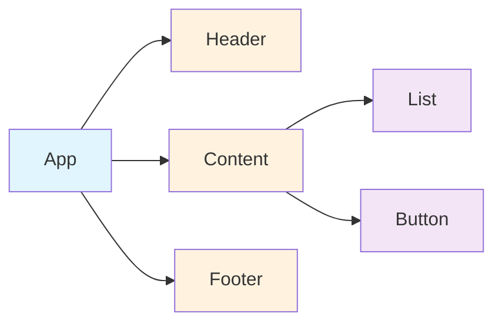

**问题**：递归一旦开始无法中断，大组件树会长时间阻塞主线程（>16ms 导致掉帧）。

### Fiber 的核心设计

Fiber 将组件树转换为 **单向链表**，每个节点包含三个指针：

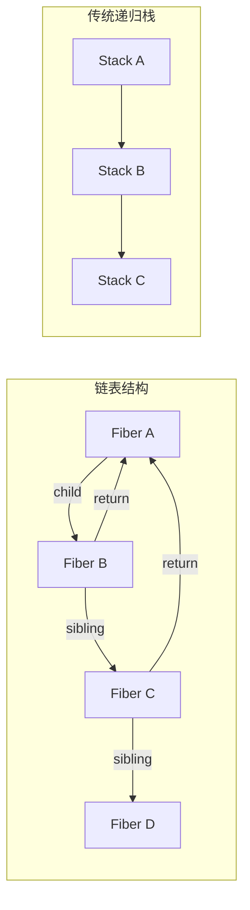

| 对比 | 递归栈 | Fiber 链表 |
|------|--------|------------|
| 中断能力 | ❌ 不可中断 | ✅ 可暂停/恢复 |
| 优先级 | ❌ 无 | ✅ 可调度 |
| 复用状态 | ❌ 销毁重建 | ✅ 可复用 |
| 内存 | 栈帧自动管理 | 手动维护链表 |

### 核心机制：时间切片（Time Slicing）

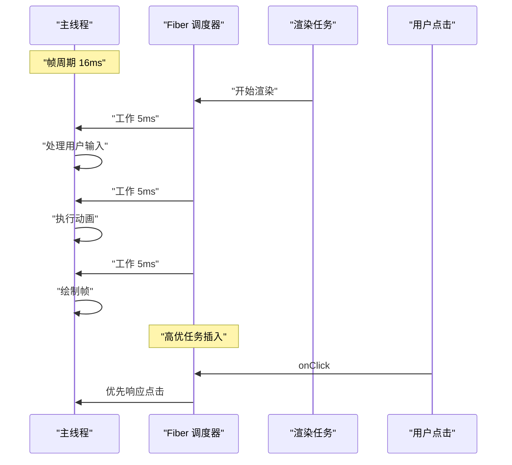

### 工作流程

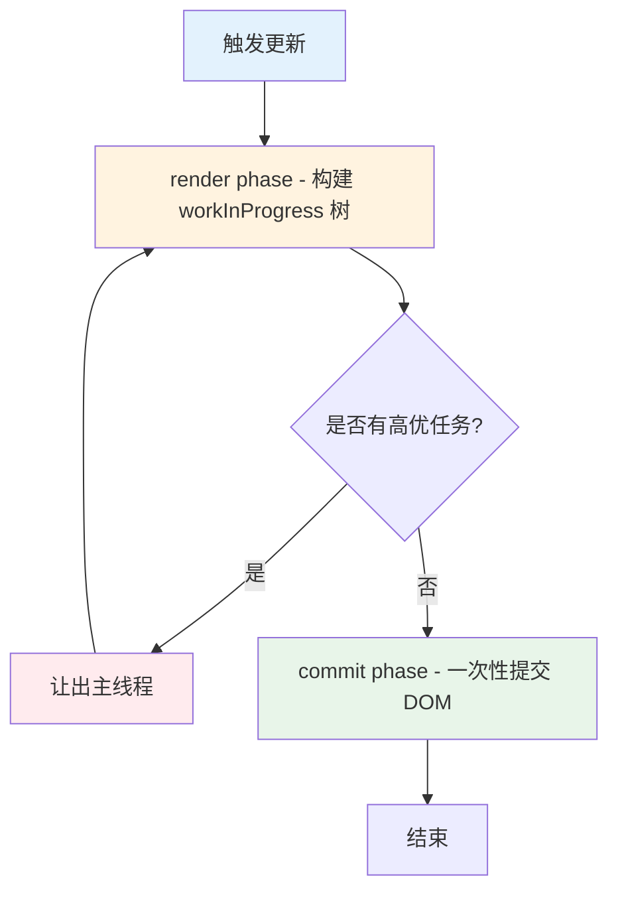

### Phase 深度对比：Render vs Commit

| 维度 | Render Phase | Commit Phase |
|------|-------------|--------------|
| **是否可中断** | ✅ 可中断（分片执行） | ❌ 不可中断（一次完成） |
| **执行时机** | 调度器控制，可延后 | Render 完成后立即执行 |
| **副作用** | 无 DOM 操作 | DOM 操作、生命周期、Effect |
| **树操作** | 构建 workInProgress 树 | current 指针切换 |
| **调用函数** | `render()`, `shouldComponentUpdate` | `componentDidMount`, `useEffect` |

---

## 面试加分点

React Fiber 的核心目标：

> **将"不可中断的同步渲染"变成"可调度的异步渲染"。**

与 Vue 的区别：
- Vue 使用 **模板编译 + 静态标记** 在编译时优化，不需要 Fiber
- React 使用 **JSX 运行时 + Fiber 调度**，运行时动态优化
- Vue 3 的 `render` 函数 + Block Tree 也是一种类似思路，但粒度不同

### 更深层：React 为什么不走编译优化路线？

```
React 的设计哲学：    
├─ 保留 JSX 的灵活性（JavaScript 的全部表达能力）
├─ 编译优化需要约束模板语法（Vue/Svelte 的取舍）
├─ Fiber 是运行时方案，不影响开发者心智模型
└─ 代价：运行时开销更大 → 需要更复杂调度
     └─ 受益：开发者不需要学习模板 DSL
```

---

## 高频追问

### 1. Fiber 为什么用链表？

因为 **链表可以保存执行状态**：

```ts
// 递归无法中断
function render(vnode) {
  // 必须一次执行完
  render(vnode.child)
  render(vnode.sibling)
}

// Fiber 链表可以中断
function workLoop(fiber) {
  while (fiber && !shouldYield()) {
    fiber = performUnitOfWork(fiber)
  }
  // 下次调度从这里继续
}
```

### 2. workInProgress 和 current 两棵树？

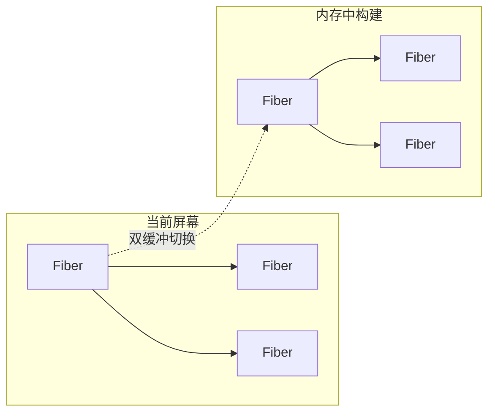

- **current 树**：当前屏幕上显示的 Fiber 树
- **workInProgress 树**：内存中构建的下一棵树
- **commit 阶段**：直接切换指针，完成双缓冲

> **双缓冲的核心价值**：构建过程中用户看到的始终是完整的 current 树，不会出现半渲染状态。

### 3. 优先级如何实现？

React 维护 **5 种优先级**：

```txt
Immediate  >  UserBlocking  >  Normal  >  Low  >  Idle
  点击事件       输入框          默认        预加载      Analytics
```

- 优先级高的任务可以 **打断** 低优先级任务
- 低优先级任务被 **丢弃或延后**
- 实现机制：`Scheduler` 模块维护 **最小堆（Min-Heap）** 任务队列

```ts
// 简化版调度器核心
const taskQueue = new MinHeap() // 按过期时间排序

function scheduleCallback(priorityLevel, callback) {
  const expirationTime = computeExpirationTime(priorityLevel)
  taskQueue.push({ callback, expirationTime })
  requestHostCallback(flushWork)
}

function flushWork() {
  while (taskQueue.size > 0) {
    const currentTask = taskQueue.peek()
    // 过期时间越短，优先级越高
    if (currentTask.expirationTime > getCurrentTime()) {
      // 任务未过期，让出主线程
      if (shouldYield()) break
    }
    const task = taskQueue.pop()
    task.callback()
  }
}
```

### 4. useEffect 和 useLayoutEffect 在 Fiber 中的区别？

- `useLayoutEffect`：在 **commit 阶段同步执行**（阻塞 paint）
- `useEffect`：在 **commit 后异步调度**（不阻塞 paint）

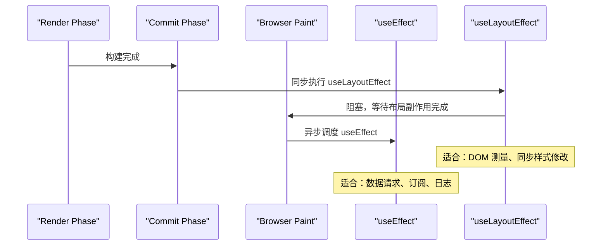

### 5. Concurrent Mode 带来了什么？

```txt
Concurrent Mode 的核心能力：
├─ 可中断渲染（Interruptible Rendering）
│   └─ 长任务可以被高优任务打断
├─ 自动批处理（Automatic Batching）
│   └─ 多个 setState 合并为一次更新
├─ 过渡（Transitions）
│   └─ startTransition 区分紧急/非紧急更新
├─ Suspense
│   └─ 声明式加载状态 + 嵌套 Suspense 边界
└─ useDeferredValue
    └─ 延迟更新非紧急状态
```

---

# 2. SSE 和 WebSocket 全面对比

## 标准答案

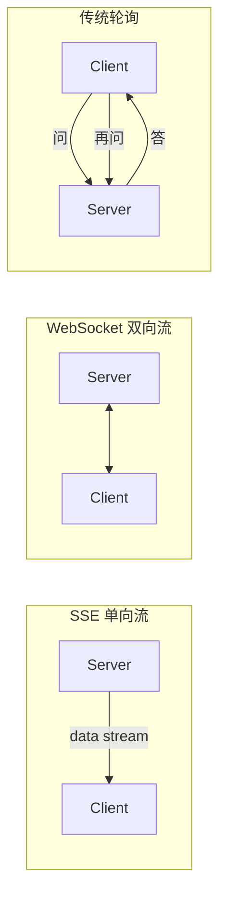

### 全面对比矩阵

| 对比维度 | SSE | WebSocket | 传统轮询 |
|----------|-----|-----------|---------|
| **通信方向** | 服务端 → 客户端（单向） | 双向 | 双向（请求-应答） |
| **底层协议** | HTTP（标准 HTTP 流） | ws/wss（独立协议） | HTTP |
| **协议开销** | 极低（HTTP 头部一次） | 中（握手 + 帧掩码） | 高（每次请求完整头部） |
| **自动重连** | ✅ 浏览器原生支持 `EventSource` | ❌ 需手动实现 | ❌ 需手动实现 |
| **数据格式** | 文本（UTF-8） | 文本 + 二进制 | 任何 HTTP 格式 |
| **最大连接数** | 浏览器限制 6 个/域名 | 无限制 | 无限制 |
| **实现复杂度** | 低 | 高 | 最低 |
| **自定义 Header** | ❌ EventSource 不支持 | ✅ 支持 | ✅ 支持 |
| **跨域** | 需 CORS 配置 | 协议本身不限 | 需 CORS |
| **实时性** | 高（流式） | 最高（全双工） | 低（取决于轮询间隔） |
| **服务端资源** | 低（HTTP 长连接） | 中（需维护状态） | 高（大量请求） |
| **浏览器兼容** | 现代浏览器 ✅ | 现代浏览器 ✅ | 全部 ✅ |
| **穿透防火墙** | ✅ HTTP 协议 | ❌ 可能被拦截 | ✅ HTTP 协议 |

### SSE 本质

```http
GET /api/logs HTTP/1.1
Accept: text/event-stream

HTTP/1.1 200 OK
Content-Type: text/event-stream

data: {"message": "log line 1"}

data: {"message": "log line 2"}
```

SSE 就是 **HTTP 长连接 + 流式响应**，浏览器解析 `text/event-stream` 格式。

### SSE 协议格式详解

```txt
SSE 协议格式：
────────────────────────────────
data: 消息内容\n\n          ← 简单消息
data: 第一行\n              ← 多行消息
data: 第二行\n\n

event: custom\n             ← 自定义事件
data: 消息内容\n\n

id: 123\n                   ← 消息 ID（断线重连时自动发送 Last-Event-ID）
data: 消息内容\n\n

retry: 5000\n\n             ← 服务端控制重连间隔（毫秒）

: 注释内容\n\n              ← 注释行（被浏览器忽略）
────────────────────────────────
```

---

## 项目结合回答

### 日志流 → 选 SSE

```
日志流的特征：
  ├─ 单向：服务端产生 → 客户端消费
  ├─ 高频：每秒可能数百条
  ├─ 无需客户端回传
  └─ 需要自动重连（网络抖动频繁）
                   
                 ↓
            选 SSE ✅
        EventSource 自带重连
        浏览器自动解析数据
        资源消耗更低
```

### 告警系统 → 选 WebSocket

```
告警系统的特征：
  ├─ 双向：需要 ACK 确认
  ├─ 需要心跳保活（检测设备离线）
  ├─ 需要双向交互（抑制/确认/升级）
  └─ 可能包含二进制数据
                   
                 ↓
            选 WebSocket ✅
        自定义心跳机制
        双向消息推送
        支持二进制帧
```

---

## 追问：SSE 怎么断线重连？

`EventSource` 默认自动重连，但可以加上**指数退避**：

```ts
// 浏览器默认行为 - 连接断开后自动重连
const es = new EventSource('/api/logs')

// 重连事件
es.addEventListener('error', () => {
  console.log('连接断开，浏览器会自动重连')
  // EventSource 默认 3 秒后重试
})

// 服务端可以控制重连延迟
// 发送: retry: 5000\n\n
```

服务端控制重连间隔：

```go
// Go 服务端控制重连时间
fmt.Fprintf(w, "retry: %d\n\n", 5000) // 5 秒后重试
```

### 追问 2：SSE 有什么缺点？

```
缺点：
├─ 单向通信：只能服务端→客户端
├─ 只支持文本：无法传输二进制
├─ 浏览器连接数限制：同域名最多 6 个
├─ EventSource 不支持自定义 Header（无法带 token）
└─ IE 不支持（Polyfill 方案：用 fetch + ReadableStream 模拟）
                
                    ↓

  解决方案：
  ├─ 连接数限制 → 域名分发（log1.example.com / log2.example.com）
  ├─ 自定义 Header → 使用 fetch API 手动解析 text/event-stream
  └─ IE 兼容 → 降级为轮询（或告知客户升级浏览器）
```

### 如何用 fetch 替代 EventSource（解决 Header 问题）

```ts
async function createSSE(url: string, token: string, onMessage: (data: string) => void) {
  const response = await fetch(url, {
    headers: { Authorization: `Bearer ${token}` }
  })
  
  const reader = response.body!.getReader()
  const decoder = new TextDecoder()
  let buffer = ''
  
  while (true) {
    const { done, value } = await reader.read()
    if (done) break
    
    buffer += decoder.decode(value, { stream: true })
    const lines = buffer.split('\n')
    buffer = lines.pop() || ''
    
    for (const line of lines) {
      if (line.startsWith('data: ')) {
        onMessage(line.slice(6))
      }
    }
  }
}

// 使用示例
createSSE('/api/events', 'your-token', (data) => {
  console.log('收到数据:', data)
})
```

### 追问 3：WebSocket 如何保证消息可靠性？

```txt
WebSocket 本身不保证消息可靠性！
需要应用层协议保障：
├─ ACK 机制：客户端收到消息后发送确认
├─ 消息序列号：检测丢包和乱序
├─ 重传机制：超时未 ACK 则重发
├─ 心跳检测：ping/pong 检测连接健康
└─ 离线缓存：断线期间消息存队列，重连后补发
```

---

# 3. RxJS 操作符体系化理解

## 核心区别：为什么需要不同的 Map 操作符？

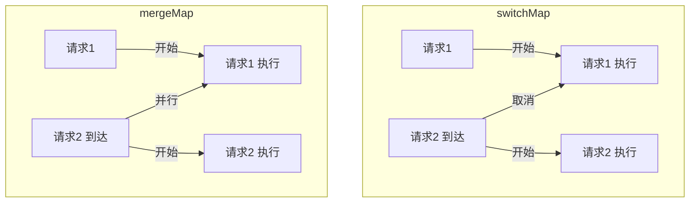

### 四大家族对比

| 操作符 | 行为 | 适合场景 | 内部实现 |
|--------|------|----------|---------|
| `switchMap` | 新请求 **取消** 旧请求 | 搜索框、Token 刷新 | 订阅新 Observable 前 `unsubscribe` 旧的 |
| `mergeMap` | 新请求 **并行** 旧请求 | 批量请求、并发任务 | 每个值创建内部订阅，共存 |
| `concatMap` | 新请求 **排队** 旧请求 | 顺序写入、文件上传 | 维护队列，前一个完成再处理下一个 |
| `exhaustMap` | 新请求 **忽略**（旧完成前） | 登录/提交按钮防抖 | 正在执行中就丢弃新的 |

### 常见高级 Map 操作符

```txt
switchMap vs debounceTime + map:
├─ debounceTime + map: 先防抖再映射，只能控制"请求发起时机"
├─ switchMap: 不仅能延时，还能取消在途请求
└─ 搜索场景：switchMap 更优，因为可以直接取消慢响应

mergeMap + concurrent 参数:
├─ mergeMap(fn, 3): 限制最大并发 3 个
├─ 对比 Promise.all: 所有请求同时发出
├─ 对比 Promise.allSettled: 不因个别失败而整体失败
└─ 适用: 批量上传文件(控制并发避免带宽打满)
```

### switchMap（取消旧请求）

```ts
// 搜索框：每次输入取消上一次请求
searchInput.valueChanges.pipe(
  debounceTime(300),
  switchMap(keyword => this.api.search(keyword))
  // 如果 keyword 变了，上一次请求自动取消
).subscribe()
```

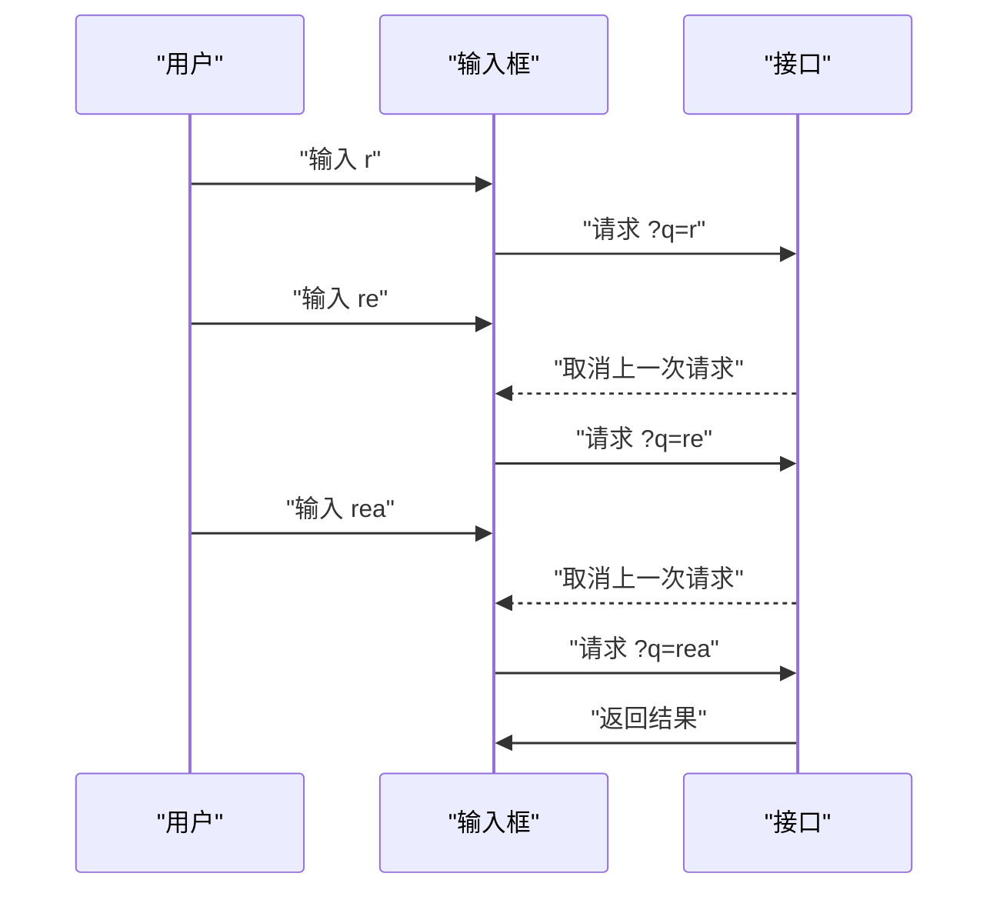

### mergeMap（并行执行）

```ts
// 批量请求：同时获取多个详情
ids$.pipe(
  mergeMap(ids => forkJoin(
    ids.map(id => this.api.getDetail(id))
  )),
  // 控制并发数
  // mergeMap(fn, concurrent: 3)
).subscribe()
```

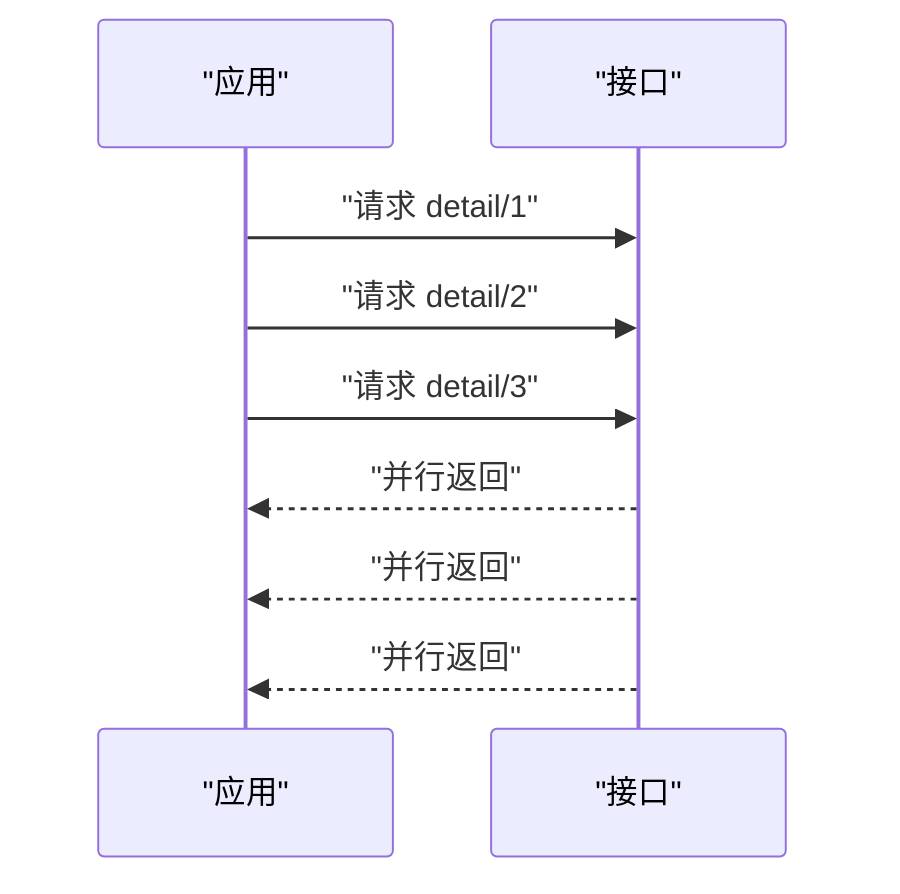

### concatMap（排队执行）

```ts
// 顺序上传文件
fileUpload$.pipe(
  concatMap(file => this.api.upload(file))
  // 前一个上传完成 → 再上传下一个
).subscribe()
```

### exhaustMap（忽略新请求）

```ts
// 提交按钮：防重复点击
submitBtn.click$.pipe(
  exhaustMap(() => this.api.submit(formData))
  // 请求完成前，忽略后续点击
).subscribe()
```

---

## 面试加分回答

### 双 Token 刷新为什么必须用 switchMap？

```ts
// ❌ 错误：用 mergeMap
intercept(req, next) {
  return next.handle(req).pipe(
    catchError(err => {
      if (err.status === 401) {
        return this.refreshToken().pipe(
          mergeMap(newToken => { // 并发刷新！
            // 3 个请求同时 401 → 并发刷新 3 次
            // 最后一次覆盖前面的 token
            // 前两次的请求携带了过期 token
            return next.handle(addToken(req))
          })
        )
      }
    })
  )
}
```


```ts
// ✅ 正确：用 switchMap
intercept(req, next) {
  return next.handle(req).pipe(
    catchError(err => {
      if (err.status === 401) {
        return this.refreshToken().pipe(
          switchMap(newToken => { // 只有一个刷新请求
            return next.handle(addToken(req))
          })
        )
      }
    })
  )
}
```

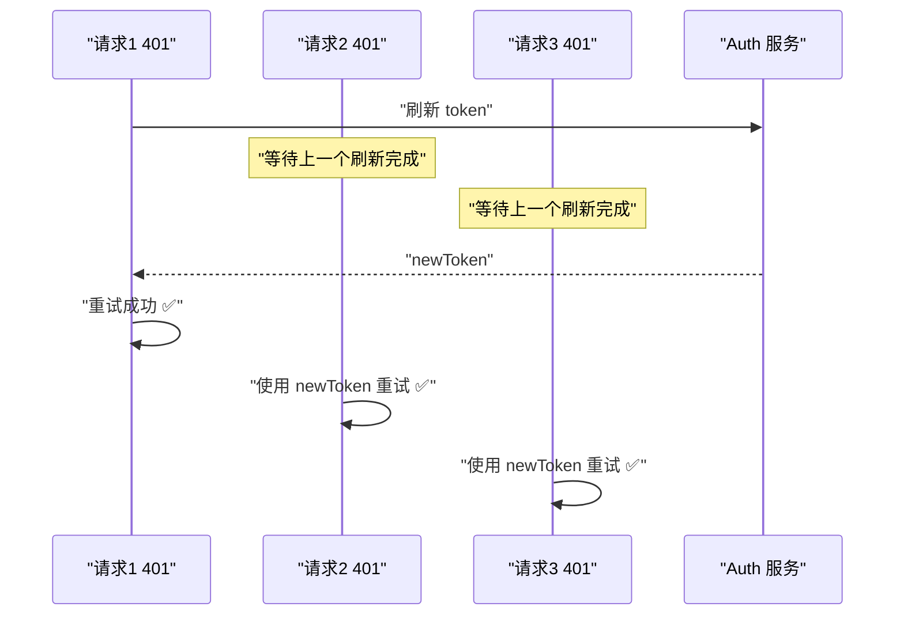

### 追问：为什么不直接用 Subject + share？

```ts
// 更优雅的方式：shareReplay
private refresh$ = this.http.post('/auth/refresh', {}).pipe(
  shareReplay(1) // 共享结果，多个订阅只执行一次
)

intercept(req, next) {
  return next.handle(req).pipe(
    catchError(err => {
      if (err.status === 401) {
        return this.refresh$.pipe(
          switchMap(newToken => next.handle(addToken(req)))
        )
      }
    })
  )
}
```

---

# 4. 虚拟列表：从原理到工业级实现

## 核心认知

> **虚拟列表不是优化"数据"，而是减少"DOM 数量"。**

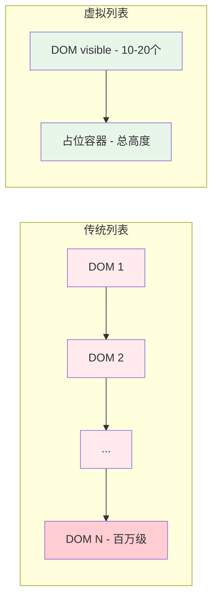

### 为什么多 DOM 会卡？

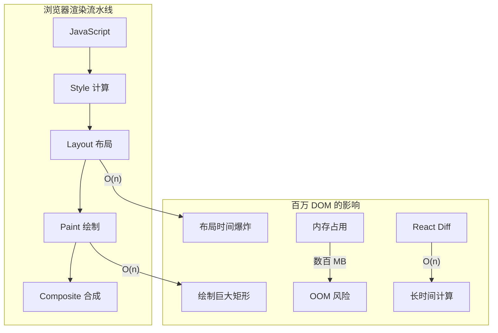

### 具体瓶颈分析

| 瓶颈 | 原因 | 影响 |
|------|------|------|
| **Layout（回流）** | 每个 DOM 位置需要计算 | 万级 => 几十 ms，百万 => 几秒 |
| **Paint（绘制）** | 将 DOM 绘成位图 | GPU 内存暴涨 |
| **Memory（内存）** | DOM 对象本身占用 | 每个 DOM ~4KB，百万 => 4GB |
| **Diff（协调）** | React 需要遍历所有节点 | 1000 个节点约 1ms，10 万 => 100ms |

### 虚拟列表原理

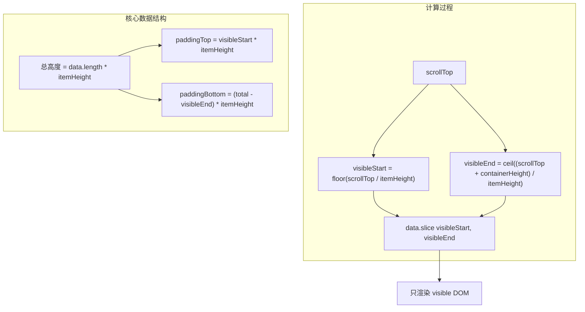

```ts
// 核心计算
function getVisibleRange(scrollTop: number, containerHeight: number, itemHeight: number, total: number) {
  const visibleStart = Math.floor(scrollTop / itemHeight)
  const visibleEnd = Math.ceil((scrollTop + containerHeight) / itemHeight)
  
  return {
    start: Math.max(0, visibleStart - overscan),   // overscan 额外渲染几项
    end: Math.min(total, visibleEnd + overscan),    // 防止白屏
    totalHeight: total * itemHeight,                // 容器总高度
    offset: visibleStart * itemHeight               // 偏移量
  }
}
```

### 为什么叫"虚拟"列表？

- **"虚拟"** = 在内存中维护完整列表
- **"真实"** = 只渲染可视区域
- 用户 **感知** 到的是完整列表（滚动条高度正确）
- 浏览器 **实际** 只处理少量 DOM

---

## 进阶：虚拟列表 + 变高元素

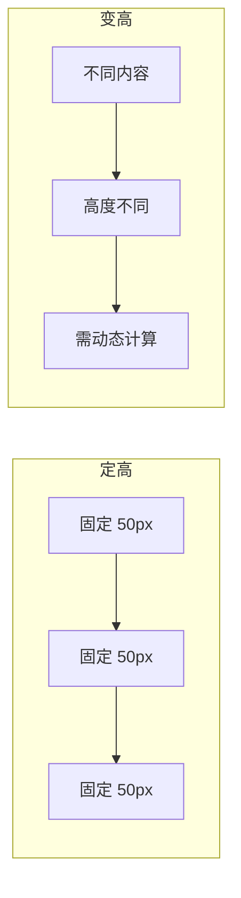

### 变高解决方案对比

| 方案 | 原理 | 复杂度 | 精度 | 适用场景 |
|------|------|--------|------|---------|
| **预估 + 校正** | 先给固定预估高度，渲染后更新实际值 | 低 | 中等 | 聊天记录、动态内容 |
| **二分查找定位** | 维护已渲染元素的真实位置数组 | 中 | 高 | 日志列表 |
| **动态测量缓存** | 用 `ResizeObserver` 监听高度变化 | 高 | 最高 | 富文本、图片列表 |

```ts
// 变高虚拟列表核心
class VariableHeightVirtualList {
  private heights: Map<number, number> = new Map()  // 存储每个元素的真实高度
  private positions: number[] = [0]                  // 存储每个元素的位置偏移
  
  getTotalHeight(): number {
    return this.positions[this.positions.length - 1] ?? 0
  }
  
  findStartIndex(scrollTop: number): number {
    // 二分查找：找到第一个 > scrollTop 的位置
    let left = 0, right = this.positions.length - 1
    while (left < right) {
      const mid = (left + right) >> 1
      if (this.positions[mid] <= scrollTop) {
        left = mid + 1
      } else {
        right = mid
      }
    }
    return left - 1
  }
  
  updateHeight(index: number, height: number) {
    const diff = height - (this.heights.get(index) ?? DEFAULT_HEIGHT)
    // 更新后续所有位置
    for (let i = index + 1; i < this.positions.length; i++) {
      this.positions[i] += diff
    }
    this.heights.set(index, height)
  }
}
```

### 工业级虚拟列表需要考虑的问题

```
├─ 滚动容器篇
│   ├─ 是 window 滚动还是 div 滚动？
│   └─ 滚动事件节流（passive: true 改善滚动性能）
│
├─ 缓存策略篇
│   ├─ 已渲染组件缓存（keep alive）
│   ├─ 状态保持（input 输入内容不丢失）
│   └─ O(1) 索引映射
│
├─ 滚动恢复篇
│   ├─ 回到顶部/滚动到指定索引
│   ├─ 数据变化后保持滚动位置
│   └─ 列表刷新后保持可视区域不变
│
├─ 边缘情况篇
│   ├─ 快速滚动时的白屏处理
│   ├─ 动态插入/删除中间元素
│   ├─ 元素高度变化（resize）
│   └─ 列表方向（水平/垂直/网格）
│
└─ 性能指标篇
    ├─ 首次渲染时间
    ├─ 滚动帧率（60fps）
    ├─ 内存占用峰值
    └─ 滚动延迟（从事件到渲染）
```

---

# 5. Angular OnPush 原理与变更检测体系

## 变更检测机制全景理解

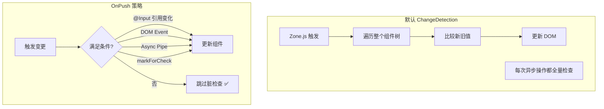

| 触发条件 | Default | OnPush |
|----------|---------|--------|
| `@Input` 值变化（引用） | ✅ 检查 | ✅ 检查 |
| `@Input` 值变化（内部改变） | ✅ 检查 | ❌ 跳过 |
| DOM 事件（click/input） | ✅ 检查 | ✅ 检查 |
| `async` pipe 新值 | ✅ 检查 | ✅ 检查 |
| `markForCheck()` | ✅ 检查 | ✅ 检查 |
| setTimeout/setInterval | ✅ 检查 | ❌ 跳过 |
| HTTP 请求完成 | ✅ 检查 | ❌ 跳过 |
| Observable 不通过 async pipe | ✅ 检查 | ❌ 跳过 |

### 为什么 OnPush 能优化？

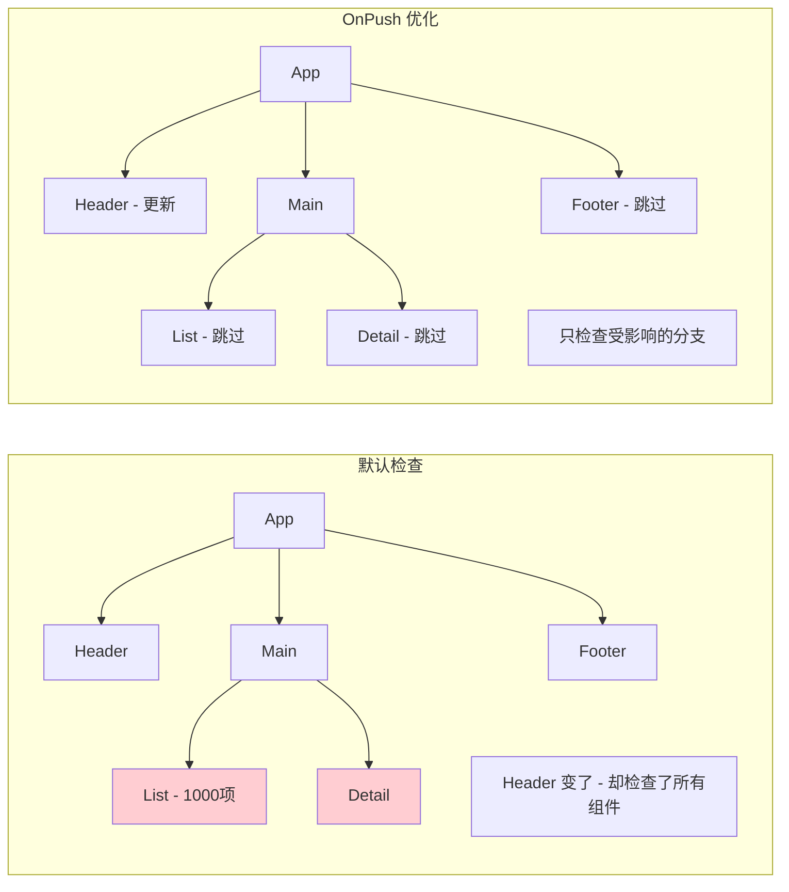

### Zone.js 的工作原理

```txt
Zone.js 是一个"猴子补丁"机制：
├─ 拦截所有异步 API（setTimeout、addEventListener、XMLHttpRequest...）
├─ 异步操作完成后通知 Angular 进行变更检测
├─ 每个 Angular 应用有一个"Angular Zone"
└─ 可以创建"脱离 Angular Zone"的自定义 Zone（runOutsideAngular）

性能问题：Zone.js 无法区分"谁变了"
├─ 任何异步操作 → 触发全量检测
├─ 即使是不影响 UI 的异步操作
└─ 所以需要 OnPush 来精确定位
```

---

## 面试加分点

### OnPush + 不可变数据

```ts
// ❌ 错误：改变数组内部
@Component({ changeDetection: ChangeDetectionStrategy.OnPush })
class ListComponent {
  @Input() items: string[]

  addItem(item: string) {
    this.items.push(item) // 引用没变，OnPush 不检测！
  }
}

// ✅ 正确：创建新引用
@Component({ changeDetection: ChangeDetectionStrategy.OnPush })
class ListComponent {
  @Input() items: string[]

  addItem(item: string) {
    this.items = [...this.items, item] // 新数组，新引用
  }
}
```

### OnPush 类似 React.memo

| 对比 | React.memo | Angular OnPush |
|------|------------|----------------|
| 触发机制 | Props 浅比较 | @Input 引用变化 |
| 跳过渲染 | ✅ | ✅ |
| 强制更新 | `forceUpdate()` | `markForCheck()` |
| 默认行为 | 不是默认 | 需手动配置 |
| 深层比较 | ❌ 默认浅比较 | ❌ 默认浅比较 |
| 子组件影响 | 仅自身 | 子组件也会跳过 |

### Angular 17+ 的 Signal 变更检测（未来趋势）

```ts
// Signal 组件：无需 Zone.js，更精确的变更检测
@Component({
  template: `
    <div>{{ count() }}</div>  <!-- Signal 自动追踪依赖 -->
    <button (click)="increment()">+1</button>
  `
})
class CounterComponent {
  count = signal(0)
  
  increment() {
    this.count.update(v => v + 1)
    // 只有这个组件更新，无需 Zone.js 全量检测
  }
}
```

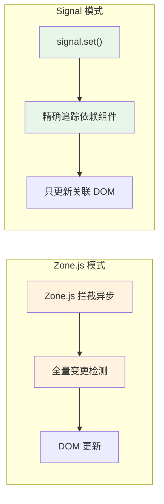

---

# 6. JWT 安全体系详解

## 核心问题

> **JWT 本身是安全的，不安全的是存储方式。**

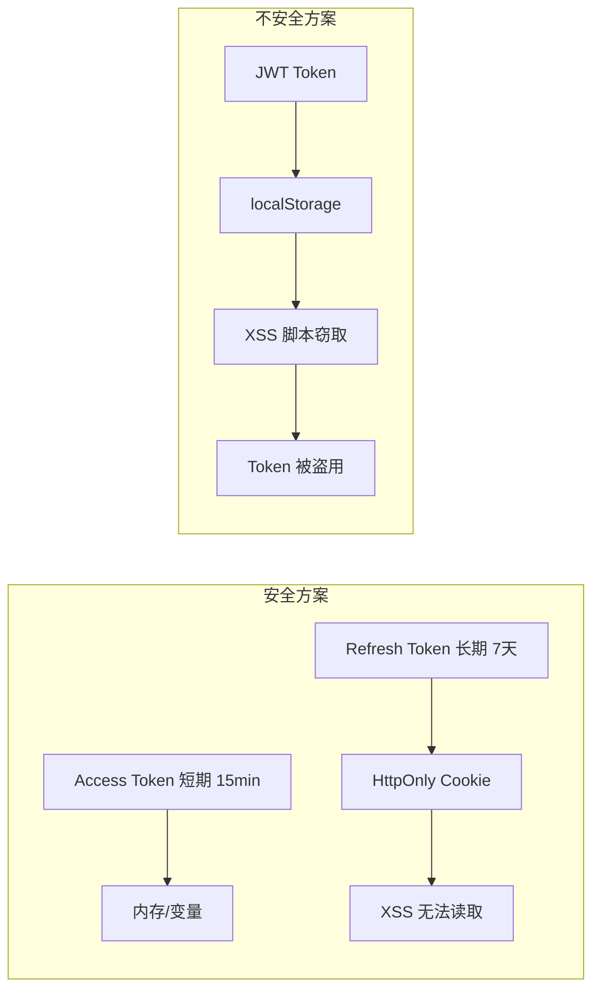

### JWT Token 结构

```txt
JWT = Header.Payload.Signature
                      ↓
eyJhbGciOiJIUzI1NiIsInR5cCI6IkpXVCJ9.
eyJzdWIiOiIxMjM0NTY3ODkwIn0.
doZjgSg4SA1sXzYq8s0E4P0GQ0A

Header:   { "alg": "HS256", "typ": "JWT" }       → Base64URL
Payload:  { "sub": "user123", "iat": 1516239022 } → Base64URL
Signature: HMACSHA256(base64UrlEncode(header) + "." + base64UrlEncode(payload), secret)
```

### 常见 JWT 攻击手法

| 攻击类型 | 原理 | 防御 |
|----------|------|------|
| **alg: none** | 修改 header 为 `{"alg":"none"}`，绕过签名验证 | 服务端拒绝 `alg: none` |
| **RS256 → HS256 混淆** | 用公钥作为 HMAC 密钥签名（如果服务端用公钥验证 HMAC） | 固定算法，不信任客户端算法 |
| **暴力破解 secret** | 弱密钥离线爆破 | 使用高熵密钥，定期轮换 |
| **信息泄露** | Payload 仅 Base64 编码，非加密 | 不放敏感信息在 Payload |
| **Token 劫持** | XSS/中间人窃取 | 短期 + HTTPS + HttpOnly |
| **Token 重放** | 截获 Token 重复使用 | Refresh Token Rotation |

### 攻击链路

```mermaid
sequenceDiagram
  participant User as "用户"
  participant App as "应用"
  participant Attacker as "攻击者"
  participant Browser as "浏览器存储"
  participant ApiServer as "服务器"
  
  User->>App: "访问页面"
  Note over App: "XSS 脚本注入"
  Attacker->>App: "执行恶意脚本"
  App->>Browser: "读取 token"
  App->>Attacker: "发送 token 到攻击服务器"
  Attacker->>ApiServer: "使用窃取的 token"
  ApiServer->>Attacker: "返回用户数据"
```

---

## 正确安全方案

```mermaid
flowchart TD
  Login["登录"] --> LoginAPI["Login API"]
  LoginAPI --> Return["返回 access + refresh"]
  Return --> Store["存储策略"]
  
  Store --> AccessMem["access_token 内存变量或 sessionStorage"]
  Store --> RefreshCookie["refresh_token HttpOnly Cookie Secure+SameSite"]
  
  AccessMem --> Request["发起 API 请求"]
  RefreshCookie --> Expired{"access 过期?"}
  Expired -->|"是"| Refresh["refresh - Cookie自动携带"]
  Refresh --> NewAccess["新 access_token 到内存"]
  NewAccess --> Request
  Expired -->|"否"| Request
  
  Request --> API["后端校验 access"]
  API --> Valid{"是否有效?"}
  Valid -->|"是"| Data["返回数据"]
  Valid -->|"否"| Expired
```

### 多层防御

```
第一层：XSS 防御
├─ CSP（Content Security Policy）
├─ 输入过滤 / 输出转义
└─ 避免 dangerouslySetInnerHTML / innerHTML

第二层：Token 安全
├─ access_token：短期（15min）+ 内存存储
├─ refresh_token：HttpOnly + Secure + SameSite
└─ 刷新接口限流防刷

第三层：传输安全
├─ HTTPS 全站
└─ 前端不能操作 refresh_token
```

### Refresh Token Rotation（RTR）

```txt
为什么需要 RTR？
├─ 每次刷新时颁发新的 refresh_token
├─ 旧的 refresh_token 立即失效
├─ 如果 refresh_token 被盗用：
│   ├─ 攻击者使用 refresh_token 获取新 token
│   ├─ 合法用户使用"已用过"的 refresh_token 会失败
│   └─ 服务端检测到"已用过的 token 被再次使用"→ 发出告警
│
└─ 典型的令牌盗窃检测机制

RTR 流程：
┌────────────────────────────────────────┐
│ 1. 用户使用 refresh_token_A 换新 token  │
│ 2. 服务端颁发 refresh_token_B           │
│ 3. refresh_token_A 失效                 │
│ 4. 如果 refresh_token_A 再次被使用      │
│    → 令牌被盗告警                       │
│    → refresh_token_B 也立即失效         │
│    → 用户需要重新登录                   │
└────────────────────────────────────────┘
```

---

# 7. WebSocket 性能问题与优化体系

## 根本原因

> **不是 WebSocket 卡，是 UI 渲染跟不上消息速度。**

```mermaid
flowchart LR
  subgraph "消息洪峰"
    M1["msg 1"] --> M2["msg 2"] --> M3["msg 3"]
    M3 --> M4["msg ..."]
    M4 --> MN["msg N - 每秒数百条"]
  end
  
  subgraph "浏览器帧"
    F1["帧1 - 16ms"] --> F2["帧2 - 16ms"]
    F2 --> F3["掉帧"]
    F3 --> F4["卡顿"]
  end
  
  subgraph "结果"
    R1["消息堆积"] --> R2["DOM 频繁更新"]
    R2 --> R3["Layout 抖动"]
    R3 --> R4["页面卡死"]
  end
```

### 消息处理 vs 渲染帧

```txt
WebSocket 事件队列：
  msg1 → msg2 → msg3 → ... → msg100 (10ms 内到达)
                                  ↓
                        每个 msg 触发 setState
                                  ↓
                        100 次 setState → 100 次脏检查
                                  ↓
                        同步执行 → 阻塞主线程 500ms
                                  ↓
                        用户操作被阻塞 ❌
```

---

## 优化方案

```mermaid
flowchart TD
  WS["WebSocket 消息"] --> Queue["消息队列 - 缓冲"]
  Queue --> Batch["批量处理 - 合并更新"]
  Batch --> RAF["requestAnimationFrame - 同步帧"]
  
  RAF --> Worker{"是否繁重计算?"}
  Worker -->|"是"| W["Web Worker - 后台线程"]
  Worker -->|"否"| Main["主线程更新"]
  W --> Main
  Main --> DOM["DOM 更新 - 一帧一次"]
  
  style WS fill:#e3f2fd
  style Queue fill:#fff3e0
  style RAF fill:#e8f5e9
  style W fill:#f3e5f5
```

### 方案深度对比

| 方案 | 原理 | 场景 | 效果 |
|------|------|------|------|
| **消息缓冲 + RAF** | 缓冲队列，每帧只批量处理一次 | 高频实时消息 | 从每消息一渲染 → 每帧一渲染 |
| **Web Worker** | 后台线程处理数据解析、格式化 | 大量计算（日志、数据转换） | 主线程不阻塞 |
| **虚拟列表** | 只渲染可视区域 | 消息列表、日志 | DOM 数量恒定 |
| **增量更新** | diff 后只变需要变的部分 | 复杂状态同步 | 减少重渲染范围 |
| **MessageChannel** | 微任务级别调度，比 RAF 更早执行 | 需要尽快处理但不要阻塞的事件 | 比 RAF 更及时 |

### 代码实现

```ts
// 1. 消息队列 + 节流
class MessageQueue {
  private buffer: Message[] = []
  private isScheduled = false

  push(msg: Message) {
    this.buffer.push(msg)
    if (!this.isScheduled) {
      this.isScheduled = true
      requestAnimationFrame(() => this.flush())
    }
  }

  private flush() {
    const batch = this.buffer.splice(0, this.buffer.length)
    // 一次 RAF 处理所有累积消息
    this.processBatch(batch)
    this.isScheduled = false
  }
}

// 2. Web Worker 处理数据
const worker = new Worker('log-worker.js')
worker.postMessage(rawLogs)
worker.onmessage = ({ data }) => {
  // 只在格式化后更新一次
  this.display(data)
}

// 3. 虚拟列表 + 增量追加
// 只维护可视区域的 DOM
```

### 效果对比

```txt
优化前：  msg → setState → msg → setState → ... → 卡顿
优化后：  msg → msg → ... → RAF → 批量 setState → 流畅
                      ↓
              16ms 窗口内合并
```

### 追问：WebSocket 连接数优化

```
一个页面多个 WebSocket 连接的问题：
├─ 每个连接占用一个 TCP 端口
├─ 浏览器限制同域名最大连接数
├─ 服务端维护大量长连接造成资源浪费
└─ 每个连接需要独立的心跳/Ping

解决方案：
├─ 连接复用：多个订阅复用同一个 WebSocket
│   └─ 消息协议增加 topic/channel 字段区分
├─ 连接池：按需创建连接，空闲回收
└─ 多路复用：一个 TCP 连接承载多个逻辑通道
```

---

# 8. Event Loop 与浏览器渲染（必问）

## 浏览器 Event Loop 完整机制

```mermaid
flowchart TD
  subgraph "宏任务队列"
    M1["script 整体"] --> M2["setTimeout"]
    M2 --> M3["setInterval"]
    M3 --> M4["I/O"]
    M4 --> M5["UI 渲染"]
  end
  
  subgraph "微任务队列"
    m1["Promise.then"] --> m2["MutationObserver"]
    m2 --> m3["queueMicrotask"]
    m3 --> m4["process.nextTick (Node)"]
  end
  
  ML["宏任务队列"] --> ET["执行一个宏任务"]
  ET --> MT["清空全部微任务"]
  MT --> UR{"是否需要渲染?"}
  UR -->|"是"| RP["渲染（Style→Layout→Paint）"]
  UR -->|"否"| ML
  
  style MT fill:#fff3e0
  style RP fill:#e8f5e9
```

### 执行顺序（必背）

```txt
一个完整的事件循环 Tick：
1. 执行一个宏任务（从宏任务队列取一个）
2. 执行所有微任务（清空微任务队列）
3. requestAnimationFrame（如果有）
4. 浏览器渲染（Style → Layout → Paint）
5. requestIdleCallback（如果空闲）
6. 回到步骤 1

关键结论：
├─ 微任务永远在宏任务之前执行
├─ requestAnimationFrame 在渲染之前执行
├─ requestIdleCallback 在渲染之后空闲时执行
└─ Promise.then 比 setTimeout(fn, 0) 先执行
```

### 经典面试题

```ts
console.log('1')                                   // 同步

setTimeout(() => console.log('2'), 0)              // 宏任务

Promise.resolve().then(() => {                     // 微任务
  console.log('3')
  Promise.resolve().then(() => console.log('4'))
})

queueMicrotask(() => console.log('5'))             // 微任务

requestAnimationFrame(() => {                      // 渲染前
  console.log('6')
})

async function async1() {
  console.log('7')                                  // 同步
  await async2()                                    // await 后面是微任务
  console.log('8')
}

async function async2() {
  console.log('9')                                  // 同步
}

async1()

// 输出顺序？
// 1, 7, 9, 3, 5, 4, 8, 6, 2
// 解析：
// 同步：1, 7, 9
// 微任务：3, 5, 4 (Promise.resolve().then + 链式), 8 (await 后面)
// RAF：6
// 宏任务：2
```

### async/await 内部的 Event Loop 机制

```ts
async function test() {
  console.log('A')          // 同步
  const result = await delay()
  // ✅ await 表达式右侧的函数是同步执行的
  // ✅ await 下面的代码被包装成 Promise.then（微任务）
  console.log('B')          // 微任务
}

// 等价于
function test() {
  console.log('A')
  return delay().then(() => {
    console.log('B')
  })
}
```

### requestAnimationFrame vs requestIdleCallback

| 对比 | requestAnimationFrame | requestIdleCallback |
|------|----------------------|---------------------|
| **执行时机** | 渲染之前，每一帧必然执行 | 渲染之后，空闲时执行 |
| **优先级** | 高（必须完成） | 低（不一定执行） |
| **参数** | 高精度时间戳 | IdleDeadline（剩余时间） |
| **适合场景** | 动画、DOM 更新 | 日志上报、非关键数据预计算 |
| **不执行场景** | 页面隐藏时暂停 | 不空闲时跳过一次 |

```ts
// RAF：保证帧率同步
function animate() {
  element.style.transform = `translateX(${pos}px)`
  pos += 10
  requestAnimationFrame(animate)
}

// RIC：利用空闲时间
function processData(deadline: IdleDeadline) {
  while (deadline.timeRemaining() > 0 && queue.length > 0) {
    const item = queue.shift()!
    heavyComputation(item)
  }
  if (queue.length > 0) {
    requestIdleCallback(processData)
  }
}
```

### Node.js Event Loop 与浏览器的区别

```txt
Node.js 的事件循环阶段（libuv）：
┌───────────────────────────┐
│         timers            │ ← setTimeout / setInterval 回调
├───────────────────────────┤
│     pending callbacks      │ ← 上一轮遗留的 I/O 回调
├───────────────────────────┤
│         idle, prepare      │ ← 内部使用
├───────────────────────────┤
│         poll               │ ← 轮询 I/O（核心阶段）
├───────────────────────────┤
│         check              │ ← setImmediate 回调
├───────────────────────────┤
│     close callbacks        │ ← close 事件（socket.on('close')）
└───────────────────────────┘

关键区别：
├─ 浏览器：宏任务 → 微任务 → 渲染
├─ Node.js：阶段 → 每个阶段之间清空微任务
├─ process.nextTick 优先级高于 Promise.then（Node 独有）
└─ setImmediate vs setTimeout(fn, 0)：取决于阶段
```

---

# 9. 浏览器渲染流水线（Critical Rendering Path）

## 完整流程

```mermaid
flowchart LR
  subgraph "构建阶段"
    HTML["HTML"] --> DOM["DOM Tree"]
    CSS["CSS"] --> CSSOM["CSSOM Tree"]
    DOM --> RenderTree["Render Tree"]
    CSSOM --> RenderTree
  end
  
  subgraph "布局阶段"
    RenderTree --> Layout["Layout - 计算几何信息"]
  end
  
  subgraph "绘制阶段"
    Layout --> Paint["Paint - 绘制像素"]
    Paint --> Composite["Composite - 合成层"]
  end
  
  style Layout fill:#fff3e0
  style Paint fill:#ffebee
  style Composite fill:#e8f5e9
```

### Layout 布局

Layout（也称为 Reflow/回流）计算元素的几何位置：

```
触发 Layout 的操作：
├─ 读取布局属性：offsetTop/Left/Width/Height
├─              scrollTop/Left/Width/Height
├─              clientTop/Left/Width/Height
├─              getComputedStyle()
├─              getBoundingClientRect()
├─ 修改布局属性：width/height/margin/padding
├─              display:none → block
├─              font-size/font-family 变化
├─              添加/删除 DOM
└─              窗口 resize

     ⚠️ 凡是需要"计算位置"的属性都会触发 Layout
```

### Paint 绘制

Paint 将元素绘制为像素位图：

```
触发 Paint 的操作：
├─ color/background-color/border-color
├─ box-shadow/outline
├─ border-radius
├─ background-image
└─ visibility: hidden → visible

     ⚠️ Paint 比 Layout 的代价小，但仍需避免频繁触发
```

### Composite 合成

```txt
Composite 只合成已绘制的图层：
├─ transform 和 opacity 的变化只触发 Composite
├─ 不触发 Layout 和 Paint
├─ 是性能最优的属性
└─ 适用于 60fps 动画

提升为合成层的条件：
├─ will-change: transform / opacity
├─ transform: translateZ(0)
├─ position: fixed
├─ video/canvas/iframe 标签
├─ filter 属性
└─ opacity < 1
```

### Layout Thrashing（布局抖动）

```ts
// ❌ 错误：强制同步布局（读写交替）
function badCode() {
  for (let i = 0; i < 1000; i++) {
    element.style.left = `${element.offsetLeft + 10}px`
    //   ↑ 写操作              ↑ 读操作（触发强制回流）
    // 每次循环都：读（强制回流） → 写 → 读（强制回流）→ 写
  }
}

// ✅ 正确：批量读取，批量写入
function goodCode() {
  const positions = []
  for (let i = 0; i < 1000; i++) {
    positions.push(element.offsetLeft)  // 读一次
  }
  for (let i = 0; i < 1000; i++) {
    element.style.left = `${positions[i] + 10}px`  // 写一次
  }
}
```

### CSS 动画性能金字塔

```txt
性能最好（只触发 Composite）：
├─ transform: translate/scale/rotate
├─ opacity
└─ will-change: transform

性能中等（触发 Paint + Composite）：
├─ background-color
├─ box-shadow
└─ clip-path

性能最差（触发 Layout + Paint + Composite）：
├─ width/height
├─ top/left
├─ margin/padding
├─ border-width
└─ font-size
```

### GPU 加速原理

```
GPU 为什么快？
├─ 位图并行处理（CPU：串行计算，GPU：并行像素）
├─ 合成层作为纹理上传 GPU
├─ 后续帧只需重新合成，无需重绘
└─ 但：合成层过多会占用 GPU 内存 → 反而变慢

大量使用 translateZ(0) 的弊端：
├─ 每个合成层占用额外内存（~几 MB）
├─ 合成层过多 → GPU 内存带宽瓶颈
├─ 滚动/动画时的重合成开销增大
└─ 移动端尤其明显（内存更小）
```

---

# 10. TypeScript 高级类型体系

## 核心工具类型实现

```ts
// Pick - 从 T 中选取 K 属性
type MyPick<T, K extends keyof T> = {
  [P in K]: T[P]
}

// Readonly - 所有属性只读
type MyReadonly<T> = {
  readonly [P in keyof T]: T[P]
}

// Partial - 所有属性可选
type MyPartial<T> = {
  [P in keyof T]?: T[P]
}

// Required - 所有属性必选
type MyRequired<T> = {
  [P in keyof T]-?: T[P]
}

// Record - 构造键值对类型
type MyRecord<K extends keyof any, V> = {
  [P in K]: V
}

// Exclude - 从联合类型 T 中排除 U
type MyExclude<T, U> = T extends U ? never : T

// Extract - 从联合类型 T 中提取 U
type MyExtract<T, U> = T extends U ? T : never

// Omit - 从 T 中排除 K 属性
type MyOmit<T, K extends keyof T> = {
  [P in Exclude<keyof T, K>]: T[P]
}

// NonNullable - 排除 null 和 undefined
type MyNonNullable<T> = T extends null | undefined ? never : T
```

### 条件类型与 infer

```ts
// 获取函数返回类型
type MyReturnType<T> = T extends (...args: any[]) => infer R ? R : never

// 获取函数参数类型
type MyParameters<T> = T extends (...args: infer P) => any ? P : never

// 获取实例类型
type MyInstanceType<T> = T extends new (...args: any[]) => infer R ? R : never

// 数组元素类型
type ArrayItem<T> = T extends (infer U)[] ? U : never

// Promise 展开
type Unwrap<T> = T extends Promise<infer U> ? Unwrap<U> : T
type Result = Unwrap<Promise<Promise<string>>> // string

// 联合类型转交叉类型（逆变位置推断）
type UnionToIntersection<T> = 
  (T extends any ? (x: T) => void : never) extends (x: infer U) => void ? U : never
type Test = UnionToIntersection<{ a: 1 } | { b: 2 }> // { a: 1 } & { b: 2 }
```

### 模板字面量类型

```ts
// 模板字面量类型
type EventName<T extends string> = `on${Capitalize<T>}`
type ClickEvent = EventName<'click'> // 'onClick'

// 字符串操作类型
type Upper = Capitalize<'hello'>        // 'Hello'
type Lower = Uncapitalize<'Hello'>     // 'hello'
type UpperAll = Uppercase<'hello'>     // 'HELLO'
type LowerAll = Lowercase<'HELLO'>     // 'hello'

// 字符串匹配与提取
type ExtractId<T extends string> = 
  T extends `/api/${infer Resource}/${infer Id}` ? Id : never
type Id = ExtractId<'/api/users/123'>  // '123'

// 路由参数自动推导
type RouteParams<T extends string> = 
  T extends `${string}:${infer Param}/${infer Rest}`
    ? Param | RouteParams<Rest>
    : T extends `${string}:${infer Param}`
      ? Param
      : never

type Params = RouteParams<'/users/:userId/posts/:postId'>
// 'userId' | 'postId'
```

### 递归类型

```ts
// 深度 Partial
type DeepPartial<T> = T extends object
  ? { [P in keyof T]?: DeepPartial<T[P]> }
  : T

// 深度 Readonly
type DeepReadonly<T> = T extends object
  ? { readonly [P in keyof T]: DeepReadonly<T[P]> }
  : T

// 深层路径提取
type DeepKeys<T> = T extends object
  ? { [K in keyof T]-?: K extends string | number
      ? `${K}` | `${K}.${DeepKeys<T[K]>}`
      : never
  }[keyof T]
  : never

type Obj = { a: { b: { c: string } } }
type Paths = DeepKeys<Obj> // 'a' | 'a.b' | 'a.b.c'
```

### 实用模式：品牌类型（Branded Type）

```ts
// 避免原始类型混淆
type Brand<T, B> = T & { __brand: B }

type UserId = Brand<string, 'UserId'>
type OrderId = Brand<string, 'OrderId'>

function getUser(id: UserId) {}
function getOrder(id: OrderId) {}

const uid = 'abc' as UserId
const oid = 'def' as OrderId

getUser(uid) // ✅
getUser(oid) // ❌ 类型错误
getUser('abc') // ❌ 类型错误
```

---

# 11. 前端性能优化体系

## Web Vitals 核心指标

```txt
Core Web Vitals（Google 排名因素）：
┌─────────────────────────────────────────────────────────────┐
│  LCP (Largest Contentful Paint)          ≤ 2.5s  ✅       │
│  最大内容绘制 - 加载性能                                   │
├─────────────────────────────────────────────────────────────┤
│  INP (Interaction to Next Paint)          ≤ 200ms ✅       │
│  交互到下一次绘制 - 交互响应（替代 FID）                    │
├─────────────────────────────────────────────────────────────┤
│  CLS (Cumulative Layout Shift)            ≤ 0.1   ✅       │
│  累计布局偏移 - 视觉稳定性                                 │
└─────────────────────────────────────────────────────────────┘

其他关键指标：
├─ TTFB (Time to First Byte)          ≤ 800ms  首字节时间
├─ FCP (First Contentful Paint)        ≤ 1.8s   首次内容绘制
├─ TBT (Total Blocking Time)           ≤ 200ms  总阻塞时间
└─ SI (Speed Index)                    ≤ 3.4s   速度指数
```

### 性能优化分层策略

```txt
第一层：加载优化（网络层）
├─ 资源压缩：Gzip/Brotli、图片 WebP/AVIF
├─ 缓存策略：强缓存（Cache-Control）+ 协商缓存（ETag）
├─ CDN 加速：静态资源 CDN，动态请求就近接入
├─ HTTP/2：多路复用、头部压缩、服务端推送
├─ 资源提示：preload（关键资源）/ prefetch（下一页面）/ preconnect（第三方）
└─ 代码分割：路由级懒加载、组件级动态导入

第二层：构建优化（打包层）
├─ Tree Shaking：消除死代码（ES Module 静态分析）
├─ Scope Hoisting：减少函数包裹，缩小体积
├─ 代码分割：SplitChunks 提取公共依赖
├─ 体积分析：webpack-bundle-analyzer 定位大模块
├─ 动态 Polyfill：根据浏览器特性按需加载 Polyfill
└─ 现代模式：同时输出 ES Module + Legacy 两份代码

第三层：渲染优化（运行时层）
├─ 虚拟列表：大量数据只渲染可视区域
├─ 懒加载：图片/组件按需加载（IntersectionObserver）
├─ 防抖节流：高频事件降频
├─ Web Worker：繁重计算后台执行
├─ RAF 批处理：渲染帧同步更新
├─ 不可变数据：方便变更检测和缓存
└─ 避免 Layout Thrashing：读写分离

第四层：缓存优化（数据层）
├─ HTTP 缓存：Service Worker 缓存策略（Cache First / Network First）
├─ 内存缓存：Map/WeakMap 缓存计算结果
├─ IndexedDB：大规模客户端数据存储
├─ 状态缓存：React Query / SWR 的缓存和预取
└─ 预加载：预测用户行为，提前加载数据
```

### 性能测量与监控

```ts
// Performance API 测量
performance.mark('start-fetch')
fetch('/api/data').then(() => {
  performance.mark('end-fetch')
  performance.measure('fetch-time', 'start-fetch', 'end-fetch')
  
  const measures = performance.getEntriesByType('measure')
  console.log('Fetch 耗时:', measures[0].duration)
})

// Web Vitals 监控
import { onLCP, onINP, onCLS } from 'web-vitals'

onLCP(metric => sendToAnalytics(metric))
onINP(metric => sendToAnalytics(metric))
onCLS(metric => sendToAnalytics(metric))

// Long Tasks 监控
const observer = new PerformanceObserver(list => {
  for (const entry of list.getEntries()) {
    console.log('阻塞主线程的任务:', entry.duration, 'ms')
    // 上报长任务，定位卡顿来源
  }
})
observer.observe({ entryTypes: ['longtask'] })
```

### 性能优化 checklist

```
□ CSS 方面
  ├─ 使用 will-change 提前告知浏览器
  ├─ transform/opacity 代替 top/left 动画
  ├─ 避免 @import（阻塞并行下载）
  └─ 关键 CSS 内联（首屏）

□ JavaScript 方面
  ├─ 异步加载非关键 JS（defer/async）
  ├─ 使用 passive: true 的事件监听
  ├─ 大计算量使用 Web Worker
  └─ 避免强制同步布局

□ 图片方面
  ├─ 使用 AVIF/WebP 格式（带 fallback）
  ├─ 响应式图片（srcset + sizes）
  ├─ 懒加载（loading="lazy"）
  └─ 使用 CSS 代替图片（渐变/阴影等）

□ 网络方面
  ├─ 启用 Brotli 压缩
  ├─ 静态资源 CDN
  ├─ 使用 <link rel="preload"> 加载关键资源
  └─ 第三方脚本异步加载或延后
```

---

# 12. 构建工具体系（Webpack / Vite）

## Webpack vs Vite 核心对比

| 对比维度 | Webpack | Vite |
|----------|---------|------|
| **开发模式** | 打包所有模块 | 原生 ESM 按需编译 |
| **热更新** | 全量或局部重打 | 按模块 ESM 更新 |
| **冷启动** | 慢（需构建整个应用） | 快（无需打包） |
| **生产构建** | 基于 Webpack | 基于 Rollup |
| **配置复杂度** | 高 | 低 |
| **生态** | 成熟、插件丰富 | 快速增长中 |
| **浏览器支持** | 所有 | 现代浏览器（ESM） |

### Vite 为什么快？

```txt
开发环境加速原理：
├─ 利用浏览器原生 ESM 能力
│   ├─ 浏览器直接请求模块
│   ├─ 服务器只需转换当前请求的文件
│   └─ 不需要像 Webpack 那样打包成 bundle
│
├─ esbuild 预构建
│   ├─ 将 CommonJS 转为 ESM
│   ├─ 将多个内部模块合并（减少请求数）
│   └─ esbuild 是用 Go 写的，比 JS 打包快 10-100 倍
│
├─ 按需编译
│   ├─ 浏览器请求哪个模块才编译哪个
│   ├─ 不会编译未使用的模块
│   └─ 改动单个文件不影响其他文件
│
└─ Webpack 的传统做法
    ├─ 启动时构建整个应用
    ├─ 即使只改一行代码，也需要重新打包
    └─ 大项目冷启动需要 30s+
```

### Tree Shaking 原理

```ts
// Tree Shaking 依赖于 ES Module 的静态结构
// 为什么 CommonJS 不能 Tree Shaking？

// ES Module（静态分析） ✅
import { add } from './math' 
// 编译器可以在编译时确定：只使用了 add

// CommonJS（动态加载） ❌
const math = require('./math')
// 无法静态分析：math.add、math['add']、变量引用...

// Webpack Tree Shaking 条件：
// 1. ES Module 语法（import/export）
// 2. sideEffects: false（在 package.json 中声明）
// 3. 生产模式（mode: 'production'）
```

### 代码分割策略

```ts
// 路由级分割（推荐）
const UserPage = () => import('./pages/User')
const AdminPage = () => import('./pages/Admin')

// 组件级懒加载（按需加载）
const HeavyChart = React.lazy(() => import('./HeavyChart'))

// 第三方库分割（vendor 分离）
// webpack.config.js
splitChunks: {
  cacheGroups: {
    vendor: {
      test: /[\\/]node_modules[\\/]/,
      name: 'vendors',
      chunks: 'all',
      priority: 10
    },
    common: {
      minChunks: 2,
      chunks: 'all',
      priority: 5
    }
  }
}

// 预加载预获取（资源提示）
import(/* webpackPrefetch: true */ './next-page')
import(/* webpackPreload: true */ './critical-component')

// webpackPrefetch: 浏览器空闲时加载
// webpackPreload: 与父 chunk 并行加载
```

### Module Federation（微前端基石）

```ts
// 主应用 - 暴露组件
new ModuleFederationPlugin({
  name: 'shell',
  exposes: {
    './Header': './src/components/Header',
    './Footer': './src/components/Footer'
  },
  shared: {
    react: { singleton: true, requiredVersion: '^18.0.0' },
    'react-dom': { singleton: true }
  }
})

// 子应用 - 消费组件
new ModuleFederationPlugin({
  name: 'app1',
  remotes: {
    shell: 'shell@http://localhost:3000/remoteEntry.js'
  },
  shared: {
    react: { singleton: true },
    'react-dom': { singleton: true }
  }
})

// 使用
const Header = React.lazy(() => import('shell/Header'))
```

---

# 13. 状态管理设计模式

## 状态管理演化史

```mermaid
flowchart LR
  A["Flux（2014）"] --> B["Redux（2015）"]
  B --> C["MobX（2015）"]
  B --> D["Zustand（2019）"]
  C --> E["Valtio（2020）"]
  B --> F["Jotai/Recoil（2020）"]
  D --> G["Signal（2023 - Angular/React/Solid）"]
  
  style A fill:#fff3e0
  style B fill:#ffebee
  style G fill:#e8f5e9
```

### 设计模式对比

| 模式 | 代表库 | 核心思想 | 适合场景 |
|------|--------|---------|---------|
| **Flux/CQRS** | Redux, NgRx | 单向数据流 + 纯函数 Reducer | 复杂状态、协作编辑 |
| **Observable** | MobX, Valtio | 响应式代理 + 自动追踪 | 表单、实时数据 |
| **Atomic** | Jotai, Recoil | 原子状态 + 依赖图 | 中大型应用、微前端 |
| **Signal** | Angular Signals, Solid | 细粒度响应式 + 精确更新 | 高性能场景、框架底层 |

### Redux 异步中间件对比

| 中间件 | 原理 | 学习成本 | 测试性 | 适用场景 |
|--------|------|---------|-------|---------|
| **Redux Thunk** | Action 返回函数 | 低 | 中等 | 简单异步流程 |
| **Redux Saga** | Generator + 监听模式 | 高 | 好 | 复杂异步编排 |
| **Redux Observable** | RxJS + Epic | 高 | 好 | 需要 RxJS 能力 |
| **RTK Query** | 自动管理 API 缓存 | 低 | 好 | CRUD + 缓存 |


### 当 Signal 代替 Redux？

```txt
Signal 的优势场景：
├─ 高频更新（实时数据、拖拽、动画）
├─ 细粒度响应（不需要组件树 diff）
├─ 表单状态（每个字段独立更新）
└─ 框架内建（Angular、Solid、Vue、React experimental）

Redux 仍然有优势的场景：
├─ 复杂的状态流转（工作流、多步操作）
├─ 撤销/重做（时间旅行调试）
├─ 跨组件/跨应用状态共享
├─ 严格的单向数据流（可预测、可审计）
└─ 中间件生态（Saga 复杂异步编排）

结论：Signal 替代了 Redux 的"80% 场景"
但剩下的 20%（复杂状态逻辑）Redux 仍然不可替代
```

---

# 14. 微前端架构

## 主流方案对比

| 方案 | 隔离方式 | 通信机制 | 共享依赖 | 适用规模 |
|------|---------|---------|---------|---------|
| **Module Federation** | 运行时隔离 | 共享 Store / Event Bus | 原生支持 | 中大型 |
| **qiankun** | JS Sandbox + Shadow DOM | props / Event Bus | 预加载 | 企业级 |
| **single-spa** | 无内置隔离 | 自定义 | 需手动配置 | 通用 |
| **iframe** | 浏览器原生隔离 | postMessage | 不共享 | 简单集成 |

### Module Federation vs qiankun

```txt
Module Federation
├─ 优势
│   ├─ Webpack 官方方案，生态完善
│   ├─ 依赖共享机制完善（避免重复加载 React）
│   ├─ 子应用间可以互相暴露组件（不止页面级）
│   └─ 构建时确定依赖版本
├─ 劣势
│   ├─ 强依赖 Webpack 5
│   └─ 无运行时沙箱（样式冲突需自行处理）

qiankun
├─ 优势
│   ├─ 基于 single-spa，技术栈无关
│   ├─ 内置 JS Sandbox（Proxy 隔离）
│   ├─ 内置样式隔离（Shadow DOM / scoped）
│   └─ 支持 HTML 入口（无需改造子应用构建）
├─ 劣势
│   ├─ 通信机制相对原始
│   └─ 性能开销（沙箱有代理成本）
```

### 样式隔离方案

| 方案 | 原理 | 兼容性 | 性能 | 复杂度 |
|------|------|--------|------|--------|
| **Shadow DOM** | 浏览器原生 DOM 隔离 | 现代浏览器 ✅ | 好 | 低 |
| **CSS Scoped** | 属性选择器 + 前缀 | 好 | 好 | 中 |
| **CSS-in-JS** | 运行时生成唯一类名 | 好 | 中等 | 低 |
| **CSS Modules** | 构建时生成哈希类名 | 好 | 好 | 低 |
| **Namespace** | 手动添加前缀 | 全部 ✅ | 好 | 高 |

---

# 15. 前端安全体系

## XSS 攻击全解

### 三种 XSS 类型

| 类型 | 原理 | 例子 | 持久性 |
|------|------|------|--------|
| **反射型 XSS** | 恶意脚本在 URL 中，服务端直接返回 | `/?q=<script>alert(1)</script>` | 一次性 |
| **存储型 XSS** | 恶意脚本存储到数据库，每次访问触发 | 评论区提交恶意脚本 | 持久化 |
| **DOM 型 XSS** | 客户端 JS 直接操作 DOM 时注入 | `innerHTML = userInput` | 取决于来源 |

### XSS 防御矩阵

```
输入侧防御
├─ 输入验证：白名单校验（如仅允许数字、字母）
├─ 输入过滤：strip_tags、HTML 转义
└─ CSP：限制脚本执行来源

输出侧防御
├─ 上下文编码：HTML entity、JS 编码、URL 编码
├─ 框架自带防御：React 的 JSX 默认转义、Angular 的 DomSanitizer
└─ 避免危险 API：innerHTML、document.write、eval

传输侧防御
├─ Content-Type: text/plain（纯文本响应）
├─ X-Content-Type-Options: nosniff
└─ 响应编码：UTF-8 统一编码
```

### CSP（Content Security Policy）

```http
// 严格模式 CSP（推荐）
Content-Security-Policy:
  default-src 'self';
  script-src 'self' 'nonce-{random}' 'strict-dynamic';
  style-src 'self' 'unsafe-inline';
  img-src 'self' https://*.cdn.com;
  connect-src 'self' https://api.example.com;
  frame-ancestors 'none';
  form-action 'self';
  base-uri 'self';
  report-uri /csp-report;

// 解释：
// default-src 'self'         → 所有资源只允许同源
// script-src 'nonce-{random}' → 只有 nonce 匹配的内联脚本可执行
// strict-dynamic              → 信任由合法脚本动态加载的脚本
// frame-ancestors 'none'      → 防止点击劫持
// report-uri                  → 违规上报
```

### CSRF 攻击

```txt
CSRF 攻击原理：
├─ 用户已登录网站 A（Cookie 有效）
├─ 用户访问恶意网站 B
├─ B 自动发起向 A 的请求（跨站请求）
├─ 浏览器自动携带 A 的 Cookie
└─ A 服务端认为是合法用户操作

防御方案：
├─ SameSite Cookie（现代浏览器默认 Lax）
│   ├─ Strict：完全禁止跨站携带 Cookie
│   ├─ Lax：GET 等安全方法允许（默认）
│   └─ None：不限制（需 Secure）
├─ CSRF Token
│   ├─ 服务端生成 Token 嵌入页面
│   ├─ 每次请求携带 Token
│   └─ 攻击者无法获取页面内容 → 无法携带 Token
├─ 自定义 Header
│   ├─ 要求请求携带 X-Requested-With: XMLHttpRequest
│   └─ 攻击者无法跨域设置自定义 Header
└─ Referer/Origin 验证
    ├─ 检查请求来源
    └─ 但 Referer 可能被篡改/省略
```

---

# 16. 测试策略体系

## 测试金字塔

```mermaid
flowchart TD
  subgraph "E2E - 少量"
    E1["Cypress / Playwright"]
    E2["用户视角 - 核心流程"]
  end
  
  subgraph "集成测试 - 中等"
    I1["组件测试"]
    I2["API 测试"]
    I3["状态管理测试"]
  end
  
  subgraph "单元测试 - 大量"
    U1["纯函数"]
    U2["工具方法"]
    U3["Model/Reducer"]
  end
  
  U1 --> I1
  I1 --> E1
```

### 测试策略选择

| 测试类型 | 覆盖范围 | 运行速度 | 维护成本 | 推荐工具 |
|---------|---------|---------|---------|---------|
| **单元测试** | 函数/方法 | 最快（毫秒级） | 低 | Vitest / Jest |
| **组件测试** | 单个组件 | 快（秒级） | 中 | Testing Library |
| **集成测试** | 组件 + 服务 | 中（秒级） | 中 | Testing Library |
| **E2E 测试** | 完整功能 | 慢（分钟级） | 高 | Playwright / Cypress |
| **视觉回归** | UI 外观 | 慢 | 中 | Storybook + Chromatic |

### Mock 策略

```ts
// 1. 依赖注入（推荐 - 最灵活）
class UserService {
  constructor(private api: HttpClient) {}
  
  async getUsers() {
    return this.api.get('/users')
  }
}

// 测试时注入 mock
const mockApi = { get: vi.fn().mockResolvedValue([]) }
const service = new UserService(mockApi as any)

// 2. 模块级 Mock
vi.mock('./api', () => ({
  fetchUsers: vi.fn().mockResolvedValue([])
}))

// 3. 网络层 Mock（MSW - 推荐）
import { http, HttpResponse } from 'msw'

const handlers = [
  http.get('/api/users', () => {
    return HttpResponse.json([{ id: 1, name: 'Alice' }])
  })
]

// 测试代码无需感知 mock，与真实请求代码完全相同
```

### 测试原则

```txt
FIRST 原则：
├─ Fast（快速）：测试应该能快速运行
├─ Isolated（隔离）：测试不应互相依赖
├─ Repeatable（可重复）：任何环境运行结果一致
├─ Self-validating（自验证）：测试应自动判断通过/失败
└─ Timely（及时）：测试应在代码编写前后尽早编写

良好测试的特征：
├─ 不测试实现细节（测试行为，而非内部状态）
├─ 不测试第三方库
├─ 不测试框架机制（如生命周期钩子）
├─ 每个测试只验证一个行为
├─ 测试描述应该说明"什么场景下应该有什么行为"
└─ 代码覆盖 80% 足矣，100% 覆盖是陷阱
```

---

# 第二部分：项目深挖模拟面试（真实场景）

---

# 项目一：5GC 自动化测试平台

---

## 面试官：

你这个平台最大的技术难点是什么？

---

## 你的回答（推荐）

最大的难点是：**实时日志流 + 大规模自动化任务并发。**

```mermaid
flowchart TD
  subgraph "挑战"
    C1["200+ 测试任务 - 同时运行"] --> C2["每个任务 - 实时产生日志"]
    C2 --> C3["前端需要 - 秒级展示"]
    C3 --> C4["传统轮询 - QPS 太高"]
  end
  
  subgraph "解决方案"
    S1["SSE 日志流 - EventSource"] --> S2["Go 协程推流 - channel 管道"]
    S2 --> S3["前端缓冲队列 - requestAnimationFrame"]
    S3 --> S4["虚拟滚动 - 增量渲染"]
  end
```

---

## 继续说（核心）

为什么选 SSE：

```txt
日志是天然的单向数据流：
  Pod A 输出日志 → 服务端采集 → 推送到前端
                                                       
  选型对比：                  
  ├─ 轮询：HTTP 请求太频繁，K8s API 扛不住           
  ├─ WebSocket：双向能力浪费，复杂度高            
  └─ SSE：✅ 最合适
       ├─ 浏览器原生 EventSource，自动重连
       ├─ 基于 HTTP，兼容性最好（穿透防火墙）
       └─ 服务端实现简单（Content-Type: text/event-stream）
```

---

## 技术方案

```mermaid
sequenceDiagram
  participant Pod as "K8s Pod"
  participant Go as "Go 服务端"
  participant Client as "前端"
  
  Note over Go: "协程池管理 200+ 连接"
  Pod->>Go: "日志输出 stdout"
  Go->>Go: "channel 缓冲"
  Go->>Client: "SSE 推流"
  Client->>Client: "EventSource 接收"
  
  Note over Client: "消息队列缓冲"
  Client->>Client: "RAF 节流批量更新"
  Client->>Client: "虚拟列表渲染"
    
  Note over Client: "断线场景"
  Client-->>Go: "连接断开"
  Go->>Client: "EventSource 自动重连 ✅"
  Go->>Client: "从断点续推"
```

### 核心代码片段

```go
// Go 服务端：K8s 日志订阅 + SSE 推流
func (s *LogServer) StreamLogs(w http.ResponseWriter, r *http.Request) {
    w.Header().Set("Content-Type", "text/event-stream")
    w.Header().Set("Cache-Control", "no-cache")
    w.Header().Set("Connection", "keep-alive")
    
    podName := r.URL.Query().Get("pod")
    logChan := make(chan string, 100)
    
    // 启动协程订阅 K8s 日志
    go s.watchPodLogs(podName, logChan)
    
    for {
        select {
        case log := <-logChan:
            fmt.Fprintf(w, "data: %s\n\n", log)
            w.(http.Flusher).Flush()
        case <-r.Context().Done():
            return
        }
    }
}
```

```ts
// 前端：EventSource + 缓冲队列
class LogStream {
  private es: EventSource
  private buffer: string[] = []
  private isScheduled = false

  connect(url: string) {
    this.es = new EventSource(url)
    
    this.es.onmessage = (event) => {
      this.buffer.push(event.data)
      this.scheduleFlush()
    }
    
    this.es.onerror = () => {
      // EventSource 自动重连
      console.log('断开重连中...')
    }
  }

  private scheduleFlush() {
    if (this.isScheduled) return
    this.isScheduled = true
    
    requestAnimationFrame(() => {
      const batch = this.buffer.splice(0)
      this.virtualList.append(batch)
      this.isScheduled = false
    })
  }
}
```

---

## 最终效果

```
排障效率：    提升 50%  ← 实时日志秒级高亮
错误率：      下降 65%  ← 异常自动检测标注
自动化任务：  支撑 200+  ← Go 协程池管理
发布周期：    缩短 60%  ← CI/CD + K8s
```

---

## 可补充的技术深度点

```txt
架构层面的设计亮点：
├─ 连接管理
│   ├─ Go 协程池：限制最大协程数（200），避免资源耗尽
│   ├─ 协程泄漏防护：Context.WithTimeout 强制超时
│   └─ 优雅关闭：signal.Notify 捕获退出信号
│
├─ 日志缓冲策略
│   ├─ channel 带缓冲（100），满时丢弃而非阻塞
│   ├─ 客户端 window 不可见时暂停推流
│   └─ 日志分级：Error 级别立即推，Info 级别批量推
│
├─ 断线续传
│   ├─ 后端维护 Last-Event-ID
│   ├─ 重连时从断点续推
│   └─ 客户端缓存最后 1000 条（避免 UI 闪烁）
│
└─ 可观测性
    ├─ 每个 SSE 连接记录：连接时长、推送条数、错误次数
    ├─ Prometheus 指标暴露
    └─ Grafana 面板展示连接状态
```

---

# 面试官追问链路（非常真实）

---

## Q1：为什么不用 WebSocket？

### 回答重点：

```txt
因为日志是：
服务端 → 客户端 的单向数据流。

WebSocket 的"双向能力"在这个场景是浪费的：
├─ 客户端并不需要向服务端发送日志指令
├─ 日志内容不需要 ACK 确认（丢了就丢了）
└─ 唯一的控制（暂停/继续）可以用单独的 REST API

SSE 更轻：
├─ 基于 HTTP，无需额外协议握手
├─ 浏览器原生中断重连
└─ 资源开销更小（没有帧掩码、心跳等）
```

---

## Q2：SSE 有什么缺点？

```
缺点：
├─ 单向通信：只能服务端→客户端
├─ 只支持文本：无法传输二进制
├─ 浏览器连接数限制：同域名最多 6 个
├─ EventSource 不支持自定义 Header（无法带 token）
└─ IE 不支持（Polyfill 方案：用 fetch + ReadableStream 模拟）
                
                    ↓

  解决方案：
  ├─ 连接数限制 → 域名分发（log1.example.com / log2.example.com）
  ├─ 自定义 Header → 使用 fetch API 手动解析 text/event-stream
  └─ IE 兼容 → 降级为轮询（或告知客户升级浏览器）
```

### 如何用 fetch 替代 EventSource（解决 Header 问题）

```ts
async function createSSE(url: string, token: string, onMessage: (data: string) => void) {
  const response = await fetch(url, {
    headers: { Authorization: `Bearer ${token}` }
  })
  
  const reader = response.body!.getReader()
  const decoder = new TextDecoder()
  let buffer = ''
  
  while (true) {
    const { done, value } = await reader.read()
    if (done) break
    
    buffer += decoder.decode(value, { stream: true })
    const lines = buffer.split('\n')
    buffer = lines.pop() || ''
    
    for (const line of lines) {
      if (line.startsWith('data: ')) {
        onMessage(line.slice(6))
      }
    }
  }
}

// 使用示例
createSSE('/api/events', 'your-token', (data) => {
  console.log('收到数据:', data)
})
```

---

## Q3：日志很多为什么不卡？

```
核心防线三层：
                
第一层：消息缓冲
├─ 所有日志先进入 buffer
└─ 不直接触发更新
                
第二层：RAF 节流
├─ requestAnimationFrame 同步浏览器帧率
├─ 每帧只处理一次批量更新
└─ 避免 setState → 重渲染的连锁反应

第三层：虚拟列表
├─ 只渲染可视区域 20-30 个 DOM
├─ 超出视图的日志直接丢弃内存引用
└─ 无论后端推多少条，DOM 数量恒定
                
        ↓
                
结论：不是"不卡"，是"用架构把卡死的可能性降到了最低"
```

---

# 项目二：NMS 综合网管系统（万级 OpenLayers 点位优化）

---

## 面试官：

万级 OpenLayers 点位怎么优化？

---

## 推荐回答

核心问题：

> **不是地图渲染慢，而是海量 feature 导致 Canvas 重绘压力过大。**

```mermaid
flowchart LR
  subgraph "性能瓶颈分析"
    P1["万级 Feature"] --> P2["每个 Feature - 独立样式计算"]
    P2 --> P3["Canvas - 全量重绘"]
    P3 --> P4["帧率 低于 10fps"]
  end
  
  subgraph "优化目标"
    O1["减少 Feature 数量"] --> O2["减少重绘频率"]
    O2 --> O3["帧率 > 30fps"]
  end
```

---

## 优化方案

### 1. Cluster 聚合（核心优化）

```mermaid
flowchart TD
  subgraph "低 Zoom 级别"
    Z1["Zoom=5"] --> C1["聚合为 50 个 Cluster"]
    C1 --> D1["显示聚合数量 - 23个基站"]
  end
  
  subgraph "高 Zoom 级别"
    Z2["Zoom=14"] --> C2["展开为 5000 个点"]
    C2 --> D2["显示具体设备"]
  end
  
  Z1 --> Z2 -->|"用户缩放"| Z1
```

```ts
// OpenLayers Cluster 实现
const source = new ol.source.Vector({ features })
const clusterSource = new ol.source.Cluster({
  source,
  distance: 40,          // 聚合像素距离
  minDistance: 20,       // 最小间距
  geometryFunction: (feature) => {
    return feature.getGeometry()
  }
})

const clusterLayer = new ol.layer.Vector({
  source: clusterSource,
  style: (feature) => {
    const size = feature.get('features').length
    // 根据聚合数量动态调整样式
    return [
      new ol.style.Style({
        image: new ol.style.Circle({
          radius: Math.min(10 + size / 10, 30),
          fill: new ol.style.Fill({
            color: size > 100 ? '#ff4444' : size > 50 ? '#ffaa00' : '#44aa44'
          })
        }),
        text: new ol.style.Text({
          text: size.toString(),
          font: 'bold 12px sans-serif'
        })
      })
    ]
  }
})
```

### 2. 分层渲染

```mermaid
flowchart LR
  subgraph "渲染层"
    L1["告警层 - 少量高频更新"] --> L2["基站层 - 大量低频更新"]
    L2 --> L3["动态层 - 轨迹/连线"]
    L3 --> L4["底图层 - 瓦片"]
  end
  
  subgraph "更新策略"
    L1 --> U1["增量更新"]
    L2 --> U2["按需更新"]
    L3 --> U3["动画帧更新"]
    L4 --> U4["几乎不变"]
  end
```

```ts
// 分层管理
const alarmLayer = new ol.layer.Vector({  // 告警层 - 高频
  source: alarmSource,
  updateWhileAnimating: true,
  updateWhileInteracting: true,
})

const baseLayer = new ol.layer.Vector({   // 基站层 - 低频
  source: baseSource,
  updateWhileAnimating: false,  // 动画时跳过更新
  updateWhileInteracting: false, // 交互时跳过更新
})
```

### 3. 视口过滤（只渲染可视区域）

```ts
map.on('moveend', () => {
  const extent = map.getView().calculateExtent(map.getSize())
  
  // 只加载可视区域内的 feature
  const visibleFeatures = allFeatures.filter(f => {
    const coord = f.getGeometry().getCoordinates()
    return ol.extent.containsXY(extent, coord[0], coord[1])
  })
  
  source.clear()
  source.addFeatures(visibleFeatures)
})
```

### 4. 状态更新优化

```ts
// ❌ 错误：全量替换
function updateAlarm(featureId: string, status: string) {
  source.clear()                     // 清空所有
  const updated = features.map(f => {
    if (f.getId() === featureId) {
      f.set('status', status)
    }
    return f
  })
  source.addFeatures(updated)       // 全部重新添加 → 全量重绘
}

// ✅ 正确：增量更新
function updateAlarm(featureId: string, status: string) {
  const feature = source.getFeatureById(featureId)
  if (feature) {
    feature.set('status', status)          // 只更新属性
    feature.setStyle(getAlarmStyle(status)) // 只更新样式
    // 不需要 clear + add，OpenLayers 自动局部重绘
  }
}
```

### 优化效果对比

| 指标 | 优化前 | 优化后 |
|------|--------|--------|
| Feature 数量 | 10000 个独立渲染 | ~50 个 Cluster |
| 帧率 | < 10 fps | 60 fps |
| 内存占用 | ~200 MB | ~30 MB |
| 交互响应 | 卡顿 2s+ | 流畅 |
| 缩放体验 | 白屏等待 | 即时聚合/展开 |

---

# 面试官继续追问

---

## Q1：为什么不用 Leaflet？

```txt
对比维度          OpenLayers                    Leaflet
──────────      ──────────                    ──────────
坐标系支持       EPSG:4326/3857/自定义           EPSG:4326/3857（有限）
数据格式         GeoJSON/WFS/WMTS/WMS/KML        GeoJSON/矢量瓦片
空间分析         内置 Buffer/Intersect           需插件
大数据渲染        内置 Cluster + WebGL            需 Leaflet.markercluster 插件
热力图           内置 Heatmap Layer              需 leaflet.heat
坐标系转换        完整 Proj4js 支持                有限

结论：
├─ Leaflet：轻量简单，适合地图展示
├─ OpenLayers：GIS 能力完整，适合专业网管系统
└─ 我们的场景需要复杂 GIS 分析 → OpenLayers ✅
```

---

## Q2：Canvas 和 SVG 区别？

```mermaid
flowchart LR
  subgraph SVG 模式
    S1[每个元素 = DOM 节点] --> S2[属性变化 → DOM 更新]
    S2 --> S3[适合 < 1000 个元素]
    S3 --> E1[优点:交互方便 / 缺点:DOM太多卡]
  end
  
  subgraph Canvas 模式
    C1[像素位图绘制] --> C2[整体重绘]
    C2 --> C3[适合大于 1000 个元素]
    C3 --> E2[优点:海量元素性能好 / 缺点:交互需自己实现]
  end
```

| 对比 | SVG | Canvas |
|------|-----|--------|
| 本质 | DOM 节点 | 位图（像素） |
| DOM 数量 | 元素数 = DOM 数 | 1 个 Canvas DOM |
| 交互 | 自带事件（点哪个哪个触发） | 需自行计算坐标命中 |
| 样式 | CSS 控制 | 代码绘制 |
| 缩放 | 矢量不失真 | 可能模糊 |
| 性能拐点 | ~1000 元素 | 10000+ 元素 |

**OpenLayers 的选择**：默认使用 Canvas，SVG 作为降级方案。

---

## Q3：WebGL 渲染地图了解吗？

```
WebGL 渲染地图的优势：
├─ GPU 并行处理百万级顶点
├─ 适合大量点/线/面的渲染
├─ OpenLayers 的 WebGL 点图层（ol.layer.WebGLPoints）
└─ 比 Canvas 2D 快 10-100 倍

局限性：
├─ 开发复杂度高（需要写 GLSL 着色器）
├─ 交互实现困难（点击命中检测）
├─ 纹理内存限制
└─ 不支持复杂的 SVG 样式

适合场景：
├─ 百万级点位可视化（热力图、散点图）
├─ 实时轨迹回放
├─ 大规模轨迹数据分析
└─ 3D 地图/倾斜摄影

结论：网管系统万级点位 Canvas 足够
百万级才需要 WebGL
```

---

# 第三部分：手写题 · 高频考点

---

# 1. 手写 useDebounce

```ts
function useDebounce<T>(value: T, delay: number): T {
  const [debouncedValue, setDebouncedValue] = useState<T>(value)

  useEffect(() => {
    const timer = setTimeout(() => {
      setDebouncedValue(value)
    }, delay)

    return () => clearTimeout(timer) // 依赖变化时清除上一次
  }, [value, delay])

  return debouncedValue
}
```

```mermaid
sequenceDiagram
  participant User as 用户
  participant Input as 输入框
  participant Timer as 定时器
  participant State as 状态
  
  User->>Input: 输入 "r"
  Input->>Timer: 启动 300ms 定时器
  User->>Input: 输入 "re" (300ms 内)
  Timer-->>Timer: ❌ 清除上一次
  Input->>Timer: 新启动 300ms
  User->>Input: 输入 "rea" (300ms 内)
  Timer-->>Timer: ❌ 清除上一次
  Input->>Timer: 新启动 300ms
  Note over Timer: 等待 300ms...
  Timer->>State: ✅ 更新状态 "rea"
```

### 进阶：useDebounce 带防抖函数

```ts
function useDebounceFn<T extends (...args: any[]) => any>(
  fn: T,
  delay: number,
  options?: { leading?: boolean; trailing?: boolean }
): (...args: Parameters<T>) => void {
  const timer = useRef<ReturnType<typeof setTimeout> | null>(null)
  const leading = options?.leading ?? false
  const trailing = options?.trailing ?? true
  const lastArgs = useRef<Parameters<T>>()
  const leadingCalled = useRef(false)

  return useCallback((...args: Parameters<T>) => {
    lastArgs.current = args

    if (timer.current) {
      clearTimeout(timer.current)
    }

    // leading 模式：立即执行一次
    if (leading && !leadingCalled.current) {
      fn(...args)
      leadingCalled.current = true
    }

    timer.current = setTimeout(() => {
      if (trailing && lastArgs.current) {
        fn(...lastArgs.current)
      }
      leadingCalled.current = false
      timer.current = null
    }, delay)
  }, [fn, delay, leading, trailing])
}
```

---

# 2. 手写 useThrottle

```ts
function useThrottle<T extends (...args: any[]) => void>(
  fn: T,
  delay: number
): (...args: Parameters<T>) => void {
  const timer = useRef<ReturnType<typeof setTimeout> | null>(null)

  return useCallback((...args: Parameters<T>) => {
    if (timer.current) return // 节流时间内，忽略

    timer.current = setTimeout(() => {
      fn(...args)
      timer.current = null // 执行完后释放
    }, delay)
  }, [fn, delay])
}
```

```mermaid
sequenceDiagram
  participant E as 事件
  participant T as 节流器
  participant F as 函数
  
  E->>T: 触发
  T->>F: ✅ 立即执行
  E->>T: 触发（100ms 后）
  T-->>F: ❌ 忽略
  E->>T: 触发（200ms 后）
  T-->>F: ❌ 忽略
  Note over T: 300ms 窗口结束
  E->>T: 触发
  T->>F: ✅ 执行
```

### 防抖 vs 节流 vs RAF 选择

```txt
防抖（Debounce）：
├─ 原理：等待"安静"后才执行
├─ 适合：搜索框、窗口 resize 结束后计算
└─ 问题：如果持续触发，可能永远不执行

节流（Throttle）：
├─ 原理：固定频率执行
├─ 适合：滚动事件、鼠标移动、按钮防重复点击
└─ 问题：可能丢失最后一次触发

requestAnimationFrame：
├─ 原理：跟随浏览器帧率执行
├─ 适合：DOM 动画、批量更新
├─ 优势：帧同步，页面隐藏时自动暂停
└─ 劣势：帧率固定（60fps），不支持控制频率

选择建议：
├─ 搜索输入 → useDebounce(300ms)
├─ 滚动/拖拽 → useThrottle(100ms)
├─ DOM 更新 → requestAnimationFrame
├─ 按钮提交 → useDebounce(leading: true)
└─ 输入到服务端 → debounce(300) + switchMap
```

---

# 3. 手写 Promise.all

```ts
function promiseAll<T>(promises: (T | Promise<T>)[]): Promise<T[]> {
  return new Promise((resolve, reject) => {
    const results: T[] = new Array(promises.length)
    let completed = 0

    if (promises.length === 0) {
      resolve(results)
      return
    }

    promises.forEach((promise, index) => {
      Promise.resolve(promise).then(
        (value) => {
          results[index] = value
          completed++
          if (completed === promises.length) {
            resolve(results)
          }
        },
        (reason) => {
          reject(reason) // 任何一个失败，整体失败
        }
      )
    })
  })
}
```

### 手写 Promise.allSettled

```ts
function promiseAllSettled<T>(promises: (T | Promise<T>)[]): Promise<{ status: string; value?: T; reason?: any }[]> {
  return new Promise((resolve) => {
    const results = new Array(promises.length)
    let completed = 0

    if (promises.length === 0) {
      resolve(results)
      return
    }

    promises.forEach((promise, index) => {
      Promise.resolve(promise).then(
        (value) => {
          results[index] = { status: 'fulfilled', value }
        },
        (reason) => {
          results[index] = { status: 'rejected', reason }
        }
      ).finally(() => {
        completed++
        if (completed === promises.length) {
          resolve(results)
        }
      })
    })
  })
}
```

### 手写 Promise.race

```ts
function promiseRace<T>(promises: (T | Promise<T>)[]): Promise<T> {
  return new Promise((resolve, reject) => {
    for (const promise of promises) {
      Promise.resolve(promise).then(resolve, reject)
    }
  })
}
```

---

# 4. 手写虚拟列表

```ts
function VirtualList({ data, itemHeight, containerHeight }: Props) {
  const [scrollTop, setScrollTop] = useState(0)

  const visibleStart = Math.floor(scrollTop / itemHeight)
  const visibleEnd = Math.ceil(
    (scrollTop + containerHeight) / itemHeight
  )

  const visibleData = data.slice(
    Math.max(0, visibleStart - 2),  // overscan
    Math.min(data.length, visibleEnd + 2)
  )

  const offset = visibleStart * itemHeight  // paddingTop

  return (
    <div
      style={{ height: containerHeight, overflow: 'auto' }}
      onScroll={e => setScrollTop(e.target.scrollTop)}
    >
      <div style={{ height: data.length * itemHeight }}>
        <div style={{ transform: `translateY(${offset}px)` }}>
          {visibleData.map((item, i) => (
            <div key={i} style={{ height: itemHeight }}>
              {item}
            </div>
          ))}
        </div>
      </div>
    </div>
  )
}
```

```mermaid
flowchart TD
  Scroll[滚动事件] --> Calc[计算 visibleStart / visibleEnd]
  Calc --> Slice[data.slice 截取]
  Slice --> Render[渲染 10-20 个 DOM]
  Render --> Pad[paddingTop + paddingBottom 模拟滚动]
  Pad --> Scroll
```

---

# 5. 手写深拷贝

```ts
function deepClone<T>(obj: T, cache = new WeakMap()): T {
  // 基本类型直接返回
  if (obj === null || typeof obj !== 'object') {
    return obj
  }

  // 处理循环引用
  if (cache.has(obj)) {
    return cache.get(obj)
  }

  // 处理 Date
  if (obj instanceof Date) {
    return new Date(obj.getTime()) as any
  }

  // 处理 RegExp
  if (obj instanceof RegExp) {
    return new RegExp(obj) as any
  }

  // 处理 Map
  if (obj instanceof Map) {
    const map = new Map()
    cache.set(obj, map)
    obj.forEach((value, key) => {
      map.set(deepClone(key, cache), deepClone(value, cache))
    })
    return map as any
  }

  // 处理 Set
  if (obj instanceof Set) {
    const set = new Set()
    cache.set(obj, set)
    obj.forEach(value => {
      set.add(deepClone(value, cache))
    })
    return set as any
  }

  // 处理 Array 和 Object
  const clone = Array.isArray(obj) ? [] : {}
  cache.set(obj, clone)

  // 遍历所有属性（包括 Symbol）
  Reflect.ownKeys(obj).forEach(key => {
    clone[key] = deepClone(obj[key], cache)
  })

  return clone as T
}
```

---

# 6. 手写 compose / pipe

```ts
// 从右到左执行
function compose(...fns: Function[]) {
  if (fns.length === 0) return (x: any) => x
  if (fns.length === 1) return fns[0]

  return (x: any) => fns.reduceRight((acc, fn) => fn(acc), x)
}

// 从左到右执行
function pipe(...fns: Function[]) {
  if (fns.length === 0) return (x: any) => x
  if (fns.length === 1) return fns[0]

  return (x: any) => fns.reduce((acc, fn) => fn(acc), x)
}

// 使用示例
const add2 = (x: number) => x + 2
const multiply3 = (x: number) => x * 3

const composed = compose(add2, multiply3) // multiply3 → add2
composed(5) // 5 * 3 + 2 = 17

const piped = pipe(add2, multiply3) // add2 → multiply3
piped(5) // (5 + 2) * 3 = 21
```

---

# 7. 手写 EventBus

```ts
class EventBus {
  private events = new Map<string, Set<Function>>()

  on(event: string, callback: Function) {
    if (!this.events.has(event)) {
      this.events.set(event, new Set())
    }
    this.events.get(event)!.add(callback)
    
    // 返回取消订阅函数
    return () => this.off(event, callback)
  }

  off(event: string, callback: Function) {
    this.events.get(event)?.delete(callback)
  }

  emit(event: string, ...args: any[]) {
    this.events.get(event)?.forEach(cb => cb(...args))
  }

  once(event: string, callback: Function) {
    const wrapper = (...args: any[]) => {
      callback(...args)
      this.off(event, wrapper)
    }
    this.on(event, wrapper)
  }

  clear(event?: string) {
    if (event) {
      this.events.delete(event)
    } else {
      this.events.clear()
    }
  }
}
```

---

# 8. 手写 LazyMan

```ts
class LazyMan {
  private tasks: (() => Promise<void>)[] = []

  constructor(name: string) {
    this.tasks.push(() => {
      console.log(`Hi, I am ${name}`)
      return Promise.resolve()
    })
    // 异步启动任务执行
    setTimeout(() => this.run(), 0)
  }

  eat(food: string) {
    this.tasks.push(() => {
      console.log(`Eating ${food}`)
      return Promise.resolve()
    })
    return this
  }

  sleep(delay: number) {
    this.tasks.push(() => new Promise(resolve => setTimeout(resolve, delay * 1000)))
    return this
  }

  sleepFirst(delay: number) {
    this.tasks.unshift(() => new Promise(resolve => setTimeout(resolve, delay * 1000)))
    return this
  }

  private async run() {
    for (const task of this.tasks) {
      await task()
    }
  }
}

// 使用
new LazyMan('Bob').eat('lunch').sleep(3).eat('dinner').sleepFirst(2)
// 输出顺序：
// (等待 2s)
// Hi, I am Bob
// Eating lunch
// (等待 3s)
// Eating dinner
```

---

# 第四部分：Angular 专项

---

# 1. Token 刷新拦截器（完整实现）

```ts
@Injectable()
export class AuthInterceptor implements HttpInterceptor {
  private isRefreshing = false
  private pendingRequests: {
    req: HttpRequest<any>
    next: HttpHandler
  }[] = []

  intercept(req: HttpRequest<any>, next: HttpHandler) {
    // 跳过登录/刷新接口
    if (req.url.includes('/auth/')) {
      return next.handle(req)
    }

    return next.handle(this.addToken(req)).pipe(
      catchError((err: HttpErrorResponse) => {
        if (err.status === 401 && !this.isRefreshing) {
          this.isRefreshing = true
          
          return this.authService.refreshToken().pipe(
            switchMap((newToken) => {
              this.isRefreshing = false
              // 重试所有等待的请求
              this.pendingRequests.forEach(({ req, next }) => {
                next.handle(this.addToken(req, newToken)).subscribe()
              })
              this.pendingRequests = []
              
              return next.handle(this.addToken(req, newToken))
            }),
            catchError((refreshError) => {
              this.isRefreshing = false
              this.authService.logout() // 刷新失败，强制登录
              return throwError(() => refreshError)
            })
          )
        }
        
        // 刷新中，缓存请求
        if (err.status === 401 && this.isRefreshing) {
          return new Observable(observer => {
            this.pendingRequests.push({
              req,
              next: {
                handle: (r) => {
                  observer.next(r)
                  observer.complete()
                  return EMPTY
                }
              } as any
            })
          })
        }

        return throwError(() => err)
      })
    )
  }

  private addToken(req: HttpRequest<any>, token?: string) {
    return req.clone({
      setHeaders: {
        Authorization: `Bearer ${token || this.authService.getAccessToken()}`
      }
    })
  }
}
```

```mermaid
sequenceDiagram
  participant Req1 as 请求 A
  participant Req2 as 请求 B
  participant Req3 as 请求 C
  participant Interceptor as 拦截器
  participant Auth as Auth API
  
  Req1->>Interceptor: 401
  Interceptor->>Auth: 刷新 token
  Req2->>Interceptor: 401
  Note over Req2: 等待刷新中...
  Req3->>Interceptor: 401
  Note over Req3: 等待刷新中...
  Auth-->>Interceptor: 新 token
  Interceptor->>Req1: 重试 ✅
  Interceptor->>Req2: 使用新 token ✅
  Interceptor->>Req3: 使用新 token ✅
```

---

# 2. Angular DI 原理深度

## 分层注入器

```txt
Angular 注入器是分层的（树形结构）：
┌─────────────────────────────────────────────┐
│  Platform Injector                           │
│  ├─ 全局单例（如 HttpClient, Location）        │
│  └─ 应用内所有组件共享                         │
├─────────────────────────────────────────────┤
│  Root Injector (ModuleInjector)              │
│  ├─ providedIn: 'root' 的服务                  │
│  └─ 懒加载模块有自己的 ModuleInjector          │
├─────────────────────────────────────────────┤
│  Component Injector                          │
│  ├─ providers 数组中的服务                      │
│  ├─ 每个组件实例都有自己的实例                   │
│  └─ 子组件可以访问父组件的注入器                 │
└─────────────────────────────────────────────┘

查找规则：从当前组件注入器向上查找，直到找到为止
```

### Resolution Modifiers（解析修饰符）

```ts
// @Host   - 只从当前组件及其宿主组件查找，不往上
@Component({
  providers: [LoggerService],
  viewProviders: [LoggerService] // 只对视图子组件可见
})
class ParentComponent {
  // @Host - 只在本组件注入器查找，找不到就报错
  constructor(@Host() private logger: LoggerService) {}
}

// @Self   - 只从当前组件注入器查找
class ChildComponent {
  constructor(@Self() private logger: LoggerService) {}
  // 只查找本组件的 providers，不找父组件
}

// @SkipSelf - 跳过当前组件注入器，从父组件开始查找
class GrandChildComponent {
  constructor(@SkipSelf() private logger: LoggerService) {}
  // 跳过本组件直接找父组件
}

// @Optional - 找不到返回 null，不报错
class OptionalComponent {
  constructor(@Optional() private logger?: LoggerService) {}
}
```

### providedIn 的 tree-shakable

```ts
// ❌ 传统方式：无论如何都会被打包
@Injectable()
class LegacyService {} // 在 NgModule providers 中注册

// ✅ Tree-shakable：未使用时不会被打包
@Injectable({ providedIn: 'root' })
class OptimizedService {}

// 按需模块
@Injectable({ providedIn: AdminModule })
class AdminOnlyService {}
// 只有 AdminModule 被导入（或懒加载）时才会被打包
```

---

# 3. takeUntilDestroyed 防止内存泄漏（Angular 20+）

Angular 20+ 推荐使用 `takeUntilDestroyed`，基于 `DestroyRef`，无需手动管理 `Subject` 和 `ngOnDestroy`。

```ts
import { takeUntilDestroyed } from '@angular/core/rxjs-interop'
import { DestroyRef, inject } from '@angular/core'

@Component({
  template: `<div>{{ data$ | async }}</div>`
})
export class MonitorComponent implements OnInit {
  private readonly destroyRef = inject(DestroyRef)

  ngOnInit() {
    // 多个订阅，统一管理，无需 ngOnDestroy
    this.webSocketService.messages$
      .pipe(takeUntilDestroyed(this.destroyRef))
      .subscribe(msg => this.handleMessage(msg))

    this.alarmService.alarms$
      .pipe(takeUntilDestroyed(this.destroyRef))
      .subscribe(alarm => this.handleAlarm(alarm))

    // 定时轮询
    interval(30000)
      .pipe(takeUntilDestroyed(this.destroyRef))
      .subscribe(() => this.refresh())
  }
}
```

> 若在 `constructor` 中使用，无需传入 `destroyRef`（自动注入）：
> ```ts
> constructor() {
>   someObservable.pipe(takeUntilDestroyed()).subscribe(...)
> }
> ```

```mermaid
flowchart LR
  subgraph "组件生命周期"
    Init["ngOnInit"] --> Active["活跃"]
    Active --> Destroy["组件销毁"]
  end
  
  subgraph "订阅管理（Angular 20+）"
    WS["WebSocket"] --> |"takeUntilDestroyed"| DR["DestroyRef"]
    Alarm["Alarm"] --> |"takeUntilDestroyed"| DR
    Timer["Interval"] --> |"takeUntilDestroyed"| DR
  end
  
  Destroy --> DR
  DR --> Unsub["所有订阅自动取消 ✅"]
```

---

# 4. Angular Signal + 响应式表单

```ts
@Component({
  template: `
    <input [formControl]="name" />
    <p>Hello, {{ name.value }}!</p>
    
    <div>
      @for (item of filteredItems(); track item.id) {
        <div>{{ item.name }}</div>
      }
    </div>
  `
})
export class SignalFormExample {
  private http = inject(HttpClient)
  
  // Signal 状态
  name = new FormControl('')
  searchTerm = signal('')
  
  // 计算值 - Signal
  filteredItems = computed(() => {
    const term = this.searchTerm().toLowerCase()
    return this.allItems().filter(item => 
      item.name.toLowerCase().includes(term)
    )
  })
  private allItems = signal<Item[]>([])
  
  // 效果 - 自动追踪依赖
  constructor() {
    // 监听表单值变化，更新 signal
    this.name.valueChanges
      .pipe(takeUntilDestroyed())
      .subscribe(value => this.searchTerm.set(value ?? ''))
    
    // 加载数据
    this.http.get<Item[]>('/api/items')
      .pipe(takeUntilDestroyed())
      .subscribe(items => this.allItems.set(items))
  }
}
```

---

# 5. Angular 18+ 新特性一览

| 特性 | 描述 | 版本 |
|------|------|------|
| **Signals** | 细粒度响应式状态管理 | v16 (developer preview) → v18 (stable) |
| **Signal Forms** | 基于 Signal 的表单 API（未来替代 ReactiveForms） | v18 (developer preview) |
| **Deferrable Views** | `@defer` 模板懒加载 | v17 |
| **Control Flow** | `@if` / `@for` / `@switch` 替代 `*ngIf` / `*ngFor` | v17 |
| **httpResource** | Signal-based HTTP 请求 | v19 (developer preview) |
| **ESBuild** | 默认构建器（替代 Webpack） | v17 |
| **Vite** | 开发服务器（可选） | v17 |
| **i18n 改进** | 增量式国际化构建 | v18 |
| **New Injector** | 基于 `inject()` 函数，不再需要构造函数注入 | v14+ |
| **takeUntilDestroyed** | 基于 DestroyRef 的自动取消订阅 | v16 |

---

# 第五部分：自我介绍与面试策略

---

# 推荐自我介绍（3 分钟版本）

> 你好，我叫 XXX，目前有 4 年前端开发经验，主要方向是**企业级 ToB 平台研发**。

过去几年主要负责：
- 5GC 核心网自动化测试平台
- 综合网络管理系统
- 运维与可观测性平台

**技术栈上**，我同时具备 **React 18** 和 **Angular 20** 双栈开发经验。

**项目中**，我最核心的能力集中在四个方面：

```
┌─ 实时通信 ─── SSE / WebSocket 高并发实时日志与告警系统
├─ 性能优化 ─── 虚拟列表 / 大文件流式加载 / 万级 GIS 点位渲染
├─ 架构设计 ─── JSON Schema 动态表单 / RBAC 双 Token 安全体系
└─ 工程化 ───── GitLab CI/CD / K8s 部署 / Grafana 可观测性
```

**举个例子**：
- 我基于 SSE 搭建的实时日志系统，支撑了 200+ 自动化任务并发，排障效率提升 50%
- 用 OpenLayers Cluster 算法，把万级基站点位帧率从 <10fps 优化到 60fps
- 百万行日志文件通过流式分片 + 虚拟列表，从 OOM 崩溃优化到毫秒级加载

**此外**，我也深度参与 GitLab CI/CD 流水线设计、K8s 集群部署、Grafana/Prometheus 可观测性建设等云原生相关工作。

**未来方向**，我希望往以下方向继续深入：
- 中高级前端架构
- 云平台 / DevOps 平台
- AI Infra 方向

---

# 简历优化策略

## 你现在的问题

```
内容很多。
但 "技术亮点密度不够聚焦"。
```

```mermaid
flowchart LR
  subgraph "现在"
    A1["React"] --> A2["Angular"]
    A2 --> A3["Go"]
    A3 --> A4["K8s"]
    A4 --> A5["Docker"]
    A5 --> A6["CI/CD"]
    A6 --> A7["OpenLayers"]
    A7 --> A8["SSE/WebSocket"]
  end
  
  subgraph "优化后"
    B1["实时通信专家"] --> B2["性能优化能手"]
    B2 --> B3["云原生工程化"]
  end
  
  style A1 fill:#ffebee
  style A2 fill:#ffebee
  style A3 fill:#ffebee
  style A4 fill:#ffebee
  style A5 fill:#ffebee
  style A6 fill:#ffebee
  style A7 fill:#ffebee
  style A8 fill:#ffebee
  style B1 fill:#e8f5e9
  style B2 fill:#e8f5e9
  style B3 fill:#e8f5e9
```

## 推荐优化思路

### 1. 技术栈减少堆砌

```
现在：React + Angular + Go + K8s + Docker + CI/CD + OpenLayers + SSE + WebSocket + ...
        ↓
看起来像 "关键词收集器"
```

**正确写法**：突出**核心能力**。

```txt
擅长企业级实时通信、高性能可视化、云原生前端工程化建设
```

### 2. 所有项目都必须量化

```txt
❌ 泛泛而谈：
  优化了系统性能，提升了用户体验

✅ 量化表达：
  响应效能提升 35% | 发布周期缩短 60% | 开发人效提升 80%
  排障效率提升 50% | 支撑日均 200+ 自动化任务
  会话稳定性 99.9% | 帧率从 <10fps 优化到 60fps
```

### 3. 项目描述减少"平台化空话"

```txt
❌ 删掉：
  打造一站式闭环服务
  构建全链路解决方案
  赋能业务数字化升级

✅ 改成：
  支撑 200+ 自动化任务并发执行
  实现万级 GIS 点位 60fps 流畅渲染
  百万行日志毫秒级加载
```

---

# 大厂/外企/国企面试风格区别

```mermaid
flowchart TD
  subgraph "大厂"
    D1["字节/腾讯/阿里"]
    D2["JS基础 / React原理 / 算法 / 性能优化"]
    D3["追问极深 - 一题到底"]
  end
  
  subgraph "外企"
    F1["SAP / IBM / 微软"]
    F2["英文 / 架构思维 / 沟通 / 设计能力"]
    F3["不太卷八股 - 更看重系统设计"]
  end
  
  subgraph "国企"
    G1["银行 / 电信 / 央企"]
    G2["项目稳定性 / 业务经验 / Vue/Angular / 文档规范"]
    G3["算法较少 - 重视学历和项目合规性"]
  end
```

| 维度 | 大厂 | 外企 | 国企 |
|------|------|------|------|
| **八股深度** | ⭐⭐⭐⭐⭐ | ⭐⭐ | ⭐⭐⭐ |
| **算法要求** | ⭐⭐⭐⭐ | ⭐⭐⭐ | ⭐⭐ |
| **项目深挖** | ⭐⭐⭐⭐ | ⭐⭐⭐⭐ | ⭐⭐⭐ |
| **英文要求** | ⭐⭐ | ⭐⭐⭐⭐⭐ | ⭐ |
| **架构设计** | ⭐⭐⭐⭐ | ⭐⭐⭐⭐⭐ | ⭐⭐ |
| **学历看重** | ⭐⭐⭐ | ⭐⭐⭐ | ⭐⭐⭐⭐⭐ |

---

# 真实一小时模拟面试流程

```mermaid
flowchart TD
  subgraph "面试流程"
    P1["第一阶段 10min - 自我介绍 + 项目概述"] --> P2["第二阶段 20min - 项目深挖"]
    P2 --> P3["第三阶段 15min - 八股问答"]
    P3 --> P4["第四阶段 10min - 手写题"]
    P4 --> P5["第五阶段 5min - 反问环节"]
  end
  
  subgraph "重点考察"
    P2 --> T1["SSE / WebSocket / OpenLayers / Token"]
    P3 --> T2["Fiber / Event Loop / RxJS / Angular DI"]
    P4 --> T3["防抖 / Promise.all / 虚拟列表"]
  end
```

### 第一阶段（10min）—— 自我介绍 + 项目概述

- 给出清晰的技术定位（3 分钟版本）
- 不展开细节
- 引导面试官到你准备好的方向

### 第二阶段（20min）—— 项目深挖 ⭐ 核心环节

```
面试官关注点：
├─ 你在这个项目里的"不可替代性"是什么？
├─ 遇到最大的技术挑战是什么？
├─ 为什么选这个方案？
└─ 有没有想过更好的方案？
```

### 第三阶段（15min）—— 八股

```
高频考点：
├─ React Fiber 原理（必问）
├─ Event Loop + 微任务宏任务（必问）
├─ RxJS 操作符（switchMap / mergeMap）
├─ Angular DI 原理
└─ 浏览器渲染流程（Layout / Paint / Composite）
```

### 第四阶段（10min）—— 手写题

```
常考：
├─ 防抖 / 节流
├─ Promise.all 实现
├─ 虚拟列表核心
├─ compose / pipe
└─ 深拷贝
```

### 第五阶段（5min）—— 反问环节

```
✅ 建议问：
  "团队目前的技术栈和工程体系是怎样的？"
  "你们在性能优化和可观测性上有什么建设？"
  "团队在 AI 辅助开发上的使用情况如何？"

❌ 避免问：
  "加班多不多？"
  "KPI 严不严？"
  "有没有下午茶？"
```

---

# 最终建议

**你这份简历如果准备充分，已经接近：**

```
├─ 中高级前端
├─ 高级 ToB 前端
└─ 平台型前端
```

**你真正需要提升的不是"会不会"，而是：**

> **"能不能把复杂项目讲成自己的技术体系。"**

```mermaid
flowchart LR
  subgraph "面试本质"
    Know["知道答案"] --> Show["展示思路"]
    Show --> System["成体系表达"]
    System --> Offer["拿 Offer ✅"]
  end
  
  style Offer fill:#e8f5e9
```

---

# 附录：面试常见追问与深度参考

## 追问通用框架

```
当面试官追问时，按这个框架组织回答：

1. 问题定位
   └─ 面试官问的是什么层面？原理/方案对比/边界情况？

2. 多维度展开
   ├─ 横向对比：类似方案有什么？
   ├─ 纵向深挖：这个方案还有什么限制？
   └─ 场景思考：什么条件下该换方案？

3. 总结返璞
   └─ 一句话回答核心问题
```

## 面试官追问示例

```
面试官：虚拟列表为什么用 paddingTop 不用 transform？

回答框架：
├─ 两者效果等价（都是偏移可视区域）
├─ paddingTop 语义更清晰：代表"跳过了多少内容"
├─ transform 有一个小坑：GPU 合成层额外内存
├─ 但 transform 对子元素影响更小（padding 会影响子元素的百分比计算）
└─ 结论：都行，选 paddingTop 因为语义更明确

说明你不仅知道"怎么做"，还知道"为什么这么做"
更好的是：你知道"还有另一种做法"以及"它们的区别"
```

---

### 📌 导航

| [⬅️ 上一章：简历](./02-简历.md) | [🏠 返回主指南](../README.md) | [🔝 返回顶部](#top) |
|:---:|:---:|:---:|

