# 🎯 前端知识体系 · 中高级通关指南

> 🎯 **面试星级**：★★★★★ | **建议用时**：3 天
> 从"知道答案"到"成体系表达"，只差这一份文档。

---

### 第一部分：自我介绍与面试策略

| 专题 | 核心内容 |
|------|---------|
| [推荐自我介绍（3 分钟版本）](#推荐自我介绍3-分钟版本) | 技术定位、核心能力、项目亮点、未来方向 |
| [简历优化策略](#简历优化策略) | 技术栈聚焦、量化表达、项目描述优化 |
| [大厂/外企/国企面试风格区别](#大厂外企国企面试风格区别) | 八股深度、算法要求、项目深挖、英文要求 |
| [真实一小时模拟面试流程](#真实一小时模拟面试流程) | 自我介绍→项目深挖→八股问答→手写题→反问 |
| [最终建议](#最终建议) | 体系化表达、深度展示、心态管理 |

---

### 第二部分：面试软技能

| 专题 | 核心内容 |
|------|---------|
| [面试心态管理](#面试心态管理) | 面试前准备、面试中技巧、面试后复盘 |
| [时间分配策略](#时间分配策略) | 一小时面试分配、不同公司类型侧重 |
| [更多工程化案例](#更多工程化案例) | CI/CD 流水线优化、监控告警体系 |

---

### 第三部分：八股文 · 深度体系化

| 编号 | 专题 | 核心考点 |
|------|------|---------|
| 1 | [React Fiber 架构深度解析](#1-react-fiber-架构深度解析) | 可中断渲染、时间切片、优先级调度、Diff 算法 |
| 2 | [SSE 和 WebSocket 全面对比](#2-sse-和-websocket-全面对比) | 单向/双向、协议选型、断线重连 |
| 3 | [RxJS 操作符体系化理解](#3-rxjs-操作符体系化理解) | switchMap/mergeMap/concatMap/exhaustMap |
| 4 | [虚拟列表：从原理到工业级实现](#4-虚拟列表从原理到工业级实现) | 定高/变高、性能瓶颈、工业级实现 |
| 5 | [Angular OnPush 原理与变更检测体系](#5-angular-onpush-原理与变更检测体系) | 变更检测策略、Zone.js、Signal |
| 6 | [JWT 安全体系详解](#6-jwt-安全体系详解) | Token 存储、Refresh Token Rotation |
| 7 | [WebSocket 性能问题与优化体系](#7-websocket-性能问题与优化体系) | 消息缓冲、RAF 节流、Web Worker |
| 8 | [Event Loop 与浏览器渲染（必问）](#8-event-loop-与浏览器渲染必问) | 宏任务/微任务、async/await、RAF/RIC |
| 9 | [浏览器渲染流水线（Critical Rendering Path）](#9-浏览器渲染流水线critical-rendering-path) | Layout/Paint/Composite、GPU 加速 |
| 10 | [TypeScript 高级类型体系](#10-typescript-高级类型体系) | 条件类型、infer、模板字面量、递归类型 |
| 11 | [前端性能优化体系](#11-前端性能优化体系) | Web Vitals、分层优化、监控体系 |
| 12 | [构建工具体系（Webpack / Vite）](#12-构建工具体系webpack--vite) | Webpack vs Vite、Tree Shaking、Module Federation |
| 13 | [状态管理设计模式](#13-状态管理设计模式) | Flux/Observable/Atomic/Signal 演化 |
| 14 | [微前端架构](#14-微前端架构) | MF vs qiankun、样式隔离 |
| 15 | [前端安全体系](#15-前端安全体系) | XSS/CSRF/CSP 防御矩阵 |
| 16 | [浏览器安全模型（同源策略 / CORS）](#16-浏览器安全模型同源策略--cors) | 同源策略、CORS 原理、跨域排查 |
| 17 | [测试策略体系](#17-测试策略体系) | 测试金字塔、Mock 策略、FIRST 原则 |
| 18 | [浏览器存储体系](#18-浏览器存储体系) | Cookie/IndexedDB/Cache API、存储选型 |
| 19 | [PWA 与离线方案](#19-pwa-与离线方案) | Service Worker、Cache API、Manifest |
| 20 | [网络协议体系](#20-网络协议体系) | HTTP/2/3、TCP/QUIC、HTTPS 握手 |
| 21 | [前端设计模式体系](#21-前端设计模式体系) | 观察者/代理/策略/中间件/装饰器 |
| 22 | [React 高级专题](#22-react-高级专题) | Hooks 原理、React 19、Suspense |
| 23 | [Vue 核心原理](#23-vue-核心原理) | 响应式、Composition API、编译优化 |
| 24 | [工程化体系](#24-工程化体系) | Monorepo、Commit Convention、CI/CD |
| 25 | [云原生前端：K8s + Prometheus + Grafana](#25-云原生前端k8s--prometheus--grafana) | K8s 核心概念、Docker、Prometheus、Grafana |
| 26 | [前端监控与可观测性体系](#26-前端监控与可观测性体系) | 错误监控、性能监控、上报 SDK |
| 27 | [Node.js 前端必备知识](#27-nodejs-前端必备知识) | Event Loop、Streams、worker_threads |
| 28 | [V8 引擎与内存管理（前端深度必备）](#28-v8-引擎与内存管理前端深度必备) | 隐藏类、IC、GC 分代回收、内存泄漏排查 |
| 29 | [浏览器缓存策略详解](#29-浏览器缓存策略详解) | 强缓存/协商缓存、启发式缓存、CDN 缓存、缓存更新策略 |
| 30 | [前端路由实现原理](#30-前端路由实现原理) | Hash/History 模式、路由守卫、懒加载、动态路由 |
| 31 | [CSS 布局与动画体系](#31-css-布局与动画体系) | Flex/Grid/Flow 布局、CSS 动画原理、GPU 合成、contain |
| 32 | [前端模块化与构建原理](#32-前端模块化与构建原理) | CommonJS/ESM、Tree Shaking、代码分割、依赖分析 |
| 33 | [跨域通信方案全对比](#33-跨域通信方案全对比) | CORS/JSONP/postMessage、代理转发、WebSocket 跨域 |
| 34 | [前端国际化方案（i18n）](#34-前端国际化方案i18n) | ICU 消息格式、多语言加载、运行时/编译时、SEO 适配 |
| 35 | [GraphQL vs REST API 设计](#35-graphql-vs-rest-api-设计) | 查询语言、缓存策略、规范对比、前端选型 |

---

### 第四部分：项目深挖模拟面试（真实场景）

| 项目 | 技术栈 | 核心难点 |
|------|--------|---------|
| [项目一：5G核心网测试用例管理系统](#项目一5g核心网测试用例管理系统) | React 19 + UmiJS + SSE + K8s | 动态表单 DSL 引擎、树形数据操作引擎、React 18 并发特性实战 |
| [项目二：AeMS— 企业级综合网络管理系统](#项目二aems-企业级综合网络管理系统) | Angular 21 + RxJS + WebSocket + OpenLayers | 十万级设备地图、声明式 API 服务层、LRU 路由缓存、位编码权限体系 |
| [项目三：网元运维与数据管理系统](#项目三网元运维与数据管理系统) | Angular 21 + PrimeNG + Go + Prometheus | Web Worker 并行解密、自研表单系统、安全架构（HKDF + AES-256-GCM） |

---

### 第五部分：手写题 · 高频考点

| 编号 | 手写题 | 核心考点 |
|------|--------|---------|
| 1 | [手写 useDebounce](#1-手写-usedebounce) | 防抖原理、定时器清理、leading/trailing 模式 |
| 2 | [手写 useThrottle](#2-手写-usethrottle) | 节流原理、定时器控制、防抖 vs 节流 vs RAF 选择 |
| 3 | [手写 Promise.all](#3-手写-promiseall) | 并发控制、错误处理、Promise.allSettled/Promise.race |
| 4 | [手写虚拟列表](#4-手写虚拟列表) | 可视区域计算、padding 模拟、overscan 预渲染 |
| 5 | [手写深拷贝](#5-手写深拷贝) | 循环引用、特殊对象处理、WeakMap 缓存 |
| 6 | [手写 compose / pipe](#6-手写-compose--pipe) | 函数组合、reduceRight/reduce、柯里化 |
| 7 | [手写 EventBus](#7-手写-eventbus) | 发布订阅模式、on/off/emit/once、内存泄漏防护 |
| 8 | [手写 LazyMan](#8-手写-lazyman) | 链式调用、任务队列、async/await 控制流 |
| 9 | [手写 call / apply / bind](#9-手写-call--apply--bind) | this 绑定、原型链维护、new 调用处理 |
| 10 | [手写 instanceof](#10-手写-instanceof) | 原型链遍历、递归查找 |
| 11 | [手写柯里化](#11-手写柯里化) | 闭包、参数收集、延迟执行 |
| 12 | [手写深比较（isEqual）](#12-手写深比较isequal) | 递归比较、特殊对象处理、Map/Set 支持 |
| 13 | [手写 LRU Cache](#13-手写-lru-cache) | Map 保持顺序、双向链表、O(1) 时间复杂度 |

---

### 第六部分：Angular 专项

| 编号 | 专题 | 核心考点 |
|------|------|---------|
| 1 | [Token 刷新拦截器（完整实现）](#1-token-刷新拦截器完整实现) | switchMap 防并发、pendingRequests 缓存、401 错误处理 |
| 2 | [Angular DI 原理深度](#2-angular-di-原理深度) | 分层注入器、Resolution Modifiers、tree-shakable |
| 3 | [takeUntilDestroyed 防止内存泄漏（Angular 21+）](#3-takeuntildestroyed-防止内存泄漏angular-21) | DestroyRef、自动取消订阅、无需 ngOnDestroy |
| 4 | [Angular Signal + 响应式表单](#4-angular-signal--响应式表单) | signal/computed/effect、与 Reactive Forms 集成 |
| 5 | [Angular 20+ 新特性一览](#5-angular-20-新特性一览) | Signals、Control Flow、httpResource、ESBuild |

---

### 附录：简历技术亮点深度问题

| 专题 | 核心考点 |
|------|---------|
| **装饰器声明式 API** | TypeScript 装饰器、Proxy/Reflect 拦截、元数据驱动 |
| **JSON Schema 动态表单** | 递归渲染引擎、6 种字段类型、无限层级嵌套、控件注册表 |
| **树形数据操作引擎** | 递归 CRUD、Key 唯一性保证算法、操作权限 Map 生成 |
| **LRU 路由缓存** | RouteReuseStrategy、滚动位置恢复、跨模块清理、手动 Destroy |
| **Web Worker 分治有序合并** | Worker Pool、自适应分区、有序合并算法、首段优先策略 |
| **GIS 十万级点位渲染** | BBOX 视口裁剪、Cluster 聚合、dataCache 全量缓存、moveend 懒刷新 |
| **百万行日志流式解密** | ReadableStream + TextDecoder、Web Worker 并行解密、流式虚拟列表 |
| **Signal 请求级 Loading** | Angular Signals、method-path 标记、按钮自动关联、零开销追踪 |
| **位编码权限体系** | 树形常量树、自动权限码映射、三层联动（菜单/路由/按钮） |
| **双 Token 无感刷新** | switchMap 防并发、pendingRequests 缓存、Refresh Token Rotation |
| **HKDF + AES-256-GCM 加密** | 密钥派生、认证加密、审计日志加密存储 |
| **注册表 + 工厂表单框架** | NgComponentOutlet 动态渲染、9 种控件、5 个跨字段验证器 |
| **SSE + WebSocket 实时通信** | 协议选型、流式传输、断线重连、缓冲节流 |
| **GitLab CI/CD + K8s 部署** | 多阶段构建、滚动更新、自动化流水线、零停机部署 |

---

## 使用指南

### 如何高效使用本文档

```
学习路径建议：
├─ 第一遍：通读，建立知识框架（标记不熟悉的点）
├─ 第二遍：精读，深入理解每个专题的"为什么"
├─ 第三遍：模拟面试，用 STAR 法则组织回答
└─ 第四遍：查漏补缺，重点攻克薄弱环节
```

### 面试回答公式

```
标准回答结构（30秒版本）：
├─ 1. 一句话定义（是什么）
├─ 2. 解决什么问题（为什么需要）
├─ 3. 核心原理（怎么做的）
└─ 4. 实际应用（项目中怎么用）

追问应对结构：
├─ 1. 先给结论（直接回答问题）
├─ 2. 再讲原理（深入解释）
├─ 3. 横向对比（与其他方案比较）
└─ 4. 反例/边界（什么情况下不适用）
```

### 知识体系导航图

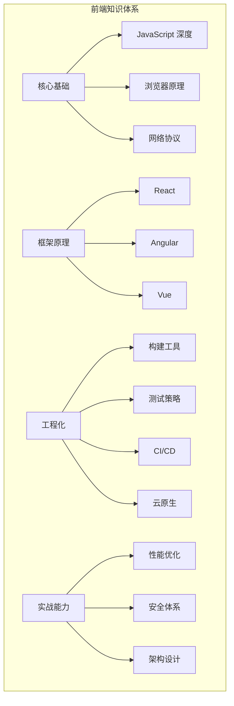

---


## 第一部分：自我介绍与面试策略

---

## 推荐自我介绍（3 分钟版本）

> 你好，我叫 XXX，目前有 4 年前端开发经验，主要方向是**企业级 ToB 平台研发**。

过去几年主要负责：
- 5G核心网测试用例管理系统
- 企业级综合网络管理系统
- 网元运维与数据管理系统

**技术栈上**，我同时具备 **React 19** 和 **Angular 21** 双栈开发经验。

**项目中**，我最核心的能力集中在四个方面：

```
┌─ 架构设计 ─── 装饰器驱动的声明式架构 / JSON Schema 动态表单 / LRU 路由缓存 / Web Worker 分治有序合并
├─ 性能攻坚 ─── GIS 十万级点位渲染（BBOX 裁剪 + 聚合）/ 百万行日志流式解密 / Signal 精确更新
├─ 工程化 ───── K8s/Helm 部署 / GitLab CI/CD 全链路 / ESLint 强制规范 / TypeScript strict 模式
└─ 安全架构 ─── JWT + JTI 单点登录 / HKDF + AES-256-GCM 加密 / RBAC 位编码三级权限
```

**举个例子**：
- 设计动态表单 DSL 引擎，支持无限层级嵌套与 6 种字段类型，实现非前端人员零代码配置测试场景，开发人效提升 80%
- 用 OpenLayers BBOX 视口裁剪 + 聚合显示 + dataCache 全量缓存 + moveend 懒刷新四重优化策略，把十万级基站点位帧率从 <10fps 优化到 60fps
- 设计 Web Worker 分治 + 有序合并 + 流式输出三阶段策略，解决百 MB 级日志并行解密难题，实现毫秒级加载

**此外**，我也深度参与 GitLab CI/CD 流水线设计、K8s 集群部署、Prometheus + Grafana 可观测性建设等工作。

**未来方向**，我希望往以下方向继续深入：
- 中高级前端架构
- 云平台 / DevOps 平台
- AI Infra 方向

---

## 简历优化策略

### 你现在的问题

```
内容很多。
但 "技术亮点密度不够聚焦"。
```

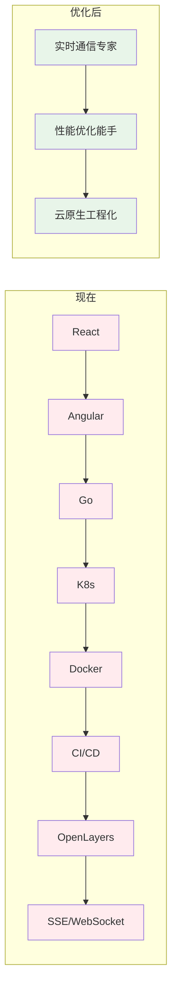

### 推荐优化思路

#### 1. 技术栈减少堆砌

```
现在：React + Angular + Go + K8s + Docker + CI/CD + OpenLayers + SSE + WebSocket + ...
        ↓
看起来像 "关键词收集器"
```

**正确写法**：突出**核心能力**。

```txt
擅长企业级实时通信、高性能可视化、云原生前端工程化建设
```

#### 2. 所有项目都必须量化

```txt
❌ 泛泛而谈：
  优化了系统性能，提升了用户体验

✅ 量化表达：
  响应效能提升 35% | 发布周期缩短 60% | 开发人效提升 80%
  排障效率提升 50% | 支撑日均 200+ 自动化任务
  会话稳定性 99.9% | 帧率从 <10fps 优化到 60fps
```

#### 3. 项目描述减少"平台化空话"

```txt
❌ 删掉：
  打造一站式闭环服务
  构建全链路解决方案
  赋能业务数字化升级

✅ 改成：
  支撑 200+ 自动化任务并发执行
  实现万级 GIS 点位 60fps 流畅渲染
  百万行日志毫秒级加载
```

---

## 大厂/外企/国企面试风格区别

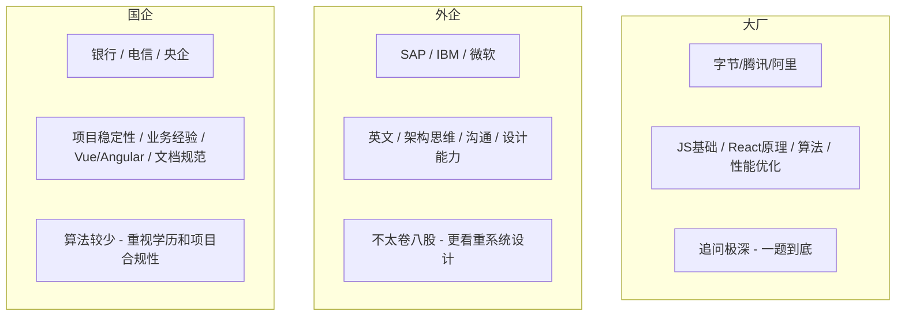

| 维度 | 大厂 | 外企 | 国企 |
|------|------|------|------|
| **八股深度** | ⭐⭐⭐⭐⭐ | ⭐⭐ | ⭐⭐⭐ |
| **算法要求** | ⭐⭐⭐⭐ | ⭐⭐⭐ | ⭐⭐ |
| **项目深挖** | ⭐⭐⭐⭐ | ⭐⭐⭐⭐ | ⭐⭐⭐ |
| **英文要求** | ⭐⭐ | ⭐⭐⭐⭐⭐ | ⭐ |
| **架构设计** | ⭐⭐⭐⭐ | ⭐⭐⭐⭐⭐ | ⭐⭐ |
| **学历看重** | ⭐⭐⭐ | ⭐⭐⭐ | ⭐⭐⭐⭐⭐ |

---

## 真实一小时模拟面试流程

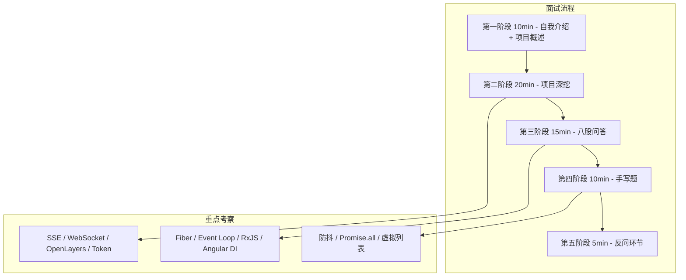

#### 第一阶段（10min）—— 自我介绍 + 项目概述

- 给出清晰的技术定位（3 分钟版本）
- 不展开细节
- 引导面试官到你准备好的方向

#### 第二阶段（20min）—— 项目深挖 ⭐ 核心环节

```
面试官关注点：
├─ 你在这个项目里的"不可替代性"是什么？
├─ 遇到最大的技术挑战是什么？
├─ 为什么选这个方案？
└─ 有没有想过更好的方案？
```

#### 第三阶段（15min）—— 八股

```
高频考点：
├─ React Fiber 原理（必问）
├─ Event Loop + 微任务宏任务（必问）
├─ RxJS 操作符（switchMap / mergeMap）
├─ Angular DI 原理
└─ 浏览器渲染流程（Layout / Paint / Composite）
```

#### 第四阶段（10min）—— 手写题

```
常考：
├─ 防抖 / 节流
├─ Promise.all 实现
├─ 虚拟列表核心
├─ compose / pipe
└─ 深拷贝
```

#### 第五阶段（5min）—— 反问环节

```
✅ 建议问：
  "团队目前的技术栈和工程体系是怎样的？"
  "你们在性能优化和可观测性上有什么建设？"
  "团队在 AI 辅助开发上的使用情况如何？"

❌ 避免问：
  "加班多不多？"
  "KPI 严不严？"
  "有没有下午茶？"
```

---

## 最终建议

**你这份简历如果准备充分，已经接近：**

```
├─ 中高级前端
├─ 高级 ToB 前端
└─ 平台型前端
```

**你真正需要提升的不是"会不会"，而是：**

> **"能不能把复杂项目讲成自己的技术体系。"**

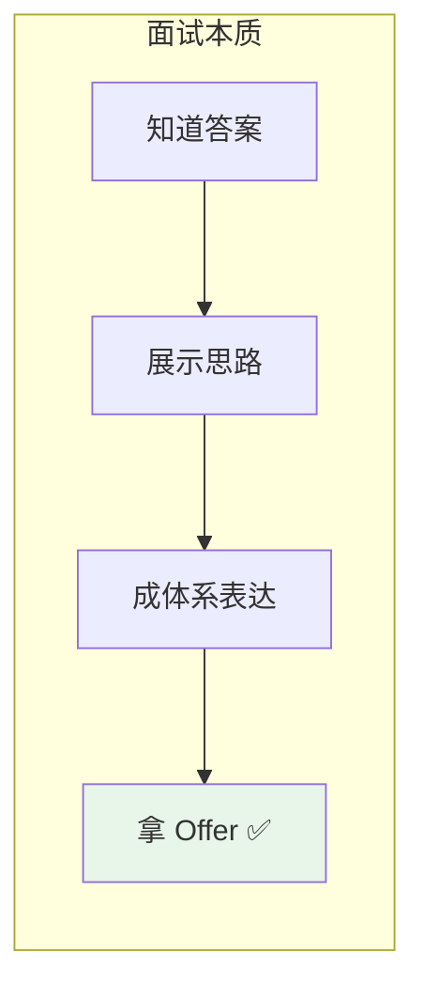

---

## 附录：面试常见追问与深度参考

### 追问通用框架

```
当面试官追问时，按这个框架组织回答：

1. 问题定位
   └─ 面试官问的是什么层面？原理/方案对比/边界情况？

2. 多维度展开
   ├─ 横向对比：类似方案有什么？
   ├─ 纵向深挖：这个方案还有什么限制？
   └─ 场景思考：什么条件下该换方案？

3. 总结返璞
   └─ 一句话回答核心问题
```

### 面试官追问示例

```
面试官：虚拟列表为什么用 paddingTop 不用 transform？

回答框架：
├─ 两者效果等价（都是偏移可视区域）
├─ paddingTop 语义更清晰：代表"跳过了多少内容"
├─ transform 有一个小坑：GPU 合成层额外内存
├─ 但 transform 对子元素影响更小（padding 会影响子元素的百分比计算）
└─ 结论：都行，选 paddingTop 因为语义更明确

说明你不仅知道"怎么做"，还知道"为什么这么做"
更好的是：你知道"还有另一种做法"以及"它们的区别"
```

---


## 第二部分：面试软技能

---

## 面试心态管理

### 面试前准备

```txt
心态准备：
├─ 接受"不会"是正常的
│   └─ 面试官问的是深度，不是广度；答不上来不等于失败
├─ 准备好"我不知道，但我可以分析"
│   └─ 展示思考过程比给出正确答案更重要
├─ 模拟面试
│   └─ 找朋友或对着镜子练习，减少紧张感
└─ 了解公司和岗位
    └─ 研究公司技术栈、业务方向，针对性准备

技术准备：
├─ 简历上的每个项目都要能深入讲 30 分钟
├─ 准备 3-5 个"亮点故事"（STAR 法则）
├─ 手写题每天练 2-3 道（防抖/节流/Promise）
└─ 复习八股文时，重点理解"为什么"而不是"是什么"
```

### 面试中技巧

```txt
回答问题的原则：
├─ 先给结论，再展开
│   └─ "核心是 XXX，具体来说..."
├─ 用结构化表达
│   └─ "分三个方面：第一...第二...第三..."
├─ 承认不会，展示思路
│   └─ "这个我不太确定，但我的理解是...我可以分析一下..."
├─ 主动关联项目
│   └─ "这个在我们项目中用到了，比如..."
└─ 控制时间
    └─ 一个问题回答不超过 2 分钟，避免冗长

追问应对的原则：
├─ 不要慌，追问是好事（说明面试官感兴趣）
├─ 从自己最熟悉的点切入
├─ 给出具体数字和案例
└─ 如果不会，诚实说"这个我还没深入研究"
```

### 面试后复盘

```txt
每次面试后记录：
├─ 哪些问题答得好？
│   └─ 保持，下次继续用这个思路
├─ 哪些问题答得不好？
│   └─ 记录问题，回去深入研究
├─ 哪些问题没听懂？
│   └─ 可能是问题表述问题，也可能是知识盲区
└─ 面试官的反馈
    └─ 如果有反馈，认真记录并改进

持续改进：
├─ 建立自己的"面试错题本"
├─ 每次面试后补充新知识点
├─ 定期回顾和更新准备内容
└─ 保持积极心态，面试是双向选择
```

---


## 第三部分：八股文 · 深度体系化

---

## 1. React Fiber 架构深度解析

### 核心认知

> **Fiber 的本质是把"不可中断的同步递归"变成"可调度的异步链表"。**

**面试官视角**：考察你对 React 渲染机制的理解深度，是否知道"为什么 React 要重新设计架构"，以及并发模式的本质。

### 标准答案

React Fiber 是 React 16 后引入的新协调架构，本质上是一种 **可中断 · 可恢复 · 可优先级调度** 的增量渲染机制。

#### 为什么需要 Fiber？

传统 React 的协调（reconciliation）是 **递归调用栈**：

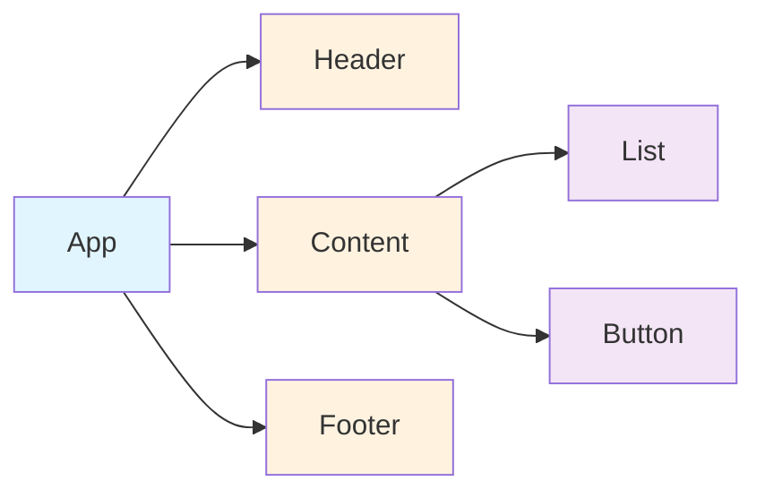

**问题**：递归一旦开始无法中断，大组件树会长时间阻塞主线程（>16ms 导致掉帧）。

#### Fiber 的核心设计

Fiber 将组件树转换为 **单向链表**，每个节点包含三个指针：

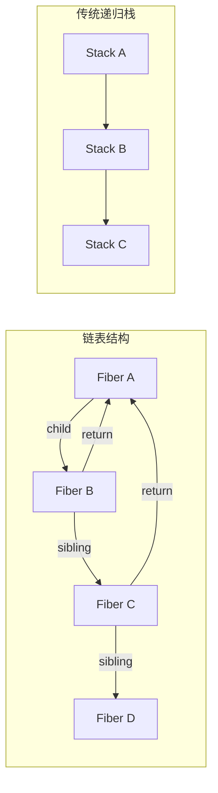

| 对比 | 递归栈 | Fiber 链表 |
|------|--------|------------|
| 中断能力 | ❌ 不可中断 | ✅ 可暂停/恢复 |
| 优先级 | ❌ 无 | ✅ 可调度 |
| 复用状态 | ❌ 销毁重建 | ✅ 可复用 |
| 内存 | 栈帧自动管理 | 手动维护链表 |

#### 核心机制：时间切片（Time Slicing）

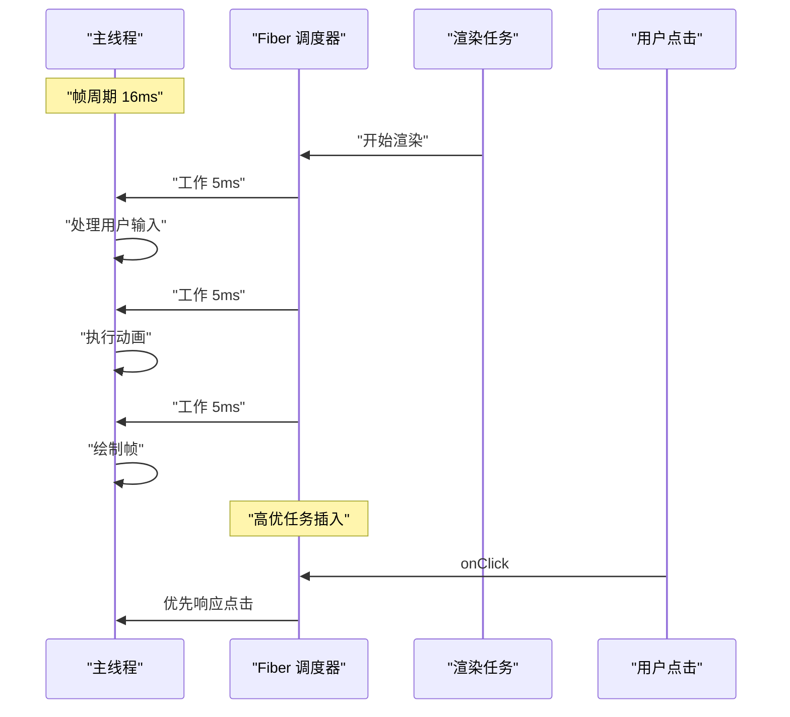

#### 工作流程

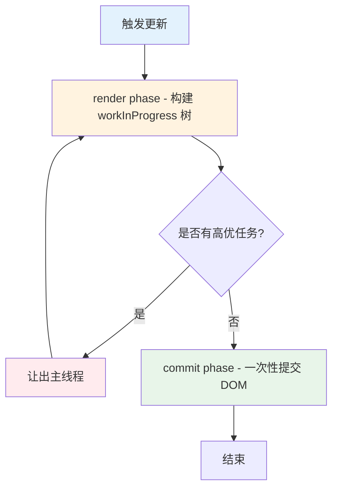

#### Phase 深度对比：Render vs Commit

| 维度 | Render Phase | Commit Phase |
|------|-------------|--------------|
| **是否可中断** | ✅ 可中断（分片执行） | ❌ 不可中断（一次完成） |
| **执行时机** | 调度器控制，可延后 | Render 完成后立即执行 |
| **副作用** | 无 DOM 操作 | DOM 操作、生命周期、Effect |
| **树操作** | 构建 workInProgress 树 | current 指针切换 |
| **调用函数** | `render()`, `shouldComponentUpdate` | `componentDidMount`, `useEffect` |

---

### 面试加分点

React Fiber 的核心目标：

> **将"不可中断的同步渲染"变成"可调度的异步渲染"。**

与 Vue 的区别：
- Vue 使用 **模板编译 + 静态标记** 在编译时优化，不需要 Fiber
- React 使用 **JSX 运行时 + Fiber 调度**，运行时动态优化
- Vue 3 的 `render` 函数 + Block Tree 也是一种类似思路，但粒度不同

#### 更深层：React 为什么不走编译优化路线？

```
React 的设计哲学：
├─ 保留 JSX 的灵活性（JavaScript 的全部表达能力）
├─ 编译优化需要约束模板语法（Vue/Svelte 的取舍）
├─ Fiber 是运行时方案，不影响开发者心智模型
└─ 代价：运行时开销更大 → 需要更复杂调度
     └─ 受益：开发者不需要学习模板 DSL
```

---

### 高频追问

#### 1. Fiber 为什么用链表？

因为 **链表可以保存执行状态**：

```ts
// 递归无法中断
function render(vnode) {
  // 必须一次执行完
  render(vnode.child)
  render(vnode.sibling)
}

// Fiber 链表可以中断
function workLoop(fiber) {
  while (fiber && !shouldYield()) {
    fiber = performUnitOfWork(fiber)
  }
  // 下次调度从这里继续
}
```

#### 2. workInProgress 和 current 两棵树？

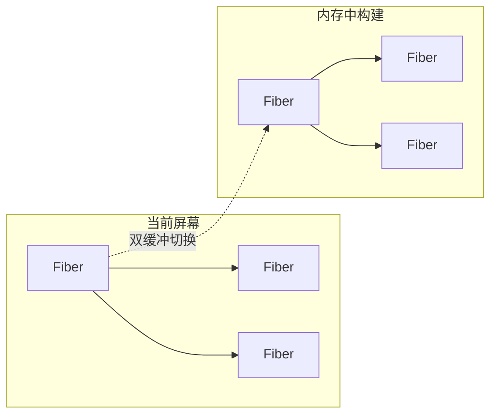

- **current 树**：当前屏幕上显示的 Fiber 树
- **workInProgress 树**：内存中构建的下一棵树
- **commit 阶段**：直接切换指针，完成双缓冲

> **双缓冲的核心价值**：构建过程中用户看到的始终是完整的 current 树，不会出现半渲染状态。

#### 3. 优先级如何实现？

React 维护 **5 种优先级**：

```txt
Immediate  >  UserBlocking  >  Normal  >  Low  >  Idle
  点击事件       输入框          默认        预加载      Analytics
```

- 优先级高的任务可以 **打断** 低优先级任务
- 低优先级任务被 **丢弃或延后**
- 实现机制：`Scheduler` 模块维护 **最小堆（Min-Heap）** 任务队列

```ts
// 简化版调度器核心
const taskQueue = new MinHeap() // 按过期时间排序

function scheduleCallback(priorityLevel, callback) {
  const expirationTime = computeExpirationTime(priorityLevel)
  taskQueue.push({ callback, expirationTime })
  requestHostCallback(flushWork)
}

function flushWork() {
  while (taskQueue.size > 0) {
    const currentTask = taskQueue.peek()
    // 过期时间越短，优先级越高
    if (currentTask.expirationTime > getCurrentTime()) {
      // 任务未过期，让出主线程
      if (shouldYield()) break
    }
    const task = taskQueue.pop()
    task.callback()
  }
}
```

#### 4. useEffect 和 useLayoutEffect 在 Fiber 中的区别？

- `useLayoutEffect`：在 **commit 阶段同步执行**（阻塞 paint）
- `useEffect`：在 **commit 后异步调度**（不阻塞 paint）

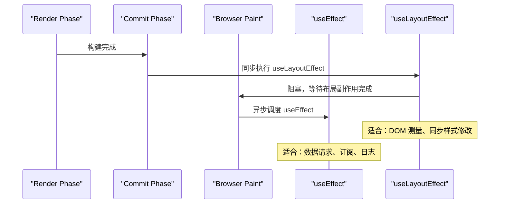

#### 5. Concurrent Mode 带来了什么？

```txt
Concurrent Mode 的核心能力：
├─ 可中断渲染（Interruptible Rendering）
│   └─ 长任务可以被高优任务打断
├─ 自动批处理（Automatic Batching）（React 18 引入）
│   └─ 多个 setState 合并为一次更新（含 setTimeout/Promise/原生事件）
├─ 过渡（Transitions）
│   └─ startTransition 区分紧急/非紧急更新
├─ Suspense
│   └─ 声明式加载状态 + 嵌套 Suspense 边界
└─ useDeferredValue
    └─ 延迟更新非紧急状态
```

---

### 深度补充：React Diff 算法（面试高频追问）

#### 三个假设（Diff 的前提）

```txt
React Diff 基于三个合理假设（O(n) 算法的基础）：
├─ 假设 1：不同类型的元素产生不同的树
│   └─ <div> → <span>：直接销毁重建，不尝试复用
│
├─ 假设 2：开发者通过 key 提示哪些子元素是稳定的
│   └─ key 变化 → 重新创建；key 不变 → 尝试复用
│
└─ 假设 3：同级比较，不跨层级
    └─ 只比较同级节点，不跨层级移动
    └─ 这样只需要 O(n) 而非 O(n³)
```

#### Diff 策略详解

```txt
单节点 Diff（reconcileSingleElement）：
├─ key 相同 && type 相同 → 复用节点
├─ key 相同 && type 不同 → 标记删除旧节点，创建新节点
├─ key 不同 → 标记删除旧节点，创建新节点
└─ 无 key → 使用 index 作为 key（性能差）

多节点 Diff（reconcileChildrenArray）：
├─ 遍历新子节点列表
├─ 对每个新节点，在旧列表中查找可复用节点
│   ├─ 先按 key 查找（Map 索引，O(1)）
│   └─ 再按 index 查找（兜底）
├─ 找到 → 比较 type，相同则复用，不同则重建
├─ 找不到 → 创建新节点
└─ 旧列表中剩余的 → 批量删除
```

#### Key 的正确使用

```tsx
// ❌ 错误：用 index 作为 key
{items.map((item, index) => (
  <ListItem key={index} item={item} />
  // 问题：列表顺序变化时，所有组件都会重建
  // 原因：key=0 的元素从 A 变成了 B，React 会复用但更新 props
))

// ✅ 正确：用唯一 ID 作为 key
{items.map(item => (
  <ListItem key={item.id} item={item} />
  // key 不变 → 复用组件实例，只更新 props
  // key 变化 → 销毁旧实例，创建新实例
))

// 特殊场景：列表不会变化 + 无唯一 ID
{staticList.map((item, index) => (
  <StaticItem key={index} item={item} />
  // 可以用 index，因为顺序永远不变
))
```

---

### 面试追问预测与应对策略

#### 追问链路 1：从 Fiber 追问到 Scheduler

```
面试官："Fiber 是怎么实现优先级调度的？"
├─ 你："React 用 Scheduler 模块维护任务队列"
├─ 追问："Scheduler 的数据结构是什么？"
│   └─ 你："最小堆（Min-Heap），按过期时间排序"
├─ 追问："为什么不直接用数组？"
│   └─ 你："最小堆插入/删除都是 O(log n)，数组找最小值是 O(n)"
├─ 追问："多个任务过期时间相同怎么办？"
│   └─ 你："按插入顺序 FIFO 处理"
└─ 追问："Scheduler 和 MessageChannel 的关系？"
    └─ 你："Scheduler 用 MessageChannel 作为宏任务载体，保证异步执行"
```

#### 追问链路 2：从 Diff 追问到列表性能

```
面试官："React 的 diff 算法时间复杂度是多少？"
├─ 你："O(n)，基于三个假设"
├─ 追问："如果列表有 10 万个元素，diff 会卡吗？"
│   └─ 你："单次 diff 很快（O(n) 简单比较），但大量 DOM 操作本身会卡"
├─ 追问："那怎么优化？"
│   └─ 你："虚拟列表 + memo + useCallback 避免不必要重渲染"
├─ 追问："useCallback 的依赖数组怎么处理？"
│   └─ 你："只放真正需要的依赖，避免滥用导致缓存失效"
└─ 追问："有没有更好的方案？"
    └─ 你："考虑 Signals 或者 Zustand，细粒度更新绕过 diff"
```

#### 追问链路 3：从 Concurrent Mode 追问到 startTransition

```
面试官："startTransition 和 setTimeout 有什么区别？"
├─ 你："startTransition 是 React 内部调度，setTimeout 是浏览器宏任务"
├─ 追问："具体区别在哪？"
│   └─ 你："startTransition 可以被高优任务打断，setTimeout 不行"
├─ 追问："useTransition 和 useDeferredValue 呢？"
│   └─ 你："useTransition 区分紧急/非紧急更新，useDeferredValue 延迟渲染"
├─ 追问："什么场景用哪个？"
│   └─ 你："输入框用 useDeferredValue，Tab 切换用 useTransition"
└─ 追问："React 19 还有什么新变化？"
    └─ 你："React Compiler 自动优化，不再需要手动 memo/useCallback"
```

---

### 面试回答模板

#### 场景：被问到"Fiber 原理"

```
标准回答（30秒版）：
"Fiber 是 React 16 引入的新架构，核心目标是把不可中断的同步渲染
变成可调度的异步渲染。它把递归调用栈改成链表结构，每个 Fiber 节点
包含 child、sibling、return 三个指针，这样渲染可以中断、暂停、恢复。
配合 Scheduler 模块实现优先级调度，高优任务可以打断低优任务。"

追问版（深入原理）：
"具体来说，Fiber 架构分为两个阶段：
Render 阶段是可中断的，构建 workInProgress 树，只做计算不做 DOM 操作；
Commit 阶段是不可中断的，一次性提交 DOM 变更。
双缓冲机制保证用户看到的始终是完整的 current 树，不会出现半渲染状态。
优先级方面，React 维护 5 种优先级，Scheduler 用最小堆管理任务队列。"
```

---

## 2. SSE 和 WebSocket 全面对比

### 核心认知

> **选型的关键不是"哪个更先进"，而是"哪个更匹配场景"。**

**面试官视角**：考察你对实时通信方案的理解深度，是否能在真实项目中做出合理选型。

### 标准答案

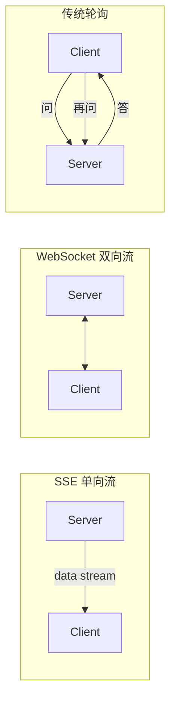

#### 全面对比矩阵

| 对比维度 | SSE | WebSocket | 传统轮询 |
|----------|-----|-----------|---------|
| **通信方向** | 服务端 → 客户端（单向） | 双向 | 双向（请求-应答） |
| **底层协议** | HTTP（标准 HTTP 流） | ws/wss（独立协议） | HTTP |
| **协议开销** | 极低（HTTP 头部一次） | 中（握手 + 帧掩码） | 高（每次请求完整头部） |
| **自动重连** | ✅ 浏览器原生支持 `EventSource` | ❌ 需手动实现 | ❌ 需手动实现 |
| **数据格式** | 文本（UTF-8） | 文本 + 二进制 | 任何 HTTP 格式 |
| **最大连接数** | HTTP/1.1 限制 6 个/域名，HTTP/2 无限制 | 无限制 | 无限制 |
| **实现复杂度** | 低 | 高 | 最低 |
| **自定义 Header** | ❌ EventSource 不支持 | ✅ 支持 | ✅ 支持 |
| **跨域** | 需 CORS 配置 | 协议本身不限 | 需 CORS |
| **实时性** | 高（流式） | 最高（全双工） | 低（取决于轮询间隔） |
| **服务端资源** | 低（HTTP 长连接） | 中（需维护状态） | 高（大量请求） |
| **浏览器兼容** | 现代浏览器 ✅ | 现代浏览器 ✅ | 全部 ✅ |
| **穿透防火墙** | ✅ HTTP 协议 | ❌ 可能被拦截 | ✅ HTTP 协议 |

#### SSE 本质

```http
GET /api/logs HTTP/1.1
Accept: text/event-stream

HTTP/1.1 200 OK
Content-Type: text/event-stream

data: {"message": "log line 1"}

data: {"message": "log line 2"}
```

SSE 就是 **HTTP 长连接 + 流式响应**，浏览器解析 `text/event-stream` 格式。

#### SSE 协议格式详解

```txt
SSE 协议格式：
────────────────────────────────
data: 消息内容

          ← 简单消息
data: 第一行
              ← 多行消息
data: 第二行


event: custom
             ← 自定义事件
data: 消息内容


id: 123
                   ← 消息 ID（断线重连时自动发送 Last-Event-ID）
data: 消息内容


retry: 5000

             ← 服务端控制重连间隔（毫秒）

: 注释内容

              ← 注释行（被浏览器忽略）
────────────────────────────────
```

---

### 项目结合回答

#### 日志流 → 选 SSE

```
日志流的特征：
  ├─ 单向：服务端产生 → 客户端消费
  ├─ 高频：每秒可能数百条
  ├─ 无需客户端回传
  └─ 需要自动重连（网络抖动频繁）

                 ↓
            选 SSE ✅
        EventSource 自带重连
        浏览器自动解析数据
        资源消耗更低
```

#### 告警系统 → 选 WebSocket

```
告警系统的特征：
  ├─ 双向：需要 ACK 确认
  ├─ 需要心跳保活（检测设备离线）
  ├─ 需要双向交互（抑制/确认/升级）
  └─ 可能包含二进制数据

                 ↓
            选 WebSocket ✅
        自定义心跳机制
        双向消息推送
        支持二进制帧
```

---

### 追问：SSE 怎么断线重连？

`EventSource` 默认自动重连，但可以加上**指数退避**：

```ts
// 浏览器默认行为 - 连接断开后自动重连
const es = new EventSource('/api/logs')

// 重连事件
es.addEventListener('error', () => {
  console.log('连接断开，浏览器会自动重连')
  // EventSource 默认 3 秒后重试
})

// 服务端可以控制重连延迟
// 发送: retry: 5000


```

服务端控制重连间隔：

```go
// Go 服务端控制重连时间
fmt.Fprintf(w, "retry: %d

", 5000) // 5 秒后重试
```

#### 追问 2：SSE 有什么缺点？

```
缺点：
├─ 单向通信：只能服务端→客户端
├─ 只支持文本：无法传输二进制
├─ 浏览器连接数限制：同域名最多 6 个
├─ EventSource 不支持自定义 Header（无法带 token）
└─ IE 不支持（Polyfill 方案：用 fetch + ReadableStream 模拟）

                    ↓

  解决方案：
  ├─ 连接数限制 → 域名分发（log1.example.com / log2.example.com）
  ├─ 自定义 Header → 使用 fetch API 手动解析 text/event-stream
  └─ IE 兼容 → 降级为轮询（或告知客户升级浏览器）
```

#### 如何用 fetch 替代 EventSource（解决 Header 问题）

```ts
async function createSSE(url: string, token: string, onMessage: (data: string) => void) {
  const response = await fetch(url, {
    headers: { Authorization: `Bearer ${token}` }
  })

  const reader = response.body!.getReader()
  const decoder = new TextDecoder()
  let buffer = ''

  while (true) {
    const { done, value } = await reader.read()
    if (done) break

    buffer += decoder.decode(value, { stream: true })
    const lines = buffer.split('
')
    buffer = lines.pop() || ''

    for (const line of lines) {
      if (line.startsWith('data: ')) {
        onMessage(line.slice(6))
      }
    }
  }
}

// 使用示例
createSSE('/api/events', 'your-token', (data) => {
  console.log('收到数据:', data)
})
```

#### 追问 3：WebSocket 如何保证消息可靠性？

```txt
WebSocket 本身不保证消息可靠性！
需要应用层协议保障：
├─ ACK 机制：客户端收到消息后发送确认
├─ 消息序列号：检测丢包和乱序
├─ 重传机制：超时未 ACK 则重发
├─ 心跳检测：ping/pong 检测连接健康
└─ 离线缓存：断线期间消息存队列，重连后补发
```

---

## 3. RxJS 操作符体系化理解

### 核心认知

> **Map 操作符的本质是"对 Observable 流中每个值的处理策略"：取消、并行、排队、还是忽略。**

**面试官视角**：考察你对响应式编程的理解，以及在真实场景中的选型能力。

### 核心区别：为什么需要不同的 Map 操作符？

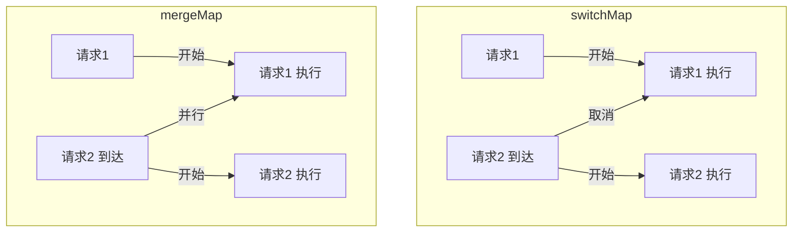

#### 四大家族对比

| 操作符 | 行为 | 适合场景 | 内部实现 |
|--------|------|----------|---------|
| `switchMap` | 新请求 **取消** 旧请求 | 搜索框、Token 刷新 | 订阅新 Observable 前 `unsubscribe` 旧的 |
| `mergeMap` | 新请求 **并行** 旧请求 | 批量请求、并发任务 | 每个值创建内部订阅，共存 |
| `concatMap` | 新请求 **排队** 旧请求 | 顺序写入、文件上传 | 维护队列，前一个完成再处理下一个 |
| `exhaustMap` | 新请求 **忽略**（旧完成前） | 登录/提交按钮防抖 | 正在执行中就丢弃新的 |

#### 常见高级 Map 操作符

```txt
switchMap vs debounceTime + map:
├─ debounceTime + map: 先防抖再映射，只能控制"请求发起时机"
├─ switchMap: 不仅能延时，还能取消在途请求
└─ 搜索场景：switchMap 更优，因为可以直接取消慢响应

mergeMap + concurrent 参数:
├─ mergeMap(fn, 3): 限制最大并发 3 个
├─ 对比 Promise.all: 所有请求同时发出
├─ 对比 Promise.allSettled: 不因个别失败而整体失败
└─ 适用: 批量上传文件(控制并发避免带宽打满)
```

#### switchMap（取消旧请求）

```ts
// 搜索框：每次输入取消上一次请求
searchInput.valueChanges.pipe(
  debounceTime(300),
  switchMap(keyword => this.api.search(keyword))
  // 如果 keyword 变了，上一次请求自动取消
).subscribe()
```

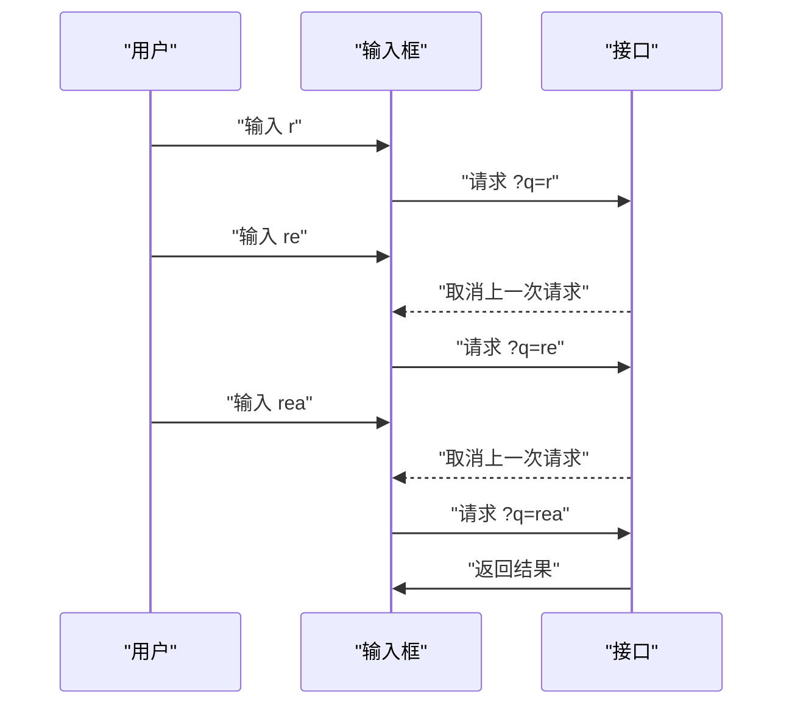

#### mergeMap（并行执行）

```ts
// 批量请求：同时获取多个详情
ids$.pipe(
  mergeMap(ids => forkJoin(
    ids.map(id => this.api.getDetail(id))
  )),
  // 控制并发数
  // mergeMap(fn, concurrent: 3)
).subscribe()
```

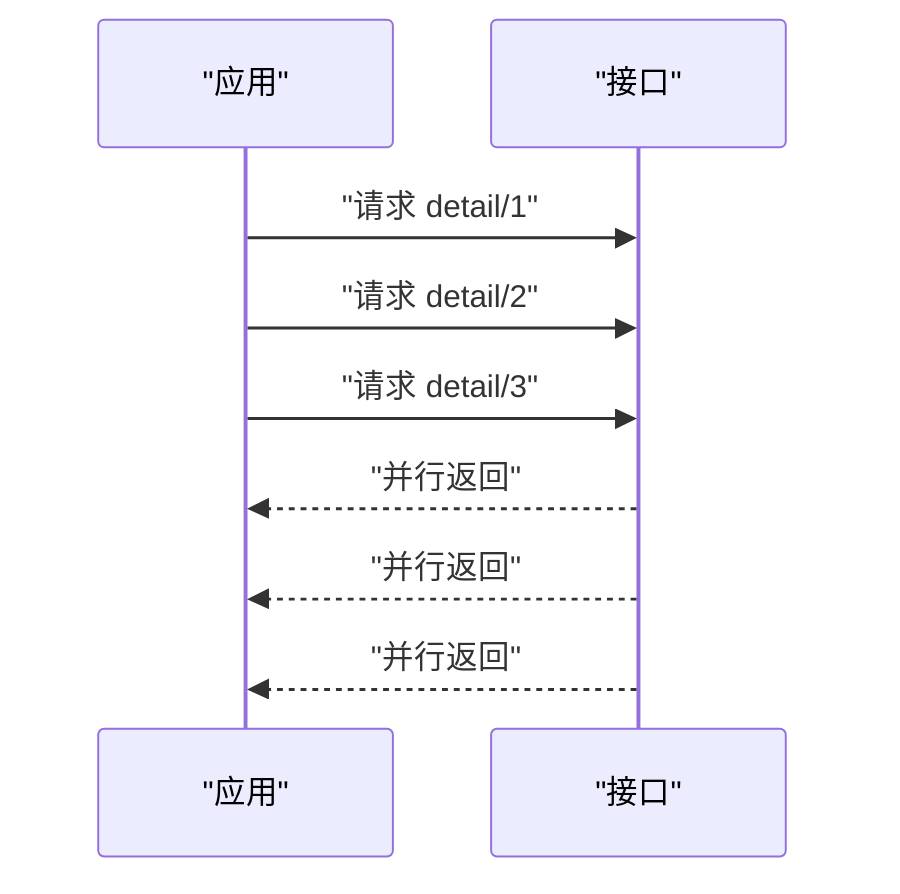

#### concatMap（排队执行）

```ts
// 顺序上传文件
fileUpload$.pipe(
  concatMap(file => this.api.upload(file))
  // 前一个上传完成 → 再上传下一个
).subscribe()
```

#### exhaustMap（忽略新请求）

```ts
// 提交按钮：防重复点击
submitBtn.click$.pipe(
  exhaustMap(() => this.api.submit(formData))
  // 请求完成前，忽略后续点击
).subscribe()
```

---

### 面试加分回答

#### 双 Token 刷新为什么必须用 switchMap？

```ts
// ❌ 错误：用 mergeMap
intercept(req, next) {
  return next.handle(req).pipe(
    catchError(err => {
      if (err.status === 401) {
        return this.refreshToken().pipe(
          mergeMap(newToken => { // 并发刷新！
            // 3 个请求同时 401 → 并发刷新 3 次
            // 最后一次覆盖前面的 token
            // 前两次的请求携带了过期 token
            return next.handle(addToken(req))
          })
        )
      }
    })
  )
}
```


```ts
// ✅ 正确：用 switchMap
intercept(req, next) {
  return next.handle(req).pipe(
    catchError(err => {
      if (err.status === 401) {
        return this.refreshToken().pipe(
          switchMap(newToken => { // 只有一个刷新请求
            return next.handle(addToken(req))
          })
        )
      }
    })
  )
}
```

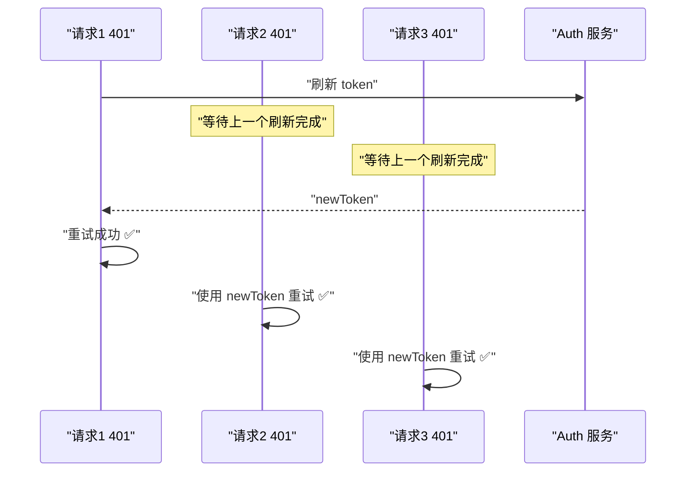

#### 追问：为什么不直接用 Subject + share？

```ts
// 更优雅的方式：shareReplay
private refresh$ = this.http.post('/auth/refresh', {}).pipe(
  shareReplay(1) // 共享结果，多个订阅只执行一次
)

intercept(req, next) {
  return next.handle(req).pipe(
    catchError(err => {
      if (err.status === 401) {
        return this.refresh$.pipe(
          switchMap(newToken => next.handle(addToken(req)))
        )
      }
    })
  )
}
```

---

## 4. 虚拟列表：从原理到工业级实现

### 核心认知

> **虚拟列表不是优化"数据"，而是减少"DOM 数量"。**

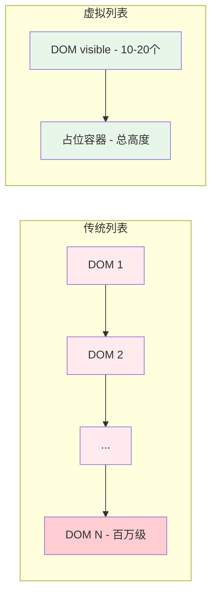

#### 为什么多 DOM 会卡？

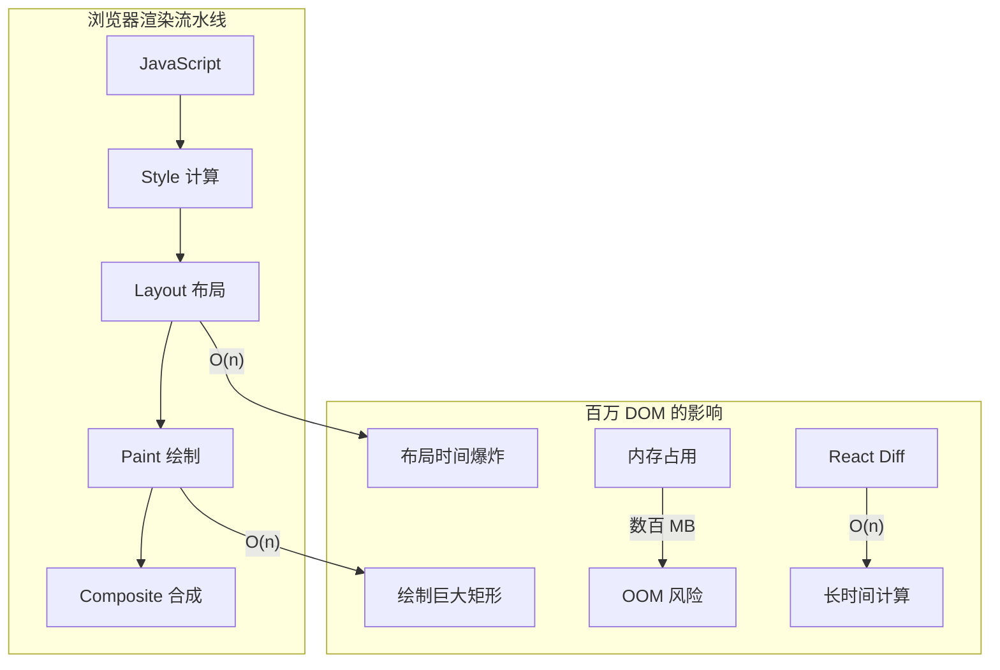

#### 具体瓶颈分析

| 瓶颈 | 原因 | 影响 |
|------|------|------|
| **Layout（回流）** | 每个 DOM 位置需要计算 | 万级 => 几十 ms，百万 => 几秒 |
| **Paint（绘制）** | 将 DOM 绘成位图 | GPU 内存暴涨 |
| **Memory（内存）** | DOM 对象本身占用 | 每个 DOM ~4KB，百万 => 4GB |
| **Diff（协调）** | React 需要遍历所有节点 | 1000 个节点约 1ms，10 万 => 100ms |

#### 虚拟列表原理

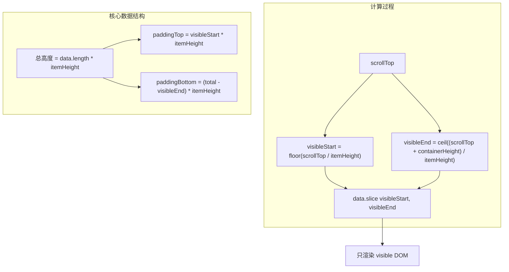

```ts
// 核心计算
function getVisibleRange(scrollTop: number, containerHeight: number, itemHeight: number, total: number) {
  const visibleStart = Math.floor(scrollTop / itemHeight)
  const visibleEnd = Math.ceil((scrollTop + containerHeight) / itemHeight)

  return {
    start: Math.max(0, visibleStart - overscan),   // overscan 额外渲染几项
    end: Math.min(total, visibleEnd + overscan),    // 防止白屏
    totalHeight: total * itemHeight,                // 容器总高度
    offset: visibleStart * itemHeight               // 偏移量
  }
}
```

#### 为什么叫"虚拟"列表？

- **"虚拟"** = 在内存中维护完整列表
- **"真实"** = 只渲染可视区域
- 用户 **感知** 到的是完整列表（滚动条高度正确）
- 浏览器 **实际** 只处理少量 DOM

---

### 进阶：虚拟列表 + 变高元素

```mermaid
flowchart LR
  subgraph "定高"
    F1["固定 50px"] --> F2["固定 50px"]
    F2 --> F3["固定 50px"]
  end
  subgraph "变高"
    V1["不同内容"] --> V2["高度不同"]
    V2 --> V3["需动态计算"]
  end
```

#### 变高解决方案对比

| 方案 | 原理 | 复杂度 | 精度 | 适用场景 |
|------|------|--------|------|---------|
| **预估 + 校正** | 先给固定预估高度，渲染后更新实际值 | 低 | 中等 | 聊天记录、动态内容 |
| **二分查找定位** | 维护已渲染元素的真实位置数组 | 中 | 高 | 日志列表 |
| **动态测量缓存** | 用 `ResizeObserver` 监听高度变化 | 高 | 最高 | 富文本、图片列表 |

```ts
// 变高虚拟列表核心
class VariableHeightVirtualList {
  private heights: Map<number, number> = new Map()  // 存储每个元素的真实高度
  private positions: number[] = [0]                  // 存储每个元素的位置偏移

  getTotalHeight(): number {
    return this.positions[this.positions.length - 1] ?? 0
  }

  findStartIndex(scrollTop: number): number {
    // 二分查找：找到第一个 > scrollTop 的位置
    let left = 0, right = this.positions.length - 1
    while (left < right) {
      const mid = (left + right) >> 1
      if (this.positions[mid] <= scrollTop) {
        left = mid + 1
      } else {
        right = mid
      }
    }
    return left - 1
  }

  updateHeight(index: number, height: number) {
    const diff = height - (this.heights.get(index) ?? DEFAULT_HEIGHT)
    // 更新后续所有位置
    for (let i = index + 1; i < this.positions.length; i++) {
      this.positions[i] += diff
    }
    this.heights.set(index, height)
  }
}
```

#### 工业级虚拟列表需要考虑的问题

```
├─ 滚动容器篇
│   ├─ 是 window 滚动还是 div 滚动？
│   └─ 滚动事件节流（passive: true 改善滚动性能）
│
├─ 缓存策略篇
│   ├─ 已渲染组件缓存（keep alive）
│   ├─ 状态保持（input 输入内容不丢失）
│   └─ O(1) 索引映射
│
├─ 滚动恢复篇
│   ├─ 回到顶部/滚动到指定索引
│   ├─ 数据变化后保持滚动位置
│   └─ 列表刷新后保持可视区域不变
│
├─ 边缘情况篇
│   ├─ 快速滚动时的白屏处理
│   ├─ 动态插入/删除中间元素
│   ├─ 元素高度变化（resize）
│   └─ 列表方向（水平/垂直/网格）
│
└─ 性能指标篇
    ├─ 首次渲染时间
    ├─ 滚动帧率（60fps）
    ├─ 内存占用峰值
    └─ 滚动延迟（从事件到渲染）
```

---

**面试官视角**：考察你对性能优化的理解深度，能否解释清楚"为什么虚拟列表能优化性能"以及"实际项目中怎么用"。

---

### 面试追问预测与应对策略

#### 追问链路 1：从原理追到实现

```
面试官："虚拟列表的核心原理是什么？"
├─ 你：只渲染可视区域的 DOM，用 padding 模拟总高度
├─ 追问："具体怎么计算可视区域？"
│   └─ 你："scrollTop / itemHeight = 起始索引，(scrollTop + containerHeight) / itemHeight = 结束索引"
├─ 追问："为什么用 padding 不用 transform？"
│   └─ 你："两者都行；padding 语义更清晰，transform 会影响子元素百分比计算"
├─ 追问："白屏问题怎么解决？"
│   └─ 你："overscan 预渲染几项，用户滚动时不会看到空白"
├─ 追问："滚动时性能怎么保证？"
│   └─ 你："RAF 节流滚动事件，每帧只更新一次；passive: true 改善滚动性能"
└─ 追问："定高和变高有什么区别？"
    └─ 你："定高计算简单 O(1)；变高需要二分查找 O(log n) 或 ResizeObserver 监听"
```

#### 追问链路 2：从实现追到项目实战

```
面试官："你们项目里虚拟列表怎么用的？"
├─ 你："百万行日志预览场景，用 ReadableStream 流式读取 + 虚拟列表渲染"
├─ 追问："为什么不直接分页？"
│   └─ 你："日志需要全文搜索和连续滚动，分页体验差；虚拟列表既省内存又保持滚动体验"
├─ 追问："搜索怎么做？"
│   └─ 你："Web Worker 后台搜索，匹配结果高亮，虚拟列表定位到匹配位置"
├─ 追问："怎么处理动态高度？"
│   └─ 你："预估高度 20px，渲染后用 ResizeObserver 监听实际高度，更新 positions 数组"
├─ 追问："状态怎么保持？"
│   └─ 你："用 Map 缓存每个 item 的展开/折叠状态，key 是 item.id"
└─ 追问："效果怎么量化？"
    └─ 你："加载时间从 OOM 崩溃到毫秒级，内存从 2GB+ 到 50MB 恒定，帧率 60fps"
```

---

### 面试回答模板

#### 场景：被问到"虚拟列表原理"

```
30 秒版：
"虚拟列表的核心是'只渲染可视区域'。
传统列表渲染 10 万个 DOM，虚拟列表只渲染 20-30 个。
计算方式是：scrollTop / itemHeight 得到起始索引，
scrollTop + containerHeight / itemHeight 得到结束索引。
用 padding 模拟总高度，用户感知到的是完整列表，
但浏览器实际只处理少量 DOM。"

追问版（深入原理）：
"虚拟列表需要考虑几个关键问题：
1. 滚动性能：用 RAF 节流滚动事件，每帧只更新一次
2. 白屏问题：overscan 预渲染几项，避免快速滚动时出现空白
3. 变高元素：预估高度 + 渲染后校正，或用 ResizeObserver 监听
4. 状态保持：用 Map 缓存每个 item 的状态（展开/折叠/输入）
5. 边界处理：动态插入/删除、滚动位置保持、列表刷新
在我们的日志预览场景中，用 ReadableStream 流式读取 + 虚拟列表，
实现了百万行日志的毫秒级加载和 60fps 滚动。"
```

---

### 反例对比：常见错误

```txt
❌ 错误 1：不用虚拟列表，用 CSS contain 优化
   ✅ 正确：CSS contain 只能优化重排范围，不能减少 DOM 数量
   ✅ 验证：10 万个 DOM + contain: layout → 仍然卡顿

❌ 错误 2：虚拟列表 + useState 存储所有数据
   ✅ 正确：用 useRef 或外部存储（IndexedDB），避免每次渲染重新计算
   ✅ 验证：useState 触发重渲染 → 虚拟列表重新计算 → 性能差

❌ 错误 3：滚动事件不节流
   ✅ 正确：用 RAF 或 throttle 节流，每帧只更新一次
   ✅ 验证：scroll 事件每秒触发 60+ 次 → 每次都 setState → 卡顿

❌ 错误 4：不处理 overscan
   ✅ 正确：预渲染 2-5 项，避免快速滚动时白屏
   ✅ 验证：快速滚动 → 可视区域外没有 DOM → 白屏闪烁
```

---

## 5. Angular OnPush 原理与变更检测体系

### 变更检测机制全景理解

```mermaid
flowchart TD
  subgraph "默认 ChangeDetection"
    Z["Zone.js 触发"] --> CheckAll["遍历整个组件树"]
    CheckAll --> Compare["比较新旧值"]
    Compare --> Update["更新 DOM"]
    Note["每次异步操作都全量检查"]
  end

  subgraph "OnPush 策略"
    O["触发变更"] --> Condition{"满足条件?"}
    Condition -->|"@Input 引用变化"| Update2["更新组件"]
    Condition -->|"DOM Event"| Update2
    Condition -->|"Async Pipe"| Update2
    Condition -->|"markForCheck"| Update2
    Condition -->|"否"| Skip["跳过脏检查 ✅"]
  end
```

| 触发条件 | Default | OnPush |
|----------|---------|--------|
| `@Input` 值变化（引用） | ✅ 检查 | ✅ 检查 |
| `@Input` 值变化（内部改变） | ✅ 检查 | ❌ 跳过 |
| DOM 事件（click/input） | ✅ 检查 | ✅ 检查 |
| `async` pipe 新值 | ✅ 检查 | ✅ 检查 |
| `markForCheck()` | ✅ 检查 | ✅ 检查 |
| setTimeout/setInterval | ✅ 检查 | ❌ 跳过 |
| HTTP 请求完成 | ✅ 检查 | ❌ 跳过 |
| Observable 不通过 async pipe | ✅ 检查 | ❌ 跳过 |

#### 为什么 OnPush 能优化？

```mermaid
flowchart LR
  subgraph "默认检查"
    A["App"] --> B["Header"]
    A --> C["Main"]
    A --> D["Footer"]
    C --> E["List - 1000项"]
    C --> F["Detail"]
    Note["Header 变了 - 却检查了所有组件"]
  end

  subgraph "OnPush 优化"
    A2["App"] --> B2["Header - 更新"]
    A2 --> C2["Main"]
    A2 --> D2["Footer - 跳过"]
    C2 --> E2["List - 跳过"]
    C2 --> F2["Detail - 跳过"]
    Note2["只检查受影响的分支"]
  end

  style E fill:#ffcdd2
  style F fill:#ffcdd2
  style E fill:#ffcdd2
  style F fill:#ffcdd2
```

#### Zone.js 的工作原理

```txt
Zone.js 是一个"猴子补丁"机制：
├─ 拦截所有异步 API（setTimeout、addEventListener、XMLHttpRequest...）
├─ 异步操作完成后通知 Angular 进行变更检测
├─ 每个 Angular 应用有一个"Angular Zone"
└─ 可以创建"脱离 Angular Zone"的自定义 Zone（runOutsideAngular）

性能问题：Zone.js 无法区分"谁变了"
├─ 任何异步操作 → 触发全量检测
├─ 即使是不影响 UI 的异步操作
└─ 所以需要 OnPush 来精确定位
```

---

### 面试加分点

#### OnPush + 不可变数据

```ts
// ❌ 错误：改变数组内部
@Component({ changeDetection: ChangeDetectionStrategy.OnPush })
class ListComponent {
  @Input() items: string[]

  addItem(item: string) {
    this.items.push(item) // 引用没变，OnPush 不检测！
  }
}

// ✅ 正确：创建新引用
@Component({ changeDetection: ChangeDetectionStrategy.OnPush })
class ListComponent {
  @Input() items: string[]

  addItem(item: string) {
    this.items = [...this.items, item] // 新数组，新引用
  }
}
```

#### OnPush 类似 React.memo

| 对比 | React.memo | Angular OnPush |
|------|------------|----------------|
| 触发机制 | Props 浅比较 | @Input 引用变化 |
| 跳过渲染 | ✅ | ✅ |
| 强制更新 | `forceUpdate()` | `markForCheck()` |
| 默认行为 | 不是默认 | 需手动配置 |
| 深层比较 | ❌ 默认浅比较 | ❌ 默认浅比较 |
| 子组件影响 | 仅自身 | 子组件也会跳过 |

#### Angular 17+ 的 Signal 变更检测（未来趋势）

```ts
// Signal 组件：无需 Zone.js，更精确的变更检测
@Component({
  template: `
    <div>{{ count() }}</div>  <!-- Signal 自动追踪依赖 -->
    <button (click)="increment()">+1</button>
  `
})
class CounterComponent {
  count = signal(0)

  increment() {
    this.count.update(v => v + 1)
    // 只有这个组件更新，无需 Zone.js 全量检测
  }
}
```

```mermaid
flowchart LR
  subgraph "Zone.js 模式"
    Z["Zone.js 拦截异步"] --> CD["全量变更检测"]
    CD --> DOM["DOM 更新"]
  end

  subgraph "Signal 模式"
    S["signal.set()"] --> C["精确追踪依赖组件"]
    C --> DOM2["只更新关联 DOM"]
  end

  style Z fill:#fff3e0
  style CD fill:#fff3e0
  style S fill:#e8f5e9
  style C fill:#e8f5e9
```

---

## 6. JWT 安全体系详解

### 核心问题

> **JWT 本身是安全的，不安全的是存储方式。**

```mermaid
flowchart LR
  subgraph "安全方案"
    Access["Access Token 短期 15min"] --> Memory["内存/变量"]
    Refresh["Refresh Token 长期 7天"] --> Cookie["HttpOnly Cookie"]
    Cookie --> Safe["XSS 无法读取"]
  end

  subgraph "不安全方案"
    JWT["JWT Token"] --> Local["localStorage"]
    Local --> XSS["XSS 脚本窃取"]
    XSS --> Steal["Token 被盗用"]
  end
```

#### JWT Token 结构

```txt
JWT = Header.Payload.Signature
                      ↓
eyJhbGciOiJIUzI1NiIsInR5cCI6IkpXVCJ9.
eyJzdWIiOiIxMjM0NTY3ODkwIn0.
doZjgSg4SA1sXzYq8s0E4P0GQ0A

Header:   { "alg": "HS256", "typ": "JWT" }       → Base64URL
Payload:  { "sub": "user123", "iat": 1516239022 } → Base64URL
Signature: HMACSHA256(base64UrlEncode(header) + "." + base64UrlEncode(payload), secret)
```

#### 常见 JWT 攻击手法

| 攻击类型 | 原理 | 防御 |
|----------|------|------|
| **alg: none** | 修改 header 为 `{"alg":"none"}`，绕过签名验证 | 服务端拒绝 `alg: none` |
| **RS256 → HS256 混淆** | 用公钥作为 HMAC 密钥签名（如果服务端用公钥验证 HMAC） | 固定算法，不信任客户端算法 |
| **暴力破解 secret** | 弱密钥离线爆破 | 使用高熵密钥，定期轮换 |
| **信息泄露** | Payload 仅 Base64 编码，非加密 | 不放敏感信息在 Payload |
| **Token 劫持** | XSS/中间人窃取 | 短期 + HTTPS + HttpOnly |
| **Token 重放** | 截获 Token 重复使用 | Refresh Token Rotation |

#### 攻击链路

```mermaid
sequenceDiagram
  participant User as "用户"
  participant App as "应用"
  participant Attacker as "攻击者"
  participant Browser as "浏览器存储"
  participant ApiServer as "服务器"

  User->>App: "访问页面"
  Note over App: "XSS 脚本注入"
  Attacker->>App: "执行恶意脚本"
  App->>Browser: "读取 token"
  App->>Attacker: "发送 token 到攻击服务器"
  Attacker->>ApiServer: "使用窃取的 token"
  ApiServer->>Attacker: "返回用户数据"
```

---

### 正确安全方案

```mermaid
flowchart TD
  Login["登录"] --> LoginAPI["Login API"]
  LoginAPI --> Return["返回 access + refresh"]
  Return --> Store["存储策略"]

  Store --> AccessMem["access_token 内存变量或 sessionStorage"]
  Store --> RefreshCookie["refresh_token HttpOnly Cookie Secure+SameSite"]

  AccessMem --> Request["发起 API 请求"]
  RefreshCookie --> Expired{"access 过期?"}
  Expired -->|"是"| Refresh["refresh - Cookie自动携带"]
  Refresh --> NewAccess["新 access_token 到内存"]
  NewAccess --> Request
  Expired -->|"否"| Request

  Request --> API["后端校验 access"]
  API --> Valid{"是否有效?"}
  Valid -->|"是"| Data["返回数据"]
  Valid -->|"否"| Expired
```

#### 多层防御

```
第一层：XSS 防御
├─ CSP（Content Security Policy）
├─ 输入过滤 / 输出转义
└─ 避免 dangerouslySetInnerHTML / innerHTML

第二层：Token 安全
├─ access_token：短期（15min）+ 内存存储
├─ refresh_token：HttpOnly + Secure + SameSite
└─ 刷新接口限流防刷

第三层：传输安全
├─ HTTPS 全站
└─ 前端不能操作 refresh_token
```

#### Refresh Token Rotation（RTR）

```txt
为什么需要 RTR？
├─ 每次刷新时颁发新的 refresh_token
├─ 旧的 refresh_token 立即失效
├─ 如果 refresh_token 被盗用：
│   ├─ 攻击者使用 refresh_token 获取新 token
│   ├─ 合法用户使用"已用过"的 refresh_token 会失败
│   └─ 服务端检测到"已用过的 token 被再次使用"→ 发出告警
│
└─ 典型的令牌盗窃检测机制

RTR 流程：
┌────────────────────────────────────────┐
│ 1. 用户使用 refresh_token_A 换新 token  │
│ 2. 服务端颁发 refresh_token_B           │
│ 3. refresh_token_A 失效                 │
│ 4. 如果 refresh_token_A 再次被使用      │
│    → 令牌被盗告警                       │
│    → refresh_token_B 也立即失效         │
│    → 用户需要重新登录                   │
└────────────────────────────────────────┘
```

---

**面试官视角**：考察你对认证授权的理解深度，能否设计出安全的 Token 方案。

---

### 面试追问预测与应对策略

#### 追问链路 1：从 Token 追到安全

```
面试官："JWT Token 存在哪里？"
├─ 你：access_token 存内存，refresh_token 存 HttpOnly Cookie
├─ 问："为什么不都存 Cookie？"
│   └─ 你："access_token 需要前端读取（显示用户信息），Cookie 无法被 JS 读取"
├─ 追问："XSS 怎么防？"
│   └─ 你："CSP + 输入过滤 + 输出转义 + HttpOnly Cookie"
├─ 追问："CSRF 怎么防？"
│   └─ 你："SameSite Cookie + CSRF Token + 自定义 Header"
├─ 追问："Token 泄露了怎么办？"
│   └─ 你："短期 access_token + Refresh Token Rotation + 检测异常使用"
└─ 追问："双 Token 刷新具体怎么做？"
    └─ 你："access_token 过期时用 refresh_token 换新 token，用 switchMap 避免并发刷新"
```

#### 追问链路 2：从存储追到实战

```
面试官："access_token 过期了怎么处理？"
├─ 你：用 refresh_token 换新 token，然后重试原请求
├─ 追问："多个请求同时过期怎么办？"
│   └─ 你："用 switchMap 避免并发刷新，只发一次刷新请求"
├─ 追问："刷新期间其他请求怎么办？"
│   └─ 你："缓存到 pendingRequests 数组，刷新完成后统一重试"
├─ 追问："refresh_token 也过期了呢？"
│   └─ 你："强制登出，跳转登录页，让用户重新登录"
├─ 追问："怎么防止 refresh_token 被盗用？"
│   └─ 你："Refresh Token Rotation：每次刷新颁发新 token，旧 token 失效"
└─ 追问："检测到被盗用后怎么处理？"
    └─ 该用户所有 token 立即失效，发送安全告警通知用户
```

---

### 面试回答模板

#### 场景：被问到"JWT 安全方案"

```
30 秒版：
"JWT 安全的核心是'分层防御'：
1. Token 存储：access_token 存内存，refresh_token 存 HttpOnly Cookie
2. 传输安全：HTTPS + SameSite Cookie
3. 刷新机制：双 Token + Refresh Token Rotation
4. 前端防御：CSP + XSS 防护
access_token 短期有效（15分钟），refresh_token 长期有效（7天），
每次刷新时颁发新 token，旧 token 立即失效。"

追问版（深入原理）：
"具体流程：
用户登录后，服务端颁发 access_token（15min）和 refresh_token（7天）。
access_token 存内存，用于 API 认证；refresh_token 存 HttpOnly Cookie，用于刷新。
access_token 过期时，前端用 refresh_token 换新 token，用 switchMap 避免并发刷新。
Refresh Token Rotation：每次刷新颁发新 token，旧 token 立即失效。
如果旧 token 被再次使用，说明被盗用，所有 token 立即失效并通知用户。
前端防御：CSP 限制脚本来源，XSS 防护防止 Token 窃取。"
```

---

## 7. WebSocket 性能问题与优化体系

### 根本原因

> **不是 WebSocket 卡，是 UI 渲染跟不上消息速度。**

```mermaid
flowchart LR
  subgraph "消息洪峰"
    M1["msg 1"] --> M2["msg 2"] --> M3["msg 3"]
    M3 --> M4["msg ..."]
    M4 --> MN["msg N - 每秒数百条"]
  end

  subgraph "浏览器帧"
    F1["帧1 - 16ms"] --> F2["帧2 - 16ms"]
    F2 --> F3["掉帧"]
    F3 --> F4["卡顿"]
  end

  subgraph "结果"
    R1["消息堆积"] --> R2["DOM 频繁更新"]
    R2 --> R3["Layout 抖动"]
    R3 --> R4["页面卡死"]
  end
```

#### 消息处理 vs 渲染帧

```txt
WebSocket 事件队列：
  msg1 → msg2 → msg3 → ... → msg100 (10ms 内到达)
                                  ↓
                        每个 msg 触发 setState
                                  ↓
                        100 次 setState → 100 次脏检查
                                  ↓
                        同步执行 → 阻塞主线程 500ms
                                  ↓
                        用户操作被阻塞 ❌
```

---

### 优化方案

```mermaid
flowchart TD
  WS["WebSocket 消息"] --> Queue["消息队列 - 缓冲"]
  Queue --> Batch["批量处理 - 合并更新"]
  Batch --> RAF["requestAnimationFrame - 同步帧"]

  RAF --> Worker{"是否繁重计算?"}
  Worker -->|"是"| W["Web Worker - 后台线程"]
  Worker -->|"否"| Main["主线程更新"]
  W --> Main
  Main --> DOM["DOM 更新 - 一帧一次"]

  style WS fill:#e3f2fd
  style Queue fill:#fff3e0
  style RAF fill:#e8f5e9
  style W fill:#f3e5f5
```

#### 方案深度对比

| 方案 | 原理 | 场景 | 效果 |
|------|------|------|------|
| **消息缓冲 + RAF** | 缓冲队列，每帧只批量处理一次 | 高频实时消息 | 从每消息一渲染 → 每帧一渲染 |
| **Web Worker** | 后台线程处理数据解析、格式化 | 大量计算（日志、数据转换） | 主线程不阻塞 |
| **虚拟列表** | 只渲染可视区域 | 消息列表、日志 | DOM 数量恒定 |
| **增量更新** | diff 后只变需要变的部分 | 复杂状态同步 | 减少重渲染范围 |
| **MessageChannel** | 微任务级别调度，比 RAF 更早执行 | 需要尽快处理但不要阻塞的事件 | 比 RAF 更及时 |

#### 代码实现

```ts
// 1. 消息队列 + 节流
class MessageQueue {
  private buffer: Message[] = []
  private isScheduled = false

  push(msg: Message) {
    this.buffer.push(msg)
    if (!this.isScheduled) {
      this.isScheduled = true
      requestAnimationFrame(() => this.flush())
    }
  }

  private flush() {
    const batch = this.buffer.splice(0, this.buffer.length)
    // 一次 RAF 处理所有累积消息
    this.processBatch(batch)
    this.isScheduled = false
  }
}

// 2. Web Worker 处理数据
const worker = new Worker('log-worker.js')
worker.postMessage(rawLogs)
worker.onmessage = ({ data }) => {
  // 只在格式化后更新一次
  this.display(data)
}

// 3. 虚拟列表 + 增量追加
// 只维护可视区域的 DOM
```

#### 效果对比

```txt
优化前：  msg → setState → msg → setState → ... → 卡顿
优化后：  msg → msg → ... → RAF → 批量 setState → 流畅
                      ↓
              16ms 窗口内合并
```

#### 追问：WebSocket 连接数优化

```
一个页面多个 WebSocket 连接的问题：
├─ 每个连接占用一个 TCP 端口
├─ 浏览器限制同域名最大连接数
├─ 服务端维护大量长连接造成资源浪费
└─ 每个连接需要独立的心跳/Ping

解决方案：
├─ 连接复用：多个订阅复用同一个 WebSocket
│   └─ 消息协议增加 topic/channel 字段区分
├─ 连接池：按需创建连接，空闲回收
└─ 多路复用：一个 TCP 连接承载多个逻辑通道
```

---

**面试官视角**：考察你对实时通信性能优化的理解深度，能否解释清楚"为什么 WebSocket 会卡"以及"怎么优化"。

---

### 面试追问预测与应对策略

#### 追问链路 1：从性能追到优化

```
面试官："WebSocket 消息太多会卡吗？"
├─ 你：会，不是 WebSocket 卡，是 UI 渲染跟不上消息速度
├─ 追问："具体是什么瓶颈？"
│   └─ 你："每条消息触发 setState → 重渲染 → Layout/Paint → 掉帧"
├─ 追问："怎么优化？"
│   └─ 你："消息缓冲 + RAF 批处理 + 虚拟列表 + Web Worker"
├─ 追问："消息缓冲具体怎么做？"
│   └─ 你："所有消息先进 buffer，requestAnimationFrame 时批量处理，每帧只更新一次"
├─ 追问："Web Worker 在这个场景做什么？"
│   └─ 你："消息解析、格式化、过滤在 Worker 后台执行，主线程只负责渲染"
└─ 追问："效果怎么量化？"
    └─ 你："1000+ QPS 下从卡顿到 60fps，消息延迟从秒级到毫秒级"
```

#### 追问链路 2：从连接追到架构

```
面试官："WebSocket 和 SSE 怎么选？"
├─ 你：看场景，单向用 SSE，双向用 WebSocket
├─ 追问："日志场景用哪个？"
│   └─ 你：SSE，因为日志是服务端→客户端的单向流
├─ 追问："告警场景呢？"
│   └─ 你：WebSocket，因为需要 ACK 确认和双向交互
├─ 追问："SSE 的缺点是什么？"
│   └─ 你：单向通信、不支持二进制、EventSource 不支持自定义 Header
├─ 追问："怎么解决 SSE 的 Header 问题？"
│   └─ 你：用 fetch API 手动解析 text/event-stream
└─ 追问："你们项目里怎么用的？"
    └─ 你：日志用 SSE（自动重连），告警用 WebSocket（双向确认），监控面板用轮询（低频）
```

---

### 面试回答模板

#### 场景：被问到"WebSocket 性能优化"

```
30 秒版：
"WebSocket 消息太多导致 UI 卡顿，核心优化是'减少渲染次数'：
1. 消息缓冲：所有消息先进 buffer，每帧批量处理
2. RAF 同步：用 requestAnimationFrame 同步浏览器帧率
3. 虚拟列表：只渲染可视区域，DOM 数量恒定
4. Web Worker：消息解析在后台线程执行
效果：1000+ QPS 下保持 60fps。"

追问版（深入原理）：
"WebSocket 本身性能没问题，瓶颈在 UI 渲染。
每条消息触发 setState → React 重渲染 → Layout/Paint → 掉帧。
优化策略：
1. 消息缓冲：用数组缓存消息，requestAnimationFrame 时批量处理
2. RAF 批处理：每帧只更新一次，避免多次 setState
3. 虚拟列表：DOM 数量恒定在 20-30 个，无论消息多少
4. Web Worker：消息解析、格式化、过滤在后台执行
5. 增量更新：只更新变化的部分，不重新渲染整个列表
在我们的告警系统中，用 RxJS 的 bufferTime + switchMap 处理 WebSocket 消息流，
配合虚拟列表实现了 1000+ QPS 下的流畅渲染。"
```

---

## 8. Event Loop 与浏览器渲染（必问）

### 浏览器 Event Loop 完整机制

```mermaid
flowchart TD
  subgraph "宏任务队列"
    M1["script 整体"] --> M2["setTimeout"]
    M2 --> M3["setInterval"]
    M3 --> M4["I/O"]
    M4 --> M5["UI 渲染"]
  end

  subgraph "微任务队列"
    m1["Promise.then"] --> m2["MutationObserver"]
    m2 --> m3["queueMicrotask"]
    m3 --> m4["process.nextTick (Node)"]
  end

  ML["宏任务队列"] --> ET["执行一个宏任务"]
  ET --> MT["清空全部微任务"]
  MT --> UR{"是否需要渲染?"}
  UR -->|"是"| RP["渲染（Style→Layout→Paint）"]
  UR -->|"否"| ML

  style MT fill:#fff3e0
  style RP fill:#e8f5e9
```

#### 执行顺序（必背）

```txt
一个完整的事件循环 Tick：
1. 执行一个宏任务（从宏任务队列取一个）
2. 执行所有微任务（清空微任务队列）
3. requestAnimationFrame（如果有）
4. 浏览器渲染（Style → Layout → Paint）
5. requestIdleCallback（如果空闲）
6. 回到步骤 1

关键结论：
├─ 微任务永远在宏任务之前执行
├─ requestAnimationFrame 在渲染之前执行
├─ requestIdleCallback 在渲染之后空闲时执行
└─ Promise.then 比 setTimeout(fn, 0) 先执行
```

#### 经典面试题

```ts
console.log('1')                                   // 同步

setTimeout(() => console.log('2'), 0)              // 宏任务

Promise.resolve().then(() => {                     // 微任务
  console.log('3')
  Promise.resolve().then(() => console.log('4'))
})

queueMicrotask(() => console.log('5'))             // 微任务

requestAnimationFrame(() => {                      // 渲染前
  console.log('6')
})

async function async1() {
  console.log('7')                                  // 同步
  await async2()                                    // await 后面是微任务
  console.log('8')
}

async function async2() {
  console.log('9')                                  // 同步
}

async1()

// 输出顺序？
// 1, 7, 9, 3, 5, 4, 8, 6, 2
// 解析：
// 同步：1, 7, 9
// 微任务：3, 5, 4 (Promise.resolve().then + 链式), 8 (await 后面)
// RAF：6
// 宏任务：2
```

#### async/await 内部的 Event Loop 机制

```ts
async function test() {
  console.log('A')          // 同步
  const result = await delay()
  // ✅ await 表达式右侧的函数是同步执行的
  // ✅ await 下面的代码被包装成 Promise.then（微任务）
  console.log('B')          // 微任务
}

// 等价于
function test() {
  console.log('A')
  return delay().then(() => {
    console.log('B')
  })
}
```

#### requestAnimationFrame vs requestIdleCallback

| 对比 | requestAnimationFrame | requestIdleCallback |
|------|----------------------|---------------------|
| **执行时机** | 渲染之前，每一帧必然执行 | 渲染之后，空闲时执行 |
| **优先级** | 高（必须完成） | 低（不一定执行） |
| **参数** | 高精度时间戳 | IdleDeadline（剩余时间） |
| **适合场景** | 动画、DOM 更新 | 日志上报、非关键数据预计算 |
| **不执行场景** | 页面隐藏时暂停 | 不空闲时跳过一次 |

```ts
// RAF：保证帧率同步
function animate() {
  element.style.transform = `translateX(${pos}px)`
  pos += 10
  requestAnimationFrame(animate)
}

// RIC：利用空闲时间
function processData(deadline: IdleDeadline) {
  while (deadline.timeRemaining() > 0 && queue.length > 0) {
    const item = queue.shift()!
    heavyComputation(item)
  }
  if (queue.length > 0) {
    requestIdleCallback(processData)
  }
}
```

#### Node.js Event Loop 与浏览器的区别

```txt
Node.js 的事件循环阶段（libuv）：
┌───────────────────────────┐
│         timers            │ ← setTimeout / setInterval 回调
├───────────────────────────┤
│     pending callbacks      │ ← 上一轮遗留的 I/O 回调
├───────────────────────────┤
│         idle, prepare      │ ← 内部使用
├───────────────────────────┤
│         poll               │ ← 轮询 I/O（核心阶段）
├───────────────────────────┤
│         check              │ ← setImmediate 回调
├───────────────────────────┤
│     close callbacks        │ ← close 事件（socket.on('close')）
└───────────────────────────┘

关键区别：
├─ 浏览器：宏任务 → 微任务 → 渲染
├─ Node.js：阶段 → 每个阶段之间清空微任务
├─ process.nextTick 优先级高于 Promise.then（Node 独有）
└─ setImmediate vs setTimeout(fn, 0)：取决于阶段
```

---

### 核心认知

> **Event Loop 的本质是"单线程如何处理并发"：用队列调度异步任务。**

**面试官视角**：考察你对 JS 异步机制的理解深度，能否解释清楚宏任务/微任务的执行顺序。

---

### 面试追问预测与应对策略

#### 追问链路 1：从基础追到源码

```
面试官："说说 Event Loop 的执行顺序"
├─ 你：一个宏任务 → 清空微任务 → 渲染 → 下一个宏任务
├─ 追问："微任务为什么在宏任务之后？"
│   └─ 你："微任务是当前宏任务的延续，保证同一任务内的状态一致性"
├─ 追问："Promise.all 的微任务是同时执行还是顺序执行？"
│   └─ 你："同时创建，但 then 回调按注册顺序进入微任务队列"
├─ 追问："async/await 和 Promise 的关系？"
│   └─ 你："await 后面的代码被包装成 Promise.then（微任务）"
├─ 追问："那 for...of + await 的执行顺序呢？"
│   └─ 你："按顺序执行，每个 await 等待前一个完成"
└─ 追问："Node.js 的 process.nextTick 和 Promise.then 呢？"
    └─ 你："nextTick 优先级更高，在每个阶段结束后先于 Promise.then 执行"
```

#### 追问链路 2：从理论追到实战

```
面试官："Event Loop 和性能优化有什么关系？"
├─ 你："理解 Event Loop 可以避免长任务阻塞主线程"
├─ 追问："什么是长任务？"
│   └─ 你："执行时间超过 50ms 的任务，会导致页面卡顿"
├─ 追问："怎么避免长任务？"
│   └─ 你："用 requestAnimationFrame 分帧执行、用 Web Worker 后台计算、用 setTimeout 让出主线程"
├─ 追问："requestAnimationFrame 和 setTimeout 有什么区别？"
│   └─ 你："RAF 跟随浏览器帧率（60fps），setTimeout 最小间隔 4ms；RAF 在渲染前执行，setTimeout 在宏任务队列"
├─ 追问："怎么检测页面卡顿？"
│   └─ 你："PerformanceObserver 监控 longtask、首屏 FID/INP 指标、rAF 回调间隔检测"
└─ 追问："React 的时间切片是怎么利用 Event Loop 的？"
    └─ 你："React 用 MessageChannel 作为宏任务载体，在每次宏任务中执行一部分渲染工作"
```

#### 追问链路 3：经典陷阱题

```
面试官："这道题的输出顺序是什么？"
console.log('1')
setTimeout(() => console.log('2'), 0)
Promise.resolve().then(() => console.log('3'))
async function async1() { console.log('4'); await async2(); console.log('5') }
async function async2() { console.log('6') }
async1()
console.log('7')

├─ 第一步：同步执行
│   └─ 输出：1, 4, 6, 7
│       ├─ console.log('1') → 输出 1
│       ├─ setTimeout → 注册宏任务
│       ├─ Promise.resolve().then → 注册微任务
│       ├─ async1() → 同步执行 console.log('4')
│       ├─ await async2() → 同步执行 console.log('6')
│       ├─ await 后面的代码包装成微任务
│       └─ console.log('7') → 输出 7
│
├─ 第二步：清空微任务
│   └─ 输出：3, 5
│       ├─ Promise.then → 输出 3
│       └─ await 后面 → 输出 5
│
└─ 第三步：执行宏任务
    └─ 输出：2

最终输出：1, 4, 6, 7, 3, 5, 2
```

---

### 面试回答模板

#### 场景：被问到"Event Loop 执行顺序"

```
30 秒版：
"Event Loop 的核心是'一个宏任务 → 清空所有微任务 → 渲染'。
宏任务包括 setTimeout、setInterval、I/O、UI 渲染；
微任务包括 Promise.then、queueMicrotask、MutationObserver。
关键点是微任务在当前宏任务结束后立即执行，而不是下一个宏任务之前。
这意味着微任务的优先级更高，同一轮循环中微任务会先于宏任务执行。"

追问版（深入原理）：
"具体来说，浏览器的事件循环分为宏任务队列和微任务队列。
每次从宏任务队列取一个任务执行，执行完后立即清空微任务队列。
然后判断是否需要渲染（浏览器默认 60fps，约 16.6ms 一次），
如果需要就执行 Style → Layout → Paint → Composite。
最后检查是否有 requestIdleCallback 需要执行。
这个机制保证了 UI 更新的流畅性和异步任务的及时响应。"
```

---

### 反例对比：常见错误理解

```txt
❌ 错误理解 1："微任务在宏任务之前执行"
   ✅ 正确：微任务在当前宏任务之后、下一个宏任务之前执行
   ✅ 验证：console.log(1); Promise.resolve().then(() => console.log(2)); setTimeout(() => console.log(3), 0)
   ✅ 输出：1, 2, 3（微任务 2 在宏任务 3 之前）

❌ 错误理解 2："setTimeout(fn, 0) 会立即执行"
   ✅ 正确：setTimeout(fn, 0) 会等到当前同步代码和微任务执行完才执行
   ✅ 验证：console.log(1); setTimeout(() => console.log(2), 0); console.log(3)
   ✅ 输出：1, 3, 2

❌ 错误理解 3："async/await 是同步的"
   ✅ 正确：await 前面的代码是同步的，await 后面的代码是微任务
   ✅ 验证：async function test() { console.log(1); await null; console.log(2) }; test(); console.log(3)
   ✅ 输出：1, 3, 2

❌ 错误理解 4："Promise.all 的回调是并发执行的"
   ✅ 正确：Promise.all 同时发起多个请求，但 then 回调按注册顺序进入微任务队列
   ✅ 验证：Promise.all([p1, p2]).then(([r1, r2]) => { /* r1 先于 r2 */ })
```

---

## 9. 浏览器渲染流水线（Critical Rendering Path）

### 完整流程

```mermaid
flowchart LR
  subgraph "构建阶段"
    HTML["HTML"] --> DOM["DOM Tree"]
    CSS["CSS"] --> CSSOM["CSSOM Tree"]
    DOM --> RenderTree["Render Tree"]
    CSSOM --> RenderTree
  end

  subgraph "布局阶段"
    RenderTree --> Layout["Layout - 计算几何信息"]
  end

  subgraph "绘制阶段"
    Layout --> Paint["Paint - 绘制像素"]
    Paint --> Composite["Composite - 合成层"]
  end

  style Layout fill:#fff3e0
  style Paint fill:#ffebee
  style Composite fill:#e8f5e9
```

#### Layout 布局

Layout（也称为 Reflow/回流）计算元素的几何位置：

```
触发 Layout 的操作：
├─ 读取布局属性：offsetTop/Left/Width/Height
├─              scrollTop/Left/Width/Height
├─              clientTop/Left/Width/Height
├─              getComputedStyle()
├─              getBoundingClientRect()
├─ 修改布局属性：width/height/margin/padding
├─              display: none → block
├─              font-size/font-family 变化
├─              添加/删除 DOM
└─              窗口 resize

     ⚠️ 凡是需要"计算位置"的属性都会触发 Layout
```

#### Paint 绘制

Paint 将元素绘制为像素位图：

```
触发 Paint 的操作：
├─ color/background-color/border-color
├─ box-shadow/outline
├─ border-radius
├─ background-image
└─ visibility: hidden → visible

     ⚠️ Paint 比 Layout 的代价小，但仍需避免频繁触发
```

#### Composite 合成

```txt
Composite 只合成已绘制的图层：
├─ transform 和 opacity 的变化只触发 Composite
├─ 不触发 Layout 和 Paint
├─ 是性能最优的属性
└─ 适用于 60fps 动画

提升为合成层的条件：
├─ will-change: transform / opacity
├─ transform: translateZ(0)
├─ position: fixed
├─ video/canvas/iframe 标签
├─ filter 属性
└─ opacity < 1
```

#### Layout Thrashing（布局抖动）

```ts
// ❌ 错误：强制同步布局（读写交替）
function badCode() {
  for (let i = 0; i < 1000; i++) {
    element.style.left = `${element.offsetLeft + 10}px`
    //   ↑ 写操作              ↑ 读操作（触发强制回流）
    // 每次循环都：读（强制回流） → 写 → 读（强制回流）→ 写
  }
}

// ✅ 正确：批量读取，批量写入
function goodCode() {
  const positions = []
  for (let i = 0; i < 1000; i++) {
    positions.push(element.offsetLeft)  // 读一次
  }
  for (let i = 0; i < 1000; i++) {
    element.style.left = `${positions[i] + 10}px`  // 写一次
  }
}
```

#### CSS 动画性能金字塔

```txt
性能最好（只触发 Composite）：
├─ transform: translate/scale/rotate
├─ opacity
└─ will-change: transform

性能中等（触发 Paint + Composite）：
├─ background-color
├─ box-shadow
└─ clip-path

性能最差（触发 Layout + Paint + Composite）：
├─ width/height
├─ top/left
├─ margin/padding
├─ border-width
└─ font-size
```

#### GPU 加速原理

```
GPU 为什么快？
├─ 位图并行处理（CPU：串行计算，GPU：并行像素）
├─ 合成层作为纹理上传 GPU
├─ 后续帧只需重新合成，无需重绘
└─ 但：合成层过多会占用 GPU 内存 → 反而变慢

大量使用 translateZ(0) 的弊端：
├─ 每个合成层占用额外内存（~几 MB）
├─ 合成层过多 → GPU 内存带宽瓶颈
├─ 滚动/动画时的重合成开销增大
└─ 移动端尤其明显（内存更小）
```

---

### 核心认知

> **浏览器渲染的本质是"把 HTML/CSS 转换为像素"，性能优化的核心是"减少 Layout 和 Paint"。**

**面试官视角**：考察你对浏览器渲染流水线的理解，能否解释清楚"为什么某些 CSS 属性比其他属性快"。

---

### 面试追问预测与应对策略

#### 追问链路 1：从渲染追到性能优化

```
面试官："说说浏览器渲染流程"
├─ 你：DOM → CSSOM → Render Tree → Layout → Paint → Composite
├─ 追问："Layout 和 Paint 有什么区别？"
│   └─ 你："Layout 计算位置和大小，Paint 绘制像素；Layout 比 Paint 代价大"
├─ 追问："为什么 transform 比 top/left 快？"
│   └─ 你："transform 只触发 Composite，top/left 触发 Layout + Paint + Composite"
├─ 追问："怎么知道哪些属性触发什么？"
│   └─ 你："CSS Triggers 网站有完整列表；Chrome DevTools 的 Performance 面板可以看到"
├─ 追问："will-change: transform 有什么坑？"
│   └─ 你："每个 will-change 创建合成层，过多会占用 GPU 内存，反而变慢"
└─ 追问："怎么优化列表渲染性能？"
    └─ 你："虚拟列表 + RAF 批处理 + 使用 transform 而不是 top/left"
```

#### 追问链路 2：从布局追到具体场景

```
面试官："什么是 Layout Thrashing？"
├─ 你："读写交替导致强制同步布局"
├─ 追问："能举个例子吗？"
│   └─ 你："for 循环中每次读 offsetLeft 再写 style.left，每次都强制回流"
├─ 追问："怎么避免？"
│   └─ 你："批量读取 → 批量写入；用 requestAnimationFrame 分帧处理"
├─ 追问："getBoundingClientRect 会触发什么？"
│   └─ 你："Layout（因为需要计算位置）；如果之前有写操作，会强制同步布局"
├─ 追问："怎么判断是否触发了 Layout？"
│   └─ 你："Chrome DevTools Performance 面板，紫色条表示 Layout，绿色表示 Paint"
└─ 追问："React 的批量更新是怎么避免 Layout Thrashing 的？"
    └─ 你："React 18+ 自动批处理，多个 setState 合并为一次更新，只触发一次 Layout"
```

---

### 面试回答模板

#### 场景：被问到"浏览器渲染流程"

```
30 秒版：
"浏览器渲染分为六个阶段：
1. DOM 构建：HTML 解析为 DOM Tree
2. CSSOM 构建：CSS 解析为 CSSOM Tree
3. Render Tree：DOM + CSSOM 合并
4. Layout：计算每个节点的位置和大小
5. Paint：将节点绘制为像素位图
6. Composite：将多个图层合成为最终画面
性能优化的核心是减少 Layout 和 Paint，尽量只触发 Composite。"

追问版（深入原理）：
"Layout 也叫 Reflow/回流，触发条件包括修改宽高、添加 DOM、读取布局属性等。
Paint 也叫 Repaint/重绘，触发条件包括修改颜色、阴影等不影响布局的属性。
Composite 是 GPU 合成，只触发 Composite 的属性（transform、opacity）性能最优。
Layout Thrashing 是读写交替导致的强制同步布局，应该批量读取再批量写入。
Chrome DevTools 的 Performance 面板可以直观看到 Layout/Paint/Composite 的开销。"
```

---

## 10. TypeScript 高级类型体系

### 核心工具类型实现

```ts
// Pick - 从 T 中选取 K 属性
type MyPick<T, K extends keyof T> = {
  [P in K]: T[P]
}

// Readonly - 所有属性只读
type MyReadonly<T> = {
  readonly [P in keyof T]: T[P]
}

// Partial - 所有属性可选
type MyPartial<T> = {
  [P in keyof T]?: T[P]
}

// Required - 所有属性必选
type MyRequired<T> = {
  [P in keyof T]-?: T[P]
}

// Record - 构造键值对类型
type MyRecord<K extends keyof any, V> = {
  [P in K]: V
}

// Exclude - 从联合类型 T 中排除 U
type MyExclude<T, U> = T extends U ? never : T

// Extract - 从联合类型 T 中提取 U
type MyExtract<T, U> = T extends U ? T : never

// Omit - 从 T 中排除 K 属性
type MyOmit<T, K extends keyof T> = {
  [P in Exclude<keyof T, K>]: T[P]
}

// NonNullable - 排除 null 和 undefined
type MyNonNullable<T> = T extends null | undefined ? never : T
```

#### 条件类型与 infer

```ts
// 获取函数返回类型
type MyReturnType<T> = T extends (...args: any[]) => infer R ? R : never

// 获取函数参数类型
type MyParameters<T> = T extends (...args: infer P) => any ? P : never

// 获取实例类型
type MyInstanceType<T> = T extends new (...args: any[]) => infer R ? R : never

// 数组元素类型
type ArrayItem<T> = T extends (infer U)[] ? U : never

// Promise 展开
type Unwrap<T> = T extends Promise<infer U> ? Unwrap<U> : T
type Result = Unwrap<Promise<Promise<string>>> // string

// 联合类型转交叉类型（逆变位置推断）
type UnionToIntersection<T> =
  (T extends any ? (x: T) => void : never) extends (x: infer U) => void ? U : never
type Test = UnionToIntersection<{ a: 1 } | { b: 2 }> // { a: 1 } & { b: 2 }
```

#### 模板字面量类型

```ts
// 模板字面量类型
type EventName<T extends string> = `on${Capitalize<T>}`
type ClickEvent = EventName<'click'> // 'onClick'

// 字符串操作类型
type Upper = Capitalize<'hello'>        // 'Hello'
type Lower = Uncapitalize<'Hello'>     // 'hello'
type UpperAll = Uppercase<'hello'>     // 'HELLO'
type LowerAll = Lowercase<'HELLO'>     // 'hello'

// 字符串匹配与提取
type ExtractId<T extends string> =
  T extends `/api/${infer Resource}/${infer Id}` ? Id : never
type Id = ExtractId<'/api/users/123'>  // '123'

// 路由参数自动推导
type RouteParams<T extends string> =
  T extends `${string}:${infer Param}/${infer Rest}`
    ? Param | RouteParams<Rest>
    : T extends `${string}:${infer Param}`
      ? Param
      : never

type Params = RouteParams<'/users/:userId/posts/:postId'>
// 'userId' | 'postId'
```

#### 递归类型

```ts
// 深度 Partial
type DeepPartial<T> = T extends object
  ? { [P in keyof T]?: DeepPartial<T[P]> }
  : T

// 深度 Readonly
type DeepReadonly<T> = T extends object
  ? { readonly [P in keyof T]: DeepReadonly<T[P]> }
  : T

// 深层路径提取
type DeepKeys<T> = T extends object
  ? { [K in keyof T]-?: K extends string | number
      ? `${K}` | `${K}.${DeepKeys<T[K]>}`
      : never
  }[keyof T]
  : never

type Obj = { a: { b: { c: string } } }
type Paths = DeepKeys<Obj> // 'a' | 'a.b' | 'a.b.c'
```

#### 实用模式：品牌类型（Branded Type）

```ts
// 避免原始类型混淆
type Brand<T, B> = T & { __brand: B }

type UserId = Brand<string, 'UserId'>
type OrderId = Brand<string, 'OrderId'>

function getUser(id: UserId) {}
function getOrder(id: OrderId) {}

const uid = 'abc' as UserId
const oid = 'def' as OrderId

getUser(uid) // ✅
getUser(oid) // ❌ 类型错误
getUser('abc') // ❌ 类型错误
```

---

### 核心认知

> **TypeScript 的核心价值是"让非法状态不可表示"：在编译时发现错误，而不是运行时。**

**面试官视角**：考察你对类型系统的理解深度，能否写出"有意义的类型"而不仅仅是"能编译通过"。

---

### 面试追问预测与应对策略

#### 追问链路 1：从基础追到类型体操

```
面试官："TypeScript 的 type 和 interface 有什么区别？"
├─ 你：type 可以定义联合类型、元组、原始类型；interface 只能定义对象结构
├─ 追问："什么时候用 type，什么时候用 interface？"
│   └─ 你："简单对象用 interface（支持声明合并），复杂类型用 type（联合、交叉、条件）"
├─ 追问："什么是条件类型？"
│   └─ 你："类似三元表达式 T extends U ? X : Y，根据类型关系选择结果类型"
├─ 追问："infer 关键字是什么？"
│   └─ 你："在条件类型中推断类型变量，类似函数参数的解构"
├─ 追问："能写一个 ReturnType 的实现吗？"
│   └─ 你："type MyReturnType<T> = T extends (...args: any[]) => infer R ? R : never"
└─ 追问："递归类型是什么？"
    └─ 你："类型定义中引用自身，用于深层嵌套结构，如 DeepPartial、DeepReadonly"
```

#### 追问链路 2：从类型追到工程实践

```
面试官："TypeScript 的严格模式有什么用？"
├─ 你：开启所有严格检查，包括 strictNullChecks、noImplicitAny 等
├─ 追问："strictNullChecks 具体做什么？"
│   └─ 你："null 和 undefined 不再是任何类型的子类型，必须显式处理"
├─ 追问："这会影响什么？"
│   └─ 你："数组的 find 可能返回 undefined，必须做空值检查；函数参数可能为 null"
├─ 追问："怎么处理深层嵌套的空值？"
│   └─ 你："可选链 ?.、非空断言 !、类型守卫 if (x)、Nullish Coalescing ??"
├─ 追问："TS 的类型推断是怎么工作的？"
│   └─ 你："基于控制流分析，TypeScript 在 if/switch 等分支中自动收窄类型"
└─ 追问："类型推断有什么限制？"
    └─ 你："复杂表达式可能推断为 too-widen 类型，需要显式类型注解"
```

---

### 面试回答模板

#### 场景：被问到"TypeScript 类型体操"

```
30 秒版：
"TypeScript 类型体操的核心是用条件类型、映射类型、infer 关键字来
实现类型级别的计算。比如 Pick 是从对象类型中选取属性，
Omit 是排除属性，ReturnType 是提取函数返回类型。
关键是理解类型的'模式匹配'：条件类型就像类型层面的 if-else，
infer 就像类型层面的解构赋值。"

追问版（深入原理）：
"条件类型 T extends U ? X : Y 的本质是类型层面的模式匹配。
当 T 能分配给 U 时，如果 T 是联合类型，会分发到每个成员。
infer R 用于在条件类型中推断类型变量，比如
T extends Promise<infer R> ? R : T 可以提取 Promise 的内部类型。
递归类型用于处理嵌套结构，比如 DeepPartial 需要递归处理每个属性。
模板字面量类型可以做字符串级别的类型计算，比如路由参数提取。"
```

---

### 反例对比：常见类型错误

```ts
// ❌ 错误 1：用 any 绕过类型检查
function fetchData(): any {
  return fetch('/api').then(r => r.json())
}
const data = fetchData()  // 失去了类型保护

// ✅ 正确：用泛型 + unknown
async function fetchData<T>(): Promise<T> {
  const response = await fetch('/api')
  return response.json() as Promise<T>
}

// ❌ 错误 2：类型断言滥用
const element = document.getElementById('app') as HTMLDivElement
// 如果元素不存在，运行时会崩溃

// ✅ 正确：类型守卫
function isHTMLDivElement(el: HTMLElement | null): el is HTMLDivElement {
  return el instanceof HTMLDivElement
}
const element = document.getElementById('app')
if (isHTMLDivElement(element)) {
  element.style.color = 'red'  // 安全访问
}

// ❌ 错误 3：过度使用类型断言
const data = response.data as User[]  // 信任后端返回

// ✅ 正确：运行时验证
import { z } from 'zod'
const UserSchema = z.object({
  id: z.number(),
  name: z.string()
})
const users = UserSchema.array().parse(response.data)  // 运行时验证

// ❌ 错误 4：类型和运行时不一致
interface User { id: number; name: string }
const user: User = { id: 1 }  // 编译通过，运行时崩溃

// ✅ 正确：确保类型和运行时一致
interface User { id: number; name: string }
const user: User = { id: 1, name: 'Alice' }  // 编译报错
```

---

## 11. 前端性能优化体系

### Web Vitals 核心指标

```txt
Core Web Vitals（Google 排名因素）：
┌─────────────────────────────────────────────────────────────┐
│  LCP (Largest Contentful Paint)          ≤ 2.5s  ✅       │
│  最大内容绘制 - 加载性能                                   │
├─────────────────────────────────────────────────────────────┤
│  INP (Interaction to Next Paint)          ≤ 200ms ✅       │
│  交互到下一次绘制 - 交互响应（替代 FID）                    │
├─────────────────────────────────────────────────────────────┤
│  CLS (Cumulative Layout Shift)            ≤ 0.1   ✅       │
│  累计布局偏移 - 视觉稳定性                                 │
└─────────────────────────────────────────────────────────────┘

其他关键指标：
├─ TTFB (Time to First Byte)          ≤ 800ms  首字节时间
├─ FCP (First Contentful Paint)        ≤ 1.8s   首次内容绘制
├─ TBT (Total Blocking Time)           ≤ 200ms  总阻塞时间
└─ SI (Speed Index)                    ≤ 3.4s   速度指数
```

#### 性能优化分层策略

```txt
第一层：加载优化（网络层）
├─ 资源压缩：Gzip/Brotli、图片 WebP/AVIF
├─ 缓存策略：强缓存（Cache-Control）+ 协商缓存（ETag）
├─ CDN 加速：静态资源 CDN，动态请求就近接入
├─ HTTP/2：多路复用、头部压缩、服务端推送
├─ 资源提示：preload（关键资源）/ prefetch（下一页面）/ preconnect（第三方）
└─ 代码分割：路由级懒加载、组件级动态导入

第二层：构建优化（打包层）
├─ Tree Shaking：消除死代码（ES Module 静态分析）
├─ Scope Hoisting：减少函数包裹，缩小体积
├─ 代码分割：SplitChunks 提取公共依赖
├─ 体积分析：webpack-bundle-analyzer 定位大模块
├─ 动态 Polyfill：根据浏览器特性按需加载 Polyfill
└─ 现代模式：同时输出 ES Module + Legacy 两份代码

第三层：渲染优化（运行时层）
├─ 虚拟列表：大量数据只渲染可视区域
├─ 懒加载：图片/组件按需加载（IntersectionObserver）
├─ 防抖节流：高频事件降频
├─ Web Worker：繁重计算后台执行
├─ RAF 批处理：渲染帧同步更新
├─ 不可变数据：方便变更检测和缓存
└─ 避免 Layout Thrashing：读写分离

第四层：缓存优化（数据层）
├─ HTTP 缓存：Service Worker 缓存策略（Cache First / Network First）
├─ 内存缓存：Map/WeakMap 缓存计算结果
├─ IndexedDB：大规模客户端数据存储
├─ 状态缓存：React Query / SWR 的缓存和预取
└─ 预加载：预测用户行为，提前加载数据
```

#### 性能测量与监控

```ts
// Performance API 测量
performance.mark('start-fetch')
fetch('/api/data').then(() => {
  performance.mark('end-fetch')
  performance.measure('fetch-time', 'start-fetch', 'end-fetch')

  const measures = performance.getEntriesByType('measure')
  console.log('Fetch 耗时:', measures[0].duration)
})

// Web Vitals 监控
import { onLCP, onINP, onCLS } from 'web-vitals'

onLCP(metric => sendToAnalytics(metric))
onINP(metric => sendToAnalytics(metric))
onCLS(metric => sendToAnalytics(metric))

// Long Tasks 监控
const observer = new PerformanceObserver(list => {
  for (const entry of list.getEntries()) {
    console.log('阻塞主线程的任务:', entry.duration, 'ms')
    // 上报长任务，定位卡顿来源
  }
})
observer.observe({ entryTypes: ['longtask'] })
```

#### 性能优化 checklist

```
□ CSS 方面
  ├─ 使用 will-change 提前告知浏览器
  ├─ transform/opacity 代替 top/left 动画
  ├─ 避免 @import（阻塞并行下载）
  └─ 关键 CSS 内联（首屏）

□ JavaScript 方面
  ├─ 异步加载非关键 JS（defer/async）
  ├─ 使用 passive: true 的事件监听
  ├─ 大计算量使用 Web Worker
  └─ 避免强制同步布局

□ 图片方面
  ├─ 使用 AVIF/WebP 格式（带 fallback）
  ├─ 响应式图片（srcset + sizes）
  ├─ 懒加载（loading="lazy"）
  └─ 使用 CSS 代替图片（渐变/阴影等）

□ 网络方面
  ├─ 启用 Brotli 压缩
  ├─ 静态资源 CDN
  ├─ 使用 <link rel="preload"> 加载关键资源
  └─ 第三方脚本异步加载或延后
```

---

### 核心认知

> **性能优化的本质是"用有限的资源（CPU/内存/带宽）提供更好的用户体验"。**

**面试官视角**：考察你对性能瓶颈的分析能力，以及系统化的优化思路。

---

### 面试追问预测与应对策略

#### 追问链路 1：从指标追到优化

```
面试官："你们的性能指标是多少？"
├─ 你：LCP < 2.5s，INP < 200ms，CLS < 0.1
├─ 追问："怎么采集这些指标？"
│   └─ 你："用 web-vitals 库采集，上报到 Prometheus + Grafana 可视化"
├─ 追问："优化过什么？"
│   └─ 你："首屏 LCP 从 4s 优化到 1.8s，主要是懒加载 + 代码分割 + CDN"
├─ 追问："懒加载具体怎么做的？"
│   └─ 你："React.lazy + Suspense 路由级懒加载，图片用 IntersectionObserver"
├─ 追问："代码分割的粒度怎么定？"
│   └─ 你："路由级分割是基础，大组件（如富文本编辑器）单独分割，共享组件提取为 vendor chunk"
└─ 追问："效果怎么量化？"
    └─ 你："用 Lighthouse CI 在 CI 流程中自动跑性能测试，性能下降则阻止合并"
```

#### 追问链路 2：从实战追到原理

```
面试官："虚拟列表为什么能优化性能？"
├─ 你：减少 DOM 数量，只渲染可视区域
├─ 追问："减少 DOM 具体优化了什么？"
│   └─ 你："Layout 时间从 O(n) 降低到 O(1)，Paint 面积从全屏到可视区域"
├─ 追问："滚动时虚拟列表会卡吗？"
│   └─ 你："用 RAF 节流滚动事件，每帧只更新一次；overscan 预渲染几项避免白屏"
├─ 追问："变高元素怎么处理？"
│   └─ 你："预估高度 + 渲染后校正；或用 ResizeObserver 监听高度变化"
├─ 追问："和 React Window 有什么区别？"
│   └─ 你："react-window 是定高方案，react-virtuoso 支持变高；核心原理一样"
└─ 追问："有没有更好的方案？"
    └─ 你："CSS content-visibility: auto 可以跳过不可见区域的渲染，浏览器原生支持"
```

---

### 面试回答模板

#### 场景：被问到"你们怎么优化性能？"

```
30 秒版：
"我们从四个层面优化：
1. 加载层：代码分割 + 懒加载 + CDN + Brotli 压缩
2. 渲染层：虚拟列表 + RAF 批处理 + 避免 Layout Thrashing
3. 网络层：HTTP/2 多路复用 + 资源预加载 + Service Worker 缓存
4. 监控层：Core Web Vitals 采集 + 长任务监控 + 错误上报
核心指标：LCP < 2.5s，INP < 200ms，CLS < 0.1。"

追问版（深入原理）：
"性能优化需要先量化再优化。
我们用 PerformanceObserver 监控长任务，用 web-vitals 采集核心指标，
用 Chrome DevTools 的 Performance 面板分析瓶颈。
优化手段需要根据瓶颈选择：
- 如果是加载慢 → 代码分割 + CDN + 压缩
- 如果是渲染慢 → 虚拟列表 + 减少 DOM + 避免重排
- 如果是交互慢 → 防抖节流 + Web Worker + RAF
最终用 Lighthouse CI 在 CI 流程中自动验证优化效果。"
```

---

### 工程化案例：性能优化实战

#### 案例 1：百万行日志 OOM 问题

```txt
问题：
├─ 25MB 日志文件（百万行）直接在浏览器打开 → OOM 崩溃
├─ 即使分页加载，DOM 数量仍然过多导致卡顿
└─ 一线运维无法在线预览日志

分析：
├─ 瓶颈 1：文件读取 → 一次性读入内存 → 内存溢出
├─ 瓶颈 2：DOM 渲染 → 百万个 DOM 节点 → Layout/Paint 爆炸
└─ 瓶颈 3：搜索 → 逐行遍历 → O(n) 耗时

方案：
├─ 读取：ReadableStream 流式分片读取（每次 1MB）
├─ 渲染：虚拟列表（只渲染可视区域 30 个 DOM）
├─ 搜索：Web Worker 后台搜索 + 正则高亮
└─ 缓存：IndexedDB 缓存已解析的日志块

效果：
├─ 加载时间：从 OOM 崩溃 → 毫秒级加载
├─ 内存占用：从 2GB+ → 50MB 恒定
├─ 滚动帧率：从 <5fps → 60fps
└─ 搜索速度：从 10s+ → 100ms 内
```

#### 案例 2：GIS 万级点位优化

```txt
问题：
├─ 10000+ 基站在 OpenLayers 地图上渲染
├─ 帧率 <10fps，缩放/平移严重卡顿
└─ 每次告警状态变化触发全量重绘

分析：
├─ 瓶颈 1：Feature 数量过多 → Canvas 重绘开销大
├─ 瓶颈 2：每个 Feature 独立样式计算 → O(n) 样式
└─ 瓶颈 3：全量 clear + addFeatures → 无差量更新

方案：
├─ 聚合：低 Zoom 用 Cluster 聚合（10000 → 50）
├─ 分层：告警层（高频）+ 基站层（低频）分开管理
├─ 视口：只渲染可视区域内的 Feature（moveend 事件过滤）
├─ 增量：告警状态变化只更新单个 Feature（不 clear + add）
└─ 节流：RAF 节流重绘请求，每帧最多重绘一次

效果：
├─ Feature 数量：10000 → ~50 个 Cluster
├─ 帧率：从 <10fps → 60fps
├─ 内存：从 200MB → 30MB
└─ 缩放体验：从白屏等待 → 即时聚合/展开
```

---

### 技术选型决策树

```txt
性能优化决策树：
├─ 页面加载慢？
│   ├─ 资源体积大 → 代码分割 + 压缩 + CDN
│   ├─ 请求次数多 → 合并接口 + 资源合并 + HTTP/2
│   └─ 首屏渲染慢 → SSR + 关键 CSS 内联 + 资源预加载
│
├─ 交互卡顿？
│   ├─ 长任务阻塞 → Web Worker + RAF 分帧 + setTimeout 让出
│   ├─ DOM 操作多 → 虚拟列表 + 批量更新 + DocumentFragment
│   └─ 频繁重排 → 读写分离 + transform 代替 top/left + will-change
│
├─ 列表渲染慢？
│   ├─ 数据量大 → 虚拟列表
│   ├─ 列表项复杂 → React.memo + useMemo + useCallback
│   └─ 数据更新频繁 → 节流 + 增量更新 + 不可变数据
│
└─ 实时数据卡？
    ├─ 消息量大 → 消息缓冲 + RAF 批处理
    ├─ DOM 更新多 → 虚拟列表 + 增量更新
    └─ 计算量大 → Web Worker + 分片处理
```

---

## 12. 构建工具体系（Webpack / Vite）

### Webpack vs Vite 核心对比

| 对比维度 | Webpack | Vite |
|----------|---------|------|
| **开发模式** | 打包所有模块 | 原生 ESM 按需编译 |
| **热更新** | 全量或局部重打 | 按模块 ESM 更新 |
| **冷启动** | 慢（需构建整个应用） | 快（无需打包） |
| **生产构建** | 基于 Webpack | 基于 Rollup |
| **配置复杂度** | 高 | 低 |
| **生态** | 成熟、插件丰富 | 快速增长中 |
| **浏览器支持** | 所有 | 现代浏览器（ESM） |

#### Vite 为什么快？

```txt
开发环境加速原理：
├─ 利用浏览器原生 ESM 能力
│   ├─ 浏览器直接请求模块
│   ├─ 服务器只需转换当前请求的文件
│   └─ 不需要像 Webpack 那样打包成 bundle
│
├─ esbuild 预构建
│   ├─ 将 CommonJS 转为 ESM
│   ├─ 将多个内部模块合并（减少请求数）
│   └─ esbuild 是用 Go 写的，比 JS 打包快 10-100 倍
│
├─ 按需编译
│   ├─ 浏览器请求哪个模块才编译哪个
│   ├─ 不会编译未使用的模块
│   └─ 改动单个文件不影响其他文件
│
└─ Webpack 的传统做法
    ├─ 启动时构建整个应用
    ├─ 即使只改一行代码，也需要重新打包
    └─ 大项目冷启动需要 30s+
```

#### Tree Shaking 原理

```ts
// Tree Shaking 依赖于 ES Module 的静态结构
// 为什么 CommonJS 不能 Tree Shaking？

// ES Module（静态分析） ✅
import { add } from './math'
// 编译器可以在编译时确定：只使用了 add

// CommonJS（动态加载） ❌
import math from './math'
// 无法静态分析：math.add、math['add']、变量引用...

// Webpack Tree Shaking 条件：
// 1. ES Module 语法（import/export）
// 2. sideEffects: false（在 package.json 中声明）
// 3. 生产模式（mode: 'production'）
```

#### 代码分割策略

```ts
// 路由级分割（推荐）
const UserPage = () => import('./pages/User')
const AdminPage = () => import('./pages/Admin')

// 组件级懒加载（按需加载）
const HeavyChart = React.lazy(() => import('./HeavyChart'))

// 第三方库分割（vendor 分离）
// webpack.config.js
splitChunks: {
  cacheGroups: {
    vendor: {
      test: /[\/]node_modules[\/]/,
      name: 'vendors',
      chunks: 'all',
      priority: 10
    },
    common: {
      minChunks: 2,
      chunks: 'all',
      priority: 5
    }
  }
}

// 预加载预获取（资源提示）
import(/* webpackPrefetch: true */ './next-page')
import(/* webpackPreload: true */ './critical-component')

// webpackPrefetch: 浏览器空闲时加载
// webpackPreload: 与父 chunk 并行加载
```

#### Module Federation（微前端基石）

```ts
// 主应用 - 暴露组件
new ModuleFederationPlugin({
  name: 'shell',
  exposes: {
    './Header': './src/components/Header',
    './Footer': './src/components/Footer'
  },
  shared: {
    react: { singleton: true, requiredVersion: '^18.0.0' },
    'react-dom': { singleton: true }
  }
})

// 子应用 - 消费组件
new ModuleFederationPlugin({
  name: 'app1',
  remotes: {
    shell: 'shell@http://localhost:3000/remoteEntry.js'
  },
  shared: {
    react: { singleton: true },
    'react-dom': { singleton: true }
  }
})

// 使用
const Header = React.lazy(() => import('shell/Header'))
```

---

## 13. 状态管理设计模式

### 状态管理演化史

```mermaid
flowchart LR
  A["Flux（2014）"] --> B["Redux（2015）"]
  B --> C["MobX（2015）"]
  B --> D["Zustand（2019）"]
  C --> E["Valtio（2020）"]
  B --> F["Jotai/Recoil（2020）"]
  D --> G["Signal（2023 - Angular/React/Solid）"]

  style A fill:#fff3e0
  style B fill:#ffebee
  style G fill:#e8f5e9
```

#### 设计模式对比

| 模式 | 代表库 | 核心思想 | 适合场景 |
|------|--------|---------|---------|
| **Flux/CQRS** | Redux, NgRx | 单向数据流 + 纯函数 Reducer | 复杂状态、协作编辑 |
| **Observable** | MobX, Valtio | 响应式代理 + 自动追踪 | 表单、实时数据 |
| **Atomic** | Jotai, Recoil | 原子状态 + 依赖图 | 中大型应用、微前端 |
| **Signal** | Angular Signals, Solid | 细粒度响应式 + 精确更新 | 高性能场景、框架底层 |

#### Redux 异步中间件对比

| 中间件 | 原理 | 学习成本 | 测试性 | 适用场景 |
|--------|------|---------|-------|---------|
| **Redux Thunk** | Action 返回函数 | 低 | 中等 | 简单异步流程 |
| **Redux Saga** | Generator + 监听模式 | 高 | 好 | 复杂异步编排 |
| **Redux Observable** | RxJS + Epic | 高 | 好 | 需要 RxJS 能力 |
| **RTK Query** | 自动管理 API 缓存 | 低 | 好 | CRUD + 缓存 |


#### 当 Signal 代替 Redux？

```txt
Signal 的优势场景：
├─ 高频更新（实时数据、拖拽、动画）
├─ 细粒度响应（不需要组件树 diff）
├─ 表单状态（每个字段独立更新）
└─ 框架内建（Angular、Solid、Vue、React experimental）

Redux 仍然有优势的场景：
├─ 复杂的状态流转（工作流、多步操作）
├─ 撤销/重做（时间旅行调试）
├─ 跨组件/跨应用状态共享
├─ 严格的单向数据流（可预测、可审计）
└─ 中间件生态（Saga 复杂异步编排）

结论：Signal 替代了 Redux 的"80% 场景"
但剩下的 20%（复杂状态逻辑）Redux 仍然不可替代
```

---

## 14. 微前端架构

### 主流方案对比

| 方案 | 隔离方式 | 通信机制 | 共享依赖 | 适用规模 |
|------|---------|---------|---------|---------|
| **Module Federation** | 运行时隔离 | 共享 Store / Event Bus | 原生支持 | 中大型 |
| **qiankun** | JS Sandbox + Shadow DOM | props / Event Bus | 预加载 | 企业级 |
| **single-spa** | 无内置隔离 | 自定义 | 需手动配置 | 通用 |
| **iframe** | 浏览器原生隔离 | postMessage | 不共享 | 简单集成 |

#### Module Federation vs qiankun

```txt
Module Federation
├─ 优势
│   ├─ Webpack 官方方案，生态完善
│   ├─ 依赖共享机制完善（避免重复加载 React）
│   ├─ 子应用间可以互相暴露组件（不止页面级）
│   └─ 构建时确定依赖版本
├─ 劣势
│   ├─ 强依赖 Webpack 5
│   └─ 无运行时沙箱（样式冲突需自行处理）

qiankun
├─ 优势
│   ├─ 基于 single-spa，技术栈无关
│   ├─ 内置 JS Sandbox（Proxy 隔离）
│   ├─ 内置样式隔离（Shadow DOM / scoped）
│   └─ 支持 HTML 入口（无需改造子应用构建）
├─ 劣势
│   ├─ 通信机制相对原始
│   └─ 性能开销（沙箱有代理成本）
```

#### 样式隔离方案

| 方案 | 原理 | 兼容性 | 性能 | 复杂度 |
|------|------|--------|------|--------|
| **Shadow DOM** | 浏览器原生 DOM 隔离 | 现代浏览器 ✅ | 好 | 低 |
| **CSS Scoped** | 属性选择器 + 前缀 | 好 | 好 | 中 |
| **CSS-in-JS** | 运行时生成唯一类名 | 好 | 中等 | 低 |
| **CSS Modules** | 构建时生成哈希类名 | 好 | 好 | 低 |
| **Namespace** | 手动添加前缀 | 全部 ✅ | 好 | 高 |

---

## 15. 前端安全体系

### XSS 攻击全解

#### 三种 XSS 类型

| 类型 | 原理 | 例子 | 持久性 |
|------|------|------|--------|
| **反射型 XSS** | 恶意脚本在 URL 中，服务端直接返回 | `/?q=<script>alert(1)</script>` | 一次性 |
| **存储型 XSS** | 恶意脚本存储到数据库，每次访问触发 | 评论区提交恶意脚本 | 持久化 |
| **DOM 型 XSS** | 客户端 JS 直接操作 DOM 时注入 | `innerHTML = userInput` | 取决于来源 |

#### XSS 防御矩阵

```
输入侧防御
├─ 输入验证：白名单校验（如仅允许数字、字母）
├─ 输入过滤：strip_tags、HTML 转义
└─ CSP：限制脚本执行来源

输出侧防御
├─ 上下文编码：HTML entity、JS 编码、URL 编码
├─ 框架自带防御：React 的 JSX 默认转义、Angular 的 DomSanitizer
└─ 避免危险 API：innerHTML、document.write、eval

传输侧防御
├─ Content-Type: text/plain（纯文本响应）
├─ X-Content-Type-Options: nosniff
└─ 响应编码：UTF-8 统一编码
```

#### CSP（Content Security Policy）

```http
// 严格模式 CSP（推荐）
Content-Security-Policy:
  default-src 'self';
  script-src 'self' 'nonce-{random}' 'strict-dynamic';
  style-src 'self' 'unsafe-inline';
  img-src 'self' https://*.cdn.com;
  connect-src 'self' https://api.example.com;
  frame-ancestors 'none';
  form-action 'self';
  base-uri 'self';
  report-uri /csp-report;

// 解释：
// default-src 'self'         → 所有资源只允许同源
// script-src 'nonce-{random}' → 只有 nonce 匹配的内联脚本可执行
// strict-dynamic              → 信任由合法脚本动态加载的脚本
// frame-ancestors 'none'      → 防止点击劫持
// report-uri                  → 违规上报
```

#### CSRF 攻击

```txt
CSRF 攻击原理：
├─ 用户已登录网站 A（Cookie 有效）
├─ 用户访问恶意网站 B
├─ B 自动发起向 A 的请求（跨站请求）
├─ 浏览器自动携带 A 的 Cookie
└─ A 服务端认为是合法用户操作

防御方案：
├─ SameSite Cookie（现代浏览器默认 Lax）
│   ├─ Strict：完全禁止跨站携带 Cookie
│   ├─ Lax：GET 等安全方法允许（默认）
│   └─ None：不限制（需 Secure）
├─ CSRF Token
│   ├─ 服务端生成 Token 嵌入页面
│   ├─ 每次请求携带 Token
│   └─ 攻击者无法获取页面内容 → 无法携带 Token
├─ 自定义 Header
│   ├─ 要求请求携带 X-Requested-With: XMLHttpRequest
│   └─ 攻击者无法跨域设置自定义 Header
└─ Referer/Origin 验证
    ├─ 检查请求来源
    └─ 但 Referer 可能被篡改/省略
```

---

## 16. 浏览器安全模型（同源策略 / CORS）

### 核心认知

> **同源策略是浏览器安全的基石，CORS 是跨域的"白名单"机制。**

**面试官视角**：考察你对浏览器安全机制的理解，以及跨域问题的排查能力。

### 同源策略

#### 什么是"同源"

```txt
两个 URL "同源"需要三要素完全一致：
├─ 协议（Protocol）：http vs https
├─ 域名（Host）：example.com vs api.example.com
└─ 端口（Port）：80 vs 8080

示例：
  https://example.com:443/page
  ✅ 同源：https://example.com:443/other
  ❌ 协议不同：http://example.com/page
  ❌ 域名不同：https://api.example.com/page
  ❌ 端口不同：https://example.com:8080/page
```

#### 同源策略限制

```txt
同源策略限制的 API（不能跨域访问）：
├─ DOM 访问：iframe.contentWindow.document
├─ 网络请求：XMLHttpRequest、fetch（除非服务端允许）
├─ 存储访问：localStorage、sessionStorage、Cookie
└─ 索引访问：indexedDB

同源策略不限制的（可以跨域使用）：
├─ <script> 标签加载脚本
├─  标签加载图片
├─ <link> 标签加载样式
├─ <video> / <audio> 标签
├─ form 表单提交
└─ WebSocket 连接（协议层面没有同源限制）
```

### CORS（跨域资源共享）

#### CORS 工作原理

```mermaid
sequenceDiagram
  participant C as 浏览器（前端）
  participant S as 服务端

  Note over C: 简单请求（GET/POST/HEAD）"
  C->>S: 请求 + Origin: https://app.com
  S->>C: 响应 + Access-Control-Allow-Origin: https://app.com

  Note over C: 非简单请求（PUT/DELETE/自定义Header）"
  C->>S: 预检请求（OPTIONS）
  S->>C: 允许的 Origin、Methods、Headers
  C->>S: 正式请求
  S->>C: 响应数据
```

#### 简单请求 vs 预检请求

```txt
简单请求（满足以下所有条件）：
├─ 方法：GET、POST、HEAD
├─ Header：只包含 Accept、Content-Language、Content-Type 等
├─ Content-Type：text/plain、multipart/form-data、application/x-www-form-urlencoded
└─ 无自定义 Header

预检请求（不满足简单请求条件）：
├─ 方法：PUT、DELETE、PATCH 等
├─ 自定义 Header：Authorization、X-Custom-Header 等
├─ Content-Type：application/json
└─ 浏览器自动发送 OPTIONS 预检请求
```

#### CORS 响应头详解

```txt
Access-Control-Allow-Origin: https://app.com
├─ 允许访问的 Origin（不能是 * + 凭证）
├─ 或 *（通配符，不能与凭证同用）

Access-Control-Allow-Methods: GET, POST, PUT, DELETE
├─ 允许的 HTTP 方法

Access-Control-Allow-Headers: Content-Type, Authorization
├─ 允许的请求头

Access-Control-Allow-Credentials: true
├─ 是否允许携带 Cookie
├─ 设为 true 时，Allow-Origin 不能是 *

Access-Control-Max-Age: 86400
├─ 预检请求的缓存时间（秒）

Access-Control-Expose-Headers: X-Custom-Header
├─ 允许前端访问的响应头
```

#### 前端解决方案选型

```txt
方案选型决策树：
├─ 开发环境 → 代理服务器（webpack-dev-server / vite proxy）
├─ 生产环境 → Nginx 反向代理（推荐）
├─ 第三方服务 → CORS（服务端配置）
├─ 无法控制服务端 → JSONP（仅 GET）或 postMessage
└─ 微前端 → iframe postMessage

Nginx 配置示例：
location /api/ {
    proxy_pass http://backend:8080;

    # CORS 配置
    add_header Access-Control-Allow-Origin $http_origin;
    add_header Access-Control-Allow-Methods 'GET, POST, PUT, DELETE, OPTIONS';
    add_header Access-Control-Allow-Headers 'Content-Type, Authorization';

    if ($request_method = 'OPTIONS') {
        return 204;
    }
}
```

#### 常见跨域问题排查

```txt
排查清单：
├─ 1. 看报错信息
│   ├─ "No 'Access-Control-Allow-Origin' header" → 服务端没配 CORS
│   ├─ "Origin 'xxx' is not allowed" → Origin 不在白名单
│   └─ "Credentials flag is true" → Allow-Credentials 与 Allow-Origin 冲突
│
├─ 2. 检查请求头
│   ├─ Origin 是否正确？
│   ├─ 是否带了自定义 Header？
│   └─ Content-Type 是什么？
│
├─ 3. 检查响应头
│   ├─ Access-Control-Allow-Origin 是否包含当前 Origin？
│   ├─ Access-Control-Allow-Methods 是否包含请求方法？
│   └─ Access-Control-Allow-Headers 是否包含自定义 Header？
│
├─ 4. 检查预检请求
│   ├─ OPTIONS 请求是否成功？
│   ├─ 预检响应是否正确？
│   └─ Max-Age 是否导致缓存问题？
│
└─ 5. 检查 Cookie
    ├─ SameSite 属性是否阻止跨站携带？
    ├─ Secure 属性是否要求 HTTPS？
    └─ Domain 是否匹配？
```

---

## 17. 测试策略体系

### 测试金字塔

```mermaid
flowchart TD
  subgraph "E2E - 少量"
    E1["Cypress / Playwright"]
    E2["用户视角 - 核心流程"]
  end

  subgraph "集成测试 - 中等"
    I1["组件测试"]
    I2["API 测试"]
    I3["状态管理测试"]
  end

  subgraph "单元测试 - 大量"
    U1["纯函数"]
    U2["工具方法"]
    U3["Model/Reducer"]
  end

  U1 --> I1
  I1 --> E1
```

#### 测试策略选择

| 测试类型 | 覆盖范围 | 运行速度 | 维护成本 | 推荐工具 |
|---------|---------|---------|---------|---------|
| **单元测试** | 函数/方法 | 最快（毫秒级） | 低 | Vitest / Jest |
| **组件测试** | 单个组件 | 快（秒级） | 中 | Testing Library |
| **集成测试** | 组件 + 服务 | 中（秒级） | 中 | Testing Library |
| **E2E 测试** | 完整功能 | 慢（分钟级） | 高 | Playwright / Cypress |
| **视觉回归** | UI 外观 | 慢 | 中 | Storybook + Chromatic |

#### Mock 策略

```ts
// 1. 依赖注入（推荐 - 最灵活）
class UserService {
  constructor(private api: HttpClient) {}

  async getUsers() {
    return this.api.get('/users')
  }
}

// 测试时注入 mock
const mockApi = { get: vi.fn().mockResolvedValue([]) }
const service = new UserService(mockApi as any)

// 2. 模块级 Mock
vi.mock('./api', () => ({
  fetchUsers: vi.fn().mockResolvedValue([])
}))

// 3. 网络层 Mock（MSW - 推荐）
import { http, HttpResponse } from 'msw'

const handlers = [
  http.get('/api/users', () => {
    return HttpResponse.json([{ id: 1, name: 'Alice' }])
  })
]

// 测试代码无需感知 mock，与真实请求代码完全相同
```

#### 测试原则

```txt
FIRST 原则：
├─ Fast（快速）：测试应该能快速运行
├─ Isolated（隔离）：测试不应互相依赖
├─ Repeatable（可重复）：任何环境运行结果一致
├─ Self-validating（自验证）：测试应自动判断通过/失败
└─ Timely（及时）：测试应在代码编写前后尽早编写

良好测试的特征：
├─ 不测试实现细节（测试行为，而非内部状态）
├─ 不测试第三方库
├─ 不测试框架机制（如生命周期钩子）
├─ 每个测试只验证一个行为
├─ 测试描述应该说明"什么场景下应该有什么行为"
└─ 代码覆盖 80% 足矣，100% 覆盖是陷阱
```

---

## 17. 浏览器存储体系

### 存储全景对比

```mermaid
flowchart TD
  subgraph "存储能力"
    C["Cookie - 4KB"]
    LS["localStorage - 5-10MB"]
    SS["sessionStorage - 5-10MB"]
    IDB["IndexedDB - 几乎无限"]
    SW["Service Worker Cache - 可配额"]
  end

  subgraph "生命周期"
    C2["Cookie - 可设过期时间"]
    LS2["localStorage - 永久"]
    SS2["sessionStorage - 会话级"]
    IDB2["IndexedDB - 永久"]
    SW2["Cache API - 手动管理"]
  end

  subgraph "作用域"
    C3["Cookie - 同源 + 每次请求携带"]
    LS3["localStorage - 同源"]
    SS3["sessionStorage - 同源 + 同标签页"]
    IDB3["IndexedDB - 同源"]
    SW3["Cache API - 同源"]
  end
```

#### 全面对比矩阵

| 维度 | Cookie | localStorage | sessionStorage | IndexedDB | Cache API |
|------|--------|-------------|----------------|-----------|-----------|
| **容量** | 4KB | 5-10MB | 5-10MB | 几乎无限 | 可配额 |
| **生命周期** | 可设过期时间 | 永久（手动清除） | 会话结束 | 永久（手动清除） | 手动管理 |
| **作用域** | 同源 + 每次请求携带 | 同源 | 同源 + 同标签页 | 同源 | 同源 |
| **数据格式** | 字符串（key=value） | 字符串 | 字符串 | 结构化数据（JSON/Blob/Binary） | 请求/响应对象 |
| **API 类型** | HTTP Header + JS Cookie | 同步 | 同步 | 异步（Promise） | 异步（Promise） |
| **自动携带** | ✅ 每次请求自动 | ❌ | ❌ | ❌ | ❌ |
| **安全风险** | XSS 可读（非 HttpOnly） | XSS 可读 | XSS 可读 | XSS 可读 | XSS 可读 |
| **多标签页** | ✅ 共享 | ✅ 共享 | ❌ 隔离 | ✅ 共享 | ✅ 共享 |

#### 存储选型决策树

```txt
需要身份认证信息？
├─ 是 → Cookie（HttpOnly + Secure + SameSite）
└─ 否 → 继续判断

需要每次请求自动携带？
├─ 是 → Cookie
└─ 否 → 继续判断

需要结构化数据存储？
├─ 是 → IndexedDB（大量数据）或 localStorage（小量）
└─ 否 → 继续判断

需要缓存网络请求/资源？
├─ 是 → Cache API（配合 Service Worker）
└─ 否 → 继续判断

只需要临时会话数据？
├─ 是 → sessionStorage
└─ 否 → localStorage
```

#### IndexedDB 实战

```ts
// 封装 IndexedDB 为 Promise API
class IDBStore<T> {
  constructor(
    private dbName: string,
    private storeName: string,
    private version = 1
  ) {}

  private open(): Promise<IDBDatabase> {
    return new Promise((resolve, reject) => {
      const request = indexedDB.open(this.dbName, this.version)
      request.onupgradeneeded = (event) => {
        const db = (event.target as IDBOpenDBRequest).result
        if (!db.objectStoreNames.contains(this.storeName)) {
          db.createObjectStore(this.storeName, { keyPath: 'id' })
        }
      }
      request.onsuccess = () => resolve(request.result)
      request.onerror = () => reject(request.error)
    })
  }

  async put(item: T): Promise<void> {
    const db = await this.open()
    return new Promise((resolve, reject) => {
      const tx = db.transaction(this.storeName, 'readwrite')
      tx.objectStore(this.storeName).put(item)
      tx.oncomplete = () => resolve()
      tx.onerror = () => reject(tx.error)
    })
  }

  async get(id: string): Promise<T | undefined> {
    const db = await this.open()
    return new Promise((resolve, reject) => {
      const tx = db.transaction(this.storeName, 'readonly')
      const req = tx.objectStore(this.storeName).get(id)
      req.onsuccess = () => resolve(req.result)
      req.onerror = () => reject(req.error)
    })
  }

  async getAll(): Promise<T[]> {
    const db = await this.open()
    return new Promise((resolve, reject) => {
      const tx = db.transaction(this.storeName, 'readonly')
      const req = tx.objectStore(this.storeName).getAll()
      req.onsuccess = () => resolve(req.result)
      req.onerror = () => reject(req.error)
    })
  }

  async delete(id: string): Promise<void> {
    const db = await this.open()
    return new Promise((resolve, reject) => {
      const tx = db.transaction(this.storeName, 'readwrite')
      tx.objectStore(this.storeName).delete(id)
      tx.oncomplete = () => resolve()
      tx.onerror = () => reject(tx.error)
    })
  }
}

// 使用示例
const userStore = new IDBStore<User>('myApp', 'users')
await userStore.put({ id: '1', name: 'Alice', age: 25 })
const user = await userStore.get('1')
```

#### Service Worker 缓存策略

```txt
缓存策略选型：
├─ Cache First（离线优先）
│   ├─ 场景：静态资源（字体、图标、固定图片）
│   ├─ 流程：先查缓存 → 命中则直接返回 → 未命中才请求网络
│   └─ 优点：速度最快，离线可用
│
├─ Network First（网络优先）
│   ├─ 场景：API 数据、实时性要求高的内容
│   ├─ 流程：先请求网络 → 成功则更新缓存 → 失败则用缓存兜底
│   └─ 优点：数据最新，有离线兜底
│
├─ Stale While Revalidate（先用旧的，后台更新）
│   ├─ 场景：用户头像、新闻列表
│   ├─ 流程：立即返回缓存 → 后台请求更新缓存 → 下次使用新缓存
│   └─ 优点：体验好，数据也会更新
│
└─ Network Only（仅网络）
    ├─ 场景：支付接口、敏感操作
    └─ 流程：只走网络，不缓存
```

---

## 18. PWA 与离线方案

### 核心认知

> **PWA 的核心是让 Web 应用拥有"类原生"体验：离线可用、可安装、推送通知。**

**面试官视角**：考察你对 Web 增强技术的理解，以及离线场景的工程实践。

### PWA 核心技术

```mermaid
flowchart TD
  subgraph "PWA 技术栈"
    SW["Service Worker"] --> Cache["Cache API"]
    SW --> Push["Push API"]
    SW --> Background["Background Sync"]

    Manifest["Web App Manifest"] --> Install["可安装"]
    Manifest --> Theme["主题色/图标"]

    HTTPS["HTTPS"] --> Security["安全基础"]
  end
```

#### Service Worker 生命周期

```mermaid
flowchart TD
  Register["注册 SW"] --> Install["安装阶段"]
  Install --> Activate["激活阶段"]
  Activate --> Idle["空闲状态"]
  Idle --> Fetch["拦截网络请求"]
  Fetch --> Idle

  Install --> Cache["预缓存关键资源"]
  Activate --> Cleanup["清理旧缓存"]

  style Register fill:#e3f2fd
  style Install fill:#fff3e0
  style Activate fill:#e8f5e9
  style Idle fill:#f3e5f5
```

```ts
// Service Worker 注册
if ('serviceWorker' in navigator) {
  navigator.serviceWorker.register('/sw.js')
    .then(registration => {
      console.log('SW 注册成功:', registration.scope)
    })
    .catch(error => {
      console.log('SW 注册失败:', error)
    })
}

// sw.js - Service Worker 核心
const CACHE_NAME = 'v1.0.0'
const ASSETS_TO_CACHE = [
  '/',
  '/index.html',
  '/styles.css',
  '/app.js'
]

// 安装阶段：预缓存
self.addEventListener('install', event => {
  event.waitUntil(
    caches.open(CACHE_NAME)
      .then(cache => cache.addAll(ASSETS_TO_CACHE))
  )
})

// 激活阶段：清理旧缓存
self.addEventListener('activate', event => {
  event.waitUntil(
    caches.keys().then(keys => {
      return Promise.all(
        keys.filter(key => key !== CACHE_NAME)
          .map(key => caches.delete(key))
      )
    })
  )
})

// 拦截请求：返回缓存或网络
self.addEventListener('fetch', event => {
  event.respondWith(
    caches.match(event.request)
      .then(response => {
        // 缓存命中
        if (response) return response
        // 缓存未命中，请求网络
        return fetch(event.request)
      })
  )
})
```

#### Web App Manifest

```json
// manifest.json
{
  "name": "My PWA App",
  "short_name": "MyApp",
  "description": "A Progressive Web App",
  "start_url": "/",
  "display": "standalone",
  "background_color": "#ffffff",
  "theme_color": "#2196f3",
  "icons": [
    {
      "src": "/icons/icon-192.png",
      "sizes": "192x192",
      "type": "image/png"
    },
    {
      "src": "/icons/icon-512.png",
      "sizes": "512x512",
      "type": "image/png"
    }
  ]
}
```

```html
<!-- 在 HTML 中引用 -->
<link rel="manifest" href="/manifest.json">
<meta name="theme-color" content="#2196f3">
<link rel="apple-touch-icon" href="/icons/icon-192.png">
```

#### 缓存策略实战

```txt
不同资源的缓存策略：
├─ 静态资源（JS/CSS/图片）
│   ├─ Cache First + 长期缓存
│   ├─ 文件名带哈希（bundle.[hash].js）
│   └─ Service Worker 预缓存
│
├─ API 数据
│   ├─ Network First + 缓存兜底
│   ├─ 缓存过期时间
│   └─ 离线时显示缓存数据 + 提示
│
├─ HTML 入口
│   ├─ Network First（保证最新）
│   └─ 缓存兜底（离线可用）
│
└─ 字体文件
    ├─ Cache First（字体很少变化）
    └─ 预缓存（避免 FOUT 闪烁）
```

#### PWA 限制与降级

```txt
PWA 的限制：
├─ iOS 不支持推送通知（需用 Web Push + APNs）
├─ iOS Safari Service Worker 支持有限
├─ 需要 HTTPS（localhost 除外）
├─ 部分浏览器不支持（IE/Edge Legacy）
└─ 离线功能需要用户首次访问时激活 SW

降级方案：
├─ 检测 SW 支持 → 不支持则降级为普通 Web 应用
├─ 检测网络状态 → 离线时显示缓存内容 + 提示
├─ 渐进增强 → 核心功能离线可用，增强功能在线使用
└─ App Shell 模式 → 先渲染壳，再加载内容
```

---

## 19. 网络协议体系

### HTTP 演进全景

```mermaid
flowchart LR
  H1["HTTP/1.0"] --> H11["HTTP/1.1"]
  H11 --> H2["HTTP/2"]
  H2 --> H3["HTTP/3"]
  H11 --> TLS["HTTPS (TLS)"]
  H3 --> QUIC["QUIC 协议"]

  style H1 fill:#ffebee
  style H11 fill:#fff3e0
  style H2 fill:#e8f5e9
  style H3 fill:#e3f2fd
```

#### HTTP/1.1 vs HTTP/2 vs HTTP/3

| 维度 | HTTP/1.1 | HTTP/2 | HTTP/3 |
|------|----------|--------|--------|
| **传输层** | TCP | TCP + TLS | QUIC（基于 UDP） |
| **连接方式** | 一个请求一个连接（Keep-Alive 复用） | 多路复用 | 多路复用 |
| **队头阻塞** | ✅ 存在（队头阻塞） | ❌ 应用层解决（TCP 层仍存在） | ❌ 完全解决 |
| **头部压缩** | 无 | HPACK 算法 | QPACK 算法 |
| **服务器推送** | ❌ | ✅ Server Push | ✅ Server Push |
| **二进制帧** | 文本协议 | 二进制帧 | 二进制帧 |
| **流优先级** | ❌ | ✅ 可设置优先级 | ✅ 可设置优先级 |
| **连接建立** | 1 RTT（TCP）+ 2 RTT（TLS） | 1 RTT（TCP）+ 2 RTT（TLS） | 0 RTT（首次）/ 1 RTT（恢复） |

#### HTTP/2 多路复用原理

```txt
HTTP/1.1 的队头阻塞问题：
├─ 浏览器限制同域名 6 个 TCP 连接
├─ 每个连接上的请求必须串行（流水线也是 FIFO）
├─ 一个慢请求阻塞后续所有请求
└─ 解决方案：域名分片（shard1.com / shard2.com...）

HTTP/2 的多路复用：
├─ 一个 TCP 连接承载多个 Stream
├─ 每个 Stream 有独立的 ID
├─ 请求/响应可以交错传输（帧级别）
├─ 不再需要域名分片
└─ 但 TCP 层的队头阻塞仍然存在（一个包丢失阻塞所有 Stream）

HTTP/3 的 QUIC：
├─ 基于 UDP，没有 TCP 的队头阻塞
├─ 每个 Stream 独立可靠传输
├─ 一个 Stream 丢包不影响其他 Stream
└─ 内置 TLS 1.3，连接建立更快
```

#### HTTPS 加密流程

```mermaid
sequenceDiagram
  participant C as 客户端
  participant S as 服务端

  Note over C,S: TLS 握手（RSA 2-RTT）"
  C->>S: ClientHello（支持的 TLS 版本、密码套件）
  S->>C: ServerHello（选定的密码套件 + 证书）
  C->>C: 验证证书（CA 签名链）
  C->>S: 预主密钥（用服务端公钥加密）
  C->>C: 生成会话密钥
  S->>C: Finished

  Note over C,S: 应用数据传输（对称加密）"
  C->>S: Encrypted Data
  S->>C: Encrypted Data
```

#### TCP 三次握手 vs 四次挥手

```txt
三次握手（建立连接）：
  Client → SYN → Server
  Client ← SYN+ACK ← Server
  Client → ACK → Server
  └─ 为什么三次：防止已失效的连接请求到达服务端

四次挥手（关闭连接）：
  Client → FIN → Server          ← 客户端不再发送
  Client ← ACK ← Server          ← 服务端确认
  Client ← FIN ← Server          ← 服务端也不再发送
  Client → ACK → Server          ← 客户端确认
  Client → TIME_WAIT (2MSL)      ← 等待最后的 ACK 到达

  为什么四次：TCP 是全双工，每个方向需要单独关闭
  为什么 TIME_WAIT：确保最后的 ACK 到达，防止旧连接的包干扰新连接
```

#### 前端网络优化 Checklist

```txt
DNS 优化
├─ dns-prefetch：预解析第三方域名
├─ preconnect：预建立连接（DNS + TCP + TLS）
└─ 选择合适的 DNS 服务商（1.1.1.1 / 8.8.8.8）

连接优化
├─ HTTP/2 多路复用（减少连接数）
├─ Keep-Alive（HTTP/1.1 默认开启）
├─ TLS 会话复用（减少 TLS 握手开销）
└─ 0-RTT（TLS 1.3 恢复连接）

资源优化
├─ Brotli 压缩（比 Gzip 小 15-20%）
├─ 资源分片（CDN 就近访问）
├─ preload / prefetch / preconnect
├─ 图片格式优化（AVIF > WebP > PNG/JPG）
└─ 字体优化（font-display: swap + 子集化）

请求优化
├─ 减少请求次数（合并、雪碧图、内联）
├─ 减少请求体积（压缩、裁剪）
├─ 按需加载（动态导入、懒加载）
└─ 接口聚合（BFF 层合并多接口）
```

---

## 19. 前端设计模式体系

### 设计模式全景

```mermaid
flowchart TD
  subgraph "创建型"
    S1["单例模式"]
    S2["工厂模式"]
    S3["建造者模式"]
  end

  subgraph "结构型"
    J1["代理模式"]
    J2["适配器模式"]
    J3["装饰器模式"]
  end

  subgraph "行为型"
    X1["观察者模式"]
    X2["发布订阅模式"]
    X3["策略模式"]
    X4["状态模式"]
    X5["迭代器模式"]
    X6["命令模式"]
  end
```

#### 观察者 vs 发布订阅（必问）

```ts
// 观察者模式：Subject 直接通知 Observer
class Subject {
  private observers: Observer[] = []

  subscribe(observer: Observer) {
    this.observers.push(observer)
  }

  notify(data: any) {
    this.observers.forEach(o => o.update(data))
  }
}

class Observer {
  update(data: any) {
    console.log('收到数据:', data)
  }
}

// 发布订阅：通过 EventBus 解耦
class EventBus {
  private events = new Map<string, Set<Function>>()

  on(event: string, fn: Function) {
    if (!this.events.has(event)) {
      this.events.set(event, new Set())
    }
    this.events.get(event)!.add(fn)
    return () => this.off(event, fn)
  }

  off(event: string, fn: Function) {
    this.events.get(event)?.delete(fn)
  }

  emit(event: string, ...args: any[]) {
    this.events.get(event)?.forEach(fn => fn(...args))
  }
}
```

```txt
区别：
├─ 观察者模式：Subject 直接通知 Observer，耦合度高
│   └─ Vue 的响应式、Angular 的 ChangeDetection
├─ 发布订阅：通过事件中心解耦，发布者和订阅者互不感知
│   └─ Redux、EventEmitter、自定义事件总线
└─ 本质区别：
    观察者模式 = 一对一通知
    发布订阅 = 多对多通知（通过中间人）
```

#### 代理模式（Proxy / Reflect）

```ts
// 代理模式：控制对对象的访问
const handler: ProxyHandler<any> = {
  get(target, prop, receiver) {
    console.log(`读取 ${String(prop)}`)
    return Reflect.get(target, prop, receiver)
  },
  set(target, prop, value, receiver) {
    console.log(`设置 ${String(prop)} = ${value}`)
    return Reflect.set(target, prop, value, receiver)
  }
}

const data = new Proxy({ name: 'Alice', age: 25 }, handler)
data.name  // 读取 name
data.age = 26  // 设置 age = 26

// Vue 3 响应式的核心就是 Proxy
// React 的 React.memo / shouldComponentUpdate 也是代理思想
```

#### 策略模式

```ts
// 策略模式：把算法封装成可替换的策略
interface DiscountStrategy {
  calculate(price: number): number
}

const strategies: Record<string, DiscountStrategy> = {
  // VIP 打 8 折
  vip: { calculate: (price) => price * 0.8 },
  // 满 200 减 50
  fullReduction: { calculate: (price) => price >= 200 ? price - 50 : price },
  // 新人优惠券 30
  coupon30: { calculate: (price) => Math.max(0, price - 30) }
}

function applyDiscount(price: number, type: string): number {
  return strategies[type]?.calculate(price) ?? price
}

applyDiscount(100, 'vip')       // 80
applyDiscount(250, 'fullReduction')  // 200
```

#### 中间件模式（洋葱模型）

```ts
// Express/Koa 的中间件模式
type Middleware = (ctx: any, next: () => Promise<void>) => Promise<void>

class App {
  private middlewares: Middleware[] = []

  use(middleware: Middleware) {
    this.middlewares.push(middleware)
  }

  async execute(ctx: any) {
    const dispatch = async (i: number) => {
      if (i >= this.middlewares.length) return
      await this.middlewares[i](ctx, () => dispatch(i + 1))
    }
    await dispatch(0)
  }
}

// 使用
const app = new App()
app.use(async (ctx, next) => {
  console.log('1. 请求开始')
  await next()
  console.log('4. 请求结束')
})
app.use(async (ctx, next) => {
  console.log('2. 处理中')
  await next()
  console.log('3. 返回')
})

// 输出：1. 请求开始 → 2. 处理中 → 3. 返回 → 4. 请求结束
// 应用：Express 中间件、Redux Middleware、Angular HTTP Interceptor
```

#### 装饰器模式

```ts
// TypeScript 装饰器
function Log(target: any, propertyKey: string, descriptor: PropertyDescriptor) {
  const original = descriptor.value
  descriptor.value = function (...args: any[]) {
    console.log(`调用 ${propertyKey}，参数:`, args)
    const result = original.apply(this, args)
    console.log(`${propertyKey} 返回:`, result)
    return result
  }
}

class Calculator {
  @Log
  add(a: number, b: number) {
    return a + b
  }
}

new Calculator().add(1, 2)
// 调用 add，参数: [1, 2]
// add 返回: 3
// 应用：Angular @Component/@Injectable、NestJS @Controller
```

#### 迭代器模式

```ts
// 迭代器模式：统一遍历接口
class Range {
  constructor(private start: number, private end: number) {}

  [Symbol.iterator]() {
    let current = this.start
    const end = this.end
    return {
      next() {
        return current <= end
          ? { value: current++, done: false }
          : { done: true }
      }
    }
  }
}

for (const num of new Range(1, 5)) {
  console.log(num) // 1, 2, 3, 4, 5
}
// 应用：React 的 children 遍历、Vue 的 v-for
```

---

## 20. React 高级专题

### Hooks 原理与规则

```txt
Hooks 为什么不能放在条件语句里？
├─ React 靠"调用顺序"识别每个 Hook
├─ 组件每次渲染都会重新执行整个函数
├─ 条件语句会导致调用顺序变化
└─ React 内部用链表按顺序存储 Hook 状态

正确顺序：
  第1次渲染：useState(0) → useEffect(fn) → useState('')
  第2次渲染：useState(0) → useEffect(fn) → useState('')
  └─ 每次顺序一致，React 能正确匹配

错误示例：
  if (条件) {
    useState(0)    // 第1次：Hook[0]
  }
  useState('')    // 第1次：Hook[1]

  // 条件不满足时：
  useState('')    // 第2次：Hook[0] ← 顺序变了！
  └─ React 以为 useState(0) 变成了 useState('') → 状态错乱
```

#### useState vs useReducer 选型

```ts
// useState：简单状态
const [count, setCount] = useState(0)
const [user, setUser] = useState({ name: '', age: 0 })

// useReducer：复杂状态逻辑
type Action =
  | { type: 'INCREMENT' }
  | { type: 'DECREMENT' }
  | { type: 'RESET' }
  | { type: 'SET'; value: number }

function reducer(state: number, action: Action): number {
  switch (action.type) {
    case 'INCREMENT': return state + 1
    case 'DECREMENT': return state - 1
    case 'RESET': return 0
    case 'SET': return action.value
  }
}

const [count, dispatch] = useReducer(reducer, 0)
```

```txt
选型建议：
├─ useState：简单状态（基本类型、简单对象）
├─ useReducer：复杂状态逻辑、多个相关状态、需要 dispatch 语义
├─ useReducer + Context：替代简单版 Redux
└─ 状态管理库：跨组件复杂状态、需要中间件/时间旅行
```

#### useEffect 清理机制

```ts
// useEffect 的清理函数在两个时机执行：
// 1. 组件卸载时
// 2. 依赖变化、重新执行 effect 前

useEffect(() => {
  const timer = setInterval(() => {
    console.log('tick')
  }, 1000)

  // 清理函数：在下一次 effect 执行前 + 组件卸载时执行
  return () => {
    clearInterval(timer)
  }
}, [])

// 常见错误：
// ❌ 每次渲染都创建新的回调 → 清理函数频繁执行
useEffect(() => {
  const ws = new WebSocket(url)
  ws.onmessage = (e) => setMessages(prev => [...prev, e.data])  // 闭包陷阱
  return () => ws.close()
}, [])

// ✅ 用 ref 保存最新回调
const callbackRef = useRef(callback)
callbackRef.current = callback

useEffect(() => {
  const ws = new WebSocket(url)
  ws.onmessage = (e) => callbackRef.current(e.data)
  return () => ws.close()
}, [])
```

#### useRef 的三种用途

```ts
// 1. DOM 引用
const inputRef = useRef<HTMLInputElement>(null)
inputRef.current?.focus()

// 2. 保存可变值（不触发重渲染）
const countRef = useRef(0)
countRef.current += 1  // 修改不会触发重渲染

// 3. 保存上一次的值
function usePrevious<T>(value: T): T | undefined {
  const ref = useRef<T>()
  useEffect(() => {
    ref.current = value
  }, [value])
  return ref.current
}
```

#### React 19 新特性

```txt
React 19 核心变化：
├─ Server Components（稳定版）
│   ├─ 组件在服务端渲染，零 JS 发送到客户端
│   ├─ 适合静态内容、数据获取
│   └─ 减少客户端 JS 体积
│
├─ Actions
│   ├─ useActionState 替代 useFormState
│   ├─ useTransition 自动处理 pending 状态
│   └─ 表单提交自动管理 loading/error
│
├─ ref 作为 prop
│   ├─ 不再需要 forwardRef
│   └─ function component 直接接收 ref
│
├─ use() Hook
│   ├─ 在渲染中读取 Promise/Context
│   └─ 配合 Suspense 使用
│
├─ 资源预加载
│   ├─ preload() 预加载字体、脚本、样式
│   └─ prefetchDNS() 预解析 DNS
│
└─ 自动记忆化
    ├─ 编译器自动优化渲染（React Forget）
    └─ 不再需要 useMemo/useCallback（编译器自动处理）
```

#### Suspense 原理

```ts
// Suspense 的工作原理：
// 组件在渲染时"暂停"，等待数据加载完成后继续

function ProfilePage() {
  return (
    <Suspense fallback={<Spinner />}>
      <ProfileDetails />  {/* 如果这个组件挂起，显示 Spinner */}
    </Suspense>
  )
}

function ProfileDetails() {
  const user = use(fetchUser())  // React 19 的 use() Hook
  return <div>{user.name}</div>
}

// 原理：
// 1. 组件渲染时遇到 Promise → 抛出 Promise（throw promise）
// 2. Suspense 捕获这个 Promise → 显示 fallback
// 3. Promise resolve 后 → 重新渲染组件
// 4. 这次组件正常返回结果 → 隐藏 fallback
```

---

## 21. Vue 核心原理

### 响应式系统

```mermaid
flowchart TD
  subgraph "Vue 2 响应式"
    V2["Object.defineProperty()"]
    V2 --> D2["递归遍历所有属性"]
    V2 --> G2["getter 收集依赖"]
    V2 --> S2["setter 触发更新"]
  end

  subgraph "Vue 3 响应式"
    V3["Proxy"]
    V3 --> D3["惰性代理（按需递归）"]
    V3 --> G3["get 收集依赖"]
    V3 --> S3["set 触发更新"]
  end
```

#### Vue 2 vs Vue 3 响应式对比

| 维度 | Vue 2 | Vue 3 |
|------|-------|-------|
| **实现方式** | `Object.defineProperty()` | `Proxy` |
| **数组监听** | 重写 7 个数组方法 | 原生 Proxy 拦截 |
| **新增属性** | 需要 `$set` | 自动响应 |
| **删除属性** | 需要 `$delete` | 自动响应 |
| **性能** | 启动时递归遍历所有属性 | 惰性代理，按需追踪 |
| **Map/Set** | ❌ 不支持 | ✅ 原生支持 |
| **性能开销** | 中等 | 更低 |

#### Vue 3 Composition API 优势

```ts
// Options API（Vue 2 风格）
export default {
  data() { return { count: 0, name: '' } },
  computed: { doubled() { return this.count * 2 } },
  methods: { increment() { this.count++ } },
  mounted() { console.log('mounted') },
  beforeUnmount() { console.log('cleanup') }
}

// Composition API（Vue 3 风格）
import { ref, computed, onMounted, onBeforeUnmount } from 'vue'

export default {
  setup() {
    const count = ref(0)
    const name = ref('')
    const doubled = computed(() => count.value * 2)

    function increment() { count.value++ }

    onMounted(() => console.log('mounted'))
    onBeforeUnmount(() => console.log('cleanup'))

    return { count, name, doubled, increment }
  }
}

// Composition API 优势：
// ├─ 逻辑复用更灵活（composables 替代 mixins）
// ├─ TypeScript 类型推断更好
// ├─ 相关逻辑组织在一起（而非分散在不同选项中）
// └─ 更好的代码分割和 tree-shaking
```

#### Vue 编译优化

```txt
Vue 3 编译优化（相比 Vue 2 快 2-5 倍）：
├─ Patch Flag
│   ├─ 编译时标记动态内容（TEXT/CLASS/STYLE/...）
│   └─ Diff 时只比较标记的内容
│
├─ Block Tree
│   ├─ 静态节点自动提升（hoistStatic）
│   ├─ 不参与 Diff
│   └─ 大幅减少 Diff 计算量
│
├─ Tree Flattening
│   ├─ 扁平化动态节点树
│   └─ 快速定位需要更新的节点
│
├─ 缓存事件处理函数
│   ├─ 内联函数自动缓存
│   └─ 避免不必要的子组件更新
│
└─ SSR 优化
    ├─ 预字符串化（v-once 静态内容直接转字符串）
    └─ 流式渲染（Stream SSR）
```

#### Vue Router 路由守卫

```ts
// 全局守卫
router.beforeEach((to, from, next) => {
  if (to.meta.requiresAuth && !isAuthenticated()) {
    next('/login')
  } else {
    next()
  }
})

// 路由独享守卫
const routes = [
  {
    path: '/admin',
    component: Admin,
    beforeEnter: (to, from, next) => {
      if (!isAdmin()) next('/403')
      else next()
    }
  }
]

// 组件内守卫
export default {
  beforeRouteEnter(to, from, next) {
    // 不能访问 this（组件未创建）
    next(vm => { /* vm 是组件实例 */ })
  },
  beforeRouteUpdate(to, from) {
    // 可以访问 this（组件已创建，路由变化但复用）
  },
  beforeRouteLeave(to, from) {
    // 可以访问 this（离开前）
  }
}
```

---

## 22. 工程化体系

### Monorepo 架构

```mermaid
flowchart TD
  subgraph "Monorepo 结构"
    Root["根目录"]
    Root --> Pkgs["packages/"]
    Root --> Configs["configs/"]
    Root --> Scripts["scripts/"]
    Pkgs --> App1["app-web"]
    Pkgs --> App2["app-mobile"]
    Pkgs --> Lib1["ui-components"]
    Pkgs --> Lib2["utils"]
    Lib1 --> App1
    Lib1 --> App2
    Lib2 --> App1
    Lib2 --> App2
  end
```

#### Monorepo 工具对比

| 工具 | 包管理 | 增量构建 | 缓存 | 版本管理 | 适用规模 |
|------|--------|---------|------|---------|---------|
| **pnpm workspace** | ✅ 原生 | ❌ | ❌ | 手动 | 小型 |
| **Turborepo** | npm/yarn/pnpm | ✅ | ✅ 本地+远程 | 手动 | 中大型 |
| **Nx** | npm/yarn/pnpm | ✅ | ✅ 本地+远程 | ✅ 自动 | 大型 |
| **Lerna** | npm/yarn | ❌ | ❌ | ✅ | 中型 |

```ts
// pnpm-workspace.yaml
packages:
  - 'packages/*'
  - 'apps/*'

// package.json
{
  "scripts": {
    "build": "turbo run build",
    "dev": "turbo run dev",
    "test": "turbo run test",
    "lint": "turbo run lint"
  },
  "devDependencies": {
    "turbo": "^2.0.0"
  }
}

// turbo.json
{
  "tasks": {
    "build": {
      "dependsOn": ["^build"],
      "outputs": ["dist/**"]
    },
    "dev": {
      "cache": false,
      "persistent": true
    }
  }
}
```

#### Git Commit Convention

```txt
格式：<type>(<scope>): <subject>

type 类型：
├─ feat:     新功能
├─ fix:      修复 bug
├─ docs:     文档更新
├─ style:    代码格式（不影响逻辑）
├─ refactor: 重构（不是新功能也不是修 bug）
├─ perf:     性能优化
├─ test:     测试相关
├─ chore:    构建/工具链
├─ ci:       CI/CD 配置
└─ revert:   回滚

scope 范围：
├─ core:    核心模块
├─ ui:      UI 组件
├─ api:     API 层
├─ build:   构建配置
└─ docs:    文档

示例：
  feat(ui): 添加 Button 组件的 loading 状态
  fix(api): 修复用户登录超时问题
  perf(core): 优化列表渲染性能，减少 50% 重渲染
  refactor(utils): 重构日期工具函数，支持多格式
```

#### 代码规范体系

```txt
ESLint（代码质量）：
├─ @typescript-eslint/parser：TS 语法解析
├─ @typescript-eslint/eslint-plugin：TS 规则
├─ eslint-plugin-react：React 规则
├─ eslint-plugin-import：import 规则
└─ 自定义规则：根据团队需要

Prettier（代码格式）：
├─ printWidth: 100（每行最大宽度）
├─ singleQuote: true（单引号）
├─ trailingComma: 'all'（尾逗号）
├─ semi: false（不加分号）
└─ bracketSpacing: true（花括号空格）

commitlint（提交规范）：
├─ @commitlint/config-conventional：标准规则
├─ 自定义 type 枚举
└─ scope 必填

husky + lint-staged（提交前检查）：
├─ pre-commit：运行 lint-staged
├─ commit-msg：运行 commitlint
└─ lint-staged 只检查暂存文件
```

#### CI/CD 流水线

```txt
GitLab CI/CD 流水线示例：

stages:
  - lint        # 代码检查
  - test        # 单元测试
  - build       # 构建
  - deploy      # 部署

lint:
  stage: lint
  script:
    - npm ci
    - npm run lint
    - npm run typecheck

test:
  stage: test
  script:
    - npm run test:coverage
  coverage: '/Statements\s*:\s*(\d+\.?\d*)%/'

build:
  stage: build
  script:
    - npm run build
  artifacts:
    paths:
      - dist/
  cache:
    key: ${CI_COMMIT_REF_SLUG}
    paths:
      - node_modules/

deploy_staging:
  stage: deploy
  script:
    - kubectl apply -f k8s/staging/
    - kubectl rollout restart deployment/app -n staging
  environment:
    name: staging
  only:
    - develop

deploy_production:
  stage: deploy
  script:
    - kubectl apply -f k8s/production/
    - kubectl rollout restart deployment/app -n production
  environment:
    name: production
  when: manual
  only:
    - main
```

---

## 23. 云原生前端：K8s + Prometheus + Grafana

### 前端与 K8s 的关系

```mermaid
flowchart TD
  subgraph "前端视角的 K8s"
    F1["前端应用"] --> F2["Docker 镜像"]
    F2 --> F3["K8s Deployment"]
    F3 --> F4["Service / Ingress"]
    F4 --> F5["用户访问"]
  end

  subgraph "前端管理 K8s"
    F6["Web UI"] --> F7["API 调用"]
    F7 --> F8["K8s API Server"]
    F8 --> F9["管理 Pod/Deployment/Service"]
  end
```

#### K8s 核心概念（前端必知）

```txt
K8s 核心对象：
├─ Pod
│   ├─ 最小部署单元（一个或多个容器）
│   ├─ 一个 Pod = 一个应用实例
│   └─ 前端容器通常一个 Pod 跑一个 Nginx
│
├─ Deployment
│   ├─ 管理 Pod 的副本数
│   ├─ 支持滚动更新（Rolling Update）
│   └─ 前端发布 = 更新 Deployment 的镜像版本
│
├─ Service
│   ├─ Pod 的稳定访问入口（虚拟 IP）
│   ├─ 类型：ClusterIP / NodePort / LoadBalancer
│   └─ 前端通过 Service 访问后端 API
│
├─ Ingress
│   ├─ HTTP/HTTPS 路由规则
│   ├─ 域名 → Service 的映射
│   └─ 前端域名配置在这里
│
├─ ConfigMap / Secret
│   ├─ 配置与敏感信息管理
│   ├─ 环境变量或文件挂载
│   └─ 前端构建配置、API 地址等
│
└─ Namespace
    ├─ 资源隔离（开发/测试/生产）
    └─ 权限控制边界
```

#### K8s YAML 实战

```yaml
## Deployment - 前端应用
apiVersion: apps/v1
kind: Deployment
metadata:
  name: frontend-app
  namespace: production
spec:
  replicas: 3                    # 3 个副本
  selector:
    matchLabels:
      app: frontend
  strategy:
    type: RollingUpdate          # 滚动更新
    rollingUpdate:
      maxSurge: 1                # 最多多 1 个 Pod
      maxUnavailable: 0          # 不允许不可用
  template:
    metadata:
      labels:
        app: frontend
    spec:
      containers:
      - name: nginx
        image: registry.example.com/frontend:v1.2.3
        ports:
        - containerPort: 80
        resources:
          requests:
            memory: "64Mi"
            cpu: "50m"
          limits:
            memory: "128Mi"
            cpu: "100m"
        readinessProbe:          # 就绪探针
          httpGet:
            path: /
            port: 80
          initialDelaySeconds: 5
          periodSeconds: 10
        livenessProbe:           # 存活探针
          httpGet:
            path: /
            port: 80
          initialDelaySeconds: 10
          periodSeconds: 30
---
## Service
apiVersion: v1
kind: Service
metadata:
  name: frontend-service
spec:
  selector:
    app: frontend
  ports:
  - port: 80
    targetPort: 80
  type: ClusterIP
---
## Ingress
apiVersion: networking.k8s.io/v1
kind: Ingress
metadata:
  name: frontend-ingress
  annotations:
    nginx.ingress.kubernetes.io/rewrite-target: /
spec:
  rules:
  - host: app.example.com
    http:
      paths:
      - path: /
        pathType: Prefix
        backend:
          service:
            name: frontend-service
            port:
              number: 80
```

#### 探针机制详解

```txt
三种探针：
├─ Liveness Probe（存活探针）
│   ├─ 检查容器是否还在运行
│   ├─ 失败 → K8s 重启容器
│   └─ 场景：检测死锁、内存泄漏
│
├─ Readiness Probe（就绪探针）
│   ├─ 检查容器是否准备好接收流量
│   ├─ 失败 → 从 Service 的 Endpoints 中移除
│   └─ 场景：应用启动中、临时过载
│
└─ Startup Probe（启动探针）
    ├─ 检查应用是否启动完成
    ├─ 成功前禁用其他探针
    └─ 场景：启动慢的应用

探针方式：
├─ httpGet：HTTP 请求，2xx/3xx 为成功
├─ tcpSocket：TCP 端口检测
├─ exec：执行命令，退出码 0 为成功
└─ grpc：gRPC 健康检查
```

#### 前端如何操作 K8s

```ts
// 方式一：通过后端 API 代理（推荐）
// 前端 → 后端 API → K8s API Server

// 方式二：直接调用 K8s API（需要 Service Account）
const K8S_API = 'https://kubernetes.default.svc'

async function getPods(namespace: string) {
  const token = await getServiceAccountToken()
  const response = await fetch(`${K8S_API}/api/v1/namespaces/${namespace}/pods`, {
    headers: { Authorization: `Bearer ${token}` }
  })
  return response.json()
}

async function scaleDeployment(name: string, namespace: string, replicas: number) {
  const token = await getServiceAccountToken()
  await fetch(`${K8S_API}/apis/apps/v1/namespaces/${namespace}/deployments/${name}/scale`, {
    method: 'PATCH',
    headers: {
      Authorization: `Bearer ${token}`,
      'Content-Type': 'application/merge-patch+json'
    },
    body: JSON.stringify({ spec: { replicas } })
  })
}

// 方式三：使用 client-js 库
import * as k8s from '@kubernetes/client-node'

const kc = new k8s.KubeConfig()
kc.loadFromDefault()

const k8sApi = kc.makeApiClient(k8s.CoreV1Api)
const pods = await k8sApi.listNamespacedPod('production')
console.log(pods.body.items.map(p => p.metadata?.name))
```

#### Docker 基础（前端必备）

```dockerfile
## 多阶段构建 - 前端镜像优化
## Stage 1: 构建
FROM node:22-alpine AS builder
WORKDIR /app
COPY package*.json ./
RUN npm ci --only=production
COPY . .
RUN npm run build

## Stage 2: 运行
FROM nginx:alpine
COPY --from=builder /app/dist /usr/share/nginx/html
COPY nginx.conf /etc/nginx/conf.d/default.conf
EXPOSE 80
CMD ["nginx", "-g", "daemon off;"]

## 镜像大小对比：
## 单阶段：~800MB（包含 node_modules）
## 多阶段：~25MB（只有 nginx + 静态文件）
```

```txt
Docker 核心概念：
├─ 镜像（Image）：只读模板，分层存储
├─ 容器（Container）：镜像的运行实例
├─ Dockerfile：构建镜像的脚本
├─ 多阶段构建：减小最终镜像体积
└─ 镜像仓库：Docker Hub / 私有 Registry

前端常用命令：
├─ docker build -t myapp:v1 .        # 构建镜像
├─ docker run -p 3000:80 myapp:v1    # 运行容器
├─ docker push registry/myapp:v1     # 推送镜像
├─ docker exec -it <container> sh    # 进入容器
└─ docker logs <container>           # 查看日志
```

---

### Prometheus 监控体系

#### Prometheus 架构

```mermaid
flowchart LR
  subgraph "数据采集"
    App["应用"] -->|"/metrics"| Push["Pushgateway"]
    App -->|"/metrics"| Pull["Prometheus Server"]
  end

  subgraph "存储与查询"
    Pull --> TSDB["时序数据库"]
    TSDB --> PromQL["PromQL 查询"]
  end

  subgraph "可视化"
    PromQL --> Grafana["Grafana Dashboard"]
    PromQL --> Alert["Alertmanager"]
  end

  Alert --> Email["邮件"]
  Alert --> Webhook["Webhook"]
  Alert --> DingTalk["钉钉/飞书"]
```

#### 前端暴露 Prometheus 指标

```ts
// Node.js 后端暴露指标
import { Registry, Counter, Histogram, Gauge } from 'prom-client'

const register = new Registry()

// 请求计数器
const httpRequestTotal = new Counter({
  name: 'http_requests_total',
  help: 'Total number of HTTP requests',
  labelNames: ['method', 'route', 'status'],
  registers: [register]
})

// 请求耗时直方图
const httpRequestDuration = new Histogram({
  name: 'http_request_duration_seconds',
  help: 'Duration of HTTP requests in seconds',
  labelNames: ['method', 'route'],
  buckets: [0.01, 0.05, 0.1, 0.5, 1, 5],
  registers: [register]
})

// 活跃连接数
const activeConnections = new Gauge({
  name: 'active_connections',
  help: 'Number of active connections',
  registers: [register]
})

// 中间件：记录每个请求的指标
app.use((req, res, next) => {
  const end = httpRequestDuration.startTimer({ method: req.method, route: req.path })
  activeConnections.inc()

  res.on('finish', () => {
    httpRequestTotal.inc({
      method: req.method,
      route: req.path,
      status: res.statusCode
    })
    end()
    activeConnections.dec()
  })

  next()
})

// 暴露 /metrics 端点
app.get('/metrics', async (req, res) => {
  res.set('Content-Type', register.contentType)
  res.end(await register.metrics())
})
```

#### 前端自定义指标

```ts
// 浏览器端采集自定义指标并上报
import { onLCP, onINP, onCLS } from 'web-vitals'

// 1. Core Web Vitals 上报为 Prometheus 格式
function reportMetric(name: string, value: number, labels: Record<string, string> = {}) {
  const labelStr = Object.entries(labels).map(([k, v]) => `${k}="${v}"`).join(',')
  const metric = `browser_${name}${labelStr ? `{${labelStr}}`} ${value}`

  // 上报到后端
  fetch('/api/metrics/browser', {
    method: 'POST',
    body: metric,
    headers: { 'Content-Type': 'text/plain' }
  })
}

onLCP(metric => reportMetric('lcp_seconds', metric.value / 1000))
onINP(metric => reportMetric('inp_seconds', metric.value / 1000))
onCLS(metric => reportMetric('cls_score', metric.value))

// 2. 自定义业务指标
// 页面加载耗时
window.addEventListener('load', () => {
  const loadTime = performance.now()
  reportMetric('page_load_seconds', loadTime / 1000, { page: location.pathname })
})

// API 请求耗时
const originalFetch = window.fetch
window.fetch = async (...args) => {
  const start = performance.now()
  try {
    const response = await originalFetch(...args)
    const duration = (performance.now() - start) / 1000
    reportMetric('api_request_seconds', duration, {
      url: args[0] as string,
      status: String(response.status)
    })
    return response
  } catch (error) {
    const duration = (performance.now() - start) / 1000
    reportMetric('api_request_seconds', duration, {
      url: args[0] as string,
      status: 'error'
    })
    throw error
  }
}

// 3. 长任务监控
const observer = new PerformanceObserver(list => {
  for (const entry of list.getEntries()) {
    if (entry.duration > 100) {
      reportMetric('long_task_seconds', entry.duration / 1000)
    }
  }
})
observer.observe({ entryTypes: ['longtask'] })
```

#### PromQL 查询语法

```txt
## 基础查询
http_requests_total                    # 查询所有指标
http_requests_total{status="200"}      # 过滤条件
http_requests_total{method="GET"}      # 过滤方法

## 聚合函数
rate(http_requests_total[5m])           # 5 分钟内的每秒增长率（QPS）
sum(rate(http_requests_total[5m]))      # 总 QPS
sum by (method) (rate(...))             # 按方法分组
histogram_quantile(0.99, rate(...))    # P99 延迟

## 常用 PromQL 示例
## 1. 接口 QPS
sum(rate(http_requests_total[5m])) by (route)

## 2. 错误率
sum(rate(http_requests_total{status=~"5.."}[5m])) / sum(rate(http_requests_total[5m]))

## 3. P99 延迟
histogram_quantile(0.99, sum(rate(http_request_duration_seconds_bucket[5m])) by (le))

## 4. 活跃连接数
active_connections

## 5. 浏览器 LCP
browser_lcp_seconds
```

#### Alertmanager 告警规则

```yaml
## 告警规则示例
groups:
- name: frontend-alerts
  rules:
  # 接口错误率告警
  - alert: HighErrorRate
    expr: sum(rate(http_requests_total{status=~"5.."}[5m])) / sum(rate(http_requests_total[5m])) > 0.05
    for: 5m
    labels:
      severity: critical
    annotations:
      summary: "接口错误率超过 5%"
      description: "当前错误率 {{ $value | humanizePercentage }}"

  # 接口延迟告警
  - alert: HighLatency
    expr: histogram_quantile(0.99, sum(rate(http_request_duration_seconds_bucket[5m])) by (le)) > 1
    for: 5m
    labels:
      severity: warning
    annotations:
      summary: "P99 延迟超过 1s"

  # 浏览器 LCP 告警
  - alert: SlowLCP
    expr: browser_lcp_seconds > 2.5
    for: 10m
    labels:
      severity: warning
    annotations:
      summary: "浏览器 LCP 超过 2.5s"
```

---

### Grafana 可视化

#### Grafana Dashboard 设计

```txt
前端监控 Dashboard 核心面板：
├─ 概览面板
│   ├─ 当前 QPS / 错误率 / P99 延迟
│   ├─ 活跃用户数
│   └─ 24h 趋势图
│
├─ 性能面板
│   ├─ Core Web Vitals（LCP/INP/CLS）
│   ├─ 页面加载时间分布
│   ├─ 资源加载瀑布图
│   └─ 长任务监控
│
├─ 接口面板
│   ├─ 接口 QPS Top 10
│   ├─ 接口错误率
│   ├─ 接口延迟分布
│   └─ 慢接口追踪
│
├─ 业务面板
│   ├─ 关键业务指标（转化率、留存率）
│   ├─ 异常分布
│   └─ 用户行为热力图
│
└─ 基础设施面板
    ├─ Pod 资源使用（CPU/Memory）
    ├─ 网络流量
    └─ 容器重启次数
```

#### Grafana JSON Dashboard 示例

```json
{
  "dashboard": {
    "title": "Frontend Monitoring",
    "panels": [
      {
        "title": "QPS",
        "type": "timeseries",
        "targets": [
          {
            "expr": "sum(rate(http_requests_total[5m]))",
            "legendFormat": "Total QPS"
          }
        ]
      },
      {
        "title": "Error Rate",
        "type": "stat",
        "targets": [
          {
            "expr": "sum(rate(http_requests_total{status=~\"5..\"}[5m])) / sum(rate(http_requests_total[5m])) * 100",
            "legendFormat": "Error %"
          }
        ],
        "fieldConfig": {
          "defaults": {
            "unit": "percent",
            "thresholds": {
              "steps": [
                { "value": 0, "color": "green" },
                { "value": 1, "color": "yellow" },
                { "value": 5, "color": "red" }
              ]
            }
          }
        }
      },
      {
        "title": "P99 Latency",
        "type": "timeseries",
        "targets": [
          {
            "expr": "histogram_quantile(0.99, sum(rate(http_request_duration_seconds_bucket[5m])) by (le))",
            "legendFormat": "P99"
          }
        ],
        "fieldConfig": {
          "defaults": { "unit": "s" }
        }
      }
    ]
  }
}
```

#### 前端集成 Grafana 面板

```ts
// 在前端页面嵌入 Grafana 面板（iframe 方式）
function GrafanaPanel({ dashboardId, panelId, from, to }: Props) {
  const baseUrl = process.env.REACT_APP_GRAFANA_URL
  const orgId = 1
  const theme = 'dark'

  const url = `${baseUrl}/d-solo/${dashboardId}?orgId=${orgId}&theme=${theme}&from=${from}&to=${to}&panelId=${panelId}`

  return (
    <iframe
      src={url}
      width="100%"
      height="300"
      frameBorder="0"
      style={{ background: 'transparent' }}
    />
  )
}

// 使用
<GrafanaPanel
  dashboardId="frontend-monitoring"
  panelId="panel-qps"
  from="now-1h"
  to="now"
/>
```

#### Grafana API 操作

```ts
// 通过 Grafana API 获取仪表盘
async function getDashboard(uid: string) {
  const response = await fetch(`${GRAFANA_URL}/api/dashboards/uid/${uid}`, {
    headers: { Authorization: `Bearer ${API_KEY}` }
  })
  return response.json()
}

// 通过 Grafana API 创建告警规则
async function createAlertRule(rule: any) {
  await fetch(`${GRAFANA_URL}/api/v1/provisioning/alert-rules`, {
    method: 'POST',
    headers: {
      Authorization: `Bearer ${API_KEY}`,
      'Content-Type': 'application/json'
    },
    body: JSON.stringify(rule)
  })
}
```

#### K8s + Prometheus + Grafana 全链路

```mermaid
flowchart TD
  subgraph "前端应用"
    A1["React/Angular 应用"] --> A2["采集 Web Vitals"]
    A2 --> A3["上报 /api/metrics"]
  end

  subgraph "后端服务"
    B1["Go/Node.js API"] --> B2["暴露 /metrics"]
    B2 --> B3["prom-client 采集"]
  end

  subgraph "Prometheus"
    C1["Pull /metrics"] --> C2["时序存储"]
    C2 --> C3["PromQL 查询"]
  end

  subgraph "Grafana"
    D1["Dashboard 可视化"] --> D2["告警规则"]
    D2 --> D3["通知渠道"]
  end

  A3 --> B1
  B2 --> C1
  C3 --> D1

  D2 --> E1["钉钉/飞书"]
  D2 --> E2["邮件"]
  D2 --> E3["Webhook"]
```

---

## 24. 前端监控与可观测性体系

### 前端监控全景

```mermaid
flowchart TD
  subgraph "数据采集"
    E1["错误监控"] --> E2["JS 异常"]
    E1 --> E3["资源加载失败"]
    E1 --> E4["Promise rejection"]
    P1["性能监控"] --> P2["Core Web Vitals"]
    P1 --> P3["资源加载时序"]
    P1 --> P4["长任务监控"]
    B1["行为监控"] --> B2["PV/UV"]
    B1 --> B3["点击热力图"]
    B1 --> B4["停留时长"]
  end

  subgraph "数据处理"
    Collect["数据采集 SDK"] --> Send["上报服务"]
    Send --> Storage["数据存储"]
    Storage --> Analyze["数据分析"]
  end

  subgraph "可视化"
    Analyze --> Dashboard["监控面板"]
    Analyze --> Alert["告警系统"]
    Analyze --> Report["质量报告"]
  end
```

#### 错误监控

```ts
// 1. 全局错误捕获
window.addEventListener('error', (event) => {
  // 资源加载失败
  if (event.target !== window) {
    reportError({
      type: 'resource',
      url: (event.target as HTMLScriptElement)?.src,
      message: event.message
    })
  }
})

// 2. JS 异常捕获
window.addEventListener('unhandledrejection', (event) => {
  reportError({
    type: 'promise',
    reason: event.reason?.stack || event.reason
  })
})

// 3. React Error Boundary
class ErrorBoundary extends React.Component<
  { children: React.ReactNode },
  { hasError: boolean; error?: Error }
> {
  state = { hasError: false }

  static getDerivedStateFromError(error: Error) {
    return { hasError: true, error }
  }

  componentDidCatch(error: Error, info: React.ErrorInfo) {
    reportError({
      type: 'react',
      error: error.message,
      componentStack: info.componentStack
    })
  }

  render() {
    if (this.state.hasError) {
      return <div>出错了</div>
    }
    return this.props.children
  }
}
```

#### 性能监控

```ts
// Core Web Vitals 采集
import { onLCP, onINP, onCLS, onFCP, onTTFB } from 'web-vitals'

function sendToAnalytics(metric: any) {
  const { name, value, rating, id } = metric
  // 上报到分析服务
  fetch('/api/metrics', {
    method: 'POST',
    body: JSON.stringify({ name, value, rating, id }),
    headers: { 'Content-Type': 'application/json' }
  })
}

onLCP(sendToAnalytics)   // 最大内容绘制
onINP(sendToAnalytics)   // 交互到下一次绘制
onCLS(sendToAnalytics)   // 累计布局偏移
onFCP(sendToAnalytics)   // 首次内容绘制
onTTFB(sendToAnalytics)  // 首字节时间

// 长任务监控
const observer = new PerformanceObserver((list) => {
  for (const entry of list.getEntries()) {
    if (entry.duration > 100) {
      // 超过 100ms 的长任务
      reportLongTask({
        duration: entry.duration,
        startTime: entry.startTime
      })
    }
  }
})
observer.observe({ entryTypes: ['longtask'] })

// 资源加载监控
const resourceObserver = new PerformanceObserver((list) => {
  for (const entry of list.getEntries()) {
    if (entry.duration > 1000) {
      // 超过 1s 的资源加载
      reportSlowResource({
        name: entry.name,
        duration: entry.duration,
        type: entry.initiatorType
      })
    }
  }
})
resourceObserver.observe({ entryTypes: ['resource'] })
```

#### 错误上报 SDK 设计

```txt
上报 SDK 核心功能：
├─ 错误采集
│   ├─ JS 运行时错误（window.onerror + unhandledrejection）
│   ├─ 资源加载错误（img/script/link 的 onerror）
│   ├─ 代码上报错误（try-catch + 自动上报）
│   └─ 白屏检测（定时检查 body 内容）
│
├─ 数据处理
│   ├─ 错误去重（相同错误只上报一次）
│   ├─ 采样上报（高并发时降低上报频率）
│   ├─ 堆栈解析（source-map 还原）
│   └─ 批量上报（减少网络请求）
│
├─ 上报策略
│   ├─ 图片上报（1x1 像素 GIF，兼容性最好）
│   ├─ Navigator.sendBeacon（页面关闭时也能发送）
│   ├─ Fetch API（现代浏览器）
│   └─ 离线缓存 + 重试机制
│
└─ 数据维度
    ├─ 用户维度：设备、浏览器、OS
    ├─ 环境维度：网络、地域、语言
    ├─ 业务维度：页面、路由、操作
    └─ 性能维度：加载时间、渲染时间
```

---

## 25. Node.js 前端必备知识

### Node.js 核心概念

```mermaid
flowchart LR
  subgraph "V8 引擎"
    JS["JavaScript 代码"] --> Bytecode["字节码"]
    Bytecode --> Optimized["优化后的机器码"]
  end

  subgraph "libuv"
    EventLoop["事件循环"]
    ThreadPool["线程池"]
    FileIO["文件 I/O"]
    NetworkIO["网络 I/O"]
  end

  V8 --> EventLoop
  libuv --> EventLoop
```

#### Node.js Event Loop 阶段

```txt
┌───────────────────────────┐
│         timers            │ ← setTimeout / setInterval 回调
├───────────────────────────┤
│     pending callbacks      │ ← 上一轮遗留的 I/O 回调
├───────────────────────────┤
│     idle, prepare         │ ← 内部使用
├───────────────────────────┤
│         poll              │ ← 核心阶段：轮询 I/O
│   ├─ 处理已完成的 I/O 回调
│   ├─ 如果 poll 队列为空
│   │   ├─ 有 setImmediate → 结束 poll 阶段
│   │   └─ 没有 → 等待新 I/O
│   └─ 如果 poll 队列不为空 → 逐一执行
├───────────────────────────┤
│         check             │ ← setImmediate 回调
├───────────────────────────┤
│     close callbacks       │ ← close 事件（socket.on('close')）
└───────────────────────────┘

关键区别：
├─ setTimeout(0) vs setImmediate(0)
│   ├─ 在 I/O 回调中：setImmediate 一定先执行
│   └─ 在主模块中：取决于机器性能（setTimeout(0) 可能先）
│
├─ process.nextTick vs Promise.then
│   ├─ process.nextTick：在当前阶段结束后、下一个阶段前执行
│   ├─ Promise.then：在微任务队列中执行
│   └─ nextTick 优先级高于 Promise.then
│
└─ 微任务队列
    ├─ 每个阶段之间清空微任务队列
    ├─ 包括 process.nextTick 和 Promise.then
    └─ 所以微任务总是在宏任务之前执行
```

#### Streams 流

```ts
import fs from 'fs'
import { Transform } from 'stream'

// 四种流类型
// Readable：可读流（fs.createReadStream）
// Writable：可写流（fs.createWriteStream）
// Duplex：双向流（TCP Socket）
// Transform：转换流（压缩、加密）

// 管道：读取 → 转换 → 写入
const readStream = fs.createReadStream('input.txt')
const transform = new Transform({
  transform(chunk, encoding, callback) {
    this.push(chunk.toString().toUpperCase())
    callback()
  }
})
const writeStream = fs.createWriteStream('output.txt')

readStream.pipe(transform).pipe(writeStream)

// 处理大文件（避免内存溢出）
// ❌ 错误：一次性读入内存
const data = fs.readFileSync('huge-file.json')  // 内存爆掉

// ✅ 正确：流式处理
const stream = fs.createReadStream('huge-file.json', { encoding: 'utf8' })
let buffer = ''
stream.on('data', (chunk) => {
  buffer += chunk
  // 处理每一块数据
})
```

#### 前端常用的 Node.js 模块

```ts
// fs - 文件系统
import fs from 'fs/promises'
await fs.readFile('config.json', 'utf8')
await fs.writeFile('output.txt', 'content')
await fs.mkdir('new-dir', { recursive: true })

// path - 路径处理
import path from 'path'
path.join(__dirname, 'src', 'index.ts')  // 跨平台路径
path.resolve('src', 'index.ts')          // 绝对路径

// http - HTTP 服务
import http from 'http'
const server = http.createServer((req, res) => {
  res.writeHead(200, { 'Content-Type': 'application/json' })
  res.end(JSON.stringify({ message: 'OK' }))
})
server.listen(3000)

// crypto - 加密
import crypto from 'crypto'
const hash = crypto.createHash('sha256').update('data').digest('hex')

// worker_threads - 多线程
import { Worker, isMainThread, parentPort } from 'worker_threads'
if (isMainThread) {
  const worker = new Worker(__filename)
  worker.on('message', (result) => console.log(result))
  worker.postMessage(data)
} else {
  parentPort.on('message', (data) => {
    parentPort.postMessage(heavyComputation(data))
  })
}
```

---

## 26. V8 引擎与内存管理（前端深度必备）

### 核心认知

> **理解 V8 是理解 JavaScript 性能瓶颈的关键：为什么对象多了会卡、为什么 GC 会导致卡顿。**

**面试官视角**：考察你对 JS 运行时的理解深度，能否从底层解释性能问题。

### V8 执行流水线

```mermaid
flowchart LR
  subgraph "V8 引擎"
    JS["JavaScript 源码"] --> Parser["词法分析 + AST"]
    Parser --> Ignition["Ignition 解释器"]
    Ignition --> Bytecode["字节码"]
    Bytecode --> Profiler["性能分析"]
    Profiler --> TurboFan["TurboFan 优化编译器"]
    TurboFan --> MachineCode["优化后的机器码"]
  end
```

#### 隐藏类（Hidden Classes）

```ts
// V8 为对象创建"隐藏类"来加速属性访问

// 隐藏类的形成过程：
const obj = {}
// 隐藏类：HiddenClass0（空）

obj.x = 1
// 隐藏类：HiddenClass1（添加了 x，偏移量 0）

obj.y = 2
// 隐藏类：HiddenClass2（添加了 y，偏移量 1）

// ✅ 好：隐藏类稳定复用
function createPoint(x, y) {
  return { x, y }  // 所有实例共享同一个隐藏类
}

// ❌ 坏：隐藏类分裂
const obj1 = { a: 1 }
const obj2 = { b: 1 }  // 不同的隐藏类！
// 如果 later 给 obj1 加 b，隐藏类又要变

// ✅ 好：属性顺序一致
const obj1 = { a: 1, b: 2 }
const obj2 = { a: 3, b: 4 }  // 共享隐藏类

// ❌ 坏：动态删除属性
delete obj.x  // 隐藏类退化为字典模式，访问变慢
```

#### 内联缓存（Inline Caches）

```txt
内联缓存（IC）机制：
├─ 函数每次调用时，V8 记录属性的访问位置
├─ 下次调用时，如果隐藏类相同，直接跳转到偏移量
├─ 三种 IC 状态：
│   ├─ 单态（Monomorphic）：只见过一种隐藏类 → 最快
│   ├─ 多态（Polymorphic）：见过 2-4 种 → 较快
│   └─ 超态（Megamorphic）：见过 5+ 种 → 退化为字典查找
│
└─ 启示：保持对象结构一致，避免动态增删属性
```

### 垃圾回收机制

#### 分代回收

```txt
V8 堆内存分代策略：
├─ 新生代（Young Generation）：1-8MB
│   ├─ 存放新创建的对象
│   ├─ Scavenge 算法（ Cheney 算法）
│   ├─ 空间一分为二：From 空间 + To 空间
│   ├─ From 空间满 → 存活对象复制到 To → From 清空
│   └─ 经过两次 Scavenge 仍存活 → 晋升到老生代
│
├─ 老生代（Old Generation）：数百 MB
│   ├─ 存放长期存活的对象
│   ├─ Mark-Sweep + Mark-Compact 算法
│   ├─ Mark-Sweep：标记存活对象，清除未标记对象
│   ├─ Mark-Compact：标记后整理内存（解决碎片化）
│   └─ 增量标记（Incremental Marking）：避免长时间 STW
│
└─ 大对象空间（Large Object Space）
    ├─ 存放大于 SizeThreshold 的对象
    └─ 直接分配到老生代，避免复制
```

#### GC 导致卡顿的原因

```txt
STW（Stop The World）问题：
├─ 标记阶段需要暂停 JS 执行
├─ 老生代对象多 → 标记时间长 → 卡顿
│
├─ 优化策略：
│   ├─ 增量标记（Incremental Marking）
│   │   └─ 把标记工作拆分成小块，穿插在 JS 执行中
│   ├─ 并发标记（Concurrent Marking）
│   │   └─ 在后台线程执行标记，主线程继续执行 JS
│   ├─ 并行清除（Parallel Sweeping）
│   │   └─ 多线程并行清除垃圾
│   └─ 空闲时回收（Idle GC）
│       └─ 利用 requestIdleCallback 在空闲时执行 GC
│
└─ 实际影响：
    ├─ 新生代 Scavenge：通常 < 1ms，可忽略
    ├─ 老生代 Mark-Sweep：可能 10-100ms
    └─ 大对象回收：可能 100ms+，导致明显卡顿
```

#### 内存泄漏排查

```ts
// 常见内存泄漏模式
// 1. 全局变量累积
function leak() {
  globalCache = []  // 每次调用都往全局数组追加
}

// 2. 闭包持有引用
function createClosure() {
  const bigData = new Array(1000000).fill('x')
  return function () {
    // 闭包持有 bigData，即使不再需要
    console.log(bigData.length)
  }
}

// 3. 未清理的定时器/监听器
function setup() {
  setInterval(() => {
    // 如果组件销毁了，定时器还在跑
    updateUI()
  }, 1000)
}

// 4. DOM 引用未释放
let element = document.getElementById('app')
element.parentNode.removeChild(element)
// element 变量仍然持有 DOM 引用

// 排查工具：
// 1. Chrome DevTools → Memory → Heap Snapshot
// 2. Chrome DevTools → Performance → Memory 面板
// 3. Node.js --inspect + Chrome DevTools

// 防御策略：
// 1. WeakMap / WeakRef：弱引用，GC 可以自动回收
// 2. 及时清理：removeEventListener、clearInterval
// 3. 组件卸载时清理：React useEffect cleanup、Angular ngOnDestroy
```

---

## 29. 浏览器缓存策略详解

### 核心认知

> **浏览器缓存的本质是"用空间换时间"：在客户端存储资源副本，避免重复下载。**

### 缓存分类

```mermaid
flowchart TD
  subgraph "浏览器缓存体系"
    L1["Memory Cache（内存缓存）"]
    L2["Disk Cache（磁盘缓存）"]
    L3["Push Cache（HTTP/2 推送缓存）"]
    L4["Service Worker Cache"]
  end

  subgraph "缓存策略"
    S1["强缓存 - 本地直接使用"]
    S2["协商缓存 - 询问服务器"]
    S3["启发式缓存 - 自动推断"]
  end
```

| 缓存类型 | 存储位置 | 生命周期 | 优先级 |
|---------|---------|---------|-------|
| **Memory Cache** | 内存 | 会话级（关闭 Tab 释放） | 最高 |
| **Disk Cache** | 磁盘 | 按 HTTP 头控制 | 高 |
| **Service Worker Cache** | 磁盘 | 手动管理 | 中 |
| **Push Cache** | 内存 | 会话级 | 低 |

### 强缓存 vs 协商缓存

| 对比 | 强缓存 | 协商缓存 |
|------|--------|---------|
| **请求是否发出** | ❌ 不发出请求 | ✅ 发出请求 |
| **状态码** | 200 (from cache) | 304 (Not Modified) |
| **控制头** | `Cache-Control` / `Expires` | `Last-Modified` / `ETag` |
| **速度** | 最快（无网络延迟） | 快（只需验证头） |
| **适用** | 不变资源（图片/字体/构建产物） | 可能变化的资源（HTML/API） |

#### Cache-Control 指令详解

```http
## 强缓存 - 绝对过期时间
Cache-Control: max-age=31536000            # 缓存 1 年（构建产物）
Cache-Control: max-age=0                   # 不缓存（每次验证）
Cache-Control: no-cache                    # 每次用前问服务器（协商）
Cache-Control: no-store                    # 完全不缓存（敏感数据）
Cache-Control: private                     # 仅客户端缓存（用户数据）
Cache-Control: public                      # 可被中间代理缓存

## 最佳实践 - 静态资源
Cache-Control: public, max-age=31536000, immutable
## immutable：告诉浏览器"这个资源永远不会变"，避免不必要的条件请求

## 最佳实践 - HTML 入口
Cache-Control: no-cache                    # 每次都协商
ETag: "abc123"                             # 内容哈希
Last-Modified: Wed, 21 Oct 2023 07:28:00 GMT
```

### 缓存更新策略

```txt
资源文件（JS/CSS/图片）：
├─ 文件名哈希法（推荐）
│   ├─ bundle.a1b2c3.js
│   ├─ 内容变化 → 哈希变化 → URL 变化 → 旧缓存自动失效
│   └─ 设置 max-age=31536000（一年）
│
├─ 版本号法
│   ├─ bundle.v2.js
│   └─ 手动管理版本号，容易遗漏
│
└─ 查询参数法（不推荐）
    ├─ bundle.js?v=2
    └─ 有些代理缓存不会把查询参数作为缓存 key

HTML 入口：
├─ Cache-Control: no-cache（每次协商）
├─ 结合 ETag 验证内容是否变化
└─ Service Worker 可做离线兜底
```

---

## 30. 前端路由实现原理

### 核心认知

> **前端路由的本质是"监听 URL 变化，匹配路由表，渲染对应组件"**，核心是 URL 变化不触发页面刷新。

### Hash vs History 模式

| 对比 | Hash 模式 | History 模式 |
|------|----------|-------------|
| **URL 示例** | `/#/user/123` | `/user/123` |
| **原理** | `hashchange` 事件 | `popstate` + `pushState` |
| **服务端配置** | 无需配置 | 需配置所有路径指向 index.html |
| **SEO** | ❌ 不友好 | ✅ 服务端渲染可优化 |
| **干净 URL** | ❌ 带 # | ✅ 美观 |
| **兼容性** | 全部 ✅ | 现代浏览器 ✅ |

```typescript
// Hash 模式实现
class HashRouter {
  private routes = new Map<string, () => void>()

  constructor() {
    window.addEventListener('hashchange', () => this.resolve())
  }

  register(path: string, handler: () => void) {
    this.routes.set(path, handler)
  }

  resolve() {
    const hash = location.hash.slice(1) || '/'
    const handler = this.routes.get(hash)
    handler?.()
  }

  push(path: string) {
    location.hash = path
  }
}

// History 模式实现
class HistoryRouter {
  private routes = new Map<string, () => void>()

  constructor() {
    window.addEventListener('popstate', () => this.resolve())
  }

  register(path: string, handler: () => void) {
    this.routes.set(path, handler)
  }

  resolve() {
    const path = location.pathname
    const handler = this.routes.get(path)
    handler?.()
  }

  push(path: string) {
    history.pushState(null, '', path)
    this.resolve()
  }
}
```

---

## 31. CSS 布局与动画体系

### 布局方案对比

| 方案 | 一维/二维 | 适用场景 | 浏览器支持 |
|------|----------|---------|-----------|
| **Normal Flow** | 一维 | 文档流、文本排版 | 全部 ✅ |
| **Flexbox** | 一维 | 居中、等分、自适应 | 现代 ✅ |
| **Grid** | 二维 | 整体页面布局、仪表盘 | 现代 ✅ |
| **Position** | 定位 | 重叠、固定、绝对定位 | 全部 ✅ |
| **Multi-column** | 一维 | 瀑布流、文章分栏 | 现代 ✅ |

### CSS 动画性能

```txt
性能金字塔（从优到劣）：
├─ 只触发 Composite（60fps ✅）
│   ├─ transform: translate/scale/rotate
│   └─ opacity
│
├─ 触发 Paint + Composite（可能卡顿 ⚠️）
│   ├─ background-color
│   ├─ box-shadow
│   └─ clip-path
│
└─ 触发 Layout + Paint + Composite（卡顿 ❌）
    ├─ width/height
    ├─ top/left/right/bottom
    ├─ margin/padding
    └─ font-size
```

---

## 32. 前端模块化与构建原理

### 模块化演进

```mermaid
flowchart LR
  A["IIFE（立即执行函数）"] --> B["CommonJS（require/exports）"]
  B --> C["AMD（require.js）"]
  B --> D["UMD（通用）"]
  B --> E["ES Module（import/export）"]
  E --> F["ESM 已成标准"]
```

| 规范 | 加载方式 | 静态分析 | 浏览器支持 | 适用 |
|------|---------|---------|-----------|------|
| **IIFE** | 同步 | ❌ | 全部 ✅ | 远古 |
| **CommonJS** | 同步 | ❌ | Node.js | 服务端 |
| **AMD** | 异步 | ❌ | 需库 | 浏览器 |
| **UMD** | 兼容 | ❌ | 全部 | 通用库 |
| **ES Module** | 异步（静态） | ✅ | 现代浏览器 ✅ | 标准 |

### Tree Shaking 原理

```typescript
// ES Module 静态分析 → 可以 Tree Shaking
import { add } from './math'
// 编译器在编译时就知道：只使用了 add，其他函数可以删除

// CommonJS 动态加载 → 无法 Tree Shaking
import math from './math'
// 运行时才能确定 math 的结构

// Tree Shaking 必要条件
// 1. ES Module 语法（import/export 静态结构）
// 2. package.json 中 sideEffects: false
// 3. 生产模式（mode: 'production'）
```

---

## 33. 跨域通信方案全对比

### 方案选型

| 方案 | 方向 | 兼容性 | 安全性 | 复杂度 |
|------|------|--------|--------|--------|
| **CORS** | 双向 | 现代浏览器 ✅ | 高（服务端白名单） | 低 |
| **JSONP** | GET 单向 | 全部 ✅ | 低（无 origin 校验） | 低 |
| **postMessage** | 双向 | 现代浏览器 ✅ | 中（需校验 origin） | 中 |
| **WebSocket** | 全双工 | 现代浏览器 ✅ | 中（ws:// 无同源限制） | 高 |
| **代理转发** | 双向 | 全部 ✅ | 高（完全控制） | 中 |
| **Nginx 反向代理** | 双向 | 全部 ✅ | 高 | 中 |

```nginx
## Nginx 代理配置（最推荐的生产方案）
location /api/ {
    proxy_pass http://backend:8080;
    proxy_set_header Host $host;
    proxy_set_header X-Real-IP $remote_addr;

    # CORS 兜底
    add_header Access-Control-Allow-Origin $http_origin;
    add_header Access-Control-Allow-Methods 'GET, POST, PUT, DELETE, OPTIONS';
    add_header Access-Control-Allow-Headers 'Content-Type, Authorization';
    add_header Access-Control-Allow-Credentials true;

    if ($request_method = 'OPTIONS') {
        return 204;
    }
}
```

---

## 34. 前端国际化方案（i18n）

### 核心概念

| 概念 | 说明 |
|------|------|
| **i18n（国际化）** | 应用适配多语言和地区规范 |
| **l10n（本地化）** | 针对特定地区的翻译和格式适配 |
| **ICU 消息格式** | 行业标准的多语言消息语法 |
| **G11n（全球化）** | 从设计阶段就考虑国际适配 |

### 主流方案对比

| 方案 | 原理 | 体积 | 适合 |
|------|------|------|------|
| **react-intl / formatjs** | ICU 消息 + 编译时提取 | 中等 | React 应用 |
| **i18next** | JSON 资源文件 | 轻量 | 通用框架 |
| **Angular i18n** | 编译时多语言构建 | 零运行时开销 | Angular 应用 |
| **vue-i18n** | 运行时替换 | 轻量 | Vue 应用 |

```typescript
// ICU 消息格式（react-intl 示例）
const messages = {
  'zh': {
    'app.greeting': '你好，{name}！你有{count, plural, one {# 条消息} other {# 条消息}}。',
  },
  'en': {
    'app.greeting': 'Hello, {name}! You have {count, plural, one {# message} other {# messages}}.',
  }
}

// 编译时 vs 运行时
// 编译时（推荐）：构建时生成多份 HTML，SEO 友好，无运行时开销
// 运行时：JS 动态替换文本，SEO 不友好，有运行时开销
```

---

## 35. GraphQL vs REST API 设计

### 核心对比

| 维度 | REST | GraphQL |
|------|------|---------|
| **数据获取** | 多个端点返回固定结构 | 单个端点按需查询 |
| **过度获取** | ⚠️ 常见（返回多余字段） | ✅ 精确指定所需字段 |
| **多次请求** | ⚠️ 需串联多个接口 | ✅ 一次查询关联数据 |
| **缓存** | ✅ HTTP 缓存天然支持 | ❌ 需额外缓存层 |
| **学习成本** | 低 | 中 |
| **工具生态** | 成熟 | 快速增长 |
| **类型安全** | 需 OpenAPI/Swagger | ✅ 内置类型系统 |

```graphql
## GraphQL 按需查询示例
query {
  user(id: "123") {
    name
    email
    posts(limit: 10) {
      title
      createdAt
    }
  }
}

## 等价 REST 请求（可能需要 3 次）
## GET /api/users/123
## GET /api/users/123/posts?limit=10
```

---


## 第四部分：项目深挖模拟面试

---

## 项目一：5G核心网测试用例管理系统

---

### 面试官：

你这个平台最大的技术难点是什么？

---

### 你的回答（推荐）

最大的难点是：**动态表单 DSL 引擎 + 实时日志流 + React 18 并发特性实战。**

```mermaid
flowchart TD
  subgraph "挑战"
    C1["7 种网元配置 - 30+ API 接口"] --> C2["测试用例频繁变动"]
    C2 --> C3["传统 UI 编码无法支撑"]
    C3 --> C4["需要非前端人员也能配置"]
  end

  subgraph "解决方案"
    S1["JSON Schema 动态表单引擎"] --> S2["后端驱动渲染"]
    S2 --> S3["无限层级嵌套 + 6 种字段类型"]
    S3 --> S4["非前端人员零代码配置"]
  end
```

---

### 继续说（核心）

为什么选 JSON Schema 动态表单：

```txt
测试用例配置的特殊性：
  每个网元配置不同，且频繁变动

  选型对比：
  ├─ 硬编码 UI：每次变动都要改代码发版，效率低
  ├─ 第三方表单库（Formily/Formly）：定制性差，无法满足复杂嵌套
  └─ JSON Schema 动态表单：✅ 最合适
       ├─ 后端定义 Schema，前端递归渲染
       ├─ 支持无限层级嵌套（tabs → card → form → leaf fields）
       └─ 非前端人员也能配置测试场景
```

---

### 技术方案

```mermaid
sequenceDiagram
  participant Backend as "Go 后端"
  participant Frontend as "React 前端"
  participant User as "测试工程师"

  Note over Backend: "定义 JSON Schema"
  Backend->>Frontend: "返回 Schema 配置"
  Frontend->>Frontend: "递归解析 Schema"
  Frontend->>Frontend: "渲染 Ant Design 表单"
  Frontend->>User: "展示可配置界面"

  Note over User: "配置测试场景"
  User->>Frontend: "填写表单"
  Frontend->>Frontend: "500ms 防抖校验"
  Frontend->>Frontend: "useDeferredValue 延迟更新"
  Frontend->>Backend: "提交配置"
```

#### 核心代码片段

```tsx
// 三函数递归架构
renderForm(item, path, currentTab)     // 顶层分发器: tabs/card/form
  └─→ renderFormItem(data, path, currentTab)  // 处理 Object/Array 嵌套
        └─→ renderData(data, path, currentTab, type)  // 渲染叶子节点
              └─→ renderChildren(children, path, currentTab)  // 递归子项

// 类型到控件映射表
const controlTypeMap = {
  string: ProFormText,
  int: ProFormDigit,
  float: ProFormDigit,
  select: ProFormSelect,
  intArray: ProFormText,
  floatArray: ProFormText,
  tabs: Tabs,
  card: ProCard,
}
```

```tsx
// React 18 并发特性实战
// 在可编辑树表格（628 行）中应用
const tree = useMemo(() => recordList, [JSON.stringify(recordList)])
const deferredQuery = useDeferredValue(tree)  // 延迟更新避免卡顿

const handleSave = (record: treeItem, value: any) => {
  startTransition(() => {
    setRecordList(newData)  // 标记为非紧急更新
  })
}

// 500ms 防抖校验
const { run: debouncedValidate } = useDebounceFn(
  (data: treeItem[]) => {
    const unValidateKeys = validateAllKeys(data)
    setCardBorderColor(unValidateKeys)  // DOM 操作设置错误边框
  },
  { wait: 500 }
)
```

---

#### 最终效果

```
开发人效：    提升 80%  ← 非前端人员零代码配置测试场景
排障效率：    提升 50%  ← 实时日志秒级高亮
编辑性能：    提升 40%  ← React 18 并发特性优化
自动化任务：  支撑 200+  ← K8s 集群部署
```

---

#### 可补充的技术深度点

```txt
架构层面的设计亮点：
├─ 动态表单 DSL 引擎
│   ├─ 后端驱动 Schema，前端递归渲染
│   ├─ 支持 6 种字段类型（string/int/float/select/intArray/floatArray）
│   ├─ 无限层级嵌套（tabs → card → form → leaf fields）
│   └─ 数组类型特殊处理（ProFormList + 可折叠 ProCard）
│
├─ 树形数据操作引擎
│   ├─ 递归 CRUD 操作库
│   ├─ Key 唯一性保证算法（随机数生成 + 保留原始标识）
│   ├─ 操作权限 Map 生成（select/map 类型不同权限）
│   └─ 递归校验（遍历所有节点收集校验失败的 Key）
│
├─ React 18 并发特性
│   ├─ useDeferredValue：延迟更新避免编辑卡顿
│   ├─ startTransition：标记非紧急更新
│   └─ useDebounceFn：500ms 防抖校验
│
├─ 实时日志流
│   ├─ ReadableStream 流式传输
│   ├─ AbortController 支持请求取消
│   └─ 正则算法实现异常状态秒级高亮
│
└─ K8s YAML 在线编辑与下发
    ├─ Monaco Editor 集成 + YAML Schema 校验
    ├─ 后端代理 → K8s API Server 指令下发
    ├─ 安全管控：操作审计 + 敏感字段脱敏 + 版本回滚
    └─ 日均支撑 200+ 自动化测试任务
```


#### 1：为什么不用 Formily 或 Formly 这些第三方表单库？

```txt
第三方表单库的局限性：
├─ Formily：阿里系，功能强大但学习成本高，与 Ant Design 集成需要额外适配
├─ Formly：Angular 生态为主，React 支持有限
├─ 定制性差：我们的表单需要无限层级嵌套，第三方库难以满足
└─ 过度设计：我们只需要 JSON Schema → React 组件的映射，不需要完整状态管理

自研方案的优势：
├─ 轻量：只做 Schema → Component 映射，无额外依赖
├─ 定制：完全控制渲染逻辑，支持 6 种字段类型 + 无限嵌套
├─ 集成：与 Ant Design ProComponents 深度集成
└─ 维护：代码量可控（362 行），团队易于维护
```

---

#### 2：JSON Schema 的数据结构是怎么设计的？

```typescript
interface treeItem {
  key: string;            // 唯一标识 (格式: {type}-{randomId}-{path})
  title?: string;         // 显示标题
  require?: boolean;      // 是否必填
  isLeaf?: boolean;       // 是否叶子节点
  options?: string[];     // 下拉选项
  type: string;           // 控件类型 (text/float/digit/select/bool/map等)
  min?: number;           // 最小值
  max?: number;           // 最大值
  mode?: 'multiple' | 'tags' | 'single';  // 选择模式
  value?: any;            // 当前值
  children?: treeItem[];  // 子节点（递归结构）
}
```

---

#### 3：useDeferredValue 和 startTransition 有什么区别？

```txt
useDeferredValue：
├─ 创建一个延迟版本的 state
├─ 高优先级更新会打断低优先级更新
├─ 适用于：连续输入（搜索、滚动）
└─ 本项目：树数据更新时延迟渲染，避免编辑卡顿

startTransition：
├─ 标记整个状态更新为"过渡性的"
├─ React 可以中断这个更新去处理更紧急的任务
├─ 适用于：用户触发的离散操作（点击、输入）
└─ 本项目：模式切换、表单数据更新

区别总结：
├─ useDeferredValue 是"延迟渲染"
├─ startTransition 是"标记非紧急更新"
└─ 两者配合使用，实现更精细的优先级控制
```

---

#### 4：Kubernetes YAML 在线编辑与下发是怎么实现的？

```txt
云原生网元管理入口的核心设计：
├─ 在线 YAML 编辑器
│   ├─ 基于 Monaco Editor 的 YAML 编辑器
│   ├─ 语法高亮 + 自动补全（Schema 校验）
│   ├─ YAML 格式校验（缩进检查、字段类型验证）
│   └─ 实时错误提示，避免提交非法配置
│
├─ K8s API 对接
│   ├─ 前端 → 后端代理 → K8s API Server
│   ├─ 支持 Deployment / Service / ConfigMap 等资源类型
│   ├─ kubectl apply 等价操作（PATCH / POST / PUT）
│   └─ 操作结果实时反馈（Pod 启动状态、滚动更新进度）
│
├─ 安全管控
│   ├─ 敏感字段脱敏（Secret 内容不可见）
│   ├─ 操作审计日志（谁在什么时间修改了什么资源）
│   └─ 变更回滚（保留最近 5 个版本的历史配置）
│
└─ 业务价值
    ├─ 测试工程师可直接在界面上配置和下发网元参数
    ├─ 无需登录 K8s 集群或使用 kubectl 命令行
    └─ 日均支撑 200+ 自动化测试任务的资源调度
```

---

## 项目二：AeMS— 企业级综合网络管理系统

---

### 面试官：

十万级设备地图怎么优化？

---

### 推荐回答

核心问题：

> **不是地图渲染慢，而是海量 feature 导致 Canvas 重绘压力过大。**

```mermaid
flowchart LR
  subgraph "性能瓶颈分析"
    P1["十万级 Feature"] --> P2["每个 Feature - 独立样式计算"]
    P2 --> P3["Canvas - 全量重绘"]
    P3 --> P4["帧率 低于 10fps"]
  end

  subgraph "优化目标"
    O1["减少 Feature 数量"] --> O2["减少重绘频率"]
    O2 --> O3["帧率 > 30fps"]
  end
```

---

### 优化方案

#### 1. 高性能 GIS 拓扑渲染（四重优化策略）

将十万设备渲染降至百级点位，设计 **BBOX 视口裁剪 + 聚合显示 + 数据全量缓存 + moveend 懒刷新** 四重优化策略。

```ts
// BBOX 视口裁剪
private filterBBOXData(data: HeNB[]): HeNB[] {
  const extent = view.calculateExtent(map.getSize())  // 当前视口
  const bl = toLonLat(getBottomLeft(extent), PROJ_CODE)
  const tr = toLonLat(getTopRight(extent), PROJ_CODE)
  return data.filter(item => {
    const lng = Number(item.longtitude) / COORD_SCALE
    const lat = Number(item.latitude) / COORD_SCALE
    return lng >= bl[0] && lng <= tr[0] && lat >= bl[1] && lat <= tr[1]
  })
}

// 聚合显示
const count = data?.neNumOfSameMarketAndOnlineStatus || 0
const isCluster = count > 0
const radius = isCluster ? 12 : 6  // 聚合点更大
if (isCluster) {
  style.setText(new Text({ text: count.toString(), fill: '#fff' }))
}
```

#### 四重优化策略

| 策略 | 实现 | 效果 |
|------|------|------|
| **BBOX 视口裁剪** | `filterBBOXData()` 只渲染视口内 Feature | 10 万设备 → 仅渲染百级点位 |
| **聚合显示** | 同 Market 同状态设备合并为一个点 | 视口内点位数进一步降低 |
| **dataCache 全量缓存** | `dataCache: Map<string, HeNB>` 全量缓存 | 缩放平移不重新请求后端 |
| **moveend 懒刷新** | `refreshVisibleFeatures()` 仅在移动结束时触发 | 避免拖拽过程中的频繁重绘 |

#### 优化效果对比

| 指标 | 优化前 | 优化后 |
|------|--------|--------|
| Feature 数量 | 100000 个独立渲染 | ~50 个 Cluster |
| 帧率 | < 10 fps | 60 fps |
| 内存占用 | ~200 MB | ~30 MB |
| 交互响应 | 卡顿 2s+ | 流畅 |
| 缩放体验 | 白屏等待 | 即时聚合/展开 |

---

#### 2. 高并发实时告警中枢

搭建告警监控可视化看板，基于 **WebSocket** 构建全双工通信机制，实现海量告警数据的秒级动态推送与 ECharts 实时渲染，大幅提升运维团队的故障响应时效。

```txt
技术实现细节：
├─ WebSocket 连接管理
│   ├─ 单连接多频道复用（告警/状态/日志分 topic）
│   ├─ 心跳保活（每 30s ping/pong）
│   ├─ 断线重连（指数退避：1s → 2s → 4s → 30s 封顶）
│   └─ 连接状态可视化（绿/黄/红指示器）
│
├─ 消息处理 pipeline
│   ├─ RxJS bufferTime(200ms) + switchMap 流控
│   ├─ 消息去重（按告警 ID + 时间戳去重）
│   ├─ 优先级队列（Critical > Major > Minor > Info）
│   └─ RAF 批处理（每帧最多更新一次 ECharts）
│
├─ ECharts 实时渲染优化
│   ├─ 增量更新（setOption 不传全量数据）
│   ├─ 数据采样（超过 1000 点时自动聚合）
│   └─ 动画开关（高频更新时关闭过渡动画）
│
└─ 性能指标
    ├─ 吞吐量：1000+ QPS 消息处理
    ├─ 端到端延迟：< 500ms（从告警产生到界面展示）
    └─ 渲染帧率：60fps（RAF 节流 + 增量更新）
```

---

#### 3. LRU 路由缓存

实现 **RouteReuseStrategy 四个方法**，LRU 淘汰 + 滚动位置恢复 + 跨模块级清理 + 手动 Destroy，页面切换性能提升 **60%**。

```txt
LRU 路由缓存的核心设计：
├─ 实现 RouteReuseStrategy 四个方法
│   ├─ shouldDetach：判断是否需要缓存（路由 data.keepAlive 控制）
│   ├─ store：存储组件引用 + 滚动位置 + 模块名
│   ├─ retrieve：恢复缓存（LRU 刷新：删除后重新插入，移到末尾）
│   └─ ensureCacheLimit：缓存上限保护（超出 6 个时销毁最早的）
│
├─ 滚动位置恢复
│   ├─ 存储：scrollTop = scrollContainer.scrollTop
│   └─ 恢复：setTimeout 异步恢复滚动位置
│
├─ 跨模块清理
│   ├─ 切换到 Setting 模块时自动清理 Manage 模块缓存
│   └─ deleteOtherModuleCache(targetModuleName)
│
└─ 手动销毁
    ├─ componentRef.destroy() 确保 Detached 组件的 ngOnDestroy 被调用
    └─ 避免内存泄漏
```

---

#### 4. 企业级动态权限与会话安全

设计**树形常量树自动生成权限码映射**，三层联动控制（菜单递归过滤 → 路由 Guard 拦截 → 按钮 ACL），权限越权漏洞发生率降低 **90%**；基于 RxJS 拦截器设计双 Token 无感刷新机制，保障长时运维会话不中断，平台可用性达 **99.9%**，因登录态失效导致的客诉量下降 **40%**。

```txt
位编码权限体系：
├─ 树形常量树定义所有权限
│   ├─ 每层节点 M 值拼接为权限码
│   └─ 例如：cell.active.EXPORT = "311"
│
├─ 自动生成映射表
│   ├─ getLeafNodesWithPath() 递归遍历
│   ├─ "311" → "Small Cell Management > Small Cell List > EXPORT"
│   └─ 369 个旧权限码 + 新权限码全部映射
│
├─ 三层联动控制
│   ├─ 菜单层：MenuService.handleAcl() 递归过滤
│   ├─ 路由层：RedirectGuard.canActivateChild() 拦截
│   └─ 按钮层：ButtonGroupComponent + ACLService.can()
│
└─ 向后兼容
    ├─ old_role.ts 包含 369 个旧权限码映射
    └─ ROLE_LIST 自动合并新旧映射
```

---

#### 5. 精确 Loading 管理

**Signal 驱动的请求级粒度追踪**，拦截器按照 **method-path** 标记，按钮组件自动关联，消除按钮 Loading 加载提示。

```txt
精确 Loading 管理：
├─ Signal 驱动的请求级粒度追踪
│   ├─ LoadingService 用 signal<string[]> 存储活跃请求 key
│   ├─ loadingInterceptor 每个请求 start/stop
│   └─ getLoading(key) 用正则匹配
│
├─ 按钮组件自动关联
│   ├─ CardAction.key 与请求 URL 关联
│   ├─ isLoading 回调自动判断
│   └─ 消除全局 Loading 闪烁
│
└─ 智能匹配
    ├─ 支持 "POST /path" 和 "/path" 两种格式
    └─ 自动补全 /api/v1 前缀
```

---

## 项目三：网元运维与数据管理系统

---

### 面试官：

Web Worker 并行解密怎么实现的？

---

### 推荐回答

核心问题：

> **百万行日志的 RSA 解密是 CPU 密集型操作，单线程会阻塞 UI。**

```mermaid
flowchart TD
  subgraph "挑战"
    C1["25MB+ 百万行日志"] --> C2["RSA 解密 CPU 密集"]
    C2 --> C3["单线程阻塞 UI"]
    C3 --> C4["用户等待时间过长"]
  end

  subgraph "解决方案"
    S1["Worker Pool 分治"] --> S2["有序合并"]
    S2 --> S3["流式输出"]
    S3 --> S4["首段小分区快速首屏"]
  end
```

---

### 技术方案

#### 1. 攻克大文件渲染瓶颈

设计 **Worker Pool 分治 + 有序合并 + 流式输出三阶段策略**，根据 CPU 核心数动态创建 **Worker 并行 RSA 解密**，首段小分区实现**快速首屏渲染**，大文件前 10% 流式输出避免 **UI 卡顿**。

```mermaid
sequenceDiagram
  participant Main as "主线程"
  participant Worker1 as "Worker 1"
  participant Worker2 as "Worker 2"
  participant Worker3 as "Worker 3"

  Note over Main: "阶段1：自适应分区"
  Main->>Worker1: "第1段（首段2000行）"
  Main->>Worker2: "第2段"
  Main->>Worker3: "第3段"

  Note over Main: "阶段2：有序合并"
  Worker1-->>Main: "seq=0, chunkText"
  Main->>Main: "直接输出（顺序到达）"
  Worker2-->>Main: "seq=2, chunkText"
  Main->>Main: "放入缓冲区（乱序到达）"
  Worker3-->>Main: "seq=1, chunkText"
  Main->>Main: "检查缓冲区，输出 seq=1,2"

  Note over Main: "阶段3：流式输出"
  Main->>Main: "大文件前10%流式输出"
  Main->>Main: "后续批量输出"
```

```typescript
// 自适应分区
private partitionTextForPool(src: string, parts: number) {
  const firstSlice = Math.min(2000, Math.ceil(total / (parts * 4)))
  const remaining = total - firstSlice
  const per = Math.ceil(remaining / (parts - 1))
  // 首段2000行 → 快速展示
  // 其余均匀分配 → 并行处理
}

// 有序合并
private handleChunk(seq: number, chunkText: string) {
  if (seq === this.expectedSeq) {
    // 顺序到达：直接输出
    this.decryptedLog.update((log) => log + (log ? '
' : '') + chunkText)
    this.expectedSeq++
    this.flushIfReady()
  } else {
    // 乱序到达：放入缓冲区等待
    this.segBuffers[seq].push(chunkText)
  }
}

// 格式校验
function looksValid(text: string): boolean {
  const asciiRatio = text.split('').filter(c => c.charCodeAt(0) < 128).length / text.length
  if (asciiRatio < 0.9) return false  // ASCII比率 > 90%
  const logFields = ['"msg"', '"message"', '"level"', '"time"']
  return logFields.some(f => text.includes(f))
}
```

---

#### 2. 前端基建与研发效能

采用**注册表 + 工厂模式**设计声明式表单框架，NgComponentOutlet 动态渲染，支持 **9 种控件类型**与 **5 个跨字段验证器**，沉淀多套高复用业务组件。

```txt
自研表单系统架构：
├─ FormBase<T> (抽象基类)
│   ├─ 定义: key, label, controlType, validators, span
│   └─ 方法: toFormControl() → FormControl
│
├─ FormUnitRegistry (注册表)
│   ├─ 'input-text' → InputTextComponent
│   ├─ 'password' → PasswordComponent
│   ├─ 'select' → SelectComponent
│   └─ ... (9种控件)
│
├─ FormUnit (动态渲染组件)
│   ├─ component = registry.getFormUnit(fb.controlType)
│   └─ 模板: <ng-container *ngComponentOutlet="component; inputs: formInput()"/>
│
└─ AxyomForm (表单容器)
    ├─ 接收 FormBase[] + FormGroup
    └─ 响应式布局 (span控制列宽)
```

---

#### 3. 流式数据处理

基于 **ReadableStream** 逐块读取，**TextDecoder** 流模式处理多字节字符，封装 **Fetch API 的 Observable StreamingService**，AbortController 支持请求取消，与 Angular 异步管道无缝集成。

```typescript
// StreamingService - Fetch API 的 Observable 封装
fetchStream(url: string, method: 'GET' | 'POST', body?: object): Observable<string> {
  return new Observable<string>((observer) => {
    const controller = new AbortController();
    fetch(url, {
      method,
      body: body ? JSON.stringify(body) : undefined,
      headers: { 'Content-Type': 'application/json', 'Authorization': `Bearer ${token}` },
      signal: controller.signal,
    }).then(async (response) => {
      const reader = response.body!.getReader();
      const decoder = new TextDecoder('utf-8');
      while (true) {
        const { done, value } = await reader.read();
        if (done) { observer.complete(); break; }
        const buffer = decoder.decode(value, { stream: true });
        if (response.ok) observer.next(buffer);
        else observer.error(new Error(getErrorMessage(buffer).message));
      }
    });
    return () => controller.abort();  // unSubscribe时取消请求
  });
}
```

---

#### 4. 全链路可观测体系建设

深度集成 **Prometheus** + **Grafana** 构建覆盖 12 个 5G 核心网网元的可观测性平台，涵盖指标采集、Recording Rules 预计算、多维度告警、Hub-and-Spoke 仪表盘导航，以及 **单一数据源 + 代码生成** 的自动化资源管理体系。

---

##### 4.1 架构设计：三层分离 + 单一数据源

核心理念：**开发者只编辑一个 JSON 文件，Go 代码生成器自动产出 K8s ConfigMap 和 GrafanaDashboard CR。**

```
┌─────────────────────────────────────────────────────────┐
│                    开发者 (Dashboard Engineer)             │
│                        编辑 JSON                        │
└─────────────────────┬───────────────────────────────────┘
                      │ git push
                      ▼
┌─────────────────────────────────────────────────────────┐
│              gen-files (Go 代码生成器)                    │
│   ┌──────────────┐  ┌──────────────┐  ┌──────────────┐  │
│   │ JSON → 版本  │  │ JSON → 校验  │  │ JSON → 输出  │  │
│   │  自动递增    │  │  UID 稳定性  │  │  双格式生成  │  │
│   └──────────────┘  └──────────────┘  └──────────────┘  │
└─────────────────────┬───────────────────────────────────┘
                      │ 生成
          ┌───────────┴───────────┐
          ▼                       ▼
   ┌─────────────┐        ┌─────────────┐
   │  ConfigMap   │        │ GrafanaDash  │
   │  (K8s 原生)  │        │  board CR    │
   └─────────────┘        └─────────────┘
```

| 文件类型 | 存储位置 | 编辑方式 | 说明 |
|---------|---------|---------|------|
| 源 JSON | `json/` | 手动编辑 | 唯一人工维护的文件 |
| ConfigMap | `configmaps/` | 自动生成 | K8s ConfigMap，嵌入完整 JSON |
| GrafanaDashboard CR | `grafana-operator/` | 自动生成 | Grafana Operator 自定义资源 |
| PrometheusRule | `prometheus-rules/` | 手动编辑 | 告警规则 YAML |

**技术亮点：**
- **零手工重复**：开发者只编辑一个 JSON 文件，生成器自动产出两个 K8s 资源
- **Git-diff 驱动**：`gen-files` 通过 `git diff` 精准识别变更文件，只处理差异部分
- **CI 强制一致性**：`verify-resources` job 在每次提交时重新生成并比对，不一致直接阻断流水线

---

##### 4.2 Hub-and-Spoke 仪表盘导航架构

采用 **Tag-based 动态链接** 实现多维度下钻体系：从全局概览 → 网元状态 → 接口级消息 → 函数级内部状态。

```
                    ┌──────────────────┐
                    │   SMF Main       │
                    │  (Hub Dashboard) │
                    │   Tag: main-smf  │
                    └────────┬─────────┘
                             │ Tag-based Links
        ┌────────┬───────┬───┴───┬───────┬────────┐
        ▼        ▼       ▼       ▼       ▼        ▼
    ┌───────┐┌───────┐┌─────┐┌─────┐┌───────┐┌───────┐
    │Session││3GPP   ││LI   ││Geo  ││Interf.││Funcs  │
    │Proced.││KPI    ││KPI  ││     ││KPI    ││       │
    └───────┘└───────┘└─────┘└─────┘└───────┘└───────┘
    Tag: smf-detail-*  (每个详情页自动链接回 Main)
```

**设计亮点：**
- 基于 Grafana 标签的动态链接，无需硬编码仪表盘 URL
- Main 仪表盘作为导航中心，提供全局视角（UE 数、会话数、IP 池、连接状态）
- 详情仪表盘按功能域拆分，支持多维度下钻

---

##### 4.3 Prometheus 指标采集体系

覆盖 **7 大维度**，50+ 告警规则，12 个网元应用：

| 维度 | 关键指标 | 监控目标 |
|------|---------|---------|
| HTTP 请求 | `http_requests_total` (method, route, status 分桶) | API 吞吐与错误率 |
| 请求延迟 | `http_request_duration_seconds` (5 个分位桶) | P50/P90/P99 延迟 |
| 业务指标 | 网元注册数、配置下发次数、告警量 | 业务健康度 |
| 前端体验 | Core Web Vitals (LCP/INP/CLS) | 真实用户体验 |
| 基础设施 | Pod CPU/Memory / 容器重启次数 / 网络流量 | 集群健康 |
| 会话管理 | PDU Session 建立/更新/删除成功率 | 核心网业务(5G) |
| 协议接口 | PFCP/Gx/Gy/S6b/Rf Diameter 消息成功率 | 网元通信(5G) |

---

##### 4.4 Recording Rules 预计算引擎

将 O(n²) 的仪表盘查询降为 O(n)，大幅降低 Prometheus 查询负载：

```yaml
## 原始指标: 每个 SMF 实例单独上报
smf_sess_est_msg_counters{namespace="xxx", axnf="smf-0", code="2.00"}

## Recording Rule 聚合后:
job:smf_sm_counter:sum = sum by(namespace, axnf)(rate({__name__=~"smf_.*_msg_counters"}[5m]))
```

| 规则组 | 用途 | 优化效果 |
|--------|------|---------|
| 消息吞吐量聚合 | 接口级 TPS 预聚合 | 避免仪表盘查询时实时聚合 10+ 接口指标 |
| DB 延迟预计算 | 各组件 DB 操作延迟 | 拆分 5 个内部组件的 DB 延迟 |
| 消息处理全链路 | 内部处理 + DB 操作 | 支持拆分分析，精确定位瓶颈 |

---

##### 4.5 多维度告警体系

**4 级严重度递进模型：**

| 严重度 | 阈值 | 含义 |
|--------|------|------|
| Warning | 99% | 轻微波动，需关注 |
| Minor | 98% | 性能下降，需排查 |
| Major | 97% | 严重异常，需立即处理 |
| Critical | 95% | 服务不可用，需紧急恢复 |

**双层告警设计：**

```
┌─────────────────────────────────┐
│  Aggregate Alert (全局级别)      │ → Critical: 整体不可用
│  例: BGP 全部 Down              │
└─────────────────────────────────┘
┌─────────────────────────────────┐
│  Pod-level Alert (实例级别)      │ → Minor: 单 Pod 故障
│  例: 单个 Pod BGP Down          │
└─────────────────────────────────┘
```

**覆盖告警规则：**
```
会话管理  → PDU Session 成功率   → 4 级递进
协议接口  → PFCP/Gx/Gy 成功率    → 4 级递进
3GPP NF   → Nudm/Npcf/Nchf 通信   → 4 级递进
基础设施  → N4/S5/S8 路径连通     → Critical/Major
GEO 高可用 → Active/Standby 切换  → Critical
资源使用  → IP 池使用率           → 4 级递进(60/70/80/90%)
服务健康  → DB 断连/gRPC 异常     → Critical
```

---

##### 4.6 OAM 合规监控（LI 执法拦截）

针对 LI-OAM 项目的 **6 个监控维度**：

| 维度 | 关键指标 | 监控目标 |
|------|---------|---------|
| 用户状态 | `li_oam_users{state="active/inactive/locked"}` | 订阅用户生命周期 |
| NF 连接 | `li_oam_nf_status{nf_type="SMF/UPF"}` | 与核心网网元连通性 |
| 审计日志 | `li_oam_record_audit_logs_counters` | 合规审计追踪 |
| 备份恢复 | `li_oam_num_created/restored_oam_backups` | 数据保护能力 |
| 高可用 | `li_oam_num_localha_switchover` | Pod 间故障切换 |
| 告警 | `li_oam_alarm_backup_fail` | 备份失败检测 |

```txt
## NF 通信成功率（按 HTTP method + path + code 多维拆分）
sum(rate(li_oam_nf_http_requests_total{code=~"2.."}[5m]))
/
sum(rate(li_oam_nf_http_requests_total[5m])) * 100

## 备份失败检测（10 分钟持续）
increase(li_oam_alarm_backup_fail[10m]) > 0
```

---

##### 4.7 PromQL 查询技巧

```txt
## 1. 多接口成功率聚合
sum(rate(smf_sm_grpc_pfcp_msg_counters{code="2.00"}[5m]))
/ sum(rate(smf_sm_grpc_pfcp_msg_counters[5m])) * 100

## 2. IP 池使用率多级阈值
smf_ip_pool_usage / smf_ip_pool_total * 100 > 90  # Critical

## 3. Recording Rule 预聚合
job:smf_sm_counter:sum = sum by(namespace, axnf)(
  rate(smf_sess_est_msg_counters[5m])
)

## 4. GEO 故障切换检测
increase(redis_cluster_geo_switch_active[5m]) > 0

## 5. 双维度告警（全局 + Pod 级）
BGP_Down_All  = count(BGP_State == 0) == count(BGP_Total)  → Critical
BGP_Down_Pod  = BGP_State == 0 and BGP_Total > 0           → Minor
```

---

##### 4.8 CI/CD 自动化流水线

**5 层验证体系：**

```
Stage 1: catalog          版本冲突检测（跨分支安全网）
Stage 2: verify-resources 重新生成 → 比对 → 不一致则阻断
Stage 3: validate-*       jq/yq 语法校验
Stage 4: reject-binaries  禁止二进制文件提交
Stage 5: publish          Tag 格式校验 → 打包 → 双注册表发布
```

**版本管理策略：**

| 规则 | 实现 |
|------|------|
| 版本唯一来源 | JSON 内部 `annotations.list[0].version` |
| 自动 Patch 递增 | `gen-files` 检测变更时自动 +1 |
| 跨分支冲突检测 | `catalog` 工具对比 Master 注册表，Release 分支版本落后则阻断 |
| UID 不可变 | 变更 UID → 构建失败（防止仪表盘链接断裂） |

---

##### 4.9 量化成果

| 成果 | 量化 |
|------|------|
| 管理监控资源 | 12 个应用，30+ 仪表盘，100+ 告警规则 |
| 自动化覆盖率 | 100%（所有 ConfigMap/CR 自动生成） |
| CI 验证层数 | 5 层全自动 |
| 告警响应 | 10 分钟 `for` 持续时间，避免误报 |
| 版本冲突防护 | 跨分支实时检测，阻止不兼容版本发布 |

---


## 第五部分：手写题 · 高频考点

---

## 1. 手写 useDebounce

```ts
function useDebounce<T>(value: T, delay: number): T {
  const [debouncedValue, setDebouncedValue] = useState<T>(value)

  useEffect(() => {
    const timer = setTimeout(() => {
      setDebouncedValue(value)
    }, delay)

    return () => clearTimeout(timer) // 依赖变化时清除上一次
  }, [value, delay])

  return debouncedValue
}
```

```mermaid
sequenceDiagram
  participant User as 用户
  participant Input as 输入框
  participant Timer as 定时器
  participant State as 状态

  User->>Input: 输入 "r"
  Input->>Timer: 启动 300ms 定时器
  User->>Input: 输入 "re" (300ms 内)
  Timer-->>Timer: ❌ 清除上一次
  Input->>Timer: 新启动 300ms
  User->>Input: 输入 "rea" (300ms 内)
  Timer-->>Timer: ❌ 清除上一次
  Input->>Timer: 新启动 300ms
  Note over Timer: 等待 300ms...
  Timer->>State: ✅ 更新状态 "rea"
```

#### 进阶：useDebounce 带防抖函数

```ts
function useDebounceFn<T extends (...args: any[]) => any>(
  fn: T,
  delay: number,
  options?: { leading?: boolean; trailing?: boolean }
): (...args: Parameters<T>) => void {
  const timer = useRef<ReturnType<typeof setTimeout> | null>(null)
  const leading = options?.leading ?? false
  const trailing = options?.trailing ?? true
  const lastArgs = useRef<Parameters<T>>()
  const leadingCalled = useRef(false)

  return useCallback((...args: Parameters<T>) => {
    lastArgs.current = args

    if (timer.current) {
      clearTimeout(timer.current)
    }

    // leading 模式：立即执行一次
    if (leading && !leadingCalled.current) {
      fn(...args)
      leadingCalled.current = true
    }

    timer.current = setTimeout(() => {
      if (trailing && lastArgs.current) {
        fn(...lastArgs.current)
      }
      leadingCalled.current = false
      timer.current = null
    }, delay)
  }, [fn, delay, leading, trailing])
}
```

---

## 2. 手写 useThrottle

```ts
function useThrottle<T extends (...args: any[]) => void>(
  fn: T,
  delay: number
): (...args: Parameters<T>) => void {
  const timer = useRef<ReturnType<typeof setTimeout> | null>(null)

  return useCallback((...args: Parameters<T>) => {
    if (timer.current) return // 节流时间内，忽略

    timer.current = setTimeout(() => {
      fn(...args)
      timer.current = null // 执行完后释放
    }, delay)
  }, [fn, delay])
}
```

```mermaid
sequenceDiagram
  participant E as 事件
  participant T as 节流器
  participant F as 函数

  E->>T: 触发
  T->>F: ✅ 立即执行
  E->>T: 触发（100ms 后）
  T-->>F: ❌ 忽略
  E->>T: 触发（200ms 后）
  T-->>F: ❌ 忽略
  Note over T: 300ms 窗口结束
  E->>T: 触发
  T->>F: ✅ 执行
```

#### 防抖 vs 节流 vs RAF 选择

```txt
防抖（Debounce）：
├─ 原理：等待"安静"后才执行
├─ 适合：搜索框、窗口 resize 结束后计算
└─ 问题：如果持续触发，可能永远不执行

节流（Throttle）：
├─ 原理：固定频率执行
├─ 适合：滚动事件、鼠标移动、按钮防重复点击
└─ 问题：可能丢失最后一次触发

requestAnimationFrame：
├─ 原理：跟随浏览器帧率执行
├─ 适合：DOM 动画、批量更新
├─ 优势：帧同步，页面隐藏时自动暂停
└─ 劣势：帧率固定（60fps），不支持控制频率

选择建议：
├─ 搜索输入 → useDebounce(300ms)
├─ 滚动/拖拽 → useThrottle(100ms)
├─ DOM 更新 → requestAnimationFrame
├─ 按钮提交 → useDebounce(leading: true)
└─ 输入到服务端 → debounce(300) + switchMap
```

---

## 3. 手写 Promise.all

```ts
function promiseAll<T>(promises: (T | Promise<T>)[]): Promise<T[]> {
  return new Promise((resolve, reject) => {
    const results: T[] = new Array(promises.length)
    let completed = 0

    if (promises.length === 0) {
      resolve(results)
      return
    }

    promises.forEach((promise, index) => {
      Promise.resolve(promise).then(
        (value) => {
          results[index] = value
          completed++
          if (completed === promises.length) {
            resolve(results)
          }
        },
        (reason) => {
          reject(reason) // 任何一个失败，整体失败
        }
      )
    })
  })
}
```

#### 手写 Promise.allSettled

```ts
function promiseAllSettled<T>(promises: (T | Promise<T>)[]): Promise<{ status: string; value?: T; reason?: any }[]> {
  return new Promise((resolve) => {
    const results = new Array(promises.length)
    let completed = 0

    if (promises.length === 0) {
      resolve(results)
      return
    }

    promises.forEach((promise, index) => {
      Promise.resolve(promise).then(
        (value) => {
          results[index] = { status: 'fulfilled', value }
        },
        (reason) => {
          results[index] = { status: 'rejected', reason }
        }
      ).finally(() => {
        completed++
        if (completed === promises.length) {
          resolve(results)
        }
      })
    })
  })
}
```

#### 手写 Promise.race

```ts
function promiseRace<T>(promises: (T | Promise<T>)[]): Promise<T> {
  return new Promise((resolve, reject) => {
    for (const promise of promises) {
      Promise.resolve(promise).then(resolve, reject)
    }
  })
}
```

---

## 4. 手写虚拟列表

```ts
function VirtualList({ data, itemHeight, containerHeight }: Props) {
  const [scrollTop, setScrollTop] = useState(0)

  const visibleStart = Math.floor(scrollTop / itemHeight)
  const visibleEnd = Math.ceil(
    (scrollTop + containerHeight) / itemHeight
  )

  const visibleData = data.slice(
    Math.max(0, visibleStart - 2),  // overscan
    Math.min(data.length, visibleEnd + 2)
  )

  const offset = visibleStart * itemHeight  // paddingTop

  return (
    <div
      style={{ height: containerHeight, overflow: 'auto' }}
      onScroll={e => setScrollTop(e.target.scrollTop)}
    >
      <div style={{ height: data.length * itemHeight }}>
        <div style={{ transform: `translateY(${offset}px)` }}>
          {visibleData.map((item, i) => (
            <div key={i} style={{ height: itemHeight }}>
              {item}
            </div>
          ))}
        </div>
      </div>
    </div>
  )
}
```

```mermaid
flowchart TD
  Scroll[滚动事件] --> Calc[计算 visibleStart / visibleEnd]
  Calc --> Slice[data.slice 截取]
  Slice --> Render[渲染 10-20 个 DOM]
  Render --> Pad[paddingTop + paddingBottom 模拟滚动]
  Pad --> Scroll
```

---

## 5. 手写深拷贝

```ts
function deepClone<T>(obj: T, cache = new WeakMap()): T {
  // 基本类型直接返回
  if (obj === null || typeof obj !== 'object') {
    return obj
  }

  // 处理循环引用
  if (cache.has(obj)) {
    return cache.get(obj)
  }

  // 处理 Date
  if (obj instanceof Date) {
    return new Date(obj.getTime()) as any
  }

  // 处理 RegExp
  if (obj instanceof RegExp) {
    return new RegExp(obj) as any
  }

  // 处理 Map
  if (obj instanceof Map) {
    const map = new Map()
    cache.set(obj, map)
    obj.forEach((value, key) => {
      map.set(deepClone(key, cache), deepClone(value, cache))
    })
    return map as any
  }

  // 处理 Set
  if (obj instanceof Set) {
    const set = new Set()
    cache.set(obj, set)
    obj.forEach(value => {
      set.add(deepClone(value, cache))
    })
    return set as any
  }

  // 处理 Array 和 Object
  const clone = Array.isArray(obj) ? [] : {}
  cache.set(obj, clone)

  // 遍历所有属性（包括 Symbol）
  Reflect.ownKeys(obj).forEach(key => {
    clone[key] = deepClone(obj[key], cache)
  })

  return clone as T
}
```

---

## 6. 手写 compose / pipe

```ts
// 从右到左执行
function compose(...fns: Function[]) {
  if (fns.length === 0) return (x: any) => x
  if (fns.length === 1) return fns[0]

  return (x: any) => fns.reduceRight((acc, fn) => fn(acc), x)
}

// 从左到右执行
function pipe(...fns: Function[]) {
  if (fns.length === 0) return (x: any) => x
  if (fns.length === 1) return fns[0]

  return (x: any) => fns.reduce((acc, fn) => fn(acc), x)
}

// 使用示例
const add2 = (x: number) => x + 2
const multiply3 = (x: number) => x * 3

const composed = compose(add2, multiply3) // multiply3 → add2
composed(5) // 5 * 3 + 2 = 17

const piped = pipe(add2, multiply3) // add2 → multiply3
piped(5) // (5 + 2) * 3 = 21
```

---

## 7. 手写 EventBus

```ts
class EventBus {
  private events = new Map<string, Set<Function>>()

  on(event: string, callback: Function) {
    if (!this.events.has(event)) {
      this.events.set(event, new Set())
    }
    this.events.get(event)!.add(callback)

    // 返回取消订阅函数
    return () => this.off(event, callback)
  }

  off(event: string, callback: Function) {
    this.events.get(event)?.delete(callback)
  }

  emit(event: string, ...args: any[]) {
    this.events.get(event)?.forEach(cb => cb(...args))
  }

  once(event: string, callback: Function) {
    const wrapper = (...args: any[]) => {
      callback(...args)
      this.off(event, wrapper)
    }
    this.on(event, wrapper)
  }

  clear(event?: string) {
    if (event) {
      this.events.delete(event)
    } else {
      this.events.clear()
    }
  }
}
```

---

## 8. 手写 LazyMan

```ts
class LazyMan {
  private tasks: (() => Promise<void>)[] = []

  constructor(name: string) {
    this.tasks.push(() => {
      console.log(`Hi, I am ${name}`)
      return Promise.resolve()
    })
    // 异步启动任务执行
    setTimeout(() => this.run(), 0)
  }

  eat(food: string) {
    this.tasks.push(() => {
      console.log(`Eating ${food}`)
      return Promise.resolve()
    })
    return this
  }

  sleep(delay: number) {
    this.tasks.push(() => new Promise(resolve => setTimeout(resolve, delay * 1000)))
    return this
  }

  sleepFirst(delay: number) {
    this.tasks.unshift(() => new Promise(resolve => setTimeout(resolve, delay * 1000)))
    return this
  }

  private async run() {
    for (const task of this.tasks) {
      await task()
    }
  }
}

// 使用
new LazyMan('Bob').eat('lunch').sleep(3).eat('dinner').sleepFirst(2)
// 输出顺序：
// (等待 2s)
// Hi, I am Bob
// Eating lunch
// (等待 3s)
// Eating dinner
```

---

## 9. 手写 call / apply / bind

```ts
// 手写 call
Function.prototype.myCall = function (context: any, ...args: any[]) {
  if (typeof this !== 'function') {
    throw new TypeError('Not a function')
  }

  // 防止污染原始对象
  const fn = Symbol('fn')
  context = context ?? globalThis
  context[fn] = this

  const result = context[fn](...args)
  delete context[fn]
  return result
}

// 手写 apply
Function.prototype.myApply = function (context: any, args: any[] = []) {
  if (typeof this !== 'function') {
    throw new TypeError('Not a function')
  }

  const fn = Symbol('fn')
  context = context ?? globalThis
  context[fn] = this

  const result = context[fn](...args)
  delete context[fn]
  return result
}

// 手写 bind
Function.prototype.myBind = function (context: any, ...args: any[]) {
  if (typeof this !== 'function') {
    throw new TypeError('Not a function')
  }

  const originalFn = this

  const bound = function (this: any, ...newArgs: any[]) {
    // 如果是 new 调用（this instanceof bound），使用原函数
    return originalFn.apply(
      this instanceof bound ? this : context,
      [...args, ...newArgs]
    )
  }

  // 维护原型链（new 调用时能访问原函数的 prototype）
  if (originalFn.prototype) {
    bound.prototype = Object.create(originalFn.prototype)
  }

  return bound
}

// 测试
function greet(greeting: string, punctuation: string) {
  return `${greeting}, ${this.name}${punctuation}`
}

const obj = { name: 'Alice' }
greet.myCall(obj, 'Hello', '!')    // "Hello, Alice!"
greet.myApply(obj, ['Hello', '!']) // "Hello, Alice!"

const bound = greet.myBind(obj, 'Hi')
bound('!')  // "Hi, Alice!"
```

---

## 10. 手写 instanceof

```ts
function myInstanceof(obj: any, Constructor: Function): boolean {
  let proto = Object.getPrototypeOf(obj)

  while (proto !== null) {
    if (proto === Constructor.prototype) {
      return true
    }
    proto = Object.getPrototypeOf(proto)
  }

  return false
}

// 测试
class Animal {}
class Dog extends Animal {}
const dog = new Dog()

myInstanceof(dog, Dog)       // true
myInstanceof(dog, Animal)    // true
myInstanceof(dog, Object)    // true
```

---

## 11. 手写柯里化

```ts
function curry(fn: Function) {
  return function curried(...args: any[]) {
    if (args.length >= fn.length) {
      return fn.apply(this, args)
    }
    return (...moreArgs: any[]) => curried(...args, ...moreArgs)
  }
}

// 测试
function add(a: number, b: number, c: number) {
  return a + b + c
}

const curriedAdd = curry(add)
curriedAdd(1)(2)(3)    // 6
curriedAdd(1, 2)(3)    // 6
curriedAdd(1)(2, 3)    // 6
```

---

## 12. 手写深比较（isEqual）

```ts
function isEqual(a: any, b: any): boolean {
  // 基本类型直接比较
  if (Object.is(a, b)) return true

  // null/undefined 或不是对象
  if (a === null || b === null) return false
  if (typeof a !== 'object' || typeof b !== 'object') return false

  // 不同构造函数
  if (a.constructor !== b.constructor) return false

  // RegExp
  if (a instanceof RegExp) {
    return a.source === b.source && a.flags === b.flags
  }

  // Date
  if (a instanceof Date) {
    return a.getTime() === b.getTime()
  }

  // Map
  if (a instanceof Map) {
    if (a.size !== b.size) return false
    for (const [key, val] of a) {
      if (!b.has(key) || !isEqual(val, b.get(key))) return false
    }
    return true
  }

  // Set
  if (a instanceof Set) {
    if (a.size !== b.size) return false
    for (const val of a) {
      if (!b.has(val)) return false
    }
    return true
  }

  // Array 和 Object
  const keysA = Object.keys(a)
  const keysB = Object.keys(b)

  if (keysA.length !== keysB.length) return false

  for (const key of keysA) {
    if (!Object.prototype.hasOwnProperty.call(b, key)) return false
    if (!isEqual(a[key], b[key])) return false
  }

  return true
}
```

---

## 13. 手写 LRU Cache

```ts
class LRUCache {
  private capacity: number
  private cache: Map<number, number>

  constructor(capacity: number) {
    this.capacity = capacity
    this.cache = new Map()
  }

  get(key: number): number {
    if (!this.cache.has(key)) return -1

    // 移到最新位置
    const value = this.cache.get(key)!
    this.cache.delete(key)
    this.cache.set(key, value)
    return value
  }

  put(key: number, value: number): void {
    if (this.cache.has(key)) {
      this.cache.delete(key)
    }

    // 超过容量，删除最久未使用的（Map 的第一个元素）
    if (this.cache.size >= this.capacity) {
      const firstKey = this.cache.keys().next().value!
      this.cache.delete(firstKey)
    }

    this.cache.set(key, value)
  }
}

// 测试
const cache = new LRUCache(2)
cache.put(1, 1)
cache.put(2, 2)
cache.get(1)    // 1
cache.put(3, 3) // 淘汰 key=2
cache.get(2)    // -1
```

---

#### 手写 LRU Cache 进阶版（双向链表实现）

```ts
// 双向链表节点
class DoublyListNode {
  key: number
  value: number
  prev: DoublyListNode | null = null
  next: DoublyListNode | null = null

  constructor(key: number, value: number) {
    this.key = key
    this.value = value
  }
}

// LRU Cache - 双向链表 + HashMap
class LRUCache {
  private capacity: number
  private cache: Map<number, DoublyListNode>
  private head: DoublyListNode
  private tail: DoublyListNode

  constructor(capacity: number) {
    this.capacity = capacity
    this.cache = new Map()
    // 哨兵节点，简化边界处理
    this.head = new DoublyListNode(-1, -1)
    this.tail = new DoublyListNode(-1, -1)
    this.head.next = this.tail
    this.tail.prev = this.head
  }

  get(key: number): number {
    if (!this.cache.has(key)) return -1

    const node = this.cache.get(key)!
    // 移到链表头部（最近使用）
    this.moveToHead(node)
    return node.value
  }

  put(key: number, value: number): void {
    if (this.cache.has(key)) {
      const node = this.cache.get(key)!
      node.value = value
      this.moveToHead(node)
    } else {
      const newNode = new DoublyListNode(key, value)
      this.cache.set(key, newNode)
      this.addToHead(newNode)

      // 超过容量，删除链表尾部（最久未使用）
      if (this.cache.size > this.capacity) {
        const tail = this.removeTail()
        this.cache.delete(tail.key)
      }
    }
  }

  // 添加到链表头部
  private addToHead(node: DoublyListNode): void {
    node.prev = this.head
    node.next = this.head.next
    this.head.next!.prev = node
    this.head.next = node
  }

  // 移除链表节点
  private removeNode(node: DoublyListNode): void {
    node.prev!.next = node.next
    node.next!.prev = node.prev
  }

  // 移到链表头部
  private moveToHead(node: DoublyListNode): void {
    this.removeNode(node)
    this.addToHead(node)
  }

  // 移除链表尾部
  private removeTail(): DoublyListNode {
    const node = this.tail.prev!
    this.removeNode(node)
    return node
  }
}

// 测试
const cache = new LRUCache(2)
cache.put(1, 1)
cache.put(2, 2)
cache.get(1)    // 1
cache.put(3, 3) // 淘汰 key=2
cache.get(2)    // -1
cache.get(3)    // 3
```

---

#### LRU Cache 面试追问

##### Q1：为什么用 Map 而不是 Object？

```txt
Map 的优势：
├─ Map 保持插入顺序（ES2015 规范）
│   └─ Object 的 key 顺序不保证（数字 key 会升序排列）
├─ Map 的 keys() 返回迭代器，可以直接获取第一个元素
├─ Map 支持任何类型的 key（Object 只支持 string/symbol）
└─ Map 的 size 属性直接获取元素数量

Object 的问题：
├─ key 顺序不可靠（数字 key 会排序）
├─ 需要额外维护顺序数组
└─ 删除操作需要 delete 关键字（性能差）
```

##### Q2：Map 的删除操作时间复杂度是多少？

```txt
Map 的操作时间复杂度：
├─ set(key, value)：O(1)
├─ get(key)：O(1)
├─ has(key)：O(1)
├─ delete(key)：O(1)
└─ size：O(1)

所以 LRU Cache 的 get/put 操作都是 O(1) 时间复杂度
```

##### Q3：双向链表实现 vs Map 实现的区别？

```txt
双向链表实现：
├─ 时间复杂度：get O(1)，put O(1)
├─ 空间复杂度：O(capacity)
├─ 优点：标准 LRU 实现，面试常考
├─ 缺点：代码量大，需要管理指针
└─ 适用：需要精确控制淘汰策略的场景

Map 实现：
├─ 时间复杂度：get O(1)，put O(1)
├─ 空间复杂度：O(capacity)
├─ 优点：代码简洁，利用 Map 保持顺序
├─ 缺点：依赖 Map 的插入顺序行为
└─ 适用：日常开发，简单场景

结论：面试建议写双向链表版本，展示数据结构功底
```

##### Q4：LRU Cache 在项目中的应用场景？

```txt
前端 LRU 缓存场景：
├─ 路由缓存（Angular RouteReuseStrategy）
│   ├─ 缓存最近访问的页面组件
│   ├─ 超过容量销毁最久未访问的
│   └─ 滚动位置恢复
│
├─ 数据缓存
│   ├─ API 请求结果缓存
│   ├─ 避免重复请求
│   └─ 过期数据自动淘汰
│
├─ 组件缓存
│   ├─ keep-alive 的 LRU 策略
│   ├─ 缓存最近使用的组件实例
│   └─ 避免内存无限增长
│
└─ 浏览器缓存
    ├─ 页面前进/后退缓存
    └─ bfcache 的 LRU 淘汰
```

##### Q5：如何实现带过期时间的 LRU Cache？

```ts
class LRUCacheWithTTL {
  private capacity: number
  private defaultTTL: number
  private cache: Map<number, { value: number; expireTime: number }>

  constructor(capacity: number, defaultTTL: number = 5000) {
    this.capacity = capacity
    this.defaultTTL = defaultTTL
    this.cache = new Map()
  }

  get(key: number): number {
    if (!this.cache.has(key)) return -1

    const item = this.cache.get(key)!
    // 检查是否过期
    if (Date.now() > item.expireTime) {
      this.cache.delete(key)
      return -1
    }

    // 移到最新位置
    this.cache.delete(key)
    this.cache.set(key, item)
    return item.value
  }

  put(key: number, value: number, ttl?: number): void {
    if (this.cache.has(key)) {
      this.cache.delete(key)
    }

    // 超过容量，删除最久未使用的
    if (this.cache.size >= this.capacity) {
      const firstKey = this.cache.keys().next().value!
      this.cache.delete(firstKey)
    }

    const expireTime = Date.now() + (ttl ?? this.defaultTTL)
    this.cache.set(key, { value, expireTime })
  }

  // 清理过期数据
  cleanup(): void {
    const now = Date.now()
    for (const [key, item] of this.cache) {
      if (now > item.expireTime) {
        this.cache.delete(key)
      }
    }
  }
}

// 测试
const cache = new LRUCacheWithTTL(2, 5000)
cache.put(1, 1, 1000)  // 1秒后过期
cache.put(2, 2)
cache.get(1)    // 1
setTimeout(() => cache.get(1), 1100)  // -1（已过期）
```

##### Q6：LRU Cache 的时间复杂度分析？

```txt
Map 实现版本：
├─ get(key)：O(1)
│   ├─ Map.has()：O(1)
│   ├─ Map.get()：O(1)
│   ├─ Map.delete()：O(1)
│   └─ Map.set()：O(1)
│
├─ put(key, value)：O(1)
│   ├─ Map.has()：O(1)
│   ├─ Map.delete()：O(1)
│   ├─ Map.keys().next()：O(1)
│   └─ Map.set()：O(1)
│
└─ 空间复杂度：O(capacity)

双向链表实现版本：
├─ get(key)：O(1)
│   ├─ Map.get()：O(1)
│   └─ moveToHead()：O(1)
│
├─ put(key, value)：O(1)
│   ├─ addToHead()：O(1)
│   ├─ removeTail()：O(1)
│   └─ Map.delete()：O(1)
│
└─ 空间复杂度：O(capacity)
```

---


## 第六部分：Angular 专项

---

## 1. Token 刷新拦截器（完整实现）

```ts
@Injectable()
export class AuthInterceptor implements HttpInterceptor {
  private isRefreshing = false
  private pendingRequests: {
    req: HttpRequest<any>
    next: HttpHandler
  }[] = []

  intercept(req: HttpRequest<any>, next: HttpHandler) {
    // 跳过登录/刷新接口
    if (req.url.includes('/auth/')) {
      return next.handle(req)
    }

    return next.handle(this.addToken(req)).pipe(
      catchError((err: HttpErrorResponse) => {
        if (err.status === 401 && !this.isRefreshing) {
          this.isRefreshing = true

          return this.authService.refreshToken().pipe(
            switchMap((newToken) => {
              this.isRefreshing = false
              // 重试所有等待的请求
              this.pendingRequests.forEach(({ req, next }) => {
                next.handle(this.addToken(req, newToken)).subscribe()
              })
              this.pendingRequests = []

              return next.handle(this.addToken(req, newToken))
            }),
            catchError((refreshError) => {
              this.isRefreshing = false
              this.authService.logout() // 刷新失败，强制登录
              return throwError(() => refreshError)
            })
          )
        }

        // 刷新中，缓存请求
        if (err.status === 401 && this.isRefreshing) {
          return new Observable(observer => {
            this.pendingRequests.push({
              req,
              next: {
                handle: (r) => {
                  observer.next(r)
                  observer.complete()
                  return EMPTY
                }
              } as any
            })
          })
        }

        return throwError(() => err)
      })
    )
  }

  private addToken(req: HttpRequest<any>, token?: string) {
    return req.clone({
      setHeaders: {
        Authorization: `Bearer ${token || this.authService.getAccessToken()}`
      }
    })
  }
}
```

```mermaid
sequenceDiagram
  participant Req1 as 请求 A
  participant Req2 as 请求 B
  participant Req3 as 请求 C
  participant Interceptor as 拦截器
  participant Auth as Auth API

  Req1->>Interceptor: 401
  Interceptor->>Auth: 刷新 token
  Req2->>Interceptor: 401
  Note over Req2: 等待刷新中...
  Req3->>Interceptor: 401
  Note over Req3: 等待刷新中...
  Auth-->>Interceptor: 新 token
  Interceptor->>Req1: 重试 ✅
  Interceptor->>Req2: 使用新 token ✅
  Interceptor->>Req3: 使用新 token ✅
```

---

## 2. Angular DI 原理深度

### 分层注入器

```txt
Angular 注入器是分层的（树形结构）：
┌─────────────────────────────────────────────┐
│  Platform Injector                           │
│  ├─ 全局单例（如 HttpClient, Location）        │
│  └─ 应用内所有组件共享                         │
├─────────────────────────────────────────────┤
│  Root Injector (ModuleInjector)              │
│  ├─ providedIn: 'root' 的服务                  │
│  └─ 懒加载模块有自己的 ModuleInjector          │
├─────────────────────────────────────────────┤
│  Component Injector                          │
│  ├─ providers 数组中的服务                      │
│  ├─ 每个组件实例都有自己的实例                   │
│  └─ 子组件可以访问父组件的注入器                 │
└─────────────────────────────────────────────┘

查找规则：从当前组件注入器向上查找，直到找到为止
```

#### Resolution Modifiers（解析修饰符）

```ts
// @Host   - 只从当前组件及其宿主组件查找，不往上
@Component({
  providers: [LoggerService],
  viewProviders: [LoggerService] // 只对视图子组件可见
})
class ParentComponent {
  // @Host - 只在本组件注入器查找，找不到就报错
  constructor(@Host() private logger: LoggerService) {}
}

// @Self   - 只从当前组件注入器查找
class ChildComponent {
  constructor(@Self() private logger: LoggerService) {}
  // 只查找本组件的 providers，不找父组件
}

// @SkipSelf - 跳过当前组件注入器，从父组件开始查找
class GrandChildComponent {
  constructor(@SkipSelf() private logger: LoggerService) {}
  // 跳过本组件直接找父组件
}

// @Optional - 找不到返回 null，不报错
class OptionalComponent {
  constructor(@Optional() private logger?: LoggerService) {}
}
```

#### providedIn 的 tree-shakable

```ts
// ❌ 传统方式：无论如何都会被打包
@Injectable()
class LegacyService {} // 在 NgModule providers 中注册

// ✅ Tree-shakable：未使用时不会被打包
@Injectable({ providedIn: 'root' })
class OptimizedService {}

// 按需模块
@Injectable({ providedIn: AdminModule })
class AdminOnlyService {}
// 只有 AdminModule 被导入（或懒加载）时才会被打包
```

---

## 3. takeUntilDestroyed 防止内存泄漏（Angular 21+）

Angular 21+ 推荐使用 `takeUntilDestroyed`，基于 `DestroyRef`，无需手动管理 `Subject` 和 `ngOnDestroy`。

```ts
import { takeUntilDestroyed } from '@angular/core/rxjs-interop'
import { DestroyRef, inject } from '@angular/core'

@Component({
  template: `<div>{{ data$ | async }}</div>`
})
export class MonitorComponent implements OnInit {
  private readonly destroyRef = inject(DestroyRef)

  ngOnInit() {
    // 多个订阅，统一管理，无需 ngOnDestroy
    this.webSocketService.messages$
      .pipe(takeUntilDestroyed(this.destroyRef))
      .subscribe(msg => this.handleMessage(msg))

    this.alarmService.alarms$
      .pipe(takeUntilDestroyed(this.destroyRef))
      .subscribe(alarm => this.handleAlarm(alarm))

    // 定时轮询
    interval(30000)
      .pipe(takeUntilDestroyed(this.destroyRef))
      .subscribe(() => this.refresh())
  }
}
```

> 若在 `constructor` 中使用，无需传入 `destroyRef`（自动注入）：
> ```ts
> constructor() {
>   someObservable.pipe(takeUntilDestroyed()).subscribe(...)
> }
> ```

```mermaid
flowchart LR
  subgraph "组件生命周期"
    Init["ngOnInit"] --> Active["活跃"]
    Active --> Destroy["组件销毁"]
  end

  subgraph "订阅管理（Angular 21+）"
    WS["WebSocket"] --> |"takeUntilDestroyed"| DR["DestroyRef"]
    Alarm["Alarm"] --> |"takeUntilDestroyed"| DR
    Timer["Interval"] --> |"takeUntilDestroyed"| DR
  end

  Destroy --> DR
  DR --> Unsub["所有订阅自动取消 ✅"]
```

---

## 4. Angular Signal + 响应式表单

```ts
@Component({
  template: `
    <input [formControl]="name" />
    <p>Hello, {{ name.value }}!</p>

    <div>
      @for (item of filteredItems(); track item.id) {
        <div>{{ item.name }}</div>
      }
    </div>
  `
})
export class SignalFormExample {
  private http = inject(HttpClient)

  // Signal 状态
  name = new FormControl('')
  searchTerm = signal('')

  // 计算值 - Signal
  filteredItems = computed(() => {
    const term = this.searchTerm().toLowerCase()
    return this.allItems().filter(item =>
      item.name.toLowerCase().includes(term)
    )
  })
  private allItems = signal<Item[]>([])

  // 效果 - 自动追踪依赖
  constructor() {
    // 监听表单值变化，更新 signal
    this.name.valueChanges
      .pipe(takeUntilDestroyed())
      .subscribe(value => this.searchTerm.set(value ?? ''))

    // 加载数据
    this.http.get<Item[]>('/api/items')
      .pipe(takeUntilDestroyed())
      .subscribe(items => this.allItems.set(items))
  }
}
```

---

## 5. Angular 20+ 新特性一览

| 特性 | 描述 | 版本 |
|------|------|------|
| **Signals** | 细粒度响应式状态管理 | v16 (developer preview) → v17 (stable) |
| **Signal Forms** | 基于 Signal 的表单 API（未来替代 ReactiveForms） | v18 (developer preview) |
| **Deferrable Views** | `@defer` 模板懒加载 | v17 |
| **Control Flow** | `@if` / `@for` / `@switch` 替代 `*ngIf` / `*ngFor` | v17 |
| **httpResource** | Signal-based HTTP 请求 | v19 (developer preview) |
| **ESBuild** | 默认构建器（替代 Webpack） | v17 |
| **Vite** | 开发服务器（可选） | v17 |
| **i18n 改进** | 增量式国际化构建 | v18 |
| **New Injector** | 基于 `inject()` 函数，不再需要构造函数注入 | v14+ |
| **takeUntilDestroyed** | 基于 DestroyRef 的自动取消订阅 | v16 |

---
