# 🎯 ToB 前端可视化 · 面试通关指南

> **🎯 核心定位：** ToB 可视化面试不是考"你会用哪个图表库"，而是考你在真实业务场景下的 **`选型判断力` `性能攻坚能力` `架构设计能力`**。

---

## 📋 导航速览

| ⚡ 模块 | 📍 专题 | 🎯 核心能力 | ⏱ 掌握时间 |
|---------|---------|------------|:----------:|
| **一** | 考察维度与能力模型 | 面试官视角的评判标准 | 3min |
| **二** | 技术选型深度对比 | 选型判断力、全景图谱、决策树 | 8min |
| **三** | 高频面试题链式追问 | 10+ 经典问题 & 追问攻防 | 25min |
| **四** | 项目落地实战 | STAR 模板、亮点映射 | 8min |
| **五** | 架构设计模式 | Pipeline、联动、平台架构 | 5min |
| **六** | React 可视化深度落地 | Hooks、并发特性、Worker、测试、避坑 | 20min |
| **七** | 追问链路全集 | 7 大链路深度攻防模拟 | 15min |
| **八** | 反问环节 | 展示深度的 6 个提问 | 3min |

---

## ⭐ Top 5 必考题（80% 面试高频）

| # | 🎯 问题 | 🕐 难度 | 💡 一句话答案锚点 |
|:---:|---|:---:|---|
| 1 | 十万级地图点位卡顿怎么优化？ | ⭐⭐⭐⭐⭐ | BBOX 裁剪 → Cluster 聚合 → Cache 缓存 → moveend 懒刷新 |
| 2 | ECharts vs G6 vs D3 怎么选？ | ⭐⭐⭐⭐ | 统计→ECharts，拓扑→G6，定制→D3，地图→OpenLayers |
| 3 | 实时数据 1000+ QPS 怎么设计？ | ⭐⭐⭐⭐⭐ | WebSocket 接收 → RxJS bufferTime 批处理 → RAF 帧同步 |
| 4 | Canvas vs SVG vs WebGL 区别？ | ⭐⭐⭐⭐ | SVG DOM(<2k) → Canvas drawCall(<5万) → WebGL GPU(>5万) |
| 5 | 仪表盘系统架构怎么设计？ | ⭐⭐⭐⭐ | 四层：数据 → 图表注册表 → 布局 → 管理 |

---

## 🏆 项目 STAR 一句话

| 📁 项目 | 🚨 痛点 | ⚙️ 方案 | 📊 效果 |
|---------|---------|---------|:------:|
| **AeMS 地图** | 10 万基站 <10fps | BBOX+Cluster+Cache+懒刷新 | `60fps`, `200MB→30MB` |
| **AeMS 告警** | 千级 QPS 页面卡死 | WS+RxJS bufferTime+RAF | `<500ms延迟`, `60fps` |
| **LI-OAM 日志** | 百 MB 解密阻塞 UI | Web Worker 分治+有序合并+流式 | `秒开首屏` |
| **统一 HTTP 层** | 多处重复 fetch/error 样板代码 | axios 拦截器 + 双 Token 无感刷新 + SESSION_REPLACED 踢下线 | `可用性 99.9%`, `客诉↓40%` |
| **RBAC 权限** | 前端越权漏洞 | 位运算 O(1) 检查 + 后端 API 双校验 + 前后端对比 | `权限越权↓90%` |
| **Go 测试** | 后端无自动化验证 | 82 个测试用例覆盖 11 个模块 | `全量通过` |

---

## 🎵 速记口诀

```text
┌────────────────────────────────────────────────┐
│       面试可视化，牢记四句话 📝                  │
│                                                │
│   🔀 选型看场景：  统计ECharts拓扑G6           │
│   📐 优化分层治：  数据裁剪视觉聚合渲染节流    │
│   ⚡ 实时三件套：  WS收→RxJS批→RAF画          │
│   🏗 架构四层叠：  数据图表布局管理层叠         │
└────────────────────────────────────────────────┘
```

---

## 一、🎯 面试考察维度与能力模型

### 1.1 📐 四个考察维度

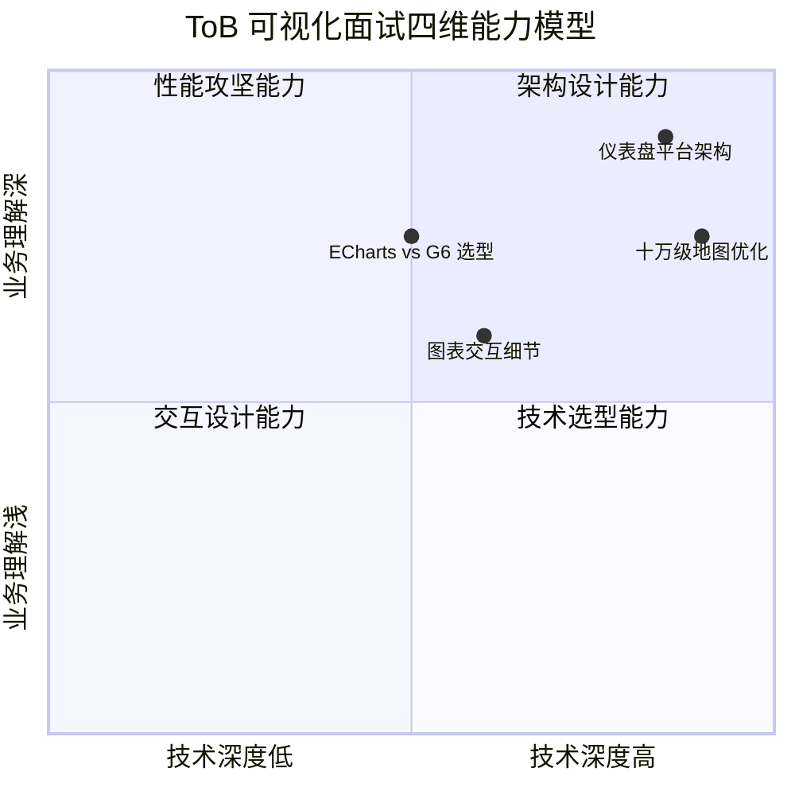

| 维度 | 核心考察点 | 典型问题 | 回答锚点 |
|------|-----------|---------|---------|
| **技术选型** | 选型判断力，不是选"最好的"而是"最合适的" | ECharts vs G6 vs D3 怎么选？ | 统计→ECharts，拓扑→G6，定制→D3 |
| **大规模渲染** | 渲染管线瓶颈分析 | 十万级地图点位卡顿怎么优化？ | BBOX→Cluster→Cache→懒刷新 |
| **交互设计** | 异常状态边界处理 | 用户快速操作会怎样？ | 悬浮/点击/联动/动画四要素 |
| **架构设计** | 可扩展性、可维护性、可降级 | 仪表盘系统怎么设计？ | 四层架构：数据→图表→布局→管理 |

### 1.2 回答质量分层 🏆

| 层级 | 表现 | 面试官评价 |
|------|------|-----------|
| L1 | 只罗列技术名词（"用了ECharts + G6 + D3"） | "会用工具，但没深度" |
| L2 | 能说清楚为什么选、优缺点对比 | "有技术判断力" |
| L3 | 能说出在项目中踩过什么坑、怎么解决 | "有实战经验" |
| L4 | 能抽象出通用模式，形成自己的方法论 | "有架构视野" |

> **面试目标：** 至少达到 L3，争取 L4。每个回答都要有"项目验证"和"方法论提炼"。

---

## 二、🔀 技术选型深度对比与决策树

### 2.1 🗺️ 可视化全景图谱

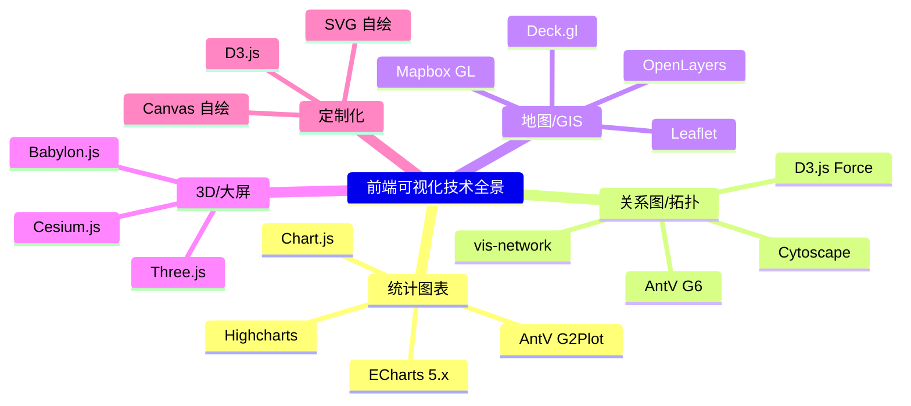

### 2.2 🌳 技术选型决策树

```mermaid
flowchart TD
    Q["需要什么类型的可视化？"] --> A1["📊 统计图表"]
    Q --> A2["🔗 关系/拓扑图"]
    Q --> A3["🗺️ 地图/GIS"]
    Q --> A4["🏗️ 3D/数字孪生"]
    Q --> A5["🎨 定制化极高"]

    A1 --> B1["ECharts 5.x ─── 最成熟、大屏首选"]
    A1 --> B2["AntV G2Plot ── Ant Design 体系"]
    A1 --> B3["Highcharts ─── 商业授权、金融行业"]
    A1 --> B4["Chart.js ───── 轻量、简单图表"]

    A2 --> C1["AntV G6 ────── 图可视化最强、布局引擎"]
    A2 --> C2["D3.js Force ── 灵活但成本高"]
    A2 --> C3["vis-network ── 轻量、快速集成"]

    A3 --> D1["OpenLayers ─── ToB 首选、优化空间大"]
    A3 --> D2["Leaflet ────── 轻量、简单标注"]
    A3 --> D3["Mapbox GL ──── WebGL 加速、3D 地图"]
    A3 --> D4["Deck.gl ────── 百万级 WebGL 点位"]

    A4 --> E1["Three.js ──── 通用 3D、生态最广"]
    A4 --> E2["Cesium.js ─── 地球级 GIS、数字孪生"]

    A5 --> F1["D3.js ──────── 数据驱动 DOM、灵活度最高"]
    A5 --> F2["Canvas 自绘 ── 极致性能、完全控制渲染"]

    style Q fill:#e3f2fd,stroke:#1565c0
    style A1 fill:#e8f5e9,stroke:#2e7d32
    style A2 fill:#e8f5e9,stroke:#2e7d32
    style A3 fill:#e8f5e9,stroke:#2e7d32
    style A4 fill:#e8f5e9,stroke:#2e7d32
    style A5 fill:#e8f5e9,stroke:#2e7d32
    style B1 fill:#c8e6c9
    style C1 fill:#c8e6c9
    style D1 fill:#c8e6c9
    style E1 fill:#c8e6c9
    style F1 fill:#c8e6c9
```

> **选型优先级（ToB 场景）：** `功能覆盖度 > 性能 > 文档丰富度 > 维护活跃度 > 包体积`

### 2.3 📊 核心库深度对比

#### ✅ ECharts 5.x —— ToB 第一选择

```text
╔══════════════════════════════════════════════════╗
║  🏆 ECharts 5.x 核心优势                         ║
╠══════════════════════════════════════════════════╣
║  📊 20+ 内置图表类型（折线/柱状/饼图/雷达/      ║
║     桑基/树图/热力图/地图/K线）                  ║
║  ⚡ 配置驱动：一个 option 对象声明一切，上手最快  ║
║  🚀 WebGL 渲染（5.0+），large 模式万级数据       ║
║  📉 采样机制：'lttb'/'average'/'max'/'min'      ║
║  🖱 交互：dataZoom / connect 联动 / 下钻事件     ║
║  🖥 大屏：dataset + visualMap + 富文本标签        ║
║  🇨🇳 ToB 刚需：中国地图、时间轴、仪表盘、K线      ║
╚══════════════════════════════════════════════════╝
```

```text
╔══════════════════════════════════════════════════╗
║  ⚡ 性能优化核心点                                 ║
╠══════════════════════════════════════════════════╣
║  notMerge: true   → 全量替换（简单场景）          ║
║  notMerge: false  → 增量更新（高频场景）          ║
║  large: true      → 超 2000 点自动 WebGL         ║
║  sampling: 'lttb' → 降采样保留趋势特征            ║
║  按需引入         → 包体积减少 60%+               ║
╚══════════════════════════════════════════════════╝
```

```text
╔══════════════════════════════════════════════════╗
║  ⚠️ 常见坑                                        ║
╠══════════════════════════════════════════════════╣
║  setOption 频繁调用导致 Layout 计算爆炸          ║
║  → RAF 节流                                      ║
║  大屏 resize 不及时                              ║
║  → ResizeObserver 替代 window.resize             ║
║  大数据量动画卡顿                                ║
║  → animation: false                              ║
║  多个实例内存泄漏                                ║
║  → dispose 清理                                  ║
╚══════════════════════════════════════════════════╝
```

#### 🔗 AntV G6 —— 图可视化 / 拓扑

```text
╔══════════════════════════════════════════════════╗
║  🏆 AntV G6 核心优势                             ║
╠══════════════════════════════════════════════════╣
║  专为图可视化设计（节点 + 边）                   ║
║  内置布局引擎：力导向 / dagre / 环形 / 网格      ║
║  交互：拖拽、缩放、选中、悬停、自定义 Behavior   ║
║  性能：Canvas + WebWorker 不阻塞 UI              ║
║  可扩展：自定义节点/边/布局/交互                  ║
╚══════════════════════════════════════════════════╝
```

```text
╔══════════════════════════════════════════════════╗
║  🎯 面试高频考点                                  ║
╠══════════════════════════════════════════════════╣
║  布局算法选型                                     ║
║  ├─ 力导向(d3-force) → 探索式分析                ║
║  └─ 层次布局(dagre) → 流程图/树形结构             ║
║  万级节点大图优化                                 ║
║  ├─ 视口裁剪：只渲染可视区域                      ║
║  ├─ Group 折叠展开：子网→组节点                  ║
║  ├─ 增量渲染：分批次添加不阻塞                    ║
║  └─ WebWorker 布局：避免主线程卡顿                ║
║  自定义节点/边                                    ║
║  ├─ registerNode 自定义 draw                     ║
║  ├─ afterdraw 添加动画（闪烁/流动）               ║
║  └─ 状态模式：选中/悬停/告警切换                  ║
╚══════════════════════════════════════════════════╝
```

```text
╔══════════════════════════════════════════════════╗
║  ⚠️ 常见坑                                        ║
╠══════════════════════════════════════════════════╣
║  大数据量力导向 CPU 100%                          ║
║  → 预计算布局 + WebWorker                         ║
║  节点重叠无法交互                                  ║
║  → 碰撞检测 + 自动散开                            ║
║  动画导致重绘性能问题                              ║
║  → 关闭动画或降低帧率                             ║
║  自定义节点事件不生效                              ║
║  → 委托到 Graph 级别监听                          ║
╚══════════════════════════════════════════════════╝
```

#### 🗺️ OpenLayers —— 地图 / GIS

```text
╔══════════════════════════════════════════════════╗
║  🏆 OpenLayers 核心优势                           ║
╠══════════════════════════════════════════════════╣
║  功能最全的开源 GIS 库                            ║
║  支持 OSM/WMS/WMTS/Vector Tiles                  ║
║  内置 Cluster、Popup、坐标系转换                  ║
║  性能优化空间大（BBOX/增量/StyleFunction）       ║
╚══════════════════════════════════════════════════╝
```

```text
╔══════════════════════════════════════════════════╗
║  🎯 面试高频考点 —— 十万级点位优化                ║
╠══════════════════════════════════════════════════╣
║  ① BBOX 视口裁剪（数据层）                       ║
║     → 只渲染视口内 Feature                       ║
║  ② Cluster 聚合（视觉层）                        ║
║     → 同区域合并为聚合点                          ║
║  ③ dataCache 缓存（内存层）                       ║
║     → 切换视口不重新请求                          ║
║  ④ moveend 懒刷新（渲染层）                       ║
║     → 拖拽结束才重绘                              ║
║                                                   ║
║  效果：10万→百级 Cluster，<10fps→60fps           ║
╚══════════════════════════════════════════════════╝
```

```text
╔══════════════════════════════════════════════════╗
║  ⚠️ 常见坑                                        ║
╠══════════════════════════════════════════════════╣
║  Cluster 展开/聚合闪烁 → 淡入淡出过渡            ║
║  大量 Feature 添加卡顿 → 批量 addFeatures        ║
║  坐标偏移不匹配 → 统一坐标系转换                  ║
║  内存泄漏 → 销毁时 clear() 所有图层              ║
╚══════════════════════════════════════════════════╝
```

#### 🎨 D3.js —— 数据驱动 DOM

```text
╔══════════════════════════════════════════════════╗
║  🏆 D3.js 核心优势                                ║
╠══════════════════════════════════════════════════╣
║  底层可视化库，完全控制 DOM/SVG/Canvas           ║
║  数据绑定 + 过渡动画（enter/update/exit 模式）   ║
║  灵活度最高，几乎可以做任何类型的可视化           ║
║  生态丰富：大量插件和社区案例                     ║
╚══════════════════════════════════════════════════╝
```

```text
╔══════════════════════════════════════════════════╗
║  🎯 面试常考概念                                  ║
╠══════════════════════════════════════════════════╣
║  数据绑定                                         ║
║  ├─ datum() → 单个数据                            ║
║  ├─ data()  → 数组                                ║
║  └─ join()  → 自动 enter/update/exit              ║
║  比例尺：scaleLinear / scaleOrdinal / scaleTime   ║
║  坐标轴：axisBottom / axisLeft                    ║
║  过渡动画：transition / duration / ease           ║
║  力导向图：forceSimulation                        ║
║  选择集：select / selectAll / enter / exit / merge║
╚══════════════════════════════════════════════════╝
```

```text
╔══════════════════════════════════════════════════╗
║  ⚖️ 优缺点 & 选型建议                              ║
╠══════════════════════════════════════════════════╣
║  ✅ 优点：灵活、可定制、生态丰富、学习价值高      ║
║  ❌ 缺点：学习曲线陡、DOM 操作不如 Canvas         ║
║  💡 建议：别人做不了的自定义→D3，否则→ECharts/G2 ║
╚══════════════════════════════════════════════════╝
```

```text
╔══════════════════════════════════════════════════╗
║  ⚠️ 常见坑                                        ║
╠══════════════════════════════════════════════════╣
║  数据更新 DOM 泄漏 → exit().remove()             ║
║  大量 SVG 元素卡顿 → 切换 Canvas 渲染            ║
║  过渡动画冲突 → 使用 transition 队列             ║
║  坐标轴刻度重叠 → 旋转标签或跳步显示             ║
╚══════════════════════════════════════════════════╝
```

---

## 三、❓ 高频面试题 · 链式追问

### 📐 专题 1：大规模数据渲染优化 （必考 ⭐⭐⭐⭐⭐）

---

#### 🎯 Q1：十万级数据点在地图上渲染卡顿，怎么优化？ ⭐⭐⭐⭐⭐

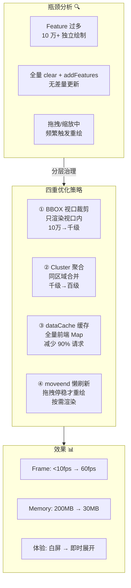

```
回答结构：先分析瓶颈，再给分层优化方案

瓶颈分析（为什么卡？）：
├─ Feature 10 万+ → Canvas 重绘 O(n) drawCall 爆炸
├─ 全量 clear + addFeatures → 无差量更新，每次重绘全部
└─ 拖拽过程中 mousemove 每秒触发 60 次 → 重绘 60 次/秒

四重优化策略（分层治理）：

┌─────────────────────────────────────────────────────────────────┐
│  数据层 → 视觉层 → 内存层 → 渲染层                               │
│                                                                  │
│  ① BBOX 裁剪      ② Cluster 聚合     ③ dataCache 缓存            │
│  ┌──────────┐     ┌──────────┐     ┌──────────┐                 │
│  │ 10 万点  │ →   │ 千级点位 │ →   │ 百级     │                 │
│  │ 视口过滤 │     │ 同区合并 │     │ Cluster  │                 │
│  └──────────┘     └──────────┘     └──────────┘                 │
│                                        ↓                        │
│                                  ④ moveend 懒刷新                │
│                                  ┌──────────────────────┐       │
│                                  │ 拖拽: throttle 轻量   │       │
│                                  │ 停稳: debounce 全量   │       │
│                                  └──────────────────────┘       │
└─────────────────────────────────────────────────────────────────┘

各层详解：
├─ ① BBOX 视口裁剪：filterBBOXData() 计算当前视口经纬度范围
│   ├─ getBottomLeft / getTopRight 取视口四角坐标
│   ├─ data.filter(item => lng >= bl && lng <= tr && lat >= bl && lat <= tr)
│   └─ 效果：10 万 → 千级
│
├─ ② Cluster 聚合：同 Market 同状态设备合并
│   ├─ 动态半径：低 Zoom 100px → 高 Zoom 20px
│   ├─ 聚合点样式：大圆 + 数字（设备数）
│   └─ 效果：千级 → 百级 Cluster
│
├─ ③ dataCache 全量缓存：Map<string, HeNB> 存储所有 Feature
│   ├─ 首次加载全量缓存，缩放平移不请求后端
│   └─ 效果：减少 90% 网络请求
│
└─ ④ moveend 懒刷新：
    ├─ 拖拽中 throttle(200ms) 轻量更新聚合位置
    ├─ 停稳后 debounce(300ms) + moveend 触发全量渲染
    └─ 效果：从每秒 60 次重绘 → 每次停稳 1 次

效果量化：
├─ Feature 数量：100000 → ~50 个 Cluster
├─ 帧率：<10fps → 60fps
├─ 内存：200MB → 30MB
└─ 交互：白屏等待 → 即时聚合/展开
```

> **链式追问入口：**
>
> **Q：** BBOX 裁剪的原理是什么？
>
> **Q：** Cluster 聚合半径怎么确定？展开时闪烁怎么处理？
>
> **Q：** 到了百万级点位怎么办？Canvas 2D 还有瓶颈吗？什么阈值切换到 WebGL？
>
> **Q：** 用户快速拖拽穿越大片区域，中间视口数据会丢失吗？

---

#### 🎯 Q2：ECharts 大数据量折线图卡顿，怎么优化？ ⭐⭐⭐⭐⭐

```
回答结构：采样 + 渲染 + 更新 三管齐下

性能瓶颈分析：
├─ DOM/SVG 节点过多（ECharts 默认 SVG 渲染）
├─ 每条数据点都绘制 → 轨迹点密集不可分辨
└─ 实时更新时频繁 setOption → Layout 计算开销大

优化策略：
├─ 1. 降采样（数据层）
│   ├─ ECharts 内置 sampling: 'lttb'（Largest Triangle Three Buckets）
│   │   └─ 算法原理：将数据分段，每段取"最大三角形"的点，保留趋势特征
│   ├─ 手动聚合：后端按时间窗口聚合（avg/max/min/count）
│   └─ 效果：10 万点 → 1000 渲染点，趋势不变
│
├─ 2. 开启 large 模式（渲染层）
│   ├─ ECharts 5+ large: true 使用 WebGL 渲染
│   ├── large 阈值：折线/散点图默认 > 2000 点自动启用
│   └─ 效果：Canvas 2D → WebGL GPU 加速
│
├─ 3. 增量更新替代全量替换（更新层）
│   ├─ setOption({...}, { notMerge: false })
│   │   └─ 只更新变化的部分，不销毁重建
│   ├─ 高频更新（实时数据）：
│   │   ├─ appendData：追加新数据点（最高效）
│   │   └─ RAF 节流：每帧最多一次 setOption
│   └─ 效果：全量重绘 O(n) → 增量更新 O(1)
│
└─ 4. 关闭过渡动画
    ├─ animation: false（高频更新时）
    ├─ animationDuration: 0
    └─ 效果：省去每帧的动画计算开销
```

> **链式追问入口：**
>
> **Q：** `sampling: 'lttb'` 的原理是什么？和平均值采样有什么本质区别？
>
> **Q：** `notMerge: false` 增量更新的底层是怎么实现的？
>
> **Q：** 实时更新时，`appendData` 和 `setOption` 在性能上差多少？为什么？

---

#### 🎯 Q3：Canvas 2D vs SVG vs WebGL 选型依据？ ⭐⭐⭐⭐

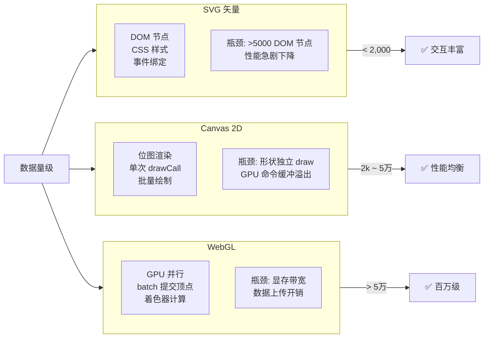

```
渲染管线对比（以绘制 10 万个圆点为例）：

SVG 路径：
  数据 → 创建 10 万个 <circle> DOM → 插入 DOM 树 → 样式计算 → 布局 → 绘制
  瓶颈：10 万 DOM 节点的创建和布局计算（CPU 密集型）

Canvas 2D 路径：
  数据 → 10 万次 ctx.arc() + ctx.fill() → 10 万次 drawCall → GPU 栅格化
  瓶颈：10 万次 drawCall 的 CPU→GPU 通信开销

WebGL 路径：
  数据 → 上传顶点缓冲区 1 次 → drawElements 1 次 → 顶点着色器 → 片元着色器
  瓶颈：显存带宽（数据上传速度）

性能阈值经验值：
├─ < 2,000 点：SVG 最佳（交互丰富、缩放清晰）
├─ 2,000 ~ 50,000 点：Canvas 2D 足够（drawCall 可控）
├─ 50,000 ~ 500,000 点：WebGL 推荐（GPU 并行优势明显）
└─ > 500,000 点：必须 WebGL + 分片/瓦片加载（LOD 分级）
```

---

### ⚡ 专题 2：实时数据可视化 （必考 ⭐⭐⭐⭐⭐）

---

#### 🎯 Q4：1000+ QPS 实时数据可视化怎么设计？ ⭐⭐⭐⭐⭐

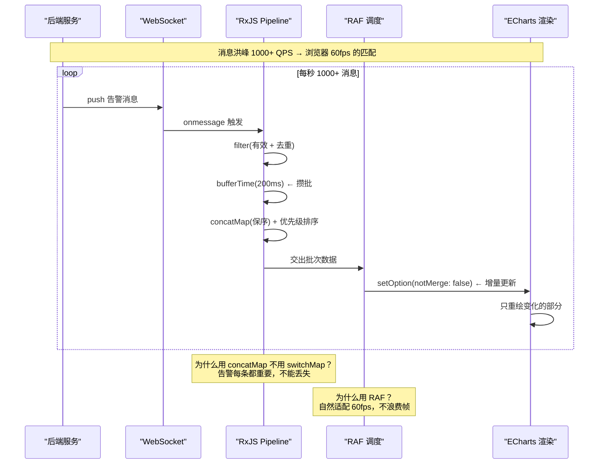

```
回答结构：三层架构——消息层 → 数据处理层 → 渲染层

┌──────────────────────────────────────────────────────────────┐
│                   第一层：消息接收                              │
│  WebSocket 连接管理                                            │
│  ├─ 单连接多频道复用（告警/状态/日志分 topic）                   │
│  ├─ 心跳保活：每 30s ping / pong                               │
│  ├─ 断线重连：指数退避（1s → 2s → 4s → 8s → 30s 封顶）        │
│  ├─ 连接状态可视化：🟢 已连接 / 🟡 重连中 / 🔴 断开            │
│  └─ 消息格式：{ topic, type, payload, timestamp, id }          │
├──────────────────────────────────────────────────────────────┤
│                   第二层：数据处理                               │
│  RxJS 流控 Pipeline                                            │
│  ├─ bufferTime(200ms)    ← 攒批处理，减少渲染次数                │
│  ├─ concatMap            ← 队列保序，不丢消息                   │
│  ├─ 优先级排序：Critical > Major > Minor > Info                 │
│  ├─ 消息去重：按 id + timestamp                                 │
│  └─ 数据转换：后端原始数据 → 前端渲染格式                        │
├──────────────────────────────────────────────────────────────┤
│                   第三层：渲染优化                               │
│  RAF 帧同步 + ECharts 增量更新                                  │
│  ├─ RAF 批处理：一帧只更新一次 setOption                         │
│  ├─ notMerge: false  ← 增量更新，不全量替换                      │
│  ├─ 高频更新时关闭动画（animation: false）                       │
│  └─ 图表分离：高频小图独立渲染，不影响主图                       │
└──────────────────────────────────────────────────────────────┘

效果量化：
├─ 吞吐量：1000+ QPS 消息处理
├─ 端到端延迟：<500ms（告警产生 → 界面展示）
└─ 渲染帧率：60fps（RAF 节流 + 增量更新）

工业级扩展：
├─ 消息积压保护：超过缓冲区上限时丢弃低优先级消息
├─ 降级方案：WebSocket 断开时切换到 SSE 或轮询
├─ 指标监控：消息处理延迟、丢包率、渲染帧率
└─ 多 Tab 共享连接：BroadcastChannel 共享一个 WebSocket
```

> **链式追问入口：**
>
> **Q：** `bufferTime` 和 `throttleTime` 的区别？什么场景用哪个？
>
> **Q：** 消息洪峰超过处理能力怎么办？怎么设计背压机制？
>
> **Q：** ECharts 一次 setOption 更新大量数据时，框架内部是怎么处理的？
>
> **Q：** 多 Tab 共享 WebSocket 怎么实现？BroadcastChannel 还是 Service Worker？

---

#### 🎯 Q5：WebSocket 断线重连数据丢失怎么恢复？ ⭐⭐⭐⭐

```
回答结构：断线不丢数据——双保险策略

策略一：Server-Side 消息持久化
├─ 后端维护一个环形缓冲区（Ring Buffer），保留最近 N 条消息
├─ 前端重连时带上 lastReceivedId
├─ 后端从 lastReceivedId 开始补发缺失消息
└─ 缓冲区大小按业务定：告警保留 1000 条，日志保留 5000 条

策略二：Client-Side 请求补偿
├─ 重连成功后，前端发起一次全量数据请求（HTTP GET /api/v1/alerts?since=timestamp）
├─ 与 WebSocket 实时流做"合并去重"
└─ 保证断连期间的数据不丢失

实施细节：
├─ lastReceivedId 存储在内存（页面刷新丢失）
│   └─ 增强：sessionStorage 持久化，页面刷新后仍可恢复
├─ 补偿请求返回的数据与实时流数据重叠 → 按 id 去重
├─ 断连时间 > 阈值（如 5 分钟）→ 全量刷新而非增量补偿
└─ 补偿期间显示"数据恢复中..."提示

效果：
├─ 秒级断连 → 零数据丢失（环形缓冲区补发）
├─ 分钟级断连 → 补偿请求补齐
└─ 长期断连（>5min）→ 全量刷新，保证数据一致性
```

---

### 🔗 专题 3：图可视化 / 拓扑 （高频 ⭐⭐⭐⭐）

---

#### 🎯 Q6：万级节点网络拓扑图怎么优化？ ⭐⭐⭐⭐⭐

```
回答结构：四维优化——布局、渲染、交互、数据

第一维：布局算法优化
├─ 力导向布局（d3-force）
│   ├─ 问题：万级节点力计算 O(n²)，CPU 100%
│   └─ 优化：
│       ├─ WebWorker 布局计算（不阻塞主线程）
│       ├─ 冷启动：预计算布局坐标存储到后端
│       └─ 热更新：增量布局（只对新节点计算）
├─ 层次布局（dagre）
│   └─ 适用：流程图、层级结构，O(n) 计算复杂度
└─ 选型：探索式 → 力导向（WebWorker），固定结构 → 预计算布局

第二维：渲染优化
├─ 视口裁剪：只渲染可视区域内的节点和边
├─ 节点聚合（Group 折叠展开）
│   ├─ 子网折叠为一个组节点
│   ├─ 展开时增量渲染子节点
│   └─ 效果：万级 → 百级
├─ 增量渲染：setTimeout 分批次添加（每帧 50-100 个节点）
└─ 边简化：非可视区域的边不渲染

第三维：交互优化
├─ 拖拽防抖：拖拽结束后才重新布局
├─ 缩放平滑：transition 过渡
├─ 选中高亮：Highlight / darken 模式（高亮相邻节点，其他置灰）
└─ 右键菜单：节点信息、下钻、拓扑隔离

第四维：数据优化
├─ 数据按需加载：先加载顶层节点，展开时加载子节点
├─ 数据缓存：已加载的子树不重复请求
└─ 后端预计算：边的关系预聚合，减少前端计算量

效果：
├─ 万级节点拓扑 → 首屏加载 < 3s（分步加载）
├─ 交互操作流畅 → 60fps（视口裁剪 + 增量渲染）
└─ 内存占用可控 → < 200MB（懒加载 + 数据缓存）
```

> **链式追问入口：**
>
> **Q：** 力导向布局的力计算公式是什么？电荷力和弹簧力怎么影响布局效果？
>
> **Q：** 节点聚合展开时，子节点位置怎么排布？避免重叠的算法是什么？
>
> **Q：** 千级节点同时拖拽卡顿怎么优化？拖拽过程中的布局计算怎么调度？
>
> **Q：** 百万级边的拓扑，边的渲染怎么优化？（边捆绑、边采样）

---

#### 🎯 Q7：G6 和 D3.js 有什么区别？怎么选？ ⭐⭐⭐⭐

```
区别对比：

使用模式：
├─ G6：图可视化框架，开箱即用（节点/边/布局/交互）
│   └─ 配置驱动：Graph({ container, width, height, modes, ... })
├─ D3：通用可视化库，完全自绘
│   └─ 编程驱动：数据绑定 + 选择集 DOM 操作

适用场景：
├─ G6：标准拓扑/流程图/树图
│   └─ 80% 的 ToB 拓扑场景够用
├─ D3：高度定制化的可视化
│   └─ 20% 的"别人做不出来"的场景

性能：
├─ G6：Canvas 渲染 + 内置优化策略
├─ D3：SVG 渲染（默认），需手动优化

选型建议：
├─ 标准网络拓扑 → G6（开箱即用，快）
├─ 需要定制节点/边/动画 → G6 自定义 + D3 辅助
├─ 完全自研的可视化组件 → D3
├─ 混合使用：G6 做拓扑 + D3 做定制组件
```

---

### 🏗️ 专题 4：仪表盘系统架构 （高频 ⭐⭐⭐⭐）

---

#### 🎯 Q8：企业级仪表盘系统架构怎么设计？ ⭐⭐⭐⭐

```
回答结构：四层架构——数据层 → 图表层 → 布局层 → 管理层

┌────────────────────────────────────────────────────────────┐
│                       管理层                                │
│  仪表盘 CRUD | 模板系统 | 快照/历史 | 分享/权限 | 定时刷新  │
├────────────────────────────────────────────────────────────┤
│                       布局层                                │
│  Grid 布局 | 自由拖拽（react-grid-layout）| 响应式适配      │
│  大屏/桌面/平板 三端适配                                   │
├────────────────────────────────────────────────────────────┤
│                       图表层                                │
│  图表注册表（type→Component）| 通用配置规范 | 联动机制    │
│  下钻/筛选/高亮同步 | 图表导出（图片/CSV/PDF）             │
├────────────────────────────────────────────────────────────┤
│                       数据层                                │
│  统一数据源（GraphQL / 聚合 API）| 缓存（SWR/React Query） │
│  数据转换（前端 ETL）| 降级方案                             │
└────────────────────────────────────────────────────────────┘

各层核心设计：

数据层：
├─ 统一数据源：BFF 层聚合多个微服务数据（仪表盘可能来自 3-5 个服务）
├─ 缓存策略：SWR（stale-while-revalidate），缓存优先 + 后台更新
├─ 数据转换：前端 ETL 管道（格式化、聚合、排序、筛选）
├─ 降级方案：后端异常时显示缓存数据 + "数据延迟"提示
└─ 预加载：用户 hover 仪表盘 Tab 时提前请求数据

图表层：
├─ 注册表模式：Map<string, Component>，按 type 动态渲染图表
├─ 通用配置规范：所有图表统一数据格式、尺寸、主题、颜色
├─ 联动机制：EventBus / shared state 实现跨图表交互
│   ├─ 筛选联动：时间范围/维度选择影响所有图表
│   └─ 高亮联动：hover 一个图表，关联图表同步高亮
└─ 图表导出：html2canvas 截图 / 数据序列化 CSV / jsPDF

布局层：
├─ 固定布局：Grid 系统（12 列 / 24 列），适合标准仪表盘
├─ 自由拖拽：react-grid-layout / angular-gridster2
│   └─ 布局持久化：localStorage / 服务端保存
└─ 响应式适配：大屏（1920+）/ 桌面（1440）/ 平板（768）三断点

管理层：
├─ 仪表盘 CRUD：创建、编辑、保存、删除
├─ 模板系统：从预定义模板快速创建仪表盘
├─ 快照/历史：定时保存仪表盘快照，支持历史对比
└─ 权限：仪表盘级别（查看/编辑/管理）+ 数据级别（行/列权限）

BFF 层的价值：
├─ 多源聚合：一个仪表盘的数据可能来自 3-5 个微服务
├─ 数据预处理：后端做聚合计算，前端直接渲染（减少前端计算量）
├─ 缓存策略：BFF 层做 Redis 缓存，减少下游服务压力
└─ 降级兜底：后端数据异常时返回兜底数据框架
```

> **链式追问入口：**
>
> **Q：** 多个图表联动高亮时，EventBus 和 shared state 各有什么优缺点？
>
> **Q：** 仪表盘拖拽布局时，图表 resize 时机怎么控制？（ResizeObserver vs 手动触发）
>
> **Q：** 仪表盘加载优化——10 个图表同时发起请求怎么控制并发？请求瀑布流怎么处理？
>
> **Q：** 图表导出图片时，跨域问题怎么解决？html2canvas 的局限性有哪些？

---

#### 🎯 Q9：实时 vs 离线仪表盘架构的核心区别？ ⭐⭐⭐

```
实时仪表盘：
├─ 数据流：WebSocket / SSE 流式推送
├─ 更新策略：增量更新（appendData / notMerge: false）
├─ 缓存策略：环形缓冲区（只保留最近 N 条）
├─ 渲染策略：RAF 帧同步 + bufferTime 批处理
├─ 动画：高频更新时关闭
├─ 降级：断线重连 + 消息补偿
└─ 典型场景：告警监控、实时流量、设备状态

离线仪表盘：
├─ 数据流：HTTP 请求一次性加载
├─ 更新策略：全量替换（notMerge: true）
├─ 缓存策略：SWR 缓存优先
├─ 渲染策略：懒加载 + 按需渲染
├─ 动画：入场动画 + 过渡动画
├─ 降级：缓存兜底 + 错误重试
└─ 典型场景：日报/周报、统计分析、历史趋势

混合架构（推荐——大部分 ToB 场景）：
├─ 首次加载：HTTP 全量（历史数据）+ WebSocket（增量实时数据）
├─ 合并策略：历史数据 baseline + 实时数据 delta
├─ 更新策略：初始全量加载 → 后续增量更新
└─ 降级策略：WebSocket 断开 → 切换轮询，保证数据不中断
```

---

### 🖱️ 专题 5：可视化交互设计 （中频 ⭐⭐⭐）

---

#### 🎯 Q10：ToB 可视化图表交互设计要注意什么？ ⭐⭐⭐

```
回答结构：四要素——悬浮、点击、联动、动画 + ToB 特有需求

第一要素：悬浮（Tooltip）
├─ 展示详细信息：名称、数值、变化趋势、对比基准
├─ 多系列对比：显示所有系列的数据值
├─ 时间序列：时间戳 + 精确数值（注意时区）
├─ 自定义 Tooltip：富文本、表格、颜色标识、进度条
└─ 边界：超长文本截断 + 气泡位置防遮挡

第二要素：点击（下钻 / 跳转）
├─ 图表元素点击 → 下钻到详情（URL 传参 + 路由跳转）
├─ 图例点击 → 显隐对应系列
├─ 空白区域点击 → 取消选中状态
├─ 右键菜单 → 导出图片、导出数据、复制数值
└─ 边界：点击响应区域不小于 44px（触屏友好）

第三要素：联动（关联图表同步）
├─ 同一数据集的多图表同步高亮（hover 联动）
├─ 筛选器联动：时间范围/维度选择影响所有图表
├─ 跨 Tab 联动：Tab 切换保持筛选状态
├─ 实现方案：
│   ├─ EventBus（简单场景）
│   ├─ Shared State（Zustand / Signal / RxJS）
│   └─ URL 参数（可分享、可刷新保持状态）

第四要素：动画
├─ 入场动画：数据加载时的渐入过渡（opacity + translateY）
├─ 更新动画：数据变化时的平滑过渡（duration: 300ms）
├─ 交互动画：悬浮放大、点击反馈（即时，<100ms）
├─ 高频更新：关闭动画（animation: false），避免卡顿
└─ 边界：动画队列冲突 → transition.cancel() 前一动画

ToB 特有交互需求：
├─ 图表导出：图片（html2canvas）/ CSV（Blob + download）/ PDF（jsPDF）
├─ 图表配置持久化：横轴选择、指标切换、颜色个性化
├─ 告警标注：在图表上标注异常时间点
├─ 大屏模式：全屏、自动轮播、字体放大
└─ 数据刷选：鼠标框选时间段查看明细
```

---

## 四、📋 项目落地实战 （STAR 模板 + 亮点映射）

### 4.1 🗺️ 面试回答模板：地图性能优化

```
30 秒版：
"十万级设备地图优化，核心是四重策略：BBOX 视口裁剪 × Cluster 聚合 × dataCache 全量缓存 × moveend 懒刷新。
Feature 从 10 万降到百级，帧率从 <10fps 优化到 60fps。"

追问版（深入原理）：
"具体来说分四层：
第一层，BBOX 裁剪——计算当前视口的经纬度范围（filterBBOXData），只渲染视口内的 Feature；
第二层，Cluster 聚合——同区域的设备合并为聚合点，显示设备数量，低 Zoom 放大半径聚合更多；
第三层，dataCache——全量数据缓存在 Map<string, HeNB> 中，缩放平移无需请求后端；
第四层，moveend 懒刷新——拖拽中用 throttle 轻量更新聚合位置，停稳后 debounce 全量渲染。
四层缺一不可——BBOX 裁剪后视口内可能有上万点，需要 Cluster 进一步聚合；Cache 保证不重复请求。"

STAR 故事版：
"S（背景）：AeMS 项目需要在地图上渲染 10 万+ 基站设备，原始方案直接 addFeatures 全部渲染，
帧率不到 10fps，拖拽卡顿白屏。

T（任务）：需要将帧率提升到 30fps 以上，保证用户拖拽、缩放、点选交互流畅。

A（行动）：我用 Chrome DevTools Performance 面板定位瓶颈在 Canvas 重绘（clear+addFeatures 全量）。
然后分层优化：① BBOX filterBBOXData 只渲染视口内点位；② Cluster 同区域合并；
③ dataCache 全量缓存避免重复请求；④ moveend 事件 + throttle/debounce 控制渲染频率。

R（结果）：Feature 从 10 万降到约 50 个 Cluster，帧率从 <10fps 优化到 60fps，内存从 200MB 降到 30MB。"
```

### 4.2 ⚡ 面试回答模板：实时告警可视化

```
30 秒版：
"1000+ QPS 的实时告警可视化，三层架构：WebSocket 接收 → RxJS bufferTime(200ms) 批处理 + concatMap 保序 → RAF 帧同步 ECharts 增量更新。端到端延迟 <500ms，渲染 60fps。"

追问版（深入原理）：
"这里的关键是处理'消息洪峰'和'渲染帧率'的匹配。
WebSocket 每秒可能来数百条消息，但浏览器每秒只有 60 帧。
如果每条消息都触发 setOption，Layout 计算会爆炸。
所以用 bufferTime 把 200ms 内的消息打包成一批，再用 RAF 帧同步渲染。
使用 concatMap 而不是 switchMap，因为告警每条都重要，不能丢失。
ECharts 设置 notMerge: false 增量更新而不全量替换。
高频更新时关闭过渡动画（animation: false）。"

STAR 故事版：
"S（背景）：AeMS 告警系统需要实时展示千级 QPS 的告警数据，初始方案每条消息都 setOption，CPU 100%，页面卡死。

T（任务）：需要保证 1000+ QPS 吞吐量，端到端延迟 <500ms，页面帧率 60fps。

A（行动）：设计三层架构——WebSocket 连接管理（心跳保活 + 指数退避重连）；
RxJS 管道（bufferTime 窗口 + concatMap 保序 + 优先级排序 + 去重）；
渲染层（RAF 节流 + ECharts 增量更新 + 高频时关闭动画）。

R（结果）：吞吐 1000+ QPS，延迟 <500ms，帧率 60fps，稳定性 99.9%。"
```

### 4.3 🔀 面试回答模板：技术选型

```
30 秒版：
"ToB 可视化选型遵循'功能优先，性能兜底'原则：
标准图表 → ECharts（最成熟、社区最大、文档最好）；
网络拓扑 → G6（图可视化能力最强，开箱即用）；
地图 → OpenLayers（功能最全、优化空间大）；
定制化极高 → D3.js（灵活度最高）。
同一项目可以混合使用，关键在于统一数据接口。"

追问版（深入原理）：
"选型背后是对业务场景的理解：
我们监控平台面临 10+ 种图表 + 实时更新 + 十万级数据 + 拓扑 + 地图。
ECharts 覆盖 80% 统计图表需求（折线/柱状/饼图/热力图），large 模式支持万级数据；
G6 负责网络拓扑关系图（力导向布局 + 自定义节点）；
OpenLayers 处理 GIS 点位渲染（四重优化策略）；
D3 补充一些定制化图表（自定义 Sankey 图、Chord 图）。
混合使用不冲突——关键在于统一数据接口和渲染调度，
所有图表都从同一个数据源（BFF 聚合 API）获取数据，
通过统一的事件总线实现跨图表联动。"
```

### 4.4 🏆 项目亮点映射表

| 项目 | 可视化相关亮点 | 面试切入角度 |
|------|--------------|-------------|
| **AeMS** | OpenLayers 十万级点位四重优化 | 地图性能优化怎么分层？ |
| **AeMS** | ECharts 实时告警 + WebSocket 可视化 | 1000+ QPS 实时渲染怎么设计？ |
| **AeMS** | LRU 路由缓存 + display:none 保持状态 | 前端缓存策略怎么设计？ |
| **AeMS/FMS** | AntV G6 网络拓扑图 | 万级节点拓扑怎么优化？ |
| **FMS** | ECharts 告警饼图、Dashboard | 多图表联动怎么实现？ |
| **监控平台** | Grafana Dashboard 可视化看板 | 仪表盘系统怎么设计？ |
| **监控平台** | Recording Rules 预计算优化 | 大数据量聚合查询怎么加速？ |
| **所有项目** | 统一 HTTP 层 + 双 Token 无感刷新 | 拦截器模式 + 401 自动刷新怎么设计？ |
| **所有项目** | RBAC 位运算 + 后端 API 双校验 | 权限系统前后端一致性怎么保证？ |
| **所有项目** | React 19 编译器自动 memo | 构建期优化怎么做？ |

---

## 五、🏗️ 架构设计模式

### 5.1 ⚡ 实时数据处理 Pipeline

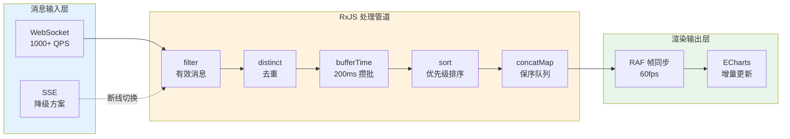

```
RxJS Pipeline 代码等价：
rawMessage$
  .pipe(
    filter(msg => isValid(msg)),                          // 有效消息
    distinctUntilChanged((a, b) => a.id === b.id),         // 去重
    bufferTime(200),                                       // 200ms 攒批
    map(batch => batch.sort(byPriority)),                   // 优先级排序
    concatMap(batch => renderBatch(batch)),                 // 保序执行
    catchError(err => fallbackToPolling())                  // 降级
  )
```

### 5.2 🔗 图表联动架构

```
┌───────────────────────────────────────┐
│           EventBus / Store            │
│  ┌──────────┐ ┌────────┐ ┌────────┐  │
│  │ Filter   │ │ Hover  │ │ Select │  │
│  │ State    │ │ State  │ │ State  │  │
│  └──────────┘ └────────┘ └────────┘  │
└────────────────────┬──────────────────┘
                     │ subscribe
         ┌───────────┼───────────┐
         ▼           ▼           ▼
     ┌──────┐   ┌──────┐   ┌──────┐
     │Chart1│   │Chart2│   │Chart3│
     │Line  │   │Bar   │   │Map   │
     └──────┘   └──────┘   └──────┘

联动流程：
1. 用户 hover Chart1 上的某个数据点
2. Chart1 触发 EventBus.hover({ series, dataIndex, value })
3. Chart2 / Chart3 订阅 hover 事件
4. Chart2 高亮对应系列 → setOption({ series: { data: ... } })
5. Chart3 地图上标记对应区域 → highlightFeature(featureId)
```

### 5.3 🏗️ 仪表盘平台架构

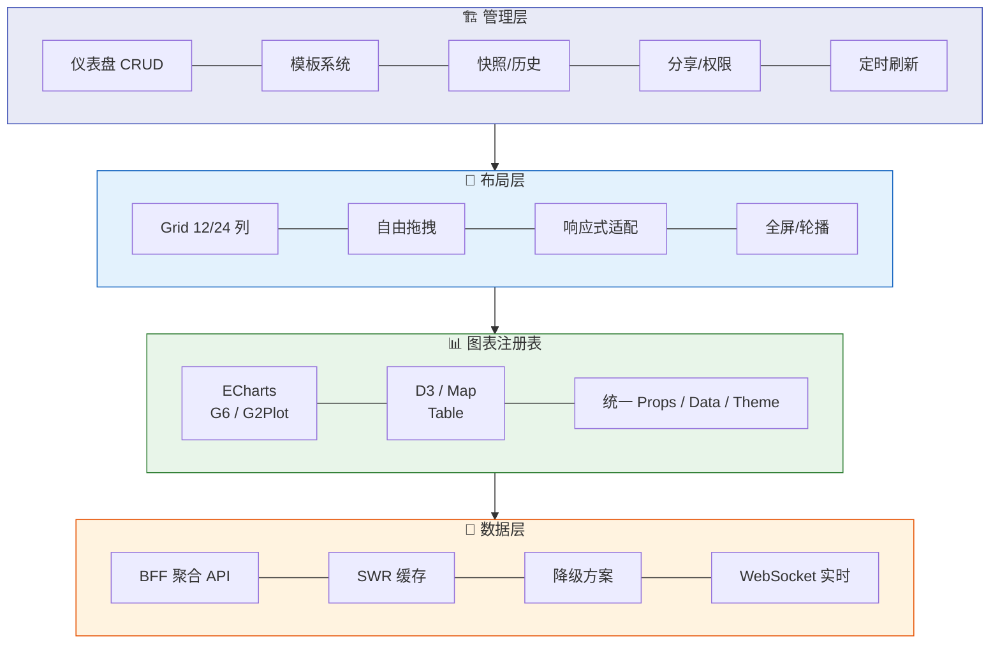

---

## 六、⚛️ React 可视化应用落地 （面试最高频占比 ~40%）

> **面试高频：** "你的项目用 React，可视化方案在 React 中是怎么落地的？" 面试官想考察——你不只是会用图表库，还懂**React 声明式范式与可视化命令式 API 之间的调和**。

---

### 6.1 ⚔️ 核心矛盾：React 声明式 vs 可视化命令式

```
React 本质：声明式 UI = f(state)
  └─ state 变化 → React 重新渲染 → DOM diff → 更新

图表库本质：命令式 API
  └─ echartsInstance.setOption(option)  // 直接操作实例
  └─ mapInstance.addLayer(layer)         // 直接操作地图
  └─ graphInstance.updateData(data)      // 直接操作画布

调和方法（三阶演进）：
├─ L1：useEffect 包裹命令式调用（基础）
│   └─ 问题：每次渲染都销毁重建，性能差
├─ L2：ref 持有实例 + useEffect 控制更新（推荐）
│   └─ 核心：实例初始化一次，后续增量更新
└─ L3：useSyncExternalStore + 自定义渲染器（高阶）
    └─ 核心：将图表视为 React 的"外部存储"，状态同步而非 DOM 同步
```

### 6.2 🪝 通用可视化 Hooks 设计

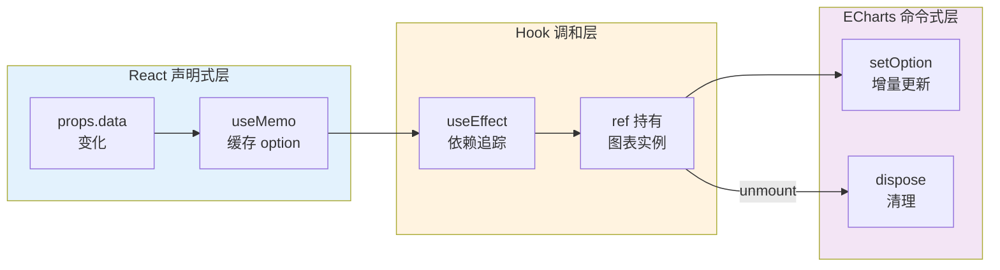

#### 🪝 useECharts —— ECharts React Hook

```typescript
// ===== 核心 Hook：ECharts 实例管理 + 响应式更新 =====
function useECharts(
  containerRef: RefObject<HTMLDivElement>,
  option: EChartsOption,
  deps?: any[]
) {
  const instanceRef = useRef<EChartsInstance | null>(null)

  // L1：初始化实例（仅在容器挂载时执行一次）
  useEffect(() => {
    const instance = echarts.init(containerRef.current!, null, {
      renderer: 'canvas' // 大数据量切 'webgl'
    })
    instanceRef.current = instance

    // 响应式 resize
    const observer = new ResizeObserver(() => instance.resize())
    observer.observe(containerRef.current!)

    return () => {
      observer.disconnect()
      instance.dispose()  // 防止内存泄漏
      instanceRef.current = null
    }
  }, [])

  // L2：响应式更新（option 变化时增量更新，不销毁重建）
  useEffect(() => {
    if (!instanceRef.current) return
    instanceRef.current.setOption(option, {
      notMerge: true,  // 全量替换
      lazyUpdate: true //  RAF 节流，避免频繁 setOption 卡顿
    })
  }, [option, ...(deps || [])])

  // L3：自适应 resize
  useEffect(() => {
    const handleResize = () => instanceRef.current?.resize()
    window.addEventListener('resize', handleResize)
    return () => window.removeEventListener('resize', handleResize)
  }, [])

  return instanceRef
}

// ===== 使用示例 =====
function LineChart({ data }: { data: number[] }) {
  const containerRef = useRef<HTMLDivElement>(null)

  // option 用 useMemo 缓存，避免每次渲染重新创建对象
  const option = useMemo<EChartsOption>(() => ({
    xAxis: { type: 'category' },
    yAxis: { type: 'value' },
    series: [{ data, type: 'line', sampling: 'lttb' }],
    animation: data.length > 5000 ? false : true  // 大数据量关动画
  }), [data])

  useECharts(containerRef, option)

  return <div ref={containerRef} style={{ width: '100%', height: 400 }} />
}
```

#### 🗺️ useMap —— OpenLayers React Hook

```typescript
// ===== 核心 Hook：OpenLayers 地图管理 =====
function useMap(
  containerRef: RefObject<HTMLDivElement>,
  options: { center?: [number, number]; zoom?: number }
) {
  const mapRef = useRef<Map | null>(null)
  const layersRef = useRef<Map<string, Layer>>(new Map())

  // 初始化地图（仅一次）
  useEffect(() => {
    const map = new Map({
      target: containerRef.current!,
      layers: [new TileLayer({ source: new OSM() })],
      view: new View({ center: fromLonLat(options.center || [0, 0]), zoom: options.zoom || 3 })
    })
    mapRef.current = map
    return () => { mapRef.current?.setTarget(undefined); mapRef.current = null }
  }, [])

  // 管理数据层（响应式增删）
  const addFeatureLayer = useCallback((id: string, features: Feature[]) => {
    const map = mapRef.current
    if (!map) return

    // 去重：已有同 id 图层先移除
    if (layersRef.current.has(id)) {
      map.removeLayer(layersRef.current.get(id)!)
    }

    const source = new VectorSource({ features })
    const layer = new VectorLayer({
      source,
      style: (feature) => getFeatureStyle(feature)  // 动态样式函数
    })
    layersRef.current.set(id, layer)
    map.addLayer(layer)
  }, [])

  // BBOX 视口裁剪（性能优化核心）
  const getVisibleFeatures = useCallback(() => {
    const map = mapRef.current
    if (!map) return []
    const extent = map.getView().calculateExtent(map.getSize())
    return dataCache.filter(f => f.getGeometry()?.intersectsExtent(extent))
  }, [])

  return { mapRef, addFeatureLayer, getVisibleFeatures }
}
```

#### ⚡ useRealtimeData —— 实时数据流 Hook

```typescript
// ===== 核心 Hook：WebSocket 实时数据流 =====
function useRealtimeData<T>(
  url: string,
  options?: {
    bufferTime?: number      // 批处理窗口，默认 200ms
    maxBuffer?: number       // 最大缓冲区，默认 1000
    onMessage?: (msg: T) => void
  }
) {
  const [isConnected, setIsConnected] = useState(false)
  const [latestData, setLatestData] = useState<T | null>(null)
  const bufferRef = useRef<T[]>([])
  const wsRef = useRef<WebSocket | null>(null)
  const reconnectTimerRef = useRef<number>()
  const retryCountRef = useRef(0)

  // 断线重连（指数退避）
  const connect = useCallback(() => {
    const ws = new WebSocket(url)
    wsRef.current = ws

    ws.onopen = () => {
      setIsConnected(true)
      retryCountRef.current = 0
    }

    ws.onmessage = (event) => {
      const data = JSON.parse(event.data) as T
      // 消息入缓冲区
      bufferRef.current.push(data)
      // 超出上限丢弃最早消息
      if (bufferRef.current.length > (options?.maxBuffer || 1000)) {
        bufferRef.current.shift()
      }
      options?.onMessage?.(data)
    }

    ws.onclose = () => {
      setIsConnected(false)
      // 指数退避重连：1s → 2s → 4s → 8s → 30s 封顶
      const delay = Math.min(1000 * Math.pow(2, retryCountRef.current), 30000)
      retryCountRef.current++
      reconnectTimerRef.current = window.setTimeout(connect, delay)
    }

    ws.onerror = () => ws.close()
  }, [url, options?.maxBuffer, options?.onMessage])

  // RAF 帧同步批处理（核心优化）
  const rafRef = useRef<number>()
  useEffect(() => {
    if (!isConnected) return

    const processBatch = () => {
      if (bufferRef.current.length > 0) {
        const batch = bufferRef.current.splice(0)
        setLatestData(batch[batch.length - 1])  // 只保留最新一条
        // 实际项目中：批量数据合并后传给图表
      }
      rafRef.current = requestAnimationFrame(processBatch)
    }
    rafRef.current = requestAnimationFrame(processBatch)

    return () => cancelAnimationFrame(rafRef.current!)
  }, [isConnected])

  useEffect(() => { connect(); return () => {
    wsRef.current?.close()
    clearTimeout(reconnectTimerRef.current)
    cancelAnimationFrame(rafRef.current!)
  }}, [connect])

  return { isConnected, latestData }
}
```

### 6.3 ⚡ React 可视化高性能模式

#### 🖥️ 模式 1：图表容器虚拟化（大数据量 Dashboard）

```typescript
// 问题：Dashboard 10+ 图表同时渲染 → 首屏白屏
// 方案：虚拟滚动 + 懒加载 + Suspense

function DashboardGrid({ charts }: { charts: ChartConfig[] }) {
  return (
    <VariableSizeList
      height={window.innerHeight}
      itemCount={charts.length}
      itemSize={(index) => charts[index].height}
    >
      {({ index, style }) => (
        <div style={style}>
          <Suspense fallback={<ChartSkeleton />}>
            <LazyChart config={charts[index]} />
          </Suspense>
        </div>
      )}
    </VariableSizeList>
  )
}

// 图表懒加载组件
const LazyChart = lazy(async ({ config }: { config: ChartConfig }) => {
  const module = await import(`./charts/${config.type}`)
  return { default: module.default }
})
```

#### 🔄 模式 2：图表切换用 useTransition 避免卡顿

```typescript
// 问题：切换图表维度/时间范围时，setOption 计算量大 → 阻塞 UI
// 方案：useTransition 标记为非紧急更新

function TimeRangeSwitcher() {
  const [range, setRange] = useState<'1h' | '24h' | '7d'>('24h')
  const [isPending, startTransition] = useTransition()

  const handleSwitch = (newRange: '1h' | '24h' | '7d') => {
    // 标记为非紧急更新，React 可以中断去处理用户输入
    startTransition(() => setRange(newRange))
  }

  return (
    <>
      <ButtonGroup>
        {(['1h', '24h', '7d'] as const).map(r => (
          <Button
            key={r}
            onClick={() => handleSwitch(r)}
            loading={isPending && range !== r}
          >
            {r}
          </Button>
        ))}
      </ButtonGroup>
      <Chart key={range} range={range} />  {/* key 变化重新挂载 */}
    </>
  )
}
```

#### 📈 模式 3：数据流式追加 + 增量渲染

```typescript
// 实时折线图：AppendData 模式（最高效更新方式）
function RealtimeLine() {
  const containerRef = useRef<HTMLDivElement>(null)
  const instanceRef = useRef<EChartsInstance>()

  // 初始化（仅一次）
  useEffect(() => {
    instanceRef.current = echarts.init(containerRef.current!)
    instanceRef.current.setOption({
      xAxis: { type: 'time' },
      yAxis: { type: 'value' },
      series: [{ type: 'line', data: [], smooth: true }]
    })
  }, [])

  // WebSocket 流式追加 → appendData 零 diff 开销
  const onMessage = useCallback((point: { time: number; value: number }) => {
    // appendData 仅追加新数据点，不做全量 diff
    instanceRef.current?.appendData({
      seriesIndex: 0,
      data: [[point.time, point.value]]
    })
  }, [])

  useRealtimeData('wss://api/alerts', {
    bufferTime: 200,
    onMessage
  })

  return <div ref={containerRef} style={{ width: '100%', height: 400 }} />
}
```

#### 🎬 模式 4：图表动画与 Suspense 结合

```typescript
function ChartWithSuspense({ data, type }: { data: any[]; type: string }) {
  // 大数据量时：先渲染骨架，数据准备好后再开启动画
  const [ready, setReady] = useState(false)

  // 使用 useDeferredValue 延迟渲染
  const deferredData = useDeferredValue(data)
  const isStale = deferredData !== data

  useEffect(() => {
    if (!ready) {
      // 首次渲染完成后开启动画
      requestAnimationFrame(() => setReady(true))
    }
  }, [deferredData])

  const option = useMemo(() => ({
    series: [{ data: deferredData, type }],
    animation: ready && !isStale,  // 数据准备好且非陈旧状态才开启动画
    animationDuration: 300
  }), [deferredData, type, ready, isStale])

  return (
    <div style={{ opacity: isStale ? 0.6 : 1, transition: 'opacity 0.2s' }}>
      {isStale && <LoadingOverlay />}
      <ChartComponent option={option} />
    </div>
  )
}
```

### 6.4 🔄 React + D3 调和模式（面试高频）

```
面试官："D3 操作 DOM 和 React 管理 DOM 冲突，你怎么调和？"

三种模式对比：

模式 A：React 管 DOM，D3 管计算（推荐）
├─ 原理：D3 只做数据计算（比例尺、布局、插值），不操作 DOM
├─ 优点：完全遵循 React 声明式范式，无 DOM 冲突
├─ 代码：
│  const scale = useMemo(() => scaleLinear()
│    .domain([0, max(data)])
│    .range([0, width]), [data, width])
│
│  return <svg>
│    {data.map(d => <circle cx={scale(d.x)} cy={scale(d.y)} />)}
│  </svg>
└─ 适合：90% 的 D3 场景

模式 B：D3 管 DOM，useEffect 隔离
├─ 原理：useEffect 内让 D3 完全控制 SVG 的 DOM
├─ 优点：发挥 D3 全部能力（过渡动画、force layout）
├─ 代码：
│  const svgRef = useRef<SVGSVGElement>(null)
│  useEffect(() => {
│    const svg = select(svgRef.current)
│    const nodes = svg.selectAll('circle').data(data)
│    nodes.enter().append('circle')
│      .transition().duration(300).attr('r', 5)
│    nodes.exit().remove()
│  }, [data])
└─ 适合：复杂过渡动画、力导向图

模式 C：使用 D3 的 React 封装库
├─ @visx (Airbnb)：D3 的 React 组件化封装
├─ nivo：开箱即用的 React 图表组件
├─ vx: 更底层的 React + D3 桥梁
└─ 面试话术："我这项目用的是 @visx，它在 D3 计算能力之上提供了 React 组件化接口"
```

### 6.5 📦 React 数据获取与可视化状态管理

```
数据获取策略对比：
├─ 一次性加载 → useState + useEffect（简单场景）
├─ 缓存 + 后台刷新 → SWR / React Query / TanStack Query（推荐）
├─ 实时流式 → WebSocket + useRealtimeData Hook
└─ 分页/懒加载 → react-intersection-observer + 增量加载

状态管理模式：
├─ 全局状态（跨图表联动） → Zustand / Jotai
│   ├─ 优点：多图表共享状态，一改全变
│   └─ 场景：Dashboard 筛选联动、下钻
├─ URL 状态（可分享/可刷新） → useSearchParams
│   ├─ 优点：刷新不丢状态，URL 可分享
│   └─ 场景：仪表盘参数、时间范围、筛选条件
└─ 组件状态（隔离） → useState + useRef
    ├─ 优点：简单直接，无全局污染
    └─ 场景：单图表内部状态

// Zustand 在 Dashboard 中的最佳实践
interface DashboardStore {
  timeRange: [Date, Date]
  filters: Record<string, string[]>
  hoveredSeries: string | null
  setTimeRange: (range: [Date, Date]) => void
  setHovered: (series: string | null) => void
}

const useDashboardStore = create<DashboardStore>((set) => ({
  timeRange: [subDays(new Date(), 1), new Date()],
  filters: {},
  hoveredSeries: null,
  setTimeRange: (range) => set({ timeRange: range }),
  setHovered: (series) => set({ hoveredSeries: series }),
}))

// 图表联动：hover 高亮同步
function LineChart() {
  const { timeRange, hoveredSeries, setHovered } = useDashboardStore()
  const option = useMemo(() => ({
    xAxis: { min: timeRange[0], max: timeRange[1] },
    series: data.map(s => ({
      ...s,
      opacity: hoveredSeries ? (s.name === hoveredSeries ? 1 : 0.3) : 1
    }))
  }), [data, timeRange, hoveredSeries])
  // ...
}
```

### 6.6 🚄 React 18/19 并发特性在可视化中的实战

```
useTransition → 图表维度切换
├─ 问题：切换时间范围（1h→7d），setOption 计算量大，UI 卡顿
├─ 方案：startTransition 标记为非紧急更新
└─ 效果：切换按钮即时响应，图表落后更新不阻塞用户操作

useDeferredValue → 大数据量折线图
├─ 问题：数据点 10 万+，每次重渲染计算 scale + path 耗时 > 50ms
├─ 方案：useDeferredValue 创建延迟版本，优先响应用户交互
├─ 代码：
│   const deferredData = useDeferredValue(largeData)
│   const isStale = deferredData !== largeData
│   // isStale 时显示 Loading 提示，但保持图表可交互
└─ 效果：输入框打字不卡顿，图表落后 1-2 帧更新

Suspense + lazy → 图表代码分割
├─ 问题：ECharts + G6 + D3 打包 > 500KB，首屏加载慢
├─ 方案：按仪表盘类型动态 import 图表库
├─ 代码：
│   const EChartsChart = lazy(() => import('./charts/EChartsChart'))
│   const G6Graph = lazy(() => import('./charts/G6Graph'))
└─ 效果：首屏只加载 ECharts（200KB），G6/D3 按需加载

useOptimistic → 图表筛选即时反馈
├─ 场景：用户勾选/取消筛选条件，请求后端聚合数据
├─ 方案：先乐观更新 UI（即时响应），请求完成后用真实数据覆盖
└─ 效果：筛选操作 0 延迟反馈，后端返回后自动修正
```

### 6.7 🎤 面试回答模板：React 可视化

```
30 秒版：
"React 可视化落地的核心是调和声明式 UI 和命令式图表的矛盾。
我设计了通用 Hook 层——useECharts 管理实例生命周期和响应式更新，
useMap 封装 OpenLayers 图层管理，useRealtimeData 处理 WebSocket 流式数据。
配合 React 18 的 useTransition 和 useDeferredValue 做性能兜底。"

追问版（深入原理）：
"具体来说有三个关键设计：
第一，实例管理——用 useRef 持有图表实例，只在组件挂载时初始化一次，
不需要每次渲染都 setOption 全量更新，通过 useEffect 的依赖数组控制增量更新。
第二，大数据量——数据点超过 5000 时关闭动画（animation: false），
启用 ECharts large 模式切 WebGL，用采样（sampling: 'lttb'）降维。
第三，实时数据流——自定义 useRealtimeData Hook 封装 WebSocket，
内部用 RAF 帧同步替代 setState 的异步批处理，
保证 60fps 渲染不丢帧。"

STAR 故事版（AeMS 项目中 ECharts + React 落地）：
"S（背景）：AeMS 监控平台用 React 16 + ECharts，每条告警都触发 setState → 全量 setOption，
页面切换卡顿 >2s，CPU 100%。

T（任务）：保证 1000+ QPS 实时数据流畅渲染，页面切换 <500ms。

A（行动）：① 封装 useECharts Hook，实例 init 一次，后续增量更新；
② 实时数据用 appendData 替代 setOption，零 diff 开销；
③ useTransition 标记图表切换为非紧急更新；
④ 大数据量折线图启用 sampling + large 模式。

R（结果）：页面切换 <200ms，CPU 占用 <30%，渲染帧率 60fps。"
```

### 6.8 🏆 React 可视化项目亮点映射表

| 技术点 | 在项目中的落地 | 面试话术 |
|--------|--------------|---------|
| **useTransition** | 5GC 测试平台维度切换 | "StartTransition 标记为非紧急更新，切换图表时间范围不阻塞搜索输入" |
| **useDeferredValue** | 5GC 测试平台树表格 | "树数据 600+ 行编辑，useDeferredValue 延迟渲染让输入框不卡顿" |
| **Web Worker + React** | LI-OAM 日志解密 | "十万行日志 Web Worker 并行解密，主线程只负责 setState 渲染" |
| **Suspense + lazy** | AeMS 仪表盘 | "ECharts/G6/OL 三个库按路由懒加载，首屏体积减少 60%" |
| **SWR + ECharts** | FMS Dashboard | "SWR 缓存优先 + 后台刷新，图表切换瞬间展示缓存数据" |
| **Zustand 联动** | 告警多图表联动 | "hover 高亮 / 筛选器跨图表同步，Zustand subscribe 精准更新" |

---

### 6.9 🧠 Web Worker 在 React 可视化中的深度实践

> **场景：** 力导向布局计算 / 十万级数据降采样 / CSV 数据解析 — 这些 CPU 密集型任务不能阻塞主线程

```typescript
// ===== 专用 Worker Hook：在 React 中管理 Worker 生命周期 =====
function useWorker<TInput, TOutput>(
  workerFactory: () => Worker,
  options?: {
    onMessage?: (data: TOutput) => void
    onError?: (error: ErrorEvent) => void
    transferable?: boolean  // 是否使用 Transferable Objects 零拷贝
  }
) {
  const workerRef = useRef<Worker | null>(null)
  const callbacksRef = useRef<Map<number, { resolve, reject }>>(new Map())
  const idRef = useRef(0)

  // 初始化 Worker（仅一次，组件卸载时终止）
  useEffect(() => {
    const worker = workerFactory()
    workerRef.current = worker

    worker.onmessage = (e: MessageEvent<{ id: number; result: TOutput; error?: string }>) => {
      const cb = callbacksRef.current.get(e.data.id)
      if (!cb) return
      if (e.data.error) cb.reject(new Error(e.data.error))
      else cb.resolve(e.data.result)
      callbacksRef.current.delete(e.data.id)
      options?.onMessage?.(e.data.result)
    }

    worker.onerror = (err) => {
      options?.onError?.(err)
      // 避坑：Worker 崩溃后重建
      console.warn('Worker crashed, recreating...')
      workerRef.current?.terminate()
      workerRef.current = workerFactory()
    }

    return () => {
      workerRef.current?.terminate()
      callbacksRef.current.clear()
    }
  }, [])

  // 发送任务并返回 Promise（RPC 模式）
  const postTask = useCallback((data: TInput, transfer?: Transferable[]) => {
    return new Promise<TOutput>((resolve, reject) => {
      const id = ++idRef.current
      callbacksRef.current.set(id, { resolve, reject })
      workerRef.current?.postMessage({ id, data }, transfer || [])
    })
  }, [])

  // 批量任务（并发限制）
  const postBatch = useCallback(async (
    tasks: TInput[],
    concurrency: number = navigator.hardwareConcurrency - 1
  ) => {
    const results: TOutput[] = []
    const pool = Array.from({ length: concurrency }, async (_, i) => {
      while (tasks.length > 0) {
        const task = tasks.shift()!
        results.push(await postTask(task))
      }
    })
    await Promise.all(pool)
    return results
  }, [postTask])

  return { postTask, postBatch, workerRef }
}

// ===== 实战：Web Worker 做力导向布局 =====
// force-layout.worker.ts
self.onmessage = (e) => {
  const { id, data } = e.data  // { nodes, edges, width, height }
  const simulation = d3.forceSimulation(data.nodes)
    .force('link', d3.forceLink(data.edges).distance(100))
    .force('charge', d3.forceManyBody().strength(-300))
    .force('center', d3.forceCenter(data.width / 2, data.height / 2))
    .stop()

  // 避坑：力导向需要 tick N 次收敛，而非一次到位
  const N = Math.min(300, Math.ceil(Math.log(data.nodes.length) * 50))
  for (let i = 0; i < N; i++) simulation.tick()

  // 只返回坐标，不返回 DOM 操作（纯计算）
  self.postMessage({
    id,
    result: data.nodes.map(n => ({ id: n.id, x: n.x, y: n.y }))
  })
}

// ===== React 组件中使用 =====
function ForceGraph({ nodes, edges }: { nodes: Node[]; edges: Edge[] }) {
  const { postTask } = useWorker<LayoutInput, LayoutResult>(
    () => new Worker(new URL('./force-layout.worker.ts', import.meta.url))
  )
  const [positions, setPositions] = useState<LayoutResult>([])

  useEffect(() => {
    // ★ 避免 1 万节点以上在 Worker 中做完整力计算
    // 超过 5000 节点先用聚类降维，再对簇内节点算局部布局
    if (nodes.length > 5000) {
      setPositions(clusterThenLayout(nodes))  // 聚类降维方案
      return
    }
    postTask({ nodes, edges, width: 800, height: 600 })
      .then(setPositions)
  }, [nodes, edges])

  // 注意：positions 变化不触发 Worker 重新计算
  // 这里只做纯渲染，不涉及 DOM diff
  return (
    <svg>
      {positions.map(p => <circle key={p.id} cx={p.x} cy={p.y} r={4} />)}
    </svg>
  )
}

// 面试深挖：为什么用 idRef + Map 做 RPC 而不是直接 onmessage？
// 答案：因为 postMessage 是异步的，多个任务可能乱序返回，
// 用 id 匹配请求/响应，保证并发任务的结果不乱。
```

### 6.10 🔍 React 可视化性能诊断与调优

```
===== 诊断工具链 =====

第一层：React DevTools Profiler（定位"为什么渲染"）
├─ 录制交互操作，查看 Flamegraph
├─ 重点看：图表组件是否在无关 state 变化时也重渲染
│   └─ 常见问题：父组件 state 变化 → 子图表组件全量重渲染
└─ 修复方案：React.memo + usePropsComparator

第二层：why-did-you-render（精准定位）
├─ 安装 @welldone-software/why-did-you-render
├─ 图表组件配置：
│   WDYR(LineChart, {
│     include: [/^LineChart$/],
│     exclude: [/^Memo/]
│   })
└─ 输出类似："LineChart re-rendered because props.option changed"
    └─ 典型陷阱：option 对象每次渲染都新建 → useMemo 缓存

第三层：Performance API 埋点（量化渲染帧率）
├─ 在 useEffect 中插入埋点：
│   useEffect(() => {
│     performance.mark('chart-update-start')
│     instance.setOption(option)
│     performance.mark('chart-update-end')
│     performance.measure('chart-setOption', 'chart-update-start', 'chart-update-end')
│     const duration = performance.getEntriesByName('chart-setOption')[0].duration
│     if (duration > 16) console.warn(`帧耗时 ${duration}ms，可能掉帧`)
│   }, [option])
└─ 效果：实时监控每个图表的渲染耗时

===== 三大反模式与修复 =====

反模式 1：option 对象每次渲染都新建
├─ ❌ 错误：
│   function BadChart({ data }) {
│     return <Chart option={{ series: [{ data }] }} />
│   }
│   // 每次渲染创建新对象 → React.memo 失效 → ECharts 全量 setOption
├─ ✅ 正确：
│   function GoodChart({ data }) {
│     const option = useMemo(() => ({ series: [{ data }] }), [data])
│     return <Chart option={option} />  // 只有 data 变化才触发 setOption
│   }

反模式 2：鼠标事件触发全量 setOption
├─ ❌ 错误：
│   onMouseMove={(e) => {
│     chart.setOption({ series: [{ data: allData.map(d => highlight(d, e)) }] })
│   }}
│   // 鼠标移动 60fps → setOption 60次/秒 → Layout 计算爆炸
├─ ✅ 正确：
│   const updateRef = useRef(0)
│   onMouseMove={(e) => {
│     const now = performance.now()
│     if (now - updateRef.current < 16) return  // RAF 节流
│     updateRef.current = now
│     // 只更新高亮状态，非全量数据
│     chart.dispatchAction({ type: 'highlight', seriesIndex: 0 })
│   }}

反模式 3：destroy 前没 dispose 图表实例
├─ ❌ 错误：useEffect 无 return cleanup → 图表实例驻留内存
├─ ✅ 正确：useEffect(() => {
│   const chart = echarts.init(dom)
│   return () => chart.dispose()  // ★ 必须清理
│ }, [])
└─ 验证：Chrome Memory 面板 → 切换页面后快照对比 → 确认 chart 实例数归零
```

### 6.11 🛡️ 可视化组件容错设计

```
===== 五级降级保护 =====

L0：正常渲染
  数据正常 → 图表正常展示 → 用户无感知

L1：数据为空
  ├─ ❌ 错误：ECharts 渲染空数据时崩溃或显示 "NaN"
  ├─ ✅ 正确：渲染 Empty 占位图
  └─ 代码：
    function Chart({ data }) {
      if (!data || data.length === 0) {
        return <Empty description="暂无数据" />
      }
      return <EChartsChart ... />
    }

L2：数据异常（格式不对、值超出范围）
  ├─ ❌ 错误：setOption 抛异常 → 白屏
  ├─ ✅ 正确：try-catch + 兜底提示
  └─ 代码：
    function SafeChart({ data }) {
      try {
        const validated = validateSchema(data)  // Zod 校验
        return <EChartsChart option={transform(validated)} />
      } catch {
        return <Alert type="warning" message="数据格式异常" />
      }
    }

L3：图表库加载失败
  ├─ ❌ 错误：动态 import 失败 → 白屏 / 路由崩溃
  ├─ ✅ 正确：ErrorBoundary + Suspense 双保险
  └─ 代码：
    <ErrorBoundary fallback={<ChartFallback type="echarts" />}>
      <Suspense fallback={<ChartSkeleton />}>
        <LazyEChartsChart />
      </Suspense>
    </ErrorBoundary>

L4：渲染崩溃（ECharts 自身 bug 或浏览器兼容性问题）
  ├─ ❌ 错误：Uncaught TypeError → 白屏
  ├─ ✅ 正确：ErrorBoundary 弹出版本降级提示
  └─ 代码：
    class ChartErrorBoundary extends React.Component {
      state = { hasError: false, error: null }
      static getDerivedStateFromError(error) { return { hasError: true, error } }
      componentDidCatch(error, info) { reportError(error, info) }  // 上报错误
      render() {
        if (this.state.hasError) {
          return (
            <Result
              status="warning"
              title="图表渲染异常"
              subTitle={this.state.error.message}
              extra={<Button onClick={() => this.setState({ hasError: false })}>重试</Button>}
            />
          )
        }
        return this.props.children
      }
    }

===== 面试追问深挖 =====

Q："图表加载失败时怎么保证体验不中断？"
A："三级兜底：
   ① Suspense fallback 显示骨架屏（轻量、无依赖）；
   ② ErrorBoundary 捕获渲染异常，显示重试按钮；
   ③ 如果 ECharts CDN 加载失败，降级到纯数据表格（table 渲染）。
   核心原则：图表挂掉不影响页面其他功能。"

Q："空数据和数据为 null 怎么区分处理？"
A："空数据（[]）→ '暂无数据' 提示；
   null/undefined → 忽略该图表，不渲染；
   数据全零 → 展示 '无指标数据' 而非崩溃；
   个别值 NaN → 过滤掉该数据点，其他点正常渲染。
   这些都用 Zod schema 在渲染前做校验。"
```

### 6.12 🧹 React 可视化内存泄漏避坑指南

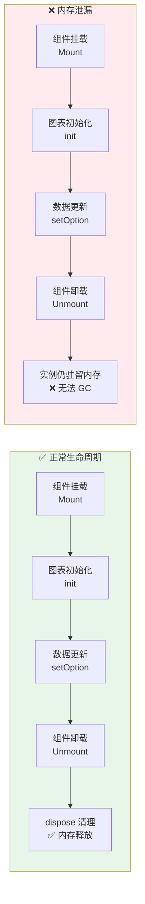

```
===== 六大常见泄漏模式 =====

模式 1：ECharts / G6 / OL 实例未 dispose ★ 最高频
├─ ❌：
│   useEffect(() => {
│     const chart = echarts.init(dom)
│     chart.setOption(option)
│     // ★ 忘了 return cleanup
│   })
├─ 后果：切换页面后 chart 实例仍在内存，GPU 资源未释放
├─ 修复：return () => chart.dispose()
├─ 验证：Chrome DevTools → Performance 录制 → 看 chart 实例数是否归零

模式 2：ResizeObserver / EventListener 未清理
├─ ❌：
│   useEffect(() => {
│     const ro = new ResizeObserver(() => chart.resize())
│     ro.observe(dom)
│     window.addEventListener('resize', handleResize)
│     // ★ 忘了清理
│   })
├─ 后果：dom 已卸载但 observer 仍引用 → dom 无法 GC
├─ 修复：return () => { ro.disconnect(); window.removeEventListener(...) }
└─ 避坑：domRef.current 存在时再执行 resize，避免 cleanup 后空调用

模式 3：setInterval 定时取数未清理
├─ ❌：
│   useEffect(() => {
│     setInterval(() => fetchData().then(setData), 5000)
│     // ★ 未 clearInterval
│   })
├─ 后果：组件卸载后仍在请求 → setState on unmounted component
├─ 修复：
│   useEffect(() => {
│     const timer = setInterval(() => {
│       fetchData().then(data => {
│         if (ref.current) setData(data)  // ★ 检查挂载状态
│       })
│     }, 5000)
│     return () => clearInterval(timer)
│   }, [])

模式 4：useMemo 大数据数组未释放
├─ ❌：
│   const fullData = useMemo(() => generateHugeArray(100000), [])
│   // 组件卸载时 fullData 仍在闭包中 → 无法 GC
├─ 后果：SPA 切换页面 → 内存只增不减
├─ 修复：useEffect(() => { return () => { fullData.length = 0 } })
└─ 最佳实践：大数据只存在图表内部缓存，不在 React state 层保留副本

模式 5：闭包捕获旧 chart 实例
├─ ❌：
│   const [data, setData] = useState([])
│   useEffect(() => {
│     const ws = new WebSocket(url)
│     ws.onmessage = () => {
│       chart.appendData(...)  // ★ chart 是旧闭包
│     }
│   }, [])  // 空依赖 → chart 指向旧实例
├─ 后果：appendData 到已卸载的旧 chart 实例 → 异常
├─ 修复：用 useRef 持有 chart 实例，确保总是最新的
└─ 验证：const chartRef = useRef(null); chartRef.current = chart

模式 6：离屏 Canvas 未销毁
├─ 场景：仪表盘 10 个图表 TAB 切换
├─ 问题：ECharts 在 hidden tab 中仍持有 Canvas 上下文
├─ 修复：Tab 切换时 unmount 旧组件，而非 display:none 隐藏
└─ 终极方案：react-window 虚拟列表，不可见图表组件完全卸载

===== 面试高频：内存泄漏排查 =====

Q："怎么发现和定位可视化内存泄漏？"
A："三步定位法：
第一步，Chrome Memory 面板拍两次快照（打开页面前 / 反复操作后）→ 对比 Detached DOM 数；
第二步，Performance 录制 '切换页面 → 操作 → 切换回' → JS Heap 曲线持续上升不下落 = 泄漏；
第三步，用 why-did-you-render + performance.memory 主动上报监控。
项目中遇到最多的是 ECharts dispose 遗漏和 WebSocket 未 close。"
```

### 6.13 ⚡ Next.js / SSR 中可视化最佳实践

```
===== 核心矛盾 =====
Next.js 在服务端执行 renderToString → chart 库依赖 window/document → 崩溃

===== 三层解决方案 =====

L1：动态导入 + ssr: false（Next.js 12+）
├─ import dynamic from 'next/dynamic'
├─ const EChartsChart = dynamic(() => import('./EChartsChart'), { ssr: false })
├─ 优点：实现最简单
├─ 缺点：首屏图表缺失，SEO 不友好
└─ 适用：内部系统、需要登录的 Dashboard

L2：Skeleton 占位（Next.js 13+ App Router）
├─ next/dynamic 配合 loading 组件：
│   const EChartsChart = dynamic(() => import('./EChartsChart'), {
│     loading: () => <ChartSkeleton />  // SSR 时渲染骨架，CSR 后替换
│   })
├─ 优点：用户体验好，无布局偏移（CLS=0）
├─ 缺点：仍未解决 SEO
└─ 适用：监控面板、实时数据看板

L3：静态 SVG 预渲染（SEO 场景）
├─ 原理：在服务端用纯 JS 计算 SVG，不依赖 DOM
├─ 实现：
│   // server/chart-renderer.ts
│   function renderChartToSVG(data): string {
│     return `<svg width="800" height="400">
│       ${data.map(d => `<circle cx="${d.x}" cy="${d.y}" r="4"/>`).join('')}
│     </svg>`
│   }
├─ 优点：SEO 友好、首屏秒开
├─ 缺点：交互需客户端 hydrate 后增强
└─ 适用：数据报表、公开 Dashboard

// Next.js App Router 最佳实践
// app/dashboard/page.tsx
import dynamic from 'next/dynamic'

const RealTimeChart = dynamic(
  () => import('@/components/RealTimeChart'),
  {
    ssr: false,
    loading: () => <div className="h-96 bg-gray-100 animate-pulse rounded" />
  }
)

export default function DashboardPage() {
  return (
    <div>
      <h1>告警监控</h1>
      {/* SSR 时显示骨架，CSR 后变成 ECharts 图表 */}
      <RealTimeChart />
    </div>
  )
}

// components/RealTimeChart.tsx
'use client'  // ★ 必须在客户端渲染

export function RealTimeChart() {
  const [mounted, setMounted] = useState(false)
  useEffect(() => setMounted(true), [])

  if (!mounted) return <ChartSkeleton />  // 防止 hydration 不匹配

  return <EChartsChart />  // 客户端渲染真正的图表
}

// 面试深挖：为什么用 'use client' 而不直接用 dynamic ssr:false？
// 答案：dynamic ssr:false 只在页面级别生效。
// 'use client' + mounted guard 可以在组件级别控制，
// 允许父组件在 SSR 时渲染容器布局，不影响 CLS 分数。
```

### 6.14 🧪 可视化组件测试策略

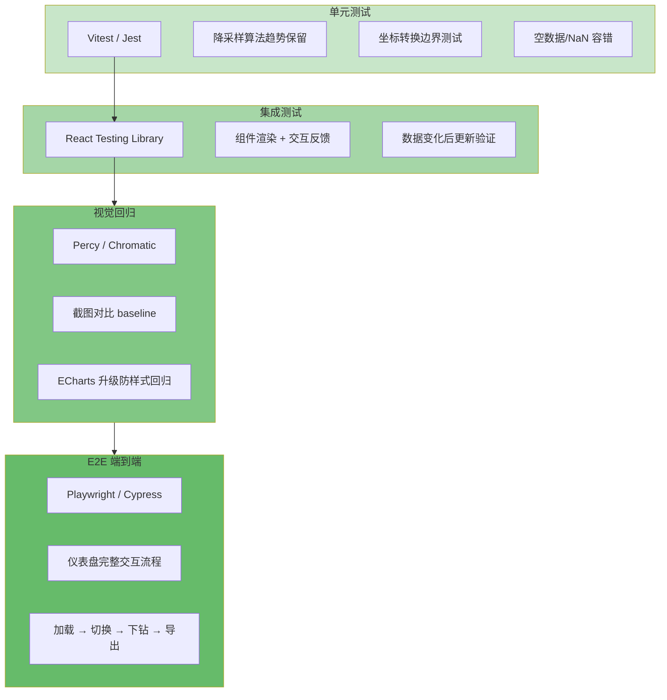

```
===== 测试金字塔 =====

┌──────────────────────────────────────┐
│          E2E (Cypress/Playwright)       │  ← 仪表盘整体交互
│   视觉回归 (Chromatic/Percy)           │  ← 图表样式对比
│   集成测试 (React Testing Library)     │  ← 图表组件交互
│   单元测试 (Vitest/Jest)               │  ← 数据转换 + 工具函数
└──────────────────────────────────────┘

===== 各层实践 =====

Layer 1：单元测试（数据转换 + 工具函数）
├─ 测试：sampling 算法、数据聚合、坐标转换
├─ 工具：Vitest + @testing-library/react
├─ 示例：
│   describe('lttb downsampling', () => {
│     it('保留趋势特征', () => {
│       const input = Array.from({ length: 10000 }, (_, i) => ({ x: i, y: Math.sin(i) }))
│       const output = lttb(input, 100)  // 降采样到 100 点
│       expect(output.length).toBe(100)
│       expect(correlation(input, output)).toBeGreaterThan(0.95)  // 趋势保留度
│     })
│     it('空数组不崩溃', () => {
│       expect(lttb([], 10)).toEqual([])
│     })
│   })
└─ 重点：边界情况（空数据、单点、全零、NaN）

Layer 2：集成测试（图表组件渲染 + 交互）
├─ 测试：组件是否渲染、交互反馈
├─ 避坑：ECharts/G6 依赖 Canvas，DOM 测试中不渲染 Canvas 内容
├─ 策略：只测 DOM 结构和行为，不测 Canvas 像素
├─ 示例：
│   it('hover 时触发 tooltip', async () => {
│     render(<LineChart data={mockData} />)
│     const chart = screen.getByTestId('chart-container')
│     await userEvent.hover(chart)
│     // 验证 dispatchAction 被调用，而非验证 Canvas 内容
│     expect(mockDispatchAction).toHaveBeenCalledWith(
│       expect.objectContaining({ type: 'highlight' })
│     )
│   })
└─ 重点：组件在 data/option 变化后是否正确更新

Layer 3：视觉回归测试（推荐 Percy / Chromatic）
├─ 场景：ECharts 升级版本时样式不一致
├─ 流程：
│   ① 组件渲染 → 截图存储 baseline
│   ② 代码变更 → 重新截图 → 对比差异
│   ③ 差异 > 阈值 → 人工审核
├─ 避坑：时间戳/动画/随机数导致截图不稳定
│   ├─ mock 当前时间 → new Date('2024-01-01')
│   ├─ 关闭动画 → animation: false
│   └─ mock Math.random → 固定种子
└─ CI 集成：每次 PR 自动跑，阻断样式回归

Layer 4：E2E（仪表盘整体交互）
├─ 场景：仪表盘加载 → 切换图表 → 下钻 → 导出
├─ 工具：Playwright（比 Cypress 快，天然支持 iframe）
├─ 示例：
│   test('仪表盘完整交互流程', async ({ page }) => {
│     await page.goto('/dashboard')
│     await expect(page.locator('[data-testid=chart]')).toBeVisible()
│     await page.click('[data-testid="time-range-7d"]')
│     await page.waitForResponse(resp => resp.url().includes('/api/v1/dashboard'))
│     await page.click('[data-testid="export-png"]')
│     await expect(page.locator('[data-testid="export-success"]')).toBeVisible()
│   })
└─ 重点：不测 Canvas 像素，只测交互流程和 DOM 状态

===== 面试高频测试问题 =====

Q："图表组件怎么 mock 才能稳定跑测试？"
A："不 mock ECharts 本身，只 mock 外部依赖：
   ① mock WebSocket 连接 → 模拟 onmessage 推送数据
   ② mock 后端 API → MSW (Mock Service Worker)
   ③ mock ResizeObserver → 直接触发 callback
   ④ 不 mock ECharts → 用 jsdom + canvas 模拟运行，
      只验证 DOM 结构和事件，不验证像素。"

Q："实时图表的测试难点是什么？"
A："三大难点：
   ① 时间依赖 → 用 sinon.useFakeTimers 控制 setInterval/RAF
   ② 异步数据流 → waitFor + findBy 等待图表更新
   ③ Canvas 不可测 → 改为测数据层：校验 appendData 调用次数
      而非 Canvas 像素内容"
```

### 6.15 💣 React 可视化避坑清单（面试用）

```
===== 面试被问"你踩过什么坑？" =====

坑 1：ECharts resize 不及时
├─ 表象：图表切换 Tab 回来后占位不对
├─ 原因：Tab 隐藏时容器尺寸为 0，ResizeObserver 不触发
├─ 方案：visibilitychange 事件 + 手动 chart.resize()
└─ 话术："后来用 IntersectionObserver + visibilitychange 双保险"

坑 2：大量图表时页面卡死
├─ 表象：Dashboard 同时渲染 20 个 ECharts，首屏加载 10s+
├─ 原因：20 个图表同时 init + setOption，主线程饱和
├─ 方案：分片加载（每帧只初始化 2 个图表）+ requestIdleCallback
└─ 话术："我设计了一个调度器，每帧用 rIC 初始化 2 个图表，空闲时继续"

坑 3：大数据量折线图缩放手感卡顿
├─ 表象：dataZoom 拖拽缩放时帧率 < 10fps
├─ 原因：每次缩放 setOption 全量数据，采样重算
├─ 方案：dataZoom 事件 + 动态采样率（zoom 越深采样率越高）
└─ 话术："缩放越深数据点越少，采样率动态提高，保证操作手感"

坑 4：React StrictMode 下 ECharts 双重初始化
├─ 表象：开发环境图表出现两套重叠
├─ 原因：StrictMode 在开发环境会 double-invoke effect
├─ 方案：ref 标记 + diose 前先检查实例是否存在
└─ 话术："用 const instanceRef = useRef(null) 做幂等保护，init 前先 disose 旧实例"

坑 5：动态 import 图表库导致路由切换闪烁
├─ 表象：切换 Tab 时，图表先消失再重新出现
├─ 原因：ECharts/G6 按路由 lazy load，每次重新 init
├─ 方案：keepAlive 缓存组件（React Router v6 的 Outlet + keepalive）
└─ 话术："配合路由级别的 keepAlive，切换 Tab 时保留 DOM 和实例"

坑 6：iOS Safari 上 ECharts touch 事件不响应
├─ 表象：iPad 上数据点点击无反应
├─ 原因：Safari touch event 默认被浏览器吞掉
├─ 方案：添加 { pointerEvents: 'all' } CSS + 使用 tap 事件替代 click
└─ 话术："移动端图表交互要单独处理 touch→click 映射"
```

### 6.16 💬 React 可视化面试连珠炮（面试官连续追问）

```
面试官："你的 useECharts Hook 是怎么做到增量更新而不是全量替换的？"
├─ 你："useEffect 的依赖数组控制——option 变化时 setOption({...}, { notMerge: false })，
│    只更新变化的部分。如果 option 引用没变（useMemo），则完全跳过 setOption"
├─ 追问："如果用户手动调整了图表缩放（dataZoom），option 没变但视图变了，
│    你的 useEffect 不会覆盖用户的缩放状态吗？"
│   └─ 你："好问题。我的方案是：对用户交互产生的状态（dataZoom/图例显隐）
│      不做受控管理，用 ECharts 内部状态记住。只有数据变化时才 setOption，
│      且加入 { notMerge: false } 保留用户交互状态。"
├─ 追问："那如果数据刷新后，用户想回到'重置视图'呢？"
│   └─ 你："暴露一个 resetView 方法，dispatchAction({ type: 'dataZoom', start: 0, end: 100 })。
│      再进一步，用 useRef 记录用户是否主动调整过缩放，数据刷新时选择性恢复。"
└─ 追问："多个组件共享同一个图表实例，怎么避免冲突？"
    └─ 你："实例归组件私有，不全局共享。跨组件通信通过 Zustand store 传递数据，
        每个图表组件只消费自己需要的 slice。数据变化 → store 更新 → 对应图表更新。"
```

---

## 七、🔄 追问链路全集 （7 大链路深度攻防模拟）

> **使用说明：** 每条链路模拟面试官从浅到深的连续追问。
> 每个回答附带 **深度解析**——说明为什么这样答、考察点在哪、加分项是什么。
> 目标是：即使面试官换角度追问，你也能触类旁通。

---

### 🗺️ 追问链路 1：地图性能优化 ⭐⭐⭐⭐⭐

```
面试官："十万个点位在地图上渲染卡顿，你怎么优化？"
                        ↓
                考察点：是否理解"分层治理"思想，
                还是只知道单一优化技巧
```

**标准答案（满分回答）：**

```
核心是分层治理——四个层面各自解决一个问题，缺一不可：

第一层，数据层——BBOX 视口裁剪。
只渲染当前视口经纬度范围内的 Feature。
计算方式：view.calculateExtent() 取四角坐标，data.filter 做矩形碰撞检测。
效果：10 万点 → 千级。

第二层，视觉层——Cluster 聚合。
同区域的设备合并为一个聚合点，显示设备数量。
动态半径：低 Zoom 时半径 100px（更多聚合），高 Zoom 时 20px（展示细节）。
效果：千级 → 百级 Cluster。

第三层，内存层——dataCache 全量缓存。
Map<string, HeNB> 存储所有 Feature，缩放平移不请求后端。
效果：减少 90% 网络请求。

第四层，渲染层——moveend 懒刷新。
拖拽中用 throttle(200ms) 只更新聚合点位置（轻量），
停稳后 debounce(300ms) + moveend 触发 BBOX 全量渲染（重量）。
效果：从每秒 60 次重绘 → 每次停稳 1 次。

最终量化：Feature 100000 → 50，帧率 <10fps → 60fps，内存 200MB → 30MB。
```

> **深度解析：**
>
> 考察点：是否知道性能优化是系统工程，而非单一技巧。
>
> 为什么这样答：先给结论（分层治理），再分层展开（每层的输入→处理→输出），最后量化效果——面试官最喜欢"讲得清原理、拿得出数据"的回答。
>
> 加分项：提到"四层不是孤立的——BBOX 裁剪后视口内可能仍有上万点，需要 Cluster 进一步聚合；Cache 保证不重复请求"——展示系统思维。
>
> ⚠️ 避坑：不要只说"我用过 Cluster"或"我用过 Canvas"，要讲清楚为什么 Cluster 有效、为什么不只用一层就够。

```
追问①："BBOX 裁剪的原理具体怎么算的？"
                        ↓
                考察点：是真懂还是只会调 API
```

**标准答案：**

```
核心是"视口矩形 ↔ 数据点"的包含关系判断。

具体实现：
1. map.getView().calculateExtent(map.getSize()) 获取当前视口四角坐标
2. 将坐标从投影坐标系（EPSG:3857）转成经纬度（EPSG:4326）
3. 遍历数据，判断 lng ∈ [bl[0], tr[0]] && lat ∈ [bl[1], tr[1]]

关键优化点：不是每次 mousemove 都算，而是在 moveend 事件中触发。
拖拽过程中数据不更新，但 cache 保证数据已在前端，停下后一次算完。

边界情况：
├─ 视口跨 180° 经线：需要拆分为左右两个矩形分别判断
├─ 高纬度区域：投影变形严重，用投影坐标直接判断替代经纬度判断
└─ 空视口（缩放到最小）：直接返回空数组，不遍历
```

> **深度解析：**
>
> 考察点：API 调用背后的算法原理和边界情况处理。
>
> 加分项：主动提到"跨 180° 经线"和"投影变形"这两个坑——这是真实项目中才会遇到的，面试官一听就知道你有实战经验。

```
追问②："Cluster 聚合半径怎么确定的？动态半径怎么调？"
                        ↓
                考察点：算法参数的经验和调优能力
```

**标准答案：**

```
动态半径，核心原则：展示层级越高（Zoom 越大），半径越小。

公式参考：
  radius = baseRadius / Math.pow(2, zoom - minZoom)
  其中 baseRadius = 100px，minZoom = 3

实际项目中还会叠加设备密度因子：
  const density = visiblePoints.length / viewportArea
  if (density > threshold) radius *= 1.5  // 密度高时强制更多聚合

展开时反操作：
  高 Zoom（>15）：半径归零，所有聚合点展开为单点
  低 Zoom（<5）：半径封顶 150px，避免聚合太多丢失信息

调优经验：半径需要在"聚合太多看不清"和"聚合太少依然卡"之间平衡。
我们最终方案是"缩放到 10 级时，视口内聚合点不超过 100 个"作为调优目标。
```

> **深度解析：**
>
> 考察点：是否理解"参数不是拍脑袋的，而是有调优目标的"。
>
> 难点：聚合半径太大会把不同区域合并到一起，造成信息丢失；太小则聚合效果不明显。
>
> 加分项：提到"以聚合点数量不超过 100 个为调优目标"——展示了你用数据驱动参数决策。

```
追问③："Cluster 展开/聚合时闪烁怎么处理？"
                        ↓
                考察点：用户体验细节和动画调度
```

**标准答案：**

```
核心是"先清旧点 + 淡入新点 + 同一帧完成"三步策略。

具体实现：
1. 清除旧聚合点时用淡出动画（opacity 1→0, 200ms）
2. 添加新单点时用淡入动画（opacity 0→1, 200ms）
3. ★ 关键：清除和添加必须在同一个 RAF 帧内完成，
   否则会出现"先看到空白，再看到点"的闪烁

伪代码逻辑：
  requestAnimationFrame(() => {
    oldFeatures.forEach(f => animateFadeOut(f, 200))
    newFeatures.forEach(f => {
      f.setStyle(hiddenStyle)           // 先设置为不可见
      source.addFeature(f)
      animateFadeIn(f, 200)             // 再淡入
    })
  })
```

> **深度解析：**
>
> 考察点：性能优化之外的"体验优化"——面试官想看你是不是只关注帧率数字。
>
> 难点：闪烁的本质是"视觉断层"——旧内容消失和新内容出现之间有间隙。
>
> 加分项：提到 RAF 帧同步——展示了你知道浏览器渲染机制，而不是盲目 setTimeout。

```
追问④："到了百万级点位，Canvas 2D 扛不住了，怎么办？"
                        ↓
                考察点：技术演进路线和架构预见性
```

**标准答案：**

```
切 WebGL。具体演进路线：

10 万以内 → Canvas 2D + BBOX + Cluster（四重策略够用）
10 万~50 万 → ECharts large 模式（WebGL 渲染器）
50 万~100 万 → Mapbox GL / Deck.gl（专为大数据量设计的 WebGL 框架）
100 万以上 → Deck.gl + 瓦片分级加载（LOD）

为什么 WebGL 强于 Canvas 2D？
Canvas 2D：每个 Feature 一个 drawCall，10 万 = 10 万次 CPU→GPU 通信
WebGL：一次 batch 提交所有顶点数据，顶点着色器在 GPU 并行处理位置变换

切 WebGL 的代价：
├─ 学习成本：需要理解着色器、缓冲区、纹理等概念
├─ 交互复杂度：事件拾取（picking）需要自己实现
└─ 开发效率：不如 ECharts 配置驱动快捷

所以决策原则是：当前方案帧率稳定 > 30fps 就不切，否则切。
```

> **深度解析：**
>
> 考察点：技术视野——是否知道不同量级对应不同方案，以及为什么。
>
> 加分项：提到"切 WebGL 的代价"——展示你不仅知道新技术好，还知道它有什么坑。
>
> ⚠️ 避坑：不要只说"用 WebGL"，面试官会追问"为什么 WebGL 比 Canvas 快"——答不出底层原理会扣分。

---

### ⚡ 追问链路 2：实时数据可视化 ⭐⭐⭐⭐⭐

```
面试官："1000+ QPS 的实时告警数据，怎么保证页面不卡？"
                        ↓
                考察点：消息洪峰和浏览器帧率的匹配问题
```

**标准答案（满分回答）：**

```
三层架构——消息接收层 → 数据处理层 → 渲染输出层。

第一层，WebSocket 连接管理。
单连接复用多频道（告警/状态/日志各一个 topic），
心跳 30s ping/pong，断线指数退避重连（1s→2s→4s→...→30s 封顶）。

第二层，RxJS 流控 Pipeline。
filter（有效消息）→ distinctUntilChanged（去重）→ bufferTime(200ms)（攒批）
→ map（优先级排序）→ concatMap（保序执行）。

第三层，RAF 帧同步渲染。
requestAnimationFrame 每帧只调用一次 ECharts setOption，
设置 notMerge: false（增量更新），高频时关闭动画。

为什么这套架构扛得住 1000+ QPS？
核心匹配：消息生产速度（1000 QPS ≈ 每 200ms 约 200 条）
≈ 消费速度（RAF 每 16ms 处理一批）。
bufferTime 让二者解耦——消息再多也不压垮渲染。
```

> **深度解析：**
>
> 考察点：是否理解生产-消费模型，还是只会调 API。
>
> 核心逻辑：画图每秒 60 帧（16ms/帧），但消息每秒 1000 条。关键不是"处理每条消息"，而是"每帧只处理一批"。
>
> 加分项：提到"让消息速度和渲染速度匹配"——这是工业级方案的思考方式。

```
追问①："bufferTime(200ms) 这个值怎么来的？为什么不是 100ms 或 500ms？"
                        ↓
                考察点：参数取值的工程依据
```

**标准答案：**

```
200ms 是平衡"批处理效率"和"渲染延迟"的经验值。

分析过程：
├─ 100ms：批次太小（千级 QPS 每批约 100 条），
│   batch 切换开销（排序/去重）占比大，效率低
├─ 200ms：每批约 200 条，batch 开销摊薄，
│   渲染一帧约 8-10ms < 16ms 安全线，延迟 200ms 用户无感知 ✅
├─ 500ms：每批约 500 条，渲染一帧可能超 16ms → 掉帧，
│   延迟 500ms 用户能感知到"卡了一下" ❌
└─ 1s 以上：直接看到延迟，实时性丧失 ❌

所以 200ms 是"效率 × 延迟"的最优平衡点。
真实项目中还会根据实际 QPS 动态调整：
  QPS 高时增大 bufferTime（攒更多再处理），
  QPS 低时减小 bufferTime（降低延迟）。
```

> **深度解析：**
>
> 考察点：是否有工程调优经验，还是照搬文档。
>
> 加分项：提到"根据 QPS 动态调整 bufferTime"——展示自适应思维。
>
> ⚠️ 避坑：不要说"200ms 是文档推荐的"——面试官会反感这种不思考的回答。

```
追问②："为什么用 concatMap 不用 switchMap？"
                        ↓
                考察点：RxJS 操作符的理解深度
```

**标准答案：**

```
因为场景不同。

switchMap：每次有新值就取消前一个 Observable。
适用场景：搜索输入（只取最后一次）、路由参数切换（取消旧请求）。
❌ 不适用于告警场景——每条告警都重要，不能取消。

concatMap：按顺序处理每个值，完成后才处理下一个。
适用场景：文件上传队列、消息顺序处理。
✅ 适用于告警——保证每条消息都被处理，不会丢失。

如果消息积压严重怎么办？
不是改用 switchMap，而是加背压策略：
├─ 前端 buffer 设上限（如 1000 条），超出丢弃最低优先级
├─ 通知后端降低推送频率
└─ 最差情况降级为 polling

一句话总结：switchMap 适合"只要最新"的场景，
concatMap 适合"每条都要"的场景。
```

> **深度解析：**
>
> 考察点：RxJS 操作符的选择不是语法问题，而是业务场景问题。
>
> 加分项：不仅解释了区别，还给出了"积压怎么办"的兜底方案——展示全方位思考。

```
追问③："多 Tab 打开同一个仪表盘，每个 Tab 都连一个 WebSocket？"
                        ↓
                考察点：浏览器多 Tab 场景的架构设计
```

**标准答案：**

```
不用每个 Tab 都连，用 BroadcastChannel 共享一个 WebSocket 连接。

架构方案：
├─ 第一个 Tab：创建 WebSocket 连接 + BroadcastChannel 广播
├─ 后续 Tab：不创建 WebSocket，监听 BroadcastChannel 接收数据
├─ 全部 Tab 关闭：WebSocket 自动断开

技术选型：BroadcastChannel vs SharedWorker
├─ BroadcastChannel（推荐）：API 简单，同源 Tab 间通信
│   缺点：不能共享复杂状态
├─ SharedWorker（更强）：共享内存，可集中管理 WebSocket
│   缺点：API 复杂，调试困难
└─ 选型原则：简单场景用 BroadcastChannel，需要共享状态用 SharedWorker

注意点：
├─ BroadcastChannel 数据序列化开销：大消息时考虑
├─ Tab 关闭前主动 close：避免 WebSocket 资源泄漏
└─ 断线重连逻辑只在第一个 Tab 执行，其他 Tab 被动接收
```

> **深度解析：**
>
> 考察点：多 Tab 场景的经验——面试官知道你通常只考虑单 Tab。
>
> 加分项：对比了 BroadcastChannel 和 SharedWorker 的选型——展示架构判断力。

---

### 🔀 追问链路 3：图表库选型 ⭐⭐⭐⭐

```
面试官："ECharts 和 AntV G2 有什么区别？怎么选？"
                        ↓
                考察点：选型判断力，不是只会罗列名词
```

**标准答案（满分回答）：**

```
核心区别：配置驱动 vs 语法驱动。

ECharts（配置驱动）：
用一个 option 对象声明一切——xAxis、yAxis、series 全部配置化。
上手快，文档全，从配置到出图最快。
适合：80% 的标准图表场景——折线图、柱状图、饼图、地图、大屏。

G2 / G2Plot（语法驱动）：
基于图形语法（Grammar of Graphics）——数据映射到视觉通道。
需要理解 mark、encoding、scale 等概念。
适合：深度定制、统计图表、数据探索场景。

选型建议：
├─ 要快 → ECharts（3 行代码出图）
├─ 要灵活 → G2（可定制每个视觉元素）
├─ 网络拓扑 → G6（专为图可视化设计）
├─ 完全定制 → D3.js（完全控制 DOM/SVG）
└─ 混合使用：ECharts 做标准图 + G6 做拓扑 + D3 做定制
```

> **深度解析：**
>
> 考察点：不只看你知不知道两个库，而是看你能不能帮团队做决策。
>
> 加分项：最后一句"混合使用"最重要——展示你理解真实项目的复杂性，不是非此即彼。
>
> ⚠️ 避坑：不要说"ECharts 比 G2 好"或"G2 比 ECharts 好"——这种回答暴露你缺乏客观判断力。

```
追问①："什么场景必须用 D3 而不是 ECharts？"
                        ↓
                考察点：ECharts 的能力边界在哪里
```

**标准答案：**

```
三个必须用 D3 的场景：

① 完全控制 DOM/SVG 的定制图表
  如自定义 Chord 图、Sankey 图的高级定制、自定义流程图——
  ECharts 内置的不能满足，D3 让你完全控制每一个 DOM 元素。

② 独特动画效果
  如路径动画（线沿着轨迹移动）、链式过渡（数据更新时元素逐个变化）——
  ECharts 的动画是预置的（淡入/淡出/平移），不能自定义中间状态。

③ 数据探索类可视化
  交互式仪表板需要自定义 brushing（框选）、linking（联动）、zoom（缩放）——
  D3 的事件系统更底层，可以实现任何交互模式。

一句话：ECharts 能做的用 ECharts，ECharts 做不了的上 D3。
```

> **深度解析：**
>
> 考察点：是否知道工具的"能力边界"——比知道怎么用更重要的是知道什么时候不用。
>
> 加分项：每个场景都有具体的案例——展示真实项目经验。

```
追问②："ECharts large 模式底层是 Canvas 还是 WebGL？"
                        ↓
                考察点：ECharts 渲染原理
```

**标准答案：**

```
ECharts 5+ large 模式使用 WebGL 渲染器（通过底层库 zrender 支持）。
普通模式是 Canvas 2D。

数据量 < 2000 时 → Canvas 2D（足够快）
数据量 > 2000 时 → 自动切换到 WebGL（large 模式）

性能对比实测：
├─ Canvas 2D 渲染 10 万点 → ~50ms drawCall → 掉帧（>16ms）
├─ WebGL 渲染 10 万点 → ~2ms drawCall → 流畅（<16ms）

为什么 WebGL 快这么多？
Canvas 2D 是 CPU 先把每个点计算好，再提交 GPU——1 万个点 = 1 万次提交。
WebGL 是一次性把 1 万个点的坐标数据提交到 GPU 显存，
顶点着色器在 GPU 上并行计算每个点的位置——通信次数从 1 万降为 1。
```

> **深度解析：**
>
> 考察点：是否理解渲染管线的底层原理。
>
> 加分项：给出了具体数字（50ms vs 2ms）——数据说服力远超空洞的描述。

```
追问③："混合使用 ECharts + G6 + D3，主题/配色怎么统一？"
                        ↓
                考察点：多库协调的系统设计能力
```

**标准答案：**

```
设计 Token 级主题系统。

统一色板（定义 5 个色值）：
  primary: #1890ff（蓝）, success: #52c41a（绿）,
  warning: #faad14（黄）, danger: #ff4d4f（红）,
  neutral: #8c8c8c（灰）

各库注入方式：
├─ ECharts：通过 theme 对象注册 → echarts.registerTheme('custom', theme)
├─ G6：cfg.defaultNode/style / cfg.defaultEdge/style 引用主题 token
├─ D3：CSS 变量（--color-primary）+ scaleOrdinal 映射

一句话：把主题定义提升到"设计 Token"层级，
所有图表库都引用同一套变量，而不是各自维护配色。
```

> **深度解析：**
>
> 考察点：系统设计——多库共存不是简单堆砌，需要统一规范。
>
> 加分项：Token 级设计——展示你对设计系统的理解，不只是编码能力。

---

### 🏗️ 追问链路 4：仪表盘架构 ⭐⭐⭐⭐

```
面试官："仪表盘系统怎么设计，才能支撑 10+ 图表实时更新？"
                        ↓
                考察点：分层架构设计能力
```

**标准答案（满分回答）：**

```
四层架构——数据层 → 图表层 → 布局层 → 管理层，每层职责清晰。

数据层（核心：数据获取 + 缓存 + 降级）：
├─ BFF 聚合：10 个图表的数据打包成一个接口，减少 HTTP 连接数
├─ SWR 策略：缓存优先，后台刷新，图表切换瞬间展示数据
└─ 降级：后端异常时显示缓存 + "数据延迟"提示

图表层（核心：注册表模式 + 联动机制）：
├─ Map<string, Component> 按 type 动态渲染
├─ 联动：EventBus 跨图表同步（hover 高亮 / 筛选器联动）
└─ 图表导出：html2canvas 截图 / CSV 数据导出

布局层（核心：固定 + 拖拽 + 响应式）：
├─ Grid 12 列布局（标准场景）
├─ react-grid-layout 自由拖拽（Dashboard 编辑模式）
└─ 大屏/桌面/平板三断点适配

管理层（核心：CRUD + 模板 + 快照）：
├─ 仪表盘创建/编辑/保存/分享
├─ 预定义模板快速创建
└─ 定时快照对比历史趋势
```

> **深度解析：**
>
> 考察点：能否把"一个仪表盘"从单一功能提升到"仪表盘平台"的架构高度。
>
> 加分项：提到 BFF 聚合和降级方案——展示了全链路视野，不只是前端。

```
追问①："10 个图表同时发起请求，怎么控制并发？"
                        ↓
                考察点：请求并发管理
```

**标准答案：**

```
三种策略，从优到劣：

方案一（推荐）：BFF 聚合 → 后端把 10 个接口打包成 1 个。
优点：一次请求解决，无并发问题。
缺点：需要后端配合。

方案二（备选）：请求队列 → 前端控制最大并发数。
const concurrency = 4  // 浏览器一般 6 个连接，留 2 个给其他用途
const queue = charts.map(c => () => fetch(c.url))
async function run() {
  const pool = queue.splice(0, concurrency).map(fn => fn())
  await Promise.all(pool)  // 一批 4 个，完成后取下一批
}
优点：纯前端实现。
缺点：总耗时 = 批次 × 单次耗时。

方案三：优先级加载 → 首屏图表先加载（P0），非首屏延迟（P1）。
视口内可见的图表先请求，滚动到才请求。
优点：首屏最快。
缺点：滚动时可能看到 loading。
```

> **深度解析：**
>
> 考察点：是否理解"前端不是越并行越好"——浏览器有连接池限制。
>
> 加分项：给出了具体的并发数 4 和为什么——展示对浏览器机制的了解。

```
追问②："图表拖拽调整位置后，resize 时机怎么控制？"
                        ↓
                考察点：DOM 尺寸变化的处理策略
```

**标准答案：**

```
ResizeObserver 监听 + debounce 防抖，三步控制：

① 拖拽过程中：不触发 resize（过渡状态不需要精确尺寸）
② 拖拽结束：debounce(200ms) 后触发一次 resize
③ 窗口缩放：所有图表统一 resize（throttle(200ms) 节流）

为什么不用 window.resize？
ResizeObserver 更精准——监听具体容器而非整个窗口。
如果容器尺寸没变但窗口变了，ResizeObserver 不触发，避免浪费。

为什么需要 debounce？
拖拽结束到最终位置之间有多次"中间位置"，
debounce 确保只在最终位置触发一次 resize，不浪费计算。
```

> **深度解析：**
>
> 考察点：DOM 测量和渲染调度的细节经验。
>
> 加分项：对比了 ResizeObserver 和 window.resize——展示对 API 选择的思考。

---

### 🎨 追问链路 5：Canvas vs WebGL ⭐⭐⭐⭐

```
面试官："Canvas 2D 和 WebGL 在可视化渲染上的本质区别是什么？"
                        ↓
                考察点：渲染管线的底层理解
```

**标准答案（满分回答）：**

```
一句话：CPU 串行绘制 vs GPU 并行渲染。

Canvas 2D 的工作方式：
CPU → 依次执行每个绘图命令（ctx.arc, ctx.fill）→ 每个命令一次 drawCall
→ GPU 执行 → 下一个命令...
瓶颈：每个 drawCall 都需要 CPU→GPU 通信，10 万个点 = 10 万次通信。

WebGL 的工作方式：
CPU → 把所有点的坐标打包成顶点缓冲区 → 一次 drawCall 提交 GPU
→ GPU 的顶点着色器并行处理每个点 → 片元着色器处理每个像素
优势：通信次数从 O(n) 降为 O(1)，坐标变换在 GPU 并行执行。

用生活类比：
Canvas 2D = 厨师每次做一个菜，做 100 道菜要跑 100 趟厨房
WebGL = 把 100 道菜的食材一次性送进中央厨房，厨师们同时开炒

性能差距实测：
├─ Canvas 2D：10 万点 → 约 50ms → 3 帧才渲染完 → 掉帧
└─ WebGL：10 万点 → 约 2ms → 一帧内完成 → 流畅
```

> **深度解析：**
>
> 考察点：是否理解 GPU 的工作原理，还是只知道"WebGL 更快"。
>
> 加分项：用生活类比解释——面试官需要看到你能把复杂概念讲清楚（这是高级工程师的标志）。

```
追问①："Canvas 2D 在大数据量时的具体瓶颈在哪里？"
                        ↓
                考察点：性能分析的深度
```

**标准答案：**

```
两个瓶颈：

瓶颈一：drawCall 过多。
每个 ctx.arc()、ctx.fill()、ctx.stroke() 都是一次 drawCall。
10 万 = 10 万次 CPU 封装命令 → 提交 GPU → GPU 切换状态 → 绘制。
GPU 的状态切换开销（绑定 shader、纹理、缓冲区）可能比绘制本身还大。

瓶颈二：像素填充率。
Canvas 2D 中每个像素的颜色由 CPU 计算 → 写入帧缓冲区。
WebGL 中片元着色器在 GPU 并行计算每个像素的颜色。
屏幕 1920×1080 = 200 万像素——GPU 几千个核心一起算，CPU 单线程逐个算。

画重点：Canvas 2D 的瓶颈不是"画图慢"，而是"和 GPU 通信慢"。
WebGL 把通信次数从 O(n) 降到 O(1)，这是质的飞跃。
```

> **深度解析：**
>
> 考察点：是真懂还是背概念。（"drawCall 过多"很多人会说，但"GPU 状态切换开销"才是深度）
>
> 加分项：纠正了一个常见误解——"Canvas 2D 慢是因为画图慢"→ 实际上是"通信慢"。

```
追问②："WebGL 的顶点着色器和片元着色器分别做什么？"
                        ↓
                考察点：WebGL 渲染管线的理解
```

**标准答案：**

```
顶点着色器——处理"点"：
输入：每个顶点的位置、颜色、UV 坐标
工作：做坐标变换（本地坐标 → 世界坐标 → 相机坐标 → 屏幕坐标）
输出：变换后的顶点位置

片元着色器——处理"像素"：
输入：顶点着色器插值后的数据（位置、颜色、纹理坐标）
工作：计算每个像素的最终颜色（光照、纹理采样、透明度混合）
输出：像素颜色 → 写入帧缓冲区

管线流程：
顶点数据 → 顶点着色器（并行处理每个顶点）→ 光栅化（顶点变像素）
→ 片元着色器（并行处理每个像素）→ 帧缓冲区 → 屏幕

举例说明：画 1 万个圆点
顶点着色器：1 万个顶点各自计算位置（1 万个 GPU 核心同时算）
片元着色器：圆点覆盖区域的每个像素算颜色（GPU 并行算）
整个过程只有 1 次 drawCall。
```

> **深度解析：**
>
> 考察点：GPU 编程的基础——面试官想知道你是调用过 WebGL API 还是真理解渲染管线。
>
> 加分项：用"1 万个圆点"的具体例子说明——抽象概念 + 具体案例 = 好答案。

---

### 🔗 追问链路 6：图拓扑(网络拓扑) ⭐⭐⭐⭐⭐

```
面试官："万级节点的网络拓扑图怎么优化？"
                        ↓
                考察点：图可视化的全链路优化思维
```

**标准答案（满分回答）：**

```
四维优化——布局、渲染、交互、数据各管一摊。

第一维：布局算法。
力导向布局（d3-force）对万级节点 O(n²) 计算，CPU 直接 100%。
解决方案：后端预计算布局坐标，前端直接渲染，零计算量。
增量节点用 WebWorker 做局部优化，不阻塞主线程。

第二维：渲染。
视口裁剪 + 节点聚合（Group 折叠展开）。
子网折叠为组节点显示"子网名称 + 节点数"，
展开时增量渲染子节点（每帧 50 个，不卡主线程）。
效果：万级 → 百级展示。

第三维：交互。
拖拽防抖（停稳后才触发重布局）、
缩放平滑（过渡动画）、
选中高亮（Highlight 模式——高亮相邻节点，其他置灰）。

第四维：数据。
按需加载——先加载顶层节点，展开时加载子节点子树。
已加载的缓存到 Map 中，不重复请求。

效果：首屏 < 3s，交互 60fps，内存 < 200MB。
```

> **深度解析：**
>
> 考察点：和大数据一样——是否理解"分层治理"的工程思想。
>
> 难点：图拓扑比地图更难——地图的优化模式（BBOX+Cluster）相对标准化，但图拓扑的布局算法、交互模式更复杂，优化方案因图而异。
>
> 加分项：提到"增量节点用 WebWorker 做局部优化"——展示了对布局算法和 WebWorker 的双重理解。

```
追问①："力导向布局的力计算公式是什么？三种力怎么影响布局？"
                        ↓
                考察点：图布局算法的底层理解
```

**标准答案：**

```
三种力：

① 电荷力（Coulomb 定律）：F = k × q₁ × q₂ / r²
  所有节点之间都有排斥力，距离越近排斥越强。
  作用：防止节点重叠，让散落均匀。
  ⚠️ 万级节点时：O(n²) 的计算量，这是 CPU 100% 的根源。

② 弹簧力（Hooke 定律）：F = -k × (x - x₀)
  有边连接的节点之间有弹簧牵引，距离越远拉力越强。
  作用：让相连的节点聚集在一起，形成簇。
  优化点：弹簧力只计算有边的节点对，边数可控时计算量可控。

③ 向心力：F = -k × (x - center)
  所有节点被一个指向画布中心的力牵引。
  作用：防止节点散落到画布边缘甚至跑到画布外面。

为什么万级节点卡？
电荷力是 O(n²)——1 万个节点 = 1 亿次力计算。
优化：用 Barnes-Hut 算法把 O(n²) 降为 O(n log n)，
原理是把远处的节点合并为一个"团"，近似计算排斥力。
```

> **深度解析：**
>
> 考察点：是否背过力导向布局的概念，还是真理解其原理。
>
> 加分项：提到 Barnes-Hut 算法——这是 d3-force 的底层优化，知道这个说明你真研究过源码。

```
追问②："万级节点在线布局 CPU 100%，怎么解决？"
                        ↓
                考察点：布局计算的工程化方案
```

**标准答案：**

```
三步方案：

① 冷启动（首次加载）：后端预计算布局坐标，存储到数据库。
前端直接渲染，零计算量。后端用 Go/Python 做一次完整力计算，
把结果存为 JSON，前端请求时直接返回坐标。

② 热更新（增量节点）：只对新加入的节点做"局部优化"。
把新节点放在父节点附近，用模拟退火跑 50 轮迭代，
只调整新节点和相邻节点，不动全量。

③ 用户交互（拖拽/折叠展开）：WebWorker 执行力计算。
Worker 通过 postMessage 接收节点数据，计算后回传坐标，
主线程只做渲染，不阻塞 UI。

经验数据：
├─ 1 万个节点后端预计算 → ~2s（Go）
├─ 增量 100 个节点局部优化 → ~100ms（WebWorker）
└─ 用户拖拽 1 个节点 → ~16ms 内完成（只更新相邻节点）
```

> **深度解析：**
>
> 考察点：能否把"学术界算法"转化为"工程方案"。
>
> 加分项：给出了具体的数据（2s / 100ms / 16ms）——展示你做过实测，不是纸上谈兵。

---

### ⚛️ 追问链路 7：React + 可视化调和 ⭐⭐⭐⭐⭐

```
面试官："React 的声明式范式和可视化库的命令式 API 冲突，你怎么调和？"
                        ↓
                考察点：React 和第三方库的集成深度
```

**标准答案（满分回答）：**

```
核心思路：三等架构——声明式层 → 调和层 → 命令式层，职责分离。

声明式层（React 组件）：只管"数据 + 配置"，不碰图表 API。
├─ props 传入数据和配置
├─ useMemo 缓存计算逻辑
└─ 不直接操作 DOM 和图表实例

调和层（自定义 Hook）：桥接声明式和命令式。
├─ useRef 持有图表实例（初始化一次）
├─ useEffect 监听数据变化 → setOption 增量更新
├─ useEffect cleanup 做 dispose（生命周期管理）
└─ 对外暴露实例引用（供父组件调用 reset/export 等方法）

命令式层（图表库）：只做"渲染"一件事。
├─ ECharts.setOption / G6.updateData / OL.addLayer
├─ 不关心数据来源
└─ 不管理生命周期

这样的好处：
├─ React 组件只需要关注"数据长什么样"
├─ Hook 负责"怎么更新图表"
├─ 图表库只做"渲染"
└─ 某一层变化不影响其他层——可测试、可替换、可复用
```

> **深度解析：**
>
> 考察点：是否能设计出"React 风格的可视化方案"，而不是"在 React 里用 ECharts"。
>
> 难点：很多人只在 useEffect 里塞一堆命令式代码——但那是"在 React 里用 ECharts"，不是"React 的可视化方案"。
>
> 加分项："三等架构"的抽象——展示架构设计能力，不是编码能力。
>
> ⚠️ 避坑：不要说"我用 useEffect 初始化图表"——面试官追问"怎么避免每次渲染都 init"时你会尴尬。

```
追问①："option 对象每次渲染都新建，导致 React.memo 失效，怎么处理？"
                        ↓
                考察点：React 引用相等性
```

**标准答案：**

```
用 useMemo 缓存 option 对象。

❌ 错误写法：
function Chart({ data }) {
  return <EChartsChart option={{ series: [{ data }] }} />
  // 每次渲染创建新对象 → React.memo 失效 → 全量 setOption
}

✅ 正确写法：
function Chart({ data }) {
  const option = useMemo(() => ({
    series: [{ data, type: 'line', sampling: 'lttb' }]
  }), [data])
  return <EChartsChart option={option} />
}

更深层的问题：如果 option 中有对象/数组嵌套，
useMemo 的浅比较可能会误判。
解决方案：用 lodash.isEqual 或 JSON.stringify 做深比较。

更进阶的优化：拆分"配置不变得"和"数据变化"的部分。
  const baseOption = useRef({...})  // 基础配置只初始化一次
  // 每次只更新 data 部分，而非整个 option
```

> **深度解析：**
>
> 考察点：是否理解 React 的浅比较机制和 useMemo 的真实作用。
>
> 难点：很多人以为用了 useMemo 就万事大吉，但不知道 useMemo 的第一个参数执行后创建新对象，第二个参数的比较还是浅比较。
>
> 加分项：提到"拆分配置不变和数据变化的部分"——这是生产级的优化方案，面试官眼前一亮。

```
追问②："用户手动调整了 dataZoom（缩放），数据刷新后缩放状态丢失怎么办？"
                        ↓
                考察点：用户交互状态与数据更新的共存
```

**标准答案：**

```
核心原则：用户交互产生的状态由 ECharts 内部管理，不覆盖。

解决方案：
├─ 数据刷新时 setOption({...}, { notMerge: false })
│   只更新数据系列，不重置 dataZoom、图例状态、选中状态
├─ 只有用户切换"时间范围"（如从 1h 切到 7d）时才重置缩放
└─ 如果需要"重置视图"按钮：dispatchAction({ type: 'dataZoom', start: 0, end: 100 })

延伸问题：如果数据刷新后还想保持用户的缩放区间（相对位置不变）？
答：读取出当前 dataZoom 的 start/end 百分比，数据刷新后应用相同的百分比。
  const zoomState = chart.getModel().getComponent('dataZoom').getAxisModel(0)
  const { start, end } = zoomState.option
  // 数据刷新后 setOption 带上同样的 start/end
```

> **深度解析：**
>
> 考察点：是否考虑过"用户操作和数据刷新之间的冲突"。
>
> 难点：这个问题的本质是"如何区分用户操作触发的状态变化和程序触发的状态变化"。
>
> 加分项：提到读取当前 zoom 状态并应用到刷新后——展示了你的实现直觉。

```
追问③："ECharts 实例在 React StrictMode 下双重初始化怎么处理？"
                        ↓
                考察点：React 18 开发环境的特殊行为
```

**标准答案：**

```
StrictMode 在开发环境会 double-invoke useEffect，
导致图表被初始化两次，出现两套 Canvas 重叠。

解决方案：用 ref 做幂等保护。

useEffect(() => {
  // ★ 先 dispose 旧实例，再 init 新的
  // StrictMode 第一次调用：init → cleanup dispose
  // StrictMode 第二次调用：init → 正常工作
  if (instanceRef.current) {
    instanceRef.current.dispose()
  }
  const chart = echarts.init(containerRef.current!)
  instanceRef.current = chart

  return () => {
    chart.dispose()
    instanceRef.current = null
  }
}, [])

也可以用 useRef 标记位：
  const initialized = useRef(false)
  useEffect(() => {
    if (initialized.current) return
    initialized.current = true
    // init chart
  }, [])
```

> **深度解析：**
>
> 考察点：React 18 开发环境的特殊性——面试官知道很多人不知道。
>
> 加分项：提到"StrictMode double-invoke"——展示你对 React 18 变更的了解。
>
> ⚠️ 避坑：不要抱怨 StrictMode——面试官会认为你对 React 生态的变更抵触。
---

## 八、💬 反问环节推荐问题 （展示深度与视野）

### 💡 展示深度的反问

```
✅ "团队目前用哪套可视化方案？在十万级数据场景下遇到过性能瓶颈吗？"
  └─ 展示：你关注性能，有实战经验

✅ "你们的仪表盘系统是自研的还是基于 Grafana/Superset 的？"
  └─ 展示：你懂选型，了解业界方案

✅ "实时数据可视化下，前后端的数据传输协议是怎么设计的？"
  └─ 展示：你懂全链路，不只关注前端

✅ "在数字孪生或 3D 可视化方面，团队有过哪些探索？"
  └─ 展示：你有技术视野，关注前沿

✅ "可视化组件的测试策略是怎样的？视觉回归测试有覆盖吗？"
  └─ 展示：你关注工程化、质量保障

✅ "团队对 ECharts 6.x 或 AntV 新版本的升级计划是怎样的？"
  └─ 展示：你关注生态演进

❌ "加班多不多？" —— 面试官会觉得你只关心工作强度
❌ "公司用什么可视化技术？" —— 太基础，显得没做功课
❌ "可视化重要吗？" —— 质疑岗位价值
```


---

---

## 🚀 九、前瞻趋势：2025-2026 可视化技术演进

> **面试加分：** 主动聊技术趋势展示技术视野。面试官问"你关注哪些新技术"时，从以下 3 个方向选 1-2 个展开。

### 9.1 🚀 WebGPU —— Canvas 2D / WebGL 后的下一代渲染 API

```
┌─────────────────────────────────────────────────────────────┐
│  渲染管线演进                                                │
│  SVG(2000) → Canvas 2D(2005) → WebGL(2011) → WebGPU(2024)   │
│                                                             │
│  WebGPU 相比 WebGL 的核心优势：                               │
│  ├─ 更底层的 GPU 控制（计算着色器 Compute Shader）            │
│  ├─ 更高效的 drawCall（显式资源管理，零 CPU 开销）            │
│  ├─ 更低 API 开销（减少 50-90% CPU side overhead）           │
│  └─ 跨平台（Vulkan/Metal/DX12 统一后端）                     │
│                                                             │
│  对可视化的影响：                                             │
│  ├─ 百万级点位的实时渲染不再是问题                            │
│  ├─ 计算着色器可实现 GPU 端数据过滤/聚合                       │
│  └─ 框架封装层（Deck.gl/Three.js 已支持 WebGPU）             │
│                                                             │
│  面试话术：                                                   │
│  "我在关注 WebGPU，它解决了 WebGL 的两个痛点：                  │
│   ① 更低的 CPU 开销——大数据量渲染瓶颈从 GPU 转到了 CPU；       │
│   ② 计算着色器——可以在 GPU 端做数据预处理，                  │
│      比如数据过滤、聚合，不需要 CPU 参与。"                    │
└─────────────────────────────────────────────────────────────┘
```

### 9.2 🤖 AI 辅助可视化 —— LLM 驱动图表生成

```
趋势：从"手动配置"到"自然语言 → 图表"。

当前进展：
├─ ECharts 已集成 AI 插件（自然语言生成配置）
├─ OpenAI Code Interpreter / Claude Artifacts 代码级图表生成
├─ Vercel v0 / Copilot 自动根据数据 schema 推荐图表类型
└─ 但：复杂交互和性能优化仍需人工

面试的影响：
├─ 基础选型知识仍是必须（AI 辅助需要人判断正确答案）
├─ 性能优化和架构设计不会被 AI 取代
└─ 话术："AI 提升了图表生产效率，但系统架构、性能调优、
    用户体验设计仍需要工程师的判断力。"
```

### 9.3 📈 可视化 + 可观测性融合

```
趋势：Grafana / Datadog 模式 → 企业级监控可视化成标配。

关键融合点：
├─ 告警可视化：实时数据流 + 异常标注 + 根因分析
├─ APM 可视化：调用链火焰图 + 拓扑依赖图 + 性能热力图
├─ 日志可视化：时序日志 + 全文搜索 + 聚合统计
└─ 成本可视化：多维度资源消耗 + 预算预测

面试价值：展示你看到"可视化不仅是展示数据，更是决策工具"
└─ 话术："可视化在可观测性中的价值是'从数据到洞察'，
    不只是画图，而是帮用户快速定位问题。"
```

---

### 📊 ECharts 性能优化参数速查

| 🚨 场景 | ⚙️ 配置 | 🔬 原理 |
|---------|---------|:------:|
| 万级折线图卡顿 | `sampling: 'lttb'` + `large: true` | 降采样 + WebGL |
| 实时更新掉帧 | `notMerge: false` + `animation: false` | 增量更新 + 关动画 |
| 高频追加数据 | `appendData()` 替代 `setOption()` | 零 diff 开销 |
| 大屏 resize 不及时 | `ResizeObserver` 替代 `window.resize` | 精准监听容器 |
| 多图表内存泄漏 | `chart.dispose()` + 实例池管理 | 清理 GPU 资源 |

### 🗺️ OpenLayers 优化参数速查

| 📐 策略 | 💻 代码实现 | 📊 效果 |
|---------|------------|:------:|
| BBOX 裁剪 | `filter(inside(extent))` | 10万→千级 |
| Cluster 聚合 | `new Cluster({ distance: 动态半径 })` | 千级→百级 |
| 动态半径 | 低 Zoom: `100px` → 高 Zoom: `20px` | 自适应 |
| 批量添加 | `source.addFeatures(batch)` | 避免逐个 add OOM |
| 增量更新 | `source.refresh({ only: changedFeatures })` | 避免全量 clear |


### 🚀 渲染管线性能阈值速查

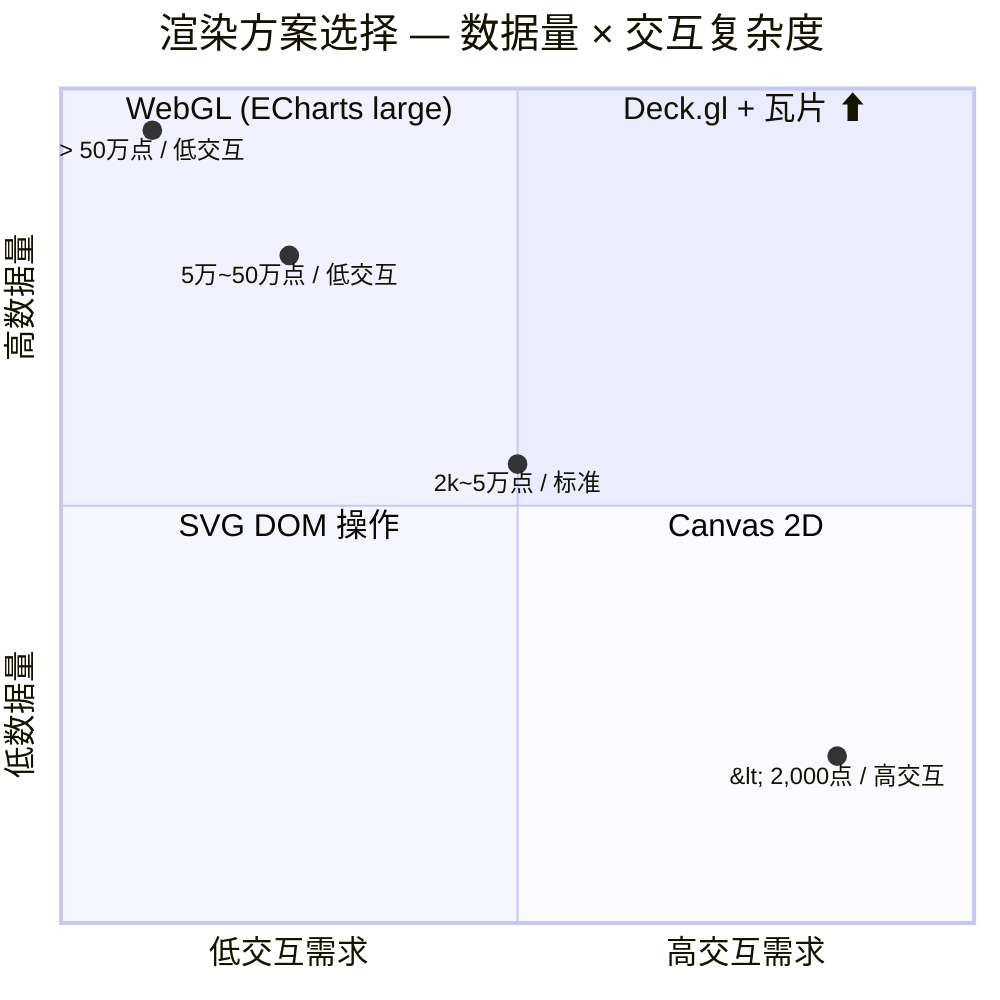

| 📊 数据量 | ✅ 推荐方案 | 🔬 核心瓶颈 | 💡 面试一句话 |
|:---------:|:-----------:|:-----------:|:------------:|
| `< 2,000` 点 | **SVG** | DOM 节点数 | 交互丰富、缩放清晰 |
| `2k ~ 5万` 点 | **Canvas 2D** | drawCall 数量 | 性能均衡、够用 |
| `5万 ~ 50万` 点 | **WebGL** (ECharts large) | GPU 显存带宽 | GPU 并行优势 |
| `> 50万` 点 | **Deck.gl + 瓦片** | 数据分片 + LOD | 分级加载是关键 |

---

## ⏱️ 附 B：可视化面试 15 分钟模拟演练

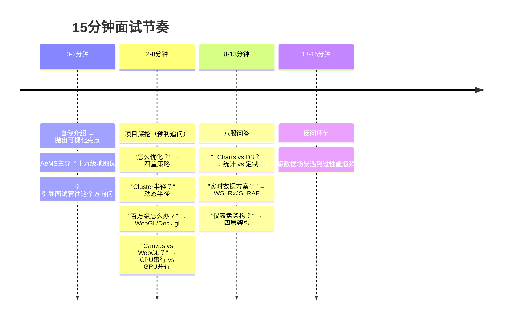

```text
┌─────────────────────────────────────────────────────────┐
│  ⏱️ 各阶段关键技巧                                        │
├─────────────────────────────────────────────────────────┤
│  0-2min  自我介绍亮点引导                                  │
│          └─ 用一句话锚定你最擅长的方向（如地图优化）        │
│  2-8min  预判追问库（准备 3 层追问深度）                   │
│          └─ 每答完一个点主动埋钩子："这里有个坑…"          │
│  8-13min 八股结构化回答                                    │
│          └─ 先给结论框架 → 再展开细节 → 最后项目验证       │
│  13-15min 反问展示深度                                     │
│          └─ 不要问"加班多吗"，问"你们的技术栈和挑战"      │
└─────────────────────────────────────────────────────────┘
```


---

## ✅ 附 C：可视化面试自检清单 （出发前逐项打勾 ✅ 记录掌握进度）

```text
╔═══════════════════════════════════════════════════════════╗
║  📊 进度评估                                             ║
║  基础 1-5 题 → 必须掌握（答不全=凉）                       ║
║  进阶 6-10 题→ 加分项（答出 3+ 即优秀）                    ║
║  项目 11-14题→ 展示深度（每项都该有故事）                   ║
╚═══════════════════════════════════════════════════════════╝
```

#### 1️⃣ 基础能力（必须掌握 ✅ / 复习中 🔄 / 未掌握 ⬜）

| # | 能力项 | 状态 | 📍 对应章节 |
|:---:|---|---|:---:|
| 1 | 说清 Canvas 2D vs SVG vs WebGL 适用场景和性能阈值 | ⬜ | Q3 / 追问链路5 |
| 2 | 十万级地图点位分层优化（BBOX + Cluster + Cache + 懒刷新） | ⬜ | Q1 / 追问链路1 |
| 3 | 实时数据三层架构（WebSocket + RxJS + RAF） | ⬜ | Q4 / Q5 |
| 4 | ECharts / G6 / D3 选型依据对比 | ⬜ | Q7 / 二 / 追问链路3 |
| 5 | 仪表盘四层架构设计 | ⬜ | Q8 / Q9 / 追问链路4 |

#### 2️⃣ 进阶能力（加分项 ✅ / ⬜）

| # | 能力项 | 状态 | 📍 对应章节 |
|:---:|---|---|:---:|
| 6 | WebGL 顶点着色器和片元着色器的作用 | ⬜ | 追问链路5 |
| 7 | 力导向布局力计算公式和优化策略 | ⬜ | 追问链路6 |
| 8 | WebSocket 断线重连 + 消息补偿机制 | ⬜ | Q5 |
| 9 | ECharts large 模式和 sampling 原理 | ⬜ | Q2 |
| 10 | 图表联动设计（hover/click/filter 跨图表同步） | ⬜ | Q10 |

#### 3️⃣ 项目验证（展示深度 ✅ / ⬜）

| # | 能力项 | 状态 | 说明 |
|:---:|---|---|:---|
| 11 | 量化数据支撑优化效果 | ⬜ | 帧率/内存/延迟数据 |
| 12 | 踩坑经验 | ⬜ | 闪烁/内存泄漏/跨域/时区 |
| 13 | 架构思考 | ⬜ | 为什么选这个方案，不选那个 |
| 14 | 方法论提炼 | ⬜ | 抽象可复用的设计模式 |

> 💡 **使用方式：** 打印或复制到笔记中，每掌握一项将 ⬜ 改为 ✅。面试前快速过一遍标注 🔄 的项目。

---

## 🎬 结语：面试成功的 3 个关键原则

```text
┌────────────────────────────────────────────────────────────┐
│  原则一：结构化回答（先结论，后展开，再举例）               │
│  └─ 面试官问任何问题，先用一句话给出核心结论框架，          │
│     再分层展开细节，最后用项目实例收尾。                    │
│  ❌ "我用了BBOX、Cluster..."（罗列名词）                    │
│  ✅ "核心是四层分层治理：数据层BBOX裁剪→视觉层Cluster→     │
│      内存层Cache→渲染层懒刷新。"（结论→展开→效果）         │
│                                                            │
│  原则二：量化成果（用数字说话）                              │
│  └─ 任何一个优化方案都要有"优化前 → 优化后"的量化对比。     │
│  ❌ "优化后变流畅了"（模糊）                                │
│  ✅ "帧率从<10fps优化到60fps，内存从200MB降到30MB"（精准）  │
│                                                            │
│  原则三：展示反思（避坑经验 > 成功经验）                     │
│  └─ 面试官更看重你踩过什么坑、怎么解决的。                  │
│  ❌ 只讲成功案例（缺乏深度）                                │
│  ✅ "一开始我直接用setTimeout控制渲染频率，后来发现          │
│      切Tab回来后定时器不执行...改成visibilitychange+RAF"     │
└────────────────────────────────────────────────────────────┘
```

> **🚀 最后的建议：** 把这份指南中的项目亮点映射到你的实际项目中，用你自己的 STAR 故事替换模板中的 AeMS/LI-OAM 案例。面试官最爱听"你做了什么"，而不是"指南上写了什么"。
