# 🤖 Agent 工程师面试题库（完整详解版）

> 🚀 涵盖 Agent 架构、工具调用协议、大模型基础、LangChain 框架四大模块，图文并茂，便于面试准备 | 建议收藏 ⭐

---

## 📑 目录

- [🧠 一、Agent 基础篇](#一agent-基础篇)
- [🔧 二、工具调用与协议篇](#二工具调用与协议篇)
- [📐 三、大模型基础篇](#三大模型基础篇)
- [🔗 四、LangChain 框架篇](#四langchain-框架篇)

---

# 🧠 一、Agent 基础篇

---

### Q1: 什么是 Agent？与大模型有什么本质不同？

> 💡 **要点**：Agent = LLM（大脑）+ 工具（手脚）+ 记忆（经验），核心区别在于 Agent 能主动执行操作

**Agent（智能体）** 是能够**感知环境 → 自主决策 → 执行动作**的智能系统。大模型（LLM）是 Agent 的"大脑"，但 Agent ≠ LLM。

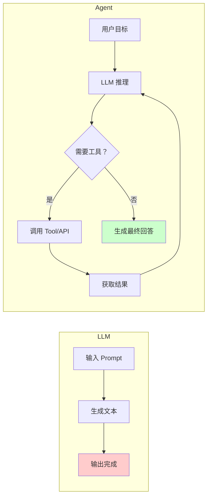

| 对比维度 | LLM | Agent |
|---------|-----|-------|
| 能力边界 | 文本生成、知识问答 | 调用工具、执行操作、完成任务 |
| 记忆 | 上下文窗口（有限） | 短期 + 长期记忆系统 |
| 自主性 | 被动响应 | 主动规划、执行、反思 |
| 工具使用 | ❌ 不能 | ✅ Function Calling / MCP |
| 状态管理 | 无状态 | 有状态（对话/任务状态） |

---

### Q2: Agent 的基本架构由哪些核心组件构成？

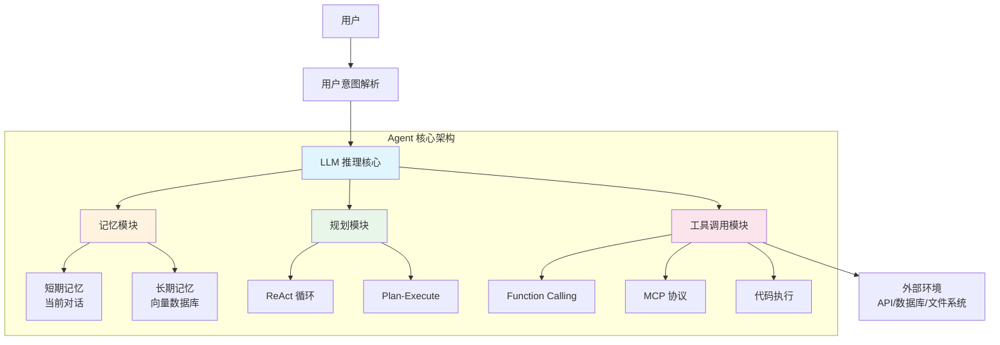

**六大核心组件：**

| 组件 | 职责 | 技术方案 |
|------|------|---------|
| **LLM 推理引擎** | 理解、推理、决策 | GPT-4o / Claude / DeepSeek |
| **记忆系统** | 存储和检索历史信息 | RAG + 向量数据库 + 摘要 |
| **规划模块** | 分解任务、制定步骤 | ReAct / Plan-and-Execute |
| **工具调用** | 与外部世界交互 | Function Calling / MCP / API |
| **反馈循环** | 评估结果、自我反思 | Reflection + 重试机制 |
| **安全护栏** | 内容过滤、权限控制 | Guardrails / 输入输出审核 |

---

### Q3: Workflow、Agent、Tools 三者的概念和区别？

> 💡 **要点**：Tool 是单一能力单元，Agent 是自主决策体，Workflow 是预定义流程

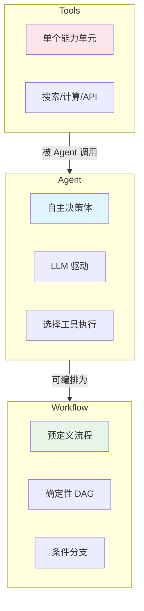

| 概念 | 定义 | 特点 | 举例 |
|------|------|------|------|
| **Tool** | 单一功能的执行单元 | 无状态、确定输入输出 | 搜索、计算器、SQL 查询 |
| **Agent** | LLM 驱动的自主决策体 | 有记忆、能推理、选工具 | 客服 Agent、编码 Agent |
| **Workflow** | 预定义的执行流程 | 确定性、可控、可预测 | 数据 Pipeline、审批流 |

**核心区别：** Workflow 是"告诉系统怎么做"，Agent 是"告诉系统做什么，系统自己决定怎么做"。

---

### Q4: 了解哪些 Agent 设计范式？Agent 和 Workflow 的区别？

**主流 Agent 设计范式：**

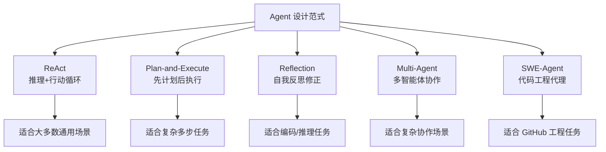

**Agent vs Workflow 核心区别：**

| 维度 | Workflow | Agent |
|------|----------|-------|
| 决策方式 | 预定义规则/条件分支 | LLM 动态决策 |
| 灵活性 | 低（固定流程） | 高（自主调整） |
| 可预测性 | 高（输出可预期） | 低（可能发散） |
| 适用场景 | 确定性流程 | 不确定性任务 |
| 错误处理 | 预设异常分支 | 自我反思纠错 |

---

### Q5: Agent 推理模式有哪些？ReAct 是什么？

**主要推理模式：**

| 模式 | 核心思想 | 适用场景 |
|------|---------|---------|
| **ReAct** | 推理 + 行动交替循环 | 通用问题解决 |
| **Plan-and-Execute** | 先制定计划再逐步执行 | 复杂多步任务 |
| **Reflection** | 执行后自我评估修正 | 编码、数学推理 |
| **Tree-of-Thought** | 同时探索多条推理路径 | 需要探索的问题 |
| **Self-Consistency** | 多次采样取多数结果 | 开放性问题 |

**ReAct（Reasoning + Acting）详解：**

> ⚠️ **注意**：ReAct 是 Agent 最基础也是最广泛使用的设计范式，面试高频考点

ReAct 的核心思想是让 LLM 在**推理（思考）**和**行动（工具调用）**之间交替进行，每一步的观察结果反馈到下一步推理。

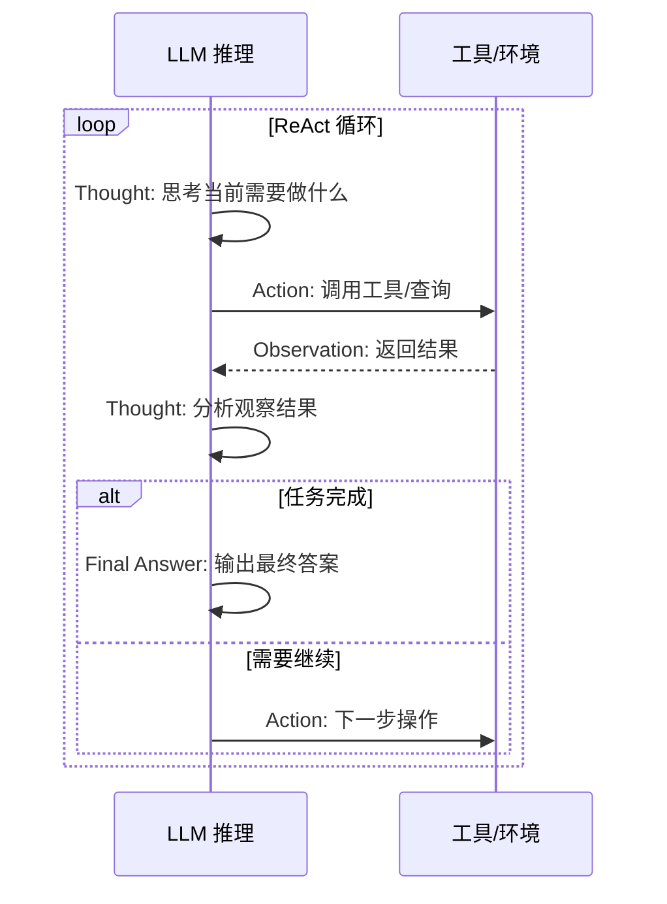

**ReAct 的 Prompt 模板示例：**

```
你是一个 AI 助手，请按照以下格式思考并行动：

Thought: 思考当前的状态和下一步需要做什么
Action: 需要调用的工具名称（如 search、calc）
Action Input: 工具的输入参数
Observation: 工具返回的结果
...（重复 Thought/Action/Observation 过程）
Thought: 我现在可以给出最终答案
Final Answer: 最终回答
```

---

### Q6: ReAct、Plan-and-Execute、Reflection 三种范式的核心区别？

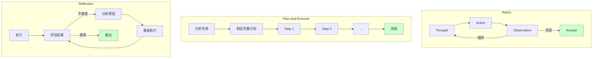

| 维度 | ReAct | Plan-and-Execute | Reflection |
|------|-------|-----------------|------------|
| **核心思路** | 边想边做 | 先想后做 | 做后检查 |
| **规划时机** | 动态规划（每步思考） | 静态规划（事先制定） | 执行后修正 |
| **适用场景** | 通用问答、信息检索 | 复杂多步任务、数据处理 | 编码、数学、写作 |
| **优势** | 灵活、能纠错 | 稳定、可追溯 | 质量高、自改进 |
| **劣势** | 可能循环过多 | 计划可能不合理 | 耗时较长 |
| **选型建议** | **默认首选** | 任务步骤清晰时 | 质量要求极高时 |

**实际项目选型建议：**
- **大多数场景 → ReAct**：灵活且高效
- **任务明确、步骤稳定 → Plan-and-Execute**：如数据处理 Pipeline
- **需要高质量输出 → ReAct + Reflection**：如代码生成、报告撰写

---

### Q7: 复杂任务怎么做的任务拆分？为什么要拆分？

**任务拆分（Task Decomposition）的方式：**

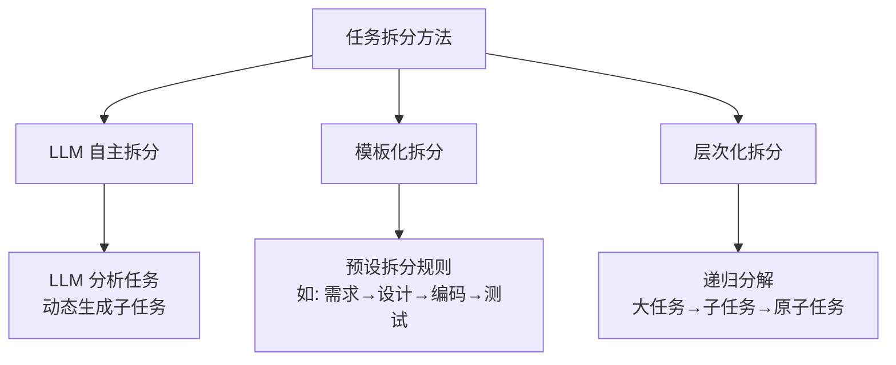

**为什么要拆分：**

| 原因 | 说明 |
|------|------|
| **降低单步难度** | LLM 处理小任务的准确率远高于大任务 |
| **提升可追溯性** | 每步结果可单独验证、Debug |
| **支持并行执行** | 独立子任务可并行处理 |
| **节省 Token 成本** | 避免超大上下文导致成本飙升 |
| **提高容错性** | 单步失败不影响整体，可重试 |

**效果提升的关键：**
- 子任务粒度控制在 **1-3 步可完成**
- 每个子任务有 **明确的输入/输出规范**
- 子任务间通过 **结构化数据传递** 而非自然语言

---

### Q8: 介绍一下 AI Agent 的记忆机制？如何设计记忆模块？

**记忆系统架构：**

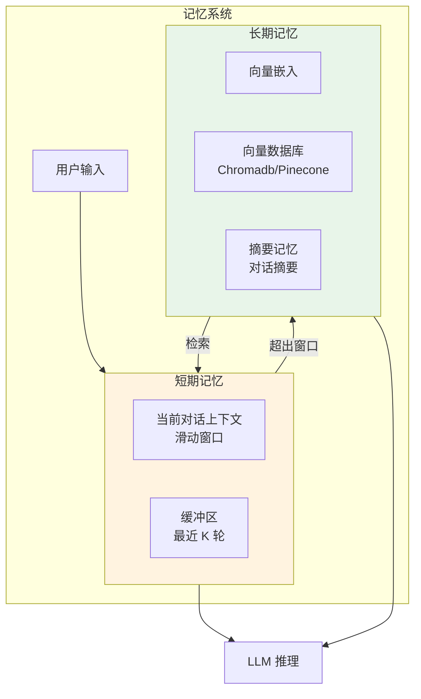

**记忆模块设计原则：**

| 设计要点 | 实现方式 |
|---------|---------|
| **分级存储** | 短期（上下文窗口）+ 长期（向量库） |
| **自动摘要** | 超出窗口时自动压缩摘要 |
| **相关性检索** | 用户输入 → embedding → 向量检索 |
| **时效性权重** | 近期记忆权重 > 远期记忆 |
| **记忆合并** | 相似记忆自动合并去重 |

**代码架构示例：**

```python
class AgentMemory:
    def __init__(self):
        self.short_term = []       # 滑动窗口
        self.vector_store = []     # 长期向量存储
        self.summary = ""          # 对话摘要
    
    def add(self, message: str):
        self.short_term.append(message)
        if len(self.short_term) > MAX_WINDOW:
            self._compress_and_store()
    
    def retrieve(self, query: str, k: int = 5):
        # 向量检索 + 时间权重排序
        results = self.vector_store.similarity_search(query, k)
        return self._rerank_by_recency(results)
```

---

### Q9: Agent 的长短期记忆系统怎么做？

**记忆存储架构：**

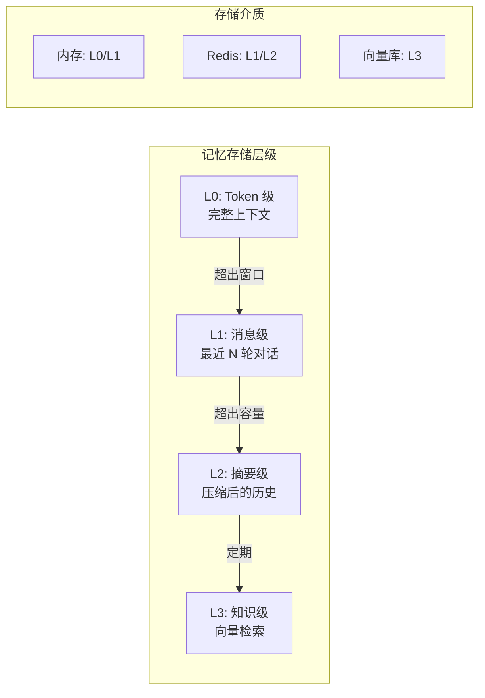

| 维度 | 短期记忆 | 长期记忆 |
|------|---------|---------|
| **存储粒度** | 单条消息 | 摘要/关键信息块 |
| **存储方式** | 内存 List/Deque | 向量数据库 |
| **容量** | 几千 Token | 无限（压缩存储） |
| **检索方式** | 顺序读取 | 语义相似度检索 |
| **更新策略** | FIFO 溢出丢弃 | 追加 + 定期压缩 |
| **使用方式** | 直接注入 Prompt | RAG 检索后注入 |

**记忆压缩的粒度控制：**

```
▸ Token 级：完整保留，用于精确回复
▸ 消息级：保留最近 K 轮，保证连贯性
▸ 摘要级：LLM 生成摘要，保留核心信息
▸ 实体级：提取关键实体/关系，结构化存储
```

---

### Q10: 什么是 Multi-Agent？

**Multi-Agent（多智能体系统）** 是多个 Agent 协作完成复杂任务的架构。每个 Agent 有**独立的角色、能力和记忆**，通过通信协议协作。

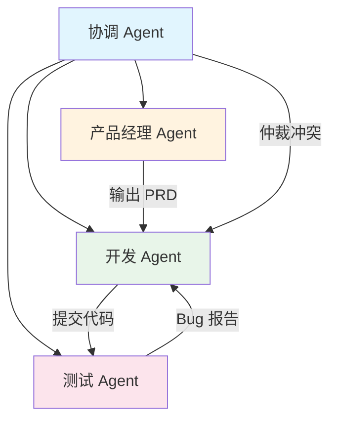

**Multi-Agent 的核心优势：**
- **角色专业化**：每个 Agent 负责特定领域
- **任务并行**：独立任务可同时执行
- **互相纠错**：Agent 间 peer review
- **模拟真实团队**：适用于复杂工程任务

---

### Q11: Single-Agent 和 Multi-Agent 的设计方案？

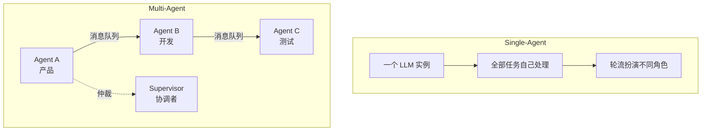

| 维度 | Single-Agent | Multi-Agent |
|------|-------------|-------------|
| **复杂度** | 低，单进程 | 高，需通信/协调 |
| **成本** | 低（单 LLM 调用） | 高（多 LLM + 通信） |
| **容错性** | 单点故障 | 部分 Agent 可降级 |
| **并行度** | 串行 | 可并行 |
| **适用场景** | 简单问答、单步工具 | 软件开发、复杂调研 |
| **选型建议** | **优先用 Single** | Single 解决不了时再用 |

**工程实践原则：**

> ⚠️ **最佳实践**：复杂 Agent 系统应从简单开始逐步演进

```
先 Single → 拆 Tool → 再 Workflow → 最后 Multi-Agent
```

---

### Q12: Agent 记忆压缩通常有哪些方法？

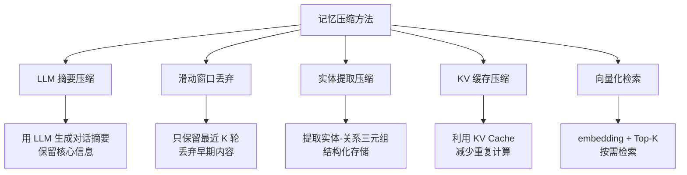

| 方法 | 压缩比 | 信息损失 | 实现复杂度 |
|------|--------|---------|-----------|
| 滑动窗口 | 固定比例 | 高（丢早期） | 低 |
| LLM 摘要 | 5-10x | 中（保留核心） | 高（额外 LLM 调用） |
| 实体提取 | 10-50x | 低（结构化） | 中 |
| **混合策略** | **最优** | **可控** | **中高** |

**最佳实践：** 滑动窗口 + 定期摘要 + RAG 检索的混合方案。

---

### Q13: 为什么有时候选择「手搓」Agent，而不是直接用成熟框架？

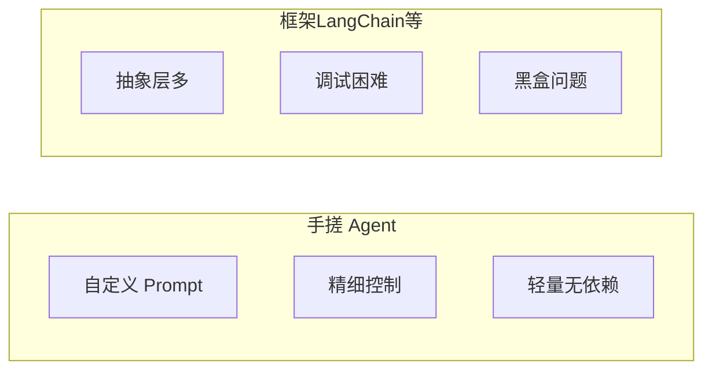

| 维度 | 手搓 | 成熟框架 |
|------|------|---------|
| **灵活性** | ✅ 完全可控 | ⚠️ 受框架限制 |
| **调试难度** | ✅ 容易追踪 | ❌ 多层抽象难 Debug |
| **开发速度** | ❌ 需要造轮子 | ✅ 开箱即用 |
| **性能** | ✅ 无额外开销 | ⚠️ 框架本身有开销 |
| **生产稳定性** | ✅ 可控 | ⚠️ 版本升级风险 |
| **选型建议** | 核心业务/定制需求 | 快速原型/标准场景 |

**手搓 Agent 的典型场景：**
- 需要**精细控制 Prompt 链**
- 框架版本升级导致**行为不一致**
- 使用**非标准 LLM 协议**
- 对**延迟/成本**有严格限制
- 框架抽象层导致 **Debug 困难**

---

### Q14: 如何赋予 LLM 规划能力？

| 方法 | 原理 | 优缺点 |
|------|------|--------|
| **Prompt Engineering** | 在 System Prompt 中给出规划框架 | ✅ 简单 ❌ 不可靠 |
| **ReAct Pattern** | 边推理边行动 | ✅ 动态灵活 |
| **Plan-and-Execute** | 先制定完整计划再执行 | ✅ 稳定性高 ❌ 计划可能错 |
| **Fine-tuning** | 在规划类数据上微调 | ✅ 效果好 ❌ 成本高 |
| **Tree-of-Thought** | 同时探索多条路径 | ✅ 质量高 ❌ 成本高 |

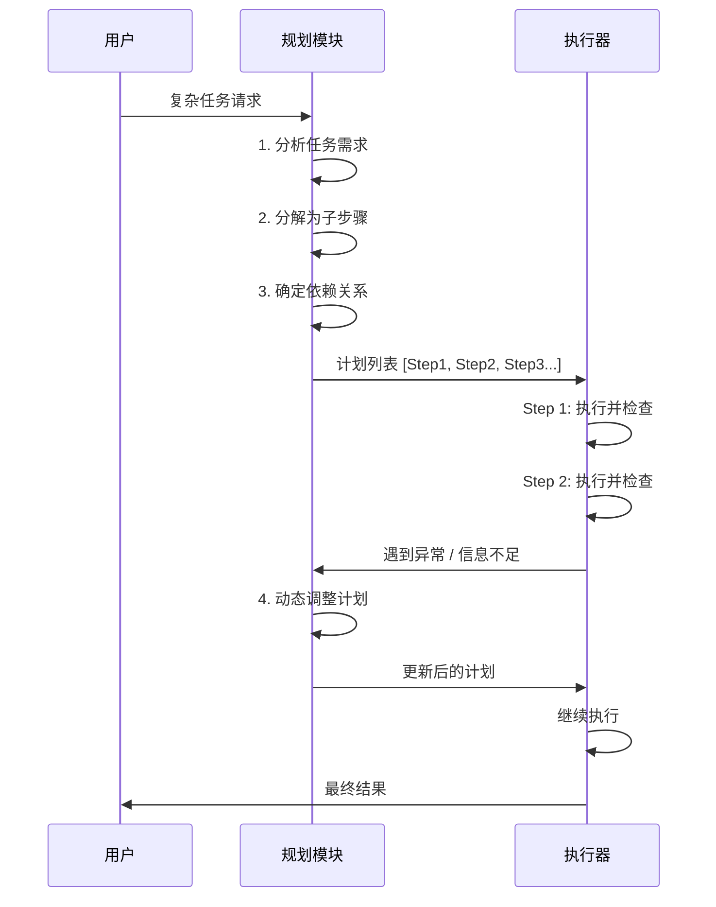

---

### Q15: 讲讲 Agent 的反思机制？

**反思机制（Reflection）** 让 Agent 在执行后**自我评估结果质量**，发现不足并主动修正。

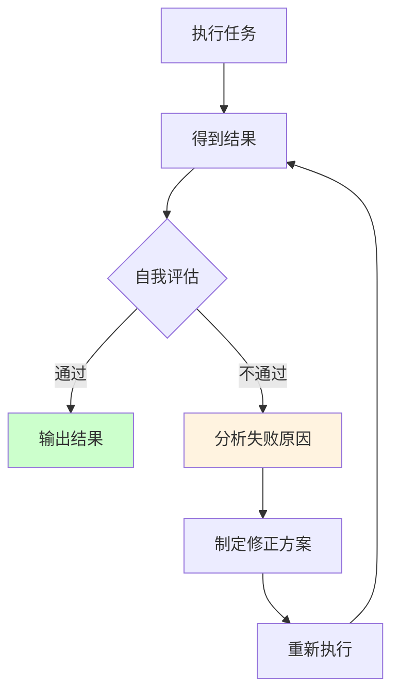

| 维度 | 说明 |
|------|------|
| **为什么需要反思** | LLM 一次生成的质量不稳定，反思可大幅提升准确率 |
| **实现方式** | 执行完后让 LLM 分析输出、检查错误、提出改进 |
| **触发条件** | 固定次数反思 / 置信度低于阈值 / 外部反馈错误 |
| **典型案例** | 代码生成 → 编译错误 → 反思 → 修改代码 |

**反思 Prompt 模板：**

```python
反思模板 = """
你刚刚完成了以下任务：[任务描述]
你的输出是：[输出内容]

请对上述输出进行自我检查：
1. 是否完全解决了用户需求？
2. 是否有逻辑错误或不完整之处？
3. 如果有问题，请说明原因并重新生成。
"""
```

---

### Q16: 如何设计多 Agent 的协作与动态切换机制？

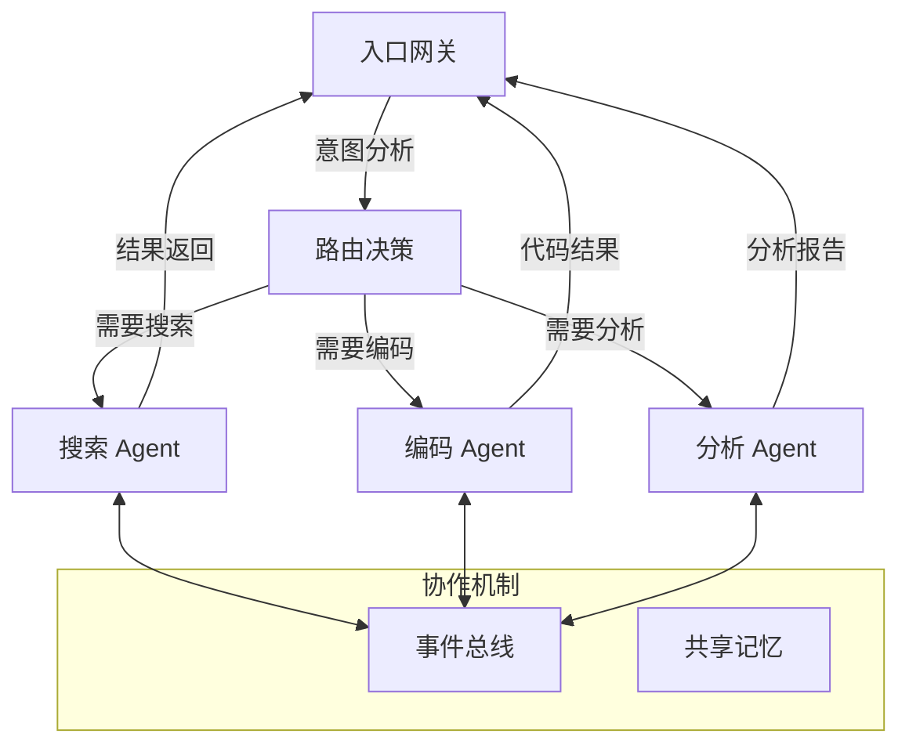

| 机制 | 说明 | 实现方式 |
|------|------|---------|
| **意图路由** | 根据用户输入分配 Agent | 分类器 / LLM 决策 |
| **事件总线** | Agent 间异步通信 | Redis Pub/Sub / 消息队列 |
| **共享记忆** | Agent 访问同一记忆库 | 向量数据库 + 上下文窗口 |
| **Supervisor** | 协调者仲裁冲突 | 独立的 LLM 裁决 |
| **动态切换** | 某 Agent 无法处理时切换 | 降级策略 + 超时回退 |

---

# 🔧 二、工具调用与协议篇

---

### Q1: 什么是 Function Calling？原理是什么？

> 💡 **要点**：Function Calling 是 LLM 输出结构化 JSON 的能力，由应用层执行函数

**Function Calling（函数调用）** 是 LLM 在生成文本时，同时输出**结构化函数调用指令**的能力。LLM 本身不执行函数，而是输出参数，由应用层执行。

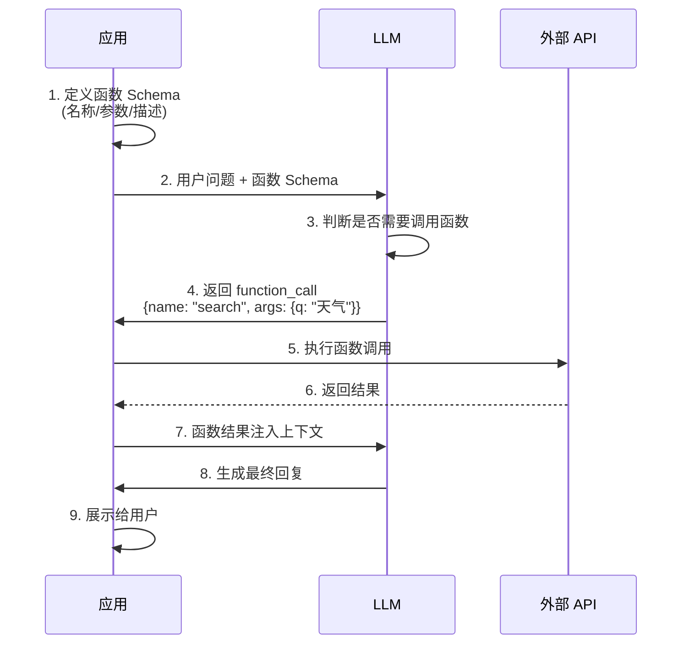

**原理：** Function Calling 是通过**指令微调**让 LLM 学会输出特定 JSON 格式。模型在训练时看到大量 `用户问题 → 函数描述 → 函数调用` 的数据，从而学会在需要时输出函数调用。

---

### Q2: LLM 是如何学会调用外部工具的？

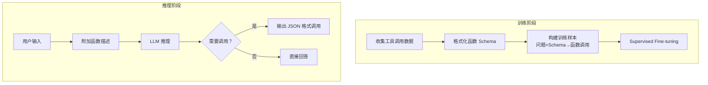

- **SFT 阶段**：用大量 `(问题, 函数定义, 调用结果)` 样本微调
- **RLHF 阶段**：奖励模型学会调用的行为
- **上下文学习**：即使是未微调的模型，通过 Few-shot 也可以在 Inference 时学会

---

### Q3: 大模型的 Function Call 能力是怎么训练出来的？

| 阶段 | 方法 | 数据形式 |
|------|------|---------|
| **数据构造** | 模拟 API 调用场景 | `System: 你有以下工具...` <br/> `User: 查一下北京的天气` <br/> `Assistant: <functioncall> {"name":"get_weather","args":{"city":"北京"}}` |
| **SFT 微调** | 在混合数据上微调 | 通用文本 70% + 函数调用 30% |
| **RLHF 优化** | 奖励正确调用行为 | 函数调用准确率作为奖励信号 |
| **工具调用 Agent 数据** | Self-play 生成 | Agent 执行轨迹作为训练数据 |

---

### Q4: 什么是 MCP（模型上下文协议）？核心内容？

**MCP（Model Context Protocol）** 是 Anthropic 提出的**开源协议**，用于标准化 LLM 与外部工具/数据源的通信方式。类似「AI 应用的 USB-C 接口」。

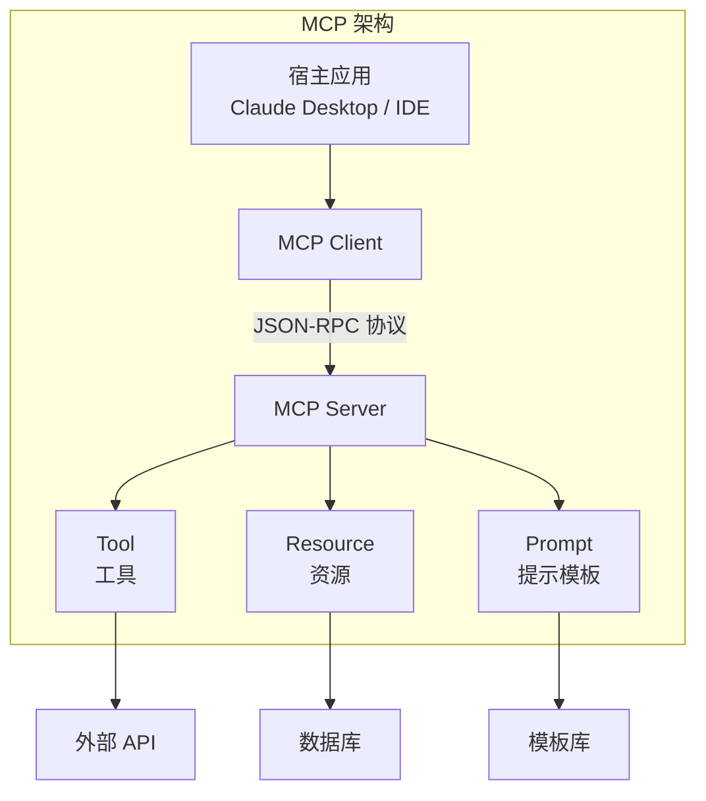

**MCP 核心内容：**

| 组件 | 说明 |
|------|------|
| **Tools** | 可调用的函数，定义 Schema 和 handler |
| **Resources** | 可读取的数据源（文件、数据库等） |
| **Prompts** | 可复用的提示模板 |
| **Transport** | 通信层（stdio / SSE / WebSocket） |
| **JSON-RPC** | 消息格式标准 |

---

### Q5: MCP 由哪几部分组成？

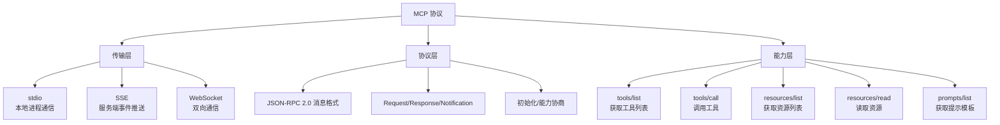

---

### Q6: MCP 和 Function Calling 有什么区别？

> 💡 **要点**：Function Calling 是 LLM 的"输出格式"，MCP 是"工具与 LLM 间的通信标准"

| 对比维度 | Function Calling | MCP |
|---------|-----------------|-----|
| **定位** | LLM 输出结构化 JSON 的能力 | 工具与 LLM 间的通信协议 |
| **标准化** | 各厂商自定格式 | 开放标准协议 |
| **工具发现** | 需开发者手动传入 Schema | 工具可动态发现 (tools/list) |
| **连接方式** | 一次性调用 | 长连接会话 |
| **适用厂商** | OpenAI / Anthropic / 各家 | Anthropic 发起，社区支持 |
| **实际部署** | 简单，代码直接调用 | 需运行 MCP Server 进程 |

**一句话总结：** Function Calling 是 LLM 的「输出格式」，MCP 是「工具和 LLM 之间」的通信标准。

---

### Q7: 什么场景用 Function Calling？什么场景用 MCP？

| 场景 | 推荐 | 原因 |
|------|------|------|
| **简单的单步工具调用** | Function Calling | 最直接，无额外依赖 |
| **复杂多工具系统** | MCP | 标准化管理，动态发现 |
| **已有代码项目集成** | Function Calling | 改造成本低 |
| **需要热插拔工具** | MCP | 工具动态注册/发现 |
| **跨应用共享工具** | MCP | 统一协议标准 |
| **快速原型开发** | Function Calling | 上手快，无需搭建 Server |

---

### Q8: 为什么有些推理模型不支持 MCP 协议？

```mermaid
graph LR
    subgraph 支持 MCP
        S1["Claude<br/>Anthropic"]
        S2["兼容 MCP 的模型"]
    end

    subgraph 不支持 MCP
        N1["纯推理模型<br/>o1 / DeepSeek-R1"]
        N2["原因: 不支持<br/>Function Calling 格式"]
    end

    MCP["MCP 协议"] -->|需要| FC["Function Calling 能力"]
    FC -->|依赖| Train["指令微调"]
    Train --> N1
    
    style N1 fill:#ffcccc
```

- 纯推理模型（如 o1、DeepSeek-R1）专门优化了推理链，没有经过 Function Calling 的指令微调
- MCP 依赖 Model 端输出特定 JSON 格式，如果模型不支持，MCP 无法工作
- 解决方法：使用 Gateway 层将推理模型的输出转为 MCP 格式

---

### Q9: Skill 是什么？

**Skill（技能）** 是 Agent 的**可复用能力单元**，包含完成特定任务所需的 Prompt、工具调用逻辑和知识。

```python
class Skill:
    name: str          # 技能名称
    description: str   # 技能描述（用于检索）
    prompt: str        # 核心 Prompt 模板
    tools: List[Tool]  # 需要的工具列表
    examples: List     # Few-shot 示例
```

| 要素 | 说明 |
|------|------|
| **Prompt** | 引导 LLM 完成任务的指令模板 |
| **Tools** | 该技能需要调用的工具 |
| **Examples** | 成功执行示例（Few-shot） |
| **Trigger** | 触发条件（关键词/意图匹配） |

---

### Q10: MCP 和 Agent Skill 的区别是什么？

| 维度 | MCP | Agent Skill |
|------|-----|-------------|
| **抽象层级** | 通信协议层 | 应用逻辑层 |
| **定位** | 工具与服务间的标准接口 | Agent 能力的封装单元 |
| **内容** | 传输格式、Schema 定义 | Prompt + Tools + 知识 |
| **复用范围** | 跨应用、跨平台 | 同一 Agent 系统内 |
| **关系** | Skill **内部使用** MCP 调用工具 | MCP 是 Skill 的底层通信手段 |

**关系图：**

```
Agent
  └── Skill A（用 MCP 调用搜索工具）
  └── Skill B（用 MCP 调用代码工具）
  └── Skill C（用 MCP 调用数据库）
```

---

### Q11: Function Calling、Skill、MCP 三者的区别？

| 概念 | 层级 | 类比 | 关系 |
|------|------|------|------|
| **Function Calling** | 模型能力 | 模型"会说 JSON" | 底层能力 |
| **MCP** | 通信协议 | 工具的 USB-C 接口 | 连接标准 |
| **Skill** | 应用封装 | 完整的"拧螺丝"流程 | 上层封装 |

**关系：** Skill **内部使用** MCP 协议 **调用** 外部工具，而 MCP 依赖模型的 **Function Calling** 能力来解析函数调用。

---

### Q12: 什么是 A2A 协议？它和 MCP 协议的区别？

> 💡 **要点**：MCP 是 Agent→工具（垂直），A2A 是 Agent↔Agent（水平），两者互补

**A2A（Agent-to-Agent）** 是 Google 提出的**多 Agent 间通信协议**，解决 Agent 之间如何协作的问题。

```mermaid
graph LR
    subgraph MCP
        MC["Agent"] -->|工具调用| MS["MCP Server"]
        MS --> API["外部 API"]
    end

    subgraph A2A
        A1["Agent A<br/>产品"] <-->|A2A 协议| A2["Agent B<br/>开发"]
        A2 <-->|A2A 协议| A3["Agent C<br/>测试"]
    end
```

| 维度 | MCP | A2A |
|------|-----|-----|
| **定位** | Agent → 工具 | Agent ↔ Agent |
| **通信方向** | 垂直（应用调工具） | 水平（Agent 间协作） |
| **核心问题** | 工具如何标准化接入 | Agent 如何协作完成任务 |
| **提出方** | Anthropic | Google |
| **关系** | **互补**：Agent 先用 MCP 调工具，再用 A2A 与其他 Agent 通信 |

---

### Q13: MCP 协议通常采用什么通信方式？

| 传输方式 | 适用场景 | 优势 | 劣势 |
|---------|---------|------|------|
| **stdio** | 本地子进程 | 简单、低延迟 | 限于本地 |
| **SSE** | 服务端推送 | 标准 HTTP，兼容好 | 单向推送 |
| **WebSocket** | 实时双向通信 | 全双工、低延迟 | 额外复杂度 |

**推荐：** 本地开发用 stdio，生产环境用 SSE 或 WebSocket。

---

### Q14: WebSocket 和 SSE 通信的区别及局限性？

| 对比维度 | WebSocket | SSE (Server-Sent Events) |
|---------|-----------|-------------------------|
| **方向** | 双向全双工 | 服务器→客户端单向 |
| **协议** | ws:// / wss:// | HTTP 长连接 |
| **自动重连** | 需手动实现 | 原生支持 |
| **兼容性** | 所有现代浏览器 | IE 不支持 |
| **消息格式** | 任意（文本/二进制） | 纯文本（text/event-stream） |
| **适用场景** | 实时聊天、游戏 | 通知推送、日志流 |

**局限性：**
- **WebSocket**：需要心跳保活、有连接数限制、防火墙可能拦截 ws 协议
- **SSE**：不支持二进制、单向（仅服务器推送）、HTTP/1.1 限制并发连接数（HTTP/2 解决）

---

### Q15: 为什么用 WebRTC？与 WebSocket 在 AI 对话中的核心差异？

| 维度 | WebSocket | WebRTC |
|------|-----------|--------|
| **定位** | 消息传输协议 | 实时通信框架（音视频+数据） |
| **延迟** | 低（~100ms） | 极低（~10ms，UDP） |
| **传输** | TCP（可靠有序） | UDP（速度优先） |
| **音频流** | 需编码为文本/二进制 | 原生音频轨道 |
| **适用场景** | 文本对话、指令传输 | 语音对话、视频通话 |

**AI 对话场景：**
- **文本 AI**：WebSocket 足够，简单可靠
- **语音 AI**：WebRTC 是首选，原生支持低延迟音频流

---

### Q16: 有没有用过大型模型的网关框架？网关层解决了什么问题？

```mermaid
graph TB
    Client["客户端"] --> Gateway["AI Gateway"]
    
    subgraph Gateway 层功能
        G1["路由: 模型分发"]
        G2["限流: QPS 控制"]
        G3["缓存: 语义缓存"]
        G4["降级: 模型切换"]
        G5["监控: Token 统计"]
        G6["安全: 内容过滤"]
    end
    
    Gateway --> LLM1["GPT-4o"]
    Gateway --> LLM2["Claude"]
    Gateway --> LLM3["DeepSeek"]
```

**网关层解决的问题：**

| 问题 | 解决方案 |
|------|---------|
| **多模型切换** | 统一 API 接口，按策略分发 |
| **成本控制** | Token 计数、预算限制、模型降级 |
| **高可用** | 熔断、重试、多模型备份 |
| **安全合规** | 输入输出审核、脱敏、限流 |
| **监控观测** | 请求日志、延迟追踪、Token 统计 |

**常用方案：** OpenAI API Gateway / Kong / APISIX / 自建

---

# 📐 三、大模型基础篇

---

### Q1: 什么是大语言模型？和传统 NLP 模型有什么区别？

> 💡 **要点**：LLM 的核心突破在于"通用性"——一个模型处理所有任务，而非每个任务单独训练

| 维度 | 传统 NLP 模型 | 大语言模型 (LLM) |
|------|--------------|-----------------|
| **架构** | LSTM / BiLSTM / CRF | Transformer (Decoder-only) |
| **参数量** | 百万~亿级 | 十亿~万亿级 |
| **训练方式** | 任务特定训练 | 预训练 + 指令微调 |
| **能力** | 单任务（分类/序列标注） | 通用（对话/翻译/推理） |
| **Few-shot** | ❌ 需全部数据微调 | ✅ 上下文学习 |

---

### Q2: Transformer 架构基本原理？

```mermaid
graph TB
    subgraph Encoder
        Input["输入序列"] --> Embed["Embedding + 位置编码"]
        Embed --> MHA["多头自注意力"]
        MHA --> FFN["前馈神经网络"]
        FFN --> EncOut["编码器输出"]
    end

    subgraph Decoder
        DecInput["输出序列"] --> DecEmbed["Embedding + 位置编码"]
        DecEmbed --> MaskMHA["掩码自注意力"]
        MaskMHA --> CrossAttn["交叉注意力"]
        CrossAttn --> DecFFN["前馈网络"]
        DecFFN --> Output["输出概率"]
    end

    EncOut --> CrossAttn
    
    style MHA fill:#e1f5fe
    style MaskMHA fill:#fff3e0
    style CrossAttn fill:#e8f5e9
```

| 组件 | 作用 |
|------|------|
| **Embedding** | 将 Token 映射为向量 |
| **位置编码** | 注入序列位置信息 |
| **多头注意力** | 捕捉不同维度的上下文关系 |
| **FFN** | 非线性变换，增强表达能力 |
| **LayerNorm** | 稳定训练，加速收敛 |
| **Residual Connection** | 解决梯度消失，支持深层网络 |

---

### Q3: 多头注意力（MHA）的局限？MQA、GQA、Flash Attention 怎么解决？

```mermaid
graph TB
    subgraph MHA [Multi-Head Attention]
        H1["Q1 K1 V1"] --> Cat1["拼接"]
        H2["Q2 K2 V2"] --> Cat1
        H3["...n heads"] --> Cat1
        Cat1 --> Out1["输出"]
        Note1["高显存/高带宽"]
    end

    subgraph GQA [Grouped Query Attention]
        GQ["Q: n 组"] --> Group["分组计算"]
        GK["K: 1 组"] --> Group
        Group --> Out2["输出"]
        Note2["平衡质量与效率"]
    end
    
    subgraph MQA [Multi-Query Attention]
        MQ["Q: n 组"] --> Single["共享 KV"]
        SK["K: 1 组"] --> Single
        SV["V: 1 组"] --> Single
        Single --> Out3["输出"]
        Note3["极致 KV Cache 优化"]
    end
```

| 方案 | 原理 | KV Cache 节省 | 质量影响 |
|------|------|---------------|---------|
| **MHA** | 每头独立 Q/K/V | 基准 | 最佳 |
| **MQA** | 所有 Q 头共享 K/V | ~80% | 轻微下降 |
| **GQA** | Q 分组共享 K/V | ~50% | 几乎无损 |
| **Flash Attention** | 分块计算，避免大矩阵 | 内存 O(n) → O(√n) | 无损 |

---

### Q4: 大模型的位置编码：sin/cos、RoPE、ALiBi 区别？

| 编码方式 | 原理 | 特点 | 代表模型 |
|---------|------|------|---------|
| **Sinusoidal** | 固定频率的正余弦函数 | 绝对位置编码，无参数 | Transformer 原始论文 |
| **RoPE** | 旋转矩阵编码相对位置 | 相对位置感知，外推性好 | LLaMA、Qwen、ChatGLM |
| **ALiBi** | 线性偏置注意力分数 | 简单高效，外推性强 | MPT、Bloom |

**RoPE 为何成为主流：**
- 天然支持**相对位置**关系
- **外推性好**：训练 4K 可推理 32K
- 与大模型现有架构**兼容性最好**

---

### Q5: 什么是大模型的分词器？原理？

**分词器（Tokenizer）** 将文本转换为模型能处理的 Token ID 序列。

```mermaid
graph LR
    Text["今天天气真好"] --> Tokenize["分词器"]
    Tokenize --> Tokens['今天', '天气', '真好']
    Tokens --> IDs[1024, 3567, 8912]
```

**主流分词算法：**

| 算法 | 原理 | 代表 |
|------|------|------|
| **BPE** | 合并高频子词对 | GPT 系列 |
| **WordPiece** | 基于概率的合并 | BERT |
| **Unigram** | 基于概率的删除 | T5、XLNet |
| **SentencePiece** | 纯数据驱动（含空格编码） | LLaMA、Gemma |

---

### Q6: 大模型是怎么训练出来的？

> 💡 **要点**：预训练（学知识）→ SFT（学对话）→ RLHF（学偏好），三阶段数据量和成本递减

```mermaid
graph LR
    PT["预训练<br/>Pre-training"] --> SFT["指令微调<br/>Supervised Fine-tuning"]
    SFT --> RLHF["人类反馈强化学习<br/>RLHF / DPO"]
    
    subgraph 预训练
        P1["海量文本<br/>TB 级"]
        P2["自监督学习<br/>Next Token Prediction"]
    end
    
    subgraph 指令微调
        S1["高质量对话数据"]
        S2["监督学习"]
    end
    
    subgraph RLHF
        R1["奖励模型训练"]
        R2["PPO 优化"]
    end
```

| 阶段 | 数据量 | 目的 | 计算成本 |
|------|--------|------|---------|
| **预训练** | TB 级 | 学习语言知识 | 极高（万卡×月） |
| **SFT** | 万~百万级 | 对齐指令格式 | 低（单机×天） |
| **RLHF/DPO** | 十万级 | 对齐人类偏好 | 中 |

---

### Q7: 什么是 Scaling Law？涌现能力是怎么回事？

**Scaling Law（规模定律）：** 模型性能随**参数量、数据量、计算量**的增长呈现可预测的幂律提升。

```mermaid
graph LR
    subgraph Scaling Law
        P["参数量 ↑"] --> L["Loss ↓"]
        D["数据量 ↑"] --> L
        C["计算量 ↑"] --> L
    end
    
    L --> E["涌现能力"]
    
    subgraph 涌现能力
        E1["推理"]
        E2["代码"]
        E3["翻译"]
        E4["Few-shot"]
    end
```

**涌现能力：** 当模型规模超过某个**临界点**后，突然出现的能力（如推理、代码生成、翻译等）。这些能力在小模型中**不存在**，不是逐步提升的，而是**突变的**。

---

### Q8: 大模型微调的方案有哪些？

> 💡 **要点**：LoRA 是性价比最高的微调方案，大部分项目场景推荐使用

| 方案 | 原理 | 参数量 | 效果 | 适用场景 |
|------|------|--------|------|---------|
| **Full Fine-tuning** | 更新全部参数 | 100% | 最佳 | 有大量计算资源 |
| **LoRA** | 低秩适配矩阵 | 0.1-1% | 接近 Full FT | 大多数场景 |
| **QLoRA** | LoRA + 量化 | 0.1% + 4bit | 略低于 LoRA | 单卡训练 |
| **Adapter** | 插入小适配层 | 1-5% | 良好 | 多任务场景 |
| **Prefix Tuning** | 学习连续 prompt | 0.01% | 一般 | 快速实验 |

**推荐方案：** 大多数项目使用 **LoRA** 或 **QLoRA**。

---

### Q9: LoRA 技术原理及优点？

**LoRA（Low-Rank Adaptation）** 在冻结原模型权重的基础上，插入低秩分解矩阵来模拟参数更新。

```
原始权重 W ∈ ℝ^{d×k}   冻结不动
LoRA 更新: W + ΔW = W + BA
           B ∈ ℝ^{d×r}, A ∈ ℝ^{r×k}
           其中 r << min(d, k)
```

**优点：**
- **显存节省**：从全量微调的几十分之一
- **快速切换**：多个 LoRA 权重可动态加载
- **无推理开销**：训练完可与原权重合并
- **过拟合风险低**：参数量小
- **存储成本低**：一个 LoRA 权重仅几 MB

---

### Q10: SFT 之后还有哪些 Post-Training？

```mermaid
graph TB
    SFT["指令微调 SFT"] --> Post["Post-Training"]
    
    Post --> RLHF["RLHF<br/>PPO"]
    Post --> DPO["DPO<br/>Direct Preference Optimization"]
    Post --> GRPO["GRPO<br/>Group Relative Policy Optimization"]
    Post --> Rejection["拒绝采样<br/>Rejection Sampling"]
    
    RLHF --> R1["需要奖励模型<br/>复杂但效果稳"]
    DPO --> D1["无需奖励模型<br/>简单高效"]
    GRPO --> G1["DeepSeek 使用<br/>分组相对优化"]
    Rejection --> Re1["多次采样取优<br/>质量筛选"]
```

| 方法 | 需要奖励模型 | 复杂度 | 代表模型 |
|------|-------------|--------|---------|
| **RLHF (PPO)** | ✅ | 高 | GPT-4、Claude |
| **DPO** | ❌ | 低 | Qwen、LLaMA-3 |
| **GRPO** | ❌ | 中 | DeepSeek-R1 |
| **拒绝采样** | ❌ | 低 | 多数开源模型 |

---

### Q11: DPO 和 PPO 的区别？

| 维度 | PPO (RLHF) | DPO |
|------|-----------|-----|
| **奖励模型** | 需要单独训练 | 不需要 |
| **优化目标** | 最大化奖励 | 直接优化偏好概率 |
| **训练稳定性** | 不稳定（需调参） | 稳定 |
| **实现复杂度** | 高 | 低 |
| **效果** | 好 | 接近 PPO |
| **资源消耗** | 高（需维护 4 个模型） | 低（只需 2 个模型） |

**选型建议：** 大多数场景用 **DPO**；追求极致效果用 **PPO**。

---

### Q12: 大模型解码策略有哪些？

```mermaid
graph TB
    Decode["解码策略"] --> Greedy["贪心搜索<br/>Greedy Decoding"]
    Decode --> Beam["束搜索<br/>Beam Search"]
    Decode --> Sample["采样<br/>Sampling"]
    
    Sample --> TopK["Top-K 采样"]
    Sample --> TopP["Top-P / Nucleus 采样"]
    Sample --> Temp["温度采样<br/>Temperature"]
```

| 策略 | 原理 | 适用场景 |
|------|------|---------|
| **贪心搜索** | 每步选概率最高 | 翻译、摘要（确定性任务） |
| **Beam Search** | 保留 N 条路径 | 翻译、语音识别 |
| **Top-K** | 从 Top-K 候选采样 | 创意写作 |
| **Top-P** | 累积概率超过 P 的候选 | 通用生成 |
| **温度采样** | 缩放概率分布 | 控制创造性 |

---

### Q13: 温度值、Top-P、Top-K 分别是什么？最佳设置？

| 参数 | 作用 | 低值 | 高值 | 推荐场景 |
|------|------|------|------|---------|
| **Temperature** | 控制概率分布的平滑度 | 0.1-0.3（确定性） | 0.8-1.0（创造性） | 代码 0.2，写作 0.8 |
| **Top-P** | 累积概率阈值裁剪 | 0.1（严格） | 0.9（宽松） | 通用 0.9 |
| **Top-K** | 只保留前 K 个候选 | 10（严格） | 50（宽松） | 通用 40 |

**推荐组合：**
- **代码/数学**：Temperature=0.1, Top-P=0.1（精确）
- **翻译/摘要**：Temperature=0.3, Top-P=0.5（平衡）
- **创意写作**：Temperature=0.8, Top-P=0.9（多样）
- **通用聊天**：Temperature=0.7, Top-P=0.9

---

### Q14: KV Cache 是什么？Prompt Caching 的原理？

> 💡 **要点**：KV Cache 是自回归生成的核心优化技术，减少 80%+ 的重复计算

**KV Cache：** 在自回归生成中，缓存已生成的 Key/Value 矩阵，避免重复计算。

```mermaid
sequenceDiagram
    participant Model as LLM
    participant Cache as KV Cache

    Note over Model,Cache: 生成 Token 1
    Model->>Model: 计算 Token 1 的 K1, V1
    Model->>Cache: 缓存 K1, V1

    Note over Model,Cache: 生成 Token 2
    Model->>Cache: 读取 K1, V1
    Model->>Model: 只计算 Token 2 的 K2, V2
    Model->>Cache: 追加 K2, V2

    Note over Model,Cache: 每次只计算新 Token<br/>缓存复用历史 Token
```

**Prompt Caching：** 对相同的 Prompt 前缀（如 System Prompt）缓存其 KV 向量，不同用户共享。

| 技术 | 节省 | 实现方式 |
|------|------|---------|
| **KV Cache** | 每次生成减少 80%+ 计算 | 自回归时缓存 K/V |
| **Prompt Caching** | 共享 Prompt 的 KV 复用 | 相同前缀直接命中 |

---

### Q15: 大模型量化是什么？INT8/INT4/AWQ/GPTQ 怎么选？

**量化**是将模型权重从高精度（FP16）转为低精度（INT8/INT4），降低显存和加速推理。

```mermaid
graph TB
    Quant["量化方案"] --> PTQ["训练后量化<br/>Post-Training Quantization"]
    Quant --> QAT["量化感知训练<br/>Quantization-Aware Training"]
    
    PTQ --> GPTQ["GPTQ<br/>逐层量化"]
    PTQ --> AWQ["AWQ<br/>激活感知量化"]
    PTQ --> GGUF["GGUF<br/>llama.cpp 格式"]
    
    QAT --> Q1["效果好但需要训练"]
```

| 方案 | 精度 | 显存节省 | 质量损失 | 推荐场景 |
|------|------|---------|---------|---------|
| **INT8** | 8-bit | ~50% | 几乎无损 | GPU 推理 |
| **INT4 (GPTQ)** | 4-bit | ~75% | 轻微 | GPU 推理 |
| **INT4 (AWQ)** | 4-bit | ~75% | 略优于 GPTQ | GPU 推理 |
| **GGUF (Q4)** | 4-bit | ~75% | 轻微 | CPU 推理 |

**选型建议：** GPU 用 **AWQ**，CPU 用 **GGUF**。

---

### Q16: 如何写好 Prompt？实践经验？

| 原则 | 说明 | 示例 |
|------|------|------|
| **清晰明确** | 避免模糊表述 | ❌ "总结一下" → ✅ "用 3 句话总结核心观点" |
| **角色设定** | 给模型身份 | "你是一位资深 Python 工程师" |
| **结构化** | 分点、分段 | 用 ### / - / 1. 等标记 |
| **Few-shot** | 给 2-3 个示例 | 输入输出范例 |
| **约束条件** | 明确格式限制 | "输出 JSON 格式" |

**进阶技巧：**
- **Chain-of-Thought**：引导模型逐步思考
- **Self-Consistency**：多次采样投票
- **System Prompt 中定义规则**：比 User Prompt 约束力更强

---

### Q17: 什么是 CoT？为什么效果好？局限？

**CoT（Chain-of-Thought，思维链）** 通过引导模型在输出答案前先输出推理步骤，提升复杂推理能力。

```
❌ 直接回答：
Q: 24 × 37 = ?
A: 888

✅ CoT 回答：
Q: 24 × 37 = ?
A: 先计算 24 × 30 = 720
   再计算 24 × 7 = 168
   最后 720 + 168 = 888
```

| 维度 | 说明 |
|------|------|
| **为什么效果好** | 分解推理步骤 → 降低单步难度 → 错误可追溯 |
| **局限** | Token 消耗增加 3-5x、不适用于事实性问答、可能生成错误推理链 |
| **改进** | CoT-SC（多次采样投票）、Auto-CoT（自动生成思维链） |

---

### Q18: 为什么会出现幻觉？怎么缓解？

**幻觉来源：**

```mermaid
graph TB
    Hallucination["幻觉原因"] --> Data["训练数据偏差<br/>数据含错误/偏见"]
    Hallucination --> Decode["解码策略<br/>采样引入不确定性"]
    Hallucination --> Knowledge["知识截止<br/>训练数据过时"]
    Hallucination --> Over["过度自信<br/>模型倾向于生成而非拒绝"]
```

**缓解方案：**

| 方案 | 原理 | 效果 |
|------|------|------|
| **RAG** | 检索外部知识注入 | ✅ 最好 |
| **Prompt 约束** | 要求"不知道就说不知道" | ⚠️ 有限 |
| **多次采样** | 多次生成取一致结果 | ✅ 有效 |
| **知识编辑** | 修正模型内部知识 | ⚠️ 复杂 |
| **Grounding** | 强制引用来源 | ✅ 有效 |

---

### Q19: MoE 混合专家模型是什么？

> 💡 **要点**：MoE 用"总参数量大但每次只激活一部分"的方式，兼顾模型容量与推理效率

**MoE（Mixture of Experts）** 将模型拆分为多个"专家"子网络，每次只激活部分专家，在保持推理效率的同时扩大模型容量。

```mermaid
graph TB
    Input["输入"] --> Router["路由门控"]
    Router --> E1["Expert 1"]
    Router --> E2["Expert 2"]
    Router --> E3["..."]
    Router --> EN["Expert N"]
    
    E1 -->|权重 w1| Combine["加权合并"]
    E3 -->|权重 w3| Combine
    Combine --> Output["输出"]
    
    Note1["每次只激活 Top-K 个专家<br/>如 DeepSeek-V3: 激活 2/256"]
```

**代表模型：** DeepSeek-V3（671B 总参，37B 激活参）、Mixtral 8x7B、Qwen2-MoE

**为什么用 MoE：**
- **训练效率**：参数量大但计算量小
- **推理成本**：激活参数少，与同计算量 Dense 模型相当
- **能力**：总参数大 → 容量大 → 能力强

---

### Q20: 大模型部署方案对比？

| 方案 | 语言 | 推理框架 | 适用场景 | 特点 |
|------|------|---------|---------|------|
| **vLLM** | Python | PagedAttention | 高并发在线推理 | 吞吐量最高 |
| **TGI** | Rust | Text Generation Inference | HuggingFace 生态 | 与 HF 深度集成 |
| **llama.cpp** | C++ | GGUF | 本地/边缘部署 | CPU 友好 |
| **SGLang** | Python | RadixAttention | 复杂推理模式 | 结构化生成 |
| **Ollama** | Go | llama.cpp 封装 | 开发者本地测试 | 开箱即用 |

**选型建议：**

```mermaid
graph TD
    Deploy["部署选型"] --> Online{"在线服务?"}
    Online -->|高并发| vLLM
    Online -->|HF 生态| TGI
    Online -->|复杂结构化| SGLang
    
    Deploy --> Local{"本地/边缘?"}
    Local -->|CUDA GPU| LMDeploy
    Local -->|CPU/Mac| llama.cpp
    Local -->|快速测试| Ollama
```

---

### Q21: 大模型能力评测指标有哪些？

| 评测维度 | 指标 | 说明 |
|---------|------|------|
| **语言理解** | MMLU、GLUE | 多任务语言理解 |
| **推理能力** | GSM8K、MATH | 数学推理 |
| **代码生成** | HumanEval、MBPP | 代码生成准确率 |
| **安全性** | TruthfulQA、红队测试 | 准确性和安全性 |
| **对齐质量** | MT-Bench、Chatbot Arena | 对话质量 |
| **工程指标** | TTFT、TPOT、QPS | 首 Token 延迟、生成速度、吞吐量 |

---

### Q22: 主流大模型对比？

| 模型 | 厂商 | 架构 | 特点 | 适合场景 |
|------|------|------|------|---------|
| **GPT-4o** | OpenAI | Dense | 多模态、生态最好 | 通用、对话 |
| **Claude 3.5** | Anthropic | Dense | 长上下文、安全 | 分析、代码 |
| **DeepSeek-V3** | 深度求索 | MoE 671B | 性价比极高 | 推理、编码 |
| **Qwen2.5** | 阿里 | Dense/MoE | 中文最优 | 中文应用 |
| **LLaMA-3** | Meta | Dense | 开源标杆 | 自部署 |

---

# 🔗 四、LangChain 框架篇

---

### Q1: 什么是 LangChain？核心概念？

> 💡 **要点**：LangChain 是 LLM 应用开发的"乐高积木"，提供标准化组件拼装方案

**LangChain** 是一个用于构建 LLM 应用的开发框架，提供标准化接口来组合 LLM、Prompt、记忆、工具等组件。

```mermaid
graph TB
    LangChain["LangChain 框架"] --> Models["Model I/O<br/>模型调用封装"]
    LangChain --> Prompts["Prompts<br/>模板管理"]
    LangChain --> Memory["Memory<br/>记忆系统"]
    LangChain --> Chains["Chains<br/>执行链"]
    LangChain --> Agents["Agents<br/>智能体"]
    LangChain --> Tools["Tools<br/>工具集成"]
    LangChain --> Callbacks["Callbacks<br/>回调监控"]
```

| 核心组件 | 功能 |
|---------|------|
| **Model I/O** | 统一不同 LLM 的调用接口 |
| **Prompts** | Prompt 模板 + 变量注入 + 示例选择器 |
| **Memory** | 对话历史存储与检索 |
| **Chains** | 多步操作的执行序列 |
| **Agents** | LLM 驱动的自主决策体 |
| **Tools** | 外部工具封装标准接口 |
| **Callbacks** | 日志、监控、Token 统计 |

---

### Q2: LangChain 的 Chain 是什么？有哪些类型？

**Chain（链）** 是 LangChain 的核心抽象——将多个处理步骤串联为可执行的流水线。

```mermaid
graph LR
    Input --> Chain
    
    subgraph Chain 内部
        Step1["LLM 调用"] --> Step2["Prompt 处理"]
        Step2 --> Step3["输出解析"]
    end
    
    Chain --> Output
```

| Chain 类型 | 用途 | 代码示例 |
|-----------|------|---------|
| **LLMChain** | 单次 LLM 调用 | `LLMChain(llm, prompt)` |
| **SimpleSequentialChain** | 顺序执行 | 链 A → 链 B |
| **RouterChain** | 条件路由 | 根据意图选择子链 |
| **TransformChain** | 纯数据转换 | 输入处理/格式化 |

---

### Q3: LangChain Agent 是如何工作的？

```mermaid
sequenceDiagram
    participant User as 用户
    participant Agent as Agent
    participant LLM as LLM
    participant Tool as 工具

    User->>Agent: 输入问题
    Agent->>Agent: 初始化 AgentExecutor
    loop ReAct 循环
        Agent->>LLM: Prompt + 工具描述 + 历史
        LLM-->>Agent: Thought/Action/Action Input
        Agent->>Tool: 执行工具调用
        Tool-->>Agent: Observation 结果
        Agent->>LLM: 注入 Observation
    end
    Agent-->>User: Final Answer
```

**LangChain Agent 的关键组件：**
- **Agent**：决定下一步做什么（LLM + Prompt）
- **Tools**：可用的外部工具列表
- **Toolkit**：相关工具的集合
- **AgentExecutor**：执行循环框架
- **Memory**：对话记忆

---

### Q4: LangChain 的 Memory 有哪些类型？

| Memory 类型 | 原理 | 适用场景 |
|------------|------|---------|
| **ConversationBufferMemory** | 保留全部对话 | 短对话 |
| **ConversationBufferWindowMemory** | 滑动窗口（保留 K 轮） | 长对话控制 Token |
| **ConversationSummaryMemory** | LLM 自动摘要 | 长期记忆 |
| **VectorStoreRetrieverMemory** | 向量检索 | RAG 场景 |
| **ConversationSummaryBufferMemory** | 窗口 + 超出部分摘要 | 最佳实践 |

---

### Q5: LangChain 如何实现 RAG？

```mermaid
graph TB
    Doc["文档"] --> Split["文档分割<br/>Text Splitters"]
    Split --> Embed["向量化<br/>Embedding Model"]
    Embed --> Store["向量存储<br/>VectorStore"]
    
    Query["用户问题"] --> QEmbed["向量化"]
    QEmbed --> Retrieve["相似度检索<br/>Top-K"]
    Store --> Retrieve
    
    Retrieve --> Augment["增强: 问题 + 上下文"]
    Augment --> LLM["LLM 生成回答"]
    LLM --> Answer["最终回答"]
    
    style Store fill:#e8f5e9
    style Retrieve fill:#fff3e0
```

**RAG 在 LangChain 中的核心组件：**

```python
from langchain.chains import RetrievalQA
from langchain.vectorstores import Chroma
from langchain.embeddings import OpenAIEmbeddings

# 1. 文档加载与分割
loader = TextLoader("doc.txt")
docs = loader.load()
splitter = RecursiveCharacterTextSplitter(chunk_size=500, chunk_overlap=50)

# 2. 向量化并存储
vectordb = Chroma.from_documents(docs, OpenAIEmbeddings())

# 3. 检索 + 生成
qa_chain = RetrievalQA.from_chain_type(
    llm=llm,
    retriever=vectordb.as_retriever(search_kwargs={"k": 3})
)
answer = qa_chain.run("问题")
```

---

### Q6: LangChain 的 Callback 机制有什么用？

| Callback 事件 | 触发时机 | 用途 |
|-------------|---------|------|
| `on_llm_start` | LLM 调用开始 | Token 计数 |
| `on_llm_end` | LLM 调用结束 | 记录 Token 消耗 |
| `on_chain_start` | Chain 开始 | 追踪流程 |
| `on_tool_start` | 工具调用开始 | 工具调用日志 |
| `on_tool_end` | 工具调用结束 | 记录工具结果 |
| `on_agent_finish` | Agent 完成 | 完整轨迹 |

---

### Q7: LangChain Expression Language (LCEL) 是什么？

**LCEL** 是 LangChain 的声明式语法，用 `|` 操作符组合组件，类似 Unix Pipe。

```python
# 传统写法
chain = LLMChain(llm=llm, prompt=prompt)

# LCEL 声明式写法
chain = prompt | llm | output_parser
```

**LCEL 的优势：**
- 简洁直观，类似 Unix Pipe
- 自动支持流式、异步、批处理
- 内置 retry、fallback 支持
- 运行时优化（并行执行独立步骤）

---

### Q8: LangSmith 和 LangServe 是什么？

| 工具 | 用途 | 核心功能 |
|------|------|---------|
| **LangSmith** | LLM 应用调试与监控 | Trace 追踪、性能分析、数据集管理、回归测试 |
| **LangServe** | 将 Chain 部署为 API | 自动生成 REST API、JSON Schema、交互式 Playground |

```mermaid
graph TB
    Dev["开发"] --> LangChain
    LangChain --> LangSmith["调试追踪"]
    LangChain --> LangServe["部署为 API"]
    LangServe --> Client["客户端调用"]
    LangSmith --> Monitor["生产监控"]
```

---

### Q9: LangChain 的主要竞争对手？

| 框架 | 语言 | 特点 | 适用场景 |
|------|------|------|---------|
| **LangChain** | Python/JS | 功能最全，生态最大 | 通用 LLM 应用 |
| **LlamaIndex** | Python | RAG 能力最强 | 知识库/检索场景 |
| **Semantic Kernel** | C#/Python | 微软出品，企业级 | .NET 生态 |
| **Dify** | Python | 可视化编排 | 低代码 Agent |
| **AutoGen** | Python | Multi-Agent | 多 Agent 协作 |

---

### Q10: LangChain 的优缺点？

| 优点 | 缺点 |
|------|------|
| ✅ 组件丰富，开箱即用 | ❌ 抽象层多，Debug 困难 |
| ✅ 生态最大，社区活跃 | ❌ 版本升级 breaking change 多 |
| ✅ 支持多种模型/向量库 | ❌ 学习曲线陡峭 |
| ✅ 内置最佳实践模式 | ❌ 非核心场景性能有开销 |
| ✅ LCEL 声明式语法优雅 | ❌ 复杂场景需要深入理解源码 |

---

> 📖 **本文档覆盖 Agent 面试四大核心模块**：Agent 架构设计、工具调用协议、大模型原理、LangChain 框架

> 🎯 **整理时间**：2026 年 5 月 | 📚 **持续更新中**
