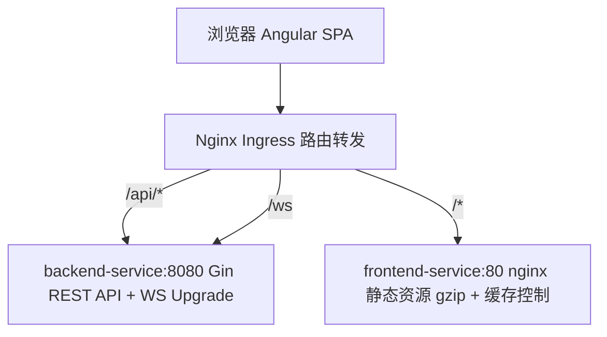
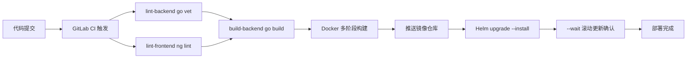

# Angular 中高级前端面试通关指南

> 面试不是考试，是**用你的技术体系打动另一个技术人**。
> 基于《通用前端面试指南》改编为 Angular 技术栈版本，覆盖 Angular 20+、RxJS、NgRx、Signals 等核心专题。

---

## 目录

- [第一部分：面试策略](#第一部分面试策略)
- [第二部分：项目与技术亮点](#第二部分项目与技术亮点面试版)
- [第三部分：面试高频 Q&A](#第三部分面试高频-qa)
- [第四部分：模拟面试](#第四部分模拟面试)
- [第五部分：附录](#第五部分附录)

---

# 第一部分：面试策略

## 1.1 面试流程与各环节策略

```
一小时模拟面试流程：
├─ 第一阶段 10min — 自我介绍 + 项目概述
│   └─ 给出清晰的技术定位，不展开细节，引导面试官到你准备好的方向
├─ 第二阶段 20min — 项目深挖 ⭐ 核心环节
│   ├─ 面试官关注：你的"不可替代性"是什么？
│   ├─ 遇到最大的技术挑战是什么？
│   ├─ 为什么选这个方案？有没有想过更好的方案？
│   └─ 按 STAR 回答：背景 → 任务 → 行动 → 结果
├─ 第三阶段 15min — 八股问答
│   ├─ Angular Zone.js + Change Detection 原理（必问）
│   ├─ RxJS 核心操作符 + 异步数据流（必问）
│   ├─ NgRx / Signals 状态管理原理
│   ├─ Angular DI 层次体系 + 注入器树
│   └─ 浏览器渲染流程（Layout / Paint / Composite）
├─ 第四阶段 10min — 手写题
│   ├─ 防抖 / 节流 / forkJoin / 深拷贝 / 自定义 Pipe
│   ├─ RxJS 操作符实现（map/filter/switchMap）
│   └─ 每天练 2-3 道
└─ 第五阶段 5min — 反问环节
    ├─ ✅ "团队目前的技术栈和工程体系是怎样的？"
    ├─ ✅ "你们在性能优化和可观测性上有什么建设？"
    ├─ ✅ "团队在 AI 辅助开发上的使用情况如何？"
    └─ ❌ 避免问加班/KPI/下午茶
```

## 1.2 自我介绍

### 3 分钟版本

```
我叫 XXX，目前有 4 年前端开发经验，主要方向是企业级 ToB 平台研发与实时通信系统架构。

参与并主导了多个企业级平台，涵盖：
- 5G 核心网测试用例管理系统
- 企业级综合网络管理系统（AeMS）
- 网元运维与数据管理系统
- UniPay 统一支付中台

技术栈上，主要使用 Angular 20+ + TypeScript 6 + NG-ZORRO + NgRx，
配合 Go + Gin 后端，深度使用 TypeScript strict 模式 + Angular ESLint 规范。

核心能力集中在四个方面：
┌─ 架构设计 ─── 动态表单引擎（ControlValueAccessor）/ 多协议降级传输层 / Web Worker 分治有序合并
├─ 性能攻坚 ─── GIS 十万级点位渲染（BBOX + Cluster 四重优化）/ 百万行日志流式解密 / 路由复用策略
├─ 基础建设 ─── Angular Signals + OnPush CD 精准变更检测 / HttpClient 拦截器体系 / 代码分割 + 按需加载
└─ 全栈工程 ─── K8s/Helm 部署 / GitLab CI/CD 全链路 / Prometheus + Grafana 可观测性

举个例子：
- 用 BBOX + Cluster + dataCache + moveend 四重策略，把十万级基站点位帧率从 <10fps 优化到 60fps
- 设计 Web Worker 分治 + 有序合并 + 流式输出三阶段策略，25MB 级日志并行解密实现"秒开"

此外，我也基于 RxJS WebSocket 设计了多协议降级传输层（WebSocket → SSE → Polling），
背压控制 + 消息合并 + 心跳保活，4000 msg/s 全帧率渲染。

未来方向，我希望往前端方向深入，持续在实时通信与性能优化领域深耕。
```

### 1 分钟版本（精简）

```
我有 4 年前端经验，专注企业级 ToB 平台与实时通信系统架构。
主导过 5G 测试平台、网络管理系统、UniPay 支付中台等项目。

技术栈：Angular 20+ + TypeScript 6 + NG-ZORRO + NgRx + Go。

核心能力：
- 架构：动态表单引擎（ControlValueAccessor）、多协议降级传输、Web Worker 并行计算
- 性能：GIS 渲染从 <10fps 优化到 60fps、百万行日志流式解密
- 工程：Signals + OnPush 变更检测、HttpInterceptor 体系、CI/CD + K8s 部署
```

## 1.3 简历优化策略

### 所有项目都必须量化

```
❌ 泛泛而谈：
   优化了系统性能，提升了用户体验

✅ 量化表达：
   响应效能提升 35% | 发布周期缩短 60% | 开发人效提升 80%
   排障效率提升 50% | 帧率从 <10fps 优化到 60fps
```

### 项目描述减少"平台化空话"

```
❌ 删掉：打造一站式闭环服务 / 构建全链路解决方案 / 赋能业务数字化升级
✅ 改成：支撑 200+ 自动化任务并发执行 / 万级 GIS 点位 60fps 流畅渲染 / 百万行日志毫秒级加载
```

### 数据可信度证明

面试官质疑数据真实性时，分三步证明：

1. **工具链路**：Lighthouse CI 性能报告 + Performance API 埋点（RUM）+ 自定义埋点
2. **数据口径**：明确是 P50 还是 P95（如"帧率 = DevTools Performance 录制 30 秒取均值"）
3. **内部工具替代**：没有 A/B 对比就说"功能密度提升"——改造前 3 人天 → 0.5 小时

核心原则：有数据说趋势（同比/环比），无数据说对比（改造前后/同行业标准）。

## 1.4 面试心态与技巧

### 回答问题的原则

```
├─ 先给结论，再展开
│   └─ "核心是 XXX，具体来说..."
├─ 用结构化表达
│   └─ "分三个方面：第一...第二...第三..."
├─ 承认不会，展示思路
│   └─ "这个我不太确定，但我的理解是...我可以分析一下..."
├─ 主动关联项目
│   └─ "这个在我们项目中用到了，比如..."
└─ 控制时间
    └─ 一个问题回答不超过 2 分钟
```

### 面对未知问题的三步法

1. **拆解**："您问的是 X，我先拆解为 A、B、C 三个方面"
2. **关联**："关于 A 我了解...，B 和 A 类似，所以 B 可能也..."
3. **推断**："我推测 X 的核心机制是...，当然需要验证"

"我不知道"关闭对话，"我可以分析一下"开启思考演示。面试官更看重后者。

### 面试后复盘

```
每次面试后记录：
├─ 哪些问题答得好？→ 保持，下次继续用这个思路
├─ 哪些问题答得不好？→ 记录问题，回去深入研究
├─ 哪些问题没听懂？→ 可能是问题表述问题，也可能是知识盲区
└─ 建立自己的"面试错题本"
```

## 1.5 不同企业面试风格

| 维度 | 大厂 | 外企 | 国企 |
|------|------|------|------|
| 八股深度 | ⭐⭐⭐⭐⭐ | ⭐⭐ | ⭐⭐⭐ |
| 算法要求 | ⭐⭐⭐⭐ | ⭐⭐⭐ | ⭐⭐ |
| 项目深挖 | ⭐⭐⭐⭐ | ⭐⭐⭐⭐ | ⭐⭐⭐ |
| 英文要求 | ⭐⭐ | ⭐⭐⭐⭐⭐ | ⭐ |
| 架构设计 | ⭐⭐⭐⭐ | ⭐⭐⭐⭐⭐ | ⭐⭐ |
| 学历看重 | ⭐⭐⭐ | ⭐⭐⭐ | ⭐⭐⭐⭐⭐ |

---

# 第二部分：项目与技术亮点（面试版）

## 2.1 项目全景

### 项目一：5G 核心网测试用例管理系统

| 属性 | 内容 |
|------|------|
| 类型 | ToB 企业级 — 5G 核心网 SMF 测试工具管理界面 |
| 技术栈 | Angular 20+ + TypeScript 6 + NG-ZORRO + NgRx + RxJS 8 |
| 状态 | 线上运行（Docker → K8s/OpenShift 内网部署） |
| 负责 | 前端架构设计、动态表单引擎（ControlValueAccessor）、树形数据引擎、SSE 实时日志流 |

**核心模块**：Pod 管理（K8s Pod 部署/删除/轮询）、测试用例模块（目录树导航/CRUD/动态 NF 配置）、事件映射模块（PCAP 上传 → JSON 转换）

### 项目二：AeMS — 企业级综合网络管理系统

| 属性 | 内容 |
|------|------|
| 类型 | ToB 企业级 — 十万级网元统一监控与智能告警平台 |
| 技术栈 | Angular 20+ + TypeScript 6 + NG-ZORRO + NgRx + OpenLayers + ECharts |
| 状态 | 线上运行（Docker → K8s 内网部署） |
| 负责 | 前端架构设计、多协议降级传输层（RxJS WebSocket）、RBAC 权限体系、GIS 性能优化 |

**核心模块**：设备管理（24+列 Active List）、告警管理（RxJS WebSocket + ECharts 实时渲染）、日志管理、系统设置（用户/LDAP/SLA）

### 项目三：网元运维与数据管理系统

| 属性 | 内容 |
|------|------|
| 类型 | ToB 企业级 — 5G 核心网元运维与数据治理平台 |
| 技术栈 | Angular 20+ + TypeScript 6 + NG-ZORRO + NgRx + Go 1.26 + Gin |
| 状态 | 线上运行（Docker → K8s/OpenShift 内网部署） |
| 负责 | 前端架构、Web Worker 解密方案、声明式表单框架、CI/CD 流水线 |

**核心模块**：网元管理（NF 注册/监控/Provision）、日志管理（Web Worker 并行 AES-256-GCM 解密）、审计日志（RSA-2048 加密）、RBAC 权限、全链路可观测（Prometheus + Grafana）

### 项目四：UniPay — 统一支付中台

| 属性 | 内容 |
|------|------|
| 类型 | ToB 企业级 — 多渠道聚合支付接入平台 |
| 技术栈 | Angular 20+ + TypeScript 6 + NgRx + Go 1.26 + Gin |
| 状态 | 线上运行（日均数万笔订单） |
| 负责 | 前端架构设计、支付状态机（NgRx Store）、幂等性方案、对账脚本、安全防护 |

**核心模块**：支付核心（7 种状态状态机）、对账（T+1 异步对账）、安全（RSA 签名/验签/IP 白名单）、渠道适配（策略模式封装微信/支付宝/银联）

## 2.2 技术亮点速览

| 亮点 | 技术价值 | 量化效果 |
|------|----------|----------|
| 动态表单引擎（ControlValueAccessor） | 4 层 AST 树 + 7 种字段 + 条件显隐 + 四级校验 + 实时 JSON 编辑 | 开发人效提升 80%（零代码驱动） |
| 大文件断点续传 | SHA-256 分片 + NgRx persist + Observable 串行上传 | 500MB 文件仅占 5MB 内存 |
| RxJS WebSocket 告警推送 | 三级降级链 + 背压控制 + 消息合并 + 心跳保活 | 4000 msg/s 60fps 全帧率渲染 |
| Web Worker 分治排序 | Worker Pool + 自适应分区 + 多路归并 | 100 万数字排序 620ms → 180ms（3.4×） |
| GIS 十万级点位渲染 | BBOX + Cluster + dataCache + moveend 四重优化 | 帧率从 <10fps 到 60fps |
| 双 Token 无感刷新（HttpInterceptor） | Observable gate + Token Rotation + Replay 检测 | 平台可用性 99.9% |
| RBAC 位编码权限 | 位运算 O(1) + 三层联动 + 后端双校验 | 越权漏洞降低 90% |
| SSE 日志流（RxJS） | Observable + AbortController + 节流 | 500 行 RingBuffer 内存可控 |
| 路由复用策略（RouteReuseStrategy） | Angular RouteReuseStrategy + 写后失效 + TTL | 页面切换性能提升 60% |
| 百万行日志流式解密 | ReadableStream + Web Worker AES-256-GCM + 虚拟滚动 | 首段流式输出"秒开" |
| NgRx Signal Store | 方法-路径匹配追踪 + 精确 selector 订阅 | 消除全局 Loading 闪烁 |
| Web Vitals 采集 | RUM 实时采集 LCP/INP/CLS + ECharts 可视化 | 生产环境性能监控 |

## 2.3 六大技术难点 STAR 剖析

> 以下每个难点均可作为 STAR 故事的素材。按"背景 → 任务 → 行动 → 结果"展开讲 2-3 分钟。

### 难点 1：动态表单引擎（ControlValueAccessor 模式）

**背景**：测试用例配置场景中，7 种网元各有不同配置参数且频繁变动。传统硬编码模板每次改字段都要改代码发版，效率极低。Angular 模板驱动的静态表单无法满足动态 Schema 渲染需求。

**任务**：设计一套非前端人员也能零代码配置的表单系统，支持复杂布局、条件显隐、字段联动、自定义校验。

**行动**：

```
选型决策：
├─ 模板驱动表单：静态绑定，无法动态生成控件
├─ Angular Reactive Forms：支持动态表单，但复杂的递归渲染需要结合 ControlValueAccessor
└─ 自研 ControlValueAccessor 表单引擎 ✅ — 复用 Angular 表单体系，完全可控

核心实现：
├─ Schema 抽象为 4 层 AST 树（tabs → card → form → leaf）
│   tabs → <nz-tab-group> / card → <nz-card> / form → <div> / leaf → ControlValueAccessor 组件
├─ 7 种字段类型（string/number/select/switch/datetime/json/array）
├─ 自定义 ControlValueAccessor 实现：writeValue() / registerOnChange() / registerOnTouched()
├─ registerField(type, Comp) 一行注册新字段（策略模式）
├─ FormGroup 动态构建：根据 Schema 递归生成 FormGroup + FormControl
├─ 条件显隐：字符串表达式解析，调用 FormControl.enable()/disable() + Validators
├─ 字段联动：valueChanges Observable 监听 + 依赖图拓扑排序 + 死循环检测
├─ 实时 JSON 编辑双向绑定：Angular 双向绑定驱动
├─ 四级校验：同步 Validators → 异步 AsyncValidator → AJV Schema → 后端业务校验

关键防御：
├─ _depth + maxDepth=20 防无限递归
├─ _visitedRefs WeakSet 检测循环引用
├─ valueChanges 防抖 + distinctUntilChanged 避免频繁触发
├─ OnPush ChangeDetection 确保仅变化字段重渲染
└─ ngOnDestroy 清理所有 valueChanges 订阅
```

**结果**：开发人效提升 80%，非前端人员零代码配置测试场景。7 个核心文件形成微内核架构，后续在网元运维系统中复用。

**追问链**：
- **Q：ControlValueAccessor 和自定义 FormControl 的区别？** → CVA 让自定义组件融入 Angular 表单体系，支持 ngModel/formControlName 绑定、Validator 集成、touched/dirty 状态同步
- **Q：字段联动如何避免死循环？** → `_isAutoFilling` 标记 + `maxAutoFillDepth=5` + 依赖图拓扑排序；联动时暂停 valueChanges 监听
- **Q：200+ 字段会卡吗？** → OnPush CD 确保无关字段不重渲染；超 500 字段分层加载 + 虚拟滚动

---

### 难点 2：Web Worker 分治有序合并（网元运维系统）

**背景**：25MB 级加密日志文件需要 RSA/AES-256-GCM 解密，单线程解密会阻塞 UI，用户等待时间过长。

**任务**：实现百万行加密日志的快速解密，首段流式输出让用户无需等待全量完成。

**行动**：

```
三阶段策略：
├─ 自适应分区：首段 2000 行快速展示（小分区），其余均匀分配 → 并行处理
├─ Worker Pool 并行：poolSize = navigator.hardwareConcurrency
│   ├─ 空闲 Worker → 直接分配，全部繁忙 → 排队等待
│   └─ Transferable Objects 零拷贝传输大数组
├─ 有序合并：Worker 提交时带 seq 序号，主线程按序保序
│   └─ 顺序到达直接输出，乱序到达暂存缓冲区，等待前序完成
└─ 流式输出：首段小分区快速首屏，后续批量输出

容错设计：
├─ worker.onerror 捕获异常 → terminate() 销毁 → 创建新 Worker 替补
└─ 8 个 Worker 坏 1 个 → 剩下 7 个多分担，影响仅 ~14%
```

**结果**：25MB 级日志并行解密，首段流式输出实现"秒开"体验，主线程零阻塞。

**追问链**：
- **Q：Worker Pool 为什么限制数量？** → `hardwareConcurrency` 最优值，超出导致上下文切换开销 > 并行收益
- **Q：Worker 出错怎么保证整体不出错？** → try-catch + terminate 异常 Worker + 创建替补重分配
- **Q：postMessage 传输大数组会不会卡？** → structured clone 8MB 约 10-15ms；超 50MB 改用 Transferable Objects

---

### 难点 3：路由复用策略（AeMS 项目）

**背景**：Angular 默认的路由切换会销毁当前组件，重新创建新的组件实例，导致页面滚动位置丢失、数据需要重新加载，频繁切换时体验差。

**任务**：在 Angular 框架内实现页面级路由缓存，保持组件状态的同时保证数据一致性。

**行动**：

```
核心设计（基于 Angular RouteReuseStrategy）：
├─ 自定义 RouteReuseStrategy 实现：
│   ├─ shouldReuseRoute：判断路由是否可复用（基于 routeKey）
│   ├─ shouldAttach：目标路由是否有缓存
│   ├─ retrieve：从缓存中获取组件
│   └─ store：缓存当前组件实例
├─ LRU 淘汰：最多缓存 3 个页面，超出驱逐最久未访问的
├─ 写后失效（staleKeys）：写操作后标记对应 key，切换时自动刷新
├─ 30s TTL 惰性过期：切回时检查 loadedAt，过期自动刷新
├─ 倒计时指示器：卡片标题实时显示缓存剩余秒数（≤5s 红色警告）
├─ 三条件合一驱动刷新：!page.loaded || isStale || isTtlExpired
│   └─ 激活切换本身不触发请求，仅数据一致性条件驱动
└─ 滚动位置恢复：Router 的 scrollPositionRestoration 结合自定义逻辑

NgRx Store 管理：
├─ 缓存页面列表、staleKeys、滚动位置统一存储在 Store
├─ Effect 监听写操作，dispatch markStale 动作
└─ Selector 精确订阅，仅缓存页面变化时通知
```

**结果**：页面切换性能提升 60%，缓存一致性无死角。

**追问链**：
- **Q：RouteReuseStrategy 和 display:none 方案的区别？** → RouteReuseStrategy 是 Angular 原生机制，组件在 attach/detach 时走完整生命周期；display:none 仅隐藏 UI，JS 实例仍在运行
- **Q：如何避免缓存数据不一致？** → 三种方案组合：① staleKeys 精准失效 ② NgRx Store 即时同步 ③ TTL 兜底
- **Q：GIS 页面被缓存时内存泄漏风险？** → ngOnDestroy 释放 dataCache + OpenLayers map.setTarget(null) 断开 DOM 绑定 + LRU 淘汰时完整 cleanup

---

### 难点 4：RBAC 位编码权限体系（跨项目）

**背景**：传统权限用数组/Set 存储权限列表，检查时需要遍历 O(n)；369 个旧权限码与新码需要兼容迁移。

**任务**：设计一套高效、可扩展、防篡改的权限系统。

**行动**：

```
位编码设计：
├─ 6 种权限各占 1 位：READ=1<<0, WRITE=1<<1, ..., ADMIN=1<<5
├─ hasPermission = (code & perm) === perm → O(1) 单条 CPU 指令
├─ 5 个预设角色（GUEST/EDITOR/MODERATOR/ADMIN/SUPER）
└─ SUPER = reduce 自动聚合所有权限，新增权限无需改角色

Angular 三层联动 + 后端双校验：
├─ 菜单层：Angular *ngIf 指令 + 自定义结构指令（*aclHasPermission）递归过滤
├─ 路由层：Angular Route Guard（CanActivate/CanActivateChild）拦截
├─ 按钮层：自定义 *aclHasPermission 结构指令 + NgRx selector 集中管理
└─ 后端层：POST /api/rbac/check 独立位运算校验 + 前后端一致性对比

NgRx Store 管理：
├─ AuthStore：存 roleCode、permissions、user info
├─ Effect：登录时获取权限、角色切换时触发后端校验
└─ Selector：hasPermission(code, required) 供各组件直接使用
```

**结果**：越权漏洞发生率降低 90%，6 种权限仅 4 字节存储。

**追问链**：
- **Q：位运算比数组/Set 好在哪？** → 存储 4 字节 vs 数百字节；检查 O(1) vs O(n)；组合 1 次位运算 vs 遍历
- **Q：32 位限制怎么突破？** → JS 位运算仅 31 位有效位；超过 32 种权限改用 BigInt（1n << 33n）
- **Q：Angular 中自定义结构指令和 *ngIf 的区别？** → 结构指令可以封装完整的权限判断逻辑，并且复用；利用 Angular 的 microsyntax（*aclHasPermission="['READ', 'WRITE']"）简洁易用
- **Q：前后端一致性对比的价值？** → 纯前端可被 DevTools 篡改；后端独立校验 + 前端对比展示不一致告警

---

### 难点 5：支付幂等性与失败重试（UniPay）

**背景**：支付场景中网络超时、服务重启、回调丢失等异常会导致重复支付或支付失败无恢复。

**任务**：设计一套从前端到后端的四层幂等架构，支付失败自动恢复率 95%+。

**行动**：

```
幂等性四层防御：
├─ 前端层：按钮防重复点击（debounce + disabled + CanDeactivate 路由守卫）
├─ 网关层：Idempotency-Key 去重 → 相同 key 自动返回上次结果
├─ 业务层：唯一索引 UNIQUE(order_id, channel) + Redis SETNX 分布式锁
└─ 兜底层：T+1 对账脚本 → 重复订单自动退款

失败重试分层策略：
├─ 请求失败（网络超时/5xx）：RxJS retryWhen + 指数退避 1s/2s/4s/8s
├─ 处理中断（服务重启/订单 stuck）：定时轮询 interval(15s/30s/60s/120s)
├─ 回调丢失：支付后 30s 未收到回调 → 自动发起查单补偿
└─ 手动兜底：运维后台"手动同步" + 发起退款

支付状态机（NgRx Store）：
├─ 7 种状态：PENDING → PROCESSING → SUCCESS/FAIL/REFUNDING/REFUNDED/CLOSED
├─ 6 种驱动力：用户发起/渠道回调/定时轮询/人工介入/超时关闭/退款触发
├─ Status Reducer 管理状态流转 + Action 约束状态变更
└─ Effect 监听状态变更，触发对应的 Side Effect（查单/重试/回调）
```

**结果**：重复支付率降至 0.001% 以下，支付失败自动恢复率 95%+。

**追问链**：
- **Q：幂等性为什么需要四层？** → 任何一层都可能被绕过（前端禁 JS、网关超时、业务层宕机），纵深防御无死角
- **Q：NgRx 的状态机和普通 Service 管理状态有什么区别？** → Action 约束变更方向，Reducer 纯函数保证状态可预测，Effect 隔离副作用（HTTP 请求），Selector 精确订阅

---

### 难点 6：GIS 十万级点位渲染（AeMS 项目）

**背景**：十万个基站点位直接渲染到 OpenLayers 地图上，帧率 < 10fps，拖动卡顿 2s+。

**任务**：在保持地图交互流畅的前提下，实现十万级点位的高效渲染。

**行动**：

```
四重优化策略：
├─ BBOX 视口裁剪：filterByExtent() 只保留视口矩形内点位，裁剪约 60%
├─ Cluster 聚合：distance=40px，同区域聚合为 1 个聚类点，100k → ~50 点
├─ dataCache 全量缓存：100k 点约 2MB gzip，前端缓存后平移/缩放零请求
└─ moveend 惰性刷新：拖动结束才触发重绘 + 50ms 防抖，拖动全程 60fps

流程：100k 原始 → BBOX 裁剪 → 40k → Cluster 聚合 → 50 点 → 渲染
```

**结果**：Feature 数量从 100k 降至 ~50 个聚类点，帧率从 <10fps 到 60fps，内存从 ~200MB 降至 ~30MB。

**追问链**：
- **Q：BBOX 和 Cluster 哪个先执行？** → BBOX 先（裁剪视口外 60%），减少 Cluster 计算量
- **Q：百万级怎么优化？** → 10 万以内 Canvas 2D 足够；10 万~100 万需要 WebGL（Mapbox GL/Deck.gl）；超 100 万必须 Tile 分级加载
- **Q：dataCache 会不会内存泄漏？** → ngOnDestroy 时 dataCache 释放 + LRU 淘汰时完整 cleanup + OpenLayers 资源释放

---

# 第三部分：面试高频 Q&A

## 3.1 技术追问链合集

### 表单引擎相关

**Q1：为什么自研动态表单引擎，不用 Angular 模板驱动表单？**

```
模板驱动表单（ngModel）：
├─ 静态绑定，无法根据 Schema 动态生成 FormGroup
├─ 适合字段固定、结构简单的表单
└─ 复杂条件显隐/字段联动需要大量 *ngIf 判断，维护困难

Reactive Forms + ControlValueAccessor：
├─ 动态 FormGroup 构建：根据 Schema 递归生成
├─ 7 种字段类型 + 条件显隐 + 字段联动完全可控
└─ 自定义 CVA 组件融入 Angular 表单体系，复用 Validator/touched/dirty
```

**Q2：条件显隐表达式为什么不用 eval？**

```
eval/new Function 在 CSP（Content Security Policy）严格模式下被禁止。
企业级应用通常启用 CSP 防止 XSS。

替代方案：
├─ 表达式解析器（手写语法分析）：灵活但复杂
├─ 安全沙箱（iframe + postMessage）：隔离执行
└─ 预定义条件 DSL（如 { when: { field: "X", eq: true } }）：最简单

当前实现用 new Function 但变量替换为参数名，限制在可控范围；
CSP 检测到限制时降级到 DSL 方案。
```

**Q3：后端返回的 Schema 中必填字段被条件显隐藏起来了，提交时怎么处理？**

```
├─ 提交时排除 visible === false 的字段，不参与 required 校验
├─ 后端收到数据后对隐藏字段赋默认值（Schema 中定义的 default）
└─ 无 default 又不是 visible → 后端按业务规则决定拒绝还是忽略
```

### RxJS WebSocket 传输层相关

**Q1：为什么 Angular 中用 RxJS WebSocket 替代原生 WebSocket？**

```
RxJS WebSocket（webSocket() / WebSocketSubject）：
├─ Observable 接口统一：与 HttpClient、Router.events 等数据源一致
├─ 自动重连：retryWhen 操作符实现指数退避
├─ 背压控制：Subject 天然支持 backpressure
├─ 消息合并：bufferTime 操作符实现批量发送
├─ 生命周期管理：takeUntil + ngOnDestroy 自动清理订阅
└─ 降级链：switchMap 实现 WebSocket → SSE → Polling 无缝切换

对比原生 WebSocket：
├─ 原生：事件回调（onopen/onmessage/onerror），逻辑分散
├─ RxJS：操作符组合，声明式编程
└─ 核心差异：回调 → 可组合的 Observable 管道
```

**Q2：三级降级的触发阈值是什么？**

```
WebSocket → SSE：连续 10 次重连失败（指数退避 1s→2s→4s...→30s，约 5 分钟后降级）
SSE → Polling：SSE 连接失败 → 即时降级
Polling 保底：永不降级
```

**Q3：如何用 RxJS 实现 SSE 流式读取？**

```typescript
import { fromFetch } from 'rxjs/fetch';

// Angular service: 将 SSE 包装为 Observable（纯 RxJS 操作符实现）
sseLogs(url: string, signal?: AbortSignal): Observable<string> {
  const controller = new AbortController()
  const mergedSignal = signal
    ? AbortSignal.any([signal, controller.signal])
    : controller.signal

  return fromFetch(url, {
    headers: { Accept: 'text/event-stream' },
    signal: mergedSignal,
    selector: response => response.body!.getReader()
  }).pipe(
    switchMap(reader => new Observable<string>(observer => {
      const decoder = new TextDecoder()
      let remainder = ''

      const pump = () =>
        from(reader.read()).subscribe({
          next({ done, value }) {
            if (done) { observer.complete(); return }
            remainder += decoder.decode(value, { stream: true })
            const lines = remainder.split('\n')
            remainder = lines.pop() ?? ''
            lines
              .filter(l => l.startsWith('data: '))
              .forEach(l => observer.next(l.slice(6)))
            pump()
          },
          error: err => observer.error(err)
        })

      pump()
    })),
    finalize(() => controller.abort())
  )
}
```

**Q4：RAF 双缓冲渲染如何保证 60fps？**

```
消息到达 → 推入 pendingBuffer
RAF callback → 交换 pendingBuffer ↔ displayBuffer → 仅 displayBuffer 更新时触发变更检测
效果：4000 msg/s → 16ms 一帧 → 每帧合并约 64 条消息 → CD 60 次/s → 60fps
```

### 断点续传相关

**Q1：为什么并发上限设为 4？**

```
网络连接数过多 → TCP 拥塞控制退化（HOL blocking）。
经验值：普通网络 3-6，5G/光纤 6-10。本项目默认 4，用户可调 1-10。
```

**Q2：SHA-256 对比 MD5 的优势？**

```
MD5：128 位，防碰撞弱（2004 年已破解）
SHA-256：256 位，防碰撞强（至今未破解）
Web Worker 计算 SHA-256，主线程无感知，文件完整性场景更安全。
```

**Q3：暂停后刷新，如何精确恢复进度？**

```
├─ NgRx Store + localStorage persist 恢复文件元数据
├─ GET /api/upload/status/:uploadId → 获取服务端已接收分片
├─ 对比本地 vs 服务端 → 标记差异
└─ 用户点击"续传" → 仅上传 missing 分片
```

### Angular Signals 相关

**Q1：signal()、computed()、effect() 的区别？**

```
signal()：创建响应式状态，set()/update() 触发更新
  → 类比：BehaviorSubject（但无值相等检查）
  → 使用：组件内部状态、独立状态单元

computed()：基于其它 signal 的派生值，惰性求值 + 缓存
  → 类比：map 操作符 + shareReplay(1)
  → 使用：派生状态（如 filteredList = computed(() => list().filter(...))）

effect()：响应式副作用，在 signal 变化时自动执行
  → 类比：subscribe
  → 使用：日志、与第三方库同步、localStorage 持久化
  → 注意：禁止在 effect 中修改 signal（会导致循环）
```

**Q2：Signals 和 NgRx 怎么选？**

```
使用 Signals（自包含状态）：
├─ 组件内部的 UI 状态（展开/折叠、分页、选择）
├─ 服务内独立状态（不需要全局共享）
├─ 简单数据流（父子组件通信）
└─ 特点：轻量、零样板代码、细粒度更新

使用 NgRx（全局状态）：
├─ 跨组件/跨模块共享的数据（用户信息、权限）
├─ 需要可追踪的状态变更（Action 日志）
├─ 复杂的异步数据流（HTTP + Cache + 乐观更新）
├─ 多人协作的大型项目
└─ 特点：强规范（Action/Reducer/Effect）、DevTools 可调试

选型原则：组件内部用 Signal，跨组件用 NgRx，两者可共存
```

**Q3：Angular 18+ 引入的 Signal-based Components（signal inputs/outputs）和传统 @Input/@Output 的区别？**

```
传统 @Input()：
├─ 父组件变更 → 子组件 ngOnChanges 触发
├─ 无法区分外部变更和内部变更
└─ 需要 OnPush + ChangeDetectorRef.markForCheck()

Signal inputs（input() / output()）：
├─ 父组件变更时，子组件 signal API 自动响应
├─ 支持 computed() 派生
├─ 自动 OnPush，无需 markForCheck()
└─ output() 返回 OutputEmitterRef，不依赖 EventEmitter
```

### HTTP 拦截器相关

**Q：Angular HttpInterceptor 如何处理 Token 无感刷新？**

```typescript
// Angular 15+ 函数式拦截器
export const authInterceptor: HttpInterceptorFn = (req, next) => {
  const authService = inject(AuthService)
  const refreshService = inject(TokenRefreshService)

  const token = authService.getAccessToken()
  const authReq = req.clone({
    headers: req.headers.set('Authorization', `Bearer ${token}`)
  })

  return next(authReq).pipe(
    catchError((error: HttpErrorResponse) => {
      if (error.status === 401 && token) {
        // Token 过期 → 触发无感刷新
        return from(refreshService.acquireRefresh()).pipe(
          switchMap((newToken) => {
            const retryReq = req.clone({
              headers: req.headers.set('Authorization', `Bearer ${newToken}`)
            })
            return next(retryReq)
          }),
          catchError(() => {
            // 刷新失败 → 登出
            authService.logout()
            return throwError(() => error)
          })
        )
      }
      return throwError(() => error)
    })
  )
}
```

**关键设计**：`acquireRefresh()` 内部使用 ReplaySubject(1) 实现 gate 模式，首次 401 触发 refresh 并将结果推入 Subject，后续并发 401 通过 same-origin 去重直接订阅 Subject 等待结果，替代 Promise gate 的 then 链。

### GIS 优化相关

**Q1：BBOX、Cluster、dataCache 三层各自解决什么问题？为什么不能只用一层？**

```
BBOX：解决"空间范围"——只渲染视口内点位
  → 局限：即使视口内，上万点位仍会卡顿
Cluster：解决"视觉密度"——同区域聚合
  → 局限：高 Zoom 下聚合展开后仍可能很多
dataCache：解决"网络请求"——避免缩放平移重复请求后端
  → 局限：不减少渲染量，只减少请求次数

任一层都不够——必须三层组合：BBOX 先过滤不可见 → Cluster 聚合可见 → dataCache 保证不重复请求
```

**Q2：moveend 事件在快速拖拽时如何控制加载时机？**

```
├─ 拖拽中：throttle(200ms) 更新中间态聚合结果（轻量计算，不重绘）
├─ 拖拽结束：debounce(300ms) + moveend 触发最终 BBOX 裁剪 + 全量渲染
└─ 效果：拖拽时流畅（仅 throttle），停下后精确渲染
```

### NgRx 相关

**Q：NgRx 和 Services + Subjects 的区别？**

```
NgRx：
├─ Action 约束状态变更方向 → 可追溯、可重放
├─ Reducer 纯函数 → 状态可预测、可测试
├─ Effect 隔离副作用 → HTTP/WebSocket 不污染 Reducer
├─ Selector 派生 + 缓存 → 避免重复计算
├─ DevTools 调试 → 时间旅行、Action 日志
└─ 适合：多人协作、复杂状态逻辑、需要审计追踪

Services + Subjects：
├─ 灵活但无约束 → 任意 service 都可修改状态
├─ 调试困难 → 谁在什么时候改了状态难以追踪
├─ 难以扩展到大型项目
└─ 适合：小型项目、独立模块、简单数据流

选型：项目规模 > 30 个组件或需要状态追溯 → NgRx
```

## 3.2 八股高频考点速览

> 以下为 Angular 面试必问八股，需要在理解原理的基础上准备 30 秒以内的结构化回答。

### Angular Zone.js + Change Detection 原理

```
Angular 的变更检测（Change Detection）由 Zone.js 驱动。

Zone.js 做了什么：
├─ Monkey-patch 了所有异步 API（setTimeout/事件/DOM 回调等宏观任务）
├─ 任何异步操作执行后，通知 Angular "可能有数据变更"
├─ Angular 从根组件遍历 Component Tree
└─ 对每个组件检查绑定的值是否发生变化

变更检测策略：
├─ Default：每次异步事件触发全量遍历 Component Tree
│   └─ 组件数多时性能问题（大型表格、复杂列表）
├─ OnPush：只检查 @Input 引用变化 / Observable 派发 / signal 变化
│   └─ 配合不可变数据或 RxJS 精确控制变更检测边界

NgZone 控制：
├─ NgZone.runOutsideAngular()：执行无需触发变更检测的操作
├─ NgZone.run()：重回 Angular 上下文
└─ 应用：高频事件（mousemove/scroll）在 runOutsideAngular 中执行，
   避免频繁触发 CD

Angular 17+（Zoneless）：
├─ 基于 Signals 的变更检测，不再依赖 Zone.js
├─ signal.set() / update() 精确通知相关组件变更
├─ 无需 zone.js polyfill，减少 bundle 体积
└─ 当前处于开发者预览阶段，生产环境仍建议使用 Zone.js
```

### Angular DI 层次体系

```
Angular DI 是层次化的注入器（Injector）树：

注入器层次：
├─ 根注入器（root）：应用级单例，@Injectable({ providedIn: 'root' })
├─ 模块注入器（NgModule）：特定模块级单例，declarations + providers
├─ 组件注入器：组件级实例，每个组件实例对应一个注入器
└─ 指令注入器：与宿主元素绑定，常用于结构指令

依赖查找规则（自下而上）：
├─ 当前组件注入器查找 → 找不到 → 父组件注入器 → ... → 根注入器
├─ @Optional()：依赖可选，找不到不报错
├─ @Host()：限制在宿主元素注入器，不向上查找
├─ @SkipSelf()：跳过当前注入器，从父级开始查找
└─ @Self()：仅在当前注入器查找

ViewProvider vs Provider：
├─ providers：对组件及子组件可见
└─ viewProviders：仅对组件自身的 View（含 ContentChild）可见，
  对 ng-content 投影内容不可见

应用场景：
├─ 根注入器：全局服务（AuthService、HttpClient）
├─ 组件注入器：表单场景中每个表单实例独占的配置
├─ @Host + @SkipSelf：创建代理服务，包裹父级服务
└─ 多级注入器实现"隔离沙箱"——子模块可以覆盖父级的依赖
```

### Angular 路由与守卫

```
路由配置：
├─ 懒加载：loadChildren: () => import('./feature.routes') 按需加载模块
├─ 预加载策略：PreloadingStrategy → 带宽空闲时预加载后续模块
├─ 路由参数：paramMap / queryParamMap（Observable 接口，响应式）

路由守卫执行顺序：
├─ CanActivate：是否可以进入该路由
├─ CanActivateChild：是否可以进入子路由
├─ CanDeactivate：是否可以离开当前路由
├─ Resolve：进入路由前预加载数据
├─ CanLoad / CanMatch：是否可以加载该模块
└─ 所有守卫返回 boolean | UrlTree | Observable<boolean>（推荐）

RouteReuseStrategy（路由复用）：
├─ 缓存组件实例，切换时不销毁重建
├─ 适合：列表页 → 详情页 → 返回列表（保持滚动位置和搜索条件）
├─ 风险：缓存过多导致内存泄漏，需要 LRU 淘汰
└─ 风险：数据过期问题，需要写后失效 + TTL 机制
```

### RxJS 核心操作符

```
创建类：
├─ of(1,2,3)：同步发射值, Observable<number>
├─ from([1,2,3])：从数组/Iterable 创建
├─ fromEvent(el, 'click')：DOM 事件 → Observable
├─ ajax / fromFetch：HTTP 请求
├─ interval/timer：定时器
├─ webSocket：WebSocket 连接

转换类：
├─ map：同步转换每项数据
├─ scan：累计器（类似 reduce）
├─ pluck：提取对象属性（已弃用，推荐 map + 解构）

过滤类：
├─ filter：按条件过滤
├─ take / takeLast / takeUntil：按数量/条件完成
├─ first / last / single：发射第一/最后一/唯一项
├─ debounceTime / throttleTime：防抖/节流
├─ distinctUntilChanged：去重（值未变不发射）
└─ skip / skipUntil：跳过指定数量/条件

组合类：
├─ forkJoin：全部完成后发射最后值（并行等待）
├─ combineLatest：任一变化时，取所有最新值
├─ zip：按索引配对
├─ merge：合并流（任一上游发射都通知）
├─ concat：按顺序串联流
└─ race：取第一个完成的流

高阶映射类（核心）：
├─ switchMap：新流替换旧流（搜索、自动补全）
├─ concatMap：按顺序处理，前一个完成后处理下一个（上传队列）
├─ mergeMap / flatMap：并发处理所有流（并发请求）
└─ exhaustMap：正在处理时忽略新流（按钮防重复点击）

错误处理：
├─ catchError：捕获错误，返回兜底值或抛出
├─ retry(n)：失败后重试 n 次
├─ retryWhen：自定义重试策略（指数退避）
├─ timeout：超时报错
└─ finalize：无论成功/失败都执行（清理逻辑）

实用场景：
├─ 搜索防抖：searchInput$.pipe(debounceTime(300), distinctUntilChanged(), switchMap(q => http.get(...)))
├─ 自动保存：form.valueChanges.pipe(debounceTime(1000), switchMap(v => http.post('save', v)))
├─ 并发请求：forkJoin([http.get('/a'), http.get('/b')])
└─ 按钮防重复：click$.pipe(exhaustMap(() => http.post('order', data)))
```

## 3.3 Angular 版本演进要点

### Angular 17 核心变化

```
├─ 内置控制流（@if / @for / @switch）
│   └─ 替代 *ngIf / *ngFor / *ngSwitch，运行时更高效
├─ @defer（可延迟加载块）
│   └─ 按需加载组件，支持 placeholder / loading / error 状态
├─ 函数式路由守卫
│   └─ 替代类守卫，更简洁，无需装饰器
├─ Esbuild 构建系统
│   └─ 替代 Webpack，构建速度提升 5-10 倍
└─ 独立组件全面就绪
    └─ 不再需要 NgModule，standalone 是默认方式
```

### Angular 18 核心变化

```
├─ Signal-based Components（Signal inputs/outputs）
│   └─ input() / output() / model() 替代 @Input / @Output
├─ Zoneless Change Detection
│   └─ signal 变更自动触发 CD，无需 Zone.js
├─ httpResource()
│   └─ 基于 Signal 的 HTTP 请求包装，替代 HttpClient Observable
├─ NgRx Signals 集成
│   └─ NgRx 支持 Signal Selector，与 Angular Signals 互操作
└─ 可延迟视图 enhanced
    └─ @defer 支持更细粒度的触发条件
```

---

# 第四部分：模拟面试

## 4.1 项目深挖模拟

### 项目一：5G 核心网测试用例管理系统

**面试官**：你这个平台最大的技术难点是什么？

```
最大难点是基于 Angular Reactive Forms 的动态表单引擎。
7 种网元配置各不相同且频繁变动，传统模板驱动表单无法满足。

自研 ControlValueAccessor 动态表单引擎：
Schema 抽象为 4 层 AST 树，基于 FormGroup 动态构建，7 种字段类型，
条件显隐 + 字段联动 + 四级校验（同步 Validator → AsyncValidator → AJV → 后端）。

选型对比：
├─ 模板驱动：静态绑定，无法动态生成控件
├─ @rjsf（React 生态）：Angular 无直接等价替代
└─ 自研 ControlValueAccessor：复用 Angular 表单体系，完全可控

最终效果：开发人效提升 80%，编辑性能提升 40%（OnPush CD + 不可变数据）
```

**追问模拟**：
- Q：ControlValueAccessor 的核心方法是什么？什么时候触发 writeValue？
- Q：valueChanges 防抖和 distinctUntilChanged 分别在解决什么问题？
- Q：FormGroup 递归构建时如何保证 formControl 层级正确？

### 项目二：AeMS — 企业级综合网络管理系统

**面试官**：十万级设备地图怎么优化？

```
核心问题不是地图渲染慢，而是海量 Feature 导致 Canvas 重绘压力过大。

四重优化策略：
├─ BBOX 视口裁剪：100k → 40k（裁剪视口外 60%）
├─ Cluster 聚合：40k → ~50 点（distance=40px）
├─ dataCache 全量缓存：后续平移/缩放零请求
└─ moveend 惰性渲染：拖动结束才重绘，拖动全程 60fps

效果：Feature 100k → ~50，帧率 <10fps → 60fps，内存 200MB → 30MB
```

**追问模拟**：
- Q：BBOX 和 Cluster 哪个先执行？为什么？
- Q：百万级怎么优化？
- Q：LRU 缓存的 RouteReuseStrategy 和 GIS 页面结合时内存泄漏怎么处理？

### 项目三：网元运维与数据管理系统

**面试官**：Web Worker 并行解密怎么实现的？

```
核心问题：百万行日志的 RSA/AES-256-GCM 解密是 CPU 密集型操作，单线程阻塞 UI。

三阶段策略：
├─ 自适应分区：首段 2000 行快速展示，其余均匀分配
├─ Worker Pool 并行：poolSize = navigator.hardwareConcurrency
├─ 有序合并：seq 序号 → 顺序到达直接输出，乱序到达缓冲区等待
└─ 流式输出：首段小分区快速首屏，后续批量输出

效果：25MB 级日志并行解密，首段流式输出"秒开"，主线程零阻塞。
```

**追问模拟**：
- Q：Worker Pool 数量怎么确定的？
- Q：Worker 出错怎么容错？
- Q：postMessage 传输大数组会卡主线程吗？

### 项目四：UniPay — 统一支付中台

**面试官**：支付幂等性怎么设计的？

```
四层纵深防御：
├─ 前端：按钮防重复点击（exhaustMap + CanDeactivate 路由守卫）
├─ 网关：Idempotency-Key 去重
├─ 业务：唯一索引 + Redis SETNX 分布式锁
└─ 兜底：T+1 对账脚本自动退款

失败重试分层策略（RxJS 实现）：
├─ 请求失败 → retryWhen + 指数退避 1s/2s/4s/8s
├─ 处理中断 → interval(15s/30s/60s/120s) 轮询
├─ 回调丢失 → 定时查单补偿
└─ 人工兜底 → 运维后台手动同步

支付状态机基于 NgRx：
├─ Reducer 管理 7 种状态流转，Action 约束变更方向
├─ Effect 处理副作用（HTTP + 定时器 + 渠道回调）
├─ Selector 供组件精确订阅
└─ 乐观锁 version 防并发更新（回调 + 人工同时操作）

效果：重复支付率降至 0.001% 以下，自动恢复率 95%+。
```

**追问模拟**：
- Q：NgRx 状态机和普通 Service 管理状态有什么区别？
- Q：exhaustMap 和 switchMap 在支付场景中各适合什么？
- Q：如果对账也失败了怎么办？

## 4.2 手写题速览

> 面试前每天练 2-3 道，重点理解"为什么这么写"而非"背代码"。

```typescript
// 防抖
function debounce<T extends (...args: unknown[]) => void>(fn: T, delay: number): T {
  let timer: ReturnType<typeof setTimeout> | null = null
  return ((...args: unknown[]) => {
    if (timer) clearTimeout(timer)
    timer = setTimeout(() => { fn(...args); timer = null }, delay)
  }) as T
}

// 节流
function throttle<T extends (...args: unknown[]) => void>(fn: T, delay: number): T {
  let last = 0
  return ((...args: unknown[]) => {
    const now = Date.now()
    if (now - last >= delay) { last = now; fn(...args) }
  }) as T
}

// 自定义 Pipe（Angular）
@Pipe({ name: 'duration', standalone: true })
export class DurationPipe implements PipeTransform {
  transform(seconds: number): string {
    const m = Math.floor(seconds / 60)
    const s = seconds % 60
    return `${m}分${s}秒`
  }
}

// RxJS 操作符实现 — map
function map<T, R>(project: (value: T) => R) {
  return (source: Observable<T>) => new Observable<R>((subscriber) => {
    return source.subscribe({
      next(value) { subscriber.next(project(value)) },
      error(err) { subscriber.error(err) },
      complete() { subscriber.complete() },
    })
  })
}

// RxJS 操作符实现 — switchMap
function switchMap<T, R>(project: (value: T) => Observable<R>) {
  return (source: Observable<T>) => new Observable<R>((subscriber) => {
    let innerSubscription: Subscription | null = null
    return source.subscribe({
      next(value) {
        innerSubscription?.unsubscribe()  // 取消上一次订阅
        innerSubscription = project(value).subscribe(subscriber)
      },
      error(err) { subscriber.error(err) },
      complete() { subscriber.complete() },
    })
  })
}

// 深拷贝
function deepClone<T>(obj: T, cache = new WeakMap()): T {
  if (obj === null || typeof obj !== 'object') return obj
  if (cache.has(obj)) return cache.get(obj)
  const result: Record<string, unknown> = Array.isArray(obj) ? [] : {}
  cache.set(obj, result)
  for (const key of Object.keys(obj as Record<string, unknown>)) {
    result[key] = deepClone((obj as Record<string, unknown>)[key], cache)
  }
  return result as T
}
```

---

# 第五部分：附录

## 5.1 核心数据结构参考

### 动态表单 Schema

```typescript
interface FormSchema {
  type: 'tabs' | 'card' | 'form' | 'leaf'
  key: string
  title?: string
  children?: FormSchema[]
  properties?: Record<string, LeafSchema>
  tabs?: TabSchema[]
}

interface LeafSchema {
  type: FieldType  // 'string' | 'number' | 'select' | 'switch' | 'datetime' | 'json' | 'array'
  key: string
  title: string
  required?: boolean
  default?: unknown
  visible?: string           // 条件显隐表达式: "enableEncryption === true"
  validators?: ValidatorFn[] // Angular 同步校验
  asyncValidators?: AsyncValidatorFn[] // Angular 异步校验
  autoFill?: Function        // 字段联动自动填充
  dependencies?: string[]
}
```

### RBAC 权限编码

```typescript
const Permissions = {
  READ:   1 << 0,  // 1
  WRITE:  1 << 1,  // 2
  DELETE: 1 << 2,  // 4
  EXPORT: 1 << 3,  // 8
  IMPORT: 1 << 4,  // 16
  ADMIN:  1 << 5,  // 32
} as const

function hasPermission(code: number, permission: number): boolean {
  return (code & permission) === permission  // O(1) 单条 CPU 指令
}
```

### 路由复用缓存

```typescript
// Angular RouteReuseStrategy 核心接口
interface RouteReuseStrategy {
  shouldReuseRoute(future: ActivatedRouteSnapshot, curr: ActivatedRouteSnapshot): boolean
  shouldStore(route: ActivatedRouteSnapshot): boolean
  store(route: ActivatedRouteSnapshot, handle: DetachedRouteHandle): void
  shouldAttach(route: ActivatedRouteSnapshot): boolean
  retrieve(route: ActivatedRouteSnapshot): DetachedRouteHandle | null
}

// 自定义实现核心逻辑
class LRURouteReuseStrategy implements RouteReuseStrategy {
  private cache = new Map<string, { handle: DetachedRouteHandle; loadedAt: number }>()
  private staleKeys = new Set<string>()
  private accessOrder: string[] = []
  private readonly CAPACITY = 3
  private readonly TTL = 30000

  shouldReuseRoute(future: ActivatedRouteSnapshot, curr: ActivatedRouteSnapshot): boolean {
    return future.routeConfig === curr.routeConfig
  }

  store(route: ActivatedRouteSnapshot, handle: DetachedRouteHandle): void {
    const key = this.getRouteKey(route)
    this.evictIfNeeded()
    this.cache.set(key, { handle, loadedAt: Date.now() })
    this.accessOrder.push(key)
  }

  retrieve(route: ActivatedRouteSnapshot): DetachedRouteHandle | null {
    const key = this.getRouteKey(route)
    const cached = this.cache.get(key)
    if (!cached) return null
    // 写后失效 + TTL 过期检查
    if (this.staleKeys.has(key) || Date.now() - cached.loadedAt > this.TTL) {
      this.cache.delete(key)
      this.staleKeys.delete(key)
      return null
    }
    return cached.handle
  }
}
```

## 5.2 部署架构参考

### K8s 部署架构



### CI/CD 流水线



---

> **面试的本质**：知道答案 → 展示思路 → 成体系表达 → 拿 Offer。
>
> 面试官最看重的是：**你能不能把复杂项目讲成自己的技术体系。**
