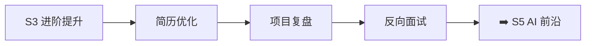

# S4 面试冲刺 🔴

> **学习目标**：简历打磨、项目复盘、反向面试、真实项目深度技术分析

## 内容章节

- [📝 简历](./01-简历.md) — 前端简历示例与编写指南
- [❓ 简历问题](./02-简历问题.md) — 简历常见追问与深度问题
- [🔄 反向面试](./03-反向面试.md) — 候选人反问面试官的问题清单
- [📶 5G核心网测试用例管理系统](./04-5G核心网测试用例管理系统.md) — React 19 动态表单、SSE 实时日志
- [🏢 AeMS企业级综合网络管理系统](./05-AeMS企业级综合网络管理系统.md) — Angular 21 万级设备渲染、WebSocket
- [⚙️ LI-OAM 网元运维与数据管理系统](./06-LI-OAM%20网元运维与数据管理系统.md) — Angular 21 日志解密、Worker 多线程
- [🔒 Axyom ACL & HTTP Decorator](./07-Axyom%20ACL%20%26%20HTTP%20Decorator%20Library.md) — Angular 装饰器、ACL 权限
- [📋 Axyom Form](./08-Axyom-Form%20项目技术分析.md) — 动态表单引擎技术分析
- [📊 Axyom Table](./09-Axyom-Table%20项目技术分析.md) — 高性能表格组件技术分析
- [📈 Prometheus+Grafana](./10-Prometheus+Grafana.md) — 监控体系与可视化
- [🏗️ FMS-UI企业级融合管理系统](./11-FMS-UI企业级融合管理系统.md) — 企业级融合管理系统前端深度技术分析

## 学习路线

