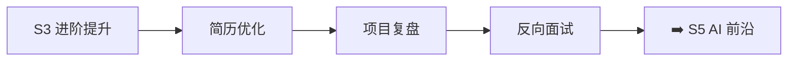

# S4 面试冲刺 🔴

> **学习目标**：简历打磨、项目复盘、反向面试、真实项目深度技术分析

## 内容章节

- [01-简历](./01-简历) — 前端简历示例与编写指南
- [02-简历问题](./02-简历问题) — 简历常见追问与深度问题
- [03-反向面试](./03-反向面试) — 候选人反问面试官的问题清单
- [04-5G核心网测试用例管理系统](./04-5G核心网测试用例管理系统) — React 19 动态表单、SSE 实时日志
- [05-AeMS企业级综合网络管理系统](./05-AeMS企业级综合网络管理系统) — Angular 20 万级设备渲染、WebSocket
- [06-LI-OAM 网元运维与数据管理系统](./06-LI-OAM 网元运维与数据管理系统) — Angular 20 日志解密、Worker 多线程
- [07-Axyom ACL & HTTP Decorator](./07-Axyom ACL & HTTP Decorator Library) — Angular 装饰器、ACL 权限
- [08-Axyom Form](./08-Axyom-Form 项目技术分析) — 动态表单引擎技术分析
- [09-Axyom Table](./09-Axyom-Table 项目技术分析) — 高性能表格组件技术分析
- [10-Prometheus+Grafana](./10-Prometheus+Grafana) — 监控体系与可视化

## 学习路线

