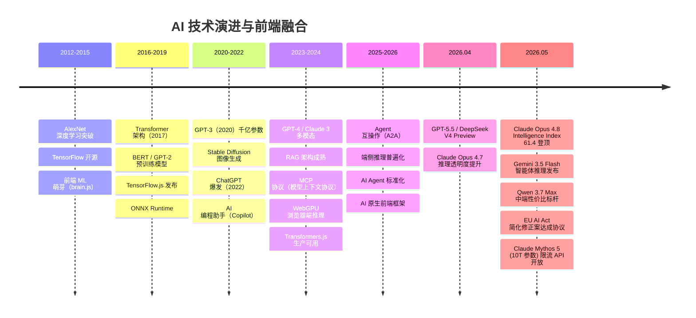
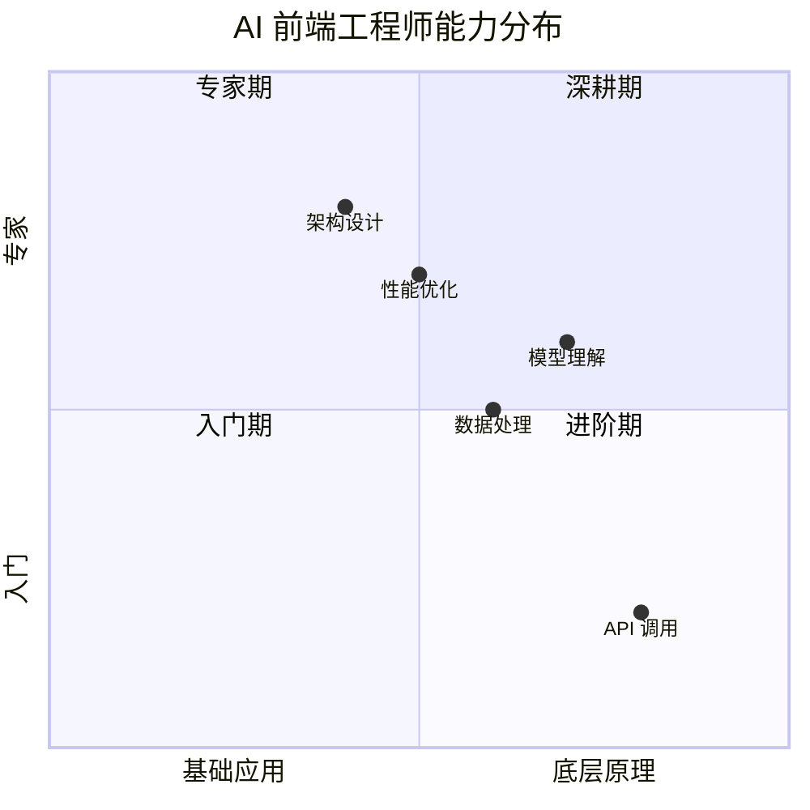
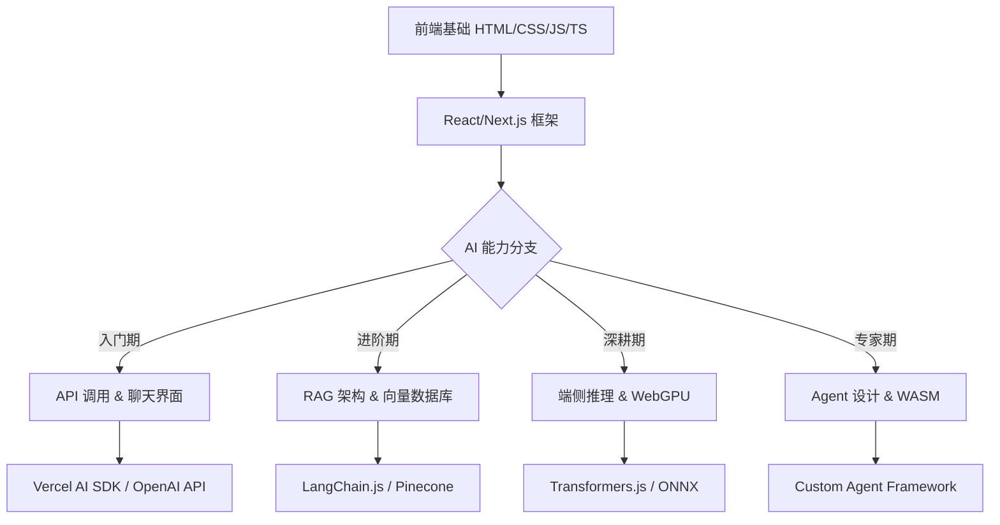
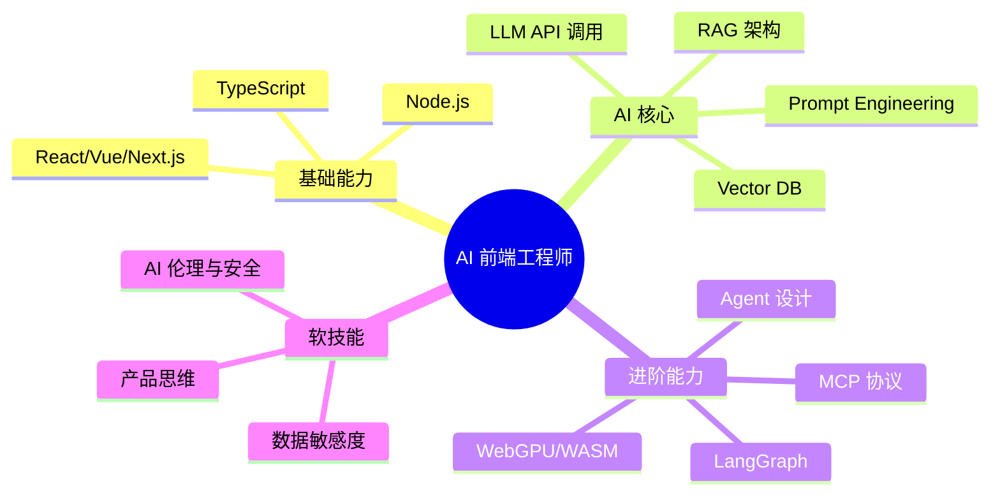

# 🚀 AI 前端开发体系化学习指南

> 从零基础到专家，打造前端工程师的 AI 能力进阶路线图。包含学习指南总览、术语表、避坑指南、学习路线、FAQ、面试冲刺、职业规划等全部附录内容。

---


## 🚀 AI 前端开发体系化学习指南

> 从零基础到专家，打造前端工程师的 AI 能力进阶路线图

### 📈 AI 技术发展时间线（2012—2026）



### 前端 AI 融合的阶段

| 阶段           | 时间      | 技术方案                       | 前端角色            |
| -------------- | --------- | ------------------------------ | ------------------- |
| **起步期**     | 2018-2021 | TensorFlow.js、ONNX Runtime    | 客户端推理探索      |
| **API 集成期** | 2022-2023 | OpenAI API、Server-side LLM    | API 调用 + 流式渲染 |
| **RAG 成熟期** | 2023-2024 | 向量库 + 检索 + LLM            | 知识库前端集成      |
| **端侧推理期** | 2024-2025 | WebGPU、WebNN、Transformers.js | 浏览器原生 AI       |
| **Agent 期**   | 2025-2026 | MCP/A2A、Multi-Agent           | 前端 Agent 交互层   |

### 模型能力演进对比

| 模型               | 年份  | 参数量  | 核心能力       | 前端集成方式    |
| ------------------ | ----- | ------- | -------------- | --------------- |
| GPT-3              | 2020  | 175B      | 文本生成           | API 调用              |
| GPT-3.5            | 2022  | 175B      | 对话优化           | ChatGPT API           |
| GPT-4              | 2023  | ~1.8T     | 多模态、推理       | API + Vision          |
| GPT-4o             | 2024  | 未知      | 全模态、实时语音   | API + SDK             |
| Claude 3           | 2024  | 未知      | 长上下文、安全     | API + SDK             |
| Gemini 2.5         | 2025  | 未知      | 超长上下文 1M-2M   | API + Web SDK         |
| 开源 Llama 4       | 2025  | 400B+ MoE | 10M 上下文、开源   | Ollama + WebGPU       |
| GPT-5.5            | 2026  | 500B+ MoE | 推理、Agent、代码  | API + Codex           |
| Claude Opus 4.8    | 2026  | 700B+ MoE | #1 编程、长 Agent  | API + Claude Code     |
| Gemini 3.5 Flash   | 2026  | 未知      | 智能体、性价比领先 | API + Google AI       |
| Qwen 3.7 Max       | 2026  | 未知      | 中端性价比、数学强 | API + 阿里云          |
| DeepSeek V4        | 2026  | 600B MoE  | 开源推理、成本极低 | Ollama + API          |
| Claude Mythos 5    | 2026  | ~10T MoE  | 超级智能、全模态   | 限流 API              |
| 端侧模型           | 2025+ | 1B-7B     | 浏览器内推理       | Transformers.js       |

### 🗺️ 学习路线图总览

**能力矩阵演进：**



**技术栈演进路径：**



---

## 📖 AI 前端开发术语表 (Glossary)

> 📚 **快速查阅**：掌握行业黑话，面试沟通更顺畅。

| 术语                | 全称                                     | 解释                                                         |
| :------------------ | :--------------------------------------- | :----------------------------------------------------------- |
| **LLM**             | Large Language Model                     | 大语言模型，如 GPT-4, Claude, Qwen                           |
| **Token**           | -                                        | 模型处理文本的最小单位，1 Token ≈ 0.75 英文单词 / 0.5 中文字符 |
| **Context Window**  | -                                        | 模型单次能处理的最大 Token 数 (输入 + 输出)                  |
| **Embedding**       | -                                        | 将文本映射为高维向量，用于语义相似度计算                     |
| **RAG**             | Retrieval-Augmented Generation           | 检索增强生成，结合外部知识库回答                             |
| **Fine-tuning**     | -                                        | 在预训练模型基础上，用特定数据继续训练以适配垂直领域         |
| **Prompt**          | -                                        | 发送给模型的指令文本，包含任务描述、上下文和约束             |
| **Temperature**     | -                                        | 控制输出随机性的参数，值越高越具创造性                       |
| **Hallucination**   | -                                        | 幻觉，模型生成看似合理但实际错误或虚构的内容                 |
| **Agent**           | -                                        | 能自主规划、调用工具并执行任务的智能体                       |
| **CoT**             | Chain of Thought                         | 思维链，引导模型逐步推理以提高准确率                         |
| **TTFT**            | Time To First Token                      | 首字延迟，用户发送请求到看到第一个字的时间                   |
| **Transformer**     | -                                        | 基于自注意力机制的神经网络架构，所有 LLM 的基础              |
| **Self-Attention**  | -                                        | 让每个词与序列中所有其他词交互，捕捉长距离依赖关系           |
| **MHA**             | Multi-Head Attention                     | 多头注意力，多个注意力头并行捕捉不同维度的关系               |
| **GQA**             | Grouped Query Attention                  | Q 分多组共享 K/V，显存节省 ~50%，质量几乎无损                |
| **MQA**             | Multi-Query Attention                    | 所有 Q 头共享同一组 K/V，显存节省 ~80%                       |
| **Flash Attention** | -                                        | 分块计算避免生成大注意力矩阵，内存从 O(n²) 降到 O(√n)        |
| **RoPE**            | Rotary Position Embedding                | 旋转位置编码，通过旋转向量角度编码相对位置，支持外推         |
| **KV Cache**        | Key-Value Cache                          | 缓存已生成的 K/V 矩阵，避免重复计算，推理加速 80%+           |
| **MoE**             | Mixture of Experts                       | 混合专家，总参数量大但每次只激活部分专家，兼顾容量和效率     |
| **LoRA**            | Low-Rank Adaptation                      | 低秩适配，用两个小矩阵模拟权重更新，微调参数量仅为 0.1-1%    |
| **QLoRA**           | Quantized LoRA                           | LoRA + 4-bit 量化，单卡即可微调 70B 模型                     |
| **SFT**             | Supervised Fine-Tuning                   | 监督微调，用标注的对话数据训练模型学会聊天格式               |
| **RLHF**            | RL from Human Feedback                   | 人类反馈强化学习，用奖励信号训练模型学会人类偏好             |
| **DPO**             | Direct Preference Optimization           | 直接偏好优化，无需显式奖励模型，比 PPO 更简单稳定            |
| **GRPO**            | Group Relative Policy Optimization       | 分组相对策略优化，DeepSeek-R1 使用，无 Critic 模型           |
| **PPO**             | Proximal Policy Optimization             | 近端策略优化，RLHF 中最主流的强化学习算法                    |
| **Reward Hacking**  | -                                        | 模型利用奖励模型的漏洞获得高分而非提升真实质量               |
| **Scaling Law**     | -                                        | 模型性能随参数量/数据量/计算量增长可预测提升                 |
| **涌现能力**        | Emergent Abilities                       | 模型超过临界点后突然出现的能力（推理、代码等）               |
| **Chinchilla Law**  | -                                        | 最优分配：参数量:训练token数 ≈ 1:20                          |
| **CoT**             | Chain of Thought                         | 思维链，引导模型逐步推理以提高准确率                         |
| **VLM**             | Vision-Language Model                    | 多模态大模型，能同时理解图像和文本                           |
| **CLIP**            | Contrastive Language-Image Pre-training  | 对比学习对齐图文表征，VLM 的视觉编码器基础                   |
| **LLaVA**           | Large Language and Vision Assistant      | 最主流的 VLM 架构，用简单 MLP 连接视觉和语言模型             |
| **Grounding**       | -                                        | 将文本描述对应到图像中的具体区域，即视觉定位                 |
| **Quantization**    | -                                        | 将模型权重从 FP16 转为 INT8/INT4，降低显存和加速推理         |
| **AWQ**             | Activation-aware Weight Quantization     | 保留重要权重精度的量化方法，优于 GPTQ                        |
| **GGUF**            | GPT-Generated Unified Format             | Llama.cpp 的模型格式，CPU 推理优化                           |
| **PRM**             | Process Reward Model                     | 过程奖励模型，给每一步推理单独打分而非整句一个分             |
| **RLAIF**           | RL from AI Feedback                      | 用 AI 替代人类标注偏好数据，大幅降低成本                     |
| **VLLM**            | -                                        | 高吞吐推理引擎，基于 PagedAttention                          |
| **SGLang**          | -                                        | 结构化生成引擎，基于 RadixAttention 的高效前缀缓存           |
| **MCP**             | Model Context Protocol                   | 模型上下文协议，标准化 LLM 工具/资源接入的开放协议           |
| **A2A**             | Agent-to-Agent                           | 智能体间通信协议，支持多 Agent 跨平台协作                    |
| **GraphRAG**        | Graph RAG                                | 基于知识图谱的检索增强生成，擅长多跳关系推理                 |
| **MCTS**            | Monte Carlo Tree Search                  | 蒙特卡洛树搜索，OpenAI o1 的推理核心搜索算法                 |
| **MMLU**            | Massive Multitask Language Understanding | 57 学科多任务评测基准，衡量模型知识广度                      |
| **HumanEval**       | -                                        | 代码生成评测基准，测试模型的手写函数正确率                   |
| **Agent Memory**    | -                                        | 智能体记忆系统，分短期 (上下文) + 长期 (向量库) + 工作记忆   |
| **MCP Server**      | -                                        | MCP 协议的服务器实现，封装工具/资源暴露给 LLM                |
| **Agentic RAG**     | -                                        | Agent 驱动的 RAG，支持多轮检索、工具调用和推理循环           |
| **MM-RAG**          | Multi-Modal RAG                          | 多模态 RAG，联合检索图像/图表/视频 + 文本                    |
| **EU AI Act**       | EU Artificial Intelligence Act           | 欧盟 AI 法案，全球首部全面 AI 法律，基于风险分级             |
| **Constitutional AI**| -                                       | 宪法 AI，用一组原则引导模型行为，减少人类反馈依赖            |
| **SWE-bench**       | Software Engineering Benchmark           | 代码工程评测，测试模型解决真实 GitHub Issue 的能力           |
| **Terminal-Bench**  | -                                        | 终端操作评测，测试模型在命令行环境中的 Agent 能力            |
| **Intelligence Index**| -                                      | Artificial Analysis 的综合智能评分，衡量模型推理能力         |
| **Computer Use**    | -                                        | Claude 的桌面操控能力，可操控鼠标/键盘完成复杂 UI 交互       |
| **Cowork**          | Claude Cowork                            | Claude 桌面 Agent，持续运行、自主规划执行任务                |
| **Gemini Spark**    | -                                        | Google 首个 24/7 云 Agent，基于 Gemini 3.5 Flash            |
| **RLAIF**           | RL from AI Feedback                      | 用 AI 替代人类标注偏好数据，大幅降低成本                     |

---


## 📦 教程使用的库文件清单

> 本教程所有章节涉及的 npm 包及其官方地址，按功能分类整理。

### 🤖 AI SDK & 模型调用

| 包名 | 文档地址 | 用途 | 涉及章节 |
|:-----|:---------|:-----|:---------|
| `ai` | https://sdk.vercel.ai | Vercel AI SDK 核心库（v6.x） | 01, 06, 07, 08, 13 |
| `@ai-sdk/openai` | https://sdk.vercel.ai/providers/ai-sdk/openai | OpenAI 模型适配器 | 01, 07, 08, 13 |
| `@ai-sdk/react` | https://sdk.vercel.ai | React `useChat` / `useCompletion` 适配器 | 01, 08 |
| `@ai-sdk/anthropic` | https://sdk.vercel.ai/providers/ai-sdk/anthropic | Anthropic Claude 适配器 | 07 |
| `openai` | https://github.com/openai/openai-node | OpenAI Node.js SDK | 04, 08, 13 |
| `zod` | https://zod.dev | 类型安全 Schema 定义 | 04, 13 |

### 🦜 LangChain 生态

| 包名 | 文档地址 | 用途 | 涉及章节 |
|:-----|:---------|:-----|:---------|
| `langchain` | https://js.langchain.com | LangChain.js 核心框架 | 02, 08, 13 |
| `@langchain/core` | https://js.langchain.com | 核心抽象（Document, PromptTemplate 等） | 02, 08 |
| `@langchain/openai` | https://js.langchain.com/docs/integrations/llms/openai | OpenAI 集成（ChatOpenAI, OpenAIEmbeddings） | 02, 08, 13 |
| `@langchain/pinecone` | https://js.langchain.com/docs/integrations/vectorstores/pinecone | Pinecone 向量库集成 | 02, 08 |
| `@langchain/community` | https://js.langchain.com/docs/integrations/platforms | 社区集成（Chroma, CrossEncoder 等） | 02, 13 |
| `@langchain/langgraph` | https://langchain-ai.github.io/langgraphjs | LangGraph Agent 编排 | 04, 08, 13 |

### 🗄️ 向量数据库

| 包名 | 文档地址 | 用途 | 涉及章节 |
|:-----|:---------|:-----|:---------|
| `@pinecone-database/pinecone` | https://www.pinecone.io | Pinecone 向量数据库 SDK | 02, 08 |

### 📄 文档解析

| 包名 | 文档地址 | 用途 | 涉及章节 |
|:-----|:---------|:-----|:---------|
| `pdf-parse` | https://www.npmjs.com/package/pdf-parse | PDF 文本提取 | 02, 08 |
| `mammoth` | https://github.com/mwilliamson/mammoth.js | DOCX 转 Markdown | 02 |
| `cheerio` | https://cheerio.js.org | HTML 解析与抓取 | 02 |

### 🎨 UI / Markdown

| 包名 | 文档地址 | 用途 | 涉及章节 |
|:-----|:---------|:-----|:---------|
| `react-markdown` | https://github.com/remarkjs/react-markdown | Markdown 渲染 | 01, 08 |
| `remark-gfm` | https://github.com/remarkjs/remark-gfm | GFM 扩展（表格、删除线） | 01, 08 |
| `react-syntax-highlighter` | https://github.com/react-syntax-highlighter/react-syntax-highlighter | 代码语法高亮 | 08 |
| `framer-motion` | https://www.framer.com/motion | 动画效果 | 07 |

### 🧠 端侧推理

| 包名 | 文档地址 | 用途 | 涉及章节 |
|:-----|:---------|:-----|:---------|
| `@huggingface/transformers` | https://huggingface.co/docs/transformers.js | 浏览器端 Transformers 推理 | 03, 07 |
| `onnxruntime-web` | https://onnxruntime.ai | WebGPU/WebGL ONNX 推理引擎 | 03 |

### 📊 可观测性

| 包名 | 文档地址 | 用途 | 涉及章节 |
|:-----|:---------|:-----|:---------|
| `@opentelemetry/api` | https://opentelemetry.io | OpenTelemetry API | 05, 07 |
| `@opentelemetry/exporter-trace-otlp-http` | https://opentelemetry.io | OTLP HTTP 导出器 | 05 |
| `@opentelemetry/sdk-trace-base` | https://opentelemetry.io | 追踪 SDK 基础 | 05 |
| `@opentelemetry/sdk-trace-node` | https://opentelemetry.io | Node.js 追踪 SDK | 05 |
| `@opentelemetry/resources` | https://opentelemetry.io | 资源标识 | 05 |

### 🧪 测试

| 包名 | 文档地址 | 用途 | 涉及章节 |
|:-----|:---------|:-----|:---------|
| `vitest` | https://vitest.dev | 单元测试框架 | 08 |
| `@testing-library/react` | https://testing-library.com | React 组件测试 | 08 |
| `@playwright/test` | https://playwright.dev | E2E 浏览器测试 | 08 |

### 🔧 工具链

| 包名 | 文档地址 | 用途 | 涉及章节 |
|:-----|:---------|:-----|:---------|
| `next` | https://nextjs.org | React 全栈框架 | 01, 02, 03, 08 |
| `vite` | https://vitejs.dev | 构建工具 | 00 |
| `@vitejs/plugin-react` | https://vitejs.dev | Vite React 插件 | 00 |
| `next-intl` | https://next-intl-docs.vercel.app | Next.js 国际化 | 08 |
| `typescript` | https://www.typescriptlang.org | TypeScript 语言 | 所有章节 |

### 🔌 协议 SDK

| 包名 | 文档地址 | 用途 | 涉及章节 |
|:-----|:---------|:-----|:---------|
| `@modelcontextprotocol/sdk` | https://github.com/modelcontextprotocol/typescript-sdk | MCP 协议 TypeScript SDK | 06, 11 |

### 🛠️ 其他工具

| 包名 | 文档地址 | 用途 | 涉及章节 |
|:-----|:---------|:-----|:---------|
| `e2b` | https://e2b.dev | AI 代码沙箱 | 07 |
| `@upstash/ratelimit` | https://upstash.com | 速率限制 | 07 |
| `@dqbd/tiktoken` | https://github.com/dqbd/tiktoken | Token 计数 | 01 |
| `@radix-ui/react-dialog` | https://www.radix-ui.com | 无障碍弹窗 | 00 |
| `class-variance-authority` | https://cva.style | CSS 变体管理 | 00 |
| `zustand` | https://github.com/pmndrs/zustand | 状态管理 | 08 |

---

## 📝 终极 FAQ (Frequently Asked Questions)

> ❓ **快速答疑**：汇总 AI 前端开发中最常见的问题与解答。

### 🤖 模型与 API

**Q: 如何选择适合的 AI 模型？**
A: 根据任务复杂度选择：简单任务用轻量模型 (GPT-4o-mini)，复杂推理用高级模型 (GPT-4o/Claude 3.5)，中文场景优先 [Qwen](https://qwen.alibaba.com) 或 Baichuan。

**Q: API 费用太高怎么办？**
A: 使用语义缓存、模型路由 (简单任务走便宜模型)、上下文压缩、以及监控告警控制预算。

### 🏗️ 架构与开发

**Q: RAG 回答不准确怎么办？**
A: 优化分块策略 (200-500 字/块)、引入重排序模型、使用混合检索 (向量 + 关键词)、增强 Prompt 约束。

**Q: 流式响应中断如何处理？**
A: 实现指数退避重试、检查服务端超时配置、确保 Nginx/CDN 未缓冲响应。

### 🛡️ 安全与合规

**Q: 如何防止 Prompt 注入攻击？**
A: 使用分隔符隔离用户输入、添加系统级安全指令、输入过滤 (正则/LLM 检测)、输出内容审核。

**Q: 用户数据隐私如何保护？**
A: 本地脱敏 (移除 PII)、使用企业版 API (不训练用户数据)、加密传输与存储、明确隐私政策。

### 🚀 部署与运维

**Q: Serverless 函数超时如何解决？**
A: 使用流式响应降低 TTFT、升级至 Pro 计划 (60s+)、或将长任务移至消息队列异步处理。

**Q: 如何监控 AI 应用质量？**
A: 集成 [LangSmith](https://smith.langchain.com)/Helicone 追踪链路、设置 Ragas 评估指标、配置延迟与错误率告警。

---

## 🎓 面试冲刺指南

### 💡 高频面试题精选

| 类别      | 核心问题              | 答题要点                                            |
| :-------- | :-------------------- | :-------------------------------------------------- |
| **基础**  | LLM 原理与 Token 机制 | Transformer 架构、Next Token Prediction、上下文窗口 |
| **参数**  | Temperature vs Top-p  | 创造性 vs 确定性、采样范围控制                      |
| **RAG**   | 为什么需要 RAG？      | 解决知识截止、减少幻觉、私有数据支持、可追溯        |
| **优化**  | 如何提高 RAG 准确率？ | 语义分块、混合检索、重排序、查询扩展                |
| **端侧**  | WebGPU vs WebGL       | 通用计算 (GPGPU) vs 图形渲染、性能差异              |
| **Agent** | React 模式原理        | Thought-Action-Observation 循环、工具调用           |

### 🗣️ 面试话术模板

**Q: 你如何学习 AI 技术？**

> "我采用四阶段学习法：从 API 调用入门掌握基础交互；深入 RAG 架构解决私有数据问题；探索端侧推理实现离线与隐私保护；最后研究 Agent 设计构建自动化工作流。每个阶段都配合实际项目验证。"

**Q: AI 应用的性能优化怎么做？**

> "我从三个层面优化：Token 层面通过上下文压缩减少输入量；网络层面使用 Edge 部署与流式传输降低延迟；端侧层面利用 [WebGPU](https://www.w3.org/TR/webgpu/) 加速与模型量化。同时建立监控体系追踪延迟与成本。"

**Q: 如何保证 AI 应用的安全性？**

> "我实施多层防护：输入层进行 Prompt 注入检测与敏感数据脱敏；处理层添加安全系统提示词；输出层进行内容过滤。遵循最小权限原则，不暴露内部指令。"

---

## 📎 附录：常见问题与解决方案

### A. API 调用问题

| 问题                        | 原因         | 解决方案                     |
| :-------------------------- | :----------- | :--------------------------- |
| **429 Too Many Requests**   | 超出速率限制 | 指数退避重试                 |
| **401 Unauthorized**        | API Key 无效 | 检查 Key 配置                |
| **Context Length Exceeded** | 输入超限     | 截断上下文或使用更大窗口模型 |

### B. 向量检索问题

| 问题               | 原因                | 解决方案                             |
| :----------------- | :------------------ | :----------------------------------- |
| **检索结果不相关** | 分块过大/模型不匹配 | 调整 chunkSize，更换 Embedding 模型  |
| **检索速度慢**     | 索引未优化          | 使用 HNSW 索引，调整 ef_construction |

### C. 端侧推理问题

| 问题             | 原因         | 解决方案                    |
| :--------------- | :----------- | :-------------------------- |
| **模型加载失败** | 内存不足     | 使用量化模型 (q4)，释放资源 |
| **推理速度慢**   | 设备性能限制 | 启用 WebGPU，减小模型规模   |

### D. Agent 问题

| 问题             | 原因           | 解决方案                      |
| :--------------- | :------------- | :---------------------------- |
| **无限循环调用** | 停止条件不明确 | 设置最大迭代次数，改进 Prompt |
| **工具参数错误** | LLM 不理解格式 | 提供清晰的参数描述与示例      |

---

## 📚 学习资源推荐

### 📖 官方文档

- [Vercel AI SDK](https://sdk.Vercel.ai/docs) | [LangChain.js](https://js.LangChain.com/docs)
- [Transformers.js](https://huggingface.co/docs/transformers.js) | [MCP Protocol](https://modelcontextprotocol.io)

### 🎓 教程与课程

- [Full Stack LLM Bootcamp](https://fullstackdeeplearning.com/llm-bootcamp/)
- [DeepLearning.AI Short Courses](https://www.deeplearning.ai/short-courses/)

### 💻 开源项目参考

- [Vercel AI Chatbot](https://github.com/vercel/ai-chatbot)
- [MCP Servers](https://github.com/modelcontextprotocol/servers)

### 🌐 社区与讨论

- [Vercel AI Discord](https://discord.gg/Vercel) | [AI Engineering Reddit](https://www.reddit.com/r/AIEngineering/)

---

## 📈 职业发展与规划

### 1. AI 前端工程师技能树



### 2. 面试准备建议

- **项目准备**：准备 2-3 个完整项目（含源码），重点展示 RAG 优化、Agent 编排或端侧推理的落地经验。
- **算法基础**：熟悉 LeetCode 中等难度题目，特别是树、图、动态规划相关算法。
- **系统设计**：能够独立设计一个高可用的 AI 问答系统架构，涵盖缓存、限流、监控等环节。

### 3. 市场趋势与薪资参考

- **需求增长**：传统前端正向"AI 应用前端"转型，具备 AI 落地能力者需求激增。
- **薪资溢价**：掌握 RAG/Agent 技术的工程师薪资普遍高出同级 20-40%。
- **未来方向**：端侧 AI (Edge AI)、多模态交互、自动化工作流是未来 3 年的核心赛道。

---

# 📚 AI 推荐学习资源

> 🎯 **本文档汇总了 AI 前端开发领域的优质学习资源**
> 涵盖热门 AI 工具、LLM 原理、RAG 实战、Vibe Coding 等方向

---

## 🔥 热门 AI 工具大全

> ⚠️ **版本时效说明**：模型版本更新极快，请以厂商官方文档为准。下方列出的均为已稳定 GA 或公开 Preview 的版本，**不包含未发布的预测版本**。

### AI 大模型（稳定 GA 版本 · 2025-2026）

| 模型 | 厂商 | 当前可用版本 | 上下文 | 特点 |
|:---|:---|:---|:---:|:---|
| [**GPT**](https://openai.com) | OpenAI | `gpt-5.5` / `gpt-5.5-pro` / `o3` / `o4-mini` | 400K-1M | 推理、Agent、60% 幻觉下降、Codex 集成 |
| [**Claude**](https://anthropic.com) | Anthropic | `claude-opus-4-8` / `claude-sonnet-4-6` / `claude-mythos-5` | 200K-2M | #1 编程、Computer Use、Constitutional AI |
| [**Gemini**](https://gemini.google.com) | Google | `gemini-3.5-flash` / `gemini-3.1-pro` / `gemini-spark` | 1M-2M | 智能体推理、24/7 云 Agent、MCP Atlas |
| [**Grok**](https://x.ai) | xAI | `grok-4.3` / `grok-4.3-mini` | 256K | 实时 X 数据、推理模式 (Think) |
| [**Qwen（通义千问）**](https://tongyi.aliyun.com) | 阿里 | `Qwen3.7-Max` / `Qwen3.6-Plus` / `Qwen3.5` | 128K-1M | 开源生态、HMMT 数学 97.1、性价比高 |
| [**DeepSeek**](https://deepseek.com) | 深度求索 | `DeepSeek-V4-Preview` / `DeepSeek-V4-Pro` / `R1` | 128K | 开源最强推理、API 价格极低 ($0.27/M) |
| [**豆包（Doubao）**](https://www.doubao.com) | 字节跳动 | `Doubao-1.5-pro` | 128K | 国内用户量大、Agent 协同 |
| [**Kimi**](https://kimi.moonshot.cn) | 月之暗面 | `Kimi K2` | 128K-200K | 长文档处理、开源 K2 模型 |
| [**文心一言**](https://yiyan.baidu.com) | 百度 | `ERNIE-5.1` | 128K-1M | LMArena Search #4、知识图谱增强 |
| [**ChatGLM（智谱）**](https://chatglm.cn) | 智谱 AI | `GLM-4.5` / `GLM-Z1` | 128K | 开源、SWE-bench 表现强、MIT 协议 |
| [**讯飞星火**](https://xinghuo.xfyun.cn) | 科大讯飞 | `星火 V5.0` | 128K | 语音交互、教育场景深耕 |
| [**LLaMA**](https://llama.meta.com) | Meta | `Llama-4.1 Maverick` / `Llama-4 Scout` | 128K-10M | 纯开源 MoE、128 专家、学术友好 |
| [**盘古**](https://www.huawei.com) | 华为 | `盘古 5.0` | 128K | 工业场景、昇腾芯片协同 |

### AI 编程助手（2025-2026）

| 工具 | 类型 | 特点 | 价格 |
|:---|:---|:---|:---|
| [**Claude Code**](https://docs.anthropic.com/en/docs/claude-code) | CLI Agent | 终端编程、代码库深度理解、Agent Teams | API 按量 |
| [**OpenCode**](https://opencode.ai) | CLI Agent | 开源 MIT、支持 75+ 模型、可复用现有订阅 | 免费开源 |
| [**GitHub Copilot**](https://github.com/features/copilot) | IDE 插件 | 代码补全、Chat、Agent、200K+ 用户 | $10/月 |
| [**Cursor**](https://cursor.com) | IDE | 整文件编辑、Agent 模式、多模型支持 | $20/月 |
| [**Windsurf (Codeium)**](https://codeium.com) | IDE | Flow 模式、深度上下文 | 免费起步 |
| [**OpenAI Codex**](https://openai.com/index/codex) | CLI Agent | OpenAI 官方编程 Agent、沙箱执行 | API 按量 |
| [**Gemini CLI**](https://developers.google.com/gemini-cli) | CLI Agent | Google 出品、Plan Mode、免费额度 | 免费 |
| [**Aider**](https://aider.chat) | CLI Agent | Git 感知、终端编程、多提供商 | 免费开源 |
| [**Kilo Code**](https://kilocode.ai) | IDE 插件 | 开源、150万+ 用户、500+ 模型 | 免费 |
| [**Amazon Q Developer**](https://aws.amazon.com/q/developer) | IDE 插件 | AWS 生态集成 | 免费/Paid |
| [**Gemini Code Assist**](https://cloud.google.com/gemini-code-assist) | IDE 插件 | Google 生态、免费额度 | 免费/Paid |
| [**通义灵码**](https://tongyi.aliyun.com/lingma) | IDE 插件 | 阿里出品、中文优化、Qwen 驱动 | 免费/Paid |

### AI 对话助手

| 工具 | 厂商 | 当前版本 | 特色功能 |
|:---|:---|:---|:---|
| [**ChatGPT**](https://chat.openai.com) | OpenAI | `GPT-5.5` / `GPT-5.5 Pro` | 多模态、Personal Finance、Codex Mobile |
| [**Claude**](https://claude.ai) | Anthropic | `Opus 4.8` / `Sonnet 4.6` | 长文本、Artifacts、Computer Use、Cowork |
| [**Gemini**](https://gemini.google.com) | Google | `3.5 Flash` / `Spark` | 联网搜索、Deep Research、24/7 Agent |
| [**Grok**](https://grok.com) | xAI | `Grok-4.3` | 实时 X 数据、视频输入、Think 模式 |
| [**豆包**](https://www.doubao.com) | 字节跳动 | `Doubao-1.5-pro` | 中文对话、视频理解、插件生态 |
| [**Kimi**](https://kimi.moonshot.cn) | 月之暗面 | `Kimi K2` | 超长文档、联网搜索、开源 |
| [**通义千问**](https://tongyi.aliyun.com) | 阿里 | `Qwen3.7-Max` | HMMT 数学 97.1、1M 上下文、性价比高 |
| [**文心一言**](https://yiyan.baidu.com) | 百度 | `ERNIE-5.1` | LMArena Search #4、知识图谱、搜索集成 |
| [**DeepSeek**](https://chat.deepseek.com) | 深度求索 | `DeepSeek-V4` / `R1` | 推理强、开源、API 成本极低 |
| [**ChatGLM**](https://chatglm.cn) | 智谱 AI | `GLM-4.5` / `GLM-Z1` | 开源、SWE-bench、推理模型 |
| [**讯飞星火**](https://xinghuo.xfyun.cn) | 科大讯飞 | `星火 V5.0` | 语音交互、多模态、教育场景 |
| [**Perplexity**](https://perplexity.ai) | Perplexity | `Sonar Pro` | AI 搜索引擎、引用来源、实时信息 |

### AI 图像生成

| 工具 | 厂商 | 特点 | 价格 |
|:---|:---|:---|:---|
| [**Midjourney**](https://midjourney.com) | Midjourney | 艺术风格、质量最高 | $10/月起 |
| [**DALL-E 3**](https://openai.com/dall-e-3) | OpenAI | ChatGPT 集成、提示词理解好 | ChatGPT Plus |
| [**Stable Diffusion**](https://stability.ai) | Stability AI | 开源、本地部署 | 免费 |
| [**通义万相**](https://tongyi.aliyun.com/wanxiang) | 阿里 | 中文理解、免费额度 | 免费/Paid |
| [**文心一格**](https://yige.baidu.com) | 百度 | 中文提示词、风格多样 | 免费/Paid |
| [**即梦 AI**](https://jimeng.jianying.com) | 字节跳动 | 视频生成、图像编辑 | 免费/Paid |
| [**可灵 AI**](https://klingai.kuaishou.com) | 快手 | 视频生成、运动控制 | 免费/Paid |

### AI 视频生成

| 工具 | 厂商 | 特点 | 价格 |
|:---|:---|:---|:---|
| [**Sora**](https://openai.com/sora) | OpenAI | 文生视频、物理理解 | ChatGPT Plus |
| [**Veo 2**](https://deepmind.google/technologies/veo) | Google | 高质量、长视频 | 等待开放 |
| [**即梦 AI**](https://jimeng.jianying.com) | 字节跳动 | 中文支持、免费额度 | 免费/Paid |
| [**可灵 AI**](https://klingai.kuaishou.com) | 快手 | 运动控制、角色一致 | 免费/Paid |
| [**Runway Gen-3**](https://runway.com) | Runway | 专业视频编辑 | $12/月起 |
| [**Pika**](https://pika.art) | Pika | 简单易用、特效丰富 | 免费/Paid |

### AI 办公效率

| 工具 | 功能 | 特点 |
|:---|:---|:---|
| [**Notion AI**](https://notion.so) | 文档协作 | 笔记+AI 写作 |
| [**飞书智能伙伴**](https://feishu.cn) | 办公协作 | 字节出品、企业级 |
| [**通义听悟**](https://tingwu.aliyun.com) | 会议纪要 | 语音转文字、摘要 |
| [**秘塔 AI 搜索**](https://metaso.cn) | 搜索引擎 | 无广告、结构化答案 |
| [**Perplexity**](https://perplexity.ai) | 搜索引擎 | AI 搜索、引用来源 |
| [**Gamma**](https://gamma.app) | PPT 生成 | AI 自动生成演示文稿 |

### AI 开源框架

| 框架 | 用途 | 特点 |
|:---|:---|:---|
| [**LangChain**](https://langchain.com) | LLM 应用开发 | 链式调用、Agent、RAG |
| [**LlamaIndex**](https://llamaindex.ai) | RAG 框架 | 数据连接、索引、检索 |
| [**Ollama**](https://ollama.com) | 本地模型运行 | 一键部署本地 LLM |
| [**vLLM**](https://vllm.ai) | 推理加速 | 高性能推理引擎 |
| [**Transformers.js**](https://huggingface.co/docs/transformers.js) | 浏览器推理 | 浏览器端运行模型 |
| [**Vercel AI SDK**](https://sdk.vercel.ai) | 前端 AI 集成 | React/Next.js AI 组件 |

---

## 🤖 Claude Code 专题

### 完整指南与教程

| 资源 | 说明 | 链接 |
|:---|:---|:---|
| **Claude Code 完整指南** | 从入门到精通的 Claude Code 使用教程 | [🔗 访问](https://bcefghj.github.io/claude-code-complete-guide/#/) |
| **Claude Code 指南（中文版）** | Claude Code 的中文学习资料 | [🔗 访问](https://wzf1997.github.io/claude-code-guide/) |
| **Claude Code 介绍** | 什么是 Claude Code？概念与架构 | [🔗 访问](https://ccb.agent-aura.top/docs/introduction/what-is-claude-code) |

### 核心能力

| 能力 | 说明 |
|:---|:---|
| **代码生成** | 根据自然语言描述生成完整代码 |
| **代码理解** | 分析现有代码库，提供修改建议 |
| **重构优化** | 识别代码坏味道，自动重构 |
| **测试生成** | 为现有代码生成单元测试 |
| **调试辅助** | 分析错误信息，定位问题根因 |
| **文档生成** | 自动生成代码文档和 README |

---

## 🧠 LLM 原理与应用

### 基础入门

| 资源 | 说明 | 链接 |
|:---|:---|:---|
| **Happy LLM** | 大语言模型入门教程，从原理到实践 | [🔗 访问](https://datawhalechina.github.io/happy-llm/#/) |
| **Happy Agents** | AI Agent 开发入门教程 | [🔗 访问](https://hello-agents.datawhale.cc/#/) |

### 学习路径建议

```
LLM 基础 → Prompt 工程 → RAG 应用 → Agent 开发 → 生产部署
   ↓           ↓            ↓           ↓           ↓
Happy LLM   实践练习     All-in-RAG   Happy Agents  项目实战
```

---

## 🔍 RAG 实战

| 资源 | 说明 | 链接 |
|:---|:---|:---|
| **All-in-RAG** | RAG 全栈实战教程，从理论到部署 | [🔗 访问](https://datawhalechina.github.io/all-in-rag/#/) |

### RAG 核心知识点

| 阶段 | 内容 | 重要性 |
|:---|:---|:---:|
| **文档解析** | PDF/Word/Markdown 解析 | ⭐⭐⭐ |
| **文本分块** | Chunk Size、Overlap 策略 | ⭐⭐⭐⭐ |
| **向量化** | Embedding 模型选择与优化 | ⭐⭐⭐⭐ |
| **检索优化** | 混合检索、重排序 | ⭐⭐⭐⭐⭐ |
| **生成增强** | Prompt 优化、上下文管理 | ⭐⭐⭐⭐ |

---

## 🎨 Vibe Coding

| 资源 | 说明 | 链接 |
|:---|:---|:---|
| **VibeVibe** | Vibe Coding 社区与资源 | [🔗 访问](https://www.vibevibe.cn/zh/) |
| **Easy Vibe** | Vibe Coding 入门教程 | [🔗 访问](https://datawhalechina.github.io/easy-vibe/zh-cn/) |
| **Lint 清华** | 清华大学 Lint 学习资源 | [🔗 访问](https://lintsinghua.github.io/) |

### Vibe Coding 是什么？

> **Vibe Coding** = 用自然语言描述需求 → AI 生成代码 → 人工审查优化

| 特点 | 说明 |
|:---|:---|
| **低门槛** | 不需要深入掌握编程语言语法 |
| **高效率** | 快速原型开发，缩短开发周期 |
| **人机协作** | AI 生成 + 人工审查 = 高质量代码 |
| **持续学习** | 通过 AI 生成的代码学习最佳实践 |

---

## 🌐 综合学习平台

| 平台 | 说明 | 适合人群 |
|:---|:---|:---|
| **ShareAI** | AI 学习与实验平台 | 入门到进阶 |
| **Datawhale** | 开源学习社区，提供多门 AI 课程 | 全阶段学习者 |

---

## 📖 学习路线推荐

### 阶段一：入门基础（1-2 周）

- [ ] 阅读 [Happy LLM](https://datawhalechina.github.io/happy-llm/#/) 了解 LLM 基础
- [ ] 学习 [Claude Code 指南](https://bcefghj.github.io/claude-code-complete-guide/#/) 掌握 AI 编码工具
- [ ] 完成 Vibe Coding 入门教程

### 阶段二：进阶实战（2-3 周）

- [ ] 学习 [All-in-RAG](https://datawhalechina.github.io/all-in-rag/#/) 掌握 RAG 开发
- [ ] 阅读 [Happy Agents](https://hello-agents.datawhale.cc/#/) 了解 Agent 开发
- [ ] 实践 Claude Code 项目

### 阶段三：生产应用（持续）

- [ ] 参与开源项目贡献
- [ ] 构建个人 AI 项目
- [ ] 跟踪最新技术趋势

---

> 💡 **学习建议**: 选择 1-2 个工具深入使用，边用边学，避免工具过多导致的"收藏即学会"陷阱。

## 
