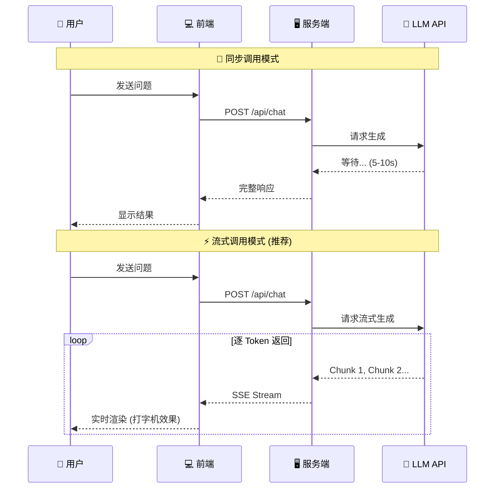
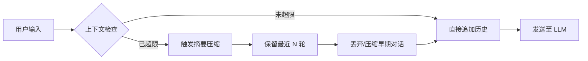

# 🟢 阶段一：入门期 - AI 聊天室

> 📖 **本文档为《AI 前端开发体系化学习指南》的阶段拆分文档**
> 完整指南请查看：[01-AI前端开发体系化学习指南.md](./01-AI前端开发体系化学习指南.md)

---

> 🎯 **阶段目标**：打通 AI 应用开发的"任督二脉"，实现从 0 到 1 的突破。

### 📚 核心能力指标
- [ ] 理解大语言模型（LLM）的 Token 机制与上下文窗口
- [ ] 掌握 OpenAI API 的同步与流式调用模式
- [ ] 使用 Vercel AI SDK 构建生产级聊天界面
- [ ] 实现对话历史管理与上下文截断策略
- [ ] 建立完整的错误处理与重试机制

### 🧠 核心概念解析

#### 1.1 大语言模型基础

**💡 什么是 LLM？**
大语言模型是基于 Transformer 架构的深度神经网络，通过在海量文本上进行预训练，学习语言的统计规律和语义表示。
- **核心机制**：Next Token Prediction（预测下一个词元）
- **上下文窗口**：模型一次能处理的 Token 数量上限（如 4K, 8K, 128K）
- **参数规模**：从 7B (70亿) 到 1T (1万亿) 不等，参数量越大，理解与生成能力越强。

**⚙️ 关键参数调优指南**

| 参数 | 作用域 | 推荐值 | 调优建议 |
|:---|:---|:---:|:---|
| `temperature` | 创造性 | `0.7-0.9` | 创意写作调高 (0.8)，事实问答调低 (0.2) |
| `max_tokens` | 长度限制 | `512-2048` | 根据业务需求设定，避免截断或浪费 |
| `top_p` | 采样范围 | `0.9` | 与 temperature 配合使用，通常二选一调整 |
| `frequency_penalty` | 去重 | `0.3-0.7` | 防止模型重复输出相同短语 |
| `presence_penalty` | 多样性 | `0.1-0.5` | 鼓励模型探索新话题，避免死循环 |

#### 1.2 API 调用模式对比



> ⚠️ **最佳实践**：生产环境务必使用**流式调用**，显著降低首字延迟 (TTFT)，提升用户体验。

### 🛠️ 环境搭建

#### 1.3 项目初始化

```bash
# 🚀 创建 Next.js 项目 (App Router + TypeScript + Tailwind)
npx create-next-app@latest ai-chat --typescript --tailwind --app

cd ai-chat

# 📦 安装核心依赖
npm install ai @ai-sdk/openai

# 🎨 安装辅助依赖 (Markdown 渲染)
npm install react-markdown remark-gfm
```

#### 1.4 环境变量配置

```env
# .env.local
# 🔒 安全提示：永远不要在前端暴露 API Key！
OPENAI_API_KEY=sk-your-api-key-here
```

### 💻 核心实现

#### 1.5 服务端 API 路由

```typescript
// app/api/chat/route.ts
import { openai } from '@ai-sdk/openai';
import { streamText, Message } from 'ai';

// ⏱️ 设置最大执行时间 (Vercel Hobby 计划为 10s, Pro 为 60s)
export const maxDuration = 30;

export async function POST(req: Request) {
  try {
    const { messages }: { messages: Message[] } = await req.json();

    // ✅ 输入校验
    if (!messages || messages.length === 0) {
      return new Response('Invalid messages', { status: 400 });
    }

    // 🌊 启动流式生成
    const result = streamText({
      model: openai('gpt-4o'),
      messages,
      system: `你是一个专业的 AI 助手。请用简洁、准确的语言回答问题。
如果涉及代码，请使用代码块格式。`,
      temperature: 0.7,
      maxTokens: 2048,
    });

    return result.toDataStreamResponse();
  } catch (error) {
    console.error('🔥 Chat API Error:', error);
    return new Response('Internal Server Error', { status: 500 });
  }
}
```

#### 1.6 客户端聊天组件

```tsx
// components/Chat.tsx
'use client';

import { useChat } from 'ai/react';
import ReactMarkdown from 'react-markdown';
import remarkGfm from 'remark-gfm';
import { useState } from 'react';

export default function Chat() {
  const {
    messages,
    input,
    handleInputChange,
    handleSubmit,
    isLoading,
    stop,
    setMessages,
  } = useChat({
    api: '/api/chat',
    onError: (error) => console.error('💥 Chat error:', error),
  });

  const [showClearConfirm, setShowClearConfirm] = useState(false);

  return (
    <div className="flex flex-col h-screen max-w-3xl mx-auto bg-gray-50">
      {/* 📌 头部导航 */}
      <header className="flex items-center justify-between p-4 bg-white border-b shadow-sm">
        <h1 className="text-xl font-bold text-gray-800">🤖 AI Chat</h1>
        <div className="flex gap-2">
          {isLoading && (
            <button onClick={stop} className="px-3 py-1 text-sm bg-red-500 text-white rounded hover:bg-red-600 transition">
              ⏹️ 停止
            </button>
          )}
          <button onClick={() => setShowClearConfirm(true)} className="px-3 py-1 text-sm bg-gray-200 rounded hover:bg-gray-300 transition">
            🗑️ 清空
          </button>
        </div>
      </header>

      {/* 💬 消息列表区域 */}
      <main className="flex-1 overflow-y-auto p-4 space-y-4">
        {messages.length === 0 && (
          <div className="text-center text-gray-400 mt-20">
            <p className="text-2xl">👋 你好！我是你的 AI 助手</p>
            <p className="text-sm mt-2">输入消息开始对话吧</p>
          </div>
        )}

        {messages.map((m) => (
          <div key={m.id} className={`flex ${m.role === 'user' ? 'justify-end' : 'justify-start'}`}>
            <div className={`max-w-[80%] rounded-xl px-4 py-3 shadow-sm ${
              m.role === 'user' ? 'bg-blue-500 text-white' : 'bg-white text-gray-800 border'
            }`}>
              {m.role === 'user' ? (
                <p className="whitespace-pre-wrap">{m.content}</p>
              ) : (
                <ReactMarkdown remarkPlugins={[remarkGfm]} className="prose prose-sm max-w-none">
                  {m.content}
                </ReactMarkdown>
              )}
            </div>
          </div>
        ))}

        {/* ⏳ 加载状态指示器 */}
        {isLoading && messages[messages.length - 1]?.role === 'user' && (
          <div className="flex justify-start">
            <div className="bg-white rounded-xl px-4 py-3 border shadow-sm">
              <div className="flex gap-1">
                <span className="w-2 h-2 bg-gray-400 rounded-full animate-bounce" style={{ animationDelay: '0ms' }} />
                <span className="w-2 h-2 bg-gray-400 rounded-full animate-bounce" style={{ animationDelay: '150ms' }} />
                <span className="w-2 h-2 bg-gray-400 rounded-full animate-bounce" style={{ animationDelay: '300ms' }} />
              </div>
            </div>
          </div>
        )}
      </main>

      {/* ⌨️ 输入框区域 */}
      <footer className="p-4 bg-white border-t">
        <form onSubmit={handleSubmit} className="flex gap-2">
          <input
            type="text"
            value={input}
            onChange={handleInputChange}
            placeholder="输入你的问题..."
            className="flex-1 px-4 py-3 border rounded-lg focus:outline-none focus:ring-2 focus:ring-blue-500 transition"
            disabled={isLoading}
          />
          <button
            type="submit"
            disabled={isLoading || !input.trim()}
            className="px-6 py-3 bg-blue-500 text-white rounded-lg disabled:opacity-50 disabled:cursor-not-allowed hover:bg-blue-600 transition-colors"
          >
            🚀 发送
          </button>
        </form>
      </footer>
    </div>
  );
}
```

#### 1.7 高级功能实现

**多轮对话上下文管理**



```typescript
// lib/context-manager.ts
import { Message } from 'ai';

const MAX_CONTEXT_MESSAGES = 10;
const MAX_TOKENS_ESTIMATE = 4000;

export class ContextManager {
  // 📉 消息截断策略
  static trimMessages(messages: Message[]): Message[] {
    const systemMessages = messages.filter(m => m.role === 'system');
    const chatMessages = messages.filter(m => m.role !== 'system');

    if (chatMessages.length > MAX_CONTEXT_MESSAGES) {
      return [
        ...systemMessages,
        ...chatMessages.slice(-MAX_CONTEXT_MESSAGES),
      ];
    }
    return messages;
  }

  // 🔢 Token 估算 (中文字符 ≈ 1.5 Token)
  static estimateTokenCount(messages: Message[]): number {
    const totalChars = messages.reduce((sum, m) => sum + m.content.length, 0);
    return Math.ceil(totalChars * 1.5);
  }

  static shouldTrim(messages: Message[]): boolean {
    return this.estimateTokenCount(messages) > MAX_TOKENS_ESTIMATE;
  }
}
```

**错误处理与重试机制**

```typescript
// lib/error-handler.ts
export class ChatErrorHandler {
  // 🚨 错误码映射
  static getErrorMessage(error: unknown): string {
    if (error instanceof Error) {
      if (error.message.includes('rate limit')) return '⏳ 请求过于频繁，请稍后再试';
      if (error.message.includes('invalid_api_key')) return '🔑 API 密钥无效，请检查配置';
      if (error.message.includes('context_length_exceeded')) return '📏 对话内容过长，请开启新对话';
      return error.message;
    }
    return '❓ 发生未知错误，请稍后重试';
  }

  // 🔄 指数退避重试
  static async withRetry<T>(
    fn: () => Promise<T>,
    maxRetries: number = 2,
    delayMs: number = 1000
  ): Promise<T> {
    let lastError: unknown;
    for (let i = 0; i <= maxRetries; i++) {
      try {
        return await fn();
      } catch (error) {
        lastError = error;
        if (i < maxRetries) {
          await new Promise(resolve => setTimeout(resolve, delayMs * Math.pow(2, i)));
        }
      }
    }
    throw lastError;
  }
}
```

### 🏆 阶段一实战项目

| 项目 | 难度 | 核心考察点 | 完成标准 |
|:---|:---:|:---|:---|
| 🟢 **基础聊天室** | ⭐ | API 调用、流式渲染 | 能正常对话，支持 Markdown |
| 🔵 **多轮对话** | ⭐⭐ | 上下文管理、Token 估算 | 连续对话 10 轮不超限 |
| 🟣 **增强功能** | ⭐⭐⭐ | 错误处理、UI/UX 优化 | 包含清空、停止、重试、加载态 |

---

### 📌 导航

| [🏠 返回主指南](./01-AI前端开发体系化学习指南.md) | [➡️ 下一阶段：进阶期 - RAG 应用](./03-进阶期-RAG应用.md) |
|:---:|:---:|
