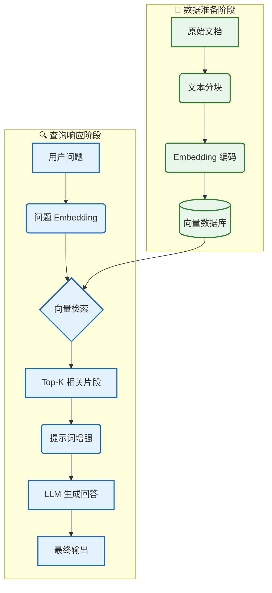
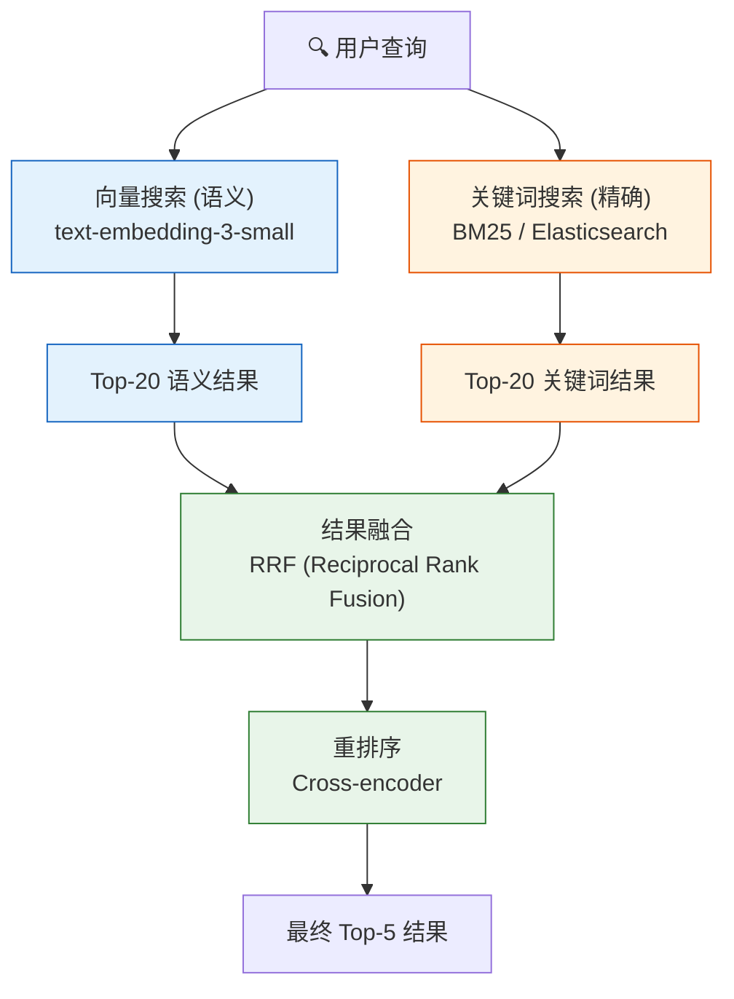
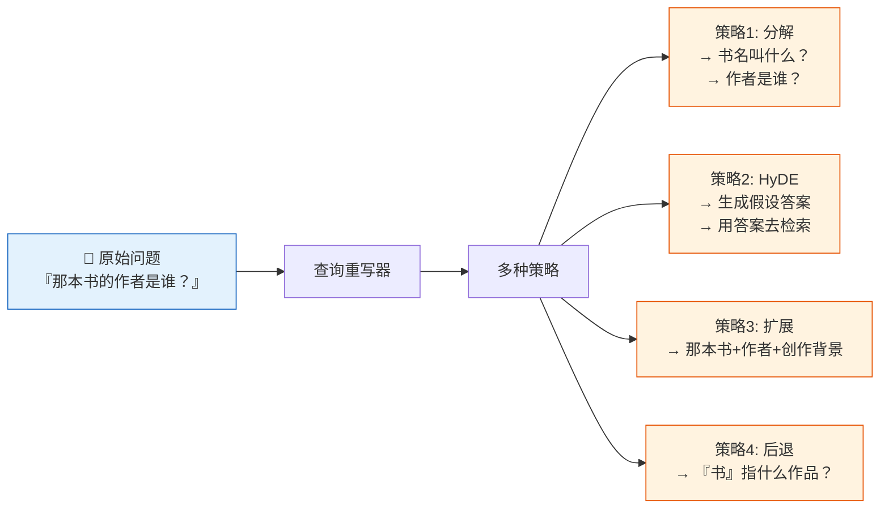

# 🔵 阶段二：进阶期 - RAG 应用

> 📖 **本文档为《AI 前端开发体系化学习指南》的阶段拆分文档**
> 完整指南请查看：[README.md](./README.md)

---

> 🎯 **阶段目标**：打破 LLM 知识截止限制，构建基于私有数据的智能问答系统。

### 📑 本章目录
- [核心能力指标](#-核心能力指标)
- [核心概念解析](#-核心概念解析)
  - [RAG 架构全景图](#21-rag-架构全景图)
  - [核心概念对照表](#22-核心概念对照表)
- [环境搭建](#️-环境搭建)
- [核心实现](#-核心实现)
  - [文档加载与解析](#25-文档加载与解析)
  - [智能分块策略](#26-智能分块策略)
  - [向量化与存储](#27-向量化与存储)
  - [RAG 链构建](#28-rag-链构建)
- [实战项目](#-阶段二实战项目)

### 💡 你将学到
- RAG（检索增强生成）的完整架构与工作原理
- 文本分块（Chunking）策略与 Embedding 向量化技术
- 使用 [LangChain](https://langchain.com).js 搭建企业级 RAG 流水线
- 向量数据库（[Pinecone](https://www.pinecone.io)）的集成与语义搜索
- 检索质量优化：重排序、混合检索、查询扩展

### 🔗 前置知识
- 完成 [🟢 阶段一：入门期](./01-入门期-AI聊天室.md)
- 熟悉 Node.js 文件系统与异步编程
- 了解 HTTP API 与基础网络概念

### 📚 核心能力指标
- [ ] 深入理解 RAG (检索增强生成) 架构原理
- [ ] 掌握文本分块 (Chunking) 与向量化 (Embedding) 技术
- [ ] 熟练使用向量数据库 ([Pinecone](https://www.pinecone.io)/[Milvus](https://milvus.io)/[Chroma](https://www.trychroma.com)) 进行语义搜索
- [ ] 构建完整的 `检索 -> 增强 -> 生成` 流水线
- [ ] 掌握检索质量优化策略 (重排序、混合检索)

### 🧠 核心概念解析

#### 2.1 RAG 架构全景图



#### 2.2 核心概念对照表

| 概念 | 通俗解释 | 技术实现 |
|:---|:---|:---|
| **Embedding** | 将文字翻译成数学坐标 | `text-embedding-3-small` (1536 维) |
| **向量数据库** | 语义搜索引擎 | Pinecone, Milvus, Chroma |
| **相似度** | 坐标轴上的距离 | 余弦相似度 (Cosine Similarity) |
| **分块 (Chunking)** | 把长文章切成小段落 | 固定长度、递归字符、语义分块 |
| **上下文窗口** | LLM 的短期记忆容量 | 4K, 8K, 32K, 128K Tokens |

### 🛠️ 环境搭建

#### 2.3 项目初始化

```bash
# 🚀 创建项目
npx create-next-app@latest rag-app --typescript --tailwind --app

cd rag-app

# 📦 安装 LangChain.js 生态
npm install langchain @langchain/openai @langchain/pinecone
npm install @pinecone-database/pinecone

# 📄 安装文档解析依赖
npm install pdf-parse mammoth cheerio
```

#### 2.4 环境变量配置

```env
# .env.local
OPENAI_API_KEY=sk-your-openai-key
PINECONE_API_KEY=pc-your-pinecone-key
PINECONE_ENVIRONMENT=us-east-1
PINECONE_INDEX_NAME=rag-documents
```

### 💻 核心实现

#### 2.5 文档加载与解析

```typescript
// lib/document-loaders.ts
import * as fs from 'fs/promises';
import pdfParse from 'pdf-parse';
import mammoth from 'mammoth';

export interface Document {
  content: string;
  metadata: { source: string; type: string; [key: string]: unknown };
}

export class DocumentLoader {
  static async loadPDF(filePath: string): Promise<Document> {
    const buffer = await fs.readFile(filePath);
    const result = await pdfParse(buffer);
    return {
      content: result.text,
      metadata: { source: filePath, type: 'pdf', pages: result.numpages },
    };
  }

  static async loadWord(filePath: string): Promise<Document> {
    const buffer = await fs.readFile(filePath);
    const result = await mammoth.extractRawText({ buffer });
    return { content: result.value, metadata: { source: filePath, type: 'docx' } };
  }

  static async loadText(filePath: string): Promise<Document> {
    const content = await fs.readFile(filePath, 'utf-8');
    return { content, metadata: { source: filePath, type: 'txt' } };
  }
}
```

#### 2.6 智能分块策略

```typescript
// lib/text-splitter.ts
export class TextSplitter {
  // 📏 递归字符分块 (推荐)
  static splitRecursive(text: string, chunkSize = 1000, overlap = 200): string[] {
    const chunks: string[] = [];
    let start = 0;
    while (start < text.length) {
      const end = Math.min(start + chunkSize, text.length);
      chunks.push(text.slice(start, end));
      if (end >= text.length) break;
      start = end - overlap;
    }
    return chunks;
  }

  // 📄 按段落分块 (保持语义完整性)
  static splitByParagraphs(text: string, chunkSize = 1000): string[] {
    const paragraphs = text.split(/\n\s*\n/);
    const chunks: string[] = [];
    let currentChunk = '';

    for (const para of paragraphs) {
      if ((currentChunk + para).length > chunkSize && currentChunk) {
        chunks.push(currentChunk.trim());
        currentChunk = para;
      } else {
        currentChunk = currentChunk ? currentChunk + '\n\n' + para : para;
      }
    }
    if (currentChunk) chunks.push(currentChunk.trim());
    return chunks;
  }
}
```

#### 2.7 向量化与存储


```typescript
// lib/vector-store.ts
import { OpenAIEmbeddings } from '@langchain/openai';
import { Pinecone } from '@pinecone-database/pinecone';
import { PineconeStore } from '@langchain/pinecone';
import { Document as LCDocument } from '@langchain/core/documents';

export interface VectorStoreConfig {
  indexName: string;
  namespace?: string;
}

export class VectorStoreManager {
  private embeddings: OpenAIEmbeddings;
  private pinecone: Pinecone;
  private config: VectorStoreConfig;

  constructor(config: VectorStoreConfig) {
    this.embeddings = new OpenAIEmbeddings({ model: 'text-embedding-3-small', dimensions: 1536 });
    this.pinecone = new Pinecone({ apiKey: process.env.PINECONE_API_KEY! });
    this.config = config;
  }

  // 📥 添加文档到向量库
  async addDocuments(docs: Array<{ content: string; metadata?: Record<string, unknown> }>): Promise<void> {
    const index = this.pinecone.Index(this.config.indexName);
    const lcDocs = docs.map(d => new LCDocument({ pageContent: d.content, metadata: d.metadata || {} }));
    await PineconeStore.fromDocuments(lcDocs, this.embeddings, { pineconeIndex: index, namespace: this.config.namespace });
  }

  // 🔍 语义搜索
  async search(query: string, topK = 5): Promise<Array<{ content: string; metadata: Record<string, unknown>; score: number }>> {
    const index = this.pinecone.Index(this.config.indexName);
    const vectorStore = new PineconeStore(this.embeddings, { pineconeIndex: index, namespace: this.config.namespace });
    const results = await vectorStore.similaritySearchWithScore(query, topK);
    return results.map(([doc, score]) => ({ content: doc.pageContent, metadata: doc.metadata as Record<string, unknown>, score }));
  }
}
```

#### 2.8 RAG 链构建

```typescript
// lib/rag-chain.ts
import { ChatOpenAI } from '@langchain/openai';
import { PromptTemplate } from '@langchain/core/prompts';
import { StringOutputParser } from '@langchain/core/output_parsers';
import { RunnableSequence, RunnablePassthrough } from '@langchain/core/runnables';
import { VectorStoreManager } from './vector-store';

export interface RAGResponse { answer: string; sources: Array<{ content: string; score: number }> }

export class RAGChain {
  private llm: ChatOpenAI;
  private vectorStore: VectorStoreManager;
  private chain: RunnableSequence;

  constructor(vectorStore: VectorStoreManager) {
    this.vectorStore = vectorStore;
    this.llm = new ChatOpenAI({ model: 'gpt-4o', temperature: 0.3 });
    this.chain = this.buildChain();
  }

  private buildChain(): RunnableSequence {
    const prompt = PromptTemplate.fromTemplate(`
你是一个专业的知识助手。请基于以下参考资料回答用户问题。
如果资料中没有相关信息，请明确说明。

参考资料：
{context}

用户问题：{question}
回答：`);

    const retriever = RunnablePassthrough.fromConfig<{ question: string }>(
      async (input) => {
        const results = await this.vectorStore.search(input.question, 5);
        return results.map(r => r.content).join('\n\n---\n\n');
      }
    );

    return RunnableSequence.from([
      { context: retriever, question: new RunnablePassthrough() },
      prompt,
      this.llm,
      new StringOutputParser(),
    ]);
  }

  async query(question: string): Promise<RAGResponse> {
    const [sources, answer] = await Promise.all([
      this.vectorStore.search(question, 5),
      this.chain.invoke(question),
    ]);
    return { answer, sources };
  }
}
```

---

### 🔀 混合检索 (Hybrid Search)

> **向量 + 关键词融合**：向量搜索捕获语义相似性，关键词搜索保证精确匹配，二者互补。



#### RRF (Reciprocal Rank Fusion) 算法

```typescript
// lib/hybrid-search.ts
export class HybridSearch {
  private vectorStore: VectorStoreManager;
  
  async search(
    query: string,
    options: {
      topK: number;
      alpha: number; // 0 = 纯关键词, 1 = 纯向量
    } = { topK: 5, alpha: 0.5 }
  ): Promise<ScoredResult[]> {
    // 1. 向量搜索
    const vectorResults = await this.vectorStore.search(query, 20);
    
    // 2. 关键词搜索 (BM25)
    const keywordResults = await this.keywordSearch(query, 20);
    
    // 3. RRF 融合
    const fused = this.rrfFusion(vectorResults, keywordResults, 60);
    
    // 4. 按 alpha 加权重排序
    const weighted = fused.map(item => ({
      ...item,
      score: options.alpha * item.vectorScore 
             + (1 - options.alpha) * item.keywordScore,
    }));
    
    return weighted.sort((a, b) => b.score - a.score).slice(0, options.topK);
  }

  private rrfFusion(
    vector: ScoredResult[],
    keyword: ScoredResult[],
    k: number = 60
  ): RankedResult[] {
    const rankMap = new Map<string, { vectorRank: number; keywordRank: number }>();
    
    vector.forEach((item, i) => {
      rankMap.set(item.id, { vectorRank: i + 1, keywordRank: Infinity });
    });
    keyword.forEach((item, i) => {
      const existing = rankMap.get(item.id);
      rankMap.set(item.id, {
        vectorRank: existing?.vectorRank ?? Infinity,
        keywordRank: i + 1,
      });
    });
    
    return Array.from(rankMap.entries()).map(([id, ranks]) => ({
      id,
      rrfScore: (1 / (k + ranks.vectorRank)) + (1 / (k + ranks.keywordRank)),
      vectorScore: 1 / (k + ranks.vectorRank),
      keywordScore: 1 / (k + ranks.keywordRank),
    })).sort((a, b) => b.rrfScore - a.rrfScore);
  }
}
```

| 检索方式 | 优势 | 劣势 | 适用场景 |
|:---|:---|:---|:---|
| **纯向量搜索** | 语义理解强，同义词匹配 | 精确匹配弱，罕见词召回差 | 开放域问答 |
| **纯关键词搜索 (BM25)** | 精确匹配强，速度快 | 无法理解语义 | 专有名词搜索、代码搜索 |
| **混合检索** | 兼顾语义 + 精确 | 多一次检索，延迟增加 | 生产级 RAG（推荐） |

---

### 📐 高级分块策略对比

> **分块质量 = RAG 质量**：分块策略直接影响检索准确率，不同文档类型需要不同策略。

| 策略 | 实现方式 | 最佳文档类型 | 检索准确率 | 块数控制 |
|:---|:---|:---|:---:|:---:|
| **固定长度** | 按字符/Token 数硬切 | 结构统一的文本 | ⭐⭐ | ✅ |
| **递归分块** | 按段落 → 句子 → 字符递归切分 | 通用文档（推荐） | ⭐⭐⭐ | ✅ |
| **语义分块** | 检测主题/语义边界 | 长文、研究报告 | ⭐⭐⭐⭐ | ❌ |
| **Agentic 分块** | LLM 判断自然断点 | 复杂混合内容 | ⭐⭐⭐⭐⭐ | ❌ |
| **特定格式** | 解析 HTML/Markdown/代码 AST | 结构化内容 | ⭐⭐⭐⭐ | ✅ |

```typescript
// 语义分块实现（基于 Embedding 相似度检测主题转折）
export class SemanticChunker {
  async split(text: string, maxChunkSize = 1000): Promise<string[]> {
    // 1. 按句子分割
    const sentences = text.match(/[^。！？\n]+[。！？\n]/g) || [text];
    
    // 2. 对每对相邻句子计算语义相似度
    const embeddings = await this.embedder.embedBatch(sentences);
    const breaks: number[] = [0];
    
    for (let i = 1; i < sentences.length; i++) {
      const similarity = cosineSimilarity(embeddings[i - 1], embeddings[i]);
      if (similarity < 0.5) breaks.push(i); // 语义转折点
    }
    
    // 3. 按转折点合并段落，不超过 maxChunkSize
    return this.mergeChunks(sentences, breaks, maxChunkSize);
  }
  
  private cosineSimilarity(a: number[], b: number[]): number {
    const dot = a.reduce((s, v, i) => s + v * b[i], 0);
    const normA = Math.sqrt(a.reduce((s, v) => s + v * v, 0));
    const normB = Math.sqrt(b.reduce((s, v) => s + v * b[i], 0));
    return dot / (normA * normB);
  }
}
```

---

### 📊 查询重写与扩展 (Query Transformation)

> **提升检索命中率**：用户原始问题往往不适合直接检索，需要"转化"为更易匹配的形式。



```typescript
// 查询重写器
export class QueryRewriter {
  constructor(private llm: ChatOpenAI) {}

  async rewrite(original: string, strategy: 'decompose' | 'hyde' | 'expand' | 'stepback'): Promise<string[]> {
    const prompts: Record<string, string> = {
      decompose: `将以下问题分解为 2-3 个更具体的子问题：\n${original}`,
      hyde: `假设你已经知道了答案，请生成一段包含详细信息的假设回答：\n${original}`,
      expand: `扩展以下查询，补充同义词和相关术语：\n${original}`,
      stepback: `为了回答这个问题，我们需要先知道什么更一般的信息？\n${original}`,
    };

    const response = await this.llm.invoke(prompts[strategy]);
    return this.parseQueries(response.content);
  }
}
```

---

### 🎯 检索质量评估体系

> **无评估，不优化**：建立量化指标是持续改进 RAG 的前提。

| 指标 | 计算方式 | 目标值 | 测量方法 |
|:---|:---|:---:|:---|
| **命中率 (Hit Rate)** | 检索结果包含答案的比例 | > 85% | 人工标注的 Q&A 测试集 |
| **MRR** | 首个正确答案的平均倒数排名 | > 0.8 | 同上 |
| **NDCG@K** | 考虑排序位置的累积增益 | > 0.75 | 多级相关性评分 |
| **检索延迟 P95** | 检索阶段 95% 分位延迟 | < 500ms | 生产环境采样 |
| **上下文利用率** | 最终回答实际引用的检索片段比例 | > 60% | LLM 输出解析 |

```typescript
// 评估脚本
class RAGEvaluator {
  async evaluate(testSet: QAPair[]): Promise<EvaluationReport> {
    let hits = 0;
    const reciprocalRanks: number[] = [];
    
    for (const { question, groundTruth } of testSet) {
      const results = await this.retriever.search(question, 5);
      
      // 检查是否有结果包含标准答案
      const hitIndex = results.findIndex(r => 
        this.containsGroundTruth(r.content, groundTruth)
      );
      
      if (hitIndex >= 0) {
        hits++;
        reciprocalRanks.push(1 / (hitIndex + 1));
      }
    }
    
    return {
      hitRate: hits / testSet.length,
      mrr: reciprocalRanks.reduce((a, b) => a + b, 0) / testSet.length,
      totalTests: testSet.length,
    };
  }
}
```

---

### 🏆 阶段二实战项目

| 项目 | 难度 | 核心考察点 | 完成标准 |
|:---|:---:|:---|:---|
| 🟢 **个人知识库** | ⭐⭐ | 文档解析、分块、向量化 | 支持 PDF/TXT 上传与检索 |
| 🔵 **智能问答系统** | ⭐⭐⭐ | RAG 链、引用来源、流式输出 | 回答准确，附带参考链接 |
| 🟣 **高级检索** | ⭐⭐⭐⭐ | 混合检索、重排序、查询扩展 | 检索准确率 (Hit Rate) > 80% |

---

### 📌 导航

| [⬅️ 上一阶段：入门期](./01-入门期-AI聊天室.md) | [🏠 返回主指南](./README.md) | [➡️ 下一阶段：深耕期 - 端侧推理](./03-深耕期-端侧推理.md) |
|:---:|:---:|:---:|