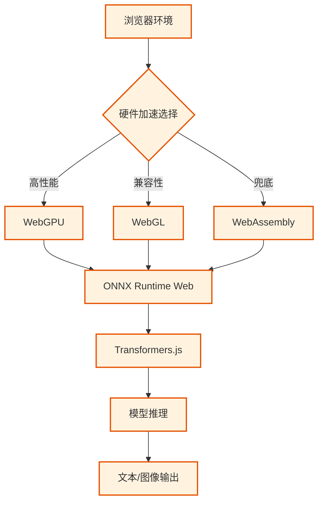
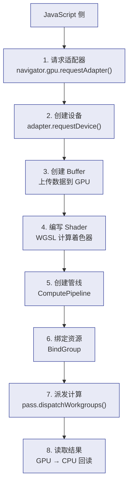
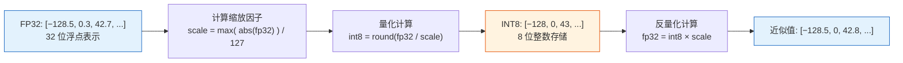

# 🟣 阶段三：深耕期 - 端侧推理

> 📖 **本文档为《AI 前端开发体系化学习指南》的阶段拆分文档**
> 完整指南请查看：[README.md](./README.md)

---

> 🎯 **阶段目标**：突破云端限制，在浏览器端实现隐私保护、零延迟的 AI 推理。

### 📑 本章目录
- [核心能力指标](#-核心能力指标)
- [核心概念解析](#-核心概念解析)
  - [端侧推理架构](#31-端侧推理架构)
  - [技术栈对比](#32-技术栈对比)
- [环境搭建](#️-环境搭建)
- [核心实现](#-核心实现)
  - [Transformers.js Pipeline](#34-transformersjs-核心-pipeline)
  - [[WebGPU](https://www.w3.org/TR/webgpu/) 加速引擎](#35-[WebGPU](https://www.w3.org/TR/webgpu/)-加速引擎)
- [实战项目](#-阶段三实战项目)

### 💡 你将学到
- 浏览器端机器学习原理（[WebAssembly](https://webassembly.org).org) / [WebGPU](https://www.w3.org/TR/webgpu/) / WebGL）
- Transformers.js 的 Pipeline 机制与模型懒加载
- [ONNX](https://onnxruntime.ai) 格式量化模型的加载与运行
- [WebGPU](https://www.w3.org/TR/webgpu/) 硬件加速推理与 GPU 适配降级
- IndexedDB 模型缓存与离线可用性实现

### 🔗 前置知识
- 完成 [🔵 阶段二：进阶期](./02-进阶期-RAG应用.md)
- 了解浏览器性能 API（performance, navigator）
- 熟悉 JavaScript 异步编程与 ArrayBuffer

### 📚 核心能力指标
- [ ] 理解浏览器端机器学习原理 ([WebAssembly](https://webassembly.org).org) / [WebGPU](https://www.w3.org/TR/webgpu/))
- [ ] 掌握 Transformers.js 核心 API 与 Pipeline 机制
- [ ] 能够加载并运行 [ONNX](https://onnxruntime.ai) 格式的量化模型
- [ ] 实现 [WebGPU](https://www.w3.org/TR/webgpu/) 加速推理，优化内存占用
- [ ] 管理模型缓存 (IndexedDB) 与离线可用性功能

### 🧠 核心概念解析

#### 3.1 端侧推理架构



#### 3.2 技术栈对比

| 技术 | 优势 | 劣势 | 适用场景 |
|:---|:---|:---|:---|
| **WebGPU** | 极致性能，支持通用计算 | 兼容性较新 (Chrome 113+) | 大规模矩阵运算、大模型推理 |
| **WebGL** | 广泛兼容，图形渲染强 | API 繁琐，非通用计算设计 | 轻量级模型、可视化 |
| **WebAssembly.org)** | 接近原生 CPU 性能 | 无法利用 GPU 并行 | 传统 ML 算法、兜底方案 |

### 🛠️ 环境搭建

#### 3.3 项目初始化

```bash
# 🚀 创建项目
npx create-next-app@latest edge-ai --typescript --tailwind --app
cd edge-ai

# 📦 安装 Transformers.js
npm install @huggingface/transformers
```

### 💻 核心实现

#### 3.4 Transformers.js 核心 Pipeline

```typescript
// lib/transformers-pipeline.ts
import { pipeline, env, Pipeline } from '@huggingface/transformers';

// ⚙️ 全局配置
env.allowLocalModels = false;
env.useBrowserCache = true;

export class TransformersPipeline {
  private pipelines: Map<string, Pipeline> = new Map();

  // 🚀 懒加载 Pipeline
  async getPipeline(task: string, model?: string): Promise<Pipeline> {
    const key = `${task}:${model || 'default'}`;
    if (this.pipelines.has(key)) return this.pipelines.get(key)!;

    const defaultModels: Record<string, string> = {
      'text-generation': 'onnx-community/Qwen2.5-0.5B-Instruct',
      'text-classification': 'Xenova/distilbert-base-uncased-finetuned-sst-2-english',
      'feature-extraction': 'Xenova/all-MiniLM-L6-v2',
    };

    const p = await pipeline(task, model || defaultModels[task], { dtype: 'q4' }); // 4-bit 量化
    this.pipelines.set(key, p);
    return p;
  }

  // 💬 文本生成
  async generateText(prompt: string, maxTokens = 256): Promise<string> {
    const generator = await this.getPipeline('text-generation');
    const res = await generator(prompt, { max_new_tokens: maxTokens, temperature: 0.7 });
    return res[0].generated_text;
  }

  // 📊 文本分类 (情感分析)
  async classifyText(text: string): Promise<Array<{ label: string; score: number }>> {
    const classifier = await this.getPipeline('text-classification');
    return await classifier(text);
  }

  // 🔢 文本向量化
  async embedText(text: string): Promise<Float32Array> {
    const extractor = await this.getPipeline('feature-extraction');
    const res = await extractor(text, { pooling: 'mean', normalize: true });
    return res.data as Float32Array;
  }
}
```

#### 3.5 [WebGPU](https://www.w3.org/TR/webgpu/) 加速引擎

```typescript
// lib/webgpu-engine.ts
export class WebGPUEngine {
  private device: GPUDevice | null = null;

  async initialize(): Promise<boolean> {
    if (!('gpu' in navigator)) return false;
    try {
      const adapter = await navigator.gpu.requestAdapter();
      if (!adapter) return false;
      this.device = await adapter.requestDevice();
      console.log('✅ WebGPU 初始化成功');
      return true;
    } catch (e) {
      console.warn('❌ WebGPU 不可用，回退到 WASM');
      return false;
    }
  }

  // 🧮 矩阵乘法 (GPU 并行计算示例)
  async matrixMultiply(a: Float32Array, b: Float32Array): Promise<Float32Array> {
    if (!this.device) throw new Error('WebGPU 未初始化');
    // ... 省略具体 Shader 编写与 Buffer 绑定逻辑 ...
    // 实际开发中通常直接使用 Transformers.js 的 WebGPU 后端
    return new Float32Array();
  }
}
```

---

### ⚡ [WebGPU](https://www.w3.org/TR/webgpu/) Compute Shader 编程详解

> **深入 GPU 编程**：理解 Compute Shader 是优化端侧推理性能的关键，本节用矩阵乘法示例讲解完整的 [WebGPU](https://www.w3.org/TR/webgpu/) 计算管线。

#### [WebGPU](https://www.w3.org/TR/webgpu/) 计算管线架构



#### WGSL ([WebGPU](https://www.w3.org/TR/webgpu/) Shading Language) 基础

```wgsl
// Matrix Multiply Compute Shader (WGSL)
@group(0) @binding(0) var<storage, read> a: array<f32>;  // 输入矩阵 A
@group(0) @binding(1) var<storage, read> b: array<f32>;  // 输入矩阵 B
@group(0) @binding(2) var<storage, read_write> c: array<f32>; // 输出矩阵 C

const BLOCK_SIZE: u32 = 16u;

@compute @workgroup_size(BLOCK_SIZE, BLOCK_SIZE)
fn main(@builtin(global_invocation_id) gid: vec3<u32>) {
    let row = gid.y;
    let col = gid.x;
    let k = u32(128u); // 矩阵维度
    
    var sum = 0.0;
    for (var i = 0u; i < k; i = i + 1u) {
        sum = sum + a[row * k + i] * b[i * k + col];
    }
    c[row * k + col] = sum;
}
```

| WGSL 概念 | 类比 JavaScript | 用途 |
|:---|:---|:---|
| `@group(N) @binding(M)` | 函数参数声明 | 绑定 GPU 资源（Buffer/Texture） |
| `@compute` | async function | 标记为计算着色器入口 |
| `@workgroup_size(X, Y, Z)` | Promise.all 并行度 | 每个工作组包含的线程数 |
| `var<storage, read>` | const 参数 | 只读存储缓冲区 |
| `global_invocation_id` | 循环索引 | 当前线程的全局 ID |

#### 完整 [WebGPU](https://www.w3.org/TR/webgpu/) 计算管线

```typescript
// webgpu-compute.ts - 完整计算管线
export class WebGPUComputeEngine {
  private device: GPUDevice | null = null;
  private queue: GPUQueue | null = null;

  async init(): Promise<void> {
    const adapter = await navigator.gpu.requestAdapter({
      powerPreference: 'high-performance',
    });
    if (!adapter) throw new Error('No WebGPU adapter found');
    
    this.device = await adapter.requestDevice();
    this.queue = this.device.queue;
  }

  // 矩阵乘法完整实现
  async matmul(
    size: number,
    matA: Float32Array,
    matB: Float32Array,
  ): Promise<Float32Array> {
    if (!this.device || !this.queue) throw new Error('Not initialized');

    // 1. 创建 GPU Buffer
    const bufferA = this.device.createBuffer({
      size: matA.byteLength,
      usage: GPUBufferUsage.STORAGE | GPUBufferUsage.COPY_DST,
    });
    const bufferB = this.device.createBuffer({
      size: matB.byteLength,
      usage: GPUBufferUsage.STORAGE | GPUBufferUsage.COPY_DST,
    });
    const bufferC = this.device.createBuffer({
      size: matA.byteLength, // 同维度方阵
      usage: GPUBufferUsage.STORAGE | GPUBufferUsage.COPY_SRC,
    });
    const readBuffer = this.device.createBuffer({
      size: matA.byteLength,
      usage: GPUBufferUsage.MAP_READ | GPUBufferUsage.COPY_DST,
    });

    // 2. 上传数据到 GPU
    this.queue.writeBuffer(bufferA, 0, matA);
    this.queue.writeBuffer(bufferB, 0, matB);

    // 3. 编译 Shader
    const shaderModule = this.device.createShaderModule({
      code: MATMUL_SHADER_CODE, // 上面的 WGSL 代码
    });

    // 4. 创建计算管线
    const pipeline = this.device.createComputePipeline({
      layout: 'auto',
      compute: { module: shaderModule, entryPoint: 'main' },
    });

    // 5. 绑定资源
    const bindGroup = this.device.createBindGroup({
      layout: pipeline.getBindGroupLayout(0),
      entries: [
        { binding: 0, resource: { buffer: bufferA } },
        { binding: 1, resource: { buffer: bufferB } },
        { binding: 2, resource: { buffer: bufferC } },
      ],
    });

    // 6. 编码并提交命令
    const encoder = this.device.createCommandEncoder();
    const pass = encoder.beginComputePass();
    pass.setPipeline(pipeline);
    pass.setBindGroup(0, bindGroup);
    pass.dispatchWorkgroups(Math.ceil(size / 16), Math.ceil(size / 16));
    pass.end();

    // 7. 复制结果到可读 Buffer
    encoder.copyBufferToBuffer(bufferC, 0, readBuffer, 0, matA.byteLength);
    this.queue.submit([encoder.finish()]);

    // 8. 回读结果
    await readBuffer.mapAsync(GPUMapMode.READ);
    const result = new Float32Array(readBuffer.getMappedRange());
    const output = new Float32Array(result);
    readBuffer.unmap();

    // 清理
    bufferA.destroy(); bufferB.destroy(); bufferC.destroy(); readBuffer.destroy();

    return output;
  }
}
```

#### [WebGPU](https://www.w3.org/TR/webgpu/) 内存优化策略

| 技术 | 说明 | 效果 |
|:---|:---|:---|
| **Buffer 复用池** | 预分配固定大小 Buffer，避免重复创建/销毁 | 减少 40% 内存分配开销 |
| **Ping-Pong Buffer** | 双 Buffer 交替使用，流水线数据读写 | 提高 GPU 利用率 |
| **子区域映射** | 只映射需要的 Buffer 片段，而非全量 | 减少 CPU-GPU 拷贝 |
| **Texture 替代 Buffer** | 利用 Texture 缓存局部性更优的特点 | 矩阵运算提速 20% |

```typescript
// Buffer 复用池实现
class GPUBufferPool {
  private pool: Map<number, GPUBuffer[]> = new Map();
  
  acquire(device: GPUDevice, size: number, usage: number): GPUBuffer {
    const buffers = this.pool.get(size) || [];
    if (buffers.length > 0) return buffers.pop()!;
    return device.createBuffer({ size, usage });
  }
  
  release(buffer: GPUBuffer): void {
    const size = buffer.size;
    if (!this.pool.has(size)) this.pool.set(size, []);
    this.pool.get(size)!.push(buffer);
  }
  
  destroyAll(): void {
    for (const buffers of this.pool.values()) {
      for (const buffer of buffers) buffer.destroy();
    }
    this.pool.clear();
  }
}
```

---

### 🔢 模型量化技术详解

> **量化是端侧推理的核心**：将 FP32 模型压缩为 INT4/INT8，使 7B 模型从 28GB 缩减至 4GB。

#### 量化精度对比

| 精度 | 位数 | 模型大小 (7B) | 质量损失 | 速度提升 |
|:---:|:---:|:---:|:---:|:---:|
| FP32 | 32bit | 28GB | 基准 | 1x |
| FP16 | 16bit | 14GB | 几乎无损 | 1.5x |
| INT8 | 8bit | 7GB | 轻微 | 2x |
| INT4 | 4bit | 3.5GB | 可接受 | 3x |
| NF4 | 4bit | 3.5GB | 优于 INT4 | 3x |
| INT2 | 2bit | 1.75GB | 显著下降 | 4x |

#### 量化原理（以 INT8 为例）



#### 常用量化方法

| 方法 | 原理 | 质量表现 | 实现复杂度 |
|:---|:---|:---:|:---:|
| **RTN** (Round To Nearest) | 四舍五入到最近整数 | ⭐⭐⭐ | 🟢 低 |
| **GPTQ** | 基于 Hessian 矩阵的逐层量化 | ⭐⭐⭐⭐ | 🟡 中 |
| **AWQ** | 保留重要权重的精度（Llama 常用） | ⭐⭐⭐⭐⭐ | 🔴 高 |
| **GGUF** | Llama.cpp 的混合精度格式 | ⭐⭐⭐⭐ | 🟡 中 |

#### Transformers.js 中的量化模型加载

```typescript
// 量化模型加载与使用
import { pipeline, env } from '@huggingface/transformers';

// 配置优先使用量化模型
env.allowLocalModels = true;
env.useBrowserCache = true;

// 使用 INT4 量化模型（自动下载）
const classifier = await pipeline(
  'text-classification',
  'Xenova/distilbert-base-uncased-q4', // q4 后缀表示 INT4 量化
  { quantized: true }
);

// 自定义量化级别
const generator = await pipeline('text-generation', 'Xenova/Qwen2.5-0.5B-Instruct', {
  quantized: true,
  dtype: 'q4', // 'fp32' | 'fp16' | 'q8' | 'q4'
  device: 'webgpu', // 优先使用 WebGPU 运行
});

// 运行推理
const result = await generator('告诉我北京有哪些景点', {
  max_new_tokens: 128,
  temperature: 0.7,
});
```

---

### 🏆 阶段三实战项目

| 项目 | 难度 | 核心考察点 | 完成标准 |
|:---|:---:|:---|:---|
| 🟢 **离线文本分类** | ⭐⭐ | 模型加载、情感分析 | 断网可用，响应 < 100ms |
| 🔵 **端侧文本生成** | ⭐⭐⭐ | Qwen2.5-0.5B 运行、流式生成 | 浏览器内流畅对话 |
| 🟣 **图像理解应用** | ⭐⭐⭐⭐ | 图像分类、目标检测 | 实时摄像头检测 |

---

### 📎 延伸阅读

| 文档 | 内容 | 相关章节 |
|:---|:---|:---|
| [📊 技术选型对比合集](./07-技术选型对比合集.md) | WebGPU/ONNX/Transformers.js 横向对比 | 边缘计算方案、性能基准 |
| [🛠️ 开发实战与架构指南](./08-开发实战与架构指南.md) | 前端性能优化 Checklist、WebGPU 加速 | 第6章：性能优化终极 Checklist |

---

### 📌 导航

| [⬅️ 上一阶段：进阶期](./02-进阶期-RAG应用.md) | [🏠 返回主指南](./README.md) | [➡️ 下一阶段：专家期 - Agent](./04-专家期-Agent设计.md) |
|:---:|:---:|:---:|

