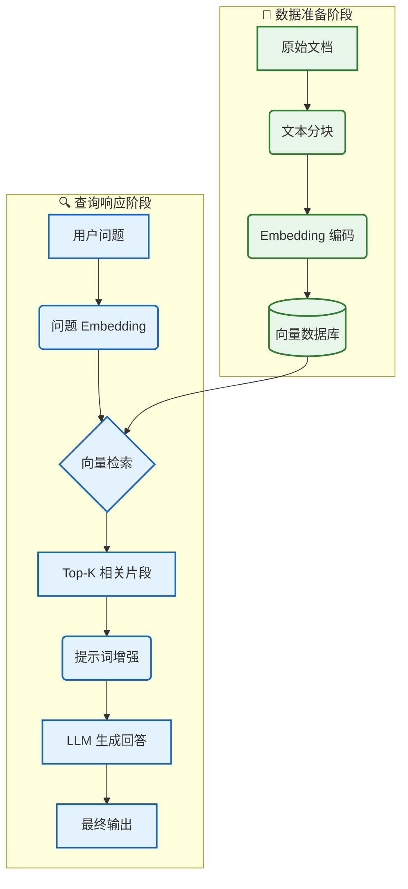

# 🔵 阶段二：进阶期 - RAG 应用

> 📖 **本文档为《AI 前端开发体系化学习指南》的阶段拆分文档**
> 完整指南请查看：[01-AI前端开发体系化学习指南.md](./01-AI前端开发体系化学习指南.md)

---

> 🎯 **阶段目标**：打破 LLM 知识截止限制，构建基于私有数据的智能问答系统。

### 📚 核心能力指标
- [ ] 深入理解 RAG (检索增强生成) 架构原理
- [ ] 掌握文本分块 (Chunking) 与向量化 (Embedding) 技术
- [ ] 熟练使用向量数据库 (Pinecone/Milvus/Chroma) 进行语义搜索
- [ ] 构建完整的 `检索 -> 增强 -> 生成` 流水线
- [ ] 掌握检索质量优化策略 (重排序、混合检索)

### 🧠 核心概念解析

#### 2.1 RAG 架构全景图



#### 2.2 核心概念对照表

| 概念 | 通俗解释 | 技术实现 |
|:---|:---|:---|
| **Embedding** | 将文字翻译成数学坐标 | `text-embedding-3-small` (1536 维) |
| **向量数据库** | 语义搜索引擎 | Pinecone, Milvus, Chroma |
| **相似度** | 坐标轴上的距离 | 余弦相似度 (Cosine Similarity) |
| **分块 (Chunking)** | 把长文章切成小段落 | 固定长度、递归字符、语义分块 |
| **上下文窗口** | LLM 的短期记忆容量 | 4K, 8K, 32K, 128K Tokens |

### 🛠️ 环境搭建

#### 2.3 项目初始化

```bash
# 🚀 创建项目
npx create-next-app@latest rag-app --typescript --tailwind --app

cd rag-app

# 📦 安装 LangChain.js 生态
npm install langchain @langchain/openai @langchain/pinecone
npm install @pinecone-database/pinecone

# 📄 安装文档解析依赖
npm install pdf-parse mammoth cheerio
```

#### 2.4 环境变量配置

```env
# .env.local
OPENAI_API_KEY=sk-your-openai-key
PINECONE_API_KEY=pc-your-pinecone-key
PINECONE_ENVIRONMENT=us-east-1
PINECONE_INDEX_NAME=rag-documents
```

### 💻 核心实现

#### 2.5 文档加载与解析

```typescript
// lib/document-loaders.ts
import * as fs from 'fs/promises';
import pdfParse from 'pdf-parse';
import mammoth from 'mammoth';

export interface Document {
  content: string;
  metadata: { source: string; type: string; [key: string]: unknown };
}

export class DocumentLoader {
  static async loadPDF(filePath: string): Promise<Document> {
    const buffer = await fs.readFile(filePath);
    const result = await pdfParse(buffer);
    return {
      content: result.text,
      metadata: { source: filePath, type: 'pdf', pages: result.numpages },
    };
  }

  static async loadWord(filePath: string): Promise<Document> {
    const buffer = await fs.readFile(filePath);
    const result = await mammoth.extractRawText({ buffer });
    return { content: result.value, metadata: { source: filePath, type: 'docx' } };
  }

  static async loadText(filePath: string): Promise<Document> {
    const content = await fs.readFile(filePath, 'utf-8');
    return { content, metadata: { source: filePath, type: 'txt' } };
  }
}
```

#### 2.6 智能分块策略

```typescript
// lib/text-splitter.ts
export class TextSplitter {
  // 📏 递归字符分块 (推荐)
  static splitRecursive(text: string, chunkSize = 1000, overlap = 200): string[] {
    const chunks: string[] = [];
    let start = 0;
    while (start < text.length) {
      const end = Math.min(start + chunkSize, text.length);
      chunks.push(text.slice(start, end));
      if (end >= text.length) break;
      start = end - overlap;
    }
    return chunks;
  }

  // 📄 按段落分块 (保持语义完整性)
  static splitByParagraphs(text: string, chunkSize = 1000): string[] {
    const paragraphs = text.split(/\n\s*\n/);
    const chunks: string[] = [];
    let currentChunk = '';

    for (const para of paragraphs) {
      if ((currentChunk + para).length > chunkSize && currentChunk) {
        chunks.push(currentChunk.trim());
        currentChunk = para;
      } else {
        currentChunk = currentChunk ? currentChunk + '\n\n' + para : para;
      }
    }
    if (currentChunk) chunks.push(currentChunk.trim());
    return chunks;
  }
}
```

#### 2.7 向量化与存储


```typescript
// lib/vector-store.ts
import { OpenAIEmbeddings } from '@langchain/openai';
import { Pinecone } from '@pinecone-database/pinecone';
import { PineconeStore } from '@langchain/pinecone';
import { Document as LCDocument } from '@langchain/core/documents';

export interface VectorStoreConfig {
  indexName: string;
  namespace?: string;
}

export class VectorStoreManager {
  private embeddings: OpenAIEmbeddings;
  private pinecone: Pinecone;
  private config: VectorStoreConfig;

  constructor(config: VectorStoreConfig) {
    this.embeddings = new OpenAIEmbeddings({ model: 'text-embedding-3-small', dimensions: 1536 });
    this.pinecone = new Pinecone({ apiKey: process.env.PINECONE_API_KEY! });
    this.config = config;
  }

  // 📥 添加文档到向量库
  async addDocuments(docs: Array<{ content: string; metadata?: Record<string, unknown> }>): Promise<void> {
    const index = this.pinecone.Index(this.config.indexName);
    const lcDocs = docs.map(d => new LCDocument({ pageContent: d.content, metadata: d.metadata || {} }));
    await PineconeStore.fromDocuments(lcDocs, this.embeddings, { pineconeIndex: index, namespace: this.config.namespace });
  }

  // 🔍 语义搜索
  async search(query: string, topK = 5): Promise<Array<{ content: string; metadata: Record<string, unknown>; score: number }>> {
    const index = this.pinecone.Index(this.config.indexName);
    const vectorStore = new PineconeStore(this.embeddings, { pineconeIndex: index, namespace: this.config.namespace });
    const results = await vectorStore.similaritySearchWithScore(query, topK);
    return results.map(([doc, score]) => ({ content: doc.pageContent, metadata: doc.metadata as Record<string, unknown>, score }));
  }
}
```

#### 2.8 RAG 链构建

```typescript
// lib/rag-chain.ts
import { ChatOpenAI } from '@langchain/openai';
import { PromptTemplate } from '@langchain/core/prompts';
import { StringOutputParser } from '@langchain/core/output_parsers';
import { RunnableSequence, RunnablePassthrough } from '@langchain/core/runnables';
import { VectorStoreManager } from './vector-store';

export interface RAGResponse { answer: string; sources: Array<{ content: string; score: number }> }

export class RAGChain {
  private llm: ChatOpenAI;
  private vectorStore: VectorStoreManager;
  private chain: RunnableSequence;

  constructor(vectorStore: VectorStoreManager) {
    this.vectorStore = vectorStore;
    this.llm = new ChatOpenAI({ model: 'gpt-4o', temperature: 0.3 });
    this.chain = this.buildChain();
  }

  private buildChain(): RunnableSequence {
    const prompt = PromptTemplate.fromTemplate(`
你是一个专业的知识助手。请基于以下参考资料回答用户问题。
如果资料中没有相关信息，请明确说明。

参考资料：
{context}

用户问题：{question}
回答：`);

    const retriever = RunnablePassthrough.fromConfig<{ question: string }>(
      async (input) => {
        const results = await this.vectorStore.search(input.question, 5);
        return results.map(r => r.content).join('\n\n---\n\n');
      }
    );

    return RunnableSequence.from([
      { context: retriever, question: new RunnablePassthrough() },
      prompt,
      this.llm,
      new StringOutputParser(),
    ]);
  }

  async query(question: string): Promise<RAGResponse> {
    const [sources, answer] = await Promise.all([
      this.vectorStore.search(question, 5),
      this.chain.invoke(question),
    ]);
    return { answer, sources };
  }
}
```

### 🏆 阶段二实战项目

| 项目 | 难度 | 核心考察点 | 完成标准 |
|:---|:---:|:---|:---|
| 🟢 **个人知识库** | ⭐⭐ | 文档解析、分块、向量化 | 支持 PDF/TXT 上传与检索 |
| 🔵 **智能问答系统** | ⭐⭐⭐ | RAG 链、引用来源、流式输出 | 回答准确，附带参考链接 |
| 🟣 **高级检索** | ⭐⭐⭐⭐ | 混合检索、重排序、查询扩展 | 检索准确率 (Hit Rate) > 80% |
