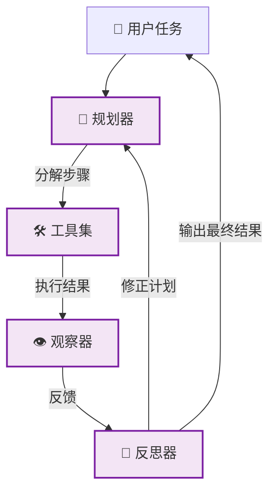

# 🔴 阶段四：专家期 - 全自动 Agent

> 📖 **本文档为《AI 前端开发体系化学习指南》的阶段拆分文档**
> 完整指南请查看：[学习指南总览](./README.md#-ai-前端开发体系化学习指南)

---

> 🎯 **阶段目标**：赋予 AI 自主规划、工具使用与反思能力，构建真正的智能体。

### 💡 你将学到
- Agent 三大核心架构：[ReAct](https://arxiv.org/abs/2210.03629)、Plan-and-Execute、Reflexion
- 工具注册系统设计与动态调用机制
- Thought-Action-Observation 循环的实现
- 多步工作流与任务分解逻辑
- 反思机制（Self-Correction）与结果评估

### 🔗 前置知识
- 完成 [🟣 阶段三：深耕期](./03-深耕期-端侧推理.md)
- 熟悉函数式编程与组合模式
- 了解 AST 解析与正则表达式基础

### 📚 核心能力指标
- [ ] 理解 Agent 核心架构 ([ReAct](https://arxiv.org/abs/2210.03629), Plan-and-Execute, Reflexion)
- [ ] 实现工具注册系统与动态调用机制
- [ ] 构建多步工作流与任务分解逻辑
- [ ] 掌握反思机制 (Self-Correction) 与结果评估
- [ ] 使用 [WebAssembly](https://webassembly.org) 优化复杂计算性能

### 🧠 核心概念解析

#### 4.0 Agent 基础概念

**💡 什么是 Agent？**
Agent（智能体）= **LLM（大脑）** + **工具（手脚）** + **记忆（经验）**。LLM 只能生成文本，Agent 能**感知环境 → 自主决策 → 执行动作**。

| 对比维度 | LLM | Agent |
|:---|:---|:---|
| 能力边界 | 文本生成、知识问答 | 调用工具、执行操作、完成任务 |
| 记忆 | 上下文窗口（有限） | 短期 + 长期记忆系统 |
| 自主性 | 被动响应 | 主动规划、执行、反思 |
| 工具使用 | ❌ 不能 | ✅ Function Calling / MCP |
| 状态管理 | 无状态 | 有状态（对话/任务状态） |

**Workflow vs Agent vs Tool 三者区别：**
- **Tool**：单一功能单元（搜索、计算器），无状态、确定输入输出
- **Agent**：LLM驱动的自主决策体，能选择工具、拆解任务、反思纠错
- **Workflow**：预定义的确定性执行流程（数据Pipeline、审批流）

> 核心区别：Workflow是"告诉系统怎么做"，Agent是"告诉系统做什么，系统自己决定怎么做"。

---

#### 4.1 Agent 架构模式



**六大核心组件：**

| 组件 | 职责 | 技术方案 |
|:---|:---|:---|
| **LLM 推理引擎** | 理解、推理、决策 | GPT-4o / Claude / DeepSeek |
| **记忆系统** | 存储和检索历史信息 | RAG + 向量数据库 + 摘要 |
| **规划模块** | 分解任务、制定步骤 | React / Plan-and-Execute |
| **工具调用** | 与外部世界交互 | Function Calling / MCP / API |
| **反馈循环** | 评估结果、自我反思 | Reflection + 重试机制 |
| **安全护栏** | 内容过滤、权限控制 | Guardrails / 输入输出审核 |

#### 4.2 主流设计模式

| 模式 | 原理 | 适用场景 |
|:---|:---|:---|
| **React** | 思考 (Thought) → 行动 (Action) → 观察 (Observation) 循环 | 复杂多步推理、工具密集型任务 |
| **Plan-and-Execute** | 先制定完整计划，再逐步执行 | 流程固定、可分解的长任务 |
| **Reflexion** | 执行后自我评估，失败则修正重试 | 对准确率要求极高的场景 |
| **Multi-Agent** | 多Agent分工协作（主管/工人、辩论模式） | 复杂协作场景 |
| **Tree-of-Thought** | 同时探索多条推理路径 | 需要探索的问题 |

### 💻 核心实现

#### 4.3 工具注册系统

```typescript
// lib/agent/tools.ts
export interface Tool {
  name: string;
  description: string;
  parameters: Record<string, unknown>;  // JSON Schema 描述参数
  execute: (params: Record<string, unknown>) => Promise<string>;
}

// 🔍 搜索工具
export const searchTool: Tool = {
  name: 'web_search',
  description: '搜索互联网获取最新信息',
  parameters: {
    type: 'object',
    properties: {
      query: { type: 'string', description: '搜索关键词' },
    },
    required: ['query'],
  },
  execute: async ({ query }) => {
    const res = await fetch(`/api/search?q=${query}`);
    const data = await res.json();
    return JSON.stringify(data.results);
  },
};

// 🧮 计算器工具
export const calcTool: Tool = {
  name: 'calculator',
  description: '执行数学计算',
  parameters: {
    type: 'object',
    properties: {
      expression: { type: 'string', description: '数学表达式，如 2 + 2' },
    },
    required: ['expression'],
  },
  execute: async ({ expression }) => {
    try {
      return String(Function(`"use strict"; return (${expression})`)());
    } catch (e) {
      return '计算错误';
    }
  },
};

export const toolRegistry = new Map<string, Tool>([
  [searchTool.name, searchTool],
  [calcTool.name, calcTool],
]);

// 转换为 OpenAI tools 格式
export function toOpenAITools(): OpenAI.Chat.CompletionCreateParams.Tool[] {
  return Array.from(toolRegistry.values()).map((tool) => ({
    type: 'function' as const,
    function: {
      name: tool.name,
      description: tool.description,
      parameters: tool.parameters as Record<string, unknown>,
    },
  }));
}
```

#### 4.4 [ReAct](https://arxiv.org/abs/2210.03629) Agent 核心

```typescript
// lib/agent/react-agent.ts
import OpenAI from 'openai';

export class ReActAgent {
  private maxIterations = 5;
  private openai = new OpenAI();

  async run(task: string): Promise<string> {
    const messages: OpenAI.Chat.ChatCompletionMessageParam[] = [
      { role: 'system', content: '你是一个智能助手，可以使用工具完成任务。' },
      { role: 'user', content: task },
    ];

    const tools = toOpenAITools();

    for (let i = 0; i < this.maxIterations; i++) {
      const response = await this.openai.chat.completions.create({
        model: 'gpt-4o',
        messages,
        tools,
        tool_choice: 'auto',
      });

      const message = response.choices[0].message;
      messages.push(message);

      if (!message.tool_calls || message.tool_calls.length === 0) {
        return message.content ?? '未获取到回答';
      }

      for (const toolCall of message.tool_calls) {
        const tool = toolRegistry.get(toolCall.function.name);
        if (!tool) {
          messages.push({
            role: 'tool',
            tool_call_id: toolCall.id,
            content: `工具 ${toolCall.function.name} 不存在`,
          });
          continue;
        }

        const args = JSON.parse(toolCall.function.arguments);
        const observation = await tool.execute(args);
        messages.push({
          role: 'tool',
          tool_call_id: toolCall.id,
          content: observation,
        });
      }
    }
    return '达到最大迭代次数，未能完成任务。';
  }
}
```

---

### 🤖 多 Agent 协作模式（进阶）

> **从单 Agent 到 Agent 系统**：解决单个 Agent 能力瓶颈，通过分工协作完成复杂任务。

#### Agent 通信协议设计

```typescript
// agent-protocol.ts
export interface AgentMessage {
  from: string;          // 发送方 ID
  to: string;            // 接收方 ID（'*' 表示广播）
  type: 'request' | 'response' | 'broadcast' | 'interrupt' | 'error';
  payload: {
    taskId: string;       // 任务追踪 ID
    action?: string;      // 动作类型
    data: unknown;        // 消息体
    priority: 1 | 2 | 3; // 优先级 1=最高
  };
  meta: {
    ttl: number;          // 消息过期时间 (ms)
    timestamp: number;    // 发送时间
    hopCount: number;     // 跳数，防止无限循环
  };
}

// Agent 间共享的上下文
export class AgentContext {
  private state: Map<string, unknown> = new Map();
  
  get<T>(key: string): T | undefined {
    return this.state.get(key) as T | undefined;
  }
  
  set(key: string, value: unknown): void {
    this.state.set(key, value);
  }
  
  snapshot(): Record<string, unknown> {
    return Object.fromEntries(this.state);
  }
}
```

#### 主管/工人模式 (Orchestrator-Worker)

```typescript
// orchestrator-agent.ts
class OrchestratorAgent {
  private workers: Map<string, WorkerAgent> = new Map();
  private context = new AgentContext();
  
  register(name: string, worker: WorkerAgent): void {
    this.workers.set(name, worker);
  }
  
  async execute(task: string): Promise<string> {
    // 1. 任务分析与分解
    const plan = await this.planTask(task);
    this.context.set('plan', plan);
    
    // 2. 并行执行子任务
    const stepResults = await Promise.all(
      plan.steps.map(async step => {
        const worker = this.selectWorker(step);
        const result = await worker.execute(
          step.instruction,
          this.context.snapshot()
        );
        return { step: step.id, result };
      })
    );
    
    // 3. 结果合成
    const synthesis = await this.synthesize(
      task,
      stepResults.map(sr => sr.result)
    );
    
    // 4. 质量审查
    const quality = await this.qualityCheck(synthesis, plan);
    if (!quality.passed) {
      // 自动迭代修正
      return this.iterate(task, synthesis, quality.feedback);
    }
    
    return synthesis;
  }
  
  private async planTask(task: string): Promise<TaskPlan> {
    const response = await this.llm.invoke(`
      将以下任务分解为子任务，输出 JSON 数组：
      ${task}
      [{ "id": "1", "name": "搜索资料", "instruction": "...",
         "dependencies": [], "assignedTo": "researcher" }]
    `);
    return JSON.parse(response);
  }
  
  private selectWorker(step: TaskStep): WorkerAgent {
    // 基于任务类型和 Agent 能力路由
    return this.workers.get(step.assignedTo) || this.workers.get('general')!;
  }
}
```

#### 辩论模式 (Debate)

多个 Agent 就同一问题从不同角度分析，最终达成共识：

```typescript
class DebateAgent {
  private participants: Agent[];
  
  constructor(participants: Agent[]) {
    this.participants = participants;
  }

  async debate(question: string, rounds = 3): Promise<DebateResult> {
    let arguments_: string[] = [];
    
    for (let round = 0; round < rounds; round++) {
      // 每个 Agent 根据已有论点发表意见
      const roundResponses = await Promise.all(
        this.participants.map(agent => 
          agent.argue(question, arguments_, round)
        )
      );
      
      arguments_ = roundResponses;
      
      // 检查是否已达成共识
      const consensus = await this.checkConsensus(roundResponses);
      if (consensus.reached) {
        return {
          consensus: true,
          answer: consensus.answer,
          rounds: round + 1,
          arguments: arguments_,
        };
      }
    }
    
    // 投票决定最终答案
    return this.voteFinalAnswer(question, arguments_);
  }
  
  private async checkConsensus(responses: string[]): Promise<Consensus> {
    const analysis = await this.judgeModel.invoke(`
      以下 ${responses.length} 个 AI 对同一问题的回答：

      ${responses.map((r, i) => `Agent ${i}: ${r}`).join('
')}

      它们是否达成一致？如果一致，总结答案；否则说明分歧点。
    `);
    return this.parseConsensus(analysis);
  }
}
```

| 模式 | 参与者 | 通信方式 | 收敛速度 | 输出质量 |
|:---|:---:|:---:|:---:|:---:|
| **主管/工人** | 1主管 + N工人 | 星型拓扑 | 快 | ⭐⭐⭐⭐ |
| **辩论** | N个对等 Agent | 全连接 | 中 | ⭐⭐⭐⭐⭐ |
| **投票** | N个独立 Agent | 无通信 | 极快 | ⭐⭐⭐ |
| **流水线** | 链式 N 个 | 顺序传递 | 慢 | ⭐⭐⭐⭐ |

#### 错误恢复与自动修正

```typescript
class ResilientAgent {
  private maxRetries = 3;
  private fallbackTools: Map<string, Tool[]> = new Map();
  
  async executeWithFallback(step: Step): Promise<string> {
    const primaryTool = this.getPrimaryTool(step);
    
    for (let attempt = 0; attempt < this.maxRetries; attempt++) {
      try {
        return await primaryTool.execute(step.params);
      } catch (error) {
        console.warn(`尝试 ${attempt + 1} 失败:`, error);
        
        // 尝试降级方案
        const fallbacks = this.fallbackTools.get(step.type);
        if (fallbacks?.length) {
          for (const fallback of fallbacks) {
            try {
              return await fallback.execute(step.params);
            } catch { /* continue */ }
          }
        }
        
        // 最后一次失败后重新规划
        if (attempt === this.maxRetries - 1) {
          return this.replan(step, error);
        }
        
        await this.delay(1000 * Math.pow(2, attempt));
      }
    }
    
    throw new Error(`步骤 ${step.id} 执行失败，已重试 ${this.maxRetries} 次`);
  }
  
  private async delay(ms: number): Promise<void> {
    return new Promise(resolve => setTimeout(resolve, ms));
  }
  
  private async replan(failedStep: Step, error: unknown): Promise<string> {
    return this.llm.invoke(`
      以下步骤执行失败：${failedStep.instruction}
      错误信息：${error}
      请提供一个替代方案来完成该步骤的目标。
    `);
  }
}
```

#### Agent 评估体系

评估 Agent 比评估纯 LLM 复杂得多，涉及执行成功率、工具选择正确性、路径效率等多维度。

| 评估维度 | 指标 | 采集方式 | 目标值 |
|:---|:---|:---|:---:|
| **任务完成率** | 指定任务的成功完成比例 | 人工标注 + 自动验证 | > 85% |
| **工具选择准确率** | 正确选择工具的次数 / 总调用次数 | 对比预期工具序列 | > 90% |
| **路径效率** | 实际步数 / 最优步数 | 基准测试集 | < 1.5x |
| **幻觉率** | 生成的事实性错误 / 总输出 | LLM-as-Judge 评估 | < 5% |
| **恢复率** | 从错误中自行恢复的比例 | 日志分析 | > 70% |
| **平均执行时间** | 从收到任务到返回结果的时间 | 计时埋点 | < 30s |

```typescript
// agent-evaluator.ts — Agent 自动化评估
interface AgentTestCase {
  task: string;
  expectedSteps: string[];      // 预期的工具调用序列
  expectedTools: string[];      // 预期的工具列表
  validateOutput: (output: string) => boolean;
}

class AgentEvaluator {
  async evaluate(agent: Agent, testCases: AgentTestCase[]) {
    const results = [];
    for (const testCase of testCases) {
      const startTime = Date.now();
      const { output, trace } = await agent.executeWithTrace(testCase.task);
      const elapsed = Date.now() - startTime;

      results.push({
        taskCompleted: testCase.validateOutput(output),
        toolAccuracy: this.matchToolSequence(trace.tools, testCase.expectedTools),
        pathEfficiency: trace.steps.length / testCase.expectedSteps.length,
        executionTime: elapsed,
        trace, // 保留完整轨迹用于分析
      });
    }
    return this.summarize(results);
  }

  private matchToolSequence(actual: string[], expected: string[]): number {
    const correct = actual.filter(t => expected.includes(t)).length;
    return correct / Math.max(actual.length, expected.length);
  }
}
```

#### Agent 执行轨迹追踪

调试 Agent 的核心难点在于理解 LLM 的推理链路。轨迹追踪记录每个 Thought-Action-Observation 循环。

```typescript
// agent-tracer.ts — Agent 推理过程全量追踪
interface TraceStep {
  thought: string;
  action: string;
  actionInput: Record<string, unknown>;
  observation: string;
  timestamp: number;
  duration: number;
}

class AgentTracer {
  private trace: TraceStep[] = [];
  private traces: TraceStep[][] = [];

  record(step: TraceStep): void {
    this.trace.push(step);
  }

  flush(): TraceStep[] {
    const snapshot = [...this.trace];
    this.traces.push(snapshot);
    this.trace = [];
    return snapshot;
  }

  // 可视化输出 — 适合在前端调试面板展示
  toDebugTree(): string {
    return this.trace.map((step, i) => `
      ┌─ Step ${i + 1} (${step.duration}ms)
      ├─ 💭 Thought: ${step.thought}
      ├─ 🔧 Action: ${step.action}(${JSON.stringify(step.actionInput)})
      └─ 👁 Observation: ${step.observation.slice(0, 100)}...
    `).join('
');
  }

  // 导出为 OpenTelemetry Span 用于监控
  toOtelSpans(): Span[] {
    return this.trace.map((step, i) => ({
      name: `agent.step.${i}`,
      attributes: { thought: step.thought, action: step.action },
      startTime: step.timestamp,
      endTime: step.timestamp + step.duration,
    }));
  }
}
```

---

### 🛠️ 工具链与函数调用优化

> **高效的工具调用**：减少 LLM 的工具选择错误率，提升 Agent 稳定性。

#### 工具描述的 Prompt 优化

工具描述的质量直接影响 LLM 正确选择工具的概率：

```typescript
// ❌ 不好的工具描述
const badTool: Tool = {
  name: 'search',
  description: '搜索功能',
  execute: async ({ q }) => { /* ... */ },
};

// ✅ 好的工具描述（RAS 原则 - Role + Action + Schema）
const goodTool: Tool = {
  name: 'web_search',
  description: `
    当用户询问最新信息、新闻、数据或你不知道的内容时使用。
    输入：
    - query (string, 必填): 搜索关键词，尽量使用中文
    - freshness (string, 可选): 'day' | 'week' | 'month' | 'year'
    输出：返回 5-10 条搜索结果，包含标题、链接和摘要
    注意：不要用此工具搜索用户个人信息或内部系统数据
  `,
  parameters: {
    type: 'object',
    properties: {
      query: { type: 'string', description: '搜索关键词' },
      freshness: { type: 'string', enum: ['day', 'week', 'month', 'year'] },
    },
    required: ['query'],
  },
  execute: async ({ query, freshness }) => { /* ... */ },
};
```

#### 工具调用成功的关键优化

| 优化点 | 方法 | 错误率降低 |
|:---|:---|:---:|
| **参数描述清晰** | 明确每个参数的类型、格式、默认值 | 减少 40% 参数错误 |
| **避免工具过多** | 注册的工具不超过 10 个，过多则分层分组 | 减少 30% 选错工具 |
| **错误信息友好** | 工具失败时返回人类可读的错误原因 | 提高 50% 自动恢复率 |
| **结果格式化** | 返回结构化数据而非纯文本 | 减少 30% 解析错误 |
| **超时控制** | 设置工具执行超时（默认 5s） | 防止 Agent 卡死 |

---

### 🧠 Agent 记忆与状态管理

> **记忆是 Agent 持续学习的基础**：区分短期记忆（对话上下文）和长期记忆（知识库）。

```typescript
class AgentMemory {
  private shortTerm: Map<string, string> = new Map(); // 本次会话记忆
  private longTerm: Map<string, StoredMemory> = new Map(); // 持久化记忆
  
  // 短期记忆 - 自动管理
  remember(key: string, value: string): void {
    this.shortTerm.set(key, value);
    // 当短期记忆超限时，自动归档重要内容到长期记忆
    if (this.shortTerm.size > 100) {
      this.archiveToLongTerm();
    }
  }
  
  recall(key: string): string | undefined {
    return this.shortTerm.get(key) || this.longTerm.get(key)?.content;
  }
  
  // 长期记忆 - 基于重要性的持久化
  private async archiveToLongTerm(): Promise<void> {
    const entries = Array.from(this.shortTerm.entries());
    
    // 让 LLM 判断哪些信息值得长期保存
    const important = await this.judgeModel.invoke(`
      以下对话记忆中，哪些应该长期保存？只返回 JSON key 数组：
      ${JSON.stringify(Object.fromEntries(entries))}
    `);
    
    const importantKeys = JSON.parse(important);
    for (const key of importantKeys) {
      this.longTerm.set(key, {
        content: this.shortTerm.get(key)!,
        storedAt: Date.now(),
        accessCount: 0,
      });
    }
    
    this.shortTerm.clear();
  }
  
  // 定期清理低价值记忆
  prune(): void {
    const now = Date.now();
    for (const [key, memory] of this.longTerm) {
      // 超过 30 天未访问且访问次数低于 3 次则删除
      if (now - memory.storedAt > 30 * 24 * 3600 * 1000 && memory.accessCount < 3) {
        this.longTerm.delete(key);
      }
    }
  }
}

interface StoredMemory {
  content: string;
  storedAt: number;
  accessCount: number;
}
```

---

### 🎨 Agent UX 设计模式

Agent 的异步、多步特性需要特殊的 UI 模式来确保用户可理解、可控。

#### 流式思维展示 (Streaming Thoughts)

```typescript
// React 组件：Agent 思维过程实时展示
function AgentThoughtStream({ trace }: { trace: AgentTrace }) {
  return (
    <div className="agent-thought-tree">
      {trace.steps.map((step, i) => (
        <div key={i} className="step-card">
          <div className="step-header">
            <span className="step-number">Step {i + 1}</span>
            <span className="step-duration">{step.duration}ms</span>
          </div>
          <div className="thought-bubble">
            💭 {step.thought}
          </div>
          {step.action && (
            <div className="action-call">
              🔧 调用工具: <code>{step.action}</code>
              <pre>{JSON.stringify(step.actionInput, null, 2)}</pre>
            </div>
          )}
          <div className="observation-result">
            👁 {step.observation}
          </div>
        </div>
      ))}
    </div>
  );
}
```

#### 人机协同 (Human-in-the-Loop)

某些高风险操作需用户确认后才能执行：

```typescript
// HITL 模式 — 工具调用前请求用户批准
const sensitiveTools = new Set(['send_email', 'delete_data', 'execute_payment']);

class HITLGuard {
  async execute(toolName: string, args: unknown, onUserConfirm: () => Promise<boolean>): Promise<unknown> {
    if (!sensitiveTools.has(toolName)) {
      return this.toolRegistry.execute(toolName, args); // 低风险工具直接执行
    }

    // 高风险工具：先展示给用户
    const approved = await onUserConfirm();
    if (!approved) {
      throw new HITLRejectedError(`用户拒绝了工具调用: ${toolName}`);
    }
    return this.toolRegistry.execute(toolName, args);
  }
}

// 前端组件：用户确认对话框
function ToolApprovalDialog({ tool, args, onConfirm, onReject }: Props) {
  return (
    <div className="hitl-dialog">
      <h3>⚠️ Agent 请求执行敏感操作</h3>
      <p>工具: <strong>{tool}</strong></p>
      <pre>{JSON.stringify(args, null, 2)}</pre>
      <div className="dialog-actions">
        <button onClick={onReject} className="btn-danger">拒绝</button>
        <button onClick={onConfirm} className="btn-primary">确认执行</button>
      </div>
    </div>
  );
}
```

---

### 🏆 阶段四实战项目

| 项目 | 难度 | 核心考察点 | 完成标准 |
|:---|:---:|:---|:---|
| 🟢 **研究助手 Agent** | ⭐⭐⭐⭐ | 搜索、摘要、多步规划 | 自动生成行业研究报告 |
| 🔵 **代码助手 Agent** | ⭐⭐⭐⭐⭐ | 代码理解、Bug 修复、测试生成 | 能修复简单 Bug 并写单测 |
| 🟣 **自动化工作流** | ⭐⭐⭐⭐⭐ | 多工具编排、错误恢复 | 自动完成订票、发邮件等任务 |

---

### 📎 延伸阅读

| 文档 | 内容 | 相关章节 |
|:---|:---|:---|
| [📊 技术选型对比合集](./07-技术选型对比合集.md) | Agent 平台对比、智能体方案评估 | 常用 AI 智能体平台对比 |
| [🛠️ 开发实战与架构指南](./08-开发实战与架构指南.md) | LangGraph 工作流编排、Prompt 进阶 | 第5章：LangGraph 工作流编排 |
