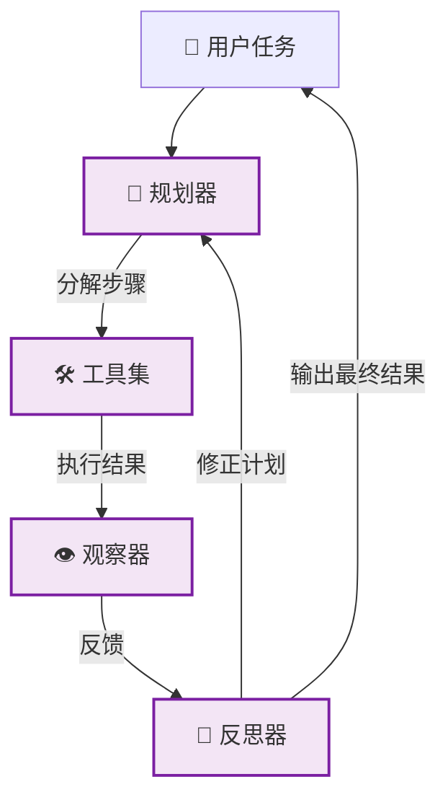

# 🔴 阶段四：专家期 - 全自动 Agent

> 📖 **本文档为《AI 前端开发体系化学习指南》的阶段拆分文档**
> 完整指南请查看：[README.md](./README.md)

---

> 🎯 **阶段目标**：赋予 AI 自主规划、工具使用与反思能力，构建真正的智能体。

### 📑 本章目录
- [核心能力指标](#-核心能力指标)
- [核心概念解析](#-核心概念解析)
  - [Agent 架构模式](#41-agent-架构模式)
  - [主流设计模式](#42-主流设计模式)
- [核心实现](#-核心实现)
  - [工具注册系统](#43-工具注册系统)
  - [[React](https://react.dev) Agent 核心](#44-[React](https://react.dev)-agent-核心)
- [实战项目](#-阶段四实战项目)

### 💡 你将学到
- Agent 三大核心架构：[React](https://react.dev)、Plan-and-Execute、Reflexion
- 工具注册系统设计与动态调用机制
- Thought-Action-Observation 循环的实现
- 多步工作流与任务分解逻辑
- 反思机制（Self-Correction）与结果评估

### 🔗 前置知识
- 完成 [🟣 阶段三：深耕期](./03-深耕期-端侧推理.md)
- 熟悉函数式编程与组合模式
- 了解 AST 解析与正则表达式基础

### 📚 核心能力指标
- [ ] 理解 Agent 核心架构 ([React](https://react.dev), Plan-and-Execute, Reflexion)
- [ ] 实现工具注册系统与动态调用机制
- [ ] 构建多步工作流与任务分解逻辑
- [ ] 掌握反思机制 (Self-Correction) 与结果评估
- [ ] 使用 [WebAssembly](https://webassembly.org).org) 优化复杂计算性能

### 🧠 核心概念解析

#### 4.1 Agent 架构模式



#### 4.2 主流设计模式

| 模式 | 原理 | 适用场景 |
|:---|:---|:---|
| **React** | 思考 (Thought) → 行动 (Action) → 观察 (Observation) 循环 | 复杂多步推理、工具密集型任务 |
| **Plan-and-Execute** | 先制定完整计划，再逐步执行 | 流程固定、可分解的长任务 |
| **Reflexion** | 执行后自我评估，失败则修正重试 | 对准确率要求极高的场景 |

### 💻 核心实现

#### 4.3 工具注册系统

```typescript
// lib/agent/tools.ts
export interface Tool {
  name: string;
  description: string;
  execute: (params: Record<string, unknown>) => Promise<string>;
}

// 🔍 搜索工具
export const searchTool: Tool = {
  name: 'web_search',
  description: '搜索互联网获取最新信息',
  execute: async ({ query }) => {
    const res = await fetch(`/api/search?q=${query}`);
    const data = await res.json();
    return JSON.stringify(data.results);
  },
};

// 🧮 计算器工具
export const calcTool: Tool = {
  name: 'calculator',
  description: '执行数学计算',
  execute: async ({ expression }) => {
    try {
      return String(Function(`"use strict"; return (${expression})`)());
    } catch (e) {
      return '计算错误';
    }
  },
};

export const toolRegistry = new Map<string, Tool>([
  [searchTool.name, searchTool],
  [calcTool.name, calcTool],
]);
```

#### 4.4 [React](https://react.dev) Agent 核心

```typescript
// lib/agent/react-agent.ts
export class ReActAgent {
  private maxIterations = 5;

  async run(task: string): Promise<string> {
    let history = `任务: ${task}\n`;

    for (let i = 0; i < this.maxIterations; i++) {
      // 1. 调用 LLM 决定下一步行动
      const decision = await this.callLLM(history);

      // 2. 解析 LLM 输出
      const action = this.parseAction(decision);
      if (!action) return decision; // 找到最终答案

      // 3. 执行工具
      const tool = toolRegistry.get(action.name);
      if (!tool) {
        history += `观察: 工具 ${action.name} 不存在\n`;
        continue;
      }

      const observation = await tool.execute(action.params);
      history += `思考: ${decision}\n行动: ${action.name}\n观察: ${observation}\n`;
    }
    return '达到最大迭代次数，未能完成任务。';
  }

  private async callLLM(history: string): Promise<string> {
    // 调用 OpenAI API...
    return '...';
  }

  private parseAction(text: string): { name: string; params: any } | null {
    // 解析 "Action: tool_name\nInput: {...}" 格式
    return null;
  }
}
```

---

### 🤖 多 Agent 协作模式（进阶）

> **从单 Agent 到 Agent 系统**：解决单个 Agent 能力瓶颈，通过分工协作完成复杂任务。

#### Agent 通信协议设计

```typescript
// agent-protocol.ts
export interface AgentMessage {
  from: string;          // 发送方 ID
  to: string;            // 接收方 ID（'*' 表示广播）
  type: 'request' | 'response' | 'broadcast' | 'interrupt' | 'error';
  payload: {
    taskId: string;       // 任务追踪 ID
    action?: string;      // 动作类型
    data: unknown;        // 消息体
    priority: 1 | 2 | 3; // 优先级 1=最高
  };
  meta: {
    ttl: number;          // 消息过期时间 (ms)
    timestamp: number;    // 发送时间
    hopCount: number;     // 跳数，防止无限循环
  };
}

// Agent 间共享的上下文
export class AgentContext {
  private state: Map<string, unknown> = new Map();
  
  get<T>(key: string): T | undefined {
    return this.state.get(key) as T | undefined;
  }
  
  set(key: string, value: unknown): void {
    this.state.set(key, value);
  }
  
  snapshot(): Record<string, unknown> {
    return Object.fromEntries(this.state);
  }
}
```

#### 主管/工人模式 (Orchestrator-Worker)

```typescript
// orchestrator-agent.ts
class OrchestratorAgent {
  private workers: Map<string, WorkerAgent> = new Map();
  private context = new AgentContext();
  
  register(name: string, worker: WorkerAgent): void {
    this.workers.set(name, worker);
  }
  
  async execute(task: string): Promise<string> {
    // 1. 任务分析与分解
    const plan = await this.planTask(task);
    this.context.set('plan', plan);
    
    // 2. 并行执行子任务
    const stepResults = await Promise.all(
      plan.steps.map(async step => {
        const worker = this.selectWorker(step);
        const result = await worker.execute(
          step.instruction,
          this.context.snapshot()
        );
        return { step: step.id, result };
      })
    );
    
    // 3. 结果合成
    const synthesis = await this.synthesize(
      task,
      stepResults.map(sr => sr.result)
    );
    
    // 4. 质量审查
    const quality = await this.qualityCheck(synthesis, plan);
    if (!quality.passed) {
      // 自动迭代修正
      return this.iterate(task, synthesis, quality.feedback);
    }
    
    return synthesis;
  }
  
  private async planTask(task: string): Promise<TaskPlan> {
    const response = await this.llm.invoke(`
      将以下任务分解为子任务，输出 JSON 数组：
      ${task}
      [{ "id": "1", "name": "搜索资料", "instruction": "...",
         "dependencies": [], "assignedTo": "researcher" }]
    `);
    return JSON.parse(response);
  }
  
  private selectWorker(step: TaskStep): WorkerAgent {
    // 基于任务类型和 Agent 能力路由
    return this.workers.get(step.assignedTo) || this.workers.get('general')!;
  }
}
```

#### 辩论模式 (Debate)

多个 Agent 就同一问题从不同角度分析，最终达成共识：

```typescript
class DebateAgent {
  private participants: Agent[];
  
  constructor(participants: Agent[]) {
    this.participants = participants;
  }

  async debate(question: string, rounds = 3): Promise<DebateResult> {
    let arguments_: string[] = [];
    
    for (let round = 0; round < rounds; round++) {
      // 每个 Agent 根据已有论点发表意见
      const roundResponses = await Promise.all(
        this.participants.map(agent => 
          agent.argue(question, arguments_, round)
        )
      );
      
      arguments_ = roundResponses;
      
      // 检查是否已达成共识
      const consensus = await this.checkConsensus(roundResponses);
      if (consensus.reached) {
        return {
          consensus: true,
          answer: consensus.answer,
          rounds: round + 1,
          arguments: arguments_,
        };
      }
    }
    
    // 投票决定最终答案
    return this.voteFinalAnswer(question, arguments_);
  }
  
  private async checkConsensus(responses: string[]): Promise<Consensus> {
    const analysis = await this.judgeModel.invoke(`
      以下 ${responses.length} 个 AI 对同一问题的回答：\n
      ${responses.map((r, i) => `Agent ${i}: ${r}`).join('\n')}\n
      它们是否达成一致？如果一致，总结答案；否则说明分歧点。
    `);
    return this.parseConsensus(analysis);
  }
}
```

| 模式 | 参与者 | 通信方式 | 收敛速度 | 输出质量 |
|:---|:---:|:---:|:---:|:---:|
| **主管/工人** | 1主管 + N工人 | 星型拓扑 | 快 | ⭐⭐⭐⭐ |
| **辩论** | N个对等 Agent | 全连接 | 中 | ⭐⭐⭐⭐⭐ |
| **投票** | N个独立 Agent | 无通信 | 极快 | ⭐⭐⭐ |
| **流水线** | 链式 N 个 | 顺序传递 | 慢 | ⭐⭐⭐⭐ |

#### 错误恢复与自动修正

```typescript
class ResilientAgent {
  private maxRetries = 3;
  private fallbackTools: Map<string, Tool[]> = new Map();
  
  async executeWithFallback(step: Step): Promise<string> {
    const primaryTool = this.getPrimaryTool(step);
    
    for (let attempt = 0; attempt < this.maxRetries; attempt++) {
      try {
        return await primaryTool.execute(step.params);
      } catch (error) {
        console.warn(`尝试 ${attempt + 1} 失败:`, error);
        
        // 尝试降级方案
        const fallbacks = this.fallbackTools.get(step.type);
        if (fallbacks?.length) {
          for (const fallback of fallbacks) {
            try {
              return await fallback.execute(step.params);
            } catch { /* continue */ }
          }
        }
        
        // 最后一次失败后重新规划
        if (attempt === this.maxRetries - 1) {
          return this.replan(step, error);
        }
        
        await this.delay(1000 * Math.pow(2, attempt));
      }
    }
    
    throw new Error(`步骤 ${step.id} 执行失败，已重试 ${this.maxRetries} 次`);
  }
  
  private async delay(ms: number): Promise<void> {
    return new Promise(resolve => setTimeout(resolve, ms));
  }
  
  private async replan(failedStep: Step, error: unknown): Promise<string> {
    return this.llm.invoke(`
      以下步骤执行失败：${failedStep.instruction}
      错误信息：${error}
      请提供一个替代方案来完成该步骤的目标。
    `);
  }
}
```

---

### 🛠️ 工具链与函数调用优化

> **高效的工具调用**：减少 LLM 的工具选择错误率，提升 Agent 稳定性。

#### 工具描述的 Prompt 优化

工具描述的质量直接影响 LLM 正确选择工具的概率：

```typescript
// ❌ 不好的工具描述
const badTool: Tool = {
  name: 'search',
  description: '搜索功能',
  execute: async ({ q }) => { /* ... */ },
};

// ✅ 好的工具描述（RAS 原则 - Role + Action + Schema）
const goodTool: Tool = {
  name: 'web_search',
  description: `
    当用户询问最新信息、新闻、数据或你不知道的内容时使用。
    输入：
    - query (string, 必填): 搜索关键词，尽量使用中文
    - freshness (string, 可选): 'day' | 'week' | 'month' | 'year'
    输出：返回 5-10 条搜索结果，包含标题、链接和摘要
    注意：不要用此工具搜索用户个人信息或内部系统数据
  `,
  parameters: {
    type: 'object',
    properties: {
      query: { type: 'string', description: '搜索关键词' },
      freshness: { type: 'string', enum: ['day', 'week', 'month', 'year'] },
    },
    required: ['query'],
  },
  execute: async ({ query, freshness }) => { /* ... */ },
};
```

#### 工具调用成功的关键优化

| 优化点 | 方法 | 错误率降低 |
|:---|:---|:---:|
| **参数描述清晰** | 明确每个参数的类型、格式、默认值 | 减少 40% 参数错误 |
| **避免工具过多** | 注册的工具不超过 10 个，过多则分层分组 | 减少 30% 选错工具 |
| **错误信息友好** | 工具失败时返回人类可读的错误原因 | 提高 50% 自动恢复率 |
| **结果格式化** | 返回结构化数据而非纯文本 | 减少 30% 解析错误 |
| **超时控制** | 设置工具执行超时（默认 5s） | 防止 Agent 卡死 |

---

### 🧠 Agent 记忆与状态管理

> **记忆是 Agent 持续学习的基础**：区分短期记忆（对话上下文）和长期记忆（知识库）。

```typescript
class AgentMemory {
  private shortTerm: Map<string, string> = new Map(); // 本次会话记忆
  private longTerm: Map<string, StoredMemory> = new Map(); // 持久化记忆
  
  // 短期记忆 - 自动管理
  remember(key: string, value: string): void {
    this.shortTerm.set(key, value);
    // 当短期记忆超限时，自动归档重要内容到长期记忆
    if (this.shortTerm.size > 100) {
      this.archiveToLongTerm();
    }
  }
  
  recall(key: string): string | undefined {
    return this.shortTerm.get(key) || this.longTerm.get(key)?.content;
  }
  
  // 长期记忆 - 基于重要性的持久化
  private async archiveToLongTerm(): Promise<void> {
    const entries = Array.from(this.shortTerm.entries());
    
    // 让 LLM 判断哪些信息值得长期保存
    const important = await this.judgeModel.invoke(`
      以下对话记忆中，哪些应该长期保存？只返回 JSON key 数组：
      ${JSON.stringify(Object.fromEntries(entries))}
    `);
    
    const importantKeys = JSON.parse(important);
    for (const key of importantKeys) {
      this.longTerm.set(key, {
        content: this.shortTerm.get(key)!,
        storedAt: Date.now(),
        accessCount: 0,
      });
    }
    
    this.shortTerm.clear();
  }
  
  // 定期清理低价值记忆
  prune(): void {
    const now = Date.now();
    for (const [key, memory] of this.longTerm) {
      // 超过 30 天未访问且访问次数低于 3 次则删除
      if (now - memory.storedAt > 30 * 24 * 3600 * 1000 && memory.accessCount < 3) {
        this.longTerm.delete(key);
      }
    }
  }
}

interface StoredMemory {
  content: string;
  storedAt: number;
  accessCount: number;
}
```

---

### 🏆 阶段四实战项目

| 项目 | 难度 | 核心考察点 | 完成标准 |
|:---|:---:|:---|:---|
| 🟢 **研究助手 Agent** | ⭐⭐⭐⭐ | 搜索、摘要、多步规划 | 自动生成行业研究报告 |
| 🔵 **代码助手 Agent** | ⭐⭐⭐⭐⭐ | 代码理解、Bug 修复、测试生成 | 能修复简单 Bug 并写单测 |
| 🟣 **自动化工作流** | ⭐⭐⭐⭐⭐ | 多工具编排、错误恢复 | 自动完成订票、发邮件等任务 |

---

### 📎 延伸阅读

| 文档 | 内容 | 相关章节 |
|:---|:---|:---|
| [📊 技术选型对比合集](./07-技术选型对比合集.md) | Agent 平台对比、智能体方案评估 | 常用 AI 智能体平台对比 |
| [🛠️ 开发实战与架构指南](./08-开发实战与架构指南.md) | LangGraph 工作流编排、Prompt 进阶 | 第5章：LangGraph 工作流编排 |

---

### 📌 导航

| [⬅️ 上一阶段：深耕期](./03-深耕期-端侧推理.md) | [🏠 返回主指南](./README.md) | [➡️ 下一阶段：生产化](./05-生产化与工程化.md) |
|:---:|:---:|:---:|

