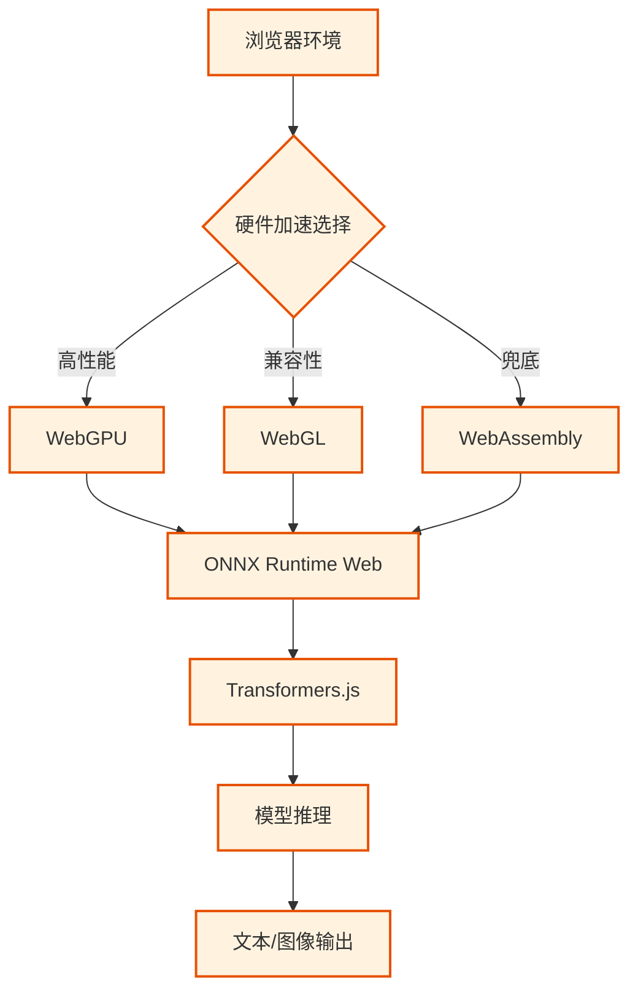

# 🟣 阶段三：深耕期 - 端侧推理

> 📖 **本文档为《AI 前端开发体系化学习指南》的阶段拆分文档**
> 完整指南请查看：[01-AI前端开发体系化学习指南.md](./01-AI前端开发体系化学习指南.md)

---

> 🎯 **阶段目标**：突破云端限制，在浏览器端实现隐私保护、零延迟的 AI 推理。

### 📚 核心能力指标
- [ ] 理解浏览器端机器学习原理 (WebAssembly / WebGPU)
- [ ] 掌握 Transformers.js 核心 API 与 Pipeline 机制
- [ ] 能够加载并运行 ONNX 格式的量化模型
- [ ] 实现 WebGPU 加速推理，优化内存占用
- [ ] 管理模型缓存 (IndexedDB) 与离线可用性功能

### 🧠 核心概念解析

#### 3.1 端侧推理架构



#### 3.2 技术栈对比

| 技术 | 优势 | 劣势 | 适用场景 |
|:---|:---|:---|:---|
| **WebGPU** | 极致性能，支持通用计算 | 兼容性较新 (Chrome 113+) | 大规模矩阵运算、大模型推理 |
| **WebGL** | 广泛兼容，图形渲染强 | API 繁琐，非通用计算设计 | 轻量级模型、可视化 |
| **WebAssembly** | 接近原生 CPU 性能 | 无法利用 GPU 并行 | 传统 ML 算法、兜底方案 |

### 🛠️ 环境搭建

#### 3.3 项目初始化

```bash
# 🚀 创建项目
npx create-next-app@latest edge-ai --typescript --tailwind --app
cd edge-ai

# 📦 安装 Transformers.js
npm install @huggingface/transformers
```

### 💻 核心实现

#### 3.4 Transformers.js 核心 Pipeline

```typescript
// lib/transformers-pipeline.ts
import { pipeline, env, Pipeline } from '@huggingface/transformers';

// ⚙️ 全局配置
env.allowLocalModels = false;
env.useBrowserCache = true;

export class TransformersPipeline {
  private pipelines: Map<string, Pipeline> = new Map();

  // 🚀 懒加载 Pipeline
  async getPipeline(task: string, model?: string): Promise<Pipeline> {
    const key = `${task}:${model || 'default'}`;
    if (this.pipelines.has(key)) return this.pipelines.get(key)!;

    const defaultModels: Record<string, string> = {
      'text-generation': 'onnx-community/Qwen2.5-0.5B-Instruct',
      'text-classification': 'Xenova/distilbert-base-uncased-finetuned-sst-2-english',
      'feature-extraction': 'Xenova/all-MiniLM-L6-v2',
    };

    const p = await pipeline(task, model || defaultModels[task], { dtype: 'q4' }); // 4-bit 量化
    this.pipelines.set(key, p);
    return p;
  }

  // 💬 文本生成
  async generateText(prompt: string, maxTokens = 256): Promise<string> {
    const generator = await this.getPipeline('text-generation');
    const res = await generator(prompt, { max_new_tokens: maxTokens, temperature: 0.7 });
    return res[0].generated_text;
  }

  // 📊 文本分类 (情感分析)
  async classifyText(text: string): Promise<Array<{ label: string; score: number }>> {
    const classifier = await this.getPipeline('text-classification');
    return await classifier(text);
  }

  // 🔢 文本向量化
  async embedText(text: string): Promise<Float32Array> {
    const extractor = await this.getPipeline('feature-extraction');
    const res = await extractor(text, { pooling: 'mean', normalize: true });
    return res.data as Float32Array;
  }
}
```

#### 3.5 WebGPU 加速引擎

```typescript
// lib/webgpu-engine.ts
export class WebGPUEngine {
  private device: GPUDevice | null = null;

  async initialize(): Promise<boolean> {
    if (!('gpu' in navigator)) return false;
    try {
      const adapter = await navigator.gpu.requestAdapter();
      if (!adapter) return false;
      this.device = await adapter.requestDevice();
      console.log('✅ WebGPU 初始化成功');
      return true;
    } catch (e) {
      console.warn('❌ WebGPU 不可用，回退到 WASM');
      return false;
    }
  }

  // 🧮 矩阵乘法 (GPU 并行计算示例)
  async matrixMultiply(a: Float32Array, b: Float32Array): Promise<Float32Array> {
    if (!this.device) throw new Error('WebGPU 未初始化');
    // ... 省略具体 Shader 编写与 Buffer 绑定逻辑 ...
    // 实际开发中通常直接使用 Transformers.js 的 WebGPU 后端
    return new Float32Array();
  }
}
```

### 🏆 阶段三实战项目

| 项目 | 难度 | 核心考察点 | 完成标准 |
|:---|:---:|:---|:---|
| 🟢 **离线文本分类** | ⭐⭐ | 模型加载、情感分析 | 断网可用，响应 < 100ms |
| 🔵 **端侧文本生成** | ⭐⭐⭐ | Qwen2.5-0.5B 运行、流式生成 | 浏览器内流畅对话 |
| 🟣 **图像理解应用** | ⭐⭐⭐⭐ | 图像分类、目标检测 | 实时摄像头检测 |
