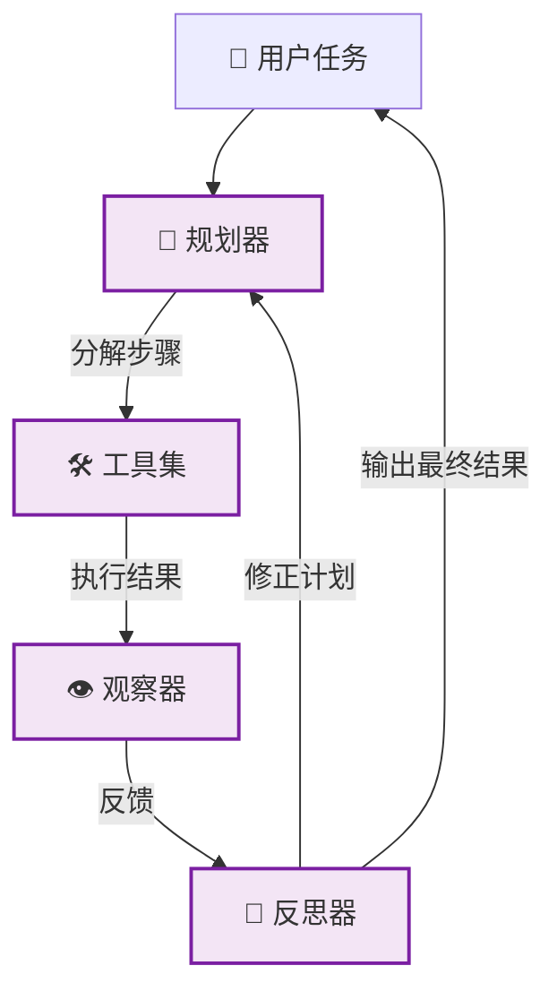

# 🔴 阶段四：专家期 - 全自动 Agent

> 📖 **本文档为《AI 前端开发体系化学习指南》的阶段拆分文档**
> 完整指南请查看：[01-AI前端开发体系化学习指南.md](./01-AI前端开发体系化学习指南.md)

---

> 🎯 **阶段目标**：赋予 AI 自主规划、工具使用与反思能力，构建真正的智能体。

### 📚 核心能力指标
- [ ] 理解 Agent 核心架构 (ReAct, Plan-and-Execute, Reflexion)
- [ ] 实现工具注册系统与动态调用机制
- [ ] 构建多步工作流与任务分解逻辑
- [ ] 掌握反思机制 (Self-Correction) 与结果评估
- [ ] 使用 WebAssembly 优化复杂计算性能

### 🧠 核心概念解析

#### 4.1 Agent 架构模式



#### 4.2 主流设计模式

| 模式 | 原理 | 适用场景 |
|:---|:---|:---|
| **ReAct** | 思考 (Thought) → 行动 (Action) → 观察 (Observation) 循环 | 复杂多步推理、工具密集型任务 |
| **Plan-and-Execute** | 先制定完整计划，再逐步执行 | 流程固定、可分解的长任务 |
| **Reflexion** | 执行后自我评估，失败则修正重试 | 对准确率要求极高的场景 |

### 💻 核心实现

#### 4.3 工具注册系统

```typescript
// lib/agent/tools.ts
export interface Tool {
  name: string;
  description: string;
  execute: (params: Record<string, unknown>) => Promise<string>;
}

// 🔍 搜索工具
export const searchTool: Tool = {
  name: 'web_search',
  description: '搜索互联网获取最新信息',
  execute: async ({ query }) => {
    const res = await fetch(`/api/search?q=${query}`);
    const data = await res.json();
    return JSON.stringify(data.results);
  },
};

// 🧮 计算器工具
export const calcTool: Tool = {
  name: 'calculator',
  description: '执行数学计算',
  execute: async ({ expression }) => {
    try {
      return String(Function(`"use strict"; return (${expression})`)());
    } catch (e) {
      return '计算错误';
    }
  },
};

export const toolRegistry = new Map<string, Tool>([
  [searchTool.name, searchTool],
  [calcTool.name, calcTool],
]);
```

#### 4.4 ReAct Agent 核心

```typescript
// lib/agent/react-agent.ts
export class ReActAgent {
  private maxIterations = 5;

  async run(task: string): Promise<string> {
    let history = `任务: ${task}\n`;

    for (let i = 0; i < this.maxIterations; i++) {
      // 1. 调用 LLM 决定下一步行动
      const decision = await this.callLLM(history);

      // 2. 解析 LLM 输出
      const action = this.parseAction(decision);
      if (!action) return decision; // 找到最终答案

      // 3. 执行工具
      const tool = toolRegistry.get(action.name);
      if (!tool) {
        history += `观察: 工具 ${action.name} 不存在\n`;
        continue;
      }

      const observation = await tool.execute(action.params);
      history += `思考: ${decision}\n行动: ${action.name}\n观察: ${observation}\n`;
    }
    return '达到最大迭代次数，未能完成任务。';
  }

  private async callLLM(history: string): Promise<string> {
    // 调用 OpenAI API...
    return '...';
  }

  private parseAction(text: string): { name: string; params: any } | null {
    // 解析 "Action: tool_name\nInput: {...}" 格式
    return null;
  }
}
```

### 🏆 阶段四实战项目

| 项目 | 难度 | 核心考察点 | 完成标准 |
|:---|:---:|:---|:---|
| 🟢 **研究助手 Agent** | ⭐⭐⭐⭐ | 搜索、摘要、多步规划 | 自动生成行业研究报告 |
| 🔵 **代码助手 Agent** | ⭐⭐⭐⭐⭐ | 代码理解、Bug 修复、测试生成 | 能修复简单 Bug 并写单测 |
| 🟣 **自动化工作流** | ⭐⭐⭐⭐⭐ | 多工具编排、错误恢复 | 自动完成订票、发邮件等任务 |

---

### 📌 导航

| [⬅️ 上一阶段：深耕期](./04-深耕期-端侧推理.md) | [🏠 返回主指南](./01-AI前端开发体系化学习指南.md) | [➡️ 下一阶段：生产化](./06-生产化与工程化.md) |
|:---:|:---:|:---:|
