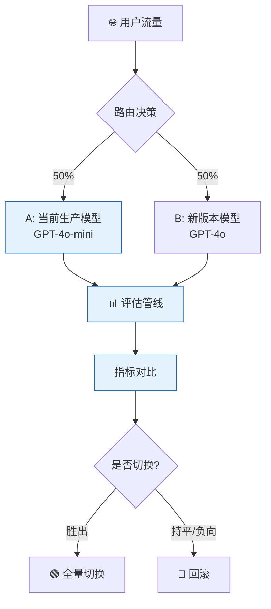
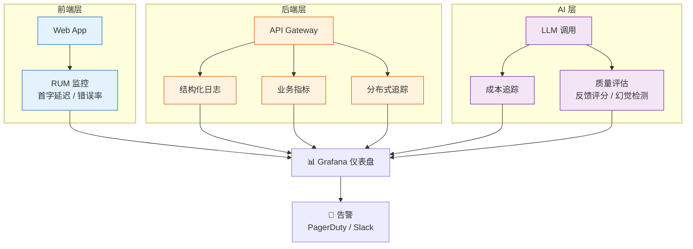

# 🟠 阶段五：生产化与工程化

> 📖 **本文档为《AI 前端开发体系化学习指南》的阶段拆分文档**
> 完整指南请查看：[学习指南总览](./README.md#-ai-前端开发体系化学习指南)

---

> 🎯 **阶段目标**：将 AI 应用从 Demo 升级为高可用、可评估、安全的生产级系统。

### 📑 本章目录
- [核心能力指标](#-核心能力指标)
- [安全与防护](#️-安全与防护)
  - [Prompt 注入防护](#51-prompt-注入防护)
  - [数据脱敏](#52-数据脱敏)
- [性能与成本优化](#-性能与成本优化)
  - [Token 优化策略](#53-token-优化策略)
  - [响应缓存 (LRU)](#54-响应缓存-lru)
- [监控与评估](#-监控与评估)
  - [RAG 评估指标](#55-rag-评估指标)
  - [LLM 评估体系](#56-llm-评估体系)
  - [遥测数据采集](#57-遥测数据采集)

### 💡 你将学到
- Prompt 注入检测与用户输入清洗防护
- PII 数据自动脱敏与隐私保护机制
- Token 滑动窗口截断与对话摘要压缩
- LRU 响应缓存减少 API 调用成本
- RAG 评估指标体系与遥测数据采集

### 🔗 前置知识
- 完成 [🔴 阶段四：专家期 - Agent](./04-专家期-Agent设计.md)
- 了解 Web 安全基础（XSS、注入攻击）
- 熟悉 `Set`、`Map` 等数据结构

### 📚 核心能力指标
- [ ] 构建可评估、可监控的 AI 应用
- [ ] 实施 AI 安全策略与防护机制
- [ ] 优化 AI 应用的性能与成本
- [ ] 掌握 AI 应用的部署与运维流程

### 🛡️ 安全与防护

#### 5.1 Prompt 注入防护

```typescript
// lib/security/prompt-guard.ts
export class PromptGuard {
  // 🚨 检测潜在的注入攻击
  static detectInjection(input: string): boolean {
    const patterns = [
      /ignore\s+previous\s+instructions/i,
      /system\s*:/i,
      /you\s+are\s+now/i,
      /disregard\s+all/i,
    ];
    return patterns.some(p => p.test(input));
  }

  // 🧼 清理用户输入
  static sanitizeInput(input: string): string {
    let sanitized = input.replace(/ignore\s+previous\s+instructions/gi, '');
    if (sanitized.length > 4000) sanitized = sanitized.substring(0, 4000) + '...';
    return sanitized.trim();
  }
}
```

#### 5.2 数据脱敏

```typescript
// lib/security/data-masking.ts
export class DataMasker {
  static mask(text: string): string {
    return text
      .replace(/\b[A-Za-z0-9._%+-]+@[A-Za-z0-9.-]+\.[A-Z|a-z]{2,}\b/g, '[EMAIL]')
      .replace(/\b(\+?86)?1[3-9]\d{9}\b/g, '[PHONE]');
  }
}
```

### ⚡ 性能与成本优化

#### 5.3 Token 优化策略

```typescript
// lib/optimization/token-optimizer.ts
export class TokenOptimizer {
  // 📉 滑动窗口截断
  static compressContext(messages: any[], maxTokens: number) {
    // 移除最早的非系统消息，直到满足 token 限制
    return messages;
  }

  // 📝 历史对话摘要
  static async summarizeOldMessages(messages: any[], keepRecent = 5) {
    // 调用小型模型生成旧消息摘要
    return messages;
  }
}
```

#### 5.4 响应缓存 (LRU)

```typescript
// lib/optimization/response-cache.ts
export class ResponseCache {
  private cache = new Map<string, { res: string; time: number }>();

  get(key: string): string | null {
    const entry = this.cache.get(key);
    if (!entry || Date.now() - entry.time > 3600000) return null;
    return entry.res;
  }

  set(key: string, res: string): void {
    if (this.cache.size >= 1000) this.cache.delete(this.cache.keys().next().value);
    this.cache.set(key, { res, time: Date.now() });
  }
}
```

### 📊 监控与评估

#### 5.5 RAG 评估指标

| 指标 | 说明 | 目标值 |
|:---|:---|:---:|
| **Context Precision** | 检索内容的相关性比例 | > 80% |
| **Context Recall** | 检索内容覆盖答案要点的比例 | > 75% |
| **Faithfulness** | 回答忠实于检索上下文的比例 | > 90% |
| **Answer Relevance** | 回答直接回应用户问题的程度 | > 85% |

#### 5.6 LLM 评估体系

> 传统 NLP 指标（BLEU、ROUGE）在 LLM 时代已严重不足——它们依赖 n-gram 精确匹配，LLM 回答同义但措辞不同就会被"扣分"。法国首都是巴黎 vs 法国首都是里昂——词汇重叠高但事实错误，BLEU 无法区分。

**主流 LLM 基准测试：**

| 基准 | 测什么 | 典型 SOTA |
|:---|:---|:---:|
| **MMLU** | 57学科知识广度 | ~90% |
| **HumanEval** | 代码生成正确率 | ~95% |
| **GSM8K** | 数学推理能力 | ~97% |
| **MT-Bench** | 多轮对话质量 | ~9/10 |
| **Chatbot Arena** | 人类盲测偏好排名 | ELO 评分 |

**LLM-as-a-Judge：** 用 GPT-4 等强模型评估弱模型输出。自动化、语义理解强，但存在系统性偏差：
- **位置偏见**：偏好出现在前面的回答 → 交换位置取平均
- **长度偏见**：偏好更长的回答 → 控制回答长度
- **谄媚偏见**：偏好与自身相似的回答 → 使用独立评估标准

**特定能力评估方案：**

| 能力 | 数据集 | 指标 |
|:---|:---|:---:|
| **事实性/幻觉** | TruthfulQA | 幻觉率、引文准确率 |
| **推理能力** | GSM8K、MATH | Pass@K、步骤正确率 |
| **安全性** | SafetyBench | 拒绝率、越狱成功率 |
| **指令遵循** | IFEval | 硬约束 TPR |

#### 5.7 遥测数据采集

```typescript
// lib/monitoring/telemetry.ts
interface TelemetryEvent {
  type: 'llm_call' | 'retrieval' | 'tool_exec' | 'error';
  latency: number;
  tokens?: number;
  model?: string;
  tags?: Record<string, string>;
}

export class TelemetryCollector {
  private buffer: TelemetryEvent[] = [];
  private flushTimer: ReturnType<typeof setInterval>;
  private endpoint: string;

  constructor(opts: { endpoint: string; flushIntervalMs?: number }) {
    this.endpoint = opts.endpoint;
    this.flushTimer = setInterval(() => this.flush(), opts.flushIntervalMs ?? 5000);
  }

  record(event: TelemetryEvent) {
    this.buffer.push({ ...event, tags: { ...event.tags, env: process.env.NODE_ENV } });
    if (this.buffer.length >= 50) this.flush(); // 达到阈值立即发送
  }

  private async flush() {
    if (this.buffer.length === 0) return;
    const batch = this.buffer.splice(0);
    try {
      await fetch(this.endpoint, {
        method: 'POST',
        headers: { 'Content-Type': 'application/json' },
        body: JSON.stringify({ source: 'ai-frontend', events: batch }),
      });
    } catch (err) {
      // 发送失败 → 放回 buffer 头部，下次 flush 重试
      this.buffer.unshift(...batch);
      console.warn('Telemetry flush failed, queued for retry:', (err as Error).message);
    }
  }
}

// lib/monitoring/otel.ts — OpenTelemetry 集成
import { trace, context, SpanStatusCode } from '@opentelemetry/api';
import { OTLPTraceExporter } from '@opentelemetry/exporter-trace-otlp-http';
import { BatchSpanProcessor } from '@opentelemetry/sdk-trace-base';
import { NodeTracerProvider } from '@opentelemetry/sdk-trace-node';

export function initTelemetry(serviceName: string) {
  const provider = new NodeTracerProvider({ resource: { 'service.name': serviceName } });
  provider.addSpanProcessor(new BatchSpanProcessor(new OTLPTraceExporter()));
  provider.register();

  return {
    traceLLMCall: (model: string, fn: () => Promise<string>) =>
      trace.getTracer('llm').startActiveSpan(`llm.${model}`, async (span) => {
        try {
          const result = await fn();
          span.setStatus({ code: SpanStatusCode.OK });
          return result;
        } catch (err) {
          span.setStatus({ code: SpanStatusCode.ERROR, message: (err as Error).message });
          throw err;
        } finally {
          span.end();
        }
      }),
  };
}
```

---

---

### 🧪 AI 应用 A/B 测试框架

> **用数据驱动决策**：LLM 输出是非确定性的，A/B 测试是评估模型变更的唯一可靠方式。



```typescript
// A/B 测试路由
export class ABTestRouter {
  private experiments: Map<string, Experiment> = new Map();

  register(config: ExperimentConfig): void {
    this.experiments.set(config.name, new Experiment(config));
  }

  getModel(userId: string): string {
    const hash = this.hashUser(userId);
    for (const [, exp] of this.experiments) {
      if (hash < exp.trafficPercent) {
        return exp.variantModel;
      }
    }
    return this.defaultModel;
  }

  async trackResult(params: {
    userId: string;
    latency: number;
    userRating?: number;
    tokensUsed: number;
    error?: string;
  }): Promise<void> {
    await fetch('/api/analytics/ab-test', {
      method: 'POST',
      body: JSON.stringify(params),
    });
  }
}
```

| 测试内容 | 观测指标 | 最小样本量 | 运行时长 |
|:---|:---|:---:|:---:|
| **模型版本** | 用户满意度、延迟、成本 | 1000 请求/组 | 3-7 天 |
| **Prompt 变更** | 回答准确率、拒绝率 | 500 请求/组 | 1-3 天 |
| **分块策略** | 检索命中率、端到端延迟 | 200 请求/组 | 1 天 |
| **temperature** | 多样性、幻觉率 | 1000 请求/组 | 3-5 天 |

---

### 🔄 灰度发布与回滚策略

> **降低发布风险**：AI 应用的模型升级比传统应用风险更高，必须渐进式发布。

```typescript
export class CanaryDeployer {
  private stages = [
    { name: 'shadow', traffic: 0, validateOnly: true },    // 影子模式：只观察不服务
    { name: 'canary-5%', traffic: 0.05, duration: '1h' },  // 5% 流量
    { name: 'canary-20%', traffic: 0.20, duration: '6h' }, // 20% 流量
    { name: 'canary-50%', traffic: 0.50, duration: '24h' },// 50% 流量
    { name: 'full', traffic: 1.0, duration: null },         // 全量
  ];

  async promote(modelVersion: string): Promise<void> {
    for (const stage of this.stages) {
      console.log(`🚀 提升 ${modelVersion} 到 ${stage.name}`);

      // 部署到对应阶段
      await this.deployToStage(modelVersion, stage);
      
      if (stage.validateOnly) {
        // 影子模式：验证输出质量，不影响真实用户
        await this.runShadowValidation(modelVersion);
        continue;
      }

      // 等待并监控指标
      await this.monitorAndWait(stage.duration!);
      
      // 检查退化指标
      if (this.hasRegression(modelVersion)) {
        console.error(`🔴 ${modelVersion} 在 ${stage.name} 出现退化，回滚中`);
        await this.rollback(modelVersion);
        return;
      }
    }
    console.log(`✅ ${modelVersion} 已全量发布`);
  }

  private async runShadowValidation(modelVersion: string): Promise<void> {
    // 复制 1% 的生产流量到新模型，比较输出但不返回给用户
    const consistency = await this.compareOutputs(modelVersion);
    if (consistency < 0.85) {
      throw new Error(`输出一致性 ${consistency} < 85%，不通过`);
    }
  }
}
```

---

### 📈 生产监控与仪表盘

> **可观测性是生产化的基石**：没有监控就没有 SLA。



#### 关键仪表盘面板

| 面板 | 指标 | 刷新频率 | 负责人 |
|:---|:---|:---:|:---:|
| **用户体验** | TTFT P50/P95/P99, TPOT, 流式完成率 | 实时 | 前端团队 |
| **模型质量** | 用户反馈评分, 幻觉率, 拒绝率 | 15min | AI 团队 |
| **成本** | 日/周/月 Token 消耗, 成本趋势, 模型分布 | 每小时 | 基础设施团队 |
| **系统健康** | API 错误率, 缓存命中率, 数据库延迟 | 实时 | SRE 团队 |
| **业务** | 活跃用户, 对话数, 留存率 | 日 | 产品团队 |

```typescript
// 生产监控数据采集
export class ProductionMonitor {
  // 埋点采样
  recordInteraction(params: {
    traceId: string;
    userId: string;
    latency: number;
    ttft: number;
    tokensIn: number;
    tokensOut: number;
    model: string;
    success: boolean;
    userRating?: 1 | 2 | 3 | 4 | 5;
  }): void {
    // 发送到可观测性平台
    fetch('https://otel-collector.example.com/v1/traces', {
      method: 'POST',
      body: JSON.stringify({
        resource: { 'service.name': 'ai-chat' },
        spans: [{
          traceId: params.traceId,
          spanId: crypto.randomUUID(),
          name: 'chat-interaction',
          attributes: params,
          startTime: Date.now() - params.latency,
          endTime: Date.now(),
        }],
      }),
    }).catch(console.error); // 失败不影响主流程
  }
}
```

#### 告警规则与 SLO 定义

| 指标 | SLO 目标 | 告警阈值 (Warning) | 告警阈值 (Critical) | 响应时间 |
|:---|:---:|:---:|:---:|:---:|
| **TTFT P95** | < 800ms | > 1s 持续 5min | > 2s 持续 2min | 15min |
| **流式完成率** | > 99.5% | < 99% 持续 10min | < 98% 持续 5min | 30min |
| **错误率** | < 0.5% | > 1% 持续 5min | > 5% 持续 2min | 5min |
| **幻觉率 (审核)** | < 3% | > 5% 单日 | > 10% 单日 | 4h |
| **P95 延迟** | < 3s | > 5s 持续 10min | > 10s 持续 5min | 15min |

```typescript
// lib/monitoring/alerting.ts — 基于指标的告警规则评估
interface AlertRule {
  name: string;
  condition: (metrics: MetricSnapshot) => boolean;
  severity: 'warning' | 'critical';
  cooldown: number; // 冷却时间 (ms)
}

class AlertManager {
  private rules: AlertRule[] = [];
  private lastFired = new Map<string, number>();

  evaluate(snapshot: MetricSnapshot) {
    for (const rule of this.rules) {
      const key = rule.name;
      const now = Date.now();
      if (now - (this.lastFired.get(key) ?? 0) < rule.cooldown) continue;
      if (rule.condition(snapshot)) {
        this.lastFired.set(key, now);
        this.notify(key, rule.severity, snapshot);
      }
    }
  }
}
```

---

### 🚦 限流与配额管理

> **保护后端资源**：防止异常流量耗尽配额或导致级联故障。

| 策略 | 实现 | 适用场景 |
|:---|:---|:---|
| **Token Bucket** | 固定速率补充 Token，允许突发 | 通用场景（推荐） |
| **Sliding Window** | 滑动时间窗口限流 | 严格配额控制 |
| **Concurrency Limiter** | 限制同时进行的 LLM 调用数 | 控制后端并发 |
| **Adaptive** | 根据后端延迟动态调整限流 | 多模型路由场景 |

```typescript
// Token Bucket 限流器
export class TokenBucket {
  private tokens: number;
  private lastRefill: number;
  
  constructor(
    private maxTokens: number,
    private refillRate: number, // tokens/second
    private refillInterval: number = 1000 // ms
  ) {
    this.tokens = maxTokens;
    this.lastRefill = Date.now();
  }

  tryConsume(count: number = 1): boolean {
    this.refill();
    if (this.tokens >= count) {
      this.tokens -= count;
      return true;
    }
    return false;
  }

  private refill(): void {
    const now = Date.now();
    const elapsed = now - this.lastRefill;
    const newTokens = (elapsed / this.refillInterval) * this.refillRate;
    this.tokens = Math.min(this.maxTokens, this.tokens + newTokens);
    this.lastRefill = now;
  }
}

// 按用户/API Key 分级限流
export class RateLimitManager {
  private buckets = new Map<string, TokenBucket>();

  middleware() {
    return async (req: Request, next: () => Promise<Response>) => {
      const tier = this.getTier(req);
      const bucket = this.getBucket(tier);
      
      if (!bucket.tryConsume()) {
        return new Response(JSON.stringify({
          error: 'rate_limit_exceeded',
          retryAfter: this.getRetryAfterMs(tier),
        }), {
          status: 429,
          headers: { 'Retry-After': String(Math.ceil(this.getRetryAfterMs(tier) / 1000)) },
        });
      }
      
      return next();
    };
  }

  private getTier(req: Request): 'free' | 'pro' | 'enterprise' {
    const apiKey = req.headers.get('x-api-key');
    // 从数据库或配置中查询用户等级
    return 'pro';
  }

  private getBucket(tier: string): TokenBucket {
    if (!this.buckets.has(tier)) {
      const configs = {
        free: { maxTokens: 20, refillRate: 5 },        // 每分钟 20 次
        pro: { maxTokens: 100, refillRate: 20 },         // 每分钟 100 次
        enterprise: { maxTokens: 500, refillRate: 100 }, // 每分钟 500 次
      };
      const c = configs[tier as keyof typeof configs];
      this.buckets.set(tier, new TokenBucket(c.maxTokens, c.refillRate));
    }
    return this.buckets.get(tier)!;
  }
}
```

---

### 🛡️ 内容安全与 Guardrails

> **AI 输出的最后防线**：确保模型输出符合业务规范、法律合规和品牌要求。

```typescript
export class ContentGuardrail {
  private policies: Policy[] = [];

  addPolicy(name: string, validator: (text: string) => ValidationResult): void {
    this.policies.push({ name, validator });
  }

  async validate(text: string): Promise<GuardrailResult> {
    const results = await Promise.all(
      this.policies.map(p => p.validator(text))
    );
    
    const violations = results.filter(r => !r.passed);
    
    if (violations.length > 0) {
      // 根据严重程度决定处理方式
      const severities = violations.map(v => v.severity);
      if (severities.includes('critical')) {
        return { passed: false, action: 'block', violations };
      }
      if (severities.includes('warning')) {
        return { passed: false, action: 'rewrite', violations };
      }
    }
    
    return { passed: true, action: 'allow', violations: [] };
  }
}

// 常见内置策略
export const builtInPolicies = {
  // PII 检测
  piiDetector: (text: string): ValidationResult => {
    const piiPatterns = [
      /\d{18,18}/,                          // 身份证
      /1[3-9]\d{9}/,                        // 手机号
      /\w+@\w+\.\w+/,                       // 邮箱
      /\d{16,19}/,                          // 银行卡
    ];
    const found = piiPatterns.filter(p => p.test(text));
    return {
      passed: found.length === 0,
      severity: 'critical',
      message: found.length ? `检测到 PII: ${found.join(', ')}` : undefined,
    };
  },
  
  // 品牌合规
  brandCompliance: (text: string): ValidationResult => {
    const incorrectBrands: [RegExp, string][] = [
      [/open ai/gi, 'OpenAI'],
      [/gpt3/gi, 'GPT-3'],
      [/gpt4/gi, 'GPT-4'],
    ];
    // 修正品牌名而非阻止
    let corrected = text;
    for (const [pattern, replacement] of incorrectBrands) {
      corrected = corrected.replace(pattern, replacement);
    }
    return { passed: true, severity: 'info', corrected };
  },
};
```

---

### 🤖 Agent 专项监控

Agent 的异步、多步、工具调用的特性决定了它需要比通用 LLM 调用更细粒度的监控。

| 监控项 | 指标 | 告警阈值 | 采集方式 |
|:---|:---|:---:|:---|
| **步骤延迟** | 单步 Thought-Action-Observation 耗时 | P95 > 10s | AgentTracer |
| **循环检测** | 同一工具连续调用次数 | > 5 次 | 循环检测器 |
| **工具错误率** | 工具执行失败 / 总工具调用 | > 15% | AgentTracer.otlp |
| **规划偏差** | 实际执行步数 / 规划步数 | > 3x | 步骤计数器 |
| **Agent 间延迟** | Multi-Agent 消息传递耗时 | > 5s | 消息队列埋点 |
| **用户干预率** | 用户手动介入 / 总会话数 | > 10% | 前端埋点 |

```typescript
// lib/monitoring/agent-metrics.ts — Agent 可观测性埋点
export function trackAgentCycle(agentName: string) {
  const stepCounts = new Map<string, number>();

  return {
    recordStep(toolName: string): void {
      stepCounts.set(toolName, (stepCounts.get(toolName) ?? 0) + 1);
      // 循环检测：同一工具调用超过 5 次 → 告警
      if (stepCounts.get(toolName)! >= 5) {
        console.warn(`[Agent:${agentName}] 工具 ${toolName} 循环调用 ${stepCounts.get(toolName)} 次`);
      }
    },
    summarize(): AgentSessionReport {
      return { agentName, stepCounts: Object.fromEntries(stepCounts), totalSteps: [...stepCounts.values()].reduce((a, b) => a + b, 0) };
    },
  };
}
```

---

### 📋 SLA / SLO 定义

| 指标 | SLO 目标 | 测量窗口 | 惩罚条件 |
|:---|:---:|:---:|:---|
| **API 可用性** | 99.9% | 月度 | 连续 5 分钟不可用 |
| **TTFT P95** | < 2s | 日 | 超过 3s 占比 > 5% |
| **流式完成率** | > 99% | 日 | 流式中断率 > 1% |
| **错误率** | < 1% | 小时 | 连续 10 分钟 > 5% |
| **检索延迟 P95** | < 500ms | 日 | 超过 1s 占比 > 10% |
| **回答质量 (人工抽检)** | > 90% | 周 | 低于 85% 触发人工复审 |

---

### 📎 延伸阅读

| 文档 | 内容 | 相关章节 |
|:---|:---|:---|
| [📊 技术选型对比合集](./07-技术选型对比合集.md) | 监控工具、安全工具、缓存策略对比 | AI 监控工具、安全工具、缓存策略 |
| [🛠️ 开发实战与架构指南](./08-开发实战与架构指南.md) | 测试策略、CI/CD 评估、成本估算 | 第2章：测试策略 / 第7章：成本估算 |
| [📚 附录与参考资料](./README.md) | 避坑指南、FAQ、面试冲刺 | 反模式 / 终极 FAQ |

---

### 📌 导航

| [⬅️ 上一阶段：专家期 - Agent](./04-专家期-Agent设计.md) | [🏠 学习指南总览](./README.md#-ai-前端开发体系化学习指南) | [➡️ 下一阶段：前沿技术](./06-前沿技术与生态.md) |
|:---:|:---:|:---:|