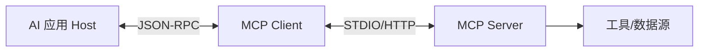
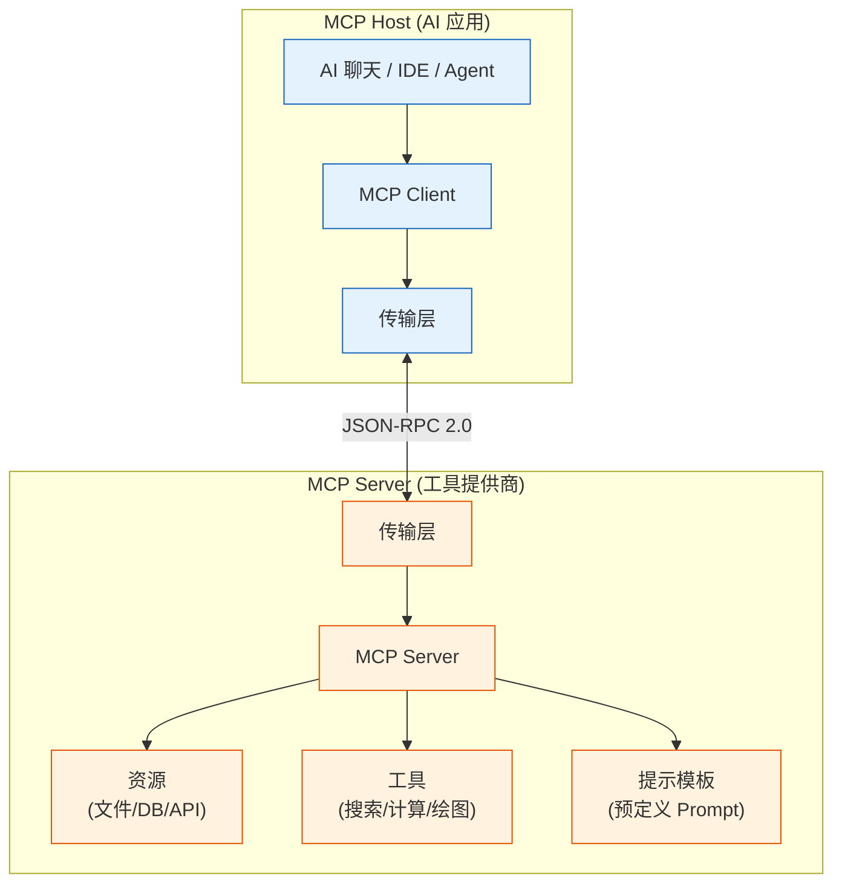
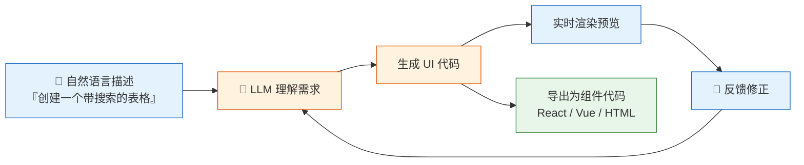

# ⚪ 阶段六：前沿技术与生态

> 📖 **本文档为《AI 前端开发体系化学习指南》的阶段拆分文档**
> 完整指南请查看：[学习指南总览](./README.md#-ai-前端开发体系化学习指南)

---

> 🎯 **阶段目标**：掌握 MCP、A2A 等前沿协议，具备技术选型与架构演进能力。

### 📑 本章目录
- [6.1 MCP (Model Context Protocol)](#61-mcp-model-context-protocol)
- [6.2 A2A (Agent-to-Agent) 通信](#62-a2a-agent-to-agent-通信)
- [6.3 多模态大模型（VLM）](#63-多模态大模型vlm)

### 💡 你将学到
- MCP（Model Context Protocol）协议核心概念与架构
- A2A（Agent-to-Agent）多智能体通信机制
- 多模态大模型（VLM）原理与挑战
- 前沿技术趋势分析（[WebGPU](https://www.w3.org/TR/webgpu/)、端侧大模型、AI 生成 UI）
- 持续学习路径与社区资源

### 🔗 前置知识
- 完成 [🟠 阶段五：生产化](./05-生产化与工程化.md)
- 了解 JSON-RPC 协议基础
- 具备技术选型与架构决策能力

> 💡 **进阶阅读**：[07-技术选型对比合集.md](./07-技术选型对比合集.md) 提供更多前沿技术的横向对比。

#### 6.1 MCP (Model Context Protocol)

MCP 是 [Anthropic](https://anthropic.com) 提出的开放协议，用于标准化 AI 应用与外部数据源/工具的集成。



**核心优势**：
- ✅ **标准化接口**：无需为每个数据源编写自定义代码
- ✅ **即插即用**：新增工具只需实现 MCP Server
- ✅ **安全性**：权限控制与数据隔离由协议层管理

#### 6.2 A2A (Agent-to-Agent) 通信

多 Agent 协作是未来趋势，A2A 协议定义了 Agent 间的通信标准。

```typescript
// lib/a2a/agent-registry.ts
export class AgentRegistry {
  async dispatchTask(agentId: string, task: any) {
    // 发送任务到目标 Agent
    const res = await fetch(`/agents/${agentId}/tasks`, { method: 'POST', body: JSON.stringify(task) });
    return res.json();
  }
}
```

---

---

### 🔌 MCP 协议深度解析

> **MCP = AI 的 USB 协议**：标准化 AI 应用与外部世界的连接方式。

#### MCP 协议架构



#### MCP 通信流程

```typescript
// MCP 客户端实现
class MCPClient {
  private transport: Transport;
  
  constructor(transportType: 'stdio' | 'sse' | 'websocket') {
    this.transport = this.createTransport(transportType);
  }

  // 获取可用工具列表
  async listTools(): Promise<ToolDefinition[]> {
    const response = await this.transport.request('tools/list', {});
    return response.tools;
  }

  // 调用工具
  async callTool(name: string, args: Record<string, unknown>): Promise<ToolResult> {
    return this.transport.request('tools/call', { name, arguments: args });
  }

  // 读取资源
  async readResource(uri: string): Promise<ResourceContent> {
    return this.transport.request('resources/read', { uri });
  }

  // 订阅资源变更
  async subscribeResource(uri: string): Promise<void> {
    await this.transport.request('resources/subscribe', { uri });
    this.transport.onNotification('resource_updated', (data) => {
      console.log(`资源 ${uri} 已更新:`, data);
    });
  }
}

// MCP Server 端定义工具
class MCPServer {
  private tools = new Map<string, ToolHandler>();

  registerTool(name: string, handler: ToolHandler): void {
    this.tools.set(name, handler);
  }

  async handleRequest(method: string, params: any): Promise<any> {
    switch (method) {
      case 'tools/list':
        return Array.from(this.tools.entries()).map(([name, handler]) => ({
          name,
          description: handler.description,
          inputSchema: handler.inputSchema,
        }));
      
      case 'tools/call':
        const tool = this.tools.get(params.name);
        if (!tool) throw new Error(`Tool ${params.name} not found`);
        return tool.execute(params.arguments);
      
      case 'resources/read':
        // 读取资源逻辑
        break;
    }
  }
}
```

#### MCP 传输层实现

MCP 支持三种传输协议，选择取决于 Server 运行环境：

```typescript
// ① STDIO 传输 — Server 与 Client 同进程，通过 stdin/stdout 通信
// 适合本地 CLI 工具、开发环境
import { Client } from '@modelcontextprotocol/sdk/client/index.js';
import { StdioClientTransport } from '@modelcontextprotocol/sdk/client/stdio.js';

const stdioTransport = new StdioClientTransport({
  command: 'node', args: ['./mcp-server.js']
});
const client = new Client({ name: 'my-client', version: '1.0' });
await client.connect(stdioTransport);

// ② SSE 传输 — Server 通过 HTTP SSE 推送事件，适合远程服务
import { SSEClientTransport } from '@modelcontextprotocol/sdk/client/sse.js';

const sseTransport = new SSEClientTransport(new URL('http://localhost:3001/sse'));
await client.connect(sseTransport);

// ③ WebSocket 传输 — 全双工，适合实时双向场景
import { WebSocketClientTransport } from '@modelcontextprotocol/sdk/client/websocket.js';

const wsTransport = new WebSocketClientTransport(new URL('ws://localhost:3002/mcp'));
await client.connect(wsTransport);
```

| 传输 | 延迟 | 部署方式 | 适用场景 |
|:---|:---:|:---|:---|
| **STDIO** | ~1ms | 同进程 | 本地开发、CLI 集成 |
| **SSE** | ~50ms | HTTP 服务 | 远程 API、浏览器前端 |
| **WebSocket** | ~10ms | WebSocket 服务 | 实时交互、流式通信 |

#### MCP Server 开发实战

以下是一个完整的天气预报 MCP Server，暴露工具和资源供 LLM 调用：

```typescript
// mcp-weather-server.ts — 完整 MCP Server 示例
import { Server } from '@modelcontextprotocol/sdk/server/index.js';
import { StdioServerTransport } from '@modelcontextprotocol/sdk/server/stdio.js';

const server = new Server(
  { name: 'weather-server', version: '1.0.0' },
  { capabilities: { tools: {}, resources: {} } },
);

// 注册工具：查询天气
server.setRequestHandler('tools/list', async () => ({
  tools: [{
    name: 'get_weather',
    description: '查询指定城市的实时天气',
    inputSchema: {
      type: 'object',
      properties: {
        city: { type: 'string', description: '城市名称，如 北京、Shanghai' },
        units: { type: 'string', enum: ['celsius', 'fahrenheit'], default: 'celsius' },
      },
      required: ['city'],
    },
  }],
}));

server.setRequestHandler('tools/call', async (request) => {
  const { name, arguments: args } = request.params;
  if (name === 'get_weather') {
    const weather = await fetch(`https://api.weather.com/v1/${args.city}`).then(r => r.json());
    return { content: [{ type: 'text', text: JSON.stringify(weather) }] };
  }
  throw new Error(`Unknown tool: ${name}`);
});

// 注册资源：暴露城市列表
server.setRequestHandler('resources/list', async () => ({
  resources: [{
    uri: 'weather://cities',
    name: '支持的城市列表',
    mimeType: 'application/json',
  }],
}));

// 启动 Server
const transport = new StdioServerTransport();
await server.connect(transport);
```

#### MCP Server 集成到 Agent

```typescript
// agent-with-mcp.ts — Agent 通过 MCP 客户端发现并调用工具
class MCPAgent {
  private mcpClients: Map<string, MCPServerClient> = new Map();

  async connectMCPServer(name: string, transport: Transport): Promise<void> {
    const client = new MCPServerClient({ name, version: '1.0' });
    await client.connect(transport);
    this.mcpClients.set(name, client);
  }

  async execute(task: string): Promise<string> {
    // 聚合所有 MCP Server 的工具列表
    const allTools = await Promise.all(
      [...this.mcpClients.values()].map(c => c.listTools())
    );
    const tools = allTools.flat();

    // LLM 决策：选择工具
    const decision = await this.llm.decide(task, tools);

    // 调用对应 MCP Server 的工具
    const client = this.mcpClients.get(decision.server)!;
    return client.callTool(decision.tool, decision.args);
  }
}
```

#### MCP 与 Function Calling 对比

| 对比维度 | MCP | Function Calling |
|:---|:---|:---|
| **标准化程度** | 开放标准协议 | 各厂商私有实现 |
| **工具发现** | ✅ 自动发现 (`tools/list`) | ❌ 需手动注册 |
| **资源管理** | ✅ 资源 + 订阅机制 | ❌ 仅函数调用 |
| **传输协议** | STDIO / SSE / WebSocket | HTTP (仅 REST) |
| **生态开放** | 任意语言实现 Server | 仅 LLM API 提供商 |
| **前端价值** | 一次接入，复用所有 MCP Server | 每接入一个 API 需写适配器 |

---

### 🤖 A2A 协议详解

> **Agent 之间的语言**：Google 提出的 Agent-to-Agent 通信标准，让不同厂商的 Agent 能协作。

| 概念 | 说明 | 类比 |
|:---|:---|:---|
| **Agent Card** | 描述 Agent 能力和接口的元数据 | API 的 OpenAPI 规范 |
| **Task** | Agent 间传输的工作单元 | REST 的 Request |
| **Artifact** | Task 的输出产物 | REST 的 Response |
| **Skill** | Agent 公开的能力集合 | 微服务 |
| **Manifest** | Agent 的可信度声明 | SSL 证书 |

```typescript
// A2A Agent Card 定义
interface AgentCard {
  name: string;
  description: string;
  url: string;
  version: string;
  capabilities: {
    skills: Array<{
      id: string;
      name: string;
      description: string;
      inputSchema: JSONSchema;
      outputSchema: JSONSchema;
    }>;
    authentication: {
      type: 'none' | 'bearer' | 'oauth2';
      verificationUrl?: string;
    };
    rateLimiting: {
      maxRequestsPerMinute: number;
    };
  };
}

// A2A Task 执行流程
class A2AClient {
  async discoverAgent(agentUrl: string): Promise<AgentCard> {
    const response = await fetch(`${agentUrl}/.well-known/agent-card`);
    return response.json();
  }

  async assignTask(
    agentUrl: string,
    task: { skillId: string; input: unknown }
  ): Promise<string> {
    const response = await fetch(`${agentUrl}/tasks`, {
      method: 'POST',
      headers: { 'Content-Type': 'application/json' },
      body: JSON.stringify({
        jsonrpc: '2.0',
        method: 'tasks/send',
        params: task,
      }),
    });
    const { taskId } = await response.json();
    return taskId;
  }

  async getTaskResult(agentUrl: string, taskId: string): Promise<TaskResult> {
    // 支持轮询和 WebSocket 推送两种模式
    const response = await fetch(`${agentUrl}/tasks/${taskId}`);
    return response.json();
  }
}
```

---

### 🖼️ 多模态大模型（VLM）

> **让 AI 不仅能"读"文字，还能"看"图像、"听"声音**

**什么是 VLM？** 视觉语言模型（Vision-Language Model）在 LLM 基础上增加了图像理解能力。核心思路是把图像"翻译"成文本 Token，让 LLM 能理解视觉内容。

**主流架构（连接器范式）：**
```
图像 → CLIP ViT(视觉编码器, 冻结) → MLP Projector(连接器, 训练) → 视觉Token → LLM
```
- **Stage 1**：只训练连接器（MLP），对齐图文语义 → 模型"看得见"
- **Stage 2**：训练连接器 + LLM（LoRA），学会对话 → 模型"会说话"

**关键挑战与方案：**

| 挑战 | 说明 | 解决方案 |
|:---|:---|:---|
| **模态鸿沟** | 图像是连续像素，文本是离散 Token，分布完全不同 | CLIP 对比学习拉近图文向量空间 |
| **高分辨率** | 224²→256 Tokens，1344²→9216 Tokens，O(N²)不可承受 | 切片处理、Token 压缩、双分辨率策略 |
| **视觉幻觉** | 模型"看见"图中不存在的东西（最常见：凭空说桌上有个苹果） | Grounding 约束、视觉对比解码（VCD） |
| **计算开销** | 图像 Token 是文本的数十倍 | Q-Former、Perceiver Resampler 压缩 |

**落地场景：** 文档OCR、GUI Agent（看懂屏幕操作APP）、医学影像分析、图表分析、视频理解

**代表模型：** GPT-4o、Qwen2-VL、LLaVA-1.6、InternVL2

---

### 🎨 AI 生成 UI (AI-Generated UI)

> **LLM 直接生成用户界面**：从自然语言描述到可用 UI 组件，正在改变前端工作流。

| 工具 | 原理 | 输出 | 适用阶段 |
|:---|:---|:---|:---|
| **v0.dev (Vercel)** | LLM + Tailwind 模板 | React + Tailwind 代码 | 原型设计 |
| **Bolt.new (StackBlitz)** | LLM + 浏览器 WebContainer | 完整项目代码 | 快速原型 |
| **Claude Artifacts** | Claude 直接渲染 | React/SVG/HTML | 交互式预览 |
| **GPT-4o Canvas** | 多模态理解 + 生成 | 预览 + 代码 | 迭代编辑 |
| **Builder.io** | 设计稿 → 代码 | Figma → React/Vue | 设计交付 |



**对前端工程师的影响**：
- **重复性 UI 编程将消失**：表单、表格、CRUD 页面由 AI 生成
- **价值转向架构与交互设计**：复杂状态管理、动画、无障碍仍需要人类
- **Prompt 工程成为前端技能**：描述 UI 需求的能力决定产出质量
- **组件库角色改变**：从"提供组件"到"提供 AI 生成模板"

---

### 🌐 Agentic Web (智能体互联网)

> **AI 作为用户代理**：未来用户不是直接浏览网站，而是由 AI Agent 代为访问和操作。

```typescript
// Agent 浏览器实现思路
class AgentBrowser {
  async browse(url: string, task: string): Promise<ActionResult> {
    const page = await this.navigate(url);
    const plan = await this.planInteractions(task, page);
    
    for (const step of plan) {
      switch (step.type) {
        case 'click':
          await this.click(step.selector);
          break;
        case 'input':
          await this.type(step.selector, step.value);
          break;
        case 'extract':
          const data = await this.extract(step.selector);
          return { success: true, data };
        case 'wait':
          await this.wait(step.duration);
          break;
      }
      await this.waitForPageLoad();
    }
    
    return { success: true, data: await this.getPageContent() };
  }
}
```

**关键趋势**：
1. **Browser Use 工具**：Claude 的 Computer Use、GPT-4o 的 Browser Use 让 AI 直接操作浏览器
2. **HTML-to-API 转换**：AI 从网页结构提取结构化数据，替代传统爬虫
3. **个性化 Agent**：用户训练自己的 Agent 代为完成购物、订票、比价等任务
4. **无头浏览器即服务**：Browserless.io、Playwright 作为 Agent 的基础设施

---

### ⚡ [WebAssembly](https://webassembly.org) 在 AI 中的未来

> **超越 JavaScript 的性能**：WASM 正在成为浏览器端 AI 推理的第二大技术路线（仅次于 [WebGPU](https://www.w3.org/TR/webgpu/)）。

| 技术 | 加速对象 | 性能优势 | 适用阶段 |
|:---|:---|:---:|:---:|
| **WASM SIMD** | CPU 向量化计算 | 2-4x | 小模型推理 |
| **WASM + Threads** | CPU 多核并行 | 2-6x | 预填充 (Prefill) |
| **WASI (WebAssembly System Interface)** | 系统级 API | — | 标准运行时接口 |
| **Wasmi** | 嵌入式 WASM 解释器 | — | 边缘设备推理 |
| **WAMR** | 轻量级 WASM 运行时 | — | IoT 设备 AI |

**前景展望**：
- **WASM + [WebGPU](https://www.w3.org/TR/webgpu/) 混合推理**：矩阵运算走 [WebGPU](https://www.w3.org/TR/webgpu/)，控制逻辑走 WASM
- **WASM 插件生态**：AI 模型以 WASM 模块分发，跨平台运行
- **边缘 WASM 推理**：Cloudflare Workers、Fastly 支持 WASM AI 推理

---

### 🧩 AI 编码助手生态与选型

> **从 Copilot 到 SWE-Agent**：AI 编码工具正在深刻改变软件开发方式。

| 工具 | 能力 | 成本 | 开源 | 前端支持 |
|:---|:---|:---:|:---:|:---:|
| **GitHub Copilot** | 代码补全 + Chat + Agent | $10/月 | ❌ | ⭐⭐⭐⭐⭐ |
| **Cursor** | 整文件编辑 + Agent 模式 | $20/月 | ❌ | ⭐⭐⭐⭐⭐ |
| **Windsurf (Codeium)** | Flow 模式 + 深度上下文 | 免费起步 | ❌ | ⭐⭐⭐⭐ |
| **Claude Code** | 终端 Agent + 文件编辑 | API 按量 | ❌ | ⭐⭐⭐⭐ |
| **Continue.dev** | 开源 IDE 插件 | API 费用 | ✅ | ⭐⭐⭐ |
| **OpenCode** | CLI Agent + 技能系统 | API 费用 | ✅ 即将开源 | ⭐⭐⭐⭐ |
| **Aider** | Git 感知的终端 Agent | API 费用 | ✅ | ⭐⭐⭐⭐ |

**选型建议**：
- **日常编码**：[Cursor](https://cursor.com)（体验最佳）或 Copilot（生态最全）
- **重构/迁移**：Claude Code（理解深度最优）
- **开源/私密**：[Continue.dev](https://continue.dev) + 本地 [Ollama](https://ollama.ai)
- **CI/CD 集成**：[Aider](https://aider.chat) 或 OpenCode 的 CLI 模式

---

### 📎 延伸阅读

| 文档 | 内容 | 相关章节 |
|:---|:---|:---|
| [📊 技术选型对比合集](./07-技术选型对比合集.md) | 前沿技术横向对比与趋势分析 | AI 代码生成工具、智能体平台 |
| [🛠️ 开发实战与架构指南](./08-开发实战与架构指南.md) | 未来趋势解读与架构演进 | 第19章：AI 前端开发未来趋势 |

---

### 📌 导航

| [⬅️ 上一阶段：生产化](./05-生产化与工程化.md) | [🏠 学习指南总览](./README.md#-ai-前端开发体系化学习指南) | [📚 技术选型对比合集](./07-技术选型对比合集.md) |
|:---:|:---:|:---:|

