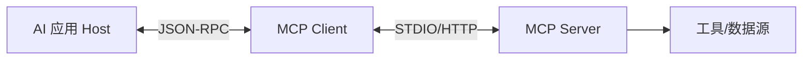

# ⚪ 阶段六：前沿技术与生态

> 📖 **本文档为《AI 前端开发体系化学习指南》的阶段拆分文档**
> 完整指南请查看：[01-AI前端开发体系化学习指南.md](./01-AI前端开发体系化学习指南.md)

---

> 🎯 **阶段目标**：掌握 MCP、A2A 等前沿协议，具备技术选型与架构演进能力。

### 📑 本章目录
- [MCP (Model Context Protocol)](#-mcp-model-context-protocol)
- [A2A (Agent-to-Agent) 通信](#-a2a-agent-to-agent-通信)

### 💡 你将学到
- MCP（Model Context Protocol）协议核心概念与架构
- A2A（Agent-to-Agent）多智能体通信机制
- 前沿技术趋势分析（WebGPU、端侧大模型、AI 生成 UI）
- 持续学习路径与社区资源

### 🔗 前置知识
- 完成 [🟠 阶段五：生产化](./06-生产化与工程化.md)
- 了解 JSON-RPC 协议基础
- 具备技术选型与架构决策能力

> 💡 **进阶阅读**：[08-技术选型对比合集.md](./08-技术选型对比合集.md) 提供更多前沿技术的横向对比。

### 🌐 MCP (Model Context Protocol)

MCP 是 Anthropic 提出的开放协议，用于标准化 AI 应用与外部数据源/工具的集成。



**核心优势**：
- ✅ **标准化接口**：无需为每个数据源编写自定义代码
- ✅ **即插即用**：新增工具只需实现 MCP Server
- ✅ **安全性**：权限控制与数据隔离由协议层管理

### 🤝 A2A (Agent-to-Agent) 通信

多 Agent 协作是未来趋势，A2A 协议定义了 Agent 间的通信标准。

```typescript
// lib/a2a/agent-registry.ts
export class AgentRegistry {
  async dispatchTask(agentId: string, task: any) {
    // 发送任务到目标 Agent
    const res = await fetch(`/agents/${agentId}/tasks`, { method: 'POST', body: JSON.stringify(task) });
    return res.json();
  }
}
```

---

### 📎 延伸阅读

| 文档 | 内容 | 相关章节 |
|:---|:---|:---|
| [📊 技术选型对比合集](./08-技术选型对比合集.md) | 前沿技术横向对比与趋势分析 | AI 代码生成工具、智能体平台 |
| [🛠️ 开发实战与架构指南](./09-开发实战与架构指南.md) | 未来趋势解读与架构演进 | 第19章：AI 前端开发未来趋势 |

---

### 📌 导航

| [⬅️ 上一阶段：生产化](./06-生产化与工程化.md) | [🏠 返回主指南](./01-AI前端开发体系化学习指南.md) | [📚 技术选型对比合集](./08-技术选型对比合集.md) |
|:---:|:---:|:---:|
