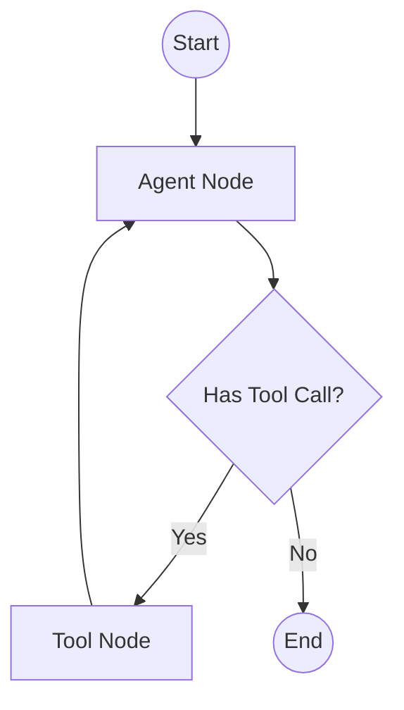
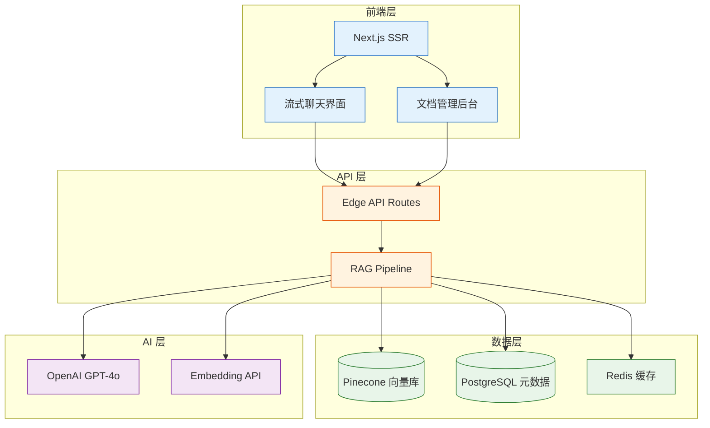
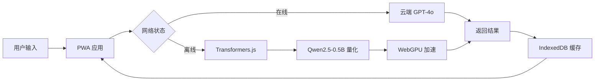
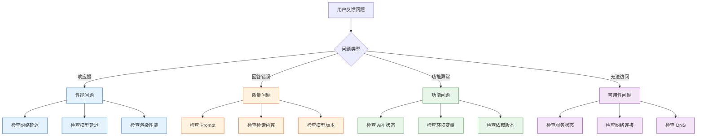
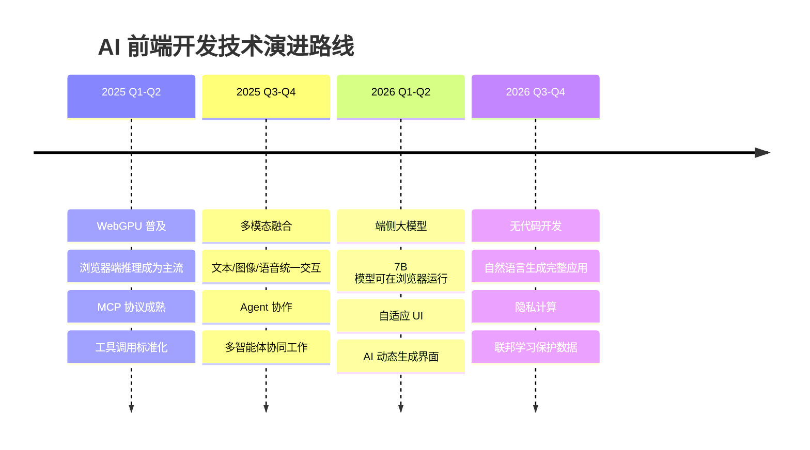
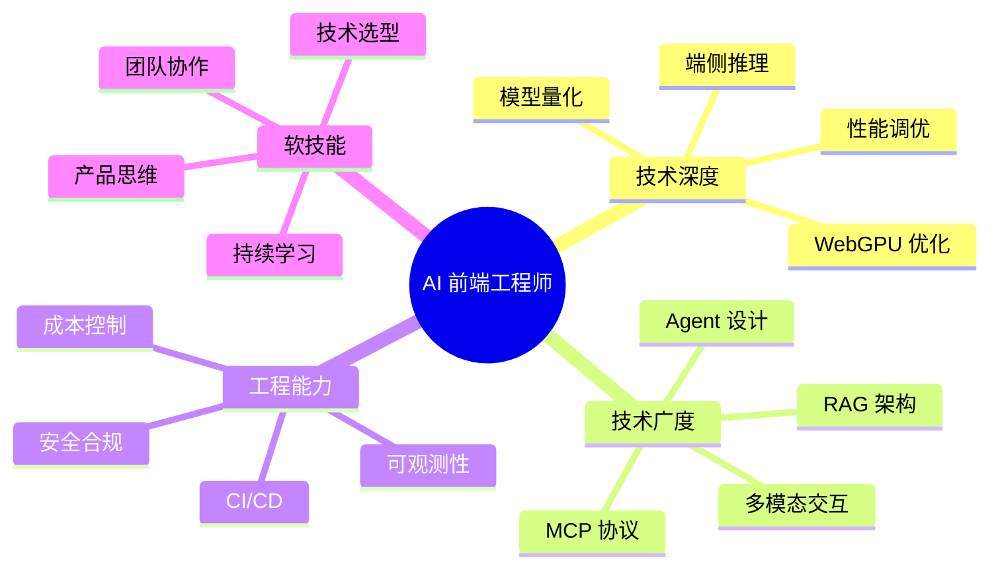
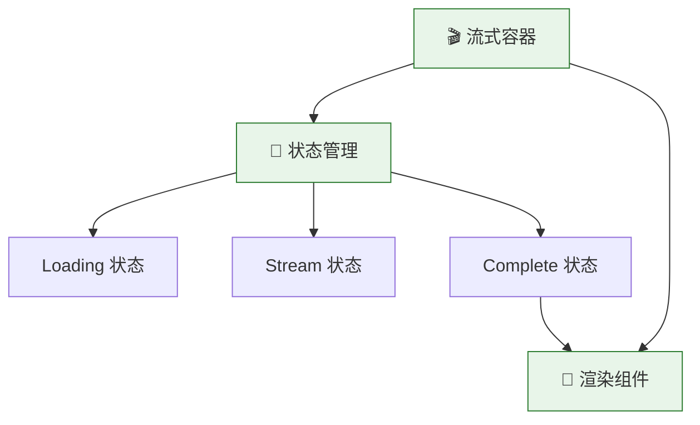
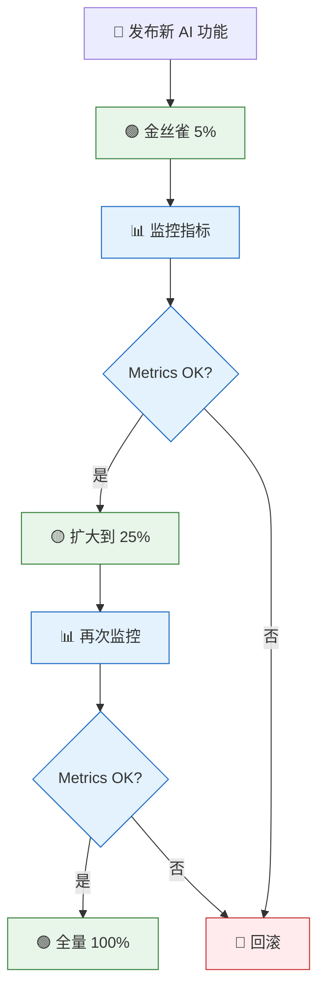
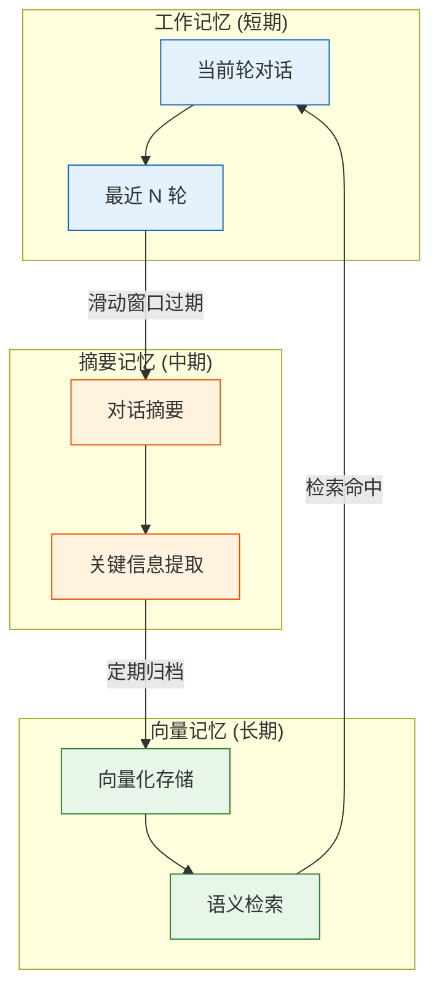
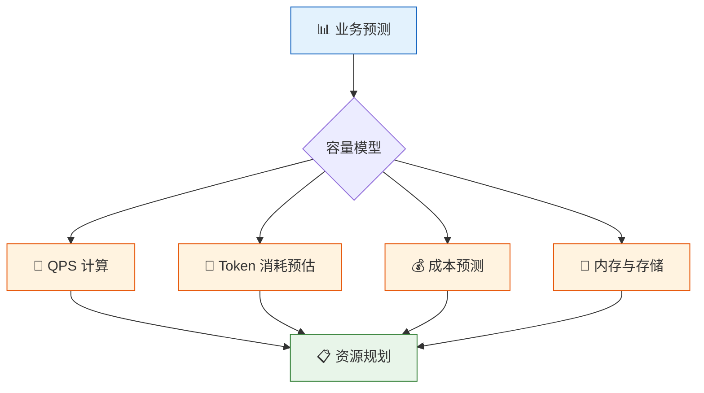

# 🛠️ AI 前端开发实战与架构指南

> **从实战中来，到实战中去** — 本文档摘录自 [《01-AI前端开发体系化学习指南》](./01-AI前端开发体系化学习指南.md) 中的实用开发指南、架构模式、部署案例与工程化最佳实践，帮助开发者快速定位问题、优化性能、构建生产级 AI 应用。

---

## 📑 目录

### 📌 导航

| [⬅️ 技术选型对比合集](./08-技术选型对比合集.md) | [🏠 返回主指南](./01-AI前端开发体系化学习指南.md) | [➡️ 附录与参考资料](./10-附录与参考资料.md) |
|:---:|:---:|:---:|

- [1. 🐛 AI 前端调试与排错指南](#1--ai-前端调试与排错指南)
- [2. 🧪 AI 应用测试策略](#2--ai-应用测试策略)
- [3. 🧪 自动化评估流水线 (CI/CD)](#3--自动化评估流水线-cicd)
- [4. 🧠 Prompt Engineering 进阶指南](#4--prompt-engineering-进阶指南)
- [5. 🔗 LangGraph 工作流编排](#5--langgraph-工作流编排)
- [6. ⚡ 前端 AI 性能优化终极 Checklist](#6--前端-ai-性能优化终极-checklist)
- [7. 💰 AI 成本估算与控制](#7--ai-成本估算与控制)
- [8. 🛠️ 本地开发环境搭建 (Ollama)](#8-️-本地开发环境搭建-ollama)
- [9. ♿ AI 应用无障碍设计 (Accessibility)](#9--ai-应用无障碍设计-accessibility)
- [10. 📦 常用 AI UI 组件库推荐](#10--常用-ai-ui-组件库推荐)
- [11. 🔐 环境变量与配置管理最佳实践](#11--环境变量与配置管理最佳实践)
- [12. 🌐 国际化 (i18n) 与多语言支持](#12--国际化-i18n-与多语言支持)
- [13. 📊 AI 输出渲染与数据可视化](#13--ai-输出渲染与数据可视化)
- [14. 📝 完整项目实战：AI 知识库问答系统](#14--完整项目实战ai-知识库问答系统)
- [15. 🔒 AI 应用合规与数据隐私 (GDPR/CCPA)](#15--ai-应用合规与数据隐私-gdprccpa)
- [16. 🚀 上线前终极检查清单 (Pre-launch Checklist)](#16--上线前终极检查清单-pre-launch-checklist)
- [17. 🏗️ AI 应用部署实战案例](#17-️-ai-应用部署实战案例)
- [18. 🐛 AI 应用快速排错手册](#18--ai-应用快速排错手册)
- [19. 🔮 AI 前端开发未来趋势](#19--ai-前端开发未来趋势)
- [20. 🧩 AI 前端组件设计模式深度解析](#20--ai-前端组件设计模式深度解析)
- [21. 🎯 AI 前端 Feature Flag 与灰度发布方案](#21--ai-前端-feature-flag-与灰度发布方案)
- [22. 🧠 AI 前端长上下文与记忆管理策略](#22--ai-前端长上下文与记忆管理策略)
- [23. 🧪 AI 前端单元测试与组件测试实战](#23--ai-前端单元测试与组件测试实战)
- [24. 📊 AI 前端性能预算与容量规划](#24--ai-前端性能预算与容量规划)

---

## 1. 🐛 AI 前端调试与排错指南

### 🔍 调试工具链

| 工具 | 用途 | 推荐场景 |
|:---|:---|:---|
| **Vercel AI Playground** | 快速测试 Prompt | Prompt 迭代优化 |
| **LangSmith** | 追踪 LLM 调用链 | RAG/Agent 调试 |
| **Chrome DevTools** | 网络/性能分析 | 流式响应调试 |
| **WebGPU Inspector** | GPU 状态监控 | 端侧推理优化 |

### 🚨 常见场景排查

#### 1. 流式响应中断
- **症状**：前端接收部分响应后停止。
- **排查**：检查服务端 `maxDuration`、Nginx 缓冲配置、客户端 `reader` 是否正确关闭。

#### 2. RAG 检索质量差
- **症状**：回答与文档内容无关。
- **排查**：打印分块内容确认语义完整性、调整 `topK`、引入重排序模型。

#### 3. 端侧模型加载失败 (OOM)
- **症状**：浏览器崩溃或加载超时。
- **排查**：使用 4-bit 量化模型、开启 WebGPU、检查 `performance.memory`。

---

## 2. 🧪 AI 应用测试策略

### 测试金字塔

```
       /\
      /  \      E2E 测试 (Playwright)
     /____\     完整用户流程验证
    /      \
   /________\   集成测试 (RAG 管道、Agent 工作流)
  /          \
 /____________\ 单元测试 (工具函数、Prompt 模板)
```

### 核心测试用例

1. **单元测试**：验证 TextSplitter 分块逻辑、Prompt 模板变量替换。
2. **集成测试**：验证 RAG 链能否基于给定上下文正确回答。
3. **E2E 测试**：模拟用户输入，验证流式响应渲染与 Markdown 格式。

---

## 3. 🧪 自动化评估流水线 (CI/CD)

> 🧪 **目标**：在代码合并前自动检测 AI 回答质量，防止"回归"。

### 1. 评估框架选择

| 框架 | 特点 | 适用场景 |
|:---|:---|:---|
| **Ragas** | 基于 LLM 的指标评估 (Faithfulness, Context Recall) | RAG 系统深度评估 |
| **DeepEval** | 支持自定义测试用例，集成 Pytest | 复杂业务逻辑验证 |
| **LangSmith** | 可视化追踪，支持数据集对比 | 全链路调试与监控 |

### 2. GitHub Actions 集成示例

```yaml
# .github/workflows/eval.yml
name: AI Evaluation
on: [pull_request]

jobs:
  test-rag:
    runs-on: ubuntu-latest
    steps:
      - uses: actions/checkout@v3
      - name: Run RAG Evaluation
        run: |
          npm install
          npm run eval:rag
        env:
          OPENAI_API_KEY: ${{ secrets.OPENAI_API_KEY }}
```

### 3. 评估阈值设置
- **Fail**: Faithfulness < 0.7 (回答包含大量幻觉)。
- **Warn**: Answer Relevance < 0.8 (回答偏题)。
- **Pass**: 所有指标达标，允许合并代码。

---

## 4. 🧠 Prompt Engineering 进阶指南

> 💡 **核心原则**：好的 Prompt 是清晰、具体、有约束的指令。

### 1. 结构化提示词框架 (CREATE)

| 元素 | 说明 | 示例 |
|:---|:---|:---|
| **C**haracter | 设定角色 | "你是一个资深前端架构师..." |
| **R**equest | 明确任务 | "请审查以下代码并指出性能问题..." |
| **E**xamples | 提供参考示例 | "示例输入：... 示例输出：..." |
| **A**djustments | 调整参数 | "使用 TypeScript，保持代码简洁..." |
| **T**ype | 指定输出格式 | "以 Markdown 表格形式输出..." |
| **E**xtras | 补充约束 | "不要解释，直接给出代码..." |

### 2. 高级技巧

- **🔗 Chain of Thought (CoT)**: 在 Prompt 末尾添加 `Let's think step by step.`，引导模型展示推理过程，显著提高复杂逻辑题准确率。
- **🔢 Few-Shot Prompting**: 提供 3-5 个高质量的输入输出对，帮助模型快速学习特定格式或风格。
- **🔄 Self-Consistency**: 对同一问题生成多个回答，通过投票机制选择出现频率最高的答案，降低随机性误差。

### 3. RAG 专用提示词模板

```typescript
const RAG_PROMPT = `
你是一个基于本地知识库的智能助手。请严格仅使用以下参考资料回答用户问题。

参考资料：
{context}

用户问题：{question}

回答要求：
1. 如果资料中包含答案，请准确引用并给出解释。
2. 如果资料不足以回答问题，请明确回复"根据现有资料无法回答"。
3. 保持回答简洁专业，避免幻觉。
4. 在回答末尾列出参考来源（如有）。

回答：
`;
```

---

## 5. 🔗 LangGraph 工作流编排

> 🧩 **为什么需要 LangGraph？** 传统的 Chain 是 DAG（有向无环图），而 LangGraph 支持**循环 (Cycles)** 和**状态管理 (State)**，是构建复杂 Agent 的核心。

### 1. 核心概念

- **State (状态)**: 定义工作流中传递的数据结构（TypedDict）。
- **Nodes (节点)**: 执行具体操作的函数（如调用 LLM、执行工具）。
- **Edges (边)**: 定义节点间的流转逻辑，支持**条件边 (Conditional Edges)**。

### 2. 架构示意图



### 3. 基础代码示例

```typescript
import { StateGraph } from '@langchain/langgraph';
import { Annotation } from '@langchain/langgraph';

// 定义状态
const AgentState = Annotation.Root({
  messages: Annotation<BaseMessage[]>({
    reducer: (x, y) => x.concat(y), // 消息累加器
  }),
});

// 构建图
const workflow = new StateGraph(AgentState)
  .addNode('agent', callModel)
  .addNode('action', callTool)
  .addEdge('__start__', 'agent')
  .addConditionalEdges('agent', shouldContinue, {
    continue: 'action',
    end: '__end__',
  })
  .addEdge('action', 'agent');

const app = workflow.compile();
```

---

## 6. ⚡ 前端 AI 性能优化终极 Checklist

### 🌐 网络层
- [ ] 启用 HTTP/2 或 HTTP/3 多路复用。
- [ ] 使用 CDN 加速静态资源与模型文件。
- [ ] 压缩 JSON 响应（Gzip/Brotli）。
- [ ] 实施流式传输 (SSE) 降低首字延迟 (TTFT)。

### 🎨 渲染层
- [ ] 使用**虚拟列表**渲染长对话历史（如 `react-window`）。
- [ ] 将 Markdown 解析移至 Web Worker。
- [ ] 避免在渲染循环中进行重计算（使用 `useMemo`）。
- [ ] 图片/视频懒加载，减少主线程阻塞。

### 🤖 模型层
- [ ] 优先使用**量化模型** (q4/q8) 减少内存占用。
- [ ] 启用 **WebGPU** 后端进行硬件加速。
- [ ] 缓存模型文件至 IndexedDB，避免重复下载。
- [ ] 实施**模型预热**策略，在用户空闲时预加载。

### 📉 Token 层
- [ ] 实施**滑动窗口**截断策略，保留最近 N 轮对话。
- [ ] 对早期对话进行**摘要压缩**。
- [ ] 使用小型模型处理简单任务（如分类、提取），大型模型处理复杂推理。

---

## 7. 💰 AI 成本估算与控制

> 💡 **核心目标**：在用户体验与 API 成本之间找到最佳平衡点。

### 1. 成本模型解析

| 计费项 | 说明 | 估算公式 |
|:---|:---|:---|
| **Input Tokens** | 发送给模型的 Prompt + 历史上下文 | `Prompt 长度 + Context 长度` |
| **Output Tokens** | 模型生成的回复内容 | `回复长度` (通常 Input:Output ≈ 3:1) |
| **Embedding** | 文本向量化 (通常较便宜) | `字符数 / 1000 * 单价` |

### 2. 降本策略

- **📉 上下文压缩**：使用 `tkn` 库估算 Token 数，动态截断非关键历史。
- **🔄 缓存命中**：对高频问题（如"你是谁"、"退款政策"）使用 Redis 缓存，避免调用 LLM。
- **🤖 模型路由**：
  - 简单任务 (分类/提取) → 使用廉价模型 (如 `gpt-4o-mini`, `haiku`)。
  - 复杂任务 (推理/代码) → 使用高级模型 (如 `gpt-4o`, `sonnet`)。
- **⏱️ 超时控制**：设置合理的 `max_tokens`，防止模型生成冗长废话。

### 3. 实时监控面板

建议搭建简易 Dashboard 追踪以下指标：
- **每日 Token 消耗量** (Input vs Output)。
- **平均响应延迟** (P50, P95, P99)。
- **缓存命中率** (目标 > 30%)。

---

## 8. 🛠️ 本地开发环境搭建 (Ollama)

> 🚀 **优势**：免费、隐私保护、支持离线调试、快速原型验证。

### 1. 安装 Ollama
- **macOS/Windows/Linux**: 前往 [ollama.com](https://ollama.com) 下载安装包。
- **验证安装**: 运行 `ollama --version`。

### 2. 拉取模型
```bash
# 拉取轻量级模型 (适合测试)
ollama pull qwen2.5:0.5b

# 拉取主流模型 (适合开发)
ollama pull llama3.1
ollama pull qwen2.5:7b
```

### 3. 对接前端项目
Ollama 默认提供 OpenAI 兼容接口 (`http://localhost:11434/v1`)。

```typescript
// 使用 OpenAI SDK 连接本地 Ollama
import OpenAI from 'openai';

const ollama = new OpenAI({
  baseURL: 'http://localhost:11434/v1',
  apiKey: 'ollama', // 必填，但可以是任意值
});

const chat = await ollama.chat.completions.create({
  model: 'qwen2.5:7b',
  messages: [{ role: 'user', content: '你好！' }],
});
```

---

## 9. ♿ AI 应用无障碍设计 (Accessibility)

> 🌍 **原则**：AI 生成的动态内容必须对所有用户（包括视障、听障）友好。

### 1. 关键实践

- **📢 状态播报 (Live Regions)**:
  使用 `aria-live="polite"` 让屏幕阅读器自动朗读 AI 生成的文本。
  ```tsx
  <div aria-live="polite" aria-atomic="true">
    {isGenerating ? 'AI 正在思考...' : aiResponse}
  </div>
  ```

- **⌨️ 键盘导航**:
  确保所有交互元素（发送按钮、停止按钮、历史记录）可通过 `Tab` 键访问。
  使用 `role="button"` 和 `tabIndex={0}` 增强语义。

- **🎨 对比度与字体**:
  AI 生成的 Markdown 内容可能包含小字号代码块。确保代码块背景与文字对比度符合 **WCAG AA** 标准。

- **🛑 错误处理**:
  当 API 报错时，不仅要显示视觉提示，还应更新 `aria-describedby` 关联错误信息。

---

## 10. 📦 常用 AI UI 组件库推荐

> 🎨 **加速开发**：避免重复造轮子，直接使用成熟的 AI 交互组件。

| 库名称 | 核心功能 | 推荐指数 |
|:---|:---|:---:|
| **[Vercel AI SDK UI](https://sdk.vercel.ai/docs)** | `useChat`, `useCompletion`, 流式渲染组件 | ⭐⭐⭐⭐⭐ |
| **[CopilotKit](https://copilotkit.ai/)** | 嵌入式 AI Copilot, 前端状态同步 | ⭐⭐⭐⭐ |
| **[Databerry/Chainlit](https://chainlit.io/)** | 快速原型 UI, 适合 Python 后端 | ⭐⭐⭐ |
| **[Streamlit](https://streamlit.io/)** | 数据科学应用快速构建 | ⭐⭐⭐ |
| **[Shadcn/UI](https://ui.shadcn.com/)** | 基础组件库，需手动集成 AI 逻辑 | ⭐⭐⭐⭐ |

### 💡 选型建议
- **高度定制化**: 使用 `Vercel AI SDK` + `Shadcn/UI`，灵活控制 UI 与状态。
- **快速落地**: 使用 `CopilotKit`，几行代码即可在 React 应用中嵌入 AI 侧边栏。
- **内部工具**: 使用 `Streamlit` 或 `Chainlit`，快速验证想法。

---

## 11. 🔐 环境变量与配置管理最佳实践

> 🔒 **安全第一**：确保敏感信息不泄露，配置灵活可切换。

### 1. 环境变量分类

| 类型 | 前缀 | 可见性 | 示例 |
|:---|:---|:---|:---|
| **服务端私有** | 无前缀 | 仅 Server/Route Handler | `OPENAI_API_KEY`, `DB_URL` |
| **客户端公开** | `NEXT_PUBLIC_` | 浏览器可访问 | `NEXT_PUBLIC_APP_NAME`, `NEXT_PUBLIC_ANALYTICS_ID` |
| **构建时变量** | - | 编译时注入，运行时不可改 | `VERSION`, `BUILD_TIME` |

### 2. 配置文件结构

```text
.env                # 默认配置 (不提交到 Git)
.env.local          # 本地开发覆盖配置 (Git 忽略)
.env.development    # 开发环境专用
.env.production     # 生产环境专用
```

### 3. 安全校验脚本

在 `package.json` 中添加检查脚本，防止漏配关键变量：
```json
{
  "scripts": {
    "check-env": "node -e \"if(!process.env.OPENAI_API_KEY) { console.error('❌ Missing OPENAI_API_KEY'); process.exit(1); }\""
  }
}
```

### 4. 动态配置中心 (进阶)
- 使用 **Vercel Environment Variables** 或 **AWS Secrets Manager** 管理生产环境密钥。
- 支持**热更新**：通过 API 拉取配置，避免重启服务。

---

## 12. 🌐 国际化 (i18n) 与多语言支持

> 🌍 **全球视野**：让 AI 应用支持多语言，触达更广泛用户。

### 1. 方案选择

| 方案 | 特点 | 适用场景 |
|:---|:---|:---|
| **next-intl** | 与 Next.js App Router 深度集成，类型安全 | 中大型项目，强类型要求 |
| **react-i18next** | 生态成熟，插件丰富，支持动态加载 | 传统 React 项目，复杂需求 |
| **Vercel AI SDK 内置** | 自动检测语言，模型原生支持多语言 | 纯 AI 生成内容，无需硬编码翻译 |

### 2. AI 原生多语言策略

- **🤖 模型自适应**: 大多数 LLM (如 GPT-4, Claude) 原生支持多语言。只需在 Prompt 中指定语言即可：
  ```typescript
  const prompt = `请用 ${userLanguage} 回答以下问题：${question}`;
  ```
- **🌐 自动检测**: 使用 `navigator.language` 或 IP 地理位置自动设置界面语言。
- **🔄 混合渲染**: 界面 UI 使用本地化 JSON 文件，AI 生成内容直接调用模型对应语言版本。

### 3. 实战示例 (next-intl)

```typescript
// app/[locale]/layout.tsx
import { NextIntlClientProvider } from 'next-intl';

export default function LocaleLayout({ children, params: { locale } }) {
  return (
    <NextIntlClientProvider locale={locale}>
      {children}
    </NextIntlClientProvider>
  );
}
```

---

## 13. 📊 AI 输出渲染与数据可视化

> 📈 **超越文本**：AI 不仅能生成文字，还能输出图表、代码、表格等富媒体内容。

### 1. 常见输出类型与渲染方案

| 输出类型 | 示例 | 推荐渲染库 | 注意事项 |
|:---|:---|:---|:---|
| **Markdown** | 文章、列表、粗体 | `react-markdown` + `remark-gfm` | 支持 GFM 表格、任务列表 |
| **代码块** | JS, Python, SQL | `react-syntax-highlighter`, `prismjs` | 语法高亮、一键复制、行号 |
| **数学公式** | LaTeX, KaTeX | `rehype-katex`, `react-katex` | 异步加载字体，避免闪烁 |
| **图表数据** | JSON, CSV | `ECharts`, `Recharts`, `Chart.js` | 要求模型输出严格 JSON 格式 |
| **Mermaid 图** | 流程图、时序图 | `mermaid` | 动态渲染需注意 XSS 防护 |

### 2. 结构化输出 (JSON Mode)

强制模型输出 JSON，便于前端直接解析并渲染图表：

```typescript
const response = await openai.chat.completions.create({
  model: "gpt-4o",
  messages: [{ role: "user", content: "生成过去 7 天用户访问量数据" }],
  response_format: { type: "json_object" }, // 开启 JSON 模式
});

const data = JSON.parse(response.choices[0].message.content);
// data = { "labels": ["Mon", "Tue"...], "values": [120, 150...] }
```

### 3. 动态组件渲染示例

```tsx
import ReactMarkdown from 'react-markdown';
import { Prism as SyntaxHighlighter } from 'react-syntax-highlighter';

function AIOutputRenderer({ content }: { content: string }) {
  return (
    <ReactMarkdown
      remarkPlugins={[remarkGfm]}
      components={{
        code({ node, inline, className, children, ...props }: any) {
          const match = /language-(\w+)/.exec(className || '');
          return !inline && match ? (
            <SyntaxHighlighter language={match[1]} PreTag="div" {...props}>
              {String(children).replace(/\n$/, '')}
            </SyntaxHighlighter>
          ) : (
            <code className={className} {...props}>{children}</code>
          );
        }
      }}
    >
      {content}
    </ReactMarkdown>
  );
}
```

---

## 14. 📝 完整项目实战：AI 知识库问答系统

> 🛠️ **从零到一**：30 分钟搭建一个支持 PDF 上传的智能问答应用。

### 1. 技术栈选择
- **框架**: Next.js 14 (App Router)
- **AI SDK**: Vercel AI SDK + OpenAI
- **向量库**: Pinecone (免费层级足够测试)
- **UI**: Tailwind CSS + Shadcn/UI

### 2. 核心步骤

#### Step 1: 初始化项目
```bash
npx create-next-app@latest ai-knowledge-base --typescript --tailwind --app
cd ai-knowledge-base
npm install ai @ai-sdk/openai langchain @langchain/openai @pinecone-database/pinecone pdf-parse
```

#### Step 2: 配置环境变量
`.env.local`:
```env
OPENAI_API_KEY=sk-...
PINECONE_API_KEY=pc-...
PINECONE_ENVIRONMENT=us-east-1
PINECONE_INDEX_NAME=knowledge
```

#### Step 3: 实现文档上传与向量化
`app/api/upload/route.ts`:
```typescript
import { NextRequest, NextResponse } from 'next/server';
import pdfParse from 'pdf-parse';
import { OpenAIEmbeddings } from '@langchain/openai';
import { PineconeStore } from '@langchain/pinecone';
import { Pinecone } from '@pinecone-database/pinecone';

export async function POST(req: NextRequest) {
  const formData = await req.formData();
  const file = formData.get('file') as File;
  const buffer = Buffer.from(await file.arrayBuffer());
  
  // 1. 解析 PDF
  const { text } = await pdfParse(buffer);
  
  // 2. 分块 & 向量化
  const embeddings = new OpenAIEmbeddings();
  const pinecone = new Pinecone({ apiKey: process.env.PINECONE_API_KEY! });
  const index = pinecone.Index(process.env.PINECONE_INDEX_NAME!);
  
  await PineconeStore.fromTexts([text], {}, embeddings, { pineconeIndex: index });
  
  return NextResponse.json({ success: true });
}
```

#### Step 4: 实现 RAG 问答接口
`app/api/chat/route.ts`:
```typescript
import { openai } from '@ai-sdk/openai';
import { streamText } from 'ai';
import { PineconeStore } from '@langchain/pinecone';
import { OpenAIEmbeddings } from '@langchain/openai';
import { Pinecone } from '@pinecone-database/pinecone';

export async function POST(req: Request) {
  const { messages } = await req.json();
  const lastMessage = messages[messages.length - 1].content;

  // 1. 检索相关知识
  const embeddings = new OpenAIEmbeddings();
  const pinecone = new Pinecone({ apiKey: process.env.PINECONE_API_KEY! });
  const index = pinecone.Index(process.env.PINECONE_INDEX_NAME!);
  const vectorStore = new PineconeStore(embeddings, { pineconeIndex: index });
  
  const docs = await vectorStore.similaritySearch(lastMessage, 3);
  const context = docs.map(d => d.pageContent).join('\n\n');

  // 2. 增强 Prompt
  const systemMsg = `基于以下资料回答问题：\n${context}`;

  // 3. 流式生成
  const result = streamText({
    model: openai('gpt-4o'),
    messages: [{ role: 'system', content: systemMsg }, ...messages],
  });

  return result.toDataStreamResponse();
}
```

#### Step 5: 前端集成
使用 `useChat` Hook 绑定 API，添加文件上传按钮即可。

### 3. 进阶优化方向
- ✅ 添加**上传进度条**与解析状态提示。
- ✅ 实现**引用溯源**，点击答案跳转至 PDF 对应页码。
- ✅ 引入**混合检索**，提高专业术语匹配率。

---

## 15. 🔒 AI 应用合规与数据隐私 (GDPR/CCPA)

> ⚖️ **合法合规**：在享受 AI 红利的同时，确保用户数据隐私与法律遵从性。

### 1. 核心法规要求

| 法规 | 适用范围 | 核心要求 | AI 相关影响 |
|:---|:---|:---|:---|
| **GDPR** | 欧盟用户 | 数据最小化、被遗忘权、明确同意 | 用户可要求删除用于训练/缓存的数据 |
| **CCPA** | 加州用户 | 知情权、选择退出权、非歧视 | 需明确告知数据是否分享给第三方 AI 服务 |
| **《生成式 AI 服务管理暂行办法》** | 中国境内 | 内容安全、标识义务、数据合法 | 生成内容需添加水印，禁止生成违法信息 |

### 2. 隐私保护最佳实践

- **🔐 数据脱敏**: 在发送给 LLM 之前，使用正则或 NLP 模型移除 PII (个人身份信息)。
- **🚫 禁用模型训练**: 在 OpenAI/Claude 企业版中，明确关闭"使用用户数据改进模型"选项。
- **📜 透明隐私政策**: 明确告知用户数据如何被 AI 处理、存储及第三方共享。
- **🗑️ 自动清理机制**: 设置对话历史 TTL (Time-To-Live)，到期自动匿名化或删除。

### 3. 合规检查清单
- [ ] 是否已获取用户对 AI 处理的明确同意？
- [ ] 是否提供"退出 AI 分析"的选项？
- [ ] 是否对敏感数据（医疗、金融）进行加密传输与存储？
- [ ] 生成内容是否包含必要的 AI 生成标识？

---

## 16. 🚀 上线前终极检查清单 (Pre-launch Checklist)

> ✅ **最后一道防线**：确保 AI 应用在推向生产环境前万无一失。

### 1. 🛡️ 安全与合规
- [ ] **API Key 隔离**: 确认所有密钥仅存在于服务端环境变量，未硬编码或提交至 Git。
- [ ] **速率限制**: 已配置 IP/用户级限流，防止恶意刷量导致费用激增。
- [ ] **数据脱敏**: 敏感信息 (PII) 在发送给 LLM 前已自动过滤或加密。
- [ ] **合规声明**: 隐私政策已更新，明确告知用户 AI 数据处理方式。

### 2. ⚡ 性能与体验
- [ ] **流式响应**: 已启用 SSE，首字延迟 (TTFT) < 1.5s。
- [ ] **错误重试**: 网络波动或 5xx 错误时，前端自动重试 (最多 2 次)。
- [ ] **移动端适配**: 聊天界面、代码块、表格在 375px 宽度下正常显示。
- [ ] **无障碍支持**: 关键交互支持键盘导航，动态内容包含 `aria-live` 属性。

### 3. 🧪 质量与评估
- [ ] **幻觉控制**: RAG 系统已配置"不知道则回答不知道"的强约束。
- [ ] **自动化测试**: 核心 Prompt 模板与工具调用逻辑已通过单元测试。
- [ ] **评估基线**: Ragas 评估分数 (Faithfulness, Relevance) 达到预设阈值。
- [ ] **灰度发布**: 已准备 Feature Flag，支持按用户比例逐步开放 AI 功能。

### 4. 📊 监控与运维
- [ ] **日志追踪**: 已集成 Sentry/Datadog，记录 API 延迟、Token 消耗与错误堆栈。
- [ ] **告警配置**: 当错误率 > 1% 或延迟 > 5s 时，自动发送 Slack/邮件通知。
- [ ] **备份策略**: 向量数据库与对话历史已配置定期快照备份。
- [ ] **降级方案**: 若 LLM 服务宕机，前端可切换至静态 FAQ 或友好提示页。

---

## 17. 🏗️ AI 应用部署实战案例

> 🚀 **从开发到生产**：真实场景下的 AI 应用部署经验与避坑指南。

### 1. 典型案例架构

#### 案例 A：企业知识库问答系统



**技术选型**：
- 前端：Next.js 14 + Tailwind + Vercel AI SDK
- 部署：Vercel (前端) + AWS Lambda (后端)
- 向量库：Pinecone (Serverless)
- 缓存：Upstash Redis
- 监控：LangSmith + Sentry

**关键指标**：
- 首字延迟 (TTFT): < 500ms
- 平均响应时间: 2-3s
- 检索准确率: 85%+
- 月活跃用户: 5000+

#### 案例 B：端侧离线 AI 助手



**技术选型**：
- 框架：Next.js PWA + Transformers.js
- 模型：Qwen2.5-0.5B (4-bit 量化)
- 加速：WebGPU (Chrome 113+)
- 存储：IndexedDB (模型缓存)
- 部署：GitHub Pages / Cloudflare Pages

**关键指标**：
- 模型加载时间: < 3s (缓存后 < 500ms)
- 推理延迟: < 200ms/token
- 离线可用: 100%
- 包体积: < 50MB (模型)

### 2. 部署避坑指南

| 场景 | 常见坑 | 解决方案 |
|:---|:---|:---|
| **Vercel 部署** | `maxDuration` 限制导致超时 | 使用 Pro 计划 (60s) 或迁移至 AWS |
| **流式响应** | Nginx 缓冲导致流中断 | 关闭 `proxy_buffering`，设置 `X-Accel-Buffering: no` |
| **向量库连接** | 冷启动延迟高 | 使用连接池，预热连接 |
| **模型加载** | 浏览器 OOM 崩溃 | 使用 4-bit 量化，分片加载 |
| **CORS 问题** | 跨域请求被拒 | 配置正确的 CORS 头，使用代理 |
| **环境变量** | 客户端泄露 API Key | 仅在服务端使用，使用 `.env.local` |

### 3. 成本优化实战

```typescript
// lib/cost/cost-optimizer.ts
export class CostOptimizer {
  // 💰 Token 成本估算
  static estimateCost(tokens: number, model: string): number {
    const pricing: Record<string, { input: number; output: number }> = {
      'gpt-4o': { input: 5.00, output: 15.00 }, // per 1M tokens
      'gpt-4o-mini': { input: 0.15, output: 0.60 },
      'claude-3-5-sonnet': { input: 3.00, output: 15.00 },
    };

    const price = pricing[model];
    if (!price) return 0;
    return (tokens * price.input) / 1_000_000;
  }

  // 📉 成本优化策略
  static strategies = [
    '使用 gpt-4o-mini 处理简单任务',
    '实施响应缓存，避免重复请求',
    '压缩上下文，减少输入 Token',
    '使用端侧模型处理离线场景',
    '批量处理非实时请求',
  ];
}
```

---

## 18. 🐛 AI 应用快速排错手册

> 🔧 **5 分钟定位**：常见问题快速诊断与修复指南。

### 1. 错误分类与响应时间



### 2. 快速诊断命令

```bash
# 🔍 检查 API 连通性
curl -X POST https://api.openai.com/v1/chat/completions \
  -H "Authorization: Bearer $OPENAI_API_KEY" \
  -H "Content-Type: application/json" \
  -d '{"model":"gpt-4o","messages":[{"role":"user","content":"Hi"}]}'

# 📊 检查响应时间
curl -w "@curl-format.txt" -o /dev/null -s https://your-app.vercel.app/api/chat

# 🔎 检查向量库连接
curl -X GET "https://your-index.pinecone.io/describe_index_stats" \
  -H "Api-Key: $PINECONE_API_KEY"

# 🧪 检查 WebGPU 支持
node -e "console.log('WebGPU:', 'gpu' in navigator)"

# 📦 检查依赖版本
npm ls ai @ai-sdk/openai langchain @huggingface/transformers
```

### 3. 常见错误码速查

| 错误码 | 含义 | 常见原因 | 解决方案 |
|:---|:---|:---|:---|
| **400** | 请求错误 | 参数格式错误 | 检查请求体结构 |
| **401** | 未授权 | API Key 无效/过期 | 更新 API Key |
| **403** | 禁止访问 | 权限不足/地区限制 | 检查账户权限 |
| **429** | 请求过多 | 超出速率限制 | 实施退避重试 |
| **500** | 服务器错误 | 内部异常 | 检查服务端日志 |
| **503** | 服务不可用 | 模型过载/维护 | 稍后重试或切换模型 |

### 4. 日志分析模板

```typescript
// lib/debug/log-analyzer.ts
export class LogAnalyzer {
  static analyzeLogs(logs: string[]): { errors: string[]; warnings: string[] } {
    const errors: string[] = [];
    const warnings: string[] = [];

    for (const log of logs) {
      if (log.includes('ERROR')) {
        if (log.includes('rate limit')) errors.push('触发速率限制');
        if (log.includes('timeout')) errors.push('请求超时');
        if (log.includes('OOM')) errors.push('内存溢出');
      }
      if (log.includes('WARN')) {
        if (log.includes('fallback')) warnings.push('使用降级方案');
        if (log.includes('deprecated')) warnings.push('使用已弃用 API');
      }
    }

    return { errors, warnings };
  }
}
```

---

## 19. 🔮 AI 前端开发未来趋势

> 🌟 **前瞻视野**：把握技术演进方向，提前布局核心竞争力。

### 1. 技术趋势预测 (2025-2027)



### 2. 新兴技术关注

| 技术 | 成熟度 | 潜力 | 学习建议 |
|:---|:---:|:---:|:---|
| **WebGPU** | 🟡 发展中 | ⭐⭐⭐⭐⭐ | 立即学习，未来标配 |
| **MCP 协议** | 🟢 成熟中 | ⭐⭐⭐⭐ | 关注标准制定 |
| **A2A 协议** | 🔴 早期 | ⭐⭐⭐⭐ | 了解概念即可 |
| **WebLLM** | 🟡 发展中 | ⭐⭐⭐⭐ | 实验性使用 |
| **AI 生成 UI** | 🔴 早期 | ⭐⭐⭐ | 保持关注 |
| **浏览器 Agent** | 🟡 发展中 | ⭐⭐⭐⭐⭐ | 重点学习 |

### 3. 职业发展建议



### 4. 学习路线建议

| 时间 | 重点 | 目标 |
|:---|:---|:---|
| **1-3 个月** | API 调用 + RAG 基础 | 能独立开发知识库应用 |
| **3-6 个月** | 端侧推理 + Agent | 能构建离线 AI 助手 |
| **6-12 个月** | 工程化 + 监控 | 能主导 AI 平台架构 |
| **1-2 年** | 前沿技术 + 开源 | 成为领域技术专家 |

---

## 20. 🧩 AI 前端组件设计模式深度解析

> 🏗️ **模式复用**：总结 AI 前端开发中反复出现的高频设计模式，提升代码质量与开发效率。

### 1. 流式容器模式 (Streaming Container)

将流式响应的状态管理与 UI 渲染分离，保持组件职责单一。



```tsx
// components/chat/streaming-container.tsx
'use client';

import { useChat } from 'ai/react';
import { MessageList } from './message-list';
import { InputArea } from './input-area';

export function StreamingContainer() {
  const {
    messages,
    input,
    handleInputChange,
    handleSubmit,
    isLoading,
    stop,
    error,
    reload,
  } = useChat({ api: '/api/chat' });

  return (
    <div className="flex flex-col h-full">
      <MessageList
        messages={messages}
        isLoading={isLoading}
        error={error}
        onReload={reload}
      />
      <InputArea
        input={input}
        onChange={handleInputChange}
        onSubmit={handleSubmit}
        isLoading={isLoading}
        onStop={stop}
      />
    </div>
  );
}
```

### 2. 适配器模式 (Adapter Pattern)

统一不同 AI 提供商接口，降低切换成本。

```typescript
// lib/ai/provider-adapter.ts
export interface AIProvider {
  streamChat(messages: any[], options?: any): ReadableStream;
  getModelList(): Promise<string[]>;
  estimateCost(tokens: number): number;
}

export class OpenAIAdapter implements AIProvider {
  streamChat(messages: any[], options?: any) {
    // OpenAI 实现
  }
  async getModelList() { return ['gpt-4o', 'gpt-4o-mini']; }
  estimateCost(tokens: number) { return tokens * 0.000005; }
}

export class AnthropicAdapter implements AIProvider {
  streamChat(messages: any[], options?: any) {
    // Anthropic 实现
  }
  async getModelList() { return ['claude-3-sonnet', 'claude-3-haiku']; }
  estimateCost(tokens: number) { return tokens * 0.000003; }
}

export function createProvider(type: string): AIProvider {
  switch (type) {
    case 'openai': return new OpenAIAdapter();
    case 'anthropic': return new AnthropicAdapter();
    default: throw new Error(`Unknown provider: ${type}`);
  }
}
```

### 3. 组合模式 (Compound Pattern)

使用组合模式构建灵活的聊天组件 API。

```tsx
// components/chat/chat.tsx
import { createContext, useContext } from 'react';

const ChatContext = createContext<any>(null);

export function Chat({ children, ...props }: { children: React.ReactNode }) {
  const chat = useChat(props);
  return (
    <ChatContext.Provider value={chat}>
      <div className="chat-container">{children}</div>
    </ChatContext.Provider>
  );
}

Chat.Messages = function Messages() {
  const { messages } = useContext(ChatContext);
  return <MessageList messages={messages} />;
};

Chat.Input = function Input() {
  const { input, handleInputChange, handleSubmit } = useContext(ChatContext);
  return (
    <form onSubmit={handleSubmit}>
      <input value={input} onChange={handleInputChange} />
    </form>
  );
};

// 使用
<Chat api="/api/chat">
  <Chat.Messages />
  <Chat.Input />
</Chat>
```

### 4. 状态归约模式 (State Reducer Pattern)

将 AI 状态变更封装为可预测的归约器。

```typescript
// lib/ai/chat-reducer.ts
type Action =
  | { type: 'ADD_MESSAGE'; message: Message }
  | { type: 'UPDATE_STREAM'; content: string }
  | { type: 'SET_ERROR'; error: string }
  | { type: 'CLEAR_HISTORY' };

interface State {
  messages: Message[];
  isStreaming: boolean;
  error: string | null;
}

export function chatReducer(state: State, action: Action): State {
  switch (action.type) {
    case 'ADD_MESSAGE':
      return { ...state, messages: [...state.messages, action.message], isStreaming: true, error: null };
    case 'UPDATE_STREAM':
      const updated = [...state.messages];
      const last = { ...updated[updated.length - 1], content: action.content };
      updated[updated.length - 1] = last;
      return { ...state, messages: updated };
    case 'SET_ERROR':
      return { ...state, error: action.error, isStreaming: false };
    case 'CLEAR_HISTORY':
      return { ...state, messages: [], error: null };
    default:
      return state;
  }
}
```

### 5. 降级链模式 (Fallback Chain Pattern)

按优先级依次尝试不同策略，确保服务可用性。

```typescript
// lib/ai/fallback-chain.ts
export class FallbackChain<T> {
  private handlers: Array<() => Promise<T>> = [];

  addHandler(handler: () => Promise<T>): this {
    this.handlers.push(handler);
    return this;
  }

  async execute(): Promise<T> {
    const errors: Error[] = [];
    for (const handler of this.handlers) {
      try {
        return await handler();
      } catch (error) {
        errors.push(error as Error);
        console.warn('Fallback handler failed:', error);
      }
    }
    throw new Error(`All ${this.handlers.length} handlers failed`);
  }
}

// 使用
const chain = new FallbackChain<string>()
  .addHandler(() => callModel('gpt-4o'))
  .addHandler(() => callModel('gpt-4o-mini'))
  .addHandler(() => getCachedResponse());

const response = await chain.execute();
```

---

## 21. 🎯 AI 前端 Feature Flag 与灰度发布方案

> 🚩 **安全发布**：通过特性开关控制 AI 功能上线节奏，降低发布风险。

### 1. Feature Flag 分类

| 类型 | 生命周期 | 示例 | 管理模式 |
|:---|:---:|:---|:---|
| **发布开关** | 短期 (天级) | 新 RAG 模型上线 | 上线后移除 |
| **实验开关** | 中期 (周级) | GPT-4o vs Claude A/B 测试 | 自动关闭 |
| **权限开关** | 长期 (月级) | Beta 用户抢先体验 | 按用户组 |
| **运营开关** | 永久 | 降级模式切换 | 手动控制 |

### 2. AI 特性开关实战

```typescript
// lib/feature-flags/ai-flags.ts
export const AIFeatureFlags = {
  ENHANCED_RAG: 'ai.enhanced-rag',
  MULTI_MODAL: 'ai.multi-modal',
  AGENT_MODE: 'ai.agent-mode',
  NEW_MODEL: 'ai.new-model',
  FALLBACK_MODEL: 'ai.fallback-model',
  STRICT_FILTER: 'ai.strict-filter',
  CONTENT_REVIEW: 'ai.content-review',
} as const;

export class AIFeatureManager {
  static isEnabled(flag: string, user?: { id: string; tier: string }): boolean {
    const enabledUsers = ['beta', 'internal'];
    if (user && enabledUsers.includes(user.tier)) return true;
    return false;
  }
}
```

### 3. A/B 测试框架

```typescript
// lib/ab-test/ai-experiment.ts
export class AIExperiment {
  constructor(
    private name: string,
    private variants: Array<{ name: string; config: any; weight: number }>
  ) {}

  getVariant(userId: string): { name: string; config: any } {
    const hash = this.hashUserId(userId);
    let cumulative = 0;
    for (const variant of this.variants) {
      cumulative += variant.weight;
      if (hash < cumulative) return variant;
    }
    return this.variants[0];
  }

  private hashUserId(userId: string): number {
    let hash = 0;
    for (let i = 0; i < userId.length; i++) {
      hash = ((hash << 5) - hash) + userId.charCodeAt(i);
      hash |= 0;
    }
    return Math.abs(hash % 100) / 100;
  }

  async trackEvent(event: string, data: Record<string, unknown>) {
    console.log(`[Experiment: ${this.name}] ${event}`, data);
  }
}

// 使用
const experiment = new AIExperiment('rag-model-test', [
  { name: 'control', config: { model: 'gpt-4o', chunkSize: 1000 }, weight: 0.5 },
  { name: 'treatment', config: { model: 'claude-3', chunkSize: 800 }, weight: 0.5 },
]);
```

### 4. 灰度发布流程



### 5. 关键监控指标

| 指标 | 正常范围 | 告警阈值 | 回滚条件 |
|:---|:---:|:---:|:---:|
| **首字延迟 (TTFT)** | < 1.5s | > 2s | > 3s |
| **错误率** | < 1% | > 2% | > 5% |
| **用户满意度** | > 4.0/5.0 | < 3.5 | < 3.0 |
| **Token 消耗** | 预算 80% 以内 | > 预算 100% | > 预算 150% |
| **检索准确率** | > 80% | < 75% | < 70% |

---

## 22. 🧠 AI 前端长上下文与记忆管理策略

> 💾 **记忆无限**：突破 LLM 上下文窗口限制，实现无限长对话与精准信息召回。

### 1. 三级记忆架构



### 2. 记忆管理器实现

```typescript
// lib/memory/memory-manager.ts
export interface MemoryEntry {
  id: string;
  content: string;
  type: 'conversation' | 'summary' | 'fact';
  timestamp: number;
  importance: number;
}

export class MemoryManager {
  private workingMemory: MemoryEntry[] = [];
  private maxWorkingEntries = 20;

  addEntry(entry: Omit<MemoryEntry, 'id' | 'timestamp'>) {
    const newEntry: MemoryEntry = {
      ...entry,
      id: crypto.randomUUID(),
      timestamp: Date.now(),
    };
    this.workingMemory.push(newEntry);
    if (this.workingMemory.length > this.maxWorkingEntries) {
      this.compressWorkingMemory();
    }
  }

  private compressWorkingMemory() {
    const sorted = [...this.workingMemory].sort((a, b) => b.importance - a.importance);
    this.workingMemory = sorted.slice(0, this.maxWorkingEntries * 0.5);
    const lowImportance = sorted.slice(this.maxWorkingEntries * 0.5);
    if (lowImportance.length > 0) {
      const summary = lowImportance.map(e => e.content).join('\n');
      this.addEntry({ content: `[摘要] ${summary.substring(0, 500)}`, type: 'summary', importance: 5 });
    }
  }

  async retrieve(query: string, topK = 5): Promise<MemoryEntry[]> {
    return this.workingMemory
      .filter(e => e.content.includes(query) || e.type === 'summary')
      .slice(0, topK);
  }
}
```

### 3. 滑动窗口策略对比

| 策略 | 原理 | 信息损失 | 计算开销 | 适用场景 |
|:---|:---|:---:|:---:|:---|
| **固定窗口** | 保留最近 N 条消息 | 高 | 极低 | 简单客服、单轮问答 |
| **Token 预算** | 按 Token 数动态保留 | 中 | 低 | 大多数通用场景 |
| **重要性排序** | 保留高重要性消息 | 低 | 中 | 复杂推理、长对话 |
| **混合策略** | 窗口 + 摘要 + 向量 | 极低 | 高 | 企业级 Agent、知识库 |

### 4. 上下文构建器

```typescript
// lib/memory/context-builder.ts
export class ContextBuilder {
  private systemPrompt: string;
  private memoryManager: MemoryManager;

  constructor(systemPrompt: string) {
    this.systemPrompt = systemPrompt;
    this.memoryManager = new MemoryManager();
  }

  async buildContext(userInput: string): Promise<{ system: string; messages: any[] }> {
    const relevantMemory = await this.memoryManager.retrieve(userInput, 3);
    const memoryContext = relevantMemory.map(m => `[${m.type}] ${m.content}`).join('\n');
    const enhancedSystem = `${this.systemPrompt}\n\n历史相关信息：\n${memoryContext}`;
    const messages = [
      { role: 'system', content: enhancedSystem },
      ...this.workingToMessages(),
      { role: 'user', content: userInput },
    ];
    return { system: enhancedSystem, messages };
  }

  private workingToMessages(): any[] {
    return this.memoryManager['workingMemory']
      .filter((e: MemoryEntry) => e.type === 'conversation')
      .map((e: MemoryEntry) => ({ role: 'user', content: e.content }));
  }
}
```

### 5. 最佳实践

- **🎯 分层管理**: 工作记忆 (20 轮) + 摘要记忆 (每日摘要) + 向量记忆 (永久存储)。
- **⚖️ 重要性评分**: 根据用户评分、提及频率、关键词匹配动态调整记忆权重。
- **🔄 定期刷新**: 每天自动对长期记忆进行重新索引与摘要更新。
- **📏 Token 预算**: 为系统提示词 (20%)、历史对话 (60%)、用户输入 (10%)、生成输出 (10%) 分配固定预算。

---

## 23. 🧪 AI 前端单元测试与组件测试实战

> ✅ **质量门禁**：用自动化测试覆盖 AI 组件的核心交互，避免回归问题。

### 1. 测试策略金字塔

```
        /\
       /  \      E2E 测试 (5%)
      /____\     Playwright, 完整用户流程
     /      \
    /________\   集成测试 (25%)
   /          \   RAG 管道、Agent 工作流
  /____________\ 单元测试 (70%)
                 工具函数、状态管理、组件渲染
```

### 2. 工具链选型

| 工具 | 用途 | 推荐配置 |
|:---|:---|:---|
| **Vitest** | 单元测试 + 组件测试 | `npm vitest -- --coverage` |
| **Testing Library** | 组件交互测试 | `@testing-library/react` |
| **MSW** | Mock API 请求 | `msw` |
| **Playwright** | E2E 测试 | `npx playwright test` |

### 3. 单元测试实战

```typescript
// tests/unit/text-splitter.test.ts
import { describe, it, expect } from 'vitest';
import { TextSplitter } from '@/lib/text-splitter';

describe('TextSplitter', () => {
  it('should split text into chunks with specified size', () => {
    const text = 'A'.repeat(2500);
    const chunks = TextSplitter.splitRecursive(text, 1000, 0);
    expect(chunks).toHaveLength(3);
    expect(chunks[0]).toHaveLength(1000);
  });

  it('should maintain overlap between chunks', () => {
    const text = 'Hello World. '.repeat(100);
    const chunks = TextSplitter.splitRecursive(text, 200, 50);
    chunks.forEach(chunk => expect(chunk.length).toBeLessThanOrEqual(200));
  });

  it('should handle empty string', () => {
    expect(TextSplitter.splitRecursive('')).toEqual([]);
  });
});

// tests/unit/token-optimizer.test.ts
describe('TokenOptimizer', () => {
  it('should truncate messages when exceeding max tokens', () => {
    const messages = Array(10).fill({ role: 'user', content: 'test' });
    const result = TokenOptimizer.compressContext(messages, 3);
    expect(result.length).toBeLessThanOrEqual(5);
  });
});
```

### 4. 组件测试实战

```tsx
// tests/components/chat.test.tsx
import { describe, it, expect, vi } from 'vitest';
import { render, screen, fireEvent } from '@testing-library/react';
import { StreamingContainer } from '@/components/chat/streaming-container';
import { useChat } from 'ai/react';

vi.mock('ai/react', () => ({
  useChat: vi.fn(() => ({
    messages: [{ id: '1', role: 'user', content: 'Hello' }],
    input: '',
    handleInputChange: vi.fn(),
    handleSubmit: vi.fn(),
    isLoading: false,
    stop: vi.fn(),
    error: null,
    reload: vi.fn(),
  })),
}));

describe('StreamingContainer', () => {
  it('should render messages', () => {
    render(<StreamingContainer />);
    expect(screen.getByText('Hello')).toBeDefined();
  });

  it('should show input field', () => {
    render(<StreamingContainer />);
    expect(screen.getByPlaceholderText('输入你的问题...')).toBeDefined();
  });

  it('should call handleSubmit on form submit', () => {
    const handleSubmit = vi.fn();
    vi.mocked(useChat).mockImplementation(() => ({
      messages: [],
      input: 'test',
      handleInputChange: vi.fn(),
      handleSubmit,
      isLoading: false,
      stop: vi.fn(),
      error: null,
      reload: vi.fn(),
    }));
    render(<StreamingContainer />);
    fireEvent.submit(screen.getByRole('button'));
    expect(handleSubmit).toHaveBeenCalled();
  });
});
```

### 5. 集成测试实战 (RAG 管道)

```typescript
// tests/integration/rag-chain.test.ts
import { describe, it, expect, vi, beforeAll } from 'vitest';

describe('RAG Chain Integration', () => {
  beforeAll(() => {
    vi.mock('@/lib/vector-store', () => ({
      VectorStoreManager: vi.fn().mockImplementation(() => ({
        search: vi.fn().mockResolvedValue([
          { content: 'OpenAI 的 GPT-4 支持 128K 上下文窗口', score: 0.95 },
          { content: 'RAG 架构包含检索、增强、生成三个步骤', score: 0.92 },
        ]),
      })),
    }));
  });

  it('should retrieve and augment response', async () => {
    const response = await fetch('/api/rag/query', {
      method: 'POST',
      body: JSON.stringify({ question: 'GPT-4 的上下文窗口是多少？' }),
    });
    const data = await response.json();
    expect(data.answer).toContain('128K');
    expect(data.sources).toHaveLength(2);
  });
});
```

### 6. E2E 测试实战

```typescript
// tests/e2e/chat-flow.spec.ts
import { test, expect } from '@playwright/test';

test('should complete a chat flow', async ({ page }) => {
  await page.goto('/chat');
  await page.fill('input[type="text"]', '什么是 RAG？');
  await page.click('button[type="submit"]');
  await page.waitForSelector('.prose', { timeout: 10000 });
  const response = await page.textContent('.prose');
  expect(response?.length).toBeGreaterThan(50);
  const markdown = await page.$('.prose p');
  expect(markdown).not.toBeNull();
});
```

---

## 24. 📊 AI 前端性能预算与容量规划

> 📈 **未雨绸缪**：提前设定性能基线，在流量增长前做好资源规划。

### 1. 性能预算矩阵

| 维度 | 预算指标 | 警告线 | 红线 | 测量工具 |
|:---|:---:|:---:|:---:|:---|
| **首屏加载** | FCP < 1.5s | > 2s | > 3s | Lighthouse |
| **交互响应** | INP < 200ms | > 300ms | > 500ms | Web Vitals |
| **首字延迟** | TTFT < 1s | > 1.5s | > 2.5s | 自定义监控 |
| **流式帧率** | 60 FPS | < 45 FPS | < 30 FPS | DevTools |
| **包体积** | JS < 300KB | > 500KB | > 800KB | Bundle Analyzer |

### 2. 容量规划模型



### 3. 容量计算公式

```typescript
// lib/capacity/capacity-planner.ts
export class CapacityPlanner {
  static estimateAPICapacity(params: {
    dailyActiveUsers: number;
    sessionsPerUser: number;
    avgMessagesPerSession: number;
  }): { dailyRequests: number; peakQPS: number; monthlyTokens: number } {
    const dailyRequests = params.dailyActiveUsers * params.sessionsPerUser * params.avgMessagesPerSession;
    const peakQPS = dailyRequests / (24 * 3600) * 3;
    const avgTokensPerRequest = 2000;
    const monthlyTokens = dailyRequests * avgTokensPerRequest * 30;
    return { dailyRequests, peakQPS, monthlyTokens };
  }

  static forecastCost(params: {
    dailyRequests: number;
    avgTokensPerRequest: number;
    inputCostPerMTokens: number;
    outputCostPerMTokens: number;
    outputRatio: number;
  }): { dailyCost: number; monthlyCost: number } {
    const totalTokens = params.dailyRequests * params.avgTokensPerRequest;
    const inputTokens = totalTokens * (1 - params.outputRatio);
    const outputTokens = totalTokens * params.outputRatio;
    const dailyCost = (inputTokens * params.inputCostPerMTokens + outputTokens * params.outputCostPerMTokens) / 1_000_000;
    return { dailyCost, monthlyCost: dailyCost * 30 };
  }

  static estimateServerNeeds(qps: number, latencyMs: number): number {
    const maxConcurrent = qps * (latencyMs / 1000);
    return Math.ceil(maxConcurrent / 100);
  }
}
```

### 4. 自动扩缩容策略

```typescript
// lib/capacity/auto-scaler.ts
export class AutoScaler {
  private currentReplicas = 1;
  private readonly minReplicas = 1;
  private readonly maxReplicas = 10;

  async evaluateScale(metrics: {
    cpuUtilization: number;
    queueDepth: number;
    errorRate: number;
    p95Latency: number;
  }): Promise<number> {
    let targetReplicas = this.currentReplicas;
    if (metrics.cpuUtilization > 70) {
      targetReplicas = Math.ceil(this.currentReplicas * (metrics.cpuUtilization / 50));
    }
    if (metrics.queueDepth > 100) {
      targetReplicas = Math.max(targetReplicas, Math.ceil(metrics.queueDepth / 50));
    }
    if (metrics.errorRate > 5) {
      targetReplicas = Math.max(targetReplicas, this.currentReplicas * 2);
    }
    if (metrics.p95Latency > 3000) {
      targetReplicas = Math.max(targetReplicas, this.currentReplicas * 1.5);
    }
    return Math.max(this.minReplicas, Math.min(this.maxReplicas, targetReplicas));
  }
}
```

### 5. 性能优化效果对比

| 优化措施 | 优化前 | 优化后 | 提升幅度 |
|:---|:---:|:---:|:---:|
| 启用流式响应 | TTFT 3.2s | TTFT 0.4s | **87%** ↓ |
| 语义缓存 | P95 4.5s | P95 0.8s | **82%** ↓ |
| 模型量化 (INT4) | 内存 1.2GB | 内存 300MB | **75%** ↓ |
| 虚拟列表 | DOM 5000 节点 | DOM 50 节点 | **99%** ↓ |
| WebGPU 加速 | 推理 800ms | 推理 150ms | **81%** ↓ |
| CDN 缓存 | 加载 2.1s | 加载 0.6s | **71%** ↓ |

---

> 🔙 **返回主指南**：[《01-AI前端开发体系化学习指南》](./01-AI前端开发体系化学习指南.md)
