# 🤖 Agent 工程师面试题库 · 基础篇

> 🎯 **面试星级**：★★★★★ | **建议用时**：3 天
> 本文为 [Agent 工程师面试题库](../README.md) 的基础篇，涵盖 Agent 核心概念、架构设计、ReAct 范式、记忆系统、Multi-Agent、规划与反思机制等面试高频考点。

---

## 📈 Agent 技术发展脉络

> Agent 从概念到落地，经历了从"对话机器人"到"自主智能体"的跨越。

### Agent 技术演进时间线

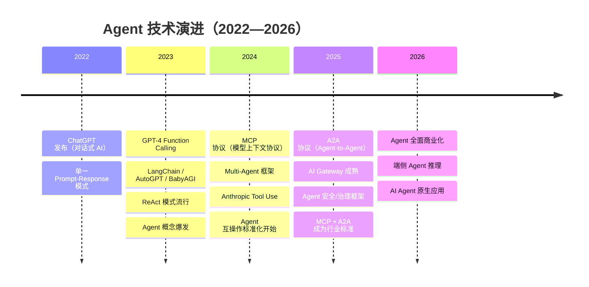

### Agent 代际划分

| 代际 | 时间 | 代表方案 | 核心能力 | 局限 |
|------|------|---------|---------|------|
| **L0 对话** | 2022 | ChatGPT | 聊天问答 | 无工具、无记忆 |
| **L1 工具** | 2023 | Function Calling | 调用 API/数据库 | 单步、无规划 |
| **L2 规划** | 2023-2024 | ReAct / Plan-and-Execute | 多步推理 + 工具 | 成功率有限 |
| **L3 反思** | 2024 | Reflexion / Self-Critique | 自我评估 + 修正 | 计算开销大 |
| **L4 多 Agent** | 2024-2025 | Multi-Agent 协作 | 分工 + 辩论 + 共识 | 协调复杂度高 |
| **L5 自主** | 2025-2026 | MCP + A2A 互操作 | 跨系统自主协作 | 安全/对齐难题 |

### 关键协议对比

| 协议 | 全称 | 用途 | 通信方式 | 发布方 |
|------|------|------|---------|-------|
| **Function Calling** | — | LLM 调用单个工具 | JSON 函数描述 | OpenAI |
| **MCP** | Model Context Protocol | LLM 标准化访问外部数据/工具 | JSON-RPC + SSE/Stdio | Anthropic |
| **A2A** | Agent-to-Agent | Agent 间互操作通信 | JSON-RPC + SSE | Google |
| **Tool Use** | — | 结构化工具调用 | 系统 prompt 嵌入 | Anthropic |

---

- 

---

# 🧠 一、Agent 基础篇

> 🎯 **核心考点：** Agent 定义、架构设计、React 范式、记忆系统、Multi-Agent、规划与反思机制 | **题数：** 16 题

---

### Q1: 什么是 Agent？与大模型有什么本质不同？

> 💡 **要点**：Agent = LLM（大脑）+ 工具（手脚）+ 记忆（经验），核心区别在于 Agent 能主动执行操作

**Agent（智能体）** 是能够**感知环境 → 自主决策 → 执行动作**的智能系统。大模型（LLM）是 Agent 的"大脑"，但 Agent ≠ LLM。

| 维度 | LLM | Agent |
|:---|:---|:---|
| **输出** | 文本 Token | 可执行动作序列 |
| **记忆** | 上下文窗口 | 长期 + 短期 + 工作记忆 |
| **工具** | Function Calling（被动） | Tool Registry（主动编排） |
| **循环** | 单次推理 | 观察 → 思考 → 行动的 ReAct 循环 |
| **自主性** | 被动响应 | 目标驱动，可自主规划 |

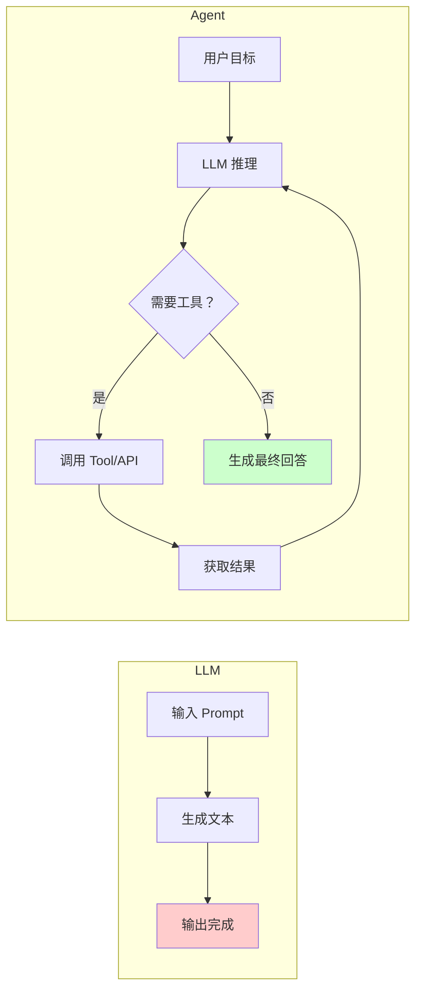

| 对比维度 | LLM | Agent |
|---------|-----|-------|
| 能力边界 | 文本生成、知识问答 | 调用工具、执行操作、完成任务 |
| 记忆 | 上下文窗口（有限） | 短期 + 长期记忆系统 |
| 自主性 | 被动响应 | 主动规划、执行、反思 |
| 工具使用 | ❌ 不能 | ✅ Function Calling / MCP |
| 状态管理 | 无状态 | 有状态（对话/任务状态） |

---

### Q2: Agent 的基本架构由哪些核心组件构成？

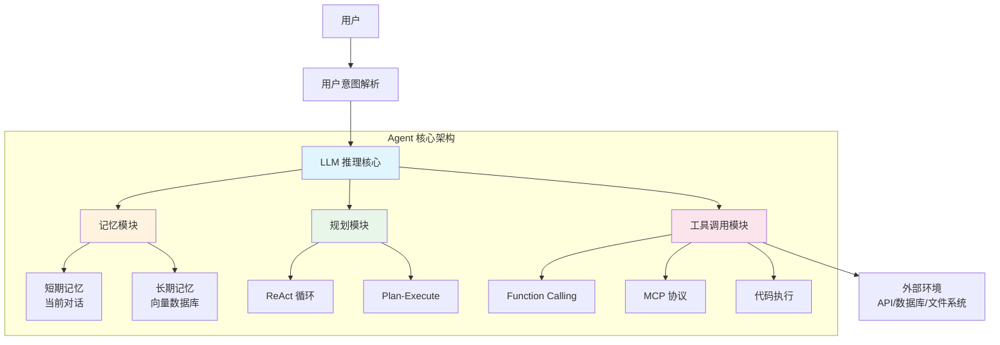

**六大核心组件：**

| 组件 | 职责 | 技术方案 |
|------|------|---------|
| **LLM 推理引擎** | 理解、推理、决策 | GPT-4o / Claude / DeepSeek |
| **记忆系统** | 存储和检索历史信息 | RAG + 向量数据库 + 摘要 |
| **规划模块** | 分解任务、制定步骤 | ReAct / Plan-and-Execute |
| **工具调用** | 与外部世界交互 | Function Calling / MCP / API |
| **反馈循环** | 评估结果、自我反思 | Reflection + 重试机制 |
| **安全护栏** | 内容过滤、权限控制 | Guardrails / 输入输出审核 |

---

### Q3: Workflow、Agent、Tools 三者的概念和区别？

> 💡 **要点**：Tool 是单一能力单元，Agent 是自主决策体，Workflow 是预定义流程

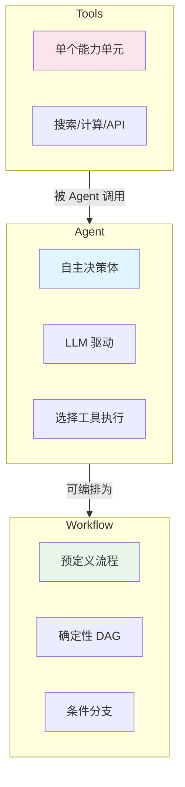

| 概念 | 定义 | 特点 | 举例 |
|------|------|------|------|
| **Tool** | 单一功能的执行单元 | 无状态、确定输入输出 | 搜索、计算器、SQL 查询 |
| **Agent** | LLM 驱动的自主决策体 | 有记忆、能推理、选工具 | 客服 Agent、编码 Agent |
| **Workflow** | 预定义的执行流程 | 确定性、可控、可预测 | 数据 Pipeline、审批流 |

**核心区别：** Workflow 是"告诉系统怎么做"，Agent 是"告诉系统做什么，系统自己决定怎么做"。

**面试追问 — 选择决策树：**
```
                    ┌─ 输入/输出可预测？── 是 ─→ Workflow
                    │
 业务逻辑确定性？ ──┤
                    └─ 否 ─→ 需要实时决断？── 是 ─→ Agent
                            │
                            └─ 否 ─→ 需要工具组合？── 是 ─→ Agent + Workflow
                                    │
                                    └─ 否 ─→ 纯 LLM 调用
```

---

### Q4: 了解哪些 Agent 设计范式？Agent 和 Workflow 的区别？

**主流 Agent 设计范式：**

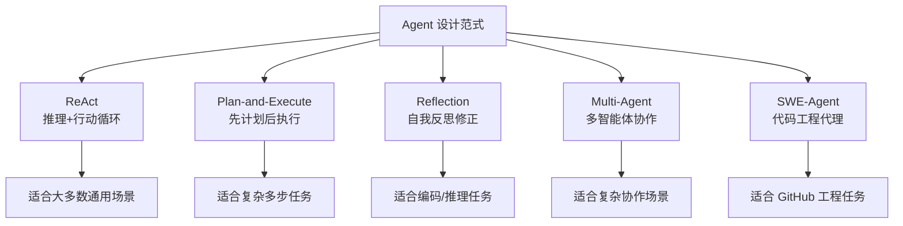

**范式选型矩阵：**

| 范式 | 最佳场景 | 复杂度 | 成功率 | 延迟 |
|:---|:---|:---:|:---:|:---:|
| **ReAct** | 通用问答、客服、信息查询 | ⭐⭐ | 85% | ~5s |
| **Plan-and-Execute** | 数据分析、报告生成、多步推理 | ⭐⭐⭐ | 78% | ~15s |
| **Reflection** | 编码、数学、复杂推理 | ⭐⭐⭐⭐ | 82% | ~20s |
| **Multi-Agent** | 辩论、评审、协同创作 | ⭐⭐⭐⭐⭐ | 72% | ~30s+ |
| **SWE-Agent** | GitHub Issue 修复、代码审查 | ⭐⭐⭐⭐ | 43% (SWE-bench) | ~5min+ |

**Agent vs Workflow 核心区别：**

| 维度 | Workflow | Agent |
|------|----------|-------|
| 决策方式 | 预定义规则/条件分支 | LLM 动态决策 |
| 灵活性 | 低（固定流程） | 高（自主调整） |
| 可预测性 | 高（输出可预期） | 低（可能发散） |
| 适用场景 | 确定性流程 | 不确定性任务 |
| 错误处理 | 预设异常分支 | 自我反思纠错 |

---

### Q5: Agent 推理模式有哪些？ReAct 是什么？

**主要推理模式：**

| 模式 | 核心思想 | 适用场景 |
|------|---------|---------|
| **ReAct** | 推理 + 行动交替循环 | 通用问题解决 |
| **Plan-and-Execute** | 先制定计划再逐步执行 | 复杂多步任务 |
| **Reflection** | 执行后自我评估修正 | 编码、数学推理 |
| **Tree-of-Thought** | 同时探索多条推理路径 | 需要探索的问题 |
| **Self-Consistency** | 多次采样取多数结果 | 开放性问题 |

**ReAct（Reasoning + Acting）详解：**

> ⚠️ **注意**：ReAct 是 Agent 最基础也是最广泛使用的设计范式，面试高频考点

ReAct 的核心思想是让 LLM 在**推理（思考）**和**行动（工具调用）**之间交替进行，每一步的观察结果反馈到下一步推理。

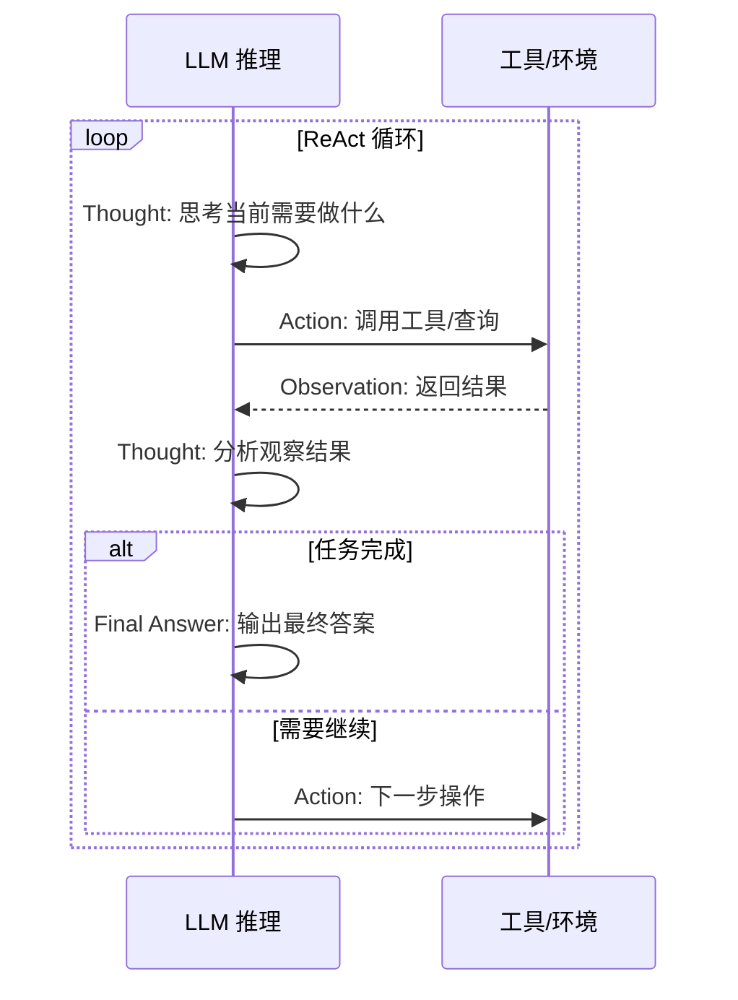

**ReAct 的 Prompt 模板示例：**

```
你是一个 AI 助手，请按照以下格式思考并行动：

Thought: 思考当前的状态和下一步需要做什么
Action: 需要调用的工具名称（如 search、calc）
Action Input: 工具的输入参数
Observation: 工具返回的结果
...（重复 Thought/Action/Observation 过程）
Thought: 我现在可以给出最终答案
Final Answer: 最终回答
```

---

### Q6: React、Plan-and-Execute、Reflection 三种范式的核心区别？

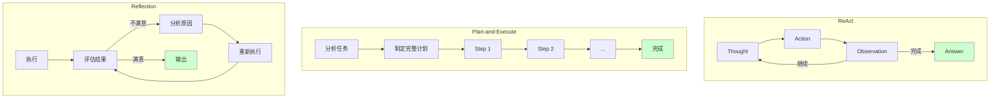

| 维度 | React | Plan-and-Execute | Reflection |
|------|-------|-----------------|------------|
| **核心思路** | 边想边做 | 先想后做 | 做后检查 |
| **规划时机** | 动态规划（每步思考） | 静态规划（事先制定） | 执行后修正 |
| **适用场景** | 通用问答、信息检索 | 复杂多步任务、数据处理 | 编码、数学、写作 |
| **优势** | 灵活、能纠错 | 稳定、可追溯 | 质量高、自改进 |
| **劣势** | 可能循环过多 | 计划可能不合理 | 耗时较长 |
| **选型建议** | **默认首选** | 任务步骤清晰时 | 质量要求极高时 |

**实际项目选型建议：**
- **大多数场景 → React**：灵活且高效
- **任务明确、步骤稳定 → Plan-and-Execute**：如数据处理 Pipeline
- **需要高质量输出 → React + Reflection**：如代码生成、报告撰写

---

### Q7: 复杂任务怎么做的任务拆分？为什么要拆分？

**任务拆分（Task Decomposition）的方式：**

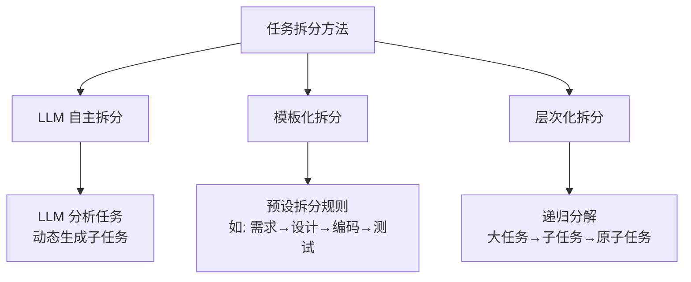

**为什么要拆分：**

| 原因 | 说明 |
|------|------|
| **降低单步难度** | LLM 处理小任务的准确率远高于大任务 |
| **提升可追溯性** | 每步结果可单独验证、Debug |
| **支持并行执行** | 独立子任务可并行处理 |
| **节省 Token 成本** | 避免超大上下文导致成本飙升 |
| **提高容错性** | 单步失败不影响整体，可重试 |

**效果提升的关键：**
- 子任务粒度控制在 **1-3 步可完成**
- 每个子任务有 **明确的输入/输出规范**
- 子任务间通过 **结构化数据传递** 而非自然语言

---

### Q8: 介绍一下 AI Agent 的记忆机制？如何设计记忆模块？

**记忆系统架构：**

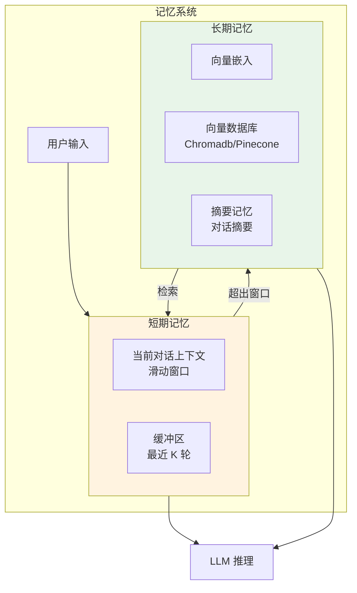

**记忆模块设计原则：**

| 设计要点 | 实现方式 |
|---------|---------|
| **分级存储** | 短期（上下文窗口）+ 长期（向量库） |
| **自动摘要** | 超出窗口时自动压缩摘要 |
| **相关性检索** | 用户输入 → embedding → 向量检索 |
| **时效性权重** | 近期记忆权重 > 远期记忆 |
| **记忆合并** | 相似记忆自动合并去重 |

**代码架构示例：**

```python
class AgentMemory:
    def __init__(self):
        self.short_term = []       # 滑动窗口
        self.vector_store = []     # 长期向量存储
        self.summary = ""          # 对话摘要
    
    def add(self, message: str):
        self.short_term.append(message)
        if len(self.short_term) > MAX_WINDOW:
            self._compress_and_store()
    
    def retrieve(self, query: str, k: int = 5):
        # 向量检索 + 时间权重排序
        results = self.vector_store.similarity_search(query, k)
        return self._rerank_by_recency(results)
```

---

### Q9: Agent 的长短期记忆系统怎么做？

**记忆存储架构：**

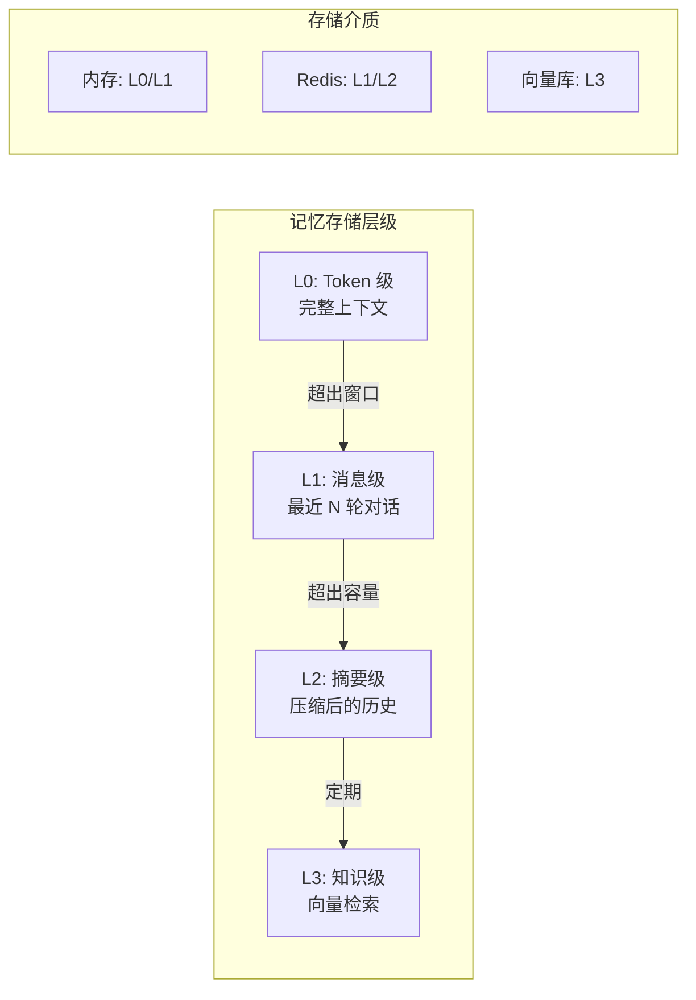

| 维度 | 短期记忆 | 长期记忆 |
|------|---------|---------|
| **存储粒度** | 单条消息 | 摘要/关键信息块 |
| **存储方式** | 内存 List/Deque | 向量数据库 |
| **容量** | 几千 Token | 无限（压缩存储） |
| **检索方式** | 顺序读取 | 语义相似度检索 |
| **更新策略** | FIFO 溢出丢弃 | 追加 + 定期压缩 |
| **使用方式** | 直接注入 Prompt | RAG 检索后注入 |

**记忆压缩的粒度控制：**

```
▸ Token 级：完整保留，用于精确回复
▸ 消息级：保留最近 K 轮，保证连贯性
▸ 摘要级：LLM 生成摘要，保留核心信息
▸ 实体级：提取关键实体/关系，结构化存储
```

---

### Q10: 什么是 Multi-Agent？

**Multi-Agent（多智能体系统）** 是多个 Agent 协作完成复杂任务的架构。每个 Agent 有**独立的角色、能力和记忆**，通过通信协议协作。

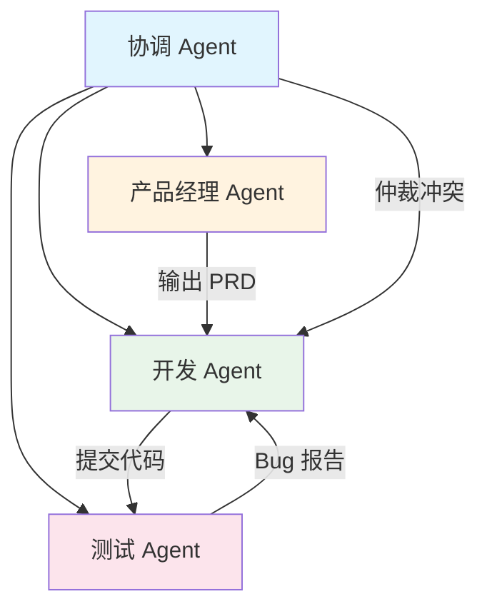

**Multi-Agent 的核心优势：**
- **角色专业化**：每个 Agent 负责特定领域
- **任务并行**：独立任务可同时执行
- **互相纠错**：Agent 间 peer review
- **模拟真实团队**：适用于复杂工程任务

**面试追问 — Multi-Agent 通信实现：**
```typescript
// 基于消息队列的 Multi-Agent 编排
interface AgentMessage {
  from: string;
  to: string;
  type: 'task' | 'result' | 'review' | 'escalate';
  payload: unknown;
  timestamp: number;
}

class MultiAgentOrchestrator {
  private agents: Map<string, Agent> = new Map();

  register(name: string, agent: Agent): void {
    this.agents.set(name, agent);
  }

  async execute(workflow: WorkflowDef): Promise<void> {
    // 按拓扑顺序执行任务
    const queue = this.topologicalSort(workflow);
    for (const task of queue) {
      const agent = this.agents.get(task.assignedTo)!;
      // 注入上游结果作为上下文
      const context = this.gatherDependencies(task, workflow);
      const result = await agent.run(task.instruction, context);
      // 广播结果给下游
      this.broadcast(agent.name, result);
    }
  }

  private broadcast(from: string, result: unknown): void {
    for (const [, agent] of this.agents) {
      agent.receive({ from, to: agent.name, type: 'result', payload: result, timestamp: Date.now() });
    }
  }
}
```

---

### Q11: Single-Agent 和 Multi-Agent 的设计方案？

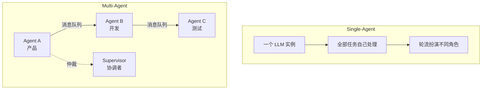

| 维度 | Single-Agent | Multi-Agent |
|------|-------------|-------------|
| **复杂度** | 低，单进程 | 高，需通信/协调 |
| **成本** | 低（单 LLM 调用） | 高（多 LLM + 通信） |
| **容错性** | 单点故障 | 部分 Agent 可降级 |
| **并行度** | 串行 | 可并行 |
| **适用场景** | 简单问答、单步工具 | 软件开发、复杂调研 |
| **选型建议** | **优先用 Single** | Single 解决不了时再用 |

**工程实践原则：**

> ⚠️ **最佳实践**：复杂 Agent 系统应从简单开始逐步演进

```
先 Single → 拆 Tool → 再 Workflow → 最后 Multi-Agent
```

---

### Q12: Agent 记忆压缩通常有哪些方法？

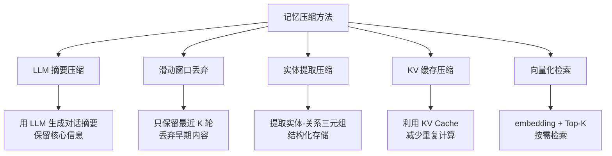

| 方法 | 压缩比 | 信息损失 | 实现复杂度 |
|------|--------|---------|-----------|
| 滑动窗口 | 固定比例 | 高（丢早期） | 低 |
| LLM 摘要 | 5-10x | 中（保留核心） | 高（额外 LLM 调用） |
| 实体提取 | 10-50x | 低（结构化） | 中 |
| **混合策略** | **最优** | **可控** | **中高** |

**最佳实践：** 滑动窗口 + 定期摘要 + RAG 检索的混合方案。

---

### Q13: 为什么有时候选择「手搓」Agent，而不是直接用成熟框架？

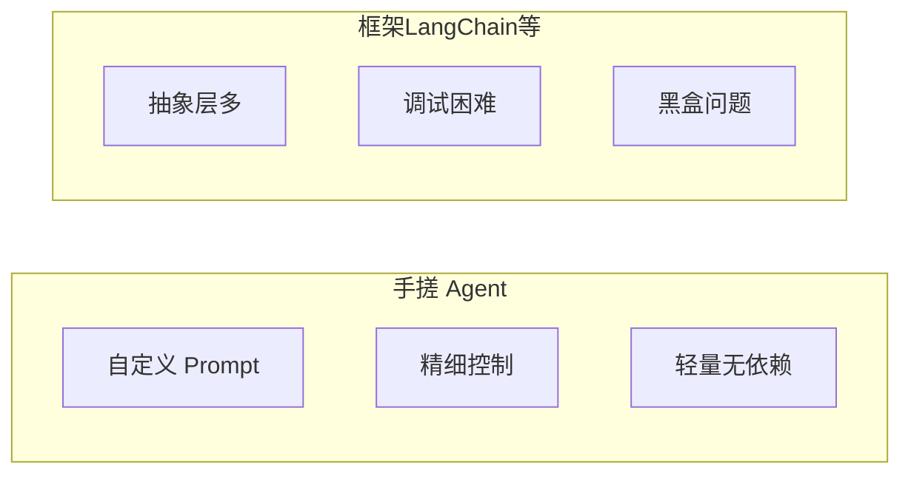

| 维度 | 手搓 | 成熟框架 |
|------|------|---------|
| **灵活性** | ✅ 完全可控 | ⚠️ 受框架限制 |
| **调试难度** | ✅ 容易追踪 | ❌ 多层抽象难 Debug |
| **开发速度** | ❌ 需要造轮子 | ✅ 开箱即用 |
| **性能** | ✅ 无额外开销 | ⚠️ 框架本身有开销 |
| **生产稳定性** | ✅ 可控 | ⚠️ 版本升级风险 |
| **选型建议** | 核心业务/定制需求 | 快速原型/标准场景 |

**手搓 Agent 的典型场景：**
- 需要**精细控制 Prompt 链**
- 框架版本升级导致**行为不一致**
- 使用**非标准 LLM 协议**
- 对**延迟/成本**有严格限制
- 框架抽象层导致 **Debug 困难**

---

### Q14: 如何赋予 LLM 规划能力？

| 方法 | 原理 | 优缺点 |
|------|------|--------|
| **Prompt Engineering** | 在 System Prompt 中给出规划框架 | ✅ 简单 ❌ 不可靠 |
| **React Pattern** | 边推理边行动 | ✅ 动态灵活 |
| **Plan-and-Execute** | 先制定完整计划再执行 | ✅ 稳定性高 ❌ 计划可能错 |
| **Fine-tuning** | 在规划类数据上微调 | ✅ 效果好 ❌ 成本高 |
| **Tree-of-Thought** | 同时探索多条路径 | ✅ 质量高 ❌ 成本高 |

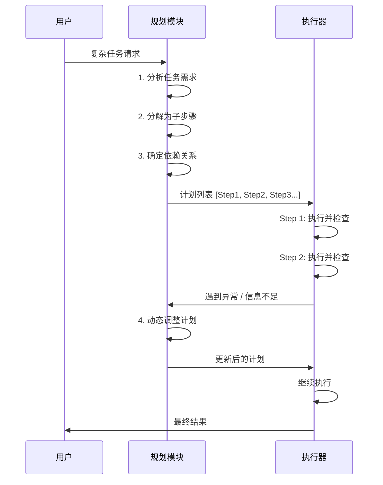

---

### Q15: 讲讲 Agent 的反思机制？

**反思机制（Reflection）** 让 Agent 在执行后**自我评估结果质量**，发现不足并主动修正。

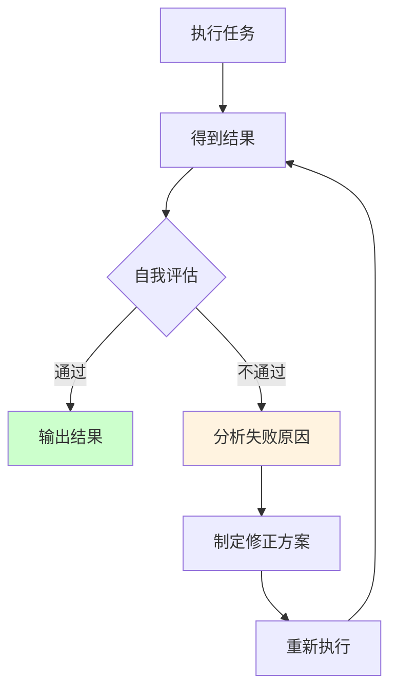

| 维度 | 说明 |
|------|------|
| **为什么需要反思** | LLM 一次生成的质量不稳定，反思可大幅提升准确率 |
| **实现方式** | 执行完后让 LLM 分析输出、检查错误、提出改进 |
| **触发条件** | 固定次数反思 / 置信度低于阈值 / 外部反馈错误 |
| **典型案例** | 代码生成 → 编译错误 → 反思 → 修改代码 |

**反思 Prompt 模板：**

```python
反思模板 = """
你刚刚完成了以下任务：[任务描述]
你的输出是：[输出内容]

请对上述输出进行自我检查：
1. 是否完全解决了用户需求？
2. 是否有逻辑错误或不完整之处？
3. 如果有问题，请说明原因并重新生成。
"""
```

---

### Q16: 如何设计多 Agent 的协作与动态切换机制？

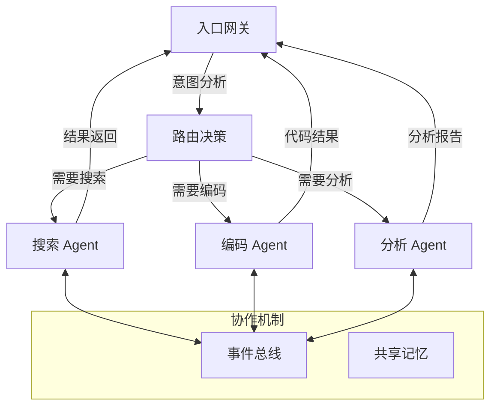

| 机制 | 说明 | 实现方式 |
|------|------|---------|
| **意图路由** | 根据用户输入分配 Agent | 分类器 / LLM 决策 |
| **事件总线** | Agent 间异步通信 | Redis Pub/Sub / 消息队列 |
| **共享记忆** | Agent 访问同一记忆库 | 向量数据库 + 上下文窗口 |
| **Supervisor** | 协调者仲裁冲突 | 独立的 LLM 裁决 |
| **动态切换** | 某 Agent 无法处理时切换 | 降级策略 + 超时回退 |

---

### Q17: 在构建一个复杂的 Agent 时，你认为最主要的挑战是什么？

> 💡 **要点**：可靠性、成本控制、错误恢复、工具调用准确率、LLM 幻觉循环、可观测性是最核心的六大挑战

**构建复杂 Agent 的主要挑战体现在六个维度：**

| 挑战 | 说明 | 典型表现 | 缓解方案 |
|------|------|---------|---------|
| **可靠性** | Agent 多次执行同一任务结果不一致 | 同样的 Prompt 可能输出不同动作 | 增加重试 + 结果校验 |
| **成本控制** | LLM 调用次数难以预估 | 一个任务可能触发几十次 API 调用 | 设置 Token 预算 + 模型降级策略 |
| **错误恢复** | 工具调用失败后的处理 | API 超时、参数格式错误 | Graceful Degradation + Fallback |
| **工具调用准确率** | 模型选错工具或参数 | 应该搜索却调了计算器 | Few-shot + Tool Schema 优化 |
| **LLM 幻觉循环** | Agent 陷入无限循环 | 不断输出错误 Action 但不终结 | Max Step + 循环检测 |
| **可观测性** | 难以追踪 Agent 的决策过程 | 不知道 Agent 为什么做出某个选择 | Tracing + Logging + 可视化 |

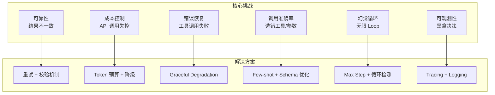

**最棘手的往往是"幻觉循环"问题**：Agent 在错误的状态下反复调用工具，既消耗 Token 又得不到正确结果。解决方案包括设置**最大迭代次数**、检测**重复 Action 模式**（如连续 3 次相同的搜索）、以及在 Prompt 中明确要求"如果无法完成请告知用户"。

---

### Q18: 当一个 Agent 需要在真实或模拟环境中（如机器人、游戏）执行任务时，它与纯粹基于软件工具的 Agent 有什么本质区别？

> 💡 **要点**：真实环境带来实时性、硬件约束、安全性、传感器噪声、连续动作空间等根本性差异

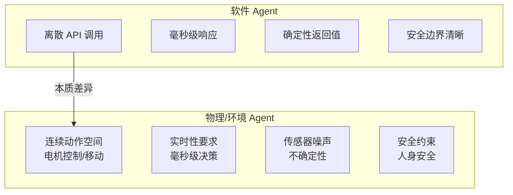

| 维度 | 软件 Agent | 物理/环境 Agent |
|------|-----------|----------------|
| **动作空间** | **离散**（API 调用、函数选择） | **连续**（角度、速度、力度） |
| **反馈延迟** | 毫秒~秒级 | 微秒~毫秒级（控制回路） |
| **状态观测** | 完全可观测（API 返回值准确） | **部分可观测**（传感器噪声、遮挡） |
| **失败代价** | 低（重试即可） | **高**（设备损坏、人身安全） |
| **实时性** | 宽松（可等待 LLM 推理） | **严格**（需实时控制） |
| **环境动态性** | 稳定（API 行为不变） | **动态变化**（环境在 Agent 思考时也在变化） |
| **状态表示** | 结构化 JSON | 高维传感器数据（图像、点云、IMU） |

**核心差异在于闭环控制的实时性要求：** 一个导航 Agent 不能在路口停下来"思考"5 秒钟再决定方向，因为环境在变化。这就需要将 **LLM 的高层规划**与**低层的实时控制**解耦——LLM 负责制定策略（"走到门口"），而底层的 PID 或 MPC 控制器负责执行（"以 1m/s 的速度直行"）。

---

### Q19: 如何确保一个 Agent 的行为是安全、可控且符合人类意图的？在 Agent 的设计中，有哪些保障对齐方法？

> 💡 **要点**：安全对齐需要多层次"护城河"——从 Prompt 层、执行层到监控层的逐级防护

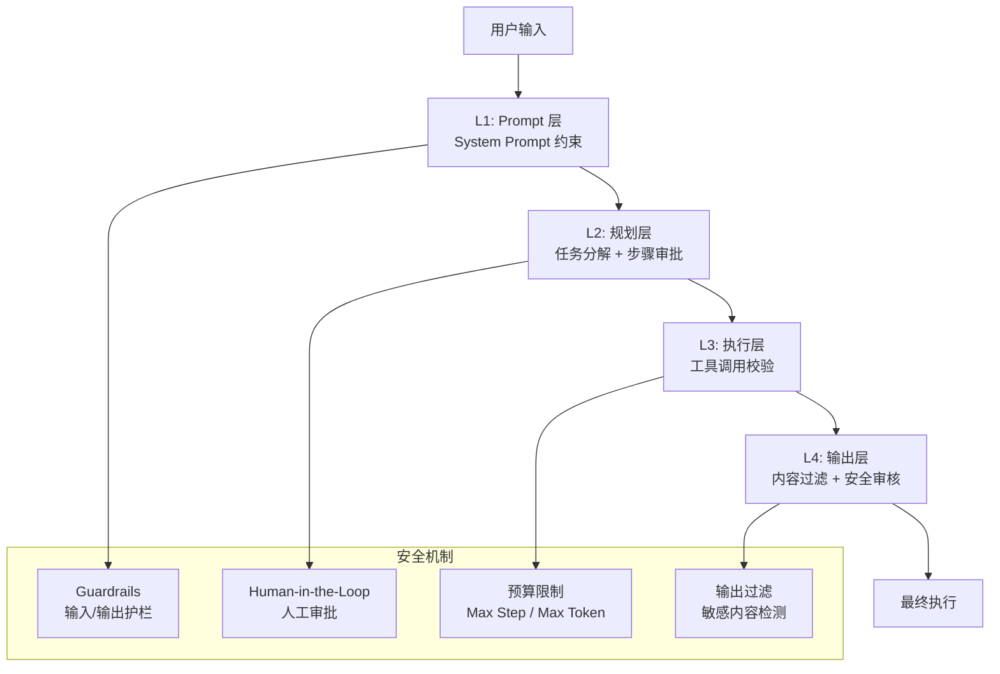

**多层次安全对齐方案：**

| 层级 | 方法 | 说明 |
|------|------|------|
| **指令对齐** | System Prompt 约束 | 明确 Agent 的职责边界、禁止操作 |
| **工具权限** | 最小权限原则 | Agent 默认无权限，按需授权 |
| **执行限流** | Max Step + Max Token | 防止无限循环和消耗失控 |
| **人工审批** | Human-in-the-Loop | 关键操作（支付、删除、写库）需人工确认 |
| **输出过滤** | Guardrails / 内容审核 | 检测敏感、违规、不安全输出 |
| **行为审计** | 完整 Trace 日志 | 所有决策和操作可追溯、可回放 |
| **红队测试** | 对抗性测试 | 模拟恶意输入测试 Agent 安全性 |

**关键设计原则：** **Fail-Safe 默认**——当 Agent 不确定时，应该拒绝执行而非强行尝试。例如一个银行 Agent 遇到模棱两可的转账指令时，应该触发人工审批而非自行决策。

---

### Q20: 有微调过 Agent 能力吗？数据集如何收集？

> 💡 **要点**：Agent 微调的核心是收集高质量的工具调用轨迹数据，常用方法包括 Self-play 和拒绝采样

**Agent 微调的数据集收集与构建流程：**

```mermaid
graph TB
    subgraph 数据来源
        D1["人工标注<br/>专家编写轨迹"]
        D2["Self-Play<br/>Agent 自生成"]
        D3["真实用户日志<br/>线上数据清洗"]
    end

    subgraph 数据处理
        P1["轨迹格式化<br/>Thought/Action/Observation"]
        P2["SFT 数据<br/>(问题, 轨迹, 最终答案)"]
        P3["偏好数据<br/>好轨迹 vs 差轨迹"]
    end

    subgraph 训练
        T1["SFT<br/>模仿学习"]
        T2["DPO/RLHF<br/>偏好优化"]
    end

    D1 --> P1
    D2 --> P1
    D3 --> P1
    P1 --> P2
    P1 --> P3
    P2 --> T1
    P3 --> T2
```

**数据集收集方法对比：**

| 方法 | 成本 | 质量 | 规模 | 说明 |
|------|------|------|------|------|
| **人工标注** | 高 | 最高 | 小（千级） | 专家标注最佳轨迹，作为种子数据 |
| **Self-Play + 拒绝采样** | 中 | 高 | 大（万~百万级） | 多次采样，只保留成功轨迹 |
| **真实用户日志** | 低 | 中 | 极大 | 清洗线上日志，可能存在质量问题 |
| **Synthetic + 规则验证** | 低 | 中高 | 极大 | 用强模型生成轨迹，规则验证正确性 |
| **课程学习（Curriculum）** | 中 | 高 | 中 | 从简单到复杂的递进式数据生成 |

**工具调用数据的关键格式：**

```
Human: 我需要预订一张明天从北京到上海的机票

Assistant:
<Thought>用户需要查询航班信息，我先搜索可用航班</Thought>
<FunctionCall> {"name": "search_flights", "args": {"from": "北京", "to": "上海", "date": "明天"}}
</FunctionCall>

Tool (Observation): [航班 A: 08:00, ¥1200; 航班 B: 10:30, ¥900; ...]

Assistant:
<Thought>找到了可选航班，用户需要性价比高的选项，推荐航班 B</Thought>
<FinalAnswer>推荐明天 10:30 的航班 B，价格 ¥900，性价比最高。</FinalAnswer>
```

**最佳实践：** 先用**少量人工标注数据**（~500 条）做 SFT，再通过 **Self-Play + 拒绝采样**扩展到数万条，最后用 **DPO** 在好/坏轨迹对上做偏好优化。

---

### Q21: 你认为目前限制 Agent 能力和普及的最大瓶颈是什么？

> 💡 **要点**：模型能力不足是天花板，但可靠性、成本、延迟和标准化缺失是更紧迫的工程瓶颈

```mermaid
graph TB
    Bottleneck["Agent 普及瓶颈"] --> Model["模型能力<br/>推理深度不足"]
    Bottleneck --> Reliability["可靠性<br/>结果不稳定"]
    Bottleneck --> Cost["成本<br/>Token 消耗大"]
    Bottleneck --> Latency["延迟<br/>多轮调用累积"]
    Bottleneck --> Standard["标准化缺失<br/>协议/评估不统一"]

    Model --> M1["复杂任务推理失败率高"]
    Reliability --> R1["同任务成功率 < 80%"]
    Cost --> C1["复杂任务成本 > $1"]
    Latency --> L1["端到端延迟 > 10s"]
    Standard --> S1["各框架互不兼容"]
```

| 瓶颈 | 影响 | 严重程度 | 改善趋势 |
|------|------|---------|---------|
| **模型推理能力** | 复杂任务失败率高，无法处理长链推理 | ⭐⭐⭐⭐⭐ | 快速改善中（o1/o3/R1） |
| **可靠性** | 同任务多次执行结果不同，难以信任 | ⭐⭐⭐⭐⭐ | 改善缓慢 |
| **成本** | 复杂 Agent 调用成本过高，难以规模化 | ⭐⭐⭐⭐ | 模型降价 + 小模型推理 |
| **延迟** | 多轮工具调用累积延迟，用户体验差 | ⭐⭐⭐⭐ | Streaming + 推理加速 |
| **标准化缺失** | 框架碎片化，难以互操作和迁移 | ⭐⭐⭐ | MCP/A2A 协议逐步统一 |
| **评估体系** | 缺乏统一的 Agent 评估指标 | ⭐⭐⭐ | AgentBench/SWE-bench 等逐渐成熟 |

**我的观点：** **可靠性是当前最关键的限制因素**。即使模型能力足够强，如果 Agent 执行同一任务 10 次有 3 次失败，企业就无法将其用于生产环境。成本问题可以通过模型降价和推理优化逐步缓解，但可靠性需要**系统级的工程保障**（重试、校验、降级、监控），而非单纯依赖模型改进。

---

### Q22: 在过去半年里，哪一篇关于 Agent 的论文或哪一个开源项目让你印象最深刻？为什么？

> 💡 **要点**：CodeAgent/SWE-agent 等代码类 Agent 项目展示了 Agent 在工程领域的巨大潜力

**印象最深刻的开源项目：SWE-agent + OpenHands**

```mermaid
graph TB
    SWE["SWE-agent / OpenHands"] --> Design["核心设计"]
    SWE --> Impact["行业影响"]

    Design --> D1["Agent + 沙箱环境<br/>隔离执行"]
    Design --> D2["轨迹数据收集<br/>自动化生成"]
    Design --> D3["定制化 Agent 架构<br/>针对代码场景优化"]

    Impact --> I1["SWE-bench 表现优异<br/>解决真实 GitHub Issue"]
    Impact --> I2["开源生态繁荣<br/>社区大量贡献"]
    Impact --> I3["启发后续工作<br/>CodeAgent/Devin"]
```

**为什么印象深刻：**

| 理由 | 说明 |
|------|------|
| **真实场景验证** | 在真实 GitHub Issue 上测试，而非人工构造的评测集 |
| **完整的工程闭环** | Agent 编码 → 运行 → 报错 → 修复 的全自动循环 |
| **架构简洁有效** | 没有复杂的 Multi-Agent，而是针对代码场景精细设计的 Single-Agent |
| **数据飞轮** | Agent 成功执行的轨迹可用于微调，形成正反馈 |
| **开源影响** | 验证了"Agent 可以解决真实软件工程问题"这一命题 |

**另一个值得关注的工作：[Anthropic](https://anthropic.com) 的 Computer Use（2024.10）**，它让 Agent 直接操控计算机界面（移动鼠标、点击、键盘输入），跳过了对 API 的依赖。这个方向展示了 **Agent 不应局限于工具调用**，而是可以做人类能做的一切操作。

---

### Q23: 你如何看待 Agent 领域的"涌现能力"？我们应该追求更强大的基础模型，还是更精巧的 Agent 架构？

> 💡 **要点**：两者不是互斥关系——基础模型决定能力上限，Agent 架构决定如何释放这个上限

```mermaid
graph TB
    subgraph 模型派
        M1["更强的推理能力"]
        M2["更长的上下文窗口"]
        M3["更低的幻觉率"]
        M4["更好的工具调用"]
    end

    subgraph 架构派
        A1["更好的记忆管理"]
        A2["更优的任务分解"]
        A3["更可靠的错误恢复"]
        A4["多 Agent 协作"]
    end

    Both["两者结合"] --> ModelSide["模型派<br/>决定天花板"]
    Both --> ArchSide["架构派<br/>决定接近天花板的程度"]

    ModelSide --> M1
    ArchSide --> A1
```

| 维度 | 模型派观点 | 架构派观点 | 我的看法 |
|------|-----------|-----------|---------|
| **核心主张** | 更强的模型 = 更强的 Agent | 精巧架构可弥补模型不足 | **两者互补** |
| **论据** | GPT-4 Agent 远强于 GPT-3.5 Agent | React 架构释放了模型潜力 | 架构利用模型能力 |
| **局限** | 最强的模型也难以一键解决复杂任务 | 架构无法凭空创造出模型没有的能力 | 需要协同发展 |
| **投入产出** | 模型提升需要巨大算力投入 | 架构优化成本低，见效快 | **短期做架构，长期跟模型** |

**我的立场：**

当前的阶段性结论应该是：**短期（1-2 年）更应关注架构优化**，因为模型的增量改进带来的 Agent 能力提升已经出现边际递减；但**长期来看**，基础模型的推理能力（如 o1 的深度思考）会从根本上改变 Agent 的设计范式——未来的 Agent 架构可能远比今天的简单，因为模型本身就能处理大部分规划和纠错。

---

### Q24: 你认为未来 1-2 年内，Agent 技术最有可能在哪个行业或场景率先实现大规模商业落地？

> 💡 **要点**：代码辅助、客服、数据分析、流程自动化是最有潜力的四大场景

```mermaid
graph TB
    Landscape["Agent 商业落地场景"] --> Code["编程辅助<br/>⭐ 最成熟"]
    Landscape --> CS["客户服务<br/>⭐ 最火热"]
    Landscape --> DA["数据分析<br/>⭐ 价值高"]
    Landscape --> Auto["流程自动化<br/>⭐ 范围广"]

    Code --> C1["Cursor/Devin<br/>代码生成 + 修复"]
    CS --> C2["智能客服<br/>7×24 全渠道"]
    DA --> C3["报表生成<br/>自然语言查数"]
    Auto --> C4["RPA 升级<br/>文档处理/审批"]
```

| 行业/场景 | 落地难度 | 商业价值 | 成熟度 | 原因 |
|----------|---------|---------|-------|------|
| **编程辅助** | ⭐⭐ | ⭐⭐⭐⭐⭐ | **最高** | Agent 输出可立即验证（编译/测试），反馈闭环最短 |
| **客户服务** | ⭐⭐⭐ | ⭐⭐⭐⭐ | 高 | 场景边界可控，ROI 高（替代人工），但需处理情绪和复杂投诉 |
| **数据分析** | ⭐⭐⭐ | ⭐⭐⭐⭐⭐ | 中高 | SQL/Python 生成的 Agent 可直接产出结果，数据安全是障碍 |
| **企业流程自动化** | ⭐⭐⭐⭐ | ⭐⭐⭐⭐ | 中 | 跨系统操作，RPA 升级版，但整合复杂、安全性要求高 |
| **医疗** | ⭐⭐⭐⭐⭐ | ⭐⭐⭐⭐⭐ | 低 | 监管严格，错误代价高，仅限辅助场景 |
| **法律** | ⭐⭐⭐⭐ | ⭐⭐⭐⭐ | 低中 | 文档审查可行，但涉及责任归属问题 |

**我的预测：** **编程辅助将率先大规模落地**（2025-2026 年已成为现实），因为它的反馈闭环最短——代码写得好不好，编译器/测试立刻给出答案。客服和数据分析紧随其后，这两个场景的 ROI 足够高来驱动投入。

---

### Q25: 如果让你自由探索，你最想创造一个什么样的 Agent 来解决什么问题？

> 💡 **要点**：从个人痛点出发，最想做一个"知识蒸馏 Agent"——将碎片化信息自动整理为结构化知识

**我最想创造的 Agent：个人知识蒸馏系统**

```mermaid
graph TB
    subgraph 输入
        I1["技术文章<br/>网页书签"]
        I2["会议录音<br/>文字记录"]
        I3["代码片段<br/>GitHub 仓库"]
        I4["论文 PDF<br/>研究报告"]
    end

    subgraph KnowledgeDistiller["知识蒸馏 Agent"]
        KD1["内容理解<br/>关键概念提取"]
        KD2["知识关联<br/>建立连接"]
        KD3["结构重构<br/>卡片笔记"]
        KD4["主动复习<br/>间隔重复"]
    end

    subgraph 输出
        O1["结构化知识图谱"]
        O2["个人 Wiki"]
        O3["记忆卡片 Anki"]
        O4["周报自动生成"]
    end

    I1 --> KD1
    I2 --> KD1
    I3 --> KD2
    I4 --> KD2
    KD1 --> KD2
    KD2 --> KD3
    KD3 --> KD4
    KD4 --> O1
    KD4 --> O2
    KD4 --> O3
    KD4 --> O4
```

**设计思路：**

| 能力 | 说明 |
|------|------|
| **主动摄取** | 每天自动扫描我的 Read Later、技术周报、Twitter 书签 |
| **概念提取** | 用 LLM 提取核心概念、定义、原理、与已有知识的关联 |
| **冲突检测** | 如果新知识与已有知识矛盾，提醒我审核 |
| **渐进式整理** | 按 Zettelkasten 卡片笔记法，自动整理为原子化知识点 |
| **复习计划** | 基于间隔重复算法，定期推送复习卡片 |
| **写作辅助** | 基于知识库自动生成周报、总结、博客草稿 |

**为什么是这个问题：** 信息过载是现代知识工作者的核心痛点。每天花大量时间阅读，但信息留存率极低。一个**贯穿输入→理解→整理→复习→应用**全链路的 Agent，能真正解决"读了就忘"的问题。

---

### Q26: 对于想要进入 Agent 领域的初学者，你会给他/她什么建议？应该重点学习哪些技术？

> 💡 **要点**：先动手做一个最小 Agent 跑通全流程，再逐步深入 LLM 原理和系统架构

```mermaid
graph LR
    subgraph 学习路径
        L1["第 1 阶段<br/>动手入门"] --> L2["第 2 阶段<br/>深度理解"]
        L2 --> L3["第 3 阶段<br/>架构进阶"]
        L3 --> L4["第 4 阶段<br/>生产化"]
    end

    L1 --> Phase1["原生 API + Python<br/>手写一个 ReAct Agent<br/>用 OpenAI Function Calling"]
    L2 --> Phase2["LLM 原理<br/>Prompt Engineering<br/>向量数据库 + RAG"]
    L3 --> Phase3["LangChain / LlamaIndex<br/>Multi-Agent 设计<br/>MCP 协议"]
    L4 --> Phase4["监控/Tracing<br/>评估体系<br/>生产部署"]
```

**分阶段学习路线图：**

| 阶段 | 学习内容 | 动手项目 | 参考资源 |
|------|---------|---------|---------|
| **1. 动手入门** | Python、OpenAI/Claude API、Function Calling | 用 50 行代码手写一个 React Agent（搜索+计算器） | OpenAI Cookbook |
| **2. 深度理解** | LLM 原理、Prompt Engineering、RAG、Embedding | 做一个带记忆的对话 Agent + 知识库 RAG | LangChain 官方教程 |
| **3. 架构进阶** | Agent 设计范式、Multi-Agent、MCP 协议、工具链 | 参与开源项目（如 OpenHands）或复现一篇论文 | SWE-agent 源码 |
| **4. 生产化** | 评估体系、Tracing、部署、成本优化、安全对齐 | 将 Agent 部署到线上，接入监控和评估 | LangSmith / Weights & Biases |

**关键建议：**

> ⚠️ **核心建议**：不要一开始就深入 [LangChain](https://langchain.com) 框架，先**手写一个最小的 React Agent**，理解每个环节的原理，再用框架加速开发

**重点技术清单：**
- **LLM 基础**：Transformer 原理、Tokenization、解码策略、上下文窗口
- **Prompt Engineering**：System Prompt、Few-shot、CoT、结构化输出
- **Function Calling / Tool Use**：Schema 定义、参数传入、结果处理
- **RAG**：文档分割、Embedding 模型、向量检索、检索策略优化
- **Agent 范式**：React、Plan-and-Execute、Reflection
- **评估与监控**：AgentBench、Tracing、成功率统计

---

### Q27: 总结一下，你认为一个顶尖的 AI Agent 工程师，应该具备哪些核心素质？

> 💡 **要点**：全栈思维 + 系统设计能力 + Debug 能力 + ML 理解 + 产品意识

```mermaid
graph TB
    Core["顶尖 Agent 工程师核心素质"] --> FS["全栈思维<br/>前端到后端到模型"]
    Core --> SD["系统设计<br/>架构决策能力"]
    Core --> DB["Debug 能力<br/>穿透抽象层"]
    Core --> ML["ML 理解<br/>模型原理与局限"]
    Core --> Prod["产品意识<br/>用户体验驱动"]
    Core --> Growth["成长思维<br/>技术变化快"]

    FS --> F1["能写 UI 也能调模型"]
    SD --> S1["平衡复杂度与可靠性"]
    DB --> D1["不惧框架源码调试"]
    ML --> M1["理解幻觉/推理/对齐"]
    Prod --> P1["关注真实用户价值"]
    Growth --> G1["持续学习新范式"]
```

| 素质 | 为什么重要 | 典型体现 |
|------|-----------|---------|
| **全栈思维** | Agent 是端到端系统——从用户输入到 LLM 推理到工具执行 | 能自己搭建完整的 Agent 应用前后端 + 部署 |
| **系统设计能力** | Agent 架构涉及记忆、规划、工具、多 Agent 协调等组件 | 能设计合理的架构而非堆砌框架 |
| **工程调试能力** | 框架抽象层多，Agent 行为不可预测，Debug 是常态 | 愿意读到 LangChain 源码里找问题 |
| **ML 理解** | 理解模型能力边界，知道什么时候该微调、该换模型 | 能判断某个问题是模型问题还是工程问题 |
| **成本敏感** | Agent 调用的 Token 成本可能失控 | 设计时考虑 Token 消耗，主动做成本优化 |
| **用户体验意识** | Agent 的延迟和不确定性直接影响用户感受 | 设计进度反馈、超时处理、优雅降级 |
| **持续学习** | Agent 领域更新极快，框架和范式半年一变 | 每周阅读论文、跟进开源项目、动手实验 |

**一句话总结：顶尖 Agent 工程师是"最懂模型的工程师"和"最懂工程的算法工程师"的结合——既要理解 LLM 的数学原理，又能写出生产级代码。**

---

### Q28: 平常使用 AI 吗，都用来干嘛？如果我想使用 AI，比如 coding 领域，你有何建议给我？

> 💡 **要点**：AI 贯穿日常开发全流程——从需求分析、代码生成、调试、到文档撰写

```mermaid
graph LR
    subgraph 我的 AI 使用场景
        S1["编程辅助<br/>Cursor/GitHub Copilot"]
        S2["知识检索<br/>Perplexity"]
        S3["写作辅助<br/>Claude/ChatGPT"]
        S4["数据分析<br/>ChatGPT Code Interpreter"]
        S5["学习助手<br/>解释概念/总结"]
    end

    subgraph Coding 建议
        C1["Cursor + Claude<br/>最佳组合"]
        C2["思路先行<br/>先说需求再写代码"]
        C3["渐进式<br/>从补全到 Agent"]
        C4["审查输出<br/>AI 代码必须 Review"]
    end
```

**我的 AI 使用场景：**

| 场景 | 工具 | 频率 | 用途 |
|------|------|------|------|
| **日常编程** | Cursor + Claude / Copilot | 每天 | 代码补全、重构、Bug 修复、测试生成 |
| **技术调研** | Perplexity / ChatGPT | 每天 | 快速了解新技术、查 API 文档、对比方案 |
| **写作** | Claude + Obsidian | 每周 | 写技术博客、周报、设计文档润色 |
| **数据分析** | ChatGPT Code Interpreter | 每月 | 数据清洗、可视化、报表生成 |
| **学习** | Claude 长上下文 | 每周 | 读论文总结、解释复杂概念、代码 Review |

**给 Coding 场景的建议：**

> 💡 **核心原则**：AI 是"副驾驶"不是"自动驾驶"——你仍然需要理解代码在做什么

**具体建议：**

1. **选对工具**：目前推荐 **[Cursor](https://cursor.com) + Claude 3.5/4** 组合。[Cursor](https://cursor.com) 的 Tab 补全效率极高，Chat 面板适合复杂任务
2. **思路先行**：不要直接说"帮我写一个登录功能"，而是先描述需求、技术栈、约束条件。AI 理解上下文越充分，输出质量越高
3. **分步验证**：让 AI 先生成接口定义 → 确认后再生成实现 → 生成测试。分步比一次性生成更可控
4. **把 AI 当 Review 伙伴**：写完代码后让 AI Review，"这段代码有什么问题？"——AI 很擅长发现边缘情况
5. **用 AI 写测试**：这是 AI 当前最擅长的 Coding 场景之一，能大幅提升测试覆盖率
6. **必须 Review AI 代码**：AI 可能产生**看似正确实则错误**的代码，特别是安全性（SQL 注入、权限检查）和边界情况
7. **建立个人 Prompt 库**：将常用的代码生成 Prompt（如"生成 React 组件"、"写 Go 单元测试"）模板化保存，提升效率

```mermaid
graph TB
    subgraph AI Coding 工作流
        Step1["需求分析<br/>向 AI 描述需求"] --> Step2["方案设计<br/>AI 出方案你评审"]
        Step2 --> Step3["代码生成<br/>分步生成代码"]
        Step3 --> Step4["Review 优化<br/>AI 自我 Review"]
        Step4 --> Step5["测试生成<br/>AI 补测试"]
        Step5 --> Step6["人工审查<br/>你理解每一行代码"]
    end
```

**最后一句：** "不要用 AI 替代你的思考，用它放大你的能力。" 真正高效的 AI 使用者，是在理解问题的基础上用 AI 加速执行，而不是完全交给 AI。

---

### 🏗️ 补充：Agent 系统的架构设计原则（原理深究）

> **从理论到工程**：理解以下设计原则，是区分"会用框架"和"能设计系统"的关键。

#### 原则一：确定性与灵活性的平衡（The Spectrum of Control）

```mermaid
graph LR
    A["完全确定性<br/>Workflow / DAG"] --> B["混合模式<br/>Workflow + Agent"]
    B --> C["完全灵活<br/>纯 Agent 自主"]
    
    A --> A1["✅ 可预测<br/>✅ 易测试<br/>❌ 不够灵活"]
    C --> C1["✅ 适应性强<br/>✅ 能处理意外<br/>❌ 不可预测"]
    B --> B1["最佳平衡点<br/>用 Workflow 定骨架<br/>用 Agent 填细节"]
```

**关键判断准则**：如果某个步骤的输入输出可以精确定义，就用 Workflow；如果无法预知，就用 Agent 动态决策。

#### 原则二：工具设计的认知负荷理论

Agent 的工具集设计直接影响 LLM 选择工具的准确率：

| 工具设计原则 | 原理 | 实践 |
|:---|:---|:---|
| **命名即文档** | LLM 通过名字理解工具用途 | 用 `web_search` 而非 `search1` |
| **最少工具原则** | 工具越多，选择错误率越高 | 注册 ≤ 10 个，多余工具分层组织 |
| **参数扁平化** | 避免嵌套 JSON，减少 LLM 输出错 | 用 `{query, limit}` 而非 `{params: {query, ...&#125;&#125;` |
| **错误信息标准化** | 工具返回"可理解"的错误 | 返回 `{error: "超时", suggestion: "重试"}` 而非 `-1` |
| **幂等性保证** | 重复执行同一工具应安全 | 查询类天然幂等，写操作需去重令牌 |

#### 原则三：Agent 的信任分层架构（Trust Layer）

```
输入层         →  安全过滤（Prompt 注入检测）
    ↓
规划层         →  意图校验（是否需要敏感操作？）
    ↓
决策层         →  LLM 推理（只在此层信任 LLM）
    ↓
执行层         →  工具校验（参数类型/范围/权限检查）
    ↓
输出层         →  内容审核（PII/敏感内容过滤）
```

**核心思想**：不要信任 LLM 的输出，也不要不信任——而是在不同层次建立不同粒度的信任机制。
