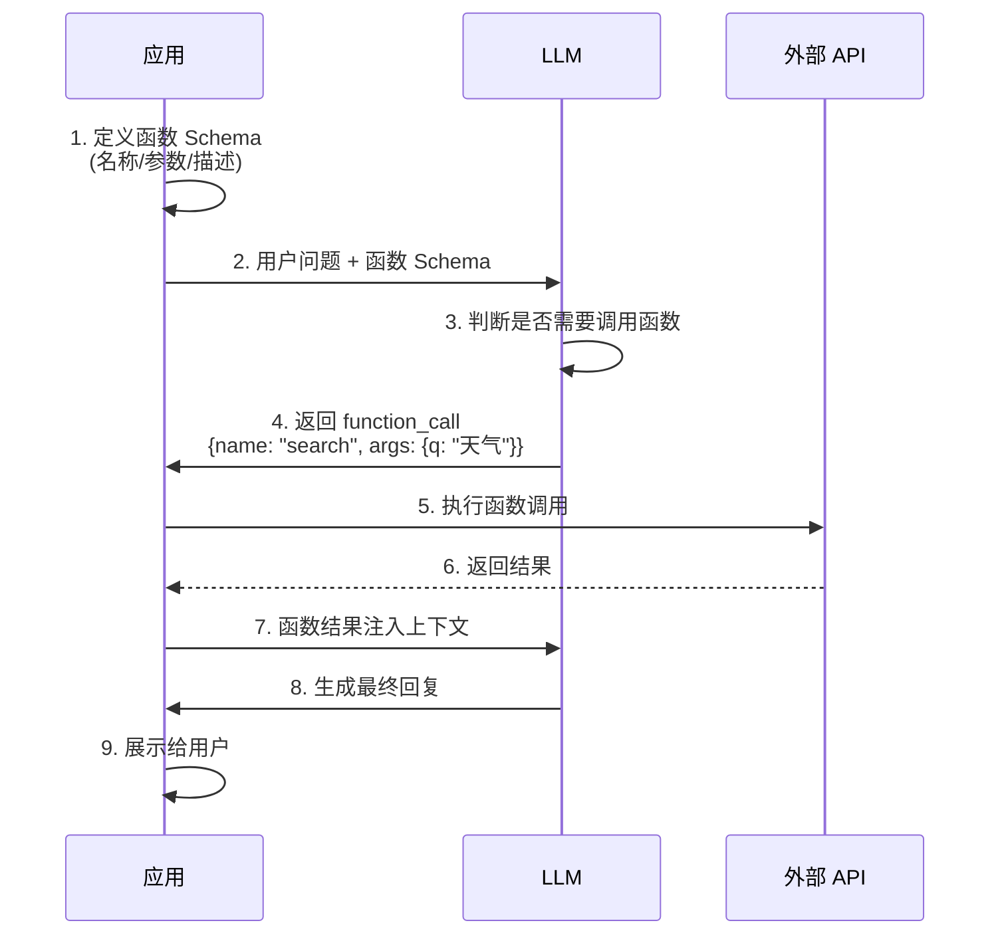
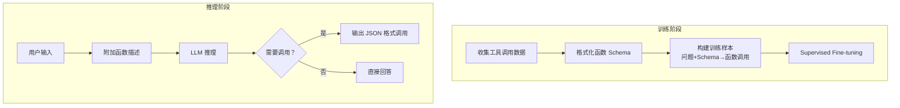
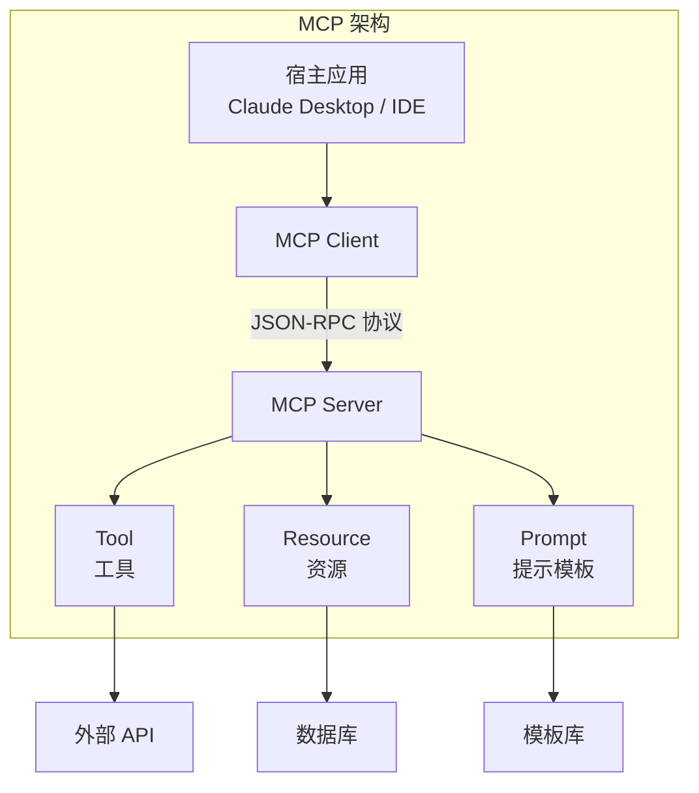
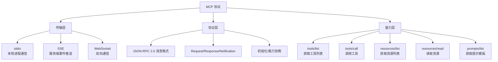
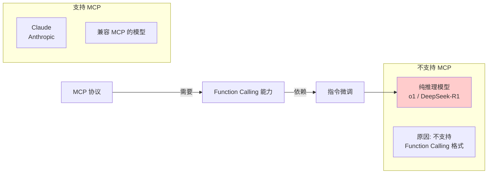
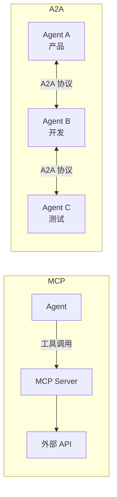
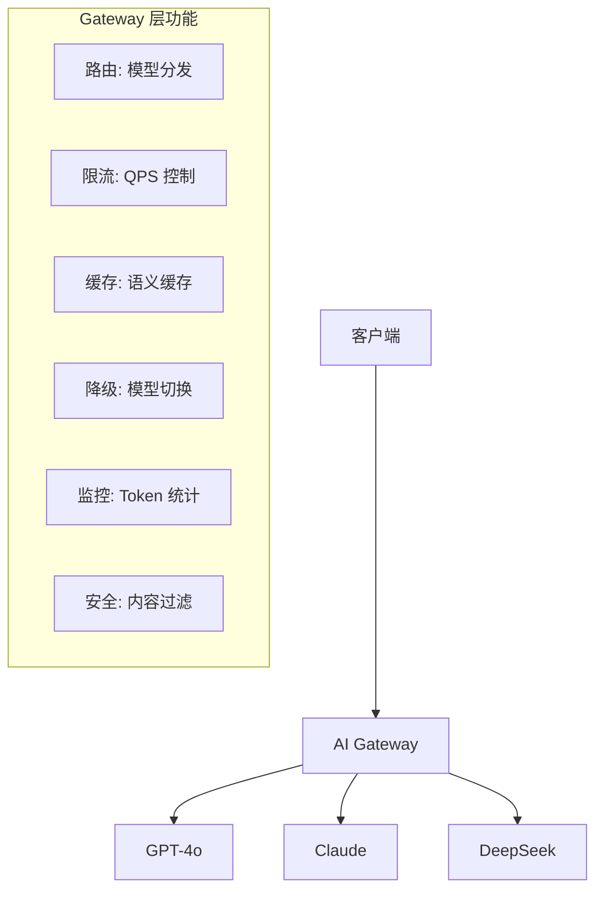
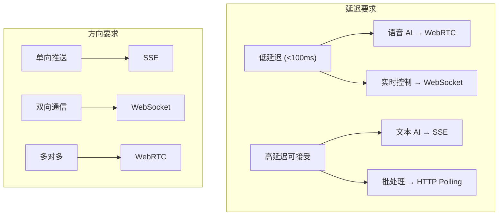

# 🔧 二、工具调用与协议篇

> 🎯 **核心考点：** Function Calling 原理、MCP 协议、Skill/A2A、通信协议对比、AI Gateway | **题数：** 16 题

---

### Q1: 什么是 Function Calling？原理是什么？

> 💡 **要点**：Function Calling 是 LLM 输出结构化 JSON 的能力，由应用层执行函数

**Function Calling（函数调用）** 是 LLM 在生成文本时，同时输出**结构化函数调用指令**的能力。LLM 本身不执行函数，而是输出参数，由应用层执行。



**原理：** Function Calling 是通过**指令微调**让 LLM 学会输出特定 JSON 格式。模型在训练时看到大量 `用户问题 → 函数描述 → 函数调用` 的数据，从而学会在需要时输出函数调用。

---

### Q2: LLM 是如何学会调用外部工具的？



- **SFT 阶段**：用大量 `(问题, 函数定义, 调用结果)` 样本微调
- **RLHF 阶段**：奖励模型学会调用的行为
- **上下文学习**：即使是未微调的模型，通过 Few-shot 也可以在 Inference 时学会

---

### Q3: 大模型的 Function Call 能力是怎么训练出来的？

| 阶段 | 方法 | 数据形式 |
|------|------|---------|
| **数据构造** | 模拟 API 调用场景 | `System: 你有以下工具...` <br/> `User: 查一下北京的天气` <br/> `Assistant: <functioncall> {"name":"get_weather","args":{"city":"北京"}}` |
| **SFT 微调** | 在混合数据上微调 | 通用文本 70% + 函数调用 30% |
| **RLHF 优化** | 奖励正确调用行为 | 函数调用准确率作为奖励信号 |
| **工具调用 Agent 数据** | Self-play 生成 | Agent 执行轨迹作为训练数据 |

---

### Q4: 什么是 MCP（模型上下文协议）？核心内容？

**MCP（Model Context Protocol）** 是 [Anthropic](https://anthropic.com) 提出的**开源协议**，用于标准化 LLM 与外部工具/数据源的通信方式。类似「AI 应用的 USB-C 接口」。



**MCP 核心内容：**

| 组件 | 说明 |
|------|------|
| **Tools** | 可调用的函数，定义 Schema 和 handler |
| **Resources** | 可读取的数据源（文件、数据库等） |
| **Prompts** | 可复用的提示模板 |
| **Transport** | 通信层（stdio / SSE / WebSocket） |
| **JSON-RPC** | 消息格式标准 |

---

### Q5: MCP 由哪几部分组成？



---

### Q6: MCP 和 Function Calling 有什么区别？

> 💡 **要点**：Function Calling 是 LLM 的"输出格式"，MCP 是"工具与 LLM 间的通信标准"

| 对比维度 | Function Calling | MCP |
|---------|-----------------|-----|
| **定位** | LLM 输出结构化 JSON 的能力 | 工具与 LLM 间的通信协议 |
| **标准化** | 各厂商自定格式 | 开放标准协议 |
| **工具发现** | 需开发者手动传入 Schema | 工具可动态发现 (tools/list) |
| **连接方式** | 一次性调用 | 长连接会话 |
| **适用厂商** | OpenAI / Anthropic / 各家 | Anthropic 发起，社区支持 |
| **实际部署** | 简单，代码直接调用 | 需运行 MCP Server 进程 |

**一句话总结：** Function Calling 是 LLM 的「输出格式」，MCP 是「工具和 LLM 之间」的通信标准。

---

### Q7: 什么场景用 Function Calling？什么场景用 MCP？

| 场景 | 推荐 | 原因 |
|------|------|------|
| **简单的单步工具调用** | Function Calling | 最直接，无额外依赖 |
| **复杂多工具系统** | MCP | 标准化管理，动态发现 |
| **已有代码项目集成** | Function Calling | 改造成本低 |
| **需要热插拔工具** | MCP | 工具动态注册/发现 |
| **跨应用共享工具** | MCP | 统一协议标准 |
| **快速原型开发** | Function Calling | 上手快，无需搭建 Server |

---

### Q8: 为什么有些推理模型不支持 MCP 协议？



- 纯推理模型（如 o1、[DeepSeek](https://deepseek.com)-R1）专门优化了推理链，没有经过 Function Calling 的指令微调
- MCP 依赖 Model 端输出特定 JSON 格式，如果模型不支持，MCP 无法工作
- 解决方法：使用 Gateway 层将推理模型的输出转为 MCP 格式

---

### Q9: Skill 是什么？

**Skill（技能）** 是 Agent 的**可复用能力单元**，包含完成特定任务所需的 Prompt、工具调用逻辑和知识。

```python
class Skill:
    name: str          # 技能名称
    description: str   # 技能描述（用于检索）
    prompt: str        # 核心 Prompt 模板
    tools: List[Tool]  # 需要的工具列表
    examples: List     # Few-shot 示例
```

| 要素 | 说明 |
|------|------|
| **Prompt** | 引导 LLM 完成任务的指令模板 |
| **Tools** | 该技能需要调用的工具 |
| **Examples** | 成功执行示例（Few-shot） |
| **Trigger** | 触发条件（关键词/意图匹配） |

---

### Q10: MCP 和 Agent Skill 的区别是什么？

| 维度 | MCP | Agent Skill |
|------|-----|-------------|
| **抽象层级** | 通信协议层 | 应用逻辑层 |
| **定位** | 工具与服务间的标准接口 | Agent 能力的封装单元 |
| **内容** | 传输格式、Schema 定义 | Prompt + Tools + 知识 |
| **复用范围** | 跨应用、跨平台 | 同一 Agent 系统内 |
| **关系** | Skill **内部使用** MCP 调用工具 | MCP 是 Skill 的底层通信手段 |

**关系图：**

```
Agent
  └── Skill A（用 MCP 调用搜索工具）
  └── Skill B（用 MCP 调用代码工具）
  └── Skill C（用 MCP 调用数据库）
```

---

### Q11: Function Calling、Skill、MCP 三者的区别？

| 概念 | 层级 | 类比 | 关系 |
|------|------|------|------|
| **Function Calling** | 模型能力 | 模型"会说 JSON" | 底层能力 |
| **MCP** | 通信协议 | 工具的 USB-C 接口 | 连接标准 |
| **Skill** | 应用封装 | 完整的"拧螺丝"流程 | 上层封装 |

**关系：** Skill **内部使用** MCP 协议 **调用** 外部工具，而 MCP 依赖模型的 **Function Calling** 能力来解析函数调用。

---

### Q12: 什么是 A2A 协议？它和 MCP 协议的区别？

> 💡 **要点**：MCP 是 Agent→工具（垂直），A2A 是 Agent↔Agent（水平），两者互补

**A2A（Agent-to-Agent）** 是 Google 提出的**多 Agent 间通信协议**，解决 Agent 之间如何协作的问题。



| 维度 | MCP | A2A |
|------|-----|-----|
| **定位** | Agent → 工具 | Agent ↔ Agent |
| **通信方向** | 垂直（应用调工具） | 水平（Agent 间协作） |
| **核心问题** | 工具如何标准化接入 | Agent 如何协作完成任务 |
| **提出方** | Anthropic | Google |
| **关系** | **互补**：Agent 先用 MCP 调工具，再用 A2A 与其他 Agent 通信 |

---

### Q13: MCP 协议通常采用什么通信方式？

| 传输方式 | 适用场景 | 优势 | 劣势 |
|---------|---------|------|------|
| **stdio** | 本地子进程 | 简单、低延迟 | 限于本地 |
| **SSE** | 服务端推送 | 标准 HTTP，兼容好 | 单向推送 |
| **WebSocket** | 实时双向通信 | 全双工、低延迟 | 额外复杂度 |

**推荐：** 本地开发用 stdio，生产环境用 SSE 或 [WebSocket](https://websockets.spec.whatwg.org)。

---

### Q14: [WebSocket](https://websockets.spec.whatwg.org) 和 SSE 通信的区别及局限性？

| 对比维度 | WebSocket | SSE (Server-Sent Events) |
|---------|-----------|-------------------------|
| **方向** | 双向全双工 | 服务器→客户端单向 |
| **协议** | ws:// / wss:// | HTTP 长连接 |
| **自动重连** | 需手动实现 | 原生支持 |
| **兼容性** | 所有现代浏览器 | IE 不支持 |
| **消息格式** | 任意（文本/二进制） | 纯文本（text/event-stream） |
| **适用场景** | 实时聊天、游戏 | 通知推送、日志流 |

**局限性：**
- **[WebSocket](https://websockets.spec.whatwg.org)**：需要心跳保活、有连接数限制、防火墙可能拦截 ws 协议
- **SSE**：不支持二进制、单向（仅服务器推送）、HTTP/1.1 限制并发连接数（HTTP/2 解决）

---

### Q15: 为什么用 [WebRTC](https://webrtc.org)？与 [WebSocket](https://websockets.spec.whatwg.org) 在 AI 对话中的核心差异？

| 维度 | WebSocket | WebRTC |
|------|-----------|--------|
| **定位** | 消息传输协议 | 实时通信框架（音视频+数据） |
| **延迟** | 低（~100ms） | 极低（~10ms，UDP） |
| **传输** | TCP（可靠有序） | UDP（速度优先） |
| **音频流** | 需编码为文本/二进制 | 原生音频轨道 |
| **适用场景** | 文本对话、指令传输 | 语音对话、视频通话 |

**AI 对话场景：**
- **文本 AI**：[WebSocket](https://websockets.spec.whatwg.org) 足够，简单可靠
- **语音 AI**：[WebRTC](https://webrtc.org) 是首选，原生支持低延迟音频流

---

### Q16: 有没有用过大型模型的网关框架？网关层解决了什么问题？



**网关层解决的问题：**

| 问题 | 解决方案 |
|------|---------|
| **多模型切换** | 统一 API 接口，按策略分发 |
| **成本控制** | Token 计数、预算限制、模型降级 |
| **高可用** | 熔断、重试、多模型备份 |
| **安全合规** | 输入输出审核、脱敏、限流 |
| **监控观测** | 请求日志、延迟追踪、Token 统计 |

**常用方案：** [OpenAI](https://openai.com) API Gateway / Kong / APISIX / 自建

---

### 🌐 补充：协议选型与通信模式原理深究

#### 通信协议四象限选型



| 协议 | 延迟 | 方向 | 连接开销 | 自动重连 | 适用场景 |
|:---|:---:|:---:|:---:|:---:|:---|
| **HTTP/SSE** | 100-500ms | 服务端→客户端单向 | 低 | ✅ 原生 | 流式文本生成、MCP 通知 |
| **WebSocket** | 50-200ms | 双向 | 中 | ❌ 需实现 | Function Calling 结果返回、Agent 间通信 |
| **WebRTC** | 10-50ms | 双向 P2P | 高 | ✅ 自适应 | 语音 AI 对话、视频交互 |
| **STDIO** | 进程内 | 双向 | 无 | — | MCP 本地子进程通信 |

#### MCP 传输层设计的分场景选择

```
本地工具调用（如文件系统、本地 DB）
  → STDIO 传输：零网络开销，最安全

远程工具调用（如云端 API、SaaS 服务）
  → SSE 传输：标准 HTTP，穿透防火墙

实时协作场景（如多 Agent、共享白板）
  → WebSocket 传输：走 MCP over WebSocket 扩展
```

---

### 📌 导航

| [⬅️ 上一部分：基础篇](./10-Agent面试题-基础篇.md) | [🏠 返回主指南](./README.md) | [➡️ 下一部分：大模型基础篇](./12-Agent面试题-大模型基础篇.md) |
|:---:|:---:|:---:|
