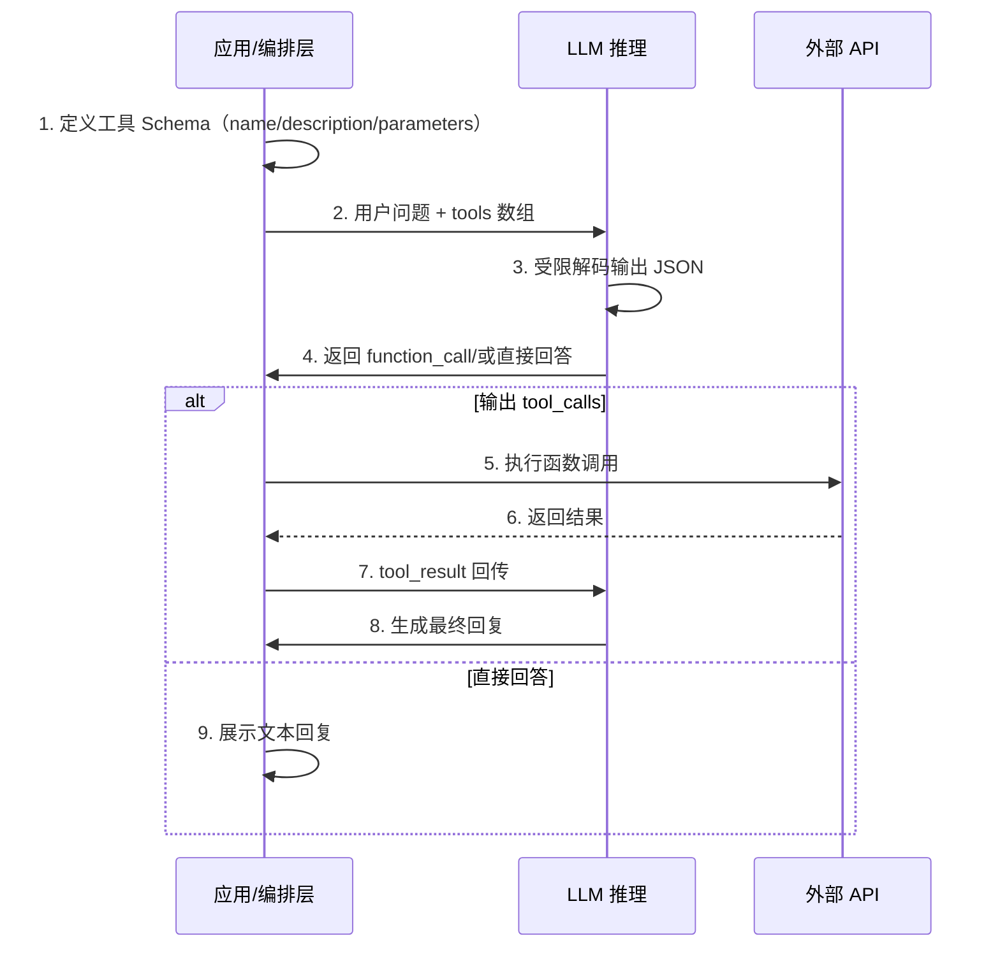
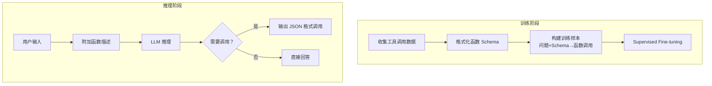
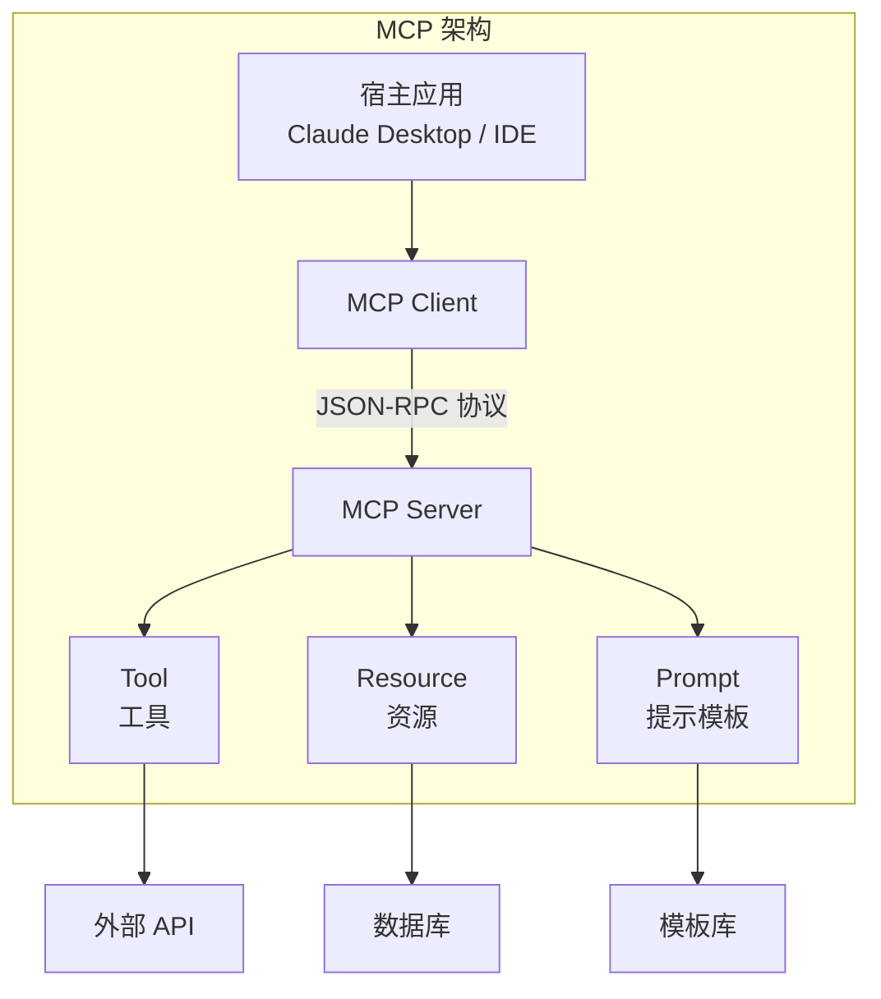
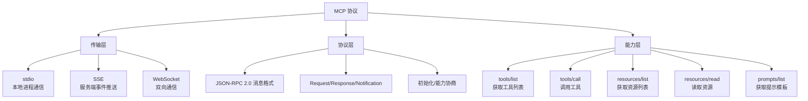
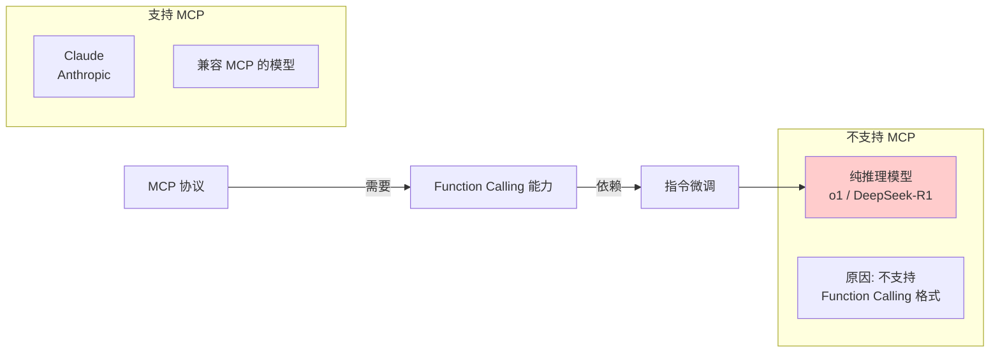
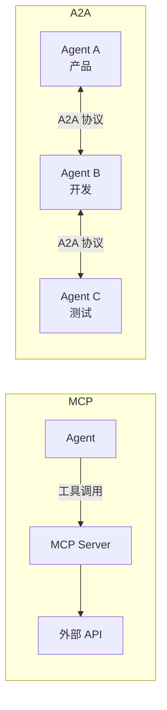
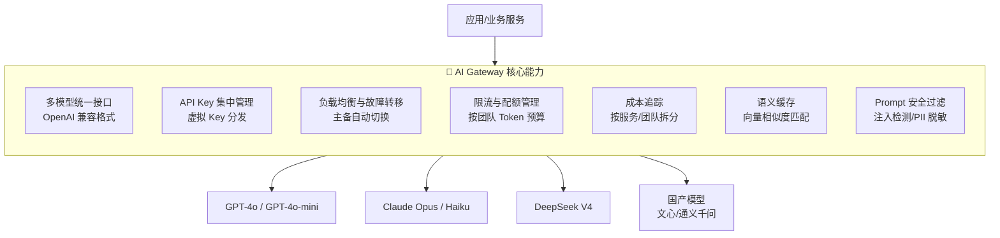
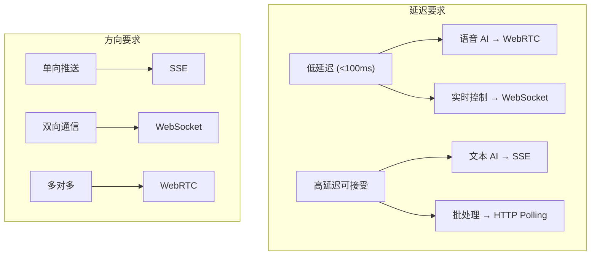

# 🔧 二、工具调用与协议篇

> 🎯 **核心考点：** Function Calling 原理、MCP 协议、Skill/A2A、通信协议对比、AI Gateway | **题数：** 16 题

---

### Q1: 什么是 Function Calling？原理是什么？

> 💡 **要点**：Function Calling 是 LLM 输出结构化 JSON 的能力，由应用层执行函数。其本质是 LLM 通过受限解码（Constrained Decoding）输出符合 JSON Schema 的 token 序列

**Function Calling（函数调用）** 是 LLM 在生成文本时，同时输出**结构化函数调用指令**的能力。LLM 本身**从不执行任何函数**，它只负责生成结构化的 JSON 描述（要调用哪个工具、参数是什么），真正的执行由外部的编排代码完成。这个设计保证了安全边界——LLM 永远隔着一层沙箱。



**原理：** Function Calling 的实现依赖两个环节：
1. **SFT 微调阶段**：模型在训练时看到大量 `用户问题 → 函数描述 → 函数调用` 的数据，学会输出特定 JSON 格式
2. **受限解码（Constrained Decoding）**：推理时，当模型决定调用工具，解码器会遮罩（mask）所有不符合 JSON Schema 的 token，确保输出的**语法合法性**

#### Agentic Loop —— Function Calling 的执行模型

Function Calling 驱动的是 **Agentic Loop**（Agent 循环）：

```
while (stop_reason == tool_use) {
  执行工具 → 回传结果 → 继续对话
}
```

**各平台 stop_reason 对照：**

| 平台 | stop_reason 字段 | 工具结果 role | 独特点 |
|:---|:---|:---|:---|
| **OpenAI** | `finish_reason: "tool_calls"` | `role: "tool"` | Parallel Calling 原生支持 |
| **Anthropic Claude** | `stop_reason: "tool_use"` | `role: "user"` 包裹 `tool_result` | 服务端工具、Extended Thinking |
| **DeepSeek** | `finish_reason: "tool_calls"`（兼容 OpenAI） | `role: "tool"` | 格式与 OpenAI 兼容 |

#### tool_choice 四种模式

| 取值 | 含义 | 适用场景 |
|:---|:---|:---|
| **`"auto"`（默认）** | 模型自主决定是否调用 | 通用对话，让模型按需判断 |
| **`"required"`** | 必须调用至少一个工具 | 强制提取结构化数据 |
| **`"none"`** | 禁止所有工具调用 | 纯文本生成，不允许工具调用 |
| **`{"type":"function","function":{"name":"get_weather"}}`** | 强制调用指定工具 | A/B 测试、固定调用路径 |

#### Parallel Function Calling

支持模型在一次响应中输出多个 `tool_calls`，应用层可**并行执行**所有工具调用。例如"北京和上海今天天气怎么样？"会触发两个并发的 `get_weather` 调用。

> **支持的模型**：GPT-4o、GPT-4.1、GPT-5、DeepSeek V4 Flash/Pro、Claude Opus 4.7

#### Strict Mode

`strict: true` 告诉模型必须严格遵守定义的 JSON Schema，输出不会出现 Schema 中未定义的字段。适用于需要机器解析工具调用结果的生产场景。

---

### Q2: LLM 是如何学会调用外部工具的？



- **SFT 阶段**：用大量 `(问题, 函数定义, 调用结果)` 样本微调
- **RLHF 阶段**：奖励模型学会调用的行为
- **上下文学习**：即使是未微调的模型，通过 Few-shot 也可以在 Inference 时学会

---

### Q3: 大模型的 Function Call 能力是怎么训练出来的？

| 阶段 | 方法 | 数据形式 |
|------|------|---------|
| **数据构造** | 模拟 API 调用场景 | `System: 你有以下工具...` · `User: 查一下北京的天气` · `Assistant: <functioncall> {"name":"get_weather","args":{"city":"北京"&#125;&#125;` |
| **SFT 微调** | 在混合数据上微调 | 通用文本 70% + 函数调用 30% |
| **RLHF 优化** | 奖励正确调用行为 | 函数调用准确率作为奖励信号 |
| **工具调用 Agent 数据** | Self-play 生成 | Agent 执行轨迹作为训练数据 |

---

### Q4: 什么是 MCP（模型上下文协议）？核心内容？

**MCP（Model Context Protocol）** 是 [Anthropic](https://anthropic.com) 提出的**开源协议**，用于标准化 LLM 与外部工具/数据源的通信方式。类似「AI 应用的 USB-C 接口」。



**MCP 核心内容：**

| 组件 | 说明 |
|------|------|
| **Tools** | 可调用的函数，定义 Schema 和 handler |
| **Resources** | 可读取的数据源（文件、数据库等） |
| **Prompts** | 可复用的提示模板 |
| **Transport** | 通信层（stdio / **Streamable HTTP** / WebSocket） |
| **JSON-RPC** | 消息格式标准 |
| **Auth (OAuth 2.1)** | 2025 进入 spec，生产部署必须开启 |

> 📌 **2025+ 关键变化**：
> - **Streamable HTTP 取代 SSE 作为标准传输**（SSE 已被 deprecated）
> - **OAuth 2.1 鉴权**进入 spec，生产 MCP Server 必须支持
> - **Resource Templates**（`resources/templates`）支持参数化资源访问
> - 多个大厂（OpenAI、Google、Microsoft）已宣布支持

---

### Q5: MCP 由哪几部分组成？



---

### Q6: MCP 和 Function Calling 有什么区别？

> 💡 **要点**：Function Calling 是 LLM 的"输出格式"，MCP 是"工具与 LLM 间的通信标准"

| 对比维度 | Function Calling | MCP |
|---------|-----------------|-----|
| **定位** | LLM 输出结构化 JSON 的能力 | 工具与 LLM 间的通信协议 |
| **标准化** | 各厂商自定格式 | 开放标准协议 |
| **工具发现** | 需开发者手动传入 Schema | 工具可动态发现 (tools/list) |
| **连接方式** | 一次性调用 | 长连接会话 |
| **适用厂商** | OpenAI / Anthropic / 各家 | Anthropic 发起，社区支持 |
| **实际部署** | 简单，代码直接调用 | 需运行 MCP Server 进程 |

**一句话总结：** Function Calling 是 LLM 的「输出格式」，MCP 是「工具和 LLM 之间」的通信标准。

---

### Q7: 什么场景用 Function Calling？什么场景用 MCP？

| 场景 | 推荐 | 原因 |
|------|------|------|
| **简单的单步工具调用** | Function Calling | 最直接，无额外依赖 |
| **复杂多工具系统** | MCP | 标准化管理，动态发现 |
| **已有代码项目集成** | Function Calling | 改造成本低 |
| **需要热插拔工具** | MCP | 工具动态注册/发现 |
| **跨应用共享工具** | MCP | 统一协议标准 |
| **快速原型开发** | Function Calling | 上手快，无需搭建 Server |

---

### Q8: 为什么有些推理模型不支持 MCP 协议？



- 纯推理模型（如 o1、[DeepSeek](https://deepseek.com)-R1）专门优化了推理链，没有经过 Function Calling 的指令微调
- MCP 依赖 Model 端输出特定 JSON 格式，如果模型不支持，MCP 无法工作
- 解决方法：使用 Gateway 层将推理模型的输出转为 MCP 格式

---

### Q9: Skill 是什么？

**Skill（技能）** 是 Agent 的**可复用能力单元**，包含完成特定任务所需的 Prompt、工具调用逻辑和知识。

```typescript
interface Tool {
  name: string;
  description: string;
}

interface SkillConfig {
  name: string;
  description: string;
  prompt: string;
  tools: Tool[];
  examples?: Record<string, unknown>[];
}

class Skill {
  name: string;
  description: string;
  prompt: string;
  tools: Tool[];
  examples: Record<string, unknown>[];

  constructor(config: SkillConfig) {
    this.name = config.name;
    this.description = config.description;
    this.prompt = config.prompt;
    this.tools = config.tools;
    this.examples = config.examples ?? [];
  }
}
```

| 要素 | 说明 |
|------|------|
| **Prompt** | 引导 LLM 完成任务的指令模板 |
| **Tools** | 该技能需要调用的工具 |
| **Examples** | 成功执行示例（Few-shot） |
| **Trigger** | 触发条件（关键词/意图匹配） |

---

### Q10: MCP 和 Agent Skill 的区别是什么？

> 💡 **要点**：MCP 在集成层（「手」），Skill 在知识层（「技能书」）。MCP 回答"AI 能访问什么"，Skill 回答"AI 知道怎么做什么"

#### 设计哲学差异

| 维度 | MCP | Agent Skill |
|:---|:---|:---|
| **核心作用** | 连接外部系统 | 编码专业知识和方法论 |
| **架构层级** | **集成层**（Integration Layer） | **提示/知识层**（Prompt/Knowledge Layer） |
| **哲学** | 连接主义——"AI 能访问什么？" | 知识打包——"AI 知道怎么做什么？" |
| **类比** | AI 的「手」——能触碰外部世界 | AI 的「技能书」——知道怎么做某件事 |
| **协议基础** | JSON-RPC 2.0（跨平台开放） | 文件系统 + Markdown（Anthropic 生态） |
| **跨平台** | ✅ 是（OpenAI/Google/Microsoft 等均已支持） | ❌ 否（目前 Anthropic 生态专属） |
| **触发方式** | 持久连接，随时可用 | 基于语义匹配自动触发（Progressive Disclosure） |
| **Token 消耗** | 高——工具定义持久占用上下文 | 低——渐进式加载，只加载匹配的 Skill |
| **外部访问** | ✅ 可以直接访问外部系统 | ❌ 不能直接访问，需配合 MCP 或内置工具 |
| **复杂度** | 高（需理解协议、运行 Server） | 低（写 Markdown 即可） |
| ****动态发现** | ✅ 运行时发现可用工具 | ✅ 运行时发现可用 Skill |

#### 关系图

```
Agent
  ├── MCP（连接层） → 搜索服务 / 数据库 / API
  └── Skill（知识层） → 代码审查流程 / 文档生成方法 / 数据分析指南
         └── 内部使用 MCP 调用工具
```

#### 什么时候用 MCP？

| 场景 | 说明 |
|:---|:---|
| **需要访问外部数据** | 数据库查询、API 调用、文件系统访问 |
| **需要操作外部系统** | 创建 GitHub Issue、发送 Slack 消息、执行 SQL |
| **需要实时信息** | 监控系统状态、查看日志、搜索引擎结果 |
| **需要跨平台复用** | 同一工具在 Claude Desktop、Cursor、其他支持 MCP 的应用中使用 |

#### 什么时候用 Skill？

| 场景 | 说明 |
|:---|:---|
| **重复性的工作流程** | 代码审查、文档生成、数据分析 |
| **公司内部规范** | 代码风格、提交规范、文档格式 |
| **需要多步骤的复杂任务** | 需要详细指导的专业任务 |
| **Token 敏感场景** | 需要大量知识但不想一直占用上下文 |

#### Skill 的渐进式信息公开（Progressive Disclosure）

这是 Skill 最精妙的设计——为解决 MCP 工具定义过多导致上下文爆炸的问题：

1. **扫描阶段**：Agent 读取所有 Skill 的元数据（名称 + 描述），每个仅几十 Token
2. **匹配阶段**：将用户请求与 Skill 描述进行语义匹配
3. **加载阶段**：匹配成功 → 只加载匹配到的完整 SKILL.md
4. **执行阶段**：按 Skill 指令执行，按需加载支持文件

> 对应关系：MCP 解决"怎么连接工具"的标准化问题，Skill 解决"工具太多导致上下文爆炸"和"怎么把使用工具的经验知识封装复用"两个问题。MCP 是能力接入层，Skill 是能力编排层。

#### 一句话总结

> **MCP 让 AI 能"碰到"数据，Skill 教 AI 怎么"处理"数据。**

---

### Q11: Function Calling、Skill、MCP 三者的区别？

> 💡 **要点**：三者分层明确——FC 是模型输出格式，MCP 是接入协议，Skill 是知识封装

| 概念 | 层级 | 本质 | 类比 |
|:---|:---|:---|:---|
| **Function Calling** | **模型能力层** | LLM 输出结构化 JSON 的能力 | 模型"会说 JSON"——底层能力 |
| **MCP** | **集成层** | 工具与 LLM 间的标准通信协议 | 工具的 USB-C 接口——连接标准 |
| **Skill** | **知识层** | Agent 可复用的能力封装单元 | 完整的"拧螺丝"流程——上层封装 |

**关系链：**

```
Skill（知识封装）──使用──→ MCP（接入协议）──依赖──→ Function Calling（模型能力）
    ↑                              ↑                              ↑
  教 AI 怎么做                  标准化连接                   会说 JSON 格式
```

**分场景理解：**

| 概念 | 解决的问题 | 示例 |
|:---|:---|:---|
| **Function Calling** | 模型**如何决定**调用工具并输出合法参数 | "帮我查天气" → 输出 `getWeather(city: "北京")` |
| **MCP** | 工具**如何被标准化发现和调用** | `tools/list` 获取可用工具列表、`tools/call` 执行调用 |
| **Skill** | Agent **如何知道**完成某项任务的完整流程 | "代码审查 Skill" 包含：PR 分析 → 检查规范 → 运行测试 → 生成报告 |

#### 工程级结论（来自腾讯云技术博客）

> - **API** 是"函数"
> - **Skill** 是"能力"
> - **MCP** 是"适配层"
> - **Rule** 是"护栏"
> - **Agent** 是"执行体"

Skill 在架构层级上是 MCP 的上层——Skill 内部使用 MCP 协议调用外部工具，而 MCP 依赖模型的 Function Calling 能力来解析函数调用。

---

### Q12: 什么是 A2A 协议？它和 MCP 协议的区别？

> 💡 **要点**：MCP 是 Agent→工具（垂直），A2A 是 Agent↔Agent（水平），两者互补

**A2A（Agent-to-Agent）** 是 Google 提出的**多 Agent 间通信协议**，解决 Agent 之间如何协作的问题。当前主流为 **A2A v0.3**（2025 末）。



#### A2A v0.3 核心机制

| 概念 | 说明 |
|------|------|
| **Agent Card** | 类似 `.well-known/agent.json` 的发现文档，声明 Agent 能力、技能、endpoint |
| **JSON-RPC over HTTPS** | 默认传输协议，与 MCP 共用 |
| **Task Lifecycle** | submitted → working → completed/failed/canceled |
| **Streaming** | SSE 支持任务进度推送 |
| **Auth** | Bearer Token / OAuth 2.0 |

```json
// 示例：Agent Card（.well-known/agent.json）
{
  "name": "Research Agent",
  "description": "Performs web research and synthesizes findings",
  "url": "https://research-agent.example.com",
  "version": "0.3.0",
  "skills": [
    { "id": "web-search", "name": "Web Search" },
    { "id": "summarize", "name": "Document Summarization" }
  ],
  "authentication": { "schemes": ["bearer"] }
}
```

| 维度 | MCP | A2A |
|------|-----|-----|
| **定位** | Agent → 工具 | Agent ↔ Agent |
| **通信方向** | 垂直（应用调工具） | 水平（Agent 间协作） |
| **核心问题** | 工具如何标准化接入 | Agent 如何协作完成任务 |
| **发现机制** | `tools/list` 动态发现 | Agent Card（`.well-known/agent.json`） |
| **传输** | Streamable HTTP（2025+） | JSON-RPC over HTTPS + SSE |
| **提出方** | Anthropic | Google |
| **关系** | **互补**：Agent 先用 MCP 调工具，再用 A2A 与其他 Agent 通信 |

---

### Q13: MCP 协议通常采用什么通信方式？

| 传输方式 | 适用场景 | 优势 | 劣势 | 2025 状态 |
|---------|---------|------|------|:---:|
| **stdio** | 本地子进程 | 简单、低延迟 | 限于本地 | ✅ 稳定 |
| **Streamable HTTP** | 服务端推送（**2025+ 默认**） | 标准 HTTP，兼容好 | 单向推送 | 🆕 推荐 |
| **SSE** | 旧版服务端推送 | 兼容老实现 | 单向、SSE deprecated | ⚠️ 弃用 |
| **WebSocket** | 实时双向通信 | 全双工、低延迟 | 额外复杂度 | ✅ 扩展支持 |

**推荐（2025+）：** 本地开发用 `stdio`，生产环境用 **Streamable HTTP**（已替代 SSE），复杂实时场景用 `WebSocket` 扩展。

---

### Q14: [WebSocket](https://websockets.spec.whatwg.org) 和 SSE 通信的区别及局限性？

| 对比维度 | WebSocket | SSE (Server-Sent Events) |
|---------|-----------|-------------------------|
| **方向** | 双向全双工 | 服务器→客户端单向 |
| **协议** | ws:// / wss:// | HTTP 长连接 |
| **自动重连** | 需手动实现 | 原生支持 |
| **兼容性** | 所有现代浏览器 | IE 不支持 |
| **消息格式** | 任意（文本/二进制） | 纯文本（text/event-stream） |
| **适用场景** | 实时聊天、游戏 | 通知推送、日志流 |

**局限性：**
- **[WebSocket](https://websockets.spec.whatwg.org)**：需要心跳保活、有连接数限制、防火墙可能拦截 ws 协议
- **SSE**：不支持二进制、单向（仅服务器推送）、HTTP/1.1 限制并发连接数（HTTP/2 解决）

---

### Q15: 为什么用 [WebRTC](https://webrtc.org)？与 [WebSocket](https://websockets.spec.whatwg.org) 在 AI 对话中的核心差异？

| 维度 | WebSocket | WebRTC |
|------|-----------|--------|
| **定位** | 消息传输协议 | 实时通信框架（音视频+数据） |
| **延迟** | 低（~100ms） | 极低（~10ms，UDP） |
| **传输** | TCP（可靠有序） | UDP（速度优先） |
| **音频流** | 需编码为文本/二进制 | 原生音频轨道 |
| **适用场景** | 文本对话、指令传输 | 语音对话、视频通话 |

**AI 对话场景：**
- **文本 AI**：[WebSocket](https://websockets.spec.whatwg.org) 足够，简单可靠
- **语音 AI**：[WebRTC](https://webrtc.org) 是首选，原生支持低延迟音频流

---

### Q16: 有没有用过大型模型的网关框架？网关层解决了什么问题？

> 💡 **要点**：LLM 网关 ≠ 普通 API 网关，核心差异在于语义缓存、Token 配额、成本追踪等 LLM 特有功能

#### 网关的定位

LLM 网关是架在**应用和模型 API 之间**的中间层。没有网关时，应用直接对接各家模型 API；有了网关后，调用链变成：**应用 → 网关 → OpenAI/Anthropic/DeepSeek**。

这个「中间人」的定位是理解网关所有功能的基础——它集中拦截和处理了所有出入流量，所以能在这个位置统一做很多事情。



#### 没有网关时的四大痛点

| 痛点 | 表现 | 后果 |
|------|------|------|
| **API Key 散落** | Key 存放在各服务配置文件、环境变量中 | 任何一处泄露就是安全事故，一夜可烧几千美元 |
| **重复劳动** | 每个服务自己写重试、限流逻辑 | 各写各的，版本不统一，出 Bug 难排查 |
| **成本黑箱** | 各服务各记各的 Token 消耗 | 月底财务问账单分摊，无人能答 |
| **灵活性差** | 换模型/限团队调用量都得改代码 | 死循环脚本一晚上吃光下周预算 |

#### 网关的核心功能详解

##### 1. 多模型统一接口
网关对外暴露 OpenAI 兼容接口，业务代码只需修改 `base_url` 和 `api_key`，其他一行不动。网关根据路由配置将请求分发到实际模型，换模型对业务层完全透明。

##### 2. API Key 集中管理
API Key 只存在网关一处，业务服务拿到的是网关分配的**虚拟 Key**，根本不接触真实密钥。泄露虚拟 Key 不影响底层模型，可在网关侧随时吊销。

##### 3. 负载均衡与故障转移
给同一「模型名」配置多条路由规则，主路由指向 OpenAI，备用指向 Azure OpenAI 或 Anthropic。主路由连续失败达阈值时自动切换，业务层无感知。

##### 4. 限流与配额管理
给每个团队的虚拟 Key 设置独立 Token 日预算（如研发 100万/天、产品 50万/天）。超配后该 Key 的请求直接返回 429，其他团队不受影响。

##### 5. 成本追踪
网关集中记录每次调用的 Token 用量、响应时间、错误率，可直接回答「哪个接口最烧钱」「各团队用了多少」，对接 Langfuse/Prometheus 等监控系统。

##### 6. 语义缓存（LLM 网关区别于普通网关的核心功能）
普通 HTTP 缓存必须精确匹配请求内容。语义缓存的原理是将问题转为向量，在向量数据库中做相似度搜索，命中直接返回历史答案，**完全跳过 LLM 调用**。

```
收到新问题 → 问题向量化 → 向量相似度搜索
  ├─ 命中（相似度 > 阈值） → 直接返回缓存答案 ✅ 省 $$$
  └─ 未命中 → 调 LLM → 将「问题向量 + 回答」存入缓存
```

**工程调参要点：**
- **相似度阈值**：太高（0.99）形同虚设，太低（0.7）答非所问，建议 0.85-0.95 调试
- **缓存有效期**：天气/股价等实时信息几分钟，FAQ/技术文档可数天
- **最适场景**：高频重复问答如客服机器人，命中率极高

##### 7. Prompt 安全过滤
统一做输入输出安全校验：检测 Prompt 注入攻击、过滤个人隐私信息（身份证、手机号）、内容安全审核。集中在网关做，安全策略统一更新，所有接入点自动保护。

#### 常见网关框架对比

| 框架 | 类型 | 特点 | 适合场景 |
|:---|:---|:---|:---|
| **LiteLLM** | 开源，Python | 支持 100+ 模型，OpenAI 兼容接口，社区最活跃 | 通用场景，需注意供应链安全事件 |
| **Bifrost** | 开源，Rust | 高性能低延迟，2026 年新兴 | 对性能要求高的场景 |
| **PortKey** | 商业+开源 | 功能完整，有托管版 | 不想自运维的团队 |
| **Kong AI Gateway** | 商业（Kong 扩展） | 基于成熟 Kong 网关扩展 AI 能力 | 已有 Kong 的团队 |
| **One API** | 开源，Go | 国内社区活跃，支持国产模型，部署简单 | 国内开发，国产模型为主 |
| **Nginx/Envoy 自研** | 自研 | 灵活但工作量大 | 有特殊需求的大厂 |

#### 面试总结

常见误区是把 LLM 网关等同于普通负载均衡器或反向代理。回答要点：
1. **定位**：架在应用和模型 API 之间的中间层
2. **必须提到的核心功能**：多模型统一接口、API Key 集中管理、Token 配额、成本追踪
3. **加分项**：语义缓存——LLM 网关区别于普通 API 网关的标志性功能
4. **避免**：只说负载均衡和统一接口（普通 API 网关也能做），要突出 Token 配额、语义缓存、Prompt 安全过滤这些 **LLM 特有**能力

---

### 🌐 补充：协议选型与通信模式原理深究

#### 通信协议四象限选型



| 协议 | 延迟 | 方向 | 连接开销 | 自动重连 | 适用场景 |
|:---|:---:|:---:|:---:|:---:|:---|
| **HTTP/SSE** | 100-500ms | 服务端→客户端单向 | 低 | ✅ 原生 | 流式文本生成、MCP 通知 |
| **WebSocket** | 50-200ms | 双向 | 中 | ❌ 需实现 | Function Calling 结果返回、Agent 间通信 |
| **WebRTC** | 10-50ms | 双向 P2P | 高 | ✅ 自适应 | 语音 AI 对话、视频交互 |
| **STDIO** | 进程内 | 双向 | 无 | — | MCP 本地子进程通信 |

#### MCP 传输层设计的分场景选择

```
本地工具调用（如文件系统、本地 DB）
  → STDIO 传输：零网络开销，最安全

远程工具调用（如云端 API、SaaS 服务）
  → SSE 传输：标准 HTTP，穿透防火墙

实时协作场景（如多 Agent、共享白板）
  → WebSocket 传输：走 MCP over WebSocket 扩展
```
