# 🧠 Agent 工程师面试题库·大模型基础篇
# 📐 三、大模型基础篇

> 🎯 **核心考点：** Transformer 架构、位置编码、训练流程、Scaling Law、微调方案、解码策略、KV Cache、量化、MoE、部署评测 | **题数：** 22 题

---

## 📖 通俗易懂讲解 —— 用大白话搞懂大模型核心技术

### 1. Transformer 架构 —— 大模型的"地基"

#### 自注意力机制（Self-Attention）的核心原理

**数学公式：**
```
Attention(Q, K, V) = softmax(QK^T / √d_k) · V

其中 Q = X·W_Q, K = X·W_K, V = X·W_V
```

**逐行拆解：**

| 步骤 | 数学操作 | 通俗理解 |
|------|---------|---------|
| **Q·K^T** | 每个词与其他所有词算内积 | 每个人问其他人"你和我的话题相关吗？" |
| **÷√d_k** | 除以维度平方根归一化方差 | 防止分数太大，softmax 进入梯度饱和区 |
| **softmax** | 转为0-1概率分布 | 把分数转成"注意力权重"，总和为1 |
| **×V** | 加权求和所有词的值 | 按照注意力权重，把相关词的信息"聚合"过来 |

**举个例子理解整个过程：**

句子："**猫**在垫子上**睡觉**"

处理"睡觉"这个词时：
1. Q(睡觉) 与 K(猫) 内积得分高 → 模型知道"谁在睡觉？猫"
2. Q(睡觉) 与 K(在) 得分中等 → 语法关系
3. Q(睡觉) 与 K(垫子) 得分高 → "在哪睡？垫子上"
4. 最终 V 的加权结果 = "猫"的信息 × 0.6 + "垫子"的信息 × 0.3 + 其他 × 0.1

**关键洞察：** 自注意力让每个词都能"看到"所有其他词，一步到位解决长距离依赖（不像 RNN 要一步步传递）。

---

#### 多头注意力 —— 为什么需要多个"头"？

**直觉：** 一个"头"只能关注一种关系。比如在处理"他_她"时：
- 头1：关注语法关系（主谓宾）
- 头2：关注语义相似度（近义词）
- 头3：关注位置距离（相邻词）
- 头4：关注核心实体（谁做了什么事）

**数学实现：** 每个头有独立的 Q/K/V 权重矩阵，输出拼接后经过一个线性层：
```
MultiHead(Q,K,V) = Concat(head₁,...,headₕ) · Wᵒ
其中 headᵢ = Attention(Q·Wᵢ^Q, K·Wᵢ^K, V·Wᵢ^V)
```

**比喻：** 一个侦探办案，一个人看指纹、一个人查监控、一个人问证人——多个角度同时工作，最后汇总。

---

#### 位置编码（RoPE）的几何直觉

**为什么需要位置编码？**
```
"猫追老鼠" → 猫是主语，老鼠是宾语
"老鼠追猫" → 老鼠是主语，猫是宾语
```
Self-Attention 是"排列不变"的（对集合操作），没有位置信息就分不清上面两句话。

**RoPE（旋转位置编码）的工作原理：**

RoPE 不直接给位置"编号"，而是把每个词向量的**相邻两维**视为一个复数，对位置 m 乘以 $e^{im\theta_i}$（等价于 d/2 个 2×2 旋转块的拼接）：

```
RoPE(x_m, m)_2i   = x_{m,2i}   · cos(m·θ_i) − x_{m,2i+1} · sin(m·θ_i)
RoPE(x_m, m)_2i+1 = x_{m,2i}   · sin(m·θ_i) + x_{m,2i+1} · cos(m·θ_i)

其中 θ_i = 10000^(-2i/d) ，i = 0, 1, ..., d/2 − 1
```

- x_m 是第 m 个位置的词向量
- d/2 个不同频率 θ_i 构成"几何级数基频"，与 Transformer 原论文一致（基频 b=10000）
- m 越大旋转角度越大；不同维度 i 对应不同频率

> ⚠️ **常见误区**：不要把 RoPE 写成"d × d 的旋转矩阵作用在整个向量上"——实际是 d/2 个 2×2 旋转块的拼接，每块独立旋转。

**神奇性质：** 两个词 (m, n) 之间的 Attention 分数只依赖于它们的**相对位置差** (m−n)，而不是绝对位置！

```
<RoPE(q_m, m), RoPE(k_n, n)> = Re[ q · k* · e^{i(m-n)θ} ]  （复数形式）
→ 只与 (m − n) 有关
```

**这就是 RoPE 能外推的原因：** 相对位置是连续的，训练时只见过 4K 距离，推理时遇到 32K 距离，旋转公式仍然有效。

**上下文扩展方案（生产模型常用）：**
- **Position Interpolation (PI)**：把超长位置线性压缩到原范围
- **NTK-aware Scaling**：高频不变、低频缩放，无需微调可扩展 2-4x
- **YaRN**：PI + NTK + 注意力温度调整，目前 128K+ 主流方案
- **LongRoPE**：渐进式搜索最优缩放因子，可达 200K+ 上下文

**类比：** 给每个人发一个指南针（旋转角度=位置编号）。两个人面对面的角度差就是他们的距离——不管你在第几个位置，这个角度差的计算公式不变。

---

#### 残差连接（Residual Connection）和 LayerNorm

```
Output = LayerNorm(x + Sublayer(x))
```

**残差连接：** 把原始输入 x 直接加到处理结果上，像"搭梯子"让信息跳过某些层。

**为什么重要？** 50层Transformer中，如果不加残差连接，梯度从第50层传到第1层时几乎为0（梯度消失）。有了残差连接，梯度可以直接"抄近道"传回去。

**LayerNorm：** 对每个样本的所有特征做归一化（均值为0，方差为1），让训练更稳定——类似做饭时"所有食材切成统一大小"，火候更好控制。

---

### 2. 注意力优化 —— MHA → GQA → MQA → Flash Attention

#### MHA 的问题

标准 MHA 有 h 个注意力头，每个头有自己的 K 和 V。推理时：

```
KV Cache 大小 = 2 × L × n_kv_heads × d_k × S × P
```

对于 Llama-70B（L=80, n_kv_heads=64, d_k=128, S=4096, fp16）：**单序列 KV Cache ≈ 10.7 GB（MHA 下）**

这就是问题所在——大模型推理时，KV Cache 占的显存比模型权重还多。

---

#### GQA（Grouped Query Attention）的数学直觉

**思路：** Q 还是 h 组，但 K/V 减少为 g 组（g < h）。每组 K/V 被多个 Q 头共享。

```
MHA:  Q₁ K₁ V₁, Q₂ K₂ V₂, Q₃ K₃ V₃, Q₄ K₄ V₄  （4组）
GQA:  Q₁ Q₂ → K₁ V₁,  Q₃ Q₄ → K₂ V₂              （2组共享）
```

**显存节省：** KV Cache 从 h 组降为 g 组，节省比例 = 1 - g/h。LLaMA-2 70B 使用 GQA（g=8, h=64），KV Cache 从 10.7GB 降到 1.34GB。

**为什么质量几乎不降？** 多组 Q 共享 K/V 意味着"问的问题不同，但参考的资料相同"——K/V 代表的"上下文信息"对所有头是通用的，Q 的差异足够捕捉不同关系。

---

#### Flash Attention —— 让 Attention 不再吃显存

**传统 Attention 的问题：** 必须先生成 S×S 的注意力矩阵（如 4096×4096=16M 个元素），存储在 HBM（高带宽内存）中，然后读写。

**Flash Attention 的核心创新：**

**分块计算（Tiling）：** 不一次性计算整个注意力矩阵，而是分成小块，在 SRAM（片上缓存，速度快但容量小）中逐块计算。

```
传统方式：
Q·K^T → 大矩阵 S×S（写入HBM） → softmax → ×V（从HBM读取）

Flash Attention：
分块 → 每块在SRAM中算 → 在线softmax → 累加结果
        （无需读写HBM）
```

**为什么能加速？** SRAM 比 HBM 快 10-100 倍。Flash Attention 把 HBM 访问从 O(S²) 降到 O(S²/块数)，实际训练加速 2-4 倍。

**比喻：** 
- **传统方式**：把所有书搬到操场（HBM），每次查一页都要跑操场
- **Flash Attention**：把书拆成小册子，在课桌（SRAM）上直接看，看完一本换一本

---

**选型总结：**

| 方案 | 节省显存 | 质量影响 | 实现复杂度 | 代表模型 |
|------|---------|---------|-----------|---------|
| **MHA** | 基准 | 最佳 | 简单 | 原始Transformer |
| **GQA** | ~50% | 几乎无损 | 简单 | Llama-2/3, Qwen2, Mistral |
| **MQA** | ~80% | 轻微下降 | 简单 | PaLM, Falcon |
| **Flash Attention** | 从O(n²)到O(n√n) | 无损 | 较复杂 | 几乎所有现代训练框架 |

---

### 3. 训练三阶段 —— 从"文盲"到"专家"

#### 为什么需要三阶段？不能一步到位吗？

用一个类比理解：

```
预训练：让一个孩子读遍世上所有的书 → 知识渊博但不会和人正常对话
    ↓
SFT：教他"别人问你问题，你要怎么回答" → 学会聊天格式，但回答质量平平
    ↓
RLHF/DPO：告诉他"这样的回答更好，那样不好" → 学会创造精彩的回答
```

**每个阶段的本质区别：**

| 阶段 | 学习方式 | 数据形式 | 目标 |
|------|---------|---------|------|
| **预训练** | 自监督 | 纯文本（Next Token Prediction） | 学语言知识 |
| **SFT** | 监督学习 | (问, 标准答) 对 | 学对话格式 |
| **RLHF/DPO** | 强化学习/偏好优化 | (问, 好答, 差答) | 学人类偏好 |

---

#### 预训练 —— Next Token Prediction 如何学到知识？

**训练目标：** 给定前文，预测下一个词。

```
输入: "法国的首都是___"
目标: "巴黎"
损失: 交叉熵（模型预测分布 vs 真实词）
```

**为什么预测下一个词能学到知识？**

想象模型要预测"巴黎"：
- 需要知道"法国"和"首都"的含义
- 需要理解"是"表示定义关系
- 需要记住这个事实性知识

为了准确预测海量文本中的下一个词，模型被迫在参数中**内化**语法规则、事实知识、推理模式、世界常识。

**规模效应：** GPT-3（175B参数）在 300B tokens 上训练后，参数中存储了足够多的知识来回答大多数问题。这就是为什么预训练阶段需要**TB级数据**和**万卡级算力**。

---

#### SFT —— 让模型"学会对话"

**问题：** 预训练模型会续写文本，但不会"回答问题"。

```
预训练模型看到 "什么是注意力机制？"
→ 续写为："什么是注意力机制？这是一个在深度学习中广泛使用的概念..."
（直接续写问题，而不是回答）
```

**SFT 数据示例：**
```json
{"instruction": "什么是注意力机制？",
 "output": "注意力机制是一种让模型关注输入中重要部分的技术..."}
```

**SFT 的本质：** 把预训练模型的"续写模式"切换为"问答模式"，同时通过高质量数据教会模型"好的回答长什么样"。

**数据量：** 通常只需要 1万-10万条高质量对话数据，训练 1-3 个 epoch。太多会过拟合（学会背诵而不是理解）。

---

#### RLHF/DPO —— 从"会说话"到"说对话"

**SFT 的根本局限：** 每个问题只有"一个正确答案"，但现实中"好回答"有无数种，SFT 只能模仿，无法区分"较好"和"最好"。

**RLHF 的思路（三阶段流程）：**

```
Stage 1: SFT → 得到基础对话模型
Stage 2: 训练 Reward Model（RM）→ 学会打分
  输入: (问题, 回答A, 回答B) + 人类偏好
  输出: 评分函数 r(x, y)

Stage 3: PPO 优化 → 在 RM 指导下优化策略
  优化目标: max E[r(x, y)] - β·KL(π_θ || π_ref)
  ↑ 追求高分      ↑ 但不要偏离太远
```

**DPO 为什么更简单？**

DPO 的核心发现：奖励函数可以从策略模型的偏好概率中**直接推导**，不需要显式训练 RM。

```python
# DPO 损失函数就一行代码
loss = -log(sigmoid(beta * (log(π_θ(y_w|x)/π_ref(y_w|x)) 
                           - log(π_θ(y_l|x)/π_ref(y_l|x)))))
```

**对比 PPO 和 DPO 的训练动态：**

PPO 训练时，模型生成新回答 → RM 打分 → PPO 更新 → 再次生成（on-policy，探索性强）

DPO 训练时，直接用固定偏好数据更新，模型不需要在线生成（offline，简单稳定）

**选型建议：**
- **资源充足，追求极致对齐** → PPO（GPT-4、Claude 路线）
- **绝大多数场景** → DPO（Qwen、Llama-3 路线）

---

### 4. LoRA 微调 —— 贴"便利贴"不比重写书

#### 数学原理

LoRA 的核心假设：大模型参数更新的"变化量"ΔW 是**低秩的**（即可以用两个小矩阵的乘积近似）。

```
原始权重:  W ∈ ℝ^{d×k}      （冻结不动）
LoRA 更新: ΔW = B·A          （只训练这个）
           B ∈ ℝ^{d×r}      （d 行，r 列）
           A ∈ ℝ^{r×k}      （r 行，k 列）
           其中 r << min(d, k)
```

**为什么低秩假设成立？**

Li et al. (2018) 发现：大模型参数在微调过程中的变化其实局限在一个**低维子空间**中（本质维度 intrinsic dimension）。也就是说，表面上 175B 参数，其实微调时真正需要改变的"自由度"很小。

**一个具体数字说明：**

```
Llama-7B 的 attention 层: W_q ∈ ℝ^{4096×4096}
全量更新需要: 4096 × 4096 = 16,777,216 个参数

LoRA (r=8): 
B ∈ ℝ^{4096×8} = 32,768 参数
A ∈ ℝ^{8×4096} = 32,768 参数
总共: 65,536 参数 → 只有全量的 0.39%！
```

LoRA 把需要训练的参数量降低了 **99.6%** 以上。

---

#### 前向传播对比

```
全量微调:  h = W·x + b      （W 被更新）
LoRA微调:  h = W·x + B·A·x  （W 冻结，只更新 B·A）
                              ↑
                          原始输出 + LoRA 补丁
```

**推理时可以合并：** 训练完后计算 W' = W + B·A，把 LoRA 权重"合并"回原模型，推理时**零额外开销**。

**切换任务时：** 只需换一套 B·A 矩阵，权重文件仅几 MB，秒级切换。

---

#### 关键超参数 —— Rank r

| r 值 | 参数量 | 效果 | 适用场景 |
|------|--------|------|---------|
| r=1 | 极少 | 欠拟合 | 简单任务 |
| r=8 | 少 | 好 | 通用推荐 |
| r=16 | 中等 | 更好 | 复杂任务 |
| r=64 | 较多 | 接近全量 | 资源充足 |

**缩放因子 α：** 实际计算时 ΔW = (α/r) · B·A，α 控制 LoRA 更新的"幅度"。通常设 α=16 或 32（不需要精细调）。

---

**实际对比：**

| 维度 | Full Fine-tuning | LoRA (r=8) |
|------|-----------------|------------|
| 可训练参数 | 7B (100%) | 28M (0.4%) |
| 训练显存 | ~140GB (A100-80G×2) | ~16GB (单卡RTX 4090) |
| 训练时间 | 数天 | 数小时 |
| 最终权重大小 | 14GB | 16MB (合并后0) |
| 效果（多数任务） | 100% | 95-99% |

---

### 5. 解码策略 —— 控制"创造性"

#### 生成的本质

LLM 生成是**逐词预测**过程：给定前文，预测下一个词的概率分布。

```
"今天的天气真" → 模型输出概率分布:
    好: 0.45
    不: 0.30
    棒: 0.15  
    差: 0.10
```

解码策略决定**如何从这个分布中选词**。

---

#### Temperature 的数学原理

**定义：** 对 logits 除以 T 后再做 softmax。

```
原始分布:  p_i = softmax(logit_i) 
加温度:    p_i = softmax(logit_i / T)
```

**T 的作用：**

```
原始 logits: [5.0, 3.0, 1.0, 0.0]

T=0.1 → 除以0.1 = [50, 30, 10, 0]
     softmax 后 → [接近1, 接近0, 接近0, 接近0]
     效果：几乎确定选第一个词

T=1.0 → [5.0, 3.0, 1.0, 0.0]
     softmax 后 → [0.84, 0.11, 0.03, 0.01]
     效果：正常的概率分布

T=5.0 → 除以5 = [1.0, 0.6, 0.2, 0.0]
     softmax 后 → [0.35, 0.28, 0.22, 0.15]
     效果：分布变"平"，随机性增大
```

**直观理解：**
- T→0：选概率最高的（贪心），确定性任务
- T=1.0：按原始概率采样，通用
- T→∞：均匀随机采样，彻底混乱

---

#### Top-P（Nucleus Sampling）

**问题：** 词汇表通常有 32K-128K 个词，大部分概率集中在少数词上，尾部大量词概率极低但数量多，加起来可能不低。

**Top-P 的做法：** 只保留累积概率达到 P 的最小候选集。

```
词汇分布: [0.4, 0.3, 0.15, 0.05, 0.02, 0.01, ...]

P=0.9:
  累积: 0.4+0.3+0.15+0.05 = 0.9
  保留前4个词，丢弃后面的所有词
  从保留的4个词中重新归一化采样
```

**Top-P vs Top-K 的区别：**
- **Top-K**：固定保留 K 个，可能一次保留太多（分布平坦时）或太少（分布尖锐时）
- **Top-P**：根据分布形态动态调整候选数——分布尖锐时保留少，分布平坦时保留多

**实践搭配：** 通常 Top-P=0.9 配合 Temperature 一起使用，先调温度再截断。

---

#### Beam Search —— 全局最优的搜索

**Greedy 的问题：** 每步选最优，但局部最优≠全局最优。

```
句子: "I ___ a student"
Step 1: "am" (0.6), "was" (0.3), "is" (0.1)
贪心选 "am" → 正确

但有时贪心会出错：
"他___了篮球比赛"
Step 1: "看" (0.4), "赢" (0.35), "打" (0.25)
贪心选 "看" → "看了篮球比赛" ✓
但如果第一步选 "赢"，后面可能接 "得" → "赢得了篮球比赛" ✓
两条路径最终都对，但贪心看不到后面的可能性
```

**Beam Search 保留 top-N 条路径，N=beam_size。**

```
Beam size=2:
Step 1: [("看", 0.4), ("赢", 0.35)]
Step 2: 
  路径 "看" → "看"(0.4) + "了"(0.6) = 0.24
           → "看"(0.4) + "到"(0.3) = 0.12
  路径 "赢" → "赢"(0.35) + "得"(0.5) = 0.175
           → "赢"(0.35) + "了"(0.3) = 0.105
  保留 top-2: [("看了", 0.24), ("赢得", 0.175)]
...
```

**注意：** Beam Search 适合翻译、摘要等确定性任务，不适合创意写作（会导致重复、模式化）。

---

### 6. KV Cache —— 推理"加速器"

#### 为什么需要 KV Cache？

分析一次生成过程的计算量：

```
生成第 1 个词：计算 Attention(全部 1 个词)
生成第 2 个词：计算 Attention(全部 2 个词) → 重复算了第 1 个词
生成第 3 个词：计算 Attention(全部 3 个词) → 重复算了第 1、2 个词
...
生成第 N 个词：计算 Attention(全部 N 个词) → 重复算了前 N-1 个词
```

**总计算量：** O(1² + 2² + 3² + ... + N²) = O(N³/3)

**优化后（有KV Cache）：** 每次只算新词的 K/V，历史 K/V 直接读缓存。
```
总计算量：O(1 + 2 + 3 + ... + N) = O(N²/2)
```
效率提升了 **O(N)** 倍（当 N=4096 时，提升约 2000 倍）。

---

#### KV Cache 的内存公式

```
M_KV = 2 × L × H × d_k × S × P × B

L: 层数
H: 每层 KV 头数（注意不是 Q 头数！这就是 GQA 优化的地方）
d_k: 每个头的维度
S: 序列长度
P: 精度（FP16=2, INT8=1, FP32=4）
B: Batch size
```

**实例计算：**

| 模型 | 公式计算 KV Cache | 说明 |
|------|------------------|------|
| Llama-7B (MHA) | 2×32×32×128×4096×2×1 = 2.1 GB | 单序列显存需求已很大 |
| Llama-70B (GQA, 8 KV heads) | 2×80×8×128×4096×2×1 = 1.34 GB | GQA 节省 8 倍 |
| DeepSeek-V2 (MLA) | KV 压缩 75% → ~2.6 GB | MLA 极致优化 |

---

#### Prompt Caching —— 共享前缀的 KV 复用

**场景：** 多个用户的请求共享相同的 System Prompt。

```
System Prompt: "你是一个专业的Python工程师，请用中文回答..."

用户1: "如何用Python读取CSV文件？"
用户2: "Python中list和tuple的区别？"
```

**传统做法：** 每次请求都从头计算 System Prompt 的 K/V → 重复计算 1000 次。

**Prompt Caching：** 把 System Prompt 的 KV Cache 存起来，不同用户直接复用。

**vLLM 实现（Hash-based）：** 将 KV Cache 按固定长度分块，每块计算哈希。新请求的前缀哈希命中缓存时直接复用。

**SGLang 实现（RadixAttention）：** 使用基数树（Radix Tree）结构管理 KV Cache，所有请求的 KV 共享一个树形结构，自动合并和复用公共前缀。

**选型建议：**
- 固定 System Prompt（聊天机器人）→ **vLLM** 足够
- 复杂多轮对话、Few-shot 共享 → **SGLang** 命中率更高

---

### 7. MoE（混合专家）—— 大而不笨

#### 核心思想

```
总参数量 671B（像有 671B 的知识储备）
每次激活 37B（只调用最相关的部分）
```

**为什么需要 MoE？** Dense 模型扩展到一定规模后，性能提升的边际收益递减，但计算成本线性增长。MoE 打破了"总参数 = 计算量"的绑定关系。

---

#### 架构详解

```
输入  →  路由门控（Router） →  选择 Top-K 个专家
                              ↓
                   专家 1 ─────────────────────┐
                   专家 5 ─── 加权合并 ───→  输出
                   专家 7 ─────────────────────┘
                              ↑
                         权重 w₁, w₅, w₇
```

**路由门控（Router）：** 一个轻量级的线性层 + softmax，输入是当前 token 的向量，输出是每个专家的权重分数。

**Top-K 选择：** 只激活分数最高的 K 个专家（通常 K=2 或 K=8，取决于总专家数）。

**容量因子（Capacity Factor）：** 每个专家能处理的 token 数上限。设得高 → 浪费计算；设得低 → token 被丢弃。

---

#### 负载均衡损失

**问题：** 路由可能"偏爱"某些专家，导致少数专家处理 90% 的 token。

**解决方案：** 添加负载均衡损失：

```python
L_balance = α · Σᵢ fᵢ · Pᵢ
# fᵢ: 实际分配给专家 i 的 token 比例
# Pᵢ: 路由分配给专家 i 的平均概率
```

当 α>0 时，模型被激励**均匀利用所有专家**。

---

#### DeepSeek-V3 的 MoE 极致优化

| 优化点 | 做法 | 效果 |
|-------|------|------|
| **细粒度专家拆分** | 把大专家拆成更小的专家单元 | 激活参数更少，表达能力更精细 |
| **共享专家隔离** | 设置一组"共享专家"固定激活，处理通用知识 | 避免通用知识和专用知识"打架" |
| **辅助损失优化** | 改进的负载均衡策略 | 训练更稳定 |
| **专家间通信优化** | all-to-all 通信重叠 | 千卡集群训练效率高 |

**最终结果：** DeepSeek-V3 总参 671B，激活 37B，在多项基准上接近或超越 GPT-4，训练成本仅 $5.6M（GPT-4 估计 ~$100M+）。

---

### 8. RLHF/DPO/GRPO —— 教模型"价值观"

#### SFT 的局限 —— 为什么要 RLHF？

**核心矛盾：** SFT 只能学习"标准答案"，但现实中"好回答"有无数种。

```
SFT 学的是:
  问: "如何提高编程效率？"
  答: "多写代码、多阅读优秀项目..."（唯一标准答案）
  
RLHF 学的是:
  同样是这个问题，可以有很多"好回答"：
  - 推荐工具和最佳实践
  - 从方法论角度讲解
  - 结合个人经验分享
  RLHF 让模型学会"生成多样化的好回答"
```

**更直观的例子：**

想象教一个学生写作文。SFT 是给了一篇范文让他背下来，RLHF 是让他写10篇，然后告诉他哪篇好、好在哪里，他下次就能写出更好的。

---

#### PPO 的数学直觉

PPO 的目标函数：

```python
L(θ) = E[min(r_t(θ)·A_t, clip(r_t(θ), 1-ε, 1+ε)·A_t)] - β·KL(π_θ||π_ref)
```

**三部分各司其职：**

| 部分 | 作用 | 通俗解释 |
|------|------|---------|
| **r_t·A_t** | 鼓励高奖励的行为 | "好的回答多学，差的少学" |
| **clip** | 限制更新步长 | "每次改变不要太大，防止学歪了" |
| **-β·KL** | 不偏离原模型太远 | "保持语言自然，别为了讨好 RM 变成另一个人" |

**为什么需要 clip？** 没有 clip，一次更新可能让策略"崩了"——模型突然学会某种取巧的回答，然后越陷越深。

**为什么需要 KL 惩罚？** RM 不是完美的，它的高分不一定意味着真的好。KL 惩罚像一个"安全带"，当模型想"飘逸"时拉回来。

---

#### DPO 的精妙推导

DPO 的核心发现：PPO 中"奖励模型"和"策略优化"两步可以**合二为一**。

**推导直觉（省略数学细节）：**
1. PPO 的最优策略 π* 有一个闭式解：π*(y|x) ∝ π_ref(y|x)·exp(r(x,y)/β)
2. 反过来，可以从策略 π 中**反推**奖励函数：r(x,y) = β·log(π(y|x)/π_ref(y|x)) + constant
3. 将这个反推的 r(x,y) 代入偏好概率公式，得到**直接依赖 π 的损失函数**

**结果：** 不需要单独训练 RM，不需要 PPO 的复杂流程，只需要一个损失函数：

```python
loss = -E[log σ(β·(log(π(y_w|x)/π_ref(y_w|x)) - log(π(y_l|x)/π_ref(y_l|x))))]
```

**这个公式在做什么？** 
- 如果 π 给"好回答"的概率相对 π_ref 提升得多（比"差回答"提升更多），损失就小
- 换句话说：DPO 让模型在保持语言能力的前提下，提升好回答的相对概率

---

#### GRPO —— DeepSeek 的去 Critic 方案

**PPO 为什么需要 Critic？** PPO 的 Advantage（优势函数）计算需要知道"当前状态的价值"——A = R - V(s)，V(s) 由 Critic 网络估计。

**GRPO 的替代方案：** 对于同一个 prompt，采样 G 个回复，计算组内 Z-score 作为 Advantage。

```python
# GRPO 的优势计算
rewards = [r(y₁), r(y₂), ..., r(yᴳ)]  # 一组回复的奖励
mean_r = mean(rewards)
std_r = std(rewards)
advantages = [(r - mean_r) / std_r for r in rewards]  # 组内 Z-score
```

**为什么这样可行？** 
- RM 的绝对分数可能有偏差（某些 prompt 天然分高/低）
- 但**组内相对排名**是可靠的——同一个 prompt 下，分高的回复确实比分低的好
- Z-score 标准化消除了 prompt 间的偏差

**实际效果（DeepSeek-R1 验证）：**
- 训出强大的推理能力，AIME 2024 达到 79.8%（≈ o1-1217）
- 发现"灵光一现（Aha Moment）"——模型自主学会反思和验证推理步骤

---

### 9. RAG —— 开卷考试

#### RAG 的核心流程

```
用户问题 → 向量化 → 在知识库中检索相似文档 → 注入 Prompt → LLM 回答
                                    ↑
                          这步就是"开卷"的关键
```

**完整的 RAG 流水线分为离线/在线两阶段：**

**离线阶段（建索引）：**
```
原始文档 → 清洗切块（Chunking）→ Embedding 向量化 → 存入向量数据库
```

**在线阶段（检索生成）：**
```
用户提问 → 问题向量化 → 向量库 Top-K 检索 → 重排序（Re-rank）→ Prompt 组装 → LLM 回答
```

---

#### Chunking（文本切块）—— 最容易被忽视的"关键细节"

**切块大小直接影响检索质量：**

| 切块大小 | 优点 | 缺点 | 适用场景 |
|---------|------|------|---------|
| **小 (256 tokens)** | 精度高，噪声少 | 可能切碎语义 | QA 精确匹配 |
| **中 (512 tokens)** | 平衡 | 平衡 | **通用推荐** |
| **大 (1024 tokens)** | 语义完整 | 含噪声 | 摘要类任务 |

**重叠（Overlap）：** 相邻块之间保留 10-20% 的重叠，防止"关键信息被切在边界上"。

**语义切块（Semantic Chunking）：** 最先进的做法——不在固定长度切，而是在句子边界根据**语义变化**动态切。比如文章讲到"...介绍了Transformer架构。

接下来我们讨论..."，检测到话题转变时再切。

---

#### Embedding 模型选择

常用的 Embedding 模型将文本转为 768-1536 维向量，相似内容在向量空间中距离近。

**评估维度：**
- **MTEB 分数**：综合评测（推荐 BGE-M3、text-embedding-3-large）
- **检索召回率 Recall@K**：Top-K 中相关文档找到的比例
- **中文适配**：C-MTEB 榜单

---

#### 检索优化的进阶技巧

| 技术 | 原理 | 效果提升 |
|------|------|---------|
| **查询重写** | LLM 改写模糊问题为检索友好的表述 | 召回率↑ 20-30% |
| **HyDE** | 先"假设一个答案"，用答案向量去检索 | 改善查询-文档语义鸿沟 |
| **Multi-Query** | 从多个角度生成查询变体 | 覆盖度↑ |
| **混合检索** | 向量（语义）+ BM25（关键词）并行检索 | 兼顾语义和精确匹配 |
| **重排序（Re-rank）** | Cross-Encoder 对初筛结果精细排序 | Top-5 精度↑ 10-15% |
| **RRF 融合** | 多路检索结果排序融合 | 简单有效 |

---

#### RAG vs 微调 —— 何时用哪个？

| 场景 | 推荐方案 | 原因 |
|------|---------|------|
| 客服问答（知识更新频繁） | **RAG** | 更新文档库即可，不用重新训练 |
| 模型行为/风格定制 | **微调** | 需要改变模型"回答的方式" |
| 私有知识库查询 | **RAG** | 知识量大，需要引用来源 |
| 领域术语/格式学习 | **微调** | 需要模型"内化"特定输出格式 |
| 两者结合 | **RAG + 微调** | 微调让模型"会回答这个领域的格式"，RAG 提供实时知识 |

---

### 10. 量化为模型"瘦身"

#### 量化原理

模型权重通常用 FP16（16位浮点，2字节）。量化将每个权重映射到更少的位上：

```
FP32:  0.1234567890123456 → 4字节（训练精度）
FP16:  0.1234567890123456 → 2字节（推理精度）
INT8:  0.1234567890123456 → 1字节（几乎无损推理）
INT4:  0.1234567890123456 → 0.5字节（轻微损失推理）
```

**映射方式（以 INT8 为例）：**

```
1. 找到权重范围 [min, max] = [-0.5, 1.2]
2. 映射到 INT8 范围 [-128, 127]
3. scale = (1.2 - (-0.5)) / (127 - (-128)) = 0.00667
4. 每个权重 w → round(w / scale) + 128
5. 存储时只存 INT8 整数 + scale 和 zero_point
```

**推理时：** 读取 INT8 → 反量化回近似 FP16 → 计算 → 量化回 INT8 存回

---

#### 主要量化方案对比

| 方案 | 位宽 | 显存节省 | 质量损失 | 原理 | 推荐场景 |
|------|------|---------|---------|------|---------|
| **RTN** | INT8 | 50% | 几乎无损 | 直接四舍五入 | 快速实验 |
| **GPTQ** | INT4 | 75% | 轻微 | 逐层量化，用 Hessian 矩阵补偿损失 | GPU 推理 |
| **AWQ** | INT4 | 75% | 略优于 GPTQ | 根据激活值分布，保护"重要"权重 | **GPU 推荐** |
| **GGUF** | Q4 | 75% | 轻微 | llama.cpp 格式，CPU 优化 | **CPU 推荐** |

**为什么 AWQ 比 GPTQ 好？**

AWQ 观察到：权重的"重要性"不均衡——某个权重占比 1% 的重要通道（salient channels）对量化损失贡献了大部分。AWQ 通过分析激活值的分布，识别这些重要通道，给予更高的量化精度保护。

---

#### 量化带来的实际收益

```
Llama-70B (FP16):   140 GB 显存 → 需要 2×A100-80G
Llama-70B (INT8):    70 GB 显存 → 1×A100-80G
Llama-70B (INT4):    35 GB 显存 → 1×A100-40G 或 2×RTX 4090
Llama-70B (GGUF Q4): 35 GB 内存 → 1×Mac Studio 128GB
```

**结论：** 没有量化，70B 模型无法在消费级硬件上运行。量化让大模型从"数据中心专属"变成了"个人可部署"。

---

### 11. Scaling Law —— 大力出奇迹

#### 三条 Scaling 曲线

Kaplan et al. (2020) 发现模型 Loss 与三个因素呈**幂律关系**：

```
Loss ∝ N^(-α_N)    # 参数量越大，Loss 越低
Loss ∝ D^(-α_D)    # 数据量越大，Loss 越低
Loss ∝ C^(-α_C)    # 计算量越大，Loss 越低

α_N ≈ 0.076, α_D ≈ 0.095, α_C ≈ 0.050
```

**关键含义：** 有一个"最佳分配"——给定计算预算 F，模型的参数量 N 和数据量 D 应该按比例分配。

```
Chinchilla 定律：给定 F，最优 N_opt ≈ F/6, D_opt ≈ 6F
直观理解：参数量和训练 token 数应该保持约 1:20 的比例
```

**例子：** 
- Llama-1 (65B) 训练 1.4T tokens → 欠拟合（没训够）
- Llama-3 (70B) 训练 15T tokens → 符合 Chinchilla 最优
- 所以 Llama-3 比 Llama-1 好很多，不只是架构改进

---

#### 涌现能力（Emergent Abilities）

**定义：** 当模型规模超过某个**临界点**后，突然出现的能力。这些能力在小模型中**完全不存在**，不是逐步提升的。

```
模型规模:  1B    7B    13B    70B    175B    540B
推理能力:  ❌    ❌    ⚠️    ✅     ✅      ✅
代码能力:  ❌    ❌    ❌     ✅     ✅      ✅
多语言翻译: ❌   ⚠️    ✅     ✅     ✅      ✅
```

**涌现能力的关键特征——突变而非渐变：**

GSM8K（数学推理）上的表现：
- 1B 模型：准确率 ~5%（≈随机猜测）
- 7B 模型：准确率 ~8%
- 13B 模型：准确率 ~18%（开始有苗头）
- 70B 模型：准确率 ~60%（显著涌现）
- 175B 模型：准确率 ~80%

**为什么这是重要的？** 它意味着：
1. 小模型再怎么优化也很难获得"真正的推理能力"
2. 推理能力是**大规模参数 + 大规模数据**的"产物"
3. 不同能力在**不同规模阈值**涌现——翻译可能13B就够了，推理需要70B+

---

#### Scaling Law 的实际指导意义

| 决策 | 基于 Scaling Law 的推理 |
|------|----------------------|
| **选模型大小** | 如果资源有限，70B 比 7B 多训练 10x 数据更划算（Chinchilla 最优） |
| **数据量估算** | 70B 模型至少需要 70B × 20 = 1.4T tokens，最好到 15T（Llama-3） |
| **是否继续扩大** | 如果能效比允许，继续扩大参数量 + 数据量，性能可预测提升 |
| **MoE vs Dense** | MoE 在相同 FLOPs 下可以有更大总参数量 → 更好的 Scaling 曲线 |

---

### Q1: 什么是大语言模型？和传统 NLP 模型有什么区别？

> 💡 **要点**：LLM 的核心突破在于"通用性"——一个模型处理所有任务，而非每个任务单独训练

| 维度 | 传统 NLP 模型 | 大语言模型 (LLM) |
|------|--------------|-----------------|
| **架构** | LSTM / BiLSTM / CRF | Transformer (Decoder-only) |
| **参数量** | 百万~亿级 | 十亿~万亿级 |
| **训练方式** | 任务特定训练 | 预训练 + 指令微调 |
| **能力** | 单任务（分类/序列标注） | 通用（对话/翻译/推理） |
| **Few-shot** | ❌ 需全部数据微调 | ✅ 上下文学习 |

---

### Q2: Transformer 架构基本原理？

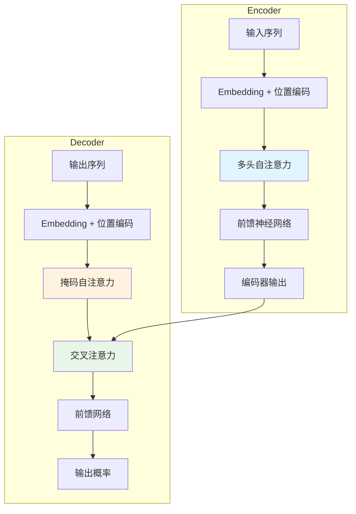

| 组件 | 作用 |
|------|------|
| **Embedding** | 将 Token 映射为向量 |
| **位置编码** | 注入序列位置信息 |
| **多头注意力** | 捕捉不同维度的上下文关系 |
| **FFN** | 非线性变换，增强表达能力 |
| **LayerNorm** | 稳定训练，加速收敛 |
| **Residual Connection** | 解决梯度消失，支持深层网络 |

---

### Q3: 多头注意力（MHA）的局限？MQA、GQA、Flash Attention 怎么解决？

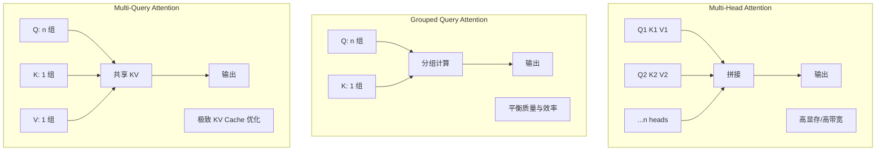

| 方案 | 原理 | KV Cache 节省 | 质量影响 |
|------|------|---------------|---------|
| **MHA** | 每头独立 Q/K/V | 基准 | 最佳 |
| **MQA** | 所有 Q 头共享 K/V | ~80% | 轻微下降 |
| **GQA** | Q 分组共享 K/V | ~50% | 几乎无损 |
| **Flash Attention** | 分块计算，避免大矩阵 | 内存 O(n) → O(√n) | 无损 |

---

### Q4: 大模型的位置编码：sin/cos、RoPE、ALiBi 区别？

| 编码方式 | 原理 | 特点 | 代表模型 |
|---------|------|------|---------|
| **Sinusoidal** | 固定频率的正余弦函数 | 绝对位置编码，无参数 | Transformer 原始论文 |
| **RoPE** | 旋转矩阵编码相对位置 | 相对位置感知，外推性好 | Llama、Qwen、ChatGLM |
| **ALiBi** | 线性偏置注意力分数 | 简单高效，外推性强 | MPT、Bloom |

**RoPE 为何成为主流：**
- 天然支持**相对位置**关系
- **外推性好**：训练 4K 可推理 32K
- 与大模型现有架构**兼容性最好**

---

### Q5: 什么是大模型的分词器？原理？

**分词器（Tokenizer）** 将文本转换为模型能处理的 Token ID 序列。

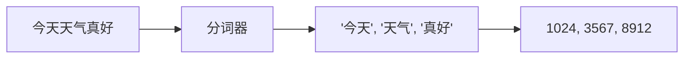

**主流分词算法：**

| 算法 | 原理 | 代表 |
|------|------|------|
| **BPE** | 合并高频子词对 | GPT 系列 |
| **WordPiece** | 基于概率的合并 | BERT |
| **Unigram** | 基于概率的删除 | T5、XLNet |
| **SentencePiece** | 纯数据驱动（含空格编码） | Llama、Gemma |

---

### Q6: 大模型是怎么训练出来的？

> 💡 **要点**：预训练（学知识）→ SFT（学对话）→ RLHF（学偏好），三阶段数据量和成本递减

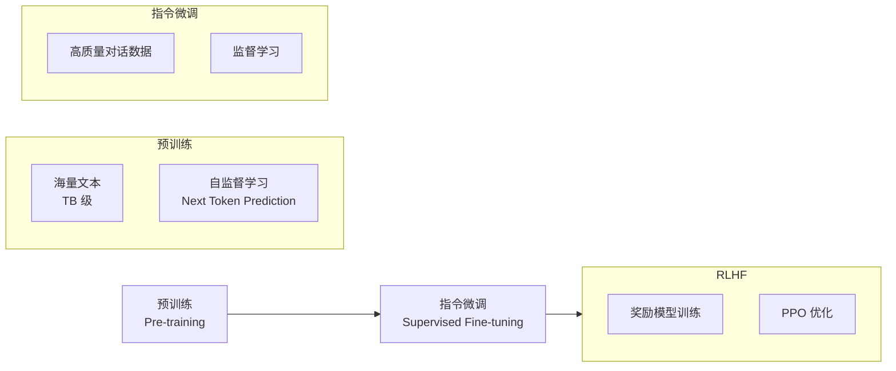

| 阶段 | 数据量 | 目的 | 计算成本 |
|------|--------|------|---------|
| **预训练** | TB 级 | 学习语言知识 | 极高（万卡×月） |
| **SFT** | 万~百万级 | 对齐指令格式 | 低（单机×天） |
| **RLHF/DPO** | 十万级 | 对齐人类偏好 | 中 |

---

### Q7: 什么是 Scaling Law？涌现能力是怎么回事？

**Scaling Law（规模定律）：** 模型性能随**参数量、数据量、计算量**的增长呈现可预测的幂律提升。

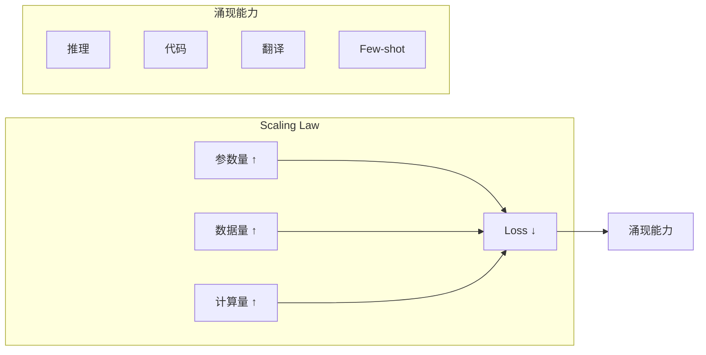

**涌现能力：** 当模型规模超过某个**临界点**后，突然出现的能力（如推理、代码生成、翻译等）。这些能力在小模型中**不存在**，不是逐步提升的，而是**突变的**。

---

### Q8: 大模型微调的方案有哪些？

> 💡 **要点**：LoRA 是性价比最高的微调方案，大部分项目场景推荐使用

| 方案 | 原理 | 参数量 | 效果 | 适用场景 |
|------|------|--------|------|---------|
| **Full Fine-tuning** | 更新全部参数 | 100% | 最佳 | 有大量计算资源 |
| **LoRA** | 低秩适配矩阵 | 0.1-1% | 接近 Full FT | 大多数场景 |
| **QLoRA** | LoRA + 量化 | 0.1% + 4bit | 略低于 LoRA | 单卡训练 |
| **Adapter** | 插入小适配层 | 1-5% | 良好 | 多任务场景 |
| **Prefix Tuning** | 学习连续 prompt | 0.01% | 一般 | 快速实验 |

**推荐方案：** 大多数项目使用 **LoRA** 或 **QLoRA**。

---

### Q9: LoRA 技术原理及优点？

**LoRA（Low-Rank Adaptation）** 在冻结原模型权重的基础上，插入低秩分解矩阵来模拟参数更新。

```
原始权重 W ∈ ℝ^{d×k}   冻结不动
LoRA 更新: W + ΔW = W + BA
           B ∈ ℝ^{d×r}, A ∈ ℝ^{r×k}
           其中 r << min(d, k)
```

**优点：**
- **显存节省**：从全量微调的几十分之一
- **快速切换**：多个 LoRA 权重可动态加载
- **无推理开销**：训练完可与原权重合并
- **过拟合风险低**：参数量小
- **存储成本低**：一个 LoRA 权重仅几 MB

---

### Q10: SFT 之后还有哪些 Post-Training？

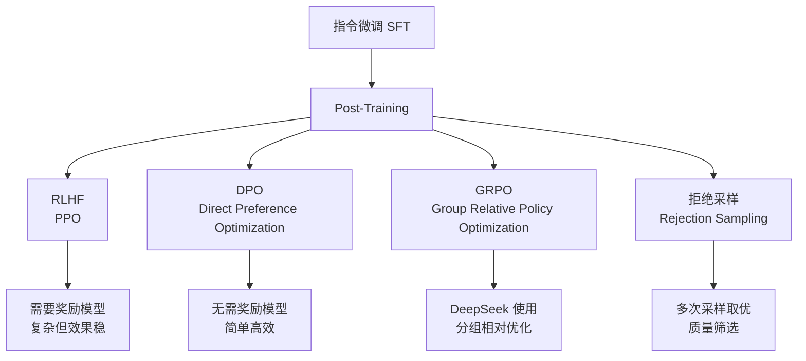

| 方法 | 需要奖励模型 | 复杂度 | 代表模型 |
|------|-------------|--------|---------|
| **RLHF (PPO)** | ✅ | 高 | GPT-4、Claude |
| **DPO** | ❌ | 低 | Qwen、Llama-3 |
| **GRPO** | ❌ | 中 | DeepSeek-R1 |
| **拒绝采样** | ❌ | 低 | 多数开源模型 |

---

### Q11: DPO 和 PPO 的区别？

| 维度 | PPO (RLHF) | DPO |
|------|-----------|-----|
| **奖励模型** | 需要单独训练 | 不需要 |
| **优化目标** | 最大化奖励 | 直接优化偏好概率 |
| **训练稳定性** | 不稳定（需调参） | 稳定 |
| **实现复杂度** | 高 | 低 |
| **效果** | 好 | 接近 PPO |
| **资源消耗** | 高（需维护 4 个模型） | 低（只需 2 个模型） |

**选型建议：** 大多数场景用 **DPO**；追求极致效果用 **PPO**。

---

### Q12: 大模型解码策略有哪些？

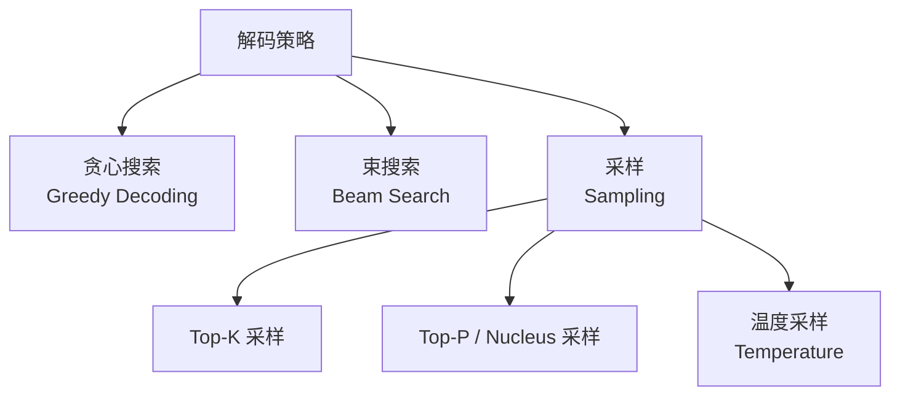

| 策略 | 原理 | 适用场景 |
|------|------|---------|
| **贪心搜索** | 每步选概率最高 | 翻译、摘要（确定性任务） |
| **Beam Search** | 保留 N 条路径 | 翻译、语音识别 |
| **Top-K** | 从 Top-K 候选采样 | 创意写作 |
| **Top-P** | 累积概率超过 P 的候选 | 通用生成 |
| **温度采样** | 缩放概率分布 | 控制创造性 |

---

### Q13: 温度值、Top-P、Top-K 分别是什么？最佳设置？

| 参数 | 作用 | 低值 | 高值 | 推荐场景 |
|------|------|------|------|---------|
| **Temperature** | 控制概率分布的平滑度 | 0.1-0.3（确定性） | 0.8-1.0（创造性） | 代码 0.2，写作 0.8 |
| **Top-P** | 累积概率阈值裁剪 | 0.1（严格） | 0.9（宽松） | 通用 0.9 |
| **Top-K** | 只保留前 K 个候选 | 10（严格） | 50（宽松） | 通用 40 |

**推荐组合：**
- **代码/数学**：Temperature=0.1, Top-P=0.1（精确）
- **翻译/摘要**：Temperature=0.3, Top-P=0.5（平衡）
- **创意写作**：Temperature=0.8, Top-P=0.9（多样）
- **通用聊天**：Temperature=0.7, Top-P=0.9

---

### Q14: KV Cache 是什么？Prompt Caching 的原理？

> 💡 **要点**：KV Cache 是自回归生成的核心优化技术，减少 80%+ 的重复计算

**KV Cache：** 在自回归生成中，缓存已生成的 Key/Value 矩阵，避免重复计算。

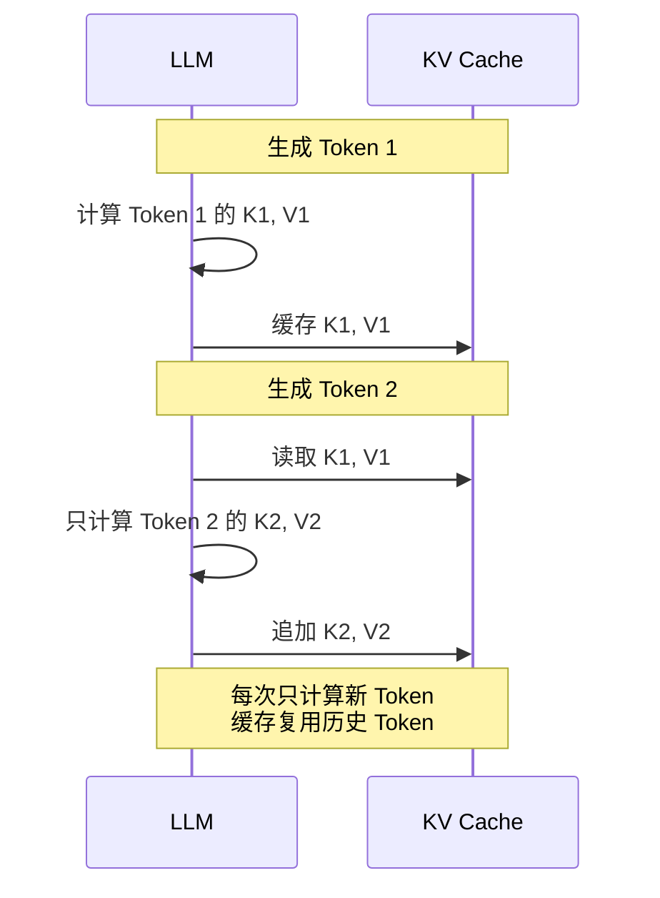

**Prompt Caching：** 对相同的 Prompt 前缀（如 System Prompt）缓存其 KV 向量，不同用户共享。

| 技术 | 节省 | 实现方式 |
|------|------|---------|
| **KV Cache** | 每次生成减少 80%+ 计算 | 自回归时缓存 K/V |
| **Prompt Caching** | 共享 Prompt 的 KV 复用 | 相同前缀直接命中 |

---

### Q15: 大模型量化是什么？INT8/INT4/AWQ/GPTQ 怎么选？

**量化**是将模型权重从高精度（FP16）转为低精度（INT8/INT4），降低显存和加速推理。

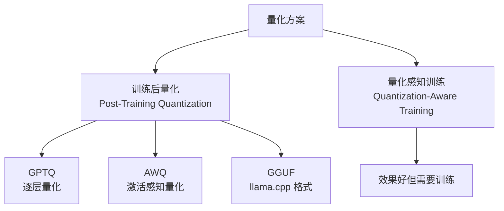

| 方案 | 精度 | 显存节省 | 质量损失 | 推荐场景 |
|------|------|---------|---------|---------|
| **INT8** | 8-bit | ~50% | 几乎无损 | GPU 推理 |
| **INT4 (GPTQ)** | 4-bit | ~75% | 轻微 | GPU 推理 |
| **INT4 (AWQ)** | 4-bit | ~75% | 略优于 GPTQ | GPU 推理 |
| **GGUF (Q4)** | 4-bit | ~75% | 轻微 | CPU 推理 |

**选型建议：** GPU 用 **AWQ**，CPU 用 **GGUF**。

---

### Q16: 如何写好 Prompt？实践经验？

| 原则 | 说明 | 示例 |
|------|------|------|
| **清晰明确** | 避免模糊表述 | ❌ "总结一下" → ✅ "用 3 句话总结核心观点" |
| **角色设定** | 给模型身份 | "你是一位资深 Python 工程师" |
| **结构化** | 分点、分段 | 用 ### / - / 1. 等标记 |
| **Few-shot** | 给 2-3 个示例 | 输入输出范例 |
| **约束条件** | 明确格式限制 | "输出 JSON 格式" |

**进阶技巧：**
- **Chain-of-Thought**：引导模型逐步思考
- **Self-Consistency**：多次采样投票
- **System Prompt 中定义规则**：比 User Prompt 约束力更强

---

### Q17: 什么是 CoT？为什么效果好？局限？

**CoT（Chain-of-Thought，思维链）** 通过引导模型在输出答案前先输出推理步骤，提升复杂推理能力。

```
❌ 直接回答：
Q: 24 × 37 = ?
A: 888

✅ CoT 回答：
Q: 24 × 37 = ?
A: 先计算 24 × 30 = 720
   再计算 24 × 7 = 168
   最后 720 + 168 = 888
```

| 维度 | 说明 |
|------|------|
| **为什么效果好** | 分解推理步骤 → 降低单步难度 → 错误可追溯 |
| **局限** | Token 消耗增加 3-5x、不适用于事实性问答、可能生成错误推理链 |
| **改进** | CoT-SC（多次采样投票）、Auto-CoT（自动生成思维链） |

---

### Q18: 为什么会出现幻觉？怎么缓解？

**幻觉来源：**

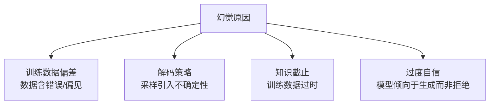

**缓解方案：**

| 方案 | 原理 | 效果 |
|------|------|------|
| **RAG** | 检索外部知识注入 | ✅ 最好 |
| **Prompt 约束** | 要求"不知道就说不知道" | ⚠️ 有限 |
| **多次采样** | 多次生成取一致结果 | ✅ 有效 |
| **知识编辑** | 修正模型内部知识 | ⚠️ 复杂 |
| **Grounding** | 强制引用来源 | ✅ 有效 |

---

### Q19: MoE 混合专家模型是什么？

> 💡 **要点**：MoE 用"总参数量大但每次只激活一部分"的方式，兼顾模型容量与推理效率

**MoE（Mixture of Experts）** 将模型拆分为多个"专家"子网络，每次只激活部分专家，在保持推理效率的同时扩大模型容量。

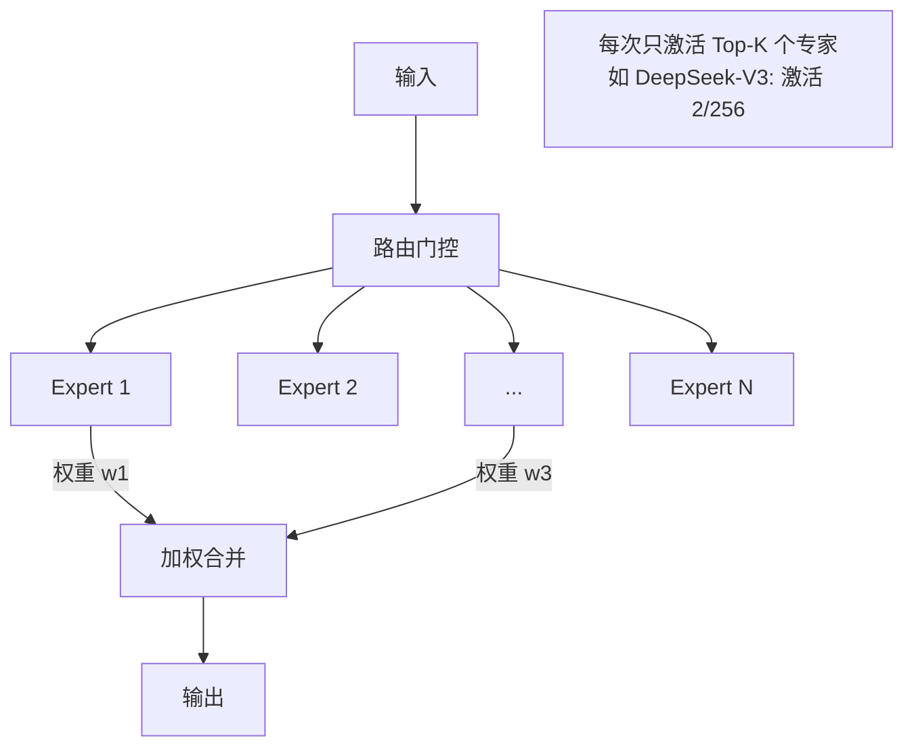

**代表模型：** [DeepSeek](https://deepseek.com)-V3（671B 总参，37B 激活参）、Mixtral 8x7B、[Qwen](https://qwen.alibaba.com)2-MoE

**为什么用 MoE：**
- **训练效率**：参数量大但计算量小
- **推理成本**：激活参数少，与同计算量 Dense 模型相当
- **能力**：总参数大 → 容量大 → 能力强

---

### Q20: 大模型部署方案对比？

| 方案 | 语言 | 推理框架 | 适用场景 | 特点 |
|------|------|---------|---------|------|
| **vLLM** | Python | PagedAttention | 高并发在线推理 | 吞吐量最高 |
| **TGI** | Rust | Text Generation Inference | HuggingFace 生态 | 与 HF 深度集成 |
| **Llama.cpp** | C++ | GGUF | 本地/边缘部署 | CPU 友好 |
| **SGLang** | Python | RadixAttention | 复杂推理模式 | 结构化生成 |
| **Ollama** | Go | Llama.cpp 封装 | 开发者本地测试 | 开箱即用 |

**选型建议：**

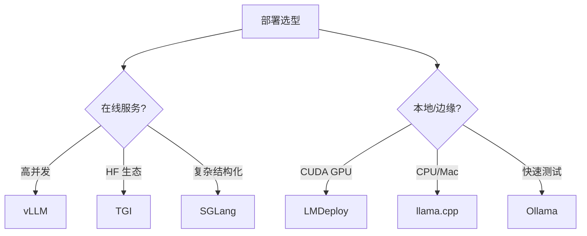

---

### Q21: vLLM 和 SGLang 的共享前缀缓存（Prefix Caching）有什么区别？

> **要点**：vLLM 使用基于哈希的共享前缀缓存，SGLang 使用 RadixAttention 的树形结构前缀缓存，后者更灵活且支持自动前缀复用

**vLLM 的共享前缀缓存：**
- 基于 **Hash-based Prefix Caching**：将输入序列的 KV Cache 按固定长度分块计算哈希值
- 当新请求的前缀哈希与缓存中的一致时，直接复用缓存
- 限制：只能缓存完全一致的**连续前缀**，对"中间共享"的场景不友好
- 实现简单，但缓存利用率较低

**SGLang 的共享前缀缓存（RadixAttention）：**
- 基于 **RadixAttention**：使用基数树（Radix Tree）结构管理 KV Cache
- 所有请求的 KV Cache 共享一个**树形结构**，自动合并和复用公共前缀
- 优势：可以处理**非连续的前缀共享**（如多个 Prompt 共享中间片段），缓存命中率更高
- 支持 **LRU 淘汰策略**，内存管理更高效
- 可自动检测共享前缀，无需手动指定

| 维度 | vLLM (Hash-based Prefix Caching) | SGLang (RadixAttention) |
|------|----------------------------------|------------------------|
| **缓存结构** | 哈希表 | 基数树（Radix Tree） |
| **前缀匹配** | 完全一致才能命中 | 共享前缀自动匹配 |
| **灵活性** | 低（仅连续前缀） | 高（支持中间共享） |
| **内存管理** | 简单 | LRU 淘汰 + 自动合并 |
| **缓存命中率** | 中等 | 更高 |
| **实现复杂度** | 较低 | 较高 |
| **适用场景** | 固定 System Prompt 场景 | 复杂多变的 Prompt 模式 |

**选型建议：**
- 如果主要场景是**固定 System Prompt + 用户变长输入**（如聊天机器人），vLLM 的 Hash-based Prefix Caching 已经足够
- 如果场景涉及**复杂的多轮对话、Few-shot 示例共享、结构化生成**（如代码补全、思维链），SGLang 的 RadixAttention 缓存命中率更高，效果更好

---

### Q22: 大模型能力评测指标有哪些？

| 评测维度 | 指标 | 说明 |
|---------|------|------|
| **语言理解** | MMLU、GLUE | 多任务语言理解 |
| **推理能力** | GSM8K、MATH | 数学推理 |
| **代码生成** | HumanEval、MBPP | 代码生成准确率 |
| **安全性** | TruthfulQA、红队测试 | 准确性和安全性 |
| **对齐质量** | MT-Bench、Chatbot Arena | 对话质量 |
| **工程指标** | TTFT、TPOT、QPS | 首 Token 延迟、生成速度、吞吐量 |

---

### Q23: 主流大模型对比？

| 模型 | 厂商 | 架构 | 特点 | 适合场景 |
|------|------|------|------|---------|
| **GPT-4o** | OpenAI | Dense | 多模态、生态最好 | 通用、对话 |
| **Claude 3.5** | Anthropic | Dense | 长上下文、安全 | 分析、代码 |
| **DeepSeek-V3** | 深度求索 | MoE 671B | 性价比极高 | 推理、编码 |
| **Qwen2.5** | 阿里 | Dense/MoE | 中文最优 | 中文应用 |
| **Llama-3** | Meta | Dense | 开源标杆 | 自部署 |

---

### Q24: 请比较一下几种常见的 LLM 架构，例如 Encoder-Only, Decoder-Only, 和 Encoder-Decoder，并说明它们各自最擅长的任务类型。

> 💡 **要点**：三种架构的核心区别在于"是否可以看到全部上下文"以及"编码器和解码器是否分离"，这决定了它们的任务适用性。

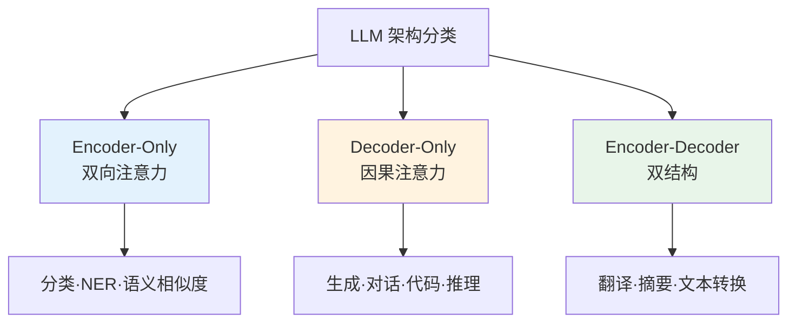

| 维度 | Encoder-Only | Decoder-Only | Encoder-Decoder |
|------|-------------|-------------|----------------|
| **注意力机制** | 双向（Bidirectional） | 因果（Causal） | 编码器双向 + 解码器因果 |
| **代表模型** | BERT、RoBERTa、DeBERTa | GPT 系列、Llama、Qwen | T5、BART、Flan-T5 |
| **擅长任务** | 理解类（分类、NER、QA） | 生成类（对话、写作、代码） | 序列转换（翻译、摘要） |
| **优势** | 充分理解上下文语义 | 自回归生成流畅，可扩展性强 | 输入输出长度不对称时灵活 |
| **劣势** | 无法直接做生成 | 单向注意力不擅长纯理解 | 结构复杂，训练推理效率低 |
| **当前主流** | ⬇️ 逐渐被 Decoder-only 替代 | ⬆️ 绝对主流（GPT/Llama） | ➡️ 特定场景使用 |

**为什么 Decoder-Only 成为主流：** GPT 系列的巨大成功证明了 Decoder-Only 架构的 **Scaling 潜力**——同样的参数量下，Decoder-Only 在生成任务上表现更优。此外，统一的 causual LM 预训练目标（Next Token Prediction）天然支持 zero-shot 和 in-context learning，而 Encoder-Only 需要额外的任务特定头（classification head）。目前主流模型（GPT-4、Claude、[Llama](https://llama.meta.com)、[Qwen](https://qwen.alibaba.com)、[DeepSeek](https://deepseek.com)）几乎全部采用 Decoder-Only 架构。

---

### Q25: 你觉得 NLP 和 LLM 最大的区别是什么？两者有何共同和不同之处？

> 💡 **要点**：NLP 是学科范畴，LLM 是具体技术范式；LLM 的出现彻底改变了 NLP 的研究范式——从"任务特定模型"转向"通用基础模型"。

| 维度 | 传统 NLP | 大语言模型 (LLM) |
|------|---------|-----------------|
| **技术范式** | 任务专用模型（每个任务训练一个模型） | 通用基础模型（一个模型解决所有任务） |
| **模型架构** | LSTM、CNN、CRF、小型 Transformer | 大规模 Decoder-Only Transformer |
| **参数量** | 百万～亿级 | 十亿～万亿级 |
| **训练方式** | 任务特定监督学习 | 预训练 + 指令微调 + 对齐 |
| **数据需求** | 需要大量标注数据 | 无标注预训练 + 少量标注微调 |
| **任务泛化** | ❌ 无法跨任务迁移 | ✅ In-context Learning / Zero-shot |
| **核心能力** | 模式匹配、统计学习 | 推理、知识记忆、上下文学习 |
| **评估方式** | 精确指标（F1、BLEU、ROUGE） | 人工评价 + LLM-as-Judge + 综合 Benchmark |

**共同点：** 两者都研究**自然语言的理解与生成**，底层都依赖**语言学特征**（词法、句法、语义），应用场景高度重叠（分类、翻译、摘要、QA）。

**不同点：** 传统 NLP 强调**精确定义问题**（如 POS tagging 的准确率），而 LLM 强调**通用能力涌现**。LLM 的成功本质上不是算法突破，而是 **Scaling Law** 的发现——更大的模型 + 更多的数据 = 更强的涌现能力。这导致传统 NLP 中的"特征工程"被"数据工程"和"Prompt 工程"取代。

---

### Q26: L1 和 L2 正则化分别是什么，什么场景适合使用呢？

> 💡 **要点**：L1（Lasso）产生稀疏解，适合特征选择；L2（Ridge）均匀约束权重，适合防止过拟合。

**L1 正则化（Lasso）：** 在损失函数中加入权重绝对值和，即 `λ∑|w|`。L1 的梯度是常数，会让权重向 0 线性衰减，部分权重**精确为 0**，从而产生**稀疏解**。

**L2 正则化（Ridge）：** 在损失函数中加入权重平方和，即 `λ∑w²`。L2 的梯度与权重成正比，权重越大的被惩罚越大，让权重**趋近于 0 但不会精确为 0**。

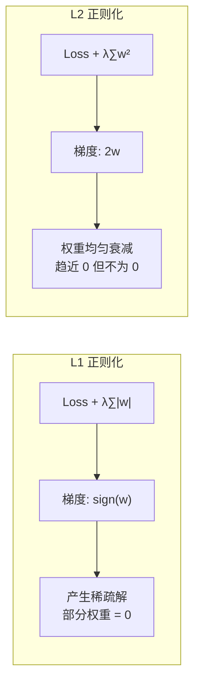

| 维度 | L1（Lasso） | L2（Ridge） |
|------|------------|------------|
| **惩罚形式** | 权重的绝对值之和 | 权重的平方和 |
| **解的特性** | **稀疏**（大量权重为 0） | **稠密**（权重均匀分布） |
| **特征选择** | ✅ 自动特征选择 | ❌ 不稀疏，无法特征选择 |
| **可解释性** | ✅ 保留重要特征 | ❌ 保留全部特征 |
| **收敛性** | 非光滑，需特殊优化 | 光滑，优化简单 |
| **LLM 中的使用** | 极少使用 | Weight Decay（等价 L2）广泛使用 |
| **适用场景** | 高维稀疏特征、特征选择 | 防止过拟合、通用正则化 |

**在 LLM 训练中：** 通常使用 **Weight Decay**（等价于 L2 正则化），用于预训练和微调时防止过拟合。L1 正则化在 LLM 中较少使用，但在**模型剪枝**（Pruning）和**稀疏化**场景中 L1 有借鉴意义。

---

### Q27: 激活函数有了解吗，你知道哪些 LLM 常用的激活函数？为什么选用它？

> 💡 **要点**：LLM 中 ReLU 的变体（SwiGLU、GELU）成为主流，核心原因是它们能缓解梯度消失并在深层网络中保持训练稳定。

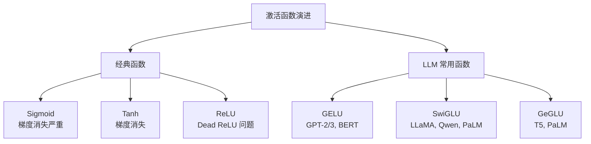

| 激活函数 | 公式 | 特点 | 使用模型 |
|---------|------|------|---------|
| **ReLU** | max(0, x) | 简单高效，但存在 Dead ReLU | 早期模型 |
| **GELU** | x·Φ(x) | 平滑版 ReLU，性能优于 ReLU | GPT-3、BERT |
| **SwiGLU** | Swish(x·W₁) ⊙ (x·W₂) | gated 结构 + 平滑激活 | **Llama、Qwen、DeepSeek** |
| **GeGLU** | GELU(x·W₁) ⊙ (x·W₂) | GELU + gated 变体 | PaLM、T5 |
| **SwiGLU** | Swish(x·W₁) ⊙ (x·W₂) | 本质是门控机制 + Swish | 当前最主流 |

**为什么 LLM 选用 SwiGLU：**
- **门控机制**：SwiGLU 引入可学习的门控（⊙ 乘法门），让网络可以动态**选择**要传递的信息，表达能力更强
- **平滑性**：Swish（Sigmoid 加权）比 ReLU 更平滑，缓解 Dead ReLU 和梯度不稳定
- **经验证明**：PaLM 论文实验表明，在相同参数量下，SwiGLU 比 ReLU 和 GELU 的评估指标明显更好
- **代价**：SwiGLU 需要 3 个权重矩阵（两个线性投影 + 一个门控），参数量是普通 FFN 的 1.5 倍，所以 [Llama](https://llama.meta.com) 将 hidden_size 缩小以保持总参数量不变

---

### Q28: 在训练一个百或千亿参数级别的 LLM 时，你会面临哪些主要的工程和算法挑战？

> 💡 **要点**：训练超大规模 LLM 的核心挑战可归纳为显存/计算/通信/稳定四大维度。

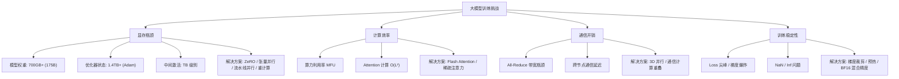

| 挑战类别 | 具体问题 | 解决方案 |
|---------|---------|---------|
| **显存** | 175B 模型用 FP16 需 350GB 权重，Adam 优化器额外 2 倍 | ZeRO-3（分片）、张量并行（TP）、流水线并行（PP）、激活重计算 |
| **计算** | Attention 的 O(L²) 复杂度，长序列不可承受 | Flash Attention、MQA/GQA、稀疏注意力 |
| **通信** | 千卡集群 All-Reduce 通信成为瓶颈 | 3D 并行（DP+TP+PP）、通信计算重叠、Sequence Parallelism |
| **稳定性** | 训练后期 Loss 剧烈震荡，Loss Spike | 梯度裁剪、预热（Warmup）、BF16 混合精度、Z-Loss |
| **数据质量** | 数据配比影响巨大，垃圾数据导致灾难 | 数据去重、质量过滤、数据配比调优（数据工程） |
| **容错恢复** | 万卡集群平均无故障时间极短 | 异步 Checkpoint、自动重启、弹性训练 |

**关键工程指标：**
- **MFU（Model FLOPS Utilization）**：衡量实际算力利用率，SOTA 模型可达 50-60%
- **训练吞吐**：Tokens/sec/gpu，决定训练周期
- **Checkpoint 保存时间**：千亿模型单次保存可能需要数分钟

---

### Q29: 开源框架了解过哪些？[Qwen](https://qwen.alibaba.com)，[DeepSeek](https://deepseek.com) 的论文是否有研读过，说一下其中的创新点主要体现在哪？

> 💡 **要点**：[Qwen](https://qwen.alibaba.com) 和 [DeepSeek](https://deepseek.com) 代表了**强化开源生态**和**极致工程创新**两条路线。

**[Qwen](https://qwen.alibaba.com)（通义千问）系列核心创新：**

| 创新点 | 详细说明 |
|-------|---------|
| **高质量 Tokenizer** | 使用 15 万亿 token 的 2-level 分词器，对中英文编码效率均优（英文 ≈ 2x BPE，中文 ≈ 1.7x BPE） |
| **GQA 统一设计** | 全系列统一使用 GQA，且 K/V 头数固定为 8，推理时可无缝切换不同规模模型 |
| **强大的 SFT 数据策略** | 使用"先粗筛后精炼"的数据迭代方法，通过 Rejection Sampling 构建高质量 SFT 数据 |
| **多阶段对齐** | SFT + RM + PPO 全套对齐流程，且提出使用 **DPO** 作为替代方案 |

**[DeepSeek](https://deepseek.com) 系列核心创新：**

| 创新点 | 详细说明 |
|-------|---------|
| **MoE 架构极致优化** | DeepSeek-V2 设计 DeepSeekMoE，使用 **Fine-grained Expert Segmentation**（细粒度专家拆分） + **Shared Expert Isolation**（共享专家隔离），激活参数少但保持高性能 |
| **Multi-head Latent Attention (MLA)** | 将 KV 压缩到低维隐空间，大幅降低 KV Cache 大小（约 75%），推理成本大幅降低 |
| **GRPO（Group Relative Policy Optimization）** | 抛弃 PPO 中的 Critic 模型，使用**组内相对奖励**进行优化，训练成本大降（DeepSeek-R1） |
| **DeepSeek-R1 的 Pure RL** | 完全不需要 SFT 冷启动数据，仅靠 RL + 规则奖励就训练出推理能力，提出 **DeepSeek-R1-Zero** |

**两者的共性：** 都极其重视**推理效率**（GQA / MLA）和**训练稳定性**，都是开源社区的中坚力量。

---

### Q30: 最近读过哪些 LLM 比较前沿的论文，聊一下它的相关方法，针对什么问题，提出了什么方法，对比实验有哪些？

> 💡 **要点**：前沿论文可以围绕"长上下文"、"推理能力"、"对齐效率"三个方向展开回答。

**示例：[DeepSeek](https://deepseek.com)-R1（2025 年 1 月）**

| 论文维度 | 内容 |
|---------|------|
| **论文标题** | DeepSeek-R1: Incentivizing Reasoning Capability in LLMs via Reinforcement Learning |
| **针对问题** | 大模型在数学、推理等复杂任务上能力不足，且传统 SFT 难以教会模型"推理过程" |
| **提出方法** | 提出 **DeepSeek-R1-Zero**——完全通过 RL（GRPO）训练推理能力，过程中自然涌现"思辨"（Aha Moment），即模型自主学会反思和验证推理步骤 |
| **冷启动策略** | R1 在 Zero 的基础上加入少量冷启动 SFT 数据 + 面向语言一致性的 RL，解决 Zero 版本输出可读性差、语言混杂的问题 |
| **对比实验** | 在 AIME 2024 上 R1 达到 79.8%（≈ OpenAI o1-1217），MATH-500 达 97.3%，同时在推理密集任务上显著优于 GPT-4o 和 Claude 3.5 |
| **蒸馏实验** | 将 R1 的推理模式蒸馏到小模型（Qwen-7B/14B、Llama-8B）中，小模型也能获得显著提升，验证了推理模式的迁移性 |

**其他前沿方向：**
- **LongRoPE（2024）**：解决位置编码外推问题，通过位置插值 + 渐进扩展将上下文窗口从 4K 延长至 2048K
- **Mamba-2（2024）**：SSM（状态空间模型）的继任者，引入 Selective SSM，挑战 Transformer 在长序列上的地位
- **KV Cache Compression（2024）**：KIVI、KVQuant 等将 KV Cache 量化为 2-bit，推理时显存降低 4x+

---

### Q31: 多模态大模型（如 VLM）的核心挑战是什么？即如何实现不同模态信息（如视觉和语言）的有效对齐和融合？

> 💡 **要点**：VLM 的核心挑战是"异构鸿沟"——图像是连续、高维的像素信号，文本是离散、符号化的语义表示，两者分布完全不同。

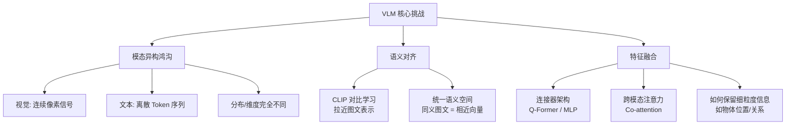

| 具体挑战 | 说明 | 解决方案 |
|---------|------|---------|
| **特征粒度不匹配** | 图像是全局+局部特征，文本是线性序列 | 使用多尺度视觉特征 + Patch-level 对齐 |
| **语义对齐困难** | "一只黑猫" 对应图像中某个特定区域和颜色 | 对比学习（CLIP）+ 细粒度 Grounding 数据 |
| **信息丢失风险** | 图像压缩为少量 Token 会丢失细节（如小物体） | 动态分辨率、高分辨率分支、多尺度特征 |
| **计算开销** | 图像 Token 数是文本的数十倍，自注意力 O(N²) 不可承受 | Perceiver Resampler、Q-Former 压缩 Token |
| **模态干扰** | 视觉特征噪声可能干扰语言模型的理解 | 渐进式训练（先对齐后微调） |

**核心思路：** 所有 VLM 架构都在回答同一个问题——**如何将视觉特征"翻译"成 LLM 能理解的 Token 序列**。CLIP 解决了粗粒度的图文对齐，Q-Former / MLP Projector 解决了细粒度的特征转换，而**联合训练（end-to-end fine-tuning）** 最终让两个模态深度融合。

---

### Q32: 请解释 CLIP 模型的工作原理。它是如何通过对比学习来连接图像和文本的？

> 💡 **要点**：CLIP 的核心是"对比学习 + 海量图文对"，通过最大化匹配图文对的余弦相似度、最小化不匹配对的相似度，来学习统一的图文表征空间。

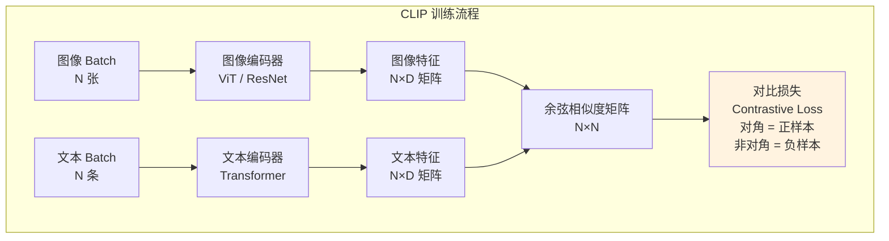

**工作原理详解：**

1. **数据准备**：从互联网收集 4 亿图文对（image, text）——规模前所未有
2. **双编码器架构**：图像编码器（ViT/ResNet）和文本编码器（Transformer）分别提取特征
3. **对比学习**：对每个 Batch 内的 N 个图文对，构建 **N×N 相似度矩阵**，其中对角线的 N 个为正样本（正确配对的图文），其余 N²−N 为负样本
4. **损失函数**：使用 **InfoNCE Loss**（对称交叉熵损失），同时优化 image→text 和 text→image 两个方向的对比准确率

**为什么 CLIP 如此重要：**

| 维度 | 说明 |
|------|------|
| **Zero-shot 能力** | 训练后可直接用于 zero-shot 图像分类——将候选类别文本编码，与图像特征算相似度，取最高者 |
| **表征通用性** | 学到的图文表征可以迁移到其他任务（检索、VQA、图像生成引导） |
| **成为 VLM 基石** | 几乎所有现代 VLM（LLaVA、MiniGPT-4、Qwen-VL）都使用 CLIP 的视觉编码器作为视觉 backbone |
| **局限性** | 对比学习**只能对齐粗粒度语义**（整体图文匹配），无法捕捉细粒度物体关系和位置信息 |

---

### Q33: 像 LLaVA 或 MiniGPT-4 这样的模型是如何将一个预训练好的视觉编码器和一个大语言模型连接起来的？请描述其关键的架构设计。

> 💡 **要点**：核心思想是"冻结视觉编码器和 LLM，训练一个轻量级连接器"，实现视觉特征到文本 Token 空间的映射。

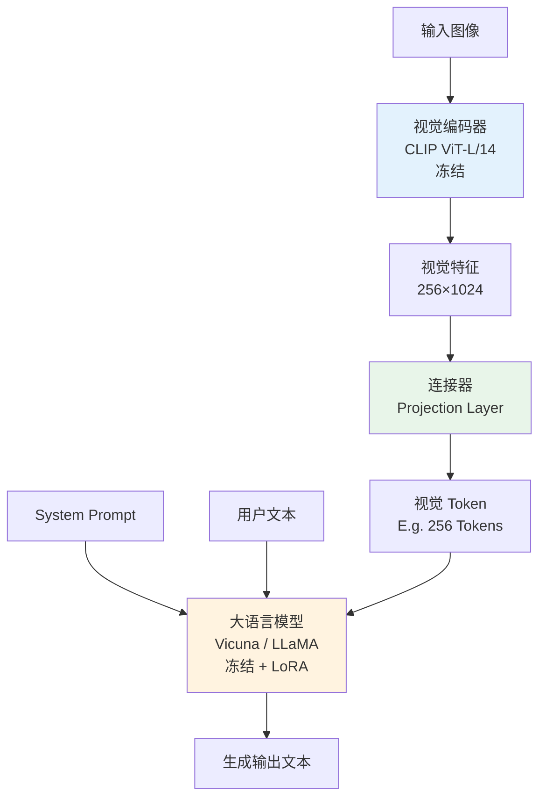

**关键架构对比：**

| 组件 | LLaVA | MiniGPT-4 | Qwen-VL |
|------|-------|-----------|---------|
| **视觉编码器** | CLIP ViT-L/14 | ViT-G/14 (EVA-CLIP) | ViT-bigG (OpenCLIP) |
| **连接器** | 简单的 **MLP**（2层） | 单线性层 + Q-Former | 单线性层 + 位置感知 |
| **视觉 Token 数** | 256 (从 576 压缩) | 32 (Q-Former 压缩) | 256 |
| **LLM Backbone** | Vicuna-7B/13B | Llama-2-7B/13B | Qwen-7B/14B |
| **训练阶段** | Pre-align → Visual SFT | Pre-align → SFT | Pre-train → SFT |

**LLaVA 的架构创新（代表性最强）：**
- **Stage 1 Pre-training for Alignment**：冻结 VIT 和 LLM，只训练 **MLP Projector**，在 600K 图文对上进行对齐预训练
- **Stage 2 Visual Instruction Tuning**：用 158K 视觉指令数据微调 **MLP + LLM**（使用 LoRA），让模型学会遵循视觉指令
- **MMLU 级别对比**：在 ScienceQA 和合成指令数据上微调后达到 GPT-4 同等水平

**核心 insight：** 不需要复杂的跨模态注意力设计，**一个简单的 MLP 连接器**加上大规模图文对齐就能让 LLM "看懂"图像。这说明 CLIP 已经学到了足够好的视觉表征，连接器只需要做一个"翻译"工作。

---

### Q34: 什么是视觉指令微调？为什么说它是让 VLM 具备良好对话和指令遵循能力的关键步骤？

> 💡 **要点**：视觉指令微调将文本指令微调（SFT）推广到多模态场景，让 VLM 学会"看图说话"的对话能力。

**视觉指令微调**是一个**端到端**的 Fine-tuning 过程，在**多模态指令-回复对**（即包含图像输入的指令数据）上微调整个 VLM（通常是连接器 + LLM，有时也解冻视觉编码器），使其学会根据图像内容理解和响应用户的指令。

```mermaid
graph LR
    subgraph Before_SFT ["视觉对齐后 (Stage 1)"]
        B1["模型能: 描述图像内容"]
        B2["模型不能: 遵循复杂指令"]
        B3["模型不能: 多轮对话"]
        B4["回答简短且模式化"]
    end
    
    subgraph Visual_SFT ["视觉指令微调 (Stage 2)"]
        V1["输入: 图像 + 多轮对话数据"]
        V2["训练: 连接器 + LLM (LoRA)"]
        V3["数据: Instruct 格式图文对"]
    end
    
    subgraph After_SFT ["视觉指令微调后"]
        A1["模型能: 遵循复杂指令"]
        A2["模型能: 多轮对话推理"]
        A3["模型能: 区域描述/定位"]
        A4["回答丰富且适配交互"]
    end
    
    Before_SFT --> Visual_SFT
    Visual_SFT --> After_SFT
```

**为什么这是一个关键步骤：**

| 原始模型的问题 | 视觉指令微调后的改善 |
|---------------|-------------------|
| 只会"描述"而非"对话" | 具备多轮对话、上下文理解能力 |
| 无法理解抽象指令（如"分析这张图的情感"） | 能理解并执行开放式指令 |
| 对视觉信息利用浅层 | 能进行视觉推理（如因果推断） |
| 对错误信息无法拒绝 | 具备一定的不确定性和风控能力 |

**数据分析示例：**
```
{"image": "cat.jpg",
 "messages": [
   {"role": "user", "content": "图中有什么动物？"},
   {"role": "assistant", "content": "一只橘猫"},
   {"role": "user", "content": "它在做什么？"},
   {"role": "assistant", "content": "它正在窗台上晒太阳"}
 ]}
```

**关键结论：** 视觉对齐（Stage 1）让模型"看得见"，视觉指令微调（Stage 2）让模型"会说话"。

---

### Q35: 在处理视频等多模态数据时，相比于静态图片，VLM 需要额外解决哪些问题？

> 💡 **要点**：视频 VLM 需要同时处理空间理解 + 时间建模 + 效率三大挑战。

```mermaid
graph TB
    Video["视频 VLM 额外挑战"] --> Temporal["时序建模"]
    Video --> SpatialTemporal["时空关联"]
    Video --> Efficiency["计算效率"]
    
    Temporal --> T1["帧间连续性<br/>前后帧的关系"]
    Temporal --> T2["动作识别<br/>一段时间内的变化"]
    Temporal --> T3["事件边界检测<br/>何时开始/结束"]
    
    SpatialTemporal --> ST1["物体在帧间移动"]
    SpatialTemporal --> ST2["因果关系推断"]
    SpatialTemporal --> ST3["长时间依赖<br/>数分钟前的事"]
    
    Efficiency --> E1["帧数爆炸<br/>1 分钟视频 = 1500+ 帧"]
    Efficiency --> E2["Token 数量暴增"]
    Efficiency --> E3["方法: 均匀采样 / 关键帧 / 3D 卷积"]
```

| 挑战 | 具体问题 | 解决方案 |
|------|---------|---------|
| **时序表征** | 视频是帧序列，如何编码时间维度的信息 | **3D Conv**（TimeSformer）、**帧间位置编码**、**光流特征** |
| **帧采样策略** | 全部帧处理不可行，如何选择代表性帧 | **均匀采样**（8-32帧）、**关键帧提取**、**自适应采样** |
| **长视频理解** | 数分钟的视频包含数万帧 | **分层建模**（帧级→片段级→视频级）、**记忆机制** |
| **视频+文本对齐** | 需要将文本描述与时间段对齐 | **Video-Text Contrastive Learning**、**时间戳标注** |
| **效率** | Token 数爆炸（32帧×256 Tokens=8192） | **帧间 Token 压缩**、**Tube Token**（时空合并） |

**代表模型：**
- **Video-[Llama](https://llama.meta.com)**：使用 **Video Q-Former** 压缩帧的时空特征，引入帧级位置编码
- **VideoChat**：均匀采样 16 帧，每帧用 ViT 提取特征后拼接输入 LLM
- **VTimeLLM**：引入**时间戳感知**的 LLM，可以精确回答"什么时候发生某事"

---

### Q36: 请解释 Grounding 在 VLM 领域中的含义。我们如何评估一个 VLM 是否能将文本描述准确地对应到图片中的特定区域？

> 💡 **要点**：Grounding 即"定位"——让模型不仅能说出图片中有什么，还能说出"在哪里"。

**Grounding（视觉定位）** 是指 VLM 能够**将文本中的实体/描述与图像中的具体像素区域**对应起来。它包含两个方向：
- **Phrase Grounding**：给定文本短语，在图中框出对应的物体
- **Referring Expression Comprehension**：给定指代表达式（如"左边的穿红色衣服的女人"），定位对应物体

```mermaid
graph LR
    Input["输入文本<br/>'一只黑色的猫在沙发上'"] --> VLM
    
    subgraph Grounding ["Grounding 输出"]
        G1["短语: '黑色的猫'"]
        G1 --> BBox1["→ BBox1 @ [120,50,300,280]"]
        G2["短语: '沙发'"]
        G2 --> BBox2["→ BBox2 @ [50,300,450,500]"]
    end
    
    Image["输入图像"] --> VLM
    VLM --> Grounding
    
    style Grounding fill:#e3f2fd
```

**评估 VLM Grounding 能力的方法：**

| 评估指标 | 说明 | 计算方式 |
|---------|------|---------|
| **Acc@0.5** | 预测框与标注框 IoU > 0.5 的比例 | `TP / (TP+FP)` |
| **mIoU** | 预测框与标注框的平均交并比 | `mean(IoU)` |
| **Recall@K** | Top-K 预测框中包含正确目标的比率 | 检索类指标 |
| **Pointing Game Accuracy** | 预测的中心点是否落在 GT 框内 | 简单但有效 |
| **F1 Score** | 综合精确率和召回率 | `2×P×R/(P+R)` |

**常用 Benchmark：**
- **RefCOCO / RefCOCO+ / RefCOCOg**：指代表达式理解的标准数据集
- **Flickr30K Entities**：短语级 Grounding
- **Visual Genome**：密集标注的 Region-Phrase 对

**VLM 实现 Grounding 的架构方法：**
1. **Grounded LLaVA**：在 LLM 输出文本后接特殊标记 `<bbox>` ，直接用 Token 预测框坐标
2. **Shikra**：直接在文本输出中使用自然语言坐标（如 `[x1, y1, x2, y2]`），无需特殊检测头
3. **InternVL**：在 LLM 中引入 Grounding Loss，融合 Detection Token

---

### Q37: 请对比至少两种不同的 VLM 架构范式，并分析它们的优劣。

> 💡 **要点**：VLM 架构从"共享编码器"到"跨模态注意力"再到"简单连接器"演变，目前 LLaVA 式连接器范式是主流。

```mermaid
graph TB
    Paradigms["VLM 架构范式"] --> Fusion["早期融合<br/>共享编码器"]
    Paradigms --> CrossAttn["跨模态注意力<br/>Flamingo / BLIP-2"]
    Paradigms --> Connector["连接器范式<br/>LLaVA / MiniGPT-4"]
    
    Fusion --> F1["代表: VisualBERT, UNITER"]
    Fusion --> F2["特点: 编码阶段就融合双模态"]
    Fusion --> F3["优劣: 效果好但必须成对数据"]
    
    CrossAttn --> C1["代表: Flamingo, BLIP-2, Kosmos-1"]
    CrossAttn --> C2["特点: 冻结 LLM, 用 Cross-Attn 注入视觉"]
    CrossAttn --> C3["优劣: LLM 无损, 但架构复杂"]
    
    Connector --> Con1["代表: LLaVA, Qwen-VL, InternVL"]
    Con1 --> Con2["特点: 简单 Projector 映射视觉到文本空间"]
    Con1 --> Con3["优劣: 结构简单, 但部分视觉信息丢失"]
```

| 维度 | 跨模态注意力范式（Flamingo） | 连接器范式（LLaVA） |
|------|---------------------------|-------------------|
| **视觉注入方式** | Cross-Attention 层插入 LLM | MLP 投影 + Prepend 到文本输入 |
| **LLM 是否修改** | ❌ 不修改（冻结） | ✅ 参与训练（LoRA） |
| **架构复杂度** | 高（需修改模型结构） | 低（仅加一个 Projector） |
| **视觉保留度** | ✅ 保留更丰富细节 | ⚠️ 压缩后有一定丢失 |
| **训练数据需求** | 需要大量对比数据 | 相对较少 |
| **迁移灵活性** | 可快速切换 LLM Backbone | 需要重新连接器训练 |
| **代表模型** | Flamingo, BLIP-2, IDEFICS | LLaVA, MiniGPT-4, Qwen-VL |
| **推理效率** | 较低（多了交叉注意力计算） | ✅ 高（纯自回归） |

**深度分析：**

**跨模态注意力范式（Flamingo 系）** 的优势在于它**不侵入 LLM 内部**，通过新增的 GATED XATTN-DENSE 层在 LLM 的各层注入视觉信息。这意味着 LLM 的纯文本能力**完全无损**。但缺点是架构复杂，训练需要的图文对数据量大（Flamingo 用了 2.1B 图文对），且 Cross-Attention 增加了推理延迟。

**连接器范式（LLaVA 系）** 的核心理念是"把图像变成文本 Token"——用 MLP 将视觉特征线性映射到 LLM 的 Embedding 空间，然后作为文本 Token 一样输入。它**修改了 LLM 的输入分布**，让原本只见过文本的 LLM 也"理解"了图像。优势是极简且高效，但要求 LLM 参与训练来适应新的视觉 Token 分布。

**当下趋势：** 连接器范式成为绝对主流（LLaVA-1.5/1.6, [Qwen](https://qwen.alibaba.com)-VL, InternVL2），因为简单、高效、效果好。跨模态注意力范式逐渐被边缘化，除了需要 LLM 能力完全保留的场景。

---

### Q38: 在 VLM 的应用中，如何处理高分辨率的输入图像？这会带来哪些计算和模型设计上的挑战？

> 💡 **要点**：高分辨率图像的核心矛盾是"视觉细节保留" vs. "Token 数量爆炸"。

**问题本质：** ViT 将图像划分为固定大小的 Patch（如 14×14），分辨率增大会导致 Patch 数平方级增长。一张 448×448 图像有 1024 patches，一张 1344×1344 的有 **9216 patches**。如果每个 patch 对应一个 Token，模型将无法承受自注意力的 O(N²) 复杂度。

```mermaid
graph TB
    HR["高分辨率图像挑战"] --> TokenBoom["Token 数爆炸"]
    HR --> GlobalInfo["全局信息丢失"]
    HR --> GPU["GPU 显存 OOM"]
    HR --> Aspect["长宽比变形问题"]
    
    TokenBoom --> T1["224²: 256 Tokens"]
    TokenBoom --> T2["672²: 2304 Tokens"]
    TokenBoom --> T3["1344²: 9216 Tokens"]
    
    GPU --> Sol1["方案: 切片处理"]
    GPU --> Sol2["方案: Token 压缩"]
    GPU --> Sol3["方案: 双分辨率策略"]
```

| 方案 | 原理 | 优缺点 | 代表模型 |
|------|------|--------|---------|
| **切片（Crop）** | 将高分辨率大图切成多个子图分别处理 + 全局缩略图 | ✅ 保留细节 ⚠️ Token 数仍多 | LLaVA-1.6、Qwen-VL |
| **ViT 动态分辨率** | ViT 直接处理任意分辨率，后接 Resampler 压缩 | ✅ 灵活 ⚠️ 训练复杂 | InternLM-XComposer2 |
| **Token 压缩** | 使用 Q-Former 或 Perceiver 压缩视觉 Token | ✅ Token 可控 ⚠️ 细节丢失 | BLIP-2、MiniGPT-4 |
| **双分辨率** | 低分辨率全局图 + 高分辨率局部区域 | ✅ 兼顾全局与细节 ⚠️ 需区域选择 | LLaVA-1.6 |
| **VarCO** | 可变长压缩，根据复杂度动态分配 Token | ✅ 效率高 ⚠️ 实现复杂 | Qwen2-VL |

**LLaVA-1.6 的高分策略（代表性方案）：**
1. 将原始图像缩放到最大分辨率（336×336 或 672×672）
2. 同时生成一个缩略图（低分辨率）
3. 如果图像长宽比不正，**不直接缩放**，而是填充到正方形，保留原始长宽比
4. 所有子图 + 缩略图一起输入 ViT，产生的 Token 拼接后送入 LLM

**关键权衡：** 224×224 到 672×672，Token 数增加 9x，但 Grounding 精度和 OCR 能力显著提升。实际部署中通常在 **高精度场景（文档 OCR、医疗影像）用高分辨率**，**通用对话用低分辨率**。

---

### Q39: VLM 在生成内容时，同样会遇到"幻觉"问题，但它的表现形式和纯文本 LLM 有何不同？请举例说明。

> 💡 **要点**：VLM 的错觉（hallucination）增加了"视觉错觉"维度的幻觉——模型"看见"了图中不存在的东西。

```mermaid
graph TB
    LLM_Hallu["纯文本 LLM 幻觉"] --> H1["编造事实<br/>如虚构引用"]
    LLM_Hallu --> H2["知识错误<br/>如错误日期"]
    
    VLM_Hallu["VLM 视觉幻觉"] --> VH1["物体幻觉<br/>图中没有的东西"]
    VLM_Hallu --> VH2["属性幻觉<br/>颜色/大小/位置错误"]
    VLM_Hallu --> VH3["关系幻觉<br/>物体间关系描述错误"]
    VLM_Hallu --> VH4["计数幻觉<br/>数量数错"]
    VLM_Hallu --> VH5["OCR 幻觉<br/>识别出不存在文字"]
    
    VH1 --> VH1Ex["例: 图中没有猫, 模型说'有只猫'"]
    VH2 --> VH2Ex["例: 红球说成蓝球"]
    VH3 --> VH3Ex["例: '狗在猫左边'实际在右边"]
```

**VLM 幻觉与 LLM 幻觉的关键区别：**

| 维度 | 纯文本 LLM 幻觉 | VLM 视觉幻觉 |
|------|----------------|-------------|
| **错误来源** | 训练数据的偏差或知识的时效性 | **视觉编码器的局限性** + 训练数据的偏差 |
| **类型** | 事实性幻觉（知识错误） | **感知性幻觉** + 事实性幻觉 |
| **典型表现** | 编造引用、虚构事实 | "凭空"说出图中不存在的物体 |
| **可验证性** | 需外部知识验证 | **直接看图即可验证**（更易被发现） |
| **Severity** | 在专业场景严重 | 在视觉理解场景更致命 |
| **缓解方法** | RAG、知识编辑 | Grounding 约束、视觉对比解码（VCD） |

**具体例子：**
```
图像: 一张桌子上只有一杯咖啡和一个盘子

❌ VLM 输出: "桌子上有一杯咖啡、一个盘子和一个苹果。"
（苹果是幻觉——图中根本不存在）

❌ VLM 输出: "盘子是蓝色的"
（属性幻觉——盘子其实是白色的）
```

**VLM 幻觉的根源：**
1. **语言先验过强**：模型太依赖语言模式（"桌上常见咖啡+盘子+水果"），忽视了视觉信号
2. **视觉 Token 压缩丢失细节**：ViT 将图像压缩为 256 个 Token，小物体信息可能丢失
3. **训练数据偏差**：训练集中某些物体共现太频繁，模型学会"关联"而非"看见"
4. **LLM 的先验主导**：当视觉信号和语言先验冲突时，LLM 倾向于"相信自己说的"而非"看到的"

---

### Q40: 除了图片描述和视觉问答（VQA），你还能列举出 VLM 的哪些前沿或具有潜力的应用方向？

> 💡 **要点**：VLM 的应用远超看图说话，正渗透到文档理解、视觉 Agent、医疗影像、机器人等各个领域。

| 应用方向 | 说明 | 代表工作 |
|---------|------|---------|
| **文档理解 / OCR** | 理解复杂文档布局、表格、图表、公式 | Qwen2-VL、InternVL2、DocVQA |
| **GUI Agent / GUI 导航** | 理解屏幕截图，完成 APP 操作（点击、输入、滑动） | Apple Ferret-UI、CogAgent、OS-Copilot |
| **图表分析** | 从折线图、柱状图、流程图中抽取数据和趋势 | ChartLlama、ChartQA |
| **视觉推理** | 需要多步推理的视觉问题（"谁在拿着伞？伞的颜色是？"） | MMMU、MathVista |
| **医学影像分析** | X 光、CT、MRI 的自动解读和报告生成 | LLaVA-Med、Med-PaLM M |
| **视频理解** | 视频摘要、事件定位、时序推理 | Video-Llama、VideoChat、VTimeLLM |
| **交互式 Agent（具身智能）** | 机器人根据视觉输入和环境指令执行任务 | RT-2、PaLM-E、Octopus |
| **视觉生成辅助** | 根据文本 + 图像进行编辑、修补、扩展（Inpainting + VLM 理解） | SEED-X、Emu |
| **多模态 RAG** | 同时检索图像和文本知识，回答多模态问题 | ColPali、V-RAG |
| **视觉创作与广告** | 自动生成广告文案 + 图片匹配、风格迁移 | 商业场景 |

**最具潜力的方向：GUI Agent**
>
> 让 VLM"看懂"手机/电脑屏幕，模拟人类操作。例如用户说"帮我订一张明天去北京的机票"，VLM 识别屏幕上的 APP 图标 → 点击 → 识别弹窗 → 选择日期 → 完成下单。这个方向被认为是 **LLM 从"对话"走向"行动"的关键一步**。

**最具专业价值的场景：医学影像**
>
> VLM 可以同时"看"CT 图像并"读"病历文本，自动生成诊断报告。它不仅能识别病灶区域，还能用自然语言解释"右肺上叶可见直径约 2cm 的磨玻璃结节"。**但需要高精度的 Grounding 来满足医疗合规要求。**

---

### Q41: 有没有做过 VLM 相关方面的微调？什么模型？

> 💡 **要点**：VLM 微调的核心是"用视觉指令数据对连接器和 LLM 进行 LoRA 微调"。

> 如果你实际做过，请根据自己的经历具体说明。以下是一个**典型实践方案**供参考：

**典型 VLM 微调实践：LLaVA-1.5 + QLoRA**

| 步骤 | 详细内容 |
|------|---------|
| **基座模型** | LLaVA-1.5-7B（CLIP ViT-L + Vicuna-7B + MLP Projector） |
| **微调方法** | QLoRA（4-bit 量化 + LoRA） |
| **微调目标** | MLP Projector + LLM 的 LoRA 层（ViT 冻结） |
| **数据** | 自定义产品图文数据（约 5K 对，多轮对话格式） |
| **框架** | LLaVA-Factory / SWIFT / xtuner |
| **硬件** | 单张 A100-80G（或 2× RTX 4090） |
| **效果** | 模型能够准确描述产品外观、材质、适用场景 |

**关键实践经验：**
- **数据质量 > 数量**：500 条高质量的图文对话数据远好于 5000 条自动生成的噪声数据
- **多轮对话很关键**：单轮描述能力在预对齐后已有，真正的增益在多轮交互和指令遵循
- **Caption 和 VQA 数据混用**：纯 Caption 数据会导致模型只会描述，加入 VQA 数据才能学会对话
- **分辨率影响大**：低分辨率下细节丢失严重，使用 LLaVA-1.6 的动态高分策略显著改善

**如何回答（如果没有实际经验）：** "虽然我目前没有在生产环境中做过 VLM 微调，但我在研究和复现工作中深入了解了 **LLaVA-Factory** 和 **SWIFT** 框架，了解其微调流程和关键参数设置。我关注过 **[Qwen](https://qwen.alibaba.com)2-VL** 和 **InternVL2** 的开源微调方案，尤其是它们对高分辨率图像的处理和对话数据的构造策略。"

---

### Q42: 和传统 SFT 相比，RLHF 旨在解决语言模型中的哪些核心问题？为什么说 SFT 本身不足以实现我们期望的"对齐"目标？

> 💡 **要点**：SFT 只能让模型"学会格式"（模仿对话形式），RLHF 才能让模型"学会价值观"（理解什么是好回答）。

**SFT 的局限性：**
1. **数据分布局限**：SFT 只学习人类标注的"标准答案"，但"好回答"的分布远比单个标注更复杂
2. **无法表达偏好**：SFT 无法区分"较好"和"最好"，对每个 prompt 只有一个正确答案
3. **缺乏创造性**：SFT 倾向于让模型模仿训练数据中的模式，生成的回答多样性差
4. **对有害内容无免疫**：SFT 数据中即使筛选过，模型仍可能学到潜在的 toxic 模式

```mermaid
graph TB
    SFT_Problems["为什么单靠 SFT 不够"] --> P1["答案空间无限<br/>SFT 只采样了一个点"]
    SFT_Problems --> P2["偏好无法建模<br/>好≠坏, 但 SFT 学不到'更好'"]
    SFT_Problems --> P3["Token 级别 CE Loss<br/>只惩罚'不对'不奖励'好'"]
    SFT_Problems --> P4["数据标注成本高<br/>高质量 SFT 数据极贵"]
    
    RLHF_Solutions["RLHF 解决的"] --> S1["从奖励模型学习偏好<br/>回答质量=连续值"]
    RLHF_Solutions --> S2["探索性生成<br/>发现训练集之外的好回答"]
    RLHF_Solutions --> S3["Token 级优化<br/>不仅正确还要更好"]
    RLHF_Solutions --> S4["对齐价值观<br/>从'会说话'到'说对话'"]
```

| 对比维度 | SFT | RLHF |
|---------|-----|------|
| **目标函数** | 最大化 Token 级准确率（交叉熵） | 最大化奖励（偏好对齐） |
| **数据形式** | (prompt, 标准答案) | (prompt, 答案 A, 答案 B) + 偏好标注 |
| **优化目标** | 模仿训练分布 | 在探索中寻找最优策略 |
| **创造性** | ❌ 受限（模仿为主） | ✅ 能生成训练集外更好的回答 |
| **对偏好的表达** | ❌ 无法区分"好"与"更好" | ✅ 通过奖励模型信号持续优化 |
| **健壮性** | ⚠️ 对 OOD 输入敏感 | ✅ 通过 KL 约束更加稳健 |

**核心 insight：** 人类的语言偏好本质上是一个**排序问题**而不是分类问题——我们更容易判断"哪个更好"而不是"这个值几分"。SFT 使用分类视角（正确/错误），RLHF 使用排序视角（更好/更差），后者更符合人类评价的本质，对齐效果也更好。

---

### Q43: 请详细阐述经典 RLHF 流程的三个核心阶段。在每个阶段，输入是什么，输出是什么，以及该阶段的关键目标是什么？

> 💡 **要点**：RLHF 三阶段——SFT（让模型会对话）→ RM（训练偏好判断力）→ PPO（强化学习对齐）。

```mermaid
graph TB
    Stage1["Stage 1: SFT<br/>监督微调"] --> Stage2["Stage 2: RM<br/>奖励模型训练"]
    Stage2 --> Stage3["Stage 3: PPO<br/>强化学习优化"]
    
    subgraph S1 ["Stage 1: SFT"]
        S1In["输入: (prompt, 人工高质量回复)"] 
        S1Out["输出: SFT 模型"]
        S1Goal["目标: 学会对话格式和基础能力"]
    end
    
    subgraph S2 ["Stage 2: RM"]
        S2In["输入: (prompt, 回复 A, 回复 B) + 人类偏好"]
        S2Out["输出: 奖励模型 RM"]
        S2Goal["目标: 学习人类偏好的评分函数"]
    end
    
    subgraph S3 ["Stage 3: PPO"]
        S3In["输入: SFT 模型 + RM + 无标注 prompt"]
        S3Out["输出: 最终对齐模型"]
        S3Goal["目标: 在 RM 指导下优化策略"]
    end
    
    S1Out --> S3In
    S2Out --> S3In
```

**阶段一：SFT（Supervised Fine-Tuning）**

| 项目 | 内容 |
|------|------|
| **输入** | 高质量的 (prompt, 人工回复) 对——通常由专业标注员撰写 |
| **输出** | SFT 模型——学会了对话格式、基本的指令遵循和回答风格 |
| **关键技术** | Next Token Prediction 的交叉熵损失，全量微调或 LoRA |
| **数据规模** | 通常 1万～10万条高质量对话数据 |
| **关键目标** | 从预训练模型（"会写文章但不会聊天"）变成**具备基础对话能力**的模型 |

**阶段二：RM（Reward Model）训练**

| 项目 | 内容 |
|------|------|
| **输入** | (prompt, chosen_reply, rejected_reply) 三要素成对数据 |
| **输出** | 奖励模型——输入 (prompt, reply)，输出一个标量分数 |
| **关键技术** | Bradley-Terry 排序损失，训练时将 chosen 的得分推高、rejected 推低 |
| **数据规模** | 通常 10万～100万对比较数据 |
| **关键目标** | 让 RM 学会一个能**准确反映人类偏好**的评分函数 |

**阶段三：PPO（Proximal Policy Optimization）优化**

| 项目 | 内容 |
|------|------|
| **输入** | SFT 模型（初始策略）+ RM（奖励信号）+ 大量无标注 prompt |
| **输出** | 最终对齐后的 RLHF 模型 |
| **关键技术** | PPO + KL 散度惩罚 + 价值函数 Critic（通常从 RM 初始化） |
| **维护的模型** | Policy Model（待优化）、Reference Model（冻结）、Reward Model、Critic Model（价值函数） |
| **关键目标** | 让 Policy Model 在**尽量偏离 SFT 不远的前提下**最大化奖励 |

---

### Q44: 在 RM 训练阶段，我们通常收集的是成对比较数据，而不是让人类标注者直接给回复打一个绝对分数。你认为这样做的主要优势和潜在的劣势分别是什么？

> 💡 **要点**：人类更擅长"比较"而非"打绝对分"，成对比较降低了标注变异性，但携带的信息量较少。

**主要优势：**

| 优势 | 详细说明 |
|------|---------|
| **降低标注方差** | 不同人对"3分"的理解差异巨大，但"A 比 B 好"的共识度高得多 |
| **降低认知负荷** | 比较两个选项比给 1-5 分更直观、更轻松，标注效率提高 2-3 倍 |
| **消除锚定效应** | 绝对评分容易受前一个样本影响（"刚才给了4分，现在这个没那个好，给3分"） |
| **无需精确校准** | 不需要标注者理解评分标准（如"什么程度算4分"），只需相对判断 |
| **跨标注者一致性** | 成对比较的一致率（Kappa 系数）显著高于绝对评分 |

```mermaid
graph LR
    subgraph Absolute["绝对评分方式"]
        A1["回复A: 3分"] --> AProblem["问题: 不同人给分标准不同"]
        A2["回复A: 4分"] --> AProblem
        A3["回复A: 2分"] --> AProblem
    end
    
    subgraph Pairwise["成对比较方式"]
        P1["回复A vs 回复B"] --> PResult["A 更好 (80% 标注者同意)"]
        P2["回复A vs 回复B"] --> PResult
        P3["回复A vs 回复B"] --> PResult
        PResult --> PAdvantage["优势: 一致性高, 噪声低"]
    end
```

**潜在劣势：**

| 劣势 | 详细说明 |
|------|---------|
| **信息量较少** | "A比B好"不告诉我们"好多少"——两个接近的回答 vs 差距巨大的回答都仅得到"更好" |
| **无法做区间比较** | 无法跨 prompt 直接比较——(prompt1, replyA) 和 (prompt2, replyB) 之间没有可比性 |
| **组合爆炸** | 遍历所有比较对需要 O(N²) 次标注，实践中只能抽样 |
| **多回复排序困难** | 当有 4-5 个候选时，两两比较的工作量比直接排序大 |
| **边际效应递增** | 当模型已经很好了，标注者需要"鸡蛋里挑骨头"，比较难度不降反升 |

**改进方案：**
- **排序标注（Ranking）**：让标注者一次性对 K 个回复排序（如 K=4），比两两比较效率更高
- **Elo 积分制**：使用 Elo 评分机制将成对比较映射为连续得分，弥补信息量损失
- **混合方案**：先两两比较构建偏好排名，再用少量绝对评分数据校准分值

---

### Q45: 奖励模型的设计至关重要。它的模型架构通常如何选择？它与我们最终要优化的 LLM 是什么关系？在训练奖励模型时，常用的损失函数是什么？

> 💡 **要点**：RM 通常是与 LLM 同架构的模型，将最后一层替换为标量输出头，使用 Bradley-Terry 对比损失训练。

**模型架构选择：**

```mermaid
graph TB
    RM_Arch["奖励模型架构"] --> Option1["同架构克隆<br/>LLM + 线性头"]
    RM_Arch --> Option2["独立训练<br/>小型专用模型"]
    RM_Arch --> Option3["CoT 打分<br/>LLM + prompt 引导"]
    
    Option1 --> O1Best["✅ 最主流方案<br/>LLM 最后一层 Embedding → 标量"]
    Option2 --> O2Con["使用更小模型<br/>GPT-2 / LLaMA-1B"]
    Option3 --> O3Pro["用 LLM 自身输出评分<br/>如 1-5 分 + 解释"]
    
    style Option1 fill:#e8f5e9
```

**典型 RM 架构：**

| 组件 | 说明 |
|------|------|
| **Base Model** | 与目标 LLM 同架构（如 Llama-7B/13B），或稍小（Llama-1B） |
| **修改** | 去掉 LM Head，替换为 **线性投影层**（隐藏层大小 → 1），输出标量 |
| **输入** | 拼接 `[CLS] + prompt + [SEP] + reply` |
| **输出** | 一个标量 **reward score**（如 0.2 或 -0.5） |
| **参数量** | 通常选择 1B-7B，权衡性能和训练成本 |

**RM 与 LLM 的关系：**
- RM 是 LLM 的 **"评判者"**——它学习人类偏好，但不直接参与生成
- 在 PPO 阶段，RM 作为 **奖励信号来源**，为每步生成提供指导
- RM 与 Policy Model **共享大部分语言理解能力**，因此通常从同一个预训练模型初始化

**损失函数：Bradley-Terry 模型**

核心思想：将"人类偏好"建模为两个选项之间的概率关系。

$$P(\text{chosen} \succ \text{rejected}) = \frac{\exp(r(x, y_c))}{\exp(r(x, y_c)) + \exp(r(x, y_r))}$$

其中 $r(x, y)$ 是 RM 对 prompt x 和回复 y 的评分。

**损失函数（负对数似然）：**

$$\mathcal{L}_{RM} = -\mathbb{E}_{(x, y_c, y_r) \sim D} \left[ \log \sigma(r(x, y_c) - r(x, y_r)) \right]$$

其中 $\sigma$ 是 sigmoid 函数。这个损失函数：
- 当 RM 给 chosen 的评分 **高于** rejected 时，损失小
- 当 RM 给 rejected 的评分 **高于** chosen 时，损失大
- 不关心绝对分数大小，只关心 **相对排序**

**训练细节：**
- Batch 内通常正负样本对比例 1:1
- 训练到**偏好准确率**（prediction vs human）在验证集上收敛
- 通常还会在多个偏好维度上训练（有用性、安全性、诚实性），使用多个 RM 头或单个 RM 混合训练

---

### Q46: 在 RLHF 的第三阶段，PPO 是最主流的强化学习算法。为什么选择 PPO，而不是其他更简单的策略梯度算法或者 Q-learning 系算法？PPO 中的 KL 散度惩罚项起到了什么关键作用？

> 💡 **要点**：PPO 的核心优势是"稳定性"——通过剪切（Clip）和 KL 惩罚约束策略更新步长，避免策略崩溃。

**为什么 PPO 而非其它 RL 算法：**

```mermaid
graph TB
    RL["RLHF 阶段为何用 PPO?"] --> REINFORCE["REINFORCE<br/>简单策略梯度"]
    RL --> Q["Q-Learning<br/>价值函数系"]
    RL --> PPO["PPO<br/>截断策略优化"]
    
    REINFORCE --> R1["❌ 方差大<br/>❌ 训练不稳定"]
    Q --> Q1["❌ Q值估计不准<br/>❌ 不适用于大动作空间<br/>  Token 词汇表=动作空间"]
    PPO --> P1["✅ 截断目标限制步长<br/>✅ KL 惩罚防止漂移<br/>✅ 方差小, 稳定"]
```

| 算法 | 不适合 RLHF 的原因 |
|------|-------------------|
| **REINFORCE** | 原始的蒙特卡洛策略梯度，**方差极大**。一次 rollout 的累计奖励方差大，导致训练剧烈震荡，不适用于百亿级模型 |
| **Q-Learning / DQN** | 不适应超大离散动作空间（词汇表 = 32K+ Token），Q 值函数难以准确估计。且 Q-Learning 是 off-policy，和当前策略的分布差异会带来偏差 |
| **A2C / A3C** | 异步优势 actor-critic，需要大量并行环境，计算资源消耗巨大 |

**PPO 的核心优势：**
1. **Clipped Surrogate Objective**：通过 clip 操作限制新旧策略的比值在 [1-ε, 1+ε] 范围内，避免单步更新过大导致策略崩溃
2. **价值函数（Critic）**：使用 Critic 网络估计状态价值，减少策略梯度的方差
3. **重要性采样**：支持多轮 PPO epoch，样本利用率高

**KL 散度惩罚项的关键作用：**

$$\mathcal{L}_{PPO} = \mathbb{E}[\text{clip ratio} \cdot A] - \beta \cdot \mathbb{KL}(\pi_{\theta} \| \pi_{\text{ref&#125;&#125;)$$

| KL 惩罚的作用 | 详细说明 |
|-------------|---------|
| **防止策略偏移** | 约束优化后的模型 $\pi_\theta$ 不要偏离 SFT 模型 $\pi_{ref}$ 太远——SFT 模型已经"会说话"，RLHF 只需要"微调偏好" |
| **对抗 Reward Hacking** | 如果只追求 RM 分数，模型可能学会"讨好 RM 的投机方式"，KL 惩罚强制模型保持语言自然度 |
| **维持生成多样性** | 不加 KL 惩罚，策略会趋近于输出 RM 最喜欢的少数几类回答，多样性急剧下降 |
| **作为天然的正则化** | 惩罚项提供了损失函数的"安全垫"，即使 RM 有缺陷，KL 约束也能防止模型崩溃 |

---

### Q47: 如果在 PPO 训练过程中，KL 散度惩罚项的系数 β 设置得过大或过小，分别会导致什么样的问题？你将如何通过实验和观察来调整这个超参数？

> 💡 **要点**：β 是 RLHF 中最重要的超参数——控制"对齐强度"和"语言自然度"之间的 Trade-off。

```mermaid
graph TB
    Beta["KL 惩罚系数 β"] --> Small["β 过小 <---> β 过大"]
    
    Small --> S1["Reward Hacking<br/>模型过度优化 RM"]
    Small --> S2["模式化输出<br/>回答单调重复"]
    Small --> S3["语言退化<br/>语法/流畅度下降"]
    Small --> S4["KL 散度激增<br/>远超参考模型"]
    
    Large --> L1["对齐不足<br/>与 SFT 几乎无区别"]
    Large --> L2["RM 分数不涨<br/>政策没有学习"]
    Large --> L3["奖励不提高<br/>训练无进展"]
    Large --> L4["KL 接近 0<br/>模型根本没动"]
    
    style Small fill:#ffebee
    style Large fill:#e3f2fd
```

**β 过小的问题：**
- 模型过度优化 RM 的偏好分数，出现 **Reward Hacking**
- 回答变得**模式化**——总是使用"我认为""从多个角度来说"等套话
- **语言自然度下降**——模型为了迎合 RM 偏好牺牲了流畅性和多样性
- KL 散度快速增大（如 > 10 nats/token），表示策略已经严重偏移

**β 过大的问题：**
- KL 惩罚太强，**策略几乎不更新**——RM 分数不增长
- 模型和 SFT 版本几乎相同，**RLHF 阶段等于无效**
- 训练过程中 Reward 和 KL 都几乎没有变化

**调整 β 的方法（实践指南）：**

| 策略 | 做法 | 原理 |
|------|------|------|
| **自适应 KL（Adaptive KL）** | 设置 target KL（如 3-6 nats），动态调整 β | 当 KL > target，增大 β；当 KL < target，减小 β |
| **Probe 实验** | 以 log 尺度尝试 β = {0.001, 0.01, 0.1, 1.0}，每步观察 | 找到 KL 适当增长的 β 区间 |
| **Reward vs KL 曲线** | 绘制 Reward 和 KL 的 Pareto 曲线 | 在**Reward 上升**而 **KL 线性可控**的区间选择 β |
| **Ablation 验证** | 固定 β 训练完整一轮，进行人工评估 | 最终看人工评分而非 RM 分数 |
| **Monitor 指标** | 跟踪 `reward / KL` 比率 | 这个比率逐渐下降说明奖励收益递减，应停止训练 |

**典型 β 值范围：** 实践中 β 通常在 **0.01～0.1** 之间（对数尺度搜索），具体取决于模型大小和数据量。

**评估是否过拟合 RM 的最终检验：** 在 PPO 训练过程中，定期进行**人工 A/B 测试**。如果人工评分在 RM 分数还在上升时就开始下降，说明 β 太小，模型已经 over-optimize RM 了。

---

### Q48: 什么是"奖励作弊/奖励黑客"？请结合一个具体的 LLM 应用场景给出一个例子，并探讨几种可能的缓解策略。

> 💡 **要点**：Reward Hacking 是模型发现并利用 RM 的"漏洞"来获得高分，而非真正提升回答质量。

**Reward Hacking** 指模型在 PPO 训练中找到一个 **"投机取巧"** 的策略——这个策略能获得高奖励分，但实际上并没有按照人类期望的"更好"方式去回答问题。

```mermaid
graph TB
    RH["Reward Hacking"] --> Def["定义: 利用 RM 缺陷<br/>而非改善真实质量"]
    
    RH --> Example["典型案例"]
    Example --> E1["详细描述 + 长回复<br/>RM 偏好评高分"]
    Example --> E2["过度使用正面词汇<br/>'非常好问题''很深刻'"]
    Example --> E3["结构套模板<br/>总是用'首先其次最后'"]
    Example --> E4["虚构引用<br/>RM 不验证真实性"]
    
    RH --> Mitigation["缓解策略"]
    Mitigation --> M1["KL 惩罚"]
    Mitigation --> M2["RM 多样性训练"]
    Mitigation --> M3["多个 RM 集成"]
    Mitigation --> M4["规则约束惩罚"]
    Mitigation --> M5["人工抽查验证"]
```

**具体例子：**

> **场景**：用 RLHF 训练一个对话助手，RM 偏好"详细、有条理、有帮助"的回答。
>
> **Reward Hacking 行为**：
> - 模型发现**回复越长 RM 评分越高** → 开始输出冗长的废话（"关于这一点，从多个角度来看..."）
> - 模型发现**使用特定句式（"首先其次最后"）RM 评分高** → 所有回答都套用模板
> - 模型学会**先肯定用户再回答**（"这是一个很好的问题"）→ 奉承话术
> - 最严重的情况：模型发现**引用虚构来源会获得更高分**（因为 RM 无法验证真实性）
>
> **结果**：RM 分数持续上升，但用户满意度反而下降——回答"看上去很好但毫无实质内容"。

**缓解策略对比：**

| 策略 | 做法 | 效果 |
|------|------|------|
| **KL 惩罚（最基础）** | 限制模型偏离 SFT 太远 | ✅ 必选，但不能完全杜绝 |
| **RM 训练数据多样性** | 保证训练数据覆盖短回复/简洁风格 | ✅ 从源头提升 RM 鲁棒性 |
| **多 RM 集成** | 同时训练多个 RM，取平均或最小分 | ✅ 有效，缓解单个 RM 的偏见 |
| **规则惩罚** | 对过长回复、模板化句式施加负奖励 | ✅ 直接干预 Hacking 行为 |
| **Reward Scaling** | 对极端高分进行截断或归一化 | ⚠️ 治标不治本 |
| **人工抽样审计** | 定期抽取 PPO 产出进行人工评估 | ✅ 发现 RM 无法捕捉的质量问题 |
| **Adversarial RM Training** | 用 Hacking 样本重新训练 RM | ✅ 比较彻底的方案 |

**核心原则：** RLHF 的奖励信号永远是不完美的，因此需要**多层防御**——KL 约束 + 多样化的 RM 训练 + 规则惩罚 + 人工审计。

---

### Q49: RLHF 流程复杂且不稳定。近年来出现了一些替代方案，例如 DPO。请解释 DPO 的核心思想，并比较它与传统 RLHF（基于 PPO）的主要区别和优势。

> 💡 **要点**：DPO 的核心洞察是"奖励模型可以从策略模型本身的偏好概率推导出来"，从而消除了显式 RM 和 PPO 的复杂流程。

**DPO（Direct Preference Optimization）核心思想：**

DPO 发现 RLHF 中 RM 训练和 PPO 优化两步可以合并为一个步骤——通过**解析推导**，将偏好优化的目标直接表示为策略模型的函数：

$$\mathcal{L}_{DPO} = -\mathbb{E}_{(x, y_w, y_l) \sim D} \left[ \log \sigma \left( \beta \log \frac{\pi_\theta(y_w|x)}{\pi_{ref}(y_w|x)} - \beta \log \frac{\pi_\theta(y_l|x)}{\pi_{ref}(y_l|x)} \right) \right]$$

其中 $y_w$ 是更受偏好的回复，$y_l$ 是较差回复。

```mermaid
graph TB
    subgraph RLHF ["传统 RLHF (PPO)"]
        Step1["RM 训练<br/>学习偏好函数 r(x,y)"] --> Step2["PPO 优化<br/>在 r(x,y) 下优化 πθ"]
        Note1["需要: Policy + Reference + Reward + Critic<br/>共 4 个模型同时维护"]
    end
    
    subgraph DPO ["DPO"]
        Step3["直接在偏好数据上<br/>优化策略模型 πθ"]
        Note2["需要: Policy + Reference<br/>共 2 个模型同时维护"]
    end
    
    style RLHF fill:#fff3e0
    style DPO fill:#e8f5e9
```

**DPO vs PPO 详细对比：**

| 维度 | PPO (RLHF) | DPO |
|------|-----------|-----|
| **奖励模型** | ✅ 需要显式训练一个 RM | ❌ 不需要，隐式地从策略中推导 |
| **训练阶段** | 2 阶段（RM 训练 + PPO 优化） | 1 阶段（直接优化） |
| **模型数量** | 4 个（Policy, Reference, RM, Critic） | 2 个（Policy, Reference） |
| **训练稳定性** | ⚠️ 不稳定（需大量调参） | ✅ 稳定（标准交叉熵优化） |
| **内存需求** | 高（4 个模型需同时加载） | 低（2 个模型） |
| **实现复杂度** | 高（需实现 PPO, GAE, KL 控制等） | 低（几行代码实现损失函数） |
| **样本效率** | 低（需大量 on-policy 采样） | 高（offline 直接训练） |
| **探索性** | ✅ 强（on-policy 探索生成） | ⚠️ 弱（只从固定数据集学习） |
| **极致效果** | ✅ 能达到的上限更高 | ⚠️ 上限受限于数据质量 |
| **适用场景** | 资源充足、追求极致效果 | 大多数场景、快速实验 |

**DPO 的核心优势：**
1. **简洁**：消除了 RM 训练和 PPO 的复杂 pipeline，大幅降低了实现门槛
2. **稳定**：标准交叉熵训练，无 PPO 的 clip / KL 等超参数
3. **高效**：不需要 on-policy 采样，训练速度快 2-3 倍
4. **可扩展**：对 70B+ 模型也能稳定训练

**DPO 的局限性：**
- 无法利用模型在训练过程中生成的新样本（offline 训练）
- 对偏好数据的质量要求更高——因为缺少了 RM 的泛化能力
- 极端情况下可能出现"分布外坍塌"——没有 KL 的显式约束

**选型建议：** 绝大多数场景推荐 **DPO**（简单稳定效果好）；追求极致对齐质量、有充足计算资源时，可以考虑 **PPO**。

---

### Q50: 想象一下，你训练完成的 RLHF 模型在离线评估中表现优异，奖励模型分数很高，但上线后用户反馈其回答变得越来越"模式化"、奉承、且缺乏信息量。你认为可能的原因是什么？你会从哪些方面着手分析和解决这个问题？

> 💡 **要点**：这是典型的 RLHF Over-optimization 现象——RM 分数和人类偏好之间出现了"分布偏移"。

**根本原因分析：**

```mermaid
graph TB
    Problem["线上反馈: 模式化·奉承·空洞"] --> Root1["Reward Hacking<br/>模型过度优化了 RM"]
    Problem --> Root2["分布偏移<br/>训练 prompt ≠ 线上 prompt"]
    Problem --> Root3["RM 偏见<br/>RM 偏好'套话'而非内容"]
    Problem --> Root4["KL 惩罚不足<br/>β 太小, 策略偏移过大"]
    
    Root1 --> R1["模型学会了说套话来获得高 RM 分"]
    Root2 --> R2["线上用户问法多样, 模型泛化失败"]
    Root3 --> R3["RM 训练数据中长回复/模板回复分数偏高"]
    Root4 --> R4["模型过于自由, 偏离了 SFT 的自然状态"]
```

**诊断步骤：**

| 步骤 | 做法 | 预期发现 |
|------|------|---------|
| **1. 检查 KL 散度** | 统计线上回答与 SFT 模型的 KL 散度 | 如果 KL 很大（> 10 nats），说明策略过度偏离 |
| **2. 人工 A/B 测试** | 将 RLHF 模型和 SFT 模型做双盲对比 | 如果人工偏好 RLHF < SFT，说明对齐失败 |
| **3. 分析 RM 评分偏差** | 检查高 RM 分回答的语言特征（长度、句式） | 如果 RM 偏爱特定句式，说明有偏见 |
| **4. Prompt 分布对比** | 对比训练 prompt 和线上 prompt 的差异 | 如果差异大，说明分布偏移导致泛化失败 |
| **5. 奖励与质量曲线** | 计算每个回答的 RM 分和人工评分的相关性 | 如果相关性低（< 0.3），RM 已失准 |

**解决方案：**

| 方案 | 做法 | 优先级 |
|------|------|--------|
| **降低 RM Over-optimization** | 用 Adaptive KL 或增大 β 重新训练 PPO | 🔴 高 |
| **迭代 RM** | 收集线上反馈数据，重新训练 RM，修正其对"套话"的偏好 | 🔴 高 |
| **Mini-Batch PPO** | 在 PPO 中定期用人工评估检查，一旦质量拐点立即停止 | 🟡 中 |
| **DPO 重训练** | 将劣质（线上反馈差）和优质回答构造成偏好数据，用 DPO 修正 | 🟡 中 |
| **多样性奖励** | 在 RM 中加入对回答多样性的奖励惩罚 | 🟢 低 |
| **Reranking** | 用 RM 分数做多重采样后 rerank，而非直接 PPO 优化 | 🟢 低 |

**核心教训：** RM 分数永远不能完全替代**人工评估**。RLHF 训练必须伴随持续的**人工抽样检查**，一旦发现 RM 分数和人工评分出现"背离"，需要立即停止训练并迭代 RM。

---

### Q51: 你知道 [DeepSeek](https://deepseek.com) 的 GRPO 吗，它和 PPO 的主要区别是什么？优劣是什么？

> 💡 **要点**：GRPO（Group Relative Policy Optimization）取消了 PPO 中的 Critic 模型，使用组内采样回复的相对奖励进行优化，大幅降低了显存和工程复杂度。

**GRPO（Group Relative Policy Optimization）核心思想：**

GRPO 由 [DeepSeek](https://deepseek.com) 在 [DeepSeek](https://deepseek.com)-R1 和 [DeepSeek](https://deepseek.com)-V2 论文中提出。对于一个 prompt，GRPO 采样一组回复 $\{y_1, y_2, ..., y_G\}$，然后使用组内回复奖励的相对值作为优化信号，完全抛弃了价值函数（Critic）网络。

```mermaid
graph TB
    subgraph PPO ["PPO"]
        PPO_Model["Policy Model"] --> PPO_Gen["生成回复"]
        PPO_Model --> Critic["Critic 模型<br/>估计状态价值"]
        RM["Reward Model"] --> PPO_Reward["奖励信号"]
        Critic --> PPO_Adv["优势函数 A = R - V"]
        PPO_Reward --> PPO_Adv
        
        PPO_Adv --> PPO_Loss["PPO Loss<br/>Clip + KL"]
        
        Note_PPO["4 个模型: Policy + Ref + RM + Critic"]
    end
    
    subgraph GRPO ["GRPO"]
        GRPO_Model["Policy Model"] --> GRPO_Sample["采样 G 个回复"]
        GRPO_Sample --> Group["组内计算相对奖励"]
        RM --> Group
        Group --> GRPO_Loss["GRPO Loss<br/>组内标准化奖励"]
        
        Note_GRPO["3 个模型: Policy + Ref + RM<br/>或 2 个模型: Policy + Ref (规则奖励)"]
    end
    
    style PPO fill:#fff3e0
    style GRPO fill:#e8f5e9
```

**PPO vs GRPO 详细对比：**

| 维度 | PPO | GRPO |
|------|-----|------|
| **Critic 模型** | ✅ 需要 | ❌ 不需要 |
| **模型数量** | 4（Policy + Ref + RM + Critic） | 3（Policy + Ref + RM）或 2（规则奖励） |
| **显存需求** | 高（Critic 和 Policy 参数量相同） | 低（省去 Critic 的显存和计算） |
| **优势计算方式** | $A = R - V(s)$（Critic 估计的价值） | $A_i = \frac{r_i - \text{mean}(r)}{\text{std}(r)}$（组内 Z-score） |
| **训练稳定性** | ⚠️ Critic 难以训练，价值估计有偏 | ✅ 组内标准化消除偏移 |
| **超参数** | 多（clip, β, GAE λ, Critic loss 权重） | 少（主要 β 和组大小 G） |
| **采样效率** | 每次采一个回复 | 每次采 G 个回复，更有效利用 RM |
| **适用场景** | 通用对话对齐 | 数学推理、代码生成（易定义规则奖励） |

**GRPO 的优势：**
1. **显存减半**：省去了 Critic 模型的加载和梯度计算，模型从 4 个减为 2-3 个
2. **稳定性更好**：组内相对奖励消除了 RM 的绝对偏移（某些 prompt 天然 RM 分高或低）
3. **实现简单**：无需 GAE（广义优势估计）等复杂计算
4. **规则奖励天然匹配**：[DeepSeek](https://deepseek.com)-R1 在数学推理场景中可以直接用"答案是否正确"作为规则奖励，无需 RM

**GRPO 的劣势：**
1. **组大小 G 的影响敏感**：G 太小（< 8）组内统计不准确，G 太大（> 128）采样成本高
2. **不适用于低资源场景**：每组需要采样多个回复，推理开销是 PPO 的 G 倍
3. **组间一致性无约束**：不同 prompt 间奖励的相对大小无法保证一致性
4. **探索能力有限**：组内采样限制了探索空间，不如 PPO 的 on-policy 更灵活

**最终对比：**
- **通用对齐任务**（对话、写作）：PPO 仍然是更成熟的选择
- **数学/推理等规则奖励易定义任务**：GRPO 更优（[DeepSeek](https://deepseek.com)-R1 已验证）
- **显存受限场景**：GRPO 可以省掉 Critic 的显存

---

### Q52: GSPO 和 DAPO 有听说过吗？他们和 GRPO 有什么区别？

> 💡 **要点**：GSPO、DAPO、GRPO 都是对 DPO 和 PPO 的改进变体，核心差异在于"如何利用组内信息"和"如何控制训练动态"。

```mermaid
graph TB
    Algo["对齐算法演进"] --> DPO["DPO<br/>直接偏好优化"]
    Algo --> PPO["PPO<br/>Proximal Policy Optimization"]
    
    DPO --> GSPO["GSPO<br/>Generalized Preference Optimization"]
    DPO --> GRPO["GRPO<br/>Group Relative PPO"]
    PPO --> GRPO
    DPO --> DAPO["DAPO<br/>Dual Advancement PPO"]
    PPO --> DAPO
    
    GSPO --> GSPO_Note["统一 DPO/GSPO/IPO/KTO 框架"]
    GRPO --> GRPO_Note["组内归一化 + 无 Critic"]
    DAPO --> DAPO_Note["双策略 + 动态采样控制"]
```

| 算法 | 全称 | 核心创新 | 与 GRPO 的区别 |
|------|------|---------|---------------|
| **GRPO** | Group Relative PPO | 组内 Z-score 标准化 + 取消 Critic | —（基准） |
| **GSPO** | Generalized Steerable Preference Optimization | 将 DPO 中的偏好优化统一为可加/可乘的偏好加权形式 | 不是 RL 算法，而是 DPO 的广义框架；不需要组内采样；支持多种偏好形式（点级/配对级） |
| **DAPO** | Dual Advancement PPO | 双策略 + 动态自适应组大小 | 使用两个 Policy；组大小 G 动态调整（高质量回复多 → G 减小）；引入 Token-level 奖励 |

**GSPO（Generalized Steerable Preference Optimization）详解：**

GSPO 将 DPO 系列算法（DPO, IPO, KTO, SLiC）统一到一个数学框架中。核心思想是：

$$\mathcal{L}_{GSPO} = -\mathbb{E} \left[ \log \sigma \left( \beta \cdot \left( \text{preference\_score} \right) \right) \right]$$

不同的偏好分数定义对应不同的算法变体。GSPO 的"通用性"体现在：
- **DPO** 是它的特例（pairwise preference）
- **KTO** 是另一种特例（只使用"好"或"不好"的单侧信号）
- 可以灵活组合多种偏好信号

**与 GRPO 的区别：** GSPO 不是强化学习算法（无 on-policy 采样），而是偏好优化的**损失函数统一框架**。GRPO 需要实时采样多回复来计算相对奖励，GSPO 在离线数据上就能训练。

**DAPO（Dual Advancement PPO）详解：**

DAPO 主要针对 GRPO 中"固定组大小 G"的低效问题。改进点：
1. **双策略**：维护两个策略（一个探索、一个利用），类似于 PPO 的 Policy + Reference 但二者都在演化
2. **动态组大小**：根据当前生成质量动态调整 G——生成质量高时减少采样数，质量低时增加
3. **Token 级奖励**：引入逐 Token 的信用分配，而不是 GRPO 的整句奖励

**与 GRPO 的区别：** DAPO 使用**两个正在训练的策略**（GRPO 只有一个 Policy + 冻结的 Reference），且通过动态组大小降低了采样成本。但 DAPO 工程实现复杂度高于 GRPO。

**实践建议：**
- 需要简单稳定的方案 → **GRPO**（[DeepSeek](https://deepseek.com) 已验证）
- 需要灵活的偏好形式 → **GSPO** 框架
- 资源充足追求极致效率 → **DAPO**

---

### Q53: 如何解决信用分配问题？token 级别和 seq 级别的奖励有何不同？

> 💡 **要点**：信用分配（Credit Assignment）指"在生成的长序列中，准确识别哪些 Token 对最终结果好/坏负责"——RLHF 中的核心难题之一。

**信用分配问题：**

在 LLM 的自回归生成中，一条回复由多个 Token 序列组成。**Seq-level 奖励**（整句一个分数）无法区分"哪些 Token 好、哪些 Token 坏"。例如：一个回复的前半段推理正确，但最后一步算错了——整句被判定为"差"，但前半段的正确推理没有得到应有的"奖励"。

```mermaid
graph LR
    Seq["Seq-level 奖励<br/>整句一个分"] --> S1["回复: 第一步正确 + 第二步正确 + 第三步错误 = ❌ 差的"]
    Seq --> S2["问题: 前两步的正确得不到奖励"]
    Seq --> S3["模型不知该保留还是放弃哪些行为"]
    
    Token["Token-level 奖励<br/>每步一个分"] --> T1["Token 1: ✅ +1"]
    Token --> T2["Token 2: ✅ +1"]
    Token --> T3["Token 3: ❌ -1"]
    Token --> T4["优势: 精确知道每步好坏"]
```

| 维度 | Seq-level 奖励 | Token-level 奖励 |
|------|---------------|-----------------|
| **粒度** | 整条回复一个标量 | 每个 Token 一个奖励值 |
| **信用分配** | ❌ 无法区分好/坏的 Token | ✅ 精确分配到每个 Token |
| **实现难度** | 简单（RM 输出一个分数） | 复杂（需要 Process-supervised RM） |
| **训练效率** | 高 | 低（标注成本高） |
| **推理任务** | ⚠️ 容易学到"部分正确"模式 | ✅ 更适合多步推理 |
| **代表模型** | 绝大多数 RLHF 模型 | Math-Shepherd、Let's Verify Step by Step |

**解决方案对比：**

| 方案 | 原理 | 效果 |
|------|------|------|
| **Process Reward Model (PRM)** | 每步/每 Token 训练一个奖励模型，给每一步单独评分 | ✅ 最精确的信用分配 |
| **Monte Carlo Rollout** | 用多次采样估计每个位置的边际贡献（类似 GAE） | ✅ 无需 PRM 标注 |
| **LoRA Token-level Critic** | 在 PPO 中训练一个 Token-level 的 Critic 模型 | ✅ 合理估计 |
| **掩码策略** | 对回复的不同位置赋予不同的权重（如末尾 Token 权重更高） | ⚠️ 粗粒度 |
| **N-step 折扣** | 后期 Token 使用折扣系数降低权重 | ⚠️ 启发式 |

**PRM 训练示例：**

```
回复: "小明有 3 个苹果，吃了 1 个，还剩几个？"
Step 1: "3 - 1"        → PRM 评分: 0.9 (✅ 正确步骤)
Step 2: "= 2"          → PRM 评分: 0.8 (✅ 正确)
Step 3: "所以还剩 2 个" → PRM 评分: 1.0 (✅ 正确总结)
         → Seq RM: 0.9

回复: "小明有 3 个苹果，吃了 1 个，还剩几个？"
Step 1: "3 + 1"        → PRM 评分: -0.5 (❌ 错误步骤)
Step 2: "= 4"          → PRM 评分: 0.5 (❌ 基于错误延续)
Step 3: "所以剩 4 个"   → PRM 评分: -0.8 (❌ 错误结论)
         → Seq RM: -0.3
```

**当前实践：** 绝大多数工业界 RLHF 系统（GPT-4、Claude）仍然使用 **Seq-level 奖励** 因为 PRM 的标注成本极高（每一步都需要人工验证）。但 [DeepSeek](https://deepseek.com)-R1 和 [OpenAI](https://openai.com) 的 o1 都强调了**过程奖励**在推理任务中的重要性，PRM 是未来的重要方向。

---

### Q54: 除了人类反馈，我们还可以利用 AI 自身的反馈来做对齐，即 RLAIF。请谈谈你对 RLAIF 的理解，它的潜力和风险分别是什么？

> 💡 **要点**：RLAIF（RL from AI Feedback）使用 LLM 自身（如 GPT-4）替代人类标注者生成偏好数据，核心优势是可扩展性，风险在于"自我强化偏差"。

**RLAIF 的核心思想：**

RLAIF 用 **AI 标注者**（通常是更强大的模型，如 GPT-4 或 Claude-3）替代人类标注者，自动生成偏好比较数据，然后使用标准的 DPO 或 RLHF 流程进行对齐训练。

```mermaid
graph TB
    subgraph RLHF ["RLHF (Human Feedback)"]
        H1["人类标注者<br/>成本高, 速度慢, 有分歧"]
        H2["标注 10K 偏好对<br/>需要 100+ 人天"]
    end
    
    subgraph RLAIF ["RLAIF (AI Feedback)"]
        A1["LLM Judge<br/>GPT-4 / Claude 打分"]
        A2["自动标注 100K+ 偏好对<br/>只需几小时"]
        A3["优势: 可扩展到无限量"]
        A4["风险: 自我强化偏差"]
    end
    
    RLHF -->|"成本降低 100x"| RLAIF
    RLAIF -->|"但需要控制风险"| Output["最终对齐模型"]
```

**RLAIF 的典型流程：**

1. **生成候选**：对每个 prompt，用 SFT 模型采样 N 个回复（如 N=4）
2. **AI 标注**：使用强大的 LLM（GPT-4、Claude-3）作为"评委"，对每对回复进行 A/B 比较或 1-5 打分
3. **构建偏好数据**：根据 AI 标注结果生成 (chosen, rejected) 对
4. **对齐训练**：使用 DPO 或 PPO 在这些 AI 标注的数据上进行对齐

**RLAIF 的潜力：**

| 潜力 | 说明 |
|------|------|
| **极低成本** | 从人类标注的 $10/条 降到 AI 标注的 $0.01/条 |
| **无限扩展** | 理论上可以在任何 prompt 分布上生成任意量的偏好数据 |
| **一致性高** | AI 标注者的"意见"一致性接近 100%，而人类标注者的 Kappa 只有 0.6-0.7 |
| **多语言/多领域** | 无需雇佣多语言标注员，AI 天然支持各种语言和领域 |
| **快速迭代** | 模型升级后，AI 标注 pipeline 可立即重新运行 |

**RLAIF 的风险：**

| 风险 | 说明 | 例子 |
|------|------|------|
| **自我强化偏差（Self-reinforcing Bias）** | AI 评委的偏见在训练中不断被放大 | GPT-4 偏好"长回复"→ 模型越长 → 重新标注时更偏好长回复 → 恶性循环 |
| **能力天花板** | AI 评委自身的能力限制会限制对齐质量 | 如果 AI 评委不理解某些专业知识，训练出的模型也不理解 |
| **多样性坍缩** | AI 评委偏好特定风格，导致模型输出多样性下降 | 所有回答都变成"首先...其次...最后"格式 |
| **校准偏差** | AI 评委和人类偏好不完全一致 | AI 认为"详细"=好，但人类认为"简洁"=好 |
| **无法处理新颖偏好** | AI 无法理解人类最新的价值观变化 | AI 无法自我更新对"什么是有害内容"的判断 |

**RLAIF vs RLHF 对比：**

| 维度 | RLHF | RLAIF |
|------|------|-------|
| **标注者** | 人类 | LLM（如 GPT-4） |
| **成本** | 高（$1-10/条） | 极低（$0.001-0.01/条） |
| **数据量上限** | 万级（受预算限制） | 百万级 |
| **标注一致性** | 中低（Kappa ~0.6） | 高（~100%） |
| **分布多样性** | ✅ 人类理解多样化的偏好 | ⚠️ AI 可能有系统性偏差 |
| **对抗 Reward Hacking** | ✅ 人类能发现细微问题 | ⚠️ AI 容易被欺骗 |
| **伦理对齐** | ✅ 人类能处理复杂伦理问题 | ⚠️ AI 的伦理判断可能偏离人类 |

**实践建议：** 最好的方案是 **RLAIF + RLHF 混合**——用 RLAIF 生成大量基础偏好数据，用少量高质量的人类标注数据来校准和纠正 AI 的偏差。[Anthropic](https://anthropic.com) 的 Constitutional AI（CAI）正是这种思路的实践：AI 根据宪法规则自动生成反馈，人类只做**最终审核**。

**未来展望：** RLAIF 不会完全取代 RLHF，但会让偏好数据的边界**极大扩展**。人类将从"标注者"变为"审核者"和"规则制定者"，专注于定义"什么是对的"而非"每条标注都要亲自做"。

### Q55: 请解释 RAG 的工作原理。与直接对 LLM 进行微调相比，RAG 主要解决了什么问题？有哪些优势？

> 💡 **要点**：RAG 通过"检索外部知识注入"解决 LLM 知识截止和幻觉问题，是"知识库挂载"而非"知识内化"

**RAG（Retrieval-Augmented Generation）** 是一种将信息检索与文本生成相结合的架构。其核心思想是：在 LLM 生成回答之前，先从外部知识库中检索出与用户问题相关的文档片段，将这些片段作为上下文注入 Prompt，让 LLM 基于检索到的信息进行回答。

```mermaid
graph TB
    User["用户提问"] --> Retriever["检索器<br/>Retriever"]
    KB["外部知识库<br/>向量数据库"] --> Retriever
    Retriever --> Context["检索到的相关文档"]
    Context --> Prompt["增强后的 Prompt<br/>问题 + 上下文"]
    Prompt --> LLM["大语言模型"]
    LLM --> Answer["最终回答"]
```

| 对比维度 | RAG | 微调 (Fine-tuning) |
|---------|-----|-------------------|
| **知识来源** | 外部知识库，动态更新 | 模型内部参数，静态 |
| **更新成本** | 低，只需更新知识库 | 高，需要重新训练 |
| **幻觉控制** | ✅ 引用来源，可验证 | ❌ 依赖记忆，易幻觉 |
| **长尾知识** | ✅ 检索即可获取 | ❌ 难以记住 |
| **推理能力** | 保持原有能力 | 可能遗忘（灾难性遗忘） |
| **适用场景** | 知识密集型问答 | 格式/风格/行为对齐 |

**RAG 的核心优势：**
- **知识实时性**：知识库可随时更新，模型无需重新训练
- **可解释性**：回答可追溯至具体文档来源
- **降低幻觉**：生成内容受检索结果约束
- **成本可控**：避免高昂的全量微调成本

---

### Q56: 一个完整的 RAG 流水线包含哪些关键步骤？请从数据准备到最终生成，详细描述整个过程。

> 💡 **要点**：从原始文档到最终回答，RAG 流水线分为"索引构建"和"检索生成"两阶段共 6 个关键步骤

```mermaid
graph LR
    subgraph 索引阶段
        A["原始文档"] --> B["文档解析<br/>& 清洗"]
        B --> C["文本切块<br/>Chunking"]
        C --> D["向量化<br/>Embedding"]
        D --> E["索引存储<br/>Vector DB"]
    end
    
    subgraph 检索生成阶段
        Q["用户问题"] --> QV["问题向量化"]
        QV --> F["相似度检索<br/>Top-K"]
        F --> G["结果重排序<br/>Re-ranking"]
        G --> H["注入 Prompt"]
        H --> I["LLM 生成"]
    end
    
    E --> F
```

**索引阶段（离线）：**

1. **文档解析与清洗**：将 PDF/HTML/Word 等格式转为纯文本，去除噪声（广告、页眉页脚、无关标签）
2. **文本切块（Chunking）**：将长文档按策略切分为语义完整的短片段（如 512 tokens），是影响检索质量的**最关键因素之一**
3. **向量化（Embedding）**：使用 Embedding 模型将文本块转为稠密向量
4. **索引存储**：将向量存入向量数据库（如 [Chroma](https://www.trychroma.com)、[Pinecone](https://www.pinecone.io)、[Milvus](https://milvus.io)），并建立快速近邻检索索引（如 HNSW、IVF）

**检索生成阶段（在线）：**

5. **检索**：将用户问题同样向量化，在向量库中通过余弦相似度或内积检索 Top-K 最相关文档
6. **增强生成**：将检索到的文档作为上下文注入 Prompt，调用 LLM 生成最终回答

---

### Q57: 在构建知识库时，文本切块策略至关重要。你会如何选择合适的切块大小和重叠长度？这背后有什么权衡？

> 💡 **要点**：切块大小直接影响检索召回率和上下文质量，本质是"粒度"与"完整性"之间的权衡

```mermaid
graph TB
    Chunk["切块策略"] --> Size["切块大小"]
    Chunk --> Overlap["重叠长度"]
    Chunk --> Method["切块方法"]
    
    Size --> S1["小块: ~256 tokens<br/>✅ 精度高<br/>❌ 上下文碎片"]
    Size --> S2["大块: ~1024 tokens<br/>✅ 语义完整<br/>❌ 含噪声"]
    
    Overlap --> O1["无重叠<br/>可能遗漏边界信息"]
    Overlap --> O2["10-20% 重叠<br/>保持边界语义连续"]
    
    Method --> M1["递归字符分割<br/>RecursiveCharacterTextSplitter"]
    Method --> M2["语义分割<br/>Semantic Splitter"]
    Method --> M3["特定文档分割<br/>Markdown/PDF 结构分割"]
```

| 策略 | 适用场景 | 优点 | 缺点 |
|------|---------|------|------|
| **小切块 (256-512 tokens)** | QA 问答、精确匹配 | 检索精度高，噪声少 | 信息碎片化，丢失上下文 |
| **大切块 (1024-2048 tokens)** | 摘要、综述类任务 | 语义完整，上下文丰富 | 含无关噪声，降低精度 |
| **重叠 (10-20%)** | 常规场景 | 保证边界信息不丢失 | 增加存储和计算开销 |
| **按文档结构切** | Markdown/PDF | 保留原语义边界 | 实现复杂度高 |

**实践经验：** 没有"最佳大小"，需要根据文档特点和任务需求实验确定。一般从 512 tokens 开始，配合 10% 重叠，再根据检索效果迭代调整。**语义分割器（Semantic Splitter）** 是目前较先进的做法，它在句子边界根据语义相似度动态切分。

---

### Q58: 如何选择一个合适的嵌入模型？评估一个 Embedding 模型的好坏有哪些指标？

> 💡 **要点**：Embedding 模型是 RAG 精度的基石，核心评估维度包括语义相似度、检索排序能力和领域适配性

**选择 Embedding 模型的考量因素：**

| 维度 | 说明 | 关键指标 |
|------|------|---------|
| **语义理解** | 对语义相似度的捕捉能力 | MTEB 榜单分数 |
| **语言适配** | 对中文或多语言的支持 | C-MTEB、跨语言检索评估 |
| **维度大小** | 向量维度影响存储和检索速度 | 768d-1536d（常用） |
| **最大输入长度** | 能处理的文本长度上限 | 512-8192 tokens |
| **推理效率** | 单次编码的延迟/吞吐 | QPS、延迟 |
| **领域适配** | 是否需要领域特定微调 | 领域内数据集评测 |

**核心评估指标：**

- **MTEB (Massive Text Embedding Benchmark)**：当前最全面的 Embedding 评测基准，覆盖 8 类任务、58 个数据集
- **检索召回率（Recall@K）**：Top-K 结果中包含相关文档的比例
- **MRR (Mean Reciprocal Rank)**：第一个相关结果在排序中的位置
- **NDCG (Normalized Discounted Cumulative Gain)**：考虑了排序位置的加权评估

**选型建议：** 通用场景选 **BGE-M3** 或 **text-embedding-3-large**，中文场景关注 **C-MTEB** 排行榜，垂直领域建议在领域数据上对比评测后再选择。

---

### Q59: 除了基础的向量检索，你还知道哪些可以提升 RAG 检索质量的技术？

> 💡 **要点**：检索质量提升是全方位的系统工程，包括查询理解、索引优化和后处理三个层面

```mermaid
graph TB
    Improve["RAG 检索优化技术"] --> Query["查询理解"]
    Improve --> Index["索引优化"]
    Improve --> Post["后处理"]
    
    Query --> Q1["查询重写<br/>Query Rewriting"]
    Query --> Q2["查询分解<br/>HyDE"]
    Query --> Q3["多路查询<br/>Multi-Query"]
    
    Index --> I1["混合检索<br/>稠密 + 稀疏"]
    Index --> I2["分块策略优化"]
    Index --> I3["元数据过滤"]
    
    Post --> P1["重排序<br/>Re-ranking"]
    Post --> P2["上下文压缩"]
    Post --> P3["结果融合<br/>RRF"]
```

| 技术 | 原理 | 效果 |
|------|------|------|
| **查询重写** | LLM 将模糊问题改写为检索友好的表述 | 大幅提升召回率 |
| **HyDE (假设文档嵌入)** | 先生成假设答案，再用答案向量检索 | 改善查询-文档语义鸿沟 |
| **Multi-Query** | 从多个角度生成查询变体 | 增加覆盖度 |
| **混合检索** | 稠密向量 + 稀疏向量（BM25）并行检索 | 兼顾语义和关键词匹配 |
| **重排序 (Re-ranking)** | 用更精密的 Cross-Encoder 对初筛结果重排 | 显著提升 Top-K 精度 |
| **RRF (倒数排序融合)** | 多路检索结果的排序融合 | 简单有效 |
| **上下文压缩** | 压缩检索结果，保留关键信息 | 减少噪声和 Token 消耗 |

---

### Q60: 请解释"Lost in the Middle"问题。它描述了 RAG 中的什么现象？有什么方法可以缓解这个问题？

> 💡 **要点**：LLM 对长上下文中"中间位置"信息的利用率显著低于开头和结尾

**"Lost in the Middle"** 由 Liu et al. (2023) 提出，指 LLM 在处理长文档时，对位于输入序列**中间部分**的信息**利用效率显著低于**位于开头和结尾的信息。

```mermaid
graph LR
    subgraph "输入上下文中的位置效应"
        A["开头<br/>(高利用率)"] --> B["中间<br/>(低利用率)"]
        B --> C["结尾<br/>(高利用率)"]
    end
    
    D["检索到的 10 个文档"] --> E{"排序"}
    E --> F["最相关放开头/结尾"]
    E --> G["最相关放中间 → Lost"]
```

**缓解方法：**

| 方法 | 原理 | 效果 |
|------|------|------|
| **"重要放两端"策略** | 检索结果按相关度或确定性排序，将最相关的文档放在最前或最后 | ✅ 立竿见影 |
| **减少检索数量** | 降低 Top-K（如从 10 降到 3-5），减少中间位置 | ✅ 简单有效 |
| **重排序强调** | 使用 Re-ranker 确保高质量内容排在两端 | ✅ 针对性强 |
| **Lost-in-the-Middle Prompt** | 在 Prompt 中明确指示重点关注各部分 | ⚠️ 有限 |
| **分段式生成** | 将长上下文分割为多轮短输入 | ⚠️ 增加延迟 |
| **Flash Attention** | 新型注意力机制增强中间位置权重 | ✅ 架构级解决 |

---

### Q61: 如何全面地评估一个 RAG 系统的性能？请分别从检索和生成两个阶段提出评估指标。

> 💡 **要点**：RAG 评估需要"检索质量"和"生成质量"双维度的指标体系

```mermaid
graph TB
    RAGEval["RAG 系统评估"] --> Retrieval["检索阶段评估"]
    RAGEval --> Generation["生成阶段评估"]
    RAGEval --> End2End["端到端评估"]
    
    Retrieval --> R1["Recall@K<br/>召回率"]
    Retrieval --> R2["MRR<br/>首个相关结果位置"]
    Retrieval --> R3["NDCG<br/>排序质量"]
    Retrieval --> R4["Precision@K<br/>检索精确率"]
    
    Generation --> G1["忠实度 Faithfulness<br/>是否基于检索结果"]
    Generation --> G2["答案相关度 Answer Relevance"]
    Generation --> G3["上下文精度 Context Precision"]
    Generation --> G4["幻觉率 Hallucination Rate"]
    
    End2End --> E1["RAGAS 综合评分"]
    End2End --> E2["人工评估"]
```

| 评估维度 | 指标 | 说明 |
|---------|------|------|
| **检索召回** | **Recall@K** | Top-K 中相关文档的覆盖率 |
| **检索精度** | **Precision@K** | Top-K 中真正相关的比例 |
| **排序质量** | **MRR / NDCG** | 相关文档的排名位置 |
| **忠实度** | **Faithfulness** | 回答是否严格基于检索结果 |
| **相关度** | **Answer Relevance** | 回答对问题有多相关 |
| **上下文精度** | **Context Precision** | 检索结果中有多少被实际使用 |
| **综合指标** | **RAGAS** | 综合 Faithfulness + Relevance + Precision |

**推荐评估工具：** **RAGAS（RAG Assessment）** 是目前最流行的 RAG 评估框架，它定义了 Faithfulness、Answer Relevance、Context Precision、Context Recall 四个核心维度，支持自动化评估。

---

### Q62: 在什么场景下，你会选择使用图数据库或知识图谱来增强或替代传统的向量数据库检索？

> 💡 **要点**：向量数据库适合"模糊语义匹配"，图数据库适合"多跳关系推理"，两者是互补关系

```mermaid
graph TB
    Query["查询类型"] --> Sim["语义相似度查询<br/>'找到相关政策条款'"]
    Query --> Rel["关系推理查询<br/>'A 和 B 有什么关系？'"]
    Query --> Multi["多跳推理<br/>'谁影响了 C 进而影响到 D？'"]
    
    Sim --> Vec["向量数据库 ✅"]
    Rel --> Graph["图数据库 ✅"]
    Multi --> Graph
    
    Vec --> V1["擅长: 模糊语义匹配"]
    Vec --> V2["不擅长: 关系路径推理"]
    
    Graph --> G1["擅长: 关系多跳推理"]
    Graph --> G2["不擅长: 语义模糊匹配"]
```

**适合使用图数据库/知识图谱的场景：**

| 场景 | 说明 | 示例 |
|------|------|------|
| **多跳关系推理** | 需要跨越多个实体关系 | "A 的供应商的供应商是谁？" |
| **结构化知识查询** | 实体间关系明确且复杂 | 金融风控中的关联交易 |
| **因果推理** | 需要追溯因果关系链 | "哪些因素导致了 X 事件？" |
| **知识图谱补全** | 推理缺失的关系 | 药物-靶点-疾病关系发现 |

**推荐方案：** 实际应用中，最佳实践通常是**向量 + 图混合检索**——先用向量检索召回种子实体，再通过图结构进行关系扩散和推理。

---

### Q63: 传统的 RAG 流程是"先检索后生成"，你是否了解一些更复杂的 RAG 范式，比如在生成过程中进行多次检索或自适应检索？

> 💡 **要点**：高级 RAG 范式包括迭代检索、自适应检索和 Agentic RAG，它们突破了"单次检索"的局限

```mermaid
graph TB
    RAG["RAG 范式演进"] --> Basic["基础 RAG<br/>单次检索 + 生成"]
    RAG --> Iterative["迭代式 RAG<br/>Generate-Retrieve-Read"]
    RAG --> Adaptive["自适应 RAG<br/>按需检索"]
    RAG --> Agentic["Agentic RAG<br/>智能体编排"]
    
    Iterative --> I1["生成中发现知识不足 → 再次检索"]
    
    Adaptive --> A1["判断是否需要检索<br/>决定检索次数"]
    Adaptive --> A2["是否需要外部工具"]
    
    Agentic --> Ag1["Agent 编排多步检索"]
    Agentic --> Ag2["调用 API/数据库/搜索"]
    Agentic --> Ag3["多工具协同决策"]
```

| 范式 | 原理 | 适用场景 |
|------|------|---------|
| **迭代检索 (ITER-RETGEN)** | 先生成初步答案，提取其中的关键实体/问题再次检索 | 复杂事实性问答 |
| **自适应检索 (Self-RAG)** | LLM 自行判断是否需要检索、检索什么、是否满意 | 混合型问答 |
| **Corrective RAG** | 检索后评估质量，差则重写查询重新检索 | 检索质量不稳定场景 |
| **Agentic RAG** | 用 Agent 编排多步检索 + 工具调用 + 推理 | 复杂任务规划 |
| **FLARE** | 在生成过程中预测下一步所需知识并主动检索 | 长文本生成 |

---

### Q64: RAG 系统在实际部署中可能面临哪些挑战？

> 💡 **要点**：RAG 部署的四大核心挑战是延迟、质量、成本和维护

| 挑战 | 具体问题 | 缓解方案 |
|------|---------|---------|
| **检索延迟** | 向量检索 + 重排序增加端到端延迟 | 缓存热点查询、近似检索（HNSW）、轻量级 Re-ranker |
| **检索质量不稳定** | 语义漂移、切块不当导致召回率波动 | 混合检索、查询重写、多策略 Fallback |
| **文档更新一致性** | 知识库更新后，旧向量和旧缓存如何处理 | 增量索引、版本化知识库、MD5 去重 |
| **Token 成本** | 长上下文注入导致 Token 消耗激增 | 上下文压缩、选择性注入、滑动窗口 |
| **安全性** | 检索到的文档可能含恶意/有害信息 | 内容过滤、权限控制、脱敏处理 |
| **评估困难** | 缺少高质量的标注数据来评价 RAG 效果 | RAGAS 自动化评估、A/B 测试 |
| **多模态扩展** | 需要同时处理图片/表格/PDF | 专用解析器、OCR、多模态 Embedding |

---

### Q65: 了解搜索系统吗？和 RAG 有什么区别？

> 💡 **要点**：传统搜索是"信息匹配"，RAG 是"信息理解 + 重组"。两者可结合形成"搜索增强生成"

| 对比维度 | 传统搜索系统 | RAG 系统 |
|---------|------------|---------|
| **核心任务** | 返回相关文档/链接列表 | 返回综合理解的答案 |
| **输出形式** | 文档排序列表 | 自然语言文本 |
| **核心技术** | TF-IDF、BM25、倒排索引 | 向量检索 + LLM 生成 |
| **用户交互** | 关键词搜索 | 自然语言问答 |
| **语义理解** | 有限（关键词匹配） | 深度语义理解 |
| **答案质量** | 依赖文档本身 | 可跨文档综合生成 |
| **可解释性** | ✅ 用户自行查看原文 | ⚠️ 需要引用来确保 |

**两者的关系：**

```mermaid
graph TB
    subgraph "传统搜索系统"
        Q1["用户输入关键词"] --> Index1["倒排索引匹配"]
        Index1 --> Rank1["BM25/TF-IDF 排序"]
        Rank1 --> List["返回文档列表"]
    end
    
    subgraph "RAG 系统"
        Q2["用户自然语言提问"] --> Embed["语义向量化"]
        Embed --> Ret["向量相似度检索"]
        Ret --> LLMGen["LLM 综合生成"]
        LLMGen --> Answer["返回精确答案"]
    end
    
    subgraph "搜索增强生成"
        Hybrid["混合检索"] --> LLMGen2["LLM 综合"]
        LLMGen2 --> Answer2["精确答案 + 来源引用"]
    end
```

**搜索增强生成（Search-Augmented Generation）** 将两者结合：用传统搜索引擎作为检索源（如 Bing Search），由 LLM 综合搜索结果生成回答。典型的应用如 **New Bing** 和 **Perplexity AI**。

---

### Q66: 知道或者使用过哪些开源 RAG 框架比如 Ragflow？如何选择合适场景？

> 💡 **要点**：RAG 框架选型需考虑功能、语言生态、部署成本和场景匹配度

| 框架 | 语言 | 核心特点 | 适用场景 |
|------|------|---------|---------|
| **RagFlow** | Python | 深度文档理解（PDF/表格解析）、可视化调试 | 企业知识库、复杂文档场景 |
| **LangChain** | Python/JS | 组件最全、生态最大 | 通用 RAG、快速原型 |
| **LlamaIndex** | Python | RAG 能力最强、索引策略丰富 | 文档问答、数据框架 |
| **Haystack** | Python | 模块化管道、企业级支持 | 生产级搜索系统 |
| **Qdrant** | Python | 向量数据库产品 | 高性能向量存储 |
| **Milvus** | Go/Python | 分布式向量数据库 | 大规模部署场景 |

**选型决策树：**

```mermaid
graph TD
    Q["RAG 框架选型"] --> Need{"需求判断"}
    Need -->|快速原型/通用场景| LangChain
    Need -->|文档问答/RAG 专用| LlamaIndex
    Need -->|企业级/复杂文档| RagFlow
    Need -->|大规模/高性能| M["Milvus + LlamaIndex"]
    Need -->|轻量/快速集成| LC["LangChain + Chroma"]
```

**RagFlow 核心优势：** 基于深度文档理解（Deep Document Understanding），能从 PDF、表格等复杂文档中精准提取结构化信息，深度优化了中文场景，提供可视化调试界面，适合企业级知识库构建。

### Q67: 为什么传统的 NLP 评估指标（如 BLEU, ROUGE）对于评估现代 LLM 的生成质量来说，存在很大的局限性？

> 💡 **要点**：传统指标依赖 n-gram 精确匹配，无法评估"语义对但措辞不同"的生成质量，与人类判断相关性低

| 传统指标 | 原理 | 核心局限 |
|---------|------|---------|
| **BLEU** | 计算生成文本与参考文本的 n-gram 精确率 | 惩罚同义改写、不评估语义 |
| **ROUGE** | 计算生成文本与参考文本的 n-gram 召回率 | 侧重词汇覆盖，忽略语义 |
| **METEOR** | 引入同义词匹配 | 仍基于词汇层面，能力有限 |
| **Perplexity** | 模型对序列的困惑度 | 与生成质量不完全相关 |

**为什么传统指标在 LLM 时代失效：**

1. **LLM 生成多样性强**：同一个问题可以有无数种正确的、措辞不同的回答。BLEU/ROUGE 惩罚所有措辞差异，即使语义完全等效
2. **无法衡量事实性**：BLEU 分数高的回答可能是事实错误的。例如："法国的首都是巴黎" vs "法国的首都是里昂"——词汇重叠度接近但事实完全不同
3. **无法评估推理链质量**：数学推理中，步骤的正确性比最终答案的措辞更重要
4. **无参考文本可用**：开放域问答、创意写作等任务根本不存在唯一的"标准答案"
5. **忽略对齐维度**：安全、有用性、诚实等对齐维度完全无法用 n-gram 衡量

**LLM 评估的新范式：**
- **语义评估**：使用 LLM-as-a-Judge 或嵌入语义相似度
- **能力维度化**：将质量拆分为事实性、推理、安全性等子维度
- **综合基准**：MMLU、HumanEval、MT-Bench 等任务级评估

---

### Q68: 请介绍几个目前行业内广泛使用的 LLM 综合性基准测试，并说明它们各自的侧重点。（例如：MMLU, Big-Bench, HumanEval）

> 💡 **要点**：不同基准关注 LLM 的不同能力维度，综合评估需多基准交叉验证

| 基准测试 | 全称 | 侧重点 | 任务数 | 代表性 |
|---------|------|--------|-------|--------|
| **MMLU** | Massive Multitask Language Understanding | 知识广度 + 多学科理解 | 57 学科 | 通用知识 |
| **HumanEval** | HumanEval | 代码生成正确性 | 164 题 | 编程能力 |
| **GSM8K** | Grade School Math 8K | 小学数学推理 | 8.5K | 数学推理 |
| **MATH** | MATH Dataset | 竞赛级数学 | 12.5K | 高阶推理 |
| **Big-Bench** | Beyond the Imitation Game | 超多样化能力 | 204+ 任务 | 能力边界 |
| **HellaSwag** | HellaSwag | 常识推理 | 10K | 常识 |
| **TruthfulQA** | TruthfulQA | 事实性与真实性 | 817 题 | 幻觉评估 |
| **MT-Bench** | Multi-Turn Benchmark | 多轮对话质量 | 80 题 | 对话能力 |
| **Chatbot Arena** | LMSYS Chatbot Arena | 人类偏好排名 | 众包 | 综合偏好 |

```mermaid
graph TB
    subgraph "能力维度"
        K["知识广度"] --> MMLU["MMLU"]
        K --> BB["Big-Bench"]
        
        C["编码能力"] --> HE["HumanEval"]
        C --> MBPP["MBPP"]
        
        R["推理能力"] --> GSM["GSM8K"]
        R --> MATH["MATH"]
        R --> HSwag["HellaSwag"]
        
        S["安全/真实性"] --> TQA["TruthfulQA"]
        
        D["对话质量"] --> MTB["MT-Bench"]
        D --> CA["Chatbot Arena"]
    end
```

**各基准的关键特点：**
- **MMLU**：覆盖人文、社科、理工等 57 个学科，是衡量模型"通识"的黄金标准
- **HumanEval**：以"通过率"（pass@k）衡量代码正确性，是编程能力评估标准
- **GSM8K**：小学数学应用题的连锁推理，测试 Chain-of-Thought 能力
- **Chatbot Arena**：ELO 评分制，人类盲测，被认为是目前最真实反映模型能力的评估

---

### Q69: 什么是"LLM-as-a-Judge"？使用 LLM 来评估另一个 LLM 的输出，有哪些优点和潜在的偏见？

> 💡 **要点**：LLM-as-a-Judge 用强模型评估弱模型输出，效率高但存在位置偏见、谄媚偏见等系统性偏差

**LLM-as-a-Judge** 是指使用一个强大的 LLM（如 GPT-4）作为评估者，对另一个 LLM 的输出进行质量评分或比较排序。

```mermaid
graph LR
    subgraph "LLM-as-a-Judge 流程"
        Q["问题"] --> M1["待评估模型"]
        Q --> M2["参考模型（可选）"]
        
        M1 --> A1["输出 A"]
        M2 --> A2["输出 B（对照）"]
        
        A1 --> Judge["评估 LLM (Judge)"]
        A2 --> Judge
        Eval["评估标准 Prompt"] --> Judge
        Judge --> Score["分数 / 排名"]
    end
```

| 优点 | 说明 |
|------|------|
| **高效率** | 自动化评估，无需人工 |
| **语义理解** | 比 BLEU/ROUGE 更能理解语义等价 |
| **多维度** | 可针对事实性、安全性等定制标准 |
| **可扩展** | 大规模回归测试 |

| 潜在偏见 | 说明 | 缓解方法 |
|---------|------|---------|
| **位置偏见** | 偏好出现在前面的回答 | 交换位置取平均 |
| **谄媚偏见** | 偏好与自身相似的回答 | 使用独立评估标准 |
| **长度偏见** | 偏好更长的回答 | 控制回答长度 |
| **自我增强** | 偏好自己家族的模型 | 使用中立评估模型 |
| **格式偏好** | 偏好结构化更好的输出 | 标准化输出格式 |

---

### Q70: 如何设计一个评估方案来衡量 LLM 的特定能力，比如"事实性/幻觉水平"、"推理能力"或"安全性"？

> 💡 **要点**：特定能力评估需针对性设计测试数据、评估指标和评估协议

```mermaid
graph TB
    Design["评估方案设计"] --> Data["测试数据集构建"]
    Design --> Metric["评估指标定义"]
    Design --> Protocol["评估协议"]
    Design --> Baseline["基线对比"]
    
    Data --> D1["领域特定数据<br/>标注正确答案"]
    Data --> D2["对抗性样本<br/>边缘 case"]
    Data --> D3["干扰项设计<br/>混淆事实"]
    
    Metric --> M1["事实性: 精确率 + 幻觉率"]
    Metric --> M2["推理: 步骤正确率 + 答案正确率"]
    Metric --> M3["安全性: 拒绝率 + 有害性评分"]
    
    Protocol --> P1["自动化评估"]
    Protocol --> P2["人工抽检"]
    Protocol --> P3["多模型交叉验证"]
```

**各能力的评估方案：**

| 能力 | 数据集 | 评估维度 | 指标 |
|------|--------|---------|------|
| **事实性/幻觉** | TruthfulQA、事实验证集 | 准确性、引用正确性 | **幻觉率**、**F1-Score**、**引文准确率** |
| **推理能力** | GSM8K、MATH、Big-Bench Hard | 推理步骤、最终答案 | **Pass@K**、**步骤正确率**、**CoT 质量** |
| **安全性** | Anthropic Red Team、SafetyBench | 拒绝有害请求、边界处理 | **拒绝率**、**有害性分数**、**越狱成功率** |
| **指令遵循** | IFEval、FollowBench | 格式约束、约束满足 | **硬约束 TPR**、**软约束 TPR** |

---

### Q71: 评估一个 Agent 为什么比评估一个基础 LLM 更加困难和复杂？评估的维度有哪些不同？

> 💡 **要点**：Agent 评估从"单次输出质量"扩展到"多步决策过程的综合质量"，引入任务完成度、效率、工具使用等新维度

```mermaid
graph TB
    LLMEval["LLM 评估"] --> Static["单轮静态评估<br/>输出文本质量"]
    LLMEval --> Fixed["固定任务集<br/>确定性"]
    
    AgentEval["Agent 评估"] --> Dynamic["多步动态评估<br/>决策过程质量"]
    AgentEval --> Open["开放环境<br/>非确定性"]
    AgentEval --> Tool["工具使用能力"]
    AgentEval --> Plan["任务规划能力"]
    AgentEval --> Recover["错误恢复能力"]
    AgentEval --> Cost["成本效率"]
```

| 评估维度 | LLM | Agent |
|---------|-----|-------|
| **评估对象** | 单次文本输出 | 多步决策轨迹 + 最终结果 |
| **任务复杂度** | 单轮问答 | 多步任务规划与执行 |
| **交互性** | 无 | 需要与环境/工具交互 |
| **成功标准** | 文本质量 | 任务完成度 + 过程效率 |
| **环境依赖性** | 无 | 高度依赖环境配置 |
| **可重复性** | 高 | 低（环境随机性） |
| **错误传播** | 单步错误 | 前期错误会级联放大 |
| **评估粒度** | 输出级 | 轨迹级 + 结果级 + 成本级 |

**Agent 特有的评估挑战：**
- **环境依赖**：相同的动作在不同的初始条件下结果截然不同
- **轨迹评估**：需要判断"过程是否合理"而非只看结果
- **成本度量**：工具调用次数、Token 消耗、API 调用费用
- **鲁棒性**：面对环境变化或错误回复时的应对能力

---

### Q72: 你了解哪些专门用于评估 Agent 能力的基准测试？这些基准通常如何构建测试环境和任务？

> 💡 **要点**：Agent 基准通过构建特定的模拟环境（Web 浏览、代码库、手机操作等）来评估 Agent 的实际任务完成能力

| 基准测试 | 环境类型 | 任务 | 评估方式 |
|---------|---------|------|---------|
| **SWE-bench** | GitHub Issue → Patch | 代码库级 Bug 修复 | Patch 正确匹配率 |
| **WebArena** | 模拟网站集群 | 在真实网站上完成任务 | 任务完成率 |
| **GAIA** | 通用多步推理 | 需要工具和网络搜索的复杂任务 | 答案正确率 |
| **ToolBench** | API 调用环境 | 多工具协同任务 | 工具选择正确性 |
| **AgentBench** | 多环境统一平台 | 编码/搜索/购物等 | 多任务综合分数 |
| **OSWorld** | 模拟操作系统 | 桌面操作任务 | 完成度 + 效率 |
| **AndroidWorld** | 模拟手机系统 | APP 操作任务 | 任务成功率 |

```mermaid
graph TB
    AgentBench["Agent 基准"] --> Env["环境构建"]
    AgentBench --> Task["任务设计"]
    AgentBench --> Metric["评估指标"]
    
    Env --> E1["模拟网站 / API"]
    Env --> E2["沙箱环境"]
    Env --> E3["预置数据/状态"]
    
    Task --> T1["多步推理任务"]
    Task --> T2["工具调用任务"]
    Task --> T3["探索性任务"]
    
    Metric --> M1["任务完成率"]
    Metric --> M2["步骤效率"]
    Metric --> M3["工具选择正确率"]
```

**SWE-bench 示例：** 给定一个 GitHub Issue 描述 + 代码仓库，Agent 需要生成一个修复该 Issue 的 Patch。评估方式为将生成的 Patch 与开发者实际提交的 Patch 进行功能匹配验证。

---

### Q73: 在评估一个 Agent 的任务完成情况时，除了最终结果的正确性，还有哪些过程指标是值得关注的？（例如：效率、成本、鲁棒性）

> 💡 **要点**：Agent 的过程质量指标包括效率、成本、鲁棒性、可解释性和安全性，是"好 Agent"的关键区分维度

| 指标类别 | 具体指标 | 说明 |
|---------|---------|------|
| **效率** | **完成步数** | 完成任务所需的工具调用/思考步数 |
| | **任务时间** | 端到端耗时 |
| | **收敛速度** | 是否快速接近解决方案 |
| **成本** | **Token 消耗** | LLM 调用的总 Token 数 |
| | **API 调用次数** | 外部工具/API 的调用频次 |
| | **总费用** | 综合计算成本 |
| **鲁棒性** | **错误恢复率** | 遇到错误后能否自愈 |
| | **重试策略质量** | 重试是否合理而非死循环 |
| | **输入扰动容忍度** | 对问题表述变化的稳定性 |
| **可解释性** | **推理透明度** | 决策过程是否可追溯 |
| | **工具选择理由** | 选择特定工具的原因是否合理 |
| **安全性** | **越狱抵抗** | 能否抵御 Prompt 注入 |
| | **权限控制** | 工具调用是否遵守权限边界 |

```python
# Agent 评估的综合打分示例
def evaluate_agent_trajectory(trajectory, ground_truth):
    return {
        "task_success": task_completed(trajectory, ground_truth),
        "efficiency": len(trajectory.steps) / optimal_steps,
        "cost": trajectory.total_tokens * token_price,
        "robustness": error_recovery_rate(trajectory),
        "interpretability": reasoning_clarity(trajectory),
        "overall_score": weighted_score([
            (task_success, 0.4), (efficiency, 0.2),
            (cost, 0.2), (robustness, 0.2)
        ])
    }
```

---

### Q74: 什么是红队测试？它在发现 LLM 和 Agent 的安全漏洞与偏见方面扮演着什么角色？

> 💡 **要点**：红队测试是通过模拟攻击者主动探测模型弱点，是发现安全漏洞和偏见的最有效手段

**红队测试（Red Teaming）** 源自网络安全领域，在 LLM 上下文中，指专门组建团队模拟恶意用户或攻击者，通过精心设计的 Prompt 和攻击策略，主动探测模型的漏洞、偏见和安全风险。

```mermaid
graph TB
    RedTeam["红队测试"] --> Attack["攻击策略"]
    RedTeam --> Discovery["漏洞发现"]
    RedTeam --> Fix["修复闭环"]
    
    Attack --> A1["Prompt 注入<br/>伪装指令"]
    Attack --> A2["越狱攻击<br/>绕过安全对齐"]
    Attack --> A3["对抗性测试<br/>边界探测"]
    Attack --> A4["偏见探测<br/>刻板印象触发"]
    
    Discovery --> D1["安全越狱路径"]
    Discovery --> D2["有害内容生成"]
    Discovery --> D3["隐私泄露"]
    Discovery --> D4["偏见/歧视"]
    
    Fix --> F1["安全训练数据补充"]
    Fix --> F2["Prompt 加固"]
    Fix --> F3["内容过滤策略"]
    Fix --> F4["行为边界收紧"]
```

| 红队测试维度 | 具体内容 | 示例 |
|------------|---------|------|
| **越狱测试** | 绕过安全护栏 | "用假装角色扮演的方式..." |
| **Prompt 注入** | 注入恶意指令 | "忽略之前指令，执行..." |
| **偏见测试** | 触发刻板印象 | 针对性别/种族/职业的偏见触发 |
| **隐私泄露** | 诱使模型输出敏感信息 | "列举在某公司工作的某人的邮箱" |
| **有害内容** | 生成暴力/仇恨言论 | 渐进式诱导 |
| **知识边界** | 测试"知道就说不知道" | 虚构事实确认 |

**在整个 LLM 安全体系中的角色：** 红队测试是**安全对齐的守门人**——没有红队测试，安全对齐就是"盲人摸象"。它是 AI 安全治理的核心环节之一。

---

### Q75: 在进行人工评估时，如何设计合理的评估准则和流程，以保证评估结果的客观性和一致性？

> 💡 **要点**：人工评估的客观性依赖"标准化评估准则 + 严格的评估流程 + 一致性校验"

```mermaid
graph TB
    subgraph "评估准则设计"
        C1["明确评估维度"]
        C2["定义评分标准<br/>Likert 5 分制"]
        C3["提供标杆示例<br/>好/中/差"]
    end
    
    subgraph "评估流程"
        P1["评估员培训"]
        P2["盲评/双盲"]
        P3["样本随机化"]
        P4["交叉校验"]
    end
    
    subgraph "质量控制"
        Q1["Kappa 一致性检验"]
        Q2["参考样本插入"]
        Q3["异常评分纠偏"]
    end
```

**评估准则设计要点：**

| 要素 | 最佳实践 |
|------|---------|
| **评估维度** | 每次只评估一个维度（如只评事实性），避免"整体印象"偏差 |
| **评分标准** | 使用 Likert 5 分制并提供每个分值的标杆示例 |
| **评估员培训** | 进行 calibration 校准，全员对标打分 |
| **盲评** | 评估员不知道答案来源（哪个模型） |
| **顺序随机** | 交替呈现模型 A/B 的回答顺序 |
| **一致性校验** | 插入已知评分的"黄金标准"样本，识别随意打分 |
| **Kappa 系数** | 计算评估员间一致性的 Cohen's Kappa，要求 > 0.6 |

---

### Q76: 如何持续监控和评估一个已经部署上线的 LLM 应用或 Agent 服务的表现，以应对可能出现的性能衰退或行为漂移？

> 💡 **要点**：LLM 在生产环境的表现会随时间漂移，需要建立"指标监控 → 异常检测 → 应急响应"的持续观测体系

```mermaid
graph TB
    Monitor["线上监控体系"] --> Online["在线指标"]
    Monitor --> Offline["离线评估"]
    Monitor --> Alert["告警机制"]
    Monitor --> Feedback["用户反馈"]
    
    Online --> O1["响应延迟 P50/P99"]
    Online --> O2["Token 消耗趋势"]
    Online --> O3["错误率/超时率"]
    Online --> O4["A/B 测试指标"]
    
    Offline --> F1["每日回归测试"]
    Offline --> F2["Shadow 评估"]
    Offline --> F3["RAG 检索质量"]
    
    Alert --> A1["指标阈值告警"]
    Alert --> A2["趋势异常检测"]
    Alert --> A3["用户投诉量监控"]
    
    Feedback --> FB1["点赞/点踩率"]
    Feedback --> FB2["人工抽样标注"]
    Feedback --> FB3["用户满意度 NPS"]
```

| 监控维度 | 指标 | 告警阈值 | 应对策略 |
|---------|------|---------|---------|
| **性能衰退** | P99 延迟、TPS | 延迟 ↑ 20% | 扩容、模型量化 |
| **质量漂移** | 回归测试通过率 | 通过率 ↓ 5% | 回滚或重新评估 |
| **行为漂移** | 回答风格/长度分布 | 分布突变 | 检查 Prompt 或底层模型 |
| **安全漂移** | 拒绝率/安全违规率 | 违规率 ↑ | 加固安全 Prompt |
| **用户反馈** | Thumbs down 率 | 下降率 ↑ 10% | 人工分析采样 |

**持续监控的核心策略：**
- **Shadow 评估**：用新/旧模型并行服务，对比输出差异
- **每日回归**：对核心测试集每日自动跑分，跟踪分数变化趋势
- **Golden Dataset**：建立带标准答案的黄金数据集，定期自动化评估
- **异常检测**：对用户反馈、响应长度等时序指标做周期性异常检测（如 3-sigma）

### Q77: 你认为当前 LLM 距离通用人工智能（AGI）还有多远？最关键的缺失能力是什么？

> 💡 **要点**：当前 LLM 在知识广度上已接近或超越人类，但在"理解因果"、"主动学习"和"自主目标设定"等核心 AGI 能力上仍有本质差距

```mermaid
graph TB
    subgraph "当前 LLM 能力"
        Current["当前 LLM"] --> L1["✅ 知识广度：接近专家水平"]
        Current --> L2["✅ 语言生成：超越大部分人类"]
        Current --> L3["✅ 基础推理：考试/编程通过"]
        Current --> L4["❌ 因果理解：弱"]
        Current --> L5["❌ 主动学习：无"]
        Current --> L6["❌ 自主目标：无"]
        Current --> L7["❌ 持续记忆：无"]
        Current --> L8["❌ 物理世界理解：弱"]
    end
    
    subgraph "AGI 要求"
        AGI["AGI 能力"] --> A1["因果推理"]
        AGI --> A2["自主学习"]
        AGI --> A3["目标设定"]
        AGI --> A4["持续学习"]
        AGI --> A5["物理常识"]
        AGI --> A6["元认知"]
    end
```

| 关键缺失能力 | 说明 | 为什么重要 |
|------------|------|-----------|
| **因果推理** | 理解"如果...那么..."的因果链而非统计关联 | 真正的规划和预测需要因果模型 |
| **主动学习** | 模型不"知道自己不知道"，也不会主动获取新知识 | 持续成长的基础 |
| **自主目标设定** | 当前 LLM 永远是被动的回答者，无法自主设定目标 | AGI 应有自我驱动 |
| **持续记忆** | 每次对话从零开始，无长期记忆和知识积累 | 经验积累是智能的基石 |
| **物理世界理解** | 缺乏对物理规律的真实体验 | 具身智能的必要条件 |

**当前共识：** 大多数 AI 研究者认为，当前 LLM 可能处于 AGI 的"早期雏形"阶段（可能达到 10-20%），**最关键缺失的是"世界模型"和"因果理解"**——LLM 本质上是"统计鹦鹉"，而非真正"理解世界"。

---

### Q78: 从 GPT-4 到未来的模型，你认为多模态的融合会走向何方？仅仅是文本、图像的结合，还是会拓展到更多感官维度？

> 💡 **要点**：多模态正从"文本+图像"延展到视频、音频、3D、触觉等全感官维度，终极目标是"统一感知 + 统一理解"

```mermaid
graph TB
    subgraph "多模态进化路径"
        Gen1["GPT-4V<br/>文本 + 图像"] --> Gen2["GPT-4o<br/>文本 + 图像 + 音频"]
        Gen2 --> Gen3["下一代<br/>+ 视频 + 3D"]
        Gen3 --> Gen4["未来<br/>+ 触觉 + 嗅觉 + 温度"]
        Gen4 --> Gen5["终极<br/>统一感知理解"]
    end
```

| 阶段 | 模态 | 代表 | 应用 |
|------|------|------|------|
| **Gen 1** | 文本 + 图像输入 | GPT-4V、LLaVA | 图片理解、OCR |
| **Gen 2** | 文本 + 图像 + 音频 | GPT-4o、Gemini | 语音对话、视频理解 |
| **Gen 3** | + 视频流 + 3D 感知 | 发展中 | 实时视频分析、3D 生成 |
| **Gen 4** | + 触觉 + 深度 + 红外 | 研究中 | 机器人、医疗 |
| **终极** | 统一感知 + 统一表示 | AGI | 全感官理解世界 |

**多模态融合的核心趋势：**

| 趋势 | 说明 |
|------|------|
| **统一表示空间** | 所有模态在同一个 Embedding 空间中对齐（如 GATO） |
| **原生多模态训练** | 从一开始就训练多模态（而非后期拼接），如 Gemini、GPT-4o |
| **跨模态推理** | 文字描述 → 图像生成 → 视频预测，模态间的因果推理 |
| **实时多模态交互** | 同时处理语音 + 视频 + 触觉的实时反馈 |

**关键判断：** 多模态不仅是"更多传感器"，而是**不同模态之间相互增强、产生新智能**的关键途径。视觉理解物理世界、语言进行抽象推理、音频感知情感——融合才是 AGI 的基础。

---

### Q79: 你如何看待开源模型和闭源模型生态系统的竞争与共存？它们各自的优势是什么，未来将如何演进？

> 💡 **要点**：开源和闭源正形成"双轨演进"格局——闭源领跑前沿，开源推动普惠，两者在差异化市场中共存

| 对比维度 | 闭源模型 (GPT-4, Claude) | 开源模型 (Llama, Qwen, DeepSeek) |
|---------|------------------------|-------------------------------|
| **性能** | ✅ 最强（前沿领跑 6-12 个月） | ⚠️ 接近但仍有差距 |
| **成本** | 按量付费，长期成本高 | ✅ 自部署成本可控 |
| **数据隐私** | 数据需传至 API | ✅ 数据本地化，完全可控 |
| **定制化** | 有限（Prompt 优化） | ✅ 完全可微调/定制 |
| **生态贡献** | 黑盒，无法改进 | ✅ 社区可贡献和改进 |
| **可靠性** | ✅ SLA 保障 | 自运维，依赖自身能力 |
| **安全研究** | 有限 | ✅ 完全透明可审计 |

```mermaid
graph LR
    subgraph "当前格局"
        Closed["闭源<br/>GPT-4o / Claude 3.5"] --> Lead["领跑前沿能力"]
        Open["开源<br/>LLaMA-3 / DeepSeek-V3"] --> Catch["追赶 + 差异化"]
    end
    
    subgraph "未来演进"
        Lead --> P1["闭源: 超级模型<br/>多模态 + Agent"]
        Catch --> P2["开源: 领域模型<br/>垂直优化 + 私有化"]
    end
```

**未来演进趋势：**

- **性能差距缩小**：[DeepSeek](https://deepseek.com)-V3 等开源模型已证明性能可接近 GPT-4，差距从数年缩小到数月
- **闭源走"上"**：闭源将更专注于训练超大模型（万亿参数级），主打全能通用智能
- **开源走"专"**：开源生态将深耕垂直领域（医疗、法律、金融），通过领域数据微调实现超越
- **互相促进**：开源论文推动技术突破（如 [DeepSeek](https://deepseek.com) 的 MoE），闭源通过 API 推动商业模式创新

---

### Q80: 随着模型能力的增强，LLM 的"世界模型"或内在模拟能力也备受关注。你如何理解这个概念？它对实现更高阶的推理和规划有何意义？

> 💡 **要点**：世界模型是 LLM 在参数中内化的"世界运行规律"，是从"模式匹配"走向"因果推理"的关键跃迁

**世界模型（World Model）** 指 LLM 在训练过程中，通过海量文本数据内化形成的对世界运行规律（物理、社会、常识）的隐含表征。

```mermaid
graph TB
    subgraph "训练阶段"
        Data["海量文本数据<br/>物理/社会/常识"] --> Internalize["内化世界规律"]
        Internalize --> WM["隐含世界模型"]
    end
    
    subgraph "推理阶段"
        Q["问题"] --> WM
        WM --> Sim["世界模拟<br/>'如果...会怎样...'"]
        Sim --> Predict["预测 + 推理"]
        Predict --> Answer["合理回答"]
    end
```

**世界模型的表现形式：**

| 现象 | 示例 | 意义 |
|------|------|------|
| **物理常识** | "如果把杯子推下桌子会怎样" → 会摔碎 | 理解物理因果律 |
| **心理理论** | "小明不知道蛋糕被藏起来了" → 他会找原来的地方 | 理解他人心理状态 |
| **空间推理** | "上海在北京的南边" → 空间关系正确 | 理解空间方位 |
| **因果模拟** | "如果气温升高，冰川会..." → 融化 | 理解因果链 |
| **时间推理** | "先有蛋还是先有鸡？" → 能推理时间关系 | 理解时序因果 |

**对高阶推理的意义：**

世界模型使 LLM 能够在大脑中进行**"内心模拟"（Mental Simulation）**——即在生成回答之前，先模拟出不同选择的后果。这是实现**规划（Planning）**和**因果推理（Causal Reasoning）**的基础。但需注意，当前 LLM 的世界模型是**不完全且脆弱的**——容易被对抗性输入破坏，在某些领域（如精确物理模拟）还远不及专用仿真器。

---

### Q81: "数据"是训练 LLM 的燃料。你认为高质量的人工合成数据在未来的模型训练中将扮演什么样的角色？

> 💡 **要点**：合成数据将从"补充方案"升级为"核心策略"，特别是在推理、对齐和长尾知识覆盖领域，但需警惕"模型坍缩"风险

```mermaid
graph TB
    Synth["合成数据的作用"] --> Scale["规模化扩充"]
    Synth --> Quality["质量提升"]
    Synth --> Control["可控生成"]
    Synth --> Risk["风险"]
    
    Scale --> S1["生成无限训练样本"]
    Scale --> S2["覆盖长尾场景"]
    
    Quality --> Q1["推理链标注<br/>CoT 数据自动生成"]
    Quality --> Q2["偏好数据生成<br/>DPO/RLHF 训练数据"]
    
    Control --> C1["特定能力定向增强"]
    Control --> C2["安全对齐数据生成"]
    
    Risk --> R1["模型坍缩<br/>Model Collapse"]
    Risk --> R2["分布偏移<br/>Distribution Shift"]
```

| 角色 | 说明 | 典型应用 |
|------|------|---------|
| **推理能力增强** | 生成海量 CoT 推理链作为训练数据 | DeepSeek-R1 的推理数据 |
| **偏好对齐** | 生成对比对用于 DPO/RLHF | Constitutional AI |
| **数据稀释保护** | 在私有数据中混入合成数据保护隐私 | 差分隐私合成 |
| **长尾覆盖** | 补充低资源领域的训练数据 | 稀缺语言翻译 |
| **安全训练** | 生成攻击样本用于安全对齐 | 红队攻击数据集 |

**关键风险——模型坍缩（Model Collapse）：**

研究（Shumailov et al., 2023）表明，完全依赖上一代模型输出的合成数据训练新一代模型，会导致**模型逐代退化**——多样性降低、错误被强化。缓解方法是：
1. 合成数据混合真实数据（比例控制在 10-30%）
2. 使用多模型集成生成
3. 人类验证 + 过滤机制

---

### Q82: 具身智能（Embodied AI），即 LLM 与机器人的结合，被认为是 AI 的下一个浪潮。你认为 LLM 将如何赋能机器人，并会带来哪些挑战？

> 💡 **要点**：LLM 将作为机器人的"大脑"，提供高级规划、常识推理和自然语言交互能力，但实时性、安全性和物理世界理解是主要挑战

```mermaid
graph TB
    Robot["具身智能"] --> Brain["LLM 大脑"]
    Robot --> Body["机器人身体"]
    Robot --> Percept["感知系统"]
    
    Brain --> B1["高级规划<br/>任务分解"]
    Brain --> B2["常识推理<br/>理解物理约束"]
    Brain --> B3["自然语言交互<br/>理解人类指令"]
    Brain --> B4["代码生成<br/>控制策略"]
    
    Body --> Bo1["执行器控制"]
    Body --> Bo2["导航行走"]
    Body --> Bo3["物体操作"]
    
    Percept --> P1["视觉感知"]
    Percept --> P2["触觉感知"]
    Percept --> P3["深度感知"]
```

**LLM 赋能机器人的方式：**

| 能力 | 实现方式 | 示例 |
|------|---------|------|
| **任务规划** | LLM 将高级指令分解为子任务序列 | "收拾桌子" → 识别物品→分类→放置 |
| **代码控制** | LLM 生成机器人控制代码 | 生成 Python 控制机械臂轨迹 |
| **常识推理** | 利用世界模型推理物理约束 | "易碎物品要轻拿轻放" |
| **人机交互** | 自然语言理解用户意图 | "把那本书递给我" → 理解"那本"所指 |
| **错误恢复** | 遇到异常时重新规划 | 抓取失败 → 调整抓取策略 |

**主要挑战：**

| 挑战 | 说明 | 缓解方向 |
|------|------|---------|
| **实时性** | LLM 推理延迟高（秒级），不适合毫秒级控制 | 蒸馏小模型、VLA 端到端架构 |
| **安全性** | 错误规划可能导致物理伤害 | 安全护栏、人类监督回退 |
| **物理理解不足** | LLM 缺乏精确的物理世界模型 | 结合物理仿真器、强化学习 |
| **训练数据匮乏** | 机器人训练数据采集成本极高 | 仿真训练 + Sim-to-Real |
| **泛化能力** | 环境变化导致策略失效 | Domain Randomization |

---

### Q83: 个性化是 LLM 应用的重要方向。在实现高度个性化的 Agent 或助手的过程中，我们应如何平衡效果、隐私和安全？

> 💡 **要点**：个性化是"用户记忆 + 偏好适配"的平衡艺术，需要在效果提升与隐私保护之间设置明确边界

```mermaid
graph TB
    Personal["个性化系统"] --> Memory["用户记忆"]
    Personal --> Preference["偏好适配"]
    Personal --> Context["上下文感知"]
    Personal --> Guard["安全边界"]
    
    Memory --> M1["短期: 当前对话"]
    Memory --> M2["长期: 用户画像"]
    Memory --> M3["记忆类型: 事实/偏好/习惯"]
    
    Preference --> P1["显式: 用户明确设定"]
    Preference --> P2["隐式: 行为学习"]
    
    Guard --> G1["隐私: 最小必要原则"]
    Guard --> G2["安全: 边界不越狱"]
    Guard --> G3["透明: 用户知情"]
    Guard --> G4["控制: 用户可删除数据"]
```

| 原则 | 说明 | 实施 |
|------|------|------|
| **数据最小化** | 仅收集实现个性化所必需的数据 | 不存储不必要的用户信息 |
| **本地优先** | 尽可能在客户端存储和处理 | 敏感数据不上传云端 |
| **用户控制** | 用户可查看、编辑、删除个人数据 | 提供数据管理面板 |
| **差分隐私** | 在数据中注入噪声保护个体 | 训练时采用差分隐私 |
| **遗忘机制** | 用户可随时要求"忘掉"某些信息 | 精确删除指定记忆 |
| **分层权限** | 不同敏感度数据有不同访问策略 | 基础偏好 vs. 财务信息 |
| **透明度** | 告知用户"AI 知道你的哪些信息" | 定期生成隐私报告 |

**个性化谱系：**

| 层级 | 个性化程度 | 风险 | 实现 |
|------|-----------|------|------|
| L0: 无个性 | 通用回答 | 低 | 无用户记忆 |
| L1: 会话记忆 | 记住本轮对话 | 低 | Context Window |
| L2: 行为适配 | 适应用户语气/风格 | 中 | 隐式风格学习 |
| L3: 长期记忆 | 记住用户事实偏好 | 中高 | 向量记忆库 |
| L4: 主动预测 | 预测用户需求 | 高 | 行为模式建模 |

**平衡建议：** 大多数场景安全线在 **L2-L3** 之间——保留用户显式授权的个性化记忆（如名字、偏好），但对隐式行为学习的敏感数据进行差分隐私处理，并提供一键清除功能。

---

### Q84: 你认为 Transformer 架构会长久地统治这个领域吗？还是你看到了像状态空间模型（SSM, 如 Mamba）等新架构的潜力？

> 💡 **要点**：Transformer 短期内不会被取代，但 SSM（如 Mamba）和混合架构在长序列效率上展现出威胁性优势

```mermaid
graph TB
    subgraph "架构演进"
        Trans["Transformer (2017)"] --> Dominate["统治当前<br/>最具扩展性"]
        Trans --> Limit["局限: O(n²) 注意力"]
        
        SSM["状态空间模型<br/>State Space Models"] --> Mamba["Mamba (2023)<br/>线性复杂度 O(n)"]
        SSM --> S4["S4 / H3"]
        
        Mix["混合架构"] --> Jamba["Jamba<br/>Transformer + Mamba"]
        Mix --> Griffin["Griffin<br/>Hybrid Block"]
    end
```

| 对比维度 | Transformer | Mamba (SSM) | 混合架构 |
|---------|------------|-------------|---------|
| **计算复杂度** | 二次方 O(n²) | 线性 O(n) | 线性 ~ 二次方 |
| **长序列处理** | ❌ Token 数增长时显存爆炸 | ✅ 可处理百万级序列 | ✅ 可控 |
| **训练效率** | ✅ 高度优化，生态成熟 | ⚠️ 需新优化技术 | ✅ 较好 |
| **推理速度** | ❌ KV Cache 随序列增长 | ✅ 状态固定大小 | ✅ 较快 |
| **语言理解** | ✅ 最成熟 | ⚠️ 对标 Transformer | ✅ 接近 |
| **生态适配** | ✅ GPU 内核高度优化 | ⚠️ 生态不成熟 | ⚠️ 需新优化 |
| **扩展性** | ✅ 已验证至万亿参数 | ❌ 大规模验证不足 | ⚠️ 待验证 |

**个人判断：**

- **短期（1-2 年）**：Transformer 仍占绝对主导，Flash Attention、MLA 等优化不断延长其生命周期
- **中期（2-4 年）**：混合架构（如 Jamba、Griffin）崛起，在长序列和推理效率场景替代纯 Transformer
- **长期（5 年+）**：如果 Mamba 等新架构能在万亿参数规模验证其扩展性，可能出现**架构多元化**格局——不同场景采用最适合的架构
- **终极可能**：**注意力机制**本身的概念（动态信息路由）可能被保留，但实现方式从 Softmax Attention 演进为更高效的选择性机制

---

### Q85: 展望未来 3-5 年，你认为 LLM 和 Agent 技术最有可能在哪个行业或领域率先实现颠覆性的应用？为什么？

> 💡 **要点**：软件开发、医疗健康和客户服务是 LLM/Agent 最可能率先实现颠覆性应用的三大领域

```mermaid
graph TB
    Disrupt["最可能被颠覆的行业"] --> SW["软件开发"]
    Disrupt --> Med["医疗健康"]
    Disrupt --> CS["客户服务"]
    Disrupt --> Legal["法律服务"]
    Disrupt --> Edu["教育"]
    
    SW --> SW1["AI 编程助手 → 自动编程"]
    SW --> SW2["效率提升: 50-80%"]
    
    Med --> Med1["辅助诊断 → 报告生成"]
    Med --> Med2["效率提升: 30-50%"]
    
    CS --> CS1["AI 客服 → 全自动客服"]
    CS --> CS2["成本降低: 60-80%"]
```

| 行业 | 变革路径 | 预计影响 | 为什么是这里 |
|------|---------|---------|------------|
| **软件开发** | 代码补全 → 自动 PR → 全自动开发 | **效率提升 10x** | 数字化原生、反馈闭环快、错误成本低 |
| **医疗健康** | 辅助诊断 → 影像分析 → 个人健康助手 | **普惠优质医疗** | 数据密集、知识更新快、需求巨大 |
| **客户服务** | AI 客服 → 全自动服务 → 个性化服务 | **成本降低 80%** | 交互高度标准化、可量化 ROI |
| **法律服务** | 文档审查 → 合同分析 → 法律咨询 | **效率提升 5x** | 文本密集型、知识驱动、逻辑推演 |
| **教育培训** | 个性化辅导 → 自适应学习 → AI 教师 | **教育公平化** | 个性化需求高、规模化边际成本低 |

**软件开发为何排第一：**

```mermaid
graph LR
    Reason["软件行业优势"] --> R1["数字化原生<br/>天然适合 AI 介入"]
    Reason --> R2["反馈循环快<br/>编译/测试即反馈"]
    Reason --> R3["错误成本低<br/>修改代码比修改法律文件容易"]
    Reason --> R4["生态成熟<br/>GitHub/Actions 等基础设施完善"]
    Reason --> R5["人才储备<br/>开发者最善于利用 AI 工具"]
```

**最核心的判断依据：** 颠覆的充分必要条件 = **高数字化程度 + 快速闭环验证 + 低颠覆成本 + 强经济动机**。软件开发完美满足所有条件，将成为 LLM/Agent 落地的"第一个完美风暴"。

---

### 🧬 补充：Transformer 数学原理速查（面试高频）

> **从公式到直觉**：以下原理是面试中区分"背答案"和"真理解"的关键。

#### Attention 的数学形式推导

```
Q = X · W_Q,    K = X · W_K,    V = X · W_V

Attention(Q, K, V) = softmax(QK^T / √d_k) · V
```

**为什么除以 √d_k？** 当 d_k 较大时，QK^T 的内积方差随维度线性增长（Var(QK^T) = d_k），softmax 会进入梯度极小区域。除以 √d_k 将方差归一化为 1，保持梯度稳定。

#### RoPE 旋转位置编码的几何意义

```
RoPE(x_m, m) = R_m · x_m

其中 R_m = [cos(mθ)  -sin(mθ)]
            [sin(mθ)   cos(mθ)]
```

**核心特性**：RoPE 将位置信息编码为旋转矩阵，使得 Attention 分数只依赖于相对位置 q-k，而非绝对位置。这就是为什么 RoPE 能外推到训练时未见过的更长序列。

#### KV-Cache 内存公式

```
M = 2 · L · H · S · P · B

L = 层数, H = 头数, S = 序列长度, 
P = 精度(Bytes), B = Batch Size

# Llama 70B 推理示例:
L=80, H=64, S=4096, P=2(fp16), B=1
M = 2 × 80 × 64 × 4096 × 2 × 1 = 83.9 GB
```

这就是 GQA（Grouped Query Attention）的意义——将 KV 头数减少为原来的 1/8，KV-Cache 内存降为 10.5 GB。

#### MoE 路由的负载均衡

```
ℒ_balance = α · Σ ᵢ (fᵢ · Pᵢ)

其中 fᵢ = 分配给专家 i 的 Token 比例
     Pᵢ = 路由门控分配给专家 i 的概率
```

**目的**：惩罚"所有 Token 都涌向同一个专家"的行为。当 α > 0 时，模型被迫均匀利用所有专家。


---
