# 🔗 四、框架与工具链篇

> 🎯 **核心考点：** LangChain/框架/工具链、多 Agent 编排、可观测性、推理引擎 | **题数：** 20 题

---

### Q1: 什么是 [LangChain](https://langchain.com)？核心概念？

> 💡 **要点**：[LangChain](https://langchain.com) 是 LLM 应用开发的"乐高积木"，提供标准化组件拼装方案

**[LangChain](https://langchain.com)** 是一个用于构建 LLM 应用的开发框架，提供标准化接口来组合 LLM、Prompt、记忆、工具等组件。

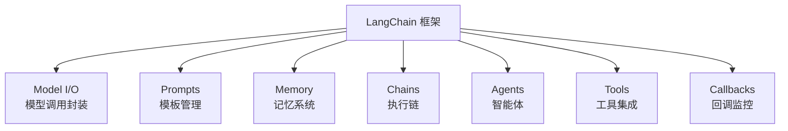

| 核心组件 | 功能 |
|---------|------|
| **Model I/O** | 统一不同 LLM 的调用接口 |
| **Prompts** | Prompt 模板 + 变量注入 + 示例选择器 |
| **Memory** | 对话历史存储与检索 |
| **Chains** | 多步操作的执行序列 |
| **Agents** | LLM 驱动的自主决策体 |
| **Tools** | 外部工具封装标准接口 |
| **Callbacks** | 日志、监控、Token 统计 |

---

### Q2: [LangChain](https://langchain.com) 的 Chain 是什么？有哪些类型？

**Chain（链）** 是 [LangChain](https://langchain.com) 的核心抽象——将多个处理步骤串联为可执行的流水线。

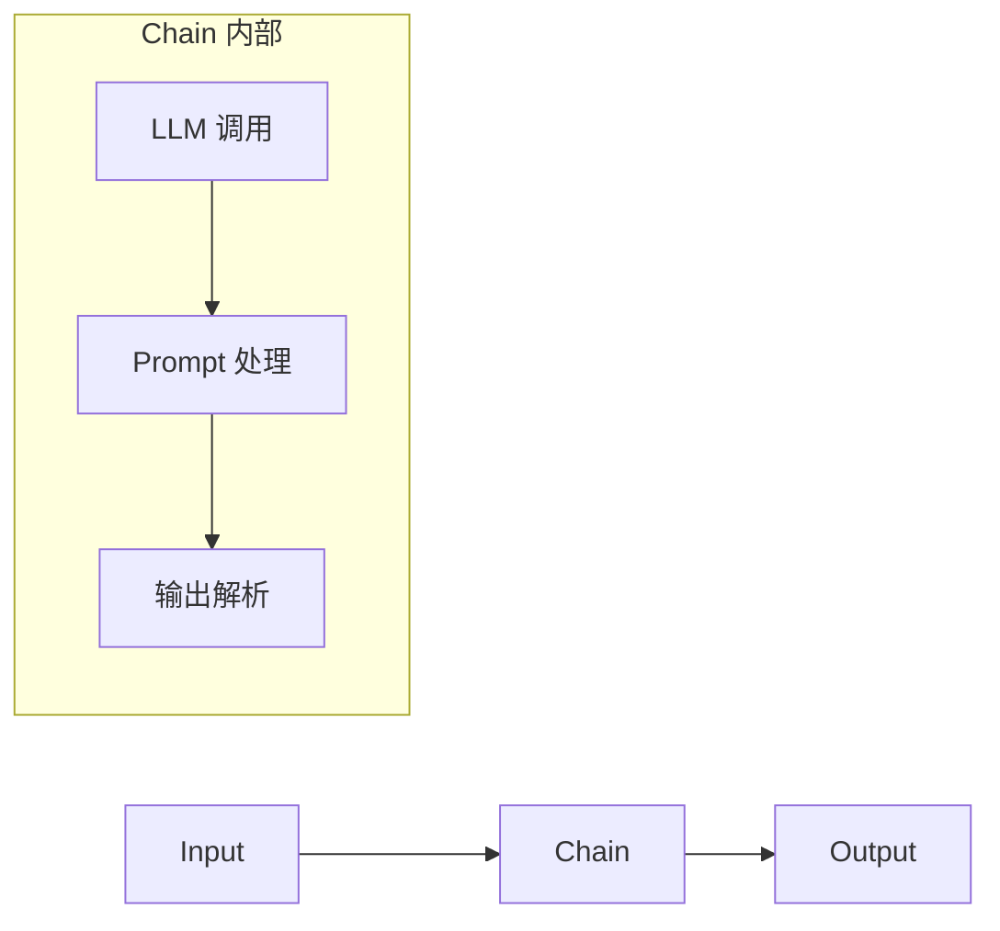

| Chain 类型 | 用途 | 代码示例 |
|-----------|------|---------|
| **LLMChain** | 单次 LLM 调用 | `LLMChain(llm, prompt)` |
| **SimpleSequentialChain** | 顺序执行 | 链 A → 链 B |
| **RouterChain** | 条件路由 | 根据意图选择子链 |
| **TransformChain** | 纯数据转换 | 输入处理/格式化 |

---

### Q3: [LangChain](https://langchain.com) Agent 是如何工作的？

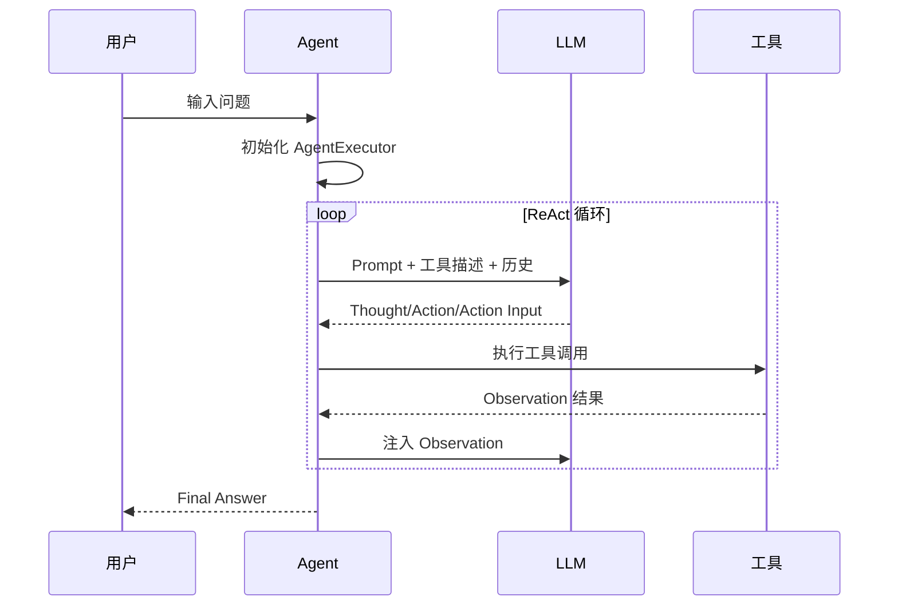

**[LangChain](https://langchain.com) Agent 的关键组件：**
- **Agent**：决定下一步做什么（LLM + Prompt）
- **Tools**：可用的外部工具列表
- **Toolkit**：相关工具的集合
- **AgentExecutor**：执行循环框架
- **Memory**：对话记忆

---

### Q4: [LangChain](https://langchain.com) 的 Memory 有哪些类型？

| Memory 类型 | 原理 | 适用场景 |
|------------|------|---------|
| **ConversationBufferMemory** | 保留全部对话 | 短对话 |
| **ConversationBufferWindowMemory** | 滑动窗口（保留 K 轮） | 长对话控制 Token |
| **ConversationSummaryMemory** | LLM 自动摘要 | 长期记忆 |
| **VectorStoreRetrieverMemory** | 向量检索 | RAG 场景 |
| **ConversationSummaryBufferMemory** | 窗口 + 超出部分摘要 | 最佳实践 |

---

### Q5: [LangChain](https://langchain.com) 如何实现 RAG？

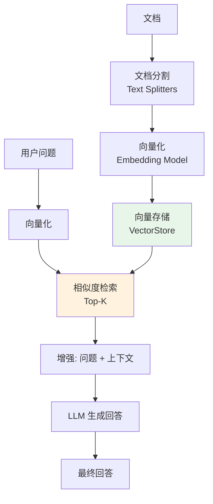

**RAG 在 [LangChain](https://langchain.com) 中的核心组件：**

```typescript
import { TextLoader } from "langchain/document_loaders/fs/text";
import { RecursiveCharacterTextSplitter } from "langchain/text_splitter";
import { OpenAIEmbeddings } from "@langchain/openai";
import { Chroma } from "@langchain/community/vectorstores/chroma";
import { RetrievalQAChain } from "langchain/chains";

// 1. 文档加载与分割
const loader = new TextLoader("doc.txt");
const docs = await loader.load();
const splitter = new RecursiveCharacterTextSplitter({
  chunkSize: 500,
  chunkOverlap: 50,
});

// 2. 向量化并存储
const vectordb = await Chroma.fromDocuments(docs, new OpenAIEmbeddings());

// 3. 检索 + 生成
const qaChain = RetrievalQAChain.fromLLM(llm, vectordb.asRetriever(3));
const answer = await qaChain.invoke("问题");
```

---

### Q6: [LangChain](https://langchain.com) 的 Callback 机制有什么用？

| Callback 事件 | 触发时机 | 用途 |
|-------------|---------|------|
| `on_llm_start` | LLM 调用开始 | Token 计数 |
| `on_llm_end` | LLM 调用结束 | 记录 Token 消耗 |
| `on_chain_start` | Chain 开始 | 追踪流程 |
| `on_tool_start` | 工具调用开始 | 工具调用日志 |
| `on_tool_end` | 工具调用结束 | 记录工具结果 |
| `on_agent_finish` | Agent 完成 | 完整轨迹 |

---

### Q7: [LangChain](https://langchain.com) Expression Language (LCEL) 是什么？

**LCEL** 是 LangChain 的声明式语法，用 `|` 操作符组合组件，类似 Unix Pipe。

```typescript
// 传统写法
const chain = new LLMChain({ llm, prompt });

// LCEL 声明式写法
const chain = prompt.pipe(llm).pipe(outputParser);
```

**LCEL 的优势：**
- 简洁直观，类似 Unix Pipe
- 自动支持流式、异步、批处理
- 内置 retry、fallback 支持
- 运行时优化（并行执行独立步骤）

---

### Q8: [LangSmith](https://smith.langchain.com) 和 [LangServe](https://python.langchain.com/v0.2/docs/langserve) 是什么？

| 工具 | 用途 | 核心功能 |
|------|------|---------|
| **LangSmith** | LLM 应用调试与监控 | Trace 追踪、性能分析、数据集管理、回归测试 |
| **LangServe** | 将 Chain 部署为 API | 自动生成 REST API、JSON Schema、交互式 Playground |

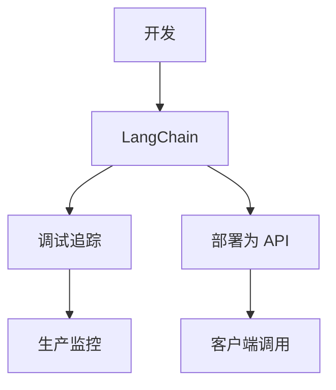

---

### Q9: [LangChain](https://langchain.com) 的主要竞争对手？

| 框架 | 语言 | 特点 | 适用场景 |
|------|------|------|---------|
| **LangChain** | Python/JS | 功能最全，生态最大 | 通用 LLM 应用 |
| **LlamaIndex** | Python | RAG 能力最强 | 知识库/检索场景 |
| **Semantic Kernel** | C#/Python | 微软出品，企业级 | .NET 生态 |
| **Dify** | Python | 可视化编排 | 低代码 Agent |
| **AutoGen** | Python | Multi-Agent | 多 Agent 协作 |

---

### Q10: [LangChain](https://langchain.com) 的优缺点？

| 优点 | 缺点 |
|------|------|
| ✅ 组件丰富，开箱即用 | ❌ 抽象层多，Debug 困难 |
| ✅ 生态最大，社区活跃 | ❌ 版本升级 breaking change 多 |
| ✅ 支持多种模型/向量库 | ❌ 学习曲线陡峭 |
| ✅ 内置最佳实践模式 | ❌ 非核心场景性能有开销 |
| ✅ LCEL 声明式语法优雅 | ❌ 复杂场景需要深入理解源码 |

---

### Q11: 什么是 [CrewAI](https://crewai.com)？它如何简化多 Agent 编排？

> 💡 **要点**：[CrewAI](https://crewai.com) 是专注于"角色协作"的多 Agent 框架，核心概念是 Crew（团队）、Agent（角色）、Task（任务）

**[CrewAI](https://crewai.com)** 是一个以**角色扮演（Role-Playing）**为核心的多 Agent 编排框架。它将 Agent 视为具有特定角色、目标和技能的"团队成员"，通过定义清晰的分工和协作流程完成复杂任务。

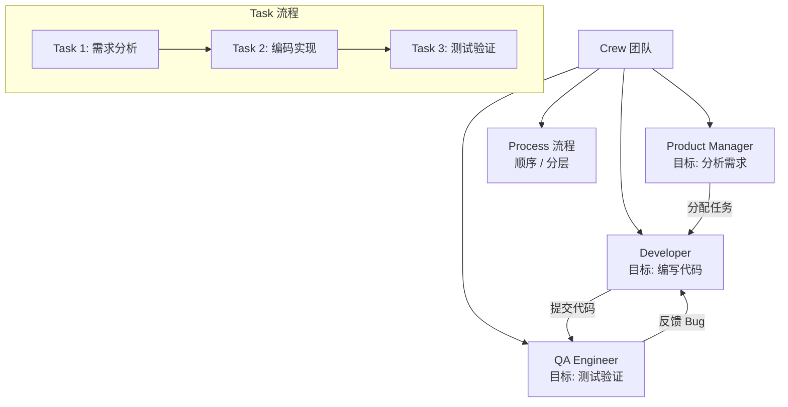

**核心概念：**

| 概念 | 说明 | 代码示例 |
|------|------|---------|
| **Agent** | 角色化的智能体，有角色、目标、LLM 配置 | `Agent(role='Developer', goal='Write code')` |
| **Task** | 要完成的具体任务，可指定 Agent 和工具 | `Task(description='Implement login', agent=dev)` |
| **Crew** | Agent 和 Task 的集合，定义执行流程 | `Crew(agents=[...], tasks=[...], process=Process.sequential)` |
| **Process** | 执行流程（顺序/分层） | `Process.sequential` / `Process.hierarchical` |
| **Tool** | Agent 可使用的工具 | `tool=SearchTool()` |

**[CrewAI](https://crewai.com) 的核心优势：**
- **角色驱动**：每个 Agent 有明确的角色和目标，交互更自然
- **内置流程**：支持顺序执行和分层管理，开箱即用
- **任务委托**：高层 Agent 可自动分配任务给下层 Agent
- **与 [LangChain](https://langchain.com) 兼容**：可直接使用 [LangChain](https://langchain.com) 的工具和 LLM

**适用场景：** 团队协作模拟、内容创作流水线、软件开发流程自动化、调研分析任务。

---

### Q12: 什么是 [AutoGen](https://microsoft.github.io/autogen)？它和 [CrewAI](https://crewai.com) 有什么不同？

> 💡 **要点**：[AutoGen](https://microsoft.github.io/autogen) 侧重"对话驱动"的多 Agent 通信，核心是 Agent 间的消息对话

**[AutoGen](https://microsoft.github.io/autogen)** 由微软推出，核心思路是让多个 Agent 通过**对话（Conversation）**进行协作——Agent 之间发送和接收消息，在对话中完成任务。

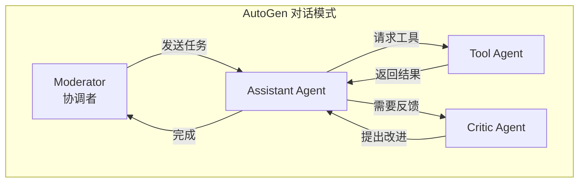

**[CrewAI](https://crewai.com) vs [AutoGen](https://microsoft.github.io/autogen) 对比：**

| 维度 | CrewAI | AutoGen |
|------|--------|---------|
| **核心思想** | 角色+任务编排 | 对话驱动协作 |
| **通信方式** | Task 分配 + 结果传递 | Agent 间自由对话 |
| **灵活性** | 结构化流程 | 灵活但难控制 |
| **学习成本** | 低（概念直观） | 中（对话流调试复杂） |
| **适用场景** | 明确分工的任务 | 开放式的对话/讨论 |
| **Human-in-loop** | 有限 | ✅ 原生支持人类介入 |

**选型建议：** 任务分工明确的场景选 **[CrewAI](https://crewai.com)**；需要 Agent 间自由讨论、迭代优化的场景选 **[AutoGen](https://microsoft.github.io/autogen)**。

---

### Q13: 什么是 [Dify](https://dify.ai)？它和传统开发框架有什么不同？

> 💡 **要点**：[Dify](https://dify.ai) 是 LLMOps 平台，通过可视化编排降低 AI 应用开发门槛

**[Dify](https://dify.ai)** 是一个**开源 LLMOps 平台**，提供可视化的 Prompt 编排、RAG 管道、Agent 定义和监控运维能力。它的定位是"AI 应用的操作系统"。

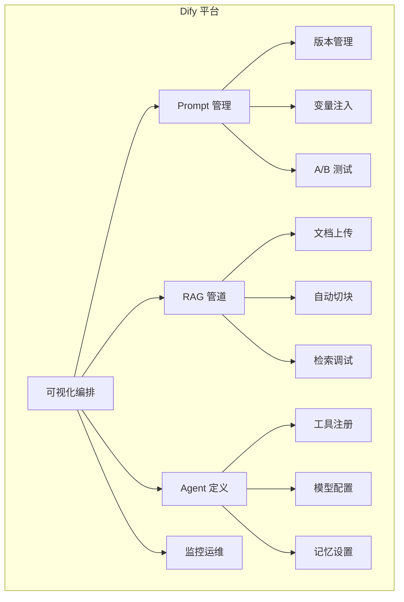

**[Dify](https://dify.ai) vs 传统框架对比：**

| 维度 | LangChain（框架） | Dify（平台） |
|------|------------------|-------------|
| **开发方式** | 代码开发 | 可视化拖拽 + 配置 |
| **目标用户** | 开发者 | 开发者 + 非技术人员 |
| **灵活性** | 高（代码级控制） | 中（受平台能力限制） |
| **部署** | 自建 | 平台托管 / Docker |
| **运维** | 自建 | 内置监控 + 日志 |
| **插件生态** | pip 包 | 工具市场 |
| **适用场景** | 核心业务/深度定制 | 快速原型/内部工具 |

**[Dify](https://dify.ai) 的核心优势：**
- **快速原型**：从想法到可用应用只需几十分钟
- **Prompt 工程可视化**：在线调试 Prompt，版本对比
- **内置 RAG 引擎**：支持多种文档格式，自动分割检索
- **API 一键发布**：配置好的应用自动生成 API

---

### Q14: 什么是 [Semantic Kernel](https://learn.microsoft.com/en-us/semantic-kernel)？它与 [LangChain](https://langchain.com) 的主要区别？

> 💡 **要点**：[Semantic Kernel](https://learn.microsoft.com/en-us/semantic-kernel) 是微软推出的企业级 AI 编排 SDK，深度集成 Azure/.NET 生态

**[Semantic Kernel](https://learn.microsoft.com/en-us/semantic-kernel) (SK)** 是微软推出的 AI 编排 SDK，支持 C#、Python 和 Java。核心设计理念是将 AI 能力**作为函数（Function）** 集成到传统应用中。

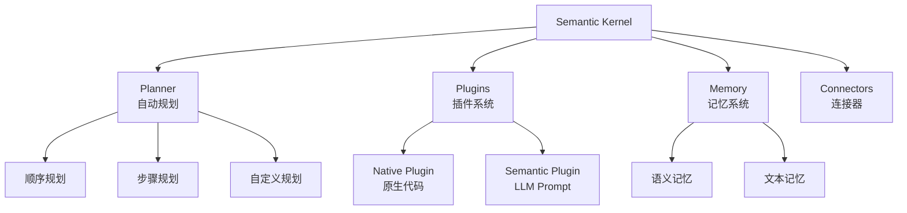

**[LangChain](https://langchain.com) vs [Semantic Kernel](https://learn.microsoft.com/en-us/semantic-kernel) 对比：**

| 维度 | LangChain | Semantic Kernel |
|------|-----------|----------------|
| **语言** | Python/JS | C#/Python/Java |
| **设计理念** | LLM 应用框架 | AI 能力嵌入传统应用 |
| **核心抽象** | Chain + Agent + Tool | Plugin + Planner + Memory |
| **规划能力** | 需手动实现 | 内置 Planner 自动编排 |
| **企业集成** | 需额外配置 | ✅ 原生 Azure AD/Auth |
| **.NET 支持** | ❌ 有限 | ✅ 首选 |
| **微软生态** | 独立 | ✅ Azure OpenAI + Copilot |

**选型建议：** 团队以 **C#/.NET** 为主或深度使用 Azure 生态，选 **[Semantic Kernel](https://learn.microsoft.com/en-us/semantic-kernel)**；Python 技术栈选 **[LangChain](https://langchain.com)**。

---

### Q15: 什么是 Zod + Vercel AI SDK？有什么核心优势？

> 💡 **要点**：Zod + Vercel AI SDK 以类型安全为核心，用 Zod Schema 定义 LLM 的输入输出结构（TypeScript 生态中等价于 Pydantic AI）

**Zod + Vercel AI SDK** 是 TypeScript 生态中实现类型安全 LLM 输出的方案，核心思想是用 **TypeScript 类型系统** 定义 LLM 的输入 Schema 和输出结构，天然支持类型检查和 IDE 自动补全。

```typescript
import { z } from "zod";
import { generateObject } from "ai";
import { openai } from "@ai-sdk/openai";

// 用 Zod Schema 定义输出结构
const WeatherResult = z.object({
  city: z.string(),
  temperature: z.number(),
  humidity: z.number(),
  description: z.string(),
});

// generateObject 的返回类型就是 Zod Schema 推导的类型
const { object } = await generateObject({
  model: openai("gpt-4o"),
  schema: WeatherResult,
  systemPrompt: "Extract weather info",
  prompt: "北京今天天气怎么样",
});

console.log(object.temperature); // ✅ 类型安全，IDE 自动补全
```

**核心优势：**

| 特性 | 说明 |
|------|------|
| **类型安全** | 输入输出都有类型定义，编译时检查 |
| **自动验证** | LLM 输出自动校验和转换 |
| **IDE 支持** | 完整的类型提示和自动补全 |
| **流式支持** | 支持结构化输出的流式返回 |

**对比传统方式：**
- 传统：LLM 返回 JSON string → 手动解析 → 手动验证
- Zod + AI SDK：LLM 返回 → 自动解析 + 自动验证 → 类型安全的数据

---

### Q16: 什么是 OpenAI Structured Outputs？它和 Zod + AI SDK 有什么不同？

> 💡 **要点**：OpenAI Structured Outputs 专注于"结构化数据提取"，核心能力是让 LLM 输出符合 Schema 的可靠数据（TypeScript 生态中等价于 Instructor）

**OpenAI Structured Outputs** 是 OpenAI 原生支持的结构化输出能力，通过 **response_format** 参数强制 LLM 输出符合 Zod Schema 的结构化数据，对应 Python 生态中的 Instructor。

```typescript
import { z } from "zod";
import OpenAI from "openai";
import { zodResponseFormat } from "openai/helpers/zod";

const openai = new OpenAI();

const UserInfo = z.object({
  name: z.string(),
  age: z.number(),
  email: z.string().email(),
});

const response = await openai.beta.chat.completions.parse({
  model: "gpt-4o",
  messages: [
    { role: "user", content: "张三，28岁，zhangsan@example.com" },
  ],
  response_format: zodResponseFormat(UserInfo, "userInfo"),
});

const user = response.choices[0].message.parsed;
console.log(user.name); // "张三" - 类型安全
```

**Zod + AI SDK vs OpenAI Structured Outputs 对比：**

| 维度 | Zod + AI SDK (Vercel) | OpenAI Structured Outputs |
|------|------------------------|--------------------------|
| **定位** | 全功能 AI 框架 | 结构化提取工具 |
| **核心能力** | Agent + 工具 + 流式 | 强制结构化输出 |
| **框架依赖** | 独立框架（多模型通用） | OpenAI 原生（仅 OpenAI） |
| **流式输出** | ✅ 原生支持 | ✅ 支持 |
| **重试机制** | ✅ 内置自动重试 | 需手动实现 |
| **适用场景** | 构建完整 AI 应用 | 数据提取/分类/实体识别 |

**选型建议：** 需要完整 Agent 框架选 **Zod + AI SDK**；只需要可靠的结构化输出且使用 OpenAI 选 **OpenAI Structured Outputs**。

---

### Q17: LLM 可观测性工具有哪些？Langfuse 和 Helicone 的核心对比？

> 💡 **要点**：可观测性 = Tracing + 监控 + 评估 + 成本分析，是生产级 LLM 应用的必备基础设施

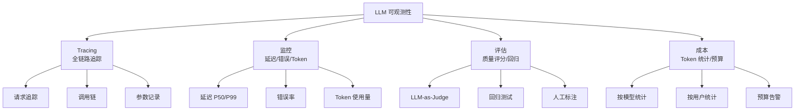

**主流 LLM 可观测性工具：**

| 工具 | 开源/商业 | 核心特点 | 适用场景 |
|------|---------|---------|---------|
| **Langfuse** | 开源 | 开源友好，Tracing + 评估 + 数据集管理 | 创业团队/自建 |
| **Helicone** | 商业 | 简单接入，Token 统计 + 成本分析 | 快速集成 |
| **LangSmith** | 商业(LangChain) | 深度集成 LangChain，回归测试强大 | LangChain 用户 |
| **Weights & Biases** | 商业 | 实验追踪 + 模型评估 | ML 团队 |
| **Arize AI** | 商业 | 监控 + 漂移检测 + 调试 | 企业级 |

**Langfuse vs Helicone：**

| 对比维度 | Langfuse | Helicone |
|---------|---------|----------|
| **开源** | ✅ 开源可自部署 | ❌ 商业 SaaS |
| **Tracing** | ✅ 详细 | ✅ 基础 |
| **评估功能** | ✅ LLM-as-Judge + 数据集 | ❌ 无 |
| **成本控制** | ❌ 有限 | ✅ 强（预算管理） |
| **集成方式** | SDK 埋点 | Proxy / SDK |
| **适合团队** | 需要完整 Observable | 需要快速控制成本 |

---

### Q18: 主流 Agent 框架如何选型？[LangChain](https://langchain.com) vs [CrewAI](https://crewai.com) vs [AutoGen](https://microsoft.github.io/autogen) vs [Dify](https://dify.ai) 对比？

> 💡 **要点**：选型要综合考虑团队技术栈、场景复杂度、开发效率和运维成本

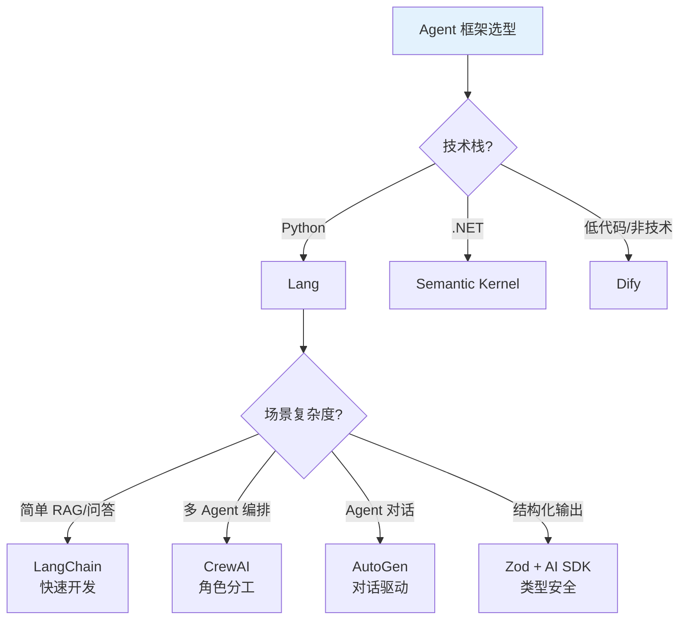

**综合对比表：**

| 维度 | LangChain | CrewAI | AutoGen | Dify | Semantic Kernel |
|------|-----------|--------|---------|------|----------------|
| **定位** | 通用 LLM 框架 | 多 Agent 编排 | 对话式 Multi-Agent | LLMOps 平台 | 企业 AI SDK |
| **上手难度** | 中 | 低 | 中 | 低 | 中 |
| **灵活性** | 高 | 中 | 中 | 低 | 高 |
| **多 Agent** | 需手动 | ✅ 原生 | ✅ 原生 | 有限 | 有限 |
| **RAG 能力** | ✅ 强 | 需集成 | 需集成 | ✅ 内置 | ✅ 中 |
| **监控运维** | LangSmith | 自建 | 自建 | ✅ 内置 | Azure Monitor |
| **社区生态** | ⭐⭐⭐⭐⭐ | ⭐⭐⭐ | ⭐⭐⭐ | ⭐⭐⭐ | ⭐⭐⭐ |
| **生产案例** | 最多 | 增长中 | 微软内部 | 中小企业 | 企业客户 |

**选型决策原则：**
1. **第一优先级**：团队技术栈（Python → [LangChain](https://langchain.com)/Pydantic AI, .NET → SK）
2. **第二优先级**：场景需求（多 Agent → [CrewAI](https://crewai.com)/[AutoGen](https://microsoft.github.io/autogen), 简单 RAG → [LangChain](https://langchain.com)）
3. **第三优先级**：运维能力（缺运维 → [Dify](https://dify.ai), 有团队 → 自建框架）
4. **通用建议**：**先用 [LangChain](https://langchain.com) 做原型**，复杂了拆出 [CrewAI](https://crewai.com)/[AutoGen](https://microsoft.github.io/autogen)，需要产品化上 [Dify](https://dify.ai)

---

### Q19: 什么是 [vLLM](https://github.com/vllm-project/vllm)？它是如何优化 LLM 推理性能的？

> 💡 **要点**：[vLLM](https://github.com/vllm-project/vllm) 通过 PagedAttention 和高效 KV Cache 管理，将 LLM 推理吞吐提升 2-4 倍

**[vLLM](https://github.com/vllm-project/vllm)** 是一个高吞吐、低延迟的 LLM 推理引擎，核心创新是 **PagedAttention**——借鉴操作系统虚拟内存的分页思想来管理 KV Cache。

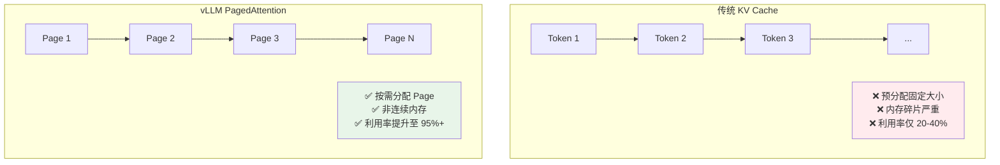

**[vLLM](https://github.com/vllm-project/vllm) 核心优化技术：**

| 技术 | 原理 | 效果 |
|------|------|------|
| **PagedAttention** | KV Cache 分页管理，非连续内存 | 内存利用率 95%+，吞吐提升 2-4x |
| **Continuous Batching** | 动态添加/移除请求到批次 | 满负载时吞吐提升 2x+ |
| **Prefix Caching** | 公共前缀 KV Cache 复用 | 共享 Prompt 场景加速 50%+ |
| **Speculative Decoding** | 用小模型草稿 + 大模型验证 | 延迟降低 1.5-2x（实验性） |
| **Tensor Parallelism** | 张量并行多卡推理 | 支持超大规模模型推理 |

**[vLLM](https://github.com/vllm-project/vllm) vs 其他推理框架：**

| 框架 | 语言 | 核心优势 | 局限 |
|------|------|---------|------|
| **vLLM** | Python | 吞吐最高，PagedAttention | CUDA 依赖 |
| **TGI (HuggingFace)** | Rust | HF 深度集成，生态好 | 吞吐略逊于 vLLM |
| **SGLang** | Python | 结构化生成，RadixAttention | 较新，社区小 |
| **Llama.cpp** | C++ | CPU 友好，边缘部署 | GPU 推理效率低 |
| **Ollama** | Go | 用户友好，开箱即用 | 定制化有限 |

---

### Q20: SGLang 的核心创新是什么？和 [vLLM](https://github.com/vllm-project/vllm) 有什么不同？

> 💡 **要点**：SGLang 提出 RadixAttention 和结构化生成语言，专为复杂 LLM 推理模式优化

**SGLang** 是一个结构化 LLM 推理框架，核心创新包括 **RadixAttention**（前缀树缓存的注意力机制）和 **结构化生成语言**。

```typescript
// SGLang 结构化生成的概念示例（SGLang 为 Python 原生，此处展示 TypeScript 等价思路）
// 使用 Vercel AI SDK + Zod 实现结构化输出约束
import { z } from "zod";
import { generateObject } from "ai";
import { openai } from "@ai-sdk/openai";

const Answer = z.object({
  choice: z.enum(["Yes", "No", "Maybe"]),
  reason: z.string(),
});

async function multiTurnQA(question: string, context: string) {
  const { object } = await generateObject({
    model: openai("gpt-4o"),
    schema: Answer,
    prompt: `Question: ${question}
Context: ${context}
Answer: `,
    maxTokens: 256,
  });
  return object;
}
```

**[vLLM](https://github.com/vllm-project/vllm) vs SGLang 对比：**

| 维度 | vLLM | SGLang |
|------|------|--------|
| **核心创新** | PagedAttention | RadixAttention + 结构化语言 |
| **缓存机制** | 前缀 KV 缓存 | 前缀树缓存（更细粒度） |
| **结构化生成** | ❌ 不支持 | ✅ 原生支持 regex/JSON |
| **多模态** | 有限 | ✅ 原生多模态 |
| **Agent 场景** | 通用 | ✅ 专为 Agent 优化 |
| **开源时间** | 2023 (成熟) | 2024 (发展中) |
| **适用场景** | 通用高并发推理 | Agent/复杂结构化推理 |

**选型建议：** 通用推理场景（聊天、RAG）用 **[vLLM](https://github.com/vllm-project/vllm)**；Agent 场景、需要结构化输出的用 **SGLang**。

---

---

### ⚖️ 补充：框架选型的决策矩阵

> **选型不是选最好的，而是选最合适的**：以下矩阵帮助你在不同场景下做出理性选择。

| 场景 | 推荐框架 | 理由 | 不推荐 |
|:---|:---|:---|:---|
| **快速原型** | LangChain + LCEL | 组件丰富，文档完善，社区最大 | 手搓（太慢） |
| **生产级 RAG** | LlamaIndex + LangChain | RAG 工具链最完善 | CrewAI（不适合 RAG） |
| **多 Agent 协作** | CrewAI / AutoGen | 原生多 Agent 编排 | LangChain Agent（单 Agent 为主） |
| **结构化输出** | OpenAI Structured Outputs / Zod + AI SDK | Zod 类型安全 | LangChain（JSON 解析脆弱） |
| **低代码 AI 应用** | Dify | 可视化编排，非技术人员可用 | LangChain（需编码） |
| **.NET 生态** | Semantic Kernel | 深度集成 C#/.NET 技术栈 | LangChain（JS/Python 为主） |
| **高吞吐推理** | vLLM | PagedAttention 吞吐最高 | TGI（吞吐略低） |
| **Agent 结构化推理** | SGLang | RadixAttention + 结构化语言 | vLLM（无结构化支持） |
| **可观测性** | LangSmith / LangFuse | LLM 调用链路追踪 | 通用 APM（缺乏 LLM 语义） |
| **私有化部署** | Ollama + Llama.cpp | 离线/边缘运行，无需 GPU | vLLM（需要 CUDA） |

#### 框架生态的"甜蜜区"原则

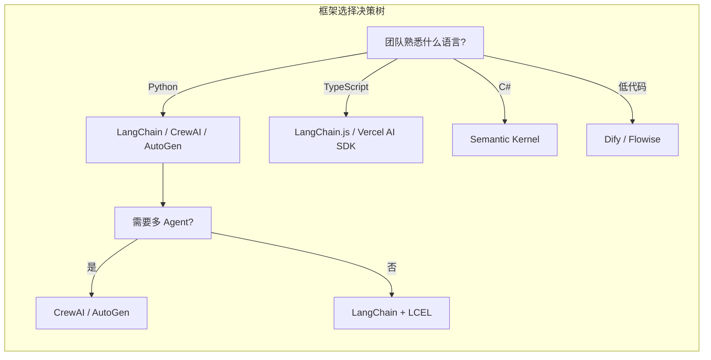
