# 🔮 六、前沿趋势篇

> 🎯 **核心考点：** 2025-2026 技术趋势、新兴协议、行业落地、推理加速、Agentic RAG、信任层 | **题数：** 22 题

---

### Q1: 2025-2026 Agent 领域的主要技术趋势是什么？

> 💡 **要点**：Agent 正从"单点工具"向"自主系统"演进，核心趋势包括标准化、多模态、具身化

**六大技术趋势：**

| 趋势 | 说明 | 代表技术/项目 |
|------|------|--------------|
| **协议标准化** | MCP、A2A 等协议推动 Agent 互联互通 | MCP、A2A、Agent Protocol |
| **多模态 Agent** | 从文本扩展到图像、音频、视频 | GPT-4o、Gemini、Qwen2-VL |
| **具身智能** | Agent 与物理世界交互 | RT-2、Figure 01、Tesla Optimus |
| **自主 Agent** | 从被动响应到主动规划执行 | OpenHands、Devin、SWE-agent |
| **端侧部署** | 小模型在设备端运行 | Ollama、MLC LLM、Llama.cpp |
| **Agent 评估** | 标准化评估体系建立 | AgentBench、SWE-bench、GAIA |

**趋势演进时间线：**

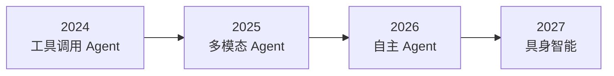

---

### Q2: MCP 协议的未来发展方向是什么？

> 💡 **要点**：MCP 正从"工具调用标准"向"Agent 生态系统基础设施"演进

**MCP 发展路线图：**

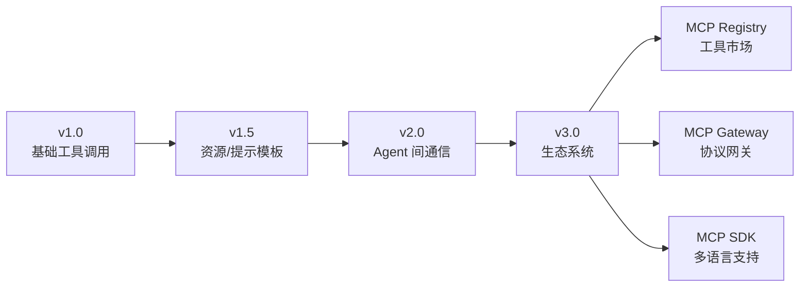

**未来发展方向：**

| 方向 | 说明 | 预期时间 |
|------|------|---------|
| **MCP Registry** | 工具注册中心，类似 npm | 2025 Q3 |
| **MCP Gateway** | 协议转换网关，统一接入 | 2025 Q4 |
| **多语言 SDK** | Python/JS/Go/Rust 等 | 持续更新 |
| **安全增强** | 权限控制、审计追踪 | 2025 Q2 |
| **性能优化** | 流式传输、批量调用 | 2025 Q3 |

---

### Q3: A2A 协议的实际应用场景有哪些？

> 💡 **要点**：A2A 解决多 Agent 协作问题，适用于复杂任务分解、跨领域协作、动态编排

**A2A 典型应用场景：**

| 场景 | 说明 | Agent 角色 |
|------|------|-----------|
| **软件开发** | 产品→开发→测试→部署 | PM Agent、Dev Agent、QA Agent |
| **数据分析** | 采集→清洗→分析→可视化 | Collector、Cleaner、Analyzer、Visualizer |
| **客户服务** | 意图识别→问题解决→满意度 | Router、Solver、Feedback |
| **内容创作** | 策划→写作→编辑→发布 | Planner、Writer、Editor、Publisher |
| **金融风控** | 数据采集→风险评估→决策 | Collector、Assessor、Decider |

**A2A 通信模式：**

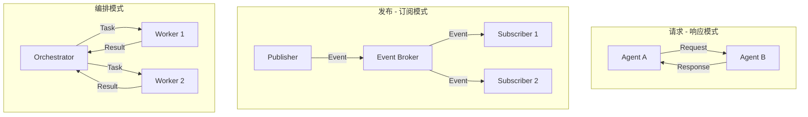

---

### Q4: 端侧 Agent 部署的技术挑战和解决方案？

> 💡 **要点**：端侧部署需要平衡模型能力、资源消耗、响应延迟，核心是模型压缩和硬件适配

**端侧部署挑战与方案：**

| 挑战 | 说明 | 解决方案 |
|------|------|---------|
| **模型大小** | 大模型无法在端侧运行 | 模型压缩（量化、剪枝、蒸馏） |
| **内存限制** | 端侧内存有限 | KV Cache 优化、分页加载 |
| **计算能力** | CPU/GPU 算力不足 | 专用 NPU、模型分片 |
| **能耗控制** | 电池续航限制 | 动态精度调整、休眠策略 |
| **网络依赖** | 离线场景需求 | 本地缓存、混合推理 |
| **安全隐私** | 数据不出设备 | 本地处理、联邦学习 |

**端侧模型选择指南：**

| 模型 | 参数量 | 量化后大小 | 适用设备 | 典型延迟 |
|------|--------|-----------|---------|---------|
| **Qwen2.5-0.5B** | 0.5B | 300MB (Q4) | 手机/平板 | 50-100ms |
| **Llama-3.2-1B** | 1B | 600MB (Q4) | 手机/平板 | 100-200ms |
| **Phi-3-mini** | 3.8B | 2GB (Q4) | 笔记本/边缘 | 200-500ms |
| **Mistral-7B** | 7B | 4GB (Q4) | 高性能笔记本 | 500-1000ms |

---

### Q5: Agent 评估体系的最新进展？

> 💡 **要点**：Agent 评估从"单轮问答"向"多步任务完成度"演进，需要综合评估能力、效率、安全

**评估体系演进：**

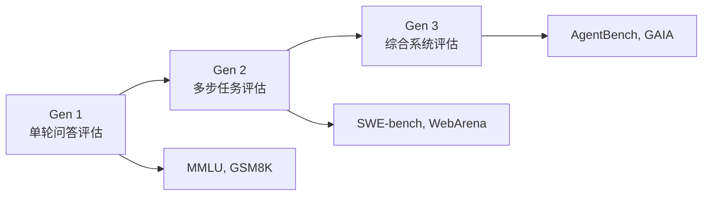

**最新评估基准：**

| 基准 | 评估维度 | 任务类型 | 特点 |
|------|---------|---------|------|
| **SWE-bench Verified** | 代码修复能力 | GitHub Issue → Patch | 真实代码库验证 |
| **WebArena** | Web 操作能力 | 网站任务完成 | 模拟真实网站环境 |
| **GAIA** | 通用 AI 助手 | 多步推理任务 | 需要工具和网络搜索 |
| **AgentBench** | 多环境适应 | 编码/搜索/购物 | 多环境统一平台 |
| **OSWorld** | 操作系统操作 | 桌面任务 | 模拟真实 OS 环境 |
| **SWE-agent** | 软件工程 | 代码库级任务 | 完整开发流程 |

---

### Q6: Agent 与 RPA 的融合趋势？

> 💡 **要点**：Agent 赋予 RPA 认知能力，RPA 为 Agent 提供执行通道，两者互补

**融合架构：**

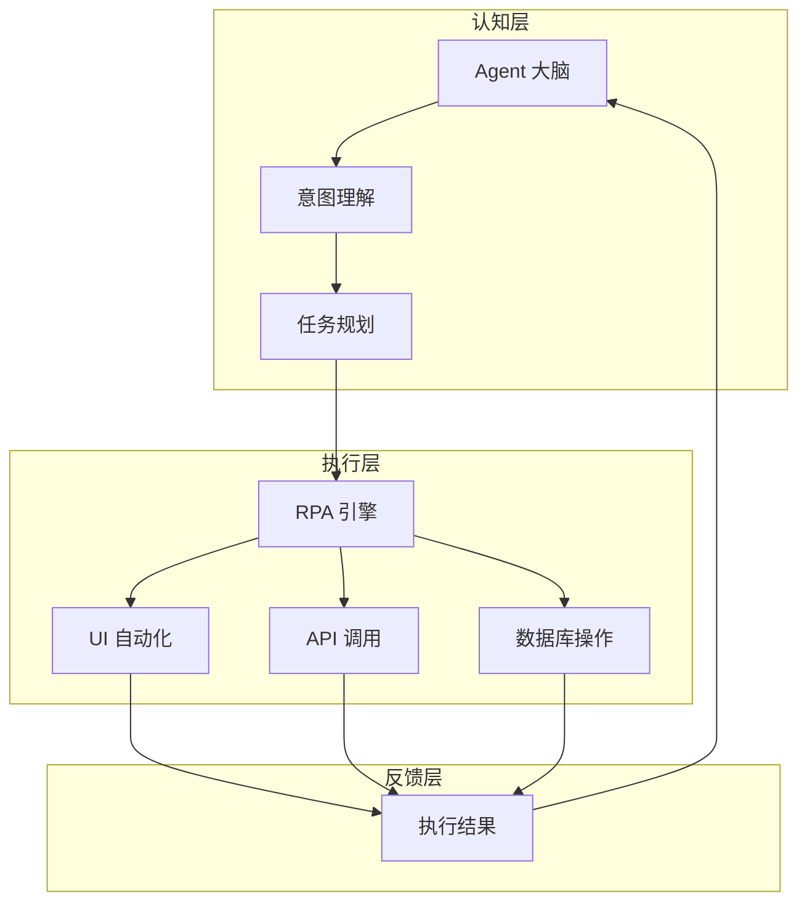

**融合优势：**

| 维度 | 传统 RPA | Agent + RPA |
|------|---------|-------------|
| **任务理解** | 规则驱动 | 自然语言理解 |
| **异常处理** | 预设规则 | 自主决策 |
| **适应性** | 固定流程 | 动态调整 |
| **开发效率** | 需专业工具 | 自然语言描述 |

---

### Q7: Agent 操作系统的未来？

> 💡 **要点**：Agent OS 将重构人机交互范式，从"应用为中心"转向"意图为中心"

**Agent OS 架构：**

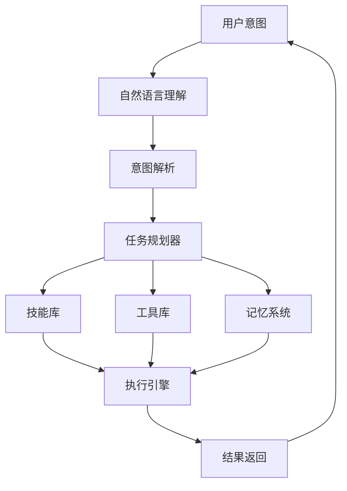

**与传统 OS 对比：**

| 维度 | 传统 OS | Agent OS |
|------|---------|----------|
| **交互方式** | GUI/CLI | 自然语言 |
| **任务执行** | 用户操作 | Agent 代理 |
| **应用管理** | 安装/卸载 | 技能注册 |
| **资源调度** | 进程/线程 | 任务/工具 |
| **学习进化** | 无 | 持续学习 |

---

### Q8: Agent 经济（Agent Economy）是什么？

> 💡 **要点**：Agent Economy 指 Agent 之间进行价值交换的经济系统

**核心概念：**

| 概念 | 说明 | 示例 |
|------|------|------|
| **Agent 市场** | Agent 技能交易平台 | MCP Registry |
| **价值交换** | Agent 间服务互换 | 搜索 Agent ↔ 分析 Agent |
| **激励机制** | 贡献度奖励 | Token 奖励机制 |
| **信任体系** | 信誉评分 | 成功率/响应时间 |

**经济模型：**

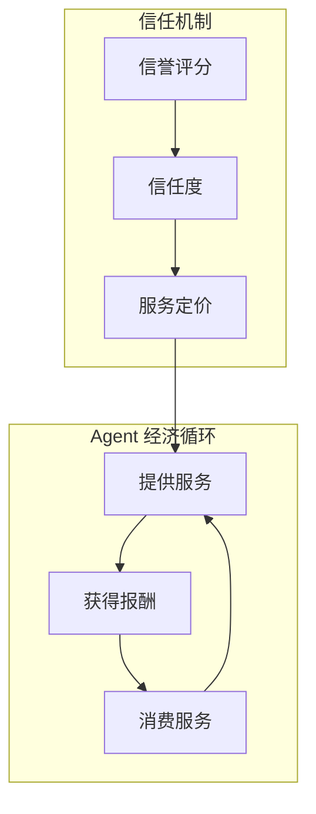

---

### Q9: 自主 Agent 的安全风险与治理？

> 💡 **要点**：自主 Agent 带来新的安全挑战，需要技术 + 制度双重治理

**安全风险矩阵：**

| 风险类型 | 严重程度 | 发生概率 | 缓解措施 |
|---------|---------|---------|---------|
| **目标劫持** | 高 | 中 | 目标验证机制 |
| **权限滥用** | 高 | 中 | 最小权限原则 |
| **数据泄露** | 高 | 低 | 数据脱敏 + 加密 |
| **行为失控** | 极高 | 低 | 人工审批 + 熔断 |
| **供应链攻击** | 中 | 中 | 工具审核机制 |

**治理框架：**

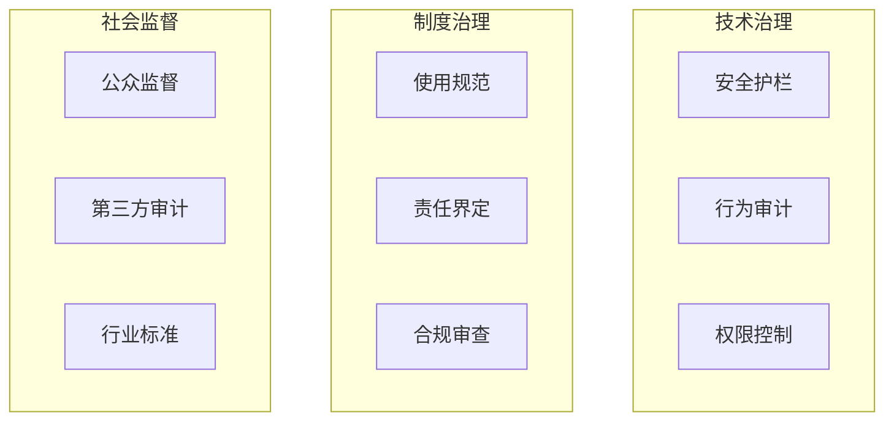

---

### Q10: Agent 开发范式的演进？

> 💡 **要点**：从手写代码到低代码，再到 AI 生成，开发范式持续演进

**开发范式演进：**

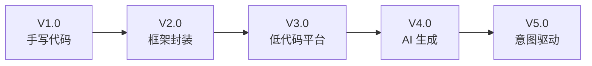

**各范式对比：**

| 范式 | 开发效率 | 灵活性 | 学习成本 | 代表工具 |
|------|---------|--------|---------|---------|
| 手写代码 | 低 | 高 | 高 | 原生 API |
| 框架封装 | 中 | 中 | 中 | LangChain |
| 低代码平台 | 高 | 低 | 低 | Dify、Coze |
| AI 生成 | 极高 | 中 | 极低 | Cursor、 Devin |
| 意图驱动 | 最高 | 高 | 无 | 未来形态 |

---

### Q11: 多模态 Agent 的技术突破？

> 💡 **要点**：多模态 Agent 需要统一的感知、理解和行动能力

**技术突破方向：**

| 方向 | 说明 | 代表工作 |
|------|------|---------|
| **统一表征** | 多模态统一 Embedding | CLIP、ImageBind |
| **跨模态推理** | 图文联合推理 | GPT-4V、Gemini |
| **实时交互** | 低延迟多模态交互 | GPT-4o |
| **具身感知** | 视觉 + 触觉 + 听觉 | RT-2、PaLM-E |

**多模态 Agent 架构：**

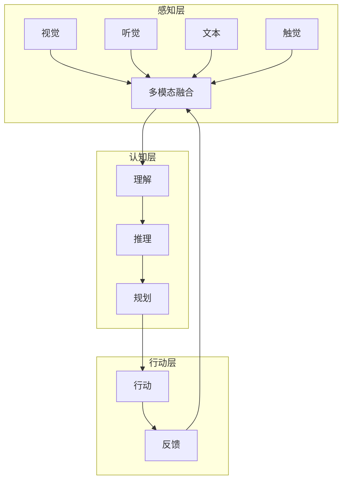

---

### Q12: Agent 在垂直行业的落地案例？

> 💡 **要点**：Agent 在金融、医疗、教育、制造等行业已有成功落地案例

**行业落地案例：**

| 行业 | 应用场景 | 价值 | 代表案例 |
|------|---------|------|---------|
| **金融** | 智能投顾、风控 | 效率提升 5x | 蚂蚁金服 Agent |
| **医疗** | 辅助诊断、报告 | 准确率 95%+ | 腾讯觅影 |
| **教育** | 个性化辅导 | 学习效果 3x | 科大讯飞 |
| **制造** | 质检、排产 | 缺陷率降低 50% | 华为 Agent |
| **零售** | 智能客服、推荐 | 转化率提升 30% | 阿里 Agent |

**落地关键因素：**

| 因素 | 说明 | 权重 |
|------|------|------|
| **数据质量** | 行业数据积累 | 30% |
| **场景明确** | 边界清晰的场景 | 25% |
| **ROI 可量化** | 投入产出比明确 | 20% |
| **合规要求** | 行业监管要求 | 15% |
| **技术成熟度** | 技术可行性 | 10% |

---

### Q13: Agent 与区块链的结合？

> 💡 **要点**：区块链为 Agent 提供信任机制、价值交换、去中心化治理

**结合场景：**

| 场景 | 说明 | 价值 |
|------|------|------|
| **Agent 身份** | 链上身份认证 | 防伪造、可追溯 |
| **价值交换** | 智能合约支付 | 自动化结算 |
| **信誉系统** | 链上信誉记录 | 不可篡改 |
| **去中心化治理** | DAO 治理 Agent | 社区驱动 |
| **数据市场** | 链上数据交易 | 隐私保护 |

**架构示例：**

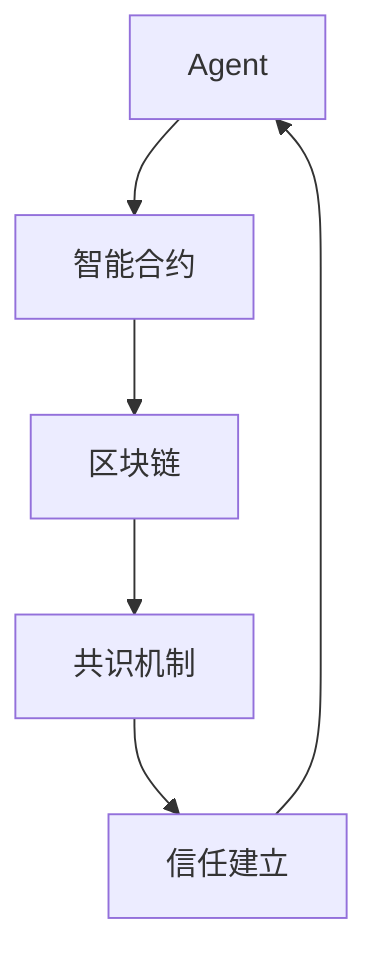

---

### Q14: Agent 开源生态的发展趋势？

> 💡 **要点**：开源生态正从"单一框架"向"协议 + 工具 + 社区"全面繁荣

**生态演进：**

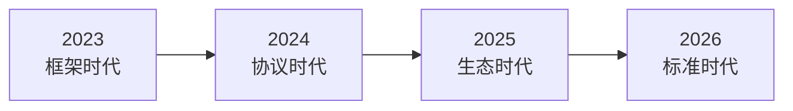

**核心开源项目：**

| 类别 | 项目 | 特点 |
|------|------|------|
| **框架** | LangChain、LlamaIndex | 组件丰富 |
| **协议** | MCP、A2A | 标准化 |
| **工具** | OpenHands、SWE-agent | 垂直场景 |
| **评估** | AgentBench、GAIA | 标准化评估 |
| **部署** | Ollama、vLLM | 高效推理 |

**生态趋势：**

| 趋势 | 说明 |
|------|------|
| **协议统一** | MCP 成为事实标准 |
| **工具市场** | 类似 npm 的 Agent 工具市场 |
| **社区驱动** | 开源社区主导创新 |
| **企业参与** | 大厂开源核心项目 |

---

### Q15: Agent 技术的伦理与合规挑战？

> 💡 **要点**：Agent 技术带来新的伦理挑战，需要技术 + 法律 + 社会多维度应对

**伦理挑战：**

| 挑战 | 说明 | 应对策略 |
|------|------|---------|
| **责任归属** | Agent 行为责任界定 | 明确责任链 |
| **隐私保护** | 用户数据安全 | 数据最小化 |
| **算法偏见** | 训练数据偏见 | 多样性数据 |
| **透明度** | 决策过程可解释 | 可解释 AI |
| **人类控制** | 保持人类最终决策权 | Human-in-the-loop |

**合规框架：**

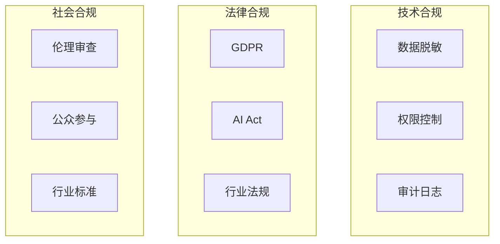

**合规 Checklist：**

- [ ] 数据收集获得用户明确同意
- [ ] 敏感数据加密存储和传输
- [ ] 提供数据删除和导出功能
- [ ] 决策过程可解释和可追溯
- [ ] 设置人工审批和干预机制
- [ ] 定期进行安全审计和评估
- [ ] 遵守行业特定法规要求
- [ ] 建立伦理审查委员会

---

### Q16: Prompt 压缩和优化技术有哪些？Token 节省的实践经验？

> 💡 **要点**：Prompt 压缩是降低 Token 成本和延迟的关键工程手段，主流方法包括 LLMLingua、选择性压缩和结构化压缩

**Prompt 压缩的核心动机：** 长 Prompt 导致 Token 成本高、推理延迟长、中间信息丢失（Lost in the Middle）。压缩旨在**保留核心语义**的同时**大幅减少 Token 数**。

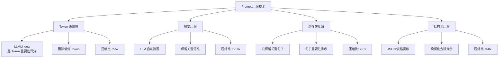

**主流压缩方案对比：**

| 方案 | 原理 | 压缩比 | 信息损失 | 额外成本 |
|------|------|--------|---------|---------|
| **LLMLingua** | 小模型评分 Token 重要性 | 2-5x | 低 | 小模型推理 |
| **Selective Context** | 句子级重要性排序截断 | 2-3x | 中 | 无 |
| **LLM 摘要** | LLM 压缩历史对话 | 5-10x | 中高 | LLM 调用 |
| **结构化提取** | 提取关键实体/数据 | 3-8x | 低 | 少量 LLM 调用 |
| **KV Cache 复用** | 共享前缀 KV 缓存 | 不定 | 无损 | 缓存存储 |

**工程实践经验：**

| 场景 | 推荐方案 | 预期节省 |
|------|---------|---------|
| **长对话历史** | LLM 摘要压缩 | Token 减少 70%+ |
| **RAG 上下文** | LLMLingua 选择性压缩 | Token 减少 50-60% |
| **System Prompt** | 结构优化 + 模板化 | Token 减少 30% |
| **Few-shot 示例** | 动态示例选择，不全部注入 | Token 减少 40-80% |
| **多工具描述** | 按需注入工具描述 | Token 减少 50%+ |

---

### Q17: 推理加速技术有哪些？Speculative Decoding 的原理是什么？

> 💡 **要点**：Speculative Decoding 用"小模型草稿 + 大模型验证"突破自回归生成的串行瓶颈，实现 1.5-3x 加速

**核心推理加速技术对比：**

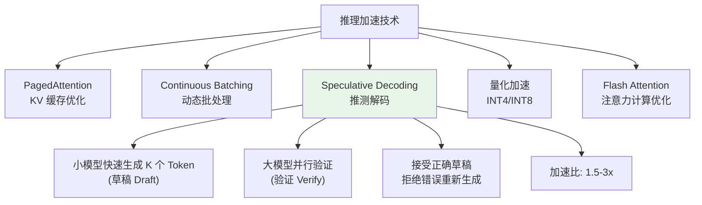

**Speculative Decoding 原理：**

```
传统方式（串行）:
  LLM: Token1 → Token2 → Token3 → Token4  (4 步推理)
  
推测解码（并行）:
  Step 1: 小模型快速生成 [Token1, Token2, Token3, Token4] (草稿)
  Step 2: 大模型并行验证 4 个 Token (只需 1 步)
  Step 3: 接受正确草稿 Token，从第一个错误处重新生成
  → 理想情况下: 4 Token 只需 2 步 (1 草稿 + 1 验证)
```

**各加速技术的适用场景和收益：**

| 技术 | 延迟降低 | 吞吐提升 | 适用场景 | 实现难度 |
|------|---------|---------|---------|---------|
| **PagedAttention** | 30-50% | 2-4x | 高并发推理 | 低（用 vLLM） |
| **Continuous Batching** | - | 1.5-2x | 在线服务 | 中 |
| **Speculative Decoding** | 40-70% | - | 低延迟场景 | 高 |
| **INT4 量化** | 20-40% | 1.5-2x | 资源受限 | 低 |
| **Flash Attention** | 20-30% | 1.2-2x | 长序列 | 低（内置支持） |
| **KV Cache 量化** | 10-20% | 1.3-1.5x | 长对话场景 | 中 |

**实践组合推荐：** **[vLLM](https://github.com/vllm-project/vllm) + Flash Attention + INT4 量化** 是性价比最高的方案；需要极致低延迟时叠加 **Speculative Decoding**。

---

### Q18: AI Coding 工具（[Cursor](https://cursor.com)、Copilot、Devin 等）的技术原理和演进趋势？

> 💡 **要点**：AI Coding 工具正从"代码补全"向"自主编程 Agent"演进，底层技术包括 RAG、Agent 和定制模型

**AI Coding 工具代际演进：**

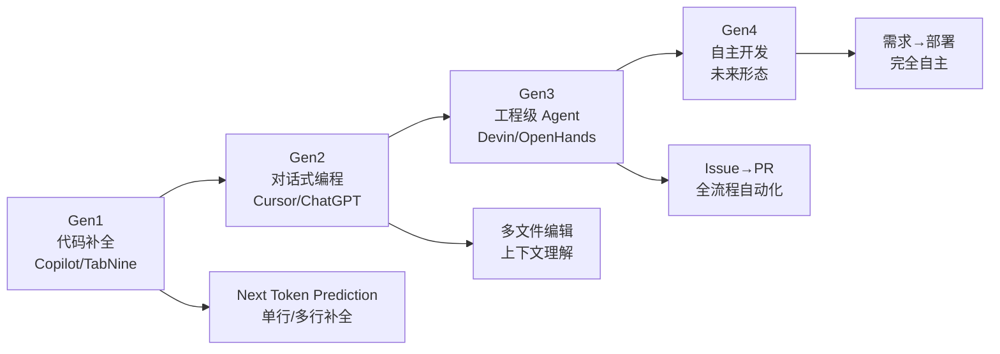

**主流 AI Coding 工具对比：**

| 工具 | 代际 | 核心能力 | 技术原理 | IDE 支持 |
|------|------|---------|---------|---------|
| **GitHub Copilot** | Gen1 | 代码补全 + 对话 | 定制 Codex 模型 + RAG | 多 IDE |
| **Cursor** | Gen2 | 多文件编辑 + Agent | Claude/GPT + 索引 + Agent 循环 | 独立 IDE |
| **Windsurf (Codeium)** | Gen2 | 上下文感知补全 | 专有模型 + Agent | 多 IDE |
| **Devin** | Gen3 | 工程级 Agent | 多 Agent + 沙箱 + Planner | 独立平台 |
| **OpenHands** | Gen3 | 开源 Agent 替代 | SWE-agent + 沙箱 | 开源 |
| **Augment** | Gen2 | 全仓库理解 | Code Graph + RAG | 多 IDE |

**核心技术原理：**

```
Cursor 的工作流程:
1. 索引阶段: 对整个代码库建立向量索引 + 代码图谱
2. 上下文理解: 将当前文件 + 相关文件注入 Context
3. Agent 循环: 用户请求 → 理解 → 检索 → 生成 → 修改文件
4. Diff 应用: 将生成的代码变更应用到项目

Devin 的工作流程 (更复杂):
1. Plan: 理解 Issue/需求 → 制定计划
2. Code: 类似 Agent 的编码循环
3. Test: 自动运行测试验证
4. Debug: 失败则反思重试
5. PR: 自动创建 Pull Request
```

**演进趋势：**
- **上下文更大**：从当前文件 → 相关文件 → 全仓库索引
- **自主性更强**：从补全推荐 → 对话生成 → Agent 自动完成
- **验证闭环**：从无验证 → 编译检查 → 测试验证 → 部署
- **多模态融合**：从纯代码 → 设计稿 → 前端代码生成

---

### Q19: 什么是 Agentic RAG？与经典 RAG 的核心区别？

> 💡 **要点**：Agentic RAG 将 Agent 的规划/推理能力注入 RAG 流程，实现"按需检索、自适应推理"

**Agentic RAG** 是在经典 RAG 基础上引入 Agent 的自主决策能力——Agent 决定**何时检索、检索什么、是否需要多轮检索、是否需要调用其他工具**。

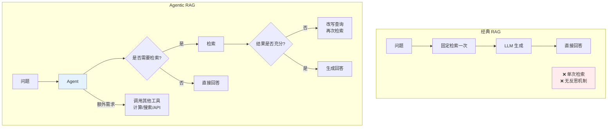

**经典 RAG vs Agentic RAG 对比：**

| 维度 | 经典 RAG | Agentic RAG |
|------|---------|-------------|
| **检索时机** | 固定（每次必定检索） | **按需**（判断是否需要） |
| **检索次数** | 单次 | **多轮**（可重复检索） |
| **查询优化** | 无 | **查询重写**、多角度生成 |
| **结果反思** | 无 | **评估结果质量**，不满意则重试 |
| **工具使用** | 只有检索 | **多种工具**（检索+搜索+代码+...） |
| **灵活度** | 低（固定流程） | **高**（Agent 自主决策） |
| **适用场景** | 简单问答 | 复杂多步推理、交叉验证 |
| **代表实现** | RetrievalQA Chain | Self-RAG、Corrective RAG、Agent RAG |

**Agentic RAG 的典型工作流：**

```
用户提问 → Agent 分析:
  1. 判断: "这个问题需要外部知识吗？"
     - 不需要 → 直接回答
     - 需要 → 进入检索流程
  
  2. 检索: "如何最好地找到相关信息？"
     - 重写查询 → 向量检索
     - 可能切换为互联网搜索
     - 可能同时多路检索
  
  3. 评估: "检索结果充分吗？"
     - 充分 → 基于结果生成
     - 不充分 → 回到步骤 2，改进查询
  
  4. 综合: 结合多轮检索结果，生成最终回答
```

**工程落地建议：** 先从经典 RAG 开始建立基线，再逐步加入 Agent 能力（查询重写 → 结果评估 → 多轮检索 → 多工具），**不要一开始就上完整的 Agentic RAG**。

---

### Q20: 什么是 LLM 的"上下文窗口扩展"技术？RoPE 外推和位置插值的原理？

> 💡 **要点**：上下文窗口扩展让模型在长序列上保持推理质量，核心方法包括位置插值（PI）、NTK-aware 缩放和 YaRN

**问题背景：** 大多数 LLM 训练时的上下文窗口是固定的（如 4K、8K），直接输入更长的序列会导致注意力分数分布异常、位置编码外推失败。

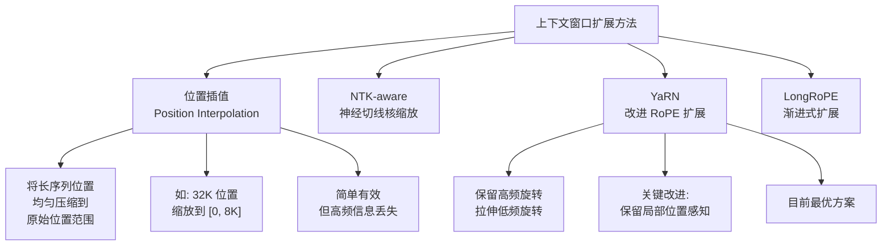

**各方法对比：**

| 方法 | 原理 | 最大扩展 | 微调需求 | 信息损失 |
|------|------|---------|---------|---------|
| **Direct Extrapolation** | 直接用未训练的位置 | 1.2-1.5x | 无 | 高（质量快速下降） |
| **Position Interpolation (PI)** | 线性压缩位置索引 | 8-32x | 少量微调 | 低 |
| **NTK-aware Scaling** | 高频不变，低频缩放 | 8-32x | 无或少量 | 极低 |
| **YaRN** | 改进 NTK + 注意力温度 | 32-128x | 少量微调 | 极低 |
| **LongRoPE** | 渐进式扩展 + 位置调整 | 512x+ | 逐步微调 | 低 |
| **Ring Attention** | 分布式环状注意力 | 无限 | 无 | 无（高效分块） |

**工程实践：**
- **无需微调**：使用 YaRN 或 NTK-aware 可直接扩展 2-4x（如 4K→16K）
- **需要微调**：NTK + 少量长序列微调可扩展到 32K+
- **极致扩展**：LongRoPE + Ring Attention 可实现百万级上下文

---

### Q21: 什么是 AI Agent 的"信任层"？如何构建可信任的 Agent 系统？

> 💡 **要点**：信任层是 Agent 在关键决策点上设置的"检查点"，通过透明化、可验证、可干预的机制建立用户信任

**信任层（Trust Layer）** 是 Agent 系统中确保决策过程**透明、可验证、可控制**的一系列机制。它是用户愿意将任务交给 Agent 的关键前提。

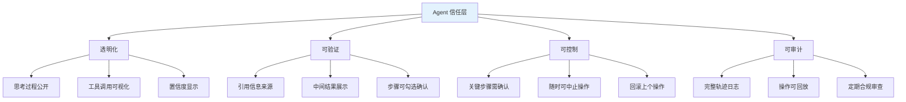

**信任级别的递进设计：**

| 信任等级 | 行为策略 | 用户感知 | 适用场景 |
|---------|---------|---------|---------|
| **L0-无信任** | 完全黑盒，不展示过程 | Agent 不可预测 | 简单辅助 |
| **L1-透明** | 展示思考过程和工具调用链 | 知道 Agent 在做什么 | 信息查询 |
| **L2-可验证** | 提供引用来源和中间结果 | 可验证答案正确性 | 知识问答 |
| **L3-可干预** | 关键操作需用户确认 | 对结果有控制感 | 支付/删除 |
| **L4-高度信任** | 无需确认，事后可回滚 | 信任已建立 | 个人助理 |

**实际工程实现：**

```typescript
interface AgentAPI {
  thinkStream(task: string): AsyncIterable<string>;
  getNextToolCall(): ToolCall;
  execute(toolCall: ToolCall): ToolResult;
}

interface ToolCall {
  risk: 'low' | 'medium' | 'high';
  [key: string]: unknown;
}

interface ToolResult {
  answer: string;
  sources: string[];
  confidenceScore: number;
  [key: string]: unknown;
}

class TrustLayer {
  private agent: AgentAPI;

  constructor(agent: AgentAPI) {
    this.agent = agent;
  }

  private async pushToUI(key: string, value: unknown): Promise<void> {
    // 推送数据到 UI（需根据前端框架实现）
  }

  private async askUserConfirm(toolCall: ToolCall): Promise<boolean> {
    // 询问用户确认（需根据前端框架实现）
    return true;
  }

  async executeWithTrust(task: string, trustLevel: number): Promise<string | { status: string }> {
    // 1. 透明化：流式输出思考过程
    for await (const thought of this.agent.thinkStream(task)) {
      await this.pushToUI('thought', thought);
    }

    // 2. 工具调用前确认（L3+）
    const toolCall = this.agent.getNextToolCall();
    if (trustLevel >= 3 && toolCall.risk === 'high') {
      const confirmed = await this.askUserConfirm(toolCall);
      if (!confirmed) {
        return { status: 'cancelled' };
      }
    }

    // 3. 执行并展示引用
    const result = this.agent.execute(toolCall);
    await this.pushToUI('reference', result.sources);

    // 4. 输出时标注置信度
    const finalAnswer = result.answer;
    await this.pushToUI('confidence', result.confidenceScore);

    return finalAnswer;
  }
}
```

---

### Q22: 如何看待 2026 年 Agent 技术的关键转折点和新范式？

> 💡 **要点**：2026 年 Agent 技术正经历从"工具调用"到"自主代理"的范式转变，关键转折点包括推理模型成熟、协议标准化、评估体系完善

**2026 年 Agent 技术的七大关键趋势：**

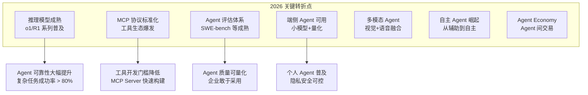

**各趋势的产业影响：**

| 趋势 | 技术成熟度 | 产业影响 | 典型信号 |
|------|----------|---------|---------|
| **推理模型成熟** | ⭐⭐⭐⭐⭐ | Agent 可靠性质变，复杂任务成功率从 50%→80%+ | o3、DeepSeek-R2、Claude 推理升级 |
| **MCP 标准化** | ⭐⭐⭐⭐ | 工具生态爆发，MCP Server 从千→百万级 | MCP Registry、Gateway 上线 |
| **Agent 评估体系** | ⭐⭐⭐ | 企业可量化 Agent ROI，敢用于生产 | SWE-bench/GAIA 成为行业标准 |
| **端侧 Agent** | ⭐⭐⭐⭐ | 个人 Agent 在手机/PC 上运行 | Apple Intelligence、高通 AI Hub |
| **多模态 Agent** | ⭐⭐⭐⭐ | Agent 从"读文本"到"看屏幕/听语音" | GPT-5、Gemini 2.0 |
| **自主 Agent** | ⭐⭐ | 从"问答助手"到"自动完成任务" | Devin 类工具进入企业 |
| **Agent Economy** | ⭐ | Agent 间服务和价值交换 | MCP Registry、Agent 交易平台 |

**范式转变的核心认知：**

```
2024 年：Agent = LLM + Function Calling + ReAct
2025 年：Agent = LLM + MCP + Multi-Agent
2026 年：Agent = Reasoning Model + MCP/A2A + Evaluator + Trust Layer
```

**Agent 开发者的应对策略：**
1. **紧跟推理模型**：尝试 o1/R1 等推理模型替代传统 GPT-4 作为 Agent 大脑
2. **拥抱 MCP 生态**：将工具封装为 MCP Server，无需依赖特定框架
3. **建立评估体系**：尽早建立 Agent 评估 Pipeline，量化 Agent 质量
4. **关注端侧部署**：关注小模型和端侧推理技术的发展
5. **设计信任层**：在 Agent 中内置透明化和人工干预机制
6. **投资可观测性**：没有观测就没有改进，Tracing 是 Agent 工程的基石

---

### 🆕 2025-2026 协议三角：MCP × A2A × UI Stream

> 本节是 Review 后补充的核心概念。**三者共同构成"Agent ↔ Tool ↔ UI"的现代协议栈**，缺一不可。

```mermaid
graph TB
    UI["🖥️ 前端 UI<br/>(Vercel AI SDK 6 / CopilotKit)"]
    AGENT["🤖 Agent 运行时<br/>(LangGraph / createAgent)"]
    
    UI <-->|"UIMessageStream<br/>(SSE/JSON)"| AGENT
    
    AGENT <-->|"MCP<br/>(Streamable HTTP + OAuth 2.1)"| TOOL["🛠️ Tools / Resources<br/>(MCP Servers)"]
    
    AGENT <-->|"A2A v0.3<br/>(JSON-RPC + Agent Card)"| OTHER_AGENT["🤖 Other Agents<br/>(A2A Servers)"]
    
    classDef ui fill:#e3f2fd,stroke:#1565c0;
    classDef agent fill:#fff3e0,stroke:#e65100;
    classDef tool fill:#e8f5e9,stroke:#2e7d32;
    classDef a2a fill:#f3e5f5,stroke:#7b1fa2;
    class UI ui
    class AGENT agent
    class TOOL tool
    class OTHER_AGENT a2a
```

#### 三个协议的核心定位

| 协议 | 解决什么问题 | 方向 | 当前版本 | 关键能力 |
|---|---|---|:---:|---|
| **UIMessageStream** | Agent ↔ UI 通信 | 双向 | Vercel AI SDK 6+ | 统一前端流式协议 |
| **MCP** | Agent ↔ Tool 标准化 | 双向 | 2025-06 spec | Streamable HTTP + OAuth 2.1 |
| **A2A** | Agent ↔ Agent 协作 | 双向 | v0.3 | Agent Card 发现 + 任务生命周期 |

#### 协同工作流程示例

```
1. 用户在 UI 提问（UIMessageStream 上行）
   ↓
2. Agent 决策：需要调用外部工具
   ↓
3. 通过 MCP 调取数据库 / API（MCP over Streamable HTTP）
   ↓
4. 决定需要其他 Agent 协作 → 通过 A2A 委派任务
   ↓
5. 多 Agent 协同完成 → 结果汇总
   ↓
6. 流式返回 UI（UIMessageStream 下行）
```

#### 选型速查

| 场景 | 推荐组合 |
|---|---|
| **简单 Chat 应用** | Vercel AI SDK 6 + UIMessageStream |
| **工具调用型 Agent** | LangGraph + MCP（Streamable HTTP） |
| **多 Agent 协作** | LangGraph + MCP + A2A |
| **生产级可观测** | 上述 + Langfuse / Phoenix 追踪 |

> 📌 **核心洞察**：2026 年的前端工程师，必须把这三个协议视为"AI 时代的 HTTP / TCP/IP"——是构成整个 AI 应用网络的底层基础设施。
