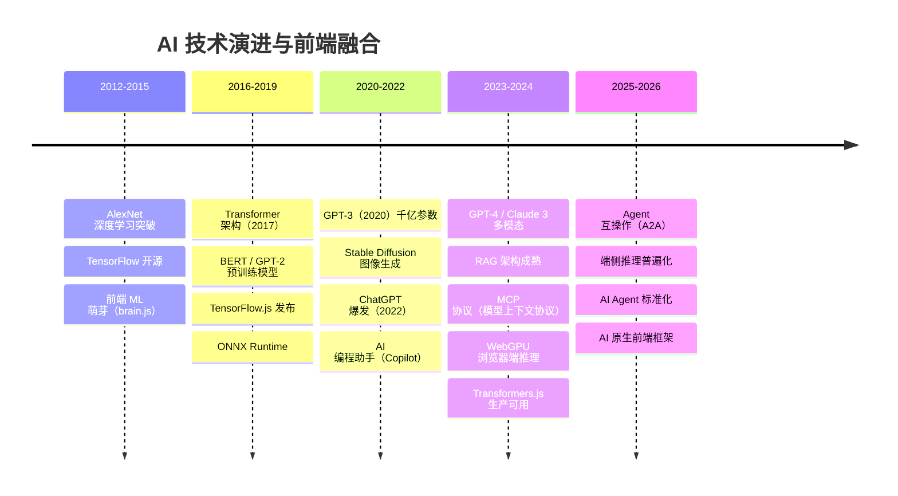
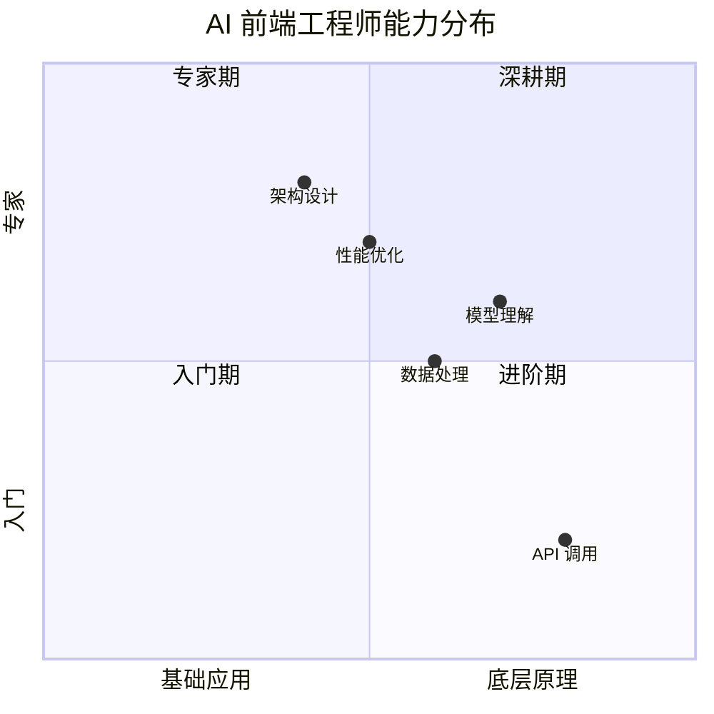
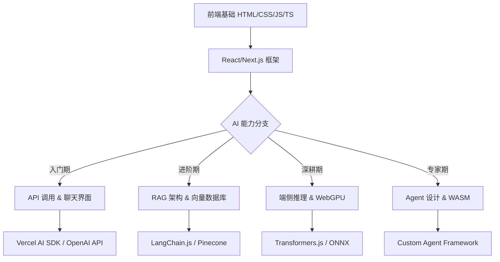
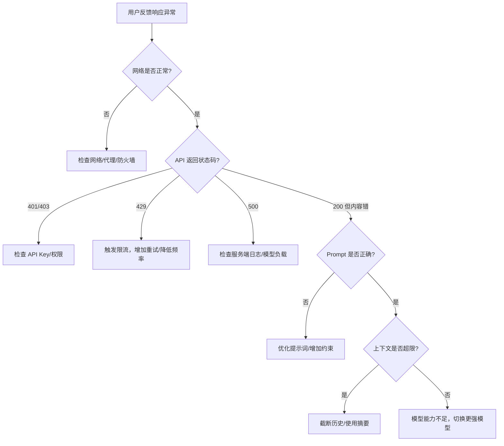
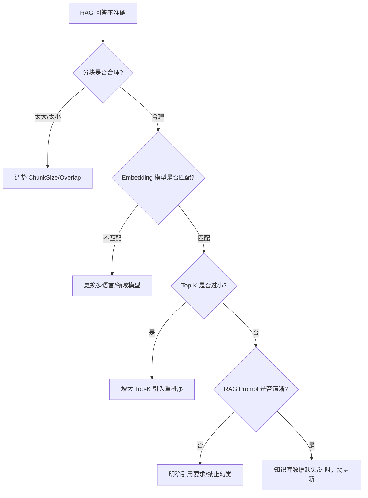
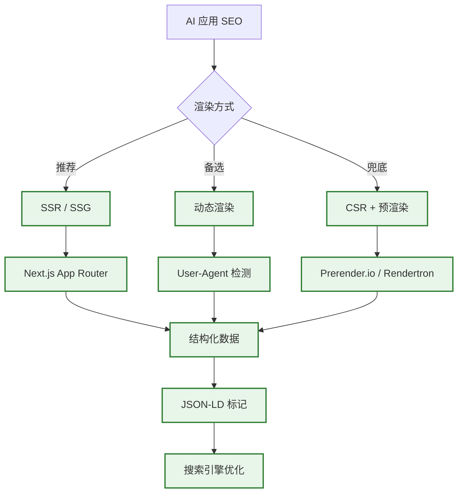
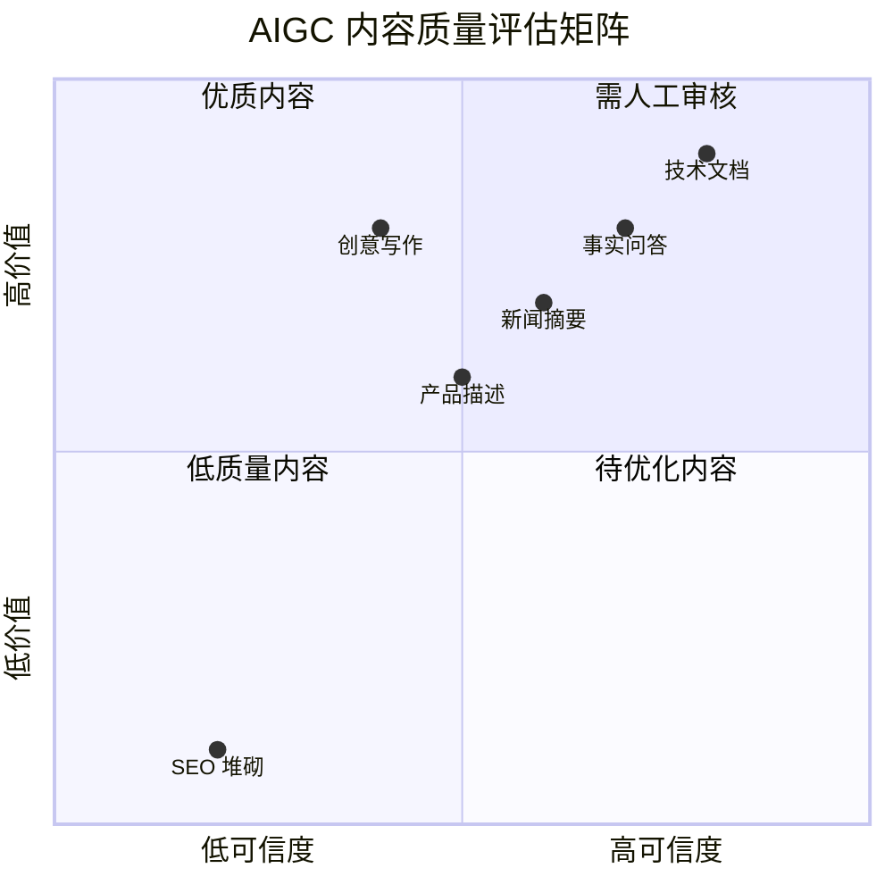
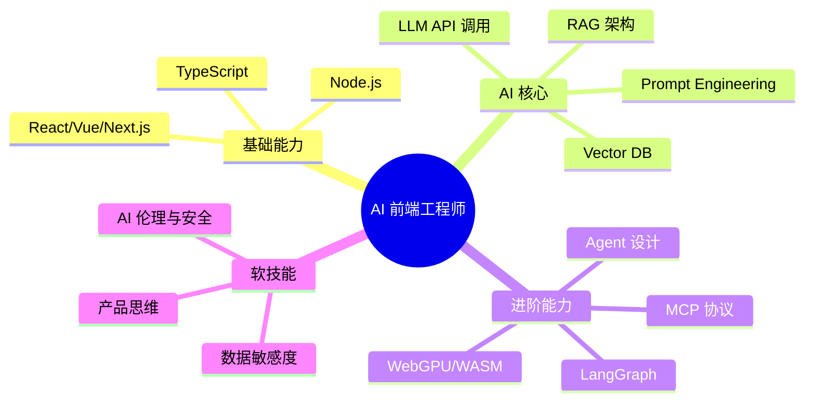

# 🚀 AI 前端开发体系化学习指南

> 从零基础到专家，打造前端工程师的 AI 能力进阶路线图。包含学习指南总览、术语表、避坑指南、学习路线、FAQ、面试冲刺、职业规划等全部附录内容。

---

## 📑 目录

- [🚀 AI 前端开发体系化学习指南](#-ai-前端开发体系化学习指南)
- [📖 AI 前端开发术语表](#-ai-前端开发术语表-glossary)
- [⚠️ 常见反模式与避坑指南](#️-常见反模式与避坑指南-anti-patterns)
- [📅 30 天学习路线规划](#-30-天学习路线规划)
- [📚 经典论文与深度阅读推荐](#-经典论文与深度阅读推荐)
- [🔧 常见问题排查流程图](#-常见问题排查流程图-troubleshooting)
- [📦 AI 开发常用工具链速查表](#-ai-开发常用工具链速查表)
- [📦 常用高质量数据集推荐](#-常用高质量数据集推荐)
- [🤝 开源贡献指南](#-开源贡献指南-how-to-contribute)
- [📦 常用 AI 伦理与偏见缓解指南](#-常用-ai-伦理与偏见缓解指南-ai-ethics--bias)
- [📦 常用 AI 前端错误边界与容灾方案](#-常用-ai-前端错误边界与容灾方案-error-boundaries--dr)
- [📦 常用 AI 前端构建与打包优化方案](#-常用-ai-前端构建与打包优化方案-build--bundle-optimization)
- [📦 常用 AI 前端 SEO 优化方案](#-常用-ai-前端-seo-优化方案-ai-frontend-seo)
- [🎯 AIGC 内容质量优化指南](#-aigc-内容质量优化指南)
- [📝 终极 FAQ](#-终极-faq-frequently-asked-questions)
- [🎓 面试冲刺指南](#-面试冲刺指南)
- [📎 附录：常见问题与解决方案](#-附录常见问题与解决方案)
- [📚 学习资源推荐](#-学习资源推荐)
- [📈 职业发展与规划](#-职业发展与规划)
- [📝 版本记录](#-版本记录)

---

## 🚀 AI 前端开发体系化学习指南

> 从零基础到专家，打造前端工程师的 AI 能力进阶路线图

### 📈 AI 技术发展时间线（2012—2026）



### 前端 AI 融合的阶段

| 阶段 | 时间 | 技术方案 | 前端角色 |
|------|------|---------|---------|
| **起步期** | 2018-2021 | TensorFlow.js、ONNX Runtime | 客户端推理探索 |
| **API 集成期** | 2022-2023 | OpenAI API、Server-side LLM | API 调用 + 流式渲染 |
| **RAG 成熟期** | 2023-2024 | 向量库 + 检索 + LLM | 知识库前端集成 |
| **端侧推理期** | 2024-2025 | WebGPU、WebNN、Transformers.js | 浏览器原生 AI |
| **Agent 期** | 2025-2026 | MCP/A2A、Multi-Agent | 前端 Agent 交互层 |

### 模型能力演进对比

| 模型 | 年份 | 参数量 | 核心能力 | 前端集成方式 |
|------|------|--------|---------|------------|
| GPT-3 | 2020 | 175B | 文本生成 | API 调用 |
| GPT-3.5 | 2022 | 175B | 对话优化 | ChatGPT API |
| GPT-4 | 2023 | ~1.8T | 多模态、推理 | API + Vision |
| Claude 3 | 2024 | 未知 | 长上下文、安全 | API + SDK |
| Gemini | 2024 | 未知 | 多模态原生 | API + Web SDK |
| 开源模型 (Llama 3) | 2024 | 8B-405B | 可本地部署 | Ollama + WebGPU |
| 端侧模型 | 2025+ | 1B-7B | 浏览器内推理 | Transformers.js |

### 🗺️ 学习路线图总览

**能力矩阵演进：**


**技术栈演进路径：**


---

## 📖 AI 前端开发术语表 (Glossary)

> 📚 **快速查阅**：掌握行业黑话，面试沟通更顺畅。

| 术语 | 全称 | 解释 |
|:---|:---|:---|
| **LLM** | Large Language Model | 大语言模型，如 GPT-4, Claude, Qwen |
| **Token** | - | 模型处理文本的最小单位，1 Token ≈ 0.75 英文单词 / 0.5 中文字符 |
| **Context Window** | - | 模型单次能处理的最大 Token 数 (输入 + 输出) |
| **Embedding** | - | 将文本映射为高维向量，用于语义相似度计算 |
| **RAG** | Retrieval-Augmented Generation | 检索增强生成，结合外部知识库回答 |
| **Fine-tuning** | - | 在预训练模型基础上，用特定数据继续训练以适配垂直领域 |
| **Prompt** | - | 发送给模型的指令文本，包含任务描述、上下文和约束 |
| **Temperature** | - | 控制输出随机性的参数，值越高越具创造性 |
| **Hallucination** | - | 幻觉，模型生成看似合理但实际错误或虚构的内容 |
| **Agent** | - | 能自主规划、调用工具并执行任务的智能体 |
| **CoT** | Chain of Thought | 思维链，引导模型逐步推理以提高准确率 |
| **TTFT** | Time To First Token | 首字延迟，用户发送请求到看到第一个字的时间 |
| **Transformer** | - | 基于自注意力机制的神经网络架构，所有 LLM 的基础 |
| **Self-Attention** | - | 让每个词与序列中所有其他词交互，捕捉长距离依赖关系 |
| **MHA** | Multi-Head Attention | 多头注意力，多个注意力头并行捕捉不同维度的关系 |
| **GQA** | Grouped Query Attention | Q 分多组共享 K/V，显存节省 ~50%，质量几乎无损 |
| **MQA** | Multi-Query Attention | 所有 Q 头共享同一组 K/V，显存节省 ~80% |
| **Flash Attention** | - | 分块计算避免生成大注意力矩阵，内存从 O(n²) 降到 O(√n) |
| **RoPE** | Rotary Position Embedding | 旋转位置编码，通过旋转向量角度编码相对位置，支持外推 |
| **KV Cache** | Key-Value Cache | 缓存已生成的 K/V 矩阵，避免重复计算，推理加速 80%+ |
| **MoE** | Mixture of Experts | 混合专家，总参数量大但每次只激活部分专家，兼顾容量和效率 |
| **LoRA** | Low-Rank Adaptation | 低秩适配，用两个小矩阵模拟权重更新，微调参数量仅为 0.1-1% |
| **QLoRA** | Quantized LoRA | LoRA + 4-bit 量化，单卡即可微调 70B 模型 |
| **SFT** | Supervised Fine-Tuning | 监督微调，用标注的对话数据训练模型学会聊天格式 |
| **RLHF** | RL from Human Feedback | 人类反馈强化学习，用奖励信号训练模型学会人类偏好 |
| **DPO** | Direct Preference Optimization | 直接偏好优化，无需显式奖励模型，比 PPO 更简单稳定 |
| **GRPO** | Group Relative Policy Optimization | 分组相对策略优化，DeepSeek-R1 使用，无 Critic 模型 |
| **PPO** | Proximal Policy Optimization | 近端策略优化，RLHF 中最主流的强化学习算法 |
| **Reward Hacking** | - | 模型利用奖励模型的漏洞获得高分而非提升真实质量 |
| **Scaling Law** | - | 模型性能随参数量/数据量/计算量增长可预测提升 |
| **涌现能力** | Emergent Abilities | 模型超过临界点后突然出现的能力（推理、代码等） |
| **Chinchilla Law** | - | 最优分配：参数量:训练token数 ≈ 1:20 |
| **CoT** | Chain of Thought | 思维链，引导模型逐步推理以提高准确率 |
| **VLM** | Vision-Language Model | 多模态大模型，能同时理解图像和文本 |
| **CLIP** | Contrastive Language-Image Pre-training | 对比学习对齐图文表征，VLM 的视觉编码器基础 |
| **LLaVA** | Large Language and Vision Assistant | 最主流的 VLM 架构，用简单 MLP 连接视觉和语言模型 |
| **Grounding** | - | 将文本描述对应到图像中的具体区域，即视觉定位 |
| **Quantization** | - | 将模型权重从 FP16 转为 INT8/INT4，降低显存和加速推理 |
| **AWQ** | Activation-aware Weight Quantization | 保留重要权重精度的量化方法，优于 GPTQ |
| **GGUF** | GPT-Generated Unified Format | Llama.cpp 的模型格式，CPU 推理优化 |
| **PRM** | Process Reward Model | 过程奖励模型，给每一步推理单独打分而非整句一个分 |
| **RLAIF** | RL from AI Feedback | 用 AI 替代人类标注偏好数据，大幅降低成本 |
| **VLLM** | - | 高吞吐推理引擎，基于 PagedAttention |
| **SGLang** | - | 结构化生成引擎，基于 RadixAttention 的高效前缀缓存 |
| **MCP** | Model Context Protocol | 模型上下文协议，标准化 LLM 工具/资源接入的开放协议 |
| **A2A** | Agent-to-Agent | 智能体间通信协议，支持多 Agent 跨平台协作 |
| **GraphRAG** | Graph RAG | 基于知识图谱的检索增强生成，擅长多跳关系推理 |
| **MCTS** | Monte Carlo Tree Search | 蒙特卡洛树搜索，OpenAI o1 的推理核心搜索算法 |
| **MMLU** | Massive Multitask Language Understanding | 57 学科多任务评测基准，衡量模型知识广度 |
| **HumanEval** | - | 代码生成评测基准，测试模型的手写函数正确率 |
| **Agent Memory** | - | 智能体记忆系统，分短期 (上下文) + 长期 (向量库) + 工作记忆 |
| **MCP Server** | - | MCP 协议的服务器实现，封装工具/资源暴露给 LLM |

---

## ⚠️ 常见反模式与避坑指南 (Anti-patterns)

> 🚫 **前车之鉴**：避免在实际项目中踩中这些常见陷阱。

### 1. 架构设计反模式
- **❌ 把所有逻辑塞进前端**: 暴露 API Key、无法控制速率、难以调试。
  - **✅ 正解**: 使用 [Next.js](https://nextjs.org) API Routes 或独立后端代理请求。
- **❌ 盲目追求 Agent**: 对于固定流程任务，使用 Agent 会增加延迟和不可控性。
  - **✅ 正解**: 优先使用 Chain 或 Router，仅在必要时引入 Agent。
- **❌ 忽视上下文限制**: 直接将所有历史消息发给模型，导致 Token 超限或费用飙升。
  - **✅ 正解**: 实施滑动窗口、摘要压缩或向量检索历史。

### 2. 提示词工程反模式
- **❌ 模糊的指令**: "请帮我写代码" → 模型不知道写什么语言、什么功能。
  - **✅ 正解**: "请用 [TypeScript](https://www.typescriptlang.org) 编写一个函数，实现数组去重并保持顺序。"
- **❌ 缺乏约束**: 未指定输出格式，导致解析困难。
  - **✅ 正解**: "请以 JSON 格式输出，包含 `status` 和 `message` 字段。"
- **❌ 过度依赖 Few-Shot**: 提供过多示例会消耗大量 Token 且可能干扰模型。
  - **✅ 正解**: 仅保留 1-3 个最具代表性的高质量示例。

### 3. 性能与体验反模式
- **❌ 阻塞式 UI**: 等待 API 返回期间禁用整个页面，用户体验极差。
  - **✅ 正解**: 使用流式响应 (Streaming) 和骨架屏 (Skeleton) 保持界面响应。
- **❌ 无错误重试**: 网络波动导致请求失败，直接报错。
  - **✅ 正解**: 实施指数退避重试 (Exponential Backoff) 和优雅降级。
- **❌ 忽视移动端适配**: AI 聊天界面在手机上显示错乱。
  - **✅ 正解**: 采用响应式设计，确保输入框和消息气泡在小屏幕上可用。

---

## 🧭 跨文件知识地图

各文件之间的学习依赖与知识关联：

```mermaid
graph TD
    subgraph "基础"
        A["【01】入门期<br/>LLM 概念 + Chat UI"]
        B["【12】大模型基础篇<br/>Transformer / 训练三阶段"]
    end
    subgraph "进阶"
        C["【02】进阶期<br/>RAG + LangChain"]
        D["【11】工具协议篇<br/>MCP / Function Calling"]
    end
    subgraph "深入"
        E["【03】深耕期<br/>WebGPU + WASM + KV Cache"]
        F["【07】选型对比<br/>模型 / 框架 / 量化"]
    end
    subgraph "专家"
        G["【04】专家期<br/>Agent + 记忆系统"]
        H["【10】基础篇<br/>Agent 面试题库"]
    end
    subgraph "生产"
        I["【05】生产化<br/>监控 / 灰度 / A/B"]
        J["【08】实战指南<br/>架构模式 + 测试"]
    end
    subgraph "前沿"
        K["【06】前沿<br/>MCP / A2A / VLM"]
        L["【15】前沿趋势篇<br/>面试题库"]
    end
    subgraph "附录"
        M["【本文件】<br/>术语 / FAQ / 职业规划"]
        N["【13~14】<br/>框架 / 实战题库"]
    end
    
    A --> C --> E
    B --> F --> G
    C --> I
    G --> J
    K --> L
    D --> G
    E --> K
    A -.->|配合阅读| B
    G -.->|配合阅读| H
    K -.->|配合阅读| L
```



---

## 📅 30 天学习路线规划

> 🗓️ **目标**：每天投入 2 小时，30 天后具备独立开发 AI 应用的能力。

| 阶段 | 天数 | 学习主题 | 实践任务 | 配合文件 |
|:---:|:---:|:---|:---|:---:|
| **入门期** | Day 1-3 | LLM 基础、OpenAI API、流式响应 | 实现基础聊天室，支持 Markdown | 01, 12 |
| | Day 4-5 | 上下文管理、Token 估算、错误处理 | 添加历史截断与重试机制 |
| **进阶期** | Day 6-8 | Embedding 原理、向量数据库 (Pinecone) | 搭建个人知识库，支持 PDF 上传 |
| | Day 9-11 | RAG 架构、LangChain.js、检索优化 | 实现 RAG 问答，添加引用来源 |
| **深耕期** | Day 12-14 | Transformers.js、WebGPU、端侧推理 | 在浏览器运行 Qwen2.5-0.5B 模型 |
| | Day 15-16 | 模型量化、缓存策略、离线可用 | 实现模型 IndexedDB 缓存 |
| **专家期** | Day 17-20 | Agent 架构、工具调用、React 模式 | 构建能搜索和计算的 Agent |
| | Day 21-23 | LangGraph、状态机、工作流编排 | 实现多步任务规划与执行 |
| **生产化** | Day 24-26 | 安全防护、Prompt 注入、数据脱敏 | 添加输入清洗与安全层 |
| | Day 27-28 | 性能优化、监控、评估流水线 | 集成 Ragas 评估与 CI/CD |
| **冲刺期** | Day 29-30 | 项目整合、简历优化、模拟面试 | 完成作品集，准备面试话术 |

---

## 📚 经典论文与深度阅读推荐

> 📖 **知其然，更知其所以然**：深入理解 AI 技术背后的学术原理。

### 1. 必读经典论文
- **[Attention Is All You Need (2017)](https://arxiv.org/abs/1706.03762)**: Transformer 架构的奠基之作，理解 Self-Attention 机制。
- **[BERT: Pre-training of Deep Bidirectional Transformers (2018)](https://arxiv.org/abs/1810.04805)**: 双向编码器预训练，Embedding 技术的源头。
- **[Retrieval-Augmented Generation for Knowledge-Intensive NLP Tasks (2020)](https://arxiv.org/abs/2005.11401)**: RAG 概念的原始论文，理解为何需要检索增强。
- **[ReAct: Synergizing Reasoning and Acting in Language Models (2022)](https://arxiv.org/abs/2210.03629)**: Agent ReAct 模式的理论基础。

### 2. 深度技术博客
- **[The Illustrated Transformer](http://jalammar.github.io/illustrated-transformer/)**: 图文并茂的 Transformer 解析，前端工程师友好。
- **[How GPT-3 Works - Visualizations and Animations](http://jalammar.github.io/how-gpt3-works-visualizations-animations/)**: 直观理解 GPT 生成过程。
- **[Lilian Weng's Blog](https://lilianweng.github.io/)**: OpenAI 研究员博客，涵盖 Agent、RAG、RLHF 等前沿主题。

### 3. 推荐书籍
- **《动手学深度学习》 (Dive into Deep Learning)**: 理论与实践结合，适合打基础。
- **《Build a Large Language Model (From Scratch)》**: 从零实现 LLM，深入理解内部机制。
- **《Designing Machine Learning Systems》**: 机器学习系统工程指南，涵盖数据、部署、监控。

---

## 🔧 常见问题排查流程图 (Troubleshooting)

> 🚑 **快速定位**：遇到 AI 应用异常时，按图索骥找到根因。

### 1. 响应异常排查



### 2. RAG 检索质量排查



---

## 📦 AI 开发常用工具链速查表

> 🧰 **工欲善其事，必先利其器**：精选高效开发工具。

| 类别 | 推荐工具 | 核心用途 | 替代方案 |
|:---|:---|:---|:---|
| **API 调试** | **Postman / Insomnia** | 测试 API 接口、管理环境变量 | cURL, HTTPie |
| **Prompt 管理** | **PromptLayer / LangSmith** | 版本控制、A/B 测试、追踪效果 | 本地 JSON, GitHub |
| **向量数据库** | **Pinecone / Qdrant** | 云端托管，开箱即用，支持混合检索 | Milvus, Chroma, Weaviate |
| **本地模型** | **Ollama / LM Studio** | 一键下载、运行本地 LLM，提供 API | Llama.cpp, MLX |
| **前端框架** | **Next.js / Vite** | SSR/SSG、路由、构建优化 | Remix, Nuxt |
| **UI 组件** | **Shadcn/UI + Tailwind** | 高度可定制，AI 友好型组件库 | Radix, MUI, AntD |
| **部署平台** | **Vercel / Railway** | 零配置部署，支持 Edge Runtime | AWS, Docker, K8s |
| **监控告警** | **Sentry / Datadog** | 错误追踪、性能监控、日志分析 | LogRocket, New Relic |

---

## 📦 常用高质量数据集推荐

> 📊 **数据是 AI 的燃料**：优质数据集用于 RAG 索引、微调或评估测试。

### 1. 通用与指令微调
| 数据集 | 规模 | 用途 | 下载源 |
|:---|:---:|:---|:---|
| **Alpaca** | 52K | 指令跟随微调，适合入门 | Stanford |
| **Dolly** | 15K | 高质量人工生成指令 | Databricks |
| **OpenOrca** | 4M+ | 大规模思维链 (CoT) 数据 | Hugging Face |

### 2. 中文语境优化
| 数据集 | 规模 | 用途 | 下载源 |
|:---|:---:|:---|:---|
| **Belle** | 2M+ | 中文对话、指令微调 | BELLE-Group |
| **Firefly** | 10M+ | 多轮对话、价值观对齐 | YeungNLP |
| **COIG** | 200K+ | 中文指令、考试、翻译数据 | FlagOpen |

### 3. RAG 评估与测试
| 数据集 | 说明 | 适用场景 |
|:---|:---|:---|
| **HotpotQA** | 多跳问答，需综合多个文档 | 测试复杂检索与推理能力 |
| **Natural Questions** | Google 真实搜索 queries + 答案 | 评估开放域问答准确率 |
| **CMU Exam** | 计算机科学考试题库 | 测试专业知识掌握程度 |

---

## 🤝 开源贡献指南 (How to Contribute)

> 🌟 **回馈社区**：参与开源项目是提升技术影响力、结交同行的最佳途径。

### 1. 适合前端开发的 AI 开源项目
- **[Vercel AI SDK](https://github.com/vercel/ai)**: 贡献 UI 组件、修复流式 Bug、完善文档。
- **[LangChain.js](https://github.com/langchain-ai/langchainjs)**: 添加新的 Tool 集成、优化向量存储适配器。
- **[Transformers.js](https://github.com/huggingface/transformers.js)**: 报告 [WebGPU](https://www.w3.org/TR/webgpu/) 兼容性问题、提交量化模型适配。
- **[CopilotKit](https://github.com/CopilotKit/CopilotKit)**: 改进 [React](https://react.dev) 状态同步逻辑、丰富示例应用。

### 2. 贡献流程
1. **Fork & Clone**: 将仓库克隆到本地，安装依赖。
2. **Find an Issue**: 寻找标记为 `good first issue` 或 `help wanted` 的任务。
3. **Branch & Code**: 创建功能分支，遵循项目代码规范 (Lint/Format)。
4. **Test & Commit**: 编写单元测试，确保 CI 通过，使用 Conventional Commits 规范。
5. **Pull Request**: 提交 PR，清晰描述修改内容与测试步骤，等待 Maintainer 审查。

### 3. 非代码贡献
- **📖 文档翻译**: 将英文文档翻译为中文，降低使用门槛。
- **🎥 教程视频**: 制作实战教程发布到 Bilibili/YouTube，附带项目源码。
- **🐛 Bug 报告**: 提交详细的复现步骤、环境信息与日志，帮助开发者快速定位。

---

## 📦 常用 AI 伦理与偏见缓解指南 (AI Ethics & Bias)

> ⚖️ **负责任 AI**：确保 AI 应用公平、透明、可解释，避免歧视与伤害。

### 1. 常见伦理风险

| 风险类型 | 说明 | 潜在后果 | 缓解策略 |
|:---|:---|:---|:---|
| **算法偏见** | 模型对特定群体表现不佳 | 歧视性决策、法律风险 | 多样化训练数据、公平性评估 |
| **幻觉误导** | 生成看似合理但错误的信息 | 用户信任丧失、决策失误 | 引用来源、置信度提示、人工审核 |
| **隐私侵犯** | 意外泄露用户敏感数据 | 合规处罚、声誉受损 | 数据脱敏、最小化收集、加密存储 |
| **滥用风险** | 被用于生成有害/非法内容 | 社会危害、平台封禁 | 内容过滤、使用条款、实时监控 |

### 2. 偏见检测工具

| 工具 | 核心功能 | 适用场景 |
|:---|:---|:---|
| **AI Fairness 360** | 多维度公平性指标、去偏算法 | 金融/招聘/医疗决策 |
| **Perspective API** | 毒性/攻击性内容检测 | 评论审核、社区管理 |
| **Hugging Face Evaluate** | 内置偏见评估模块 | 模型微调后验证 |
| **IBM OpenScale** | 企业级监控、可解释性报告 | 生产环境持续监控 |

### 3. 最佳实践
- **📊 数据审计**: 定期检查训练数据分布，确保代表性均衡。
- **🔍 透明披露**: 明确告知用户正在与 AI 交互，非人类客服。
- **🛑 人工介入**: 高风险决策 (医疗/法律/金融) 必须引入人工审核。
- **📝 反馈机制**: 提供用户举报渠道，快速响应伦理问题。

---

## 📦 常用 AI 前端错误边界与容灾方案 (Error Boundaries & DR)

> 🛡️ **稳健运行**：确保 AI 应用在面对异常时能够优雅降级，不影响核心功能。

### 1. 错误边界实现

```tsx
import { Component, ErrorInfo, ReactNode } from 'react';

interface Props { children: ReactNode; fallback: ReactNode; }
interface State { hasError: boolean; error: Error | null; }

class AIErrorBoundary extends Component<Props, State> {
  state = { hasError: false, error: null };

  static getDerivedStateFromError(error: Error): State {
    return { hasError: true, error };
  }

  componentDidCatch(error: Error, info: ErrorInfo) {
    console.error('AI Component Error:', error, info);
    // 上报至 Sentry/监控平台
  }

  render() {
    if (this.state.hasError) {
      return this.props.fallback || <div>AI 组件加载失败，请刷新重试</div>;
    }
    return this.props.children;
  }
}

// 使用
<AIErrorBoundary fallback={<StaticFAQ />}>
  <AIChatComponent />
</AIErrorBoundary>
```

### 2. 容灾策略矩阵

| 故障场景 | 应对策略 | 用户体验 |
|:---|:---|:---|
| **LLM API 宕机** | 切换备用模型 / 静态 FAQ | 提示服务降级，提供基础答案 |
| **向量库不可用** | 本地缓存索引 / 关键词检索 | 检索精度下降，但功能可用 |
| **网络中断** | 离线模式 / 本地草稿保存 | 提示网络异常，恢复后自动同步 |
| **流式中断** | 重试机制 / 完整响应回退 | 显示加载失败，提供重试按钮 |

### 3. 最佳实践
- **🔄 自动重试**: 对临时性错误 (5xx/Timeout) 实施指数退避重试。
- **💾 本地缓存**: 使用 IndexedDB 保存对话历史，防止数据丢失。
- **📢 透明提示**: 明确告知用户当前处于降级模式，而非静默失败。

---

## 📦 常用 AI 前端构建与打包优化方案 (Build & Bundle Optimization)

> 📦 **轻量加载**：减少首屏体积，提升 AI 应用加载速度与运行效率。

### 1. 主流优化策略

| 策略 | 工具/技术 | 效果 | 适用场景 |
|:---|:---|:---:|:---|
| **代码分割** | `React.lazy`, `next/dynamic` | 减少初始包体积 30-50% | 大型组件、非首屏功能 |
| **Tree Shaking** | Webpack/Vite 内置 | 移除未使用代码 20-40% | 所有项目 |
| **图片优化** | `next/image`, WebP/AVIF | 体积减少 50-80% | 头像、背景、生成图片 |
| **字体优化** | `next/font`, 子集化 | 减少 FCP 延迟 | 自定义字体、多语言 |
| **依赖分析** | `webpack-bundle-analyzer` | 识别大依赖、优化引入 | 包体积超标时 |

### 2. [Vite](https://vitejs.dev) 配置示例

```typescript
// vite.config.ts
import { defineConfig } from 'vite';
import react from '@vitejs/plugin-react';

export default defineConfig({
  plugins: [react()],
  build: {
    rollupOptions: {
      output: {
        manualChunks: {
          'ai-sdk': ['ai', '@ai-sdk/openai'],
          'markdown': ['react-markdown', 'remark-gfm'],
          'ui': ['@radix-ui/react-dialog', 'class-variance-authority'],
        },
      },
    },
  },
});
```

### 3. 最佳实践
- **📉 按需加载**: 使用动态导入 (`import()`) 加载重型库 (如 [Transformers.js](https://huggingface.co/docs/transformers.js))。
- **🗜️ 压缩传输**: 启用 Gzip/Brotli 压缩，减少网络传输体积。
- **🔄 CDN 加速**: 将静态资源托管至全球 CDN，降低延迟。

---

## 📦 常用 AI 前端 SEO 优化方案 (AI Frontend SEO)

> 🔍 **可见性优化**：让 AI 驱动的前端应用被搜索引擎有效抓取、索引与排名。

### 1. AI 应用的 SEO 挑战

| 挑战 | 原因 | 影响 |
|:---|:---|:---|
| **客户端渲染 (CSR)** | 内容通过 JS 动态生成 | 爬虫无法获取完整内容 |
| **动态 AI 内容** | 每次回答不同，无固定 URL | 难以建立稳定的索引 |
| **流式响应** | 内容逐步加载 | 爬虫可能只捕获初始状态 |
| **实时交互** | 依赖用户输入才生成内容 | 无预渲染内容可抓取 |

### 2. 核心优化策略



#### 2.1 服务端渲染 (SSR) - 首选方案

```typescript
// app/blog/[slug]/page.tsx (Next.js App Router)
import { Metadata } from 'next';

// ✅ 静态生成 + 增量静态再生成 (ISR)
export async function generateStaticParams() {
  return [
    { slug: 'ai-chat-best-practices' },
    { slug: 'rag-architecture-guide' },
  ];
}

export async function generateMetadata({ params }): Promise<Metadata> {
  const post = await getPost(params.slug);
  return {
    title: `${post.title} | AI 技术博客`,
    description: post.excerpt,
    openGraph: {
      title: post.title,
      description: post.excerpt,
      images: [post.coverImage],
    },
  };
}

export default async function PostPage({ params }) {
  const post = await getPost(params.slug);
  return (
    <article>
      <h1>{post.title}</h1>
      <div>{post.content}</div>
      {/* AI 生成的相关内容推荐 */}
      <RelatedPosts postId={post.id} />
    </article>
  );
}
```

#### 2.2 结构化数据 (JSON-LD)

```typescript
// components/ArticleJsonLd.tsx
export default function ArticleJsonLd({ title, date, author, description }) {
  const jsonLd = {
    '@context': 'https://schema.org',
    '@type': 'Article',
    headline: title,
    description,
    datePublished: date,
    author: { '@type': 'Person', name: author },
    publisher: {
      '@type': 'Organization',
      name: 'AI Tech Blog',
      logo: { '@type': 'ImageObject', url: '/logo.png' },
    },
  };

  return (
    <script
      type="application/ld+json"
      dangerouslySetInnerHTML={{ __html: JSON.stringify(jsonLd) }}
    />
  );
}
```

#### 2.3 AI 生成内容的 SEO 处理

```typescript
// lib/seo/ai-content-handler.ts
export class AIContentSEO {
  // 📝 为 AI 生成内容添加唯一标识
  static addContentSignature(content: string): string {
    return `${content}\n\n---\n*本文内容由 AI 辅助生成，经人工审核校对。*`;
  }

  // 🔗 生成语义化 URL 结构
  static generateSlug(title: string): string {
    return title
      .toLowerCase()
      .replace(/[^\w\s-]/g, '')
      .replace(/\s+/g, '-')
      .substring(0, 60);
  }

  // 📊 生成 SEO 友好的 Meta 标签
  static generateMetaTags(title: string, description: string, keywords: string[]) {
    return {
      title: `${title} - 完整指南`,
      description: description.substring(0, 155), // Google 推荐长度
      keywords: keywords.join(', '),
      robots: 'index, follow',
      canonical: `/blog/${this.generateSlug(title)}`,
    };
  }
}
```

### 3. AI 应用 SEO 检查清单

| 优化项 | 实施方法 | 优先级 |
|:---|:---|:---:|
| **SSR/SSG 渲染** | Next.js App Router, `generateStaticParams` | 🔴 高 |
| **语义化 HTML** | 正确使用 `<h1>`-`<h6>`, `<article>`, `<nav>` | 🔴 高 |
| **Meta 标签** | Title, Description, Open Graph, Twitter Card | 🔴 高 |
| **结构化数据** | JSON-LD 标记 (Article, FAQ, HowTo) | 🟡 中 |
| **Sitemap.xml** | 自动生成并提交至 Search Console | 🟡 中 |
| **robots.txt** | 配置爬虫规则，允许抓取 | 🟡 中 |
| **内部链接** | AI 推荐内容间互相链接 | 🟢 低 |
| **页面速度** | Core Web Vitals 优化 (LCP, FID, CLS) | 🔴 高 |
| **移动端适配** | 响应式设计，移动优先索引 | 🔴 高 |
| **HTTPS** | 全站加密，安全连接 | 🔴 高 |

### 4. [Next.js](https://nextjs.org) SEO 配置示例

```typescript
// app/layout.tsx
import type { Metadata } from 'next';

export const metadata: Metadata = {
  title: {
    default: 'AI 智能助手 - 高效、准确、安全',
    template: '%s | AI 智能助手',
  },
  description: '基于最新 AI 技术的智能助手，提供代码生成、文档分析、知识问答等服务。',
  keywords: ['AI', '人工智能', '智能助手', '代码生成', '知识问答'],
  authors: [{ name: 'AI Team' }],
  creator: 'AI Team',
  publisher: 'AI Tech',
  robots: {
    index: true,
    follow: true,
    googleBot: {
      index: true,
      follow: true,
      'max-video-preview': -1,
      'max-image-preview': 'large',
      'max-snippet': -1,
    },
  },
  openGraph: {
    type: 'website',
    locale: 'zh_CN',
    url: 'https://ai-assistant.com',
    siteName: 'AI 智能助手',
    images: [{ url: '/og-image.png', width: 1200, height: 630 }],
  },
  twitter: {
    card: 'summary_large_image',
    site: '@ai_assistant',
    creator: '@ai_assistant',
  },
  verification: {
    google: 'google-site-verification-code',
  },
};

export default function RootLayout({ children }) {
  return (
    <html lang="zh-CN">
      <body>{children}</body>
    </html>
  );
}
```

### 5. AI 对话页面的 SEO 特殊处理

```typescript
// app/chat/page.tsx
import { Metadata } from 'next';

// 对话页面通常不需要被索引 (动态内容)
export const metadata: Metadata = {
  title: 'AI 对话',
  robots: 'noindex, follow', // 不索引对话页面
};

export default function ChatPage() {
  return (
    <div>
      <h1 className="sr-only">AI 智能对话</h1> {/* 屏幕阅读器可见 */}
      <ChatComponent />
    </div>
  );
}
```

### 6. 常见 AI SEO 工具对比

| 工具 | 功能 | 适用场景 | 价格 |
|:---|:---|:---|:---|
| **Google Search Console** | 索引监控、性能分析 | 所有网站 | 免费 |
| **Ahrefs** | 关键词研究、竞品分析 | 专业 SEO | 付费 |
| **Screaming Frog** | 技术 SEO 审计 | 大型网站 | 免费/付费 |
| **PageSpeed Insights** | 性能与 Core Web Vitals | 性能优化 | 免费 |
| **Schema Markup Validator** | 结构化数据验证 | 标记检查 | 免费 |

### 7. 最佳实践总结

- **🎯 内容优先**：AI 生成内容需经人工审核，确保准确性与价值。
- **📱 移动优先**：Google 使用移动优先索引，确保移动端体验优秀。
- **⚡ 速度至上**：Core Web Vitals 直接影响排名，优化 LCP/CLS/INP。
- **🔗 内部链接**：AI 推荐内容间建立合理的内部链接结构。
- **📊 持续监控**：使用 Search Console 监控索引状态与搜索表现。
- **🚫 避免作弊**：不要使用 AI 生成大量低质量内容堆砌关键词。

---

## 🎯 AIGC 内容质量优化指南

> 📝 **内容为王**：AI 生成内容 (AIGC) 的质量直接影响用户体验与搜索引擎排名。

### 1. AIGC 质量评估维度



| 维度 | 评估标准 | 优化方法 |
|:---|:---|:---|
| **准确性** | 事实正确、无幻觉 | 引用来源、人工校验、事实核查 API |
| **原创性** | 非简单复制、有独特视角 | 调整 Temperature、添加个人观点 |
| **可读性** | 结构清晰、语言流畅 | 分段、小标题、列表、加粗重点 |
| **相关性** | 与用户意图匹配 | 优化 Prompt、上下文增强 |
| **时效性** | 信息是否为最新 | 接入实时数据源、标注更新时间 |

### 2. AIGC 内容优化工作流

```typescript
// lib/aigc/content-optimizer.ts
export class AIGCContentOptimizer {
  // ✅ 内容质量检查
  static async qualityCheck(content: string): Promise<{ score: number; issues: string[] }> {
    const issues: string[] = [];
    let score = 100;

    // 检查段落长度
    const paragraphs = content.split('\n\n');
    const longParas = paragraphs.filter(p => p.length > 300);
    if (longParas.length > 0) {
      issues.push(`${longParas.length} 个段落过长 (>300字符)`);
      score -= longParas.length * 5;
    }

    // 检查重复内容
    const sentences = content.split(/[。！？.!?]/);
    const uniqueSentences = new Set(sentences.map(s => s.trim()));
    if (uniqueSentences.size < sentences.length * 0.8) {
      issues.push('内容重复率过高');
      score -= 15;
    }

    // 检查关键词密度
    const keywordDensity = this.calculateKeywordDensity(content);
    if (keywordDensity > 0.05) {
      issues.push('关键词密度过高，可能被判定为堆砌');
      score -= 10;
    }

    return { score: Math.max(0, score), issues };
  }

  // 📊 计算关键词密度
  private static calculateKeywordDensity(content: string): number {
    const words = content.split(/\s+/);
    const keywordCount = words.filter(w => w.length > 4).length;
    return keywordCount / words.length;
  }

  // 🔧 自动优化内容结构
  static optimizeStructure(content: string): string {
    return content
      .split('\n\n')
      .map(para => {
        if (para.length > 200) {
          // 长段落拆分
          const mid = para.indexOf('，', 100);
          if (mid > 0) return para.slice(0, mid + 1) + '\n\n' + para.slice(mid + 1);
        }
        return para;
      })
      .join('\n\n');
  }
}
```

### 3. AIGC 内容人工审核清单

| 审核项 | 检查要点 | 通过标准 |
|:---|:---|:---|
| **事实核查** | 数据、日期、引用是否准确 | 100% 准确 |
| **语气风格** | 是否符合品牌调性 | 一致性 > 90% |
| **逻辑连贯** | 段落间过渡是否自然 | 无突兀跳转 |
| **合规检查** | 是否包含敏感/违规内容 | 零违规 |
| **价值添加** | 是否有独特见解或额外价值 | 至少 1 处 |

---

## 📝 终极 FAQ (Frequently Asked Questions)

> ❓ **快速答疑**：汇总 AI 前端开发中最常见的问题与解答。

### 🤖 模型与 API
**Q: 如何选择适合的 AI 模型？**
A: 根据任务复杂度选择：简单任务用轻量模型 (GPT-4o-mini)，复杂推理用高级模型 (GPT-4o/Claude 3.5)，中文场景优先 [Qwen](https://qwen.alibaba.com) 或 Baichuan。

**Q: API 费用太高怎么办？**
A: 使用语义缓存、模型路由 (简单任务走便宜模型)、上下文压缩、以及监控告警控制预算。

### 🏗️ 架构与开发
**Q: RAG 回答不准确怎么办？**
A: 优化分块策略 (200-500 字/块)、引入重排序模型、使用混合检索 (向量 + 关键词)、增强 Prompt 约束。

**Q: 流式响应中断如何处理？**
A: 实现指数退避重试、检查服务端超时配置、确保 Nginx/CDN 未缓冲响应。

### 🛡️ 安全与合规
**Q: 如何防止 Prompt 注入攻击？**
A: 使用分隔符隔离用户输入、添加系统级安全指令、输入过滤 (正则/LLM 检测)、输出内容审核。

**Q: 用户数据隐私如何保护？**
A: 本地脱敏 (移除 PII)、使用企业版 API (不训练用户数据)、加密传输与存储、明确隐私政策。

### 🚀 部署与运维
**Q: Serverless 函数超时如何解决？**
A: 使用流式响应降低 TTFT、升级至 Pro 计划 (60s+)、或将长任务移至消息队列异步处理。

**Q: 如何监控 AI 应用质量？**
A: 集成 [LangSmith](https://smith.langchain.com)/Helicone 追踪链路、设置 Ragas 评估指标、配置延迟与错误率告警。

---

## 🎓 面试冲刺指南

### 💡 高频面试题精选

| 类别 | 核心问题 | 答题要点 |
|:---|:---|:---|
| **基础** | LLM 原理与 Token 机制 | Transformer 架构、Next Token Prediction、上下文窗口 |
| **参数** | Temperature vs Top-p | 创造性 vs 确定性、采样范围控制 |
| **RAG** | 为什么需要 RAG？ | 解决知识截止、减少幻觉、私有数据支持、可追溯 |
| **优化** | 如何提高 RAG 准确率？ | 语义分块、混合检索、重排序、查询扩展 |
| **端侧** | WebGPU vs WebGL | 通用计算 (GPGPU) vs 图形渲染、性能差异 |
| **Agent** | React 模式原理 | Thought-Action-Observation 循环、工具调用 |

### 🗣️ 面试话术模板

**Q: 你如何学习 AI 技术？**
> "我采用四阶段学习法：从 API 调用入门掌握基础交互；深入 RAG 架构解决私有数据问题；探索端侧推理实现离线与隐私保护；最后研究 Agent 设计构建自动化工作流。每个阶段都配合实际项目验证。"

**Q: AI 应用的性能优化怎么做？**
> "我从三个层面优化：Token 层面通过上下文压缩减少输入量；网络层面使用 Edge 部署与流式传输降低延迟；端侧层面利用 [WebGPU](https://www.w3.org/TR/webgpu/) 加速与模型量化。同时建立监控体系追踪延迟与成本。"

**Q: 如何保证 AI 应用的安全性？**
> "我实施多层防护：输入层进行 Prompt 注入检测与敏感数据脱敏；处理层添加安全系统提示词；输出层进行内容过滤。遵循最小权限原则，不暴露内部指令。"

---

## 📎 附录：常见问题与解决方案

### A. API 调用问题
| 问题 | 原因 | 解决方案 |
|:---|:---|:---|
| **429 Too Many Requests** | 超出速率限制 | 指数退避重试 |
| **401 Unauthorized** | API Key 无效 | 检查 Key 配置 |
| **Context Length Exceeded** | 输入超限 | 截断上下文或使用更大窗口模型 |

### B. 向量检索问题
| 问题 | 原因 | 解决方案 |
|:---|:---|:---|
| **检索结果不相关** | 分块过大/模型不匹配 | 调整 chunkSize，更换 Embedding 模型 |
| **检索速度慢** | 索引未优化 | 使用 HNSW 索引，调整 ef_construction |

### C. 端侧推理问题
| 问题 | 原因 | 解决方案 |
|:---|:---|:---|
| **模型加载失败** | 内存不足 | 使用量化模型 (q4)，释放资源 |
| **推理速度慢** | 设备性能限制 | 启用 WebGPU，减小模型规模 |

### D. Agent 问题
| 问题 | 原因 | 解决方案 |
|:---|:---|:---|
| **无限循环调用** | 停止条件不明确 | 设置最大迭代次数，改进 Prompt |
| **工具参数错误** | LLM 不理解格式 | 提供清晰的参数描述与示例 |

---

## 📚 学习资源推荐

### 📖 官方文档
- [Vercel AI SDK](https://sdk.Vercel.ai/docs) | [LangChain.js](https://js.LangChain.com/docs)
- [Transformers.js](https://huggingface.co/docs/transformers.js) | [MCP Protocol](https://modelcontextprotocol.io)

### 🎓 教程与课程
- [Full Stack LLM Bootcamp](https://fullstackdeeplearning.com/llm-bootcamp/)
- [DeepLearning.AI Short Courses](https://www.deeplearning.ai/short-courses/)

### 💻 开源项目参考
- [Vercel AI Chatbot](https://github.com/vercel/ai-chatbot)
- [MCP Servers](https://github.com/modelcontextprotocol/servers)

### 🌐 社区与讨论
- [Vercel AI Discord](https://discord.gg/Vercel) | [AI Engineering Reddit](https://www.reddit.com/r/AIEngineering/)

---

## 📈 职业发展与规划

### 1. AI 前端工程师技能树



### 2. 面试准备建议
- **项目准备**：准备 2-3 个完整项目（含源码），重点展示 RAG 优化、Agent 编排或端侧推理的落地经验。
- **算法基础**：熟悉 LeetCode 中等难度题目，特别是树、图、动态规划相关算法。
- **系统设计**：能够独立设计一个高可用的 AI 问答系统架构，涵盖缓存、限流、监控等环节。

### 3. 市场趋势与薪资参考
- **需求增长**：传统前端正向"AI 应用前端"转型，具备 AI 落地能力者需求激增。
- **薪资溢价**：掌握 RAG/Agent 技术的工程师薪资普遍高出同级 20-40%。
- **未来方向**：端侧 AI (Edge AI)、多模态交互、自动化工作流是未来 3 年的核心赛道。

---

## 📝 版本记录

| 版本 | 日期 | 说明 |
|:---:|:---:|:---|
| **v1.0** | 2026-05-17 | 初始版本发布 |
| **v1.1** | 2026-05-17 | 新增阶段六、调试指南、测试策略、扩展资源 |
| **v1.2** | 2026-05-17 | 全面引入 Mermaid 图表，优化排版与视觉结构 |
| **v1.3** | 2026-05-17 | 新增 Prompt Engineering、LangGraph、性能 Checklist 及职业规划 |
| **v1.4** | 2026-05-17 | 新增成本估算、本地开发、无障碍设计、评估流水线及 UI 库推荐 |
| **v1.5** | 2026-05-17 | 新增 Next.js 架构实践、AI 架构模式对比与选型指南 |
| **v1.6** | 2026-05-17 | 新增术语表、常见反模式与避坑指南，完善实战细节 |
| **v1.7** | 2026-05-17 | 新增 30 天学习路线规划、经典论文与深度阅读推荐 |
| **v1.8** | 2026-05-17 | 新增排查流程图、工具链速查表，完善运维与调试支持 |
| **v1.9** | 2026-05-17 | 新增环境变量管理、国际化 (i18n) 支持，完善生产级配置 |
| **v2.0** | 2026-05-17 | 新增 AI 输出渲染、数据可视化、完整项目实战教程 |
| **v2.1** | 2026-05-17 | 新增 AI 合规与隐私保护、高质量数据集推荐，完善企业级标准 |
| **v2.2** | 2026-05-17 | 新增上线前终极检查清单，确保生产环境万无一失 |
| **v2.3** | 2026-05-17 | 新增模型能力对比、动态路由策略、开源贡献指南 |
| **v2.4** | 2026-05-17 | 新增 AI SaaS 提供商对比、防锁定策略与混合云架构 |
| **v2.5** | 2026-05-17 | 新增 AI 网关与中间件对比、语义缓存原理，完善企业级架构 |
| **v2.6** | 2026-05-17 | 新增 AI 开发框架对比、组合最佳实践，完善技术选型体系 |
| **v2.7** | 2026-05-17 | 新增部署平台对比、架构建议与避坑指南，完善运维体系 |
| **v2.8** | 2026-05-17 | 新增 AI 监控与可观测性工具对比、OTel 集成示例，完善运维监控 |
| **v2.9** | 2026-05-17 | 新增向量数据库对比、HNSW 索引与量化优化，完善 RAG 存储选型 |
| **v3.0** | 2026-05-17 | 新增评估框架对比、缓存策略矩阵与 Redis 实战，完善质量与性能体系 |
| **v3.1** | 2026-05-17 | 新增 AI 前端 SEO 优化方案，完善搜索引擎可见性体系 |
| **v3.2** | 2026-05-17 | 新增 AIGC 内容优化、部署实战案例、快速排错手册、未来趋势预测 |
| **v3.3** | 2026-05-25 | 新增 AI 前端组件设计模式深度解析，涵盖流式容器、适配器等五大模式 |
| **v3.4** | 2026-05-25 | 新增 Feature Flag 与灰度发布方案，支持 A/B 测试与安全发布 |
| **v3.5** | 2026-05-25 | 新增长上下文与记忆管理策略，实现三级记忆架构与无限对话 |
| **v3.6** | 2026-05-25 | 新增单元测试与组件测试实战，覆盖 Vitest/Testing Library/Playwright |
| **v3.7** | 2026-05-25 | 新增性能预算与容量规划，提供容量计算模型与自动扩缩容策略 |
| **v3.8** | 2026-05-28 | 合并学习指南总览，重命名为 README.md，更新全部文件导航链接 |
| **v3.9** | 2026-05-28 | 内容精准度升级：07 新增 Embedding 模型对比表；02 扩展高级 RAG 代码 + GraphRAG；10 面试题结构化增强（对比表 + 决策树） |
| **v4.0** | 2026-05-28 | 技术栈扩展：05 遥测采集替换为 OpenTelemetry 完整集成；06 新增 MCP 传输层实现（STDIO/SSE/WebSocket）；03 新增 WASM 推理引擎与 WebGPU 性能基准 |
| **v4.1** | 2026-05-28 | 实战体系增强：01 新增 SSE 断线重连与指数退避策略；08 新增熔断器模式 (Circuit Breaker)，防护 LLM 调用雪崩 |
| **v4.2** | 2026-05-28 | 知识体系闭环：05 新增告警规则与 SLO 定义矩阵；README 术语表新增 10 条（MCP/A2A/GraphRAG/MCTS 等） |
| **v4.3** | 2026-05-28 | 架构视野升级：README 新增跨文件知识地图 mermaid；30 天路线增加配合文件列与最新趋势（WASM/OTel/GraphRAG） |
| **v4.4** | 2026-05-28 | Agent 开发体系：04 新增 Agent 评估体系（6 维指标 + 自动化评估器）；04 新增 AgentTracer 轨迹追踪与 OTel 导出；10 Multi-Agent 面试题补充通信编排代码 |
| **v4.5** | 2026-05-28 | Agent 生产化：05 新增 Agent 专项监控（循环检测/步骤延迟/用户干预率）；08 新增 Agent 成本优化（模型分层/步骤缓存/智能超时） |
| **v4.6** | 2026-05-28 | Agent 高级实践：06 新增完整 MCP Server 开发教程（天气预报示例 + Agent 集成）；04 新增 Agent UX 设计模式（流式思维展示 + HITL）；08 新增 Agent 安全模式（4 级权限 + 沙箱实现） |
| **v4.7** | 2026-05-28 | LLM 评估体系深度扩展：05 新增 BFCL 函数调用评估（AST 匹配 + 6 维分类）；05 新增 GAIA 准精确匹配评估器；05 新增 LLM-Judge 评估器（Pointwise/Pairwise/Reference/Rubric + Win Rate 计算）；05 新增 AIME 数学竞赛评估（Pass@K + 答案提取）|

---

### 📌 导航

| [⬅️ 开发实战与架构指南](./08-开发实战与架构指南.md) | [🏠 学习指南总览](#-ai-前端开发体系化学习指南) | [📊 技术选型对比合集](./07-技术选型对比合集.md) |
|:---:|:---:|:---:|

