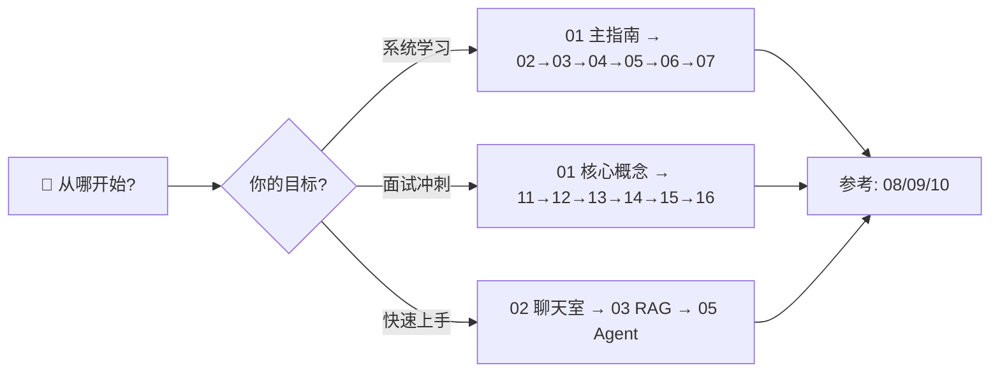

# 🚀 AI 前端开发体系化学习指南

> 📚 **17 份文档 · 351 KB · 覆盖全系列 · 适合 AI 前端/Agent 工程师**

## 📋 文件索引

### 🎯 核心学习路线（6 阶段）

| 编号 | 文件 | 阶段 | 难度 | 建议用时 |
|:---:|:---|---:|:---:|:---:|
| **01** | [📖 体系化学习指南](./01-AI前端开发体系化学习指南.md) | 总纲 + 技术原理深究 | ⭐⭐⭐⭐⭐ | 全程参考 |
| **02** | [🟢 入门期 - AI 聊天室](./02-入门期-AI聊天室.md) | L1 入门 · 流式/Token/SSE | ⭐ | 1 周 |
| **03** | [🔵 进阶期 - RAG 应用](./03-进阶期-RAG应用.md) | L2 进阶 · 混合检索/语义分块 | ⭐⭐ | 2 周 |
| **04** | [🟣 深耕期 - 端侧推理](./04-深耕期-端侧推理.md) | L3 深耕 · WebGPU/量化 | ⭐⭐⭐ | 2 周 |
| **05** | [🔴 专家期 - Agent 设计](./05-专家期-Agent设计.md) | L4 专家 · 多 Agent/工具链 | ⭐⭐⭐⭐ | 3 周 |
| **06** | [🟠 生产化与工程化](./06-生产化与工程化.md) | L5 生产 · A/B测试/灰度/监控 | ⭐⭐⭐⭐ | 2 周 |
| **07** | [⚪ 前沿技术与生态](./07-前沿技术与生态.md) | L6 前沿 · MCP/A2A/Agentic Web | ⭐⭐⭐ | 1 周 |

### 📊 参考资料（按需查阅）

| 编号 | 文件 | 内容 | 页数 |
|:---:|:---|---:|:---:|
| **08** | [📊 技术选型对比合集](./08-技术选型对比合集.md) | 模型/框架/数据库/部署平台对比 | 1344 行 |
| **09** | [🛠️ 开发实战与架构指南](./09-开发实战与架构指南.md) | 调试/测试/Prompt/LangGraph/性能优化 | 1366 行 |
| **10** | [📚 附录与参考资料](./10-附录与参考资料.md) | 术语表/避坑指南/学习路线/FAQ/面试冲刺 | 730 行 |

### 🤖 Agent 面试题库（6 模块 · 199 题）

| 编号 | 文件 | 题数 | 线数 | 难度 | 建议用时 |
|:---:|:---|---:|:---:|:---:|:---:|
| **11** | [📖 Agent 基础篇](./11-Agent面试题-基础篇.md) | 32 题 | 1193 L | ⭐⭐ | 1 天 |
| **12** | [🔧 Agent 工具与协议篇](./12-Agent面试题-工具协议篇.md) | 16 题 | 301 L | ⭐⭐⭐ | 1 天 |
| **13** | [📐 Agent 大模型基础篇](./13-Agent面试题-大模型基础篇.md) | 84 题 | 2434 L | ⭐⭐⭐⭐⭐ | 3 天 |
| **14** | [🔗 Agent 框架与工具链篇](./14-Agent面试题-框架工具链篇.md) | 20 题 | 546 L | ⭐⭐⭐ | 1 天 |
| **15** | [🚀 Agent 实战项目篇](./15-Agent面试题-实战项目篇.md) | 25 题 | 677 L | ⭐⭐⭐⭐ | 2 天 |
| **16** | [🔮 Agent 前沿趋势篇](./16-Agent面试题-前沿趋势篇.md) | 22 题 | 715 L | ⭐⭐ | 1 天 |

## 🗺️ 学习路径建议

### 方案 A：系统性学习（推荐，8-12 周）

```
第 1 周  02-入门期（AI 聊天室）
第 2-3 周 03-进阶期（RAG 应用）
第 4-5 周 04-深耕期（端侧推理） + 08/09 参考资料
第 6-7 周 05-专家期（Agent 设计）
第 8 周  06-生产化与工程化
第 9 周  07-前沿技术与生态
第 10-12 周 11-16 面试题库冲刺
```

### 方案 B：面试冲刺（2-4 周）

```
第 1 周  01 主指南（通读核心概念）
         + 08/09/10（按需查阅）
         + 11 + 12（基础+工具）
第 2 周  13 大模型基础（84 题核心）
         + 14 框架（对比选型）
第 3 周  15 实战项目（架构设计）
         + 16 前沿趋势
```

### 方案 C：按需查阅

| 需求 | 推荐文档 |
|:---|:---|
| **了解 AI 前端全景** | 01 主指南 |
| **从 0 搭建 AI 聊天** | 02 + 09 |
| **构建知识库 RAG** | 03 + 08（向量数据库对比） |
| **浏览器端 AI 推理** | 04 + 09（WebGPU） |
| **实现 Agent 系统** | 05 + 06 + 14 |
| **面试准备** | 11 + 12 + 13 + 14 + 15 + 16 |

## 📚 推荐阅读顺序



---

## 📝 版本记录

| 版本 | 日期 | 说明 |
|:---:|:---:|:---|
| **v1.0** | 2026-05-17 | 初始版本发布 |
| **v2.0** | 2026-05-26 | 全面扩充：7 阶段内容深度增强（Transformer 原理、WebGPU 管线、多 Agent 编排、生产化工程）；新增 Agent 面试题库（199 题/6 模块分拆）；新增 README 文件索引与学习路径 |
