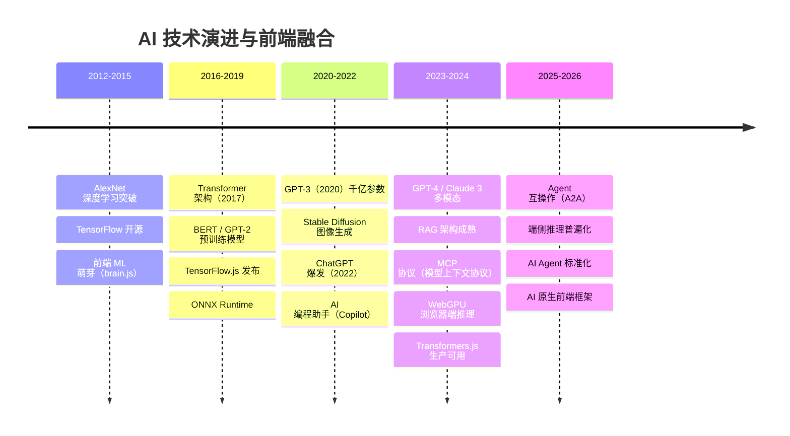
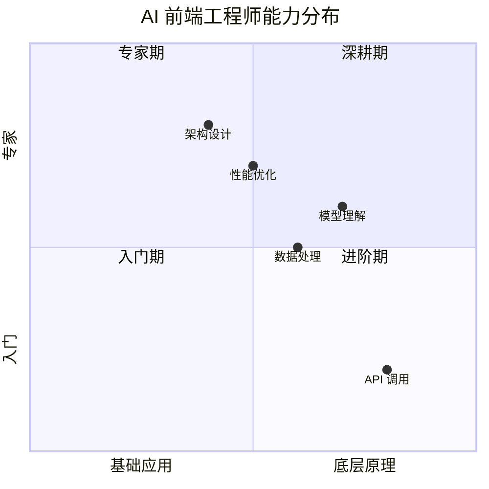
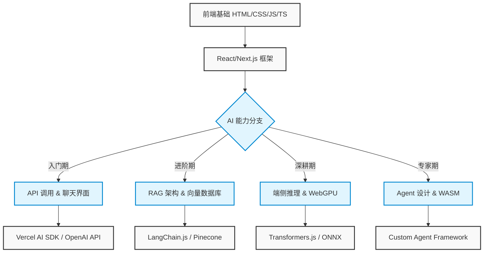

# 🚀 AI 前端开发体系化学习指南

> 🎯 **面试星级**：★★★★★ | **建议用时**：1 周
> 从零基础到专家，打造前端工程师的 AI 能力进阶路线图
> 💡 **提示**：本文档包含 Mermaid 图表，建议在支持 Mermaid 的 Markdown 编辑器（如 Typora, Obsidian, GitHub）中查看以获得最佳体验。

---

## 📑 目录

> 💡 本文档包含完整内容，底部也提供了**主题化拆分文档**方便专项查阅。

### 🧭 学习路径
- [🗺️ 学习路线图总览](#️-学习路线图总览)
- [📂 阶段文档索引 (拆分文档)](#-阶段文档索引)

| 阶段 | 文档 | 核心内容 |
|:---|:---|:---|
| 🟢 **入门期** | [01-入门期-AI聊天室.md](./01-入门期-AI聊天室.md) | API 调用、流式响应、聊天界面 |
| 🔵 **进阶期** | [02-进阶期-RAG应用.md](./02-进阶期-RAG应用.md) | 文档解析、向量化、语义检索 |
| 🟣 **深耕期** | [03-深耕期-端侧推理.md](./03-深耕期-端侧推理.md) | [Transformers.js](https://huggingface.co/docs/transformers.js)、[WebGPU](https://www.w3.org/TR/webgpu/) 加速 |
| 🔴 **专家期** | [04-专家期-Agent设计.md](./04-专家期-Agent设计.md) | 工具调用、[React](https://react.dev) 模式、任务编排 |
| 🟠 **生产化** | [05-生产化与工程化.md](./05-生产化与工程化.md) | 安全防护、性能优化、监控评估 |
| ⚪ **前沿** | [06-前沿技术与生态.md](./06-前沿技术与生态.md) | MCP、A2A、前沿协议 |

### 📚 主题文档（按需查阅）
| 主题 | 文档 | 内容 |
|:---|:---|:---|
| 📊 **技术选型** | [07-技术选型对比合集.md](./07-技术选型对比合集.md) | 模型 / 框架 / 数据库 / 平台等 35+ 对比表 |
| 🛠️ **开发实战** | [08-开发实战与架构指南.md](./08-开发实战与架构指南.md) | 性能、成本、测试、调试、部署、设计模式 |
| 📚 **附录参考** | [09-附录与参考资料.md](./09-附录与参考资料.md) | 术语表、FAQ、面试、资源、论文、反模式 |

### 🔗 快速跳转（当前文档内）
- [🛠️ 高级 RAG 模式补充](#🛠️-高级-rag-模式补充)
- [🎨 多模态前端 AI](#🎨-多模态前端-ai)
- [🐛 AI 前端调试与排错指南](#🐛-ai-前端调试与排错指南)
- [🧪 AI 应用测试策略](#🧪-ai-应用测试策略)
- [🧪 自动化评估流水线 (CI/CD)](#🧪-自动化评估流水线-cicd)
- [🧠 Prompt Engineering 进阶指南](#🧠-prompt-engineering-进阶指南)
- [🔗 [LangGraph](https://langchain-ai.github.io/langgraph) 工作流编排](#🔗-[LangGraph](https://langchain-ai.github.io/langgraph)-工作流编排)
- [⚡ 前端 AI 性能优化终极 Checklist](#⚡-前端-ai-性能优化终极-checklist)
- [📈 职业发展与规划](#📈-职业发展与规划)
- [💰 AI 成本估算与控制](#💰-ai-成本估算与控制)
- [🛠️ 本地开发环境搭建 ([Ollama](https://ollama.ai))](#🛠️-本地开发环境搭建-[Ollama](https://ollama.ai))
- [♿ AI 应用无障碍设计](#♿-ai-应用无障碍设计)
- [🏗️ [Next.js](https://nextjs.org) AI 应用架构最佳实践](#🏗️-nextjs-ai-应用架构最佳实践)
- [🧠 AI 架构模式对比：Chain vs Agent vs Workflow](#🧠-ai-架构模式对比chain-vs-agent-vs-workflow)
- [🔐 环境变量与配置管理最佳实践](#🔐-环境变量与配置管理最佳实践)
- [🌐 国际化 (i18n) 与多语言支持](#🌐-国际化-i18n-与多语言支持)
- [📊 AI 输出渲染与数据可视化](#📊-ai-输出渲染与数据可视化)
- [📝 完整项目实战：AI 知识库问答系统](#📝-完整项目实战ai-知识库问答系统)
- [🔒 AI 应用合规与数据隐私 (GDPR/CCPA)](#🔒-ai-应用合规与数据隐私-gdprccpa)
- [🚀 上线前终极检查清单](#🚀-上线前终极检查清单)
- [🏗️ AI 应用部署实战案例](#🏗️-ai-应用部署实战案例)
- [🐛 AI 应用快速排错手册](#🐛-ai-应用快速排错手册)
- [🔮 AI 前端开发未来趋势](#🔮-ai-前端开发未来趋势)
- [🧩 AI 前端组件设计模式深度解析](#🧩-ai-前端组件设计模式深度解析)
- [🎯 AI 前端 Feature Flag 与灰度发布方案](#🎯-ai-前端-feature-flag-与灰度发布方案)
- [🧠 AI 前端长上下文与记忆管理策略](#🧠-ai-前端长上下文与记忆管理策略)
- [🧪 AI 前端单元测试与组件测试实战](#🧪-ai-前端单元测试与组件测试实战)
- [📊 AI 前端性能预算与容量规划](#📊-ai-前端性能预算与容量规划)
- [📎 附录：常见问题与解决方案](#📎-附录常见问题与解决方案)
- [📚 学习资源推荐](#📚-学习资源推荐)
- [🎓 面试冲刺指南](#🎓-面试冲刺指南)
- [📝 终极 FAQ](#📝-终极-faq)
- [📝 版本记录](#📝-版本记录)

---

## 📂 阶段文档拆分列表

> 📑 **为方便学习，已将内容拆分为独立文档**。每个文档聚焦一个主题，可单独阅读，也支持串行学习。

### 🟢 学习路径（按顺序学习）

| 顺序 | 阶段名称 | 文档 | 内容 |
|:---:|:---|:---|:---|
| → | **总览** | [README.md](./README.md) | 路线图、完整内容、索引 |
| ① | 🟢 **入门期** | [01-入门期-AI聊天室.md](./01-入门期-AI聊天室.md) | API 调用、流式响应、聊天界面 |
| ② | 🔵 **进阶期** | [02-进阶期-RAG应用.md](./02-进阶期-RAG应用.md) | 文档解析、向量化、语义检索 |
| ③ | 🟣 **深耕期** | [03-深耕期-端侧推理.md](./03-深耕期-端侧推理.md) | [Transformers.js](https://huggingface.co/docs/transformers.js)、[WebGPU](https://www.w3.org/TR/webgpu/) 加速 |
| ④ | 🔴 **专家期** | [04-专家期-Agent设计.md](./04-专家期-Agent设计.md) | 工具调用、[React](https://react.dev) 模式、任务编排 |
| ⑤ | 🟠 **生产化** | [05-生产化与工程化.md](./05-生产化与工程化.md) | 安全防护、性能优化、监控评估 |
| ⑥ | ⚪ **前沿** | [06-前沿技术与生态.md](./06-前沿技术与生态.md) | MCP、A2A、前沿协议 |

### 📚 主题文档（按需查阅）

| 主题 | 文档 | 内容概览 |
|:---|:---|:---|
| 📊 **技术选型对比合集** | [07-技术选型对比合集.md](./07-技术选型对比合集.md) | 35+ 对比表：模型、框架、数据库、平台、工具链 |
| 🛠️ **开发实战与架构指南** | [08-开发实战与架构指南.md](./08-开发实战与架构指南.md) | 性能、成本、测试、调试、部署、设计模式 |
| 📚 **附录与参考资料** | [09-附录与参考资料.md](./09-附录与参考资料.md) | 术语表、FAQ、面试、论文、资源、反模式 |

---

## 📈 AI 技术发展时间线（2012—2026）

> 了解 AI 从深度学习到通用大模型的演进，才能把握 AI 前端的发展方向。

### AI 关键里程碑

### 前端 AI 融合的阶段

| 阶段 | 时间 | 技术方案 | 前端角色 |
|------|------|---------|---------|
| **起步期** | 2018-2021 | TensorFlow.js、[ONNX](https://onnxruntime.ai) Runtime | 客户端推理探索 |
| **API 集成期** | 2022-2023 | [OpenAI](https://openai.com).com) API、Server-side LLM | API 调用 + 流式渲染 |
| **RAG 成熟期** | 2023-2024 | 向量库 + 检索 + LLM | 知识库前端集成 |
| **端侧推理期** | 2024-2025 | [WebGPU](https://www.w3.org/TR/webgpu/)、WebNN、[Transformers.js](https://huggingface.co/docs/transformers.js) | 浏览器原生 AI |
| **Agent 期** | 2025-2026 | MCP/A2A、Multi-Agent | 前端 Agent 交互层 |

### 模型能力演进对比

| 模型 | 年份 | 参数量 | 核心能力 | 前端集成方式 |
|------|------|--------|---------|------------|
| GPT-3 | 2020 | 175B | 文本生成 | API 调用 |
| GPT-3.5 | 2022 | 175B | 对话优化 | ChatGPT API |
| GPT-4 | 2023 | ~1.8T | 多模态、推理 | API + Vision |
| Claude 3 | 2024 | 未知 | 长上下文、安全 | API + SDK |
| Gemini | 2024 | 未知 | 多模态原生 | API + Web SDK |
| 开源模型 ([Llama](https://llama.meta.com) 3) | 2024 | 8B-405B | 可本地部署 | [Ollama](https://ollama.ai) + [WebGPU](https://www.w3.org/TR/webgpu/) |
| 端侧模型 | 2025+ | 1B-7B | 浏览器内推理 | [Transformers.js](https://huggingface.co/docs/transformers.js) |

---

## 🗺️ 学习路线图总览

### 📊 能力矩阵演进

### 🏗️ 技术栈演进路径

### 📅 学习周期规划

| 阶段 | 核心任务 | 关键技术 | 预计周期 | 产出物 |
|:---:|:---|:---|:---:|:---|
| 🟢 **入门期** | API 调用、流式响应、聊天界面 | [Vercel](https://vercel.com) AI SDK, [OpenAI](https://openai.com).com) | 1-2 周 | AI 智能客服系统 |
| 🔵 **进阶期** | 文档解析、向量化、语义检索 | [LangChain](https://langchain.com).js, [Pinecone](https://www.pinecone.io) | 2-3 周 | 企业知识库问答 |
| 🟣 **深耕期** | 模型量化、[WebGPU](https://www.w3.org/TR/webgpu/) 加速、离线推理 | [Transformers.js](https://huggingface.co/docs/transformers.js), [WebGPU](https://www.w3.org/TR/webgpu/) | 3-4 周 | 离线 AI 助手 |
| 🔴 **专家期** | 任务规划、工具调用、多步执行 | [WebAssembly](https://webassembly.org).org), Agent 框架 | 4-6 周 | 自动化研究 Agent |
| 🟠 **生产化** | 评估体系、安全防护、性能监控 | [LangSmith](https://smith.langchain.com), Edge Runtime | 持续迭代 | 生产级 AI 平台 |

### ✅ 前置知识检查清单

在开始之前，请确保你已掌握以下基础：
- [ ] **[TypeScript](https://www.typescriptlang.org)**：熟悉泛型、接口、类型推断
- [ ] **[React](https://react.dev)/[Next.js](https://nextjs.org)**：理解 Hooks、SSR、App Router
- [ ] **异步编程**：精通 `async/await`、Promise 链、错误处理
- [ ] **网络协议**：了解 HTTP/2、SSE (Server-Sent Events)、[WebSocket](https://websockets.spec.whatwg.org)
- [ ] **Node.js**：熟悉文件系统、环境变量、包管理

---
> 💡 各阶段详细内容已拆分为独立文档（01~06），主题文档请查阅 07~09。Agent 面试题库见 10~15。上方目录链接可跳转至各拆分文档。本文档仅保留总览与索引。

---

### 📌 导航

| [🟢 入门期](./01-入门期-AI聊天室.md) | [🔵 进阶期](./02-进阶期-RAG应用.md) | [🟣 深耕期](./03-深耕期-端侧推理.md) |
| [🔴 专家期](./04-专家期-Agent设计.md) | [🟠 生产化](./05-生产化与工程化.md) | [⚪ 前沿](./06-前沿技术与生态.md) |
| [📊 技术选型](./07-技术选型对比合集.md) | [🛠️ 开发实战](./08-开发实战与架构指南.md) | [📚 附录](./09-附录与参考资料.md) |

---

## 🤖 Agent 面试题库（6 模块 · 199 题）

| 编号 | 文件 | 题数 | 难度 | 建议用时 |
|:---:|:---|---:|:---:|:---:|
| **10** | [📖 Agent 基础篇](./10-Agent面试题-基础篇.md) | 32 题 | ⭐⭐ | 1 天 |
| **11** | [🔧 Agent 工具与协议篇](./11-Agent面试题-工具协议篇.md) | 16 题 | ⭐⭐⭐ | 1 天 |
| **12** | [📐 Agent 大模型基础篇](./12-Agent面试题-大模型基础篇.md) | 84 题 | ⭐⭐⭐⭐⭐ | 3 天 |
| **13** | [🔗 Agent 框架与工具链篇](./13-Agent面试题-框架工具链篇.md) | 20 题 | ⭐⭐⭐ | 1 天 |
| **14** | [🚀 Agent 实战项目篇](./14-Agent面试题-实战项目篇.md) | 25 题 | ⭐⭐⭐⭐ | 2 天 |
| **15** | [🔮 Agent 前沿趋势篇](./15-Agent面试题-前沿趋势篇.md) | 22 题 | ⭐⭐ | 1 天 |

### 🗺️ 学习路径建议

**方案 A：系统性学习（推荐，8-12 周）**

第 1 周 → **01-入门期**（AI 聊天室）
第 2-3 周 → **02-进阶期**（RAG 应用）
第 4-5 周 → **03-深耕期**（端侧推理）+ 07/08 参考资料
第 6-7 周 → **04-专家期**（Agent 设计）
第 8 周 → **05-生产化与工程化**
第 9 周 → **06-前沿技术与生态**
第 10-12 周 → **10-15 面试题库冲刺**

**方案 B：面试冲刺（2-4 周）**

第 1 周 → README 主指南（通读核心概念）+ 07/08/09（按需查阅）+ 10 + 11（基础+工具）
第 2 周 → 12 大模型基础（84 题核心）+ 13 框架（对比选型）
第 3 周 → 14 实战项目（架构设计）+ 15 前沿趋势

---

*本文档持续更新中，如有问题或建议，欢迎反馈。祝面试顺利！🚀*