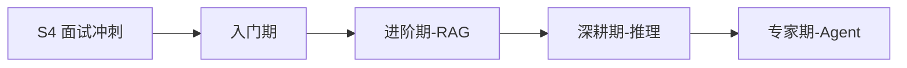

# S5 AI 前沿 🟣

> **学习目标**：掌握 AI 与前端融合的核心技术：RAG、Agent、端侧推理、MCP/A2A 协议

## 内容章节

- [01-入门期-AI聊天室](./01-入门期-AI聊天室) — 入门：AI 聊天室搭建、LLM API 调用
- [02-进阶期-RAG应用](./02-进阶期-RAG应用) — 进阶：RAG 应用开发、向量数据库
- [03-深耕期-端侧推理](./03-深耕期-端侧推理) — 深耕：WebGPU/WebNN 端侧推理
- [04-专家期-Agent设计](./04-专家期-Agent设计) — 专家：AI Agent 设计模式
- [05-生产化与工程化](./05-生产化与工程化) — AI 应用生产化与工程化实践
- [06-前沿技术与生态](./06-前沿技术与生态) — AI 前端技术前沿与生态
- [07-技术选型对比合集](./07-技术选型对比合集) — AI 技术选型与框架对比
- [08-开发实战与架构指南](./08-开发实战与架构指南) — AI 应用开发实战与架构设计
- [10-基础篇](./10-基础篇) — AI 基础概念梳理
- [11-工具协议篇](./11-工具协议篇) — MCP/A2A 协议详解
- [12-大模型基础篇](./12-大模型基础篇) — 大模型基础原理
- [13-框架工具链篇](./13-框架工具链篇) — AI 框架与工具链
- [14-实战项目篇](./14-实战项目篇) — AI 实战项目案例
- [15-前沿趋势篇](./15-前沿趋势篇) — AI 前沿趋势与展望

## 学习路线

