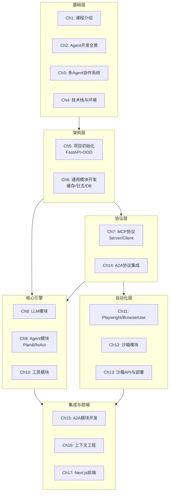
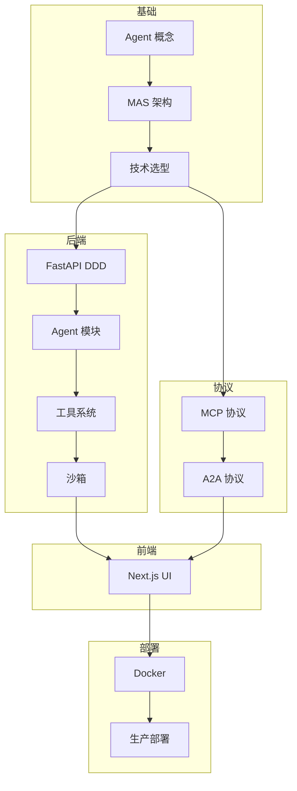
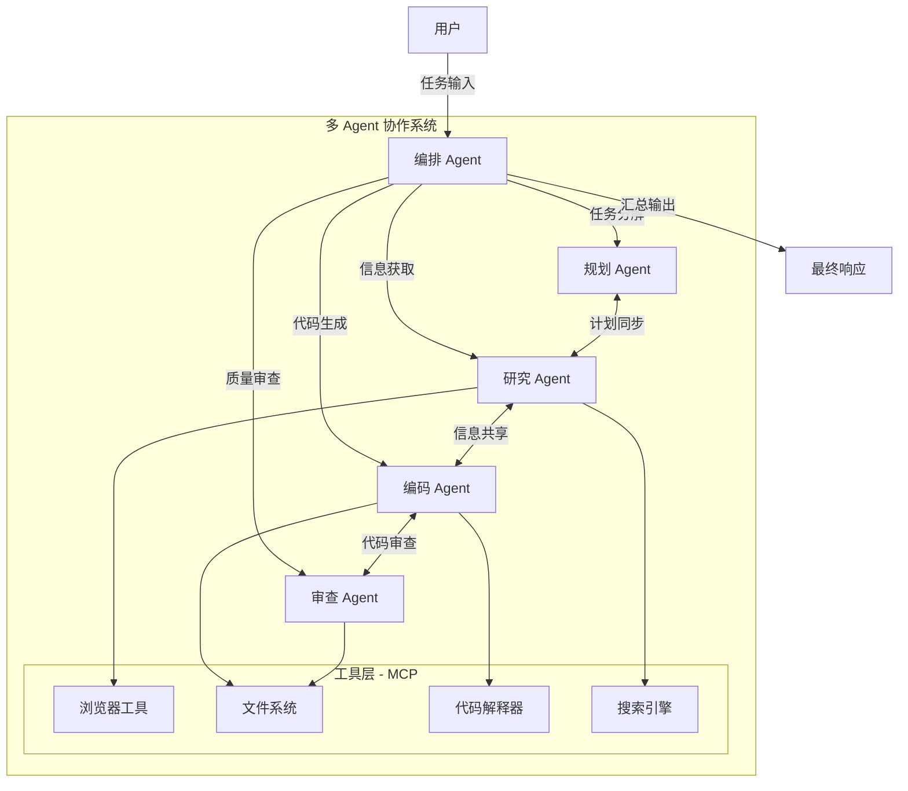
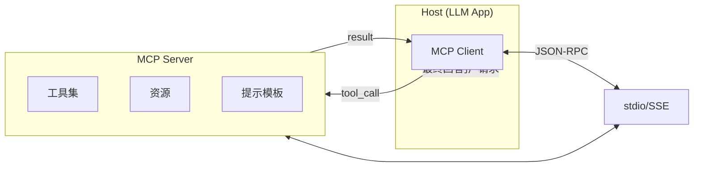
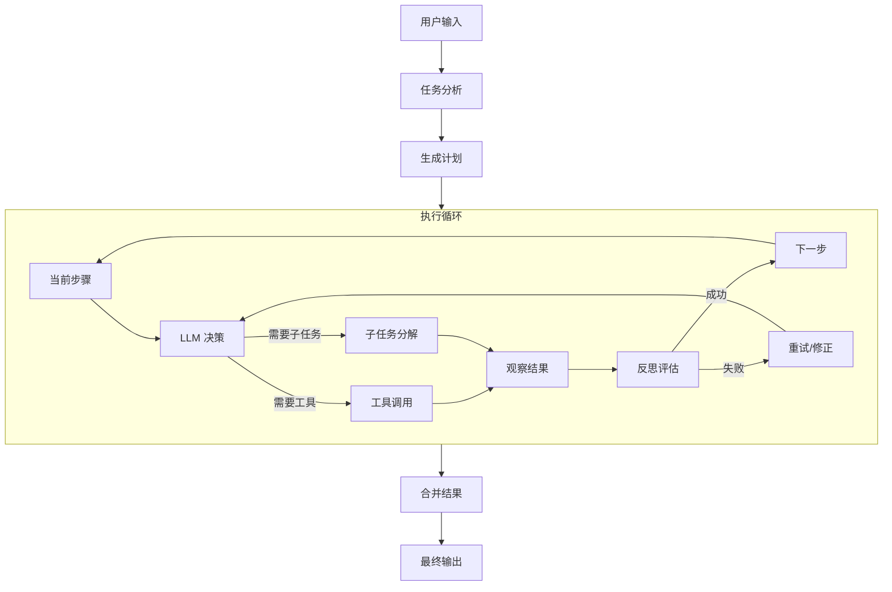
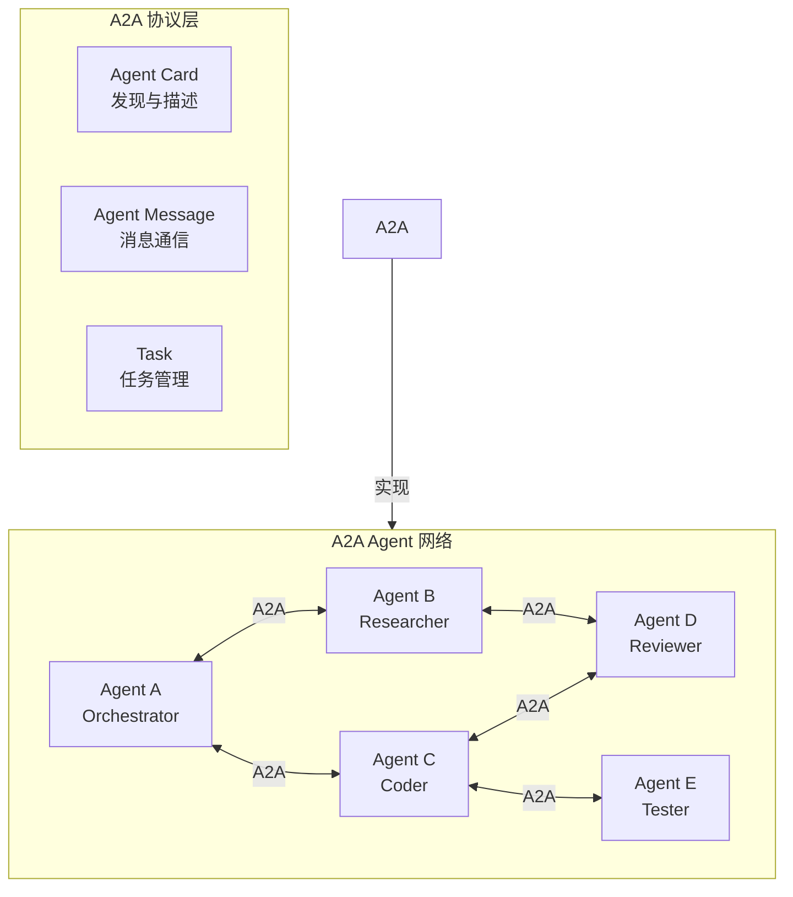

# MCP + A2A 多 Agent 全栈实战

> 从零构建类 Manus 的多 Agent 协作系统，掌握 MCP 协议、A2A 协议、FastAPI DDD 架构、Playwright 浏览器自动化、Docker 沙箱、Next.js 前端全栈技能，所有代码示例以 TypeScript 呈现

---

## 导航地图



---

## 第 0 节：快速开始

### 环境准备

```bash
# 安装 Node.js 20+
# 安装 pnpm
iwr https://get.pnpm.io/install.ps1 -useb | iex

# 安装 uv（Python 包管理器，用于 MCP Server 依赖管理）
powershell -c "irm https://astral.sh/uv/install.ps1 | iex"

# 安装 Docker Desktop

# 配置环境变量
setx DEEPSEEK_API_KEY "your-key-here"
setx OPENAI_API_KEY "your-key-here"
```

### 创建项目骨架

```bash
mkdir manus-clone && cd manus-clone
pnpm init
pnpm add express zod dotenv pino ioredis @prisma/client cors helmet
pnpm add -D typescript @types/node tsx prisma vitest @types/express
npx tsc --init --target ES2022 --module NodeNext --outDir dist --rootDir src
```

### 快速启动 Agent

```typescript
import { z } from "zod";

type Role = "user" | "assistant" | "system";
interface Message { role: Role; content: string }

interface LLMConfig {
  apiKey: string;
  baseUrl: string;
  model: string;
}

class Agent {
  constructor(
    private config: LLMConfig,
    private systemPrompt: string
  ) {}

  async chat(messages: Message[]): Promise<string> {
    const response = await fetch(`${this.config.baseUrl}/v1/chat/completions`, {
      method: "POST",
      headers: {
        "Content-Type": "application/json",
        Authorization: `Bearer ${this.config.apiKey}`,
      },
      body: JSON.stringify({
        model: this.config.model,
        messages: [
          { role: "system", content: this.systemPrompt },
          ...messages
        ],
      }),
    });
    const data = await response.json() as any;
    return data.choices[0].message.content;
  }
}

const agent = new Agent(
  {
    apiKey: process.env.DEEPSEEK_API_KEY || "",
    baseUrl: "https://api.deepseek.com",
    model: "deepseek-chat",
  },
  "你是一个有用的助手。请一步一步思考。"
);

const result = await agent.chat([
  { role: "user", content: "用 TypeScript 写快速排序" }
]);
console.log(result);
```

## 第 1 章：课程介绍与安排

### 1.1 课程目标

本课程从零构建一个类 Manus 的多 Agent 全栈应用系统，覆盖 MCP 协议、A2A 协议、FastAPI DDD 架构、Playwright 浏览器自动化、Docker 沙箱、Next.js 前端全栈技能。

### 1.2 课程知识体系



### 1.3 项目演示

课程项目 MoocManus 具备以下能力：

| 能力 | 说明 |
|------|------|
| 多 Agent 协作 | Plan & ReAct 架构，规划 + 执行分离 |
| MCP 工具 | 动态加载 MCP 服务，扩展工具生态 |
| A2A 通信 | Agent 间协议通信，分布式协作 |
| 浏览器控制 | Playwright + CDP，类人操作浏览器 |
| 沙箱运行 | Docker 隔离环境，安全执行代码 |
| 前端界面 | Next.js 实时展示 Agent 执行过程 |

---

## 第 2 章：Agent 开发全景

### 2.1 什么是 Agent

Agent（智能体）是一个能够 **感知环境**、**做出决策** 并 **执行行动** 的软件实体。在 LLM 时代，Agent 的核心公式为：

> **Agent = LLM 大脑 + 工具系统 + 记忆模块 + 规划引擎**

```typescript
interface AgentInterface {
  perceive(input: string): Promise<Perception>;
  think(context: Context): Promise<Plan>;
  act(plan: Plan): Promise<ActionResult>;
  remember(exp: Experience): Promise<void>;
}
```

### 2.2 LLM 作为 Agent 大脑

LLM 提供了 Agent 的核心推理能力：

| 能力 | 描述 | 实现方式 |
|------|------|----------|
| 推理 | Chain-of-Thought 逐步推理 | CoT Prompting |
| 工具调用 | 识别意图并调用外部函数 | Function Calling API |
| 记忆管理 | 对话历史 + 向量检索 | RAG + 滑动窗口 |
| 规划 | 将复杂任务分解为子任务 | Few-shot + ReAct |
| 反思 | 评估自身输出并修正 | Self-Critique |

```typescript
class LLMBrain {
  constructor(private client: LLMProvider) {}

  async think<T>(prompt: string, schema?: z.ZodType<T>): Promise<T> {
    const messages = [{ role: "user" as const, content: prompt }];
    if (schema) {
      return await this.client.structuredOutput(messages, schema);
    }
    return await this.client.chat(messages) as unknown as T;
  }

  async plan(task: string): Promise<Step[]> {
    const planSchema = z.array(z.object({
      step: z.number(),
      description: z.string(),
      tool: z.string().optional(),
    }));
    return this.think("请分解任务：" + task, planSchema);
  }
}
```

### 2.3 Agent 设计模式

| 模式 | 核心思想 | 适用场景 |
|------|----------|----------|
| ReAct | 推理与行动交替循环 | 通用任务执行 |
| Plan & ReAct | 先规划骨架再逐步骤执行 | 复杂多步骤任务 |
| Reflexion | 执行后反思并修正 | 需要自我改进的任务 |
| Tool-using | Function Calling 调用外部工具 | 外部系统交互 |
| Multi-Agent | 多角色 Agent 协作 | 复杂工作流 |
| Voting | 多个 Agent 投票决策 | 高可靠性场景 |

### 2.4 Agent 技术简史

```
Rule-based Systems (1990s)
  - 专家系统、固定规则引擎
ML-based Agents (2010s)
  - 深度强化学习、单一任务 Agent
LLM-based Agents (2022+)
  - ChatGPT Plugin、AutoGPT、BabyAGI
Multi-Agent Systems (2024+)
  - Manus、MGX、CrewAI、AutoGen
Protocol-based MAS (2025+)
  - MCP（工具协议）+ A2A（Agent协议）
```

### 2.5 Agent 模块拆解

```typescript
class ModularAgent {
  brain: LLMBrain;
  memory: MemoryModule;
  planner: Planner;
  tools: ToolRegistry;
  executor: Executor;
  reflector: Reflector;

  async run(task: string): Promise<Result> {
    const context = await this.memory.load(task);
    const plan = await this.planner.createPlan(task, context);
    const outputs: StepOutput[] = [];

    for (const step of plan.steps) {
      const action = await this.brain.decide(step, context);
      const result = await this.executor.execute(action);
      await this.memory.save(step, result);
      outputs.push({ step, result });

      const reflection = await this.reflector.reflect(result);
      if (reflection.needsCorrection) {
        const corrected = await this.brain.think(
          "修正上一步执行：" + JSON.stringify(reflection)
        );
        const correctedResult = await this.executor.execute(corrected);
        outputs.push({ step, result: correctedResult });
      }
    }
    return { outputs, summary: await this.memory.summarize() };
  }
}
```

### 2.6 落地案例

| 行业 | 案例 | Agent 数量 | 核心工具 | 协议 |
|------|------|-----------|---------|------|
| 软件开发 | 代码生成与审查 | 3 | MCP File, MCP Git | MCP |
| 数据采集 | 网页数据抓取 | 2 | Playwright, Jina AI | MCP + A2A |
| 客户服务 | 智能客服 | 4 | MCP CRM, A2A Agent | A2A |
| 金融分析 | 财报分析 | 2 | MCP Python, MCP SEC | MCP |

---

## 第 3 章：多 Agent 协作系统探索

### 3.1 MAS 架构总览



### 3.2 核心设计考量

1. **通信机制**：消息队列 vs 直接调用 vs A2A 协议
2. **协调策略**：中心化（Orchestrator）vs 去中心化（Peer-to-Peer）
3. **任务分配**：静态分配 vs 动态竞标
4. **冲突解决**：投票、优先级、仲裁
5. **记忆共享**：全局记忆 vs 局部记忆
6. **安全性**：Agent 间信任与权限控制

```typescript
interface AgentMessage {
  from: string;
  to: string;
  type: "request" | "response" | "broadcast";
  payload: unknown;
  metadata: {
    timestamp: number;
    ttl: number;
    priority: number;
  };
}

interface MessageBus {
  send(msg: AgentMessage): Promise<void>;
  subscribe(agentId: string, handler: (msg: AgentMessage) => Promise<void>): void;
  broadcast(msg: Omit<AgentMessage, "to">): Promise<void>;
}
```

### 3.3 Manus / MGX 架构分析

Manus 是 2025 年推出的通用 AI Agent 产品，核心特征：

1. **Sandboxed Execution**：每个任务在独立沙箱中执行
2. **Dynamic Planning**：根据中间结果实时调整计划
3. **Tool Ecosystem**：通过 MCP 协议接入 50+ 工具
4. **Multi-Agent Collaboration**：编排 Agent + 专业 Agent 配合
5. **Web Automation**：Playwright + CDP 操控浏览器

```typescript
interface ManusArchitecture {
  orchestrator: OrchestratorAgent;
  planners: PlannerAgent[];
  workers: WorkerAgent[];
  tools: ToolRegistry;
  mcpClients: MCPClientManager;
  memory: DistributedMemory;
  sandboxPool: SandboxPool;
}

type TaskState = "pending" | "planning" | "executing" | "reviewing" | "completed" | "failed";

interface Task {
  id: string;
  input: string;
  plan: Step[];
  state: TaskState;
  artifacts: Artifact[];
  createdAt: Date;
}
```

### 3.4 ReAct 论文精读

ReAct（Reasoning + Acting）由 Google 于 2023 年提出，核心循环：

```
Thought  : 分析当前状态
Action   : 调用工具
Observation: 获取结果
(循环)
Answer   : 给出回答
```

```typescript
async function reactLoop(
  brain: LLMBrain,
  tools: ToolRegistry,
  task: string,
  maxIterations = 15
): Promise<string> {
  const systemPrompt = [
    "你是一个使用 ReAct 模式的 AI 助手。",
    "格式：",
    "Thought: 你的思考",
    "Action: 工具名称(JSON args)",
    "Observation: 工具返回",
    "Answer: 最终答案",
  ].join("\n");

  const messages: Message[] = [
    { role: "system", content: systemPrompt },
    { role: "user", content: task },
  ];

  for (let i = 0; i < maxIterations; i++) {
    const response = await brain.chat(messages);
    messages.push({ role: "assistant", content: response });

    if (response.includes("Answer:")) {
      return response.slice(response.indexOf("Answer:") + 7).trim();
    }

    const match = response.match(/Action:\s*(\w+)\(([^)]*)\)/);
    if (!match) continue;

    const [, name, argsStr] = match;
    let args: Record<string, unknown> = {};
    try { args = JSON.parse(argsStr || "{}"); } catch {
      args = { input: argsStr };
    }

    try {
      const result = await tools.execute(name, args);
      messages.push({
        role: "user",
        content: "Observation: " + (typeof result === "string" ? result : JSON.stringify(result)),
      });
    } catch (err) {
      messages.push({
        role: "user",
        content: "Observation: Error - " + (err as Error).message,
      });
    }
  }
  throw new Error("Max iterations reached");
}
```

### 3.5 单 Agent 基础实现

```typescript
class SingleAgent {
  private brain: LLMBrain;
  private tools: ToolRegistry;
  private memory: MemoryModule;

  constructor(config: LLMConfig) {
    this.brain = new LLMBrain(new OpenAIProvider(config));
    this.tools = new ToolRegistry();
    this.memory = new MemoryModule();
  }

  async run(task: string): Promise<string> {
    await this.memory.initialize(task);
    const result = await reactLoop(this.brain, this.tools, task);
    await this.memory.save(result);
    return result;
  }
}
```

### 3.6 多模态 LLM 集成

```typescript
interface MultimodalContent {
  type: "text" | "image_url";
  text?: string;
  image_url?: { url: string; detail?: "low" | "high" | "auto" };
}

class MultimodalAgent {
  constructor(private brain: LLMBrain) {}

  async analyze(text: string, images?: string[]): Promise<string> {
    const content: MultimodalContent[] = [{ type: "text", text }];
    for (const url of images ?? []) {
      content.push({ type: "image_url", image_url: { url, detail: "auto" } });
    }
    return this.brain.chat([{ role: "user", content }]);
  }
}
```

---

## 第 4 章：技术栈与环境准备

### 4.1 uv 工具

uv 是 Rust 编写的极速 Python 包管理器：

```bash
powershell -c "irm https://astral.sh/uv/install.ps1 | iex"
uv venv
uv pip install -r requirements.txt
uv run python script.py
```

### 4.2 LLM Provider 封装

```typescript
interface LLMProvider {
  chat(messages: Message[], options?: ChatOptions): Promise<ChatResponse>;
  stream(messages: Message[], options?: ChatOptions): AsyncIterable<Chunk>;
}

class OpenAIProvider implements LLMProvider {
  constructor(private config: { apiKey: string; baseUrl: string }) {}

  async chat(messages: Message[], options?: ChatOptions): Promise<ChatResponse> {
    const res = await fetch(this.config.baseUrl + "/v1/chat/completions", {
      method: "POST",
      headers: {
        "Content-Type": "application/json",
        Authorization: "Bearer " + this.config.apiKey,
      },
      body: JSON.stringify({
        model: options?.model ?? "gpt-4o",
        messages,
        temperature: options?.temperature ?? 0.7,
      }),
    });
    const data = await res.json() as any;
    return {
      content: data.choices[0].message.content || "",
      toolCalls: data.choices[0].message.tool_calls?.map((tc: any) => ({
        id: tc.id, name: tc.function.name, args: tc.function.arguments,
      })),
    };
  }

  async *stream(messages: Message[], options?: ChatOptions): AsyncIterable<Chunk> {
    const res = await fetch(this.config.baseUrl + "/v1/chat/completions", {
      method: "POST",
      headers: {
        "Content-Type": "application/json",
        Authorization: "Bearer " + this.config.apiKey,
      },
      body: JSON.stringify({ model: options?.model ?? "gpt-4o", messages, stream: true }),
    });
    const reader = res.body!.getReader();
    const decoder = new TextDecoder();
    let buf = "";
    while (true) {
      const { done, value } = await reader.read();
      if (done) break;
      buf += decoder.decode(value, { stream: true });
      const lines = buf.split("\n");
      buf = lines.pop() || "";
      for (const line of lines) {
        if (!line.startsWith("data: ")) continue;
        const data = line.slice(6).trim();
        if (data === "[DONE]") return;
        try {
          const parsed = JSON.parse(data);
          const d = parsed.choices?.[0]?.delta;
          if (d?.content) yield { content: d.content };
        } catch { /* skip */ }
      }
    }
  }
}

class DeepSeekProvider extends OpenAIProvider {
  constructor(apiKey: string) {
    super({ apiKey, baseUrl: "https://api.deepseek.com" });
  }
}
```

### 4.3 Tool Calling

```typescript
interface ToolDef {
  name: string;
  description: string;
  parameters: z.ZodObject<any>;
  execute: (args: any) => Promise<unknown>;
}

class ToolRegistry {
  private tools = new Map<string, ToolDef>();
  register(t: ToolDef): void { this.tools.set(t.name, t); }
  get(name: string) { return this.tools.get(name); }
  list() { return Array.from(this.tools.values()).map(t => ({ name: t.name, description: t.description })); }

  async execute(name: string, args: Record<string, unknown>): Promise<unknown> {
    const t = this.tools.get(name);
    if (!t) throw new Error("Unknown tool: " + name);
    return t.execute(t.parameters.parse(args));
  }

  toOpenAITools() {
    return Array.from(this.tools.values()).map(t => ({
      type: "function" as const,
      function: { name: t.name, description: t.description, parameters: t.parameters },
    }));
  }
}
```

### 4.4 结构化输出 (Zod)

```typescript
const AgentOutput = z.object({
  thought: z.string(),
  action: z.string(),
  args: z.record(z.unknown()),
  confidence: z.number().min(0).max(1),
});

async function extractStructured<T extends z.ZodTypeAny>(
  brain: LLMBrain, prompt: string, schema: T
): Promise<z.infer<T>> {
  const res = await brain.chat([
    { role: "system", content: "JSON 格式输出。" },
    { role: "user", content: prompt },
  ]);
  return schema.parse(JSON.parse(res.content));
}
```

### 4.5 JSON Output 模式

```typescript
async function jsonMode<T>(client: LLMProvider, prompt: string, schema: z.ZodType<T>): Promise<T> {
  const res = await client.chat(
    [{ role: "user", content: prompt + "\n\n请以 JSON 格式输出。" }],
    { response_format: { type: "json_object" } }
  );
  return schema.parse(JSON.parse(res.content));
}
```

### 4.6 流式输出

```typescript
// Express SSE 端点
router.post("/stream", async (req, res) => {
  res.setHeader("Content-Type", "text/event-stream");
  res.setHeader("Cache-Control", "no-cache");
  res.setHeader("Connection", "keep-alive");

  const { messages } = req.body;
  const stream = provider.stream(messages);
  for await (const chunk of stream) {
    if (chunk.content) {
      res.write("data: " + JSON.stringify({ type: "content", text: chunk.content }) + "\n\n");
    }
  }
  res.write("data: " + JSON.stringify({ type: "done" }) + "\n\n");
  res.end();
});

// 前端 EventSource 消费
const es = new EventSource("/chat/stream");
es.onmessage = (event) => {
  const data = JSON.parse(event.data);
  if (data.type === "done") { es.close(); return; }
  if (data.type === "content") console.log(data.text);
};
```

### 4.7 语音播报 Agent

```typescript
class TTSAgent {
  constructor(private apiKey: string) {}

  async speak(text: string): Promise<ArrayBuffer> {
    const res = await fetch("https://api.openai.com/v1/audio/speech", {
      method: "POST",
      headers: {
        "Content-Type": "application/json",
        Authorization: "Bearer " + this.apiKey,
      },
      body: JSON.stringify({
        model: "tts-1", input: text, voice: "alloy", response_format: "mp3",
      }),
    });
    return res.arrayBuffer();
  }
}

class AudioPlayer {
  private ctx = new AudioContext();

  async play(buffer: ArrayBuffer): Promise<void> {
    const audio = await this.ctx.decodeAudioData(buffer);
    const src = this.ctx.createBufferSource();
    src.buffer = audio;
    src.connect(this.ctx.destination);
    src.start();
  }
}
```

---

## 第 5 章：项目初始化

### 5.1 多轮对话配置

```typescript
// src/domain/conversation.entity.ts
interface ConversationConfig {
  maxHistoryLength: number;      // 最大历史轮数
  contextWindowSize: number;     // 上下文窗口大小（token）
  systemPrompt: string;          // 系统提示词
  memoryType: "sliding-window" | "summary" | "vector";
}

class ConversationManager {
  private history: Message[] = [];
  private config: ConversationConfig;

  constructor(config: ConversationConfig) {
    this.config = config;
  }

  addMessage(msg: Message): void {
    this.history.push(msg);
    if (this.history.length > this.config.maxHistoryLength * 2) {
      this.history = this.history.slice(-this.config.maxHistoryLength * 2);
    }
  }

  getContext(): Message[] {
    const system = { role: "system" as const, content: this.config.systemPrompt };
    return [system, ...this.history.slice(-this.config.maxHistoryLength * 2)];
  }

  async summarize(memory: MemoryModule): Promise<void> {
    // 当历史过长时，进行摘要压缩
    const full = this.history.map(m => `${m.role}: ${m.content}`).join("\n");
    const summary = await memory.summarize(full);
    this.history = [
      { role: "system", content: "先前对话摘要：" + summary },
      ...this.history.slice(-2), // 保留最近两轮
    ];
  }
}
```

### 5.2 Chain-of-Thought (CoT) 配置

```typescript
// CoT 提示词模板
const COT_TEMPLATES = {
  basic: "让我们一步一步思考。",
  detailed: "请逐步推理，每个步骤都要清晰说明你的思考过程。",
  structured: [
    "1. 理解问题：分析用户的需求",
    "2. 收集信息：确定需要哪些数据",
    "3. 制定计划：列出执行步骤",
    "4. 执行计划：逐步执行",
    "5. 检查结果：验证输出正确性",
  ].join("\n"),
};

function createCoTPrompt(task: string, template: keyof typeof COT_TEMPLATES = "basic"): string {
  return `${task}\n\n${COT_TEMPLATES[template]}`;
}
```

### 5.3 异步编程模式

```typescript
// Promise 链式编排
async function pipeline<T>(input: T, ...fns: Array<(arg: T) => Promise<T>>): Promise<T> {
  let result = input;
  for (const fn of fns) {
    result = await fn(result);
  }
  return result;
}

// 并发控制
async function parallel<T>(tasks: Array<() => Promise<T>>, concurrency = 3): Promise<T[]> {
  const results: T[] = [];
  const executing: Promise<void>[] = [];

  for (const [i, task] of tasks.entries()) {
    const p = task().then(r => { results[i] = r; });
    executing.push(p);

    if (executing.length >= concurrency) {
      await Promise.race(executing);
      executing.splice(0, executing.findIndex(p => p.then));
    }
  }
  await Promise.all(executing);
  return results;
}
```

### 5.4 FastAPI 等价实现（Express + Swagger）

```typescript
import express from "express";
import swaggerUi from "swagger-ui-express";

const app = express();
app.use(express.json());

// OpenAPI 规范
const swaggerSpec = {
  openapi: "3.0.0",
  info: { title: "Agent API", version: "1.0.0" },
  paths: {
    "/api/chat": {
      post: {
        summary: "发送消息",
        requestBody: {
          content: { "application/json": { schema: { type: "object" } } },
        },
        responses: { "200": { description: "成功" } },
      },
    },
  },
};

app.use("/docs", swaggerUi.serve, swaggerUi.setup(swaggerSpec));
```

### 5.5 DDD 分层架构

```typescript
// ============ Domain Layer ============
// src/domain/task.entity.ts
class Task {
  constructor(
    public readonly id: string,
    public input: string,
    public status: TaskStatus,
    public steps: Step[],
    public createdAt: Date,
  ) {}

  start(): void { this.status = "running"; }
  complete(): void { this.status = "completed"; }
  fail(error: string): void { this.status = "failed"; this.addError(error); }

  private addError(error: string): void { /* ... */ }
}

// ============ Application Layer ============
// src/application/task.service.ts
class TaskService {
  constructor(
    private taskRepo: TaskRepository,
    private agent: ModularAgent,
  ) {}

  async executeTask(input: string): Promise<Task> {
    const task = new Task(crypto.randomUUID(), input, "pending", [], new Date());
    await this.taskRepo.save(task);

    try {
      task.start();
      const result = await this.agent.run(input);
      task.complete();
      return task;
    } catch (err) {
      task.fail((err as Error).message);
      return task;
    }
  }
}

// ============ Infrastructure Layer ============
// src/infrastructure/task.repository.ts
interface TaskRepository {
  save(task: Task): Promise<void>;
  findById(id: string): Promise<Task | null>;
  findAll(): Promise<Task[]>;
}

// ============ Interfaces Layer ============
// src/interfaces/controllers/task.controller.ts
class TaskController {
  constructor(private taskService: TaskService) {}

  async create(req: Request, res: Response): Promise<void> {
    const { input } = req.body;
    const task = await this.taskService.executeTask(input);
    res.status(201).json(task);
  }

  async getById(req: Request, res: Response): Promise<void> {
    const task = await this.taskService.taskRepo.findById(req.params.id);
    if (!task) { res.status(404).json({ error: "Not found" }); return; }
    res.json(task);
  }
}
```

### 5.6 项目结构详解

```
src/
├── domain/                    # 领域层 - 核心业务逻辑
│   ├── entities/              # 实体
│   │   ├── task.entity.ts
│   │   ├── agent.entity.ts
│   │   ├── message.entity.ts
│   │   └── plan.entity.ts
│   └── value-objects/         # 值对象
│       ├── tool-call.ts
│       └── agent-config.ts
│
├── application/               # 应用层 - 用例编排
│   ├── services/
│   │   ├── task.service.ts
│   │   ├── agent.service.ts
│   │   └── conversation.service.ts
│   └── ports/                 # 端口（接口定义）
│       ├── llm.port.ts
│       ├── repository.port.ts
│       └── cache.port.ts
│
├── infrastructure/            # 基础设施层 - 技术实现
│   ├── llm/
│   │   ├── openai.provider.ts
│   │   ├── deepseek.provider.ts
│   │   └── llm.factory.ts
│   ├── persistence/
│   │   ├── prisma/
│   │   ├── task.prisma-repo.ts
│   │   └── conversation.prisma-repo.ts
│   ├── cache/
│   │   ├── redis.cache.ts
│   │   └── memory.cache.ts
│   └── mcp/
│       ├── mcp-client.ts
│       └── mcp-server.ts
│
├── interfaces/                # 接口层 - API 与外部通信
│   ├── http/
│   │   ├── controllers/
│   │   ├── middlewares/
│   │   ├── routes/
│   │   └── validators/
│   └── events/
│       └── event-publisher.ts
│
├── agent/                     # Agent 核心（领域服务）
│   ├── planner.ts
│   ├── reactor.ts
│   ├── memory.ts
│   └── prompt-templates.ts
│
├── tools/                     # 工具系统
│   ├── registry.ts
│   ├── built-in/
│   │   ├── search.tool.ts
│   │   └── calculator.tool.ts
│   └── mcp-bridge.ts
│
├── sandbox/                   # 沙箱
│   ├── docker-sandbox.ts
│   ├── executor.ts
│   └── file-tools.ts
│
└── web/                       # Next.js 前端
    ├── app/
    ├── components/
    └── hooks/
```

### 5.7 API 文档配置

```typescript
// 使用 Zod 自动生成 OpenAPI Schema
import { z } from "zod";
import { generateSchema } from "zod-to-json-schema";

const ChatRequestSchema = z.object({
  messages: z.array(z.object({
    role: z.enum(["user", "assistant", "system"]),
    content: z.string(),
  })),
  stream: z.boolean().optional().default(false),
});

const jsonSchema = generateSchema(ChatRequestSchema);
// 注入到 Swagger/OpenAPI 文档中
```

---

## 第 6 章：通用模块开发

### 6.1 pydantic-settings 等价实现

```typescript
// src/config/settings.ts
import "dotenv/config";

class Settings {
  readonly DEEPSEEK_API_KEY = process.env.DEEPSEEK_API_KEY || "";
  readonly OPENAI_API_KEY = process.env.OPENAI_API_KEY || "";
  readonly REDIS_URL = process.env.REDIS_URL || "redis://localhost:6379";
  readonly DATABASE_URL = process.env.DATABASE_URL || "postgresql://localhost:5432/agent";
  readonly LOG_LEVEL = process.env.LOG_LEVEL || "info";
  readonly SANDBOX_IMAGE = process.env.SANDBOX_IMAGE || "sandbox:latest";
  readonly CORS_ORIGINS = (process.env.CORS_ORIGINS || "http://localhost:3000").split(",");
}

export const settings = new Settings();
```

### 6.2 日志系统

```typescript
import pino from "pino";

const logger = pino({
  level: settings.LOG_LEVEL,
  transport: {
    target: "pino-pretty",
    options: { colorize: true, translateTime: "SYS:standard" },
  },
  serializers: {
    error: pino.stdSerializers.err,
  },
});

// 请求日志中间件
function requestLogger(req: Request, res: Response, next: NextFunction): void {
  const start = Date.now();
  res.on("finish", () => {
    logger.info({
      method: req.method,
      url: req.url,
      status: res.statusCode,
      duration: Date.now() - start,
    });
  });
  next();
}
```

### 6.3 跨域配置

```typescript
import cors from "cors";

app.use(cors({
  origin: settings.CORS_ORIGINS,
  methods: ["GET", "POST", "PUT", "DELETE"],
  allowedHeaders: ["Content-Type", "Authorization"],
  credentials: true,
}));
```

### 6.4 异常处理

```typescript
// 自定义异常类
class AppError extends Error {
  constructor(
    public statusCode: number,
    public code: string,
    message: string,
  ) {
    super(message);
  }
}

class NotFoundError extends AppError {
  constructor(resource: string) {
    super(404, "NOT_FOUND", `${resource} not found`);
  }
}

class ValidationError extends AppError {
  constructor(message: string) {
    super(400, "VALIDATION_ERROR", message);
  }
}

// 全局错误处理中间件
function errorHandler(err: Error, req: Request, res: Response, next: NextFunction): void {
  if (err instanceof AppError) {
    res.status(err.statusCode).json({
      error: { code: err.code, message: err.message },
    });
  } else {
    logger.error({ err }, "Unhandled error");
    res.status(500).json({
      error: { code: "INTERNAL_ERROR", message: "Internal server error" },
    });
  }
}
```

### 6.5 Docker Postgres / Redis

```yaml
# docker-compose.yml
version: "3.8"
services:
  postgres:
    image: postgres:16-alpine
    environment:
      POSTGRES_DB: agent
      POSTGRES_USER: agent
      POSTGRES_PASSWORD: agent123
    ports:
      - "5432:5432"
    volumes:
      - postgres_data:/var/lib/postgresql/data

  redis:
    image: redis:7-alpine
    ports:
      - "6379:6379"
    command: redis-server --appendonly yes

volumes:
  postgres_data:
```

### 6.6 缓存模块

```typescript
// src/infrastructure/cache/redis.cache.ts
import Redis from "ioredis";

class RedisCache {
  private client: Redis;

  constructor(url: string = settings.REDIS_URL) {
    this.client = new Redis(url);
  }

  async get<T>(key: string): Promise<T | null> {
    const val = await this.client.get(key);
    return val ? JSON.parse(val) as T : null;
  }

  async set(key: string, value: unknown, ttlSeconds = 300): Promise<void> {
    await this.client.setex(key, ttlSeconds, JSON.stringify(value));
  }

  async delete(pattern: string): Promise<void> {
    const keys = await this.client.keys(pattern);
    if (keys.length > 0) await this.client.del(...keys);
  }
}

// 数据源装饰器
interface CacheOptions {
  key: string;
  ttl?: number;
}

function withCache(cache: RedisCache, options: CacheOptions) {
  return function (_target: any, _propertyKey: string, descriptor: PropertyDescriptor) {
    const original = descriptor.value;
    descriptor.value = async function (...args: any[]) {
      const cached = await cache.get(options.key);
      if (cached) return cached;
      const result = await original.apply(this, args);
      await cache.set(options.key, result, options.ttl);
      return result;
    };
    return descriptor;
  };
}
```

### 6.7 对象存储

```typescript
// src/infrastructure/storage/file-storage.ts
import fs from "fs/promises";
import path from "path";

class FileStorage {
  constructor(private basePath: string) {}

  async save(filename: string, data: Buffer | string): Promise<string> {
    const fullPath = path.join(this.basePath, filename);
    await fs.mkdir(path.dirname(fullPath), { recursive: true });
    await fs.writeFile(fullPath, data);
    return fullPath;
  }

  async read(filename: string): Promise<Buffer> {
    return fs.readFile(path.join(this.basePath, filename));
  }

  async delete(filename: string): Promise<void> {
    await fs.unlink(path.join(this.basePath, filename));
  }

  async list(prefix = ""): Promise<string[]> {
    const dir = path.join(this.basePath, prefix);
    try {
      return await fs.readdir(dir);
    } catch {
      return [];
    }
  }
}
```

### 6.8 Alembic 等价（Prisma Migrations）

```prisma
// prisma/schema.prisma
generator client {
  provider = "prisma-client-js"
}

datasource db {
  provider = "postgresql"
  url      = env("DATABASE_URL")
}

model Conversation {
  id        String    @id @default(uuid())
  title     String
  messages  Message[]
  createdAt DateTime  @default(now())
  updatedAt DateTime  @updatedAt
}

model Message {
  id             String       @id @default(uuid())
  conversationId String
  conversation   Conversation @relation(fields: [conversationId], references: [id])
  role           String
  content        String
  metadata       Json?
  createdAt      DateTime     @default(now())

  @@index([conversationId])
}

model Task {
  id        String   @id @default(uuid())
  input     String
  plan      Json?
  status    String   @default("pending")
  output    String?
  error     String?
  createdAt DateTime @default(now())
  updatedAt DateTime @updatedAt
}

model AgentConfig {
  id          String   @id @default(uuid())
  name        String   @unique
  model       String
  systemPrompt String
  tools       Json?
  temperature Float?
  createdAt   DateTime @default(now())
}
```

### 6.9 Pytest 等价（Vitest）

```typescript
// tests/agent.test.ts
import { describe, it, expect, vi, beforeEach } from "vitest";
import { SingleAgent } from "../src/agent/single-agent";
import { ToolRegistry } from "../src/tools/registry";

describe("SingleAgent", () => {
  let agent: SingleAgent;
  let mockBrain: any;

  beforeEach(() => {
    mockBrain = { chat: vi.fn(), stream: vi.fn() };
    agent = new SingleAgent({ apiKey: "test", baseUrl: "http://test", model: "test" });
    (agent as any).brain = mockBrain;
  });

  it("should return answer from react loop", async () => {
    mockBrain.chat.mockResolvedValue("Answer: 42");
    const result = await agent.run("What is the answer?");
    expect(result).toBe("42");
  });

  it("should use tools when needed", async () => {
    mockBrain.chat
      .mockResolvedValueOnce("Action: calculate(2 + 2)")
      .mockResolvedValueOnce("Answer: 4");

    const tools = new ToolRegistry();
    tools.register({
      name: "calculate",
      description: "计算",
      parameters: z.any(),
      execute: async (args) => 4,
    });
    (agent as any).tools = tools;

    const result = await agent.run("What is 2 + 2?");
    expect(result).toBe("4");
  });

  it("should handle tool errors gracefully", async () => {
    mockBrain.chat
      .mockResolvedValueOnce("Action: bad_tool()")
      .mockResolvedValueOnce("Answer: error occurred");

    const result = await agent.run("Test");
    expect(result).toBeDefined();
  });
});
```

## 第 7 章：MCP 协议初识

### 7.1 MCP 原理

MCP（Model Context Protocol）是由 Anthropic 提出的开放协议，用于标准化 LLM 与外部工具/数据源的交互方式。其核心设计：

- **Server**：提供工具、资源、提示的端点
- **Client**：连接 Server 并调用其能力的客户端
- **Transport**：通信层（stdio、SSE、WebSocket）



### 7.2 MCP 协议消息格式

```typescript
// JSON-RPC 2.0 基础消息
interface JSONRPCRequest {
  jsonrpc: "2.0";
  id: string | number;
  method: string;
  params?: Record<string, unknown>;
}

interface JSONRPCResponse {
  jsonrpc: "2.0";
  id: string | number;
  result?: unknown;
  error?: {
    code: number;
    message: string;
    data?: unknown;
  };
}

// MCP 方法
type MCPMethod =
  | "tools/list"           // 列出可用工具
  | "tools/call"           // 调用工具
  | "resources/list"       // 列出资源
  | "resources/read"       // 读取资源
  | "prompts/list"         // 列出提示模板
  | "prompts/get";         // 获取提示
```

### 7.3 构建 MCP Server

```typescript
// src/mcp/server.ts
import { Server } from "@modelcontextprotocol/sdk/server/index.js";
import { StdioServerTransport } from "@modelcontextprotocol/sdk/server/stdio.js";
import { z } from "zod";

// 定义工具
const tools = {
  get_weather: {
    name: "get_weather",
    description: "获取天气信息",
    inputSchema: {
      type: "object",
      properties: {
        city: { type: "string", description: "城市名称" },
      },
      required: ["city"],
    },
    handler: async (args: { city: string }) => {
      const res = await fetch(`https://api.weather.com/${args.city}`);
      return { content: [{ type: "text", text: await res.text() }] };
    },
  },
  search: {
    name: "search",
    description: "搜索互联网",
    inputSchema: {
      type: "object",
      properties: {
        query: { type: "string" },
        count: { type: "number", default: 5 },
      },
      required: ["query"],
    },
    handler: async (args: { query: string; count?: number }) => {
      return { content: [{ type: "text", text: `搜索结果：${args.query}` }] };
    },
  },
};

// 创建 MCP Server
const server = new Server(
  { name: "agent-tools", version: "1.0.0" },
  { capabilities: { tools: {} } }
);

// 注册工具列表
server.setRequestHandler({ method: "tools/list" }, async () => ({
  tools: Object.values(tools).map(t => ({
    name: t.name,
    description: t.description,
    inputSchema: t.inputSchema,
  })),
}));

// 处理工具调用
server.setRequestHandler({ method: "tools/call" }, async (request) => {
  const tool = tools[request.params.name as keyof typeof tools];
  if (!tool) throw new Error(`Unknown tool: ${request.params.name}`);
  return tool.handler(request.params.arguments as any);
});

// 启动 Server
const transport = new StdioServerTransport();
await server.connect(transport);
```

### 7.4 构建 MCP Client

```typescript
// src/mcp/client.ts
import { Client } from "@modelcontextprotocol/sdk/client/index.js";
import { StdioClientTransport } from "@modelcontextprotocol/sdk/client/stdio.js";
import { spawn } from "child_process";

class MCPClient {
  private client: Client;
  private transport: StdioClientTransport;
  private serverProcess: ChildProcess;

  constructor(serverScript: string) {
    this.client = new Client(
      { name: "agent-client", version: "1.0.0" },
      { capabilities: {} }
    );
    this.serverProcess = spawn("node", [serverScript]);
    this.transport = new StdioClientTransport({
      stdin: this.serverProcess.stdin,
      stdout: this.serverProcess.stdout,
    });
  }

  async connect(): Promise<void> {
    await this.client.connect(this.transport);
  }

  async listTools(): Promise<ToolInfo[]> {
    const result = await this.client.request(
      { method: "tools/list", params: {} },
      { schema: z.any() }
    );
    return (result as any).tools;
  }

  async callTool(name: string, args: Record<string, unknown>): Promise<unknown> {
    const result = await this.client.request(
      { method: "tools/call", params: { name, arguments: args } },
      { schema: z.any() }
    );
    return result;
  }

  async close(): Promise<void> {
    await this.client.close();
    this.serverProcess.kill();
  }
}
```

### 7.5 MCP SDK 进阶用法

```typescript
// 带资源的 MCP Server
const server = new Server(
  { name: "file-server", version: "1.0.0" },
  { capabilities: { resources: {}, tools: {} } }
);

// 注册资源
server.setRequestHandler({ method: "resources/list" }, async () => ({
  resources: [
    {
      uri: "file:///data/config.json",
      name: "Config",
      mimeType: "application/json",
      description: "配置文件",
    },
  ],
}));

server.setRequestHandler({ method: "resources/read" }, async (request) => {
  const uri = request.params.uri as string;
  const content = await fs.readFile(uri.replace("file://", ""), "utf-8");
  return { contents: [{ uri, mimeType: "text/plain", text: content }] };
});

// 注册提示模板
server.setRequestHandler({ method: "prompts/list" }, async () => ({
  prompts: [
    {
      name: "analyze_code",
      description: "分析代码质量",
      arguments: [
        { name: "code", description: "代码内容", required: true },
      ],
    },
  ],
}));

server.setRequestHandler({ method: "prompts/get" }, async (request) => {
  const { name, arguments: args } = request.params as any;
  if (name === "analyze_code") {
    return {
      messages: [
        {
          role: "user",
          content: {
            type: "text",
            text: `请分析以下代码的质量：\n\`\`\`\n${args.code}\n\`\`\``,
          },
        },
      ],
    };
  }
  throw new Error("Unknown prompt");
});
```

### 7.6 Bash 工具与代码解释器

```typescript
// MCP 终端执行工具
const bashTool = {
  name: "execute_bash",
  description: "在沙箱中执行 bash 命令",
  inputSchema: {
    type: "object",
    properties: {
      command: { type: "string" },
      timeout: { type: "number", default: 30 },
    },
    required: ["command"],
  },
  handler: async (args: { command: string; timeout?: number }) => {
    const result = await executeInSandbox(args.command, args.timeout);
    return {
      content: [
        { type: "text", text: result.stdout },
        { type: "text", text: result.stderr ? `STDERR:\n${result.stderr}` : "" },
      ],
      isError: result.exitCode !== 0,
    };
  },
};

// MCP Python 解释器
const pythonTool = {
  name: "execute_python",
  description: "执行 Python 代码",
  inputSchema: {
    type: "object",
    properties: {
      code: { type: "string", description: "Python 代码" },
    },
    required: ["code"],
  },
  handler: async (args: { code: string }) => {
    const result = await executePython(args.code);
    return { content: [{ type: "text", text: result }] };
  },
};
```

### 7.7 MCP 站点与发现

MCP 有一个官方的站点（registry）用于发现和共享 MCP Server。在项目中，我们可以维护一个 Server 注册表：

```typescript
interface MCPServerConfig {
  name: string;
  command: string;
  args: string[];
  env?: Record<string, string>;
}

class MCPServerRegistry {
  private servers = new Map<string, MCPServerConfig>();

  register(name: string, config: MCPServerConfig): void {
    this.servers.set(name, config);
  }

  async startAll(): Promise<MCPClient[]> {
    const clients: MCPClient[] = [];
    for (const [name, config] of this.servers) {
      const client = new MCPClient(config);
      await client.connect();
      clients.push(client);
    }
    return clients;
  }
}

// 配置示例
const registry = new MCPServerRegistry();
registry.register("filesystem", {
  name: "@anthropic/mcp-filesystem",
  command: "npx",
  args: ["@anthropic/mcp-filesystem", "--allowed", "./data"],
});
registry.register("github", {
  name: "mcp-github",
  command: "uvx",
  args: ["mcp-github"],
  env: { GITHUB_TOKEN: process.env.GITHUB_TOKEN },
});
```

---

## 第 8 章：LLM 模块开发

### 8.1 可视化 LLM 配置

```typescript
// src/infrastructure/llm/llm.config.ts
interface LLMProviderConfig {
  name: string;
  provider: "openai" | "deepseek" | "anthropic";
  apiKey: string;
  baseUrl: string;
  models: string[];
  defaultModel: string;
  maxTokens: number;
  temperature: number;
}

class LLMConfigurationManager {
  private configs = new Map<string, LLMProviderConfig>();

  addProvider(config: LLMProviderConfig): void {
    this.configs.set(config.name, config);
  }

  getProvider(name: string): LLMProviderConfig {
    const config = this.configs.get(name);
    if (!config) throw new Error(`Provider ${name} not configured`);
    return config;
  }

  createClient(name: string): LLMProvider {
    const config = this.getProvider(name);
    switch (config.provider) {
      case "openai": return new OpenAIProvider(config);
      case "deepseek": return new DeepSeekProvider(config.apiKey);
      case "anthropic": return new AnthropicProvider(config);
      default: throw new Error(`Unknown provider: ${config.provider}`);
    }
  }

  toJSON(): Record<string, Partial<LLMProviderConfig>> {
    const result: Record<string, Partial<LLMProviderConfig>> = {};
    for (const [name, config] of this.configs) {
      result[name] = { ...config, apiKey: "***" }; // 隐藏密钥
    }
    return result;
  }
}
```

### 8.2 Task Domain 模型

```typescript
// src/domain/task.entity.ts
enum TaskStatus {
  PENDING = "pending",
  PLANNING = "planning",
  EXECUTING = "executing",
  COMPLETED = "completed",
  FAILED = "failed",
}

interface TaskStep {
  id: string;
  description: string;
  tool?: string;
  args?: Record<string, unknown>;
  result?: string;
  status: TaskStatus;
  error?: string;
  startedAt?: Date;
  completedAt?: Date;
}

class Task {
  constructor(
    public readonly id: string = crypto.randomUUID(),
    public input: string,
    public status: TaskStatus = TaskStatus.PENDING,
    public steps: TaskStep[] = [],
    public output?: string,
    public error?: string,
    public readonly createdAt: Date = new Date(),
    public updatedAt: Date = new Date(),
  ) {}

  addStep(step: TaskStep): void {
    this.steps.push(step);
    this.updatedAt = new Date();
  }

  updateStep(stepId: string, updates: Partial<TaskStep>): void {
    const step = this.steps.find(s => s.id === stepId);
    if (step) Object.assign(step, updates);
    this.updatedAt = new Date();
  }

  complete(output: string): void {
    this.status = TaskStatus.COMPLETED;
    this.output = output;
    this.updatedAt = new Date();
  }

  fail(error: string): void {
    this.status = TaskStatus.FAILED;
    this.error = error;
    this.updatedAt = new Date();
  }
}
```

### 8.3 Redis-Stream 消息队列

```typescript
// src/infrastructure/queue/redis-stream.ts
import Redis from "ioredis";

interface StreamMessage {
  id: string;
  data: Record<string, string>;
}

class RedisStreamQueue {
  private redis: Redis;

  constructor(private streamName: string) {
    this.redis = new Redis(settings.REDIS_URL);
  }

  async publish(data: Record<string, unknown>): Promise<string> {
    const entries: string[] = [];
    for (const [key, value] of Object.entries(data)) {
      entries.push(key, JSON.stringify(value));
    }
    return this.redis.xadd(this.streamName, "*", ...entries);
  }

  async consume(
    group: string,
    consumer: string,
    batchSize = 10,
    blockMs = 5000,
  ): Promise<StreamMessage[]> {
    try {
      await this.redis.xgroup("CREATE", this.streamName, group, "$", "MKSTREAM");
    } catch { /* group already exists */ }

    const results = await this.redis.xreadgroup(
      "GROUP", group, consumer,
      "COUNT", batchSize,
      "BLOCK", blockMs,
      "STREAMS", this.streamName, ">",
    );

    if (!results) return [];
    const messages: StreamMessage[] = [];
    for (const [, entries] of results as any[]) {
      for (const [id, fields] of entries) {
        const data: Record<string, string> = {};
        for (let i = 0; i < fields.length; i += 2) {
          data[fields[i]] = fields[i + 1];
        }
        messages.push({ id, data });
      }
    }
    return messages;
  }

  async ack(group: string, messageId: string): Promise<void> {
    await this.redis.xack(this.streamName, group, messageId);
  }

  async pending(group: string): Promise<number> {
    const info = await this.redis.xpending(this.streamName, group);
    return (info as any).pending || 0;
  }
}

// 后台任务消费者
class TaskConsumer {
  constructor(
    private queue: RedisStreamQueue,
    private taskService: TaskService,
  ) {}

  async start(): Promise<void> {
    const group = "task-workers";
    const consumer = `worker-${crypto.randomUUID().slice(0, 8)}`;

    setInterval(async () => {
      const messages = await this.queue.consume(group, consumer);
      for (const msg of messages) {
        try {
          const taskInput = JSON.parse(msg.data.input);
          await this.taskService.executeTask(taskInput);
          await this.queue.ack(group, msg.id);
        } catch (err) {
          logger.error({ err, msgId: msg.id }, "Task processing failed");
        }
      }
    }, 1000);
  }
}
```

### 8.4 后台 Task 模块

```typescript
// src/application/task-runner.ts
class TaskRunner {
  private running = false;
  private activeTasks = new Map<string, AbortController>();

  constructor(
    private agent: ModularAgent,
    private queue: RedisStreamQueue,
  ) {}

  async start(): Promise<void> {
    this.running = true;
    while (this.running) {
      const messages = await this.queue.consume("task-workers", "runner");
      for (const msg of messages) {
        const task = JSON.parse(msg.data.task) as Task;
        const controller = new AbortController();
        this.activeTasks.set(task.id, controller);

        this.runTask(task, controller.signal)
          .catch(err => logger.error({ err, taskId: task.id }, "Task failed"))
          .finally(() => this.activeTasks.delete(task.id));

        await this.queue.ack("task-workers", msg.id);
      }
    }
  }

  private async runTask(task: Task, signal: AbortSignal): Promise<void> {
    logger.info({ taskId: task.id }, "Starting task");
    const result = await this.agent.run(task.input);
    task.complete(result);
    logger.info({ taskId: task.id }, "Task completed");
  }

  cancelTask(taskId: string): void {
    const controller = this.activeTasks.get(taskId);
    if (controller) controller.abort();
  }

  stop(): void {
    this.running = false;
  }
}
```

---

## 第 9 章：Agent 模块开发

### 9.1 Manus 任务流拆解

Manus 的任务执行流程：



### 9.2 规划步骤模型

```typescript
// src/domain/plan.entity.ts
interface PlanStep {
  id: string;
  description: string;
  type: "reason" | "tool" | "subtask";
  toolName?: string;
  toolArgs?: Record<string, unknown>;
  expectedOutcome: string;
  dependsOn: string[];        // 前置步骤 ID
  status: "pending" | "running" | "completed" | "failed";
  result?: string;
  error?: string;
}

class Plan {
  steps: PlanStep[] = [];
  currentStepIndex = 0;

  get currentStep(): PlanStep | undefined {
    return this.steps[this.currentStepIndex];
  }

  get isComplete(): boolean {
    return this.steps.every(s => s.status === "completed");
  }

  addStep(step: PlanStep): void {
    this.steps.push(step);
  }

  advance(): void {
    this.currentStepIndex++;
  }

  getAvailableSteps(): PlanStep[] {
    return this.steps.filter(s =>
      s.status === "pending" &&
      s.dependsOn.every(d => this.steps.find(s => s.id === d)?.status === "completed")
    );
  }
}
```

### 9.3 记忆模型

```typescript
// src/agent/memory.ts
interface MemoryEntry {
  id: string;
  type: "observation" | "thought" | "action" | "result" | "reflection";
  content: string;
  metadata: Record<string, unknown>;
  timestamp: Date;
}

class MemoryModule {
  private shortTerm: MemoryEntry[] = [];
  private longTerm: MemoryEntry[] = [];

  async add(entry: Omit<MemoryEntry, "id" | "timestamp">): Promise<void> {
    const full: MemoryEntry = {
      ...entry,
      id: crypto.randomUUID(),
      timestamp: new Date(),
    };
    this.shortTerm.push(full);

    // 长短期记忆转换
    if (this.shortTerm.length > 50) {
      const oldest = this.shortTerm.shift()!;
      this.longTerm.push(oldest);
    }
  }

  async search(query: string, limit = 5): Promise<MemoryEntry[]> {
    // 简单的关键词匹配，生产环境可用向量检索
    const keywords = query.toLowerCase().split(" ");
    const scored = [...this.shortTerm, ...this.longTerm].map(entry => {
      const score = keywords.filter(k => entry.content.toLowerCase().includes(k)).length;
      return { entry, score };
    });
    return scored
      .filter(s => s.score > 0)
      .sort((a, b) => b.score - a.score)
      .slice(0, limit)
      .map(s => s.entry);
  }

  async summarize(context?: string): Promise<string> {
    const entries = context
      ? await this.search(context, 20)
      : [...this.shortTerm, ...this.longTerm].slice(-20);
    return entries.map(e => `[${e.type}] ${e.content}`).join("\n");
  }

  getContext(): string {
    return this.shortTerm.slice(-10).map(e => e.content).join("\n");
  }
}
```

### 9.4 JSON 修复解析器

```typescript
// src/agent/json-fixer.ts
class JSONFixer {
  static parse<T>(text: string): T | null {
    try {
      return JSON.parse(text) as T;
    } catch (e) {
      return this.attemptFix(text) as T | null;
    }
  }

  private static attemptFix(text: string): unknown {
    let fixed = text;

    // 去掉 Markdown 代码块标记
    fixed = fixed.replace(/```(?:json)?\n?/g, "");

    // 修复单引号为双引号
    fixed = fixed.replace(/'/g, '"');

    // 修复尾随逗号
    fixed = fixed.replace(/,\s*([}\]])/g, "$1");

    // 修复缺少引号的键名
    fixed = fixed.replace(/(\w+):/g, '"$1":');

    // 修复注释
    fixed = fixed.replace(/\/\/.*$/gm, "");
    fixed = fixed.replace(/\/\*[\s\S]*?\*\//g, "");

    try {
      return JSON.parse(fixed);
    } catch {
      return null;
    }
  }

  static extractFromText<T>(text: string): T | null {
    // 尝试提取 JSON 块
    const jsonMatch = text.match(/\{[\s\S]*\}/);
    if (!jsonMatch) return null;
    return this.parse<T>(jsonMatch[0]);
  }
}
```

### 9.5 Tool 装饰器

```typescript
// src/tools/decorator.ts
const TOOL_METADATA_KEY = Symbol("tool:metadata");

interface ToolMetadata {
  name: string;
  description: string;
  schema: z.ZodObject<any>;
}

function Tool(metadata: ToolMetadata) {
  return function (target: any, propertyKey: string) {
    Reflect.defineMetadata(TOOL_METADATA_KEY, metadata, target, propertyKey);
  };
}

// 使用示例
class AgentTools {
  @Tool({
    name: "web_search",
    description: "搜索互联网信息",
    schema: z.object({ query: z.string(), count: z.number().optional() }),
  })
  async webSearch(args: { query: string; count?: number }): Promise<string> {
    const res = await fetch(`https://api.search.com/?q=${encodeURIComponent(args.query)}`);
    return res.text();
  }

  @Tool({
    name: "read_file",
    description: "读取文件内容",
    schema: z.object({ path: z.string() }),
  })
  async readFile(args: { path: string }): Promise<string> {
    return fs.readFile(args.path, "utf-8");
  }
}

// 扫描工具
function scanTools(instance: object): ToolDef[] {
  const tools: ToolDef[] = [];
  for (const key of Object.getOwnPropertyNames(Object.getPrototypeOf(instance))) {
    const metadata: ToolMetadata | undefined = Reflect.getMetadata(TOOL_METADATA_KEY, instance, key);
    if (metadata) {
      tools.push({
        name: metadata.name,
        description: metadata.description,
        parameters: metadata.schema,
        execute: (args) => (instance as any)[key](args),
      });
    }
  }
  return tools;
}
```

### 9.6 Plan & ReAct 基类

```typescript
// src/agent/plan-react.ts
abstract class BaseAgent {
  abstract brain: LLMBrain;
  abstract tools: ToolRegistry;
  abstract memory: MemoryModule;

  async plan(task: string): Promise<Plan> {
    const planSteps = await this.brain.plan(task);
    const plan = new Plan();
    for (const step of planSteps) {
      plan.addStep({
        id: crypto.randomUUID(),
        description: step.description,
        type: step.tool ? "tool" : "reason",
        toolName: step.tool,
        expectedOutcome: step.description,
        dependsOn: [],
        status: "pending",
      });
    }
    return plan;
  }

  async executePlan(plan: Plan): Promise<string> {
    while (!plan.isComplete) {
      const step = plan.currentStep;
      if (!step) break;

      step.status = "running";
      await this.memory.add({ type: "thought", content: `执行步骤: ${step.description}`, metadata: {} });

      try {
        const result = await this.executeStep(step);
        step.status = "completed";
        step.result = result;
        await this.memory.add({ type: "result", content: result, metadata: { stepId: step.id } });
      } catch (err) {
        step.status = "failed";
        step.error = (err as Error).message;
        await this.memory.add({ type: "reflection", content: `步骤失败: ${step.error}`, metadata: {} });

        // 尝试修正
        const fixed = await this.attemptFix(step);
        if (fixed) {
          step.status = "completed";
          step.result = fixed;
        }
      }
      plan.advance();
    }

    return this.memory.summarize();
  }

  private async executeStep(step: PlanStep): Promise<string> {
    if (step.type === "tool" && step.toolName) {
      const result = await this.tools.execute(step.toolName, step.toolArgs || {});
      return typeof result === "string" ? result : JSON.stringify(result);
    }
    // 纯推理步骤
    const response = await this.brain.chat([
      { role: "user", content: step.description },
    ]);
    return response;
  }

  private async attemptFix(step: PlanStep): Promise<string | null> {
    const response = await this.brain.chat([
      { role: "system", content: "上一步执行失败，请修正方案。" },
      { role: "user", content: `步骤: ${step.description}\n错误: ${step.error}` },
    ]);
    // 修正逻辑
    return response.includes("修正方案") ? response : null;
  }

  // 子类需实现
  abstract run(task: string): Promise<string>;
}
```

### 9.7 Prompt 设计

```typescript
// src/agent/prompts.ts
const SYSTEM_PROMPTS = {
  planner: [
    "你是一个任务规划专家。你的职责是：",
    "1. 分析用户输入的任务",
    "2. 将任务分解为可执行的子步骤",
    "3. 为每个步骤选择合适的工具",
    "4. 确定步骤之间的依赖关系",
    "",
    "输出格式：JSON 数组",
    '[{ "step": 1, "description": "...", "tool": "..." }]',
  ].join("\n"),

  executor: [
    "你是一个任务执行 Agent。请遵循以下规则：",
    "1. 使用 ReAct 模式：思考 → 行动 → 观察 → 思考...",
    "2. 每次只执行一个行动",
    "3. 观察结果后决定下一步",
    "4. 任务完成后给出 Answer",
    "",
    "可用工具：{tools}",
  ].join("\n"),

  reflector: [
    "你是一个反思 Agent。请评估以下执行结果：",
    "1. 结果是否正确？",
    "2. 是否有更好的方案？",
    "3. 是否需要重试？",
    "",
    "输出格式：JSON",
    '{ "isCorrect": boolean, "suggestion": "...", "shouldRetry": boolean }',
  ].join("\n"),
};

function buildSystemPrompt(
  role: keyof typeof SYSTEM_PROMPTS,
  context?: Record<string, string>,
): string {
  let prompt = SYSTEM_PROMPTS[role];
  if (context) {
    for (const [key, value] of Object.entries(context)) {
      prompt = prompt.replace(`{${key}}`, value);
    }
  }
  return prompt;
}
```

---

---

## 第 10 章：工具模块开发

### 10.1 Bing 搜索工具

```typescript
// src/tools/built-in/search.tool.ts
class BingSearchTool {
  name = "web_search";
  description = "使用 Bing 搜索引擎搜索互联网信息";

  parameters = z.object({
    query: z.string().describe("搜索关键词"),
    count: z.number().optional().default(10).describe("返回结果数量"),
  });

  constructor(private apiKey: string) {}

  async execute(args: { query: string; count?: number }): Promise<string> {
    const res = await fetch(
      `https://api.bing.microsoft.com/v7.0/search?q=${encodeURIComponent(args.query)}&count=${args.count || 10}`,
      { headers: { "Ocp-Apim-Subscription-Key": this.apiKey } }
    );
    const data = await res.json() as any;
    return (data.webPages?.value || []).map((page: any) =>
      `[${page.name}](${page.url})\n${page.snippet}`
    ).join("\n\n");
  }
}
```

### 10.2 MCP 动态添加工具

```typescript
// src/tools/mcp-bridge.ts
class MCPToolBridge {
  private mcpClients: Map<string, MCPClient> = new Map();
  private toolRegistry: ToolRegistry;

  constructor(toolRegistry: ToolRegistry) {
    this.toolRegistry = toolRegistry;
  }

  async addMCPServer(name: string, config: MCPServerConfig): Promise<void> {
    const client = new MCPClient(config);
    await client.connect();
    this.mcpClients.set(name, client);

    // 从 MCP Server 获取工具列表，动态注册
    const tools = await client.listTools();
    for (const tool of tools) {
      this.toolRegistry.register({
        name: `${name}__${tool.name}`,
        description: `[${name}] ${tool.description}`,
        parameters: this.jsonSchemaToZod(tool.inputSchema),
        execute: async (args) => {
          const result = await client.callTool(tool.name, args);
          return result;
        },
      });
    }
  }

  private jsonSchemaToZod(schema: any): z.ZodObject<any> {
    const shape: Record<string, z.ZodTypeAny> = {};
    if (schema.properties) {
      for (const [key, prop] of Object.entries<any>(schema.properties)) {
        shape[key] = this.jsonTypeToZod(prop);
      }
    }
    return z.object(shape);
  }

  private jsonTypeToZod(prop: any): z.ZodTypeAny {
    switch (prop.type) {
      case "string": return z.string().describe(prop.description || "");
      case "number": return z.number().describe(prop.description || "");
      case "boolean": return z.boolean().describe(prop.description || "");
      case "array": return z.array(z.any()).describe(prop.description || "");
      default: return z.any();
    }
  }
}
```

### 10.3 MCP 客户端管理器

```typescript
// src/mcp/client-manager.ts
interface MCPConnection {
  client: MCPClient;
  serverName: string;
  tools: ToolInfo[];
  connected: boolean;
}

class MCPClientManager {
  private connections = new Map<string, MCPConnection>();

  async connect(name: string, config: MCPServerConfig): Promise<void> {
    const client = new MCPClient(config);
    await client.connect();
    const tools = await client.listTools();
    this.connections.set(name, {
      client,
      serverName: name,
      tools,
      connected: true,
    });
  }

  async callTool(serverName: string, toolName: string, args: Record<string, unknown>): Promise<unknown> {
    const conn = this.connections.get(serverName);
    if (!conn || !conn.connected) throw new Error(`MCP Server ${serverName} not connected`);
    return conn.client.callTool(toolName, args);
  }

  listAllTools(): Array<{ server: string; tool: ToolInfo }> {
    const result: Array<{ server: string; tool: ToolInfo }> = [];
    for (const [server, conn] of this.connections) {
      for (const tool of conn.tools) {
        result.push({ server, tool });
      }
    }
    return result;
  }

  async disconnect(name: string): Promise<void> {
    const conn = this.connections.get(name);
    if (conn) {
      await conn.client.close();
      conn.connected = false;
    }
  }

  async disconnectAll(): Promise<void> {
    for (const [name] of this.connections) {
      await this.disconnect(name);
    }
  }

  healthCheck(name: string): boolean {
    return this.connections.get(name)?.connected ?? false;
  }
}
```

### 10.4 Jina AI 搜索

```typescript
// src/tools/built-in/jina-search.tool.ts
class JinaSearchTool {
  name = "jina_search";
  description = "使用 Jina AI 进行语义搜索";

  parameters = z.object({
    query: z.string().describe("搜索内容"),
    topK: z.number().optional().default(5),
  });

  constructor(private apiKey: string) {}

  async execute(args: { query: string; topK?: number }): Promise<string> {
    const res = await fetch("https://api.jina.ai/v1/search", {
      method: "POST",
      headers: {
        "Content-Type": "application/json",
        Authorization: `Bearer ${this.apiKey}`,
      },
      body: JSON.stringify({
        query: args.query,
        top_k: args.topK || 5,
      }),
    });
    const data = await res.json() as any;
    return (data.results || []).map((r: any) =>
      `[${r.title}](${r.url})\n${r.snippet}`
    ).join("\n\n");
  }
}
```

---

## 第 11 章：Playwright 与 BrowserUse

### 11.1 CDP 协议

CDP（Chrome DevTools Protocol）是浏览器调试协议，Playwright 底层基于此协议实现：

```typescript
// CDP 基础调用
import CDP from "chrome-remote-interface";

async function connectToChrome(port = 9222): Promise<CDP.Client> {
  const client = await CDP({ port });
  const { Page, Runtime } = client;

  await Page.enable();
  await Runtime.enable();

  return client;
}

async function evaluateJS(client: CDP.Client, expression: string): Promise<any> {
  const { Runtime } = client;
  const result = await Runtime.evaluate({ expression, returnByValue: true });
  return result.result.value;
}
```

### 11.2 Playwright 基本使用

```typescript
import { chromium, Browser, Page, BrowserContext } from "playwright";

class BrowserAgent {
  private browser: Browser | null = null;
  private context: BrowserContext | null = null;
  private page: Page | null = null;

  async launch(headless = true): Promise<void> {
    this.browser = await chromium.launch({
      headless,
      args: [
        "--no-sandbox",
        "--disable-setuid-sandbox",
        "--disable-dev-shm-usage",
        "--disable-gpu",
      ],
    });
    this.context = await this.browser.newContext({
      viewport: { width: 1280, height: 720 },
      userAgent: "Mozilla/5.0 (Windows NT 10.0; Win64; x64) AppleWebKit/537.36",
    });
    this.page = await this.context.newPage();
  }

  async goto(url: string): Promise<void> {
    if (!this.page) throw new Error("Browser not launched");
    await this.page.goto(url, { waitUntil: "networkidle" });
  }

  async click(selector: string): Promise<void> {
    await this.page!.click(selector);
  }

  async fill(selector: string, value: string): Promise<void> {
    await this.page!.fill(selector, value);
  }

  async screenshot(): Promise<Buffer> {
    return this.page!.screenshot();
  }

  async getContent(): Promise<string> {
    return this.page!.content();
  }

  async getText(selector: string): Promise<string> {
    return this.page!.textContent(selector) || "";
  }

  async close(): Promise<void> {
    await this.browser?.close();
  }
}
```

### 11.3 JS 可交互元素提取

```typescript
// 提取页面中所有可交互元素
const EXTRACT_INTERACTABLE_SCRIPT = `
() => {
  const elements = [];
  const selectors = [
    'a[href]', 'button', 'input', 'select', 'textarea',
    '[role="button"]', '[role="link"]', '[role="checkbox"]',
    '[role="menuitem"]', '[tabindex]:not([tabindex="-1"])',
    '[onclick]', '[contenteditable="true"]'
  ];

  document.querySelectorAll(selectors.join(',')).forEach(el => {
    const rect = el.getBoundingClientRect();
    if (rect.width === 0 || rect.height === 0) return;

    elements.push({
      tag: el.tagName.toLowerCase(),
      text: (el.textContent || '').trim().slice(0, 100),
      type: el.getAttribute('type') || '',
      href: el.getAttribute('href') || '',
      selector: buildSelector(el),
      rect: { x: rect.x, y: rect.y, width: rect.width, height: rect.height },
      attributes: getImportantAttributes(el),
      isVisible: rect.top < window.innerHeight && rect.left < window.innerWidth,
    });
  });

  function buildSelector(el) {
    if (el.id) return '#' + el.id;
    const parent = el.parentElement;
    const siblings = parent ? Array.from(parent.children).filter(
      c => c.tagName === el.tagName
    ) : [el];
    const idx = siblings.indexOf(el) + 1;
    return el.tagName.toLowerCase() + ':nth-child(' + idx + ')';
  }

  function getImportantAttributes(el) {
    const attrs = {};
    ['aria-label', 'aria-describedby', 'placeholder', 'value', 'name', 'role'].forEach(a => {
      const v = el.getAttribute(a);
      if (v) attrs[a] = v;
    });
    return attrs;
  }

  return elements;
}
`;

// 在页面中执行
class InteractableExtractor {
  async extract(page: Page): Promise<InteractableElement[]> {
    return page.evaluate(EXTRACT_INTERACTABLE_SCRIPT);
  }

  async findElement(page: Page, text: string): Promise<InteractableElement | null> {
    const elements = await this.extract(page);
    return elements.find(e =>
      e.text.toLowerCase().includes(text.toLowerCase()) ||
      e.attributes["aria-label"]?.toLowerCase().includes(text.toLowerCase())
    ) || null;
  }

  async clickByText(page: Page, text: string): Promise<boolean> {
    const el = await this.findElement(page, text);
    if (!el) return false;
    await page.click(el.selector);
    return true;
  }
}
```

### 11.4 页面控制工具

```typescript
// 浏览器工具（注册到 Agent 工具系统）
class BrowserTools {
  private browser: BrowserAgent;
  private extractor: InteractableExtractor;

  constructor() {
    this.browser = new BrowserAgent();
    this.extractor = new InteractableExtractor();
  }

  @Tool({
    name: "browser_navigate",
    description: "导航到指定 URL",
    schema: z.object({ url: z.string() }),
  })
  async navigate(args: { url: string }): Promise<string> {
    await this.browser.launch();
    await this.browser.goto(args.url);
    const title = await this.browser.page?.title();
    return `已导航到 ${args.url}，页面标题：${title}`;
  }

  @Tool({
    name: "browser_click",
    description: "点击页面上的元素",
    schema: z.object({ selector: z.string().describe("CSS 选择器") }),
  })
  async click(args: { selector: string }): Promise<string> {
    await this.browser.click(args.selector);
    return `已点击 ${args.selector}`;
  }

  @Tool({
    name: "browser_extract",
    description: "提取页面上所有可交互元素",
    schema: z.object({}),
  })
  async extract(): Promise<string> {
    const elements = await this.extractor.extract(this.browser.page!);
    return JSON.stringify(elements, null, 2);
  }

  @Tool({
    name: "browser_screenshot",
    description: "截取当前页面截图（返回 base64）",
    schema: z.object({ fullPage: z.boolean().optional().default(false) }),
  })
  async screenshot(args: { fullPage?: boolean }): Promise<string> {
    const buf = await this.browser.page!.screenshot({ fullPage: args.fullPage });
    return buf.toString("base64");
  }

  @Tool({
    name: "browser_fill",
    description: "在输入框中填写文本",
    schema: z.object({ selector: z.string(), value: z.string() }),
  })
  async fill(args: { selector: string; value: string }): Promise<string> {
    await this.browser.fill(args.selector, args.value);
    return `已填写 ${args.selector}`;
  }
}
```

---

## 第 12 章：沙箱模块开发

### 12.1 Shell 工具箱

```typescript
// src/sandbox/shell-tools.ts
import { exec, ExecOptions } from "child_process";
import { promisify } from "util";

const execAsync = promisify(exec);

interface ShellResult {
  stdout: string;
  stderr: string;
  exitCode: number;
}

class ShellTool {
  @Tool({
    name: "execute_command",
    description: "在沙箱中执行 Shell 命令",
    schema: z.object({
      command: z.string().describe("要执行的命令"),
      timeout: z.number().optional().default(30).describe("超时时间（秒）"),
      workdir: z.string().optional().describe("工作目录"),
    }),
  })
  async execute(args: { command: string; timeout?: number; workdir?: string }): Promise<string> {
    const options: ExecOptions = {
      timeout: (args.timeout || 30) * 1000,
      cwd: args.workdir,
      maxBuffer: 10 * 1024 * 1024, // 10MB
    };

    try {
      const { stdout, stderr } = await execAsync(args.command, options);
      const result: ShellResult = { stdout, stderr, exitCode: 0 };
      return JSON.stringify(result);
    } catch (err: any) {
      const result: ShellResult = {
        stdout: err.stdout || "",
        stderr: err.stderr || err.message,
        exitCode: err.code || 1,
      };
      return JSON.stringify(result);
    }
  }
}
```

### 12.2 FastAPI 沙箱等价实现

```typescript
// src/sandbox/sandbox-api.ts
import express from "express";

const sandboxRouter = Router();

// 沙箱 API
sandboxRouter.post("/execute", async (req, res) => {
  const { command, timeout } = req.body;
  const shell = new ShellTool();
  const result = await shell.execute({ command, timeout });
  res.json(JSON.parse(result));
});

sandboxRouter.post("/write-file", async (req, res) => {
  const { path, content } = req.body;
  await fs.writeFile(path, content, "utf-8");
  res.json({ success: true });
});

sandboxRouter.get("/read-file", async (req, res) => {
  const path = req.query.path as string;
  const content = await fs.readFile(path, "utf-8");
  res.json({ content });
});

sandboxRouter.post("/upload", async (req, res) => {
  // 文件上传处理
  const file = req.file;
  const dest = path.join("/tmp/uploads", file!.originalname);
  await fs.writeFile(dest, file!.buffer);
  res.json({ path: dest, size: file!.size });
});
```

### 12.3 asyncio 命令执行

```typescript
// TypeScript 中使用子进程 + Promise
import { spawn, ChildProcess } from "child_process";

interface AsyncCommandOptions {
  command: string;
  args?: string[];
  timeout?: number;
  workdir?: string;
  env?: Record<string, string>;
}

class AsyncCommandExecutor {
  async execute(options: AsyncCommandOptions): Promise<ShellResult> {
    return new Promise((resolve, reject) => {
      const child: ChildProcess = spawn(options.command, options.args || [], {
        cwd: options.workdir,
        env: { ...process.env, ...options.env },
        shell: true,
      });

      let stdout = "";
      let stderr = "";
      const timeout = options.timeout || 30000;

      child.stdout?.on("data", (data: Buffer) => { stdout += data.toString(); });
      child.stderr?.on("data", (data: Buffer) => { stderr += data.toString(); });

      const timer = setTimeout(() => {
        child.kill("SIGTERM");
        resolve({ stdout, stderr: stderr + "\n[Timeout]", exitCode: -1 });
      }, timeout);

      child.on("close", (code) => {
        clearTimeout(timer);
        resolve({ stdout, stderr, exitCode: code ?? -1 });
      });

      child.on("error", (err) => {
        clearTimeout(timer);
        reject(err);
      });
    });
  }
}
```

### 12.4 文件工具箱

```typescript
// src/sandbox/file-tools.ts
class FileToolkit {
  @Tool({
    name: "read_file",
    description: "读取文件内容",
    schema: z.object({
      path: z.string().describe("文件路径"),
    }),
  })
  async readFile(args: { path: string }): Promise<string> {
    try {
      return await fs.readFile(args.path, "utf-8");
    } catch (err) {
      return `Error: ${(err as Error).message}`;
    }
  }

  @Tool({
    name: "write_file",
    description: "写入文件",
    schema: z.object({
      path: z.string().describe("文件路径"),
      content: z.string().describe("文件内容"),
    }),
  })
  async writeFile(args: { path: string; content: string }): Promise<string> {
    try {
      await fs.mkdir(path.dirname(args.path), { recursive: true });
      await fs.writeFile(args.path, args.content, "utf-8");
      return `文件已写入: ${args.path}`;
    } catch (err) {
      return `Error: ${(err as Error).message}`;
    }
  }

  @Tool({
    name: "list_files",
    description: "列出目录中的文件",
    schema: z.object({
      dir: z.string().describe("目录路径"),
      pattern: z.string().optional().describe("文件过滤模式"),
    }),
  })
  async listFiles(args: { dir: string; pattern?: string }): Promise<string> {
    try {
      const files = await fs.readdir(args.dir);
      const filtered = args.pattern
        ? files.filter(f => f.includes(args.pattern!))
        : files;
      return filtered.join("\n");
    } catch (err) {
      return `Error: ${(err as Error).message}`;
    }
  }

  @Tool({
    name: "delete_file",
    description: "删除文件",
    schema: z.object({ path: z.string() }),
  })
  async deleteFile(args: { path: string }): Promise<string> {
    try {
      await fs.unlink(args.path);
      return `已删除: ${args.path}`;
    } catch (err) {
      return `Error: ${(err as Error).message}`;
    }
  }

  @Tool({
    name: "search_in_files",
    description: "在文件中搜索文本",
    schema: z.object({
      pattern: z.string(),
      dir: z.string(),
    }),
  })
  async searchInFiles(args: { pattern: string; dir: string }): Promise<string> {
    const results: string[] = [];
    async function walk(dir: string) {
      const entries = await fs.readdir(dir, { withFileTypes: true });
      for (const entry of entries) {
        const full = path.join(dir, entry.name);
        if (entry.isDirectory()) await walk(full);
        else if (entry.isFile()) {
          const content = await fs.readFile(full, "utf-8");
          if (content.includes(args.pattern)) {
            results.push(`${full}: ${content.indexOf(args.pattern)}`);
          }
        }
      }
    }
    await walk(args.dir);
    return results.join("\n") || "未找到匹配";
  }
}
```

---

## 第 13 章：沙箱 API 与部署

### 13.1 Docker 沙箱

```dockerfile
# docker/Dockerfile.sandbox
FROM node:20-slim AS base

RUN apt-get update && apt-get install -y \
    chromium \
    chromium-driver \
    xvfb \
    x11vnc \
    supervisor \
    python3 \
    python3-pip \
    git \
    curl \
    wget \
    && rm -rf /var/lib/apt/lists/*

# Supervisor 配置
COPY docker/supervisor/supervisord.conf /etc/supervisor/conf.d/supervisord.conf

# 应用代码
WORKDIR /app
COPY package.json .
RUN npm install
COPY . .

ENV BROWSER_PATH=/usr/bin/chromium
ENV DISPLAY=:99

EXPOSE 3000 5900 6080

CMD ["supervisord", "-c", "/etc/supervisor/conf.d/supervisord.conf"]
```

### 13.2 Supervisor 进程管理

```ini
; docker/supervisor/supervisord.conf
[supervisord]
nodaemon=true
user=root

[program:sandbox-api]
command=node /app/dist/sandbox-api.js
directory=/app
autostart=true
autorestart=true
stdout_logfile=/dev/stdout
stdout_logfile_maxbytes=0
stderr_logfile=/dev/stderr
stderr_logfile_maxbytes=0

[program:xvfb]
command=Xvfb :99 -screen 0 1280x720x24 -ac
autostart=true
autorestart=true

[program:websockify]
command=websockify --web /usr/share/novnc 6080 localhost:5900
autostart=true
autorestart=true
depends_on=xvfb

[program:chrome]
command=/usr/bin/chromium --no-sandbox --disable-gpu --remote-debugging-port=9222
autostart=true
autorestart=true
depends_on=xvfb
environment=DISPLAY=":99"
```

### 13.3 Docker Compose 沙箱编排

```yaml
# docker/docker-compose.sandbox.yml
version: "3.8"
services:
  sandbox-worker-1:
    build:
      context: ..
      dockerfile: docker/Dockerfile.sandbox
    ports:
      - "3001:3000"   # Sandbox API
      - "5901:5900"   # VNC
      - "6081:6080"   # noVNC
    volumes:
      - sandbox-data-1:/app/data
    environment:
      - NODE_ENV=production
      - REDIS_URL=redis://redis:6379

  sandbox-worker-2:
    build:
      context: ..
      dockerfile: docker/Dockerfile.sandbox
    ports:
      - "3002:3000"
      - "5902:5900"
      - "6082:6080"
    volumes:
      - sandbox-data-2:/app/data
    environment:
      - NODE_ENV=production
      - REDIS_URL=redis://redis:6379

  nginx:
    image: nginx:alpine
    ports:
      - "80:80"
    volumes:
      - ./nginx/sandbox.conf:/etc/nginx/conf.d/default.conf
    depends_on:
      - sandbox-worker-1
      - sandbox-worker-2

volumes:
  sandbox-data-1:
  sandbox-data-2:
```

### 13.4 Chrome 安装与 Xvfb

```bash
# 安装 Chrome
wget -q -O - https://dl-ssl.google.com/linux/linux_signing_key.pub | apt-key add -
echo "deb [arch=amd64] http://dl.google.com/linux/chrome/deb/ stable main" >> /etc/apt/sources.list
apt-get update && apt-get install -y google-chrome-stable

# 配置 Xvfb（虚拟帧缓冲）
Xvfb :99 -screen 0 1280x720x24 -ac &

# 启动 Chrome 并连接
export DISPLAY=:99
google-chrome --no-sandbox --remote-debugging-port=9222 &

# VNC 访问
x11vnc -display :99 -forever -nopw &

# noVNC Web 访问
websockify --web /usr/share/novnc 6080 localhost:5900 &
```

### 13.5 Supervisor + VNC + websockify

```typescript
// 沙箱健康检查
class SandboxHealthCheck {
  async checkChrome(): Promise<boolean> {
    try {
      const res = await fetch("http://localhost:9222/json/version");
      return res.ok;
    } catch { return false; }
  }

  async checkXvfb(): Promise<boolean> {
    try {
      const res = await execAsync("xdpyinfo -display :99");
      return res.stdout.includes("screen");
    } catch { return false; }
  }

  async getStatus(): Promise<SandboxStatus> {
    const [chrome, xvfb, vnc] = await Promise.all([
      this.checkChrome(),
      this.checkXvfb(),
      this.checkVNC(),
    ]);
    return { chrome, xvfb, vnc, healthy: chrome && xvfb };
  }

  private async checkVNC(): Promise<boolean> {
    try {
      const res = await fetch("http://localhost:6080");
      return res.ok;
    } catch { return false; }
  }
}
```

---

## 第 14 章：A2A 协议集成

### 14.1 A2A 协议概述

A2A（Agent-to-Agent）是由 Google 提出的开放协议，用于实现 Agent 之间的直接通信与协作。



### 14.2 Docker 沙箱扩展（A2A）

```yaml
# docker/docker-compose.yml 扩展
services:
  a2a-agent-1:
    build: .
    ports:
      - "4001:4000"
    environment:
      - A2A_PORT=4000
      - A2A_AGENT_NAME=researcher
      - A2A_CAPABILITIES=search,analyze

  a2a-agent-2:
    build: .
    ports:
      - "4002:4000"
    environment:
      - A2A_PORT=4000
      - A2A_AGENT_NAME=coder
      - A2A_CAPABILITIES=code,review

  a2a-registry:
    image: consul:1.15
    ports:
      - "8500:8500"
    command: agent -server -bootstrap-expect=1 -ui
```

### 14.3 A2A SDK 封装

```typescript
// src/a2a/agent-card.ts
interface AgentCard {
  name: string;
  description: string;
  url: string;
  version: string;
  capabilities: string[];
  authentication: {
    scheme: "none" | "bearer" | "api-key";
    credentials?: string;
  };
  skills: Array<{
    id: string;
    name: string;
    description: string;
    inputSchema: Record<string, unknown>;
    outputSchema: Record<string, unknown>;
  }>;
}

// src/a2a/message.ts
interface A2AMessage {
  id: string;
  from: string;
  to: string;
  type: "request" | "response" | "stream" | "error";
  payload: {
    taskId?: string;
    content?: string;
    toolCalls?: Array<{
      id: string;
      name: string;
      args: Record<string, unknown>;
    }>;
    results?: Array<{
      toolCallId: string;
      output: unknown;
    }>;
  };
  timestamp: number;
  ttl: number;
}
```

### 14.4 A2A ADK 集成

```typescript
// src/a2a/adk-adapter.ts
class A2AAdapter {
  constructor(private agentCard: AgentCard) {}

  async handleRequest(message: A2AMessage): Promise<A2AMessage> {
    switch (message.type) {
      case "request":
        return this.processRequest(message);
      case "response":
        return this.processResponse(message);
      default:
        throw new Error(`Unknown message type: ${message.type}`);
    }
  }

  private async processRequest(message: A2AMessage): Promise<A2AMessage> {
    const { toolCalls } = message.payload;
    if (!toolCalls) {
      return this.createError(message, "No tool calls provided");
    }

    const results = await Promise.all(
      toolCalls.map(async (call) => {
        try {
          const output = await this.executeSkill(call.name, call.args);
          return { toolCallId: call.id, output };
        } catch (err) {
          return {
            toolCallId: call.id,
            output: { error: (err as Error).message },
          };
        }
      })
    );

    return {
      id: crypto.randomUUID(),
      from: this.agentCard.name,
      to: message.from,
      type: "response",
      payload: { taskId: message.payload.taskId, results },
      timestamp: Date.now(),
      ttl: 30000,
    };
  }

  private async executeSkill(name: string, args: Record<string, unknown>): Promise<unknown> {
    const skill = this.agentCard.skills.find(s => s.name === name);
    if (!skill) throw new Error(`Unknown skill: ${name}`);
    // 执行对应的 Agent 能力
    return { message: `Skill ${name} executed`, args };
  }

  private createError(source: A2AMessage, error: string): A2AMessage {
    return {
      id: crypto.randomUUID(),
      from: this.agentCard.name,
      to: source.from,
      type: "error",
      payload: { content: error },
      timestamp: Date.now(),
      ttl: 30000,
    };
  }

  private async processResponse(message: A2AMessage): Promise<A2AMessage> {
    // 处理来自其他 Agent 的响应
    return message;
  }
}
```

### 14.5 httpx 连接

```typescript
// src/a2a/http-client.ts
class A2AHTTPClient {
  constructor(private baseUrl: string) {}

  async sendMessage(message: A2AMessage): Promise<A2AMessage> {
    const res = await fetch(`${this.baseUrl}/a2a/message`, {
      method: "POST",
      headers: { "Content-Type": "application/json" },
      body: JSON.stringify(message),
    });
    return res.json();
  }

  async getAgentCard(): Promise<AgentCard> {
    const res = await fetch(`${this.baseUrl}/.well-known/agent-card`);
    return res.json();
  }

  async streamMessages(
    message: A2AMessage,
    onChunk: (chunk: A2AMessage) => void,
  ): Promise<void> {
    const res = await fetch(`${this.baseUrl}/a2a/stream`, {
      method: "POST",
      headers: { "Content-Type": "application/json" },
      body: JSON.stringify(message),
    });
    const reader = res.body!.getReader();
    const decoder = new TextDecoder();
    while (true) {
      const { done, value } = await reader.read();
      if (done) break;
      const text = decoder.decode(value);
      for (const line of text.split("\n").filter(l => l.trim())) {
        onChunk(JSON.parse(line));
      }
    }
  }

  async healthCheck(): Promise<boolean> {
    try {
      const res = await fetch(`${this.baseUrl}/health`);
      return res.ok;
    } catch { return false; }
  }
}
```

---

## 第 15 章：A2A 模块开发

### 15.1 A2A 客户端管理器

```typescript
// src/a2a/client-manager.ts
interface AgentRegistration {
  card: AgentCard;
  client: A2AHTTPClient;
  lastSeen: number;
  status: "online" | "offline";
}

class A2AClientManager {
  private agents = new Map<string, AgentRegistration>();

  async register(url: string): Promise<AgentCard> {
    const client = new A2AHTTPClient(url);
    const card = await client.getAgentCard();
    this.agents.set(card.name, { card, client, lastSeen: Date.now(), status: "online" });
    return card;
  }

  async discover(registryUrl: string): Promise<AgentCard[]> {
    const client = new A2AHTTPClient(registryUrl);
    const cards = await client.getAgentCard() as any;
    const results: AgentCard[] = [];
    if (Array.isArray(cards.agents)) {
      for (const agentUrl of cards.agents) {
        const card = await this.register(agentUrl);
        results.push(card);
      }
    }
    return results;
  }

  async sendToAgent(
    agentName: string,
    message: Omit<A2AMessage, "id" | "from" | "to" | "timestamp">,
  ): Promise<A2AMessage> {
    const reg = this.agents.get(agentName);
    if (!reg || reg.status === "offline") throw new Error(`Agent ${agentName} not available`);

    const full: A2AMessage = {
      ...message,
      id: crypto.randomUUID(),
      from: "orchestrator",
      to: agentName,
      timestamp: Date.now(),
    } as A2AMessage;

    const response = await reg.client.sendMessage(full);
    reg.lastSeen = Date.now();
    return response;
  }

  async broadcast(message: Omit<A2AMessage, "id" | "from" | "to" | "timestamp">): Promise<A2AMessage[]> {
    const results: A2AMessage[] = [];
    for (const [name, reg] of this.agents) {
      if (reg.status === "online") {
        try {
          const result = await this.sendToAgent(name, message);
          results.push(result);
        } catch (err) {
          logger.warn({ agent: name, err }, "Broadcast failed");
        }
      }
    }
    return results;
  }

  healthCheckAll(): Array<{ name: string; status: string }> {
    return Array.from(this.agents.entries()).map(([name, reg]) => ({
      name,
      status: reg.status,
    }));
  }
}
```

### 15.2 服务器配置

```typescript
// src/a2a/agent-server.ts
import express from "express";

class A2AAgentServer {
  private app = express();
  private adapter: A2AAdapter;

  constructor(private config: { port: number; card: AgentCard }) {
    this.adapter = new A2AAdapter(config.card);
    this.setupRoutes();
  }

  private setupRoutes(): void {
    this.app.use(express.json());

    // Agent Card 端点
    this.app.get("/.well-known/agent-card", (req, res) => {
      res.json(this.config.card);
    });

    // A2A 消息端点
    this.app.post("/a2a/message", async (req, res) => {
      try {
        const response = await this.adapter.handleRequest(req.body);
        res.json(response);
      } catch (err) {
        res.status(500).json({ error: (err as Error).message });
      }
    });

    // 流式端点
    this.app.post("/a2a/stream", async (req, res) => {
      res.setHeader("Content-Type", "text/event-stream");
      res.setHeader("Cache-Control", "no-cache");
      res.setHeader("Connection", "keep-alive");

      const message = req.body;
      const response = await this.adapter.handleRequest(message);
      res.write(JSON.stringify(response) + "\n");
      res.end();
    });

    // 健康检查
    this.app.get("/health", (req, res) => {
      res.json({ status: "ok", agent: this.config.card.name });
    });
  }

  start(): void {
    this.app.listen(this.config.port, () => {
      logger.info(`A2A Agent ${this.config.card.name} started on port ${this.config.port}`);
    });
  }
}

// 启动 A2A Agent
const agentCard: AgentCard = {
  name: "researcher",
  description: "研究型 Agent，擅长搜索和分析信息",
  url: "http://localhost:4001",
  version: "1.0.0",
  capabilities: ["web_search", "data_analysis"],
  authentication: { scheme: "none" },
  skills: [
    {
      id: "search",
      name: "search",
      description: "搜索互联网信息",
      inputSchema: { type: "object", properties: { query: { type: "string" } } },
      outputSchema: { type: "object", properties: { results: { type: "array" } } },
    },
  ],
};

const server = new A2AAgentServer({ port: 4001, card: agentCard });
server.start();
```

### 15.3 工具包封装

```typescript
// 将 A2A Agent 暴露为工具
class A2AAgentToolWrapper {
  constructor(private manager: A2AClientManager) {}

  createTool(agentName: string, skillId: string): ToolDef {
    return {
      name: `a2a_${agentName}_${skillId}`,
      description: `调用 A2A Agent ${agentName} 的 ${skillId} 能力`,
      parameters: z.object({
        input: z.any().describe("输入参数"),
      }),
      execute: async (args) => {
        const response = await this.manager.sendToAgent(agentName, {
          type: "request",
          payload: {
            toolCalls: [{ id: crypto.randomUUID(), name: skillId, args: args.input }],
          },
          ttl: 60000,
        });
        return response.payload.results?.[0]?.output;
      },
    };
  }

  registerAllTools(toolRegistry: ToolRegistry): void {
    const agents = this.manager.healthCheckAll();
    for (const { name } of agents) {
      const reg = (this.manager as any).agents.get(name) as AgentRegistration;
      if (reg) {
        for (const skill of reg.card.skills) {
          toolRegistry.register(this.createTool(name, skill.id));
        }
      }
    }
  }
}
```

---

## 第 16 章：上下文工程

### 16.1 会话数据库

```typescript
// src/infrastructure/persistence/conversation.prisma-repo.ts
import { PrismaClient } from "@prisma/client";

class ConversationRepository {
  constructor(private prisma: PrismaClient) {}

  async create(title: string): Promise<Conversation> {
    return this.prisma.conversation.create({
      data: { title },
      include: { messages: true },
    });
  }

  async findById(id: string): Promise<Conversation | null> {
    return this.prisma.conversation.findUnique({
      where: { id },
      include: { messages: { orderBy: { createdAt: "asc" } } },
    });
  }

  async findByUser(userId: string, limit = 20): Promise<Conversation[]> {
    return this.prisma.conversation.findMany({
      where: { messages: { some: { role: "user" } } },
      orderBy: { updatedAt: "desc" },
      take: limit,
    });
  }

  async addMessage(
    conversationId: string,
    role: string,
    content: string,
    metadata?: Record<string, unknown>,
  ): Promise<Message> {
    return this.prisma.message.create({
      data: { conversationId, role, content, metadata: metadata || {} },
    });
  }

  async delete(id: string): Promise<void> {
    await this.prisma.message.deleteMany({ where: { conversationId: id } });
    await this.prisma.conversation.delete({ where: { id } });
  }
}
```

### 16.2 Repository 模式

```typescript
// 通用 Repository 接口
interface Repository<T, ID> {
  save(entity: T): Promise<void>;
  findById(id: ID): Promise<T | null>;
  findAll(): Promise<T[]>;
  delete(id: ID): Promise<void>;
}

// Task Repository
interface TaskRepository extends Repository<Task, string> {
  findByStatus(status: TaskStatus): Promise<Task[]>;
  findRecent(limit: number): Promise<Task[]>;
}

// Prisma 实现
class PrismaTaskRepository implements TaskRepository {
  constructor(private prisma: PrismaClient) {}

  async save(task: Task): Promise<void> {
    await this.prisma.task.upsert({
      where: { id: task.id },
      create: {
        id: task.id,
        input: task.input,
        status: task.status,
        output: task.output,
        error: task.error,
      },
      update: {
        status: task.status,
        output: task.output,
        error: task.error,
      },
    });
  }

  async findById(id: string): Promise<Task | null> {
    const record = await this.prisma.task.findUnique({ where: { id } });
    if (!record) return null;
    return new Task(record.id, record.input, record.status as TaskStatus);
  }

  async findAll(): Promise<Task[]> {
    const records = await this.prisma.task.findMany();
    return records.map(r => new Task(r.id, r.input, r.status as TaskStatus));
  }

  async findByStatus(status: TaskStatus): Promise<Task[]> {
    const records = await this.prisma.task.findMany({ where: { status } });
    return records.map(r => new Task(r.id, r.input, r.status as TaskStatus));
  }

  async findRecent(limit: number): Promise<Task[]> {
    const records = await this.prisma.task.findMany({
      orderBy: { createdAt: "desc" },
      take: limit,
    });
    return records.map(r => new Task(r.id, r.input, r.status as TaskStatus));
  }

  async delete(id: string): Promise<void> {
    await this.prisma.task.delete({ where: { id } });
  }
}
```

### 16.3 消息工具

```typescript
// src/tools/built-in/message-tools.ts
class MessageTools {
  constructor(private conversationRepo: ConversationRepository) {}

  @Tool({
    name: "save_context",
    description: "保存当前上下文到会话",
    schema: z.object({
      conversationId: z.string(),
      key: z.string(),
      value: z.string(),
    }),
  })
  async saveContext(args: { conversationId: string; key: string; value: string }): Promise<string> {
    await this.conversationRepo.addMessage(
      args.conversationId,
      "system",
      `[${args.key}]: ${args.value}`,
      { type: "context" },
    );
    return "上下文已保存";
  }

  @Tool({
    name: "get_history",
    description: "获取会话历史",
    schema: z.object({
      conversationId: z.string(),
      limit: z.number().optional().default(20),
    }),
  })
  async getHistory(args: { conversationId: string; limit?: number }): Promise<string> {
    const conversation = await this.conversationRepo.findById(args.conversationId);
    if (!conversation) return "会话不存在";
    const messages = conversation.messages.slice(-(args.limit || 20));
    return messages.map(m => `[${m.role}]: ${m.content}`).join("\n");
  }
}
```

### 16.4 Plan & ReAct 流

```typescript
// src/agent/plan-react-stream.ts
class PlanReActStream {
  async *execute(task: string, agent: BaseAgent): AsyncIterable<StreamEvent> {
    yield { type: "planning", content: "开始规划..." };

    const plan = await agent.plan(task);
    yield { type: "plan", steps: plan.steps };

    for (const step of plan.steps) {
      yield { type: "step_start", step };

      try {
        if (step.type === "tool") {
          yield { type: "tool_call", tool: step.toolName!, args: step.toolArgs };
          const result = await agent.tools.execute(step.toolName!, step.toolArgs || {});
          yield { type: "tool_result", result };
          step.result = typeof result === "string" ? result : JSON.stringify(result);
        } else {
          const thought = await agent.brain.chat([{ role: "user", content: step.description }]);
          yield { type: "thought", content: thought };
          step.result = thought;
        }

        step.status = "completed";
        yield { type: "step_complete", step };
      } catch (err) {
        step.status = "failed";
        step.error = (err as Error).message;
        yield { type: "step_error", step, error: step.error };
      }
    }

    const summary = await agent.memory.summarize();
    yield { type: "complete", summary };
  }
}

type StreamEvent =
  | { type: "planning"; content: string }
  | { type: "plan"; steps: PlanStep[] }
  | { type: "step_start"; step: PlanStep }
  | { type: "tool_call"; tool: string; args?: Record<string, unknown> }
  | { type: "tool_result"; result: unknown }
  | { type: "thought"; content: string }
  | { type: "step_complete"; step: PlanStep }
  | { type: "step_error"; step: PlanStep; error: string }
  | { type: "complete"; summary: string };
```

### 16.5 TaskRunner

```typescript
// src/application/task-runner.ts
class TaskRunner {
  private running = false;

  constructor(
    private agent: BaseAgent,
    private taskRepo: TaskRepository,
    private queue: RedisStreamQueue,
    private stream: PlanReActStream,
  ) {}

  async submitTask(input: string): Promise<Task> {
    const task = new Task(crypto.randomUUID(), input);
    await this.taskRepo.save(task);
    await this.queue.publish({ task: JSON.stringify(task) });
    return task;
  }

  async start(): Promise<void> {
    this.running = true;
    while (this.running) {
      const messages = await this.queue.consume("task-runners", "runner-1");
      for (const msg of messages) {
        const task = JSON.parse(msg.data.task) as Task;
        await this.processTask(task);
      }
    }
  }

  private async processTask(task: Task): Promise<void> {
    try {
      const eventStream = this.stream.execute(task.input, this.agent);
      for await (const event of eventStream) {
        if (event.type === "complete") {
          task.complete(event.summary);
        }
      }
    } catch (err) {
      task.fail((err as Error).message);
    } finally {
      await this.taskRepo.save(task);
    }
  }

  stop(): void { this.running = false; }
}
```

### 16.6 文件存储集成

```typescript
// 文件附件管理
interface FileAttachment {
  id: string;
  filename: string;
  mimeType: string;
  size: number;
  storagePath: string;
  url: string;
  uploadedAt: Date;
}

class FileAttachmentService {
  constructor(
    private storage: FileStorage,
    private baseUrl: string,
  ) {}

  async upload(filename: string, data: Buffer, mimeType: string): Promise<FileAttachment> {
    const id = crypto.randomUUID();
    const storagePath = await this.storage.save(id + "_" + filename, data);
    return {
      id,
      filename,
      mimeType,
      size: data.length,
      storagePath,
      url: `${this.baseUrl}/files/${id}/${filename}`,
      uploadedAt: new Date(),
    };
  }

  async getDownloadUrl(attachmentId: string): Promise<string | null> {
    // 查找附件记录并返回下载 URL
    return `${this.baseUrl}/files/${attachmentId}`;
  }

  async delete(attachmentId: string): Promise<void> {
    // 删除文件
  }
}
```

---

## 第 17 章：Next.js 前端开发

### 17.1 会话列表

```typescript
// src/web/app/page.tsx
"use client";
import { useState, useEffect } from "react";

interface Conversation {
  id: string;
  title: string;
  lastMessage: string;
  updatedAt: string;
}

function ConversationList() {
  const [conversations, setConversations] = useState<Conversation[]>([]);
  const [activeId, setActiveId] = useState<string | null>(null);

  useEffect(() => {
    fetch("/api/conversations")
      .then(res => res.json())
      .then(setConversations);
  }, []);

  return (
    <div className="conversation-list">
      <div className="header">
        <h2>会话列表</h2>
        <button onClick={createNewConversation}>+ 新建</button>
      </div>
      {conversations.map(conv => (
        <div
          key={conv.id}
          className={`conversation-item ${conv.id === activeId ? "active" : ""}`}
          onClick={() => setActiveId(conv.id)}
        >
          <div className="title">{conv.title}</div>
          <div className="preview">{conv.lastMessage}</div>
          <div className="time">{formatTime(conv.updatedAt)}</div>
        </div>
      ))}
    </div>
  );
}
```

### 17.2 设置模态窗

```typescript
// src/web/components/settings-modal.tsx
"use client";
import { useState } from "react";

interface Settings {
  model: string;
  temperature: number;
  maxTokens: number;
  systemPrompt: string;
}

function SettingsModal({ isOpen, onClose }: { isOpen: boolean; onClose: () => void }) {
  const [settings, setSettings] = useState<Settings>({
    model: "deepseek-chat",
    temperature: 0.7,
    maxTokens: 4096,
    systemPrompt: "你是一个有用的助手。",
  });

  if (!isOpen) return null;

  return (
    <div className="modal-overlay" onClick={onClose}>
      <div className="modal-content" onClick={e => e.stopPropagation()}>
        <div className="modal-header">
          <h3>设置</h3>
          <button onClick={onClose}>&times;</button>
        </div>
        <div className="modal-body">
          <label>
            <span>模型</span>
            <select
              value={settings.model}
              onChange={e => setSettings({ ...settings, model: e.target.value })}
            >
              <option value="deepseek-chat">DeepSeek Chat</option>
              <option value="gpt-4o">GPT-4o</option>
              <option value="claude-3-opus">Claude 3 Opus</option>
            </select>
          </label>
          <label>
            <span>温度</span>
            <input
              type="range" min="0" max="2" step="0.1"
              value={settings.temperature}
              onChange={e => setSettings({ ...settings, temperature: parseFloat(e.target.value) })}
            />
            <span className="value">{settings.temperature}</span>
          </label>
          <label>
            <span>最大 Token</span>
            <input
              type="number"
              value={settings.maxTokens}
              onChange={e => setSettings({ ...settings, maxTokens: parseInt(e.target.value) })}
            />
          </label>
          <label className="textarea-label">
            <span>系统提示</span>
            <textarea
              value={settings.systemPrompt}
              onChange={e => setSettings({ ...settings, systemPrompt: e.target.value })}
              rows={4}
            />
          </label>
        </div>
        <div className="modal-footer">
          <button onClick={onClose}>取消</button>
          <button onClick={() => saveSettings(settings)}>保存</button>
        </div>
      </div>
    </div>
  );
}
```

### 17.3 消息组件

```typescript
// src/web/components/message.tsx
interface MessageProps {
  role: "user" | "assistant" | "system";
  content: string;
  timestamp?: string;
  attachments?: FileAttachment[];
  steps?: StepInfo[];
}

function MessageBubble({ role, content, timestamp, attachments, steps }: MessageProps) {
  const isUser = role === "user";
  const isSystem = role === "system";

  return (
    <div className={`message ${isUser ? "user" : isSystem ? "system" : "assistant"}`}>
      <div className="avatar">
        {isUser ? "U" : isSystem ? "S" : "A"}
      </div>
      <div className="bubble">
        <div className="content">{content}</div>
        {attachments && attachments.length > 0 && (
          <div className="attachments">
            {attachments.map(att => (
              <a key={att.id} href={att.url} className="attachment" target="_blank">
                {att.filename} ({formatSize(att.size)})
              </a>
            ))}
          </div>
        )}
        {steps && steps.length > 0 && (
          <div className="steps">
            {steps.map((step, i) => (
              <div key={i} className="step">
                <span className={`status ${step.status}`} />
                <span>{step.description}</span>
              </div>
            ))}
          </div>
        )}
        {timestamp && <div className="timestamp">{formatTime(timestamp)}</div>}
      </div>
    </div>
  );
}

// 消息列表
function MessageList({ messages, loading }: { messages: MessageProps[]; loading: boolean }) {
  const bottomRef = useRef<HTMLDivElement>(null);

  useEffect(() => {
    bottomRef.current?.scrollIntoView({ behavior: "smooth" });
  }, [messages]);

  return (
    <div className="message-list">
      {messages.map((msg, i) => (
        <MessageBubble key={i} {...msg} />
      ))}
      {loading && <div className="loading-indicator">Thinking...</div>}
      <div ref={bottomRef} />
    </div>
  );
}
```

### 17.4 步骤组件

```typescript
// src/web/components/step-view.tsx
interface StepViewProps {
  steps: Array<{
    id: string;
    description: string;
    status: "pending" | "running" | "completed" | "failed";
    toolName?: string;
    result?: string;
    error?: string;
  }>;
  currentStepId?: string;
}

function StepView({ steps, currentStepId }: StepViewProps) {
  return (
    <div className="step-view">
      <h4>执行步骤</h4>
      <div className="step-list">
        {steps.map(step => (
          <div
            key={step.id}
            className={`step-item ${step.status} ${step.id === currentStepId ? "current" : ""}`}
          >
            <div className="step-icon">
              {step.status === "completed" && "✓"}
              {step.status === "running" && "⟳"}
              {step.status === "failed" && "✗"}
              {step.status === "pending" && "○"}
            </div>
            <div className="step-content">
              <div className="step-description">{step.description}</div>
              {step.toolName && <div className="step-tool">工具: {step.toolName}</div>}
              {step.result && (
                <details className="step-detail">
                  <summary>查看结果</summary>
                  <pre>{step.result}</pre>
                </details>
              )}
              {step.error && <div className="step-error">{step.error}</div>}
            </div>
          </div>
        ))}
      </div>
    </div>
  );
}
```

### 17.5 文件附件

```typescript
// src/web/components/file-upload.tsx
function FileUpload({ onUpload }: { onUpload: (files: File[]) => void }) {
  const [dragOver, setDragOver] = useState(false);
  const inputRef = useRef<HTMLInputElement>(null);

  const handleDrop = (e: React.DragEvent) => {
    e.preventDefault();
    setDragOver(false);
    const files = Array.from(e.dataTransfer.files);
    if (files.length > 0) onUpload(files);
  };

  const handleFileSelect = (e: React.ChangeEvent<HTMLInputElement>) => {
    const files = Array.from(e.target.files || []);
    if (files.length > 0) onUpload(files);
  };

  return (
    <div
      className={`file-upload ${dragOver ? "drag-over" : ""}`}
      onDragOver={e => { e.preventDefault(); setDragOver(true); }}
      onDragLeave={() => setDragOver(false)}
      onDrop={handleDrop}
      onClick={() => inputRef.current?.click()}
    >
      <input
        ref={inputRef}
        type="file"
        multiple
        onChange={handleFileSelect}
        style={{ display: "none" }}
      />
      <span>拖拽文件到此处或点击上传</span>
    </div>
  );
}

// 完整的聊天界面
function ChatInterface() {
  const [messages, setMessages] = useState<MessageProps[]>([]);
  const [input, setInput] = useState("");
  const [loading, setLoading] = useState(false);
  const [steps, setSteps] = useState<StepViewProps["steps"]>([]);
  const [showSettings, setShowSettings] = useState(false);

  const sendMessage = async () => {
    if (!input.trim()) return;
    const userMsg: MessageProps = { role: "user", content: input };
    setMessages(prev => [...prev, userMsg]);
    setInput("");
    setLoading(true);

    // SSE 流式接收
    const es = new EventSource("/api/chat/stream");
    let assistantContent = "";

    es.onmessage = (event) => {
      const data = JSON.parse(event.data);
      switch (data.type) {
        case "content":
          assistantContent += data.text;
          setMessages(prev => {
            const updated = [...prev];
            const last = updated[updated.length - 1];
            if (last?.role === "assistant") {
              updated[updated.length - 1] = { ...last, content: assistantContent };
            } else {
              updated.push({ role: "assistant", content: assistantContent });
            }
            return updated;
          });
          break;
        case "step":
          setSteps(prev => [...prev, data.step]);
          break;
        case "done":
          es.close();
          setLoading(false);
          break;
      }
    };
  };

  return (
    <div className="chat-interface">
      <SettingsModal isOpen={showSettings} onClose={() => setShowSettings(false)} />
      <div className="sidebar">
        <ConversationList />
      </div>
      <div className="main">
        <div className="toolbar">
          <button onClick={() => setShowSettings(true)}>设置</button>
        </div>
        <MessageList messages={messages} loading={loading} />
        {steps.length > 0 && <StepView steps={steps} />}
        <div className="input-area">
          <textarea
            value={input}
            onChange={e => setInput(e.target.value)}
            onKeyDown={e => e.key === "Enter" && !e.shiftKey && sendMessage()}
            placeholder="输入消息..."
            rows={3}
          />
          <button onClick={sendMessage} disabled={loading || !input.trim()}>
            发送
          </button>
        </div>
      </div>
    </div>
  );
}
```

---

## 附录

### A. 关键技术对比

| 技术 | 用途 | 替代方案 |
|------|------|----------|
| MCP | 工具标准化协议 | OpenAI Function Calling |
| A2A | Agent 间通信协议 | 自定义 HTTP API |
| FastAPI | Python Web 框架 | Express (TS), Gin (Go) |
| Redis-Stream | 消息队列 | RabbitMQ, Kafka |
| Playwright | 浏览器自动化 | Puppeteer, Selenium |
| Docker | 沙箱隔离 | Firecracker, gVisor |
| Supervisor | 进程管理 | systemd, PM2 |
| Prisma | ORM | TypeORM, Drizzle |

### B. 常见问题

**Q: MCP 和 Function Calling 的区别？**

MCP 是协议层面的标准，定义了 Server/Client 的通信方式，工具可以远程调用。Function Calling 是 LLM API 的一个功能，用于让模型输出结构化工具调用。

**Q: 什么时候用 A2A 而不是 MCP？**

MCP 用于 Agent 与工具之间的通信（Agent → Tool），A2A 用于 Agent 与 Agent 之间的通信（Agent → Agent）。如果你的系统需要多个 Agent 协作完成复杂任务，需要 A2A。

**Q: Docker 沙箱的安全边界？**

Docker 提供进程级隔离，但不提供严格的安全边界。生产环境建议使用 gVisor 或 Firecracker 微虚拟机。

### C. 推荐资源

- MCP 规范：https://modelcontextprotocol.io/
- A2A 规范：https://github.com/google/A2A
- Playwright 文档：https://playwright.dev/
- Zod 文档：https://zod.dev/
- FastAPI 文档：https://fastapi.tiangolo.com/
- Next.js 文档：https://nextjs.org/docs

### D. 项目模板

```bash
# 快速启动完整项目
git clone https://github.com/example/manus-clone
cd manus-clone

# 安装依赖
pnpm install

# 配置环境变量
cp .env.example .env
# 编辑 .env 填入 API Key

# 启动基础设施
docker-compose up -d postgres redis

# 运行数据库迁移
npx prisma migrate dev

# 启动开发服务器
pnpm dev

# 访问
# API: http://localhost:3000
# 前端: http://localhost:3001
# API 文档: http://localhost:3000/docs
```

---
