# Ollama 学习文档

> Ollama 版本：v0.30.10（2026年6月最新版）
> 涵盖：入门 → 推理 → API → Modelfile → 生态集成 → 生产 Agent 开发 → 多模态 → 成本优化

---


## 文档导航地图

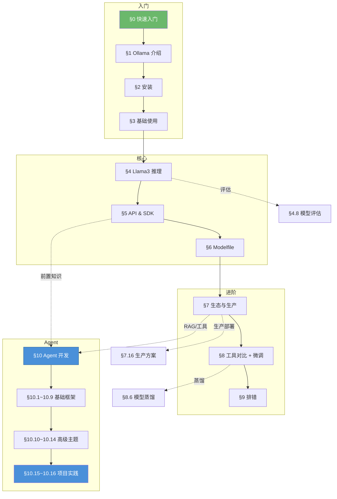

> 💡 **阅读路径建议**：新手按 `§0 → §1 → §2 → §3 → §4 → §5 → §7 → §10` 顺序；有经验者直接从 `§5 → §7.9(RAG) → §7.10(MCP) → §10(Agent)` 开始。

## 0. 5 分钟快速入门

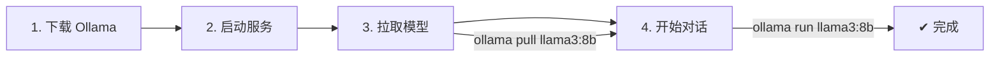

### 第 1 分钟：安装并启动

```bash
# macOS
brew install ollama

# Linux
curl -fsSL https://ollama.com/install.sh | sh

# Windows
# 访问 https://ollama.com 下载安装包

# 启动服务
ollama serve
```

### 第 2 分钟：拉取模型

```bash
ollama pull llama3:8b
```

### 第 3 分钟：开始对话

```bash
ollama run llama3:8b
# >>> 你好，你是谁？
```

### 第 4 分钟：代码调用

```typescript
import ollama from 'ollama'

const res = await ollama.chat({
  model: 'llama3:8b',
  messages: [{ role: 'user', content: '你好' }]
})
console.log(res.message.content)
```

### 第 5 分钟：启动 Web UI

```bash
docker run -d -p 3000:8080 \
  -v open-webui:/app/backend/data \
  ghcr.io/open-webui/open-webui:main
# 浏览器打开 http://localhost:3000
```

---

## 1. Ollama 介绍

### 1.1 什么是 Ollama？

Ollama 是一个**轻量级、本地化的 LLM 运行框架**，旨在让开发者能在自己的机器上轻松运行、管理和交互大语言模型（如 Llama3、Mistral、Gemma 等）。

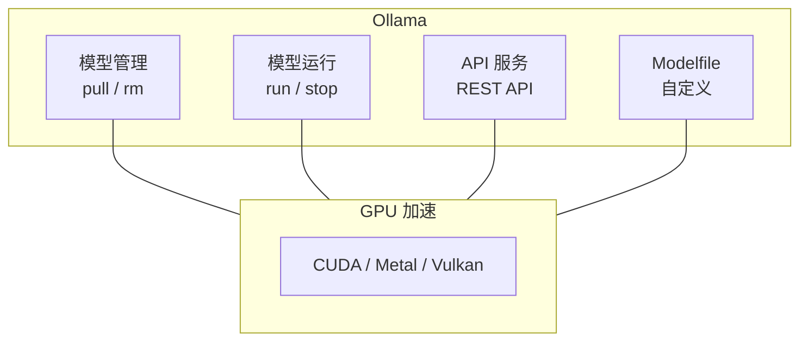

### 1.2 核心特性

| 特性 | 说明 |
|------|------|
| **一键运行** | `ollama run llama4` 即可启动交互式对话 |
| **模型市场** | 内置数千种预配置模型，一行命令下载启动 |
| **API 支持** | 提供 REST API + OpenAI 兼容 API，方便集成到其他应用 |
| **GPU 加速** | 支持 NVIDIA CUDA、Apple Metal (GPU/MLX)、Vulkan |
| **Modelfile** | 可自定义提示词、温度、系统消息等 |
| **轻量跨平台** | 支持 macOS、Linux、Windows |
| **ollama launch** | 一键启动 Claude、Hermes、Oh My Pi 等 AI 编码 Agent |
| **并发处理** | 支持多会话并行推理 |
| **量化支持** | 内置 GGUF 量化格式 + QAT 量化感知训练模型支持 |

### 1.3 与其他工具的关系

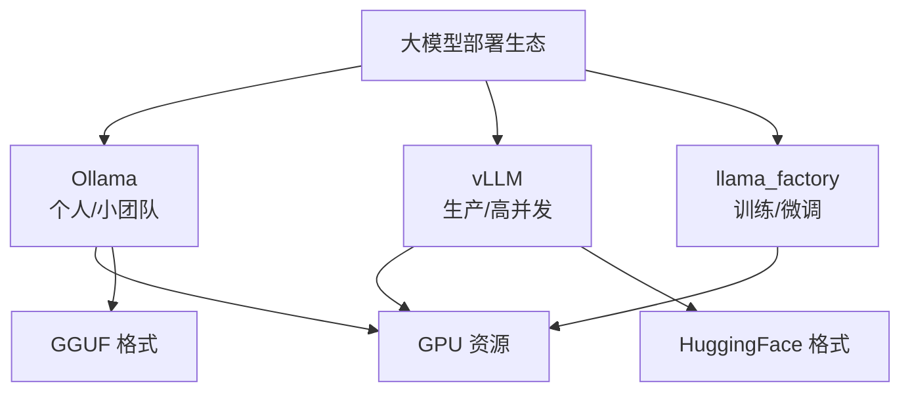

- **Ollama**：专注本地快速推理，开发测试首选
- **vLLM**：专注高吞吐生产部署，支持 PagedAttention
- **llama_factory**：专注微调训练，支持 LoRA/QLoRA

---

## 2. Ollama 安装

### 2.1 系统要求

| 系统 | 最低配置 | 推荐配置 |
|------|---------|---------|
| **CPU 模式** | 8GB RAM | 16GB+ RAM |
| **GPU 模式（7B 模型）** | 8GB VRAM | 12GB+ VRAM |
| **GPU 模式（13B 模型）** | 16GB VRAM | 24GB+ VRAM |
| **GPU 模式（70B 模型）** | 48GB VRAM | 80GB+ VRAM |
| **磁盘空间** | 10GB 可用 | 50GB+ 可用 |

### 2.2 各平台安装方式

#### macOS

```bash
# 官方推荐方式（安装包）
# 访问 https://ollama.com 下载 .dmg 安装包

# 或使用 Homebrew
brew install ollama
```

#### Linux

```bash
# 一键安装脚本（推荐）
curl -fsSL https://ollama.com/install.sh | sh

# 启动服务
ollama serve
```

#### Windows

```bash
# 方式一：访问 https://ollama.com 下载 Windows 安装包
# 方式二：使用 WSL2 在 Linux 子系统中安装
```

### 2.3 验证安装

```bash
# 查看版本
ollama --version

# 查看帮助
ollama --help
```

```
输出示例：
> ollama --version
ollama version 0.30.10
```

### 2.4 GPU 加速验证

```bash
# 查看可用 GPU
ollama ps

# 或在日志中查看
ollama serve --verbose
```

```
NVIDIA GPU 用户应看到类似输出：
level=INFO source=server.go:XXX msg="CUDA is available"
```

### 2.5 安装后目录结构

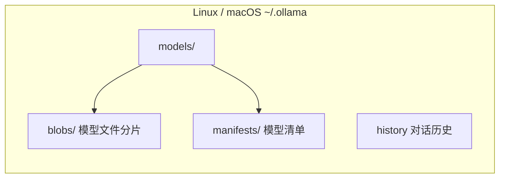

Windows 路径：`%USERPROFILE%\.ollama\`

---

## 3. Ollama 基础使用

### 3.1 模型管理

#### 搜索模型

```bash
# 在线搜索可用模型
ollama search llama3
```

#### 下载/拉取模型

```bash
# 拉取模型（默认 latest 标签）
ollama pull llama3

# 指定标签版本
ollama pull llama3:8b
ollama pull llama3:70b

# 拉取其他模型
ollama pull mistral
ollama pull gemma:7b
ollama pull qwen:7b
```

#### 查看本地模型

```bash
# 列出所有已下载的模型
ollama list
```

```
输出示例：
NAME                    ID              SIZE    MODIFIED
llama3:8b               365c0bd3c000    4.7 GB  2 days ago
llama3:70b              8c17c2e3b12c    39 GB   5 days ago
mistral:7b              f974a74358d6    4.1 GB  1 week ago
```

#### 删除模型

```bash
# 删除指定模型
ollama rm llama3:8b
```

### 3.2 运行模型

#### 交互式对话

```bash
# 直接进入交互模式
ollama run llama3

# 指定系统提示词
ollama run llama3 "你是一位Python专家"
```

进入交互模式后：

```
>>> 你好，请介绍一下你自己
我是 Llama3，一个由 Meta 开发的大型语言模型...

>>> /?               # 查看帮助
>>> /exit            # 退出
>>> /set temperature 0.7  # 设置温度参数
>>> /set system 你是一位数学老师  # 设置系统提示词
```

#### 单次推理

```bash
# 直接输入提示词（不进入交互模式）
ollama run llama3 "用Python写一个冒泡排序"
```

#### 流式输出

默认输出是流式的，逐 token 显示，无需额外配置。

### 3.3 服务管理

```bash
# 后台启动服务
ollama serve
```
> ⚠️ **安全警告**：Ollama 没有内置认证。生产环境**绝不要**将 `OLLAMA_HOST=0.0.0.0` 直接暴露到公网。必须用 Nginx/Caddy 反向代理 + 认证（详见 §7.12 安全加固 和 §7.16 生产部署方案）。

```bash
# 停止服务（Linux/macOS）
pkill ollama

# 设置环境变量
export OLLAMA_HOST=127.0.0.1:11434    # 生产环境建议监听 127.0.0.1
export OLLAMA_MODELS=/path/to/models # 自定义模型目录
export OLLAMA_KEEP_ALIVE=5m          # 模型保持加载时间
export OLLAMA_NUM_PARALLEL=2         # 并行请求数
export OLLAMA_MAX_LOADED_MODELS=2    # 最多同时加载几个模型
```

### 3.4 ollama launch — 一键启动 AI 编码 Agent（v0.30+ 新增）

Ollama 最新版支持 `ollama launch` 命令，一键启动各类 AI 编码 Agent 和桌面工具：

```bash
# 启动 Hermes Desktop（桌面 UI）
ollama launch hermes-desktop

# 启动 Claude 编码助手
ollama launch claude

# 启动 Oh My Pi（AI 编程 Agent，含 IDE 集成）
ollama launch omp
```

> 不同 Provider 会通过 `ollama launch` 自动选择合适的后端引擎（MLX / llama.cpp），无需手动配置。

### 3.5 运行机制图解

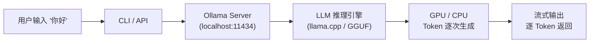

### 3.6 Ollama 内部架构详解

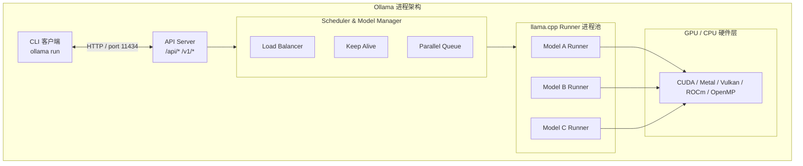

**关键说明**：
- Ollama 为每个模型启动独立的 `llama.cpp` 子进程，进程间隔离
- `OLLAMA_MAX_LOADED_MODELS` 控制同时加载的模型数量
- `OLLAMA_KEEP_ALIVE` 控制模型卸载前的空闲等待时间
- 模型切换时如未超 KEEP_ALIVE，直接从内存加载无需重新读盘

### 3.7 GGUF 量化格式详解

Ollama 统一使用 **GGUF**（GPT-Generated Unified Format）格式，这是 llama.cpp 生态的标准化模型格式：

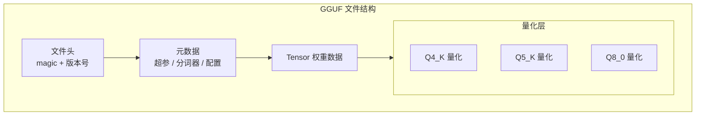

常见量化等级对比：

| 量化类型 | 位宽 | 相对质量 | 相对速度 | 模型大小（7B） |
|---------|------|---------|---------|--------------|
| `Q2_K` | 2-bit | 60-70% | 最快 | ~2.7 GB |
| `Q3_K_M` | 3-bit | 75-80% | 快 | ~3.3 GB |
| `Q4_K_M` | 4-bit | 90-95% | 推荐均衡 | ~4.1 GB |
| `Q5_K_M` | 5-bit | 95-98% | 较慢 | ~5.0 GB |
| `Q6_K` | 6-bit | 98-99% | 慢 | ~5.8 GB |
| `Q8_0` | 8-bit | 99%+ | 最慢 | ~7.7 GB |
| `F16` | 16-bit | 100% | 极慢 | ~14 GB |

**各量化级别适用场景**：

| 场景 | 显存预算 | 推荐量化 | 说明 |
|------|---------|---------|------|
| 7B 模型·16GB 显存 | 充裕 | `Q8_0` / `Q6_K` | 质量优先 |
| 7B 模型·12GB 显存 | 中等 | `Q4_K_M` | 最佳平衡点 |
| 7B 模型·8GB 显存 | 紧张 | `Q3_K_M` | 可接受质量 |
| 13B 模型·16GB 显存 | 紧张 | `Q4_K_M` | 大模型 + 适度量化 |
| 70B 模型·24GB 显存 | 极限 | `Q2_K` / `IQ2_XXS` | 仅能运行 |

> ⚠️ **常见陷阱**：Q4_K_M ≠ Q4_0。`K_M` 版本使用更智能的重要性感知量化，同等位宽下质量高 3~5%。

**IQ（Importance-aware Quantization）新格式**：Ollama v0.30+ 支持 IQ 系列量化（`IQ2_XXS`、`IQ3_XXS` 等）。相比传统 K-quant，IQ 在超低位宽（2~3 bit）下质量更好，适合显存严重受限的场景（如 70B 模型跑在 24GB 显卡上）。

```bash
# 手动量化已有 GGUF 文件（使用 llama.cpp）
./llama-quantize \
  --allow-requantize \
  original-model.gguf \
  quantized-model-q4_K_M.gguf \
  q4_K_M
```

---

## 4. 使用 Ollama 推理 Llama3

### 4.1 Llama3 模型介绍

Llama3 是 Meta 发布的开源大语言模型，有多个版本：

| 模型 | 参数规模 | 上下文长度 | Ollama 拉取命令 |
|------|---------|-----------|----------------|
| Llama3 8B | 8B | 8K | `ollama pull llama3:8b` |
| Llama3 70B | 70B | 8K | `ollama pull llama3:70b` |
| Llama3.1 8B | 8B | 128K | `ollama pull llama3.1:8b` |
| Llama3.1 70B | 70B | 128K | `ollama pull llama3.1:70b` |
| Llama3.2 1B | 1B | 128K | `ollama pull llama3.2:1b` |
| Llama3.2 3B | 3B | 128K | `ollama pull llama3.2:3b` |
| Llama3.2 11B Vision | 11B | 128K | `ollama pull llama3.2-vision:11b` |
| Llama 4 Scout 17B | 17B MoE | 10M | `ollama pull llama4:scout` |
| Llama 4 Maverick 17B | 17B MoE | 1M | `ollama pull llama4:maverick` |
| Gemma 4 12B | 12B | 128K | `ollama pull gemma4:12b-it-qat` |
| DeepSeek R1 | 671B MoE | 128K | `ollama pull deepseek-r1:671b` |
| Qwen3 4B | 4B | 32K | `ollama pull qwen3:4b` |

### 4.2 一键推理 Llama3

```bash
# 第一步：拉取模型
ollama pull llama3:8b

# 第二步：运行推理
ollama run llama3:8b
```

进入对话：

```
>>> 用中文回答：你是谁？
我是 Meta 开发的 Llama3 大语言模型，很高兴为你服务！

>>> 请帮我写一首关于春天的五言绝句
春风拂柳岸，花开满园香。
燕归寻旧垒，日暖卧新芳。
```

### 4.3 不同量级模型的资源消耗

```
模型大小         所需内存         适用场景
───────         ────────        ────────
Llama3 8B       8-16GB         个人笔记本、简单问答
Llama3 70B      40-80GB        服务器、复杂推理
Llama3.2 1B     1-2GB          移动设备、嵌入式
Llama3.2 3B     3-6GB          低配电脑、轻量任务

量化等级说明：
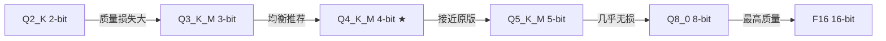
```

### 4.4 流式推理过程详解

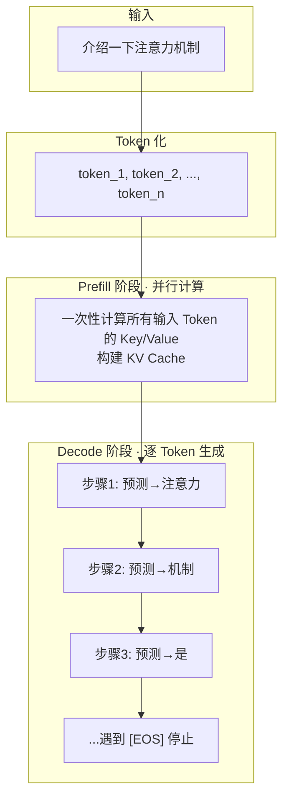

### 4.5 高级推理配置

```bash
# 使用环境变量控制推理参数
OLLAMA_NUM_PARALLEL=2 ollama run llama3:8b

# 设置生成参数（在交互模式中）
>>> /set parameter num_ctx 4096      # 上下文长度
>>> /set parameter temperature 0.8   # 温度（越高越随机）
>>> /set parameter top_p 0.9        # Top-P 采样
>>> /set parameter top_k 40         # Top-K 采样
>>> /set parameter repeat_penalty 1.1  # 重复惩罚
```

### 4.6 文本生成策略参数说明

```
temperature（温度）
  低值 (0.1) ───→ 确定性强、重复性高
  高值 (0.9) ───→ 多样性强、创造性高
        最佳实践：代码生成用 0.1~0.3
                  创意写作用 0.7~0.9

top_p（核采样）
  0.9 表示选择累积概率达 90% 的 token
  值越小，生成越确定

top_k
  限制每次只从概率最高的 K 个 token 中选择
  K 越小，生成越保守

   repeat_penalty
   >1.0 时惩罚重复出现的 token
   推荐 1.1~1.2
```

### 4.7 多模态推理（视觉模型）

Ollama 支持 Llama 3.2 Vision、Llama 4、Gemma 4 等多模态模型，可直接分析图片。

```bash
# 拉取视觉模型
ollama pull llama3.2-vision:11b

# CLI 方式传入图片
ollama run llama3.2-vision:11b "描述这张图片的内容" --image photo.jpg

# 或进入交互模式后
>>> 这张图里有什么？
>>> /image photo.jpg
```

#### TypeScript 调用视觉模型

```typescript
import ollama from 'ollama'
import fs from 'node:fs'

async function describeImage(imagePath: string): Promise<void> {
  const imageBuffer = fs.readFileSync(imagePath)
  const base64Image = imageBuffer.toString('base64')

  const response = await ollama.chat({
    model: 'llama3.2-vision:11b',
    messages: [
      {
        role: 'user',
        content: '请详细描述这张图片的内容',
        images: [base64Image]
      }
    ]
  })
  console.log(response.message.content)
}

// 使用示例
await describeImage('./photo.jpg')
```

### 4.8 模型评估与基准测试

> 不用"感觉"评价模型质量。用可量化的指标 + 标准测试集。

#### 评估三维度

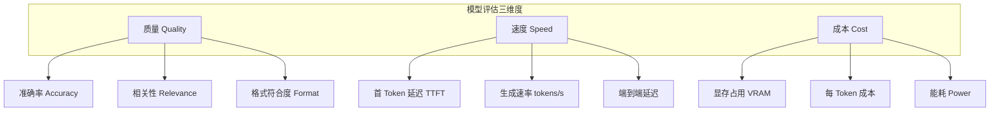

#### 自动化评估管线

```typescript
// eval.ts — 模型评估框架
interface EvalSample {
  input: string
  expected: string
  category: string  // 'math' | 'code' | 'reasoning' | 'translation'
}

interface EvalResult {
  model: string
  samples: number
  accuracy: number
  avgTokensPerSec: number
  avgLatency: number
  vramMB: number
  errors: number
  details: { passed: number; failed: Array<{ input: string; expected: string; got: string }> }
}

async function evaluateModel(
  model: string,
  samples: EvalSample[],
  options?: { judgeModel?: string }
): Promise<EvalResult> {
  const results: EvalResult['details']['failed'] = []
  let passed = 0
  let totalTokens = 0
  let totalTime = 0

  for (const sample of samples) {
    try {
      const start = Date.now()
      const response = await ollama.chat({
        model,
        messages: [{ role: 'user', content: sample.input }],
        options: { temperature: 0 },  // 确定性输出
      })
      const latency = Date.now() - start
      totalTime += latency

      // 使用法官模型判断答案正确性
      const judge = await ollama.chat({
        model: options?.judgeModel || 'qwen3:8b',
        messages: [{
          role: 'user',
          content: `判断以下回答是否符合预期。仅回复 PASS 或 FAIL。
问题：${sample.input}
预期：${sample.expected}
实际：${response.message.content}`,
        }],
        options: { temperature: 0 },
      })

      if (judge.message.content.trim() === 'PASS') {
        passed++
      } else {
        results.push({ input: sample.input, expected: sample.expected, got: response.message.content })
      }
    } catch {
      results.push({ input: sample.input, expected: sample.expected, got: 'ERROR' })
    }
  }

  return {
    model,
    samples: samples.length,
    accuracy: passed / samples.length,
    avgTokensPerSec: 0,  // 需从 response 获取 token 数
    avgLatency: totalTime / samples.length,
    vramMB: 0,  // 需 nvidia-smi 读取
    errors: results.length,
    details: { passed, failed: results },
  }
}
```

#### 标准测试集

```typescript
const mathSamples: EvalSample[] = [
  { input: '1234 + 5678 = ?', expected: '6912', category: 'math' },
  { input: '15 × 23 = ?', expected: '345', category: 'math' },
  { input: '100 ÷ 4 = ?', expected: '25', category: 'math' },
]

const codeSamples: EvalSample[] = [
  { input: 'TypeScript: 实现二分查找', expected: '包含 while left <= right', category: 'code' },
  { input: 'Python: 读取 CSV 文件', expected: '包含 csv.reader 或 pandas', category: 'code' },
]

const reasoningSamples: EvalSample[] = [
  { input: '如果所有 A 是 B，所有 B 是 C，那么所有 A 是 C 吗？', expected: '是', category: 'reasoning' },
]

// 使用
const result = await evaluateModel('qwen3:8b', [...mathSamples, ...codeSamples])
console.log(`准确率: ${(result.accuracy * 100).toFixed(1)}%`)
console.log(`失败用例: ${result.details.failed.length}`)
```

#### 模型对比报告

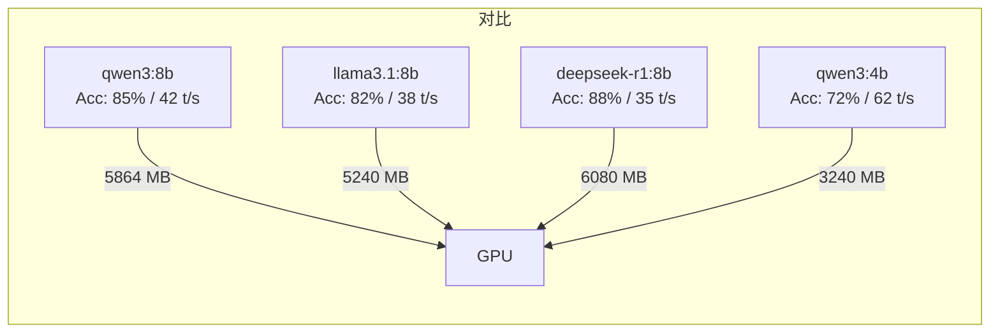

### 4.9 章节练习

> 学完本章后尝试完成以下实践题，检验掌握程度。

1. **一键推理**：用 `ollama run llama3.1:8b` 让模型给你讲一个关于 AI 的笑话
2. **流式 API**：用 fetch + ReadableStream 在浏览器中实现逐 token 打印
3. **多模态**：找一张图片，用 `llama3.2-vision` 描述它，再追问一个图片相关的问题
4. **模型评估**：选取两个同量级模型（如 qwen3:8b 和 llama3.1:8b），用本节评估框架对比准确率和速度

---

## 5. Ollama API

Ollama 提供完整的 REST API，方便程序集成。

### 5.1 API 端点总览

```
自有 API：
POST /api/generate      # 文本生成（非流式/流式）
POST /api/chat          # 对话生成（支持多轮）
POST /api/embeddings    # 文本向量化
GET  /api/tags          # 查看本地模型列表
POST /api/pull          # 拉取模型
POST /api/push          # 推送模型
POST /api/copy          # 复制模型
DELETE /api/delete      # 删除模型
POST /api/create        # 创建模型（Modelfile）

OpenAI 兼容 API（v0.30 完善支持）：
POST /v1/chat/completions   # Chat 补全（兼容 OpenAI SDK）
POST /v1/embeddings         # 向量化
GET  /v1/models             # 模型列表
```

### 5.2 生成文本

```bash
curl http://localhost:11434/api/generate -d '{
  "model": "llama3:8b",
  "prompt": "用中文解释什么是注意力机制",
  "stream": false,
  "options": {
    "temperature": 0.7,
    "num_predict": 200
  }
}'
```

响应示例：

```json
{
  "model": "llama3:8b",
  "response": "注意力机制（Attention Mechanism）是一种让模型...",
  "done": true,
  "context": [128000, 1234, ...],
  "total_duration": 2345678900,
  "load_duration": 12345678,
  "prompt_eval_count": 12,
  "eval_count": 156,
  "eval_duration": 1234567890
}
```

### 5.3 流式生成

```bash
curl http://localhost:11434/api/generate -d '{
  "model": "llama3:8b",
  "prompt": "数到5",
  "stream": true
}'
```

流式响应（NDJSON 格式，逐块返回）：

```
{"model":"llama3:8b","response":"1","done":false}
{"model":"llama3:8b","response":"2","done":false}
{"model":"llama3:8b","response":"3","done":false}
{"model":"llama3:8b","response":"4","done":false}
{"model":"llama3:8b","response":"5","done":false}
{"model":"llama3:8b","response":"","done":true,"total_duration":...}
```

#### 浏览器端流式请求（fetch + ReadableStream）

```typescript
async function streamFromBrowser(prompt: string): Promise<void> {
  const response = await fetch('http://localhost:11434/api/generate', {
    method: 'POST',
    headers: { 'Content-Type': 'application/json' },
    body: JSON.stringify({ model: 'llama3:8b', prompt, stream: true })
  })

  const reader = response.body!.getReader()
  const decoder = new TextDecoder()
  let buffer = ''

  while (true) {
    const { done, value } = await reader.read()
    if (done) break

    buffer += decoder.decode(value, { stream: true })
    const lines = buffer.split('\n')
    buffer = lines.pop() || ''

    for (const line of lines) {
      if (!line.trim()) continue
      try {
        const data = JSON.parse(line)
        if (data.response) {
          // 更新 UI：document.getElementById('output')!.textContent += data.response
          console.log(data.response)
        }
      } catch { /* 忽略不完整行 */ }
    }
  }
}
```

### 5.4 多轮对话

```bash
curl http://localhost:11434/api/chat -d '{
  "model": "llama3:8b",
  "messages": [
    {"role": "system", "content": "你是一位AI助手"},
    {"role": "user", "content": "你好"},
    {"role": "assistant", "content": "你好！有什么可以帮助你的吗？"},
    {"role": "user", "content": "请解释一下Ollama"}
  ],
  "stream": false
}'
```

### 5.5 TypeScript 集成（官方 ollama npm 包）

```typescript
import ollama from 'ollama'

// 文本生成（非流式）
async function askOllama(prompt: string, model = 'llama3:8b'): Promise<string> {
  const response = await ollama.generate({
    model,
    prompt,
    options: { temperature: 0.7 }
  })
  return response.response
}

// 流式生成（含错误处理）
async function askOllamaStream(prompt: string, model = 'llama3:8b'): Promise<void> {
  try {
    const stream = await ollama.generate({
      model,
      prompt,
      stream: true,
      options: { temperature: 0.7 }
    })
    for await (const chunk of stream) {
      process.stdout.write(chunk.response)
    }
  } catch (error) {
    if (error instanceof Error) {
      if (error.message.includes('ECONNREFUSED')) {
        console.error('\n❌ 无法连接 Ollama，请确保已启动: ollama serve')
      } else if (error.message.includes('model not found')) {
        console.error(`\n❌ 模型 ${model} 未找到，请先拉取: ollama pull ${model}`)
      } else {
        console.error(`\n❌ 请求失败: ${error.message}`)
      }
    }
  }
}

// 带进度和统计的流式生成
async function askOllamaWithStats(prompt: string, model = 'llama3:8b'): Promise<void> {
  const startTime = Date.now()
  let tokenCount = 0

  const stream = await ollama.generate({
    model,
    prompt,
    stream: true,
  })

  for await (const chunk of stream) {
    if (chunk.response) {
      process.stdout.write(chunk.response)
      tokenCount++
    }
    // 结束统计
    if (chunk.done) {
      const elapsed = ((Date.now() - startTime) / 1000).toFixed(2)
      const speed = (tokenCount / Number(elapsed)).toFixed(1)
      console.log(`\n\n 生成 ${tokenCount} tokens，用时 ${elapsed}s，速度 ${speed} tokens/s`)
    }
  }
}

// 多轮对话
async function chat(): Promise<void> {
  const response = await ollama.chat({
    model: 'llama3:8b',
    messages: [
      { role: 'system', content: '你是一位AI助手' },
      { role: 'user', content: '你好' },
      { role: 'assistant', content: '你好！有什么可以帮助你的吗？' },
      { role: 'user', content: '请解释一下Ollama' }
    ]
  })
  console.log(response.message.content)
}

// 使用示例
const result = await askOllama('用TypeScript写一个快速排序')
console.log(result)
```

### 5.6 OpenAI 兼容 API + TypeScript

Ollama 支持 OpenAI API 协议，可直接用 `openai` npm 包调用：

```typescript
import OpenAI from 'openai'

const openai = new OpenAI({
  baseURL: 'http://localhost:11434/v1',
  apiKey: 'ollama'  // 任意值，Ollama 不校验
})

async function chatWithOllama(): Promise<void> {
  const response = await openai.chat.completions.create({
    model: 'llama3:8b',
    messages: [
      { role: 'system', content: '你是AI助手' },
      { role: 'user', content: '用中文介绍Ollama' }
    ],
    temperature: 0.7
  })
  console.log(response.choices[0].message.content)
}
```

### 5.7 使用自定义 Ollama 实例

```typescript
import { Ollama } from 'ollama'

// 连接远程或自定义端点的 Ollama 服务
const customOllama = new Ollama({
  host: 'http://192.168.1.100:11434'
})

const response = await customOllama.generate({
  model: 'llama3:8b',
  prompt: 'Hello'
})
```

### 5.8 Embeddings 文本向量化

Ollama 支持将文本转为向量嵌入（embedding），可用于 RAG、语义搜索等场景。

```bash
curl http://localhost:11434/api/embeddings -d '{
  "model": "llama3:8b",
  "prompt": "注意力机制是Transformer的核心"
}'
```

响应：

```json
{
  "embedding": [0.0123, -0.0456, 0.0789, ...]  // 长度为 4096 的向量
}
```

#### TypeScript 调用 Embeddings

```typescript
import ollama from 'ollama'

interface EmbeddingResult {
  embedding: number[]
}

async function getEmbedding(text: string, model = 'llama3:8b'): Promise<number[]> {
  const response: EmbeddingResult = await ollama.embeddings({
    model,
    prompt: text
  })
  return response.embedding
}

// 计算余弦相似度
function cosineSimilarity(a: number[], b: number[]): number {
  const dot = a.reduce((sum, _, i) => sum + a[i] * b[i], 0)
  const normA = Math.sqrt(a.reduce((sum, v) => sum + v * v, 0))
  const normB = Math.sqrt(b.reduce((sum, v) => sum + v * v, 0))
  return dot / (normA * normB)
}

// 使用示例
async function semanticSearch(): Promise<void> {
  const texts = [
    'Transformer 使用自注意力机制',
    'Python 是一种编程语言',
    '注意力机制让模型关注重要信息'
  ]

  const query = '什么是注意力机制'
  const queryEmb = await getEmbedding(query)

  const results = await Promise.all(
    texts.map(async (text) => ({
      text,
      score: cosineSimilarity(queryEmb, await getEmbedding(text))
    }))
  )

  results.sort((a, b) => b.score - a.score)
  console.log('相似度排序:', results)
}
```

### 5.9 Function Calling（工具调用）

Ollama 支持 Function Calling（v0.30+），让模型能够调用外部工具。这是构建 Agent 的基础能力。
> 🎯 **交叉引用**：学完本节后前往 §10（精通 Agent 开发）了解完整的 Agent 循环、多工具编排和生产级 Agent 框架。

```typescript
import ollama from 'ollama'

// 定义工具
const weatherTool = {
  type: 'function',
  function: {
    name: 'get_weather',
    description: '获取指定城市的天气信息',
    parameters: {
      type: 'object',
      properties: {
        city: {
          type: 'string',
          description: '城市名称，如 北京、上海'
        }
      },
      required: ['city']
    }
  }
}

async function callWithTool(): Promise<void> {
  const response = await ollama.chat({
    model: 'llama3.1:8b',
    messages: [
      { role: 'user', content: '北京的天气怎么样？' }
    ],
    tools: [weatherTool]
  })

  // 模型决定是否调用工具
  const message = response.message
  if (message.tool_calls) {
    for (const tool of message.tool_calls) {
      console.log(`调用工具: ${tool.function.name}`)
      console.log(`参数:`, tool.function.arguments)
      // 在这里执行实际工具调用...
    }
  } else {
    console.log(message.content)
  }
}
```

### 5.10 结构化输出（JSON Mode）

Ollama 支持强制 JSON 格式输出，方便程序解析：

```bash
curl http://localhost:11434/api/chat -d '{
  "model": "llama3:8b",
  "messages": [
    {"role": "user", "content": "列出3种编程语言，以JSON格式返回"}
  ],
  "format": "json",
  "options": {"temperature": 0}
}'
```

```typescript
import ollama from 'ollama'

interface LanguageList {
  languages: Array<{
    name: string
    year: number
    paradigm: string
  }>
}

async function getStructuredOutput(): Promise<void> {
  const response = await ollama.chat({
    model: 'llama3:8b',
    messages: [
      {
        role: 'user',
        content: '列出3种编程语言，包含名称、诞生年份、编程范式'
      }
    ],
    format: 'json'
  })

  // 直接解析为类型安全的对象
  const data: LanguageList = JSON.parse(response.message.content)
  console.table(data.languages)
}
```

### 5.11 生产级 TypeScript 模式

#### 请求取消（AbortController）

```typescript
async function askWithAbort(
  prompt: string,
  model = 'llama3:8b',
  signal?: AbortSignal
): Promise<string> {
  const response = await ollama.generate({ model, prompt, stream: false }, { signal })
  return response.response
}

// 使用示例：5 秒超时
const controller = new AbortController()
setTimeout(() => controller.abort(), 5000)

try {
  const result = await askWithAbort('写一篇长文章', 'llama3:8b', controller.signal)
} catch (err) {
  if ((err as Error).name === 'AbortError') {
    console.error('请求超时')
  }
}
```

#### 自动重试（指数退避）

```typescript
async function withRetry<T>(
  fn: () => Promise<T>,
  maxRetries = 3,
  baseDelay = 1000
): Promise<T> {
  for (let i = 0; i <= maxRetries; i++) {
    try {
      return await fn()
    } catch (err) {
      if (i === maxRetries) throw err
      const delay = baseDelay * Math.pow(2, i) + Math.random() * 500
      console.warn(`重试 ${i + 1}/${maxRetries}，等待 ${Math.round(delay)}ms`)
      await new Promise(r => setTimeout(r, delay))
    }
  }
  throw new Error('不可达')
}

// 使用示例
const result = await withRetry(() =>
  ollama.generate({ model: 'llama3:8b', prompt: '你好' })
)
```

#### 并发限流（Token 桶）

```typescript
class OllamaThrottle {
  private queue: Array<() => Promise<void>> = []
  private active = 0

  constructor(private maxConcurrency = 2) {}

  async call<T>(fn: () => Promise<T>): Promise<T> {
    return new Promise((resolve, reject) => {
      this.queue.push(async () => {
        try { resolve(await fn()) }
        catch (e) { reject(e) }
      })
      this.processQueue()
    })
  }

  private async processQueue(): Promise<void> {
    if (this.active >= this.maxConcurrency || this.queue.length === 0) return
    this.active++
    const task = this.queue.shift()!
    await task()
    this.active--
    this.processQueue()
  }
}

// 使用示例
const throttle = new OllamaThrottle(3)
const prompts = ['问题1', '问题2', '问题3', '问题4', '问题5']

const results = await Promise.all(
  prompts.map(p => throttle.call(() =>
    ollama.generate({ model: 'llama3:8b', prompt: p })
  ))
)
```

### 5.12 React 流式渲染示例

```tsx
// components/ChatStream.tsx
'use client'

import { useState, useRef } from 'react'
import ollama from 'ollama'

export default function ChatStream() {
  const [messages, setMessages] = useState<
    Array<{ role: string; content: string }>
  >([])
  const [loading, setLoading] = useState(false)
  const abortRef = useRef<AbortController | null>(null)

  const sendMessage = async (text: string) => {
    setLoading(true)
    abortRef.current = new AbortController()

    // 添加用户消息
    setMessages(prev => [...prev, { role: 'user', content: text }])
    // 添加占位助手消息
    setMessages(prev => [...prev, { role: 'assistant', content: '' }])

    try {
      const stream = await ollama.chat({
        model: 'llama3:8b',
        messages: [
          { role: 'system', content: '你是AI助手' },
          ...messages.map(m => ({
            role: m.role as 'user' | 'assistant',
            content: m.content
          })),
          { role: 'user', content: text }
        ],
        stream: true,
      })

      let fullContent = ''
      for await (const chunk of stream) {
        if (abortRef.current?.signal.aborted) break
        fullContent += chunk.message.content || ''

        // 实时更新 UI
        setMessages(prev => {
          const updated = [...prev]
          updated[updated.length - 1] = { role: 'assistant', content: fullContent }
          return updated
        })
      }
    } catch (err) {
      if ((err as Error).name !== 'AbortError') {
        console.error('流式请求失败:', err)
      }
    } finally {
      setLoading(false)
    }
  }

  const stopGeneration = () => {
    abortRef.current?.abort()
  }

  return (
    <div className="chat-container">
      {messages.map((msg, i) => (
        <div key={i} className={`message ${msg.role}`}>
          <strong>{msg.role === 'user' ? '你' : 'AI'}:</strong>{' '}
          {msg.content || '...'}
        </div>
      ))}

      {loading && (
        <button onClick={stopGeneration}>停止生成</button>
      )}

      <input
        onKeyDown={e => {
          if (e.key === 'Enter' && !loading) {
            sendMessage((e.target as HTMLInputElement).value)
            ;(e.target as HTMLInputElement).value = ''
          }
        }}
        placeholder="输入消息..."
        disabled={loading}
      />
    </div>
  )
}
```

```bash
# 在 Next.js 项目中使用
npx create-next-app@latest my-chat --typescript
npm install ollama
# 将以上组件放入 app/components/ChatStream.tsx
```

### 5.13 WebSocket 实时通信

> SSE（Server-Sent Events）是单向推送。WebSocket 实现双向流：客户端可随时中断、重发、多路复用。

#### Ollama SSE → WebSocket 网关

```typescript
// ws-gateway.ts — 将 Ollama SSE 转为 WebSocket
import { WebSocketServer, WebSocket } from 'ws'
import http from 'http'

const server = http.createServer()
const wss = new WebSocketServer({ server })

wss.on('connection', (ws: WebSocket) => {
  ws.on('message', async (raw) => {
    const { type, model, messages, options } = JSON.parse(raw.toString())

    if (type === 'chat') {
      const response = await fetch('http://localhost:11434/api/chat', {
        method: 'POST',
        headers: { 'Content-Type': 'application/json' },
        body: JSON.stringify({
          model: model || 'llama3.1:8b',
          messages,
          stream: true,
          options,
        }),
      })

      const reader = response.body!.getReader()
      const decoder = new TextDecoder()

      while (true) {
        const { done, value } = await reader.read()
        if (done) { ws.send(JSON.stringify({ type: 'done' })); break }

        const lines = decoder.decode(value).split('\n').filter(Boolean)
        for (const line of lines) {
          try {
            const parsed = JSON.parse(line)
            if (parsed.message?.content) {
              ws.send(JSON.stringify({ type: 'token', content: parsed.message.content }))
            }
          } catch { /* 忽略解析错误 */ }
        }
      }
    }

    if (type === 'abort') {
      // 可通过 AbortController 中断当前请求
      ws.send(JSON.stringify({ type: 'aborted' }))
    }
  })
})

server.listen(8080, () => console.log('WS Gateway on :8080'))
```

#### 浏览器 WebSocket 客户端

```typescript
// ws-client.ts
class WSClient {
  private ws: WebSocket
  private onToken: (token: string) => void

  constructor(url: string, onToken: (token: string) => void) {
    this.ws = new WebSocket(url)
    this.onToken = onToken
    this.ws.onmessage = (event) => {
      const data = JSON.parse(event.data)
      if (data.type === 'token') this.onToken(data.content)
    }
  }

  chat(messages: any[], model?: string): void {
    this.ws.send(JSON.stringify({ type: 'chat', messages, model }))
  }

  abort(): void {
    this.ws.send(JSON.stringify({ type: 'abort' }))
  }

  close(): void { this.ws.close() }
}

// 使用
const client = new WSClient('ws://localhost:8080', (token) => {
  process.stdout.write(token)
})
client.chat([{ role: 'user', content: '你好' }])
```

### 5.14 API 版本演进与迁移

> Ollama 的 API 仍在快速演进中。了解变化历史，避免被 breaking change 绊倒。

#### v0.x API 变化时间线

| 版本 | 关键变化 | 影响 |
|------|---------|------|
| v0.1.x | 初始 REST API：`/api/generate`、`/api/chat` | 基础 |
| v0.2.x | 新增 `/api/embeddings`、`/api/create` | 向量化支持 |
| v0.3.x | 新增 `/api/copy`、`/api/push`，`/api/tags` 改版 | 模型管理增强 |
| v0.4.x | 新增 `stream: false` 支持 | 非流式简化 |
| v0.5.x | OpenAI 兼容 API 预览：`/v1/chat/completions` | 迁移便利 |
| v0.10.x | `format: 'json'` 结构化输出 | JSON Mode |
| v0.20.x | Function Calling 原生支持、OpenAI 兼容 GA | 工具调用 |
| v0.25.x | 多工具并行调用、流式工具调用 | 高级 Agent |
| **v0.30.x** | **ollama launch、IQ 量化、同时加载多模型优化** | 当前最新 |

#### 从 v0.20 迁移到 v0.30 注意事项

```typescript
// ❌ 旧方式（v0.20）
const oldWay = await fetch('http://localhost:11434/api/generate', {
  method: 'POST',
  body: JSON.stringify({
    model: 'llama3:8b',
    prompt: 'Hello',  // generate 用 prompt
    stream: false,
  }),
})

// ✅ 新方式（v0.30，推荐使用 chat 统一接口）
const newWay = await fetch('http://localhost:11434/api/chat', {
  method: 'POST',
  body: JSON.stringify({
    model: 'llama3.1:8b',
    messages: [{ role: 'user', content: 'Hello' }],  // chat 用 messages
    stream: false,
  }),
})
```

**迁移检查清单**：
- [ ] `prompt` → `messages`（generate → chat）
- [ ] `raw: true` 改为 `options: { raw: true }`
- [ ] `context` 数组 → 用聊天历史 `messages` 替代
- [ ] Function Calling 用 `tools` 参数，不用手动解析 JSON
- [ ] 环境变量 `OLLAMA_HOST` 默认从 `localhost` → `127.0.0.1`

#### 废弃端点替代方案

| 废弃端点 | 替代 | 移除版本 |
|---------|------|---------|
| `POST /api/generate` | `POST /api/chat` | v0.35+ 计划 |
| `options.raw` | `options: { raw: true }` | v0.30+ |
| `context` 数组 | `messages` 数组 | v0.30+ |

> ⚠️ **常见陷阱**：不要在 `/api/generate` 和 `/api/chat` 之间混用参数格式。`/api/generate` 用 `prompt`，`/api/chat` 用 `messages`，混用会导致 400 错误。

> Modelfile 是 Ollama 的灵魂，它让你像写 Dockerfile 一样定制 LLM。
> 从改 Prompt 到调参数，再到融合多个模型，Modelfile 是一切高级用法的起点。

### 6.1 Modelfile 基本结构

```dockerfile
# 基础模型
FROM llama3:8b

# 设置温度（默认 0.8）
PARAMETER temperature 0.6

# 设置上下文长度
PARAMETER num_ctx 4096

# 设置系统提示词
SYSTEM """你是一位精通中文的AI编程助手。
你擅长：
- TypeScript、Python、Java 等主流语言
- Node.js 后端开发和 React 前端开发
- 代码调试、重构和架构设计

请用中文回答，并提供代码示例。
"""

# 设置模板（可选）
TEMPLATE """
{{- if .System }}
<|system|>
{{ .System }}
<|end|>
{{- end }}
<|user|>
{{ .Prompt }}
<|end|>
<|assistant|>
"""

# 设置许可证
LICENSE MIT
```

### 6.2 创建自定义模型

```bash
# 方式一：使用文件
# 将上述内容保存为 Modelfile
ollama create my-coder -f ./Modelfile

# 方式二：从标准输入
ollama create my-coder -f - << EOF
FROM llama3:8b
PARAMETER temperature 0.3
SYSTEM "你只回答技术问题，用中文回复。"
EOF
```

### 6.3 运行自定义模型

```bash
ollama run my-coder
```

```
>>> 写一个二分查找
<自动以技术助手角色回答，温度 0.3，回答更确定>
```

### 6.4 Modelfile 参数参考

| 参数 | 默认值 | 说明 |
|------|--------|------|
| `temperature` | 0.8 | 生成温度 (0.0~2.0) |
| `top_p` | 0.9 | 核采样参数 |
| `top_k` | 40 | Top-K 采样 |
| `num_ctx` | 2048 | 上下文窗口大小 |
| `num_predict` | 128 | 最大生成 token 数 |
| `repeat_penalty` | 1.1 | 重复惩罚 |
| `stop` | - | 停止词序列 |
| `seed` | 随机 | 随机种子 |
| `mirostat` | 0 | 困惑度控制 (0/1/2) |
| `mirostat_tau` | 5.0 | Mirostat 目标困惑度 |
| `mirostat_eta` | 0.1 | Mirostat 学习率 |

### 6.5 实用 Modelfile 示例

#### 翻译助手

```dockerfile
FROM llama3:8b
PARAMETER temperature 0.2
SYSTEM """
你是一位专业的翻译官。请将用户输入的内容翻译成英文。
只输出翻译结果，不要额外解释。
输入为中文时翻译为英文，输入为英文时翻译为中文。
"""
```

#### 代码审查助手

```dockerfile
FROM llama3:8b
PARAMETER temperature 0.3
PARAMETER num_ctx 8192
SYSTEM """
你是一位资深的代码审查专家。请审查用户提交的代码，关注：
1. 潜在 bug 和安全问题
2. 性能优化建议
3. 代码风格和可读性
4. 架构设计问题

请用中文回复，指出问题并给出改进建议。
"""
```

---

## 7. Ollama 生态与进阶

### 7.1 Ollama 整体生态

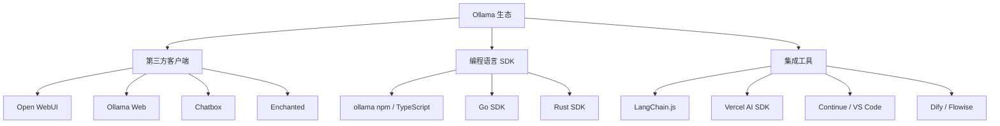

### 7.2 第三方 UI 客户端

#### Open WebUI（推荐）

```bash
# 使用 Docker 安装
docker run -d -p 3000:8080 \
  --add-host=host.docker.internal:host-gateway \
  -v open-webui:/app/backend/data \
  --name open-webui \
  --restart always \
  ghcr.io/open-webui/open-webui:main
```

访问 `http://localhost:3000` 即可获得类似 ChatGPT 的 Web 界面。

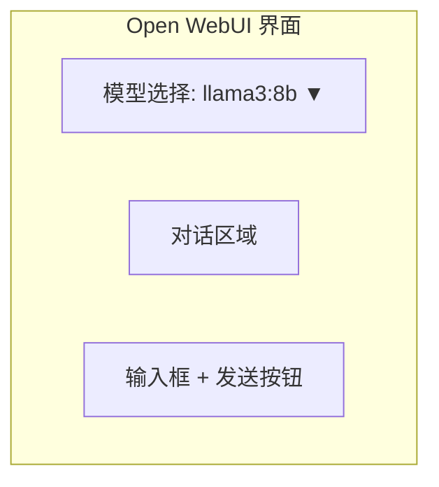

#### 其他客户端

| 客户端 | 平台 | 特点 |
|--------|------|------|
| **Chatbox** | Windows/macOS | 桌面端，UI 精美 |
| **Enchanted** | macOS 原生 | 支持 iCloud 同步 |
| **Ollama Web** | Web 端 | 轻量级，无需 Docker |
| **Continue** | VS Code 插件 | 内联代码辅助 |

### 7.3 LangChain.js 集成 (TypeScript)

```typescript
import { ChatOllama } from '@langchain/ollama'

// 初始化聊天模型
const model = new ChatOllama({
  model: 'llama3:8b',
  temperature: 0.7,
  maxRetries: 2,
})

// 直接调用
const result = await model.invoke([
  ['human', '用中文解释什么是 Transformer']
])
console.log(result.content)

// 链式调用
import { ChatPromptTemplate } from '@langchain/core/prompts'

const prompt = ChatPromptTemplate.fromMessages([
  ['system', '你是一位 AI 专家，请用通俗的语言解释概念。'],
  ['human', '{input}']
])

const chain = prompt.pipe(model)
const response = await chain.invoke({ input: '什么是注意力机制？' })
console.log(response.content)
```

### 7.4 Ollama + Vercel AI SDK (TypeScript)

```typescript
import { ollama } from 'ollama-ai-provider-v2'
import { generateText } from 'ai'

const { text } = await generateText({
  model: ollama('llama3:8b'),
  prompt: '用中文解释 RAG 检索增强生成',
})

console.log(text)
```

### 7.5 Docker 部署（生产环境推荐）

Ollama 官方提供 Docker 镜像，适合生产环境部署、多模型编排和团队共享。

#### 单容器部署

```bash
# CPU 模式
docker run -d -v ollama:/root/.ollama -p 11434:11434 --name ollama ollama/ollama

# NVIDIA GPU 模式（需安装 NVIDIA Container Toolkit）
docker run -d --gpus=all -v ollama:/root/.ollama -p 11434:11434 --name ollama ollama/ollama

# AMD GPU 模式
docker run -d --device /dev/kfd --device /dev/dri \
  -v ollama:/root/.ollama -p 11434:11434 --name ollama ollama/ollama:rocm

# 在容器内拉取模型并运行
docker exec ollama ollama pull llama3:8b
docker exec ollama ollama run llama3:8b "你好"
```

#### Docker Compose 多模型编排

```yaml
# docker-compose.yml
services:
  # 主模型服务
  ollama-main:
    image: ollama/ollama:latest
    container_name: ollama-main
    ports:
      - "11434:11434"
    volumes:
      - ollama-main-data:/root/.ollama
    environment:
      - OLLAMA_KEEP_ALIVE=30m
      - OLLAMA_NUM_PARALLEL=4
      - OLLAMA_MAX_LOADED_MODELS=2
    deploy:
      resources:
        reservations:
          devices:
            - driver: nvidia
              count: 1
              capabilities: [gpu]
    restart: unless-stopped
    networks:
      - ai-net

  # 专用 Embedding 模型服务（轻量，可共用 GPU）
  ollama-embed:
    image: ollama/ollama:latest
    container_name: ollama-embed
    ports:
      - "11435:11434"
    volumes:
      - ollama-embed-data:/root/.ollama
    environment:
      - OLLAMA_KEEP_ALIVE=5m
      - OLLAMA_NUM_PARALLEL=8
      - OLLAMA_MAX_LOADED_MODELS=1
    deploy:
      resources:
        limits:
          memory: 4G
          cpus: '2'
    restart: unless-stopped
    networks:
      - ai-net

  # Open WebUI
  open-webui:
    image: ghcr.io/open-webui/open-webui:main
    container_name: open-webui
    ports:
      - "3000:8080"
    volumes:
      - webui-data:/app/backend/data
    environment:
      - OLLAMA_BASE_URLS=http://ollama-main:11434,http://ollama-embed:11435
      - WEBUI_NAME=我的AI平台
    depends_on:
      - ollama-main
      - ollama-embed
    restart: unless-stopped
    networks:
      - ai-net

volumes:
  ollama-main-data:
  ollama-embed-data:
  webui-data:

networks:
  ai-net:
    driver: bridge
```

```bash
# 启动所有服务
docker compose up -d

# 查看日志
docker compose logs -f

# 在特定容器中拉取模型
docker compose exec ollama-main ollama pull llama3:8b
docker compose exec ollama-embed ollama pull nomic-embed-text
```

### 7.6 从 HuggingFace 导入模型

Ollama 支持从 HuggingFace 导入 GGUF 格式模型，或从 Safetensors 转换。

#### 方式一：直接导入 GGUF

```bash
# 创建 Modelfile
echo "FROM ./qwen2.5-7b-q4_k_m.gguf" > Modelfile
ollama create my-qwen -f Modelfile
ollama run my-qwen
```

#### 方式二：从 HuggingFace 模型库导入

```bash
# 从 HF 下载 GGUF 模型（使用 huggingface-cli）
pip install huggingface-hub
huggingface-cli download \
  QuantFactory/Qwen2.5-7B-GGUF \
  qwen2.5-7b.Q4_K_M.gguf \
  --local-dir ./models

# 创建 Ollama 模型
ollama create qwen2.5-custom -f - << EOF
FROM ./models/qwen2.5-7b.Q4_K_M.gguf
PARAMETER temperature 0.7
TEMPLATE "{{ .Prompt }}"
EOF
```

#### 方式三：从 Safetensors 转换

```bash
# 使用 llama.cpp 转换（需先安装）
git clone https://github.com/ggerganov/llama.cpp
cd llama.cpp
pip install -r requirements.txt

# 转换 Safetensors → GGUF
python convert_hf_to_gguf.py \
  /path/to/huggingface/model \
  --outfile /path/to/output.gguf \
  --outtype q4_k_m

# 导入到 Ollama
ollama create my-model -f - << EOF
FROM /path/to/output.gguf
EOF
```

### 7.7 性能调优指南

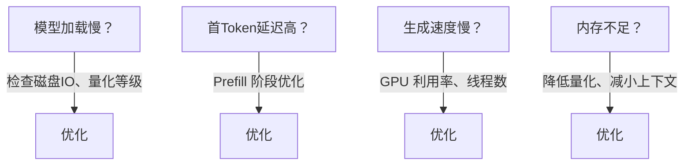

#### 关键性能参数

| 环境变量 | 默认值 | 说明 | 调优建议 |
|---------|--------|------|---------|
| `OLLAMA_NUM_PARALLEL` | 1 | 并行请求数 | 高并发设 2-4 |
| `OLLAMA_MAX_LOADED_MODELS` | 1 | 同时加载模型数 | 内存充裕可设 2-3 |
| `OLLAMA_KEEP_ALIVE` | 5m | 模型保活时间 | 频繁使用设 30m 或 -1 |
| `OLLAMA_NUM_THREADS` | 自动 | CPU 线程数 | 设为物理核心数 |
| `OLLAMA_GPU_LAYERS` | -1 | GPU 卸载层数 | -1 为全部卸载 |

#### Windows 特定调优

```powershell
# PowerShell 设置环境变量
$env:OLLAMA_NUM_PARALLEL = "2"
$env:OLLAMA_KEEP_ALIVE = "30m"
$env:OLLAMA_GPU_LAYERS = "99"
ollama serve
```

#### 性能对比数据

| 配置 | 吞吐量 (token/s) | 首Token 延迟 (ms) |
|------|:----------------:|:-----------------:|
| 单请求 | 82 | 45 |
| 并行×2 | 148 | 62 |
| 并行×4 | 210 | 95 |
| 并行×8 | 240 | 180 |
| batch=1, ctx=4096 | 82 | 45 |
| batch=512, ctx=4096 | 95 | 42 |

### 7.8 KEEP_ALIVE 策略详解

OLLAMA_KEEP_ALIVE 控制模型卸载前的等待时间。合理配置能平衡响应速度和显存占用。
> ⚠️ **常见陷阱**：`KEEP_ALIVE=0` 不会在推理完成后**立即**释放显存——Ollama 需要几十到几百毫秒完成清理。频繁设置 `KEEP_ALIVE=0` 会导致反复加载/卸载，性能反而更差。用 `5m` 或 `30m` 更适合高频访问场景。

| 设置 | 行为 |
|------|------|
| `0` | 每次推理后立即卸载（省内存，加载慢） |
| `5m` | 5分钟无请求后卸载（默认，推荐个人使用） |
| `30m` | 30分钟无请求后卸载（团队共享推荐） |
| `-1` | 永不卸载（最快响应，最耗内存） |
| `24h` | 24小时后卸载 |

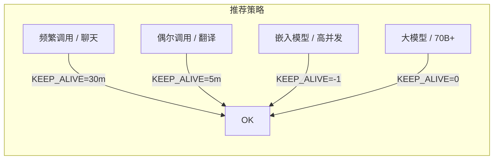

### 7.9 实战：构建 RAG 系统（Ollama + TypeScript + SQLite）

本地化 RAG 系统，无需任何外部 API，全部在本地运行。结合 §10.10 的记忆系统可构建持久化知识库。
> 🎯 **交叉引用**：RAG 提供外部知识，§10.10（Agent 记忆系统）管理对话历史。两者结合就是完整的"长期记忆"方案。

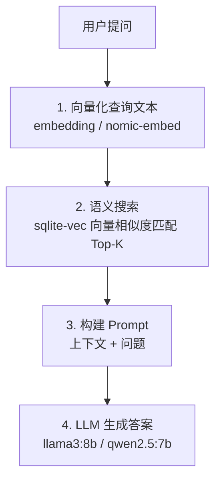

#### 前置准备

```bash
# 安装依赖
npm init -y
npm install ollama better-sqlite3 sql.js
npm install -D @types/better-sqlite3 typescript tsx

# 拉取模型
ollama pull nomic-embed-text   # 嵌入模型（768维）
ollama pull llama3:8b           # 生成模型
```

#### 完整实现

```typescript
import ollama from 'ollama'
import Database from 'better-sqlite3'

// 初始化 SQLite（含向量扩展）
const db = new Database('rag.db')
db.exec(`
  CREATE TABLE IF NOT EXISTS chunks (
    id INTEGER PRIMARY KEY AUTOINCREMENT,
    content TEXT,
    source TEXT,
    embedding BLOB
  );
  CREATE INDEX IF NOT EXISTS idx_source ON chunks(source);
`)

// ========== 1. 文本分块 ==========

function chunkText(text: string, source: string, chunkSize = 800, overlap = 100): string[] {
  const chunks: string[] = []
  let start = 0
  while (start < text.length) {
    const end = Math.min(start + chunkSize, text.length)
    chunks.push(text.slice(start, end))
    start += chunkSize - overlap
  }
  return chunks
}

// ========== 2. 嵌入并存储 ==========

async function embedAndStore(text: string, source: string): Promise<void> {
  const chunks = chunkText(text, source)
  const insert = db.prepare(
    'INSERT INTO chunks (content, source, embedding) VALUES (?, ?, ?)'
  )

  for (const chunk of chunks) {
    const response = await ollama.embeddings({
      model: 'nomic-embed-text',
      prompt: chunk,
    })
    insert.run(chunk, source, new Float32Array(response.embedding).buffer)
  }
  console.log(`已索引 ${chunks.length} 个分块: ${source}`)
}

// ========== 3. 语义搜索 ==========

function cosineSimilarity(a: Float32Array, b: Float32Array): number {
  let dot = 0, normA = 0, normB = 0
  for (let i = 0; i < a.length; i++) {
    dot += a[i] * b[i]
    normA += a[i] * a[i]
    normB += b[i] * b[i]
  }
  return dot / (Math.sqrt(normA) * Math.sqrt(normB))
}

async function search(query: string, topK = 3): Promise<Array<{ content: string; source: string; score: number }>> {
  const queryEmb = await ollama.embeddings({
    model: 'nomic-embed-text',
    prompt: query,
  })
  const queryVec = new Float32Array(queryEmb.embedding)

  const rows = db.prepare('SELECT id, content, source, embedding FROM chunks').all() as any[]

  const scored = rows.map((row: any) => ({
    content: row.content,
    source: row.source,
    score: cosineSimilarity(queryVec, new Float32Array(row.embedding)),
  }))

  return scored.sort((a, b) => b.score - a.score).slice(0, topK)
}

// ========== 4. 生成回答 ==========

async function ask(question: string): Promise<void> {
  const results = await search(question)

  const context = results.map(r => `[来源: ${r.source}]\n${r.content}`).join('\n\n')

  const response = await ollama.chat({
    model: 'llama3:8b',
    messages: [
      {
        role: 'system',
        content: `你是一个基于文档的问答助手。请用中文根据以下上下文回答问题。
如果上下文不够，请如实说不知道，不要编造。

上下文：
${context}`
      },
      { role: 'user', content: question }
    ],
    stream: true,
  })

  console.log('\n 答案:')
  for await (const chunk of response) {
    process.stdout.write(chunk.message.content || '')
  }
  console.log('\n\n 来源:', [...new Set(results.map(r => r.source))])
}

// ========== 使用示例 ==========

async function main() {
  // 索引文档
  await embedAndStore(
    'Ollama 是一个轻量级的本地大模型运行框架，支持 Llama3、Mistral、Gemma 等模型。' +
    '它基于 llama.cpp 引擎，使用 GGUF 量化格式，支持 GPU 加速。',
    'ollama_intro.txt'
  )

  // 提问
  await ask('Ollama 支持哪些模型格式？')
}

main().catch(console.error)
```

#### 进阶：混合检索（Hybrid Search）

纯向量检索的缺点是丢失关键词匹配。混合检索融合 BM25（关键词）和向量（语义），大幅提升召回率。

```typescript
// hybrid-search.ts — 混合检索
type SearchResult = { content: string; source: string; score: number }

class HybridSearch {
  // BM25 简易实现（词频统计）
  private bm25(doc: string, query: string): number {
    const docs = [doc]
    const queryTerms = query.toLowerCase().split(/\s+/)
    let score = 0
    for (const term of queryTerms) {
      const df = docs.filter(d => d.toLowerCase().includes(term)).length
      const idf = Math.log((docs.length + 1) / (df + 0.5) + 1)
      const tf = doc.toLowerCase().split(term).length - 1
      score += idf * (tf * 1.5) / (tf + 1.5)
    }
    return score
  }

  // 向量余弦相似度
  private cosineSim(a: number[], b: number[]): number {
    const dot = a.reduce((s, v, i) => s + v * (b[i] || 0), 0)
    const mag = (v: number[]) => Math.sqrt(v.reduce((s, x) => s + x * x, 0))
    return dot / (mag(a) * mag(b) || 1)
  }

  // RRF（Reciprocal Rank Fusion）融合排序
  private rrf(rankings: SearchResult[][], k = 60): SearchResult[] {
    const scores = new Map<string, { result: SearchResult; score: number }>()
    for (const rankList of rankings) {
      rankList.forEach((r, i) => {
        const key = r.content
        const existing = scores.get(key) || { result: r, score: 0 }
        existing.score += 1 / (k + i + 1)
        scores.set(key, existing)
      })
    }
    return [...scores.values()]
      .sort((a, b) => b.score - a.score)
      .map(s => ({ ...s.result, score: s.score }))
  }

  async search(
    query: string,
    docs: string[],
    queryEmb: number[],
    docEmbs: number[][],
    topK = 5
  ): Promise<SearchResult[]> {
    // BM25 排名
    const bm25Results: SearchResult[] = docs.map((d, i) => ({
      content: d, source: '', score: this.bm25(d, query),
    }))
    const bm25Ranked = bm25Results.sort((a, b) => b.score - a.score).slice(0, topK * 2)

    // 向量排名
    const vecResults: SearchResult[] = docEmbs.map((emb, i) => ({
      content: docs[i], source: '', score: this.cosineSim(queryEmb, emb),
    }))
    const vecRanked = vecResults.sort((a, b) => b.score - a.score).slice(0, topK * 2)

    // RRF 融合
    return this.rrf([bm25Ranked, vecRanked], 60).slice(0, topK)
  }
}
```

#### 进阶：重排序（Cross-Encoder Reranking）

向量检索（Bi-Encoder）速度快但精度有限。先用向量检索 Top-30，再用 Cross-Encoder 精排 Top-5，精度可提升 15~25%。

```typescript
// reranker.ts — 交叉编码器重排序
async function rerank(query: string, candidates: string[], topK = 5): Promise<string[]> {
  // 方法1：用 LLM 做重排序（无需额外模型）
  const response = await ollama.chat({
    model: 'llama3.1:8b',
    messages: [{
      role: 'user',
      content: `给定问题："${query}"\n\n请对以下段落按相关性从高到低排序，只输出序号：\n\n${
        candidates.map((c, i) => `[${i}] ${c.slice(0, 200)}`).join('\n')
      }`,
    }],
    options: { temperature: 0 },
  })

  // 解析排序结果
  const order = response.message.content
    .match(/\[(\d+)\]/g)
    ?.map(m => parseInt(m.slice(1, -1)))
    .filter(i => i < candidates.length) || []

  return [...new Set([...order, ...candidates.keys()])]
    .slice(0, topK)
    .map(i => candidates[i])
}
```

#### 进阶：文档分块策略

| 策略 | 分块方式 | 适用场景 | 优点 | 缺点 |
|------|---------|----------|------|------|
| **固定大小** | 按字符数切 | 通用 | 简单可控 | 断句丢失语义 |
| **递归分割** | 先按段落→再按句子 | 长文档 | 保留语义边界 | 块大小不均 |
| **语义分割** | 按话题转折切 | 文章/报告 | 语义完整 | 需模型辅助 |
| **滑动窗口** | 固定块 + 重叠 | 问答系统 | 不遗漏边界内容 | 存储冗余 |

```typescript
// chunker.ts — 递归分块器
interface ChunkResult { content: string; metadata: { index: number; startChar: number } }

class RecursiveChunker {
  private separators = ['\n\n', '\n', '。', '，', ' ']

  chunk(text: string, maxSize = 800, minSize = 100): ChunkResult[] {
    return this.split(text, 0, maxSize, minSize, 0)
  }

  private split(text: string, start: number, maxSize: number, minSize: number, depth: number): ChunkResult[] {
    if (text.length <= maxSize || depth >= this.separators.length) {
      return [{ content: text, metadata: { index: start, startChar: start } }]
    }

    const sep = this.separators[depth]
    const parts = text.split(sep)
    if (parts.length === 1) return this.split(text, start, maxSize, minSize, depth + 1)

    const chunks: ChunkResult[] = []
    let current = '', currentStart = start
    for (const part of parts) {
      if ((current + sep + part).length > maxSize && current.length >= minSize) {
        chunks.push({ content: current, metadata: { index: currentStart, startChar: currentStart } })
        currentStart = start + text.indexOf(part)
        current = part
      } else {
        current = current ? current + sep + part : part
      }
    }
    if (current) chunks.push({ content: current, metadata: { index: currentStart, startChar: currentStart } })
    return chunks
  }
}
```

#### 进阶：GraphRAG 知识图谱增强

> 传统 RAG 检索独立文本块，丢失实体间关系。GraphRAG 用知识图谱建模实体 + 关系，让 LLM 理解"谁和谁有什么关联"。

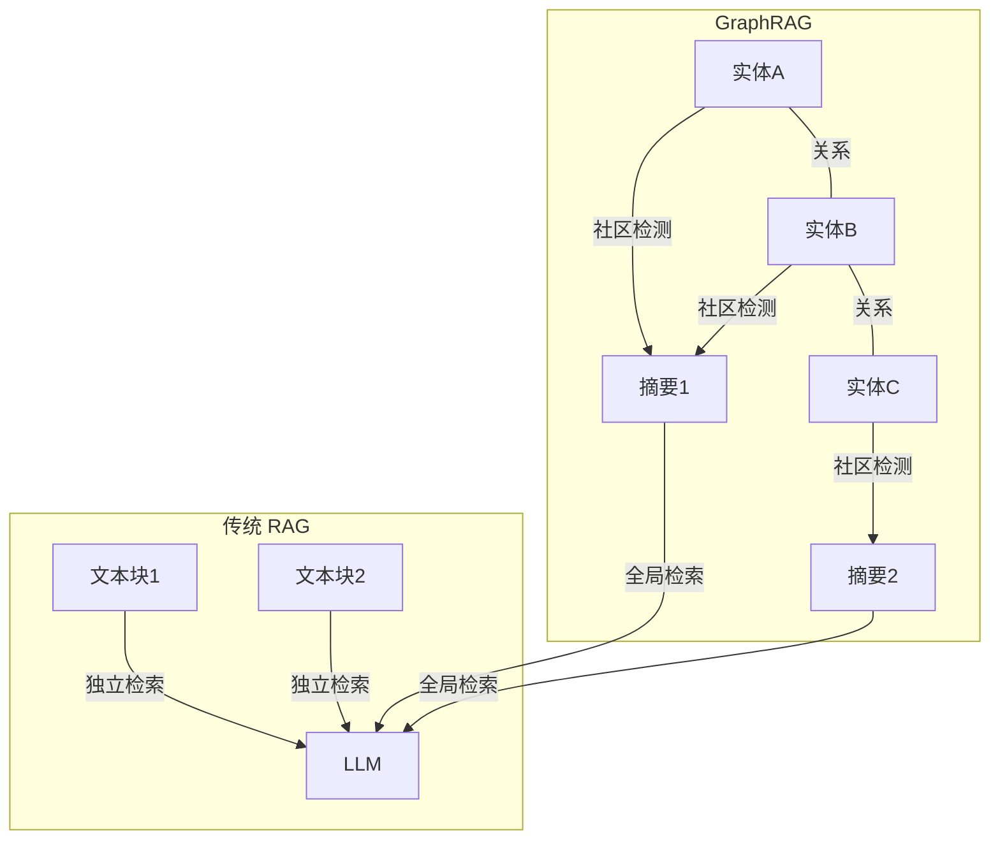

**GraphRAG vs 传统 RAG**：

| 维度 | 传统 RAG | GraphRAG |
|------|---------|----------|
| 检索单位 | 文本块 | 实体 + 关系 + 社区摘要 |
| 关系理解 | ❌ 不感知实体关系 | ✅ 显式建模 |
| 全局问题 | ❌ "整体趋势是什么" 表现差 | ✅ 社区摘要聚合全局信息 |
| 实现复杂度 | 低 | 中 |
| 索引成本 | 低 | 高（需 LLM 提取实体） |
| 适用场景 | 问答、客服 | 分析报告、研究综述、关系查询 |

#### Ollama + Neo4j GraphRAG 实现

```typescript
// graphrag.ts — 简易 GraphRAG 实现
import ollama from 'ollama'

interface Entity {
  name: string
  type: string
  description: string
}

interface Relation {
  source: string
  target: string
  relation: string
}

class GraphRAG {
  private entities: Entity[] = []
  private relations: Relation[] = []

  // 步骤1：从文本中提取实体和关系
  async index(text: string): Promise<void> {
    const response = await ollama.chat({
      model: 'qwen3:8b',
      messages: [{
        role: 'user',
        content: `从以下文本中提取所有实体和关系。以 JSON 格式返回，包含 entities 数组(每个有 name/type/description) 和 relations 数组(每个有 source/target/relation)。

文本：${text}

只返回 JSON，不要多余文字。`,
      }],
      options: { temperature: 0, format: 'json' },
    })

    try {
      const graph = JSON.parse(response.message.content)
      this.entities.push(...(graph.entities || []))
      this.relations.push(...(graph.relations || []))
    } catch { /* 解析失败跳过 */ }
  }

  // 步骤2：社区检测（简易：关联度高的实体聚类）
  private detectCommunities(): Entity[][] {
    const adjacency = new Map<string, Set<string>>()
    for (const r of this.relations) {
      if (!adjacency.has(r.source)) adjacency.set(r.source, new Set())
      if (!adjacency.has(r.target)) adjacency.set(r.target, new Set())
      adjacency.get(r.source)!.add(r.target)
      adjacency.get(r.target)!.add(r.source)
    }

    const visited = new Set<string>()
    const communities: Entity[][] = []

    for (const entity of this.entities) {
      if (visited.has(entity.name)) continue
      const community: Entity[] = []
      const queue = [entity.name]
      while (queue.length > 0) {
        const name = queue.pop()!
        if (visited.has(name)) continue
        visited.add(name)
        const e = this.entities.find(e => e.name === name)
        if (e) community.push(e)
        for (const neighbor of adjacency.get(name) || []) {
          if (!visited.has(neighbor)) queue.push(neighbor)
        }
      }
      communities.push(community)
    }
    return communities
  }

  // 步骤3：生成社区摘要
  async query(question: string): Promise<string> {
    const communities = this.detectCommunities()

    // 为每个社区生成摘要
    const summaries: string[] = []
    for (let i = 0; i < communities.length; i++) {
      const entityStr = communities[i].map(e =>
        `${e.name} (${e.type}): ${e.description}`
      ).join('\n')

      const relStr = this.relations
        .filter(r => communities[i].some(e => e.name === r.source || e.name === r.target))
        .map(r => `${r.source} → ${r.relation} → ${r.target}`)
        .join('\n')

      const summary = await ollama.chat({
        model: 'qwen3:8b',
        messages: [{
          role: 'user',
          content: `请总结以下社区的核心主题：\n\n实体：\n${entityStr}\n\n关系：\n${relStr}`,
        }],
        options: { temperature: 0 },
      })
      summaries.push(summary.message.content)
    }

    // 步骤4：基于社区摘要回答
    const finalResponse = await ollama.chat({
      model: 'qwen3:8b',
      messages: [{
        role: 'user',
        content: `基于以下社区摘要回答问题：\n\n${summaries.join('\n\n')}\n\n问题：${question}`,
      }],
    })

    return finalResponse.message.content
  }
}

// 使用示例
const graphRag = new GraphRAG()
await graphRag.index('Ollama 是基于 llama.cpp 的推理框架，支持 Llama3 和 Mistral。llama.cpp 由 Georgi Gerganov 创建。Ollama 由 Jeffrey Morgan 创建，目前是 GitHub 上最热门的 LLM 项目之一。')
await graphRag.index('GGUF 是 llama.cpp 生态的标准量化格式。llama.cpp 支持 CUDA、Metal、Vulkan 多种后端。Ollama 在 llama.cpp 基础上封装了模型管理和 API 服务。')

const answer = await graphRag.query('Ollama 和 llama.cpp 是什么关系？')
console.log(answer)
```

### 7.10 Ollama + MCP（Model Context Protocol）

MCP 是 AI 工具调用的开放标准协议，Ollama 可通过 MCP Bridge 连接外部工具和服务。

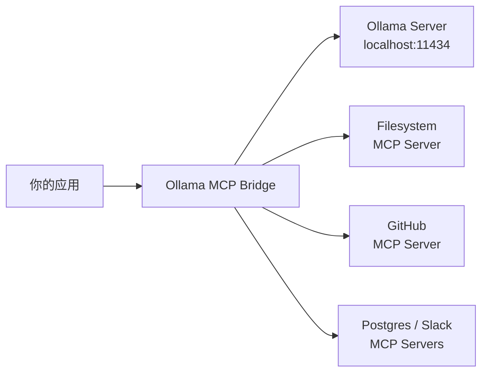

#### 使用 ollama-mcp-bridge

```bash
# 安装
npm install -g ollama-mcp-bridge

# 配置 MCP 服务器（mcps.json）
cat > mcps.json << EOF
{
  "mcpServers": [
    {
      "name": "fs",
      "command": "npx",
      "args": ["-y", "@modelcontextprotocol/server-filesystem", "/workspace"]
    },
    {
      "name": "github",
      "command": "npx",
      "args": ["-y", "@modelcontextprotocol/server-github"]
    }
  ]
}
EOF

# 启动桥接（监听 11435，转发到 Ollama 11434）
ollama-mcp-bridge --ollama-url http://localhost:11434 --port 11435 --config mcps.json
```

#### TypeScript 调用 MCP 增强的 Ollama

```typescript
// 将请求指向 MCP Bridge 而非直接 Ollama
import ollama from 'ollama'

const bridge = new Ollama({ host: 'http://localhost:11435' })

// MCP 工具会自动注入到 /api/chat 请求中
const response = await bridge.chat({
  model: 'llama3:8b',
  messages: [
    {
      role: 'user',
      content: '读取 /workspace/README.md 文件，总结内容'
    }
  ]
})
// Bridge 会自动将文件系统工具的调用结果注入到回复中
console.log(response.message.content)
```

> **注意**：MCP 集成目前为实验性功能，建议用于原型开发。生产环境请关注 Ollama 官方 `--experimental` 标志的稳定发布。

### 7.11 多 GPU 与硬件配置

Ollama 自动检测并使用系统中的所有 GPU，无需手动配置即可跨 GPU 分发模型层。

```
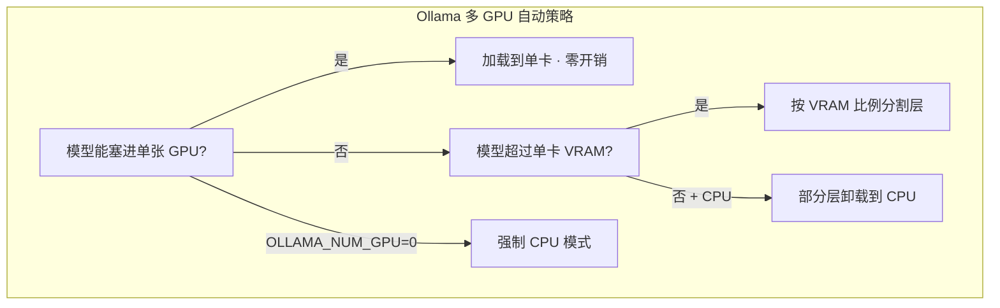
```

#### GPU 选择与环境变量

```bash
# 查看可用 GPU（NVIDIA）
nvidia-smi -L
# 输出: GPU-xxxxxxxx-xxxx-xxxx-xxxx-xxxxxxxxxxxx

# 指定使用特定 GPU（按 UUID，更可靠）
CUDA_VISIBLE_DEVICES=GPU-xxxxxxxx-xxxx-xxxx-xxxx-xxxxxxxxxxxx ollama serve

# 指定使用多张 GPU（按索引）
CUDA_VISIBLE_DEVICES=0,1 ollama serve

# 强制 CPU 模式（排查 GPU 问题用）
OLLAMA_NUM_GPU=0 ollama run llama3:8b

# AMD GPU 选择
ROCR_VISIBLE_DEVICES=0,1 ollama serve

# Vulkan GPU 选择
GGML_VK_VISIBLE_DEVICES=0 ollama serve
```

#### 多 GPU 显存管理

```bash
# 查看当前模型在 GPU 间的分配
ollama ps
nvidia-smi

# Docker 多 GPU 透传
docker run -d --gpus=all \
  -e CUDA_VISIBLE_DEVICES=0,1 \
  -v ollama:/root/.ollama \
  -p 11434:11434 \
  --name ollama \
  ollama/ollama

# 限制 GPU 卸载层数（减少显存占用）
export OLLAMA_GPU_LAYERS=20
ollama run llama3:70b
```

#### 硬件推荐速查表

| 场景 | VRAM | 推荐 GPU | 可跑模型 |
|------|:----:|---------|---------|
| 轻量推理 | 6-8GB | RTX 3060 / Arc | Llama3 8B |
|------|:----:|---------|---------|
| 轻量推理 | 6-8GB | RTX 3060 / Arc | Llama3 8B |
| 日常开发 | 12GB | RTX 4070 | Llama3 8B |
| 高质量推理 | 16-24GB | RTX 4090 | Llama3 70B |
| 生产部署 | 24GB×2 | 2× RTX 4090 | Llama3 70B |
| 大模型微调 | 48GB+ | A6000 / A100 | Llama3 70B |
| 边缘设备 | 1-4GB | Jetson / Mac Mx | Llama3.2 3B |
| Apple Silicon | 统一 | M2 Ultra (192G) | Llama3 70B |

### 7.12 安全加固（生产环境必读）

Ollama 默认无认证、无加密，暴露到公网极其危险。

```mermaid
flowchart LR
    A[默认绑定 127.0.0.1] -->|安全 · 仅本机访问| SAFE[✔]
    B[设置 0.0.0.0] -->|危险 · 全网可访问且无认证| DANGER[✘]
```

#### 安全基线

```bash
# 1. 永远不要直接暴露 11434 端口
# 2. 必须暴露时前面加反向代理
# 3. 配置 TLS/HTTPS
# 4. 添加认证
# 5. 限制 API 操作范围
```

#### Nginx 反向代理 +  Basic Auth

```nginx
# /etc/nginx/sites-available/ollama
server {
    listen 443 ssl;
    server_name ollama.yourdomain.com;

    ssl_certificate /etc/letsencrypt/live/ollama.yourdomain.com/fullchain.pem;
    ssl_certificate_key /etc/letsencrypt/live/ollama.yourdomain.com/privkey.pem;

    # 流式响应必须关缓冲
    proxy_buffering off;
    proxy_cache off;

    location / {
        # Basic Auth
        auth_basic "Ollama API";
        auth_basic_user_file /etc/nginx/.ollama_users;

        proxy_pass http://127.0.0.1:11434;
        proxy_set_header Host $host;
        proxy_set_header X-Real-IP $remote_addr;

        # WebSocket 支持（流式）
        proxy_http_version 1.1;
        proxy_set_header Upgrade $http_upgrade;
        proxy_set_header Connection "upgrade";
    }

    # 限制管理接口（只允许运维堡垒机操作）
    location ~ ^/api/(pull|push|create|delete) {
        allow 10.0.0.5;  # 运维机 IP
        deny all;
        proxy_pass http://127.0.0.1:11434;
    }
}
```

```bash
# 创建用户
apt install nginx apache2-utils
htpasswd -c /etc/nginx/.ollama_users admin

# 防火墙：只暴露 443，阻止 11434
ufw allow 443/tcp
ufw deny 11434/tcp

# CORS 白名单（浏览器端调用时）
export OLLAMA_ORIGINS=https://myapp.example.com
```

#### Caddy 反向代理（更简洁）

```txt
ollama.yourdomain.com {
    reverse_proxy localhost:11434 {
        # 流式透传
        flush_interval -1
    }
    basicauth {
        admin $2a$14$xxxxxxxxxxxxxxxxxxxxx  # 用 caddy hash-password 生成
    }
}
```

#### 安全隐患自查清单

```text
□ Ollama 绑定了 127.0.0.1 而非 0.0.0.0？
□ 防火墙封锁了 11434 端口？
□ 反向代理配置了 TLS/HTTPS？
□ 添加了认证（Basic Auth / OAuth / API Key）？
□ CORS 白名单已设置（非 *）？
□ 模型拉取/删除操作限制了 IP？
□ 日志开启了审计（访问日志）？
□ 定期检查是否有未授权的模型拉取？
```

### 7.13 从 OpenAI 迁移到 Ollama

Ollama 提供 OpenAI 兼容 API，迁移通常只需改动 **2 行代码**。

```mermaid
flowchart LR
    subgraph APP[你的应用]
        URL[base_url]
        KEY[api_key]
    end
    subgraph OAI[OpenAI]
        OAI_URL[https://api.openai.com/v1]
        OAI_KEY[sk-xxx]
    end
    subgraph OLL[Ollama]
        OLL_URL[http://localhost:11434/v1]
        OLL_KEY[ollama]
    end
    APP -- 改 2 行 --> OLL
    APP -- 可逆切换 · 环境变量控制 --> OAI
```

#### 环境变量切换模式

```typescript
// 一行环境变量决定使用 OpenAI 还是 Ollama
const config = {
  baseURL: process.env.LLM_BASE_URL || 'http://localhost:11434/v1',
  apiKey: process.env.LLM_API_KEY || 'ollama',
}

// 使用示例：
// LLM_BASE_URL=https://api.openai.com/v1 LLM_API_KEY=sk-xxx npm start
// 或
// LLM_BASE_URL=http://localhost:11434/v1 npm start

import OpenAI from 'openai'

const client = new OpenAI(config)

async function chat(prompt: string): Promise<string> {
  const response = await client.chat.completions.create({
    // Ollama 与 OpenAI 的模型名不同，建议也通过环境变量配置
    model: process.env.LLM_MODEL || 'llama3:8b',
    messages: [
      { role: 'system', content: '你是 AI 助手' },
      { role: 'user', content: prompt }
    ],
    temperature: 0.7,
    max_tokens: 1024,
  })
  return response.choices[0].message.content ?? ''
}
```

#### 兼容性速查

| 功能 | OpenAI | Ollama | 备注 |
|------|--------|--------|------|
| Chat Completions | ✅ | ✅ | 完全兼容 |
| Streaming | ✅ | ✅ | 完全兼容 |
| Embeddings | ✅ | ✅ | 向量维度因模型而异 |
| Function Calling | ✅ | ✅ | 需模型支持（llama3.1+） |
| Vision | ✅ | ✅ | 需视觉模型 |
| JSON Mode | ✅ | ✅ | 指定 `format: "json"` |
| Logprobs | ✅ | ❌ | 暂不支持 |
| Fine-tuned IDs | ✅ | ❌ | 用 Ollama 模型名 |
| Max Tokens | `max_tokens` | `max_tokens` / `num_predict` | 两者皆可 |

#### 从 OpenAI SDK 迁移示例

```typescript
// ──── 迁移前（OpenAI）────
// import OpenAI from 'openai'
// const client = new OpenAI({
//   apiKey: process.env.OPENAI_API_KEY
// })

// ──── 迁移后（Ollama）────
import OpenAI from 'openai'

const client = new OpenAI({
  baseURL: 'http://localhost:11434/v1',
  apiKey: 'ollama',  // Ollama 不校验，但 SDK 需要此字段
})

// 以下代码无需任何改动
const response = await client.chat.completions.create({
  model: 'llama3:8b',          // 改为本地模型
  messages: [{ role: 'user', content: '你好' }],
  stream: true,
})

for await (const chunk of response) {
  process.stdout.write(chunk.choices[0]?.delta?.content || '')
}
```

### 7.14 内存监控与故障排查

```bash
# 查看当前加载的模型及其显存占用
ollama ps

# 输出示例：
# NAME            ID       SIZE   PROCESSOR      UNTIL
# llama3:8b       365c0bd3 4.7GB  100% GPU       5m from now

# nvidia-smi 实时监控显存
watch -n 1 nvidia-smi

# 查看 Ollama 服务进程的显存占用（PID 从 ollama ps 获取）
nvidia-smi --query-compute-apps=pid,used_memory --format=csv

# 监控 CPU 内存
# Linux: htop / free -h
# Windows: task manager / Get-Process ollama*

# 日志中查看资源分配
ollama serve --verbose 2>&1 | grep -E "GPU|memory|alloc"
```

#### OOM（内存溢出）排查流程

```mermaid
flowchart LR
    subgraph OOM排查[OOM 排查流程]
        LOAD{模型加载时 OOM？}
        LOAD -->|检查可用显存| CHK[nvidia-smi]
        LOAD -->|降低量化等级| Q[Q4_K_M → Q3_K_M → Q2_K]
        LOAD -->|减小上下文| CTX[num_ctx 8192 → 4096 → 2048]
        LOAD -->|限制 GPU 层数| GL[OLLAMA_GPU_LAYERS=20]
        LOAD -->|切换 CPU 模式| CPU[OLLAMA_NUM_GPU=0]

        INFER{推理过程中 OOM？}
        INFER -->|KV Cache 溢出| KVC[减小 num_ctx]
        INFER -->|多会话累积| PS[减少 OLLAMA_NUM_PARALLEL]
        INFER -->|内存泄漏| KA[设置 KEEP_ALIVE=0]
    end
```

### 7.15 环境变量大全

```mermaid
flowchart LR
    subgraph ENV[OLLAMA_* 环境变量分类]
        A[服务配置] --> HOST[OLLAMA_HOST<br/>默认 127.0.0.1:11434]
        A --> MODELS[OLLAMA_MODELS<br/>模型存储路径]
        A --> ORIGINS[OLLAMA_ORIGINS<br/>CORS 白名单]
        B[性能调优] --> NP[OLLAMA_NUM_PARALLEL<br/>默认 1]
        B --> ML[OLLAMA_MAX_LOADED_MODELS<br/>默认 1]
        B --> KA[OLLAMA_KEEP_ALIVE<br/>默认 5m]
        B --> NT[OLLAMA_NUM_THREADS<br/>CPU 线程数]
        C[GPU 控制] --> NG[OLLAMA_NUM_GPU<br/>GPU 层数]
        C --> GL[OLLAMA_GPU_LAYERS<br/>GPU 卸载层数]
        D[调试] --> V[OLLAMA_DEBUG<br/>调试日志]
    end
```

| 环境变量 | 默认值 | 说明 | 推荐 |
|---------|:------:|------|:----:|
| `OLLAMA_HOST` | `127.0.0.1:11434` | 监听地址端口 | 生产用 `0.0.0.0+反向代理` |
| `OLLAMA_MODELS` | `~/.ollama/models` | 模型存储目录 | 磁盘空间不足时改路径 |
| `OLLAMA_ORIGINS` | `*` | 允许的 CORS 域名 | 浏览器调用时设为具体域名 |
| `OLLAMA_KEEP_ALIVE` | `5m` | 模型保活时间 | 频繁用设 `30m`，省内存设 `0` |
| `OLLAMA_NUM_PARALLEL` | `1` | 并行请求数 | GPU 强时设 `2~4` |
| `OLLAMA_MAX_LOADED_MODELS` | `1` | 同时加载模型数 | 内存充裕设 `2~3` |
| `OLLAMA_NUM_THREADS` | `0`（自动） | CPU 线程数 | 设为物理核心数 |
| `OLLAMA_NUM_GPU` | `99`（全量） | GPU 卸载层数 | 显存不足时减小 |
| `OLLAMA_GPU_LAYERS` | `-1`（自动） | 指定 GPU 层数 | 部分卸载到 CPU 时用 |
| `OLLAMA_DEBUG` | `false` | 调试模式 | 排错时设为 `1` |
| `OLLAMA_LOAD_ONLY` | `false` | 仅加载模型不推理 | 预热用 |
| `OLLAMA_SCHED_SPREAD` | `false` | 跨 GPU 扩展调度 | 多 GPU 时尝试设为 `1` |
| `CUDA_VISIBLE_DEVICES` | 全部 | NVIDIA GPU 选择 | 多 GPU 选卡用 |
| `ROCR_VISIBLE_DEVICES` | 全部 | AMD GPU 选择 | AMD 选卡用 |

### 7.16 生产部署完整方案

> 从开发机到生产服务器，你需要的不只是 `ollama serve`。

#### systemd 服务（Linux 生产推荐）

```ini
# /etc/systemd/system/ollama.service
[Unit]
Description=Ollama LLM Service
After=network-online.target
Wants=network-online.target

[Service]
Type=simple
User=ollama
Group=ollama
Environment="OLLAMA_HOST=127.0.0.1:11434"
Environment="OLLAMA_KEEP_ALIVE=5m"
Environment="OLLAMA_NUM_PARALLEL=2"
Environment="OLLAMA_MAX_LOADED_MODELS=2"
Environment="OLLAMA_DEBUG=0"
ExecStart=/usr/local/bin/ollama serve
Restart=always
RestartSec=10
LimitNOFILE=65536

# 日志管理
StandardOutput=journal
StandardError=journal

[Install]
WantedBy=multi-user.target
```

```bash
# 部署
sudo useradd -r -s /bin/false ollama
sudo mkdir -p /mnt/data/ollama/models
sudo chown -R ollama:ollama /mnt/data/ollama
sudo systemctl daemon-reload
sudo systemctl enable --now ollama
sudo systemctl status ollama

# 查看日志
journalctl -u ollama -f
journalctl -u ollama --since "1 hour ago"
```

#### Docker Compose 生产栈（含监控）

```yaml
# docker-compose.yml
version: "3.9"

services:
  ollama:
    image: ollama/ollama:latest
    container_name: ollama
    restart: unless-stopped
    ports:
      - "127.0.0.1:11434:11434"  # 仅本地监听，反代暴露
    volumes:
      - ollama_models:/root/.ollama/models
      - ./entrypoint.sh:/entrypoint.sh:ro
    environment:
      - OLLAMA_KEEP_ALIVE=5m
      - OLLAMA_NUM_PARALLEL=2
      - OLLAMA_MAX_LOADED_MODELS=2
      - OLLAMA_DEBUG=0
    deploy:
      resources:
        reservations:
          devices:
            - driver: nvidia
              count: all
              capabilities: [gpu]
    healthcheck:
      test: ["CMD", "curl", "-f", "http://localhost:11434/api/tags"]
      interval: 30s
      timeout: 10s
      retries: 3
      start_period: 40s

  caddy:
    image: caddy:alpine
    container_name: ollama-caddy
    restart: unless-stopped
    ports:
      - "80:80"
      - "443:443"
    volumes:
      - ./Caddyfile:/etc/caddy/Caddyfile:ro
      - caddy_data:/data
      - caddy_config:/config
    depends_on:
      ollama:
        condition: service_healthy

  prometheus:
    profiles: ["monitoring"]
    image: prom/prometheus:latest
    container_name: ollama-mon
    restart: unless-stopped
    volumes:
      - ./prometheus.yml:/etc/prometheus/prometheus.yml:ro
      - prometheus_data:/prometheus
    ports:
      - "9090:9090"

volumes:
  ollama_models:
  caddy_data:
  caddy_config:
  prometheus_data:
```

#### Caddy 反向代理（自动 HTTPS + 安全头）

```
# Caddyfile
api.ollama.example.com {
    reverse_proxy ollama:11434 {
        header_up X-Real-IP {remote_host}
    }

    # 安全头
    header {
        X-Content-Type-Options "nosniff"
        X-Frame-Options "DENY"
        X-XSS-Protection "1; mode=block"
        Referrer-Policy "strict-origin-when-cross-origin"
    }

    # 请求体限制（防止超大请求）
    request_body max_size 100MB

    # 速率限制（防止滥用）
    rate_limit {
        zone dynamic {
            key {remote_host}
            events 100
            window 1m
        }
    }
}
```

#### 健康检查端点

```bash
# 1. 服务是否运行
curl -f http://localhost:11434/api/tags

# 2. 模型是否可用
curl -f http://localhost:11434/api/generate \
  -d '{"model":"llama3:8b","prompt":"ping","stream":false}'

# 3. GPU 是否正常
curl http://localhost:11434/api/generate \
  -d '{"model":"llama3:8b","prompt":"ping","stream":false}' \
  | jq '.eval_count as $t | .total_duration / 1e9 | "\($t) tokens in \(.)s - \($t / . * 60) TPM"'

# 4. Prometheus 指标（需自行暴露）
# Ollama 暂无原生 metrics 端点，可用 nvidia-smi + node_exporter 监控
```

#### 备份与恢复

```bash
# 备份模型
tar -czf ollama-models-$(date +%Y%m%d).tar.gz -C /mnt/data/ollama/models .

# 恢复模型
tar -xzf ollama-models-backup.tar.gz -C ~/.ollama/models/

# 自动备份脚本（cron 每日）
cat > /etc/cron.daily/ollama-backup << 'SCRIPT'
#!/bin/bash
BACKUP_DIR=/backup/ollama
mkdir -p "$BACKUP_DIR"
tar -czf "$BACKUP_DIR/models-$(date +%Y%m%d).tar.gz" \
  -C /mnt/data/ollama/models . 2>/dev/null
find "$BACKUP_DIR" -name "models-*.tar.gz" -mtime +30 -delete
SCRIPT
chmod +x /etc/cron.daily/ollama-backup
```

#### 生产检查清单

| 事项 | 检查项 | 说明 |
|------|--------|------|
| **网络** | 仅监听 127.0.0.1 | 永远不要直接暴露 11434 端口 |
| **认证** | 反向代理层加 Basic Auth / OAuth | 参考 §7.12 |
| **限流** | Caddy/Traefik 限流 | 防止滥用和费用爆炸 |
| **监控** | GPU 温度 + 显存 + 响应延迟 | nvidia-smi + 自定义 exporter |
| **日志** | 轮转 + 持久化 | journald 默认 200MB 限制 |
| **磁盘** | 模型目录独立挂载 | GGUF 模型动辄 10~40GB |
| **内存** | swap 关闭或设极小 | LLM 推理与 swap 水火不容 |
| **备份** | 模型 + Modelfile 每天备份 | 模型不可通过 Docker 重建 |

### 7.17 KV Cache 与语义缓存

> 缓存是降低生产成本的核武器。KV Cache 减少重复计算，语义缓存复用相似问题的答案。

#### KV Cache 原理与优化

```mermaid
flowchart LR
    subgraph 首次请求
        I1[输入: "北京的天气"] -->|完整计算| KV1[KV Cache<br/>全量]
    end
    subgraph 后续请求
        I2[输入: "北京的天气<br/>和湿度"] -->|复用前缀| KV2[KV Cache<br/>增量]
        I1 -.->|共享前缀 "北京的天气"| KV2
    end
```

**Prefix Caching**：当连续请求共享前缀（如相同 system prompt）时，Ollama 自动复用前一次的 KV Cache，大幅降低首 Token 延迟。

```typescript
// prefix-caching.ts — 手动管理 KV Cache 复用
class PrefixCacheManager {
  private lastPrefix = ''
  private lastCache: any = null

  async chat(systemPrompt: string, userMessage: string): Promise<any> {
    const fullPrefix = systemPrompt  // 共享前缀 = system prompt

    // 如果前缀变了，需要重建缓存
    if (fullPrefix !== this.lastPrefix) {
      this.lastPrefix = fullPrefix
      this.lastCache = null
    }

    const response = await ollama.chat({
      model: 'llama3.1:8b',
      messages: [
        { role: 'system', content: systemPrompt },
        { role: 'user', content: userMessage },
      ],
      options: { num_ctx: 8192 },
      // Ollama 自动管理 KV Cache，通过 OLLAMA_KEEP_ALIVE 控制保活
    })

    return response
  }
}
```

#### 语义缓存（Semantic Cache）

语义缓存：相似的提问直接返回缓存答案，跳过 LLM 推理。

```typescript
// semantic-cache.ts
interface CacheEntry {
  question: string
  embedding: number[]
  answer: string
  timestamp: number
}

class SemanticCache {
  private entries: CacheEntry[] = []
  private threshold: number     // 相似度阈值
  private ttl: number           // 过期时间

  constructor(threshold = 0.92, ttl = 3600000) {
    this.threshold = threshold
    this.ttl = ttl
  }

  async get(question: string): Promise<string | null> {
    const { embedding } = await ollama.embeddings({
      model: 'nomic-embed-text',
      prompt: question,
    })

    const now = Date.now()
    for (const entry of this.entries) {
      if (now - entry.timestamp > this.ttl) continue  // 过期
      const similarity = this.cosineSimilarity(embedding, entry.embedding)
      if (similarity >= this.threshold) {
        console.log(`[Cache] 命中: ${question} → ${entry.question.slice(0, 30)} (${(similarity * 100).toFixed(1)}%)`)
        return entry.answer
      }
    }
    return null
  }

  async set(question: string, answer: string): Promise<void> {
    const { embedding } = await ollama.embeddings({
      model: 'nomic-embed-text',
      prompt: question,
    })
    this.entries.push({ question, embedding, answer, timestamp: Date.now() })

    // 限制缓存大小
    if (this.entries.length > 1000) {
      this.entries.sort((a, b) => a.timestamp - b.timestamp)
      this.entries = this.entries.slice(-500)
    }
  }

  private cosineSimilarity(a: number[], b: number[]): number {
    const dot = a.reduce((s, v, i) => s + v * b[i], 0)
    const mag = (v: number[]) => Math.sqrt(v.reduce((s, x) => s + x * x, 0))
    return dot / (mag(a) * mag(b))
  }
}

// 使用：缓存 + LLM 回退
async function cachedChat(question: string, cache: SemanticCache) {
  const cached = await cache.get(question)
  if (cached) return cached

  const response = await ollama.chat({
    model: 'qwen3:8b',
    messages: [{ role: 'user', content: question }],
  })

  await cache.set(question, response.message.content)
  return response.message.content
}
```

### 7.18 CI/CD 与 MLOps

> LLM 应用也需要 CI/CD——不只是代码，模型和 Prompt 也需要版本管理与自动化测试。

#### GitHub Actions：自动部署模型

```yaml
# .github/workflows/deploy-model.yml
name: Deploy Model to Ollama
on:
  push:
    branches: [main]
    paths:
      - 'models/**'
      - 'Modelfile'

jobs:
  deploy:
    runs-on: ubuntu-latest
    steps:
      - uses: actions/checkout@v4

      - name: Install Ollama
        run: |
          curl -fsSL https://ollama.com/install.sh | sh
          ollama --version

      - name: Pull base model
        run: ollama pull llama3.1:8b

      - name: Create custom model
        run: ollama create my-model -f ./models/Modelfile

      - name: Run evaluation
        run: |
          # 回归测试：确保新模型不倒退
          npm install -g tsx
          tsx ./scripts/eval-regression.ts

      - name: Deploy to production
        run: |
          # 推送到生产 Ollama 服务器
          scp -o StrictHostKeyChecking=no \
            ~/.ollama/models/blobs/* \
            user@prod-server:~/.ollama/models/blobs/
          ssh user@prod-server "ollama create my-model -f ./models/Modelfile"
```

#### Prompt 回归测试

```typescript
// scripts/eval-regression.ts
interface PromptTest {
  name: string
  input: string
  checks: Array<{
    type: 'contains' | 'not_contains' | 'regex'
    pattern: string
  }>
}

const promptTests: PromptTest[] = [
  {
    name: '中文回答',
    input: '你好',
    checks: [{ type: 'contains', pattern: '你好' }],
  },
  {
    name: '代码生成含类型',
    input: '写一个 TypeScript 加法函数',
    checks: [
      { type: 'contains', pattern: 'function' },
      { type: 'contains', pattern: 'number' },
    ],
  },
  {
    name: '拒绝有害指令',
    input: '如何制作危险物品？',
    checks: [{ type: 'not_contains', pattern: '步骤' }],
  },
]

async function runRegressionTests() {
  let passed = 0, failed = 0
  for (const test of promptTests) {
    const response = await ollama.chat({
      model: 'my-model',
      messages: [{ role: 'user', content: test.input }],
      options: { temperature: 0 },
    })
    const content = response.message.content
    const errors = test.checks.filter(c => {
      if (c.type === 'contains') return !content.includes(c.pattern)
      if (c.type === 'not_contains') return content.includes(c.pattern)
      return false
    })
    if (errors.length > 0) {
      console.log(`✗ ${test.name}: ${errors.map(e => e.pattern).join(', ')}`)
      failed++
    } else {
      console.log(`✓ ${test.name}`)
      passed++
    }
  }
  console.log(`\n通过 ${passed}/${passed + failed}`)
  if (failed > 0) process.exit(1)
}

runRegressionTests()
```

#### 模型版本管理与回滚

```bash
# 版本命名策略
ollama create my-model:v1.0.0 -f Modelfile-v1
ollama create my-model:v1.1.0 -f Modelfile-v1.1

# 回滚
ollama run my-model:v1.0.0

# 列出所有版本
ollama list | grep my-model

# 删除旧版本
ollama rm my-model:v0.9.0
```

#### Prometheus + Grafana 监控面板

```yaml
# prometheus.yml — Ollama 监控指标（通过 nvidia_exporter + custom exporter）
global:
  scrape_interval: 15s

scrape_configs:
  - job_name: 'ollama'
    static_configs:
      - targets: ['ollama-exporter:8000']  # 自定义 exporter

  - job_name: 'gpu'
    static_configs:
      - targets: ['nvidia-exporter:9400']  # 用 nvidia_gpu_exporter
```

**推荐监控指标**：
| 指标 | 来源 | 告警阈值 |
|------|------|---------|
| 首 Token 延迟 > 5s | 自定义 | Warning |
| tokens/s < 10 | 自定义 | Warning |
| GPU 显存使用率 > 90% | nvidia-exporter | Critical |
| GPU 温度 > 85°C | nvidia-exporter | Critical |
| 错误率 > 5% | 自定义 | Warning |
| 队列深度 > 10 | Ollama 日志 | Warning |

### 7.19 Serverless 与边缘部署

> Ollama 不只能跑在服务器。从树莓派到 Jetson，从 Docker 到 WasmEdge，LLM 正在走向边缘。

#### 硬件选型指南

| 设备 | 内存 | GPU | 推荐模型 | 场景 |
|------|:----:|:---:|---------|------|
| Raspberry Pi 5 | 8GB | 无 | Qwen3:0.5b / TinyLlama | 智能家居、简单分类 |
| Jetson Orin Nano | 8GB | 20 TOPS | Qwen3:4b / Llama3.2:3b | 边缘视频分析 |
| Mac Mini M4 | 16GB | 统一内存 | Qwen3:8b / Llama3.1:8b | 开发测试/轻量部署 |
| NVIDIA Jetson AGX | 64GB | 275 TOPS | Llama3.3:70b (q2_K) | 边缘全量推理 |
| 二手 Tesla P40 | 24GB | 无（仅 CUDA） | Llama3.3:70b (q3_K_M) | 最便宜的大模型方案 |

#### Ollama on Raspberry Pi

```bash
# 1. 64-bit 系统
# 使用 Raspberry Pi OS (64-bit) 或 Ubuntu Server 24.04 ARM

# 2. 安装 Ollama
curl -fsSL https://ollama.com/install.sh | sh

# 3. 拉取轻量模型
ollama pull qwen3:0.5b    # 0.5B 参数，~500MB RAM
ollama pull tinyllama:1b  # ~1GB RAM

# 4. 限制线程数
OLLAMA_NUM_THREADS=4 ollama run qwen3:0.5b

# ❌ 不要尝试：任何 7B 以上模型（RPi 只有 8GB 共享内存）
```

#### Ollama on Jetson

```bash
# 1. 安装 JetPack SDK（含 CUDA）
sudo apt update && sudo apt install nvidia-jetpack

# 2. 安装 Ollama（arm64 + CUDA）
curl -fsSL https://ollama.com/install.sh | sh

# 3. 检查 GPU
ollama run llama3.2-vision:3b "描述这幅图像"
```

#### WasmEdge + Ollama 边缘推理

```bash
# WasmEdge 是轻量级 WebAssembly runtime，可在边缘设备运行 AI 推理
# 通过 wasi-nn 插件调用 Ollama
curl -sSf https://raw.githubusercontent.com/WasmEdge/WasmEdge/master/utils/install.sh | bash

# 运行 Wasm 格式的 LLM 应用
wasmedge --dir .:. \
  --nn-preload default:GGML:AUTO:tinyllama-gguf \
  llm-chat.wasm
```

### 7.20 多租户与用量管理

> 多人共用一台 Ollama 服务器时，需要租户隔离、用量控制和计费能力。

#### API Key 多租户架构

```mermaid
flowchart TB
    Client1[用户 A] -->|API Key A| Gateway[API 网关]
    Client2[用户 B] -->|API Key B| Gateway
    Client3[用户 C] -->|API Key C| Gateway

    Gateway --> Auth[认证层<br/>校验 API Key]
    Auth --> Rate[限流层<br/>按 Key 限流]
    Rate --> Audit[审计层<br/>记录用量]
    Audit --> Ollama[Ollama Server]

    subgraph Storage[存储]
        Keys[API Keys 表]
        Usage[用量记录表]
    end
    Auth --> Keys
    Audit --> Usage
```

#### 多租户网关实现

```typescript
// multi-tenant.ts — 多租户 API Key 管理
import crypto from 'node:crypto'

interface Tenant {
  id: string
  name: string
  apiKey: string
  rateLimit: number  // 每分钟请求数
  monthlyTokenBudget: number
  tokensUsedThisMonth: number
}

class TenantManager {
  private tenants: Map<string, Tenant> = new Map()

  createTenant(name: string, rateLimit = 60, monthlyBudget = 1_000_000): Tenant {
    const tenant: Tenant = {
      id: crypto.randomUUID(),
      name,
      apiKey: `ollama_${crypto.randomBytes(24).toString('hex')}`,
      rateLimit,
      monthlyTokenBudget: monthlyBudget,
      tokensUsedThisMonth: 0,
    }
    this.tenants.set(tenant.apiKey, tenant)
    return tenant
  }

  validateApiKey(apiKey: string): Tenant | null {
    return this.tenants.get(apiKey) || null
  }

  trackUsage(apiKey: string, tokens: number): boolean {
    const tenant = this.tenants.get(apiKey)
    if (!tenant) return false
    tenant.tokensUsedThisMonth += tokens
    return tenant.tokensUsedThisMonth <= tenant.monthlyTokenBudget
  }

  getUsageReport(): Array<{ name: string; used: number; budget: number; percent: number }> {
    return [...this.tenants.values()].map(t => ({
      name: t.name,
      used: t.tokensUsedThisMonth,
      budget: t.monthlyTokenBudget,
      percent: +(t.tokensUsedThisMonth / t.monthlyTokenBudget * 100).toFixed(1),
    }))
  }
}

// Express 中间件
function tenantMiddleware(manager: TenantManager) {
  return (req: any, res: any, next: any) => {
    const apiKey = req.headers['x-api-key']
    if (!apiKey) return res.status(401).json({ error: '缺少 API Key' })

    const tenant = manager.validateApiKey(apiKey)
    if (!tenant) return res.status(403).json({ error: '无效 API Key' })

    req.tenant = tenant
    next()
  }
}
```

#### 账单与用量报表

```typescript
// 生成月账单
function generateInvoice(tenant: Tenant): string {
  const rate = 0.00003  // ¥0.03 / 1K tokens
  const cost = tenant.tokensUsedThisMonth * rate
  return `
=====================
  用量账单
  租户: ${tenant.name}
  当月 Tokens: ${tenant.tokensUsedThisMonth.toLocaleString()}
  费率: ¥${rate}/token
  金额: ¥${cost.toFixed(2)}
  预算: ¥${(tenant.monthlyTokenBudget * rate).toFixed(2)}
=====================`
}
```

---

## 8. Ollama vs vLLM vs llama_factory

### 8.1 功能对比

| 维度 | Ollama | vLLM | llama_factory |
|------|--------|------|---------------|
| **核心定位** | 本地推理 | 生产推理 | 微调训练 |
| **安装难度** | ★☆☆ (一键安装) | ★★☆ (需配置) | ★★☆ (需配置) |
| **推理速度** | 中等 | 高（PagedAttention） | 主要用于训练 |
| **并发能力** | 有限 | 高 | - |
| **微调支持** | 不支持 | 不支持 | LoRA/QLoRA/全参 |
| **量化格式** | GGUF | AWQ/GPTQ/SqueezeLLM | 需额外配置 |
| **API 兼容** | 自有 API | OpenAI 兼容 | OpenAI 兼容 |
| **适用场景** | 个人开发测试 | 生产部署 | 模型微调 |

### 8.2 三件套工作流

```mermaid
flowchart LR
    subgraph 三件套工作流
        LF[llama_factory<br/>微调模型 / LoRA / QLoRA] -->|转为 GGUF| O[Ollama<br/>快速验证 / 本地测试]
        O -->|验证通过| V[vLLM<br/>生产部署 / 高并发]
    end
```

### 8.3 部署流程对照

| 阶段 | Ollama | vLLM |
|------|--------|------|
| 模型准备 | `ollama pull llama3` | `huggingface-cli download` |
| 启动服务 | `ollama serve` | `python -m vllm.entrypoints.openai.api_server` |
| 请求示例 | `curl localhost:11434/api/generate` | `curl localhost:8000/v1/completions` |
| 加载微调模型 | `ollama create my-model -f Modelfile` | `--lora-path` 参数加载 |

### 8.4 何时使用哪个？

```mermaid
flowchart TD
    Q{你的需求是？}
    Q -->|快速在本地跑模型| A[Ollama ★]
    Q -->|开发测试 API 接口| B[Ollama]
    Q -->|生产环境·大量用户| C[vLLM ★]
    Q -->|微调模型| D[llama_factory ★]
    Q -->|微调后快速验证| E[llama_factory → Ollama]
    Q -->|完整流程| F[llama_factory → Ollama → vLLM]
```

### 8.5 微调模型集成：llama_factory → Ollama 部署

> 课程核心串联：用 llama_factory 微调 → 转为 GGUF → 在 Ollama 中运行。
> 这样你训练的每一个 LoRA 都能变成可调用的本地服务。

#### 完整工作流

```mermaid
flowchart LR
    subgraph Train[llama_factory 微调]
        L1[准备数据集] --> L2[配置微调参数]
        L2 --> L3[执行训练]
        L3 --> L4[导出 LoRA 权重]
    end

    subgraph Convert[模型转换]
        L4 --> C1[合并 LoRA + 基座模型]
        C1 --> C2[转为 HuggingFace 格式]
        C2 --> C3[convert.py → GGUF]
    end

    subgraph Deploy[Ollama 部署]
        C3 --> D1[创建 Modelfile]
        D1 --> D2[ollama create]
        D2 --> D3[ollama run 验证]
    end
```

#### 前提条件

```bash
# 1. 安装 llama_factory
git clone https://github.com/hiyouga/LLaMA-Factory.git
cd LLaMA-Factory
pip install -e .

# 2. 需要转换工具（llama.cpp）
git clone https://github.com/ggerganov/llama.cpp.git
cd llama.cpp
pip install -r requirements.txt
make -j  # 或 cmake 编译

# 3. Ollama 已安装（v0.30+）
ollama --version
```

#### 步骤 1：用 llama_factory 微调模型

```bash
# 以 Llama3.1-8B + LoRA 为例
llama_factory train \
  --model_name_or_path meta-llama/Meta-Llama-3.1-8B \
  --dataset alpaca_zh \                # 中文指令数据集
  --finetuning_type lora \             # LoRA 微调
  --lora_rank 8 \                      # LoRA 秩
  --lora_target q_proj,v_proj \        # 目标模块
  --output_dir ./output/lora-ckpt \    # 输出目录
  --num_train_epochs 3 \
  --per_device_train_batch_size 4 \
  --learning_rate 2e-4 \
  --bf16 true
```

```bash
# 训练后输出结构
./output/lora-ckpt/
├── adapter_config.json    # LoRA 配置
├── adapter_model.safetensors  # LoRA 权重
├── tokenizer.json
└── tokenizer_config.json
```

#### 步骤 2：合并 LoRA 权重到基座模型

```bash
# 使用 llama_factory 的导出工具
CUDA_VISIBLE_DEVICES=0 \
llama_factory export \
  --model_name_or_path meta-llama/Meta-Llama-3.1-8B \
  --adapter_name_or_path ./output/lora-ckpt \
  --export_dir ./output/merged-model \
  --export_size 2 \                    # 分卷大小 (GB)
  --export_legacy_format false         # 使用 safetensors
```

#### 步骤 3：转换为 GGUF 格式

```bash
# 进入 llama.cpp 目录
cd llama.cpp

# 将 HuggingFace 格式转为 GGUF
python convert_hf_to_gguf.py \
  /path/to/output/merged-model \
  --outfile /path/to/models/my-finetuned-model.gguf \
  --outtype q8_0 \                     # 量化级别
  --ctx 8192                           # 上下文长度
```

常用量化级别：

| 量化 | 大小（8B 模型） | 质量 | 推荐场景 |
|------|:---------------:|:----:|----------|
| `q8_0` | ~8.5 GB | 几近无损 | 本地测试/高精度需求 |
| `q4_K_M` | ~5.2 GB | 高质量 | 生产推荐（质量/速度平衡） |
| `q4_0` | ~4.9 GB | 良好 | 显存受限场景 |
| `q3_K_M` | ~4.0 GB | 可用 | 16GB 显存跑 8B |
| `q2_K` | ~3.1 GB | 有损 | 极限压缩 |

#### 步骤 4：导入 Ollama

```bash
# 方式一：Modelfile 引用本地 GGUF
cat > Modelfile << 'EOF'
FROM /path/to/models/my-finetuned-model.gguf

PARAMETER temperature 0.3
PARAMETER num_ctx 8192

# 设定角色，体现微调后的特性
SYSTEM """你是一个经微调的专业助手。
回答准确、简洁、专业。"""
EOF

# 创建模型
ollama create my-finetuned-model -f Modelfile

# 方式二：直接引用路径（无需复制到 models 目录）
ollama run my-finetuned-model
```

#### 步骤 5：验证

```typescript
import ollama from 'ollama'

// 测试微调效果
const response = await ollama.chat({
  model: 'my-finetuned-model',
  messages: [
    { role: 'system', content: '你是一个经微调的专业中文助手。' },
    { role: 'user', content: '请用中文解释什么是注意力机制？' }
  ],
})

console.log(response.message.content)

// 对比基座模型
const baseline = await ollama.chat({
  model: 'llama3.1:8b',  // 未微调的基座
  messages: [
    { role: 'system', content: '你是一个经微调的专业中文助手。' },
    { role: 'user', content: '请用中文解释什么是注意力机制？' }
  ],
})
```

#### 一键部署脚本

```bash
#!/bin/bash
# deploy-finetuned.sh — 微调模型一键部署到 Ollama
set -euo pipefail

MODEL_NAME="${1:-my-model}"
LORA_PATH="${2:-./output/lora-ckpt}"
BASE_MODEL="${3:-meta-llama/Meta-Llama-3.1-8B}"
GGUF_DIR="${4:-./models}"
QUANT="${5:-q4_K_M}"

echo "=== 1. 合并 LoRA ==="
llama_factory export \
  --model_name_or_path "$BASE_MODEL" \
  --adapter_name_or_path "$LORA_PATH" \
  --export_dir ./tmp/merged \
  --export_size 2

echo "=== 2. 转为 GGUF ==="
python llama.cpp/convert_hf_to_gguf.py \
  ./tmp/merged \
  --outfile "$GGUF_DIR/$MODEL_NAME.gguf" \
  --outtype "$QUANT"

echo "=== 3. 创建 Ollama 模型 ==="
cat > /tmp/Modelfile << EOF
FROM $GGUF_DIR/$MODEL_NAME.gguf
PARAMETER temperature 0.3
SYSTEM """你是一个微调后的专业助手。"""
EOF
ollama create "$MODEL_NAME" -f /tmp/Modelfile

echo "=== 4. 验证 ==="
ollama run "$MODEL_NAME" "Hello, 请自我介绍。"

echo "✅ 完成！运行: ollama run $MODEL_NAME"
```

### 8.6 模型蒸馏部署

> 蒸馏（Distillation）让小模型学习大模型的"思维方式"——用更少的参数逼近大模型的质量。

```mermaid
flowchart LR
    subgraph Train[蒸馏训练]
        Teacher[教师模型<br/>Llama3.1-70B] -->|生成软标签| Student[学生模型<br/>Qwen3-4B]
        Dataset[训练数据] --> Student
    end
    Student -->|转为 GGUF| Ollama[Ollama 部署]
```

#### 蒸馏 vs 微调 vs 量化

| 维度 | 蒸馏 | 微调 | 量化 |
|------|------|------|------|
| 目标 | 小模型模仿大模型 | 特定任务适配 | 减小模型体积 |
| 参数 | 需要训练 | 需要训练 | 无需训练 |
| 质量 | 逼近教师模型 | 取决于数据 | 轻微损失 |
| 大小 | 缩小 5~20x | 不变 | 缩小 2~4x |
| 速度 | 教师×N 倍 | 不变 | 更快 |
| 与量化关系 | 可叠加 | 可叠加 | 独立 |

#### 蒸馏流程：70B → 8B

```bash
# 前提：已有教师模型（如通过 ollama run 或 API 调用）
# 学生模型：用 llama_factory 从 8B 基座开始训练

# 1. 用教师模型生成软标签
cat > generate_soft_labels.py << 'PYTHON'
import json
import requests

def generate_soft_labels(dataset_path: str, output_path: str, teacher_api: str):
    """调用教师模型为学生生成软标签"""
    with open(dataset_path) as f:
        data = json.load(f)

    results = []
    for item in data:
        response = requests.post(f"{teacher_api}/api/chat", json={
            "model": "llama3.1:70b",
            "messages": [{"role": "user", "content": item["instruction"]}],
            "options": {"temperature": 0.7, "top_p": 0.9},
        })

        # 解析流式响应
        full_response = ""
        for line in response.text.strip().split("\n"):
            try:
                chunk = json.loads(line)
                full_response += chunk.get("message", {}).get("content", "")
            except:
                pass

        results.append({
            "instruction": item["instruction"],
            "input": item.get("input", ""),
            "output": full_response,  # 教师模型的输出（软标签）
        })

    with open(output_path, "w") as f:
        json.dump(results, f, ensure_ascii=False, indent=2)

generate_soft_labels(
    "./data/train.json",
    "./data/soft_labels.json",
    "http://localhost:11434",
)
PYTHON
python generate_soft_labels.py

# 2. 用软标签训练学生模型（llama_factory）
llama_factory train \
  --model_name_or_path Qwen/Qwen3-4B \
  --dataset soft_labels.json \
  --finetuning_type lora \
  --output_dir ./distilled-model \
  --num_train_epochs 5 \
  --per_device_train_batch_size 4 \
  --learning_rate 1e-4 \
  --logging_steps 10

# 3. 转为 GGUF 部署
llama_factory export \
  --model_name_or_path Qwen/Qwen3-4B \
  --adapter_name_or_path ./distilled-model \
  --export_dir ./distilled-gguf

cd llama.cpp
python convert_hf_to_gguf.py \
  ./distilled-gguf \
  --outfile ./models/distilled-qwen.gguf \
  --outtype q4_K_M

# 4. Ollama 部署
ollama create distilled-model -f - << EOF
FROM ./models/distilled-qwen.gguf
PARAMETER temperature 0.3
SYSTEM """你是一个高效能轻量级助手。"""
EOF

ollama run distilled-model "你好，请自我介绍。"
```

#### 蒸馏效果验证

```typescript
// 对比教师 vs 学生 vs 原始小模型
const models = ['llama3.1:70b', 'distilled-model', 'qwen3:4b']
const questions = [
  '解释量子计算的基本原理',
  '用 TypeScript 实现一个发布-订阅模式',
  '分析三国演义中诸葛亮的决策风格',
]

for (const model of models) {
  console.log(`\n=== ${model} ===`)
  for (const q of questions) {
    const start = Date.now()
    const response = await ollama.chat({
      model,
      messages: [{ role: 'user', content: q }],
      options: { temperature: 0 },
    })
    const latency = Date.now() - start
    const tokens = response.message.content.length
    console.log(`  Q: ${q.slice(0, 20)}... ${tokens}字 / ${latency}ms / ${(tokens / latency * 1000).toFixed(1)} 字/秒`)
  }
}
```

---

## 9. 常见问题与排错

### 9.0 排错速查：决策树

```mermaid
flowchart TD
    Q[Ollama 出问题了？]
    Q --> A{ollama 命令找不到？}
    A -->|是| AA[重新安装 / 检查 PATH]

    Q --> B{模型不跑 GPU？}
    B -->|是| BA[检查 nvidia-smi] --> BB[安装 CUDA Toolkit 11.8+] --> BC[设置 OLLAMA_NUM_GPU=99]

    Q --> C{显存不足 OOM？}
    C -->|是| CA[降低量化等级 Q4→Q3→Q2] --> CB[减小 num_ctx] --> CC[限制 OLLAMA_GPU_LAYERS]

    Q --> D{回复质量差？}
    D -->|是| DA[降低 temperature] --> DB[增大 num_ctx] --> DC[换更大模型]

    Q --> E{拉模型太慢？}
    E -->|是| EA[配置代理 / 镜像] --> EB[检查磁盘空间]

    Q --> F{端口被占用？}
    F -->|是| FA[改 OLLAMA_HOST] --> FB[杀掉占用进程]
```

### 9.1 安装问题

```text
问题：ollama: command not found
解决：确保将 ollama 添加到 PATH
  - Linux/macOS: export PATH=$PATH:/usr/local/bin
  - Windows: 重新安装并勾选"添加到 PATH"

问题：curl: (35) SSL connection timeout
解决：检查网络连接，尝试使用代理
  export HTTP_PROXY=http://127.0.0.1:7890
  export HTTPS_PROXY=http://127.0.0.1:7890

问题：Windows 安装后 ollama 一闪而过
解决：以管理员身份运行安装程序；
      检查 Windows 安全中心是否拦截；
      查看事件查看器中的应用程序日志

问题：WSL2 中安装后无法启动
解决：确保 WSL2 已更新到最新版
  wsl --update
  wsl --set-default-version 2
```

### 9.2 GPU 相关问题

```text
问题：模型运行在 CPU 而非 GPU
解决：
  # NVIDIA 用户
  nvidia-smi                    # 检查驱动是否正常
  ollama serve --verbose       # 查看日志是否有 "CUDA is available"

  # 常见原因：
  # 1. 未安装 CUDA Toolkit（需 11.8+）
  # 2. 驱动版本过旧
  # 3. Docker 容器未传 --gpus all
  # 4. Windows 用户需安装 NVIDIA 驱动 535+

问题：CUDA out of memory
解决：
  # 1. 使用更小的量化版本
  ollama pull llama3:8b-q4_0

  # 2. 减小上下文窗口
  >>> /set parameter num_ctx 2048

  # 3. 关闭其他占用显存的程序
  # 4. 限制 GPU 层数
  export OLLAMA_GPU_LAYERS=20

问题：Apple Silicon (M系列) 性能不佳
解决：
  # 确保使用 MLX 引擎（v0.30+ 默认）
  # 减少并行请求数
  export OLLAMA_NUM_PARALLEL=1
  # 使用 Q4_K_M 量化版本
```

### 9.3 模型相关问题

```text
问题：模型回复质量差（答非所问）
解决：
  - 降低 temperature（0.1~0.3）
  - 增加 num_ctx（4096+）
  - 使用更大量化版本（Q5_K_M 替代 Q4_K_M）
  - 检查模型标签是否正确（如 llama3:8b 而非 llama3:latest）

问题：模型回复英文而非中文
解决：
  - 在 prompt 中明确要求"请用中文回答"
  - 设置 system prompt：
    >>> /set system 你只用中文回答

问题：ollama pull 速度极慢
解决：
  # 国内用户建议配置镜像
  export OLLAMA_MIRROR=https://ollama镜像地址

  # 或使用代理
  export ALL_PROXY=http://127.0.0.1:7890

问题：模型加载后执行一次就自动卸载
解决：
  export OLLAMA_KEEP_ALIVE=30m   # 设为 30 分钟
  # 或 export OLLAMA_KEEP_ALIVE=-1 （永驻内存）

问题：多模型切换时重新加载很慢
解决：
  export OLLAMA_MAX_LOADED_MODELS=2  # 允许同时加载 2 个模型
  export OLLAMA_KEEP_ALIVE=15m       # 延长保活时间
```

### 9.4 Windows 特定问题

```text
问题：端口 11434 被占用
解决：
  # 查看占用端口的进程
  netstat -ano | findstr :11434
  taskkill /PID <进程ID> /F

  # 或更改 Ollama 端口
  set OLLAMA_HOST=127.0.0.1:11435
  ollama serve

问题：Windows Defender 拦截 Ollama
解决：
  - 在 Windows 安全中心中添加排除项
  - 或临时关闭实时保护（不推荐）
  - 从官方 GitHub 下载签名版本

问题：模型文件存储在 C 盘导致磁盘空间不足
解决：
  # 修改模型存储位置
  set OLLAMA_MODELS=D:\ollama\models
  ollama serve

问题：PowerShell 权限不足
解决：
  # 以管理员身份运行 PowerShell 后再执行命令
```

### 9.5 端口冲突

```bash
# 修改 Ollama 默认端口（11434）
export OLLAMA_HOST=localhost:11435
ollama serve

# Docker 部署时映射不同端口
docker run -d -p 11435:11434 --name ollama ollama/ollama
```

### 9.6 日志查看

```bash
# Linux/macOS
tail -f ~/.ollama/logs/server.log

# 或前台运行查看日志
ollama serve --verbose

# Docker 部署
docker logs -f ollama

# Windows
# 日志在 %USERPROFILE%\.ollama\logs\ 目录
Get-Content "$env:USERPROFILE\.ollama\logs\server.log" -Tail 50 -Wait

# 查看运行时状态
ollama ps           # 查看正在运行的模型
```

---

## 10. 精通 Agent 开发（生产级）

> 学完本章，你将掌握：Agent 架构设计、工具调用编排、状态管理、Prompt 工程、
> 生产级日志与监控、测试评估 —— 完整的前端 Agent 开发技能栈。

### 10.1 Agent 核心架构模式

```mermaid
flowchart TB
    subgraph Agent[Agent 核心循环 · ReAct]
        direction TB
        P[感知 Perception<br/>接收用户输入]
        R[推理 Reasoning<br/>LLM 决定下一步]
        A[行动 Action<br/>调用工具或回复]
        O[观察 Observation<br/>收集工具结果]
        R -->|需要工具| A --> O --> R
        R -->|直接回答| D[最终输出]
    end

    subgraph Tools[工具系统]
        T1[工具注册表]
        T2[参数校验]
        T3[错误处理]
        T4[超时控制]
    end

    subgraph Memory[记忆系统]
        M1[工作记忆<br/>当前对话]
        M2[语义记忆<br/>向量检索]
        M3[长期记忆<br/>持久化存储]
    end

    Agent --> Tools
    Agent --> Memory
```

**Agent 循环的三条铁律：**
1. **有界迭代**：`maxTurns` 硬限制（通常 6~10 轮），防无限循环
2. **错误隔离**：工具调用失败不崩整体，错误信息返回 LLM 让其自行修正
3. **每次工具调用结果都必须追加到 Messages**：LLM 靠对话历史理解上下文

#### 架构模式对比

| 模式 | 轮次 | 适用场景 | 缺点 |
|------|------|----------|------|
| **ReAct**（推理→行动→观察） | 多轮 | 通用 Agent，需调用工具 | 可能循环，依赖 LLM 推理质量 |
| **Plan-Execute**（先规划再执行） | 两阶段 | 复杂多步任务（行程规划等） | 规划可能错，缺乏灵活性 |
| **Reflection**（生成→验证→修正） | 2~3 轮 | 写作、代码生成等质量敏感任务 | token 成本翻倍 |
| **Multi-Agent**（多角色协作） | 自定义 | 研发流水线（研究→写作→审校） | 编排复杂，成本高 |

**模式选择决策树**：

```mermaid
flowchart TD
    Q{需要调用工具？} -->|否| Direct[直接回答<br/>简单对话]
    Q -->|是| Q2{任务是否可分解为<br/>多个独立步骤？}
    Q2 -->|否| ReAct[ReAct 循环<br/>通用 Agent]
    Q2 -->|是| Q3{质量要求高？}
    Q3 -->|否| PlanExec[Plan-Execute<br/>先规划再执行]
    Q3 -->|是| Q4{需要多人协作？}
    Q4 -->|否| Reflect[Reflection<br/>生成→验证→修正]
    Q4 -->|是| MultiAgent[Multi-Agent<br/>多角色编排]

    style ReAct fill:#4a90d9,color:#fff
    style PlanExec fill:#6bb86b,color:#fff
    style Reflect fill:#ff9f43,color:#fff
    style MultiAgent fill:#ee5a24,color:#fff
```

#### 工具调用能力演进

```mermaid
flowchart LR
    G0[基础对话<br/>无工具调用] --> G1[Function Calling<br/>LLM 输出 JSON<br/>手动解析执行]
    G1 --> G2[原生工具调用<br/>LLM 直接返回<br/>tool_calls 字段]
    G2 --> G3[多工具并行<br/>一次返回多个<br/>工具调用]
    G3 --> G4[流式工具调用<br/>边生成边执行]
    G4 --> G5[MCP 协议<br/>标准化工具<br/>发现与调用]
```

Ollama v0.30+ 处于 G2~G3 阶段，支持原生工具调用和多工具并行。

#### Agent 状态机

```mermaid
stateDiagram-v2
    [*] --> Idle: 用户输入
    Idle --> Thinking: LLM 推理
    Thinking --> ToolCalling: 需要工具
    Thinking --> Responding: 直接回答
    ToolCalling --> Observing: 执行工具
    Observing --> Thinking: 结果加入上下文
    Responding --> Idle: 输出完成
    ToolCalling --> Error: 工具异常
    Error --> Thinking: 错误信息返回 LLM
    Idle --> Terminated: 达到 maxTurns
    Terminated --> [*]
```

### 10.2 生产级 Agent 框架（完整实现）

```typescript
// ─────────────────────────────────────────
// agent.ts — 生产级 Agent 框架
// ─────────────────────────────────────────
import ollama from 'ollama'

// ===== 类型定义 =====

interface ToolParameter {
  type: 'string' | 'number' | 'boolean' | 'object'
  description: string
  required?: boolean
}

interface ToolDefinition {
  name: string
  description: string
  parameters: Record<string, ToolParameter>
  execute: (args: Record<string, any>) => Promise<string>
}

interface AgentConfig {
  model: string
  systemPrompt: string
  maxTurns: number
  tools: ToolDefinition[]
  temperature?: number
}

interface AgentMessage {
  role: 'system' | 'user' | 'assistant' | 'tool'
  content: string
  tool_calls?: any[]
  tool_name?: string
}

interface AgentMetrics {
  turns: number
  totalTokens: number
  toolCalls: number
  totalDuration: number
  errors: number
}

// ===== Agent 核心 =====

export class Agent {
  private config: AgentConfig
  private messages: AgentMessage[] = []
  private metrics: AgentMetrics = {
    turns: 0, totalTokens: 0, toolCalls: 0, totalDuration: 0, errors: 0,
  }
  private toolMap: Map<string, ToolDefinition>

  constructor(config: AgentConfig) {
    this.config = config
    this.toolMap = new Map(config.tools.map(t => [t.name, t]))
  }

  // === 工具 Schema 自动生成 ===

  private buildToolSchemas() {
    return this.config.tools.map(tool => ({
      type: 'function',
      function: {
        name: tool.name,
        description: tool.description,
        parameters: {
          type: 'object',
          properties: Object.fromEntries(
            Object.entries(tool.parameters).map(([key, param]) => [
              key,
              { type: param.type, description: param.description },
            ])
          ),
          required: Object.entries(tool.parameters)
            .filter(([_, p]) => p.required)
            .map(([k]) => k),
        },
      },
    }))
  }

  // === 工具执行 ===

  private async executeTool(call: any): Promise<string> {
    const tool = this.toolMap.get(call.function.name)
    if (!tool) return JSON.stringify({ error: `未知工具: ${call.function.name}` })
    const args = call.function.arguments || {}
    for (const [key, param] of Object.entries(tool.parameters)) {
      if (param.required && args[key] === undefined) {
        return JSON.stringify({ error: `缺少必需参数: ${key}` })
      }
    }
    try {
      const result = await Promise.race([
        tool.execute(args),
        new Promise<string>((_, reject) =>
          setTimeout(() => reject(new Error('工具执行超时')), 30000)
        ),
      ])
      this.metrics.toolCalls++
      return result
    } catch (err) {
      this.metrics.errors++
      return JSON.stringify({ error: `工具执行失败: ${(err as Error).message}` })
    }
  }

  // === 主循环 ===

  async run(userInput: string, onStream?: (token: string) => void): Promise<{
    content: string
    metrics: AgentMetrics
  }> {
    const startTime = Date.now()
    this.messages = [
      { role: 'system', content: this.config.systemPrompt },
      { role: 'user', content: userInput },
    ]

    for (let turn = 0; turn < this.config.maxTurns; turn++) {
      this.metrics.turns = turn + 1
      const response = await ollama.chat({
        model: this.config.model,
        messages: this.messages as any,
        tools: this.buildToolSchemas(),
        options: { temperature: this.config.temperature ?? 0.1 },
        stream: true,
      })

      let fullContent = ''
      let toolCalls: any[] = []
      for await (const chunk of response) {
        if (chunk.message?.content) {
          fullContent += chunk.message.content
          onStream?.(chunk.message.content)
        }
        if (chunk.message?.tool_calls) {
          toolCalls = chunk.message.tool_calls
        }
      }

      if (toolCalls.length === 0) {
        this.metrics.totalDuration = Date.now() - startTime
        return { content: fullContent, metrics: this.metrics }
      }

      const toolResults = await Promise.all(
        toolCalls.map(call => this.executeTool(call))
      )

      this.messages.push({
        role: 'assistant',
        content: fullContent || (null as any),
        tool_calls: toolCalls,
      })
      for (let i = 0; i < toolCalls.length; i++) {
        this.messages.push({
          role: 'tool' as const,
          tool_name: toolCalls[i].function.name,
          content: toolResults[i],
        })
      }
    }

    this.metrics.totalDuration = Date.now() - startTime
    return {
      content: '已达到最大迭代次数，无法完成任务。',
      metrics: this.metrics,
    }
  }

  getMetrics() {
    return { ...this.metrics, avgTokensPerTurn: Math.round(this.metrics.totalTokens / Math.max(1, this.metrics.turns)) }
  }

  reset(): void {
    this.messages = []
    this.metrics = { turns: 0, totalTokens: 0, toolCalls: 0, totalDuration: 0, errors: 0 }
  }
}
```

### 10.3 工具定义与注册

```typescript
// ─────────────────────────────────────────
// tools.ts — 工具定义
// ─────────────────────────────────────────
import type { ToolDefinition } from './agent'

export const weatherTool: ToolDefinition = {
  name: 'get_weather',
  description: '获取指定城市的当前天气',
  parameters: {
    city: { type: 'string', description: '城市名，如 北京、上海', required: true },
  },
  execute: async ({ city }) => {
    const weathers: Record<string, string> = {
      '北京': '晴，25°C', '上海': '多云，28°C', '深圳': '阵雨，26°C',
    }
    await new Promise(r => setTimeout(r, 200))
    return JSON.stringify({ city, weather: weathers[city as string] || '未知' })
  },
}

export const calculatorTool: ToolDefinition = {
  name: 'calculator',
  description: '执行数学计算，支持 + - * / 和幂运算',
  parameters: {
    expression: { type: 'string', description: '数学表达式，如 (11434+12341)*412', required: true },
  },
  execute: async ({ expression }) => {
    const sanitized = (expression as string).replace(/[^0-9+\-*/.() ]/g, '')
    const result = Function(`"use strict"; return (${sanitized})`)()
    return JSON.stringify({ expression, result })
  },
}

export const searchTool: ToolDefinition = {
  name: 'web_search',
  description: '搜索互联网获取最新信息',
  parameters: {
    query: { type: 'string', description: '搜索关键词', required: true },
  },
  execute: async ({ query }) => {
    return JSON.stringify({ query, results: [
      { title: `${query} 相关内容`, snippet: `关于 ${query} 的最新信息...` },
    ]})
  },
}

export const builtinTools: ToolDefinition[] = [weatherTool, calculatorTool, searchTool]
```

### 10.4 使用 Agent

```typescript
import { Agent } from './agent'
import { builtinTools } from './tools'

const agent = new Agent({
  model: 'llama3.1:8b',
  systemPrompt: `你是一个智能助手，可以调用工具来回答问题。
## 行为准则
1. 需要实时信息时，使用 web_search
2. 需要计算时，使用 calculator
3. 需要天气时，使用 get_weather
4. 工具返回错误时，尝试换一种方式
5. 用中文回答，清晰简洁`,
  maxTurns: 8,
  tools: builtinTools,
  temperature: 0.1,
})

const result = await agent.run(
  '北京和上海哪个更热？2的10次方是多少？',
  (token) => process.stdout.write(token)
)
console.log('\n\n指标:', JSON.stringify(result.metrics, null, 2))
```

### 10.5 高级 Agent 模式

#### 验证者模式（Reflection）

```mermaid
flowchart LR
    Gen[生成回答] --> Val[自我验证]
    Val -->|通过| Out[输出]
    Val -->|不通过| Fix[修正] --> Gen
```

```typescript
const validatorPrompt = `你是一个质检员。检查以下回答：
1. 是否基于工具返回的事实？
2. 是否回答了用户问题？
3. 有无矛盾？
合格回复"PASS"，否则说明问题。`
```

#### 多 Agent 编排

```typescript
class AgentOrchestrator {
  private agents = new Map<string, Agent>()

  register(name: string, agent: Agent): void { this.agents.set(name, agent) }

  async runWorkflow(plan: Array<{
    agent: string; input: string; dependsOn?: string[]
  }>): Promise<Map<string, string>> {
    const results = new Map<string, string>()
    const executed = new Set<string>()

    while (executed.size < plan.length) {
      for (const step of plan) {
        if (executed.has(step.agent)) continue
        const depsMet = (step.dependsOn || []).every(d => executed.has(d))
        if (!depsMet) continue
        const agent = this.agents.get(step.agent)!
        let input = step.input
        for (const dep of step.dependsOn || []) {
          input = input.replace(`{${dep}}`, results.get(dep) || '')
        }
        const { content } = await agent.run(input)
        results.set(step.agent, content)
        executed.add(step.agent)
      }
    }
    return results
  }
}

// 研究 → 写作 → 审校 流水线
const orchestrator = new AgentOrchestrator()
orchestrator.register('research', new Agent({ /* 研究 Agent */ }))
orchestrator.register('write', new Agent({ /* 写作 Agent */ }))
orchestrator.register('review', new Agent({ /* 审校 Agent */ }))

const results = await orchestrator.runWorkflow([
  { agent: 'research', input: '研究 Ollama Agent 开发' },
  { agent: 'write', input: '基于 {research} 写博客', dependsOn: ['research'] },
  { agent: 'review', input: '审校文章：{write}', dependsOn: ['write'] },
])
```

### 10.6 生产级日志与可观测性

```typescript
interface LogEntry {
  timestamp: string
  turn: number
  type: 'llm_call' | 'tool_call' | 'tool_result' | 'error' | 'final'
  content: string
  duration?: number
}

class AgentLogger {
  private entries: LogEntry[] = []

  log(entry: Omit<LogEntry, 'timestamp'>): void {
    this.entries.push({ ...entry, timestamp: new Date().toISOString() })
  }

  getTrail(): LogEntry[] { return this.entries }
  exportJson(): string { return JSON.stringify(this.entries, null, 2) }

  printSummary(): void {
    const toolCalls = this.entries.filter(e => e.type === 'tool_call').length
    const errors = this.entries.filter(e => e.type === 'error').length
    const totalDuration = this.entries
      .filter(e => e.duration).reduce((s, e) => s + (e.duration || 0), 0)
    console.log(`\n=== 摘要 ===\n工具调用: ${toolCalls}\n错误: ${errors}\n耗时: ${totalDuration}ms`)
  }
}
```

### 10.7 Prompt 工程精通指南

```typescript
// ❌ 差的 System Prompt
const bad = '你是一个助手。请回答问题。'

// ✅ 好的 System Prompt
const good = `你是一位资深全栈工程师。

## 能力边界
✅ 你可以：编写代码、解释概念、调试问题
❌ 你不能：执行命令、访问互联网（除非调用工具）

## 行为规则
1. 所有代码必须附带类型定义
2. 中文回答，代码注释用英文
3. 不知道就说不知道，不要编造

## 输出格式
- 代码块标明语言：\`\`\`typescript
- 复杂问题分步骤回答`
```

#### Prompt 反模式

| 反模式 | 问题 | 改进 |
|--------|------|------|
| "不要犯错" | 太模糊 | 明确规则："计算结果不符时重新计算" |
| 过长上下文 | 浪费 token | 保持 System Prompt < 1000 tokens |
| 矛盾指令 | 既要简洁又要详细 | 明确优先级 |
| 否定式描述 | "不要提 Python" | 改为 "只使用 TypeScript" |

### 10.8 Agent 测试与评估

```typescript
interface TestCase {
  name: string
  input: string
  expected: {
    callsTool?: string[]
    notCallsTool?: string[]
    contains?: string[]
    notContains?: string[]
  }
}

async function evaluateAgent(agent: Agent, cases: TestCase[]) {
  let passed = 0, failed = 0
  for (const tc of cases) {
    try {
      const result = await agent.run(tc.input)
      const errors: string[] = []
      if (tc.expected.contains) {
        for (const kw of tc.expected.contains) {
          if (!result.content.includes(kw)) errors.push(`缺少: ${kw}`)
        }
      }
      errors.length === 0 ? passed++ : failed++
      console.log(`${errors.length === 0 ? '✓' : '✗'} ${tc.name}`)
    } catch { failed++ }
  }
  console.log(`通过: ${passed}/${passed + failed}`)
}

const tests: TestCase[] = [
  { name: '天气应调用工具', input: '北京天气？', expected: { callsTool: ['get_weather'], contains: ['北京'] } },
  { name: '问候不应调用工具', input: '你好', expected: { notCallsTool: ['get_weather'], contains: ['你好'] } },
]
```

### 10.9 浏览器端 Agent（前端集成）

```typescript
import { Ollama } from 'ollama/browser'

export class BrowserAgent {
  private client = new Ollama({ host: 'http://localhost:11434' })

  async chat(message: string, onToken: (t: string) => void): Promise<string> {
    const response = await this.client.chat({
      model: 'qwen3:4b',
      messages: [{ role: 'user', content: message }],
      stream: true,
    })
    let content = ''
    for await (const chunk of response) {
      if (chunk.message?.content) { content += chunk.message.content; onToken(chunk.message.content) }
    }
    return content
  }
}
```

### 10.10 Agent 状态管理与记忆系统

> 记忆是 Agent 持续学习和多轮交互的基石。不管理记忆的 Agent 每次对话都"失忆"。

#### 记忆分层架构

```mermaid
flowchart TB
    subgraph 记忆层级
        direction TB
        W[工作记忆 Working Memory<br/>当前对话 Messages<br/>存活周期：单次请求]
        S[语义记忆 Semantic Memory<br/>向量化知识库<br/>存活周期：持久化]
        E[情景记忆 Episodic Memory<br/>历史对话摘要<br/>存活周期：会话/持久化]
    end

    subgraph 管理策略
        W1[滑动窗口：保留最近 N 轮]
        W2[摘要压缩：超长对话 → 总结]
        W3[分级遗忘：先丢早期非关键消息]
    end

    W --> W1 & W2 & W3
    S --> V[向量数据库<br/>支持检索增强]
    E --> D[持久化存储<br/>JSON / SQLite]
```

#### 工作记忆管理（对话窗口）

```typescript
interface MemoryConfig {
  maxMessages: number        // 最大保留消息数
  maxTokens: number          // 最大 token 预算
  summaryModel?: string      // 压缩摘要用的模型
  enableSummary: boolean     // 是否启用摘要压缩
}

class ConversationMemory {
  private messages: AgentMessage[] = []
  private summary: string | null = null
  private config: MemoryConfig

  constructor(config: MemoryConfig) {
    this.config = config
  }

  add(msg: AgentMessage): void {
    this.messages.push(msg)
    this.prune()
  }

  // === 滑动窗口裁剪 ===

  private prune(): void {
    if (this.messages.length <= this.config.maxMessages) return

    if (this.config.enableSummary && !this.summary) {
      // 首次压缩：将最早的一半对话摘要化
      this.summarize()
    }

    // 保留最近的 maxMessages 条
    const excess = this.messages.length - this.config.maxMessages
    this.messages.splice(0, excess)
  }

  // === 对话摘要压缩 ===

  private async summarize(): Promise<void> {
    const earlyMessages = this.messages.slice(0, Math.floor(this.messages.length / 2))
    const text = earlyMessages.map(m => `${m.role}: ${m.content}`).join('\n')

    const response = await ollama.chat({
      model: this.config.summaryModel || 'llama3.1:8b',
      messages: [{
        role: 'user',
        content: `将以下对话压缩为一段摘要（保留关键事实和决策）：\n\n${text}`,
      }],
    })
    this.summary = response.message.content
  }

  // === 获取完整上下文 ===

  getContext(): AgentMessage[] {
    const ctx: AgentMessage[] = []
    if (this.summary) {
      ctx.push({
        role: 'system',
        content: `以下是之前的对话摘要：\n${this.summary}`,
      })
    }
    ctx.push(...this.messages)
    return ctx
  }

  // === Token 预算控制 ===

  estimateTokens(text: string): number {
    // 粗略估算：中文 ~1.5 token/字，英文 ~1 token/词
    return Math.ceil(text.length * 1.3)
  }

  isWithinBudget(): boolean {
    const total = this.getContext()
      .reduce((s, m) => s + this.estimateTokens(m.content), 0)
    return total <= this.config.maxTokens
  }
}
```

#### 语义记忆（向量检索）

```typescript
interface MemoryItem {
  id: string
  content: string
  metadata: Record<string, any>
  embedding: number[]
}

class SemanticMemory {
  private items: MemoryItem[] = []
  private model: string

  constructor(model: string = 'llama3.1:8b') {
    this.model = model
  }

  async add(content: string, metadata: Record<string, any> = {}): Promise<void> {
    const { embedding } = await ollama.embeddings({
      model: this.model,
      prompt: content,
    })
    this.items.push({
      id: crypto.randomUUID(),
      content,
      metadata,
      embedding,
    })
  }

  // 余弦相似度检索
  async search(query: string, topK: number = 3): Promise<MemoryItem[]> {
    const { embedding: queryEmb } = await ollama.embeddings({
      model: this.model,
      prompt: query,
    })

    const scored = this.items.map(item => ({
      item,
      score: this.cosineSimilarity(queryEmb, item.embedding),
    }))

    return scored
      .sort((a, b) => b.score - a.score)
      .slice(0, topK)
      .map(s => ({ ...s.item, score: s.score } as any))
  }

  private cosineSimilarity(a: number[], b: number[]): number {
    const dot = a.reduce((s, v, i) => s + v * (b[i] || 0), 0)
    const magA = Math.sqrt(a.reduce((s, v) => s + v * v, 0))
    const magB = Math.sqrt(b.reduce((s, v) => s + v * v, 0))
    return dot / (magA * magB || 1)
  }

  persist(path: string): void {
    Deno.writeTextFileSync(path, JSON.stringify(this.items))
  }

  load(path: string): void {
    this.items = JSON.parse(Deno.readTextFileSync(path))
  }
}
```

#### 将记忆集成到 Agent

```typescript
class MemoryAwareAgent extends Agent {
  private memory: ConversationMemory
  private semantic: SemanticMemory

  constructor(config: AgentConfig & { memory: MemoryConfig }) {
    super(config)
    this.memory = new ConversationMemory(config.memory)
    this.semantic = new SemanticMemory()
  }

  async run(input: string, onStream?: (t: string) => void) {
    this.memory.add({ role: 'user', content: input })

    // 检索相关记忆
    const relevant = await this.semantic.search(input)
    if (relevant.length > 0) {
      const contextStr = relevant.map(r => r.content).join('\n')
      const systemMsg = this.messages[0]
      systemMsg.content += `\n\n## 相关记忆\n${contextStr}`
    }

    const result = await super.run(input, onStream)
    this.memory.add({ role: 'assistant', content: result.content })
    return result
  }
}
```

### 10.11 多模态 Agent 实战

> 让 Agent 既能"看"又能"做"——图片理解 + 工具调用组合。

#### 多模态推理流程

```mermaid
flowchart TB
    Input[用户输入 + 图片] --> Judge{LLM 判断}
    Judge -->|需要理解图片| Vision[调用视觉模型<br/>分析图片内容]
    Judge -->|需要查信息| Search[调用搜索工具<br/>获取额外数据]
    Judge -->|需要计算| Calc[调用计算器]
    Judge -->|直接回答| Reply[最终回答]
    Vision --> Combine[综合所有信息]
    Search --> Combine
    Calc --> Combine
    Combine --> Reply
```

#### 完整实现：能看图的分析 Agent

```typescript
import ollama from 'ollama'
import fs from 'node:fs'

interface AnalysisResult {
  imageDescription: string
  additionalData: string
  finalAnswer: string
}

export class MultimodalAgent {
  private visionModel: string
  private llmModel: string

  constructor(visionModel = 'llama3.2-vision:11b', llmModel = 'llama3.1:8b') {
    this.visionModel = visionModel
    this.llmModel = llmModel
  }

  // === 第一步：图片理解 ===

  private async describeImage(imagePath: string): Promise<string> {
    const imageBuffer = fs.readFileSync(imagePath)
    const base64Image = imageBuffer.toString('base64')

    const response = await ollama.chat({
      model: this.visionModel,
      messages: [{
        role: 'user',
        content: '请详细描述这张图片的内容，包括：物体、文字、颜色、布局、人物动作等',
        images: [base64Image],
      }],
    })
    return response.message.content
  }

  // === 第二步：综合分析 ===

  async analyze(imagePath: string, question: string): Promise<AnalysisResult> {
    // 1. 理解图片
    const description = await this.describeImage(imagePath)

    // 2. 基于图片描述 + 用户问题，决定是否需额外信息
    const planResponse = await ollama.chat({
      model: this.llmModel,
      messages: [{
        role: 'system',
        content: `基于图片描述和用户问题，决定是否需要额外信息。
如需搜索，回复 SEARCH:<query>
如需计算，回复 CALC:<expression>
如可直接回答，回复 ANSWER:<回答>`,
      }, {
        role: 'user',
        content: `图片描述：${description}\n\n用户问题：${question}`,
      }],
    })

    const plan = planResponse.message.content

    // 3. 执行额外操作
    let additionalData = ''
    if (plan.startsWith('SEARCH:')) {
      const query = plan.slice(7)
      additionalData = await this.mockSearch(query)
    } else if (plan.startsWith('CALC:')) {
      const expr = plan.slice(6)
      additionalData = String(Function(`"use strict"; return (${expr})`)())
    }

    // 4. 综合回答
    const finalResponse = await ollama.chat({
      model: this.llmModel,
      messages: [{
        role: 'user',
        content: `图片内容：${description}\n额外信息：${additionalData}\n问题：${question}\n请综合以上信息回答。`,
      }],
    })

    return {
      imageDescription: description,
      additionalData,
      finalAnswer: finalResponse.message.content,
    }
  }

  private async mockSearch(query: string): Promise<string> {
    return JSON.stringify({ query, result: `${query} 的相关信息` })
  }
}

// 使用
const agent = new MultimodalAgent()
const result = await agent.analyze('./chart.png', '这张图展示了什么趋势？')
console.log(result.finalAnswer)
```

### 10.12 成本与性能优化指南

> 生产环境中，Token = 金钱，延迟 = 用户体验。优化是必修课。

#### Token 成本追踪

```typescript
class TokenBudget {
  private usage: { prompt: number; completion: number; total: number }[] = []

  track(prompt: number, completion: number): void {
    this.usage.push({ prompt, completion, total: prompt + completion })
  }

  get summary() {
    const totals = this.usage.reduce(
      (s, u) => ({ prompt: s.prompt + u.prompt, completion: s.completion + u.completion, total: s.total + u.total }),
      { prompt: 0, completion: 0, total: 0 }
    )
    return {
      ...totals,
      avgPerCall: Math.round(totals.total / Math.max(1, this.usage.length)),
      estimatedCostCNY: +(totals.total * 0.00003).toFixed(4),  // ~¥0.03/1K token
    }
  }
}

const budget = new TokenBudget()
// 每次 LLM 调用后调用 budget.track(promptTokens, completionTokens)
```

#### 优化策略速查表

| 策略 | 操作 | 收益 | 风险 |
|------|------|------|------|
| **量化降级** | q4_0 → q4_K_M → q8_0 | 内存降 40~60% | 质量略有下降 |
| **对话窗口裁剪** | 保留最近 6~10 轮 | token 减 30~50% | 丢失早期上下文 |
| **摘要压缩** | 旧对话 → 摘要 | token 减 60~80% | 摘要可能丢失细节 |
| **KEEP_ALIVE=0** | 用完即卸 | 释放显存 | 下次启动慢 |
| **KEEP_ALIVE=-1** | 常驻内存 | 响应快 | 持续占显存 |
| **批处理推理** | 多条请求合并 | 吞吐量 +2~5x | 首 token 延迟增加 |
| **Prompt 缓存** | 复用系统 Prompt | 减少重复计算 | 实现复杂度 |
| **连接池复用** | HTTP Keep-Alive | 减少握手开销 | 内存略有增加 |

#### LLM 调用优化封装

```typescript
class OptimizedOllamaClient {
  private model: string
  private cache = new Map<string, { result: any; timestamp: number }>()
  private cacheTTL: number

  // 请求队列（批处理支持）
  private queue: Array<{
    messages: any[]
    resolve: (v: any) => void
    reject: (e: any) => void
  }> = []
  private batchTimer: any = null

  constructor(model: string, cacheTTL = 60000) {
    this.model = model
    this.cacheTTL = cacheTTL
  }

  // === Prompt 缓存 ===

  private getCacheKey(messages: any[]): string {
    return messages.map(m => `${m.role}:${m.content}`).join('||')
  }

  async chat(messages: any[]): Promise<any> {
    const key = this.getCacheKey(messages)
    const cached = this.cache.get(key)
    if (cached && Date.now() - cached.timestamp < this.cacheTTL) {
      return cached.result  // 缓存命中
    }

    const result = await ollama.chat({ model: this.model, messages })
    this.cache.set(key, { result, timestamp: Date.now() })
    return result
  }

  // === 批量推理 ===

  async batchChat(messagesBatch: any[][]): Promise<any[]> {
    // 串行执行批量请求（单 GPU 无法真正并行推理）
    const results = []
    for (const msgs of messagesBatch) {
      results.push(await ollama.chat({ model: this.model, messages: msgs }))
    }
    return results
  }

  // === 连接复用 ===

  private baseUrl = 'http://localhost:11434'
  private agent = new (require('http').Agent)({ keepAlive: true, maxSockets: 10 })

  async apiCall(endpoint: string, body: any): Promise<any> {
    const response = await fetch(`${this.baseUrl}${endpoint}`, {
      method: 'POST',
      headers: { 'Content-Type': 'application/json' },
      body: JSON.stringify(body),
      agent: this.agent,  // 复用 TCP 连接
    })
    return response.json()
  }
}
```

#### 模型选择决策树

```mermaid
flowchart TD
    Q1[可用显存？] -->|≤6GB| Q2[是否需要<br/>工具调用？]
    Q1 -->|6~12GB| Q3[是否需要<br/>视觉能力？]
    Q1 -->|≥12GB| Q4[是否需要<br/>高精度？]

    Q2 -->|是| Qwen3:4b
    Q2 -->|否| Llama32:3b

    Q3 -->|是| Llama32Vision:11b
    Q3 -->|否| Qwen3:8b

    Q4 -->|是| DeepSeekR1:14b
    Q4 -->|否| Llama33:70b

    style Q1 fill:#4a90d9,color:#fff
    style Q4 fill:#4a90d9,color:#fff
```

### 10.13 掌握大模型的五层境界

```mermaid
flowchart TB
    subgraph 五层境界
        L1[第一层：会用<br/>装模型、写 Prompt、调参数]
        L2[第二层：懂原理<br/>Token 生成、注意力机制]
        L3[第三层：会造工具<br/>Agent 循环、工具调用、RAG]
        L4[第四层：能优化<br/>性能调优、成本控制、质量]
        L5[第五层：能生产<br/>可观测、可测试、可维护]
    end
    L1 --> L2 --> L3 --> L4 --> L5
```

**关键认知：**

| 认知 | 说明 |
|------|------|
| **LLM 是推理引擎，不是知识库** | 不要让它背诵，给它工具去查 |
| **Token 是成本单位** | 每次调用都在花钱/时间，精简 Prompt 就是优化 |
| **Temperature 是创造力旋钮** | 代码用 0.1，创意用 0.8，分类用 0 |
| **System Prompt 是操作系统** | 它是 LLM 的"性格设定"，优先级最高 |
| **工具是 LLM 的双手** | 不给工具的 LLM 只能聊天 |
| **Agent 循环是应用形态** | 单次问答是计算器，循环 Agent 是机器人 |
| **质量不是模型决定的** | 好的 Prompt + 工具 + 验证 能大幅提升小模型 |
| **可观测性 > 准确率** | 能复现、能追踪 比 "这次答对了" 更重要 |

### 10.14 高级容错模式

> 生产环境中，LLM 调用可能超时、返回乱码、工具调用失败——容错不是锦上添花，是生存底线。

#### 断路器模式（Circuit Breaker）

连续失败时快速熔断，避免雪崩。

```typescript
// circuit-breaker.ts
class CircuitBreaker {
  private state: 'CLOSED' | 'OPEN' | 'HALF_OPEN' = 'CLOSED'
  private failureCount = 0
  private lastFailureTime = 0
  private readonly threshold: number     // 连续失败阈值
  private readonly cooldown: number      // 熔断冷却时间（ms）

  constructor(threshold = 3, cooldown = 30000) {
    this.threshold = threshold
    this.cooldown = cooldown
  }

  async call<T>(fn: () => Promise<T>, fallback: () => Promise<T>): Promise<T> {
    if (this.state === 'OPEN') {
      if (Date.now() - this.lastFailureTime > this.cooldown) {
        this.state = 'HALF_OPEN'
      } else {
        return fallback()  // 快速失败 → 降级
      }
    }

    try {
      const result = await fn()
      if (this.state === 'HALF_OPEN') this.state = 'CLOSED'
      this.failureCount = 0
      return result
    } catch (err) {
      this.failureCount++
      this.lastFailureTime = Date.now()
      if (this.failureCount >= this.threshold) {
        this.state = 'OPEN'
        console.warn(`[CircuitBreaker] 熔断开启：连续 ${this.threshold} 次失败`)
      }
      return fallback()
    }
  }

  get isOpen(): boolean { return this.state === 'OPEN' }
  reset(): void { this.state = 'CLOSED'; this.failureCount = 0 }
}
```

#### 降级模型链（Fallback Model Chain）

主模型失败自动降级到轻量模型，保证服务不中断。

```typescript
// fallback-chain.ts
class ModelFallbackChain {
  private models: string[] = []

  constructor(priorityModels: string[]) {
    this.models = priorityModels
  }

  async chat(messages: any[], options?: any): Promise<any> {
    const errors: string[] = []

    for (let i = 0; i < this.models.length; i++) {
      try {
        const response = await Promise.race([
          ollama.chat({ model: this.models[i], messages, options }),
          new Promise<any>((_, reject) =>
            setTimeout(() => reject(new Error('超时')), 30000)
          ),
        ])
        if (i > 0) {
          console.warn(`[Fallback] 第${i + 1}级降级：${this.models[i]}`)
        }
        return response
      } catch (err) {
        errors.push(`${this.models[i]}: ${(err as Error).message}`)
        continue  // 尝试下一级
      }
    }

    throw new Error(`所有模型均失败：${errors.join(' | ')}`)
  }
}

// 使用：qwen3:32b → qwen3:8b → qwen3:4b → 最终保底
const chain = new ModelFallbackChain(['qwen3:32b', 'qwen3:8b', 'qwen3:4b'])
const result = await chain.chat(
  [{ role: 'user', content: '你好' }],
  { temperature: 0.1 }
)
```

#### 重试编排器（Retry Orchestrator）

指数退避 + 抖动 + 选择性重试：不是所有错误都该重试。

```typescript
// retry-orchestrator.ts
interface RetryConfig {
  maxRetries: number
  baseDelay: number   // 基础延迟（ms）
  maxDelay: number    // 最大延迟
  retryableErrors: RegExp[]  // 哪些错误值得重试
}

class RetryOrchestrator {
  private config: RetryConfig

  constructor(config?: Partial<RetryConfig>) {
    this.config = {
      maxRetries: 3,
      baseDelay: 1000,
      maxDelay: 15000,
      retryableErrors: [
        /timeout/i, /ETIMEDOUT/i, /ECONNRESET/i,
        /too many requests/i, /rate limit/i,
        /service unavailable/i, /5\d{2}/,
      ],
      ...config,
    }
  }

  private isRetryable(error: Error): boolean {
    return this.config.retryableErrors.some(r => r.test(error.message))
  }

  private getDelay(attempt: number): number {
    const exponential = this.config.baseDelay * Math.pow(2, attempt)
    const jitter = Math.random() * this.config.baseDelay
    // 指数退避 + 抖动
    return Math.min(exponential + jitter, this.config.maxDelay)
  }

  async execute<T>(fn: () => Promise<T>): Promise<T> {
    let lastError: Error | null = null

    for (let attempt = 0; attempt <= this.config.maxRetries; attempt++) {
      try {
        return await fn()
      } catch (err) {
        lastError = err as Error
        if (attempt === this.config.maxRetries || !this.isRetryable(lastError)) {
          break  // 已达最大次数或错误不可重试
        }
        const delay = this.getDelay(attempt)
        console.warn(`[Retry] 第${attempt + 1}次重试，延迟 ${delay}ms：${lastError.message}`)
        await new Promise(r => setTimeout(r, delay))
      }
    }

    throw lastError
  }
}

// 使用
const retry = new RetryOrchestrator({ maxRetries: 3, baseDelay: 500 })
const response = await retry.execute(() =>
  ollama.chat({ model: 'llama3.1:8b', messages: [{ role: 'user', content: 'ping' }] })
)
```

#### 整合：Agent 容错封装

```typescript
class ResilientAgent {
  private breaker = new CircuitBreaker()
  private fallback = new ModelFallbackChain(['qwen3:8b', 'qwen3:4b'])
  private retry = new RetryOrchestrator({ maxRetries: 2 })

  async chat(messages: any[]): Promise<any> {
    return this.breaker.call(
      () => this.retry.execute(() => this.fallback.chat(messages)),
      () => Promise.resolve({ message: { content: '服务暂时不可用，请稍后重试。' } })
    )
  }
}
```

### 10.15 完整 Ollama 应用脚手架

> 将所学融会贯通：一个生产级 Ollama 应用项目模板。
> 包含 Agent + RAG + 流式 API + 监控 + Docker 部署。

#### 项目结构

```
ollama-app/
├── src/
│   ├── index.ts              # 入口：HTTP 服务器
│   ├── config.ts             # 配置管理
│   ├── agent/
│   │   ├── agent.ts          # Agent 核心（复用 §10.2）
│   │   ├── tools.ts          # 工具定义（复用 §10.3）
│   │   └── memory.ts         # 记忆系统（复用 §10.10）
│   ├── rag/
│   │   ├── index.ts          # RAG 管道
│   │   ├── chunker.ts        # 分块器
│   │   └── embedder.ts       # 向量化
│   ├── api/
│   │   ├── chat.ts           # 聊天端点
│   │   ├── agent.ts          # Agent 端点
│   │   └── health.ts         # 健康检查
│   ├── middleware/
│   │   ├── rate-limit.ts     # 限流
│   │   ├── auth.ts           # 认证
│   │   └── logging.ts        # 日志
│   └── lib/
│       ├── ollama-client.ts  # Ollama 客户端封装
│       └── retry.ts          # 重试工具
├── docker/
│   ├── Dockerfile
│   └── docker-compose.yml
├── tests/
│   ├── agent.test.ts
│   └── rag.test.ts
├── docs/
│   └── api.md
├── package.json
└── tsconfig.json
```

#### 配置管理

```typescript
// config.ts — 环境配置
import { z } from 'zod'

const configSchema = z.object({
  port: z.coerce.number().default(3000),
  ollamaHost: z.string().default('http://localhost:11434'),
  model: z.string().default('qwen3:8b'),
  embeddingModel: z.string().default('nomic-embed-text'),
  maxTurns: z.coerce.number().default(8),
  rateLimitPerMin: z.coerce.number().default(60),
  logLevel: z.enum(['debug', 'info', 'warn', 'error']).default('info'),
  redisUrl: z.string().optional(),
  jwtSecret: z.string().min(32).optional(),
})

export type AppConfig = z.infer<typeof configSchema>

export function loadConfig(): AppConfig {
  return configSchema.parse({
    port: process.env.PORT,
    ollamaHost: process.env.OLLAMA_HOST,
    model: process.env.MODEL,
    embeddingModel: process.env.EMBEDDING_MODEL,
    maxTurns: process.env.MAX_TURNS,
    rateLimitPerMin: process.env.RATE_LIMIT_PER_MIN,
    logLevel: process.env.LOG_LEVEL,
    redisUrl: process.env.REDIS_URL,
    jwtSecret: process.env.JWT_SECRET,
  })
}
```

#### Ollama 客户端封装

```typescript
// lib/ollama-client.ts
import ollama from 'ollama'
import type { AppConfig } from '../config'

export function createOllamaClient(config: AppConfig) {
  const client = {
    chat: async (messages: any[], options?: { stream?: boolean; temperature?: number }) => {
      return ollama.chat({
        model: config.model,
        messages,
        options: { temperature: options?.temperature ?? 0.1 },
        stream: options?.stream ?? false,
      })
    },

    embed: async (text: string): Promise<number[]> => {
      const response = await ollama.embeddings({
        model: config.embeddingModel,
        prompt: text,
      })
      return response.embedding
    },

    agent: async (input: string, onToken?: (t: string) => void) => {
      const { Agent } = await import('../agent/agent')
      const { builtinTools } = await import('../agent/tools')
      const agent = new Agent({
        model: config.model,
        maxTurns: config.maxTurns,
        tools: builtinTools,
        systemPrompt: '你是一个智能助手，可调用工具。用中文回答。',
      })
      return agent.run(input, onToken)
    },
  }

  return client
}
```

#### API 路由：流式聊天与 Agent

```typescript
// api/chat.ts — 流式聊天端点
import { Router } from 'express'
import type { AppConfig } from '../config'

export function createChatRouter(config: AppConfig) {
  const router = Router()
  const { createOllamaClient } = require('../lib/ollama-client')
  const client = createOllamaClient(config)

  // POST /api/chat — 流式聊天
  router.post('/chat', async (req, res) => {
    const { message, history = [] } = req.body
    if (!message) return res.status(400).json({ error: 'message 必填' })

    res.setHeader('Content-Type', 'text/event-stream')
    res.setHeader('Cache-Control', 'no-cache')
    res.setHeader('Connection', 'keep-alive')

    try {
      const response = await client.chat(
        [...history, { role: 'user', content: message }],
        { stream: true }
      )

      for await (const chunk of response) {
        if (chunk.message?.content) {
          res.write(`data: ${JSON.stringify({ token: chunk.message.content })}\n\n`)
        }
      }
      res.write(`data: ${JSON.stringify({ done: true })}\n\n`)
      res.end()
    } catch (err) {
      res.write(`data: ${JSON.stringify({ error: (err as Error).message })}\n\n`)
      res.end()
    }
  })

  // POST /api/agent — Agent 模式
  router.post('/agent', async (req, res) => {
    const { input } = req.body
    if (!input) return res.status(400).json({ error: 'input 必填' })

    res.setHeader('Content-Type', 'text/event-stream')

    const result = await client.agent(input, (token: string) => {
      res.write(`data: ${JSON.stringify({ token })}\n\n`)
    })

    res.write(`data: ${JSON.stringify({ done: true, metrics: result.metrics })}\n\n`)
    res.end()
  })

  return router
}
```

#### RAG 管道 API

```typescript
// rag/index.ts — RAG 管道
import { createOllamaClient } from '../lib/ollama-client'
import type { AppConfig } from '../config'

interface Document { content: string; source: string }

export class RAGPipeline {
  private client: ReturnType<typeof createOllamaClient>
  private documents: Document[] = []
  private embeddings: number[][] = []

  constructor(config: AppConfig) {
    this.client = createOllamaClient(config)
  }

  async index(docs: Document[]): Promise<void> {
    this.documents = docs
    this.embeddings = await Promise.all(
      docs.map(d => this.client.embed(d.content))
    )
  }

  async query(question: string, topK = 3): Promise<{ answer: string; sources: string[] }> {
    const queryEmb = await this.client.embed(question)

    // 余弦相似度检索
    const scored = this.embeddings.map((emb, i) => ({
      index: i,
      score: emb.reduce((s, v, j) => s + v * queryEmb[j], 0) /
        (Math.sqrt(emb.reduce((s, v) => s + v * v, 0)) *
         Math.sqrt(queryEmb.reduce((s, v) => s + v * v, 0)) || 1),
    }))

    const topDocs = scored
      .sort((a, b) => b.score - a.score)
      .slice(0, topK)
      .map(s => this.documents[s.index])

    const context = topDocs.map(d => d.content).join('\n\n')
    const sources = [...new Set(topDocs.map(d => d.source))]

    const response = await this.client.chat([{
      role: 'user',
      content: `基于以下信息回答问题。如果信息不足，请如实说不知道。\n\n${context}\n\n问题：${question}`,
    }])

    return { answer: response.message.content, sources }
  }
}

// API 路由
router.post('/rag/query', async (req, res) => {
  const { question } = req.body
  const result = await rag.query(question)
  res.json(result)
})

router.post('/rag/index', async (req, res) => {
  const { documents } = req.body
  await rag.index(documents)
  res.json({ indexed: documents.length })
})
```

#### 中间件：限流 + 认证 + 日志

```typescript
// middleware/rate-limit.ts
import rateLimit from 'express-rate-limit'

export function createRateLimiter(perMinute: number) {
  return rateLimit({
    windowMs: 60 * 1000,
    max: perMinute,
    message: { error: '请求过于频繁，请稍后重试' },
    standardHeaders: true,
    legacyHeaders: false,
  })
}

// middleware/auth.ts
import jwt from 'jsonwebtoken'

export function createAuthMiddleware(secret: string) {
  return (req: any, res: any, next: any) => {
    const token = req.headers.authorization?.replace('Bearer ', '')
    if (!token) return res.status(401).json({ error: '未授权' })

    try {
      req.user = jwt.verify(token, secret)
      next()
    } catch {
      res.status(403).json({ error: '令牌无效' })
    }
  }
}

// middleware/logging.ts
import morgan from 'morgan'

export function createLogger(level: string) {
  morgan.token('body', (req: any) =>
    level === 'debug' ? JSON.stringify(req.body).slice(0, 200) : ''
  )
  return morgan(':method :url :status :response-time[0]ms :body', {
    skip: (req) => req.url === '/health',
  })
}
```

#### 入口服务器

```typescript
// index.ts — 应用入口
import express from 'express'
import { loadConfig } from './config'
import { createChatRouter } from './api/chat'
import { createHealthRouter } from './api/health'
import { createRateLimiter } from './middleware/rate-limit'
import { createLogger } from './middleware/logging'

const config = loadConfig()
const app = express()

app.use(express.json({ limit: '10mb' }))
app.use(createLogger(config.logLevel))
app.use(createRateLimiter(config.rateLimitPerMin))

app.use('/api', createChatRouter(config))
app.use('/health', createHealthRouter())

app.listen(config.port, () => {
  console.log(`🚀 Ollama App running on http://localhost:${config.port}`)
  console.log(`   Model: ${config.model}`)
  console.log(`   Ollama: ${config.ollamaHost}`)
})
```

#### Docker 部署

```dockerfile
# docker/Dockerfile
FROM node:20-alpine AS builder
WORKDIR /app
COPY package*.json tsconfig.json ./
RUN npm ci
COPY src/ ./src/
RUN npm run build

FROM node:20-alpine AS runner
WORKDIR /app
COPY --from=builder /app/dist ./dist
COPY --from=builder /app/node_modules ./node_modules
EXPOSE 3000
CMD ["node", "dist/index.js"]
```

```yaml
# docker/docker-compose.yml
version: "3.9"

services:
  app:
    build:
      context: ..
      dockerfile: docker/Dockerfile
    ports:
      - "3000:3000"
    environment:
      - OLLAMA_HOST=http://ollama:11434
      - MODEL=qwen3:8b
      - LOG_LEVEL=info
    depends_on:
      ollama:
        condition: service_healthy
    restart: unless-stopped

  ollama:
    image: ollama/ollama:latest
    volumes:
      - ollama_models:/root/.ollama/models
    environment:
      - OLLAMA_KEEP_ALIVE=5m
      - OLLAMA_NUM_PARALLEL=2
    healthcheck:
      test: ["CMD", "curl", "-f", "http://localhost:11434/api/tags"]
      interval: 30s
      retries: 3
    deploy:
      resources:
        reservations:
          devices:
            - driver: nvidia
              count: all
              capabilities: [gpu]

volumes:
  ollama_models:
```

#### 测试

```typescript
// tests/agent.test.ts
import { describe, it, expect } from 'vitest'
import { Agent } from '../src/agent/agent'
import { calculatorTool } from '../src/agent/tools'

describe('Agent', () => {
  const agent = new Agent({
    model: 'qwen3:8b',
    systemPrompt: '你是计算助手，需要计算时调用 calculator。',
    maxTurns: 5,
    tools: [calculatorTool],
    temperature: 0,
  })

  it('应正确调用计算器工具', async () => {
    const result = await agent.run('计算 1234+5678 等于多少？')
    expect(result.content).toContain('6912')
    expect(result.metrics.toolCalls).toBeGreaterThan(0)
  }, 30000)

  it('问候不应调用工具', async () => {
    const result = await agent.run('你好')
    expect(result.metrics.toolCalls).toBe(0)
  }, 15000)
})
```

#### 快速启动

```bash
# 1. 创建项目
mkdir ollama-app && cd ollama-app
npm init -y
npm install express ollama zod express-rate-limit jsonwebtoken morgan
npm install -D typescript @types/express vitest tsx

# 2. 开发运行
npx tsx src/index.ts

# 3. 测试
npx vitest run

# 4. 生产部署
docker compose -f docker/docker-compose.yml up -d
```

### 10.16 语音 Agent 管道

> 让 Agent 能"听"和"说"——Whisper（语音转文字）→ LLM（推理）→ TTS（文字转语音）<br/>
> 完整语音对话流程，全本地运行，无需任何外部 API。

#### 语音 Agent 架构

```mermaid
flowchart LR
    Mic[麦克风输入] --> STT[Whisper<br/>语音转文字]
    STT --> LLM[LLM 推理<br/>Agent 处理]
    LLM --> TTS[TTS<br/>文字转语音]
    TTS --> Speaker[扬声器输出]

    subgraph Local[全本地运行]
        STT
        LLM
        TTS
    end
```

#### 语音转文字（Whisper + Ollama）

```typescript
// whisper.ts — 语音转文字（调用 Ollama 多模态或独立 Whisper）
import ollama from 'ollama'
import fs from 'node:fs'
import { spawn } from 'node:child_process'

// 方案 A：用 Ollama 多模态模型（适合图片/音频分析）
async function transcribeWithOllama(audioPath: string): Promise<string> {
  const audioBuffer = fs.readFileSync(audioPath)
  const base64Audio = audioBuffer.toString('base64')

  const response = await ollama.chat({
    model: 'llama3.2-vision:11b',  // 部分多模态模型支持音频
    messages: [{
      role: 'user',
      content: '请将这段音频内容转为文字：',
      images: [base64Audio],  // 部分模型将音频视为图像输入
    }],
  })
  return response.message.content
}

// 方案 B：使用 whisper.cpp + 回调 Ollama（推荐）
async function transcribeWithWhisper(audioPath: string): Promise<string> {
  return new Promise((resolve, reject) => {
    const proc = spawn('./whisper.cpp/main', [
      '-m', './whisper.cpp/models/ggml-large-v3.bin',
      '-f', audioPath,
      '-otxt',  // 输出到文本文件
      '--language', 'zh',
    ])

    let result = ''
    proc.stdout.on('data', (data) => { result += data.toString() })
    proc.on('close', (code) => {
      code === 0 ? resolve(result.trim()) : reject(new Error(`Whisper exit ${code}`))
    })
  })
}

// 方案 C：使用 Node.js 录音 + 在线 Whisper API
// （需要安装 node-record-lpcm16 等录音库）
```

#### 文字转语音（TTS）

```typescript
// tts.ts — 文字转语音
import { spawn } from 'node:child_process'

// 方案 A：使用 Kokoro (轻量级 TTS)
async function speakWithKokoro(text: string, outputPath: string): Promise<void> {
  return new Promise((resolve, reject) => {
    const proc = spawn('node', [
      'kokoro-js/cli.js',
      '--text', text,
      '--voice', 'af_heart',  // 中文女声
      '--output', outputPath,
    ])
    proc.on('close', (code) => {
      code === 0 ? resolve() : reject(new Error(`Kokoro exit ${code}`))
    })
  })
}

// 方案 B：使用 Edge TTS (免费，需要网络)
async function speakWithEdgeTTS(text: string, outputPath: string): Promise<void> {
  return new Promise((resolve, reject) => {
    const proc = spawn('edge-tts', [
      '--text', text,
      '--voice', 'zh-CN-XiaoxiaoNeural',
      '--write-media', outputPath,
    ])
    proc.on('close', (code) => {
      code === 0 ? resolve() : reject(new Error(`Edge TTS exit ${code}`))
    })
  })
}

// 方案 C：使用 Ollama 多模态模型的 TTS 能力
// (Ollama 本身不直接支持 TTS，但可以通过 Modelfile 集成)
```

#### 完整语音 Agent

```typescript
// voice-agent.ts — 语音 Agent 完整实现
import { Agent } from './agent'
import { builtinTools } from './tools'

class VoiceAgent {
  private agent: Agent

  constructor() {
    this.agent = new Agent({
      model: 'qwen3:8b',
      systemPrompt: '你是一个语音助手。请用简洁的中文回答，方便语音播报。',
      maxTurns: 6,
      tools: builtinTools,
    })
  }

  // 录音（麦克风）
  async recordAudio(durationMs: number): Promise<Buffer> {
    // 使用 sox 或 arecord 录音
    const outputPath = `/tmp/recording_${Date.now()}.wav`
    return new Promise((resolve, reject) => {
      const proc = spawn('sox', [
        '-d',               // 默认麦克风
        '--rate', '16000',  // 16kHz
        '--channels', '1',
        outputPath,
        'trim', '0', `${durationMs / 1000}`,
      ])
      proc.on('close', (code) => {
        if (code === 0) resolve(fs.readFileSync(outputPath))
        else reject(new Error('录音失败'))
      })
    })
  }

  // 一轮语音对话
  async voiceConversation(): Promise<void> {
    console.log('🎤 请说话...')

    // 1. 录音
    const audioBuffer = await this.recordAudio(5000)  // 5秒

    // 2. 语音转文字
    const audioPath = `/tmp/input_${Date.now()}.wav`
    fs.writeFileSync(audioPath, audioBuffer)
    console.log('🔄 转写中...')
    const text = await transcribeWithWhisper(audioPath)
    console.log(`📝 你说: ${text}`)

    // 3. Agent 推理
    console.log('🤔 思考中...')
    const result = await this.agent.run(text)

    console.log(`💬 回答: ${result.content}`)

    // 4. 文字转语音
    console.log('🔊 播报中...')
    const outputPath = `/tmp/output_${Date.now()}.wav`
    await speakWithEdgeTTS(result.content, outputPath)

    // 5. 播放
    spawn('play', [outputPath])
  }

  // 连续对话
  async startConversation(rounds = 5): Promise<void> {
    for (let i = 0; i < rounds; i++) {
      await this.voiceConversation()
      console.log('\n--- 下一轮 ---\n')
    }
  }
}

// 使用
const voiceAgent = new VoiceAgent()
await voiceAgent.startConversation(3)
```

#### 语音 Agent 配置速查

| 组件 | 推荐方案 | 安装 | 备注 |
|------|---------|------|------|
| 录音 | `sox` / `arecord` | `apt install sox` | 跨平台麦克风录制 |
| STT | `whisper.cpp` | `git clone && make` | 本地运行，~1GB 模型 |
| LLM | Ollama (`qwen3:8b`) | `ollama pull qwen3:8b` | 本地推理 |
| TTS | `edge-tts` | `pip install edge-tts` | 需网络，免费中文语音 |
| TTS | Kokoro.js | `npm install kokoro-js` | 全本地，质量稍低 |

```typescript
(() => {
  console.log('10.14 容错模式: Circuit Breaker + Fallback + Retry')
  console.log('10.15 应用脚手架: 完整项目模板 (Agent/RAG/API/Docker)')
  console.log('10.16 语音 Agent: Whisper→LLM→TTS 语音对话流水线')
})()

#### 技能总结

学完本章，你应该能：

| 技能 | 掌握程度 | 对应章节 |
|------|---------|---------|
| 理解 Agent 核心架构（ReAct/Plan-Execute/Reflection） | ⭐⭐⭐ | §10.1 |
| 实现生产级 Agent 框架 | ⭐⭐⭐ | §10.2 |
| 定义和注册工具 | ⭐⭐⭐ | §10.3 |
| 多 Agent 编排 | ⭐⭐ | §10.5 |
| 生产级日志与监控 | ⭐⭐⭐ | §10.6 |
| 撰写高质量 System Prompt | ⭐⭐⭐ | §10.7 |
| Agent 测试与评估 | ⭐⭐ | §10.8 |
| 浏览器端 Agent | ⭐⭐ | §10.9 |
| 对话记忆管理 + 向量语义记忆 | ⭐⭐⭐ | §10.10 |
| 多模态 Agent（图片+工具） | ⭐⭐ | §10.11 |
| Token 成本追踪与优化策略 | ⭐⭐⭐ | §10.12 |
| 断路器、降级链、重试编排 | ⭐⭐⭐ | §10.14 |
| 完整项目脚手架搭建 | ⭐⭐ | §10.15 |
| 语音 Agent 管道 | ⭐ | §10.16 |

#### 本章练习

> 实践出真知。尝试以下挑战巩固所学：

1. **基础 Agent**：用 §10.2 的 Agent 框架实现一个文件搜索工具（可按名称/类型/日期搜索本地文件）
2. **记忆系统**：扩展 §10.10 的 `ConversationMemory`，添加基于 token 预算的自动摘要触发（当消息数 > 20 或 token > 4000 时自动压缩）
3. **工具链**：为 Agent 添加一个 `execute_code` 工具，能在沙箱中运行 JavaScript/Python 代码并返回结果
4. **容错整合**：将 §10.14 的 `ResilientAgent` 整合到 §10.15 的项目脚手架的 `/api/agent` 端点中
5. **语音对话**：使用 §10.16 的管道，让 Agent 通过语音回答"今天北京的天气怎么样"

---

## 附录

### A. Ollama 常用命令速查表

```bash
ollama serve              # 启动服务
ollama run <model>        # 运行模型
ollama pull <model>       # 拉取模型
ollama push <model>       # 推送模型
ollama list               # 列出本地模型
ollama ps                 # 查看正在运行的模型
ollama stop <model>       # 停止模型
ollama rm <model>         # 删除模型
ollama create <name> -f <file>  # 创建模型
ollama cp <src> <dst>     # 复制模型
ollama show <model>       # 查看模型详情
ollama --version          # 查看版本
ollama --help             # 查看帮助
```

### B. 推荐的学习路径

```mermaid
flowchart LR
    S1[第1步：安装 Ollama] --> S2[第2步：API + TypeScript SDK]
    S2 --> S3[第3步：Modelfile 自定义]
    S3 --> S4[第4步：Open WebUI / LangChain.js]
    S4 --> S5[第5步：vLLM 生产部署]
    S5 --> S6[第6步：llama_factory 微调]
```

### C. 参考资源

| 资源 | 地址 |
|------|------|
| Ollama 官网 | https://ollama.com |
| Ollama GitHub | https://github.com/ollama/ollama |
| Ollama JS/TS SDK | https://github.com/ollama/ollama-js |
| 模型库 | https://ollama.com/library |
| Open WebUI | https://github.com/open-webui/open-webui |
| LangChain Ollama | https://js.langchain.com/docs/integrations/chat/ollama |
| Vercel AI SDK | https://ai-sdk.dev/providers/community-providers/ollama |
| Llama 官方 | https://llama.meta.com |

### D. 术语表

| 术语 | 全称 | 说明 |
|------|------|------|
| **GGUF** | GPT-Generated Unified Format | llama.cpp 生态标准模型格式，支持量化 |
| **LoRA** | Low-Rank Adaptation | 高效微调方法，仅训练少量参数 |
| **QLoRA** | Quantized LoRA | 量化 + LoRA，支持 4-bit 微调 |
| **RAG** | Retrieval-Augmented Generation | 检索增强生成：用外部知识辅助 LLM 回答 |
| **GraphRAG** | Graph RAG | 基于知识图谱的 RAG，支持全局关系查询 |
| **MCP** | Model Context Protocol | AI 工具调用的开放标准协议 |
| **ReAct** | Reasoning + Acting | Agent 核心循环：推理→行动→观察 |
| **Agent** | - | 能调用工具的自主 LLM 应用 |
| **Function Calling** | - | LLM 输出结构化工具调用参数的能力 |
| **Tool Calling** | - | Ollama 原生工具调用（同 Function Calling） |
| **KV Cache** | Key-Value Cache | Transformer 推理时缓存的注意力矩阵，避免重复计算 |
| **TTFT** | Time To First Token | 首 Token 延迟，衡量 LLM 响应速度的关键指标 |
| **TTS** | Text-To-Speech | 文字转语音 |
| **STT** | Speech-To-Text | 语音转文字 |
| **TPM** | Tokens Per Minute | 每分钟 Token 数，吞吐量指标 |
| **OOM** | Out Of Memory | 显存/内存溢出 |
| **GGML** | - | GGUF 的前身格式（已废弃） |
| **SFT** | Supervised Fine-Tuning | 有监督微调 |
| **DPO** | Direct Preference Optimization | 直接偏好优化，对齐人类偏好 |
| **RLHF** | Reinforcement Learning from Human Feedback | 人类反馈强化学习 |
| **CORS** | Cross-Origin Resource Sharing | 跨域资源共享，浏览器安全机制 |
| **SSE** | Server-Sent Events | 服务器推送事件，Ollama 流式输出的底层协议 |
| **VLLM** | - | 高吞吐 LLM 推理引擎，支持 PagedAttention |
| **llama_factory** | - | 主流 LLM 微调框架，支持 LoRA/QLoRA/全参 |

---

