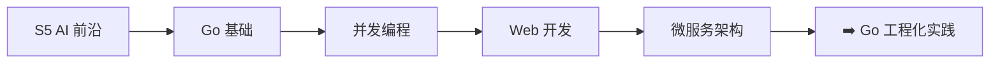

# 📘 Go 语言全栈面试题指南

> **版本**：v2.1 | **适用**：初级 ~ 高级 Go 后端开发 | **同步**：2026 主流技术栈
> **说明**：本题库按学习路径三十二阶段划分，涵盖语法、工程、底层原理、微服务实战、AI/云原生前沿、工具链与技术选型、Redis、MySQL、Linux、缓存、网络、消息队列、分布式系统。总题量 **348 道**。

## 📖 阅读指南

| 标记 | 含义 | 建议 |
|------|------|------|
| ⭐ ~ ⭐⭐⭐⭐⭐ | 难度等级 | ⭐⭐ 以下必会，⭐⭐⭐ 进阶，⭐⭐⭐⭐+ 专家 |
| 🔥 | 面试高频 | 出现频率 80%+，必须熟练掌握 |
| 📌 | 常考题目 | 出现频率 50%~80%，建议掌握 |
| 📖 | 了解即可 | 出现频率 <50%，有时间再看 |
| 💡 | 记忆关键词 | 帮助快速回忆核心要点 |
| 📝 | 一句话总结 | 面试时快速组织语言的提示 |

**复习建议**：
1. 第一轮：重点看 🔥 高频题，掌握 ⭐⭐ 难度
2. 第二轮：攻克 📌 常考题，挑战 ⭐⭐⭐ 难度
3. 第三轮：查漏补缺，理解 ⭐⭐⭐⭐ 底层原理
4. 面试前：只看"💡 记忆关键词"和"📝 一句话总结"快速回

---

## 📋 目录索引

| # | 阶段 | 文件 |
|---|------|------|
| 一 | 基础筑基（语法、并发、标准库） | [阶段01-基础筑基](./阶段01-基础筑基) |
| 二 | 进阶与工程化（Web、DB、中间件） | [阶段02-进阶与工程化](./阶段02-进阶与工程化) |
| 三 | 底层原理（GMP、GC、内存逃逸） | [阶段03-底层原理](./阶段03-底层原理) |
| 四 | 实战冲刺（微服务、项目、八股文） | [阶段04-实战冲刺](./阶段04-实战冲刺) |
| 五 | 云原生、架构进阶与实战场景 | [阶段05-云原生架构进阶](./阶段05-云原生架构进阶) |
| 六 | Go 新特性与前沿技术 | [阶段06-Go新特性与前沿技术](./阶段06-Go新特性与前沿技术) |
| 七 | 手写代码与算法实战 | [阶段07-手写代码与算法实战](./阶段07-手写代码与算法实战) |
| 八 | 数据库与消息队列深度 | [阶段08-数据库与消息队列深度](./阶段08-数据库与消息队列深度) |
| 九 | 高可用架构设计 | [阶段09-高可用架构设计](./阶段09-高可用架构设计) |
| 十 | 安全与加密 | [阶段10-安全与加密](./阶段10-安全与加密) |
| 十一 | 日志、监控与可观测性 | [阶段11-日志监控与可观测性](./阶段11-日志监控与可观测性) |
| 十二 | CI/CD 与 DevOps 实践 | [阶段12-CICD与DevOps实践](./阶段12-CICD与DevOps实践) |
| 十三 | Go 语言生态与开源贡献 | [阶段13-Go生态与开源](./阶段13-Go生态与开源) |
| 十四 | 面试真题与系统设计题 | [阶段14-面试真题与系统设计](./阶段14-面试真题与系统设计) |
| 十五 | 性能优化实战与调优案例 | [阶段15-性能优化实战](./阶段15-性能优化实战) |
| 十六 | Go 与前端交互架构 | [阶段16-Go与前端交互架构](./阶段16-Go与前端交互架构) |
| 十七 | 分布式存储与计算 | [阶段17-分布式存储与计算](./阶段17-分布式存储与计算) |
| 十八 | AI/ML 与 Go 工程化结合 | [阶段18-AI与Go工程化](./阶段18-AI与Go工程化) |
| 十九 | 面试技巧与职业规划 | [阶段19-面试技巧与职业规划](./阶段19-面试技巧与职业规划) |
| 二十 | Go 2.0 前瞻与语言演进 | [阶段20-Go2前瞻](./阶段20-Go2前瞻) |
| 二十一 | 项目规范与代码审查 | [阶段21-项目规范与代码审查](./阶段21-项目规范与代码审查) |
| 二十二 | 高级调试与工具链 | [阶段22-高级调试与工具链](./阶段22-高级调试与工具链) |
| 二十三 | 跨语言对比与技术选型 | [阶段23-跨语言对比与技术选型](./阶段23-跨语言对比与技术选型) |
| 二十四 | 微服务架构深度 | [阶段24-微服务架构深度](./阶段24-微服务架构深度) |
| 二十五 | 容器技术（Docker/K8s） | [阶段25-容器技术](./阶段25-容器技术) |
| 二十六 | Redis 缓存与数据结构 | [阶段26-Redis](./阶段26-Redis) |
| 二十七 | MySQL 数据库深度 | [阶段27-MySQL](./阶段27-MySQL) |
| 二十八 | Linux 系统与运维 | [阶段28-Linux](./阶段28-Linux) |
| 二十九 | 缓存架构与优化 | [阶段29-缓存架构](./阶段29-缓存架构) |
| 三十 | 网络与操作系统原理 | [阶段30-网络与操作系统](./阶段30-网络与操作系统) |
| 三十一 | 消息队列 Kafka | [阶段31-消息队列Kafka](./阶段31-消息队列Kafka) |
| 三十二 | 分布式系统原理 | [阶段32-分布式系统](./阶段32-分布式系统) |

## 📚 附录：实战题库索引（50 道精选编程题）

| 难度 | 题目 | 考点 | 推荐解法 |
|------|------|------|----------|
| ⭐ | 两数之和 | Map 查找 | `map[int]int` |
| ⭐ | 有效的括号 | 栈 | `[]rune` 模拟 |
| ⭐⭐ | 合并两个有序链表 | 链表操作 | 虚拟头节点 |
| ⭐⭐ | LRU 缓存 | Map+双向链表 | `container/list` |
| ⭐⭐⭐ | 实现并发安全的限流器 | 令牌桶 | `time.Ticker` + `sync.Mutex` |
| ⭐⭐⭐ | 解析 JSON 并提取指定字段 | 递归/反射 | `encoding/json` + `interface{}` |
| ⭐⭐⭐⭐ | 实现简易 HTTP 路由 | 前缀树 | Radix Tree |
| ⭐⭐⭐⭐ | 分布式 ID 生成器 | Snowflake | 时间戳+机器ID+序列号 |
| ⭐⭐⭐⭐⭐ | 实现协程池（Worker Pool） | 并发控制 | `chan Task` + `sync.WaitGroup` |
| ⭐⭐⭐⭐⭐ | 实现简易 RPC 框架 | 序列化/网络/反射 | `net/rpc` + `json` |

## 📎 附录：面试高频八股文速查表

| 模块 | 核心考点 | 推荐复习书籍 |
|------|----------|--------------|
| **基础** | Slice/Map 底层、Defer 顺序、Error 处理、new/make、类型转换 | 《Go语言圣经》《Go语言实战》 |
| **并发** | GMP 模型、Channel 阻塞、Context 传递、Sync 包、Mutex/RWMutex | 《Go并发编程实战》 |
| **底层** | GC 三色标记、内存逃逸、Interface 结构、调度策略、SYSMON | 《Go语言底层原理剖析》《GO专家编程》 |
| **工程** | Gin 中间件、GORM 关联、Redis 锁、pprof 调优 | 《Go语言精进之路》《改善Go语言编程质量的50个有效实践》 |
| **架构** | gRPC、分布式事务、限流熔断、微服务拆分、DDD | 《分布式缓存》《Go语言编程之旅》 |
| **云原生** | 零拷贝、内存分配器、CGO、K8s 探针、Docker 多阶段构建 | 《Go语言高级编程》 |
| **新特性** | 泛型约束、循环变量修复、内置函数增强 | Go 官方博客/Release Notes |
| **高可用** | 熔断降级、幂等性、Sidecar、服务网格 | 《云原生架构》 |
| **可观测** | 结构化日志、Prometheus 指标、OpenTelemetry | 《SRE 运维解密》 |
| **AI/前端** | BFF 架构、Wasm、LLM 调用、向量检索 | 官方文档/技术博客 |
| **规范/工具** | 项目分层、反模式、Delve、golangci-lint、代码生成 | 《Go 语言设计与实现》 |
| **架构选型** | Go vs Java/Node、绞杀者迁移模式、灰度发布 | 《架构整洁之道》 |
| **微服务** | 架构优劣、DDD、RESTful、服务治理、测试策略 | 《微服务架构设计模式》 |
| **容器** | Docker 原理、镜像构建、K8s 编排、容器 vs VM | 《Docker 技术入门与实战》 |
| **Redis** | 数据类型、持久化、集群、缓存问题、分布式锁 | 《Redis 设计与实现》 |
| **MySQL** | 索引原理、事务隔离、存储引擎、SQL 优化、binlog | 《MySQL 技术内幕：InnoDB 存储引擎》 |
| **Linux** | 进程管理、IPC、系统调用、日志、Shell | 《鸟哥的 Linux 私房菜》 |
| **缓存** | 穿透/击穿/雪崩、淘汰策略、预热、多级缓存 | 《大型网站技术架构》 |
| **网络** | TCP 三次握手/四次挥手、IO 多路复用、进程线程 | 《TCP/IP 详解》《UNIX 网络编程》 |
| **消息队列** | Kafka 架构、副本机制、消息顺序、不丢失保障 | 《Kafka 权威指南》 |
| **分布式** | CAP/BASE 理论、分布式锁、事务、ZK 应用 | 《数据密集型应用系统设计》 |

---

> 💡 **提示**：面试不仅是背诵答案，更是展示**解决问题的思路**。遇到不会的问题，可结合前端经验类比（如 Event Loop vs GMP），展示跨领域思考能力。

---

## 学习路线

## 📜 版本迭代记录

| 版本号 | 更新日期 | 更新内容 | 维护者 |
| :--- | :--- | :--- | :--- |
| **v1.0** | 2026-05-17 | 初始版本发布 | System |
| **v2.0** | 2026-05-17 | 重大版本升级，总题量扩展至 **348 道**，32 个阶段 | System |
